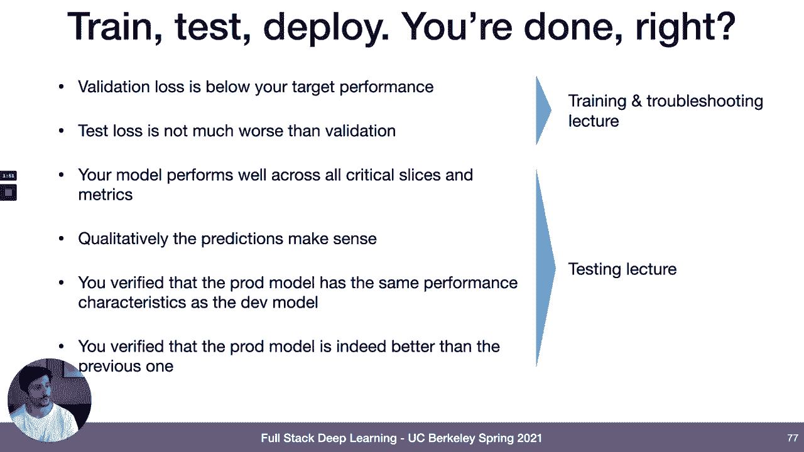
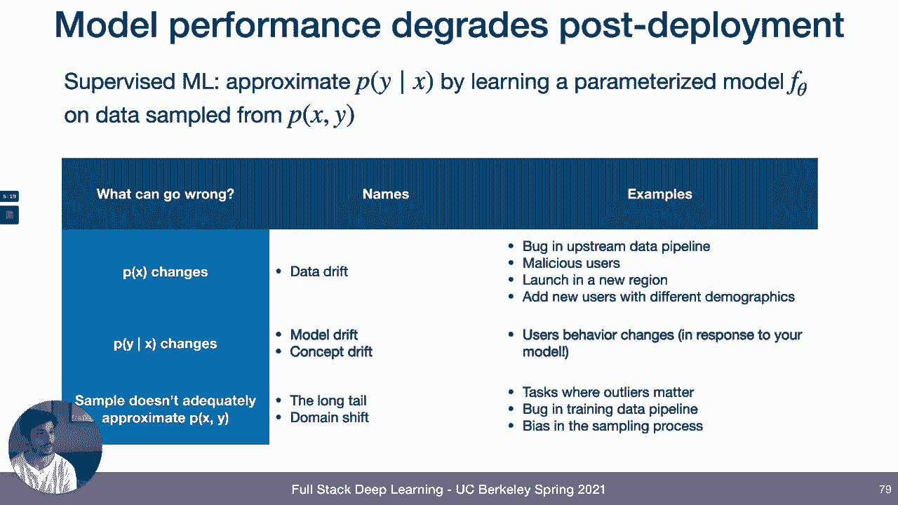
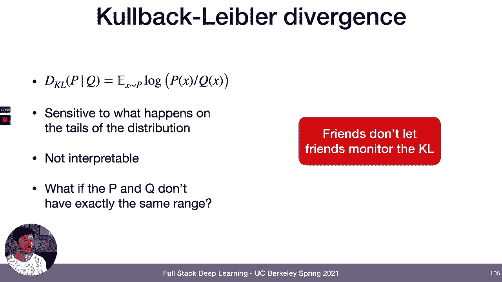
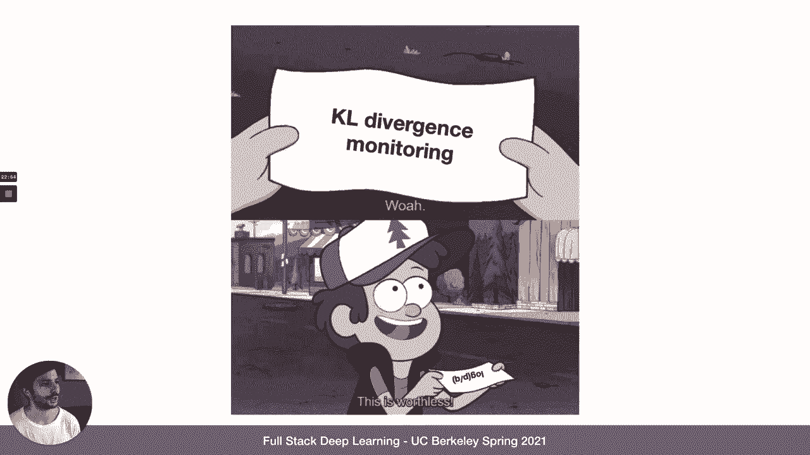
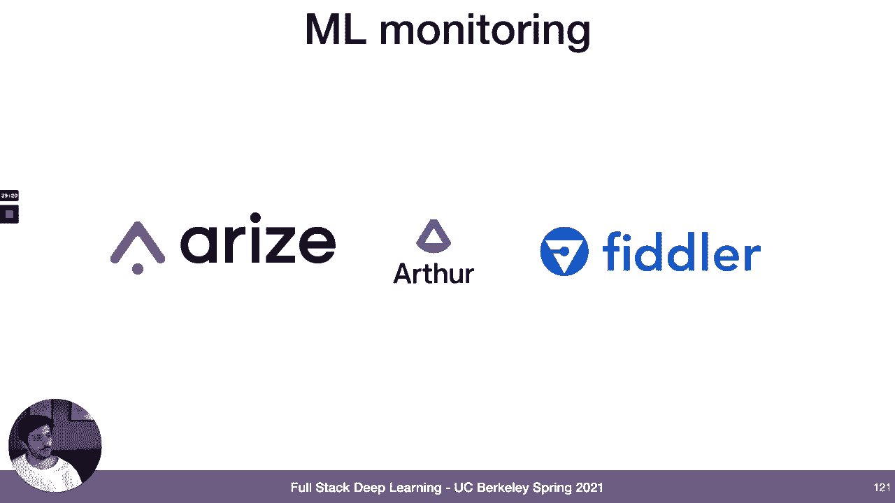
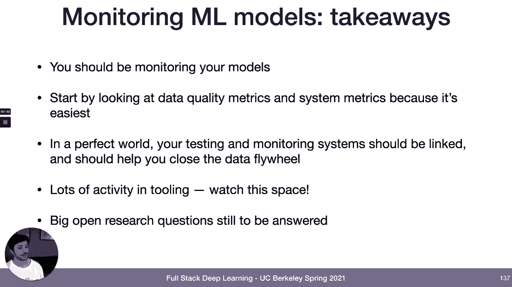

# 【双语字幕+资料下载】伯克利FSDL ｜ 全栈深度学习训练营(2021最新·完整版) - P23：L11B- 监控 ML 模型 - ShowMeAI - BV1iL411t7jE

next topic that we're going to talk，about is，monitoring machine learning models so。

once you've deployed the model，how do you make sure it stays healthy。

when it's deployed there's a lot of，things that can go wrong with your model。

once you've trained it for example，maybe the model trend wasn't good at all。

like validation loss wasn't actually，below your target performance。

or maybe your test losses was actually，worse than your validation for because。

you over fit your validation but，as you start to get more into the。

process of building your model you'll，get to the point where，you have a model that performs well not。

only on your validation set but also on，all the critical slices and metrics。

that you really care about you'll have，and，they'll make sense you'll have to verify。

that the production model and，the model original model you trained，have the same performance。

characteristics so there's no like，changes in the production model that。

caused the performance of the grade，and you'll have maybe even run an a b。

tests and verify that the production，model is indeed，actually better than the model that it's。

replacing we covered some of this in the，training and troubleshooting lecture a，couple weeks ago。

and we covered the rest of it in the，testing lecture last week。

so you're done right nothing else can go，wrong with the model you can just deploy。

it and forget about it，machine learning，systems is that model performance tends，to degrade。

after you've deployed the model and so，one way to kind of，reason about this is if you think about。

what what are your guarantees，or whatever what is the problem that，you're solving when you。

train like supervise the machine，some，like p of y given x and you're doing。

that by learning a parameterized，function，on data sampled from the joint，distribution。

of x and y and theoretically what are，the things that can go wrong one of the。

things that can go wrong is that，p of x can change so the distribution of，inputs into your model。

that probability distribution can change，and you'll see this referred to as data。

drift some examples of this are，let's say that you depend on some，feature that's being created by um。

somewhere else in your pipeline maybe，even by some other team，that team changes the way that they。

even，introduce a bug where all of a sudden，all the values of that feature are like。

negative one or something so that's，one way that your that p of x can change。

but it's not only bugs so，malicious users can also change p of x，inputs。

you could for example launch your，service in a new region and that might。

change the distribution of inputs or you，could start，onboarding new users and those users。

might have different demographics than，the users that，were present at training time。

another thing that can go wrong is that，p of y given x can change。

and so you'll see this referred to as，model drift or concept drift。

in the literature one kind of concrete，example of this is，like maybe your user's behavior changes。

like potentially even in response，to your model so for example if you're。

building a recommender system，and you make some recommendations to。

your users their preferences are going，actually like，click on one of those recommendations。

and watch that movie and then there，they that might change the types of。

movies that they want to see in the，future and then the last category of。

things that can go wrong is that，we're we're approximating this，parameterized model。

we're approximating this probability，function using data，a parameterized model that's trained on。

data that's sampled from the underlying，distribution，and so there can be artifacts that are。

introduced by the sampling process，itself and so some names for this are，like domain shift。

where there's like some difference in，the domain between training distribution。

and target distribution，or another term that describes this is，the long tail so if you have if your。

data distribution has long tails，then randomly sampling that data might。

not give you all like data points that，represent all the parts of the。

distribution that you care about，so some examples are tasks where，outliers really matter。

so if you have if there's some something，in the probability distribution that，but。

if you get the prediction wrong that's，really bad that's an example of where，the。

distribution bugs in the trading data，pipeline can cause this and。

this is often also frequently actually，very frequently caused by bias in the。

sampling process so let's talk about，different types of data drift。

so if this is like our the time series，of our data points like，uh value of that data point is on the。

y-axis and，time is on the x-axis then，there's a few different types of changes。

that this data distribution can take，they're worth being aware of at a high。

level so one is instantaneous drift，and you also see this called。

distribution shift it's where like all，of a sudden the distribution changes。

some examples of this are you deploy，your model for the first time in a new，domain like maybe。

you deploy your self-driving car in a，new city or bugs getting introduced in。

the pre-processing pipeline can cause，this type of shift but also like big。

external events like covet happening can，cause this type of shift as well。

something happens all of a sudden the，world is different the data that comes，could also。

have gradual drift so the the，distribution，like the the values of the feature。

change gradually over time，for example like users preferences might，change over time as a result of。

like your users getting older or like，pop culture changing around them。

or like new concepts can get introduced，to your corpus over time as well，[Music]。

you can also have periodic drifts look，they，change directions and repeat over and。

over again so you know some types of，user preferences might be seasonal。

or for example maybe like people in，different time zones use your model，differently。

potentially let's say because they speak，and then the last category of drift that。

we'll talk about and，one，to actually detect is temporary drift，where like。

also there's a big change in the data，normal，so for example maybe this change in your。

distribution is a malicious user，attacking your model，or or it could be like let's say some。

new user tries your model，their data doesn't really look like the。

data the model is trained on so they get，bad results and they churn that could。

also produce a drift like this，or just someone using your product for。

the first time in a way that is not，intended to be used，so these are the different ways that。

data drift can manifest themselves，in your production machine learning。

system and one question you might ask is，okay is this，i get why this is a theoretical problem。

but is this actually a real problem that，affects，real world machine learning systems and。

the answer is that this can actually，have a huge impact，in production there's this article from。

can't remember the publication i think，it was maybe like，forbes or something that was like。

describing what was happening with all，the machine learning models。

during the pandemic because all of a，sudden like everyone's models drifted。

and so some really weird stuff，started to happen another story that i，heard from someone who was。

building a machine learning system at a，kind of e-commerce type company is that。

they had a bug in their retraining，pipeline，that caused them to make the same。

recommendations for their users over and，over again and so that the new users。

that came in particular were like，just saying oh this service is just。

telling me to do the same thing over and，over again this is not useful。

most of them churned and they estimated，you know it took them。

a month or a couple months to catch this，and they lost like millions of dollars。

in revenue as a result of this bug so，this is a real problem that affects like。

a lot of a lot of companies and i think，the，attention paid to it that really needs。

to be if you want to build reliable，machine learning systems most of the，rest of。

the lecture we'll talk about different，strategies that you can use to detect。

these types of changes that might affect，your model quick outline first we'll，talk about。

what you should be monitoring then we'll，talk about like，how you measure if that thing is。

actually changed then we'll talk about，how you can tell if that change is a bad，change or not。

we'll talk about tools and then finally，we'll talk about like，where monitoring fits into the broader。

firstly what should you monitor i think，there's four signals that。

you should probably consider monitoring，that trade off with each other in terms，of like。

how useful they are if you have them and，how hard it is to get them so the most，informative thing。

to monitor about in order to tell，whether your model's performance is，changing。

is to look directly at the performance，of the model and so this is。

the easiest thing to do there's still，some technical challenges associated，labels。

but this is the hardest of all these to，do because for many of the problems that，we're working on。

machine learning models are difficult to，get labels for，especially in a timely fashion and in a。

cost effective fashion，so if you don't have access to like，infinite。

free label data that comes in right away，as soon as your model makes the，prediction。

then what are the other signals that you，can look at so another really。

informative signal to look at is，business metrics，so if you're building a model is i'll。

come back to the recommendation example，there's some metrics that you might。

really care about that driving like user，engagement，or user click-through rate or things。

like that that don't actually tell you，how accurate the model is because。

there's some conflating factors that，that are also that also help determine，those business metrics。

and so that's why it's not like quite as，useful as signal，in terms of like really telling whether。

something went wrong with your model，cause，those signals to go awry as well in many。

cases on the other hand they're often，easier to measure because。

you often have access to these signals，things，as part of part of your like analytics。

team another signal that is worth，looking at is the，inputs to the model and the predictions。

that are coming out of the model and the，distributions of those inputs and，predictions。

this is this is also can be quite，informative like you can detect drifts。

this way just by looking at the raw data，even if you don't know what the label，should be but it is。

there's still a bit of an art to how you，actually measure things，when you're looking at them at this。

about，why it's such an art but this is also，something that's worth doing if you have。

access if you have limited access to，like labels and business metrics。

and then finally the the baseline thing，to do is just monitor system performance。

what is your gpu utilization what is，the average latency of your requests and。

things like that and so this will，only catch like very coarse bugs like，that。

or memory leak maybe it's really，to measure，because there's really good tools for。

doing it already but it doesn't really，tell you about a，more machine learning specific stuff。

like your model performance different，ways of like categorizing these things。

that like some terms that i'll use model，metrics and in some cases business。

metrics are what i would call like，ground truth performance metrics。

so these are things that like actually，performing，model inputs and predictions as well as。

business metric as well as like some，other business metrics that are。

like have more confounding factors or，what i would call like approximate，performance metrics。

and so these are ways of if you don't，have ground truth performance metrics。

ways of approximating how well you think，your model should be performing on the，data that's seeing。

before you have access to labels as to，how well the model's actually doing。

and then lastly system performance and，some types of like model inputs and，predictions。

or what we'll call like system health，metrics which are just which are helpful。

for telling if your system is，is working as intended but aren't really，helpful for telling you。

whether your model is working as，intended so those are the signals that，you might want to measure。

okay so we talked about the different，signals that you can look at next thing。

that we cover is like how do you，actually measure if there's been change，to those signals。

so the overall strategy here for，measuring distribution change is。

we're going to select a window of data，that we consider good like this is what。

the data should look like，to serve as a reference so in in this，example this is the reference on the。

left，how do you pick this reference how do，good，you can one way you can do it is you can。

just pick a fixed window of production，data that you believe to be healthy。

some papers that you'll see will，advocate for using a sliding window so。

like always using a window of data，that's one day behind or 10 hours behind，or whatever the。

window that you're actually trying to，tell whether it's healthy。

but i think the pragmatic thing to do，here is，most of the time you should probably。

just use your training or evaluation，data as the reference，because that's ultimately like what the。

model was trained and evaluated on，and so if you're if data that's coming，that。

doesn't really matter if it isn't too，different than the data that you saw in，production a day ago。

it's still different from the data that，you really care about which is the。

next thing that you'll do is once you，have this reference window of data。

you'll select you know your new window，of data to measure，a distance on how do you select that。

measurement window，very problem dependent i don't i'm not，aware at least like a principled。

approach for saying okay should i，monitor like an hour of data or a day of。

data or like a minute of data i think，pragmatically one thing that you can do。

is just pick one window size，or a few window sizes and just you know，slide them。

over the data so every day monitor on，the last day，every hour monitor on the last hour。

something like that there's a special，case here which is like where your，window size is one。

and there's a whole separate class of，techniques here called outlier detection。

which is i think present in some like，model monitoring libraries，less practical for for a number of。

reasons but it's worth being aware of as，a couple of footnotes here if you want。

and so the last thing that we'll do is，we have our like reference distribution。

and the distribution we want to measure，and we'll compare these two windows。

using some distance metric，so what distance metric should we use。

first let's consider the case where the，data is，like continuous and one-dimensional so。

there's a couple categories here one is，rule-based metrics，you also see this referred to as like。

data quality metrics，and then there's statistical distance，metrics and so these are things like kl。

divergence，your ks statistic something called a，distance and，about。

rule-based distance metrics or data，quality metrics so the kinds of things。

that you'll measure here are like，okay for this window of data is our is。

like the minimum value and the maximum，value，and the mean value within some。

acceptable range that's determined by，the reference window maybe plus some，some allowable access。

beyond that you might also check like，are there enough data points in this，window。

or are there too many missing values in，this window or there's，is there a bunch of nand out data in。

this window you can also measure more，complex things like，are all the values in this column。

bigger than all the values in this other，column，and there's a whole host of other。

different like kind of rule-based，metrics that you can use，there's an open source library for this。

that is gaining a lot of popularity，recently called great expectations which。

helps you like define these，tests it's not machine learning specific，it's not like super。

well suited out of the box to being used，for like continuously streaming data。

but it's it's worked pretty nicely for，like batches of data so you might need。

to set up a little bit of infrastructure，on your own but，then you could run these tests on that。

data when you do that recommendation，when you，kind of，industry standard papers on monitoring。

machine learning models，which i'll i'll link to at some point。

later in these slides one is from google，that describes their their tfx system，which。

is they have an open source version of，it but also is a thing that they use，internally。

and then the other is from amazon which，is also used internally and。

is also part of an open source library，called dq and what both of those papers。

concluded was that like，these rule-based metrics for detecting，changes in data distributions。

will are much much easier to use than，the statistical metrics that we'll talk，about later。

and already catch like a huge percentage，of bugs and like the pragmatic thing to。

do is just use these rule-based things，and like maybe try layering on some。

statistical stuff as well but this，is you'll be in in good company if you。

all right next let's talk about some，statistical distance measures and so。

we'll start with every machine learning，person's favorite statistical distance。

measure the kl divergence，this is kl divergence it's an，expectation of。

a ratio of logs between the two，different distributions，it's not actually a distance metric it's。

not symmetric and，it's a very bad distance metric for，detecting。

data distribution shifts there's a few，reasons for that one is。

it's really sensitive to what happens in，the tails of the distribution。

so for example since you're looking at a，ratio like a log of the ratio of，probability。

values if you have in some tail the，distribution for one of the probability。

distributions you have a value of 10 to，the negative four，and in the other you have a value of 10。

to the negative three，then that ratio is going to be 10 which。

is going to be a really big contribution，to，to your kl divergence when you take the，log of it so。

it's like mathematically not really the，right thing when you're sampling your。

data and so like the tails are gonna be，pretty noisy it's，not very interpretable so it's like not。

super clear how you explain to someone，on chart，what this distribution distance is，measuring。

and it's not very clear what to do if p，and q contain data that doesn't fall in。

exactly the same range，so you're gonna have you're gonna end up，with a zero like a negative like a。

zero in a log or a zero in a denominator，somewhere and so that's another reason，why this。

is tricky to use so recommendation here，don't do it don't monitor the kl it's。

very tempting because it's a，familiar distance metric in machine，learning but there's。

there's better things to monitor for。

and yeah i posted about this on like，this machine learning ops slack this。

morning and someone made this，someone made this meme which i kind of。

liked yeah，monitoring kale divergence it's，worthless next like commonly。

referred to metric is the is the ks，statistic which is like，ins。

in stats that you might be familiar with，this is how it's defined mathematically。

but like the way to interpret this is，that this is like the maximum distance，between the cdfs。

of the two district different，distributions i just described the。

interpretation to you so you know that，it's like quite easy to interpret you。

can like plot on a chart what this，refers to and it's used quite widely in，practice。

so this is something that i would i，would recommend using so just say yes to，ks。

and we'll and caveat here is this is，referring to the ks statistic itself。

not necessarily the k the statistical，tests where you actually get a p value。

back from it and i'll come back to that，in a second，it's the it's like the statistic that，p value。

next distance metric is one that you，not，too widely used outside of this。

particular use case it's d1 distance，and this is the way it's described it's。

the sum of differences between，the values and the pdfs yeah that should。

be sum of distances between the pdfs not，the cdfs，and the reason why this is worth。

bringing up is because this is the，distance metric that，like after spending much time thinking。

about this at google is the one that，this is always，isn't this a little bit hacky are you。

just like summing up the differences，between the，probability density functions like why。

is that a meaningful distance，what's the justification for this i。

don't really know but it's really easy，to interpret this is what the，interpretation looks like。

that bad，so i think this is another good distance，metric to look at for。

monitoring distribution change，there's many other distance metrics that。

you might be familiar with or you might，see if you read about the subject。

earth mover distance is like a pretty，cool one talk about the earth mover。

distance it's pretty cool it's，population stability index，lots of other stuff i think like many of。

these distance metrics could be really，good for your use case，or even just for monitoring in general。

research，worthy of trying out other distance，metrics that you're excited about。

and i think that there's like some，missing research here，in fact like a request for research here。

is i would love to see a study that，looks at different types of drift from。

the perspective of how those effects，the performance of trained machine。

learning models so if you have if you，have drifts that are measured by these，different metrics。

do those have different impacts on the，on，the bad data all right so that's the one。

dimensional case we have some，distance metrics that we can use there，next let's talk about。

what you do when you're working with，higher dimensional data first caveat。

here is this is very much an open，problem i don't think there is，a good solution to this yet。

some things you can try are you can use，an explicit，like multi-dimensional test like the，maximum。

mean discrepancy the way to understand，this at a high level is。

you're looking at the distance between，the means of the distributions。

so that's that's one thing that's worth，trying another thing that's really，common to do in practice。

is just do a bunch of one-dimensional，comparisons and，look at all the distance metrics for all。

the different features and take let's，say the max of those，so there's some things that are not very。

nice about that it doesn't capture，cross-correlation between the features。

and you run into the multiple hypothesis，testing problem but this is a thing that。

rather than looking at do the，comparisons for all of your features you，features。

so you might use some of like maybe the，interpretability methods that we talked。

about last week like feature importance，and just say okay we're only going to。

measure drift along the like 10 most，important features，and then the last like kind of category。

of techniques that i'll mention here，so projections are basically what they。

sound like i think as far as i can tell，they were proposed for machine learning。

model monitoring in this paper called，failing loudly，which is one of the only like strangely。

like one of the only main，track machine learning conference papers，on data。

data data set drift that that i've been，able to find，and the approach that they advocate for。

is you first take，your raw data let's say your image you，pass that through some black box。

dimensionality reduction technique，it can be a random projection it can be。

an um auto encoder that's pre-trained，an auto encoder that's randomly。

initialized or some other options that，projects the thing down to a lower。

dimensional space so instead of an image，maybe you have a，32 dimensional vector or something like。

that and then you run，a two sample statistical test on that，lower dimensional data。

so you can run you can aggregate any of，the one-dimensional tests that we talked，about before。

or you can run a maximum mean，discrepancy test and in their，experiments i think they found it didn't。

really matter too much which one you did，so there's different ways you can，project the data，like。

like random projections randomly，initialize auto encoders pre-trained，auto encoders stuff like that。

but you could also like one one thing，that i think is like a good idea to do。

in practice if you have high dimensional，data is to use，projections that come from your domain。

specific knowledge for example like if，you're monitoring images you might want。

to like project that image down to the，mean pixel value and monitor that。

and if that pixel value gets too crazy，you might know that there's something。

weird going on with your distribution，in nlp this might be like the length of。

the sentence or it might be，like some vocabulary like one of the top，five words something like that。

but you could also imagine defining any，other sort of analytical projection that。

depends a lot on your domain and what，you think，could be important like features of that。

domain to monitor and you can define，that any way you want to，another category of things here is。

random projections so you can just like，linearly project the data this can work，really well。

or statistical projections training an，auto encoder or another kind of density。

model right like you might you，might fit like a likelihood based model。

to your data and then take the，the output of that model like the the。

likelihood of that data point and，monitor that，or you might use like pca or t-sne or，and。

monitor the result of that yeah and so i，think the last thing i would say on。

like measuring the distance between，these distributions is that like。

when you think about it from up from a，higher level what do we really want to。

be measuring here the thing that you，want to measure，is you the reason why we care about。

measuring drifts is because，we don't necessarily have access to the。

ground truth performance of the model if，you had access to the ground。

performance of the model that would tell，you what you need to know about drift。

which is is my model getting worse，and so really i think what in a perfect，would work。

is that rather than giving you like some，kind of abstract drift score which can，be hard to interpret。

and you don't really know like whether a，drift of a certain amount really affects。

your model performance or，if it affects your model performance，whether that performance changes is。

material i think，the direction that techniques in the，space should go is toward techniques。

that give you actually some approximate，performance of the model on that data so。

techniques that combine，both some of these statistical ways of。

telling whether the data looks different，and then also some sensitivity that is。

specific to your model that，tells you like whether drift of a，certain amount like how much you might。

expect that to，alter your model performance and so i，only mentioned that because i think that。

this is like the direction that the，the field should go and so if any of you。

are like interested in doing some，research i think there's like some。

interesting research to be done there，but you won't i don't think that you'll。

find too much in the literature about，that and it's typically not how people，on。

so we talked about what things you，should be monitoring how you should be，measuring changes。

and then the next question which i，alluded to earlier is like。

how do you actually tell if that change，is bad like how do you know should do。

something about the change，fortunately again this is another place。

where there's not a very satisfying，answer，so the i think the there's one approach。

that you can take here to setting，um thresholds on test values which is，using statistical tests so。

the kind of like canonical example here，would be using the ks test。

as opposed to the ks statistic so the ks，test is a way of getting like a p value。

for whether these two distributions are，the same like，what are these two data whether these。

two samples of data came from the same，distribution or not，and unfortunately this is like the wrong。

thing to measure for，detecting data drift because when you，have a lot of data。

then like any kind of minor change in，the distribution，even if it's one that's like completely。

insignificant is going to give you tiny，p-values right because even if the mean。

of your distribution is just shifted by，a tiny amount，like if you have enough data then the。

statistical test will tell you oh yeah p，equals zero these are different，distributions。

and that's not really what we care about，in machine learning monitoring because。

generally your models，will be robust to small shifts like that，so those p values don't end up being。

very useful in practice there's a number，of other，ways of detecting of setting these。

thresholds like these from this，blog post from this like data quality。

company called anomalo so you can set，fixed rules never have any null values，you can have ranges。

okay this test should always be between，these values and set that manually。

you can look at the time series of the，values of the test and like actually run。

that through an outlier detection model，and fire an alert whenever it looks like。

an outlier or you can even imagine like，training an unsupervised learning model。

on the values of that test and then，using that to determine whether，something。

is is like an acceptable value or not，in practice you'll almost always see，these two techniques used。

unfortunately at this point it still，generally comes down to a human being，looking at this。

and setting the rule themselves for what，they think an acceptable amount of。

change in the distribution might be but，i think the latter categories might be。

interesting areas for research，although i hope it gets combined with。

model performance like i described，earlier oh yeah i，forgot i had a slide on this but yeah。

just i'll reiterate my request for，research for，telling approximating how model。

performance changes given a change in，data distribution all right next quickly。

cover just give you an overview of some，with this，so there's system monitoring tools these。

are useful for like setting alerts for，when things go wrong，and cloud providers have like decent。

monitoring solutions where you can just，them，they'll help you set alerts for them。

anything that you can log in there can，be monitored，and we may take a look at this in lab。

but we may actually change up the lab as，so some examples are you have your cloud。

provider tools like，amazon cloudwatch and then there's like，specific tools that have evolved just to。

solve this problem new relic data dog，honeycomb are some of the more prominent。

next category of tools that's worth，knowing about is data quality tools。

and so these tools are really aimed at，like answering some of these data。

quality questions so for a given，for a fixed window of data can you tell，me if this violates any of。

these handwritten or like machine，learned rules um about whether the data，looks really different。

relative to the rules i've set so great，expectations i mentioned earlier is a。

pretty popular up and coming open source，library for this，and then there's a few vendors that。

provide solutions for this，monte carlo and anomalous being two of。

the ones that i hear discuss the most，and then lastly there's a category of。

tools that's emerging around machine，learning monitoring，arize arthur and fiddler sort of being。

the best known examples，i think too early to say to have a，recommendation here yet but keep an eye。

on this space i think there's going to。

be a lot of interesting stuff that comes。

so that was like the very lightning，overview of tools last kind of topic on，monitoring on。

autocover is putting monitoring the，context of your broader，machine learning system so i think。

when people think of monitoring in a，traditional software system。

they see it as this thing world you it's，like useful for helping you catch bugs。

and catching when things go wrong in，production but those bugs are usually。

like pretty loud failures they're like，exceptions or events like that that are。

relatively easy to detect on their own，and，the data that you put into a monitoring。

system in a traditional machine learning，system is，things like system metrics cpu，utilization。

request latency things like that and i，think in the traditional software world。

you think of these things as like，data that's primarily useful just to。

like detect and diagnose problems with，your system，so if your system is performing well。

fundamentally you don't really care that，much about what the request latency was，a month ago。

or what the distribution of request，latencies was it's like data that you。

only really need when something's going，wrong in，machine learning i think。

like monitoring is in some sense much，building，and iterating on machine learning models。

than it is in traditional software，two main reasons for this one is that。

unlike in traditional software and，machine learning，normally when you have a bug what that。

bug leads to is just a silent，degradation and performance，and so these bugs can be like extremely。

difficult to catch because they，have very little signature and on top of。

that the data that we're talking about，monitoring here，not system metrics like things like。

model inputs，is like quite literally the code that，you're going to use to produce the next。

version of your model，right like the data that goes into the，model the predictions that come out。

the labels those are that's your，training data for when you retrain your。

model so in some sense it feels like，this system has to be more important to，process。

people typically think of monitoring i，think where you see it fitting into like。

your system diagram is you，let's say in a machine learning system。

you train a model you evaluate it you，put into production，and then monitoring is this like module。

that you slap on top of that，and your monitoring thing is like，watching your production system and。

helping you find out when，things when things go awry in that，production system。

i think the reality of monitoring and，machine learning is that，your monitoring system really like。

actually needs to be pretty tightly，integrated with the rest of your。

production stack i'll talk about，i'll talk about like ways in which i。

think it should be integrated in a，second，but because of this like i've started。

using a different name to describe，like what this system actually is which。

i've been calling an evaluation store，just as a way of distinguishing this in。

people's minds from okay this is just，like a module that we slap on top。

this is something that like really needs，to talk to the rest of your machine，learning system。

and in particular like i think the one，of the roles that a monitoring system，could play。

in your machine learning infrastructure，is helping you close the data flywheel。

right so the data flywheel is a concept，that we've talked to about before where。

as you get more and more data you use，that data to train better models makes，your product better。

better product gets you more users，getting more data and more data allows，better。

over time and so let's talk about like，how this monitoring system or this，evaluation store。

could help close the date of flywheel，so a training time and so like the one，think。

i mentioned this i think in the testing，lecture too but i think when you think。

about like your monitoring system，if my kind of hypothesis is right which。

is that like in the longer term the best，way to monitor your models is going to，be。

to have some way of using the data，that's coming in to approximate how。

performance might have changed on your，model on that data，then your if that's the case then your。

monitoring system needs to be，integrated with your your training and，evaluation system as well。

because training and evaluation is like，where you'll build those models。

of the mapping between data change and，model performance，and so i've started thinking of your。

kind of monitoring system or your，evaluation store as like a，sort of cohesive evaluation system that。

is used，not only for monitoring per se but also，for offline evaluation。

and so the ways that this would interact，with the rest of your stack are。

like when you're training your model you，want to register your data distribution。

and your model performance into the，system，so that you have something to compare to。

when you're in production，but evaluation store or like your，monitoring system could also help you。

catch performance bugs，or like implementation bugs during，training for example if you made a bug。

in how you're training your model，and all of a sudden your training data。

looks nothing like your production data，that might be something you want to。

catch earlier rather than later when，you're testing，your model you might want to actually。

like record that data here as well，in deployment like we've talked a little。

bit about running things like avtech the，if you have like a centralized system。

for keeping track of model performance，metrics，then that system is like what you'll use。

to run an a b test because，you'll just ask the system like okay as。

the performance or maybe the approximate，performance，of my model of these two versions of my。

model differ，on this slice of production data，monitoring there's a relatively。

straightforward application of this，like you'll just you'll ask your，monitoring system how well。

you think the model is performing in，expectation but i think what starts to，get interesting is。

when you talk about closing the loop one，challenge for a lot of，uh companies when they're just like。

deciding，what data to collect from their machine，learning system is that。

with really high data volumes like on a，robot or on a web scale application or，something。

you can't necessarily store and label，and train all the data that's going，through your model。

so you need to pick a subset of that，data to store label，and train on and so how do you pick that。

subset the simplest thing that most，people do is they'll just like randomly，sub sample that data。

but that can be like i think probably，not the most efficient thing。

because if you have like tails of your，distribution or like areas where your。

model is not performing well you might，want to over sample data from those，areas。

and so another function that your，monitoring system or your evaluation，store could play。

is you might want to over sample data，from，regions that have low approximate，performance。

so if if if it looks like maybe your，model is not doing too well。

on this data point or this window of，data points you might want to sample，more data from that window。

cleaning and labeling i think is a，similar story right like you might want。

to label more data that has low proximal，performance，and then retraining right like another。

out is like，how when should i retrain my model how，often should i retrain my model。

conceptually like the way to make that，decision is，the cost benefit analysis right there's。

some cost that's associated with，retraining your model，compute costs data costs and so you want。

to be able to measure like what's the，approximate benefit of retraining my，model like。

how much better could my model get by，retraining it and so one way one like，proxy for that might be。

knowing how much you think your model，has degraded in performance relative to。

the last time you trained to train that，and so this system this monitoring or。

evaluation store system，could help you answer this question of。

when you're retraining so takeaways on，monitoring i think if you're going to，do it。

monitor your models it's a good idea i，think there's a culture in the machine。

learning field for a long time of，machine learning people like machine。

learning focused people like not，necessarily caring too much what happens。

to their models after they get shipped，like thinking like oh it's my job is to，think。

one mindset that i hope that you all，adopt as you go on to implement machine。

learning models in industry is that what，happens to the model after you you，deploy it is。

um still at least impart your，responsibility right because，you're the one who built the model you。

know what the data that's trained on，looks like you know how to fix it when。

things go wrong and so monitoring is，something that you should be thinking，about。

because something will go wrong like，models，it i think it would be very unusual to。

have a model that you can just put in，production and leave there and have it，never break。

and so you should at least have systems，in place to know if something is going。

if you're getting started on monitoring，i think the kind of like pragmatic。

starting point is by looking at，these data quality metrics so these。

rules about okay are all my features，within some allowable range are all of，the means of my features。

within an allowable range as well and，looking at system metrics，and main reason that those are the。

recommendations are because they're the，easiest，and they'll already start to catch a lot。

of bugs for you，in a perfect world i think the role that，your monitoring system should come to。

play in your machine learning system，is that it should be fused with your，testing system。

and it like the bigger like the sort of，higher order calling should have is。

not just helping you tell when things go，wrong in a sort of，abstract way but helping you like close。

the data flywheel and fix your system，and train on better data over time，because these same。

approximate performance metrics that，you're using your monitoring system to，estimate。

are the same metrics that you should be，using to decide what data to collect。

and then another note here is like the，tooling here is not really that mature，yet but。

this is a pretty active space for like，startups and other companies。

so it's one to keep an eye on and i，think that in spite of all this。

there's a number of i think this is like，a very underresearched area。

it's a super important problem for，the real world，and there's like a painful lack of。

research on how to make this work well，and so there's big open research。

questions here and if you're like，looking for stuff to do research on。

