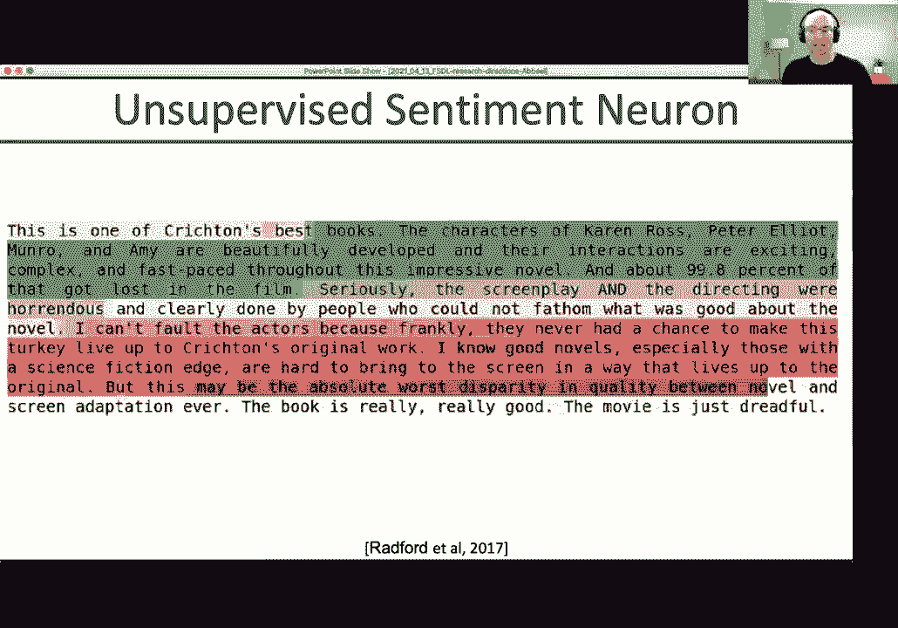
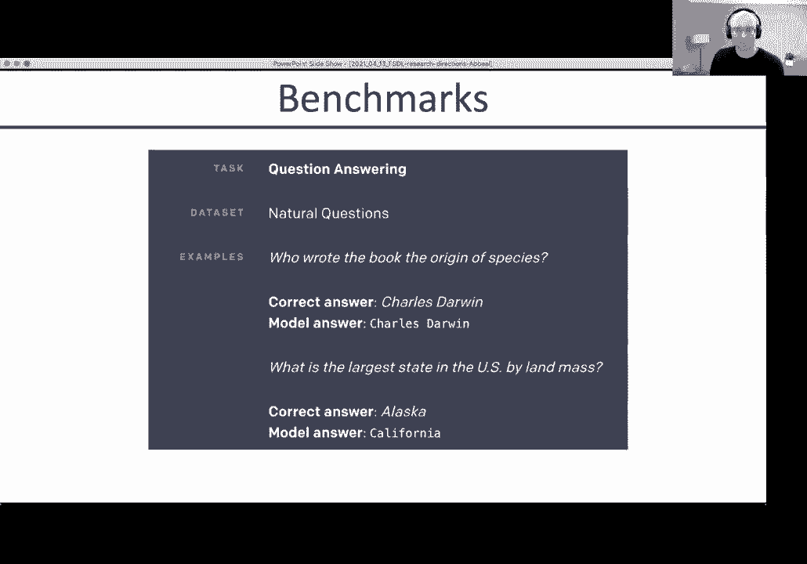
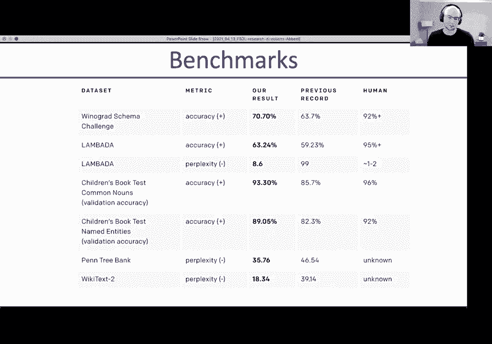
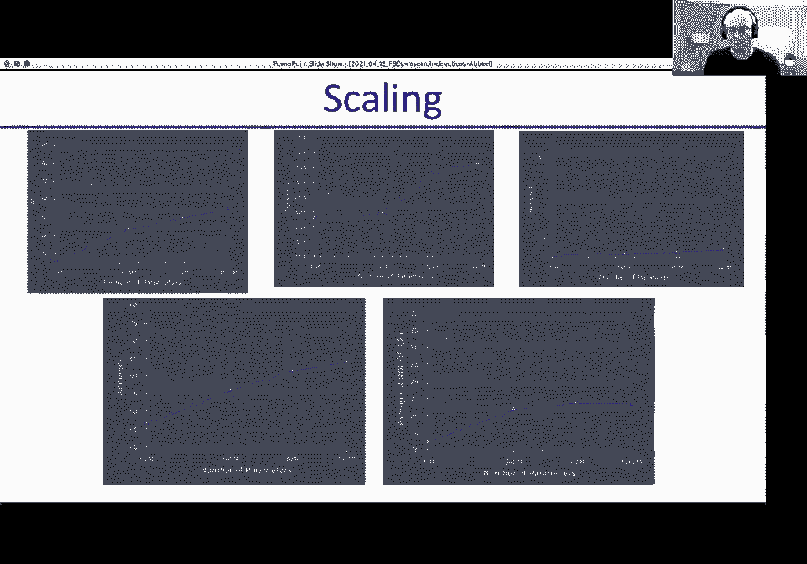
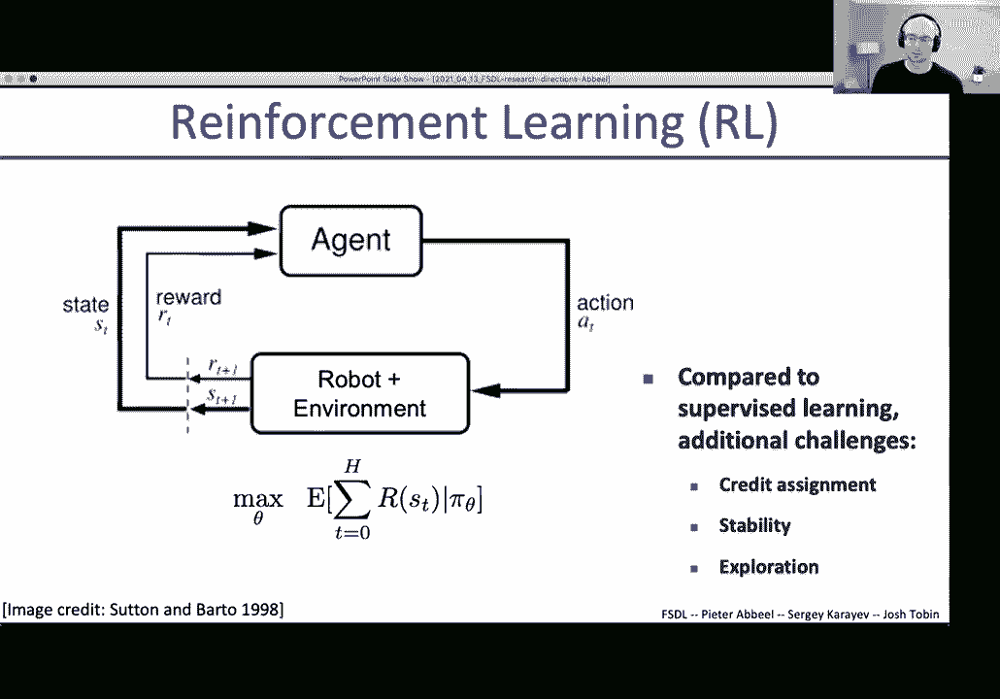
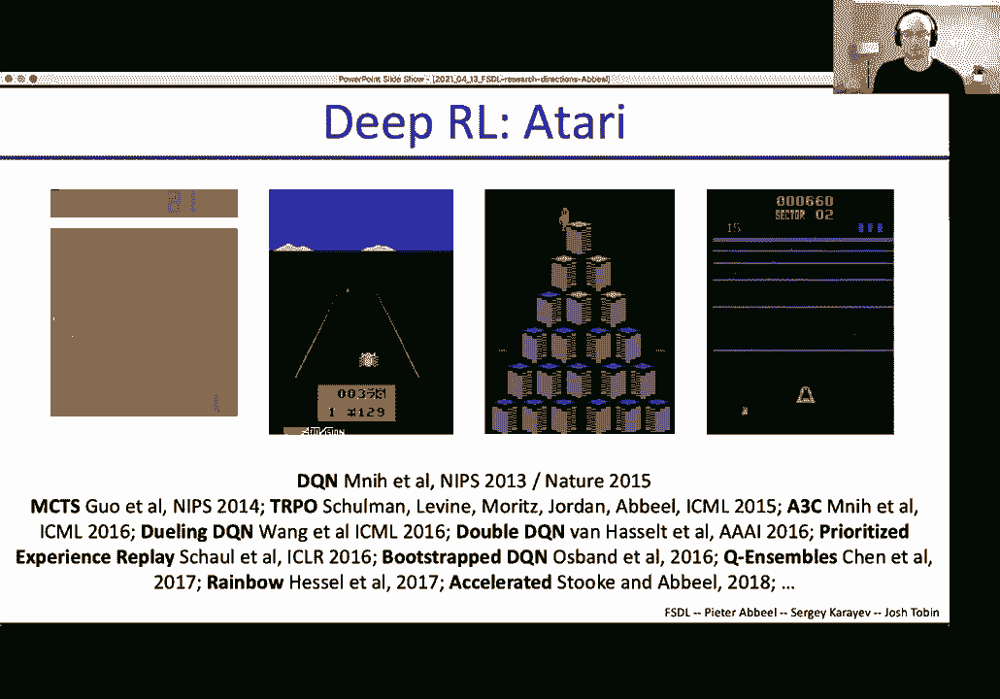
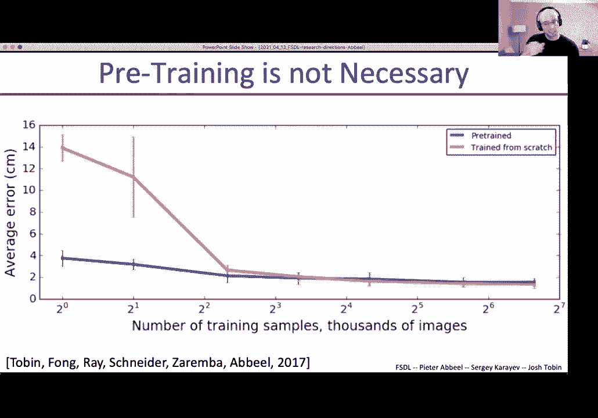
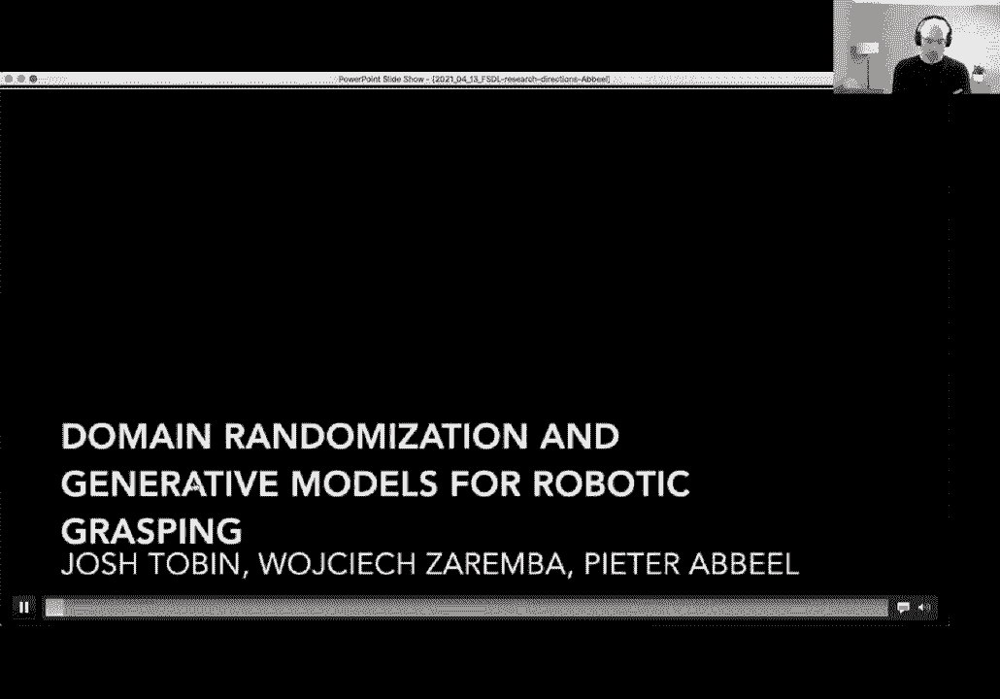
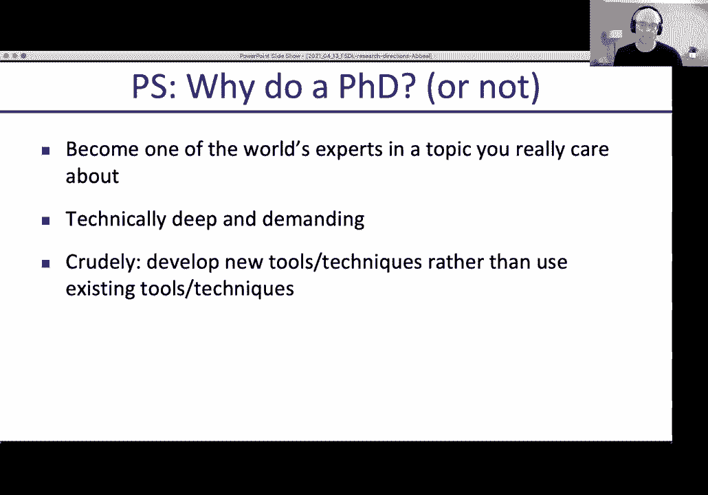
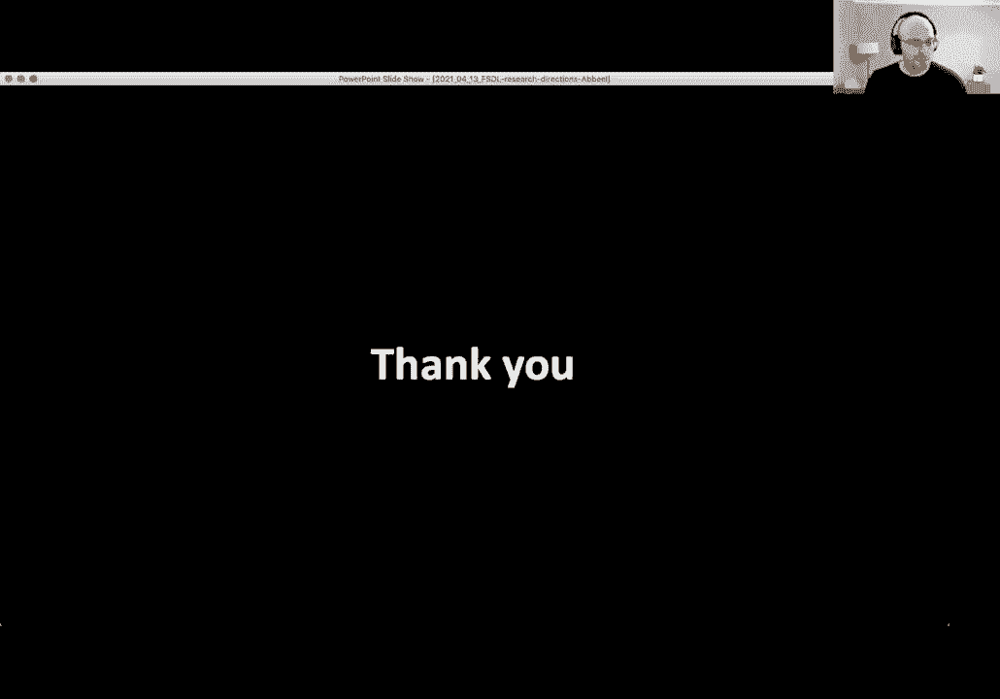

# 【双语字幕+资料下载】伯克利FSDL ｜ 全栈深度学习训练营(2021最新·完整版) - P24：L12- 研究方向 - ShowMeAI - BV1iL411t7jE

good afternoon or whatever time it is，for wherever you，are um excited to uh。

head up this lecture today so，most of this class has been focused on。

bringing deep learning into practice，what does it take to，build real applications today we'll。

actually do something quite different，we'll look at research。

now first thing you might wonder is in a，class it's about，practice why would you even care about。

research，um i think of all disciplines deep，learning is probably the one where。

research and practice are the closest，together where very often。

something new gets invented in research，and within，less than a year uh it might already be。

put into practice and so，um it's it's good to be aware that，things are always changing and。

new things come in through research that，you might want to incorporate。

in whatever projects you're working on，now when we look at research this is a，graph showing，which is。

a repository where people post their，as，other topic papers but it's just。

listening to machine learning and ai，papers，posts on archive per month and so the，top dot there。

that blue dot is roughly 4 500，in one month which is a lot and the，curve is going up，uh still so。

there's kind of no way you can read，every paper that gets，put up at least i don't think anybody。

can do that so you need other methods to，keep up with research so what i'd like，to do today is。

give a bit of a sampling of research，directions this is not，comprehensive in any way but it can give。

you a sense of the kinds of things，that have been happening in the last。

couple of years that might be of，interest to you and a representative。

of other things that could be happening，um，step back a bit and reflect on the，overall research。

theme that runs across all these samples，and then give you a little bit of advice。

on on how to keep up，with the well relentless flood，so there are many many exciting。

directions in ai that，people are doing research on i'm listing。

a bunch of them here there's even more，what i thought i'd do is give you kind，of a quick。

taste of a few of them the ones listed，in the left column，but feel free to also ask questions。

about the others at the end of the，session i'm happy to talk about any of。

them but i only have slides prepared for，the ones on the left，so the first one is unsupervised。

learning and i think this is in many，ways the，the most intriguing one because up to。

maybe three years ago unsupervised，learning was，i would say a pure research thing and，nobody would。

really be putting it into practice and，then，as of about two and a half years ago。

things started working so well that，it pretty much immediately became，practice。

so deep supervised learning the kind of，more default way of doing。

machine learning it works uh but it，requires a lot of annotated data you。

need data where you know what the input，is and the corresponding output。

and so the question is can we get around，it can we，learn from data that's not all labeled，or even。

you know random other data and the，answer is yes，and there are two main approaches deep。

semi-supervised learning and deep，unsupervised learning，which are already being put into。

practice today，so what is semi-supervised learning the，semi，kind of stands for it's half supervised。

half unsupervised，and so we'll still have a classification，problem and in this。

toy example each data point will belong，to one of，two possible classes the yellow class or。

the blue class，and you get to see all the data points，and if you look at the。

shape of how the data points are laid，out you might say hey even if i don't，know。

for most of them what their label is，because i'm only seeing for five yellows，and five blues。

where they are the others were not given，you might still say hey i see。

two half moon shapes there are two，banana shapes um，probably the top banana is um is all。

yellow and the bottom banana is all blue，and that's the most consistent way to。

complete this labeling，and now the question is what intuition，did you use when you。

came up with that idea of how to，complete the labeling，one way to formalize is to say hey if。

anything，is close to a labeled example so for，example here，we have yellow one and then this empty。

one is very close，then likely that one's also yellow and，that way you can propagate the labels。

out from where they're given，to the neighbors to the neighbors of the，will not。

propagate across this empty space here，but it'll propagate through that densely。

filled shape on the top and yellow and，then densely shaped，shape at the bottom in blue now this is。

easy to do with an example like this，where，you can just look at it and annotate by，hand if you want。

the question is how do you generalize，this to let's say image classification。

it's an approach and there's many，approaches there's one approach that i。

want to highlight here that has gotten，some of the best results called the。

noisy student approach you train your，teacher model with labeled data so you。

start with labeled data train a teacher，model，then there's unlabeled data on the，unlabeled data。

you infer what you call pseudo labels，they're not real labels。

it's labels that you get from using the，neural network that you trained the，teacher model。

you use that to now label the unlabeled，data，now those labels will not be perfect。

because you train on a small amount of，labeled data，but you could essentially see where you。

are more confident，about those pseudo labels and wherever，you are more confident。

you could inject that into your training，set as additional，label data and that is essentially the。

same thing as what would happen here in，the two，yellow blue shaped data set you would be，because。

they're close to the labeled ones but，less common about the others and so you，go。

you grow out from the labeled ones to，its neighbors and from there。

keep going that's exactly the idea here，there's another idea that's at play here，that。

when you when you then，re retrain you，train with dropout data augmentation and，stochastic depth。

effectively you're injecting noise um，and，you try to match those pseudo labels。

while training a model that has a lot of，noise in the training process to make it，more robust。

and generalized better which you might，often do anyway but that's just。

this is just from 2020 by the way so，this pretty recent result。

let's look at the performance curve so，the horizontal axis here is number of。

parameters in the neural network，and the vertical axis is top one。

accuracy on imagenet so classification，accuracy，and the blue curve is。

um efficientnet fully supervised，and the red curve is if you use the，semi-supervised approach。

and you can see that actually you can do，substantially better，and so it's a simple idea to propagate。

out your labels，actually，now this makes a little bit of an，assumption though which is that。

the labels that you used，in the supervised data set are still，valid for your unsupervised data。

but most images on the internet that you，download might be in other categories。

maybe you're trying to categorize，animals but you download a lot of images。

of also people and objects and，maybe street scenes from self-driving，car data sets and so forth。

and so you if you then go label it might，not be that meaningful。

so there's a limit to the applicability，here it assumes that the unlabeled data。

is roughly from the same distribution as，the labeled data，so the recent results are unsupervised。

so not semi surprised，unsurprised where you don't make that，assumption anymore。

the idea here is well let's train a，neural network again，and we'll have two tasks so we'll give。

the neural network two heads，ahead for task one ahead for task two，and the idea is that the。

main body the trunk here of the network，is，most of the network so most parameters，live。

in the shared trunk and so when you，train for task one，and task two most of the learnings are。

shared and only a little bit gets，specialized to task one versus task two。

you can do this for any task let's say，two supervised tasks，uh maybe you have image segmentation。

and image classification or image，segmentation and depth prediction。

those could be two different tasks or，per pixel you do something different。

but in the setting we're looking at now，it's going to be one task going to be。

unsupervised which you don't have to，provide labels and the other task is。

going to be the task you care about，that's supervised，so the key hypothesis behind this is。

that if for task 1 which is unsupervised，if your neural network is smart enough，to predict。

let's say the next frame in a video or，the next word in a sentence。

or generate realistic images by let's，say denoising an image，or translating image from one type of。

image to number for example grayscale，to color if it can do that。

then whatever it learns to solve that，task whatever is learned in the trunk。

will also help it to then be ready to do，supervised learning。

from a very small label data set for the，task you actually care about。

now you might wonder if there are two，heads to the network，why is one head called unsupervised the。

other one called supervised，it's i mean from a neural network，training perspective when you run it。

there's a loss function and the loss，function will look pretty much the same。

whether it's unsurprised or supervised，it's more of a kind of pragmatic thing。

on the unsupervised head you，supervise which is of course kind of，funny on the unsupervised head you。

supervise，with signal that does not require effort，so next frame in a video once you have。

the video you don't need to have，somebody annotate the video。

the next frame is readily available next，word in a sentence if you have a，document。

the next word in a sentence or in a，document is readily available nobody has，to go in and annotate。

this will be the next word same for，images if you have color images。

you turn them into grayscale you still，have the color available。

so going back to color is something for，which you have it readily available。

no human annotation effort required and，that's really the，kind of core of the unsupervised。

learning paradigm is you want to take，out the，human annotation effort as much as，possible。

so task 1 will be unsupervised task two，will be the real task，for example task one could be predict。

the next word and task two could be，predicted sentiment this is a positive。

or a negative sentiment article，maybe you're a stock trader you wanna。

know when whenever company gets，mentioned，anywhere on the internet whether it's a。

positive or negative sentiment mentioned，because that might affect what you want。

to do with your uh positions，in the stock market so the unadvised，task。

would be next word prediction but in，itself is actually quite interesting。

even independent of the fact that later，will be used with，supervised learning here's an example。

from openias gpd2 which was the，the first such model that was really。

impressive of course since then has been，gpt3 but i think gpd2。

is kind of the landmark where it started，to look like this really really works。

once you have trained for next token，prediction you can then give it a prompt。

and this case was trained on a lot of，documents downloaded from the internet。

to predict the next token in the，document from seeing everything that，comes before。

and now it's asked a train carriage，containing controlled nuclear materials。

was stolen in cincinnati today，its whereabouts are unknown what comes，next。

and here it is the incident occurred on，the downtown train line。

which runs from covington and ashland，stations in an email to ohio news，outlets。

the us department of energy said it is，working with the federal railroad。

administration to find the thief，then a quote from the u。s energy，secretary。

and then something about you know top，priority and so forth，this is exactly the kind of story that。

you would expect，if it starts out with that first，paragraph is it grounded in reality in，this case。

not so it's it's fake it's a fake story，but it reads like a real story。

and that's what the neural net learn to，do is how to complete，articles in a way that matches what's。

seen on the internet，here's another one recycling is good for。

the world no you could not be more wrong，that's the prompt and it starts。

completing and i'll do this one token at，a time but i'm showing them all in one，go。

recycling is not good for the world it，capitalizes the knot，it's bad for the environment bad for our。

health it's bad for our economy，i'm not kidding recycling is not good，for the environment。

so it goes on and on it's a bit of a，rant it's a bit weird，um but that's somewhat of a natural，weird。

prompt and so very realistic in fact，so realistic that there were a lot of，news articles at the time。

saying hey wow this is so realistic and，then open the eye said hey we cannot。

release this engine because maybe people，will abuse it，and so the text this model is so。

disruptive it's deemed too dangerous to，be released in the wild for people to，use。

um it i can tell you from from this，experience here that we saw play out，that um。

you know there's no better way to get a，lot of press coverage than to say。

your ai that you build is too dangerous，to to release，um never seen as much press coverage，before。

but actually um while maybe it seems to，get sidetracked by the press coverage。

something really powerful happened under，the hood，with these kind of models you can do。

sentiment classes together so you can，for example classify，a review here and as it goes through it。

from having just seen a few examples it，can decide whether or not。

this is a positive or negative or human，part was，negative it can solve other problems。

here is a common sense reasoning scheme，winograd schema challenge。

the trophy doesn't fit into the brown，suitcase，because it is too large okay that's our，sentence。

the it here what does it refer to the，correct answer is，the trophy because the trophy is too。

large to fit into the suitcase，but now one word is changed，large becomes small it is too small。

well now what is it is the suitcase，because the suitcase is too small for，the trophy to fit into it。

and that the fact that the gbd2 system，doing，some pretty sophisticated reasoning，about this sentence。

and has some notion of understanding of，what it really means。

because changing just one adjective will，make it change its response。

to the question what does it refer to，there are other questions they can。

answer who wrote the book the origin of，of species charles darwin that's correct。

what's the largest state in the us by，land mass the correct answer is alaska。

it said california so not correct it's，not perfect but。

now here's a table of a bunch of，benchmarks it was evaluated on。

the hour result is not my result i'm not，involved in this is just taken from。

from the paper where the authors called，it our result，this，the best result which is the result。

achieved with gpd2，better than the previous record on all，tasks。

the details of the tasks don't really，result，is that it was kind of the first time，that。

a model was trained unsupervised on a，lot of text to，predict the next token and then，fine-tuned。

on specific supervised tasks and then，beat prior methods that might have been。

more specialized to each one of these，supervised tasks so one model very，generically trained。

then fine-tuned and is able to，beat more specialized models and so。

that's really really interesting to have，such a generality，of the model that's trained another very。

interesting，uh thing that was shared uh in the paper，was that。

as you grow the number of parameters of，the neural network horizontal axis in，all these plots here。

vertical axis is performance on various，tasks，and higher is better and you see that as。

you grow the number of parameters，of the model you use performance goes up，consistently。

this is very interesting for supervised，tasks at the time i would say it was a。

bit more of a saturation，it was like you had enough parameters，maybe what this showed is that。

because with unsurprised learning you，can incorporate so much more data。

it's actually really helpful as your，data set becomes larger，to have larger models and in fact the。

end is not in sight，here this，research funding inspired openid to。

fundraise a billion dollars for future，projects to have，essentially more compute available to。

train larger models，because it seems like doing that will，lead to better results。

and so far that's been true gpt3 is even，better than gpg2，now gbd2 does next token or next word。

prediction，bert which is a very similar model came，out around the same time out。

of google does filling in so you have，text that you download you mask out a。

word or multiple words in a sentence，and the new network on that head first。

head that it's trained on，needs to fill it back in very similar，task。

you might wonder why might you care，about this versus the next token。

the nice thing about this task here is，that the new network looks at the entire，sentence。

as it's filling things back in which can，often help in later tasks。

because the neural network's already，been unsupervised trained on always，looking at entire sentences。

or entire documents at times，later，sentence a the man went to the store。

sentence b he bought a gallon of milk，label this is the next sentence that，makes sense on the right。

the man went to the store penguins are，flightless，label says not a natural next sentence。

and so those are supervised tasks which，you can learn to do well there's some，more tasks here。

the takeaway message is not so much the，details of these supervised tasks。

but the fact that these supervised，stacks have relatively small amount of，labeled data。

compared to the unsupervised training，that happens ahead of time。

and that by doing this on every one of，those supervised tasks，the birth model the large model in。

particular outperforms，all prior state of the art and so what，we had here。

just about two years ago is a major，revolution，and how natural language processing was。

done used to be done，single，nlp application you see will be，pre-trained on a large body of text。

often the pre-trained model is just，downloaded you might download birth。

large or you had a larger model that's，more recent，and then fine tune on your task。

especially inside google search when you，search，you don't want to just string match you。

want it to understand what's in your，sentence，that's effectively what the neural nets。

do as they learn to fill things in，they're effectively recovering the，meaning of sentences。

in a way that allows them to fill in the，missing word and that also means that。

they can now find better matches for，your searches，you don't need to be uh perfectly string，matched。

with whatever is on the documents on the，so whole revolution there if you look at。

the nlp leaderboards，everything is some kind of birth model，uh these days some of them are called。

birds something called ernie um some are，called t5 but，so how about other domains how about。

vision can you do the same thing，just fill in a missing patch，in principle you can't people have。

trained models to do this，and for example alyosha efros at，berkeley professor berkeley and his。

students，have done some of the you know leading，work there and so it's fun because。

you're all at berkeley to know that you，know some of the work happens at，berkeley，patch。

is that it's very high dimensional so，let's say you're just filling in。

i don't know a 16 by 16 patch that's 256，pixels，three colors so that's times three now。

that's something like i don't know，786 maybe or something something there。

things that you have to fill in each of，them could take on value from 0 to 255。

and so the number of possibilities，in that patch is really really high it's，256 to the power 7。

700 something and so 256 to the power，700 something is a very large number。

it's much larger than the number of，words uh，in english let's say much much more and。

probably larger number of words in all，languages combined so i'm not。

exactly sure how many languages we have，in the world but it's very very large，and so。

the problem with that is that it's hard，to predict that precisely and make that。

work as well as it's worked in language，in english，maybe there is 200 000 words when it's。

tokenized the way it's often done，there might only be 30 000 different，things you have to predict。

power，700 something so envisioned people have，iterated over other prediction tasks。

for example jigsaw puzzle solving so you，have an image，then you，move it around and you say now the。

neural network has to reconfigure it in，the original configuration，if it can do that it understands。

something about the world about，images of the world and so that trunk of。

that neural network should hopefully be，reusable and indeed，it tends to be reusable。

one thing that works surprisingly well，at least very surprising to me and i。

imagine surprise to many people is this，very very simple task you collect images。

and all you do is predicting，what has been rotated zero degrees 90，180 or 270。

 so you collect an image you，randomly pick one of those but of course，you know what you did。

and then the prediction is what what did，you do，without getting to look at your label of。

course it turns out that，somehow puts a lot of interesting，information inside the trunk of that。

neural network，that you can reuse for supervised tasks，in fact this。

is a system that worked the best until，the method came around that is most，widely used today。

which is um contrastive learning，uh often uh known under the two kind of。

versions that are most popular，simclear and moco seem clear from jeff，hinton and collaborators。

mocha from kamingha and collaborators，and the idea is effectively。

the same imagine you download images，from the internet，and you don't want to label them you。

don't have labels yet，so you just download let's say an image，of a dog image of a cat but you don't。

know it's a dog in a cat it's just two，images，if you now for one of the images let's。

say the dog image but your computer，doesn't know that，you duplicate it and make two versions。

of it you make a grayscale version，and you keep the color version but crop，it and then。

the other image you just keep then you，can say for the one that you duplicated。

made two variants off these two the，neural networks should think of as the，same thing。

as in those images but it should be，image，and so you want to bring the two dog。

images but you don't know there are two，diagonals you just know they come from。

the same root image that was duplicated，in two different ways。

close together and the other one should，be far apart from it，when you do that that's how you train a。

neural network and then you fine tune，with just a linear，model so just a linear classifier on top。

of training completely unsupervised，so not even full fine tuning you can。

match a fully supervised performance，meaning that you really get the right。

features here extracted from these，images，this is when trained on on imagenet in，this case。

and again we see the trend with more，parameters，you can do better which is not as much，the case。

did not to the same extent true for，supervised learning，uh it's much more true in unsupervised。

learning，okay so that's the end of unsupervised，spend，the most time on of all the topics okay。

so as far as learning is probably thing，that's transitioned，the fastest from research to。

real world practice nlp uses all the，time vision starts using it now。

and it's only invented two three years，ago for vision only，one year ago now let's switch gears for。

a moment to a different，as，practical yet i would say in in the same。

general sense that supervised learning，and unsurprised learning are practical。

but that nevertheless has shown great，results，and is becoming practical in some，domains。

which is reinforcement learning in，reinforcement learning your，ai is an agent more so than just a。

pattern recognizer，the agent acts in the world in the，environment and changes the world and。

then this process repeats over and over，and the ai system the agent is typically。

goal oriented wants to achieve something，it's，okay you act for a while hopefully at。

the end you achieve something like maybe，you，baked a great pie if you're a robot or。

maybe you clean the kitchen or maybe you，you know autonomously drove a car safely，to a destination。

the way this tends to be expressed is by，reward so you would say。

you know a tasty pie is a higher reward，than a brand pie，or uh maybe you know getting to。

destination fast is better than getting，there slow but getting their slow is。

still a lot better than getting there，while you know getting in some accidents。

and then worse is not getting there at，all and having an accident。

and so the reward function would be，where you encode that you assign for，each situation。

a score what are new challenges in，reinforcement and compared to，supervised learning in supervised。

learning when your neural network，sees something it's also told what the，output should be。

in reinforced learning that's not how，the supervision happens。

when it sees something it has to take an，action but it's not told whether that。

was a good or a bad action right away，it'll be at the end the robot might be。

busy in the kitchen baking your pie and，that's by the way not not super。

realistic yet but imagine the robot's，busy baking your pie，only once you taste it might you say。

this was good or bad，and so it's been busy for a long time，and now。

you might not know when you say it's bad，what did it do wrong。

in the whole hour it took to make it you，might have to make you know a thousand。

pies and then compare notes when do you，say it's good about，what did it do differently in those。

different times teasing that apart，that's the credit assignment problem。

and it's a very hard problem that，reinforcement algorithms have to resolve。

another challenge is stability because，if it updates itself because it's，learning by trial and error。

it could destabilize and could make big，mistakes so it has to kind of。

be clever about how how it's going to，update itself to not destroy。

uh things along the way and it has to。

called，exploration despite these challenges，some great successes have happened for。

example deepmind showed that，neural networks can learn to play atari，games back in 2013 so。

the reward is a score in the game and it，just learns to play from looking at the，screen and。

handling the joystick now since then a，lot of progress has been made。

um many many places have contributed to，this but。

um yeah deepmind was first back in 2013。under the hood it's a neural network。

just like the ones you're used to from，computer vision，image classification type networks and。

now the softmax on the output is，effectively over joystick actions rather，than classification labels。

but what's so different is how it's，trained it's trained from its own trial，and error。

and looking at the score in the game to，bad，and the score in the game doesn't change。

very often so that's again the challenge，there the credit assignment problem。

game of go was cracked uh by，alphago deepmind showing that，the computer can now play go better than。

the best human players，alphago zero was the version that was，trained by only playing against itself。

pure reinforcement lighting was even，better than alphago and alpha zero was a。

more general purpose version，that could learn to play go but also。

learn to play chess and learn to play，some other games so deep reinforcement。

definitely works it also works for，robotics so we see here some work that，was um，learning。

to run and initially was falling over，but through its own trial and error。

and based on how it scored and scored，higher when it makes more forward，progress。

it figures out how to i should do really，well，and run at pretty high pace now one of，the nice things。

about reinforcement learning compared to，a more classical approach to robotics。

is that you don't have to design the，controller yourself，you just implement the reinforcement。

learning algorithm and of course you，need them the robot or the simulator but，then。

once you have the reinforcement learning，algorithm if you want a new robot to run。

you don't have to think about oh，four-legged robot what do i have to do。

differently to design a controller you，just say oh，just let it run it'll train itself and。

actually the algorithm that was used to，train these robots to learn to run。

that exact same algorithm was used to，learn to play atari games so very，general approach。

to have ai systems acquire new skills，fact can acquire a very wide range of。

skills this is the deep mimic work，that was led by berkeley psg student，jason pang。

and you can also do this for，non-human-like，characters and this this is already，really um。

at this point this is changing how you，could design，of，designing the key frames for every step。

along the way in your video or your game，you can now just say hey lion go from，point a to point b。

and run this fast and then it's been，trained to do that and now i can run or。

it can do all these things to deep mimic，uh humanoid was doing to go from point a。

to point b maybe while doing a cartwheel，and so forth，so it can really bring down the effort。

required to design，games and animated movies it's also been，shown on real robots so this is brett。

the berkeley robot for the elimination，of tedious task and it's learned to put。

the block into the matching opening，it can learn that in about one hour。

starting from scratch the neural network，is randomly initialized，and it learns a vision system and。

control system all together in one，neural network to put the block into the，matching opening。

the reward here is based on how close，the block is to being，inserted into that opening and so over。

time it figures how to get it closer，and then from there it figures out um to，consist。

we actually then did a project with nasa，on this robot when you look at this。

you're probably thinking who would，design a robot this way well。

turns out nasa designs robots this way，and there are some good reasons for it。

what are we even looking at there are，some metal rods，and then there are some elastic cables。

but i mean not super elastic uh，pretty pretty tight still um these，cables，connect these rods and。

the tension in those cables that's what，the integrity name comes from。

uh keeps keeps it uh hold that shape，um the motors at the end of the rods can。

effectively shorten or lengthen those，cables and by doing so，change the shape of the robot shift the。

center of mass，and make it move some properties very，lightweight。

for the size this robot is it's low cost，and it can withstand pretty significant。

impact so a lot of advantages there，you can also pack it very small inside a。

rocket when you want to transport it，volume comes out of price。

and so just like you have a tent to go，camping you don't carry the tent around，in this full volume。

you carry it on a small package same，thing here small package and then it can，expand。

when you need the robot to start doing，things major challenge is how do you，control this thing。

not very intuitive but that's okay，reinforcement learning figured out。

how to control this robot and is here，rolling this robot，in this case purely training simulation。

uh many versions of the simulator which，i'll talk more about later。

and then um from there able to control，the system，quite reliably similar ideas were then，applied to。

robotic manipulation uh solving rubik's，cube this was done，at openai this one what you see here is。

a robot hand that has figured out how to，solve this rubik's cube i'm scooting，forward in the video。

but it is really solving it，over time you see that ashley gets，everything in place。

you might wonder what's hard about it，you can run a star search and related，algorithms to。

know what moves to do at a high level，but the contact forces the in-hand。

manipulation is a really difficult，robotic control problem，that was mastered with reinforcement。

the fact that it's starting to work so，well also in robotics uh the different，ai approaches。

actually inspired me together with some，former students，uh to start a new company covariant um。

you see the co-founders there ken hao，jang rocky dwan peter chen going left to，right。

we started kavanaugh about three and a，half years ago to bring a lot of these，advances。

that we made in the lab into real world，and actually we're，building a lot of advances secretly at。

world，to take things to the next level and so，an example of what we'll look at there。

is helping with order fulfillments，anytime you go online，you order something well that means。

something that's stored in a warehouse，has to be retrieved it might come down a，conveyor belt。

as the blue bin here is doing coming，down a conveyor belt and then a robot，here is picking it。

out of the blue bin which is the storage，bin and putting it，into the cardboard boxes that are used。

for shipment in this case，here this might not be you ordering this。

is in berlin for electrical supplies，but this is used this kind of system is。

used in many many places，and for now most of them are you know，manually picked but there's a lot of。

demand to start automating this picking，process and that's one of the examples，of things。

that is becoming possible with these，recent advances，in ai so let's go to the next topic and。

i'll revisit the slack，later reinforcement algorithms achieve。

mastery on many many at least definitely，simulated domains，often doing better than humans but you。

could also ask the question how fast is，the learning，well some people study that and these。

graphs the details don't really matter，but it shows that，a human can learn in about 15。

minutes to do better than what double，dqn one of the state-of-the-art，approaches。

at the time of this study how well that，approach could do，after 115 hours so a major gap there。

in learning speed even in the end double，dqm can do very well。

it takes a long time to learn to do well，how we're going to bridge this gap。

well one observation here is that，when you do learning for control and you，have these visual inputs。

learning seems to be a lot slower than，when you do it with，access to the underlying state so when。

you work with a simulator，you can take the images it generates or，you can take the coordinates。

of the robot the coordinates of all the，links the joint angles and so forth。

and if you do that that's the blue curve，learning curve goes up very quickly。

but if you do it just from image inputs，that's the green curve，and so it's about 100x different。

and so the first way to get to faster，learning would be to see if i can bridge。

this gap and intuitively，it seems it should be possible because，when you look at these images。

the information is there it's just that，we're not presenting it right and we've。

just been talking about this，maybe if we bring in unsupervised，learning we can。

somehow turn these pixel level，representations which are not，that informative into a new。

representation that is much more，informative，that's actually very similar to the。

underlying state and then we can get，much faster learning we started。

investigating this about a year ago，inspired by the results with contrasting。

predictive coding and simclear，that we already talked about in the，concepts of unsupervised learning。

and we looked at in the context of，reinforcement learning，so typically there's a replay buffer。

where you store your past experiences，you load some observations from there。

then you would feed that into an encoder，neural network，which then has two heads an actor and a。

critic those are the，reinforcement learning heads actor，estimates。

the best action to take next and critic，tries to estimate how good that action，would be。

now if that's all you do the green path，we know it's pretty slow so we add an。

extra head at the bottom here，which includes augmented observations。

and thus contrastive learning on that，bringing augmented observations coming。

from the same original close together，and augmented observations from other，originals far apart。

so it's not dogs and cats here it's just，different configurations of the robot。

some get brought closer together other，further apart，there are some things you have to think。

about exactly how we generate the，the query and the key to do this。

but we effectively found that random，crop is the best way to generate，variance。

so that's what we did you can also，recolor do other things but random crop，was the most important。

then there's a way to measure similarity，there's a notion of bilinear similarity。

and cosine similarity，bilinear work better for us which means，you have that w。

weighting matrix between the query，embedding queue，and the key embedding k。

so yeah that's just an empirical thing，and then moco which is similar to。

simclear but has this additional thing，about a momentum encoder to。

not change one of the encodings too，quickly，um it turns out that that helps。

for the training also again empirically，we check this and it does better。

the main takeaway if you look at the，learning curves here，in red is when you have the contrastive。

unsupervised reinforcement learning，and gray is if you directly do，reinforcement on state。

and you see in almost all of those，learning curves the red is，as good as the gray meaning that。

learning from image input，can match almost every time，learning from direct access to state。

meaning the unsurprised learning in this，case，likely recovers something very similar，to state。

such that the learning is very effective，very efficient，then instead of just comparing with。

learning from state we also compare with，past methods that learn from pixels。

the red curve is what i presented you，can see it consistently outperforms。

the past methods that i learned from，pixel inputs and the gray，and the black is learning from state。

input so it's matching that，almost all the time same thing is true，in atari games。

it does really really well outperforming，past methods，such as simple and rainbow in most or。

all of the games，there are also some environments where，it doesn't do as well as learning from，state。

and so as part of research is to kind of，dig in when something doesn't work。

in some situations what might be under，our hypothesis here was that maybe the。

images don't have enough information，maybe the state has more information，things like。

contact forces that are hard to extract，from images，or velocities that might be hard to。

extract from images，and so we did is we on the ones where it，didn't do well。

we then set up a supervised learning，well actually before i say that all past。

method the bottom plot is showing that，all past methods，struggle in the same environment so，method。

it's something about learning from，pixels in those environments we then set，up a supervised。

learning task we said let's go from，image input，to state and see if we can predict that。

and look at the error rate，and we saw that the larger the error，rate when trying to go from。

image to state the larger the error rate，of a very well tuned train neural。

network so the best we can possibly do，the larger the error rate there the。

worse it does at training from images，suggesting that the lack of information，the images。

is really the issue and why in some of，these environments，it did not match the performance of。

state-based learning，okay let's dive into meta reinforcement，learning but please keep the。

questions coming trpo dqm，a3c dwg ppo rainbow the most popular rl，algorithms。

are really fully general rl algorithms，that have been designed，um by humans to to hopefully have an。

agent be an efficient rl agent，and the peters they can work anywhere no。

matter what your environment is，you can run them and in the limit of，collecting enough experience。

they will do something interesting but，if we think about a bit more deeply the。

environments encountered in the real，world，maybe including uh simulated worlds that。

humans are willing to build，it's just a tiny tiny subset of all the。

environments that could be defined，mathematically，so we have these algorithms that are so。

general that can work for any，mathematically definable environment。

that are only used for a small subset of，those environments，and so maybe the algorithms are too。

general and that's why learning takes a，long time，if they could be a bit more specialized。

to the things they're going to encounter，maybe they could do better and so，question is can we build。

better algorithms that take advantage of，this，so with the environment we have the。

agent agent takes an action environment，changes state，might emit a reward the agent sees that。

and process repeats，inside the agent there's two parts，there's an rl algorithm which is still。

typically classically designed by human，and there's a policy or a q function。

that is a neural network and that has，all the latest wells and，bells and whistles from deep learning。

but the algorithm is still human design，and so when an agent goes environment a。

it learns a positive environment a in，environment b，same algorithm can be used which is nice。

no new programming but a new policy has，to be learned and so forth。

but you can also question the notion，that these algorithms are human designed。

because we have not been able to design，algorithms are nearly as good as human，learners。

so can we learn an rl algorithm that is，better than a human design algorithm。

so what would be the the way to do this，well，there's no final final answer to this。

yet but here's something we tried and，that has shown some good signs of life。

imagine you have many environments，environment a b，and so forth and then you have some meta。

algorithm which is an algorithm that，learns an algorithm so in this case it's。

an algorithm that learns，a reinforcement learning algorithm that，outputs this。

faster learning reinforced learning，agent，from having interacted with these。

environments that's the hope，and the reason we have that hope is that。

the way you can be fast is because in，the future，you're going to be an environment f，let's say。

that is yes different from a and b but，still related，there will still be gravity there will，still be。

maybe electromagnetic forces there will，still be maybe people in your，environment and so forth。

so the notion that what you learn in a，and b，is likely useful for environment f。

suggest if that's true that we should be，able to learn faster in environment，f or g and h。

and so forth so here's a way to，formulate this，we want to train an agent a full agent，not just。

a policy but a full agent that is such，that，on expectation when dropped in some，environment。

sample some mvp then，trajectories rollouts are collected it，achieves high reward。

pictorially shown at the bottom it gets，maybe episode one，episode two and mdp one then it goes to。

mdp2，same thing happens and it goes from mdp，to mdp to mdp，and when it gets to the next one we hope。

because of having，been in the previous ones they can learn，more quickly。

so we want to optimize expected reward，we'll do that on training mdps but the。

hope is that it'll then also generalize，to testing mdps，you need to decide how to represent your。

agent an rnn is a generic competition，architecture it's quite popular to do，this with。

different weights in the rtn would mean，a different rl algorithm and prior over，worlds effectively。

different activations in the rnn would，mean a different current policy or，strategy of the agent。

the mediterranean objective can be，optimized with an existing rl algorithm。

this is an rl objective it's just a，reinforced learning problem where the。

mdp changes a lot but other than that，it's still，a type of mdp and so。

we can train with ppo dqn and so forth，but the result will be a recurrent，dropped。

in a new environment we tested this on，slot machines the banded problems very。

classical problem it doesn't matter too，much but it's a problem that you can，study。

in detail i actually have a analytical，solution for，that tells you what to do when faced。

with a new banded problem，so we can compare with these analytical，solutions gittum's ucb。

thompson sampling what we see is that，the rl squared learned agent outperforms。

these asymptotically optimal approaches，in many banded environments and as the，band has become。

a very large number of bandits and arms，and number of，runs you get then rnn struggles a little，bit。

might need more training in this bigger，environment but for the smaller ones。

then you can look at something more，interesting like a maze，can the agent learn to navigate mazes so。

at training time，you put the agent in many many mazes and，it doesn't know the map of the maze the。

agent just gets to see，and then has to somehow explore it find，the target which is shown in red and。

then gets dropped in the same maze has，to，run to the target as quickly as possible。

just to remember things from the past，be able to go to that target quickly。

again that's actually what it does，if you don't do what we are doing in，this specific work。

just run standard um exploration methods，you kind of get stuck then you run along。

a wall and so forth it doesn't really，work very well，if you have trained in many mazes before。

then go to a new maze you have learned，to explore，so now knows that running down hallways。

is the key thing to do，looking for things around the corner，seeing the target going to it。

and then it remembers enough to go there，again and so that's an example of。

a learned reinforced learning algorithm，it's learn to explore，its strategies a little specific to。

mazes that it's been trained in，um it's really good at exploring mazes。

it's not going to explore well，in an atari game all of a sudden but you。

could imagine if you scale up your，compute power scale up your neural。

networks you might be able to train this，on a large set of games a large set of，robotic environments。

and then it could quickly learn，something new in a new environment，that's related。

the work we did it didn't always learn，sometimes it kind of gets stuck。

because it's a hard learning problem，because the outer loop，is still reinforcement learning it's。

becoming a fast learner，by using an existing hand-designed，reinforcement algorithm so。

um yeah some sometimes it just doesn't，learn that well but，you know about 70 of the time it learns。

so a lot more work going on in this，direction um，so listed a few papers here that you。

might be excited about，um now，instead of just doing rl often people。

will complement it or even just do，learning，where the output is an action for an。

agent and that of course gives you a lot，more signal，because now for every input you have the。

corresponding output again，so you have many demonstrations the，imitation learning algorithm is。

effectively a supervised learning，algorithm that trains a policy。

that observes the environment outputs，the right action，actually works quite well in many。

situations bottleneck of course is，collecting demonstrations，which is often even more time consuming。

than just labeling data and supervised，learning，and for every task you need new，demonstrations so。

you might think can we circumvent this，can we do some kind of multi-task meta，learning。

and indeed that can be done so you can，have many demonstrations。

but for different tasks then metal learn，a one-shot imitator which can now from，one demonstration。

know what to do this is done with the，architectures that you're kind of used，to these days。

so you would take in a demo of a task，you see a demo of another task you see a。

for the first demo you see the entire，demo so full video sequence。

for the second demo you just see one，frame and your，your task as a neural network is to。

predict the next action，in demo two which direction should the，robot move something like that。

up down left right um rotate，and so process demo one，look at demo two current frame and。

output in action，that's a very heavy duty visual，processing task and under the hood the，best methods。

these days we'll have often per frame，confident processing followed by over。

the whole video transformer processing，then，attention modules that go from demo2。

into demo one to figure out which frames，in demo one should be paid attention to，right now。

and then from there goes back to，generating an action，so those kind of things tend to be under。

the hood，a great example for people to test this，is block stacking where。

different stacking configurations are，different tasks，and what you see here is actually。

visualizations of the attention heads，the tension over the demonstration is。

shown on the left horizontal axis is，time you can see at which time most。

attention is being paid in the，demonstration，and then on the right you see which，it's。

effectively doing relational reasoning，over the different blocks in the scene。

before it decides on what action to take，but it also gets，information from the demo on the left。

so a lot of attention happening here to，so why would we care for simulation。

well compared to the real world，simulated data collection is less，expensive。

it's faster more scalable less dangerous，can't break an actual robot。

easier to label because the simulator，has the labels built in，but the question is how can you learn。

something useful for the real world by，well there's a few approaches one。

approach is make your simulator as，realistic as possible，if you can do that that's great um often。

it's hard and when you succeed at，getting closer and closer often your。

simulator becomes slower and slower and，slower，and so there are some downsides there。

but if you can do it i mean try to do it，and see how far you can get。

while keeping your simulator fast，then another thing people have looked at。

is something called domain confusion or，domain adaptation the idea there is that，a network on。

effectively simulation，and real-world data at the same time，and some slice of the network at some。

layer，you make another network look at it，a discriminator network like in gans and。

that discriminated network，tries to see if that layer，is representing something about the real。

world or representing something about，the simulator，a simulator and so if you can。

fool that discriminator that means that，in that layer the neural network doesn't，know anymore。

whether the original image input was sim，or real，and so everything that comes after that，layer。

can be fully trained in simulation so，that's really nice，you of course get the complicated。

dynamics of this fighting this，discriminator，but you know when you can get it to work。

that can be a really nice way to go，one of the most surprising things to me。

that's happened in the last five years，in robotics is that actually something。

much simpler at least to execute on once，it's understood，can work really really well in fact。

often better，and the idea is that if you have a，simulator instead of just trying to make。

it realistic，you actually try to make it have many，many，variations so on the left there you see，is。

pink sometimes it's purple sometimes，it's green，sometimes the robot is brighter。

sometimes it's darker the objects have，different colors different shapes。

and if you have enough variation it，turns out，that what you learn can actually。

generalize to the real world even though，nothing on the left looks like real，world。

training on enough variations on the，shown on the left，gives you a neural network that。

understands the situation on the right，in fact early work was done at berkeley。

prestigious at degree and sergey 11，collaborate on it for，drone flight and show that you can train。

in simulation，to understand how to navigate um，well buildings really and then put it in。

the real world，and it actually works surprisingly well，it'll avoid collisions。

josh's question at the time was okay，that's great avoiding collisions but can。

we make this work in a more general way，where we need to be very precise。

let's say we want to localize an object，and pick it up what can be done。

and he showed that actually this works，so，the average error shown on the vertical，axis is going down。

as there are more training samples but，none of these training samples come from，the real world。

they are all training samples from the，simulator but the error is measured，evaluated。

on real world images and so this is，this is amazing purely training，simulation can actually localize。

objects in the real world images，the most，the number of unique textures that's。

used to texture things in the simulator，is really critical you need to have a。

high number of textures，how about pre-training on imagenet when，you're going to train a visual。

recognition，neural network why not pre-train an，imagenet well。

you might always do that but it's still，interesting to ask the question。

is it important or is it enough to train，purely in simulation。

and never see a real image including no，pre-training on imagenet。

and you can see here red and blue end up，in the same spot，sure pre-training buys you a little bit。

early on that's to be expected。

but then it becomes equal so no need for，josh then applied similar ideas to。

grasping and kind of the question there，is how do you generate enough random，objects。

well there's not that many objects in，the simulator actually if you try to，download。

meshes of objects you'll see that after，a couple hundred maybe a couple thousand。

you cannot run out of meshes to download，and if you're gonna apply this idea，be。

useful in the real world a hundred or a，thousand not going to cut it。

so josh's idea here was that actually，you can just，slice any objects that are downloaded，into pieces。

and randomly recombine these pieces into，new objects，these new objects will not look very。

realistic because in reality you know，with，half a water pitcher or half a。

screwdriver combined with half a，computer screen but um you can generate，those in simulation。

and train on it and again the surprising，thing here in my mind is that。

the training of some very unrealistic，things but nevertheless，it learns meaningful things that are。

carrying over to the real world，and it showcases again the importance of，large amounts of data。

even if the data is not perfectly，matched very large amounts of data is，very helpful。

and so here's an example of the system。

hopefully for josh this is a a good，memory and not a，nightmare flashback to two long。

nights uh in the lab，i have a funny story about this uh these，particular two long nights in the lab。

that i'll tell some other time，okay sure you don't want to share right。

no no no not while we're recording okay，yeah looking forward to that story some。

other day what you see here is the，though，never having been trained in the real，world。

it's only trained to predict grass，points on simulated objects and then now。

it sees a real world object，predicts the grass points and then uses。

the you know robot controller to move，the gripper，to those grass points doesn't always。

work i mean grasping actually，as a whole is not a solved problem it's，something that still。

is a very active research domain to get，to very high reliability，but it does really really well。

comparable with other，approaches out there that have been，then i showed this video earlier but。

actually this video，used domain randomization also same idea，was used to train in simulation many。

variants of the simulator，what exactly is this robot hand what are，the dimensions。

how do the tendons exactly dynamically，you know，uh function in the real world what kind。

of friction is there what kind of，hysteresis，uh what kind of wear and tear um what。

where exactly is contact being made with，what kind of friction，um very hard to know and。

so instead build，many many many many versions of the hand，and the rubik's cube。

in simulation train that way and then，deploy in the real world and we watched，this earlier。

it's actually um deployed in the real，world，it succeeds even though it's trained，purely。

in simulation so for the last research，topic，deep learning for science and。

engineering this is a very interesting，topic that，in some ways is very different from all。

the other topics，if you look at the other topics and the，classical areas of artificial，intelligence。

which are computer vision natural，language processing and robotics。

those are things that humans are really，good at or，most of the time humans are pretty good。

and if you're successful you might build，a system that is，as good as a human or maybe a little。

better but if you start using，deep learning or ai for science and，engineering there's a possibility。

in the future it'll do things that isn't，just like oh，a person could have done this but it's。

nice that now an ai is doing it，um but it could be doing something that。

maybe we we couldn't have done and i，think that that's really really exciting。

and we're seeing a bunch of progress，happening there，most famous result of i would i would，say is um。

alpha fold and alpha volt 2 out of deep，mine so，a couple months ago deepmind。

made this headline here uh it will，change everything which i believe。

was a quote from a nobel prize winning，um biologist or，chemist saying that you know protein。

falling is such an important，problem being able to predict how a，protein will fall。

and deep mind's ai system really deep，neural networks，were able to when given a sequence，predict。

how it's likely to fall better than any，previous methods，um and so here are some examples of this，so。

yeah in green is the experimental result，meaning，this is sciences we have to measure，there's no。

actual ground truth but there is a，you know measurement process with。

crystallography that allows you to，measure the shape of a protein，experimentally。

when it's folded and that's what's shown，in green but that's expensive and time，consuming。

and then the hope is of course that you，don't have to go through that process，but you can just。

sequence it which is very cheap，sequencing proteins，and if you sequence it and then can。

predict how it'll fold shown in blue and，it matches，then you can save a lot of time and。

so these are very close and give an idea，of what's becoming，possible the competition is called the。

casp competition it's held every two，years，higher is better here you see the past。

works when people wrote some kind of，programs or other machine learning。

approaches to predicting the folding of，proteins on test proteins that you don't。

have access to the fold you，have to predict it that without having，seen the answer。

actually not a lot of progress between，2006 and 2016 and，roughly at the same level then in 2018。

was the first deep learning，submission alpha fall out of deep mind。

and it won and it did quite a bit better，than the previous approach but then。

overfall 2 took it to a whole other，level，and some people call it solved i mean is。

it solved not solved i'm not an expert，to to make claims about that。

but levels of precision are achieved，that on some families of proteins where，there's enough。

data already about those proteins it，seems that it，achieves the precision that's needed to。

um then do other things，with the 3d structure that you might，want to do predict where the two。

proteins might bind and so forth，what's under the hood a pretty，complicated model。

even by today's standards i would say，it takes in the protein sequence it then，does a search。

for related sequences，okay they might say why does it search，for related sequences there's an。

intuition there，if you find similar sequences，evolutionarily，they probably come from the the same。

ancestor，which means that even though they have，mutated they might still。

serve the same function which might mean，they still have roughly the same 3d，structure。

so finding these related ones gives you，a set of sequences for which if you have。

any 3d structure for them，then that's great you can inform your，prediction based on that。

if these others don't have 3d structure，associated with it，there's still something very interesting。

because you can then look at，which sides have mutated and which ones，don't have any mutation。

and as site has mutated it probably is，not affecting structure much。

the structure will affect function but，if a site is not mutated that is，probably important。

for the structure of how it folds and so，this gives a lot of information about。

how it's likely to fold which，amino acids in the sequence are likely。

to make contact with each other in the，fold，across，all evolutionary offspring so that's，done with。

some kind of multi-headed attention，models，and they are doing reasoning over these。

different sequences，um then it's also generating embeddings，for residues to reason about。

how replaceables each well residues and，amino acids are the same thing here。

um so reasoning about which amino acid，or which residue is okay to replace。

which other residue because they have，somewhat similar properties，from there then a structure module。

neural network tries to turn it into，a 3d structure there's another output。

auxiliary output which is the pairwise，distances if between every amino acid。

and sequence you predict the pairwise，distance，that is also very informative about the，structure。

now some of these predictions are not，realizable，because when you have three points and。

you have their pairwise distances，the triangle is fully defined if you now，have a fourth point。

and you have arbitrary other pairwise，distances，it's not going to dramatically work out。

in 3d anymore all right，but then，more than four points you need to have，some consistency。

these pairwise distances that the，outputs are not always consistent。

so it also has to output this other，thing that outputs a consistent，3d structure okay so。

now you can predict protein properties，including structure with neural networks，this by the way。

deep minded supervised learning for this，there's a there's a data set with。

3d structures you can train and then，learn to output，3d structures and then do pretty well on，new。

i mean uh or new proteins，um there's another thing you can do is，you can speed up design with deep。

learning the idea here is that，often when you have a，simulator it's very slow you might build。

a new network that replaces a simulator，or that even replaces the prediction of。

how well your thing will do in the，simulator you don't even simulate just，say。

this design will do this well and then，that，to speed up designs we've done this for。

circuit design people have done this in，other domains，um then other thing people do is they。

actually augment their data sets，physics data sets with generative models。

and people have done math integrals，we're solving differential equations。

with effectively language transformer，models，and doing pretty well with them and a，few pointers here。

what's a big trend right now compute is，increasing a lot of companies are，building better ai chips。

um let's calibrate that a bit a fly，hundred thousand neurons，alex net from 2012 650 000 neurons。

miles hundred million neurons human，hundred billion neurons，more importantly about 10 to the 15。

synapses connections between neurons，that's where the compute happens so。

each synapse can fire or not fire once，per second so effectively have about one，petaflop of compute。

well that's interesting because the djx2，provides two pedaflops in one server。

rack for 400 thousand dollars that new，djs that came out yesterday i believe。

provides five pedaflops at，000 but uh i couldn't find an official，um。

announcement on that but that's i think，what i remember from the talk。

so these days for you know order of 100，000 or even less，you can get a petaflop and so equivalent。

of human brain，um in terms of compute power uh，according to this back of the envelope。

calculation in a box，um you can also rent the equivalent of，human brain of compute power in。

in the cloud if you do it preemptable，it's about five dollars an hour probably，even less by now。

so cheaper than most uh human workers uh，so very interesting that you know if。

just we had a better computer program，it would be cheaper to run these things。

on a computer than to run them inside，the human brain，the trend in research is that amount of。

compute used，for the most kind of prominent，experiments keeps going up。

this is a logarithmic scale so it's，exponential growth in the，number uh the number of petaflop days。

used to get to those results，uh what does it mean for our research，agenda um well。

i think we go back to what are the key，enablers for ai progress data compute，and human ingenuity。

and then you can say well i can work on，problems like this where my human。

ingenuity seems to dominate or i can，work on problems where human ingenuity。

is a small piece of the puzzle，but mostly data and compute enable the，progress。

and maybe different people want to be in，different places i want to be on the。

right and what i mean with that is，if you work on the left and human，ingenuity is kind of everything。

then you're kind of competing with what，everybody's been doing for hundred years，200 years。

um just thinking but if you work in prom，territory too you work on problems where。

you use an amount of data and nobody had，available last year an amount of compute。

nobody had available last year，well you're not compu competing as，anybody's ideas。

from previous years because they could，never test them，you can work now on things that nobody。

could work on before，and that often leads to very exciting，lower hanging fruit。

than the things on the left so learning，to learn is a good example but。

all the unsurprised learning is another，good example um，and so that's where i think a lot of the。

breakthroughs will happen because it's，easier you're not competing with a lot，of past attempts。

you're in a new territory that wasn't，available before，a fish，and you can feed them for a day teach。

them to fish you feed them，for a lifetime so i've been giving you，so many fish。

in some way about research um i haven't，told you about phishing so，how can you keep up with research。

and i want to hit on two things here how，can you mostly keep up。

with mostly not bothering reading any，papers because we know so many papers，come out it's a bit much。

and what to do when you do decide to，read some papers，so how can we keep up without reading。

all the papers，because there are too many of them to，read all of them。

here are a few pointers tutorials at，conferences whenever there's an。

important new trend in machine learning，almost invariably，within one year somebody will put。

together a really nice tutorial，on that topic at one of the main，conferences。

that tutorial will capture the essence，the most important takeaways going，forward。

of maybe you know 50 100 hundreds of，papers that happen that direction。

will be condensed into that tutorial，into the things that will matter the，most。

for the future so i highly recommend，checking out tutorials as a very high，bandwidth way。

of learning rather than just，you know always try to read papers。

graduate courses and seminars are very，instead of，just go read papers you could look at。

graduate courses what's covered there，especially if there are lectures it can。

be much more informative，much more formatted for consumption fast，consumption than reading papers。

yannick culture has a youtube channel，where he explains papers。

so you just go there he kind of does two，things he picks a paper to explain so。

you don't have to pick，out of all these papers coming out every，month like 4 000 papers。

and counting every month you don't have，to pick you might just watch。

the 5 or 10 or 20 videos that he puts up，and learn from those there's another。

youtube channel two minute papers，again they do two things for you they，it。

and they give an explanation in two，minutes，so very very fast to learn something。

there's a newsletter by andering，the batch um，great newsletter comes out every week um。

i think it's actually recommended on the，course website，and then there is um import ai。

newsletter by jack clark which i think，we might also be recommending on the，course website and，uh。

sergey kerry of sergey's recent，work was featured as one of the handful，of。

things that are featured every week um，sergey's work on，character optical character recognition。

parsing homeworks tests，and so forth was highlighted as one of。

the key things to make people aware of，so yeah congratulations again sergey。

that was uh very exciting to see yeah，yeah so that's the thing to learn about，this week apparently。

now when you do decide to read papers，um definitely don't try to read all 4，000 papers a month。

um which papers to read the things i，just mentioned，are giving you the pointers if you are。

watching a tutorial at a conference and，you find things very interesting。

you can then see what papers they，reference go read those same for the。

graduate courses the youtube channels，and so forth the newsletters。

what else can you do i love this thing，called archive sanity by uh。

andre carpathi this is a snapshot from，today so i went in there，and i said okay top recent from last。

year and it says，end to end object detection with，transformers this is the paper that，most。

often of all papers in the last year so，if you read only one paper。

maybe that's the one you should read，because that's the most saved paper。

for the past 12 months you can also do，last month last week last three days。

top hype when there's the most likes and，tweets，and you want to read those papers you。

don't even need to go to twitter you can，just go to our cache sanity。

and select the top hype over there you，could go to twitter there's a bunch of。

ai people who like to post actually，these days sergey and josh post。

a lot too i should have added them，they've been very active uh posting，things on twitter。

latest progress in ai so yeah，then there's a facebook group where you，can interact with other people。

there's a ml subreddit i mean these，groups and reddits tend to have high，variance。

uh discussions but you know if you're，totally alone，in your effort it's still nice to be to。

be connected even if the，quality is you know varying from from。

discussion to discussion and contributor，to contributor，how to read a paper not going to step。

through this but there's an r to it you，don't want to read it。

start to finish word by word that's very，inefficient because most papers。

actually in a minute you should realize，you shouldn't be reading it or maybe in。

two minutes you've got the main takeaway，and say okay i can read it later if i。

need to know more details，you might want to form a reading group。

if you have some friends who want to，learn more about machine learning stay，up to date。

saves you a lot of time in selecting，papers and you can listen to them，explaining a paper。

instead of having to read every one of，them，at the very end of as a very last slide，here i wanted to。

mention one thing which is why do a phd，or not do a phd，i think it's a really good time to not，times。

ever it is the first time ever i would，say that you could not do a phd。

and keep working in ai ten years ago you，want to do ai work you had to do a phd。

these days ai is becoming so practical，and exactly the kind of things we tend，to cover in the course。

that there's so many applications to be，built in the world so many problems to，be solved。

that you can work in ai without doing a，phd you can，go build really cool solutions to。

whatever problem you like to solve，that said there could still be a reason。

you might want to do a phdn，that would be if you really want to。

become one of the world's experts in a，specific technical topic that you。

care about something technically deep，and demanding that you want to。

spend a lot of time on diving deep，thinking very hard，and it'll be more narrow than you're。

used to for my undergrad education we'll，pick a，specific topic try to become the world。

leading expert，on that topic for example the topic，could be，fu shot imitation or it could be maybe。

model based reinforcement learning or it，could be，you know contrastive contrastive。

learning i mean probably not the future，phd topic that，would have been a good topic uh three。

years ago，so you would be working on a topic where，you become one of the world leading，experts。

and you would be developing new tools，and techniques，rather than using existing tools and。

techniques so the analogy i like to use，is，as an engineer you use a hammer you use，a screwdriver。

as a phd researcher you invent the next，hammer you invent the next screwdriver。

that's that's a little bit the，difference it's not the black and white。

thing there's definitely a gray zone in，between。

but that's probably the high level。

