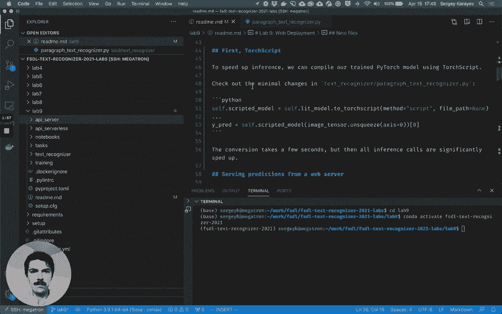
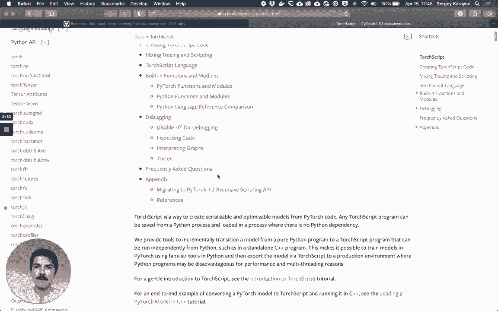
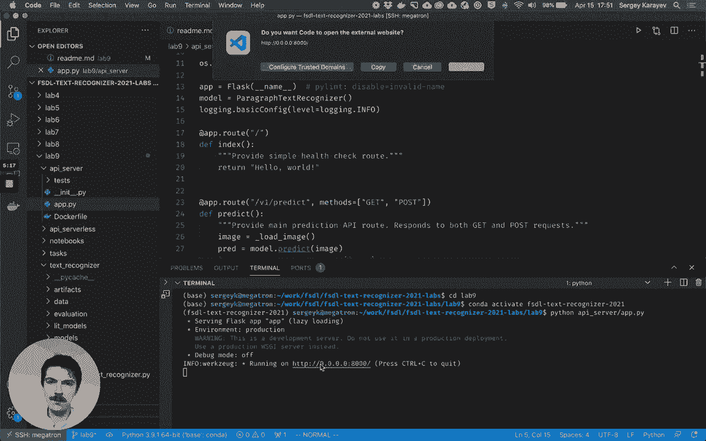
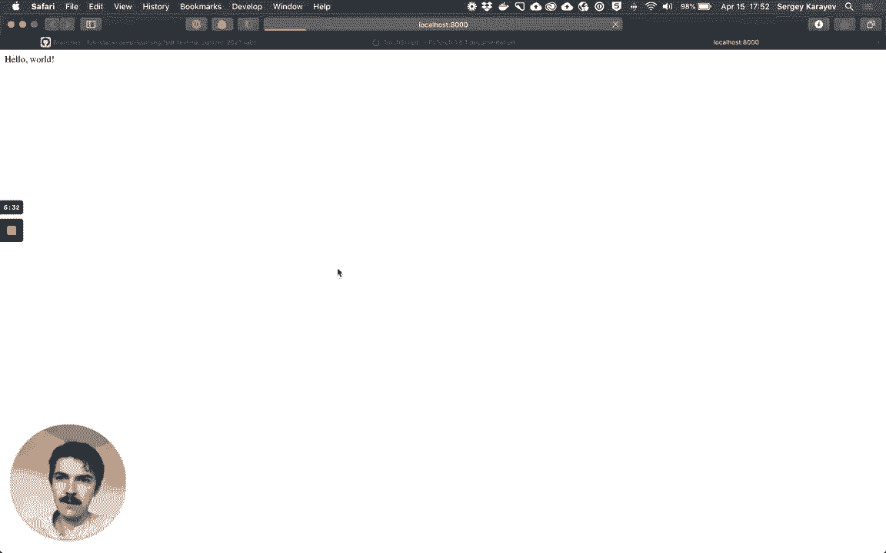
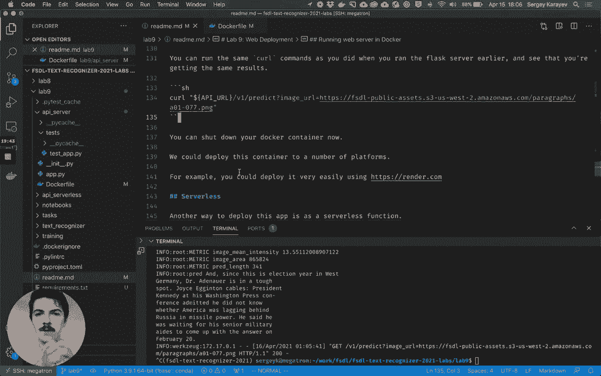
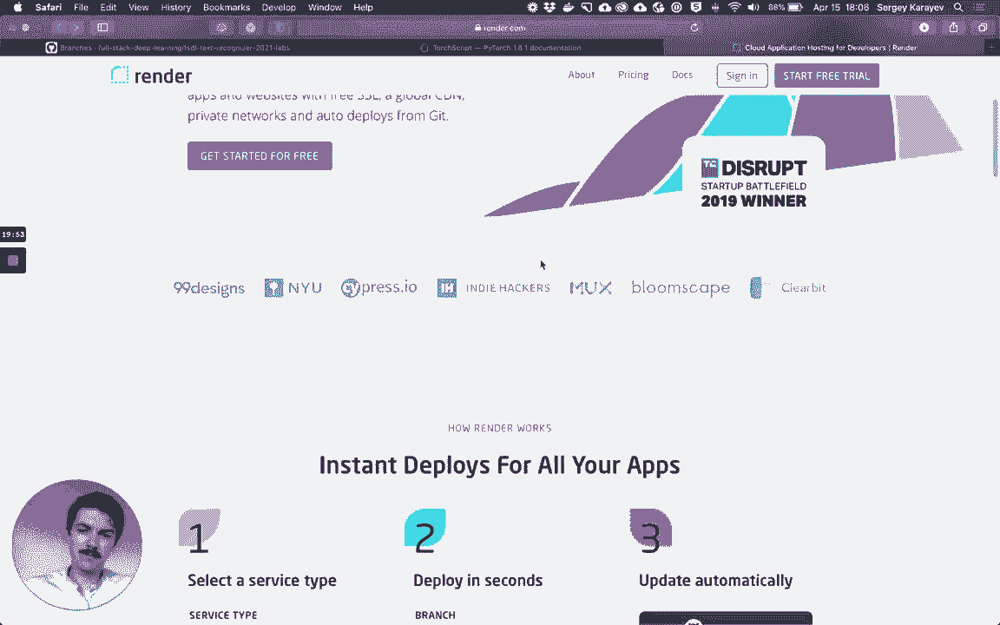

# 【双语字幕+资料下载】伯克利FSDL ｜ 全栈深度学习训练营(2021最新·完整版) - P25：【Lab9】Web 部署 - ShowMeAI - BV1iL411t7jE

hey everyone time for lab 9 of the full，stack deep learning，labs this one's going to prepare us for。

web deployment，we will first speed up the paragraph，text recognizer model that we developed，in lab 8。

with torscript for faster inference，we'll wrap it in a，web applica web app and send it some，requests。

locally see how that works we'll package，up the web server application。

as a docker container and show you how，to run it that way，and then lastly we'll prepare to deploy。

it as a serverless function using lambda，and we'll get it working locally this，lab。

so to follow along make sure to update，to the most recent version of the labs。

get pull make sure you activate the fsdl，text recognizer 2021 environment。

if you're on your machine install the，latest version of，the dependencies for python that we need。

there's a new one in this lab，so make sure to run that and then go。

there's quite a new files quite a few，new files in this lab，they're mostly in the new api。

directories，which is api server and api serverless，i printed them here so we have app。pi，app。

and then in the serverless directory we，have app。pi，and the docker file but。

first before we get there let's talk，about torch script real quick。

so basically we have a trained pi torch，model as of lab 8，and we can speed up inference using this。

model by using torch script，we can look at what torscript is just by，so it's basically taking。

the dynamically defined um，pi torch code and then compiling it。

to something that is statically defined，and using a faster kind of like all c，plus plus front path。

um this is actually an extension of the，cafe 2。

project when it merged with the pytorch，project，essentially it makes inference faster。

but the changes that have to be done are，quite minimal because of python's，lightning。

so they're all in this text recognizer，paragraph text recognizer。pi。

and basically it's just a couple of，lines，um one is in in it where we uh say。

our our python's lightning model should，be converted to torscript，using the method script and then。

this will take a few seconds but then，every call，every inference call with the scripted，model。

is going to be faster so if we're going，to be doing a lot of inference calls。

this is worth doing we can also save it，to disk，although we don't do this in the lab so。

that's really all it is，just a couple of lines here don't forget，to set your lip model to eval。

convert it to torch script and then when，you have to do inference。

simply use your your scripted model just，as you would use your，original model。

so now let's get a flask web server up，and running and serve some predictions。

so flask is a standard library，for web servers in python and，if we were actually deploying a web。

server to production，we would probably use fast api instead，of flask。

fast api works exactly well almost，exactly the same，as flask but it is more modern it uses。

type hinting as a，crucial part of how it does things and，it's a，asynchronous setup so it's much。

it could be much faster at responding to，requests because while it's reading a，file for example。

it could be responding to another，request，versus flask is going to be single，threaded and。

has blocking i o，not a problem for us and it is the，industry standard kind of so we'll just。

stick with flask for this lab，so to run it there's a file called api，server app。time。

and while it's getting launched let's，so it's a flask web server serving these。

paragraph text recognizer predictions，we import some stuff like flask。

we say app we initi initialize this app，we initialize，our model we set up logging。

and then there's a notion of routes so，there's just the um。

so if i open it i just see hello world，and the reason for that is because。

flask is returning the string so i could，change it to something different。

and i would see that in my browser and，then there's a route，v1。

slash predict good practice to version，your apis，it responds to both get and post http。

and all it does is it will load the，image，it'll predict on the image it'll。

assemble some statistics and print them，and then it will return the prediction，as a string。

so when it loads the image how does it，do it，so if the request is a post request。

then it'll try to read a base64 encoded，image，from basically the request on json。

if the method is a get it'll look in the。

url that it was called with for a query，parameter called image url，we'll see this in in a second。

but for now would you see that the，server is running。

if i call it，i can see it here but now let's open，another terminal tab。

and then our api is living at this url，so let's just，kind of get that as a variable and then。

what we're going to do is we're going to，read，this test image，which is in tests support。

so it's like a lot of ascii encoded，data basically what we're going to do is。

we're going to send that we're going to，pipe that over to a，curl um command which is making that。

http request，to our web server at the v1 predict you，route and we're basically going to send。

a json request with that data，so let's see what happens so we send，this request。

and we get the prediction back in this，terminal，and if we switch back to the。

terminal that's running the server we，so once again what we did is we send a。

base64 encoded image as a post request，this could be for example。

useful um like from your mobile phone，you could，instead of uploading the image somewhere。

we directly send it to the，we can instead send a get request where，we specify。

not a local file but a url that the web，server can then open。

as a query parameter which is what comes，after the question mark here。

so that works too we got a response，so both of these ways are common and。

it's nice to support both let's go ahead，and shut down our web server which we。

can do by pressing control c，and let's add some tests so in the api，server directory we have the app。

pi we，also have a test，stuff，just make sure that once we send that a。

request the response is what we expect，we can run it as we run all the tests。

and it passed so that's just to show you，there's nothing special about web。

servers you can test them just like，you can test any other code so what we。

have now we actually could deploy，but you know when we deployed we'd have。

to ensure that the python version is the，same as what we，expect install all the python，dependencies。

probably check out the our entire repo，which also includes training code and，notebooks。

and stuff we don't actually need in in，production so to make this simpler。

let's build a docker image with，everything that our application needs。

and basically nothing it doesn't so，docker of course is a way to。

do virtual machine like things but much，faster and much more lightweight。

we covered in lecture if you don't，already have it installed，then go ahead and do that at this url。

and on google collab i'm not sure that，it's possible to follow this part，unfortunately，first。

copy the production-only requirements，into requirements。txt and in this lab。

and then run docker the build command，tag the image that we're building as。

text recognizer api server，just the name is up to us and then use，this docker file to build it。

api server docker file and then use the，current directory which is what the dot，represents。

as the build context so，there's 12 steps that it's running and，it's basically。

going for it so let's while it's doing，it let's look at what it's actually，doing。

so the docker file says from python 3。6，bus chair，it's the official docker python image。

it's based on the debian，linux distribution include some common，packages which is quite。

useful we just create the working，directory，we install python dependencies。

so we copy the requirements。txt we，switch out，the cuda 10。1 version of pytorch and，torch vision。

for the cpu version a little bit of a，hack right here，um we make sure we're using the latest。

pip version and then we install all the，requirements，that basically all of these things。

in the docker image then we copy our，text recognizer code，and our api server code we expose the，8000。

port we set python path to，our repository basically and then the，command that the docker。

container is going to run when it starts，up is，okay so the docker is still building so，let's give it。

some time to do it and while it's doing，it，it's nice to put these。

commands after the requirement commands，because，once we docker does this layer caching。

thing so basically once this step is，done the result of it is cached next，time we run this。

all of these steps are going to go by，real quick yup just instantly。

but let's say we change something in the，code in the text recognizer code。

or this app code well docker is going to，be smart enough to know that something，changed。

so it'll actually rerun this step and，not use the cache thing，and if this step is before the，up。

but if it's after then everything before，it is still cached so that's。

when the docker build is finished let's，actually run，this resulting image which has a name。

so we say docker run we forward the 8000，port，this means like interactive terminal。

just give it some color，basically in the command line and then，we'll remove the container after it。

it's just a standard command that you，kind of get used to，so here we go we're running it and。

because of this last line，when we run the container it actually，starts running the web server。

and we can actually run the exact same，commands，as we did before so let's give it a try。

it's the same api url because we're，forwarding the port，except now everything is running not on。

our local host，so that is basically it，we can shut it down now and with this，docker file。

we're actually ready to deploy to a。

number of platforms，for example we could deploy it just with，what we have。

in like five minutes to render。com。

where you can just upload that image or，link it to the repo，and and give it the docker file that you。

want um and it'll automatically，deploy that service but another way to，deploy this app。

is not as a web server but as a，serverless function，and both aws and gcp have support for。

this kind of deployment，so we'll and and azure also，we're going to use aws lambda。

so let's look at api，serverless now and there's the app。pi，file and it should look very similar。

we basically load the model in，the module level of the code so that，this is going to always。

run when we run this file，and then we have a handler method which，expects an event。

in the context and this is kind of aws，lambda specific，it's going to load the image it's going。

to make the prediction，it's going to do the same kind of，statistics that we did and then it'll。

return the prediction，and loading the image um，basically we assume there's an image url，in the event。

and that's all we need we can read the，image，given that so it's very little code。

there's a docker file associated with it，which is in here，and we start from the official aws image。

amazon aws link to python 3。6，we install the dependencies in the same。

we caught you know it looks very similar，and，instead of running something we say，command app。handler。

because this image actually presupposes，certain things about，you know how it's going to execute so。

all we need to do is give it the module，and the function name，so let's make sure we have the。

instruction，we've already done that so let's build，now this will take a while because the。

requirements are，just take a while to uh to do especially，torch。

but once it's done we'll be able to run，this container，porch，8080 on the container which is the kind。

of canonical lambda，what lame that is going to run on 2。9，000 on our local。

um that's just what the instructions，from aws suggest so it's stuck with it。

so that people don't get confused，needlessly，and then we'll send get request to this。

function locally，still using curl but using this，localhost 9000。

and this url is like the aws lambda kind，of，what it expects canonically this is like。

the version of the api，function function invocations and then，we provided the event。

once this builds and we run the docker，we'll test it out but it's going to work。

um and that's kind of it for，um packaging up lambda it's it's quite。

easy the docker image can be up to 10，gigabytes in size，which can fit you know some of the。

largest models and we can pretty easily，hook it up to，for example s3 so that when an image is。

uploaded to s3，this land is automatically executed and，the result is stored somewhere else。

or we can put a lightweight rest gateway，in front of it，so we and and we'll set up some basic。

monitoring also，and this will do in the next lab so for，now let's actually run the docker。

okay it's running and then do this curl，request in a different，we can take a look okay something。

started，okay bam it logged this is from lambda，itself it said，it rained for 11 seconds and we would。

have been billed for 11。9 seconds，if we ran it and um it's using a three，gig。

lambda runtime and there's actually，bigger and smaller ones too that we can。

use once we deploy it but we got back，our answer，and we got our answer so here we go，that's。

kind of all there is to it for homework，follow these instructions。

if you're able to do this then you're，able to run docker，and look at the docker files it's。

there's not a lot to it but it's kind of。

all there is to it，and next time we will actually deploy it，to lambda。

put a rest cable in front of it and then。