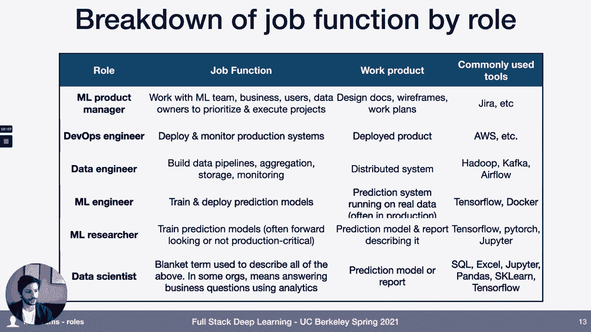
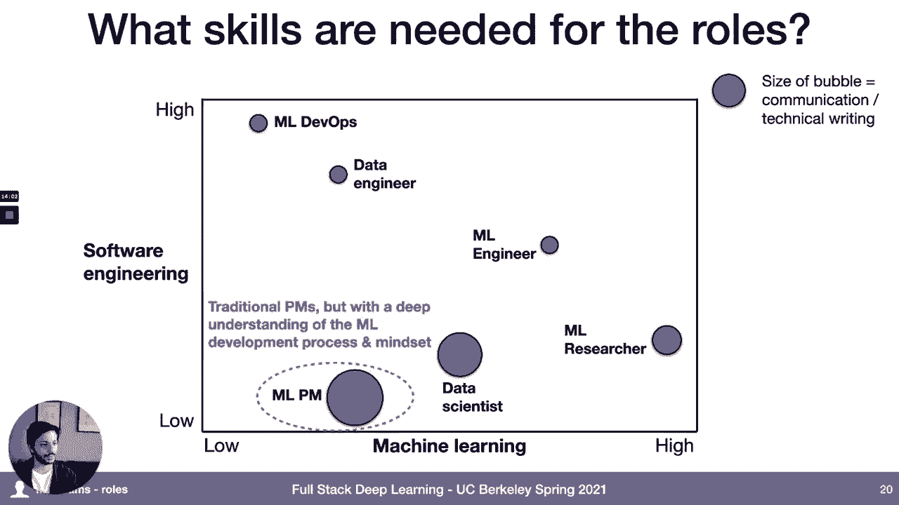
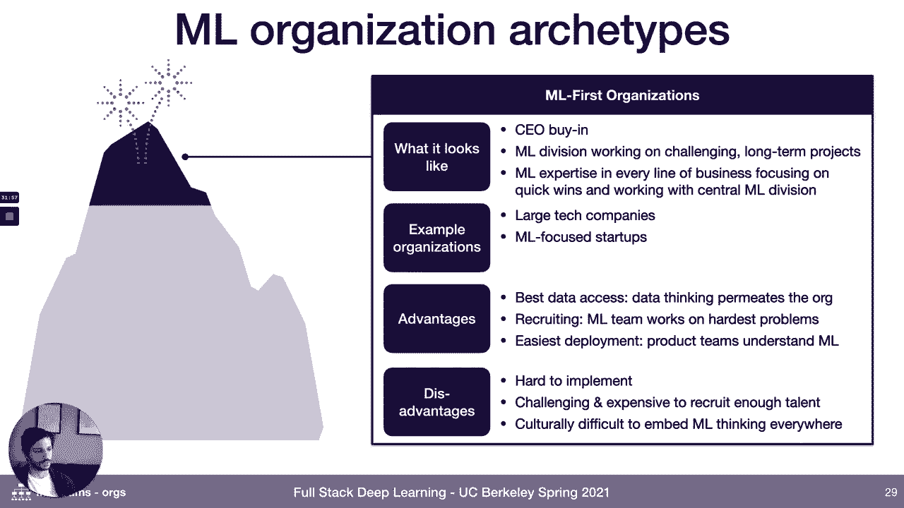
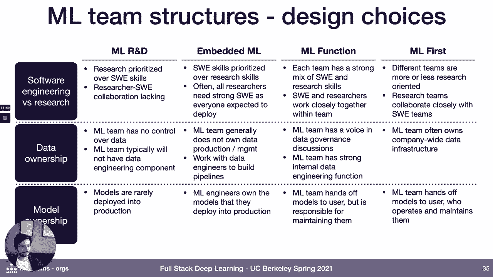
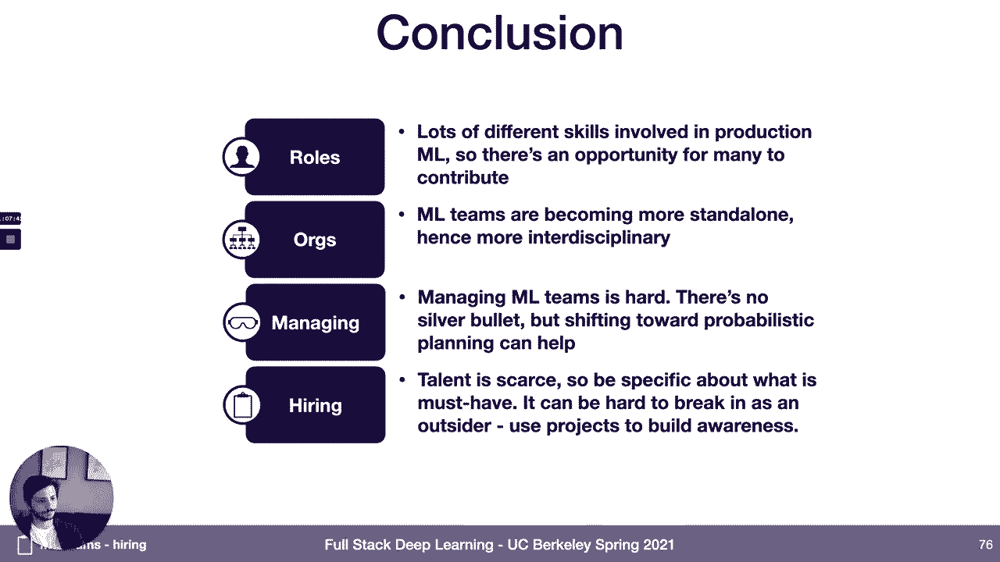

# 【双语字幕+资料下载】伯克利FSDL ｜ 全栈深度学习训练营(2021最新·完整版) - P27：L13- 机器学习团队 - ShowMeAI - BV1iL411t7jE

this week we're going to talk about，machine learning teams so，why why do we talk about machine。

learning teams as part of this course，like what does this have to do with uh。

with building working machine learning，systems um，well i think one of the challenges with。

machine learning is that，you know running any technical team is。

hard um it's hard to hire good people，it's hard to manage teams of people and，develop them into。

better versions of themselves it's hard，to，manage the output of your team and make。

sure that all of your，your vectors are pointing in the same，direction and you're producing the。

output that you want the team to produce，it's hard to make good long-term。

technical choices it's hard to manage，technical debt，and it can also often also be difficult。

to manage expectations，from leadership and this is true for any。

technical team that you might work on，but machine learning adds quite a bit of，complexity to this。

machine learning talent tends to be，expensive and scarce，there's a diverse set of teams of roles。

rather that，need to be present in order to make，machine learning work。

the projects that you work on are often，and，a high degree of uncertainty to them so。

managing output can be even more，difficult the machine learning field，itself moves really fast and。

is uh to quote the famous the now famous，google paper the high interest credit。

card of technical debt so，the the process of making sure that you。

are making good long-term technical，choices and avoiding debt is，even more challenging and then when。

leadership，in many organizations leadership doesn't，actually really understand。

ai and how it's different from regular，software and so this can make。

your your job as a manager even more，challenging，um and so for the for those of you that，are uh。

looking at this and thinking well i'm，not managing people so，how is this relevant to me well。

hopefully um，this will give you some insight into how，you know maybe your manager is thinking。

about building and managing machine，learning teams，and also a lot of the advice here is。

tailored towards kind of helping you get，a job in the machine learning world。

and so that's kind of what i hope that，you take away from this。

what are we going to talk about so first，we'll cover，the different roles that exist in。

machine learning organizations and what，are the different skills that are。

required for each of those roles，then we'll talk about machine learning。

as in the context of the broader，organization，then we'll talk about some management。

best practices for how，managing machine learning teams looks。

different from managing regular software，teams，and then we'll talk about hiring so how。

a lot of machine learning teams，think about or maybe you should think，about hiring ml engineers and。

how to also get hired if that's your，here is a list of some of the common。

machine learning roles that，we see out there machine learning，product manager。

devops data engineer ml engineer i'm a，researcher data scientist，right so there's there's a lot of。

different roles that are involved in the，process of building machine learning。

models so one question you might ask is，what's the difference between all these。

different things how do they work，together to build，so starting with ml product manager this。

person is sort of，responsible for working with the，machine learning team to help prioritize。

and execute on，on uh projects and one way you can think，about the。

the work that these different roles do，that，these roles are typically measured by，like。

design docs and wireframes and work，plans，devops and engineers are the engineers。

that are responsible for deploying and，monitoring production systems。

and so their work product like that the，measured on，is the final deployed machine learning，system。

data engineers are responsible for，building the data pipelines，the aggregation the storing and。

monitoring of the data that goes into，creating your machine learning systems。

they're building distributed systems，essentially，i'm getting more into the ml specific。

roles ml engineers，are you know the way we define it the，folks that are typically responsible for。

training and deploying the prediction，models themselves，and so their work product is the。

prediction system itself，running on real data in production and，so these are these folks are like。

working with tensorflow，but they're also working with tools like。

docker to actually productionize the，machine learning systems that they're。

there's another role that exists in some，organizations that i would call a。

machine learning researcher，and so these are folks that are also，training prediction models。

but those prediction models are either，kind of more forward-looking，more speculative less production。

critical，or they're working really closely with，an ml engineer or another。

engineer to productionize them and um，and so these folks are producing。

a model and sort of a report that is，used to describe that model。

how well is this model do what is it，useful for and things like that and so，the distinction。

is that ml researchers typically are not，and then lastly there's this role called。

data scientist which，is kind of a catch-all term used in this，field。

so it's it's used to descrip i've seen，it being used to describe any of the，roles listed above。

and in some orgs this is actually，something totally different from the，machine learning process so。

in some organizations data scientists，are more really more like business，analysts。

they're they're you know running sql，queries to，produce dashboards to help answer。

business critical questions and so when，you see the term data scientist。

it's important to dive in a little bit。

and understand in a little bit more，detail what that actually means in the，organization that you're。

you're talking to here's a um，here's a breakdown of kind of how we。

think about some of the different skills，that might be needed，for all of these different roles so on。

the left access is kind of how much，on，much，kind of skill and experience you need in。

machine learning，bar，for um technical writing and，communication so how well you're able to，with。

with other people and there's a spectrum，of，the different degrees of these two。

skills that are needed in these roles so，starting from um starting from the top，left。

with really really high software，engineering skill and actually not，necessarily any。

knowledge of machine learning at all，maybe beyond the basics，are these ml devops folks and so these。

um people who are in these ml devops，roles typically come，from um traditional software engineering。

pipelines，traditional software engineering roles，and this role really is more software，engineering。

with a little bit of knowledge of ml，baked in because those are the。

the customers that you'll be working，with，data engineers also require a lot of。

software engineering skill，but they they also are starting to need。

some knowledge of of the basics of，machine learning as well，because the machine learning team is。

kind of a very active customer of，machine learning engineers are kind of。

right in the middle requiring，actually a ton of skill and experience，in machine learning。

but also really solid software，engineering fundamentals and so this is，this is a pretty rare mix。

and these folks can come from different，types of backgrounds it's often。

software engineers people who worked in，software engineering for some number of，years who have。

done quite a bit of self teaching um in，you know uh in the field of ml but it's。

also sometimes people who are，you know science or engineering phd，dropouts。

or have some more uh machine learning，focused background，who then went into a software。

engineering role and trained in that，discipline for a few years。

and these are kind of the the unicorns，of the，machine learning hiring landscape these。

folks are very hard to come by，and typically command significant。

machine learning researchers these are，your ml experts right so these are the，folks。

that you know if anyone on this list，tend to have，some higher degree of a master's or phd。

in cs or stats，or in some cases they did one of these，industrial fellowship programs like the。

google brain residency or，or something like that um not all ml，researchers。

have that characteristic some folks you，know just did undergrad and went right，into the field。

but i would say those are the more，data scientists again since this is kind，of a catch-all。

role catch all term these folks come，from a really wide range of different，backgrounds。

you see folks that are in data science，who you know maybe did an undergrad，program that。

specializes in data science and then you，also on the other side of the spectrum，you see folks who。

have you know hard science phds uh，physics phds and things like that who。

and then lastly the this mlpm role this，is kind of an emerging role so there's，not really a typical。

kind of path to this role right now but，it's often people who come from a，traditional pm experience。

but you know who for whatever reason，have gotten a lot of exposure to the ml，process。

um you also see a lot of times folks who，came from the ml world，realized that they didn't want to。

actually stay in um，in like kind of core technological。

development and transition into pm later，any questions on the the different roles。

in the machine learning，typical machine learning development。

life cycle startups，that i've seen um be really successful，this kind of thing。

uh tend to index more on these roles in，the middle that do multiple things。

so ml engineers um you know folks that，can，that know enough ml to build machine。

learning models but also our solid，engineers，those that tend this tends to be like。

over represented in startups from what，i've seen，um because it's kind of a generalist，role um。

i don't see many startups that have，mlpms，or um and then ml researchers。

are present in startups but mostly in，startups that are really doing。

like pretty hardcore you know machine，learning，first type of companies so like in，self-driving car。

startups or other robotic startups um，devops i think is a pretty uncommon role。

in startups because you know devops，tends to be a role that，um becomes more critical as the。

complexity of your product，and your engineering team increase so i。

think that one's still pretty uncommon，and then data engineering i think is uh。

also something that at least startups，should invest in，i'm not sure how many of them actually。

do but maybe that's，that's uh that's if you know if i were，building a startup that。

was building a product that has machine，learning in it data engineering is one。

of the first things i think is worth，investing in，all right so we talked about the。

different roles that go into machine，learning organizations，next thing that we're going to talk。

about is how machine learning teams，themselves are situated in the context，of the。

larger organization that they're part of，so um i went out and had kind of a bunch。

of conversations with folks about this，to understand where where their machine。

learning teams are situated in their org，and how they kind of interact with the。

rest of the organization，the overall lessons learned here are。

that there isn't really a consensus yet，as to what is the right way to structure。

a machine learning team，um different organizations have，different practices and。

different kind of structures seem to，work well for different types of，organizations。

and so the goal of this section is，really to help，is really just like provide kind of a，taxonomy of。

best practices for at different like，maturity levels of organizations，based on what we've seen。

so the metaphor that we're going to use，is scaling the，machine learning organization mountain。

so starting starting from the bottom，the bottom of the mountain we have，organizations that have。

kind of nascent machine learning or，maybe they're doing machine learning in，some ad hoc way。

so what does this look like for your，organization really this means like no，one's doing ml。

or there's a couple people in the in the，organization that are doing it ml and，some。

ad hoc basis you probably have very，little machine learning expertise，in-house。

um what kind of organizations fit this，bill right now，well if you look outside of like silicon。

valley tech，companies and fortune 500 companies most，companies are in this category like most。

kind of small to medium businesses，um even ones that do have software teams，in-house。

and especially ones in less technology，forward industries tend to be doing very。

very little machine learning right now，maybe there's a couple people in the org。

that are experimenting with it，um you know hard to find advantages of a，model like this。

if you're trying to do ml but one of the，big advantages if you're looking to join。

an organization at this stage is that，there's probably，low hanging fruit there's probably。

things that you can go in and do and，just have a big impact，the big disadvantage of joining an。

organization at this stage if you want，to do，ml in the context of the organization is。

that there's often，very little support for machine learning，projects the organization itself might。

not really，believe in machine learning they might，not feel like there's a mandate to。

be doing complicated things like machine，learning um and so，you might be fighting an uphill battle。

in terms of like convincing people that，what you're doing is，worth the time it's taking worth the。

money that it's taking and，um actually a good idea and then，if your goal is to kind of build out a。

function in this organization to use，machine learning to do good things in，this organization。

it can be really difficult to hire and，retain good talent because。

um in machine learning like in many，other technical fields，a lot of you know many really talented。

people want to work with，other really talented people and so you。

can go and work in an organization like，this and，going to be，you're going to you're going to be。

fighting against the um，the kind of natural tendency of people，to want to go where other machine。

learning people are，climbing up the machine learning，organization mountain to the next stage。

um kind of the next stage of uh that，many organizations adopt machine。

learning at is what i would call like，like，um this is kind of the stage at which，the company is。

you know decided that it's curious about，machine learning it's，starting to do some research and。

development um around it it，has some pocs and um you know it's，starting to invest in it。

in maybe a more exploratory way to，figure out okay is this does this really。

make sense for our business，and in many of these organizations the。

machine learning effort is centralized，into，a smaller team that's maybe off。

somewhere in the research and，development，arm of the organization and in a lot of，cases。

what this actually corresponds to in，terms of the outputs of these teams。

are since they're not really closely，embedded with product teams they're，really。

operating more like researchers they're，kind of getting data sets from other。

parts of the organization they're，running experiments，on them and they're producing internal。

reports or maybe external papers，that are essentially you know。

proof of concept that maybe one of these，models could be useful in the company。

so i've seen this a lot in some of the，larger，industries that are slower tech adopters。

so oil and gas companies manufacturing，companies telecom companies。

that maybe have an ml research group，somewhere but are not actually doing ml，at scale yet。

there's a couple advantages to this，model one is that you can often。

hire pretty experienced researchers into，an organization like this because。

since the the mandate of this like mlr d，team is to do research and not to。

necessarily build actual products that，tends to appeal to，researchers who want to keep doing the。

kind of thing that they've been doing，and the other big advantage of this i。

think is pretty underrated is that，you can you you know since these teams，for。

near-term output let's say they often，have the mandate to work on。

longer-term business priorities and，things that could be bigger wins。

but the disadvantage is that people that，work in organizations or。

machine learning teams that have the，structure site are，a big one tends to be that it can be。

really difficult to get data from the，rest of the organization right so。

if you're if you have to go out um into，other parts of the organization and ask，them for data。

um that you need in order to solve the，problems that you're solving in many，cases those。

there's not a lot of buy-in from those，other parts of the organization that。

they really need to help you，and so getting data even internally can，be difficult for these teams。

and then another big disadvantage is，that you know if if the goal。

if your goal is to produce you know，products or，business innovations that have machine。

learning in them then，this model just doesn't really work very，well so these。

efforts from what i've seen rarely，actually translate into，into real business value and so usually。

what that means is that the，the amount of investment in these，organizations remains pretty small。

um unless through some heroic effort of，the team they manage to push something。

out into the world that um that causes，the the organization to believe that。

this is really something that can make，moving up the the mountain from the。

ml r d archetype the next um，archetype that is pretty common is，having having machine learning folks。

that are dedicated to doing machine，learning，but not actually having a centralized。

machine learning team，so this what this looks like is you'll，have。

machine learning oriented um individuals，who are embedded into different parts of。

the business or different product lines，um and maybe these are only certain，product teams。

or maybe it's most of the product teams，and the um，and this model really the thing that。

excels about this model is that，you put your ml expertise alongside the，software um。

and analytics talent in the organization，um the ml folks on the team typically，will report up。

to the same engineering lead or tech，lead that the rest of the。

the software team and the organization，reports up to，a lot of smaller or medium sized。

or like even high growth like software，technology，startups fit this you know choose this。

model when they're first starting to，adopt machine learning，and it's pretty common in particular in。

financial services companies and fintech，there's a couple big advantages to this。

model so i think the biggest one and the，reason why a lot of startups in。

particular choose this is that，the when the machine learning folks that。

you have in the organization make，improvements，it's very likely that those improvements。

are going to lead to real business value，right because those folks are sitting。

with a team that's building a real，product and so they're，the problems that they're choosing are。

inspired by the needs of that team，and they have the the support of the。

engineering organization around them to，actually get those improvements into，production。

um and there's in particular there's a，tight feedback，cycle between an idea that the machine。

learning practitioner has，and actual product improvements and so。

you can really see the impact of your，work if you take a role，in an organization that's structured。

like this，but there's a few disadvantages to this，model as well which is why i think it's。

not where um most companies end up in，the long term if they invest really。

heavily in machine learning，so one thing is that um kind of just。

like in the nascent machine learning，organizations it can be hard to hire。

and develop really really top-tier，talent in an organization like this。

and i think the core reason to that is，that um，you as a as a like data scientist or a。

machine learning person in an，organization like this you're，a little bit off in an island so you're。

working with，people that are are practicing the same，craft as you at least not super directly。

um and so that can be that can be，challenging for folks that want to。

surround themselves with people who are，really good at their um。

their their craft and to learn try to，learn quickly from them。

access to resources can lag so in a lot，of organizations，if you're a data scientist reporting up。

to the product team it might be hard to，get tons of compute resources or things。

like that because your budget is going，to be coming out of the budget，for that product team and um。

i think maybe the the the um largest，disadvantages to working to working as a。

machine learning person in an，organization like this is that，machine learning project cycles tend to。

operate a little bit differently than，software pro uh product cycles and we'll。

talk a little bit more about this in a，bit but，you know the core difference is that。

when you try something in machine，learning，you know most of the time it doesn't。

work right so machine learning projects，tend to come with a lot of risk and a，lot of uncertainty。

and that can be difficult that can be，difficult to fit into engineering。

sprints and engineering planning cycles，and in particular，longer term machine learning projects。

things that might take，that might be very uncertain and take，six months or a year can be very。

difficult to justify in a structure like，this，so that's i think one one thing to be。

aware of if you're if you，are considering jumping into a role like。

the next higher stage on the machine，learning organization mountain is。

the an independent machine learning，function and so what does this look like。

this is a centralized machine learning，organization just like。

exists in the ml r d archetype but it's，um where it's situated in the。

organization is very different so the，the ml division of the company might。

report up to senior leadership，in some cases maybe even the ceo of the，company。

this these types of organizations might，have mlpms，they might have ml researchers and ml。

engineers that are working with internal，customers to build out machine，learning-enabled products。

to help those internal customers make，you know either make their processes。

better or maybe the products that，they're producing better，these teams often are also engaged in。

longer term research whether it's，internal facing or，actually writing papers and。

um oh you know the types of，organizations that，tend to have this type of structure are。

like large financial services companies，big banks for example，um and also like many of the larger。

uh larger tech companies outside of you，know google and facebook and uber and。

places that are really well known for，machine learning like that。

the big advantages of this model and the，reason why many organizations choose it，is because。

you're creating this sort of um the，center of excellence around machine，learning so you have a。

really high talent density which means，that you can hire really good people who。

want to work with other machine learning，folks and train them，because you're surrounded by other。

people who are doing the same thing，the advantage of structuring the。

organization like this as opposed to，having it be part of the r d function is。

that you know typically it reports，up to a pretty high level of senior。

leadership and so that means that，a lot of the problems of data，availability you can you can kind of。

bust through because，you know if you're if your machine，learning organization reports to the cto。

or something like that then，the cto can help you um get data if，that's what you're。

having trouble with and then lastly，in in the kind of machine learning。

embedded in product functions archetype，um one thing that often lags is um。

is like centralized tooling and，centralized infrastructure for the ml，team。

but organizations that fit this，archetype can invest a lot in making，sure that they have。

a great machine learning platform and，culture around，the disadvantages of an archetype like。

this are that，um you since the the folks that are，doing the machine learning are not。

embedded into the product teams，themselves，they have to hand off the models at some。

point to the to the，folks that are actually going to be，using them in their products and that。

can be challenging，so you need buy-in from the users，and you also need them to have some，about。

what is this thing that they're using so，that they can，make good decisions about when to you。

know when it's working and when it's not，working，and because of that um feedback cycles。

all right so we've reached the top of，the machine learning organization，the。

the standard that most organizations，should eventually try to build to as。

their machine learning function gets，more mature，which is the the archetype of machine。

learning first organization，so what does this look like um it's。

like really strong buy-in that machine，learning is important，across the organization and you have。

both a machine learning division of the，company that is working on。

challenging long-term projects like，infrastructure，research and higher risk projects within。

the context of the business，but then you also have ml expertise，within every line of the business。

quick，wins and are working with that central，ml division to make sure that there's。

machine learning being deployed into the，products that they're working on。

so there's a few examples of companies，that are um fit this archetype or are，close to this archetype。

and they tend to be you know your large，tech companies your google，facebook uber type companies um。

and then also some of some really，machine learning oriented startups，great。

access to data um because you have folks，that are thinking about。

things from a sort of a data machine，learning first，perspective scattered throughout the。

organization but you also have central，resources to，collect that data and push through。

organizational silos，it's really great for recruiting because，you have this centralized ml team that。

works on the hardest machine learning，problems in the organization。

you have lots of resources and lots of，real business problems to solve，so。

your product teams have some，understanding of machine learning baked，into them。

but you also have a team that's able to，invest in the infrastructure that it。

takes to deploy stuff well，disadvantages of this model um really，the disadvantages are。

practical disadvantages it's just hard，to do this so，it's hard to implement this structure。

well it's hard to recruit，enough talent and it's culturally，difficult。

to make sure that everyone in the，organization um，has the base level of understanding that。

they of machine learning that they need。

so a few kind of design choices that，are uh that um，that machine learning organizations need。

to make as they're figuring out how to，set up their team structure。

so one is balancing software engineering，and research，so you know to what extent is the。

machine learning team itself responsible，for building and integrating with，software。

versus like you know shipping models off，to some other team，um and related to that like when you're。

when these teams are hiring people how，important is it for them to get software。

engineering skills on the team，versus focusing on getting people that。

are good at machine learning and good at，data，data ownership um how much control does。

the machine learning team have，over data collection um data warehousing。

data labeling and data pipelining，um versus being you know customer of。

some other team that's solving those，problems，model ownership um is the machine。

learning team the ones that are，deploying the models into production or。

do they hand them off to some other team，to do that，and who maintains the deployed models。

when they're in production，um so different organizations，um make different choices uh for these。

different design choices depending on，like which stage of，uh what where they are in the mountain。

um and so i'm not gonna go through the，details here，but um kind of as you'd imagine um as，you get，on。

on the mountain things get more and more，specialized and the，machine learning team gets um gets more。

and more control，over the data and the models that。

all right i'm going to move on and talk，so there's i think as i alluded to。

earlier there's a core challenge，in managing machine learning teams that，makes it。

uh more difficult in some ways than，managing traditional software teams。

and that core challenge is that it's，often really hard to tell。

in advance how easy or hard something in，machine learning is going to be。

um so this is a set of charts from a，blog post by，lucas b wald the weights and biases，founder。

and this is from a kaggle competition，that he ran where，they were um and this is plotting the。

the accuracy of the best，um the best submission over the course，of the competition。

so in the in the first couple weeks this，is what the accuracy over time looked，like so。

things are improving really really fast，right and so it's like。

this is great you know we've hit we've，gone from 35 to 70，accuracy in like a week so um you know。

we're going to crush this，we're going to crush this benchmark。

we're going to hit like 99 accuracy and，solve this problem right。

um if you extend this graph throughout，the entire competition this is what it，looks like。

right so essentially you know there was，and then，very very marginal improvement um，thereafter。

and that's not due to lack of effort，this is if you can plot that against the。

number of teams that are participating，in the competition which is。

going up really steadily over the course，of，the competition and so the the upshot of，this is that。

you know um you might read this chart on，the left and，infer like okay based on past。

improvements we think we can improve，our model by this over the course of the，competition but。

making those types of judgments in ml is，really really challenging。

it's very very difficult to know how，difficult or hard or something is。

and whether you know early signs of，progress are really indicative that the，problem is。

going to be easy or whether you know，the easy gains were easy and the hard，um and so in addition to。

being difficult to tell how hard，something is the progress the like kind。

of pace of progress for machine learning，teams tends to be very non-linear，um so it's very common in。

in my experience for machine learning，projects to entirely stall。

for weeks or for weeks or even longer，right where there's，no kind of measurable improvement in。

performance over over that time period，and um in the early stages of the，plan。

because it's unclear what's going to，of，different models to try different ways。

of augmenting your data different ways，of collecting more data。

new architectures that you're dreaming，up but it's very very hard to know in，advance。

whether any of those or which subset of，them will be successful。

and so as a result of these two things，planning um project timelines is in。

particular it's extremely difficult，so one way to think of this is that you，still。

somewhere between what you know how most，of us think of research。

and what we would think of as like a，on top of that there's um you know in。

in the real world machine learning teams，at some level，if you're going to build production。

systems need to interface with，engineering teams software sharing teams。

but there's often called big cultural，gaps between these two fields。

so they have you know different values，backgrounds goals and norms。

um and in more toxic cultures what this，can lead to，is these two sides really not valuing。

one another right like you'll have，um a setup where you know software。

engineers think of machine learning，researchers as these like，divas who don't even know how to code。

and machine learning researchers think，of software engineers as，these like um you know these like。

plumbers who don't have，you know who can't have a creative idea，to save their save their lives and。

in reality neither of those like for in，healthy organizations these teams。

collaborate really closely with each，other and have a high degree of respect，for one another。

um but the the differ the different，cultural norms in the fields can，be a um be a blocker to that。

another big challenging a challenging，thing for managing machine learning，teams is that。

in many organizations leaders just don't，really understand machine learning。

um so they you know they they may not，know like，what's actually feasible they may not，this。

like the fact that things are just going，to take longer or at the very least the。

timelines are going to be more uncertain，so the next thing i want to talk about。

is you know i don't have an answer to，how to，get rid of all these problems i think。

managing machine learning teams is a，genuinely，difficult and unsolved problem but i。

want to give a couple of insights，that i've learned from folks that are。

really good at this about how to manage，machine learning teams better。

the first is to do um instead of doing，kind of traditional，waterfall based project planning to。

instead do，project planning for your machine，learning projects probabilistically。

so this is what your um kind of like，task chart might look like for a。

traditional software project you have，all these tasks and they maybe feed into。

one final task and you can plan out，how long each of them take and how they。

um pipeline into one another，in the machine learning world um like。

conceptually one way to think about，project planning is that，you should also be assigning success。

probabilities to each of the tasks，um so you know task a might。

you might you might say like uh that's，only 50，likely and then in order to do task d。

which is maybe the thing that we care，about it depends on these two tasks。

each of which is maybe only um or maybe，let's say it depends on at least one of，task b or task c。

um but each of them are only you know 25，or 50 percent likely to succeed。

and so we're going to do both in，parallel um，and then what this might look like over。

the course of the project is well we，work on，task b and task c for a week we realize。

hey task c is really not working at all，like let's call this failed。

um and task c actually seems pretty，promising like this，this model architecture that we picked。

seems like it's going to work but it's，going to take longer than we thought so。

we'll spend the second week on task um，task a or task b rather。

and then we'll extend our timeline for，um and then over time you know as you。

get a sense for which projects are going，about，the likelihood of success of each。

projects of each project，evolve you can then think in the future。

about which other projects depend on，those projects，and so um really what this means is that。

you have，what you want to have is a portfolio of，approaches so um，the the corollary of uh of。

of doing machine learning project，planning probabilistically is that。

you shouldn't have any um path critical，research projects，right so if you if you need to um。

if you need to like have an answer to，this one question in order to move，forward。

then you shouldn't you know in in a，perfect world you shouldn't just have。

one idea about how to do that，you should be working on a couple of，different things in parallel um。

you don't need to do them in parallel，but um you could try them sequentially。

like let's say if you only have one，person that's working on them。

but um many good organizations do they，have kind of a norm where。

hey we have we have to like we have to，improve this model by x percent。

and so we're gonna have um two，researchers try five different ideas。

and the one that looks the best after，two weeks is the one that we're gonna go，with。

um so kind of like a a friendly，competition of ideas，um and you know coming back to the。

cultural norms around，managing machine learning teams well，this can be a very difficult thing to。

get right culturally because，when you have you know different people。

in the team having their ideas compete，with one another，that can um that can lead to negative。

cultural consequences if you don't build，another another upshot of this is that。

it's when you're measuring the success，of the team，it's really important to do this uh。

based on inputs rather than based on，success um so，what that means is that you know when。

you're doing performance management when，you're deciding like。

who on the team is doing well who on the，important，not to get hung up on whose ideas worked。

and whose ideas didn't work，in the long term it is really important。

for people to do things that work，um but on any given project the success，measure is。

how well you executed on the things that，you tried not necessarily whether the。

things that you tried ended up being，successful or not，all right since we're taking this。

um another kind of thing that i've seen，be really important for organizations。

that do this well is having，researchers and engineers working pretty，closely together um。

one common failure mode for a lot of，organizations is，thinking that either engineering is more。

important than research，which often leads to kind of getting，stuck on the machine learning side。

or the opposite right thinking research，is more important than engineering which。

tends to lead to like really elegant，has，or solutions that can't be。

another best practice for making this，work well is trying to get something end。

to end working relatively quickly，um this does a couple things for you，first it makes。

it just makes the task more likely to be，successful since you already have like a，version of it that。

um does almost what you want but it also，allows you to communicate your progress。

to leadership better right because if，you have um，if you have a basic prototype of your。

thing working that's maybe only like 50，accurate when you need to be 80 accurate。

then you can go report to leadership of，like oh this week，we went from 50 to 60 this week we went。

from you know，and next week we're going to try to go，from 60 to 65。

um and it's just it's a it's a clear way，to communicate the progress because you，can actually。

um have clear metrics and have something，clear to show people，um and then the last kind of best。

practice i would cite here is，trying to educate the leadership of your，organization on。

this phenomenon right this phenomenon of，machine learning timeline uncertainty。

um unfortunately there's，you know as as like machine learning，engineers in many cases there's not。

a whole lot we can really do here to to，change people's minds about this。

um a lot of the onus here is on，leadership like，to actually build their own realistic。

understanding of the way that these，things work，but i think that there's like machine。

learning teams themselves bear some，responsibility for this as well。

um so uh you know just to give you an，example，what is a what is a bad like kind of。

weekly status update to leadership，sound like um so a，example of a bad weekly status update to。

leadership might be like，hey leadership um you know this week we，did great we。

improved our cat detection model from 60，to 80，accuracy you know we have lots of ideas。

for how to continue to improve from here，next week we're going to try making our。

model bigger and we hope to improve，accuracy even further，right so it's kind of this kind of like。

um over optimistic like，hype building style of communication，that focuses on。

the things that the machine learning，team cares about and is working on。

not what's actually leading to making，the system the overall system that。

you're trying to create better，it doesn't communicate the risks and it。

doesn't communicate the uncertainty that，all right um oh yeah next thing i want，to point to is um。

if you if you are in this position where，you know someone higher up in the。

organization doesn't understand，the way that machine learning works and。

um and the way that it's different from，building software there's a couple of。

resources that you can point them to um，there's this this kind of。

older blog post from andreessen horowitz，or i think it's like actually a talk。

that's a very high level overview of ai，um which is pretty out of date at this。

point but still one of the best，intro level like executive level，materials that i've seen。

and then um peter taught an ai strategy，class，uh in the business school at berkeley，point。

um and so that's also worth pointing，people to，all right last topic that we want to，cover is。

hiring so both we're going to look at，this from both perspectives right from，the perspective of。

someone maybe who's trying to hire ml，engineers maybe um，you know in a couple of years you have a。

your own ml startup and you're looking，to hire ml engineers，but also from the perspective of someone。

who's trying to get hired as an animal，engineer，we're gonna talk about a few things here。

um first is the ai talent gap，and so this is just important for，setting the scene about what。

hiring in the machine learning world is，like right now，um so you might ask yourself like。

you know what are the supply and demand，dynamics of this market right how many。

people are there out there that know how，to build，ai systems um different ways of，estimating this。

there's a couple from element ai you，know 5000 actively publishing research。

that's probably too narrow，um 10 000 with the right skill set，um bloomberg estimated there's 22 000。

phd educated ai researchers，um element ai gave an upper bound of 90，000 uh people。

based on the methodology that they used，um，and tencent also had a number that they。

thought was around 200 or 300 000，which is the number of like ai。

um and so you might think like oh this，is actually kind of a lot but if you。

compare this to the number of software，developers even just in the us，which is 3。6 million roughly。

or around 18 million in the whole world，are，that are out there in the world doing。

machine learning right now，listed，in this blog post i think these numbers。

are probably a couple years out of date，at this point but hopefully still give a，rough indication of。

and so what this is produced is a fierce，competition for ai talent um this is a，quote from。

a uh from bloomberg you know everyone，agrees，that the competition to hire people is。

intense academic conferences are，becoming frenzied meat markets，seven-figure salaries for top。

researchers you know it's crazy out，um this is a quote from a，computer vision engineer at a later。

stage startup that we interviewed，hiring is crazy right now this is a。

young field it got popular very quickly，there's a ton of demand not a lot of。

um uh from another startup founder，it's really really challenging to hire。

from ml takes way more time and effort，than we expected，um we have someone working on it full。

time and we're still only able to get a，few people per quarter。

so that's just setting the stage for you，know the difficulty that that。

companies are having hiring ml engineers，right now，um so the next thing i want to talk。

about is how um，how folks should think about sourcing，talent for machine learning teams。

folks that are in a hiring position，again we we looked at a number of。

different common machine learning roles，um uh i think for some of these roles。

like for ml product manager devops and，data engineer，it requires maybe a slightly different。

mindset um than hiring for，you know the more software like，traditional software version of these。

roles，but not really that different like you，ml，some study of ml but fundamentally。

not too different um and so for the，purposes of，this lecture we're going to focus on the。

more core ml roles ml engineer and，ml researcher type roles so there's a，there's a um。

there's maybe not like a right way to do，this but there's certainly a wrong way，to do it。

um so this is a this is like maybe a，caricature of a job description but。

uh maybe not too far off from like what，i whether what's an actual machine。

learning job descriptions feel like，um which is you know duties of this。

unicorn ml engineer um keep up with，state of the art you have to you have to。

be able to implement models from scratch，you need to have you know deep。

understanding of mathematics you need to，be able to come up with new models on，your own。

you need to be able to build all the，tooling and infrastructure for the。

machine learning team yourself，you need to build data pipelines as well，you need to be able to also。

you know deploy and monitor all the，models that you're creating in，production。

and you know so what you really need in，order to be successful in this role is。

of course you need a phd um definitely，need at least you know four years of，tensorflow experience。

um uh and like at least four years as a，software engineer as well。

right oh and by the way like if you，don't have at least a couple of。

publications in nurps or icml then，um so this is obviously like this is。

this is obviously taking this idea of，needing people who are good software，ml。

skill sets too far um but this is i，think like how a lot of companies。

are really trying to hire ml engineers，right now，um so what's the right way to do this。

well again i'm not sure there is a，single right way but，um i think one thing that more companies。

should think about is，hiring for um a couple of different，paths right so one is。

primarily hire for software engineering，skills and maybe some experience in ml。

and a desire to learn and train folks to，do ml，um another thing that you that companies。

should do more of is go more junior，right like these days most most folks。

are graduating from berkeley，with some ml experience so more junior。

folks are more likely to have this kind，of background，um and then the core thing that i。

recommend teams to do is to be more，specific about what you really need，right like。

not every ml engineer that you hire，needs to have all the skill sets on the。

um if you're hiring for ml research，positions there's a couple of specific。

recommendations here one is to look for，more for，quality of publications rather than，quantity and。

this requires like having some taste for，what you consider a high quality，publication to be。

but it's things like originality of the，ideas the quality of the execution of。

other thing i recommend is look for，researchers who，work on problems that you think are。

actually important right，a lot of researchers tend to focus on，problems that are trendy。

at the moment that they're doing their，research without really thinking about。

why the problems that they're working on，matter and that is the kind of research。

that won't translate super well to，a to a company environment，oftentimes folks that are that excel。

outside of academia are researchers that，have，worked before outside of academia so。

that's another thing to look for，and um a couple other like alternative，paths to consider。

are folks who are really talented in，adjacent fields like physics or，statistics。

or people you know without phds right，from non-traditional academic，backgrounds。

people are really talented undergrad or，master students with some research，experience。

or folks who have been in one of the，how should um how should folks think，about like sourcing。

ml engineer and ml research candidates，you have your standard sources。

you can also keep an eye on top，conferences and archive and flag。

first author papers that you like at，open ai some of the hiring committees。

would basically just go through all the，icml papers，and flag the ones that they thought were。

interesting and reach out to the first，authors，another source other than just papers is，papers。

um so if you if there's a paper that，you're interested in and you find a。

re-implementation that is good，that you know whoever re-implemented，that paper could be a good hire。

um a lot of this recruiting you know in，the when，in-person conferences happen again a lot，of this。

recruiting happens at ml research，conferences um，so that that's another good place to go，job。

so you know next question you might have，is like if you're，if you know if when you're running your。

startup and you're um maybe you find，some really，some really talented machine learning。

research machine learning engineering，candidates，how do you actually convince them to。

join like what are folks um，in those types of positions looking for，um。

so i think like there's no real，generalization here，different people want to join companies。

for different reasons but there's a few，common things that i've seen from。

folks that fit this profile so working，with cutting edge tools and techniques。

you know latest papers the latest，infrastructure systems，building skills and knowledge in an。

exciting field so really being able to，learn a lot about，about a fast-growing area of machine。

learning working with excellent people，um working on interesting data sets so。

one of the unique things you can offer，as a company is is the data that the。

folks will be working with，and then lastly and maybe most，importantly doing work that actually。

matters，and so how do you translate this to you，know to the pitch that you that you give。

to people that are thinking about，joining，well um for folks that want to work with。

cutting edge tools and techniques you as，a company，projects，and when you do that really highlight。

those things so，publicize them maybe write papers about，them or blog posts。

invest in the tooling that your team is，using empower people to try new tools。

and really create a create the kind of，working，for for candidates that are excited。

about building skills and knowledge in，an exciting field，there's one thing that some。

organizations do really well，is building a team culture especially on。

the machine learning team that is，oriented around learning，so peter talked about reading groups in。

his lecture，are，learning days so specific days that you，have set out for。

focus to for people to focus on learning，new things having a professional。

development budget a conference budget，just really investing in people to make。

sure that they're staying up to date，working with excellent people one way to。

make your company stand out on this，access is just to，have you know at least one or two people。

working there that are relatively，high profile now that's maybe easier。

said than done because you need to，convince the high profile people to join。

but the other way to kind of bootstrap，that if you don't have that is to help，your best people build。

their profile and the way to do that is，to，help them publish blog posts and papers。

so that they get their name out there，um for if you have an interesting data。

set to work with something that's unique，something that is um maybe has。

interesting technical properties，then you can sell the the properties of。

the data set in the recruiting process，and then lastly you know just like。

recruiting for any position selling the，mission of the company and the potential。

in particular for impact of machine，learning on the company's mission。

can be really helpful in in closing，folks that uh，to work on this kind of stuff。

all right um next let's talk about，interviewing um，so uh i think like some of the things。

that you'll see，folks test in machine learning，interviews um，if you're going through some of these。

interviews are you know，trying to help assess whether you can，think creatively about new machine。

learning，problems testing generalist software，engineering skills。

um and i think in many organizations，that's true both for researchers and for。

software engineers uh who are，degree，to which those things will be tested。

will differ depending on the role but i，would expect to be tested on。

both your knowledge of ml and your，ability to do software engineering if，you're going。

into an industrial role，what actually happens in ml interviews。

so the ml interviewing process is much，less well defined than the software。

engineering interview process so there，isn't really a book that you can go and。

buy that will help you prepare for，machine learning interviews in the same，way that there is。

for software in engineering interviews，but there's a few，kind of types of assessments that i've。

seen to be pretty common there's you，know your traditional background and，culture fit。

there are there's you know analogies of，like，whiteboard coding or pair coding one，thing that's。

i've seen be unique to machine learning，interview processes is pair debugging so，looking at some。

machine learning code that has a bug in，it and working with your interviewer to。

find that bug um math puzzles，like say involving linear algebra are，pretty common。

take-home projects are pretty common um，what i would call like an applied。

ml assessment so explaining you know，interviewer articulates a problem that。

you need to solve you explain how you'd，use machine learning to solve it。

um probing into past projects that，you've worked on so if you have。

a past machine learning project that um，that you can talk to maybe it's the。

project for this course being able to，kind of go deep on，what are the different choices that you。

made what worked and what didn't work，and then machine learning theory。

questions so explaining things like the，bias variance trade-off。

last thing i want to cover is finding a，machine learning job so if。

you're if you want to get a job as a，machine learning，engineer where should you look。

so again there's your standard sources，your linkedin your，recruiters your on-campus recruiting but。

if you want to go beyond that，then looking at the machine learning。

research conferences can be a really，good way to do it，there's often tons of recruiting that。

happens in those places，and then this is maybe bad general，advice for getting jobs。

but in the machine learning world in，particular，companies，you know because there's a talent，just。

trying to look wherever they can find，for talented machine learning folks and。

so they're more open to，direct reach out in many cases than um。

in the traditional software engineering，um how to stand out so if you are，applying for these jobs。

what are things that you can do to make，your background more impressive um。

so having basic software engineering，skills you know，working at a stripe or a google like a，is。

is really good um having some interest，in machine learning，is also really important um if you can。

if you can demonstrate that knowledge，so writing blog posts that synthesize a。

research area or writing blog posts that，you know um explain a new research topic，that's emerging。

or a new category of models that is，emerging can，demonstrate that you have like a good。

grasp of the overall field and that can，be really impressive to people that are。

but even better than that is，demonstrating the ability to get machine，learning projects done。

so if you have side projects or paper，to，that's often a way to get over the。

hurdle of this person doesn't have that，much experience so how do we know that。

they're going to be able to get stuff，done，and then especially if you tend more to。

the research oriented side，than proving you proving that you can。

think creatively in machine learning，so you know winning toggle competitions。

publishing papers and things like that，um in terms of how to prepare for，machine learning interviews。

again maybe this will be relatively，obvious given the you know what we。

talked about being in these interviews，that，you should in addition to preparing like。

machine learning specific stuff like，reviewing ml theory um thinking about，how basic。

ml algorithms work like rev reviewing，your 189 materials，i would also recommend preparing for a。

general software engineering interview，because many companies do test machine。

learning engineers for basic software，going to move，over to the to the panel um we talked。

about roles organizations，managing machine learning teams and，hiring there's a couple of takeaways。

from each of these here，uh in in terms of roles，there's many many different skills that。

are involved in making production，machine learning work，and so the thing i would want you to。

take away there is there's a lot of，different ways to contribute。

and so you should think about that that，plot，skills on the on different axes and。

you know just know that there's like you，can you can max out on software。

engineering you can max out it on ml，or you can have some some balance of the，two and still find。

a lot of ways to contribute to machine，learning projects um，and uh and and lastly i would say you。

know in in terms of，in terms of hiring um it can be，difficult to break into the machine。

learning world as an outsider，um and so that the maybe the main kind，of takeaway that i would。

give you there is like one of the best，ways to do it is to use projects。

as as your way in so um hopefully the，course，you know if you don't have a portfolio。

of projects already can be the first，step toward doing that if you。

do want to go get a job in this field。

