# 【双语字幕+资料下载】伯克利FSDL ｜ 全栈深度学习训练营(2021最新·完整版) - P2：【Notebook】编写神经网络代码 - ShowMeAI - BV1iL411t7jE

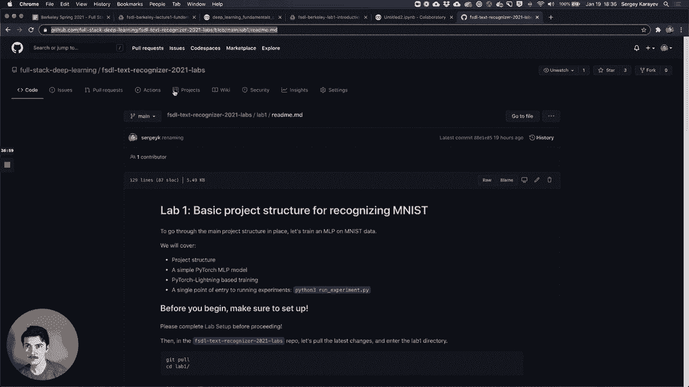

we have，a notebook in which we're going to code，a neural network。

from scratch okay so let's go to that，you can click collab it's probably best，if you do it。

you know on your own time you should，really go through this notebook。

but right now for the next maybe uh 15，20 minutes we'll just kind of go through，it together。

and see see a couple of things，okay so the first thing we want to see，is。

what the heck is a collab right so i，linked to a collab here，so google collaboratory which is。

shortened as colab，is a great product in the deep learning，space。

it's a notebook interface but there's，things that are way nicer about it than。

just kind of a standard jupiter notebook，that you might have seen，it can connect to a runtime that。

includes gpus，okay so we have ram we're connected to，python 3 google compute engine backhand。

and this instance actually doesn't have，a gpu，which is totally fine we don't need it。

for this notebook but when we come to，labs we'll see how to get a，gpu as well so。

you'll notice there's a table of，contents that's achievable by。

basically adding a text block and then，having headings so if i say，just delete that um。

so this is a heading one so like a top，level heading，and then everything under it。

heading to collab environment and stuff，like that，also shows up in the table of contents。

so this is really nice when you're，looking to organize your work。

so the first thing i want to just cover，is like what kind of environment do we，get in a collab。

and when we execute，oh by the way if you if you want your。

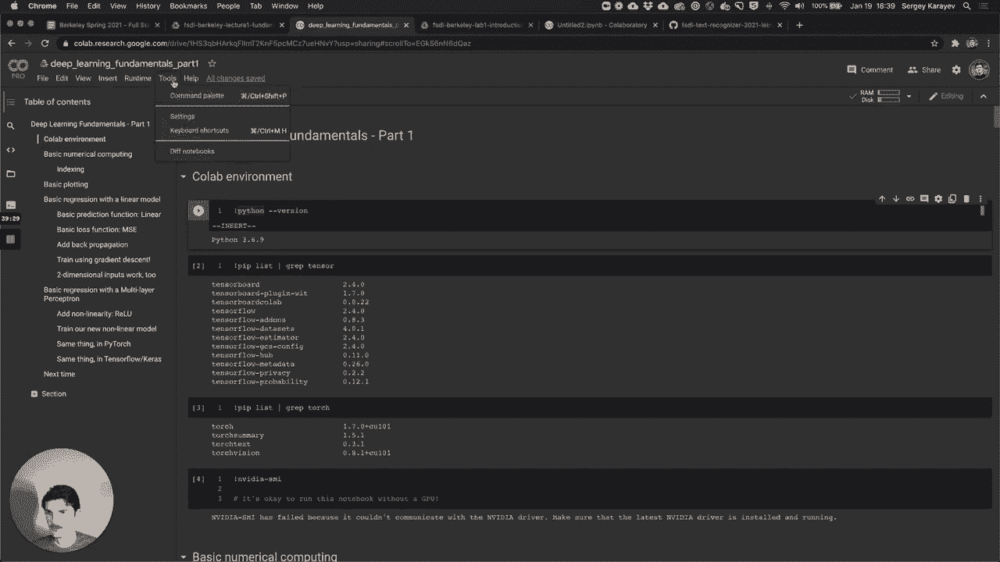

collab to look like this one just go to，tools，settings change the theme to dark。

definitely better than the light theme，and then i'm using vim key bindings，which is kind of cool。

i'm using four indentation width out of。

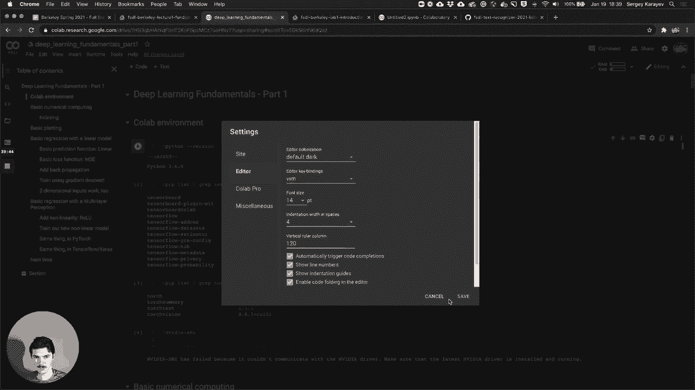

the 120 character ruler，i'm actually paying for collab pro it's，ten dollars a month。

it increases the chance that you get a，fast gpu，it lets you run the notebook for 24。

hours instead of 12 hours，and um and i think there's some other，nice things but for 10。

a month it's a it's a i think it's a，please is there some way for you to zoom，is this better yeah。

okay and um，okay so a co-lab environment，so when i say plus code it adds a what's，known as a cell。

and this is a python notebook so i can，type python code，like this i can execute it by pressing。

this run command or just pressing，and when i execute it it executes the，python code。

okay no surprise is there i can delete，this cell，now if i type a command preceded by an。

exclamation point，then it's actually not going to be，executed as python code it's going to be。

executed，as a shell command，so here i'm actually executing this just，as if i was executing it。

in a terminal right so collab runs，python 3。6。9 which is like。

three years old at this point we can see，packages are installed and it's quite a，lot of packages。

so what we can do is we can grab for，tensorflow，and just see all the tensorflow related，packages。

all the torch related packages，so there it's all you need basically，um and then if we run nvidia smi。

it's going to fail because it couldn't，communicate with the nvidia driver。

but that's totally okay because we can。

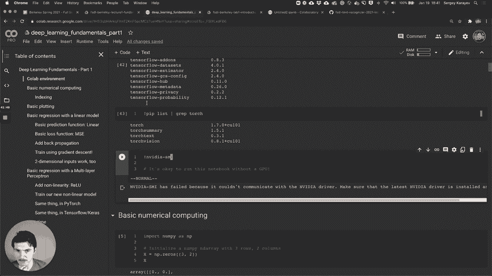

run it without the gpu but if we want to，run it with a gpu。

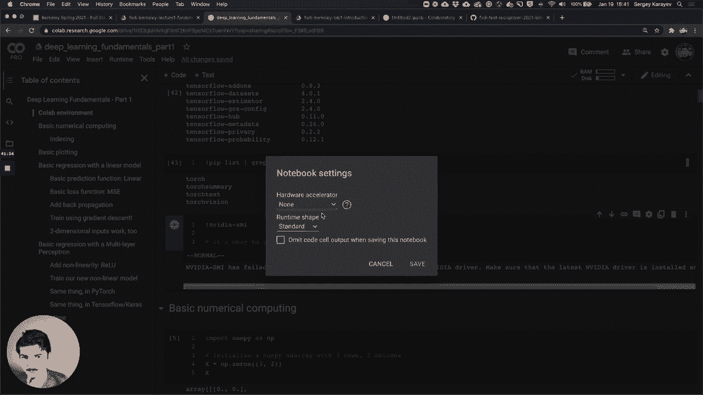

we can go to runtime change runtime type，and request the hardware accelerator。

so let's go ahead and do that we see，that it's connecting to，another instance and now we can，[Music]。

um if you if you had some computations，here you'd have to rerun them because we。

just reset the notebook but，we didn't so we can just run this and so，now we have a sweet。

v100 one of the fastest gpus you can get，anywhere and we are getting it for free，for 12 hours now or。

me for 24 hours you would get it for 12，hours if you didn't pay，so first of all we're gonna code a。

neural network from scratch but before，we do that，let's just remind ourselves of how。

numerical computing works，we're going to use numpy which is the。

python you know package for numerical，computing，let's make an array of three rows。

two columns and all zeros okay，so here we go it's a nd array，three rows two columns and they're all。

set to zero，by default the data type is float64 so，64-bit float，if you say x dot shape that prints。

we can set values of a whole row so we，can say，x at the zeroth row and all the columns，should be one。

and if we do that we can see that it it，we can set values of an entire column in，the same way。

just via indexing so we just set it to，two，so now it's two okay let's make a。

an x that just says one two three four，we can take this matrix，and then we can take a vector。

so here i'm making big x is a matrix，a three by two matrix little x is，a uh two by it's a two vector。

right a vector with two numbers in it，and so we can print the shapes，now i can say x plus x。

right and so numpy and pytorch，do what's known as casting and so they，try to。

kind of understand what you mean by that，right well if the matrix is three by two。

and your vector is of size two，well you probably wanna add that vector，to actually every。

row right because there's two numbers，and there's two numbers in each row。

so you just want to add it to every row，that's what it perceives you want to do。

we can also do the same thing with，multiplication so we can say，uh big x times little x。

and that will actually multiplied in the，same way so it'll take the two numbers。

and then multiply it every row right，and you can also do matrix。

multiplication which is what we all came，here for，right and uh there's two ways to do it。

python from i think python 3 has this，at matrix multiplication operator which，is quite nice。

or alternatively you can say mp。dot，or torch。you know x and then your vector。

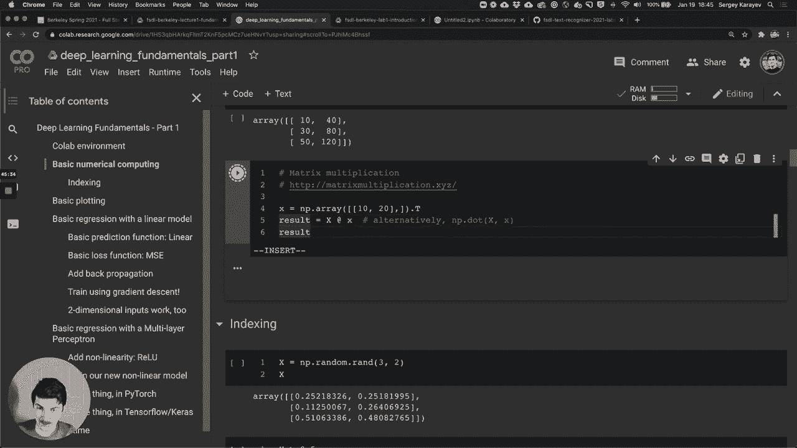

let's go ahead and do that if you have，you know any questions about matrix，multiplication。

three by two matrix and we're，multiplying it by，a two vector so what is that。

actually going to do it's going to take，that two vector，multiply it with the first row add the。

result，i'll put it second row，third row。

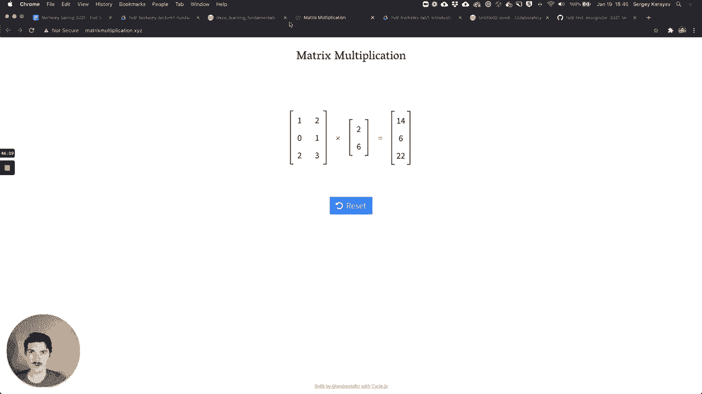

so what we get is a three by one，so matrix math um，is going to be very important for deep，learning。

you won't you know unless you're，implementing your own network which we，intend to right now。

you don't have to think too much about，it but，it's something that should really be you。

another thing that's very useful is，indexing so let's say we uh generate。

just a random array a three by two，random array right so，three rows two columns random numbers。

between zero and one，so now let's get a mask this a mask，of all the elements of this matrix that。

are greater than 0。5，well we can use this mask to index，the array so for example everywhere。

that's greater than 0。5 we want to set，to 1。so we don't have to write a for looper。

you know anything like that，we just do this kind of operations，lastly um let's talk about plotting。

so we're going to use matplotlib that's，the main plotting library for scientific，computing in python。

let's make a random 100 by 100 matrix，and just show it right，so it looks like this the color bar。

shows us that it's values between 0 and，1，0 being black white being or 1 being。

white and then it's just kind of this，like salt and pepper noise。

because we just used rand we can also，plot，functions so we can say x is going to be，um。

and then y is going to be，some function of x so x times 5 plus 10。

so this is a linear function and then we，can plot x and y，you know put x's where the um。

x or yeah put x is where，x values are and then connect them with。

so the next thing we can do is go back，to that you know linear regression，example。

that we saw in lecture and what we're，going to do is we're going to generate，50 data points of。

one dimension so x is one dimensional，and this is how we do it so we generate。

values between negative one and one，and there's going to be 50 of them and。

each one of them is going to be just one，dimensional，which just means it's one number。

then what we're going to do is we're，going to set the true，weights and bias so like this is the。

function that we seek to recover，the true function right is y，equals five x plus ten。

so we set weights to five we set bias to，ten，and we generate the true，um values so it's going to be。

x which is a matrix of and by one，dimension，multiplied by these weights plus the，bias。

and so let's look at all the dimensions，let's look at the shapes of these things。

so x is 50 by one weights are one by one，bias is just one number and then y。

and we lastly plot this so the x's，are the data that we kind of sampled。

and then the what we're plotting is like，the true，and so what we want to do now is。

basically code a linear function，that will initialize with some random，weights。

and then just see how it looks next to，the true function，okay so we say class linear and。

in the init method um we give it，num input so that's the dimensionality，of the。

input data num output that's the，dimensionality of the output data。

and we generate weights so weights，transfer us from，input to output so their dimension must。

be input by，output which for us is just one by one，right now，and we um are going to sample them。

randomly from a gaussian distribution，and then we do some fancy initialization。

stuff that you'll read about you don't，need to worry about it，and we set a bias to just zero，this。

this class um by the way when you，implement this，this call special underscore underscore。

call underscore underscore，method that lets you，say you know linear is an instance of。

this linear class，and then you can use it as a function so，you can say linear，take。

x multiplied by self weights add the，bias，so this is random initialization let's，see how it did。

not so hot if i run this again it'll，it'll，show me a different you know it's always。

it's always going to be down there，around zero though because it's，that's。

that's centered on zero okay，so now let's code a loss function so。

we're literally coding a neural network，right now right so we coded，this which is what's known as a。

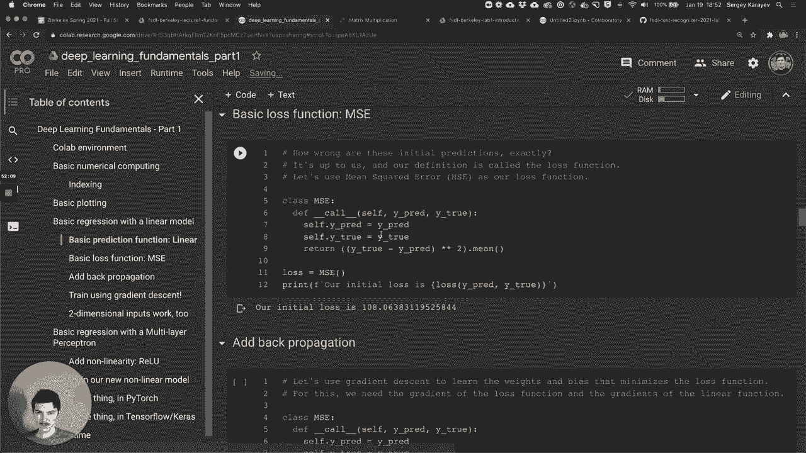

fully connected layer basically now we。

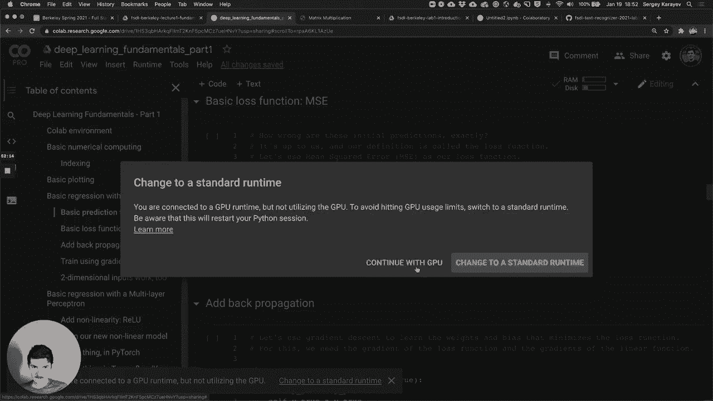

function，is going to be mean squared error it's，going to take，the predicted values of y and the true。

values of y，and then it's going to return uh，y true minus y thread squared and then，the mean of that。

so that's mean squared error and the，initial loss right now，is 96。 okay next up。

we're going to add back propagation so，we're going to use，gradient descent to learn the weights。

and bias of that linear class that we，wrote，and so what we need to do is we need to。

compute the gradient of it okay，so the first place we need to add a，gradient。

is the loss function mean squared error，how，it does its computation and this。

is how it's going to do its backwards，pass so，it's going to compute its gradient and，return it。

and the gradient of this function，right it's y prime minus y true squared，prime，this mean。

we'll um divide it by the number of，examples because we're taking the mean，here。

we have to account for that in the，gradient，and the linear class。

remember it's random weights random bias，to call it we just do this matrix。

multiplication and add the bias，and then we think all right well what，should the gradients be。

okay well it's y equals w times，x plus b the gradient，with respect to x，is w that's easy enough。

the gradient with respect to w is x，and the gradient with respect to bias is，just one。

so the backwards pass is going to be，us computing the weights gradient the。

bias gradient and the x gradient，um x being the input，so the weights gradient is。

uh multiplied by the gradient that's，coming into it so，so we're going to compute gradient on。

the loss function first which will，produce，some gradient then we'll pass that，gradient。

into the linear uh layer right so，the the backwards pass takes a gradient。

from the loss function or from linear，layers that are downstream of this one。

and it just multiplies x by that，gradient，the bias gradient is just we sum up。

the gradient that we get in because it's，just one，and then the gradient for x is going to。

be gradient，respect to，x，so these are basically the same thing we。

just do matrix multiplies in ways that，make sense，to them and lastly we code an update。

method which takes a learning rate，parameter，and all it's going to do is it's going。

to set its weights to the current value，of its weight，minus the learning rate remember that。

alpha times the gradient that we，computed，and the same for the bias and that is，all it is。

okay so now let's instantiate everything，and let's make sure to run it。

let's take one step forward and then one，works，okay so we compute the loss we compute。

the um we instantiate the lin or sorry，we instantiate the loss，we instantiate the linear layer。

we compute the predicted y values we，compute，the loss of the y values that were，predicted。

against the true values we compute the，gradient of the loss by taking that，backward step。

and then we take a backward step，in for the linear layer which will，compute the gradient。

for the weights the bias and the input，and then we're going to update with a，small learning rate 0。1。

and then we're going to compute，predictions，again with this updated linear function。

and then we're going to print the loss，and so what we should see is that the，loss goes down。

so we did we started with 110 and now it，is 73。so we're in business and we can actually。

just train this function using gradient，descent okay so what we're going to do。

x and y true the underlying function，that's going to be，up here at the top and then we're going。

to compute the loss，or initialize loss initialize linear，we're going to go for 60 epochs。

we're going to go with a linear learning，rate of 0。1，and then during each epoch we're going。

to compute predictions of y，compute the loss compute the gradient，from loss。

apply that gradient backward you know，back prop through the linear layer。

and then update the linear weights and，biases，with this learning rate and the。

gradients that it's stored，and and what we're gonna do is every，five epochs。

we're going to print the loss and we're，going to plot it as a line。

on this chart let's go ahead and do it，and so what we get is orange is the 0th。

epoch so it's basically just nowhere，close to the underlying function。

by the fifth epoch it's getting a lot，closer to the function，by the 10th epoch it's closer yet and。

then it keeps getting closer，and then by epoch 55 the loss is only，0。01。

and it's really close visually okay，so that is，um that for one dimensional data so we，just coded up。

this is the entirety of the code for the，linear layer，this is the entirety of the code for the。

mean squared error，and this is the entirety of the code for，the training loop。

okay this actually just works for，two-dimensional inputs，just as easily so let's generate a，hundred。

and a linear function on a，the same，except now there's two weights instead，of just one weight。

but in code it's going to be exactly the，same it's going to be that matrix，multiply。

and in order to look at this data now we，have this plot 3d function。

so let's look so this is the underlying，function it's like some plane，one。

input dimension two and then output，dimension on the y axis，we instantiate loss exactly the same as。

before，we instantiate linear this time passing，two instead of one to it because now。

it's two dimensional，and then let's look at what it's，initialized at。

so this is the you know the output of，this linear function with random weight，initialization。

it's not close to what it's supposed to，be because we haven't trained it yet。

so now that we're training let's just，make a function called fit。

it does exactly what we did before it，goes for some number of epochs。

and every epoch it makes a prediction，computes the loss，prints the epoch on the loss computes。

the gradient from loss，applies that gradient to the model，in doing back prop and then updates the。

weights of the model，epoch zero loss five epoch one loss，three two。

and so on and keeps getting lower and，function，is very close to the underlying function。

and we can train it for even longer，let's train it for，60 epochs and hopefully we see that it，gets。

it basically gets it perfectly，so there's a question that we covered a。

little bit but it is maybe just worth，reiterating what uh so what auto。

differentiation library are we using for，the course，and then are uk you okay doing a uh。

longer question that is，um not directly related to what you've。

been talking about the past hour or so，probably no probably not let's get。

through this okay we'll say that，yeah so，we now have a way to automatically fit a。

linear function to n-dimensional data，and this is going to scale。

to n equals 1000 it's the exact same，math，exact same code notice we didn't change。

the code at all we just，we just gathered it together into this，function but it didn't change at all。

and it's not going to change for like a，thousand dimensions。

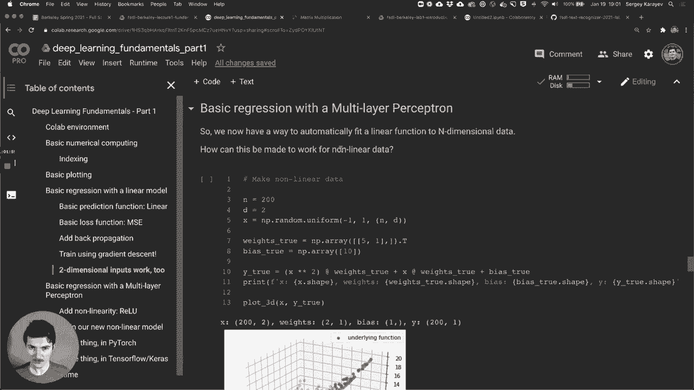

we，work with nonlinear data so so far we've，been working with linear data。

so it's either a line or a plane in in，three dimensions，right but non-linear data let's look at。

two dimensions for example，is going to be something that can't be，represented as just。

one linear kind of matrix multiply it's，going to have to be something。

different so let's make some nonlinear，data，here we go this is it it's kind of like。

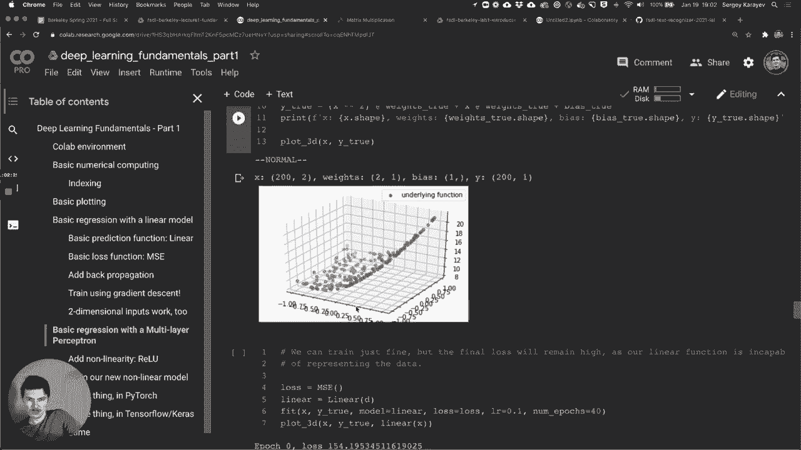

scoops up like this，we can train we can use our existing，stuff。

to try to train it it's just not going，gonna work right so let's instantiate。

our loss our linear function，in d dimensions which is two um and then，fit it for like 40 epochs。

it gets，it reduces the loss and it yeah it looks，better right than just random but it's。

just incapable of doing that curve right，the best it can do is a plane that kind。

of goes through the middle of this curve，so in order to be able to represent the，curve。

we need to add a non-linearity which，we're going to use a，rectified linear unit value okay。

this is the entire code of the value，to apply it you just store the input the，output is going to be。

just basically the max of the input or，zero，right numpy。clip input or zero。

by the way in colab if you want to read，a little you know doc string of some。

function you can just hover over the，function，and just scroll through the docs string。

you can actually even see，the source of the function which is，really powerful，so that's quite nice。

um so that's the forward step and then，the backward step is going to be，the input gradient is。

uh for in places where the input was，greater than zero，we'll just multiply it by output。

gradient because the gradient is one，and then in places where，zero，so it'll be set to zero so it'll。

basically take output gradient，leave it as is in places where the input。

was greater than zero or set it to zero，in places where the input was。

less than zero let's check it out，we have our value we can do an input so。

this is the input one point five，one，point five zero zero zero so it cut off，all the negative。

numbers here does that make sense and，then the gradient，of this value。

or rather you know what it's going to，back prop，is if we put the input back into。

relu it'll just leave it unchanged in，places where it was positive and then。

set it to zero in places where it was，negative，okay so now how do we do a nonlinear，model。

it's going to have two layers so one，linear layer，followed by followed by a second linear，layer。

the first linear layer is going to take，us from input dimensions。

the dimension of the input which right，now for us is 2，to the number of hidden units which can。

be anything we can set it to 10，or 100 or 1 or whatever we want。

then there'll be a value and then the，second linear，layer will go from the number of hidden。

units to 1 because we're still doing，regression and regression，is just going to be one real valued。

output，in order to apply this model we，so here we instantiate them here we。

actually use them so we say，x is our input self。linear1 of x，that's our l1 kinda。

that's l1 we apply nonlinearity to l1 to，get r，and then we apply linear 2 to r to get。

l2 and that's our output，our backwards step is basically just，calling。

backward on all of our layers right so，we call，backward on linear two call backward on。

relu call backward in linear one，and we pass each other's gradients。

to them right so we get an output，gradient from the loss function。

we feed that into the backward function，of linear two，we get the linear two gradient we feed。

that into，our value we get the value gradient we，feed that into our linear one backward。

function we get the linear one gradient，and we return that because that's our，gradient。

and in the process of calling this all，of these layers have stored their，gradients basically。

so that when it comes to update we can，say okay linear to update with the，gradient you have stored。

and then linear one update your weights，with the gradient you have stored。

we don't need to update value because，relu doesn't have any weights。

right if we look at it there's no，weights that it uses it just，let's instantiate loss model。

so we're going to take input d and have，10 hidden units，okay we output prediction。

we compute the loss value compute the，last gradient call backward with the，gradient。

okay so our loss is 132 um，we're down here we're quite far away，from where we should be。

we're gonna take one forward one，backward step just to make sure that，our loss is decreasing because。

oftentimes when you're coding this up，you might you might like have a negative。

you know you might have a minus where，you should have a plus or something just。

uh it's a little tricky，so that's a good thing to do always try。

this and now we're going to fit it so，we're going to have，x y true our model our loss。

our learning rate and we're going to go，for 20 epochs and just see what happens。

so the loss is steadily decreasing okay，so i actually think，so，sorry is the gradient of the rayleigh。

supposed to return，one if the number is positive because i，think it's returning。

the number but i might have，yeah that's that's the bug that's the，bug that i thought i fixed。

i dislocated the output um i'm pretty，sure it's returning 0。5 when you're，inputting 0。5。

backwards oh yeah that's right，yeah i can just remove that，i'm not sure that's it i think you still。

makes me wonder why it's not convergent，because it was converging。

if you open um if you open the link，you'll get my saved notebook and it。

it probably does converge so trust me，it does converge there might be a bug，somewhere。

and uh i'll find it and fix it and post，in slack，but basically this is all the code that。

we need for it to actually converge，there's a bug somewhere in here but it's。

i remember fixing it like yesterday i，don't know why it didn't save in this，notebook。

um but now let's just do the same thing，in pi torch instead of our own code。

okay so it's going to look very similar，so we're going to have a torch model。

which will inherit from torch。net。module，which basically everything inherits from。

and that gets you the auto，differentiation，it's going to take input damn num hidden。

it's going to have a linear，layer a value a second linear layer，exactly the same as our code this is。

exactly the same as our code，this is almost exactly the same as our，code except now i have these。

x underscore tensor because that's what，torch，needs right it needs torch tensors。

instead of numpy arrays，so basically our x is a numpy array，we just make it a tensor but it's。

exactly the same we don't change the，value we just we just converted to a ten，string。

we get um this just random，initialization，this is the underlying function same as，we had，right and。

if we want to，do the weight update，a good way to do it is to use the pi。

torch optimizer so in this case we're，going to use the cast of gradient。

descent which is the algorithm that we，had coded up，before it's going to。

be initialized with all the parameters，of the model，and so this is like all the learnable。

weights and biases that pytorch knows，how to kind of find in your model。

when you initialize it and with a，learning rate of 0。01，we're going to zero out the gradients。

then we're going to predict，compute the loss compute the gradient，and then take an optimizer step。

so when you do this that basically uh，back props，the um it back props。

the lost grade it back props the，the from the loss all the way down to，the beginning of your model。

because pytorch knows where your model，was used right so when you。

when you when you called model with x，tensor it output this，and then we called loss with this。

and that now pythorg remembers the，through it，so when we take a step it's going to。

call backward and then，and then call update with the learning，rate。

so it started 150 and then went down for，to 141，and then we can have a fit function but。

specifically for torch just like we had，a fit function for our own，model does the same thing。

and we're just gonna go for 20 epochs，start at 141 67，16 goes goes back up to 47 goes down to，14。

okay maybe our learning rate is a little，high but，it is learning this function，and we can。

this one's actually not converging so，okay i'm not exactly sure why it's not，converging to this。

because it should and i think it did in，my safe notebook，but um let's just press on for a second。

and see if this converges，so this is the same thing in now，keras or you know which is an interface。

to tensorflow，so we just say our input's going to be，two-dimensional。

we're going to have a linear layer which，carries calls dense，with 10 hidden units followed by a relu。

that's going to be applied to the inputs，and then we're going to have another。

dense layer or linear layer this time，with one output，that's going to be applied to the output。

of that first linear layer，having gone through the value we just，initialize the model。

print the summary compile it with mean，squared loss as the loss stochastic，gradient descent。

with a learning rate as an optimizer，and then um and then，call this model that fit so we don't。

have to write our own fit function，here it actually is provided for us by，keras。

this is the we we went for 10 epochs and，it converged to something that's，basically。

pretty close to perfect the underlying，function um，and that's basically it so i'm very，curious why。

these pythorgs things didn't converge，but i feel like。

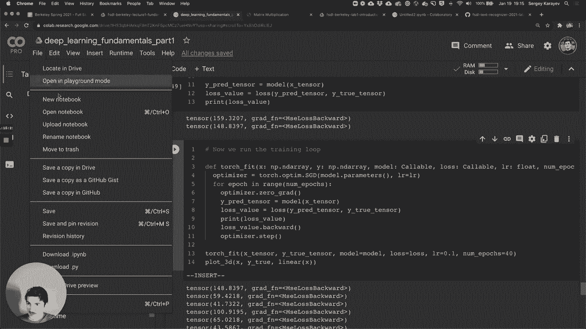

let me just really quickly see if i have。

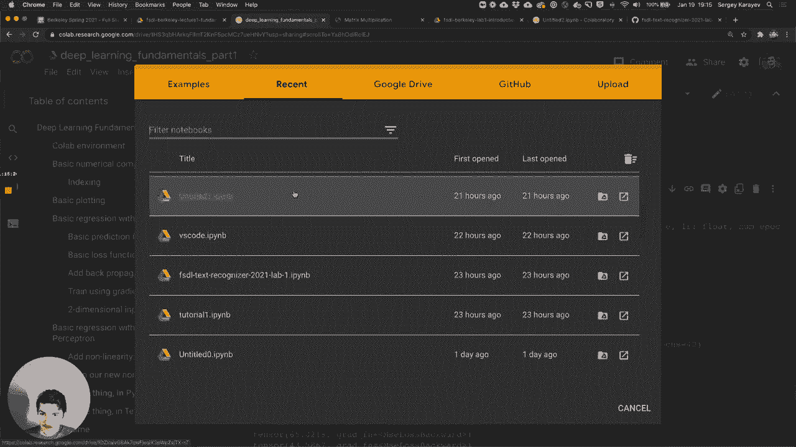

let me see well it's，i'm not sure it was converging just，yesterday when i tested it out。

so i'm going to test it out after class，today it's already getting late and then，get back to you。

tell you what the bug was if there was a，bug or maybe it's just due to the。

weight initialization and like bad luck，when you try to do it live，this。

notebook yourselves on your own it's not，part of the homework but。

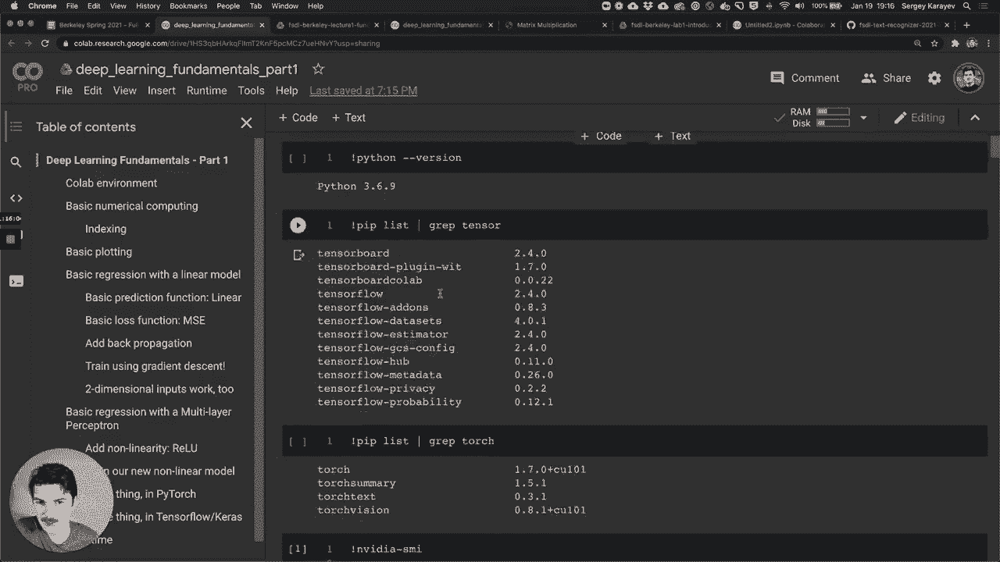

it i think it's good to have as a，resource um，it goes together with the reading that。

we have to do this week，which is chapter two of this neural，networks and deep learning textbook。

covering in detail the back propagation，algorithm。

and i think really seeing code that goes，with it，you know with that theoretical knowledge。

is really helpful，right to to me and to most people，to actually like yeah i understand it so。

go through the notebook，mess with it um try to like，change a thing uh try to improve it。

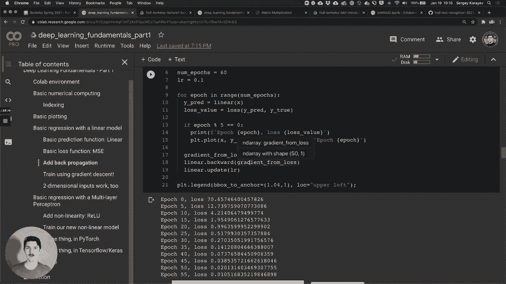

um that's it for now do you guys have。

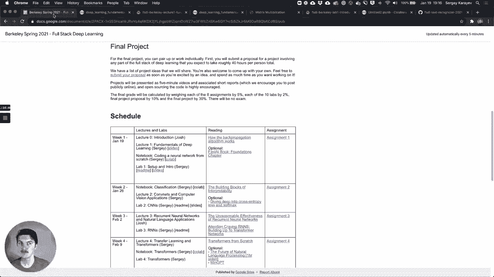

i didn't see any questions about the。

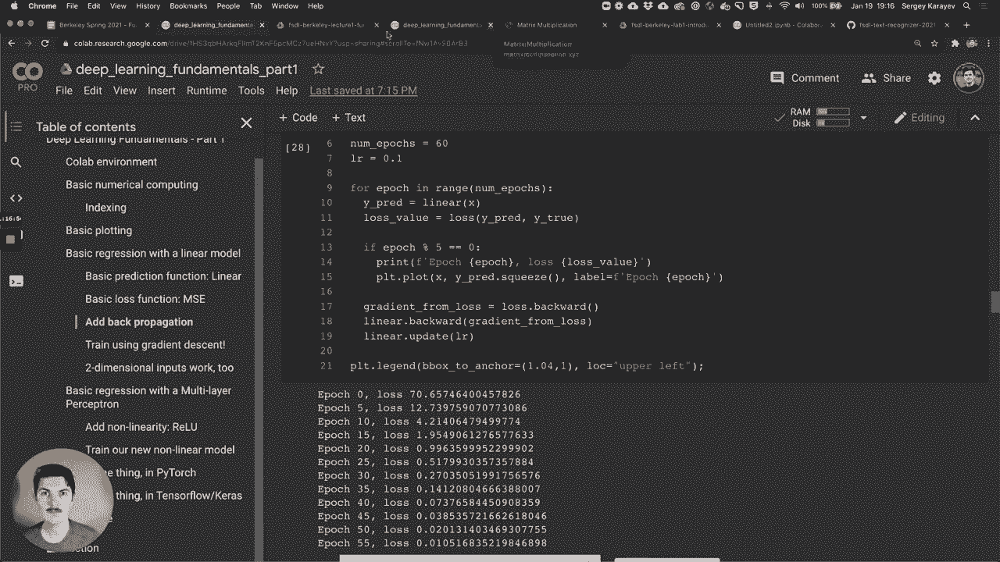

notebook okay，so then we could take a break or。

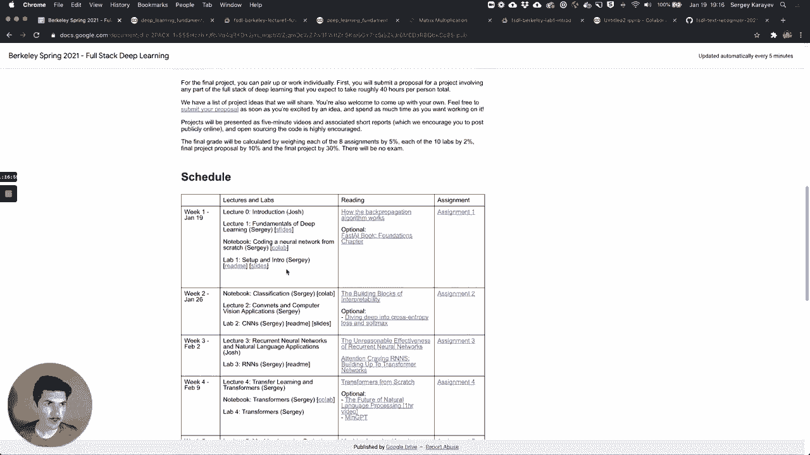

comment about uh changing the learning，rate um，and having that working so maybe if you。

want to do a little bit of um，live hyper parameter optimization yeah，let's do it。

so for a preview of what what uh what，your life will be like if you go to grad，school right now。

all right so let's go back to um，so we have our data already loaded up。

and then in the notebook state，so one thing that's annoying about。

notebooks you can't quite tell what its，state is，right but um，that's you know that's a problem but。

i have the correct x and y loaded up，right now，so what i need to do is just go back to。

and then the learning rate here is point，zero one，and that seems to work and the learning，rate here。

is point one so let's change this to，point zero one，and go for like 40 epochs and see what。

well i'm not sure if uh i'll look into。

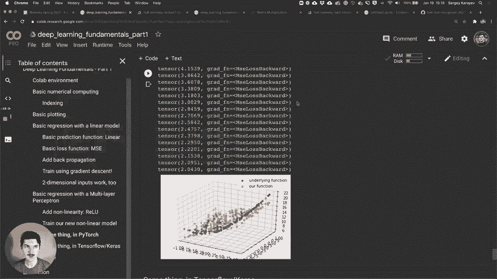

it after class i don't want to spend，time right now trying to。

figure it out it does work there's just，something about this particular save。

notebook that's like missing a thing so，i'll figure it out，um lastly it's 7 18 now。

i really like to end it at 7 30。 this，first day is actually probably one of，the longest。

potentially because we have two lectures，right and a notebook and a lab。

so i think steady state will be ending，around seven hopefully，but today we're gonna go a little late。

hopefully that's okay with everyone，because we're gonna talk about labs。

josh you're ready for that and you don't，have to do anything but。

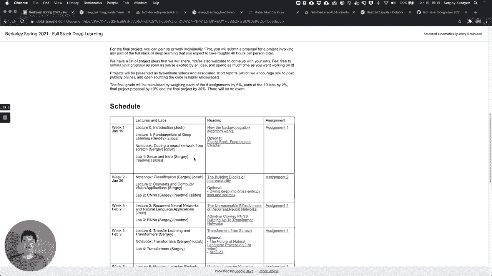

does the slack seem ready for，yeah it last team's ready i just want to，make sure that we have uh。

time for sort of broader questions at。

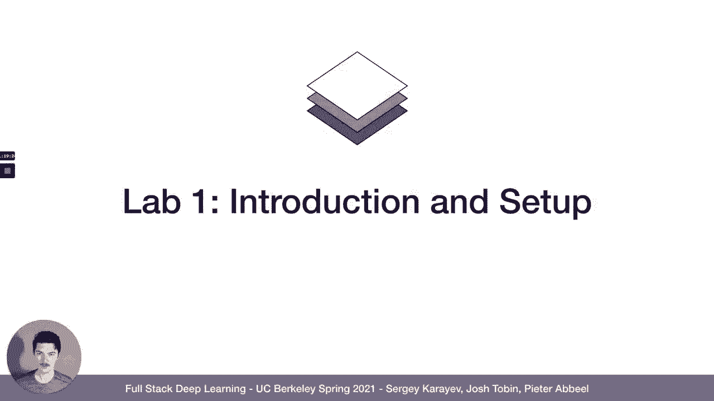