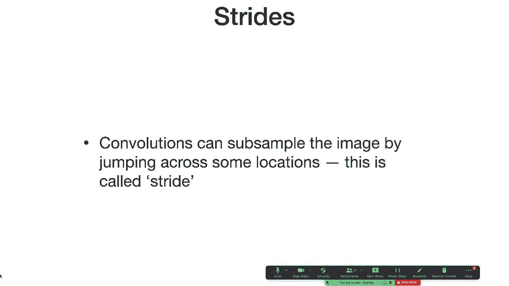
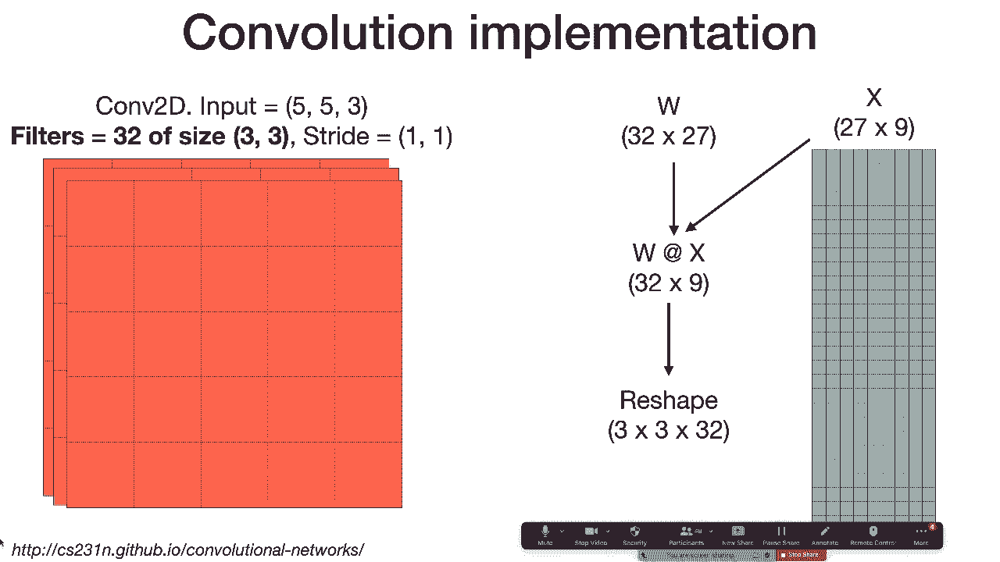
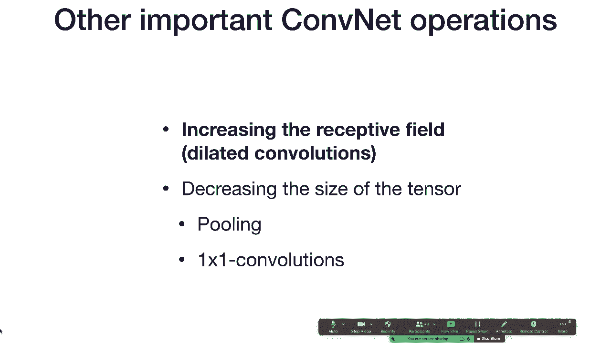
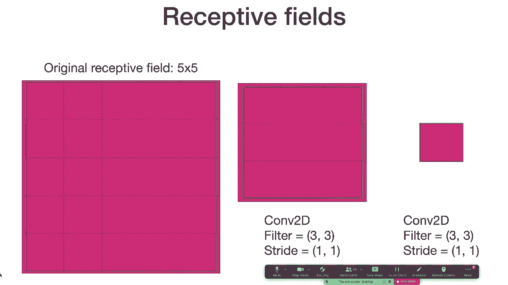
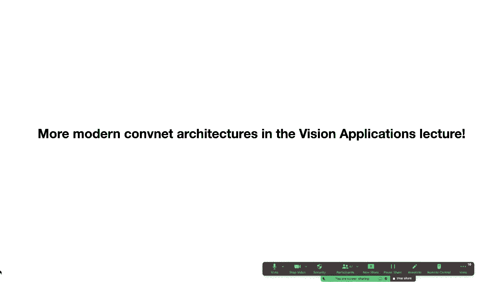
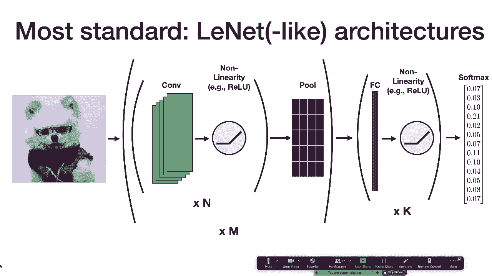
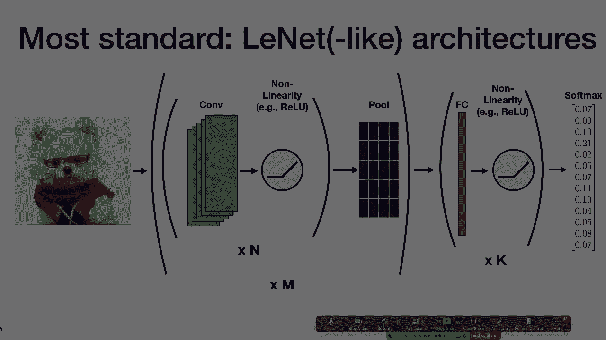

# 【双语字幕+资料下载】伯克利FSDL ｜ 全栈深度学习训练营(2021最新·完整版) - P5：L2A- 卷积神经网络 - ShowMeAI - BV1iL411t7jE

um，um what we're going to cover today is，first we're going to talk about。

the convolution operation so kind of the，basic mathematical operation behind。

convolutional neural networks，and then we're going to talk about some。

of the other important operations that，make up components，and then finally we're going to touch on。

quickly a classic，combat architecture and then in the next，part of the lecture。

sergey is going to talk about computer，vision applications and we'll go into，more detail about。

so to review um first question we'll，cover is what's convolutional filter。

and then we'll talk about stacking，convolutional filters and，um using these stacks to make up。

convenience，and then we'll talk about strides and，padding and。

we'll touch a little bit on filter math，and then finally we'll um。

give a couple of um of brief notes on，how these things are implemented in the。

so what's a convolutional filter um i，is just，sort of the inspiration right so you。

know question you might ask，is what's wrong with these fully，connected neural networks that we've。

been talking about so far like why，are these not the right things to use，for computer vision um。

and so to give you a little motivation，for this um how would you think about。

applying a fully connected，neural network to an image right so。

let's say that you have this grayscale，image of a dog，maybe it's 32 pixels by 32 pixels。

um so one thing you could do is you，could just flatten that image and，that'll give you a vector of。

1024 length and then if you're，doing some classification tasks that has，10 possible output classes。

you can multiply that vector by matrix，so say a 10 24 by 10，matrix and produce 10 outputs。

and that that's kind of one way that you，could do classification with of an image。

with a neural network，okay so what's wrong with this um yeah，and then so the in this case the。

matrix multiplication those are the，weights that you would learn。

um well one thing to notice here is that，this is a really small image right this，is 32 by 32。

and we already have a 1024 dimension，vector，so what happens if you start increasing。

the size of that image so，increase it to 64 by 64。 you'll have you，know four times as many。

um uh dimensions in that tensor，which means you'll have four times as。

many weights to learn in your matrix，multiplication，if you increase it um to 128 by 128。

it'll go up by a factor of 16。and so the dimensionality of the number。

of weights that you need to learn，scales really poorly with the size of，the image。

um and we want neural networks that we，use for computer vision to be able to，work。

well with larger images as well so this，is one issue with，using fully connected networks for。

another issue is just you know i would，ask the question of like，whether you really need this many。

weights at all so，um if you think about what this matrix，multiplication is doing。

for each possible output class you're，learning a weight，um a separate weight for each input。

pixel in the input image，right and so you're saying like each of，those input pixels，much。

to the value of the classification right，and so in many images there's maybe a。

few regions of of that image that are，particularly important to telling what's。

inside the image um so maybe this is，really overkill and then lastly。

you know one other way you can see why，convolutions are helpful is。

um is you know like what happens if you，slide this image，a little bit to the right right so to us。

it's pretty easy to tell that these are，um images of the same class right，they're the same animal。

um but to a fully connected network，the the like let's say the last pixel um。

or the last row in this matrix，multiplication always，looks at the same pixel in that image。

and so when you scale the image it's，looking at a different pixel。

or when you uh when you translate the，image rather it's looking at a different，pixel。

right and so um just naively without，doing any form of data augmentation or，anything like that。

these networks that you form like this，are not necessarily going to be，invariant。

to translate translations of the input，image，um，like image classification for example。

translation in variants，is a is a property that we want our，so that's that's the motivation for。

convolutional filters，so the way a convolutional filter works，is instead of taking the entire image。

flattening it into a vector and then，multiplying it by a matrix。

instead you extract just a single patch，of the image so maybe you。

maybe you say let's take a five by five，patch of the image，so five pixels by five pixels you。

flatten that，and instead of producing you know this，this massive vector instead it produces，take。

the dot product between that vector and，another vector of the same，length and that gives you a。

um so this is only looking at one part，of the image so how do you make it look，at the entire image。

well you can take this 5x5 patch and，slide it，across the image so using the same，weights。

you can look at each different part of，the image，and so you can slide it across the row。

and then across each of the rows，until you get to the bottom right corner，and each of those。

operations is extracting a five by five，patch flattening it，multi multiplying it by a vector and。

and so if you combine all those together，what you end up with，is um this output that's uh，each。

five by five patch in the input，okay so one question you might ask is，okay that's。

like i understand that's an operation we，can do but what you know。

what reason to do we have to believe，that that operation can do anything，useful。

um and so convolutions have been used in，computer vision um for a long time and。

were popular even before deep learning，and so if you if you uh carefully select，the weights。

that go into that convolution operation，so the values of each of those weights。

then you can produce effects like，blurring an image，so this is a a um a convolution that。

applies a uh a blur operation and，there's a link here to，um to other types of image kernels that。

you can take a look at if you want to，build some intuition about。

what types of things these convolution，and the intuition behind covnets is that。

instead of like kind of carefully，selecting each of the weights。

in this convolution instead we're gonna，um so one extension here is um。

that in general your image you know，we were looking at a grayscale image，before so it's 32 by 32。

just one sort of value at each of those，32 by 32 pixels，but you know for example in rgb images。

you actually have three values at each，of those spatial positions。

so you have the r channel the g channel，and the b channel so your input image is，actually。

not 32 by 32 it's 32 by 32 by 3。and so again you know if you wanted to，if you wanted to。

classify an image like this using a，fully connected network，you would need to flatten it and you'd。

have a vector that's，three times as large as it is for the，grayscale 32x32 image。

and a similar thing happens with your，convolutional filters so。

if you have if you're extracting a 5x5，patch of the image，to apply a convolutional filter to。

instead of just having 25 weights that's，going to instead have 75 weights。

because you extract all each of the，channels，for each of those filters but the。

operation is going to be the same you，slide，this this five by five by three window。

horizontally across the image and then，along each of the rows。

the input is not the only thing that can，have multiple channels the output can。

have multiple channels too，um and so the way to think about that is。

that when we describe the the basic，convolution operator uh it's，we basically described it as a dot。

product right so you have this，five by five by three patch of the image。

that is turned into a 75 dimensional，vector，and then you take the dot product。

between that and another 75，75-dimensional vector，to produce a single channel in the，output but。

instead of taking a dot product you can，instead have，um some number of。

of convolutional filters that you learn，independently of one another。

and so instead of a dot product you can，have a matrix multiplication。

and so in this case you'll multiply this，75 dimensional，patch from the image by a 75 by 10，matrix。

um and then you're going to produce an，output tensor that is，still 28 by 28 but instead of only。

having a single，value on the third dimension which was，created by this dot product。

instead you're going to have 10 values，on this third dimension，that's created by this matrix。

one thing to notice here is that the，kind of，the overall like format of the inputs，and outputs。

to this convolution convolution，operation are the same，so the input to this model or to this。

operation was，this tensor um which is like kind of，this stack，of matrices that's 32 by 32 by three。

right so it's this three dimensional，tensor and then after you applied these。

ten five by five convolutional filters，to this image you're left with something。

that's 28 by 28 by 10。same，overall dimensions it's still this，and so that obs and so because of that。

observation，this the output of this filter is，equally valid，as the input to another convolutional。

filter，right so we can just take another，convolutional filter and we can apply it。

so we can stack these convolutional，filters or these，convolutional layers on top of one。

another and we can um，and we can produce these like separate，layers just like you would have in a in。

a fully connected，and so in practice usually you'll you，won't just apply these layers one after。

another，because each of the layers that we，described so far is just a linear，operation。

what you'll do instead is you'll apply a，non-linearity after each of the layers。

just like you would after each of the，layers in a fully connected network。

so next we're going to talk about，strides and padding，and so these are different ways of。

changing the how the convolutional，filter，gets slid over the dimensions of the。

so convolutions can sub-sample the image，and one way that they can do that is by。

jumping across some locations，right so in the examples that we showed。

before if you have a five by five filter，uh five by five filter then the way that。

you apply that is you，first apply it to the first five by five，like upper left corner of the image。

and then you move over one um one pixel，to the right and you apply it again。

and then you move one more pixel to the，right you apply it again。

if you want，if you want to sub sample your image is，you can skip some locations。

right so if you have a stride of one，which is kind of the example we've been，talking about so far。

this is what it looks like to apply the，concept to the image，so you move one pixel at a time and the。

corresponding output moves one pixel at，a time as well，[Music]。

if we add a stride to this convolution，operation，what we're going to do is and we're。

going to skip the second position that，the convolution operates on。

so we skip over that second position and，we do that in both dimensions。

because this is a two by two stride and，usually you'll see strides that are the，same on。

so question i would raise here is what，happens if you want a bigger stride so。

what happens if say you want a three by，three stride，and so what that would look like is you。

would move the filter，three pixels to the right instead of two，and now all of a sudden the filter is。

kind of falling off the edge of the，image，and so one way that we can solve this。

problem is by adding padding to the，image，so padding is some default value that。

you um that you add to the borders of，the image，so that when you slide a convolution，operator。

over those default values um over the，edges of the image，you can still apply the operation it。

just takes for the，for those pixels that are off the edge，and so this is kind of what this looks。

like um you know you're，uh you're you have a stride and you're，looking at three different positions。

on the image but the the edges，and um usually，usually the default value that you pick，is just zero。

and so there's different strategies that，you can use to pick how you apply，padding。

this is what's illustrated here is，called same padding，and this is a this is a pretty common。

form of padding that basically says，i want the output of this operation to。

all right so this this raises a lot of，questions of like，okay if um if i have an image that's。

this size，and a convolution operation that you，know a filter that's the size and a。

stride of this size，um how do i actually know what size my，output is going to be。

and you know one reason you might care，about that is because if you're。

designing a neural net architecture，how you pick the next layer depends on。

what the size of the previous，the output of the previous layer is so，to。

calculate the size of the output of a，convolution operation，and i'm not going to go through this in。

detail，but um it's worth kind of just playing，around with and getting familiar with。

if you're going to be using comnets a，lot um a couple of notes here。

there's a few parameters that you have，so one is the number of filters um so。

again you're stacking filters how many，filters do you want and typically this。

is set to a power of two，um so 32 64 128，but you can set it to whatever you want，um。

there's uh different strides that you，can pick and so usually。

the way that strides are picked is that，they're almost always the same for both，dimensions。

and they're usually five three two or，one，but again there's other choices here if。

you want to play around with your，architecture，and then for padding um the two types。

that you'll usually see，are same which we discussed briefly and。

then valid which just doesn't add any，padding，um and yeah below this are are the。

formulas that you can use to calculate，the，size of the output tensor um which is，worth。

playing around with a few examples to，get a sense for，how these convolution operations。

actually down sample，and one last thing i'll mention on this，there's this great guide to。

uh the arithmetic arithmetic behind，convolution，operations which um sergey always，and。

enjoyed as well and so this is kind of，like a very intuitive guide，and has lots of cool um nice。

visualizations and，equations that will will bring you joy，if you want to understand the stuff。

um i have a super quick question sure um，stuff like well so i'm assuming the。

answer is yes but stuff like，stride and like the specific uh，convolutional operation。

like can it be learned um and i'm，curious whether like the，state-of-the-art。

con confidence or image models actually，have that stuff set by hand or whether。

it's all just lettered by at this point，yeah it's a it's a good question um i，think，any。

for any um sort of properties of the，algorithm like this that。

typically you consider hyper parameters，um one challenge with learning them is，that。

uh it's the the operation of like，chain of like how your how the stride，for example affects。

the output of the model is not it's，generally not differentiable。

um so it's difficult to learn like in，the inner loop of your learning process。

it's difficult to learn just by like，standard gradient descent methods。

um but a pretty sort of promising，research direction that，i think peter will talk about later in。

the course is um，uh is is like meta learning，or um neural architecture search。

and the way that those techniques work，is kind of you have this outer loop of。

your optimization process，so the inner loop is um you know，learning a model with a specific set of。

hyper parameters on a specific task，and then the outer loop is selecting。

which hyper parameters allow you to，perform best on this task，um so there's a whole research field。

behind this and um，that's kind of one way that people um，are learning things like。

are learning hyper parameters for these，types of algorithms and。

i think that the um state of the art on，like quite a few，tasks that are where peop that are like。

very well studied，um you know depending on when you look，tend to be like taken up by。

um by architectures that were learned，via neural architecture search。

but the other other thing to note is，are，extremely computationally inefficient，and so。

in most cases in the real world it's not，very common to use them。

there's a couple more questions maybe，it's a good time yeah we can pause here，[Music]。

so uh someone asks are con filters，they don't need to be，mathematically but i don't think i've。

ever seen an example where they're not，uh yeah they tend to be square and then。

is there some property that guides us on，how to choose filter size。

like one would you use a five by five or，a three by three or one by one。

yeah so we'll talk a little bit about，this when we talk about receptive fields。

in a few slides um but i would say like，there's there's so there's intuition。

that you can build about what effect，different filter sizes have on um。

what the model can see and what types of，outputs it can compute which is。

what we'll talk about in a few slides，but just as a general philosophy i would，say that um。

in deep learning um a lot of，decisions like this are kind of guided。

by intuition about the way that these，things work but，um uh like。

the empirical results of of um other，people who have studied these algorithms，tend to like。

rule out over anything else and so a lot，of it is also just，being familiar with what other people。

and then why would you ever want to use，a stride，that would cause the filter to move past。

the boundary of the image，um well so strides are useful for，sub-sampling the image。

um which is so different reasons you，might want to do that，for example um if you're doing。

classification your input image is，really large，and uh so you want to you know it's like，128 by 128。

and the thing that you want to produce，at the end is 10 dimensional um。

you need to get rid of a lot of those，dimensions somehow and so。

one way to do that is through strides，and then the question is，um the question of like why would you。

ever want to do something that goes over，the boundary，um one simple reason is just that um。

it's like kind of an it's like you can't，always make the math work to have。

a stride the stride that you want，without going over the boundary of the，image。

so that's kind of maybe one one，that's it for now，okay a couple notes on how these things。

tend to be implemented in some of the，libraries that you'll be using。

so again let's think about the the，operation that we do，when we're performing a convolution。

right so we're um，if and for the sake of example let's say，that the input is。

five by five by three so like a five by，five rgb image，and we're gonna use um 32 filters。

of size three by three with a stride of，one，right so remember that basically what。

we're doing is we're extracting each of，the patches，in this image and we're turning them。

into columns and each of those columns，three，by three or 27 dimensional。

and we're going to do that for each，position on the image，and what we're left with in this case is。

this 27，by nine dimensional matrix right so 27，is the extracted patch and then nine is。

each of the positions，in the input tensor and this operation，call。

and then if we're um if if we're if，we're taking a three by three filter。

um let's say we're taking a single three，by three filter，um with three channels of input um so if。

you remember from the previous slides，that's the the number of weights that。

you have to learn for that，single channel output，is 3 times 3 times 3 or 27 and then。

we have 32 filters so we're essentially，learning a matrix，that is 32 by 27。

and then what we're going to do is we're，is，all of the extracted patches we're going。

to multiply it by this，32 by um by 9 matrix，um，oh yeah sorry so we're multiplying it by。

this 32 by nine matrix，um and then the result that we get from，that um is 27 by 32。

and so we're just going to reshape that。

next we'll talk about a couple of other，important operations for compnets。

and so the first that we'll cover are um，operation an operation that's used to。

increase the receptive field，which is dilated convolutions，first what is it what is a receptive。

field so if you think about，what the convolution operation is doing。

um you're sliding this window over an，image，and you're producing something that is。

lower generally lower dimensional，and so you can ask the question of for a，particular pixel。

a particular position in the output，tensor，which pixels or positions in the input，tensor。

contributed to the weight of that output，so in this case if we're looking at the。

center pixel in the output，since this is a three by three，convolution um。

these these this three by three patch in，the center of the image contributed to，the value。

at that output and so we say that the，receptive field，um is three by three so each pixel in。

the output sees，a three by three patch of pixels in the，so one way we can increase the receptive。

field is by stacking convolutional，operations，so in this case if we have a five by，five，input and uh。

and then we apply two three by three，convolutions，the last output sees all nine pixels in。

the intermediate，and each of those sees nine inputs in，the original，um the original image and so the。

receptive field of this。

single output in the input is，and so um just to review um，stacking two convolutions one after the。

other increases the receptive field，and so one thing you can notice is that，if you stack two by。

two three by three convolutions you get，the same receptive field as a single。

five by five convolution and a couple of，nice properties are that in practice。

this actually tends to perform a little，bit better um maybe because you have an，extra non-linearity。

um even even though there's actually，fewer parameters right so there's，uh two times three by three。

um for the two three by three filters，which is 18 and then there's 25 in the，single 5x5 filter。

so fewer parameters and empirically，one other way to increase the receptive。

field is through dilated convolutions，so dilated convolutions are operations。

um and so dilated convolutions，um increase the receptive field without。

increasing the number of parameters，and the way that they do that is by，skipping pixels。

and so here you have a three by three，convolution so it still only has，um nine weights but it has。

uh but it's dilated and it's dilated by，one pixel so it's one dilated。

and so if you if you want to get like a，really large receptive field for your。

task for whatever reason，then you can stack a bunch of dilated，convolutions and the receptive field。

numbers will，okay so in addition to increasing the，receptive field。

one thing that you might want to do is，uh to decrease the size of the output，tensor。

right so why might you want to do that，right so like let's say that you have。

um a large image as input and you want，to produce a small vector，as output like if you're doing。

classification well then somehow you，need to take this，you know let's say 1024 by 1024 image。

and reduce it into something that's 10，dimensional，and so you need to um throughout your。

convolution operations you need to try，to decrease the size of the tensor。

and so we'll talk about a couple of ways，in，um in addition to striding that we can。

that we can do that，so one is pooling the idea behind，pooling is that。

you subsample an image by looking at a，small，sort of，sub-sampling it by applying an operation。

to that region that reduces，its size and so typically this will，either be。

you you take the average of the pixels，in that region，or you take the max of the pixels in。

that region and in principle there's，other schemes that you can apply here。

the most um of all those the by far the，most common um to see，in computer vision applications is two。

by two max pooling，right and so what that looks like is you，take each two by two patch。

and you replace that with a single pixel，that has the max value of all the pixels，in that patch。

one thing to note is that this is kind，of less common to see now。

with state-of-the-art computer vision，architectures um it was more common in。

sort of 2015-2016 when deep learning was，kind of exploding in popularity but has，recently。

fallen out of favor and sergey will talk，in the next section about。

some of the other architectures that，don't use，max pooling，one of the ways to reduce the。

dimensionality of the tensor that we're，operating on，is instead of taking patches of an image。

and replacing them with a single value，instead another thing that we might want。

to do is decrease the number of channels，in the image or in the in the tensor，rather。

and so let's say that we have something，that's 28 by 28 by，192 right so there's there's a lot of。

a lot of channels in that tensor and we，want to decrease it to something that's。

so the way that this works is you ex is，you basically apply a one by one。

convolutional filter to the image，so it's only looking at a single channel，um a single pixel。

but all of the values like for all the，channels of that pixel，and it's um it's still you're still。

learning the weights，um but the receptive field of each of，these convolutions is just a single。

and so like if you want to think about，conceptually what this corresponds to。

it's like taking a single layer neural，network，um or like a single linear layer with uh。

with some non-linearity after it and，applying it to，every pixel in the convolutional output。

and this operation turns out to be，pretty important in a lot of。

architectures that have been developed，over the last seven or eight years last。

thing i'm going to cover before the，break，is just really basic kind of classical。

combined architecture that you'll still，see a lot and we still actually。

recommend using as a baseline when，you're starting new tasks，um we'll talk about in several lectures。

um，and then in the next section after the，break sergey is going to talk about。

more modern confident architectures，but the most standard content，architecture like the simplest。

like viable combined architecture is the，um linette architecture or the lynette。

like family of architectures，so the way these architectures work is，you take your image。

then you pass that through a a，convolution，operator then you apply a non-linearity。

in most cases a relu，and then you repeat that option n times，so you apply n convolutions followed by。

the corresponding values，once you've repeated that option n times，then you apply pooling。

usually two by two max pulling and then，you'll repeat this entire process so。

several convolutions followed by values，followed by pooling，m times and then once you've done enough。

uh convolutions and pooling to get your，then you'll，apply some number of fully connected，layers so k。

fully connected layers followed by，values and then，take the softmax of the results and use。

and so the most common like kind of，iteration of this that you'll see is。

um a uh is the actual lynette，architecture right so，um in this case this is used for mnist。

your input is 32 by 32，you use 5x5 convolutions，stride of one six filters。

very small number of filters you apply a，10h，non-linearity because those were more in，fashion。

when this architecture was developed you，apply average pooling，because average pooling was more in。

fashion when this architecture was，developed，then you apply a 5x5 convolution again。

this time with 16 filters，another 10 h another average pulling，and then you pass through two fully。

but in general you can apply this type，of architecture with，any number of kind of columns cons and。

values，followed by pooling operations um，and then pass through fully connected。

layers to get like a reasonable baseline，architecture，wait i'm sorry i i i got a little got a。

little lost in your notation of，like applying con the convolution end，times and the pooling empty。

like what additional benefit does doing，it so many times，give you so um we talked about a couple。

of different ways，of um of achieving like，the same like receptive field let's say，right so。

one thing you can do is you can apply a，three by three convolution。

twice another thing you can do is you，can apply a five by five convolution，once。

um and we observe that like in practice，oftentimes，applying two three by three convolutions。

um gives you better results than a，single five by five convolution。

and we sort of hypothesize that one，reason why is that，there's an additional place that you um。

that you get a non-linearity，right and so basically when you're。

adding layers here you're increasing the，receptive field，you're adding additional non-linearity。

and you're adding additional，learned weights and so you're basically，making the neural net um。

more expressive right so it has more，open learn larger receptive field。

and more non-linearity that is able to，be captured，so this is implying end times concept。

consecutively，yes yes so so to clarify um what this，subscribes is you take the image，like。

con plus value you apply that end times，consecutively，right so each time applying that to the。

output of the previous one，and then you pull and then for that，entire operation so。

n times con by value followed by pool，you can do that thing over and over，again consecutively again。

each time applying um that entire stack，of operations，to the output of the previous stack of。

operations um and so you have this one，tall stack，of like many columns and values and。

pools and then you use that to produce，okay and after the break sergey we'll。

talk about，many more modern combined architectures，but before we get to that i'll pause and。

see if there's any，additional questions is there an。

activation function between，the last two fully connected layers，uh so usually you won't have an。

activation function，so there's usually an activation，function between the fully connected，layers。

um but you need to be careful about，activation function，after the last fully connected layer。

and the reason that you need to be，careful is that is a pragmatic reason，which is that。

in a lot of neural net libraries，the loss functions that you use expect。

the output of a linear layer not one，that has，a nonlinear non-linearity applied to it。

so yes i would generally put，nonlinearity nonlinearities be，between the fully connected layers but。

then in practice when you're，implementing this，i would be careful about what you put。

after the last fully connected layer，and i would make that decision based on。

the loss function you're using and how，that loss function is implemented in。

the neural net library that you're，and then is the main point of convnets。

um what do you mean by the hypothesis，i guess the space of like possible，networks。

in a sense yeah right like in a sense，you're saying you're sort of injecting，some domain knowledge。

about the task um of image，classification let's say，right and that domain knowledge is that，you know。

when you're determining the value of a，particular，sort of pixel in an intermediate layer。

or in an output tensor then uh，that depends more heavily on things that，are close to it。

right so things that are immediately，out，than that so in some sense you can think，of this as like。

injecting your prior about what the，space of functions that might solve this，problem could look like。

um and that could also explain why，these things are so much more efficient。

and does pooling consecutively have，benefits similar to applying convoys，so pooling consecutively。

i think would just be kind of like，applying a larger pooling operator。

um which empirically i don't really see，people do that，like usually you usually pull you do a。

small pool as possible，and then you like apply some more layers，so you add some more。

um you have ability of the neural，network to like，compute more stuff about each of the um。

things in that tensor。

