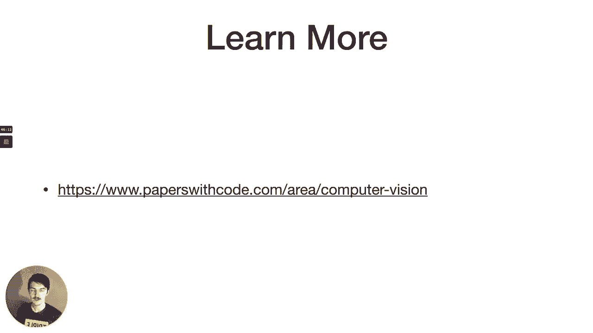
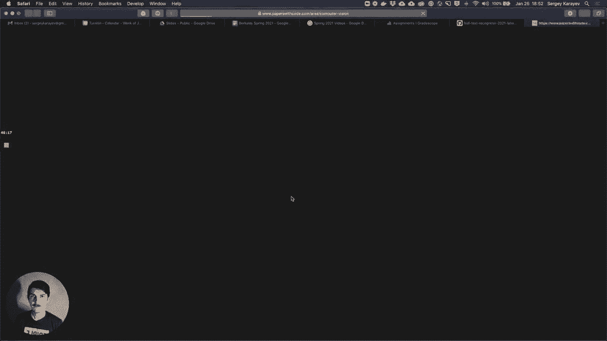

# P6：L2B- 计算机视觉应用 - ShowMeAI - BV1iL411t7jE

this week we'll be talking about，so just want to follow up to josh's。

lynette and just review some more，notable applications to deep learning，and computer vision。

and really just build the toolbox of，architectures，and tricks that were used in them so。

that we can apply them to future，problems，so first we'll tour some confident。

architectures like lynette，then we'll talk about localization。

detection and segmentation problems and，that，that vision that deep learning has。

so if you go to torch vision which is，the kind of official，pytorch package for。

computer vision models，you'll see some pre-trained models and，there's a。

a bunch of them right there's alexnet，vgg of resnet squeeznet dancenet。

googlenet and so you might think well，what are all of these，and the answer is that。

we've really been every year since 2012，really improving accuracy on this one，data set called。

imagenet and each year，essentially there was a new architecture，or an iteration。

a new spin on on a on a comp。net，architecture，that won and people started using that。

one so that's been going on for some，number of years，and that's why we have all these。

um alex matt well okay so imagine that a，little bit about，this technically called the image in。

that large scale，visual recognition challenge in 2010 was，the first time they。

launched it and it's uh，it's a number of classes a thousand，classes some of them very fine grains。

like donation some of them，pretty pretty uh broad like container。

ship right there's a bunch of different，types，but we just care about this big category。

so there's a thousand object categories，and there's over a million images in the，training set。

and the tasks are classification which，is given an image you predict the class。

of the thing that's in it localization，and detection，but really when people talk about。

imagenet they usually talk about，classification，so before deep learning right in 2010，2011，were。

shallow approaches like svms or，something like that，and the the error rate of the winner。

in 2012 alex not published the，uh paper that kind of kicked off the，deep learning revolution。

and that was a deep enough work with，eight layers and that got 16 percent。

so that was really a huge jump compared，to the previous，uh state of the art and so that got。

everyone's attention basically，and that worked very very similar to，lynnette。

except instead of the um the 10h，activation，it introduced the value activation。

it added a new type of layer called，dropout in which，some set of weights are just set to zero。

randomly，in training it introduced heavy data，augmentation，so that means the input image would be。

flipped horizontally，would be maybe rotate a little bit，and uh you know the reason it's usually。

drawn as two parts you can kind of see，it here，there's like one patch goes to one。

network one patch goes to another，is because the biggest gpu at the time。

only had three gigabytes of memory，and uh this network couldn't fit even。

though it's not that large but it，couldn't fit on just one gpu，so a lot of the engineering that。

that alex krazzewski had to do actually，had to do with model distributed。

training where the model lives on two，different gpus，and the parameters have to be uh kind of。

kept in check because they're actually，shared between gpus，so this is a schematic input。

goes into an 11 11 11 by 11 con and then，a five by five conf，max pool three by three cons max pool。

three by three con three by three con，max pool and then a few fully connected。

layers so it's very similar to lynnette，um and this is kind of a breakdown of，the。

input and output sizes of each of these，layers and the total number of neurons。

which unfortunately my face is in front，of，but several million parameters。

and next year there was another five，percent improvement in the air rate。

with really just essentially also an，alex net，but it had a um。

it it just had some tweaks as to how the，con，filter size is versus number of channels，worked。

but basically you can think of alex net，as just like，the beginning of a hyper optimus of a。

hyper parameter optimization process，and then everyone implemented their own。

alex nat and started tweaking parameters，and there was like five more percent of。

error rate to squeeze out，just by tweaking hyper parameters that's。

what happened but this paper is more，famous，for introducing these deconvolutional，visualizations。

which basically um as the neural network，trains，each conf filter。

can be thought of as detecting a certain，type of，image patch right and then in the early，layers。

that are close to the to the pixels，these convolutions learn basically edge，detection。

and then maybe texture detection like，color detection，but in the later layers like layer five。

on the right hand side of the slide，the con filters because they're now，seeing a larger。

receptive field into the image and，because they themselves have input。

from the lower level con filters are，able to，basically detect parts of objects so，maybe ears or eyes。

or wheels stuff like that and so these，visualizations are pretty cool。

and one of the readings for this week，so the next year got another four，percent drop in accuracy。

and this one came with just a lot more，layers，and it's a pretty simple architecture。

it's deeper than what i've been trying，before，it only used three by three convolutions。

so none of that nine by nine or five by，five or anything，and it introduced uh or and it also used。

two by two，pool max pools and that an increase the，channel dimension with each layer。

so like early on close to the pixels it，would be a three by three convolution。

with let's say 64 channels，and then later it would be a three by。

three convolution with like 512 channels，so one observation that the authors made，here is that。

if you stack three by three convolutions，you get the same receptive field。

as a larger convolution but there's，fewer parameters total，so four stack three by three columns。

is the same as a 9x9 con but there's，less parameters，so vgg has 138 million parameters。

and you can kind of break it down by，memory use，but the most memory used is in the early，convlayers。

because remember that，im2call operation so a con operation is，really just a matrix multiply。

but if the input to the con operation is，large，then the matrix that has to get。

multiplied is actually very large，and so that uses a lot of memory but，most the parameters。

are in the late stages with the fully，connected layers，even though the matrix the matrices。

aren't as large anymore but there's a，lot more weights to learn，and that really shows you how。

you know part of the reason to use cons，is because they use a lot fewer，parameters。

they're able to do a lot of computation，with very few parameters because you。

constrain parameters in different sizes，so next up is google net。

sometimes called inception net and it's，just as cheap as vgg，but only had three percent of the。

parameters，and it had no fully connected layers and，it was really a stack of。

inception modules and these，inception module is，you know if you noticed there was a。

basically a con value con value pool，kind of pattern that would get，replicated many times。

right and so you can call that a module，basically like a con，pool module and an inception module。

is something a little more advanced，where basically the input。

instead of going through a single con of，some size，goes through four different channels and。

then gets concatenated，so it goes through a one by one conf a，three by three conf。

and a three by three by you know stacked，a couple of times conf in an average。

pool and it's always reduced with a one，by one con，first which like reduces the number of，channels。

and so this is the um i guess the，inception hypothesis is that，the cross-channel correlations so the。

input to a confidence，has depth which is the number of，channels second image has three channels。

and then later on in the content you，might have like 64 channels whatever，your comps are outputting。

and then it has spatial dimensions so it，has channels，and it has spatial dimensions and。

the inception hypothesis was that the，cross channel correlations so in the，depth dimension。

and the spatial correlations in the，spatial dimensions，those two things are kind of decoupled。

and you can actually treat them，separately and so that's what a one by，one column can let you do。

because it doesn't see anything it only，sees like the one pixel that's coming in。

but it sees all of its channels so it's，able to，for example reduce the number of。

channels or expand the number of，channels，but it doesn't have anything uh to do，with like spatial。

correlations like edges or anything like，and another cool trick that googlenet，did is they injected。

basically they had classifier outputs，not only at the end as all the other，networks do。

but also kind of in the middle and so，what that does，is it lets the network get gradient，just。

at the end of the network um，so that's kind of interesting so that。

was five million parameters which is，actually a lot fewer parameters than the，previous years。

and then we got a really deep network，called resnet with 152 layers。

and that improved by another three，percent，and so resnet is probably like the most。

commonly used network now，um and it's actually resulted in a top，five error rate。

that was lower than the human，performance of，like five percent which i think andre。

carpathi just measured himself by doing，imagenet，by himself so the problem。

that resnet author is observed is that，you should be able to make a model，deeper and deeper。

and it should perform at least as well，as a shallower network of the same。

architecture but sometimes it doesn't，right and the reason that they that they。

pointed to is that while the gradient，can vanish，because each layer is an opportunity for。

the gradient to basically disappear，and if the network's very deep then the，gradient can vanish。

but what you can do is you can add an，option to basically skip around。

each layer and so if that layer makes，the gradient vanish，then you know it actually won't vanish。

that，shortcuts from the input around，the processing of the input and adding。

it to the result of the processing，and the reason it's called a residual，network is because。

basically you can think of h of x，as like the old plane conv operation，and um f of x is the。

is the new one which is h of x plus x，and so we're kind of trying to fit h of，x minus x。

so it's like that x is the residual i，don't know，um and the other thing it。

i guess started doing differently is it，stopped using the max pool operation and。

it just started down same playing，convolution or down sampling spatially，using strides。

and uh resnet is kind of like what，people use nowadays there's。

variants on it so for example densenet，adds even more skip connections so。

instead of just adding the one skip，connection，around a conf block you add a skip。

connection to every other part，of the network from every other part of，it。

you know it's almost like combining the，inception that，idea and the resnet idea it's the。

inception that idea is to，send the input through multiple，processing channels at once and then。

concat them and then the resonant idea，is to do this，residual kind of shortcut connection，resnext。

seems to do both so，the resnet was 60 ml parameters 152，layers，and a couple years later。

the architecture of squeeze squeeze and，excitation that，is worth looking at because it's。

basically adding，a module of global pooling and a fully，connected layer。

to basically adaptively re-weight the，feature output maps，which is kind of like attention so it's。

it's basically saying，you know like the the input comes in it，goes to the comp block。

it comes out is every channel that comes，out equally important，or can we wait some channels heavier。

than others，and that's basically the idea and that's，what it's trying to do。

so it's like sends the input through the，traditional kind of conf channel。

but then it also sends the input through，a special fully connected network。

um by basically taking the input global，pulling it so that，just averages everything into kind of。

one vector，and then you apply some fully connected，layers to it。

and then you use the output of that to，weight the channels，and lastly squeeze net is。

uh just really focused on trying to，reduce the number of parameters as。

as to as few as possible and so it，achieved，alex nut level accuracy with 50 times，fewer parameters。

and like a tiny model and the reason or，the way it did it is by。

always adding these one by one filters，which can really squeeze the number of，channels。

so number of channels kind of never，and this is actually work from burkland，by forest ian dola，um。

so if you look at all these networks and，you plot them，by you know we can plot them by just the。

the top one image that accuracy，and the best ones are you know up in the。

you can also plot them by both the，accuracy，and the number of operations and，gigaflops。

that they perform and you can also do，the same，by the number of parameters that they。

have so like the memory，a，number of operations and you can try to。

find the sweet spot like what's the best，performance in terms of accuracy we can，get。

at the fewest number of operations，and so resnets you know like some。

versions of resnets are probably in the，sweet spot，um which you can see there because you。

can get resnet 50，maybe 10 gigaflops or something like，that 8 gigaflops 75，that。

gets used for this kind of stuff so，openly i had a blog post，that plotted some notable developments。

over the last few years，versus the number of pedoflops that they，like an another i guess。

research direction or thing that people，have been working on is。

well how do we perform all this compute，in as short of a time as possible。

right because we have to keep doing more，and more compute for these networks。

but we don't want it to take longer and，longer number of，uh days so some work has focused on just。

very fast training and the the secret to，that is basically，batches that are as large as possible。

right so if you have a lot of gpus，then you can crank up your batch size，to as big as maybe 32 000。

and then distribute them over you know，1000 gpus，with each gpu fully fully loaded and。

then you can train，imagenet you can train resnet50 on the，imagenet。

for 90 epochs which gets pretty good，performance in just 15 minutes。

and there's in fact there's a benchmark，for this called the dawn bench。

from stanford and the whole point of，this is like，how fast can you train on imagenet or。

some other data sets，or alternatively how cheaply can you，train。

on the imagenet to like 93 accuracy top，five accuracy，so it's interesting to look at i guess。

the winner right now is a resnet50，trained in just two minutes and 38。

okay well i'll keep going then so the，next thing，i want to talk about is not just。

classification which is what we focused，on so far，so classification is like given an image。

output the class of the one object in，the image，right localization is do that but also。

highlight where that object is in the，image，detection is given an image。

output every object class and location，in the image right so an image might。

have multiple things and you should，detect all of them，and then segmentation is。

actually label every pixel in the image，as belonging，either to a specific object or to。

you know kind of the background default，object，and then furthermore instant，segmentation。

is like it's not enough to just say，these pixels belong to，the class dog you have to say you know。

these pixels belong to，dog number one these pixels belong to，so for localization we might actually。

have a pretty good，way to do it with like the stuff we've，discussed so far。

because maybe we can just give，an image to the to the same network like，a。

resnet or something but then instead of，the one output，max，over the number of classes。

we could also output some，extra things like the bounding box，coordinates。

like x1 y1 x2 y2 so you can imagine it's，like the same，network up until the fully connected，layers。

and then you have kind of one head of，the network，going off to predict the class but then。

four more heads of the network，predicting x1，and that might work but it's not going。

to work when there's multiple objects，because we don't a priori know how many。

objects they're going to be in the image，right so we can't like in this case if。

we know there's exactly one object we，can add，four coordinate bounding box coordinate，heads。

to the network but in this case we don't，know how many objects are going to be in。

the image so we don't know how many，heads to add，so what we can do instead is we can。

um take our you know classifier that we，trained on imagenet，that detects any like any number of。

like detects the class of whatever it，sees，and then give it patches of the image in，turn。

and then on each patch it will say you，know i see nothing or i see a duck and，stuff like that。

and we can actually do that you can just，you can just do that it'll be very，expensive because。

each time you give it a patch it'll kind，of compute，everything from scratch but in fact。

overlapping patches or like neighboring，patches，um there's yeah overlapping patches。

there's a lot of the pixels，that are shared between them and you，shouldn't have to like recompute。

this is just a demo of me sliding this，actually，kind of look at your network and observe。

that it has some conf，layers and then maybe some fully，connected layers。

and you can further further more observe，that a fully connected layer。

can be turned into a one by one conv，layer，okay so given an image you have to do。

your comp operations，and then a one by one conf，can actually serve as a fully connected。

layer for you，and so that's exactly what people，started doing with this over feed，it。

computationally tractable to look in，many overlapping regions in an image and，for each one predict。

the class of what's in it and then，because you know what，the bounding box of the region that it。

looks that you now have a bounding box，so basically given an image you end up。

with a lot of bounding boxes，and for each one there's some notion of，what what is in it。

and what you can do is you can just kind，of try to unify that，into just a couple of detections via。

non-maximum suppression，so what's not maximum suppression it，just means that。

if you have like overlapping bounding，boxes，you should keep the one that has the。

highest detection score，and then kind of remove all the ones，that are overlapping it significantly。

and there's a efficient algorithm to do，it，and then lastly there's a way that these。

methods get measured and it's called，intersection over union，so that's just the metric for for uh。

this detection quality，right so given some ground truth，bounding box and。

our detection our detection doesn't have，to be exactly the same。

as the ground truth for it to count as a，correct detection，it just has to have an intersection over。

union，that's greater than some threshold which，so that overfeed kind of approach。

is actually what yolo which you might，have heard of，and the ssd single shot detector。

it's just that same approach but scaled，up so what they do is they take an image。

put a fixed grid over it，and then within each，grid they they，uh try to find objects in that cell。

and they also do that localization trick，that i shared in the first slide where。

you not only output the category of the，thing，in the region you're looking at but also。

the bounding box，of the thing in that region and then，after you put that you run non-maximum。

suppression，and that actually works really well and，is，you only look once um it's nice and fast。

it's a great off-the-shelf solution so，um，there's three versions of it that the。

author the original author has worked on，um yellow v3 is the is the last one that。

the author worked on，and so basically it achieves really good，you know really good performance。

on this coco data set which i'll talk，about in a second，and it runs actually like fast enough to，run。

in real time and yellow v4，is uh the most recent thing that was，published just this spring。

the original author is now actually no，longer on the paper so it's kind of。

an interesting name for this method，because it's i don't know it's weird。

that they kept yellow but yeah it runs，at like，you know yellow v4 here you can see it，runs at。

like 40 mean average precision，at like 90 frames per second on the g on。

the gpu so that's really quick，now what is this coco data set that this，method is evaluated on。

so it's microsoft cocoa common objects，in context，and it's a very large data set uh。

there's like 330 000 images，1。5 million object instances，80 categories that an object might。

belong to and，even some captions um，and so yeah it gives you instant，segmentations of like。

over 200 000 images so this is what，people use now for training these kind。

so moving on we talked about，methods that basically look everywhere。

in the image right so you put a grid on，the image and you look at every cell on，the grid。

there's an alternative to that which is，try to find，regions that seem interesting in some。

way and then only look at those，might be，just things that are obviously，a。

interesting region to look at，so the first method to do this was。

also from berkeley uh by rasguership，called rcnn it's a region cnn basically。

so what it used is a like a external，method like a non-deep learning method，for finding regions。

and then basically alexnet for each，region，and because alexnet has to take square。

input each region would be just，warped to be square no matter what it，actually was at first。

and then it uses that localization trick，where the consonant outputs not only。

the class but also the bounding box，parameters and so this is really an，interim solution。

and i was kind of bridging like best uh，at the time，methods for detection and confidence。

and then later with the paper called，faster rcnn，they used a contact for the regional。

proposal network itself，so you run some kind of cnn on the whole，image。

then you run the result of that through，a region proposal network which gives，you proposals。

and then the proposals are region of，interest pooled，which is kind of like non-maximum。

suppression and then each region of，interest would be classified，and this was really fast because。

everything is just done，in the continent so the reason proposal，network is the secret sauce in that。

paper，and uh yeah it's it's kind of like，you know yolo because it does put a grid。

on the image and then scores，each cell on the grid for is it，interesting as a region to look at。

so yes the faster rcn on training，there's four losses total there's the。

classifier loss and then there's the，binding block regression。

and that's for both the region proposal，network and the object classifier。

but since we're adding so many different，losses，you know could we add actually another。

loss for segmentation，and the answer is you could and so，that's the paper called mask rcnn。

uh also from birkeland with georgia，and ross um，and the idea there is just augment。

faster rcnn as we described it with some，more，conflairs with their own loss for。

instant segmentation so now the regions，of interest，are not only classified。

and bounding blocks regress that's where，like the corners are predicted。

but they also go through this instant，and it gives like really good results by，the way so。

um this is like on the test set，it detects you know people animals，household objects like。

it looks really good um，so each region right，it not only goes to the classification。

but it now also goes through，this segmentation step and the way，that's done。

is it goes through a couple of，convolution layers，and then the convolution basically。

outputs a binary image，where like some pixels are part of the，segmentation and some aren't。

but what if we wanted to to do that to，the whole image right not just to the，regions of interest。

so this is sometimes called fully，convolutional nuts，or sometimes they're called u-nuts and，give you。

an image that's as the input and the，output，is the segmentation mask of the whole。

image of the same size as the image，and the image can be pretty large right。

so maybe it's like 224 pixels but，by 224 pixels so if we，only do convolutions that don't reduce。

the spatial size of the image，it's going to be way too expensive。

because like applying convolution to a，large input，is very memory uh expensive。

so what you can do is you can encode and，then decode right，so shrink the image down and then up。

sample it back to the segmentation mask，and we know how to shrink it down。

because like that's what we do when we，classify，we shrink a whole image down to just the。

softmax over like all the classes in it，but how do we go from something like，that back out。

to an image sized output，so up sampling there's really kind of，three ways to do it。

one is what we can call unpooling so，it's the opposite of max pooling。

a grid and then within each grid we，remember which，cell was the maximum and we kind of like。

store that cell and pass that on，but because we remember which cell was，the maximum we can actually。

unpool it and then get back out to，uh from the pooled version back to the，larger version。

or we can do this with a convolution，operation called a transpose convolution。

and the idea is that we basically like，in this，image we have a three by three。

convolution which looks like a shadow，and a two by two input that's in blue。

and as you slide the convolution over，the input you actually generate a larger，output。

so it's like the transpose of the，convolution that as we usually do it。

and then we can combine that with a，dilated convolution，which uh which basically。

like increases the receptive field of a，convolution and so you lose less。

information as you down sample an up，so moving on you can do the same kind of，thing。

so this is called mesh rcnn and as you，might guess，it's now introducing not only you know a。

classification，branch a bounding box prediction branch，a segmentation branch but now also a。

voxel branch，where the output is going to be a 3d，mesh，and incredibly it works pretty well。

of course you know we need，label data we need data that has a 2d，image。

and it's 3d mesh because otherwise，there's like no real，ground truth that we can use for the。

loss function there is such a data set，it's called shape net，so it has 55 object categories。

51 000 3d models，so that's that's nice，we might want to detect face landmarks。

so that's like uh you know points on，your nose lips，eyes and jawline i guess。

that if you were able to detect them you，might be able to animate an avatar，like iphone style or。

snapchat style whatever um，this，we just need label data of the right。

type so annotated faces in the wild is，that kind of data，produ gives you 25 000 faces。

with 21 landmarks on each face，or we might want to do pose estimation。

so we want to detect joint locations，so not just the segmentation of a person，but actually like the。

joint positioning of that person，totally possible we just add like，another you know。

output of the continent another loss we，just need to label data，coco actually has this has 250 000。

people with key points，so basically you know any type of vision。

task where there's like a lot of label，training data，is a good match for for deep learning。

because confidence are really good at，representing，the whatever information is in the image。

and if you give them the type of data，that they need to output and a proper，loss function。

so moving on a little bit you know，confidence are powerful，but they can be brittle and they can be。

brittle in like surprising ways，which which is kind of scary so the area。

of research called adversarial attacks，um has to do with that and there's。

two ways to do this research one is，white box which means that。

you know can you make an attack if you，have actually access to the model，parameters。

or black box which means if you don't，know anything about the model。

can you still you know produce an，adversarial attack on it，and uh you know the intuition is that。

what the neural nets are doing is，they're trying to like，basically learn this very complicated。

function of how，the real world as captured in，two-dimensional photography。

maps to you know categories or，segmentations or anything，and the real world is like highly。

variable and high dimensional，and the neural network has not seen all。

of it right it's just seen what's in the，training set，and it's really good at representing。

what's in the training set，and it learns like this manifold that's，representative of the real world。

but it's it's you know what it learns，if it stays on the manifold it's pretty。

good but if it's pushed off of it，it becomes like very wrong very quickly。

and so you can see on the left here you，have an image of a panda。

the neural network thinks it's a panda，with 57，confidence and then you add what seems。

to me to be a random noise，but it's actually something that the，network would consider a nematode。

right and if you add them together you，get the same image of a panda。

to my eyes but to a neural network it，now looks like a given，with 99 confidence and scarily you can。

actually，um you know not only add noise to an，image but you can actually add。

real things to the world such that when，you take an image of them，they mess up the neural network so。

there's uh，like for self-driving cars this would be，a big area of concern。

can i actually can anyone print，something，and then put it on road signs that just。

make the neural network think that you，know the road sign，is a like a stop sign as a speed limit。

sign for example so it doesn't stop at，the stop sign，um oh here's a little meme。

state-of-the-art neural network or one，noisy boy，you know who would win so。

the basic way to like find that noisy，boy，is is in trying to like，find inputs that that push the the。

gradient of the network towards some，and then to defend against such attacks，you。

can do a number of things you can try to，include adversarial examples like this。

in the training set and this doesn't，seem to work very well in peer claim。

you can try to smooth the decision，boundaries between classes。

via some methods such that it's not like，so brittle，and this can be called this is sometimes。

called defensive distillation i think i，have a slide on it coming up。

no i don't so yeah really briefly it's，basically，involve，training a neural network on the raw。

training data，and that can output classes but that，network is brittle。

to adversarial attacks and then you，train a second neural network。

that learns to give the same outputs as，the first neural network。

so it doesn't necessarily see the the，data it only sees like，the the outputs of the other of the。

other network which is，another thing that's really interesting，in computer vision is style transfer。

so you might have seen images like this，we have，like an image that we want to transfer，some style to。

and then take some painterly image like，a van gogh starry night。

and then apply it to the photograph that，we took and now we have this cool like。

we transfer the style of one image onto，the content of another。

so you have your style target which you，run through a neural network。

and you take some outputs of the neural，network into this gray，matrix and then you have some random。

pixels which you'll optimize，running through the network and then。

there's two constraints that you add，you want these like green matrices to be。

very close together and you also want，the outputs of the neural network。

uh images to be very close together and，if you do that then it's kind of like。

one is a constraint on style and the，other is a constrained content。

and if you like optimize it optimize，those random pixels that you start with。

you get an image that satisfies the，content，your，style image we have a reading this week，about it。

because it's quite interesting and then，of course there's，gans generative adversarial networks。

which are able to produce，fake images of you know very，lifelike fake images uh and we'll。

actually talk more about them in the。

research directions lecture，a cool way to learn more is this papers，with code。

um website，and if you go to like browse，state-of-the-art and computer vision。

then you actually see like a lot of，benchmarks like semantic segmentation。

classification image generation so if，you ever want to learn more about。

anything in particular like let's say，you can um see some common benchmarks。

that are used and then like the best，methods on them，and uh and then also like the papers。

that describe those methods。

