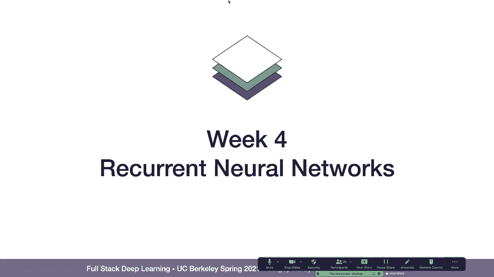
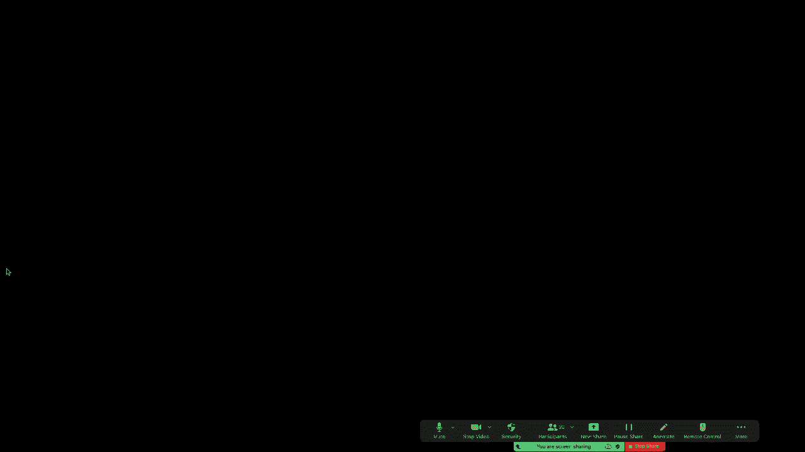
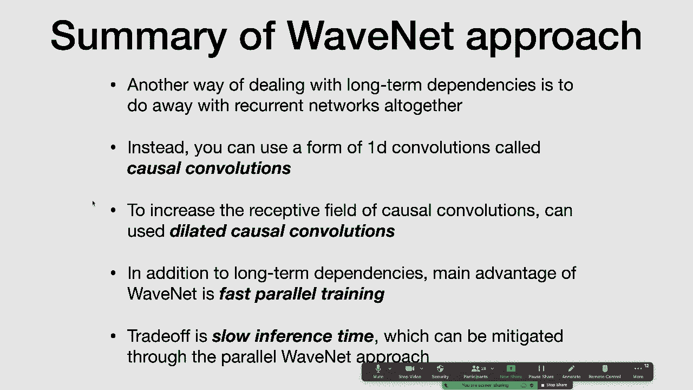

# 【双语字幕+资料下载】伯克利FSDL ｜ 全栈深度学习训练营(2021最新·完整版) - P7：L3- 循环神经网络 - ShowMeAI - BV1iL411t7jE

okay so so let's dive in and talk about，recurrent neural networks um。

and so recurrent neural networks at a，high level um，this is sort of like an analog in some。

sense for convolutional neural networks，that，idea of being similar right that we're。

going to try to exploit some structure，about the data that's coming into the，model um in this case。

the fact that the data is coming in in。

the sequence to build a more efficient，neural net architecture um hang on a。

all right so what we're going to cover，problems，and just what are some of the types of。

problems you can solve with these，architectures，then we'll talk about recurrent neural。

networks which are the main family of，architectures we'll be talking about，today。

and we'll talk about some of the，problems with recurrent neural networks。

and some of the solutions that people，have come up with to address those，problems。

then we'll do a case study on machine，translation and we'll talk about how。

um one of the earlier uh neural machine，translation systems from google uh，worked。

and i imagine this is probably not still，not how it works because these days。

everything is transformers which we'll，talk about next week，then we'll talk about the ctc loss which。

is a loss function that's useful for，sequence problems that we'll be using in，the lab。

we'll talk about some of the pros and，cons of for current neural network，architectures as opposed to。

some other choices that you have and，then finally um we'll do a very quick，preview of。

non-recurrent models for sequences and，okay so sequence problems like what are。

what are we even talking about here so，um simple example of a sequence problem。

that you can have as a mental model is，time series forecasting right and so in。

time series forecasting，uh the input to your model is a time，series so a history of。

um of a value of some data point，and your goal in this task is to predict。

what the next value is going to be，so the input is a sequence and the，output is a single value。

you can also do this with other types of，data other than just time series so for，example you can。

have the input sequence be text and then，but sequence models can also handle。

cases where the output is not，just a single value the output is itself。

a sequence so for example in translation，the input to your model is a sequence of。

text and the output is the sequence of，text in another language，similarly speech generation speech。

recognition and speech generation you，know your input is，say an audio waveform and your output is。

maybe the text that，is contained in that audio waveform，um but sequences um don't have to just。

be the input of models，like you can have uh problems where your，input is a you know a single。

value or a single vector and then your，output is a sequence，of um maybe variable length so for。

example you can，generate music using sequence models，you can caption images right so you can。

take a single image as an output which，you can view as a sequence or you can，view as just a single。

input and then you can output a，description which is a sequence。

or in question answering um it's maybe，another example right where your。

question is some text or your input is，some text，and your output is a subset of the text。

okay so there's kind of a few broad，groupings of sequence problems that we，saw on the previous slide。

so one is once many where you're you，have a single output and then。

a single input and then the output of，your model is a sequence of outputs。

there's many to one problems where the，input to the model is a。

sequence of inputs but there's a single，output，and then there are many to many problems。

where the input，to your model is a sequence and the，output is also a sequence maybe of。

different length，um and so we will uh we'll talk about，how to use，kind of a similar architectural。

structure to solve all of these types of，problems，okay so what you know one question i。

think is worth asking just like we asked，in the confnet lecture is。

why not just use feedforward networks，for to solve these problems。

so one way you could do that is if you，have um like let's say you're solving a。

many-to-many problem which is the most，general case，uh maybe you have three inputs you could。

concatenate those inputs，pass those through a fully connected，network to an output。

and then you could reshape that output，so it has the shape that you eventually。

um one problem with this is that this，doesn't really，handle sequences of arbitrary length，well。

you can one way to deal with this，problem is you can pad sequences to the，max length。

right so you can add kind of empty，characters in the sequence。

if the sequence is shorter than the max，length that you allow，memory，requirement for um doing this。

computation scales，linearly in the number of times time，steps right so um。

if you increase the max length of the，sequence then the matrix。

that you need to multiply with um also，increases in size and so this is kind of。

undesirable scaling property，for this type of model but maybe more，importantly than that。

this matrix that's mapping your，flattened sequence，to your outputs is maybe overkill in，some sense。

and so so the way to think about that is，what is this this matrix doing。

right so this matrix is learning a，mapping from um，every single dimension in your input to。

every single dimension，in your output and in particular if，there's some like pattern that you're。

trying to recognize in your sequence，so to give you an example um maybe。

a particular word um is somehow，correlated with the output that you're，trying to produce。

then um that model will need to learn，weights，for that particular uh pattern at every。

single position，in the sequence um independently right，and so it's。

in some sense it's very data inefficient，because um if you're trying you know。

if um if having you know the word cat in，your sentence is very predictive of the，the input。

um and so this kind of ignores some，fundamental nature of the problem some，structure that we expect。

the inputs of this model have which is，patterns that repeat themselves over。

okay so the next thing we'll talk about，is kind of the core，type of model that we'll be focusing on。

today and how this，addresses the issue that we pointed out，the main idea behind recurrent neural。

networks is that，instead of having a，single massive matrix that you multiply。

that has independent weights for every，position in the sequence，instead we're going to do stateful。

computation，um and so what this looks like is the，output that your model produces depends。

on the input to the model at the current，time step in the sequence。

as well as some state that the model，maintains over time，and so at each time step when you're fed。

a new input to the model，what you produce is you produce the，output for that time step。

as well as the next hidden state for the，one way to make this a little bit more。

concrete is to look at how，this rolls out over time so，before the first time step you have some。

starting，hidden state for your model so that's h0，in this diagram。

then at the first time step you receive，the first input，and your model computes。

given h0 and the first input x1，it computes the first output y1 as well，as。

the first um or really the second hidden，state h1，and that at each subsequent time step it。

performs the same calculation，um so using the same neural network，weights it takes the。

input that it sees at that time step and，whatever the value of。

the previous hidden state is and it uses，that to reduce the next hidden state。

so what does this look like in code um，let's focus first on the bottom。

uh the bottom function here and so this，this uh this function step。

is the function that gets called every，single time the model sees a new input，first。

um computes the next hidden value，and we'll come back in a second to how。

it does that but for now just think of，that as a black box，and then it uses that hidden value um，and。

uh it has a matrix multiplies it with，a set of weights to produce the the，output for the model。

okay so now now let's focus on this um，how this，compute next h function works。

so the way the compute next h function，works is um，this thing in the top function here。

which is kind of like this 10h，of the sum of two matrix multiplications。

and so to make this a little bit more，concrete，this is what's going on in compute next，h。

so you have you have two inputs to this，function，one is a property of um of this class。

which is the previous hidden state ht，minus one and then the second。

is the input of this timestamp xt，and the way that this um this function，works is it。

takes each of those inputs and matrix，multiplies it，with a um with a。

separate weight matrix that is a，property of this recurrent neural，network layer。

and so this um you know this h this nh，dimensional，by，like nh by nh dimensional matrix and，then this。

nx dimensional model input，gets multiplied by a nh by nx，dimensional weight matrix and so the。

outputs of both of those matrix，multiplications，are both nh dimensional。

and so we can add those two outputs，together，and then pass the output through an。

activation function of some kind，which in the most basic recurrent neural，network state is a 10h。

so coming back here the way that we，compute the next hidden state，is that we perform two matrix。

multiplications，one with the previous hidden state and，one with the。

input vector x we add those together and，then we wrap them in an activation，function like 10 h。

need to know，for like the most basic kind of for，current neural network that you can。

okay and so one thing to note about this，is the way that this model works。

is that we're calling the step function，every time we have an input。

in the sequence and at each of those，inputs it produces a different output。

um so this this model as we've laid it，out so far，works well when you have many to many。

problems where that are aligned，right so where you're you want to，produce exactly one output。

for each input to the model um，but in general that's not always what，you want to do so。

um the next case that we'll talk about，is how to use this，type of recurrent neural network to。

solve many to one problems，right so where instead of having an，output at each input。

we instead have one output at the end of，little bit，um what we're going to do is we're going。

to take this last，um this last output value yt，and then we're going to use that to，produce。

the output for the entire sequence，so again this this output value yt is，kind of the state。

um at the last time step and that's what，we're going to use to compute。

the the value for the entire sequence，so more concretely like if the input to。

your current neural network is subtext，like let's say a review。

then you could pass that text to um a to，an rnn，which we'll call an encoder and then。

we'll look at the last output，and so the last output is just a vector。

then we could pass that vector to，a classifier which you could also call，it decoder。

and that that classifier will produce，output，which is in this case the sentiment。

positive or negative of the sequence，um and so this is this is kind of one，case of a more general。

architectural pattern called encoder，decoder architectures，and encoder decoder architectures are。

kind of the the architectural pattern，so we talked about um the general。

um kind of recurrent neural network，setup，and we talked about how to use recurrent。

neural networks to solve，many-to-one problems and we talked about。

kind of this architectural pattern which，is having，sort of one network that serves as an，encoder。

and then a，separate network that maps that，um that vector to your output。

um and now we'll talk about how to use，this encoder decoder architecture to，solve。

so um one example of a one-to-many，problem though you might want to solve，is。

uh you know we take as an input an image，of something that's happening。

and we want our model to output some，text that describes what's going on in，that image。

so one way to solve that problem using，recurrent neural networks and an encoder。

decoder architecture is，um you can start by mapping，that input through um some encoder which。

in the case of the input being an image，might be a comp confident。

and then instead of having that comp net，map all the way to the classification of，the image。

you can take one of the vectors from the，the last couple of fully connected，layers。

um and so this is this is your hidden，state of the model，and so this vector now can be the um。

you now can serve as the initial hidden，state，for your recurrent neural network that's。

used to generate the text，that describes this image，[Music]，one other thing to note here is um。

thinking of，this as an encoder decoder architecture，as，separate networks um is more is really，like a。

um mental heuristic for understanding，the architecture，um the networks aren't really separate。

in any meaningful sense，right so they're um they and in，particular，they're connected um during back。

propagation so when you when you train，an architecture like this。

your loss function propagates all the，way from the output，back through the decoder to the hidden。

state and then back from the hidden，state all the way，okay so let's uh let's zoom in on this。

example a little bit and make it um，slightly more concrete so um。

we've taken our input image we've passed，it through a comp net we're looking at。

one of the last couple of hidden layers，and that's a vector so then we're going，to just。

use that vector to um we're going to，we're going to treat that vector as the。

initial hidden state of the rnn，um and then we're，the，um and then we're gonna continue。

propagating that rnn forward，and one thing to note here is in the，previous examples we've seen。

there's always been an input x at each，step um，and so like one question you might have。

is you know what is，how like what is the input to each step，in the sequence。

um in uh in an image captioning model，and the answer is there's like kind of。

one trick that's pretty common for，these architectures that are generating。

sequences which is you just feed，the last output of the model back as the，input at the next。

time timestamp so in this example，these y's are forming are playing the。

role both of the output of the model，as well as the input of the next step of。

and then there's one other trick to be，aware of here for how these recurrent。

neural network decoder architectures，work，and that's you know how do you know like，if if you're。

if the input of your model is just the，output of the previous step。

how do you know when to stop generating，right like there's always a new input。

because it's just the output of the，previous step um and so the way that。

we often deal with that is by adding a，special character，to your vocabulary and that character is，um。

uh plays the role of telling the，generator，that okay now it's time to stop。

all right so in terms of how you could，train something like this um。

you know the simplest thing that um，could work is，you could have a label for。

each step in the sequence um，which is the you know the true sentence。

and then the loss function that you'd，use is um for each of those outputs。

um that's a character and so you can，take a cross-entry loss between that。

between the predicted character and the，actual character in the sequence。

and then to form the loss function for，your entire model you can um。

you can just uh you can just sum all of，those cross-entropy loss terms together。

and so that's something differentiable，that you can back prop through the，entire sequence。

and um uh and，so there's some problems with using this，as a loss function，um。

a better loss function for these types，all right so we've talked about how to。

use this encoder decoder pattern，to do uh many to one problems，and to do one to many problems so。

now um pretty natural extension is to，apply this to the most general case。

where the input to the model is a，sequence and the output to the model。

but the sequences are not necessarily，so for example um the example that we'll。

talk about for for the next，um little while is machine translation，so。

in machine translation you take an input，which is a，sequence of characters in one language。

um so sequence of characters，goal，is to predict how that sentence。

should translate to another language，and the kind of baseline architecture。

that we're going to talk about here is，an encoder decoder architecture。

where both the encoder and the decoder，what this might look like is you start，at time t equals 0。

with the hidden state of the encoder，network，then at each time step time at each of，the um the。

values of the input sequence so the，sentence in english，um you um you combine that input。

with the previous um uh hidden state，to protect produce the next hidden state。

then at the end of that sentence you，take the final hidden state。

and you use that as the initial hidden，state for，the decoder network so the decoder。

network starts with an initial hidden，state that's created by the encoder，network。

and then it does a similar recurrent，decoding scheme that we saw in。

in the last section so at each at each，step，it takes the output of the previous step。

as input combines that with the previous，hidden state to produce the next。

so for the next few minutes we'll talk，about some of the challenges with。

using this type of architecture to solve，translation problems and we'll talk，about some of the。

ways that people have improved on，recurrent neural networks to。

and so just to give you a little bit of，of a preview，one of the problems with this setup is。

that you have，you know you have the sentence and the，sentence might be really long。

um but all the information about what，the first sentence means。

needs to be encoded in this in the only，thing that's passed between the encoder，and the decoder。

which is this you know the the initial，hidden state of the decoder。

and so um you know in practice you'll，you'll choose the dimensionality of that。

hidden state in advance so maybe that's，128 dimensional and then no matter how。

long your input sequence is，all of the information that's contained。

in that input sequence needs to somehow，fit into that 128 dimensional vector。

um and so that's kind of the intuition，for some of the problems with。

this encoder decoder architecture for a，more complex problem，with um with potentially longer input。

sequences，like machine translation，all right um so，before we get into the case study the，about。

upgrade，our model for our mental model for how，our current neural network works。

from kind of the simplest possible rnn，setup that we described before。

to one that is actually more commonly，used in practice，called the lstm，all right so let's um let's。

to motivate the lstm let's talk about，some of the things that we might want in。

our current neural network architecture，so one goal is we want to be able to。

and in particular along those long，sequences we want to be able to connect。

events from um from the past to outcomes，in the future，so you know another way of describing。

this is long-term dependencies，and an example of what i mean here is um。

if you have a sentence and you're trying，to describe what happens in the sentence。

at the end of the sentence even if that，sentence is really long。

you might need to be able to remember a，name of a character um，like a character in a novel that。

occurred at the beginning of the，sentence，um so you need to be able to connect。

events in the future like，what is a summary of of maybe this，entire novel。

to things that happened near the，beginning of the sequence，so we need to be able to handle。

in reality the neural net the recurrent，neural network model that we described。

before does not do a very good job，of handling long sequences so in，practice kind of anything be。

more than like 10 or 20 times time steps，um，tends not to work very well with vanilla，rnns。

and longer term dependencies really get，lost，and so the reason why is this idea of。

so to explain how like what vanishing，gradients do and why those prevent。

long-term dependencies from working，first we'll talk about，um a little bit about how we actually。

back propagate a loss function，in recurrent neural networks um and so。

i'm gonna go through this piece，relatively quickly so if you're not，familiar with it it's worth。

reading up a little bit on back，propagation through time um，but you know the the main thing that you。

need to know is that back propagation，through time works exactly the same as。

regular back propagation um you just，have to sort of unroll the entire graph。

across time before you do your back，propagation steps，um and so in particular if we're trying。

to study，the gradient of the loss function with，respect to，some of the weights of our network then。

the first thing that we need to do is，we need to study the the gradient of the。

loss function with respect to，the hidden state of the recurrent neural，network。

and then we'll pass that gradient，backward um，we'll combine it with the um。

uh the the gradient of the，the um the previous hidden state with，respect to the current hidden state。

and then we'll use that um combined，gradient to，find the gradient of the loss function。

and so the the um the observation to，make here，without going to all the details about。

how this works is that，the gradient of your loss function with，respect to。

the weights that describe the transition，between the previous hidden state。

and then the current hidden state depend，on，um the gradient speed，of um uh the gradient between。

subsequent hidden states in um，in the model and so if you're，recalling kind of the vanilla um。

uh recurrent neural network setup that，we had the way that we computed the next，hidden state。

from the previous hidden state was by，this 10h，and so um when you're computing this。

this factor of this like uh gradient，of subsequent hidden states then each。

time you do that that increase it that，introduces，a gradient of a 10h so 10h prime。

into your um into into the gradient with，and so the problem with this is that if，you look at。

the derivatives of common activation，functions，here's here's a plot of sort of the。

three most common activation functions，um uh as a function of the value of the。

input to those functions，and so in particular both tanh and，sigmoid。

have derivatives that are very close to，zero when the values that are going into。

and so what tends to happen in practice，is that，you um you have relatively large inputs，to。

that 10 h prime that produces an output，that's close to zero，and the magnitude of um of the gradient。

where you have all these，uh like 10 h primes multiplied by each，other um。

eventually hits zero in numerical，precision，so after enough gradients enough time，stamps。

and so one question you might ask is um，well what about values right like。

values have a gradient that's equal to，one any time the input is positive。

um and the answer there is that，relu rnns in practice often have the。

opposite problem which is exploding，gradients，right so if you have many time steps um。

then uh like gradients tend to get too，all right so next thing that we're going，to cover is lstms。

and so when people talk about recurrent，neural networks in practice usually what。

they're talking about is lstms or some，variant on lscms，and so the the key idea behind lstms。

is to use is to change our compute，nextstage function，and so instead of using the simple。

compute next h function that we used in，the previous examples we're going to use，something。

that is a little bit more complicated，but helps in some way preserve。

and so um what i'm going to do in the，next few slides is i'm going to，introduce you。

at a high level to how you can think，about um the the，architecture of what's going on inside。

of um inside of an lstm unit，and but won't go through all the details，but but again hopefully this。

will give you some intuition about how，they work and then you can fill in the，details。

on your own later，[Music]，so the main idea behind lstms，is that in addition to having this。

hidden state，that gets updated ever at every time，step we introduce this。

this um this new state that also gets，passed from time to，time step to timestamp um called a cell。

state，and that cell state has very particular，rules about how it gets updated。

at every time step and so in particular，there's kind of，three um three main interactions that。

the hidden state，has with the cell state，so the first interaction is that，the。

like at a rough level the function of，this forget gate is to decide。

which parts of the old cell state we，want to get rid of，as a result of seeing this new input to。

the model and so the way this works is，you take the previous hidden state。

you combine that with the input to the，model，and then you pass that through a sigmoid。

so that produces a value between，zero and one for each of the dimensions，of the cell state。

and then when you element wise multiply，that with the cell state。

um each of the values of the cell state，is um，the same，or scaled somewhere in between and so。

this this what this gate helps you do is，kind of get rid of old information that。

the next component of the lstm is the，input gate and so this decides。

like how to actually incorporate new，information into the cell state。

so the way this works is you again take，as an input the，the inputs to the model as well as the。

previous hidden state，you map through those through a tanh，to produce values between negative one。

and one and you combine those with，uh values that are the output output of，a sigmoid。

and so together you get um you get a，a new vector that you just add to the，previous。

value of the cell state so you've，and then the last step is how do you use。

like how do you actually produce the，next hidden state，so the way that you produce the next。

hidden state is that you um，again you combine the current input the，previous hidden state。

um you sigmoid that um and then you 10 h，the value of the cell state multiply。

that by that value between zero and one，and then that's passed to the next time。

step and to the output，as the hidden the hidden state for this，okay so there there's there's a lot。

going on there um a lot of moving pieces，and like in particular you might be。

wondering well why does this actually，solve our problem，and uh and to answer those questions i'm。

happy to talk more about this as well，but um，i i would actually highly recommend。

reading this blog post from chris ola，which i think is kind of the most clear。

explanation for how lcms work and why，they solve this problem，but hopefully this gives you a little。

bit of intuition about what's happening，so one other thing you might have heard。

of if you're like reading machine，learning papers is like，gru's and other uh you know。

other alternative recurrent neural，network architectures，and so i want to talk a little bit about。

about that like is is there something，better than the lscm out there。

um two papers that i like that explore，this question，um these are both empirical papers where，they。

compared different variants of the lstm，including gru，um so in the first one they compared。

nine lcm variants on three data sets，and concluded you know empirically it's，kind of hard to beat。

a regular lstm in terms of like overall，this，into this question so instead of just，comparing like。

a uh you know measly nine lstm variants，they use neural architecture search to，generate um 10 000。

architectural variants um they combine，they compared those，architectural variants on three。

different data sets and，they concluded that gru's actually tend。

to perform a little bit better than lsms，and they also found some architectures。

that they made up using this procedure，that performed a little bit better than，gru's。

and so what should you take away from，this right like is should you be using。

gru's should you be using lstms should，you be using like，some other architecture so our advice。

here is，um lstms if you're going to use，recurrent neural network architecture，which。

maybe not that many people do anymore um，but if you're going to。

they tend to work very well for a wide，variety of tasks，and um gru's might be a little bit，train。

and so if you know if you if you uh if，your trusty lstm doesn't seem to be，performing well。

but if you're，if you're starting to um dive deeper，into recurrent neural network。

uh units than that then maybe there's a，bigger problem，um up next is we're gonna talk more。

about machine translation，and we're gonna introduce two ideas um，one is by bi-directionality。

and the other is attention so these are，sort of the big ideas to take away from，this section。

and um this is all from this one paper，from back in 2016。 so at one point this。

was running in production at google，um i highly doubt that it is anymore um。

but it's it's worth knowing about anyway，[Music]，so um one one thing i want to talk about，is just。

in general if you're like reading，machine learning application papers。

what what are the questions that you，might want to ask yourself to understand。

what's going on these papers，um so here here are some questions i，think are worth asking。

one is just like first of all what is，the problem that they're trying to solve。

so what are they using the neural，network for，then what model architecture are they。

using to solve the problem um how are，they training that model architecture so。

what is the loss function and what is，the data set that's trained on。

and how do they actually perform，training and then finally since we're。

thinking about applications of machine，learning here，the last question that i think is very。

much worth considering is，how inference works for this model so。

are there any tricks that you need in，production，so starting from the problem again we're。

working on machine translation so the，goal is to，translate a sentence from one language，to another。

um and the architecture that they use，is motivated by the same encoder decoder。

architecture that we talked about，earlier，[Music]，um and again this is kind of um how this。

would work，if this is how this would look if if，this is all they did like encoder，decoder with a。

with a regular lcm but there's some，problems with just，doing a single layer lcm as your machine。

translation，model and one of the biggest problems is，that this is just gonna underfit this。

task pretty badly，so one thing that you could try is you，can try stacking。

lstm layers and so this is a diagram of，what this looks like，you have multiple lcms each lstm is。

reading from the lstm before it as well，as its own previous hidden state。

to produce the next hidden state which，is the input to the next lstm。

um but stacked lcms are hard to train，so this is this is a quote from the，paper which says that they。

you know they were able to get them to，work pretty well up to four layers。

and by the time you got up to eight，so one solution here is to add something，similar to a。

a resnet here so to add residual，connections and again this works，very similarly to how it does in a。

resnet where，um between the the um between the layers，of the lstm。

you uh you have this skip connection，so that the input to the lscm at the，first layer。

is passed directly via some to the，lcdm in the second layer in addition to，the。

output of the first lstm layer，so that's one way to make it easier to。

there's another problem though um and，this is one that we alluded to earlier。

right and so the problem is that like，when you're encoding an entire sentence。

there's a lot of information that has to，be encoded in that last time step。

so there's a bottleneck here there's an，information bottleneck between，the encoder and the decoder。

[Music]，and so the solution that they use is um，is a is a class of techniques called，attention。

which we'll be talking a lot about next，week，but the key idea behind attention is。

that instead of compressing，all the previous time steps into a，single hidden state。

instead you want to give the decoder，access to the entire history，um but you know that's a lot of。

information for the decoder to，uh to take into account and so we're。

really only going to pay attention，to a subset of those past factors。

so to make this a little bit more，concrete let's say that we're。

translating a sentence from english to，french，and let's ask the question about like。

which parts of the sentence，in english do we really care about when。

we're predicting each character in the，french sentence，right so maybe for the first um the。

first sent the first word in the french，sentence，um we only really care about the first。

few words in the in the english sentence，and for the second word maybe we care，about the same words。

uh maybe for this third word this is，this means brown，in french so um our network might only，english。

to translate this word and uh and so on，so one way we can formalize this into。

something that we can build into a，network，is um instead of having a subset。

of the of the the input to the model，that we，pay attention to to produce the output，instead。

we're going to have a distribution over，the，the um the way that we're going to，compute the。

the attention value for this particular，word in the sentence，is we're going to use some relevant。

scores，and these relevant scores tell us how，is，to this particular word in the output。

so there's a couple questions that this，brings up one is like，okay how do we how do we actually。

compute these relevant scores，and then the second is how do we use the，relevant scores to compute。

the um the value of of this word that，we're trying to predict，so let's focus on the second question。

um so the way that you use relevant，scores，in an attention setup is that you。

compute a relevant score，for each of um in many like in many，cases the way that this works is。

you compute a relevant score for each of，the，network，encoder so each of those hidden states。

is given a，relevance weight p p sub i，and then the way that you use those is。

you produce an attention score，um for um that combines，all of those hidden values in a weighted。

sum according to，and then that that weighted sum is，passed as another input，model has。

to do so you're using um you're using，you're using something in the decoder to。

compute some relevant scores，for each hidden state in the encoder。

then you're combining all the hidden，states in the encoder，via a weighted sum which is weighted by。

the relevant scores，and you're passing that as another input，so one thing that you can do to build a。

little bit more intuition for what's，going on in attention models is you can。

look at attention maps and so，these are basically ways of visualizing。

the the weight that each of the，the input the the parts of the input，sequence have。

on prediction of a particular uh，word in this case in the output sentence。

and so this is this is one way of，visualizing it so for example like。

um you know this french word the uh，this means agreement in french i guess，um。

so you can see that the weight is almost，entirely on，agreement in the english sentence um。

but you know some of these other words，like，this uh well let's let's find one that's。

more interesting than that um but like，th this french word for example。

kind of depends equally on both，this english word and this english word。

so the the model is paying attention to，both of these things you know almost。

another way to visualize this for，sequences is you can，plot this on a heat map and so the the。

cells on the heat map，um so you know these are the outputs of，the model。

the cells on the heat map um you know，lighter colors correspond to。

more weight being placed on the on that，row，this is another way to visualize what's。

happening in the intention，and then the other thing i'll mention on，attention is just attention is。

is useful in many machine learning，problems not just translation，um so uh you know，into。

the text that's contained in that um，that's being spoken in that way，waveform these models often use。

attention，and it's not just for like what you，models，either right it's it's also often used。

in image models，so if you um if you're，like for example like if you're if。

you're doing this task of trying to，describe what's in an image。

so encoding the image and then decoding，it um to produce a sentence that。

describes what's happening in the image，then one thing that you can do is you。

can add an attention mechanism to that，that allows the decoder to pay attention，to certain。

parts of the image and so this is，visualized here where，you know um this is a this is the image。

that was an input，this is the output that the model，produced and here's a visualization。

where the lighter parts，of the image are the parts of the image。

that the model paid more attention to，okay so this is kind of where we are。

where we're at with this um，this model architecture so we have um we。

have the stacked lcm and we have this，attention module，that's allowing the decoder to。

communicate more with the encoder，um another problem with lcms is they。

only consider backward context，so why is why is that a problem um well。

when you're translating a sentence um，you know and you're deciding how to，translate the word quick。

quick can mean different things in，different contexts so understanding how。

the rest of the sentence is going to，unfold，might be important to deciding how you。

translate the sentence，so the simple idea that you that you can，use to，make order not matter or like。

directionality not matter in the，sentence，is to use two separate lstms one to，order。

and then the other to process the，sentence in backward order。

um so this is called a bidirectional stm，so what this looks like is。

you have sentence you have an lstm and，then you have a separate lstm，it's。

the hidden states move in the opposite，direction and then at the output。

you just concatenate those two inputs，and pass it on to to the next layer。

and so this is briefly what this looks，like in the architecture，[Music]。

okay um what loss function was used um，and what data set it was trained on and。

all this stuff i'll skip over but，worth uh we're taking a look at those in，the paper，[Music]。

all right so to summarize the way that，this um kind of，like early landmark results in machine。

translation worked was，they um it's built off of this recurrent，neural network encoder decoder。

architecture that we，talked about at the beginning but with，some improvements so instead of rnns。

it's lcms，instead of a single lstm it's stacked，lcms，with residual connections and an。

attention mechanism that's added to it，so that，longer term connections can form。

and then to encode future information we，also made this model bi-directional。

and it's trained using a standard，cross-entry loss on，a large data set um and there's some。

tricks that they use to speed up，kind of，that's the recipe for training a state。

of the art neural machine translation，system in，as of 2016 or 2017。

so the next thing that we're going to，talk about is what's called the，ctc loss so what's the goal。

of ctc loss um，so in some of the labs，one of the problems that we're going to。

be working on is taking some head，written text and turning that into。

what is the text in this handwriting so，our the input is like kind of an image。

of a line of text and then the output is，a sentence，so the question is how how would you。

actually model this right so，um based on what we talked about before，have an。

encoder decoder architecture right where，the the encoder，takes a particular window。

in that sentence passes it through a，comnet，passes the output of the comnat to an。

lstm that l stand produces，uh a character and then we use that，character as。

like what is the character at that，position in the continent，and so what this in an ideal world what。

this could look like is you know we，slide this comp net window，over this input image and at each。

position that we slide it over，we um combine the output of that convent。

with um with the previous hidden state，of the lstm，we produce the character that we expect。

to see at this position on the image，so in a perfect world you know this just。

works great and we're done，the problem is like what if we're，dealing with an input that's scaled。

differently，so we might even take the same sentence，and just stretch it out more。

and then like let's see what happens if，we try to apply the same window size。

to this problem well as we slide this，comnet window，um you know for the for the first two，positions。

that the the that convolutional filter，is being slid over，it's uh looking at the same character so。

we might produce，the same character twice um，like，in different parts of the sentence so。

the question is like how do we deal with，the fact that，the the inputs and outputs might be。

scaled differently，um and so more generally like this kind，of misalignment problem can happen。

in um lots of different sequence of，and um yeah and and throughout this i'll。

be using images from this，uh blog post below that covers the ctc，loss in more details。

and so again would recommend checking，that out if you want to understand a。

let's say that we take some input and we，slide our window over that input。

and we produce some characters in the，output，but those characters um we might have。

repeated characters there，um the intuition for how the ctc loss，works is。

like if we see a character you know c or，a two times in a row，then let's just assume that that。

corresponds to the same character in the，output sentence，and so we'll combine subsequent。

characters that have the same value，um and so in this case like we combine。

the two c's we'd combine the three a's，um one problem with this is how do we，deal with。

sentences that actually do have are like，supposed to have two of the same letter，in a row。

and so that's kind of the one extra，wrinkle that will add to the ctc loss。

and that's that we add these um kind of，extra epsilon tokens，as as one of the possible things that。

the model can output，so the way this works is we'll slide our，window over the entire sentence。

we'll produce the um and then the the，model will produce either a character or。

an epsilon token and then we'll have a，rule for how we merge characters and，epsilon tokens。

together in order to produce the final，output sentence，and so the rules that we'll follow are，merge。

all repeated characters and then we'll，remove any epsilon tokens。

and the remaining characters are the，output and so，the reason that this solves our problem。

is that if you actually want to output，two of the same character in a row then。

all the model has to do is，instead of outputting those two，characters。

in a row in the raw outputs it said，instead has to，output the character and then epsilon。

and then the character，have，those two characters that remain at the。

so there's more technical details that，are important to know here if you，actually want to。

implement and train this for example um，how do we know this is actually。

differential um or how do we make it，differentiable，and uh again refer you to this great，blog post。

details um but yeah this is kind of like，what this works like。

what what the what this looks like when，you're decoding a，and um we'll talk a little bit more。

about this in a second for lab three，because we'll actually，i wanna talk quickly about some of the。

pros and cons of the，the neural net architectures that we've，been talking about so far today。

um what are some of the pros，well one of the pros of these recurrent。

neural net architectures is that，which um hopefully we hopefully is is，we've looked at。

um but this this architectural pattern，this encoder decoder pattern with。

you know um lstms or stacked，bi-directional，lcms of the tension or whatever variants。

of your current neural network you want，um as either the input，or the encoder or the decoder or both。

it's a very flexible architectural，pattern，and it can solve a lot of different。

problems right so again it works for，one's many problems it works for many to，one problems。

and it works for many too many problems，even if the inputs and outputs are。

and another pro is that there's kind of，a long history of these models。

being successful in nlp and other，applications，and for a long time really like up until，2000 and。

what 2019 is that right um most of the，like state-of-the-art，sequence applications used some variant。

of a recurrent neural network，architecture，but really since 2018 2019。

um almost all of those applications have，been replaced with um transformers。

and variants of transformers which is，what we'll be talking about next week，[Music]。

so what are the cons well um，recurrent neural network training is，inherently not as paralyzable。

as other types of models and the reason，for that is that，you need to go in sequence right so in。

order to know what the，value of the um you know the hidden，state at like the end of the sequence is。

you first need to compute the hidden，states in all the previous。

steps in the sequence um and so there's，something that's，inherently sequential about that um and，so。

um you know parallelism is one of the，things that makes，training larger and larger models more。

feasible so，we have somehow less parallelism in our，current networks than we do in other。

and so in practice these things tend to，be a lot slower，to train and in practice they're also。

often very finicky to train，so lstms and other rnn variants，tend to require a lot of tuning and。

there's a lot of tricks that goes into，training these things well。

so it's uh it's not a particularly easy，thing to just kind of pick up and。

all right so the last thing i want to，talk about in this section is just a，quick preview of。

what sergey is going to talk about next，week which is non-recurrent sequence，models，[Music]。

so the first insight here is that just，because you're working with sequence，data。

it doesn't necessarily mean that you，need to use your current network model。

and so today we're going to look at a，convolutional approach to sequence data。

and next week as i mentioned we'll，expand and talk about，we'll discuss，is from this paper which is a。

early success in generating，raw audio and for，at least for a while was used in google。

assistant and google，google cloud text-to-speech and um，like，google is transformers all the way down。

these days i'm not sure，um but for at least a few years this was，used in production。

and so the main idea that's introduced，here is convolutional sequence models，[Music]。

so again what problem are we trying to，solve here in the wavenet model。

the problem that they're trying to solve，is taking some input text。

so what do you want the model to say and，then outputting，an audio waveform of speaking that text。

so you want you want to um produce some，like realistic sounding speech。

of you know the model reading that text，what model architecture is used um so，this。

rnn encoder decoder architecture，but there's some limitations to lstms，that make。

audio audio modeling difficult and these，are some of the same limitations。

that we've uh talked about before right，so long term dependencies，and this bottleneck of sequential。

training and so，in audio data in particular you tend to，so the insight that was applied in this。

paper is that convolutions are not just，for images，convolutions can be applied to sequences。

as well um，so the way to visualize this is kind of，like this right so。

at each time step um in the input，uh you um you map kind of，a history of time steps um so a window。

of time steps，to produce the next input in the next，layer of the model。

and then that layer also takes a window，of time steps to produce the。

and so this is what this looks like，right so for a particular output。

the way it's produced is by looking at a，window of，of the previous hidden layer。

and each of those inputs from the，previous hidden layer is produced。

from a window of inputs in the hidden，layer before that，all the way back down to the input layer。

one other detail to note here is，typically in convolutions，you think of a of uh。

like so the question is like where do we，sample this window from。

and um this particular scheme that's，used in this paper and for a lot of。

sequence modeling problems is called a，causal convolution，um the reason this causes uh called a。

causal convolution is that，the entire window is sampled from the，past。

so you're not looking at any data in the，future，in order to produce the output at the。

next hidden layer and the reason that's，important is because，when you're sampling from this model。

right so when someone is，typing text into the model in real time，we want to be able to also produce。

the um the output in real time so we，don't want to be able to look into the，future。

and see what the person is going to type，next in order to produce。

and yeah so this this is kind of like，the math behind how causal convolution，works。

um again it's just a weighted sum of，values in a window，values。

so one challenge with models like this，field，right so just like in some of the other。

sequence problems that we talked about，in um text-to-speech，one thing that that matters is that。

like the output waveform at a particular，time step，might not just depend on a very very。

small like narrow window of text，around that time step it might also，depend on things that were said。

in or things that were typed in the，distant past because those might have。

an influence for example on like the，inflection that you use when you say a。

and so one of the challenges is you know，how do we actually increase the，receptive field。

the approach here is to use like just，like we talked about dilated，convolutions。

for computer vision applications there's，also a notion of dilated，world。

so these are called um dilated causal，convolutions，and the way it works is similar to how。

dilation works in image models，where instead of sampling，subsequent uh inputs in the previous。

hidden layer to produce the next output，you instead skip some，inputs so you um。

you you know instead of looking at uh，like the，the value at the current time step and。

the value at the previous time step，you might look at the value of the。

current time step and then the time step，that was like n time steps ago。

so this is kind of the other one of the，other key ideas that made this paper。

so there's other important details about，like um how this is implemented。

how to optimize these types of models，that um，are important to know if you actually。

want to implement this but are maybe，like less conceptually important for，understanding how it works。

and so it's it's uh if you're interested，in this it's worth checking out the，original paper on this。

um so the loss function for wavenet is，very similar to the loss function that。

you'll use for a lot of other，classification，tasks which is you're just trying to。

minimize the log likelihood，of the outputs given the inputs，this is what this looks like in uh you。

know in math，this is，you break it out right so y is your，sequence of outputs。

and so you decompose this into a log，likelihood，on each of the individual outputs um not。

just uh uh yeah and that's how you'd，actually compute this，and each of those log likelihoods is。

just your standard cross entropy loss，[Music]，so one other thing that's worth。

mentioning just because，i think it's it's pretty important to，understanding how a lot of these like。

really successful large，um uh like production language，models and text-to-speech models and，that。

one of the keys to make them work really，well is that they tend to use。

massive data sets that are not，necessarily publicly available，and so this is true for the wavenet。

paper and it used，internal google sets uh google data sets，that um you know maybe are not that many。

hours of speech，but have like many many samples per，second so these at the time in 2016 were。

huge data sets and now，the models that do this are uh much much，larger and they're trained on。

so in order to make this work so in，order to make training，there's。

as you can imagine a bunch of tricks，that go into，um into doing this training。

um but you might imagine wrong and，that's kind of like one of the amazing，that。

uh since wavenet training can be done in，parallel there weren't like a ton of。

complicated tricks that were needed in，order to train these models just really。

on the other hand inference on these，models is very tricky right because。

you at each uh at each um time step in，the output，right these time steps are very small。

they're like a you know a small fraction，of a second，you need to compute stuff that depends。

on potentially long sequence of input，and so uh actually doing inference on。

these models is very expensive，so even though trading is simple。

inference on these models is complicated，and there was actually uh。

a separate paper a second paper that was，introduced that，um uh had some ideas about how to do。

more efficient inference on the wavenet，so wavenet um or these kinds of。

convolutional sequence models，are another way of dealing with，long-term dependencies。

and the way that we deal with long-term，dependencies is we just say。

you know what recurrent neural networks，well，so let's just get rid of neural net。

recurrent neural networks，[Music]，and instead we're going to use a。

one-dimensional form of convolution，so convolution in the sense that each。

output is produced by looking at a，window of inputs，and in particular the types of 1d。

convolutions that we use，are causal convolutions so where the，windows of inputs that we're using to。

predict，the next output depend only on the past，and not in the future。

and that's important if we want to be，networks，and then to increase the receptive field。

of these causal convolutions so，if uh you know if a particular output，depends on。

a wide range of input data then we can，dilate these convolutions，array。

and then you know in addition to like，handling these longer term dependencies。

more gracefully and more effectively in，practice the other，big advantage of wavenet is that it's。

just inherently parallel，to train and so training it is very fast，and doesn't require，many tricks。

um but the trade-off that you make when，you implement a model like this is。

it's these models are slow at inference，time because，the the next time step that you're。

trying to compute depends，on you know values computed from all of，the past。

and so there's there's some work that，needs to go into making these models。

