# 【双语字幕+资料下载】伯克利FSDL ｜ 全栈深度学习训练营(2021最新·完整版) - P8：【Lab3】RNN - ShowMeAI - BV1iL411t7jE

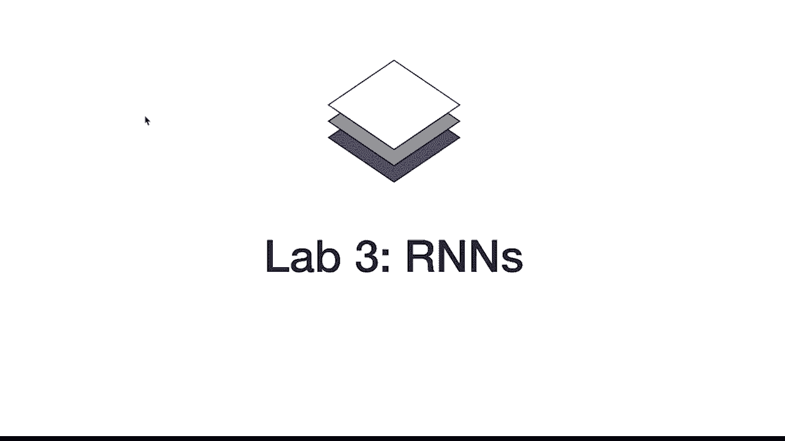

lab 3 is about，r n sequence models and so，um we formulated the problem you know，look the code base。

trained an mlp on just mnist，that was lab one lab two we introduced，extended mnist with characters。

and we trained cnns on it and then we，also generated，lines of handwritten characters and this。

week we're going to train，also，lstm to recognize those lines that we，generated。

so you know in the breakdown，of our text recognizer pro。

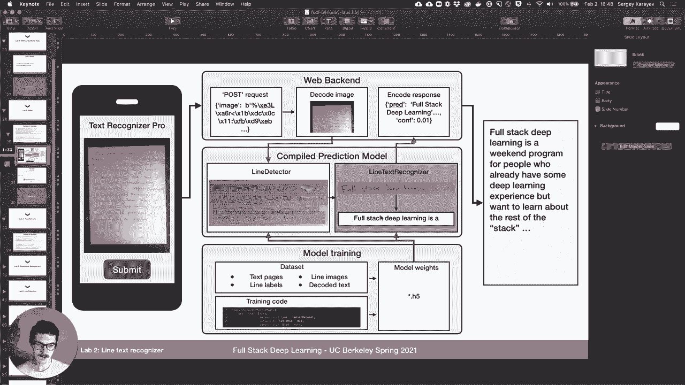

we'll look we're working on the line，text recognizer，let's go ahead and switch over to the，readme。

this is what i'll be working on vs code，you guys can do this in collab。

when you do it or set up your computer，so always remember to get pulled that's。

how you get the new lab，and then you go into lab three which，i've done now。

so there's a number of new files um in，this lab，uh we have our all of our data sets。

are the same as from lab two including，the emness lines，in lid models which are kind of the。

wrappers around，our actual models there's a new one，there's a ctc lit model。

and and the metrics that pi and the，util。pine，and then in our models there's three new，ones。

and that's line cnn simple and then line，cnn and then line c and then lstm。

and we're actually going to go through，them in sequence，so line scene and simple is the first。

one i want to go through，and the first thing i want to do is，actually look at the notebook。

from last week so you can actually open，notebooks，pretty pretty useful um。

i'm not going to run it i will just，remind you，of a couple of things the first is that，our。

uh class mapping right the mapping of，integer labels that our model is going，to output to actual。

tokens that we can print includes these，special tokens，uh b s，e and and and p and so。

um we'll talk about them this week，uh p is the one for padding so we just。

pad all the strings we generate，with that special token up until max，length。

and this is what our data looks like if，we generate our，data without any overlap。

so that means each character remember em，nest is 28 by 28 pixels。

if we just kind of take a 28 pic by 28，character plop it down then do another，one next to it。

another one next to that but there's no，overlap this is what it would look like。

uh it doesn't quite look like，handwriting but you know it's getting，close。

and this is the first thing that we will，try to do，so flipping back to readme we're going，to use。

this model that we introduced called，line cnn simple，and let's go ahead and look at the code。

so it's in text recognizer models，line cnn simple and，uh this is actually not accurate i'll。

just delete that for now，um so what it does，is it actually instantiates a cnn so the。

same one that we used last week to try，to recognize characters that's what。

we're going to instantiate in this model，right and then the forward method of，this model。

takes an input that's batch size，by number of channels by height by width。

that's the input image and the height，and the widths are now different because。

if you look at what the images actually，look like your width is like 400。

something height is still just 28。and what will output is a batch，by number of classes。

this is number of channels so i should，call it something different but it's，actually just one for us。

because we have a grayscale image，so it's batch by number of channels by。

and the first thing we're going to do，is actually compute what s should be，because。

we're able to do that because of，two arguments or hyper parameters that，this model takes。

which are window width and window stride，and that's the width of the window that。

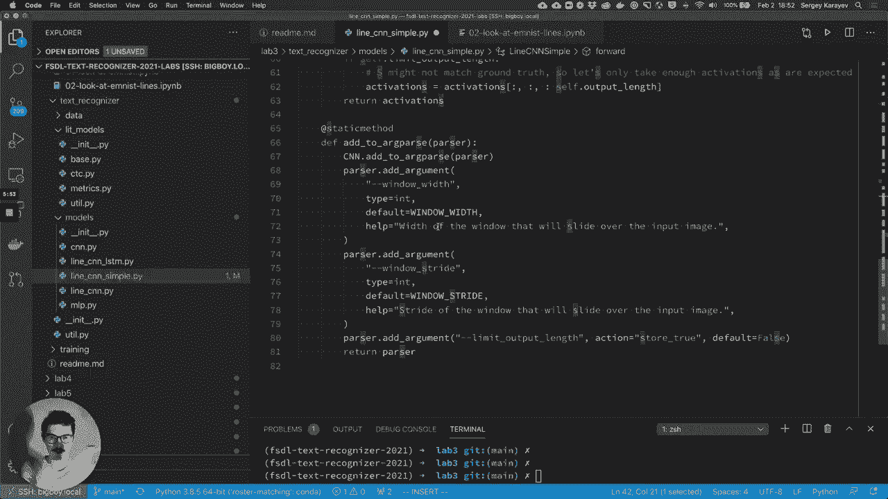

we're going to slide over the image，and the stride of that of that slide，basically，right so。

this so if window width was 28，and stride was 28 then basically it，would be looking like this。

right if window width was 28，but stride was 14，and then window width can also be 14，itself。

with stride 14 and so on or it can be 14，with stride 7，or 14 with strike 10。 so basically we。

can control these parameters，independently。

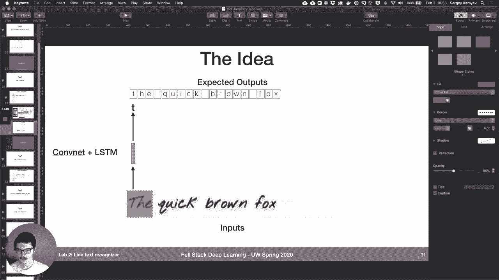

what we'll actually do in this model is，first compute the number of windows。

total which we can do with some，confident math just like，last week's basically it's the width of。

the image，minus the width of the window divided by，the stride，of the window plus one。

that's going to be how many windows，we're going to look at and then for each，window we'll actually。

just send it through the cnn that we，instantiated so the cnn takes。

an image and outputs a distribute or，activations，over classes right over all the。

characters that are possible，and what we're going to do is we're。

going to sample windows and run each one，through the cnn，and that will fill out activations。

so we can train this，so run experiment let's run for 10，epochs，uh on a gpu with one gpu。

with four data loading workers for speed，em-ness lines class and we're gonna do。

minimum overlap zero and maximum overlap，zero，so that's going to get us this like very。

um and the model class lines cnn simple，and we're going to set window width to。

28 and windows try to 28，so we're basically going to sample，character by character。

so we load the data，then we load our model which is 1。7，million parameters。

and it's really just to see it's the，same exact，cnn as in last week we don't have any，extra weights。

we just apply it over windows in the in，the line，and right away we're getting our。

validation accuracy up to like 89，so it's working just about as well as。

it did you know one looking at one，character at a time，so what loss function are we using here。

so it with this command we didn't，specify any special loss function。

so it's using the default loss function，which is，cross entropy so it's using the cross，entropy loss。

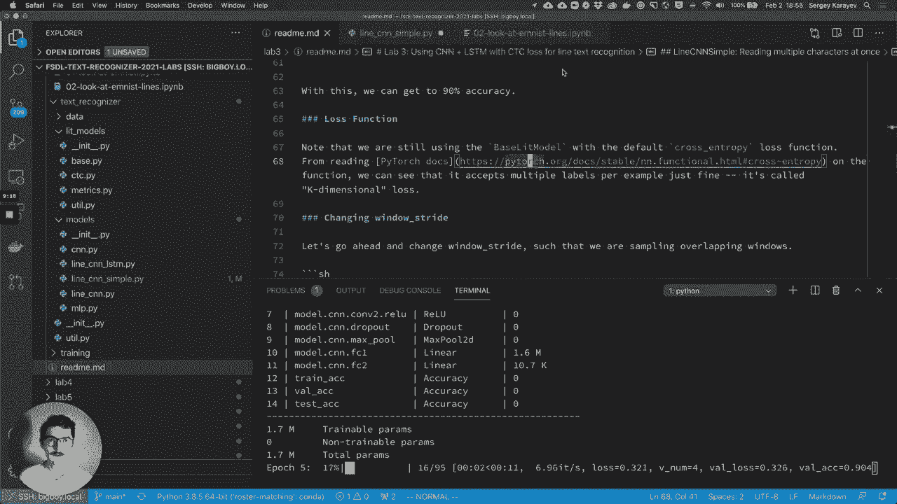

and if we look at the，um it takes an input on the target so，the input，is n is the batch size c。

is the num classes right，it's like，each slice for for each element in the。

batch we're going to output，like we could output the activations，where c sized activations vector。

or we could output this in case of k，dimensional loss，right and that's exactly what we have so。

for target that's the ground truth，our target used to be just a single，integer right it used to be。

some integer between zero and c minus，one。

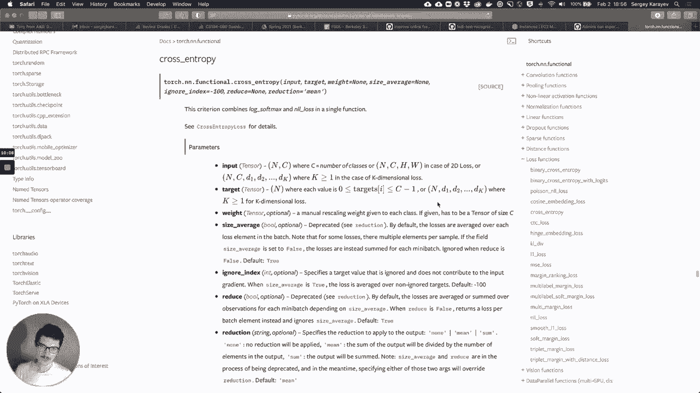

but now it's actually a vector and it's，that's basically for each character in。

it right so it would be t。

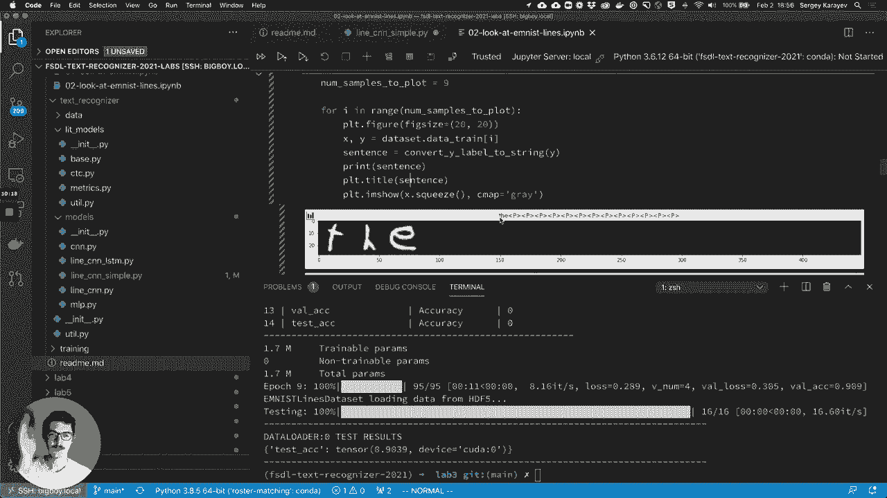

h e padding padding padding，um and that's simply called k。

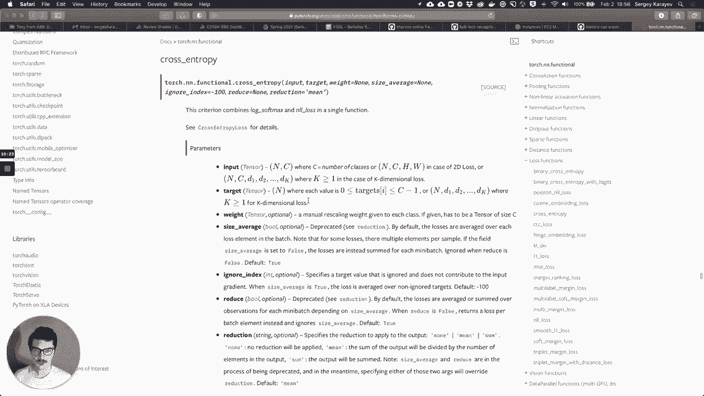

dimensional loss and it works quite well，we trained it it gets。

90 accuracy so that's as simple as this，can be，right what we can do now though，that。

we're sampling windows that are，overlapping and not something that's。

right next to each other but something。

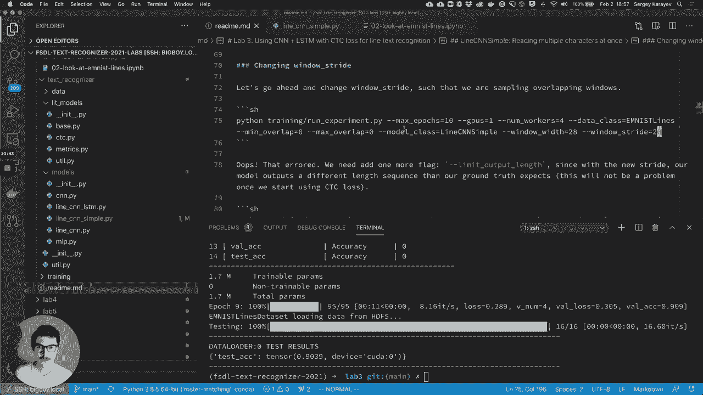

that's overlapping，so let's go here，and let's just set it to maybe window，stride，let's say 20。

 so now we're doing，something like，windows 28 but windows stride is 20 so。

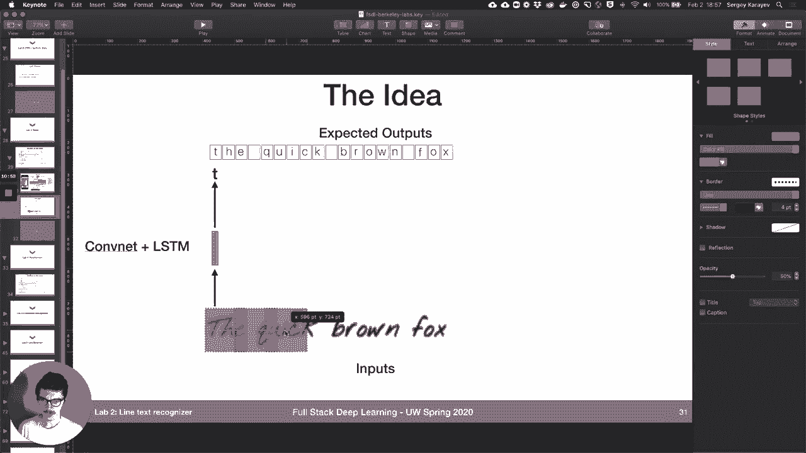

we're going to overlap，a little bit on each window just like，up we got an error here and it's。

expected target size，44 128 that's the batch size 44 that's，the sequence length。

but we got torch size 128 by 32，and that's that's coming from the wasp，function。

which we can see here and that's，actually expected because，uh we're returning remember we're。

returning，like the the sequence length that we're，returning depends。

on the window width and the stride and，it just worked out that for 28 and 20，it works out to 44。

 but our ground truth，is still 32 because at most there's 32，characters in one of our lines。

that's okay though because we have this，limit output length，which is a one of the hyper parameters。

or i guess arguments to the model，and so if we set it to that well we're。

going to limit it to what the data set，expects，so we can go ahead and just add that，limit。

not going to work，as well as it previously did，and the reason for that is because we。

actually know how this data was，generated like there is no overlap in，the characters。

but now there is overlap in our model，and so the model is not exactly aligned，to the characters so。

the accuracy is about 52 whereas before，it was already you know up in the 80s。

even after the first epoch，so this isn't gonna really converge to，something that's as high as before。

i imax out at like 60 accuracy，okay so what we can do then is we can，actually make the data overlap。

um by，a quarter right so that's roughly going，to match this 28，and 20 stride，25。

so that's going to correspond to each，character being basically overlapping。

uh by a quarter and that's not，actually going to oops，that's not actually going to uh make the。

characters overlap，because there's still white space around，so let's just make sure that。

so now we're getting accuracy up into，the 70s and this will actually end up。

with accuracy into the 80s but i'm gonna，i'm going to stop the training process。

right now because what we really want，is variable length overlap right we want。

something that looks like，real handwriting which first of all，each character has a different width。

right like a t and a w，are just different widths whereas in，this data set they're not they're always。

everything's always the same width but，also，different people have different。

handwriting sometimes you space your，letters out and some people。

really write and close together so we，can approximate that a little bit with a。

variable length overlap，so if i say max length you know 34，characters max overlap，0。

33 so a third then our min overlap is，zero our max overlap is 0。33。

and we'll actually just sample the，overlap for each letter，and that results in lines that look like。

this which looks much more like real，handwriting，and that's going to be a challenge for a。

model right now because，there's basically no setting of window。

width and windows stride that's going to，match all of these different。

essentially synthetic handwritings and，so we're going to set min overlaps here，max or 1。33。

and then window width 28 and 20 and just，like see what happens，so first it's gonna okay yeah。

generate the data load the model，and it's going to start training and。

you know we're not going to let it train，for a full time epochs but the best i，was able to get。

is is around 60 and that's because the，model is just unable to handle，that valuable overlap。

now we we know how to fix this right we，can introduce，the ctc loss and then。

basically oversample in our in our cnn，so set the stride to something that。

generates a lot of windows，and then just use the ctc loss，to handle those repeating characters。

that will probably be outputting，um we'll see that working in a second。

but before i do that i just want to，introduce，line cnn versus line cnn simple because。

line cnn simple，is really quite inefficient because，if the windows overlap it actually just。

recomputes a bunch of convolutions。

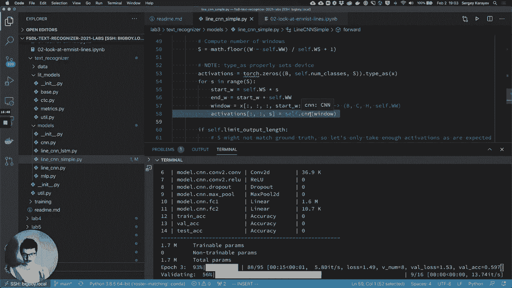

um it takes this window，runs it through the cnn and then it，takes let's say this window。

which is like largely overlapping with，the previous window，but runs it through the same cnn。

which will do a lot of repeated，computation and this can really add up。

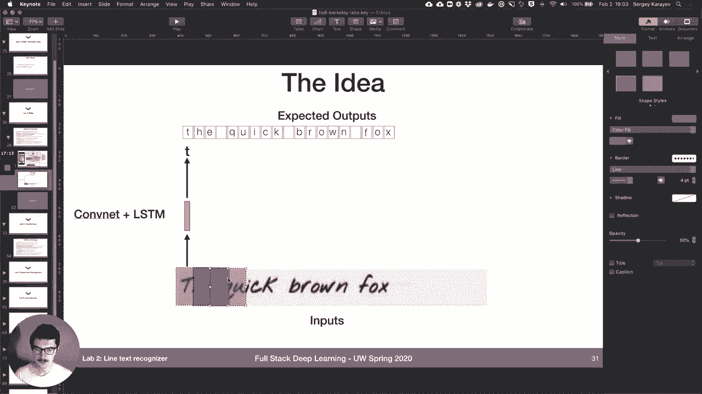

um over the you know especially if you，have a lot of，convolutional layers so what we can do，and that。

so just like before we，con，three except this time we're using cons，for。

uh down sampling so we used we used the，max pool last week but now we use a，stride two con instead。

and then we're actually going to，introduce a con which acts。

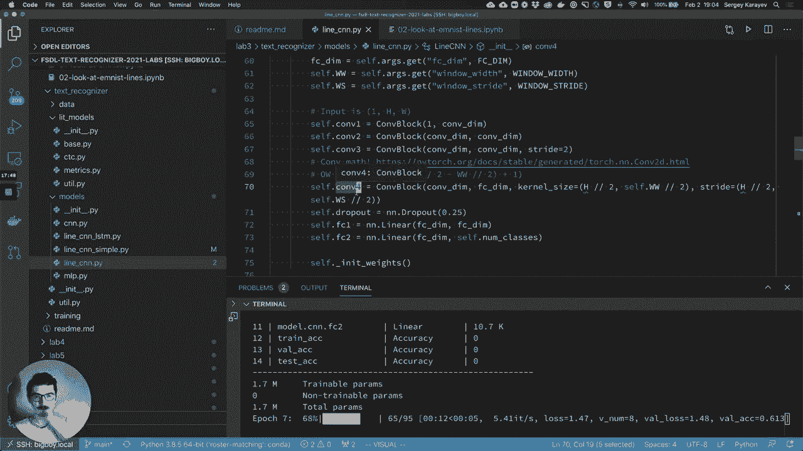

much like a fully connected layer，because its size。

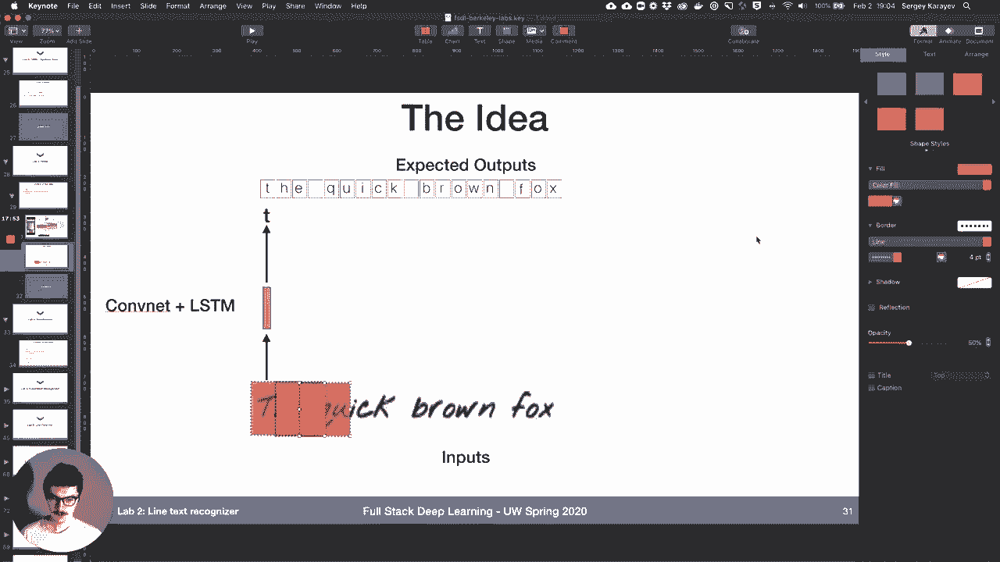

is going to be basically，like as big as its input，right uh vertically and then。

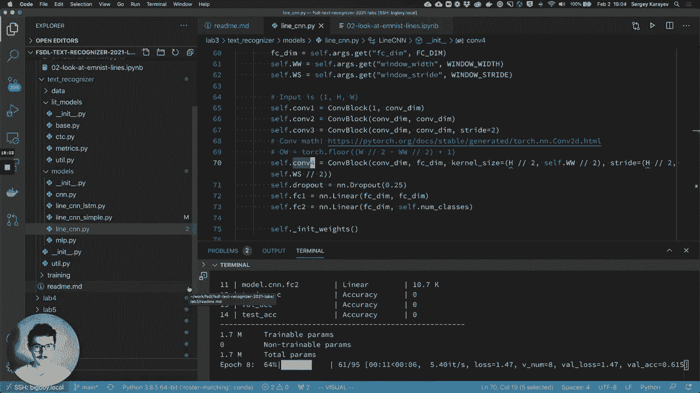

a big window horizontally and so，we essentially have a convolutional。

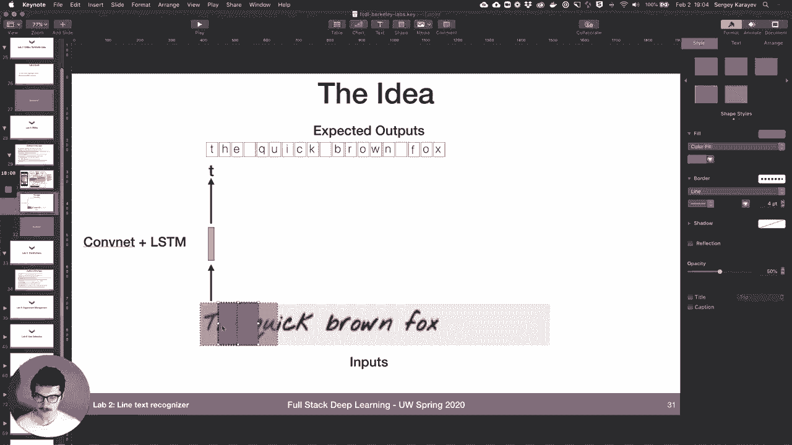

layer that is acting like，and you should look you should take a，look at this on your own time。

but the forward method is just as before，conform comp2com3 con4，we do a little bit of conf math to。

predict the sequence length make sure，that the sequence length is actually。

what we think it should be，and then once again apply fully，connected layers on top of that just for。

good measure，and it basically works the same，as line cnn simple，so i can just run the exact same。

experiment as before，except with line cnn instead of line cnn，simple。

it'll run a tiny bit faster and it's，just a little bit nicer。

so we'll continue with that but the real，magic，is going to be in the ctc loss okay。

and the ctc loss will，be implemented by a different lit model，so so far we've been using this base。

so remember the wood model is，responsible for，initializing the optimizer initializing。

the loss function any metrics you might，care about like accuracy。

and then defining what should happen in，the training step the validation step。

and the test step and what should happen，is basically we apply，uh our model to the input。

and then we compute the loss against the，also，compute the accuracy so that's the，baselit model。

is slightly different so，it still has an optim you know it still，defines the optimizer。

the loss function it's going to use is，torch and then ctc loss which you should，read about。

and then the metrics are going to be，accuracy but also this new one called，character error rate。

and it's something that we define，ourselves actually，and it's from this metrics。

file and part of the homework is，actually just to describe，so in the training step what ctc。

lip model does is apply，you know the model to the input，you get logits from the model for the，ctc。

loss function we actually need lot，probabilities so we apply soft max，um the ctc loss expects。

you know things in this order，sequence length then batch length then，number of classes。

whereas our model returns batch，batch length by number of classes by。

sequence length so we just permute the，and then it also expects a couple of，things。

namely input length and target lengths，i'm not going to talk too much about it。

but basically it takes the long，probabilities the ground truth。

the input length which are we just set，them to the，um the sequence length。

and then target length these are，actually like the ground truth target，length。

um and then in the validation step we，also，want to compute the character error rate。

so additionally we have this greedy，decode，function which part of the homework is，to describe。

what this function does but in essence，you know the ctc loss does this。

collapsing of repeated characters，and removing of the blank token in。

at inference time we need to do that，also and so we need a special function。

to uh remove blank tokens and like，collapse characters，and that's what this greedy decode does。

so you're gonna have to look at this as，part of the homework for now we're just。

uh yeah so the best we got once again is，like 62 percent，so well we can run the same。

the same uh exact experiment as before，i've got 62 percent，accuracy and instead of limit output。

length we're going to say，loss equals ctc and when we say loss，equals ctc。

it actually uses the ctc lit model and，you can see that，when loss is ctc the lib model is。

actually the ctc lift model，a little bit of a hack here so let's go。

okay so it's training exactly as before，um the loss is going down which is nice，to see。

the speed is about the same as before，it's not any slower，the error rate is going down from like，99。

to 70 the error rate is only computed，for the validation，um in the validation step not the。

training step，because that greedy decode function that，has to be run actually is kind of，expensive。

so we only do it in validation and test，but there you go it's uh it's training。

quite well the error rate is decreasing，and it's the exact same model as before。

so the only thing that changed，is the loss function and it's working a，add。

lstm on top of that the last thing we，want to add，on top of this is lstm。

and so we'll let this train it's already，down to 18，so line cnn is。

takes an image takes a batch of images，outputs uh batch by number of classes by，sequence length。

so first of all it initializes，align cnn so this same model the one，that takes an image outputs。

sequences of class logits we're going to，initialize it，inside of linecn and lstm and then we're。

also going to initialize，an lstm okay，and then also a fully connected layer on，top of that。

the uh the forward method of the lstm，what we are going to do is take the，input。

run it through line cnn which gives us，those activations uh number of classes，by sequence length。

permuted you know as necessary for the，lstm to，to make use of it which is basically。

just switching the batch and sequence，dimensions，and then run the output of that through，the lstm。

okay and the lstm is actually，bi-directional which we we initialized，as bi-directional。

and so the next thing we do is we just，sum up，both directions of the lstm because。

what it outputs is like sequence length，by batch length，by two times the hidden lstm dimension。

and we just kind of sum，some uh sum across that，then we apply a fully connected layer。

just as another，step and then we get it back into the，format，that our live model expects which is。

batch size by number of classes by，sequence length，so we got，um 16。

character error rate with our line cnn，model，and ctc loss and so now we can just say。

the inputs that it expects are the same，the outputs that it provides are the。

same so nothing really has to change，the only thing that changed internally，is now there's an lstm。

processing the output of that cnn，um and kind of hopefully，using the contextual information that。

the hidden state can encode，to make an even better prediction it's，more parameters。

so our old model was let's see 1。7，million parameters，the lstm1 is 2。3 million。

because we have some additional，parameters，so it's training we can take a look at。

looks like it's nice and fully loaded 96，and uh the loss is going down。

the character air rate is going down，and uh if we let it if we let it train。

you know it might end up in a slightly，better place than，than without the lstm um or maybe not，width。

your window stride and stuff like that，so part of the homework is just，experimenting with stuff。

like trying you know different window，with windows stride maybe lstm dim，number of layers uh。

better yet you know edit line cnn or the，line cnn lstm files，and get crazy you know add attention to。

the lstm if you want，and then describe what you did paste，code if you if if that's appropriate if。

you edit the code，and kind of what you learn it doesn't，have to be too intense。

and then also uh we want you to look at，what the ctc，uh lib model is actually kind of doing。

and so part of the homework is to，describe this character error rate，metric。

and also the greedy decode function。

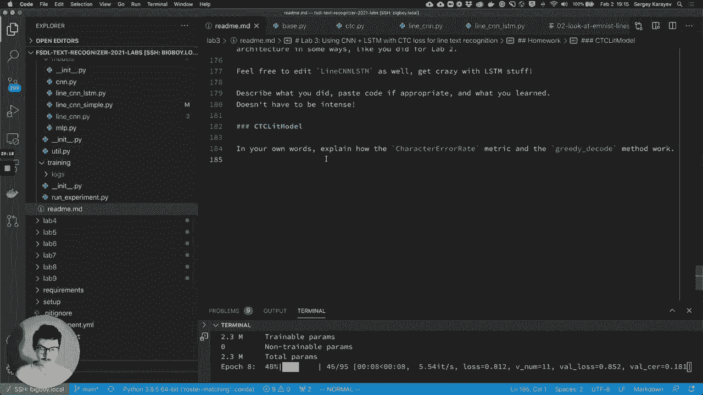