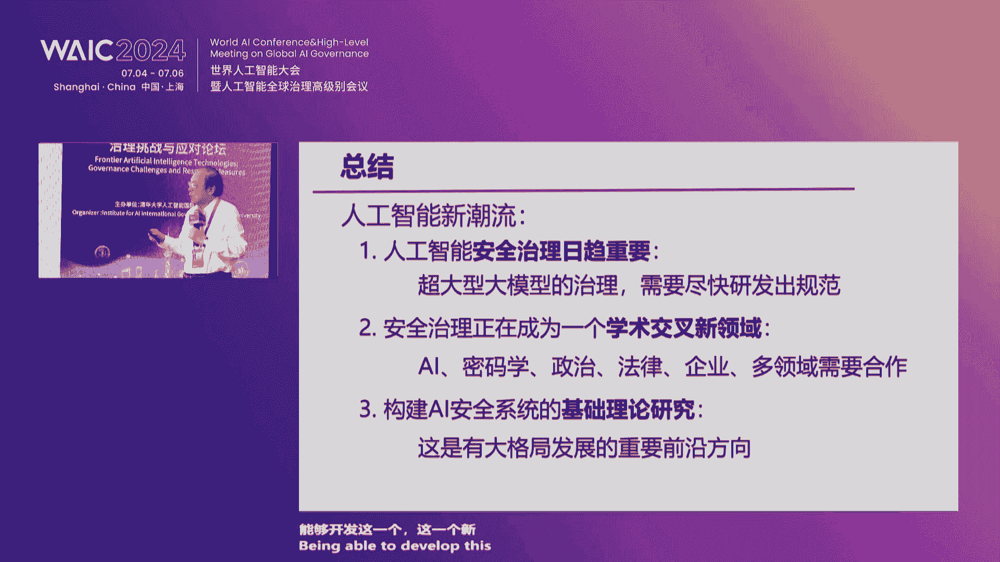
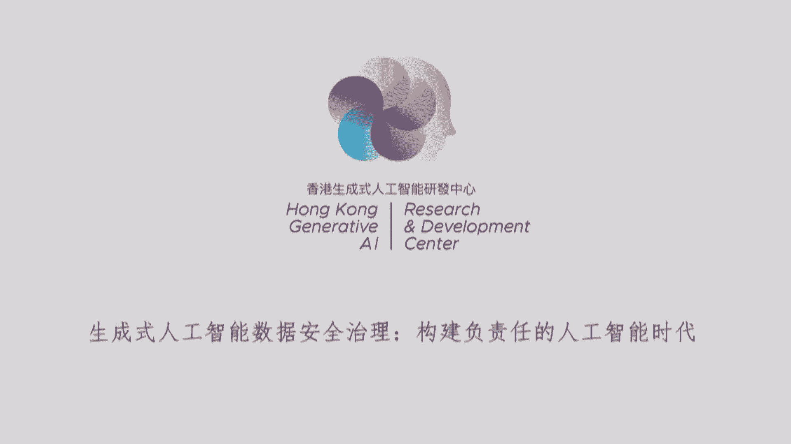
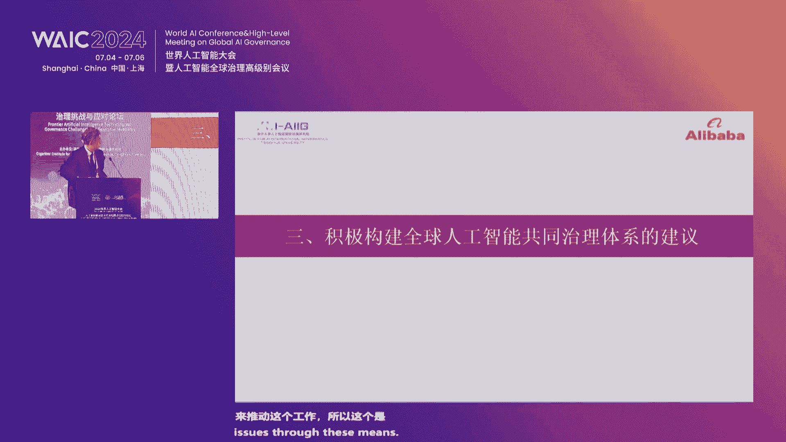
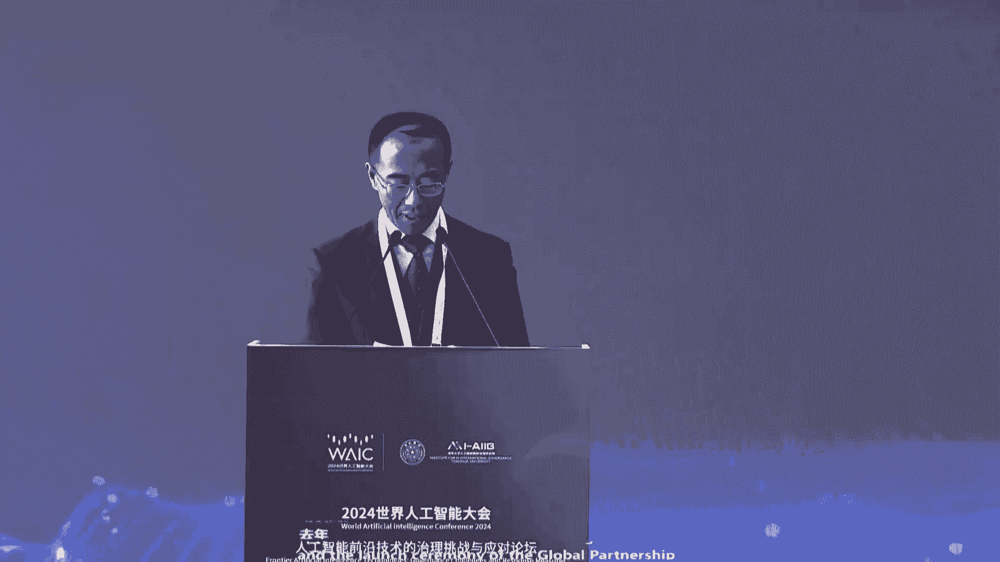
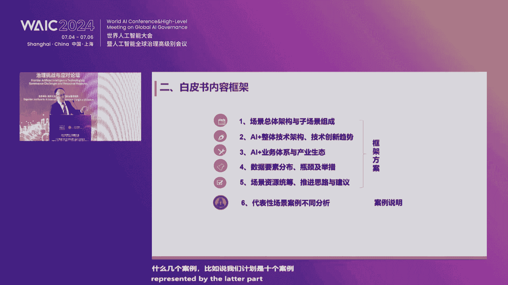

# 2024世界人工智能大会（合集） - P10：20240704-人工智能前沿技术的治理挑战与应对措施论坛 - WarrenHua - BV1iT421k7Bv

各位嘉宾，女士们先生们。欢迎各位莅临2024世界人工智能大会人工智能前沿技术的治理挑战与应对的论坛。我是来自清华大学的薛岚，也是本场论坛主旨演讲部分的主持人，对各位的到来表示热烈的欢迎。当前。

人工智能的治理发展已经走到了关键的十字路口。尤其是生成式人工智能所带来的挑战，是前所未有。在这样的关键时间点上，我们必须意识到人工智能治理也面临着空前挑战。首先。

人工智能技术的发展速度远远快于监管制度调整的速度。也首当其冲，便是发展与智理的平衡问题。其二，人工智能所引发的问题。前所未有，这样使得。人工智能监管变得空前复杂，没有任何一个监管机构啊。

能够单独管理好人工智能涉及到的各各个方面。其三，随着国际格局变化和中美关系复杂化程度的加深，我们越越来越来越认识到，不管如何。

国际社会不太可能形成一个单一的全球性的机构来管理和监管人工智能发展的方方面面。因此，就特别需要加强国与国之间另外不同领域之间人工智能治理沟通与合作。在这样的背景下，我们齐聚世界人工智能大会。

组织这样一场论坛，专门研讨人工智能的治理挑战与应对方案。为此，我们特别邀请到来自国际组织、学术界与产业界的多位专家共同探讨人工智能治理的全球方案。此次论坛将分为主旨演讲报告发布新书发布、援著论坛等环节。

我们也特别荣幸的邀请到了多位专家参与今天的分享。那么首先我们是有请本次论坛主持演讲的这个嘉宾呢，是姚启志院士。他主讲的题目是人工智能安全治理的研究走向。

姚继志院士是中国科学院院士、清华大学交叉信息研究院院长、人工智能学院的院长、上海七智研究院院长，也是我们呃人工智能国际智理研究院的学术委员会主席。姚先生作为图灵奖获创立以来首位获奖的亚裔学者。

在人工智能领域深耕多年，在计算理论、量子、通讯复杂性等领域取得了诸多成就。特别值得一提的是，他所创立的摇班为我国培养了众多领跑国际的拔尖创新计算科学人才。前不久，习近平总书记在给姚继志院士的回信中。

也特别肯定了姚旗志愿士在推动学科间交叉与前沿创新，打造高水平人才培养创新基地，实现我科科技自立自强等方面做出的卓越贡献。下面我们掌声有请姚先生。🎼非常感谢呃学学院长的介绍。啊，今天我非常高兴啊。

能够在这里给一个呃一个主旨报告。那么呃我所想要讲的是和大家呃，抱歉，我应该有PPT了。啊。啊，我想我我站在旁边呢。啊。好的。到到中间来讲吧。啊，非常高兴能够呃。和大家见面，我今天想谈想谈的是呃。啊。哦。

谈谈这个啊AI安全治理它的一个呃研究走向。那么今天早上。现在证里好的。啊，今天早上我们听到啊。肖院长。还有啊周教授，他们啊对于这个呃人工智能他的潜在危险和呃安全治理。

那么给了一个相当呃一个一个一个非常全面的啊非常精彩的呃一个报告。那么呃所以我今天的报告啊，它的重点呃稍微有点不一样。我今天讲的这个报告主要的是从一个啊一个一个信息技术的角度来看这件事情。

那么啊我我讲的主要要分成四节。我首先谈一谈啊关于安全治理它的一个问题的简介啊，然后啊我想和大家啊谈一谈两个我自己个人特别感兴趣的方向啊。

第一个是在在因为啊在这个数据安全是一个啊一个一个信息科技一个sber security里面一场讨论的问题。那么在大模型时代这个人工智能加进来了以后呃，他有什么变化，有什么增加的困难度。

那么啊然后另外一个啊就是啊除了上面讲的在这个一个特殊的例子里面怎么样的处理一些数据安全的人工智能问题以外，那么如果从整个的来讲，如果我们真的想要一劳永逸的能够解决这个安全治理的问题的话。

有没有一些啊相当有 ambitious的一个。呃，想法希望能够达到一个啊至少能够达到像我们现在跟sber security这种level的一个啊。可能的 solutionlusionution。

那么啊讲完这个以后，那么最后我再谈一点啊关于安全治理它的一些呃当务之急。我想这个也许比今天早上我们所听到的呃要呃更针对性大一点。啊，那么啊我们先谈一谈啊这个安这这个AI啊安全治理它的一个一个问题。

那么特别我想强调的是啊，这个我们大家关心AI的安全治理，很大一部分因为啊GBT所带来的这个大模型的问题。我们看看这个前沿大模型带来的一些风险。那么啊今天早上也提到过，它啊在关于信息安全上它有风险。

它的大模型幻觉产生的错误信息，它可以啊误导啊人类。那么啊大模型它的滥用，它能够导致一种真的是啊。假的好像看起来非常像真的。那么啊还有侵侵犯知识产权这等等的行为变得更容易啊。

那么另外一个就是这个种没有对齐的大模型，它会导致不良信息的扩散。例如啊能够制造一些啊大规模的杀伤武器的呃信息。呃，除了我们现在大家都啊。立刻就感觉到了信息智能风险。那么啊在啊。不久的将来啊。

我们如果这个啊智能机器人它真的能够起飞，能够进入每个家庭，进入每个工厂的话，那么我们就必须要面对一个人工智能，它的一种啊物理的智能的风险。那么同时它也可能有生物智能的风险啊。

那么啊特别是在AI它实现的一个智能体失控啊，譬如说有两个智能体，它会啊。讨论起是怎么样的能够导致人类的毁灭。那么这个主要的问题是，因为我们我们人类对于一个啊一个尤其是一种非常大的模型。

我们啊实在不了解它将来会啊会做什么？那么啊所以如果真的失控，啊真的有可能造成一个非常大的危机。那么另外的譬如说它AI它控制的的仪器失控，它可能使得一个生物实验室。

它啊造成一个啊莫顶之灾成为一个生物的一个大灾难。那么就是啊一般来讲我们这个啊将来这个世界AI我们。啊，我想一个不可以嗯就是说不可改变的一个趋势，就是我们会让他来控制更多更多的一个一个一个基础设施。

那么呃到了那个时候，那么它的不安全就真的会啊导致啊轻的来讲，使得这个社会啊产生很大的损失，重一点的来讲，可能真的会毁灭这个世界。那么啊这个就谈到呃在至少在学者上面。

大家啊最近两年谈的很多的就是啊这个人工智能它所带来的一个一个威胁。啊。它是真正是能够可能变成一个生存的危机existential的啊 riskk。因为通用人工智能的快率增长，我们能不能够管控它。

那么啊所以啊这个。我们以前也有些经验，比如说是nucle的。那么啊但是那个相对来讲还是一个比较容易控制的一个因为因为到底 nuclearcle weapons这件事情。

那么他真的只有少数的一些entty能够有办法做的。那么但是啊这个大模型如果多了以后，那么这个世界真的很难管控。那么所以像这些啊可能的风险很多国家的学者都高度的关注啊，这上面的这些问题。

尤其是这个啊生存风险的问题。那么我们可以看到有很多很多的会议，比如说在啊啊去年10月这个中国提出这个人工智能全球的倡议，那么或者是在去年的12月E的这个I啊等等。呃，那么呃。在这个如果我们想要处理。

想要做安全治理这个AI的话，那么呃他有什么样的一个困难，什么样的问题。啊，那么啊第一点这个啊我们想要处理的一个一个一个问题，很多的就是啊关于系统安全啊。

那么最常见的一个事情就是因为我们现在有很多很多的的信息系统。那么我们现在有了AI以后，我们想要用AI能够upgrade它，那么会加进一个新的模块。那么就是我们怎么样的啊保证这一个模块。

它的加入不会影响到其他部分的一个一个一个一个安全。那么另外一个就是我们很关心AI是不是损害到人的啊利益。那么怎么样确保AI不会呃伤害到人。那么啊我们能不能能够训练出一个真正的安全可信的AI啊。

它的各种的deevice。那么但是在我们真的有有能力能够训练出这样一个安全可靠的AI系统之前，怎么样的避免AI伤害到人。那么啊我们呃把这个。怎么样做安全治理？我呃我们如果从技术和路径的纬度上来分类啊。

一种是一种从短期的来看，因为我们有一些危险是马上就已经要碰到的。那么所以在呃我们最简单的就是啊能够在工工程和系统方面，那么从我们啊传统的信息安全的技术啊。

这一类的管控方法啊或者是在生物技术或者是呃在在在 nuclearcle技术里面能够怎么样的啊把这个风险能够把它分类能够评估啊，怎么样寻找方案。那么啊如果更长期一点啊啊在这个我们啊。

不只是要从工程和系统方面，而且我们对于它核心理论的研究，AI核心理论的研究，应该要做更深层次的探讨。我们要真的想法能够理解AI类生它的安全的激理来研究啊大模型的对其方法科技这方法啊等等啊。

那么同时啊不只是在这种啊的信息的工程和技术方面。那么这个政策和技术的结合，在政策方面积极的探索和技术匹配的治理条例和更好的啊监督的管制。啊，那么呃谈完了这个以后啊。

我们来看一看在在具体上在这个大模型时代啊，它和以前的传统的呃呃信息安全，它有什么新的问题会产生啊，我现在来来讲几个最最呃。啊呃，最简单的啊，那么呃最容易的一个呃看到的呃一些论文。那么呃一个呃常常是发现。

由于有大模型的存在，那么它会你会产生一些呃新的信息不安全的问题。那么呃我现在讲这个问题啊，就是呃卡lin他啊在前两年啊提出的呃一些新的问题。那么呃就是他发现这个大模型。因为他在训练的时候。

他用过很多的数据。那么在很多的数据里面可能包含着有些别人的隐私。那么呃从一个我们呃现有的一个一个管理方法，我们是希望说这种信息系统，他不会透露出这些啊用来训练的这里面呃一个能够侵犯别人隐私的一个部分。

那么呃呃当然就是你如果一眼看过去的话，你会啊感觉得到啊他似乎不应该会呃记得这些信息。那么至少他不会啊没有一个方法很容易的把这些信息能够挖出来。但是所以他这个呃论这两个论文，他就是设计了一种攻击的方法。

他能够发掘出很多在训练这个。啊，大模型时候里面他所用过的啊，有些隐私的数据或者是图片。我现在呃让大家看一下，因为它方法非常简单。啊。

对他呃这个GP twoGPT two是一个比较现在看起来是比较小的一个模型。不过就是啊让这个大模型它产生很多个文本。那么啊就是你你问他一个一一个一个一一个呃一个一个问题。

或者是反正用个方法使他能够按照他的这个这个大模型的方式产生出很多文本来。然后从这些文本里面，你把它选出1800个文本来，那么这是他们所做的事，他就呃用某一种算法。那么这个算法他是呃有各种可能性。

所以呃卡琳琳他是用了呃呃呃应该是用了6种不同的呃算法。那么来算这些事情。那么呃他会发现说呃这些文本。啊，它里面本身它就有很多，他都是在训练里面曾经用过。

那么那么啊啊所以这这个啊啊会让人觉得一点一点奇怪的是你问他一个本来他训练完全没有用的一个问题。但是他的结果里面可能会出现他以前训练里面他所看过的数据。

那么当然这个这个奥妙的地方是啊他这个卡里他这里面他这个technical的一个内容，他是这些算法啊，怎么样的用算法，他能够找出这种最可能是一个他以前啊读过他记得但是他没有消化的。

那么所以啊这个我们现在反过来想这个问题，从我们一个人的观点来想，这个其实没那么奇怪。我们小的时候读过很多古文，读过很多这些事情。我们到了以后，我们在生活里也不会遇到。

但是他有的时候在别人跟你的交谈的时候。你你以前10岁8岁读过的古文的哪一句，这是滕话歌曲里面的哪一句，那可能就出来了。所以这个啊现在想起来不太奇怪，但是啊这个是一个可能的问题。那么在这个问论文里面。

它其实啊不但是挖出来，它里面曾经用过的，而且他在这里面他可以发现出啊某些人的隐私，比如说你家住哪儿，你的年龄，你的呃。事情，那么你会奇怪说他怎么样会发现这文本是在训练里面用过，他是这个作者去问这个呃。

我想应该是open AI的这个公司呃，去看这个训练里面他有没有用过这些这些文本。而且他真的到网上找的时候，他可以发现是哪个we page上面，他会呃包含了这些这些东西。呃。

那么啊另外一个比那个更高级一点，就是你发现了问题，而且你offer一个 solutionolutionOK那么啊这个是关于啊用户的隐私保护啊，这个是啊这个这个和呃这个贺。

他是呃一个啊呃一个清华大学的一个呃一个年轻教授，他马上今年就要来啊，我我们这个院。啊，工作。那么啊他是啊说你你一个用户你想用这个大模型，但是啊这个大模型他可能会知道你的用户的呃这个这个隐私。

譬如说这个用户问大模型啊，我家里想装个防盗系统啊，哪个防盗系统，你觉得在现在的市面上是是是最好的。那么啊这个用户他很可能会采用这个大模型。那么所以说这个管大模型的一个一个单位，他如果有有心的话。

他就他他他会发现你的一些一些可能的隐私。那么啊啊所以我们怎么样的避免这个这呃这个发生。所以啊这个问题你要解决的方法就是有没有方法，我们能够让这个大模型来告诉我他的他的一个呃我想知道的事情。

但是他不泄露啊。这个用户他的这个问题到底是什么？这个这个不让他知道。呃啊所以呃所以这个事情看起来是不可能，不过他他 design一个方法。那么他能够des一个方法也不是那么奇怪。

主要的是这个问题其实啊这个基本的问题，他是在以前传统的呃数据安全里面，大家已经讨论过这个问题。就说基本上我如果在google或者是在这个百度上搜索的话，那么我有没有一个方法让这个搜索引擎。

他不知道我问的什么问题。那么这个问题啊，也是你听起来是不可能。你你我怎么能够叫你回答我的问题，不能是不告诉你这个题目是什么。但是在这个原则上是可以做到的。

有有有有各种的啊方法来做像这种啊比如说有一种多方安全计算等等的一种方法，能够做到这件事情。但是那些东西是是在理论上可以做。但是在像要是保护问题像这么全面的一个情况之下。

他是呃这个理论的算法 too expensive不可能用的。所以他这个问文章的一个一个主要的事情是设计了一个啊afable的一个 solution。那么呃。呃，我们总体来看。

这个数据安全呃这个在大模型时代的这个数据安全多半的这些文章，多半的研究都在一个比较初奇的一个一个阶段。在我看起来的话，他是很接近于啊40年前，大家刚刚想要用这一些啊网络解决网络安全问题的的方法。

最开始的时候，大家的一个情况。所以啊这个是一个very interesting的ara。因为它是一个呃呃就是呃比起他就主要的现在主要是说我发现了一个问题，我提个解决方案。

那么另外一个问论文就说我设计一个方案来打垮你的解决方案。那么我另外提出一个方案会比你的更好。那么一个攻防攻防啊，这一类的方法。那么啊但是在这个比较成熟的密码学在解决这一类问题的时候。

他有一个比较好的方法做他做了以后，他能够有一个你打不垮的方。方案那么呃在他的方法里面，它都是由于在这个feel的这个cptography这个feel在过去的三四十人里面发展出很多啊有有一组核心的方法。

那么通常你想解决问题的时候，这些核心技术，把它拿来拼拼凑凑，你就可以达到你所要的一些一些目的。那么这些核心方法，比如说是啊并密共共享你知式计算的方安全啊等等。啊。

那么重要的一个方向就是怎么样让在大模型形下的数据安全能够发展出一套核心理论，使得这个研究更有效率、更系统化。

那么呃这个是reflect一个 general的一个一一个一个一个research direction，就是说你怎么样的能够啊使得这个这个大模型。呃。

这个人工智能它的一个呃一个安全性能够一将来能够变成一个fe啊on安那种。啊，那么下面一个我就是说从这个长远观点来看，就是不是这个贴贴补补发现一个问题，解决一个问题，而是有没有方法能够一劳永逸的。

我们大家一旦完成了以后，我们就很可以很很放心的工作。那么使得啊这个呃AI的安全治理变得容易的多，只是大家主要的不是说安不安全，主要的是说大家看一看啊各种不同的国家，大家吹到是需要你勾血OK。啊啊。

我我就提这呃这个。这种研究还是非常非常少的。我现在就提两个我所知道的，我觉得它是呃很有内涵的，很值得继续研究的。

那么一个就是呃sver Russellll在2019年啊提出的一个它叫做beneificial AGI他他他这个呃。呃，呃他他比较学术的名字叫做assistance game。那么啊。

他是从博弈学的角度，他是呃能够有一个方法让AI和人工和这个和这个人类他的利益对齐。那么他他是希望能够有一个方法能够啊能能够彻底的能够能够解决这个问题。

那么他这里面几个重要的一个是啊就是说你设计这个机器人的时候，你你你有一一个数学规律，你能够啊让这个机器人他一切的决定，他最后他都是要以人的利益为本，而不是为了这个机器人本身的利益。

那么啊那第二点就是这个啊啊机器人和人要保持交流。他使得他的时刻他如果觉得不清楚的话，他要要能够啊和人对话来了解人的需求到底是什么。

那么他这个东西的movation是其实出发点是一个一个相当啊一个一个一个一个基本的一个研究。他就是。觉得说AI里面它一般讲它是用这个penalty function。

用reward function它来呃他来推动这个呃AI做事情。那么他觉得说这个事情本身是有问题的。因为因为你你你如果让这个机器人，他从一开始他就有了一个reward function的话。

那么他可能做很多出格的事情。那么那么比如说呃我想有个很fa的例子是关于叫做呃叫做叫做paper click的 problem，就是你一个一个很有名的一个例子，就是你开始的时候，你给了一个AI一个系统。

你的说你的目的就是你做各种事情，你主要就是你去generate你能够produce as many paper clips as possible。

那么他可能去拆你的数拆你的房子in on他因为它的目的已经定了。所以说呃所以说这个他的你一个一个事情是是是要呃让机器人跟人。能够对话。

这样的话你可以你不用一开始就给机器人一个非常fixed的一个呃opim。那么啊啊最近就是呃去年啊有一个 proposal是这个这个 hundred和呃呃MIT的tech mark上面写的一个paper他是想要做一个可证明的啊安全的HI。

那么呃最主要的事情是因为在计算机里面，其实啊这个这个计算理论发展到出一套可证明安全的一套一套方法来解决一些比较简单的一个一个计算上的一个问题。

那么它是这个是是感觉得到是不是这种 methodologyology能够推广到在这个啊设计绝对安全的AI系统上能够真的用上。呃。

那么他这个可证明他是真正的要求mthematically proven to be to be safe。那么他的整体的思路。

他就是用这个一个一个proof checkers来设计数据上绝对安全的的的的的的这个。呃，HI的系统。那么呃呃近年来呃其实在au是一个非常老的一个一个AI的领域，有很多啊很大的新的呃进步。

那么有着利这种系统，那么甚至现在在大模型一个一个下，甚至发展出transformers来做。所以说以前大家觉得呃用这种传统的AI的方法来来做 automated呃看起来是一个非常走不通的路。

但是呃现在因为有的大模型，大家现在突然之间感觉得到非常so觉得说mabe possible。那么当然这件事如果能够成功的话那么那么将是一个非常非常一个彻底的一个解决方案。啊，那么。啊对。

还有一个就是呃他他他主要的是你要证明能够安全的这种东西，它是啊一个你你。呃你你需要有一个比较小的模型来做一个来conttrol它，你才能够呃证明它可安全。所以你人和这一个大机器。

它的交流只限于在这一个已经证明是安全的一个w box上来做，你才有可能保持安全。你这个就是啊我们人譬如说呃我们可以想想看这个这个AI一个一个最大的一个呃呃就是立竿见影的一个危险是什么。

因为我们现在啊这个网路的一个安全里面，你很糟糕的是有人啊电信诈骗啊啊或者是有人跟你讲说请你来invest什么之类的。那么当然我们一般讲觉得说只有只有知识不太高的人会受骗，我们是不会受骗的。

但是你但是我们呃想想看你去买房子，有一个 salesman跟你谈的时候，他说不定就可以让你能够买一个你不想买的东西。え？所以说你想想看，将来的时候，他这个机器它比。最有的油嘴滑舌的salesman。

还要厉害，就是他花言巧语，他真正能够把你骗得啊一个一个凡是人所能够想到的招数，他都会。所以说我们每个人都很可能旁边我们每每天用的一个啊as的一个machine呃。

我们什么事都问他然后我们后来可能会被lead into非常糟糕的一个一呃一个deciion。所以说他一定是只要用就是如果真正的machine is very powerful的时候。

我们啊要非常非常restrict这个machine，他该干的事情。我们只是经过一个wite box和他交流O。啊啊，对。啊，好，那么我们最后呃从这个理想世界回来，我们看看这个安全治理的当务之急。

那么呃呃当然我们要发展和AI对齐和相应的评估方法。那么大模型对齐方法有监督为调，强化学习微调等等。那么这有很多的挑战。比如说这个方法它的可扩展性，就是这东西呃太 expensive。

那么呃我们也也要权衡这个安全保障和这个模型能力。它的影响。那么另外啊他这个强化学习它的泛化性，它还有很多不确定的一个因素，就是说这种方法是不是真的 effectiveffect。

那么呃啊当然啊有了这个要求，我们也是要评估这个这个大模型，它的安全性。那么我们要啊这里面就reing这一类的一个试验的场地，还有这个方法啊，这些都是啊一个呃需要做的事情。

那么这里面这挑战就是即使是有了这样的方法和平台，你还是啊。有别的挑战，这个有系统化和鲁鲁棒性的不足，存在偏差。啊，大模型的训练数据太多，那无意中能够漏题，导致这个呃呃评估受失控。啊。

那么所以在做这个做这AI安全治理的时候，因为因为这是一个很困难的一个一个工作。所以我们也不应该就是说这个全球都是一盘棋，一定要有一个啊在所有的expect全部都一样的。譬如说在中国。

我们中国也有一些特别的一些feature。那么啊也许安全治理在我们的国家做起来，它就比较容易一点，不需要像在话那么多的一个一个呃fancy的一个一个组合。所以我们怎么样的啊能够结合中国的优势。

建立于啊能够在一个跟世界一个general的一个呃 agreementre之下，怎么样的locly在我们这里的时候也能够做一些调整。啊，我国在信息、数据安全、人人工智能等方面有我们特别的一个优势。

譬如说基础设施。那么呃其其实最重要的就是我们这个有一个非常完善的实名制的身份验证证系统。所以这个就减少了很多很多在这个区备的 system面的一些问题。

那么啊同时我们啊中国有很多的一些在这个管控新科技风险的成功的经验。比如说啊我们有有一些呃呃发展的案例，比如说关于无人机金金融科技。我们中国也有很多的成功的经验。那么同时我们数据的管制啊。

也有我们呃特殊的一些啊一些规则，那么数字化转型、数据数据要素化、数据资产路标等等，我们都是做的挺好的。啊，那么所以我们结合呃上面的这些事情，我们可以简化我们AI的治理啊，比如说我们啊。

大家都要呃首要的事情要建立这个AI大模型，它的分分分级体系。那么呃对中国来讲啊，我们可以建立1个ID的实体映射，就是不只是个人所有的一个啊。一个智能机器，那全部都有1个ID，那么能够实名的能够找到。

那么把有我有啊全产业链啊监控这个AI。所以我想总结一下，就是这个呃呃在这个大模型时代呃，这个AI智能它确确实是一个新的潮流。啊，我们在这里面除了呃。啊，除了它带来的益处以外。

我们要了解它的安全治理也变得越来越重要。那么啊超大型大模型的治理需要马上马上的啊能够想办法能够把它规范起来啊，第二点是啊啊从一个学术的角度来讲，那么安全治理，这成为一个学术交叉的新领域。

还有AI密码学啊政治法律企业啊呃经济呃多领域啊，大家要在一起能够开发这一个这这一个呃新领域。那么啊啊啊最后一点啊啊我们啊对于怎么样构构构建AI安全系统。

它的基础研究啊啊我觉得这是一个一个一个啊从一个大的方向来看啊，AI安全治理，它的一个一个非常重要的前沿方向。好，谢谢大家。

呃，特别感谢表谢。不好弄。这个。特别感谢姚先生非常精彩的演讲。😊，呃，杨现刚才从这个大模型带来的风险切入。呃，从包括数据安全研究啊等等，特别为我们产生了安全治理进行当务之急。

尤其讲到未来的这种这种大的趋势啊，构建基础理论，发展AI对齐啊，完善屏幕等等。所以这个我觉得也是咱们这个研究治理。很多领域，我想今后可能我需要去好好的学习要要要去这个按照这个方向来去来来去做的。呃。

再次感谢姚先生的精彩分享。好，那下面的话呢，我们现下一位演讲人是联合国秘书长，联合联合国大学校长呃，这个马瓦拉先生。😊，他演讲的题目的话，就是人工智能全球治理的展望。因为他呢有一个这个这个日常的冲突啊。

所以他呢无法亲自到会。我们就他特地为我们啊录制了一段视频演讲。那么现请工作人员来播放一下。第二颗。Legal framework that ensure ethical AI use。

Focusing on transparency， accountability and fairness while protecting privacy and preventing discrimination。

 key measures include mandatory AI audits and strict data protection requirements。

 establish AI standards， establishing AI standards involves setting uniform guidelines for AI design development and deployment。

 focusing on technical。Quality， ethical consideration and compatibility。Create legislation on AI。

 C legislation on AI involves drafting laws。To govern AI development。

 use and impact ensuring ethical operation， privacy protection and discrimination prevention。

 govern data algorithms。Computing systems and AI applications。

 these governance should include data protection measures， algorithmic transparency to avoid biases。

 strong security standards for computing systems and specific regulations for AI applications in critical sectors like healthcare and finance in recent years the UN has embarked on a journey to shape the governance and development of AI。

 The UN's global digital compact， a key outcome document of the summit of the future and currently in its draft form will be the leading international commitment to ensure that。

Digital technologies are used responsibly and for the benefit of all in a safe and inclusive digital environment。

The compact builds on another UN contribution， the 2021 recommendations on the ethics of AI from UNESCO。

 which is an important aspect of the governance of AI。

The recommendations provide ethical guidelines for。All stakeholders to consider。

The interfaces where AI systems meet human systems。And code meets individual human beings。Similarly。

 since 2023， I have been a member of the UN Secretary General Scientific Advisory Board that provides advice to the Secretary General and other UN leaders on breakthroughs in science and technology。

In 2024， you and you also joined the Bch support team as the research lead。

 working closely with the board to prepare science briefs for senior UN leadership and encouraging。

Engaging a network of scientific institutions， including U U system。

This is a great opportunity for you and you to support。The scientific thinking of the U system。

UNU is also acting as a research lead on the UN Secretary General's I levelvel Advory Board on AI。

 where we play a key role in coordinating research， identifying governance solutions。

 drafting the platform， the interim report， governing AI for humanity and preparing the final summarym report。

UU is a global think tank and postgraduate teaching organization headquartered in Japan。

 with 13 institutes spread across 12 countries。Worldwide， you new Maco is。

UNU's think tank focused on leveraging digital technologies for sustainable development。UNU。

 Macau and the entire UNU system have been increasingly focused on AI research as the technology has developed。

The UNU Global AI network was officially launched at the UNU Macaau AI conference in 2024。

The network represents a collaborative initiative spearheaded by the UNU and its partners and aims to address the multifaceted challenges posed by AI on global scale。

This network。Is envisioned as a comprehensive， international platform。😊。

Uniting the expertise of academia， the innovation of the private sector and the foresight of policymakers and。

The grassroots engagement of civil society through these partnerships within the network。

 it strive to develop and implement innovative solutions， including commitments。Science based policy。

 recommendations and advanced technological tools。 These efforts aim to promote a pupil centric and sustainable digital future with a focus on empowering the global south。

The UNU Global AI network features over 40 founding members from over 19 countries and regions and the Institute for International Governance of。

Qinhua University is among its founding members。I strongly encourage scholars。

 researchers and practitioners in China to join the network and contribute to this important initiative。

AI is a evolutionary force， and we all bear the responsibility to shape its future。

For the shared benefit of humanity。Thank you all for listening， She。非常感谢这个娃娃老先生的这个发言。

他从这个培育发展、风险并存的科学文化，建立相关标准，推动AI立法等8个方面呢呃提出了促进人工智能高高效治理的建议。呃，那么像国际治理呢的确也是啊我们人工智能治理的重要环节。那像上午在开幕式的话。

我也特别谈到，我们应该在联合国框架内呢继续加强各国在人工智能治理方面的国际合作，以人工智能的善志来推动人工智能的善志。这个呃前面的智呢是智理的智，后面的智呢是智慧的智啊，那非常感谢马娃的校长的分享。

那么接下来的话呢，我们是这个呃香港科技大学的首席副校长，也是就是所谓provost。他呢也是英国环家工程院院士、欧洲科学院院士、香港工程科学院院士、英国帝国理工学院数据科学研究所所长郭可义教授。呃。

郭克义教授呢前不久刚刚被授聘为我们这个清华大学人工智能国际治理研究院的学术委员会的委员。他在数据科学和人工智能领域都取得了瞩目的成就。他的演讲题目是生成式人工智能数据安全治理，构建负责任的人工智能时代。

他呢也是有公务啊，但是他呢特别又专门为为我们带来了一份惊喜。啊，他是用他这个本人的数字分身。来做今天的视频演讲哈，小宝们，我们来看看它的效果怎么样哈。那么他演讲使使用了很多这个多模态。

生成式人工智能技术。😊，呃，那么其中的视频内容、人像和音频都是由郭校长亲自指导，由香港生成式人工智能研发中心全站啊，自研多模态生成式人工智能技术的辅助生成。首先让我们来看这效果怎么样？请有请。

尊敬的各位嘉宾，大家好，我是郭益可，香港科技大学首席副校长，香港深城市人工智能研发中心主任。今天我非常荣幸与各位探讨数据安全治理的重要议题。随着人工智能的高速发展，数据安全受到了广泛关注。

数据不仅是人工智能的基础，也是数字经济时代的核心资源。随之而来的是数据安全和隐私保护的重大挑战。今天我将跟各位探讨国际数据安全治理的制度规则，国际前沿技术以及人工智能大模型数据安全治理的路径。

借此机缘将数据安全治理的深刻议题呈现给各位。首先让我们来看看国际上的数据安全治理趋势。近年来，全球范围内的国家纷纷出台了涉及人工智能的立法和政策，然而，大多数国家在制定相关法规时，都采取了谨慎的态度。

避免过度限制人工智能的发展，以免阻碍创新和进步。这彰显了国际社会对数据安全治理的重视。在国际数据安全治理中，我们可以看到，不同的制度规则和方法。

一些国家采取了专门的法律或法规来覆盖人工智能发展和应用中涉及的广泛问题。而另一些国家则采取了针对不同应用或类型的人工智能，制定了各种规章制度的策略。例如，欧盟制定了全面呃具体的欧盟人工智能法案。

对高风险的人工智能系统进行了禁止，并对各类风险系统设定了更严格的合规标准，与之相对的是，英国和美国采取了市场驱动的方法，避免过度限制技术进步，注重推动创新数据安全治理，也与隐私保护息息相关。

在人工智能的发展中，大量的个人数据被用于训练和应用。为了解决隐私和数据保护问题，各国制定了相关规定。例如，英国通过人工智能法规。提出提出了原则和治理规则。

要求开发者遵守安全、透明、公平、负责任和可解释的原则。欧盟提出的欧盟人工智能法案，要求对用于训练测试和验证人工智能工具的数据进行适当的数据治理。此外，各国也在现有的数据保护法律框架下。

针对人工智能的具体需求，制定了指导方针和规定。在全球关注数据安全治理的背景下，我们需要加强国际间的合作与交流，共同探讨数据安全治理的最佳实践，除了数据安全治理制度规则。数据安全领域的国际前沿技术。

也是我们重点关注的话题。区块链技术是另一种有前景的解决方案，可增强数据安全、区块链透明和不可更改的特性，确保数据的完整性，降低了未经授权的修改和数据篡改的风险，基于区块链的解决方案。

在金融医疗和供应链管理等行业中特别有价值。在人工智能和大型语言模型革新各个行业的时代，确保强大的数据安全治理，显得尤为重要。为了防止未经授权的访问和数据泄露，组织必须采取严格的安全措施。

通过数据匿名化技术，用户同意和隐私设计原则，以及实施数密分类访问控制和加密方法，保护知识产权和防止未经授权的披露，加密和匿名化技术的应用，也是数据安全治理的重要方面，通过采用加密技术。

可以保护数据在禁止和传输过程中的安全。此外，可以使用插分隐私或数据屏蔽的匿名化技术来删除个人身份信息，以确保数据的机密性，同时保留其对于人工智能模型训练的有用性。在数据安全治理方面。

除了制定明确的政策和框架有效的数据分类的归类以外，访问控制和权限管理也是确保数据安全的关键因素。基于角色的访问控制多因素身份验证和定期审查访问权限，对于确保。数据安全至关重要。

监控和审计对于确保数据安全至关重要，实施监控和定期审计人工智能模型的活动和数据访问，有助于检测异常、未经授权的访问尝试等异常模式。数据安全治理是人工智能和数字转型时代一个至关重要且不断演进的议题。

人工智能的快速发展带来了巨大的机遇和挑战。我们需要在保护数据隐私和敏感信息的同时，建立国际机构框架和法规来规范数据安全。为了应对不断变化的数据安全形式国际合作和经验分享至关重要。

而区块链和量子密码学等前沿技术，也提供了增强数据安全的有希望的解决方案，最终通过建立健全的法规，采用先进技术，加强国际合作和遵守最佳实践。我们可以推动负责任和安全的人工智能应用。

确保数据安全治理的有效实施。最后，请允许我介绍一下香港深圳市人工智能研发中心开展的相关数据安全治理工作。香港深圳市人工智能研发中心，是香港特区政府重点项目研纽方抗旗下的研发中心之一。

中心是由香港科技大学牵头联合无所顶级高校研发支持英语普通话和广东话的基础大模型，以及面向各行各业的人工智能应用，中心致力于推动香港人工智能生态系统发展，为香港提供一个创新合作的平台。

通过应用最新技术来塑造未来的效率、智能化和互联，并依据香港行政长官2023年市政报告承担，使香港成为国际创新和科技的枢纽。根据香港特别行政区政府的委托。香港深城市人工智能研发中心，牵头起草。

撰写了香港深城市人工智能治理建议，以及深请式人工智能应用开发商用与部署工作指南，以针对特区政府在深层市人工智能等推动全沿产学研科创领域的治理挑战，提出均为针对性的系统性的政策建议。上述两项工作。

将助力香港特区政府在全球科技和科望产权研竞争中，优化其深层次人工智能领域的产业政策和监管指引，以其在保障公民权利和促进科技创新之间取得平衡，进而推动香港经济社会的全面与可持续发展。在数据安全治理方面。

中心与芳华卫视香港特别行政区立法会特区政府新闻处资讯科技总监办公室将育促进办公室等部门，形成了人工智能以及大模型领域的数据战略合作。致力于推动人工智能领域数据安全治理，在香港以及大湾区科创领域的发展。

在人机共生的时代，我深信我们将通过数据治理以及安全可信的人工智能携手，创造出充满无限可能的未来，谢谢大家。

郭校长这个演讲形式还是挺让我们耳耳目一新是吧？但还是有改改进的空间。啊，那咱们也有很多的，咱们这个奥迪也说了，可能一个是他那个口型还没有完全对上是吧？动作呢也稍微单一一点是吧？

要能跳两段舞可能就更更好了。😊，啊，他特别强调了这个数据安全的治理的重要性，也指出了大模星所处理的海量敏感数据带来了重大的挑战和风险。

而访问控制、权限管理、监控和审计等对改进数据安全治理的话发挥的重要作用。而且从数据安全的角度为我们提供了人工智能治理的可行方案，让我们用再次用热烈的掌声对今天主旨发言的三位嘉宾的演讲表示衷心的感谢。

也相信大家能够从三位嘉宾的精彩演讲中，对人工智能技术发展与治理的方向有了更加清晰的认识。那么我们这个主旨发言环节就到此结束。下面我们有请下一个环节的主持人，清华大学人工智能国际理研究院副院长梁正教授。

あ。我也对学兰教授的精彩主持啊表示再次的感谢。🤧咳。好，呃，我是来自清华大学公共管理学院，也是清华大学人工智能国际治理研究院的梁正。呃，本环节呢我们将围绕前人人工智能治理挑战和应对，发布介绍研究院团队。

包括我们联合相关合作伙伴在近期完成的三项重要研究成果。呃，那么第一项呢也是我要重点介绍的啊，也是下面呢我们将有请轩兰教授来发布的由清华大学人工智能国际智理研究院呃和阿里巴巴集团来合作完成的全球人工智能治理与中国方案研究报告。

仍秋一电稿。呃，首先我简单介绍一下这个工作的背景。清华大学人工智能国际智理研究院自2020年成立以来，一直在相关部门和学校的共同支持下啊，积极开展啊人工智能治理研究啊与合作人工智能国际交流对话平台搭建。

呃，产出了一批高质量的成果，支撑了一系列重要政策。特别是连续举办四届人工智能合作与治理国际论坛，已发展成为具有国际影响力的学术交流和政策对话平台。另一方面。

研究院成立之初就意识到人工智能作为快速发展的新兴技术及治理离不开与产业实践者的密切互动。此次，研究院与阿里巴巴集团共同完成本项研究报告，这是一次创新性的尝试。报告力图。

从人工智能全球治理视角和产业发展前沿实践出发，为落实全球人工智能治理倡议，推动人工智能健康发展与全球治理体系构建做出贡献。接下来让我们再次请上清华大学人工智能国际治理研究院院长谢兰教授对报告进行介绍。

大家欢迎。好，那下面我来把这个这个报告内容啊做一个简要的介绍。我想首先的话呢，就是我们这个呃人工智能国际智理研究院。呃，那这个其实大家这个材料里面啊有一个这个研究院的一个基本的介绍啊。

所以我想我就可以把它跳过去。但是我觉得确实呢这个研究院呢，我想特别在这强调，它也是一个就是首先是在清华校内的一个跨院系的一个研究平台。呃同时呢也整合了也跟我们很多呃就是国内啊。

包括国际上很多的这个合作伙伴的话，也在很多工作是一起来做的。就像这次这个报告的话，也是就跟阿里一起来做的。

所以我们特别也期待今后的话能够跟更多的啊国际国内的呃各方面的同行们一起的话呢来一起深入研究来推动啊，这个呃人工智能国际治理这方面的一些工作。呃，阿里集团的话呢，我想大家可能也不用多说了是吧？呃。

这确实也是我们国内啊在这个这个这个互联网啊这个这个平台经济这方面啊，还有包括现在人工智能领域的话呢，也都是非常重要的一个一个头部企业。呃，这个报告的话呢，内容有这三个部分啊三个部分。首先的话呢。

我想来介绍一就当前啊全球人工智能治理的一个现状和挑战。这个人工智能这个发展的基本情况，其实我想大家都很清楚是吧？这个呃就是20呃02年年末的前后的话呢，这个呃这个这个大模型啊。

这个正式推出来以后这个应该说这个就T推出以后的话呢，那么大模型现在各方面的话呢进展可以说是突飞猛进是吧？每隔一两个星期每隔几天是，就一些新的一些一些新的这个问题那个情况出来了是吧？

很多进展那么在这些方面的话呢，我想这里面我们就列了一些是吧？有的是呃原生的多模态的生成式的模型，有的是这个A的能力在不断的提升啊，软硬件组合的优化，还有包括巨深的智能。呃。

另另外的话呢人工智能fors这方面的也有很多进展。还有呢安全可信。那么现在大家也提到高一定的高度。而且的话呢，产业界也是持续主导啊，所以这一点哈就是我想我们可能有好多学术界的。一个同行。

那么现在呢大家一个说法说是这个这个好像这个在这这个现在这个大模型时代，这个学术界好像这个呃不如这个产业界是吧？呃，我们后来也是跟咱们一些一些专家也在交流啊，那么这个还是很多专家讲。

其实背后的很多的基础性的研究啊，其实还是支撑着很多这些进展啊啊背后的关键的力量。所以的话呢我觉得我们学术界的话还是有我们生存之地啊。😊，呃，那么另外一点的话呢。

就是呃发展治理也是成为啊我们这个当前的核心的共识啊，那么大大家也看到是吧，这个应该说呢这个呃在我想是美国呀，中国呀、欧洲呀很多各个地方啊。

大家对这个呃对这个呃人工智能领域的这个基础设施AI投资这方面的话呢，应该说可以说也是也是做了大量的投入。啊，那么另外的话呢，也特别高度关注啊，就是相关的治理问题。所以在这方面的研究的话呢。

应该说已经也是呃这个应该说到了一个一个呃各方面的关高度关注，应该是到了一个一个新的一个一个转折点。啊，应该说现在的话也形成了一个发展性研究的一个一个治理体系。那么安全治理的话呢。

也说到了各方面的就是刚才讲的说到这个呃不光是我们讲学术界啊，在这个政府部门啊，各方面也都呃都非常这个这个应该说呃得到了重视。呃，那么呃呃大家也知道是吧这个呃这个呃在呃我去年是吧在英国这个是吧。

有一个这个这个呃宣言。那么现在的话今年的话呢，这个5月份是吧，有个首尔宣言呃，那么现在的话呢欧盟的人工智能法落地。而且的话呢，现在还有很多的其他的一些各种各样的峰会对话等等。

所以这个的话应该说啊可以说已经形成一个共识，就是人工智能的安全发展人工智能的治理。那么到了就是要我们全世界啊全世界各地的这种人工智能的呃这个这个研究啊研究领域的话呢，需要高度的关注了。呃。

那么这个呃呃人工智能国际治理。那么实际他这个这个自身的话呢，本身也面临一些挑战。那么首先的话，当然就是前沿人工智能技术挑战是吧？那这里面有有各种各样的风险。那么今天上午大会呢我也谈了一下。

那么这些呃风险的话呢，其实就是啊其实恰恰是我们治理需要面对的这些问题，需要去解决的问题。呃，但另外一点的话呢。就是我们在要希望去对这些问题进行治理的时候呢。

我们当前的这个国际呃这个我们的国际治理体系是吧，我们的国际环境也还带来很多一些的问题是吧？呃，这里面当然当然我也在其他的厂业提到了，就是有呃几个几方面的挑战。当然一个的话呢。

就是我们这个呃技就是所谓叫叫pacing problem。就是说这个呃就是步调不一致啊，就技术发展的这个步调呢非常快。但我们治理体制来去，它的变革的这个这个步伐呢是比较慢的啊。

这个我想可能大家都都能理解。所以这个的话呢不一致的话呢，就带来可能大家总感觉到这个治理啊总是在这儿不断的去追赶啊，但总是好像有点赶不上。呃，第二的话呢就是发达国家和发展中国家。

这个技术鸿沟目前还始终是难以解决啊，就是这就很多发展中国家啊吧对这个当前全球治理的这种演进还是很不满意。因为就是说确实我们没有足够的平台能够真正有包容性的呃把这个很多发展中国家能够能够能够这个吸引进来。

能够来参与啊，这个很多的呃这个问题的讨论。那当然大家可能说呢，这个背后可能有更深层次的原因是吧？经济社会发展的原因，还有很多这种基础的呃研发能力呃，这种差距。所以这个问题的话呢。

这种鸿沟的话也是需要去解决的。第三个的话呢，其实就是我们研究全球治理的时候，呃，大家常常提到一个所谓叫有一个概念叫机制复合体。这这个机制复合体说的是什么呢？

说我们有一些当前有好多重大的问题是全球治理的问题，是需要我们啊大家来关注来解决。但这些问题呢它特别复杂啊，所以可能有不同的现有的一些全球治理的一些机制跟这个治理的相关。它可能涉及到其中一个方面。

但是他并不能对整个的问题全都包容。啊，那好比如举个例子，我们讲这个这个呃安安全的问题。安全问题。如果说我们讲这个可能呃现在有的讲在这个这个呃呃这个武呃武器化的方面的问题。啊，但说好啊。

我们全球现在其实国际这个联合国是吧，有有有这个这个呃ar controltro是吧，相关的一些机制，他们可以在一起来讨论这些问题。但它只能涉及到这一类问题是吧？但是我们讲我们呃数据安全的问题。啊。

就在可能隐私保护的问题。可能联合国的机制解决不了。😡，那可能需要你可能呃你各个国国内是吧，他每国每个国家国内，他可能会有很多的一些相关的政府监管部门啊，所以呢就类似于这样的事情呢，有很多。

所以就实际上有很多不同的机制，都有可能会对这个啊这个人工智能的治理的话呢，他都可以说我都有一些管辖权限，或者我都有一些责任来去呃参与治理。但是谁我都解决不了所有的问题。

而且好多这些机制之间呢没有上下级关系。那咱们一想这好多东西应该有上下级关系，那就好办了，对吧？但它好的问题它实际上是互相是呃重叠的或者冲突的，甚至可能平行的。所以这样的话呢。

就是我们就构成了一个所谓叫机制符合体。呃，那么就是我们当前面临的这样情况。在这样的情况下，怎么能够去对人工智能的治理提供有效的方案，这就是我们现在面临的啊挑战。那么在这方面的话呢，就中国的话呢。

呃过去这些年啊，应该说是呃这个还是做了一些努力是吧？呃，目前的话呢应该说中国在这方面的话呢，这个这个呃这个形成了这样一个一个基本的体系。从治理理念来讲是，中国中国传统讲的就是就是以人为本。

以人为本啊这个智能向善是吧？所这是我们的最基本的治理理念。那治理原则的话呢，我们有有一个呃这2019年发布的人工智能的这个国际治理原则的话呢，有8项治理基本原则是吧？

这里面就是一个是有序发展啊风险管控啊，还有建立一个更好的一个治理体系。在这八项原则的话呢，是在这儿是吧？那么另外呢我们这个这个治理体系啊，是一个多元主体，多为共治，敏捷协同是吧？

那这里面就是刚才我提到的所以你没有办法，它必须得有这些部门啊这些机构啊，必须得多元的参与。那通过这样的一些方式的话呢，然后我们的。很多的治理工具啊呃其实也包括了法律法规啊。

技术标准、行为准则、伦理规范、国际倡议，还有企业的责任啊，那么作为一些综合性的来去发力来推进的话呢，这个这个治理。呃，另外一点呢就是中国的一个特点啊。

就是我们是在这个一方面是呃推动啊它的这种我们要加强治理。但另外这个治理的目的的话呢，也是要推动它更好的发展啊，所以这个我想这两者啊是两个轮子是要并行的推进。

这个我们中国的一个特点就是这个呃我呃这个在这之前互联网行业应该发展很快是吧？所以实际上呢为我们的这个人工智能发展应用提供了非常丰富的这个基础。啊吧包括算力啊，包括这个数据，还有很多应用场景。

所以这个的话呢，我想是呃确实是非常重要的一个基础。另外一点的话呢，就是我们目前的这个产业发展的话呢，就是很多呃企业啊，包括这个像呃这个阿里腾讯呢，还有还有等等很多这些大企业的话呢。

他们在这个这个呃推动大模型啊，这方面的话呢，也还是做了大量的工作。所以大家一讲到中国的也是这种所谓百模大战是吧？这个这呃百模呢不一定全都那么厉害是吧？但是确实还是有一些比较厉害的大大模型。呃。

另外一点的话呢，就是这个呃中国的这种呃应用的生态是吧，这些呃就是通过人工智能的赋能啊，在呃各行各业是吧，都有很多的这种非常丰富的场景。那么今天上午发布的那个那个案例是吧？

那里面大家可以看里面有很多很有意思的这种应用。呃，那我想我们这个呃这次这个联合研究呢，就希望能够就是发布这个人工智全球人工智能这个创业，提出这个全球治理的这种呃呃呃中国方案是吧？

那么这一应该说啊过去这几年的话呢，呃不管是从中国政府啊，还有包括呃这个我们呃就是呃其他各个部门应该说提出一系列的啊各种各样的这种倡议是吧？呃，这个你像这个呃去年10月份啊，在一带一路高峰论坛上的话呢。

呃。呃，习近平主义提出全球人工智能治理倡议啊，所以这是一个可以说非常啊宏观的能够去推进是吧？明确表明了中国在啊践行人类命运共同体呃，落实全球发展倡议。

全球安全倡议和全球文明倡议的一个具体的在人工智能领域的一个具体行动。那么另外呢，今年4月份是吧？呃关于中非人工智能合作的主席声明。然后呢，今年7月份啊这个在联联大的话呢。

呃中国也是在呃提出是吧中国作为呃呃这个牵头。那么提出关于人工智能能力建设的国际合作呃这个这个决议是吧？那么这个决议呢就是希望能够解决刚才我们提到的就发展中国家目前啊，在很多能力方面存在的一个一些问题。

所以通过这些方面的话呢来来去啊推动这工作。所以这个是很多啊中国这方面是有很多的东西。

那我们现在呢就提出一个叫啊这个这个呃就我们这个报告提出一些呃一些有主要的观点啊，一个呢是求同存异呃，沉呃持续沉淀基于共识的全球人工智能治理理念。

那么首先的话就是要构建一个呃公平公正、综合平衡的人工智能啊国际治理体系。就人工智能的话，它涉及到这个应该说是全人类的发展。所以这个的话呢，希望就是有全世类能公平合理的参与啊。另外一点的话。

我们特别强调就是发展与安全哈，是这一体两翼要去综合平衡啊。所以这个可能是呃就是我想可能大家特别谈到安全，谈到治理。那另外一点的话，我们这安全和治理也和发展应该是并行不悖的。

另外的话呢是要构建呃负责任的使呃这个使用安全可靠、可信的人工智能系统的这个国际治理体系。所以这个的话呢确实是我们啊这国际社会共同的责任啊来去应对人工智能技术可能面临的失控、恶用和滥用的风险。

而倡导负责任的使用人工智能，确保人工智能的这种安全可靠可信。呃，另外一点的话呢，要构建一个符合发展规律，有利于产业繁荣的人工智能国际治理体系是吧？

所以这个的话呢就是说我们一方面呢就是要有一个很好的治理体系。但这个治理体系呢要能够啊这个符合这个技术发展规律啊，能够去对技术应用的话呢，保持耐心啊，这个确实呃中国我们也做过一些调研，就是制造业的企业。

他有时候在用这人工智能技术的话呢，中间有一段时间其实需要大量的投入。但是短期内看不到这个这个收入的效果。所以这个确实也需要有耐心的是吧？那么另外一点的话，要真正这个按照市场的规律。呃。

另外呢安全治理册的话，要对技术呃进步保持耐心，防止呃过度超前的监管措施呢来对这个呃技术进步呢产生影响。呃，那么在国际这个层面的话呢，要去构建一个丰丰富完善呃各类多边的国际治理机制是吧？

那么因为现在刚才也谈到它这个由于机制符合地存在。就我们想构建一个完全单一的这样一个呃这个所谓所谓 hierarchical的这个一个这样一个体系的话呢，还是有它的困难啊。

所以这个肯定一定是一个啊就是应该是一较丰富多边的啊这样的这种呃国际治理机制。那么当然呢，能够我们特别强调就是在联合国框架下能建立各方面能够去啊开放包容的平台和这样的这种机制。另外的话呢。

这个人工智能领域啊，它确实要相信科学是吧？所以要依靠科学用科学共同体的力量来助力国际治理体制呃机制的完善。所以刚才讲到很多的这种到底未来的风险是什么等等。那我想这个我们还是要相信科学家的判断。

所以这个就像呃我们这个呃呃呃气候变化一样是吧？那我们要要要有这种呃专家的呃这个这个联合的力量来判断。所以的话呢我们也其实也建议啊当然当然好像联合国的专家组也提出建议。

就是要在呃联合国框架下呢建立这种呃类似于IPCC啊这样的专门的委员会工作组来去不断去探索啊这个这个人工智能发展的这这方面的这个。呃呃呃进展和风险。另外的话呢，要用这种产业的实践啊。

来为国际治理呢提供支撑。呃在发展和安全两侧都去发挖掘这个风这个这个这个行业的实践啊，因为在这中国在这方面的话呢，有丰富的场景，还有多大大小小的这种呃这种企业构成那种丰富的产业生态。所以在这方面的话呢。

我想可能啊呃尤其是在发展中国家来讲的话呢，确实也是很难得见到的。所以通过这样的一些一些实践的呃这个经验啊，它的这种这种总结提炼。那么希望能够为很多其他国家呢来提供一些借鉴。呃。

另外的话呢怎么样去进一步打造人工智能治理框架的话呢，我们就是呃提出这个这个所谓叫四个统筹啊，首先要统筹发展与安全。呃，其次呢要统筹伦理、立法标准测评啊，这些不同类型的这种核心治理的工具。

统筹国内治理与国际治理啊，统筹既有的治理经验和治理资源与人工智能发展面临的实际问题啊。所以这个的话呢，我们是要把这四个方面啊，就怎么有效去统筹起来。另外一点的话，尊重技术规律和产业实际啊。

建设合作共赢的全球人工智能生态。啊，一个的话呢，我们是要加强算了一个数据啊，共享整合啊，降低重复建设的成本啊，能保证的话呢，所为国家和地区都有机会参与人工智能发展，享受技术红利。那这里面应确实要提一下。

就现在如果大家都在搞搞这个大模型的话呢，这个啊能源能源这个这个消耗也也是不得了的是吧？所以这个也这个今后的话这也是个问题，怎么样去解决这方面问题，就怎么样去能够去去去降低这个这个重复建设的成本。

降低这种能源浪费是吧？当然另外这方面也要靠技术创新。另外的话呢要呃保障不同人工智能治理框架生态系统之间的互互操作性是吧？倡导开放标准开源技术。

那么建立这个全球大家都能接受的人工智能安全协调机制标准设定和评测体系。因为这一点的话，大家知道可能各个国家，它国内的它的这种人人工治治理的一些啊它的一些规则啊，规定啊，包括一些这个这个这个办法的话呢。

它可能跟其他国家也不一样。因为各个国家的文化啊，它的治理体系，各种它有很大的差别。所以这个的话呢呃我想我们是尊重这种多元化的这种啊国内治理体系的存在。但另外的话呢，我们在国际上又需要又能够去接口啊。

所以就互操作性其实就变得非常重要。所这个的话也是国际治理体系需要考虑的。那我我想这个我呃这个介绍就到这，谢谢大家。哦，我们再次感谢薛老师对报告简明扼要的介绍。正如薛老师指出啊。

报告特别强调了发展治理应当与安全治理并重，并提出在人工智能国际治理上，应当秉承求同存异、成绩创新、循序渐进的原则，充分发挥以联合国为主的多边组织作用，促进各国政府，特别是主要大国间双边对话。

注重发展中国家能力建设和公民科学素养培养，充分发挥科学共同体、专家知识与产业界实操经验，在全人人工智能治理当中的重要作用，推动构建全球人工智能共同治理体系。这些观点和认识也是过去几年来在薛老师带领下。

研究院团队一直不断探索和推动的，同时得到了各合作伙伴、国内外各方面专家的启发和指导。我们也特别期待今天到会的各位专家、各界人士，特别是我们来自国外的专家学者，能够对报告提出意见和建议。

以便我们下一步进一步完善和对外发布，再次感谢。呃，下一个环节呃，我们是第二项发布，呃，是前沿人工智能发展与治理新术发布。本书作为中国发展出版社现代化新征程的系列成熟之一。

于2024年2月由中国发展出版社和智理研究院共同策划。智理研究院联合清华大学人工智能智理研究中心，中国科技政策研究中心，团队共同编写教兰教授担任顾问，我本人担任主编全书历时半年完成。

本书一方面整理了研究团队过去一年来最新学术研究成果，另一方面，凝练了团队围绕人工智能在制造业、电商、金融、政务、教育等多个场景下的最新调研成果和典型案例。

本书同时也是研究院承担新一代人工智能国家科技重大专项阶段性研究成果。下面有请本书也是现代化新征程成书的总策划和执行主编、国务院发展研究中心、中国发展出版社社长王忠宏先生进行发布和介绍，大家欢迎。

🎼尊敬的薛老师，各位专家各位朋友。呃，下面我就发布啊这个由我们中国发展出版社出版的前人工智能发展与治理。首先是不是我们看一个视频，对吧？短视频。🎼在这个科技迅猛发展的时代。

人工智能正以前所未有的速度改变着我们的生活。人工智能技术已在医疗、教育、金融等多个领域展现出其广阔的应用前景，助力各行业发展，深入剖析人工智能最新发展动态。

探索从券GPT到苏er等前沿AI技术的应用前景与潜在挑战。现代化新征程从书第二集知、前沿人工智能发展与治理，由清华大学、人工智能、国际治理研究院编写完成。

书中涵盖发展概况、产业应用、潜在风险、国际治理等多个方面，为人工智能的发展与治理提供科学的渠导和有效的知识。🎼对人工智能的发展与智理进行了深入分析和研究，结合最新研究成果。

呈现我国人工智能大模型的最新发展动态。🎼详细介绍前沿人工智能在产业生态中的发展现状、商业部署和变革趋势，展示人工智能加在工业、政务、教育等多个领域的实际应用和成效，展现了人工智能广阔的应用前景。

剖袭人工智能的国际治理议题，探讨了构建开放、包容的国际治理体系的策略与方法。前沿人工智能发展与治理，揭示未来科技的无限可能，现已由中国发展出版社出版发行。呃。

正像刚刚这个梁正副院长介绍了这个这本书是由薛老师担任顾问呃，梁正副院长担任主编呃，三个部门联合编写的。诶。那么我们呢中国发展出版呢是设呢是植属于国务院发展研究中心。呃。

这本书呢也是我们探索智库出版的典型作品。那么自库出版呢，我也这个最近跟有关出版机构在交流啊这个名字呢就说还是我们率新提出。那么智库出版呢，这个我们今后是国务院发展研究中心技术单位啊。我们提出了四信。

那么第一个性呢就是说前瞻性。啊刚刚你包括徐老师啊，很多刚刚各位这个专家它是都是很前瞻很前沿的。第二个呢就是引领性。就说这些研究成果啊在人类发展中是属于引领地位的。第三个呢思想性。那智库啊。

智库是我们也叫思想库啊，智库它的研究研究成果是有充满思想性的。那么第四个呢，我们觉得智库出版呢还要有一点操作性，就这里面提的很多对策建议啊，能够对各类决策者的。科学决策起得重要的参考和借鉴作用。

这是我们提的自库出版的四个性。所以呢我们呢就说在探索自库出版过程中啊，我们把国际国内的啊遗留的智库的一些研究成果啊啊，我们积极出版啊，通过呢智库引领啊出版引入，通过出版的这种形式啊。

公开出版出版物的这种形式呢能够更好的让大家啊知道呃一些发展的前沿，包括发展的路径等等一些。然后来促进我们的政府决策者啊企业决策者啊，包括各类决策者的科学决策科学发展啊，包括我们的科学治理。

那么刚刚讲到的现代化新政治丛书呃，我们这本书呢是现代化新政治丛书的第二集。那么第一集呢，我们就秉承这个自故出版的理念。我们这个去年啊这本书呢是由国务院发展研究中心的龙国强副主任担任总主编呃。

薛老师呢是担任副总主编。啊，由我们组织了十2家字库编写。那么这本这些书呢应该讲多本图书起到了决策咨询和引领发展的作用。哎，我们是一本书吧，十本哎我们都是没没想到我们十本书出来以后啊，这引起了很大的反响。

对很多决策起到很重要的参考作用。包括入选了中宣部的2002023年的主题出版重点出版物名单，包括未来社区也是薛老师指导下的我们海清这个这个组织的啊。

未来社区多多次荣登出版业媒体的畅销畅销出排行榜实现了这个政治效益，社会效益和经济效益的一个非常好的这个结果。那么我们我们这个智库出版呢，智库出版它是个小众的产品。那么我们怎么扩大影响呢？我们在国内。

我们你像去年到现在，我们又举办了30多场啊，在全国各地举办了30多场的读书会发布会。啊，包括在全国很多地方，那么这推这个举办的相关的发布会啊，邀请这个权威专家啊，包括一些科学家啊。

包括一些这个就是说政府机构做咨询研究的智库的专家等等一些吧，能共同解读啊，我们这些智库出版物，更好的让大家理解啊，然后呢推动实践的推动实践。你比如说我们的中国务外发展研究中心呃。

确年年底今年年初这个推出的中国发展报告，我们在很多地方进行了推荐。那么我们这个这事故出版物出来以后呢，我们还走出去啊，比如说这个呃我们前段时间6月份，我到这个世航国际货币基营组持比得森国际智库啊。

包括这个还有一些这个。就是主要是像这伦敦啊伦敦助产等等。包括跟这个世界银行的高级副行长兼首席经济学家吉亚我们呃向他进行了这这个介绍。他也希望这个我们的书啊明年在世界银行来举办。

另外呢就是这个包括我们还和日本的相关机构啊进行了这个事故出版物的推广和宣传，那起到了非常好的效果。大家一致认为这书啊这事故出版物啊呃不仅仅在国内要进行推广，国际传播也十分有必要啊。

有更加有利于我们中国出版物呃，中国的自故出版物啊，这个在国际上推广，让世界了解中国的发展情况。那么刚刚讲的这个呃人工智能发展是与治理是现代化新政程的重要方向。

那么这本书呢也是我们现代化新政重书第二级的重点书目。那么我们现在这本书呢是这个这是会议版还不是正式的，而不是我们是定在7月15号，在国务院发展研究中心举办。

那个所以在7月15号下午在国务院发展研究中发布。那么第二集呢，我们这套书呢是按照开放创新产业和模式啊四为一体的架构进行设计的。比如说开放的主题里面。

包括地瓜经济及这个提能升级地瓜经济不知道在座的制造人多不多啊，这是总书记当年在浙江提出了。那么现在浙江也在做这个提能升级的一些工作。

他们把他们的一些大量的实践啊做了这个就说做了总结形成相关的这样的内容书。另外呢包括跨境电商啊，最近大家。

非常热的谐音啊等等等一些tktok等等一些他有一些相关领域的这种跨境电商方面的一些好的经验好的做法。另外呢包括就是创新，就包括我们前沿人工智能包括科技创新推动产业创新也是一就是跟创新紧密关联呢。

就我们的基于我们江苏产业产业技术研究院他们的一些时间那么江苏产业技术研究院的院长在这次全国科技大会上，他是作为代表啊，他是从长三角创新中心的角度讲去做了一个代表发言他们相关的时间呢。

我们总结出来是出了一本叫科技创新推动产业创新的相关的书籍。那么产业那面呢包括现代化产业体系是我和我们清华大学的创新的技术中心的主任合作的包括我们这个楚能楚能呢现在很热但楚能怎么健康的发展。

我们做了一些深入研究，我们形成了相关的出版物。另外呢合生生物合成生物呢这个。对，这几年也是这个非常热啊，美国美国这这个对合成对合成生物啊，生物制造的重视程度啊啊，这是那是空前的啊。呃。

嗯应该讲是相应的资本投入也是大量的那中国这方面做了很多的呃呃举措。但是呢应该讲呢这方面呢，我们在一些核心技术关系技术方面，还有还有一些这个还需要加快研发的这样的一个任务。

那么另外瑞动未来绿色发展啊绿色发展是我们和中国的我们一能源一个大型能源企业，大唐我们合作出来一本书。另外呢海洋强国海洋强国呢就是我们和浙江省的发改研究院。

另外呢就是这个还有海业融合啊健康产业是和我们上海交大健康产业，我们和上海交大有两本书是合作。另外呢还有这个从模式角度讲呢，我们是提出未来制造数字化制造数字化制造等出现了一些新的业态新的模式。

我们把它进行了有效的总结。那么我们这个呢就刚刚讲的我们智库这个出版模式呢实际上可能大家都认为我是出版社。那可能我们是在智库出版这块。那么我们现在有刚刚出了我们出了这本书。

接下来我们和这个还和我们的这个清华大学的人工智能国际智理研究院等相关机构，我们还会出人工智能的重大研究场景的白皮书。这是图书方面，另外呢我们还有这个四本期刊啊。

我们还有国务院发展研究中心主管主办的四本期刊。那么传播方面，我们刚刚也讲了，我们不仅有线下的这样的一些读书会发布会啊，线上呢还有一些这个多种方式。另外呢我们走出去啊走出国门进行国际的传播。

同时呢我们还有智库的生产研究生产工作。我们有自己有一个国研智库啊国研智库。另外呢，我们还有项目落地。那么最近呢这个有一家人工智能的企业找到我，说希望在中国落地。那么我是短时间的发了这个给6位领导。

都是都是当地的这个主官啊。很快半个小时之内，6位领导都跟我回了信，都希望这家人工智能企业在当地落户啊，当地落户。这也一方面就这个说明这个人工智能非常热啊。另一方面呢。

我们也我们作为我们这个出版社角度讲呢，还有一个怎么让这一些智库的产品啊，自库的一些最前沿的东西啊，那项目能够落地啊，这是我们也在最近在做。所以这个我刚刚就就这么多，那么希望有机会向大家学习请教。

并开展合作。我就说这么多，谢谢大家。😊，我们感谢王社长的精彩介绍啊，呃我们也很有幸啊，本书能作为这个现代化新征程丛书的第一本推出啊。😊，相信本书和现代化新征程丛书的编辑出版啊。

必将为推动科技创新和产业创新的融合、进济生产力的打造，以及我们战略性新兴产业和未来产业的发展提供质力支撑。再次感谢王社长。本环节的最后一项啊。

是刚才王社长也提到的是中国人工智能重大应用场景白皮书研究工作介绍呃，和智能向善全球合作伙伴计划启动仪式。今年下半年以来，为更好推动智库研究成果转化，助力人工智能产业健康发展。

清华大学人工智能国际智理研究院联合浙江智慧场景研究中心等学术机构与中国投融资担保有限公司、中国人工智能学会智能产品与产业工作委员会鞍钢资本。

呃，等单位进行多次探讨呃，期间也专门拜访了中国发展出版社、蚂蚁集团、华信甬道等征求意见。国家发改委创新中心专门来学校啊予以研讨和指导。国资委办公厅信息处推荐了不少在AI应用场景方面有特色的啊中央企业。

呃，今年两会提出人工智能加行动以后，有更多的AI龙头企业、机构和团队呃加入进来呃，提出合作意向。我们还非常高兴的看到啊通过活动啊，在座的一些企业已经开展了相关的合作，共同开发基于AI技术应用的新业务。

一些著名的行业平台机构啊，包括36课，还有企业家协会等，也正在与我们探讨如何推动产业AI升级以及AI案例资源共享和研究等事宜。呃，在这个过程当中呢，呃清华大学、中国科学院大学呃。

中国科学院啊、北京大学、浙江大学、大连理工大学等知名高校的研究团队也参与了白皮书的前期研究啊编写的筹备工作。呃，我们特别欢迎啊更有更多的这个机构啊和专业人士啊能够加入进来。

共同推动人工智能技术和产业的高质量发展。下面呢我们有请白皮书的总策划啊，也是浙江智慧场景研究中心主任陶海清博士进行介绍。有请。啊，尊敬的薛老师啊，各位领导，各位专家啊，各位同仁，大家好。啊。

我是负责跑腿啊，负责执行的，跟大家汇报一下我们目前做的一些工作的这个情况。那个整个白皮书呢，我们要一个基本的思考啊，第一个呢就是背景。总体上我们还是围绕啊科技创新啊，推动这个新产业的发展。

打造新式生产力。那具体的话就是因为啊人工智能时代啊，它的产品的这个定行周期特别短，特别需要一些什么方案的一些总结啊去推理啊去推动这样的话让企业的这个产品能快速的去这个市场，这是我们的基本想法。

那么目标呢，我们希望这一本书啊能够成为政府或者市场需求方的工具书啊，那么也是这样的话，我们想的就整个方式呢我们是两部分组成，一部分呢就是框架方案。那么第二部分呢就是有很多对表性的案例来组成和进行解释。

风格上的啊，我们也跟啊编辑部的老师啊应要探讨啊，大家觉得语言比较什么简洁准确活泼啊。因为我们面向的是一线的市场的，可能是非专业人士比较多一些啊，所以这样一种风格。那么具体大家可以看场景。

我们基本上是把什么一个主打几个大的重要场景啊进行了些包括。那么最后呢我们可能会是一个场景啊，形成一本这个一本著作。那么这个就是我们的框架方案。大家可以看到，就是前面这一部分就是我们整个框架的组成。啊。

你看到这个框架以后呢，就知道比如说资贵交通啊，有哪几部分组成。那后面这可能对比较常见的什么几个案例，比如说我们计划是10个案例，从不同角度来进行解释来进行说明啊，要通俗易懂的。😡。

那么在案例选的时候呢，我们坚持一加3的这个原则。第一个首先就是权威性。那么第二个呢就是要实用性啊实用性我们放在第一位。因为我们要推广，首先要用得起来。那第二个呢就是我们的创新性啊，就是还是要领先的。

那么最后一个呢就是代表性，就是你这个样本不是个小众的啊，这个这市场上有比较大的空间。那么我们目前的文身那些工作，大家可以看到，就是前面有三个示范案例，比如说中投保的线上场景化、大数据风控全流程啊。

精准支持金融担保业务。那么这这个模型呢，它是虽然是用于内部。但是已经用了好多年啊，效果非常好。那我们觉得这个对很多金融系啊都是有非常大的这个作用。而且中投保也这个团队啊对我们整个白体术非常支持啊。

也帮我们推进了很多啊智慧金融里面的一些案例啊，也非常感谢。第二个就是我们的也业代表性，用大模型啊，第一个尝识啊，就是我们这个。😊，啊，这个华信永告跟支付大模型合作啊，也是有非常好的这个效果。这个参数啊。

效果这个提升指标也非常明显。那么第三个呢就是袁天立飞的，它的支慧平台在解决一些具体的特征详情。比如说小广告小贴式啊，比如说门口的这个垃圾，比如说这个共享单车的这个这个这个诊断啊等等啊，这个也是非常好。

那么这个呢就是我们目前已经梳理好的示范案例。😊，那么。第二部分呢就是我们一些特色合作的。比如说这样百度，他愿意把最新的啊，大家都知道他在武汉跑的小萝卜啊，萝卜这个这个这个快跑。

他愿意把这个案例呢贡献出来啊来分享给大家。😡，还有英特尔呢也跟我们联系啊，英特尔的这8个领域啊，对8个领域有非常丰富的这个合作伙伴，他愿意把这些伙伴啊加入进来。

来一起来什么推动我们的案例的这个筛线和编辑。那么第三个就是抖音啊，抖音呢就是他可能会推荐一个什么要人工智能在小视频制作中的这个案例。那么最后呢就是36课啊，他目前已经推进了啊46个案例。这46个案例呢。

它是创新案例，但是我们还要筛选一下有些案例，因为它并并不一定是应用案例啊，我们需要应用。😡，啊，这个那么最后一个呢就是我们的这个啊临安区。因为我们也去全国学了很多地方。

临安呢它有非常丰富的很实际的AI的什么现实场景。所以也是啊欢迎大家可以啊我们共同来参与和推动这个啊一些共建设。那么这个呢就是我们工作中的一个特色啊呃这我们这两个码呢，很早以前我们就公布了。

一个呢就是我们的案例征集啊。因为我们想既然要做白皮书，一定要开放性啊，不能几个小众的团队玩一玩。😡，第二个呢就是我们的编写征集的报名入口啊，两个都可以扫码。如果你有案例，可以写。第一个。

如果你有什么想参与我们的编写，你可以放在第二个。😡，像我们这个发布以后，比如像赛迪研究院啊，有一个这个非常专业的人工智能产业的研究中心的常务副总，他就是通过我们的二维码扫进来。而且他既有案例啊。

有一个带着团队一起来写。那我们是完全开放啊。那这个第一部分呢就是跟大家汇报的就是我们的啊关于啊这个白皮书的一些组织工作。😡，那么第二部分呢就是关于智能下山的全球伙伴计划。呃。

这个伙伴计划呢也是我们在组织过程中啊，很多企业提出来。他说因为这个白皮书作为以后，是不是还可以大家共同一些想些办法来推动这个行业的这个发展。所以后来我们在征求广泛的意见下，我们形成了这么个想法。😡。

那么这个主要是几个方面。第一个呢，我们肯定是秉承智能向上啊，F good啊，就是这个宗旨。那么下面是两个方面。第一个就是推动我们的应用推广是吧？我们需要发展。那在发展中。

我们坚持下面这一个就说我们一个良好的环境啊，包括这个有序竞争啊，饮食安全啊是吧？包括敏捷治理啊，这些是我们需要啊秉承的这么一个一个氛围啊，一个氛围是。那么这个就是我们伙伴计划的几种类型啊。

这个今天在座的可能大家基本上都能够包括啊，包括我们顺利的啊呃顺序算法的大模型啊，还有这应用方案，市场投资啊，包括研究和支库伙伴。那么这个伙伴计划里面呢，我们有啊约有6项活动啊。第一个首先是应用推广啊。

大家要先发展起来。第二个就是我们做一些政策的研究啊啊经理啊。这个政策研究就是比如说我们可以把这个研究提交给相关部门和企业一起。那么第三个问就是我们来推动这个伙伴之间的这个相互合作啊，做一些连接工作是。

第四个呢就是我们可以比如说结合伙伴一些想法，做一些科题，专项的研究，帮他系列组织。那么第五个就是非常重要，就是我们的这个想建立一个专家库和人才库。因为我们在组织过程中啊，分到两类信息。

一个是很多企业非常需要人才，既需要经营人才，又需要AI的什么技术人才。也有很多专业人才呢，他希望达到好的这个平台去发展。所以我们想呢啊这个库帮我去培训啊。

能够对这个产业的解决他的人才流动啊啊带来一些帮助。那么最后一个就是啊这个国际的对话治理啊，这也是我们人工智能国际智力研究员啊，最擅长的。那么这些活动的。目前都是有基础的啊。

也是能够快速的去啊为大家做一些更好的服务。那么我们还有一个倡议啊，这个倡议就是一共是5个方面，就是把前面的活动做个总结，最终的就是要共同来开创智能向善的一个美好的未来啊，这个这么一个啊这个初衷啊。

那么这里我介绍一下，就是我们目前有一些研究机构和智库来支撑我们这个伙伴计划啊，大家可以看他前面这个人工智能这个国际智理研究院是吧？我们出版社那么第三个就是人民网啊人民网这个这个权力这个支持。

那么前一段时间呢，我也碰到那个浙江大学的党委书记啊叫任老师任任少波老师也跟他报告了这个事情，他也很高兴啊，他说这个浙江大学也可以参与。其实他们已经在参与了，也可能以金融研究院的名义来参与。

那这样的话就是我们这些内容上啊场景政策和金融啊，三块资源啊都可以来支持前面讲了这个六个活动。😊，啊，汇报这么多，谢谢大家。😊，🎼我们先请陶博士留步啊。对，也感谢陶博士刚才的精彩介绍啊。对呃。

我们觉得中国的人工智能的应用场景是中国人工智能发展的一个重要的，应该说是啊基础。同时他也为人工智能的治理提供了鲜活的素材啊，所以这是我们推动这项工作的，应该说一个初衷所在。

下面呢是我们的智能向善全球伙伴计划启动仪式。呃，我们有请一下嘉宾上台啊参加我们的启动仪式并合影留念。啊，有请呃国务院参事呃，我们人工智能国支联院院院长薛兰教授。🎼有请。

🎼我们有请呃我们中国发展出版社王中红校长。🎼呃，中国移动集团副总经理李慧迪先生。🎼中国电信研究院党委书记严丽丽女士。🎼呃，中国融资呃投融资担保公司董事长邓新斌先生。🎼阿里巴巴集团副总裁李倩女士。

🎼华信有道呃董事长刘景玉先生。🎼华为战略研究院人工智能治理产业发展省批专家和柳佳琪先生。🎼我们呃。🎼清华大学人工智能规智理研究院鲁振群理事长。🎼枝江智慧研究中心主任陶海清。🎼好，还有我自己。好。

请各位嘉宾把手触摸在大屏上，开始我们的启动仪式。🎼请各位嘉宾留步，然后我们有一个合影环节。🎼稍等。🎼好，请各位嘉宾就坐。🎼好，再次感谢啊我们参加此次启动仪式的各位嘉宾啊，特别是我们企业界的人士啊。

那么下一个环节呢是我们的圆桌对话环节啊，呃圆桌对话环节的呃，我们交给啊我们呃应该说也是呃我们这次大会的啊一位重磅嘉宾啊，也是我们研究院啊长期以来的合作的呃，我们的这个张林涵教授啊。

张林涵教授呢是中国政法大学数据法制研究院教授，也是现在担任联合国人工智能高级别啊咨询专家组的成员啊，张林涵教授呢不仅是在呃人工智能的啊相当于法律方面发挥重要的这个作用。

他现在也是我们中国现在叫做人工智能法专家意见稿的这个重要编写成员啊，还是我们人工智能产业联盟啊政策法规组的这个联系组长啊。对，那么下面我就把这个话筒呢交给啊张教授，请教教授有请对话嘉宾谢。😊，Yeah。

😊，🎼感谢梁正老师，也感谢清华人工智能国际治理研究院。那么下面呢我将这个主个请上我们的这个非常重磅的参与圆桌讨论的嘉宾。

那么首先呢我们有请来自华东政法大学政治学研究院院长人工智能与大数据指数研究院院长高琪琪教授，有请。😊，🎼那么我们第二位重磅嘉宾是加拿大国际治理创新中心全球人工智能风险倡议执行董事dcan Caback。

🎼Please， Mr。 Ca。🎼那我们第三位是华为战略研究院人工智能治理产业发展首席专家柳佳琪先生，有请。🎼那么下面有请卡内基国际和平基金会研究员msh please。

🎼那么有请慕尼黑工业大学讲师Alexander。🎼Please， Mr。🎼那么我们下面有请最后一位重量级嘉宾，阿里巴巴集团政策法规研究室副主任顾登辰先生，有请。🎼好，那么我也自我介绍一下，我叫张林涵。

来自中国政法大学数据法制研究院。那么目前呢我也在承担呃联合国高层人工智能顾问机构的中方专家职务。那么感谢今天大会的这个邀请。😊，嗯Thank you。O。okay。

 I will host in Chinese and sometimes in English， maybe。OK thank you for thank you for being here。

那么下面呢感谢大家参加我们这个圆桌的讨论。我们总共有5个问题，我先说一下规则，我们总共有5个问题。那么为了让我们每位嘉宾能够充分的表达观点。所以可能呃每位嘉宾，我会请您集中回答1到2个问题。

然后大概时间是3到4分钟的时间啊，希望能够听到您的真知灼见。那么刚才呢感谢大家参与我们这个论坛，我们也看到呢，在这个。😊，大模型带来的生成式人工智能引起了广泛关注的时代。那么人工智能的全球治理和合作。

也成为了目前非常热议的这个国际议题。我们也经常在各种国际论坛上，包括我们上海世界人工智能大会。这样重要的活动上看到相关的讨论。那么今天上午呢薛兰教授也在开幕式上做了非常非常这个精彩的发言。

那么同时也强调了中国的人工智能的全球治理的方案，以人为本智能向善。嗯，那么希望能够在联合国框架下讨论去推进全球人工智能治理的这样一个机构。

那么同时呢我们也看到了很多呃国际组织和包括美国欧洲的国家的专家提出自己的看法。那么今天非常荣幸邀请到各位，今天呢我也想围绕人工智能国际治理。那么提出一系列的问题。嗯，所以我们第一个问题呢。

那可能就是现在大家讨论最多的问题就。是人工智能来了之后，给我们感觉到的冲击是非常大的。那么我们的第一个问题就是请小我想请在座的两位专家回答，就是您认为目前呃人工智能治理领域或者整个人工智人工智能。

我们面临的最大的风险是什么？嗯，那么这个问题呢，我想请高奇吉教授和mr cat回答。那么高崎吉教授呢，也刚刚和轩文老师一起联署在科学杂志上发表了重要的文章。

讨论这个frontronier models的这个ris。那么我们也请高奇教授有请。好，谢谢主持。呃，我呢先呢就呃刚才张老师问了一个非常好的问题啊，就是今天我们在讨论风险。到底有哪些风险？

哪些风险是非常紧迫的啊？我觉得呃人工智能的目前的治理风险呢可能啊主要是这么三类问题。呃，第一类问题呢就是失业问题啊，这个应该是大家都能够感受得到，因为它是非常强的一个替代效应。

第二个问题呢是呃由于大量的大模型使用，可能会特别是虚假信息啊，因为大模型的使用，它可能会加剧虚假信息的过度的使用，甚至可能会滥用。这个有可能会带来政治上啊知识上的失序的问题啊。

diorder这样一个问题。这是第二类问题。呃，我认为的第三类问题呢是失控的问题啊，就是伴随着通用人工智能的快速到来。啊，这个关于通用人工智能是最近讨论的一个热点。包括这个我们可以看到啊。

像open AI。嗯。包括英伟达都在讨论这个问题，包括马斯克，他们各自有各自的时间表呃，open AI内部的一个时间表啊，他们已经官方官宣的一个时间表是2027年。如果是2027年啊，甚至是。

比方就2030年这个时间也是非常短的。其实我们人类社会，我认为啊对于呃，首先什么是AGI对吧？这里面非常多讨论。但是呢对于这样的一个准备是远远没有。形成一个共识的。所以刚才张老师这个问题呢，我在我看来。

最大的风险就是我们对这样的风险没有一个基本的共识。现在我们似乎只有一个共识，就是我们必须要加速人工智能的发展，这个似乎是共识世界范围内的共识。但是它产生的风险到底有哪些？尽尽管我们这个大会呃。

非常多的专家都讨论到这个问题啊，就是人工智能的全球治理。但是这里面到底有哪些非常我们需要做下来，然后呢，形成原则明确的。比方说啊我我我比较我现在最关心的问题就是这个AGI的到来。

如果他在3年5年之内快速到来的话，他的水平大概是至少是能够达到专家级的水平，达不达不到达不到爱因斯坦的水平。我不知道呃，可能爱因斯坦是另外一个词啊。

是叫呃ASIRT是super intelligence可能是超级人工智能。但是呢他至少可以达到专家的这样一个水平。那就是会对所有人是一个挑战，他会挑战你。你的工作的意义。

你甚至你生存的意义就是你努力了一辈子，你可能离他的距离会非常远，他会挫败你所有的学习的兴趣。这个挑战是前所未有的。我们人类从来没有遇到过这样一个我们自己创造的东西，它有这么强项的，我不能再说了。

时间到了。OK谢谢大家。谢院。 Okay， Mr。 Ca， I know that you have 25 years experience in domestic and international public policy area。

 and also you have in very in depth and understanding on the risks research。

 And so we really want to know what do you think are the biggest challenge and risks in the AI governance。

 and also we would like to know if you can order at least the top three of them for us in order。

 please。😊，Okay well thank you very much， and it's a delight to be here。

 I think I'd just like to pick up from the last speaker step back and say that I think one of the first pieces of context that we need to realize when discussing this question is that we need to be focused not on the artificial intelligence systems that we're seeing today although many of them are already raising many challenges but we do need to look ahead five years possibly two years maybe sooner in terms of the kind of systems that it may be possible for humanity to create within that period that might be far。

 far beyond the kind of AI systems that we're seeing now。

 systems that would have the ability to match humanlevel performance across a broad range of capabilities and then systems perhaps not too long after that that could far surpass human levels in a very broad range of capabilities these are sometimes known as artificial general intelligence。

 artificial super。as you mentioned， the companies have got these in their plans now I think we can't be certain that it'll happen。

 but we also can't ignore the possibility that it may so what kind of new challenges with this race if we are actually on the cusp of this kind of development and I think it's important to notice that a lot of the challenges that we may face maybe ones that we can handle at the national level or with groups of like-minded countries but there are some challenges that are truly going to require global collaboration and I think these are areas where it's inescapable that we need to work together because the challenges cross borders and because we can't preserve the safety and the well-being of humanity including our own citizens unless we actually work together with other governments so we've just published a paper called a framework convention on Global AI challengeses which details this。

But we really see three big areas of challenge。 The first one is actually about realizing and distributing the global scale benefits of artificial intelligence。

 The private sector will do a huge amount of work and helping to generate these benefits。

 but we also will need government intervention and government collaboration to make sure that those benefits are fully realized and that they're fairly distributed at the global scale。

 that means about ensuring access to AI tools for all。

 it means about using the most advanced artificial intelligence tools to generate global public goods。

 and it means distributing and sharing the benefits in ways that are ensuring that they're not just concentrated among a small minority。

 even within countries or between countries。 So that's the first is the really on the benefits side。

 I think the second global challenge is really around risks around mitigating the global scale risks。

 and by global scale risks。What we really have in mind are those risks to primarily to public safety。

 either through the misuse of very powerful systems that could be used by malicious actors to create new weapons of mass destruction or ultimately to come back to the point you mentioned the ultimate global risk is really loss of control over AI systems it may sound like science fiction。

 but we are entering a world where it may become possible to create systems that are extremely powerful。

 that we actually humans are unable to control right now we're on track to being able to create those systems we're not on track yet to knowing how to control them and unless this changes this could be very difficult。

 very dangerous and really require governments to come together and find a ways to manage this and then very briefly the third big area。

 I think global challenge。Is around making some you know legitimate and effective decisions and choices about the future of artificial intelligence and its impacts on all of humanity。

 because we are if we are entering a phase of our history where we might be possible to create machines that are vastly smarter than humans。

 I think we need to have a period of reflection of careful consideration about what kind of systems we want to create when under what conditions with what safeguards。

 and this needs to be a discussion that is not these need to be decisions that are not just made by a small handful of people in a few technology companies。

 it needs to be made in in a broader more globally legitimate fashion。 So to answer finally。

 if I had to pick one that I think is most urgent， I would say that the public safety risks are we don't know there are urgent。

 because we don't know。What the timelines are， there's huge uncertainty about the timelines and given the potential severity and the uncertainty of the timelines。

 we should be acting now to be sure that we're ready and I think that we can do that within the context of some solutions which I'll come back to later。

Thankk you so much。I think Professor and Mrrs。 also mentioned both mentioned that the of AI and also we don know whenative aI general aI will emerge and we alsot know what is the will bethan you so much那么下面第二个问题呢我其实想这个也是到第一个问题的启发。

当我们真正到达期那种通用人工智能或者是极为先进的人类为强大的人工智能我们还有很长的漫长的发路要走。那么相信呢刚才高教授也提到了说我们对发这个事情还是有共识的。

可是对于安全可能来说然有共识但要做的并不知道有什么那么就如何平衡我们在发创新上的努力。以及在平衡安全治理、安全监管上的投入之间。那么这两方的利益如何平衡？我特别想请教一下这个来自华为的呃。

刘院长能不能从产业的角度和您在这个产业一线实践的角度嗯解回答一下这个问题。喂啊呃非常感谢主持人啊就提问，然后也非常荣幸能够参加今天的这个这个讨论啊呃呃，作为产业的一员吧。

我从我们的视角可能分享一点针对这个问题的一些呃一些思考啊呃，我觉得首先呢可能还是呃还是关于这个发展和治理的之间的这个呃关系的问题。我觉得正如刚才的这个我们的呃研究报告是吧，包括刚才专家也提到了。

其实发展上是大家是达到一个充分的呃共识的啊，所以说我我们认为呢首先啊是呃对于两者的这个关系啊，可能还是我们认为呃。这个治理还是为了为发展去护航，为了更好的一个发展。那么还是要在发展中治理。

在呃治理中发展啊。因为呃确实刚才我们提到人工智能可能面临呃可能相对不那么远期，事实上就有很多呃这种风险，或者说可能关乎到呃我们人类生存底线的这样一些风险，可能是会存在啊，那么呢我们面临这样的挑战。

我们当然是要去保持足够的这种重视啊。那另外一方面呢，其实我们也呃不应该放弃啊，就是技术的进步和善意的这种应用啊，给我们真正的生活所带来的这种这种福祉啊，实际上这个是几千年应证明证明过了是吧？

就是我们人类生活的复制的这种改善，其实很大程度上依赖于这个呃技术的进步啊，所以这是我想强调的第一点啊。呃，那么呃从实际的这个呃这个落地的过程当中呢，我我觉得主要有有有两点。

就是一个是呃可能还是要我们针对这采取这个分分类分分级分类这样的一个处理啊，我觉得这个分级分类呢，一个是呃是说我们的这个治理的这个体系啊。呃当然风险本身是分很多种长期的远期的啊。

包括可能呃涉及到人类生存安全的，包括这个个人福祉，包括可能有一些不那么对人敏感的这样一个风险啊。当然我们在呃真正构建我们的治理体系的时候，我觉得也应该采取一种就是比方用分分级的这样一种方式。

比方说用法律来规定这样一些呃安全的这样底线啊，来守住我们的这个呃这个最后的防线啊。另外呢就是我们可能作为人人工智能这个从业者或者说利益相关方啊，应该也要承担起这样一个责任，或者构建一起这个呃充分呃这个。

国自律啊来呃来这个在我们一线的工作当中呢来呃承担起这样的一些义务啊。那么当然就是我们可能我们也看到呃呃道德包括一些软性的一些牵引啊，论的一些牵引啊，实际上呃对于我们预防一些更潜在的一些风险。

其实呢也发挥了非常关键的作用啊呃这是那么第二点呢还呃在实际的工这个逻辑当中呢，我觉得还有就是说我们应该对这个风险进行呃分类分级的这样一个处理，按照场景来来区分啊呃比如说呃同样是推推荐的算法。

那么其实你来推荐这个呃呃商品和推荐这个治疗方案，实际上他对呃这个潜在的人的威胁实际上是完全不一样的啊。所以说呢我觉得呢呃风险应该放在不同的场景下去去分别的去分析和处理啊，这样的话避免一刀切啊。

这样的话我觉得可能就会对一些呃不那么敏感的场景啊，可能就会。把人工智能的价值充分发挥出来啊，我们不错施利用人工智能这样的一个机会啊，比如像像用于气象预测等等这样一些场景啊。

这样的我们来支撑我们联合国的当慎重在实际的操作关注的享院切IizedI。Absolutely， I think this is one of the most contested questions when it comes to the EU UAI Act。

 because I think we have， in general， two camps we have one camp。

 which is very much in a way aligned with what the European Union calls fundamental rights or Human Rights writ large。

 which very much encourages the strong protection of human rights within the EU UAI Act。

In addition also to certain mitigation and prevention measures。

 which are proposed for a very extensive high risk definition。 On the other side。

 we have basically companies that are opposed to that。

 I think it is very important to have a look at in a way。

 the nuances of the U I Act to have a complete picture of that。

 because I think we question itself is very complicated。

 The first reason is that as the law has been passed recently。

 it is still very difficult for companies and observers to really make a judgment and how it will influence market dynamics。

 because when we look at the past， we often see that legislation changes are seen by companies。

 usually as a threat， or basically as added compliance costs。

 So this is usually the way it goes quite naturally because it means that companies need to adapt。

 And we see that already with the GDPR because a lot of companies are still struggling to deal with the GDPR because it is。

Basically， immense cost in terms of compliance， particularly if you look at the pharmaceutical industry。

I think a main point is innovative symmetry， which is created within the EUAI because usually laws that focus on sustainability or human rights or whatsoever tend to discriminate between companies based on their size。

 so we would argue okay companies that have 1000 employees or a certain like number of income or revenues would fall under a law because they are larger。

 but in fact， when we look at the EUAI Act quite independent of， I would say。

 size or employee number we see that the EUA Act basically is immediately relevant for a companies operating in certain highris sectors。

So from the perspective， I would say from the economic perspective， I would say that irrespective of。

 let's say， effects that companies are getting used to compliance costs as it happens with every law because than you have consultancies specifying on that and then also consulting companies on how to comply with the law。

 I believe that it creates a strong market entry barrier。

 And I think this is even more important in compliance costs per C。

 because the market entry barrier as particularly relevant when we look at a pharmaceutical industry。

 which is already very much monopolized。 in past， I would say months I had a lot of conversations with companies that are based in the pharmaceutical industry and also for the background。

 the pharmaceutical industry would be classified as high risk according to the UAI Act N X3 because it's operating in health。

And based on the requirements of the UAI Act， companies also need to consider basically mitigation measures when it comes to bias。

 However， the question is what bias really means because this is a term that hasn't been really defined in the EUAI Act。

 So usually you could argue that bias is something which more or less relates to anti-discrimination。

 So you look into the antidicmination law of the European Union， then you look at certain factors。

 and then you say well in AI solutions should not have asysymmetrictic performance is based on gender。

 sex age and other factorsies。 However， when we look at academic literature on bias。

 we see that this definition is more complicated， particularly if we look at the issue of commmorbidities in the medical sphere。

 So there is a lot of concern， particularly in the pharmaceutical industry。

 but also when it comes to complex AI solutions such as in let's say， planes， for instance。

 or when it comes to autonomous driving that are likely to drive up compliance costs。

Particularly because in many systems， you will not just have one high risk system， but many more。

 So you need basically to do conformity assessments， impact assessments per AI solution。

 So this is also like a point where I see basically compliance costs going up and also this being then harmful。

 at least in a short term perspective， for the E U market。However。

 there are also voices that based on that， the quality standards in the European Union。

 particularly when it comes to buyers are rising。 So the point is that in a way the companies that are likely to survive the European market。

 because of a very hard and tough regulation， are than the ones also setting international standards。

 It is in the fact that we have seen， for instance， in a German automotive industry。

 which has traditionally faced higher market barrier entrance and higher quality standards。

 So when we look at those two arguments it's very difficult to make up this judgmentment。

 but I would say at least for the pharmaceutical industry。

 it is very likely that a lot of eurobased companies are likely to relocate to the United States or to Canada because they have more favorable conditions for innovation。

 But when it comes to other sectors where companies are more used to high regulatory density for instance。

 autonomous driving， it is more likely that it might stay。Okay， thank you， Mr。 Cripps。

Thank you for your sharing。 actually I don't know whether its a comfort that people in the world I think all we all think the service and from you is much higher and in goods also the advantage of the high level you感我看到实上在这个 act还有两年的时才会最终完全效才会最完执行期待在未来两年之到严格的监管对产业新有么体影响。

那么下面第三个问题呢有特别想请两位重嘉回答。为第三个问题这个的中文非常好所以我就不说英语了第三个问题呢我想请这个和顾院长回答就是一个特重要的问题就是在整个的个I理当发其实政府不能再以发挥一个绝对主导。

😊，作用。而整个AI治理当中，不管是监管部门还是工业界呃，我们的产业部门，包括学界智库啊，还有我们的专家啊都在发挥非常重要的作用。那么顾先生呢其实也是来自产业界的研究部门。

可以说同时兼具这个研究专家智库和这个产业的这个角色。所以这个问题呢，我想先请顾先生回答哈，就是您认为在这样一个AI治理当中，不同的主体在人工智能的国际治理当中应该发挥一个什么样的作用。有请好的。

谢谢主持人感谢各位老师啊今天非常荣幸有机会能够来这儿参加这个拍脑论关于人工智能的问题。呃，其实这个问题呢呃我的一个个人的感受是说呃如果从理论或者说词语上来说，大家都会说多方协同共治是吧？

刚您列出来的这个政府啊产业呀智库啊等等这些都是一个的这么这么这么一个。那我们就如果拆开来说，其实我们现在看到各个国家地区的话，关于政府的作用怎么发挥产业的。作用怎么发挥，以及说智库的作用怎么发挥。

其实是不太一样的。我这边就先举两个例子啊，可能大家开了一天会了，也会比较困一点。一个呢就是讲一个那个一个叫面壁智能的这么一家企业。他他之前就出了一个小参数的模型。

后来发现所谓的一个tanford的一个抄袭的事件，其实只是一些本科生的一个偶然的一个行为。那是通过开源社区的力量发现了这么一个这么一个事情。所以其实我们今天在这个WIAC期间，我们也看到。

其实从会场来看的话，整个中国的人工智能行业，我的个人的判断感觉是说他已经在走向一个千行百业的一个应用方面啊，不管是你的这个基础的这个算力层面还是在模型层面还是在应用层面。

因为阿里巴巴正好是一家可以说是全站的产业链全部能够覆盖的这么一家企业。我们特别突出的一个感受，是说在产业侧，大家都在贡献自己的智慧。刚刚讲的开源是一个再比如说我们通过大量的调研化现。

其实企业特别是特别是在B端的用户测，他们不会去考虑说哎这个模型是谁的，这谁家的ch怎么样。而是说这东西到底好不好用。哎，就我们讲不选大的贵的，只选好的性价比高的。

所以我相信其实最后你比如说你模型的这这种在场景下的容错率啊，你的性价比啊，以及说你对于这个人的这种啊核心的效率的提升的能力会最终决定这个行业的一个发展的方向。所以我认为。产业最重要的就是要发挥好一个。

我们认为是应当是一个主导的力量。啊，就你这个力量呢，不管是通过开源的方式，通过技术研发的方式，通过应用推广的方式，能够让所有人用的其大模型。如果大真的相信啊。的话那么我们当产品他一定是普惠的对吧？

大家都说当模型是电是煤式等等。那他最最终他一定是普惠的。所以我们不太相信说ok一个东西只能有一些人能够用或者用的特别好，永远于个上游不太信永远力于II一定这是一个产业的一个视角。

另外从政府其实最近我们也会去关我我们也会去关心啊，你比如说像美国最近其实我们传统讲美国的这个人工智能治理的话，在I之前就开始了。我们当时总结了三个特征。第一个是什么是强调美国的国家领导力，就我一定要在。

第二个是说我希望是我的I的话，能用政府体系内起一个示范作用。第三是说一定是基创新的监创新监管施不能发到一个作用。多学者也谈到了欧智能其实欧盟人智能I还是留出了一个相当大的一个空间。并没有把。

I完全适用于那四个高中低和和无风险这样一个。他其实这这个中间其实它有巨大的不确定性。我们判断未来欧盟不会在人工智能时代啊，所谓让这个布鲁塞尔效应，在向数字平台时代一样成为一个当然你说 human也行。

你说是一个defence作用也行。我们认为欧盟在AI时代一定会在全球发挥它更大的一个作用。所以那咱们社会美国的话，包括加州最近的这个SB1047法。我们当时看到他的一个这个立法的一个思路。如果顺利的话。

8月份可能会通过他他的那个设置了四种情况啊，就我们讲什么意思呢？就是他他他对一家企业说你如果履行了ABCD如果你前面三步都没有履行，但那你到第四步，你才需要去承担一个极重的一个合规义务。

那前面三个他都是说基于你的自主的这种研研究中的发现，你能够找到一些这个风险点，你能够主动把它规避掉，你采取的一些措施，并且你像我做一个report这样的一个通报职能的话，你就可以去。

享受一个他所谓的这个叫有限责任豁免。这实际上就类似于我们说类似于其实平台时代一个避风港的230原则，就是那个美国11996通讯规范法的那个我们认为美国现在实际上他在监管的时候。

他是想去在发发明出一个这个AI时代的避风原则。包括我们发现其实美国的多行政令也好，他的最近的加入立法。他们一直是以1代26次方的ps总算作为一个模型的一个界定的范畴。

他这个是远远高于目前市场上所有的这个模型的训练能力的。我们看到当人都在为AI在研究的时候，他们确实是着眼未来，他从模型的预值上从你的这个合规义务的履行上，他实际上强调的是一个事前的审慎。

而不是一个事后的追责，强调的是一个过程的正，而不是事后的审判。他强调的也是一种这个企业的自主自愿和政之间的良性沟通，而不是一个比说严格的报批制度。因为在模型之前。

我们在做所有人包括科学家们像这个首尔峰会之前发布的这些。port都承认，包括刚刚各位老师也提到，我们并没有一个很强的能力去判断到说AIGC也好，生成人工智能或者大模型AGI未来的走势是什么样子的。

以及说目前它的这个风险的机制是什么样子的。所以我们现在处ve early stage。这是我们看产业，以及说看风险，看治理目前的一个阶段，以及说我们判断这个gment也好，产业也好。

它所呃作用的一个一个一个基本的一个一一个呃维度。好，谢谢。感谢郭院长。那么他不光这个介绍了就是欧盟和美国最新的立法情况。实际上也提到了呃，即使我们认为说其实欧盟的立法很严，但实际上和美国的立法一样。

也有很多对产业的豁免，并且很多新的法律的制度正在生成当中，那么这个问题也特别想抛给mat嗯，有请好呃，我挑战一下，我甚至用中文回答。但是应该说到一半就换正英文。

我觉得这个问题关键的是你要能保证社会的每一个主体都由他们所需要的这些资源来真正的去那个参与AI治理。那这个在每个国家都是不同的。我先说美国在美国这个学界水术界学者，他们缺乏的是算例和平台。

我说平台就是一个参与那个政策制定的一个一个平台的一个渠道。我觉得在中国学者的他们站的。这个位置或者他们的角色在呃就比比方说张老师呃，就是比美国要强很多。在美国学者是很难。

他们就不知道应该怎么去参与那个AI治理。那政府他们所缺的这个就是人才。在美国呃现在比可能3年前要好很多。但是还是我们的这些监管部门，他们最缺的就是人才。嗯，如果说行业企业，他们所需要的。

我觉得他们在美国，他们y have everything那里他们有钱，他们有平台，他们也有这些人才或者expertise。那在中国应该是不同的。我觉得呃学者，他们占的这个位置。

A little bit better。 It's， it's they participate more in governance than in the US。可能企业在中国企业所需要的。

他们也是呃 how do you say主动的来参加治理。那可能他们最需要的是一个呃 fundamental protection or area of recourse from government action。

他们是能参与这个治理或者治研究的政策的这个过程，但然最后如果政府对他们有所要求，他们也没有什么特别靠谱的一个渠道来 know fight back。

 So I think this is different in every in every society。

 but you just need to make sure that every part has the things that they need to participate。

 It's never going to be perfectly equal，But each society can make progress on this。

 and I think in the US we've made a lot of progress。 and in China。

 I think there's been a lot of progress too， I think government officials。

 regulators have gotten much smarter about regulating AI in recent years through kind of。

 the crossing the river by feeling the stone。 interacting with companies， learning。

 learning how the models work。 They've had a lot of practice with that。

 Our American regulators have not had practice interacting deeply with companies and models。

 So I think that's kind of what we need。Thank you。 I think your English is much better。

 Chinese much better than。实际上在谈到智在当发挥作用m not agree with you in the bilate dialogue a lot of like you and to the anding of unit states government也研那么稍后请发高那下面个问题重一问题在智 panel那么下面一个问题实请回答那 want to ask Mr。

 we all know that we have lotlateral agree。😊，And kind of international organizations like we all know many effort on this global AI governance like AI safety summit。

 and we all know that U N the good the advise about the I is planning to establish a global AI kind of mechanism collaboration on the global AI governance。

 So what do you think that we can have a kind of mechanism to balance interests of different countries and different sectors like private sector and the public and the academia industry what do you think this ideal mechanism should be。

 Thank you。Thank you Well you mentioned that there are a lot of different processes underway the United Nations and the Bletchley summit followups and G7 and many others。

 including many very important bilateral negotiations and track two processes and I think those are all very important I think one problem with most of the official processes so far is that they are still focused on the AI systems of today。

 and not enough of them are really looking forward enough to the kinds of challenges that we could face possibly in decades ahead but there are some good reasons for thinking that there's a possibility we could face these very significant challenges even sooner so I think there's a real need to push these processes to be ready for theyre truly global challenges that I was mentioning and the challenge the difficulty there is。

How do we find solutions that at the same time are legitimate， are inclusive。

 are really global while at the same time being practical and effective and actually getting the job done。

 And I think the way we're we're proposing that this could be addressed is through what we're calling a global an international framework convention on global AI challenges Now。

 as many of you may know in international relations。

 the advantage of a framework convention is it's a sort of highlevel document signed by hopefully all countries in the world and it really sets out the core objectives and principles。

 what do we want as commonly as humans。 And I think you could build off a lot of the consensus that we saw recently with UN resolutions。

 including the recent one proposed by China。 and and just set set out really provide the legitimacy in terms of where do we want to go as humanity。

 But then the next step of。Fra convention is that it's supported by more detailed protocols and those are the ones that really look at the specific requirements and recommendations。

 that's the much more contentious part often but and that can involve smaller numbers of countries at least initially developing them and so for example what we've recommended is that there be at the same time as adopting a framework convention probably by the United Nations that there be a protocol be developed specifically addressing the issues of global scale risks from the most advanced kinds of AI systems the safety risks and that kind of system would put very much in this idea of the stratification of risks and identifying that some risks require global collaboration and more severe regulation than others。

 but I think that I won't go into the details of what that looks like now but just to say that I think that really。

the potential for example， leading AI powers such as China and the United States and others to come to some sort of swift agreement around the details of a protocol。

 some of which might be quite challenging， they wouldn't be acceptable today but we might need them in the future such as mechanisms to monitor to make sure that nobody is developing an AI system that would put other countries in danger。

 so these will be very challenging， but I think it might be possible in that context and then eventually from the core group then one would hope that all countries would eventually sign on those protocols and that we develop protocols in all of the other challenge areas I mentioned as well so hopefully this is at least a start to reconciling some of those issues and bringing all the parties involved。

 but the details will be what we need to work on and especially innovate on in the coming years。

thank you so much。呃，那么这个问题呢，我也想问问这个中方的专家，也有请这个高琪琪教授回答一下。比如说您认为在这个未来的全球人工智能治理当中呢，如何去构建一个多方参与。

各方平等都能公平发表意见的这样一个机制呢？有请。嗯，好的，谢谢张老师。这个我我理解这个问题是这样啊，就是顺着我顺着刚才我讲的这个思路啊，我定义的三大类问题啊，就是首先是失业啊，第二个是失序。

第三个是失控。所以他的问题呢应该是一个非常整体性的那怎么去应对这些问题呢？呃，首先呢我们可能很多问题还是呃，我们今天尽管讲全球治理，但是其实还离不了国家治理啊。所以这里面刚才我们的报告当中。

徐老师也讲到啊，要全球治理和国家治理一个平衡。这就涉及到哈可能涉及到几类治理的主体。第一类的肢体主体就是我们人工智能企业本身是吧，你要自己去构构构建一些监管的这个自我监管的一些规则。但其实是很难的。

因为作为人工智能企业本身来讲，它的核心任务不是治理自己，是要跑到最前面去，对吧？所以这个治理呢就包括open AI。啊，他其实也很难做到监管自己啊，就其实呢很多很多的监管的规则。

其实还是要在国家层面形成。包括在一些像刚才提到加州啊，这样一个地方政府层面或者国家政府层面。然后呢，这其实就会出现一个什么问题呢？就是国家和国家之间呢，还有一个竞争的问题啊，所以这样一个竞争呢。

在某种意义上让这样一个治理呢，有的时候会比较松动，就是说你到底是治理还是希望我们的企业可以跑到前面去。如果你治理过重的话，他可能跑不到前面去了。所以对于主权国家来讲。

他还要考虑到一个企业可能会用脚投票的问题。如果你监管过重的话，就像有的企业对吧？他他可能原来在英国就会跑到爱尔兰去了。因为爱尔兰比较比较更加的宽松的一个一个一个环境。

所以这里面呢对于主权国家进行治理来讲，也是一个难题。呃，另外呢，国际治理有没有难题呢？当然难题更大。国际治理的全球治理的最大难题就在于联合国治理本身就是一个非常松散的框架。我们今天都知道对吧？

联联合国呢在很多问题上都会cover到。但是呢他的这个他的这个有效的这个程度啊，肯定比我们说我们就今天呃来讲这个问题肯定是相对比较弱的。所以呢以至于我们今天都在谈论治理。

但是一个最大的问题就是这样一个治理实际上是一个呃fragmented governance啊，是一个碎片化的治理。啊，就是好像我们都有很多的主体多方协同。所以这是我刚才回应刚才张老师提的问题啊。

那个最难的一个问题呃，所以我我的观点就是哈我们可以稍微把这个问题简化一点。其实最主要是两类问题。第一类问题呢是在AGI快速到来的背景之下。

我们如何去应对刚才提到的那个1的26次方以上的那样一个fentier这样一个大模型，因为它可能会被滥用啊。因为他有可能会被呃恶意的人去用来造各种厉害的更加厉害的武器，生化的生物病毒什么东西？

那这个是一定要将来形成类似于。和不扩散条约这样的框架的一个内容，这是这是一类问题。第二类问题就是在于。我们还有很多的不发达的国家，全球南方。

他们还要有这样的一个access to AI这对于他们的来来讲，其实是要推动我们的比较小的模型的一个合理的扩散，就是要让他有这样的一个 building的这样一个过程。我觉得这是第二个主主题。

第三类主题就是由于大模型的缓慢的，有可能会快速的使用。他可能会刚才我提到的像一些虚假信息啊。这样一个问题怎么个去对它进行治理。我是有一些思考的，就是将来可能的思路啊是要走类似于碳综合这样的框架。

就是ICC这样的一个框架。就是呃碳的这个框架的一个基本的思路，就是说我们每天都排出二氧化碳。那你对你排出的二氧化碳要有一个定价。然后呢你排除这个碳的将来呢相当于你每个人都分配一定的碳排放权。

如果你超出这样的每个人话，我每个主主体或者企业你超出。这样的之后啊，你就需要去购买这样一个，实际上是对碳进行一个定价，碳是有价格的。所以我的一个建议就是将来我们能不能对人工智能的使用要定一个价格。

就是你过度的使用每天都在使用大量产生大量的信息，我们也辨不出来它是虚假信息还是正确的信息，那这个使用其实是要定一个价。

这个价呢要要收了这样一笔所以将来去解决刚才弥补一些刚才有可能产生的失业的问题或者失去的问题等等。我觉得这可能是几类问题，可能不能完全的放在一个上面来讲。

对于刚才我讲的那个核不扩散的类似于核不扩散那个ierI的一个治理的问题。那其实就要用刚才的那个要建立一个在我看来就要建立一个类似于IEA这样的框架的一个专门的组织，这样才能会有效。

联合国呢它有非常多的任务。他要要有效的执行这件事情，就要有专门的机构，这是我的一个组。然后另外其他的问题包。过其他发展啊，全球南方啊，这个倒其实可以通过一些其他的计划。我简单回答啊，我容易说的多，谢谢。

感谢高教授。实际上从您的回答当中，我们也可以看到，这是一个非常复杂的，需要cover很多问题的这样一个问题。那么其实我还想听听mat的观点。

Sure I'll use English this time because this is a little complicated I won't repeat what everyone said。

 yes， we need to match the right organizations to the right problems。

 I think maybe the one thing that's missing is recognizing that the vast majority of AI governance problems will not be international AI governance problems they will not be solved internationally they will be solved domestically if they're solve at all I think about our traditional internet issues and when even when countries are very our allies and friends and have similar cultures they still can't agree on it America and lots of countries in Europe when it comes to how to govern social media。

 how to govern monopolies， we can't really agree on anything and we're supposed to be friends and that's okay like each society is gonna have its own way to confront these questions so I think when we're thinking about international governance questions limited to the very small number of issues that are fundamentally transnational that cannot be resolved without countries interacting。

That's probably a few categories， one of them is know catastrophic risk。

 one of them would probably be this question of interoperability of systems。

 you know if you're going to have an autonomous an autonomous airplane flying between countries you're going to need some standards and interoperability there。

 but the vast majority of questions about sort of content about maybe copyright is kind of in between。

 copyright has some international components but the vast majority of these questions are not going to be governed internationally and I think we would make progress a lot faster if we limited our scope to the fundamentally international questions。

Oh， I love this point。 and I totally agree with you。

 Maybe major most of the questions have to be solved domestically first。

 and then in some global scale and global level solve problem global AI safety issues you下也感谢是球方关 we know that today before yesterday the China just proposed resolution and also we all know global countries how can the benefits from aI what do you think which kind of can bridge the gap developing and countries。

Thank you very much。 I think the first point us in a way like describing the problem statement because what we tend to do is to reflect this comparison between the global south。

 the global north and in a way like at AI into today that。

 but I think this is a very simplistic picture。 and I believe like the problem structure to be analyzed as much more deeper。

 The question first is what is AI in that sense， because we can look at AI from the development perspective。

 we say that there are discrepancies internationally because certain countries are very much in the development of AI。

 others are not。 So we have like certain countries that have a leading edge like China and the United States and to a certain extent or South Korea with the European Union lagging far behind when it comes to patent registrations。

 for instance， at the same time， we can also look in a way at not just development。

 but also implementation of artificial intelligence， because there's also an important point。

 because certain societies might be very good in developing artificial intelligence。

 but don't implement those technologies。 So this applies also in the past to Germany because Germany。

Very much upfront in building trains， high- speed trains and very much into development of that。

 having a lot of patents， but not really implementing the technology because of financial restrictions。

 but also sometimes because of like a reputational issues or distrust of the population。

 So when we look into implementation of AI also trust appears to play a major role。

 which also then in a way feeds back to this debate on regulation because we need to have like some regulatory minimum standards so that individuals are able to trust technology。

 So in a way that also plays an important role in like explaining further down the line discrepancies when it comes to the implementation of AI。

 apart from that， I would also point out in a way the difference between developing and also developed nations because we might argue that perhaps also in some developed nations or traditionally developed nations we might face certain issues with the implementation of artificial intelligence。

 So。s not just the north south divide。 when breaking AI in different aspects。

 I would also mention here， perhaps not just the point of educating in the video so that they are able to develop AI。

 but also looking at infrastructure， for instance， because apart from the financial means which are very important for AI development since it consumes a lot of basically money also we have financial market component。

 which plays a significant role， but I also would add to that in certain cases we need to have an infrastructure。

 I think the best case to show that is autonomous driving。

 because when you look at autonomous driving as a technology is not just about a car or vehicle。

 but also the entire infrastructure surrounding that So this is also requiring a lot of investment which is also again then rather going not so much into the development direction。

 but rather in the implementation situation。 So I think when we look at that。

 I think the picture in the problem statement it might be in fact even larger than we think at the first glance。

 simply because of the fact。That first， many of those costs in a way are not a big issue in the first years。

 but basically 20 years，30 years ahead when infrastructure hasn't been built。

 you will really see then asymmetries。 So what I fear is that after we had in the 1990s and 200。

 like a convergence in global living standards， particularly driven by globalization。

 that with AI and also different degrees of AI implementation。

 we might come up again into a world where we have those discrepancies。

 And I see here that it's not just like this typical like division between developing countries on one side and develop countries on the other side。

 But this picture might be much more complicated。 perhaps with Europe then lagging behind or certain parts of Europe。

 So that's also possibility。 So I think when it comes in a way to the measures to deal with that。

 I think one major point is obviously finance。 because this requires a lot of money to build up an infrastructure。

 which is really capable of innovation。 So I think that's a major point。

 apart from this typically raised point about。Education， which is often we used to say， okay well。

 let's educate people and they are AI developers and the problem is solved。

 It's much more about that， particularly if we think about Africa。

 but also other parts of the world where basic infrastructure is still needed。

 people need to have access to the Internet in order to start AI projects or to implement it in the form of online banking。

 Sometimes we might have like smart solution and fixes to that。 But I think at large。

 we need a significant investments。 I think that's a major point So impact investment might be a very critical component of that apart from digital literacy。

 which is often mentioned in this context。 And I would finally reinforce point I've mentioned already the role of trust。

 namely that individuals in a society， trust AI solutions and have the readiness to accept and and also to use them。

 because when we look at international surveys， we see big discrepancies when it comes to the willingness and readiness of individuals in different societies to implement AI technologies。

 This is by far not a concern in。It is much more concern in Europe。

 even in comparison to the United States。 And there' is a point where I would have worries about it because it also has a very important cultural dimension。

Thankk you。 And I also think maybe access to AI or big models maybe also will be a new type of human rights in。

 you。那么下面呢我还想请两位来中国的专家也回答一下这个问题。那么相信其实我们的这个不管是阿里巴巴也好，还是华为也好，也都在世界各国都有自己的AI产业布局。

那么您二位就是认为比如说在未来在发展中国家和发达国家之间如何去弥合这种智能鸿沟或者数字鸿沟呢？那么先请刘院长。呃，好的，简单补充几点啊，就是呃确实果考虑到我们呃互联网发展了这么多几十年，到现在呢。

其实全世界还有很大比例的人群是吧没有接入到互联网。所以说我觉得我们在AI时代的这种面临的这种智能鸿沟，其实也确实是一个非常现实的非常严肃的一个一个问题啊。

我觉得我觉得第一点可能跟刚才前一个问题有比较比较相关啊，就是说我们提到了就是这种多利益相关方的这种充分参与的这样一个平台。我觉得这种不光是不同的角色，比方说政府啊，公众啊等等啊。

其实我们也这样一个平台也需要啊充分的代表有具备全球的这样一个代表性啊。呃然后呢通过这样一个平台能够让更多的这样的国家能够表达出自己的关切和声音啊。我觉得这个应该是一个非常呃非常重要的一个。

一个一个前提的一个条件啊呃其实就在上个月呃我也也有幸参加了这个日内瓦的这个ITO的峰会啊。呃呃呃呃秘书长这个ITO秘书长啊。

包括丹呃当然包括丹女士也提到就是全球的治理应该在这个整个联合国的体现联合国的这个价值观啊，并且呢能够不要让任何一个国家是吧，去去调队啊，所以说我我觉得呢这样一个愿景啊去去构建这样一个平台是是非常重要的。

当然就是过程当中，我们可能有呃很多去用实际的问题来解决呃实际的工具来解决我们所现的挑战。比方刚才刚才立法的问题提到很多啊，那我也想补充一下。

就是说可能呃我们当前的立法可能呈现有一种有一点差异化和资源化的这样一种趋势。但是呢我觉得呃从通过另外一个方面，可能我们标准化这个视角，可能呢也是可以呃这样充分的沟通。协商是吧。

然后再来呃不光是为法律落地提供更确定性的一些方案。同时呢可能也是以弥补这样一个呃碎变化的这样一个风险的一个很大的一个机会啊。所所以说我觉得这样一个平台实际上也是应该充分的去囊括全球各方啊。

那么这是第一点。那后面我就简单一点，就是说第二个呢，我觉得确实是在作为一个呃人工智能产品和服务提供的这样一个一方吧，我觉得我们在真正提供相关的产品的时候，也要充分考虑到这个呃不同呃国家啊不同人群呢。

它的可获得性要充分体现出这种包容性啊。呃举个例子，其实我们我们我们的盘古大模型，其实在大概在两年前事实上就跟阿拉伯国家合作啊，来提供这种阿拉伯语言的这种自然语言的处理大模型啊。

我觉得这种的话其实是也是非常可能从我们产品解决方案层面是可以做出努力的。那么第三。的话就刚才提到了这个呃呃人员能力的问题啊，我觉得这个确实是呃也是非常重要的啊。实际上在IICT时代啊。

华为其实在呃非洲等等很多南方国家，我们就呃设立了这种ICT的学院啊，实际上给相关的国家和地区呢这种人员能呃数字素养的这样的一个提升啊，去做出一些贡献啊。所以我觉得在这个人工智能时代的话，呃。

其实我们这样的工作可以做的更多啊。好的，谢谢感谢刘院长还举了华为已经确实做过的这个工作哈来作为例证。那么有请顾院长。😊，好的，感谢啊，这个非常好的一个话题。

其实其其实我们倒觉得现在这个所谓的这个ital或者说叫啊AI这种intellig可能有的时候也是一种惯性的思维哈，就是我觉得还是要需要和可能吧，就是我们正好5月份的时候。

南非金山大学来我们这做过一次交流。当时我们在会上我们也跟他们交流说，哎，你们觉得现在这个I governance应当怎么走。他说基本上的意思就是不用ca。

他说在历史上9代他们就推出了一些啊类似framework啊，包括立法的发展的。但是到头来又能怎么样呢？对吧？以说其实每一个地区它是有自己的这个自然的禀赋和它的一些特征的。呃，比如说你在这个全球力量中。

你是以这个攻击者的身份而存在，还是以需求方的身份而存在。就没有可能任何人都会啊同时去在这两方都做的特别特别的强，或者所有人都强，所以这就是平衡的意义，对吧？不是说有有的人就应当来做供给方。

有的人就应当来做需求方，而是更多考虑到的是这种。可同的一担子。呃，可能说呃。比如说从从从南方国家来说，它的基础设施很多时候现在还停停留在这个可能是信息化的这种时代。它距离数字化智能化还有一段路要走。

那这个时候如果是我们去讨论它的这个能力建设的话，可能我们更多的需要去讨论它的这个一步一步来，对吧？第二个还有还有个就是也涉及到治理的问题啊，就我们目前来看的话。

讨论的很多这个Ig global governance问题的时候，他有个风险是什么呢？其实现在我们看到越来越多这谓Ity这个概念的崛起。如果我们回望互联网时代，其实从90年代开始，一直到2015年左右。

这个欧盟的效应才有了一个比较大的越生才实现了所谓对于平台时代治理的三个，我们认为是三个最核心的问题啊，就是数据隐私保护啊，包括这个呃平台的责任，还包括那个公平的竞争，沉淀出这三个话题。

也就是说你一个产业得需要最早你看90年代，他关于关于的是垃圾邮件，对吧？一直到后来他才会转到这三个话题上。所以其实你的风险也好，但是刚。啊，高教授也提出了他能观察到一些远景性的风险啊。

但我们认为可能有一些确实是比较远期才会去发生的。就说你对于这些治理的问题啊，如果是过早的把它就我我觉得它已经是一个 certainty或者是一个大面积的范围，像垃圾垃圾邮件一样存在的话。

这可能确实需要治理。但如果是这是一个 very很远的东西的时候，如果短期对于这种过度强调的话，你比如说假设啊他如果我们有供给能力的话。

我我我肯定会觉得OI need air to defend myself就我不太需要说O那到时候先污染后治理，对吧？到时候业发起来了又变成了一个下游产业链面临很多很多问题。

特别是像一些呃第三是呃sry像一些这个呃这种比如说种族问题啊这种。更更严重的。所以这实际上就是一个需要需要和可能的一个结合性，以及说考虑到这种啊过度治理的这种外部性外部性所所导致的问题。坦率讲。

当下这个时间节点，我们关于这个啊治理的一个框架，很多都是设想多都是设想。我非常同意这位老师讲到的其大部分的议题都是国内议题。国内议题到国际去的话。

实际上是很有一个非常好的回应性的那如果集中解决一些人类共同面临的问题可能会更好。另外就也讲一两点像同阿里的实践嘛。其实这阿里或啊这最终是两个案例被被评选。我讲其中一个就是我们在东南亚的这个时践案例。

他实际上做的很简单，就把传统的一个翻译，通过大语言模型进行改造最后他推出了一款这达摩院推推出一款模型很简单。原来比如说都需要英语和这个当地语言之间转移。然后英语转译成中文中文去。

需要一需要要一个过桥的过程。但可实现小语种之间互译语这实际上就是个很真实的这个需求。你说这个东西他。😊，是能力吗？他肯定是能力。但但但是但是这种事情又会有多大的这种，比如说你说我我非要建个算链中心啊。

我我要研究个大模型是吧？这个其实其实是很难的。所以我们觉得还是说基于现实的场景的需要。为阿里平在东盟的话有10万商家在阿里巴巴来做运营。

包括我东盟进口的度可能达到20人民币左右这你天然的就有大量的商家需求，比如说我要去翻译，我要去推广告，我要去做图等等这种情况下那我这个大语言模型怎么为当地服务吧能力建设。这是能力最得AI出海也好。

或者说我们全球的能力的这种这种I的这种鸿沟的合也，要区分到底是I产业。I加汽车之汽车出海当地升还是一定要建一个数据中心一定要搞个大模型种才算是大家都一起了还是我在一个好的产业链上大家你有数据中心我有模型能力有算法人才。

😊，最后我这有广泛的应用场景。所以最后你一个非常好的产业链，一个呃其实就就像那句话说的嘛，其实大模型本身不难对齐，难难对齐的是人类，对吧？alignment实际上核心是人类比较比较难对齐。

从互联网这理我们也能看出来，为什么230条款，平台责任有这么大争议在美国，包括在美国那那就是因为这个人的看法不一样。就这个事情你认为这样子对的，我认为不是那平台就加在中间了。

所以AI未来它一定也会就这样啊，我觉得呃现在核心的问题其实一些治理的一些技术啊，这些都是可以去解决的。核心问题就是人类得取得一个对齐在一些fuamental的问题上。对，如果这个问题没有之前的话。

其坦率讲好多问题可能也会不会那么快得到解决。than。😊，感谢郭院长哈，其实这个非常的一个实用主义的回答。其实有有很多观点我是非常同意的。可能与其我们去期待。

比如说一些全球南方的国家去建立一个这个I可能不是很现实。那么如何以各种各样比较灵活的形式把他们纳入到全球的个I产业链上让他们在这个过程当中本成为这个I产业链当中的一员。

不被整个AI时代的社会生产组织方式落下。可能这个是我们当前更为实际的一个解决的方案。那么现在呢我们已经完了后一个问题，相信在座的观众呢也有非常大的收获。那么如果呢你是一个悲观主义者。

你可能听到了我们远期很多没有预测没有办法预测的风险，听到了全球各个国家的分歧，以及听到了我们说一些未来我们还需要弥合的很深远的这个鸿沟。但如果你是一个乐观主义者呢。

我相信你也听到了大家的很多的共识和努力，以及我们在全球人工治理这个领域已经做的一些工作以及。😊，未来其实大家都相信AI能够赋能全人类给人类带来更大的这个发展和红利。那么今天呢也非常感谢我们的6位嘉宾呃。

感谢你们的参与。那么谢谢大家。那么今天的这个圆桌就到这里，感谢thank you so much。😊，🎼感谢大家。然后临走的时候把那个同绳耳机换一下，谢谢。

