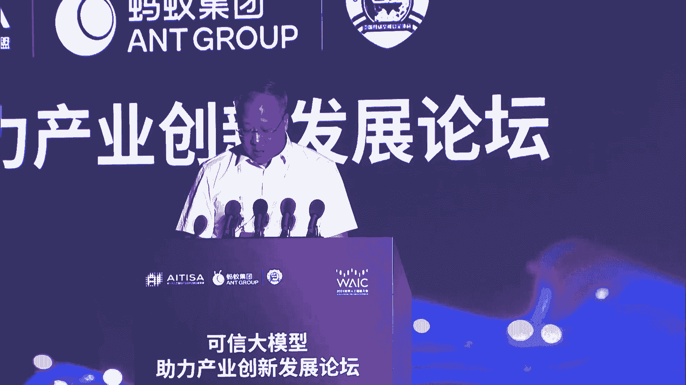
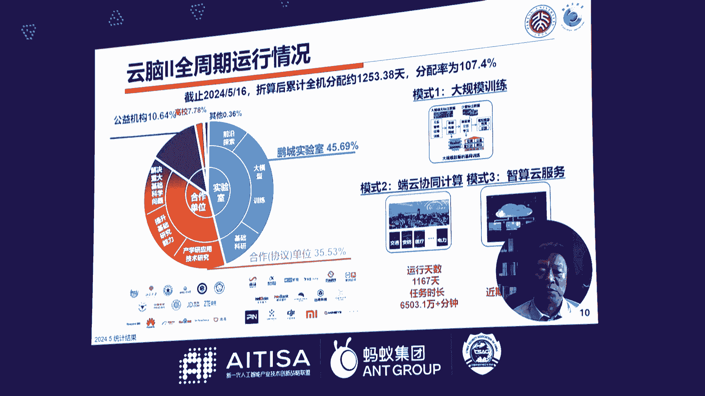
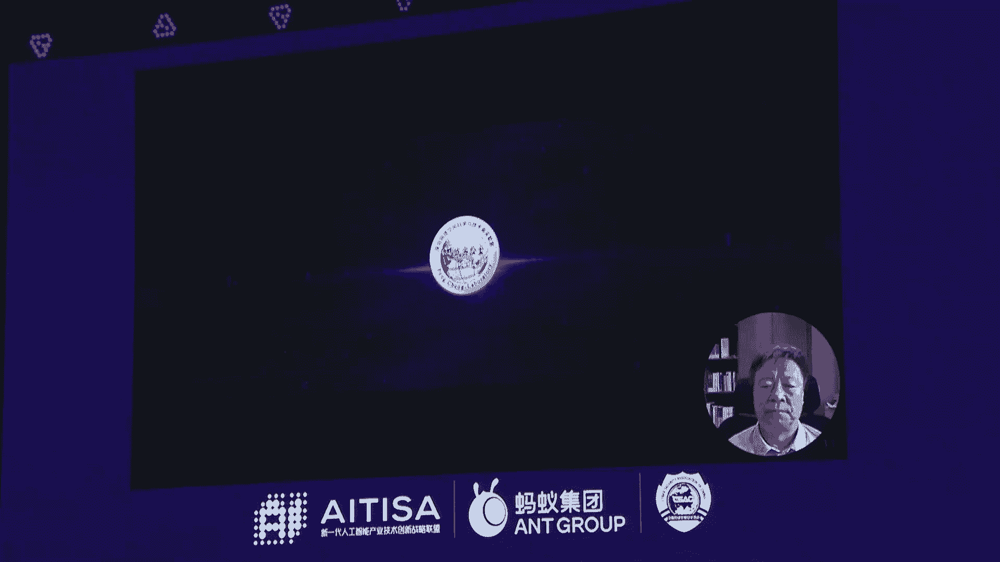
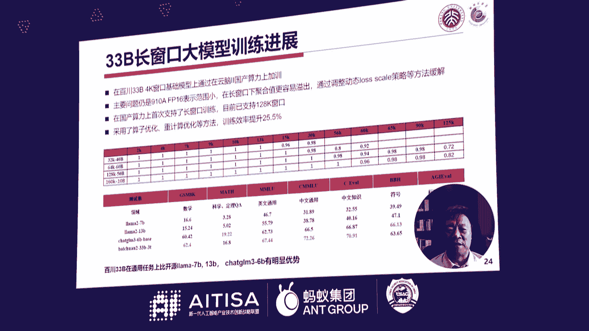
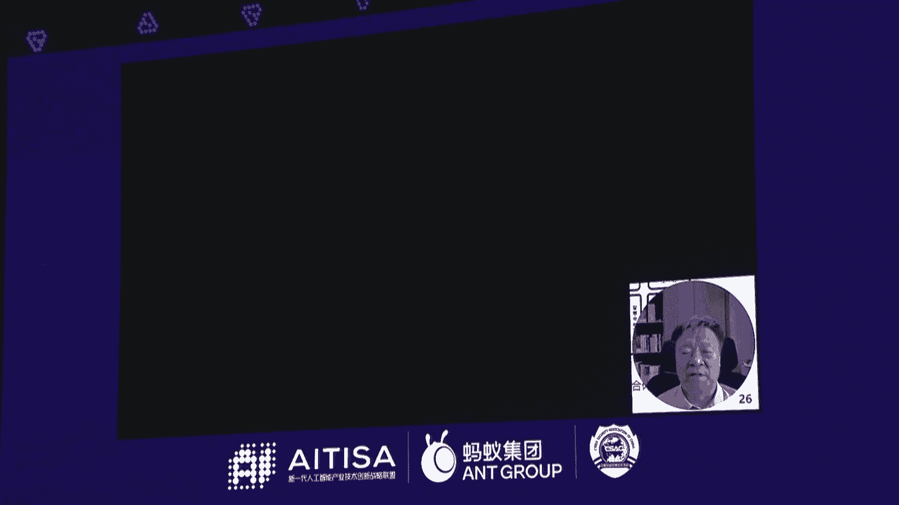
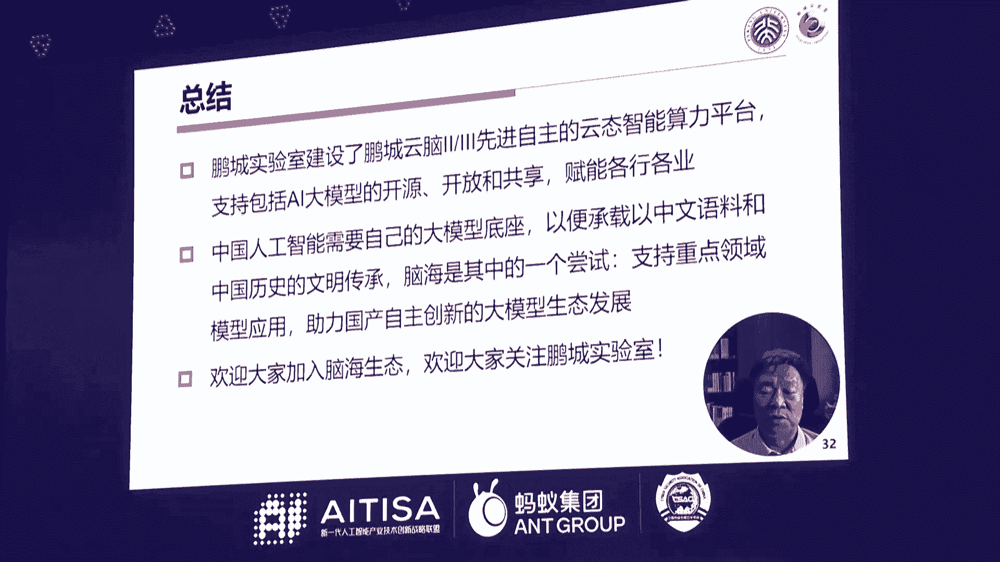
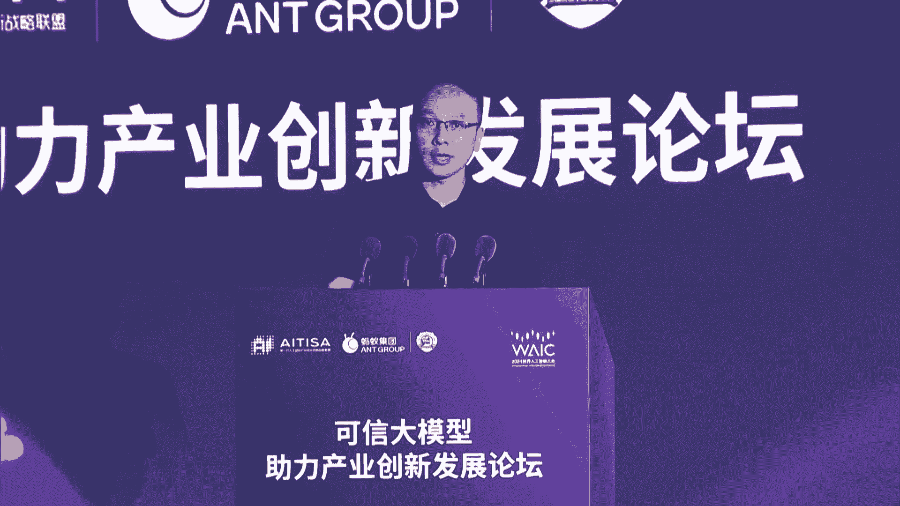
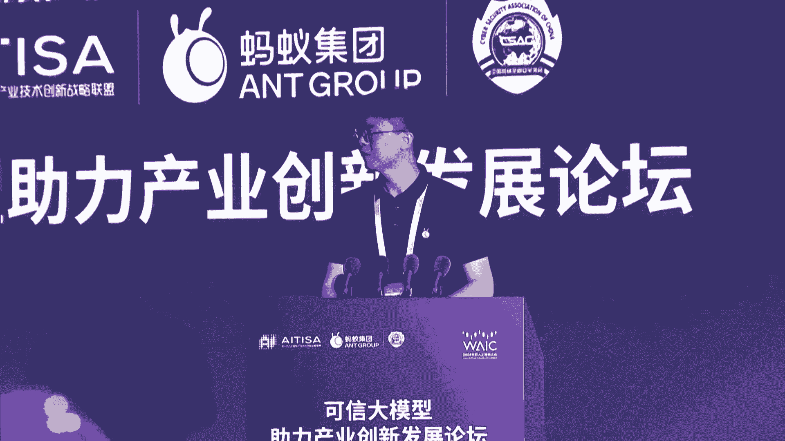

# 2024世界人工智能大会（合集） - P16：20240705-可信大模型助力产业创新发展论坛 - WarrenHua - BV1iT421k7Bv

尊敬的各位来宾，本次会议将于一分钟之后开始，请您尽快就坐，并将手机等通讯设备关闭或置于静音状态。谢谢您的合作。Ladies and gentlemen。

 The event will begin shortly in one minute。 Can we please ask for you to kindly take your seats。

 We would like to remind you again to switch off all mobile phones and put electronic devices to silent mode。

 Thank you for your cooperation。尊敬的各位领导，各位来宾、女士们先生们，以及我们各位媒体朋友们，大家上午好。

欢迎各位来到2024世界人工智能大会可信大模型助力产业创新发展论坛。各位好，我是本次论坛主持人齐军。本次分论坛由世界人工智能大会组委会办公室指导新一代人工智能产业技术创新战略联盟主办蚂蚁集团承办。

中国网络空间安全协会等单位协办。😊，以大模型为代表的新一代人工智能技术变革，仍在加速迭代，为新智生产力的发展注入强劲动力，助力产业智能化升级和经济发展。本论坛以可信大模型创新应用。

激活产业新智生产力为主题，围绕如何打造准确专业、真实严谨、可控透明、安全合规的可信大模型为主题，推动可信大模型，助力千行百业、高质量发展展开探讨。现在，金秀向各位介绍出席本次论坛的领导和行业专家。

他们分别是。第十四届全国政协委员、经济委员会委员、中国网络空间安全协会理事长赵泽良，欢迎。🎼中国工程院院士鹏程实验室主任高文，欢迎。中央网信版网络安全协调局副局长王银康，欢迎。

🎼工业和信息化部科技司副司长刘伯超，欢迎。😊，🎼中国网络空间安全协会秘书长郝晓伟，欢迎。😊，国家卫生健康委员会规划发展与信息化资大数据办二级调研员沈建锋，欢迎。北京市医疗保障局副局长杜兴，欢迎。

智源研究院理事长黄铁军，欢迎。😊，🎼新一代人工智能产业技术创新战略联盟联合秘书长张伟民，欢迎。🎼蚂蚁集团资深副总裁、首席法务官周志峰，欢迎。😊，🎼蚂蚁集团CTO平台技术事业群总裁何征宇，欢迎。😊。

🎼下面介绍的嘉宾由我介绍完毕后，请大家统一鼓掌欢迎。他们是浙江大学人工智能研究所所长求是和平教授、国家杰清获得者吴飞，武汉大学教授遥感信息工程学院院长张永军。

中国信息通信研究院、人工智能研究所所长魏凯、蚂蚁集团副总裁AI创新部门nexte负责人徐鹏，CSDN创始人董事长蒋涛，智普AI董事长刘德斌、华为公司人工智能战略与产业发展副总裁秦瑶。

深术科技联合创始人兼CEO唐佳瑜，百川智能副总裁邓江，蚂蚁集团大模型应用部总经理顾静杰，线上参会的open AI原研究员、人工智能科学家肯尼斯斯坦利，以及来自中央和地方主管部。😊。

门科研机构、高校、医院及行业领军企业的领导、专家和企业代表们，让我们用热烈的掌声对各位领导嘉宾的到来，表示最衷心的感谢，以及热烈的欢迎，欢迎各位的到来，欢迎你们。😊。

首先让我们掌声有请中央网信版网络安全协调局副局长王银康登台致辞，掌声欢迎。😊，尊敬的赵部长，各位领导嘉宾，大家上午好。很高兴参加可信大模型助力产业创新发展论坛与大家进行交流。首先呢。

我代表中央网信办网络安全协调局对论坛的举办表示热烈的祝贺。当前，人工智能是新一轮科技革命和产业变革的重要驱动力量。伴随着人工智能的广泛应用，挑战和风险也与日俱增。

遵循习近平主席提出的坚持以人为本、智能向善的理念和宗旨，加强人工智能安全治理，培育安全可靠、公平透明的人工智能技术研发和应用生态，是打造可信大模型助力产业创新发展的前提和基础。去年10月。

习近平主席在第三届一带一路国际合作高峰论坛上提出了全球人工智能治理倡议。围绕发展安全治理三方面，系统阐述了人工智能治理的中国方案，就全球普遍关注的人工智能发展与治理问题，提出建设性解决思路。

为相关国际讨论和规则制定提供了蓝本，也为开展人工智能安全治理工作提供了根本的遵循。积极响应并落实倡议中央网信办正在组织研究人工智能安全治理框架。

以推动政府、国际组织、企业、科研院所、民间机构和公民等各方就人工智能安全治理达成共识协调一致。呃，借此机会呢与大家分享几点关于人工智能安全治理的看法与思考。一是坚持包容审慎、确保安全的原则。

对人工智能研发应用，应采取包容的态度，鼓励发展创新，同时，对危害国家安全、社会公共利益、公众合法权益的风险，要及时采取措施。去年，中央网信办会同相关部门制定出台了生成市人工智能服务管理办法。

本着促进创新和依法治理相结合的理念，在明确风险隐患防范责任和管理要求的同时，最大限度为技术和应用发展预留空间，推行包容审慎和分类分级的监管。二是坚持风险导向、敏捷治理的原则。目前，基于风险的治理理念。

已取得一定共识，如何科学的认定分类感知测评风险，并提出针对性的防范应对措施，是各方的研究热点。人工智能安全风险，既包括自身的技术缺陷不足带来的风险，也面临不当使用、滥用甚至恶意利用带来的安全风险。同时。

随着人工智能技术快速发展。安全风险的表现形式、影响程度、认知感知已随之不断变化，防范应对措施也要相应的动态更新。人工智能安全治理需要快速动态精准调整治理措施，持续的优化治理机制和治理方式。

三是坚持纪管结合协同应对的原则。人工智能系统。在研发训练部署使用等。生命周期的各环节都面临安全风险，安全治理也应面向人工智能研发应用的全过程，综合运用技术管理相结合的安全治理措施。

防范应对不同类型的安全风险，需要围绕人工智能研发应用生态链，明确各个环节相关主体的安全责任，有机的发挥政府监管、行业自律、社会监督等治理机制的作用。四是坚持开放合作、共享共治的原则。

人工智能安全问题是世界各国面临的共同课题，要在全球范围推动人工智能安全治理国际合作、共享最佳实践，提倡建立开放性平台，通过跨学科跨领域跨国界的对话和合作，推动形成具有广泛共识的全球人工智能治理体系。

还要加强人工智能技术、产业的全球交流合作，消除限制壁垒，推动资源共享。各位嘉宾加强人工智能安全治理，构建可信大模型服务产业创新发展，需要政府、企业、科研机构等社会各方的共同努力。

协同合作，期待今天的交流，能就人工智能安全创新应用碰撞产生高质量的智慧成果，思想火花，预祝论坛成功，谢谢大家。谢谢感谢王局长的精彩致辞，请您入座。😊，接下来有请工业和信息化部科技司副司长刘伯超登台致辞。

掌声欢迎。😊，尊敬的赵部长。尊敬的王英康副区长黄小伟秘书长。各位领导，各位嘉宾。很高兴参加可信大模型助力产业创新发展论坛。我仅代表工业和信息化部科技师。

对长期关心支持我国人工智能产业发展的海内外朋友表示衷心的感谢。作为引领新一轮科技革命和产业变革的战略性技术。人工智能大模型正在重塑生产生活方式。优化产业结构，提升生产效率。引发经济社会文化等领域的变革。

同时也带来了新的安全挑战。中国政府高度重视人工智能的发展和安全。早在2018年。习近平主席就指出，要加强人工智能发展的潜在风险研判。维护人民利益和国家安全，确保人工智能安全可靠、可控。

去年4月28日召开的中央政治局。强调，要重视通用人工智能发展，营造创新生态，重视防范风险。这一系列的重要指示，为我们在人工智能领域的发展和安全指明了方向，提供了根本遵循。

公益和信息化部认真贯彻落实党中央、国务院重要决策部署。加强有关各方的协同，创新接榜挂帅机制。推动智能芯片、算法框架等关键核心技术突破，培育和建设了一批国家人工智能创新应用先导区。

打造了产业集聚地和治理能力现代化的试验场，大力促进人工智能和实体经济深度融合，积极开展人工智能标准制定，通过标准化、凝练治理共识，进一步优化人工智能产业的发展环境。就在本周二。

我们刚刚联合国家网信办、国家发改委、国标委印发了国家人工智能产业综合标准化体系建设指南2024版。并公示了人工智能标准化技术委员会的筹建方案。各位来宾，当前以大模型为代表的人工智能技术加速演进。

已成为新智生产力的引领性战略性的驱动力量。如何打造准确？专业、真实、严谨、可控、透明、安全合规的可信人工智能大模型，更好赋能经济社会发展，是我们迈向智能时代必须要解决好的重大问题。

借此机会提三方面的建议。一是强化技术支撑，构筑安全可靠的人工智能发展底座，加强人工智能治理基础理论和前沿技术研发，特别是可解释性研究。

加强人工智能模型算法训练优化、一体化推动、安全隐私公平等多要素的规则研究，推动探索构建、包容、普惠、更有韧性、更可持续的人工智能治理发展路径。二是加快产业实践，提升应用创新与有效的治理水平。

针对科技伦理、数据安全、隐私保护、公平责任等系列问题和挑战。产学沿用各方携手加强风险研判与规则工伤。我们将坚持政府引导行业协调、企业践行公众监督的原则，让治理规则真正的服务于企业的发展和产业的培育。

并以产业应用反哺治理规则，构建人工智能发展治理提升的正向循环。三是坚持开放合作，共同促进人工智能行为资源。中国人工智能数据数据广、应用多，市场大，具有巨大的发展潜力。

我们将加大人才培养和知识产权保护力度，推进数据开放共享，增强安全保障能力，强化政策规则标准对接，推动建立科学合理的人工智能国际治理体系。各位来宾，各位朋友。

当前全球人工智能产业面临跨越发展的重大历史机遇。打造高质量、高可信的人工智能大模型，推动产业健康有序发展，是我们共同的使命和责任。本次论坛为各方提供了良好的交流平台。我们衷心希望借助本次大会深入交流。

共话合作、共谋发展，携手创造智能时代的美好未来，预祝本次大会圆满成功，谢谢大家。谢谢感谢柳司长的精彩致辞，请您入座，谢谢。😊，接下来我们将进入到本次分论坛的篇章一。

与大家共同探索大模型产业应用的机遇与挑战。人工智能技术飞速发展，并将深刻改变千行百业。如何发展可信人工智能，并造福全人类，是全球共同关注的话题。

那么接下来让我们有请中国网络空间安全协会理事长赵泽良做推动发展可信人工智能的主旨报告，与我们分享他在这方面的思考，掌声欢迎。银康副局长郭超副局长。各位领导，各位老总，各位专家、媒体界的朋友。掌握好。

广南千协会啊对今天这个论坛非常重视。我们协会的郝小伟秘书长王建斌副秘书长不仅来了，在这来之前，还一定告诉我说，你务必要来参加这个会，而且还要发言。他们也认真给我准备了一个发言稿子。

我认真的看呢就是写的非常好。在这之前，我就一直在犹豫，我是不是按这个稿子讲。因为我现在已经从领导岗位上退下来了，我说我这身份要不要讲我刚才听了两位局长的致辞，我觉得我不能讲了。呃，有很多是重复的。

他们都讲的很全面，讲的很到位。我是觉得我没有必要再去重复一遍，浪费大家的时间。那么既然来了，都要给大家分享一点什么。交流一点什么？我刚才一直在这想。我说我想要不要我就以一个。老程序员的身份。

来来谈谈这个来来说说这个大模型。说一个老程序员嘛。嗯，我这个45年以前。开是铁代码。45年以后的今天，我还在写，可能称得上一个老程序员了。那么做大模型。我可能谈不上，但是做语言模型。

做技术transform的语言模型，我是4年以前开始做的。那么我做这个语言模型呢，那还有可能还有一些不太一样的。比如说我是因为稍微早一点，我是没有进入这个基础模型或者已有的预训的模型来做的这件事情。

不是从头开始的这件。那么我我在学习研究这个东西呢。基本上所有的语料我没有用他们坑我没有没有用胎儿，也没有用洪院长的悟道。啊，我主要是靠我自己积累。一个。那当然。这个代码。也很少用h face的。

因为4年以前的h face还不是今天这么好用。如果今天来做的话，我可能就要用h face。嗯。而且我还有一个。我来学习研究这个模型啊，我是个体户。黄院长，你们在座的都有很多啊吧。

精英在支持自己本身就是精英。我就是一个个体户，所以这样我更就就大模型的或者就语言模型的学习研究中间的甜酸苦辣。能有不一样的体会，别样的感觉。所以我跟大家说说我的这个一个感觉。我想问的第一个我觉得啊。

我们。用大模型，我讲的大模型。都是来讲的基术transform。这种语言模型别人很多人告诉我说，现在的大模型基本上都是基入tform的那我觉得就一致了。我觉得我们用大模型啊要善于用其所长。

那怎么用其所长，我觉得这个东西。我在刚才我在思考，咱们这个主题。比叫可信大模型的创新应用。那首先什么是可信大模型？说实话，我也不知道这个概念怎么来衡量，这个可信不那。但我觉得有一条。如果讲到可信大模型。

我们是不是就要去琢磨？我们的模型有哪些东西？他是不太可信的。我的还在知道。7、再进一步呢提高的。刚才博超局长在致辞中间提到了要增加大模型的可解释性。那就说明他现在还不太可解释。

那么我们当然这是我们觉得还不是特别可信的地方。我们要去学习去研究。那这是其中之一啊。前两天啊我看到一个互联网上东西是真是假，我无从考究。大家知道6月27号。拜登和特朗普搞了么首场辩论。那变更以后。

开rymax。这个人在座的很多都很熟悉，一项是对评论大模型来来来。那那那就是他的这这个比较热衷这一件事情。他就说了。两两位先生在辩论以后，max就说。他说特朗普说谎说谎。像大模型一样。这个我就觉得了。

可能有点偏颇。大模型我觉得他不会说谎。但是大模型他可能说错，也可能是大家说的还是流0。Aation。这的东西。那么他们为什么会说错这个东西？我觉得在我看来。或者说从程序实现的角度来讲。

我们现在的语言模型技术transform的语言模型，无非就是语言空间的一种概念分布。我们要根据这个概率分布对给定的语言系列来判断，以最大概率的方式求定它的下一个语言系列。既然是基入概念分布的。

那当然他就不存在唯一性。或者说它存在唯一性，它就存在它的单调性。那么把两合起来以后，它必然就存在它的一个不确定性。这可能就是我们现在如果把大模型用来做生成。做写诗作画。他可能他的固有特性。

当然我们在想很多，我们的科学家们在想很多办法。来去调和它，去完善它，去改善它，确实起到了很多的进展。那我在想一件事情。这些问题是都是我们在用语言模型，用transform。在生存。

这个任务中间来发现来出现的。我们回想一下。2017年斯曼他们8个人写了一个what is的这个文章的时候。他的主要出发点是干什么呢？他主要出发点是做翻译。当然文章他也讲到了。

他的这个transform还可以做很多其他的用动。但是毕竟还是从。那我从这个地方来讲，我觉得我们的transform的语言模型，它的所长藏在哪？他的常在分析，在判断。那么他用来做深层做深做推理。

可能也是我们一个很好的尝试。那么用好大模型来做判断，来做分析，来做分类。我们可能对我们的生产里面。对我们的工作。就可以减少我们讲的不可信性。这么一个。我就讲说的意思，要特别重视语言模型。

或者说大模型在专业领域细分领域垂直领域的应用。当然我们也不否定我们大模型来进行创作，来进行聊天。来显示作号。我觉得我们大明星还有一个优势。那就大模型的这种思维方式，这种方法这一种形成的机理和过程。

知得我们。加以学习和以往。我觉得我们应该这讲的是创新应用。我们应该按照创新应用这个思路，用大模型的方法激累。甚至这个形成过程。来研究非语言模型。我们现在很多模型就是基于语言的模型。

那么如果我们去研究用这个思维就方法，你transform。其作非语言模型。那么。我们做。音频的模型。做视频的东西。我们做医院。CT。做S光片。的解读模型。我们做我们自动驾驶的。这一类的东西。

我认为这一类模型，你们看看它有什么，它主要是分析，主要是分类，主要是判断判断。要少一些生成任务。所以我们存在的一些不确定性。我们可以叫他回避。相反。他更有利于。把我们的模型大模型变成实用的工具。

变成生产工具，变成竞争力，变成发展力。我都想到呢做到。我还在想。我觉得我们现在这个大模型语言模型啊。也亟代创新。有待创行。大家都很清楚，今天我参加我们这个论坛呢，说也有open aI的。

这个这个这个真加。当然是都是原专家。嗯，大家很清楚，open airI的2022年底推出了一个恰GPT。的确。对推动人工智能的发展起到了非常非常重要的作用。他让一个本来对普通老百姓来讲高深莫测。

一个实验室的高科技、高尖单的理论一下子来到了老百姓。来到了市场。让大家知道什么是AI了。同时不排除。也就是因为这个恰载GPT。我们要了更多的资金过多的资本来投到了我们的AI投到我们的大模型。

也客观上推动了我们模型的发展。但是有一点大家还有一件事情，大家可能注意的不是特别的够。2022年推出下GPT同样是open AI大概是2020年这个黄院长应该是有权威信啊。他们的。

恰op爱的10位专家发了一篇论文。嗯论文就是。Sny north pollution language model。就这一个论文里面提出来一个sge闹。这个怎么翻啊，扩张规则还是什么东西？

我说还不如把他叫一个open AI规则。那么我们很多人看来，要根据这个s now。那么我们对现在的。这个进入transform这个模型。只要我们在。模型规模或者主要体现的模型参数。

只要在我们的训练数据规模。再加上我们的计算能力。他如果指数性的增长。他就能带来我们模型性能的。持续性的提升。当然这个论文本身他并没这么说。那么本身他是讲的进入交叉商的los。

就crose entropy loss这个东西提出来的，而且他这perform提出来的。但是我们现在。对我们的市场，对我们的一些地方来讲。那可能就形成只要增加训练范例。只要增加鱼料规模。

只要增加参模型参数很快呀。从多少几亿几十亿，是不是现在到了几万亿，我不是特别的清楚。一直可以持续的承受算逆，大家都可以去做算意。那么是不是他就一致呢，我觉得这个未必。被告。

这可能也是我们现在大家讲的大力促奇迹。这么一个说法。在去年9月份。国家网络安全宣传周。这个论坛上我做了一个发言，也是关于人工智能的。我当时提到了。我说范木新，当然这是非常好，但是我有点担心。

进入transform。这个大模型是不是已经入上天花板？那么我今天也跟他也有点担心大力。他会不会就不一定出奇迹？这个你到。他在什么样的条件？他能成立。当然，open eye的专家也给。

他是给出他在7个数量级的时候，他说他是成立的。虽然他有一句话说，在更大数量级的时候，没有发现他不成立的案例。这个本来是一个很严谨的东西，论文啊。这个有点弄得跟我们那体检报告一样。啊，怎么地呢？

你要心做一个X光片，看你那个未发现异常。这个未一发现异常，不等于你没有异常啊。所以他这个那么也来了一句。嗯，我也没有发现这更高这这这个这个。那时候。他有这个不不成立的案例。第二。这个我想。我说的。

大模型的发展。我们要提高算力。要必要的增加参数？也可以增加数据训练的数据规模。但是。我们更应该。要注重理论上的创新。突破。总书记习近平总书记讲啊。他说在人工智能这个重要领域。

我们国家呀理论研究上要走在前面，关键核心技术要站立制高点。那我们这个东西要要从机制理论上多些。理论上的事儿。我不是特别的明白。嗯，因为我这个初中毕业就下乡了，没上个高中，没上个本科。

所以理论上我也说不清楚。但是从代码角度的来讲，我们现在这个transform这个东西，我们这个大模型或者se attention这个东西。他最重要的从代码时间讲，不就是K矩证Q矩证未矩证。

我们的所谓自回归，不就是这些矩证运算的多次重复。当然中间还有很多，我们要比如刚才我们的los函送，比是我们的这这个优化函送，我们有很多在里面做的，有很多东西。但是靠这些，他是不是都能产生智能。

或者说特别是通用的智能。我觉得这个我们都应该从理论上去研究。去思考。我们在大模型在特定领域，我认为现在在特定的任务上，它可能都已经超过了人类。在这人。但是更广泛的领域上。在通用的领域上。

他的理论基础是什么？这也许就是刚才说的。可解释性。我这个就从这想起来，我也今天还在刚才这想了一件事情。刚才我们在休息室进来的时候，大家都在谈。上海昨天很热。今天也不凉快。那我就想一个事，上海已经很热了。

我们大模型的热可不一定可别带来我们天气的热。我想说的是，我们在大模型的发展中间。还要注意环境的影响。还有研究对环境的影响。还应该算算账，算算投入产出比。我们要大力发展。我们这一个的技术。

但是我们应该科学有效的。发展。对。比如说我们不一定。就简单的。按照那个sner。来来来，这种不是来种。我昨天看了一个新闻。也是互联网上。讲我们现在万卡集群已经是标志，已经是标配。而且是。最低的标配。

这个最低可是可是不低呀。万卡万P。那么如果再把后一个万加上去，你那个oneP。那就不一定是万卡，那可能要2万卡，我们以A100来算。2万的。那么大调的讲。那如果以AA100一卡就是400瓦。

H100就是700瓦。如果我们那个万卡。乘一下多少？你在这个。我们。除了从。我们的规模算例上。我们还还是觉得一个理论上的突破。也在这个问题上让他更加科学、更加环境。更加有效的发展。

我觉得这也是我们在研究。大目前发展中间应该值得注意的问题。好了，我就跟大家分享一些想法，不对的地方，请大家批评指正，谢谢大家。好的，谢谢感谢赵理事长，请入座，谢谢。😊。

那刚刚呢赵理师长为我们分享了如何更好的使用和创新大模型，以促进新智生产力的发展带来了分享。那同时呢刚刚我们的赵理事长也提到了chinaGTP呢一经发布就成了破圈热词。人工智能技术的迅速发展。

也在深刻的影响着人们的生活环境，以及我们的社会进程，再一次感谢赵理事长为我们带来的深度思考。谢谢。😊，可信呢是人工智能的发展基石，大模型则是让人工智能技术实现了巨大的跨越。

正在快速重塑数字时代的发展模式。鹏程实验室作为国家战略科技力量的重要组成部分，在大模型方面做了积极探索，并且取得了显著的成绩。

接下来让我们掌声欢迎中国工程院院士鹏程实验室主任高文做主题为鹏程云脑与脑海系列大模型的主旨报告，让我们掌声欢迎。😊，各位专家大家好啊，这个因为会上整个会场的活动比较多。呃，时间关系呢这个不能跑来跑去。

我就呃用这个。这种形式呢把我要跟大家分享的内容介绍一下。今天我想跟大家分享的内容呢是鹏程云脑和鹏程脑海大模型。啊，大家知道这个。大模型这几年也非常火。

我们知道这个对呃大模型对于整个社会的这个呃进步的推动应该说是非常大的。就是它不仅仅改变了我们现在这些这个呃工作呃等等的方式，甚至将来有可能在生活上也会改变。呃，当然更重要的在科学上也会改变。

就是因为大模型呢，它使得科研和产业发展的范式都会发生变化。当然在大模型时代呢，就是我们呃总是希望能发挥呃把自己的作用发挥到极致发挥到最大。

那么我们知道最近这的大模型呢呃企业呢啊在各个方面都发挥了呃比较重要的作用。高校呢除了在算法以外，其他会比较弱一点。呃，当然呢是不是呃高校要再努力一点。其实就是高校要有调整好心态。呃。

因为现在要做这个在这个时代呢，其实就是说一定要有规模，要有足够规模的数据，足够规模的算力。呃，没有规模的东西呢，其实除了能写论以外，其实就其他方面都呃很难达到令人满意的结果。呃。

所以呢高校呢要尽量的算法上面可以自己多做一些创新和创造。但是数据方面还是呢要多和这些头部的企业啊，或者都多和研究这个国有的研究机构合作。那么呃高校呢更重要的就是解决好重大的关键问题啊。

去探索那些前沿和呃目前呢还没有办法就是说解决的一些难题。呃，这个是高校最容易发挥作用的地方。那么我想跟大家分享的主要两件事儿。一件事儿呢就是鹏程云脑的计算平台。第二件事呢就是鹏程脑海的系列大模型。哎。

首先我们先看看鹏程云脑的计算平台。鹏程云导呢这是鹏程实验室呃这个建立的呃这个整个的计算平台的一个系列。那么鹏程云脑一呢是基于英伟达的卡做的一台机器，接近啊这个100P的一个算力。呃。

鹏程云导2呢是用这个华为的呃芯片啊，包括NPU和CPU啊，那么建立起的一台这个1000P的算力的机器。那么鹏程云导三呢呃现在正在建设中呃，今年年底呢应该能够完成。呃，完成以后呢。

它的算力呢是16000P，那么比鹏程云导2呢相当于是鹏程云导2的16倍。那么大概有2万多颗呃这个华为的芯片组成。呃，鹏程云脑呢呃它是专门面向这个啊大模型训练的这样一个平台。比如说鹏程云脑2呢。

他已经连续8次呃参加top500的打榜呃，top500，大家是知道是每半年一次的超级计算机的一个这个比赛的榜单。呃，当然那里呢既有比如说峰值计算速度L呃，也有呢呃比如说I5500和其他的一些赛道。

那么鹏程云的二参加的是L500的赛道。呃，这个赛道呢是呃测量评价一台机器，它的存储和访问的性能。那么鹏程云的二从2020年呃，下半年参加第一次到现在已经连续8次了。

那我们连续八次都是冠军都是这方面的性能最好的一台机器。所以我们可以理直气壮的说，鹏程云的2是在智算平台里面，世界最好的这样的一个机器。那彭志云那儿不仅它的这个硬件性能，或者说并行处理。

并行文件系统的性能比较好。那么它实际上是有一个比较完整的计算基础软件在。那么最底层的啊这个AI异构的结算框架看，那么到这个。呃，这个 minus four。呃，到 my art。

那么再往上是我们一个开源平台呢呃大规模用户的开源共享叫open eye。呃，再往上呢还有这个呃一些生态的工具，所以它是一个完整的计算基础的软件在。那么有了鹏程云脑这个硬件和软件的这个生态环境。

其实我们鹏程云脑呢啊也这个呃训练了一批模型。啊，首先鹏程呢自己训练了一大批模型。同时呢鹏程呢也用这个机器呢呃帮助国内的一些头部企业，华为啊呃这个百度啊啊北北京智源啊，这个训练了一批他们的大模型。

🎼那么这台机器呢，鹏程云道这台机器呢呃2020年上线以后呢，呃其实这个运行的效果非常好呃，基本上呢是90%几的使用率。这个对于这种超算或大型计算机呢，这是非常高的使用率。呃。

而且呢呃整个鹏程实验室自己呢呃用了不到50%，用了差不多46%左右，其他的其实我们都开放出去，也其他的单位用包括一些合作单位啊，包括一些工艺机构啊等等。鹏程云脑的构建需要超级处理能力的。

人工智能专用加速硬件开放的软件体系架构以及完备的开源生产环境。

🎼彭志韵的耳机达到了。🎼算力是全球计算密度最高、算力规模最大、训练速度最快的AI技术设计，能为中国人工智能的发展。🎼能够提供最好的支持。🎼同时云到二期项目采用华为阿特纳9备AI集群，作为强大的算力底座。

同时云到2期总共有4096克，业界最强的AI处器深圳910组成，它提供一级的AI算力，相当于目前50万台高性能的PC机的计算能力。基于超大规模AI模型训练与推理能力。

鹏巧云脑大科学装置已在基础研究重大应用赋能中发挥作用。

那么正在建设的鹏程云导三呢呃他实际上是把算力这个啊。存存储能力这个和呃运力呢呃有机的结合在一起，高度结合的。其实它有三个技术上的特点。啊，第一个呢是单颗芯片性能呢是呃基本上是业界比较好的性能呃。

基本上接据于H100的性能。呃，另外呢它在整个高带宽的网络方面呃，就是我们说叫这个呃超级节点里头呃它这个呃整个我们是用的背板交换的方式呃，使得呢整个这个呃它的验迟带宽都做到业界最好呃。

第三个呢就是大规模的这个组网技术。那么若干个这个呃节点，若干个超级节点用这种呃大规模网络把它们连接起来。这样呢就使得整个呃它的这个呃卡和卡之间的通讯的验迟可以做到非常非常的短。

那有了鹏程云导三呢呃我们就可以做很多事儿，可以支持外级大模型的训练，可以支持多模态的训练。那么既可以去做这种大模型的应用创新，同时也可以做各种各样的面向这个基础研究的AF或上一次方面的一些工作。呃。

这是关于呃第一个方面，关于啊鹏程这个啊一级计算平台啊，那么下面我们介绍第二个方面就是呃关于这个。呃，鹏程脑海大模型。因为大模型呃出来以后呢，呃我们总是呃一开始我们是提供一个平台帮大家来训练。

那后来我们想了，那既然有这个平台，我们能不能也帮呃这个社会提供一些开源的东西呢，就是基于这样一个想法啊，其实我们就规划了一个鹏程脑海系列大模型。呃，这个系列大模型里面到现在为止呢是有三个成员，呃。

最小规模最小呢是7B模型，呃，这是1个70亿财数规模的模型。呃，中间这个呢是33B长窗口模型。呃，那么就是330亿呃参数规模的一个模型，最大呢叫200B。呃，大模型。呃。

这个是呢呃规模最大2000亿规模的这样的一个模型。这三个模型呢呃我们当当然就是说因为它模型的复杂度不一样，所以训练需要的资源也是不一样的。

你像200B这个模型呢呃我们是花了差不多接近7个月把它训练出来了。呃，这个大模型呢它有一个底把它做成一个底座，这是一个一呃开始是以中文为核心的稠密大模型。

当然现在呢呃英文和中文的这个呃调整的数量其实是英文可能还更多一点。哎，那么总而言之呢，就是说它是一个呃这个稠密的这样一个文本的大模型。🤧这个模型呢呃一共呢是104层的一个网络。那么我们用云脑2。

那么云脑2有4096块卡，那其中呢我们用了3456块卡来进行训练。呃余下台卡呢去做测试验证呃数据的准备等等。所以这台机器呢就是为了训练这个200B的模型，呃。

差不多呃花费了接近7个月的时间来训练这个模型。在训练过程中呢呃我们呃怎么样能把这个训练做的更好？呃，其实呢呃这个训练算力的需求和性能的优化，我们也做了很多工作。啊，包括比如说集群怎么让它做的更稳定。

算法怎么样更完健啊，训练这个故障恢复的时间更短，就是恢复优化做的更好等等。呃，这个模型训练出来后，我们做了一些客观的呃测试比对。我发现这个模型确实呃它和这些呃国内其他的一些大语言模型比较起来。

呢性能还是相当不错的。呃，在中文方面呢是业界呃第一体队，其他方面呢也都是呃基本上还是可以的。当然训练大模型呢是一个很花钱的事儿。哎，我们知道像美国训练，比如说呃GBT3。

5GPT4呃呃这个小这个open air了啊，包括这个呃谷歌啊呃呃这个呃facebook和训练大模型都是很花钱的呃，基本上从几千万美元到到呃几个亿美元在这个范围过程中呃。

其实我们这个200亿大模型呢呃训练呢如果算呃成本的话大概也是将近5亿人民币的成本，所以呃训练大模型是非常花钱的。🎼彭潮海大模型。🎼本次发布成果是鹏程脑海通用AI大模型进阶版。

由鹏程实验室联合中国外国局、华为、腾讯共同发布。公众版本将面向全社会开源与业界携手构建，基于中国算力网的AI大模型创新应用生态，为全球人工智能创新提供中国方案。就是这个大模型呢，应该说这个整体上呢啊是。

对我们这个做大模型的呃这些潜在的呃这个呃接手的地方呢是一个呃比较大的好处呢，就是他可以用这个模型呢去做成它自己的底座，在上面做成自己的呃应用系统。这是200B，因为200B这个模型。

2000亿参数呢呃像刚才我说的，可能1000P的机器用华为的机器，我们差不多训练9个月才训完。当然是现在呢呃我们在后面摘选的时候呢，呃这个速度会快，效率会高一些，因为开始呃经常以为这个地方有个错。

那个地方有个错呃，这个有个故障，那有个故障，嗯，越到后来呢这些问题呢就出现的越少。呃，或者说有了故障恢复的时间就越短，后面就呃也比较加速了。当然毕竟两200B的大模型需要的资源比较多。呃。

那么有的用户可能说我们有这么多算例呃，去做推理，或者做这个东西的布局呃，怎么办呢？呃，一个选项就是我们提供1个33B的长窗口模型。呃，330亿参数这个模型呢，应该说它刚好居中不大不小。呃。

这个模型呢是我们和百川智能呃一起合作啊，来这个研究的这样的一个模型。呃，这个模型为了训练呢，我们和百川呢做了各种尝试。呃，包括底底下的底座，用它的上面加我们的底下的底座。

用我们的上面加它的我们的他们的混合起来一起训练等等。呃，各种各样的尝试去看哪个效果更好。

呃，那么经过这个测试呢，经过这个月的验证呢，现在33B这个模型应该说已经可以用了。呃，这个是100128K窗口的呃，这个呃窗口长足的一个模型。后续我们还会提供更长的窗口呃这个呃19K的或者更大。

那么这个呢都在呃规划实施过程中，有了这个模型呢，其实我们就把它可以呃去赋能了。所以我们通过开源的办法来去进行合作赋能。那为了这个合作赋能呢。

呃我们和这个阿tia和这个呃这个呃中国人工智能这个产业技术联合呃这个。Yeah。组织呢一起呢呃做这个开源的联合体。这里呢啊我们通过人际合作啊，不同的模型呃，不同的这个领域啊等等。呃。

当然我们这个合联合体呢呃也包括依托啊CCF就是中国计算机学会呃开源发展委员会以及中国人工智能学会的呃一些委员会呢去联合把这个算例啊，数据啊统到一起来做。

呃，那么这个模型呢应该说它是一个呃全流程开源资源的一个供给。这还有个二维码，大家可以拍下来。呃，其实这就是呃这个开源呃，这个呃脑海开源呃社区的一个入口，你可以进到里面去。呃，如果你对这个模型有兴趣。

不管是哪1个7B的，33B的还是200B的，都可以去下载。呃，那么这个是模型本身。当然你说呃光用模型没有算力，你没办法进行推理。

所以我们现在也在鼓励呢各地呃有这个算力中心算力分中心呢呃用这个模型呢去做各种各样的它的可能的应用。所以我们呃去从鹏程实验室这边参与去做一些组织和赋能。

那么也欢迎大家去做应用的这个应用方去和你所在地的算力中心去联手，去把这个模型下载下去使用。那么这个启制社区呢，刚才说的这是一个开源的啊大模型呃这种这个研究开发的这样的一个社区。

这个社区呢我们可以做很多很多的这种研究很多开放的问题可以在这里面去进行尝试和研究。那么这个大模型呢啊这个我们也可以通过呃鹏程实验室的另另外一个这个呃国家啊计划呃，国家任务叫做中国算力网。

那么使得这个模型呢能够呃在新的一个计算方式上面呃得到啊这个展开。呃，最后小结一下呢，就是呃鹏程实验室呢，到现在为止利用华为的声片已经建设了鹏程云脑2。那么正在用华为的芯片在建设鹏程云脑3。呃。

这是一个云泰智能的计算平台。那么它呃这个可以呢呃做这个呃AI大模型的一些训练。呃。赋能啊，而且是用开源的方式。呃，那么中国呢人工智能的发展肯定需要有自己的大模型底座了。啊。

因为一方面这个呃西方发达国家呃对特别是美国，对于中国的这个人工智能呢呃可能施加了很多因素，呃，比如说恒这个训联的卡，不让这个呃在中国销售呃，甚至呢有一些比如说这个大模型呃，不管是开源的还是服务。

不像中国开放呃等等。所以呢中国要想人工智能顺畅发展，必须要有自己的大模型底座。当然我们并不排外。呃，但是一方面要有自己的同时呢我们也可以呃对比着看呃这个其他的模型做的好的。

也可以呢呃给我们做成一个标杆呃，参照系。呃，有了这个东西呢，因为毕竟呃我们也要做这个大模型，中文是我们的看家的本领。如果中国。不好呢呃，其实你这个模型呢就在中国就很难很好的使用。

那么脑海这个系列大模型呢呃其实它就是呃这样的一个尝试。呃，那么通过这个脑海模型，我们希望能够对国产这种啊大模型的生态发展起到一些帮助。这个脑海模型啊啊需要众人识采才能火焰高。呃。

所以我最后这张照片呢呃就是呃给了几个二维码。这几个二维码里面呢，你拍下来呢呃一个二维码是关于这个呃这个启智的入口。呃，一个二维码呢是关于这个呃这个鹏程实验室的入口。

还有一个二维码呢是前段时间我们写过一篇文章啊，在实施报告上面发了一篇文章，呃，关于然后真的发了有一些我们的见解。如果大家对这些东西有兴趣呢，可以通过扫描这个码，最后呢呃获取这些信息好。

好的，谢谢，感谢高文院士。😊，大模型之路已经从通用语言大模型向多模态大模型进行过渡。中国自己的大模型底座，对于促进技术创新和行业发展而言至关重要。下面我们进入到本次论坛的篇章2。

与大家分享大模型技术如何创新，以夯实加速应用服务产业的技术基础，让我们有请智源研究院理事长黄铁军做大模型进展与思考的主题演讲，掌声欢迎。😊，呃，尊敬的赵部长呃，各位领导，各位专家呃，时间啊。

我看已经有有点那个什么了。呃，我们是15分钟，所以我尽量啊这个这个不超时能省一点更好啊，来谈一下这个关于大模型的一些一些一些思考呃，大模型这个这个这个技术啊，过去这几年特别热。但是我们回过头来看啊。

他这种这种技术路线或者这种思维方式意味着什么。我想主要呢我我从这个角度呢先谈一下看法，因为人工智能呢传统的人工智能像符号主义呃是很清楚的。因为整个的规则呃逻辑都是人设计的。所以那当然可解释。

它是一个它是一个本来就是人解释清楚之后执行的一个东西。😊，但是呢这个今天讲的大模型是基于廉接主义，是基于神经网络训练它的一个东西。它的思维方式本来就是一个自底向上的，就是你先构造一个神经网络。

然后用数据去训练它。产生智能能产生什么智能。这件事本身在设计的时候是不清楚的，或者是说从根本上讲就是一个开放问题。呃可以说不能无法去这个完全预测和控制的这么一个一个一个技术路线。

但是这条技术路线经过了80多年的这个探探索呃，有各种样的波折。但是最终呢还是在过去的这个十年左右取得了重大进展。呃，大家都说transform嘛，trans很重要啊，呃，但是我觉得另外一个也很重要。呃。

就是这个十年之前的十多年之前的今天大模型都用的啊，无论是语言大模型还是今天做多么太大模型，你总要把一个这个基本的这个单元，对语言来说，基本单元就是词对吧？变成一个可计算的语义可计算的这样的一个向量。

这是2013年的这个但是之前也有类似的自然运输里很多进展啊。但是我想调最重要的说，就是它不是一个词词在在大模型呢不再是一个词，而是一个高维的。😊，大量对吧？一般我们都会用1024维，当然还有用更多维的。

这样的话呢，每个词是一串数字，那这串数字就是它的语义。那或者换句话说，构造出来1个1024维的这这个这个高维的一个余空间。那大目型算的就是这个我们的每个概念，每个词在这个语空间中的它的位置。

有了它的位置呢，我们就知道这个词与词之间的关系。😊，呃，所以这很重要啊，不是说只有transformer重要。你现在把数据呢变成一个可可计算的东西。然后就是才是transform。

transform做的是通过计算这些概念与概念之间的关系来获得它的语义。呃，这个呃一开始大家可能不是那么理解。后来呢我想我我我用一个最最通俗的话说。词与词之间的关系就是他的语义的最主要的来源。嗯。

马克思说对吧？人是一切社会关系的总和，一怎么定一个人，对吧？那你是要你跟其他人的关系，那词也一样，语言也一样，对吧？语言有这么海量的语料。通过这个计算词与词之间的关系呢是可以精确的获取每个概念。

每个词的含义的这是为什么大部分有智能的这个呃基本原因，对吧？它是真的算出来的不是这个碰运气，是精确这个计算之后的一个一个结果。😊，那GPT的重要贡献呢。

尽管GPT呢呃没有这个像刚才说这个神经网络架构也不是他发明的呃，磁项量也不是他发明的，它只不过是一种训练方法。

但是这种训练方法是有它背后的也可以说很深刻的一个对于智能的认识的那就是所谓智能其实就是根据历史预测未来，或者是这用K个单词预测下一个这个看似简单。

但实际上他抓住了这个我们智能的一个一个可以说一个根本性的这么一个一个问题。所以GPT的成功不是偶然的。它是它是这个呃它是有自己的一个一个很清晰的这样的一个一个一个逻辑，所以才取得的成功。😊，呃。

但是呢我刚才回顾这三个重要的点呢，目的是呢想说呢大模型这样的一个一个重大突破。呃，就像这张图所显示的，它是一个构造出来的东西。它是在神经网络上用大量的数据，用预测下一个词的这种方法。

构造出来的一个一个智能的系统。它的构造过程是很清楚的，就这么做啊，这就是方我们就说技术，它是方法论。但是这么构造这个东西，它为什么会有这么强的能力，产生了各种各样的功能？

这不是设计师的这个这个呃设计好的这是这个复杂系统，自身表现出来的一种一种一种一种现象，一种功能1一种能力。所以呢。😊，大家经常说这个不可解释。设计师本来就没有就就像我刚才不像不是经典的人工智能。

设计的时他很清楚是怎么回事，他也不清楚，这是一个技术，这个技术的一种一种自然的或者一个一个一个一个现象。呃，所以他不可解释呢，呃这是它的天天性。😡，嗯。这个我我想这个过去几年，大家是通过图径测试。

但是甚至于我们可以说人工智能的突破了另外一个这个长期以来呃，从上个世纪70年代、80年、90年代一直在讨论的问题。

就是一个符号系统一个从数据里边进行计算的这么一个人工智能系统是不是真的理解了真正的有智能。那今天来看呢，这个经典呢认为不可甚至于不可能解决的问题，解决了。

就是刚才说符号符号本身的含义已经已经已经算出来了。呃，这所以这是一个重大的进步。但是这个进步背后的激励。像刚才说的，实际上是不清楚的。不清楚是。😊，不清楚，不是不是说这帮人这个有意的。

也不是这帮人聪明和笨的问题，这就是一个自然现象。呃，大家现在认清这个这个这个现实，我经常打比方啊，不打比方，大家还老。😡，指南针发明的时候，指南针为什么指南不知道，但是我能做一个稳定指南的装置。

飞机飞得上天，发明的时候不知道为什么飞上天。😡，没有空气动力学，但是它能飞上天，能飞得越来越远。人工智能也一样。现在做出来一个有智能的，可以测试智能越来越强的系统。但不知道它为什么这这些智能。

但是另外一个问题，为什么的问题需要我们后续更长的这个去研究。那为什么要这么做，对吧？其实我想呢这是对科学研究范事的一个一个理解问题。我们经典的传统的这个科学呢总总希望啊，这也没什么错啊。

我们一个复杂的这个现象，复杂的是我们要知道的背后的方程知道它的数理的模型，这是的，我们如果能知道的话，当然很好，但是事实上呢像智能包括刚才我说的飞机很多这个是事物呢，我们现在没有这个规律。

还没有规律的时候，我们是不是就不发明了，不是的，我们照样会这个去去探索这这种可能性，所以用一个神经网络这样的一个不是那么优美，不是那么。😊，这个数学的一个东西呢去构造一个体系。

让他去刻画复杂的现象背后的规律。这是一个这是一个现在这个可用的一个很不错的这么一个方法，所以今天的神经网络呢从这个百亿千亿万亿后边还要做10万亿百万亿甚至更大的神经网络，这是一个可信的办法。

尽管它背后刚才说没有我们原来经典的那些优美的东西。因为这是一种不同的思维方式。我们过去100年呢被科学的思维方式，某种意义上的这个这个这个说洗脑有点那个什么啊，就是大家喜欢用科学的思维方式，什么事情呢？

一定要说可解释可信，包括今天讲的可信啊，你一定要清楚背后的这个这个为什么事实上就像我刚才说的复杂现象，你清楚背后的为什么的这个难度是是可能超越目前这个时代的。但是技术呢它就是要构造出越来越复杂的东西。

咱们不说别的互联。😊，网对吧？互联网的规则这个可以说很清楚，但是互联网发展到今天，你要理解互联网上的现象，那可就那那可就复杂了。对？人工智能也一样。如果说的再远一点。

我们人生命智能在地球上这个这样的一个发生过程。本来就是一个构造不断演化发展的过程，对吧？我们不我们到现在为止无无法知道这个这个生命背后的所有的奥秘。

尽管我们已经知道了一些人工智能呢其实其实其实也是一样的。所以人工智能会往前发展，会发展的更强，会往这个通用人工智能呃，这个强人工智能这样的一些方向方向去发展。😊，这里边呢存在一个巨大的可以说巨大的机会。

也存在一个巨大的风险，就是他的能力越来越强。但是我们又不知道这个背后的这些这这些这些规律是什么。所以呢在什么时候这个这个我们今天大家都投入的花了很多资源去做的这种这种通信性越来越强的人工智能会演演化成一个超越人类的AGI不知道但是我们就在往那个方向这个发展。

没有一个绝对的边界，说哪一天达到什么这个这个时候哎他就突然就是超过人类了，不知道他是在一个一个演演化的过程中呢。所以呢关于可信这个词啊，我去年那个腾讯搞的这个一个叫人工智能20年20问。

当时呢就有类似的一个问题，我也在思考这个问题。实际上刚才我讲了这么多什么意思呢？😊，人类也好，人工智能也好，它是一个刚才说的是一个复杂系统，这个复杂系统会产生各各种各样的这种可能性。

会我们说他幻觉或者说他想象，或者是说的创造力，都是一个从终极上讲是一个不可理解的系统，人类也不可理解。我们所有人大家说咱俩再好的朋友，夫妻之间你完全理解对方，那不可能，因为他是个大脑。

他总会产生新的这个这个这个想法，那人类社会之间怎么可信呢？我们是要你就是听其延观系行，对吧？我们要用实践去检验，所以你你你讲的你做的是不是是不是符合这个这个这个现实的情况，所以我们要说百分之百的信任。

百分之百的可信是不可能的。因为他也不可能百分之百的被理解，他会越来越强的。但是呢我们可以根据他的输出，根据交互来构建一个共识，在这个共识中，我们形成了一个一个一个所谓的信任，对吧？😊。

比如科学、技术知识，对吧？社会的规则、法律这些东西呢就是我们共识的东西。大家在这样的一个一个一个一个共同的这么一个体系里面形成一定的这个可信。嗯，你不能这个绝对去相信一个智能体。

无论是他是人还是还是还是1个AI。😊，呃，最后一页啊，就是关于目前的我总结一下这个认识到底今天这个我们的人工智能这个通用人工能发展到什么阶段了。

这是去年的open eye的一个一个一个一个分类啊后来我看到之后呢，我觉得分的不好呃，为什么呢？他把这个AGI就是咱们说的这个通用人工智能呢划分成了5个级别，这个级别呢什么叫差别。

其实就是跟人类的认知水平相比，达大概达到了人类的百分之几十%，对吧？那个50%90%99%100%我觉得这个分没啥意义。因为你很难测试说今天的一个谁做了一个AI是50分还是90分，对吧？我们也有很的榜。

但是比这个东西呢？其实对长远来说呢？这个这个不是最重要的那我认为呢这是今年质变大会的这个安全论坛上我我我给的一个这个分级啊，我也在简单的再给大家。😊，这个讲几句，马上时间就就就呃快快到了。

就是我这是我的分级啊，因为我觉得这个可能它有利于我们对越来越强大的人工智能早点做出一个一个预判，呃，我认为今天啊我们讲的这个通用人工智能就真的是genral artificial intelligence呃。

还不是 general intelligence是一个这个认知水平低于人类，就像刚才说open eye的这个前面的这个几级所所所呃4级啊，不管你是50分还是99分。总的来说。

认知水平低于人类可以替代部分人类智能，这是我们今天的这个面对的现实。这样的一个人工智能系统呢，我们希望善用它。但事实上呢，它也会被误用，会被滥用，会被厄用，对吧？

这是我们今天的面临的这个安全和和风险问题。😊，呃，有可能这个想互分开说大概2到5年，对吧？也有这个呃这各种各样的说法吧。但总的来说，在几年之内，有可能认知意义上，人工智能全面超越人类。它不是人。

但是呢它的知识的丰富程度和它能够给出一些预测一些这个预判的能力比人类几乎可以说比我们所有人都都强，这是有可能的。因为我们每个人掌握的数据和这个我们分析这些数据呃，背后的所所所允许的时间是有限的。

而AI呢，它的这个这个这个数据的广度和时间这个计算的这个这个这个复杂度要远高于我们。这个时候呢，我不认为呢就是这叫第一级的这个这个AGI啊，它一定是这个呃在可以说在知识水平上全面超越人类了。😊。

这个时候呢，我们仍然可以跟他之间建立一个理性信任。就像刚才说的这样的一个关系。这个可信呃，是是仍然是可以做到的。尽管他已经是A加I了。

但是呢我担心的就是我们大多数人类呢可能因为自己努力努力一生都可能都不如这样的一个AI这个呃聪明，所以人类放弃了这个这个这个这种呃呃竞争的这种机会躺平了。这是我担心的啊。

这个也可能是咱们人生物智能越来越强之后会越强之后呢，会造成的一个呃一个一个社会现象。😊，之后呢才是这个超越这个超越人类甚至不可控制的呃几个级别啊，实现那个有限啊，我我快速的说一下。

一个呢就是今天特别热门的拒身指能。因为为什么level一，我们能控制呢？因为它毕竟是一个没有身体，没有这个呃他自己的这么一个它是它是被动的这么一个系统。但是如果他有了身体，呃，他有了这个那个运动能力。

那就有一个感知性能呃和运动性能超越人类的问题。😊，呃，感知和认知的结合跟环境的互动有可能产生意识。如果他这个在这个神经网络复杂达到一定程度之后，产生自我意识，这都是有可能的啊。我想我说这个话呢。

大家可能作为一个严谨的科学研究者，他说你这东西有有啥依据，对吧？这话呢问的也对，但是我我想刚才我已经讲了很多了。人工智能是在构造的一个系统，你不知道哪一天飞机会起飞。

你不知道哪一天这个它的智能会达到一个什么水平，你不知道哪天这样一个巨身系统在这个跟环境的互动过程中就像动物一样的，它会产生了这个意识，就像这个少数动物一样的对吧？它产生了自我意识能够区分出自己跟环境。

这种可能性都是存在的，我们没有任何这个这个这个绝对的证据说这事都不可能没有人给出这这种结论，所以我们就得考虑这种这种可能性，当然最终呢就是人工智能就不再是人工智能了，跟人也没啥关系了。

他也不再用人类的数据去训练，他也不再仿照人类。😊，的大脑的神经网络去去这个架构，他自己会有自己的发展，那是更长远的事情啊。但是我觉得呢level一就是眼前几年的事儿。

后面的234差不多是未来10到20年的事情。这是我们至少啊这个风险是存在，我们应该做这方面的思考。行，我今天呢就给大家报告这些，谢谢。😊，好，谢谢感谢黄理师长的精彩分享，请您入座，谢谢。😊。

随着人工智能的不断发展，大模型已经逐渐成为社会经济发展的新阶段，而大模型技术体系的不断改进，离不开更高质量、更大规模的数据。同时我们也要更加重视大模型技术进步所带来的潜在风险。大模型产品时代的到来。

垂直领域大模型智能体等技术的发展，为大模型应用带来了更多的想象力。那么接下来让我们有请浙江大学人工智能研究所所长求视特聘教授国家结晶获得者吴飞做制海系列垂直领域大模型与人工智能体的主题演讲，掌声欢迎。

😊，🎼啊，尊敬的赵部长，尊敬的各位来宾。下面我用15分钟时间给大家介绍一下制海系列垂直领域大模型。我们知道20呃17年呀，谷歌公司发表一篇文章，就赵部长刚才讲的就注意力是你所需要的一切。在这篇文章里面。

这个GPT这个单词被提出GPT的第一个G表示叫深层式。也就是说这一个神经网络所产生的所有内容不是搜索出来的，是它合成出来的内容。这个内容是在之前的互联网上所不存在的。第二个叫P叫做预训练。

也就是说它会训练一个模型，这个模型可以去预测下一个单词。那么预测下一个单词的能力，就是刚才铁军老师介绍的，根据单词和单词之间的共生互联去预测下一个t。但是如果只会预测下一个单词。

这个神经网络没有任任何的用处。说第三个T叫做transformtransform呢我一般不把它做翻译。因为这个谷歌公司说我们提出了一种新的神经网络，我们把它命名为transform。

美国有部电影叫做变形金刚，它的名字也叫做transform。就大家可以把它理解成它是一个变换神器，你只要输入什么东西，它就能把这个输入所对应的输出像变魔术一样的给你映射出来。

所以GPT我想更正正确的翻译叫做深层式预训练神经网络。那这个神经网络的这个重大的这一个突破在哪里呢？谷歌公司说我们引入了一个自注力机制。这个机制很厉害，以自然语言为例，叫输进去一句话。

那这句话里面的每个单词要肩负起自己的责任。你要记住，你在这句。话的上下文场景之中和其他单词一起出现。比如说项装五件意在沛攻，你输进去了几次。那么这时候的这一个有一组参数。

就要五件这个单词记住了它和项装与配公，在这个上下文语境里面一起出现。大家可以想象一下，如果我们都记住了在上下文语境中，我们和哪一个单词一起出现，是不是内容的这个合成就变成了一个概率合成。

产先产生第一个单词，按照我们的提示词，在这样的语境之下，哪一个单词和第一个单词的共生概率更强。于是one by one一个单词接着一个单词生成了。

就好像我们在今天我们在蚂蚁集团开一个可信大模型赋能实体经济的大会。如果我们的所有的新闻稿件都出现了我们的名字，于是今天我们在这个上下文里面一起产生了共生，走出去之后，我们在自己的公司，在自己的学校。

在自己的家庭，在自己的朋友圈里面又构成了一个上下文。于是我们又在另外一个上下文里面和其他单词一起呈现。所以GBT的这些东西自作于机制是非常重要的一个这一个核心的这个突破。但是如果一个transform。

它只能说我会预测下一个单词，我想这一个transform也没有任何的用处。我们总不能抱着一个神经网络说，请你跟我玩文字接龙的游戏吧。所以让神经网络说人话，做人事。

在他具备预测下一个单词的这个能力基础之上，让他把这种能力迁移出来，组合出来，能够像人一样的说话，像人一样的去完成人类能完成的某一系列的这个任务。比如是我们可以通过第一阶段叫做文字接龙的游戏去训练。

能够预测下一个单词的transform及预训的模型。然后用万千的下游任务的样例。去让这一个预测下一个单词的预训练模型的能力被组合起来，被提升出来。我们叫做有监督的微调。我们不需要他的能力。

这个所有的参数都像这一个这一个大动干戈，把所有的参数都这个调整一遍。那我们只需要用一些巧妙的下游任务，让他去完成这个下游任务的这个同时，把他的预测下一个单词的能力迁移出来。这又有点像中国的一句古话。

叫做这个叫叫叫做叫做叫做人师难求。这一个什么叫人师难求呢？就一个高超的老师啊，用非常好的例子，让学生们的基本能力被组合被爆发，被这一个训练出来。

所下这个大语言模型就从预测下一个托ken变成了完成下下游任务的这个万千能力的这个transform。让后我们把把它开放出去，让人类来对他进行这个训练与调教它的能力就变得越来越强。那这是一个大语言模型。

它是上知天文下知地理。为什么他把人类所有的信息空间里面的语料进行了压缩，进行了压缩。它又与概率共生的这个形式把它这一个合成出来。说你是否问他任何的问题，他都能犹如昨日重现一样的，用最大概率给你生成。

所以你看到这些合成的内容都觉得如犹如昨日重现回答的非常精确。因为他只是把卓越卓越的这个内容给你用概率合成的方式给你进行了这个合成。那我们讲在很多的垂直领域，很多的行业。

我们需不需要用这么一个魁梧有力的通用这个大模型来动辄是1750亿参数，就像高文燕是讲的GBT杠3用的7800万的这个美元才把它训练出来。在很多的垂直领域，我们不需要他上知天文下知地理。

我只需要你老老实实完成这个锤语的。这个任务行业的任务就可以了。我们把它称为垂直领域大模型。在2023年的时候，谷歌公司发表一篇文章，说教科书就是你所需要的一切。在这篇文章里面。

谷歌公司说我们用教科书级别的高质量的这个语料训练了1个13亿的transform的这一个垂直领域的这个大模型，在某些锤玉的这个任务上面，它战胜了1750亿参数的GPT这个杠3。5。

它显示了用高质量的这个语料来训练这个大垂直大模型的这个重要性。我们就好比说让他喝咖啡吃吃面包，可能他不是吃百家饭，穿百家一，就让它这个术业有专攻围绕某些领域的这个问题的话。

用我们的这个锤玉的这个高质量的语料去进行训练。可能我们只需要一个小模型。但那大和小事相对的哈。谷歌公司。公司说我们用了1个13亿的这个模型，完成了某些领域能够抗衡1750亿参数的这个大模型。

那我们这个国家自然科学基金委去年年底发布了叫叫做深圳市人工智能技术研究的专项项目，就是希望去探讨这一个深圳市人工智能领域的话，有哪些基础科学研究的这个问题可以去解决这个专项项目后来支持了这个6项。

正在这个稳步的这个推进。那我本人呢是在2021年承担了一个科技部一个叫智能司法的这一个重点研发计划的这个项目。这个项目是2021年启动的正好有一个课题要做QA问答。

传统的QA问答是把问题和答案写好存入数据库。用户问什么问题的时候，把用户问的问题和数据库里面表示的问题进行匹配。然后把匹配成功的答案把它检索出来，说你不能问已经写好的问题以外的答案。

因为他没办法做出这个回答。那我们做这个项目做到2023年的时候，预训练。模型和产生式人工智能出来了。我们当时在想，能不能训练一个司法领域的垂直大模型，让他问任意的这个司法领域的问题呢？

照浙江省的这个高院在数字化方面走的非常的这个靠前。浙江省高院主管这个审判工作的朱新丽副院长，又是我们原浙江大学法学院的院长，朱老师呢对人工智能持着这个拥抱和开放的这个态度。

于是浙江省这个高院就把这个审判完毕的电子卷宗给了我们浙江大学和阿里巴巴达摩院。因为达摩院是承担了这个课题的一项研究任务。

于是我们就在阿里通一千问的60亿这个小模型上面用电用司法电子卷中的这个数据去训练司法领域的单词上下文出现而进行预测的下一个单词。然后用法官检察官律师进行这一个法庭辩论的这个任务来对他进行微调，然后把他。

开放出去，让法官、律师和检察官进行使用。于是我们又形成了1个60亿参数的制海路问的垂直领域大模型，之所以把它取名为路问。因为宋代有个司法制度，叫做对犯人进行最终判刑的时候，王公贵族咸于路问。

就把犯人提审出来，依据已经形成的这个卷中一五一十的这个对照。如果有就把他这没有任何的这个矛盾，就判判刑。如果有矛盾，在发回重审。我们希望这个路问，就像一个明察初毫秋毫的法官一样。

对里面的一些矛盾和蛛丝马迹进行这一个扫描。路问现在已经在这个浙江省高院，浙江省司法厅和若干的一些检察院进行了这个使用。我们也在这个摩大社区把它进行了这个开源，收获了很好的这个效果。

就在路问面对任何的司法命问题进行回答的时候，在那一时候，我感到了欧 in one的这个巨大的这一个这个。魅力以前我们做QA问答系统写写问题，写答案，写的多么的辛苦。以前我们做人工智能。

用一个模型只能解决一个问题。在大言模型所有的问题都融合在一起，你可以去问他任何的问题。在这个基础之上，因为我本人承担了教育部101计划人工智能引论这门核心课程的这个建设。

所以我们这门课程的这个所对应的教材，6月16号以及正式这个出版，我和潘云鹤院士作为这个作者。那为了让全国高校更好的学习这本教材。我们又和高等教育出版社阿里云这个公司以及华院计算。

共同打造的一个叫智海三乐的人工智能这个教育的这个垂直大模型，他也是61参数。我们希望学生们在学这门课的时候，能够超越这本书里面，这个43万字的这一个教材的内容。让教师创造性的教。

让学生们个性化的这个学这致海论问呢。海三乐现在已经在高校社的这一个云服务平台上面进行开放，让全国高校用这本教材的这个学生们进行这个使用。后来我们又形成了像浙海金盘和化合物合成。

现在我们浙江大学是学科最为齐全的这个高校总共有63个这个一级学科。我们想如果每个学科对我自己的学科大模型。学科大模型再把它连接起来，不就成了一个像我们学校有有个老师说，浙大先生是不是会出现。

就把学科把它打通，然后让他问任何的学科问题，他都能进行这个回答。那大元模型是个大脑，你问他什么问题，他好像都能回答你的这个答案。如何把一个大脑装上手和脚。那么AIagent就是一个很好的武器了。

当当大元模型给出你答案的时候，最后要完成这个答案里面的编程计算以及其他的这个功能。我们就可以打造一批一批的这个agent让大言模型形成手和脚，让他做更好的这个事情。

这也是说为什么现在这个大元模型和agent之间的这个结合又成了人工智能的一个非常这个热点的这个研究的前沿方向。那我也要告诉大家，大这个人工智能就像水和电一样，是我们的这一个通用目的的这个技术。

我们现在这个正面临如何把我们的学生武装成这一个人工智能的基本的概念和数字。今年3月份浙江大学成立了人工智能教育教学中心。从今年9月份开始。所有的本科生都要学习人工智能。

人工智能已经成为我们浙江大学的通识课程。那今年9月份开始，浙江大学将面向6300名本科生教授人工智能的这一个通识课程，由我们计算机学院来这个组抓，所以面向这样一个艰巨的这个任务。

我们要求每个专业出1到2名老师，我们提供教材PPT和一些这个教学资源，有自己学院的老师去教自己学院的这个学生，比如说我们把通识课程也分成了4个门类。

叫做信息类理工农一类人文社科括号python人文社科括号无python。我想在我们迈进人工智能时代的时候，我们的学生一定不能落伍一定要用人工智能去改变去撬动他们自己学科的这个变革。

我记得教育部有个领导说，20年前，我们正在思考把高等教育，如何带进互联网时代。20年后，我们真的在思考。如何把高等教育带入人工智能时代，这是我们每个高等教育要做出的回答和做出的这一个使命的这个行行动。

那浙江大学在6月16号也这个联合全国大概30多所这个985高校吧双一流高校发布了一个叫大学生人工智能素养红皮书。在红皮书里面。

我们希望学生们应该了解人工智能使用人工智能创新人工智能恪手人与人造物之间的这个关系，全面的建立起人工智能的基本的这个素养。那今天我用15分钟呢，就想简单的给大家刻画一下，如何从大云模型到垂育大模型。

再把这个A群把它让大云模型伸出手和脚来赋能我们的实体经济和赋能我们社会的发展。谢谢大家。好的，谢谢，感谢吴教授的精彩分享，请入座，谢谢。😊，那刚刚胡教授的分享呢。

让我们看到了浙大在大模型领域所进行的积极探索，同时呢也感受到了大模型与司法、金融、教育、文化相结合的无限可能。😊，🎼大模型作为人工智能技术的兴范式，除了技术可信外，还需要解决可信应用的问题。

进而加速其在金融、医疗等严谨行业的规模化应用。接下来让我们掌声欢迎中国信息通信研究院人工智能研究所所长魏凯做大模型可信应用架构的思考主题演讲，掌声欢迎。😊，呃，尊敬的赵部长，王局长，各位呃专家。

各位老师呃，上午好。那么呃刚才呢黄老师和吴老师已经把人工智能呃大模型怎么在呃研发环节，在技术原理上做呃可信的保障讲的非常清楚了。呃，那我这里呢呃重点谈一下在应用端呃如何考虑呃。

人工智能大模型的呃这个可信的这个落地。呃，大家都知道这样一个趋势，我就直接可以跳过啊哈。那么呃前景是非常乐观的。呃，那么人工智能大模型在行业里的应用其实可以分成两大类。

一类是基本上每个行业都在使用的场景，特别是这里头点出来这几个办公知识管理呃代码的编写软件研发测试，这些环节其实是横跨任何一个行业，所有所有行业基本上都会呃对这些场景感兴趣。

那么还有一些场景是领域呃专精的。那么它有特定的领域知识。呃，所以需要深入的去跟行业的知识去结合。呃，那么我们也非常呃清欣喜的看到。

其实我们的呃大模型的应用呃正在从这个呃对于这个专业性要求第一容错性要求低的这样一些。些简单场景呃，像呃容错的容错度要求高呃，复杂性要求高呃，非常专业的这些领域去延展呃，这个进展是非常快的。呃。

但是呢其实我从用户角度，从应用端的角度来看，呃，大模型在落地过程中仍然面临很多的问题。呃，那么呃这个最后一公里如何去解决呃，是一个非常重要的问题。那么呃在这个技术研发端在工程上在这个应用开发上。

在这个应用呃落地的这个各个环节上，大家都在采取很多的呃补丁。呃，但是我觉得呃我们也越来越发现呃，需要一个系统化的呃方法论来指导我们如何在应用侧保障呃，大模型呃落地过程中的呃可信。呃。

那么可信人工智能实际上是个很广的概念。那么大家对于这个responsibility啊trans AI其实讨论非常多了。但是从用户的角度看，他们希望的人工智能在这个场景中的应用，其实有4个主要的这个特征。

呃，一个是专业性。因为如果从非专业场景到专业场景延伸，这个是自然自然而然的这个这个需求。那么还有就是可控性。因为呃transformer这个注意力机制，它的是一种概率输出的这个模型。

他天生就有这个不可控的这个呃机理存在。所以如何在这个使用场景中保障它的可控性，呃，真实性也是个很大的问题。因为现在原理上大模型很难完全避免幻觉。所以在内容真实性的保障上其实还是存在很大的这个挑战。

那么安全就不用多说了。那么。这里头既包括内容层面的安全，也包括呃信息、数据和网络层面的安全。那么这个基本上能代表着呃用户对于呃大模型在应用过程中的这个呃整体的一个诉求。

那么如何去保障这个大模型在应用环节的安全可信呃，这些呃需求能够得到满足呢？呃，我们认认识到其实呃，就像刚才所说的，我们呃通过很多很多这个补丁可以解决部分问题。但是现在可能到了一个时候。

需要我们系统化的思考，如何去在呃这个各个环节上去建立呃一套完善的这个机制来体系化的保障大模型应用落地过程中的可信。那么呃大体上分成为五个方面，一个方面是数据源头的问题。那么呃黄老师刚才讲了。

我们现在的大模型都是数据驱动的。那么呃保障可信最源头的是这个训练数据微调数据的呃这个高质量的攻给。那这个当然是非常非常重要的那特别是对于呃千行百业的用户来说，他们可能不需要去做微调呃，就不需要做预训练。

但是微调的这个呃数据质量的管控数据治理就显得非常重要了。那这方面其实呃很多还是一个比较短板的一个一个情况。那么第二个就是模型的这个专业增强。

那这个主要靠把知识计算和模型的呃概率推理拿放在一块来来结合起来来看待。呃，这个我们之前其实呃知识图谱。还有很多的这个知识计算的技术也已经走了发展了很多年。

那么现在呃越来越多公司其实是希望能够把这两个技术结合起来呃，来增强模型。这个对于常识，对于这个呃可控性的这个呃呃能力的增强。那么第三个方面就是内容生成的可控性。

那么现在也有很多检索增强的检索生成增强的这些技术方案。呃，但是问题就在于大模型往往不知道自己不知道什么。所以这个边界如何去很清晰的能够界定出来，也是个很重要的问题。

那同时呢呃这个呃现在呃就是原就是裸的这个基座模型，实际上在生产场景里头是很难成为生产力的。所以往往都需要把它封装成一个智能体。那么智能体就需要呃掌握这个调用工具呃做规划的这样的能力。

所以这方面也是非常重要的。一个一个一个一个增强的点。那么第五个方面就是这个呃持续的迭代。呃，因为这个大模型就像一个呃实习生进入你们公司进入这个呃这个信息系统的这个服务里头去。

那么他需要不断的去呃监测调优呃提升。呃，所以持续的这个监测和提升是非常重要的。最后一个就是。呃，评测。因为呃现在很多大模型其实它的现它的行为，它的能力是一种现象学的呃这个表现。

所以我们对它的这个解释性不强的时候，就需要靠评测来掌握呃全生命周期里头的各种表现。那么呃由于时间关系，我也不会特别详细的展开每一点。呃，那么我们在这个研究里头也把这个如何在呃数在刚才说到的5个方面上呃。

提升可信水平呃做了一个详细的拆解。那么在数据集的这个供给上呃，可能我们要做好呃面向大模型的数据治理，数据工程的问题，这个是非常重要的。这个不仅是对预训练数据而言，对于提示提示工程的呃，这个呃研发。

对于这个微调数据的研发，其实都非常重要。那么第二个方向就是这个知识呃增强。呃，那么我们如何去在这个呃知识工程专业知识的这个注入和价值对齐上来保障模型呃输输入输出内容的这个呃专业性来满足我们越来越高的这个专业性的这种要求。

那第三个方面呢是这个呃与这个专业与具体的这个知识库工具去结合起来来强化模型生成内容的可控性。呃，那这个可能主要的问题就是这个呃两个方面，一个是知识库的外挂。另外一个是工具的这个外挂。那么呃因为大言模型。

其实自身能力是很强。但是它毕竟是一个呃这个呃只是一个agent的这个核心中枢。那么具体干活还需要知识库和。呃专业工具去增强它的这个呃执行能力。呃，那么第四个方面是这个智能体的呃这个开发。呃。

那么刚才也说到了，我们要把它封装成智能体才能产生生产力。所以现在呢呃很多的这个呃应用场景其实都在探索如何在行业里开发领域的这个智能体。那么第五个方面就是刚才说我们要体系化的思考。

就是要有一套机制来保障呃可信原则和需求的落地。在生命周期中管好呃这个大模型的开发和应用来保障我们的可信的要求。那这里头就包括了这个呃数据的飞轮的构建。呃。

这个模型领域的这个呃工程化的这个集成和这个场景拓展以及持续的评估和验证。那么第六个方面就是这个因为刚才说了模型的表现，实际上是呃它的边界是非常模糊的。我们如何评价一个大模型的能力呃。

以及它在应用场景中的这个表现，实际上决定了我们如何去优化它。呃，这个如果不能很好的度量，就很难去优化，这是管理学上的一个原理决定了。那么呃这样其实在这个大模型或者基于大模型的应用落地过程中。

其实在很多环节上，大家都关心评测。那么呃大家经常看到榜单是吧？榜单实际上只是在研发环节，对大模型的一个度量呃能力的度量。那么可能很重要的就是在场景中怎么去看待大模型的基本能力。

那么这里头就包括了这个模块化的评测系统级的评测和端到端的评测。呃，只有能够清晰的去做做这个。评测的这个工作才能够呃指导我们应用侧怎么去很好的来呃采取具体的措施。呃。

我们和蚂蚁和很多公司共同开展了很多的调研。那么围绕着如何在金融如何在这个医疗如何在政务领域呃，来做好可信人工智能这个方法论的落地，呃，大家开展了很多的实践。我们发现其实这方面的意识在这个大用户。

特别是一些央企啊，还有一些大的这个呃需求方呃在觉醒。那么我们的很多的大厂其实也越来越关注到在工程化层面，如何保障呃人工智能可信应用的这样一些实践。那么呃金融跟钱相关，呃医疗跟生命相关。

那么政府应用跟政府的微信权威权威性相关。对这几个行业是呃对大模型可信要求非常高的行业。那么我们这些案例的这个分析，也有助于去很好的总结提炼呃，未来我们人工智能大模型在行业应用中的这些方法论。呃。

最后呢也简单分享一下中国信通院在人工智能方面的一些实践。我们呃一方面在跟踪前沿技术的进展。我们每个季度会对全国国内外吧这个基座大模型做一个呃测试。呃，我们已经积累了很多的测试的数据。

也清晰的能够看到我们国内的人工大模型的这个技术进展的这个路径。呃，同时我们也一直跟产业界紧密合作来呃推动呃在落地过程中的可信落经验的这个这个总结提炼，把它升华成方法论。呃，我们也持续的去建设这个生态。

我们牵头在呃网新办和呃这个工信部发改委呃科技部的指导下，我们成立了中国人工智能产业发展联盟。呃，那么在这个联盟平台上，有1000多家会员单位来共同去呃产生一种呃协同的效应。

那么围绕呃大模型人工智能如何去评测。我们新办作为第三方的评测机构，呃，在性能安全，还有基础设施的效率等等方面，已经建立了呃相对比较完善的这个评测体系。当然这个体系也在不断的迭代。

要跟上这个前沿模型的这个进展。呃，目的就是更好的服务于呃我们中国人工智能产业呃发展。那以上就是我的分享，也是感谢各位领导和专家的聆听，谢谢大家。

好的，谢谢，感谢魏所长的精彩分享，谢谢请您入座。😊，从刚刚魏所长的分享当中呢，我们可以看到的是人工智能可信内涵及外研已经非常的丰富。特别是在金融、医疗、政务等行业场景下。

构筑专业可控、真实安全的大模型可信应用框架是核心。而这需要产业上下游各方共同推动技术创新落地实施行业治理和生态合同协作。这也是我们期待能够在本次论坛上所达成的共识。蚂蚁集团作为大模型领域的代表性企业。

一直致力于大模型技术相关的研发和应用。2023年，蚂蚁集团就推出百灵大模型并完成备案。那今天呢我们将看到蚂蚁百灵大模型，在多模态领域最新的研发成果。

接下来让我们掌声有请蚂蚁集团副总裁徐鹏和我们分享蚂蚁百灵大模型升级多模态能力的分享。有请。😊，🎼尊敬的赵部长，尊敬的各位来宾，各位朋友，大家上午好啊，我呢是蚂蚁集团的徐鹏。

今天我代表蚂蚁呢呃给大家分享一下最近我们在百灵大模型多模态能力方面的一些升级。呃，刚才呢这个赵部长讲的时候也提到呃，我们用transformer这个模型呃，一开始的时候只是文字文本。

那能不能这个也把它运用到图像，还有视频更多的一些任务上去。那这些呢其实从呃过去一两年当中也是越来越多的这个发生了。那我们呢也是跟赵部长这个思路是非常接近。嗯。

从去年开始也开展了更多的这个多模态这方面的一些研究。所以今天呢也是借这个场合，用15分钟的时间跟大家做一个简单的一个分享。那蚂蚁呢百灵大模型，我们是去年第二批11月份啊完成了这个备案。

那在完成这个备案之后呢，我们继续沿着我们去年制定的这个呃布局和这个思路啊，来开展我们在大模型领域里边的这个研发。其中我们在算力这个方面，我们建成了万卡的这样异构的一个集群。

然后通过我们的呃持续的一个努力。我们在呃整个硬件的利用效率上面达到了接近60%的水平。然后我们整个呃训练的过程当中有效的训练时长啊，已经达到了97%。这个是个什么概念呢？

就是说我们在整个机器运行的过程当中训练的过程当中，只有3%的时间是没有做模型训练的前项后项这样的一个计算的啊，只只有那个3%的时间是在做其他的一个处理。

包括了 checkckpoint读写等等这些方面的一些工作。然后另外呢我。我们也呃持续的在数据方面投入了大量的这个呃精力。然后从数据本身的质量。

数据本身的数量以及数据本身的这个安全性方面做了非常多的这个实际的工作，然后也积累了啊万亿级别的这个训练语料啊，其中在呃多模态的就是图像，还有视频的语音等等这些方面的数据也积累到了一定的水平啊。

然后在呃整个这些算例，以及我们的这个数据的支撑之上我们的百灵大模型啊，包括我们的语言大模型，还有我们的动模态大模型啊，都在呃业界的这个一流的水位上面取得了相应的一个一一流水位的一个水平。

然后基于这些呃两个主要的大模型。我们呢就开展了各个领域的实际的这个应用啊，这领域呢就包括刚才我们提到的很多严肃啊一严肃的应用在。在金融方面，在政务方面，在医疗方面，以及在。

这个呃待会要这个张院长要讲的这个呃，这个这个。遥感这个方面，我们都有呃很多的这个实际的这个应用。那这些应用呢从蚂蚁这个布局上来看啊，我们是一方面是要支持我们的C端的用户。我们在呃支付宝上面的用户。

另外呢呃蚂蚁和支付宝有很强的呃生态。那我们要支持我们的生态的伙伴。这也就是我们B端的应用。那在支持我们的呃B端的呃用户的同时啊，因为我们B端用户有很多是这种严肃的应用，包括医疗和金融等等啊。

这些领域里边有很多专业的一些人这个人士，他们是呃给用户提供服务的。我们呢通过我们大模型能力，也会给他们提供他们的效率的一个一个提升。那接下去呢呃我就讲一下为什么我们要在呃多模态这个方向上面要持续的投入。

以及我们在这个原生多模态这个模型上面做了哪些呃具体的一个工作。那呃去年我们在呃单独的语言大模型和多模态大模型的这个发展的过程当中呢，我们建设了啊刚才也提到就是万亿级别的文本的语料。

同时也建议建立了百亿级别的图文视频以及音频这些方面的一个数据。然后我们呢呃通过这个把图和文这这两个就是在多模态这个模型的一个结合，也创新的提出了一个跨模态的一个动态对齐的一个技术。

然后把语言大模型以及图文这些数据的一个结合，也为我们呃带来这个实现千亿参数视觉语言模型的这样一个能力。那有了这些之后呢，业界也在有单独的这个每个方向上都有一些发展，包括视频的理解。

包括语音的理解和语音的识别。那在这个之上，那我们去年的时候就定了这么一个目标。就是在2024年，我们要突破原生多模态大模型这样的一个呃新的一个模型的一个架构。那，这个架构有什么区别呢？

在过往的这个图文多么态一个大模型里面，我们更多的呢是将这个语言大模型以及呃图像的这样的一个视觉模型。这两个做一个桥接。这两个呢各自分别去发展发展之后呢。

再通过一个桥接的一个网络把这两个模型合在一起来给大模型赋予一个图文理图文理解以及图文问达的这样一个能力啊，但是随着这个各项技术的一个发展。

然后这个呃所有的这个模型都在向transformer这样一个架构来去演进的时候啊，我们也看到了这里面一个机会啊，这个呢就是我们用原生多么态一个架构。啊。

通过在图呃图像视频语音以及文字等等这些方面都增加一个他们自己的这样的一个这个head，就是对他的一个呃这个语料和它的一个token的这样的一个表征，这样一个表征之上，我们通过一个统一的一个。个一个网络。

然后呢去呃给这个大模型赋予一个生成文字图像啊，视频、语音这些方面的一个能力，把这些能力都结合在一起之后，那就就形成了我们的一个新的原生多模态的一个架构。那这个模态这个呃拓展呢是可以进行动态一个拓展。

如果有新的这样的一个数据的形式加入进来。我们也可以把它加入到这个网络里边去进行一个动态拓展的一个一个那个呃训练。然后呢，从桥接这样的一个网络就像原生的这个多胞态的一个模型逐渐的去跨越。

我们在这个呃例子里边大家可以看到，我们通过这样一个原生多胞态一个模型，可以支持上下文的这样的一个生成啊。比如说我们把这个图上里边的这个河流，然后和下面这个图上的一个这个山结合在一起。

把这个和放在这个山下面，我们的模型就会生成啊，后面那个呃。这个这个雪山之下有一条河流的这样一个图像。然后这些例子呢，其实都是呃通过这样的原生动模态一个模型啊，才能这个呃达成的。这个例子呢。

刚才这个例子就是我们在这个图里边让它识别出来，有发发出这样的叫声的一个物体，并且把它框出来。然后我们模型就可以把这里边的这个狗，然后给它框出来。然后在这样的一个原生多模态一个基础之上。

它就给我们带来了更多的一个更丰富的一个能力。有了这样的一些原生多模态的模型的加持之后，我们模型就可以做到它能够看到它能够听到。而且它能够说出来，它也能够画出来。那基于这样的一个多模态大模型呢。

我们就可以在图文对话视频理解啊图像和视频的生成以及语言的理解和生成等等这些方向啊，都可以去做应用的一个落地和尝试。那这里边呢就是一些我们在蚂蚁里边具体落地的一些呃场景，包括我们智能助理啊。

包括我们的这个创意生成，还有我们数字人对话等等。这些都是这个原生多模态在蚂蚁的实际业务当中的一些应用。那接下去呢我就给大家看一下，就是有了这样的原生动模态之后。

那未来的这个呃这个应用当中的一些可能的一些想象的一些场景和空间。🎼你好，年轻的先生，很高兴见到你有什么我可以帮助你的吗？hello，我今天要出去约会了，你看看我的上衣应该搭配什么裤子呢？😊。

🎼从画面中看到你穿着白色衬衫，建议搭配一条深蓝色或灰色的牛仔裤，在约会中保持整洁清爽。另外，我查到今天杭州天气晴朗，紫外线较强，你可以戴一顶帽子，既能搭配造型，也能防晒哦。hello。

我最近有点感冒发烧，你帮我看看这些药有什么我可以吃的吗？🎼在画面中，我看到了古今丸胶囊、止咳糖浆、蒙脱石散等药品。对于感冒发烧，你可以尝试布洛芬缓释胶囊。画面中的红色盒子。🎼不同药品的剂量会有差异。

请按医生建议或说明书服用。那你看看这个药具体应该怎么吃呢？🎼根据画面信息，成人一次一例，一天两次，请详细阅读说明书确认。🎼hello，今天有朋友要来家里聚餐，我准备了这些东西，我能拿他们做点什么呢？

🎼可以做清蒸鱼、地三鲜炒西兰花和蔬菜沙拉，但是我不太喜欢吃蔬菜沙拉，还有其他的推荐吗？🎼你可以做西红柿炒蛋，将西红柿切块，鸡蛋打散，炒熟后捞出，然后炒西红柿，放点盐和糖。🎼最后。

鸡蛋回锅跟西红柿一块儿炒匀，撒上葱花就好了。🎼好的，谢谢你。不客气，希望你和你的朋友们喜欢这道菜。如果您还有其他问题，随时告诉我。😊。

这个呢就是我们近期在原生多模态大模型领域里边一个简单的一些进展的一个展示。那我们为什么要做这样的一个东西呢？

我们从去年年底和今年年初就定了今年的一个目标啊其中我们技术上面最主要一个目标就是突破原生多模态这样的一个模型的一个研发。

那原生动模态在呃文字文本大模型的这个基础之上和单纯的图融未达到大模型基础之上集成了这些能力之后，它能够做到探听说啊化啊，这个等等这一系列的这些能力。那有了这些能力之后。

它实际上是对智能化的一个就是从这个这几年以来这个大模型发展，到现在这个呃大模型本身的一个很重要的一个进展。那以这样的一个进展为基础啊，我们认为实际上在蚂蚁的这个场景里面。我们有很多的可以应用的一个场景。

这里边呢就举一个例子，就是呃举举个例子。是我们蚂蚁今年啊最重要的这个战略里边的这个三大管家的这个战略。那其中我们有这个智能生活管家啊，智能生活管家，它的这个目的就是让大模型除了能跟你聊天之外。

能够跟你实际的在办一些你要去办的一些事情。那这里边呢就是生活当中，你可以通过支付宝上去干的很多事情。我们都可以通过这个大模型的能力的加持，以及agent这样能力的一个加持去帮你办到。

呃这里边就包括了啊你去那个呃看一些你的呃政务的办事，你去出行的时候做一些规划，以及你去甚至是点餐等等。这些都可以简单的唤起大模型，这个让他来帮你去完成这些这些任务。

那同时呢因为蚂蚁是这个有呃很强的这个生态。所以在开我们在通过对这个生态的开放，把生态的能力，通过这个大模型和agent紧密联系在一起。去让400万的商家和机构的小程序以及8000多项数字生活的服务。

可以很方便的啊在用户这端这个使用起来，能够让我们实现做11人的智能办事的一个助手。那在智能的这个金融管家这里边，啊当然就是一些财经资讯，然后投资的这个调研啊，以及在投资上面的一些陪伴过程当中。

随着市场的起伏，能给你更多的一些这个投资方面一些陪伴和投资的这个教育。然后呢，希望是能够让每一个投资者，都有一个专门的一个私人的一个理财专家。那现在呢这个我们的这支销宝。

这个也就是智能金融管家已经累积有4300万的这个用户。好，然后呢，这个最后一个呢就是我们的AI的就医助理。啊，现在就是大家就是去医院看病，啊，要排队要有很多的这个困难去找到不同的地方去做不同的检查。

然然后有了这样的一个就医助理呢。我们就可以在诊前诊中、诊后在全时段都可以啊做你的一个呃数字陪诊师，然后陪着你去做你的这个整个诊疗过程当中的每一步，然后告诉你每一步里边应该去哪里做什么事情。

并且把中间的一些结果能够适当的来给你一些解读。然后我们这个事情呢也是呃结合了这个跟呃医疗行业的一些呃合作啊，等一下可能会有这方面的一些更详细的些介绍。然后跟医疗一行行业的这个合作呢。

就除了给个人提供这个就医助理之外，也可以给一些医生提供更多的可以触达用户的一个手段，把他们的知识，更好的可以服务到更多的人身上去。那为了做到这些啊这些都是一些非常严谨的一些产业。为了做到这些。

那我们还有很多的路要走。虽然我们有了一定的大模型的能力，也有了一定的原生动胞态的模型的能力。但是呢我们要啊这个在这个深深耕这个产。研谨产业的这个时候呢，还需要做到更多的一些高质量的一些数据的语料。

高质量的一些专家的一些知识，以及啊更多的这些人力的投入进来，才能够让这个模型当的以更专业、更真实、更加可控、更加安全的这样的方式来给更多的人提供服务，来提供一个啊规模化的一个应用。

那为了做好啊刚才这些呃严谨啊专业这个要可信等等这些，我们呃一直都是很坚决的在投入在这个呃强化学习的这个领域。那除了呃前面这个可能大家都熟悉的人工反馈的强化学习呢，我们认为在这个基础之上，除了人类的反馈。

我们要更多元的这个反馈的这个渠道啊，因为人积累了很多的这个知识。这些知识呢已经沉淀成了一些规则也好，一些这个工具也好。那基于这些规则，基于这些工具。

都可以提供出来很多的这个反馈的一些这个信号然后把这些信号收集在一起呢，我们就可以把我们的这个呃奖励模型啊，去扩源去把它给te到一个更大的一个规模然后更强的一个能力啊，通过这个奖励模型的一个扩扩展。

然后反过来再用强化学习的机制啊，不管是这个呃PPO这种。呃，模式也好，还是DPU这种模式也好，我们都可以让我们的模型学的更更快，也学得更好。

然后通过提供多多样的这种强化学习这个机制呢啊就可以在那个我们不停的完善我们的这个框架以及模型能力的安全性的基础之上，也能够快速的支持下游的一些场景，快速去做一些优化。

那我们呃在呃有用和安全这个这个方向上面，这个象限里面呢是一直持续希望在往这个呃更安全更有用的这个方向上面去努力。那未来有了大模型，有了多模态大模型这样的一个强大的一个能力之后。

我们希望的是通过一个呃强大的多模态大模型来支撑所有的这些下游的一些任务。在这些任务里边啊，这这样的一个模型，通过领域里边的一些微调和领域里边一些适配，就可以达成啊这个帮助用户的一个一个能力。然后呢。

也通过呃希望是能够通过不同的这个渠道，然后渗透在生活的方方面面，可以用不同的端啊，不同的这个呃方式来使用大模型提供这个能力。然后另外呢，就是对于每一个人来说，我们都希望能有一个啊不管你是学生。

你是程序员，还是你是一个这个白领文秘等等，都能够给你提供一个专属定制的这样的一个这个助手的这样的能力。那刚才呢就是我讲的蚂蚁在过去的这个一年当中，在原生多么态这个领域里边一些简单的进展。

那除了这个蚂蚁自己在呃这个to C用户这样的一个领域里边，多么态之外呢，我们也和武汉大学啊一起有一个联合实验室，在另一个维度。在遥感这个领域里边，也从另外一个角度来看一下遥感的里边的多么态。

还有什么样一个挑战。然后在这个方面呢，我们也取得了非常好的一个进展。那接下来呢就是呃有请这个张院长来帮我们来介绍一下在遥感这方面的进展。🎼有请武汉大学教授、遥感信息工程学院院长张永军教授，有请。🎼好呃。

尊敬的赵部长，各位专家，各位领导，大家上午好。呃，非常荣幸代表呃武汉大学蚂蚁集团智能遥感联合实验室啊向大家分享我们的多模泰大模型。那么我的汇报呢大概分成以下四个方面。呃。

首先是关于武汉大学蚂蚁集团呃智能遥感联合实验室的一个大概的情况。那么武汉大学的呃遥感学院呢是集向遥感测绘空间信息工程与一体的信息和技术类的学院。

那么武汉大学的遥感学科在国际上面有一个排名机构连续7年排名世界第一。那么最近呢学科带头人李德仁院士也是荣获2023年度的国家最高科学技术奖。蚂蚁集团呢那么具有丰富的遥感应用的场景。

在向雄厚的技术实力以及先进的云计算的基础设施和人工智能的相关的技术。那么2023年的3院呃联合实验室呢正式揭牌成立。那么我们呢也是两江单位啊强强联合。

希望呢共同打造呃面向这个遥感应智能遥感这个农业金融场景的第一家的联合实验室。那么我们希望呢是突破传统的遥感应用在这个向产业落地技术创新人才培。社会责任等等方面都能够发挥比较积极的作用。啊。

接下来呢我将分享啊遥感大模型skyci的基本的情况。那么呃大家知道在这个呃传统的遥感解易技术啊，往往是呢针对单一模态单一任务啊进行建模和分析。那么它呢缺乏对多模态数据啊，时间序列数据。

尤其是地理鲜艳知识这个方面的一些综合建模和利用。因此呢在跨模态的大范围呃应用中，它是缺乏普实性的分割能力的啊，在这个状态下呢，那我们就提出来是不是能够联合研发多模态的遥感大模型。

那么在这个呃为了加强预训练的效果，我们呢在全球采集了大概分布超过2000呃万个样本。那么每一个样本呢其实包含了高分的光学啊，多光谱持续的光学以及上等等这样一些场景的数据来进行训练。

那么呃总的数据量呢有17亿个瓦片数据啊，覆盖的范围是超过800万个平方公里啊，800万平方公里啊，有点接近于我们国家的这个陆地国土面积。那么包含了40个国家和地区总的数据量。

原始数据量啊占到了300个DB。那么这些数据呢其实都是自动采集的啊，不需没有经过人工的加工的训练标签。然后啊我们在这个呃构建了超过20亿参数的这个多模态的时续大模型。

然后通过空间解耦等等一些方式来融合高分的光学啊，持续的光学持续上等等这样一些数据要来进行这个互结督的学习和深弛式学习。然后呢能够啊充分的利用这个大模型的能力。呃，这个过程中呢。

我们也提出了这个向时间感知切入啊，多力度对比学习等等一些新的机制来提升大模型的它的呃泛华性能。同时呢我们提出了这个地理上下文的这个呃相关的学习方法啊，可以对同一个地区。

大量的这个无标签的数据进行自身应的学习，来呃学习它这个地区特定的这个时空的标准，从而影视的生成了地区敏感的这个时空呃知识。啊，这一点是区别区别于传统的自然语言大模型的。那么呃根据啊数据分析的显示。

我们这个s sense呢应该说是目前国际上啊。参数规模最大啊，覆盖的任务最全。呃，识别的精度最高的这个多模态的遥感大模型。那么我们在包括像土地利用的监测啊，高峰辨论目标的识别。

第五变化的自动检测以及农作物的监测等等啊，共7项这个遥感领域的检疫任务上面。那么我们采用了全球公开的17个数据集。

跟像包括IBM和naA联合研发的pre等等18个全国呃求公开的这个呃同类的大模型进行了对比测试。那么在这个17个数据集上面啊，我们呃联合实联合研发的这个sense全部都是名列第一的啊。

这个应该说非常不容易的一个对比测试。那么接下来呢我就分享一下，就是呃scances这个大模型。它在应对一些复杂场景智能解易方面的啊相关的一些应用的潜力。那么呃传统的这个高分辨率的卫星遥感的呃分类技术呢。

往往需要做什么呢？需要通过影像的裁切，或者是缩呃缩小它的比例尺来进行这个呃建模分析。那么这样的话就很难的兼顾到全局和局部的这个雨义的信息。因此呢它在多尺度分类的时候啊，它的性能是不够足的。

那么啊比如说像这个左上角这个图，我们只对这个小窗口的影像进行检易的话，那么你很难分析它到底是河流还是活泊。而我们这个大模型呢，它会从不同的尺度上面去进行啊多模多呃多力度的这个呃感知。

而且呢再加上这个相关的一些自适应的算法能够解决这个挑战。啊，我们来看例子啊，那么呃这个过程中呢，我们为了呃解决这个写层爆炸的问题，实际上采用了多力度的这个学习方法，就是说把影像我在不同的分辨率下面。

或者说说叫不同的市场下面呃进行拆迁。然后呢，每个图像块都要进行大模型的这个特征提取。这样的话我们就能够啊采用最后的注意力机制啊自适应的去多力度的多尺度的去学习。它的时空的表呃表达特征。

然后呢呃发现这个影像之间的就是大模呃大封面影像他们之间的这个长城的联系，从而既能够保留地物的完整性，同时呢又能够实现地物的这个精细的类别的分割。呃，这里呢我们在这个多模态大模型基础上啊。

用这个呃多式的注意力机制啊进行。那么呃自学习的各种不同的地物。它在这个呃不同尺度上面的一些相关的一些呃重要的信息。

你比如说我们用这个小影像块作为特征的然后呢用大市场的影像呢作为K和value用这个呢去查询啊找到了K之后，那我们就计算它的注意力图就是at。

然后呢再根据这个value呢相结合不同啊得到它在不同的这个比例下面或者说不同的视角下面，它的关键的信息。这种情况下，我们就能够进而成功的实现这个细力度的分割和分类啊，这是一个比较有特色的地方。好。

那么呃呃基于以上面我所说的这个像多模态的呃特征的对齐啊，时间敏感的这个尺度的建模信息建模以及地理上下目建模、多力度对比学习等等一些相关的机制。那么我们的这个can测试大模型呢。

其实是具备多模态信息的数据的融合能力和跨任务的通用的腰杆影像的检验能力啊，不仅在像像我刚才说的学术界的这个公开数据及上面啊，表现出了很强的能力。

而且其实像在自然资源的调查监测农作物的监测保护视觉导航制导啊，以及这个像陆地生态环境系统监测等等一些行业任务上面，其实也表现出了优秀的性能和巨大的一个应用的潜力。那么最后呢啊我简要的呃向大家分享一下。

就是sky它的这个呃开源的计划和主要的申请方式。那么目前呢s是处于一个定向开源阶段。那我们已经啊分享给了国内的一些研究机构啊，供大家来使用。那么未来呢我们希望经过一段时间的进一步的打磨之后。

能够啊全部开源面向学术界来广泛使用。那么近期如果各位啊在座的专家学者，大家如果对这个的使用和测试，感兴趣可以呃发邮件给我们联合实验室的联系人李胜教授啊，我们会第一时间处理大家的申请。

那么这里呢我列出了这个李李教授，他的email地址啊，大家感兴趣可以拍个照。好，以上呢就是我的简要的分享。好，谢谢大家。😊，好的，谢谢感谢张教授的精彩分享，谢谢请您入座。😊。

那刚刚徐总和张教授的精彩分享呢，也让我们看到了蚂蚁百灵大模型能力，从规模突破、模态扩展到应用多样化的快速发展和积极探索。而蚂蚁集团也通过与五大的校企合作。

在多模态遥感大模型技术创新的应用方面取得了很多的突破。😊，chadGPT的横空出世，在给大家带来震撼的同时，也带来了很多的思考。

那接下来让我们有请open AI原研究员、人工智能科学家肯尼斯斯坦利做从chadGPT发展，看大模型技术创新的实践思考与展望线上主题演讲，请看大屏幕。😊，Everybody。

It is a real honor to be able to speak to you today at the World Artificial intelligencetelligence Conference。

 I'm really happy to have this opportunity to tell you a little bit about myself and my views in the field of AI。

 in particular focusing on new opportunities for AI development。

Some of my background is for you those who don't know you me actually have a very extensive and diverse background in the field。

 I started out as a professor， I started a company called Gemetric Inlig that I was a co-founder of that company that company was eventually sold to Uber and became Uber AI labs where I was leading core or basic AI research for a couple years and then I also moved on to Open AI where I let a team called the Openendedness team and currently I'm the CEO of a company called Maven which is trying to bring Art Inlig into the realm of social networking you may know me better from my book It's called Why greatness cannotnot Be Plan。

 it was co-authored by Joel Lehman it has both a English version and also a Chinese version which came out last year so some people may be more familiar with the Chinese version which is newer and has been as I understand。

popular recently in China and one of the things I wanted to tell you about today was some of my own work with large language models because I know that there's enormous interest in large language models right now and probably at this conference as well and I personally have a considerable amount of experience with large language models both from my time at open AI and later at Maven where I am currently and at OpenAI my focus was on creativity and openendness。

 so I was actually interested in in general， I mean by in general， I mean not just with LMSMS。

 but in general in the field of AI， how we can get artificial intelligence algorithms to exhibit genuine creativity and openendness which means continual creativity which the longer it's allowed to go the more interesting it gets and open-ended process。

ise are very common for humans， so for example， civilization itself is an open-ended process and I've always been interested in cracking the code of how does openendedness actually work and mayn I turn my attention and still working with large language models but trying more to focus on how to identify interests inside of text and eventually could be extended to other modalities but we've been focusing on texts to understand who might be interested in a particular passage of text and Lms actually turn out to be very useful at these ideas。

 so I'm going to tell you a little bit more in depth about these two areas of work that I've been involved in。

So at Open AI， I was working on exploring a space of designs。

 This is a creative space with large language models。 and actually we did publish a paper。

 so this is in the public domain it was called evolution through large models。

 which describes this work， and it's really based on the idea that， you know。

 it can be very hard for a large language model to propose an entirely new design or idea from scratch。

 by design， I mean。Like a a new invention or an entirely new concept for say a concept of a program or entirely new concept of an AI model or maybe a new kind of literature。

 a new kind of art。 I'm not talking about derivative ideas know it obviously can write a story It can write a new story but can it invent a genuinely new conceptually new artifact into the world。

 and that I believe is still a challenge for today's models and so we were interested in what we can do nevertheless。

 to facilitate the exploration of a space of possibilities with LLms because obviously they're powerful despite that they're not quite ready to do fundamental creativity from scratch on their own and so what of the interesting opportunities that exist even now which we explored was what if we just exploit the fact that a large language model can。

Proposed modifications to existing designs。See， it's very difficult today to get a genuinely new invention。

 whole cloth from scratch from a large language model， but they are able to propose modifications。

 changes to something that already exists。 And you see what's really interesting。

 if you think about it， is that a sequence of modifications ultimately leads to potentially a genuinely useful new idea。

 And so it's possible that we could try to guide the language model， step by step by step。

Towards a sequence of changes that leads to something that's carefully proposition to be something new and interesting。

 But the thing about that is when you're talking about sequences of changes。

 sequences of proposed changes。 So iteration， not a single output， but an iterative process。

 you need some kind of outer algorithm。 And that's kind of what the paper addresses to some extent。

 is that。The large language model on its own won't necessarily be able to judge and test all of its proposals in the way that we might want it to。

 and so what we can do is have an outer algorithm where the large language model is just a component。

 but the outer algorithm is deciding what to do with the proposals of the LLM and the inner loop and whether to which proposals to modify further to look further down that road of possibilities in which to just abandon and so it's the outer algorithm that really is very important here to make this work。

 but when you combine them together， you get actually really interesting new creative mechanisms and we tested this idea and basically this is as far as I know one of the first maybe the first paper to test this idea of putting in effect an evolutionary algorithm around a large language model。

 you can think of it as the large language model。becomes a mutation operator searching through a design space and so it's like an intelligent mutation operator it's more like the way we think you know people think in terms of well have this idea but it's not good enough so to modify it what if I modify it this way how good will it be and it's basically effectively causing that kind of a process to happen artificially and so we decided to test it initially in a constrained space you could call it a toy domain where the objective is to design twodimensional simulated robots for different terrains。

And so the idea was that， you know we would say let's explore the space of designs of these 2D robots。

 which is inside of a simulator with this specialized algorithm。

 it's called a quality diversity algorithm wrapped around a language model and it would try different models and we would look at how they do and then it would propose modifications it's like a person having ideas and it could create entirely new designs。

 What's interesting here is the ultimate designs that are output by this system。

Are designs that the large language model would never output on its own。

 That's what's so interesting， even though it was involved in their creation。A priori。

 if you just queried and asked it for proposed designs， it could never do this。

 it was only possible because we were looking at each change it proposed and testing them to see whether those were leading in directions that were interesting and therefore we were able to assess the directions that were most promising using the model itself。

 And so this is really interesting because it was able to come out with a huge repertoire。

 a collection of many designs， and that large repertoire was then useful because we could look inside that repertoire and see which ones might be good for different terrains。

 and in fact， we even went farther。And we later fine tuned these language models to output designs that are conditioned on different terrains using the ideas that have been generated in the initial phase。

 like all of this huge repertoire of robot designs。

 and so ultimately what you have is you have the ability。

To fill a space of possibilities that does not exist at all in the training data。

 I think this is what was really interesting about this is that the the。

 the form of the design of these models， which are called soda raceers。

Didn't exist in the training data at all。 we invented our own formalism for it。

 So it's not possible that it could be in the training data。 And so you might say， well。

 if language models have never seen this kind of formalism。

 they can't actually work with it but this work shows that they can because we give them a starting point and then they just propose modifications and it actually leads to covering the space of interesting robot models。

 and so that was very interesting， but I think the more interesting take home here is that you know you can you can generalize this process across many domains where designing things is the aim of the system And so it gives some hope that we could use LLMs in creative exploration。

 even though on their own they might not yet be capable of doing something like that with current technology the current versions。

 current cutting edge versions。 so I thought this is really interesting and really interesting open possibility。

And indeed， since the publication of this work already within the last couple years。

 there's been dozens of papers written on this topic。

 and I think I'm guessing it'll be a whole field because it makes a lot of sense to use an LLM to search through a design space。

Now， later on， when I。Worked at Maven and started this new company。

 which was about social networking。 We were interested in this question of how to know what would someone be interested in seeing without having to fall back on things like likes or follows or ups We wanted to use AI to figure out what would you be interested in。

And what's interesting is that that requires a real holistic analysis of a piece of text。

 like to actually understand it truly so that you can then think about would someone like to to read this piece of text。

 what are the interests that are associated with this text。

 and this would have been really hard to do five years ago。 I mean。

 it's probably would be impossible to do know that the best thing we would have had where primitive embeddings。

 but I don't think they're good enough to do what we want to do to really be able to extract genuinely the interests that relate to a passage of text。

 but LLMs make it easy so that this is another use of Lms is to extract interests you can see in the example in the slide that I provide that like there's three tags that have been extracted here。

 this is extracted by the LM to decide what are what are the interests。

The specific discrete interests that might intersect with this passage of text and the LM is is very good for doing that and it sort of I think。

 points to the fact that you know some things are challenging for LLMs today with today's technology you know it can kind of do them know it can kind of on its own do some large project like write up a legal document or something like that。

 but it's still it's still unreliable enough that it needs human oversight you know it still makes mistakes it still hallucininates it still struggles with creativity like there's still problems there。

 you know misinformation can come up but just extracting interests it's very。

 very good at that and so one thing to think about here is you know when you think about applications of LLMs is there are things that are currently at the edge of possible but there are also things that are really。

 really well aligned which could be the killer。Applications of today's large language models。

 because they already work really well in I think interest extraction and interest matching is one of those things。

嗯。So what are some of the what is some of the future outlook for large models Well。

 I think one of the big questions that we're facing is whether more data with the same architecture is enough。

 you know， we're going to find out whether the scaling hypothesis holds as we get to bigger and bigger models and more and more data and some people believe right now that it is。

 some people believe that。You know， if we just make the models bigger， collect more data。

 we will achieve AGI in effect our artificial general intelligence。

 Other people are more skeptical and think that probably more new ideas are going to be needed and so another problem that might happen you know and so if we needed you know that we might need new kinds of architectures that's a possibility or another kind of problem could be that we run out of enough data to keep scaling with in which case we'll need to make more data in the generation of new data you could probably see is related to this question of open-endness you it like how do we get new ideas to come out of something something artificial and so that might turn out to be part of the part of the。

The recipe that we need to move forward and to get more advanced models， you know。

 and there are some things that's still possible。 there are some things that don't even exist in the data。

 which is another problem， like some intuitions that we have that can't be expressed through words。

 for example， I have an intuition about when I have to stop like when I don't know anything more can't do anything more when I'm stuck that's actually a really useful intuition if you think about with respect to something like hallucination。

 knowing when I just can't go any further， it's really useful because it stops me from saying things that aren't true。

 and maybe some intuitions of this  typer are not well encoded in text or expressed with words and therefore would be hard for us to use only data to achieve which would mean there might need to be architectural changes some other things that aren't necessarily in data includes chronology。

 chronology， the order in which things occurred in history。

That's related to the idea of novelty or interestingness， and ultimately to creativity。

The idea that something is interesting is related to when it occurred， you know。

 the idea of a car like a box two on four wheels that can go from a to B is actually not interesting today because it's been around for more than 100 years but 100 years ago is actually something interesting it might be worth talking about at a party And so chronology is related to understanding interestingness and novelty and chronology chronology tends to not really be captured in the way to train current models like they see everything all at once in a batch And so it's possible that we need to do some changes or maybe even need new architectures to be able to capture that kind of information of course。

 like even even short of AG or artificial general intelligence。

 there's still opportunities for example， in amplifying human expression and in multimodality like in G40 we see many modalities in like we see visual modality and the text modality。

In the same model and these kinds of advances are interesting。

 even short of full AGI and to some extent will allow humans to be more expressive。

 even if the model still needs a human to push it in the right direction that's still really valuable and presents a lot of opportunities。

In terms of what industries are going to be affected。

 I kind of give a little injury like that's probably not going to happen being right or being wrong isn't so important in artistic idea domains。

 video music， and so they're ripe for disruption because of that and we're already seeing this starting to happen I think maybe next down the list be complex routine tasks stuff like contract writing legal advice。

 medical diagnosis these might be ready for disruption。

 but I think they still need a human oversight because they're too risky to leave loan to a machine currently a machine makes too many mistakes has too many hallucinations presently to allow this to be autonomous but it could still help a human to accelerate and supplement what they're doing but we ultimately need human oversight currently for those kinds of tasks to work so that's something to consider if you're thinking entrepreneurially about you know what's actually feasible today。

and what's realistic today and you finally I think know there's creative creative types of thinking。

 which is farther off like new scientific theories， ideas for companies movie plots， new inventions。

 like this kind of like fundamental creativity， like I said。

 at least my opinion is based on using these models in their recent iterations is that they're not really ready yet to think fundamentally creatively on their own like without any human oversight so probably those kinds of tasks are still farther off and though maybe at some point innovation will allow them and then of course there's one of the things that's worth mentioning which is robotics。

 people are talking about foundation models for robotics it's hard to predict what the direction is of that that research you know partly because robotics does involve some risk risk to property risk to people。

So when it's ready for prime time is hard to predict。

 but it's certainly a promising direction and can certainly contribute to some level of disruption and things like factories in other places and so I see a lot of possible disruption coming in the future and of course we should remember that technology continues to progress as well so in the future there'll be even more opportunities and I'm very happy that I had this chance to tell you some of these views。

 hope you have a great conference and hope to meet everyone here at some future date goodbyee。好，谢谢。😊。

感谢肯尼斯斯坦利承然，伟大是不能被计划的，将人工智能置于更加复杂的环境中去进行训练，不断开发不同垂直领域的大模型，或许大模型将反馈给我们更多不同的惊喜。下面我们进入到本次论坛的篇章。3。

我们将共同探索大模型的产业应用与创新实践。大模型技术的创新给行业带来了诸多的惊喜。目前，大模型在产业端已经开始从任务简单、容错率高的场景，向任务复杂、容错率低的场景渗透。

这个趋势既得益于基础技术的提升与创新实践的探索，也在进一步推动着技术变革与应用实践的深化。😊，我想在座的各位心中都有共同的问题啊，大模型未来将有哪些爆款，行业龙头企业都在深耕哪些领域。

而最终我们的生活又将与大模型产生哪些联系呢？🎼那么接下来是高峰对话环节，将由CSDN创始人董事长蒋涛主持。对话嘉宾，蚂蚁集团副总裁徐鹏、智普AI董事长刘德斌，华为公司人工智能战略与产业发展副总裁秦瑶。

深术科技董事长CEO唐佳瑜、百川智能副总裁邓江来共同探讨大模型爆款应用的N种可能，让我们掌声有请各位嘉宾。😊，🎼好，呃，谢谢。😊，呃，时间稍微有点拖，但是这个话题还是大家非常感兴趣的啊。

我们就抓紧进入啊。先各位要不然还简单介绍一下自己。好吧，咱们从家开始大家好啊，我是来自于百川智能的邓江，百川智能是呃去年最晚的成立的一家从事基座大模型研发的公司啊。

目前我们在5月份刚刚发布了我们百川四最新的这个大模型，同时发布了我们面向C端的APP白小应。目前我们在B端和C端吧。都在跟呃生态伙伴一起，然后来拓展大模型应用落地的边界嗯。😊，秦总呃，来自呃华为呃。

今天线上线下有很多我们的伙伴。对我在集我在华为负责呃集团的人工智能的战略与产业发展工作呃，同时也负责我们终端BG的。呃，相关的产业发展工作啊。鹏呃，大家好，我是徐鹏，来自蚂蚁集团。

负责基础智能技术部nextev。呃，大家好，我是来自生书科技的唐佳宇。生书科技是去年3月份成立的一家多模态的这个呃大模型的公司。我们致力于像这个图像3D视频。

包括最近我们视频可以同时生成音频这样的多模态生成相关的一个研究呃，简要的介绍是这样。嗯。大家好，我是那个智浦发张刘德兵呃，智普公司呢做那个大模型比较早。现在呢在大模型的呃基座模型、代码模型、多模态模型。

还有对换模型等各个领域吧，都有一些布局。然后在我们今年1月份呢发布了最新的GM4的模型，基本上能够对标到国际前沿GP然后在今年5月份呢，我们也发新的开源的我们的9B模型。

相当于我们前面开源的那个6B模型的性能有一个比较大的提升。也欢迎各位那个业界同仁来使用测试。好，谢谢大家好，那谢谢5位嘉宾啊，我我是主持人蒋涛啊，我们是最大的程序员社区程序员就关心一个问题？

这个现在处于一个什么阶段大模型如果是一个新的操作系统或者我们开发人员的一个底座的话，他到了什么阶段。然后我们现在这个应用开发大模型的应用开发应用啊，处于一个什么阶段这个要从咱们还在开。😊，百川认为。

好好呃，我觉得从一个可喜的角度来看，在过去一年，特别是国内的大模型基座模型的能力在持续的提升啊，也基本上能感到呃世界一些先进的模型的一些水平啊，但是我觉得更令人兴奋的呢，就是它的进化迭代的速度是非常快。

所以呢在这个基础上呢，实际上我们能看到模型的呃这种智能化的水平。其实在不断的提高。所以呢在今年实际上呢我们能看到有很多好的应用场景的一个落地。然后模型能够作为一个智能体。

然后真的嵌入到场景中产生巨大的生产力的价值啊，这个我觉得是模型能看到的一个东西。那当然在这个过程中呢，实际上我们看到各家实际上在不同的场景和领域，其实也在做垂直的一些能力的一个提升。

包括呃百川智能一直尝试在医疗、金融等一些知识密集的行业吧，做这种相关的技术的迭代。然后我们也跟很多的伙伴一起吧，然后非常期待着这个随着模型能力的提升，能够创造出更大的一些业务价值啊。我们可以再具体一点。

下面秦总就是比如说移动互联网。的阶段和现在类比，我们在什么阶段，或者云计算也可以相比一下，现在成熟吗？应用成熟吗？底底座场所嘛嗯。

我我第一个感觉就是我觉得大模型可能跟云计算和呃这个移动互联网还不能完全对比。因为大模型呢本质上是个技术。我个人认为它可能还不是个产业。嗯，从这个技术方上来说呢，我觉得它可能还属于一个非常早期啊。

如果相比于早期什么程度到什么程度。就如果说我们把这一个一个一个赛道分成上半场下半场的话，现在可能还属于上半场的起跑阶段。啊，因为我觉得现在技术呢刚刚从呃前年是吧发展发展之后呢，其实发展很快。

但实际上呢还属于呃很多技术的概念的呃讨论啊研讨啊，包括还有一些可信安全的问题。现在呢我觉得从关键的应用场景，商业模式上面还有很多路要走。所以我个人判断呢，这个大模型技术也好啊，产业也好。

还属于非常早期的阶段。OK。😊，徐鹏同意他的观点吧，我基本同意啊我也认为他是属于一个比较早期的一个阶段啊，因为本身大模型的能力还在不断的一个提升，离人对他的期待，我觉得还是有一点距离的。

你们也做了一些演示。刚才看的，你认为那个是未来应用的方向嘛，或者到现在应用到了一个可以实际落地的程度嘛，包括你刚才讲你们那个金融有4000万用户，我觉得在一些有限的应用场景之下是确实是可以有落地的。

但是这个大模型呢可以对比一下，包括云计算，包括其他的这个呃互联网就移动互联网这个呃它的出现其实都是有一个非常开放的一个生态在背后这个支撑的。然后大模型现在的开源实际上还不是真正的开源。

所以他很难去生长出这么繁荣的生态。这个我觉得这个还需要大模型进步的开放比安卓能类比一下嘛？到几点。现在对我觉得安卓本身它从一开始就是一个完全开源的。然后大模型今天的开源只是模型权重和代码的这个开放。

它其实不是一个真正的本质上的一个开源。所以它跟这是技术上的是不能比。或者说就阶段上类比一下，阶段类比。因为它两个并不是同样的一个开源。所以我觉得现在的这个呃还没有办法跟安卓的开源完全相比。好。

申诉算应用代表了。是是其实我非常同意这个呃秦总和徐总的这个观点，就是它真的是一个非常前期的一个阶段。就是我们从素质上可以看到，比如说像国内的现在这种呃大模型的应用。那比C端应用加起来的一个月活的话。

估计大家统计的话，大还是千万级的那真正的一个国民级的而且是多个国民级的应用的话，其实还是有很大的一个距离要走的然后从这个B端来讲的话，相信这个在座的几位的话。

都是在这个B端领域有不同程度的一个生根的那真正的在这个B端的企业深入的去用起来。然后去做到非常好的一个降本增效，或者是说有一个非常好的体验的提升的话。

确实还是有一个比较大距离的像我们本身自己做这个多模态模型。比如说我们最近发布的呃进展的话是在这个4份中关村论坛发布了这个对标的度这样的模型。后在6月份来到一个这个更长的时长，包括生成声音等等。

就是从技术这本身层面。来讲的话好像是做了一个非常大的提升。但是我们在落地的这种过程中，无论是跟影视机构，然后游戏产业，然后或者说这种C端的创作者来说，他总体上来讲，比如说他在这个呃生成的成功率方面。

包括推理的成本方面的话，其实都还是有非常大的这个提升的这个空间的，所以我们觉得整体来讲的话，还是一个相对比较前期的一个状态。所以是底座能力还需要提升是吗？底层能力其实还是有比较大提升的空间的啊。

质这边能讲一下吧。你们的我我我认为这个大模型现在应该确实是一个飞速发展的阶段。如果我们前面其实也看到很多人有这个理论说，现在大模型启动了第四次的工业革命。

如果认为第四次工业革命会是一个未来50年一个高速的发展期的话，你可以想象，最近的这几年其实只能算是它的一个非常早的前期。但同时呢我们也看到就是大模型的应用。

尤其是在今年其实应用我们接触到的非常非常多的人有兴趣来做这个事。所以说我认为它会是。应用的爆发前夕，估计可能再等个一年，很多应用。比如说我们现在说的一些幻觉问题。

或者是在应用过程中要花大量的时间去定制的一些问题，估计都能得到解决。这个时候应用的爆发就会比较可期。现在应该说有很多人在做，但是做的多么好，还不是一定那么确定。嗯，对你讲那个工业革命，我们再回来啊。

就是说我们我们今天不是讲大模型的爆款应用嘛。那现在其实有两条路啊，一条路就是呃比如说GPT在走的，他他做一个C端的一个对话啊，也戏呢非常多的人，那咱们各家也都有自己的那个对话助手。

那另外一个就是微软的代表是吧？微软就是把。😊，大模型的能力集成到他的各个产品线里面去，所以有有点偏to B吧。我们可以可以这么说，或者偏已有的场景的增强。就是你怎么看这个这两条路的这个这个发展啊。

而且昨天李彦宏还讲了啊，就是说以后没有这个大模型时代没有超级APP啊，只有这个应用啊，大家可以看看就是这个路径会是什么样子啊，就是这个我们不讲。爆款应用的可能性嘛，中国C端啊，还有B端啊。

还有这个所谓的这个智人体端吧，就是李彦宏讲的那个大家怎么看这个。对可以可以赞成C端的先发言，好吧。没有啊，有吗？你在等吗，我还是我来分享一下，就是说呃我觉得作为像微软、苹果这样的大企业来说。

然后他们有自己的应用场景，有自己的应用，我觉得至少能够证明呢大模型在他的那个场景中能够创造出巨大的业务价值，就是能够让客户去使用或者是买单。然后呢，同时呢通过这种应用的深度嵌入呢。

其实能够建立起这个我们叫数据的飞轮，啊，随着大量的客户的使用呢积累更多的数据来进一步提升模型的这个能力。所以我觉得如果能找到这样的场景，让模型落地。

我觉得这个肯定是我们每一家模型公司愿意去做的一件事情啊，当然呢它会带来另外一个问题，就是我们看到有更多的场景，其实模型还不能够完全胜任啊，或者是发挥出应有的一个。能力。

所以这也是我们这些做基座模型公司要去做的事情，就是不断的去提升模型的一些基础能力。比如说推理的能力，生成的能力等等这些能力，然后去满足那个场景的那个需求啊，这个是我的基本观点。总，你面又有C又有B啊。

你先先先讲C吧手机跟大方新结合能能爆发吗？我我先说我的观点嘛，我就说这个爆款应用这个词其实就有导向性为我们说的爆款呢本质上就是指C端会多一点是吧？我们说的B端里应用比较多的OCR啊。

或者说质量检测制造里这些已经用很多了，所以说呢我想说的就是说但是呢我们不得不承认是吧？这个B端的特别面向工业里的很多场景。因为华也做这块是吧？我们给客户提了很多这种这种方案和服务包括气很多东西是吧？

这块的确不太容易爆款，为爆款的前提就是说因为毕竟没法跟这个个人用户来比是吧？他可以讲行业渗透改革了这个行业，比如刚才讲律师律师以后都都用AI来干了，是吧？这这也是爆款。

这也是行律所全部都改成那个AI辅助了。我举个例子，这能不能成爆款们可以讨论或者哪个行业能爆。😊，或者哪个应用场景能报也行。对第二个我想说的就是说这个呃如果说真要说的这个呃爆款。

我觉得的确应该在C端会会会这个呃快速影片出来是吧？比如现在谈的比较多的，比如面向这种对话类的是吧？或者说这种图片生成类的，甚至再往后走的一些跟这个呃消费相关的是吧？我觉得这些都会都会慢慢言出来。

所以说C端呢我个人觉它发展会更快，而且呢有它的这个整个的呃用户也会更普遍。呃，应该会我觉觉得应该会快速会引言出来，这这是我想说的一个另外一个呢我就说因为您刚刚提到了包括微软的很多应用啊。

我觉得这个可能跟各公司的这个路径有关系。但是我一直认为呢就是一个一个公司大模型你要做的好的话，还是要找准一个你你自己擅长的地方是吧？就真正把自己自己能够你你们公司的这个一个能力东西吧。

做透做深这可能真正的一个关键。啊，另外呢，我觉得刚才数据这个事情也很关键是吧？因为我们现在谈的很多都是算法和这个算力的问题是吧？transsformer这些事，但其实背后还是数据和这个真正的科学。

和这个知识，这其实最关键的。而这个公司呢，你像微软也好，或者别的公司也好，他在这个他长期的积累里边，他有这方面能力，他就应应该把它能够进行变现或者优先进行变现，这样才能催促这个产业的爆款。

我觉得这个闭环呢其实其实也很重要。大冒型驾持支付宝会有什么变化吗？希望能做出一个爆款应用。嗯，但是我刚才提到的这个不管苹果也好还是微软也好，他把大模型应用到自己的这个生态里面去。呃，如果做的好。

比如说像windows go这样的东西，如果能做的好，它其实就已经是一个大模型的爆款应用了。他这个如果爆款的定义是用户量的话，它可能就已经很容易做成一个爆款应用，包括谷歌的搜索。

它也很容易可以做成一个爆款应用。但是我觉得我们大家可能一直期待的都是这种从来没有出现过的一个新的应用。突然之间形成了一个爆款，这个可能是大家呃经常这个期待的这种爆款应用。呃，但是这个爆款应用。

我自己对这个爆款应用的理解是它一定是解决了人的一些之前没有能够解决的很好的一些需求，才能形成一个爆款应用。那现在的这个大模型的应用呢，现在目前没有看到特别明确的能够形成爆款应用的这个。产品的尝试。

那大多算是，我觉得这是一件好很好的一个事情。但是现在还没有看到特别清楚的。哦，不讲C了，讲B好了。😊，没有我们其实主要做C做大家讲C。但但其实我觉得这个问题跟刚才那个回答比较类似啊。

就是其实还是因为它这个大模型在一个能力在起步的阶段，然后还有非常大的上升的空间。那在这个落地的应用中的话，其实最直接的就是结合像比说刚提到的微软苹果结合的场景这种场景中去一I的一些落地。

后包括是说他可以去在这个落地场景中去做一个能力的一个很好的打磨。因为我发现现在I的所谓的个能力的话，其实是以前的I是来的台阶。但但是无论在B端还是C端落地的话。

其实还是有非常多的一些这种垂直化的一些领域化工作要去做的。所以我觉得他在这个领域场景，比如说像这个office这样的场景里去打打磨的话，实际上非常必要的。然后到这个说爆款应用或C端应用这一块的话。

我们是觉得是说拿真的你的这个AI的能力可以给大家带来一个这种几十倍。😊，一个这个效率的提升或者几十倍的一个这个体验的提升。呃，但这个体验很难量化。但是肯定是一个非常大的一个体验提升的时候的话。

它是能带来爆款的这个可能性的。就比如说像这个我们觉得比如说我们一直探索的得是说大家在这种创作的一些方面这种创造力的方面，实际上是有非常多的一些这种想象力或者是说种意愿吧话。

没有被这个激发出来的这个我觉得是要先有这个东西出来，就有点像是说之前比如说像我自己是经历了胶片数码，然到这么一个过程的拍照的一个过程的那真正当你的手机摄像头出现的时候的话，才是来到一个人人都可以去拍。

然后我们以前觉得说好像这个爷爷奶奶爸爸妈妈是没有这种拍照的需求的，没有这种欲望的但实际上你把这个东西变得非常简单以后，你用你的AI可以让大家的这个想象力做到一个特别好的一个释放以后的话。

我们觉得这种C端爆发的可能性的话是存在的。而且是看到什么有有趣的应用嘛。在你们包括应用。那个技术呃，我们现在比如说在比如说创造力这一块。

其实大家可以看到的很多的就是说比如说最直接的现在这种图像生成的一些应用已经有非常多了。然后但是它其实为什么我们觉得没有来到一个就是大规模爆发的一个时机。其实上它还是底层有很多东西没有解决。

比如说图像的可控性。现在我们的生成特别好看的一些图像。但是比如说最最简单的控制不了控制控制不了。对我想生成一个这个比如说一个漫画，然后就是这么最简单的想起来一个图像生成很基本的应用。

它里面的主角或者这个背景什么的一致性就很难保持。那这些在底层层面的话，确实还有非常多的一些关键点，还要去突破的。😊，对，正好我我我要不然问一个问题啊，就他讲的这个刘总啊，我有个朋友。

他就是说生成一个图片，他就说我就要4个人去舞龙，结果出来的就没有4个人，老是三个人搞得他很郁闷。就大波型大波型为什么就他说的这个还有一些能力还不够呢？或者什么时候才能够啊，就都现在应用的在抱怨。呃。

这个问题应该说是应该在快速迭代过程中间是能够能够解决的能够解决的。嗯，然后然后回到刚才说的那个问题呢，我倒是觉得呃爆款应用这一块，我倒是觉得其实我我挺推荐就是智能体的这个应用。

我觉得可能是一个微的爆款应用为什么这么讲呢？就是大家都在担心说智能那个那个大模型出来以后取代人还是怎么怎么样的。但是人一定那个大模型之间会有一个交流，就怎么把人和大模型之间连接起来，能解决人的问题。

这是将来的一个关键。我们刚才提到的像BT或微软的结合这种呢是在to B行业里边，或是说已经有的龙头行业里边他们去做的这个是很靠谱的一种方式，那个方式挺好的。

但是如果要到to C领域里边智能体就是一个很好的方式，他可以让你看就像我们现在大家熟悉在快手啊抖音这种应用。其实有很多人在里边去做创作做创作，而且要的那个对这个人的那个要求不会特别高。

当然现在其实那个还还可也也不算太低啊。但是智能体这个方式呢，将来。😊，对于很多人与智能体交付的时候，他对人的要求会更低。但同时如果你你特别特别的那个有经验，或者说你自己有特别有创造力。

那么你的智能体做出来的影响力会更大。就是你的创那个智能体可以做到非常非常高，所以他可以把所有人都集升到这个这个应用里边去都能发挥作用，但同时能够发挥的特别好的作用的人又能凸显出来。

那么智能体的这种结合就可能会是一个爆款应用你们不是已经发布了那个反响怎么或者用户使用起来什么嗯迭代了以后对你们有什么启发？的用户量以后对我的感受就是确实就是我刚才说的，我觉得智能体非常有价值。

然后我们现在呢大概是有40多万的一个智能体，就是发布起来很快就产生了大概40多万的智能体。有很多人在里边建自己的智能体，而且有的智能体建的确实非常好，就是靠建的那个人自己在里边设规则加工具。

然后加知识库如果能加的非常好的话，这个智能体用的人就特别多是什么样的应用能特别多特别多种。😊，各样的都有。比如说很典型大家熟知的写公文啊猜谜啊，做游戏啊，然后写法律文书啊什么东西都可以。

就相当于你自己有一个自己的想法。我想做一个什么事。然后我有我自己的一些知识，我把它与大模型结合起来，然后形成我自己的一个特色应用，然后可以开放去给别人用啊这样的一种模式呢，他就把人或大模型结合起来了。

然后这种东西他有一个特别大的要点，就是要求这个基础大模型的通识知识能力特别强。就他对所有人都能结合起来，而且还能结合的很好。那这个基础模型的通识知识的要求就非常高。如果这个东西做的足够强的时候。

比如说我猜啊就到GP5这个水平的时候，还有可能这个智能体就能形成爆发。现在呢大家更多的是在尝试性的用尝试性用用起来还挺好玩的。但中间可能也会碰到各种各样的小问题就他不是按我想的那个方向在走。

就会有这样的问题。但是这个模式我认为他还是非常有前途的。对，有点像那那昨李红也讲人能比做网站还要容易啊。我们曾经经历过站长时代啊。😊，以后可能要有个大智然的应用组时代。咱们C端一趴，就到这里。

我们还是回到这个B端啊。我也知道这个其实咱们大模型公司都都有做行业的落地和解决方案。在行业和落地的时候，哪个行业接触和哪个场景的接受度最高，能讲一下嘛？嗯是这样的，就是我们老讲大模型啊。

其实呃忽略了两个最重要的字啊，叫大语言模型啊，这一代大模型，实际上呢它是承载了人类的所有的语言以及背后对应的知识这么一个能力。啊，所以呢我觉得要围绕着这个来来回答您刚才的问题。

就是说我们看到现在大模型应用，我觉得最有价值的应该是我们讲叫知识密集的行业知识密集知识密集。比方说我要培养一个医生，可能我要花十年20年的时间。律师对，比如说律师啊，比如说金融的这些专家。

它是知识密集的行业。所以呢我们看到。😊，是在知识密集的行业里，然后我们能够通过大语言模型来提供智能体，提供心智生产力。比如说我给大家举一个例子，呃，比如说医生嗯我们看到医生每天大量在处理的。

其实不是疑难杂症，而是普通的最基础的一些病啊，然后呢他挂号一天他看的病人，大多数都是基于病人的症状，再给他开检查单，说你嗓子疼，我问几句，两分钟搞定的对，然后呢，这个事儿呢，实际上对于目前的大模型来说。

你让他掌握基础的医疗知识，然后建立他的问答能力，逻辑推理能力，多模态的识别能力，实际上他是可以做到对一些基础的病的问诊排查，包括一些检查单的这个读取等等这些能力的啊。然后我们看到在法律行业也是这样的。

就是比如说检察官检察官处理的大量的案件，其实是比如像酒驾标准型的呃，不就是酒驾等等特别轻微的刑事犯罪。那这些东西其实也是非常可以用智能体用大模型来做标准化的处理的。比方说你喝了多少酒。

是不是被警察抓住了，是不是手犯，呃，然后有没有造成伤害，这些标准情况下，其实很容易就能把它抽象出来用大模型对，所以我们看到现在其实呃真正在大模型应用落地，有广阔空间的。其实我们讲的就是提供心智生产力。

那这个生产力背后其实就是大模型对于知识的这种快速的掌握。然后当然要结合着，比如说搜索增强知识库等等这些配套的这些工程化的能力，然后能够帮助企业，然后来我们叫造人造出更多的医生，更多的员工，更多的律师啊。

是这样。嗯，好，这个问题。挺好，咱们听懂怎么对邓总讲的很好啊，我就因为时间关系我就讲就讲一点嘛。我觉得除了知识以外呢，其实数据也很重要，就我们我们华为做过很多这个行业，对吧？当时遇到很大问题。

矿山大型矿山啊气油田其实很多我们做很多case。但到最后呢其实我们都归及到除了知识以外呢，数据也很重要。这个数据呢又分成很多类，比如说数据的可获取性，因为很多行业的数据是不可获取的。

或者很难获取的这数据打开看还有版权的问题啊，定价的问题啊，在中国都是一个空白，对不对？比如我这个数据卖给你是吧？或者一块训练多少钱，这是很难去去去定义的。

所以这是一类还一类呢就是数据的这个是不是我们说叫干净是吧？因为我们做数据训练量高效质量也很重要是吧？我们经常爬了很多数据，到最后呢用了之后大明星不但没训好，训练更差了。

那也有可能这很多行业它也存在所以我认为啊除了知识以外，数据也很重要。所以我们现在。😊，也是把很多重点放到了这些数据相对来说呃容易获取是吧？或者说呃数据金数字化的哎，就这些行业能更容易突破。好。

这个补充也很好。对我换一个角度，这个就简单补充一个点，我觉得B端的应用的爆发和C端的需求和C端应用的爆发是联系在一起的啊，现在就是有很多呃行业里边，包括医疗，包括教育啊，包括刚才也提到过的这个呃金融。

其实有很多的人是需要得到更好的服务。但是是苦于得不到资源是是拿不到的那如果是能够通过大模型的能力去帮助这个医院的医生，帮助呃理财的金金融理财的理财师。

帮助这个教育行业的这些这个从业者可以把一个人的这个力量通过大模型的价值可以乘以10乘以100。那这样可以有更多的人得到这方面的高质量的一个服务，我觉得就可以爆发。好，刚才也讲到说我们更多的经力是在C端。

但是现在其实真正商业化落地的话，更多是在B端层面。因为B端的话，其实像我们在做的一些，比如说跟这种呃广告行业相关游戏行业相关去做一些内容创作的相关的事情的话，他因为在一些特定的领域下。

包括是说有一些特定限制条件下的话，我们可以在这个垂直领域下把模型的表现做一个更好的应用。所以我们会觉得是说它会有一个B和C是一个相辅相成一个阶段。就类似于在B端的场景里面去打磨你的这个模型的能力。

然后衍生出来这个模型能力的增长以后的话，可以去呃外移到或者是说在这个C端的场景下的话，做一个更好的一个支撑。这也是我们实践的一个路径吧。问一下刘总，那个落地能收到钱吗？现在B端。呃，还是能收道歉的。

只不过其实不能帮助他们实际解决问题，创造价值了。对，其实销售还可以。而且我知道有一些有一些应用单位啊，就是他就不做基做大模型，他就纯做应用的其实销售还挺高的。

达到四五亿这个量级就是说一年销售额5亿这个就用大模型来就大模型做应用其实的挺好的。我们反而还没他们做的这么大的销售量，但是呢我的总的感受就是现在应用还是挺广泛的。像我们最直接的我们那个I调用平台。

40多万用户，然后1万多家的企业在使用，大概每每天的token消耗量600多亿，然后覆盖了呢我看了一下大概20多个主流的行业。所以说其实在各个行业里边应用都还是可以的。但是真正把它用的特别大。

我的我的最大感受是说其实是需要有行业的用户他本身自己也有一定的对这个事有一定的理解，大家结合起来做，就能把这个行业做的比较透做的比较好啊，而且呢这个这个行业的应用呢不止限于我们。😊，现在的对话。

然后多模态语言，其实还有很多像那个时空的数据，然后时续的一些数据，这个东西其实放进去训也一样能产生效果。比如说我知道的像什么在机器人里边在那个自动驾驶里边，还有在那个天气预测里边。

这些东西我们都接就做过一些吧，做过一些还有工业制造里边做过，就是他都是有机会，而且能做出效果来的。但是能把它做的多么好，是一定要与个行业的用户之间做一些深度的共创，然后去做一些那个呃把行业的一些场景啊。

行业的数据啊结合进来，而且要实时的想一些办法，不是简单的把这个数据放到技术大模型上去呃加一下就可以，可能没到那个程度还还要做的更深一点，这是能做通的，我们觉得是能做通的。嗯，好。

就看起来是能赋能千行百业啊，那个但是也会带来一些冲击和挑战啊，特别现在也是高考季，大家都关心以后学习会怎么样啊？还有刚才这个咱们邓总讲的这个你把医生的工作都干掉了，医生会失业。😊。

嘛就职业会对因为在我们职业会发生什么样的变化吗？学习或者给大家一点建议，因为每个人都在职场嘛，面对大模型应该怎么办？呃，其其实我觉得这个大家不用去担心这个问题啊，就是说目前如果我们把大模型比作一个人。

他可能也仅仅是一个比如说二本或者一本的这么一个水平他迟早会变成博士。对然后呢我们实际上呢从心智生产力的角度来讲，我们不是让他去取代谁，而是提高供给，比如说全国有几十万的医生。

那他显然医疗资源是不足的那我们能不能通过AI的大模型的能力，然后创造出几百万个医生，然后服务更多的人，所以我觉得第一步是这个那那当然呢在未来很多细分场景，比如说像无人驾驶出来以后。

可能确实很多司机他就他就不需要了。对，所以呢我是觉得这个呢是一个呃就是还是需要有一段时间的就是他的整体能力上。取代一个人啊，但是在局部刚才我提到的，比如像问诊，它是可以取代的。但是做手术啊。

比如说处理那些复杂的病症，那还是要靠医生的。所以但是呢有一点我觉得可能我们内部跟一些企业聊，就是说基础的大模型的应用，可能就会像PPT像excel一样，是每一个人都得掌握的一个能力，基本能力对基本能力。

然后它是你的工具，是你的助手，然后你是必须得掌握的。然后呢，你才能够胜任未来的一个工作啊，是这样嗯。听懂。对哪个职业有什么建议？我分享两个点吧。我觉得对于整个社会学来说呢。

我觉得大家对这个问题不用过于担心。因为你看我们看美国是吧，过去100年的事业率，它它都是维持在4%到6%之间，只有只有一两年例外，就是因为前两年疫情的时候。

那个是例外包括你看我们这个比如说这个电动发明出来之后啊，这个这个做邮动的人其实他也没有完全是吧？彻底找不到工作。宏观来看不会有从历史周期来看，一个技术的发展会带来一些工作挑战。但是呢从长周期来看。

还会找大找到新的工作这这我想说的第一点从社会学。但从对个人来说呢，其实我刚才那个上一个那个那个我们那个openI那个成员觉得他列那还是比还是比较好的是吧？现在我们大家看到的。

比如刚才我提到的像这种这个智能语音呢是吧？后还有这个什么图片生成啊这种工作还有代码编编那个编界类的工作还有文档摘用那类的工作。😊，我觉得短期内会受到比较大的冲击。呃，对个人来说，大家要小心这点。好。

那个我知道这个徐鹏原来搞翻译啊，这个翻译这个好道应该会会消失了吧。呃，这个是很有可能啊，这个但是从一个学习的这个角度，我也觉得这个大家不用太担心，因为现在的学习。

很多人在学习过程当中是在死记硬背一些东西。那这样的事情可能以后就不用做了。大学要变化了以后，就是教育的方式可能要发生一些变化。然后呢我觉得人的特点就是其实人是闲不住的。

这个不存在说大批的人都躺平这个问题，大家闲不住的时候就会做一些更有创造性的东西，可能就是刚才说的自体这个做一些有创造性的东西可以把一些事情做的更好。我觉得这个我前途还是光明的。好。

要玩对高考学生搞点建议。😊，我觉得他跟前面嘉宾观点比较类似吧，我觉得未来的话肯定是一个共生的一个关系的。我觉得不用太担心是说会被淘汰掉。这就像比如说眼下的事情的话，就像是说呃这个AI画图。

我已经画的很好了的精美了。但是他的一些审美或一些评价的话，其实还是要人去参与，然后去人去引导的。然后再往前我们去推演的话，比如说以前还有打字源这样的一些工种，然后他还专门为你去发一些这种打的文字啊等等。

那现在的话其实呃人人都会去比如说发微信，或者说哪怕我不识字，我可以去发语音。那那已经变成这个工具成为你生活的一部分了。所以我觉得未来AI其实是一个类似的一个关系，就是人们生活中的一部分。

然后大家去这个呃第一阶段可能是驾驭AI第二阶段就像刚才那个黄老师讲的，后可能是一个这个AI比人更强以后，那我们其实就是一个这个伴随或者共生的一个关系。那么我觉得这是一个长期来讲的话，不用太担心这一点的。

嗯，我就是有两个点吧。首先我我觉得就是我们现在看到的很多东西，这个整个发展趋势都是这样的。当你发现的特别多。其实你会发现未知的空间反而越来越大。就是未来还有很多很多我们不知道的事情，I也不会是顶点。

就是我们做到了一个事。往往他给我们展开的是一个更大的世界更多的去做更多的事情，我认为其实给我们提了更多的机会，然后对我们个人来说呢，觉得更是要保持一个开放的心态。

其实我们历史上比像国企改革呀这各种事其实都有过一阵阵痛。但是最后发现呢都是好的，对大多数人来说应该都是好的。其实我们应该确实可以享受到更好的生活。然后未来呢也有更多的可能性。

然后每个个人来最好是保持一个开放接收的一个态度，然后去拥抱这个变化。因为这个变化基本上是不可逆的。大家也没办法说哎我我怎么就把它给停止掉是？所以说我们想着怎么样拥，自己去适应这个变化。

那么其实我们应该可以收获更多。好，谢谢那个我们最后一个问题啊，因为。😊，时间也到了，就是预测一下。明年吧。如果前面预测完了，明年你们可以说后年和大后年会出现的一个重大的应用的那个可能性在哪？

先从第一年开始，明年你得讲明年就好。我觉得我觉得是这样的啊，就是从B端看，我觉得明年还是有非常大机会的啊，今年其实我们看到有很多的企业已经在尝试着大模型的落地。我相信呢他会为明年打来特别好的基础。

包括做很多的预算啊，所以呢我觉得明年B端会有很多机会。然后他的机会点在于还是我刚才说的，就是能够为企业提供更多的心智的生产力，然后在知识密集的岗位，然后用大模型来提供供给啊。

那C端呢实际上我们看到就是在垂直领域，实际上随着模型能力的一个进步，然后呢满足大家在某一个领域的专业的需求，特别是14亿人都需要的。

比如说医疗金融教育、情感陪伴、法律等等等等这些觉面讲完了后面还有我觉得呃纯C的话应该是百花齐放。明年会越来多。呃对于面向to B的那些。😊，政府测的可能co pilot应该是个非常大的应用。呃。

面向真正垂直行业制造这一类的。我认为很多的大规模的应用会越来越多啊，特别是面向我们一些流程行业的，可能会会面向什么流程行业的会多一点啊，好。呃，我同意刚才的说法，C端应该是会百花齐放的。

所以不会出现一个超级应用呃。或者AI nativeative应用不会出现。嗯，现在还没有看到这个特别突出。申诉。呃，首先C端百花齐放这个事情我是同意的。然后另外的话，那从我们自身来说的话。

我们还是致力于是说去释放大家的创造力这个事情。所以我们在为呃当下其实比如说呃如果预估到明年的话，我们觉得是说AI能力可以去进一步的把大家的这个所思所想，进一步的从画面的形式。

声音的这种多模态的形式去呈现出来。然后去创就创作视频明年会有大变化，应该这么做是吧？呃，他创作视频它是一个内容形态吧，但是更多的其实是释放他大家的一个内心的创作的热情和创作后交流的一个一个欲望。对。

那个我觉得B端上边对有一些应用成熟，然后能够产生提质增效的效果，这个基本上是必然的。但是我看到呢更期待的是说B端能够成出现一些应用，它能够对这个行业有颠覆性的一些影响。比如说把行业，比如说工业制造里边。

原有的一些工作流程都能改变。然后原有的一些机械控制都能改变。这样的一些应用，我觉得是有可能能出来，它可能稍晚一点，比如说两年到3年，然后在C端这边呢，我更期待的就是一个完全的个人助理。

比如说自己的一个数字分生，代替你能做各种各样的事情。这样的东西我认为也是可以期待的，它可能也可以稍晚一点，但是是完全可以期待的。好的，谢谢谢谢各位分享。咱们今天这个论坛就到这里。好。😊，好的。

谢谢再一次感谢各位对话的嘉宾，请入座，谢谢。😊，那刚刚呢我们几位专家与嘉宾从多方面多角度为我们分享了自己对于大模型规模化应用的思考，也是让我们看到了大模型在驱动产业创新。

实现更多前所未有的突破上具有的无限可能。科技普惠一直是蚂蚁集团坚持的核心理念。而医疗与人工智能的结合，将进一步加速医疗普惠。从2023年开始，在百灵大模型能力的支持下。

支付宝向医疗行业开放了AI就医助理解决方案。整合数字人就医全流程架构等技术，可以为每个城市医院定制专属就医助理，为用户提供全流程可交互智能化的便捷就医体验。

那此次呢支付宝也将发布其AI技术在医疗领域布局的最新进展。接下来让我们有请蚂蚁集团大模型应用部总经理顾进捷上台，与我们进行分享，掌声有请。😊，🎼各位嘉宾啊，现场的今天来参会的所有同大家同学好。

前天我代表啊支付宝的医疗事业呃医疗健康事业部和大家分享一下我们在医疗方面取得的一些最新的进展。首先跟大家同步一下呃介绍一下呃支付宝的医疗健康频道。

我们从第一笔的这个挂号的缴费到今年我们跟众多的这个合作伙伴一起推动了第1个AI就医助理。那么支付宝的始终在坚持助力整个医疗服务行业做AI的创新啊。

我们现在已经在推出了我们整个数字呃医保支付的方案到医疗的数字化。到现在我们已经跟很多医院以及浙江省推出了很多医疗助手的解决方案。我目前呢整个支付宝的医疗健康频道，已经有8亿家的这个年活的用户。

另外我们也跟3600多家医院呃入驻了我们整个呃医疗健康频道。那么接下来我们就要通过AI的方式和我们这么多合作伙伴一起来共同塑造在智能化时代下的医疗体验。啊，我也简单给大家介绍一下啊啊。

在过去的这个一年一年的里呃时间里面，我们百灵大模型和医疗从底层的算力呃数据安全力方面做了大量的工作。同时呢我们在去年也结合百灵大模型的语言能力和多模态能力啊，共同在我们的医院的5家场景里面。

包括医疗的场景，患者的场景医生的场景。然后同时我们也提供了大量的深城式AI的解决方案，包括这个医疗问答，包括这个电子病历等等。那么在过去的一年，我们通过百灵和医疗行业的持续的这个深耕。

我们已经加速让AI呃渗透到智慧医疗的各个角落。那么在今天呢我们对整个百灵大模型的这个基座能力，包括医疗的能力做了一个全面的升级。在前面我们也介绍了，我们整个百灵大模型今年已经推出了多模态的解决方案。

同时我们能够支撑接近千亿级别的这种多模态医疗的这个能力。另外呢我们也通过我们的技术研发能够通过多模态像这种原生多模态的架构做了一个演进。那么今年呢我们医疗大模型呃，底层的安全能力又做了进一步的升级。

众所周知，我们现在很多医院或者很多机构的这个呃使用场景下，其实不太需要千亿级别的大模型。它其实不太需要它这个大模型也能讲笑话或什么，反而是能够支撑好我们医疗场景里面的这个呃很多的能力。

所以我们今年也升级了我们整个医疗底层的解决方案。我们提供了蚂蚁的可信一体机的方案。同时我们在很多高并发的场景下，我们还提供了可信云的解医疗解决方案。那么随着这一系列的升级。

今年我们跟我们的合作伙伴共同推出了很多的呃医疗里面的应用的最佳实践。啊，包括我们说的我。😊，推出了全国首个城市级别的呃健康数字人呃安诊儿。

这个是我们和浙江省卫健委一起在今年啊去年年底的时候就推出了这样的一个一套能力。同时我们也推出了全国首个医保数字智能体啊，杭州医保小智。另外我们今天上海市医的呃合作伙伴也到了现场。

我们跟上海师医投呃推出了上海首个AI数字配诊师啊。同时我们在呃去年很早的时候，我们就已经研发首个深城式的电子病历。通过深圳式的电子病历。

我们其实极大的降低了我们在很多科室里面医生呃书写电子病历的这个时间。接下来我简单给大家介绍一下，我们这次重磅发布的多模态医疗大模型，我们也是全国首批发布多模多模态能力在医疗行业的这个应用。

那么我们整个多模态的医疗大模型呢都是全站自研，并且我们的整个参数能够支持到千亿级别的这个医疗视觉语言的这种能力啊，同时我们也通过模态扩展的方式，通过从桥接架构到原生架构的这个演进。

我们能够支持很多在GPT4O这种原生语言视觉等多种输入模式的这种联合架构。那么在这种方式下，我们结合了跟我们合作伙伴一起推动的包括百亿级别的中呃这个中英文的呃呃包括图文的这种训练语料。

包括我们也融入了千亿级别的医疗的专业的这种文本的信息。最后我们还构造了千万级别高质量医疗知识图谱。那么通过这样的方式，我们共同打打磨了百灵多模态医疗大模型。🎼啊，我简单给大家介绍一下啊。

我们首批呢就是呃在这个这样多模态能力之下呢，我们首批嗯实现了四种的交互的能力，包括毛发的，包括体检报告，包括药物的翻译，包括识别药盒等等。这也是跟我们的很多合作伙伴一起来建立的。

在我们很多的这个多模态的场景里面，我们基本上的这个准识别的准确率都是超过90%以上。目前在行业里面能大家能够应用到的通用的这种多模态的能力是很难达到这样的一个水平的。我简单给大家演示一下。

在这种多模肽和原生调节下，未来可以实现的这种交互模式。这是一个在这个体检报告相关的一个场景。有吗？🎼看一下检查报告，将相机拉近一点，不好看清晰。🎼好的，你看清。大家知道我们以前的阅读这个体检报告的时候。

需要拍很多照片。但是在这种视频的这种交互情况下，其实你只要把报告单给他看啊，可能是一张、两张、3张、4张、5张都可以。那么通过这种语音加视频这种交互模式，其实能够大大降低降低在这种场景下的这个交互门槛。

🎼同时呢我们其实也在嗯在刚刚过去6月份，我们也在头皮啊，毛发相关的也做了一些工作。所以我们把这样的能力也集成到我们这种新的大模型能力里面来。我简单给大家演示一下。你好，我是一个健康管家。

有任何问题尽管问我吧。🎼我有点担心，最近掉头发有点多，让我仔细看看你的头发。🎼请正对着我。🎼对，就是这样。我们在正常的交互模式里面，我们可能得正着拍一张，侧着拍一张，可能甚至在其他地方拍好几张照片。

但是在视频的这种情况下，你其实只要跟他只像在打一个视频电话一样。那么他看了你的这个各种情况之后呢，结合你语音给他输入的信息。最近你有点掉头发，包括我们刚看到他头中间可能有些拖发。那么通过这种方式呢。

我们就可以很轻松的去完成这样的一个检测。啊，那么在这种多模态加上原生多模态这种情况下，未来我们整个医疗的交互体验，可以会变得越来越好。当然今天我们才只实现了四个场景的这种一个小的一个demo。

但是未来我们也希望跟我们的合作伙伴一起能够在更多的场景去推广这样的一个体验。😊，啊，说了原生动膜肽和的一些体验之后，我简单给大家讲一下我们医疗可信一体机和这个呃云的解决方案。众所周知。

我们很多机构其实在部署医疗的这个AI的方案的时候，都是非常非常担心的。其中最大的两个点就是第一个就是它需要隐私安全。因为医疗里面中间大量的数据都是跟个人相关的。另外一点就是。

很重要的就是机构其实很难支撑特别大的这个计算量啊，可能往往只有几张卡。那么这个时候你自己要去采买芯片，实际上是非常非常难的。所以我们跟我们整个百灵，包括隐呃隐私的这个运算云的一体方案之后。

我们打磨了一个在医疗情况下，医疗场景下的医疗可信一体机。那么通过这个百灵医疗可信一体机啊，我们能够非常快速的加速我们在机构的这个解决方案的交付。首先我们整个这个一体机是支持整个国产化的讯推一体的。

是能够支持训练，也能够支持推理。😊，那么我们通过这个医疗一体机的方案，我们在很多的这个场景里面可以加速90%以90%以上的这个速度啊，只要原来的10%的时间，我们就可以把我们的解决方案交付啊。

所以这个能大大加速我们在很多机构里面这个这个推广。另外一块呢，它是整个都是基于密态计算的。所以你可以大非常大胆放心的去把你的这个隐私数据交给我们这个密态一体机，包括它是防撬的。

所以你机器部署在那你也不用担心别人会来攻击你的这个这个服务。最后呢我们其实还通过这个一体机的方案，我们还把百灵的这个模型从最小的一B的，一直到最大的可能接近千亿的这个模型都可以通过这个方式来来来做交付。

那么我们今天也给大家简单演示一下，我们在特别小的这种轻量化场景里面。比如说我们写这个呃呃病例啊，那么我们通过剪裁，我们可以把整个模型缩小，只有一B。那么这个模型呢可能甚至能跑在这种这种消费级的显卡上面。

那么它的速度呢也是比我们整个目前行业里面开源的这种小模型要快很多。😊，我简单给大家看一下，右边呢是我我们在后台里面输入了一个这个呃电子兵历的这个pro，这个pro还是比较长的。

那么左半边呢是我们百灵的这个一个解决方案。大家可以看得见，我们百灵的整个解决方案比目前整个在开源方案大概能快1。5倍到2倍。那么它很快就把这样的一个电子病历给生成了。那么这样子能跑在消费级显卡上。

再加上一体级的方案，我们非可以非常快速的去支持我们在机构侧的应用落地。😊，🎼最后呢其实今天百灵整个百灵大模型，包括我们多模态大模型的这个场景场景的开放，非常非常依赖我们跟很多生态的合作伙伴。

跟我们的机构和我们政府还包括我们今天很多大量的这专业机构的参与。我们在今年呢也跟我们很多生态的合作伙伴建立了非常好的连接。未来我们这些多模态能力们这些场景能力一体的能力。

都希望跟我们的合作伙伴能够一起推推到更多的这个医疗的这个场景里面。所以接下来我们会继续坚持AI能力的开放，携手我们整个产业伙伴共建整个医疗行业。

那么我们接下来就邀请我们今天我们多的这个产业伙伴都来到现场。接下来我们邀请大家一起来共同开启医疗AI的生态共建计划。接下来进入到今天最激动人性的环节。

支付宝多模态医疗大模型发布合作伙伴AI共建计划启动仪式。让我们有请启动嘉宾上台。他们是宁波市颍州区卫建局党委委员、副局长朱宇。门。😊。

🎼会见信息处陈萍萍，北京大学医学部医学技术研究院院长教授韩红斌，复旦中山大数据中心主任钱坤，蚂蚁集团平台技术事业群总裁曹凯，北京人为智术科技总经理贾晓薇，北大人民医院主任医师教授张涛。

上海仁济医院分院门办主任迟晨斐，复旦附属肿瘤医院大数据中心主任王毅，上海市一医院信息科主任付春瑜，深大总医院信息技术部主任张啸，浙江省人民医院信息科副主任李祥杰，让我们有请各位嘉宾共同来到舞台上方。

让我们见证此刻。😊，🎼请各位嘉宾将您的手放在屏幕或启动柱上的手掌印之上。😊，好，请我们各位嘉宾可以将您的手放置在我们大屏幕的手掌印之上。😊，🎼让我们在倒计时结束之后来共同的进行启动。

朋友们让我们一起斗数。😊，3。Hi。🎼一。支付宝多模泰医疗大模型发布暨合作伙伴AI共建计划正式启动。请各位领导嘉宾来到我们的舞台前方，共同合影留念，请后一排嘉宾向前一步。😊，🎼好，谢谢。

相信今天的启动呢将会为我们未来共同的产业升级发展提供更多的可能性。谢谢。再一次感谢各位领导嘉宾，请入座，谢谢。😊，今天，产学沿用汇聚一堂。

各行业各垂直领域的专家、龙头企业代表共同探讨大模型如何驱动产业创新发展，以及其在医疗、遥感等行业的落地应用。我们希望本次论坛可以打造可信大模型，推动千行百业高质量发展，提供更加广阔的思路和更多可能。

以信心和心知共同开创产业发展的新篇章。感谢今天上午所有演讲嘉宾的精彩分享。女士们先生们，本次论坛到此结束，谢谢。😊。

