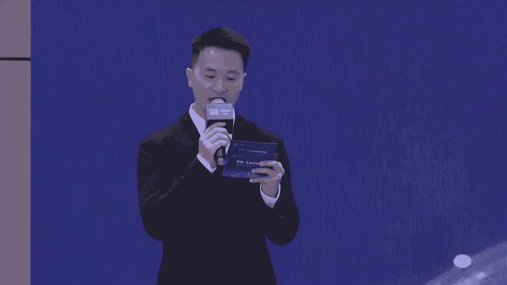
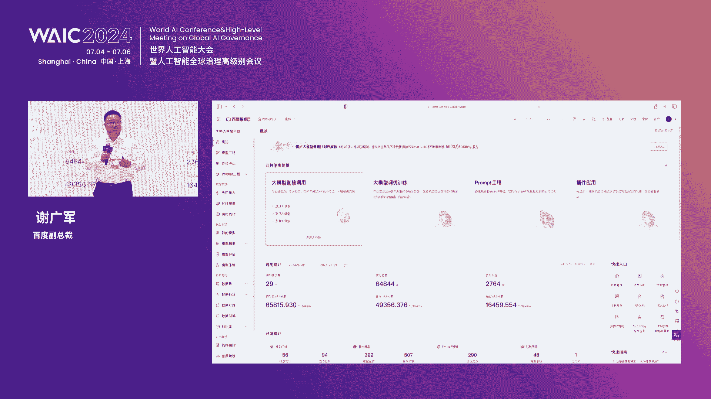
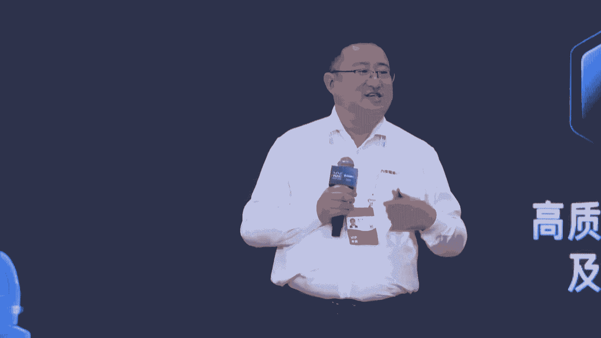
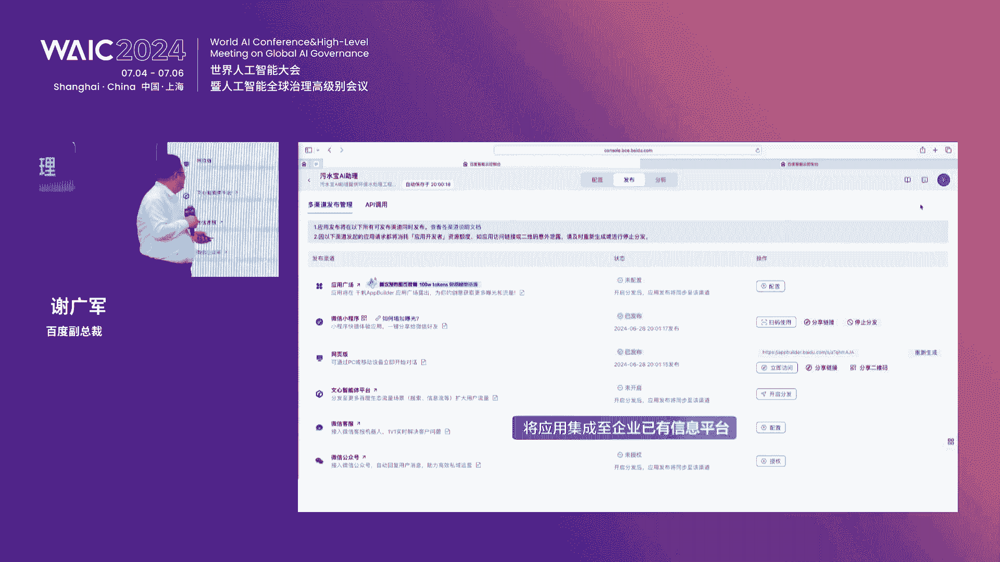
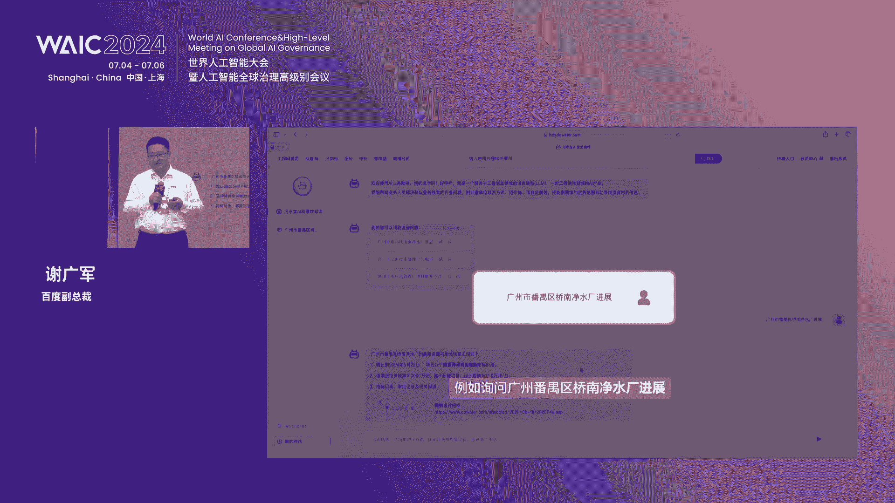
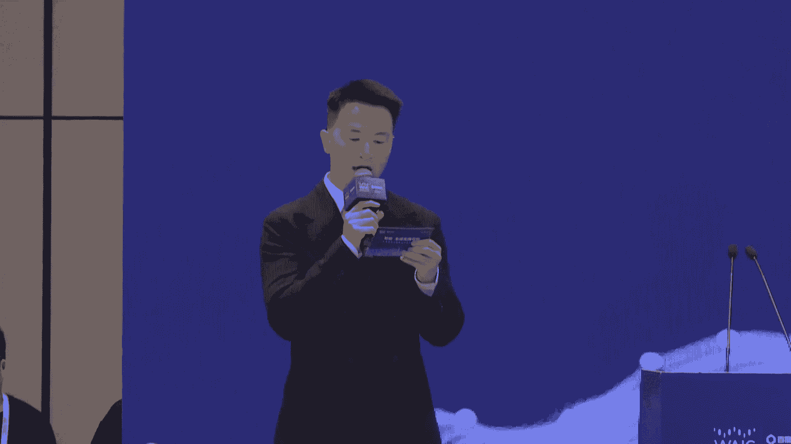
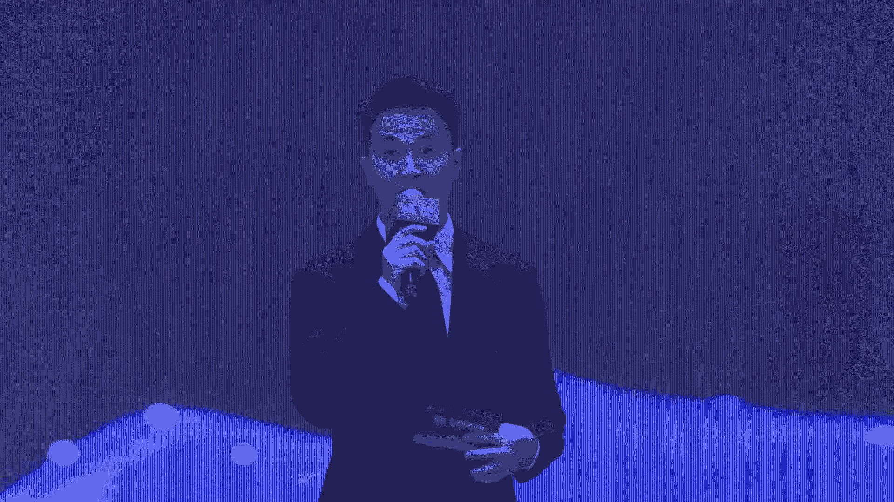

# 2024世界人工智能大会（合集） - P17：20240705-智能，生成无限可能——大模型助力新质生产力发展论坛 - WarrenHua - BV1iT421k7Bv

尊敬的各位领导，各位来宾，女士们，先生们，以及正在线上观看我们本次论坛的，各位观众朋友们，大家下午好，欢迎各位来到由百度智能云主办的智能家，生成无限可能，大模型，助力心智生产力发展论坛，大家好。

我是主持人尹志龙，非常开心，也非常荣幸与大家相聚于美丽的上海，来共同参加全球人工智能领域的顶尖盛会，近年来，AI大模型在以前所未有的速度改变着，重塑着我们的生产和生活，从智能制造到智慧医疗。

从金融科技到教育创新，从智能交通到环境保护等等，而大模型以及强大的数据处理能力，深度学习的洞察力以及跨领域的泛化能力，正在重新定义行业的边界，打造大模型时代的心智生产力。

千行万业迎来了前所未有的变革和机遇，百度是拥有强大互联网基础的领先AI公司，那作为一家以技术为驱动的公司，百度的云计算与生俱来，一直是百度的核心能力之一，百度智能云始终致力于为企业和开发者提供。

全球领先的人工智能，大数据和云计算服务以及应用的开发工具，多年来，百度智能云践行云智一体战略，推出AI原生技术站，满足客户在AI原生时代的不同业务需求，全力赋能千行万业，加速推进产业智能化。

那在本次论坛的现场，我们也非常荣幸地邀请到，人工智能领域的研究者，他们将会从不同视角来分享大模型，如何赋能产业升级，来解决实际问题的经验和洞察，那首先请允许我为大家隆重的介绍。

出席我们本次论坛的各位领导及重要嘉宾，管委会主任王万征，欢迎您，欢迎您，欢迎您，欢迎您，欢迎您，无锡惠山经济技术开发区，政务服务局局长廖振华，欢迎您，欢迎常州市第一人民医院院长周军，欢迎您。

百度副总裁石清华，欢迎您，百度副总裁谢广军，欢迎您以及到场的50余家的企业主要负责人，让我们再次对各位的到来，表示热烈的欢迎和衷心的感谢，欢迎大家，接下来让我们掌声有请。

百度副总裁石清华为本次大会致开场词，有请，大家好，我是百度石清华，首先特别欢迎大家呃，今天下午的时候在WIAIC会上，我们一起商讨一下，大模型如何和行业进行结合呃，今年5月份的时候呢。

给大家讲了一个故事，就是毛竹的生产，生产的初期在好几年都埋在地下边呃，拓展根系，但是一旦它破土而出，在短短的几周就可以长到十几米，十几米的高呃，就是所谓3年不长，一夜千尺，现在人工智能和大模型。

跟毛竹的初期的生产，生长的情况是非常的相似的，大模型的应用落地也有类似之处，虽然我们现在还没有看到呃，非常大的爆款的应用，但是在过去的一年，大模型已经的确开始在扎根行业快速的渗透，而且我们观察到。

前所未有的积极性和创新性，创新力，甚至在某些领域要领先于我们互联网大厂的，我们在内部商讨，从战略的洞察来看，在未来3年大模型最大的机会其实还在应用端，包括科技企业国。

央企和大型民营企业都会吃到第一波的嗯，比较大的红利，大概在两三年之后才有可能在C端出现一个，颠覆性的产品啊，我们叫ka app，而且大概率会出现在创业公司，所以说呢现在百度在做的事情。

就是要为这些企业提供最好的模型和工具，不断的去降低呃大模型的使用的门槛啊，这里面有个关键关键词，叫做大模型的使用门槛呃，这一段时间啊，呃其实说实话呃，在这半年是在很多地方去去跑了，很多地方。

也跟很多企业聊过，现在大家的关注点是关注两个关键词，第一个呢叫做产业，第二个呢叫做场景，在这里呢也借这个机会跟大家谈一谈，我的一些感想和看法哈，包括今天上午去接受采访的时候呢，大家问到第一个词就是啊。

尽管你认为大模型的产业在哪里，我觉得这个问题非常好，然后呢，也是我们呃政府领导们特别关注的产业在哪里，现在从百度的时间来看，这其实是一个很大的一个产业，从下到芯片，因为人工智能肯定是需要算计之基础的。

芯片呢现在大家也知道这个国际上的格局，那么在国产算力上面的算力供应，和在国产算力上面的算力保障，以及它的稳定的生态，这是很大的一波的生态呃，另外一个呢就是在关于大模型的使用，和大模型的呃。

模型级的一些训练，因为现在大家基本上越看越清楚了，就是真正的通用大模型，那肯定是要投入海量的资源来给研发出来的，比如百度在研发我们的通用大模型，也就是我们文戏模型啊，包括语音大模型，还有视觉大模型。

投入是非常大的，这个呢是需要有很强的财力和战略定力，才能给他做出来，那么更多的呢，其实是在应用端里面的锤炼大模型，我相信在锤炼大模型上是一大波的产业机会，另外一个呢就是呃大模型和行业的结合。

在具体的应用场景里面落地上面，这又会催生出一大波的创业型的公司，或者是说现在信息化转型的公司，他们也是一大波未来的动力，这是第一个叫做什么呃，我们眼中的产业，第二个呢就是呃在这里面场景到底怎么去落。

现在百度呢是自从我们把大模型做出来了之后，然后那个呃洞察力还是比较强的，就像之前robin就是百度的董事长李彦宏总呃，它一直在我们内部强调的是说，大模型本身其实没啥没啥价值，它本身呢就是一个模型。

就是个算法，就是个工具，他只有把这个用到某个场景里面去了之后，它能够产生价值，所以说呢百度呢是在这两年，一直在不停地寻找和实践，这个大模型到底在哪儿，能够用得上去，用上去了之后的结果怎么样。

到底是给企业降本增效了，还是给企业增强它的内部的企业管理了，还是说给企业它的产品力又附上新的能量，不管是它的销量更多，还是它单体价值更高，我们就一直在探索这些落地场景的呃，回答上面之前呢。

我们的做法特别简单啊，就是因为呃百度去做大模型的，技术专家还是比较多的啊，包括刚才跟王主任在聊啊，但是呢在跟行业的结合上面，行业大模型不知行业嗯，这就是一个很大的问题，那么行业呢它不知大模型怎么用。

这也是个很大的问题，那么过去的两年，其实我们就一直由由走在这个结合点上面，产生了很多的合作，最开始我们的合作的pipeline说实话很少啊，是因为那个时候我记得大概在两年前呃，我们的技术专家。

然后走到企业去，走到应用场面去，然后呢我们自己亲自下场，然后在这里边一点一点，搞清楚这里面的业务逻辑，再搞，搞清楚这里面的呃业务流程，生产工艺去给企业去做深层次的服务，那个时候我们叫做深入产业过程当中。

很欣喜的看得见他真的是能够帮助到企业有用，但是呢我们也很焦虑于说，我们的资源和我们的人其实不多，资源有限，那么后面呢我们就想了个办法，就是把我们呃，首先第一波是百度用大模型自己去呃。

按照robin的话说，就是不叫不叫改写啊，也不叫改造，而是叫重构，我们先把自己重构了一遍，把自己重构的经验，再带到第一波的企业服务里面去，然后呢又跟企业一块又重读了一遍，那么后面呢我们就逐渐有意识地。

把这些重建的重重构的经验，以及重构的技术的组件和，重构的行业的NO号和重构的最佳实践，都逐渐地落入到我们的平台，现在呢我们的平台呢基本上服务了，超过10万多家企业和500多个行业的应用场景。

和大概几10万的原生的应用，这个呢我觉得就具备了更大规模和更大范围，去突破场景的限制的可能性啊，待会儿呢呃我们同事呃，呃广军总会跟大家再介绍一下，我们长时间积累和最佳实践，封在里边的前方平台。

就在现在目前为止，百度呢已经搭起了一套比较完善的，AI加企业服务，包括刚才提到的千帆平台，这套服务的体系的内核，其实就是我们在今年4月份发布的，智能计算操作系统，万元，这个万元呢呃就包括刚才说的产业。

也刚才包括说的场景，从下面的芯片到最上面的场景，落地的解决方案，还有给大家准备好的，最佳的实践都封装在这里边，现在呢千帆已经成为呃中国企业最最受欢迎吧，也不能说最受欢迎。

应该是的的确确是受众最大的大模型的平台，在这里边呢，也具备了最完备的工具链，和各个企业的服务的农耗，并且他现在还在持续的进化，在这个通用能力之上，我们，为了更好的去服务行业，还做了千帆的呃增强版。

增强版的意思呢就是说因为我们在行业里面，大家在这里边都是清理很长时间的老专家嗯，比如说我们在交通有交通独特的行业逗号，在政务有政务独特的行业逗号，还包括工业，还包括呃呃运营商等等。

我们呢又在这个通用的千帆平台之上，又增强了我们的行呃，千帆的行业增强版，比如说工业版，交通版，政务版，金融版等等，这样的话呢，就又进一步的去降低了我们行业，客户的使用门槛，稍后呢我们的客户。

我们的行业专家会在这里跟大家分享，我们在教育，交通政务，工业等领域的创新成果，当然最后落脚点还是大模型的，真正的应用价值在于应用，在于场景，我们也正在联合行业里面最专业的合作伙伴。

做最后一公里的交付培训和服务，加速企业的应用场景的创新，就如最开始所说，就像毛竹一样，人工智能和大冒险正处于产业爆发的初期，这也是我们很多城市在抓住的一个，近几年来最绝绝佳的机会。

新一轮的破土时刻即将到来，百度也希望和客户伙伴一起，输深度的去拥抱人工智能，让智能生成无限可能，谢谢大家好，非常感谢石清华先生为我们带来的精彩，至此，请您先起落座，谢谢。

那接下来的时间段呢让我们掌声有请，管委会主任王万征为我们致词，有请王主任，啊尊敬的清华副总裁广军副总裁，各位领导嘉宾朋友们，很高兴在黄浦江畔，在世界人工智能百度智能云论坛上，和大家一块共商发展。

共谋未来发展，也是一个重要的着力点，那么作为新资生产力最典型的代表性技术，人工智能已经成为这一轮科技革命，产业变革变革的关键力量，这次论坛以大模型助力心智生产力为主题，共同探讨大模型重塑千行百业。

我觉得是恰逢其时，恰到好处，我们都知道呢，百度集团作为全球领先的人工智能平台型企业，在深度学习人工智能的操作系统，自动驾驶AI芯片前沿领域，应该说有全面的领先优势，现在走访啊，我们管招商啊。

走访很多无人驾驶企业，基本上都是我们百度出来的啊，赣江新区是全国第18个中部地区，第二个国家级新区啊，我们上海拥有浦东新区，所以我们是浦东新区的弟弟啊，赣江新区正正在数字化的浪潮中破浪启航。

我们呢主要聚焦人工智能，数字经济这些领域啊，作为主导产业，而在江西省率先出台数字经济的相关精准政策，产业方面呢，我们也吸引全国的工业互联网传感器供应商，海克斯康等一批的企业落户赣江新区，产业生态方面。

我们也围绕这个生态，打造了个200亿的产业基金，100亿的引导基金，还有50亿的未来产业基金，还有20亿的耐心资本，之所以达到这么多的元素啊，主要是为了数字经济国家综合园区的发展，奠定一个好的生态基础。

今天特别高兴，我们将和百度集团围绕数据要素开发利用，建立更加紧密的合作关系，并逐步探讨在人工智能基础设施创新应用，人才培养，特别是刚刚清华副总裁提到，我们想在这个垂直大模型助力新的生产力上啊。

赣江新区出场景啊，这个百度啊，出这个数据，人工智能的这个系统，我们能够共同走出一条，发展新的生产力的创新之路来，我也相信我们的携手，必将收获互利共赢的工作成果，也希望能成为政企合作的成功典范。

赣江新区将以这次合作为契机，乘势而上，构建国际国内一流，江西领先的人工智能产业环境，我们也将聚焦这个主赛道，不偏离啊，做好政策支持，配套完善，服务优化的组合拳，同时做好全面的服务保障，在这里。

我也向今天参会的很多企业家做出诚挚的邀请，邀请大家共同加入这个生态系统里，来，大模型助力薪资，生产力肯定不是一个地方，一家企业要大家共同来构建一个完善的业态，当然他还需要一个富有改革精神的政府新区。

国家有19个国家先驱的初心使命，就是改革发展的功能区，这是我们的主要职责，所以在新的生产力的发展，新的构建新的生产关系方面，这是我们的主责，主责主业，最后预祝本次活动圆满成功，祝各位嘉宾事业兴旺。

身体健康，家庭幸福，谢谢大家好，非常感谢王万征主任，我们带来的精彩之词，以及我们送上最诚挚的祝福，请您入嘉宾席落座，谢谢亲爱的朋友们，那接下来的时间段，我们将会诚挚的邀请大家与我们来。

共同见证一场意义非凡的签约仪式，那这不仅仅是合作双方的新起点，更是共同迈向辉煌未来的重要一步，在这个充满机遇与挑战的时代，各方凭借对于行业的深刻洞察，和远大的发展愿景，决定携手共进。

接下来让我们掌声有请，本次签约嘉宾，百度智能语音代表以及政府领导，让我们欢迎百度智能云代表，百度智能云华东区总经理吴军华，接下来让我们有请政府领导，赣江新区管理委员会代表，开放发展局局长王红梅。

乌镇大数据高新技术产业园区管理委员会代表，乌镇大数据高新技术产业园区党工委书记袁杰，浙江鹿城经济技术开发区管理委员会副主任，南鹏程，松阳综合交通产业链专班主任叶江浩。

无锡惠山经济技术开发区管理委员会代表，徐州市云龙区汉丰街道副主任张安乐，有请，接下来让我们欢迎本次签约仪式的剑仙嘉宾，让我们有请百度副总裁石清华，赣江新区管委会主任王万征，无锡惠山经济技术开发区。

政务局服务局局长廖振华，有请我们的各位剑仙嘉宾，站在我们的签约代表的右后侧，为我们来共同见证这个特别的时刻，好有请各位签约领导来拿起我们的签字笔，在我们的pad上签下各位的姓名，321，请签约。

祝贺签约成功好，请各位稍作等待，来有请我们的各位剑仙嘉宾向前一步好，我们共同看向前方摄影老师的镜头，来记录这美好又隆重的时刻，好我们第二张来竖起点赞的大拇指，为本次签约来共同庆贺。

让我们再次把掌声送给我们的各位见亲人，以及签约领导，谢谢请各位先行落座好，同时有请吴军华先生稍作留步，那刚刚的时间段，我们共同见证到了百度智能云，与我们政府领导的共同签约。

接下来我们将会进入到第二轮签约环节，百度智能语音代表以及企业代表，首先让我们欢迎百度智能云，华东区域总经理吴军华，接下来让我们有请企业代表，绍兴滨海新区发展集团有限公司，副总经理彭杰正。

哪吒港航智慧科技上海有限公司总经理黄恒，浙江省交通职业技术学院校长陈凯，上海电子信息职业技术学院校长方林中，云南经济管理学院董事长何雨山，浙江颐高智慧科技发展有限公司总经理李金洋，上海纪行信息技术有限。

祝贺签约成功好，请各位稍作等待，我们共同合影，有请摄影摄像老师记录这精彩的片段，好同样我们竖起点赞的大拇指，为本次签约来共同点赞，亲爱的朋友们，让我们再次响起热烈的掌声。

送给我们的各位签约企业以及我们的百度集团，谢谢好，有，请各位一部嘉宾式落座，谢谢，的确如此，我们签约仪式的激动时刻，还萦绕在我们各位的心间，那相信啊，我们通过本次战略合作。

双方定能在未来的发展路上披荆斩棘，实现共赢，为行业发展注入新的活力，书写新的辉煌篇章，亲爱的朋友们，接下来我们精彩继续，那今天我们也非常荣幸地邀请到了，百度副总裁谢广军。

他将为我们带来智己新时代千帆大模型平台。

引领产业智能化浪潮的主题分享，接下来这段让我们响起热烈的掌声，欢迎谢广军先生，有请，尊敬的各位领导，各位嘉宾，大家下午好啊，我是百度的谢广军，今天呢我分享的主题是智启新时代，千帆大模型平台。

引领产业智能化浪潮，那么刚才清华也在讲哈，就是我们这个3月份的哈，其实这个呃神斗博士在讲哈，就是今天的这个大模型呢，它的整个这个应用哈，它的整个这个产业落地，就像这个毛竹这种植物一样哈。

其实在很长一段时间呢都在孕育它的根系啊，今天呢其实我们看到了非常多的这个企业，或者行业的这个场景，他都在积极地拥抱，在尝试大模型如何落地，那么可以说呢，今天大模型真的是说。

已经渗透到我们生产生活的这个各个方面，那么我们从去年3月份，我们发布了这个文心一言大模型哈，3月底我们发布了这个，我们的这个千帆平台之后哈，我们也明显地感受到，其实在整个这个大模型落地哈，到现在为止。

我觉得可以总结起来分成几个阶段，去年很长一段时间呢，大家其实在这个大模型这块的投入呢，更多的都是在在在找卡在训练，所以呢出现了所谓的这个百魔大战啊，那从今年去年年底开始呢，一直到就是今年这个年初哈。

确实就是说哎我们很多模型ready了啊，或或者很多模型呢其实现在也在探索，就是怎么在场景当中落地，可以说呢非常多的这个企业啊，非常多的开发者在积极的探索，这个整个的这样的一个大模型。

落地的这样的一个场景和路径，但其实呃其实整个这个大模型呢，在我们这个生产生活当中啊，大家探索的这个渗透程度是非常非常高的啊，甚至比这个之前的人工智能渗透程度更更要高，那么到目前为止哈。

嗯现在是这个7月份，我们从上个月哎我们会发现哈，现在其实也迎来了另一个转折点，就是确实是说之前探索的一批这个大模型的，这个落地场景啊，有一些实际上跑出来了，也就是这个毛毛竹呢要破土而出了。

所以那今天呢确实就是我们的判断是说，从今年下半年开始啊，真的是说大模型的这个应用的这个产业，落地的这个时代就要到来了，所以呢我们今天其实从这个大屏幕的数字上的，也可以也也可以看到哈。

其实今天呃整个的行业渗透率，大模型的行业渗透率是非常高的，那么从科技到金融，互联网汽车，那么即将迎来大模型应用的落地和爆发，那么在这样一个背景下呢，其实我们百度智能云千帆啊，他的整个这个成长呢。

也见证了这样的一个过程啊，呃我们从5月份的这个时间统计呢，哈其实我们千帆大模型平台上调用，我们大模型，一天的这个调用次数已经超过了5亿次，那么呃比上一个季度，比比一季度环比增长其实翻了一倍还要多。

那么我们今天呢千帆服务的这个客户数呢，有15万家，那么累计模型在我们这上面，开发模型的这个模型数有2万多个，那么千帆应用的开发数呢，已经达到了55万个应用啊，那么从这些数字也可以看出啊。

大模型确实在加速的落地，加速的成长，那么有一个今天呢，其实我们有一个大模型的支撑平台，就非常的这个关键了，其实百度呢从去年我就我们就在打造，这个整个大模型的，整体的产智能化落地的这个技术站。

我们今天呢还是给大家回顾一下啊，基本上分成了这样的三层，那么首先呢是我们的这个算力层，我们的这个百度百舸异构计算平台，它是稳定高效的啊，那个易运维的AI异构原异构计算平台，那么呢我们的千帆啊。

它是一个大模型，千帆model builder啊，它是一个大模型的这个开发平台，它不仅预制了，就是我们百度自身的文心研的系列模型，还有各种这个开源模型和三方模型，同时呢更重要的是说。

它提供了一整套大模型开发的工具链，那么再往上呢，其实是说我们有了模型呢，要开发A所谓的AI原生应用，这个之之中间的其实是需要有一个好的，一个平台支撑的，所以呢我们还有这个千帆的app builder啊。

它是AI原生应用开发平台，通过app builder呢，我们能够极大的让用户简化AI应用的开发，那么最上边一层呢，是我们基于这个我们的千帆平台，第一方开发出来的AI原生应用。

那么呃我们先从下往上给大家介绍哈，这最近的一些进展，那么先看我们的这个百度百舸AI异构算力平台，那么今天呢其实企业有一个非常重要的需求，就是大家都觉得这个大模型时代来了，芯片非常短缺，芯片呢也非常贵。

算力贵，算力荒，那么对于企业来说呢，他就面临着说哎我同一个集群里边呢，会有不同时代的不同品牌，不同厂商的俗称，卡对吧，那么这些那么这些卡呢怎么样在协同工作，怎么样，就是说能通过一个集群能训练一个任务。

这个时候这个呢是企业的普遍的需求，但是这件事很不幸是一个非常难的一个事儿啊，今天呢其实百度百舸呢，也解决了这样的一个问题，那么我们其实通过这样的一个多心亦云，多新真正的易购呃加速的一个方式呢。

其实达到了这个多勋协同训练的这样的一个，平台的一个目的啊，那么大家其实可以看这个数字哈，我们呃我们的测试哈，白卡混合训练的效能达到了，就是单一芯片的97%，那么显卡呢也达到了呃。

训练效能呢也达到了95%，那么可以说呢其实这是业界最好的一个效果，那么通过这样的呃百舸百度百舸计算平台呢，我们能够实现最佳的一个计算效能，这个呢其实在很多企业当中应用呢。

也给大家节省了大量的这个算力的成本，那么有了算力层呢，我们再看我们的这个模型开发平台，我们叫千帆的model builder哈，那么我们首先有一个观点哈，今天在大模型时代落地哈。

用好模型与用好模型同样重要，也就是说我们不仅要有好的模型，还要对模型有好的使用方式啊，那么首先呢我们先看好模型哈，今天呢也给大家大家带来了一个，我们文新系列模型的这个全新的这个发布哈，我们叫做呃。

我们的文心4。0和你4。0的这个turbo版本啊，那么面向企业全面的开放，那么它呢其实整体呢也是我们中文领域最好的，性能最强大的这个模型啊，我们也是这样的一个定位。

那么在这样的一个啊最高级别的这个模型的，这个啊定位下呢，它具备就是更强效果更强，性能更快，价格更低的这样的一个优势，那么价格低到什么程度呢，大家看哈，其实我们呃现在的这个定价是输入是千tokens。

三分钱，输出是六分钱，这个相比就是说我们原来我们的这个啊集呃，之前发布的这个呃，我们自身的这个文心4。0呢，其实大家可以算一下，其实在整个的这个呃通用的这个workload下哈，一般是输入长输出短。

输入和输出呢，我们线上平均的统计是大概是三比一，如果按三比一的输入，输出的这个长短的统计下呢，其实我们可以算一下，其实相比这个我们的这个4。0的通用版本的，其实降价幅度应该是达到了70%啊。

那么今天呢其实我们也感受到哈，其实大家呃在应用大模型的过程当中呢，其实整个啊这样的一个成本呢，在探索的过程当中呢，其实还是聚焦这整个这里边的一个，成本的这个投入啊。

尤其是算力算力成本或者模型调用成本的投入，所以今天呢我们的这个系列模型，不仅是全新发布欧尼四哈，我们的这个系列模型，也迎来了大幅度的这样的一个降价啊，大家其实可以看哈，到底降了多少啊。

我们的这个旗舰模型讹你3。58K，那么从呃一分二啊降到了这个四立体，我们的3。5128K哈巴里啊，然后这个呃原来这个4。0啊，我们从输入从一毛二降到了四分呃，其实整个降价幅度呢是非常大的。

那么同时呢我们的主力模型啊，early speed啊，early light这样的模型呢其实还是面向全社会呢，能够免费去使用啊，所以其实刚才讲到了这个好模型，那么用好模型怎么样用好模型啊，也一样重要。

那么我们千帆的model builder呢，一直致力于提供一个领先的呃，模型开发的工具链，那么今天大家看哈我们的这个切换model builder了，已经就是呃贯穿了整个模型开发的全流程。

从我们的这个数据管理到模型的训练精条，到模型评估优化，再到这个推理训练服务，以及我们的整个proud pro的工程啊，这个其实呢各个环节啊，我们都有设计整个这样的一个呃环下来呢，其实我们过去啊。

一个季度呢也有非常多的这样的一个升级点啊，比如说像我们支持的更多的LAURA，金条的方式等等，那么总结起来呢就是包括两部分，一部分就是模型效果会更好啊，我们支持这种新的这个DPDPO啊。

KTO这样的呃人类对齐方式，使得整个这样这样的一个更符合呢，我们模型使用当中的人类用户的偏好，那么同时呢在成本方面呢，其实我们呃推出了这个更具性价比的这个模型，量化压缩的这个方法啊，比如支持WT8啊。

支持PDQ的这种方式，使得整个模型的这个推理的性价比更高，那么也使得它整个推理的延时呢能够更低，那么这里面呢还有一个非常重要的升级点，而且也是我们独家的一个升级点。

就是我们在千帆平台上提供了混合混合训训练，训练数据的功能，那么我们呢在千帆平台上，预制了大量的这样的一个数据样本，当然这个数据样本是可用不可见的啊，他解决什么问题呢，今天我们模型开发呢。

比如做SLOT会面临两个问题，一个是说呢我们经历了这个模型的FTR，SFT之后呢，其实这个模型往往会遗忘这个通用能力，那么怎么样恢复这个模型的这个通用能力，这是一个问题。

第二个问题呢就是我们其实很多企业用户哈，再去做这个模型的FTON的时候呢，他会发现我的垂直方向的这个语料，我的这个指令数据不好或者是不够多，那么也影响到我三天之后的这个效果。

那么通过这个我们千帆预制的这样的一个，数据增强功能呢，能够完美地解决啊这两个问题，那么我们可以给大家举一个案例哈，首先我们在千帆model builder上打开模型，金条sf t点击创建训练作业。

在训练的数据配置中选择混合训练功能，想要保证通用能力，可以选择通用混合饮料，想要补全数据量少的情况，可以选择垂直领域语料，在垂直领域语料这里我们提供了多样化的场景，任务类型，完成配置后，一键开启模型。

金条，在实际应用了这一功能的百度健康助手场景下，单用sf t以及垂直领域语料增强后，SFT的效果对比，我们发现增强后的模型在回答上能够正确选择，且回复逻辑更加清晰，嗯大家看。

这是我们在百度的健康助手里面的一个啊，通过语料增强的一个实际应用，通过这种垂直语料的正，它解决的是垂直语料的增强问题，通过这样的一个方式呢，使得我们模型评估下来的这个优质内容，占比提升12。5%。

这个呢其实就大大提升了这个业务的效率，那么呃其实企业在使用大模型的时候呢，非常希望就是我这个模型效果呢追求到极致，会越来越好，那么怎么样使得这个企业使用模型的时候，这个模型能够是随着我这个场景的迭代呢。

越用越聪明啊，这个可能是这是大家一个比较重要的事儿啊，那么怎么样让他变聪明呢，这里边数据非常重要对吧，所以呢，其实我们今天的千帆平台，也给大家提供了一个新的解决方案。

能够基于千帆平台去构建企业应用的这个，自身的这样的一个数据飞轮，大家看哈，我们在线上使用自身精条后的这个模型，其实呢我们千帆评弹的，也提供了这种数日志回流的功能，通过这个日志回流，然后呢再加上这个筛选。

我们就能筛选出一批样本来，那么这些样本呢，可以一键的导入到我们的这个标注中心啊，我们标注中心呢其实有这个人力，能够自动化的承接这样的一个任务，可以让大家呢其实来去做这个SFT的，这种大模型的标注。

那么当把这样的一个精标数据哈，那么我们就可以拿回来，进行二次的SFT这样的一个训练，那么训练好的模型呢，其实我们还有一套自动化的这个评估方式，那么看一下和老明星相比，它到底是功能增额。

性能增强了还是减弱了，如果是增强了，你就可以继续上线，这样周而复始的去迭代，周而复始的去迭代，使得这个模型呢在您的使用场景当中哈，会越用越聪明，这样的一个方式呢，其实在呃在这个千帆的这个平台上啊。

我们能够完美的去解决啊，那么有了这个模型哈，其实我们离着这个AI原生应用场景落地呢，其实还是有gap的，用户呢是需要有一个更好用的，这样的一个AI原生应用的这个开发平台的。

所以呢从去年其实我们在做这个app builder，这样的一个产品，那么今天呢也跟大家汇报一下，从3月份发布会之后哈，apple builder的一些这个进展，首先呢其实在工具组件层面哈。

app builder工具层层面哈更加的完善啊，我们这里边提供了非常多的啊工具组件啊，多达60多种啊，包括这个啊，其实基础云的组件AI能力，组建大模型组件等等，第二个呢就是说新的升级呢。

就是我们完善增加了交互体验，今天呢我们独家推出了这种3D数字人的，这种啊呃应用开发的这种这种这种体验啊，这个呢可以跟大家放一个视频看一下哈，您好，我是宠物小管家，有什么关于宠物的问题都可以问我。

无论是饲养训练，健康还是日常娱乐，我都会尽力提供帮助，呃，从一开始呢，就是说大大家可能开发出来的应用呢，就是一个对话bot，今天呢我们可以开发出一个这个数字人啊，用语音用数字形象的方式来进行这个交互啊。

第三个呢就是说我们其实在app builder里边呢，可以选择更多源头的模型，我们刚才讲到的model，builder上的这个模型，都可以用于builder的这个思考模型和生成模型。

包括用户如果觉得模型效果不好，可以在我们刚才讲到的model builder上去训练，去优化，然后呢再加上自己的这个应用当中来，那么除此之外呢，啊其实我们还有一个非常重要的能力升级。

也就是工作流编排生成组件啊，这样一个能力，工作流呢，本质上就是把业务流程，通过一步步的这个人工编排啊，给它梳理好，那么使得整个大模型呢，具备一个这确定的执行过程，那么通过这个呃工作流呢。

可以帮助我们做自定义的这样一个组件，我们今天的工作流组件其实有这么几个特征哈，要发布，第一个呢就是多元化的，多样化的节点类型，我们提供了工作流，可以串联知识库，可以串联大模型API。

我们的这个代码块的等等，第二个呢，就是说我们这个整个通过画布拖拖拽拽啊，这样的一个呃可视化的流程设计，使得整个这个开发呢不用写一行代码，其实是更简单的一个方式，那么第三个呢其实呃根据用户的需要呢。

我们预制了多种工作流画布哈，多种工作流画布的这种啊构成啊，其实呢这个也满足不同程度的这样的一个需要，其实工作流这种模式的出现哈，极大地延伸了整个这个应用开发的，整个这样的一个呃scope啊。

能够使得整个应用的哈，它它能够覆盖的范围更广，那么第三个呢，其实就是说从用户开发出来的AI原生应用的，它往往需要曝光，需要流量，那么今天呢我们也对接了多元化的这个渠道，包括百度的生态啊。

包括呃微信的生态，手机开发者的生态啊，内容流量啊，web端H5，也可以通过SDK呢集成到自己的这个端内啊，按native app上面去呃去去进行这个交互，那么可以说呢，覆盖了很多主流的这样的一个渠道。

那么同时呢其实我们今天特别要提的一点，就是说我们马上就是今年呃7月份哈，我们就会打通，就是说在我们app builder上，平台开发的这样的一个应用，可以直接一键注入到百度的搜索生态里边啊。

通过这个百度的搜索生态啊，来去进行这个导流啊，那么另一个很重要的这个啊，千帆爱builder的发布点呢，就是呃在我们的这个rap领域哈，呃rag领域，可以说是rag这样的一个事物的出现。

其实是极大的增强了，就是呃大模型的这样的一个外部知识，所以呢其实使用非常非常广泛，对于啊知识库来说啊，首先呢对于知识库来说，可扩展的增强啊，其实是非常重要的，那么今天呢我们发布的是企业级的一个知识库。

数据增强，那相比我们原来的这样的一个呃这个知识库呢，啊它具备几个特征，第一方面呢就是这个扩展性，那么我们其实接入了整个这个打通了整个，百度的这样的一个云服务，知识库，可以扩展性的。

可以极大的增强资源的上传，比如说我们企业的文档啊，不管多大，比如说我们都没有限制啊，以前可能每个知识库可能都是都是对于，比如说文档的数量啊，对于文档的这个size啊都是有限制的，现在就是说能够直接打通。

第二个呢就是更重要的还是策略的开放性，今天呢其实有很多这个垂类场景哈，如果是您在这个很多场景里边用rag，它的这个效果没有达到预期，这里边呢其实很多时候呢，可能是这个我们解析文档，或者是解锁策略的问题。

那么我们今天呢是把这个全面的可调，可配的这样的一个策略呢进行开放，也也支持用户进行二次的这个调优，这个呢是一个非常重要的企业级特性，第三个呢就是说还是这个安全稳定性方面哈。

基于我们可以直接对接百度的这个向量数据库，比如像我们的啊BS，包括这个我们可以指指定嗯，比如说百度的这个对象存储啊，作为这个我们知识文档的这个来源，那么这样呢，其实我们的这个安全稳定性进一步的提升。

那么同时呢其实我们这次也重磅发布一个新的，这个很有特色的能力啊，这也是我们这个非常独家的能力。

我们叫做rag with百度搜索，那么通常意义上来讲呢，其实今天因为百度是做搜索引擎的哈，搜索引擎有非常多的这个内容啊，那么通过这样的一个搜索引擎的，这样的一个数据知识源啊。

我们其实可以做到很多垂类的这样的一个，垂类领域的query的这样的一个效果增强啊，比如今天在这个各种IOT端上面哈，它有很多这个啊垂类的这个应用啊，比如说就是嗯比如在大家开车的时候，不断地问交通的路况。

不断的这个问天气对吧，在这个手机上我可以去查菜谱啊，我可以去这个查时政要闻，这些东西呢，其实都是背后是这个百度的这个搜索啊，和我们这个大模型总结的一个结合，今天呢我们有非常多的这样的一个呃。

IOT设备呢，在接入到我们这样的一个新的一个接口啊，那么这样的接口呢其实具备几个特征哈，呃一个一个特征呢，还是满足这个数据源的及时响应，就是很多时效性的问题，比如今天是多少才需要满足啊。

第二个呢还是具备这种小型化的呃，专家模型来实现准确的问答，这样呢其实响应速度它会非常的快，第三个呢还是这个多模交互的这个体验啊，你比如说我们有很多这个阿拉丁卡片，可以去可以可以可以去用哈。

就是说呃比如说我查一个菜谱，那菜谱的这样的一个图片啊，甚至视频内容也都可以出现在这个，整个我们这个对话交互上啊，那么同时呢对于这个咱们国内很多企业来说呢，其实大家想比较迫切的需求呢。

还是说整个大模型落地呢，是落地到我自身的这个企业端，也就是我们通常说的私有化部署，今天呢我们的切翻app builder，也全面的支持了私有化部署，当然这个这个里边其实需求就很多了。

需求主要源于企业的很多数据不能出，不能出自己的域业务定制化程度啊，比较高，或者是这个国产化适配等等啊，这样的一些需求，那么今天呢，其实我们app builder的这整个这个部署方式呢，也非常灵活哈。

一个是公司同战的去部署啊，我们是完全支持的，就是公有云上有什么，在私有云上我们也可以部署到企业端，同时呢还支持一种更灵活的方式，就是说私有化部署，我们的app builder这样的一个框架。

比如我们的这个知识库就可以在这个企业内部，但是呢因为云端的这个大模型更强大，我们也可以在这个基础上呢，让这个app builder呢去调用云端的这个大模型啊，这样呢其实效果会更好。

第三个就是说我呃我们其实在很多行业呢，其实在这个落地这样的一个呃，私有化或者混合云的方式，比如说工业金融证啊，政务啊，能源等等啊，水务这些行业里边，其实呢都收到了比较好的这样的一个效果。

那么呃下边呢其实跟大家分享一个呃，具体的这个案例哈，这是这个北京污水宝处呃科技有限公司，他就通过这个百度切换builder呢，构建了一个叫做污水宝AI助理的，这样的一个应用啊。

那么今天呢我们看一下它的这个搭建过程，也便于大家理解，就是app builder，通过app builder去生成一个应用哈，它有多大多么的这个简单啊，进入首页创建应用，设定基本信息，AI生成头像。

输入角色指令，添加百度搜索组件，添加企业垂直知识库，配置知识库，输入开场白，测试提问，执行知识问答，准确回复，大家看他这个就是查这个非车库信息，呃非常的这个准确，而且这个构件呢其实非常的这个方便啊。

点击发布，经过测试调优后，将应用集成制企业已有信息平台。

例如询问广州番禺区桥南净水厂进展平台。

会根据百度搜索及RAG知识库回复项目信息，清晰显示项目进度体现，各标段中标结果非常非常准确，非常好，结构化输出更多信息，协助用户找到更多好的，那么除了我们这个刚才讲model builder。

builder这样的产品之外呢，其实呃百度智能云千帆呐啊，在过去一段时间，也积累并推出了非常多的，这个行业场景的解决方案，那么什么是常见场景的解决方案呢，还是说我们通过一定程度的这个共性的积累。

使得大家能用这个大模型到底积累了啥东西呢，啊大家其实可以看哈，首先第一个就是说这个很多的这样的一个，行业的这个场景啊，我们有非常多的这个行业场景，在这个行业场景下，我们如何开发模型，今天呢。

其实我们有这个各种行业场景的，这个金条样板间，通过这样一个精条样板间呢，其实可以一键去调试模型，为什么是一键或者移步去调试模型呢，因为你做一个垂类模型，我们在这样的一个精条样板间里。

就把这种垂类的所有的需要的这个配置，数据配比参数配设置都已经做好了啊，你只需要一键啊，就能够调出一个可用的垂类场景模型，那么包括我们的print模板啊，大家知道大模型的使用呢。

其实它的效果和这个print的写法很重，很很很关键，那么在很多垂类场景当中呢，啊那我们沉淀了很多土壤的模板，那么这些模板呢你就照着去填这样的一个内容，就能保证大模型的使用效果更好。

包括我们的这个刚才讲app builder的这种应用，样板间，通过应用的样板间里边，你可以选择相似你需要的这个应用，然后进行克隆，那么你可以一直接可以克隆发布出来，也可以呢修改其中的这个配置。

达到你自身应用的目的，这样呢，极大地降低了应用和模型开发的这个门槛，那么今天呢我们其实越来越多的场景呢，就把这些pr，把这些SFT的方法啊，把这些应用开发的方法就给他积累沉淀下来了。

那么我们到底沉淀了哪些呢，大家可以看哈，这里边就是从教育人士，企业服务文娱啊，医疗非常多的这样的一个场景，通过这些细分场景，就是更加拉低了大家使用大模型的这样的，一个门槛，那么呃今天呢。

其实我们也非常荣幸地邀请到了两位嘉宾，他们都是通过百度智能云，千帆对此业务呢进行了重构，给产品带来了产能和效能啊，那么首先呢我们有请这个杭州全诊医学，创始人兼CEO啊，薛崇博士上台为大家分享千帆大模型。

他们基于千帆大模型平台所做的这个AI，医生助理，那欢迎呃雪童博士，呃谢谢谢总啊，给这么一个机会跟大家分享，我们如何用好模型和用好的模型，去打造一个智能医生助理啊，为什么要打造这么一个智能医生助理呢。

我觉得医生的工作非常繁忙啊，我自己也是个医生，那么作为一个医生的这个创业者呢，我一直想解决医生他医生的一个问题，由于中国的医生非常忙，一天要看很多的病人，应该是全世界最累的这么一个职业。

那么每天的手术量，门诊量是超大的，那么这医生的真正的这个让他职业倦怠的，一个很大的一个原因呢，实际上是书写病例，这个在美国也是一样，不论是在美国还是中国，就是第一原因，让这个医生觉得他觉得干这个活不好。

不好玩的呢，是他的这个速写病历，所以呢我们实际上A这个医生助理呢，第一个活呢给医生做的呢是病历的书写，那同时呢医生每天都要跟病人讲很多的话，那么这个问答的这个过程呢。

是不是也可以让AI去帮他提前的做一些的问诊，那么我们也可以让AI的这个医生的助理，去做这个这第二个活，第三个呢医生在繁忙的工作当中呢，他要做大量的决策，这个决策呢他容容易出错。

那么这个是不是用AI也可以去帮助他，那么基于这三个点呢，我们做了一款AI的医生助理，实际上在A医生助理这个职业在美国是有的，但是在中国最忙的这么一个职业，在中国却没有这么一个医生助理。

所以呢我们基于千方大模型的这个底座平台呢，我们开发了一个给中国的医生，开发了一个医生助理，那么这医生助理呢，它具备得具备什么样的能力呢，首先它得具备听说读写四项能力，听他能听懂病人的倾诉。

说他能够模拟医生去问病人，去采集病史，读才能读懂医生病人的化验单和检查报告，写他能输出所有医学的诊断，甚至和输出定义，那么我们这个诶助理呢，现在呢已经在国内的一些医院在使用了，包括今天的咱们的嘉宾。

这个常州人民医院的周院长，他们的医院呢也在使用，我们通过AI呢去提前帮医生做预诊，去在诊室里面呢在医患对话的时候呢，有个助理相当于AI在边上聆听医患的对话，去自动写出他的病例。

甚至写出他的这个一些用药的一些也医嘱，那么最后让医生去确认在病房查房的时候啊，助理呃AI呢就给跟着医生一起去查房，那么在手术的时候，医生做完手术以后呢，只要跟AI说一下，我今天做了他什么一台手术。

那么AIH可以把它疏解出手术记录啊，这个在美国是医生做完手术以后呢，会拎起一个电话机打一通电话，实际上是个录音电话，把这个录音电话呢，传给他的真正的那个人的助理去把他敲出来，有些呢是传到印度。

甚至孟孟加拉国，把它去写这个病例，那么以后的在这样的一种方式下面呢，我觉得医疗的方式会发生改变，以前的是叫医患的关系，未来的关系呢会是个医患AI3者的关系，AI干AI的活，医生干医生的活。

医生会留出更多的时间去关爱病人，去做决策，去做治疗，那么另外一个问题呢，到底AI会不会加深这个数字的这个鸿沟，实际上现在的互联网医疗也好，互联网的这些这些发展以后呢，有一些不识字，不会讲普通话。

甚至不会打字的人，连病情都描描述不清楚的人，反而在加深了这个数字的这个，医疗服务的数字鸿沟，他很难获取便捷的去获取那些号，在那些很会网络上面挂号的人，他很容易抢到号，反而是那些年龄大的人。

他就他就比较难做到这一点，那么我们希望AI呢它第一通过多方言的识别，通过这种语音之间的自然这种对话，他让这些不会打字，不会讲普通话，不会实质甚至描述不清楚的人，他可以在家里面提前跟AI狠狠的去交流。

那么把他的这个病情描述清楚，在看病的时候呢，也可以帮他约上号，那么这些过程呢，是我觉得AI接下来是会打破这个嗯，或者是弥合数字鸿沟的，那么也有那些顾虑的是，AI会不会让医生变弱了，或者说能够去替代医生。

那么这一点呢我刚好有不同的观点呃，就像AI让百度的搜索反而变强了，我们就要加强搜索是吧，增强搜索它会让搜索变得更强，那么医医医疗这个行业一样的，AI是实际上是可以让医生变得更强。

首先它可以腾出医生大量的时间去做更高级的，这些诊疗的这种手术的这种训练和探索，它可以让医生腾出更多的时间去，真正的去关心病人的时候，他反而能够更好的去发现这些病情的一些变化，所以呢这个是我认为是AI是。

让医生的能力是增强的，而不是变弱，我或者是替代的，那这个呢是我想跟大家重点的强介绍一下呢，是我们实际上用用了很多的这些呃，这些底层的叫financial model呢，去训练这个我们的医疗的这个AI。

那么这最近的我们确实是，这个也得益于千帆大模型平台，第一个能让我们的训练呢整个成本大大的降低，另外呢我们也发现就是通过千帆大模型平台，我们训练出来的AI呢，目前我们的性能是最高的。

所以呢是我们也比较了这个国外的GPT，3。5，我们的性能，各项性能指标在它的这个1。7倍，这样的一个水平，所以呢整个的这个AI呢，我因为这样的一个AI的医生助理，我们已经服务了45家的医院和业务。

1万5000家的基层的医疗机构，大大的这个减少了医生的工作的时间，而提升了医疗的质量，那么未来基于这个前方大型平台呢，我们可以探索更多的这个AI的一些，在医疗上场景当中的应用，比如说我们能基于这个AI。

我们能不能做一个虚拟的病人去训练医生，那么去去虚拟出一个专家来，让他在网络上面可以无时无刻的在看病，大概是这样的一些情景，都会在未来的在工作过程中探索，那么我相信未来我们会跟千帆大平台，跟谢总。

我们会做更多的这个医疗的应用场景探索，谢谢，嗯非常感谢呃薛博士的这个精彩分享哈，其实我们也看到哈，当医疗工作和大模型的结合，为医疗产业带来的变革和这个深刻赋能，不仅提高了全社会的啊。

医疗资源的这种服务效率哈，更提升了这个患者，我们自身的这样的一个就就医体验，接下来呢再给大家带来一个哈，教育行业的这样的一个啊一个案例，那么教育呢可以说是大模型应用落地最早。

也是真更深入的这个行业之一哈，今天我们有幸邀请到的啊，嘉宾呢是中国高科集团的子公司，英腾教育教育呃，他的这个产品总监啊，蔡总让我们听听，他们是通过这个切换大模型平台，怎么样来赋能这个艺考培训的啊。

那有请蔡总啊，尊敬的嘉宾啊，大家好，我是中国高科集团旗下英腾教育的产品总监，蔡健啊，我们呢伊藤教育呢是在职业教育领域，已经有20年的那个发展历史了，然后其中我们主要经营的考试宝典。

这一款产品呢是面向全国的医学用户的，然后我们的产品额，累计的注册用户已经达到4000万人啊，是中国是中国这边医学教育top级别的应用之一，那么今天非常荣幸呢能和各位分享啊。

就是关于我们AI如何在医学教育领域，赋能的一个案例，呃首先简单介绍一下我们那个医医考的一个教，育行业的现状嘛，其实现在传统的医学教育产品呢啊，主要是依赖于题海战术和大量的视频课程，进行学习。

然后呢我们那个医护从业者呃，工作十分的繁忙嘛，然后他们就没有办法花太多的时间，在反复的刷题和看课上，那么这个时候呢，我们呃就会发现这些医护从业者，他们的学习耗时特别长，效率特别低。

那么这也是我们目前呃传统的一个医学教育，最首要要解决的一个关键性的问题啊，正因为传统的医学教育呢，现在已经不满足我们学员的那个需求，所以我们需要的是真正的更灵活，更高效的一个学习方式。

那么AI技术呢正是解决这些问题的利器，我们通过AI智能化的产品，融入到我们用户的实际的使用场景中，然后达到降低学习成本，简化使用过程的一个目的啊，特别是要利用AI场景化的这么一个方式。

让我们的学习更高效更便捷，呃而AI场景化呢，其实呃这样场景化的一个AI产品，在艺考培训这种复杂而专业的领域之中，它能够针对特定的学习场景，能够提供高度定制化的一个解决方案啊，从而让我们的用户达到。

快速通过考试的这么一个目的，这些个性化的AI产品即开即用的特点呢，能够极大利用我们医护人员的，碎片化的一个学习时间，降低他们的学习成本，提高他们的学习效率，那么为什么我们能做那个AI产品呢。

首先其实英腾教育，在医学教育行业有20年的积累，涉及到的那个医学科目呢有1800多个，然后拥有超过1000000000token的一个，医学备考的一个材料数据，我们采用特殊的技术处理方法。

将我们已经有了海量的学习数据呢，进行一个清洗，从而构建了目前行业内最全面的医学知识，图谱体系，为我们的AI产品呢打造，打造了一个非常坚实的基础啊，同时我们能够为用户提供真正高效的。

个性化的一个学习解决方案呃，我们积累了超百亿级别的用户大数据，然后结合了我们百度智能云千帆呃，大模型平台呢，使得我们的AI产品，能够为用户提供千人千面的一个学习方法啊。

因为不同用户他其实对于学习的过程中，他的强弱，还有是啊，比如说薄弱的知识点啊，我掌握的东西它都是不一样的，所以呢我们通过这样的一个呃，一个大模型平台呢，能够充分的针对不同用户的一个，个性化的学习需求。

配合智能测评，还有AI打印这些应用型的功能，能够让用户快速的针对自己薄弱的一些点，然后去进行重点的突破和学习，极大的提升他们的学习效率啊，正是因为这些呃设计，包括在我们上个月。

我们还去上线了一个AI早期的一个测试产品啊，然后他上线十天的时间，就累计使用人数突破了10万人啊，平均日活人数也提升了11%，用户响应非常积极，成效也非常显著，我们也是医学教育行业内。

最早推出AI赋能医学产品的这么一家公司，那么跟我们的友商相比呢，其实我们走了一条完全不一样的道路啊，因为我们以我们一直坚信，AI是能够重塑用户的一个学习体验，在AI有着巨大的发展前景下呢。

我们在2023年的4月份，然后跟才开始尝试跟百度智能云的千帆呃，大模型平台和文心大模型进行合作，然后呢到7月份的时候呢，我们中国高科集团与百度智能云这边，签署了战略合作协议。

在持续的一个深度的合作过程中啊，我们取得了许多里程碑式的效果啊，我们在试题和课程生产这一块，呃非呃极大的降低了我们的生产成本，同时通过不断迭代和完善，AI相关的产品和服务呢。

呃我们满足了用户更多的场景化的学习需求啊，也将我们考试宝典的价值提升了一个层次，未来呢我们将继续深化AI相关的内容合作啊，然后为我们艺考，培训及相关行业带来更多的变革和发展啊。

让职业教育的用户呢更高效的学习，并且通过考试啊，关于未来的规划啊，我们这边呃，主要是想从纵向的去发展我们的产品呃，特别是利用AI打造全面覆盖我们医护从业者，整个职业生涯的一个全链路的这么一个产品啊。

为他提供更多的配套产品和服务，实时答疑，还有个性化的指导，还有高效的学习，备考总结的这些服务呢，能够帮助我们医护从业者从容面对职业考试，还有医学技能培训，大大减轻他们的学习负担。

助力他们在职业生涯中不断进步，取得更大的成就啊，最后我们也可以提供相关的技术平台，期望打通上下游的产业链，为整个职业教育的生态助力，目前呢，我们公司已经与国内很多专业的顶尖出版社。

还有呃专业的医学的一个平台，建立了深度的合作，然后最大程度的提升他们的备考学习体验，我们期待着未来和各位行业的伙伴，深入的交流与合作，共同推动医学教育行业的创新发展，未来AI将赋能教育啊。

我们将与大家共同见证，感谢大家的聆听，也希望今天的分享呢能给大家带来一些收获，欢迎各位一起交流合作，共同推动职业教育的一个发展，谢谢大家，啊感谢蔡总的精彩分享哈，我们也相信未来呢。

千帆将和更多的我们的客户和伙伴一起，持续探索大模型落地的这个应用实践，那么今天呢我的分享呢就已经接近尾声了，我们相信哈智能既是科技的进步，也是理念的变革，让我们携手并进，迎继续迎接未来的无限可能。

那再次感谢大家，谢谢好，非常感谢三位为我们带来的精彩的分享，通过三位的分享，让我们了解到了百度智能云，千帆大模型覆盖生活生产的方方面面，改变和提升着我们的生活，让我们受益匪浅，当然我们现场的各位嘉宾。

如果说还意犹未尽的话，可以私下与我们的演讲嘉宾来进行交流和分享。

计算数据要素，包括大冒险以及心智生产力的关键了，将推动产业数字化转型升级。

乌镇大数据高新技术产业园区党工委书记袁杰，我们带来激活互联网基因，赋能心智生产力发展的主题分享，让我们掌声欢迎，袁书记，有请，尊敬的各位领导，各位来宾，那么今天跟大家分享的呢，乌镇不仅仅有好玩啊。

也有很多可以值得大家去欣赏，和我们去研究的事情，那么参加这次新的生产力发展论坛，那么近年来呢，百度等互联网企业相继无证开展了深入的合作，那么这不仅是对乌镇互联网基因的高度认可。

更是对这个来过便不曾离开的千年古镇，天时地利人和的青睐，那么我们常说，行走在乌镇，生活在物证能够感受到两个物证，一个是在线下享受美丽风景中的慢生活，一个在线上感受互联互通中的快时尚。

合起来就是一个古典与现代，传统与创新，自然与科技多元融合的国际互联网小镇，在乌镇我们可以看见沉浸体验的树脂纹理，乌镇是世界知名的水乡古镇，也是茅盾木星王慧武等文化大师，红色名人的故乡。

如今千年古镇和前沿科技的精彩相拥，打开了数字纹理的前行空间，大型的会展秀让乌镇的窗口效应更加显著，全国超材料大会，中国商界木兰年会，全国青少年信息数量大赛，等一大批全国性会议会展。

让乌镇持续接近会展经济，今年以来，乌镇共举办各类会议，会展383场，总计参会人数20万人次，前沿的数字元素，让乌镇的特色纹理触网蝶变，乌镇景区与网易游戏的合作，推动了景区与大话西游，待宰派对等热门游戏。

实现了线上线下的双向融合，辐射玩家超过280万人，哔哩哔哩在乌镇落地全球漫画仓储中心，与桐乡这一漫画之乡实现了跨次元合作，同时乌镇世界互联网科技馆，乌镇有戏，放乌镇戏剧节等互动式纹理，沉浸式纹理。

让乌镇的文旅IP越擦越亮，在乌镇可以看见触手可及的舒适生活，我们围绕AI加健康，AI加治理，AI加生活，不断丰富数字生活场景，打造互联网生物街区，乌镇智能医院通过卓医生医疗大模型。

实现了人工智能在智能导医，电子病例辅助诊断，医疗影像识别，健康管理方面的深度应用，应用总面积1。2万平方米，投资2。8亿的乌镇智能养老中心，紧跟互联网步法，搭载全自动化养老系统，通过更大环境空间的提升。

更多智慧场景的应用，实现养老品质的飞跃，百度在乌镇着手打造的智能驾驶测试场景，和城市自动驾驶与智能交通仿真测试平台，萝卜快跑为本地居民提供了自动驾驶出行服务，也为乌镇谋划布局智能网联汽车。

车路云一体化提供了基础和支撑，正在推进和建设的1500套，国际人才公益奥特莱斯购物中心，运河印度文化公园，杨伟丽，大吉早茶晚，酒色休闲娱乐综合体配套正进一步提升，乌镇互联网人才的承载能力，债务证。

我们可以看见向阳而生的数字产业，为乌镇数字经济的发展和数据要素产业的绝技，培育了良好的土壤，我们为了顺利，小镇正加快推进2000匹，顺利的联通智算中心建设，以浙江唯一的国家级超算中心，乌镇之光超算中心。

形成超算加计算的商业行商引擎体系，并成功引进了百度数据标注数字力所，上海数据交易所乌镇合作中心等项目，加快布局数据采集标注存储，计算交易应用全要素产业链，促进数据的流通与价值实现。

其中百度智能云AI基础数据产业基地，为微古镇打造聚集不少于十家标准企业，500人规模的数据标注人的标注基地，为乌镇数据要素产业的发展奠定了基础，底座同时配套有直通乌镇总部大楼。

院士智慧谷等26万方商务办公楼，已海光生态圈，微电子产业园等90万方的工业用房，正不断聚集，中科曙光，福瑞泰克，优加科技，普通机器人没做生物，这的三次，以往企业熟悉夫人乌镇国际互联网小镇的建设。

各位领导，各位来宾，以互联网，人工智能，大数据为代表的数字技术正推动的生产方式，消费模式的深刻变革，我们愿意与大家一道，共同探索数字经济时代的未来，加快培育现实生产力，我们也真诚的希望各位领导。

各位来宾都给我们传金送宝，热诚欢迎更多的数字经济企业人才落地，无证深耕物证创新产业，共同奋进数字经济新车道，携手迈向数字文明新未来，最后艺术大会取得圆满成功，祝各位来宾身体健康，工作顺利，万事如意。

谢谢大家好，非常感谢袁书记我们带来的特别分享，谢谢的确如此啊，我们的美丽乌胜呢，而且乌胜呢乘着我们互联网时代的东风，但目前已经发生了翻天覆地的变化，作为我们5A级的国家旅游基地啊，在我们的每年。

都会吸引全球的各地游客前来打卡，那去过的朋友啊都是流连忘返，所以呢我们美丽无胜，也欢迎大家前去游览，那近期车路云领域重磅政策频出，自动驾驶商业化落地，机翼也稳步推进，车路云一体化落地有望再提速。

作为在这个领域行业的资深参与者，百度对于最新政策又有哪些理解，以及创新实践呢，接下来的时间段呢让我们掌声，欢迎百度智能云智能交通业务总经理韩国华，我们带来深入云体化实践与探索的主题分享，让我们掌声。

欢迎韩总，好那个尊敬的各位领导，各位来宾，大家下午好，非常荣幸啊，有这样的一个机会啊，我们来给这个各位汇报一下，百度在车路云一体化这几年以来的，这个实践与探索呃。

首先呢我们先汇报一下这个百度在车轮一体化，这个业务当中的这个理解啊，那么其实这几年啊，智能网联这个产业经历了，从车联网先导区到双至试点，再到今天车轮一体化这个政策的正式发布，那么这个星期呢。

国家五委正式发布了全国20个啊，第一批的试点城市的名单，应该说这个智能网联建设进入了一个新的阶段，那么这个政策的不断加码，实际上也反映出了对前期试点成果的肯定，同时呢也对这个产业行业的这个发展的趋势呢。

应该说带来了一个重要的影响，那么对于这个车轮一体化，这个政策的新的理解呢，我们这有三个方面啊，第一个呢我们认为要解决的问题是，如何实现大规模的车路云的，真正的一体化的连接，那么这里边呢可能需要解决。

我们在感知方面的提升啊，精准度的提升，食盐的这个这个低时延问题的这个解决啊，同时呢我们还要更加的精准，能够服务车辆的这个通行的安全，兼顾效率，第二个呢在这个我们的价值方面，我们需要找到更多的用户。

找到更多的场景啊，来实现我们整个价值的闭环，第三个呢就是从模式方面，我们需要在这个基础设施，公共属性和商业化应用方面找到一个平衡，那么找到更多的商业化变现的场景来弥补啊，或者补贴我们公共基础设施建设。

能够让真正的车轮一体化，大规模的这个示范推广，那么接下来呢，其实呃那么百度呢应该说坚持了呃，那么多年的这个智慧交通的这个建设，那么我们也发布了，从2021年发布了这个车轮云图的一体化的，这个1。

0的方案，那么去年以来呢，随着大模型技术的发展，应该说大模型在整个千千行，百业的这个应用当中，展示出了巨大的潜力和这个明显的价值，那么在交通行业也不例外，那么我们的交通大模型呢。

目前也具备了这个视觉大语言啊，还有这个专家系统的一些能力，那么这些呢也逐渐应用到我们的这个交通行，业的各个产品当中，那么也应该说在这个呃这个之间的，这个车路之间的这个呃数据的几个协同呢。

也助力了整个自动驾驶能力的这个迭代呃，同时呢云图之间的这个数据交互呢，应该形成了更多的价值闭环，所以在这样的基于这样大模型能力的基础上呢，应该说为我们这个智慧交通的更多的创新，实践的这个场景的发掘啊。

提供了重要的技术支撑，也形成了我们百度基于交通大模型的这个车路，云图的4。0的方案，那么从这个呃这个技术方面啊，从车的方面呢，应该说今年也有了一个重大的突破，我们今年的发布了整个萝卜快跑的六代车。

那么这个车呢其实还在技术上有几大突破啊，第一个呢首先在大模型方面，首次这个用在了车上啊，我们发布了我们的这个自动驾驶的，这个基于大模型的车端的模型，第二个呢在成本方面。

我们比我们的五代车啊降低成本了一半以上，那么同时在安全方面呢，应该我们有十层的这个安全的冗余的技术，那么现在的这个安全水平呢，应该说接近国产大飞机C919的这个水平啊，那么这些技术的提升呢。

对未来我们车端的这个商业化的这个推广运营，还是奠定了坚实的基础，那么从路测方面呢，呃我们同样也取得了新的一些进展啊，那么路测设备实际上是车轮一体化，这个这个方案建设当中。

预测最核心的一个呃这个感知的能力，那么也是未来交通新基建的一个核心设备，那么我们今年呢也用基于大模型的呃，这个能力啊，用了这个BEV加transformer的这个技术，对整个路侧感知进行了重构。

那么对于机动车，非机动车行人的感知的能力有了明显的提升，那么特别是在这个动态的感知方面，我们基于多重的这个感知能力，把登台的这个识别的准确率，那么提高到了五个九啊，今年有望达到六个九的水平。

那么目前呢我们在北京亦庄啊，300个路口，每个季度啊，能够为我们的这个自动驾驶车辆，提供200多万次的这个动态的服务啊，还是在这个运行方面啊，取得了非常明显的收益，那么在云端呢，应该说这个大模型的发展。

对云端也带的技术也带来了新的突破，呃，今年呢我们也发布了这个国内第一个这个，智能计算系统办园，那么它实际上是整合了我们在算力啊，这个模型和平台服务上的一些综合的能力，那么对整个车路云图交通的全要素。

感知的汇聚能力和这个呃泛化升级的能力啊，还带来了全新的提升，那么它能够让我们在这个这个交通的这个呃，数据的感知能力，预测能力，解读能力方面啊，带来一些新的这个价值啊，同时为我们一些新的场景的挖掘和。

新的产品的研发，能够提供了重要的一些技术的保障和支撑，那么说完了技术呢，我们说说应用的场景啊，那么其实对于车路协同来说，一个方面是赋能于车啊，一个方面赋能于城呃，车路行动的本质在车的方面。

实际上是利用路测的感知的能力，解决我们的这个超视距和盲区的问题啊，解决单车只能带来一些长尾的问题，那从我们这些年的不断的测试，实验和应用过程中呢，应该说也有很深的这个理解呃，我们在这个这个大规模的一些。

使用和交互方面呢，应该说还是呃这个取得了一些啊这个成果，那么特别是在车方面呢，我们在动态服务啊，盲区提醒啊，现实变更当中应该解决了一些这个车的问问题，在通过一些复杂路段和复杂路口方面。

那么能够让这个车行驶得更加的安全，同时也兼顾整个的效率，那第二个方面呢就是今年啊，去年以来，L2级别的这个网联车的新车的渗透率，已经大概超过了50%，那么在很多的新势力的车呢。

对v to x的服务要求啊，在车主和车企方面也提出了更多的需求，那我们也依托这样一个车轮一体化的能力呢，在L2级的车呢，也提供了同样的车辆的出行服务啊，除了在我们的这个动态服务盲区提醒之外呢。

我们还有一些这个车位的预约啊，事件的提醒，包括精准的导航，那目前呢，我们已经跟五家车企达成了一些钱庄的服务，那么今年呢我们有望这个L级别的车辆的服务，规模呢应该能够到100万左右啊。

呃那么在服务城这个方面呢，其实也是一个新的这个价值的服务场景啊，呃这些年呢在特别是在基于双支试点呢，应该说也挖掘出了很多的场景和案例，也给老百姓带来了很多的感知，嗯特别是在安全方面啊。

我们这个呃有一个案例呢，是跟在这个京哈高速啊，因为一些特殊的天气的原因，和一些通行时段的要求呢，其实这个高速公路的运营公司会经常的封路，那么封路以后呢，实际上是会对整个的运营主体的路费的收入，带来损失。

那百度的也用了一些新的技术呢，减少了整个封路的市场40%，那么用了两个月的时间，我们就增加了运营主体，将近一个月的路费收入啊，那么它的这个投资建设的收益呢就非常的明显，第二个呢在一些效率方面啊。

因为大家知道北京的交通情况比较拥堵，那我们在亦庄呢也用了北京的这个亦庄的，300多个智能网联路入口，进行了区域协调的控制，整个的这个车均延误下降了20%以上，那在北京的这个整个亦庄的居民的感受。

非常的明显啊，那么未来呢我们会在这个亦庄的基础上呢，在全国做一些这个推广复制啊，同时呢在服务方面呢，刚才也说了，这个v to x的这个这个量产车方面啊，也有了很多的一些创新啊，在这个过程中呢。

在车主使用的过程中呢，大家也享受了很好的这个车辆的服务，那我们也做过一个实验啊，大概用了我们的这个v to x服务的车主，整个的平均的行程时间呢，大概减少了5%到8%啊。

大家在出行过程中的这个感受还是非常良好啊，那么基于以上的这些呃创新和实践呢，其实百度一直以来都是跟我们众多的合作伙伴，大家经过不断的探索啊，共同取得的，那么在这过程中呢，其实也是感谢我们众多合作伙伴的。

这个这个合作与付出啊，我们也期待着在未来能够跟合作伙伴一起啊，那么同时期待着更多合作伙伴的加入，大家能够在这个车路云一体化的这个图，这个事业的发展当中啊，携手共进，探索出一条我们的中国之路，好吧。

最后呢谢谢大家好好，非常感谢韩总我们带来的精彩的分享，谢谢让我们对于车路一体化的实践和主题分享，有了更多的了解，的确如此啊，我们城市交通和我们每个人的生活是息息相关，改变和提升着我们的生活的发展。

也悄悄地改变着我们的生活，为我们提供更加便捷，更加高效以及更加安全的交通出行体验，接下来让我们掌声有请。

为我们带来数字新交通巨制，向未来的主题分享，让我们掌声，好大家下午好啊，很高兴能够有此机会啊，跟大家分享一下人工智能技术，近几年在苏州交管领域的一些尝试，首先我先为大家介绍一下。

我们苏州交管的一个基本情况，苏州呢是一座具有2500年历史文化名城，同时也是我们长三角重要的中心城市，全市常住人口1275万，机动车保有量538万，机动车驾驶人605万，电动自行车保有量1092万。

道路总里程2。2万公里，交通体量他们比较庞大，特别是近年来，我们全市加快构建构化现代化目标，古韵今风，千年文脉谱写新篇章，在科技创新，生产生活以及我们文化旅游的多要素影响下。

我们苏州交通呢呈现出人车自驾并存，路网潮汐以及常态大流量等性特征，面对我们日趋复杂的交通形势，以一中心医应加呃呃，E平台加N应用的管理模式，持续推进我们数字交管的建设，一中心即我们数据赋能中心。

我们汇聚了全市交警的监控，卡口，微波等前端感知设备的实时数据，以及我们政府部门以及互联网公司的，多元外部数据，开展了数据边牧体制监管的求流程的治理，在赋能中心的基础上，我们以实战为导向。

打造了全一体化智能管控平台，嗯我们针对信号优化，安全防控，出行服务等不同场景开展实战应用，在我们智慧交管的不断的啊提档升级的情况下，我们我们的管理效能呢也得到了大提升，据统计。

我们苏州机动车保有量自然已经超过了在300，超过300万的城市中，其健康度指数持续保持第一，尽管我们前期建设了大量的交通设备，以及信息化系统，并取得了一定的成效，但随着我们科技信息化发展进入了深水区。

我们也面临着诸多的挑战，第一个呢就是我们的感知能力还仍需挖钱，苏州呢我们水下密布支路小路比较多，这些路网的毛细血管中，存在着我们交通感知设备无法覆盖的盲区，在无法大规模改扩建的这个现状下。

如何更好地利用我们的设备资源呢，是一个重要的课题，二是我们智能化的一个规模程度呢，仍需提高，我们现在警力资源的是日益匮乏的，那在用何种途径，能够大规模地实现我们的人工智能，减少我们对于警力的依赖。

同时进一步提升我们的服务质量呢，也是我们需要重点研究的方向，第三块呢就是我们需求响应能力呢还尚待提升，交通管理呢它是一个复杂系统，我们现在对于交通管理的机械化程度呢，是不断提高的。

那我们新的需求呢就呈现出井喷的态势，而且我们需要快速响应，如何紧跟这个时代的变化呢，也是我们一大难题，那AI大模型的出现呢，给我们的管理上呢带来了新的思路啊，相较于传统的小模型，仅支持单一任务这个特点。

我们认为大模型的最显著的特征是具备一定的，呈一定程度的通用智能能力，具体表具体表现为语义解析能力，多模态感知及泛化能力，以及我们的知识检索能力，利用大模型来赋能我们的交管领域呢。

可以加速实现我们全域的智能感知，重构我们交管的现有业务，快速响应我们不断变化的一个需求，依托苏州交警智能网联与城市交通服务，联合实验室，我们与百度的开展深度合作，通过资源共享，数据共用场景共建机制呢。

充分发挥各自优势，深入探索人工智能的在交管领域的相关的应用，下面我就书读保畅，安全防控和出行服务三个具体场景展开介绍，在修图保畅方面呢，我们打造了互联网加全域交通优化场景，传统的算法模型呢无法完整。

全面的刻画我们的交通规律，我们充分利用大模型的计算，以及我们的数据规模的优势，我们将我们的路网的拓扑结构信号控制，交通感知设备产生的实时的感知数据，以及警情啊，互联网数据通通的这些全量要素。

我们输入到我们的大模型中，开展模型的训练，应，用，大模型的对于苏州路网进行一个规律的发现，以及智能优化，具体呢分为四个步骤，第一步呢就是我们感知数据的补全，我们通过路测的感知设备的流量数据。

以及互联网的浮动车的轨迹数据，通过微型的模型的微调，而提供不同路网特征下的泛化感知与预测能力，最大能实现90%以上的路口的，感知的覆盖，二是我们的痊愈的态势研判，依托大模型对规律的认知解析能力。

我们对于路网全域开展交通时空研判，溯源分析，要素关联以及我们的拥堵制因分析，全面掌握路网的整体的运行的态势，车流的变化规律以及关键控制节点，三是我们动态子区的划分，在掌握全域交通态势的基础上。

我们采取分而治之的策略，应用大模型科学划分我们的交通子区，并根据车流实时动态进行调整，四是我们的智能优化，根据我们的分析结果，动态调整单点节流以及我们滤波的管控策略。

并通过统一信号平台下发我们的控制方案，最终实现互联网加大模型分析，再加统一信号控制的全域交通优化，我们再来看看安全防控方面，我们重点打造动静态结合的安全风景，预警场景，相较于传统模型，大模型的。

对于视觉长尾泛化问题的处理能力是比较高的，我们依托大模型的这个视觉处理能力，接入全量的交通感知设备，开展图片，合适的视频的二次分析，来实现我们动静态的安全风险的识别预警，在动态风险预警方面。

我们针对于机动车右转弯易发生事故，这个问题呢，我们通过接入入口的感知设备的视频流数据，实时监测路口交通流，并预警碰撞的风险，我们将预警的结果通过路测的声响装置，互联网导航以及车载系统精准通讯格。

精准通知推送给我们的交通参与者啊，通过主动干预，减少我们右转盲区的事故，在静态风险预预警方面呢，我们是通过路测的监控卡口等固定的设备，以及警车，铁骑无人机等移动设备的视频流的解析呢。

智能分析信号灯的故障设置不合理，以及标志标线残缺等安全隐患，并同时联动我们的设施管理系统，及时通知维护人员，消除我们的安全隐患，在出行服务方面，我们打造全链条伴随式服务场景。

前期我们统一接入了全市信号动态数据，通过通过我们的数据的治理以及安全脱敏，以接口查询的方式呢合规发布，实现了在互联网导航上的精准展示，我们信号灯的灯色，比如还有倒计时等相关信息啊，并在此基础上。

我们依托大模型的自然语言，的理解能力和知识提取能力，探索打造具备交管专业知识的数字交警，通过互联网导航，两微一抖等多种渠道，将我们的交通政策，交通管制信息，以及我们的实时事件。

信息的精准推送给我们的交通参与者，同时我们在全时段提供全时段的在线的，群众的答疑的一个机器人的一个知识，问答的一个功能啊，使得我们各个出行的参与者呢，能提高他们的出行的体验感和获得感。

打造出行全链条的伴随式交通服务，以上就是我的分享，有不足之处，请各位专家指正，谢谢好，让我们对于苏州交警携手百度智能云，探索AI应用来赋能道路交通疏堵保畅，那接下来时间段呢，我们将视角来从苏州转向绍兴。

绍兴于越快速路。

是全国首条支持S高级别自动驾驶，的城市快速路，运行至今已经累积了自动驾驶，车路协同海量价值数据。

如何释放数据价值的潜力，接下来让我们掌声，欢迎绍兴市智慧城市集团董事长余力，我们带来城市快速路，数据价值和探索的主题分享，让我们掌声欢迎余董，有请，尊敬的各位领导，各位同仁，大家下午好啊。

首先非常荣幸啊，今天能有这么一个机会，站在这么大的平台上去给大家做个分享哈，嗯在具体讲我这个主题之前，先给大家介绍一下我，我是水啊，首先我两个身份，第一个呢我来自于绍兴市智慧城市集团。

从名字里面大家其实就可以看出来啊，我致力于绍兴智慧城市，偏向于软实力的打造，同时呢我又有另外一个身份，因为智慧城市集团的母公司是绍兴城投，那城投嘛大家可能更熟悉了。

它是以城市的基础设施的投资建设为主体的，同时呢，它也是地方的一个融资平台，所以两者的身份的软硬结合，城投更倾倾向于硬实力的打造，智慧公司倾向于软实力打造，才有了我今天的主题，城投建了路啊。

智慧公司探索了其中数据的价值化的东西，嗯谈到我们绍兴的快速路，实际上其实也有一个波折的过程啊，绍兴大家都知道是一个历史古城，从越王的这个越王勾践卧薪尝胆的故事，就在绍兴2500年的历史嗯。

所以古城的底蕴有它特制的特点在，但同时回到我们的主题啊，它对交通的发展产生了一定的影响，直到2019年，2020年左右，绍兴要开始建快速路了，要开始建城市高架了，因为他要保证古城的一些这个地址。

原址原味的风貌，所以在这样的一个情况下，其实绍兴起步快速路场景起步是比较晚的，但同时我们也抓住了一个机会，他有后发优势，就是在快速路的后发优势里面，我们引入了快速路的一个标签，叫智慧快速路。

我们希望这个快速路打造的时候，也能充分利用它的后发优势，当然这里面的智慧是个广义的概念啊，我们当时融入了智慧感知，智慧交通，智慧测量等等一系列的板块，在所有的智慧当中，我们又突出了一个场景。

就是车路协同啊，我们刚才韩总刚刚见了车路云一体化的东西，我们也是在那个时候探索，当然我们也是呃听了刚才清华总的这个演讲，说场景化要为王，我们当时也是考考虑这个事情嗯，绍兴有个什么特点呢，我们有运河。

有古运河，快速路建着建着说你这运河不能做了啊，你要不绕，你要不跨，我们快速路挖着挖着说挖到文物了，那你要拐，所以导致了绍兴快速路在工程建设很难，我们场景复杂，我们有地面，有地上，没有长隧道，短隧道。

有跨线桥啊，动不动线路七拐八拐的，所以我们的工程建设复杂了，但是变相去考虑这个事情，其实他给车路协同如果不时尚，它跟我们的场景丰富化了，所以在这样的情况下，我们建了我们的快速路。

当然我们经过几年的积累呢，也有了一定的成果，首先呢刚才主持人报告的时候也说过了，绍兴在202022年，我们完成快速路交付的时候，我们是全国首条成规模多场景的支持，L4级别的车路。

协同驾驶的这么一个智智慧快速路，与此同时呢，我们还联合百度在一起，发布了整个快速路场景下的综合解决方案啊，这里面车路协同是它的主体，但同时我的智慧感知我的桥梁的健康监测对吧。

我的这个智慧照明等全套的解决方案，也是跟百度同时发布，其实今天我们这个综合解决方案的创始人，我们彭总也在现场啊，其次呢我们还参加了各种我们的论坛展展会，当然今天我认为也是一个里程碑，因为绍兴的这个事情。

我们走到了世界，谈完了我们基本的概念呢，其实这些胶片挺难讲的啊，但是我发现了这些胶片，听了前面几位专家讲解，我发现它有了新的价值和寓意啊，尤其是在我们呃韩国花韩总讲完。

车路云统一体化的这个综合解决方案了之后，我终于知道这句话是给韩总做闭环的啊，这些胶片当然我不谈技术本身啊，因为这个肯定没韩总讲的好，只谈当时我们遇到的问题和困难，首先当时我们在做这个事情的时候。

有很多人提出异议，到底是单车智能还是车路协同，我相信很多这个在座的各位专家呀，政府这个领导也遇到同样的问题，为什么，你目测的毫米波雷达和这个这个微波雷达，都要布，能不能通用，为什么呢。

你把路测的边缘计算和边缘通讯单元，要不成600米一套，逼得不不得这么密啊，你的云平台到底是轻量化部署，还是稍微重量化一点部署啊，我们还是比较庆幸的啊，在那个时候就创新了一点啊，适当的超前了一点。

所以我也敢自己在讲，我们也是车路云一体化，当然这个反过头来讲，以现在的视角回去看，也是在这样的基础上，这样的适度创新的基础上，导致了现在我们去叠加大模型应用，去拥抱新技术，变得无比丝滑，而且综合来看。

其实我们是节约成本的啊，所以说这个这些胶片焕发了新的生命，就是帮助韩总做了闭环，嗯以上呢讲了我们的路，讲了智慧化，但是其实还没讲到我们的数据，我们发现数据这个事情才是在有了路，有了平台之后最终触达。

不管是我们的政府管理部门还是我们的呃，百老百姓还是我们的养护部门啊，最终的数据出达是到他们那里的，所以说我们这个这些这些内容呢，分成了左右两部分啊，代表我们两个时期的工作，第一个时期我们要摸家底。

理好我们到底有哪些数据，所以这里面罗列了一些我们的数据类型啊，当然这只是其中一部分，罗列出来之后呢，我发现它数据的价值貌似有点单薄啊，好像体量也不大，所以第二个结论。

我们有了200万和后面一个很重要的标签，叫有价值，数据怎么来的呢，这不得不说智慧公司我们还有一个优势啊，智慧城市集团负责了，绍兴市全域的公共数据收集，也就是我的手上有着以数据局为基础。

全是因规定规的全量公共数据，所以说我们当时发现数据比较单薄之后，我们就拿了公共数据，和我们快速路数据做了融合，做了碰撞，所以我才有了200万啊，看似不大的一个数据体量，但是我认为它是有价值的体量。

这也是我们在数据价值化摸索的一个点啊，这个也分享给大家呃，当然有了数据，理清了数据内容之后，我们就在考虑数据变现这个事情了，嗯这个过程呢也比较复杂，当然我也可以举一个例子啊，因为就在上个礼拜。

我们跟百度，联合宝马一起共同嗯达成了一个意向，就是绍兴的智慧快速路的数据化，我们要以数据产品的形式上架杭州交易所啊，完成呃，起码我不敢说全省或者其他范畴啊，起码是绍兴首例的这个数据交通的呃。

数据价值化的一个案例啊，这个我们将会在7月底完成落地，当然呢呃数据在我们的探索中也分成了两极，分化，又要弹回我的两层身份了，以城投为主的身份，它要求的是数据入表，它其实不要求价值化的东西，它只要能入表。

它需要的是资产化，而且它需要的数据是大量数据的入表啊，你说给他弄一部分去入个表，其实他兴趣不大，这是一个方向，但是我的另外一个身份又回来呢，叫智慧公司，智慧城市集团，我更关心的是场景化之后的数据价值化。

我要去变现啊，我要去研究研究，是不是能跟百度一起把数据卖给车企啊，我是不是能让我的数据怎么怎么怎么，这个融合之后，我跟应急融合，我跟气象融合，我跟其他板块融合，我能让它的价值化更大，哪怕是卖给政府。

所以说价值化的路线，我们在探索过程中也出现了两极，一部分是资产化，一部分是价值化，我们时间有限，就不给大家展开了，最后呢还是给大家呃做个广告哈，呃也要推介一下绍兴，我们自认为绍兴城市快速路建设。

是未来可期的啊，我们也将打造绍兴模式和绍兴营养版，但是广告归广告，广告的背后也是我们坚定去发展智慧交通，发展去在快速路场景拥抱大模型的底气，同时也是我们坚信能够携手百度，这样子优秀的合作伙伴。

共同打造好这个的信心啊，以上是我的分享，也最后欢迎各位领导，各位同仁到绍兴参观考察，谢谢大家好，非常感谢于总，我们大家的精彩分享，也感谢我们余总的热情好客，那鱼总呢我们分享到了绍兴城市快速路。

海量价值数据，当然我们相信这些海量的价值呢。

包括这些数据呢，对于我们其他城市哈也一定会有所启发，AI大模型技术呢，正在引领智慧港行的革新和发展，接下来时间段呢让我们欢迎哪吒港航，智慧科技上海有限公司总经理黄恒，黄总。

我们分享AI引领港行数字化转型。

有请，那各位领导，各位嘉宾，大家下午好，那么呃我我呢是代表了一个交通行业，交通物流行业呢，跟大家介绍一下那个整个大模型和数据啊，在整个交通物流行业里面怎么毛足出土的呃，今天应该介绍啊啊。

那个车车子交通的这一块的是比较多的，那个乘用，特别是乘用车，那么我们公司呢也叫哪吒，大家也有个哪吒汽车，但是呢我们其实并不是在做乘用车，我们做的大部分是商用领域的，叫海公铁水这一块的物流交通。

那么上海港呢是我们一个最大的客户，那么上海港的地处，我们大陆的那个海岸线的中部，那么它的位置是得天独厚的，目前的话呢它的航线已经遍布了全球，它的连接度呢也是全球首位，它有330多条国际半岛航线。

那连接连接的全球呢，一共有200多个国家的600多个港口，那么2023年呢，上海港完成的集装箱量呢是4915万，标准箱，已经连续14年稳居世界第一，这也是我们强大港口，吞吐力和枢纽地位的一个体现。

那么每天它具体的那个操作量呢，高峰时节的话他要操作17万标准箱，这是什么概念呢，就是把这17万标准箱把它叠起来的话，可能有无就是已经超过了500座迪拜塔，828米的迪拜塔这么高，他每天要操作这么多。

那么我们在陆路上面，就是水路上面每天要处理这么大的操作量，也是由我每天要吊装500多个，迪拜塔的那个高度的集装箱，那么露露呢，我还要解决5万部集卡的进出港的交通。

5万不集卡的交通的话呢是1100km长啊，也就是说从上海到北京的火车路线的长度，也就1100km，那每天还要处理这么大的陆路交通集卡量，所以说这一块的话呢，没有一个高效智能的系统。

是无法解决陆路交通的问题的，所以说呢我们怎么去解决这通过智能化框架，怎么去解决这个问题呢，我们把它分为四层，从方法论上面来说呢，最底下的这一层叫数据层，第二层叫信息层，第三层知识，第四层是智慧层。

那么第一步呢我们从大量的物联网，数据，互联网感知设备里面呢开采出数据，然后把数据呢通过加工，把它初恋成信息，信息通过加工之后精炼成好以后呢，我们把形成知识，知识经过凝聚以后呢，我们把它形成了智慧。

那么知识和知识之间的融合呢，我们就可以看到很多智慧系统展现出来的东西，那么我们的系统都是按照这个方法，一步一步建设的，我把这这个系统比作为攀岩，大家看看左边这个图上面的攀岩诶。

左脚右手左手右脚交互的往上爬，而且只能往上，你不能停一停下来，人家要超过你啊，甚至你自己可能要落下来，也就是说智能化信息化数字化投入以后呢，要持续地往前跟进，那么借助于百度智能云千帆平台的AI能力呢。

我们通过多年的行业最佳事件，快速构建了港行企业级AI的服务底座呃，得益于集装箱呢，本来就是物流标准化的一个产物，所以说呢我们数据的质量相对来说是比较高的，而自动化集装箱，码头呢提供了无穷无尽的。

智能化的场景解决方方案，一个高吞吐量的码头呢，把整个生产营运系统的大规模化，高并发性，动态不确定性的特点呢演绎得淋漓尽致，为此呢，也为人工智能和大数据工具的落地呢，提供了一个广阔的天地。

那么AI驱动的解决方案呢，是更具先进性和智能性的，为我们的港口客户呢带来了效率跟收益，那么也为公司，为行业呢也带来了长远的技术跟商业价值，呃以洋山深水港这个，全世界最大的单体自动化码头为例。

我们在运营系统的层面呢，我们通过构建反映码头全时空大规模运作的，全域集成调度网络模型呢，刻画出码头里面的人机像素网各方面动态，再通过呢，各种大数据和人工智能的工具来进行求解，把微观和宏观全部结合起来。

以前的做法呢大部分是通过求解器来完成的，解决不了动态性的问题，也解决不了大规模并发的问题，那么现在有了人工智能和大数据的工具呢，我们可以在微观范围内得到快速求解的概率解，能够得到一种很优质的能力。

那么这些能力的话呢，都在AI的这个键盘平台上面得以体现了，那么从感知层次到模型层次，到最后的行动层次呢，无不体现了我们一个智能化的一个威力，智能化的一大步呢，也保证了我们洋山四期持续营运，不仅于此。

上海港的智慧港口的建设呢在四个层次上面呢，也完全照刚才讲的DIKW的思路建设，我们刚开始讲的洋山四期呢，也仅仅是在我们最底下这个层次，我们叫码头生产数字化的一个点。

那么其实呢呃左侧里面从码头生产的市政化，到港域调度的智能化，再到海运物流的整个协同化，到全金融贸易的便利化呢，这四个层次上面呢，我们把自己的事情，把港域调度的事情，把我朋友圈的事情，把我生态链的事情。

把它全部整合在四个城市上来进行完成的，所有四个层次，也按照DIW的这种思路的，一步一步的解构和构建，那么哪吒港行智慧科技有限公司呢，就是致力于在港行智能化领域里面呢，呃，用智慧科技的手段来提升。

企业在数字化时代的竞争力，我们取名叫哪吒公司呢，也是因为我们是在港航领域，哪咤闹海，我们专注在这个领域，刚开始时总讲呃，过去几年一直在摸索，大模型跟行业怎么去结合的问题，其实我们就是我们自己。

我们公司的形象，大家可以看一下，就是一个电子哪吒的概念，我们把海公铁水航空这一部分全部连接起来，关注在整个智能物流的这个解决领域里面呢，嗯通过数字化的这种手段，将人工智能的这种算法。

全部要模型全部落地在整个平台上面，那么未来呢，我们将跟百度云的公共AI平台的合作伙伴，还继续将在感知模型跟行动层面的，不断的去创新，我们也希望百度呢继续做好平台类的。

类似于基因层面的公共化的工程化的工作啊，能够实现我们行业公司，能够引领行业快速的起飞，嗯那么我们行业公司呢应该做好行业模型，在行业层面的智能化上面做好应用，做好飞机的航行跟飞机的降落跟接地气的问题。

希望能够跟百度类似的公司，推动整个港行业数字化转型的持续变革和计划，谢谢大家好，非常感谢黄总，我们带来的特别分享好，请您先行落座，谢谢大模型，包括自动驾驶等技术，能够为城市建设交通治理提供重要的支持。

惠山经开区联合百度正着力打造数字治理典范，并取得阶段性的成效，现在让我们掌声，欢迎，无锡惠开大数据产业发展有限公司总经理沈彬，我们分享惠山经开区数字治理体系，掌声有请，尊敬的各位来宾，各位专家朋友们。

大家下午好，那个首先非常荣幸能够参加此次2024年，我们这个百度论坛，那么会刊呢从去年开始啊，就跟我们百度智能云在数字治理，包括智慧交通，智能网联等等领域呢，我们有了这个深度的这个合作。

那么经过这一年的这个探索啊，我们其实也已经初见成效，那么借此机会呢，啊接下来想跟在座的各位啊做一个简单的分享，那么在开始之前呢，我想先简单的介绍一下，我们无锡和会开的一个情况。

那么无锡呢在2023年的这个GDP啊，就突破了1。5万亿元，那么人均GDP也是连续4年的呃，位列我们全国大中城市的这个第一位啊，常住人口大概是750万人，那么下辖两个市，五个区域。

那么现有呢已经超过了200家的这个，境内外的一个上市公司，那么无锡呢也是计划呢，就是要到2025年，将在现有的这个万亿级这个机械产业的，这个基础上，再造一个万亿级的叫新一代信息技术产业。

那么我们这个无锡惠山经开区啊，这个也简单介绍一下，我们惠山经开区的话呢，这个始建于是二零呃01年7月份，那么在2002年02年2月的时候呢，也经过我们这个省政府批准，成为这个省级的经开区。

那么在2021年的6月份，那么升格成为是国家级的经济技术开发区，总体的这个规划面积是97平方公里，那么常住人口是30万人啊，定位是我们无锡这个北部的这个现代化的一个，区域副中心，那么近年来呢。

我们主要是打造的话是高阶的制造之城，开放的创新之城，魅力智慧之城，低碳生态之城，然后呢是活力枢纽之城，宜商宜业之城啊，这个六个主要的这个定位方向嗯，那我们会开大数据呢，呃。

是我们惠山经开区旗下全资国控的，大数据和信息技术公司，成立于2022年呃，主要负责呢我们整个区域内各个行政部门，企事业单位，包括国公公司委托的数字化信息化，包括智能化啊项目的一个建设呃。

确保各个信息化项目之间能够有序的运行，高效的这个运行，那同时呢还承担着重要的数据统一汇集的，这个管理的一个职责，那么有效地促进了整个数据的共享啊，开放利用，那么助力我们惠山经开区呢。

这个高质量的一个发展，目前呢会看大数据所涵盖的这个业务呃，已经涉及到了像政务金融啊，社区交通，医疗教育等多个领域，那么目前大家看到的是我们整个惠山经开区啊，就是1+1加。

三加N的整个数字化转型的一个体系，那我们构建的呢是统一的一个登陆门户啊，包括统一的一个数字底座啊，同时我们也围绕数字治理，数字产业和数字民生啊三大核心体系啊，目前获得了一个亮眼的一个成效。

那么在数字治理方面啊，我们会开大数据，就是跟我们百度公司进行了一个深度的合作啊，建设了我们惠山经开区数字治理的示范，应用的一个试点项目，那我们利用这个数字技术啊，结合这个综合的治理呃，AI辅助等方式。

那么提升了我们整个数字政府的一个，治理能力啊，那么在这个数字呃产业方面啊，我们也是这个推进了，像我们呃数字产业的服务平台呃，包括我们金融中心的投资管理系统等等，这个项目的建设，那么这些项目呢。

不仅是为企业提供了这个差异化的数字化，产品和服务，那么还提高了营商环境和载体的这个运营效率，那么最终呢实现的是我们产业链的这个，上下游的一个合作，和我们数字产业的呃生态圈的一个良性发展。

那么在啊最后一块，这个数字民生这个领域的话呢，那我们实施的话也做了，像我们数字社区的一个试点啊，包括我们地方的一个中央公园的一个，智能化改造啊，包括我们惠山的中医院的一个安全。

运维的一个管理平台等等这些项目，那么通过这些项目的实施呢，我们将城市的这个运行的智能化和信息化，要素呢啊得到了一个体现，那么也提升了这个公共，服务的便捷性和一个针对性。

也整个提升了城市市民的一个生活的一个质量，那么下面呢呃我重点介绍一下，就是我们在数字治理领域啊，跟我们啊百度公司合作的一些呃，情况和一个成果，那么我们这个会开大数据呢，跟百度智能云的一个合作啊。

其实就是像各位看到的，主要其实就是四个方面啊，呃第一块呢就是我们呃部署了一辆这个呃，智能驾驶的一个小八啊，实现了高品质的一个接驳服务，那么面向公众呢，来提供一个全新的一个出行的科技体验。

那么在重点的区域呢，其实我们还投放了像一些无人的呃服务小车啊，向无人的安防零售，物流清扫等低速的这个无人小车，来实现这个特定场景范围内的一些低速的啊，自动驾驶的一个运营，那么打造自动驾驶呢。

这个多场景的一个一个示范应用，那么第二块呢就是我们在经开区啊，核心的一些交通路网的这个周边的干净上面呢，我们是部署了这个智能网联的，感知的一些计算设施，那么通过构建多层次的啊，网联的这个智慧路口的打造。

那么实现了我们多杆合一啊，包括也实现了这个整个感知城市的一个动态，让道路呢变得这个更加的一个智慧，那么第三块呢就是呃，我们通过对车路各类的这个数据的一个汇，总的一个接入到我们后台的一个云控平台啊。

那么通过一比一的这个数字，孪生城市的一个还原效果，在D组上面的实现了我们3D的呃展示车路，包括城等各方面的一个信息，那么实现全域的啊，交通监管，实时可以把握我们整个城市交通的一个动态。

那么并将相关的这个数据能力，来提供给各个局委办，那么来支持我们整个会开的，一个城市的一个治理，那么最后一块呢就是我们基于这个互联网的啊，地图的一个导航的定位能力，那么通过对接区域内的这个停车管理系统啊。

实现了我们定位加导航加引导加预约，智慧停车服务，那么通过智能的这个调度算法，来减少整个道路的一个呃交通的一个拥堵啊，缓解整个这个，这个就是我们出行的一些一些便利性，来实现我们市民的出行的一个新体验啊。

主要是在这个四个领域，那么在去年我们跟百度的这个，示范应用的合作基础上，那我们今年呢还想继续的，这个扩大整个应用的一个范围啊，逐步将我们惠山经开区啊，就是全域的呃，网联的这个道路和自动驾驶的场景。

来进行了一个全覆盖，那么并结合这个百度的大模型啊，等一些最新的一些技术啊，包括我们统一的这个能力底座啊，落地行业大模型的一些应用场景啊，基于我们惠山经开区全域的这个数据啊，面向公安啊，城管政务。

交通包括出行等来提供城市治理，交通治理，民生服务等相关的一些应用服务，那么同时呢，搭建我们整个数字治理的一个指挥中心，那通过大模型的这个深度赋能来这个赋能，我们这个会开的一个呃数字置顶。

那么会开大数据呢，呃作为目前啊这个呃，惠山经开区旗下这个数字化的领军企业啊，目前也是区域内唯一的国控的这个数商企业啊，我们也将继续深耕啊现有的这个市场啊，深化与各个部门企业的一个合作啊。

提供更加精准高效的服务，以满足这个客户更加多样的一些需求，那我们这个会开大数据，也将跟我们的合作伙伴共同来探索和开发，更具有市场化的一些呃呃产品啊，积极来推动这个数据产品的一些交易和合作。

那么助力助力我们整个行业的一个一个，健康的发展，而成为我们行业中呢有影响力的这个科技公司，那么最后呢也是再次感谢啊，百度公司给予此次这个宝贵的交流机会，呃，也诚邀啊在座各位的领导和各位嘉宾朋友，有空啊。

可以到我们啊惠山经开区啊，到我们会开大数据进行考察和交流合作，那么最后呢祝愿在座的各位身体健康，万事如意，谢谢好，谢谢谢谢我们的沈总带来的精彩的分享，谢谢那通过我们各位专家，各位领导的分享。

我们相信现场包括我们线上的各位朋友们，对于我们AI大模型已经有了，包括我们很多的交通科技，城市管理，港行数字治理，通信等等各个领域的知识有了充分的了解，并发挥着日益重要的作用。

当然我们希望今天的这些分享的，能够激发最后的创新合作，推动大模型技术在各个领域持续深入发展，为心智生产力做出更大贡献，让我们再次把掌声送给我们，今天所有的分享嘉宾，谢谢各位，自2024年百度智能云。

千帆杯AI原生应用创意挑战赛启动以来，广受开发者关注，在电4月，百度正能云携手头部高校，知名教育企业等多家单位，联合发起千帆杯AI原生应用创意挑战赛，教育生态行业赛。

通过AI原生应用与教育行业的深度融合，让教育领域再现新的生命力，单场奖金池高达20万元，接下来的时间段呢，我们将会进入到千帆杯，AI原生应用创意挑战赛，教育生态行业赛总决赛颁奖环节。

接下来极熊为大家非常荣幸的公布，获得本次千帆杯AI原生应用创意挑战赛，教育生态行业赛总决赛第三名的是，让我们祝贺获奖团队，Right arena，有请我们的获奖成员来到我们的主舞台，名次殊荣，恭喜。

同时让我们掌声欢迎颁奖嘉宾，让我们有请百度集团副总裁石清华先生，为我们获奖团队送上这份荣誉，有请，除了我们一份荣誉奖杯之外，还有我们的现金奖励，要送给到我们今天的优秀团队好，来我们有请我们的三位来。

我们向前一步好，站在我们的舞台的中间，我们共同合影留念，我们把掌声送给我们优秀的获奖团队，恭喜，好谢谢好，有请我们的团队成员先行落座，好请我们的新华座稍作留步一下，那接下来时间段呢要为大家来揭晓。

荣获本次千帆杯AI原生应用创意挑战赛，教育生态行业赛总决赛第二名的获奖团队，是让我们祝贺个性化学图，有请我们的成员上台领奖，恭喜好，同时让我们继续，有请清华总为我们第二名的获奖团队送上荣誉。

啊同样由我们优秀的荣誉奖杯，以及我们的现金奖励，好来我们有请二位来向前一步，在我们的舞台的中间，现场的各位嘉宾，我们把掌声送给我们的第二名优秀团队，好谢谢有请我们的团队成员先行落座。

我们继续有请清华总稍作留步哇，接下来时间段呢到了我们各位非常期待的，第一名的揭晓时间，那这个团队呢可以说是过关斩六将，展现了我们团队的凝聚力和实力，荣获我们第一名的团队是赛博创立。

恭喜有请我们的团队成员上台领奖，恭喜，好同时我们欢迎我们金华总，为我们的第一名颁发荣誉奖杯，好来我们有请各位来向我们的舞台的，你所对应的右侧啊，少走一步，好站在我们的舞台的中间。

我们把掌声送给我们的第一名优秀团队，祝贺，好谢谢，也感谢我们的清华总为我们颁奖，有请我们的各位先行落座，在这里我们看到了AI大模型的火热发展，也看到了百度智能云，千帆平台。

在助力产业升级发展进程当中，发挥着积极的作用，也感谢我们的各位参赛者，感谢百度智能云的优秀产品以及优质平台，好亲爱的朋友们，到这里了，我们智能家生成无限可能大模型，助力心智生产力发展，论坛已经接近尾声。

但AI大模型的发展呢依旧火热，让我们继续携手努力，共同迎接人工智能的崭新时代，最后我们再次感谢我们现场的各位领导，以及我们线上的各位观众，持续的守候和观看，那最后祝福我们线上以及线上的各位朋友们。

工作顺利，万事顺意，我们明年再会。