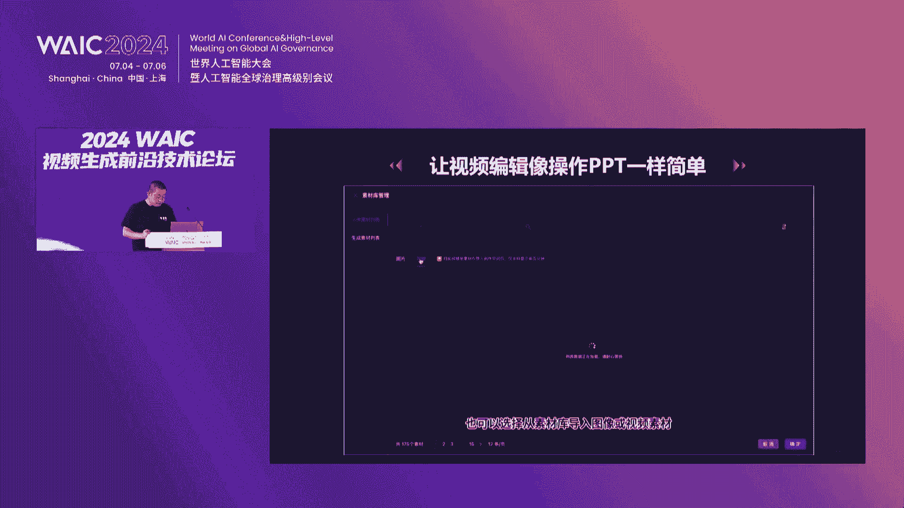
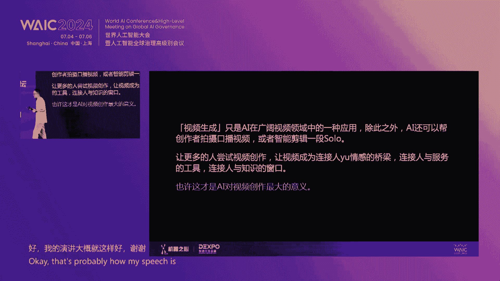
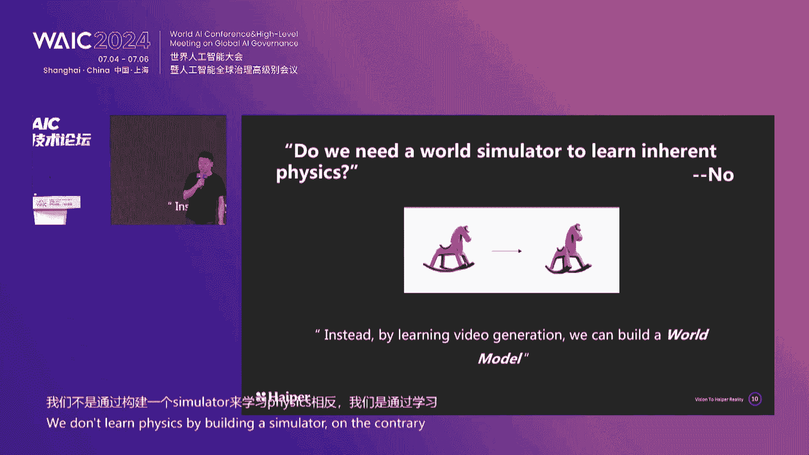

# 2024世界人工智能大会（合集） - P20：20240705-2024 WAIC 视频生成前沿技术论坛 - WarrenHua - BV1iT421k7Bv

尊敬的各位来宾，现场及线上的观众朋友们，大家上午好，欢迎大家来到2024WIC，视频生成前沿技术论坛，我是今天活动的主持人，机器之心联合创始人主编李亚洲，我们知道在切到GBD之后。

SORA引爆的视频生成，绝对是今年最热的技术与应用方向之一，但是呢，视频生成领域又处在一个非常早期的阶段，而国内也正在进入爆发的前夕，因此我们就想组织这样一场论坛。

为大家学习了解视频生成技术提供一个平台，组委会办公室主办，集体执行，上海科技有限公司，与东浩兰生集团有限公司共同承办，在活动开始前呢，我也为大家介绍一下我们今天的活动环节。

首先我们邀请到了视频生成领域的四位专家，学者为大家来做主题分享，也邀请到了来自学界，业界创业公司，知名投资机构的嘉宾，共同围绕视频生成的技术与应用，展开两场深度的圆桌讨论，希望我们今天的活动能够大。

让大家收获满满不虚，此行好的，那我话不多说，我们今天的活动就正式开始，首先让我们有请今天的第一位分享嘉宾，阿里巴巴达摩院视频生成负责人陈伟华先生，他的分享主题是，达摩院寻光下一代AI视频创作平台。

掌声有请，呃大家好，很荣幸今天有机会站在这里为大家介绍，达摩院新推出的一款AIJC的产品，寻光视频创作平台，那么过去的一年呢，对于AI视频生成来说是一个历史性的时刻，一年前。

市面上还很少有这种面向公众的纹身，视频的这种模型，但短短的几个月内，我们目睹了几十款视频生成模型的这种问世，越来越多的人开始通过文字提示，或者图像提示的技术来制作自己的视频，那么其中一个有代表性。

那么其中一个有代表性的时间点是今年2月份，SORA的发布，让大家看到了AI视频生成在高清晰度，高保真，高质量方面的巨大潜力和价值，open i曾经邀请了一些视频制作团队，去对SORA进行一个试用。

其中一个比较知名的团队是，来自多伦多的shy kids团队，他们利用SARA制作了一个短片，叫做airhead气球人，相信很多人都看过这个片子啊，非常有创意的内容，也非常优秀的。

把创意和I技术进行了一个完美的结合，但是今天此时此刻，我们想聊一聊它背后的一个故事，在三在shy case团队做分享的时候啊，做分享的时候，其主创人员就表示sorry，很酷，但是它的生活。

它的生成过程其实是很难控制的，就整个短片其实是由多个视频片段组成的，但是在生成不同的视频片段时，很难保证主角始终是这个，长着黄色气球脑袋的人，有的时候上面会出现一张脸，有的时候甚至气球都不是黄色的，那。

因此整个短片并不是SORA直接输出的一个结果，其中引入了大量的人工后期编辑，才能呈现出最终的一个效果NB，那么因此SHAK团队也表示，视频内容的控制其实是创作中最大的一个需求。

也是今天我们算法所面临的一个最大的挑战，所以今天我们要介绍的产品，达摩院寻光视频创作平台，是我们在调研了现有的视频创作工具，走访了许多视频创作者之后，打造的一款工具性的产品，今天的各种视频生成大模型。

已经让大家感受到了AI技术带来的福利，给短视频制作提供了各种各样的素材，那在有了这些素材之后，我们希望能进一步的去，提升视频制作的这个效率，去解决视频后期编辑中的各种问题。

我们的目标就是让用AI能力去重塑传统视频，制作的整个流程，去打造AI时代的全新视频工作流，那寻光视频创作平台最大的两个特点，就是能让用户实现对视频内容，的一个精准的控制，同时可以保持多个视频中。

角色和场景的这种一致性，首先平台的第一大亮点是在交互方面，我们希望让整个编辑过程像做PPT一样简单直观，容易上手，在我们的平台上，每个视频是被是由多个分镜头组成的。

用户可以在平台上从剧本自动生成一组分镜头，也可以自己上传原始的视频，由算法去给切分成多个分镜头，那么在创作空间里，用户可以很方便地查看每一个分镜头，一个场景内的多个分镜头也可以收起展开，场景之间。

也可以通过拖拽来进行一个顺序的调整，场景内的镜头也可以进行拖拽，同时我们可以支持在任意位置上进行，分镜头的这种添加或者删除，那在新建的这种空白分镜头中，我们可以调用sorry。

我们可以调用图生视频或者文生视频。

这种能力去产生新的内容，也可以添加自己已有的各种素材，那么对每个分镜头来说，我们可以对它里面的视频进行单独的编辑，从右侧的这个工具栏中，我们可以选择我们想要的合适的编辑功能，对分镜头。

视频中的这个所有的细节，去进行进一步的精细化的编辑，那么其实讲到编辑啊，特别是这种精细化的编辑和控制，我们希望能够提供一个完整的，智能的一个编辑能力，可以让用可以去理解用户的意图，在语义层面。

而不是在像素层面对视频做一个编辑，同时我们希望一个视频里的所有的元素，都是可以被编辑和修改的，包括这样可以给用户一个创造，提供一个最大的一个自由度，这里我们提供了包括视频整体层面的一个修改。

包括风格运镜帧率，清晰度画质，同时我们也可以对视频中的任意，局部与局部的元素目标，进行一个精细化的一个操作，比如人体人脸前景背景等等，那么这些功能中哈，我们首先想要强调的是。

一组基于视频图层的这种编辑能力，因为在我们对用户的这个访谈过程中啊，我们就发现，视频图层几乎是所有视频创作者提到的，频次最高而且最迫切的一个需求，所以我们平台首次的把视频图层相关的，这种各种能力。

以一个系统性的方式完整地呈现给用户，那么首先我们会介绍一下，这个前景图层的这个功能，在前景图层里，用户可以通过输入文本，可以我们就可以产生符合文本描述的，并且具有透明背景的这个视频。

在传统的视频生成的能力基础上，用图层这样一种更灵活的方式来产生内容，比如说可以看到下面这一排里面有一个警车，其实我们可以是我们的这个生成结果，可以做到警车的这个车窗玻璃是一个透明的。

也就是说可以让他很自然地放到其他场景中，以一个图层的形式放进去，那么同时有时用户会上传自己的视频素材，那其实我们也提供了图层的这种拆解能力，在用户在视频的第一帧，选出自己想要提取的一个物体。

那我们的算法会把整段视频中的这个物体，对应的内容全部拆解出来，形成一个独立的带透明度，透明背景的一个视频图层，就比如这里的小和尚和这里的这个女孩儿，我们都是可以拆解出来的。

左下角这个女孩这个视频其实我们值得说一下，就是说看这里面可能会有书本，有女孩，还有蝴蝶，其实这些我们都是可以做拆解的，我们可以把一个视频拆解成多个图层，以这个女孩为例，其实我们可以看到。

我们的拆解算法还是非常精细的，比如这个头发的飘动，其实我们都是可以拆解出来的，那么当我当我们的素材，都以图层的形式存在的时候，那我们就可以将不同的前景，图层和不同的背景进行一个融合，那图层的融合。

这样就可以组合成更多的新的视频来，比如刚才我们提取的这两个前景，就可以把它跟不同的背景，咳咳咳，不同意，不好意思啊，把他把它把它跟不同的背景进行一个融合，形成这种新的视频。

那么前面前面其实我们提到的视频创作中，多个分镜头，这个场景的一致性是非常重要的，诶谢谢，我们其实想做到的就是一个场景的这个可控，那其实场景的可控主要靠的是什么呢，其实我们就发现，当你图层的融合能力。

已经让我们实现了视频背景的任意切换的时候，那我们就可以把不同的前景放到同样的场景中，实现这个场景的这个一致性，比如刚才提取的这两个前景嘛，我们就可以给它放到一个类似的一个，场景环境中。

这样就可以让他们有一个剧情上的一个一致性，同时我们也提供了这种支持，多场景的这种一键式替换，比如一次性就把所有的分镜头的场景，统一替换成另一个场景，比如说这里的这个室内实验室的一个场景。

那么除了场景控制之外，我们知道我们其实也支持对人物的这个控制，来实现多剧情里的人物的这种一致性，首先首先我们提供了一个角色库，用户可以通过文字描述生成这种自定义的角色。

也可以上传自己预设好的一些角色形象，那我们的人脸控制功能呢，可以将所有视频中的某一个角色，全部替换成角色库中用户想要的一个角色，比如说这个女警，然后再比如说把所有的换成这个黑人的，这个女孩。

整个这些操作我们都是可以一键完成的，那么这里值得一提的平台，同时我们也支持对这个视频中的多个人物进行，同时的这个换脸，比如说这段视频中前面这个穿蓝衣服的角色，我们可以替换成上面左边的这个帅哥。

然后现在的这个绿衣服的角色，我们可以替换成右边这个帅哥，我们不仅是替换了某一段视频，我们实际上整个剧情的所有人都能一键替换，相当于换了两个角色在进行这场故事的演绎，那可以看到我们的替换可以很好的适配。

整个视频，不存在这种失真错位的状况，同时整个视频中，人脸的这个移动也都是非常流畅的，那么这是再给大家另一个例子，值得注意的时候，可以看一下这个例子，在这个我们的替换过程中。

我们就会适配原来视频中的人的这个嘴型，就是说保证人在说话过程中，即使把脸换了，我们的嘴型说话也都是没有问题的，表情和之前也都是一致的，那么利用这个能力，我们就可以随意的去设置我们的视频的角色。

我们希望就是让每个人都能成为，这个故事的主角，也希望每一个故事可以去被不同的人去演绎，那我们知道每就像前面说的，我们的视频都是由各种不同的元素组成的，包括场景啊，包括人脸，那其实就像前面说的。

它主要分为全局的这种元素，还有这种局部的元素，那下面我们就来介绍一下，我们对视频全局元素的这种编辑能力，首先是这个风格的迁移，我们可以将视频转化成各种不同，各式各样的风格，比如说莫奈风，浮世绘，水彩。

水墨卡通等等，我们一共提供了20多种的风格，可以让用户进行随意的这种切换，同时我们对各种视频，都是可以支持这种一键式的风格切换的，诶这里，其实我们平台也支持对这个画面做一个，运镜的一个控制。

镜头的运动是影视语言的一种表达吗，可以使画面变得更加的生动，有运动感，那其实我们这里不仅支持运运，支持了运镜，我们还支持了多种这个运镜方式的添加，这里给大家展示几种，大家可能常用到的一些例子。

从左到右分别是这种左右的平移，上下的移动推进拉远以及左右环绕，接下来介绍一下这个帧率的控制，那么有些视频其实由于拍摄的现场，其实它的帧率会比较低，播放起来其实会有一个卡顿。

那么平台我们提供了一个帧率控制的功能，可以通过提升视频的帧率，来让这个视频运动变得更加的丝滑，比如说左侧这个视频中的这个火花的这个喷溅，大家可以看到是有这种明显的卡顿的，这是由于帧率比较低问题造成的。

但是用我们的功能处理之后，可以看到这个火花的喷溅，就会变得非常的顺滑和连续，那其以上几个是在视频整体层面做的一个，编辑的能力，那么在视频的这个局部元素，局部目标我们也提供了很多的能力。

比如说这个运动控制，其实运动控制是一个比较有意思的一个功能吗，其实现在有些平台也会提供类，通过类似于笔刷这种方式，来实现这个运动的控制，但是我们的运动控制，可以让用户更精准的指定运动的一个方向。

比如说左侧的这个船，我希望它从右滑动到左边，那么只需要选中这个船，然后朝左进行一个拖拽，那就能实现一个船的这种移动的效果，呃其实平台还提供了这个目标消除的能力，对视频中的这些干扰物体。

我们可以实现这种一键的这种消除，无论像左边的这个面积比较大的这些人物，还是说像中间的这个酒瓶鱼，这种在屏幕正中央的这种干扰物，以及向右侧这种左上角的这个小船，其实我们都可以做到这个和谐的去除。

那么对应于这个消除能力，其实平台也支持了这个目标，新增的这个功能，比如说在原视频是一个空旷的海面，用户可以选定一个区域，输入到想要新增的一个物体，比如说一个船，那我们就可以在海面上添加一艘船出来。

可以看到我们这个船是顺着水流移动的，是可以很好很好的，这个和这个海面做一个和谐的，一个一致的运动的，那下面这个例子其实是从左边到中间，这个视频其实是我们添加了一个风筝，天空上的一个风筝。

那其实有了这个新，有了这个新增的能力之后，我们也可以对目标进行一个修改和替换，比如像右下角第三个视频，这样我们去把这个风筝换成一个气球，那这样的话其实利用上面的以上的这些能力。

我们可以对视频中的每一个局部目标，都可以被精准的定义和修改，那今天我们发布了寻光视频创作平台，是一个专门为视频创作者打造的，一个工具性平台，它提供了更简易的这种分镜头的组织形式，以及丰富的视频编辑能力。

比如说基于视频图层的生成拆解组合，以及像运动控制，运动控制视频超分风格迁移目标的消除，新增替换等等，同时我们也支持了对多个视频中，场景和人脸的这种控制，来保持人物的和场景的一致性。

那么这个视频其实就是我们对整个平台能力的，一个综合的一个展示，那我们相信，今天我们正处在AI，视频生成的这个巨大变革之中吗，工欲善其事，必先利其器，我们希望寻光视频创作平台，就是每一个人手中的利器。

是每一个创作者自己的专属的视频工作室，那在这个平台上，我们希望AI与创作者之间，能够紧密高效的协作，创意和想象力，不需要被工具所限制，我希望寻光视频创作平台，能跟各位创作者一起去。

开启一个更繁荣的视频生态，那么最后欢迎大家扫码申请我们的内测资格，也欢迎来到达摩院的展台，跟我们进行更多的交流，谢谢大家，好的感谢陈老师的分享，刚才那套二维码出来之后，大家都在夸夸的拍照。

感觉这个平台肯定会火的，再次感谢陈老师的精彩分享，那我们听完达摩院的分享，就来听一下学姐的声音，接下来让我们用热烈的掌声，欢迎上海交通大学电子系教授，博士生导师倪冰冰老师发表主题演讲。

他的演讲题目是面向矢量化的媒体内容生成，呃咳咳，感谢那个机器之心的邀请，今天很开心，又看到了很多老朋友呃，我今天的分享可能包括视频，但可能比视频的范围更广一点，因为我们呃这么多年来。

一直在做全媒体的这样一个生成，包括图像啊，视频啊，以及这个三维的内容，而且今天我的分享可能更加偏，我们一些前沿的底层，所以对，那首先可能要稍微泼一点冷水，如果大家一直在用这些生存类的工具的话。

我相信这些问题呃多多少少都会遇到，我们现在生成类的算法，包括视频，包括图像，包括这个三维的东西啊，呃我们可以遇到很多这种结构性的问题，和这个细节性问题，比方说啊通常会多一样多生长出一样东西。

或者少一样东西，或者手对吧，穿模穿到人的身体里面，然后有的时候这个深沉的衣服上的这些logo诶，突然间变得很模糊了，那如果对视频来说呃，像这种精细化的视频，特别是具有这种物理规则的视频。

其实目前为止是挺难生成的，那么究其原因啊，那么我们都知道，这个现在所有的这个生成式的智能呃，从本质上讲它无非就是一个采样的过程对吧，那么视频是一个非常高维度的空间啊，比这个图像更高。

如果我们给予更多的训练数据，如果我们把采样精度降得更低一点的话，那么相信我们能够生产出更好的，这样一个内容啊，这个就是为什么我们现在有skin law。

为什么有这stable diffusion是不停的这个采样，但是这个是有天花板对吧，大家都知道是有天花板，因为我们的维度空间太高了啊，一定要做到这个万无一失，这个千真万确的话。

恐怕以目前的这样一个技术的一个框架来说，其实是有一定的难度的，更何况我们对于这个算力的约束，其实还是很大的，这里列举了我们呃目前包括这个大语言模型，包括这个图像视频类的生成模型的一些呃，算力的一些指标。

我们看到现在都是这个几10T，上百T甚至上千T的这样一个水平，那么我想未来生成式的智能啊，他的一个发展趋势，他肯定会下沉到单侧，那么对于单侧来说，我完全不可能用这种无限制的这样一个。

大算力的这样一个采样的方式去解决问题，那么可以想象我们是需要有一些新的架构，新的这样一个计算方式，或者叫新的一些底层的一些技术，来支撑这样一个更加高效，更加高质量的这样一个生成的方法。

那么我们可以看到这个，为什么我们现在那么吃算力对吧，我们现在那么消耗这样一个，数据和算力的资源呃，其实就是一个我们神经网络的黑盒化啊，对于这个生成的网络，我们完全不知道这里面哪一个节点。

跟我们的这样一个呃要去生成，要去控制的内容有关，我们不知道我们输入的这个prompt的某一个词，到底在这样一个节点里面的某哪一个，哪几个单元是有关联的，我们也不知道我们输出的这样。

输出的这样一个人脸的某个地方的一个形状，是跟我们这个神经网络里面的，哪几个单元是有关的啊，其实我们更需要的是做一种白合化的这样一个，生存的技术，比方说如果我们能够将视频中的内容。

能够实例化到我们的这样一个网络参数的话，那么实际上我们可以精确地去操控，我们生存的这样一个内容，但是要解决这样一个参数对齐问题的话，其实我们在究其本源的话，本质上还是一个数据内容的一个。

表征的一个问题啊，不管是图片还是mesh还是这个视频，实际上目前我们的基础表征，还是这种规范化的网格，那么规范化的网格，它实际上是跟语义是不对齐的，我们并没有实例化的概念。

这就导致了为什么我们现在去网络去算，我也不知道他在算什么，我也不知道他能够算出什么，反正我们给多很多的数据，它最终总能伸出我们期待的结果，但是如果我们有一种新的表征方式，它能把我们视频中的内容。

把我们的这些啊内容以及各种内容的属性，比方说我们的颜色，我们的纹理，我们的光照，我们的形状，能够把它具象化，实例化，把它结合开来，而且能够针对性的建模的话，那么这样一种表征。

实际上是特别适合我们生成式的人工智能，那么朝着这样一个方向，实际上我们小，我们也在这两年也做了一个新的这样一个，内容表征的一个框架吧，比方说像这样一个框架里面呃，我们无论是对这个2D的图像也好。

3D的物体也好，或者是这个视频也好，我们可以先做一个空间羽翼的结构对吧，可以把它分成羽翼的部件，然后说手啊脚啊对吧，这个耳朵，然后对于每一个部件，我们实际上是可以进行一个矢量化的表达。

我们可以通过我们过去的一些非常好的，一些工具，比方说像贝塞尔曲线，或者是NERF的这种曲面的话，我们可以把它进行矢量化的表征，然后我们可以把解耦的这样一些语音，解耦的一些视频的视觉的属性。

比方说光照纹理形状，可以把它通过控制点的方式去放在，我们的这个啊控制的这样一个形状的，一个一个边界，甚至是内部，如果我们要生成这个形状内部的东西的话，只需进行这样一个神经网络的采样就可以了呀。

最近我们的一些像类似于影视表达的一些方法，就特别适合这样的采样，那么这样一来，我们整个视频，我们整个视觉的内容，可以拆分成这样一系列的这样一个矢量表征，那么我们对于这个生成和编辑的话。

我们想去编辑哪个位内容啊，对于他我们进行相应的这样一个采样就行了啊，那么这个就是利用我们现在的这样一个，矢量化表征的框架，做的这个二维图像的生成和编辑啊，我们可以看到它的优势还是非常明显的。

首先对于这个不同风格的图像来说，我们目前通过矢量化的生成和编辑方式，所重建的图像，它的精细度是非常高的，它的精细度是非常高的，我们过去我们我们可能怀疑啊，对于这种动画类的图像，可能矢量的重建会比较好。

对于自然图片可能矢量重建就有点问题，但是我们实验表明，其实只要是对于我们的这样一个控制点，去寻求一个更好的表达方式的话，其实他可以把我们的精细程度控制的非常好，而且就是基于我们的矢量化的表征的话。

那么我们可以随意地进行图像的缩放，缩放它是不损失任何图像内容的，那么有了这个实战化的表征以后，我们可以随心所欲地去进行编辑，然后说像中间的这样一个结果啊，我们可以对这个呃图像里面的各种感兴趣的内。

你甚至可以改变它的这样一个姿势，你可以甚至可以改变它的这样一个纹理啊，这个只要因为我们是一种对齐式的方式，对齐式的生成，所以这就变得非常的简单，另外因为是基于矢量化的表征的话。

那么我们的这样一个数据压缩率是非常高的，大家知道矢量图，比起我们全像素的这样一个表征来说，它的压缩是百倍甚至千倍以上，那么这就对我们未来对于生成式智能，它在存储传输。

渲染方面的这样一个呃容量的这样一个开销啊，我们其实就是有相当大的一个优势，那么上面是生成，那么对于编辑来说，其实我们的问题在于啊，我们经常是有一些这种prop的这样一个输入，但这些信息并不是精确的。

而在上采样的过程中，这些并不精确的信息其实经过吞声采样以后呃，其实变得更加的一个模糊化，那么其实我们是需要一个精细对齐的，这样一个指令去监督我们的编辑生成的，那么从这个角度来看。

其实我们所构建的矢量化的一个表达来说，是更加适合我们的编辑，比方说我们现在大家呃所知道的，这个在我们的视频生成中，其实这种物理世界的规则其实是很难嵌入的啊，现在目前的解决方案是加多数据。

对于这种corner case来说，我们只要加多数据，我们希望它总能够变好对吧，但是如果你用这种矢量化的表达化，那我们可以完全通过一个非常轻量化的网络，直接显示的把这些矢量的表征。

矢量的这样一些规则的要求，把它嵌入到我们的这样一个生成的过程中，而且是能够精细对齐的这样一个嵌入，使得我们所生成的内容，可以能够更好地去符合，这样的物理世界的这样一个规则。

那么基于这样的一个物理规则的约束的，采样的话，其实我们也构筑了这样一个新的一个，采样框架吧，叫参数空间的约束生成，那么其实也很简单，特别是针对这种人像类的视频的生成的话。

我们可以把这个视频的内容可以分成这个各种，通过一些网络的提取，可以分成这种形状啊，纹理啊，运动的子空间啊，这子空间的维度是低得多的，那么在这个子空间里面，实际上我们通过一些参数去精确对齐。

我们想学需要表达的这样一些视觉属性，那么如果我们要去编辑它，我们要去操控它的话，那么只需要对相应的参数啊，在相应的这样一个空间里进行注入就可以了，是非常精细的对齐的，那么最后我们能够产生这种精细对齐的。

这样一个编辑，而又因为我们是在子空间进行采样的话，那么它的采样效率，采样维度可以迅捷得多，那用这个框架的话，其实我们现在在以人像的这样一个生成和编辑，上面，也是取得了一些阶段性的一些效果。

比方说在我们这个人脸的编辑，数字人，以及这个有人参与的这种呃，具有物理的物理约束的这种视频生成方面啊，目前也是取得了一定的效果，比方说在人像方面，目前在端侧实时对吧，人像这种1K加的这种高清的质量的。

这种编辑方面，其实已经是形成一个比较好的工具，像这个swap，目前也是开源领域比较长期霸榜的一个工具吧，那么像这种物理的视频生成其实也是更好的，能够符合他的现在的这样一个物理规则，那么同样对于3D来说。

我们也可以运用我们的这样一个呃，参数空间的一个采样生成的框架啊，我们可以把各种3D视觉的羽翼，包括这个几何材质，光照形状啊，可以通过这样一个控制点的技术，可以赋予在我们的mesh的顶点。

或者是在我们这个呃3D点云的这样一些，稀疏的顶点上面，然后如果我需要去改变一些局部的形状啊，纹理啊，光照的话，只需在这个顶点以及它的周围，去做一些相应的一些参数化的改变就可以了，然后中间的内容。

完全可以通过我们的这样一个啊饮食的函数，进行插值插出来，那么通过这样的技术，我们其实可以实现很好的这个3D编辑的功能，比方说我们现在可以支持部件的形变，这个精确的这样一个涂鸦光照的一个替换。

我们也可以对不同的这样一个部件进行啊，有机的这样一个融合，产生一个新的物体，那么目前我们的结果，比方说在端侧上，我们可以支持这个各项异性的，高模的这样一个材质，那么它的加速大概是从10~100倍的。

这样一个加速率，同时在这个呃形状的烘焙上面，也可以形成这个在100倍的这样一个呃，模型的简便，但是并不损失这样一个模型的渲染效果，嗯那么以上是我们在矢量化的表征，以及生成技术上的一些呃。

可以说是一些全新的尝试吧，当然我相信呃，未来如果希望把这一套新的方法，能做成新的这样一个标准的话，那么他的路还是挺长的，其实是还是有一些这个比较强的一些挑战的，包括因为我们对视觉的内容。

其实它的各种属性啊，它的表征维度是非常高的，而且维度和维度之间通常是交融在一起，紧耦合在一起，你要把它解开，其实也是并不是一件非常容易的一件事情，另外对于我们视觉的内容啊，包括视频。

那么它的这样一个信息量，在空间的分布上实际上是非常不均匀的，那么如何有效的去这样一个分配，我们的这样一个表达资源，使得能在最小的资源下能够实现更加高效，更加这个高高性能的表征。

以及支持后面的生产和这个编辑的话，其实这也是一个非常重要的一个挑战啊，最后就是说因为我们现在对吧，大家都在讲这个多模态，因为模态和模态之间，它的这样一个对齐的问题啊，就显得更加的重要了。

所以如何啊能够有一个规划的这样一个表征，能够支持各种模态实现模态进的对齐，这其实也是我们需要考虑的这个内容，那么最后稍微畅想一下，就是说目前我们现在基于这样一个生成式的，智能的这个计算方式。

其实在从这个宏观的角度来说，它还是把虚拟世界和物理世界是分开的对吧，我们在计算像素域的时候，其实只考虑的像素域，其实物理世界的这个规则很难去融入进去，那么那么大家最近也知道，就是通用人工智能。

可能是未来一个非常火的一个方向，我们相信如果未来能够实现通用人工智能的话，那么它对于这个在世界模型的内部啊，他肯定有对物理世界的规则有很好的表征，那么这样的话，通过这样的一个生成式的世界模型的构建。

就能够显示的表达这些物理世界的表征，以规则以后呢，我觉得这个生存的问题其实是变得迎刃而解，当然要解决这个问题的话，其实一个关键的前提还是我们视觉，包括视频我们所表，我们所包含的内容。

还是要进行这样一个实例化啊，我们要对对象进行分层分割的这样一个表达，甚至对这个他的各种属性要进行解耦的表达，以及对他的关系，要进行这样一个非常复杂的这样一个，类似图一样的这样一个关系性的表达。

才能支持我们未来随心所欲的这样一个，狮子的这样一个生成，那么最后还是想说一点，就是说视频生成的，目前还是一个全新的人工智能的一个技术，那么其实对所有的新技术而言。

它的这样一个技术的复杂度以及商业的成熟度，永远是呃存在的，一些可以说是一些鸿沟吧，但是我相信通过这些新的表征，新的计算范式的构建，我觉得这样的一个技术鸿沟啊可以越来越小，最后能够最终能够成为。

我觉得请人人能够用得起，能够用得好的，这样一个这个新的一个技术性的工具好，以上是我的分享，谢谢，然后也欢迎各位业界的大佬这个多合作，好的感谢倪老师，倪老师请留步，这是我们现在的进度有点快。

然后时间也挺充裕的，我看大家观众们都在拍照，想必也有很多问题想要提问，所以说我就临时加一个现场回问的环节，就是现场的观众朋友们有什么想要提问的，可以举手示意，我们请倪老师帮忙解答一下。

有哪位同学想要提问的吗，可以踊跃举手诶，我看到我看到我先让那位同学来，诶你好，徐老师，我想请教一下，就是比如说你通过这种呃矢量表征的方式，去做这种哦通用的一个模型的一个生成的话，你能够做到。

比如说像一般的也大于言模型一样，它就是泛化性，然后适用各种各样的一个场景，因为你的那个大圆那个模型去生成的时候，它需要生成的东西它是非常多样，非常泛化的，那就比如你前面在讲的时候。

比如说你可能要把一些元素去进行实例化呃，或矢量表征，那你的矢量表征的时候，你怎么能把这个类似于去穷尽对谢谢，这是一个非常棒的问题，其实我们团队呃这么多年来，其实一直在考虑这个问题，当然我们这个技术啊。

可以看到，现在的一些案例是以这种结构化，非常明显的一些呃，像人像人脸啊已起步的，但是我们目前确实在做通用的泛化的这样一个，呃矢量化的构建以及生成，那么这里面其实有几个契机和条件。

第一我们可以看到类似像depth anything，match anything这样的一些这个大的大的结构模型，其实现在开始大行其道了，那么这个其实给我们注入了一个，非常就像一针强心。

强力的一个这个前期的一个引擎一样，那么另外的话其实呃对于通用的物体，实际上对于这个空间结构来说呃，我们现在的技术也并不是要求，他一定要对语义的对齐，非常明显，我甚至可以有一些过度的结构，过度的分割。

那么只要它能支持我们的这样一个呃，灵活的操控就好，另外其实我还坚信一点，这对于其实刚才我们陈老师也说了，其实呃对于未来的视频生成以后，我们人想完全不参与，其实也是不大可能的。

所以更多的是它是建立一个集成的工具集，在这个工具集里面，实际上人是可以参与在里面，一些细节的一些调控的，比方说我们需要去编辑这样一个通用的物体的，某个部件，这个部件以前没有见过的话。

所甚至可以通过人的一个交互方式，去给他进行这样一个标记，所以这些都是是可以期待的，好谢谢，非常好的问题，好的呃，还有哪位同学想要提问的，可以举手试一下，好好对诶，李老师，那个。

就我感觉您做的这个工作真的是非常有价值，但是这个坑肯定也非常非常的大对，然后完事之后，我其实有两个问题想跟您请教一下，就第一个问题就是您刚才也提到，就是数据非常的离散对。

然后完事之后就是您希望把它解构开来，在我的理解里面，你其实需要对不同的对象在数据集处理的时候，都要去做一些操作，但是这个过程你不可能人工作嘛对吧，你肯定也是需要自动化的去做。

那这件事情我怎么能够使得就第一，其实他就肯定不是所有的数据都能够拿到他，360度，各个镜头角度下的这样的一个一个东西，然后那那你是怎么来做这件事情，怎么考虑这个事，然后这第一个问题。

那与之相对的就是我会觉得说那很自然的，我就会认为有一些部分的数据和领域，有可能可以，更快的用这种方式去实现真正意义上的落地，那您可能研究到现在，觉得说是可能这个领域是哪些领域。

您觉得有可能会用您这种方式更容易落地，对对对，好的好的，谢谢刘老师，那个我先回答第二个问题，其实我们这个工作您您已经感觉到了，其实当时的一个出发点，确实是在一些特殊的领域的一些应用。

包括我们跟我们长期跟那个上海SMG合作，所以他有有一些这种动画类的，他对这种矢量动画类的一些资产，一些3D的一些资产，那么这个方面其实对于数量的这样一个，适用性是非常高的。

所以我们的研究其实是从那边开始的，另外其实我们也在跟一些，然后说数字资产生成，然后说我们的零件，三维的零件，然后说一些三维的一些构造，然后建筑啊，那么这种类型的数据特别适合我们这样的方式。

那么其实也是呃从这一点去展开来，然后我们慢慢也感觉到呃，诶好像这个图二维的图，自然的图，我们刚开始觉得其实我刚才也讲，我们刚才觉得这种动画的诗的图诶，可以用这种矢量来构建，特别好，效果非常好。

后来我就问学生诶，我咱们能不能做各种自然的图像，发现如果我们的呃分割更加精细，我们的控制点把它嵌入的更多的话，实际上对于各种natural的图像，其实可以做到非常高精度的表征，那么这是又走了一步。

然后后来又做各种同，那么呃人像和人脸，大家知道是一个很长期的一个结构化，非常明显的，也有很好的，像类似像SMPL3DMM这种东西呃，它都是已经是非常好的一种矢量表达了，那对于通用的物体。

实际上大家其实一直在往这方面努力，但是也到目前为止，没有形成一个标准化的一个东西，那么其实乐老师您说的也对，就是说那么这个里面也要分几步嘛，比方说有一些更加可能特别重要的一些物体。

可以先开始进行这样一个表征，接着再给它推广到一些更加泛化的一些物体，特别是对物体里面，我也并呃他的这样一个信息的一个呃分布度啊，它是不一样的，比方说在一个视频里面，当然人是最重要的。

你比方说背景里面后面有一堵墙，什么可能不是那么重要，或者当然墙上可能有一张，蒙娜丽莎的这样一个图像，这个可能比较重要，所以它是有一个层级的，所以说未来可能我们也想走这种层级化路线。

可能给予更多的表征资源，给到这种更加重要的内容啊，对如果不重要的东西，我们就类似这种更加偏向一种可伸缩，偏向像素化的生成就可以了，呵呵谢谢好的，感谢李老师的分享，我看还有一位同学想要提问。

我们最后提问一个问题，你可以先介绍一下自己，李老师你好你好，我想咨询一下，就是关于那个数字人技术这一块的一些问题，就是因为我在探索一些，比如说在音频驱动嘴唇模型这一块是吧，呃之前也用过一些类似开源的。

比如说music talk是吧，我想如果说在衣衣服驱动对音频驱动嘴唇模型，数字人这一块，就是我在树洞的时候，我的衣服要随动的，我的我的嘴唇，我的身体是吧，就是对嘴唇保持一致性。

就是那就是我之前也看用用过了，像啊比如说腾讯的MUCHTALK啊，或者video i talk是吧，这种去实现，但是它是在实现这种线下的这种，这种非实时的效果，还可以，就是在取决于你这个采集的素材的。

这个这个质量是吧，包括比如说摄影大棚录录录的这个视频是吧，但是我的问题就是说，如果我们要呃，做这个实时数字人交互这一块的话，那如果在音频驱动嘴唇这块，如何去保证，这个我的这个音频和这个动作的实时性。

还有它的一个强一致性，就是有没有更好的一个可实现的路径，就是在这一块嗯，这也是一个非常好的问题，我们其实对这个问题其实有所呃，也不是最近啊，其实蛮久了，您说的问题，其实里面最核心的就是这种实时的渲染。

其实它的所占用的这样一个资源是很大的，所以因为音频相对稍微好一点对吧，呃现在的一个趋势呢，因为您您肯定也知道这个3D高斯那种东西嘛，对吧，现在的趋势，因为3D高斯的渲染它是非常的呃，效率非常非常高的。

现在趋势就是说，我通过3D高斯作为前端的一个渲染的，这样一个层面，后端可能接一个绑定式的结构化的一种表征，然后通过这样一个协同式的方式，去进行这样一个更加高效的一个渲染，是不是做到实时。

这个现在很难说是有一些做到实施，但是也是以牺牲某些指标作为代价的，OK好的，谢谢，好的感谢倪老师的分享与解答，我是好，谢谢好，谢谢您，请台下落座，嗯好的，本来我们接下来是有一场圆桌讨论。

但因为有一位嘉宾被堵在路上，因为WASE实在是太火了，然后路上堵的都是车，所以说我们今天我们把环节对调一下，下面就让我们进行下一个主题分享，让我们用热烈的掌声，欢迎美图公司集团高级副总裁陈建议先生。

主发表主题演讲，他的演讲题目是产品经理眼中的AI视频生成，好啊大家好，我是那个美图公司的小白，然后先那个简单的介绍一下我自己吧，就我想做个小调研，就是在场的有10年前有用过美拍的人，请举个手，哈哈啊。

还是有有灵有灵性一些，这是一个暴露年龄的一个的一个调研，这个美派的话其实就是10年前，当时我跟几个小伙伴做的，然后确实也是在呃2014年吧，就是到2016年，当时两三年的时间。

在国内曾经短暂的领跑了当时的短视频赛道，就跟这个抖音快手呃，几家算是并列的短视频赛道前三，然后但大家后面也知道，就是说在抖音这个强势的竞争中，就如今美拍已经成为这个时代眼泪，所以这也是特别巧。

就是我在10年前做了这个视频，相关的社区以及工具，然后在10年之后，我们又重新回来去看这个AI视频生成能力，相当于是一个啊技术啊，或者说是一个趋势的一个轮回吧，啊那现在美图的话就负责这个相关的产品啊。

运营啊，还有商业化的工作，然后其实今天大家来到现场，肯定都是对于这个AI视频生成的这个前景，应该是特别认可的，AI视频上的这个广阔前景，相信相信大家肯定是有目共睹，但是今天呢。

我想从一个比较务实的产品经理的视角来聊聊，这个AI视频生成，因为产品经理，他很多时候是一个连接最新的技术，以及用户需求的这样的一个桥梁的角色，然后所以说我们在看AI视频生成的时候。

我们很多时候我们都是回归到用户需求，就是这个最新的技术，它在场景上，它面向的用户群到底是谁，他解决觉得这些人群的哪些需求，然后当我们去看的时候，其实很容易就把视频就大概分成，视频的消费跟视频的生产。

然后视频的消费其实基本上可以看，99%都是这个我们所说的这个C端，或者说是大众用户，普通用户，然后视频生产呢我们分成三个群体，一个大众用户，一个视频创作者，还有一个专业的影视行业，那让我们来看一下AI。

视频生成对于这几个人群分别意味着什么，首先从C端用户的内容消费的这个角度来说，就确实AI视频生成这个技术，它让各种视频观点的表达变得更加具象，然后同时的话也丰富了各种这个视觉创意，以及体验度。

但是呢我们在做挺多这个用户调研的过程中，我们发现一点，这个点是有点类似于我们行业内的这种，知识诅咒，或者说是这个认认知的这个偏差，就比如说像我们在看，我们从业者在看这个视频的时候。

然后一旦视频底下有写一行，比如说该视频由AI生成，或者可能底下的描述说，这个视频里面分镜全部是通过AI生成的，这个时候我们的从业者会觉得，这个视频特别厉害，或者说对于这个视频而言是一个加分项。

因为哦原来AI能做出这么好看的一个视频，但其实对于很多的这个普通用户来说，他不care，他一点都不关心视频背后是用AI生成的，还是事实拍的，所以很多时候当我们去说一段短剧，或者说是一个很好看的视频。

他是通过视频AI通过AI生成的，这个时候对于普通用户而言，它并不是一个加分项，他只关心你的内容好不好看，所以这个时候我们从AI视频的这个，消费性来说的话，不管最后他做到了什么样的一个视觉体验。

他一定要回归到内容表达，内容表达，就是这个视频想要传递什么样的价值观，想要传递什么样背后的故事，然后呃其实我最近一个月吧，就是基本上已经把我这个小红书的这个首页，训练成是一个这个AI视频的一个废的流。

就是我每天大量的去看各种这个创作者，用AI去做的这个视频的短片，有很多空镜素材，也有很多是这个有剧情的这个这个片，然后包括说我们会会去抓很多，这个网上比较火的片，然后我们自己去做一个fate流。

我们反复去看，不停的看，一天可能会看好几百条，然后这个时候其实我们会发现，就现在的这个AI视频，AI生成的这个视频，他的AI感还是特别强，什么是AI感特别强，就是当你去看一眼。

你基本上就能判断出来它是不是AI生成的，比如说这个画面是否有些轻微的抖动，然后又比如说他的这个动效是不是特别的缓慢，就像慢动作一样，然后又比如说他的角色一致性是比较问题，比如上一个画面是角色A。

下一个画面他人脸还是角色A，但它的妆造已经完全变了，就现在的可控性的问题，所以说现在AI视频的这个很容易看腻，就是一个普通用户，他是不可能在一个平台上面，他反复的去刷AI视频，所以这个也是我们在在想呃。

有没有可能说现在短期内去诞生一个这个呃，AI视频的一个平台机的机会，举个例，比如说有没有可能出现一个AI版的一个抖音，这个目前来看是不太可能的啊，不太可能就很多时候看两个AI视频，只有再看几个这个呃。

小姐姐小哥哥拍的就是实拍视频，这个时候对于大家来说才是一个调剂，但是如果你让一个普通人连续看二三十条，这个AI视频，对于他来说可能是一个很难受，很难受的一个事情，所以说短期内它不太存在新的一个。

平台级的产品机会，然后当我们去看这个产业机会的时候，其实我们去务实一点的去看现在的AI视频，如果你去跟已经很成熟的电影的制作工业链，或者说是呃比如说做品牌TVC，或者说各种这个成熟的这个电视剧的这个。

制作工艺去比，尽量不要去以卵击石，就是成片的这个质量差特别特别多，反而现在AI视频的机会点，不是在于跟传统的影视内容形式去pk，而是去做原本无法通过内容，而无法通过视频来表达的内容，举个例子。

比如各种这个网文小说，那或者说过去在教科书里面呃，各种文字的这个这个这个呃文字表达的画面，但是它并没有内容的这个呈现，所以我们判断A呃文字内容的这个AI视频化，它非常有可能是这个AI视频生成。

在技术还不是特别成熟的时候，一个特别特别大的一个机会点，就你想象一下，过去很多人就是在这个网上去看各种爽文，这个时候如果如果你把这个爽文视频化了，对于这个视频的消费者来说。

它其实是一个很好的一个体验的提升，但原本消费者他就是在看很多，这个爱奇艺上面很好的一个电视剧，这时候你把电视剧里面加入AI的这个元素，对于消费者来说，它是一个体验的负分。

因为在确实目前的技术还没有成熟到，可以假乱真的地步，对这个是我们看到的，对于这个内容消费，普通用内容消费的一些会带来一些改变跟观点，然后对于这个普通用户内容生产呃，确实从一定程度上面，它让这个普通用户。

就是过去很难通过实拍去拍到了这个场景，他变得触手可及了啊，就比如说啊现在这个呃初中的学生，他只要在这个提示词框里面，他输入一句啊，我想看一看这个冰山融化的过程，这个时候这个视频生存。

就能将这个复杂的物理知识，通过直观的视频展示出来，没有见过极光的孩子，也可以通过这个去了解不一样的世界，甚至他还可以去控制各种这个极光的呃轨迹呀，或者说极光的这个光效，这对于呃教呃。

对于这个教学的这个行业来说，其实是一个很好的一个帮助，然后第二个点是我们判断，就说让这个照片动起来的这个玩法，在不远的将来吧，就是大概在半年到一年内，是肯定会成为所有平台，所有社交平台的一个标配能力。

就跟现在所有平台都有这个滤镜，都有这个AR效果，都有这美颜能力是一样的，因为他这个能力对于普通用户来说，是一个很有意思的玩法，就相信大家最近在这个呃社媒上面抖音啊，小红书上应该也都有看到。

就各种这个表情包复活，然后或者说是让这个世界名画动起来，其实已经有挺多创作者在用这个呃，视频的这个大模型去生成一些有趣的东西，然后这个未来它其实会根据不同的，比如说呃时下的热点啊。

或者说是有一些这个KO的发起了一些挑战，他就会不断就在每个平台有这个内容的涌呃，优质的这个内容的涌现，所以它一定是一个未来的一个标配，然后第三个就是，如果说我们还是会回归到非热点类的，就是持续性的。

这个是啊普通用户的需求，其实我们去看这个普通用户的视频创作的意义，他很多时候还是在于这个情感的表达，以及生活的记录啊，就比如说是现在大家发的朋友圈啊，或者说发了这些普通发了一个视频。

其实这个时候AI能起到的作用真的是有限额，我再举个例子吧，比如说去年的这个时候，其实当时的妙呀特别火，但是妙妙他火了，那一波，就很多用户在朋友圈里面发自己的这个AI写真，生成的照片。

但哪怕他现在经过了一年，他的技术已经到了一个挺成熟的一个阶段，就是可以生成你这个人在各各种这个呃世界的，比如各国去跟这个埃菲尔铁塔啊，或者跟在埃及里面的这种这种旅旅行，旅旅拍照吧。

可以通过AI形式去生成，但是我们会发现，没有哪一个用户会没事天天去发AI生成的，这个它的各种写真照，因为这个对于他的朋友来说，是一个并不是一个真实的，就很多时候我们去看用户，他在为什么他出去玩出去玩。

他一定要去发朋友圈，去发他的那个旅拍打卡的这个照片，很多时候他是为了记录当下的那个心情，或者那个状态，然后所以这个时候其实AI哪怕35年后，技术技术特别成熟了，他对于这个普通用户来说。

他也不可能天天在朋友圈里面去，发自己的这个AI视频，这个是我们对于这个普通户的这个，创作场景的一些理解，然后我们在过去一年多应该有做了上千位，甚至可能有将近1万位用户的这个这个调研。

就是基本上整个公司日常都来接要接接触用户，然后我们会发现其实有一个很残酷的现实啊，就是我们行业里面在推各种这个文生图，图生图这样子的能力，但是确实很残酷，对于大部分的这个普通用户来说。

他真的难以理解什么是文生图，就我们行业里面的人都能理解，就顾名思义，就是文字去生成这个这个图片或者提示词，是生图，但对于普通人来说，什么什么是文生图文，你是指文章吗，还是指文字还是什么。

那它到底是干嘛的，甚至99%的用户，他是真的是不知道怎么去写提示词，所以同样的纹身视频这个叫法，对于普通用户来说，他也是一脸懵逼的，所以就是以后如果说我们大家有去做这个能力，就是对普通人。

尽量不要说我们去推出了一个纹身视频的功能，就是很难理解，但如果你把纹身视频你包装成一个场景，这个时候普通用户就能理解，所以我们在再看这个哦，这个排版有有有点错乱啊，所以我们在看这个文生图的这个能力。

它其实是一个很技术视角的一个叫法，就有点类似之前PHOTOSHOP里面有这个液化的功能，液化功能大家应该都知道吧，就是去去推嘛，推这个各种人体的这个身体的变形啊什么的，99%的人他不知道液化什么意思。

但是一旦你给这个液化的这个能力，做一个这个场景的限定，就比如说你你这个液化我们不叫液化，我们就叫这个瘦脸瘦身，这个时候对于99%的，百分之百的女生来说，她就知道这个功能是干嘛的。

所以其实我们去看AI视频生成也是一样，就是无论是文生图或者纹身视频，一定要去做一个用户层面的一个，无论说是包装也好，或者说是一层翻译一个场景的转化，场景的限定，所以文生图的场景限定。

就比如说我们可以去叫这个AI插画生成器，或者说这个AI角色绘制器，或者比如说这个AI粘土特效，用户才会懂，那蚊香视频也是一样啊，这个时候我们蚊香视频，比如说我们包装成一个叫AI动图，或者说我们去做一个。

比如就叫这个世界名画动起来，我们基于这个名画的这个呃训练集，我们去做很多这个名名画，动起来有趣的这个视频的玩法，这个时候对于呃用户来说，他才是一个比较好的一个连接好。

那说完了这个普通用户的这个消费跟生产，然后我们来说一下这个专业的这个视频创作者，呃，其实确实现在这个AI视频目前槽点还是很多，最大的一个槽点，用一句话来说，就是呃很多carry。

他说看各种这个宣传视频都很好，但实际他用的时候很崩溃，一点都不好用，因为其实我们看到很多这个视频片段，它都是一些demo，就是跟这个demo车跟量产车的区别是一样的，就是不可用。

然后现在社媒上面类似的内容很多，然后很多时候是KY咯，他做了在背后做了很多的工作，他可能生成了几百条几百条视频，他抽卡，就是我们在行业里有说一个这个视频的这个，抽卡率或者良品率，他呃选了几百条视频。

他抽出了这个很好的一个效果，他把这个效果做了很多后期的处理，他为了涨粉，为了去引流，然后他其实是把AI视频的价值，去做了一个过度的放大，然后这个时候很多消费者在看的时候，就会觉得说哦。

现在AI视频的技术已经很成熟了，或者说他很牛逼，但其实现状来看，跟那个我们想要的那个阶段，应该还有一个一两年的代差，但是如果说我们从这个电影工业的一个发展史，去看这个AI视频的发展趋势的话。

我们会发现这个过程有可能很快呃，在场的应该有了解过，比如说像电影最初的电影其实很简单，就是呃一组连续的照片啊，大概一秒钟是24张照片，连续的动起来，然后他就大概拍了几千张照片。

然后最终做成了一个一分钟的黑白电影，这个是呃历史上的第一部电影的表现形式黑白，然后用各种照片的这个连续帧组成，然后没有声音，这个是在这个这个这个应该是17世纪吧，就算有有点忘了啊，所以我们去看这个电影。

从最初的一分钟无声的这个黑白片，经过这个呃几十年这个发展到现在，这个呃到后面的有声的这个彩色电影，再到各种这个戏剧以及3D技术的应用，其实每一次这个视觉技术的革新，都极大地推动了电影的内容表达。

而当下的这个AI识别零的生存技术，就它还还在一个很早期的一个阶段，它其实就是跟当年这个一分钟的黑白电影的，这个起点是类似的，但是我们去看这个技术，我相信他应该会在短期内吧。

经历从这个原始到高级的一个快速演变，用3年三到5年的时间就走完这个电影技术，百年的一个发展史，所以说这个还是挺这个未来可期，指日可待的，然后呃我们在做这个AI视频的这个实践过程中，其实我们会比较落地到。

或者说去看一个前沿技术的时候，很多时候我们还是回归到这个技术，它到底是解决了什么内容场景下的需求，所以我们看左边的这张图，横轴是这个内容的精度啊，横纵轴是内容的精度。

然后横轴是这个AI视频技术的一个成熟程度啊，然后在上面放的是我们认为的这个AI视频，能去啊，未来能去实现的一些这种内容的载体啊，然后现在短期内我们很明显能看到AI视频生成。

它其实对于这个各种空镜素材就是5~10秒，这空间素材它其实是一个很大的帮助，就比如说现在我一个企业，我想去拍一个宣传片，我在里面我需要去插入两三段，这个各种自然风光。

或者说是一些这个呃比较偏戏剧的这个素材，这个时候我就不需要去去去去做一些，这个内容的实拍，我用AI视频生成，我很快就能去去生成，然后随着这个呃是技术的成熟度的一个增加，然后以及这个对于内容。

精度的一个越来越提升吧，它会往这各种NV啊，故事绘本啊，网文短句这个方向，以及最终到这个最难的，就是这个电影的这个内容表达啊，往上去走，然后我们在做的时候，我们会发现就目前这个AI视频生成。

它其实还是有挺多难点，他的所有所有难点，就是说比较难去完整地表达一个故事，因为当你想要去完整表达一个故事的时候，很有可能你得去写一篇提示词的小作文，就得去写一个这个五六百字，把每一个这个呃画面啊。

分镜啊，角色的这个很多特征，都去做一个很详细的一个描写，然后所以说当你就只输入几个提示词，去生成一段视频的时候，会发现很多视频是不可用的，然后这个是我们也在看的，就是说目前这个纹身视频大模型。

这个视觉风格以及角色场景去生成的时候，经常不一致，那并且对于创作者来说，他没办法用这个分镜，因为我们知道就是在整个一个电影，或者说这个短视频的创作，很多时候，我们是需要先去做个故事版或者这个分镜的。

这个这个这个画面的确认，然后再去做一整个这个故事的一个梳理，然后并且现在很多时候，角色是这个无法开口说话，他甚至也没有这个各种台词的一个驱动，然后所以说呃诶稍等，呃好，所以其实这个也是美图啊。

一直以来想要去解决的一个的一个问题吧，然后这个也是我们近期在做的一个，新的一个产品，然后让我们大概花个一分多钟的时间，我们看一段视频，就大概放松一下，好那个老师帮我播放一下视频，诶这个我是自己那个吗。

哦哦可以可以可以可以，哦好谢谢，选我作为你的主角吧，这是一个很久以前的故事，接招吧，今天我们就来一较高下，束手就擒，还能留你一条生路，我是不会妥协的，你忘了我们儿时的约定吗，好。

这个就是我们近期在探索的一个这个，AI短片的一个场景，这个排版稍微有点错啊，就是呃叫monkey，我用AI做短片，然后这个其实就相当于是，我们把这个AI视频生成这个技术，作为一个底层能力。

但是我们在前端做了特别多的这个呃短片，工作流的一个设定，就是从这个创作的，它可以在前期去做啊，各种这个脚本啊，视觉风格角色的一个设定，然后再到这个呃AI的一个一系列内容生成。

然后通过这个图生视频或者文章视频的能力，去做一系列的这个呃视频素材生成，最后呢再用这个各种呃AI的能力，去把所有的素材给去做一个串联，然后去做一个后期的制作，然后我们去看这个技术的发展。

其实有大概去做了一些这个呃，后续发力点的一个收缩吧，啊就是当下对于这个创作者，跟这个专业影视的这个这个工工业，其实AI视频生成需要攻克的一个关键难点，其实总结三个，第一个的话是视觉设定的可控性。

第二个是这个动态的可控性啊，第三是这个音频的可控性啊，其实就基本上这些元素就构成了，一整个这个完整内容的一个表达，因为确实目前单纯的这个纹身视频的模型，它能服务的场景有限，就他需要去结合人的动作表情。

心理驱动，视频剪辑各种能力来实现内容的创作啊，视觉设定的可能性其实很好理解，就是包括说整个一个画风，比如说你是这个日漫风啊，比如说你是这个宫崎骏的给的一个风格，其实整个短片里面都是需要延续。

类似的一个风格啊，然后以及包括说角色是不是这个呃，前后都能保持一致啊，包括说你的场景啊，比如说很多这个这个这个呃房房子呀，或者说各种这个全景的这样的一个设定吧，它其实前后都需要保持一致的。

然后你包括说在具体到里面的一个，道具的一个一致性，其实这个时候都是AI视频，它需要去呃攻克的一个的一个点，然后第二个是动态的可控性，就包括说这啊影视剧里面的各种光影，然后以及包括说这个运动的轨迹。

包括说人物的姿态，比如说人他是跑起来的呀，还是说他他是走路的呀，他走路的时候，他是整个一个动态的一个状态是怎么样啊，包括说他人物的表情，包括说这个整个一个运镜，然后以及说声音在里面。

这些各种音色的丰富声音，是否有一个比较好的一个情绪，然后包括说口语的自然度，音效与配乐，好然后确实在那个3年之后吧，如果说这个视频能成熟了，他对于这个专业影视制作，是能带来很大的一个改变的啊。

这里面其实就不细说，应该大家都能想象得到，就是包括说呃，能去替换各种现在这个绿幕才能实现的，这个这个内容，然后以及包括说各种渲染场景模型模型搭建，以说美术效果设计时间的一个投入，然后包括说这个各种特效。

然后动效效果的一个真实性，然后现阶段确实是因为可控性的问题，还比较难去进入到这个专业的影视制作，但相信这一天很快就会到来，好然后所以我们去看这个视频上的颠覆性，其实在短期内它一定是被高估的。

就是被这个社交媒体的这个，这个各种优质内容吧，去做一个价值的一个过度放大，但在长期内一定是被低估的，其实未来很有可能，人类是没有真正意义上的死亡的啊，就相当于说所有人都能通过AI视频生成的。

这个方式在虚拟世界里面得到永生，因为其实我们可以想到，比如说KTV了他50年后去世了，但是他所在的这个经纪公司MCN公司，为了让他能持续产生视频来赚钱，来变现，其实是百分之百。

除非就是这肯定要经过这个KO自己的，个人的授权，会去训练一个这个KO的这个呃视频的这个模型，那或者说是把他过去说的所有的这个话，再去训练一个这个AI的这个，这个无论说是智能体啊。

或者说是个人的这个AI的这个这个形式，然后当这个KV6他去世了之后，他还可以不断的通过视频生成的方式，去创造内容，去为这个NCN公司去创造这个商业商业价值，所以其实不仅是这个KO。

我我觉得其实在未来很有可能，我们在座的每个人，如果你愿意的话，你在去世之后，你都可以去训练一个自己的这个AI视频的LOLA，然后就是还能再保持，这在这个世界上面的一个的一个活活跃吧。

啊所以说未来所有人都能通过AI视频，以另外一种形式活着，然后我们其实也也在想啊，就是说这个AI对于视频创作就它的意义是什么，一个大山里面的孩子，就是他第一次面对这个镜头，去拍摄短视频的时候。

哪怕他是介绍自己叫什么，自己是谁，他面对镜头都是胆怯的，但这个时候AI能帮助他去做什么，那比如说是让他去更有自信的去做自我介绍，一个模板，或者说是让他不再去胆怯，不再去对镜头恐惧的一个模拟的掌声啊。

然后第一次去拍这个带货视频的这个村民，他其实根本就不懂什么叫做AI模板，AI特效，然后什么事能让他能火起来，这种各种猫猫梗或者这些流行的段子，AI可以帮助他做什么，也许是一个最简单的。

能教他一步一步去引导他去做视频的这样子，一个模板，所以这个时候也是我们在这个AI视频生成，这个这个技术发展的特别快的时候，我们反过来再反问一下自己，就是AI视频创作呃，AI生成的这个能力。

对于整个一个视频大的创作的场景以及人群，它的意义有多大，所以我们再看，就视频生成，只是AI在这个广阔视频领域中的一种应用而已，其实除此之外，AI还可以帮助很多创作者，比如说去拍摄这个口播视频。

或者说去智能剪辑一段这个高光的一个时刻，其实很多时候，让能让更多的人去尝试这个视频的创作，让视频能成为人与情感之间的一个桥梁，然后去连接人与服务的工具，连接人与人与知识的这样的一个呃窗口。

这个我们认为或许才是AI对于视频创作，最大的一个意义，好我的演讲大概就这样好，谢谢好的。

感谢喂喂喂喂好的，感谢陈老师的分享，谢谢您，前三个分享都非常的精彩，有技术干货，也有对产品啊，还有应用的一个思考，那接下来就让我们回到，让我们多期待了20分钟，的一个圆桌讨论环节呃。

本场圆桌对话的主题是大模型驱动下呃，视频生成技术提升路径将何去何从呃，由来自倚天资本的乐园老师主持，同时我们也有请参与对话的嘉宾上台呃，做分享呃，这些嘉宾分别是济宁科技创始人CEO朱江先生。

然后新加坡南洋理工大学助理教授刘子伟先生，然后盛趣游戏技术中心AI负责人李峰先生，为各位老师上台，然后我们把现场也交给乐园老师，对很感谢大家那个能够来现场，我们一起来讨论一下，这个。

我觉得在今年啊算是真的是算是最热闹的，AI的话题之一，就是视频生成，然后这个其实大家都知道啊，就其实我多模态应该是自这个语言模型之后的，下一个最大的热点，而视频肯定是这个多模态生成里面啊。

最大的其中一个热点，然后完事儿呢这个事情其实我们过去几年啊，就是发展的非常的快对吧，从2022年可能最早应该是disco，diffusion的上限，然后到2023年2月份是runway的JY对吧。

然后到2024年的2月份是SORA，然后这个真的是每一年的2月份，然后就你明显感觉他的整体能力上升了一大截，然后我们也越来越从说这个预测，可能去年的时候问大家，可能预测视频会在三到5年内才开始。

慢慢走向成熟，到今天，可能大家已经觉得说这玩意儿一年两年内，我们可能就真的可以走向这个商业化了，但短期来看他肯定还是有非常多的挑战，就像今天我们之前的几位嘉宾，也有不同的角度再去做一些分享对吧。

就可能他也不一定是一个端到端，再去解决一个视频生成的问题，而是结合他的商业场景，结合它的应用场景，结合他视频的类型去做了一些局部的工具，把它串起来，然后我相信这也是今天其实在做AI。

真正能够去落地到产业里面，落地到应用里面的一个很主要的范式，那么很有幸的，今天刚好三位是分别是这个AI应用的代表，然后学术领域的代表，以及说产业领域的代表，所以我想我们今天可以就这个问题在展开。

做一些讨论，那么首先第一个点呢，是可以请各位短短短花个几分钟时间，介绍一下自己的背景，然后再做的事情啊，那么要不就从朱总开始，嗯大家好，我是crital fitting，景音科技的CEO，我叫朱江哦。

我们公司做的事情是下一代AI娱乐的超级应用，我们自己也研发了一个视频生成模型，大概公司做了3年的时间，我们落地的场景呢就是用AI来生成短句型视频，然后去年年底，我们在动画型的短剧。

这里达到了一个我们认为市场可以接受的程度，在年底我们就发布了海外第一个AI短剧的app，叫real点AI，然后经过半年的时间，我们最近也在美国的畅销榜上上榜，也超过了像C点AI和toy的这样的那个排名。

然后我们做的事的话，就是我们比较看好AI会带来新一代的娱乐体验，因为视频是今天我们消费的主要的场景，但是有了AI之后，其实内容可能的边界会变得比较模糊，视频也变成能看能聊能玩的一种新的东西。

所以我们很看好未来的AI，在娱乐这一块会出现大的机会，然后今天也很高兴跟大家，包括在座的嘉宾一起来探讨这个话题，很高兴认识大家，谢谢好，谢谢朱总，那要不请刘老师诶，好的好的，我是紫薇。

我来自于那个新加坡的南洋理工大学啊，今天非常有幸能在这里和大家一起分享一下，交流一下在视频生成方面的一些进展见解哦，我个人其实一直从事的是两方面的研究啊，一块是内容生成，包括视频和3D啊。

另一块是多模态模型，其实最近的一两年，我们其实也做了很多这种视频生成，就是全站式的一个科研吧，就是从diffusion的一些底层的架构，到transformer的一些重新的设计。

然后我们也尝试训练了自己的一个机模型，也贪了很多坑，从数据到大规模训练，然后在最终的部署啊，我们也做了一个评测体系，WEBENCH可以给大家就是非常全面的去阐释，就是各家这种视频生成的一些优越。

所以今天就是非常有幸能在这里和大家去交流，更多好，谢谢刘老师，那么再请李总对呃，大家好，我是李峰，目前在盛趣游戏呢负责AI技术的研究与应用，然后呢游戏呢其实是一个内容众多的一个产业，它非常的依赖于。

如果是AI技术可以结合的话，那可以提升很大的一个持续的创新力，所以我们现在是比较关注这一块，然后呢因为AI技术也比较新，那它可能不能非常非常的呃，让大家呃就像常规的游戏，传统游戏一样就是非常熟悉的使用。

那我觉得在未来不久将来呢，大家肯定会是在没有意识到的情况下，就已经接触到了游戏内的AI产品，谢谢好，谢谢李总，那我们就开始进入到今天的这样的一个，问题的讨论吧，就我觉得今天其实我们可以分成三层的问题。

对吧，就是刚好是各个角度，那我觉得首先是可能技术底层，然后可能是应用层，然后可能是甲方会怎么来看这件事情，对我觉得刚好是能形成这样的一个闭环好吧，那要不我们第一个问题，就先请紫薇老师来回答啊。

您觉得就是今天目前的这个视频，生成的发展阶段，就这个技术到收敛到什么程度了，对因为您也刚好评测了，做了一个评测集对吧，说你应该是对市面上几乎所有的技术路径，就不管是之前的VT还是现在可能比较热闹的。

自回归对吧，我相信这些路径您都是非常清楚的，就您怎么看待这些事情的发展，而到最后哪一种方法有可能会胜出，然后到什么时间节点，它有可能会成熟，有没有一些标志性的，没有stone对好的好的。

我觉得这是一个非常有趣的问题，就是说我们现在如果放到当下的这个时间节点，看整个视频生成的一个进展，其实大家可以类比到语言模型呃，我个人感觉目前有点像，就是GBT3左右的一个时代，就距离到3。

5和ChatGPT的那个爆发点，可能还有半年左右的时间，但应该已经已经不远了，其实大家如果类比到文生图会发现，从最开始的这个打了一代出来，然后到middle journey。

然后到最后就是大规模的爆发应用，其实也只花了一年半的时间啊，所以我们视频这个领域有很多像啊，资本也进来了，然后数据算力，所以我个人觉得这个时间点应该会非常快，那回到技术底层。

其实现在大概是有几条不同的路径，第一条是啊沿着纹身图去做，把文生图拓展一个维度，到时间维度，就是基于diffusion这一套啊，然后另一个第二条道路是基于这种啊，Transformer。

就类似于DIT这这两条结构啊，这就是SA的结构，然后第三条是现在很多人去探索的新的结构，就是哦auto regressive，用语言模型这一套来把视频和这种visual的，这种视觉的内容重做一遍啊。

目前我我们看起来是觉得如果是做短视频，就非常非常短，比如说三秒四秒让图片动起来，这种动效可能diffusion base结构已经够用了，但大部分做这种应用其实做起来也也挺稳定的，然后风格也很多样。

但如果想做到这样十秒到20秒这样一个量级，其实DIT这种就是transer base结构哦，有更大的优势啊，要天然的这种就是它内部的，大家也知道这种叫这个context length。

就对于他这种长文本或者长视频的，理解能力会更强，生存能力会更强，然后第三块，为什么大家现在都对这种自回归感兴趣，是因为大家看了这种SL的视频之后，发现啊，他对这种物理的理解或者对于这种世界知识。

word model这种世界模型的理解还不够，所以大家想利用这种语言模型里学到的，所有的word knowledge，来帮助我们生成这种视觉的世界啊，这块其实像凯米呀，像google。

像meta都在探索，包括我们其实内部也也在做啊，这条路目前看起来视觉效果还比不上前两条，但我个人觉得它的上升就是这个轨迹会非常快，可能到年底大家会发现一个用原模型做生成，也会是一个比较好的，到那个时候。

我们又会真正的把所有的模态融合到一起，而且回归到就是学术性来说，大家最终的目标还是奔着这种artificial，General intelligence，就是通用人工智能去，那我们视频生成。

可能是其中一个很大的一个组成部分，我们必须把这种视频生成多模态理解，语言模型能够拼拼到一起，那拼到一起，最终的一个解决方案可能就是最后一条路径了，所以可能是我个人对这三条路线的一些，个人的观点和看法。

明白明白，那听上去来讲，就是可能这三条路径应该是各有各的，适配场景对吧，特别是如果我们去对比的话，我相diffusion路径，它其实相对对算力的要求肯定也是最低的，在这三条路径里面，那真正去落地的时候。

我相信这也是限制大家去选择，用哪种方式的一个很关键的点，就您可能会认为我们后面后面两种方式，就也许按照您的刚才那个推论，也许自回归的路径会越来越厉害，那么最后会收敛到那条路径上去。

但这条路径的成本何时又能够下降到，一个可以被大规模商用的水平呢，您对这个事情有些认知吗，对我觉得成本问题可以把它分成两个方面来看，一个是训练成本，一个是推理成本，就是我训练模型需要多少的算力。

多少的这样的数据推理成本是我训练好之后，我部署起来，用户去用的时候需要多大成本，其实训练成本来看，一定是diffusion base是比较低的，因为我有文生图去做一个基础。

大家只需要把他动态能力学好就好了，相比来看，像这种类似于自回归或者，transformer d i t的路子，训练成本都非常高，就没有一个白卡签卡，都还挺难去把它训好的，那如果回到部署成本来看。

其实之前大家会觉得DEFENSION会更高，因为它天然是一个多步的推理，可能你需要等待大概几十秒钟，甚至一分钟的时间去生成一段视频，但这块其实现在也有一些加速的方法，但如果我们回到了原模型这一块。

就回到了自回归，其实这块是非常非常成熟的，因为现在语言模型的部署，已经有一套非常成熟的商业化的解决方案，各家startup都在做这件事情，完全可以把这套NO号迁移到视频生成来，所以从训练的成本来看。

detection base是最低，然后自回归是最高，但推理成本来看，可能自回归一旦训好，其实它的就是推理的优势会非常的大，明白明白，那从这个角度来去看这件事情的话，就有可能花足够多的钱和足够好的人才。

在这里面去做一个更通用的，自回归的这个视频生成模型，是有可能真的，能够到最后形成很强的规模效应的，是的是的，他最后就是我一次性的投入比较多，然后做一个通用的模型，到了适配各个下游领域，像动漫也好。

游戏也好，我只需要简单的做一个adaptation，就是给他FTUNE一下，然后再去做部署，可能就是一个非常啊容易的事情了，好的好的，谢谢紫薇老师，听紫薇老师这么解释，我就立马就能明白，为什么。

今天在今年有大量的新的视频生成公司出现，且被资本关注了，对好啊，那么接下来就一个问题，就请问朱总，就是就刚才其实紫薇老师讲了很多关于模型，底层的东西对吧，我相信其实它会就模型今天从底层。

模型从不成熟走向成熟，这里面是有一个巨大的窗口期，for我们这样的一些应用层的公司的，就包括今天语言模型的应用层公司也是这样，就它有巨大的窗口期，使得我们可以去通过大量的工程性的投入，去率先落地到产业。

率先落地到真实的应用当中去，就您认为就是视频生成的应用层，和这个模型公司未来的关系会是怎么样的，存在哪些可能差异化的能力，就未来可能大家您觉得会有怎样的竞合关系，对呃这个其实是一个非常深刻的问题。

我们其实也在创业之初的时候就思考过，我们把这一代的AI生成是时代的话，把它类比成是寒武纪生命大爆发的时候，其实在就是今天的很多的动物的门类，都是在寒武纪大爆发的时候，突然之间出现的。

就很像是生成式AI时代，现在的这个格局，在那个时代的话，任何一个物种，如果考虑我们未来能不能生存下去，或者能不能成为在爆发里面最最后的玩玩家，其实都很难，当时可能很大的一个变化。

是有一类生物突然进化出了眼睛，然后呢他们就取得了阶段性的优势，我们会觉得嗯，做应用层的公司和做模型层的公司，最后是个什么关系，其实是个非常复杂的问题，但是有两个点我们觉得是比较确定的，首先第一个是。

你能不能够在新的生成式时代里面，保持在T1的技术的水准和理解嗯，不管你是做模型还是做应用，因为新的机会和新的技术是发展速度非常快的，如果等到它成熟的时候，你再有理解的时候，可能作为一个创业公司来讲。

商业的机会就错过了，所以我们很早就跳出来自己来去去做模型，做训练，然后也像刚刚紫薇老师说的，我们也从diffusion，然后再到DIT的技术，在一代代的升级团队里有拿过EMNET冠军的成员。

但是我们不追求是做top one，核心的原因就是第二点，就是做一个应用层的创业公司，最关键的问题是呃机会在哪里，也就是用户的需求或者客户的需求到底是什么，呃技术的话最终会收敛，但是在技术收敛的时候。

不意味着你就有一个商业的机会，或者一个用户的需求，所以我们更关注的是我们要做一个什么应用，嗯我们看到的机会也很很简单，就是AI在这一代时候，会改造C端的娱乐的行业，我们现在的论坛可能是按照视频。

按照文本，按照图片来分，但是呃包括呃山姆奥特曼最近在SARA出来之后，也说说电影可能会变成游戏，游戏可能会变成一种嗯非常美妙的东西，其实我们的理解就是AI的内容，它其实是一种新的内容。

我们今天用它来去解决视频的生成的效率问题，或者是呃去设想一些工具的场景，但是我觉得更大的一个空间是AI，AI会不会带来新的娱乐的体验，让用户能够在里面获得更高的愉悦感，所以我们觉得这是确定性的。

所以我们出来之后，除了做模型之外，我们就做了app，我们希望通过我们的方式，给用户一种新型的一种娱乐体验，在现在我们的app里面也加了可以跟剧呃，不光不光是可以看AI剧，也可以跟剧中的人物进行聊天。

甚至是边看边聊的一种体验，我觉得这种体验是以前不存在的，当然随着多模态的发展，后面还有很大的一个上升的空间嗯，然后从中局来看嗯，我个人有一个主观的判断，就是我会觉得说。

其实最终的话模型公司和应用公司都有，能够生存下来，也能做得不错的模型公司的技术随着它的收敛，他可能从一个普世的角度，能解决各个行业的问题，但是也一定会有新型的应用公司出来。

因为AI带来的不光是一个生产力的变革，也包括生产关系的变革和新的用户需求的出现，当然这种机会其实是需要，同时对AI和对用户和商业有深刻的理解的，希望我们能在最后能够存活下来。

也能成为一家新的AI音乐公司，朱总这个回复非常的真诚，对我非常能感觉得到，然后这个确实我我也认为说围绕用户，以用户为核心去构建自己的产品能力，一定是在这里面，区别于模型公司那个差异化的点。

因为可能视频的生成类的模型公司，他主攻的就是他原有的这个技术的领域，但对于一个以用户为中心的产品来讲，它完全可以再叠加其他的技术领域的一些能力，从而去给用户创造一些更美妙的体验，对。

但是这里面我可能也要抛一个可能，很尖锐的问题给你给你啊，就是因为今天我们已经看到了，就模型公司没有探索出来特别好的商业模式，就这样，就语言模型来说肯定是这样的，然后你就会发现有大量的模型公司。

今天也开始卷应用了，且也开始招揽这些很强的应用型产品型的人才，就您怎么看待这个事儿呢，那我觉得这是竞争很正常的一个情况呃，然后做AI应用，比如说做娱乐，我们觉得其实它有两个点很重要。

第一个就是像我们刚刚讲的，虽然我们关注用户的需求，但是我们在视频生成这块，其实投入了3年的时间，也累计投入了上千万美金来去去训练，包括研发嗯，我们举一个小例子，其实在视频的这个TPF。

就今天我们讲说技术和产品的应用上面，我们去年做了AI动画短剧的这样的，一个生成的模型和工具之后，我们在今年也做了个挑战，用我们的模型和去年上映最佳短片奖的导演，合作参加了今年的全球AI马拉松大赛。

在700支队伍当中的话，我们成为了七支获奖队伍之一，在B站上面大家可以看有一部叫MAD的片子，然后获得了观众选择奖，可以讲在AI动画这个领域里面，我们也是第一个在市场上达到了TPF的团队。

其次的话我们也把我们的短片呢，放在我们自己的app里面，现在真真实实的每天都有这个海外的用户在付，费来看我们的内容了，所以其实从我们的角度来说，我们很关注在技术上能够保持在t l one。

就像我刚刚说的，第二的话，我们抓住用户的需求，最终的话我们觉得C端的AI应用，还是会有一个跟前一代的用互联网相似之处，就是有一定的先发优势，当然同时也会形成一种规模效应，我们觉得我们能在第一个嗯跑出来。

然后能在美国取得一定的成绩，我们也相信未来在技术的发展的过程中，我们也会持续的保持住我们的优势，当然我觉得有一个嗯比较重要的呃，点也分享给大家，就是今天的技术的呃，升级或者是发展是不连续性的。

就像刚刚讲的寒武纪大爆发呃，像紫薇老师说的，可能有一天自回归，突然之间他就达到了一个技术成熟的阶段，那这个时候也许新型的娱乐应用，或者甚至是媒介都会出现，所以对这一代的创业者来说，对技术的理解。

同时也要时刻的调整自己自己的战术，落地的方向也是非常非常重要的，好的，谢谢朱总，我从刚才这个回答里面，听到了一个非常关键的点啊，就是可能我们做应用的时候，不只是产品能力。

也有非常强的垂直领域的专业知识的能力，就我也非常相信这件事情可能会成为应用层，能够抵御那些模型公司，通过产品向这块儿去渗透，的一种很非常非常重要的能力，好呀，那我们最后一个这个问题就主要抛给李总对吧。

就您也听了刚才两位从各个学术角度，底层角度和应用角度的各样各种各样的观点，就游戏刚好也是一个非常非常大的应用场景，就就所有的多模态的技术来说，我认为都是这样的，那么从您的角度来去看的话。

您觉得可能就胜去现在有哪些场景，今天已经在做啊相关的一些事情了，然后在这些这个这个问题和场景上，您现在采用的方式就可能更多是自研，还是和外部的供应商去一起去合作呢。

呃我觉得呃游戏是一个内容重度的一个产业嘛，然后目前呢我们在呃研发的流程中，其实较多去使用AI技术，然后我可以举一下例子，比如说在啊游戏是一个其实是一个流程向的，一个开发的一个流程，那在最早期一个游戏。

它其实是要经历一个立项的阶段，那在立项的阶段其实就面临着一个问题，就是设计者如何去表达，他的这个对这个游戏的一些设计和理解，那之前呢可能就是文字型的描述，然后之前呃再往后呢。

可能就比如说是文生图的技术的生成，能辅助一些，但是呢我觉得就是生成视频这种技术呃，能最大化的去表达，说一个设计者对这个游戏的，一些概念的一些表述，那就可以辅助他去更好的去完成这个立项。

那立项之后面临的其实就是研发，研发的时候呢，啊我给大家科普一下，就是在游戏开发中，可以简单的理解研发有三个工种的配合，就是策划，美术，还有程序，然后呢就是通常来说就是创意者就是策划。

他和我们这个美术和这个程序的交流之前，就通过文字文档，那文字的描述，每个人理解可能是有偏差的，就会造成一些呃返工啊，这些这些这些摩擦，在那如果有了这个生成视频这个技术的依托呢，啊表达也会更加明确。

更加清晰，那这个也是一个提升效率的一个方法，这个是在研发中，那研发完了之后呢，其实就要面向玩家了，那这个其实视频里圣城领域相对来说，就目前来说其实可以接入的更好一点，就比如说是呃游戏的宣传视频。

这些其实就非常目前来说是比较好的几个应用，然后大的方面基本上就是各个环节，在我觉得我们我们这边从应用上来讲去理解，这个生成视频技术对我们的帮助呢，它主要起到了两点，一点就是说效率的提升。

因为啊这个以以前是通过比如说美术的原画，去画概念设计图这种方式，它的这个时间成本是非常高昂的，而且如果不符合预期，设图再返工，这个周期非常长，那这个从视频智能技术来讲，它在效率上的提升是非常非常大的。

那再一个其实是创意方面的东西，创意的东西就是说这个东西游戏嘛，他这个满足面对的玩家的口味非常的多，那怎么样去灵活的去及时调整修正这些创意呢，其实我觉得视频生成的创意部分，是我们更加看重的一部分。

然后基本上是在游戏的研发环节吧，因为我是比较偏向研发游戏研发测的人，我们就是非常希望未来呢能能能使，利用到这个视频生成技术，来帮我们来把这些，我说的这些环节能呃，更加无缝地接近我们的研发流程。

同时呢其实我们也在思考一件事情，就是说呃目前的模型对于外界来说，还有一个问题，对于使用者来说，它是一个黑盒或者是一个全家桶，那我们其实希望未来的模型走向了，也能变成一种就是组件式的。

就比如说这个生日视频生成技术，那现在大家发现的这个技术生成的是视频，那未来我们想有没有可能说，把这个模型的前段的这个数据生成能力给我们，那最后呢我们其实生成的不是视频，我们生成的是游戏内的数据。

我们通过我们的实时渲染技术，来把这个东西来表达出来，其实也是目前我们在考虑的一个方向，好谢谢明白白，那有关您最后提到的这个方向，现在有些什么实质上的探索吗，探索是有，但是鉴于技术的发展。

以及我们自身的技术站其实没有很落地，或者是能拿给大家看的东西，但是我们会持续的去研究，包括我们也在去关注视频生成技术，还有比如说LAURA，还有一些国内的一些其他类似的一些模型，都有去了解啊。

明白明白感谢，就是如果我们用一个这个投入的呃，我觉得两个维度吧，一个叫投入的决心啊，一个叫投入的资源量，就您评价一下，就是盛趣在这个AI这一块的水平是怎么样的啊，水平呃呃说这个投入吧。

投入绝对是百分之百的投入，然后呢关于视频生成技术这一分支呢，我们也会持续地投入研发的人力，和其他的成本啊，但是这个东西还在一个发展发展之中，我们其实是会更加的去观察这个技术。

它在一个什么样的合适节点投入，是否投入更多的一个研发资源来去，把它给扩大化落地，听明白了听明白了，感谢李总啊，就从这些交流中我能感受到一个点就是技术，今天虽然对于我们呃这个研究人员来说。

还是领域里面的做产品的人员来说，可能它已经变化很明显了，但是可能我觉得还远远没有达到甲方的要求对，然后这里面看起来，如果真实的要去在一些游戏领域，至少是游戏的这个厂商来说的话，去落地的话。

应该还是有不少的距离，但是我也相信像这个盛趣这样的，国内头部的游戏厂商，一定会在这里面做一些持续的投入，当技术呃达到临界点的时候，我相信他们一定会去做一些更大规模的采用，好呀。

那我们可能最后还会有一个这个问题收个尾，然后就是可能呃刚才我们聊了这么多对吧，我们聊的都是过去现在，然后我们现在聊一下，将来就在未来的一年以内呢，就是各位觉得可能会分别在视频相关的领域。

会做一些怎样的投入，然后会希望实现一些什么样的目标，如果刚好我们今天也是这样的一个WIC的，这样的一个现场，所以其实也可以讲一讲，说需要什么样的人才或者资源去合作啊，说不准可能我们在场的就会立马就有人。

有人上来投递简历，或者是请朱总开始嗯，那个首先从技术的角度来说，我们嗯在动画短片上面，我们觉得跨过TPF今年呃就像紫薇老师说的，就是我们在年底也会推出基于DIT的，能够跨过。

就是用户和商业测的这个门槛的一个呃，呃非动画的一个呃技术的升级，然后从合作或人才嗯，也欢迎大家，如果对AI在娱乐领域里面会出现，新一代的超级应用感兴趣的嗯，同学来跟我们合作或者加入我们。

然后我们在海外因为有自己的app，所以我们也跟几类公司会合作，一类的话就是希望去做AI的，高质量的内容的创作者，第二类的话就是有一些海外，自己也有自己的娱乐app的这样的公司。

我们也可以做一些内容的输出合作嗯，第三的话就是说如果比如说您有IP，或者有一些嗯其他的一些这种资源的话，我们也可以一起来去去做一些优质的内容，给全世界的这些用户来去去观看，好感谢那紫薇嗯，好的嗯。

我可能就分享一下，我对于这个未来的一些计划和愿景呃，第一块，我觉得我还是比较想探索一下，这种视频生成的啊，牛顿第一定律是什么，就比如说对于这种语言模型来说，大家对SK洛非常了解了，就我投入多大的算力。

用多少的数据我就能获得多大的增益，然后这点对于无论是资本方产业对吧，还是应用都是很好的一个点，就大概我能够估算我的投入产出比是多少，但对于这种视频生成和动态来说。

目前是还没有一个很明确的skin law，特别是用怎样的数据去训练，多大的算力，能得到多大的提升啊，这个是一个很本质的问题，我们会继续做探索，然后第二块也是刚刚聊到的架构方面对吧。

聊到了这种自回归或者是d i t base架构，但它是不是一定是中局，就这个也不一定，刚刚也聊到，就是说自回归这个路子，他训练成本还挺高的，虽然部署还是非常容易。

所以有没有一个方式可以把它训练成本给降低，因为现在所有就基于这种attention base结构，都是平方指数型的增长啊，有没有一个类似于这种线性增长的方式，那这样就可以让很多这种啊。

中小企业或者start up都能训练自己的模型了，那这个可能也是我很想去去探索一个点了啊，第三个就是说啊稳定性，刚刚很多嘉宾也聊到，就现在视频兄手就是抽卡对吧，可能抽100次。

抽50次才能抽出一个比较好的结果，那能不能够就是通过一些呃，像类似于从人类的偏好里学习这种reinforce，learning的方式，或者其他像语言中的这种rap retrieval base方式。

能够把它稳定性一下给提升上来，比如我抽五次真的有一个非常好的结果啊，那这个可能对于易用性会是一个，非常非常大的提升啊，然后因为我个人来自于学界嘛，所以我非常希望你和各位业界。

然后啊各种产业界的朋友一起交流，比如说大家有这种数据算力需求，我们都可以一起聊一聊合作啊，感谢大家好，谢谢各位，那最后李总啊，我觉得就是不仅仅是这个游戏产业，我觉得各个产业。

其实现在面临的其中之一问题了，它它其实就是说如何将AI技术，与自己企业的实际业务，进行一个深度的定制化的一个适配，当然这个并不是去抢应用型创业公司的，这个饭碗，我觉得这个东西应该是一个分而治之。

或者是一个产业上下游的目标，他其实肯定是不会是完全一致的，那正好基于这个学术的创新，然后呢应用方的这个适配，再加上我们这个真正甲方的这个定制，那把这个产业完善起来，反而也可以推动这个除了技术的进步。

我觉得也很好的去可以推动技术的一些，更深层次的一些发展，各自关注在各自的目标上，那我们这边其实比较现实的问题，其实就是面面临的就是一个呃，我们不可能去完全的自研，一个基础型的一个一个模型啊。

因为这个我们毕竟是有游戏公司，自己的定位和目标啊，我们会更加关注我们对于产品测的一些创新，当然我们会依依我们必不可少的，如果要用AI技术会依托这个理论基石的突破，然后以及基础服务的一些提供啊。

我们这我们应该是会更加乐意地，去和大家去合作，来去共同推动这件事情啊，事实上其实现在一些模式也是这么来来走的，好好感谢感谢，那最后我来收个尾吧，对因为刚好这个呃我是既做过创业者对。

然后也做过这个资本市场的一些事情，就是我跟大家今天整体交流下来的感受，就是还是那句话，就因为相信，所以看见就这件事情一定是推动，不管是技术发展还是真正的产业落地发展。

最重要的那个品质就AI在过去几年里面，特别是视频真的每一年呃，是是乘十倍以上的，这样的一个超过大家预期的速度在发展，就我们也非常相信说，未来一定会由各位这样的在这个时代的弄潮儿。

去真正去创造那个我们希望达到的，万物皆可生成的这样的一个时代的愿景，好呀，那我们今天的这个圆桌就到这里，感谢大家好的，感谢几位老师的分享，非常的精彩，从技术到应用到场景都点到了呃，刚才几位老师也提到。

就是视频生成是当前非常热的一个创业方向，然后也涌现出了一批这样的明星创业公司，下面就让我们用热烈掌声，欢迎hyper AI的创始人妙义书先生，发表主题演讲呃，妙老师的主题呃。

演讲题目是视频生成内容创作的重塑与超越哦，有请喵老师，大家好，大家好，好的嗯，非常高兴能够啊来到WIC的现场，跟大家分享一下啊，我们AI视频生成的一些insights。

然后然后我们今天呃刚中文的这个题目呢，其实有点长啊，但事实上我们英文的标题非常简单，就是video generation is beyond generating videos。

那今天我呢就跟大家分享一下，我们happy AI在探索AI视频生成的一些insights，我呢是hyper AI的联合创始人和CEO，那hyper呢是成立在英国的一个呃，生成式AI的公司公司。

那我们现在专注的就是在做视频生成，但是呢开场我想先跟大家从learning的角度探索一下，探讨一下为什么我们要做视频生成，在去年嗯差GBT爆火的时候。

应该说g b t three point five爆火的时候，我们其实注意到了业内的一些极端言论，比如说嗯LM就是machine learning，语言就是智能啊，半圆模型就是AGI。

但事实上语言真的能够帮助我们，直接通往AGI吗，其实我们可以通过很多我们人类学习的方式，去获得一些insights，比如说我们有一个walk modalities，其实walk是什么呢。

就是我们去总结出来的人类学习的一些范式，或者说我们归纳总结出来的四种MODITY，比如说video audio，Read wr，还有KATHETIC，其实这个很容易理解，如果我们去类比一下。

我们在念书的时候，有的同学可能特别喜欢画图表，做表格，做各种各样的一些视觉的记号，帮助我们学习和记忆，那么有的同学可能就喜欢用笔，把老师说的每一句话都写下来，记到笔记本上来消化学习。

当然还有的同学可能会用录音笔，把老师上课的内容全部录下来，除了极少部分的同学可能在深夜播放一下哦，助眠，那么大部分同学都是想要重新通过音频的方式，复习一下老师在lecture里面讲的一些内容。

KATHETIC其实最容易理解，其实就是我们learning by doing或是doing by learning，也就是说我们通过hon的方式去解决问题，来去学习，所以其实大部分时候。

我们人类去学习的过程当中，都是通过多种不同的MODITY来学习的，那这里我也想引用维特根斯坦说的一句话，就是说。

The limits of my language is the limit of my world，也就是说，我语言所能表达的极限便是我世界的极限，因此通过单纯的通过语言，我们是会达到一个limit。

而multimodality is the way to a gi，Ok，那视频生成我们通常会用什么样的方式去做呢，其实它跟language有特别相似的地方。

不一样的地方在于我们有一个文本的MODITY，我们有一个视频的MODITY，我们通过输入文本，每一帧每一帧每一帧每一帧的生成我们的视频，也就是说我们在predict next video frame。

那我们是通过这种方式去进行视频内容生成的，学习的，因为我们是技术论坛啊，我假设大家可能都对这些东西会感感兴趣，那么我们反观大语言模型是怎么学习的，它唯一的不一样的地方在于我的输入是文本啊。

我的输出也是文本，不好意思，这是排版的问题啊，Panda is riding a motorbike，Chasing the car on the road。

它其实就是在做prediction is predicting next word，那这是一个什么假设呢，在我们大学模型真正意义上面，有了LM这个概念之前，语言学习其实我们是主要分两大类。

一个是language system，一个是semantic reasoning，language system是什么呢，比如说我们的语法句法，Passing chunking。

还有language model，但是在之前language model主要是用来给machine translation，也就是noisy channel model来做嗯，怎么说组织的一些规划。

而大部分时间，samatic reasoning是我们所谓NLP的一个主流，因此大部分时间我们会用generative model，来去做language system的学习。

对于semantic reasoning的话，我们会用discriminating models来做，但是两者并没有一个确定的一个界限，然而在大圆模型到来之后。

我们发现所有的都是language model，Semantic reasoning，我们也不需要用discriminative models来做学习的，绝代之的是LHF。

所以generative models，基本上dominate了整个语言的学习，因此在去年也有了另外一个极端的言论，NLP不存在了，它确实不存在了，为什么呢，因为大家已经不再需要。

我们用discriminative model去做chunking，Semantic parsing，对吧，Semantic analysis，这些都不太存在了。

因为我们通过预测下一个词就能够学习logic，就能够学习knowledge，非常相像的是，我们做视频生成也是这样，我们是否在predict next frame的时候，也能学习到perception。

Abilities，也能学习到inherent physics，那么我们今年会不会迎来一个新的极端言论，机器视觉不存在了，当然这是一个极端言论，让我们看一下，左上角是我们呃hyper AI生成的视频。

右上角呢是呃我们的semantic labeling，左下角是depth prediction，右下角是我们的semantic segmentation，也就是说我们在生成视频的。

我们在学习生成视频的过程当中，也学习了我们这些主流的机器视觉的一些问题，我们可以再放一下，啊，对那这就是代表我们是否需要用传统的方式，用discrimination。

discriminative model的方式继续学习机器视觉了呢，是否在视频生成这一个范畴里面，我们也可以获得像大圆模型一样，通过生成下一个video frame。

获得我们真正想要的inherited physics，因此如果我们想要再往前走一步，可能很多同学会问，我们需要一个simulator，来教我们学会inherent physics吗，答案是NO。

为什么呢，小猫小狗需要理解牛顿第一定律，才能跟我们一起上街抓蝴蝶吗，不需要，我们五岁的孩童需要理解所有的物理定律，才能跟我们一起互动去行走，骑自行车吗，不需要，因此我们人类其实就是通过不断的跟这个世界。

去交互，去观察，通过各种不同的MODITY学会了inherent physics，因此我们是不需要一个what simulator，来帮助我们学习这个世界的，这是一个很简单的一个例子。

我们这是一个输入的图片，我们只需要用一个视频模型做，None of your synthesis，其实我们就可以构建一个3D的世界，这跟我们人去explore wa c的场馆。

从路口2号门入口到这边走过来，我们大致就有一个呃mapping是一样的道理，因此我们不需要一个word simulator来学习，Inherit physics，这里我也想讲what mod。

其实刚才很多嘉宾已经提到了word model，当然我的言论更加极端一点，我认为视频生成模型就是what model，我们不是通过构建一个simulator来学习physics。

相反我们是通过学习视频生成，构建了一个word model。

那视频生成，这就是又回到了我们的标题，Video generation is beyond generating videos，事实上刚才这里面有很多的这个产业，大家其实已经提到了。

首先我们说做storytelling，做movie，我们做gaming，我们做education，其实是demonstration，甚至说我们physics，我们做robotics。

我们真正意义上面video generation，为什么它是一个起点，我们在生成内容，但是我们在学习生成内容的过程当中，事实上我们的AI已经学会了很多其他的东西，因此我们如果在这样的一个视频生成的模型。

这样的一个概念下，它带来的价值不仅仅是生成视频内容，举个例子，我们education我们有一个用户啊写信跟我们说，他曾经用过很多种CD graphics方式，想要去给他的客户展示一个molecule。

如何跟另外一个MONICA做结合，然后最终展示出他想要的一个形状，其实这就是我们world model的一个visualization而已，同包括我们gaming。

我们其实不需要完全用视频内容的方式去呈现，我们真正的交互本身，视频内容生成它就是一种交互，and robotics当然就更难一点了，我们最终要走向AI一个digital world。

跟我们physical world的一个融合，但如果我们已经有了一个implicit wmode，所有的事情其实是非常的street forward，所以这就是今天我想向大家都说的一个概念。

Video generation is beyond generating videos，那最后呢给大家看一下，我们happy AI生成的一些视频，其实每一小段视频都是一个新的世界，好谢谢大家。

好的感谢缪老师的分享与展示，特别是最后这个大片集或者电影电影级的展示，让我们对视频生成有了更多的一个期待呃，谢谢喵老师，然后接下来我们就进行，今天的第二场圆桌的一个讨论呃。

第二场圆桌的主题是结构生成式AI浪潮下，视频生成应用的创创新与机会，也期待这四位嘉宾，能为我们带来更为激烈深刻的一个讨论，然后本次对话的主持人是机器之心，主笔江金玲女士。

同时我们也有请参与对话的各位嘉宾老师上台，他们分别是五元资本，五元资本副总裁史云峰先生，然后fancy tech呃，时代涌现创始人CEO空介先生，莫非AI创始人CEO徐怀哲先生。

然后斯坦福大学博士后研究员饶安逸先生，各位老师可以上台，那我们把现场也交给精灵，好的，欢迎大家进入我们今天最后一个圆桌环节，相信大家也能感觉到今年上半年以来，视频生成这个赛道非常的，大家可以回头看一下。

我们今天的这个演讲的会场，我们所有的位置已经全部坐满了，而且就是还有很多朋友，非常辛苦的在后面站着看，所以我觉得就是现在大家对这个赛道，非常关注的背后，也蕴含着就是大家对这个赛道，非常高的一个期待。

那其实我们去分析这背后，不仅仅是对AI技术这两年非常火的原因，像视频这个媒介形态本身，它的影响力也在扩大，我们现在不仅在消耗消费一些像电影，电视剧这样的长视频，也在平常在不同的社交社区平台。

看很多中视频和短视频，所以在现在这个阶段，我们去讨论视频生成的以后的应用和落地，是一件非常有趣而且值得期待的事情，今天我们请到的四位嘉宾是视频生成领域，非常一线的前沿的一些探索者。

我们先请四位嘉宾先做一个自我介绍，好先从空间总开始呃，大家好，我是fancy tech的创始人呃，我们核心的话是自研呃，自己的视频和图像的模型，然后呢我们聚焦在to b，就为这个商家去生成基础素材。

就特别是替代基础拍摄的部分，对呃大家好，我是五元资本的石云峰，然后过去几年一直在看AI，也在video generation这个方向花了一些时间，对呃大家好，我叫徐怀哲。

我是啊MF的founder和CEO啊，MF呢是一个AI视频公司，我们主要是做自己的自研的，这个视频底层大模型啊，同时呢我们也有一个新的产品叫做move studio啊。

主要是让用户能在我们的平台上完成啊，创作剪辑和后期等一系列动作啊，我们这个产品，其实在5月份已经给全球用户都公开注册使用，现在啊月活有10万用户左右啊，也希望大家能来我们产品上啊，一起来体验，大家好。

我是饶安逸，我来自斯坦福大学，我是斯坦福大学的博士后研究员，然后我主要研究的方向是AI for creativity，探索艺术和科技的结合，好谢谢四位嘉宾，我们今天进入今天的第一个议题。

我们知道现在呢视频生成无论是技术还是产品，还是对产业的变革都是一个非常早期的阶段，所以非常的需要想象力，我们今天第一个问题想先请四位来分享一下，就是自己在视频生成这个技术里面，看到的应用机会是什么。

在你们的眼里，随着这项技术的不断成熟，它可能会改变哪些东西，好请空姐总嗯对，就他们说上一轮互联网是需求侧的改革，那这一轮呢是供给侧的改革，就是说可能一些过去门槛比较高的，比如像法律，像教育，像医疗呃。

过去可能要非常专业的人才，能够做专业的人，然后有积累学习很多的知识，然后再回专业的软件或者操作，那我们刚才说我们聚焦在to b对，所以呃我我们替代这个基础的拍摄，特别是对这种商品。

对这种物品模特等等的这些拍摄，我们发现这些商家其实在用线上，这些工具或者软件的时候，他们最大的问题不是要在线去编辑，而是他们连基础的素材都没有，就要把现实当中的这一辆车还原进去，这双鞋还原进去。

因为你如果只是prompt1辆车，那肯定不是你客户的车，那他也没有办法实现这个商业化对，所以我们是从这个拍开始，我们把我们的这个视频模型，嵌入在手机的这个app应用里面，让他重拍。

就能够把真实的还原进去，那这个的话做好之后，其实普通人就普通的一个呃，一个学生，一个兼职，或者他在在家里带着小孩，他就可以做这件事情，我们大幅的降低了呃，就是专业的这块事情的操作门槛。

让普通人通过AI都可以加入进来，然后核心是通过这个他赚到了钱，所以过去可能是滴滴送外卖等等赚到了钱，那以后的自由职业他其实有很好的创意，有很好的这个想法，那过去他可能不会专业的摄影。

不会专业的软件或者设计软件，它就没有办法变现，那以后就有机会了对，所以我觉得我们是在中国创造了新的就业机会，而不是通过AI替代了他们，好谢谢秦宇峰，总额，我是一个风险投资人啊，所以很多时候思考的目标。

终点是这里面最大的机会是什么，嗯对关于视频生成里面最大的机会是什么，可能在过去这一年当中，我的想法发生了非常大的改变啊，呃之前比如说去年我找怀哲聊的时候，我可能我的假设是说呃。

我们在移动互联网时代是有抖音快手的，那有了新的这套生存的技术，我们可以诞生下一个，这样能覆盖很多DU的一个新的feed流，呃今天我可能这个想法发生了很多的改变吧。

其实刚才呃happy的演讲一书说的非常好，呃在video generation这种方式下，我们如果能去持续的预测next frame，做很好的next frame prediction的话。

可能更大的机会不是在一个虚拟的虚拟世界，或者说在屏幕上的feed上，而是呃一些实体世界的应用，无论是机器人也好，还是自动驾驶也好，只要我们能持续的去预测next frame prediction。

那我们可以在物理世界当中去建立一个，小的model呃，很多自动驾驶也好，机器人也好，很难解决的corner case可能就能得到解决，也更接近于大家理想当中的这种。

video in action out的范式，对对啊，其实我跟斯蒂文的感受是差不多的，因为我们去年呃就是我们有非常深入的交流，然后后面其实啊经过这一年我在MF的这个呃，我们和用户的沟通。

我们自己的开发的进程来讲，其实我的想法也发生了很多的改变，其实我们在和墨菲的非常多的用户沟通的时候，我们发现，其实啊对于呃一个好的模型或者好的产品来说，现在对于用户来讲，其实还是有这两个的gap。

就是一个是模型层的gap啊，一个是应用层的gap，像模型层的gap呢，就是啊从学术角度来讲，我们要去一定是去追求更长的时长，更好的这个motion，更好的这个美学啊，甚至是更好的成功率啊。

以及比如说对于有些用呃非常专业的用户来说，可编辑也是可控性，可编辑也是一个非常重要的环节，呃但解决了模型层的这个gap以外，我觉得还是不够的，我们很多用户在聊的时候发现。

其实应用层也会发生非常多的改变啊，包括工作流的改变啊，那我们觉得在在过去的半年里面，我们的一个产品的一个核心围绕，就是说啊看到了啊，AI带给大家在工作流上的一个不同，所以我们啊在思考这些不同的时候。

怎样为这些用户定制更好的产品，我认为这个是啊，在过去一年我们在这个AI的技术的发展当中，我们看到视频领域里面，在模型层和应用层的两个gap，以及我留给了很多创业公司的一些机会吧，好安逸。

总非常感谢前面几位老师的分享啊，从我的角度来看，我觉得视频的生成在未来，首先第一肯定是可以直接的改变很多内容，创作的领域，它不仅仅是多种形式的媒体，但是在这个问题的过程中。

因为我们知道即使人来做内容的创作，也很少是一个完全端到端的过程，它需要在创作的过程中加入很多的控制，有非常多的步骤，以及投入很多人不同的意图，或者说把相应的控制给加入进去。

所以如何在未来的视频生成过程中，能够去激发更多交替式的改进，而不是直接端到端直接出结果，或者说直接中间的结果也无法解释我，因为我们也知道，无论是人还是机器呃，都不能做到百分之百的正确。

如何在他错误的时候，犯错的时候，我们知道如何去改进，我觉得这是之后视频生成可以着重引入的方向，而总体来说，这样的方式也是为了呃去构建human in the loop，的这种创作方式。

让机器和人真正能够协同的去完成一个创作，好谢谢四位嘉宾，那其实从2022年底，就是纹身图的这个趋势开始爆发开始，今年2024年已经是AI2。0战，AI时代的第三个年头了，大家在今年的WARC的会场。

还有今年的一个舆论情况，可以看出来就是应用落地，这个是一个非常大的拷问，对所有的这个模型层和呃AI创业的公司，所以我们今天第二个议题想跟大家讨论一下，就是在我们视频生成应用领域，像我们的PMF怎么找。

在现在这个仍然是一个非常早早期，而且快速迭代技术阶段，我们应该去怎么找到，这个产品与市场的完美契合点啊，这个问题我们想先请呃，fancy tech的空间总来给我们回答，因为现在fancy tech。

它不仅完成了视频生成的产品化，而且这个产品也在市场上获得了很好的验证，帮助很多品牌实现了可量化的一个价值，所以我们想先请空姐总回答一下，他是怎么找到视频生成领域这个产品的，PMF的。

对那个PMF首先就是要赚钱的，就能够收到钱，是PMF最核心的表现对，所以像我们去年能够做到接近1000万美金，今年比如做个两三千万美金，然后之后做1亿美金，其实跟世界上的其他的同类的。

他们可能也是在最高的，也是在这个这个这个收入量级对，但是呢PMF不是一天完成的，对，就自己买票在楼下听大家分享，然后其实这两年就两年后，我们能够能够在台上分享，就这一路的过程是不断的去去去去打磨的。

这个这个情况，所以像我们第一阶段就刚才说我们发现呃，因为to b嘛，那商家他在线编辑里面最大的这个成本问题是，它首先他要把线下的这个食物能够拍摄，能够还原上去，特别是海外人工成本非常高。

那这一块其实我们很好的切入点，所以当别人都在卷这个在线编辑的时候呃，我们是垂直能够把线下的这个景象，能够还原到线上呃，说得高级一点，是把食物还原进虚拟生成的场景当中，实现了两者之间的连接。

那第二步呢是这个过程完成，就有很多的商家跟我们合作，我们其实积累了大量的这个商家授权的，这些数据，所以我们对这些数据进行再次的这个训练，然后慢慢就在这个方面里面，比如说食物融合的。

它里面的材质光影里面呃，做到了我们自己独有的特色，那其他家在这块可能就很难跟我们比较，那就更多商家跟我们合作，那在之后比如说第三阶段，随着我们收入的增加，我们可以嗯邀请更多的算法的专家。

或者更前沿的这部分技术加入，让他能够从垂直的一个小点去环绕，去辐射到周围的这些更多的衍生的这个，这个应用和部分，所以总结下来的话，刚开始一定要聚焦，然后也不可能一天完成。

是需要一个一个不断持续打磨的一个过程，好谢谢空间总，我们接下来想问一下怀哲总，因为怀仁总在做的冒充AI其实很有代表性，就是绝大多数的就是视频生成的工具都呃，我们希望对AI生视频生成这件事情。

本身做一个重构，但是这件事情不仅是产品形态，它需要重构它，新的产品形态会怎么带来新的商业模式，我们怎么去想象这件事情，其实也是一个很大的挑战，所以我们想请怀着总给我们分享一下。

作为一个比较典型的这样的产品，你对PMF这件事情是怎么想的，呃其实我觉得对AI视频，或者是对generative AI的公司来说啊，整个PMF其实就像是一条动力链，在这个动力链里面我们其实有三个环节啊。

第一个环节是模型，第二个环节是产品，第三个啊，第二个环节是产品，第三个环节是场景，就是现在有一个好的模型，不代表你一定能找到一个好的场景，呃，我认为其实对一个好的动力链链来说，其实三个环节都是不能弱的。

因为其实你有一个很强的模型，但是你后面两个环节很弱，其实你还是不能完成你的PMF，所以对于我们莫夫来说，其实啊一方面我们是呃做模型起家的公司，但是我们其实一直在思考啊，就是模型到一个C端用户。

是到一个B端用户，它的场景是什么啊，它的应用是什么啊，我们应该怎样为这个场景和他的需求，去搭建一个属于他的这个应用，我们呃在呃过去的几个月里面，我们其实很深入的，和一些经常使用AI的这些视频创作者。

以及不使用AI视频创作者的这些啊，工作室和个人创作者们有一些深入的交流，我们发现其实有一个最大的不同，其实就在于呃在过去传统影视行业里面啊，拍摄是拍摄啊，剪辑是剪辑，后期是后期。

但这个环节其实在整个AI的工作流里面，其实得到了一定程度的模糊啊，今天我们其实不需要拿起手机，不需要拿起摄像机去拍一个东西，也许一个提示词，一张图片我们就可以生成出我们想要的视频，那在这个过程当中啊。

其实视频的这个brainstorm到创造到剪辑的过程，其实已经慢慢开始变得模糊了，这就是move studio，其实最近在做的一件事情，其实我们是基于一个故事版的形式啊。

让大家通过这种brainstorm，然后创作剪辑的方式，在一个平台里面完成啊一整条的AI的工作流，这个其实呃我认为就是回到这个PMF的问题，我认为它是一个动力动力链，然后在这个动力链的每个环节。

其实啊都是不能够，如果你想获得一个好的pm，那每个环节都是不能弱的，好，谢谢华珍总，第三个问题，我们想问一下宇峰总，因为宇峰总是做早期投资的，那其实对呃一个项目它是否能跟市场去契合。

这个观这个方向的考虑，肯定你们也是有自己的思考的，所以我想问问您，就是您对视频生成项目，找到PMPMF的节奏有什么期待，以及你觉得这个东西它是这个视频生成公司。

它从day one开始就应该思考清楚的事情，还是说其实现在中国的早期资本，也是允许大家边做边看，就是这样呃，我觉得不用思考清楚啊，这个也不是特别的现实呃，这会儿视频生成的这些效果呃。

在时间线上让我非常容易想起呃，我刚开始看AI的时候，那时候GBT2刚出来，然后有像AI当今也好，或者像jasper这样的公司在上面去做一些探索，就技术的这个时间线上那个感受是非常像。

就是instruct TP t没有出来，或者刚出来的那种时间节点，在流沙上去建城堡是一个非常有挑战的事情，有可能你最后找在那个阶段阶段性的找到pm f，比如说去年或者前年的jasper。

但turns out这个不是特别的长期有效对嗯，这一次的技术范式变化，和比如说移动互联网的时候的这个新，我们有了有了camera，有了手机上最重要的这个新的sensor，所带来的变化是非常不一样的。

之前我们有了camera，camera本身是稳定的呃，手机的内存可能会上升，camera的这个resolution可能会上升，但是camera本身是已经确定性了，但这次技术的底座并没有稳固下来。

在这种时候找PMF是挑战非常大的，了解了解，然后最后我们想问问安逸老师，因为安逸老师在斯坦福大学做研究，然后做视频生成也研究了很多很多年，也有很多在视频生成的艺术工坊这样的成果，我就是从您的角度看的话。

您觉得您觉得就是理想的找到，就是PMF的节奏可能是怎么样的，以及你在美国也待了很多年，就是你自己的感受，会觉得说中美两地在视频生成项目上，找PMF这件事情会有什么差异吗，谢谢主持人的问题啊。

我觉得首先呃我们也可以从问题出发，就是我们会发现其实现在很多的生成式AI也好，无论是视频生成式AI也好，其实当他真正呃进入到我们的这种专业的，创作流程中的时候，会通常出现这样的问题，就是外行看着像内行。

但是内行看着像外行的情况，那为什么会出现这种横沟呢，我觉得首先在第一点上是在于两方面的，这些从业人员呃，我们在之后肯定会需要越来越多，懂艺术的科学家和懂科学的艺术家，他们才能够真正的去知道。

如何把现在的这些技术给用起来，因为虽然我们知道现在的这些视频生成模型，尤其是纹身视频模型，但是如果真呃我们可能外表上看起来，他可能就是一个文字去产生一个视频，但是我们会发现其实如何写好这些提示词也好。

或者如何给到这些控制也好，其实是需要一些门槛，或者说来产生真正好的内容，而不仅仅是看起来不错的内容的时候，这里是需要门槛的，所以我觉得作为呃我们作为这种技术的开发者，可以采用一个叫做第一用户原则。

就是我们首先一定作为科技的创作者本身，技工具的创作者本身一定要去用自己的工具，像我平时也会经常用我自己开发的一些工具，去呈现我自己所讲的故事，而在这个过程中，我觉得就会更加容易的去。

会发现这里头真正的问题，而不是仅仅是拍着脑袋想着，可能这个问题是大家需要的了解了解好，我们第三个问题，其实刚才前面美图公司还有happy AI的创始人，大家都有谈到一些像呃视频生成。

我们在做应用还是做产品的时候，它可能会有一些哪些方面的挑战，那我们今天我们也想跟四位再探讨一下，就是说现在大家觉得就是嗯，现在在一个非常早期的阶段，然后我们在做产品的时候可能有哪些挑战。

这些挑战里面哪些是有明确解决路径的，可能是只需要时间或者说更多的呃数据，但有一些是仍然是一个还需要等待一个未知的，我们先从空间总开始吧，对对对，那个我我们的观点不太一样啊，需要碰撞对对。

那个就我们认为比如说就AIGC跟上一代，就比如说他没有AIGC的模型，使用到有这个模型，它们之间是断代的，就这个可能是老的，那个是流沙之上，新的这个是是新的，但同样都在这个新一轮的AIGC的模型之上。

我们不认为是有有这个前后流沙的区别，对，我们认为现在已经到了核心抢占用户的时候嗯，我们今年很荣幸，我们在5月份获得了那个欧洲，viva tech科技的这个最大奖，就grand wner。

我们是历史第一家，中国团队获得这个最大奖的对，所以现场其实大家讨论的话题，就是怎么抢占用户呃，他们就不认为一个模型，比如说现在是80分，然后明年可能到90分或者95分，然后这个用户会随着这十分到15分。

的变化而迁移，就它不是一个一个大幅断代的一个过程，所以我们看到有很多美国的这些应用嗯，就大家看起来说wow是不是GBT4，那反向GBT5也没有出，GBT4或者什么出来，都是那SA现在都还没有发布。

其实真的可以使用，那这些这些应用是没有了没有，今年他们很猛烈的在吸引用户呀，他们其实他们的用户和收入，是非常非常快速增长的，那之后你要再把这些用户从那里拖出来，那个代价成本是非常高的，对。

所以我们认为今天最核心的就是，怎么样快速的能够把用户黏住，哪怕一开始的那个练度没有那么那么完美，那个体验没有那么好对，举个例子，我们是to b嘛，to b其实你可以分成，要么是服务商家本身。

要么是服务这个商家里面的工作人员，那比如说服务商家本身，他要的就是结果，那它是一个长链条，可能十部里面有一步到两步，能够通过现在新的AHC去解决，那其他的我们通过其他的方式去补助。

但是我们要先拿下这个客户，然后呢拿下之后里面的这些工作人员，他也会形成一个习惯，让他的这个工作门槛变得更低，我们让他先能够能够使用起来，肯定是不完美的，哪怕我们通过其他方式去去补足。

然后之后随着这个呃底层模型能力的再再提升，然后我们再让他去这个这个体验，得到优化和迭代，但是要先拿下他们诶，了解了解诶，项羽枫总呃，我觉得视频生成今天挑战比较大的是，大家似乎都没有找到一个好。

构建出好的商业模式的办法吧，就是很难构建出好的一个商业模式，可能体现在两点，一个是我的观察里面，特别是海外的这些面向普通人也能用的，视频生成工具，像runaway啊，皮卡罗马这些火的嗯，你会观察到。

就这可能我确实观点不太一样，用户是非常不忠诚的，用户是在不同的app之间跑的是非常快的，呃我有印象的一个数据应该是la发布了之后，四天还是五天之内获得了100万的用户。

我问了一下我的这个我的假设基本得到了验证，这100万的用户，可能之前或多或少都已经用过runway，或者是皮卡了，所以你前期把它获取到这个有一些意义，但不大。

除非你能像fancy tag这样直接把钱收到手再说，这可能是有一些意义的呃，从另外一个角度说，今天可能就面向下一代杀手级应用的这种场景，里面，所谓的有PMF的，我的观察里面。

唯一真的有的可能就是用图片生成视频，去做表情包，去做鬼畜视频，这个显然显然要比其他的所有的这些视频，生成的场景更work，也比之前大家尝试这种text to video的use case。

要更durable1些，但生成的这些表情包或者生成的这些鬼畜视频，他们的挑战是说，他们会助力于今天已经非常大的几个feed，几个信息流抖音快手，而很难说长期的对于新的这些平台的诞生，产生帮助。

因为这些新产生的鬼畜表情包，他们可以完美的兼容已经存在的非常强大，非常powerful的feed当中去对，所以他的消费价值完全被老平台捕获了，我觉得到这里有一个已经，有一个非常有意思的观点碰撞。

就到底是现在就是呃提高，我们应该把所有的精力放在提高技术上，技术是否会带来绝对的用户增长，还是说我们应该把精力放在赶紧抢占市场上，因为一旦抢占市场，用户就不会流失，就很大可能上就会对这个平台产生粘性。

我觉得这个问题我们怀着总有没有一些想法呃，其实我觉得呃我挺喜欢这个问题的，但是我真的觉得这两个东西其实不冲突，就是呃产品技术模型，我真的觉得是不冲突的，因为呃我觉得更好。

更多的情况是你要从你的呃客户身上，或者是你的customer身上要去找到，你应该为他设设计出什么样的产品，什么样的模型，呃，我其实很难想象，如果大家呃是拿一个卡车的这个引擎，装在一个超跑上面是什么感受。

其实反过来也是一样，如果我是一个超跑呃，但是我的造型是辆卡车造型，其实对用户来说也很难买单，所以我觉得从场景去找模型去找啊，这个呃产品我觉得在这个阶段是会有意义的，而且呃我我觉得对于很多用户来说。

其实呃一个模型是80分还是90分，他其实真的很难通过他的方式去感知到，一个模型全部的潜力啊，这里面其实我认为是一些产品引导上的，缺一些缺失啊，不管是纹身图还纹身视频还是这个图生视频呃。

其实都有这样的一些问题，我认为其实要打通这个链路啊，产品上的一些引导，产品上的设计其实是必不可少，我我我并不觉得这两个东西是冲突的，了解了解诶，其实我觉得这在这两个问题中间，有一个有一个是比较关键的。

就是这个技术它到底到了一个可用的程度没有，就是如果说他是一个60分和70分的一个呃，呃一个区别，或者说是一个80分和90分的区别，其实就像毛子总说的是，更多是产品上的一些区别，然后引导什么的。

但是这个度这个阶段到底在哪里，那像安逸总，安逸老师是在技术上研究非常久的，而且也是control net和movie night的作者，嗯要不您跟我们分享一下，就是现在您觉得就这个技术阶段。

是在什么样的一个情况，好的，非常感谢前面几位老师的分享，我觉得非常有洞见啊，也让我联想到，或者我可以举一个例子，是我们在20年前的时候，当我们这种个人的PC，进入大家呃的千家万户的时候，在那个时候呃。

我们会装很多的杀毒软件，我们会装很多个浏览器，在那个时候我们在一开始的时候，我们会觉得装到就是赚到，但是在后来的时候才会有更越来越多呃，就是更多的这种真正能够触及用户本身的。

这种软件或者说工具给留了下来，而如何去产生呃，去造出这些工具啊出来呢，我觉得呃底层的逻辑，其实就像刚刚呃这前面几位老师说的，肯定是去触及到一些特定的用户的团呃群体，找到你的目标用户，然后去做到啊。

真正能够被留下来，或者大家愿意去使用的工具啊，而在现在之所以用户会换来换去，我觉得也有多种原因，比如说呃，现在的工具也可能相对来说比较同质化，大家在做的事情可能都是相对一样的啊。

可能个人我本身也来自于学术界，就是我会从我们的角度，首先我们资源也没有那么多，呃，我们始终会相信世界上任何的问题，一定是有成百上千万种解法，所以我觉得呃对于这个大的环境来说，其实我们也会试图。

我觉得希望多一些不同的思路，然后来解决，比如即使同样的视频生成这个问题，我们可能有一些呃有资源能力的厂商，他们可以去呃更多的产生更多的数据啊，或者模型算力，但是可能也有更多的一些厂商，可以更多的去关心。

这个用户具体需要什么样的控制呃，或者说什么样的输入信号，才能够是符合用户的预期，能够满足用户一些叙事或者创作的要求，这个问题还有嘉宾要补充吗，如果没有的话，我们可以进入我们今天最后一个问题。

就是大家要不在站在现在这个阶段来预测一下，就是说你们最期待的视频生成领域发生的变化，可能会是什么，然后你们觉得视频生成，他如果真的大规模应用了，它可能会在什么时候时间点。

这个可能要在一个什么样的条件下才会成立，关键是嗯就我们我们那个一方面比较激进的，我们觉得现在就是就是很好的时间点，就你你们看过去的每一轮的那个新的东西出来，绝对不是成熟了，然后再来做，肯定晚了，对对都。

是都是大家先看文，看不懂或者看不到的时候，就赶紧先上，然后第二个呢我觉得需要要要要赚钱，就要留在牌桌上，我觉得现在会有三种视角，一种呢是比如说嗯做这个国产的吧模型，那这个核心就是呃别人有的我们也得有。

然后之后在产业链里面去做整合，然后第二种呢是可能更偏美国的方式，那就要做最前沿最尖端的，因为它的这个RY回报很好，你做完之后，你可以全球的市场去去去这个复制，那你就必须打开这个全球的拓展。

然后第三种呢就就是创业公司，比如说我们现在正在做的事情，就我们先留在牌桌上面，就我们能够保证我们有这样的一个收入，然后当不断的有这个新的技术涌现出来的时候，我们在这个上面去叠加。

然后同时的话能够去获得我们的特色，比如刚才说嗯我们做这个实物的还原，我们把现实当中的还原进去，对这里的话其实拍一开始你很难用手机，比如说做到80分90分，商家能够满意的那个效果。

那一开始我们给比较头部的商家，我们都用这个激光雷达去扫描，那他对于那个外表的那个模型才OK，然后我们把这些材质能够函数化，让他去去自己去去补充，对后来我们也是不小心发现诶，这些3D的数据呃。

或者这些空间的数据还有多个角度，然后它的光线也是因为它是人造光，就现实当中的光线是绝对是不顾，就是是是非常非常乱的，对只有在那里面才是单独的，我们把这些数据又拿进去训练的时候，又到AI模型。

视频模型生成训练，大家发发现会有非常奇特的效果，所以可能就是在这个物品，比如说转动的时候，我们能够做到最好的这个控制和还原，那这个是过去过去其实大家都没有想过的问题。

但如果没有我们前面的那些那些那些经历，或者那些呃尝试，那可能也就不会有后面的这些数据，和这样的这个这个新的发现对，所以我觉得对创业公司来说，就是不断地留在牌桌上面，才会有这个新的可能，谢谢谢谢。

空军总于峰总额，我觉得今天视频生成最大的挑战，和其他的呃，AI生成内容不同模态的挑战是非常类似的，只是这个矛盾在视频生成这里更突出一些，就是是是有创作的，而且创作者是非常热情的。

也是有一定的传播的小范围，或者说对，但是内容消费或者比较成熟的，这种内容消费是没有呈现出来的，呃每一个视频它的内容消费价值放在公寓里面，放在一个feed里面是非常低的。

所以嗯这个会导致我们很难去build一个duration的，就比较长久的，比较大的应用，这可能是我看到的今天挑战比较大的事情，但是尽管今天技术在不断的进步，做应用很可能像在流沙上做城堡。

但是这个时间节点呢，可能做城堡还是有一定的方法论的呃，在快手刚出来的时候，那个时候只有三季，所以如果把把我们今天的短视频，今天的直播放在当时的快手上肯定是不work的。

所以会有需要有天才的产品经理去把呃，这个需求裁剪成一个七秒的动图，这个动图没有声音，它带来的好处，说对应当初的网络环境是足够好的，是已经足够好笑了，回回到今天，像最近出现的图像。

到这表情包或者图像到鬼畜视频，对我来说已经是非常正向的inspiration了，所以可能就期待后面有更多这样的例子出来哦，谢谢怀泽总呃，我自己的看法就是任何一个大公司嗯。

他其实都是从start up成长起来的，而之所以留给这些start up的一个机会，其实是在每一个技术浪潮更新的时候，商业模式的巨大不确定性，我觉得今天大家在讲片埋伏，在讲这些东西的时候。

我相信没有一个路是certain说，将来10年后5年后，我们看到的AI就是应该这样，因为如果我们心里都知道这个答案是怎么样，我们一步一步往前走，那这绝对不是一个start up的机会。

这一定是一个大厂大公司的机会，所以我觉得这种不确定性其实才是啊创业，或者是对一个up的一个巨大的机会和意义吧，好谢谢华军总安逸老师对，我觉得在未来嗯，我我们现在的视频生成模型。

图片生成模型能够产生呃非常多逼真，或者说看起来非常不错的这些像素，但我觉得产生好的像素，不代表我们在之后能够产生出好的故事，或者说产生出好的电影，所以这里的区别我觉得是在于。

现在的很多的模型更多的解决的是观察的问题，解决的是我在这个视频的表面上，这个呃上面有什么内容，而从观察到后面的知识，到后面的情节，我觉得这里还有很多可以努力的方向，当然很自然的，这里也会有两条路径。

一种是让机器去创作故事，然后去听机器的故事，但是我可能会更多的从我个人角度，我更愿意听人的故事，所以我希望在未来，我我想要去研究的更多工具，可能更多的是AI来帮助人来讲故事的，这些创作工具。

好好谢谢四位嘉宾，我觉得非常有意思，就是向怀哲总说的，我们现在视频生成领域，还是在一个很不确定性的一个阶段，所以大家会有很多的观点碰撞，这也是我们之所以就是现在仍然关注视频生成。

然后觉得对他投资很大的想象空间，的一个重要原因，今天谢谢四位，给我们带来了很多一线的经验和认知和分享，我们今天圆桌环节到此结束，谢谢，好的感谢各位嘉宾老师的精彩分享，相信台下的观众和各位嘉宾老师一样。

都是相信视频生成技术能给我们带来更多期待，与未来的一个呃方向，好的再次感谢大家呃的聆听，我们今天的活动就到此结束了，期期待一年后，如果我们能继续办视频生成论坛的话，能有更多的故事可以可以讲，好的。

