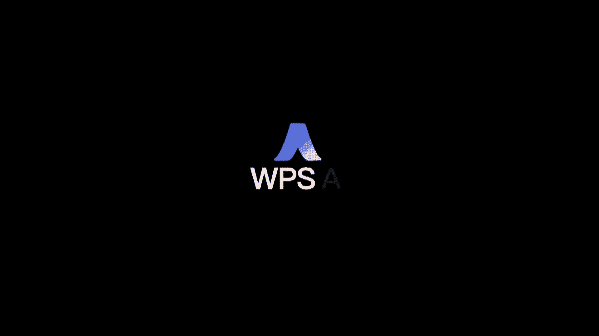

# 2024世界人工智能大会（合集） - P23：20240705-办公新质生产力：探索 AI 办公最佳实践 - WarrenHua - BV1iT421k7Bv

尊敬的各位领导，各位嘉宾以及正在线收看直播的观众朋友们，大家上午好，探索AI办公最佳实践的论坛现场，我是本场论坛的主持人，来自金山办公的许鹤，而人工智能作为一项战略性的科技。

已然成为发展新时代生产力的重要推动者，随着AI技术的落地应用，组织的管理模式，工作方式，服务形态也随之发生改变，在办公领域同样影响深远，值此重要契机，很荣幸能与大家相聚在此。

共同探讨组织及用户数字化转型之道，汲取更多的思考和行动力量，首先请允许我隆重地为大家介绍，出席本次会议的重要领导，他们是上海市浦东新区数据局局长宋伟华，欢迎您，欢迎您，同时也让我们以热烈的掌声。

欢迎本次论坛的分享嘉宾，金山办公CEO张庆源，欢迎您，金山办公助理总裁曹云同，欢迎您，金山办公助理总裁陈波，欢迎您，金山办公解决方案负责人于叶舟，欢迎您，以及我们来自总裁室的各位成员。

同时在此也要向长期支持金山办公，各项业务发展的领导和媒体朋友们，表示衷心的感谢和热烈的欢迎，欢迎大家，人工智能产业是上海市政府大力发展的，战略性新兴产业之一，浦东新区作为全国首个人工智能。

创新应用先导区，构建了产业规模雄厚，创新生态活跃，支撑要素完备的发展优势，下面让我们以热烈的掌声，有请上海市浦东新区，数据局局长宋卫华作开场致辞，有请，尊敬的张总，各位领导，各位企业家朋友，各位来宾。

大家上午好，很高兴参加金山办公主办的办公心智生产力，探索AI办公最佳实践这个论坛，在此呢，我谨代表浦东新区数据局，向本次论坛顺利举办表示热烈的祝贺，向参加论坛的各界朋友们表示衷心的问候，当前。

人工智能成为发展心智生产力的关键推动力量，作为全国首个人工智能创新应用的宣导区，浦东新区，正积极抢抓新一代的人工智能发展机遇，加快打造世界级高端产业集群，大模型应用对各行各业产生变革性的影响。

尤其在智慧办公领域，金山办公多年来凭借自主创新的核心技术，不断地深化大模型在数字办公，智能办公领域的场景应用，显著提高办公效率，提升了协作能力，浦东新区高度重视政五大模型的创新和应用。

在基础设施场景应用，语料库建设等方面，与金山办公，金山云开展了系列的合作，加速数字政府的建设，金山云凭借在云计算领域的技术优势，参与投资建设运营，上海数彩云平台，以云为基础，为浦东新区提供基础设施平台。

软件和数据服务，金山办公，通过WPS智慧协作赋能浦东智慧办公，通过私有化部署电子公文库，实现文档不落地，多终端自动的同步，通过大模型辅助办公，为基层减负增能，能有效的提供政府公务人员的行政效能。

未来浦东新区将深化各领域，垂类大模型的发展和应用，完善政策配套，优化算力的布局，强化语料供给，加速生态的集聚，率先应用示范，尤其是在政务大模型领域，将围绕一网通办，智能化的服务，一网协同，智慧化的办公。

一网统管，现代化的治理以及智慧审计，营商环境建设等重点领域，打造一批大模型的标杆应用，希望继续得到创新企业的大力支持，同时也希望通过今天的论坛活动，增进行业之间的合作交流，增强正气，协同的创新。

探索数字化的发展新模式，新路径，趁人工智能之风在AI浪潮中抢占先机，赢得主动，最后预祝本届论坛圆满成功，祝大家身体健康，事业顺利，万事如意，谢谢大家，感谢宋局长的精彩致辞，相信通过今天的深入交流。

一定会为未来数字化转型和办公，从心智生产力的跃升带来更多的指引和信心，自2023年发布以来，WPSAI始终保持着创新的步伐，持续优化每一位用户的办公体验，那么接下来就让我们先听一听用户的心声。

请看大屏幕，技术运维行政工作，自媒体从业者及演员，人工智能行业技术工程师，一个房地产加互联网，互联网，互联网，互联网，互联网，互联网，媒体活动策划策划专员，通信产品经理，品牌产品培训摄影师。

分享一些勤杂的事物，他们能帮我把那些杂活都给干了，杂活干了，对写推文宣稿的时候，帮我们生成一些框架，然后我们再具体对那些活动去填充，然后对当时领导了一些话的补充，整理数据啊，写报告，写文档。

然后去分析些最基本的原因，问题啊什么的，可以说，WPS软件对于我们行政人员来讲是必备的利器，为发言稿准备我们的行动的规划，写文档，阅读和理解文档可能只是有一个念头，我输到里面，让他帮我扩展润色。

总结理念，可以让AI帮我去生成一个大纲，然后我根据大纲去逐步完善，纠正一些文本错误，去完善我们的语言的逻辑性，那我们会经常的给那些高校，那些实验室写一些技术文档，还有文案，我需要的大纲列给他。

然后让他帮我生成一些图表，我的第一份工作是一个省，然后如果有同行的朋友应该知道，这是表哥表姐们最常用的，其实就是excel里面的很多公式跟函数，但是自打有了WPS的这个AI以后。

我完全不需要去记所有的公式跟函数，我只需要明确自己需求是什么，我直接写公式，自己也不用那么去想那么多费脑，这头发是能保住的，我在网上找到一个图片，它恰恰是我需要一个东西。

但我要转化成excel表格或者是PPT等等的，那我需要用我们的WPSAI去直接做一次转化，我要在产品宣讲的过程中列出123，在30秒的过程中，他把大概30页的所有逻辑全都列出来了，呃策划一些内容的时候。

我们不知道怎么做的时候，就会去问AI，帮我们来做一些灵感的一些参考，呃经常带娃的时候要去玩，写一些景点攻略的话，用WPS的AI功能还写一些景点介绍，大大节约了我工作的时间，效率的提升，效率的提升。

技能的提升，工作效率的提升，提升一些工作效率事半功倍，解放了我的双手，提升了我的效率，让我有更多的时间去陪家人，高效智能带净化，高科技黑技能，高发展，高效便捷，智能理性，高效精准，魔幻啊，潜力无极限啊。

越来越好，祝WPS越来越好，也祝WPS和WPSAI越来越好，能够给我的打工带来更多的帮助，WPSAIAI界的王者。

掌声有请，金山办公CEO张庆源带来WPSAI战略分享，呃各位嘉宾上午好，那个今天呢很高兴借这个机会跟大家分享一下，我们在过去一年的一些在AI方面的想法，一些思考，包括我们也借这个机会发布一下。

我们最新的AI的产品战略，包括我们接下来会有些哪些新产品，然后首先呢刚才大家也都看了一个视频，就是其实我们在去年这个时候啊，我们发布了我们的第一个版本的，AI的产品战略，当时我们是总结了三个词。

AI g c capacitor跟insight，然后呢我们在去年7月6月份开始公测以来，到现在我们也积累了这个千万级的这个用户，也超过了1000万的用户，在搭配上面使用搭配CAI，但是这一年下来呢。

我们其实环境很多东西也发生了很多变化，包括国内的模型也发生了，非常非常大的一个进步，我们从原来的在去年年初的时候，我记得是大家都在追赶这个呃，chat g p t3。5的时候到先天。

其实我们现在国内的模型，在很多方面已经能够大大领先了这个呃，某些领域，可会超过了国外的一些模型的一些表现，包括我们的用户在过去一年里面，也给我们反馈了，非常非常多有用的信息。

也给了我们提了很多产品的反馈，所以呢在今天呢我们也借这个机会发布，首先发布，第一个就是关于我们把WPCAI的战略，从1。0L级到了2。0，这个可能跟之前的讲法可能会有个很大的变化。

首先过去大家我们能看到，就是我们在讲WPCAI的时候，我们可能是从AI的能力上去去讲的，可能说AIGC这个大家很熟悉的纹身纹啊，纹身图这一类的呃，这应用场景CORALLIATE可能就是一些写公式啊。

数据分析一些自动化的能力，但是这些都是从AIAI能力的角度去分析，而经过一年的这个实践，我们慢慢的就进化到我们今天开始，我们可能会从三个方面去讲，这个我们的AI的一个想法。

所分别是这个to c to b to g3个领域，接下来我会简单的先开个头，讲讲我们在这三个方面的一些想法，然后后面会有我们三位同事来分别详细去介绍。

我们在to c to b to g上面的AI的一些应用，实践的一些想法，然后首先先讲讲这个WPCAI这个办公助手，这件事情就过去呢，我们其实大家都知道这个呃从去年开始啊，就大家认为说AI时代来了。

我们其实都一直在思考一个问题，说AI的应用到底是什么样的，什么样的AI是一个AI native，什么样的应用模式，是一种AI native的应用模式，可能到今天，我们在行业里面还没有一个。

大家有共识的一个答案，可能大家都在捕捉不同的尝试，比如像我们一样，我记得去年我们刚开始做AI产品的时候，我们发布的产品基本上是以LUI为主的，也也是基本上呢在产品的表现形式上呢。

也基本上是以一个就是说哎，达佩斯是一个应用应用方，然后我们去接入大模型，把AI的能力接进来，接到我们的功能去就结束了，但是经过一年过去后，其实我们也发现了很多呃想法上的一些变化吧。

比如说我记得我去年的一年前，我我当时认为一点说，我说我认为未来所有的用户都是一个，提示词工程师，每个用户都能够很好的去写一个提示词，能够去跟AI去对话，但是经过这一年我们观察用户的行为来说。

哎发现不是这个样子的，其实用户是很难写对一个提示词，他很难写，这个提示词，比如我们经常在一些社交媒体上看到说诶，有人如果发了一个用AI生成很酷的图，或者写了一篇很好的文章。

可能就有有人会在下面评论说哎求咒语，咒语大家知道什么意思啊，就咒语是很难念的一个东西，大家其实很多时候大家都知道，就是包括那个有些人也说过，其实用户是很难表达自己的，正确的表达自己的需求的。

所以我们认为现阶段可能LUI这种模式，可能它只能适用在一些场景上，比如可能在手机上面，可能LUI是一种很好的方式，而今天比如说这个最近这个，我们在开这个30周年的同学会，昨天我就打开手机，我就跟他说。

哎帮我写一份这个同学会的这个这个发言，其实使这种语言的交流方式是很好的，但是办公它很多时候它是一个效率工具，它需要更多更好的一种交互模式，所以我们在去年开始到今天慢慢积累下来。

我们觉得今天最好的在办公室里，场景里的应用的模式，可能是AGUI加LUI一个整合的一个方式，然后我们把过去的这个AI的几大能力，Ai g c cooperate insight，都把它整合成四个助手。

分别叫写作助手，阅读助手，这个分析助手跟设计助手，其实这个也是跟以往的一个很大的不同，因为大家也也经常会在思考，说AI到底能帮我做什么，以前我说AAS能或者AIGC，它能帮你升文生图。

但是其实这个你用户的这个离用户的需求，其实是有点远的，那我们经过这一年的实践，我们今天接下来会给大家展示的就是，W p c i2。0，我们会给首先给用户提供四个助手，帮助用户从这个四个维度去完成。

这个日常的一个工作，然后第二点，这次那个可可能这也是呃，第一次正式对外录像吧，就是WCI也发布了一个政务版本，因为大家都知道，政务办公其实是一个蛮垂直的一个场景，其实这个我们在去年开始。

也一直在思考这个问题，大家都在想说呃，是不是说未来是一个模型，一个通用的大模型，一个千亿级甚至万亿级的模型，它能解决所有的问题，但是今天来看呢，可能这个大模型通用的大模型，它一定会越来越聪明。

它会变成一个AGI，但是呢它在使用的过程中呢，它还是会有很多局限，比如说我们的一个政务的办公场景，第一它可能是涉及到现创的环境，第二它的计算资源，可能我们很多客户的计算资源，可能是比较有限的。

他不可能有特别多，算力特别强的这个GPU的卡是吧，然后第三他可能需要私有化部署，他也不能去用公网的一些服务，所以在包括它的应用场景肯定也很垂直，比如说政务政务的AI场景是什么呢，它就是公文场景。

他就是要处理公文相关的东西，包括这个公文的这个检索，公文的这个呃创作等等等等，那在这种情况下面，其实如果我们在经过一年的这实践，我们发现如果说是用一个通用的一个大模型，一个千亿级的模型去解决公文这场景。

可能目前来看还是不是特别的合适，至少因为现在通用的模型可能在规模，在成本上面可能还需要一些时间，所以这次我们也发布了，WPSAI的这个政务解决方案，然后在这里我特别想讲一下呢。

也是金山办公第一次做了一个自己的一个模型，就是我们自己的一个公文公文小模型，就是一会我们同学也会啊，我们的同事也会去介绍这一块的事情，这是一个很典型的一个呃垂直模型应用的场景，然后第三点。

我们其实在今年4月份的时候，我们发布了WPCAI企业版，因为这个事也是我们跟在过去这么多年，跟企业客户一直在共创的一个结果，其实企业客户他的视角，他对AI的呃需求的视角。

其实跟C端客户跟政府客户完全是不一样的，因为C端的客服其实我们说to c，它本质上其实是to e to个人效率类的这个场景，他可能就关心的说，哎我怎么能更快速的完成这个，完成这个呃领导交给我的任务。

我怎么样更快的写好文章，更快的做好这个表格，更靠更快的做好这个汇报工作的，PPT可能就完成就可以了，但对企业来说，企业的关注点完全不一样，他可能关心的是哎，管控AI能不能帮助这个我的企业，能够这个提效。

能不能提改进我的生产流程，他可能是关心的是这个方面，其实对企业的角度去讲，特别对一个，因为我自己也是个CEO，其实对个CEO来角度来讲，他并不是特别关心，说每一个人说诶办公是不是用的好用。

他其实更多的是从企业的角度去思考这个问题，所以我们在今年4月份的时候，我们在通过去年一年，跟我们的很多企业科技客户在共创，我们推出了WZI企业版，企业版其实是由三个方面组成。

就是AI hub AI这个cooperate poe，以及这个以及这个智能文档库，那这句话呢，我们在做这个我们的AI在企业版的时候，其实我们核心那个想法就一个就是赋能企业，实现自己的企业大脑。

因为大家都知道这个我们现在所有的企业都，我们都在关心最关心的问题就是体校的问题，那我们大家都能相信一件事情，未来AI一定是会用到企业里去的，那企业的用I呢，它还有个特点是什么呢。

大家都希望有一个最懂自己企业客户的呃，AI每个人应该每个企业应该会有一家自己的，特别是一些规模比较大的企业，他一定是希望有一个有个性化的，这个AI这个大模型蹲在自己企业里面。

他可能对自己企业里的每一个人，所有的企业的，自己的专有的知识，企业的系统是了如指掌的，所以他这也是一个另外一个个性化的需求，所以今天我们提供的企业版的，能帮用户给解决个什么问题，一会我们的同事会讲。

我们自己在内部打个比方说哎，其实今天WPCI企业版，能能够帮帮助企业解决什么问题呢，哎帮助企业开始储备AI燃料，因为对对这种企业的AI来说，它最重要的是需要企业的支持，那企业的知识在哪里。

企业的知识其实在文档这里面，在文档这里面，如果说一个大模型，它如果没有这个，你不如果他不能访问企业的这种各种知识，也就是说访问自己企业的数文档，那其实他很多时候他就表现的就是个通用的。

一个一个111个模型，它一定不能很好的满足的需求，所以今天WP4AI企业版，它就是面向这个现在的这个，我们很多时候，企业在做AI初级阶段的一个一个产品，我们帮助赋能我们的企业客户。

去完成第一步的企业AI企业大脑的这个构建，帮助企业开始积累自己的这个企业大脑，所以简单的这个我总结一下，就是在去年我们发布的这个WSAI的战略，是这个AI g c cooperate跟insight。

三个是从AI能力上去看的，那今年今年我们的WCAI的战略，升级到了2。0，它是由我们的这个办公助手，面向to c的办公助手，面向政务的政务办公AI解决方案，面向企业的WCAI企业版三部分组成。

然后接下来我会有请我三位同事来分别给大，家讲一讲这三部分的一个情况，好谢谢大家，感谢张总真诚和精彩的分享，那么正如刚刚所说，接下来将由我们的助理总裁曹云同先生，首先带来的是WPSAI办公助手的发布。

有请，各位领导，各位朋友，大家上午好，我是金山办公的曹云桐，很高兴今天有机会和大家来分享，金山办公在AI方面的新进展，我今天带来的主题是，WPSAIAI办公助手产品发布，我们本次正式发布了四个办公助手。

他们分别是AI写作助手，AI阅读助手，AI数据助手，AI设计助手，接下来呢我就想带着大家一起来看一看，这四个助手带来的新能力，首先我想向大家介绍一下写作助手，我们现在把这个AI半写AI全文润色。

AI帮我写AI续写，AI扩写AI缩写整合到了这个写作助手里面，那么不管是在文字智能文档表格还是演示，如果用户需要这些能力，都是由我们的写作助手来进行支持，那我想先介绍一下AI半写的能力。

我们去年呢也是在上海正式发布，我们的这个AI产品的时候，已经提供了AI续写的能力，续写的能力受到了用户的用户的广泛好评，但是我们的用户也提出了两个痛点，第一个痛点是续写的文字相对来说会比较长。

而越长的续写内容，会和用户预期中的思路越容易发生分歧，没有达到按需接续思路，用户主控写作思路的体验，第二个痛点呢，我们刚才张总也提到过写提示词，我们有一位资深的KVP用户跟我们说，真实的反馈。

他说如果希望AI能够续写出，非常高质量的长文，那就需要学会编写优质的提示词，于是用户需要暂时中断深度写作的心流，打开AI对话框，把思维模式切换到思考怎么编写提示词，虽然这样做可以提升一些AI写作的质量。

但是频繁的思维切换一定会打破心流，严重影响写作体验，所以驾驭AI的续写，需要用户比较多的思考和操作，那我们就在探索一种全新的方式，AI伴写，我们期望把体验做成无感知的陪伴式的。

希望用户能够沉浸在写作当中，由AI去接续用户的写作思路，帮助用户表达出卡在嘴边的那个句子，所以什么是AI半写呢，开启AI半血之后，AI首先它会自己去尝试用户已经写下的内容。

然后来预测用户接下来要表达的句子，在这个我们看到屏幕上彩色光标之后，灰色部分的文字就是AI给到用户的写作建议，那么这时候如果你觉得满意的话，可以按下tab键应用这个写作建议。

如果觉得AI预测的句子不合预期，不满意很简单，不需要做什么取消，不需要重新编写提示词，您就可以继续按照自己的思路去写，给AI起个头，洗完头以后呢，用AI就会根据用户刚刚最新输入的内容。

继续调整智能预测建议，写作过程完全是由用户主导的，那么接下来我想再给大家介绍一下，WPSAI写作助手里面的AI全文润色，在引入了大模型之后，AI代劳人类，代劳用户帮助文档做润色成为了一种可能性。

润色除了帮助用户修改明显的错误，还可以帮助用户提升表达，甚至是迁移文档的风格，把平淡的句子写得更出彩，但是常规的AI接入方式是调整之后的文本啊，它通常会出现在一个浮动对话框里面，用户这时候就会非常困扰。

AI改了什么地方啊，不太清楚这个表达比原来好在哪里，也不清楚，那么如果我作为用户，我的切身的体会就是AI在做这件事的时候，我作为人类失去了掌控感和信任感，甚至会怀疑AI到底是帮忙来降本增效的。

还是来整顿职场的，更有甚者，AI输出的文本确实写的更好了，但是我要怎么把AI输出的内容合并回，我已经设置好段落格式，大纲级别字号字体段间距，行间距等等一系列的文档之中呢，如果是直接替换回去的话。

我之前设好的格式就会全部丢失哦，文档创作的过程呢，就像是家庭装修润色，本来应该是一个比较放在后面的环节，就好像家庭的软装，希望他来帮我设计墙面上的装饰画，帮我设计窗帘的风格，结果软装公司一进厂。

先把我房子里面一面墙给敲掉了，那这个用户肯定是不希望看到的，如果我们想象一下，平时和同事人类同事一起完成的文档审阅，同事会帮我改文档，他会用修订帮我清晰的标记出来，什么地方改了什么内容。

基于这样的思路呢，我们把WPSAI的全文润色，和AI的修订结合在一起，全新设计了全新的用户和AI交互方式，麻烦切屏老师帮我切一下屏，朋友们激动人心的是，我刚才展示的所有的能力，不是产品设计稿的截图。

而是已经在我们最新的版本里边落地了，我的同事将会一起来真机演示投屏演示一下，那么我们先来看AI半写，现在屏幕上的场景是用户的身份是一个老师，我要写一个家长会的发言稿，那么我写啊写写到这里。

我的思路有点卡壳了，WPSAI半写启动，啊AI半写读了前面的内容，他说建立更是，建立良好学习态度和价值观的基石是什么呢，我想来一个递进的表达，我们输入也是来看看他会写什么，他阅读了上文。

他说也是孩子们学习习惯养成的关键时期，这个递进我喜欢我们按tab键去应用它，嗯我们班级在各位家长的积极配合下，孩子们的语文素养好，下一句我们也应用，我们这时候想谈一谈别的内容。

我们想谈一谈孩子们在学习过程中遇到的挑战，所以我输入，虽然孩子们在学习上会遇到不少挑战，AI马上就转变了他后面接续的风格，因为我已经开始谈挑战了，所以呢他就开始从挑战这个话题去说，就是改变了刚才的思路。

这个顺着我的话头去说了，但我们坚信通过家校合作，共同关注孩子的成长，挺好的，这个说的挺好的，我们应用它，我再来起个头，我们要引导孩子们去面对和克服挑战，看看他会接续什么内容，输入完成。

培养他们解决问题的能力，不断提升自我，这个稍微差点意思，咱们用alt加下方向键，看看AI每次会提供几个不同的选择，我们先应用这个，我们看看接下来alt加下放键，看看有没有其他的选择嗯，多元化的教学活动。

寓教于乐的活动，团队协作精神，这个是我想说的，这句话是我想说的这个AI半血啊，简直就是我的嘴替我们选第二个，把它弄上去，这就是我们的AI半写的能力，不需要记忆提示词，不需要复杂的操作，不用打断思路。

AI半写是我的嘴替，非常丝滑，非常高效，非常先进，写文档我真的觉得从来没有这么爽过，接下来呢我们再一起来看一看AI全文润色的，真机投屏显示，现在屏幕上出现的是一篇上海豫园的介绍，我读了一读呢。

觉得没有把豫园写到我心目中那么美，那么我们来开始AI的全文润色，他首先也会解析这个文档的内容，把它全部都读懂，读懂了以后找到哪些地方能够进行修改，能够写的更好，然后呢我们就会看到一个一个的修改。

以修订的形式呈现在右边，那么我们为了防止说这个AI的修订能力，AI的润色能力，破坏用户的原数据，我们还特别做了一个处理，我们会开一个新文档，防止用户说啊，我刚才这个文档被你改坏了，不会的。

那我们看到修订已经进入了，我们的文档内容当中，再看一下我们右边的这个全新设计，AI修订会在每一条它改动的内容下面标注上，他为什么这么修改的原因，供用户决策和参考，我的人类同事都不一定有这么贴心啊。

我觉得真是非常的爽，它给了我一个非常好的支持，原文里边我设置好的格式也得以保留，不需要手动合并了，而且由于我们用的是WPS里边的，这个原生的修订能力，所以AI的这个这个润色内容。

我们可以逐条来决定是保留还是拒绝，比如说我们看到，这条吧这条写的不太好，我们拒绝他，我们不要AI做这个操作，下边这个甲时向东走过石桥嗯，还不错，这个还不错，我们接受它，很愉快很愉快。

就是我们提供这个能力，在给到我们的共处，让用户试用之前，我们自己就对这个创新非常的兴奋，因为WPSAI的全文润色呢，真真正正把我们的AI能力，结合到了用户的工作流程里边，把WPS的能力和AI的能力。

丝滑的串联在了一起，提供给用户，新一代的单人和AI的协作工作流程，那么我们的共创用户试用之后告诉我们说，兄弟们不用怀疑WPSAI不是来整顿职场，的，确确实实是为了大家降本增效的麻烦，控评老师切回演示。

好，那么我们看了WPS，AI写作助手的两个能力呢，我想再介绍一下阅读助手的AI总结，和AI解释，相比起去年我们发布的这个AI阅读，我们今年全新升级了AI引擎，并且调优了问答模型。

对于文档的解析总结问答能力的更强，效果更好，左边我们看一下，这是一个PDF格式的学术文章，嗯是图形学报里边我们摘取出来的，讲的是一种新的矢量中文字库的自动压缩方法，这个文章阅读对于我来说呢，我能读得懂。

但是会很费力，就是它里边的生涩的东西会比较多，那学术文章嘛都是这样子的，我们用AI全文总结看一下，于是在右边呢，我们就把啊这种学术论文比较重要的，像什么关键词啊，文献链接。

作者单位一个一个的这个关键点都给摘出来，那么再看下面正文内容的总结，包括研究的结论，研究的方法，重点已经全部都总结提取出来了，我不需要再去一页一页硬啃这个文档了，那么再看呢，我们这个AI解释。

提供了另外一个有趣的AI落地形式，用户在阅读文档的时候遇到不熟悉的概念，我这就看到一个不熟悉的概念，二阶背齐，而曲线这是什么东西，我文档里边的原文我看的有点晕，我让AI来帮我解释一下，这个有一些问题。

你直接放在搜索引擎里边，拿这个关键词去搜，也不会有直接的答案，但是AI可以去帮你解释这个问题，那么我看了一会发现哦，原来如此，是那个翻译不太一样，我熟悉的叫做贝塞尔曲线，他这个其实就讲的是贝塞尔曲线。

那么我们就避免了用户在阅读的场景里面，反复的跳出，跳入可以获得一个更沉浸的阅读体验，那接下来我想讲一下第三个助手，第三个助手呢叫做数据助手，有这个AI的表格操作，AI计算，AI函数，AI数据问答。

AI数据可视化和AI写公式，去年我们给大家介绍了AI写公式，刚才我们的用户在视频里面也提到了，用自然语言提出要求，AI帮你写一个公式出来，那么今年我们带来的新东西也特别的好玩儿，我们先来看表格操作。

这有一个非常常见的案例，就是嗯，我们的用户们经常会问，我们的一个用户反馈问题，他说为什么自动筛选没有包含所有的数据行，其实这个问题的原因很简单，就是我们大量的数据，尤其是在同事们协作的时候。

不同的人一起来做啊，经过多次的导入合并，这个过程当中没有仔细的清洗过脏，数据里面有空白哈，自动筛选在空白行的地方就会断开了嗯，电子表格的规则就是这样子的，那我们的解决的思路是什么呢。

我们在电子表格里面嵌入了一个自然语言，转JS的能力，那我们的电子表格WPS，电子表格除了支持VBA之外，也支持JS的调用，所以两个接口都可以用，那AI写出了JS代码，然后在电子表格里面执行。

用户只需要双击control提出要求，说删除空白行，AI就可以完成摄影的工作，再来看下一个能力是AI数据助手里面的AI函数，我们都遇到过数据归类的问题，我们公司张总有一个要求。

就是同事们定期要去克服轮值，那我在克服轮值的时候，也做过这个用户反馈归类的这种事情，用户描述了一堆文字，是从我们这个后台导出来的，那这个反馈挺长的，他是一个投诉吗，是提出了一个需求建议吗，是一个咨询吗。

还是给我报一个bug，我在克服轮值的时候去做这个分类啊，一个小时大概只能阅读，并且分类100多条数据，因为分类的维度越多，处理一条数据，人类处理一条数据所需要的时间就越长。

那我们在WPSAI的数据助手里边，提供了一个这个神奇的AI函数，对表格里面的文本字段可以做AI的分析处理，比如说我们把前面这个用用户反馈字段，WPSAI点classify，然后引用C6单元格。

把它分为四种分类，其中选一种让AI来选，这是服务态度的吐槽还是产品质量，还是外观造型还是物流速度，马上就可以算出结果，可以完成海量数据的计算清洗和归类，那完成了这些数据清洗，数据分类的工作。

接下来我想说一说数据分析和可视化，这是依赖于AI数据问答来做的，那么咱们刚才说到啊，WPS数据助手操作表格的这个能力，可以调用JS引用，电子表格里边提供的几千个，API都可以为您所用，那我们再想一想。

就是在操作数据的时候，我们经常会提到的另外一个神器是什么呢，是Python，Python提供了大量的运行库，从数据分析回归分析到画图，plot at都有这些能力，那如果我说我们现在希望用到这个能力。

能怎么做呢，WPSAI数据助手提供了一套自然语言转Python，并且在我们的表格沙箱里边，安全执行Python代码的云端服务，最终结果呢会通过网络返回到表格中，呈现给用户。

那接触AI和Python这个丰富的库啊，用户完全不需要学习怎么写代码，就可以用自然语言翻成多种多样的数据分析，问答和可视化操作，我这里想说一下的是，以上介绍的AI数据助手的一部分能力呢。

是我们在4月份发布会的时候提到过的，to b领域的COOPPITATE底层能力，cooppitate pro的底层能力，我们现在把它整合到了to c的版本里面，整合到了我们助手里面。

希望能够让更多的用户享受到，WPSAI带来的便利，那麻烦控评老师切屏，同样这些能力也都是已经落地的，我们也可以进行真机演示，我同事来帮我这个这个操作，我们这里有一份好典型的电商销售表格，我们的用户反馈。

里面经常会包含这样的表格形式，首先我们看到确实它掺杂了一些空白行号，我们输出AI的，呼出AI的对话框，表格助手出来了，我们提出删除空白行的要求，删除空白行，自然语言输入，啊现在他开始解析。

然后输出了一段JS代码，这我只是为了展示，所以把JS代码放出来了，其实用户完全不需要理会里面写了什么好，我们看到后面的所有的空白行已经被清除了，哪怕是百万行级别的数据量，这也就是一瞬间的事情。

不需要我一个一个去手动定位，手动删除，好舒服，很完美好，我们再看数据，里面还掺杂了一些邮箱的超链接啊，用户反馈的邮箱是一些超链接，我这个人是一个，因为做产品嘛有很严重的强迫症，就是我看着会非常的不舒服。

坐不住好，我们向AI提出要求，把超链接都取消掉，我们刚才这个对话框不需要关闭，接着输入就好了，取消超链接，取消超链接，这个我要是跟人类说，它能明白是什么意思，看看AI能不能明白呢。

嗯他把超链接都干掉了呀，现在看着终于舒服了，就是看着他都统一了，那么我想做一下数据分析了，因为这个清洗我现在搞得差不多，想做数据分析，我提出要求，能不能帮我把产品按照分类，什么安防啊，传感器啊，加装啊。

这个分类进行统计，做总利润的比较，那我们向AI提出要求，我们并不需要把分类输进去哦，我们只需要提出产品分类的总利润，他会把表头搞明白，AI会先把表头搞明白，先看一下表头上写了些什么东西。

那他现在也是开始分析，这个就是我们刚才提到的自然语言转Python的能力，后面跑的是Python代码，所以他们会从云端返回，那我们看到准确的理解了产品分类的意图，把传感器安防加装手机洗衣机。

路由音箱给我列了出来，现在看着还是差点意思，不够可视化对吧，我们来提个要求，再画个柱状图，可视化分析一下，我想看的直观一点，插入柱状图，这也是自然语言转Python的能力，插入柱状图。

那么它会给我什么样的东西呢，因为表格里边平时也是有插入柱状图的对吗，所以他把我刚才的内容，就是所谓的那个分类的利润拿过去了，他会给我做出什么样的东西来显示图表诶，一个柱状图，把鼠标移上去看一看哦。

这是一个可交互的柱状图，好愉快，插到表格里面去，左上角有个加号，插到表格里面去哦，这个还会动，还有个动画，所以呢这个表格交给领导，我就默默地又获得了一个加分项啊，希望年底能够，我们再来试试看AI计算。

我们让AI帮我把这个反馈字段做阅读理解，按照好评和差评做分类，我们直接提出要求，还是这个对话框可以接续输入，就是将用户反馈分为好评差评，那刚才我们都看到了，他会读表头，所以这个接下来呢他会把这个好评。

差评先反馈给用户，请你确认一下，你是要分好评差评吗，好我们来执行，看看正在分类走进度条，这个速度大概轻轻松松比我高个十倍以上好，每个都写好了，那对不对呢，我们来看一看第三条，第三条这个用户反馈说。

有了它再也不用担心电量会用光，这看起来是对这个手手机一个很正面的褒扬，对吗，但是大家都知道，现在这个混B站的年轻人讲话都非常的有趣，他前面还有一句话说，这台手机的电池续航，真的是能让我每个小时都在充电。

所以这是一个阴阳怪气的反能否，那我们看一看AI正确的分，为了差评说电池不耐用，非常的完美，AI数据助手，当之无愧的数据神器，效率利器，为我们打工人带来了脸上的笑容，好麻烦，控评老师切回演示。

接下来我想向大家介绍第四个助手，WPSAI的设计助手，我想向呢为大家展示其中的三个能力，设计助手其实能力非常多，这个设计助手足，因为嵌入到我们的演示文字表格各个方面，各个方面。

我们希望用户能够关注在内容，而不是样式，所以它的内容非常多，我想介绍三个，一个是AI排版，一个是风格克隆，一个是图片滤镜，那先来看一下AI排版，很典型的一个这个只有内容的文档。

这讲的是植物养护的深入研究与实践，这应该是一个毕业论文，那么我们左边有一个任务窗格，等下就可以启动AI排版的能力，因为有演示呢，我这就简单的过一下，第二个是风格提取，风格迁移就是我们做好一个没有风格。

没有样式的PPT，可以从以前一个做好的PPT里面，把风格迁移过来，这截图是这个样子的啊，风格迁移过来完成了，那我们再看一下第三个叫AI滤镜，AI滤镜是什么意思呢，PPT里面有很多图片风格不一致。

我们用AI滤镜让它风格保持一致，选择一个滤镜好，那我们现在再麻烦控评老师切到演示这个环节，我是简单的过一下，我们同样来看真机演示哈，这是我们一个就是一个这个毕业论文吧，但是这个里边有一些内容。

我们看已经写的差不多写了6800多字，也写了英文的摘要，关键词也有TUC目录，那这个里边我要把每一个第一章引言，1。1研究背景语义，人工识别说这是章节标题，这是小标题，可不可以做，可以做。

但是非常的费时费力，我们来看AI排版的能力，右边咱们可以选学位论文，我们已经把全国很多高校的这个能力的排版，论文的这个样式已经放在我们的库里边，AI要做的事情，阅读内容理解语义套用样式好。

我们来选一个国家标准，这是跟那个高校没有具体关系的，就是一个国标国家标准啊，瞬间就完成了第一章研究目的，小标题什么就出来了，我们看一下，对不对呢，我们来显示原文来对照一下，显示原文来对照一下。

右边就是这个我原来写的只有内容的部分，左边是AI阅读理解提取语义判断大纲级别，每页多少行，每行多少字段，前间距段，后间距一键套用完毕，极大地提高了效率，所以我们在做AI这个设计的时候。

设计思路是帮助用户把内容语义，排版和样式做分离，让人类呢尽量关注在核心的内容上面，剩下的语义识别，排版样式交给我们DPSAI来完成，接下来是风格克隆，我们来看一看风格克隆，我做了个PPT，没套模板。

这样的PPT拿上去以后肯定会被吐槽对吗，那我看到我的同事有一个PPT，他做的2022年的项目汇报，我觉得他做的这个挺好的，找他要过来打开看看，确实是我想要的，所以我们这时候可以用风格克隆。

把我的没有套任何模板，没有套任何样式的PPT内容，跟他的PPT里边的提取的设计要素，注意这里是设计要素被提取出来，解析它的文档，提取生成配色字体方案，生成主题，套用主题完成了，好愉快。

就是你的PPT很好，但现在是我的了，那么想象一下，我们平时是不是这个场景有非常多真实的案例，就是同事把去年的产品介绍的PPT给我说，老板叮嘱就按照去年那个风格做内容，换今年新的好痛苦，用这个迁移呢。

我们以前要去找模板，什么找设计师的事情不需要了，把去年那份丢进去，AI会帮你干好的，舒适又惬意哈，第三个是AI图片滤镜，那这个呢由于咱们日常工作当中引用的图片，来自于百度的搜索，来自于图库。

来自于各种这个素材提供商，甚至我们公司历史上积累的各种图片，所以一个PPT里边很常见到，图片的风格不一致，有水墨画的，漫画的，插画的，第二页，还有什么东西，我们来看一看嗯，简笔画的版画的嗯。

和一个铅笔像是素描的，Whatever，就是这个反正交上去会被骂的一个东西，那我们来试一下，用AI图片滤镜哎，图片滤镜我们套一个像是照片风格的好莱坞吧，套一下，应用滤镜当中。

哎这个出来看起来像是照片了对吧，很愉快，我们把它应用到全部图片，把滤镜应用到全部图片，刚才看起来这些五花八门的东西，风格不统一，观感就会比较差，通俗的来说就叫做丑啊，那我们把它套用完成以后啊。

我们前后两页切一切，唉至少这个风格是统一的，观感一下就上去了，老板再也不用担心我PPT里面的图片，乱七八糟，去到客户那里，当现眼包了，麻烦控评老师切回演示，接下来呢，我还想向大家介绍更多的一些AI应用。

第一个叫做语音速记，我们在日常工作当中经常会遇到的场景哈，我作为这个助理，我需要记录现在这个会议，那么我是没有办法坐在前边的，因为前面都是大佬们对吗，我需要缩在后面，那这时候我们可以把WPS的。

移动版的语音速记打开，用手机上条件比较好的这个这个麦克风，放在第一排，拿它当个收音，那么这时候它就开始识别了发言人一说了什么，发言人二说了什么，我搬着我的电脑，搬着我的大屏缩到角落里边。

然后我就在听这里边讲的东西，对不对，如果有问题的话，我可以标记一个黄色标记出来，这个事后要改，或者这是老板说的重点，这件事情完成之后会开，完了以后，我还可以用AI来生成全文的概要，开会也变得挺愉快的。

那这个呢是语音朗读，刚才我们的这个主持人许鹤上来以后，我们为什么选主持人是许贺，因为他在我们公司说话比较字正腔圆，那我们这个AI语音朗读里边提供了很多，AI的声线，比许鹤还要字正腔圆，颤抖吧，许贺。

所以我们平时工作当中用到的文档，不管是财报也好，心得体会也好，在开车的时候，在做饭的时候，打开AI语音朗读，听文档，终于变成了一种享受，因为这涉及到一些移动版的东西啊，所以我先提醒一下大伙。

我们就是在我们公司的展区那里提供了笔记本，提供了手机，以上所有东西都可以体验，欢迎大家多给我们提意见，那第三个是AI扩图，这个场景也是很常见很常见的，要做一个团队介绍，团队介绍里边有人提供了一个大头照。

有人提供了一个半身照，然后我们这个帅气酷炫的女总裁，提供了一个倒腿的照片对吗，因为她的腿很长，所以要突出这一点，那么我们看一看，就是那这样的照片拿过来以后，设计师同事也会非常的困扰。

就是这几个人的比例完全不一样，我要怎么弄啊，用这个AI扩图能力，照片里面没有的部分，我们把他都拉下去了，好现在我们两个男同事也都变得腿很长，三个人站在一起一般高，看起来就非常的整齐。

那做这个PPT也就变得很愉快，我们再来看一个能力是AI的，图表和表格解读的能力，我们平时在电子表格里边已经做好了，表格的数据，已经做好了图表的数据，接下来在做汇报的时候，需要在旁边配上一些文字。

美化一下，排整齐，让我们的同事们可以看得更清楚对吧，那么这时候一个图表，用这个AI图表或者表格解读，就可以直接得到一页PPT下面的解说文字，下上面的这个图表已经整齐地排版在一起。

好这是我想给大家带来的四个办公助手的能力，非常感谢大家，欢迎多提意见，谢谢，感谢潮总来为我们带来了，四款好用的AI办公助手，相信它不仅能提高您的办公效率，同时也将对您的办公方式带来深远的影响。

那AI时代，数字政府的形态正逐步向着整体协同，智能化的方向发展，以大研模型为代表的人工智能技术，正在政务服务领域加速落地，那接下来就让我们掌声，有请，金山办公助理总裁陈波带来，WPSAI政务版发布。

有请，刚才超级彤讲的太好了，我就觉得有点意犹未尽，就是呃我觉得他有一个特别打动我的地方，就是我们其实在这一年半的时间里面，听了无穷多的AI的这个讲话，然后演讲，然后看人家放各种各样的这个PPT呀视频。

然后人家说me journey啊，说stable diffusion，说什么是造图，你也只能听听，你用不了，因为很复杂，但是曹雨桐讲的东西不一样，就在你的当PS里面，谁没有当PS嘛对吧。

所以AI真的这次到了我们的指尖，但是呢我今天讲的这个话题是一个政务版的，这个非常严肃认真的对吧，我我也不指望能够得到那个曹云同，那种哇哦那种那种效果，只要你们说嗯嗯点点头，我已经很开心了。

好我们来看一下这个政务版啊，就是，翻译帮我翻译，好我们看一下那个这个政务办公的这个难点啊，因为宋局坐在这里，我觉得我一个产品经理，在这个宋局面前讲这种事情，实在是有一点班门弄斧呃。

我们认为呢就是政府办公的难点主要是三件事，一个是办会，一个是办事，一个是办文，但是办文呢其实是最基础的事情，因为你做事情也需要有文档的支持，办会更是需要有文档的支持，然后每一个参加高考的人都知道。

写作文是最难受的一件事对吧，面对着以前的白纸，到后来的那种屏幕，大家的那种焦虑，其实每个人都共同有过的事情，然后这个大模型啊这么长时间了以后，就是刚才看到那个曹云通内容，我们我们真的是认为大模型。

进入了我们的日常的生活和办公，但是真正到了政务这个领域的时候，其实你也有点慌张呃，这个大语言模型呢突破了人类的语言障碍，语言屏障啊，变得能说会道，但他这种能说会道，在政务这个领域是好事和坏事。

其实还真的有点讲不清楚，因为传说这个去年有关这个人工智能，最最常见的一个梗，叫做他会一本正经的胡说八道对吧，其实胡说八道我们不怕啦，其实怕的是那个一本正经对吧，因为你觉得他是真的，谢谢好。

这边有好多个问题啊，一个是大鹏新懂不懂政务啊，其实呃政务是办公的事情，其实是博大精深啦，它里边的那种格式语言风格，其实都是需要经过学习的，还有一个就是这个大圆模型会写公文吗。

你你可以放心的让他去聊天嘛对吧，ChatGPT chat这个东西就是一个闲聊的意思，你敢把一个闲聊的工具用在正规的公文写作上，还有就是这个后面的几个问题，基本上是我们在啊企业啊，单位啊。

应用一款软件都是最操心的事情，就是权限的管理啊，安全的问题啊，能不能融入我自己的这个单位的这个呃，本身已有的这种系统，所以这些问题都是对这个政务大模型，的灵魂拷问，我觉得最基础最基础是要可信嘛。

你在政务系统里边做问答，他的这个知识是不是可信，它的来源是不是可信，可能是我们做这个系统中第一个要考虑的因素，我们来看一看这个大的这个系统的，整个的基础的结构啊，这是一个简化的一个结构。

最下层的是数据层，也就是说一个政务系统的，这个数据是来源是哪里，我们这个呃WPSAI政务办公系统，肯定是包括了内置的很多系统，就是我们国家这么多年来的一些政府的讲话呀，报告啊。

这些东西都已经是内置在里面的，然后呢同时它可以包括你自己单位，甚至你自己科室，甚至你个人的这种文档都可以包含在里面，还有就是说你可以通过第三方购买，像人民网啊，新华社这样的这个呃语料和资料。

都可以放在整个系统中，中间的能力层，就是讲我们的这个大模型啊，这个大模型不是一个随便拿过来就可以用的，就是从他的呃语料的准备到他的训练，到他的调优，但它最后的应用其实都是量身定制的好。

从应用层呢我们分了三个层面，就是主要提供三类的功能，一个是问答，一个是写作，一个是呃这个工具，同时它可以接入到你自己单位和企业的这个，呃系统中去，好这把我讲一下，再分别讲一下这三个场景啊。

呃我会讲的比较快，因为后面也有演示这个金山办公单片式的风格，按照这个张总的要求，就是讲出去的一定是你已经做到的，所以我们一定有真机演示，好AI问答，问答是这些这个大圆模型AI系统的基础的，这种功能。

就是我们提供的这种问答呢，不仅能够包括以前，就是像J切尔GP这一类的的聊天的这种软件，提供的功能，我们给出的回答其实是有出处的，这也是政务系统的一些基础要求，就你回答的东西是从哪里来的。

然后同时也给这个用户提供了延伸阅读的机会，好我主要想讲一下写作啊，就是我们没有提供那个半血的功能，也许在未来我们很快也能接的上，但是我们会非常的小心，因为不要随便说错话了。

就是我们来看看我们在政府系统中做这个写作，助手的时候，我们做了哪些工作啊，其实这两句话还是还是很有含义的啊，就是一个呢就是简单公文要一气呵成，复杂公文叫切磋琢磨，切磋琢磨这四个字其实非常的重要。

在去年的时候啊，我觉得大众，包括我们自己，可能对AI都有一种不切实际的那种幻想，以为给一个题目就可以写一篇公文出来，然后交给局长，这是不可能的，其实从信息学角度上说都是不可能的。

因为他如果不了解你的单位，不了解你的思路，是不可能给你马上创造出一一篇，非常好的这个文档，而且这过去的一年，大家对AI的这种局限性的认知，其实也得到了提升，我们在政务系统中间。

我们想让这个系统能够真正达到的是什么呢，就是让一个能够帮助初等生提高水平，帮助高等生提高效率，我们不认为我们AI写出来的公文，会比我们的局长秘书，或者我们呃，就是说很有经验的这种公务员写得更好。

我们不相信这件事，AI他现在没有这个能力，所以是把初等生提高水平，就是刚入职的新员工，可以利用这个AI把自己的写作水平提高，同时它可以帮助高水平的写作者提高效率，节省时间，所以在这件事情上呢。

我们希望简单公文可以提高效率，复杂公文一定是AI跟这个用户，跟这个作者切磋的过程，让我们来看一看是怎么个切磋法，首先就是说写一篇文章，其实我们去年有多少人试用AI又放弃AI，你都不知道要干什么。

你就去尝试一下，写篇文章好像还行，你没有刚需的情况下，都挖掘不出这个AI的好处，那么在这里呢我们写一篇这个公文，最基础的要结合你自己单位的实际情况吧，要结合你这件事情本身的具体的语境。

所以呢我们在这个系统中间提供了参考文献，这样的一个一个功能，也就是说你在写作之前，可以把你相关的一些素材作为参考，给到大模型，给到大模型，甚至从素材库里直接选取都可以，这就给这个整个的写作。

提供了一个上下文的框架，好第二个呢是说我们提供了大量的模板范文，素材和文采这样的东西，你知道高考写作文的时候，多么想在这个呃命题作文中间，找一句相似的这个唐诗宋词，来提升自己的这个啊呃看上去的水平嘛。

所以这种其实都是我们常见的写作的资料，还有就是呃这其实是非跟效率非常相关了，呃公文排版是一个非常琐碎，同时又是一个非常严肃认真的事情，如果我们能够把自己单位的模板直接放在里边，一键套用。

也是一个极大的这个效率的这个提升利器好，那么这一段就是内容产生中间的相互的交互，就你有一个题目，他会给你出大纲，这个大纲你可以手动修改，这样就是你跟他一个交互和完善提升的过程，然后大纲修改完了之后。

你可以根据大纲逐断的去生成，这样相关的这个内容，这个戏内容你也可以是交互式的修改，呃高考作文800字题材不限，这个拒绝诗歌对吧，我们有多少次写了一半之后，因为字数不够，很难受对吧。

但那家绞尽脑汁的在那想，这时候就叫AI帮个忙嘛对吧，就是自动续写，他已经理解了你上面的内容去做一些扩充，这也是一种很好的使用AI的方式，内容完了之后你要去做润色，其实你高考作文交卷之前。

你肯定也要再通读一遍，看看有哪些地方不顺畅，哪些地方可以提高，然后在这个交卷之前，你还要去做错别字的这种这个进一校对啊，去找到那个相关可能出现的错误啊，这些都是都是我们写作中常见的呃记耗时。

然后效率又低的一些地方，可以用AI的帮忙我，我想很多人可能都都都有这样的这个生活经历，在做的可能都经历过高考这样的一个过程，老师早就告诉你，不要写到最后一分钟，要留三到5分钟，5分钟去检查。

因为每个错别字都会扣分的对吧，我们都是这么走过来的嘛，然后在这个之后呢，就是整体写完之后可以一键排版，然后这个排版的格式可以有各种各样的选择，好这个AI任务除了问答和写作之外。

我们还提供了一些辅助的工具，比如像这个工具呢，就是我们提供了一站式的查询，就是把以前的关键词呃，这个标题正文的全文检索，和我们的AI问答整合在一起，这个整合的系统不仅可以提供给内部的员工。

甚至可以在你的网站上给公众提供服务，智能查重其实是一个很常见的，政务的这个应用啦，就是无论是要跟去年的文件做对比，还是要跟上级的文件做对比，甚至是来源出处的这种查找，都是一个很常见的功能。

WPS是以office起家的，我们最好的东西一定要放在我们的端里边，可以用，所以在这里边就是我们有一个整个的这个呃，公文的这个这个助手工具可以调出来，把我们刚才展示的功能在WPS端里面使用。

从玩具到工具啊，去年的一年，其实AI从一个尝试性的，甚至是用来呃，更多的用于创意产生的这样一个玩具，逐步走进了企业，走进了政府单位，让它变成了一个效率工具，那在这里。

我们通过这个各种各样的对大模型的这种裁剪，优化定制，来完成这样一个任务，我们在这里也发布了我们的这个，金山政务办公的模型，今天在我们的这个公网的这个环境下，大家是可以适用我们这个系统的，这个系统呢。

原理上可以接各种各样的这个大模型，包括你企业单位买的购买的私有化的模型，或者公网的模型都可以接，现在的系统接的是我们金山的政务办公模型，这个模型呢其实是一个13B的垂类模型呃。

他没有做到什么千亿这个参数，本来也是因为政务系统有很强的私有化的需求，所以我们也是为这个为方便私有化部署，专门打造的，然后这个系统啊是E级的政务语料的训练，它是从一个模型最早的那个语量训练开始。

就已经灌输到我们所有的这些语料，按这个张总的话说，就是这个这个大模型从小就是读公文长大的，然后有百万级的人工金标数据，也就是说它包括但是不限于那种问答对，就是你哪些问题怎么问怎么答，是人工做过标注的。

那么这些都在我们的预训研院里面包含的，同时它支持全面的信创化，我说的全面性创化不仅仅是客户端，WPS是支持信创的，所有这个这个OS和这个数据库的这种组合，而且是服务端也支持性传换。

同时我们支持国产GPU，包括呃这个华为的910B和海光，然后所有的这个参数对齐，是我们这个系统中最强的一个特征，就是说一定要做做这个呃来源的这种检查，出处的检查和事实的检查，就是fact check。

就是重要的这种讲话是要资质不差的，引用的，不能够像普通外边这个通用的大模型一样的，随口说一定要对齐的好，那么讲完了这个东西之后呢，就是除了我们在公网上已经有这个呃，上线的系统啊，呃我们现在身处浦东。

感谢宋局，感谢这个呃浦东新区的这个呃素材，等这个科技公司，我们的共同的努力，我们的这个呃政务办公系统，已经在这个浦东新区政府落地了，然后我们的呃这个有一些部门，部分单位已经进入了使用的阶段呃。

这只是第一步啦，同时我们也在跟这个呃浦东新区的大数据牵头，我们和伊甸速产，就我们自己的团队一起，在这个呃打造这个政务大模型的标准，就是它的各种处理的流程和环节上的，标准的建立。

才是我们为了把这个系统啊上一个台阶，最坚实的基础，好切一下这个演示，像我承诺的一样，我们上线的东西，我们演示的东西一定是上线的啊，这是我们这个呃系统的这个首页，这个系统首页除了我刚才讲到那些AI的功能。

其他拥有了一个政务这个知识库的，这个基础的功能，就像我们下面看到的公文，我的单位库，就单位里的这种公文的这个聚集，以及所有的参考文献，我们打开一个工作汇报，这个工作汇报里边有国家级和省市级的各类的。

这个报告，然后呃看一下年份是79年到今年的，所有的报告都在这里，你可以去，你可以去浏览，你可以去检索，这都是我们提供的最基础的功能，好我们回到首页，主要的三个功能，一个是智能搜索。

就是我们的所有的这些参考资料的搜索，第二个叫政务问答，就是我们的AI问答，第三个叫公文写作，我们进一下政务问答，这是一个常见的这个叫cheat bot的，这个这个界面，就是这个聊天机器人的界面。

然后呃我们试着问一个问题呃，来我们来看一看啊，我们问问最近新资生产力的，有一些哪些重要的讲话，其实到这时候都挺紧张的，因为AI生成的时候其实有一定的随机性嘛，为什么我说我紧张的时候，你们都笑了呢。

好我们可以看到它生成的结果，都有后面的这种角标，这个角标就代表它的来源，然后你点击下面的链接，就可以看到每一篇文章具体的内容呃，问答是一个相对比较简单的东西，让我们进公文，公文写作，就像我刚才讲解的。

大家可以看到左边我们有很多的模板，啊每一个写过文的人可能都会有这样的体会，有一个模板就会我很好，下笔很多啊，就是有很多的参考，就是事物的模板啊，法定的公文的模板，然后我们再看一下范文。

然后这有事务的公问，行政的公问的各种各样的类型，我们看一下素材，这里面素材分重要的讲话呀，法律法规政策文件都支持搜索，都支持搜索，然后呃，呃文采，大家可能会猜这个文采里面是哪几个分类嘛。

我看一眼文采京剧重要讲话，中间的一些京剧，如果你能够引用，就显得比较高端，然后成语诗词都是这个常常可以能够起到呃，一个公文，一个作文中间的画龙点睛的作用，好我们把这个关了。

我们来试着用这样的套系统写一篇文章吧，写一篇公文，我们试着写一写呃，比如说呃我假设以这个呃，我是额售局下面的一个员工对吧，然后负责AI这个人工智能，我想写一个关于2024年人工智能。

对政务办公的这这个无论是规划呀还是，好惨哦，嘶我们按这个名字去生成一个大纲，就是把这个大纲生成出，然后其实我看了这个大纲之后，它太过通用了对吧，就是说它的内容好像用在哪里都可以。

那么我们来把一些呃参考文献加进去，和我自己认为好的，应该用来参考的这种文章来看一看，我们打开公文助手，我们先把它插进去，然后打开公文助手好，我们看到他这个里边的说这个使用素材，我可以从文库里直接选择。

就你打开文库时候，它就这些所有的文章都在这里嘛，然后呢这个东西你要做搜索就太麻烦了，我们直接用AI给我推荐的这个文章，就是所谓的推荐素材，它要根据我的这个这个标题，去寻找这些相关的东西。

然后我把别人的这个办公室，政府办公室的这个文章作为参考文献，加在我这个写作的过程中好，然后同时呢我可以选择从本地上传，我已经就是我曾经读过用喜欢的文章作为参考，好啊，本地上传完了吗，OK好。

然后我们可以选一个部分去做，做一个大纲成文的这样的一个，AI辅助的创作，然后这边有一个点，就是说他有一个拟文单位的选择，就是我是从官文库的单位啊，还是从数据局这样的，因为这个呃。

就是AI会根据你的拟文单位来确定一定的，分隔调整和这个写文章的角度，在这样的情况下，我们就可以用来做这个啊篇幅选失踪，然后你们单位数据局产生相关的正文，这个过程，因为我没有那么多的时间去做手动的消修改。

我只能给大家看一眼，就说呃可以用这样的方式产生最基础的内容，然后你在这个基础上通过跟这个AI的交互，逐渐的这个提升这个文章的水平，我这里显示的只是一个写文档的这个呃，这个过程其实我们写过文。

还有一个是就是改文档，改文档，我们我们有可能就是我收到了，一个科员教给我的一个一个文档，然后我要把它修改润色，然后能够交给这个宋局，我们来看一眼，我们假设这是一个科员送给我的东西。

我在这里还可以做哪些基础的工作，一个呢就是我可以做这个文文本的润色，因为上来的东西有一些可能口语化太强啊，或者写的不够好啊，我们可以调用AI的公文助手去做这个呃，文本的润色。

我觉得还是如果你要是觉得不满意，你还可以从事，然后能够看到这个他中间对这件事，事情做出了一些修改，这是最基础的一些功能，然后还有一个我们常见的功能呢，就是我刚才讲的叫做呃校对，我们来看一下这篇文章。

中间有哪些这个可能存在的问题，其实高考还是一个比较简单的事情，就说分数低一点了，其实在这个政务办公领域出问题，其实是一个非常严重的事嘛，所以呢我们在这里可以看到他的，有一些的就是这个笔误。

然后他的一些表达，甚至一些事实性的错误都有可能在这里出现，然后你可以自动的接受或者是手动的修改，然后我们刚才在使用AI的时候，发现，插入的文本其实格式已经出出现了一些错乱，然后我们可以利用它的排版工具。

选择我这里列了几个啊，一个是就是国家的标准，也可以由你自己单位自定义的那种版式，然后你用一键排版的方式，就可以把这些东西全部调整成合适的这种格式，好这就是新的格式的产生啊，因为时间有限了。

我在这地方只能演示这么多的功能，我们在展区有这个产品经理和业务人员，如果大家想试用这些，这个我们的这个AI的政务办公系统，欢迎大家到我们的展区，谢谢大家，感谢波总为我们带来的大PSAI。

政务办公的大模型，可见，WPSAI不仅掌握了政务服务的基础知识，擅长撰写公文，同时呢也能够满足政务服务办公场景当中，多个核心诉求的垂类应用大模型，在数字经济的时代，知识的价值得到了前所未有的凸显。

尤其我们的企业应用场景当中，如何能够将企业内部的知识资产，进行集中的管理和应用转化为市场竞争力呢，首先我们看一个小视频，WPSAI的企业应用实践，我是WPSAI企业版，很高兴遇见你，嗨你好。

什么是WPSAI企业版呢，给大家介绍一下吧，我是金山办公，面向组织及用户推出的AI办公产品，旨在帮助组织构建企业大脑，提升办公效率，诶稍等，能不能具体讲讲，你是如何帮助公司各部门工作的呢，比如像信息部。

他们正面临着AI大模型选型的艰巨任务，这好办，为你介绍一下AI hub智能基座，将多家大模型进行封装，可以开箱即用，既克服了大模型选择困难，也降低了大模型的使用门槛，看起来还不错，那如果是财务部门呢。

他们呀每天会面临大量的重复性的咨询问题，耗时又耗力，那不妨试试AI DOS智能文档库，可以将财务流程，规章制度等文档一键升级到智能文档库，当员工有疑问时，自己通过智能问答就可以很快找到答案了，不错。

看来能帮大家节省不少时间呢，那如果是hr部门呢，能给他们带来什么样的帮助，智能简历库可以帮忙做简历筛选，有点意思，展开讲讲吧，把简历放到智能简历库中，然后通过提问的方式，就可以快速找到合适的候选人。

那么销售部门呢，销售同学，每天要花大量的时间去准备给客户汇报的方案，快来试试智能创作，输入一个主题，就可以通过AI快速创建一份方案，不仅如此，还可以将方案文档一键生成PPT，有了AI的加持。

销售冠军非他们莫属，这可太好了，那就借你吉言咯，哎别忘了还有我们行政的同事呢，他们每次在做统计分析的时候呀，都要花大量的时间去写公式，做透视表，你有什么办法能帮助他们提升工作效率吗，必须有。

来认识一下copate pro企业智慧助理，有了它通过日常对话的方式就可以做数据分析，你可以让它生成图表，还可以设置定时任务，让它自动给你推送分析报告，这个太方便了，怎么样，听了我的介绍。

是不是对WPSAI企业版，有了更加深入且全面的了解，希望每个团队都能在我的助力下。

开启一站式AI办公，让生产力即刻起飞。

掌声有请，金山办公解决方案负责人于叶舟带来主题分享，有请，大家好，我是叶舟，我是解决方案的负责人呃，这是我们4月份发布的WPSAI企业版，那我今天不像前两个同事，我没有新的产品和功能要发布。

但是我是解决方案，我做了100多个呃，AI的项目，我有很多的经验和教训是可以分享的，所以我今天会给大家分享的一个，就是可以AI去参企业，去建设AI参考的一个可以执行的一个方案。

以及说嗯我们可能必须要先通过教训，要先去做的一件事情，那AI时代金山办公的愿景是，为企业构建自己的企业大脑，所以我们在之前的4月份发布了WPSAI，企业版，我们希望通过智能基座，智能文档库。

智能智慧助理去解决企业在AI落地时候，它的模型应用问题，知识应用问题和数据应用的问题，来，希望通过这样来帮助企业去落地他的大脑，然后我们做了100多个项目以后呢，我现在得到了一个经验，这个经验就是嗯。

如果我们想要说去构建我们的企业大脑，我们最好先给AI准备燃料，因为我做了100多个项目以后，我会发现有企业有些企业做的非常顺利，很快就做完了，有些企业做到一半卡住就动不了了，那到底是什么原因造成的。

我觉得很大的原因是，因为他在上AI的模型之前，他到底有没有准备好自己的AI的燃料，因为嗯一个企业它要想要用好AI，它必须要让这个AI懂他自己的企业，那这个时候AI那个模型就像发动机。

然后企业的知识就会像是它的燃料，如果我们没有准备好燃料，那企业就算发动机到位了，它也很难动起来，那么我们到底怎么去准备，企业自己的这个燃料呢，那么目前试下来，最普世的方案就是先做智能文档库。

也就是AI DOS嗯，智能文档库是金山办公推出的一个一站式的，企业级的呃非结构化数据的治理方案，做智能文档库的过程，其实就是企业的文档自动上云，收集和形成这个企业的AI燃料的一个过程。

那我为大家介绍一下AI DOS智能文档库，它有四个主要的特性，来帮助企业完成它的非结构化数据治理，到AI应用的初级阶段，他的第一个特性就是升级非常的简单，简单到什么程度呢。

就是我们有之前有很多用了云文档的客户，他在之前已经积累了很多的呃，工作的文档里面有很多文件夹，里面有很多的文档，那它现在只需要打开一个开关，它就可以很简单，快速的把他的企业内部的工作文件夹。

变成一个有AI加持的一个智能文档库，它就AI就可以学会你企业的知识，去运用你企业的知识去构建这个应用，没有一个很复杂的，这个过程看起来好像很简单，但其实嗯如果用传统的方式去做还是蛮复杂的。

但是我们做这个过程没有任何的前置条件，我们不需要去训练它，我们也不需要去做数据清洗，我们也不需要去做数据迁移，就打开一个开关就完成了，这就是它的第一个特性，它的第二个特性是。

它能它有非常强大的文档解析能力，这点非常的重要，可能看起来不起眼，但是它为什么那么重要，是因为如果我们这个如果我们能正确理解，这个文档里面的内容去提取出来，这会大大影响到我们问给模型问题。

它答案召回时候它的准确率，但是我们知道就是我们呃企业积累了十几年，20年积累的文档是很多格式我们都是不清楚，很复杂的，有些文档可能比如说像研究报告，它有两栏，三栏有很复杂的文档格式，表头里面有图表图片。

然后还可能还会有公示，甚至可能你会发现这是一个拍了照片转成的PDF，一般情况下模型遇到这样子的文档，它就很难解决了，那这个时候我们要怎么办呢，要么就不能用，要么呢我们要花费专门的经费去解决这些文档。

单个这个成本就上去了，但是对于AI DOS而言，依托于金山办公30多年的文档技术，我们就能把这些事情处理的很好，那对于企业而言，它AI使用的成本就降下来了，第三个特性也是呃。

跟100多个企业去去共创AI的时候，被问的最多的一个问题就是我使用你安全吗，呃他的问题其实翻译一下，就是如果我使用你的AI去问答，那么作为一个企业，它的答案会不会给到不应该得到的人嗯。

这个问题其实每一个都会问，他们会问的原因是，如果你单独使用模型去处理这件事情，确实是很难处理权限方面的问题的，那我们打个比方，比如说我们现在手里面有一个公司的核心，销售的年度的分析数据。

那应该是销售部门的呃，管理者以及可能更高级别的领导，才能得到这个东西，那不是每一个员工都应该能得到的，那如果就是有没有权限的呃，同事尝试去诱导这个模型去说出这个答案，他会不会说出来呢，答案是不会的。

因为AI DOS继承了呃，金山办公完整的文档权限体系，所以我们会在答案召回的时候，去判断这个提问者有没有这个内容的获取权限，如果没有，我们就不会给这个答案，而且这个功能也是开箱即用的。

不需要做额外的开发，那AI DOS的最后一个功能，也就是第四个功能是它可以非常简单的去处理，文档结构化，文档结构化是每个企业都想做的事情，之前我们想要去从文档里面提取东西出来。

比如说呃字段出来信息是一件很复杂的事情，嗯我们比如说想用合同去做一个合同管理，我们之前只有两种方法呃，在不买合同系统的情况下，要么就人工一张一张的去看，去把这个信息写出来，抽到表格里面去做，要么呢。

我们就必须要用文档域或者文档标签的方式，去制作一个模板去处理，这样的事情，其实是非常死板的，但是AI DOS可以把这件事情变得非常简单，我们现在只要向大模型去描述我们的需求。

它就可以准确的把这个字段的信息给提取出来，并且我们可以通过API把它接到其他的应用，比如说多维表格或者是表格，我们就可以用这种方式，非常快速且低成本的创建出一个有AI加持的，另外的一个应用。

那做完这些呢，我们就可以说这个AI它已经是一个懂你的，A i，它可以回答他，可以懂你的企业，运用你企业的知识去回答你的问题，这个时候呢这个AI才是真正能在企业落地的，因为你每一次跟他的互动和交流。

它返回的都是跟你企业相关的东西，那么这个我们建设这个AI的，成本也会极大的降低，同时我们的工作方式才会开始产生呃，一个明显的变化，那这个时候，比如说我们在有工作中遇到问题的时候。

我们就不需要再去单独问人了，因为他因为之前，比如说我可能我可能就在一个场景里面，我不太适合去找这个人，也有可能我不知道这个答案谁知道，比如说我销售的同学在跟客户交流的现场。

客户交流到一个比较复杂的技术问题，刚好他不知道，这个时候，他可能在之前就要去找售前的同学去问，才能知道这件事情怎么回事，整个交流的过程你可能就卡在那了，但是现在他可以直接向AI提问。

那AI可以直接返回一个图文并茂的一个答案，它就可以顺利的把这个沟通进行下去，那么同时一样的，在我们进行一个工作文档创作的时候，也可以有AI的帮助，如果像之前不是有企业大脑的形式。

而是像我们直接向大模型提问，他也许可以给我们写一个看起来还不错的文档，但是呢，这个文档实际上是跟我的公司没有关系的，实际上是你没法用它的，所以它还是个玩具的状态，但是因为它可以引用我们的企业内容的时候。

他写出来的东西就是真真实实，跟我们公司相关的，我不能说他一次性写完的东西，就是我们马上可以用的，但起码它给我们开了一个好头，并且我刚刚的同事已经展示过，我们在写作的过程中依然可以有AI的陪伴。

所以我们整个的写作过程，就把这件事情从玩具变成了一个，真正实用的工具，所以做到现在这个状态，我们就可以说我们的AI在企业内，真正的开始落地了，因为他这就是每一个员工，可以让他用懂你的。

企业的这个AI去真实的工作，并且呢，它这个时候就可以以各种各样应用的形式，逐渐的去跟我们的其他的企业的系统，去进行对接，我们就可以创造出一个一个在企业内，专属的应用，并且使用企业专属的知识。

这就是企业大脑最简单的创造方式，也是目前为止，我们跟100多个AI大的客户合作立项，几乎统一的建设方式可以供大家参考，那我们这边快速上两个演示，就是一个智能问答和一个智能创作呃，请切换一下屏幕。

让我们假设呃智能问答的时候，其实最简单的方式就是新进的员工，我这个时候是最真实，我对这个企业想问任何的问题，我都找不到人去问的时候，那如果有智能问答，我就可以快速的去问，我问他什么问题。

只要这个之前是有这个政策依据，他都会回答，我为什么问这些呢，是因为这些每个企业都是不一样的，你从公网上找到公寓知识，对你而言是没有帮助的，那我们的智能企业的智能问答。

可以很方便地进进行痊愈的这么一个提问，来帮助我们快速的定位，一个关键信息和一个关键的一个文档，不要小看这个动作，这个文这个就解决了我们极大的一个问题，就是你曾几何时想象在企业内想找一个文档。

但是你记不住这个文档的名字和谁写的，你只能不停的去翻阅它最近的记录，但你找不到它，而通过这个我们就可以快速找到这个文档，有没有，然后找到它，然后定位它它在哪个知识库或者是文件夹里面。

我们就可以针对性的去展开我们的阅读，我们并不是要AI去回答我们所有的问题，但我希望它给我一个路径，给我一个找到答案的路径，好的，问完以后，其实我们也是依然可以点开这个呃文档，去对比这个内容的来源。

AI之前在企业内应用的一个很大的问题，就是它的答案你没有办法判断真假，我们知道呃，不是工作场景，他随便给我回答一下，我也就笑笑就算了，但是在工作内，如果他给我胡说八道，这件事情我就完全没有办法用。

所以一个问题的答案是否带了，公司内部的溯源信息非常的重要，这一步也是可以做到的，好，我们切换到智能创作，那我们这次给他一个相对复杂一点的场景，我让他们去分析一个嗯，分析一个财报，分析一个金山的财报。

那首先我也是，之前可能是知道这么一份报告在哪里，所以我去搜索它，但我不知道它存在哪个文件夹，好的我现在知道他在哪个文件夹里面了，我先去对比一下这件事情啊，是不是有来源的，如果K是公开的合适的好。

我们就开始去给它进行一个分析报告的写作，我们在进行呃企业内智能文档的生成的时候，我们可以选择直接生成PPT，我们也可以直接生成文档，但是一般场景下，我们会先选择生成一个文字的文档。

然后做完以后才会用这个文字的文档，去使用WPSAI的功能，让它生成一个新的PPT，嗯他这个大纲太短了，再来两个，啊生成吧，好的大家就能看到，我们尝试添加了一个我们之前没有找到的内容，那他很诚实。

就是没有找到，就是没有找到，这就是我想要的效果，如果没有，就说没有，这才是一个工作中应该有的状态，好的切换回来，谢谢，切换回演示，切换回演示。

好的谢谢我的同事，这就是我们到目前为止发布了WPSAI以后，跟100多个呃企业，应该说是比较大的企业去做共创AI的时候，我们目前为止能拿到比较好的结果，可能大家觉得这并没有什么了不起。

但是我想说这其实已经非常了不起，因为AI的爆发的时间周期特别的短，企业做这件事情的响应速度已经非常的快了，而且到目前为止，这就是我们说经验之后要说的教训，为什么有很多的企业我们做得很顺利，之后。

还会有一些企合作的企业，做到一半就做不下去呢，其实区别就是在于，他先做了我们后面说的这些事情，但是做到一半，发现他根本提前没有准备相应的企业文档，企业知识，他所有的文档都散落在他不知道任何的地方。

所以当AI建设完成，当功能上线，当产品上线，他发现没有燃料可用，它的整台车子跑不起来，这就是我今天的非常核心要传递的结论，就是要建设企业大脑，一定要先做文档上云，一定要先给AI去准备这个燃料。

那到底收什么文档，什么文档跟企业的知识最最相关，我们要怎么去收集它，这件事情麻烦吗，其实要是核心要收集的就是两种文档，还有一种是企业系统中的附件呃，看起来种类不多，但实际上这两种文档就代表了企业版。

95%以上的知识种类，剩下的可能会有一些其他的非结构化的数据，比如说呃视频音频之类的，但主要是以这种文档形式，他们现在在哪里呢，他们现在分布在员工的电脑里面，分布在OA系统的附件里面。

分布在邮件的服务器里面，可能还会在他的聊天里面，甚至有可能在他个人的微信里面，之前的传统的知识库，想要去收集这样的东西，或者是云盘，收集东西，最大程度要依靠员工的自觉性，你要主动上权上传。

所以你想收集这件事情是非常困难的，那么有没有好的解决办法，其实金山是有的，因为我们说到，我们刚刚有很多之前的云文档的客户，他一键就切换到了一个智能文档库的状态，那对于对于一个可能新的要做AI课。

AI的一个客户而言，我们也建议采用云文档，它的文档不落地的解决方案，他因为可以，他可以把这件事情的员工主动变成一个被动，无感的状态，只要管理员他在系统的后台默认打开文档上云。

我们就可以从源头去解决这件事情，使企业的文档强制上云，去把企业的知识完整的收集上来，然后给我们的AI提供燃料，我举一个客户的例子，我举一个客户的例子，而且我只举一个例子嗯，这是一个保险客户。

因为到目前为止，跟我们做AI共创的客户都是签了保密协议，我既不能把他们真实样张拿出来，我只能模拟一下，但是我可以大概描述一下，这是一个保险客户的一个呃共通的一个问题。

就是他们有很多的业务人员是分散在全国的，然后呢他们每天都要接触到客户，去给他们的客户发送话术，根据客户的问题要回答，他们要尽量显得他们专业，尽可能要卖更多的保险出去来达成他们的业绩。

这件事情对于他们的总部而言，压力非常的大，因为他们产品的文件非常的多，就是他们的产保险的产品不停的在变换，然后产品文件不停的在更新，金融的政策也一直在变化，然后以及话术的模板也一直在变化。

而且总部更新总是跟不上呃，各个地区业务的需求，他们之前曾经尝试过，采用编辑问答对的方式去做这件事情，但是到后来发现根本维护不过来，而且成本消人员的成本消耗特别的大，这件事情撑不下去了。

那在去年我们开始合作共创以后，我们就用AI DOS智能文档库的方式，他们现在两个人就把这件事情维护的非常好，并且呢有一个非常大的惊喜是什么，是他们的业务同学也会自己创建好的话术模板。

去补充于他们的业务文档，让他们整个问答的质量变得非常的高，所以他们就是刚刚的那种使用方法，他们建了智能文档库，然后呢去配置了这个数字员工，他这个数字员工是专门根据企业已经生成的，这个配置好的。

这个就是这个来源的这个文档的一个知识库，去生成专门的对客话术做了一些proud的微调，那用这样的方式就经过小范围试点，觉得这个提示的质量还不错，生成了以后呢，简单修改就可以发送给客户了。

极大的提升了他们整个呃，销售人员在给客户回答微信的时候，他的一个回答话术的质量以及回答的速度，甚至现在为止的话，很多原来还会发生的，卖了旧的产品出去的，这样的一个情况也不会发生了。

那么他们现在已经在持续的扩大，他们的使用范围，并且通过API去接入他们内部的这么一个，客服的助手，也就他们的业务助手来扩大它的使用范围，我觉得这是一个非常好的应用案例，希望他有一天能授权我公开他的名字。

好的呃，这就是我今天要表达的核心观点，因为做了100多个的大的企业客户，应该来说是跟100多个大的客户合作立项了，其实我接触的更多，所以我的经验就是嗯，如果现阶段想要用成本可控。

且风险很低的方式去进入AI办公的状态，我个人认为，先做好智能文档库是一个非常可行的一个方法，那做这件事情之前，我还是想用这些很多个项目的教训要告诉大家，建设企业大脑要先储备AI燃料，先做文档上云。

把企业知识收起来，要不然你建完了以后，这个AI是用不下去的，我是叶舟，谢谢大家，我希望有一天跟大家的企业来合作，共建企业大脑，谢谢，感谢余总的精彩分享，尊敬的各位领导，各位嘉宾。

本次活动到这里即将落下帷幕了，这是一场充满思考和洞见的论坛，相信大家对WPSAI都有了新的了解，同时也看到了以AI技术助推办公领域，心智生产力发展的无限可能，那么在今天下午，本会议中心南侧的世博展览馆。

H2C116展位，我们同时也为您准备了，今天上午发布的所有产品的体验活动区，您可以做深入的交流和体验，在下午的02：15分开始，也将会为您带来央国企金融，高端制造等行业应用的具体解决方案，欢迎您的莅临。

好到此，本次活动全部圆满结束，再次感谢您的莅临，祝您在未来的工作和生活当中一切顺利，身体健康。