# 2024世界人工智能大会（合集） - P24：20240705-认知世界·智创未来 - WarrenHua - BV1iT421k7Bv

津州一江开始冰雕季，津州一江开始冰雕季，尊敬的女士们先生们，尊敬的女士们先生们，活动将很快开始，活动将很快开始，请各位就座，请各位就座，再次提醒关闭手机，再次提醒关闭手机，并将电子设备调至静音。

并将电子设备调至静音，感谢您的合作，感谢您的合作，祝禧，祝禧，我在想，我在想，因为，因为，所以我东进，所以我东进，穿越道路，穿越道路，在上海，在上海，我确实，我确实，艾丽静，艾丽静，莉莉安，莉莉安。

到时间上行，到时间上行，东尼吉京津燕浦津燕，东尼吉京津燕浦津燕，徐江京不是候初被擒为像光管机，徐江京不是候初被擒为像光管机，我哦，我哦，我在奇迹屋无畏，我在奇迹屋无畏，我，我，在天湾，在天湾。

与乔·乔琴，与乔·乔琴，颜，颜，金紫，金紫，我的，我的，奥索·约安尼斯教授不在意，奥索·约安尼斯教授不在意，奥·迈克尔·布朗斯坦，奥·迈克尔·布朗斯坦，哦，哦，三重奏，我曾译为中文，三重奏。

我曾译为中文，如果放在桌上，如果放在桌上，那么你可以使用它，那么你可以使用它，并实现彼此非常直接的交流，并实现彼此非常直接的交流，好的，好的，我颜继基，我颜继基，在，在，金燕江畔，金燕江畔，我是，我是。

那么，你，那么，你，绚烂极尽，只因今，绚烂极尽，只因今，我喜欢，我喜欢，既然你能看见，既然你能看见，玉玺阳为权，玉玺阳为权，秋瑾集与昌金动力，秋瑾集与昌金动力，但只有卡贾，但只有卡贾，的，的，时间。

时间，上海，上海，中文，中文，我曾经是，我曾经是，上海，上海，上海，上海，X jiji yi yi，X jiji yi yi，沈阳鸡，沈阳鸡，江华馆际和印度冠军孔冠军，江华馆际和印度冠军孔冠军，紫江。

紫江，A yo xiao，A yo xiao，颜园江颜青祖金鸡嗷，颜园江颜青祖金鸡嗷，金天鸡汉江，金天鸡汉江，金重庆，金重庆，观音冰是奇迹音周瑜棒石魁，观音冰是奇迹音周瑜棒石魁，哪个上海平海家家精精一。

哪个上海平海家家精精一，上海在高迪，上海在高迪，我喜欢那个，我喜欢那个，江伟鸡，江伟鸡，魅力女人一元起，魅力女人一元起，在桂茵 嗯 琳达和一些，在桂茵 嗯 琳达和一些，颜园桂景和在内，颜园桂景和在内。

可以看到那由蒙和唐，可以看到那由蒙和唐，在，在，路到，路到，他和他去了太辉和，他和他去了太辉和，扎我那个刘艳丽或吃，扎我那个刘艳丽或吃，所以父亲的脸，所以父亲的脸，耶，耶，我们有过，我们有过，到那个。

到那个，在金鸡也和在 所以是我们的语法，在金鸡也和在 所以是我们的语法，并告诉你那耶，并告诉你那耶，从欢茵苏音，从欢茵苏音，他们看了在最后，他们看了在最后，为什么她和她说她不能做比例。

为什么她和她说她不能做比例，到那个 嗯 在买阳西西乌，到那个 嗯 在买阳西西乌，苏里奥下，苏里奥下，我们可以用一个胖，我们可以用一个胖，颜女人，颜女人，我X亲，我X亲，慧声器是女人，慧声器是女人。

在由使用新青铜，在由使用新青铜，所以什么一年在清，所以什么一年在清，和秦颜，和秦颜，王翔，王翔，徐谭到青海，徐谭到青海，所以你可以看到一个屈原道像在内，所以你可以看到一个屈原道像在内，我棒极了。

我棒极了，耶，耶，所以自动我发球叫者，所以自动我发球叫者，我展示，我展示，卡塔尔科威特纳菲勒，卡塔尔科威特纳菲勒，那是什么，那是什么，彭阳我喜欢唱京剧，彭阳我喜欢唱京剧，一起走，一起走，你和我，你和我。

当我，当我，作为女人，作为女人，所以她的手机，所以她的手机，所以，所以，北京，北京，电影或东尼亚喜欢什么，电影或东尼亚喜欢什么，亲爱的怀，亲爱的怀，玉锦锦，玉锦锦，元气和玉锦，元气和玉锦。

Y喜欢辉黄魏喜欢象戏集中，Y喜欢辉黄魏喜欢象戏集中，我去年想静静走近锦金，我去年想静静走近锦金，焦迈克尔·拉姆斯坦，焦迈克尔·拉姆斯坦，蒋伟，蒋伟，姚琦，姚琦，冰薇在大西见，冰薇在大西见，女士们先生们。

女士们先生们，迈克尔·布朗，迈克尔·布朗，是的，是的，非常感谢，非常感谢，非常荣幸能来到这里，非常荣幸能来到这里，所以在接下来的三十分钟里，所以在接下来的三十分钟里，我想谈谈我们过去几年做的一些研究。

我想谈谈我们过去几年做的一些研究，以及我们称之为几何机器学习的话题，以及我们称之为几何机器学习的话题，我希望能向您展示一点这项研究的悠久历史，我希望能向您展示一点这项研究的悠久历史，以及它如何被使用。

以及它如何被使用，不同的应用从任务，不同的应用从任务，从计算机视觉到药物设计和药物发现，从计算机视觉到药物设计和药物发现，所以请允许我从远处开始，所以请允许我从远处开始，从这个领域的悠久历史开始。

从这个领域的悠久历史开始，我想从一个引言开始，我想从一个引言开始，所以这是赫尔曼·外尔的引言，所以这是赫尔曼·外尔的引言，如您所知，可能是20世纪最伟大的数学家之一，如您所知。

可能是20世纪最伟大的数学家之一，他非常诗意地谈到了一个非常重要的概念，即对称性，他非常诗意地谈到了一个非常重要的概念，即对称性，根据它的含义，无论，根据它的含义，无论，它的意义有多宽或多窄。

它的意义有多宽或多窄，这是人类通过岁月试图理解，这是人类通过岁月试图理解，试图理解和创造秩序，试图理解和创造秩序，美丽和完美，美丽和完美，这个词实际上来自希腊语，这个词实际上来自希腊语。

古希腊人认为对称性在宇宙中扮演着非常重要的角色，古希腊人认为对称性在宇宙中扮演着非常重要的角色，所以柏拉图，所以柏拉图，例如，例如，认为对称的多面体，我们现在称之为柏拉图固体，认为对称的多面体。

我们现在称之为柏拉图固体，是如此基础，以至于整个世界都应该由它们组成，对吧？如果你想想，是如此基础，以至于整个世界都应该由它们组成，对吧？如果你想想，这并不是一个疯狂的想法，这并不是一个疯狂的想法。

因为晶体就是这样组织的，所以柏拉图也，根据一个传说，在他的学院入口处有一句铭文，没有几何技能的人，不允许进入，这也让你对几何在希腊数学中的重要性有所了解，我们仍在教授它。

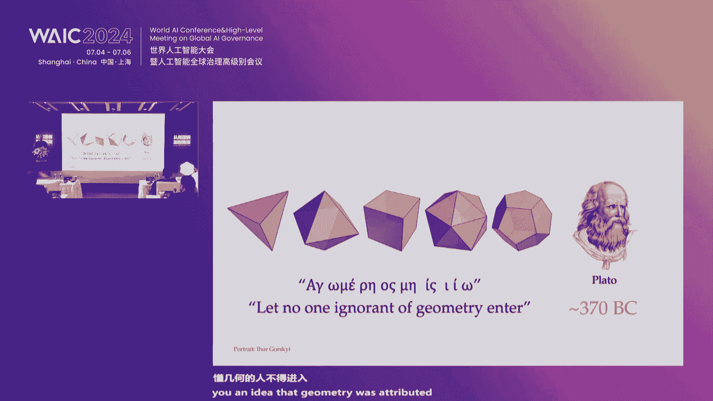

它被称为几何，回到欧几里得和他的著名著作《元素》，它基于五个公理或公设，如你所知，第五条关于平行线的，某种程度上是错误的，几代杰出的数学家试图证明它但无济于事，直到19世纪，19世纪初。

人们意识到实际上可以构建自我，一致的非欧几里得几何，而不必依赖欧几里得关于平行线的假设，在这里，功劳可能是有争议的，高斯显然是最早研究这个话题的数学家之一，但他从未敢发表，因为这非常具有争议性。

几何的基础已经屹立不倒超过两千年，第一个发表的人是俄罗斯的罗巴切夫斯基，他几乎，嗯，牺牲了他的职业生涯，因为他受到了严厉的批评，但随着时间的推移，到了19世纪中期。

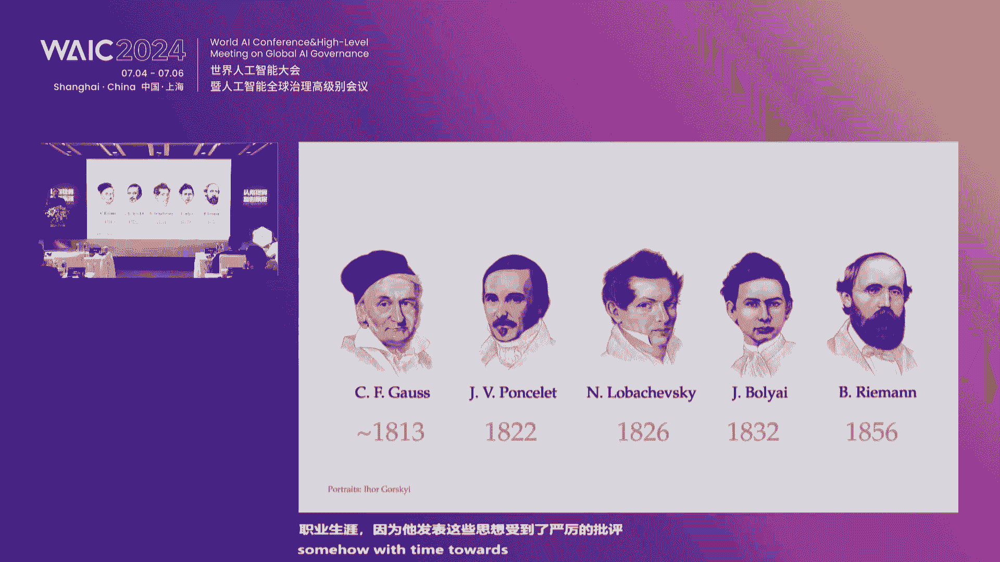

这些想法变得更加普遍，并变得明显，除了欧几里得世界之外还存在其他几何，这创造了一种不太健康的情况，一个偏离这些假设的不同几何的动物园，如仿射几何，射影几何，双曲几何等等，等等，因此需要一种新的方法。

或新的范式或新的心态，以使动物园有序，并允许我们定义当我们说我们有一个几何时意味着什么，这种新的见解来自一位年轻的德国数学家费利克斯·克莱因，他只有两，三岁时被任命为德国埃尔朗根大学的教授，按照惯例。

可能当时仍然如此，他被要求提交研究前景，这进入了数学史，作为埃尔朗根纲领，在其中他提出了对几何的一种激进的新处理方法，基本上考虑它为一个具有某些变换群的空间，所以本质上你研究对象如何变化。

当它们被一些群变换时，他展示了，例如，欧几里得几何源于刚体运动群，我们称为欧几里得群，当我们旋转或平移一个物体时，许多性质被保留或保持不变，或被反射，我们保留面积，直线平行性，交点，等等，等等，但当然。

它允许你使用相同的框架考虑其他组，如细群或射影群，实际上，它是其中之一，第一个也调和了当时存在的不同，非欧几里得几何，使用这种方法。

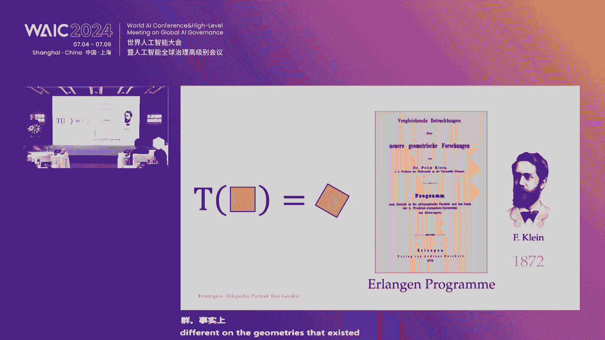

这在地理学上造成了巨大的转变，在数学更广泛领域，因此，其中一些想法，嗯，永远改变几何，以及更抽象的数学思考，如范畴理论或移位理论，代数拓扑，实际上源于航空计划，但更重要的是，也引发了物理革命。

20世纪初，首次意识到可推导宇宙定律，从对称基础考虑，最著名结果为埃米·诺伊特，她证明可从对称考虑推导守恒定律，这若想可谓重大，因为此前守恒定律多经验性，你进行实验，例如，你测量能量，发现其守恒。

现可从时间对称性推导，这些概念的某些演进，我引用的开头那段话有所贡献，导致了一个统一理论，我们现在称之为标准模型。

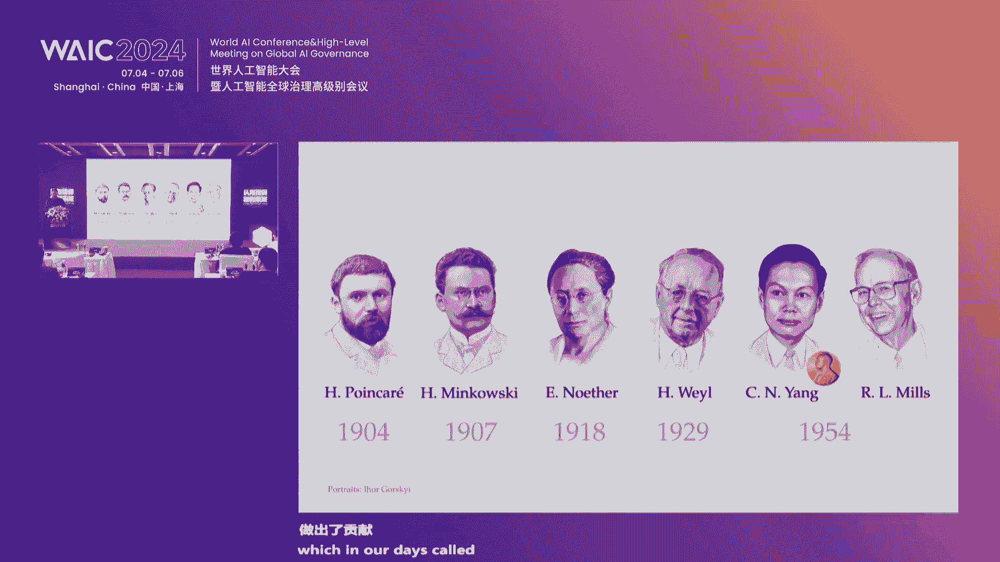

它允许你模拟物理学中我们所知道的大多数东西，从对称性的考虑，所以您在这里看到的是不同的群，允许推导出基本力，粒子之间的相互作用，以及闵可夫斯基时空的几何结构。

我认为菲利普·安德森简洁而美丽地总结了这一点，诺贝尔物理学奖，说稍有夸张也不为过，物理学是对称性的研究，现在你可能要问它与机器学习和人工智能有何关系，因此。

我们无疑认为深度学习在过去十年中创造了数据科学，并使某些遥不可及的问题成为可能，从计算机视觉到语言再到蛋白质折叠，但与此同时，我们现在也面临着这种情况，我们有不同的神经网络架构。

历史上是从不同的考虑中得出的，或不同类型的问题，如卷积神经网络起源于图像分析，等等，又如，如19世纪后半所见，我们有这些不同对象，无底层数学原理，人们常认为深度学习，非一门真正科学，我们愿挑战此说。

此陈述，我们称其为几何深度学习，嗯，共同分母，基本数学框架，受直线启发，程序尝试从相同原则推导所有这些方法的基础，从相同原则。

即不变性和对称性，考虑监督机器学习问题，你可以讽刺地说，这不过是曲线拟合的升华，经典例子是图像分类器，我给你猫和狗的图片，对，你想判断是猫还是狗，当然，这是更复杂问题的数学抽象示例，例如。

在自动驾驶汽车中，通常，在基于AI的感知中，所以基本上你尝试做的是函数函数逼近，所以你有一些未知函数，在几个点上采样，所以这些是本幻灯片中狗和猫的例子，所以这些是你函数在几个点上的样本。

你尝试预测这个函数，在示例或你从未见过的点上值，这是个好问题，实际上，你放入黑盒的是什么类型的函数？对，所以，你如何选择近似你的函数，所以从50年代后期开始，我们知道一个好的候选者是神经网络。

第一批这样的架构是由弗兰克·罗森布拉特设计的，1957年的感知器，这是深度学习的基础之一，基本上，你将许多这样的层连接到一个非常复杂的系统中，有时数十亿甚至数千亿参数，现在，我们关于这些系统的数学知识。

仅有两层的感知器被称为通用近似，所以，如果我给你一个连续函数，你可以用这样的系统以任何所需精度逼近它，这是一个非构造性结果，所以，这是数学中的一种结果，它告诉你某物存在，但它并没有告诉你如何实现它。

所以它没有告诉你神经元的数量，它也没告诉你需采样多少点，这实际上是个问题。

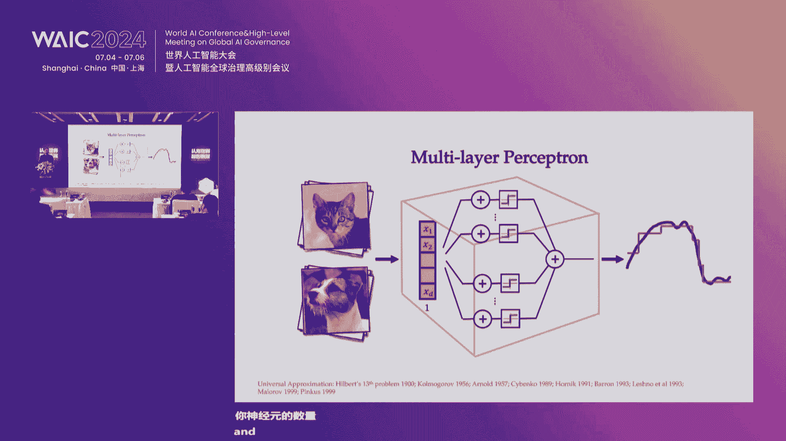

因为这些似乎是数学中的标准结果，关于连续函数的行为，或我们在逼近理论中使用的某些标准正则类，它们与维度不很好地扩展，所以我们遇到了称为维数诅咒的问题，在我们的猫狗示例中，你需要向神经网络展示的样本数。

以训练它识别，猫狗，理论上将大于地球猫狗数，可能大于宇宙原子数，计算上完全不可行，需要不同类型的规律，这些是我们称的几何先验，历史上，一些最早的这类神经网络架构可能无意识地，或实际上源自神经科学工作。

所以著名的诺贝尔获奖工作，谁分析了人类大脑视觉皮层的结构和功能，他们带来了这个，1981年获诺贝尔医学奖，大脑的细胞，神经元具有局部连接，共享连接模式，这项工作的灵感，嗯，最初由福岛邦彦实现。

1980年提出了新神经网络架构——神经元，简化为Jan Khan在首台数字处理器上的形式，著名卷积神经网络架构，突破于12年的AlexNet，现为深度学习基础，广泛用于感知和视觉应用。

从物体识别到自动驾驶。

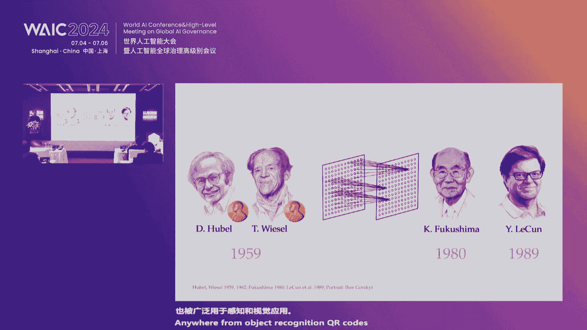

看卷积神经网络内的数学，主要思想是使用局部连接，共享参数，而非输入的任何神经元，连接到输出的任何神经元，仅少数局部神经元连接输出，因此我们使用神经科学的术语，绘制感受野。

共享相同参数，如果我移动到图像的不同位置，我对不同输入应用相同变换，这也意味着你可以非常高效地将这些架构映射到硬件，具有单指令多数据结构的硬件，早期的DSP和现代GPU，一个很好的例子。

基本上它们知道如何对不同数据应用相同操作，极其高效且并行，这也赋予你的架构这种我们称为平移不变性的属性，这在对象识别中非常重要，因此如果我尝试在图像中识别猫，猫的位置并不重要，我只想说这是一只猫。

因此我们称这种属性为平移不变性或位移不变性，这意味着架构具有这种内置属性，而不是需要从多个示例中学习，这就是卷积神经网络与早期感知器模型的区别，这也允许打破维度灾难，使训练比传统方法更有效。

现在这种原则只是我们更广泛称为。

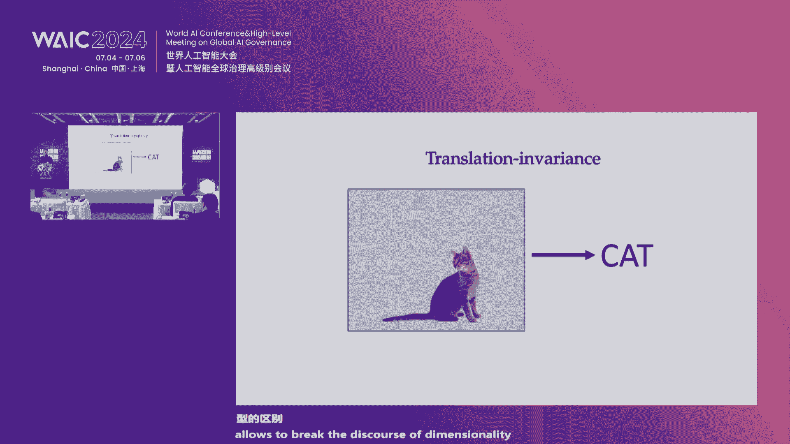

几何深度学习蓝图的一个具体表现，所以基本上你可以选择一个不同的几何域，你的数据所在的域，你可以选择一个不同的变换群，正确，对于卷积神经网络，域是网格，变换群是平移，但我们可以考虑其他东西。

所以我们可以考虑，例如，三维物体，作为流形或网格建模，所以数学上的表面，那里的变换是更奇异的群，局部变换，我们称之为特殊正交群，嗯，所以嗯，这涉及到物理学中称为规范对称的东西，它们将，嗯。

基本上它们描述如何，嗯 选择局部坐标系的歧义，但可能最有趣的与图相关的对称性，在这种情况下我们有置换，图像和图是非常重要的对象。

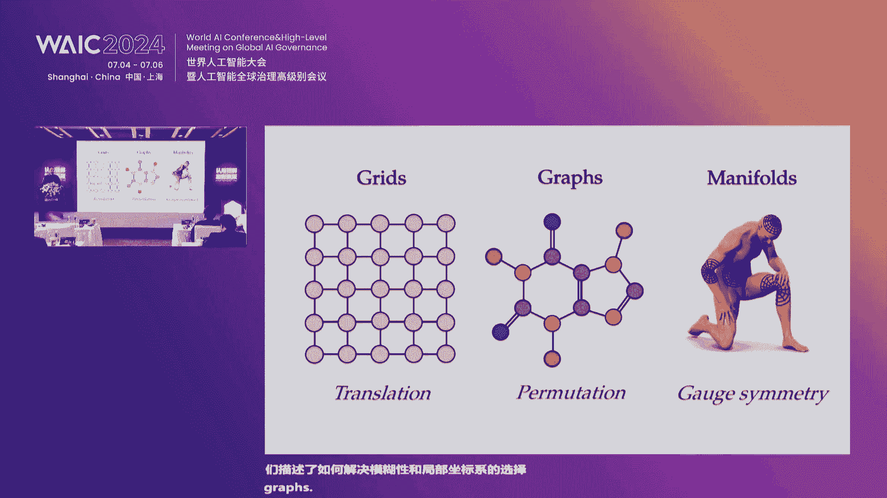

因为它们允许你模型化系统的关系和交互，任意事物之间，对，你可以把知识描述为图，正如实体之间的关系你可以描述，例如，社交网络是巨大的图，当描述不同人如何连接和互动，计算机网络也被描述为图。

在生物系统中你也可以使用图来描述不同的交互网络，如基因相互作用，蛋白质相互作用，分子本身，对，所以显示的是，实际上这是咖啡因分子，你们中有些人正在喝，原子是图中的节点，化学键是图中的边。

在生物学中我们看到的典型应用是，药物发现程序是，我给你一个分子，表示为图，我想预测它的性质，它可以是很多东西，可以是属性，如毒性或结合能等化学或物理属性，问题是如何将这类数据实际输入计算机。

图是一种拓扑对象，我们需要以数组数字形式表示它，因为这是计算机能消化的，首先遇到的问题是，我们没有图节点排序的标准方法，它们可以按任意顺序出现，这意味着存在某种排列歧义，学习图中的问题已内建。

我们可以做的是，基本需强加一种性质，称为置换不变性，在这种情况下，它必须说明，我不在乎原子在分子中的顺序，分子的整体性质不应改变，对吧，这只是我们的方便，我们的标记法，我们如何排序这些，这些节点。

同样如此，历史上曾有一类建筑学发展，可能在90年代末，但最近，大约15年前，称为图神经网络，再次体现了这种广泛的几何深度学习蓝图，通过所谓的消息传递操作，图中每个节点与其邻居通信。

所以它接收了所谓的消息，这些消息的聚合方式，是通过一个对邻居顺序无意识的函数，所以它是排列不变，如果你将这个函数应用于图中的每个节点，那么你会得到一个排列等价不变性属性。

这意味着如果我重新排列图中的节点，那么输出也会以相同的方式重新排列，我们可以应用多层，所以他们有一个这种类型的深度神经网络，然后这些层的输出使用排列等价函数聚合，例如求和或最大值。

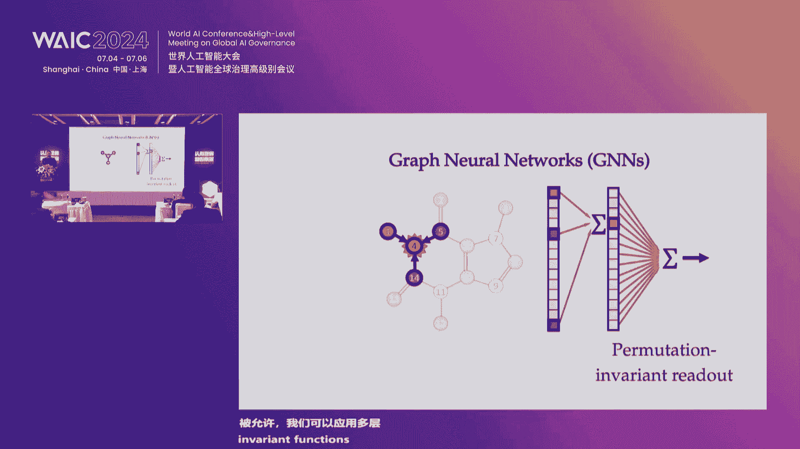

这为我们提供了一个环境读出，现在，在分子中我们特别看到的一个性质是这些不仅仅是抽象的图，我们不仅仅有节点之间的连接，这些是抽象实体，这些实际上是所谓的几何图，所以他们有一个几何实现。

所以这些图存在于三维空间中，每个节点都有一组分类特征，比如原子的类型，例如在分子中，但也有一组连续的欧几里得特征，对，所以原子在三维空间中的坐标，我们想要一个额外的属性，如果我们对这个图进行一些变换。

如旋转或平移，我们希望输出保持不变，这意味着无论我将分子在空间中放置在哪里，我希望它的属性保持不变，对吧，所以我们称之为SE3不变性，SE3代表特殊欧几里得群，所以它考虑了保持方向的变换。

所以是旋转和平移，反射重要地被排除在外，因为反射实际上确实改变了，分子的化学性质。

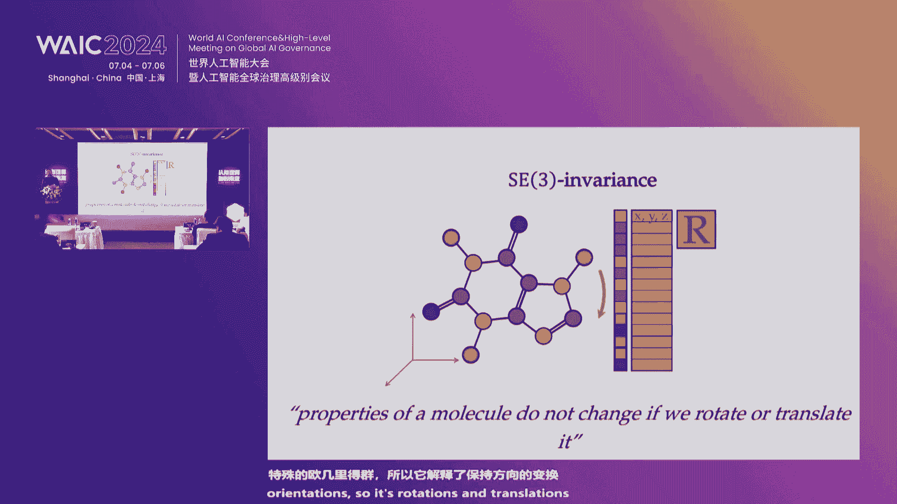

现在被称为Keras，如我提到的，这在药物发现管道中已经广泛使用，当你发现新药物时，潜在分子候选人的空间，非常大，所以他们估计对于小分子来说大约是10的60次方，所以它是，这是一个极其大的组合复杂性。

你不可能真正合成和测试所有这些分子，所以你想做的是所谓的虚拟筛选，所以你计算预测这些分子的属性，然后只在这些有前途的候选人中，将样本送至实验室，先体外后体内测试，并进行临床试验。

图神经网络已被成功用于筛选潜在药物。

麻省理工学院Jim Collins团队的一项重要工作，他们展示可用图神经网络进行新抗生素的虚拟筛选，你可能知道，抗生素，可能是20世纪最重要的发现之一，亚历山大·弗莱明爵士，帝国理工学院教授。

我曾在那里工作过，这很可能拯救了，如果不是数十，甚至数亿人的生命，在整个世纪中，因为我们正在耗尽抗生素，因为我们有新的病原体，对抗生素有抵抗力的微生物，大流行病，由抗生素耐药微生物引起的大流行病。

可能是数百万人的生命，不是一个是否的问题，而是一个何时的问题，因此我们需要开发新的抗生素，我之前描述的方法已被成功使用，我认为，在过去四十年中，这是通过计算和实验发现的第一类新抗生素。

这些几何深度学习方法在结构生物学中的另一个重要应用，如你所知，蛋白质在几乎所有生物系统中都起着重要作用，实际上，我们并不熟悉任何不以蛋白质为基础的生命形式，蛋白质是多聚体，由称为氨基酸的微小构建块组成。

这些构建块以链的形式排列，然后，这个长聚合物被折叠成复杂的，三维结构，受到静电力的影响，在20世纪70年代初，物理学家诺贝尔奖获得者Anand提出了一个猜想，你可以完全从氨基酸序列中确定蛋白质的结构。

这一直是结构生物学中一个极具挑战性的难题，称为蛋白质折叠，在2019年和2020年，这个领域取得了突破，实际上来自一个意想不到的来源，DeepMind，一个从未以生物学工作闻名的人工智能实验室。

但他们开发了一个程序，一个名为AlphaFold的深度学习程序，运用几何深度学习原理，特别使用了，等变变换器准确预测实验技术，如X射线晶体学，蛋白质三维结构，这彻底改变了我们工作的领域。

因为这些先前的实验极其昂贵，现在可用计算工具替代，我也从事蛋白质设计，实际上他们在某种程度上，与瑞士同事的反问题，使用几何架构的Bro Correa组，可能是该领域最早预测蛋白质功能的。

基本是蛋白质如何与其他蛋白质或小分子相互作用，并使用这些，架构从零设计新蛋白质，称为Nova，这些是自然界中从未存在的蛋白质，因此进化从未发现它们，但我们可以以某种方式设计它们，特定功能，这些功能。

例如，允许它们绑定重要靶点，我们在实验室构建这些蛋白质，你看到的，一个例子是结合edl1的蛋白质，因此称为程序性死亡配体，癌症免疫治疗中重要靶点，因此阻断癌细胞发展机制，使它们能逃避免疫系统正常功能。

否则会杀死恶性细胞，另一种设计是针对SARS，Cov-2病毒的刺突蛋白，该病毒曾导致COVID-19大流行，但我们实际上在实验室测试了它，也在假病毒中和测试，其效果与阿斯利康商业化的临床级抗体相似。

所以，我们现在也在谈论所谓的生成性生物，因此，我们现在也在谈论所谓的生成性生物，这些模型让我们生成美丽图像，如Mid journey或Dali，想个提示，生成逼真图像，有时甚至能赢，嗯，艺术比赛头奖。

数学上基于去噪扩散，本质上是从高维概率分布采样，描述数据如何运作的工作，再次，这类问题受维度诅咒困扰，但你能做的，你可以设计扩散过程，学习去除噪音的增量步骤，通过这样做。

你可以基本上你可以逆转融合扩散过程并从中采样数据，这允许我们使用附加的几何约束来解决问题，例如在药物设计中，因此你可以生成不是图像而是分子，这些分子受某些属性的条件限制，例如，你目标的三维结构。

如图所示，蛋白质口袋，你知道，治疗目标，这些方法还有许多扩展，我们一直在努力将生成模型扩展到非欧几里得架构，如罗马尼亚流，Mat，度量，流匹配，这使我们能够使用生成模型生成新的蛋白质。

因此我们可以将蛋白质建模为特殊群的旋转元素集合，我们可以从头开始生成新的结构，如图所示，这是一个例子，表明我们在新颖性方面实际上表现更好，基本上你与训练集的不同程度，即蛋白质数据库和设计性。

基本上蛋白质如何折叠，当你，当你购买像AlphaFold这样的东西时，基准线是红扩散，这是一种最近获得超过10亿美元资助的算法，由华盛顿大学的David Baker的公司，因此更先进的几何。

显著更好的性能，这已经可以用于药物设计，因此你可以做所谓的动机支架，因此你可以选择蛋白质中你知道会与你的目标结合的部分，然后围绕它构建更大的蛋白质，因此这可以用于生物药物的开发。

与你的治疗目标结合的蛋白质，我们还可以做所有其他事情，因此我们可以做零镜头分子动力学，分子动力学是这些非常重的模拟，在超级计算机上运行，描述分子随时间如何变化，对吧，复杂的量子力学系统。

因此我们可以用生成模型替换模拟，因此总结一下这些遗传原则，它们构成了神经网络架构的基础，可以追溯到古希腊，在现代神经网络架构中找到了化身，它们真正是什么，嗯，人工智能领域一些最令人兴奋的发展的驱动力。

嗯，过去几年，我就说到这里，非常感谢您的关注，评论中的问题，是的，是的，他是个大人物，在宇宙中，令人费解，所以完全是内在，高前列腺和高棕色州，您的演讲实际上非常鼓舞人心，实际上我从事3D生成。

我也从事人工智能药物发现，在您的演讲中您提到您使用几何度量，进行虚拟分子，目前大多数方法仅基于分子，但对于不同的人，相同的药物对不同的人可能有不同的效果，因此分子的效果可能与人类。

因此我们目前从事基于表型的虚拟药物筛选，您认为是否有可能将其推广到应用中，是的，嗯，这是一个很好的问题，对，所以如果我将问题重新表述，所以基本上我们有不同的层次或生物学尺度。

所以我们有非常基本的分子水平，对，我们理解一切，我们原则上可以模拟一切，这是由量子力学驱动的，当然你不能在经典硬件上模拟，所以你需要你求助于近似，如分子动力学，另一方面，我们有一个细胞或尺度。

所以那就是你知道细胞如何生活或死亡，当它暴露于某些化合物时，这些尺度之间的差距大约是十的负十次方，一个细胞包含，我不知道有多少万亿个原子，这不是可以吸引性地模拟的东西，所以我们需要弥合这些差距。

所以这些系统中可能存在某种涌现的定律或涌现的性质，但我们真的不知道如何描述和捕捉它们，所以我认为使用预测，表型的方法可能需要结合某种类型的通用机器学习，以及基于物理的机器学习，基于物理的。

意味着你正在构建一些有意义的对称性或守恒，喜欢我们做的事，但它是自发的，这还不够会是，例如，正确使用基因组信息，或使用细胞染色技术，如Recursion或Incitra公司，非常感谢，嗯，我的名字是。

呃，呃，丹尼尔·马基尼，来自南非，伏击大学，嗯，我享受了演讲，但我意识到，嗯，你使用图神经网络，呃，与几何深度学习，现在的问题是，如何为训练流的数据获取，以确保在，我的意思是，在深度学习，呃过程中，呃。

为了系统，为了网络给出你想要的输出，你如何获取那个数据，是的，所以它是等，我知道那些东西，是的，是的，所以对于分子而言，我们有化学化合物的库，对于这些化合物，我们知道实验性质，或者你也可以模拟其中一些。

使用如dft等技术模拟，或者可能是分子动力学，所以通常是实验和，呃，模拟模拟，好的，谢谢，问题，进一步，所以如果没有问题，所以让我们再次向演讲者致敬，是的，秦楚，华诗，如何给事物编号。

它重构了一个世界来生成一个新世界，我喜欢我喜欢，呃，早上好，各位，我是香港大学的孙昊，今天想展示我们关于3D和3D生成的部分工作，我的主题是重构，生成新世界，与研讨会主题密切相关，世界状况与未来创新。

好的，实际上我们生活在3D世界，每天醒来时，我们观察世界并与之互动，通过世界的几何，例如，我们拿着这个指针，我们意识到这个指针的几何，当我们沿着路走，我们意识到流动的几何，所以几何在我们的工作中很重要。

所以除了为世界的一部分承保，我们也想提取此世界的3D几何，因此我们从事3D传感工作，另一项工作是关于生成，或大多数近期工作，多数工作聚焦于2D生成，最著名的行，2D扩散及2D和先前扩散模型。

这是关于游戏模型，这里我们看到了一些基于枪的算法结果，例如这个是一只长颈鹿，CPR相关论文是哪个，可见仅靠生成器实现多视图一致性并不容易，不同视角下看同一人，两张2D图像，它们不一致，不一致，例如鼠标。

牙齿和发型，例如，看Stable Fusion生成的房子，手部几何不正确，意味着2D-2D融合模型未考虑几何，为达此目的，我们想生成3D模型，我们认为3D生成是可能解，可生成几何正确单词，好的。

我们当前工作多聚焦3D重建和3D生成，将展示一些此方向工作，这里看到一些房间设计工作，物体生成与人像合成，给定此单词，我们想重建世界，我们想要高质量，高质量世界，给定文本或单张图片，我们想生成3D模型。

给定人类想在电影中驱动，这是生成的应用，今天我将讨论三项工作，一是几何，3D构造，二是3D形状生成，三是场景和场景编辑。

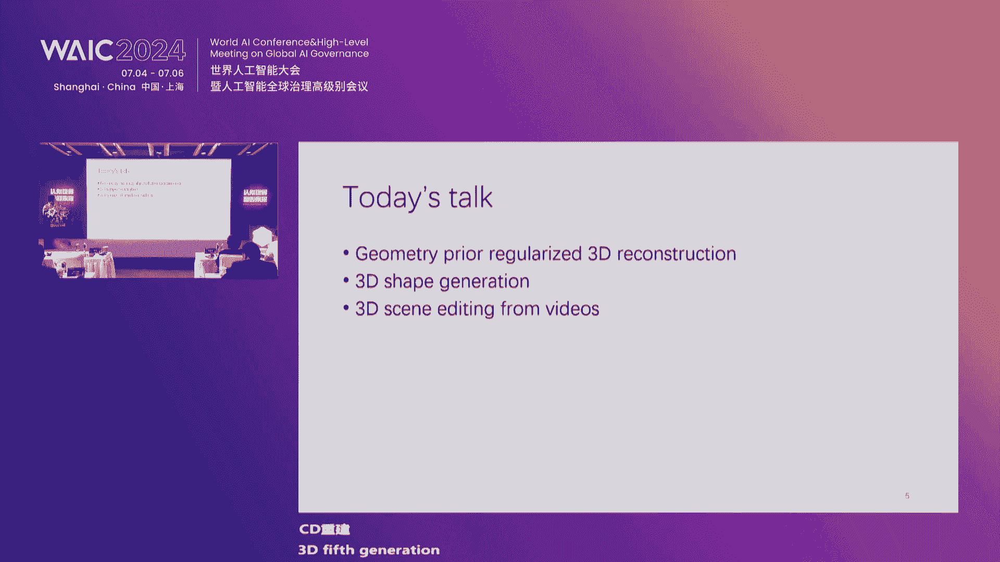

好的，对于3D生成，最著名的是神经辐射场，对于神经辐射场方法，实际上它表示的是场景的辐射场，对于每个我们投射到这个场中，我们计算沿这条路径的密度，然后计算几何，我们可以计算沿这条路径的颜色。

通过比较渲染的图像和输入图像，我们可以计算整个场景的辐射场，这样我们使用MLP来表示一个场景，这就足够了，基于此，基于，它只能比较渲染的图像和输入图像，所以它没有意识到场景的几何。

因此目前生成的物体不是几何正确的，为了解决这个简单问题，人们提出了一些函数，基于科学家和基于方法，我们也投射一条射线，除了计算密度外，我们计算SDF。

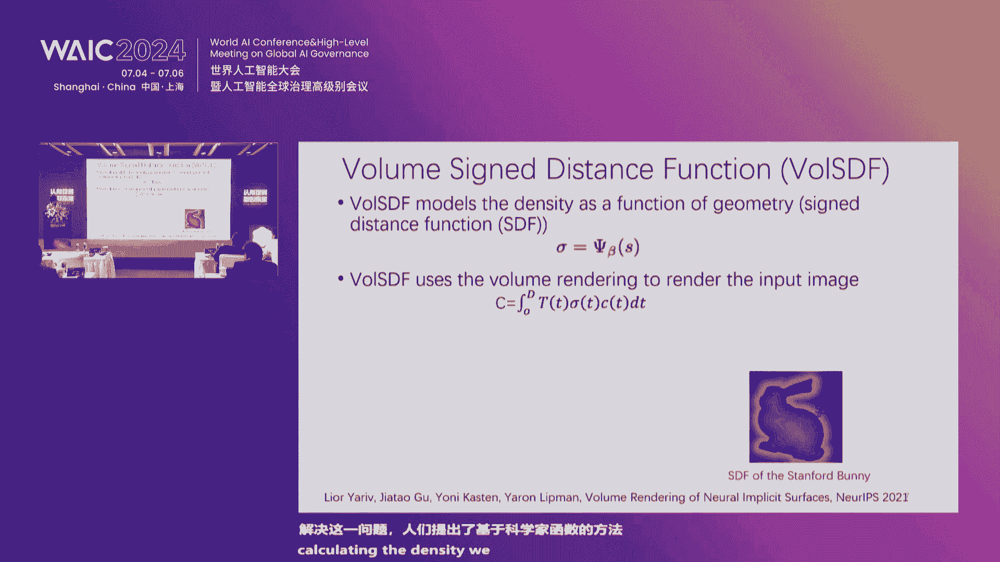

然后使用SDF到密度转换来计算密度，这样我们也计算渲染的图像和输入图像，这样我们可以得到一个几何正确的场景，所以这是基于SDF体积的方法，但当我们看SDF的体积时，也看到几何。

例如这个房间不是几何正确的，对于地板，对于墙壁，我们可以看到它非常杂乱，原因是我们只比较输入图像和渲染图像的场景，例如对于室内场景和会议室，有许多具有相似纹理的区域，如果我们不能计算出正确的几何。

但它们也对应相同的颜色，这样我们无法计算正确的SDF，所以对于这个，由于我们有纹理，文本区域，我们想要更强大的解决方案，实际上，我们对现实世界的几何有了解，例如，对于这个房间，我们对场景布局很熟悉。

地板、天花板和墙壁的交线，天花板和墙壁，我们也有这个会议室的长度，通过使用这些计划，这些框架，我们也能估计深度，利用此几何，可更好地规范CD构建，沿此方向，可用此几何规范3D物体的表示，实际上。

我们使用类型表示，因此，对于您的步骤表示，这是标准体积化D和读取，我们计算SDF，并将DF更改为密度，这样，我们可以渲染图像，实际上，这是标准流程，如我们提到的，我们有一个关于此场景的几何祷告。

我们可以使用预训练的度量估计深度，然后我们可以提问，然后我们可以比较估计深度并渲染深度。

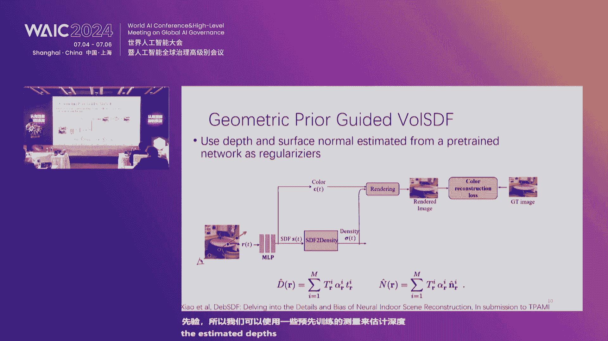

因此我们引入深度损失和表面法线损失，这样我们可以使用预训练类型的预训练，因此对3D重建进行正则化是正常的，我们可以看到它对应更好的性能，特别是对于这些文本区域，例如，法律，桌子，但细节缺失，例如。

椅腿以方便升起，可能原因是这些区域，有限细节，采样率和概率，对应采样率很低，解决方法是增加概率，对应这些区域，这是第一个方案，对于这些有限细节的原因，预训练模型无法准确估计深度。

因此这些区域深度无法正确估计，为解决此问题，我们引入不确定性重采样，另一个问题是，当我们比较渲染的，深度和预训练模型估计的深度时，实际上对于射线，例如，穿过物体并击中墙，如这里和渲染类型1，例如。

这里黑色箭头和地面，真步为蓝箭，渲染深度不符实际，估计街道上密度的可能区域，此密度受此物体影响，意味着应引入最佳，类型，以解决此问题，分布，因此，我们引入最佳SDF到密度转换。

这是通过引入深度和表面法线实现的流程，我们还引入了深度和法线的不确定性，这意味着，估计的不确定性对应于这些有限区域，然后我们还引入了不确定性重采样与样本，对某些细节承担更多风险，这是引入不确定性的公式。

我们可以更好地估计更细的细节，这些最终细节通常对应于不确定原因，我们还引入了最佳SDF到密度转换，这意味着对于空间中的每个点，我们计算它是物体的案例，对于这种情况，我们计算密度的分布，然后我们到达密度。

当我们到达最佳。

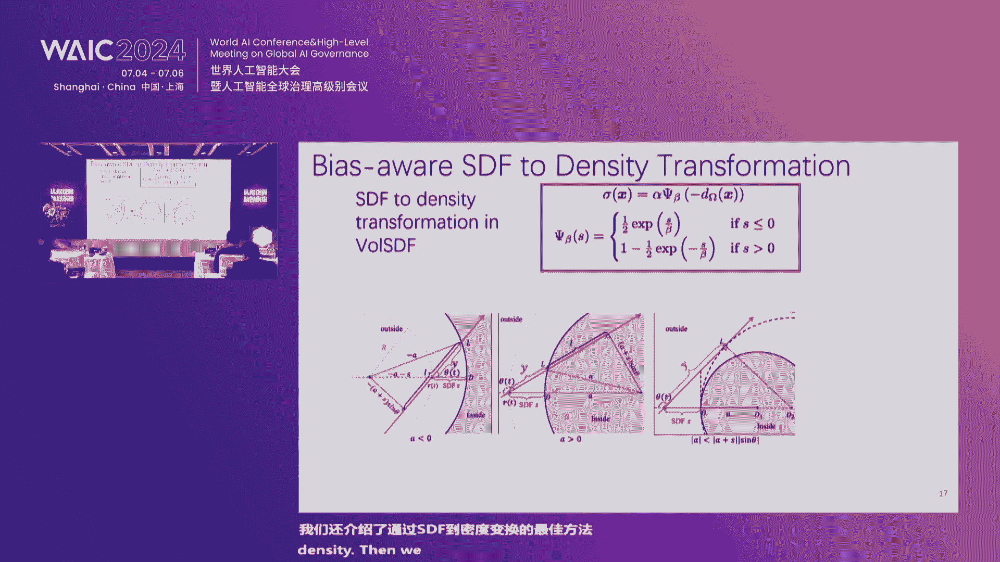

作为F密度转换，这里我们看到一个结果，这是引入实体where公式的实际，我们可以更好地估计细节，例如桌腿，当我们引入重采样，我们可以更好地，嗯，重新椅子腿，例如，椅子把手，好的，这是另一个数据集的结果。

我会匹配甚至在这里我们看看地面，实际上，实际是从RGB-D数据集中获得的，深度不准确，因此我们可以在这里看到许多黑洞，但使用我们的方法，我们可以很好地重构视频，因此，在我们的方法中，即使实际不正确。

但我们的措施仍能很好地重构场景，这是合成数据集上的一个结果，我们可以看到这是最后一列，是输入图像，我们的大师与实际相符，这里我们看到了更多结果，通过与其他方法比较我们的方法，好的，这是Mondf。

引入了深度和表面法线化先验，我们的方法可以改变场景并保留场景的细节，这是最近发表的一项工作，这里我们展示了更多结果，之前的工作实际上是关于3D而非3D，我们也想生成新的3D世界场景。

这里展示了3D生成的结果，第一个是梦想3D，我们使用一些3D稀有作为，作为代理来规范梦境融合模型的3D生成，第二个是房间设计，我们希望保持不同家具在我们场景生成时的连贯性，最后一个米开朗基罗。

这是去年的一项新工作，我们被给定了一段文本或单个输入图像，我们想从这个场景中生成3D模型，因此，如果我们想从，例如文本或单个图像生成3D形状，我们希望我们想要寻求一个3D表示，所以首先对于3D表示。

一个简单的解决方案是自动编码器解码器解决方案，例如，给定一个输入网格，因此我们可以在这个网格上采样一些点，这里我们使用感知器架构，我们使用感知器纹理编码这些点，然后我们到达一个睡眠潜伏。

然后我们还引入了一个变换器解码器，以将潜伏解码为3D形状3D点，因此，我们可以实现基于编码器解码器的解决方案。

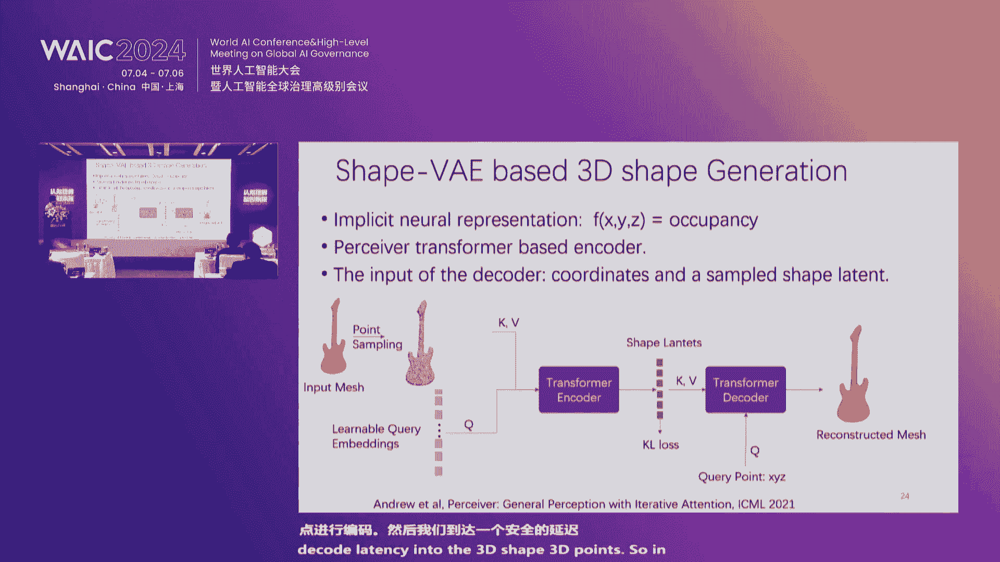

一旦实现了基于编码器解码器的解决方案，然后给定一个单一图像或文本，我们可以将其编码为一个潜伏，然后将编码的潜伏输入到刚才的三维解码器中，然后我们可以生成3D对象，这是一个非常简单的想法。

所以但是当我们做这个解决方案时，我们发现实际上生成的形状并不，不符合导入，可能的区域，这里我们为编码器解码器生成，我们使用3D数据作为输入，但这里我们直接使用来自二维图像或文本的特征作为输入。

这两个空间的特征空间并不奏效。

所以为了解决这个问题，我们需要在生成之前对齐特征，所以我们引入了基于对齐的生成，所以这是标准的编码器解码器，我们想从网格的点中编码点并使用潜伏，我将潜伏输入到解码器中。

所以我们可以在编码器解码器中实现这种一致性。

并实现多种模态一致性，例如给定图像或文本，我们还将图像或文本与CLIP编码器编码，例如，然后我们想强制图像的表示，和来自网格的点的表示是一致的，我们引入此规则，我们也希望确保文本与点云表示的一致性。

因此，通过引入额外两个正则化，我们可以在不同空间之间实现特征的一致性，之后，我们可以直接给出导入的图像或文本，进入扩散模型生成潜在，并将潜在输入解码器，然后我们可以改变3D形状。

这里我们看到我们方法的结果，例如，给定导入的图像，我们的方法能很好保留细节，例如这个，这列火车，嗯，实际上生成的超质量非常好，这里我们也看到了基于文本的结果，基于文本的生成。

甚至例如这里我们看到了两只脚，两只手和肌肉仍能很好地生成3D形状，好的，实际上我们在这里，给定单一输入图像，生成3D，输入图像，可生成多个3D形状，实际上所有这些3D都是合理的，我的衬衫源泛化概率。

我们看到了模型结果，我们从互联网下载了一些图片，我们的方法能很好地生成船只，这里我们看到了汽车，玩具，好的，下一项工作是3D编辑，实际上我们在这里提出关于3D街道和轮子街道的应用。

我的意思是所有国家的自动驾驶都很流行，我们可以捕捉视频，例如，这是一辆车捕捉的视频，我们可以看到视频中有很多检测到的汽车，我们想生成一个视频，无车或人的3D场景，这是输出，给定输入。

视频中有车或人的位置？可生成3D场景，可在任何不同视角渲染此场景，这是输入输出，但实际任务为，这是该方向上的首次工作，此任务极具挑战性，我们不知道几何形状，地面真实情况，我们没有无车的街道，对吧。

我们不知道车在哪里，对于某些情况，车实际上占据了帧的大部分，所以这里我们看到三维和矢量之前，我们可以看到几何形状很糟糕，但用我们的测量，我们使用基于二维高斯的方法，实际上，这是我们今年的图工作。

用我们的测量我们可以做得更好，我们可以很好地生成场景，我们也能很好地保持几何形状，结构，例如，道路的几何形状，好的，所以这里我们展示挑战，我提到的，车占据了视频，车的面积实际上很大。

所以这种情况下是传统的，例如，基于视频的绘画或二维，基于绘画的方法不能很好地解决这些问题，因为我们没有地面真实情况，只有用户实际上在这里，我们使用基于二维高斯的方法，例如。

对于这个场景我们可以计算这个东西的语义，我们可以找到与连帽衫相关的语义，高斯，我们可以确定哪些原因对应于要删除的车辆，然后删除对应于这个区域的高斯，高斯，我们还会渲染图像并优化渲染的图像。

这样我们可以实现一个非常不错的解决方案，呃这里我们与其他两种方法比较，这个解决方案是一个，我们可以显示这个视频不一致，这是我们的结果，好的，这是一个基于视频的绘画，你也可以看到，实现一致的结果并不容易。

所以我们的方法可以同时实现良好的几何和逼真的结果，呃这里我们也看到了几何文件方法，所以这就是我所有的工作，实际上让我总结一下我们的工作，实际上我们想通过改变3D几何来构建一个3D世界。

我们还使用这种几何来规范3D生成，接下来我也想感谢所有我的合作者。

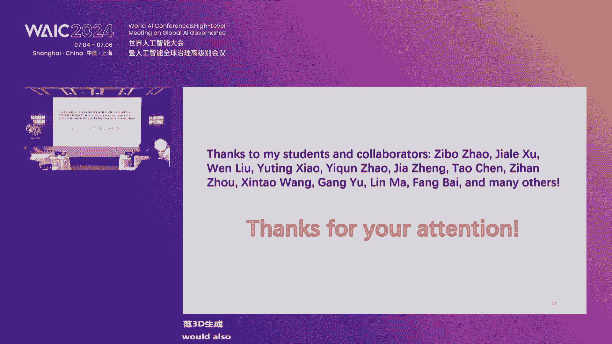

就这些，谢谢，所以我们也留有时间供提问和评论，是的，嗯，用新方法，你知道，嗯，解决了，嗯，你应用在哪些领域，嗯，一个可能的解决方案是驱动最后的工作，第二个应用是，我们是游戏，可以设计。

我们可以生成一个场景，人们，我们可以将其用作游戏玩家的场景，对于游戏玩家，是的，好的，非常感谢，很有趣，你能说一些关于，你的方法硬件要求吗，所以这是，嗯，嗯，假设它在标准GPU上运行。

但目前你有什么特殊化的吗，大多数方法都在常规TPU上运行，例如，这个nvd四十，有任何问题供提问和评论吗，是的，请，好的，是，好的数字，嗯，梦想融合，你桑迪，现在几桑迪唱，我海亮和桑吉颂，周吉吉廖数字。

所以我看到你的图像，所以你看，我选择更大的，G，那是女人说的，一种高度欠缺的Wi，另一个女人秦观泛出桑吉，吉，你得到了什么？太阳夫，好的，如果没有更多问题，让我们再次感谢演讲者，是的，谢谢，王晓梅博士。

来自复旦大学计算机科学系，那么让我们欢迎，更多，今年，我需要，王银熙继续做这项工作，你去哪里，去生活，我买拉玛伟国语言，视频标题拉瓦，E，A，等等傅源，乔，J，易小阳，所以对我来说，等金素，武三。

在上下文学习，方式下你走，赞助商，让女士去拿一个，不晋过程，在安，北部，我归，在I在安，那首歌，玉吉映射到QA盒子解码器，但击中，全监中心，图像编码器它，我给你看了，哦嚯，元一，元欣妍在，在。

我说年轻人，指出你不，中州房，宇，京莲，我会，我，嗯，我松了鞋，所以姜，GM，你去，所以你，然后，你有声音，你需要付费卡，我发现我发现，嗯，更多更多，语音网，中，所以那，整个，你意思是，我需要更多。

你在真正的木头里做了什么，别那么做，你，哟你拿到了，你有一个，那个，你在巴沙上做了什么，有点脏的水，李红港但作为，你当我的女人，嗯，在外卖里运送汤的女人，一个女人在，你手里，嗯，她是一个，家庭主妇。

所以后来犹太女人更容易，当整个事情下降到整个，对曾经是人的那些人来说完全更容易，嗯，我有点喜欢展示一个男人是一个航运，分销，嗯，嗯，所以，你知道，嗯，什么，那是什么你，要成为，那将会是，你知道，你。

你应该处于的情况，所以它有一个美丽的，Bu和我，机器人发现了一个，你应该呃哈，那应该是，呃，I kan，在家里的，Kuan jang那个女人你可能看到开源，所以一个女人关于更容易拍摄过程，整个，呃。

像女人，现在给机器一个动作指导，呃，非常编码器，编码器，黑暗像整个，但女导师，联合方式，放手，所以那是你的，轮到，我，去，一个女人在，不仅嘴唇，整个女人在，呃在，你只需，她的经纪人拿一个，你应该。

你应该做更多，呃，你做，你得到了，一个手摇，Jo zu，Ao那你应该，呃，呃，你，和zyin q，嘿，你，你有时间提问和评论，去或，一个女人，嗯，董龙，嗯，只是，嗯，我，你很好，我，乔金，嗯，杨。

和袁晓去农，我的新西宗邦仪，齐，西，年轻女子确实在路口，像黄一样，我是迈克尔，嗯，让我们看看是否在台上，一个大级别，让我先说，谢谢，谢谢，哦，是的，好多了，请将模型想成，我将展示给你的模型，是agi。

人工智能通用模型，你知道我们的AI很出色，它们，擅长各种特定事物，但对于agi，我们希望，我们想要一台能解决任何问题的机器，能下棋，能做数学，我们应该能做很多不同的事，因此我对意识感兴趣。

但当我看到这个模型时，在我看来，这可能是一个AGI的模型，所以当我谈论意识时，你可能想从AGI所需的角度考虑，让我说这个实际上是一个系列，谈话，嗯，Lenore Blum，谁有数学博士学位。

并与史蒂夫·梅斯合作出色，平等的合作伙伴，她不在，但此刻，但她绝对是平等的合作伙伴，我也想顺便说一句，在我们合作开发模型的期间，我们遇到了一个问题，我们试图确定，这个，是的，这个模型有很多处理器。

每个处理器都有一些信息，处理器如何确定其信息的重要性，那是一个问题，我们告诉我们的儿子阿夫拉姆，他也应该在那里，他说，爸爸我正好需要这个，它被称为睡眠专家问题，您将在这里看到。

这些专家和解决的问题是如何确定，他们特定信息的重要性，好的，开始吧，呃，现在让我们看看，让我告诉你为什么我对意识感兴趣，当我上二年级时，所以是很久以前，当我上二年级时。

我的老师告诉我妈妈我可能能通过高中，但不要期望我能上大学，这让她很烦恼，哦，非常感谢，这让她很烦恼，这并没有让我太烦恼，因为我确实想变得更聪明，所以我问我爸爸，我能做些什么来变得更聪明，和。

我一直烦扰他，直到最后他告诉我，你知道，如果你理解你头脑中的东西，你可以变得更聪明，我觉得这是个好主意，那确实是个好主意，我还记得我上四年级时，在花园里散步，试图通过内省来理解，我头脑中有什么。

你知道内省并不奏效，在我看来，它，感觉脑中有人，一个小人，小人通过我眼睛看，为理解发生的事，需理解小人脑，我知道行不通，我提到所有这些，是的，你将会明白，我提到所有这些，我实际完成高中，甚至上了大学。

我很幸运，我去了麻省理工，我在那里时，上了一门弗洛伊德课，弗洛伊德，大二时，上了一门弗洛伊德课，大三时，我读了沃伦·麦卡洛克论文，并证明了定理，麦卡洛克和皮茨定义了正式神经元，当时真的很棒，你知道，嗯。

他们用正式神经元，展示了可由这些神经元，造出图灵机，我们知道的事，但当时他们不知道，有趣的是正式神经元，既有正输入也有负输入，当时的神经科学家说，没看到负输入，麦卡洛克和皮茨说必须有，必须有。

数学能帮大忙的例子，他们最终确实发现了负输入，当然，抑制，好，我想提麦卡洛克，他真的，了不起的人，我想做的事，他都支持，让我做想做的事，他鼓励我，太棒了，他曾只有一次，嗯，他曾只有一次，唯一一次拒绝我。

与麦卡洛克共事数月后，我告诉他，你知道我真正想做的，是理解意识，第一次，也是他一生中唯一一次，他转向我说，你不会研究意识，就这样结束了，嗯，直到大约15或20年前，意识研究才被允许，现在允许了，现在。

有关于意识的会议，意识研究正在进行中，这是一项美妙的工作，我很幸运能这样说，我想我能告诉那四年级学生他想知道什么，好的，那么，嗯，让我看看我能不能，嗯，似乎对我不管用。

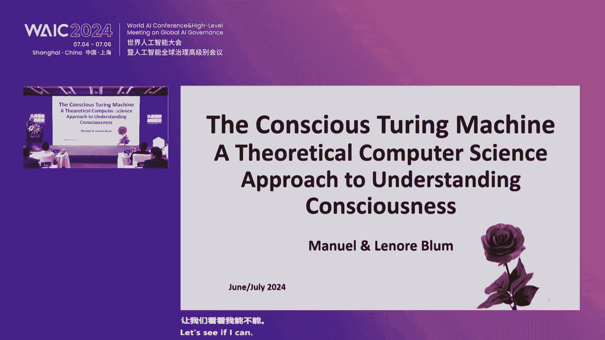

嗯，哦，是的，是的。

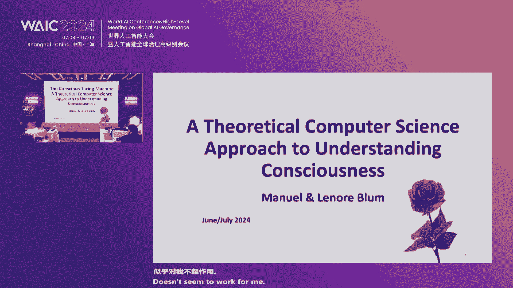

也许它能奏效，看，我有几张幻灯片，或者我不确定我用哪个开始的，嗯，人工智能模型，是的，好的，很好。

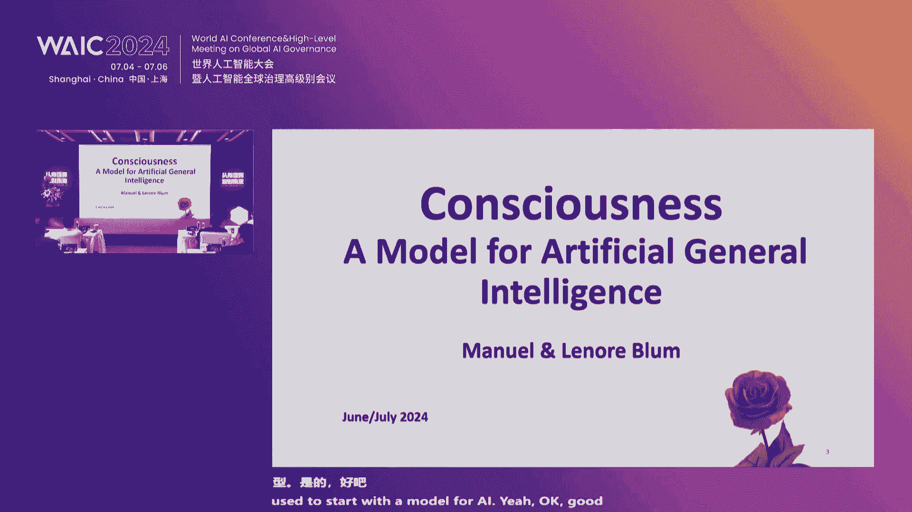

对不起，我正在学习如何使用这个，好的，那么现在怎么办，我会，实际上试着向你解释模型是什么，我对模型非常满意，让我试着从告诉你开始，我会告诉想知道的四年级学生，他脑子里有什么，大约十五年前。

Lenora告诉我你知道你一直想研究意识，现在你能做到了，终于你能做到了，她给了我一本伯尼·巴斯的书，伯克利的一位神经科学家，给出了精彩的解释，我会把这个解释给四年级学生。

伯尼·巴斯的关于我们头脑的解释，称为全球剧场模型，他把你头脑中的东西，看作是一个剧场，一个有很多观众在的剧场，观众们抬头看着演讲者所说的话，如果演讲者有问题，那么观众中的一个重要问题。

观众们会尝试解决它，也许其中一个人会走上前来提供帮助，所以剧场模型就是你在这里看到的，就是这个观众群抬头看着，演讲者，所以这是一个很好的模型，嗯，我对这个模型的唯一问题是伯尼·巴斯并没有真正解释。

人们将如何决定什么应该上台给演讲者，你有所有这些人们，你知道，问题可能是一个关于你的问题，你知道你曾经遇到过一个问题，参加一个派对，参加一个派对，呃，你看到认识的人，但你记不起他们的名字，对吧。

经常发生在我身上，也经常发生在你身上，所以在这个模型中，观众中的一位非常尴尬，想要得到那个名字，走上舞台说，她叫什么名字，并向所有人广播，她叫什么名字，也许他们找不到，但也许有人会记得，嗯。

我不知道她的名字，但我记得我在上海见过她，并向所有人广播，现在其他人可以走上来说，呃，呃，我记得一些其他的事情，嗯，所以她的名字以S开头，你知道你可能会有的那种事情，而且你知道最糟糕的是在我的经验中。

成员们会上来说些话，但是，你知道你并不明白，当你开车回家时已经太晚知道名字，它突然出现在你的脑海中，她叫什么名字，呃蒂娜，好的，但已经太迟了，知道这一点是件美妙的事，知道你的处理器。

观众成员一直在解决这个问题，你没有意识到，即使它只是从某个地方冒出来，你不知道是谁得到了它，你得到答案是因为处理器一直在寻找它，好的，呃，所以，是的，呃，对不起，我需要，我想要在这里喝点水，很好。

我不知道，谢谢，谢谢，好的，所以让我告诉你一点关于这个演讲，呃，我不知道，我会有多少时间我做了一个演讲，每个大约五分钟，在五分钟之后我会要求休息来提问，你的，呃，你可以提问，然后我会继续下一个。

所以你可以随时离开，当你看到时，你知道你可以在演讲之间离开，所以这是第一个演讲，这个演讲是关于为什么研究意识，因为这是一个重要的开放问题，意识今天仍然像牛顿时代，太阳能量的来源一样未解。

你知道在牛顿时代，他们认为太阳上可能有一片森林在燃烧，但也许它只是行不通，生命起源问题，达尔文关注的事，我认为意识问题可解释，那是莱诺尔，还有我，我相信意识有经典决定论解释，不需要，你，不需要量子解释。

现有些理论想通过量子解释，我认为不需要，让我告诉你，你知道，康威生命游戏，这不是游戏，是特定确定规则细胞自动机，这些确定规则，每刻都是确定的，细胞可判断生死，根据邻居生死，美丽游戏，美丽，例子，的。

确定，的，的，的，确定实体，这个游戏完全确定，可建图灵机，通用图灵机，可建自复制通用图灵机，实际可构造类似我们世界，我们就像神，看着这世界，现在可准确知道，未来世界模样，但世界实体无法知道。

因为它们需计算，所以，我们用它解释自由意志，嗯，那是古老问题，你知道，自由意志问题，塞缪尔·约翰逊说，所有理论反对自由意志，他了解牛顿定律，所有科学反对自由意志，所有经验支持它，如此美丽悖论。

你知道它存在了很长时间，我们争论的原因是，它可以解决，哲学家未能解决的原因，是他们没有考虑到计算需要时间，我可以解释给你听，悖论的解决方案，主要与计算所需时间有关，让我们看看，我们主张一个完全决定性的。

完全决定性的世界，像生命游戏一样，可以支持现象意识，我们相信理解意识将是有帮助的，如我提到的，从I到AGI，我希望你能理解我的意思。

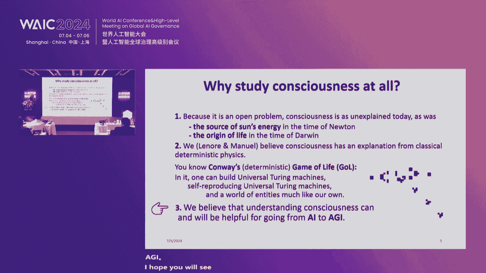

那么意识是什么，当然我问过ChGPT T，但忘记它，意识就是你所看到的，你所听到的，你所感觉的，你知道，当你晚上睡觉时，你意识到你的梦，你意识到你的梦，当你没有做梦时，你对任何事情都没有意识。

所以让我们谈谈意识，问题是理论计算机科学能为理解意识提供什么，嗯，因此理论计算机科学考虑资源限制，这使理论计算机科学能够解决一些基本悖论，啊，好的，即使没有它的任何大定理，它也能解决一些精彩的悖论。

我提到了。

我已经提到了，自由意志问题，它，嗯，嗯，可以追溯到几千年，你知道，柏拉图已经提到了自由意志问题，这里还有一个问题，冯·诺伊曼提出了生成伪随机数的方法，它被称为中间平方方法，他说，把它作为一个随机种子。

一个n位数字，平方它，当你平方它时，你将得到2n位数字，抽出中间和数字，看起来随机，你越多平方它，抽出中间部分，数字继续像这样，最终将停止产生随机数，最终会循环，但在大多数情况下。

你可以运行相当长一段时间，所以冯·诺依曼的引言，任何考虑算术方法产生随机数字的人，当然处于罪恶状态，这是罪过，因你明白，嗯，这是机器生成的，绝不可能随机，有点像，你知道。

你可能会决定用π的数字作为随机序列，种子能告诉你从随机序列的何处开始，从这一点开始生成，你知道，如果种子数较大，序列看起来随机，π看起来很随机，所以那是，但那是随机吗，所以是个悖论，你怎么做。

你能告诉冯·诺依曼如何解决吗，几乎有更多，嗯，嗯，给了一个逃离这地狱的方法，他说，他提出了一个解决方案，他的方案是，他说一个n位数字是随机的，哥们儿真罕见，现在才出现。

我们称之为col mcgurrandom，如果生成该数字的程序与数字本身一样大，这基本上是个数字，然后是随机数字的逗号r，生成它的程序必须记住数字，嗯，那是个精彩，嗯，解决方案，但即使如此。

阿尔玛随机数不能高效生成，事实上正确，很难证明数字是随机的，通常无法证明数字是随机的，我能证明一个数字不是伪随机，因为我能找到生成大量该数字的简短程序，但要证明一个数字是伪随机，实际上不可判定。

实际上无法做到，所以这是一个很好的解决方案，但不是，不是，想要的。

嗯，所以什么，什么有效，嗯，哦，嗯，什么有效，嗯，是的，而且，我知道你，我的飞船也有生成随机数的程序，而且我认识中国的一位数学家，嗯 华，华华后来也有了伪随机数，但伪随机数与意识如何相关我没弄懂，是的。

是的 不是，很好对吧，我仍在尝试向你展示悖论如何解决，现在我想快速向你解释，如何，如何解决这个悖论，而且你知道的 姚和欣，非常好，因为他真的向我们解释了，如何解决问题，所以这是真的。

我确实有一个好的伪随机数生成器，但真正重要的是姚和欣，他的解释是这样的，理论计算机科学所做的是，区分什么是高效的，高效可计算和什么不是高效可计算，你知道图灵区分了什么是可计算的和什么是不可计算的。

但理论计算机科学利用了，高效可计算和不可高效可计算之间的区别，姚和欣解决这个问题的方法是，理论计算机科学所做的如下，我们说随机数生成器是伪随机，实际上是由于随机，如果你能从种子高效生成这些序列。

随机种子，你可以高效生成大量数字，但没有高效算法能区分伪随机序列和真正随机序列，伪随机序列没有高效算法，没有高效算法能，当给定一组伪随机数和一组随机数时可以说，哪个是哪个，这就是伪随机序列的定义。

这是一个很好的例子，因为它展示了效率在这里的作用，高效，如果你能生成它，但没有什么高效能告诉你如果它是伪随机，随机或不随机，好的，所以我们在哪里，呃，制作它们，是的，所以，TCS对意识的接近。

所以让我简单地说，我只是给你，那只是两个例子，自由意志和随机数例子，数学家在试图理解这些问题时所遇到的数学困难，还有很多这样的例子，所以我不去他们那里，但由于我对意识感兴趣，在我看来。

也许这种方法也可以用来帮助理解意识，我的感觉是它确实有效，我们可以用它来理解意识，并在过程中建议一种制造AGI的方法，哦，那很好，我也可以看这里，呃，好的，所以，嗯，呃，我们的意识模型是意识图灵机，嗯。

CTM，CTM是有意识的，图灵机是一种意识模型，被提议，所以它来自两件事，这种意识模型，这个CTM它来自图灵，你知道图灵有一个非常简单机器，对于定义计算，非常简单，你知道图灵机吗，它很简单。

因为它让你理解了图灵，然后证明有些函数不可计算，整个问题不可计算，但这种方式很奇妙，所以，我们想要类似的东西，我们想要类似的东西，然后我们要，想法是，让我们提出一个关于意识的非常简单模型，它必须简单。

你知道，四年级学生想理解意识，它必须简单到他能理解，另一件事是，呃，所以另一件事是，ctm来自，呃，它很大程度上来自对大脑工作方式的理解，所以它是一个基于大脑工作方式的模型，但它也是一个非常简单的模型。

神经科学家不喜欢我的模型，它太简单了，大脑中有很多东西在发生，你知道，我，你会看到有一个短期记忆，但神经学家告诉我我们有各种各样的记忆，所以你必须把这个看作是一个非常简单的模型，试图理解意识，和这个。

呃，和这个将是一个形式化的模型，所以让我们按照图灵可以被建模的思路提出，它不是图灵机，是的，是的，ctm不是图灵机，它只是我们放入图灵机，只是因为我们在基于，图灵建议保持简单的事实，尽可能简单。

ctm是一个巨大的互不连接的并行处理器集合，观众成员可以把这些观众成员想象成一个是谷歌，另一个是chat gpt你可以，实际上我会建议这个模型已经足够形式化，我们可以建造它，我们应该有观众成员。

很多很多谷歌，和很多很多chat gts，因为你知道一个谷歌处理器，每当你有问题，你问问题，另一个谷歌处理器可能，把它变成学术结果，另一个变成，虽然现在出来，二零二四年，所以你可以有很多谷歌。

很多聊天机器人，观众中都很擅长，所以，所以让我也说，这个模型的一个重要特点是，它是一个正式数学模型，形式化从时间开始，时间是刻度，嗯，每刻度一百毫秒，每秒十刻度，这是大脑的阿尔法节律。

所以我们将让它成为大脑的阿尔法节律，模型有一个有限寿命，你知道，图灵机可以永远运行，但这个模型有一个有限寿命，这很重要，因为处理器数量等于模型中的刻度数，它不能，它不能太多，它不必完全相等。

但只是为了简单，我们让刻度数恰好等于处理器数量，当你这样做，结果CTM，所以另一件事是T等于N，好的，所以大T将等于大N，大N是处理器数量，我们将有1000万处理器，你知道这里没有1000万人。

但有1000万处理器，这对应于大脑中有1000万皮层柱的事实，每个皮层柱有一千个神经元，这些是CTM中的1000万处理器，由于T等于处理器数量，这限制了意识图灵机能活多久，结果大约是33年。

我远远超过了寿命。

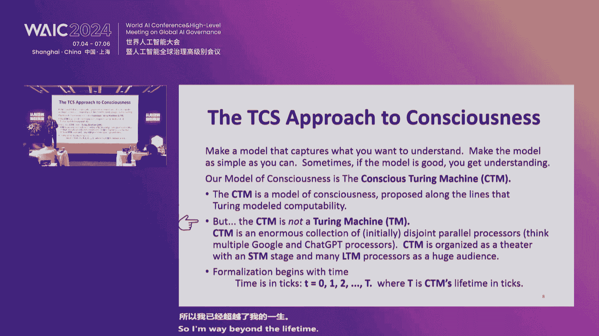

让我看看我能否继续下去，那么，我们如何检查模型是否正确，这里还有一件重要的事，我们如何检查模型是否正确，让我提一下，这对我来说非常重要，检查你是否正确，你知道我们数学家很幸运，因为我们知道关于证明的事。

我的意思是你可以做出一个声明，然后你可以证明它，或者你不能，证明是一个非常重要的检查方式，物理学家也很幸运，因为它也可以检查，因为物理学家可以做实验，实际上物理学家做实验和证明，所以他可以检查他的答案。

但我们如何检查，我们如何检查，当我们甚至没有一个很好的意识定义时，我的意思是，你知道你有意识，我也知道我有，我知道你有意识，因为我知道你的大脑和我的大脑一样，我有意识，所以你也必须是有意识的。

但我们要如何证明，东西，当甚至定义都不很清楚时，所以意识图灵机的要点将是实际上定义意识，我们将正式准确地定义它，然后你可以和我争论它是否是一个好的定义，嗯，我已经提到了所以好吧，我们如何检查。

我们将通过确保模型真的非常简单来检查，或奥卡姆剃刀简单，你应该是一个非常简单的模型，尽可能简单化模型，我想提到我们尝试了很多模型，很多模型失败了，很多模型失败了，通过失败，我的意思是它们并没有完全做到。

所以我们不得不改变模型并不断改变它，它变得越来越复杂，然后我们把它扔了，然后我们尝试了另一个模型，一个我意识图灵机是概率模型，我非常希望模型是确定的，我真的很希望它是确定的。

因为我想向你展示自由意志是可能的，即便在决定论世界，决定论CTM也会失败，尽管初看比概率论CTM简单，但它也会失败，这意味着什么，甚至失败，你知道，当没有意识定义时，你将如何，失败意味着什么。

我们很幸运有一个，教授，当时他是哲学和数学教授，他说看任何意识模型应满足，应能回答以下16个问题，所以他发表了16个问题，他希望任何模型都能满足，这就是我们的标准，我很高兴地说概率论CTM与决定论不同。

它很简单，我们认为它回答了所有问题，我们得让他同意，但，我们看看他是否同意，我相信它回答了，所以，任何时候，是的，所以任何时候，任何人建议让机器复杂化，好的，我在CMU教授过意识图灵机。

然后在北大上过几次课，哦，这里的孩子们太棒了，我爱，这些北大的大二和大三学生，我们给他们留了作业题，他们必须解决作业题并展示，这基本上表明他们理解了CTM的工作原理，然后我们挑战他们。

我们挑战他们找到CTM应该能做，但需要改变才能做到的事情，在每种情况下当他们提出建议时，他们都提出了建议，在每种情况下，我们都能证明你不需要对CTM做任何改变，来让它，做他们想要的事情，好的，嗯。

所以ctm与对齐，好的，有很多全球剧场模型，我提到的这种模型，是伯尼·巴尔的全球剧场模型，有很多方法解决这个问题，不同的方法，还有谁是对的问题，我们认为他们都是对的，有点像大象，对，大象，有人看到身体。

如果有人看到耳朵，是，我们认为意识就像那只大象，ctm是唯一好的，所以这里有一些关于ctm的事情，有很多模型，首先，关于意识，全球剧场模型，每一个都有中央执行者，上面有人，在运行事情，你知道。

国家有总统，管弦乐队有指挥，导演，总统，领导者，海军上将，我会提到一些有趣的事情，我告诉你麦卡洛克是我的导师，一个非常重要的导师，海军研究办公室每年都会支持他的工作，它会来，一位海军上将会来和他谈话。

然后沃伦会来告诉我们谈话的内容，我记得一些很奇怪的事情，海军上将说在舰队中，你可能认为舰队应该去的地方是舰队司令决定的，不，是拥有信息的那艘船决定舰队应该去哪里，我真的不知道，它是如何，如何知道。

芯片有正确的信息，它如何知道没有其他船有更好的信息，这对我来说像个谜，ctm会为你解答。

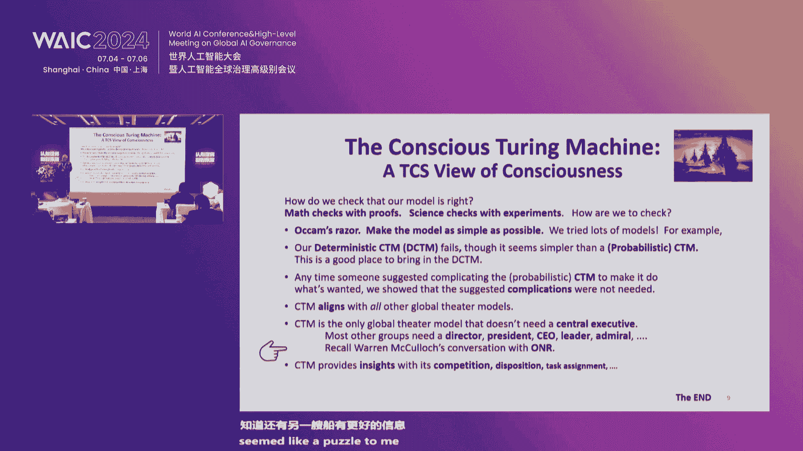

所以ctm提供了很多见解，好的，那么，我超时了吗，我还有多少时间，什么，好，那么，让我们继续，呃，让我们继续哪一个，好的，让我们继续，呃，数字二，所以是的，首先，到目前为止有什么问题。

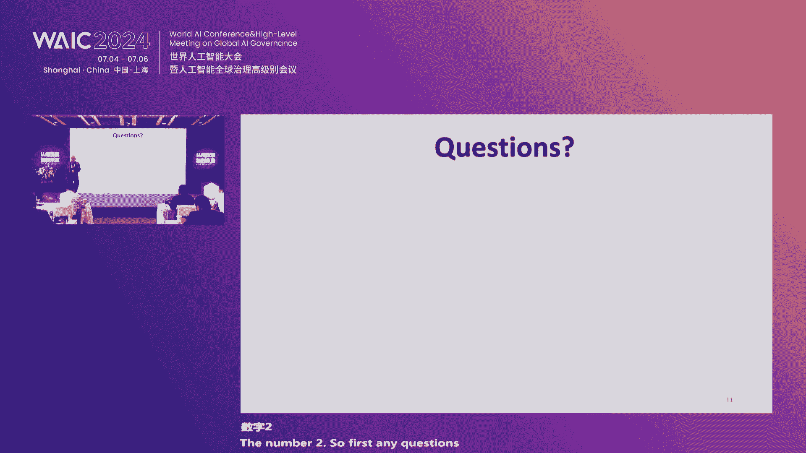

如果您喜欢，请随意站起来伸展身体，16个问题，是的，回答家庭模型的问题，有多少个问题，你的模型回答了多少问题，呃，我们认为，呃，有问题，每个问题实际上都有几个子问题，有些我们不明白，它没有回答。

我们不理解的，但那些对我们来说很清楚的，我们认为我们已经解释了一切，我们只是在等待凯文·米切尔给我们他的同意，所以我已经提到过，谢谢，这是个好问题，所以CTM，如我提到的，借鉴了图灵计算方法。

CTM不是图灵机，但是一个非常简单的模型，它借鉴了巴尔的剧场模型方法，关于意识，你可以看到它看起来有点复杂，但这是来自神经科学家的模型，所以我在向你展示的，模型实际上来自数学和，神经科学，好的。

这是巴尔的全球剧场模型，我能告诉你关于这个的什么，它很复杂，对吧，有一个舞台，那是短期记忆在那里，这里是舞台，输入从左边进入，它们去舞台，舞台上的东西广播给下面的处理器，最后舞台上的东西产生输出响应。

你可以看到顶部，运行节目的中央执行者，好的，这是有意识的图灵机，看起来并不简单，是吗，好的，但无论如何，它也有一个舞台，但这里有重要和显著的区别，输入不会去舞台，它向下到达一些专业处理器，你知道。

你有视觉处理器，从眼睛接收东西并产生概要，我们称之为，外面的东西，有处理器，输出处理器发送给手臂和腿，有一个上树，这是处理器如何玩，玩锦标赛，它们相互竞争，它们以非常特定的正式方式相互比赛以到达顶部。

然后到达顶部的东西广播到所有其他处理器，CTM的定义，所以我不打算写出正式定义，但至少我会告诉你它是如何开始的，有时间刻度，滴答，零一，二到大写T，对应于CTM中十的七次方处理器的十的七次方滴答。

在CTM中，这是CTM的定义，你看，它是一二三四五，六七七个元素，你知道，这就是数学家定义东西的方式，对，我的意思是，七元组短期记忆必须解释清楚，我只是短期记忆，有长期记忆，有十百万个处理器。

有一个上树来获取信息，短期记忆为止，广播有一棵倒树，左侧有输入，右侧有输出，连接处理器的链接，这种有意识图灵机的工作方式是，最初没有任何链接，无链接，我们需要这个，为了简化，我们不知道需要哪些链接。

我们不能连接所有处理器，因为有10的7次方个处理器，如果我们尝试，如果我们连接它们，那将是10的14次方个链接，大脑中只有10的10次方个神经元，所以只有10的10次方个轴突。

所以神经元不能是处理器的千分之一，千分之二的处理器可以连接，好的，这是CTM的定义，然后是块的定义，我提到，你知道，输入来自眼睛或耳朵等，或其他特殊处理器，有几个特殊处理器将你看到或听到的内容转换为块。

这样所有处理器都可以用我们称之为脑语的语言相互交谈，英语，西班牙语，土耳其语，丹麦语，好的，这是，那是，那是处理器将使用的相互交谈的语言，它们自己创造了语言，不是内置的，块本身很有趣。

因为块已经存在很长时间了，你知道，乔治·米勒第一次定义了块，他说，有，你可以记住7加减2个块，他说，所以，实际上，电话号码应该是7位数字长，因为有人告诉你电话号码，你可以记在脑中，你在脑中循环播放。

直到找到纸笔写下，巴尔的模型中有特例，这里有一个特殊处理器，口头复述是记7位数字，足够长找到纸笔，这是视觉空间草图板，有充分理由相信大脑中有这些，当然，它们不在CTM中，因为会有我们不需的复杂。

我们可以使用它们，我们可以用普通处理器，让我展示两种模型的区别，呃，刚才发生了什么，哦对，有短期记忆，有长期记忆，巴尔的模型中的意识事件，是输入到达，到达阶段，在我们的模型中你意识到那里，意识事件。

所以我们的模型很不同，在我们的模型中，你是CTM，我们说是有意识的，这是意识形式的数学定义，你对广播给所有处理器的都意识到，我们争论这解释了部分，至少解释了意识，每个处理器都知道广播内容。

如果任何处理器负责意识，或任何处理器集合，它知道广播内容，这不是完整定义，这是意识注意的定义，意识的感觉，那是另一回事，它叫意识觉察，我可以告诉你那来自世界模型，所以好吧，所以让我尝试以下。

当婴儿出生时可能有点有趣，我会把婴儿想象成有CTM大脑，婴儿出生时发生了什么，处理器没有连接，它们一无所知，它们产生的块，做了，我提到什么，块不是，我没说，是的，块很重要，块重要因为乔治·米勒定义了块。

但这是一个非正式定义，这将是一个正式的块定义，它包括生成块的处理器，它生成的时刻，要点，即将发送至舞台的想法，它必须类似于一个60个字符的句子，这是整个，数学将允许的重量，W和强度，在过程结束时。

块到达顶部将具有强度，它是权重绝对值的总和，它将具有情绪，这是实际值的总和，你知道学生们不喜欢这个，他们说，那不是情绪，那只是一个情绪的示例，但他们没明白，然后重点是我们要谈论权重绝对值的总和。

一个好词是，强度我们想谈论，权重的总和，一个好值是情绪，所以这是意识的正式定义，块的正式定义，顺便说一句，当块被定义时，它被非正式地定义，他们没有像强度和情绪这样的东西，这绝对必要，你知道你意识到什么。

你意识到，对你来说它有多重要，你感受到的力量有多强，这很重要，你知道，而且当你意识到某件事时，它是积极的东西，或者它是一个消极的东西，你有关于你意识到什么的知识，这些非常重要，所以我会举例子，最初。

是的，让我们从婴儿开始，婴儿出生，处理器完全没有连接，他们什么都不知道，什么也没有，他们什么都不知道，所有权重大约是正负一，没有，你知道，这是正常情况，嗯，权重是任意的，我们取实数，正负一是标准。

所以没什么发生，除了婴儿，在某个时刻，一个处理器是一个量具，有许多量具，专业量具，其中一个量具是关于食物的，另一个关于口渴，另一个量具与疼痛有关，你知道你有多痛，那个，那个重量，另一个处理器是氧气的。

在那个婴儿中，当它出生时，识别它需要的那个处理器，ctm需要那个，婴儿需要氧气，开始提高它的权重，它越来越大越来越大，直到它达到某个阶段并尖叫，我需要氧气，有趣的是有1千万个处理器，它们的强度大约是1。

尖叫将会有，为了克服有10的7次方个1，必须大于10的7次方，或至少与10的7次方一样大，或10倍于10的7次方，所以是一个非常大的强度，如果你绝对必须达到那个阶段，这也是我们需要有强度的原因之一。

是因为处理器需要知道，所有处理器的平均强度，平均强度，长期记忆中，当块被广播时，它们可以看到强度，它们可以看到所有权重的总和，它告诉处理器需要氧气，它的重量应该有多大才能登上舞台，以获得尖叫广播。

所以当，在ctm中发生了什么，当尖叫被广播时，我需要氧气，嗯，呃，这是一个婴儿，它什么都不知道，因此每个处理器只做，它可能做的，它不知道它能做什么，有一个处理器处理手臂和腿，好的，所以它挥舞着胳膊和腿。

你知道我查过这个，是的，婴儿，当他们出生时，他们会挥舞胳膊和腿，还有什么，我们预测它可能撒尿和拉屎，那是它能做的，然后有谷歌不是太棒了，你可以查一下，它说，是的，婴儿，当他们出生时，他们撒尿和拉屎。

它做了一切可能的事，其中一件事是尖叫或哭泣，婴儿哭泣，它会得到氧气，这是婴儿的第一个学习经验哭泣会得到氧气，后来，它将发现每次遇到问题时，如果它哭泣，它会解决问题，如果它尖叫，它会解决问题，在几次之后。

这发生了几次，婴儿知道该做什么，有问题时，各种问题都可能出现，我们看看，我们现在在哪，区别在这里，左边，输入输出直接与右边的舞台相连，而右边则连接到特殊处理器，输出来自特殊处理器，左边。

意识事件在输入和短期记忆之间，在右边的舞台上，意识事件是广播结果，广播接收，左边，信息没有特定方法上升到舞台，巴尔的说法是处理器聚集起来决定什么重要，发送到舞台，没有具体说明，这让我们很困扰。

因此在正式定义中，我们给出一个特定的正式方式来做出决定，因此，对于块进入短期记忆的明确竞争，在巴尔的模型中，没有世界模型，世界模型非常重要，因为你并没有真正看到世界，你的眼睛看到世界。

但那不是你认为的那样，我的意思是，只有你的中央凹能看到锐利的东西，大部分你看到的是模糊的，对于婴儿，婴儿只能看到灰色的模糊，那是它的世界，那是它对世界的了解，它将开始使世界更加精确，因为你知道它。

它将进行预测，世界模型不断预测接下来会发生什么，婴儿看到一个灰色的斑点，因此自然的预测是下一次，在下一个，滴答一声看到相同的灰色斑点，不是吗，我的意思是，你看到一些你不知道的东西，有任何想法。

接下来会发生什么，所以它会是同样的事情，但你会发现，时间到了，是的，你会发现我会被，你会发现，所以，婴儿发现的是，并不是下一个，它预测了相同的灰色，但实际上灰色似乎移动了位置。

它将发现头部移动会移动灰色，这就是世界模型的开始，逐渐形成对世界的良好看法，你现在知道那个观点，世界模型发展得如此好，以至于你感觉你在看世界，好的，这不是世界模型，它必须是他们的世界模型。

巴尔的模型中的中央执行，没有中央执行，无中央执行者，这很有趣，因为所有我们知道的组织都有一个领导，所有意识模型都有一个领导，但有一个领导并不合理，因为如果有任务要完成，中央执行者无法在千万中知道谁最好。

谁能最好地解决那个任务，谁能最好地解决，谁有时间，谁有兴趣，谁有需要的知识，没有中央执行者能做到，你需要不同的决策方式，决策方法是向上树，嗯，时间到了，我只提一下向上树，嗯。

是获取正确信息到顶部的很好方法，选手间进行比赛，这些是概率性比赛，每把刀旁边都有刀柄，每个处理器都有与其信息相关的权重，如我所提，阿尔姆·布鲁姆告诉我们专家应该如何工作。

但每个处理器都对其信息的重要性有所了解，关于有意识的图灵机，很好的地方是，是的，锦标赛就是这样，因此，这个锦标赛具有这样的属性，那就是，特定块从处理器移动到舞台的概率，与其重量成正比。

象棋和网球比赛不适用，ctm适用，你可以做件简单的事来看如何运作，赢家，取所有比赛，你做的事是，每个处理器有自己的权重，当两个处理器相互对抗时，胜者获得败者的全部权重，如果你这样做到底部。

那么顶部你将看到，呃，概率就是它们应该的，这很好，当我们发现这一点时，因为这意味着处理器的位置无关紧要，你可以确信这一点，这个赢家，取所有，处理器的权重完全决定它是否能上升到舞台。

并且与处理器的位置无关，这难道不棒吗，我的意思是，呃，因为毕竟你可以移动处理器，你可能能够移动网球运动员，但不能移动处理器，即便如此它也能运作，那是个，那还好，非常感谢，好的，所以因为时间有限。

也许因为时间确定，是的，是的，是的，是的，我们没有那个，所以没有提问，然后因为教授布卢姆在，然后任何感兴趣与你互动的人都可以有，然后好的，是的，是的，是的，是的，接下来我们进行服务检查平台的启动仪式。

所以就用中文，耶，请，金，简，GG领导费亚林继续北上北京昌，莉莉安，连海技师，梁简，医生，诗语静，静，静音，伙计们，我，乔，J，郭元京金，简，卓立盘，张，京华，袁熙湖，余姚冰，余溪上海和。

无锡江源上台为，进去，U，R，你过来，变化真大，的，哦，看，哦，你，今天紫烟紫漫溢，扎宾韩武光，那是颜，我该离开了。

