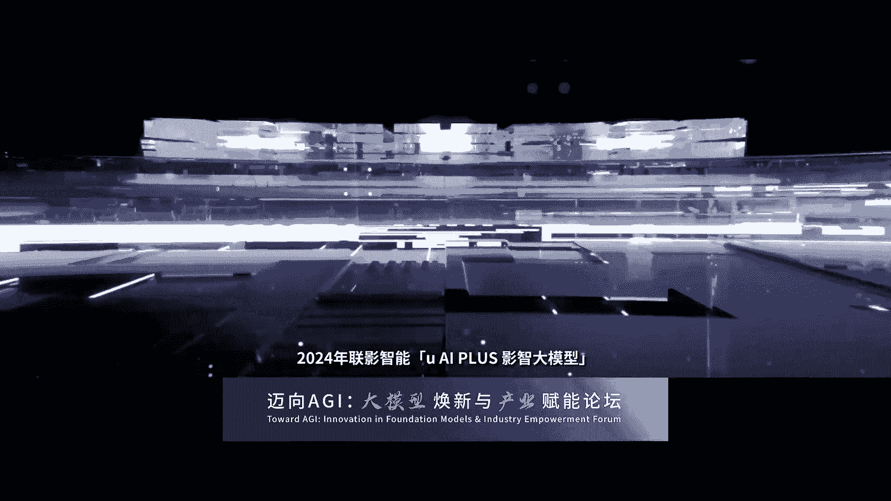

# 2024世界人工智能大会（合集） - P31：20240705-中国信通院“迈向AGI：大模型焕新与产业赋能”论坛 - WarrenHua - BV1iT421k7Bv

下面有请上海市徐汇区区委常委副区长于林伟先生上台，致此，有请。尊敬的兵秘书长刘波超司长于晓辉院长。尊敬的各位嘉宾，大家下午好。很高兴能和大家相聚在徐汇西岸，共同参与迈向AGI大模型换新与产业赋能论坛。

我经代表徐汇区委区政府向各位领导、嘉宾和朋友们的到来，表示热烈的欢迎和衷心的感谢。2018年，首届世界人工智能大会就在我们今天所在的徐汇西岸召开。我们抓住大会举办的契机。创建了首个人工智能发展的集聚区。

并于2019年被国家发改委列入首批战略新兴产业的集群。在2020年，得到国务院作为真抓实干的典型表彰。在2023年人工智能产业战略性产业集群的评估当中，我们再次获评优秀。2023年以来。

我们紧紧抓住人工智能发展的大模型的技术的趋势，创建了上海首个大模型产业生态社区。经过近一年的努力，我们有22个大模型通过了国家网信办的备案，占全市的3分之2，占全国的近5分之1。

全区已经聚集了超过160余家的大模型企业。我们问。规置的发展。去算力算法提供全要素的服务和保障，并提供金融、人才等全方位的支持。去年我在很多场合，我都经常请教业界的专家三个问题。一个问题。

我说2024年美国能不能够推出GBT的5。0的版本，或者说无限逼近通用人工智能。第二个问题呢，我也经常请教说，我们中国的哪一家或者哪几家企业在2024年能够。啊，全方位的达到啊对标chaGBT4。

0的水平。去年相当长的一段时间，曾经有说可能中国会出现百魔大战啊，大裂模型这样的局面。但是现在来看呢，万亿参数万卡执着的从事基础模型研发的企业，其实在国内呢，应该说差不多也就在十来家这样的水平。

我们非常高兴的是，徐慧集中了其中差不多50%。商汤、捷悦、mini max等落户于徐会的基础模型企业，今年上半年都先后发布了对标chIGB4。0的基础模型。下一步。

为进一步把握大模型蓬勃发展以及赋能千行百业的机遇，我们将在三个方面持续努力。第一个方面呢是持续做大魔术空间的规模和品牌。这两天，因为我跑来跑去在参加各个论坛的活动，也很多企业家啊。

我们互相留这个联系方式，关心我们魔术空间三期和四期的进度啊，我也跟各位企业家们报告。我们在9月份三期四期4万方将投入使用，将可以容纳超过100家的大部分企业入驻的需求。第二个方面呢。

我们将继续深化和优化大模型的产业企业啊产业政策。我们在全国最早发布了关于支持大模型产业发展的扶持意见。在技术创新、算力资源、语料数据、场景应用、融资服务等多方面。提供支持。就在今天上午。

我们又再次发布了关于支持人工智能大模型科创街区建设的若干意见。在下一个月呢，我们还将在市经信委的支持下再发布一个政策。关于支持行业大模型发展的若干意见。我们希望通过这些政策呢。

始终保持在政策扶持的力度上，在行业内位居前列。三呢我们将持续完善大模型发展的生态。应该说经过近一年的努力，我们聚集了不少大模型的企业和大模型应用的企业。但是呢我们在芯片。

在上游的芯片以及在下游的智能终端啊，应该说我们还希望啊能够引进更多的生态企业链足企业。今天呢我也想借这个机会啊，欢迎我们在座的这个企业家技术的大咖投资机构共同的来徐会啊，我们共谋发展共话未来。

最后呢再次预祝本次论坛取得圆满的成功。谢谢大家。感谢于曦的精彩发言，请就坐。本次论坛的所在地徐汇区也是大模型生态聚集和创新应用高地。我们希望通过本次活动促进大模型产业交流。

为徐会大模型创新应用及产业发展添砖加瓦。😊，接下来有请中国信息通信研究院院长李晓微先生上台致辞。有请。尊敬的尚云尚云英呃，副秘书长刘波超副司长。于林伟、常伟。各位领导，各位专家，大家下午好。

很高兴在2024世界人工智能大会。😊，呃，论坛与大家相聚呃，过去6年来，中国信通院也是在呃工业和信息化部的指导下呢，有幸深度参与了历届的活动。

那么昨天呢我们是也是在呃工工业和信息化部上海市和国际电信联盟的支持向举办了人工智能向善创新扩大影响的国际研讨会。这也是国际电信联盟的F的会议第一次在日内瓦的外面的开。那么也取得取得了成功。

那么今天的分论坛呢，我们将围绕大模型落地应用等前沿一起开展深入研讨。在此呢我也代表中国信通院向与会嘉宾以及一直来支持我们各项工作，直到我们向各项工作的各位领导，各位产业界和学界的朋友们表示衷心的感谢。

那么党中央高度重视人工智能发展，习近平总书记呃指出呢，人工智能将深刻将对人类新息社会发展和人民人类文明进步产生深刻影响。

并强调加快发展新一代人工智能是事关我国能否抓住新能科技革命和战和产业变革机遇的战略问题。今年的政府工作报告提出要实施人工智能加行动计划。那么国务院也部署了呃人工智能呃赋能新工工业化的各项工作。

刚才呢这个波超副市长呢对于呃对对人工智能赋能新兴工业化和推动人工智能创新和技术产业发展做了很系统的部署，由我们的下步工作呃指明的方向。当前以大模型为代表的人工智能技术呃突飞猛进。那么我们过去一年多哈。

过去两年多看到了人工智能大模型的一个飞速的一个发展和不断的一个迭代和突破。呃，一方面，从技术路上看，极限的发挥大模型大数据大算力的技术潜力。在探索精细化的扩展定义上的道路的道路上继续的前行。

不但提升模型能力，仍然是未来几年人工智能技术发展演进的主旋律。当然大家也会提到，那么大模型是不是给我们开启了迈向通用人工智能的这样一个一个大门。另一方面，我们也认识到。

当前的大模型技术还面临着算力消耗大、训练数据要求高、幻觉难以根除、可解释性不足等问题。因此，呃，我们应该说全球哈包括我们中国也正在探索向世界模型内脑计算、强化学习等各种各种的各种的技术路线来去共同推动我们。

迈向人工智能的发展道路。那么近年来呃，在正产学院用各方的共同努力下，我国人工智能产业创新持续加速。应该说我们已经建立了比较全面的人工智能技术产业体系，覆盖了芯片、框架、算法、数据、平台应用等各个环节。

人工智能与实界经济的融合也不断深化。在工业领域啊，刚才波超呃司长对于我们在工业特别强调的工业里是作为主战场，而且也取得了很多的成果。那么在工业的电子信息、装备制造、原材料、汽车等领域的研发生产管理环节。

人工智能应用呢是已经已经比较多了。呃，同时呢人工智能大模型呢也在工业领域开展已经开展探索应用。呃，在在CAD研发设计，在一些智能的装备呃等等各个方面已经体现了体现明显的这个潜力。

同时呢大模型也在加速向政务金融能源交通医疗等教育等各个领域迈进。人工智能加应该形成了一个蓬勃发展的一个良好态势。当然我们的产业也还面临的一系列挑战和问题。

中国新通院始终呃秉承国家高端专业支库和产业创新发展平台的使命定位。呃，也多量。那么在一直以来在工信部的指导下，呃，我系统的研究和推动人工智能的相关的工作。呃，一是的不断深化人工智能重大战略问题的研究。

同时我们也向社会呃，也也联合我们的产业界一起发布了人工智能的相关的一些一系列白皮书呃等等。那么二是。呃，体系化的支撑国家的重大的这个人工智能相关的决策。二是呢打造呃产权技术的服务平台。

我们也在工信部的指导下呃承建了工信部大模型的公共服务平台。人工智能关键技术应用测评的重点实验室。我们也推出了大模型性能和安全基准的测试实验室，为产业发展提供高水平的公共服务。呃。

从这个领域我们已经看到呃在对大模型的性能安全方面，全世界都有一个非常呃多的这样共共同呃共识的要求嘛，我们也跟国际呃一些发达国家里面做了这些对接。那么其实呃对于怎么去推动这部分工作。

我觉得各国有非常强的这样一个认识。这也是我们国家推动的一个重要的工作。三是呢推动人工智能的标准体系建设，我们牵头制定了50多项人工智能的国际和国内的标准。四是呢打造人工智能产业的协作网络。

我们发起成立了中国人工产业呃发展联盟大概会员超过了1000多家，有40多个公。各组那么我们去开展各呃各呃各种工作。同时我们也举办了这个人工智的呃新智配的大赛，也因为推动了我们的人工智的一些技术的创新。

同时也开展了从今年我们呃上个上个月开始嘛，也是在工信部的指导下，我们开展人工智能大模赋能新息工业化的共需对接深度型的活动。呃。

我们这个活动的主要目的是把我们的大模型的这个企业与我们各个行业的需求能够拉通实现这个共需对接。这个我们已做的第一期工作第一期吧应该是效果还是不错。未来会在布给的指导下继续推动这方面的工作。

第五呢是推动积极推动国际合作。我们参与的联合国国际电信联盟等机构的呃有关的国际人工智能国际发展治理。那么我们也在金砖G20等平台上促进人工智能国际合作。我们也是在呃外交部和工信部的指导下。

正在筹建正在成立金砖国家中国金砖国家的人工智能合作以发展的这个发展与合作的这样一个研究中心，以推动我们国际合作。同时呢我们也与其他一些国家里面对人工智能治理发展方面做了很多的这个这个个探讨和。和对接吧。

那么展望未来呃人工智能和大模型技术还面临的这个呃进一步的快速的创新。那么我们应但是这个创新怎么和应用去落地，怎么去落在各个行业里面，我们还有很多的需要探索。那么大模型应用落地将进入一个深水期。

我们中国新通院呢也希望在我们在工信部的指导下，也在我们上海市指导下，我们呃配合各方与产业界共同携手，呃，共同探索大模型的这这种发展创新和应用落地之路共同探索呃推动通用AI通用AI的发展之路。

那么也希望在我们国家推动这个人工智能赋能新兴工业化和高质能发展中做出更大的贡献。最后呢也再次感谢我们我们工青部上海市徐汇区以及产业界呃各方对我们对我们院的指导关心帮助和支持，也预祝本次论坛圆满成功。

谢谢大家。感谢于院长的精彩致辞，请就坐。中国信通院作为信息通信领域的国家高端专业智库产业创新发展平台，紧跟国家战略、持续深耕人工智能、大模型等前瞻领域，积极推动相关产业发展。

再次感谢各位领导为本次大会开幕致辞，为人工智能及大模型产业发展指明了方向。接下来我将话筒交给专业主持人陆凡先生，有请。好，谢谢。😊，感谢廖院长的精彩主持。呃。

也很荣幸能够从廖院手中接过这支话筒主持接下来的内容。2023年，我们进入了大模型的创新热潮。2024年也是大模型应用落地的元年。未来，我们也期待人工智能可以掀起新一轮的产业革命和科技变革。

接下来我们将要进入全球前瞻主旨演讲环节。在这里呢，我们也非常有幸的请到了重量级的嘉宾，为我们带来国际前瞻事业。首先我们将要有请第一位重磅嘉宾，有请澳大利亚科学院院士、南阳理工大学杰出教授陶大成院士。

🎼陶院士在国内外人工智能久负盛名，神根机器学习、机器视觉、数据挖掘等人工智能重要方向，研究20余年成果丰硕。在大模型的理论、算法和应用方面，也有众多的研究著作。陶院士今天将给我们带来具有哲学思辨的主题。

大模型的倒数。让家有请。呃，大家好啊，今天非常荣幸哈，有这样的一个机会呃来分享一下我们对于大模型的一些呃思考啊，很多思考呢还比较的这个初级。呃，自从这个chGPT的成功以来啊，大模型的发展十分迅速。

那么在一定程度上呢，甚至可以看成是一种社会运动。那么因为发展大模型呢，需要这个大量的人力、物力，还有这个财力。甚至在一定程度上呢，我们可以看成是人和自然的这个博弈。

那么随着这个GPT4V和4O等超级模型的诞生，我觉得在一定程度上呢，我们已经进入了人工智能发展的这样的一个平台期。那么也走在了十字路口的这个中央。那所以今天呢我想和大家聊一聊大模型的道和树。那么。

何为道？就是大模型的这个工作机制。那么合为数，那么就是大模型的实现和实践的这个具体路径。那么理解到呢，那么我们将会清楚大模型的这个。工作机制。大模型的工作边界。那么在理解。道的这个基础上。

那么我们才有机会呢能够更好的发挥这个树。那么中国呢其实也有句话，这个有道无数，这个树善尚可求，有数无道，那么止于树。历经了这个80年的时间哈，神经网络呢终于在这个大模型时代证明了自己。那么我还记得呢。

在我读书的时候啊，我看到了一本书，书中写到这个人工智能已死，神经网络万岁。那么在这80年的时间里呢，发生了很多值得大家去深思的这个事情。那么时间关系呢啊我就不能够展开了。

那么希望这张图呢能够带给大家一点点的这个启发。那么我简单说4个。很重要的这个时间节点。那么第一个呢是这个1943年。这个warren Mclock和what peace这两位这个神经学家。

还这个这个计算这个神经科学的这个研究学者呢，这个提出了这个神经元这样的一个基础数学模型。那么正是这一年呢，那么开创了这个神经网络的这个相关研究。那么第二个重要的时间节点呢，是这个1957年。

这个frank crossbl在这个conell呢这个提出了感知机。那么其实我们今天为止啊。这个我们所有的神经网络都离不开这样的一个基础要素架构。在1957年的时候。

fran simplepl呢也已经使用了这个随机梯速下降算法来优化这样的一个感知机。那么到今天呢，我想大家还是在使用这样的一个随机梯度下降算法。

那么第三个重要的时间节点呢是这个1986年jeff Hton。他呢引入了这个BP算法，然后来优化多层感知机。那么1986年呢也是非常重要的一年。过去呢搞神经网络的人呢。

其实主要是这个sychologyphysiology。那么从1986年开始，神经网络呢就变成了一个独立的这样的一个研究方向。那么除了这些很正面的这个时间节点啊，其实也有比较负面的。我举一个例子呢。

就是1969年marvinmin。马恩明呢提出了这个XO问题。那么指出呢这个。感知机呢甚至是不能够解决这样一个非常简单的一个问题。那么在1970年呢，马明给。拿到了这个图灵奖。1971年呢。

frank科森普在他43岁生日的那一天呢，这个划船溺水而亡。这个神经网络呢也在。19这个呃69年的时候，随着这个Xel problemble的这个提出，然后导致呢神经网络的这个研究呢陷入了这个低谷。

那么然而呢，在2012年alexnet取得成功之前，那么可以说神经网络啊很长一段时间不被看好，两次重创。一次呢是我刚才提到的1969年的marveminky证明了感知机不能够解决XO这样的一个基本问题。

那么还有一次呢是在这个90年代初，统计学习理论的这个出现，指出了神经网络的一些严重不足。那么尽管如此，我们其实还可以看出，神经网络的这个发展动力主要来自于算力和数据的这个不断增长。

从发展初期的感知机到发展中期的BP算法，还有多层感知机，再到近期的这个深度学习和大模型。模型的这个参数量、模型的数据承载能力以及模型所展示出的实际效果不断的在增强。在最近这十来年的时间里。

深度学习充分展示了他在这个human civilizationization发展进程中的实际价值。他的成功是数据算力和算法的深度融合能力释放的展示。目前。

深度学习的发展呢已经进入了由大模型所驱动的超级深度学习时代。科技企业呢在人工智能技术的这个驱动下，实际业务水平和市场竞争能力呢也不断的这个提升。大模型的机动时刻，莫过于它的涌现能力。

尽管我觉得我们对于什么是涌现能力还不足够清晰，也许。这里面呢有不少人可能会有一些问题，觉得涌现能力我们已经讲了这么长时间，难道还不清楚吗？我举个例子。两位同学小明和小丽今天呢参加了数学考试。

小明考了100分，小丽呢考了90分。那我想请问大家哪位同学更聪明一些？那么这个问题呢看似简单啊，小明考的高，那应该是小明更聪明一些。那我再额外的透露一点点信息。昨天晚上啊，小明非常幸运，做了一套卷子。

今天考试的题目呢都在这套卷子上。那么。这样的话，你还觉得小明比小丽更聪明吗？可能你觉得这个你得再想想。那我再透露一点点信息，其实小明啊小丽啊也很刻苦。过去一周的时间里，小丽呢也做了很多的这个练习题。

今天考试的这个题目。他其实也都做过，只是今天呢没有发挥太好。那么讲到这里，我想大家呢可能已经有点。糊涂了，有点纠结是吧？那么没有办法判断谁更聪明是吗？其实这个例子呢，我并不是有意要来tck大家。

我只是想借这样的一个例子呢，来让大家呢去思考一下今天大模型的这样的一个对比。我们可以看到今天大模型的训练和测试，就仿佛我现在举的这个例子。我记得爱因斯坦呢曾经讲过一句话。

The value of a college education is not the learning of facts， but the training of the mind。To think。

简单来说呢，就是大学教育的实际价值呢，不是说我们从书本上去学习那些已经知道的事实，而是我们需要去训练我们的大脑，学会去思考和分析问题。那么这一点呢，其实对我们研究人工智能来说呢。

我觉得是一个非常重要的启示。那上面呢是一个类比的例子，大家呢可能觉得还不够让人信服，对吧？因为那是我说的，也不是这些具体训练模型的公司说的。那这里呢我就举一个更具备呃说服力的这样的一个例子。

那我使用英文呢问大模型，一个小学生的。思维训练题目是吧？那今天呢我们可能很多人都在说，我们的大模型在解决这个大学高考的问题，大学的问题，然后甚至很多这个open problem。

那我拿一个非常简单的小学生的思维训练题目来考考我们的大模型。那么这个题目的大意是什么呢？jack和jail这两位小朋友跑步。jack呢朝北朝西两个方向交替跑，4分钟朝北，6分钟朝西，8分钟朝北。

10分钟向西，12分钟朝北，4分钟朝西，6分钟朝北，如此循环往复。那么这样呢向西和北两个方向交替去跑，12分钟向西10分钟朝北，8分钟向西6分钟朝北，4分钟向西12分钟朝北，10分钟向西如此循环往复。

对吧两个人呢同时同地同宿出发。请问多长时间之后，两位小朋友会再次相遇？那么我想这个大家很简单的就能看出这里面的这个规律。一个呢是这个468012啊，如此循环，一个呢是12186如此循环。

所以说呢这个时候大模型呢就开始作答了。首先呢分析借克跑步的这个规律。从罗列来看，模型呢只是往外推了一步，但是后续的规律总结是正确的。我怀疑呢这个规律的总结呢，只是对于题目的一个改写，或者说重新的描述。

那么因为他的这个逻辑的这个描规律总结的描述呢和题目本身呢具有一定的这个相似性。然后呢，是分析ja跑步的这个规律。同样罗列呢只是外推一步，然后后续的规律总结呢就完全不对了。

那么如果说他能够正确的去总结jack跑步的规律，那么为什么他不能够去正确总结jail跑步的这个规律？那么这个是我深刻怀疑的一个问题。那么首先呢一个完整的一个周期是12加10加8加6加4，它的2倍。

也就是80分钟。那么其次呢，我们把模型罗列的这个数字相加，它是70分钟。然后模型所得到的这个加法的结果呢是60分钟。那么简单的加法，这里面注意它也做错了。我们继续往下看模型的这个分析能力。

这里呢总体的解题思路是正确的。但是对于jack和ja跑步，他的这个paon的总结是错误的。尽管下面最小公倍数的这个计算是正确的，但是总体的结论呢依然是错误的。一个小学生的这个思维训练题目。

模型的分析呢基本是在错误和正确中纠缠。那么看完了这样的一个逻逻辑推理，我们再来看一下它的这个几何推理能力。所以说呢我又找了一道小学生的几何推理题。那么问图中的这么三个基本形状啊。

这么三个基本形状能够构成下面ABCD4个选项中的哪一个形状。那么这里很明显哈，答案是D。然而模型给出的答案呢是C。并且呢他对于ABCD4个选项它都分别做出了非常详细plusible的这样的一个解释。

那么。为什么会是这样的？如果说我们缺少相关的背景知识，或者说没有得到充分的这个教育，那么或许我们就充分信任了大模型的这个错误解释。因为这些解释看上去也没什么不妥。那么在一定程度上。

今天大模型呢可以说对产生的结果已经可以做出这些相对比较合理的解释。只是我想我们还不能够完全去信任这些解释，或者说这是explans。那么这个问题的产生的主要原因呢。

目前的大模型呢是unprintable的。也就是说，我们对于大模型的基本工作原理还不够清晰。基本工作原理在一定程度上可以说就是大模型的这个道。hellu nation呢总是在发生，幻象总在发生。

我们不知道什么时候发生，也不知道为什么发生。我记得19世纪末的时候呢，凯尔文勋爵呢做了一个关于近代物理学的隐喻。物理学的大厦已经建成，上面只有两朵乌云，然而在后续的这个研究之中，这两朵乌云啊。

大家都知道分别发展出了相对论和量子力学。今天大模型的上空呢也漂浮着一朵乌云。那么这朵乌云呢，实际上让我们惴惴不安。大模型的研究工程化和使用呢目前都面临诸多的挑战。比如我们尚不清楚大模型是不是真的会思考。

对吧？那么比如我这里拿到了这个四个例子啊，那么我们来看一下第一个例子。问图中的这两条黄色的线段是不是一样长？GPT4V呢说这两条线段一样长，并且呢给出了简单的解释。答对了。然而，拉va说他们俩不一样长。

那么答错了。那么这个时候呢，我们把下面的这条黄色的线段稍稍的延长一点点。然后我们还是问同样的问题。这个时候呢，GPT4V还有拉va呢都回答说这两条线段一样长。同时GPT4V依然给出了看似合理的解释。

那么我们还有很多不同类型的这个例子。那么这些错误呢，实际上让我们在怀疑大模型是不是真的在思考。那么在根据题目的意思，根据题目的这个给定条件再进行合理的逻辑推理。大语言模型方面，其实我们面临非常多的挑战。

比如复杂表述的这个困境。跨语言的幻觉，甚至是翻译的误差。这样的一个误差传递其实是非常严重的。比如我们用大模型把中文翻译成阿拉伯文，再把阿拉伯文翻译回中文。

那么这个时候我们得到中文的翻译已经不是原本中文所表达的意思了。纹声图方面也产生了大量的问题，比如视觉文本的错误，对齐畸形的手和脚以及多模态混合生成的。具象错误等等。那么sra的出现呢。

sra的出现呢在一定程度上让相当一部分人呢认为大模型不仅仅是生成视品，而是在仿真物理世界。那么所以说大模型呢是物理世界的仿真引擎。然而，众多如此失败的这些例子。却缺失合理的相关解释。

同时呢我们还面临众多人工智能安全的问题。我们可以把现有的安全问题呢分成两大类。内生安全，还有衍生安全。内生安全方面呢包括了鲁邦性、隐私保护、公平性以及透明性。衍生安全方面呢包括了可靠性、偏见。

还有这个毒性。那么关于这个人工智能安全的这个问题呢，我们做了一个相对来说比较详细的一个总结。那么即将呢在这个。在这个。电子工业出版社出版，这个就是人工智能安全导论。感兴趣的朋友们呢可以去具体的去看一看。

面临诸多挑战，但是呢我们依然要向前道虽不清，但树上呢我们还是需要全力以赴。比如大模型作为效率工具，我认为它是一个非常好的选择，可以广泛的应用到娱乐、电商、搜索等具体的业务之上。那么具体来讲呢呃。

有一个非常好的机会，这是我看到的。我这是我我觉得就是现在很多人看到的这样的一个非常好的一个机会。就是大模型呢将会对未来的人机交互产生划时代意义的变化和影响。那么有了大模型的这个加持呢。

我们的人机交互呢将有机会实现全感知沉浸室、无边界以及无障碍。这样的特性。总之一句话呢，无形胜有形。通过多模态的模式，未来我们和机器的交互呢将会变得非常简单，就像和自己的朋友和自己的家人一样。时间关系呢。

我没有办法详细展开。那么作为结束，我提两句话。庄子的奇物论中说，天下莫大于丘毫之末，而泰山为小，受莫于双子而朋祖为妖。sing law今天呢已经给我们带来非常多的这个惊喜，可以说始料未及。

但是是不是任何场景我们都需要追逐这个大sing law工作是否有它的这个相关边界？另外，道德经中说，天下皆知美之为美，思物矣。我想在大模型非常成功的今天，我们是不是更需要谨慎的思考。

从无休止的内卷中获得新生？嗯，好的，我的演讲就到这里，希望能够给大家带来一点点小的启发。好的，谢谢大家。谢谢。😊，感谢陶院士的精彩演讲。陶源士为我们总结了人工智能发展的80年的精彩历史。

而且他也用庄子和老子的话来诠释人工智能。这让我又想到了老子在道德经中说的一句话，那就是人法地地法天天法道，道法自然，人和自然，和谐相处。

那我在想人工智能是不是人和自然和谐相处中所蕴含的所催生的另外一个智慧结晶呢。虽然这个智慧结晶还有很长的路要走，这就像在当年在人类在刀工火种的年代，人类刚刚学会使用工具，使用火种一样，虽然行路很漫长。

但是最终达到科技的彼岸。好，谢谢陶源士。近年来，solo等大模型的发布，引发了行业对多模态、大模型能力及价值的无限想象。🎼接下来我们将邀请到的是加拿大工程院外籍院士志向未来创始人兼CEO梅涛院士。

梅院士在多媒体分析和计算视觉领域有丰硕的研究成果，数百篇论文获多项大奖，牵头科技部歌创创新人工智能重大项目。梅院士为我们带来大模型、视觉多模态、智能交互新界面主织演讲，我们掌声有请。

🎼重新呃来到大模型和产业论坛呃，其实志向未来呢，刚才于长伟讲了那个徐汇区在西亚那边建了一个人工智能的创业的这个生态。那志向未来就是其中的一个第一批入驻的企业。

那其实刚才大家在那个开幕式的那个呃大屏上可以看到很多的这个人工智能产生的这个视频。那么其实有很多的视频是我们志向未来来产生的。那么刚才呢陶月是讲了我们大模型呃，特别是在呃语言模型里面的话。

会会出现很多的幻觉。那接下来我会给大家分享一下，特别是多模态里面领域的话，这个幻觉，往往有时候会给我们带来更多的创意。那么整个人工智能的产业，在未来的三年甚至未来十年都是一个非常蓬勃的一个产业。

那么有几组数字，那么这个数字其实在三年前我们在用，但其实我发现现在很多人依然在使用这样的数字。那么第一个数字呢就是14%，就是未来的话就是深城市人工智能会给我们全球的GDP带来14%的增长。

那么这个增长在目前的这个经济情况下是非常可观的一个数字的。那么第二个数字就是74%。也就是说，中国全世界的世界的经济的总量74%都会受到整个的人工智能啊技术的影响。那么其实我们做为一个调研。

其实目前全世界五百强里面的企业有50%以上的企业都在开始规模化的使用人工智能的技术。那么第三个数字就跟我们相关的就是26%。就是我们未来呃中国的GDP有26%的。经济的增长是跟深圳市人工智能相关的。

这也是为什么我们国家在大力的发展人工智能，发展发展那个芯片，发展半导体的产业。那么下一个就是大家可以看到深圳市人工智能，它其实是未来是像一个水和电一样，会变成一个基础设施。

那么这个基础设施的话会影响到很多方面。比方说我们深圳市人工智能能够理解人的语言，那么它就会改变我们人机交互的一种方式。那么就会就会产生啊通用的人工智能这样一些呃模型和技术。

那如果人工智能能够理解物理世界能够通过视觉来建模，那么它就会改变AIGC改变原宇宙。那么人工智能如果能够做多模态的交互的话，那么就会催生我们现在所谓的啊机器人，特别是特别是巨生智能。那么目前来说。

在很多方面包括智能智能制造云计算游戏IP品牌营销，所有的方面都在跟人工智能产生很深切的一个一个组合。那么这张图的话是很有意思的，就是说刚才陶源士讲到了这个ing讲到了这个边界。那么这里面有两条曲线。

大家知道我们做人工智能的一个信念，就是我们能不能真的有一天能实现这个I所谓的通用人工智能。那么目前来说，我们在产业界在学术界做生成式人工智能的有两条路线。

那么第一条路线就是通过语言的压缩所谓的叫GBT这样的模型通过nex token prediction这样的机制去预测我们的下一个单词，从而再去理解这个人的人类的知识。本质上来个知识的压缩。

那么第一条曲线就是上面这个曲线。它到目前为止通过G4到G five的这个过渡期，我们发现这个曲线是变得越来越平缓了。那么有一种说法是2026年，那么这个人类的这个所谓的知识就会被大语言模型所消耗掉。

那么另一条曲线就是我们下面的这个曲线，我们叫usion model，就是扩散模型。那么这个扩散模型，它是一个本质上来说是一个完全不同的一个物理概念。所以它的框架技术框架也是跟GBT也是完全不一样的。

那么它是从刚才陶也讲了，我们是想从视觉的角度来说来构建对整个世界的一种物理的模拟。那大家可以看到像了像我们所做的纹身图纹身视频，包括3D都是想对物理事界进行一个描述。那么到目前为止。

那么这条曲线它的发展的逻辑呢会比GBT这个曲线稍微慢一点。那目前我们认为现在这个usion model它所代表的技术能力相当于GBT2的一个阶段。那么将来有可能有一天，那么这两条曲线就会融融合在一起。

那么这个就是任何一个技术哈，它的出现都不是一朝一日的。那么包括像GPT这样的型的出现这样的出现，它其实也经历过了很多年的积累。那么大家知道T它是从2017年trans换而来的。

那么目前来说我们在做usion个的时候，也是通过了很多年的积累。那么我记得在2017年我们在还在微软研究院的时候，我就发布了发表了第一篇全球第一篇从文字生成视频的这么一个模型。

我们叫用ial来生成一个特别小的一段视频，大概几秒钟大概是几时帧。那么当时这个技术没有那么成熟，后来我们就搁设了一段时间。那么到了今天为止经历过了usiongress方法。

以及包括今天大家看到的这个ion架构。那么这个技术路线是经历过了经历了很长时间的一个积累。那么这里面有两个工作是由我们从队来做的。第一个就是我刚才讲的。😊，2017年的时候，用干来生成video。

另外就是我们在去年发布的一个叫video draft，就是通过一个很简单的一个语句，能够生成一个大概几十秒钟的一个有多镜头，多故事性连续性的这么一个视频。那么下面的这个曲线就是怎么样生成图片。

那么图片的这个逻辑跟视频也是一样的，基本上也是从这个g啊，然后对抗神经网络到我们的呃叫diffusion new net到今天今天的这个呃叫diiffusion transform这种架构。

那么这里面有两条曲线，很有意思，就是啊我们想到一个词，就是我们的技术的边界。那么我认为我个人认为2026年会是一个很有意思的一个一个年。那么这个曲线里面的话，大家看到这个蓝色的这个浅蓝色的曲线啊。

是我们人类。现在每一年我们人类通过我们自己的设备，自己的行为去拍摄生成的这个图片的数量。那么目前为止，2023年啊，大概是在1800亿到1700亿的这个数量级。那另外一条曲线。

这个蓝色的曲线就是我们今天通过人工智能所产生的这个图片的数量。那么虽然我们在2023年的时候，我们的数量才是200亿左右，但是大家可以看到这个曲线呢，它的增长的趋势是非常非常的下。那么到2026年。

我们预测我们人工智能产生的图片的数量就会超过我们人类一年产生的所有的图片的数量的总和。那么2026年的时候呢，刚才我们也讲到，就是说2026年的时候呢。

我们世界上啊所有人类产生的这个语料语料库都能够被人工智能大语言模型给吃掉。所以说我认为2026年是一个非常有意思的一年啊，我们确实会走到一个十字路口，到底是沿着sing的方式再去往前走，但是走不下去了。

因为没有更多的数据了。还是说我们会有一些更多的创新。比如说现在我们的transform，我们下一步到底是什么？比如说我们的dusion这个model，那么它有能不能可能啊跟我们的大原模型能够产生结合。

那从这个整个的视频的生产来说呢，我们认为我们可以把视频的技术，它的成熟度分为5个阶段，从L1到L5。那么放就是类似于这个自动驾驶。那么我们我们知道从这个单镜头的内容生成。

就是今天我们可所看到的s是看到我们最向未来的这个技术。那么到未来多镜头多故事性连续性的一个过渡，我们认为还有很长的时间。那么终极是什么？终极我们希望拿一个拿一篇小说扔给我们的机器。

我们的机器就能够做分镜就能够做镜头的生成做IP的一次性最后出来的一个完整的电视剧。那么我认为目前来说，所有的这个技术，目前还处于L2的阶段。那么从一个技术到最后落地的话，有很多的因素要考虑。

那么最重要的因素就是我们的成本效率体验。那目前来说，我们我们也知道，目前我们生成一段视频。一秒钟的生成呃生成的话，如果不充盲活的情况下，它的成本大概在1元人民币到1美金之间。

那么它的效率大家知道我们输出一个pro，那么它产生这个视频的渲染的时间，可能会是十几秒甚至于一分钟。那么体验那么大家知道目前我们不管是做文字模型，还是做视觉模型，还是做视频的产生。

那么它的天花板还是很高的。目前来说，我们还没有还没有实现我们的PMF，我们还没有从服务我们的专业用户过渡到我们服务我们的普通用户。那么未来有很多的很多的那个呃路要走。

那么未来到底怎么样去做一个多模态的模型呢？我们的思考就是说未来绝对不是一个大模型解决所有的问题。未来一定是一个大模型，结合很多的小模型，所谓的agent去帮助我们去实现我们的热用户的需要。

那么我们的策略就是我们通过一个基础的大模型。啊，通过文字对其的多模态的一个模型。结合我们很多的产品应用型的小模型，能够服务我们的千行百业，包括我们的智能终端，我们的影视影视制作，我们的电子商。

我们的文理宣传等等。那么我们也是志向未来，也是一个全球会发布三个不同的一个平台。那么我们是全球首个商用的DIT的这么一个大模型。那么这个模型到今天为止，我们已经累积了大概全球有百万的流量。

那另外一个就是我们会是1个AIGC的原生的平台。那么我们自前我们明天即将发布的这个模型。我们叫志向大模型2。0。那么这个模型是一个视频和图像一起混合训练的一个原生的模型。那第三个就是我们已经发布的。

就是我们全球首个真正的实现了这个呃民用的或者全社会任何一个普通用户都能用的一个国民级的应用。我们叫视频彩铃。我们跟中国移动跟运营商一起合作的这么一个彩铃。那么到今天为止，虽然我们只有一年的时间。

但是大家可以看到大模型的创业是非常非常快速的，竞争很激烈，商业化也很快。那么我们今天已经已经服务了超过100个左右的这个大大大型企业，然后服务了大概有3万家的小小型中小企业。

全球访问量已经超过了100万。我们的API已经被调用了超过300万次。那么这些都是说明我们在徐汇区的这个模式空间里面，我们是一直在加速的。那么这就是我刚才给他讲举了个例子。

就是今天我们要实现一个国民级的任何一个普通消费者都能用的一个视频生成的一个产品。那么他要做哪些事情？那么我们我们要做用户给定一个一句话，我们需要把这个话变成我们的脚本，我们要经过大言模型来扩写。

扩写完之后，我们要分镜分完镜头之后，我们通过我们的工具能生成每一个单镜头的内容，最后要做一个合成。所以今天从一个模型到落地，它需要一个很长的时间。那么讲到我们明天的一个发布。

我们会发布一个我们所谓的志向的大模型的2。0。那么它有几个特点。那么第一个就是文字的稳定性。其实大家刚开始的时候，在片头我们的那个看到我们很多的文字。

我们的艺术是都是可以嵌入到我们的视频嵌入到我们的图像里面的。另外呢我们的视频是可变时场的。我们可以支持5到15秒钟的任意时长。对于我们的VIP我们还可以支持到2分钟。

那么另外一个我们希望能够将来从L2往L3来进阶。那么今天我们生成是单镜头内容。未来我们希望是生成一个连续多镜头的IP一致性的一个稳定性的视频。那么最后我们特别感谢我们徐慧就给我们营造了这么好的一个条件。

也特别感谢呃新通院邀请我们来一起跟大家分享。未来我们希望能够共建这个大模型的生态，解解放我们的生产力，谢谢大家。😊，谢谢谢谢梅院士的精彩演讲。😊，美远师在演讲中提到了我们多模态大模型在今后的应用场景。

模型作为人工智能技术的新反是，需要解决大模型的可信应用问题。🎼进而支撑其在各领域进行规模化应用。蚂蚁百灵大模型的进一步升级，让大模型技术将越来越能够惠及用户。

接下来我们将要有请到的是蚂蚁集团大模型应用部总经理顾静杰，为我们带来可信大模型产业智能升级的创新基石与实践探索。掌声有请。嗯，刚刚前面两位院士都谈到了。

在大模型应用中经常会出现的像这个幻觉的那个各种各样的问题。其实今天蚂蚁一直在致力于啊，我们希望大模型未来能够只有融入到千行百业的这个创新的应用里面，它才有百花齐放之时。

所以我们一直在把大模型在真实的这个产业应用中进行不断的去探索。那么在这个过程里面呢，我们也今年整个蚂蚁集团公布了我们的三加一的这样的一个计划。就是我们百灵大模型基础之上，我们面向生活场景，面向金融场景。

面向医疗场景去推动各种各样新的这种生城式AI的应用。那么在这个过程中呢，特别是在严严谨的行业里面，我们已经发现大模型的这种幻觉问题或者大模型缺乏复杂推理的问题已经越来越重要。

所以接下来我我会简单跟大家分享一下，我们在这个过程中去提炼可信这个关键词，同时如何解决在产业应用中的问题。那么我们今天来看可信，我们认为是在大规模服务产业和社会的一个重要的前提。

那么大模型在嗯在应用的过程中到底会遇到什么样的挑战呢？我们觉得有三个问题其实是非常值得探讨的。第一个就是其实不同行业里面有非常深的这个领域知识。比如说我拿医疗举个例子，很多医疗的知识。

其实不是在书本里甚至都没有数字化，都在我们很多医生的脑袋中，对吧？那么第2块呢就是。其实今天大模型还没法做非常复杂的专业决策。前面院士分享的那个例子，我印象特别深。一个小一个小学生的这个题目。

如果它涉及到多步的推理，往往在过程中就会出现很多的问题。那么怎么解决这种专业的推理能力呢，可能会在像金融这种领域里面是一个重要的一个门槛。最后呢我们也在不断的思考，如果我们在产业的应用过程中。

我们有没有办法把现在产业中非常好的AI的工具和大模型能够结合起来。其实今天的智能体就像一个一个大脑和很多的工具的结合。所以我们也在想大模型与基础AI融合，有没有新的这种创新的可能性。😊。

那么简单第一块给大家讲一讲领域知识增强，如何解决这种领域的行业的知识的问题。今年呢我们跟合作伙伴有一篇新的论文发表，然后这个是在讲一件什么事情呢？

就是今天大模型中经常大量被大家应用的RAG也会存在幻觉啊，RAG其实就是让大模型参考一篇文章。但因为这篇文章它是非结构化的。即使是真的人，你在做开卷考试的时候，你也可能会答错。

所以我们定义了八大类RAG过程中可能会存在的幻觉问题。比如说一些概念啊，偷换或者是它的一些逻辑出现错误啊，这中间我比如说第一个例子，他说某种矿物某种这个功能饮料会消除疲劳。但是在总结的时候呢。

大目前可能会把它改成增加疲劳。这是在某一些特殊的这种案例中是有可能会出现的。但如果这种啊矛盾错误出现的话，在很多严谨行业是。非常麻烦的。比如说第二个就是一种反转。

比如说我们讲这个呃孵化到节呃节俭的这个更季节大概是25到32天，但是它会和后面变成用的这个时间做了一个反转。那么我们今天也也通过这个bench mark测试了现在市面上头部的一些大模型。

也会存在比较小概率在10几到30%的这种矛盾错误。所以我们在产业的应用落地里面，其实非常非常需要这种呃非常严谨的这种知持来作为参考，而不是仅仅非结构化的内容。所以我们提出的方案呢。

就是要通过可信的这种领域知持来代替这种原来这种非结构化的这种参考参考文献，提供专业教材，能够帮助我们在这种专业领域里面更好的去实践这种可信。那么通过构建这种结构化和非结构化的融合的方式呢。

我们可以显著提升在很多行业里面的REG或者叫knowledge graph的这种knowledge graph呃增强了这种啊。像呃一种生成的场呃场景。啊，我给大家举了一个简单的例子。

这个例子呢是我们在一个呃区域风险的研报的一个场景中。那么众所周知，在这个研报里面，其实包含大量的这个知识结构。如果只是一篇文档，那是远远达不到这个要求的。所以我们会把它抽象成左边这种知识结构。

它会包含知识和关系。那么通过这种知识和关系的加强，那么大目型在总结的时候，它的准确率会提升很多。那么目前我们看啊，通过这种方式来进行知识增强的，我们观点的正确率基本上能够达到提升到和专家相当的水平。

那么为了做好这种知识呢，我们也和浙江大学一起联合发布了大模型的统一的知识抽取框架。因为从非结构化的信息抽抽取到结构化信息，其实是非需要非常多的这个中中间的这个加工的过程的。所以通过这个框架呢。

我们在很多知识抽取的这个领域里面，已经能够达到目前行业整个sota的这个水平，也欢迎大家一起参与我们这个oneKE这个项目。同时呢我们除了说嗯知识抽取和知识抽取的框架。

我们还需要跟很多的机构开放的去构建很多在垂直行业的这种知识体系，包括金融的医疗的民生行业。所以我们也和open KG联合发布了新一代的知知识引及open SPG这也是一个开源开源框架。

也能够通过这种方式能够加速我们知识和我们这种大大模型推理结合的一个范式。第2块，简单跟大家聊一聊这个专业决策和深度评测。其实在呃特别像医疗金融这个行业里面，你做一个专业推断，其实难度是非常非常大的。

去年我们就已经跟我们很多的这个呃医生的这个合作伙伴，医生专家们一起提出了叫这个 knowledge graph的这个COT的一个表示啊。其实在医院里面，医生给我讲。

他以前就有很多这个叫他们叫这个决策术或者叫推理的一个规则。😊，那么其实如果一个用户来说，我自己已经有一个有身体有个症状，那么医生第一反应就会让你哎你你的症状大概持续了多少时间。

你上个礼拜有没有吃吃了什么东西，或者你去做过检测。但是今天大模型当一旦收到用户的一个这个症状之后，立刻就会说哦你可能怎么怎么怎么样。所以我们把医生的这种决策路径呢和大模型做了个结合啊。

我们提出了一个叫KGCOT的方式能够提升在诊断过程中的这个准确率。那么这个过程我们在不断的探讨之后呢，我们也发现在金融这个里面更加需要这样专业的这种推理的框架。

所以这个呢也是我们今年刚提出的一个叫agent universe这样一个agent的一个框架。那么这个框架里面，我们怎么来去提供专业的决策呢，我们在左边就要需要有专业的这种金融知识库。

其实今天我们已经构建了超过这个千万级别的这种专业的金融知识库。那么在右边呢我们跟很多金融的这个专家共同构建了一个叫1加4加1的专家分析框架。😊，今天可能在座也有一些金融领域的专家，当专家去分析一个财报。

去分析一个市场的时候，它其实是有一个逻辑在里面的。这个SOP往往是普通的人不知道的。那么我们跟专家一起融合之后呢，我们抽象了很多的框架主体。这里面通过把报告解读啊，市场分析啊。

大势解读的一些框架沉淀下来之后，这个框架可以提升整个金融解读推理的这个这个效率。啊，这里我简单举了几个例子啊，这个是我们现在投颜知晓柱的一个scase。那么通过它呢，我们可以做一些。

比如像这种啊实时的这种报告解读投研的这种分析。那么他在第一步呢就会把通过和专家库的这个匹配去模仿专家在进行。一些思考路径。那么通过这些思考路径呢展开之后。

它就可以形成一个相对比较专业的一个分析框架分析结结果。这个例子呢就是我们在讲一个政策解读。那么同样的政策解读的框架和研报的分析框架又不太一样。通过这样的一一种拆分。

我们可以很好的去让大模型模仿真正的金融专家在理考呃，在理解推理和思考问题的一种一种模式。那么今年呢除了我们提嗯在推动在aggen的框架里推理中的一些应用，我们还构建了大量的在推理中的一些中文数据集。

左边是我们在金融金融领域的。我们和上海财经大学一起推动了在金融领域的这个评测数据集。右边呢我们联合上海市人济医院推动了推出了首个中文的这个医疗推理数据集。

我们也希望能够和千行百业一起推动在更多推理数据集上的这个建设，来帮助我们更好的去提升大模型的这个推理能力。最后呢我简单讲一下我们在大模型和基础AI融合创新的一些工作。其实在过去的几年里面。

蚂蚁和我们呃和千行百业一起在推动我们很多基础AI能力持续不断的提升。比如说在2020年，我们推动每天超过百亿级别的这种呃资金调度的这种能力。在2023年，我们也推动在动态意志图的这种机机器学习框架。

我们在动态意志图上面也取得了不错的进展。在今年呢我们也推出了，包括在这个呃工业级别的全全模态点击率的这个数据集。那么我们在传统的这种AI领域里面，我们积积累下来大量的这个AI工具。

我们可以通过一套工业级的这个认知推理的框架。我们可以把大模型和传统的这个图学习框架和大规模的知识引擎进行结合，提升大模型的知识力和推理能力。同时，我们在很重要的一些金融的一些场景里面。

我们还可以把运筹优化的这个决策引擎。大家知道这个决策对于大模型来说也是一个非常难的问题，我们可以把它跟运筹优化的决策引擎进行结合。那么在这样的一个呃新的这种智能体的框架里面。

通过大模型来驱动周边的各种AI引擎，我们可以更好的在向医疗民生啊，在数字金融以及包括金融风险里面进行落地。那么通过这种方式。

我们可以保证整个这个产业的这个框架能够更好的在严谨的这个行业里面去进行不断的尝试和落地。所以以上就是蚂蚁在呃蚂蚁在各个行业里面的一些大模型实践。我们也希望未来人工智能能够为世界带来更多微小而美好的改变。

我的分享到这里。谢谢。😊，感谢顾总的精彩演讲。顾总的演讲告诉我们，大模型不仅仅要知道如何思考，而是更需要知道如何正确的思考。🎼大模型时代，保障技术安全发展的基础上。

仍然存在着很多的不可预知性与潜在的威胁，迫切的需要将人工智能治理提上日程。接下来让我们有请在人工智能伦理与治理方面的资深知名专家、中国科学院自动化研究所研究员、联合国人工智能高层顾问机构专家曾毅教授。

为我们带来善智理促进善智能与善智慧。掌声有请。首先感谢信通院的邀请。呃，然后呃我们的这个主持人组是把一个汉似智能的信息处理的工具呃畅想成这个可以跟人类比较的这个呃智能的呃伙伴。但是很显然。

人工智能现在还有非常大的这个呃距离，非常不好意思，作为一个呃人工智能的研究人员可能我们让你失望了。但是人工智能当然在努力当中。呃，我想呢就是呃今天讨论的问题，我希望呃从善治理一个更广泛的概念上。

然后去讨论我们希望的善智能和人类的善智慧。呃，首先我想说呃治理是一个这个概念它是应当是非常广泛的。治理和监管应当是非常不同的。实际上就是在人工智能发展的道路上，那么在选择的这个问题上。

实际上也是一个治理的问题。当我们中国还没。

呃商用的呃生成式大模型服务的时候，我们当然关心的问题是，中国是不是能够呃构造出来生成市的这个人工智能。

但是当你看到400个生成市的人工智能的模型呃在一个学校里看到10个生成市呃人人工智能大模型的呃的时候，你可能在想的问题就是我们是不是呃是不是要大家都要再继续呃这样内卷下去。嗯。

所以呢我想呢实际上在发展路径的这个呃治理的问题上，我觉得需要做出一个选择。呃，在我看来的话，呃至少呃在呃我认为呃前沿的产业研究，呃，包括我们的学术研究的最前沿的这个机构当中。

我觉得50%的力量投入在大模型上呃，是没有问题的。但是另外50%的话，确实如今天的这个会议的主题就是要做大模型的换新。呃，做颠覆颠覆性的这个呃换新。那大模型。如何如何去换新，就是他的科学的这个呃目标。

如何去真正的让我们实现呃对大模型的换新。我觉得这个首先就是一个关键的问题，就是。在科学上，我们是不是一定要用这么大规模的数据啊，当然这个跟caling low还能够坚持多长时间是有关系的。

但是当提出大模型的时候，我们作为一个科研工作者的第一个反应就是同样的问题，到底用多小规模的数据可以解决同样的问题。呃，当看到这个这么高的功耗的时候。

我们想到的问题就是在功耗上能够降到多低能够解决同样的问题。呃，当大家都期待人工智能具有真正的这个理解能力。而它实际上真正它还只是处理能力的时候。

我们在想的问题是我们是不是能够真正让人工智能具有理解的这个能力。现在的人工智能呃，就像我刚才说它是一个看似智能的信息处理的工具。它还不具有真正的这个智能。但什么时候这个人工智能，它是具备高智能的。

这些都是我们在换新的时候，需要去考虑的科学问题。每一个科学问。题可能需要解决它都需要很长的时间。但是later is too late。我们如果现在不开始的话。

我们不能到呃现在的这种工程组合优化创新的方式走到瓶颈的时候，再去找另外一条道路。所以在科学上的这种换新。我觉得是现在需要去去去去布局的。所以这个是我说的在发展的这个路径上的这个治理需要去解决的问题。

那么大模型的，所以我觉得大模型的大其实确实不是必要的。因为大家已经看到了这样的趋势。那么就是相对小规模的这个呃模型已经达到了很多大模型的这样这样的这个能力。

这是在工程工程优化方面的体验已经有这样的这个感受了。嗯，但是在科学上怎么证明它的合理性。那么这个是需要去探索的科学的问题。但是我想坚持基础模型是重要的。因为在就是基础模型呃，基础模型和云端的这个。

呃呃和和这个端的这个交互呃，我觉得这个是一个一个未来发展的一个关键。呃，那么呃我自己做的这个研究呢，我希望推动的是呃未来在基础模型上呢，我们在做的是类脑通用人工智能的这个工作。

但我觉得跟现在大模型还有很大的这个呃区别，因为大家知道我们当我们说呃机器是否能够思考，但是你也想到迪开尔说我思顾我在，所以你在想到一个问，但是你不能说you think there forUR。

就你不能说你思顾你在，所以这个时候有就有这样的问题了。当你问 think但是当机器它没有一个自我的时候，它是不是真正能够思考。当你说你思顾你在都是不成立的时候。

所以我想所以我想这个这个是为什么我们在推进类脑通用的人工智能的时候，去思考它的根基要进行重塑要进行自我驱动的这个人工智能的建模。那么另外一方面就是如果实现真正的理解能力，要有具深的这个理解。

而不是仅仅的停留在这个大数据去换位。呃，那么呃我想像这个marvinminky讲的就是问题不是人工智能是不是能够具有情感，而而是如果没有情感的人工智能。你怎么能够把它称为人工智能。呃。

情感并不是一个选项。呃，因为在我看来的话，如果使未来我们希望现在的人工智能具有道德，能够合乎伦理。呃，但是呢没有共情能力，没有道德直觉的这个呃没没有情感交互和共情能力。

认知共情和情感共情能力的人工智能是没有办法获得道德直觉的。他也不可能实现真正的合乎伦理。呃，所以呢呃所以我想这些都是呃在未来发展内脑通用的人工智能的时候，跟现在的大模型会形成了这个区别。呃。

另外呢更关键的就我说的呃基座和边缘的协同，不仅仅是协同，最关键的是协同演化。这演化的部分怎么去做？我觉得是是非常关键的。呃，那么呃我们既然说现在的人工智能的大模型，它主要是基于刚才像这个陶老师讲了。

基于这个深度学习的这个发展，基于神经网络的发展。那么实际上人的这个大脑当中比神经元多10倍的这样的一个计算的基础设施就是胶质细胞。所以人类人类的大脑当中有860亿个神经元。但是加上这个交质。

但是胶质细胞的数量是神经元的这个10倍。胶质细胞它发挥什么作用，它是助力学习的这个作用，参与学习的作用。所以在一个智能的架构当中，不应该没有胶质细胞。

所以这个是我们构建的呃第一个融合了脉冲神经脉冲神经元和胶质细胞的这样一个类脑神经网络的这个呃大模型。那么当这个呃胶质细胞被引入的时候，它使得我们的长期的信息处理能力增强了学习的算法。

基础也发生了这个呃改变。呃，时间的关系我可能没有时间讲细节，希望给大家看一下效果。所以大家看到当这个呃与这个开源的一些模型比较的时候，呃，那么比如融入交质细胞的这样的脉冲神经网络呃。

在它的这个呃序列长度在不断增长的时候，但是它的吞吐量的话，其实实际上是相对来说的话是是比较稳定的。当序列长度增长的时候呃，它的这个在memory这块。

它并没有显著的这个提升相比这个传统的这个生成式的模型的话，所以显示出来的这样的这个呃优势。这个是一个视角去思考基础架构上，除了我们说对于这个呃传统的这个神经网络。

我们能够做什么样的重塑以达到我们真正真正希望达到。大家可以看到了这个呃呃从从这个能耗和内存上都在都在往下降。这是我们希望的就小数据呃的的的方式另。外是我们刚才说的这个演化的问题。

那么神经网络结构是不是应该是固定的？比如说你上来就是一个全连接的这个呃网络，你想把这个计算量做小，想把它做低功耗。当然你要降它的这个呃。当然你要降它的这个连接的这个数量。

所以呃当人的大脑的861个神经元并不是全连接的。所以我们需要去呃我们需要去利用演化的原理，呃，实现一个类脑神经网络的结构演化。这个是我们去年发表在美国国家科学院院刊上的一篇文章。

引入了这个意志性的神经元和演化的原理，让这个不同的任务去训练一个呃脉冲的神经网络的话，它最终得到的一个最优的结构。那么在能耗上和性能上都实现了这个呃明显的这个呃跃迁。呃，所以呢我想呢刚才在技术的方面。

呃，我希望给大家一个例子，就是如何去呃通过呃去认知和大脑的这个启发，真正的把这个呃模型呃向真正呃智能的大脑再再再再往前带一个呃在再往前带一个台阶。那么另外一方面呢。

就是我们呃我们希我们希望需要的我们需要的到底是。什么样的这个呃人工智能？就是在我看来的话，就首先大家都在讲安全可信。那我想首先第一个我要想讲的是人工智能的安全和人工智能能力，它们之间不是正交的。

更不是相互撤肘的关系。提升人工智能安全并不意味着呃我们人工智能的模型的能力会减弱。因为系统的鲁棒性自适应性和安全性本身也是人工智能的这个呃能力。那么人工智能的风险防范，现在是被动式的。

但我们需要去转变成从防御性的主转变为这种建设性的主动式的。呃，除了刚才谈到了security的问题，safetty的问题也非常的这个关键。人工智能伦理和安全的问题，它不是一个选择题。

对于一个人工智能的产学沿用的话，它应当是一个这个必要的这个呃基因。呃，我们现在要做的是人工智能怎么去从合乎伦理做到具有道德，这个是有非常大的这个呃区别的。一个人工智能大模型，他在接触数据之前。

它是无善无恶的。但是当他接触了人类的数据。因为人类社会的数据，它是有偏见的。所以人工智能大模型变成有善有恶了，可以为善，也可以为恶，所以去恶是是是需要去解决的非常关键的这个呃问题。

但是我不认为现在的value能够解决这个问题。我也不认为现在的这个超级超级对齐的方式，能够解决这个问题。因为像我刚才讲的，缺乏自我建模的人工智能，他没有办法区分自我和他人。

没有办法进行心理的揣测和认知的共情，情感的共情。他也没有真正的利他能力，在这个基础之上，他没有办法真正产生道德的直觉，也更不可能进行道德的决策。当你给他列一些规则的时候，这些规则一旦发生了变化。

当你说话的方式发生了变化的时候，他的回答就跟人类的价值观产生了巨大的这个呃这个。差别。所以呃强化学习，人类的这个价值的对齐，不能够完全的解决问题。除非是我们让这个智能体本身。

它具有从自我建模开始拥有一定的这个呃情感共情的这个机制，使得它能够产生非常初步的呃这种道德的直觉，比如说在一个环境当中，那么智能体由于它有了自身的经验和心理揣测的能力。

它能够帮助其他智能体去避免一些风险，而不需要强化学习去给他奖赏，或者是惩罚。我想这样的道路才是未来是人工智能的基础模型，从这个合乎伦理到这个具有道德。现在的人工智能它只是一个看似智能的信息处理的工具。

所以我想基于现在人工智能的发展的阶段。虽然我们要推进人工智能的发展。但是我们确实目基于目前看似智能信息处理这个阶段，确实也不需要让人工智能无处不在，负责任稳健的发展和适度的。

使用人工智能才能使得人工智能呃扬帆远航，感谢大家。谢谢。😊，谢谢曾教授的精彩演讲。通过曾教授的讲述啊，我们知道啊现在我们的硅基生命要想超过碳极生命，还有很长的路要走。而且也说到，我们的人工智能的治理啊。

并不是管束，而是让他知道良知啊，我们就像一个呱呱坠地的孩子，我们告诉他什么是对的，什么是错的，什么是有道德的，谢谢曾教授。😊，🎼关于大模型技术如何与产业业务场景深度融合。

这个关键问题让我们来看看运营商的引领性解答。接下来我们将要有请的是中国联通人工智能创新中心首席人工智能科学家兼技术总师连世国为我们带来算网数字联通美好新生活大模型时代的AI普惠化实践。掌声有请。

各位领导，各位专家，各位来宾，大家下午好。呃，很荣幸啊有这个机会跟大家分享我们中国联通啊在人工智能领域的实践和思考。呃，那我们说呀呃人工智能进入到了这个大模型AIGC的这个时代呢。

我们说它是让我们呀呃更加的普惠。那我们说在移动互联网时代信息更加普惠，可以随手获得最新的新闻啊，通过大模型啊，我们可以让知识。变得更普惠。可以通过简单的问答，获得非常专业的量子纠缠这样的知识。

而且总结的很到位。那通过ARGC这样的技术呢，我们可以提升我们的这个技术能力啊，就把我们这个。图像设计视频生成的这个能力啊，快速的提升起来啊，就做到这个能力的更加的这个普惠。那我们说这AI的这个技术啊。

正在向这个方向去发展，但是真真正正。把这些普惠做到我们每个人每个企业在我们的生活和工作当中，我们说还需要我们不断的努力。那我们说。中国联通的这个布局人工智能啊，是怎么样去做啊？那中国联通啊。

我们说我们志在让人工智能更普惠。我们以上网为基应用牵引。来去打造自主可控的人工智能大模型体系。那一方面呃，我们去布局一加N加X的制算基础设施服务，适当超前布局，让算力更加普惠。

另外我们去布局远景的1加1加M的大模型体系，让模型更加普惠。同时我们。做千行百业的产业赋能，让应用更加普惠。当然，还有刚才各位专家教授提到的安全合规的问题，我们也需要去综合的去考虑。

那首先中国联通啊在算网基础设施服务这一块呢做了。更全面的一个布局，包括更加的这个广泛的全国的覆盖。我们说有集中的这个单体超大规模的计算中心，也有分布在各个重要节点的。

训练中心训练节点以及更广泛覆盖的推理的节点。那另外一个方面呢，我们在跨地域之间的这个数据共享。模型共享。这些方面也做了。网络的增强。我们正在构建超过400G以上带宽的这些网络的这个打通啊呃覆盖。

那今年呢我们的计算的这个规模要达到11f以上。那在模型这一块啊，中国联通布局了1加1加M的大模型体系啊，我们。努力让这个大模型啊更普惠啊，在几个方面的这个工作啊，第一个方面啊，一套基础的这个大模型。

那除了我们覆盖更广泛的模态啊。看听说啊行动等等之外啊，我们还在探索不同参数模型的能力边界。我们要让这个不同的应用场景。要使用不同参数的这个模型，以达到最高的性价比，避免用大炮打蚊子。总之。

我们希望让这个模型可以用于更多的场景。第二个层面呃，大模型的这个平台，大模拟平台啊，我们在打造零代码低门槛的开发工具，就是大模型开发应用的范式。方法论和工具集，包括大模型自身的。这个。

开发的这个方法论以及大模型和小模型之间的这个协同。那就是要让更多的人可以开发模型和应用。那第三个层面呢就是行业大模型。这个行业大模型啊，我们认为行业大模型应该有千行百业的行业专只来打造。

由他们来去塑造各个行业场景里面的职业技能。这个职业技能是加引号的，这样呢可以让模型真正的应用于更多的场景。那。呃，作为这个实际的这个应用这一块呢，我们的这个中国联通这个模型呃。

远景大模型体系啊已经支撑了非常多的这个呃行业的这个应用落地。比如说啊在我们这个公众业务这一块啊，我们赋能我们内部的这个在线公司啊，来打造反诈大模型啊。包括了可以对通话、短信上网等等场景涉炸的智能识别啊。

通过语言模型啊，多模态模型啊这些能力啊呃覆盖到了我们联通助理这个产品的注册用户啊，就大家都可以开通，选择开通这个功能。那另外呢我们也跟我们的这个合作伙伴啊。

比如说国家博物馆和中国外文局啊联合共创啊一些行业模型啊，支撑他们打造一些应用。比如说这个远景的文物活化大模型啊，可以通过简单的拍照啊就。跟这个文物啊做一些这个问答知识的问答，也可以基于文物的文理啊。

生成相应的卡通人物。自动制作成文创产品啊。就是助力啊我们的这个国家博物馆和外文局啊。做这个文物的活化啊，弘扬中华的这个文化啊。当然。也少不了这个我们的这个新兴的工业化啊。

就是这些呃咱们国家呃广泛布局的这些呃制造业啊，那通过大模型和小模型的协同啊，可以实现产品的质检操作流程的合规的监测啊，生产安全的这个监管啊。呃，以及产品的设计。

还有生产流程的这个优化以及设备的智能化改造升级等等啊。我们已经支撑全国70多个工业制造领域的客户啊实现了。降本提质增效和安全合规啊等等。那在人工智能安全这一块啊，那中国联通啊是国资委占新人工智能产业。

人工智能内生安全任务的牵头单位啊，我们也与业界协同啊，再去构筑人工智能安全体系，我们已经做了几方面的这个工作啊，首先呢是构建了更全面的模型安全评测级啊，更多维度、更深度的评测啊。模型的安全性啊。

那我们已经构建并开源的五大类31小类的安全风险评估数据啊。那现在在业界来讲是覆盖度最广的这个开源评测数据集。那在这个基础之上，我们在打造更有效的模型安全增强工具。我们缺哪儿补哪啊。

基据这个模型评估的这个情况，对模型做相应的这个补强增强啊，而且我们还做了一个有意思的工作啊，就是让国外的专家能不能为国内所用，就对拉ma3的这个呃8B的这个英文模型啊。

能不能对他这个中文能力安全和价值观这些方面做补强。啊，形成一个中文版的拉ma38B的这个模型。然后它复合中文的一些规范价值观等等，让外国的专家为中国所用。第三个方面啊。

我们就真正让这个模型啊可以安全可靠的用起来。那我们需要打造模型服务的安全工具链啊，包括各个环节啊做一些过滤。监测。这个补补救等等啊各方面的这个这个举措啊，呃让这个模型真正可以安全可靠的应用起来啊。

这些工作呢我们也跟咱们信通院呀合作啊，再做一些这个标准，希望把我们的这个经验能跟业界分享啊。那总之，中国联通啊呃是在努力呃让人工智能更普惠啊。我们呃敞开胸怀，跟在座的这个各位啊，我们产学研用合作啊。

让我们共同让我们中国的人工智能更普惠啊，我的分享就到这里，谢谢大家。好，谢谢。😊，感谢连教授的精彩演讲。😊，在连教授的演讲当中提到，如何让我们的大模型快速的去涉及到千行百业的发展，那就是模块化。

模块化让我想到了在工业4。0里头提出的方案，通过不同模块的叠加，使得我们能够更好的服务于各个企业，各个行业。接下来将要进入到的是我们激动人心的发布环节。🎼大模型换新发展面临着新的安全风险与挑战。

蚂蚁集团侧重产业实践，率先提出了引领性的大模型安全发展路径。下面有请清华大学副教授博士生导师李琦，蚂蚁集团大安全事业群副总裁邵晓东，两位领导共同上台发布大模型安全实践2024。🎼有请工作人员送上模块。

🎼我们有请邵总将手中的模块放入魔方体中。🎼接下来有请李教授。🎼Oh。🎼非常荣幸和大家见证大模型安全实践2024的发布。😊，🎼谢谢。🎼有请领导稍作停留，合以留念，谢谢。😊，🎼来，我们一起和你留念，谢谢。

😊，🎼好，谢谢。😊，🎼感谢。😊，🎼请入席，谢谢。😊，🎼我们将继续共享大模型安全方面最新的产业应用实践成果。今天，蚂蚁集团将携手清华大学将一起发布以天健大模型安全一体化解决方案。

首先让我们掌声有请蚂蚁集团副总裁李敬奎上台，为我们介绍解决方案的详情，有请。🎼呃，各位专家，各位这个呃老朋友啊，欢迎来到大模型安全的这个发布现场啊。今天呢也是呃我们在WIC啊连续三年的发布啊。

这个的延续啊。首先我想发布的是这个多模态这个见真的这样一个发布的这样一个内容。啊，在数字化智能化的这样一个发展浪潮中，我们其实可以看到一方面也看到AI的应用AI的产品层出不穷啊。

其实前面各位专家其实讲了很多的这样一部分。那后另外一部分呢，我们其实也清醒的看到是这种大模型啊，特别是AI啊在很多的这些这个应用中啊，比如说在AITC加持下的这种以假乱真啊。

人眼肉眼可见的这样一不可见的这样一些这种这个无法分辨出了这种逼真的这种比如说证件的伪造视频的伪造这个东西层出不穷啊，据这个蚂蚁安全实验室的这样一个监测，就在过去的一年之中啊，这种证件的伪造这样一些案例。

其实已经叫以前实际上是十倍的这样一个增速的发展。于是啊我们集合呃各方的力量，包括清华大学。在内的各方的力量推出了见争呃多呃多模态建证的这样一个方案啊，下面请看视频。🎼AI技术不断演进。

内容的真伪就越难辨别。🎼以天性AI竞真解决方案，支持多媒体内容真实和伪造检测。🎼面向AI安全，铸造一道坚实防线。🎼倚天见AI见真，具备多模态内容检测能力。🎼能快速精准鉴别图像、视频、音频文本内容的真伪。

🎼图像识别准确率99。9%，达到行业最高优秀级别。🎼一天见四件行业大规模百万量级英视图多模态合成数据集。🎼全面覆盖主流生成方案。🎼自研区域不一致检测算法，显著提升检测模型的高泛化性和鲁棒性。

🎼从而有效应对AI诈骗、伪造证件等各类深度伪造风险场景。🎼防御AI技术的潜在滥用。好，那下面我呃想发布的实际上是今天这个过去的这样一些这个呃叫倚天剑的这个防御的2。0啊。

就是说这大模型安全的一体化防御这个方案啊，那我相信参加过WIC前面三年的这个呃老朋友其实都以看到啊，就是说这个我们在过去包括已倚建1。0以建2。0啊，都是在我们的这个WIC的这个论坛上发布的。

那么相对呃已倚建的1。02。0。那么我们倚天剑的2。0跟其他有什么不一样的。我觉得其实有三方面的不一样。第一个啊这个特点就是攻防兼备啊，我们融合了像这个安全的评测啊。

然后内呃这个护栏的这样一些防御内增的这样一些防御的这样一个技术啊，进入到这个大模型安全面向大模型安全的一体化解决方案。这是。其一第二其是A法啊以AI来对抗AI。那么我们是把各种组件啊。

通过这个ag卷的来进行调度啊，提升了整个方案的适应性和它的一个适应能力。然后第三个啊是把我们在过去的这个叫重点的专项的这样一些成果，能够集呃集成进去啊，我们啊这个在整个蚂蚁安全实验室呃。

在过去的打造的几个重点的专项的这个成果。像刚才我们提的这个呃多模态见争的这个解决安全的解决方案。像我们对大模型技术设施的这样一些这个呃供应链的这个解决方案。

以及像我们这个对多模态呃不是大模型的这个幻觉的修正的方案，其实都集中在我们的一天加典历里面啊，话不多说。那我们下面先看一下视频。🎼生成式AI时代，给予与挑战并存。🎼倚天建以公住房，重塑安全。

🎼随着AI技术向大模型和AG的范事发展。🎼已天进全面升级安全测评解决方案。🎼大模型X three从模型内部治理幻觉问题。🎼探索引发风险的神经元，并对其进行编辑修正。🎼实现从源头抑制风险。

🎼基础设施攻防测评从攻击者视角出发。🎼深入扫描大模型供应链安全风险。🎼保障云到端的应用安全可控。🎼面对大模型全生命周期安全，一天见构建双重防护。🎼内置防护观众训练阶段的数据清洗和风险抑制。

从源头过滤风险。🎼外置护栏融合智能风控技术。🎼精准拦截输入和输出的风险内容，保障其应用合规。🎼面对新技术的滥用场景，李天健推出AI竞争解决方案。🎼支持多模态内容真实性和伪造检测。

防范深度合成技术滥用风险。🎼一天性护航大模型稳步前行。好，这就是我们今天发布的这个大模型安全的相关的内容。谢谢。好，谢谢，感谢李总的发言，请留步。😊。

🎼同时呢我们也将请到清华大学副教授博士生导师李琦上台，共同发布倚天剑大模型安全一体化解决方案。🎼有请两位领导共同移步至大屏幕前，将手放置在我们的大屏幕上。🎼分别在左右两侧，让我们一起启动发布。

🎼谢谢谢谢我们的两位领导，有请我们领导们合影留念，谢谢。😊，🎼好，谢谢。😊，🎼倚天见大模型安全一体化方案的发布，让我们看到了大模型安全的产业前沿成果。接下来继续我们激动人心的主旨演讲环节。

🎼边缘计算是人工智能的新热点与新方向。云天立飞作为行业中边缘计算的引领者和推动者，接下来我们将要有请的是云天立飞董事长兼首席执行官陈宁带来边缘AI打造千行百业copit主旨演讲，掌声有请。大家好。

我是云天立飞陈宁。很高兴今天有机会跟大家来分享关于呃边缘AI。😊，我们知道从2022年11月30号拆GPT发布以来呢，AI进入到了暴走的18个月的时间。那么我们也看到了从这个拆GPT到GP4。

0到sra到GT4O啊，以及微软、谷歌、facebook等等一众的多么态大模型的发布啊，以及多木态大模型驱动的人形机器人，包括脑机接口芯片等等的这些创新技术的层出不穷。

可以说推动人类社会的科技进展进入到了一个暴走的一年半的时间。那么大家在这一次的世界人工智能大会上讨论最多的就是大模型的应用落地。那么过去18个月的时间，大模型的应用落地也遇到了很多的问题。

云端的大模型scaling law scale up算力的成本越来越高。对于巨大的算力的需求，对于能源的需求。刚才各位老师也谈到了模型自身的幻觉的问题，尚未完全解决。

同时呢在模型落地应用的过程中带来了很多的数据隐私，模型越智慧，那么隐私挑战越大啊，以及高昂的成本推理的成本。那么尤其是国际国内的这些应用落地的过程中的价格的内卷啊，包括面对的各类的复杂的场景。

以及行业数据收集、常尾算法落地、信息反馈机制等等的一系列的云端AI落地困难的问题，层出不穷。怎么解决这样的一系列的问题，去推动大模型的落地应用。我们认为答案在于边缘AI。跟云端的AI相对应。

边缘AI是将大模型带到我们每个人的身边。就是靠近数据采集端和任务闭环端的AI的计算，我们称之为边缘AI它有三个特点。第一，成本更低，第二，可以更好的去保护个人的数据隐私或者企业的数据隐私。

因为它离用户最近，很多的知识数据是沉淀在本地的。第三，它离场景更近。更适合超低时延的这些场景的快速的反馈和响应的机制。所以更低的成本更好的数据保护和更快的响应速度是边缘AI的三个特点。那么近年来。

我们也观察到了边缘AI在算法芯片和各类的应用智能硬件。从这三个方面呃，边缘AI也在快速的发展。比如说很多的模型。我们最近除了看到这个云端的模型scale up之外，这种通用的基础大模型。

我们也看到了很多的厂家陆续在发布像1B到10B之间的这个规模的模型。像我们内部的1。8B的这个呃多模态大模型，已经接近了18B的这样一个同等的性能。此外。

在芯片也面向边缘AI各个厂家分拨分别发布了支撑边缘AI。比如说这个12T到200T的这样一些边缘AI的，包括国产工艺的一系列的芯片。另外呢我们也看到了各类的智能硬件边缘的智能硬件。

推动物联网的未来的快速的发展，有可能保持未来几年50%的这样一个符合增长率。那么边缘AI将会渗透到我们的物理世界的各个角落，从云端的大模型走向边缘，从AIGC向多媒体等等这些行业走到我们各个产业界。

向交通教育、医疗、智慧家居、个人的可穿戴设备。我们主要认为它分三类的应用场景。个人家庭和城市的助手形态。比如说个人APCiphone，还有未来2到3年会大爆发的可穿戴设备，都是通过边缘AI的来驱动。

那么面向家庭无人驾驶甚至visto的低空经济的无人机、人形机器人会快速的推动它的发展和落地。面向城市主要是指面向各行各业，像电力行业、交通行业、能源行业，像教育、医疗等等。

这些也会有各行各业的行业大模型和应用场景大模型去驱动的行业的个人助手，快速的去落地。我们认为边缘AI未来几年的发展可以分为4个阶段。过去1年呢更多的是啊这些小CNRN驱动的小模型，在边缘完成计算的节点。

从去年开始呢，我们看到了这些多模态的大模型开始在边缘向去赋能AIPC和AIphone等等这样的一些产品的形态。很快相信2到3年的时间，我们会进入到边缘AI3。0的阶段。

通过多模态尤其是通过端到端的行为大模型的训练去驱动像人形机器人。这样的新型的业态去落地，包括无人驾驶人形机器人和itto这种啊无人机啊，这三大件。未来呢相信6到7年的时间。

边缘AI将会作为一个桥梁去驱动和推动AGI的实现。在这个过程中呢，云天立飞啊，我们也在边缘AI过去十年，从2014年啊回到呃国内，回到深圳创业以来呢，我们不断的在推动边缘AI的呃发展。

我们构建了这样一个基于大模型的底层的算法技术平台和自定义的神经网络处理器的AI的边缘的推理芯片的技术平台。这样一个算法和芯片的交叉设计的双技术平台，去驱动的三类的主营业务，像标准化的智能硬件啊。

像我们今天也是这个主要的手机品牌厂商的智能耳机和智能手表的主要供应商之一啊，包括我们的智算的业务，也取得了快速的发展，通过我们专业的大模型训练的能力和数据语料的能力。

为行业的大模型的厂家和头部的互联网企业去提。供计算的运营和服务。那么第三项行业务呢，就是我们面向各个行业的智慧化的解决方案。通过标准硬件智算运营和智慧行业的解决方案。这三项主营业务呢。

我们努力推动去打造面向个人家庭和城市copit的这些场景落地和应用的形态。具体来说呢，我们在过去10年的时间，从视觉小模型数百种的算法仓库。这个天书的大语言模型，再到今年年初。

我们发布的多模态呃大模型去是尤其是在视觉语义领域的多模态大模型，去推动我们在算法领域的持续的技术进步。通过尤其是视觉语义的大模型呢去赋能这些边缘的感知设备实现智能。此外呢。

我们在过去9年的时间也研发和发布了四代神经网络处理器的指令级的架构。尤其是在22年开始呢，在HGB发布之前，我们的第四代NNP400神经网络处理器就已经兼容transformer。

所以在22年流片生产的H10系列芯片。我们就可以全面兼容啊，在国产工艺下全面兼容这个边缘的大模型的推理和这个微调的一系列的任务，去为这个大模型在边缘计算提供这样一个国产工艺的芯片的技术平台。

那么基于我们底层算法和芯片的能力呢，我们在努力打造除PC和phone这个AIPCiphone之外的新一代的智能硬件。

我们认为新一代的智能硬件会具备三类传统的传感器去再次激活像摄像头、麦克风和speakker这三类传统的传感器，会在边缘大模型的驱动之下赋予全新的人机交互的体验，主要体现在可穿戴设备啊。

未来的人形机器人无人驾驶汽车和低空的无人机，这这些新型的这个硬件的形态。在我们的身边在边缘端为我们提供更加密切的交互和更加智能的行动。我们的计算业务也依托我们过去十年在模型的算法训练这个能力基础。

把我们内部的软件平台开发成了一系列的软件工具啊，以及我们沉淀的这个多模态的这些语料，为我们的计算业务的客户提供服务，也构建了我们供应链和市场的客户群体的这样一系一系列的核心竞争力。最后呢。

在各类的智慧行业，我们在安防交通、商业、智慧城市低空和教育这6个行业沉淀了端到端的行业解决方案，尤其是在各场景落地的过程中，我们在2020年的高交会发布了一套白皮书。

这套白皮书呢帮助我们去定义和选择不同场景的价值闭环。我们参照无人驾驶定义了各场景的智慧化的L1到L5的5个智能等级。L一就是实现数字化。

L2呢就是实现智能感知的不用眼L3去实现机器决策的不用脑L4实现人机交互的不用手L5自净化。尤其是我们像发现今天很多的这个从小模型向大模型的转换，更多的是从L2的智能感知。

把它推动到了L3的机器决策和L4的人机交。户的执行过程中的闭环，因为有了大模型，可以提升到L3和L4的任务的处置。所以很多场景，很多行业就可以找到它商业的价值的闭环。

而不仅仅是在小模型阶段的L2的发现问题。比如说低空的啊无人机，我们也跟我们的被投企业联合在探索像有些城市在做试点，比如说交警的铁骑，到一个交通事故的现场，最快要15分钟。

但是通过无人机5分钟可以到达现场，及时的处理这个交通事故啊，能够舒缓城市的交通的拥堵。那么最后总结一下呢，云天立飞过去10年的时间。我们打造了基于算法和芯片的这样一个双技术的边缘AI的底层的技术平台。

拓展了我们面向智能硬件智算运营和各行业的智。绘划的解决方案的三项核心业务板块，去推动个人、家庭、城市copy的这些业务应用的落地，去打造边缘AI的国产的生态。相信两年的时间，全球80%以上的企业。

甚至包括个人啊都会使用大模型。4到5年的时间，机器人和数字的数量会超越人类的数量。2023年AI会超越人类大脑的智慧的水平。而在这个过程中，边缘AI是它落地，赋能我们每个人的一个重要的载体啊。

我们也愿意跟在座的各位朋友携手去推动中国的边缘AI的产业生态。谢谢。谢谢，感谢陈总的精彩演讲。😊，边缘计算改变了我们传统的网络突破结构的信息交互方式，使得我们的终端设备既安全又强大。

🎼大模型应用落地和创新发展，离不开算力模型数据等AI基础设施的支撑。下面我们将要有请的是人工智能基础软件供应商算力建设运营核心供应商九张云集date董事长方磊带来智算操作系统迎接软件定义算力的新世界。

掌声有请。🎼好，谢谢主持人。🎼这个刚刚出黄梅纪就来上海了，这个还挺没想到这么热，而且好像病毒也挺热情。昨天我参加完开幕式以后，就感觉自己中招了，有点啊。😊，呃。

今天我给大家带来的一个分享呢叫计算操作系统。其实前面有非常多的业界大咖和我们的科研专家啊都提到了很多关于大模型的很多概念。那么在大模型之下呢，其实有一个基础的层面，我们大家都知道叫算力。如果你没有算力。

你是很难去训练像sra或者各种各样的这种大模型产品的。那么算力作为一个非常基础的设施建设，应该说就如同电力之于工业革命一样，今天算力建设于我们的计算革命，这第四次工业革命或者怎么称呼它。

它是一个非常基础的一个要素。那算力是怎么生产出来的。算力怎么制造出来的。大家可能也都知道我们国家包括全球都在构建很多计算中心。

那么这些计算中心你理解就可以认为是个升级版的以前的一个数据中心里面放满了具有GPU这样一些高性能芯片的这么一些数据中心。然后通过它来产生算力跟我的大模型进行训练推理这样的消费。😊。

那么这个计算中心里面除了硬件，它还有什么呢？今天我主要讲的是除了硬件，还有软件。那么这个软件为什么它是需要的哈，我先先抛出来智算中心为什么需要一个操作系统。

大家都知道操作系统可能就是高级的软件的一个代名词啊，那我们称它为操作系统，它必然是有些要素的。首先它有硬件需要管理，如同你的智能手机，如同你的笔记本电脑，你有一个硬件需要管理。

这是操作系统向下看操作系统向上看一定有一个交互界面需要去提供能力，比如说你的智能手机可以让你触摸，可以让你去运行APP可以交付反馈，对吧？包括你的笔记本电脑当然可运行各种各样的应用，大家都非常熟悉了。

所以对一个操作系统来说，它成立的要素有两个一个朝下管理硬件朝上提供能力。而这个计算中心我们去生产算力的过程当中都是恰恰存在的。而且在这个过程当中，今天这一环我们是非常缺失的。

很多智算中心今天在国内它其实只是提供了我们称为裸金属，什么叫裸金属，就是把。😊，机器都放哪了，如同一个没有装windows，没有装linux的或者这么一个笔记本，没有装安卓的这么一个智能手机。它有硬件。

它理论上有很多很多的能力，但这些能力并未充分的发挥出来。那么如果说从这个视角来看一个计算中心啊，大家看从下往上，其实很多的层面。最下面的层面我们说有很多的计算中心里面的大家比较熟悉的，我们称为风火水电。

比如你的制冷啊，你的空调啊，你的供电设施啊，这些都跟房子跟你的计算中心的那个建筑是结为一体的。那么往上一层呢，我们可能有很多硬件的设施，这些硬件的设施，它不止包括GPU这样的一些高性能的计算芯片。

也包括一些其他类型的芯片，比如我们老朋友CPU还包括我们很多数据处理芯片像DPU同时包括很多的网络连接设备，那再往上一层呢，就是我们刚刚提到的是怎么通过软件能把下面这些硬件给串接起来，也使用起来。

或者我们成为软件定义算力的这么一个层次。那么在这个层上之上呢，我们最终就承载到了各行各业的这个我们成为大模型。所简单来说啊，如果如果有一个系统把所有的GPU管理起来。那么在之上呢，你可以通过告诉。😊。

他给我训练这个大模型，给我调整那个大模型，给我推理呃第三个大模型。所以你如果能非常直接的告诉他要完成什么工作，那么这个中间的这个跟你对话的软件其实就是一个新时代的操作系统。我们称它为计算操作系统。

它任务一是高效的管理。所有的硬件任务。二是非常直接的和我们的终端用户进行交互，来完成你所需要的人工智能模型生产的各种任务。😊，那么刚才我也提到了这个话题，智商操作系统的意义是什么？今天我不想说的太技术。

这里面有无无无穷多的这个我们知道各种前沿的科科技的paper，各种各样的这个文章，我们每天都在做很多的工作。但我想说的是智操作系统的意义是它的意义是带入我们进入一个算力普惠的时代叫普惠算力的时代。

为什么在当前如果你去一个智算中心，你试图去购买算力，你很快就会认识到你没有那么多足够的钱去买它。为什么当它建成是裸金属的时候，就如同如同建成了一个巨大的房子，他要整体的租售或者出售给你。

你没发现哎那我使用的时候，我只是希望像使用店那样去使用一部分算力，对吧？在某个时间段根据我的需求去使用像使用电使用能源那样使用一部分算。在今天的裸金属之是做不到的。😊，他只能说唉。

我这里有100台服务器，我把它都租给你吧。然后你来使用它。那么这种比较粗放式的裸金属模式，当然也有市场需求啊，有一些大型的这个企业，一些大型的专门针对这个大模型，做底座大模型的公司。

其实是需要这种批量式的大宗的交易的。它是大量的行业客户，他需要的其实是一个更灵灵活的零售方式。所以在今天的中国的市场上，我可以在这里比较负责任的说，如果你想去购买让你的模型训练的那么一小块算例。

其实你是买不到的。你是非常困难去买到它的。有人说那我可不能租一块卡租3个小时。😊，呃，租一块卡租3个小时。首先这个也比较难找到这样的供应商。其次，你说我能不能同时马上又有另外的25块卡租4个小时。

两个组合在一起行不行？这个市场上就没有了。因为在今天市场上因为没有充分的软件能力。没有人把这个裸金属可以转换成一个可度量可切分可转换的这么一种算力的销售形式。这是我们所说的智算操作系统的一个核心应用。

它应该通过管理硬件转换为每一个使用的用户，它它的一小块的这个软件这个算力切分，可以进入一个普惠算力的时代。那么如果要做到这一点，大家可以看出来，这个智算操作系统其实最核心的功能是干嘛？其实就是切分了。

就是当把一个庞大的硬件池子管理起来以后，通过它的能力能够把它转换为一小块一小块的这个算例，把它出售给终端的用户，或者让终端的用户使用起来啊，这些互相之间的这个算力的这个调度啊，利用啊协作啊。

都是它的智算操作系统应该要承担的能力。同时它也应该大大降低去使用大模型去制作大模型的一个门槛，对吧？大家都可以想象，如果今天我要还要写很多代码或者读很多paper才能做这个事情，那肯定门槛过高了。

那怎么降低呢？这个智算操作系统，就像你的手机的操作系统一样，应该通过非常直观简易的方式来降低你的使用门槛。😊，那么通怎么怎么来达到这个目的哈，我相信这是一个非常新兴的热门的市场。那当然我们九张云集。

我们da camera自己肯定有我们的一个回答，我也相信业界会有不同的厂商提出同样的一个一个答案对于这个市场。

那么我们的这个回答呢就是我们的算操作系统叫newnew new world所以这个W也是大写的哈，代表新世界，就阿拉亚新世界，就是我们对这个市场的一个回答，我们会提供这样一个计算操作系统。

来达到刚才说的普惠算力的时代。这里面有一些具体的技术内容，我就不细节展开。但是这里面有两点，第一，它通过新的内核和新的存储系统的设计，以及通过一个AI native AI原生的UI交互。

让人可以非常简易的去构建你自己的模型。😊，那么在这个里面呢，整个计算存储网络啊，包括我们的叫servless，就是它跟传统的V呃虚拟机是不一样的一个技术。

能够让我们的所有的算力划分成更小的单单元进行调度，进行计算。那么同时呢我们有一个微内核，这个微内核可以让我们在不同的任务的时候进行更好的算力切分啊，在算子层面可以进行一个更细度力度的这个算这个算力切分。

那么同时呢，我们在业界提出了第一个专为大模型设计的整个存储设施。这个存储它不呃它不仅仅大家都知道我们九江有一个开源的向量数据库叫dinggodB我们在goDb的基础上还提出了一个dgoFS就利用一个全新的存储设施。

可以把我们在大模型训练和推理用到了大量的语料进行呃一个管理。比如说我们通过物化的视图，可以让所有人共享的那些基础训练数据，不需要重复的拷贝，可以通过同一个那个视图来来得到它。

大大提高我们所有人的模型训练的这个效率。啊，这所以这些新的东西呢我们也会逐渐的进行开源，也希望业界的朋友和所有感兴趣的同仁们都可以来关注我们。😊，那么整个存储呢在将来大家可以看到。

全中国乃至可能更大范围海外的计算中心都可以通过新的存储连接在一起。所以你在A这个站点去进行训练了一半的时候，但的任务停止了。你的B站点其实完全可以重复进行训练呃我们叫重新进行训练，并不要从头开始。

我们叫续算断点续算。那么这个断点预算过程中的所有数据会相对无缝的在不同的我们的计算中心之间进行同步。这也是我们对于算力调度的。我相信这个领域探索做出了一个有益的贡献。所，包括我们对于模型的推理。

我们使用了一些编译优化和算法加速的这些技术，让我们的训练跳训练效率能够提升100。我们的GPU的利用率也提升了50%，并且可以大大提高我们推理的这个相关的速度。

所以到今天呢大家都知道那个其实我们说所谓去使用大模型大模型落地。刚才前面有好几位专家都提到了，本质上我们今天知大模型落地就是做智能体，就是做agent。

那么所谓使用算力去去做大模型很大程度上也是使用算力去开发你自己的智能体。那么这个智能体怎么开发。其实也是现在非常热门的一个领域，各种各样的工具，各种各样的底座。

大家都知道你有个foation model基座大模型。那现在有个新的概念叫foundationag基座智能体。你在这个基座智能体上，或者在你不同的智能体的这个技术组合之上可以开发自己的智能体。

那么这个智算操作系统呢，也应该提供了大量的这样智能体的相关工具来让你进行开发。所以最后我想给大家那个揭开冰山的一角。我们的系统应该是我们很多客户已经开始尝试体验了。😊，你去做一个智能体。

你去做一个大模型。今天你不应该再去通通过点击啊，通过触摸，通过写代码这样的交互方式来完成。今天你的操作系统本身就是一个智能体，就是个agent，你应该告诉你的agent我想要做什么，他替你做什么。

所以在智算操作系统里面对下面的硬件的管理是一部分对上的整个UI交互会进入一个新的时代。我们成为AI native的时代。原生的时代，什么叫AI native，他给你的交互就是智能体的交互。

你完全可以告诉一个人，把我这三个T的数据增加到某一个基座模型上，并且对我进行一个微调，让我达到什么样的能力。当你把这个告诉他的时候，他就能完成下面的一系列的运算操作和调度。

这个就是我们称为说我们的这个智算操作系统本身也是你的一个数字专家团，他就是一个agent或者一组ag有的负责存储，有的负责微调，有的负责推理，有的负责给你的智能体去进行构建。所以在这个基础之上。

我相信这个新的智算操作系统，不仅可以提升。😊，所有人的硬件的使用效率带来普惠智算的时代，同时也能大大的通过交互方式的革命，降低你开发ag的一个壁垒。所以我想每一步的技术推进。

总是希望有更多的人可以走进来来使用。我也希望我们九商云集的阿拉呀new world这样一个资算操作系统。那业界开这个先河一起来推动这场格变革的加速到来。好，谢谢大家。😊，谢谢。😊，感谢方总的精彩演讲。

😊，我们都知道啊，算力那是人工智能发展的一个重要因素，也是制约人工智能发展的一个重要瓶颈。如果我们可以通过软件的方式来提高算力，这将在很大程度上解决目前人工智能行业算力不足的情况，非常棒的成果。

🎼医疗健康是所有人生活当中的重要场景，同时也涉及到大量的数据与技术大模型应用的前景巨大。接下来有请联饮智能联合创始人联席CEO周强，带来其智能蝶变见医疗未来的主题演讲，有请周博。🎼大模型应该做些大事儿。

什么是大事呢？大医疗大健康。一定是最大的几件事之一。那么医疗健康的需求是持续增长的，在座的各位我相信都有体会，现在没有体会，过十0年20年，你一定有体会。

那么中国的人口在2030年有6分之1的要超过60岁。我们需要精准的服务，需要数字化转型。但是在医疗领域做大模型，数据是一个很痛苦的事情。在座的各位从业者可能都会有这个感受。数据非常的多，增长非常的快。

但利用率非常的低。如果我们能够把这些数据用起来，那么我们大模型就能为大健康做很多重要的事情。今天我简单的汇报一下哪些事情可以做，以及有哪些前景的展望。未来大数据就是大模型，大模型就是大健康。

这是我们的愿景。有做好了这件事情，我们的医生可以受益，我们的患者也可以受益，医生的工作更加高效，更加精准，病人开始做主动参与的健康管理，个人健康管理。这个未来是非常值得憧憬的。但是我必须要讲一点。

前面的很多讲者都讲到了这一点。大模型今天还是有一些问题的。2023年去年的这个大会我也来讲了。我当时就讲说，我有一个我自己的比较favorite。

我自己喜欢的lettter counting challenge。字母数字母，你找一个长的单词，internationalization或者uncharacterically都是20个字母。

你就问大模型说第12个第15个、第13个字母是什么？去年这个时候他打不退，打错了。我刚刚又测了一下，就是50半个小时前测了三个大模型，国内和国外的你们可以有你们喜欢的大模型都测测我这个。😡。

internationalization第16个字母是什么？你问问他。如果他答对了，你问他第13个字母是什么？大概率时他会打错，我不知道为什么，你们知道为什么吗？大模型像一个调皮的孩子，很聪明的孩子。

记了很多东西。但在回答很多问题的时候，是随口答的。这是两个大模型答的都不对啊。然后有时候你问他了一下，are you sure。😡，他会认真的数一下，给你答对了。然后你换一个，你说第13个是什么。

他又答错了。OK所以。大模型在医疗垂育领域的使用不能一蹴而就。这个前面我们很多同学都讲到了啊这么一个问题。那到底怎么办？我们其实从去年到今年，联营集团联营智能，我是在联营智能。

以前做了20多年的人工智能啊，一直是做医疗影像人工智能的。这个对大模型的兴起非常的兴奋，感觉自己年轻的20岁，又可以狠狠的拼搏一下。那么我是在联影集团里面负责联营智能这个板块。联营集团是一个集医疗设备。

人工智能、医疗服务、医疗机器人、医疗芯片等等的医疗、源宇宙的整整一个大的集团很年轻，但是成长非常的快。联营智能。我们已经短短67年已经有12个AI平台，100多万I应用，有很多的AI算法。我们认为。

大模型和垂玉的模型top down的大模型和button up的垂玉模型结合，才能最好的解决垂玉问题，做一些crical decisionion support。

今天我要讲的第一个点就是融合top down的大模型和button up域模型的融合，也可能是在医疗领域落地的关键路径。那么在这个方面，我们推出了去年开始推出了我们联营智能的引智大模型。一个混合大模型。

有文本的能力，有医疗影像的能力，也有混合能力。接下来我快速汇报一下我们做的一些工作。那么我们也在这方面建立了很多的医疗领域的垂育知识和小模型。那这里面我们做的工作包括。影像文本和混合大模型。

这里面举一个非常具体的例子啊。影像大模型其实影像分析，以前我们用CNN。现在我们看发现这种transformer和ffusion model可以做很多工作。这里面有一些比较细节的东西。

比如说我举个例子啊，第一个，我们用transformer这里T就是transformer的意思，我们用transformer做ation，我们可以做到一扫多查。

可以把CT磁共振里面的各个全身各个部位血管一起来训练，从零开始训练。他能够把血管的分割做的很好，而且还举一反三。它能分割你学了很多部位的小血管之后，你换一个新的模态，一个新的部位，它稍微给几个例子。

甚至不给例子，他都可以开始学起来。这是大模型transformer的能力，非常非常有用。但我们还是要boom up一个场景，一个场景去做。😊，还有跨模太跨领域的这个交互式的分割工具。

这个我们也做到了非常领先的水平。还有一个非常有意思，就是用diffusion model生成一些医疗影像来训练医疗影像的分析算法。就像我们用计算机。呃，游戏的方法生成一些街景啊，生成一些道路的场景啊。

复杂的场景。恐龙在路上跑，实际上没有的对吧？你可以让恐龙在路上跑到训练自动驾驶的车，或者牛在路上跑吧。我们是一样的，我们也做了这样一些工作。这里面有三个视频是假的。不是真的病人的数据。

当然在座的可能不一定熟悉啊，这是在说数数的时候，所谓的DSAdigital subtraction and geography就是。😊，一个X光看着你心脏里面的做心脏搭桥手术的时候啊。

心脏这个那个这个的这个这个呃手术的时候，介入手术的时候，医生要看到这个导丝。我们为了做一个导丝追踪算法分割追踪算法。我们请小孩子们1。1点的去勾画金标准。后来我们了，我们要不这样我们生成一些数据吧。

这里面红的三个数据是我们生成的。我们搞了一个生成式模型生成几十万几十万几百万的数据，然后用这个来训练我们的这个这个生成式I做这个DSA的训练机。

我们发现检测准确性可以提升6%这是非常扎实的 up的用大模型技术做医疗影像I没有幻觉的问题。只要你认真的做，但是把最新的技术和模型把它放上去就可以。那这样的一些产品非常有意思。他可以在没有打造一。😊。

的情况下能够把病人的血管展示出来。这边有另外的例子，用diffusion model的方法来生成这个帮助MR磁共振机器成像。你们到医院去扫磁共振的时候。我们的机器非常的快。因为我们用的AI的方法。

我们在19年的时候，facebook NYU的一个比赛，我们拿了第一名。我们现在用diffffusion model加进加一些生成式的方法，把数据加起来之后。

发现他的那个perform又提高了一个上了一个台阶，非常有意思的技术。在文本模型方面，我们用了很多的技术，包括ra的技术，用一个特殊的医疗领域的场景数据库来指导，会做很多的呃提升。

这里面文本大模型有很多公司在做完，我们也在这方面可以做信息的总结证据的提取个性化的推理。在医院里面有很多事情可以做。但是这里面我们一定要控制好他的幻觉问题。我们还有很多的病例工作。

医生据说花80%的时间做文本工作。有些尤其是内科医生啊，那个门诊医生。没有太多的时间跟病人在一起。如果AI这一次能够把很多病例书写的问题指控的问题啊能够take over的话。

那么医生会有更多的时间和病人在一起，这是一个非常重要的发展方向。这里面有一个视频，谁能帮我发一下吗？这左边是一个视频是很有意思的一个视频，是什么样的呢？就是啊。

我们的医生可以在那里给大家讲这个能够放一下哎，控制台在哪里？那个把这个左边这个视频点一下，帮我。这里面讲到的什么呢？就是这个AI可以听到放射科医生的口述的报告的一些内容。

然后自动的把它写到结构化报告里面去正确的地方。然后如果医生在跟旁边人聊天，他知道是在聊天。所以这里面加了一个东西，就是说不仅仅是口述写报告，他能听得懂你说的话，还能把你说的话放到正确的位置上面去。

而且最后还自动生成结构化报告，对吧？这是CT频扫AI找的还挺正确的。AI找的还挺正确的对吧？这个在跟他在跟AI在追提许墨是结节，然后AI已经找了很多病骨质增生。但是如果AI还没有找全。医生说一句话。

他就把放到正确的地方去了。李老师，下午开会，别忘了。好的。自动屏蔽无关的对话，然后呢，他可以管正常。把每一个都放在一个结构化报告正确的地方，其他需要去找那个地方去放，对吧？生成报告。

然后生成报告它能生成结构化的报告，这是一个小小的例子啊。还有呢。还有一些例子就是病人患者管理。因为时间问题我就不讲了，就是患者可以有很多的基于大模型的混合模型的，从影像到报告的解读的一些功能。

第二个融合，我今天想讲的就是模态的融合。这里面我们把这个摄像头、投影仪和虚拟现实的技术放到一起。我们有一个投影技术，把下肢血管的病人下肢血管的数据放到头到病人的腿上，然后跟着这个腿洞。

然后这个医生在没有高过的情况下，他可以找到这个穿支血管，然后在做颌面外科手术的时候，把他的骨头和肉和血管切一块下来，补在嘴里面，这叫做颌面外科的这个脚引呢 day的一个手术。

我们上个星期做了第一例在香港一家医院第一个病人这底下是有点血淋淋的，我们把它打了一下马赛克。今天今天做了第二例，我刚刚收到第二例的数据，这也是混合大模型。

把把这个图像的文本的知识的内容合在一起来帮助手术，非常有意思的发展前景。这是第二个整合就是大多模态的医疗影像大模型。这里面有很多的应用场景，从健康管理到教学到医院管理到患者从问诊折测到医疗记录。

有很多的前景。最后我想讲的一个点，最后讲的一个融合，就是数据的融合。现在医院的。infrastructure his race各种信息系统的数据是不通的，未来一定是要通的。为什么呢？

因为大模型要求你打通，这里面我举了一个例子是什么呢？我问我的大模型，你总结有我健康方面的情况提醒我要注意什么，他把我所有过去两个月跟他对话的东西都跟我总结出来，来告诉我要注意什么，然后我还问大模型。

比如说上海或者费城，有没有酒店适合有小孩子家庭，同时离地铁很近，而且附近有很好的中国餐厅或者泰国餐厅。这个问题，现在的手机上面的app回答不了的。但是大模型逐渐可以回答。当然啊。

这个美国的大模型回答上海的问题的时候还是会湖舟，但是相信未来一定会提高。OK短期里面这种混合大模型也可能没有我们想象在医疗领域落的那么快，因为它会有喉咙幻觉。未来的可能性是很大的。所以最后一个融合的点。

我想讲的就是数据的融合。以前啊携程大众点评它明的数据是分开的。携程知道我们吃什么。大众点评，知道我们喜欢哪种大众点评，不知道我们去哪里玩携程不知道我们喜欢吃什么，未来的大模型会知道你喜欢吃什么。

也知道你喜欢去哪里玩，而且知道你的健康医疗状况。所以这个是未来的医院的或者是我们的生活当中的信息系统，数据和模型是一体化的。所以这个会带来医院里面信息系统的整合。😊。

就是所有的原始数据生数据都会整合在一起。为什么？因为大模型可以理解生数据，这是未来医院一个大的变化。所以大数据的融合是第三点，我讲的融合。最后我想讲一点就是原宇宙未来的原医院一定是我刚才讲到的融合。

三个融合的结果。数据都是融合的。然后垂玉的模型和大模型是融合应用的。然后多模态模型是融合在一起来完成非常复杂的医疗应用的应用的。好，我就讲这么多，谢谢大家。😊，好，谢谢谢谢周博的精彩演讲。😊。

医疗话题一直是民生的重要话题之一。自从人工智能诞生以来，我们一直期待人工智能可以更好的去服务于医疗行业，让我们的身体变得更加的健康。我们今天看到了人工智能在医疗领域的最新应用。

🎼接下来我们将要进入的是激动人心的发布环节。随着智算与大模型赋能千行百业，智算与大模型人才成为产业技术革新和创新发展的关键要素和迫切需求。

接下来将要有请中国信息通信研究院华东分院院长廖运发、华为培训与认证业务部总裁刘简生、华为feow2012服务实验室主任孙虎三位领导共同上台。共同发布智算与大模型人才白皮书。

🎼有请三位领导将手放置在启动柱上。🎼让我们一起倒计时。32。😡，一罚布。😡，🎼，🎼授册试算与大模型人才白皮书正式发布。🎼有请领导稍作停留，合影留念，谢谢。🎼来，我们各位领导请看镜头。🎼好，谢谢。

感谢三位领导，请入座。😊，随着人工智能加行动，我们进入了大模型赋能千行百业的时代。今年重磅推出的2024大模型典型示范应用案例及社会反响强烈，收到了数百个申报案例。

经过专家组的评审最终评选出了99个优秀案例，全面展现了国内最新的大模型产业的应用成果。接下来我们将要有请中国信息通信研究院华东分院廖运发院长以及蚂蚁集团上海联通。

🎼云天立飞九张云集date canvass。🎼联营智能志向未来印象笔记。🎼阿里云、上海共创中心、松鼠AI、中企通信等企业代表共同登台，共同发布案里集。🎼好，接下来有请我们台上的领导移步置屏幕前。

🎼将身体侧侧向舞台中央。🎼并且将手放置在大屏幕上。让我们一起倒数。😡，3。2。一。🎼现在我宣布。🎼2024大模型典型示范应用案例集正式发布。🎼接下来有请我们的领导上前一步一起合影留念，谢谢。😊。

🎼好，谢谢有请领导入席，谢谢。😊，🎼我们在日常生活中，另外一个常见的场景就是对于工作学习和知识管理工具的使用。

下面我们将要有请的是印象笔记董事长兼首席执行官唐毅带来AI赋能的第二大脑大模型在知识管理中的应用主持演讲，掌声有请。呃，大家下午好呃。呃，各位新老朋友，然后在座的印象笔记的各位用户哈，大家下午好。

这个上海天气。嗯。像大模型一样的火热。呃，然后印象笔记呢是。呃，在知识管理领域的实践时间蛮久的。在大模型和这个呃NLP领域的实践其实也挺长的。我们的这个在国内是其实最早开始自己的模型训练的啊。

我们那个大模型驱动的产品，其实是在呃我记得是23年的3月份就上线了。所以现在呢我我个人代表一个既有大规模的这个用户和应用场景啊，我们有这个总数超过1亿的这个用户。然后也有自有模型啊，我们这个模型呢。

我们8B的模型是通过了国家网行办的备案。然后我们自己还有13B的和端上的这个2。2B的模型。呃，那今天我可能会刚刚各位大咖都讲的比较的。嗯。嗯，专业知识比较深。

我可能是呃从一个宏观的角度跟大家分享一下我们的感受啊。呃。23年和24年，我个人感觉是这样，就是23年每个人都很兴奋。呃，我们的这个NLP的研究院是18年成立呃。

然后我们当时基本上跟美国同步的开始用GPT的方式来训练这个这个rein reinforceinforment learning with humanfe。9月23年我们这个跟业界一样，都很兴奋。

24年我们开始指点江山了。嗯，但我们确实在实践当中还是看到了一些趋势吧。首先呢，今天是一个大模型的论坛。那同时呢这届的WISSC也是一个呃在集中讲这个呃这个。GPT驱动的应用，大模型应用的这么一个论坛。

我们看一些很准确的数据啊，这个呃如果有需要的同学回头可以分享一下来源。这个是云计算的。今天的一个毛利率的分配，在芯片基础设施和应用之间的。这个是10年前与计算的。毛利率和。

这个在芯片基础设施和应用之间的分配。同样的案例基本适用于过去的每一个大型的。呃，创新和工业革命呃，刚开始的时候，在基础设施层以及在。能源的或者算力的供应层的份额是非常大的。

到这个革命的一个中后期应用的份额，不管是从收入还是从毛利率会非常大的扩大。呃，互联网是这样的，电力是这样的，很多其他的也是这样的。

那我们再看一下现在的AI的genrative AI的这个是不是和我们10年前的这个。云计算的很像啊，我们在在座的呃非常多的在讨论一个核心算力和计算和基础设施的问题。那么从云计算的角度，其实互联网也一样。

移动互联网也是呃，这个基础设施的建设，高速公路的建设是非常重要的，但最后可能形成的一个。最后可能形成了一个市场上面的利润的份额和百花齐放的应用的份额，可能反倒是会遵循着这个规律，也就是未来的核心的机会。

可能逐步的会从芯片和基础设施向着应用的扩大而转移。这是我们的一个观点。但我们同时的另一个观点是现阶段的这个大模型驱动的应用和直接。呃，用存储用云计算，用电力还不太一样。

因为现在大模型的技术和大模型驱动的应用的变化都非常的快。呃，我们的体验是从一个实践的角度最好是能够在模型和应用的方向都有比较深入的实践。因为其实模型刚各位专家都讲了，其实还有很多的不确定性和问题。

不管是它的 hallucination的问题，还是其实简单的一个RAG真正做好都具有相当大的挑战。那么我们是遵照这个标准来要求我们是具有非常深入的应用基础。用户使用的场景，对用户的了解。

对交互的一个深刻的认识。同时有非常强的自有模型专有模型的在场景当中的能力，并且能够进行端云一体的部署。另外一个问题就是下一个超级应用在什么地方？这个话题有点大，这其实。呃，我总结我们内部的几个观点。

第一点，现阶段不要考虑养点，很多的现在讲的一些模型应用的点呢是似乎有帮助用起来又不太好，其实可用可不用。最关键的一点还是要能够去focus on痛点。呃，比如这里面在美国。

现在其实perplexity已经把很多的结构化的和知识类的搜索，已经这个份额从google那边拿到了这一类的人群的这些场景是痛点。但perplexity对于广大的搜索的人群仍然是洋点。另外一点的话就是。

呃，我们说多模态的模型和一个整个AI系统的设计，就绝不是模型直接驱动应用的。背后有很复杂的AI系统的设计和不同场景下不同的交互，这是一个很关键的思考点。第三点的话呢，就是。

现有产品的AI进化和原生AI的思考同样重要。我们不认为原生AI。这一个词就可以革命掉所有的入口，可以革命到所有现有的平台，他一定不是这个样子。所以这个机会其实给现有的大的应用的入口和平台的厂商。

以及新的原生AI创业的企业都有同样的机会。最后一点就是。超级应用可能还没诞生。呃，我们在座的很多同学都可以用移动互联网比较一下，移动互联网的大型的厂商是在3。3。5G3。75G4G之后。

多长时间才真正产生了经得起推敲的应用。比如说我们日常用的。嗯，某音某首。某团都是在多长时间之后才产生的。呃。另一个观点是这样的。呃，我们认为因为大语言模型其实是一个更加有角色感的。它其实理解知识。

帮你分析知识，帮你产生内容。所以很重要的一点，未来做产品也好，做应用。我们希望更多想的是助理，而不是应用。人格个性，而不是功能。这一点可能是在未来的AI的超级应用产生的过程当中巨大的一个区别。

那最后我们说一下机会。呃，我们觉得是有新的入口的可能性了。除了。😔，在移动互联网非常强的应用商店和小程序的入口之外，会不会有第三个入口平台。那个入口平台是谁在主导的呃智能体的平台，还是什么其他的平台？

另外，新的是呃这个AI端智能驱动的设备和一个专有设备一定是一个非常大的机会。第三点就是端云一体的大语言模型的服务部署。不管是端上还是云上端云混合部署，并且有一个全新的开放的一个新的技术站。

然后在这个技术站上进行开发等等一系列的工作，是一个非常重要需要理解的下一步的机会。商业化的关键是什么呢？而觉商业化这件事大家还是要很客观的去面对的，就是什么时候单位收入能够大于平摊的训练成本。

呃，加上这一次运算的一个推理成本，加上用户获取成本的时候，才能够符合真正的长久的商业利益的模型。也才能符合最新的A股上市要求。另外一点的话，不能回避的是，现在大量的AI驱动应用的留存率。

都是在移动互联网的角度去衡量不及格的水平。都是远远低于20%的水平，及个线20%可能要高一些。还有一点就是。呃，我前不久见的微软的一个全球排的蛮靠前的一位高管。他说微软内部现在的一个代码的产生率。

AI代码产生率已经40%了。但是各行各业平均AI的在生产力和工作流里的驱动的比例还不到1%。所以这中间又有一个非常非常大的机会。好。那么。我就非常快的讲一讲我们在模型和应用上面的一些实践。

这个很快啊这个。😊，这个老王卖瓜就很快了有一个不可能三角是肯定的，经济性通用性和可靠性。这三件事情不容易啊，思域数据印象比是这个每个用户都有巨量的思域数据。

在我们这边最多的可能数万条甚至更多的笔记记在云上也在端上。所以它完全可以实现云端的部署和端上的一个通过端上芯片进行的处理。所以它可以既有专材的能力。那么通过我们一个混合部署和调用其他的大模型。

更通用大模型，也可以有很好的通用性，同时能够有一个很好的经济性的平衡。我们在AI的设计当中的思考是围绕我们自己的专用模型和通用模型进行智能体的呃路由的设计，然后确保数据能够用到最关键的场景下。

同时考虑什么是最优的载体和交互，并且在不同场景上，在那个场景下最符合用户的载体和交互方式来为用户提供服务。お。创作理解阅读不限篇数，不限篇幅的一个阅读和辅助以及总结。还有很关键的一点是。

只有充分理解了公寓数据和个人数据的同时，才能真正规划好私人私人任务，并且能够真正形成一个完成个人工作流的生产力的一个智能体。在这一点上，看起来似乎不难，其实很困难，需要很多的调试。那最后一点的话。

我们提倡的这个软硬一体端云混合的1个AI的驱动方式和部署方式。呃，我们有印象大模型驱动我们的整体的印象AI的产品和系统的实现。

然后进一步驱动大量的印象笔记的不同用户的场景和在不同场景下实现的知识和生产力方面的需求。希望能够赋能千行百业的知识工作者，真正能够成为在座各位和更广大用户的第二大脑。谢谢大家。

谢谢谢谢感谢唐总的精彩演讲，谢谢。😊，呃，印象笔记啊，我想真的是一款非常经典而且非常有历史感的这样的一个笔记软件。我记得好像在智能手机诞生那一刻起，好像印象笔记就一直陪伴着很多人的身边。呃。

通过唐总的讲述，我们也相信在未来我们的印象笔记在有了大模型、人工智能的加持下，一定会更好的服务于我们用户，谢谢。😊，🎼大模型的能力如何快速落地到不同的产业和企业中。

让千行百业能够快速的部署拥有AI智能体能力。接下来我们将有请北京中数睿智科技有限公司总经理韩寒带来以数据为中心的大模型智能体构建，有请韩总。感谢信同院啊给我们搭建这样的一个平台啊，然后我们在上海啊。

同时感受到了我们上海的这个热情和大模型的热情。然后呢，在这两天的我们的这个呃各位专家的啊这个演讲之下啊，我们对于大模型的各种技术啊，还有一些啊这个这个千奇百变的啊。

我们的一些这个原创性统的创新都有了很深入的学习。但是我们感受一下啊，包括呢我们可能从昨天的主论坛开始，大家反复提到的一个问题呢，就是现在呢我们的大模型的应用创新还不足啊。

我们还没有把这些技术运用到我们真正的产业当中去啊，运用到我们很多的应用实践当中去。那么我们的这些大模型的应用啊，可能现在还不能够颠覆啊我们的这些生活啊，那么可能啊未来啊还没有颠覆我们的世界。

那么我们非常期待着大模型颠覆世界的这一天。那么这张图呢是我们国外的大。😊，模型啊，尤其是这个智能体应用的一些啊这个世界级的科学家给我们的一个未来发展的这个阶段图啊。我们可以看一下。

那么右上这个向右的这个呃这个发展路径呢，是这个智能体应用的成熟度啊，那么什么是更加成熟的智能体呢，就是可以解决更加复杂的重要的我们人类的场景的这些应用啊。

那么我们畅想未来未来呢我们大模型可以用在我们的高端制造，用在我们的机器人，用在我们的航空航天啊，用在我们的指挥调度，这些都是更加复杂的啊，更加重要的我们大模型未来明天的应用。

那么向上呢是我们智能体构建的这个自动化程度啊，也就是智能度啊，那么我们现在去开发这个智能体啊，我们刚看到了很多专家给我们讲的这个前沿技术，还有我们很多的啊这些啊论文啊。😊，还有我们这些科学探索和研究。

这些呢都对于我们智能体的开发来说，对于我们很多的IT工程师来说是过于这个后的这样的一个壁垒和门槛了。另外呢我们很多的场景啊。我们今天可能有一个这个情感陪聊机器人啊，那么我们都可以很好的理解啊。

我们都能够知道我们要达到的目标是什么啊，我们要更加深入的去挖掘这个男女之间的感情问题，但是在更多的复杂的我们的大企业应用的过程当中啊，那我们就很难去理解这些场景的真正的需要。

并且把他们转化为我们大模型开发所需要的这些技术啊，那么向上的就是我们智能体构建的这个智能度。我们同样可以通过机器的力量和能力。让我们的大模型的应用啊，和我们的那个智能体的构建啊。

是自动化构建的是智能化构建的，让机器去操作机器。所以呢我们把整个的这个。呃，生人工智能的应用呢分为这四个主要的阶段啊。

那么第一个呢就是我们在目前的啊这个基座大模型上面开始进行一些简单的开发啊调用和调试啊，那么我们可能是第一代我们的消费级的大模型应用。那么第二个这个阶段呢，就是通过我们的大模型的这个人工智能平台啊。

和我们的一些标志之后的语料啊，以及呢我们的一些基础大模型的这个调用啊，那么就可以生成一些我们简单的企业级的应用啊，现在呢我们已经有了我们第一天主论团发布的啊，上百种的各种企业级的应用。

那么第三个阶段呢就是增强型的大模型能力的这个提升啊，那么在这个阶段啊，我们可以做到一些复杂的高精度的高标准的企业级应用。那么是可以通过咱们的这个大模型和小模型的组合啊。

以及呢这个多个智能体之间的协同来进行实现。但是最终呢我们会实现这种。增式的生成式人工智能的能力啊，在这里呢我们可以面向千行百业，面向我们的这个呃工作和生产的各个环节去落地大模型的应用啊。

那么在这里呢我们就包括了这种样本的增强啊，包括了我们智能体的ops啊，以及呢我们通过啊大模型自身的能力来自动化的生成智能体的这些这个技术和能力。那么在这里呢我们的这些知识啊。

和我们的这个智能化的网络可以构成互相的流转和自动化的这个流转的这个能力啊，那么在这个阶段呢，我们是在这个大模型应用的真正的成熟阶段了。那么我们中树锐智公司啊，经过我们自己的研发和我们的发展啊。

我们目前已经构建了我们的基座大模型开发的这个底座式的平台啊，通过我们的这个5个产品达到我们在大模型应用构建方面的啊，我们的最高的成熟度和自动化程度。那么大模型的这个应用的问题啊，还分为三个方面啊。

主要第一个就是模型的方面，我们如何能够自动化的去优化和增强我们的模型能力。第二个呢就是数据方面啊，我们如何能够构建让大模型可以去用的这个数据和知识啊，那么这种知识呢。

就包括了这种垂直行业和场景的知识关系啊，那么第三个呢就是如何让机器去理解我们复杂的这个人工智能的应用场景，并且通过我们的大模型技术构建出来啊，满足这种场景的啊，我们的这个技术落地的这个产品和方案。

那么围绕着这三个方面呢，我们建设。我们整套的大模型开发的基础的底座。那么从我们的这个当前的技术发展来看啊，在我们的未来啊大模型真正深入到产业应用的阶段当中呢，我们认为有三个方面啊。

就是我们当前所要去啊取得进步和我们有一些这个成绩建设的方面。第一个呢就是持续的大模型的这个优化和增强啊，让我们的大模型和模型能力可以敏捷的快速的生产出来。在我们的不同的行业和不同的场景之下。

都能够实现持续性的敏捷的大模型的生产和构建。那么第二个呢就是场景构建的这个这个智能化的这个生成，可以让我们这些应用场景和应用的效果，通过大模型和这个机器的自动的算法啊，能够生成啊。

然后呢通过我们的这个机器智能化的理解来解决。第三个呢就是说在我们这个多个这个大模型的这个智能体啊，共同组合来解决问题的时候啊，那么我们在同一个应用或者是。同一个业务当中，我们会涉及到大量的这个智能体。

这些智能体呢会组合成为智能体的网络。那么这里我们会涉这个涉及到智能体的这个自动化的运营和offs啊，那么第三个就是我们这个应用运营的这个智能化。那么这个呢就是我们通过啊大模型自身的能力啊。

尤其是这个大模型的这种推理能力啊，来自动化的构建场景，完成一个这个大模型运用的自动化开发的这个技术啊，它会涉及到呃这种多智能体的协作啊，我们这种专家知识库的构建和多智能体联合优化的这个倍增算法。

那么我们可以看到啊，这样我们的一个业务人员，它可以通过自然语言的方式来描述自己的需要啊，然后来描述自己的场景问题。那么整套的我们的这个智能体开发，都是由机器自动来完成的。

极大的来解决啊我们这个业务场景和我们这个技术之间的这个壁垒和鸿沟。那么通过这样的技术呢，那么我们就可以让大模型的应用落地到我们的各行各业啊。那么呢这个是我们的四个主要类型的大模型的应用啊，那么越向右呢。

它是越重要和复杂的场景和应用。那么最右端呢是我们面向各种这个安全生产的环境啊，那么可以包括这种设备的运维检测啊，我们整个生产的作业合规啊，还有我们多任务的这个指挥和调度。那么在向组呢。

包括我们面向这种企业级客户的下游客户的营销和客服以及千人千面的推荐。同时呢也包括内部管理和这个辅助决策的各种智能化的场景和应用。那么后面呢我们来看一下啊，通过我们这套大模型开发的基础能力啊。

我们可以构建的这些行业应用和场景。这个呢是我们给一个大型的央企集团所构建的智能营销的这个智能体。通过整个集团统一的大模型的底座啊，和这个专家知识库。

那么我们可以面向这个这个大型央企的营销端去自动的生成这个话术生成营销的语料啊，会自动的来进行整个营销环节的这个智能化的评审啊，以及呢自动化的为不同的营销的这个客服的这个人员去分配工单和做起啊。

完全实现了在这种场景当中，通过大模型的构建能力来解决整个客服的这个闭环的多样端场景问题。那么第二个呢是我们在这个配网检修方面的这个智能体应用。啊，那么在这里呢。

我们面向这种最常见的电力的这个配网的这个场景啊。那么通过咱们的各种巡检的这个手段啊，包括这个无人机。啊，或者是机器人拍摄的这些巡检的图片。那么通过大模型的能力啊，根据这个图片所标识出来的环节。

那么就可以在后台自动检索这个设备所对应的相关的信息和文档。同时呢在全网去检索类似的设备啊，那么目前整个的情况啊，包括寿命啊，包括缺陷啊，包括可能的这个作业的损害。

并且呢最终有由大模型来给出啊面向这个巡检图片所标志的这个设备的这个未来的这个作业的辅助的这个决策啊和下一步的这个工作。那么第四第三个呢是这个工程移交的智能体啊。

这个是在一个大型的油气集团的这个建设过程当中啊，我们对一个油田整个勘探的过程的数字化的这个能力啊，那么通过大模型的能力完成不同环节之间的移交。第一个呢是用它的设计阶段到建设阶段啊。

因为这里也会涉及到大量的这个施工的图纸和现场作业啊，就是在开展工程建设之后啊，实际的这个成果啊，那么这些成果它可能是通过一些啊现场人员的这个啊这个监督管理啊拍摄出来的。

那么我们就会通过大模型的能力进行前期的设计和中间建设成果的对比来判断整个的建设成果是不是达到了设计的预期。那么在下一个环节呢，同样通过大模型的能力啊，到这个从建设成果到后期的交付的运营阶段。

那么也可以通过大模型来判断啊，我们整个建设的过程之后，在运营的时候，每一个对应的。运营运营的动作啊是和我们整个建设的时候的哪一个具体的环节来相关啊，这样依此来进行整个工程建设的智能化。

完成呢整个建设过程当中的安全高效合规啊，以及呢对未来常态化的运营都产生这个这个智能化和这个数字化的监控。第四个呢是我们的这个指挥调度的这个智能体啊，这是在一个整个的应急指挥的环境之下。

它可以是我们当前啊，比如说这个军队的这个作战指挥啊，也可以是我们灾害的应急指挥啊，也可以是我们公共安全的调度指挥。那么在这种场景之下呢啊我们通过这种多模态和这个多智能体的协作。

一方面呢可以通过前端的这个指挥官调用大模型，随时来查看整个这个指挥调度的现场的所有的态势和信息啊，来查询整个指挥任务的运行结果，并且呢可以在这个边端的这些采集设备之上，随时拍摄的这些采集的图片啊。

还有这个末端采集出来的这些信息。对这些信息啊，通过我们的这些小模型来进行识别和分析。并且最终把这些分析的结论，再给到大模型进行下一步的这个任务和分工。同时呢在它关键的环节呢。

这也可以由大模型来生成一些这个这个。指挥的方案啊，然后对于我们能够指挥的所有的啊这些人员物资装备和这个工程统一的来生成这种方案啊，并且最终由这个最优的这个方案选择啊。

并由大模型来指挥各个业务系统开展统一的运行，按照这个统一的方案来啊。那么最终在每一个实际的指挥的这个阶段呢由大模型来开展效这个效果的评估，这样就可以真正的完成啊，这个指挥调度通过一张图来这个统筹啊。

所有的这个中间的效果啊，人员物资啊，还有这个这个这个这个这个工作开展的这个结果啊，都完全由大模型来进行这个端到端的这个指控。这个以上呢就是这个分享的内容啊。

这个我们也期待让这个人工智能和大模型技术啊能够服务于我们的生产，服务于我们的工作啊，服务于我们的社会的方方面面，真正的起到改变我们世界的价值。好，谢谢谢谢韩总的精彩演讲。😊。

🎼大模型另一个备受关注的应用场景就是教育领域。大模型创新赋能全学科教育能碰撞出怎样的火花。接下来让我们有请松鼠AI联合创始人周伟带来AI重塑教育新未来。松鼠AI致适应教育大模型主题演讲，掌声有请。

🎼谢谢主持人，大家好，我是周伟啊，非常感谢那个我们通讯院邀请我们来做这个分享。因为呃之前的嘉宾我们也谈过很多说这个大模型的大啊，那他到底能给我们老百姓带来什么样的改变，在生活上面啊。

难道只是说我们通过DP跟他聊聊天啊，豆豆子找一些答案可能还不是正确的聊天吗？啊，不是的，其实他在一些纵向的领域里面，一些细分的行业里面啊，比如说医疗。比如说教育。

他已经在这个实际的应用场景里面发生了一些改变啊，帮助了我们改变了很多原来的东西。啊首先我们要看到的是为什么他能在这些细分领域里面。已经能够落地，源自于就像刚才我们印象笔记的老总说的。

他解决了这个行业的痛点，而不是痒点啊。那我们的痛点是什么？在教育领域里面的痛点就是我们的教育资源分布不不均，对吧？入学难，那每个学生呢他有。呃，学习情况呢又都不一样，没有办法做到因材施教啊。

个性化学习等等。这是面临的困点。那AI加教育呢，它会形成一个新的生态。那AI通过大模型通过多模态的赋能，他能够真正的将AI变成虚拟老师。因为有多模态技术的加持，有AI他能够呃大模型能够跟你共情和推理。

你能让这个AI变得他能听到能看到能感受到更能有同理心啊，这样拟人化的这种感知啊，所以呢现在我们是可以做出虚拟老师的啊，不光光是这个形象上面的虚拟而是他在教学过程当中，它是可以做到像真的老师一样，能够。

看到你的表现啊，然后根据你的情况帮你去规划一些东西，真正实现因材施教和个性化学习。那我们也可以看一下，在全球我们四大的传统的教育集团，他们也转型人工智能的啊。比如说裴生啊。

他们通过收购长期合作和自我研发。那他们已经转型到这个人工智能的这个里面了。还有格劳希尔啊，他们也是通过收购长期合作和自我研发啊，然后呢做人工智能的自适应的教学产品啊等等。他四大教育集团都在做。

那包括有很多原来我们认为在线的教育公司啊，dolinggo啊什么的，他们也转型之适应了啊。这是国外的一些情况，有很多啊，包括google也出了这个未来的教育报告。

那他们发表的观点就是他们非常看好AI和其他技术，在增强人的能力啊，造福后代，服务大众方面。的潜力。那同时呢我们也被安勇啊做过评估报告。

那我们也发布过这个L1到L5级的类似于像自动驾驶的AI的教育系统的一个标准啊。那我们达到了L5级L5级就等于是全自动驾驶啊，就是不需要人的干预。那人工智能的学习系统，能够自动的去主导孩子的学习过程。

那同时呢，我们也获得过这个麻省理工学院的呃全球前50的这个smart company的这个名单啊，我们也获选过。

那我们也是全球唯一一家获在2020年我们获得过这个CB inside和这个联合国教科文组织颁发的啊，这个全球的AI100的榜单。那我们在。一共获得过60次啊。

这个我们的论文被一些期刊啊啊被那个顶级的这些大会啊啊所收录啊，我们发表过60篇我们的论文。那同时呢，我们跟清华北师大、华东师范大学，我们共同定制了HVEAI教育大模型的标准啊。

同时我们也是HVE这个委员会里面的教育委员会的主席单位。那我们来看松鼠AI的这个自询教育的大模型。啊，我们在应用层模型层和数据层。那首先我们从这个数据层，我们可以看到。

我们通过海量的这个学生的学习的历史数据，学包含了学生的行为，学生的进度，学习的路径和学习的效果。那加上这个纳米级的知识图谱和海量的教学的这个呃资料啊，形成了我们的数据层。那通过我们的数据层，我们建模啊。

训练我们的大模型。那用多模态的教育基础大模型加知识图谱检索生那个强增生成加人工智能体啊，那。再到应用层，就是我们知识应学习的这个学习路径的推荐啊，知身性学习的兴趣的启发。还有就是学习习惯的培养啊。

包括我们学习过程当中的情感的干预，还有学习路径的规划。那我们可以看到就是我们特有的教育数据啊，包括我们多泰易购的数据。形成的一些这个案例。那我们有混合专家东模态教育大模型啊。

这个模型呢可以高效的这个训练和推理。那能够快速的批量训练出学生我们按照学生分学科的这个专属的大模型啊，这在细分领域里面，就大家有的时候会说说大模型真的要那么大吗？我问一个一加2的问题。

我需要去和这个说你告诉我一加2是多少嘛。然后chGP再去用海量的这个这个这个数据再去算啊，那浪费这个算力。其实在一些细分行业里面，我们只要未进去的训练的这个数据它是干净的啊，准确的。

其实它的训练效果会非常高。那这个是我们基于大模型知识图谱加检索这个增强生成的啊，那我们会这个大模型给亿万的这个题自动的分发标签。因为原来最早我们给每一道题打上面的知识标签和这个题型标签的话。

我们是靠人工的那现在我们完全可以利用我们的知识图谱加检索增强生成，它自动给这些题打标填。那同时在模型层啊，我们可以看到多品类内容的高智令呢传递啊，想象一个问题，还可以如何问就是你。告诉他这个答案以后。

你还可以再去问，就是呃做到举一反三那的问题。那同时这是我们的这个模型层的知识图谱加解索这个增强生层的啊这个大模型的一个一个概述。那同时呢我们在模型层呢，我们也是人工智能体啊。

基于大模型人工智能体来做的基忆存储啊、教学规划呀、工具模型和教学执行啊，通过它的这个诊断交互教研，然后测学练，然后任务学习分解、学习历史行为啊等等啊，来把它综合成一个这个模型层。啊。

这是我们的这个协同的啊人工智能体的一些协同的一些工作啊，它可以有数据分析、自动教学、数学解析、语文理解、学习监督、家长的同步错题知识等等。啊，那以上呢就是我分享的部分，谢谢大家。谢谢感谢周总的精彩演讲。

我们一直都说啊，教育是一个稀缺资源，希望能够通过AI的加持，我们每一个孩子都能够享受到优质的教育资源。😊，今年呢是大模型落地应用的元年。通过前面的环节。

我们了解到大模型在各类产业应用大模型正在加速赋能千行百业。另一方面，我们也注意到端侧智能是在行业发展的新趋势。大模型安全方面同时产生了新的挑战。接下来我们将重点聚焦端测智能和大模型安全与治理的重要议题。

首先请看一个视频。🎼倡议发布之后，经过一年的发展。🎼蚂蚁集团作为其中一员，在2023年7月，联合清华大学推出AI安全检测平台已键2。0。

🎼目前，一健产品已开放给10多家机构和企业使用。2023年9月，在外滩大会中成立CSA大中华区AI安全工作组，陆续产出AI安全白皮书AI安全产业图谱。🎼AI安全专家课程等成果。此外。

蚂蚁集团与多家高校机构合作发起大模型伦理共建计划。目前已与8所高校机构合作共建科技伦理知识体系，打造负责任的AI2024年4月在第27届联合国科技大会期间。

openAI蚂蚁集团等企业联合编制的大模型安全国际标准。🎼深圳云天立飞技术股份有限公司作为中国边缘AI领军企业云天力飞前瞻性布局、多模态大模型和面向大模型边缘计算的大算力芯片。

致力于打造自净化程序智能体。🎼推动中国通用人工智能发展2024年大模型安全性测评含石X榜单公布云天听书大模型符合指令安全、内容安全、模型安全、网络安全和数据安全的A级安全性要求，达到测评的最高安全级别。

上海联影智能医疗科技有限公司2024年联营智能UAIplus引制大模型在研发部署到运维的全生命周期中，多维保障医疗大模型的安全可信。该模型采用减索增强技术，有效减少大模型幻觉现象。

并显著提高模型的可解释性，支持大模型在医院内完全私有化部署。采用符合中国标准的安全网络架构，确保数据不出院传输无懈漏。

🎼中国联合网络通信有限公司大模型安全检测，增强和防护全方位出发，设计并打造端到端模型服务安全工具链，让大模型更广泛、更可靠的助力人们的生活和工作，其大模型安全测试工作取得阶段性的成果。

成为业界首个构建覆盖五大类31小类安全风险的开源测试数据集，远超业界主流开源的7类，打造端到端模型服务安全工具链，助力人景大模型完成国产化硬件适配，通过国家网信办双备案。

并取得工信部中国软件测评中心大模型安全性测评A级顶级认证。好，感谢观看。😊，🎼在大模型安全的产业实践方面，行业也有了很多的领先尝试。

接下来让我们有请蚂蚁集团安全实验室首席科学家、大安全机器智能部总经理王维强带来大模型应用安全可信实践探索，掌声有请。尊敬的各位领导，各位嘉宾呃，非常呃有幸今天能够参加到今天这个论坛里来。呃。

尤其是这次世界人工智能大会的话，大家如果参加了昨天和今天的很多的论坛和展览，会看到大模型真的是非常非常的火爆。大模型的应用已经是热火朝天的开展起来了。嗯。

但是像那个像昨天嗯周博文呃人工智能实验上海人工智能实验室的主任讲的，以及今天曾毅先生讲的，在人工智能的大力发展之中，其实安全呢也是非常非常关键的一个事情。所以我们今天的论坛的下半场。

我们可能呃可以多关注一些安全方面的一些建设。呃，我今天跟大家分享的是蚂蚁在大模型应用中的安全可信的一些简单的实践和探索。嗯，请大家多指正。😊，整个我们会从整个应用的场景，以及它面临的风险挑战。

以及它的整个可行AI的演进历程到最后我们的一些实践给大家做一个简单的汇报。我们的蚂蚁呃前面可能在昨天还有今天近几的场都给大家讲了，蚂蚁的应用的大模型其实是比较多的。呃，在底座的自研的大模型上。

我们去年完成了备案，是蚂蚁的百灵基座大模型。在百灵基座大模型之上的话，现在的核心的三个应用的管家，包括我们的生活管家，以及金融管家，还有健康管家，都已经开展了非常多的研究的工作，取得了非常不错的成果。

在这个基础上的话我们搭建了整个的A的平台和A能的商店，呃，然后在服务我们的用户，包括像客户嗯以及更像专业化的一些金融至晓柱以及像面向企业的一些服务里边都展开了相应的工作。呃，相关的工作呢。

其实是帮大模型的落地的一个非常非常关键的动作。其实大家都知道大模型是一方面在做更多的企业能力的研发。我们让基座大模型的能力是越来越强大除了能够。跟深度的去聊天之外的话，我们会做深度的推理。

像前面静姐讲到的，以及我们要落地过程中，在各个端上的落地实践，都会现在的应用侧都会离不开ag的一些应用。应用让蚂蚁的大模型的应用会得越来越复杂。嗯在这个过程中的话。

我们会看到大模型的应用在个框架下它面临的风险挑战实际上是跟原来有非常多的相似性。同时的话它的这个风险其实进一步的扩大了它的敞口。因为整个的体系是比较复杂的这个风险的话。

我们把它重新梳理了一下其实里边有一些跟原来大模型的风险有一定的相关性比如它的安全性像这个里的两个例子都是之前介绍过的这里就不多说了像可靠性也是其实原来的话大家会觉得模型是一种幻觉幻觉的话尤其在风险内容安全里边可能是一个安全性的体现。

但它的可靠性的话，不稳定性在工业中的应用的过程中就变成了一个不可靠。因为它所模型所输出的结果，以及你的agent想要做出的动作，可能是跟你原来训练的目的就不一样了。嗯，同时可控性的话。

我们觉得就是现在随着模型的应用的过程中进一步的拓展它的场景就得越来越多。在不同的端上，包括像各种计神智能，包括像这个呃像手机以及像这个汽车里边的人工智能越得越来越多的时候，可控性是非常非常重要的。

它要遵循你的指令。嗯，它而且这个模型要可溯源，能够去知道呃没有被乱用，没有被滥用。所以我们把整个大模型的应用的风险，在原来AI的呃大模型的基础上，在面向落地产业应用的时候，我们把它重新梳理成了三个维度。

一个是基础的安全性。一个是整个模型的应用的过程中的可靠性。以及我们在用它的时候是否可控。那基于这个梳理呢，我们把原来的我们可信AI的1。0呃，就是原来的4个维度，在大概20121年的时候。

我们就跟大家呃在也是在WAC上也做过分享。其实这个行业里边认为可信AI在大模型出现之前主要是这么四个维度，可解释性鲁棒性公平性以及隐私保护。像前面就讲的，当大模型出现的时候。

因为它整个的系统是超越了原来的一个简单的一个模型的范畴。它是结合了算力数据以及将来的非常大的一个应用的敞口带来的很多的挑战。嗯，在这个过程中的话，我们把整个可信AI的面向的前面那三个风险。

然后升级为可信AI的2。0。我们希望打造可靠的这个安全可靠可控的可信AI2。0。包括了安全可靠可控三个维度。这三个维度呢其实非常巧合。呃，我们现在做的过程中呢，其实跟呃去年2023年的10月18号嗯。

习主席在那个全球人工智能那个倡议书里边也提到，它那个倡议书呢其实是覆盖的范畴非常广，从政策到技术到生态到全球合作。但是上午我感觉非常有意思的是，在里边的技术那一趴里边特别的强调了。

说人工智能的发展其实要分级可款供。它的技术一定要可靠可控安全以及公平。呃，从技术的角度来讲的话，安全可靠可控是我们今今天可信言2。0要打造到三个方向。那怎么去解释具体的安全可靠可控这个事情。

让整个可信AI能够变得安全可靠可控呢。那我们把它拆解了一下。具体来说，安全里边呢就是指现在的我们原来包括像现在的这个应用在A键的框架下的时候，除了原来的模型的可能不被诱导等等这个问题。

它其实还包含了现在的比如像供应链的一些呃基础的模型的系统的一些安全的问题。以及比如说模型应用的时候的一些安全的问题。可靠的，我们把整个可性AI定义为在可靠性是指AI在应用的过程中。

它把它定义为三个子的维度。一个是说它要自身要可靠。就是你的模型在输出的时候，不管你输多少次，是一个稳定的状态啊。如果一个模型，比如说像昨天其实碰到一个很有意思例子啊。

就是呃我们在在一些现场去测试一些具生自身具身的一个机器人的时候，发现。发现他的那个可靠性其实不可靠的。他输出一会儿说他自己是一个机器人，可以跳舞，一会儿说他不可以跳舞，其实就是一种不可靠性的表现。

那然后可靠的话，还有比如说他要与自己的训练的目的要对齐，要与世界的知识要对齐。可控性的话，前面就讲到他要是能够去遵循一些可解释的原因，能够去覆盖呃预设的一些设置的。所以基于这个三个维度的话。

我们在去去年之前可信AI，我们整个已田建的基础上嗯，包括了攻击和测试的一个底座的能力上，我们把三个维度融合了进来，来支撑蚂蚁的整个的安全大模型的应用。呃，蚂蚁的大贸蚁安全的应用的实践中。

我举几个简单的例子，因为时间非常赶，我就非常快速的去讲一下这个图其实可能大家都看看到过啊，其实呃呃在也是行业里边已经梳理过的一些非常呃关键的一些风险点。那在这里边的话。

我们特别强调就种蚂蚁在把整个安全的建设，其实是除了蚂蚁本身模型的能力的建设之外，供应链的能力。供应链的安全，我们也做了积极的呃做了积极的探索。呃。

蚂蚁也是首次了呃获得了这个longunch等知名大模型框架的漏洞的一些致线。😊，在呃可靠和可控方面的话，我们做了比较多的像指令遵循的一些呃尝试，以及像这个就是微调的一些尝试。

能够让呃比如说我们通过一些微调能够让百川一个二的能力跟GPT3。5的能力达到了一个水平，把整个它调用个调用这个的时候的能力能达到了95%以上嗯。

它的可呃可控性的话也体现在我们在给定一个整个这个模型的时候，我们在应用的过程中，通过我们的指令遵循能够把它对于一些风险的识别做大幅的提升。呃。

本来的一个黑样本的识别F一的那个在many的时候可能直接是只有59%通过我们的指令遵循的一些可控的一些组件，我们让整个的的能力提升到了69%以上。嗯，这是一个具体的例子。前面今年已经讲过了。

我就直接说一下，就整整体上就是我们把前面的安全可靠可控的能力，打包在服务到蚂蚁的每一个呃每一个管家，每一个agent的里边，呃，通过内生的安全的控制，以及外围围栏的防御，以及结合我们的攻击检测的能力。

让整个的风险做了大幅的下降。嗯，在整个能力的应用过程中，我们也做了比较多的端侧应用的探索。因为大模型本身是算联是比较大的，所以我们做了端边云算联负载的分配，以及推理性能的优化。

让性能能够去持呃能够去支持，把成本大幅的降低。在生态开放说的话，我们其实不只是一直在持续去推进呃一个开放包容的态度。我们呃在学术科研和行业标准和技术开放上面也做了蛮多的工作。嗯，最后一页讲一下的话。

其实我们那个开放并不是一个口号啊，我们现在积极的把我们的呃整个比如说检测的一些能力做了开源。将来这个能力我们正在发布在get上。嗯，就是把我们的一些检测的能力。

包括我我们能够看到的呃一些就是我们对风险的一些认知放到了这个呃平台上给到生态去用。呃，他可以适配比较多的模型嗯。呃，希望我们提供的一个开放的这个能力，能够让呃整个的大模型的发展，能够持续健康嗯发展。

做一个负责任的一个大模型。呃，我的分享到此，谢谢大家。谢谢感谢王总的精彩演讲。😊，🎼智能技术与终端的结合、端云协同等趋势受到广泛关注。阿里云除了云端也在智能终端进行了前沿布局。

接下来让我们有请阿里云智能集团副总裁无影事业部总裁张宪涛带来构建无影AI云电脑激活企业创新潜能的主题演讲，有请。🎼啊，谢谢主持人。😊，🎼各位嘉宾各位朋友，大家下午好。啊，非常高兴啊。

我觉得在这样的借这样一个机会啊，我觉得向大家介绍一下，在过去的几年啊，阿里云利用这个在云计算方面，产品技术资源方面的一些优势，以及利用啊云端协同设计方面的一些理念，在外加像我们AI大模型的能力。

如何能够构造出来这种啊无影云电脑这样一个心智生产力的生产工具，能够帮助我们的企业做到这个啊创新啊提效。那么在开始之前的话呢，我们简单回顾一下，其实在过去的15年间。

其实阿里云一直在致力于打造全球化的云计算基础设施。那么迄今为止的话，我们已经在啊全球的五大洲30个地域啊，构建了89个大型的云数据中心。啊，当然这云计算啊，当然这些啊云计算的数据中心。

也通过遍布全球的这样的一张网进行构建。那我们在全球有啊3200个这个网络接入点，能够让我们全球的企业通过网络接入点啊快速的连接入网，能够进行数据的传输啊和数据的啊分发。那么在过去的这么多年间。

我们在全球的数据中心里边，我们也已经部署了超过200万台的这样的一个高性能的啊云计算的服务器。那么基于这样的一个能力，其实在过去的啊几年间15。年间我们也打造了这个飞天的这样的一整套的云计算操作系统。

那么在这样的一套云计算操作系统里边，我们可以清晰的看到它又包含了计算、存储、网络安全等各个领域啊，当然在最近的几年，我们也基于这样一个能力，构建了一些新知的生产力工具。那就是比如像无影云电脑。

像同一大模型这样的能力。那基于这样的一个能力。啊，我们再去重新审视云计算面临了两个算力市场的时候，其实我们可以很清晰的发现。其实在过去的十几年间。

我们几乎所有的这个云计算啊的企业更加瞄准了更加聚焦的也是这样一个数据中心的算力市场。但是我们知道其实。在算力啊划分的时候，其实另外一个很重要的市场就是端的算力市场。

那经过这么多年来近20年的这样的一个云计算的历练之后啊，其实啊每一家云计算企业都会有自己一整套的这样的一云计算的啊，像云操作系统能力。那基于这样的一个云计算操作系统的能力。

我们在结合啊像现在5G技术已经5G通信技术已经被广泛应用。那么其实我们可以看到，其实端侧的算力的这样的一个变革啊的时刻已经到来。那么对于一家企业来讲。

我们以前使用的电脑可能是传统的这种PC也有一些企业可能会使用VDI。但是今天在云计算这样的一个从信息技术产业啊，从传统IT像云计算切换的过程中，我们可以看到一个新的事物啊。

已经产生了就是云原生的这种电脑。那它和我们今啊和我们以前使用的传统PC。和VDA来讲的话，他他的这样的一个在生产力提效方面将会有更加显著的一些变化。

那么可能有些这个朋友啊还是想了解一下无影是什么是什么啊，我也在这儿做一个简单的介绍。那么阿里云在2020年发布了业界首款这个云电脑。啊，我们当时的这个愿景是让生产力触手可及。

那么他呃无影是基于过去15年，我们在啊云计算方面呢，产品技术以及资源的积累，打造了这样一款产品。那么在啊核心技术的研发方面，我们也和比如像集团的达摩院进行了深度的一些研发啊合作。那在这个领域。

我们可以看到啊，在单个集群，我们可以创建数万台啊云电脑服务企业的这种大型企业的办公需求。同时的话呢，比如在一些这种啊外设的支持方面，我们也做到了这个啊千款以上的这些常用外设的支持。当然在刷新率方面。

我们也做到了这个啊。可以在8K高清的情况下做到144FPS的这样一种能力。那基于这样的一个能力，我们知道这两年其实啊AI大模型这样的一个技术的发展，其实能够啊让这样的一个。

这样这样的一个产品技术领域又会发生哪些变化呢？其实在过去的这个两年的话，我们和啊这个。通意的团队也进行了非常深入的一些合作。那么我们可以看到，其实在AI云电脑本质上是在云电脑的基础上。

我们今天结合AI大模型的能力做到进一步提效。它相对于传统P系，以及我们现在这个非常火热的这种AIPC来讲的话，它的智能化能力，它的这个在生产率提效方面将会有进一步的提升。

🎼那么我们今天也借助这个世界人人工智能大会召开的契机啊，发布我们的无影云电脑的专属AI助手，就是无影小赢。那么小赢其实更多的在我们今年7月份的产品发布中将会在无影的全系产品中将会标配。

那么无影现有的用户可以自由的使用这个小银带来的AI方面的一些这个AI大模型的一些能力。那么我们也有一块简单的视频来看一下。🎼今天给大家介绍一位无影的新朋友，小颖，你的专属智能AI助手。😊。

🎼看看他都会什么。🎼辅助写作。🎼智能回复。🎼智能搜索。🎼自动翻译，只要轻轻一点，小影都能给你答案。🎼操作太复杂，不存在的。🎼当你打开应用的第一时间，小影就能智能识别需求，给出推荐用法。

不仅可以总结英语课程视频。🎼还能自动生成试题，边学边测。🎼小颖还是为图书馆管理员，能为个人及企业及用户提供专属知识库和决策建议，还可实现任务流的自动学习和执行。😊，🎼帮你从日常繁杂的工作中解放出来。

🎼小颖的法宝都来自他通易千问。😊，🎼支持超长文本和多模态输入，简单描述你的需求，小影就能帮你出谋划策。😊，🎼差点忘了介绍小影的大家长无影AI云电脑。

他是阿里云旗下专为企业组织提效安全办公设计的云上超级电脑，无论身处何地，都能轻松接入你的云上专属空间。这就是无影无处不在的AI云电脑。😊，呃，我我们可以看到，其实小颖可以为我们今天在企业办公过程中。

我们的员工在做一些啊提效方面。比如无论是你做一些智能检索，还是做一些啊像纹声图以及这个专属的AIAI这个助理方面的打造方面，都可以提供全方位的支持。那么无言小影之所以有这么强大的能力。

其实也是和我们今天看到的这个我们在外我们已经发布的通意的这样一个多模态的大模型，其实息息相关的。呃，我们通过无影小影加上云电脑的能力，打造了无影AI云电脑这样一个新智生产理的工具。

我们可以更好的让我们的企业在使用无影办公的时候做到更高的效率。那么。在开放性方面，我们知道无影是一个本质上是一个软件定义的电脑。它的所有的能力从云网端都是以API的形式对外开放。

那么我们今天和大模型的合作和一些AI进的合作，我们也是打开了我们所有的API我们一起共创无影AI的这样的一个软件生态，也欢迎更多的大模型企业和我们一起合作。

那当然最后的话我也非常感谢哈这个在过去的很多年，我们有很多的企业和无影一起成长，让无影真正变成无处不在的AI云电脑。我们也期待在未来能够更好的服务我们的企业客户，谢谢大家。我的分享就到这儿。

谢谢感谢张总的精彩演讲，让我们知道啊我们的云不仅仅是一个存储中心，也是运算中心。😊，🎼近年来，在贴近用户的大模型应用方面，付胜总也做过很多的尝试，同时也对终端智能的未来十分关注。在科技圈小有名气。

有请猎豹移动董事长兼CEO猎户星空董事长付盛分享端模合一大模型赋能机器人的创新实践，有请。🎼好，这个首先感谢大家来聆听我的演讲啊。我今天主要想讲讲这个大模型和机器人之间的关系。对。

首先介绍一下我们公司的历史啊，我们其实现在看起来也是有一定年头的公司了，1010年成立，经历了三次曲线。第一次呢就是以PC免费和这个互联网移动互联网为核心。

当时呢我们是和金山独霸这家公司合并成立了猎豹移动。后来在12年的时候呢，我们当时做了一个比较当时也是 different的举动，就是把全公司的主要力量投往海外市场。

所以我们用了两年时间就做到了全球大概有6亿的活跃用户，其中4亿来自于海外。也算是当时中国这个出海最早的一批大模型呃，出海最早一批互联网企业。然后呃大家熟知的tktok啊。

也是当时我们投资的这个musly，后来卖给了。呃，头条其实真要讲也是个很奇迹的事情，就是其实music创始团队是在上海啊，因为没有人相信上海的一个团队能做一个全球化的APP后来只有我们敢投资了。

后来到16年呢我们就开始做人工智能。因为我们当时在16年的时候就看到了人工智能的到来。当然现在回头看是I1。0时代现在由有了了2。0时代当然就更好的能够去赋能。我们在16年就喊出了 inI的口号。

且开始做服务机器人。因为我当时一直认为啊就是机器人这个词啊叫ro就是它没有人的概念啊，它更多就是个劳动力的概念。所以在大模型出现之前呢际机器人更多的就发达的肢他没有太多的对世界的理解力和预判力。

所以呢在这之前的机器人本质上都是自动化的机器他是靠人把规则抽象出来给这个机器，所以他适应。性很差，精密度很高。但只有当大模型出现的时候，他才能够自主的去对世界感知决策。

所以这次啊WAIC可能大家都有这感受，就机器人的展厅特别大，这个机器人特别多，对吧？这个肯定是有一定的辅助作用的。我们自己呢这个在新的时代也定义自己成为AGI时代全球领先的新智生产力工具的提供商提供商。

并且呢我们认为未来是人机协作的世界，我们会应该让这个我是科技乐观主义者啊，不管朋友圈再说什么，你以后要失业了，或者说这个未来人要被机器取代了。我一直认为人是很难被取代的。更多的就是人机共存，人机协作。

啊，对，回头稍微讲一下，为什么这波AI这么强，就是这个我很喜欢的一个科普作家叫卓克啊，他这个在得道上的门课特别推荐大家听啊，也也可以给孩子听叫呃科学这个思维课程呃，他就定义了一下。

他认为cheGPT的出现上是人类科技史上的第三个科学奇迹年。正是因为cheGPT的出现，才使得这个整个的。研究的范式，工业的范式都会发生转换。在这之前哈。

可能只有牛顿的万有引力定律和爱因斯坦的这个相对论才能与之媲美。啊，虽然大模型今天大家都觉得非常热哈，但是它的原理呢倒是比较简单哈，大家应该都知道，它是通过预测下一个词对昨天这个莲红做了一个分界。

我觉得还挺分的挺好的，就是在这之前的人工智能叫辨别式的，就是判断猫是猫狗是狗然后今天人工智能是生层式的或者叫预测式的它预测下一个词，但是每一个下一个词的预测组成的句子呢。

就构成了你的就非常符合你要的答案，然后正是每一次的预测呢使得这个大模型拥有了对世界的一种预测力啊，其实今天讲机器人也是这样的，其实本质上就是能预测对吧？我这个手过去能不能拿到这个苹果。

所以呢就是一个预测产生了智能大家一定要tlig这个词啊，它并不是人类独有的，就所有的生物都有lig智能就是一个对世界的预测和反应但但是呢由于大模型能够预。测下一个词。

它就有了真正的对世就是人类独有的智能。因为语言是人类独有的能力啊，这个识别不实。但正因为今天这个预测啊为什么能产生这智能的中间过程，实际上是一个灰合状态，所以就使得。大模型这个产业不断在发展。

然后路线出现不断的分支。那今天谁说哪一条路线一定能走到头，就是能够创造点这个最终的通用人工智能。其实我觉得可能都是猜的啊。今天其实没有一个数学公式能够表达出来，到底是今天是geing law能够走到头。

还是通过不断的模型的优化，算法的优化，通过端测的能力就能实现通用人工智能。对，这是我们画的一个科技术像open eye为什么能成呢？本质上就open eye的成功。

并不是一个他做了一个别人不能触及的技术，所以他起来了，而是因为大家都在走这个叫做辨别式人工智能时候，他他认为只要出下一个词就能产生智能。在你看第一棵树其实当年在硅谷都是不被看好的啊，其实如果能看好呢。

其实大家可能都干了。因为整个人工智能大树的主干是一直没有变过的，就以神经网络最到transform为主。

只是大家不太相信只通过下个词的预测就能出现智能但是只 open做了当下GPT出现的时候立刻大家都发现这条路是对的但由于底下的基座是一样的。

以解释了为什么今天会有百大赛很多人都问我说做大模型到底难不难我说就是8个字吧叫难者不会者不难吧这个你觉得。是因为可能以前你没有做过人工智能，对吧？你真正做过人工智能，你发现哦。

原来它并不是一个这个神秘到不可预测的事情。对吧到今天呢又出现了很多开源模型，对吧？昨天李彦宏先生说，这个闭源怎么怎么样，开源赶不上，对吧？我我我不我不这么认为哈，我认为开源这个一直在很快的追赶上来。

这个人工智能啊，这个开源是一个非常巨大的力量，而且最关键是今天开源并不是草谈班子在做，而是。😊，那就没时间了。好，而是这个。😊，而是各大公司都在下场，对吧？所以未来一定会形成一个两个阵营的这个二元对立。

对吧？就是开源阵营和闭源阵营的不断的去对撞。对今天闭源阵营为了证明他们的能力强，就使劲的堆叫叫卷算力，卷参数。但是你像机器人这样的产业，一定是一个能跑在端上的模型，所以它一定属于开源这个行业，对吧？

你看今天微软这个谷歌都发了几十亿参数的开源模型，所以开源的更小的资源，会是使得机器人走进千家万户的核心的一个基座。然后今天看到对吧？我们如果拿开源闭源云和端来看，你会发现一个特别有意思的现象。

就今天全世界最市值最大的三家公司之二哈，苹果和微软都是走在端上的模型，而且都加入了开源的阵营。对，其其实谷歌现在也在发开源的端测模型，对就发现云测的模型这个卷的已经卷不动了。

这个最近op说GPT5要到明年年底才能发布，明年年底啊，这是一个三个月大模型就过期的时代，对吧？就跟海鲜一样，但是GPT511杆子到了明年年底，也就是说在明年年底之前。

整个业界不会再出一个很强大的云端模型，但是端上的模型却是方兴未艾几亿几十亿的。最近谷歌发了一个我忘了多少参数的一个模型，他已经超越了拉马的700亿参数的模型。然后呢，菜GPT出现会改变两件事。

一个叫交互革命，一个叫生产力革命啊，时间关系我就不再多讲了。大家可以去看我的视频号啊，关注一下富盛那个都讲了这里面，然后呢，其实围绕这两个领域就会有两类企业会崛起，一类就是以交互为核心的。

就未来的所有的终端，所有的硬件，所有的APP都会被重述一遍，对，不再是通过图形交互为主，这有很多例子了，我今天也不讲，你像苹果上个月发布的IO是18，它本质上改变了就是siri。

他就改变了一个东西叫siri Siiri的改变，就使得第二天它股价涨了7%，第三天又涨了4%，对吧？涨出了一个腾讯或者一个阿里，啊，这就是交互革命的可怕之处。然后生产力革命呢。

今天很多企业都开始用AI去提效，对吧？我说open a做了一件最伟大的事情，就是完成了整个社会的恐慌式教育，就所有的企业都觉得如果以后不用AI就会落伍。对，今天我们讲讲我们的实践。

讲了这么多这个chaCPT的革命之初，但是你发现对吧？叫做很热，但是真的应用真的大家用起来了吗爆发了吗？今天我刚在外面接受过采访，有一个记者问我说，看现在机器人正在大爆发。我说你得定一下什么叫爆发。

展厅里它是爆发了啊，但是你在你的日常生活当中，或者你在哪个地方你看它用起来了，对吧？如果展厅爆发算爆发，那是爆发，但是呃真的对产业产生爆发，我觉得还远没有到那个时刻，其实今天AI也是这样，融资额极高。

去年有个统计，整个AI行业买芯片的费用好像是超过500亿美金，但是整个AI行业的收入大概就几亿美金，这就是这个行业的这个现状，为什么呢？我们总结了一下，就今天比如说企业端要用好AI有三大这个。

痛点是阻碍，是没办法做的。第一个就是。公有模型，他读的数据是什么？是互联网上的出版物，互联网出版物是人类知识的冰山一角，是最后那个结果。但是我们企业的很多开会头脑风暴决策，我们的各种调研。

这些东西不在互联网上。所以你发现企业用大模型就是。叫听起来都很正确。然而并没有什么用。那我们在我们公司推广大模型使用的时候，大家也说说反正写了看着有道理，但是离我的工作水平还有差距。

所以这就是他他的原生的数据导致他没有办法深入诊断这个企业的问题。第二个就是安全性问题，对吧？这今天还看了个小道消息说美国军方的什么F15的设计图都被曝光了，不知道是真是假。

但是至少三星的数据被曝光过youtu的数据被open这个抓取过，对吧？其实以后如果数据是核心竞争力的话，那企业的私有数据是不能给公有云的公有大模型，因为给了就可能这个是对的数据一下子变成别人的竞争力。

第三个更重要的就是今天我们跟很多企业做落地，无论是我们机器人端还是们应用端，就是你用全世界最好的模型。你用在一个具体问题上，普遍就。70%准确率这算高的我我们接触一个金融企业。

这个花了上千万去安装一个大模型私有化。后来一看准确率只能20到30。昨天minm创始人也上台说了他深层式模型，今天模型的正确水平就是70%多，他很多是幻觉。

他不懂他有个最大的问题是他不不知道所以如果你知道他70%是对30%错的还挺好。但问题是他所有的问题都告诉你，他知道，然后你还得从这之还得从找出了30%错误，这成了个悖论，因为你要依赖大模型。

你要得出一个答案，但是你要没有更好的期找出了30%错误，这个很痛苦。我们接触的企业用户基本上准确率在很多岗位比如客服，比如内部的知识的梳理比如说一些数据的统计没有95%以上准确率根本没法上岗。

我们不求百分之百，因为人也会犯错。但是准确率太低了，根本没法用。所以我们后来就根据共用户共创，我们提出了3点。第一个就是用私有大模型，参数量不用那么大啊。

就是其实今天很多模型在不同类型的任务上是有不同表现的。比如我们给一个客户，我们大概用了5到6个模型，有很多70亿参数的模型去帮他做意图分类，实现了成本低，但是效果好，再加是这个私有数据。

再加深度定制应用，就能够实现。这个要大于啊这个远远大于GPT的这个效果。然后我因为时间问题我就不能深入讲了。我讲我们在机器人上的应用，就是我们提出的一个叫大模型机器人的应用。对吧？

我们今天可能是整个做机器人公司里唯一训练过大语言模型的吧。这个唯一拿了双备案的公司。但是也是在机器人领域积累了这个6到7年的关于硬件软件一体化的实践的公司。对吧？所以我们上是把整个机器人的全链条都做了。

从大语言模型到机械臂到这个呃导航等等。这些我们都都花了很多时间去积累。所以我们当时发了个14B模型，就是140亿参数的模型。我跟团队当时反复讨论选一个怎样的参数去训练，既要考虑成本，要考虑应用。

我当时给他们一个指标，就是有一天我要把这个模型用在我自己的机器人上。我的机器人不需要联网，本地就有一个模型跑着让他能自主决策，自主交互呃，所以这就是我们当时选这个参数量的一个核心因素。

然后我们也这个拿到了备案。对，然后呢，今天我们在机器人上，我认为哈未来总有一天机器人会走进你的家庭，给你叠衣服做菜，对吧？但是即便是大模型出现了，没有个。5年十年啊，我认为可能是十年是不太可能的。

那么今天我想说对吧我们想做的是先用大脑去构建机器人的决策和交互能力。我们先其实很多技术是这样他先从一个垂直场景开始做，并不是做出了一个能秒杀一切的场景，然后到处卖，对吧？

其实你看我们所有回顾一下汽车最早就是在周边，今天自动驾驶也是这样，对吧？然后慢慢慢慢开始延展，对吧？今天我们讲iphone出来的时候，最早买的一批人是极客，喜欢玩游戏的人，后来到等到4G网络出现。

慢慢慢慢才开始到了最后打车开始用它的时候开始全民化的，所以我觉得机器也是这样的，就是从一个最能落地的场景开始用。我们认为最能落地的就是一系列的像讲解移动促销，这样就可以了。

不是代表我们没有在做巨生智能啊，我们也在训练机械臂的一些这个抓取。啊等等。呃，应该很快我们就会把机械臂加到我们现在的机器人的形体上。但是呢刚刚松鼠AI的创始人讲那个L5级哈，像机械人也有涨样的划分。

就是你用了多少大模型，你怎么用的大模型，用它完成什么任务是垂直任务还是一个通用任务。至少我们认为今天在讲解在促销在这个移动上，我们已经能够做到开放式任务。😊，🎼这是我们跟新潮啊，新潮今天是一个企业。

对吧？我们非常开心的是，我们讲解机器人终于不再是卖给政府展厅，而是卖给企业了。因为企业是对我们的要求很严格。练虎星空大模型机器人上岗新潮传媒AI时代企业的门面担当。😊，双方的。🎼太た。🎼其人给你来讲。

🎼腔子那么小。🎼参观整个去求。🎼别总。🎼不是一该人接受。🎼大家好，我是新潮传媒的张继学。很高兴今天在新潮的品牌展厅借助机器人小白这个载体，为大家全方位的介绍新潮传媒。😊，🎼来经常传业我的机前。

在以前的难度在什么呢？就是第一是其实播声音并不难，难的是对企业的知识要足够了解。因为参观的人会随时问问题。在以前就是两个方案，一个方案叫问答对匹配，就是你要写很多问题进去，然后机器人回答。

如果一旦来的人问了一个不是这样的问题，他就答不起来了。所以当时我女儿经常说我做的机器人叫人工智造，老爸你做了人工智造机器人我说不是你老爸人工智造是行业就人工智造但今天有大模型。

我们把企业的介绍输入给他加上刚才我们讲的定制方案，回答率可以到95以上，这基本上比一个你随便招个招个这个这个新员工的回答准确率都高了。其实以前还有个方案可能大家不知道是有个人在后台用变音器去给你做回答。

我们见过好几个客户，对吧？你们看过什么网上机器人吵架，吵的特别流利的那都是两个客户的小妹妹，在在后面用变音器回答那个那个机器人到了下午。

🎼4点得下班，因为后面的这个小姑娘下班，但我们今天真正实现了完全的智能化的讲解，对吧？开始在各个领域，我们马上会到日本韩国去推广这个方案。因为多大语模型还有个特点，它的多语言能力特别好。

可以随时这个使用，这是我们做的一个直播机器人就是走播机器人就今天很多餐厅以前我们进餐厅也很麻烦。也是各种工作。

不用它一键就能开个直播间开个直播间以后在里面是个数这个完全AI的再讲解I播机器人三步启动轻松解决餐饮店直播不专业的问题。

边走边播全位展示店内环境与菜品用户只需在直播间留机器人即刻移动指定菜区域实时呈现精彩画面机器人主播的声音栩栩如大提升观看体验效果显著单日直播销售轻松突00之店员直播效果好很多。😊。

这个就是如果如果你们进去看，就是那就是一个真正的直播的小姑娘，你完全感觉不出来全AI化的从声音到这个回答问题到你比如说我要看一下酸菜鱼怎么样，她说好的，我就去了，等然后走过去。

然后镜头里就出现酸菜鱼或者自助餐就是到各个地方去看，然后问他双人套餐怎么样说好的，我告诉你双人套餐是什么。🎼大模型机器人是我们在双汇给他做的价格800多家超市移动卖货，助力双汇鳕鱼场。

日销量增长4到8倍。机器人主动吸引顾客，生动推荐产品，有效传递产品，精选阿拉斯加鳕鱼的独。😊，好，不讲了。然后我们其实很早就开始做这种双臂机器人。我一直有一个观点。

就是说机器人跟物理世界的接触不是从双足开始的，而是从B开始的对吧？双足是人类自我迷恋的产物，就是因为我们长两条腿，我们就觉得机器应该长两条腿，对吧？机器为什么要长两条腿的，对吧？

因为今天大部分的地方轮子可以触达又便宜又好用，速度又又快，对吧？今天的飞机也不是扑腾的翅膀飞上去的。但是我们都习以为常，但是我们很多人都有直念一定岗过双足机器人，但是呢我觉得双臂是需要的。

因为今天很多设备只有手才能操作，所以我们很早就做了这个咖啡机器人，我们现在正在把它在具身智能化，就是用大模型，大家可能不太了解，最后讲一个知识普及点，就以前这个手臂怎么去动。

你是需要每一个关节到给它写代码，所以才能实现一个这个连接，但今天大模型可以自己根据看到的东西去去自己规划啊，中间很多。不用管了。这个我们也认为最后机器人就是赋能实体经济。

可能真正开始走向家庭的不是从给你做菜开始，而是从给你做陪伴开始和你真正的去这个这个随时在你身边开始。对我们也有冬奥会上也获得了很多，这就不打广告了。对，其实今天哈除了国内市场之外。

我们发现在海外机建机器人为什么这么火，对吧？海外的用工真的是太贵了。我们今天在海外的收入今年肯定已经超过国内了，而且在这个日本、韩国、欧洲，对，包括美国都有代理商，所以我也鼓励很多创业者哈。

如果你要做个AI的应用，也可以从海外开始思考，对可能机会也会非常多更多。然后呢，这是一个这个时代，就是我们讲了就是大模型最后改变的不仅仅是所谓的云端的技术，更多它会改变端的技术。

而且我认为未来是云端一体的对只有有端的公司才会有数据，有数据的公司才会把模型真正的用好，对把模型真正用好的公司才会让真正的人工智能有价值。所以我今天也做个预言哈，就可能这个以后。

几乎所有的大模型公司都是有端的公司啊，这个端要么是软的，要么是硬的对啊，这个我那个以前跟我吵架的这个不打不相识的朱啸虎做过一个断言，说未来5年不会再有独立的大模型公司存在啊。他说这个后来他又更正了一下。

他可能最后未来三年。所以我相信未来一定是属于这个云和呃端和大模型在一起的时代。好，谢谢大家。谢谢感谢副总的精彩演讲。副总用生动的语言为我们诠释了大模型的前世今生和大模型和机器人未来的发展方向。😊。

🎼移动终端的时代，成熟的终端与引领性的智能如何融合创新？中移终端作为终端产业的引领者。接下来我们将要有请中国移动终端公司副总经理汪恒江带来端云协同，开启终端智能体新时代主题演讲，有请。各位合作伙伴哈。

各位呃今天的嘉宾，大家下午好哈，很高兴有这样机会跟大家做一个交流哈。首先简单介绍一下我们公司啊，中国移动大家都知道中国移动终端公司呢我们是呃一个呢我们就是一个全国的代理商哈。

我们代理呃中国移动的整个渠道的手机多形态的家庭的个人的一些终端年销量大概呃超过几千万部哈。另外一个呢我们也在做自有的产品。这些年我们主力在做的一个产品呢，就是呃家庭的一些硬件的一些产品哈。

那今天呢跟大家介绍一下呃我们中国移动以及的终端团队哈，对呃AI端测模型的呃终端AI的一些看法哈呃首先跟大家简单介绍一下过去几年来呢，中国移动一直在推动在终端方面也在推动两个方向哈，一个是云终端。

一个是叫算力终端。那整个中移动呢也一直在推动算力的一个基础设施。我们不但是在做原来的云计算的基本I。😊，一最近也在构建新型的智算的一些基础设施。那在云终端方面呢，在过去几年来呃。

我们推动了云手机云电脑的一些规模的发展。那在算力终端的这一块呢，我们也推动了一些在家庭领域里用的一些具备一些计算和计算能力的一些产品。那生层式的AI呢确实给终端呢带来很多机会。呃，首先呢是三个大件哈。

刚才副总也提到AI手机AIPC，我这里写的是AI汽车哈AI汽车呃这个量现在也是很大。那在这以下呢其实有很多其他的一些硬件。

刚才有位嘉宾也在谈到比I的平板啊AI的手表穿戴类的一些产品啊I机器人啊也有很多机会。那另外一个呢就是在交互这方面呢由于I的发展呢。

也会带来许多新的一些交互语音的交互会变得更加方便那原来一些沉浸式的交互呢，在最近这几年呢，无论是罗眼些新型的交互方式呢也会在进一步的推动。那再有呢应用的这个层面呢会完成很多的重构。

原来呢从在移动的互联网的时代呢智能手机呢带动了移动APP生态的大力的发展。那I时代呢以前几天的这苹果的发布大家看到的智能手机特别是智能手机哈，它对整个呃应用的这个生态会带来许多新的变化。

AI从Iag调用到一个服务。😊，那AIAPP的这个生态呢可能会发生一些变化。同时呢我们这个行业也面临一些挑战。那今天呢向大家介绍三个方面啊，一个就是从技术底座。

再有就从终端形态和应用方面呢来介绍一下我们对行业的一些看法和中国移动的一些策略。那首先呢在技术底座方面，呃，我们中微动也构建了自己的一个基础的大模型，我们叫9天大模型。

那我们终端的团队呢也构建了一个叫端云协同的这样一个架构。那终端的模型的这样一个发展呢就最近这半年哈又取得了长足的进步。那一个呢就是模型的知识密度在迅速的增加。那原来两B的模型的能力。

比半年前两B的模型的能力提升了很多。那首先呢用户的很多意图呢是在端这一侧率先感知的那端这一侧呢就需要一个中控的模型，对端的很多意图进行感知。那端的这个模型他会做一下一次的判断。

判断有些动作呢可能就要会去云端。那云端的这这块呢，有个云端的中控啊进行一些控制。在云端中中控的下面呢有我们中国移动的9天的模型。在端侧这边呢我们也做了一个我们中微动的这样一个端侧的一个一个模型。

那在云测的模型的这一块呢呃中国移动呢从呃十年磨一剑哈，我们一直有1个AI的团队，一直在对这个大模型的这块做基础的研究，在做一些开发。我们在学术上也提出了这个体系化的AIOS这样一些概念。

那我们在呃福建的中国呃智能大会上，包括本次大会哈也有一个呃模型的发布哈，我们也发布了千亿的模型。我们的模型在评测方面呢也还表现的总体不错。另外我们在一些垂直领域，包包括在电力能源等一些垂直领域呢。

也有具备我们一定的一些数据的优势。😊，那在终端这块呢再给大家介绍一下呢，首先是这样几个变化。第一呢我们看到哈芯片会发生非常大的变化。刚刚也有嘉宾说26年会是一个非常重要的一个时间点哈。

我们也是类似的一个判断。我们看到这个大模型呢基本上出来大概是两年不到的时间。那我们很多芯片的架构呢设计呢一般是两年到3年的一个周期。

那我们现在的终端确实面临着从CPUGPU到内存带宽的一些结构上的一些限制。那这些限制呢预计呢会在两年左右，25年、26年会有更加强力的结构更加优秀的更加适配穿梭算子的一些芯片出来。那第二个趋势呢。

我们就说从当前的我们看到的AI手机基本上是单点的这样智能，可能会向未来更加复杂的全面的感知用户的一个智能方向发展。那第三个呢，我们现在看到的是手机的形态，以AI手机为主，会向更多的多形态方向去发展。

那这里呢我们也对今年当前的一些AI的硬件的整个的规模做了一个预测。😊，比如说我们手机呢，我们认为今年特别是高通和MTK的一些旗舰的手机，大概有4000万台的这样一个量级的规模。

那AIPC呢大概也有20002000万台。那后续的一系列的多形态的硬件呢，今年会开始出现。呃，那未来呢在多形态的这块呢，我相信会有更多更好更有趣的一些终端的产品出现。

那作为我们呢我们一个呢就我们就说加AI刚才我们介绍的云终端加AI包括我们阿里的专家介绍的阿里的云终端加AI首先云侧有澎湃的算力，有丰富的数据，它加AI是个天然的选择。

那同时呢我们过去几年来推动的算力终端算力终端本身具备算力的终端这些PU把它发挥出来，也恰好能够承接当前的端测模型呢进行进一步的一个发展。

特别在个人的个人的存储型的一些产品这样算力终端加I呢也是我们叫终端加AI那另外一个就是今年以这个之前推出的AI的这样一些产品我们说AI加终端就是以I为基础的原生的I原生的硬件会有什么。

那未来更加创新的I手机些I穿戴类的设备呢，我们觉得有会有更多的一些机会。😊，那同样的在应用的这个层面呢，刚才也有很多专家介绍到呃这个agent的智能体的这块的工作。

我们认为呢智能体呢现在处在还是相对初级的一个阶段。无论是我们看手机也好，看到一些多形态的终端也好。那么现在呢呢基本上还是围绕着单点的，比如说一个呃现在手机里现最火的一个应用就是抠图哈，在人多的时候。

把这个图片抠出去啊，包括一些通话的一些摘要等等单点的一些智能。那未来呢我相信在25年26年呢会有更多应用的一些整合，很多三方的智能体呢会跨应用的呢进行一些进一步的呃一些应用的整合方面。

那最后呢在第三阶段，我们说就可能有一个更加生态聚合的一个发展。那整个生态方面呢也会有一个相应的一个变化。那作为呃我们运营商呢，我们也希望在这个呃AI这个智能的时代呢，呃这是我们的一个基本的策略哈。

首先我们最近团队也是花了一些时间跟几个主流的手机厂商也做了一个交流。呃，我们感觉呢AI手机呢在这一波发展当中，还是一个非常重中之重的一个产品。呃。

无论是前些天的这个苹果的发布还是华为的发布以及oppo vivo荣耀哈都有相关的一些布局。那手机侧呢可能有一个跟这个硬件非常相关的一个主智能体。这个主智能体呢本身代表着个硬件。

它代表着这个呃具象化的一个表现，可能是助手的形式。但是它本身是代表着调动所有手机在垂类领域的各个智能体的一个最主要的这样一个一个位置。那同时它底下呢可能有一种各个领域的一些智能体。

那同时呢呃我们呃中国移动也有自己的相关比如说最近欧洲杯的一些呃这个咪咕的业务。然后我们也有一些相关的一些生活服务和锤类的一些服。😊，那这些服务呢我们也会重塑这样一些产品。

我们会构建相应的智能应用侧的智能体。那在终端这一侧智能体呢，我们也提出来与手机多形态的厂商呢，在24年呢我们对进行典型的场景的一些合作。同时呢我们也希望联合手机厂商在5G消息。

5G新通话等等一些入口型的产品呢做一些尝试。那我们在呃刚刚的也是上周的上海的MWC会议上，我们也发布了中国移动终端智能体的这样一个联盟。我们也联合业界的厂家呢呃呃做了一个这样的一个呃联盟。

我们希望用上我们丰富的一些算力，一些数据呢，能跟行业里呢共同在智能体方面呢做一些探索。那这个探索呢，首先在模型层面呢，我们也在24年的5月份呢已经开放了9天模型的API。

同时呢我们在1今年10月份呢也会正式提供端侧的这样1个SDK那在能力层呢，刚才提到的5G消息啊，它本身现在也是一个原来短信的一个升级5G消息它本身也是个而且5G消息本身也能完成一个业务的闭环。

它本身也连接着很多的商户，无论是携程啊等等订票的一些商户。那从你来到消息的感来到一个消息的，比如说订票的一个消息的感知到完成整个订票或者其他的一个业务的闭环呢在5G消息也都能完成。

那我们同样的现在5G消息的SDK已经覆盖到中国主流的几乎所有厂商也有1。3亿的个装机量。那同时呢我们也会提供5G新通话视频通话的一些SDK那在应用这个层面呢。

我们也会打造刚才提到的终端的智能体和通信方面的智能体以及相关业务的一些智能体。那最后呢也非常高兴啊，非常开心介绍一下中国移动相关的一些策略和想法。呃，也希望在这样AI的一个大时代哈，跟各位挽起手来。

合作伙伴一起啊，共同推动AI在端侧智能方向的发展，谢谢各位。😊，好，谢谢谢谢汪总的精彩演讲。😊，🎼如今，赤手可热的移动终端应用，小红书已经成为越来越多年轻人的生活指南。目前。

小红书正在加快大模型领域的布局，不断探索AI赋能下的应用场景。接下来有请小红书技术VP王晓博带来大模型拉近社区连接的距离，主题演讲，掌声有请。大家好，呃，我是小红书王小博啊，正如刚才主持人介绍。

伴随着小红书11年的成长，目前我们已经月活超过3个亿，创作者超过一个亿，而且年轻的力量汇聚在这样一个超级社区里。如何能够为小红书之城的用户以及创作者们提供更好的服务，一直是我们在思考的问题。

下面我将从搜索推荐。创作等应用场景，然后去抽象一些技术方向，为大家简要的介绍一下大模型和小红书之间的一些化学反应。首先是我们的搜索场景。那么今天小红书已经成为年轻人的首选的这个搜索的场域。

那小用户在小红书上搜索是高频的使用功能。我们发现用户在使用搜索引擎解决问题时。有一些比较明确的路径。例如在解决简单的客观问题，大多数情况下呢，只需要一次搜索就可以得到答案。

但是对于一些复杂多跳的搜索和决策问题，比如说你想去做一个去外地的旅游攻略啊，就需要进行类似的DFS或者是BFS就是深度或者是广度的这样一个多步搜索。那么在复杂的问答需求下。

我们引入了搜索的agent来模拟用户多次搜索过程。最终通过rag的技术直接来生成答案给到用户。那么在比较复杂的决策场景下，大模型通常难以端到端实现复杂的决策路径。这个时候我们会把问题做分解啊。

先通过人工验证这些需求的典型解决路径，然后再通过大模型来带来以完成。通过大模型代理用户的这个查询过程。最终直接交付答案给用户，有效的提高了我们的这个搜索效率。接下来我再介绍一下我们推荐的系统中。

大模型如何能够更好的帮助我们理解推荐的内容。传统的推荐其实是强依赖于用户行为数据和内容进行建模的这就会导致推荐于一个非常经典的问题，就是新的内容分发是非常困难的也缺乏推理能力。

这就导致了比较严重的信息检房。那么多模态大模型它具备多模态数据语义统一表征的理解能力，也能够帮助我们更好的去理解内容。同时，大模型的推理能力也可以帮助我们更好的去建模用户的兴趣。在我们的推荐系统中。

我们率先将大模型作为我们笔记内容的语义encoder来使用。通过语义压缩。和prommos结合的对比学习技术，让大模型能够把笔记啊直接转化为推荐系统可以理解的表彰表征向量。那么用于新笔记的分发。

这个呢相对于传统的基于brt clip这样的一些内容理解的技术是带来了非常大的提升的。那么在用户本身的建模上面的话呢，我们还可以让大模型可以从历史行为中啊去推理用户潜在的新兴趣。

这个是有效的缓解了信息减房的问题。啊。那么对于新用户的次日留存跟气日留存都有比较高的显著的这样提升效果。那么随着。社区的不断发展，越来越多的普通用户啊。

他没有非常强的这样一个呃这个过去的一个编辑的这样一个技能，也希望呢能够在社区里边去分享内容。那么大模型的发展呢，也给内容的创作带来了很多新的工具和玩法。我们在图像和视频的生成技术中啊。

我们引入了多种局部细节控制的技术，也在风格注入和中式元素的生成方面啊做了加强，使得用户千人千面的喜好都可以得到满足。基于多么态的内容理解的能力，我们提供了配图、标题、文案和视频剪辑等多种辅助功能。

这个大幅度呢降低了我们的创作门槛，提升了普通用户在创作内容时的这个愉悦感。为了满足。用户个性化表达的需求，我们内部呢也孵化了一个小的创新项目啊，叫instant IDD。那么通过人脸ID注入的方式啊。

那成功的。在技术上同时兼顾了风格化和人脸ID的一致性。那么这个工作的话呢，呃这个也是比较幸运哈。然后在这个AIGC的这个创作圈里也出了圈啊，就蛮多这个科技界的大佬也都有去玩这样一个项目。😊。

那么这个这个技术的话呢，它可以同时保持人物脸部的保真，而且还不需要模型训练，可以实现秒级出图。那么为用户提供发现不一样的自己啊，这个是诞生了一系列的这个创作方式和玩法。那这个项目呢。

我们在github上hgging face上都已经开源了啊，那为商业应用，比如说像电子商务广告，还有娱乐的相关的这个产业都有了一些新的这种可能性。那么给呃这个行业带来一点不一样的的这个技术上的进步。😊。

此外，我们认为大模型不仅可以为用户提供信息和创意，也可以提供很多情绪的价值。我们在社区里面上线了宠物世界、社区群聊、观号、私信等等这样一些重要的场景。那分别搭建了AI的宠物。

包括我们跟今年的这个春晚合作，我们推出了1个AI的小角色，叫红皮啦啦啦啊，然后这样一个年轻人蛮喜欢的这样一个角色。那么AI群聊助手这样一系列的聊天bot类的这种产品啊。那么在小红书啊。

每个用户都可以去领养一个虚拟宠物，通过对话与它进行交互。那么AI通过角色扮演的这种方式，那将自有的这个性格生动进行表达。AI助手也可以将官方的各种各样的活动转变成有趣的信息提供给用户。当然。

在应用场景的落地也离不开我们基础能力的建设。我们同时针对语言模型跟多模态的能力进行了深入的研发。结合小红书自己场景和需求。那么比较早的做了视觉理解的这个大模型的这个方向。

那么在多多模态的模型架构和多模态的alment上面。都做了一定的探索跟优化。通过端到端的多模态训练和优化，那么对业务场景更加友好的去理解大模型。

我们同时兼顾了高分辨率、OCR、常尾语义识别等多个重要的应用能力。我们希望呢通过多么态大模型能力的增强，能够让AI越来越像人一样理解好小红书的内容。那么这样一个呃VLM的这样一个模型的话呢。

是已经应用于我们的线上，然后服务于小红书的分发和内容理解。能够更好的建立起内容和用户之间的关联以及优化匹配效率。最后那大家都很关注于推理的效率和训练的成本。那这里边有一个。蛮有亮点的小技术哈。

那么在MOE的这个框架下，我们其实做了1个5D并行的这个高效率训练啊，也自研了1个IHF的框架。😊，那么相较于开源的这个框架呢，这个性能和稳定性都有了显著的提升。推理上呢。

我们做了W4A8的这个模型压缩。结合算子上的这个优化呢，其实也超过开源框架20%以上的这个性能提升。那么展望未来。人工智能技术的话呢，在多模态agent的算力层都有望持续进步。

那小红书也将借助大模型的能力，进一步拉近社区连接的距离，更好的赋能小红书之城的用户们，谢谢大家。谢谢感谢王总精彩的演讲。😊，🎼4月，商汤率先发布日新5。0端测大模型。

引发行业对于端侧智能创新突破的热烈讨论。今天我们也很高兴的邀请到商汤科技端侧AI大模型负责人前程带来主题演讲通用人工智能下的智能终端，有请。哦，大家好，哎，我这是最后一个的演讲。😊。

然后我是来自商当科技的前程啊，今天非常荣幸能够来到这里给大家介绍一下，就是通过人工智能下的这个智能终端。😊，对，然后我今天大概是会从三个方面来去介绍啊。首先一个就是说这个端测AI大模型的一个价值。

然后第二个是这个呃端侧AI大模型的相关的技术。那最后一个是这个呃端测大模型的核心的应用。那这里的话其实就有三个呃核心点啊，那第一个是说我们希望我们的这个大模型的技术。那人人都能用得上。

那第二个点就是说我们这个端测大模型的技术人人都能用得起。那第三个就是说我们希望这个端测大模型的技术，人人都能用得好啊，所以说可能也是对应相关的一些内容吧。😊。

首先一个就是说为什么我们要做这个端侧的大模型呃，那首先一个就是说我们在做呃就是跟很多B端客户，包括手机厂APP厂去合作的时候，呃，都会提到一个非常重要的问题，就是这个隐私性的问题。对。

那其实呃各个国家呢其实都发了各种各样的这样的一个规定啊，包括去保护用户的隐私。那同时呢用户在这种大模型的这个时代呢，对这方面也是非常的关注。啊。

所以呢我们也是觉得就是说呃可控性以及安全性是这个手机呃移动终端重点关注的问题。那么我们呃AI应该是从云端需要走向终端。那我们这边就会大概有呃两个解决呃两个部分啊。首先第一个是左边的这个端侧大模型啊。

我们在这个端侧大模型本身的底层技术方面啊做了一系列的探索。那同时呢我们也把这个端侧大模型呢，针对一些移动终端的产品的方案啊，做了很多的这个适配的一些工作。啊，我们会分别去进行一些介绍。呃。

首先给大家介绍一下，就是我们的这个端测大模型啊，我们这个叫 light。那之前其实在这个V5啊发布的时候呢，跟这个呃就是 v5。01起发布的当时就是我们是在同等尺度下最优的一个性能。那大家可以看到。

就是说我们其实是一个相对比较小是一个22B以下的这样的一个模型。那它在同等赛下应该是性能是最优的那同时的话它也可以跟这个相当于7B啊，13B等一系列的性能呢，就是达到呃相应的一些水平。

那随着我们的不断的更新迭代呢，我们的这个性能还在持续的去呃上涨。那我们希望呢就是呃就是通过我们这个大模型本身的一些核心技术的积累，包括数据的积累，包括技术的积累，能够在单一的这个小模型。

就是AI小的AI大模型的领域啊，能够做到最好。😊，那同时的话就是说呃他虽然说是这个单一的AI的呃这个呃端测模型，它我们需要不断的把它做到最好。但同时它依然非常难能够跟云测的大模型。

比如说千亿级的模型做抗衡。那这个时候呢，我们又不希望就是端测的这个用户体验有所下降。那我们该怎么去做呢？所以说我们就提出了这个端云协同的这样一个方案，就是端云的MOE。

那这里的话我们也是对我们的所有的这个用户的场景进行了一些详细的拆分。那我们也发现，就是说在某一些这个呃场景的呃情况下是非常非常适合端测来去处理的。我们甚至能够让这个端测的处理比例占到70%。

依然能够保持同样的性能。那右边的话就是我们啊就是相当于拆分的一个呃就是一个一个百分比吧。大家看到就是横轴的话，就是我们在端测和云测拆分的一个比例。

那我们的要求呢是我们端云结合的这个性能达到达到云测的性能的90%。对，那除了推理这个性能，就推理的话，确实对模型的要求比较高。那对其他的，比如说文档的一些生成啊或者问答的领域。

那我们可以只使用30%的云端的资源，就可以达到90%的整个的云测的一个效果。所以这样的话我们就可以就是希望能够就是在保持云测性能的情况下，能够尽可能的发挥端侧的这样的一个优势。

那这个也是我们一个端云协同的1个SDK我们会在端侧去做这样的一个分流啊。当然这个分流的话会包括意图，包括难度等一系列的相关的这些内容。然后我们会支持端测的这个一系列的端测的模型。

然后也会支持云测的这样的一个模型。这样的话其实可以把这个用户的query进行合理的分流。然后通过一个高比例的方式，能够大幅的降低这个推力的成本啊，也是希望就是人人能够用得起。那这一块的话。

其实呃商川科技在早些的时候也进行了一个发布啊，就是我们呃给了一个价格，就是每一个设备全年9。9块的价格啊，就是能够保证全年不限量的使用。所以说这个也是就是我们希望能够去通过这样9。9块的一个价格。

赋能所有能够希望使用这种AI能力的这样一个呃设备。对，所以说也是希望能够在用得上的基础上，能够让所有的人都用得起。那另外一方面呢，就是呃就是就是我们也是希望就是做端云的融合。

云测的模型一般来说是个千亿的模型。它的这个推理速度包括它的这样的一个机器的消耗，其实都是非常大的那这个时候我们要去进行一个思考。我们能不能够通过其他的一些方式，依然能够达到更好的一个效果呢？

那这个时候呢我们就去做了这个端测的模型矩阵。就是我们会通过这种多个小模型做结合的方式，去形成一个模型的矩阵。然后这个的模型矩阵呢可以尽可能的去cover用户的所有的需求。

所以我们在商量mini就是的基础上，我们会分成了不同的专项，就包括这个文文档生成的专项，包括文本总结和摘要的专项，包括这个支持问答的专项。那大家也可以看到，就是我们依然是刚刚的那个就是框架啊。

就是我们通过这种分流的方式，可以把用户的query分到不同的这样的一个专用的模型上。然后也包括云端。这样的话，其实一方面我们可以。极大的去增强我们在使用端侧小模型能够达成的这个能力。啊。

同时就是呃我们能够就是相当于发挥出啊不同的这个模型，它的本身的这个优势。那右边的话其实就是我们现在的一个呃一个一个框架了。大家可看到就是蓝色的框是我们就是general的这样一个模型。

那我们在针对不同的任务进行训练之后呢，那每个任务都会有它非常擅长的一个领域。那这个时候呢就是我们可以去相当于啊使用这样一个相当于呃三个臭皮匠底上诸葛亮的这样一个方法啊，能够大幅的降低。

就是整个的一个推理成本，还包括这个推理效率。那我们也是把这样的一个模型呢做了这个端侧的适配。那我们整个的推理速度最快呢可以达到将近100个字每秒啊，那这个的话是已经远远的超出了人们的一个阅读速度啊。

但是为什么我们要持续的去追求这个推理的速度呢？啊，因为其实有很多的应用啊，它不仅仅是说我仅仅是给文字啊，比如说一些agent啊，他可能输出的这个思考的过程啊，包括它的一些选择啊。

可能消耗的这个token数是非常多的啊，所以说我们始终是希望能够在端上做尽可能快的一些推理。😊，那同时的话我们做各种各样的，包括MTK啊，包括高通，包括GPU，包括NPU的这样的异购芯片的一些部署。

那后面的话我们也会去cover更多的平台，希望我们能够把这样的一个端侧的端音协同以及端侧的模型矩阵呃，带给越来越多的一些设备。对，那这这这个就是目前我们适配的一些呃是呃设呃芯片和系统。

那在这个呃就是我们刚刚说了用得上和呃就是用得起。那后面的话用的好，那要给用户去提供呃提呃提供更好的一些价值。对，那这个地方除我们除了这样的一个就是SDK本身的这个模型推理之外。

我们还做了三个相关的这样的一个应用方向。那第一个是这个文档助手。那第二个是这个超级知识库。那第三个是这个API的agent。啊。呃，这里的话就给大家展示一下，就是我们在这个端侧推理的一个速度啊。

相当于来说还是相当之快的。好，我这边就不多展示了。对，首先说一下这个端侧的文档入手。我们就是因为隐私性的话，其实用户很多的文档是不方便进行上传的那这个时候呢，我们其实就对文档去做了很多端上的处处理。

我们可以对用户的这个端侧的文档去进行问答检索，包括溯源总结摘要等一系列的功能。我们也提供了一系列这个附属工具来去帮助用户去完成文档侧的端侧的这样的一个呃一个呃一个完整的应用。

那第二个呢是这个端侧的呃知识库。那知识库的话，我们希望能够去帮助用户去更好的总结他们在端侧的所有的数据，包括音频啊、图片和视频。那这些数据通常来说是用户不希望去上传的那也是有非常强的一个痛点。

那希望能够我们在端侧做很好的处理。比如说这里的话，就比如说帮我找一下我昨天在泰山呃登顶的照片啊，帮我生成一段呃配图的文案啊，再做一段视频啊。

或者说呃帮我找一下我电脑里面跟某个呃topic相关的一些论文啊，帮我生成对应的概要。啊，这些相关的内容其实都是非常有用的。那第三个内容的话就是端侧的呃API。

那现在的话其实我们也是正在跟这个呃各种各样的API的厂商去进行一些合作。然后通过这样的我们端测的agent的这样的一个能力去能够调用各种P里面相关的一些能力，能够去更好的为用户提供价值。

那这里核心的也是有两个点啊，第一个点就是说现在agent的这成功率还是非常非常低的那第二个是现在ent的整个的执行的效率，就包括它执行的步数，它消耗的token数都是非常非常大的对。

所以说这两个点的方向呢，我们也是在做很多的这个技术的突破啊，我们也是可以使用比如说10分之1啊，甚至更少的一些token数量，我们可以去完成这样一个ag一个调用。

这样的话其实用户才能在一个合理的范围内完成他的一个任务。😊，呃，对，所以说综上所述的话，其实我们就是希望在这三个地方能够在呃端侧的AI模型能够用得上。啊，就是大家每一个设备都能用得起。

那所有的用户都能用得好啊，希望在这几个领域呢能够贡献我们自己的一些力量。好，谢谢。谢谢感谢钱总的精彩演讲。😊，🎼接下来我们将要进入的是压轴的大咖说环节。这个环节我们将邀请到产学沿用各界重量级的嘉宾。

围绕大模型的2024行业共识与应用落地，面对面的思维碰撞。接下来有请大咖说的嘉宾，中国信息通信研究院人工智能研究所魏凯教授。🎼上海人工智能实验室助理组。🎼主任助理，领军科学家乔宇老师。

🎼武汉大学计算机学院院长、武汉大学发展规划与学科建设办公室主任杜博教授。🎼中国科学技术大学电子工程与信息科学系教授博导田新梅教授。🎼云之声联合创始人、创新事业部总裁陈吉胜先生。

🎼接下来我们将话筒交给本次大咖车的主持人魏改教授。嗯。大家下午好啊，留下来。现在还在呃认真听会的都是对人工智能对大模型有真爱的同学们哈。那么呃今天的会非常精彩。

那么我想我想呢我想呃这个我们的圆桌环节也是呃一定也会非常精彩。我呃这个为了增加这个互动性呃，会务组之前准备了7个问题，但是我把这7个问题全都给改了。😊，呃，可能对呃嘉宾有有挑战。

但是呢我觉得各位嘉宾都很资深。那么在呃这个呃一定不在话下啊经对这些问题。呃，那么我主要有四个问题跟大家来探讨哈。呃两个问题是呃仰望星空的？就是未来我们呃怎么看待人工智能，尤其是大模型前进的道路呃。

有两个问两有两另外两个问题是关于脚踏实地的。我们如何去落地应用。呃，关于第一个问题呢呃，我先简单说一下，就是。呃，是这样的，就是我们仰望星空，其实是要看前沿模型的这个能力水平的高度。

那么呃这几年其实呃可以说日新月异啊，每天都有新的进展。呃，那面向未来我们这个前沿模型持续进步的动力源泉到底在哪里呃，实际上这个sing law一直有争议。呃。

但是呢这个呃riach2019年的那一篇文章苦涩的教训，好像现在被证明是对的。呃，那么未来呢这个持续提升前沿模型能力的路线呃，是什么是更精细的呃sing law还是说呃会冒出很多不一样的路呃。

那么我们怎么来看这个问题。呃，我想首先有请乔伊老师来呃来给大家介绍一下。好好，这个谢谢魏魏主任啊。就说我觉得这是很好的一个问题。应该之前现在也是大家非常关心讨论非常热的一个问题。呃。

一方面呢我们可以看到啊呃这个以大模型为主的这个通用人工智能的发展，按照s的方法推进背后呢，它是讲这个规模这个大力出奇迹啊，我们只要不断增大这个模型的规模数据的规模啊。

然后增当然也需要一还有包括参数的规模，模型能力能够不不断提升。而且从GP3开始看到了这种提升能带来智能的涌现啊，就是我们在训练中没有学过的一些任务，在测试中能够表现出来。

这件事情呢在过去的几年中间呢被不断的去验证。我们可以看到从GPT3到GP到GP4到最新的4还有包括我们做的很多模型应该一再验证了的有效性。为什么在这个时候又又再次大家可能也会现在有又讨论很多。

甚至有些自己的声音呢？在于在朝下面走，确实需要资源太多了，对对吧？从很多的卡那个对大家现在从很多这个非公开的一些信息。我们知道GPT4大概是2万多张卡啊，现在这个GPT5大概用10万张。

应该是H系列的卡在做训练，再朝下面我们看到就是说虽然微软跟op没有说过，然后我们看到他这种投资还得算力的需求，可能是在朝数十万百万去走。然后谷歌出来说。

我需我用的卡数不低于open aI这件事情呢事实上就对我们对于在这个方面再继续走下去，实上对人类都是就是很大一个挑战。因为对能源啊对于环境它就已经是不仅仅是算力本身了，可能也会带来很大挑战。在这里面呢。

我其实最近在提的我觉得去通往AI应该没有太大质疑。现在这也是我们看到唯一人工智能发展到现在有各种各样的技术路线啊。唯一个我们看到通往的最有效的一个路线但是我觉得有两个问题可以考虑是不是这更高效一。

我想结合我们在上海人工智能实验室的一些实践显然我们不可能有这个甚至10万张卡来训一个模型，那么能不能用更小的算力来去做。在这时候我们发现这件事实上是完全可以去做的。

比如说我们可以通过一个20B就200亿参数的一个模型啊，如果你做了非常高质量的训练，做了非常好的优化的话。

我们发现它的能力实上是包7这样的模型完全可以进行媲美的我们为一旦参数缩小你需要的运算量是练和推理都可以大大的降低另外一个呢我们也可以看到沿着所的这条路线中间。它有很大的局限啊。

比如说我们说知道大模型后面很重要的一点，就大家现在关心的一些高级的能力，包括数理的能力，因果的能力，推理的能力啊，今年年初有一个很有名的工作，叫阿尔法几号是d曼的做的这个模型很强。

它能够解奥林匹克级别的这个几何题。他在三四道题，中间解出来25道，这是一个什么水平呢？人类过去几年中金牌选手平均解出来是25平均因为它有个平均数是25。6道，基本上接近了人类平均水平的题。呃。

大家可我可以再放一个对比的数字，GPT4呃，即使现在最强的GB4O如果做这样的几何题，答案是什么呢？是一道也做不对。啊那个呃那大家可能问了是不是阿尔法这个背后参数更多呢？其实它参数并不多。

它只有一个亿的参数，1。5亿的参数啊，当然它不只不不仅仅是只靠这个语言模型。事实上你仔细看它的论文的话，它是分成两个模块，一个靠语言模型。

然后它又靠了一些传统的啊一些数学推理的一些模块做几何推理的一些模块，它是际要把两者相结合。这个语言模型在这儿干的主要事情是什么呢？就是画辅助线啊。

它会提一些propoal提一些假设我应该在这儿是不是加条线在那应该加几个点连一下这件事情，因为大模型具有想象能力啊，有幻觉啊，他可以干这个事情，但真正推理还是靠前力。

所以这就告诉我们事实上我们可以把大模型跟其他一些技术路线的结合，提升未来我们关注的一些包括推理啊，包括数理的能力。我想总结起来，一个没有错。但是我们要把它做的更高效。第二点。

我们可以靠大模型加其他的一些方法。啊，然后去强化他的一些高阶的我们未来关注的能力。好好，谢谢乔宇老师。那么呃杜博院长，您是怎么看待这个问题啊，谢谢魏总，我觉得乔老师说的非常好呃。

 law呢目前确实已经验证为在大模型领域非常有效的一个准则。但是呢screen law确实呃未来的发展呢可能不见得还能长久持续下去。实际上咱们现在高质量的数据呢已经远远跟不上这个大模型开发的这个节奏。

呃，有有些说法说，也许到2040年，咱们可用的数据都已经要耗光了。尤其高质量的这种语料的数据，也许使用的这个速度会更快。那么其实如果我们看人类的这个发展呢？人类的这个认知呃。

未必是通过这样一个screen load的这种超级的这种暴力美学来叠加的。我们有很多小模型。也解决了很多实际工作当中的问题。所以怎么样把知识进行一个挖掘，如何把一些小模型和大模型联合起来运用。

来增强我们未来的大模型能力，也许也是一个可以探讨的方向啊，谢谢。好的，谢谢杜老师。那么田老师也谈一谈。嗯，好，那个我也非常赞同就是两位老师的观点。也就是说我们现在这个大模型为什么有智能了。

那肯定是发挥到它的作用的。也就是说我们有智能，是因为从大量的数据里面大量的数据里面就有知识，那这个算法对吧？PT这种算法呢就是用这个算力后面作为支撑用能源对吧？

去从这个像一个矿一样去把这个知识给挖掘出来。那以前就是说我们这个那当然说我的数据越多，那你的里面的知识也越多，我这个模型参数越大，那我从这个框里面去这个淘金的能力也越强。

但是呢就说我想这个量可能不只是数量，就像刚刚老说还有质量，对吧？那你这个同样的这个参数下对吧？我这个模型如果算法它的结构更优秀更高效，那我挖挖这个作为一个工具，它去从这个数据里面去淘金的这个能力也更强。

那包括数据也是那就说我数据也不是说是越多越好，对吧？那我数据的。这个它的质量，那我质量越高，那我的含金量越高，我从里面去挖掘到的知识呢，它也是越高的。所以呢就是说这个scan就说它不只说不是说它失效了。

而是说我们要从这个只关注这个数量变成还有这个质量，包括说我这个模型呃，我怎么去算，对吧？就是怎么去优化它，就像我有我工具很强大。但我怎么用这个工具，那我用的好，对吧？我这个挖掘的效率也会提升。

所以这三方面可能它都是要共同作用的。我们不能只局限于在说是这个数量，更要关注这个质量三个方面的这个质量的问题。好的，谢谢田老师。那么陈总，作为企业家，怎么看待这个前路呃，走向何方？呃，做企业家的话呢。

我呢就不太想再重复各位老师，我比较认可的这个技术上面的评论呢。就是。我认为screen door为什么这么热啊，一个是open AI他提出来的。另外一个呢。

其实我我个人感觉也是因为他正好对照了已经证明过，而且很成功的摩尔定律。对吧大家都看到了芯片的这个发展历程。所以大家都觉得哦这个scorring应该会重复这个成功。但是实际上我对这件事情呢。

可能有一个自己的看法，就是摩尔定律，它确实导致了他最后这个出来的一个芯片。但是高林诺他出来的呢，其实并不是一个像芯片这样的产品。他是一种以指数级的这个数这个算力或者数据的增长，它换来的是一种。

算述级别的能力的增长。而这种能力的增长，你还要再变成产品。所以诺和洛他们之间其实并不是完全对等的。啊，所以我认为呢，从商业角度来看，可能这件事情对于一个企业来说，他的吸引力不一定有那么大。啊。

或者说他不像摩尔定律，对大家有那么好的一个鼓舞。呃，这是一个。另外一个呢，我自己也在琢磨一件事情啊，就是说在座的各位其实都比大模型要聪明。对吧至少现在这个大模型还不能完全的比人聪明。

虽然他可能在处理大量的数据方面很好，但是我们每天所消耗的能量呢，可能半斤米饭就足够了。啊，所以这个技术路线。可能我们是探机，他们是硅基，所以大家在能量的消耗上确实不一样。但我并不认为呢。

这个诺可能是未来的这个终极的一个路，但是我非常认同，就是在现在这个阶段，它确实是一个已经证明的，在大模型方面确实能带来好处的一个技术路线。啊，这是这一个。另外一个呢，我也想补充一下。

就是我们公司自己的实践也证明了。其实你的这个模型的参数到了一定的量以后。他其实数据的质量对于整个性能的提升更重要。啊，我认为这个有点像什么呢？有点像我们如果进化论是对的啊，我们从树上下来的这些祖先们。

他们可能经过了一段sing的阶段。啊，他们变成了像我们现在的这个普遍的智商。那有了这个智商以后呢，那就看你到底是学什么方面的专业了。啊，所以我认为呢这个在这个涌线的智能出现以后。

在这个通用的能力确实还不错的情况下面，如果你在一个高质量的数据的加持下面呢，可能你不需要再去。更多的去堆这个算力了。啊，这个我们在医疗方面感触是比较明显的啊，其实我们医疗的大模型呢也就是700多页。啊。

还不到1000亿。但是整个的效果呢，现在其实在各个测评中间呢，跟google专门做这个医疗的其实是差不多。而且我们两者呢都好于这个通用的cha gP four啊，所以我认为呢这也算是一个佐证吧，谢谢。

好，谢谢陈总。那么呃大家谈的都非常的好，非常的精彩。其实确实ki它是在三个维度上的规模定律。那么计算是吧？模型参数和数据数据也并不是说只有一个方向是量，那还有质的这个提升，也对于性能有贡献。

所以呃呃那么我们回到第二个来到第二个问题，其实是呃这个大模型的这个发展呢，其实也还是存在这个垂直和水平的问题。那么呃垂直化呢就是呃模型规模相对不大。但是呢它聚焦在特定场景上。

那么水平呢就是一个超级的无敌的万能的一个呃大模型。那么它的规模可能是非常非常大的。呃，那这个就是不同的。呃，道路是吧？那么还有就是我们国家其实呃呃很多基座模型的。

这个研发目标呃宣传市场宣传都对标到了open eye或者是其他一些前沿模型的这个呃这个上面去把它作为设定设定我们研发目标的一个呃指南针呃，那么呃我就想请教一下呃，待会几位老师，包括乔老师。

还有几位老师看看怎么看待，就是我们呃因为我们国家的场景非常丰富。呃，我们人口这么大，我们的工业门类非常齐全。我们互联网的这个产业发展非常的好。

那么呃我们呃能不能有没有可能抽象出一些呃重大的场景来作为牵引我们前沿模型研发的方向，而不只是去打榜呃，这个答题考题是吧？那呃这个很重要。但是呢它并不是说我们生产力需要的全部。所以呢我就想呃请。呃。

先从曹老师开始啊，谈谈这个方面您怎么认识的哈。好，我觉得魏所问的都是非常关键的核心的问题啊。呃，我们可以看到，其实人工智能啊，如果从总总结起来呢有两条比较明确的技术路线。一条呢就是说传统人工智能。

实际上是在做专用智能啊，大家熟悉的像早期的IBM的深蓝会下国际象棋，阿尔法 go能够下围棋了，对吧？阿尔法0可能下的棋种类多一点，但是他只会下棋一样他做的其他的也不行。

其实我们看到全统人工总做语音识别啊，做视觉识别啊，大家都在拼专项的智能。这条路呢。但事实上，真正落地应用的比较受限。为什么他没有一个通用泛化的能力，就只能干一件事情，稍微环境一遍，任务一变。

他没有灵活应对能力。所以呢落地往往比较有限。阿尔法go应该说当时大家期待非常高。但是真的除了下期之外，还没有看到这个技术，大规模在其他场景上去落地。另外一条呢就是现在大热的大模型路线啊。

这就欧所追求的我一个模型无所不知，无所不能啊，最后我只要把这件事情解决了，好像都能做。但是大家刚才讲了走下去，确实这个资源的消耗太大了啊。是不是我一直也在想啊，刚才你讲的这个一横还有一纵一横。

我想是这个通用的基础能力。这个一竖呢是我们在各个垂直领域的能力，能不能更好的结合起来。在这里面呢，我觉得应该是有很大的空间的，我们打一个比方啊，你想我们人类社会是怎么培养人的。首先这个小孩出来。

他在小学初中甚至在大学早期阶段接到通识接到通用的能通用的基础能力，可以看成是通识的一些基础知识。当他有通识基础知识的时候呢，他可以通过专业的培训，可以通过大学的教育建立他在某个垂语的能力。

也许呢我想未来我们对于人工智能这些模型，应该也是类似这样一个培训的模式。我们先让他建立相对比较通用能力在建立基础能力。这就又回到第二个刚才为所问的很问题的时候，现在我们的评测呢。

因为这些评测大多从学术来，比如在自然语言中间，我们会关注他的语言能力，关注他的理解能力，关注他的一些。学科的能力，对话的能力，当然还有一些安全对齐的能力，这些是相对比较通用的基础能力。

但真正落地应用的时候，我们知道一个高中生如果不经过职业培训，他在职场上或者说你就让他当一个工人，他其实可能也不是合格的，还需要强化专业能力。所以今年的时候呢，我们跟魏所之间也有合作。

我们在讨论整个评测体系的建设，特别就关注了针对垂语能够跟实际应用场景相结合的这种评测，也希望通过这种评测呢来推动啊这种通用和专用。我们最近提交通专融合结合的人工智能的发展模式。好，我抛砖引玉。

我想其他几位专家还有更精彩的分享。好，杜老师好的，我觉得魏总这个问题确实非常好。刚刚乔老师也讲的特别的专业。我觉得呢这个呃垂直的和这个水平的两方向呢，对于大学的培养来讲，就像我们本科强调这个博雅教育。

还是要学生们具备一些通用的知识。和打牢基础呃，理工科的基础人文素养的基础。但同时呢垂直领域呢就像我们一定要读研读博士，还要在一个领域术业有所专攻。所以两者呢都非常重要。呃，但具体到中国的这个情况来说呢。

应该讲呢当前这个通用人工智能呢，我们目前还是追随。就像我们现在也好像也想不出比更好的开发这个通用大模型的这个这个路径。但是呢我们的独特优势就在于我们的场景确实特别丰富。呃，就像刚刚也有嘉宾谈到。

在医疗领域呢，我们有大量的数据，大量的病人，大量的这些积累下来的这些诊断的这些经验。那么这些知识和数据呢能够帮助我们在医疗领域呃开发比较好的专用的这些大模型。有可能能帮助医生们解决一些特殊的一些问题。

帮助能够把医疗资源能够进行。一个普实化，提升基层医疗这个医院的这些水平。所以我们可能在未来可以重点发力的就是利用中国的这些丰富的应用场景，在特定领域做出我们的特色来造福我们的实际的行业呃。

也提升我们国家的智能化的水平。在这个过程当中，也许咱们对开发通用的一些智能也会有所启发。这是我的一些想法。好的，好的，谢谢杜老师。那么田老师。你这是怎么看？呃，我也很认同就是前面的观点。

就是说肯定就说将来的应该也是说是一个大的基作模型，加上这个各行各业的这个专业的模型，那关于这个应用的场景。那我们呃就像刚才有嘉宾也讲到，我们这个经过不同阶段的发展。那最终呢肯定要做到万物皆智能。

所以我们的这个对智能的需求或者对智能将来的发展，肯定是在各行各业，包括这个万物互联之后，每一个东西，对吧？不管是实的还是虚的，它都有这个智能，那说找哪些场景去突破。那这些场景呢是至少从目前来说。

那便于落地的场景都便于可以实现从点上去突破的，肯定说能够现在比较方便的去便于这个去落地的。比如说我有这个因为现在的这个模型要基于大量的数据去训练，对吧？那至少说我这个行业可能有这个比较便利的条件。

有大量的这个数据，我可以去学习到一个呃能力比较强的在这。专业领域的，这个落地的场景下能力比较强的那其实在不管是在哪个行业，他遇到的问题其实都是一样的。因为目前大模型它存在的像今天也都讨论过，对吧？

大模型它的这个幻觉的问题，对吧？所以在很多场景下，就说我应用落地的时候都存在说我这个模型它的可靠性怎么样，对吧？它的这个安全性怎么样，那还是在信息领域，那落地到这个巨生智能，比如说人形机器人对吧？

它跟物理世界的交互，那跟物理世界交互的时候，那因为现在的这个大模型还不具备说我理解这个物理规律的这种能力，对吧？那我如果在巨生智能上去落地应用的时候，他还牵扯到说那我跟物理事界的交互。

那它存在的更多的这种伦理也好，安全也好，各种各方面的问题，所以呢就说我们可能得挑选一些说这个呃能够方便大模型的这个落地应用的场景，可能去突破，然后以点来带面。那在一个点上我们突破的时候解决的很多问题。

可能都是将来很多场景，你去落地应。用的时候解决的共同的问题可能也能解决很多了。另外就像这个杜老师刚才讲的对吧？那我们在点上去突破的时候，他其实反过来去反馈我们的这个基座的大模型。

让我们机座的大模型呢在这个有些欠缺的地方。比如说这个呃幻觉的问题，对吧？这个对物理世界的这个规律的物题上面，它也会有形成一个正反馈。这样形成一个闭环来慢慢的把这个大模型的能力呢也去做一个提升。谢谢好的。

谢谢。那么陈总。😊，呃，我认为这个大家谈这个锤类大模型还是通用大模型啊？其实他可能除了这个技术本身啊，有这么一种分法之外。他也包括了这个商业环境啊，包括一些各种多方面的因素，塑造了这么一个结果。啊。

就我记得之前有一位嘉宾啊，应该是联营的是，联系CEO他们谈到的。就是说这个医学里面的数据很多，但是呢能拿出来用的可能百分比非常少。这就意味着什么？意味着在国内啊，如果这个一个大模型企业。

它不是规模非常大，它能负担起这个万卡的这种规模的企业。但是呢他确实在大模型方面也有相关的开发能力。那在中国呢，你不可能是一个纯粹的研发机构啊，你必须是一个商业实体。

那一个非常可以可行的一个选择方式是什么呢？就是做垂泪大模型。而且在这个锤泪大模型方面，他的壁垒。啊，除了这个技术之外呢，还有相应的数据。以及这个行业的low how。啊。

所以我认为呢这个垂直大模型呢在国内呢应该是一个这个会长期存在的一个情况。但是通用大模型呢，它其实从我的角度来看呢，它一定需要也需要跟一个具体的场景相结合。啊，如果你没有一个具体的应用场景。

或者表现为一个软件或者硬件的终端形态啊，那就是有一个非常强的一个能力的一个引擎啊，比如说有个很强的马达啊，但这个马达用来干什么呢？它到底是装在一辆这个卡车上面还是装在一辆跑车上面的。

它其实最终的效果是不一样的。所以通用大模型，大家在能力方面继续这个突破之外，啊，其实它也要找到一些应用。那因为它自身又比较通用。啊，所以意味着他可能在一些行业的数据上面有欠缺。

那这个时候他可能走的更多的是一些TC的应用。啊，这个就是面向这种人个人的一种需求。啊，其实这种方面呢又挺像当年的互联网和移动互联网企业。啊，所以大家会以看到这个通用的大模型呢。

在国内其实互联网企业还挺占优势的。啊，包括这个自己啊，包括这个呃啊包括我们的BAT。啊，所以呢我认为呢，其实这是一个商业和技术塑造出来的一个目前的一个现状。

而且这个现状会在一定的比较长的时期内内继续继续下去，谢谢。好，谢谢陈总。那么刚才其实大家也是对这个问题的分析很非常的深入啊，我觉得谈的也都非常好垂直和水平。我觉得它是由多方面因素决定的。

由我们的呃技术路线，由市场环境由这个企业的发展策略决定的哈。呃，都值得去探索。那么呃刚才这这两个问题是仰望星空的。我们未来要怎么走。呃，接下来就是脚踏实地。

那么脚踏实地就谈一谈大模型在应用落地的这个呃发展过程中的这个情况。呃，现在呢有一种现象就是几乎每个行业要开数字化的一个会的话，人工智能大模型肯定是最重要的议题。

貌似好像就是没有了这个大模型就是就没有数字化就是呃所以接下来我这个问题就是想我问。下几位老师，那么可能是从陈总这边开始哈，因为是从企业来更对于市场有呃直观的贴身的切身的这个感受。

那么就是大经现在雷声大雨点小，可能是这个是客观存在的情况。当然很多技术可能刚开始都是这样子。但是我大家都非常想知道在两端一个是消费端，呃，所几几乎所有的互联网大大老板都说所有的APP都值得重新做一遍。

那么似乎好像听不到重点。那么什么是大模型驱动的kier application。我觉得这是一个在消费端大家看不清楚的呃方面那么另外就是肯定我我觉得可能大概率不是现在的大模型的客户端，这种问答机器人。

这个好像玩一玩过几天就腻了，就是就放那了。那么到底是什么，现在不知道，那么在企业端。呃，企业端比较尴尬，就是我经常听到有人就是说呃，他是两层的一个。高层领导特别重视，天天看朋友圈说啊，这个人家又突破了。

人家又又隔壁友商又怎么怎么样了。呃，那么但是底下管信息化的人或者是管这个业务的人，他觉得非常冷淡，觉得呃POC做完以后好像呃离差距离生产还差那么一点点。那么离掏钱企项目还差一点。

所以企业端除了文书类的这个工作赋能呃很快以外的，其他的就是这个生产力工具到底会出现在什么方面，呃，所以就想从陈总这边开始来谈谈这个问题。呃，好的，这个其实我之前看过腾讯研究院。

他们发表了一篇这个大模型的这个概论吧。他他说的这个大模型现在在国内的应用啊，有点像当年咱们中国的这个经济发展过程中出现了一个微笑曲线啊，就是呃这一边呢是设计啊，这一边呢是这个营销和客服。这两端呢。

现在大模型用的比较多。然后中间这一层呢相当于是企业内部的生产经营管理。啊，所以呢这个是目前我非常认同这一点啊，为什么？我认为这个大模型企业或者人工智能企业，他们在应用的过程里面呢。

其实有几个我先说在B端这一块啊，它有几个比较大的问题，或者说叫挑战。呃，第一个就是说如果你是面向企业客户，大概率你是做这个呃垂类大模型的啊，当然也有一些sars服务，但那个毕竟不太多。

所以你做这个垂类大模型呢，首先第一个问题就是。呃，两个欠缺的呃，你到底有没有这个行业知识啊，以及有没有这些行业特有的数据。所以对大家可以设想一下，现在是一家企业，他过来敲开了一个做。

我们随便说做石油状炭的这个大门啊，因为现在能源行业比较有钱，大家可能都过去了。然后可能几句话就谈蒙掉了。啊，这个专业名词可能都不太懂啊，但是呢确实有很强的技术能力。所以这个时候呢。

大家会发现他们所有的大模型企业，包括最近我在。我也在咱们的那个WAC的展厅现场，我转了一圈啊，我发现大家做的确实大同小异。为什么呢？因为当你欠缺行业知识和欠缺行业特有数据的时候。

你的入手一定是微笑曲线的上面两段。啊，因为这些数据呢是比较通用可获取。也就是说你在敲开这个企业大门之前，你其实在网上你已经差不多可以搞到一些数据了。所以大家会发现大家主要应用于在什么地方呢？呃。

这个财务法务。啊，包括一些这个设计啊，包括这一些客服。所以从这个角度上面来说呢，我说我认为呢现在并不是说大家的一个技术问题，而是目前的一个行业的一个现状。那回到刚才您提的那个问题啊。

就是这个高层和中层为什么会出现这么大的一个反差？啊，其实我在公司内部也提过一个观点啊，我说人工智能企业的什么都好，就有一个大问题，就是出生的太晚。为什么我是2003年这个硕士毕业。从2000年开始。

甚至更早持续了20多年中国经济的数字化。其实本质上是信息化。大家现在去一个医院。哪个医院现在没有一套非常高效的hiss系统。都有。但是国内已经有无数的这种黑石厂商。那其他行业也是如此，也就意味着什么？

意味着一个人工智能企业。或者说一个大模型企业，他进入到一个B端客户这边的时候呢，其实对方已经有一个比较完善，而且应用于他们自己的企业内部的生产管理运营的一套IT系统了。

那你现在说我们要用个大模型来改造这一套IT系统。那就面临着一个什么情况呢？面临着你面临着一个非常错综复杂的系统的情况下，你可能在一个单点技术上，你确实有很大的优势。但是对整个的这个业务系统的理解。

对于整个这个系统的构建的过程，你并没有参与。在这个过程中间，你想用这个大模型来改造更多的情况下面，就从中层的角度来看，它顶多是单点的改进。但是高层领导需要的是什么？需要的是整个颠覆式的全局的改进。

这就意味着什么？意味着一个人工智能的企业或者大模型的企业，你要能控制住这个信息化系统。这个事情就是我说的，什么错误都没有犯，就是晚出生了20年。啊，所以我看了前不久呢。

这个我非常认可这个oracle的一个操作。oracle在美国应该是花了百亿美金以上收购了美国一家黑市厂商。其实大家可以设想一下，如果认同我刚才的分析，他说过这个黑丝厂商绝对不是看上了他的技术。

他看上的是他这个信息化系统在已经部署他的这些医院里面的整体的场景。他做了这个控制权以后呢，他就可以做整个的这个全场景的更新，这样才有可能把高层领导的这个思路在可控的场景下面进行完整的升级和替代。啊。

所以我认为呢这是目前的这个人工智能或者说大模型，在现在应用过程中间的出现的一个挑战吧。但我认为呢这个呢其实也是个好事。这好事体现在什么呢？

体现在无论是人工智能企业把自己的单向的技术能力做横向的这种信息化的扩展，还是已有的信息化的企业，在人工智能技术方面的迅速的补强。这个在各个企业之间都会展开这一轮竞争。

这个竞争一定会把中国的数字经济的推向更强更高啊，所以这是我对整个事情的一个看法。谢谢。谢谢陈总呃，很到位呃，田老师，您这边有什么看法？这边嗯，好，那也谈一点，就是关于这个的看法。这个呢就是嗯。

因为现在的大模型，它最突出的能力，因为它训练用的也是文字文本，然后图像视频这些。所以它最突出的能力呢，也就是做文本的理解。图像视频的理解。然后呢，在这个基础上有生成的能力，能够去做对话。

能够去说我去根据你的输入的一段话或者一句话，我去生成一个图片，甚至生成一个视频，这也是为什么说提到现在的这个大模型应用。更多的是这种对话类的对吧？或者是文字文书类的对吧？这个法律啊、合同啊。

或者说是这个数字人对吧？做一些这个智能的客服，或者说一些这个设计，我可以生成一个插图什么之类的。这是因为现在的这个大模型，他的他的能力其实就是这个点上的，就是文字和呃视觉的。

所以他那你我拿这些去直接用的时候，那其实是比较去好用的那你具体落实到一个企业。那么他的这个业务的场景是很多的，他不是单纯的说我就只做一个对话，只生成一个图。那你这个场在这么多的场景下。

那首先要考虑的就是说那大模型在哪些场景下，我是可以用的，对吧？肯定不能在所有的场景下去用。那其次呢就是说呃那我这个场景，你要跟这个大模型复杂一点的场景跟大模型怎么去结合，对吧？那我能用到多少。

就像下午有嘉宾也去分享过，就说有一些公司可能。花了很大的代价，花了1000多万，去说我去做一个大模型的这个应用。结果就发现它的准确率却只有百分之二三十。那对于企业来说，我的第一要务肯定是盈利，对吧？

那如果部署的成本这么高，那带来的它的准确性或带来的收益呢去这么低。那这种情况肯定没有人愿意说我先去先去这个先去尝试，对吧？那肯定是要等我等有突破了，对这个技术成熟了，那我再去再去再去应用。

所以呢就说可能还是就说这个大模型落地应用，它目前在点上对吧？在文本视觉的点上，他做的可能比较的快，比较的这个不那么耗成本，那在要在这个大的业务范围内去，那面临着业务跟大模型怎么去结合，对吧？

那你落地的时候的这个成本的问题，对吧？那落地之后，你哪些业务是大模型能做的，哪些呢是还需要人去做的那他们的之间的这个分工协作的问题，所以面临着很多很多这样的问题，所以可能这也是就说这个。企业对吧？

现在说我的大模型落地，所以可能他的有很多的顾虑，没有去说我我花很大的这个呃精力成本或者时间成本。那个去投入的原因，可能还是觉得对于大模型的这个技术可能还觉得它不够成熟，可能出于这方面的考虑，谢谢。

谢谢谢谢。那么呃杜老师好的，刚刚陈总和田老师说的非常好呃，产业方面呢我的理解不深。那我就讲讲从教育这个行业。因为我刚刚呢从招生第一线回来。呃，这个也有很多体会。今年呢计算机人工智能这专业呢特别火。

过去呢我们武汉大学呃招收的这个分数最高的这个专业呢是口腔医学的8年连读本硕连读。但是今年我们招的分数线最高的专业呢，是我们的计算机雷军班就是计算机的本本博连读。呃。

这个家长们呢也都深刻的认识到了人工智能计算机特别重要。我觉得这个也是个非常好的事情。在通用人工智能，还有这个大模型的垂直大模型和这个通用大模型在还没有讨论清楚之前。

我们确确实还是需要很多人工智能领域的人才。第二个呢就是刚。😊，刚刚像陈总田老师也提到呃，这个专用领域的知识特别重要。啊专用领域的知识，我们其实没办法通过只学计算机和人工智能专业的这些人才来解决。

那怎么办呢？其实就像我们武汉大学去年呢我们张平文校长呃推出了一个数质教育的这么一个系列，什么意思呢？他发布了一个数质教育白皮书，他提出的这个呃目标呢是在武汉大学呢所有的专业，不论哪一个学科。

都需要修数质教育的模块。也就是你哪怕是学历史的学这个文学的。你在你这个本科的这个阶段呢，都要从我数质课程的17门课当中选3到4门学习大数据，学习人工智能理论，学习python等等。

那么也就是让这些同学呢，无论在哪个专业，他都懂一些大数据，懂一些这个人工智能，懂一些大模型。这样有可能会为。我们未来各行各业用大模型赋能、人工智能赋能呢提供一个很好的基础。

那么我们国家其实今年也特别重视人工智能教育，国家可能在顶层上已经出台了最重要的人工智能教育的这么一个方案。在上海和北京都有重要的这个动作。

我觉得呢未来我们要培养更多顶尖的人工智能的这些储备的人才企业和高校呢，可能要一起努力。我们要做一些规划。而且面向不同的专业呢，确确实都要让他们具有数质的能力，数质的思维素质的方法啊，所以我就补充这一点。

陈老师行刚刚各位专家讲的也非常充分了啊，我就补充一个点，我觉得其实最开始你说这个例子说的非常好，就在企业里面啊，高层特别关注，特别有激情。但在执行层其实动力不大。呃，我觉得归根结底是这样的。

通用人工智能呢，作为一种通用性技术，想象力空间很大。作为所以作为呢作为企业的决策层，它可以充分去想象去理解这个技术所带来的前景和价值。啊，而且呢他可能更多的思考不是简简单单作为一种工具。

我想未来的AI通用人工智能，它是一种社会的基础设施，可能会重塑我们的很多生产关系、生产的方式。为什么在执行层现在不那么热呢？呃。

其实我觉得核心点还是这些模型的能力、专用能力和形成这些专用能力所需要的研发投入成本的原因啊，我们可以看到啊其实即使包括语言模型这种回答问题的语言模型。

我记得我看到过一个统计数字说这个cheGPT包括GPT4啊，它甚至只有百分之六七十是有用的回答。剩下可能是错的。很有可能也是无用的。他说了一些相关的东西是无用的这还是在问答领域。

如果我们看到刚才魏所所讲的很多垂直领域，很多工业领域，很多具体的应用场景。目前大模型的表现。可能做演示是件好事情，但是把它这要作为一种能够持续形成价值、鲁棒稳定的工具。

而且我们还不能忽略这里面背后的安全性的问题。目前还有聚力。所以说呢我想大家可能我我的建议是就是一方面我们还是要进一步的去提升这些模型的能力，发展更好的模型的技术，包括提升通用能力、专业能力的技术。

另外一个呢，从战略上讲，还是到要更长远来看待这个技术的发展。好的，谢谢呃，乔老师和各位老师。刚才呃对于呃未来这个我们落地过程中的一些方向性的这种分析。呃，那么我们来到最后一个问题。

我就想呃请各位老师呃用简短的时间。因为我们我我不太清楚咱们现场观众的这个构成，我猜测大概呃无非是两个方面，一方面是模型研发的这个人工智能研发的企业，一方面可能是应用的这个用户的企业。

那么呃你们呃因为结合刚才大家都谈到了很多这个挑战，很多未来的这个方向。那么结合这些呢，也结合自身的一些工作，呃，能不能给大家提点建议。呃，就是我们应该呃重点。做些什么？

能更好的我觉得一个是更好的抓住仰望星空的重大机遇。那另外一个是更好的来缩短我们人工智能进入实体经济呃的这个呃这种距离，把这个最后一公里能够呃打消。所以在这一方面有什么呃建议呢？要不还是请陈总先来吧。

那个这个企业那个呃那行，那我就从刚才您分到了，咱们今天的观众可能是两大类嘛啊，那我就面向这两大类的，我都提一下我的一个观点吧。啊第一个就是人工智能企业这个或者是搞大模型研发的这些企业吧。我觉得。😊。

还是要相信比尔盖茨说那句话啊，大家可以高估5年的这个呃发展或者影响，但是都会低估1年的发展或者影响。啊，所以核心的还是坚定信心，咬定轻松。反正我们这个事情呢。

这个大模型我们觉得对于人工智能对于整个这个人类的这个进步的作用推动力还是非常大。所以我们还是要坚定的投入。啊，这个是研发这个企业，这当然也是对我们自己说的。呃，对于应用型的这个企业。

或者说是这个人工智能的这个甲方而言吧，我的一个建议是什么呢？就是选定一个人工智能企业长期的合作。啊，让他了解你的业务，让你了解他的技术边界，只有这样大家才能走下去。所以你要找的并不是一个雇佣军。啊。

你要找的可能是一个诸葛亮啊，谢谢。呃，呃，田老师呃，作为就是高校的这个老师和科研人员啊，这个大模型出来之后，也的确这个面临了很多的挑战。包括老师们同学们都有很多的疑惑。那这个大模型也干不过企业。

我们也没有那么大的算力，没有那么多的钱，也训练不了大模型。那我们的研究生我们知的老师还干什么呢？也这个你搞个算法出来，也比不上这种大模型的性能，但是呢我想就说就像今天讲的。

就是我们这个不是说模型越大越好，对吧？这个他到了一定阶段之后，我们就得说从大再变小了，就像计算机刚出来的时候，可能一间房间都装不下，对吧？但是我们现在在手机上就可以实现很强大的计算功能了。

所以就说我们这个可能还是从这个怎么把这个大再到小，因为将来肯定是要做到这个边缘的，做到端侧的，那我们怎么让小模型对吧？去这种大模型的这种能力，可能是我们作为在高校对吧？做。呃。

科研工作的可能也可以去考虑的一个方向。我们怎么设计更好的一个架构。那现在的架构的主流的架构，从CNN到现在的这个transformer到这个diffusion。那将来是不是有更高效的架构，想做的时候。

我也许就说我大模型，我不需要那么大，对吧？我们的人脑也没有那么多的这个呃神经元，对吧？也没有也不需要这么大的功耗，就像刚才那个老师说的，可能半完米饭就行了，不需要有那么多的多的算力。

所以可以考虑从这个模型的架构，从像人工一样的智能。好，谢谢。好的那对的好的，我想呢面向未来，可能寻找新的学习用好大模型，应该与行业的专家和技术人员做朋友，谢谢。老师呃，我就两句话，第一句够算法的创新。

探索更高效的sing law啊，然后能用更少的资源来去走向通应用侧呢，我觉得是把通用和专用相结合啊，能够探索一些通专融合更高效的方式。去形成一呃就是在目前的条件下面，我们能够形成更快速的落地。

这个其实很关键。因为大模型已经发展两年了，其实从这个公众市场到很多用户是非常期待一些非常爆点的产品能够形成收益的产品。我相信在今后的半年到一年中间，这方面会有很多的惊喜会出现。好的，谢谢乔老师。

谢谢各位呃，刚才的精彩观点。呃，那么到这里呢，我们这个论坛呃圆桌环节呃，就呃告一段落。呃，那么呃我想呢大家谈的问题都谈的都很深入。呃，那么也是给我们非常好的启发。呃。

那么我们中国信息通讯研究院呢作为国家的智库作为行业发展的一个平台。呃，我们也是一直在追问自己这些问题。呃，那么我们也一直在问题导向去呃找到我们服务产业，服务国家重大需求的这个着力点。

我们也也特别感谢今天几位专家呃，还有在座的所有的嘉宾参与到我们这个圆桌环节。呃，那么这些问题呢，还有包括刚才大家的建议观点，我觉得也是我们未来前进的这个呃这个方向，也后面希望。呃。

进一步的呃我们新动要进一步的跟呃大家来紧密的携手，呃，真正的让我们的人工智能的这个呃向善发展啊。就像今天这个我们整个的WSA的大会，就是以人为本，智能向善啊，呃服务于全人类的福祉。

服务于我们经济社会的发展。呃，做出更大的贡献吧。呃，那我就呃再次咱们热烈的掌声，感谢各位呃嘉宾的这个分享，谢谢。谢谢。😊，感谢5位学者给我们人工智能大模型带来的宝贵建议。

我想这些建议对我们大模型的落地应用都有极高的价值。同样我们的专家学者也对我们今天下午我们嘉宾的演讲做了总结和深化，谢谢。🎼也感谢我们现场所有来宾朋友的陪伴，谢谢你们。

接下来让我们进入激动人心的大合影环节。接下来有请我们获选的优秀案例。😊，🎼先清楚。

