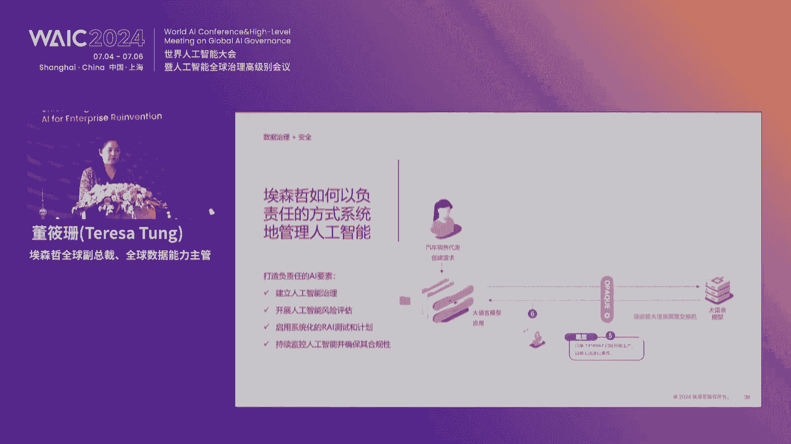

# 2024世界人工智能大会（合集） - P32：20240705-重塑生产力：AI开创增长前沿论坛 - WarrenHua - BV1iT421k7Bv

🎼尊敬的各位领导，各位来宾、女士们先生们，大家下午好。😊，欢迎大家来到艾森哲从塑生产力AI开创增长前沿专题论坛的现场。我是上海电视台第一财经的主持人朱晓玉，非常荣幸为大家再度主持今天的论坛。😊。

本次论坛呢由世界人工智能大会组委会办公室的指导之下，由艾森哲中国有限公司主办，第一财经支持线上线下同步举行。那么作为推动未来发展的战略性技术和通用技术，人工智能呢是已经被认定为形成心智生产力的重要引擎。

那么在本次世界人工智能大会及人工智能、全球治理高级别会议期间，艾森哲是特别筹办了本场专题论坛。我们将一起开启一场AI赋能千行百业的制航之旅，那么也是推进和探索AI重塑商业模式的无限可能。

那接下来的时间请允许我为大家隆重介绍，出席本次论坛的各位领导及嘉宾，他们分别是。🎼世界经济论坛大中华区主席陈黎明，你好，欢迎您。🎼上海外福集团有限公司党委书记、董事长、总裁陈伟权，你好，欢迎您。

🎼联想集团高级副总裁、首席人力资源官高兰，你好，欢迎你。🎼艾森哲全球副总裁大中华区主席朱侯。🎼你好，欢迎您。🎼艾森哲全球副总裁、全球数据能力主管董小山，您好，欢迎您。

🎼艾森哲全球部总裁、大中华区技术服务事业部总裁艾森哲，阿里事业部总裁于毅。🎼欢迎您。🎼以及我们第一财经副总经理杜坚，欢迎您的到来。😊，🎼同时啊我们今天还为大家邀请到了一系列的行业内的领军人物。

他们将在人工智能和数字化转型的前沿领域分享真知灼见。这些重磅级的嘉宾的独到的观点和丰富的经验，我相信也必将为我们的探讨，注入新的活力和深度的境景。那在接下来的议程当中，我们将逐一为大家来揭晓他们的风采。

为大家带来精彩的思想的饕餮声宴。😊，🎼那么艾森哲是作为世界五百强的公司，是一直在研究和推动全球数字化的转型，为客户是提供持续的增值和成功转型的支持。那么艾森哲今年发布了技术展望2024当中指出。

仅生成式人工智能就将影响各行各业四成的工作时间，提高900种不同类型工作的产出效率。那么AI重塑人类潜力的拐点是不是真的到来了呢？

接下来就让我们掌声有请艾森哲全球副总裁大中华区主席朱红女士为我们上台致辞，掌声有请。好，尊敬的各位领导，各位嘉宾，大家下午好啊。首先非常非常欢迎和感谢啊，大家来参加这一场我们艾森哲主持的这一场论坛。

那么大家知道从2018年起，世界人工智能大会。作为年度的科技的盛会一直是汇聚我们行业智慧，激发创新思维的重要平台。那我们也非常荣幸哈连续三年参加这一盛会，和各行各业的不仅仅是商业领袖。

包括学术界的领袖等等政界的一起能够围绕着人工智能产业，他们的技术实践和伦理治理。今年哈特别重要的一个主题，展开深入而有成效的一个对话和沟通。那其实呢世界人工智能大会已经得到了全球性的关注。大家也知道。

李强总理其实在今年啊瑞士达沃斯这个会上哈和我们施瓦布教授对话的时候，就提到说，A世界人工智能大会，将是AI全球治理的一个重要。😊，的国际交流和合作的平台。那我想大家可能也听到昨天哈在开幕式上。

我们其实李强总理也再次强调四个很重要的任务啊。我这里也正好重述一下深化创新合作来释放我们的智能红利，要推动普惠发展，来弥合智能鸿沟。很重要的要加强协同共治，确保智能向善。

所以共同促进我们人工智能领域的安全包容和可持续的发展。那么上周呢其实我也很荣幸啊，也是黎明总今天也特地来参加。我在大连参加了这个啊世界经济论坛啊，年度的这个新领军者年会。

那么也和很多企业的高管啊、CEO啊等等做了深入的探索和了解和沟通。就说在当下的这个市场环境下，我们到底怎样利用前沿技术来推动我们企业的新的增长啊，这是大家特别关注的一个话题。那我们也关注到在中国其实。

不管是我们的跨国企业，还有我们的本土企业，在人工智能的推进，特别是我们说深成式人工智能的具体的一个落地和应用方面，我们觉得整个的步伐和节奏。还是没有想象中那么快哈。那么当然这跟大家对人工智能。

特别是深城式人工智能大家的一个认知啊，这个员工的整体的这个技术技能啊，包括我们企业本身的我们说数字核心和数据的这个完备程度其实是有相关的。另外呢很重要的，我想大家也可以理解深圳式人工智能。

它整个是需要很大的投入的那对于投入产出这一部分啊，还是有一定的不确定性啊，从这个角度来说，啊，整体的推进，大家看上去还是比较谨慎的啊，所以如何真正的利用全沿科技人工智能来推动我们企业的转型。

不仅仅说技术创新要到位。很重要的是我们要改变我们工作方式，改变我们的业务流程，要标准化，要精化要简化是吧？然后才能够真正的推动我们技术对业务创新的一个支持。还有很重要的。等会林明总会跟我们分享的。

就是关于治理。怎么样构造是以负责任的AI为核心。的新能力啊，这个非常非常重要。那艾森哲自身呢我们其实也一直积极的推动我们自身的转型。其实大家可能也都知道，我们去年就宣布了我们在人工智能领域啊。

有30美30亿美元的这个投入。那主要是用于资产的重建，打造，包括很多人人员的人才的一个培养。那么到目前为止呢，我们已经成功的交付了1000多个项目。那全球呢我们有55000名数据和AI方面的专家。

那目标呢是到2026年底这个数字要达到8万名全球。那两天前其实我们很多爱森哲的同事都知道，这周是我们的我们叫 week啊，我们其实先从香港开始又到深圳啊，在深圳呢。

我们正式启动了啊我们的生城式AI的工作室。那这个工作室呢将聚焦和我们的企业和生态合作伙伴一起啊做更多的深城式AI方面的解决方案的打造啊，所以呢我想很重要的我们的使命和任务就是要更大规模的推动。

这是AI的解决方案，能够真正的完善我们的治理框架，然后支持我们企业的未来的增长。所以今天呢我们特别特别荣幸哈邀请到了我们世界经济论坛大中华区主席陈一明先生。那么后续呢他会和我们先做一个主旨分享。

就是关于人工智能全球治理的一个范式。那么另外呢当然前面也提到哈来自联想集团的高兰女士，还有呢来自国泰航空的啊邹明先生，还有呢就是汇川技术的李瑞林先生啊，非常感谢他们都会过来。

等会跟我们分享一下他们的企业在推动人工智能发展过程当中的经验和体会。那么另外呢就是隆重介绍，前面我们提到了我们全球副总裁董小山女士啊，他也会为我们带来，就是哎在全球我们大家都知道，现在我们也很关心。

在全球范围内，我们对人工智能的这个研发，包括落地应用方面，我们有怎么样的感受和体验。其实人工智能本身啊研究啊开发啊了解啊应用啊已经有很长的时期。当然从生成是AI来说，这个时代还是刚刚到来。😊，我们也说。

生产力和工作方式将面临着全面的重塑。那么在变局的时代，我们需要更多的对话，更多的合作，更多的交流啊。所以呢在这个充满机遇和挑战的重塑之路上，艾森哲将与您同行。所以今天呢我们也特别感谢啊很多领导。

包括韦权总也积极参加。其实上海市等会儿大家可能看到啊张英主任有时间他也会来参加啊，金星委主任啊，也是在上海整体推进人工智能发展方面做出了很大的这个努力和贡献。那么希望呢今天的讨论啊。

这个论坛的讨论能给大家带来启示和收获啊，非常感谢大家，谢谢也非常感谢您朱红总，请您入席落座。谢谢。😊，刚刚其实洪总为我们大家分享了，等会会为大家来进行主旨演讲，以及做更多分享的几位重磅级的嘉宾。

我也借着洪总的话，嗯，跟大家首先率先来分享这位这位嘉宾呢曾经是担任多家大型的跨国企业的高级管理岗位。那么是拥有着极其丰富的管理经验和超前的视角。

让我们掌声有请世界经济论坛大中华区主席陈黎明先生上台为大家分享人工智能治理与国际合作，掌声有请林总。😊，尊敬的各位来宾呃。女士们朋友们，大家。呃，下午好，非常高兴应朱宏主席的邀请。

那今天呢跟大家呢一起做一个讨论。那，来探讨一下人工智能在呃治理这个时代的命题。回顾一下历史，其实人工智能啊经历了起起伏伏，也经历过阳春，也经历过寒冬。那呈现出一种比较明显的明显的叫波段式的这样一个发展。

呃，我们就知道这个在阿编的历史上呢，曾经用这个深蓝计算机跟跟这个世界呃夏棋冠军呢曾经做过一次对决。那最后呢这个阿编的深蓝计算机呢呃赢得了这场胜利啊。在那之后拿一遍的，我们叫wson计算机呢。

跟当时美国有个智力计算节目叫jeopardy。那这个有一场这个人机大战，呃，最后呢这个RB的沃son计算机呢战胜了呃一位是得奖最高的冠军，一位是得奖时间最久的冠军。那也也在这个这个对决当中战胜了。

为什么会有这两次。大战男。都是因为在当时。啊，人工智能正在经历着寒冬、寒冬腊月，以至于说科学家们做在问。啊，我们的人工智能未来究竟是什么啊，有没有这个前途？为了让科学家们保持这样一种热情，所以呢。呃。

经过科学家们的建议呢，搞了这么一两场这个游戏啊，当然在这之后呢，我们都知道呃这个有这个这个阿法 go啊得出现。那么引爆了这一轮的这个人工智能的这个热潮哈，最种这种热潮的发展呢是这个十分的迅速。

乃至于说人工智能呢已经进入到很多的行业。我经常讲一句话，讲人工智能呢已经可以解决很多的问题。但是人工智能呢还不能够解决所有的问题。将来呢。能够解决更多的问题。

那是不是会全面的超越人类啊spriency这个呢话题呢其实是有很多的争议。呃，科学界呢并没有一个所是一个统一的定论，所以它一定会超越这个人类。如果是你要读l的这个起点临近这本书，那它会信誓旦旦的告诉你。

2035年呢计算机一定会超越人类。但是呢更多的科学家呢会认为对这个态度对这个话题的态度还是审慎的。科技的发展呢在很多时候呢，它都是一个双刃剑。那如果是说我们去看这个历史的这个这个很多的一些技术啊。

那它其实在整个开发跟应用的过程当中啊，都带着一个很大的价格标签。有的时候可能是当时很很快就能够显现。有的可能是通过100多年才能够显现出来。你比如说我们所知道的蒸汽机内燃机，那它的这个使用。

那经历了170多年，才让人人类发现哇。原来这个所燃燃燃烧的化石能源呢，能够导致伦敦fog伦敦大雾啊，1950年的那现在呢时歌已经是200多年了。我们今天呢正在遭受呢，比如说气候变化这样的问题。

那毫无疑问呢，因为蒸汽机的发明，或者是这个这个这个内燃机的发明，化石是化石能源的大量的使用，以至于说我们今天面临了更严峻的气候变化的这样一个事实。那这样的东西呢，其实在很多的场景下，我们都能够看到。

比如说农药的使用。啊，农药的使用。那么对于改变了自这个自然界的这个这个平衡，以至以也导致了那创伤了整个自然界的这个生生态平衡生物这个创上生物多样性。那有一本书呢就叫叫做寂静的春天，它描述的就是说呢。

因为大量的农药农药的使用。以以至于说啊造成了生态平衡的这个创伤。我们的春天都已经听不到这个鸟鸣了啊，写的就是这样一个一一个故事，就是专门是针对这个农药。但事实上呢，我们这个这个所面对的不不仅仅是这些。

比如说像核能核能的发发发明啊，那导致的核为系啊，核诈抑直困惑的世界啊，类似于这样的一些场景，我们可以说是举不胜举。今天人工智能的崛起。那某种程度上我们也要很警醒，也要很警醒。

过去这些年我在很多场景都在讲一些不和谐的话，就是所谓不和和谐的话呢，因为大家都在讲人工智能的发展大力发展，突然要冒出一个人老老是在讲治理治理非常高兴的看到呢这一次的主题。

那这一次呃人工智能大会的主题就是很主这个治理。啊，更多的人发现了人工智能呢可能那会会这个这个这个给我们带来这样或者那样的一些困惑。那么。😊，比如说像这个隐私数据的泄露啊，算法的偏见啊，技术乱用啊。

以及加速这个能源的消耗。这里面具体呢我就我就不不讲不要讲太多呃，比如我举几个小例子，一个呢，就是比如说我们过去都常讲的叫眼见为实。将你。deepf的这个技术发展到一定的程度，你真的是眼见为实吗？

耳闻为实吗？😡，我们都很难讲的，你看到的录像也好，你听到的声音也好嗯，都很难讲是真实的。因为在第二届人工智能大会上，我来做过一次讲话。呃，当时我的声音完全失声，完全失声，不能够讲讲出一点声音。

我当时就说我就对不起各位观众嗯，就受这种这种声音讲话。😊，等我那场讲完了以后呢，那有一位业界的大咖就上来跟我讲，说李明总啊，你应该告诉我，你事先告诉我，我完全可以模拟出你的声音来。😡，他是很自豪的。

我呢是下了一身冷汗。😡，因为你不知道将来人无职能，他真的可以fake到什么程度。😡，以至于说呢reversion engineering导致呢我们我们将来所看到的可能未必是我们是真实发生的。

所以这当中呢就会对于这个新闻造假啊、诽谤啊网络诈骗呢可能都会带来很多很多的这样一些社会困扰。那另外一个这个人工智能这个个这个说引发的这个能源的消耗的问题，这个呢还是要引起关注。

能源消耗呢说是这个每天呢每天呢会要响应2亿多个这个请求所耗的电能是一个个天文的数字这我都有数据。但是呢我在这就不展开来讲了那人工智能呢还可能造成职业再平衡的个问题。

职业再平衡我为么用职业再平衡因为大家都在讲是人工智能会会消除很多很多一些岗位这个可能是不真的事实纵观。这个人类的历史呃，过去这200年很多岗位都消失了，很多岗位都已经消失了。

因为电话交换机交交换机的这个这个这个这个替代了这个人人的这种产。插拔式的这种交换机啊，我马路上过去大的城市都有点灯的人，现在没有点灯的人了。呃，你这个过去马路上都有真的有马车，马路马路真的有马车。

现在都是小汽车，在很多职业都会替换。但是总体上来说，人类社会随着技术的进步，实际上是在不断的创造新的一些岗位，不断的创造一些新的岗位。那你去算一下人这个人类总的人口在1900年可能也就是20亿人口。

我们今年现在呢才80亿人口。呃，如果60%的就业人口的话，你大致算一下，我们创造了多少新的岗位。那其际从1900年到现在的技术进步其实是这个非常非常多的啊，我个人认为呢当一个岗位消失的时候呢。

那新的岗位呢一定还还会再出现。只是我们今天还不知道它会在哪里出现。还在哪里会出现，我们实际上是不太清楚的但是呢对于。😊，对于社会来讲，它只是一个岗位的再平衡的问题。但是对于一个个体。

你一旦撞上这样一个行业，这样一个岗位，对于你来说，那就是一个身价这个这个叫什么一个生计问题。可能你的未来的职业生涯，那就是就说遭到了遭到了重创，那可能就会到导致整个社会的一些一些这个这个这个问题的发生。

那可能他会贯穿你的整个职业生涯。所以对个体来说，我们讲历史的一类尘沙。可能落得个人头上就是一个一一座大山讲的也是这个意思同样的道理。今天上午呢有一位图龙奖获得者叫叫鸠那他提到呢人人工智能。

那可能导致的风险大概有三类。那第一个呢他讲叫icious恶意的风险。那第二个呢讲的叫morefunction。第三个呢讲的呢叫sstematic个。但是呢我非常冒昧哈非常冒昧，必须再再一次强调非常冒昧。

但是我必须再加一条叫 risk。什么叫呢我们不知道我们。不知道什么东西。我们不知道我们不知道什么东西，以至于说我们可能再做一件事情，我们认为是科技向善的。😡，最最终呢是导致了啊。我们从中受这个受损。

所以这是完全是有可能的。因为我们不知道我们的知识边界究竟有哪一些局限，很多的技术，很多的科这个科学都是不断的演进的这样一个一个过程。你们想一想，咱们大家想一想哪一次技术突破，我们不是信誓旦旦的。

哪一次我们都是信誓旦旦的。但是回过头来一看，很多技术给人类都到导致了很多的这样一些伤害。所以我们在迫切的为人工智能这个在各行各业啊寻求应用的同时呢，我们还必须要重视它当中的这个风险啊。

那以至于说呢我们在这个发展上呃发展创新跟发展可持续发展方面要取得一个微妙的平衡。我们不能讲我们就不要因音乐费时就不搞人工智能了。但是同时呢那也要认识到它中间可能运育的一些风险。

不见得是我们在我们的这个掌控这个这个之中。那因为时间的关系呢，这个这个这个我我就不要讲展开来太太太多的来讲呃，作为一个结语呢，我就讲我我想说呢就是。

在人工智能开发及应用方面呢啊需要政府啊在立法方面有所作为，需要企业在在这个科学伦科技伦理方面要有所作为。作为开发者呢必须要有一个底线思维。啊。

不要因为今天的一失冲动而导从而导致这个未来的未来的这个这个创伤。我呢不是一个汝德主义者，我不反对先进的科技，我只是一个审慎者，谢谢大家。也再次感谢您林明总，谢谢您精彩的分享，谢谢您。😊。

介用我们刚刚林总说的吧，其实三个方向都非常重要啊，核心技术包括研发以及企业端和呃我们看到的政府端政策支持，这都是可能我们接下来需要去注意的一些方向。那其实呃我们再把这个思维放的更大一些。

我们来看看在今年的这个这个月月初，78届的联合国大会之上有140多个国家哈，是参与了决议部署。那么是一致通过了中国提出的加强人工智能的能力建设国际合作决议。那么是加强人工智能全球治理，同样也是势在必行。

🎼那么全球各国都是如此的重视人工智能的建设。那回到我们今天艾森哲的这个专题的论坛的主题，重塑生产力啊，究竟什么是重塑生产力？这个关键节点又在哪里呢？接下来让我们掌声有请艾森哲。

全球副总裁大中华区技术服务事业部总裁艾森哲，阿里事业部总裁于毅博士为我们大家做分享，掌声有请于博士。🎼好啊，大家下午好。这个今天也是这次也是我第三次参加这个世界人工智能大会。

那么刚才这个第一财经的主持人在做视频采访的时候问我这三年。有个什么共同的感觉，我就说这个热一方面，每年都在7月，感觉都是黄梅季节以后天气特别热。同时整个这个会场的环境也特别热。

你为刚才从这个会场又到这个展馆。展馆一看，今年这个规模，包括参展的这个公司人流，就比去年非常不一样。所以其实这个从我这个角度来说。呃，连续三年感觉中，包括在这个三年过程中。

回到我们这个主题跟很多企业客户交流的过程中，我总体感觉这个速度还在增速。可能有些地方会快一点，有些地方会慢一点。那么这个视频里面可能也列出一些场景。我几个体会啊，就一个。

很多客户可能原来我们做很多新的技术，包括数字化转型，首先会问为什么要做这个，所以前面做大量的一个铺垫过过程。所以在这一轮的这个深城式AI或人工智能过程中。

我碰到大部分客户已经不太问这个就是说更关注在做什么，怎么做的这个问题。第一个。第二个，原来很多客户都是先做小步快跑，做POC啊，做这个试点，做demo比较多。其实我这次看到从去年到今年。

整个这个落地的这个深度，端对端已经不一样。那么第三个，在有些领域上已经变成是一个关键地方。尤其我印象最深刻啊，在中国就是。这一波来，因为这个薪资生产力包括双循环。

其实很多企业不止出海要变成一个全球化的这个公司。那么全球化公司里面有一个共同点，我觉得在这一波的这个深圳市AI它的使用是个非常快的一个节奏。那么回到刚才林明总讲的，其实我的一个逻辑比较简单。

这事情能不能可持续，还是要有一个刚需。如果没有刚需的事情。就是这个是个伪命题。但现在在出海企业，我接触下来，很多都还是刚需。比举个例子来说，你的原来产品手册就像未来汽车，原来是在中国做的那我到别的国家。

我的合规性，我的这个语言各种各样。那现在这一个是在深圳是AI大模型里面非常很快都能够落地。第二个场景就做。这个客服，因为客服原来我们，你要对他的一个了解，对个性化的了解。那么这一块来说。

其实出海企业在用的时候也非常快。那么第三个可能当地的做销售的这个知识。因为现在销售你光看这个manu已经不够了。那他有一些实时性的一些通过大言模型给你一个非常定制化的一些这个建议也是非常刚需的一个要求。

那么最近包括在深圳碰到一个客户在供应链这块，怎么能够做计划，因为计划是不容易的。因为现在非常动态。因为这尤其这个这个全球这个逆全球化的环境中，那么planning不管是这个需求预测，包括这个生产预测。

可能都是现甚至是AI强场景。所以进到这个主题来说，我我想现在这个。因为我们今天谈这个深圳交，我觉得大的背景还是就是说需要这个新的这个生产力。我们原来这个原来行的，现在可能惯性的不行了。

现在需要有一些新的。那么其实也是跟世界经济论坛一起合作爱盛哲每年有一个叫业务颠覆性指数。那么其实在。19年以前还是比较稳定，这个指数并没有太多变化。在过去4年5年时间。

这个颠覆性指数增加了183个presentcent，对吧？说明这个世界在动态。那么动态过程中，大家被认为这个变化什么最快，可能以前是人才啊，这个地缘政治。那么去年。这技术是第一位的。

那么技术一方面可能想要拥抱技术。另外这个技术来了以后，我们有没有准备好？就像刚才林明总也讲，不管是能力上也好，我们的治理结构上有没有准备好，所以我觉得现在的一个总体状况，就是说一方面拥抱这个技术。

尤其这个人工智能。同时可能也是个焦虑。我怎么把它用好，而不是用在别的地方。但我觉得这个事情是挡不住的，是我们的一个基本的一个看法。那么。其实这个其实历史上我觉得林明荣比我可能更了解。其实我们回过头去看。

其实整个技术创新都不是一天两天都是一个周期。这个govering的这个就是我们叫摩尔定理对就是基本上简单来说这个技术发展每隔一年整个规模也好，会翻一翻，包括整个成本性价比也会提升一步。

我们从个人电脑时代到互联网时代移动电话，包括云到人工智能。现在整个这个已经是一个新的一个周期来说，可能人工智能本身也是这样，不管是从这个大模型的参数。原来我们说1亿现在都是百亿千亿级的。

那么包括整个单位的性价比。那天在深圳做这个讨论的时候，现在大家知道这个token每一个token的这个价格。就在今年一年降了千倍甚至万倍。那么其实这跟云的时候一样。

那么当然这个可能这个token的这个价格只是这个使用深至是AI的一个部分还会牵涉到别的。但这个本身的这个周期性是我们希望能够大家能够把握住的。那么在这个基础上。

大家可能认为刚才也讲这个人工智能也不是一天两天。那这一次有些什么不一样，我们总体来说，包括爱症者，包括个人。感觉这一次是跟前面两次人工智能的这个浪潮是不一样的。那么一方面，他人工智能不只是一个技术手段。

我们深层式人工智能是真正以人为中心，等会我会稍微展开一点。另外他的这个技术的本身核心跟前几次也不同。那么其实这里面列了一个。就是AI和人之间比比较，它的能力从0到100这个曲线。

原来在做手写识别语音识别成长相对比较慢一点。那么到现在其实大家可以看到阅读理解啊，语言理解啊，包括这几年的像这个推理啊，包括做数学，就像我小孩在这个国际学校考AP现在A课程也不容易。

但很多人已经用这个深圳AI能够达到甚至超过我们学霸的这种水平。我个人来说也是做人工智能比较多年，30年前做博士。那么但这一次给我触动这大两件事情，一个就像这个下棋，刚才说这个国际象机，我是下围棋。

我自认为也是不错。六段那么但现在在阿法给我以前这个不不堪一击，让我三指四指我都赢不了。第二个我在做博士后的时候，做这个分子生物学癌症的这个。

研究就是这个这个这个药怎么能够跟你的身体的这个器官能够发生作用。当时一个核心问题就要解决氨基酸的这个链是一维的，怎么变成三维，而且是唯一的。那这个叫蛋白质折叠问题。当时我的导师跟我讲。

谁能解决蛋白质折叠的问题，应该能够得到诺贝尔。但其实现在这个阿已经把基本上把这个问题都解决，这才是冰山一角。基于这个怎么能够动态，怎么到细胞怎么到组织要的研发能不能缩短。

其实这个事情就可想象的空间会非常非常大就做不一样的事情，我觉得不是一个新瓶装旧，而是一个完全革新型的一个这个技术。那么所以我们包括后续我觉得今天去年我也讲了这个技术展望。

今年其实我们2024年技术展望也发出来。其实这一个周期来说都是以AI为核心。那么其实我今天这个主持人也问我那深成是AI包括这个通用AI后面到底怎么个发展，说我说一个我也看不清，对吧？

这个很多东西t know know，但同时一点也有很多问题需要中间解决深成是AI不是一个。终点而是一个过程。那么其中包括我们今年这个技术展望里面提到。

我个人认为空间计算空间智能是在深层式AI上面一个叠加。因为我们现在语言能理解了，能做很多工作。但你真要让今天我看到很多人形机器人做复杂的工作。

对三维空间的这个理解和操作做包括像我我我把这个这个翻页器能够从左手到右手，然后按照业这样一个动作，如果真正要用这个机器人或者这个人工智能来做。光是这个深层式AI是不够的那空间计算。

里面是非常重要的一个领域。所以我希望所以本身回到深圳I，大家可能都比较了解了。那么我想这个就不赘述。那么呃在这个过程中，其实刚才审判长也讲，我们其实是做企业服务。

那其实在这个落地性和这个实操性是我们最重要的。那么中间也反映出我们其实去年做了一个调研全球认为这个40%的工作可能会被替代，纯粹是从我们工作工过程中，哪些需要语言能力的。

所以当时这个一个推论说金融银行保险是会颠覆的最厉害。因为他大量的都是用语言能力做理赔啊，做核保啊，但其实我们过去一两年。全球做了1000个项目仔细去看，不是这么回事，其实还是分布比较均匀的。

而且我也去看了一下，其是我我还是喜欢研究一下嘛，就是其实大家可以发现政府和公共事务这块领域还是非常高的，所以我也比较好奇，就为什么public sector政府不管是这个公众服务。

其他像这个公务事业为什么会多。其实当时有几点啊，我跟全球的专家聊，他说一个政府的这个需要顶层的推动能力。因为做这种比较端对端纵深的大项目牵涉的面比较多，这个动员能力非常强。第二个政府有刚需。

因为他有很多数据，但数据在不同的部门里面，这个就非常局域化。那么通过深层是I你很能够很快把这个原来数据变成是一个价值能够体现出来，我觉得这次。其中两个点啊，但还有其他点，但我我觉得随着这个时间推移。

可能明年我们再来看这个分布图完全也不同，可能还有不只是广度，可能这从深度来说也会有不同。那么所以还是非常希望能够关注我们也在不断的看，就是哪些领域甚至是I在企业应用比较多。

今天也有像这个蓝总啊做这个HR其他这些领域。我觉得其实很多这种在这个企业里面很多后台的这个的业务，很多地方都能做，包括我们的这个IT业务IT你要你要打电话，那么他要帮你解决。

那其实这里面都是内容非常intensive的工作。那么这个是非常能做包括IT我做代码的一个维护，我做这个开发现在做这个开发自动化，不只是代码而已整个测试啊，个运维啊都能够做这个包括在营销财务内容。

我我相信等会这些。专家也都会分享一下。但其实这个也是个动态的。我我觉得随着这个纵深的发展，有些领域可能会更快。那么可能产生这个效益，会包括这个供应链。我一直认为供应链是承上启下的一个工作。

如果能够把计划做好了。那一方面能够把营销端拉通，也能够把这个生产端拉通。那整个企业的原来数字化的一个投入，都能够变成是一个非常快速的一个释放这个价值。那么。所以我们这块来说。

也是希望能够看到就是不只是有些这个实施还是一个一些前期的一个探索。有些这个里面是我们把它叫做就是在原来的系统里面，我把深I加上去，我们能不能做一些。

那么现在从去年到今年开始也有些是我们叫I native就完全原生式的这个应用。就是你没有这个能力很多东西做不了。那么尤其像动态planning这一块。

我觉得现在这块越来越看到它的这个价值是比我们以前光用RP这种里面是完全不一样的一个做法。那么这一块啊就最后这边我想就对企业这个我们看因为做这个深I也不能只是点状的。

可能还是要从我们大的来谈这个国家或全球行业的治理结构。企业也做好，我还是今天讲的，就是这个要高举轻放。首先我们有个。目标要有一个总体的这个框架和设计。那么我们做的时候可能一步步做。你如果就像李明总讲的。

一个的这个riss是非常多多的。如果我前面已经把这个架构想清楚，那我们后面做的过程中就会有一定的这个指引性。问题是会持续存在的，就看我们有没有一个比较好的一个机制来解决。所以我们总整理下来。

其实有五大这个重要，就是。这个一个。企业要有这个把价值要讲清楚，就我们探索的时候没关系，但你可以做一个场景，一个场景。其实很多时候大家发现做了场景以后，可能看似优化了很多，但你投入也非常多。

那么它的价值到底有没有做，而且有些地方以为是能把人审下去，有时候也不一定就你要引入一些新的。所以我们在还是认为企业在做规模化过程中还是要把这个value讲清楚，从单一的这个场景要变成一个整个价值链。

我比方说在人力资源这块，那我招聘这边能够做一些。但我后面这个onboarding的 training啊，后面的这个leadership培训上面，那我整体来说我的价值是怎么样，我的基线是怎么样。

我未来怎么样，我觉得只有把这个那我们才能够把这个性价比能够可能我一开始投资，那我至少知道这个回报过程怎么样，可能每个行业都不同，它的价值数我们可能要梳理一下，所以价值为先。这是一个非常重要。

那么第二个呢就是。企业要有一个这个数字核心，就像人一样。你如果参加各种这个比赛运动，你如果的核心不好，那你可能有时候就不不准备你的到底准备度怎么样。

因为数字核心可能牵涉到我们传统的这个信息化数字化里面做的。因为中国也有很多企业可能原来可能连信息化ERP很多也没做。那现在是不是能够弯道超车。我相信有这个弯道超车的这个可能性。

但其实有些事情你还是要有一些底基本的一些。那么尤其在这个数字核心里面数据等会我们这个a也会讲一下，我们原来的数字核心里面可能讲的都是结构化数据，但你要做深层式I要做很多东西，它是这个非结构化数据。

包括合成数据。那么在这一块来说，我们的这个数字核心里面有没有这个具备。所以这一块是也是使得我们重新看一下我们的体系架构里面是怎样的。那么第三个。就是我们的这个员工，我们的团队非常重要。

那么我们其实一直讲，就你在深圳市AI技术上投1块钱，我们在人员上面可能要投2块钱。有时候我们认为呃这个人能节省，他不是一个简单的把一个job替代掉。其实这个图其实还比较形象的。

就是我们比方说你现在做这个销售的，现在是这个100个人，我有不同的岗位，有一线销售代表助理分销商的代表，有大客户经理，有下面顾客的这个联系人。但未来我用这个营销自动化做这个深圳市AI以后。

有些可能会合并，我一线销售不需要这个35个人，我有很多，有些这个职能我有许多销售的培训教练，他coach。因为他对这个行业比较知道，其实大模型能够告诉你一些东西，但没有一个coach在里面。

没有你们公司本身对产品相特色的这种销售策略的话。你的这个大模型给你的这个话术可能也没有太多针对性。所以有些岗位可能是要新增，有些岗位可能是要合并。那么过程中我们的这个组织绩效考核。

我们的培训机制有没有准备好，可能这个是非常重要的一个第三个一个环节。那么第四个环节其实就是讲的这个负责任的这个AI其审判长也讲了，刚才林明总也讲，那么落在企业里面也是就是很多原来我们也有这个治理结构。

我们有做这个安全，有做隐私。但现在这个更难。因为他的这个因为甚至AI有好的一面也有带来难度提升。因为你的这个很多ris不是显而易见，人家做这个这个风险的个这个范围也更广。

那么我们能不能从合规性隐私以及他的体系上面去做一个评估机制以以及内部的一个流程和体系来做这个事情。所以很多公司呃不止。是法务来管这个可能跟技术跟业务共同来有一个负责人AI的一个治理结构。

或者一个委员会来做这个事情。那么。最后一点就是我我觉得这个还是认为这个是个动态的一个环境。就是我我相信我们今天是这样谈，明年如果大家有幸再来参加，我们可能面临的问题也不同，我们这个取得的效果不同。

我还是坚信技术是推进人类发展的一个第一要素，对吧？如果我们把它用好了，他不只是解决未来的问题也能解决现在的问题。这个其实这个video还是非常有意思。其实我们的一个客户就是财富杂志。

那么财富每年发布这个财富五百强。那么其实你可以知道他过去这么多年累积了很多这个数据，很多数据是有有报表，但也有很多数据是可能没有的一些案例的一些分析，他很多是存在以文字的形式存在。

那我们其实跟他做的也比较简单，就把他所有的过去的有财务数据，其他数据都能够变成这个在模型里面做这个。确里以后目的就是说你可能以后问问题，不是说光是看谁是财富百强，他们到底哪些地方做的好。

哪些地方做的不好，有些什么共同通过一些比较业务能够理解的这个语言直接去访问。那么对CEO也好，别的也好，在做的过程中是非常有帮助的。我相信这样的案例啊，可能希望未来会更多。

包括我们在座的很多各位也在做探索。那么在我我这边结束的时候，就还是觉得就这个我是对这个深圳家还是觉得非常有这个信心和热情。那么但光是技术是不行，可能还是要需要除了这个厂商也需要有政府，包括企业共同。

包括每位在做这个各位共同来推进，有一个好的一个治理结构下，我相信对不只是对中国可能对全球整个现在这个动态的环境中，企业如何能够找到一些新的动能是非常重要的一个作用，谢谢大家。也非常感谢您于博士。

谢谢您精彩的分享。😊，于博士刚刚提到一个点哈，我相信可能大家都会有共鸣，就是我们会觉得今年跟前两年不一样。今年更加多的一个重点是我们放在以人为本上啊，我们不仅要去看技术创新，去看大模型当中我们的特色。

更多的还要看治理结构啊，这是一个从之前刚开始来到的浪潮到未来，我们可能更多的去重塑规则，以及未来找寻企业突破点的一个关键的时刻。那接下来呢我们掌声有请艾森哲全球副总裁、全球数据能力主管董小山博士。

为我们大家来做精彩发言。掌声有请。😊，Okay， thank you so much for being here。 I'm sorry， I'm going to speak in English。

 I'm ABC so。Cannot speak Chinese。So。With the beginning talks。

 we lay the foundation how important generative AI is as companies， we are probably all wondering。

 what do I need to do to be able to not only take advantage。Of this capability。

 but also to compete and win in this new environment。

The one takeaway I want everybody to think about is get your data ready。

Data will be how you will compete and how you can safely apply generative AI。

So when we think about data， we've been working with data for a long time。

We've been trying to get our data ready。And， and so there's this journey to be able to get the data ready。

 And that journey has changed。 The road itself has changed because of what generative AI requires。

 So I want to talk through6 things that we found that have changed。And I think， the first one。

Is that， indeed， your proprietary data， That is your competitive advantage。

Just like we have products， the real products that we buy and we produce for our clients。

These products are really important。 We think about them being safe。

We think about how do people find the products， How do they use this。

 How does they address a consumer need and a job to be done。

 We can invest as much or as little into these products as needed to be competitive and to gain value for both the customer and for the business。

Traditionally， data has been thought of as a technology project。😡，Cost center。

 limited by capacity of your workforce。When we now think about a competitive advantage。

 now we could really right size the investment。 So this is no longer just within data scientists。

 software engineers， I T。 This is something that every company needs to think about。

 Do I have the data that I need to see my business。And some of this will be proprietary。

 Most of it will be proprietary。 Think about what your business process produces。

What data do you need to make sure is safe so that， you know， when you use this data， I trust。

 I know this is accurate。I need to think about working with my partners。 Maybe my partners。

 if I'm talking about supply chain， have other data that I need to be able to see a bigger picture。

 So this is number one。So with these models that we see， the models largely use pre trained data。

 And for a lot of the use cases for our companies， they're not going to be enough。

These models are only about 30% accurate because it has no information about your products。

 your people， your processes。 That's only going to come from your proprietary data。

So we worked with the company and being able to add more data to work with a large language model。

 And in this case， we got over 85% efficiency only when we added。That company's data。

 now it becomes relevant because it's about things that that company produces and can do。

So this is an example from Me AI。 It's one of the models from Facebook。

 So even if you never think about producing your own model。Think about how it's going compete。

 So in this model， I'm going to show， I'm asking a question。 I want a men's coat for winter， right。

 What's a men's coat look like。The answer from the model is not just I need a warm coat。

 It's saying I need a north face bedford down jacket。 It is a specific product from north face。

 Where can I buy such a coat。 It's given me a specific vendor， a retailer。 This is Amazon。

So thinking about your data as your proprietary。And competitive advantage。

 It's certainly needed for you to use generative AI to be relevant within your company。

 But think about how important it's going to be for our youth， our customer。

A workforce to be able to find the information that they need。

 So just like we've done search engine optimization to make sure our data is。

Being represented and our company is being represented。

 Think about how does your data now use within large language models。Number 2。Your unstructured data。

Holds untapped potential。Doctor Y just talked about this example with fortune， right。

 So unstructured data， this is your。Documents， voice， videos， images。

 generative AI really excels at being able to extract any information from that unstructured data。

Whereas before we spent a lot of investment and a lot of time into being able to create structured data。

 things within a tabular form where you have different columns and different namess。

 and you have to really agree upon that format。 Now， I can ask any question。

So with the fortune example as a。Here's what we say there CIO talked about how being able to ask any question is much better than having a spreadsheet。

And in this case， you see， I can ask a question， I could say。

 show me the top 10 companies within France。Between 2005 and 2023。

 I don't need to know ahead of time what this question is going to be。

 I'm going to be able to ask any question。 And in this case， we're using fortuneunes。

 hundred000 plus articles，20000 plus videos。But to be able to have fortune do this with a fine tune model。

 they first had to invest in their data。 So every one of those articles and every one of those videos has gone through an editorial process。

It's governed。 So to be able to use unstructured data in this way。

 we have to have the same governance process。All of the governance process that most companies have has been around structured data。

 tables that we could do access control， that we could look at quality。

 that we could look at lineage。 Now we have to change that practice as an industry to look at unstructured data。

 much like the way fortune has done with an editorial process。

Number 3， synthetic data。 synthetic data is generated data， synthetic data and generated data。

Is really needed to fill in data gaps。 So I've mentioned that it's important to have data so you can see your business。

Many times I don't have that data yet， and maybe it's very hard for me to make that investment。😡。

So synthetic data offers a， a new way to be able to fill those data gaps。 So let me show an example。

 So we worked with a products company， and this products company wanted to use generative AI and AI within their。

 their warehouse。 We could have added RF I Ds to the entire warehouse。 We didn't have that budget。

Instead， we're using synthetic data。 So we took any operational data that they had。

 So there was some I O T， not everything to see the whole warehouse， but some。

 we had the knowledge of the warehouse operator。 So within a knowledge graph， we captured。

 what does the expert know。And then we have digital twins。

 So the digital twin in this case is a synthetic data。 All of this is simulation。

 and it's filling in the gaps within the warehouse。 So no longer is a black box。 But now I can see。

And I can actually simulate this using the real data and the expert knowledge。

 And so the output of this is that now using the simulated data as a new source of data。

 I'm able to create AI。 and the AI was allowed us to be able to operate this warehouse at 10% improvement。

In throughput。50% reduction in waste。 So generative AI actually does add a new way to be able to create synthetic data。

 What hell would I do， I might interview a warehouse operator Then I do voice to text from the voice to text。

 Now I have unstructured data that generative AI is very good at being able to extract the information to create this knowledge model like you see in the screen。

 This graph that thinks about what does the expert think about when they make a decision。

I can now also use this to create all the permutations of data。 So using the generative AI。

 I can actually create all these examples。Based off of what the expert has said。

 So this is now possible with generative AI to be able to fill in these gaps with a combination of digital twin simulation。

 human expertise and the L L Ms。Number four。So generative AI makes it very easy to use data for your own purposes。

So before data was very siloed， right you typically worked within one business domain。

 and that's how the data was ever used。 generative AI makes it much easier to do the hardest part。

 The data mapping when we don't use the same terms。

 when the structure is in a different way to be able to have a mapping across to be able to contextualize it for the purpose at hand。

I want to share example with BMW。So with BMW， we started within their I T service help desk。

 That's one of the easiest ways to start with generative AI。 So when you call service Dek at BMW。

 we started to use generative AI to look at their code and their application systems。

And we were able to take those help desk tasks that took 6 hours down to just 35 minutes。

But with the same data， we were actually able to have details about how you configure a vehicle。

 What sort of things could you order， Because the code actually contains a lot of that information。😊。

So we were able to use that same data set for their sales。

 So when you go into BMW dealership and you want to ask， I'm going to buy a S UV。

 Can I configure the third row seat belts with this particular configuration。😊。

Many of the dealers might not know。 Is it possible。In this case。

 because that logic is within the software， generative AI is able to pull out that information and serve that back to the dealership and that salesperson。

They're not seeing the I T service help desk。 They're not seeing their code。

 It's contextualized to be able to say this is how you configure the seat belts。

 So that power allows you to use the data in many different ways。So。The。

 the fact that it makes it so easy to use means that generative AI makes it very risky。Right。

 so being able to have geneerative AI。Accelerate risks。 We know that very famously in Samsung。

 that an engineer used generated a AI with chat GPT。

And their code later started appearing in some of the results from chat GP。

 So the fact that it's so easy to use means that many people within our business can self serviceice this capability。

 You no longer really need I T。 And yet， at this time。

 this is when you need I T and data the most because as a workforce。

 we've been trained much longer with some of these risks。 So now that everybody is a data worker。

 Everybody is thinking about programs themselves through generative AI。 Now。

 everybody really needs to understand these risks and how to protect against this。

 So at the companies need to roll out guidelines。They need to roll out the tools。

Everybody needs to be trained， not just the data and the tech people， but most importantly。

 everybody within the business， because it's so easy to use。So in this example， let me share one。

Most times when we use a model， oftentimes it's managed model。

 it's not something that the company hosts themselves。

 When you use a managed model like what happened with Samsung， you are sharing some of that data。

 So you could have a legal agreement that says， yes。

 I promise not to do use your data for other purposes that that's good。

 you could also trust the company and survey that's even better。

 But one other way you can protect yourself。 So here's one where we added a gateway。

 So a model switchboard that sits on top of the models。

 And it's a great place to protect against your leakage of your I and your confidential data。

 So in this example is let's just take the same car dealer example， and in the car dealer example。

 let's say I want to ask about the status of an order。

 That order number that is enriched with my company's data about who the customer is what's the particular vehicle identification number。

 This is now sensitive data。 distinguishes who。The customer is。

 So if I were to send this now to the model。And I didn't have protections。

 I'm just sending this model。 And so I need a trust very much that this third party who's hosting the model is going to take care of my confidential data。

In this case， instead， what I want to do is have a switchboard where I'm going to now strip out this confidential data and replace this with generic data De number。

 vehicle identification number。 Now， when I used the large language model。

 I can give a result that just says， you know， based off of the generic order number。

 What you have is the order still being worked on。 And then back within the gateway。

 I'm going to reinsert the specific order number。 and then return it back to the end user。

 So the end user never sees the difference。 So this gateway is very， very important。

 One is it's a great place to look for confidential data。 Another place。

 it's a great place to validate the different choices and models。 What in terms of accuracy。Cost。

 so this becomes a very important type of tool to use。

 And especially as we have regulations where the model itself might change。 Now。

 I have this gateway and the switchboard so that if I switch the model underneath all my applications and all my users don't really need to know that it's。

 it's opaque to them。

So， number 6。Is that generative AI accelerates data readiness。 I just listed a lot of new things。

 right， These are the new rules of the road。Well， the good news is that generative AI actually makes it so that we can do things much faster than we could before。

😊，So this is a large pharmaceutical client。 And this company is using generative AI to help them modernize from a oracle to a postgre system。

 It's one older type of database to another。And to be able to do this piece of work。

 you could apply generative AI in many places。 And we applied it in just three places to start。

 So the point is， you have to start。 One of the places is with writing detailed user stories。

 being able to get not just technical specifications， but things around life sciences。

 get that documented very well。 On other cases， to generate test cases and test data。

And then finally， it's the code conversion。 And in those three cases。

 we were able to use generative AI to get over 80 to 90% improvement in those tasks。😊。

And with that improvement， now you see the impact on the overall project。

With just those three things， we were able to accelerate the project by 15%。So， with this in mind。

The point is to get started。 We've identified 42 different interventions that you can use generative AI to get your data ready。

 Some examples could be when you're doing mapping of data。

 use generative AI to dynamically look at maps。Many of us have been building a lot of dashboards。

You probably don't need to build that many dashboards instead， use generative AI。

 like the fortune example to ask any question and to generate exactly the image that you need。

It could be around doing data publishing。 So data products。

 I mentioned being able to have a product means you have to publish it， write the code。

 write the documentation。 generative AI can help in that。

 So a lot of the things that we used to do before。 how we're going to fund getting our data ready is by not doing that as much and doing much more some of these new capabilities and using generative AI on the data to get us there faster。

😊，So， in summary。The most important thing that we can do to make generative AI useful for our business and to invest in your data。

Even if you'd have no plans to make your own model。

 your data is needed to bring relevancy about your business and to really validate that these models that exist outside。

Are accurate， are safe to use， because it needs to be specific to what you need it to do。

 So number one， it's your proprietary advantage。 right， Your proprietary data is how you compete。

Number two is being able to use your unstructured data。70% of the company's data is unstructured。

 We're not taking full advantage of it。 You already have this asset。

 What we need to do is to govern it。😡，Number 3， think about synthetic data。

 syntheticynthe data can use generative AI or digital twins and your experts， which you have。

Number 4， generative AI makes it easy to use data for your own purposes。

 So across company and being able to see。Bigger picture。Number 5。

 being able to need to use responsible data because generative air also accelerates risks。

 So the teams that are best equipped to do this are your technology and your data teams because they have this experience。

 Let them teach。The rest of the company and then work to be able to help create the standards and the tools。

 And then number 6， right， think about all of this is changed。

 The road has changed because generative AI will make it easier to get the ready。Okay。

 thank you very much。 Thank you。🎼董女士刚刚也提到了六大关键哈，这个数据是企业的要素和基础。那数据呢拥有无限的潜力。而数据呢在未来也会有一定的这个风险。

但是我刚看了一句非常关键的话，我也相信我们艾森哲接下来会一直在做哈，就艾森哲会以负责的方式管理人工智能的数据风险这一块我们是非常期待的。那接下来呢我们将进入到的是今天的卢边对话的环节。

我们这第一个环节当中，想跟大家更多的分享的是六大药物解锁数据潜力。其实刚刚我们的两位嘉宾都提到了啊，一位就是我们的这个呃董小山博士，一位的话是我们的于博士。那在这个环节当中的话。

我们等会还想为大家请上这两位重磅级的嘉宾，作为我们今天卢边对话的第一轮的对话嘉宾，掌声有请二位，谢谢。😊，🎼好啊，等会我就用那个英文来问。那么在前面可能因为这一周其实像审判长讲，我们是个人工智能周。

那么也专门把这个vis从美国西安请过来也不容。以我们搞了好多场活动在香港在深圳在一着他也有机会在航班上等飞机的时候，因为经常延误嘛，也跟他聊比多。我自己还是感觉有很收获。

那么可能有些是就着数据再打开一层也有些可可能大家感兴趣some data related spend sometime。Talking to each other along the way。

 right in this week。 So one， maybe one of the first question is， this is your first trip to China。

 right？ and you see a lot of Chinese client。 You see a lot of Chinese large language model。

 hyperscale。It's quite different from US。 So there are many people also try to understand， right。

In this gene AI or AI development。What do you see the commonality between US and China。

 What are the differences， right？ So， so mean， maybe this is my first question。

I am so impressed with the Chinese companies， with your understanding of generative AI。

 And I have to say that one of the big differences， I think， is because in the US。

 some of our models have been available and so easy to use。So most US companies。

 when they use a prototype MP O C， they're using something like Azure Open AI。As a result。

 they have no concept of the ability to compare models。 You have over 300 models。 and as companies。

 you have been forced to think about。This choice， because one， open AI。

 we know does not do well with English。 I mean， Chinese， right。

 So one is it took a while to catch up。So you have to understand right away。

Can I compare and validate my choice。And then because you have choice， cost。

 you mentioned there's a really recent cost decrease。In the US， a lot of times。

 we mainly think about cost after we've done the proof of concept。 Now。

 we think about scale and production。 By this point， we've already spent a lot of money， right。

 And we haven't looked at these different model choices。

 So the sophistication within the Chinese market about knowing。

That model itself is a great competitive advantage。 I have to pick the bright model。

 The one that's accurate for my needs， that does it in a cost competitive fashion。Yeah。

 so which I think not only in AI stage， but even the previous in the digital time。

 very similar right US in the cloud adoption was really early。 but in China， there were many choices。

 right sometimes it's good， sometimes it's also causing。

Especially company may not be in the technology space。

 and you have a difficulty in making the choice。 right， But again， I feel the。

The the thing you you are saying is really interesting， right， so。

The fundamental technology is still very much the same， right， the whole transformer base and so on。

 but the。Development， the trajectory is quite different。 And China。

 always say that hundred flowers blossom， right， So may cause confusion in the beginning。

 but then we'll have a lot of check and balance， yeah。So but in the client space， right。

 So I don't know whether you have spoken to some of the Chinese client when they decide what to do。

 what to adopt。 Do you， do you have any observation in in this topic as well。

I think one of the things that， again， the Chinese market has talked about is a small language model。

And so whether this has to do with possibly the limits of access to G Gpus that are needed to train the very big models and to serve the very。

 very big models， These small language models that can be just as accurate when it's fine tuneed for a specific purpose。

 So you're not gonna need to answer any question， like the large， large language models do。

 But you're going to have a smaller model that's fine tuned for your needs。

 This is a very cost effective way to get great performance。

 even better performance because you fine tuned it。

 I haven't heard of anywhere else in the world where the companies are asking for this at the rate that the clients within China are。

Youre gonna leapfrog the rest of us。 And I'm so excited to learn， right。

 I think a lot of our labs is gonna be learning from you。😊，Yeah， that's interesting。 I from。

seemsms they are also more willing to make investment to try different things， right。

 rather than just follow everybody's kind of pass。 And I remember last year during W。

There are a lot of discussion about do you only need a large language model。

 Do you need a more specific vertical open source or small language model， But after a year。

 if you look at the market now， it's quite amazing。 right now， you have a 6 billion model。

 you have a 13 billion model with tail made for a different kind purpose。 and a lot of things。

 I don't think is purely just by。The vendors themselves。

 but also by driven by a lot of client because they need a different kind of scenario。

 right and I was talking to one guy。Yesterday in the， they were special in this legal document。

 right， A lot of tender procurements I。Make sure the compliance is always tricky。

 right There are so many raw policies。 So they implement JI， But in this case。

 they don't need to go always to those。Larger language models。

 they still use larger language model to have some kind of initial synthesized kind of use case。

 right， use there then then fine tune open source 6 billion models。 Then the accuracy is still good。

 Then you don't need to really have a huge GPU investment in the company side， right。

 So the hour is much more improved。 and I hope。This is something we can see。呃。

 but still need to have a。Communication between US and China， because this one thing。

 maybe this is the last follow up question， right， because I still feel。

The communication is not enough。 I think used to be。 we can visit。 they can visit us。 but this time。

 I think in the work， I don't see a lot of foreign probably you are one of few， right。

 But but in order to make sure that because AI as Li Mzong also mentioned。

 there are a lot of things unknown， right and and a need not only one country but globally。

 everybody contribute to this。 So would you agree， this bilateral or multilateral communication is a critical element for this。

Yeah， I mean， I， I think that as technologists， we are better coming together because this is new for everybody。

I think some of the challenges that you've faced in China， like I mentioned。

 I'm very interested to learn from， because these are challenges that we will need to tackle in the rest of the world。

 You just faced it sooner because you didn't have as easy of a model available。

 You had to wait until some of these models were created。

 And then because of some of the limitations， you've had to look。For these smaller language models。

 look for creating and fine tuning much sooner because of language and other sorts of relevancy。

So what is， I think we have to learn from each other。In the real case， in the long term。

 there will not be one model in one technology。 So being able to solve for different sovereignty。

 whether it's different companies or different partners， in the future， we will have many。

 many large language models。 You already have many， many here。

 and you will have these models that are more suited within a company for different purposes。

 you mentioned， legal I T， something about your corporate knowledge。

 your most general purpose models。 So you'll have these number of models。

 And so having that switchboard that we talked about。That sits on top。

 And then when you have a model change or maybe a model underneath is no longer something you can use anymore because of some of the regulations that change。

 Now， having that as a point where I can change the model underneath。

 And it doesn't change my experience with the applications in the users on the top。

 that that sort of control point。 We want to start designing that in right now so that we are decoupled and more future proof。

 Okay， Yeah， great。 So let's move on to second topic， probably a little double click， right。

You mentioned about data， but particularly the value of data。Everybody understand the value of data。

 but。To what extent right So and even Chinese government recently were from last year been promoting data asset。

 even We Chnzhou knows in Shanghai， particularly set up Ling as the data hub， right and many。

Government， they also set a bureau as a data bureau。But there was always a macro level。

 but also in the enterprise level， there was a paradox， right。

 because for the large language model to be really。Powerful， you need a lot of data。

But once all the data go to large range model， if company A。

 company B use that there is no differentiation。 As you said。

 proprietary data is your differentiation， so。So， so， to， to some degree is a paradox， right。

 So in one way， you need to contribute in the other way。

 the value only within your enterprise or some kind of thing。 So how do you make sure， I mean。

 the value， How do you look at the data value from different lenss。You。

 so when working with a large language model， like what we shared with the picture with the gateway where we were able to extract out the I and the confidential information。

 that that's an easy one right， We're gonna be able to extract that before it uses with the model。

 But when you're talking about much more industry ride around possibly fine tuning or looking at validation together。

 I think being able to look at new types of work like the synthetic data is a really good way to be able to use this here。

 So your， your own data about your customers that you might not want to share。

 But so that we have a better fine tuneuned industry model。😊，I might create synthetic data。

 And that's so easy to use with create with generative AI。

 So what's very common is doing a knowledge distillation where I have a teacher model。

 and I use a larger large language model， like a 13 billion parameter。

 I'm gonna use a domain expert to create a lot of examples of what does good question answer pair look like。

 And then I use that to fine tune， that 6 billion parameter model that you talked about that is something that I think now becomes easier to use because you could look at what you're giving away。

 like these things that you're giving away are beneficial to the whole industry or the whole function。

 and that's needed to create a fine tune model that works for all of us。

 But I don't want to give you away specifics about my business， my configuration， my customer。

 my product R And D， that I want to keep on my own。 So。

 so that balance about thinking about what you give， and then that treating it as a product。

 So I might give you my proprietary data。 All of it， if you pay before for。😊。

So being able to have that as a new means to monetize。In fact。

 that's why a lot of the Chinese models are better for China， because you had the data。

 Open AI doesn't have the data access that a lot of the native models within China do。

Then to the particular company， I feel like。The value can be different， right。

 So the proprietary data besides documents here and there， like Forune case。

 each company in different industry will be different。 for example。

 which end on the Shanghai Fore service。 They are in the people service business。

 right over the years， serving a lot of large enterprise from recruiting from allscing from people management。

 their assets actually is lying the data because they don't produce physical product。

 whether you you the there is a huge database about where are the talents and the talents attributes。

 So can you comment more right what particular。Value of the data of those unstructure。

People can or company in different industry， can really look into。So thinking about it as a product。

 right， So if at the minimum， when you measure it as a product internally。

 likely you're gonna gain productivity efficiency。 So right away， I could say if I use this data。

 I could be more efficient at what I do。 Second tier could be collaboration and innovation across the company。

 So if I was in healthcare care， like I could say that by producing some of my data。

 different R And D groups across the business could look at my data and prove their treatments。

 So innovation is a good measure。 I'm able to create new innovation with my company。

 direct monetization or indirect。 So whether it's just buying the set。

 or very likely being able to create a new type of business because if you and I are partners to be able to share data。

 So as an example， we worked with a retail conglomerate。 So this retail conglomerate。

 has a lot of the stores and retailers within like a shopping mall。

So each of these individual retailers does not want to share loyalty data because customer data。

 because then that is their competitive advantage。 But as a whole。

 we can actually drive better foot traffic within our shopping mall， if I actually had that data。

 I could give better offers that attract the overall customer base that drives traffic for all of us。

 So being able to have now a way to be able to share data。

 and they might not need to see the specifics about the customer to make this work。 In fact。

 I just want to be able to see what the buying patterns are so that， again。

 we can improve the capabilities。 So whether it's using some new confidential computing or privacy preserving capabilities to be able to now we were able to bring that data together to be able to use AI to be able to create custom offers now for the entire base。

 So thinking about using your data in these new strategic ways。

 whether it's with retailers with supply chain within creating a better customer 3，60。

 these are all new ways to think about。😊，Monetization。So that's interesting。

 And you you and I also discuss a lot of time。Many project we see actually not only dealing with data。

 actually dealing with knowledge， right knowledge， really another layer with a value， right。

 But in order to extract knowledge。Especially with those and structure data。

Not only need the platform itself， but you also need additional human capability。

 whether domain coach or so on。 So what are the。Most important。New kind of a。

Talent require in order to unleash the data value。 So typically when our so I'll share an example from Mondelies。

 So Monoliese， their chief digital officer， says that for every$1。

 he spends on the technical investment with large language models。

 He's spending $2 on the people enablement。And a lot of that is so that the human who's actually doing that job。

 right， not the I T or the data scientist， but somebody who's doing marketing as an example。

 they're actually part of reinventing and thinking about how to best apply generative AI in this new capability with what they do。

 And these coaches might not be everybody within the company。

 Not everybody might be excited to be able to use generative AI。But there will be pockets。

 We found that 94% of the workforce is actually excited， right。

 They want to learn what this new capability does。 So so they're definitely out there。

 And so this domain coach is somebody who is going to be thinking about how to you apply it。

 how do apply for the munda， How do I do things like label data。 So again。

 everybody is now a data worker。 So within marketing。😊，1 is。

 I need to be able to think about data governance。 So what is the right product description so that when I scale it with generative AI that I'm scaling good quality in the right descriptions。

 I'm thinking about looking at the accuracy of what comes out and labeling is this correct。

 And if it's not correct to be able to adjust why it's not correct。 It is。

 I've heard our marketing officer or talk about configuring the semantic layer。 So semantic layer is。

 means meaning， and the semantic layer is what's gonna give the tone of voice。

 So when Accenture publishes some of our marketing content。

 we've gone from a tone of voice that was very formal to one that is just more plain spoken。

 So the coach is coaching all these things。 accuracy correctness。

 coaching for the output in the format， coaching for the tone of voice。

 This is also something that that domain coach now needs to do。😊，Okay， that's interesting。

 Probably we can。 You can talk to many of our audience offline。 So probably given the time。

 So last question， probably again， relate to the the whole event theme， right。

 the governance and especially in the data governance。

 you also touch base because a lot of risk really relate to the data and as you are facing a lot of new things。

 maybe whether you can quickly double click on this。对 the government say。Well。

 I think a lot of data governance is the practice。 That's not just the data part of the business。

 We started with saying your data is your competitive advantage。

 So that's not just a problem for data。 So I mentioned everybody's job is now with the data。

 So data now needs to be owned within the business domains。 So supply chain needs to own their data。

 Custom and commercial needs to own their data。 HR and so on。

 And that's sort of responsibility to say this is correct。 We， we do this every time。

 So we just finish doing a quarterly reporting。 And every time you do this most companies。

 it's a big data。Problem you go around looking for data and you say， who， where did this come from。

 Is this valid。 What's this sort of use case for why it's there。

This sort of governance is making sure that， yeah， that's exactly the process you go through。

 But doing it in a more programmatic way so that now generative AI can pick it up。 right。

 So I want to make sure that I know that it's safe。 It's certified by that bit of the business。

 They're gonna stand behind and say this is accurate。

 So in the same way that we've done that within these ad hoc scale。

 Now it just has to be part of everybody's job。Yeah。

 so that's interesting because a lot of is relate to the ownership。

 accountability and also the source of truth， right， so which is apply to the structure data time。

 but also apply more into the unstructured data， even for synthetic data sometimes if you don't know。

 then may also cause many of the side effect， right， So so this is a big topic。

 but to to close maybe just I feel like you already mentioned about the value of data。

 And I really feel。You put in the。Real， right， So， And and every company probably also need to think。

The differentiation edge lies to data。 and you need to to treat data holistically treat data as a product and also need to really look at how do you make a data live rather in silo there。

 So， but maybe last word， whether you have any。嗯。Advise any。One thing to to the audience。

 right for the next year， what are the things you would suggest them to start with or to focus。

I think you just have to get started。You you shared a list of all the easy things or the common things that people are getting started。

 So you're never gonna have your data ready， and you're never gonna be ready if we never start。

 So take some of these use cases that have been proven out。

 I think the good news is because the rest of the world had models ahead。

 We've actually tried a lot of things that didn't work。 And we tried things that did work。

 So the use cases we figured out。 You guys are ahead in terms of the model selection and model validation。

 picking things that are cost effective。 So take some of those cases and start applying it。

 Get the productivity benefits。😊，And then use that to fund some of these more strategic programs。

 So you could create a more self funded model。 but you have to get started。

 You have to prime the pump。 Okay， thank you。Thank you。😊，再次感谢董博士，感谢于博士，请入席落座，谢谢。😊，🎼数据的浪潮来袭。

我们相信当下一定就是最好的时代。接下来我们将开始的是今天的第二场对话。我们想和大家聊聊的是变革的力量，重塑业务运营与培养未来性人才。

掌声有请联想集团全球人力资源高级副总裁高兰女士以及艾森哲大中华区智能运营事业部总裁岳彬先生，掌声有请二位，谢谢。😊，呃，大家下午好，呃，我是爱哲智能运营的玉斌哈。

今天我可能大家来到这儿到这个时间也比较困了哈。但是我觉得今天是个非常有意思的话题，为什么呢？大家今天看到这个生成是I带来更多是从技术层面数据层面各个方面来看到这个问题。实际上我们在这个这条线上呢。

我们已经在过去的这个日子当中，我们是不断迭代到今天。所以说我们认为实际上运营的成熟度和这个我们整个这个业绩企业的业绩是非常有关系的。实际上在过去时间当中，我们一直和我们客户在探讨这个问题。

在2023年就是去年呢，我们请了1600家企业，我们做了个调查。这个调查过程当中，我们发现很有趣的一个结果。就是说实际上我们在看到我们的这些客户真正1600家客户。

他们做了这个对于整个数据呀AI呀这些的投入和真正是能够跨部门能把这个事情做好的，他们认为可以的。😊，仅仅只有9%。而且这这个9%的这些企业当中，实际上我们认为他们在这方面做的比较好，跨部门。

而且能够把这些考虑清楚。但是他们的这个能力以及成功率要比别的企业高3倍。那么实际上业现在在做什么就是通过一个运营的角度和智能化的这些东西数字化的联动之后打造一个新的工作方式一个不同的运模式。

我觉得这个成熟度我们为智能运营这个成熟度是非常重要的。那么好，我们今天请来了啊我们联想集团的高总裁啊，我们的HR老我们这个高兰高兰总今天呢我们先请聊聊我们这个变革的一点。

我们讲的是个运营和我们这个I数据这些这套东西的一个话题。今天我们从我们不同角度个。我第一个问题呢，实际上在过去这段时间我们一直发现联想发了很多关于爱的课题啊，这些动画呀以及要做的这些事情。

我们感觉到这是你们去年提出一个很。😊，的一个点。那这个过程呢，我们感觉到真爱将给我们理想带来一个新的里程碑。那么你们有新的一个AI的战略和你们的强势的这个部分和你们的这个重点的一些发展方向。

您能给大家分享一下吗？😊，呃，首先非常感谢哈。其实今天下午其实在这个会场上，我也学习到了很多从各位这个专家，各位这个包括学者，还有企业的这个呃，还有咱们这个论坛上的这个分享哈嗯。😊。

联想呢其实开始我们的这个AI的这个 journey也已经很好几年了啊。然后尤其是从去年这个genrative AI开始了以后，其实我们也一直在不断的去学习。那就一即便是我们自己的这个这个这个技术专家。

经常前几前几天我跟我们的CTO聊天哈，他说，其实我今天对现在目前AI市场和技术的认识跟3个月之前相比已经又是完全不一样了。所以我觉得这个其实在我们一个探索的过程中，但在一探索的过程中，像您刚才说。

那对于一个企业来说，首先他可能还是要清楚。AI对于企业来说意味着什么？就是AI我们到底作为一个企业，我们要做什么？我们自己的愿景目标是什么？联想其实在这个过程中呢，有很多的这个呃这个这个探探讨和探索。

那之所以我们把我们自己对AI的这个战略目标愿景定成了AI forO中文就是。这个智能人工智能这个普惠啊。其实就是跟咱们今天的这个会场的这个topic特别相关。就是说我们认为这个人工智能呢。

首先首先它是要为人类。的福祉服务的。他要为人类社会要有做出的他的这个贡献。同时呢他是要帮助就是我们的这个社会的发展和可持续发展。而不是技术不是只是货技术。对。

所以呢这个我们在这个这个人工智能的这个呃过程当中，也是希望通过我们作为一个技术公司，用我们的技术能够为为这个人工智能这个时代呢做一些贡献。就像正好今年是联想40周年哈嗯。

这个也是我们新的AI10年的这个开启的这一年。在过去呢联想曾经就是用这个个人电脑来这个这个呃使得这个互联网的普及有了大高速的发展。那我们现在希望能够用这个人工智能普惠的这样一个方式。

用我们的技术能够让这个每一个每一个企业，每一个人让社会都能。得到的这个这个这个呃呃人工智能的这样的一个benefi。而我们认为作于AI的技术，其实在联想里面，我们有1个AI对于AI技术这么一个理念。

我们我们叫人本智能，就是 humanmancentric intelligence什么意思人本智能其实这个我们是分三个方面来说哈。首先第一就是这个首先就是人本的底线。什么叫人本的底线呢？

我们认为人工智能。首先第一是是要对人类社会不能产生这个这个这个neg，不能有负面影响，而是促进人类社会的发展。就是对于这种neg impact的人这种这智能化的东西不是不是我们能够碰的，这是第一。

第二呢就是人本技术。什么叫人本技术，我们所做的任何的这个技术的方案。我们的产品，我们的offering一定是要以为我们的客户服务给带来 benefit给人带来便。

你给人带来这安全，这个是我们做技术的一个一个一个出发点。第三个这个人本的这个呃智能的点呢，我们叫做人本的理念。什么意思？就是它一定是要为社会发展做贡献，一定是要有就是这个这个能够有可持续的。

然后为整个人类的这个这个福祉服务的。所以这是我们对于我们作为一个技术公司在AI上面认为的一个非常重要的这么一个AI的理念。当然了，我们的这个这个offer其实也都是align。

比如说像我们就是从智能设备上，我们叫一体多端就是一个智能体服务我们多个的端端端的这个设备。另外还有我们的这个一横五宗，其实是我们的技术基础设施的这个部分提供我们的一个这个异构计算的这样的一个平台。

为从这个这个叫从口袋到云端pocket to cloud的这样的一个一个呃。基础设施的结构，同时运用我们自己的经验来为这个各行各业。去赋能和这个让他们能够这个自己的智能化能够有发展。

提供我们的这个服务和这个solution。所以all in all大家可能知道就是我们在4月18号嗯，在中国发布了第1个AIRPC。这个AIRPC我们其实现在目前市场反馈还是挺非常positive。

那我就是summarize一下，为什么就是我们认为这是非常重要。因为比如说我们这个IPC做的有一个功能，就是比如说把呃这个这个呃把这个用用这个盲文啊，用这个AI的这个手段给他生成语音或者文字。

使得咱们这个大家可以能够非常方便的和这些比如说听障人士或者是语言障碍的人士有这么一个交流。这就是我我们所说的要普惠。还比如说我们在这个乡村做这个AI科技小镇。原原因是其实就是因为在这个边远的呃山村。

咱们现在在上海非常非常的这个这个premium of the market，对吧？但是有很多中国的。边远的山区，其实他们真的是有数字鸿沟，他们根本不知道这个数字带给给他们什么叫数字。什么叫智能。

有很多的这些这个这个这个呃很落后的地区。所以我们是要让他们能够通过这我们的这个努力，让他们能够能够缩短这种差距，能够逾越这样的数字鸿沟能够普惠。其实是我所说的。

刚才我们说的AFO是我们对于这个技术的这么一个理念。嗯啊，非常感谢蓝总啊，蓝总，我觉得您的这个这讲的这个战略与这个远景过程当中，我特别感受尤深的就是一个刚才提到了我们企业的责任，对吧？

而且在这个过程当中您提到了就是为人类整个在做这个过程当中为用户提供一个他们不能逾的个方式方法让他们就是不管是在三村，不管是任何一个地都通过有新的？

通过这个使用通过实施实践能体I这个红利我觉这块可能我们企业当中真正非常重要。以今天我们也到了企业的责任各个方面的责任可能是在各个方面同时可能要用于我们人类概念我觉非常重要。

感谢你的您的回答我觉得在这过程也提到了数据们也技术人才这是企业的重要的三大引擎。那么在这个过程当中I时代为企业如把这这3。😊，很好，对吧？我觉得这个企业的解锁的潜在能这个能力是什么？

我觉得这块可能你们有很多时间能给大家分享一下吗？😊，对，这个包括这个艾森哲的这个研究，其实我们也参与了这个研究的过程啊，就是数据技术和人才真的是非常非常重要的。而且怎么能够把它联动起来。

就像刚才您说的这种运营，从管理。从整个的公司。这个我觉得这个是非常这个对于一个企业来说啊，是真的能够能够呃呃最大化它的这个价值能够产生，就是包括艾森哲说就11%的这个额外的这个价值。

实际上是通过这个方向能够这个人工智能的使用是可以提出的那我们其实在联想来说呢，那首先第一，我们对我们的这个公司的这个管理哈。首先就是和整个的这个公司的业务运营其实都在。来看人工智能会带来什么样的影响。

比如说业务模式，可能就已经今天大家都知道人工智能就是就在这。不不管你喜欢不喜欢，不管你用不用，他就在这儿。那他在这了以后，一定对你的这个这个业务模式会产生影响。

原来以前的业务模式一直可能可能运营的非常的顺利的业务模式可能就不行了，或者是容马上就会被超越了，或者是他的这个这个这个这个价值就不能体现了，包括刚才很多的嘉宾也在说数据哈。

那大家就是前一阵大家都说大模型，每个人都以为要做大模型，后来刚才这个esa也说，在中国有很有很多小模型，对吧？其实我们联想我们自己的比例是说一定是一个混合式的人工智能。

就是因为你不可能所有的都去上大模型，不管是也有人担心安全问题。当然我们有安全问题的一些一些呃这个这个solution哈，但是也有成本问题，对吧？然后也有这个这个这个呃整个的就是你在这个运行的过程中。

它的这个呃呃呃针对性的问题，对吧？那可能有人小模型，小模型呢，它可能是更便更这个便利益的能够解决，能够把这个人工智能带到边端带到这个用户的一手上。所以我们是belve一种一种混合模型。那这种混合模型。

它对业务的模式一定是会发生变化的。所以就是在业务的这个运营运营的过程中，所有那些相对来说这种。有规律性的或者是呢这种这种这个这个这个数据量比较大，而且是能够就reetitive。

就是这种重复性大的这种事情。那他一定可能会被人工智能的。方式，不管是什么样的模型去取代one way all the other。那这样被取代以后。

你整个公司的value就是整个公司的它的value change。你公司所能产生价值的点到底在什么地方。可能跟你今天已经不一样了。那所以我们就我们对我们来说。

其实我们就是来看人工智能对于各行各业它都会带来。这样或者是那样或多或少或早或晚一定是有影响。那我们怎么去看这个在这样的一个技术的发展，对业务带模式所带来的这个影响，对管理模式所带来的影响。

所以对高管首先第一你得要看一看你的这个这个事情哈，那那那怎么能够看呢？首先第我们就得要学习新的技术一定要学习，对吧？就是这种学习型的这个组织现在变得尤其重要。第二呢就是这种决策能力。

在这种这么多的的情况下，这么多的不确定情况下，决策能力太重要了，数据的决策能力，数据价值的决策能力，同时这个决策的迭代能力，因为这发展太快。

你不能是我现在做了一个决策就像未来都咱们咱们都肯定知道未来5年十年肯定是不行了，甚至有的公司比如说我我我现在原来以前我做年度规划，那我是不是得做类的规划了。那就因为这个世界变化太快了。所以。

那就是这种决策的迭代性也是非常非常重要的。就是那这一系列就使得整个公司的运营的这个这个这个呃模式，公司的业务的模式，和你跟客户对接的这些模式，以及你对公司员工的管理模式就都会发生巨大的变化。

这些都是相辅相成的那就是刚才其实所有的这些模式的变化的最根本的东西，数据技术、人才。那这些东西就是会在整个决策的过程中要贯穿什么啊。哎呀，因为我自己也是做运营的，所以我特别感同身受。您所说的这个事。

实际上今天呃来场的嘉宾，很多人也可能有同样一个问题啊，就是说实际上我们在做这个过程当中，我们真正拥抱I我们去做这些事情，实际上它是一个很无形的东西。大家摸不到看不到的。

实际上很难去具体的了解这个所带来的红利。实际上我们在做运营的时大一个感受就是说你如何帮助客户真正理解我们要做什么？能够帮助客户真正实现什么。那这个过程就像您这三点必须把它融合在一起。

让客户摸得着看得见能感受。那么怎样帮助客户这个我们讲的是什么提高效率能帮助他们去成长。我觉得这一块和运营这个这个过程当中是息息相关，我们怎么样每天每天能够和我们的客户一块大家去拥抱这个事。

我觉得这个我们这个破解成个概念novation的这个概念，然后才讲有个很好的数据的基础的这些东西，我觉得是完全是不可分离的一。😊，部分啊这块。然后刚才我一直在讲是AI的，我们讲的是整个运营的过程。

实际上您作为CHRO我觉得是非常非常重要的一个角色。在联审当中呢，因为我觉得在这个AI这个带来的一些改变之后，您这边有新的挑战，对吧？

您就有新的挑战和你的这个文化的改变也会有很大在作为一个HO从您的角来看，将来您的这个要做的事情和你想带给企业的是什么样的一个。对，其实最根本的一项是到目前为止啊，我做的都是人力资源规划，对吧？

从一个CHRO里面最重要的我要先做一个人力资源的规划。但是但是从现在开始以及今后其实要变成了。😊，AI加人的一个规划。也就是说，什么样的工作可以能够被AI去取代。

什么样的工作是人更具有这个创造力和人的价值是最大化。那这个以后的这个规划，对于对于人力资源来说哈，其实我也跟我们很多的一些同事在探讨这个问题。我觉得这今后将来对我们的挑战还是挺大的。嗯。

那这样的一个挑战其实也是非常非常有意思的一个挑战。因为。就是我们认就是至少我我们这个这个这个公司联想或者是我也是这样认为。因为我认为人工智能其实它一定是辅助，它是一个生产力工具，创它是辅助人的这个资源。

让人的这个资源能够更具有这个创造力，更提升他的这个这个这个组织的能力，同时呢能够更好的释放人的这样的一个能力。所以我我认为就是人工智能就AI加人是这样的一个模式。而。至少到现在也许可能科学家说。

2035年以后，那到时候咱们再看一看，we don't know what we don't know right我仍我仍然认为一定是人工智能，就是AI加人。😊，嗯，给你举一个特别简单的例子。

但是就知道其实我们有很多的就是包括我们自己联想有很多人工智能在在人HR的管理上面用。比如说包括招聘里面，对吧？就是你这个这个这个筛减力呀，对吧？然后就是职位匹配啊，这些我们都用一些AI的在做啊。

然后甚至呢我知道有些公司呢他做用AI去做面试，嗯，这个这个能力现在都有啊，然后他最后生成了一个报告来告诉你这个人合适不合适。对，但是从我的角度上说，招即便在招聘这个过程中永远人和人之间的这个沟通。

面对面的沟通，是没有办法取代的。我用了各种这个目前为止至少用了各种这个tos当然大家都好vi interview就说其实不是AI是vi即便我通过vi的interview也没有办法capture到人和人之间的这种。

嗯可能就是这种chemistry哈或者是可能叫一些场。然后中国的这个文化里面可能是叫这个人的气场哈。然后在在在在这个这个西方文话就这个就chemistry。这个东西其实即便是通过一个屏幕，它也会被滤掉。

这是我自己的亲身体验。所以呢你看像这些我其实我们都用。😊，而这些用到最后，其实就是人和这个技术的一个结合，才能是最大化。那比如说我们我们那个这个工薪 payroll，我们也用RP这样的话。

他去提升了这个计算的效率啊，然后出错率大大减少。我们的 payroll的我我特别特别自豪的。我们公司，我们是做house payroll，然后我们的 payroll准确率99。99。

其实就是因为用了这些AI的这些工具，使得他的这个能力这个东西我觉得一定是可能技术比人做的可能要更好。但是工薪的沟通，那一定还是人比机器要做的好。所以我这是这是这是我们在不管是在招聘，在培训。

包括我们是这个智能化的这个推荐课程啊，还有包括这个这个。这个在这个呃呃呃这个人力资源的这个基础性的工作里面，就是这个刚才您就是operation嘛HR的这个operation，包括这个共享服务中心啊。

用了很多这个呃AI的这些tos。但是。最后 at the end of the day，我觉得其实要去怎么让AI能够提升我们的这个效率。他作为一个生产力工具。

而人的这种呃呃人之间的这种人的智慧和at the end of the day人性的一些东西，到目前为止啊，我都不是太。舒尔这个这个这个什么时候，也许可能是不知道啊。

也许可能可能很远的将来也也许是怎么样能不能实现。这个我不知道，但到目前从我的认知上来说啊，我觉得这个东西还是还是要去把它变成。呃，一个一个就是相互的一个促进，而且是把组织效能的提高。

把人的能力更大的发挥的这么一个过程。兰总我觉得你给了我很大一个鼓励啊，因为HR这个业务呢，要想把AI用好，用的实实在在很难的。因为它大量的比较简短。

而且大量的数据各种样的配合是非常复杂看到您这个作为一个有这么高的一个理想啊。也提到了对员工的这个关爱等等。实际上尽管咱们是这样说，实际上我们可以看到社会上很多人一直在担心。那么AI将可以代替人。

那么作为员工来说，将来被AI代替了，他们今后做些什么呢？所以从您的角度来看，就是说对于我们要拥抱AI的同时，也晓得我们的今后的我们的员工啊，他们应该拥有什么样一个技能才能被AI淘淘汰掉。

那么作为您这个角度来说，怎么样去培养这些人给他们更多机会给他们更多可能性让他们拥抱未来。我觉得这点您是怎么考虑的。对这个刚才林明英总也说哈有一些工作肯定会被替代。

但是同时新的工作肯定会有产生过去的科学技术。😊，都是这样，过去的这个新的这个发展都是这样。而在这样的一个过程中呢，我觉得就是从我的观点来看哈就是。😊，我第一就是大家的这个要作为我们这个员工。

一定要一定要加强的和continue的事情。第一点我就是批判性思维和创造力。这个特别特别的重要，这是区别于机器到至少现在目前AI是做不了的。而这是人的一个我们自己的一个最大的一个价值的一个一个体现。

而其实在很多的教育里面啊，就是尤其是咱们这个国内的很教育里面这个 critical thinking啊，其实并不是非常多的精力花在上面，所以我就经常鼓励我们的员工啊，真的要要去要要去深入思考。

要去有这个敢于去挑战，敢于去有这个要有自己的这个这个这个观点，然后能有去去让自己能够能够就是不不能别原来怎么做了，我们现在这么做。

比如说很多的员工这个事情这个project原来就是ABC那我现在ABC这么去做，我就问那机器有什么不同呢？对吧？那原来是AB那现在目前的这个pro面临什么样的一个新的市场环境。

什么样的新的一个人力资源的一个环境。到底是什么样的一个一个一个一个re，他的prefference是什么？那可能我们在做se project，even是人的pro，可能他的这个做的方式就会不一样了。

那这个里面就要有这种。这种这种这种批判性思维，有创新力，有创造力去做。这是第一个。我觉得就是呃对于员工来说特别重要的一点。第二点要做到这一点的话，一定要学习。

这种终身学习continuous learning啊，就我就不用说了。这个大家都有知道。那还有第三，我就觉得就是一个真的得要有一个积极的心态去拥抱变化。

因为用这个变化这个事儿一定是有一定是时时刻刻在发生嗯一个积极的心态去拥抱变化，一个开放的心态去拥抱变化，使得你自己能够不是被这个这个变化所所所jo掉，而是能够去去发挥你自己的这个这个这个作用。

同时让你自己还不断的去进步。这个我觉得这个面对变化的这个心态也特别重要。接，我觉得这个变化哈，我们每天都在用默，每天都在谈这个变化。这首先从心态开始要去学技术，然后适合这个社会的这个角步。

我觉得非常重要。今天呢因为时间特别有限，但是呢我还是想最后问最后一个问题哈。我觉得就是说因为我们和联想也是大家是一个很好的一个生态伙伴。实际上我们在做今天AI的时候。

我们来了这么多人这么多合作伙伴上和云技术包括数字化技术是一样的。我觉得在的这个时代的怎么样和你的生态伙伴能合作好是很重要的。那么比如说您对我们艾森哲的这个期待是个啥呢？我也特别想知道，因为这到您不容易。

今天我也想听听您对我们的期待。呃，跟那个艾森哲合作也时间很长了哈，就是在这个生态这个合作里面，其实即便是我们公司自己内部也存在自己内因为这公司大了业务，我们有这么多条的这个业务线，而且是全球化的业务。

😊，内部其实有很多的合作，很多的你也可以叫做生态也好。其实我们自己有我们自己的合作的一个模式，我们叫BLP就bud leverage和 partner就是你要知道自己什么是你的你的优势，你要去深耕。

你要去自建，你要去把你这个你竞争力要建立起来。同时你要知道怎么去lever就是协同别的人的优势。然后而而你这个在在进一方面呢，你要去ner，大家一起去能够去去address。

其实我觉得这个我就是我们内部，我们对于这个公司内部的这个管理，有势我们有这样的一个模式。你刚您刚才说的呢，就让我一下想起我们这个模式，而引申到和比如说和爱N哲或者说其他的这个合作伙伴来看呢。

我觉得首先第一这个要有这种合作精神。而这个合作呢。每一个人有每每一家企业，有每一家企业自身的优势，那一定要把你的优势要要要做的更扎实，对吧？但是同时呢要和别人能够一起合作，才能够产生更大的价值。

比如说艾森哲的优势。你比如说你们对市场的了解，对吧？你们对于这个智能化转型的和这个现在AI的这个有很多这个practice。其实就是我们学习的一个一个特别好的这是你们的优势。那我们的优势呢是我们的设备。

对吧？我们的终端，我们的这个这个IT的这个solution。那这些呢其实也可以帮到你们可能对你们的客户也有所有所帮帮助。那其实这就是我说的第一点，就是在生态活动，我认为一定是合作。

没有可能任何一家公司在AI这个时代能说我everything that I can do by myself，这是第一。第二呢，我认为就是一个这个呃呃呃互利。什么叫互利呢？就是我说不是说我跟你合作。

然后之之后我就把你取代了更多呢是要发挥自己的长处。要共同的做一些比如说研究，共同的做一些这个更深入的这样的一个一个一个一个一个合作，使得大家能够互相都能够成长，互相都能够得到自己的这个进步。第三。

我想说的呢就是共生。也有人就要共赢。其实我我更我更喜欢共生这个词什么意思？因为在一个生态系统里。你得有一个大家有这么一个一个规则，所谓生态系统就是一个环境里面，然后有生产者，有消费者，有分解者。

对我是学理科的哈，所以这个叫生态。那这个我所说的这个共生呢，就是得要有这么样一个环境，这个环境使得大家能够合作，能够互利，能够共赢。那这样的合作在AI的这个时代，那可能就是刚才今天大家很多说的主题。

比如说像这个AI的 governance responsiblepons AI其实就是共生的一个基础。就是大家。😊，去agree on一个baseline，同时呢去共同的建立这个规则，使得大使得这个。

合作使得这个生态能够。持续的去发展，持续的去繁荣。所以这是我觉得是一个是一个生态合作伙伴的那跟艾森哲这边。也同样然后我就希望能够大家能够互相的在比如说responsible AI。

我们自己有respons AI officeice，能够把这个这个这个这个这个标准这个规则和AI的一些深入的技术一些研究，什么可以做什么不可以做。包括这些一些理念，能够去共建。

能够对整个的AI的这样的一个发展和市场能够做一些贡献。哎呀，非常感谢蓝总，我觉得您刚才提到一个呃共生的个概念哈，我觉得非常重要。今天来了我们也有很多客户。

所以说呢期待呢就是您的这个给我们的一些这个hi动哈，然后让我们整能够ges的这个然后把我们这个共生这个原则做好，让我们这个在AI这个大时代，我们一起来拥抱他。好，谢谢您的时间，感谢感谢感谢好。

再次感谢高兰总，谢谢岳兵总，感谢二位请入席落座。😊，🎼其实刚刚二伟更多的也是探讨了关于人工智能人才培养的思考啊。那么在这里，我们艾森哲和第一财经也祝福联想集团40周年生日快乐。好。

那接下来我们将开始今天的第三轮对话，解锁增长心力，如何运用生城市AI提升企业收益。让我们掌声有请国泰航空数码部总经理邹明洛先生以及艾森哲大中华区送事业部总裁王一俊女士来到台上，掌声有请奥伟。😊，啊。

论坛已经呃至此呃，今天的这个话题还是讲技术如何推动我们的行业发展。那么接下来的这个session的话呢，我会跟奥ri一起来探讨一下呃人工智能以及深城式人工智能。

在航空旅游业这个行业是如何赋能这个行业的一个增长的。那么在呃不久前，艾森哲在全球呃超过300位航空旅游业的高管，也包括有250页是航空以及机场机场的那个公司的一些高管做了一个调研。那么这个调研的话呢。

也告诉我们一个非常有趣的一个呃当下的一个现状。呃，有超过90%的高管。呃，非常愿意拥抱人工智能和深城式人工智能也觉得这在呃在今后打造呃不一样的旅游体验上面是有非常呃呃大有可为的一个技术。那么有超过呃。

60%的高管的一个回应呢是未来的一年里面要呃大力的一个布局啊，无论是在技术以及人才的呃搭建方面的话呢，有大力的一个投入。但是只有19%的高管。现在还在思考啊。

这个技术能够带给企业的一个赋能和创造的价值究竟如何。那么呃我们呃我们都知道国泰航空一直是在行业里面非常前沿的会使用各种各样的一些技术，用技术来引领自己企业的一个变革。

那么今天是非常有幸请到国泰航空数码部的总经理呃，周明诺先生ri跟我们一起来分享一下啊，最近国泰航空在人工智能数字化以及呃深城市人工智能方面的一些实际的应用啊，那么第一个问题的话呢。

还是呃请那个ri能够跟我们来分享一下国泰航空啊，在呃目前企业内是如何去用人工智能以及深。是人工智能的用的一个具体的场景是怎么样的啊，谢谢ris今天要请我过来，我没有参加那个啊调查。

但是我一定是第一批的那个拥宝AI的那个群众。那其实在国泰我们的AI的在2017年已经开始了做了很多比较基础的工作。我想一开始就是把我们里面所有的那个数据合起来。因为每天我们接很多的客户。

我们有韩班那个资料，还有不同的那个市场推广那个数据。我们从17年开始就做了一个综合的数据库这个。其实这个现在返过来其实很重要。因为没有这个数据，我们就不能用那个AI还有生城市的那AI。

另外一个我觉得从17年到现在比较重要的就是那个cloud migration。我们到了现在大概九成以下比较重要的那个application已在啊那个公用云上面，这个也是给我们打了一个很稳定的那个基础。

那在AI方面呢，其实我们从过去几年也做了很多工作。大概可以分为三个方面去讲吧。第一个呢就是在AIM learning我们那个机器学习。其实我们也是在几年之前开始建立了自己的那个机器学习的团队。

到了现在就利用不同的数据做了超过70个不同的个模型。那个模型现在每一天也是在运作给我们的客户，还有我们的那个嗯背后的那个员工，很多的那个inside。那待会也可以分享一下几个例子。

其中一个我想也是我们用客技之后，也是一开始从顾客的那个需求出发。我相信大家坐飞机的时候，其中一个很大的痛点，可能就是顶餐的时候，你想要吃的那个餐已经拍完了。所以我们看见有这个通点以后。

其实就让我们的乘务员收集很多不同数据。他们用那个平板电脑去拍餐的时候，背后就会知道其实每一个菜单有多受欢迎。然后每天那个数据就综合在我们的大模型里面。然后就可以给我们做一些推荐。其实在设计菜单的时候。

应该做什么样的那个菜事。另外就是每一个航班，其实我们上在那个菜的量也是从我们的大模型推荐出来的。那第二个范围我们用AI用的比较多一点呢，就是在那个啊因为在大概17年也是在那那年开始。

我们就看见其实客服的那个啊需求比多一也不能不停的增加我们的员在所以就开始研究那个一开始实那个能一个问题，就是有关那个age我们的那个啊不同行李的那个问题。但是到了去年已经超过100个不同的题目。

他们也可以达到那我那就叫就是我们国泰航空其实第一个乘务员的那个名称。然后到了今年其实也有另外一个不同的里程碑。

就是我们开始去引入我们生城的那个I在的背后他做那大的的比较准还较一点也比hel那这个是力合作的那个成果。所未来周我们就很快到了个新的。那最后一个范围我们用了很多AI就是在LPA方面。因为其实在疫情过后。

我们看见其实大家对那个需求旅游的需求增加的很快。但是在整个行业里面，无论是在那个啊啊，很多不同的组件。我们也是在不停的抢人才也不够人。

所以其实我们也要想办法怎样用这个科技去帮我们们去改善我们不同的个流程的那个啊过程。所以就让我们做一些比较可能重复性高的比较复杂的那工作就让那个PA去做。

那其实我们也看到在去年我们到今年也到了今年现在已经超过100个不同的个PA的在我们在背后的团队在支持。有一些我们还给改了一个名字，就他们好像我们一个数字化的员工给我们去啊工作。

所以在AI里面其实很多不同的范围我们可以做。但是这三个方面，就是在国泰航空，我们觉得去对我们的。场景，还有对我们业务来讲是比较有关系的。嗯，非常感谢那个现在的一个分享。嗯。

我从欧刚刚讲的这些要点里面的话，也能够听到我们之前几位嘉宾的一个分享。包括teresa有讲到的呃数据的数据是我们做人工智能以及生以及生成式人工智能的一个基础。

就是我们自己的proparatory的一个data。那么刚刚欧也讲到，如果没有这个呃数据呃层面的一个基建的话，很多的事情是很难来应用实现的。第二个的话呢，就像我们于总。😊，有讲到的技术，它是一个能力。

那我们如何去创造这个价值？有一个比较有一个比较成型的一个业务模型，就像点餐这样子的一个场景，我们才能够去看到它创造的一个价值。那呃我想问的第二个一个问题呢，是呃大家对于旅游服务来讲的话。

一个呃核心的一个诉求，就是如何打造一个呃能够针对自己能够更好的为自己服务的一个旅游体验。那么在那个创建不一样的旅游体验方面的话，国泰是不是有一些新的动作呢？我们在这边也发很多呃呃实践在里面研究。

其实顾客他们在疫情过后再出行的时候有什么不同的需求。其实他们的需求真的改变了很多。他们对于个性化的那个服务，其实那个需求提高了很多。所以也幸好我们在那个疫情时间就做了一个大模型。

我们叫做顾客360 three就基本上就是把所有国泰我们以前跟他们接触的时候那个数据，无论是啊他们订票的那个记录啊，他们去在网站看了不同的内容那个记录就做了一些分析。

然后就给他们去推荐他们可比较喜欢的个目的地，还有在我们的那个生活品牌那边的那个产品也做了一些比较到位的推荐。因为以前我也看到有个问题，就是我们可能每天发很多电邮给我们的顾客。

但是他们也告诉我们其实那个电有的内容跟他们是没有关系的话，他们很快就会scribe这个也是我们不想看到的。所以用了这个大模型去推荐不同的内容以后，我们看见的。那个也是大大提高了。

另外一个呢我就觉得在顾客他们过了疫情以后出行的时候，他们很需要一个自助的服务self serviceface就其实这个好像我今天从早上香港过来的例子，我们在香港机场刚刚有那个 flightken。

所以从客运大楼到了那个安检到了那个闸口，我是从来没有任何那个人工的那个服务，全都是靠我的手机，还有我的APP还有我的那个订票的记录，就可以达到我们到那个座位的那个位置。

其实这个对在安检方面有一点也是人工的那个服务在里面。所以也也还没有是1的那个自助。但是这个其实从顾客的那个服务体验里里面是一个大大提升。另外就是在整个机场团队里面，其实那个资源是很有限。

所以在我们不停增加航班，还有我们去欢迎更多旅客回来的时候，其实。这个自助化也是一个很大他们的需求。因为让这个旅行变得更加的个性化，应该是这个行业不断的在努力的一个方向。那么我们如果放眼今后的三年。

在未来的三年里面，呃从那个行业的呃引领者的一个一个角色来看的话，呃，我们这个行业会发生一些什么样的一些变化。而这些变化可能就是我们现在的生城式的人工智能能够带来的。呃。

因为我之前也有那个呃看一些行业里面的一些文献啊呃大家都知道如果travel的话，有一个有一个service叫那个american express，因为它能够呃通过人的一个方法能够去做到贴身式的一个服务。

然后让整个的一个旅游体验变得非常好。那么有了深城式人工智能以后呃是不是以后我们呃自己做我们的旅游计划，然后我们的订票订酒店是不是会发生一个根本性的一个变化。对我觉得这边应该会有很大的变化。因为生。

的AI其实改变了整个我们跟顾客去沟通的时候的那个方式。以前可能他们要自己到我们网站去搜索他们的那个航线，还有不同的行行啊机票的价格。但是我们看见现在有了新的那个他们大问题以。

其实他们也可以做一些去帮客户去完成一些事情。无论是那个订票，或者是更改了一个座位，或者是帮你去编写一个行程，其实也是我们在那个里面可以做到的。另外我觉得对行业来面理讲是比较大的那个改变。

就是我们背后的开发人员。因为以前可能他们做program的时候也需要很多的时间要不同放很多的资源在里面。但是现在其实大部分的那个开发人员已经用了去做就好像几个星期之前我就到广州跟我们的团队去见面。

跟他们聊天的时候，他们也说没有了这个时候，他们做的那个编程可能的要。较长的时间。所以现在大家已经拥抱了这个嗯科级，其实也会帮我们做那个编程的时候，做到那个指数比较高一点。

或者是要做一些嗯网络安全的那个测试的时候，也给我们做了很多的不同的便利。所以这个也是呃深城市AI给我们带来一些很大的改变。呃的确就是呃行业要拥抱技术，然后呢用技术来引领我们整个一个行业的一个变革。

那么我们接下来的呃一个议题呢是转换一个方向。那么这个方向，因为呃今天也正好是请到国泰航空。呃，是立足于我们大湾区的一个核心，9加2的一个核心。那么我们也可以从国泰航空的一个方面能够去了解一下。呃。

如何我们呃能够用现在的一个服务的能力，能够去覆盖整个一个大湾区。呃，因为我们呃前段时间也了了解到很多的一些企业，也包括国泰航空，香港机场。都在积极的推进这个大湾区的一个发展。

然后呢我也知道国泰有一个叫extendedho home market啊，就是一个呃延伸的一个总部这样子的一个概念。

所以呢国泰航运香港机场以及那个游船物流在大湾区共同完成了国际航空运输协会塔一个one record的一个试点项目。啊，这样子的话呢，能够提供端到端的一个海空联运的服务啊，迈出重要的一步。

那么就此来讲的话呢，我也想那个今天请能够跟我们来分享一下国泰在大湾区的一个布局，以及如何通过技术的一个实现，能够加速这个大湾区的一个发展。对，大湾区特别是嗯我们在那个交里面很重要的位置。

因为其实大家想大湾区的时候，好像是一个新的市场。其实对我们来讲，我们就是大湾区的其中一个啊城市。因为我们常常常讲那个9加二的那个城市，香港就是其中一个。

所以我们看大湾区就是我们一个延伸的homemarket，除了香港的总部以外，我们看见大湾区也是一个我们的总部其中一部分。因为从香港的角度来看，其实在大湾区里面，我们有10倍的那个人口比较多。

还有那个经济潜力是非常的大。所以这个也是我们重点去发展的那个市场。在国泰航空方面，我们其实有几个重点在大湾区会比较做多一点事情的。第一个呢就是看怎样帮我们的旅客走进，还有走出大湾区。

我们叫做那个intermodal connectivity。可能那是从啊英国大香港坐国泰航班。现在就可以很便利的转啊那个船的服务或者是坐车火车到广州。都到深圳不同的大湾区的城市。啊。

比如说在蛇口的啊朋友，他如果你要到啊外地去旅游的话，现在可以做那个啊船的服务，到香港转机，到其他不同的地方。其实去年我们也做了一个新的尝试，就是一般你只是在啊机场看见我们国泰那个贵宾室。

但是去年我们就刚刚开了第一所在蛇口码头的那个贵宾室，这个也是啊证明了我们在大湾区里面是有很大的那个投资，还有看这个是很重要的个市场。因为我们想要把那个国泰的品牌的嗯服务，除了在飞机以外。

就延伸到带到那个码头里面，所以这个也是很重要的项目。除了这个以外，其实我们在啊人才的财啊培训里面也会在大湾区做很多东西。比如说我们在国泰的IT还有地头有一个领袖培训生计划。当然今年已经第11年的。

那其实以前一般也是在香港呢，还有海外不同的大学去招聘那个毕业生。但是今年开始我。也在广州，还有深圳有第一批的我们的那个啊培训生会加入我们，他们可能加入国泰以后，头两年就会去啊roate到不同的那个岗位。

可能做开发的工作，在网络安全，在做那个数据分析，还有AI然后到了两年之后，他们可以选定其中一个他们喜欢也做的比较好的那个岗位去啊落地。那今年我们也很高兴可以在大湾区里面去拓展这个那个计划。

那最后一个呢就是做那个啊 innovation，我们科技的创新。那其实在香港我们每年也做一个很大的我们叫就一个编程马拉松吧，可以翻译过来。其是我们把国泰最大的那个商业问题，还有挑战就分享出来。

然后就给我们香港不同的大学生，他们可以报名申请去参加这个活动。他去年我们有超过1500个不同的申请。他们就来到国泰的总部以后有一个周末的时间在。48个小时，他们就要把啊他们学到从不同的那个科技伙伴里面。

可能我们给其他一些power session去了解最新一年的那个AI不同的科技。然后他们就会做一个给我们去挑选他们最好的那个解决方案，然后找到了最好的那个以后，我们就跟他一起去落习去做一个POC的工作。

那这个活动在今年也会延伸到大湾区，我们其实在11月就会在深圳举办这个。所以其实在方方面面我们也在那个政策，还有我们的那个员工培训，在大湾区去做多一点事情。其实除了香港我们的国泰城的总部以外。

我们现在在深圳已经有啊很多不同的那个业务范围也在那边招人，比如说是业务部啊销售，我们的那个营运部，还有啊就像那个数码，还有科技部，其实在那边那个人人数也比较多一点。我们在年今年年底。

之前应该在整个大湾区会接近有1000人，所以也是一个很大的投资。所以其中很多也是来自于centure给我们的那个支持那个员工跟我们一起合作。非常高兴能够听到呃如此大手笔。

而且呃我就想到一个中国的一个成语，就是授人以渔，还是授人以渔，这是两个不一样的鱼。呃，那么呃既然我们已经把9加2是用一个有机的方式把它联系起来了以后的话呢，如何用一种带动的一种方式。

而不是说只是深搬硬套。那么这才是能够在呃不同的专场上面能够取得更好的一个进展。那么毕竟我们是想到了一个呃技术的一个引领。那我们在讲9加2。那么毕竟中间有一个加号。

其实呃这个加号也代表了在数字化的一个领域里面。呃，那个九和2其实用的数字化的生态是呃还是有很大的不同，也包括我们的数据的底层也会有很大的一个不同。😊。

那当然在那个人工智能啊或者是深成式人工智能领域里面来讲的话，那就像大语言模型啊之类的，也都会有不同。那么在我们布局大湾区。当然我们做了很多的一些事情。那么如果我们聚焦来看我们技术以及数字化的一个融合。

如何去呃把我们不同的这个数字化的一个生态中心能够把它融合起来。呃，也麻烦那个奥可能会跟我们一起来分享一下。好的，我想在这个呃生态圈里面的合作是很重要的。我想可以从几个层面来看。

第一个可能就是在那个数据的分析，还有分享。其实在香港机场跟国内不同机场，其实也有不同的数据在里面航式也是一样。所以看到如果我们可以在一个合规的情况底下，把我们的数据一起分享。然后做一些共同的那个研究。

有一些大模型其实除了一家航空公司还有一个机场以外，也需要很多其他机场去看整个不同的方面，比如说就是在。在夏季我们有很多不同的台风，还有不同的那个dirupion。

如果我们可以运用那个数据去更好的去估计不同的那个天黑气状况，我们就可以做一些更加好的那个营运的安排。在另外一个方面呢就是跟大湾区里面其实有很多很好的那个初创企业，还有不同的那个科技公司。

我们也在看怎样跟他们合作多一点，比如说在华为我们跟他了解到他们有一些大模型，其实现在已经在香港的天文台的APP里面使用，就可以更有效的预测未来几天的那个天气状况。其实这一类型的那个营运数据。

如果放在韩式的场景来讲，也是对我们有很大的帮助，就可以让我们的那个行务部去看一下怎样去啊估计我们的ence啊气流啊，还有不同的那个状况去更好的安排我们的那个营运。

然后我想刚才那个嗯讲者提到那个公升的那个概念。我想这。也是在那个 ecosystem很重要的。因为除了我们自己做AI以外，我们更加需要做的就是走出去去了解其他人他们的经验。他们犯了什么错。

然后分享我们的那个错，后就可以一起去学习。因为我觉得其实科技数据可能是比较简单一点，但是去领导那个改变，反而是每一个企业里面最大的一个难题。因为每一个企业里面很很p就是可能有两成的人。

他们很支持拥抱AI两成就会啊我我不会看，我就就觉得让其他现是吧，我就很反对的，有一些就是在中间他们就中立的。所以我们的工作就是要给多一点时间去跟那些拥抱AI的人去做一些PUC做一些分享。

也可以把那个小小的成功，还有我们的经验分享给其他的那个分者。然后慢慢就可以做到那个改变。而这个改变不只是在一个企业里面可以做到是整个行业，我们一起要去。会动也很感谢在这个过程里面。

其实centure给我们做了很多的啊支持啊。比如比如说除了在嗯香港近今个星期有一个AIwe之外，其实我们很多时一开始做那个要了解我们那个企业的问题的时，跟跟我们做一些分享，还有做一些的那个。

我们也常常去香港的那个办公室去做一个其实那个也是一个很好的创新文化的啊延伸。所以我想在大湾区里面也是一样。我也希望可以做多一些跟其他伙伴合作的工作。今天来到上海也是其中有目的就是要接触一下大家。

然后跟大家学习深I这个方面的那个知识。非常感谢alic呃，今天的问题呢已经啊已经都啊都解答完了啊，然后作为我想在座的肯定也有很多的都是经常在飞的一个旅行者。我们也更加期待啊在呃未来的几年里面的时间。

我们能够作为一个旅行者，能够更好的来体验不一样的一个一个飞行的一个体验啊，以及不一样的个性化的一个旅游体验。那么也非常希望那个呃国泰在大湾区的这个部署能够共荣共生啊。

能够引领大湾区的一个整体的一个发展啊，非常高兴那个今天啊那个不远千里啊，从香港呃过来上海，也非常感谢您的时间。谢谢，谢谢好，再次感谢邹先生，谢谢王女士，谢谢欧位，辛苦，请入席落座。😊，谢谢。😊。

接下来我们将进行的是今天的最后一轮对话。我们今天这一轮对话的主题是工业企业的智慧脉动AI的突破与实践。让我们掌声有请汇川技术副总裁、产品及解决方案总裁李瑞玲先生。

以及艾森哲大中华区工业X事业部总裁于洪彪先生共同来到台上，掌声有请二位。🎼需要那个翻页的。各位来宾，大家下午好，我是于洪彪，来自艾森泽工业X事业部。啊，我们工业X事业部聚焦在企业的产品生命周期啊。

利用数据和大和利用数据和技呃数字化的力量帮助企业重新定义他们的产品和产品生产的一个过程，帮助企业实现高质量的发展和。呃，践行。呃，可持续发展的这个承诺。今天呢我也非常高兴。

也很荣幸的请到了我们汇川技术的副总裁产品解决方案总裁李瑞林先生来到我们的论坛，和大家一起分享。人工智能在工业企业的突破和实践，大家热烈欢迎。好，谢谢谢谢于总呃，各位嘉宾呃，大家下午好。

那个收到于总的这个安排啊，就是其实我还是蛮激动的，为啥蛮激动的呢？因为我们历时12年在人工智能上的一个投入。到今天为止，应该说无论是从民间还是官方都已经迎来了一个即将爆发创新爆发的前夜。哎，这是第一点。

那么第二点的话呢，就是这个呃刚才两位这个对话的嘉宾哈，可能他们的这个企业的话呢，我估计很多人都比较熟悉。那，我们呢可能这个作为汇川来讲的话呢，第一是规模。第二更重要的原因是啥呢？

我们实际上是跟大家关系非常密切的一个企业。但是可能不为大家所知，原因是什么？我举两个小小的例子哈。第一个，当你搭电梯的时候，你有60%到70%的概率。你用的是汇川的驱动系统在服务于你哎，第二。

当你用手机的时候，你有90%以上的概率。😊，你用的手机的零部件是汇川的产品为您制造的。啊，好，那我简要的啊就是花一两分钟对给大家介绍一下汇川。对我们那里除了工业界界的朋友可能非常了解汇川。

但是在工业界之外，可能还是不是很了解。所以是请您这次机会跟大家做一个简短的一个介绍。汇川呢一共有四大业务板块对吧？就是第一个板块的话呢，是我们最大的，也就是通用工业自动化。啊。

那么第2块的话呢是这个混合动力的新能源汽车总成啊，这个我们呃耳熟能详的很多新能源的汽车，它的散电啊，用的是我们汇川提供的这个解决方案。那么第三点的话呢，就是刚才我提到的这个智能电梯的解决方案。这块呢。

基本上全球的只要带电梯带电的部分。那么市场份额第一的是我们那么第四点的话呢，就是这个轨道交通和这个无人驾驶啊，呃，主要是分这四个板块。呃，这一页呢是这样，就是我们到今年啊就是创业20年啊。

那么秉承一个理念，就是以技术高强度的压强投入和以市场为核心。那么在这个战略的牵引之下的话呢，这20年以来，我们基本上啊就是符合增长率以51。4，这个成长了20年啊，当然看未来的话呢，其实还是有压力的啊。

那么去年的话呢，大概我们是这个销售收入是过啊过了300个亿，其实也到了这个公司成长的一个很关键的一个路口。好，这是我们公司的这个呃两个谢谢李总的这个介绍。

汇川是工业自动控制化领域国内的一个领军企业也是一个隐性冠军吧。应该那当您展现了一张片子。我看到汇川在过去20年的这样子一个增长的一个收入曲线，我是非常羡慕的。那这也是。汇川反映了汇川长期在这个技术创新。

大力发展这个数字化以及新打造这个新智生产力，这个长期的投入是啊密切相关的。那我们今天是今天的话题，主要还是工业企业。我们也知道工业企业是国民经济的重要的一个组成部分。

对实现国家高质量的发展是起到一个非常重要的一个角色。那制造业的数字化转型，对于国家是构建这样子一个新的现代化的这样子产业模式，也起了一个非常重要的一个作用。

那么为此呢国家层面也提出了在人工智能要和实体经济啊密切的一个融合的这样子一个重要任务。那呃就这两天呢我看到那个我们的呃李强总理在来到人工智能大会之前也去了苏州调做了一个考察，其中也特地去拜访了啊。

去那个考察了这个汇川在苏州的这个园区。李强总理在座谈的时候，也跟很多的苏州的这个企业的代表也谈到要推加速推进人工智能和这个。呃呃的赋能加推进人工智能和制造业的这样子结合。

所以我相信未来会有越多越多的这个呃工业企业会拥抱这样的一个人工智能。所以他们呢也非常的想了解到底呃人呃人工智能呃，在工业界企业里面到底应用的情况怎么样，遇到什么样的挑战，以及对工业企业的商业模式。

生产运营方式会有什么样的一个改变。所以今天我想也是借这机会跟您一起做这对这个话题和这大家的嘉宾做一些呃跟分享。那我的第一个问题，李总也是想跟您呃了解一下，就请您分享一下汇呃人工智能。

目前在汇川的一个应用情况啊，我们在哪些领域已经开展了使用应用的情况如何，未来有什么样计划。请您分享一下。好的好的，谢谢于总。呃，我刚才说呃就是接道于总的这个任务以后啊。

就是还是比较激动的原因是我们在这个领域已经深耕了12年了，对吧？就是在2012年的时候，其实在人工智能刚刚具备这个应用性的条件的时候呢，我们就成立了15年，实际上这个领域的话呢，率先把它产业化应用了。

那么服务于这个一海嘉里，就是大家所比较熟悉的这个金龙鱼，对吧？他整个生产线的外观检测是我们给他提供的这个外观检测的这个视觉识别的这个方案。那么在这个呃应用成功了以后的话呢。

后面其实陆陆续续的在手机呀3C呀锂电呀。啊等等就是这些领域，我们把这个机器学习和视觉识别加载在原来的工业自动化的这个方案上。啊，以使得原来的这个高速高精，它它能够得到更进一步的这个速度和精度的提高。

最关键的是什么呢？他可以把数字化这个分支就能够引入进去了啊，这是15年开始的事情。那么在18年呢我们这个工业AI的这个研究研发团队啊，就是很有信他获得了这个国内的人工智能领域的最高奖吴文俊讲。

那么这个呢也是对我们这个技术和应用的一丝肯定。啊，在那之后呢，其实我们就扩大了这个投资。啊，主要就是在这个呃工业自动化的预测性维护啊，能源管理啊，包括数字孪生和虚拟仿真啊。

以及这个知识管理啊等等这些领域中的话呢，就是横跨研发制造应用多个领域的话呢，开始加载这个工业AI于我这里。稍微插一个就是啥呢？我们这里说的这个AI啊，可能跟大家刚才谈到的AI呢概念上略有这个不叫区别。

是可能有所这个不同。我们叫工业AI工业I工业AI的话呢，其实在我看来就是所有AI领域中的这些技术。在工业场景化工业场景下能够使用的哎，从我的角度啊。

我们统一把它呃归结为工业AI比如说刚才大家说到的这个生成式AI对吧？那是我们采用的一个技术路线。对哎。好，大概是这么样的一个情况。嗯呃，李总很高兴听到汇川已经在呃人工智能这个领域啊。

已经很早就开始布局了，甚至把呃人工智能作为公司的一个战略的这样子一个投入。那嗯已经在汇川刚您举了这些呃例子，我也听到已经汇川已经在人工智人工智能已经在研发、生产各个领域已经开展了这样的应用。

那我们在引用这些AI的技术的时候，我们会遇到什么样的一个挑战？这个挑战还是非常多的。其实呃我相信啊这不是我们一家公司遇到的，大多数的这个服务于制造业的科技企业其实都会遇到这些问题。

那么大家知道啊就是这个工业呢，它有两个维度上的复杂性。第一个就是它呃所有的公司都有经营管理层。但是不是每一家公司都都会把这个数据探到这个加工生产线上加工制造的那个环节上。

所以服务于工业的这个企业或者是工业企业的话呢，它这个这个层次啊就是数据的层次非常复杂，非常多。哎，这是第一。第二呢就是说企业不是孤立存在的。它这个价值链条呢是比较长的对吧？它有供应商有客户。

所以呢它整个生态链条上的这个涉及到的设备，对吧？物理量的类型也非常多。好，那这两个特点的话呢，其实就决定了三大挑战，那么第一大挑战的话呢，就是数据。呃，我刚才听了很多专家讲的这个数据哈。

我觉得还是挺有启发的。但是我们的特点还多了另外一个，就是我们这个数据它这个类型特别多。而且他有模拟的，有有数字的对吧？然后有各种各样的，就50年代的设备产生的数据，也有现在的设备产生的数据标准不一。

况且有些地领域还没标准啊，这是巨大的一个挑战。这是第一点。那么第二点的话呢，就是这个工业现场哈，它其实本质上是一个多物理学科耦合的一个现场。就比如汇川的这个产品版图来讲啊。

就是因为我负责了将近十0年的研发哎，这个这笔账我还是比较清楚，我们基本上我们的设备是驱动的是什么呢？光机电业气磁。哎，就是这些基本的物理领域，它可工业现场里头会交织复查成各种各样的解决方案。

那么你纯数据驱动的AI。如果不跟这些。这些基本的这个物理物理量的这个控制的过程相结合，你很难往执行层去下探。哎，这是第二点。那么第三点的话呢，其实也是一个呃我不太了解，就是说呢呃其他地区啊。

但是至少在中国是一个普遍的现象。就是很多公司，实际上他在加工制造环节的no how是他这家公司的生存立命之本。对，那么你大模型对吧？那么尤其是开放式的大模型，在这些企业应用的过程中。

你到底碰不碰这些东西，你要碰，对吧？如何保护客户的知识产权，对这也是一个比较现实的问题啊。总的来讲啊，大概就谢谢李总您的这个分析。在之前的嘉宾teresa那个于他们都谈到了数据治理的这个作用。

那么也谈到了要为生成式人工智能要铺路这样子数据的一个基石。所以数据是非常的重要的。那么工业企业呢，我也体会到就是他也不同于这个互联网的这样子企业，他没有这样传统意义的大数据呃。

你也谈到从生产线上收集这些数据的话，成本是非常的高的。那我们这里也看到一个误区。很多企业在开展这个智能制招的时候，他一开始就我要收集大量的生产的数据，投资很多的这个呃素素材设备。

但他真正收集这些数据上来，他并不清楚怎么来利用。实际上是缺少了整个对公司的数据的可靠数据源以及数据使用这些数据的这样子一个策略。那么所以您刚谈到这个数据。啊，这块的一个挑战我是非常有共鸣。呃，共鸣的。

所以想继续再深问一下，就是说那么汇川又是怎么来？克服这样的一个些挑战的呢。呃，我们基本上哈就是采取了呃三个措施。就是在疫情开始之前。

其实因为汇川当时在发展过程中已经呃遇到了一些这个重要的呃里程碑的这个节点。所以我们在整个公司呢启动了这个大规模的业务和流程变革。其中一个很重要的一个方向，就是数据治理变革项目组。那么这个项目组的话呢。

是我们董事长亲自挂帅来的。为什么要他亲自挂帅来呢？因为这个数据治理在一个企业里头确实听上去容易，是个技术活。本质上它实际上他根本就不是技术活，它牵扯到方方面面，举个例子，对吧？从上到下。

从这个公司的治理结构。啊，到这个生产线上的这个每一个制造环节。如果你想把这个链条拉通，无论是你出于质量的目的，还是出于效率的目的。那么这个中间是要跨越很多个组织。所以没有一把手来挂帅，基本是不可能的啊。

所以这第一个呢，我们是成立了这么一个特殊的组织。第二个呢就是说我们有一个工业AI的研究所。那么这个研究所的话呢，是当年我创立的哎，基本上给了他三大三大任务。第一大任务的话呢。

就是借借借助和同步全球的所有先进的这个AI技术。这是当然他们也要自己研发啊。第二呢就是为了我们这个各类产品来打造AI加持的这个产品平台。那么第三呢，其实还有一个比较现实的问题。

就是他要在工业现场上呃现场中能找到AI的应用的这个用武之地，要把它能够抽象化模型化。哎，这是第二个组织。那么第三个的话呢，就是是我自己担纲的对吧？就是这个呃在整个集团成立了一个叫AI技术管理委员会。哎。

那这个来协调我们公司所有的业务单元，他们在AI从需求到落地这方面的一个节奏。和大家要共享一个技术的一个平台。所以基本上的话呢就是用这三个办法。嗯，困难重重。但是呢现在还是看到了曙光，也看到了希望。

对我刚听到您讲了几个非常关键的这个此第一次战略的投入。另外你特地提到了这个建了很多的组织，尤其是些专门的组织。那对于一个企业开展深城市呃呃人工智能，是尤其深层式人工智能。

他需要建立这样子一个AI的这个治理架构。那爱森哲跟很多企业在开展AI的合作的时候，可能第一个项目很多的开展的就是要建立帮助企业去规划这样子AI治理架构。

所这也是一个呃您刚提的这个克服这个障碍的挑战的很多的一些举措。那您刚刚也分享了很多都是AI汇传自己的一个实践。那我如果我们把这个再放在更大的一个工业企业里面。那我们很多的工业企业，他非常希望拥抱。

人工智能。那。他想了解一下，在我们的整个工业企业里面，他的这个有什么样的这个范式，或者说已经有没有啊一些突破性的应用或者成功的案例。那企业该开展哪些在哪些方面进行开展，这样子他是一个无悔的一个举措。

明白好，就是就我们的洞察吧。就是因为这个这个业务方向呢，我们已经持续了将近10年以上，对吧？就是。呃，当然呃总的来讲哈，现在是创新AI加持的创新涌现的前夜啊，就正如总理说的对吧？就是说呃。

他在就是在惠山这个考察的时候的话呢，也明确提出来制造业，对吧？即使一定要更高端、更绿色、更智能啊，其中很重要的一个更智能和更绿色。其实跟AI都高度相关。呃，当然不止于此。

因为我认为啊就是这两年从算力和模型，尤其刚才大家提到的大模型，小模型，对吧？小模型在我们工业领域中的话，我们管它叫基理模型。啊，就是这些模型的加持之下，包括数据的标准和格式的统一。哎。

包括像teresa这样的数据专家，对吧？哎，我相信大家都已经注意到了这一点，它大量的创新会陆续涌现。截止到目前为止啊，我认为就是呃我们我们已经洞察到的其实有6个方向，它商业是可以闭环的了。哎。

就是第一个的话呢，就是这个预测性维护和故障诊断哎，这个因为时间关系我就不展开，其实也很简单，所有的设备的故障都是因为外界条件的激发和内部寿命敏感性期件的这个结合所以导致的。

那么如果我们把外界条件和内部敏感型的这个器件的收柄模型，能够做大数据层面的在线分析和这个预测。其实这件事就可以成为可能啊，这是第一点，那么第二点的话呢，就是刚才我举的那个一海家里的那个那个例子，对吧？

质量控制这个已经非常成熟了啊，这个已经非常成熟。那么第三点的话呢，其实就是这个能源管理，啊，就这个如何能够节能减排，对吧？因为现在这个不管是产线工厂还是工业园区，尤其是多种能源类型的加入以后。

每一种新能源，其实它都有各自的特点，如何利用它的特点和传统能源结合起来以后，对吧？在满足负载应用的条件之下，能够实现效率的最大化节能减排，这个其实也是很多企业都在思考，对吧？我上周到美国出差的时候。

有一家公司甚至在考虑用农用拖拉机，啊，能够组成一个跟电网互动的方案来节能减排，也非常有。意思非常有意思。嗯，这是第第二第三点。第四点的话呢，就是研发领域的这个数字孪生和这个虚拟仿真。

这个可能没做过研发的同事可能很难理解哈，但是我打个比方，你就很明白了。就是我们过去的传统产品开发的话呢，很就是是一个传统方式，就是我有一个客户需求成一个产品概念，对吧？然后研发人员把它设计一个原型啊。

实验室的测试制造，最后交代给客户，其实在我我们我们认为啊不是我看呃，未来的这种产品开发，他一定是基于客户需求为导向对情况之下，基于你的制造场景为边界约束，然后再启动研发工作，就可以把它把打通。

它是有机会全打通的哎，因为它是一个环境，只不过是加载了不同的这个边界条件而已。啊，这是第四点。那么第五点的话呢，就是产品的设计和创新，其实是。AI还是大有所大有作为的。这个随便举一个例子。

就像这个呃人机交互的设计，对吧？人机交互的设计其实人的行为是很复杂的。而AI的话呢，它就是人工智能嘛，它完全可以把全生命周期。我们总结哈，比如说工业产品有14个流通环境，对吧？

14个流通环节会涉及到很多角色，这些角色到底用这个工业产品要干什么。其实完全可以把它啊通过工具来把这个产品的这个这个这个交互这个行为可以把它定义出来，把它优化掉的啊。那当然最后一点的话呢。

就是像大语言模型出现以后的话呢，这个客户服务知识啊，我看很多公司已经高度关注了。这个我就不多赘述大概这几个方向。我觉得其实大家可以很多的这些场景，有些是工业AI，有些是深层式人工智能对。

那其特别刚呃谈到那个比如说那个质量检测的呃机器视觉识别，这个在工业企业啊是一个非常典型的这样的应用。那呃但很多企业虽然上了这个点，它并没有达到很多的个效果。刚刚也是谈到的就是一个缺少的这个数据。

因为它质量它需要用这个缺陷的数据，质量的这个呃缺陷的这些图形去培培育这个机器学习。所以说有了深层式人工智能，它就可以能够模拟出很多的这样的一个缺陷的图片啊，是能够使这样这个机器学习。

能够应用的更快更更有效。那所以说呢也就是呃提到了我也非常同意这样的一个说法，就是说深成式人工智能将会是工业4。0或者第四次工业革命的一个蒸汽机。它会在企业的。呃。

研发呃制造供应链呃呃那个市场营销和售后服务等等各个方面都会对企业带来一个价值。那很多企业在想到底应该怎么开始。那艾森哲也做了一个呃这样的一个一些高管的调查，其中发现一个非常有有呃有意思的一个发现。

就是说在。海外的这些呃企业，他们的关注的第一点，刚刚我看那个于总也也列了一个动态的一个变化。他是第一呃很多的是排名比较前的是售后服务市场营销和财务。但在中国企业去调研的时候，很有意思的。第一是研发。

第二是供应链。第三个在售后服务。所以这三点刚这例子跟您跟您刚举的那些场景。我发现是非常的吻合的，就是在研发供应链啊，这制造这些环节。那尤其是在这个呃排在第一的这个研发这个环节来说的话。

应该还是有有很多的一个场景。那呢甚至也这样子做出一个大胆的预测到2027年就是三年以后很短的一个时间有30%的这样子制造的企业都会在研发领域应用生成式人工智能改变他们产品开发的一方法。

所以这是一个非常快的。那我这里也可以再补充一些呃这方面的例子。比如说我想到了汇川是一个工业企业，您有很多的这样的产品啊，产品的门类是非常广的。刚刚我们看到那每个产品都要制定这个技术手册。

那么而且汇川又在走全球化。那这些产品都要翻译成呃技术手册都要有各个国家的这个语言，甚至要很多还是小语种。那这项工作实际上是非常的。呃，费时呃耗力的那所以现在呢我也看到呃呃汇川的有商，比如说西门子。

他们也就是利用了呃大数据和生城市这样的技术来处理他们的技术文档。那这样的不仅这样子这个呃技术文档处理的这个时间大大缩短，成本降低，甚至准确率要比以前的人工翻译可能还要啊提升。

我不知道汇川是不是也有这样的一些痛点和场景。呃，是的，其实大家做法上殊途同归。呃，对呃，于总您讲的是的，就是说如果利用这个大语言呃大大语言模型，对吧？哎，他完全是可以做这个事。但是在工业上的话呢。

稍微他略显不足的是。工业上的有很多手册，其实是是用来配置整个生产线的啊，它的严谨程度是要求是非常高的啊，所以我们其实去年启动了另外一个思路，我们把这个数据库对吧？

就是你通用的数据库和我专用的数据库做结合，我限定你的搜索范围。这样的话呢哎那这个工作呢其实我们正在做。好，于总，您您您说的很对。第二个的话呢就是这个全呃中国企业全球化以后啊，这个小语种的这个资料的翻译。

它不是那么个简单的事。哎，就是这里面唉如果接入人工智能。我相信这个效率和质量会大大的这个提高。对，这是一个条正确的路，确实是这样。好的。

现然我们也可以看到啊深层式人工智能和人工智能在还有好多的研发里面的新材料的开发，甚至在供应链里面，可能今天的时间关系，我们就不再在更多的一个跟大家的介绍。

那么刚谈了很多的工业AI的这样子的一个实践的案例。嗯，工业企业不可能是自己。单呃单打独斗的一定是会跟很多的这个生态合作伙伴啊进行密切的一个合作。利用生态合作伙伴的这个这个知识啊和这个呃生态圈吧。这样子。

那我想问一下汇川在。呃，人工智能这个领域和需要和哪些这样的生态合作伙伴合作，如何又建立他们的这样子的这样子一个资源和能力。呃，对，于总，您这个问题呢。

其实对于很多这个服务于工业制造业的呃制造业的科技企业啊，其实是一个呃通用的问题，对吧？我们在12年前启动这个这个工业AI的这个研究的时候呢，其实我们只是一个对未来朴素的一个判断。当时我还记得非常清楚。

对吧？我们在这个公司高管的会议上的话呢，大家最后提来了一句话，就是现在投资这个工业I工业AI他不一定能够马上有当期可观的收获。但是如果不投资，一定是没未来的哎，就是就是这么一个简单的一个一个理念吧。

就是引导大家就是播出一个小分队，专门做这个探索。呃，但到现在为止哈就是可能就很多情况就发生了变化。所以我是觉得我们自己总结第一点的话呢，还是要有专业的咨询公司的介入。啊，就是其实主要是解决啥呢？

高管团队的信心和决心问题。就是呃你不管你呃总公司的战略要落地，肯定是要落地到产品和项目上。那么有咨询公司的话呢，他相比内部可能他会更客观的帮你把整个这个商业模型能给你测算出来。

尤其是这个投资的天花板和收益的底线啊，这两个东西框定了以后，基本上我们对未来就有一个大致的判断。当然啊，这这也只是一个呃这个这个这个财务模式，对吧？他也每次还要更新。哎，这是第一点。那么第二点的话呢。

就是这个。呃，其实每一家企业的能力都是有这个长短板对长短板的啊。你像汇川的话呢，我们最擅长的其实是对工业机理模型，我们理解比较深，对吧？因为我们有几百个行业，我们干了20年，我们的产品覆盖对吧？

从信息层到控制层、驱动层传感层到执行层，还有工业机器人，对吧？还有各种各样的，那么这个这这方面的我们是比较清楚的。但是你比如像大语言模型，对吧？那么这个其实就是需要合作的，是要生态的。

其实更要更关键的哈，我想提一点，就是数据数据其实在整个行业里面，现在是缺乏一个国际性或者是区域性或者是行业性呃，可能大家也在这么想啊，事实上现在这些组织协调化的组织是非常缺乏的。这个如果缺乏。

实际上它会造成将来AI的这个发展过程中的一些呃困事实上的困难。因为搞AI的同时大家都知道，对吧？你数据量不够，那么你预测的这个呃深度其实是不够的。你数据质量不够，你预测的效率实际上是不高的。哎。

所以数据的问题是需要一个呃生态也好，合作也好，这个方式来解决嗯，好呃，因为时间的关系，所以我想呃问最后一个问题吧。就是想请李总展望一下，就是人工智能的技术将会怎么改变我们工业企业未来的这种商业模式。

或者说是生产和运营方式。好，那我简要的给他各位汇报一下哈。因为这个问题我们内部其实也讨论过很多次。呃，客观上说呢，如果现在能够预测未来5到10年的这个工业AI应用的全景图是不科学的也是不现实的对吧？哎。

呃，但是有有几个方向其实是已经很明确的对吧？因为从商业模式的角度来讲的话呢，我觉得第一点就是充分利用这个预测性维护和这个故障诊断，盘活存量的工业资产。哎，这个事情实际上是是有可能能够做到的。

而且这个也是有利于全社会的这个节能减排。哎，当然这个要做大量的这个传感器的加持和数据的改造。哎，这是第一点。那么第二点的话呢，其实长远来看哈，我我我不知道在座各位呃了不了解，反正工业界的话呢。

提这个什么柔性化制造已经很多年了很多年对吧？但是呃从我看来哈，我个人看来，其实规模都不够，深度也不够。但是如果有这个AI的加持的话呢，它相比人它这个在。从定制呃从标准化到定制化的这个转型过程中。

它更加游刃有余。因为本质上这个个性化生产是一次性要调度海量的参数，要解决这个供需之间价值链的转换。所以AI在这方面是有天然的长处的啊，所以这是从商业模式的角度，可能有两个方面的变化。那么第二点的话呢。

就是这个呃研发和生产模式上的创新啊，其实有几个方向其呃已经还算比较清晰了啊。那么比如第一点就是这个叫智能制造的这个数字化。就是听上去很虚，实际上他说的就是一件什么事呢？就是盐产销一体化对。

就是我要基于客户的使用的场景，基于我制造的场景来开发产品，而不是靠流程把这些工作把它肢解开。这个过程中的话呢，它过程中的交互的效率，包括这个这个这个是是是非常非常有限的。

那么我们如何利用虚拟的环境和数字化的技术，对吧？采集各样的数据，打造一个延延产销一体化的这样的工作的一个环境。这个还是是未来的一个很重要的发展方向。这是第一点。第二点的话呢。

就是这个智能制造的这个自动化呀，它会更进一步的深化。哎，呃，这个听上去很抽象。实际上它什么意思呢？就比如说这个机器人对吧？啊，包括各种各样的工业自动化的装备，它可以能够承担更复杂的一些工作。

那跟AI是有关系的，因为你所有指造过程中的这些参数得采集和利用这个工业模组的控制。哎，它可以让这个工作做的更精细。举个简单的例子啊，就我们这个手机后面这个摄像头，对吧？这个如果用。

其实现在也有很多企业已经开始这么用了，用这个视觉识别加持以后的话呢，它其实可以达到这个微秒级的精度啊，这个对微米级的精度，然后秒级的生产效率。哎，而且他的光洁度的水平是前所未有的。

所以这就是以前其实很难想象和做不到的啊，这是第一第二点。第三点的话呢，当然就是我们说的这个能源的高效化，对吧？刚才我已经简单的解释了，这个就时间关系就不展开。当然还有对这个运营对吧？哎。

刚才这个呃高总啊和这个这个这个李李总他们已经专题展开了，其实我觉得他们的洞察是很准的对吧？这个确实他对企业的运营。呃，会起到很大的作用。呃，我这里可能要补充一点的就是啥呢？

就是基于未来科技企业的这个延产销一体化，它内部的组织架构会更加的矩阵化。数据就这个关系会更加立体，所以靠人对吧？做这个传统意义上靠人来决策呃，它的困难程度会越来越高。在这个过程中的话呢。

我相信AI应该还会有大有可为之处。好，谢谢李总的这个分享。实际上我们也可以应刚举的这些例子都可以看到深层式人工智能，尤其人工智能等等，都会给企业的商业模式，生产和运营方式做来很多的一个改变。

这也就是为什么啊深层式人工智能一出来，它和之前的那些技术创新有很大的不一样。我们的企业不再等待啊，这个技术等到非常稳定，成熟以后才开始应用。

我们看到会在过去是8个月深层式人工智能的技术发展和我们企业的应用几乎是同步的。啊，所以我可以呃越来越的高呃工业企业的高管也认识到深城市人工智能不再是一项呃纯一个技术。

实际上是改变企业呃运营啊方式甚至改变企业竞提升企业竞争力的一个驱动力。所以我可以相信越来越多的工业企业会来拥抱啊深城市人工智能人工智能。然后呃打打造这样子一个新智的生产力，是实现高质量的发展。

使我们的企业变得就像您刚刚谈到的更高效更呃智能更绿色。好，非常感谢李总今天您的这个精彩分享，也感谢各位嘉宾的各位来宾的聆听。谢谢大再次感谢李总，感谢于总，感谢意犹未尽啊。

下次有机会我们再进行更加深度的探讨，也感谢给我们带来几轮这个思想盛宴的各位嘉宾，同样感谢你们，尊敬的各位领导各位来宾女士们先生们。那么新一代的生城市的AI。

技术呢也是让我们能够感觉到目前已经来到千行百业，实现了经济社会各领域各环节的智能化的转型。我们也期待同样也祝福所有的企业能够在这个浪潮当中有更多的一些历史性的机遇和发展。那么本次论坛到这里就圆满结束了。

感谢各位来宾朋友们的支持。我们也期待艾森哲能够在这样的一个论坛的背景之下，在新的风口之上有更多的腾飞。感谢各位，谢谢明。😊。

