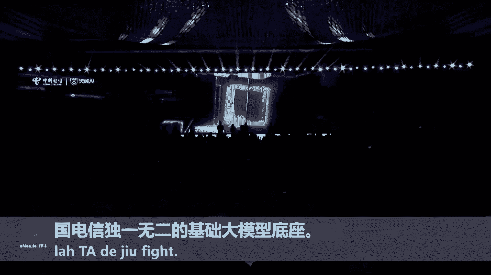

# 2024世界人工智能大会（合集） - P33：20240705-星辰注智 焕新领航——中国电信星辰人工智能生态论坛 - WarrenHua - BV1iT421k7Bv

以大模型为代表的人工智能技术正在引领世界进入智能化新时代。

🎼中国电信率先提出打造关键核心技术自主掌控的科技型企业。

🎼坚持云网基础设施建设，把握人工智能发展方向。🎼坚定围绕一个算力底座，一个大数据底座，一个通用大模型底座，N个外部大模型M个内部大模型的人工智能发展布局，夯实由算力数据大模型构成的1加1加一底座。

构建全面且成熟的大模型产品体系，用担人工智能国家队的角色。🎼打造中国电信星辰大模型品牌。

🎼致力成为国内领先的智能服务商、通用大模型的领跑者以及行业大模型的主导者。中国电信点亮星辰AI新时代。

🎼云是一体算力底座。🎼基于全面的资源布局和领先的计算技术，中国电信已经构建了业界领先的计算底座。

🎼率先提出辐射全国的2加3加7加X加Y梯度性计算布局处于行业领先水平。🎼中国电信提前布局国产化智能算力，持续引领智算公有云国产化建设发展，同时自主构建了全站试算服务。

🎼云志超一体化基础设施平台云销全国首个算力互联互通验证平台熙攘。🎼一站式计算服务平台汇聚形成云至一体的计算服务体系，实现全站计算能力的自主可控。🎼高质量数据底座。🎼中国电信依托数据要素资源禀富。

🎼整合多元数据，打造新海大数据产品体系。🎼建设临泽数据要素服务平台，构建跨行业、跨区域、跨机构的数据流通基础设施。

🎼突破大数据平台关键技术与人工智能协同创新，支撑数据集高效管理，充分释放数据要素价值。🎼同卫健、教育、交通、文轩等领域3余单位开展数据合作对接。🎼引入高质量数据集，用于大模型研发、内部数字化转型。

联合产品打造。

🎼基础大模型底座。🎼新城系列大模型是中国电信完全自主研发的大模型，参数规模超过千亿。🎼包含语翼、语音、多模台、视觉四个基础大模型，构成中国电信独一无二的基础大模型底座。

🎼新城大模型也是国内首个央企开源的大模型，目前已开源7笔、12笔52笔参数规模的语翼大模型，支持30种方言、自由混所，吸引了国内外开源社区开发者广泛讨论和使用，积累超过40万用户。

中国电信凭借在各行业深耕多年的优势和经验，联合头部生态赋能，构建了涵盖教育、政务、应急等20多个行业大模型，深入推动大模型与各行各业的融合，切实赋能、千行百业、转型升级。🎼倾城mas平台。

🎼中国电信星辰mas平台作为中国电信统一AI运营生态平台，使合作伙伴自营AI能力和行业客户间的纽带。🎼新辰mas平台从模型、数据起、算力、应用和工具多个维度，打造合作伙伴能立起。

🎼以标准化服务方式金融多行业伙伴不同层次的产品和能力，实现生态共赢。🎼提供评选部数构训。🎼推用的端到端大模型解决方案，一站式满足用户，多云算力调度、大模型选配应用场景创新的需求。

🎼星辰mas平台为行业客户提供专属的生态运营服务。🎼让教育质量注重换新，为文旅体验，聚智护航，让政务服务旗帜增效。🎼星辰众志。🎼唤新领航。😊，以大模型为代表的人工智能技术正在引领世界进入智能化新时代。

🎼中国电信率先提出打造关键核心技术自主掌控的科技型企业。🎼坚持云网基础设施建设，把握人工智能发展方向。🎼坚定围绕一个算力底座，一个大数据底座，一个通用大模型底座。

N个外部大模型M个内部大模型的人工智能发展布局，夯实由算力数据大模型构成的1加1加一底座，构建全面且成熟的大模型产品体系，用担人工智能国家队的角色。🎼打造中国电信星辰大模型品牌。

🎼致力成为国内领先的智能服务商、通用大模型的领跑者以及行业大模型的主导者。中国电信点亮星辰AI新时代。🎼云至一体算力底座。🎼基于全面的资源布局和领先的计算技术，中国电信已经构建了业界领先的计算底座。

🎼率先提出辐射全国的2加3加7加X加Y梯度性计算布局处于行业领先水平。🎼中国电信提前布局国产化智能算力，持续引领智算公有云国产化建设发展，同时自主构建了全站智算服务。🎼云志超一体化基础设施平台云销。

全国首个算力互联互通验证平台熙攘。🎼一站式计算服务平台汇聚，形成云之一体的计算服务体系。🎼实现全战制算能力的自主可控。🎼高质量数据底座。🎼中国电信依托数据要素资源禀赋。🎼整合多元数据。

打造新海大数据产品体系。🎼建设临泽数据要素服务平台，构建跨行业、跨区域、跨机构的数据流通基础设施。🎼突破大数据平台关键技术与人工智能协同创新，支撑数据集高效管理，充分释放数据要素价值。

🎼同卫健、教育、交通、文轩等领域30余单位开展数据合作对接。🎼引入高质量数据集，用于大模型研发、内部数字化转型，联合产品打造。🎼基础大模型底座。🎼新城系列大模型是中国电信完全自主研发的大模型。

参数规模超过千亿。🎼包含语音、语音、多模台、视觉四个基础大模型，构成中国电信独一无二的基础大模型底座。🎼新城大模型也是国内首个央企开源的大模型，目前已开源7笔、12B52笔参数规模的语翼大模型。

支持30种方言、自由混所，吸引了国内外开源社区开发者广泛讨论和使用，积累超过40万用户。中国电信凭借在各行业深耕多年的优势和经验，联合头部生态赋能，构建了涵盖教育、政务、应急等20多个行业大模型。

深入推动大模型与各行各业的融合，切实赋能、千行百业转型升级。🎼倾晨mas平台。🎼中国电信星辰mas平台作为中国电信统一AI运营生态平台，使合作伙伴自营AI能力和行业客户间的纽带。

🎼新辰mas平台从模型、数据集、算力、应用和工具多个维度，打造合作伙伴能力级。🎼以标准化服务方式，金融多行业伙伴不同层次的产品和能力，实现生态共赢。🎼提供评选步数构训。🎼推用的端到端大模型解决方案。

一站式满足用户，多云算力调度、大模型选配应用场景创新的需求。🎼星辰mas平台为行业客户提供专属的生态运营服务。🎼让教育质量注重换新，为文旅体验，聚智护航，让政务服务旗帜增效。🎼星辰注志。🎼唤新领航。😊。

以大模型为代表的人工智能技术正在引领世界进入智能化新时代。🎼中国电信率先提出打造关键核心技术自主掌控的科技型企业。🎼坚持云网基础设施建设，把握人工智能发展方向，坚定围绕一个算力底座，一个大数据底座。

一个通用大模型底座，N个外部大模型M个内部大模型的人工智能发展布局。夯时由算力数据大模型构成的一加一加一底座。🎼构建全面且成熟的大模型产品体系，勇担人工智能国家队的角色。🎼打造中国电信星辰大模型品牌。

🎼致力成为国内领先的智能服务商、通用大模型的领跑者以及行业大模型的主导者。中国电信点亮星辰AI新时代。🎼云是一体算力底座。🎼基于全面的资源布局和领先的计算技术，中国电信已经构建了业界领先的计算底座。

🎼率先提出辐射全国的2加3加7加X加Y梯度性计算布局处于行业领先水平。🎼中国电信提前布局国产化智能算力，持续引领智算公有云国产化建设发展，同时自主构建了全站试算服务。🎼云志超一体化基础设施平台云销。

全国首个算力互联互通验证平台熙攘。🎼一站式计算服务平台汇聚形成云至一体的计算服务体系，实现全站计算能力的自主可控。🎼高质量数据底座。🎼中国电信依托数据要素资源禀赋。🎼整合多元数据。

打造新海大数据产品体系。🎼建设临泽数据要素服务平台，构建跨行业、跨区域、跨机构的数据流通基础设施。🎼突破大数据平台关键技术与人工智能协同创新，支撑数据集高效管理，充分释放数据要素价值。

🎼同卫检、教育、交通、文轩等领域3余单位开展数据合作对接。🎼引入高质量数据集，用于大模型研发、内部数字化转型，联合产品打造。

🎼基础大模型底座。🎼新城系列大模型是中国电信完全自主研发的大模型，参数规模超过千亿。🎼包含语音、语音、多模态、视觉四个基础大模型，构成中国电信独一无二的基础大模型底座。

🎼新城大模型也是国内首个央企开源的大模型，目前已开源7笔、12笔、52笔参数规模的语翼大模型，支持30种方言、自由会所，吸引了国内外开源社区开发者广泛讨论和使用，积累超过40万用户。

中国电信凭借在各行业深耕多年的优势和经验，联合头部生态赋能，构建了涵盖教育、政务、应急等20多个行业大模型，深入推动大模型与各行各业的融合，切实赋能、千行百业、转型升级。

🎼倾晨mas平台。🎼中国电信星辰mas平台作为中国电信统一AI运营生态平台，使合作伙伴自营AI能力和行业客户间的纽带。🎼新辰mas平台从模型、数据集、算力、应用和工具多个维度，打造合作伙伴能立起。

🎼以标准化服务方式，金融多行业伙伴不同层次的产品和能力，实现生态共赢。🎼提供评选步数购训推用的端到端大模型解决方案，一站式满足用户多云算力调度大模型选配应用场景创新的需求。

🎼星辰mas平台为行业客户提供专属的生态运营服务。🎼让教育质量注重换新，为文旅体验，聚智护航，让政务服务提质增效。🎼星辰注志。🎼唤新领航。😊，以大模型为代表的人工智能技术正在引领世界进入智能化新时代。

🎼中国电信率先提出打造关键核心技术自主掌控的科技型企业。🎼坚持云网基础设施建设，把握人工智能发展方向。🎼坚定围绕一个算力底座，一个大数据底座，一个通用大模型底座。

N个外部大模型M个内部大模型的人工智能发展布局，夯实由算力数据大模型构成的1加1加一底座，构建全面且成熟的大模型产品体系，用担人工智能国家队的角色。🎼打造中国电信星辰大模型品牌。

🎼致力成为国内领先的智能服务商、通用大模型的领跑者以及行业大模型的主导者。中国电信点亮星辰AI新时代。🎼云是一体算力底座。🎼基于全面的资源布局和领先的计算技术，中国电信已经构建了业界领先的计算底座。

🎼率先提出辐射全国的2加3加7加X加Y梯度性计算布局处于行业领先水平。🎼中国电信提前布局国产化智能算力，持续引领智算公有云国产化建设发展，同时自主构建了全站计算服务。

🎼云志超一体化基础设施平台云销，全国首个算力互联互通验证平台熙攘。

🎼一站式计算服务平台汇聚形成云至一体的计算服务体系。

🎼实现全战制算能力的自主可控。🎼高质量数据底座。🎼中国电信依托数据要素资源禀富。🎼整合多元数据，打造新海大数据产品体系。🎼建设临泽数据要素服务平台，构建跨行业、跨区域、跨机构的数据流通基础设施。

🎼突破大数据平台关键技术与人工智能协同创新，支撑数据集高效管理，充分释放数据要素价值。🎼同卫健、教育、交通、文轩等领域30余单位开展数据合作对接。🎼引入高质量数据集，用于大模型研发、内部数字化转型。

联合产品打造。🎼基础大模型底座。🎼新城系列大模型是中国电信完全自主研发的大模型，参数规模超过千亿。🎼包含语音、语音、多模台、视觉四个基础大模型，构成中国电信独一无二的基础大模型底座。

🎼新城大模型也是国内首个央企开源的大模型，目前已开源7笔、12B52笔参数规模的语翼大模型，支持30种方言，自由混所，吸引了国内外开源社区开发者广泛讨论和使用，积累超过40万用户。

中国电信凭借在各行业深耕多年的优势和经验，联合头部生态赋能，构建了涵盖教育、政务、应急等20多个行业大模型，深入推动大模型与各行各业的融合，切实赋能千行百业转型升级。

🎼倾晨mas平台。🎼中国电信星辰mas平台作为中国电信统一AI运营生态平台，使合作伙伴自营AI能力和行业客户间的纽带。🎼新辰mas平台从模型、数据起、算理、应用和工具多个维度，打造合作伙伴能力起。

🎼以标准化服务方式金融多行业伙伴不同层次的产品和能力，实现生态共赢。🎼提供评选部数构性。🎼推用的端到端大模型解决方案，一站式满足用户，多云算力调度、大模型选配应用场景创新的需求。

🎼星辰mas平台为行业客户提供专属的生态运营服务。🎼让教育质量注重换新，为文旅体验，聚智护航，让政务服务。🎼极质增效。🎼星辰注志。🎼唤新领航。😊。

以大模型为代表的人工智能技术正在引领世界进入智能化新时代。🎼中国电信率先提出打造关键核心技术自主掌控的科技型企业。🎼坚持云网基础设施建设，把握人工智能发展方向，坚定围绕一个算力底座，一个大数据底座。

一个通用大模型底座，N个外部大模型M个内部大模型的人工智能发展布局，夯实由算力数据大模型构成的一加一加一底座，构建全面且成熟的大模型产品体系，用担人工智能国家队的角色。🎼打造中国电信星辰大模型品牌。

🎼致力成为国内领先的智能服务商、通用大模型的领跑者以及行业大模型的主导者。中国电信点亮星辰AI新时代。🎼云至一体算力底座。🎼基于全面的资源布局和领先的计算技术，中国电信已经构建了业界领先的智算底座。

🎼率先提出辐射全国的2加3加7加X加Y梯度性计算布局处于行业领先水平。🎼中国电信提前布局国产化智能算力，持续引领智算公有云国产化建设发展，同时自主构建了全站智算服务。🎼云志超一体化基础设施平台云销。

全国首个算力互联互通验证平台熙攘。🎼一站式计算服务平台汇聚，形成云之一体的计算服务体系。🎼实现群战制算能力的自主可控。🎼高质量数据底座。🎼中国电信依托数据要素资源禀赋。🎼整合多元数据。

打造新海大数据产品体系。🎼建设临泽数据要素服务平台，构建跨行业、跨区域、跨机构的数据流通基础设施。🎼突破大数据平台关键技术与人工智能协同创新，支撑数据集高效管理，充分释放数据要素价值。

🎼同卫健、教育、交通、文轩等领域30余单位开展数据合作对接。🎼引入高质量数据集，用于大模型研发、内部数字化转型，联合产品打造。🎼基础大模型底座。🎼新城系列大模型是中国电信完全自主研发的大模型。

参数规模超过千亿。🎼包含语音、语音、多模台、视觉四个基础大模型，构成中国电信独一无二的基础大模型底座。🎼新城大模型也是国内首个央企开源的大模型，目前已开源7笔、12笔、52笔参数规模的语翼大模型。

支持30种方言、自由混所，吸引了国内外开源社区开发者广泛讨论和使用，积累超过40万用户。中国电信凭借在各行业深耕多年的优势和经验，联合头部生态赋能，构建了涵盖教育、政务、应急等20多个行业大模型。

深入推动大模型与各行各业的融合，切实赋能、千行百业、转型升级。🎼倾晨mas平台。🎼中国电信星辰mas平台作为中国电信统一AI运营生态平台，使合作伙伴自营AI能力和行业客户间的纽带。

🎼新辰mas平台从模型、数据集、算力、应用和工具多个维度，打造合作伙伴能力级。🎼以标准化服务方式，金融多行业伙伴不同层次的产品和能力，实现生态共赢。🎼提供评选部数构训。🎼推用的端到端大模型解决方案。

一站式满足用户，多云算力调度、大模型选配应用场景创新的需求。🎼星辰mas平台为行业客户提供专属的生态运营服务。🎼让教育质量注重换新，为文旅体验，聚智护航，让政务服务旗帜增效。🎼星辰种志。🎼换新领航。😊。

以大模型为代表的人工智能技术正在引领世界进入智能化新时代。🎼中国电信率先提出打造关键核心技术自主掌控的科技型企业。🎼坚持云网基础设施建设，把握人工智能发展方向，坚定围绕一个算力底座，一个大数据底座。

一个通用大模型底座，N个外部大模型M个内部大模型的人工智能发展布局，夯实由算力数据大模型构成的一加一加一底座，构建全面且成熟的大模型产品体系，有担人工智能国家队的角色。🎼打造中国电信星辰大模型品牌。

🎼致力成为国内领先的智能服务商、通用大模型的领跑者以及行业大模型的主导者。中国电信点亮星辰AI新时代。🎼云是一体算力底座。🎼基于全面的资源布局和领先的计算技术，中国电信已经构建了业界领先的计算底座。

🎼率先提出辐射全国的2加3加7加X加Y梯度性计算布局处于行业领先水平。🎼中国电信提前布局国产化智能算力，持续引领智算公有云国产化建设发展，同时自主构建了全站智算服务。🎼云志超一体化基础设施平台云销。

全国首个算力互联互通验证平台熙攘。🎼一站式计算服务平台汇聚，形成云至一体的计算服务体系，实现全站计算能力的自主可控。🎼高质量数据底座。🎼中国电信依托数据要素资源禀赋。🎼整合多元数据。

打造新海大数据产品体系。🎼建设临泽数据要素服务平台，构建跨行业、跨区域、跨机构的数据流通基础设施。🎼突破大数据平台关键技术与人工智能协同创新，支撑数据集高效管理，充分释放数据要素价值。

🎼同卫健、教育、交通、文轩等领域30余单位开展数据合作对接。

🎼引入高质量数据集，用于大模型研发、内部数字化转型，联合产品打造。🎼基础大模型底座。🎼新城系列大模型是中国电信完全自主研发的大模型，参数规模超过千亿。🎼包含语音、语音、多模台、视觉四个基础大模型。

构成中国电信独一无二的基础大模型底座。🎼新城大模型也是国内首个央企开源的大模型，目前已开源7笔、12笔、52笔参数规模的语翼大模型，支持30种方言、自由混所，吸引了国内外开源社区开发者广泛讨论和使用。

积累超过40万用户。中国电信凭借在各行业深耕多年的优势和经验，联合头部生态赋能，构建了涵盖教育、政务、应急等20多个行业大模型，深入推动大模型，与各行各业的融合，切实赋能、千行百业、转型升级。

🎼倾晨mas平台。🎼中国电信星辰mas平台作为中国电信统一AI运营生态平台，使合作伙伴自营AI能力和行业客户间的纽带。🎼新辰mas平台从模型、数据集、算理、应用和工具多个维度，打造合作伙伴能立起。

🎼以标准化服务方式，金融多行业伙伴不同层次的产品和能力，实现生态共赢。🎼提供评选步数构训。🎼推用的端到端大模型解决方案，一站式满足用户，多云算力调度、大模型选配应用场景创新的需求。

🎼星辰mas平台为行业客户提供专属的生态运营服务。🎼让教育质量注重换新，为文旅体验，聚智护航，让政务服务旗帜增效。

🎼星辰注志。🎼唤新领航。😊，🎼尊敬的各位嘉宾，欢迎您参加2024世界人工智能大会中国电信主题论坛。我们的论坛马上就要开始了。现在请您抓紧时间入座。入座之后，请将您的手机调成静音或震动状态。

谢谢各位的合作，感谢您的支持。😊。

🎼尊敬的各位领导，各位嘉宾，现场的女士们、先生们，大家上午好。😊，欢迎各位来到中国电信星辰人工智能生态论坛的现场。大家好，我是来自上海广播电视台东方卫视的节目主持人子龙，很高兴也很开心。

能够跟在座的各位一起共赴一场科技之旅。那活动一开始，我们就共同感受来自于星辰的魅力。我们共同来看由星辰大数据生成的一段视频。😊。

🎼I was love to love my heart。う。🎼看到我们落。🎼Of my heart。🎼I was so to。🎼吗。🎼And到我们。

好的，还是非常的震撼的，特别的棒。呃，这就是由星辰大数据生成的一段开场的视频。呃，习近平总书记呢对于人工智能产业也是高度的重视。他说，人工智能产业是引领新一轮的科技革命和产业变革的非常重要的驱动力。

会对我们全世界的社会经济生活，以及人类的文明进步都产生非常深远的一个影响。那正如大家所看到的，今天我们中国电信就是以星辰注智换新领航为主题，召开这次生态论坛。

那接下来呢我们将会和在座的各位嘉宾一起去探讨我们人工智能产业的新的趋势，去领略人工智能发展的一些成果。当然也是共谋人工智能和产业融合的这样的一种新的生态。所以说今天接下来的论坛十分精彩，敬请期待。

那首先呢还是要给大家隆重的介绍，莅临本次活动的。😊，🎼各位领导和嘉宾，让我们掌声欢迎国务院国有资产监督管理委员会副主任苟平先生。🎼上海市人民政府副市长陈杰先生。

🎼国际电信联盟电信标准化剧局长伟尚成藏先生，misterciso ONOEwelcome。🎼图灵奖获得者，中国科学院外籍院士、中国国际科学技术合作奖获得者约翰霍普克罗夫特教授。

professor johocroft， welcomelcome。🎼中国电信集团有限公司董事长柯瑞文先生。🎼中国电信集团有限公司总经理梁宝俊先生。🎼再一次欢迎各位领导的到来。另外。

我们要一并欢迎以下嘉宾，他们分别是国资委规划局副局长胡武杰女士、工信部科技司副司长刘国超先生、中共上海市经济和信息化工作委员会书记陈鹏先生。

上海市科委二级巡视员胡奎先生、中国移动副总经理高同庆先生、冰装集团副总经理叶文华先生、中国海洋石油副总裁孙福阶先生、中原海运副总经理陈杨帆先生、中国中车副总裁刘可安先生、中核集团总经理助理孟衍斌先生、长江三峡首席信息官金和平先生、中国铝业首席信息官谢海先生、中国电子首席科学家朱国平先生、中旅集团CIO谢海先生、南方航空集团CIO黄文强先生、中国电信科技委主任邵广。

🎼王路先生，中国电信副总经理唐柯先生李俊先生，让我们用掌声欢迎各位。🎼另外来到今天活动现场的还有各地政府企业和高校科研院所的领导嘉宾，以及媒体界的朋友们。与此同时，我们的论坛的盛况此时此刻。

正在世界人工智能大会的官方平台，以及中国电信的自媒体平台同步直播。我们也要用再次用掌声对于各位的到来表示衷心的感谢，欢迎各位。😊，🎼接下来让我们掌声有请上海市副市长陈杰先生上台致辞。有请。

尊敬的苟平主任伟尚成长主任、柯瑞荣董事长梁宝俊总经理，尊敬的各位来宾、女士们、先生们、朋友们，大家上午好，很荣幸能够来参加新城注智换新领航人工智能生态论坛，和大家一起共同的探讨，AI生态构建的未来趋势。

首先，我谨代表上海市人民政府对本次论坛的举办，表示热烈的祝贺。也对各位嘉宾和朋友的带来到来，表示热烈的欢迎。同时也向长期以来关心支持上海经济社会发展、人工智能产业发展的各界朋友。

特别是博院国资委中国电信对于上海信息产业发展所给予的大力的关心支持和帮助，表示衷心的感谢。当前，以大模型为代表的生成式人工智能持续的迭代演变，引发了智能范式之变、产业动能之变、算力模式之变。近年来。

上海将人工智能作为重点发展的三大先导产业出台了若干的推进举措，围绕着模型算力芯片语料深入布局，加快构建高效协同的产业生态、高标准的基础设施持续推进。

已经在临港、松江、青浦、金山等重点的区域构建了计算中心，建设了公共的算力服务平台，推进算力资源的统一调度。高质量的语料数据也在持续的汇聚。我们成立了大模型的语料联盟4200亿 token的语料。

要数据实现开源高能级的创新载体也在持续的建设。目前，上海也有34款的大模型通过备案，产生了制造业、金融、巨深智能机器人等锤类领域的应用。面向未来，我们将积极的持续的完善大模型生态体系的建设。

一是要加大关键核心技术的攻关，持续的推动高端芯片模型算法训练框架、软件工具等融合创新，构建安全可靠、开源、开放、广泛兼容的底层技术支撑体系。二是加强算力资源的统筹调度。

深化探索算力运律、存力、协同布局的智能算力的基础设施建设，加大全市算力的调度和共享，推动算力的普惠化。三是加快大模型的落地赋能应用。以超级应用场景的平台。

来抢占产业化的先机、深度赋能、制造、金融、医疗教育等重点领域，加快推进新智生产力。各位来宾，今天的论坛汇聚了产业界学术界的各位。知名的企业家和学者衷心的期待大家畅所欲言分享观点。

为我们带来新的启迪和收获。同时也热情的欢迎中国电信继续的发挥，算力加算法加网络加平台加服务的综合优势，联合产业生态的合作伙伴，共同探讨大模型和生成式人工智能的新技术新应用，向更多的行业注入AI基因。

为助力打造人工智能世界级的高端产业集群贡献更多的力量。最后，预祝本次大会取得圆满成功，谢谢大家。🎼谢谢陈杰副市长的精彩致辞，请您入座，也为接下来大模型的发展前进指明了方向。

我们接下来要继续有请嘉宾上台发表他的致辞，欢迎到的是国际电信联盟电信标准话局局长伟尚成藏先生。ow let's welcomem。 Cil O NOEplease。😊，Ding， guests。

 ladies and gentlemen， Good morning。And thank you to China Telecom for the invitation to participate in the C AI A System For。

It is a privilege to address you today on behalf of the International Telecommunication Union's Standardization Bureeau。

At， at the United Nations Reading Agency on I C Ts。

We are delighted to see such atyas and distinguished a group of experts。😊。

ノベ Inベs and leaders in attendance。Many of you are alreadynova in in the standard setting work of ITU。

And in our I AI for good initiative。As we gather here this morning， we already explore。

And celebrate the tremendous potential of artificial intelligence and large language models in the promoting shared benefits across industries and societies。

😊，We are living in a time of extraordinary technological advancement。

The rapid evolution of AI and large language models is already transforming economies and societies。

At an unprecedented case。Today's forum is a vital platform for enhancing。

Exchanges and cooperation with industries， and it。Underre our shared commitment to fostering innovations and progress in the field of artificial intelligence。

The team of this forum enhancing exchanges and cooperation with industries to promote innovation in AI and A Ms。

A resonates deeply with the missions of the ITU Transation burreau。We believe that。

The two potential of AI can only be up unlock lookeded through collaboration。

 collaborative efforts that brings together the best mind。

Resources and technologies from across the globe。By working together。We can overcome challenges。

Cize opportunities and。Drive forward the digital transformation that will shape the future。At I。

 we are。Dedicated to facilitating global collaboration and establishing standards that ensure the seamless integration and intererability of emerging technologies。

Just over one month ago， we hosted a China Telecom at the AI for a good global summit in Geneva。

They brought insight to the event and to the workshop focused on harmonizing global collaboration in AI industry。

Around the table on the future of AI standardization， regulation and industry development。

This work is is in， is crucial for creating an environment where AI can thrive ensuring that it is safe。

😊，Reable are the beneficial for all。The Xincheng AI E ecosystems Forum。

Exemp exemplifies this spirit of collaboration。Providing providingiding the robust platform that integrates cutting edge technologies。

 infrastructures and expertise to empower business。Businesses and drive innovation。Today。

 we will have the privilege of hearing from some of the brightest minds in AI and editing research。😊。

And applications。Their insight will illuminate。The latest advancements。

Highlights the challenges we face and offer pathway for collaboration and innovation。

We are inspired by several of the use cases that China telecom showcased in Geneva at the recent AI for Good Global summit。

😊，Especially innovative green project。Projects such as a a fast net zero data center are net zero base station。

 power by renewable energy。This initiative。That integrating AI with natural。Nural resourcesです。

For sustainable infrastructure have great potential to cut emissions。いなでしょ？We are invested。

An interested in intelligent intelligent energy management platform。

We have run about China telecoms nationwide。A nationwide AI based energy saving platform for 5G and 4G networks。

Aチing次アニル eリスティ savingsaving。I look forward to learning more about these green AI technologies。😊。

And how we can leverage an ecosystem approach。Towards technology transfer in in the hope that these innovations can be shared across nations to make a real impact on this climate change。

Migation。As we know， innovation flourish in environments。

We are collaboration and open communication are prioritized。As we engage in today discussions。

 we can push。The bundle。Boundaries of the what is possible and create solutions that drive progress and prospect for all。

These discussions are not only timely but essential， as we strive to。啊。

Harness the full potential of AI and betterment of our society and our world。In closing。

 I would like to extend my deepest gratitude to China Telecom for organizing。This significant event。

To our partners for their invariuable support。And to all of you for your participation。

Your education and contributions are vital to the success of our corrective effort。

I am confident that the insights and connections we gained today re pave the way for remarkable advancement in AI and large language models。

Thank you once again。 as seize this opportunity to run， colroborate and innovate together together。

 we can shape the future of artificial intelligence。😊，And create better， more connected world。

Thank you。Thank you。thank you。谢谢谢谢伟尚局长。please。😊，我相信未来啊会有越来越多的中国的通讯企业能够加入到ITU这样的一个国际的标准化平台当中去跟全球的各国一起携手。

去共同探讨AI未来的一个新的发展的趋势。🎼我们接下来要掌声欢迎中国电信集团公司董事长柯瑞文先生致辞。有请。

尊敬的苟平副主任。陈杰副市长。尊敬的伟尚成长局长，尊敬的约翰教授。各位领导，各位专家，各位嘉宾，大家上午好。很高兴与大家相聚在中国电信。新城人工智能生态大会。首先，我仅代表中国电信。

对各位领导、各位嘉宾的莅定指导表示热烈的欢迎和衷心的感谢。近年来，中国电信坚定履行建设网络强国和数字中国维护网信安全的使命责任。全面深入实施云改速转战略。持续加大科技创新的力度。推进。

中国电信从传统的电信运营商向服务型、科技型、安全型企业转型。我们确立了网络。云及云网融合人工智能和量子安全四大科技方向。完成了七大战略性新兴业务的布局。在以人工智能为代表的新一轮科技革命和产业变革当中。

我们坚持网事基础云为核心，充分发挥云网融合的优势。把握人工智能发展的方向。趁势而上，以新城为品牌，形成了1加1加1加M加N的人工智能的总体布局。扎实推进人工智能加的行动，取得了明显的成效和实质性的突破。

在一体化算力互联网方面。我们聚焦算力链接和调度这三大基本要素。规划建设了2加3。加7加X的公共计算云。建成了上海、北京两大万卡的计算机群。推进数据中心向AIDC升级，全面支持两谈一优。

也就是弹性供电、弹性制冷和气流组织的优化。打造。跨DC的分布式的无损网络。推进400G全官网全国覆盖。业界首次完成了1。6T数据，在40分钟内跨2000公里的传输。破解海量数据高速入算的难题。

基于云网融合的天云国家云打造了西壤营销汇聚三大平台。提升了上网感知、跨域调度、随愿自治等能力。这三大平台是一体化算立互联网的关键平台技术和基本的框架。已经在国资央企内部推广使用。

我们正式启动了长三角的算力调度中心，实现了对区域算力资源的集约供给和统一的调度。这些都是基于我们希壤等三大平台来实施的工程。在通用大模型方面。

自主研发了涵盖语义、语音、视觉、多模态的新成大模型的产业矩阵，综合能力进入国内一线的头部阵营。新城语义大模型是央企最早向社会开源的大模型。形成语音大模型支持30多种方言的自由混说，是国内知识。

方言最多的识别性的大模型。形成视觉大模型实现了视频中万物皆可以通过自然语言的搜索。新成多模态大模型累计研发了15种纹身图，55种图生图的能力。近期。

我们联合北京智源人工智能研究院发布了全球首个单体稠密万亿参数的语音模型。在数据底座方面。推出林泽2。0数据要素平台，提供数据确权登记、数据融合计算、可信数据空间等功能，支持数据汇聚流通和开发的利用。

已面向18个省市超1000家合作伙伴提供了安全可信的服务，实现了跨行业数据的交流与流通。构建大数据产品矩证，面向政务金融文旅等场景，推广了数据产品的服务，构建海量、高质量的数据集。

打造跨境数据的解决方案，促进数据跨境的安全流通。在AI应用方面，我们首先从企业内部自身做起。自研新城网络大模型用于网络的监控排查、维护优化等流程，提高故障的处理效率30%以上。

自研新城客户大模型用于语音导航、在线机器人等场景。智能客服比占比达到80%。自研的新城智慧AI的节能系统，实现了对基站机房和数据中心的精准节能。今年上半年累计节电5亿度。在内部应用的基础上。

我们全面的开放场景，联合产业合作伙伴深度的应用，面向新型工业化、应急教育、医疗等垂直领域，推出30多个行业的大模型，服务政企客户7000多家。面向数字政务、智慧城市和数字乡村等场景，推出了AI加摄像头。

AI加数字平台等一系列的数字化创新产品和服务。5年以前。中国电信把人工智能作为主要的技术方向进行布局。当时我们是基于数字信息基础设施的智能化去理解，去认知和推动这项工作的。

并没有想到深层次人工智能的发展和产生的巨大的影响。2022年底，chaGPT出现以后，我们及时的跟进学习研究，不断的结合实际创新实践。在人工智能时代，作为电信的运营商，中国电信有网的基础和云的核心技术。

在人工智能发展过程中，具有独特的资源禀赋和能力优势。我们特别是拥有丰富的应用场景和海量的数据，特别是有广大用户对我们的支持。一年多来。人工智能也经历了百魔大战。

同时也经历了芯片安全、商业模式和先进流等各方面的困难、问题和挑战。我们认为这都是发展过程当中的问题，是会出现的一些问题。关键是在这个时间点上。我们怎么样去看待这些问题？怎么样去分析这些问题。

怎么样去把握这些问题背后的规律和趋势。怎么样去发挥自身的优势和特点，怎么样去开展开放和合作，去推动这些问题的解决，从而实现人工智能的高质量的发展。这其中蕴藏着大量的商业机会和企业发展的重大的战略机遇。

在这个阶段，我们觉得要更加注重数字信息基础设施的强有力的支撑作用，更加注重大模型的应用，更加注重生态的合作。必须在应用驱动和生态合作中。实现科技的自立自强，推动人工智能产业的高质量的发展。

在昨天下午的产业的主论坛上。就这些问题啊，我谈了一些意见，做了一些交流，特别是对数字信息基础设施如何支持服务人工智能的发展呢？呃谈了一下我们的想法和做法。今天我想重点讲。

全面推进人工智能的融合创新应用等两个问题。一是要全面推进人工智能的融合创新应用。当前，人工智能与行业场景的融合仍处在初级阶段，要坚持应用导向，大家都要先动起来，先用起来。在用的过程中不断的迭代完善。

不断的形成规模发展，不断的创新商业的模式。中电信我们在这个方面呢。要率先的去带头尝试开放场景，联合产业合作伙伴，加速应用的落地。我们将加速推进新城大模型深度覆盖场景的行业场景，重点打造50个行业大模型。

深度嵌入企业生产经营管理等重要的流程和关键环节，提供算力加模型加数据加应用的一体化的服务，建设AI应用的示范联创基地，在重点行业重点领域，打造一批应用的示范项目。在新型工业化领域。

利用易云控加工业大模型，推动产线智能改造，大幅提高智能加工物流分解。视觉质检等环节的生产效率。在交通领域，我们正在与中车集团合作，通过西攘平台提供算力的调度支持，定制开发整体仿真。

安全监测、乘客服务等12个场景的行业大模型，助力中车的核心生产环节，智能化升级，共同打造交通领域的行业应用标杆。在政务领域，我们打造的新城政务大模型已经在上海、江苏等多地落地。

大幅提升热线运营和市民的感知。未来将面向全国推广。在应急领域，我们有依图科技联合推出应急预警视觉大模型，可快速识别180多个风险隐患和灾害的场景，广泛服务于各级应急管理单位和应急救灾工作。

加快推进新城大模型与个人与家庭长景的融合，推出AI云电脑、AI摄像头等智能终端规模的普及。加快推进AI加音箱AI加手机上市，满足客户多元化的智能需求。结合运营商的特点，我们推出了新城惠达。

从短信入口实现了与新城大模型的交互，使AI能力更加便捷的。触达千家万户。第二呢是全面推进生态的开放合作。中国电信希望通过构建共治、共创共享的生态，推动AI产业的繁荣发展。我们将强化科技创新的开放合作。

与国内紧急科技院所科研企业成立大模型协会和生态的联盟，发挥各自的优势，在算法框架。数据库建设等领域开展深度的技术合作。我们将强化数据开放的合作，打造AI数据集联创基地，支持大模型高质量数据集的汇聚。

以天翼视联网等业务积累的大量的数据为基础，与广大的伙伴一起利用AI技术释放数字要素的价值。我们将强化应用的开放合作，基于新城mas平台，汇聚30多个通用大模型。

为客户和开发者提供跨云算力调度、通用大模型、数据训练工具一体的服务，建设大模型评测联创基地，为大模型提供安全可信、自主可控统一开放的评测服务。我们将强化高端人才的合作。

持续引进企业战略级科学家和领军的科技人才与清华大学、北京大学、同济大学等多所国内顶尖高校以及浦江国家实验室。智普商汤、医图智源等行业头部的机构，开展联合培养，打造AI的培养的人才基地。

为全社会培养更多的AI人才，我们将强化规则防范和风险的制定，联合多方共同制定产业的规则、制度和技术标准，进一步深化与ITUJ财媒等国际组织、产业合作伙伴在大模型领域的技术交流和联合创新。

积极贡献我们在实践中的经验，共同应对人工智能领域的深度伪造伦理安全、数字鸿沟等风险。和不足共同推进人工智能向善，就AI for good。

我们将充分利用世界人工智能大会、全球云网宽带协会等国际平台常态化的开展交流合作，缩小速度鸿沟。上海是具有全球影响力的。科创中心和人工智能的创新高地，具有科教资源、应用场景、海量数据、基础设施等优势。

中国电信积极服务和融入上海五个中心的建设。在上海市政府的大力支持下。建成了国内首个投入正式运行的国产单尺万卡一冷的算力集群和国内首个可支持全程上网的城市数字底座智云上海。成为城市新型数字基础设施的典范。

我们将强化在上海的科技创新布局，设立中国电信人工智能研究院，今天也将正式的揭牌。未来，我们将致力于把人工智能研究院打造成为国家人工智能核心战略科技力量的人才高地。新城注智换新领航。

这是本次生态论坛的主题，也是我们贯彻新发展理念，持续推动人工智能发展的方向。我们愿与各界合作伙伴聚力合作，推动人工智能加行动取得实质性成就。打造发展新智生产力的重要引擎。

为实现高质量发展贡献更多的一些力量。最后，再次感谢各位对中国电信长期以来的关心支持和帮助，祝本次会议取得圆满成功，谢谢各位。谢谢蝌蚪，请入座。朋友们，我们都知道。

中国电信呢一直是致力于打造科技型的企业啊，在人工智能领域也是取得了一系列非常重要的成果。那听了刚刚柯董的致辞，我们也更加对中国电信发展人工智能充满了无限的信心。😊，🎼亲爱的朋友们。

我们接下来要共同见证中国电信在人工智能领域的一个里程碑意义的时刻。那就是刚刚柯董在致词当中所讲到的中国电信人工智能研究院的正式揭牌。

我先给大家简单的介绍一下这个研究院研究院呢是由中国电信集团CTO首席科学家李学龙教授牵头组建，将依托平台生态人才等等多方面优势，开展人工智能前沿技术研究技术公关和应用落地。

打造全球AI人才高地和技术研发与产业的转化平台。我们接下来要有请出我们的揭牌嘉宾掌声欢迎国务院国有资产监督管理委员会副主任苟平先生，上海市人民政府副市长陈杰先生。

中国科学院外籍院士、中国国际科学技术合作奖获得者约翰霍普克罗夫特教授professorjocroftple中。😊，🎼中国电信集团有限公司董事长柯瑞文先生。

中国电信集团有限公司总经理梁宝俊先生以及中国电信集团CTO首席科学家、人工智能研究院院长李学龙教授，有请各位。🎼我们请两位教授站在我们的启动装置的两侧。🎼请领导站在后侧。🎼现在。🎼请做好准备。

全场倒计时。3。🎼2一请揭牌。please unwill the plan。🎼谢谢我们请两位教授向两侧稍微走两步，请后面的领导向前一步。😊，🎼此刻，我们用镜头记录下这难忘的时刻，朋友们掌声祝贺。

🎼我们请中国电信集团有限公司总经理梁宝俊先生刘步，其他的领导和嘉宾请入座，有请。🎼好，接下来呢我们把时间交给梁总。🎼给大家。🎼O。🎼好的，我们请梁总坐好。🎼准备好。

🎼接下来呢要给大家带来的是主旨演讲的环节。🎼将会就星辰注智共创共享，领航产业智能新变革做相关的分享。杨总，把时间交给你。😊，尊敬的苟平副主任。陈杰副市长。约翰霍普克洛夫特先生。伟尚陈赞先生。

柯瑞文董事长、各位领导，各位嘉宾，大家上午好。很荣幸与大家相聚在2024世界人工智能大会中国电信新城人工智能生态论坛，共同探讨人工智能产业创新发展和生态构建。中国电信高度重视人工智能发展。

并不断加大投入。打造了新城人工智能自主品牌和能力，赋能千行百业。刚才呢柯瑞文董事长做了一个非常啊有价值，也是有很多内行，有很多思考的演讲。我今天给大家分享的主题是新城注智，共创共享，领航产业智能新变革。

习近平总书记指出，加快发展新一代人工智能，是我们应得全球科技竞争主动权的重要战略抓手，是推动我国科技跨越发展产业优化升级、生产力整体跃升的重要战略资源。

国务院及相关部委先后出台了新一代人工智能发展规划等一系列指导性文件，并把开展人工智能加行动写入2024年政府工作报告。国资委也组织开展了AI赋能产业换新央企AI加专项行动。中国电信持续加大科技创新力度。

布局了包括人工智能在内的七大战略性新兴业务，加快推进科技型企业建设。纵观人类社会发展历史，先后经历了4次工业革命，前三次工业革命分别推动了人类社会进入蒸汽机时代、电器时代、信息技术时代。

人工智能是第四次工业革命的驱动力量，将引领人类社会进入智能时代，推动社会生产力创新发展。我们认为，人工智能推动全社会高质量发展有三个关键点。一是关键核心技术的制高点。

II发展、前沿、云计算、芯片等数字科技创新，加速推动智能制造、生物医药等新产品新技术的研发和应用。二是产业升级转型的关键点。加快人工智能，深度融入实体经济，激发创新活力和市场潜力。

推动千行百业高质量发展。三是人民美好生活的着力点，加强人工智能在教育、医疗、养老等领域、广泛应用，创造智能美好生活，消出智能鸿沟。中国电信紧抓失代发展机遇，致力于成为智能算力的主要服务商。

通用大模型的先行者，行业大模型的主导者。我们坚持四大发展原则，一是坚持云网融合、云智一体，筑牢人工智能基础设施底座。二是坚持自主可控、开放合作，推进人工智能技术生态共创。三是坚持场景驱动、赋能行业。

实现人工智能效益、社会共享。四是合规治理、数据安全，保障人工智能持续健康向上。同时，我们构建了1加1加1加M加N新城大模型体系，及一个智算云底座，一个数据底座。

一个新城大模型底座M个企业内幕大模型N个行业大模型应用，加速人工智能进程。首先。中国电信积极构建AI基础设施和大模型体系。在算力基础设施方面，以往强算打造400G通性无损智算广域网，总容量达600T。

算理时间的平均时间降低至9。7毫秒。持续升级吸壤算力调度平台、云销计算加速平台、汇聚智算服务平台三大算力核心平台，构建全国一体化算力体系。在数据要素汇聚方面，联合合作伙伴积累了37大类行业数据。

规模超过350TB。在新城系列大模型打造方面，完成了四类基础大模型，十0多个企业内部大模型和32个行业大模型的实践。接下来。请我们的新城数字人来给大家介绍中国电信智能云和新城大模型建设的进展和成果。

杨总和各位领导上午好。接下来由我为大家介绍天翼云作为国家云已越过向智能云发展的拐点，具有丰富的智算资源供给新城2加3加7智算布局，在280多个地势节点和1000多个边缘节点，按需部署推理算力。

智能算力达到20亿fps设计云销汇聚三大算力核心平台，构建全国一体化算力体系。目前已接入算力伙伴达39家接入社会算力打22亿fopps实现多方资源共享，我们打造出了新城大模型。

这里头包含语义语音视觉多模态四种能力。首先啊它是开源开放的星城大模型是央企里头第一个凯研的大模型，在已经把全尺寸模型放到开源社区上了。再一个这大模型系能特别好。咱提出的多轮幻觉缓解办法。

成功打幻觉率降低了40%呢。还有这大模型是完全自主。研发的技术完全自主掌控。最后呢，大模型已经通过了算法产品双备案，还提出了能度量的AI伦理计算。目前呢星辰大模型的本事已经得到社会上很多人的认可。

咱在AI竞赛里拿到了23个冠牙军，在顶会上发表了28篇论文。咱通过token计费，还有API调用在智能验步机会议纪要盒子这些软硬一体化的终端里都成功用上了。星辰大模型在国际权威瓶测的榜单里。

在百亿开源大模型里排到了前六名，其中推理赛道还拿到了第一名。这些成绩都说明，星辰大模型已经进到国内的第一梯队里了。好，谢谢星辰数字人，我们的数字好助理。中国电信将与合作伙伴一道，全面启动AI加新航程。

刚才柯董事长已经介绍了许多我们内部的应用。在企业内部数字化转型方面啊，是作为我们一个工作的重点，就是好的模型。首先自己内部要用起来，比如形成网络大模型，以实现网络故障处理效率提升30%。

经营大模型使得决策分析效率提升30%啊，我们在客户服务在很多方面都有了新的进展。我们特别注重在消费场景，也就是to C to H。领域积极探索新城大模型与AI手机、AI云电脑等终端的深度融合。

赋能美好数字生活。行业智能化审级是我们着力推动的重点领域。近年来，我们与产业企业合作伙伴一起联合创新，以行业数据知识密度、大数据技术适配度，服务标准化程度，提升这些要素为切入点。

真正使AI为广大的企业客户、行业客户提升价值，确保性能达标并兼顾高性价比，能够体会到。感受到大模型应用给企业带来的真正价值。我们为中小企业提供通用的标准化产品，为大中型客户提供专属定制服务。

为自服务型企业提供新城mas服务。目前已规模商用了32个行业场景大模型，研发并推出了智能体，覆盖7个行业领域。目前已经服务大客户600余家中小客户7000余家用户超过20万。

接下来我们再次请新城数字人来介绍AI应用方面的成果。节能大模型主要用在全国1700个自己研发的机房和490万个基站闪区，一年下来能省电7。8亿度呢。

工业质检大模型把缺陷的文字描述和图像的多模态检测能力结合起来了。大家现在看到的就是广东省新源力企业死网印刷缺陷检测的实际情况。应急监测预警视觉大模型能做到对百万级的视频进行快速的语衣检索。

现在能认出180多种风险隐患和灾害场景，已经在吉林、青海、湖南等好几个省用上了。政务热线大模型涵盖了热线的七大类15个业务场景。模型能服务市民智能问答，还能辅助话务人员智能填单。好，谢谢形成数字人。

中国电信积极践行，扬起使命担当，联合多方合作伙伴将在算力数据能力应用和安全等方面，全链条、深度合作创新，促进AI繁荣。我们联合算力伙伴已经向市场提供超过22亿bs共享算力。

联合数据伙伴实现了37大类高质量行业数据集的流通共享产学研联动合作研发了全球首个党体稠密万亿参数语以模型，联合300多家应用和渠道合作伙伴推动AI原生应用。联合多方构建治理平台，制定大模型安全标准。

提高算法透明度和可解释性，推动安全共治啊，这些成果都是我们在座的以及广大的合作伙伴共同啊联合创新的。刚才柯董事长也讲了，我们要开放的生态，也是我们今天论坛的一个主题。下一步，我们将加大力度。

特别是今天还将发布四大联创基地，在AI数据及应用示范模型拼测、人才培养等四个方向与合作伙伴共同打造创新高地。刚才我们举行了中国电信人工智能研究院的揭牌仪式。

下一步我们将于国内外一流大学知名企业和研究机构啊，包括政府部门联合合作，从科学前沿探索到应用技术落地，把中国电信人工智能研究院打造成为国家人工智能核心战略科技力量的人才高地。推动智能向上。

是发展人工智能的宗旨。展望未来。中国电信将持续创新引领，加快人工智能发展，做到基础更强、开放更广、应用更深和安全更牢，共拓数字社会、美好未来。制领未来，携手共创产业智能新篇章。

中国电信愿与各界朋友携手并进，拥抱人工智能时代，共同推进人工智能应用和发展，为建设数字中国智慧社会贡献电信力量，谢谢各位。谢谢梁总。请入座，有请辛苦了。🎼非常详实的一个分享哈。

当然在分享的过程当中给我们讲了人工智能。在助推人类社会更高质量发展过程当中的呃三个关键点，还有就是面向未来发展，我们所需要做到的四个更特别的棒，让人受益匪浅。那以场景驱动，加快人工智能大模型的技术应用。

对促进人工智能更高水平发展更好支撑、高质量发展是具有非常重要的意义的那为此，中国电信牵头发起了加快大模型赋能场景应用的倡议。我们接下来进入到倡议书的正式发布环节。

让我们掌声有请中国电信科技创新部总经理王桂荣先生宣读。有请。😊，🎼各位领导，各位嘉宾，我是中国电信科创部王国荣。在过去一年，人工智能大模型飞速发展，逐步融入人类的生产、生活、经营管理等各类场景。

并已经展现出巨大的推动作用。中国电信愿携手各方通过共建共享。共创共治，加速大模型在各类应用场景的落地进程。下面请我的数字人给大家宣读倡议书。下面由我宣读倡议书的内容。加快场景深度覆盖。开展联合创新。

将人工智能行业大模型深度嵌入生产、经营、运营和管理的重要流程和关键环节，加快对企业数字化转型的赋能，在重点领域落地一批应用示范项目。共建共享高质量数据集。发挥数据优势。

集合国资央企体量大、门类齐全的行业数据，打造高质量的数据集标注服务，实现大规模多维度数据的安全汇集、管理和应用，以高质量的数据集促进高水平行业大模型的建设。共享算力算法资源。

实施共建共享龙头企业要加快计算能力的建设，研发多模态通用基础大模型，并全面开源。提供优质普惠的智算云服务。各央企要充分使用央企公共计算能力和通用基础大模型。强化模型安全治理。

将安全可信作为国资央企业大模型的首要准则。建立健全大模型安全的政策和标准体系，积极参与全球技术创新、安全治理和人才交流，让我们携手并进，以大模型赋能场景应用落地，加快推动人工智能产业高质量发展。好。

谢谢我的数字人。刚才的数字人比我本人要帅一些，讲的呢也很精彩。下面呢请大家观看星辰大模型。根据倡议书生成的视频，生动展示了AI赋能千行百业的发展前景。🎼好，我们要再一次感谢王总和他的数字人都很帅。

讲的也都很好，带来的视频更加的震撼。话不多说，马上进入到我们正式的发布环节，让我们掌声有请畅议书的发布人。

他们分别是中国电信梁宝俊总经理、中国电信科技委邵广路主任、中国移动高同庆副总经理、冰庄集团、叶文华副总经理、中国海油孙福阶副总裁、中原海运陈阳帆副总经理、中国中车刘可安副总裁、中国集团、孟衍斌总经理助理、长江三峡金和平首席信息官、中国铝业谢海首席信息官、中国电子朱国平首席科学家、中国联通科创部、马红斌总经理、中国商飞信息化部洪军部长、中国物流科创部张辉总经理、中国石化石化盈科索寒生副总经理。

南方电网数字化部。😊，🎼俞云副总经理、南方航空科技部、刘德江副总经理、中国旅游科技部杨光峰副总经理一起登台发布，有请各位。🎼同时。

我们要掌声有请国资委规划局胡武杰副局长、工信部科技司刘国超副司长、中共上海市经济和信息化工作委员会陈鹏书记、上海市科委胡魁二级巡视员、海南省大数据局孙建明副局长、福建省数据局李新飞副局长、安徽省数据局前海副局长上台。

共同见证这一精彩时刻。有请各位领导。🎼此时此刻，我们的发布嘉宾和见证嘉宾已经就绪。🎼现在请各位发布嘉宾将您的右手放置在启动装置按钮之上做好准备。

🎼全场倒计时。5。4。3。2。🎼一发梦。

🎼加快人工智能大模型赋能场景应用倡议书正式发布。我们请见证领导上前两步走，和台上的各位发布嘉宾合影留念。🎼朋友们，我们也再次用掌声给予祝贺。🎼谢谢各位嘉宾，谢谢大家。😊，🎼请各位入座，有请。

🎼那为了加快推进人工智能技术发展赋能产业升级，中国电信四大AI联创基地也将在今天重磅发布。我们首先通过一段视频共同来了解我们的联创基地。

🎼为促进我国人工智能产业高质量发展，中国电信联合产学研用合作伙伴，打造AI数据集联创基地AI应用示范联创基地、AI模型评测联创基地、AI人才培养联创基地，加快人工智能大模型赋能场景应用。

🎼AI数据集联创基地，联合数据领域合作伙伴，依托国家云构建数据集全生命周期解决方案，打造央企高质量数据集服务平台，实现大规模、高质量、多维度数据集的汇聚管理、赋能人工智能、大模型升级训练。

🎼AI应用示范联创基地联合合作伙伴，结合区域产业特色，率先在上海、广东、江苏、重庆、山东、安徽等地建立AI应用示范联创基地，面向AI加科研、AI加工业互联网等多类场景，基于计算基础设施与平台服务。

助力高效打造气象大模型，预报精度达到国际领先水平。🎼基于大模型与5G关键技术、赋能纺织验布、智慧矿山、工业质检等多类标杆案例，共同推动示范项目落地与规模化发展。🎼AI模型评测联创基地，联合科研合作伙伴。

依托广域互联的中国电信大科创装置，建立能力任务、性能、安全四级评测指标体系，发布中国电信通用大模型评测榜单，面向通用行业两类大模型，提供性能分析，评测选型服务，促进大模型迭代升级。

🎼AI人才培养联创基地，联手合作伙伴，依托中国电信模型、数据、算力资源优势，构建师资高端、模式多元的教学生态，培养人工智能、高端科技人才。🎼四大基地相互辅助，高效协同。

共同为人工智能大模型场景应用助力赋能。🎼这就是四大联创基地，我们共同感受到了它的魅力。当然也感受到了作为央企我们身上的责任和担当。我们期待未来这四大基地能够发挥更大的作用，创造更大的辉煌。

那接下来呢我们就要有请出我们的发布嘉宾，让我们掌声有请中国电信副总经理唐柯先生，中国兵器装备副总经理叶文华先生、智源研究院副院长曹港先生、中国电子首席科学家朱国平先生、清华大学基础模型研究中心副主任黄民烈先生、中国中车集团副总裁刘可安先生。

北京大学欧洲科学院院士、软件科学与工程系主任谢涛先生，阿里云智能集团副总裁向黄媚女士，上海人工智能实验室主任助理石国明先生，中国石化石化盈科副总经理索寒生先生、木西集成电路联合创始人CTO杨。😊。

🎼建先生、天树至新董事长、CEO盖鲁江先生、海南省大数据管理局副局长孙建明先生、历任科技卫明先生、厦门市数据管理局副局长许文功先生、上海交通大学电子信息与电气工程学院副院长贺光辉先生、乐山市数据局副局长张宇先生、复旦大学计算机科学技术学院党委书记王鑫先生。

泰州市数据局副局长曹翔先生、同济大学土木工程学院院长周莹女士、南方电网大数据公司土木工程学院院长周龙先生、库帕斯科技CEO黄海清先生、中兴副总裁朱和平先生、华为升腾首席专家程向辉先生。

有请各位领导专家上台发布，掌声欢迎。🎼欢迎各位领导，欢迎各位嘉宾来到舞台上。😊，🎼我们台下今天所有来到现场的各位嘉宾，也作为见证者，共同见证这一激动人心的时刻。

🎼我们请。🎼台上的各位启动嘉宾。🎼走到各自的启动柱前。🎼现在请将。🎼那面是不是有一个多余的？🎼我们可以再搬上来一个吗？🎼，稍等稍等稍等稍等快。🎼就放在那儿。好，可以。🎼ok ok可以。🎼好。

我们请台下的各位启动嘉宾，现在将您的右手放置在启动装置之上，做好准备，全场倒计时。🎼5。🎼4。🎼3。🎼2。🎼一。🎼发布。我们请台上的各位嘉宾鼓掌，合影留念。🎼也再次祝贺。🎼谢谢。🎼谢谢大家。😊。

🎼请各位入座，有请。🎼我们都知道大模型技术是引领人工智能高质量发展的一个非常关键的力量。中国电信呢在大模型的研发上啊已经取得了一系列非常显著的成果。那在接下来的主旨演讲环节。

我们将会共同走进中国电信的大模型，下面让我们有请中国电信人工智能研究院院长李学龙教授为我们揭开中国电信人工智能的面纱。有请。😊，尊敬的各位前辈，各位领导，各位老师，各位朋友，各位同事，各位同学大家好。

呃，我们回忆一下啊，在900多年前，北宋的周敦颐曾经说过一句话，他是描述事意的事物的多样性和专注性。水木呃水陆草木之花，可爱者甚蕃。晋陶渊明独爱菊，自李唐来，世人甚爱牡丹与独爱莲。

其实他就像是1000个读者眼中会有1000个不同的哈姆雷特。那我们现在看全世界的人工智能，其实有无数的机构定义为做人工智能。即便冠名为人工智能的机构，其实也是不生枚举。那。

为什么今天我们一个新的人工智能研究院的接牌，我们会觉得它很重要呢？这是一个很大的问号。好，那我们看一下，我们跳过所有的技术，甚至我们非常关键的人才。我们跳过这些环节之外，我们从大势上去看。那么不可否认。

人工智能现在是科技的牵引，科技是国运，是国家和民族发展的运命之所系。那其实我们所有的机构都在做很多很好的事情。大学在培养人，研究院在做呃型号任务。

那么我们有很多的新研发机构在做很重要的基础前沿的科学一学探索。那我们的很多公司在做创新，在做商业模式的探寻等等都很好。但是有一个问题。国家的人工智能基座在什么地方？

我们去看看我们的算力数据场景都在什么地方。刚才董事长和呃宝俊总也大概讲了一下，举个例子，我们现在正在运行的一个项目。其实我们上了一个万卡的集群。那我们会有8000万录的视频，我们会有4亿的用户的时候。

我们会有非常丰富的场景。其实我们经常讲要树大要根深。那么如果根暂时扎的不是特别深的时候，树大就很重要，树大也可以把根压的更深一些。那我们会看到很多的呃很努力做的很好的企业和机构。

他们在一定的时间会碰到一些困难，为什么呢？其实这也就印证了，我们只有有很强烈的这种国家社会发展的这种经济的主体，有我们央企的背景。

在这种情况下能够体现国家意志的人工智能机构是非常重要的所以谈恋爱承担的不仅仅是科技的创新。其实它也是它的责任和担当。那我们会说企业是科技创新的主体，央企是企业中非常重要的一部分。

那么派恋爱不只是中国电信的，国资委的，中国的，其实它也是面向全世界的。如果非要问我说泰利爱怎么对标的话，我会说对标open eye，但是我也可以说不对标open eye为什么呢？

其实并不一定我们需要去认可open openen eye所有的发展理念，那就更不存在求其上者得其中这样的说法。其实呢呃我们要深刻的意识到，我们是有不同的差异化的发展的。我们会有不同的发展的路径。

也就是说我们会我们的AI会更加注重和实体经济的结合。我们会去解决呃工业和农业中间因面面临实际的问题，提质降本增效。那么在这种情况下，我们去发展新智的生产力，是去解决国家发展中真正的经济基础的一些问题。

好，那我们可以看一下。呃。其实泰恋爱啊我们也看到AI是我们看世界的一只眼。那么泰恋爱呢其实是我们的一个瞳孔，我可以去控制什么样的光进来进来多少。

甚至我可以去影响它呈像在视网模的什么地方那这和我们今天整个外科大会的主题也是非常相关的那我们很荣幸在呃4月份的时候，我们的集团我国资委批软了我们的研究院的成立。

那么在5月份也特别感谢我们上海市的领导给我们批了中国电信人工智能研究院的这个名字。所以泰恋爱其实是站在了一个时代的一个弄潮的一个风向标上，所以在新时代里它会是一个新的模式是一种新的风向标。

那么对人工智能来说，如果我们定义智能是我们面对的领域，那么还剩两个字，就是人和工人就是我们的队伍工就是我们要做的事情，是我往下的两页PPT其实电信现在在呃我们在京沪在港澳在新加坡在伦敦。

我们有很多的人才的。😊，布局其实是为了一种三角的循环和流动。怎么去解释这件事情呢？我们会说人不能两次踏入同一条河流，甚至人不能同一次踏入同一条河流。因为唯一不变的是变化的本身，而变化和流动是产生能量的。

只有在这时候我们会有更好的活力。呃，我们知道啊这个呃这个人才是第一资源，创新是第一动力。那其实在呃恋I整个的不是特别长的一段历史里，其实我们也有了有了非常好的从工业界来的同事，从学术界来的同事。

他们做了很多的工作。那么在最近的一两个月里，其实我们也会有海外的一流大学的郑教授全职加入我们，会有头部企业的CTO全职加入我们会有非常天才的学生在genface上这个工作能排在前几名的学生也加入我们。

所以这是我们会有非常大的动力和潜力和我们的信心和期望。那么同时呢还有一件事情我们要考虑的就是呃大家在一起合作的时候，总会有一些看法上的不同。我不是说人之间啊，是说工作上。

因为现在AI其实没有特别明确的思路，在很多事情上，比如视频生成。那么在这时候呢，我们要有一个宽容的环境。所以这两方面，我相信我们做的都很好。因为我们不去说这个。😊，呃。

这个胸怀会会提高一个人的站位或者等等等。其实我觉得环境，一个平台，一个舞台是非常重要的。所以在电信其实董事长和宝俊总，他们给了我们非常好的一个平台和机会。那么所以让我们有识材的慧眼，爱才的诚意。呃。

用才的胆识，融才的雅量和聚财的良方。那么下一件事情就是是呃其实AI领域里，其实是一个你方唱罢我登场，我们一会儿去看大模型，一会儿看到了巨深智能，一会儿看到了无人驾驶。他有很多很多。

所以我们认为其实AI是要一个成体系化的发展。因为不成体系的话，大家就会问阿尔法购能不能做无人驾驶，还有很多类似的问题，我们我们需要去回答。那么体系化的发展呢，其实它可以很大，就像我们构建了三个空间经济。

其实弱水三000，我只取一瓢银，我不可能什么事情都做。但是我们需要知道有体系化构建的时候，它的最大公约数是什么？在中间我会去布一些点。那么在未来AI的发展过程中呢呃可以这样去说吧。

就是工程不必在我但工程必定有我好，那我们看看我们的三个空间经济sspace就是我们现在大家经常在做我们大模型，它所有的应用以及所有的这些。那么我们在sspace里，那么最大的广域空间呢。

我们会去探寻一些跟F或者其他有关的事情，比如深空深海等等等等。那么中间的一块空间是林地空间，这是我们特别关注的一块空间。在地面以上10千米和水边以下100米的空间叫做林地空间。那我们现在讲讲的。

比如说这个低空经济，比如说无人驾驶，比如海洋牧场等等，都是在低空空间里林地空间。😊，理这样的一个范畴里的工作。好，那么呃下面结束一下我的汇报，分三个方面。第一方面，欢迎大家扫码。

关注一下我们的一些可以对外发布的一些工作进展。呃，第二方面呢，我想特别的去介绍一下，等一下我的同事中江总他会给大家汇报一个工作。那我想呢这个应该是在我们的大会上，甚至说在整个近期在我们国内。

我想应该是最重要的一个科研进展之一吧，最重要科研进展之一。所以我如果做一个剧透的话，中江总。那我做一个剧透的话，几个字软件的自动生成不是代码续写或者其他是软件的自动生成是非常有意义的。

那么结束我的汇报的第三部分就是我们看AI其实就像一个孩子。我们很爱他，他一直跟我们在一起。但是有的时候呢他会消失，我们要去找他。有的时候他又出现了，他会给你一个惊喜，让你觉得很兴奋。

但有的时候他也会做一个恶作剧。所以我们要。😊，当好老师，当好家长，当好朋友，我们让AI去茁壮快乐的去成长。他最后成为我们的中间的一员。我们不会认为他和我们有什么差异。他其实我们在做很多的事情。呃。

索性我们有这个很好的机遇，在这么好的时代，我们有这么好的平台，我们可以做很好的事情。我们抓住了这个机遇，就像是一个故事来做最后的结尾。小和尚跟着老和尚在修禅，小和尚在打坐，老和尚拿一块砖在旁边磨。

小和尚说，师傅，你在磨砖干什么？师傅说，我在要做一面镜子，小和尚就说，那磨砖能做镜子吗？师傅就说磨砖如果不做不能做镜子，那打坐能修禅吗？😊，所以就像一个牛车，假是科技发展中的一辆牛车在走的话。

那么如果他慢了，那你应该打车呢，还是应该打牛呢？好，谢谢大家。😊，呃，有请钟亮总，谢谢。🎼好。各位领导同事，大家上午好。我是中电信AI公司何忠江。今天跟大家汇报一下呃，我们在大模型方面的一些探索。呃。

先来回顾一下大语言模型。2022年底。cheGPT横空出世，所有的研发机构、投资单位、科研单位。趋之若鹜，大家都在卷参数。卷性能。卷榜单当然也会卷应用。我们现在来看一下大模型到现在已经一年半时间了。

它究竟做了什么样的应用。陶坑问答。这是目前很多的友商我们都一起在做的。第二呢，把公司原来的产品和大模型结合在一起，去做一些增加值。好，这个office365的copy。第三类呢。

我们有很多的产业数字化项目。我们在这些计划在依托大模型的能力，在这些企业里边做智能问答。😡，这三个应用都很好。但是我总觉得。这些应用和大家对大模型能够发挥的作用。相互之间是有概ap的。

大家认为说大模型是要去改变世界的。😡，改变世界肯定要先从改变行业入手。那改变行业的话呢，你就要去跟这个行业紧密集成，而不是只做一些辅助性的应用。那怎么样才能跟行业紧密集成到一起呢？😡。

中国电信的AI团队做了一些探索。软件行业。我们来看一下软件系统。软件系统目前已经是整个全球数字经济运行的底座系统了。无所不在。我们手机上打车订外卖。我们定会议室。交停车费。

我们的企业的运营生产到国家层面的项目，跃兔上天，蛟龙入海。😡，都需要大量的软件系统。而这些软件系统。是需要由我们大量的研发工程师去完成的。三五个人做小系统，1000个人甚至于1万个人做大系统。总体而言。

软件系统的完成是需要投入大量的研发成本以及高额的运维费用的。所以。企业能够投得起这个钱。但是对于个人用户而言。他是不可能去投入大量的成本去建个人的软件系统的。所以软件系统只能是企业。不能走向个人。

个人只能当用户而已。那为什么建一个软件系统要这么费劲？我们大模型不是能够续写代码吗？但其实续写代码只是软件系统里边非常非常小的一部分。我们来大概的解构一下干一个软件系统要做什么事情。

比如说我们要建一个客户关系管理系统CRM。客户说我要建这个系统。😡，大概捋了一下，有10多个功能模块。30多个子功能。那我们把这些需求文档写好了之后呢，我们就要做产品的设计和架构的设计。

他的页面长什么样子，有什么功能，有什么数据，有什么流程。😡，要去拆分几十个微服务。要去拆分上百个API。要去拆分上千个函数和类。目前我们的大模型写代码只是在某一个函数。

某一个类里边去写那200行或者100行的代码。

但是这些函数和类之间是有非常复杂的调用关系的这些调用关系取决于我们前面的功能需求定位。比如说我要完成CRM系统里边要完成一个客户去有订购。

那可能就需要第28个API和第142个API和第39个API之间要产生关联关系。而这些关联关系在现在全市架构人员和代码人员通过大量的手工工作去完成的。所以为什么我们要建1个CM系统。

几十个人吭哧吭哧的至少要干三个月吧，是吧？原因就在于这里。

好，我们。把函数方法写好了之后，然后就去测试。然后呢，在云上部署。这是我们传统的软件系统的开发方式。几十个人几个月很常见。呃，我们花了很长的时间。花了很长的时间。搞出来一套以新城大模型为底座的软件工厂。

我们希望通过这个软件工厂对现有的软件行业带来一些变化。开创软件研发的新的范式。什么是新的犯式呢？以前我们刚才说过了，研发软件系统是需要有很多人写很多代码以后呢。我们希望。写文档。

我们把需求和一些技术化的定义在文档里边写好，然后把这个文档扔给。软件新成工新成软件工厂系统全自动的生成。我们来先看一个视频，然后一会儿会有一些实际系统的演示，导播放一下视频。本次演示的是。

某个客户提出电商系统的建设需求，通过星辰软件工厂从0到1完成系统的搭建工作。第一步，系统建设需求定义，由客户来完成需求文档中描述了电商网站的功能需求。UI风格，系统详细设计，仅需使用自然语言描述。

极大降低了系统需求设计门槛。根据这些输入即可进行前后端系统自动化开发和部署。接下来我们把需求文档上传到星辰平台中。点击开始生成应用。第二步，星辰平台开始进行系统的架构设计。在传统软件编程时代。

此项工作需要架构师团队根据项目复杂度、耗费较长时间才能完成。而大模型能够根据文档全自动完成系统服务拆分API设计、数据库库表结构设计以及服务组建、调用关系等一系列的复杂设计工作。第三步。

形成平台编写后端代码会完成服务接口、业务逻辑、数据库访问、缓存等代码编写，还包含模块类函数间的调用关系实现。第四五步，星辰平台进行系统前端页面的设计和开发。

目前我们已经能够实现通过UI设计稿自动化生成前端页面代码及前端与后端交互功能代码，并实时渲染页面效果。第六步，星辰平台自动化测试可以实现各类测试用例的自动化编写执行，并针对问题自动修正代码。

连续20人软开团队2到3个月开发的系统，现只需产品经理、架构师两人一天即可完成生成的电商系统买家端、卖家端具有商品发布、下单、结算等功能。我们可以创建影视产品。然后切换到买家系统。

将创建的演示产品添加到购物车当中。也可以对添加到购物车中的商品进行结算。我们对视频进行了一些提速好，进行了一些提速呃，基本上生成这个电商系统在写好刚才那个文档的情况下，大概是25分钟。

25分钟我们就可以做一个软件系统出来，听起来好像跟以前不太一样了，对吧？我们现场做一个来导播，我们先。上传一个页面，这是一个真实的系统啊，我们准备做一个这样的页面，我们手画一个，然后把它传上去。

这个页面传上去了之后，一会儿生成出来的系统就是它的页面了。但是我们知道系统不是一个死页面，对不对？你还要在上面有很多的逻辑。我们来看一下这个页面的前端逻辑。😡。

在文档里面会描述这个页面的颜色、布局、色块，说白了就是以前的CSSA很多东西。好吧，我们开始吧。这是在跑一个真实的环境的。因为怕时间限制，所以我们找了一个特别简单的东啊。好，生成好了。

我们看一下这个页面。好。一个网站的页面就出来了。大家大家知道这个页面只有一个页面没有用的，对不对？其实你是需要点里边的东西需需要跟后台的数据库产生交互关系的。现在这只是一个前端页面。

我们还没有配后端逻辑来导播看一下后后台逻辑的文档。😡，我们弄了一个很小的一个后台文档啊，在这个文档里边会说这是一个什么东西。然后我们要定义一个微服务，在微服务里边，然后点击上面的链接。

我们要出来一些什么东西，这是一个后很简单的后台服务的文档。好，把这个后台服务文档传上去。😊，哦，我们打开刚才那个一遍，刷新一下。啊，不用刷新了哈。这样的话你看点每一个的前端页面。

它就会从后台的数据库里边把相应的一些逻辑把它调用出来了啊，这是一个很简单的演示哈。所以我们这个因为是要配合这个这个时间，所以没有做太复杂的。但是大家可以看到。我们以后写代码就真的可能变成写文档了。好。

呃，在刚才那个案例过程中，新成大模型和整个软件工程的端到端的自动化生成系统紧密的结合在一起了。可以大幅的提升研发的效率。在这个里边，他是不分行业的。软件工厂是不分行业的。

公证法、公安、政务、制造业、医疗卫健什么都可以。他其实也不挑系统的大数据系统、APP企业内部的系统都可以。但是前提是你要是采用面向对象的编程语言。

比如说javasapyython都OK你只要按规矩去写文档就可以了。😡，那写完文档之后，根据你的复杂程度啊，慢的话呃，那个快的话可能几分钟慢的话可能几十分钟一个小时，他就会把系统生成完毕。

那以后我们跟用户之间的交流，用户让你改需求，以前研发人员是最讨厌改需求的对吧？以后的用户让你改需求没有关系。你把文档改了，然后你过半个小时再给拿一个系统出来，过半个小时再拿一个。

你一天可以给他拿20个系统，总有一款用户会满意的？😡，是吧。但现在其实也还有一些问题，什么问题呢？在这个文档里边还是有不少的技术化语言。😡。

不完全是普通用户就能够听懂的自然语言。我们要在文档里面要定义微服务，要定义API。这个其实是不友好的。现在我们还在做很多的迭代优化。我们希望能够在今年年底或者明年年初的时候让。😡。

不懂技术的普通人员也可以去写这个文档，或者他通过跟大模型之间的交互去生成这个文档。生成了这个文档之后的话呢，然后后面的工作都交给大模型去处理。😡，啊，如果真的到了这一步的话呢。

每个人都可以去生成他自己想要的软件系统，而不是只有企业才能做软件系统了啊，你可以做一个家庭聚会的系统，你可以给自己建一个网站，可以给自己建1个PPT。

你可以给自己搞一个工具系统去看你家里面的猫啊狗啊什么的都可以。😡，人人都是产品经理，人人都是研发人员。软件系统将会进入千家万。呃，在刚才那个例子里边，其实大模型是里边很重要的一部分，但也仅仅是一部分。

里边有大量的原创性的工作，是在软件工程和大模型的能力结合层面来开展的。我们花了很大的精力，耗费了很长的时间，踩了很多的坑，到现在还有很多的坑在接着踩。然后呢，我们希望呢这个在今年的呃不就这个月的月底。

我们会招募一批友好用户来试用。如果顺利的话呢，在8月份或者9月份，我们会把新城软件工厂部署在天翼云上面，然后面向我们的企业用户开放。中国电信一直致力于大模型能力的研究。在做基础研究的同时。

我们也会去想办法把真正的模型能力怎么样在行业里边能够深度的嵌入进去，而不仅仅是简单的做智能问答。啊，我们希望与更多的客户一起。通过新城大模型。共创更加美好的智能化未来。我的讲解就到这里，谢谢大家。好的。

谢谢钟江总。😊，辛苦了，请入座。🎼我们也特别感谢学龙院长啊，特别感谢两位带来的精彩的分享。呃，刚刚中江总说了，还在不断的试错，不断的踩坑。其实任何事物的发展都是这样的。曲折发展。

有的时候慢一点可能才会更快啊，再次感谢两位。我们接下来要说到的一个关键词叫做天翼云天翼云作为国家云已经发展到了一个新的阶段。问题来了，新在哪里能带来什么？

我们接下来要请出的是天翼云科技有限公司董事长、总经理胡志强先生为我们带来解答。有请。😊，🎼大家好大家好啊，我是中国电信天翼云胡志强。刚才啊我的同事何中江精彩发布了新城大模型呃软件工厂。

那么下面呢我呢就这个我们训练这个软件工厂新城大模型的算利底座。啊，也就是天翼云向大家做一个介绍。在今年5月，在数字中国建设峰会智创云生态大会上，我们董事长柯瑞文同志啊指出，天云作为国家云。

已经越过了向智能语音发展的拐点。那么我们怎么来理解柯董事长的这句话的内涵？我认为啊主要有三个方面。第一，天一云具备了丰富的自算资源供给。我们不但自建了丰富的计算资源，同时我们还汇聚了大量的社会资算资源。

第二，天云提供了强大的计算服务能力。能够承载超大规模参数的基础大模型、训练以及行业大模型的训练推理。让用户用好算利。第三，天云我们打造了开放的模型应用生态。提出了AI云电脑。构建了宏云大模型开发者社区。

广泛的接入我们的合作伙伴的模型，加速AI的应用创新。首先。是我们天宇啊自建了丰富的多样化的四川资源。我们围绕AI的产业集聚地规划建设了北京、上海、广东、浙江、安徽人工智能公共算利中心。

提供讯推一体化的能力。特别是今年啊我们先后建成了上海、北京两个万卡池。这也是全国啊最早建成，并且真正投入商用的两个国产化全业能单集群万卡公共算利中心。我们在清洁能源的集聚地建设了内蒙、贵州宁夏自创中心。

提供绿色算利。我们还在31个省部署了AI云电脑和推理池，同时呢还在280多个地市，我们的一层一词节点和1000多个边缘节点按需下沉AI的云电脑算力和推理算力。

天云我们提供国内外主流的GPUNPU的算力方案，面向不同场景的用户提供公有云、私有云、边缘云多种形态的计算服务。中国电信目前全网测算规模已经达到了21个亿fopps。另一方面，天云通过我们的希软平台啊。

大规模汇聚社会各方算力。促进双力互联互通，高效利用，供需匹配。我们在欣赏调度底座方面啊，突破了三大技术。第一呢是算利统一的接入。我们通过算利的插件高效接入平台化的算利。我们通过算利网关将裸算力云化接入。

那么这个第二个技术啊就是算速网一体化调度。通过算术协同。算谁速溯谁算走溯随算动，让调度策略更加全面，调度方案更加精准，构建多级算力互联调度。让这个调度的区域啊更广，算利更放展。

同时呢我们借助大模型的认知能力，让算利调度更简单、更易用。让算力选择和应用部署啊更便捷。我们通过算力的调度，实现跨地域跨服务商的故障的自动恢复，还有负载均衡，提升应用的可靠性。那么西氧的算力调度底座啊。

主要用于三大算力服务的场景。第一大场景啊就是我们天云自营的啊算利服务平台。目前呢我们已经接入了39家算利伙伴，那么可调度的各类算利资源啊达到了22个亿fopps。这呢这个显著的增加了我们天云啊。

我们的算利的规模，还有我们算利服务的品类，满足公有云客户的啊多元算利的需求。第二个场景就是我们帮助客户构建行业算利互联网。我们比如哈这国资央企的自创云管理调度平台。

那么这个目前呢已经接入了多家央企的算利，提高国资监管水平啊，提升我们国资央企的算利的利用率。第三个场景。我们帮助地方政府构建。城市上的互联网。那么我们是把这个啊区域内的多方的算力。

结合我们区域的产业政策啊，一体化统筹调度算力。目前呢已经在多个区域、多个城市，我们已经成功的实施了。一会呢我们深自成集团的朱总也将介绍啊深圳啊在这个方面的一些成功的经验。那么有了足够多的算力以后啊。

接下来更重要的是怎么样通过构建强大的计算平台能力来帮助客户用好这些算力啊，练好模型。天云，我们重点啊针对。两大类模型场景的痛点难点问题。在实战中，我们打造了万卡集群的平台化能力和解决方案能力。

保障客户高效便捷、稳定、安全使用自算服务。那么第一个场景啊就是超大规模参数的基础大模型开发训练。那么从国内外的情况来看啊，基础大模型训练现在大家都看到啊呈现参数规模越来越大的趋势。

那么大的参数规模就带来了对AIAI的这个基础设施的更高的要求。那么我们在中国电信新城万亿参数基础大模型的训练过程中，我们的体会啊最大的挑战来自算力、性能，还有稳定性这三个方面。一是更大的算利需求。

一个万亿参数大模型训练，至少啊需要单级群6000卡，最好呢是万卡以上的算利规模。那么同时呢，我们要配套同等规模的亚毫秒延时的RDM的网络。训练中呢还要支持PB级的啊数据存储。

那么这些啊都需要我们在算计层进行技术的突破和攻关。第二就是要更高性能的需需求。那我们在训练中啊生成checkpoint这些文件。这个文件很大，而且读写很慢。大规模的分布式训练中，我们的算力存储。

还有网络协同起来很难。而且性能问题导致大模型训练综合效率比较低。你第三个挑战就是我们更高稳定的需求。那么AI的基础设施大家都知道啊，软硬件的技术站很复杂，硬件的故障率比较高，而且故障发现难恢复慢。

严重的影响我们大模型的训练的这个效率。天翼云啊，我们基于单级群万卡自算中心，我们搭载一体化计算加速平台云销和一站式计算服务平台汇聚，从基础设施到平台，构建了基础大模型训练的解决方案。

那么在大算力的需求方面，天云我们建设了PB级的HPFS。满足存储的需求。我们组建了低一延时的超大规模RDM网络，满足基础算力的需求。同时呢我们通过计算内存、通讯的多维优化，提升综合的算效。

那么在性能方面，我们对AI的框架进行了升级。编译效率啊提升了200%。我们通过拓扑感知调度集合通信效率提升了60%。存储异步加速，实现checkpoint文件30秒保存10分钟加载。

将国产算利的综合算效提升到进口算利的可比水平。那么在稳定性方面，我们通过对200多项指标的监控和分类，实现了90%的故障的汛前汛前发现。啊，最长啊我们在上周在上周实现了啊无终断运行155个小时啊。

这个对国产算机来说是非常好的一个指标了。训断训练中断恢复也控制在30分钟以内啊。我们再结合我们断点的续训能力，实现训练任务长期稳定，高可用运行超过30天。

构建万卡的这个国产化的万卡集群啊啊绝对不是把1万张卡这个堆简单的堆叠在一起。而是一项这个高度复杂的系统工程啊。

这里面需要解决超大规模的组网互联、高效率的集群计算、长期稳定性和高可用性等众多的这个技术难题。天云我们基于国产。万卡自算集群啊和我们自研的自算平台。

目前我们认为啊我们已经具备了支撑万亿亿参数这个基础大模型训练的能力。而且呢这个能力啊特别不容易的是基于我们的国产算利。那么第二大场景。就是行业大模型的讯推服务的场景。

那么行业大模型迅推啊同样面临三大挑战。第一就是这个。啊，训练部署。工程化很复杂。第二个挑战就是训练效率低。第三个挑战。啊，这个训练中断频繁频发。

我们天娱呢也是通过营销和汇聚两大平台有效的解决了这三大难题。首先。针对训练部署工程面临从数据清洗、数据标注啊模型适配等等7个复杂环节的这个难题啊。我们汇聚平台，我们预预制了这个行业数据集啊。

纳管了国内外主流的AI加速硬件。并且呢预制了基于国产算立的我们有25个基础大模型，我们就形成了全站的工具链的能力。那么大模型精条场景我们只需要经过啊选数据。选硬件选模型。

我们三步操作就可以实现大模型的迅推。第二呢就是针对模型参数量大，算子运行效率低啊，模型的开箱性能低这些因素啊，这是这个导致了大模型的训推效率低这么一个难题啊。我们通过自研的AI框架。

3D的并行加速以及自研训练加速库容器调度优化等核心技术啊。我们训练效率啊提升了50%。通过模型的量化压缩，自研推理加速算子库、自研AI推理加速框架等核心技术。

我们相比云啊这个原生模型的推理效率也提升了28%。那么第三呢，就是针对硬件故障频发全链路故障感知和定位难的这个难题啊，我们是通过全链路故障一分钟检测5分钟定位，一分钟告警。

全链路日志监控可视化断点续性30分钟恢复啊，这些核心技术实现迅推过程全链路监控。在大模型。应用生态合作方面，天云主要做了两件事情。那么第一件事情我们就是在业界率先发布了AI云电脑。那么相对于AIPC啊。

这个AI云电脑这个算力更强大。因为它的算力是在云端啊，没有限制。算力更弹性、更安全，更优惠。那么极大的降低了大众使用AI的门槛，加速推进AI的普惠化。目前呢天翼AI云电脑啊。

我们已经接入了多个啊这个主流的大模型。我们打造AI的应用中心，创新推出AI会议AID代码AI文档、AI教育等场景化的标杆应用，提升客户办公生产的效率啊。这个这里面啊大量的这个我们跟大模型的合作伙伴啊。

有大量的场景化的这个创新。现在正在抓紧推啊推进。那么。第二就是我们第二件事情啊，就是我们打造了一个红云大模型开发者社区。我们聚合本土中文优质AI资源，包括中文的语料。包括哈中文的模型啊。

这些AI资源加速AI的应用创新和商业闭环。通过简单易用的工具链啊，我们就可以实现端到端的死能AI应用开发全流程孵化啊国产原生的模型。在结束我的这个演讲之前啊，最后我还是还是想再进一步的说一下啊。

这个天云作为国家云，我们拥有丰富的自算资源储备。我们拥有强大的自算平台能力。我们有开放的模型应用生态。我们希望啊这个携手广大的客户，还有我们广大的合作伙伴。共创自创未来，共赢AI时代。

🎼下面啊请天云的战略合作伙伴孙志成集团啊，朱运书总经理啊来分享我们在深圳啊，我们的智慧这个我们的这个深圳啊。🎼呃，这个城市算力互联网的我们这方面的一些经验和做法啊，有请朱总。呃。好，谢谢大家。

这个尊敬的各位领导，各位嘉宾，大家上午好。那么很荣幸能够在这个这里这个来参加咱们上午的这个大会。然后呢来分享一下我们怎么在央地合作方面的一些探索。那我今天的这个主题是助力深圳人工智能的高质量发展。

央地合作的一个探索这个实践。呃，按我们的理解，就是整个智慧城市的建设啊，从原来的这个2015年左右的一个统筹推进到后面的这种呃应用产品的推进啊，以及现在的这个数据要式的推进到未来。

我们认为是整个智慧城市的建设，是依托于人工智能的技术和应用来进行整个城市的一个推进。那么对于这个深圳而言呢。深圳在人工智能的方面，我们可以看到我们在打造这个新一代的人工智能的呃改革的这种发展试验区。

我们在人工智能的应用先导区等等。我们都是做出我们人工智能领域的一个定位。尤其是看到最左下角的，我们在打造鹏程自净化的这个智能体。

那么就是利用人工智能的技术来推动整个城市信息化和智能化的一个自净化的一个推动。那么右边这也看到整个深圳的一个地图上面，我们可以看到比较密集的布局了。各个人工智能产业园啊，它的算力调度啊等等。

那么总而言之呢，就希望通过人工智能的这种政策的扶持和这种基础设施的推进，以及应用产景的这种依托，来推动整个产业的一个发展。那么就深志成深志成是深圳国资委的全资国企。那么我们在深圳市呢。

市委、市政府给我们的定义有3个，一个是深圳市唯一法定授权的数字底座的建设运营单位。第二呢是深圳市智慧城市综合建设运营的生态盟组。第三呢是深圳智慧城市产业创新链的一个链长。

就是说希望能够通过我们的推动啊来促进整个产业链的一个发展。

那么可以看到我们在中国电信等等，大家的大概有400多家生态合作伙伴共同推动之下呢，最近几年我们也呃做了一些关于数字政府和智慧城市的一个建设，那么取得了一些相应的一个成果。

那么我们也在致力于在人工智能产业呢，能够成为产业的一个链长。这里呢所谓的产业链链长呢，是包括了算力算法和算料等等啊，尤其是我们在算法的适配方面，在我们的算力平台的供给方面呢。

来提供相应的算力算法算料等等。然后最后是促进整个产业的一个生态的培育和应用的一个创新。那么我们跟中国电信打造了这个央地合作的一个示范。那么怎么打造呢？我们合资成立了一个公司叫深圳市智诚易云科技公司。

这公司专门就是来从事人工智能的产业的一个发展。那么我们也通过电信的这种技术来推动整个中心的一个发展。那么比如说我们在算力的方面呢，我们打造的是。打造了一中心一平台，就在算力方面。

一中心呢就是打造深圳开放智算中心，提供4000匹的智能算力。那么4000匹在整个呃粤港澳大湾区里面是单一集群里面属于这个最大的集群之一。那我们调度是调3万批的这种调度呢，就把整个粤港澳大湾区的节点。啊。

把这个算力，包括科研的算力啊，易购的算力，把它调配起来，然后来供应企业或者是科研机构的一个呃开发的一个应用。讲两个具体的一个案例吧，因为所有的一切最后都是应用为完。

大家讲的第一个就是我们在科创算力算网的统一。通过这个呃天翼云栖啊这个调度能力。我们把科创网这个深圳科创网原来的科创机构的这些算力，把它调配起来。那么依托我们的这个开放算利中心为枢纽。

那么这个整个环路以后呢，所有的科研机构啊，包括一些企业都可以来运用这个科研的专网来进行相应的应用，使得它的使用效率会得到很大的提高。

那么右边这个场景呢是深圳市中级人民法院的一个人工智能的一个辅助审判的一个程序。那么同样是依托于我们自成易云的这个算力平台，以及我们相应的算法的适配，使得整个系统能够运作起来。

这个也成为全国第一个这个在司法领域上的一些探索应用。那么展望未来，我们希望和电信一起和更多的合作伙伴一起，大家一起在人工智能的领域能够共。努力做出更大的这种探索，谢谢大家。好的。

一并感谢胡总朱总带来的精彩分享，谢谢请入座。😊，🎼其实这么多年来啊，中国电信呢一直是充分的在发挥着自身的优势，携手自己的伙伴呃，客户，共同的去不断的推进行业大模型的务实应用。

那有关于这一方面的具体的信息，我们请到的是中国电信集团政企信息服务事业群的总经理潘天书带来，大家掌声欢迎。各位领导，各位来宾，大家上午好。

下面我我向大家来报告一下中国电信与合作伙伴共筑AI加富能行业换新变革的推进情况。信息化数字化时代，中国电信20多年生耕行业。陪伴客户形成了深厚的行业积累，也为我们今天全面走向智能化时代打下了坚实的基础。

第一，客户有托付，中国电信一共服务于2500多万个政企客户，每年交付6万多个规模化的信息化项目。第二个，我们有丰富的场景。目前的话我们已经在180多个行业垂直领域。

已经形成了1000多个场景化的解决方案。那每年的话我们有280多万工业、农业交通、政务等细分场景的信息化商机。

第二，第三，在数据沉淀方面，中国电信自有的数据已经超过了600PB。那与40多家大的数据服务商，我们共同合作，合作了数据组量也超过了百TB。那通过新合的数据平台。目前，中国电信已经储备了37行业大类。

包括文本语音图文队呃视频等高质量的数据集。那在整个专业队伍方面，中国电信31个省公司有包括全国最强的集成体系，10多家的科技公司，那我们有2000多名行业咨询师，1万多名的解决方案。

3万多名的交互工程师协同我们技术应用生态等众多的伙伴，共同为客户提供行业信息化。在行业大模型的建设过程中间，中国电信还是发挥我们的优势，坚持走有中国电信特色的发展之路。那一方面的话，我们是坚持场景牵引。

人工智能作为薪资生产力的工具。它的最大价值是在于解决实际场景中的问题。因此，我们深入行业重点从数据的整个行业知识的密集度，大模型的技术的适配度，包括服务标准程度，场景应用的广度。

来选择切入的重点行业和重点的细分场景，以使整个大模型的服务具备有广泛的社会应用价值。第二，我们是坚持生态协同。繁荣生态是大模型整个产业发展的共识。

所以说中国电信我们还是发挥各类伙伴在算利场景数据应用方面的资源禀赋，携手共建新城行业大模型。第三，我们坚持技术有装。那中国电信目前我们已经建立了三个阶段，6个环节了行业大模型的研发流程。

在通用技术这个基础上，我们逐步形成自己的技术特色。那这里面的话，第一个我们有自研的专业模型的个测评工具。那扫制那个500条的数据，就可以对目前20多个社会通用的行业大模型进行智能化的这个测评和推荐。

使得行业的这个使得那个模型的选择更加高效。同时的话我们做了一个事情。我们将自有的这个电信数据跟行业数据做了一个标签融合，使得行业数据的质量更高。呃，在行业A卷方面啊。

就行业A卷正在成为我们大模型落地场景的一个主流的方式。我们也在大量实践。随着这个过程中间，我们除了有完备的训练工具集之外，其实我们还是发挥了我前面讲了，我们在整个行业沉淀的这个优势。

目前的话我们已经形成了已经建成了大还500多个行业应用接口了这个专有的一个工具集。那这个的话，因为我们整个各类行呃各类行业A卷的这个大规模的这个研发呃，更加精准高效。那另一方面的话。

我们也加大模型算子级的优化呃，使得整个模型的推理效率更高。因为模型的话运用起来最关键的是在后期的推理。那我们跟整个一个厂家合作吧呃，共同合作某个那个整个国产芯片的推理效率，提升了8倍多。

目前还在进一步去优化。第四，我们是坚持安全向上。呃，这个是行业大模型建设的应有之义。我们联合了权威的机构，编制了包括教育、工业、文旅等细分行业的大模型的一个安全标准。同时。

我们基于天翼的计算云构建了全国一体化的安全性能的这个讯推集群。那另一方面的话，中国电信对于行业数据，我们是通过数据这个AI加人工的这种双过滤机制，同时也构建在推理阶段的安全护栏体系。

来保证模型建设和应用整个生命周期的价值向上。这个行业模型建设完之后更关。这个的话，目前我们已经聚焦14个重点行业，已经打造了32个场景的个大模型。那7个行业已经把A卷应用起来了。所以说在数字治理方面。

我们目前是打造了4个行业12类的场景，赋能整个城市治理体系跟治理能力现代化。在数字经济领域，我们强化数食融合，打造了五大行业，8个场景。在整个数字社会行业方面，我们有五大行业12个产景的大模型。

能够更好的普惠民生。随以着这一些模型在中国电信的展台都有对应的展示，也欢迎大家体验指导。那行业这个大模型起来完之后，其实更关键的是落地。应该来说，今年是整个行业大模型落地的元年。在实践的过程中间。

我们是坚持以客户为中心这个服务理念。提供这种全方位的贴身的服务。在服务标准方面，我们是通过这个解决方案的持续的优化，来保障性能的优先。也就是说我们在做这个过程中间，我们优先是选择合适的机模。

多个A准之间的这个联动不同的领域模式模型之间的协同，来保证这个性能要达标，同时的话我们也兼顾了这个性价比，包括大小模型的这种协同，包括模型的量化蒸馏，包括我们特有的关于协同等种机制，在整个服务内容上。

我们目前已经可以为客户提供包括算力数据模型工具，集成交付在内的全站的服务。在服务的路径上面，中国电信还是发挥了我们属地的这个优势，提供包括专属的方案咨询设计，包括我们现场的这个讯推驻场的运营等贴身服务。

同时的话我们也提供线上的咨询。呃，数据的共享，包括工具的调用。下阶段的话，刚才中江总也提了，下阶段我们也会提供软件工厂这个服务。那另一方面的话，中国电信其实更大的一个优势。

我们是发挥了全国纵向一体化的这个优势，能够提供全国一站式的交付，也能够提供集团及专家的实施的调运，也包括我们提供统一的这一块运维跟统一的版本升级。那这个呢说是我们整个在服务上面的一个方式。

在整个客户的这一块服务上，我们针对不同客户，不同类型的客户提供了灵活多样的服务模式。面向中小客户，我们主要还是提供通用的标准的大模型产品。那主要是通过sarsAPI端口的调用。

包括软硬一体机的这种模式来实现以低门槛低会员实现普惠服务。在大宗客户的这个服务中间，我们主要提供的是算讯推一体化端到端高性能的专属。这个大模型的这个定制服务。那这一块的话。

我们通过这个模式来加速客户各个数字平台融AI有效推动客户自身的业务创新和整个的优化工作。那对于有自服务能力的客户，中国电信还是重点是提供新城mas服平台的一站式服务。

目前的话我们的新城mas平台已经有30多个基础模型，有50大类的这个工具集60多项的这个数据集。那这这里面的话，我们整个的话。

主要是为我们的这个自主客户方便的实现客户的自主的这种按需选择来找到自身的这个场景模型。那下面的话我介绍三个吧，这个行业大模型的这个应用这个案例。第一个是我们建筑设计多模态的一个大模型。

它主要还是借助于AI的纹身图的能力。在概念意向图跟B幕的这种白红上，能够自动的生成建筑平面的一个效果图，并且能够根据提示词输入进行自动的修改，能够使得设计和渲染的这个效果更好。

那出图的效率的话提升了6倍。同时的话，这个大模型还能够提供这个建筑建筑这个建筑设计的规范了这个查询工程管理，还包括自动审图，整个的话设计审图的效率提升了30%。

目前的话已经在100多个这个建筑设计的这个企业广泛了应用。同时我们还跟中国建科一起合作，把它嵌入到国产的BM系统制呃，国产的B幕中软件中共同来推广赋能。在文旅导览大模型这一块，通过大模型的语音理解。

多人对话等这种能力，能够形成出行的这种规划呃，规划智能的讲解服务的推进和全场景的伴随互动的功能。这个功能的话，目前已经在中旅集团的中旅通这个服务平台上，在全国多个国家级博物馆景区落地应用。从效果上来看。

实现了3个4。就是客户的满意度超过了提升超过了30%。这个接待量提升了20%。讲解的覆盖率提升了40%。因为这个的话，智能对讲的话，他整个的话就能够使整个相互之间的互动跟深度是广泛的提升。

那另一方面的话，我们为中小客户提供了一起问的这个大模型呃，中小企业的大模型。中国电信长期以来一直一直是积极赋人于中小企业的数字化转型。那我们新推出来的企业融合网关。

是能够为企业客户提供中小客户提供IT主网数字办公安防监控软件加载等这些服务。那目前的话我们是以这个网关作为一个入口和载体，提供知识问答法律咨询编程等多领域的这种企业通用的这种大模型场景大模型。

并且企业可以通过上传自己的知识库和文档，打到自己的企业的这一块管理助手。应该来说，让整个企中小企业能够以低成本能够轻松便捷的享受大模型的服务。呃，目前的话已经这个这个一起问的话。

已经服务了2700多万家，期间2700多家中小企业。🎼中国电信积极响应国资委的央企AI家的一个专项行动，联合了兄弟央企共同开展大模型的应用产景的创新和落地，加快推动产业动能的转化。

那下面的话有请中车集团科技部的刘万成部长上台介绍中车集团人工智能建设的一个实践经验啊，有请李部长。各位领导嘉宾，大家上午好。

中国中车全面落实国务院国资委AI赋能产业换新中央企业人工智能专题推进会的工作要求，扎实推进产业换新和未来启航行动。

统筹谋划系统策划形成了集团领域子企业三层的145N方案架构、确定研发设计、生产制造、运维服务三大环节，提炼设计、仿真、预测性维护装备健康管理等首批11个场景。场景贯穿了装备全生命周期管理。

在中国电信的帮助下，场景建设得到了快速推进。人工智能的工作成效，得益于我们在六层架构体系中坚持协同开放、共建共享。我们依托央企协同创新平台，按照集中训练、分步推理统一管控弹性调度自主可控绿色低碳原则。

在中国电信协助下，完成总体方案的设计、模型测试等工作，以电信星辰mas平台为底座，快速构建了中车mas平台，采用算力租赁为主、自建为辅的混合方式，与央企算力企业合作，共建中车一加N算力规划布局。

实现全集团和子企业快速上线，按需使用、弹性扩展、经济高效的使用模式。中国中车坚持在党中央、国务院国资委的领导下，勇担国资央企的功能使命，服务国家战略，抢抓人工智能战略机遇，不断提升科技创新能力。

打造现代化产业链，建设世界一流的轨道交通装备和清洁能源装备产业生态，我们将尽快实现人工智能与场景的建设落地，实现传统产业转型升级、战新产业发展壮大，未来产业培育成功，企业高质量发展的目标。最后。

再次感谢国务院国资委各与会领导跟嘉宾，特别是中国电信的大力支持，谢谢大家。好。感谢李总精彩的介绍。下阶段的话，中国电信将和广大客户伙伴共创共享，向新而行，携手推动行业AI换新变革。好，谢谢。谢谢潘总。

也谢谢李部长，谢谢二位，请二位入座。😊，🎼那今天的我们的活动现场啊，还非常荣幸的邀请到了中国工程院院士同济大学校长郑庆华教授，我们有请郑院士来到舞台上给大家做分享，有请。😊，呃，尊敬的。和董事长。

尊敬的梁总，尊敬的各位领导，各位专家，大家中午好。非常荣幸，也非常高兴参加这个会议。也借此机会。感谢中国电信。一直以来对同济大学的关心、支持、指导和帮助。

前面中国电信宣传片当中啊提到了同济大学依托中国电信算立网络成功的研制了。土木工程学科锤运模型。这是中国电信对同济大学一个非常重要的支持。解决了大学在人工智能时代算利平台不足。难以有效保障这个短板问题。

同时呢，也感谢中国电信在同济大学智慧校园建设方面给予的。支持和帮助。我们正在打造智慧校园。希望呢。以人工智能大数据技术提升大数据提提升大学的智理体系智理能力。今天我给大家分享了一个报告。

从计算智能迈向认知智能。毫无疑问呢，人工智能已经成为人类认识世界改造世界的一种新智生产。认识世界和改造世界是人类社会发展的永恒主题。

而人工智能呢无疑是人类在方法论和工具手段方面的突破性的发明和创造应用。大家设想一下。在没有人工智能之前，人类是直接面向问题。有了人工智能以后。人在。发现问题解决问题。之前呢首先是用人工智能进行。不能。

而人工智能对人类的赋能主要表现在两个方面。一是提高我们决策的效率、准确性、科学性。第二是。帮助我们生成过去，只有专业人士才能创造创作。发明的内容。所以一个是决策支持，二是内容生成。

决策支持典型的应用在向。智能驾驶。人脸识别模式识别。内容推荐等等这样一些领域。它的科学原理是建立在概率论数理统计的条件概率分布计算市场。人工智能之所以有强大的计算能力之所以有强大的决策能力。

关键是对大数据的科学分析，能够挖掘出过去人所算不了，或者或者说一般的算力平台。挖掘不出来的这些事物背后的现象，背后的规律、关联性。而第二个内容生成。更是。让人工智能突破了，甚至突破了人类的智能。

具备了内容创作、人机自然交互、产品设计、方案设计等等这样一些功能。他的理论实际上也是建立在概率统计学当中的联合概率的计算。所以前者是条件概率计术，后者实际上是联合概率技术。因此，人工智能。

已经成为我们赋能各行各业教育科技人才培养。全面。渗透融合、赋能唤醒的方方面面的力量。人工智能的融入，使得人类的智能突破了原来的边界，实现了人类智能和机器智能的叠加混合。使得人类在。即宏观世界。

及微观事件。突破了不断突破人类认知的边疆边域。朝着更加宏观、更加微观、更加综合、更加交叉的领域不断深化推进。这我认为啊是人工智能之所以成为新智生产力的科学本质。第二个观点，人工智能。从。

最开始的计算智能。逐步迈向感知智能。今天呢正朝着认知智能的方向发展。计算智能本质上解决能存会算的问题。也就是说，数据能够。存得下能够算得出。当然，今天计算智能也在不断的优化系统结构，优化。算力模型。

解决存算融合。大家知道，冯诺伊曼的体系结构是计算和数据是分开的。是分离的。今天呢，为了解决数据和计算之间。这个传输。时盐过大的问题。目前，大量的研究。大力的推进存算融合芯片和算利平台的演伸。

第二是感知融合智能。感知智能本质上是解决能听会说、能看会认的问题。我们的人脸识别语音识别图像识别。蚊子。机器翻译。以及各种提示语言的这个识别问题，理解问题本质上就是感知智能。当然。

感知智能目前主要是解决了视觉和听觉两大问题。进一步。解决人类所特有的触觉、嗅觉和味觉这些问题，这是下一步感知智能要突破的新的领域。在这个基础上，进一步朝着认知证能方向。认知智能。就是要解决能理解。

会思考。解决推理、演绎、归纳、规划、决策、预测这些人类所特有的。智能问题。当然，人工智能我想未来还不仅限于此。怎么样解决自觉问题、意识问题、情感问题？这都是人类所特有的智能。因此。

我们今天对人工智能的研究虽然取得了重大突破，但是离真正的智能还有很长的路要走。而且计算智能支撑感知智能、感知智能、支撑认知智能。认知智能。翻过来，又带度引领计算智能和感知智能的发展。

实现了螺旋式循环往复的。拓展。所以在这样的背景下，我们就要思考如何实现人工智能从弱到强的技术实现路径。这是我今天想讲的一个最问最根本的一个命题。那。我自己的研究认为啊。主要是有三个路径。

第一是大数据驱动的大模型。这是当下最热的。显然，大模型已经成为当前人工智能的巅峰。我们所讲的大模型指的是参数规模大于10亿，这样重视人工神经网络。它在内容生成、世界知识、代码理解、代码生成这些方面。

能够完成过去只有专业人才才能完成的任务。也被认为是人工智能从弱到强的。主要标志。那么下面这几张图呢，是我自己做的一个实验啊，比如说纹身纹纹身图、纹身视频。除了这个以外，人工智能还能够这个赋能科学研究。

所谓的AI for science这些呢都有一些非常好的应用。我们讲人工智能从弱到强，最根本的有三个标志。第一。人工智能能够支持不同的应用场景。过去我们说人是弱人工智能，指的是单一领域。

单一专业的人工智能。比如说这个地图导航，比如说人脸识别，他只能干一件事情。今天人工智能大模型，它已经可以支持不同的领域。第二是媒体。不是单一的局限在文本图像，而是各种媒体都可以支持。

甚至是跨媒体、融媒体。第三是说人工智能得出的结论已经达到或者是接近人类的认知水平。那这些呢应该说今天已经在某些领域甚至超过了人类的水平。但是我们一定要头脑清醒。今天无论是大模型。还是这个。

很多经典的人工智能算法都是美国主导并提出的。我们今天所有做的工作啊都是延长些。这就是我们我后面要讲到的，我们怎么自主创新的问题啊，那中国电信在这个方面。永呆。国家战略科技力量这样子个责任使命主动开拓。

我觉得这是国家的需要，也是电信的担当，这是非常有意义的。我们也非常愿意在这些领域开展合作。嗯。这里面啊我们要搞清楚。大模型之所以能够一句成功，并不是这个一朝一夕的事情。啊，罗马不是一天建成的。

他自是今天的成功是几十年积累的基础。而在这个过程当中啊，最根本的我们知道有三个依托点。一是大数据，二是大算力。第三是强算法。大数据是一个漫长的积累过程。大算力啊，就所谓的漫长积累过程。

可以说是古今中外各个国家各个民族几千年文明的积累，是形成的大数据，不是我们今天产生的这个一般的这个用户数据。大算力。啊，他也是一个积累几十年积累的过程。而强算法更是人类智慧的捷径。

这里面啊最核心的是经历了5个核心的突破。第一是上世纪80年代。人神经网络是上个世纪。这个40年代就提出来了。但是头几十年都没有得到快速的发展，甚至一度不被看好人工智能两落三起。就是这个最好的见证。

1984年解决了这个神经网络。呃，反馈学习的算法。所谓的BP算法。第二是上世纪80年代末啊，提出了万能逼近镜。从理论上证明了神经网络具有强大的拟合能力。简简单的说，神经网络就是一个拟合过程。

是输入和输出之间建立一个引射的过程。第三个重要的突破是2017年信顿那么提出的圈是报模型。深度学习。全实化模型转移。模型。这个模型它的核心是解决了这个。长距离与依赖关系的挖掘问题。

借鉴人脑人类注意力机制。第四个重要的。这个。变化是突破是自监督预训练机制。就过去啊机器学习都要依赖依赖人类大量的数据标注。而这个。自监督。预训练机制，他使得。

这个机器能够在un superupervised这样种模式下实现自主学习。那么2020年呢呃，在这个基础上又提出了这个神经标动力。

这个标度里啊从实验和理论上分析得出了参数量、数据量、算力和人工智能结论正确性之间的相关性。所以为什么参数越搞越大，算力越搞越强？他是建立的这些科学。突破市场。这就是基础研究。我刚才之所以提这些5个节点。

就是要在基础研究上。否则我们只注重于用。这个是不可持续。但是大模型在成功的同时，我们要冷静的清晰的意识到它有很多固有缺陷。第一个缺陷就是过度消耗数据和算计。啊，这个大家已经非常熟悉了呃呃。

那天那个公证司长。召集召开的上海人工智能。这样的咨询专家委员会也提到了算力对能源的消耗，电力的消耗非常之大。非常之大，这个时间关系啊，我就不再展开了。哎，这里面有一个数据，就是这个对算利的消耗。

对算利的消耗是。每4个月就要增长一倍。啊，一年呢要增兆10到100倍。这样种几何技术的增长。对。能源对电力的消耗负担是极其。嗯，极其严重的。第二，大模型存在。再耐心遗忘的缺陷。什么叫追难性遗忘啊？

简单的说就是喜新厌旧。你在一个样本数据集上训练得出的参数。换一个样本，这个数据集这个参数集就不合适。所以在新任务上训练会损害之前的任务的。训练结果。这个有很多科学的例子，我就不再展开。

不仅如此不仅训练阶段如此，在推理和调解环节也是如此。比如说我们在无人驾驶过程当中。这个无人驾驶汽车啊，它不像人类这条路线开过一次，大脑当中会有记忆。大模型是会算出来，也会导航，但是下次来从头算。

原来的结果他没有记忆。不能像人类那样实现可持续的学习。这是一个很大的问题。第三，黑盒模型逻辑推理能力弱。简单的说，只能知其然，不知其所以然。也缺乏分额自治的能力。

在处理需要逻辑推理、数字推理这些复杂的问题上表现不佳。哎，有人。对今年的高考题目，用大模型做了一个测试。啊，高考的卷子用大模型进行进行。计算进行答题平均分大概只有300多分。

这说明在真正与为什么大模型有的情况很好呢？是因为你要问的问题在训练数据当中已经有了。如果是完全一个新的问题，他就是一个小白。答不上来了。不像人能够举一反三，能够用较小的数据。进行。普。普实性的推理。

所以这个方面。第四，大模型不知道自己错了，也不知道错在哪里。更做不到知错就改。啊，这是我们做的一个实际例子。在1381和1453之间选两个随机数相乘并给出结果。这个题目实际上是比较简单。

但是大模型得出的是个错误的结论，为什么？因为他根本就没有做乘罚，他是根据统计规律算出来。他没有做车。我刚才说了，他是建立在条件概率的计算之上。I个。啊，你告诉他错了，下次他依然是错。下次问下事。

这个跟人类叫大不象。除了这个以外啊。我们说当前的大模型，神功神经网络，它采用参数来表达。就为我们说的几万亿参数，实际上就是用参数来表达知识，它容易受到噪声数据的干扰。所谓的数据污染，因而会造成偏见。

就是你给他的样本越多，他就是按照这个样本来答题。但有时候真理就掌握在少数人手中。他做不到。训练环节当中的反馈学习算法很容易陷入局部最优或者不稳定的状态。在推理阶段，也就是这些问题求解阶段。

他刚才讲到的黑盒模型，他也难以对大模型的输出进行参数控制。所以在这个正是因为这些。固有的缺陷使得大模型会出现幻觉、可控性、鲁棒性这些问题。这些问题参数再多，它能够有一点进展，但是无法根治无法根治。啊。

再为如此，也成为人工智能从弱到强的瓶颈问题。所以我们小结一下，对于大模型目前出现了两种不同的观点。第一是以强化学习的先驱。这个李全的教授为代表。他在。它的博纹上。发表一篇博文，非常有意思。

这个叫做苦涩的教训。beter listen。他是大模型大数据的主要的推动者。也是坚决的捍卫者拥护者。他说，人工智能所有的技巧都比顾过强大的算力加通用的算法。人工智能进步的关键在于算力和数据。

把人类知识和思维植入到大模型人工智能当中的这个做法是行不通的。所以他是。这个大模型的主要的这个这个骑手啊。而且呢。以这个苦实的教育呃，教训相。伴随的有一个scaling law。啊，呃。

这个篇文章也很有吸引力，就说s is all your needs。就是你要是你所要关注的就是规模问题，认为数据越多，模型越大，效果就越好。他认为这是通用人工智能的充分条件。

而且呢呃在这个skill的过程当中，也有一个特性叫做。Egene properties知识有现。就随着模型规模和参数规模，数据量的增大，大模型能够突然涌现出原来所没有的能力，这叫知识涌现。就量变到质变。

大模型参数小的时候可能不具备这样的。今天呢具备这样的。当然，这方面的反对意见也很尖锐。啊。这个图灵奖获得者杨丽坤就有一个鲜明的观点，自回归大语言模型。不足以达到人类的认知水平。甚至达不到猫的智理水平。

这是非常尖定的这个观点。那么著名的华人也是这个人工智能的呃，这个大专家李菲菲。他也说，大模型不具备知觉，参数再多也不行。这这些观点。这两个观点两个观点十分相左，十分相左。

所以这个计算我就要谈第二个知识架数据。呃，大数据知识工程这个技术路线。这个技术事的核心是这样子体，就是我的团队啊，在十几年前近20年。当时就围绕国家经税工程做一个企业。

这个依法纳税、偷逃骗税行为识别这个问题。我举个例子。这个例子啊很有意义。他要从散灾乱的税务大数据当中找出企业偷逃骗税的行为及其他的证据链。就不能要不仅要给出是不是有没有这个结论，而且如果有。

你要把证据列。结错。啊，这是这么一个。但这里面呢你细分一下，就存在散杂乱融合难、组合爆炸推理呢这两个科学难题。啊，这类问题的特点是知识需要融合，证据要可解释，结果要能输赢。今天我们大模型。这个。

证据可解释，结果可输赢都做不到。这个结论哪里来的？有没有像我们科学文献一样，有参考文献的标记？没有。他自己也不知道怎么来的，自己这类问题，大模型做不了。做不到，但是客观当中需要。啊，需要这个问题。

所以呢我们在这个2011年啊提出了知识森林这个概念。知识森林这个概念源于认识论当中既见树木，又见森林这个启发。它的核心思想就是从大数据当中挖掘出碎片知识。

并且融合生成计算机可表征可推理可演绎的结构化数据。以这个数据为基础。进行问题的求解逻辑的推理。那么目前呢我们用到了像税收风险的管理，这个知识森林的导学、网络舆情事件的识别。

还有这个像大飞机当中的这个知识管理，还有像司法卷宗等等知识管理等等这些的。啊。那这个里面的核心就是。就是建立数据加知识加机理。混合驱动的大模型。也就是说，把人类的先艳知识。已经。

认可的大家公正的科学道理作为基础知识，常识知识，要不它接进去。要解决结构化知识体系可解释性、可推理能力和数据驱动、语音理解、生成能力、泛化能力两者的融合。两者的融合。这是一个第二个。

那么这些这两个的结合就是我们今天讲的知识驱动和数据驱动，双人驱动融合一体这样一种新的模式，它可以有效的实现两者的。优点的结合。那目前呢也已经有5种具体的技术路线，呃时间关系我就不再展开。这种逻辑。啊。

在一些很。难的科学问题上表现出了良好的性能。比如说动态装箱问题。这是一个经典数学优化问题，就是有不不同规格，不同尺寸的箱子一个一个来装到相应的容器当中，以装的箱子数量最少。

装的容积率最大为主要的判断目标。我们发现用这个模型，它比这个经典数学家这个算法更加有效、更加有效等等。还有很多其他的问题。第3个。人工智能从弱到强的路径是一个新式的思路，就是。引入人脑记忆激理。将人脑。

记忆机里。引入到机器智能当中。我们认为有望攻克大模型的缺陷，创建一套。新的机器智能模型。首先我们回顾历史，人工智能的很多发展，源于我们对脑科学神经科学的研究进展。啊，这个。

人工神经网络就是从人脑的神经元这里进借鉴，人脑有1000亿个神经元。啊，有10的15次方块突出。那么现在我们今天的深度学习神经网人工神经网络就是借鉴人脑的这个神经元的记理。啊。

比如说我刚才讲到的transtrans，他就是将人脑注意及时引入到。神经网络当中。等等等等。所以我说上面和下面我做了一个对照，上面是脑科学的进展，下面是人工智能的进展。今天我们。如果。研研究一下。

我们就会发现今天的大模型神经网络啊，实际上是对已有脑科学的一个浅层借鉴。而这个浅程借鉴就对当前的。深度学习大模型提供了巨大的支撑。如果我们深度借鉴脑科学当中的。嗯。人脑的记忆。如何表征如何激活。

如何建检索，如何编码，如何回放这些机体搞清楚，并且借鉴到机器质一模型当中。有望破解当前深度学习大模型的固有缺陷。研究发现啊，这个不是我们研究发现。人类关于脑科学神经科学的研究发现，既是人类的。

人类智能的基础也是各类动物。形成智能的技术。但是我们讲的记忆不等于存储，存储是一种原始的保存。而记忆呢是对学习抽象联想推理这些智理活动，通过编码存储检索三个核心的环节一组。这个核心环节。有直接的影响。

大家想想，比如说去年我们世界人工智能大会开幕式是什么样的场景？你不会简单的把原来东西搬出来，而是大脑经过一定的抽象，而且每个人未必完全相同。啊，那么这里面其实呢就是要研究。

大脑的编码机制、存储机制、检锁机制。每类信息在大脑当中的编码未必是一样。不像我们现在计算机里面编码都是一致。这里面最核心的是有3个。这个重要的启示。第一是记忆的减索与激活是实是人类实现巧算的基础。

人大的这个。记忆啊它不同于大模型。大模型刚才讲了，所有层所有参数都要参与训练，参与推理。而大脑是通过激活机制，从长期记忆当中检索出少量知试。进入进入到工作记忆的状态。这个是为这个是。启示为我们。

破解暴力计算，过度依赖数据和算力，提供了重要的基础。就是你要用什么就激活什么。大脑为什么功耗这么低啊？是因为他不是动用所有的神经元，是千亿个神经元。而是需要激会哪部分就寄回大。啊。

第二个是人脑神经元当中的突出，突出是连接这些神经元的。是嗯。电视里信号。而突出具有很强的可塑性。所谓可塑性，它的连接是根据需要动态建立的，它的信号强弱也是可以控制的。

这个科塑性为人类学习记忆活动提供了很好的启发。他和大模型采用反馈BP算法，全局更新所有参数不同。大脑采用局部学习策略，它只要更新少量突出连接就可以。而且也为人类可持续学习奠定了基础。

就比如说我们人要学会跑步，那是小孩子从首先要学会怎么爬，在爬的基础学会怎么站，站的基础上学会怎么走，走的基础上再学会怎么跑。但是后面的学习是建立在前面学习的基础是上。所以我们。希望或者是我们思考。

借鉴大脑突出可塑性，有望突破机器持续学习，灾难性遗忘这个难题。第三是人脑的双系统推理机制。我们知道人脑呢有两个推理机制。一个是直觉思维推理。还有个是理性思维推理。直接思维推理，他是建立在感官。

感知这个基础是上。比如说我们在开车过程当中，我们眼镜看到了红绿灯，前面看到了有行人穿过，我们马上会踩刹车。这就是一种直觉思维。而。理性思维指的是人类基基于长期基。在大脑中的规则规律。常识等等。

比如说红灯停、绿灯行，这是一种规则。比如说看到某个十字路口就知道要怎么拐弯，这是一种推理，一种理性思维。那么人脑可以很好的衔接起来。而。我们的大模型，我们的神经网络现在还做不到这一点。所以。

借鉴人脑双系统协同机制啊有望破解黑核模型。推理能力弱这个难题。啊。那么正是在这样的基础之上，如何把刚才这三个启示转换成为一个科学模型。我们提出了人脑记忆启发的机器智能模型。左边是现有人类记忆的模型。啊。

它包括感官器，就是肾间肌，我们呃视觉听觉通过五大感觉。所形成的感官记忆。而在这个基础上呢，再形成再有还有个是长期记忆。长期记忆，我们记在脑子当中的很多知识，包括陈述性记忆，还有非陈述性记忆。那么。

这个人脑就是在这样子一个基本的架构下实现推理。右边是我们提出来的机器机智能模型。他要实现。知识的学习表征推理。要解决机器记忆的时空关联、抽象去向关联，以及模糊哈西的访问和存储这样一科学难题。

建立学习回路和推理回路，使得。借鉴人脑的。刚才说的。这个局部呃。计算就可以实现。或者相关计算就可以实现问题的求解。不需要像现在的大模型那样，所有参数，所有模型都需要去参与。当然在这里面。

也面临了很四个科学难题，一个是机器G忆的神经学机理。第二是如何依据不同类型的记忆实现各类知识的联想式表针。第三呢是突出的可塑性，它是记忆形成和巩固的基础。但是怎么借鉴其局部学习机制。

实现机器记忆的可持续学习。第四呢，怎么结合工作记忆？啊，对各种器的检索激活绑定这些机制设计间距双系统推理。这个能力和协作的机制。这是我们。正在研究的几个科学问题。我们认为啊。

中国需要有自己的机器智能的模型。我们。一方面。也要。在大模型上面不能落后，但是长期走这条线，实际上。并不是我们自立自强科技创新的可持续发展的一种思路。我我们强烈的也建议啊。

就是啊在座的各位我们共同来探讨未来。这个中国版的。机器智能的新模型。🤧嗯。需要从而摆脱这个当前人工智能发展的对美国的路径依赖。实实上实际上呢，机器记忆模型的研究，它不光对人工智能有很大的。

促进作用推动作用。对于以信息科学来研究脑科学，神经科学也是一个很好的。有效的手段和路径。最终呢我想用四句话来结束我的汇报，人有人质，既有其智，各执其智，自之与共，让我们共同拥抱。

人工智能时代也有我们贡献和创造，为这个人工智能时代赋能千秋。千行百业啊提供我们的智慧和力量。啊，这是我的汇报，很多观点不一定正确，请大家批评指正，谢谢大家。🎼干货满满，收获颇丰。

谢谢郑院士的精彩演讲和分享，辛苦了。请您入座，稍事休息。朋友们，我们接下来即将进行的是中国电信算力与大模型合作签约仪式。这次合作旨在通过整合中国电信与合作伙伴，在技术资源市场等等方面的优势。

共同探索人工智能应用发展的新模式新路径，推动行业数字化转型，为经济社会发展注入新的活力。我们掌声欢迎邀请来自中国电信、中国中车、长江三峡、中国商飞、上海一电、中国石化、中国宝武、中国旅游、中航信南网大数据、长安汽车、五志愿商汤科技的嘉宾上台签约。

有请各位。🎼我们请来到舞台上的各位签约嘉宾走到我们的签约台后。🎼拿起签约笔做好准备。🎼各位请签约。🎼这一刻，我们共同见证了优秀企业间的智慧碰撞与合作升级，热烈祝贺算力与大规模大模型合作正式签约。

🎼请各位看向健康，合影留念，掌声祝贺。🎼谢谢各位。🎼请大家入座，有请。🎼谢谢各位。那伴随着我们签约的成功。亲爱的朋友们，我们今天上午的论坛到此就完美的落下了帷幕，再一次感谢各位的光临，谢谢大家。

最后向大家发出诚挚的邀请，在上海世博展览馆的HE馆由我们中国电信的展台，诚挚的欢迎大家前去体验朋友们再会。😊。

