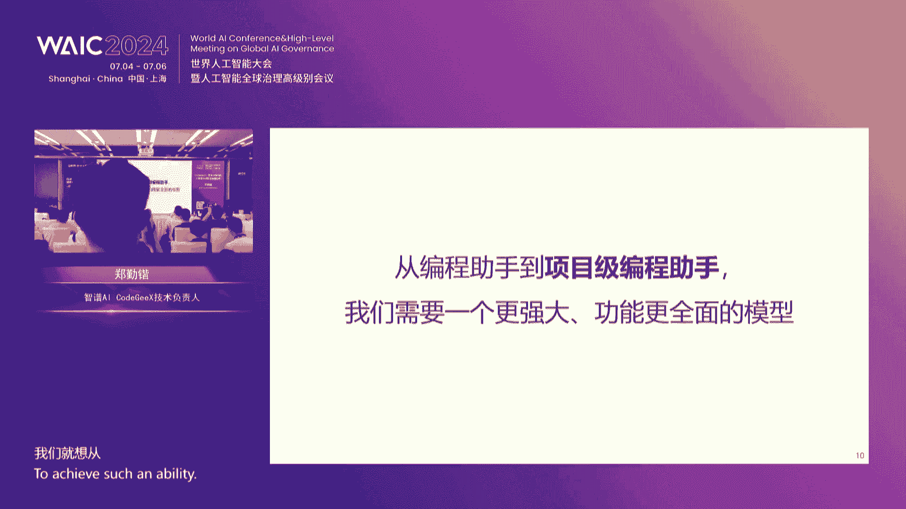
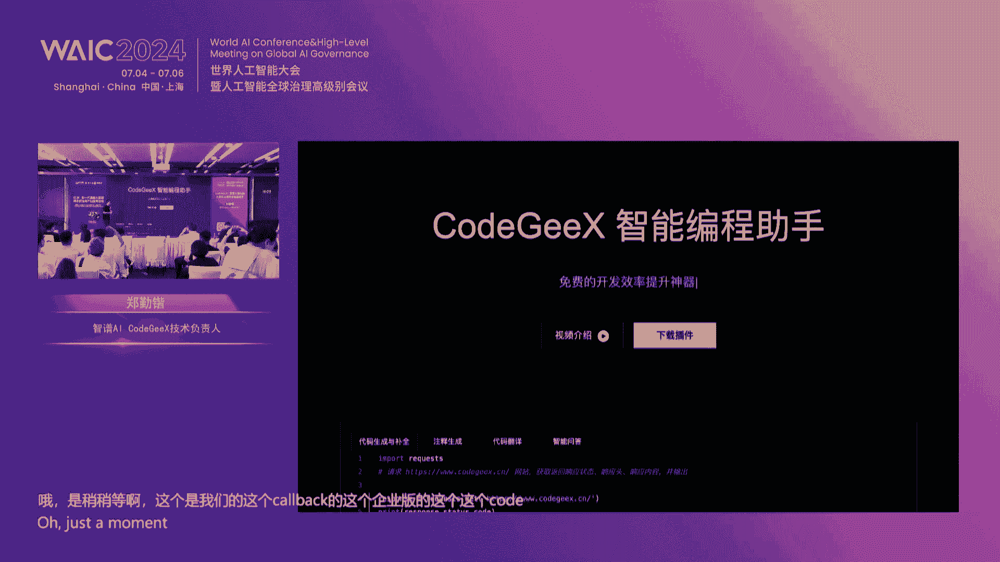
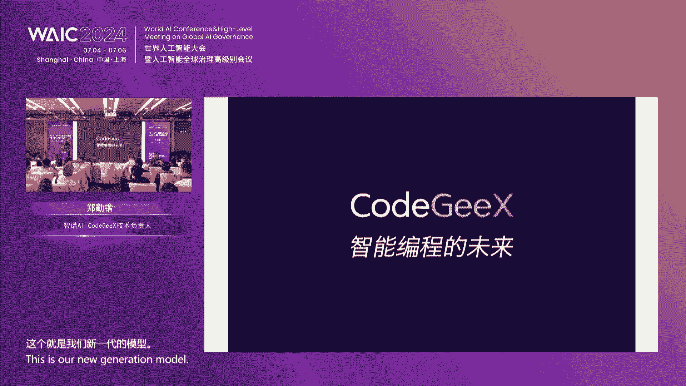
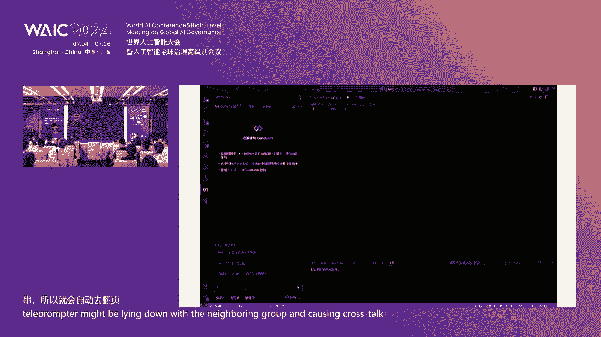
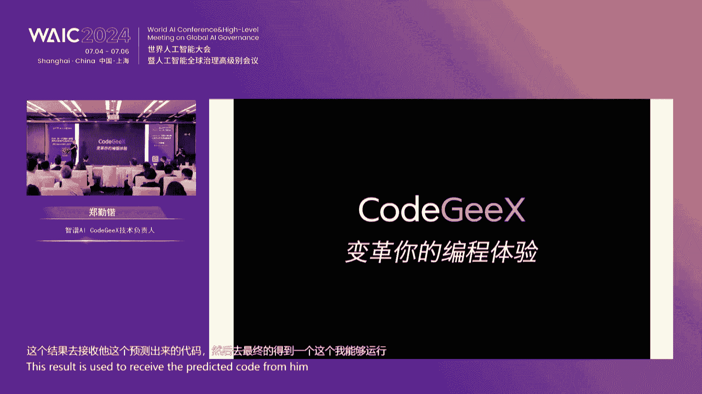
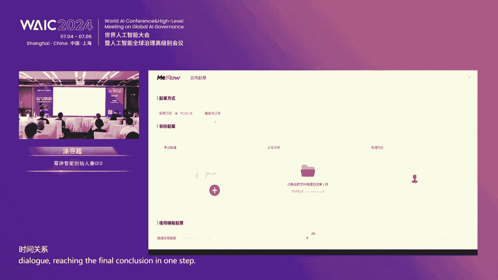

# 2024世界人工智能大会（合集） - P36：20240705-GLM-新一代基座大模型技术前沿与产业应用论坛 - WarrenHua - BV1iT421k7Bv

嗯，可以呃，我们今天现场的各位嘉宾，各位朋友，大家下午好嗯呃。😊，我是今天的主持人AItime的何云，应该今天现场有不少老朋友呃，有一位老朋友连续4年说我我就来听你们的论坛。我明天下午还有一场。

他说他就每年每年感谢支持，感谢支持。然后呢呃也非常荣幸我们今年是第四年来到了这个WAC每年的WACC都非常的火爆。所以今年呢呃我们这是5号，今天下午的一场，明天下午还一场大模型青年说。

大家有兴趣也可以去听。那呃今年的今天的这一场，其实我们在去年同样也举办了一场呃GIM的这个主题论坛。我想知道现场去年有没有来的朋友，有吗？举一下手，我看看哇，还不少哇，你们是我们忠实的粉丝。

看样子非常感谢，然后今年呢其实关注点，我们可以去年来过的朋友们应该是知道去年我们也是做。😊，一个GM的专场，呃，因为当时也是人非常多，但是去年的我们还是偏学术。那虽然是大模型，但是去年大家更关注。

比如说我们现在大模型各个领域，各个方向呢是技术的发展。那今年呢随着这个大模型技术的发展。我们今年说大模型的，今年是大模型落地的元年。所以呢我们今年呢更多的可能是要关注大模型未来应用的场景。

然后大模型我们技术的发展，未来可以在哪些行业去去应用。所以我们今年的GM的这个专场呢，我们邀请了我们学术产业。呃，然后还有就是我们行业应用的一些嘉宾。那今年的嘉宾呢，我们也非常的荣幸啊，呃。

大家应该可以看到阵容。然后因为昨天也有人跟我说，说你们的嘉宾基本上都是这个清华的，我说是的，呃大家也可以看到我们这次论坛非常也非常高兴，这次又是可以跟清华大学就是。😊，工程实验室，还有东浩兰生。

还有智朴AI。然后我们一起来举办今天的GM的论坛。那今天论坛的大部分嘉宾其实都是呃来自于清华大学知识工程实验室。然后呃刚才他们也说，我们其实我们也很难得在今天这个场合去相聚。

那我们也是希望可以今天通过各位嘉宾的分享，有产业有学术，然后还有行业的应用和场景的应用，可以跟大家带来一个全新的视角，也可以让大家来更多的了解。

目前GM这个模我们模型的一个发展的情况和我们的场景的应用和我们在行业里的应用。呃，今天的论坛呢，我们也前前期会是几位嘉宾的这个个人的这种演讲。然后呢我们最后会有一个圆桌的讨论。所以呢我们在圆桌讨论环节。

我们尽量留一些时间，我们可以跟现场的观众放2到3个问题来互动。所以在嘉宾讲完以后，我们。😊，实是不开放问题，因为时间很紧张，今天的嘉宾有很多，干货非常多。呃，我们的论坛全是干货。

所以大家最好我们中间也不休息啊。今天我让大我让场地也是尽量多摆一些椅子呃，我们把提问的时间留作最后跟大家去交流。那呃在这里呢我先特别荣幸的先呃介绍一下我们今天到场的几位嘉宾吧。

因为还有两位嘉宾刚才说还在找这个地儿，所以我们先一一介绍一下目前到场的那首先呢由我们隆重的有请我们智朴的首席执行官张鹏张鹏先生。嗯。😊，张老师，现在大家应该很熟悉，一会儿张老师为我们做开场。

那其次呢有请我们呃浙江大学人工智能是人工智能学院这杨洋教授杨洋，欢迎杨洋老师。😊，杨洋老师也是毕业于我们清华大学KEG实验室嗯，青年才经。然后呃接下来我们旁边郑秦凯嗯秦凯郑勤凯先生呃。

也是来自于我们清华大学KEG实验室。秦凯负责了现在也是代码大模型。秦凯去年也也来这个来来到这个场子做做了一场分享。那我们接下来呢我们还有请我们的呃涂存超呃，涂存超先生是我们现在魅力智能的创始人。

然后也是将GM大模型运用在这个法律行业一会那个存招会跟大家做一些分享。那呃我现在话不多说，今天现场没有跟大家准备纸质的活动议程。大家可以看到右边那个二维码。呃，因为呃说实话，今年大模型大家都用起来了。

我们今年做活动，我们已经省去了我们纸质的这种的一个一个一个一个其实这样一一成本也高。而且我觉得大家。😊，看起来也不方便。所以呢很多人在问我们说你们的议程是什么？啊后嘉宾的PPT事后能不能分享嗯。

包括呢或者有一些介绍，我们全放在这个二维码里。大家可以扫一下二维码，其实是我们给大家做的这样一个今天专场活动的一个智能体啊，我希我们也是希望我们可以用大模型的方式来进行交互啊，大家呃就是我们在活动后。

我们可以跟各位嘉宾确认后，我们把PPT相关的PPT可以审核过以后，我们会传到这个呃智能体里，大家可以通过智能体去下载。OK那我们今天话不多说，我觉得其实大家来都是来听这个干货的啊。

我们今天来我们非常荣幸有请我们今天的开场嘉宾张鹏老师来有请我们的张鹏老师给我们带来我们大模型落地应用的探索。😊，呃，大家下午好，呃，可能是不是有点困啊，这个上海这两天确实非常的热。

这个室内室外的这个温差非常的大，走到大马路上，你会感觉。一种火辣辣的感觉，就跟今年的这个WIC的这个现场氛围一样。

那很荣幸大家很多老朋友又来到我们这个现场来跟大家一起来分享我们过去这一年当中的一些进展的情况。可能比较关注我们的呃朋友可能也对我们最近的一些进展呃，有有所了解。

所以今天呢我们论坛的这个这个标题写的是前沿和应用落地。那呃我就。代表公司代表这个我们的团队先跟倒过来，先讲一讲落地应用，跟大家汇报一下。然后前沿呢会交给几位老师。

还有我们的其他的技术的同学再跟大家来讲一讲。所以我们今天的题目是大模型的落地与应用探索啊，这是当然这个呃这个历史大家都比较清楚了，我就不再过多的去赘述这件事，所需要说的事情呢是质朴到今年为止啊。

6月份刚刚满5周年。也就是说我们质朴在大模型这件事情上已经走过了4个多的年头。所以在这件事情上，我们对于大模型的这个认知还是非常的深刻。尤其是大模型的这种泛用能力和跨模态的这样能力。

是目前我们认为人家坚定不移的认为大模型落地应用当中所需要考虑的重要的这样的一些点。所以如何来用好大模型，我们要从定一性原理来考虑。那这些原则大家不要忘记。当然这个我们的今天的论坛的标题里面。

GIM是怎么来的？general language model怎么来的啊，就是智朴全资研的一个大模型的预训练框架。general language model。

当时我们是融合了国际上比较先进的一些啊大模型的算法框架，包括谷歌的berrt，就是自编码的这样的一个算法框架，还有GPT的这个呃单项注意力的这种深成式这种框架。把它融合在一起一起之后。

形成了一种特有的预训练的框架。那这个预训练的框架，在整个的大模型的这个生态的算法生态的这样的一个志玲当中，还是独树一帜的。也是唯一一个由中国的团队原创的这样的一个大模型的框架。那么这样的一个框架。

其实它除了是我们自己。原创的这样一个算法之外，其实他确实是有他自己独到的地方。首先他把早期的自然语言理解和生成的任务，我们把它有机的结合到一起，做了一个统一的框架来描述它。然后其次呢。

他解决了部分的解决了大模型的幻觉问题。因为。我们说双向注意力，它会比单向注意力要更加入更多的计算量。这个更多的计算量所带来的结果就是在某些问题上，它会要比单纯的生成式的这种方法。

要更好的来能更容易的来控制这个幻觉性的问题。当然这个效果我们也得到了一些验证，在这个国际性的评测上确实是取得了不错的这样的一些效果。而且可以看到呃相对比较不错的指标是什么呢？是鲁棒性和校准误差。

那在这些指标上体现出来的结果，就是大模型的本身的这种幻觉性问题和生成内容的这种一致性的问题啊，这个是我们现在目前大模型也是在落地应用当中急需要解决的一个问题。说明也就是说在这件事情上。

GM算法框架还是有自己独到的地方。当然基于这样的一个算法框架呢，我们是做了呃几年的这样的一个研发的这个过程。这个中间呢我们是。完全对标世界最顶级的GPT系列的模型，呃，一步一步的这么走过来。

早期的我们稠密的千亿的呃参数量的模型GM130B比这个GPT3要晚发布了两年多两年3个月的时间到今年年初的呃这个1月份的GM4以及呃5月份我们呃6月份刚刚发布的这个5月份520的这个爱心版GM4的这个能力。

已经追上了GPT4，甚至是GPTGP4t这样的一个版本的水平。也代表着我们在呃自主可控的这样的一个道路上自研的这样的一个道路上，确实是取得了一定的追赶的这样的一个效果。

当然这个呃我们说经过这么多年的奋斗。我们呃终于形成了一个完全跟open eye全限的模型产品对标的这样的一个模型的系列。但是不是说这些模型的这些系列，就是我们终极目标，当然不是。啊。

后面我们会再讲说如何把这些模型的能力，模型的这些产品，它的这个呃模态。做进一步的统一啊，当然今天不是我们的重点，会交给各位老师，各位研究人员来解释这些问题。那重点是在于说我们GM4到底能做什么样的事儿。

他的能力在实际应用当中到底能除呃除了在刷榜之外啊，到底能解决我们什么实际的问题。你一看到说我们现在的长文本能力已经达到一兆。大家就说啊这个。这个上下文的长度越长，能解决的实际问题越多，确实是这样。

所以哎在长文本的能力上，GM4代已经可以做到以兆的长文本的百分之百精准召回。也就是说。90万字左右的三体三部三部曲的这个小说，它可以一次性读完，然后在一分钟之内一次性读完。

然后回答你的任何的关于小说内容的问题。跨活态的能力在图像理解等等这方面，视觉理解这方面的这个能力有了长足的进步。我们已经可以做到。跟GPT4V的能力齐平，甚至是超越GPT4V。当一看到下面这张图。

是我们直接拍的一张这个T恤衫的这样的一个图，它能读取里面的这个内容，并且对做出相应的文字的解释。然后在这个智能体的能力上，我们基于GM模型的这个能力，能够让普通的用户。

哪怕是不会编程去自己开发GM的这种快速的开发GM的应用和智能体。包括今天的我们的这个呃刚才说的议程的这个智能体就是这么开发出来的，是我们的airtime的小伙伴，他们不会写程序。

他们自己来完成的这样的一个开发的工作啊。哎，sorry，这个为什么PPT会自动跳？然后呃在这个过程当中，其实我们更多的关注是呃很多的经力也关注在说如何让我们的模型能够快速的应用落地。

那这里边离不开跟底层算力的结合。大家知道，除了这个英伟达的这个呃算力以外，国产的这种算力也是在最近的这段时间有了非常这个长足的进步。在从2011年21年开始，我们就跟国内的这个算力的厂商一起在合作。

在解决这个。解决这个算力的这个国产化的适配的问题。所以我们很早的在国产化的算力平台上进行百亿甚至是千亿级别的模型的训练的这种实验。在这个任务上，其实到目前为止呃，也仍然是一个不是太容易能解决的问题。啊。

大多数的这个呃这个国产心理呃算力的这个芯片啊，还很难做到在这么大规模的模型上呃进行稳定的训练。这也是得益于我们在于在算法以及算子等等底层的这些能力上有了很多的这种积累。

目前为止呢已经有呃40多款芯片跟我们进行了这个适配。应该是你们打开了那个PPT自动跳转的那个功能。那个呃。不仅是我们做了那个适应性的算法适应性的这种适配。而且在实用性上，我们也在这段时间之内。

我们得到了比较快速的这种进步。从最早的勉勉强强能够把算法跑起来。到现在目前为止，已经有好几款芯片，我们能够实现训练推理的性能跟主流的。因为拿的主流芯片相媲美。

或者说能做到百分之七八十以上这样水平的这样的一个程度。我觉得这个进步也是算法和我们的这个底层的芯片公司一起努力的这样一个结果。当然我们说今天讲应用到底这个应用能帮助大家解决一些一些什么样的实际的问题。

啊，大家经常的说应用层面呃会说有to B和to C两大类。虽然我们认为在AI这个时代里面，to B和to C可能并不会有那么明显的界限。但是啊我们的今天呢可以看到我们在呃to C端。

我们的个人的解决方案当中。呃。个人的解决方案当中，我们是努力的用我们的大模型的能力赋能我们的每一个用户，每一个个人。当然大家会觉得说用大模型到底能产生什么样的效果。我相信在这样的一个时代里面。

更多的是把大模型的能力或者AI的能力应用在个人的效能的提升上，尤其是在工作学习和生活当中。当然你说娱乐这个事情算不算，也算。但是我觉得更重要，大家更期待的是能帮助你去完成一些工作，一些学习的任务。

甚至是复杂的任务。这就是我们说的AI for everyone人人都拥有自己个性化的AI助手。我们的这个智朴青言作为一个平台。一个APP的平台。

就提供了这样的一个AAI的超级助手加个性化智能体的这样一个能力。呃，可以实现多方位的这样的一个能力的集合，包括像搜索全网信息给你做总结，解读超长的文档，给你呃生成相应的这种sary呃。

帮助你去生成各种类型风格呃长短，然后质量的这些质量比较高的这样的一些文案，然后甚至是帮助这个小孩子或者说创意工作人员去把自己的想象力转换成视觉的图像。啊，甚至是我们说让普通人即使不会编程。

也能够借助大模型的能力去构建自己的AI应用，自己的一个个性化的智能体的。数字分针。大家如果有有。时间去展馆看看的话，大家可以看到我们展台那有一个老罗的数字分身。

它的背后就是我们的一个老罗给老罗专门做的一个智能体的分呃一个数字分身啊，他非常的有意思。那基于这个。啊，基于这个我们的这个智能体的能力，我们呃目前在平台上已经上线了这样的一个呃智能体的中心。呃。

目标是让AI人人可用。我们在这个智能体中心当中集成了大量的这样的一些外部的工具。比如说思维导图流程图，呃，飞书日历WPS办公工具等等等等这样的一些呃工具，集成到我们的智能体中心当中。

并且把这些智能体的能力交给大模型去使用。你只需要是呃普通人只需要通过自然语言来描述你的需求，就可以来调用这些工具。它就像你的一个呃非常惊艳老道的或者是成熟的这样的一个助手，来帮你拆解你的需求。

来形成相应的这个任务解决的路径和方法。然后在每一个合适的位置上调用合适的工具来满足你的需求。所以最终我们会在平台上提供智能体的这样的一个中心也能。提供一个面向开发者的assistant的API啊。

就是把这个智能体的能力变成一种API你可以去嵌入你自己的应用或者系统。然后现在目前在整个这个平台上呃已经有呃超过30万的这个呃智能体在呃服务这个所有的这个用户。那么这些智能体绝大部分都是。

我们的普通用户个人来完成的，并不是我们的工作人员或者说非常专业的人员来完成的。其中不乏有一些精品。比如说前段时间刚刚高考完。

有人有老师就在上面做了一个呃智能体来解答考生对于高考志愿报志愿的这样的一些疑问。哦，非常迅速的几天时间就获得了几十万的访问量。这个也是一种啊非常典型的普通人来使用AI能力赋能的这样的一个场景。

那么这里面有很多很典型的例子，刚才举的是最近发生的一件事情。那当然在呃更早的时候，在6月初的时候，我们为普通人呃，就是甚至是小朋友，只有1岁2岁的小朋友办了一次这个叫做想象力进入现实的这样的一个画展。

哪怕是不会写字的小朋友，他也可以把他自己的想象力用自然语言的方式描述出来，借助我们智能体平台的能力去生成出五彩斑斓的图画。然后6月1号的时候，儿童节那天，我们在北京798专门为这些小朋友办了一次画展。

过来参观的都是小朋友和家长，还有老师，他们觉得这样的活动非常非常的有趣。你可以看到小朋友们的想象力真的是非常非常的有意思，非常非常的天马行空啊，这是首次我们可以让小孩子的想象力。

很快捷的很方便的变成进入到现实啊，这个活动也得到了这个这个一些官方媒体的那些报道吧。然后第二件事情呢是。第二件事情呢是有一个记者啊，一个著名媒体的记者。他其实自己本身的志向是当去当一个心理咨询师。

当然呃职业的原因，他可能没有太多的时间啊，仅仅是有一些兴趣啊，然后想去做这件事情。所以他把他自己写的一些关于心理咨询的这样的一些内容，还有这个一些标准的书籍的这样的一些知识这个内容。

输入到这样的一个平台上。构建了一个心理咨询的这样的一个智能体，开启了自己的第二职业。这个智能体在呃整个平台上也是非常。火热的也是非常流行的这样的一个竞能体，帮助他自己身边的朋友解决了很多的问题。

然后另外一个呢，当天我们活动的当天，其实有一个9岁的小朋友到了我们现场，他借助我们智能体的这个能力和我们的这个AI的能力出了一本书。9岁的小朋友写了一本书，叫AI少年火星生存大挑战。

这本书我还看我给他写了一个很简单的这样的一个推荐。这本书呢他是借助AI智智能体的这个能力和他自己的这种想象力以及对话，用对话的方式来完成整个过程的就是书的这个编写的这个过程啊，这非常有创意也非常有意思。

大家感兴趣的话可以看看。啊，所以你可以看到说借助于呃大模型以及基于大模型的这个APP青年智部青年APP的这样一个能力，可以实现每一个人赋能与我这个时代的每1个个体最大的1个AI能力的。杠杆。好。

那对于个人来说，可能这件事儿还比较简单。大家无非就是说呃根据自己的个性化的需求去调用一些工具，完成一些日常的一些事情。但对于企业来讲，可能这件事情就会稍微更复杂一些。那如何在企业。

尤其是大型的企业内部去落地大模型的能力，去解决实际的生产业务当中的这种问题。其实这个是这个时代大家可能更关注的问题。从昨天开始开幕的第一第一第一场的这个主题的开幕的这个报告开始，其实大家都在。

讨论这个问题，如何在产业进行落地，如何来真正的形成。这个优质的生产力。对，然后在这件事情上，我觉得我们呃的思考质府的思考。通过过去这一年多时间的这个经验来看，我们还是有非常多的经验可以呃需要给大家。

不敢说叫做best practice，就是不是不一定是最好实践，但是可能是better practice，就是更好的经验。那么基于大模型，尤其是GM四代在这个智能体能力上的这样的一个突飞猛进。

以及使用工具的这样的一个能力，突飞猛进。我们可以为企业。内部去实现一种原生的AI架构IT架构。啊，使得这件想法成为了可能。我们可以想象一个企业内部它的IT系统是非常复杂的。啊。

一般来说都会涉及到很多方方面面。比如说像OA系统客户管理的CIM系统啊，会议的系统呃内部的这个数据库知识库，然后还用户管理，然后有一些安全检测等等等等等等等的这样的一些系统。

这些系统可能有来自不同的开发厂商，可能来自不同的时间呃，这个版本等等一系列的这种呃积累，我们统称为数字资产。那么这些数字资产想要把它玩的溜，管理的好，使用他们来产生更大的这个价值，其实是越来越挑战。

持续的需要进行这个系统的升级，维护新业务的开发。很多的这个业务的开发都依赖大量的软件工程人员做需求的分解理解。软件的设计、编码、测试上线的维护等等等等。那么在这件事情上，我们的AI能起到什么样的作用呢？

或者说我们大模型能起到什么样的作用。我们期待大模型能够在其中承担非常重要的一个叫做人机协同的辅助的这样的一个。作用。它可以接收人类对于业务的自然语言描述的需求，然后把它拆解成相应的执行逻辑。

然后使用内部的数字资产所提供的基础的原子的能力来完成这样的一个业务流程的实现。那么当然底层是基于GM系列的这种O tos能力，然后各种模态的这种大模型的，比如说代码的生成的能力，还有。

跨模态的内容识别的能力等等等等。我们希望未来可以构建在企业内部，构建人机协同的智能体这样一种AI加原生的AT架构。这件事情我们已经在呃我们的一些比较深入合作的客户的实际环境当中再做一些尝试。

那么尝试的结果呢也取得了不错的这样的一个喜人的效果。当然在做这件事情之前，我们不是说这件事情就随随便便或者说任何一个企业都能够去做这样的一个落地。那么这里面其实首先大家都会问一个问题。

其实用户都会来问我们问题。我们什么样的条件下，我能够比较好的来实现这个投入产出比。那这里面就涉及到一个我们提出了一个概念，叫做企业的大模型落地的一个就绪度这样的一个概念叫LM ready这样的一个概念。

我们分析完很多的用户案例之后，会发现，其实如果想要实现AI原生的这种业务架构，其实对于各方面的这种企业自身的各方面的能力，其实是有一些要求的。比如说在技术站方面。

开发AI驱动的这种应用是构建是需要全新的这种技术架构的。对你底层的这些资源呃，技术组建。等等开发的人员等等，这些都是有相应的这种要求的那你的技术站是否能够满足大模型落地的这种需求？如果不满足。

可能你就需要去构建很多的基础能力。那这个周期相应就会拉的比较长。然后在管理端。大模型技术的这种成功成功实施，其实是需要对于企业内部的IT架构和组织架构进行比较大的这样的一个调整。

举一个非常简单的一个要求呃，举简简简单的例子，我们尝试把这个co，就是我们今天待会儿会介绍的代码生成的这种大模型。落地到一个研发为核心的这样的一个企业部门。后来会发现，如果配合上一些管理上的手段。

是可以更好的来激发大模型工具的这种效果的。和你不采用这个相应的管理手段是有比较明显的差别。所以这里边关于企业内部的管理制度上的这样的一些就绪度，也是考量的一个范围。那更重要的当然大家比较容易理解的。

像你的内部的数据信息知识的这种就绪度，你的数据是否规整，收集的质量如何？对吧然后你的整个的这个高质量数据构建的这种peline是否的。具备这些条件都决定了你呃大模型在企业内部落地的这样的一个速度和质量。

那基础设施就不用提了，这大家更容易理解了。呃，GPU你够不够呃，是买得着还是买不着，还是要用国产等等等等。这些问题可能都需要做一个决策。最终这几个维度结合结合起来。

最后还有一个业务的啊决定了你的业务的适配性。你的业务是否适合把AI的这个能力，大模型的能力放进去。我们当然现在承认AI大模型还做不到百分之百的所有的任务，他都能泛用。有些任务他确实不太适合让他来做。

大家也知道，现在大模型还存在一定的幻觉性的这样的一些问题。所谓的幻觉性就是说比如说你让他计算一加一等于几，他可能90%以上，905以上的概率他都能算对的。

但是如果你让他计算一个比如说四位数或者5位数以上的这种四则混合运算，他就算不对了。他不再调用不调用外部工具的前提下，他是算不对的。就跟你的大脑非常像。人就是这样的。不在不在使用工具的前提下。

有很多看似非常简单的任务，他其实是做不好的。所以如果你强求他去做这样的任务，他其实是怎么着，他也做不好。所以你的业务是否适配这件事情。你的业务是不是需要一个类人的智能去解决这个问题。

还是说你只需要一个简单的计算器，就能解决这个问题。这个事情你也要做相应的这种分析，并不是说他一定会。包治百病好，那么在。这个基础上我们呃分析完这些事情之后，我们。这个提出了一个方法论。

叫企业就绪度的这样一个方法论。我们在每一个维度上，刚才说的这5个维度上提出了一些非常呃简单的一些量化评价的这样的一些一个list。大家可以像那个在做这种各种的这个性格测试啊那种方法这种方式一样。

对于企业内部在各个维度上的这样的一个心理，我相信这是每一个其都希望获得的这样一个事情。当然更重要的是我们评价完之后，会提出会针对性的给出一些建议的实施意见。比如说在基础设施方面，可能你说我们现在的。

GPU集群量大概是多少？那么如果我要落地一个什么量级的，比如百亿或者千亿级的这个大模型，那我的需求是多少？这个中间的差距是多大？有什么具体的条件？我们会针对性的根据你的这个评估量表。

会给出相应的这种建议，咨询的建议，包括团队建设方面，你需要配合呃多少的团队什么样的团队啊，你的产品的设计方案应该从哪个方向去思考。就像我们开场说的，你不要站在大模型最强的这个能力方向发展方向的方向。

这个路当中去阻挡去去去阻挡这大模型的发展，或者说呃去冒着被大模型能力覆盖掉的这样的一个风险去设计你的产品。啊，所以在这方面，我们给出了相应的这样的一套一整套的就这个咨询的方案。

包括了一系列的培训的这样的一些方案。那么经过了一些实践证明，这样的一些方案的咨询和呃，尤其是涉及到管理，还有人员等方面的这样的一些培训，可以大大的提速我们的大模型应用落地的这样的一个呃周期。

以及取得更好的效果，在短时间之内。那么利用这样的一些方法论，其实指导了我们早期的一些跟呃客户的一些合作。比如说在这个一些呃在一个保险的业务这一块，大家知道这个核保的这个事情啊。

是保险公司业务当中一个非常重要的一个。场景。那么买了购买了保险的客户，他在出险之后，他会去跟保险公司这个提出核保和理赔的这种要求。整个这个过程，他其实是非常的严谨呃，流程化。我需要提交什么样的资料。

这些资料要经过什么样的审核和检查呃，符合不符合我们保险产品的理赔的这个要求，以及理赔的这个比例和额度到底是多大。它是有一一整套业务流程来决定的那整个这个过程当中呃。

其实是涉及到大量的信息的交换识别、鉴别审核以及。保险业务人员和客户之间的沟通的，它是一个完整的业务流。这样的一个业务流完全呃执行下来。当然比如说像车险，这个就非常简单了，对吧？已经高度的自动化。

可能你拍上照片传上去，远程的工作人员稍微看一看照片，OK他就赔了。但是一般的保险产品还存在着大量的需要人和人沟通，当面沟通，甚至来回多次沟通的这样的一个过程，包括材料的审核不合不合要求的材料。

你可能要重新提交。比如说你拍照拍下来的这些医院的检查单可能都识别不好或者不清晰，你需要重新去上传等等。这一系列的这种过程，其实是涉及到大量的业务流程以及人和人的交互。那么在这个过程当中。

基于我们大模型的这个能力。在整个业务流当中去帮助保险公司去提升工作效率。同时也帮助这个。买购买保险的客户用户啊，这些保险的被保险人，他去提升的改善他的这个体验。所以在降低了整个核保流程的这个人工比例。

这个前提下，反而是让这个用户的满意率是是得到了一定的提升。这跟我们一般的这种以前的这个直觉经验是不相符的。以前大家可能都接到过，比如说那种电话客服，对吧？很机械的那种电话客服。

一般的客户对于这种电话客服，这种自动化的电话客服的满意度是很低的。绝大部分情况，95%以上的情况下，可能你都会切到人工上去。总觉得那个东西太笨。但是现在目前你会发现其实已经能够做到。跟人差不多。

甚至比人的效率更高。因为它的响应速度更快，他没有这个这个叫做带宽的限制。只要你的算力足够，或者说你的。网络的速度足够，也是可以同时借更多的客户的需求的那反向过来看这件事情。

用客户在这件事情上的用户体验也会得到提升。也就是说他的比如说交互的这个及时性，还有来回的整个流程的耗时都会得到有效的控制。也就是用户体验得到提升的一个根本的原因。啊，这是一个案例。

那么下一个案例是我们呃结合了跟这个呃那个金融的客户来进行的一个一个一个案例的尝试。那对于企业贷款的这个发放，其实内部是有这个一些严格的要求。比如说对于企业的财报进行这种分析编写出相应的这种报告。

作为这种发放贷款的这种要求。啊，这里边我们基于这样的智能体的能力以及自动化的或者人机协作的自动化的呃，形成这个呃生成这个。财报分析报告的这样的一个工具。我们借助了大模型的智能体能力。

快速的去实现这样一个业务流程。你会看到说可能一般的传统的角度来看，我们要去做这样的一套IT系统，不是不能做，也能做，提高它的自动化，对吧？那可能需要呃一个需求分析人员去分析这个需求。

来设计出整个的这个需求的一个。清单。然后呢，软件设计人员来设计这个软件，并且来一大堆的开发人员来编写代码，把它变成一个可执行的这样的一个系统。最终上线测试。当你看到我们借助智能体的能力，我们快速的。

业务人员就可以通过这种拖拉拽的这种方式融合我们的现有的大模型的能力，以及现有IT系统的这样一些能力，快速的去构建这样一个财报分析生成的这样的一个应用，非常快速的就可以上线。可能这个耗时在小时几。

最多也就是天几，以比原来这个按月来计算的这样的一个系统研发周期是要提升非常非常多的。当然呃诚实的来讲，整个这个过程还没有我们想象的那么聪明。

就是可能我们原先想象的可能说你只是用自然语来描述这样的一个需求。我需要有一个这样的一系统，能帮助我们结合什么样什样的数据去生成一个财报分析的报告。啊后它就能自动的把你这个东西生成出来，这是我们的理想。

对吧？想象当中很美好的一个想象。但当前我们可以看到说它已经至少能够帮助你人机交互式的帮助你去完成这个工作，已经大大的提升了我们的效率。这就是我们说啊往前坚实的迈出了一步。

等我们的模型当我们的模型能够更聪明的时候，理解更多的这样的一些呃这个这个你的需求的时候，他可能就会有更好的这样的一个效果，甚至是自动化的来生成这样的一个过程啊。

这个是我们已经啊现已经完成了这样的一个啊现场的这样的一个demo。啊，大家感兴趣可以呃去线上去去体验一下啊，有一个demo。我们在现场展览那边。当然这个有一些其他的一些应用。比如说在政呃这个领域里面。

我们已经有一些实际在运行的一些案例。比如说在广东政务服务平台上，今年年初的时候已经上线了一个关于。这个政务问答的这样一个平台呃，试运行了已经最近半年的时间。

已经有几十上百万的这种呃市民通过这样的一个系统获取了这种政务的这种服务啊。这里边也是大大的减轻了这个政务服务人员的这个工作压力。在商业化方面，我们呃其实很早的时候就提出了。

应该是呃率先的提出了mas就modize service的这样的一个模型及服务的理念。这个理念里面我们把模型当做一种基础的呃这种。我们叫基础的呃能力，或者是叫做基础的资源。

基于这样的一些基础资源呢基础设施呢来向我们的客户来提供相应的这个服务。那么上面包叠加了我们很多的这种技术的研发的这种结果。包括比如说推理的加速，还有围绕着模型的一些功能的套件。

像呃全仓微调的模型精条的这种呃工具链，还有像呃呃ra的这种检索增强智能体的工具O tos工具使用能力，甚至是包括了安全合规的要求的这些组件。

我们都能够以云服务或者是本地私有服务的这种方式来提供给我们的客户，各种类型的客户。现在在我们的整个。呃，据一个不完全统计吧，整个的我们的呃to B的，或者说面向我们呃客户的服务的平台上。

已经服务了超过40万的呃注册用户，我们的客户。呃，覆盖的这种行业的解决方案已经有超过16个啊，包括了像汽车制造呃，金融医疗营销等等各个方面。呃。

在今年6月份我们发布的这个新一代的这全新的这个开放平台比igmod点CN上呃，引入了我们最新的四代的这种呃一系列的新的模型，包括1个9B的9。4亿参数的这样的一个呃模型啊，我们把它开源了。

并且呃用这种呃API的方式引入了我们的平台。因为它足够小，足够性能足够强，它的吸引力还是非常不错的。你只需要花一毛钱就可以来享受100万token的这种呃这种。使用量，但是它的性能一点也不差。

综合能力提升了40%。那么同时还上线的还有GM4L和GM4，我们叫GM4爱心版520爱心版呃，更大更强大能力全面提升，综合的能力提升了接近12%啊，当然也会融合我们最新的推理，加速的能力。

所以它的成本其实也更便宜。那这里边提供的工具里边也包括了像一键微调。大家都知道，模型是可以根据你的需要去融入自己的数据去做这种微调，让它来更贴合你的业务。这里边有大量的工作需要去做。

比如说准备训练微调用的训练数据，创建微调的任务，去部署这个微调到相应的这种算力上。整个这个过程，如果你在本地自营操作，你没有一点的呃开发能力，甚至还比较强的开发能力，其实很难做的那在我们的开放平台上。

其实你都可以很简单的啊通过点击这种方式拖拽的这种方式就能完成相应的这个过程。训练的成本也。减少了87%，训练速度提升30%，整个的数据利用率也得到有效的提升。然后通过一段时间的这样的一个呃运营。

我们的平台上已经聚集了大量的用户。呃，现在已经超过有40万家的注册用户。然后每天的token的消耗量就调用量已经达到了啊600亿这样的一个规模，整个的增长的速度还是非常的快的啊。

这个得益于我们GM四代模型的这个在平台上提供的极高的这种一个性价比。模型的推理能力不断的在优化。但是我们的性能。得到了保证。然后在价格方面也持续的在啊压榨我们的这个成本。

最后呢就是说我们呃整个的这个呃AGI通向AGI的这条道路啊，其实呃路程啊漫漫。然后呃我们智普I在这件事情上还是秉持着非常坚定的一个信心在往前走。在这个过程当中。

我们也相信技术的升级会给我们带来更多的机会，也给我们带来更多的这种可能性，也给我们的用户也带来更多的生产力的价值。但同时对于我们智普I来讲，在公关技术创新的同时，也需要持续的沿途下蛋。

把我们的技术随时随地的转换成相应的这样的一些呃应用，相应的这样的一些能力啊，相应的这样的一些服务，帮助我们的客户去取得更多的更大的呃自己的价值啊，从而形成一个价值的链条。

那从这个安全和可持续发展的角度来讲，智付I也呃承担着，或者说我们认为我们自己也有相应的这种社会责任。呃，5月份的时候，我们智付AI也与全世界哦15家顶级的人工智能公司就AI开发的这种安全承诺达成了一致。

签署了一份人工智能安全的这样一个承诺，也是唯一一家受邀的这个国内的这样的一个人工智能的公司来参与这个协议。这个15家的清单。在这里边。你可以看到呃基本上都是非常知名的这个I这个呃AI的公司。

同时在国内呢，我们也积极的参与了很多的这个人工智能行业和这个团体的这样的一些标准的制定过程。我们希望通过这样的一些努力，能够呃及早的统一这样的一个认识。

然后帮助大家去解决面面对这个AI所带来的这样的一些未知所带来的这样的一些恐惧。啊，就像昨天我在呃开幕式的主论坛的这个产业论坛里讲的这样一个问题。呃，任何的一次技术革命。

都会给整个社会都会给大家带来不同程度的恐慌或者恐惧。那如何来面对这些问题？与其我们呃惶惶不可终日，还不如大家坐下来，仔细的冷静的思考一下这个问题。那我们知道问题在哪。

大家齐心协力达成一致来解决这样一个问题。我觉得这才是正确的道路。好，感谢大家。我的报告就到这里，谢谢。嗯。呃，谢谢我们张鹏老师。因为大家也知道智普AI是这个大模型产业落地最早的企业之一。

所以呢听到刚才张老师的演讲。我其实深受感动，就是说我们不仅要引领技术的发展。我们其实更多的还是有一些社会的责任。我们希望AI是向善的，我们希望就是说AI在未来的呃落地场景中对人类的贡献。

我们希望是能够促进人类的一个发展和可以使大家去更好的生活。所以呢其实今年大会的主题，大家也看到了安全和治理，其实是谈到了非常高的一个高度。那今天呢我们其实也安排了相应的我们的主题报告。

所以黄老师呢我们接下来我们就有请黄老师给我们带来就是大模型的这个安全和超级对齐。也是我们现在其实各行各业非常关注的那有请我们清华大学。教授黄明烈老师，有请黄老师。Okay。喂。呃，非常非常抱歉。

刚才那个跑跑错了地方，然后所以。找到另外一个地方去了。呃，然后我今天来讲的其实偏学术一点。所以我不知道今天在座的各位就是哎，我看有多少是来自咱们学术圈的能举个手吗？啊，不太多哈不太多。

所以所以可能没关系哈，就是呃那我今天讲的可能就是刚才呃彭总已经讲了一个非常好的面向工业界场景的一个一个talk。那我今天讲的是偏学术圈一点。那么来看其实呃其实AGI现在已经是大家讨论的很多了，对吧？

包括前段时间我们国家主席也专门针对这个通用人工智能提出了这样的一个概念。那么只是哈那么op呢其实对于这个AI的定义呢是因为是一个高度自制的一个系统。其他关键词就是叫nomous。

然后gary这个人是T的一个认知科学家哈。他讲的呢就是说其实是说跟人能够匹配的，而且是以非常这种可靠和非常经济的方式来跟人能够匹配的这样的一个智能。但是我们看到其实这样的智能水平越来越高的时候。

其实我们对安全的问题就变得越来越。😊，严重哈，就比如说呃他有各种各样的这种内容的安全。然后包括我们讲的呃耐用。然后还有的就是说我们怎么样确保就是呃这个对齐是真正。

因为对齐是我们现在AGI和那个大模型里很重要的一个步骤，对吧？我们对齐实际上是变了一个非常重要的一个研究的点。当然了，这个这个我我就我们就可以跳过我们知道现在的大模型已经非常智能了，对吧？

那么所以我们要试图回答的问题呢，就是说。就说呃在这种超级智能的系统里边，我们怎么样去做这种所谓的超级对齐。然后这个超级对齐可能呃刚才那个彭总最后一其实也提到，但可能大家不知道什么是超级对齐对吧？

就可能听到一些新闻的宣传，但是他的意义和他的他的定义到底是什么，其实好像没有一个明确的一个一个说法，所以我今天大概会讲一下。

那么那么我们来看就是AGI呢其实我们我们知道就是当我们I真正到来或者宁静的时候，其实大多数的I系统都会比我们大部分人都会更聪明，就89人都更聪明。那这种情况下你怎么去监督这个系统。

以及呢怎么让这个系统进一步的去进化和自我提升，以这就是我们的一个关键的点，但这个概念是最早是op提出来的。但后来他们最近有一些人事的一些变动，对吧？那么但并不是说这个事情不重要，是。

说人家只是换一个地方，同样还是做超级对接和安全相关的这样的一个问题哈。那么我们来看哈就是在预训练阶段呃，到超级对齐到底有一些什么样的一些在数学的形式上会有一些什么样的改变。我们知道在预训练阶段。

我们一直做的是叫下一个ken？这下ken的意思就是你看我们预训练我们就是给一个作为输入然后有一个前缀小于然后生成我们最大化它的一个数据的一个似然。然后我们在2014年的候我们干的是什么呢？

我们的是序列序列的转换，就是我给你一个X序列你要生成一个Y序列比说我们做机器翻译，给一个英文的，然后生成一个中文的比说我们在做这个对话给一个tex要生成一个回复。

所以2014实干跟我们今天的大模型干的是同样的事情。比如说2020的们有一个的一个模型，然后不断的生成这种这种下一个词，那么使得这个。😊，很强的预测能力。那么我们再看SFT和RLHF阶段。

就是我们叫有监督的微调和从人类的反馈里边去做强化学习。它优化的是什么呢？它优化的是说我要有一个re的函数，对吧？RXY就给定这个XY我能够去判断大概我有多大的收益，然后呢，还有一个正则项。

就是呃西塔和PC塔和PFT就是我在呃微调的时候和我要去呃我在开始的时候有一个有一个分布。然后我后面还要去微调的这个分布叫PC塔。😊，那么那么其实这里边到底是发生了什么事情，对吧？

其实我们会有一些假设这个假设呢就是说我在呃比如说我在预预训练阶段，我是呃呃假设呢它的nex token是一个是一个 token，就是它不会出错，它是我们人认为它是一个最好的一个token，对吧？

然后我们在在这个这个RHF阶段，我们认为这个R呢是一个gden的re function，就是它是一个不会出错的这样的一个呃re的一个函数。所以这是它的一个基本的假设。

但实际上这个假设在超袭对齐的范射它是不再成立的对吧？所以你看我们从。😊，呃，我们从这个从这个instructGPT到GPT。

然后到今天的呃就未来的GPT啊GPTX比如说我们GPT5很可能就是用超级对齐的方式训练出来的哈。那么它的一个基本的假设就是它的呢它不再是g的，它可能有很大的噪音，我们叫we label。

所以呢就是我们确阶段我们是假设呢这个nex token是的在阶段，我们假设我们的不是要去构造这种preface data嘛，对吧？我们要去构造这个 data就是说哪个好哪个不好，那我们认为那个是。😊。

然后呢，这个reward也认为它是gden的。但是我们在s的阶段，其实我们认为呢他的这个人给的这个label呢，它就不再是不再是可靠的了。那我们来看这个曲线线，这个曲线是什么意思呢？就是看这个黑色的哈。

😊，就是当我们的AI越来越强的时候，你可以看到X轴对吧？我们在不断的演进这个AI的这个能力。然后纵轴是什么呢？是这个任务的复杂度。就是呃我们会让I去解决一些越来越难越来越困难的一些任务。但这个情况下。

其实人的能力基本上是一个是一个横线对吧？因为人的进化很慢人的人类的这个平均的智能水平，它都是相对固定的嘛。所以呢当我们你看当我们的AI越来越强，它能够完成越来越复杂的任务的时候。

这个AI呢它会super intelligence就是它一定会跨过人的一个智能的水平。在这个情况下，其实很多情况下就是那个交叉的那个点就是H会掉，就是它跨过那个点的时候，我们知道因为任务已经很复杂了嘛。

系统也很聪明，这个时候人就不再能够给出来非常可靠的监督，对不对？那这个情况下怎么办？所以这里边就是有一条那个嗯它为什么老老跳。然后有一条斜线。😊，它是一直是什么呢？就是叫over overs。

就是在这种情况下，我们人怎么能够持续的给这个模型好的监督，让这个模型呢能够持续的在超越人的智能的水平上继续的持续演进。说的是这样一个问题哈。所以呢呃这里边有很多关键的研究点。我们这个研究点呢。

我们叫做叫做vi to呃嗯。😊，到。叫ization叫做从弱到强的这种泛化能力。也就是我们怎么样用这种就是深度学习的这种泛化的属性呢，使得这个强的模型呢在这种弱监的情况下然能够持续的进行进化。

这是一个问题。另问题们叫s这个呢就是我怎么样用这个I系统或者是 human labor呢去助助我们去监督其他的强的模型这个学习。就刚才讲的那个斜的那部分。

还有就是valu就是我们怎么样能够去ate这种这种系统的对其到底是不是做的很好。另外一个就是我们怎么样去进行一些对抗性的测试就是我怎么知道我这个模型漏洞？有针对性的去测让变得更加的聪明。

这是我们的一个当那个他们做了一个了一个类这个呢就是你在经典的机器学习里我们是有一个很强的就是监信号。😊，很强的，比如说我们说是一个人，对吧？然后这个模型呢是比较人要弱的，它是个sdent model。

所以它会比人更弱。但是我们在super的阶段，我们面临的是说这个supervis呢，它其实没有没有那个机器那么强，反而更弱一点。那我怎么能够使得这个dent model呢能够学的更好。

然后所以他们就做了一个类比。这个类比呢就是说。😊，他怎么类比呢？就是我用一个模型去模拟这个呃这个teacher，但是他比这个stu那更弱一些，是不是？那这样情况下我们再去看他到底能够恢复多少的能力哈。

这是他们做的一个事情。所以就来到了刚才讲的这个图，是不是就是说我们的AI持续的演进能力越来越强的时候，我怎么在人不能怎么人能够给一些很好的这样的一个，得这个模型能够学得更好。所以这是我们的一基本的问题。

那我们做的一个最近的一个事情呢，我们叫做呃竞赛级别的代码生成啊，这个因为我们秦凯会不会讲一个代码模型，对吧？就是你可以看就我不知道有多少同学打过I没有打过的举下手。😊，杨洋打过非常好，对。

就是那种题目其实挺难的对吧？就是呃他会给你一道题面的那个题，然后给你一些测试的例子。然后呢，你给了这个测试的例子之后呢，你就要生成代码，你的代码呢就是他要通过他所有的测力。如果你这个测力能通过。

那么O你这个题目你就算过对吧？所以我们看这个任务到底有多难呢？就是我们找了一些打过打过竞赛的同学来做标注，然后大概他们要花68分钟的时间大概能够解决这个数据题里面56%的问题。

但是如果说他没有做过呃这种竞赛级别的代码训练的话，也就他可能学过加学过P这种向对象设计，他学过一些基本的这种知识的话，他要大概花74分钟，他只能解决30%的问题。

所以你可以看到就是这个任务其实很难的对吧？我相信在座的各位去解题也不一定能够解得出来。可能比在座的大多数人的这个难度要超出大。😊，大大多数人的这个难度。所以我们做的事情是怎么做呢？

那给了这样一个很难的问题的话，你怎么去你怎么去解它，对吧？所以我们做的呢就是说你看一个传统的复杂任务来了，那么这个大圆模型它怎么做呢？

我一般来讲就是直接让这个大圆模型直接生成一个 solutionolution，然后就去解就行了，是不是就是我们经典的做法，但实上这个方法不好不好的就是说这个任务太复杂了。

所以你你人就很难判断说这个结果对还是不对，而且你要去做标注的话要花特别多的时间，是不是所以我们做呢我们就把这个任务呢分成几个子任务，就是一个非常复杂的任务，先做一个分解compposition。

然后这个分解呢我可以分成比如说这个写这个代码，我要先写三个函数，对吧？写完这三个函数呢我再以一定的方式把这个三个函数呢调用关系搞清楚，那可能这个这个任务就解决了，是是我们写我们写尤其学那个P的候。

这个是是典型的一个封装，对吧？就是我把它先变成。😊，几个子任务，然后通过个子任务再去求解它。所以这是一个基本的思想啊。那这个基本的思想呢。

我们就大概design了一个大概的意思呢就是说我们去首先呢去sple一些让大模型成一些分解的一些ution。但这个分解不一定好？定们人就大概去标一我觉得这个分解的还个分解可能不太行。

这个函数那个函数可能不太然后我们再设计一个叫的de就是我知道这个分解比另外一个分解好，然后呢我们再去学一些比说函数学一函再一些的函数。然后通过这个方式我们来看看大概得到一个什么样的结果哈。

那这个结果呢就非常嗯就说我们发现就是即便是打过竞赛的个同学他用这个方法去做的话，他可以有2。4倍的加速就是他能够解的更快啊，这是一个如果是没有打过竞赛的同学呢他能做。😊，多快呢，他能比原来呢有3。

3倍的加速，就是我我去解同样的一个问题，我可以3。3倍的这个加速，这是一个哈。然后另外一个呢，就是我们发现一个非常有趣的，就是说如果是没有打过竞赛的同学，他用我们这个方法。

他可以做到跟嗯跟那个竞赛的同学，但是不用我们的方法同样的水平。所以你看到这一条位置和这条位置基本上是平平行平齐的对吧？就是说我我没有打过竞赛。但是呢我用我的方法辅助去做，那我能够达到。😊。

作为竞赛培训的这样同学的水平。所以这就是说很显然就是我们提供了一种方法，使得能够去求解这种非常复杂的这个任务。所以这是我们的一个方法。然后另外呢我们讲你看刚才讲了说up吧？

up其实我们是了严的认真的思考。就其实大概我们知道有一个框架，这个框架呢应该是说我们有一个是专门帮我发现漏洞的，这个不一定是针对安全的，其实也是针对任何的任务都可以哈。就是我会有个去发现这个模型的漏洞。

然后这个模型的漏洞呢，你你给到一个个是我们要去优化的这个模型。然后呢他会生成一些回复对吧？然后有另外一个的模型呢能够去帮我去提供一些反馈，就是你这个结果到底好还是不好。

然后呢再去这个再去所以我们所谓的超级对题是说到底能不能有一种方法，我自动的去发现这个大模型里边的漏洞。然。😊，后呢，我。找到这个路洞之，我还能够自动的进行修复，修复之后，我能够不停的去迭代。

所以它这是我们的一个基本的一个思路。但这里面有各种各样的问题了，对吧？比如说最近那个最近他们发了一个叫其实思路跟我们是非常接近的。

他们是他们是自动的看怎么让这个模型的能够很便捷的去找一些代码里边的bug哈，就类似这样所以这里边有很多的问题研究问题，就比如说你怎么能够生成很好的的能力，对吧？

然后怎么能让这个生成的结果更加faceness。😊，啊，这是一个还有呢就是在这一部分，我们其实最主要的是说我假设给了你很好的反馈之后，你到底能不能从反馈里学呢，对吧？就像我们教小孩子一样。

有的小孩他比较笨，你告诉他好他也不会有的告诉他你个错了应该怎马上就学会了就怎么一个问题。还有就是很多对齐的方法这对齐的方法呢其实也是很关键的一些一些点好，那么我们最近做的一个工作。

我们叫做模型权重的外差这作其实挺有意思的就是说就比如说我们在过去呢我们是想叫模型权重的内差，什么叫内差呢？就是我给了你一个SFT的一个模型的一个 checkpoint对吧？

然后呢在DP和H呢是一个更好的模型的 checkpoint对不对？那我们可以在这两个模型权重之间一个线性加权的求和对不对？然可能就得到一些中间的一些点？这个中间但是你可以看到就是中。😊。

点呢它的性能一般是会在它的性能呢一般会在会在两者之间，就是一般的SFT的模型没那么好，对吧？我们做了DPO和做了RF之后呢，它的性能会变得更好一点。

但是呢他你得到的中间的这个模型呢大概是介于这两个结果之间。那么我们的想法呢就是哎我们能不能做一次外插这个外插呢就是说你看我现在有塔和塔一这个塔塔一都是模型的两个 checkpoint两个参数，对不对？

这两个参数，你看我要往外插往外插呢就是我假设不经过任何训练，我能不能得到一个更好的point。😊，对不对？所以就是非常简单的就是我们认为呢这个西塔2呢，这个西塔2呢应该等于西塔一。

加上阿尔法乘个德塔塔德塔塔就是我们那个塔一减去塔的那个结果，对不？所以这个是一个什么？这是一个不需要训练的这样一个方法哈很简单但是你可以看到它的这个结果呢其实还比不错还是press的我们在各个模型上包括我们都做了些实验都显著的一些提升啊。

它的简单和有效的地在于什么呢？就这个模型它不需要训练对？只要有两个模型的 checkpoint我就可以直接来做而且呢我可以对各种各样的模型它都是以可以去做。

而且它验证了各个s上就比说7B到70它都有相应的这样一个性能的这样提升。所这是我们做的这样一个模型权重外差的这样。😊，一个结果。然后另外一个结果呢，就是我们叫什么做什么呢？我们叫做这个啊精确的对齐。

大家知道DPO用的很多，对不对？DPO用的。😊，那么这个DPO呢是一个现在呢是一个比较简单的一个对齐的方法。因为这个方法呢它是一个最大自然的方法，就是你只要有了这种的这个da的话。

你就可以直接用来做优化就行了。所以它比较简单。但是呢它这里边其实从理论上来讲，DPO呢是一个我们叫做一个的就前向的就什么意思呢？就你看啊就是真实的数据分布呢是有两个风的。

就是呃看到的那个就黑色的那条线或者蓝色的那条线，它是有两个风的对吧？所以这个DPO它在优化的是什么，它是在做一个均值的求解叫就说我有两个风，但是我会学出来这两个风之间的一个平均分布，也就是那个橙色的呢。

就是你模型要去学的学出来的最后的那个结果。但是这个方法肯定不好，对吧？因为我们知道数据里边它是它是很复杂的，就尤其是语言的分非常复杂。如果你学出来。😊，一个平均的分布呢意味着什么？

意味着在那些密度很低的那些点上，反而它有很高的概率。就比如说在这个区域里边，它的概率反而很高，对不对？而在这些其实反而概率低了，所以这是一个不好的一个优化方法。但是呢那个RLHF呢它不一样。

就是它是一个recursive的KL就ive的意思是说。😊，他会他会去拟和这个数据分布的一个主峰，对吧？你看到他有两个风，对吧？那个主峰呢，它就是我们第一个风，第二个风呢是另外一个风。

他会去拟和一个我们叫的就会去拟和一个数据分布的一个主峰。所以呢这就是我们讲的这两个优化方法的一个本质的不同。那么所以我们我们的这个在EXO里边呢，我们是希望哎怎么能够把这个工作做的更好。

当然现在有很多DPO的变种，对吧？如果你们要去做工程的话，就这个这个DPO的这个方法特别适合做工程，就是因为它非常简单，你构造数据就行了，对吧？

他也不需要什么也没有什么太多的ck但是呢这里又出了好多他的DPO的优化的版本，就比如说我怎么在这个地上做功夫，在数据上下功夫，或者呢我怎么在这个的形式上或者分布上下功夫，或者我去改它的优化目标。

也就是成色的那部分，大概就是三条思路，对吧？😊，那这个细节我就不讲，那我们做的是什么呢？我们做的呢就是我们做了一些理论的推导哈。这个理论的推导呢，就是说比如说RHF你要去优化这个函数，对吧？

优化这个目标它等价是优化什么呢？优化于那个塔和贝塔星的一个L散度散度那这个贝塔星是什么是是我们在这个F里边的最优的一个解，我们叫op solution是做这么一件事，但是这么一件事呢。

我们可以我们可以证明哈我们可以证明这两个是等价的是等价的理论上可以证明但是呢你就直接去这个贝塔星咱没法解对吧？所以我们要有一个我们做了一个叫做重要性采样。那通过这个方法呢，我就等价的可以去优化这个目标。

但这个目标呢你可以看啊它大概是下面这个分布，你看这个也很有物理意义。这个物理意义是什么呢？😊，就是排F西塔是什么？是这个排西塔和排SFT之间的一个log的 ratioio。

对吧是一个对数的似然就是叫呃不是似然呃对数比对吧？对数比log的就是塔除以 sF的log它是一个它是一个分布个对不对？然后第二项是什么呢？

是由这个reward function出来的一个加了一个度这个度是贝塔 r对吧？所以它是由这个reward函数和我们的这个log ratio所所in出来的这样的一个这样的一个分布。

所以这里面有一些物理意义。当我们做了一些实验，这个实验证明了这个效果有非常显著的提升。在比如说controrolll的t generationmarization还有都有非常显著的提升。

同你可以看到它拟合的分布啊，就是我们讲op的这个分布呢，就是像刚才讲的这个你看这样的一个灰色的是opim就是你要学的那个分布，但是你的DP呢它会学出了一个特别奇怪的一个数据分布。😊。

嗯但是我们的EXO呢基本上是比较忠于这个这个分布的。OK没问题。好，然后我们最近还做了一些事情啊，这一思我们叫做black box的pro optimization，这什么意思呢？

就是说你看我们跟大模型交互，对吧？我们为什么需要需要这个pro engineer，就是叫提示词工程师，对吧？为什么需要提示的工程师？😊，大家想过没有？是因为什么？

是因为你人输入的pro其实对于模型本身它并不是特别友好的对吧？为什么人要去改那些提示词呢？那有些词呢它是对于大模型它比较友好。他能够把这个大模型的能力呢极大程度的给他触发出来。但有些他就不行，对不对？

所以我们干个事情呢就是你看人写的一个我能不能用这个呃模型自动给这个pro的重写一下，然后就使得呢这个模型能够最大的激发它的一个能力。

所以这是我们做的个事情他怎么做呢细节就不讲我可以给大家看看结果这个结果呢就是我们发现用了这个方法之后，也就是说我先用先人输入这个pro的后，我用模型再改写一下再放到这个模型里他有非常显著的这胜率的提升。

说G35的种都显著的提升大概是几十个点的提升最小的也是88%的率的提升。😊，其这是一个非常好的方法。然后他做了些什么事情，就他到底帮你改了一些什么地方呢？他会给你加一些呃解释explanation。

或者给你做一些语法的纠错，或者呢把你的问题呢给的给你弄的再细致一点，叫的ration，对吧？那么还有呢就是他会给你提供一些各种各样的提示词，或者呢是让你的这个问题变得更加安全，就比如说你要讲个笑话。

那这个笑话呢，你不要讲这个比如说低俗的笑话，对吧？色情笑话等等，这种不可以就类似这样的一些这样的一些一些改进，所以这是我们做的一个事情。然后另外我们还在还在做的一个事情最后可能还有点很快啊。

就是说我们叫to detectect，就是什么叫to detect呢？就是说哎我能不能够自动的发现这个模型的漏洞。😊，对吧然后呢自动的去修复它。就这么一个事。然后呢。

你就这样不就可以让他这个模型能够自己转起来嘛，对吧？比较sfe refund，我们叫自我净化，自我迭代，自我提升是这么的是这样的一个基本的逻辑啊。所以我们大概研究了一下，研究了一下，你可以看这个结果哈。

这个结果呢，就是我们在开源的几个模型上把老蓝马和m。那么我们去看就是到底你有多大的概率能够自动的发现这个模型的不好的地方。😊，就这个意思。所以这个是一个能够发现不好的概率，高达37%、76。8、59。

8等等。实这是我们的一个数据。那么如果我发现了它不好的地方，然后呢，我又想办法重新生成了一些数据，然后我再重新训练这个模型，我们看大概有多少的能力的提升呢？😊，这个斜的这个把就这个加的这部分。

就是我们发现的他的能力提升的部分。你看最小的是3。1对吧？多的我们可以有8。4是3。1的能力的提升，所以可以看到其实这个方法是走得通的，对不对？走得通的那大家可能好奇我们怎么做的。我们怎么做的呢？

就是我们首先呢给了一个考试大纲，对吧？然后有一个出题的老师，然后呢，把这个考试大纲呢大概细化一下，细化下呢就有一个出题的人专门来出题，他就会生成很多的很多的那个问题。

然后这个问题呢输到你一个你要想去提升的模型上面，对吧？这个模型会生成一些response，然后他们会有一个会有一个考官，就是帮你去改改卷子，对吧？改完卷子之后呢。

你就有有这个ion response和过对吧？然后这里有一些分比较低的，我们就认为这个模型做的不好，但这个也都是自动评判的对吧？比如这里是个GPT4，我现在用的应该都是。😊。

可能都是GPT4应该哈然后你就会得到一些什么得到一些这个模型做的不好的一些内容，对吧？然后这个内容呢，我在通过一定的采样的一些策略，过滤的策略，然后放到一个池子里边，然后让一个比如说GPT4更强的模型。

再去生成这样的一些新的就对于这些不好的这些question。我让一个更强的模型再去生成更好的一些结果。然后再重新训练这个模型。所以这就是我们的一个基本的一个步骤哈。所以我们可以看到就是它的结果哈。

可以结果就是我们讲的大概是。😊，有一定的这样的一个提升的一个水平。还有呢就是他在他在那个呃就是GT他能够发现36%的漏洞，就是T做的不好的。然后呢对于这个我们3概能够发型做的不好的地。

所这就是我们一个基本思路那间也差不多了。那我看到我大概我过去做了一些工作哈，就是在上我们大概做了做了几个系列性的工作吧，关于对齐的我们在那个实也做了一些工作。

比如说怎么样设计这个目标的优先级怎么生成一特难的但是有性的内容还我一脉相。但我远早于发出来。包还我了就自动去评判大模型生成的内容到底是。😊，安全。所以这是我们做的呃一些主要一些工作。然后这是我们发的呃。

还有未来有一些呃要的一些研究问题。就比如说我们怎么样能够提供更加的这种supvision。然后另外就是怎么样去一些我们没有发过的些就比说deception然还就是我们在设计 for或者候他会有一些常危险的这种就这是我们做的一些一些工作。

后我们那个跟唐老师还小涛我们都是很合作包我有个大的te去包括我们发的一些论文基本上是这个领域的好的会上好这就是我讲的的，大家谢谢黄老师唐老师先勿下台为黄老师一会不参加所以我们黄老师演讲完这个环节。

我只能开放一个问题。因为现场已经。😊，刚才提问的是哪位话筒，请递一下话筒啊，然后我可以插一句，黄老师团队的同学顶会产出非常非常高。然后一个顶会，我记得上次一个顶会七八篇，对，非常厉害嗯，您请黄老师你好。

刚才你听到有两个checkpoint进行外插外插方法的结果和多进行一些训练的效果有区别吗？是不是所有外插带来的模型能力的提升都源于模型没有进行充分的训练。😊，对呃，其实这是一个非常好的问题啊。

就是你说我们跟那个训练之后的有没有做对比是吧？对呃，这个这个我可能有点miss掉了，你可以 check我们的，这是一个另外一个就是你你讲的是说对就是外插能够做的好。其实就是因为他还没有训练的充分。

所以你可以看到理论上但这个工作呢它还比较就是非常的我觉得非常的简单初步，但是我们先把们发放出来了，就是理论上来讲，如果你到了一个更好的point。就比如说比如说我们插插到了这是吧？

或者我这个点已经到了这，其实你是得不到更好的结果的。所以我们其实这里边有个隐含的假设就是目前所有的这个模型其实没有没有就是他并没有被充分的训练。对对对，际是一个非常好的问题。对嗯。😊，那我们时间关系。

所以我们只能开放一个问题。黄老师谢谢然后我们再次掌心掌声感谢呃黄老师。还有呃黄老师，因为跟团队我们做的这个刚才黄老师也介绍了做的ectI也是一个情感陪伴的一个就是也是基于M做的一个情感陪伴的这样一个呃其实一个虚拟虚拟虚拟对话的这样一个产品。

我觉得大家可以上网看一下。因为我我们自己用过，其实还挺有意思的，可以做一些心理疗愈啊，然后这些嗯，那有请黄老师。嗯谢谢黄老师。那接下来呢有请我们的今天第三位分享嘉宾。呃。

中国人民大学的副教授计算机系的副教授张静老师。那张静老师同样也是毕业于清华大学K级实验室。那有请张老师嗯。😊，这个是翻页屏吗？大家下午好。我今天跟大家分享的题目是使用大模型去处理结构化数据啊。

其实是属于就是大模型在数据科学领域的一个研究范畴啊，我们大家都知道现在大模型其实它在这个 test data上已经以及他相关任务上已经做的非常好了。

但是我们现在极待解决的一个问题就是怎么把大模型给它适配到领域的一些plication上。那我们又知道领域的数据其实很大一部分是以结构化数据的形式存在的。

它是这哪个是指的这个对大部分存储在数据库或者说有很多办公人员他们是特别常用的这个sp sheet啊，或者说就是他可能是已经封装的相对完善，是以API的形式存存储可以看成是某一种工具。嗯。

所以说我们现在就想说现有的大模型，它其实对这方面的研究还不太充。问嗯，比较直观的解决办法是什么样的呢？就是。Sorry。😔，比较直观的解决办法是我们直接用大模型去直接推理啊，直接推理。

但是大家可以很很容易想到他的问题就是幻觉性，以及说领域知识更新的非常不够及时。那第二个很直接的办法就是对吧？就是我们可以用大模型去这个领域数据数据里面去检索到相关的跟这个指定相关的数据。

然后再给到大型做输入，然后再去做fer但他的问题是就是他处理这种复杂的逻辑的能力还是不够的。比如说我右边展示了一个问题，就是我想问这个乐，他发表的论文里面就是引用最高的那篇论文是什么。实际上你问的时候。

他就是会做一个他会去先搜索。但是他给出的这个答案是不对的，有幻觉性的原因是什么呢？因为这里面我们涉及到一个的一个逻辑运算，就是我们要把他所有的论文的引用查出来，然后再排序。

然后再返回这个最高的那这个是不能保证它的准确性。所以怎么办呢？我们就说我们可以借助现在的这种呃更精准的这种逻辑语言来更有效的处理我们的结构化数据。嗯。

那我们组其实围绕这个大模型在数据科学结构化数据方面做了一系列的一个工作嗯，第一我我从这个数据存储的形式方面呢展开来介绍三个方面的工作。

第一个就是如果我们的结构化数据是非常规范的存储在我们的这个关型数据库里面的那我们要干的事情，其实很很明确，就是把自然源指令给它翻译成一个s语句。对，嗯，所以这个任务定义也是非常清晰clear的。

那这里面存在的呢，我们总结了两点。第一个就是我们这个数据库大家可以想象一下，它一般的特点是它的表特别多，它的表又很长。有的有很很多宽表，就是有的为了这个查询的效率问题呢。

它会把这个数据存放在一个好好几个表存到一个大表里面。形成一个宽表。再一个他有很多这个歧义的不不明确语义的s嘛。就我们因为那个表设计的时候都是程序员设计，他可能那个表的sma写的就是缩写大写。

我其实并不知道他的语义。所以这个时候就要求我们有一个high quality的dabase的promote能辅助我们做这个t。然后第一件事，第二件事情就是。嗯，我们希望说把我们一个通用大模型。

或者是我们经过呃能够适配这个ciQ这种这种语言的这种大通用大模型呢，让它能够适配到我任何一个新的数据库上来。其实这也是我们跟业界的很多嗯就是公司聊，他们迫切要要落地的一个事情。

但这里面就遇到说我新的数据库，其实或多或少还是有一些呃用户的请求以及这个新的sma。它原来的那个通用大模型是不是很能理解的。所以我们最好是能做一个SFT能把它适配过去。

所以我们这里面就呃 study了一种叫做双向的数据增强的方法。嗯。那那呃实际上在这两个讲这两个核心之前。

其实我们deliver的那个我们这个工作呢是deli了一个7B和13B的一个模型叫code s去专门做这个的实际我们还做了一步就conin那这个事情呢其实就是在通用的code模型给加强了这个的能力这块技术点倒没有什么可说的。

主要就是收集了一些跟这个相关的数据去做一个contin training那接下来的两个关键点一个就是这个的这里面关键就有两点。第一个点就是我来了一个自然源指令。

我要能够找到跟这个自然指指令最相关的那个表那个是什么然后由于我们很多这个ma其实也是很长的。所以其实我们在这里面是了一个的去干这件事情能让他做的快一些能够行的来做。

然后第二件事情就是我们也有一个value。嗯，他他的干的事情就是能够定位到具体的那个cell，就那个单元格。譬如说我们经常有一些呃就就就我刚才举的那个例子里面。

它那个问题里面就有具体的实体的名字像验乐存，对吧？那这个这个实体呢，它是存储在我们关形表格的那个内容里面的。所以我们要有一个value能够对应到它那个具体的cell。

然后用这个ce呢就能辅助我们能够精准的定位到你到底要查的那个表和那个collum是什么，就是提高这边查表和查col的一个精准度。其实除此之外，我这没有列的，就是我们实际上考虑的非常完备。

我们把这个主案键关系，以及说这个col的描述。因为刚才说了col其实很多情况下，它是缩写大写。嗯，这个大模型他就不认识，所以我们都补充了补充了这个descript，然后都放到这个promo里面。

这这步其实非常重要的一个事情。然后第二个就是我们现在要适配到这个领域数据库其实光是把这个出来可能还是不够原因是这个领域数据库他有自己特点，所以我们还是希望能够做一定的微调。但是通常情况下。

客户给我们的数据就只有这个数据库，他没有别的t的种，所以我们我们就想说想尽办法从两个方面对它进行一个数据的增强。第一个方面就是假如说用户他能给我们一些自然语言的指令，即即便他没有这个对应的。

我们也可以用，我们可以通过大模型对这个自然语言指令进行一个防险。然后呢再把它生成对应的，然后再通过过滤得到这个质量比较高的这个然后第。方面呢是反向，就是假如说我们连这个用户的自然源指令都没有。

我们可以根据我们可以拿到，其实我们是可以拿到一些的这是还有不少然后我们这个里面的这语句呢，我可以从它里面提炼出一些模板。所的模板就是我把具体的这个表和是什么都去掉。

然后这个模板呢再到新的数据库再去做一个就把这个具体的这个数据库的实体给填进去这样就形成了我们这个特定的new上后反向在得它的自然源请求这样就得到我们这个微调的数据最后再来做微调这是我们这个工作两个重要的核心术点这有一些结果当时是release了。

我们当时在starco上翻aning，然后呃而且sorry，我看一下，我没有放那个结果。对我这里面放的是对我们是在上做的conin training。

然后这个模型完了以后可以就是feel shot的去去去测试它直接拿来用在各个 domain上嗯，然后呢我们这里面其实主要就是看了下我们刚才刚才讲的那个promote那部分到底哪一部分比较重要。

实际上通过各种非常完备的测试主要是在一个der和种国际公认的这个榜单上去测发现这个ma它是最影响这个效果的。因为这个ma这这个游戏这个里面ma是非常长的。你要不做一个ing的话，它的form会降低不少。

对，然后第二个点就是我们那个双向的这个data argumentation。d我们也比了直接这个通用模型去在新的一个new的db上去测试，以及我们continue我们的那个code s的模型去啊。

没有经过我们data的去测试，发现这个data它在某一些数据集上可以得到将近10个点的一个提升。10个点以上。所以它还是挺有必要的一件事情。OK总结一下，就是这个工作是做 toq。

它面向的是数据库的存储的这个结构化数据。然后重点就是我们设计了一套还算比较完备的数据库的这个promote的策略，以及是一个双向的这个agmentation，让他来适应新的数据库。嗯。

然后接下来就是嗯到第二个任务，就是其实这个也是结构化数据。但是我们做完这个数据库的这个que的数que的任务就发现其实我们很多办公场景，就是办公场景下啊。

比如说学校的行政人员他经常要登成绩发布这个培养方案或者选课记记录教师的成果总结还有HR公司的销售等等。他们日常用的这个这个表单的这种exelexcel和CSVexcel为主吧，是非常多的占比非常大。

但是现在的大模型可能也就是处理这个还可以。那也不也不足够也不足够好。其实我们测试过在某些复杂的场景下也不足够好。嗯，所以说我们这第二个任务呢，就是想做一个table的为代表的这个数据的处理。

那实际上做这个工作之前，我们先做了一个调查问。我们大概收集了500多份各个行业涉及大约10个职业的呃领域的人问他们，哎，他们平常使用这个sphe经常用的任务都是哪些。

最后总结出来的结果就是其实这些任务的会涉及到非常dverse的一个一个操作。除了刚才那种就是主要是以这个查询为主的。在sphe上实际上增山改查，也是占比很大。

以及还有一些就是绘图的char的这种这这种操作。然后第二个就是像如果人们使用sphe的话，其实他可能这个文件使用的格式也很多样。

有这个excel有CSV然后也甚至有word和F这都是大家经常都会使用的这种格式。所以我们这个工作目标呢就是想说能让通用大模型能够支持我们各种的格式以及各种d的这种table operation。

那嗯怎么做呢？就是很很直观的一个想法，就是把通用大模型做SFT对吧？那SFT面临的最重要的问题，那方法大家都很统一。那就是他的S数据从哪里来那这是就是现有的工作我们总结就一般就是有三种途径。

第一个途径就是就是人去标注。当然这个是非常高的那第二个途径就是对现有的ch做一些改变。嗯，因为现有实际上他可能不太适应我们现在用户比pre的这种跟模型对话的这种形式。然后第三种途径就是LM自己去产生。

那我们其实是试了我们是在这个工作中尝试了后面两种的思路。第一个思路呢就是我们对现有的这做了一个扩充。因为其实做table的这个任务在大模型时代之前已经有很多这种table我们不不需要把它直接抛弃我们可以拿来用。

但是他的问题是大家看可以看。这里有一个例子，就是他的问题实际上相对呃还行，但是他的答案就非常简洁。那这其实跟今天大家跟大模型对话想要的一个非常详细的一个答案是有备的所以我们做了一件事情其实就是用大模型给大家一个表单给他一个问题一个答案。

让他去扩充中间的一个推理过程。实际上就是把那个COT的这个过程给他推理出来。然后组成一个更加呃更加具有可解释性的一个样本再去做SF这是第一个途径。

那么第二个途径就是其实光依赖于这个tableqA的数据还不够。因为它其实主要还是面向查询。但是我们刚才的调查问卷里面有一大部分需求是来自于操作。对，还有画图。

所以这部分数据是严重缺失的那我们就需要补充这部分数据。那补充这部分数据呢，其实外汇就是两方面，第一个我们要有这方面的instruction指令。第二部分我们要。struct对应的答案对吧？

那 instruction从哪里来呢？很直观的想法也是用大模型来生成。但是这个这个table这个任务上其实它相对来说还比较明确。我们可以通过人类的智慧总结出一个原子的操作列表像增山改啥。

你都基本上可以把它可以可以说是可以枚举的。然后呢，你就给到大模型这样一个嗯这样一个原子的操作列表以及一个表单这个表单其实在网络上是可以收集到非常多的非常多的表。

然后让他去生成可能可以提可以进行的一个in提问啊，这是第一件事情。第二件事情呢，我们就要给这 instruction得到答案，这个是相对比较麻烦的事情。那我们这里面采用的一种叫cro的方法。

什么叫croway呢。Sorry。只有3分钟了。好，我把这个讲完，第二个就pass吧，第三个就pass掉。对。😊，然后然后嗯。这个cros way的意思就是说呃。

我先用我用大模型直接直接根据它的meter去推理答案，或者还有一种就是我用大模型去去推理出代码，然后在执行代码得到答案。这两种途径它是完全不一样的一个途径。然后这样途径得到答案。

我再做一个就是一致性检查啊，一致性检查。如果它是正确的，我就认为这条样本是合理的，留下去做SFT那其实我们也有一个简单的定理的证明，是认为这种这种不这种叫做嗯不一样啊不一样的分布下得到的答案。

如果基于这样多答案进行一个一致性检查，它得到的答案的正确性要远远高于单次推理的一个正确性。OK那个结果直接跳过OK第三个就简单说一下，就是刚才说这个如果说我的数据。

其实前两个他们主要的区别就是存储的形式不一样。但实际上我们可能有一个复杂的这个系统它底下的数据有可能是存在数据库，也有可能是一些表甚至说还是来自于一些文本。

那我们第三个工作就是说我希望屏蔽掉它具体存储的这个形式。嗯，再一个就是我想说有一些APP其实它已经把这个数据访问已经封装的一个比较好的工具。比如说我有一些的缓存。

或者是我有一些呃的 search已经封装的很好。我就可以不用抛弃它，我来用。所以也就是说比较通用的办法，就是我假设这底下的数据已经封装成了一些工具，它的表现形式大概其实一种I的形式。

我的目标呢就是要用大模型对它做一个工具调用的这样一个。事情，然后我们也是有两个相关的工作。然后这前面呢是讲的，现在目前关于这个工具调用的一个嗯标准流程，就是要做任务分解。

然后做工具的工具的retrive在工具的呃调用，就是主要是给他填参数，最后再输出，那我就跳到我们方法，它的最大的一个特点，就是我们的方法其实聚焦在一个具体的应用里面。

比如说我们其实当时做实验是在一个学术搜索的一个系统min，它也是质普的一个因为我们同学都是跟智普合作的呃，一一个系统一个学术搜索系统。它的API呢其实也暴露的还比较多了。但是它的特点是。

就是他的特点是这个API呢互相之间有一个很强的依赖关系。比如说我这个我如果回答刚才我显示的这个例子，那我就要先去搜索人。

然后得到一个人的这些然后我才能去调用这个这个人相关的论文然后拿到这每篇论文的我有一个循环可以拿到这个论文的ation然后才能按照这个进行一个排序。

然后返回我最高ation的这个所以可以看到这个如果你面向一个特定领域，我们一直在讲其实他这个最大特点就是它有一个就是他的这个调用时候其实是依赖于前面第二个就是它里面可能有一些复杂逻辑循环。

所以你如果用传统的一些形的搜索的话，会非常非常所以其实我们就采用了一种方式我们 solution实。这个 solution呢就是1个API的sequence的一个序列。

他呢提前定义好了哪1个API要依赖于哪1个API然后再根据这个API的序列呢，我们生成一段代码，这个代码里面就包含了这个复杂逻辑像if和所以整个一执行了，它比这种竖状形式的这个API调用要高效很多啊。

这就是我们的具体思路。然后。呃，实验结果咱们就跳过了。好。跳过有点，等到最后一页吧，可能就是关于 future work可能想跟大家再分享一点点想法。我我分成三个part。

就是第一个我们觉得从他角度在数据科学这块呢际这结构数据他的一些 pF等等各种形式的数据都有这些格式数据实际上我们觉得一个好的方法就是在这个操作和分析之前呢。

给他做一个格式统一和清理处理理处理这个目前看到的工作还不是很多。然后第二个就是这个处理。虽然我们也做了刚才那个工作也是。

但是呢他对一些就是像excel里面比较高级的那种lookup这种函数的调用等等还是存在一些局限性。很多人呢他们希望就是即插即用我可以做相关分析或者是 detection嗯，整个这条流流程。

我觉得还是有待再去进一步加强。😊，然后第二，从工具调用的角度来说，很多人其实在探索说工具的规划，工具的参数的调用。

但我们觉得给我一个具体的 application这个 application to到底什么样的，到底是一个很复杂的，还是一个拆分成简单的才能够更加适配我的那个大模型这也是一个值得探索的问题。

然后从第二个就从数据的角度来说，我认为现在要一个new上其实最大的问题就是我的那个in数据和这个用户的真正的请求的这个分布还是有的的。因为我们很难拿到人家这个客户那边的比如说数据库上面的请求啊。

很少对然后第二个就是我们怎么保证这个的答案。虽然我们之前也做了工作答案的正确个我觉得还是可以再进行进步的探索。最后一个方面就是从这个SF tune的这个方法来说，其实刚才黄老师也讲了很多就是。

我觉得也是要朝着这个RHF的方向去走的。比如说嗯在文本任务上，大家现在要retraintrain一个re model。那这个文本任务上的preference data相对来说还是比较容易去网上获取。

或者是让人工去标。但是如果放到这种逻辑很严谨的这种这种这种语言像code上面实际上让人标的是非常高的。所以这个preference data从哪里来能够自动获取吗？也是一个问题。

第三个就是其实我们在做实验的过程中会发现我们的模型自己如果多 infer很多次，是可以cover那个正确答案的但它就是一次infer出不来。所以说明模型它本身知道，但是没有办法激发出来。

所以这块怎么能够利用模型本身的一个反馈在自自我提升，也是刚才黄老师也介绍过的内容。我觉得也是。值得去探索的。好，那感谢大家，谢谢谢谢谢谢张静老师。呃，其实能感觉到张老师有非常多的内容想跟我们分享。

然后呢呃有请张老师嗯，然后呢呃如果大家有什么问题，想了解嘉宾的更多信息，可以扫那个智能体。如果大家想提问，可以在群里。因为呃现场我们就不开放太多的问题，时间不关系。所以可以在群里提问。

我们可以转达给老师。那我们接下来有请我们下一位杨洋老师也是我们浙江大学副教授嗯，人工智能学院的呃这个开头不介绍了。杨老师说，让大家自己去上网去搜吧。那有请杨老师嗯。😊，哦，谢谢何老师的介绍啊，大家好。

我是来自浙江大学杨洋。然后我今天报告题目是就是面向这种时间序列的大模型的一些探索，然后可能是接着这个晋教授的话题了。就我们现在提到这个大模型，可能90%的情况下，大家都在讲这个大语言模型。

但我们在很多的一些工业落地场景中，其实我们要hand的是一些非文本类的一些结构化数据。那我这里呢这个报告就是围绕其中的一种数据时间序列来展开。

那时间序列呢其实也是在各个领域中都有非常广泛应用的一种数据结构。那他基本来说它是刻画一个变量怎么样随着时间发生变化的一种数据结构。那他有非常多的应用了。然后在围绕时间序列呢也会做很多的不同的力。

比如说有这个分类问题，对？比如说给一个一段比如说股股票的波动，然后来问这个股票明天是是涨还是跌，对吧？做个二分类，那还可以做一些。就做一些预测。比如说我给定一段时间序列，他过去的啊变化来预测。

比如说他明天或者在未来的某个阶段，它的这个值的一个变化过程。那为什么我我们针对这个时间序列也要来做这个大模型呢啊。

我们就啊基于我们跟国内的一家啊跟国内的一家那个三甲医院做的一个合作来作为一个例子来啊展开。那这是我们啊去帮助我们目标是帮助这个癫痫患者做的一个事情。那呃现在这种难治性癫痫呢。

其实他根治的手就这种难治性癫痫患者，他往往这种通过这个传统的药物已经无法去抑制他的这个疾病的啊这个这个来抑制这个疾病了，所以现在治疗手段呢，其实就是把他的病灶区给进行手术的切除。

那在切在做这个手术之前呢，我们往往要对这个患者呃做一个就是前期的一个小手术吧，给他开一个炉。然后完了从用一些电极在他的大脑中去。采集一些所谓的颅内颅内脑电数据。

那这些数据这个是一个真实的一个啊一个一个患者的案例啊。那这个数据呢分分为两种。那第一种呢是这种正常的波形。那第二种呢就是这种紫色的啊发生异常的由这癫痫前区所导致的这种异常的癫痫波。

那所以说呢医生就要首先去把这种癫痫波给识别出来。然后根据这个癫痫波呢来反推它的病灶区。那我们现在一台癫痫手术，它的整个时间其实很短的就是我真的去切除那一下，可能就几个小时就搞定了。

但是我们需要半个月甚至一个月的时间呢来做这个数据采集以及分析的这么一个工作。所以我们其实就可以很自然的想到用AI来帮助这个医生来加速这个过程。比如说我们可以用一个算法，把这种可疑的癫痫波给高亮出来。

那么以后呢医生就不需要把所有的波形都过一遍了，只需要把这些AI标注出来数据来ouble check一下可能就结束了。那一般来说呢。癫痫波发生的概率差不多是千分之6。

所以理论上我们可以去提升100倍这个医生的这个工作效率。但是那当然了这个事情我们可以把它很简单的成一个啊就基于时间序列的，问题，对吧？比如说我们现在有个电极这个电极上可能有不同的信道。

那每个信道可能就对应一个啊这个啊脑电波呢也可以看作是一个时间序列，那我们可以根据比如说一个患者他过往的脑电数据的一个变化过程来判断，比如说它的下一个时间片。

它各个啊它的信号到底是一个正常的波型还是一个啊癫痫波啊，但是那我们也可以用一些比较传统的一些时间序列的一些分类模型来解这个问题，对吧？但是我们会发现，如果我们用端到端学习出来的模型呢。

我们根本没法做落地，啊，原因是什么呢？比如说啊最啊其中一个原因呢，是因为我们会发现患者跟患者之间的数据的差异其实非常的大。那如果今天我们拿比如说100个患者的。😊，数据来训练一个模型。

然后来一个新的病人。那如果说两者差异过大的话呢，我们这个模型就会失效。那那为了让这个模型有效，我们可能会说对这个新病人说哎你稍微等会可能我们先要采集下你的数据，然后打一些标签。

然后重新训练一下我们的模型才能应用。那这个患者肯定就跑了对吧？所以我们的一个目标是说能够实现这个模型一定的泛化性，让他能够ly到这个新的患者身上。

那这也是为什么比如前几年我们可能大家都听说过我们这一些很f的一些AI模型，它其实很难很很难落地，对吧？在我看来实很重要一个原因呢就是模型的泛化能力不够。那我们把模型的泛化能力呢把它就做了一个归纳总结吧。

总结成三个层面。那我们认为第一个层面呢就模型需要去实现这种个体的可泛化。所谓的个体可泛化，就是说我们同一种数据，但它的采集源不一样，对吧？

一采集患者A一采集患者B那我们希望我们的模型呢能够从患者A中进行训练。😊，模型可以apply直接应用在这个患者B上面。但这个事情其实不是那么的简单，它其实挺难的。那么比如说这个图呢。

它展示了呃AB2个患者，他们的啊各个层面的差异性吧。比如说首先我们会发现他们数据的采集位置就不一样，对吧？左边这个患者呢他是采集字这个右脑，那右边这个患者呢，他的数据采集字这个左脑对吧？那具体来说呢。

我们看到这两个患者他们都在发作的时候，其实他们的癫痫波的癫痫波的差异其实是很大的对吧？左边这个黄色区跟右边这个黄色区，那更加可怕的呢。

我们是发现说左边这个患者他在正常时候体现出来的正常波型跟右边这个患者他的癫痫波，这两者其实是有时候还长得挺像的那这样就很容易啊confuse我们的模型。😊，那呃除了这个个体层面的泛化以外呢。

我们还定了一个叫做任务可泛化。什么意思呢？比如说以前我们针对这个癫痫检测这个场景，我们更多的是用这个癫痫的一些标注数据来训练一个癫痫的比如说一个分类器一个分类模型，对吧？

那这个模型它是只能用在癫痫检测这个场景中的那今天如果说我们想要有有一个能够真正理解人类人类脑电信号，真正能够做到脑电信号的一个解码的这么一个模型的话，它其实不光能够支撑啊癫痫检测。

它甚至能够支撑比如说别的像帕金森病等其他的一些神经失调性疾病的检测，它甚至能够帮助我们一些正常的用户做比如说情感识别运动检测，或者能够辅助我们做一些认知科学任务。也就说我们一个统一的模型。

他可以做各种各样的任务。那这个模型就更加的啊更加的所谓的贴近我们理解中的智能，对吧？那第三个层面呢就我是我们认为在时间序练领域很难的一个层面叫做。领域可泛化。那这个领域呢又分为大领域跟小领域。

什么是小领域呢？比如说我们现在都是脑电领域。那脑电领域呢，其实有它有不同的数据啊数据形式吧。比如说像我们我们做的这个癫痫癫痫这个场景其实更多的基于这个颅内脑电或者说它是有创的要采集这个信号呢。

首先做开炉吧？那还有可能做的更多的是这种头皮脑电或者无创的EG的数据。那这种EG数据呢，它跟我们这颅内脑我们把叫做SEG数据这两者其实有非常大的一个差异。首先啊这个EG它是头屏脑电嘛，它有更多的噪音。

并且它本质上它的信息会啊对比这个颅内脑电信息其实丢失的还挺多的那并且它采集频率，者可能也很不一样啊，但是当然他从从商业角度来说，这个头屏脑电肯定友好吧？对用户更友好你没事开个颅好像不太友好。

那那当然了我们一个想法呢是说哎如果以前的工作两者都是分割开的G是个EG模型SS。😊，模型。那如果说我们今天能够实现从大量的SEG数据中训练一个模型，但是它能够apply到这个EG数据上面。

那这个从商业上来说，它就不管商业还是学术，它其实都有非常大的一个价值，对吧？那这是小领域。那甚至我们想到这个大领域的可泛化。什么意思呢？比如说我们今天从大量的脑店数据中学训练一个模型。

他明天能帮我去炒股，对吧？那他能够去理解金融市场这个股价的一个波动情况，那好像就更加的f。那当然这在我们看是比较难的。那所以说我们就围绕这个这三个不同层面的泛化性尝试去打造一个啊脑店大模型。那当然了。

在唉这玩意跳了一下。OK然后那当然在我们看来，我们我们最开始做这个事情呢，我们就想哎能不能暴力出奇迹，对吧？我们就强行的用这些脑电数据训练一个transformer，然后用很多多数据。

很多朵卡去堆这个perform。但我们会发现说脑电领域或者持序领域呢，它跟我们的文本，它跟我们的语言模型可能还不太一样，这种暴力的方式，他可能很难训练出一个真正能够通用的一个一个模型出来。

所以我们就在思考说，哎如果说今天是我们一个我们人想实现这么一一个专家想实现这种啊病人之间的可迁移。我们会通过一个什么样具体的点来做这个事情。

那也就是说我们希望啊说呃去捕捉量化我们的脑电数据背后的一些生成机理。那这些生成机理呢，它可能相对是比较通用的。它比较它是比较泛化的。我各个患者呢可能都基于同套啊生成机理。那我们能把它给捕捉到呢。

我们就可以以它作为一个桥梁去不同的这个。😊，个体啊，那我们这个工作呢，我们找到的这么一个桥梁是叫做脑电信号的一个传播过程。因为啊这个脑电它其实本质上是我们的神经元啊发射信号的一个过程吧。

然后那这些神经元之间的信号呢其实是存在一个传播以及联系的一个过程。那也就一个神经元的信号呢，其实会传播到另一个神经元。那我们随之而来就是我们的这个思考了，对吧？

那所以说呢我那通过一些background的知识，我们会发现就是说虽然不同的个体他们之间的这个脑电信号的这个绝对值可能有比较大的差异。

但他们基本上是foow同一套这个usion这个传播的过程来传播他们的脑电信号。那呃我们就希望以这个传播作为一个桥梁，但很不幸呢就是说具体比如说我们大脑中的哪个区域的信号会传播到另一个区域。

这个其实在领域也是一个啊也是个open问就也是个未解的谜题了。所以我们就先用一个我们在22年的时候呢，我们尝试用一个结构学习的算法去。学了一个图结构出来，这个图中的每一个节点呢。

就代表大脑的某一个特定的区域。那如果说我们我某呃我这个区域会传播脑电信号到另一个区域呢，就在他们之间连条有向边。那呃时间关系我可讲快点。那比如说这是我们学出来的一个同一个患者。

他在正常时候的一个啊传播图跟它在这个癫痫发作时候的一个传播图，我们会发现两者其有比较大差异，对吧？我们正常情况下，其实我们大脑的传播相对是比较温和的整个图呢也比较那当我这个癫痫发作时候。

其实它的异常的癫痫波它会快速的从这种病灶区迅速的传播到各个脑区啊，然后所以整个图看起来会更加d一点对那我们就以这个传播作为一个作为一个基点吧，我们尝试去打造了我们的第一代的这个脑电大模型。

我们把它起个名字叫做那这个呢它是基于一TB左右的啊纯的颅内脑电数据来训练的一个模型。然后。这个模型的工作记我可能快速讲一下，这个模型的工作机理其也非常的简单。

就比如说我们现在有一个比如说我们现在啊有有一个患者的他的呃脑电数据，那我们首先对要做一个pat。然后对于每对于某一些我们会随机的选一些这个patch，然后把它给mask掉。

然后未来可以做这个类似于语言模型的。😊，类似于语言模型的这个nex prediction一来做这个 prediction那完了以后呢，对于每个啊它会过两个coder。

那第一个两个der分别去捕捉由这个传播过程所产生的这个脑区之间的时间上和空间上的关联性。那所谓的时间关联性呢就是说我在不同的时间，我同一个脑区它的它前后数据的一个dependency。

那一个空间关联性呢就是说我在同一个时间不同区域之间的一个关联性。那我们为什么没有用这个我们刚说结构学习学出来一个显示图结构来做这个预训练因为那个计算成本过大。

所以我们用一个简单的两个叠加的方式来实现这个啊这个传播过程的一个建模。那然后最后那个这个给出结果呢，我们来做一个我们的预训练任务时间可讲比较简单。

后那我们可以看一下就我们第一代的模型我们啊训练出了一个有5亿参数量的一个model这个对比。模型他可能小巫见大巫，但是在脑电领域其实还是啊我们就比较鹤立鸡群了。在我们之前可能最大模型是这个bnber。

对吧？它其实也只能训练到这差不多4000万左右啊。那这是我们在啊包括癫痫检测，包括时间序列的啊补全预测等三大类任务上面的一个啊对比。那可以看到这个它其实可以基本上可以碾压别的方法啊。

但这个方法我第一代模型呢其实有多的局限性。首先因为我们的数据是纯的纯的这个颅脑数据没法实现个小领域的没法泛到我们G数据面那第二呢为我们的S数据它相对场景是比较少的开以说基本上都是一些重医疗的一些任务。

所以它其实在任务可泛化上面，它的检测我们没法做很多的测试。那我们针对这个问题呢我们就引入了我们就引入了更多的数据。那大致来说就分为两类颅头脑但一共包含4的数据横跨了超过15000个个体。

那我们基这个我们训练的第二代的这个脑大模型那就可以做更多的事情。那首先可以同样的也可以做这个 detect，就可以做这个癫痫检测，对吧？那他也可以做这个情感识别，也可以做这个运动检测。

然后也可以做一些啊睡眠阶段的分类等等啊。Now。那基于这些脑电大模型呢，我们还做了一个非常有意思的这就5分钟了。O还做了一个非常有意思的啊工作吧。就是说我们我有一次我跟我学生吃午饭的时候。

我们在聊说我们觉得说哎大脑其实我们人类大脑就像是我们身体的一个指挥官一样，对吧？其实我们比我给报告时，我这个手动一动啊，其实都是由大脑信号所发射所控制的那我们就想说所以说我们的啊别的生理电信号。

比如说我们的机电眼电心电，他们是不是跟我们的脑电应该是存在某种关联性的。所以我们就想说有没有可能以我们的脑电作为以我们的脑电大模型作为一个基石，然后用它来对齐我们别的生理电信号。

从而去融合这些生理电信号之间一个关联性。然后在某些需要需要多种类型生理电信号的任务上呢，他就有一个啊有一个比较高比较大的一个提升。那比如说我们可以做这个睡眠检测，对吧？睡眠检测，其实除了跟脑电相关以后。

他其实跟我们眼电信号其实也是高度关联的是吧？😊，那把这两种数据融合以后，我们其实可以就就可以做的更好。那这个我们是今年发啊发表的一个叫做bent X的一个工作啊。好好，那我快速的讲讲。

就说对因因为我们刚刚可能是快速介绍了一下在脑电领域的一个时间序列大模型的一个构建。然后同其实时间序列还有很多领域有有非常广泛的应用。那我们跟国家电网其实有比较常年的一个合作了。

所以我们围绕国家电网的场景其实也打造个电力大模型。那它的是这样子的。比如说我们在国家电网其实它有非常多类型的数据，然后数据量也非常大，对吧？有这种啊用电量啊符合线索啊等等。那围绕这些数据呢。

其实它有更多的非常非常多的这个下游应用的场景，比如说这个线损的预测反切电切电检测啊，包括用户画像啊，包括一些高功率电器检测啊等等等等。那以前比如说我们要扩展一个新的场景呢。

我们就需要有这个工程师去理解这个场景的背后的物理意义，对吧？然后去设计一个模型端到端训练这个模型。那它的编辑成本其实非常高的但这些场景其实背后都是这些用电量符合这样的数据。

所以我们说那有没有可能打造一个通用的。😊，模型它能够统一的去理解啊这些用电数据背后的物理意义。那从而去支撑我不同的下游应用。也就是说一个模型搞定所有的事情啊，那当然这个事情也是有挺多挑战的。

因为我们会发现说因为我们国家的这个用电政策其实他收费政策其实不统一的。所以说我不同区域的用户，他们的用电行为模式也会有一定的差异性。那并且不同的行业并且不同的你们嫌我讲的太慢，帮我往后跳嘛。

然后不同的用不同行业的用户，他们的这个差异呢其实也很大。我比如说像像比如说农业对吧？像农业的农业用户的他的用电量一个一个特点呢，就是它的波动特别大。

因为他跟我们的天气一些外部因素的影响是比较大的对那我们就想说那同样的我们也尝试的去暴力出奇迹发现还是不行去还是很难去获取一个通用足够通用足够泛的一个模型。

那我们还是需要显示的去应扣的一些我们认为可以泛化的一。😊，些background。那比如说在这个工作里面呢，我们是捕捉了啊三个点吧。就第一个点是我们会发现不同行业的用户之间其实也存在关联性。

某些行业呢可能会影响到其他的一些行业，并且不同层级的用户之间也存在这种关联。那基于这个呢，我们对不同类型的用户，他的他用电行为的一个季节性变化呢也进行一个分类的一个捕捉。对，可能我就快一点吧。对。

那我们就基于这个啊差不多由国家电网提供的啊从2016年到22年的啊这个1。2T的啊用电数据以及符合数据呢来训练的一个电力的模型。然后这个模型呢有10亿的一个参数规模。然后我已经看到是杀气腾腾的眼神。

我就不讲这个模型了。然后我那我们那我们这个模型的一个特点呢，就是说他一个统一的模型，它可以完成啊基于国家电网的44个44种完全不一样的任务。那包括像啊用电量的补全预测啊符合的。预呃符合的预测。

然后窃定啊窃定用户的检测，包括我们以前做过这种独居老人的啊检测等等等等。对，那我快速的对一分钟正好，我快速的总结一下，就是说呃我们其实我们实验室呃就这两年吧。

我们探索比较多的是怎么样让这个我们的预训练微调范式可以应用在比如像图啊像时间序列啊这样的结构化数据上面。那我们的一个经验说我们也曾经画过将近小一年的时间去打造一个大领域可泛化的一个模型。

就我们刚刚说的我们把因为我们实验室手头上有非常多好玩的一些啊比较比较好玩的数据吧。那我们把这种脑电数据啊，金融数据啊，电力数据啊揉在一起花去去强行暴力生成一个transformer。

然后希望他能跨领域通用结果方现不太行，对吧？虽然现在学术界还是有很多实验室在做这个方向的工作。那我们其实也还在尝试，但这个在我们看来就比较难。所以我们基本上从一年以前。

我们就把重点放在了去探索时间序列下面几个垂直领域的大模型。然后希望这个大模型能够实现个体可化任务可化以及小领域的可泛化。那我们另外。😊，这个经验呢是发现说我们现在这种时间序列模型。

它其实没法就是你强行让他就是就就做一个啊，比如说做一个啊m prediction，然后他就能够泛化了啊，本质原因是因为时间序列不像文本一样，它缺少一个天然可泛化的一个token。那么。

那那么我们今天就是说我们需要去显示的啊编码一些我们认为可泛化的一些领域知识，然后才能够去实现泛化。呃，对，那我就讲到这然后右下角是我的个人主页，我们的一些代码呀。

然后数据啊呃论文啊都会在我个人主页面发布出来。好，我也讲这么多，谢谢。🎼谢谢谢谢，非常谢谢杨老师。杨老师刚才这样一说，我都不敢看你了，你知道吗？那个呃杨老师大家可以看到本身本人非常年轻。

杨老师是团队也非常年轻。而且这几年工作做的非常创新，大家也可以关注一下。呃，其实刚才很多观众都说你们的论坛干货是真是每年WAC干货最多的之一啊，我们不能说最多的但干货之一真的是干货非常多。

接下来几个报告，那我们基本上都是偏向于产业和应用啊，所以大家可以尽情的听一下。然后接下来有请我们下一位的分享者郑秦凯来给我们带来的最新的进展。而且秦凯在今天报告的最后还有一个彩蛋，大家可以关注一下。😊。

大家好，呃，非常高兴能够再次来到这个WAIC的这个现场。其实我们去年也在这边也做过一个小的一个发布。对，那么我向大家来介绍一下我们coG团队一些最新的进展，包括更强大的代码大模型，以及项目级的编程助手。

😊，啊，这个是呃我们项目的一个历程。其实这个项目也历史了两年多啊，可以看到在去年的7月份，其实我们就是在WIC的会场上发布了我们co二代的这样的一个模型。那么我还翻了一翻之前的PPT在去年这个时候。

我们的用户量只有12万。那么在今天我们已经超过了百万的用户。那么呃这是我们三代模型的一个进展。从第一代的模型呢是我们一个最初期的探索。在国产的平台上面从0到1实现了code的模型。那么第二代模型。

我们把效果进一步的提升。并且在推理速度上有了极大的增强。那么在第三代模型的时候，我们支持了更多的编程语言，并且加入了像检索增强、代码解释器等等这样高阶的功能。那么我们就在想。

那接下来下一代模型我们应该做些什么？啊，这个也是在去年WVIC上就展示的。其实我们的定位呢是在AI辅助编程的过程，就是在程序员编写代码的时候。能够利用自然语言或者代码去呃去使用这个大模型来辅助辅助编写。

那么其实更进一步的还有这种AI自动编程的过程。可以让大模型直接去写代码，然后他去和编译一起交互，取得结果之后再去修改自己的代码。对，当然去年的时候，我说我们正在向这个AI辅助编程到自动编程去过渡。

那么在今年年初的时候，其实也看到了这个ding这个工作，相信很多人都听说过。那么他是号称是这个第一个这个AI软件的工程师啊，你可以通在这个界面中，你可以通过跟他去聊天，他可以自动化的完成一些任务。

他可以去使用docker，可以使浏览网页，可以去在你的命令行里面做各种各样的操作。啊，当然这个工作呢呃当时引起了一阵的轰动，但是在事后呃也被大家发现说其实里面有一些夸大的嫌疑，其实并没有那么好的效果啊。

那么其实我们也对这个方向去做了一定的研究，在这样d类型的这种呃解决方案里面去做了一些研究。啊，可以看到这个是一些简易的一些过程。就在这样的一个方案里面，他们使用一些ag卷的智能体的系统，啊。

可以有多个语言模型去做呃去做这种流程化的这个动作。比如说有一个planner的模型先去做规划，啊后呢去选择一些动作，然后再去逐个的去解决解决需求等等。但这样的一套流程，真的非常合适嘛。

其实我们发现其中有一些很大的问题。比如说第一个就是成功率非常低啊，这在这里面每一个环节他都有可能出错啊，并且第二点，他在失败的环节呃情况下，你其实很很难对他人为去做干预啊，他可能自己在这里跑这个流程。

他跑了十几步，然后最终出错了。但实际上你并不知道他在哪里出错的，你也没有办法去修改他其中的一些步骤。因为你不知道他在干什么。如果你要详细的去看他每一步在做什么，这又要花很大的时间。

并且即使是这样很复杂的一个拍line，他能解决的任务其实也是非常简单的。并且他也无法和已有的这种复杂的项目相结合。所以我们就在想。那我们应该做些什么呢？那我们的想想法就是还是定位在AI辅助的场景。

但是更贴近这种项目的场景。那我们想回答的是这些问题。当我们入手一个新项目的时候，怎么样能够快速的去理解代码，如何找到需要修改的位置。在已有的这些项目里，怎么样去根据新需求去改动一个或者多个的文件等等。

我们想解决的是这些问题。那么其实在我们的ID里里面，它有各种各样丰富的信息啊。当我们如果直接用一些cheread类产品的时候，我们往往是复制一段代码或者文字到聊天框中进行这个单轮的这种对话啊。

但但是在ID里面，其实还有很多很多丰富的信息，是我们没有办法通过这种形式去用到的。比如说像代码项目的文件。像这个你当前打开的这些文件，然后还有像函数的依赖关系以及并命令行信息等等等等。这些很丰富的信息。

其实是这种chat类的这个软件是很难做到的。那么这个也是我们的一些优势。当然，如果要实现利用这些信息，其实对模型是有很大的挑战。首先对模型的效率有要求，它需要显显著更长的这种序列长度。

同时还要保证低延迟。那么对模型能力也有要求，他需要能够判断何时需要哪些信息，能够更准确的去利用检索到的信息。最后呢是对工程化有很大的要求。那么为了实现这样的一个能力。我们就想从编程助手到项目级编程助手。

我们需要一个更强大、功能、更全面的模型。

所以呢在今天呃我们就向大家介绍code g x for all9B。这个这样的一个模型啊，那么它的定位是百亿参数下性能最强的一个全能代码模型。为什么叫它for all呢？

这个all代表的就是它支持的各种各样的功能。大家可以看到。呃，在以往的模型中，可能我们会会把代码补全和生成以及这些聊天类的这些功能分为拆分成两个模型啊，甚至是长文本模型，还需要有单独的一个模型。

但是在code for里面就不需要所有的这些功能都在一个模型中。比如像这个代码补全生成、代码解释器、联网搜索、工具调用、仓库级的长代码问答等等。它其实覆盖了编程开发的全场景，只需要一个模型就可以搞定。

那么这个模型的性能怎么样我们在主流的在近期发布的这个be code这是一个很有挑战性的一个代码生成基准上做了测试。那这个是我们得到的结果，这里的横坐标呢是模型的大小呃，以这个10亿参数量为单位。

那么纵坐标呢是这个pas一1次的这个通过率。可以看到co x four9B的模型呃，在同等规模模型中是相当有竞争力的。甚至和一些更大规模的模型都可以打成平手。那么我们也在一些其他的bechmark。

比如说这是一个natural code bench。它是一个非常有挑战性的这个数据集，里面收入了编真实编程场景中的一些问题。那么也取得很好的效果。那么另外呢，我们还对各种各样的这个数据集去做了一些对比。

可以看到我们这里挑选的比较的模型都是比我们规模更大的模型。像拉马370BDS code的33B以及这个coded22B等。但是可以看到code for模型和他们在相比的时候，其实也是不落下风的。

但是由于他参数量比较小，它的推理速度是显著更快的。那么另外还要提到的就是。这个coG四代这个长文本处理能力，我们把这个长文本处理啊，现在可以达到128K的长度。

并且呢我们为它设计了一些代码的这种大海捞针任务。就是在一个很大的这个代码仓库里面去精准的找到其中的一些信息。那么在这样的一个测试下，我们可以做到百分百的正确率。那么128K的上下文呢。

也相当于是1万行代码或者是数十或者上百个文件的这样的一个代码项目。这样就使得模型能够处理这种项目级的任务。那么此外呢，co four还支持了原生的这呃。原生的函数雕用能力。呃。

可以看到在这个bkeley的function calling这个leaderboard上，可以在javajavascript等等语言上，它的调用率能够超过90%。那么这个是一个速度的对比。

这是我们coG四代模型和上一代模型的速度的一个对比。大家可以看到这个新一代的模型显著比之前模型更快。那这个也符合我们对推理效率的这样的一个要求。OK那么co4模型今天起就已经全面上线了。

大家现在在插件里就可以体验到全新的这个模型。当然我们还有各种各样的项目节能力，正在开发中，在将来也会陆续上线。给大家体验。那么接下来为了更直观的展示coGX四代模型的一些能力呢呃。哦哦呃，稍稍等哦。

这个是我们的这个coG的这个企业版的这个这个co技助手。那么接下来为了。更直观展现我给大家放一个视频。

这个就是我们新一代模型。的一个实拍的一个视频。

这里我们可以对任意的代码去做一些理解。然后这里可以对代码加入注释。🎼这些是在项目级能力加成下的一些常规的功能。这个是代码补权。呃，不好意思，跳了。OK呃，可能今今天这个设备有点有些问题。对呃。

我最后呢就是就是对我们今天宣布这个co x for9B这样的一个模型正式开源。那么也其实刚刚在30分钟之前，这个仓库已经开源了啊，大家可以访问我们的这个仓库去体验这样的一个模型。嗯，谢谢大家。谢谢秦凯。

其实我们最后这个彩蛋还安排了一个环节。因为今天其实难的在呃WSC这个场合，因为前两天跟秦凯我们俩在说这个就是开源这个发布的事情。我说那正好要来WS要做这个talk。那我们就选择今天在我们今天这场论坛上。

我们来开源最新的这个9B模型。那今天正好也非常荣幸张鹏老师也在。那是不是可以请张鹏老师一起来跟秦凯一起来见证一下，正好说两句来有请张老师再上一下台。😊，Mmm。😊，🎼Yeah。🎼对。

这个呃我其实也没有什么太多可以跟大家讲，因为我觉得。哦，中间是吧好好好好，对，这个co应该是我们呃历史很悠久的一个项目。

然后也是目前我们所有这个模型的线上的这个C端用户数量应该是最大的一个一个一个一个一个专业的这样一个模型的产品。呃，目前应该是说有每天是有几十万的用户在用，对吧？对，每天要生成好几千万行的代码。

所以这个产品，我们觉得对于任何的这个写代码工程师来说意义非常的重大。因为我自己也是写代码出身。呃，终于把这个对吧首残档终于变成了这个这个每个人都能提升一些。

其实我刚才在我的报告当中其实也提到了一个这个当提到这个企业内部关于这个管理行为管理的这个方面的这样的一些改变，配合模型的能力落地这个场景，其实就是在这个这个产品上。

我们在客户场景里边实际的产生的这样的一个。结果。所以co技绝对是我们呃智博I的产品当中最先锋的一款啊，所以每一代产品都开源，每一代产品都有它里程碑式的这样的一个进步，也希望我们这个四代的这个模型的发布。

还有开源，能够帮我们的这个开发者社区有更多的这样的一个利器，帮助大家去提升这个开发的效率，也帮助这个众多的软件开发的这种公司能找到自己的下一个呃。怎么说呢？下一个时代好吧，谢谢大家。好，谢谢谢谢张老师。

😊，嗯。🎼这个视频能放那个视频刚才这个控台这边设备的故障没有播完，我们重新再播一下。对，其实可以看到后面还有很多一些新的功能，没事把它播完。因为刚才我们确认我们在怀疑可能是那个提示磁器会跟。

🎼会跟隔壁串厂的会串，所以就会自动去翻译。好奇怪。

🎼对，那那么使用我们的这个开源开源模型，其实能够实现这里面大部分的一些功能。我们也希望大家能够和我们一起去探索，就是怎么样去更好的去使用这样的一个模型，能够发挥他更大的潜力。🎼对。

这个也是这个无线资源指的就是我们现在可以联网搜索，所以可以互联网上这些资源都可以辅助co G生成更准确的答案。🎼这个是我们的代码解释器的功能，可以做一些数据分析。🎼这个是不同语言之间的互相的翻译。

🎼那么可可以可以想到，在项目级的场景下，我们可以做更复杂更长的这种代码翻译的任务。🎼这个是自动生成commit message，这个功能非常好用，不要看这是一个小功能，但它非常的实用。

🎼接下来就是我们项目及能力的一些demo。🎼那么我们在开源之后呢，也推出了本地模式。现在你在本地自己起一个开源版本模型，就可以接到这个插件中。那这样子的话。

你的数据是是完全不需要出出你的电脑的这是一个本本地模式。🎼啊，这里我们展现是从这个非常长的这个代码项目中去找到关键信息的一个能力。🎼这个是项目级的理解能力，他可以帮你梳理这个项目中在具体在做什么。🎼对。

那么我们未来也会进一步的去探索这样的项目及能力，并且呃上线到这个呃我们的产品中去给大家做体验。🎼这个是我们生成了一个一个plan，然后可以让它自动的一键的去执行这个代码，它可以生成多个文件。

然后去做一个运行。然后你可以根据这个。这个结果去去接收他这个预测出来的代码，然后去最终的得到一个这个能够运行的这样的一个项目。好的，那我们今天的这个介绍就到这里，谢谢大家。好，谢谢谢谢。

🎼那个最后这个视频还是非常的酷炫，谢谢秦凯，然后也欢迎大家可以试用。因为刚才我看公众号，就在秦凯在讲的过程中，好像公众号发布了这个呃这个新一代的这个的开源模型发布。所以欢迎大家去体验。

那我们接下来呢我们有请我们的下一位报告者啊，我们的戴国浩老师戴老师现在也是呃身兼学术和产业啊，呃，所以呢我觉得可以请戴老师从我们大模型算利这个基座算利来跟大家来介绍一下，来有请戴老师。😊，🎼喂，嗯。

那谢谢智朴的邀请，也谢谢AItime的邀请。那我今天呃主要从算力和生态的角度来跟大家去对我们整个团队吧，我们整个团队在过去的1到2年去在大模型在算力生态方面做的一些呃工作去给大家做一个介绍。

那我们知道其实。让我研究一下这个。对，还是讲一些大的背景啊，为为什么要说这些东西呢？因为呃大家可以看到整个人类的发展。其实大家想象一下，在过去的100年或者200年之间，其实经历了非常多的事情。

但是当你仔细再去回想到底有哪些事情，对于人类来说是极为重要的啊，你100年前可能大家觉得呃你身边发生最重要的事情是什么？是这个世界大战，对吧？但实际上你想象一下，在过去这100年当中最重要的事情是什么。

可能是在一战在二战的那个过程当中，一系列的这个科学家涌现出来去在人类的整个生产力，比如说爱因斯坦发明相对论啊，或者说其他一些这个莱特兄弟发明飞机等等。这些其实对于现在的人类来说是更为重要的。

所以我们可以看到过去人类在第一次工业革命发明了这个蒸汽机，再到这个第二次工业革命去发明。了发电机再到后来这种信息技术去驱动的第三次工业革命，每一次工业革命其实给大家带来的都是生产力的解放。

那为什么现在大家对于这个AI特别是对大模型报以了这么大的期待。并不是说在于他对于这个机器赋予了多少的智能，而是说人类可以去使用机器去创造更多的生产力。

包括刚才这个发布的这样的一个代码生成的这样的一个呃这样一个工具，其实会极大的去帮助大家去释放生产效率，而这些生产效率对于人类来说是一个非常重要的事情。但是我们其实关注的我们一直是做这个底层的计算的平台。

所以我们一直说我们是给所有做应用的人做应用的老师去提供服务。我们会发现在这里面呃已经和传统的这个计算机的行业跟传统的这种信息行业有着非常大的区别。

就在于这里面不仅是涉及到了一些算法和这种相关的一些这种上层。应用的技术更重要的是在底层，我们对于能源对于一些基础能力的建设提出了非常高的要求啊，大家很难想象，在20年前、30年前、50年前。

如果我们要用AI，我们要用计算机，我们会把这个问题和这样的一些电力啊，能源的行业相挂钩在一起。比如说我们这里去看到这样的一个大模型所消耗的这样的一个电力，几乎已经等同于一个城市的这样的一个耗电量。

这是一个非常夸张的数字。因为大家了解到，光是一个电力本身就是需要去这个。他这个。一直在跳对，一直在跳。对，你们是正好我讲到讲到这一。那另外一方面刚才讲的是云测的一些挑战。另外一个就是在端测。

因为大家可以看到很多技术不断的下放，最终是在云上的一些技术慢慢的去落到了大家的一些笔记本电脑上啊，一些手机上，使得大家可以甚至一些智能的音箱。你家的电视。嗯，好。对，嗯，那我们可以看到。

即使现在云端的算力在不断的发展。但是当我们想把我们的能力下放到一些端色设备上的时候，我们依旧面临着非常大的挑战。所以大家可以看到这样的一些数字，在端色的平台依旧很难去满足我们的一些需求啊。

麻烦翻到下一页。那我们是怎么去解决这个问题呢？其实我们用第一性原理去想啊，就是能源到底是什么，或者说我们的功耗到底是什么？其实非常简单对吧？

我们的整个能源的成本其实等于我们工号除以乘以我们的时间这个东西非常简单大家初衷都学过的功率乘时等于我工号当最终我的最终一个单位成每度是多少钱一个科学研究的角度来说话。

我们并不关注最后一个关注最后一个以我看的是我们在中间这两个参数我们到底是怎么去解决掉那一方面我们可以看到这个大家一直在说告我我们有着足够的计算量之，我们模型就可以得更加智能。

相信这个是几目前每一个做大模型的人正在这坚信的事情，那这里就有一个非常大的矛盾。为么型能力跟计算或者跟我们参数乘个相关关系但。是他对应的模型的消耗模型的这样的一个呃这个运行的呢又是一个负相关的关系。

那这个对于我们做系统的人，对于我们做底层的这种算力基础设施的人来说就是一个非常大的挑战。我们并不希望模型长得那么快。因为他对于底层这个压力其实是非常大的那这件事怎么来做的呢？

我们去做了一些思考可以看到这个这个是在过去几乎这个十几年间十几年间这个计算的这样一个需求涨了5个数量级。大家如果从整个人类的这个视角去想，这是一个非常夸张的事情。人类的历史几千年吧。

大家可以想象在人类历史上几乎没有任何一个东西啊，几乎没有任何一个东西，在十年翻了十的5次方到十的6次方也就100万倍这件是没有没有什么时代发生的。

所以我们觉得我们出生在了一个非常好的时代这个时代赋予了我们很多机会。为什么因为这些挑战都是需要大家来解决的。那这个挑战为什么需要大家来解决？可能放在10年前20年前，这个挑战可能还好，为什么？

因为我们有一些非常好的定律。比如说从做电路的角度，大家可能都听过叫摩尔定律对吧？摩尔这个这个名字取自于当年这个英特尔的创始人格登摩尔。他告诉我们一件什么事，就是你可以躺平。

就是从做算法做应用角度你可以躺平。因为电路的能力每隔一段时间就可以翻翻每隔18到24个月，最早是12个月，我们就可以翻一翻。但是随着这样的一个工艺尺寸微缩的不断的变的困难。

当然大家也知道目前可能还会有一些这种政治的因素在里面，那么我们发现这个电路本身的这个能力提升，面临着非常大的挑战，这就导致我们会发现哎这个在过去的过去一年非常卷对吧？

这个过去一年大家不仅在卷机做模型的能力，从做系统的角度，大家还在卷这个系统本身的服务能力，所以可以看到这里面发布的一系列的这种推力的引擎都是在过去一年做的。那大家基本上遇到了一个瓶颈。

这个瓶颈就来自于电路本身能够提供的上线能力，而电路的上线能力呢又受限于摩尔定律的放缓，导致我们没有办法进一步来做提升。所以我们来做什么事。

这一页可能是我个人觉得我今天讲的核心思想最重要的一页PPT那我们在过去我们整个团队在过去的5到10年其实做的一件事情就是如何在电路本身能力提升放缓的情况下，依旧能够给上层应用提供更强的这个计算能力。

我们知道这一页其实这个其实是摩尔定律摩尔定律告诉我们什么事情呢？就是随着时间的推演我的电路能力能提升。我们自而然希望这是一个线性的这个提升。但是由于摩尔定律放缓。

所以我们的这个工艺萎缩我们的这样的一个特征寸的下降，导致我电路能力提升它是一个放缓曲线。所以我们做了一件什么事呢？我们叫做定制的加速啊，定制加速是一个非常大家现在看上去是一个非常常见的事情。

但是在15年前这是一个非常。还是一个非常f的 idea。因为大家想象一下，15年前的数据中心里面几乎都是CPU大家都在用通用的算力去提供对于不同应用的支持。

后来我们发现哎我们可以用GPU我们可以用一一系列种我之应用支I加器不断的兴起。就是为这一类应用足够重要。实没有办法去服务的那第个大家也由我们底一基础的电路器件之。

是是还有一些新的不同的器件可以以大积木的方式去给上层的应用提供更多的能力。所以我们在过去的我在读博士期间做的所有的研究，几乎都是沿着这条绿色的线和红色一加们加了大模的时代大家都别翻译。

那大家可以看到第一件事情，大家一直在坚信的事情是我们当然可以去研着合定律，我们去做更大规模的模型，对吧？我们从7B到70B再到一些呃超过百B的这样一些模型每个模型的能力随着参数的这提升一定得更好。

那在这里面大家做了很多工作，我做都是希望在特定尺的这模型去模型能进步提升。那这件事情相信是各位做应用做算法的老师都是非常擅长来做的一件事情。那我们在想我们能做什么事情呢？

我们做的还有一件事情就是我们不妨借鉴我们在摩尔定律上去研制这这个去发现一些可能性。那我们除了去做一些通用的计算模型，我们是不是可以在一些特定应用们去做一些高效的模型一些以及一些这种特定的领域专用的模型。

使得说我们可以在一些更小规模模型的这参数的。的模型上去取得更大规模模型，在一些特定领域更强的能力。那第三个有也是我们可以看到。

现在会有一些这种新的模型的技术架构是否有可能去颠覆掉像对来种计算的负载要求模型。沿路也一关的工作那这里举大家看个到这张大家熟悉家版过到1年中过去5中型不断提升我们也找了一些开源以看到在一些特定参数的模型。

我们这里找了一些这70B左右的模型。我们可以发现其实大家在一些特定任务上的得分几平了？这也是一个非常好理解的。为我型参情况我个商是能到达一个商界。所以这也是我们刚才那条黄线为么往最后我认为还。

是会有一个趋平的趋势。但是这并不影响大家去做一些更大规模参数的模型。所以大家需要更多的这种基础的算力。那另外一个就是我们第二条线，我们到底能不能做一些领域定制的高效模型。

那这个是我们团队最近做的一个工作，也是刚被接收。那这个工作做了一件什么事情呢？我们去通过一些混合量化的方式。因为大家知道量化其实是把模型变得更加高效的一个非常通用的一个途径。

那我们去做了一些混合比特量化，平均我们做到了一个2。9的比特。那这个会比大家常见的一个4比特的这个压缩的效果会更好，并且相对于其他的一些这种压缩的方式呢，我们可以去取得一个更好的算法的准确度。

那本身我们是做系统出发的，所以量化之后呢，我们可以带来不仅是一些这种延迟的降低啊，工耗的降低，更重要是从整体的这个运行的成本上，我们可以做到2倍以上的一个节省。

我相信这个对于大模型最终的这个落地是起着非常重要的作用。那定制还有另外一个角度，就是我们真的可以在一些特定的领域去做一些更高效的模型。我相信他会包括陈超啊。

包括刚才秦凯其实在各个领域都有着非常多深刻的实践举简单夸大家想个大模型到底算加个夸张量级计算把每一个输当ken最输出一个这件事其实从人类的角度上来看的话其实愚蠢的。为什么际一个数学知识的。

一加就应该等大模型计算？我只按一做到了。所以如何去把大模型去结合一些领域索推荐用图谱者数学领域数学应用多。在这些领域。定制模型上我们有非常多的一些机会。那第三个就是一些新的基础的模型。

因为大家都知道在这个transform的这个架构当中呢，这样的一个N方的这样一个计算复杂度，对于整个系统来说是非常不非常不友好的所以现我们可以看到有一些这种压缩的方式去可以把这样一些种长的划窗里面的信息去一压缩。

从而去把这样的一个这种计算的复杂度来做一个降低。那我们做的事情是什么呢？这个我还记得这个何老师也提到每年咱们的这个论坛其实都是非常受欢迎的那我记得第一次是在3年前我们做了一个叫图神经网络的这样一个论坛。

那这个论坛当时我们一直在强调的是吸疏的计算输对整个计算系统带来的一个影响。那我们在看的是什么呢？我们可以看到大家现在都在说这个智能算法，智能算法到底是什么呢？机器在做的事其实非常简单？

就任何一个机器做的事都把数据输入进去之后，我想得到一个输出。而智能算法的好处是智能算法的好处。不是原来如果我是一个非智能的算法，所谓非智能算法就是我输入到输出输入的X到输出的Y之间的这个。

这个函数是固定的，我是一个确定性的F。但是由于我有智能算法。于是我在做问答的时候，我可以用原来做图片分类，我可以用net，我也可以用VGG对吧？那现在大模型我可以用各种各样大模型。

可能都能获得一些我还可用的结果。所以这里的这个F是可变的。一旦可变的话，我们就发现在过去的这个十年当中，我们总结了各种各样的一些吸疏的稠密的神经网络的这样一些加速器。

那这张图横轴是我们的工号纵轴是我们这个吞吐率越往越好我们把里面这些红色的基本上都是一些这种稀疏的神经网络加速器，我们会发现这些红色的这个神经网络加器确实是可以把整体的能效从右下往左上去推。

所以这是我们第一个观察。对那更重要一件事情是什么？我们发现这样的一个手段可以帮助我们比如说我们在一个稠密的硬件上去做这样一个能力？大家知道其实现在有一些算力相关的一些封锁，但是我们可以完全去做一个。

稠密的神经网络的加器，但是在上面附加一些这种稀数的计算能力，这就使得了我们可以通过稀数化的方式去突破这条红线。我想这个其实对于整个算力平台构建来说起着非常重要的作用。

一个典型的例子就是大家如果熟悉英伟达GPU会发现它自从17年发布了之后呢，在2020年左右发布的这个里面集成了系数功能。使得它可以在这个整个计算的能力上将我们的这个算力来做一个翻倍。

所以到了我们今天的一个思想就是那既然我的这个计算量。如何去下降，变得是一个非常重要的事情。那我还有一个方式，就是我可以去提升等效的硬件算力，通过系数化的方式去把整体硬件的能力来做一个提升。

那我们做了一系列工作，今由于时间的关系，我就不展开来说，大家如果有兴趣的话，可以回头跟我们做更多的交流。一方面就是核心上我们还是沿着这样两条线，我们做了一些定制的模型，比如说在大语言模型上。

我们通过系数化的方式使得它变得更加高效。另外呢我们也通过一些系数化的方式，在一些特定领域，比如说视频生成上可利用到一些知识的系数性去把模型做的更加高效。

那另外一个也是我们可以看到像最近的一些MOEMOD包括一些原生的系数的推的方式都可以给我们带来更好的这个算效果。那以这个的结构为例，大家可以看到本身是一个联的结构。

所以我们不妨把去看成是每一个联结构说白了都是一个专家对吧？每个专家都在干一些特定的事情。那MOE告诉我们的事情就是实际上。每件事情可能会有一些小专家，我并不并不需要有个大专家来做。

所以这个是一个非常成熟的方案。大家可以看到现在有很多的模型都是沿着这样一个思路，他去将不同的这个知识不同个专家从而得我计算更加高效。那另外呢还有一些像MD这种方式我并不是每个专家都需有些专家去跳过。

那这个是我们些思考就是们从整体的模型结构看到了这一些非稠密的连接方式计算效率来提升，且整体的算法效果得一非常的效果。所到这边利用专家的数。利用专家的。我思考的是专家本内部计算一些利用一硬件本身能力。

而每一层这样一数呢确实可计算量的效果来一些正交的性能提升。那我们是怎么做呢？今天只展开讲一个工作。这个工作就是我们发现其实这种稀疏从稀疏的这个上来说会有不一样的这个效果。从做算法的人来说。

我相信在座有很多其实都是算法是不希硬件给加任何约束？我任何一个出来希硬件矛一些非常随机的吸疏。个电路没有办法非常灵活的这样一个结构。

这两者本来是存在一些矛盾但矛容算宏观硬件的人他其实是希望在微观上我有一些结构特。所我全以二者结在一一个体把不同稀疏疏式套整套硬件大模型的这样一。个呃整体能力不变的情况下去取得了一个更好的推理效率。

并且把整套我们部署在了我们的硬件平台上。那这里是一个demo呃，我不确定这个demo能不能放嗯嗯，上页。能帮忙翻到上上一页吗？对，那我大概讲一下，就是我们做了一整套这个硬件平台。

这个硬件平台上部署了我们整个硬件的架构，可以使得我们在16纳米工艺的IPJ上去取得比12纳米GPU更好的一个能力。并且我们现在在做一些产品化的事情。

去把我们整体的这样的一个呃推理的IP去放到我们的这个端侧的这个芯片上去取解决掉我们刚才提到的一些云测和端侧相应的一些问题。那我们今天在思考一件事情。

就是我们确实也想面对在国内未来的这个云测平台上的一些问题。可以看到，其实国外相对来说这件事非常非常好解决。为什么？因为我们的这个硬件也好啊，模型也好，其实是在一些头效应的。

所以我们英伟MD几乎就可以吃下所有的这一个市场。但是在国内我们会发现底层的这个硬件平台，包括上层的这个模型其实呈现出来一个百发齐放的这个状态。

那这件事就会使得了国内的算力相对来说是非常分散的那这个分散的问题到底要怎么解决我们进一步的去做了这样一个混合的平台，实际上我们在今年3月份的时候去做了这样的一个异购的这样一个推理的平台。

而在昨天也是也是在这边的场地我们发布了一个异购的混讯的平台，使得大家可以去把不同类型的这样的一些算力都集中在一起去出了一个大家可用的模型。做算法的同志就并不需要去关心到底层的硬件到底是什么。

那整体上的话我们。做这样一个产业化的事情，能够去打通呃左边的这样的一各种的模型，到右边的各种的这个芯片。我们在提中间去提供了这样的一个基础的算力底底座。所以大家如果有兴趣的话，可以去扫上样一个二维码。

可以去体验到如何去真的去把这些国产的算例给使用在一起。那我今天的这个分享就到这里。谢谢大家。嗯。🎼呃，谢谢国浩老师，其实大家也都大家也都很清楚，我们在大模型时代，其实呃算力作为重要的生态的一环。

那其实现在大力发展和推推动这个国产算力，包括国产算利平台还是非常重要的。但在这个里面我觉得其实需要大家一起的努力，对不对？再次谢谢呃戴老师。那刚才呢其实开场的时候，张鹏老师呃，从更加宏观的角度。

其实跟大家分享了一下这个大模型领域的一些探索和应用。那接下来呢有请我们呃智朴的技术呃团队的这个顾小涛啊，顾小涛博士，然后来给大家来重点讲一下我们GIM的技术路线和我们现在的一些应用场景，来有请小涛。😊。

🎼欢迎。啊，各位老师好呃，非常荣幸今天能够代表智普的技术团队来为大家介绍一下我们在呃整个面向agent做了一些探索和优化的工作。其实今天像秦凯就之前为大家介绍了这个工具。实际上这一代和上一代相比呢。

他也是增加了很多。比如说去调用外部的工具去实现一些相对比较复杂的这个任务的能力。那首先其实我自己也是的用户，就是每天我觉得他真的还是非常好够比较大的去提升这个代码效率，大家都可以试一下。

所以其我们刚刚说的他这种去调用复杂的工具，甚至具备具备一定的这种主动的规划和决策能力，实际上就是我们今天更多说的这种agent的能力。那我们认为这个可能是今天模型发展的一个相对比较重要的方向。

那对智普对智普来说，其实我们回顾我们之前的所有这些技术迭代的这个路线的话，其实从20年我们开始这个大模型开始21年我们提出了这个M的自主研发的模型架构到22年我们。😊。

去呃开源了我们交M130B的这个千亿大模型的预训练的基座的这个模型。然后呃包括一路基于这个GM的基座模型开发了che交M我们的多模态的这个模型。

和我们代码的模型一直到我们1月份发布的最新的这个M4的这个模型。其实整体就是两条路线。第一就是我们基座的预训练的模型能力越来越强。第二就是我们在迈向就是新的这种模型能力的方面。

面向agent做了一些这个工作，让他能够去具备这种之前的模型所做不到的这些呃一些工具。所以说呃从模型和产品矩阵的角度，实际上我们是希望能够至少能够全面对标op它所呃发布的这个一系列的模型和产品。

从基座模型多模态到代码ag。那我们实际上到今天为止也服务了很多这种头部的呃政企啊，在这个在这个过程中，我们就发现实际上大模型从应用的角度来说，实际上就是解决两个层面的问题。

第一呢就是传统的这种LP或者说多模态或者CV的任务，实际上今天可以用大模型重新做一遍，能够去提升它的这个效果。但它的任务可能没有变。比如说对于政企来说，更多重要的呃还是那些传统任务。

比如说信息抽取啊或者分类啊。但第二呢，第二类更重要的就是原始的这些呃上一代的传统模型做不到的一些事情。这一代大模型能够做到。我们其实看到说今天的呃AI的这个这一波浪潮，实际上和10年前这波CV的浪潮。

从发展的趋势上还是还是有一定的相似之处。但是区别在于CV它可能更多的是停留在感知层感知层解决的任务是说把现实世界的模拟信号转化成数字信号。它没有办法去做进一步的这种呃呃推理和这种规划和执行。

但今天的language model实际上呃得益于像刚刚戴老师介绍的这种算力的提升和它整体这个模型基于s load这种底层能力的提升。今天能够做到更加复杂的任务。这个其实打开了更大的这种想象的空间。

其实我们在这个方面就做了一些工作。那从definition的角度，一个一个agent需要做的事情。第一就是感知。就是需要从一个复杂的环境中去收集信息啊，不管是用户的指令也好。

还是这种周边环境的这个信息也好，呃，基于这些信息去帮助他做决策。第二呢，他能够知道自己能够采取哪些行动，去改变这个环境，或者和这个环境交互，他需要去自主的去决策说在当前这个状态下。

我需要去take什么样的这个这种行动。第三就是说通过学习和不断的去获取知识，他能够去呃不断的去改进自己这种呃执行任务和去呃和环境交互的这个能力。那这个中间其实就有很多的挑战。

首先第一个挑战就是我们如何去评估一个agent一个 model作为ag这种能力，这实际上也不是特别容易。因为它和传统这些任务可能不太一样。它的链路可能很长任务可能很复杂。

那同样的这个评估可能也不是这种规则评估能够去解决的问题。那第二呢就是在感知层，第一需要去扩充它的这个所谓的内存。就如果说它的内存不够的话。

它很难去存储这种从环境里面获取的这种信号来支持他做更长链路的这种决策。呃，第二个就是说除了文本的这种信息之外，它也需要去获取像图片像视频像音频这种多模态的信息来帮助他去做更好的这个决策。

那第三个就是从 learningarning的角度，我们需要去探索说agent关注的是如何泛化到各种不同的相对比较复杂的这种。环境和任务。那如何去训练这个模型。

使得他在不损失泛化性的情况下去提升在各个具体任务里面的这个能力。那第四个就是从系统工程的角度，如何去把这些现有的些工具集成进来，让这个模型作为中枢大脑能够去调用这些呃外部的工具。

同时能够去呃比较和谐的去达成这样一个最终的目标。所以基于这些任务，我们认为可能 evaluationval可能是第一件我们应该做的事情。就是如果你不能很好的评估一个模型的话，实际上去做了算法优化。

也不知道它到底提升了哪些部分。所以说我们首先做了一个这个叫做ag的这个评估的数据。那它其实就包括很多这种现实生活中的。那呃很大一个问题就是说我们如何定义这个智能体所处的这个环境。

那其实对于一个呃在在这个虚拟世界里面的模型的话，我们就定义了一些比如说像操作系统，比如说像数据库，比如说像呃这个知识库像freeb这种传统knowledgegraph，包括这种GUI形式的这种游戏。

其实都是一些相对比较复杂的这个环境。那更偏真实的一些的话，比如说如何去在这个网页里面去浏览一个网页去进行一个购物。就这样的一些就是相对复杂又接近于这种现实应用的这个环境。

我们其实定义了大概8类的这个环境。然后去在这个中间去给他定义了一些复杂的操作。那在这个。mark里面实际上更多的还是这个环境里面的信息，还是通过文本的方式去传递给这个模型。

让这个模型基于当前的这个每一个这个状态去做一些决策。它动作有可能会改变当前的这个环境。所以它的状态会发生改变。那基于新的这个状态，它可能会再去做新一步的决策。最终我们评判的是说。

在这个environment里面，它去完成这个复杂这个任务的这个完成率。那基于我们刚发布的时候，我们是评测了这个开源模型和闭源模型。最后的结论是说，闭源模型确实在当时是呃。

可以说是比较明显的领先于这种开源模型。所以我们就认为说实际上底层的这个基座模型的能力是很大程度上决定了他作为agent能不能做的比较好。比如说在这个雷达图里面。

像当时那个G4是断档领先其就你可以看到说它不光是在某一些任务上特别强。几乎在所有任务上都做的特别好，就是比别的这个模型要好。所以一个模型它的基座能力对来说特别重要。然后右边呢这个是我们最近sup里面。

他做的这个呃对于ag能力的这个评测。目前看来我们最新发布的这个0520的M4这个模型，其实和GBT4的差距就相对比较小。那从这个benchmark里面，在这个评估的过程中，我们就可以发现说。

实际上现在的 model它作为agent面临还是面临了很多挑战。在很多任务里面，它还会失败。那我们总结了几个他可能会失败的原因。第一呢就是就我们刚刚说他内存不够大，就是当环境给他的这个输入。

包括用户给他的输入，包括这个对话的轮次逐渐的增加之后，有可能会超出他这个内存能够去这个存储的信息，从而他就会丢失掉一些原有的这个这个这个指令或者是呃环境里面这个信息，所以这个任务有可能会失败。

第二呢就是他采取的这个动作有可能会变形。就是比如说他调用的这些工具必须有特定的这种函数名和这个参数。但他如果这一点生成不对的话，他其实调用这个工具就失败。那第三个就是说他能不能在这个多轮的对话中。

保持他对于这个任务一贯的这个理解。比如说在刚开始的时候，我们通过stem prompt给他预定说你是要呃你你你需要去执行这样一个任务。但是随着这个对话数轮数的这个增加。

有一些模型可能就会忘记它原始的这个任务，然后他可能就会告诉你说，我作为一个 model没办法做到一些任务。所以多轮的这个一致性非常重要。然后第四个就是说在学术界一一直有的一个争论。

就是说代码的这个训练能不能带来推理能力和这种ag执行能力的这个提高。那在这个ch上我们观察到说这件事情不一定就是说在有一些比如说偏执行或者说和代码更亲近的这种这种任务里面，比如说像数据库的这些操作里面。

它确实有一些提升。但对于这种general的这个呃推理执行能力来说，代码的这个加入有可能也会 hurtt它的这个performance，所以如何去高效的训练它其实也是一个很重要的任务。

那那那我们就从这个几个挑战来说，第一件事情就是说它的内存能不能做的足够的大。原本的这个这种上一代这个大模型可能更多的是做到这种4K token的这个长度。那对于agent的这个环境来说可能远远不够。

因为我从环境里面不断的每一轮去获取这个信息可能非常的多。所以我们第一件事情就是说如何把M的模型，扩展到一个能够去支持更大这种上下文长度的模型。所以整个的链路呢大概就是这样。

就是说我们初始可能有一个比较简单的模型。它在大概两T token的这个训练量下能够做到大概4K的这个ex window。然后我们去调整了它的这个旋转位置编码之后。

基于这个大约10的这个token做了一个常文本的这继续预训练，然后把它的这个长度扩展到128K。那这个里面其实面临一个问题，就是说实际上真正有这么长的预训练数据是很少。

因为我们大量的这种预训练数据还是来自于的这种互联网数据。那一个网页要做到128 token的长度是比较困难。所以其实我们也做了一些数据的呃重采样，呃，包括就是人为的去构造或者合成一些长文本的数据。

比如说通过这种呃主题的判断，把相对主题比较接近的document的聚合到一起。basic assumption是说呃这些主题比较相近的document，其实你把它合成一个呢对对model来说。

我把它看成一篇长的文档也是合理的。所以呃大概通过这种呃这个重采样和和这个文本聚合的方式去构造了一些这个长文本的数据，继续去对它做预训链，最后达到这个128K这个长度。那这里面面临的一个技术问题。

就是说我们实际上在做大规模的分布式训练的时候，一个问题就是如何把这些数据pack到一起作为一个bach去进行训练。那传统的这个模型去做这个 batch的时候。

要不然呢就是对这个里面不一样长的ken去dding把们成同样长度的这个这个这个举阵，要不然呢就是做这种就是说把几条数据打包到一起，这样的话使得它这个中间做的这个无效的dding可能的尽可能的少。

但对于长文本的这个这个场景里面，其实有一个问题就是说同一个 batchch里面的长度可能会差的很大。就是有一些s可能会特别特别长。比如说128有些可能没那么长比如说两。那呃由于他在计算lo的时候。

是基于这个token为单位去算所以整个会这种长文本的掉。所以其实这个中间需要做一些的技巧，就是先先后，然后通过这个每一条这个长度重新对它的的权重。行采样。

这样的话就是基本上第一呢在速度上能够做的比普通的这种普素的呃dding更快。第二呢就是说通过这种重采样，使得它的这个lo不会被这个长文本的s所。

我们做了一就发现说这样的做法其实的这种dding和这种素的会会效果更好一些。呃，不管是在这个短文的这个这个任务上面还是在文本的这个任务。所以这可能是一个比较好的这个训练的时间。

在我们这个呃的这个长文本对话和对话问答的这个ch上，我们做的这个128的这个模型效果还是不错的。就是和最当最好的这个GBT的模型啊，差距也不是不是呃就比较小。

然后在这个大海捞的实验上面拿到了一个全的成绩。那第二件事情就是说当我有了这样大的一个内存之后，如何去微调这样一个模型，使得它在各个这种agent的任务上都能够做的比较好，同时不损失它的泛化性。

因为大家其实知道我要在一个任务上做的比较好。其实我就大量的去构造这个任务上面的数据，然后去训练。其实这个模型一般来说都会有比较大的提升。但是往往它伴随着其他任务任务的这个 performance下降。

所以我们叫训练中的跷跷板。所以agent这个任务探究任务是说我如何能够在不损失它的一般泛化性的情况下，尽可能去提升各个agent能力的这个这个这个任务。

所以第一件事情就是去构造这个agent的agent的数据，我们基于self instructionstruct的这个这个大概的思路，基于一些种子的这个ag的执行路径的这个数据去扩增了大量的这个这个数据。

然后同时基于规则去筛除掉一些。为任务的好处是有一些ag任务是可以通过规则来判断说它的执行是正确与否。所以可以通过这样的信号去一些数据筛除。所以大概就是先扩增再删除这个思路去得到一些训练。

数据呃第二呢就是和这种general的文本的数据进行混训。我们大概用20%的agent的数据和80%的general这个 language model数据进行混训。然后发现在这样一个sing下。

他能够呃大就是大部分的保持它原有的这个general domain的这个任务的能力，同时去提这个agent的这个效果。然后这个图就是大概大概表示说他在这些呃我们训练的agent任务上有非常明显的提升。

同时在原有的这些任务上表现几乎没有这。然后同时在一些我们没有见过的，就是训练界面从来没有训练过的agent任务上也能有比较大的提升。就说明说对于模型来说，他也是具备这种泛化能力。

就是你告诉他一些agent这个任务是怎么做的。如何去做规划，如何调用工具，实际上在新的这个环境里面，他也他也能够快速去理解新的任务，并且去达到一个比较好的效果。

那第三件事情就是说如何在感知层超过这个语言的限制去呃获取这种多模态的这个环境里面给他的这个呃结果。因为我们知道说在真正的现实生活中，大量的这个信号是以视觉信号的这个形式给这个模型。

所以我们第一件事就是说如何把一个 model扩展成一个 language model去获取这种视觉的信息。那传统的做法一般来说是把视觉的信息对齐到这个语言的空间里面去。

但这样有一个问题就是说语言的空间并不是为了视觉所设计。所以这样的对齐有可能会出现一些问题，至少它可能不是最优的。所以在高标M这个工作里面呢。

我们在传统这个transer这个架构上面加入了一些所谓的视觉专家用一些额外的参数去提升它的去学习这种视觉的这个feature来达到更好的视觉的融合。所以这个模型在多态的理解任务上面做的非常好。

然后这是我们最近rease个的第二代的这个模型。他实际上在一视觉理解任务上就能做的非常好。这个比如说个一个每个西瓜编号。然后问他说哪个西瓜最好。后。就会这个根据这个西瓜的纹理。

这些feature来来给出一些它的判断。然后包括识别这个高铁票，甚至识别这个户型图，然后这个比较抽象的这个实物，然后读这个手写的字，它其实都能做的比较好。

那这个其实就是在感知的层面去解决了一些啊从环境里面获取信息的问题。那这就可以使得我们的agent能够在更大的这个范围里面去做一些更复杂任务。比如说在这个游戏里面去通过屏幕上的这些元素。

能够了解说当前这个人物处在一个什么样的环境。他接下来做什么动作，这个其实传统的基于语言的这个模型是很难做到。所以基于我们最新的这个M其实我们就做了这个coag的这个工作。

他其实它的核心思路就是说能不能利用屏幕上的这种GUI的这种视觉元素去帮助这个agent来判断说他下一步要做什么样的动作啊。

同时它的这个action可能包括定位到这个屏幕上面某一块区域的像素去进行点击或者翻页的这种操作。它其实都可以做。所以说这里面一个难点就是说屏幕上可能会存在一些高分辨率的这种元素。

比如说图像上非常小的这个图标或者字，所以在M的基础上，我们需要把这种高分辨率的视觉信息引入到这个模型里面去。但高分辨率的图片，也就意味着它的信息，它的这个的长度特别特别长。所以就带来了这种效率上面挑战。

所以其实我们做了一个轻量级的旁路，把这种高呃高分辨率的这个这个视觉的信息，过旁路的方式去引入到这个 language model里面去在这个速度和效果上面取得一个平衡。然后总体来看。

除了这种vision agent的任务之外，它其实在传统的这个多胞态任务上也表现的非常好。同时他能够做到一些语言的语言模型做不到任务。比如说在在一个浏览器里面。

通过这个视觉点击的方式去查询和找到相关的这个信息。包括在这个手机的GUI上面去根据用户的指令，基于这个GUI的视觉元素去做一些操作。比如说把它的主题变成黑色。那基于所有我们这些能力。

其实我们现在大家在自古青言这个APP上面能够体验到我们最新的我们所谓au能力。就是M4这个模型作为中枢大脑，根据用户的query自己去判断说我需要去调用什么样的外部工具来完成这个相对比较复杂任务。

那目前我们支持的工具，包括网页的浏览器，就是能够去自己构造这个query词去搜索相关的这个内容，然后去筛选说什么样的网页的内容是对我回答这个问题有效的。然后包括翻页，包括点击这些它都会自动的去做。

然后给用户呈现更精准更实时的这种信息。然后也包括他能够自己去编写代码，基于秦凯的这个这个能力，包括的这个能力去能够去编写代码去做一些数据分析，包括去做一些数学题，这个其实就超越了原本的这的曲限。

其实有更大的想象的空间。然后第三呢就是结合我们这个这个工具，能够去进行一些画图的这个操作。对，这是一些他的他的实力吧，这个就是调用code interpretter就是自己写代码去解一道数学题。

然后整体来看，从performance的角度，我们和呃GPT的这种能力基本上是一个相当的水平。那基于他我们就发布了这个呃质朴轻言的这个APP。然后在这个上面我们其实有一个智能体平台。

每一个用户可以基于自己的喜好和对于这个任务的理解，去构造自己定制化的这种个人助手。那这个里面就每一个个人助手，其实他定制就非常简单。就是在这个配置里面把他的背景信息告诉他。

把我希望他做的事情以指令的形式告诉他，告诉他可以调用哪些工具，比如说联网啊代码生成啊这些。然后呃包括一些推荐的问题，然后就可以定制一个自己的这个智能体。然后基于他的话就可以做很多事情。

就是可以呃利用到我们刚刚说的这个模型自动规划和调用工具的这个能力去做一些传统这个语言模型本身做不到能力。比如说让他给孩子画一个绘本，他会先自己去生成这些脚本，然后基于这些脚本去生成这个插图。

然后来给来给小朋友看。那呃以上呢就是我们可以通过这个呃APP本身以图形界面的方式去跟他交互。那实际上对于更多的开发者来说，肯定还是以API的这个形式更方便。如果我们开放这个智能体的API的话。

大家可以基于这个I去定制自己更加灵活的这种工作流。所以其实我们今年也开放了我们这个可以把这个模型本身开放出来。包括把所有底层的这些工具也开放出来啊。

这样的话就是大家可以基于这个去搭建自己的自己的比如说在智青年上面，我们自己创建了一个智能体，其实他就带有了一个这个智能体的ID那可以基于这个ID去调用这个API以API的这个形式和这个智能体来进行对话。

然后来调用它去完成各种比较复杂任务。这个的话其实就是给我们的开发者提供了更大的这开发开发的空间。然后我们在我们的弊端的开放平台上面，其实也提供了这种无状态的的来给大家使用。然后这是一个例子吧。

就是说呃如何通过API的方式调用，就是模型会把它呃，比如说这个是去看说谁赢得了2024年这个奖。然后模型会基于这个query决定说我需要调用这个网页搜索能力去解决这个问题。

然后他会把它中间做的观察到的所有这些信息都返回给用户，包括我搜索了哪些网页。我认为哪些网页有用。我点击了哪些网页都会返回给用户。所以基于这些信息，这个模型自己会做决策。

最后sum这个信息返回给一个比较准确的这个答案。所以基于API的这个能力的话，其实能够让我们的开发者去用到我们最新的M的能力去去完成一些呃比较想比较有想象力比较好玩的一些任务。对。

当然接下来的话其实我们认为还有还还还面临着这个很多的很多的挑战。就是包括刚戴老师说的计算效率也好，包括未来如何去解决他的和能够去返回用户的这种能力也好啊，但总体我们认为这个可能。

是一个非常非常有价值的技术方向，也能够把大模型现在最前沿的这些技术能够融合到一起。对，也希望大家能够呃参与到我们的这个开发者的社区里面来和我们一起去探索呃agent的这个未来的这个开发。好，谢谢大家嗯。

😊，🎼谢谢小桃呃，谢谢小陶嗯，请坐。刚才在线上已经有人在在在说了说哇这个为什么技术人员可以讲报告讲的这么好。然后而且从头到尾特别清晰。呃，就是其实就跟我们今天给这个活动做的智能体一样。

我们其实这个活动的智能体相对比较简单，我觉得之后大家可以去试一下，可以调用刚才刚小桃说的，我们可以调用API可以调用更多的能力。然后因为今年其实呃每个大佬在讲报告的时候都会提到。

可能未来就是这种agent智能体互动的这种时代，我们也期待。那我们接下来其实呃大家也会说我们大模型在行业的领域的一些应用。那我们接下来有请这个涂存超，那存超来跟我们分享一下大模型在法律行业方面的应用。

那有请。😊，OK大家下午好，我是来自密律智能的涂文超。然后非常感谢呃智普和我们AItime的这个邀请。然后今天给大家分享一下我们呃密律在法律大模型，包括法律大模型应用的这个场景。我们的一些呃探索和实践。

然后我们的话其实一直聚焦在法律这个场景。然后其实主要是通过我们自己的NOP技术，包括目前大模型的技术，来处理法律场景的一些问题。对，主要是在处理合同文本。

解决这个合同的这个分析审查合同管理的各种应用问题。然后目前的话我们在大模型这个场景，也主要是在跟呃咱们智普这边展开比较深度的合作，来训练我们自己的呃垂直大模型，包括给决我们的应用问题。😊，然后。对。

从去年开始的话，其实大家站在这个大模型应用的角度呃，其实给法律这个场景就是带来了比较大的这个关注吧。就是法律的话已经成为目前大家看这个大模型应用一个不可就是不可或缺的一个场景。

然后去年的话GP4推出的时候，我不知道大家有没有呃关注到这个呃新闻，有一个非常明显的这个信号。当时他是把自己这个。GP4的这个能力和GB3。5，然后做了一个呃详细的一个对比。

然后可以看到这里面有一个非常大的一个差异点或亮点。就是在GB3。5的时候，在法律这个场景就是他们当时评测了在美国的呃统一律师职业资标考试上。然后GD3。5和GB4的这个得分，可以看到在这个场景下。

其他的得分的提升是一个最大的场景。在GD3。5的时候，整个在美国的这个。统一律师职业资格考试这个场景，它的得分可能只能排在人类考生的后10%，然后到了GB4，整个他的这个能力得到非常大的提升。

通过了美国的这个统一律师职业资格考试，而且得分排到了前10%，就他的这个提升是最大的一个场景。而且在具体的这个得分项里面。在这个统一律师职职业资格考试里面，合同这个场景是一个呃非常重要的一个场景。

在这个场景里面，其他的得分的提升，无论是绝对值还是说相对值，都是最大的一个这个场景。但从去年开始吧，大家站在这个大模型应用的角度，其实美国也出现了呃一大批这个基于大模型的法律科技公司。

比如说来解决一些啊法律咨询啦，法律检索等各种法律场景的应用问题，出现了一大批这个应用的这个厂商，包括op这些通用大厂商也都有先后的这个布局，其实最主要的一个核心原因。

为什么大家看这个大模星在法律场景的应用最核心的原因，还是整个法律场景，它的任务，它的任务的范式。比如说我们做一些法律咨询的问题，然后解决合同的风险审查，合同的起草等各种类型的法律任务。

它基本上都满足我们叫文本输入文本输出这个范式。所以说它天然无论是跟我们传统的这种LP的任务，还是说现在大模型的技术都是高度匹配的。所以说大家从大模型的这个视角下看法律这个场景其实其实是关注度非常高的。

但其实大家如果说应用过一些通用的大模型。就包括大家现在拿一些通用的大模型来解决法律场景的一些应用问题。其实能够发现非常明显的问题。比如说就拿我们做一些啊法律咨询来说，他的一些。幻觉的问题是非常严重的。

比如说给你一些啊有误导性的一些答案，给你杜撰一个法条。对，然后包括对于这个一些法律专业概念的理解，比如说什么叫做肇事逃逸。对，比如说一些这个啊一些这个具体的措施。比如说你问一些这个通用道大模型。

让他解决一些法律问题。他经常给你一些比较万金有的一些回答，就可能不太有特别特别强的这种可操作性，对，给你的一些操作建议都是比较模糊的。对，包括一些问题的话，他可能不太从这个法律的角度来给你回答。

或者说给你这种正面的回答。比如说这个女友不和我结婚了，我的这个彩礼能不能要回来，对，其他的一些这个回答是不太具有可造性的。可能回答的方式也不太是从这个法律人的角度来回答。这些问题的话。

其实我们表面看的话，它可能是一个通通用大模型解决我法律场景的问题，效果不太好。对，效果不太好的话，其实我们是不是给他增加更多的数据，然后进行更多这种垂直场景的训练就能解决这个问题。

但其实它背后的原因是多方面的。我觉得一个原因就是法律这个场景它是一个非常严肃的场景。你回答一个法律问题，帮大家审一份合同，他不像你写一个这个营销活动文案，写一篇作文，就大家对他的容忍程度比较高。

就法律这个场景跟我觉得跟医疗这种场景有点像嘛。其实大家对这个场景的容错，就容忍度是非常低的。就你可能错一次两次，就失去了这个大家的信任。而且你如果说给大家一些错误的一些回答的话。

可能最后还要承担一些这个法律责任。所以说它定用错是这个场景的一个特点。然后另外的话就是数据。法律这个场景有很多这种可能通用大门营厂上能够比较容易获得的一些公开的数据。比如说像啊像国内的话。

我们的判决书都上网了，然后都是公开的数据，包括我们一些法条的数据，也都是这种公开的数据是比较好获取的。但其实我们法律这个场景也有非常多这种私有的难以获取的数据。

比如说像合同数据对合同数据承载了每个呃企业的交易，你很难通过这种。公开的这种渠道吧，来获取大量真实的这种合同的数据。那你解决比如说合同场景的一些应用的问题。对。

通过大模型的话就会面临非常明显的一些效果的问题。然后第三个原因的话就是知识。对我觉得刚才那个戴国浩老师就举的一个例子是呃是非常好的，就是你解决一些垂直场景的一些应用问题。

比如说刚才提到的一加一等于2的这个问题。你到底是让大模型，比如说通过这种纯预测纯双层的方式来解决，还是说它背后有一套解决这个问题的这个逻辑，这个逻辑其实就代表了我们对这个垂直场景的这种知识的理解。

比如说你回答这种法律场景的问题，你到底怎么回答一个法律咨询的问题，你怎么帮大家起草一份合同，你怎么帮大家审查合同里面的风险点，其他背后都是有大量的这种知识的依赖，知识的支撑，才能解决好这种问题的。

所以说我们最后的这个解决方式，就是通过我们跟呃智府这边的合作来训一个我们垂直版的一个模型。对，当然我们训模型的这个主要的目的，其实就是让我们这个垂直的模型兼具两方面的能力。通用的能力比较好理解。

是其实是通用大模型主要在解决的。比如说一个啊通用的语理解然后数学计算各种逻辑推理的问题。那我们在一个好的一个通用模型模型的基础之上，我们希望能够给他赋予的就是他之前可能不太具备。

或说这个效果不太好的一些专业能力。比如说在我们法律这个场景，它法条引的到底准不准，对不对？对，有没有这种杜转的问题，比如说能不能以一个呃比较明确的这个方式。

比较这个法律人的方式来回答你一些法律咨询的问题。对，比如说对于合同这种专业条款的这种理解能不能达到一个比较准确的这个程度。对，所以说我们训一个垂直模型的目的，就是让他兼具这两方面的能力。

最后能够让他在我们垂直场景的一些应用任务上达到一个比较好的效果。那么们具体做的方式其实是分了两步。对，我们选的这个呃基座模型。我们首先是选一个这个在通用能力上算是效果最好的这个呃通用的这个基座模型。

我们选的就是呃GM的这个迁引参数的版本GM130B。对，然后在这个呃迁引参数版本的基础之上，我们几乎是把我们从这个1818年到现在吧，积累的所有这个法律场景的这个数据。对公开的裁判文书法条啦。

包括一些公开的法律知识问答的一些数据，其实也包括我们密率呃，自己积累的一些。独有的数据，比如说一些这种合同数据，比如说我们自己独有的一些法律条款，法律概念的一些标注数据，包括一些法学书籍的数据。对。

其实我们第一步的话啊大家可以理解为我们是让一个通用模型来通读我们法律场景所有这种原始的这种文本，无标志的文本，让他来读书。对，我们把这个过程叫做基作模型的增量训练。

对我们当时做的是一个全参数训练的一个方式。对，然后做完这一步之后，其实呃这个基础模型就通读了法律场景所有的这个知识。对，得到了一个法律版的一个基作模型。那在这个基础之上。

我们就利用大量的这种法律场景的这种通用的对话数据。对，然后呃基本上差不多是一个百万量级的一个法律场景的一个对话数据。来做这个SFT对，其实就让他来做题。对，其实做完这一步的话，其实呃整个这个大模型。

他最后回答法律问题的这个风格方式上可能更像一个专业的法律人。对，不像一个这个没有任何法律知识背景的呃一个普通人。比如说他给你回答一些啊法律相关的一些问题，倾向于给你一些明确的结论。

倾向于给你明确的法条案例的一些这个依据。对，其实风格上回答问题的风格上发生了比较大的这个变化。对，其实做到这一步的话，经经过这两步增量训练和这个SFT之后。

其实就得到了一个就大家理解就是传统意义上的一个垂直的模型。但其实他最大的一个问题是在知识层面有比较大的欠缺的。我们通过这种方式是寄希望于他通过这种阅读这种无标注文本的这种方式来习的一些法律知识。

但其实法律这个场景应用的任务。他其实还有一些更更高层的一些知识。对，所以说在接下来的话，我们是把这个呃训练好的这个法律垂直模型，在应用层，然后做了大量应用的这个工作。

能够让他满足就是我们在法律场景的一些这个应用逻辑。当然这个做的方式有有非常多这种通用的方式，比如说写比较好的这个pro对，包括挂载各种类型的这种外部的知识库法条啦案例啦。

包括我们一些高频问答的各种知识库。对，然后但其实在每个这个具体的这个应用场景。我们也是有不同的这个应用这个大模型的处理方案，比如说就拿合同起草这个例子来说。

就为什么说我们要在这个场景里面加入大量这种先应的这种知识呢。因为法律很多场景，它最后应用任务的逻辑，不是这种呃一个通用大模型端到端生成的逻辑。对，其实解决的方式的区别就是你算一个E一等于2的这个任务。

你到底是预测的方式来算出来的，还是说最后我调用一个计算器来算出来的，就拿这个合同起草这种场景来说，大模型本身也具备这个合同起草的能力。因为它本身是一个。纯生成的任务。

但其实我用纯生成的方式来解决合同起草这个任务，跟法律人解决合同起草任务的方式是完全不一样的对你很难通过纯生成的方式来起草好一份高质量的前文逻辑非常自洽的你一份直接可用的合同。因为法律人起草合同。

它不是这种生成的方式。就法律人帮你起草一份高质量的直接可用的合同，它一定是基于这种高质量的模板来进行起草的对所以说在这种场景下，我们利用大模型，不是利用它来直接生成。对。

而是利用它的这种语理解的能力来理解你通过对话的方式是怎么样给我描述你的诉求的对，比如说你要起草一份什么样的合同类型，你有哪些特殊条款的约定，你有哪些特殊的信息需要填写到这个合同条款里面。对。

所以说通过这种应用程的这种工作，才能够让我们最终我们法律场景任务的解决，满足这个法律场景的这种应用逻辑。对，最后得到的才是我们最终的一个法律垂直大模型M。所以说总结来说的话，我们是通过。

选择一个啊效果最好的，在通用的能力上。比如说逻辑推理、数学计算等各种通用能力上，效果最好的一个机构模型。然后经过我们法律场景大量的，无论是公开的，还是说私有的这种专业数据以及这种专业知识的引导。

才能得到我们最终一个就是符合法律人逻辑的效果也比较好的一个呃垂直版的模型。但定量的平测就不放了，就给大家看一些呃具体的呃几个例子。啊，对对，大概的这个翻过去了。对。

大概的例子就是比如说他在解决一些法条引用的一些这个任务上，他不是纯自动的方式来帮你这个生成法条的对他是通过我们外部挂载的这种知识库能够解决你法条引用过程当中一些幻觉的一些问题。

包括回答一些这种法律咨询的一些这个建议的话，他其实更于给你这种明确的这种结论可操作性的一些这个建议。对，当然对我们这种应用层的公司来说，就是训练垂直大模型不是我们最终的这个目的。

因为我们最终的目的是要通过这个垂直大模型的能力来解决我们具体应用场景的问题。所以说接下来的话就是给大家展示两个我们具体应用这个大模型能力的这个例子。对，第一个的话就是智能合同审查，就是审查合同风险。对。

不知道大家对这个场景之前有没有接触过。对，其实在没有这个大模型能力之前，我们也一直在为客户提供智能合同风险审查的这个产品。它的这个逻辑就是你把你自己要审查的一份合同。比如说。上传到我们这个系统里面。

我们通过这种呃呃原理解的这种能力，合同文本理解的这种能力，帮你自动的分析这个合同文本来提示呃里面潜在的一些风险点，包括给你提供一些相应的一些法条案例的一些依据，给你提供一些相应的一些修改建议。

所以说通过智能合同审查，他其实把法律人审查合同的工作范式，就变成了一个从纯人工审查合同风险的方式，变成了机器来初审人来确认复合最后结果的这个方式。为什么说啊呃对，这里是他的一些操作的方式。

比如说我们发现这个合同风险里面的一些问题。我们可以点击比如说一键修正或直接插入这个批注，也可以直接进行相应的修改。其实在没有大屏之前，我们也有这个智能合同风险审查的这个能力。但为什么说有了大平之后。

我们有一套呃新的这个解决方式呢？因为我们之前在给。我们的客户，因为我们服务的主要是每年合同量特别大的这种大型企业，对大的这种制药业企业，大的国营企业大的这种互联网公司等等。其实对于这些大客户来说呃。

我相信很多这种呃就是以前就在做这个AI业务的公司，我觉得都有类似这种问题。就是你解决大客户的这种AI的问题，你避免不了给大客户来做这种模型层面的这个定制。对，或者说说到多一点。

可能你要给大家成为一个AI能力的一个外包公司。对，所以说我们在合同审查这个场景也面临类似的问题。比如说我们呃我们有一类这个行业客户叫这个连锁零售行业。比如说像麦当劳便利蜂蜜雪冰城、虾谷茶白刀等等。

就他们的特点就是有大量的线下店。所以说他们内部审查合同，很大一个痛点就是要审查商铺租赁合同里面的这个风险点。但即使我们的这些客户，他都是要审这个商铺租赁合同这个类型。

而且他们的审查立场都是这个承租方的立场。但其实他们呃在这个立场下，其实他们的呃内部的这个审查标准。审查指引是差异是非常大的，有大量个性化的需求。我们要之前要响应。但我们之前要给客户定制一些审查点的话。

成本非常高。对，就是小模型解决方式。我们要根据他让我们定制的审查点来分析他涉及哪些合同条款，哪些法律概念。

我们要收集一堆合同数据标一些这个数据训各种小的比如说分类的序列标准的模型才能解决它这个定制的问题，成本周期非常高。对，但现在的话有了大清之后，其实我们完全是另外一套帮客户定制审查点的这个方式。

这个是我们内部的叫知识推理引擎。其实就是我们现在。通过大模型的方式，怎么给客户来实现审查点的这种高度定制了。对，比如说呃这里举一个比较简单的一个这个审查点，我们叫合同里面的连带责任条款的一个审查。对。

比如说我要审这个合同的连带责任连带责任的一些风险。那我第一步可能要从合同里面找到这个条款。对，第二步我要判断比如说这个托管人，就是我的这个立场。对，是否需要承担连带责任。

对这是一个典型的非常简单的一个审查点的例子。那我们之前要怎么做。我们之前第一步从合同里面找到这个条款。那我就要标一堆连带责任条款，在合同里面是怎么约定的对，一般是怎么表述的。

我训一个二分类或三分类的这种模型。但现在的话，我们目前无论是每一个条款识别的这个节点，还是说一些具体的判断分类的一些节点，我们都是通过这种纯提实的方式来跟大模型来进行交互。

就免去了我们所有的需要标数据需要训小模型的工作。而且他对人的这个要求极大的降低。我们之前要给客户定制，需要我们的法律的，我们内部的合同研究员。需要我们的算下公程司一起上才能解决定制的问题。

但现在的话其实就是一个法律背景的，就我们内部的合同研究的研究员的同事，包括我们的客户，也可以通过跟大模型对话的方式来完成他自己个性化的需求。就整个任务的模式完全不一样的。对，当然这也是另外一个例子。

我们都是基于这个跟我们自己的这个所大模型来进行对话的方式来解决合同审查里面各种定制的问题。合同条款理解的各种问题。对，这这也是一个具体的应用例子。其实我们快速的配置完之后，对。

就可以直接上传合同来体验我们呃自己这个定制的这个审查点，它的一些效果，包括具体最后结果呈现的方式。对，当然在大模型的这个场景下，其实我们也有一些能力的一些这个拓展。我们之前做不了英文合同。

因为你做英文合同的这个无论数据标注，还是说模型训练。对，其实跟这个中文的差别是非常大的。但大模型它本身就是一个中英双语通用的一个一个能力。所以说我们现在对英文合同的这个风析审查也能够比较好的支持。对。

但这里是一个那个配置的一个例子，这里就因为时间关系就不跟大家展示了。对，然后另外一个场景就是刚才给大家讲的是我怎么样通过大模型的方式来实现审查点的这个定制。但在整个的环节里面。

其实还有一步我们内部的法律人需要深入参与的工作，就是客户他有一个自己的审查清单。我们内部的法律人需要根据客户的审查清单来进行刚才大家看到的那个诉状结构，我们叫审查逻辑的这个拆解。但本身这个过程的话。

其实也是可以通过大模型的方式来进行自动化的拆解了。我目前是怎么就是拆解这部分的工作的呢？就是我们这里输入客户的要定制的审查点来大概通过人的方式对，来表述一下这个审查点，它对应的审查逻辑是什么。

然后最后的话我们就是通过大模型来自动生成这个审查步骤。对，相当于是通过大模型的方式来自动的进行这种审查结构的拆解，或者说知识的梳理。对。

这里的话其实就是梳理出来的审查点对应的结构化知识的一个呃一个一个结果的呈现。其实他呈现的方式跟刚才这种诉状结构呈现方式是完全一样的对，所以说我们也是在通过大新的能力来不断替代我们之前给客户定制合同审查。

中间需要大量人工介入的这种环节。对，这个是我们在知识处理这个场景。对，但最后的话就是我目前达到的一些这个效果吧。对，然后下面的话呃在合同管理这个场景，其实能够应用这个大模型能力的这个场景也非常多。

比如说我在合同管理的这个场景，我需要查阅我们很多合同信息。比如说我想看一下我们呃今年上半年签哪些金额50万以上的合同。我之前的话需要经过非常多的点击。对，一步一步点击一步一步检索才能得到最终的答案。

现在的话也是通过对话的方式，就一步到位得出最终的结论。😊，对，时间关系这个每一个场景就不详细展示了。包括之前通过标大量的数据来解决这个一些抽取的一些场景。

现在的话我们也是直接调大模型的能力来完成合同里面。比如说一些细粒度信息的自动抽取，帮大家自动了填表单。

对对，当然这个对，在这个合同评审的这个场景，我们也是通过介入这个大目庭审能力，自动的对这个合同文本进行这个呃条款的一些分析风险的一些审查。对。

所以说我们认为在呃法律这种场景或者说合同这种跟大量的这种专业文本进行交互的场景，就是法律大模型目前已经成为我们解决应用问题的一个不可或缺的一个核心能力。对，这里话就是我们目前服务的一些这个客户的情况。

对，然后基本上也是对大模型目前预贸态度非常就是非常领先的一些这个行业的大客户。对我的分享就到这里，谢谢大家。好，谢谢陈超。呃，其实存超做大模型在法律行业的应用是非常早的。我觉得是第一批吧。

你们应该是第一批做行业应用的。所以我们其实也特别希望大模型未来可以在各行各业都可以用起来。那呃感谢陈超接下来我们有一个很简短的三个问题的一个圆助环节。这三个问题呢。

麻烦上一下那个请请请请工作人员麻烦给我们搬一下沙发。然后呢这三个问题也是我们其实之前我们做过一些调研，基本上三个问题都是关于场景应用和产业的。

然后由我们关心的这种大模型是否可以实行实现跨应用域的这种通用性。包括这个现在大模型的这个成本比较高。那我们中小企业应该怎么样去做。还有呢就是说从长远的来看，我们对产业的这个影响到底是什么样。

那就这三个问题，我们会把几位嘉宾在邀请上台。😊，请几位嘉宾在分别呢我们可以来表述一下自己的观点。如果呃有时间呢，我们可以开放一两个问题提问。如果时间紧张，大家可以结束以后跟嘉宾再进行沟通。来。

我们先先邀请嘉宾上台吧。然后一会加微信，可以在结束后咱们。😊，观众在家来请哎，先等一下嗯。🎼来请大家陆续稍等一下啊。🎼白沙发。🎼那个请因为。🎼呃，国浩老师是国浩老师，因为呃没法参加这圆桌是。

他今天临时被通知要去晚上要去徐会，要去呃参加云颁奖的颁奖。然后呢，他以为就在这儿，结果呢跟他通知说是在徐会，他赶不及6点钟就要开始了。所以呢那呃再有请我们几位嘉宾上台，小涛呃，杨老师呃，秦凯陈超来有请。

😊，🎼呃。🎼我们这样其实每年这个接这个因为AItime一直我们经常在说我们思辨time一直做的就是思辨，我们也崇尚思辨。每年其实这个环节我们会多留一些时间。但是今年因为讲者实在是很多想分享内容也很多。

所以在这个环节，我们今天呢选了我刚才说的三个问题。那这三个问题其实都是偏向于这个产业应用和场景的一些问题。所以呢我们在这个时候我们也可以请几位老师呢，我们嘉宾我们可以就这几个问题。

我们可以表述自己观点观点可以不同。那呃三个问题给应该是给你们之前给手卡了。但没关系，我可以在表述一下，然后大屏幕可以一会切一下，一会切到我们的那个呃我们要要要要讨论的问题。那第一个问题是这样的啊。

我们在产业应用中，大模型是否可以真的实现跨领域的跨领域的通用性，还是我们仅能在特定领域内展现。😊，这个价值。小涛，我看你已经跃跃欲试了。😊，你那你先来嗯，观点可以不同啊。

这个这个这个这个氛围请杨老师带起来。😊，好，我先我先我先抛砖引玉一下吧。就是我觉得我觉得整体来说以这个大模型为代表的这一代的技术，总体来说还是强调这种通用性的。

所以我觉得呃首先我们能够看到说这种基础模型在各个方面的这个能力有了比较比较大的提升。然后不管是这种呃数学啊逻辑推理啊，然后文本写作啊，就是这种基础的能力啊，目前来看是强了很多。

第二就是说为什么称之为基础模型。就是因为呃实际上它通过少量的这种呃垂类的这个数据去进行微调的话，就能够达到比较好的效果。所以我们认为说这个基础模型，实际上是我们赋能千行百业的一个比较重要的基础。

所以我觉得未来一定是朝着这个通用的方向去做。第三个就是说呃实际上除了大模型本身，我们现在也看到说它具备比较强的这种啊，不管是RAG这种通过检索去获取本地知识库去进行回答的这个能力。

还是说它作为这个智能体自己去规划，并且去并且去这个调用工具的这个能力。😊，都能够让呃企业也好，或者说下游的应用也好，通过插件的形式。

把这种定制化的本地化的这个呃知识在不改变模型参数的前提下去注入到这个模型里面去完成啊这个垂类的任务。所以我认为从这个模从这个角度来说，他的能力一定是通用的。然后呃定制化可以在这种应用层解决。

所以我觉得整体来说还是呃我还是支持说他是一个会产生这种通用价值。好的，那小涛的观点其实很清晰。这顺着按顺序吧。杨老师这个完全同意我们顾总的这个。确实我觉得就从能力上来说。

大模型现在因为它通用性其实本身就是大模型。我觉得现在给AI带来的最大的一个改变。那但是可能就是说具体到不同领域的话，我觉得他的应用应该是包括他这个所谓的通用要怎么样去转换成价值。

它的这个路径应该是有所区别，或者说有所侧重点的不同的那比如说像刚刚那个我们那个陈超总讲的这个比如说司法领域，对吧？那我在司法领域里面，他的一些垂育的知识。因为因为我们知道像大模型。

他可能就像是一个怎么说呢？就是像读完高中以后，对吧？我们一个素质教育出来的一个通才。那他他跟以前我们这种端的端训练出来的一个应试教育的这个专才可能还不太一样，是吧？

这个我理解这是我理解的刚小涛总讲的这个他的这个这个泛化能力跟他的通用知识的一个储备能力。但是真的要让这个高中生毕业以后能够适配到一个社会上的某一个岗位，其实在我理解中。

还是需要针对这个岗位的一些专业知识，要有一些进修，对吧？读个这个技校或者读个大学本科是吧？然后毕业以后再再适配到这个岗位上。但是有的领域呢，它这个适配过程可能比较s一些。比如说刚刚的司法，对吧？

因为司法的一些垂育知识，它其实本身是在我理解中，大部分可能就是存在于这个文本里面对吧？它本身是一个知识密集密集型的一个数据，啊，那么跟我们大模型的切合度也很高。但是在某一些领域，比如说医疗对吧？

它它可能有一些垂育知识其实是体现在比如说像刚刚我们讲的这种结构化数据里面，那那可能大模型需要有更多的这个适配的一些啊方法，那甚至可能是大小模型这个互相协同，对吧？

像模型来负责做一些就啊它垂育的一些特定数据的处理。然后大模型来做调度来做一个最终的啊这个这个整合啊，那可能这个在各个领域里面是挺不。一样的，在我看来，对对对。秦凯。对，就是就我们在这个研究大模型时候。

就之所以叫它基座大模型。其实我们目标就是说为了能够让它更通用。当然这个通用就不是说你训一个模型出来什么领域，只要这样用就可以了。它其实在垂域里面。

它总是有提升空间的那我们这里只通用性其实就是这个模型的智能水平，包括像，大家可能看起来它这个是一个很垂的一个模型，它是一个代码的模型。但实际上它也是基于这个GM的基础上，它才有这么强的水平。

就是你首先要有一个智能程度很高的一个基座模型，然后再到这个垂域里面去去提升啊，这样来说是是比较好的对，当然在我们研究基座模型的时候，还是尽量让他在智能水平上有提高。

就是我们可能不管说呃很具体的垂直的任务。我们希望他在普遍任务上都还都还不错，然后再去垂类上再去提升。O哦。Weui。没开是吗？喂，啊，可以了。对，就是大模型的通用能力，我觉得是是毋庸置疑的。

就是我觉得肯定是具备一定的这个通用性。对，像在我们法律，包括医疗这种场景，我觉得这这种场景它应用的门槛我觉得还是比较高的。这些大模型目前也得到一些呃非常好的一些这个应用吧。

但我觉得通用性这个就它有一定程度的问题。不是说这个大模型一定是有这个通用性还是一定没通用性。我觉得是有呃通用性的这个程度。比如说一些。呃，基础的一些这个基作模型的能力与以理解啦，数学计算啦。

一些基础的一些推理的能力。就它的这个通用的这个程度，我觉得会会更高一些。对，但我觉得就是有些这个有一些这个场景吧。对，就就拿我们这个信息抽取这个这个能力来说。对大家可能觉得这个信息抽取。

是通用模型一个非常好的一个这个能力，能够解决很多这个场景的应用问题。对，但在我们法律这个场景，他确实有有有程度，比如说我们可能判断他有这个百分之六七十的这个程度。

我让他抽合同里面一些他可能通过通用数据见过的一些东西，可能能抽的不错。比如说我抽合同里面的一些价款了，含税约定一些通用的违约责任。但我想进一步再让他抽让一个通用模型，进一步抽。

比如说他到底是什么违约责任的这个情形，他的能力可能就会受限一些对，但也这也不能说他没有这个通用能力。我觉得就是有一定程度的这个通用能力。对，但确实呃在我们法律这种场景吧。我觉得长期来看。

你说他是不是会有一个完美的一个通用能力。我觉得是是非常有可能的。因为大家之前一直有一个论断，就是大模型它是有这个虹吸效应的对，因为很多他通用能力具不具备，就是还是跟他到底有没有见过这个场景。

见过这个场景这些数据，我觉得是比较有关系的对，就比如说如果说他见过足够多我们这个场景的一些。公开的数据，包括私有的合同数据。那没准他在这个场景的通用能力也能够达到一个非常高的一个水平。

那其实在这个问题上，我觉得大家基本上观点是一致。而且这个我理解是不是我总结一下，其实这种通用的能力也取决于我们怎么样去训练它，给他一些什么样的一些数据，未来怎么样去让他去自我学习嘛。那针对这个问题。

其实我们回到我们产业的应用落地。那其实大家都在说大模型的门槛特别高。然后呃应该大家都清楚，我们要做大模型，需要背后需要其实一个是这个高昂的这种算力的成本，一个是我们需要人才。

那呃大家也可以看到你真正要做大模型，其实人是非常重要的那这个成本也是非常高的那其实很多人在说中小企业，你到不要到底要不要入局大模型。那其实这个我估计是很多人都在关注的。而且。是怎么个入法？我觉得这存超。

我觉得这个你可以你先不要有发言权，可以从你这来嗯。😊，对我觉得这个入局这个大模型，确实大家的这个定义不太一样，就看你入局大模型到底做什么事情。对，首先我觉得就训这个技术大模型，他肯定长期来看。

尤其是要你要保持自己做这个基制大模型的这个领先性的话，我觉得对人才的这个要求。对这个资源的这个要求。但大家不都说它是一个几亿美金门槛的一个事情嘛。我觉得这个还是比较多的。

但大模型这个场景就大家要做的事情，肯定绝不止训基制大模型本身。对我之前经常参加我们股东主持的一些这个闭门的一些交流会。比如说to b企业的这个交流会。我觉得大家有一个共识。

就是你你无论自己现在是什么业务场景，就大模型这个机会必须得把握住的。比如说我们做to B软件的，大家的软件都是在跟。用户都是人都是在跟人打交道，都是在跟信息打交道。数据打交道。

对大模型本身就是天然的能够让你跟人的交互，跟数据的这个交互处理上，我觉得是能够带来比较大的改变的。所以说就是你应用大模型的角度，我觉得对每个人每个企业，我觉得都是一个机会。

就不一定你要把自己定位在这个训机这种模型上。然后另外的话就是就大家也现在也看到就是就是开源对开源我觉得变得越来越火。对，然后包括这个闭源模型开源模型，大家配套了一些这个工具链，我觉得也是越来越成熟。

越来越丰富。所以说大家实际上你现在呃基于一个开源的模型或通用的模型，就是训一个自己小领域的或小应用场景的一个无论是垂直的模型，无论是你训的方式是这个全参数的这个这个训练，还是说做一些微调。

还是说你自己就挂一些外部的一些这个知识库，写一些比较好的pro，就你总有一个比较好的应用大模型能力的一个这个方式。对。是呃，要不要选择这种代价最高昂的这个方式，我觉得还是得根据自己的需求来。

其实我我想追问一个问题，我觉得大家因为经常有人也问到我，就说我们想做大模型。那其实基于比如说我们基于某一个开源模型，我们做一些应用，呃，可能想法很简单。但是呢我也想问一下存超，我再追问一下对人的要求呢。

嗯。我觉得对人现在要求是非常非常低了。对我觉得不像这个不像那个一年半前，对，两年前就是大家就本身工具链也不成熟，这个怎么用工具都十工明白。就刚才咱们智普这边的一些这个介绍。

其实通过咱们已有的一些这个工具店，基于智普自己的模型。我无论是构建知识库还是说做一些微调。我我甚至像我们公司内部，其实我们很多同事做这件事情呢，都不是AI背景的，都是法律背景的。

就他就可以基于咱们对就可以做这件事情。好，那秦凯，你有什么想法？😊，对，就因为问题里面说是中小企业嘛，其实是就非常不建议大家去研究这种大模型的预训练啊这块的这块的技术，我觉得是没有必要的。

像之前所谓的像百魔大战，呃，我觉得其中很大程度上是对这种算力的浪费，其实并不需要那么多的模型。对，就是只要有有有一些非常好的基座模型。然后你在这个基座模型的基础上面去做开发。

这样其实最关键的还是这个东西要有用。所以所以你呃你只要在基座模型上能够在你的场景中能够用起来，这个就可以了。包括现在开源模型很多，其实这个分两种情况，就如果你这个数据它需要一些呃私有化或者隐私等等安全。

那你就用开源模型，然后去调整一下。那如果没有这个要求呢，其实更建议大家像我们呃智普AI的那个开放平台有提供一些很强的这种API，那如果去基于API做开发的话，它本身成本也不是很高。

然后他也能够他实现这种很好的效果。我觉得这个其实是是是比较好的。其实最终还是要这个东西有用啊，而不是花很长时间可能去研究那个预训练的这个这个阶段，我觉得是没有必要。

我觉得大家可以相信我们对这个基座模型上面的这个水平。这这是没有问题的对，很好的一个方式方法。嗯，对，首先我觉得那个呃就确实大模型时代嘛，就可能人人都要去拥抱，对吧？

那么中小企业可能对比传统传统一些大企业其实还是有一定优势的。在我看来，那大厂大企业呢，他资金比较多嘛，对吧？他可以比如说花钱去做自由化部署啊，重金投入，对吧？

爸把守护用这种父爱如山的这个方式去拥抱这个大模型。但是中小企业呢，他们整个比如他组织架构更加的灵活，对吧？他可以更透彻的去啊以更高效的方式去去去拥抱这个大模型去改变自己的这个啊自己的业务。

那我觉得这其实是中小企业挺就是挺独到的一个一个优势。因为在一个新的就技术几乎就是完全革命掉之前的这些技术路线情况下，其实我们在组织架构上需要做挺多调整来去适应这个新的环境新的时代。mm。

那个小涛对我觉得前面几位老师都说的很好了。就是第一就是说在这个大模型时代，大家的分工可能不同。就是比如说智朴的话，我们就是focus说希望能够把这个技术能够做到更好去探索这个技术前沿。

但是对于大部分的企业来说，可能更多还是说利用好这个技术去提升自己的这个生产效率。那就像就像刚刚那个杨老师说的，就是在这个时代就像就像上一个互联网时代一样，就是你你不拥抱他也也也没有办法就是说独善其身。

说就是不采用这个这个技术。因为未来如果说大模型真正能够带来这种生产力这个质变的话，我相信每一家企业都应该参与其中去去尝试思考说怎么利用这个大模型的技术去提升自己的生产效率。

那我觉得实际上这是个双向的过程。就是目前的事实是技术和应用之间是存在一些gap的。就说做技术的人实际上并不是非常清楚说在一些行业垂类的这个真正的生产场景里面，大模型应该怎样被应用。

尤其是一些涉及特别深的行业技。😊，理的一些一些事情。其实不管是预训练还是SFT还是 learning可能都是没有办法在呃这种通用模型的训练的阶段解决的。所以一定是需要所有的这些中小企业参与进来。

去把这些每一个行业的行业肌理梳理清楚，甚至形成这种行业的这个联盟去制定标准。然后反过来去 push这个做技术的这个企业去啊从这个训练的阶段去去提升这个模型，在这个行业里面基于他的行业肌理的这些能力。

然后另外一个方面的话，其实中小企业啊离技术相对比较远的话，他其实也未必知道说大模型有哪些这个能力，实际上是能够做到。但是我们我们我们接触下来可能有一些客户他可能思维更多局限在说我们传统这个任务。

用大模型能做的更好。但实际上今天大模型能够做到一些传统的这个模型没做到没办法做到一些事情。那我觉得实际上就需要双方这种双向的努力去去弥合这样的一个gap。

所以我觉得呃我我我认为中小企业一定是需要去参与进来。而且这个参与的方式，有可能是甚至是有一些这个在一些方向上是一个主动。😊，的一个一个方式。对，那我我再问一下小涛，我理解就是说其实作为中小企业。

如果要参与到大模型这个局来的话，我们其实不用太去关注大模型的技术究竟有多么强。我们其实应该关注到你如何能用好这个模型，或如如何能用好这些工具来实现你自己的业务场景，是这样理解吗？嗯。

我觉得两方面可能都需要就是一方面是说基于现在的这个技术能力，关注这个技术前沿，说，现在能够做到什么程度思考说我的哪些业务能够用大模型去重塑或者是加速。另一方面，我觉得也可以往前看一些。

因为就像就像呃我特别喜欢的一个委剧，他就说呃以前英国的大街上都是马粪。然后他要解决这个马粪的问题想了很多的招。然后最后汽车出现了这个问题就解决了。就是就是他并不是通过去管制这个马车什么去解决。

所以我觉得其实大家都应该往前看一些，说呃未来这个技术往哪个方向去走，我的业务本身这个形态有可能发生哪些调整。我觉得这个呃短期和长期可。都需要去关注。我觉得这个问题其实我我总我我我简单提炼一下，总结一下。

我觉得特别好事。因为这个问题是很多人都经常在问的。因为毕竟其实咱们大企业很少，大部分其实中小企业是占绝大多数，经常有人问也会有人问我说何老师到底大模型，你们大模型能做什么。那其实今天听几位其实很干啊。

我觉得就是说一呢我觉得把工具用好。2呢就是说基于你自己的行业的这些数据，其实你也不需要你要用些开源的模型也可以做一些事情，不需要去投入特别专业的这种人力，你不一定说你我我我都要我只要做大模型。

我就需要有一个清华的这种博士团队。那不是我觉得像智府现在这样的团队基础，其实在国内基本上是没有的。我觉得因为智府是做基做大模型的，我觉得是需要这样强大的技术背景。但我们中小企业。

其实我觉得大家可以用好这些工具，我觉得未来可以比如说。😊，为各行各业去赋能。就是刚才其实说到了这个各行各业的赋能。包括呃我们也说到就大模型未来如何改变生活。我在这呢，其实我可以说一个小细节，呃。

昨天下午那个产业发展主论坛上面。然后那个王坚院士也说到了一个细节，就是说呃有一次他做分享，然后呢就问到这个现在的这个小学生们就如果你未来拥有一个你自己的agent，你想干什么？那所有的孩子们异口同声。

他说孩子们的基本上第一反应就是我想让他帮我写作业。那这个场景其实回到呢我上个月其实呃去我们家女儿学校也做了一场科普，就是呃解密人工智能大模型，然后我就在想这个这个到底怎么三年级的小朋友们，我在想怎么讲。

然后我通过一些很浅显的文字和视频，那PPT做了好久，但是发现效果还不错。那最后一个问题我。我也抛给大家。我说，如果你未来有一个你自己的agent或智能体，你想让他做什么？

就有一个小朋友其实说的特别有意思。他说首先我想让他帮我写作业，我说然后呢，他说然后我想让他帮我考试，帮我让他帮我小升初，然后呢，中考，然后高考任他一直帮我考到博士。

我说你怎么能确定就能他就能帮你考到博士呢，他在这过程中我可以去训练他呀，我说你怎么知道他。😊，答的就是对的呢，他说我可以去外面市场买这个参考答。哦，我说你不是自己评估，而是用答案去评估。

他说对我说那最后呢他最后我就可以工作了呀，我可以挣好多钱呀。我因为我挣的钱，我就可以把把这个我之前买参考答案的这个成本就回来了，而且我可能还会赚钱。这是小孩子的逻辑。但是我听完以后。

其实我觉得还引发我们成年人的非常多的思考，那小朋友竟然这么想，那其实大模型对未来产业，包括未来对我们的基础教育其实有非常大的影响。我们其实也经常在思考，那我们未来我们应该怎么样去学习。

那回到其实我们成年人的世界也是一样。然后也就是我们我们最后抛给大家一个比较宏观的吧。我觉得我我们之前准备的问题其实是也是比较开放性的，就是我们从长远来看，比如说我们大模型的发展。

我们是不是不是会引发这种产业革新的产业革命，比如说大家可以就自己的观念或想法。比如说哎您觉得未来在哪一个。😊，行业或者是哪一个哪一个场景底下，哎，觉得是我们可以快比较相对比较快的可以去有一些有一些产出。

有一些发展。那这样从小涛，你这样来吧，嗯，可以拓展，我我我的问题只是够参考，你们也可以拓展。好，我觉得我觉得这个问题可能确实比较宏大，就是对对对，开。😊，开了。嗯。对，就是呃我觉得我觉得我觉得是这样。

就是嗯首先从从产业的角度，我觉得我觉得很难预测说是不是每一个产业都会被这个大模型所所所完全重塑或者或者怎么样。但是我觉得一个一个有意思的现象是说呃以往以往都是这个所谓外行外行会高估这个技术的发展。

然后内行会这个低估这个行业行业发展。比如说原来做AI这个训练训练的人可能都觉得这个这个这个模型太笨了。然后这个但是但是外行可能都觉得已经已经这么聪明了。可能明天这个终结者就要降临要要这个要要颠覆人类了。

所以呃但但今天的话我们看到说像 openenI这样的公司也开始考虑这种所谓的up的这种问题，就是说能不能在这个呃智能超过这个人类的时候去对他进行一个可控。

所以我觉得第一说明现在从技术发展的角度确实到达了一个这个这个新的新的一个新的一个阶段。所以我认为如果说技术有机会去颠覆行。😊，现在一定是最有最有这个可能性最高的这个时候。

然后呃第二的话就是说哪些行业有可能会有可能会会会重塑。其实原来大家都说AI最有可能替代的是那种重复劳动的这个行业。我昨天和一个朋友聊，我觉得他一个观点比较有意思。

就说现在大家对AI的期望都是说我们有一个特别聪明的I但实际上对于大部分的这个行业人来说，我只需要我只需要1000个非常笨，但是体力无限的这个I以实际上从这个角度来说。

我们今天的这个AI已经能够去呃极大的去提升这个人的效率去做这种重复劳动。我觉得这个是大家的共识。就是说这件事情未来一定是能够做的效率越来越高的那另一面呢就是说大家传统认为说像这种创作类的。

或者说教育行业是最不容易被I所颠覆。但其实我们今天看到这种生成式AI的强大带来的这种不管是生成这种短视频也好，或者图像去生成视频也好，或者是这个就是基于指令去生成图片和视频也好。

其实肉眼已经很难分辨说到底是这个人类艺术家。😊，创作的还是这个AI去创作的，甚至于AI可能能够去给这些呃艺术家一些真正的灵感和这种激发他创意的这种这种输入。所以所以我觉得说呃从这个角度来说。

我们很难用这个传统的眼光去看待今天这个AI的发展。总体来说，我觉得大部分的这个产业，可能还是会因为AI的加入。呃，能够有一些新的思路，至少能够去呃真正去释放我们的生产力去做。呃。

最适合呃最适合这个人类去做，并且能够把这个AI能力发挥到这个最佳极致的这种实践，我觉得是非常值得思考。杨老师小涛说的非常非常好，我也学到很多。你口才这么好，平什没出对，那个我补充一点。

我就顺着顺着我们小涛的话说，我觉得他刚刚提到一个就是说我们现在其实确实大模型对我个人最震撼就是我们以前年以前大家做AI其实最难的或5年以前最难的其实就深式任务对吧？

当时大家觉得这要能够完成这个深城式任务的这种模型都无法想象，是吧？但是现在在我看来我觉得他这种深式任务的一些场景上面表现出来能力确实给我们非常。但是我但是就在另一类比如说这种判定式任务上面。

其实至少在在我感知中啊，他带来提升其实没有那么的显著，对吧？但是其实在我看来他我们在做一些应用在一些产业落地的时候，其实很大一部分的价值是来自于这些高精度的判定式任务的。那么我们的这个大模型。

他的下一步。😊，会发生什么变化，去去把这些任务也替代起来。我为这个其实我个人非常非常呃就是期待的一个点。对对对。对，就是。就我就我觉得这个大模型的话呃，其实其实谈不上什么变革不变革。

就是其实在我角度就是实用主义，就是这个东西只要有用，对大家生产力有提升就可以了。就你不需要等到他一天突然特别厉害的东西才有用。其实他现在就有用。

如能够把起来就就像我才讲的那个到号称是第一个I的软件工程师啊，他可以帮你这个什么东西都搞了。大家想想那个东西就不现实。就是你可能短期内就很难达到说你都不用程序员，你就光靠这个AI他去帮你写代码。呃。

其实这个事情是很难很难做到的。当然长远来看我觉得是有机会。但这个现在是很很难做到。所就是立足于当下呢即即使就是他只能够辅助我们去编程。实这个大家效率提升还是很高的。像张鹏总刚才的那个演讲里。

他提到了一个那个管理动作，就是说部署到公司的时有公司用。管理动作，然后它效率就可以提升很多。大家想不想知道这个管理动作是什么？其实这个管理动作他非常的非常简单，就是说他们分成两组的员工呃。

一组的员工就是他他按正常那样去写代码，正常写代码的时候，然后我们扣G给他预测。然后他如果觉得对，他就就补全。然后另外一组员工呢，他要求这个员工写代码之前先先写一行注释。就是他他先写个注释。

然后再让去预测。那这个就要求这个员工，他只要想清楚自己接下来要写什么。然后那个大模型再帮他预测。那那么这个这个直观来看，就是你让程序员写代码之前先写个注释这个东西对我们来讲是没什么必要。

而且他可能会影响我们的效率。但是经过长期的实验发现，就是你写代码之前先写个注释，然后再加上这个最终的这个代码的这个采用率比这个不用这个方式就正常写代码那高很多。所以就是最终最终的效果，他其实是很有用的。

所以像这个例子就是说我们人可以和这个大模型去做去做配合，你你不用把它预期非常高。我觉得他现在这个你如果把它用的好的话，他其实已经就非常有用了。你不用等那个哪天那个变革不变革。你现在就可以用起来。对。

当然就是说真正的这种你要说AI软件工程师我们肯定会朝这个方向去努力。但是这个我觉得不是说短期。那就那么容易实现了。对。请口菜也好好。大模型时代是不是做AI的这个门槛降低了？现在看我两位师弟。

这个门槛反而提高，就越要懂AI这个口才又要好。也不是我觉得你们三位口才都非常好，大家觉得是不是啊？😊，嗯，存超有压力了。😊，对我我说一下我们这个场景的这个认识吧。

我觉得这个大模型这一波我觉得肯定主要还是会对一些就不考虑动模态的话。对，可能主要还是会对一些这种就是文字工作的这种场景吧。你无论是这个场景里面，你输入的是这种文本的这种信息，还是说产出的是文本信息。

我觉得对这种场景其实带来的这种。无论是场景的，还是说产业的变革，我觉得可能性都是非常大的。其实包括那个我刚才放的那张图，就是GP4出来的时候，就在哪些场景下，场景上，他的能力表现的特别突出。对。

基本上都还是这种知识密集型文字密集型的这种场景。我觉得是有可能带来比较大的变革的。比如说那个他通过了美国的统一律师职考试得分还在前10%，这个给我们这个行业的法律人带来非常大的压力。

对因为因为大部分法律人，我觉得之前是很难相信这件事情的对大家可能之前的认知还是觉得大型他的能力不错，但可能是能解决一些一般的任务。对他得分能得到前10%是超过了很多人的意外。

我觉得这个就给行业带来一个非常大的这个机会。对，就比如说在在中国其实我不知道大家的体感怎么样。其实我们作为一个这个普通人其实能够这个接触法律人。

或者说能够获得一些比较好的这个法律服务的机会是是是很少的对或者说门槛是。很高的。就在中国，其实目前这个法律服务的这个覆盖度很低的。大家碰到的很多问题，可能往往他本质上就是一个法律问题。但你现在。

实际上是很难通过一个法律的方式来解决。对，但大模型的话，我觉得他如果说当然我觉得中间会有很多这种应用的这个问题和工程上的问题和投入上的一些问题。但长期来看的话，他如果说大模平的能力能够达到一个。

我觉得都不需要前10%。我觉得一个普通律师的这个水平，我觉得就会给这个行业带来比较大的变化。我觉得直接的就直接的这个表现就是能够让比如说中国跟美国目前整个法律服务市场。几十倍的这个差距吧。

我觉得拉平到同一个水平。那。其实特别感谢我我我原本呢本来我是想在今天的圆桌环节加一个问题，就是我们今年大会的主题就是这种安全与治理嘛。但是我一想啊，大家其实聊的这方面其实聊的已经很多了。

我觉得这个是毋庸置疑的。我们不管是科技还是AI，我们其实AI肯定是向善的。但是从产业来说，其实我我我我感觉就是我们应该今年的上半年应该是今年的第一季度，大家应该还是。😊，还是对。对大模型是有非常多。

不是说不切实际的期许。我觉得其实很多人来的反馈，就是说哎，我是不是可以这样做，我是不是可以这样做。其实我觉得好像从好像就从前段时间这两个月开始，我觉得大家可能逐渐用了一些工具。

然后呢也逐渐可能也会想到一些落地的场景。所以我觉得其实这就是一种科技的进步，给大家带来的一种改变。那我们产业的进步，我觉得就是刚才秦凯说的这种管理动作。那我们在这种时候，其实那企业的这些程序员他在想。

那我其实是不能摸鱼的。😊，我必须要我必须要动脑子，对吧？所以是对人我我我一直觉得其实呃目前大模型的发展其实对人是非常有好处的。然后呢，铺是我们自己要去进步。因为我们现在经常是在用。

你别说我们在用小孩子都在用我们家闺女有现在就把就把这个当成科普，他自己拿着手机就问怎么怎么怎么怎么样，然后就包括一些跟作业相关的一些东西，他也他自己现在就用，我不需要去帮他了，然后因为语音也可以输。

然后语音也可以播报，其实孩子们也觉得也非常好。那如果有更多的时间，他们可以投入去做一些更自己更更多兴趣的事情。那对我们产业，包括对我们其实在座的每个人也是一样的。那我们也是今天也是非常感谢今天四位。

你看这个小涛杨洋老师秦凯三位都是毕业于KG孙超是超，你是哪个实验室隔壁隔壁实验室。😊，は。对，我们四位就是颜值又高，然后呢智商又如此高。其实呃我觉得你看其实跟大家的输出非常的接地气。

然后包括几位今天的分享，包括我们之前几位的分享。然后呢，我们也是希望就是因为呃确实清华在在我们这波AI这一波确实是还是我们还是走的比较快，我们也走的比较浅，包括智朴也走的比较钱比较快。

那我们也是希望就是说我们不仅我们自己可以走的钱走的快，我们也是希望我们未来可以带领整个行业和产业。然后更多的可以帮助大家去把弹梦型用起来。然后呢呃今天呢一会我不我因为有直播，我就不开放提问了。

但是呢我一会结束，如果大家有什么问题可以私底下跟各位老师去交流。好吧，那我们再次感谢好吗？那我们今天的论坛也感谢我们做到现在我们各位观众。然后呢呃明天我们还有一场论坛一会可以发到这个微信群。😊。

群里明天我们还是请了一些青年科学家，海内外的，也是聊大模型啊，也欢迎大家可以参加。那我们再次感谢我们四位帅哥，非常精彩，感谢感谢感谢我们要不拍张照吧。嗯，我们几位拍张照嗯。😊，这么好啊。

我们来一个手再来一个来这边看一下，再来一个。