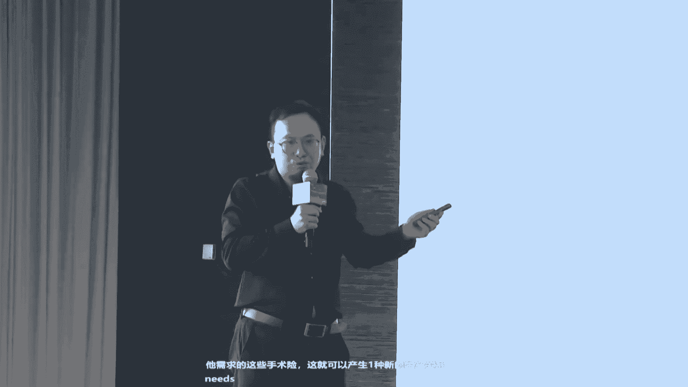
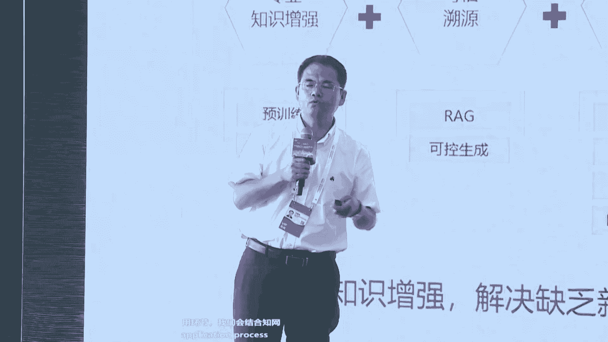

# 2024世界人工智能大会（合集） - P37：20240705-盘古大模型重塑千行万业 - WarrenHua - BV1iT421k7Bv

🎼尊敬的各位嘉宾、女士们先生们，大家下午好。欢迎各位来到2024世界人工智能大会华为云盘古大模型论坛。各位好，我是本次论坛主持人齐军。本次大会，华为云将携手客户和伙伴一起分享盘古大模型。

深入行业解难题做乃事，重塑千行万业。探讨在AI大模型新时代。企业如何拥抱人工智能，基于大模型，突破行业关键技术瓶颈。实现提质增效降本节能，把握新机遇，构建智慧未来的新商业蓝图。😊，说到人工智能呢。

最近大模型啊可是非常的火爆，特别是华为云的盘古大模型，解难题，做难事依然是行业标杆。在两周前，华为云、华为开发者大会2024上华为云重磅发布了盘古大模型5。0，并带来了一系列新的升级和突破。

接下来让我们通过一段视频来了解一下。😊，当你扎根地下。却决心破土而出。在不确定的风暴中寻找确定的答案。😔，🎼总有一种向上的力量。🎼与你一起解难题，做难事。🎼跨越当下，再次向上生长。🎼向上生长。

🎼去洞悉大千世界的无穷细节。🎼到飞驰的列车中。🎼鉴别细微之处的风险。🎼掌控大地之下的矿脉，运筹帷幄。🎼更能让日夜不息的海上门户流转无涯。🎼Yeah。向上生长。🎼让智慧流淌于每个角落。🎼让流水线读懂订单。

🎼跟上瞬息万变的市场。🎼把复杂的金融业务系统融汇于指尖。🎼让城市从治理到治理。🎼移居善政，关照其中的每个人。🎼向上生长，打开技术的更多想象。🎼让AI驾驶在顷刻间跃进大千世界。

🎼让更多灵感成为触手可及的时尚。🎼让数字人的妙语连珠对话全球。🎼向上生长，去破译科学的隐藏密码。🎼去分子的宇宙里，捉住拯救生命的正确答案。🎼去洞悉万里之外的气象变幻，让天有可测风云。🎼从平凡中洞见不凡。

🎼从星艳中淬炼未来。🎼一行行代码终将交织成改变世界的乐章。🎼韩国大模型呢不仅要做事。🎼我们要做的是最难的。下面有请好威云marketing部部长董礼斌先生为我们带来主题分享。盘古大模型解难题，做难事。

重塑千行万业，让我们掌声欢迎。😊，那个大家下午好啊。我想我们这次到上海来是吧，既感受到这个上海天气的火热，也感受到这个AI的火热。我想的话就是我们在呃到这个大会，其实我们每个人其实都抱着有一个啊问题。

其实我们要去想去了解。想去探索的话，AI大模型到底能够帮助我们解决什么样的问题。那么华为这块的话就是啊我们希望的话就是啊AI呢，一方面的话可以帮助我们是吧？让我们的啊生活是吧？变得更加的啊丰富多彩是吧？

哎能够帮助我们哎，可以看到更美好的呀啊一些画作呀，更美好的一些文学创作是吧？另一方面呢，我们希望的话这个AI能够和我们的啊各个企业。因为我们都是一些企业人啊，和企业的我们自身的这种生产的场景。

核心的场景去结合，去把这个场景这些生产中工作中碰到的一些问题怎么去解决。那么这一块的话就是呃。我想给大家分享一下啊，分享一下。那么首先的话就是我们盘古大模型5。0。那么这一块的话是我们在啊两周前是吧。

在华为的开发者大会上进行了发布。那么盘古大模型5。0的话是具备的我们讲的话是啊全系列就是包含的从这个10亿百亿千亿万系列参数规格的模型。另一方面的话就是这个啊多模态。那么多模态的话。

那么盘古的话目前的话是从这个啊文字视频图片，从进一步的是吧？包括像我们说那个啊卫星遥感是吧，包括这种红外等等的话，这些我们讲的一切就tking一切各种各样的模态的话，都在用这个模型进行训练。

那么啊第三点的话就是这个啊强思维。那么将这种思维链是吧？和我们说的这种策略搜索的话，这种技术结合起来。让这个大模型不仅我们讲说。对语言是吧，对文字对图片的理解好，另一方面也要加强他的理科的知识。

使得他的在数学啊、物理啊这方面的能力得以提升。那么呃我今天呢就是想给大家带来。在大模型是吧，尤其是我们说这个啊多模态一些能力，如何帮助我们在实际的工作中是吧，是解决一些啊解决一些难题，解决一些问题。

那么首先呢大家这里看到的是啊多模态的生成能力，针对的是这个自动驾驶，大家了解啊，大家了解，那么我现在放的这些图片的事业，这也是其实也是生成的。但是生成的话，你会发现是吧？这个图片你会发现哎。

怎么那个车怎么行驶到这个啊人行道上了，或者呢生成了两辆车往前开的时候，开着开着两辆车合成一辆车了，这什么问题。这其实就是在这个生成的时候是吧？另一方面，你通过模型学习。

它具备了一定的自己的那个啊自己的这种啊理解能力。另一方面，他如果不能够说我们说对这个呃我们说物理世界的这个规律啊。他如果不能够去在这个物理世界规律的框架下面去做生成的话，他就可能生成一些。😡。

看上去是吧，哎，你乍一看觉得还行，再仔细一看的话，其实就用不了的这样的一些视频。那么呃我们在这里的话，大家可以看看啊，可以看看。那么这一块的话是通过啊盘古5。0的生成。大家刚才生成的时候。

你们注意到没有啊？其实他这个图片啊，生成的视频的话是从。6个摄像头生成的是6个摄像头的视频，包括你的正前方左前方左后方，然后是后方。大家可以看到这第一排的啊，生成的这样的一个一辆汽车走过去。

你看是一个一个连贯的。那么这一块的话，就是大家知道啊，当你做自动驾驶去做那个我们说做自驾的，做这个模型训练的时候，你其实你生你要是想想拿生成的视频去训练的话，你这个视频。

那必然是要和这个真实的一辆车在前进的途中去开发生的情况的话，你要是吻合的。不然的话，你想想你就会把这个车你可能训训到隔壁去了，对吧？训坏掉了啊。那么这一块的话，大家可以看它就是。😡。

符合我们讲符合这种啊物理世界的规律。那么在这个地方的话，我们用到了一个技术的话，就是啊可控的啊施工生成啊，可控的施工生成的技术。那么大家接着看一下。那么我们如果说在这个视频上面，大家说我们在生成哎。

我生成一个空无一车啊，空无一人的街道到我们说哎生成一辆车是吧？然后再生成多辆车，大家可以看到啊，和我们日常的一些视频的话，大家可以看到。哎，这个是这个车它更符合真实的情况。

其实大家有时候看我们啊早期生成的一辆车开着开着是吧，颜色也可能发生变化。这就是因为呢他在这个生成的时候呢，他没有说去看到在啊，他对它的啊实际的行驶的轨迹是吧？行驶的速度方向包括车身自身的状态。

这些东西和模型的生成能力给结合起来。大家再接着看一下啊。我们。继续可以把这个啊在车辆行驶中是吧，大家可以看到是在白天是在雨天是吧？包括我们说在傍晚的这种行车场景。大家可以看啊，其实在这个中间的话。

那家可以看到，尤其是雨天和这个傍晚的那个细节，你看生成的时候，同样是你也是让它生成说多辆车在这个路上行驶。然后这个是车灯是亮的。那么这种细节的话，其实就是在这个模型的话，在啊理解我们这种啊物理事件啊。

理解物理事件。大家可想而知啊，如果说你的视频你的生成的这个能够符合我们说这个汽车的驾驶规律。你现在说我希望这个车以60公里的时速行驶，以80公里时速行驶，大家可以像看到，那么通过现在的这个模型能力的话。

它就可以达到。那么这样的话就可以帮助我们说在自动做自动驾驶训练的时候，大家通常那个车是要有500万公里的啊。这样的训练数据积累才行。那么这样的话我们可以用很多一些场景的话。

通过这种啊大模型的生产能力的话去解决。那么进一步大家可以看到啊，这里的话是我们的那个啊在工业设计这一块。那么工业设计这一块的话，我们这里也是取的是那个啊汽车的工业设计。大家可能不清楚啊。

就是汽车的话设计的话，基本上从呃一款的车型一般的话就是要差不多两年啊，一年到两年的这个时间。这就从你车绘制图纸开始是吧？到你把这个车说，哎，因为你光是个图纸。

你说你跟你的那个啊甲方的公司或者说就是你自己公司的团队进行讨论，你必然的话，光就图纸是不行的。哎，你就说把图纸转化成这种3D的模型是吧？你还想把这个模型呢，哎，你说还要把这实实在在的这种车模是吧？

从这个纸的模型到游泥的模型，这一个个的一路走过来，他确实时间会耗费很长。那么现在大家可以看到，那么在这个啊通过大模型，我们能够解决什么样问题了。我们现在你可以通过自然语言是吧？

你告诉说哎让我这个模让我这个车生成。一辆什么样形状的，我要把车灯变成什么样的形状的，颜色变成什么样形状的。包括大家可能注意现在的这种更厉害的是什么呢？现在我们能够做到的话，就说生成的生成的这个车。

它直接是可以把它的这种文件的话，就是转化成你实际汽车，比如说设计的软件所需要的这样的格式。那么也就意味着我现在把一个车给设计出来，😡，我直接的话用模型生成了以后。

转到你的那个目前的这个汽车的这个设计设计软件上面，你再通过3D打印，直接把这个车模给打印出来。你说我要打印1个1比1的，那就一比1的就出来了。那么这一块的话，我们认为的话在啊未来是吧？这样的话。

让我们说我们的设计师某种程度上叫做所想是吧，即所见所见即所得。那么这块也是可以使得我们让这个模型让AI来帮助我们是吧，简化我们的工作啊，简化我们工作。那么大家可再看一下，那么再一个的话。

这里是拿那个啊建筑设计。那么这个教堂大家看得到啊，这个是啊著名的，就是那个西班牙的这个啊圣家族大教堂啊，圣家大教堂。那么你看他一直挂着个起重机在上面，就是你每年去是吧，他确实在年年在修，年年在修。

你要是去这个圣家族大教堂的时候，你可以看到他底层就有一个房间就是他那个设计者高迪啊。他的那个设计室。高迪的他的后半身的话，他等于说。他四十几年一直的话就是在做这个啊教堂的这个啊建筑设计工作。

直到他就说他去世了，他那个等于说那个教堂还是4分还是够了修起了4分之1啊，休息4分之1。那么我们现在觉得呢？哎，是不是可以是吧？如果今天如果有了AI有了大模型的这些技术，能不能帮助他们？

将这种建筑的设计也有个质的飞跃。那么这一块的话，我们是和那个华南啊啊华南理工大学的话一起合作的话，就是大家可以看到，那左边的话设计的是一个图纸，这个图纸是干什么的呢？就是我们现在啊校园是吧。

学校大家想想我们小时候啊，尤其像我们小这学校。就像个筒字楼是吧？我们确实近视眼比较多，就采光不算很好。那么现在的设计它叫退台式的啊，退台式的设计就是尽可能的让每一个教室，每一个教室得到最大的那种光照啊。

最大的光照。那么大家可以看到，现在你把这样的草图设计好，那么现在模型能做到什么呢？你提供这样的一一系列这样的草图输入到模型里面。那么模型这边的话，就可以把它的3D模型。

就是有草图就能够把3D模型给生成起来。你想想以后我们的设计师是吧？我们设计师如果具备这样的工具，具备这样的工具，那对于他来讲，就说有了灵感以后，马上有个东西就能够帮助他把那个实现出来。

简直就像这个神笔马良一样的是吧？神笔马良一样。😡，那么啊再一个大家可以看看啊。那么我们如果说走到这个我们说媒体这个行业啊，媒体这个行业，大家可以啊仔细的看一看啊。

这里的话就是相当于是啊大家也知道这就是需要哎真人的这种拍摄的电影，我把它转化成动画的风格。你可以看到像我们现在这种模型生成的时候，无论是你这种舞蹈啊，大的这种动作的轨迹啊，还包括我们说武术啊等等的话。

它都能够做很好的一致性。这里面呢他有个细节，大看看那个蒲公英啊，刚才已经过了。他当时我们做这种动漫的风格生成的时候，当时那个呃我们北影的话，他的要求有一个要求就是说。

他在这个里面给这个演员设计了一个细节，就说那个那个女孩手上戴了一个戒指，那个戒指是蒲公英的形状。她说你要满足我一条，能不能在整个过程中是吧？整个过程中他保持一致。那么现在大家可以看到通过模型啊。

现在通过这个AI的话，他这个能力的升升级了以后升级了以后，他可以使得不仅能够做到说动漫风格的生成，而且能够做到人物是吧？这种设计的这种一致性一致性。那么今天包括我今天没有演示。

但今天还有包括像这种啊语言的生成，大家可以看到。其实现在市面上这种工具已经很多了。但是一旦的话大家想把这个语言你说本来原片是讲中文，然后你说让他讲法语。其实他考究的，现在不是说能不能做到法语，考究的是。

当你投的这个屏幕上的时候，那个嘴型。是不是和你的语言是匹配的，当少家，我们平时说啊，那是不是穿帮是吧？你其实到了一旦投到那么大那个电视电影的屏幕上面。那么这一块，今天我们看到这个模型的能力的话。

也得到了一个很好的提升啊，很好的提升。😡，那么这边的话，当把这个模型的能力继续的往这种会议上用的话，我觉得我们现在我们这一代人马上就能够看到我们跟外国人是吧？😡，世界各地的人做交流的时候，各自用母语。

现在就可以做到了。只是我们现在还要解决的问题就是食言啊，解决问题现在已经能够做到的话。哎，我说中文哎，他说英语，哎，双方就这样交流。但是食言的话，我们希望的话能够进一步的能够攻克啊。😡，那么呃。

我们在一些。国之国家命脉啊，我就说一些基础的领域的话，我们也可以看看AI和大模型能够帮助这行业里面做些什么。那这里的话我是拿了就是我们啊日常啊，这个货运呢、客运呢，就是高铁啊，这些举的举这个例子啊。

举这个例子。那么这个嗯大家可以看一下。就是我们和啊白铁所一起的话，就是啊针对高铁是吧，做的这种行业的大模型。那么在啊中国之所以我们国家之所以能够让我们这个路上跑的这个高铁啊如此之安全啊，如此之安全。

是每一辆高铁半夜的时候都会在那个专门的动车段的话去做检修。那么这个检修。当我当时去的时候，你其实人相当于就要下到那个呃铁轨的那个坑道下面啊，像我这一米8的个头的话。

稍微头稍微抬抬有可能碰到那个车车的底部。那么这样的话，其实你想想每一辆车，每天的半夜都要去检测，检测一辆车的话，差不多40分钟。那么现在呢我们可以用通过大模型这种多模态，把这种。各种各样的故障是吧。

图片拿输入进去以后，他就具备了叫我们说分割一切检测一切的这样的能力，使得呢他可以把这个故障都能够识别出来。当时他们告诉我一个细节，就是说他们当时比较了人和模型的能力，让人先一帮工程师过去把那个故障都设。

都调出来啊，都是故障故意的把这种都设计出来。然后再让这个这底下其实是有个检测机器人，就是把各种的那个啊数据都拍摄下来啊，然后让大模型去检测，现在能够做到90%的能力啊。

90%的故障就是能够通过它来检测出来。大家可以想啊，如果说模型在进一步提升到95%，提升99%，某种程度上它其实比人去做检测就更加的安全了。你想想，你每天半夜都在那里检测。而且就在那种环境下面。

那人其实你说人有时候就靠的是什么？真的是靠责任心啊，靠责任心。如果有AI的辅助，你想想这一块的话，就可以大幅度啊大幅度提升提升我们对这个这一方面是吧？把他的这个高铁这样工作的环境呢也得到一个改善啊。

效率也能够大幅度提升。😡，那么在钢铁制造这个领域，钢铁制造领域，我们是啊，因为我前两天恰好有幸也去这个啊宝钢去参观。那么这里的话是看到大家是看到就是高炉里面的那个铁水啊出来以后它形成一个钢坯啊。

那个钢坯钢坯的话是260毫米啊，就是200多毫米厚，就是20多厘米后啊，然后呢，他需要在几分钟之内啊，几分钟之内，一般是两三分钟之内要压到比如说一点几毫米，差不多压缩了100倍啊。

差不多是压缩了100倍。那么压缩了100倍的话，它要确保它生成生产出来的这个啊钢板的那个厚度是吧？和宽度是吧？整个的话要有。严格的这种质量的管控，比如说厚度不能够。就是不能够误差，不能够超过0。0。

01毫米到0。05毫米。你想想要做到这么样。然后整个呢你看到那个车间里面一公里多长的那个车间。然后你想想你那些参数啊，他要参数的话要去调参数要去调。而且的话每次你如果生产出不同的这种钢铁的时候。

不同的钢材他每次要调一次，那么这一块现在就可以通过模型啊去学习啊，去学习这里面一系列的工艺的参数变化，通过模型去寻找它的最优解。那么这一块我觉得也是结合了过去是吧？我觉得那个啊我们说去学习一些文本信息。

那么现在通过多模态，我们能学习什么，你表格信息我也能学习是吧？你这种图像的信息我也能学习。那么正因为各种各样模态的信息都能够通过模型学习的话，使得我们现在在这种工艺优化的话，也找到了好的方向。

那么下一步的话，他们其。😡，是在这个甚至针对高炉的那个优化，也想通过模型去试。因为大家知道高炉里面整个是一个黑箱子啊，一个黑箱子。你又不知道里面温度是什么。你不知道温度是什么，你就无法去优化。

目前的话是靠的是说通过这种表面的温度去推测里面的温度。你想想这里面多么复杂。那么这一块我们看到的话，大模型AI未来的话也会让我们这样的一些制造企业啊，制造企业其实都是我们极为关键的一些行业的话。

它也能够带来一个。😡，我说说天翻地覆的变化呢夸张了一点。但是我觉得苏伟带着整个能力的一个升级啊能力的一个升级。那么呃这是在气象领域气象领域气象领域。过去大家也清楚啊大家也清楚是靠的是数学是吧，靠的数学。

哎，我要预测天气要算几千行的这种方程。那么今天通过大模型，那么我们去年的话是做的是这种全球全球的那个啊台风的预报。那么今年的话我们和这个啊深圳市，包括这个像香港啊，这些他们的本地的这个气象局合作以后。

将将本地的区域的气象的数据输入到这个模型里面，现在能够做到一公里3公里5公里这样的精度啊，这样的精度进行这种啊天气预报啊，天气预报。我觉得这一块的话也是可以看到AI这些技术啊。

能够让我们让我们的那个啊各各行各业啊都会带来一些很可喜的一些变化。那么整个那个我们啊盘古大模型呢，我们一直的话是啊沿着这样的一个我们叫三层结偶的架构啊，三层架。华为呢核心的话。

我们是要做好这样的一个啊基础大模型是吧？这个基础大模型，包括我今天介绍的这个啊多模态的大模型讲的比较多一点。但是还包含的话就是我们有这个自然语言是吧？啊，计算机啊视觉CP大模型。

还有这个啊预测以及科学计算啊，科学计算啊科学计算大模型。那么基于这个基础大模型之上的话，我们会和我们的行业客户伙伴一起呢打造一系列的这样的啊行业大模型。那我们的客户是吧？

你既可以基于这个行业大模型去训自己的那个自己用的大模型，也可以直接用这个L2的这种场景模型。那么除了大模型以外啊，那么今天我也想和啊在座的那个啊各位嘉宾的话啊。

各位那个啊听众的话就是啊华为提供这样的一个啊生腾AI云服务，生腾AI云服务。那么这一块的话其实也是帮助大家应为我估计大家现在我们在整个掌馆里面，大家可以看到各式各样是吧？

我们现在各各式各样的那个啊AI的应用都已经涌现出来了。我觉得这个非常之豪啊，非常之好。大家其实可以看到，我觉得每次我们到这个啊WAIC的话是吧？到这个大会上面啊，你觉得也是一个互互相激发的过程啊。

互相激发的过程。那么华为在这里呢，我们就是给大家提供一个底座啊，提供一个底座这种AI的算力的啊AI算力的云服务。让大家在AI的应用上叫我们说哎算的训的更快一点是吧？训的更稳一点训的更简单一点。

那么目前的话。呃，我们能够做到的话，就是这种千亿参数的模型训练的话是40天不中断，这个是。巨大的一个提升啊巨大的一个提升。我也希望的话这个我们这个啊生腾AI云服务啊也会啊帮助大家是吧？

帮助大家的话将自己的AI应用啊，自己的模型呢给啊打造出来。好，那个今天啊我就给大家介绍这么多啊。我希望的话就是啊无论是盘古大模型还是深腾AI云服务，能够帮助大家是吧？真真正正的啊把行业中的一些生产场景。

核心场景。这样的一些问题呢啊能够通过啊我们大家的合作是吧？大家创新能够得以解决，能够实现我们说啊千方百业的啊加速智能化。好，谢谢大家好，谢谢董总，请您留步在舞台上方请留步。

那现在呢我们可以给大家几分钟的时间。如果您有问题想要进行提问，或者有想法想要进行交流的话呢，都可以举手来示意我们的工作人员。好，我们有来宾要来进行互动交流吗？😊，好，来，我们倒数第二排这位先生。

工作人员话筒来递一下。😊，你好，董总，我有个问题，如果是我们要做这个本地私有化模型部署的话呃，华为的话，他这个盘古盘古的模型的话，他有合适的方案提供吗？哦，这个也是可以的啊，也是可以的。

就是说本身的话就是华为这个模型，你像我们比如说和一些银行客户是吧？包括刚才我介绍的像那个高铁界客户了，他是希望的话是在自己的环境。尤其是也确认确保自己的数据在啊可控的范围内是吧？那么这块的话。

我们也提供这种啊混合云的解决方案。那么这样的话把大模型就可以啊部署在你的私有环境里面的话进行这种训练啊，对你都可以，那还有个他对硬件最低配置的要求是什么哦，这就看你你的模型的参数有多大了啊，这块的话。

我觉得我们现在那个无论是我们的那个用我觉得用我们的升腾啊，这块觉得能力是足够强悍啊。足够强悍呃，有有没有推荐的这种服务服务，就就就硬件的配置哦，你这块就是看你具体的是什么样的阐数的啊，具体什么样阐数的。

我觉得这块就是。嗯，我今天也不直接回答啊不直接回答。但是我我是希望的话，你如果说对这个感兴趣的话。我们的掌管把这个东西都已经放在那里了啊。就在这个啊是H1号展馆啊，一号展馆一号展馆。行好好，谢谢。好。

谢谢这位来宾，也请我们的工作人员把华为云吉祥物云宝来送给这位朋友。好，我们现场还有来宾要来进行交流互动的地方吗？我们这位穿黄色衣服的先生。😊，你好，我是想问一下。

就是现在有没有就是针对医院的这个就是临床呃一些实验的一些服务。就是对于对于这个呃医疗加人工智能的模型的一些服务，有没有现成的？啊，我们今天恰好有那个啊韵达医疗，一会会做一个分享啊。我觉得这一块的话。

其实我们认为啊用这个呃AI大模型去将这种啊医生平时的这个问诊的这种经验啊，通过大模型去训练，让我们医生的话有一个自己的那个啊问诊的助手是啊是可行的啊，是可行的。而且。啊。

我觉得一会儿我们润达可可以呃医疗的那个呃专家的话会详细的介绍。我们看到的话其实是可以产生一些很好的效果啊。当时客户呃，当时的话就是给我介绍的话，就是我们通常到医院啊，通常到医院。

你可以看到每个医生是分科室的啊，每个医生是分科室的。但是你自己如果有是生了什么病，你其实到了那个是常见的病，你是知道你该去哪个科室。但是有一些非常罕见的一些。病的话，你可能就不知道你不知道时候。

这反而又通过这个模型当时把你的历史的数据，就是历史的那个病历上信息，包括你当前的症状的话，他能够给你更准确的一些推荐。你赶紧去哪个科室出置相关的一些病证。

我觉得这个是呃模型的话是有啊很好的一些很好的一些效益啊。就这个可能就是针对病人的在院前的一些服务，就有没有就是针对就是就是临临床上应用的一些。呃，就是目前有包括看片子，对不对？呃呃，对，当然就是说呃。

因为因为我们医疗上，因为我本人是医生。对，然后就是呃就是我们现在有一些临床呃大量的临床数据，因为可能就是包括标记啊，可能因为真实事件，他有的不能不能标记的很好嘛。所以我就想问现在咱们有没有就是现成的。

能直接跟医院直接嫁接的一些。是这样啊，这个华为在这块的话还是做了做了一些探索啊，做了一些探索。包括呃当时我们针对啊有些啊特殊的一些包括一些癌症是吧？那个做这种啊叫病理的数据的那个病理数据那个分析。

那么这一块的话，我觉得是有有一些探索的，有一些探索的。我觉得从啊医生这个角度来讲的话，如果从我们看的话啊，要一个来确实要解决从医生角度来讲，我觉得我们看到的话比较挑战的是数据的问题啊，数据的问题。

那么现在啊如果说能够解决数据的问题。然后再加上啊模型的训练的话，我们觉得可以可以把好多事情啊，好多事情都可以迎刃而解的。就我本人是表示的比较乐观啊，相对比较乐观啊，但是需要的话多方的合作。对。

这个有具体是能跟谁对接，这个嗯具体啊，你下来我们就可以对接。哦，行行好行。好。好，我们这位先生你好，我想来问一下，咱们在那个酿酒这一块有有那个吗？包括自取啊或者储存啊这些。嗯，这块我真是不是很清楚啊。

不是很清楚。嗯。你怎么说呢？就是我想是从大模型的原理说一下这个事情啊。就是大模型，它之所以说有时候能够在一些地方的话产生效应的话，他是因为你给了大量的数据去训练了以后是吧？它能够找到数据啊背后的规律。

那么这一块呢，就是呃尤其的话就是首先您要是想解决这样的一些制作工艺的问题的时候，你首先呃你要解决的话，就是你的啊高质量的这个数据，这是第一个然后第二个呢，它的模型，它也是给于你的行业的知识是吧？

要把你的行业知识行业经验，你要让大模型能够掌握到。那么这样的话，他通过这种大量的数据训练的话，它就有可能能够找到一个啊，找到一个方式啊，找到一个方式呃，我我觉得呃从我们现在看。

你我们像刚才举的是钢铁的制造。那么钢铁制造可能跟您讲的这个酿酒。不一样是吧，但它也是一些工艺。我们看到钢铁，包括那个啊玻璃这些制造的话，都是针对一些工艺参数，工艺参数的优化。

所以您这里如果说一些工艺参数的优化，在一定的数据量积累情况下，我觉得是有可能能够找到方案的。好好，谢谢感谢各位的参与，也感谢董总，谢谢请董总先入座，也请我们的工作人员把云宝来送给这位观众朋友。😊，好。

谢谢。😊，那如果我们现场还有来宾有问题想要去进行交流的话呢，可以在会后啊，我们再去进行进一步的沟通。那我相信呢大家在刚刚听完了我们董总的分享之后，能够深深的感受到盘古大模型给行业带来了巨大的影响和价值？

那盘古大模型是怎么炼成的？盘古大模型5。0又有哪些关键创新呢？下面让我们有请华为诺亚方舟事验室资深研究员蒋鑫博士，为各位带来主题分享。盘古大模型5。0关键技术创新掌声欢迎。😊，🎼哎，嗯呃大家好啊。

我叫蒋欣呃，大家下午好啊。然后我是那个华为呃诺亚方舟实验室的，所以我们一直在和呃华为云啊，大家一起在打造这个环盘古大模型啊，所以我今天简单介绍一些这个大模型的一些技术，特别是5。0以来。

就是去年我们发布了那个3。0啊，今年呃是5。0。I'm sorry。OK啊，对，然后呃3。0的时候是去年我们其实主要还是在做语言模型，就是说到大模型，就是我们狭义来说，呃一般是指大语言模型啊。

当然今年开始我们就更多的拓展到了视觉等很多模态。所以我们今年的主要的升级的能力，其实一个就是更多的模态，包括包括这些不同模态的对齐啊，以及这个更强的思维能力啊，然后呃使得这些更强的能力之下的一些技术。

就包括我们如何更高效的利用数据以及更高效的利用参数啊，通过修改模型的架构啊，以及更高效呃如何更高效的利用算力，所以我下面会简单介绍一些呃这些技术吧。然后数据其实是大模型训练非常重要的一个环节。

或者我们说最重要吧。然后就是说数据的工程，包括我们现在可以把它上升到一个数据的科学啊，如何来为大模型来服务，使得我们训练出更呃智能水平更高，包括训练。😊，效率更高的这个呃模型是非常至关重要的对。

然后呃通常我们都认为就是更优质的数据能呃激活模型更好的一个能力。啊，所以这里我们呃呃去年做了一些技术，是关于数据合成的，大家也都如果了解模型技术，大家会发现现在的模型我们越训越大。

另外就是数据越训越多啊，一个7B的模型都可以训这个10T或者是15T的数据，对吧？然后但实际上我们这个呃呃就是互联网上存在的这个数据呢，数据量并不是那么大。

所以有可能不远的未来这个我们的自然数据就会消耗殆尽。所以如何进一步在这些数据的基础上去提升大模型的能力，这个就需要我们再想一些技术。所以呃从应该是从今年开始，大家越来越关注到合成数据。

也就是说这个数据本身是由语言模型来生成或者是通过它来检测修改得到的啊然后我们当然是希望这样的数据就更加的那更加的有思维能力，更加的能促进模型的这个。😊，呃，能力的提升。对。

所以我们在这方面进行了一些探索。所以呃我们现在其实在模型中大约有30%的数据是来自合成，或者是通过AI模型去做质检，或者是去做改写的。

以这这方面呃就是把这些数据跟自然的数据混合训练以后能够非常有效的啊增强我们大模型各方面的能力啊。一个典型的例子是增强我们就长序列的能力。所以长序列就是指我们模型能够处理非常长的序列长度，比如啊128K。

甚至现在大家做到一兆，对吧？这个可以可以是一个非常多啊文章非常长的一个东西，它都可以去理解啊，但是这种数据其实在在我们现实的呃网络中其实是并并不那么。也不是说没有，但是非常的少，比例非常的少啊。

所以大部分都是比较短的网页啊，所以就是如何让模型具备理解这个非常长文本的能力呢，就是需要我们去通过合成的技术造一些这个长文本的数据。这些长文本数据可能是通过一些已有的数据做拼接或者去做一些改写得到的。

但是它最终其实是希望这个里面蕴含了更丰富的这个推理的这个这个思维的这个这个关系，这样的话，我们的模型才能够学出这个更好的这个长序列的理解能力。

所以在这块我们其实可以呃通过合成这个长序列数据提升我们在比如大海捞针或者更复杂的一些长序内容上的这个能力啊，大概20%啊，另一方面就是说我们在这个数据的课程学习。

就是说先学什么数据后学什么数据这方面做了一些呃研究和探索。就是我们把数据进行了分类啊，包括这个最基础的一些理解的数据，包括一些领域的知识，一些高阶的知识和复杂推理知识。😊，啊，这样的话。

我们能够在学习的过程中循序渐进的就像教啊教一个小孩一样的这样的方式去让模型逐步掌握这个高阶的能力。这样的话我们可以看到从我们的模型的一些呃评估的曲线上发现。

你通过这样的学习方式可以呃非常好的呃增强模型的高阶能力。啊，这是在数据方面我们做过的一些工作。啊，第二方面就是说我们如何去更好高效的利用这个参数。大家知道参数越大，模型可能能力越大。

但是呢它意味着这个训练的成本推理的成本都都越来越高啊，所以我们其实还是倾向于比较有限的参数下把模型训到极致训的非常好。

所以在这方面就是我们诺亚的一些同了非常好的工作提出了一个新的架构就不同于标准trans叫做盘古派架构这个架构其实有两个亮点。

一个亮是其个也都是公开的一些技术学顶上都发表了第一个技术就是说我们对自注意自注意力机制的改进。大家知道transer的核心就是提出了这个注意力机制但其实这个机制就是我们经过一些分析为它并不是非常完美或者是当你的模型在训的很深的时候。

他也许会出现一些特征探索的现象。征探索大概就是说。在更高层的时候，它的ature都会长得非常像。这样的话它没有太多的分辨能力，从而阻碍了你模型的能力的进一步提升。

所以在这里它的这个盘古派的设计呢就是对at进行了进一步的补充加强了一些增广的残差连接，使得这个模型对这个这个特征的这个表达能力更强啊，或者简单理解就是说我们增加了一些非线性的这个示的学习。

使得模型attion部分能够有缓解这个特征探索的问题。同同时能力更强啊，这是第一个第二个就是说在这个的另一个重模块啊这个模块就是说华为在这个模块的就是生腾在这个模块的计算的是是是有一些优势的啊。

就是说相对计at生能会更快。所以我其实我们的架构偏向于的部分会更大啊然这部分我们同时也提出。这个极数的激活函数啊来把FF分部分的能力增进一步增强。呃。

其实简单来说就是说利用更多的这个几不同的激活函数的组合来增强这个非行性的能力。这样的话，同时它的模能力得到增强的同时啊，也使得我们在生增上的推理更加的高效啊，推理速度有类似于25%的提升啊。

这是我们在架构上面的一些创新。😊，呃，第三个就是说这个大集群训练的问题了，就是说因为我们在刚刚才那个东总也提到，我们在从从这个呃小的大模型到这个1百亿千亿的大模型都在训。所以这个里呢训练成本是。

训练效模型个利用率包括这个个模型能不能仍然很好的利用这个大集群的规模都是非常关关键的一训练指标。以模型训练其实是我们了解就是有数据并行啊流水线行型行等等行方式在流水线并行的阶段就是会大家如了解就道会出现空个是在等待通信时。

并没有在计算如缩小这些其实就有很多的技术。所以在这里我们就是做了一些多并行计算。流计算通信流水的呃方法吧就并行计算技术把这个计算切成更碎的块，然后使得这个buble变得小，然后节省我们的通信时间。

或者说把通信跟计算更多的来提升我们的计算效率另外就是说大集群的调度跨节跨机柜的调度如去组织这些通信其实就通信尽量的集中在一个节点或者一个机柜里啊，这块我们也有一些技术来使得我们的这个行的训练更好。

所最后我们能够隐藏掉7通信通信的等待时间提升30%10%然后最后就是说结果就是说我们的模型的算利用率个卡卡集群的情况下不会特别显著的降低。这样话证你训练一个模集群练仍然保持不错的这算利利用率。好。

然后最后呃呃倒数第二个。然后就是最关键的就是说刚才董总说了很多这个多模态视觉的一些能力啊，因为语言模型只是一个基础，它用来传递人类的这个 instruction人类的指令对吧？

但最后它的应用很多是要体现在这个对视觉等等模态的一些理解和生成上的。所以这块我们今年也做了这个多模态模型，其中一个关键的一个基础技术，就是说我们统一了这个视觉的编码器。

因为视觉的编码器其实针对不同的自然图片或者是文档图片，其实它的要求是不一样的。因为自然图片同样是理解一些是一些相对于低频的信号，就是说你来理解这个不同的物体它之间的关系但是对文档的话。

你可能需要做到这个文字的理解后包括它的排版关系图表的关系等等。所以这块我们需要但我们不能给一个言模型每个领域接接一个编码器就是说所以最后我们需要把它统一起来。但是同时使得这个统一的编码器具有所有。😊。

有的啊包括自然图像啊文档图像等等图等等这个视觉信息的这个理解能力啊，通过一些蒸馏的技术，可以使它啊确实的得到提高。啊，另外就是说我们需要这个统一的编码器具备这个动态分辨率，就是有一些比较小的图片。

分辨率比较低的图片也能理解。同时一些高分辨率的一些尺寸的输入，也能啊比较鲁棒的去理解。所以这块我们有一些训练的策略，包先训一些低分辨率的一些简单任务的，然后再加一些中分辨率的啊加一些OCR的一些任务。

然后再再上一些高分辨率的一些比较复杂的任务啊，这样的一个循序渐进的训练过程，然后最终使得我们能够啊训练一个非常鲁棒的高多分辨率的这个统一的编码器啊，同时结合我们刚才说的语言模型。

然后使他们能够呈现出比较好的这个。多了他的理解能力。对。那最后一点就是说我们呃关注这个模型的强思维能力，就是说他能不能进行所谓的复杂推理啊，这个大家呃也都了解。就是其实现在大语言模型的进展是非常快的。

就是一些简单的或者是比如问答啊，或者是一些摘要呀这些任务，大家会认为就是其实已经做的非常好，甚至比很多人都好啊。但是在一些复杂的任务，比如些数学计算或者一些推理，或者是你做一些规划。

有一些这样的多步推理的这种性质的这种任务上他还是比较差的。或者说离人类还有相当的距离。所以这块我们就在思考就是或者是整个业界就是大模型领域的这个学术界都在思考如何去增强这个模型语言模型的这个思维能力啊。

所以一个非常直接的这个想法就是说让他像人一样做所谓的慢思考。因为人在做做这样一些复杂的问题的时候，其实也是通过一步一步的推理通过在比如在草纸上演算之类的。然后去最。😊，得出这结论。

并不是一下子就反映出来。所以所以我们让模型也做类似的技术啊，但做这个技术其实并不容易。就是说你如何让模型去做多步的搜索，如何去确定它下一步应该走哪一步是最优的一些挑战。

所以我就就做了这叫技术技术其实也公开的论文这个技术实个还是华为就是这个加拿大研究院舟实验主研发一项技术这个技术其实主要是围绕多步生和策略搜索个关键步一步生成多选步判个选优以及下一步搜索走一块涉及一些是所谓的过程监不模型结要求一步进行评它的好坏括未影。

向下围棋的这样这样这种强化协议的技术啊，所以结合这种技术以后呢，就是我们可以利用这个 star这个技术提升这个模型的复杂推理能力。这个模型本身并不用变得更大或者是训练的更多数据。但是他通过多步的推理。

但是他肯定就是推理会慢一些。啊，但是他可以达到更好的在这些复杂任务任务的这个场景上，包括这个数学啊代数几合啊，或者是一些概念推理啊，这个这个多辑推理这些任务上都能得到非常显著的提升。

就大概提升都会有二三十个点，然后就是用这样的技术就是可以使你用一个不是特别大的模型。但是在消耗一定这个推理在损失一些推理速度的情况下实验的情况下可以获得更好的这个结果的提升？

等效你拥有一个类似迁移参数这样的一推理能力。对这是这是这个 star star的技术所以对我今天大概就分享这些。这些我们都是为啊盘古大模型做出来的一些关键的技术。然后我们希望为我们的开发者啊。

大家伙伴呃以及大这个整个行业提供更多的这个智能化的能力，对吧？然后呃行，那就今天先到这儿，谢谢大家。好，谢谢蒋欣博士，请您也留步在舞台上方。那下面的时间呢，我们依然是互动环节。

如果大家有想要进行进一步交流沟通的地方，都可以举手示意我们的工作人员。😊，蒋新博士，您选择一位嘉宾来进行交流吧。那那边那位戴眼镜的同事。你好，我也是就是计算机专业的。然后我有一个想法。

就是计算机思维和这个学习模型呃结合，就是说能方便这个各行各业。因为。就是有我这个切身体会的。因为我现在从事的是人力资源这个行业，就是感受到这个各行各业这个大环境。嗯，不怎么好。

就是说我想靠我们回归这个计算机行业来助推呃各行各业的发展。然后就是因为我本身也比较欣赏，就是。华为的这种呃氛围，然后就是呃任总的那个呃精神品质，就是说呃对于这个。我并不了解的这个盘古大模型。

所以说我想结合一下嗯，来呃助推各行各业的发展，是这样的。好的然然后就是关键点我的问题是就是说在处理这个数据的这一块的话，有许多模型，就是说可以结合的。包括就是提升这个处理速度这块明白明白对您的题很关键。

因为我们刚才提到合成数据如获得更高质量数据。但是数据的处理和清洗都有成本的啊，然后我们实际做的会是类似于一套数据的理系，理解到一个的工程这程中会用到很多不同size模型。

包括一些传统的机器学习模型例如大家都用的这这种简单文分类。可对包一些言型可会用就是老以前的一些技术这些东西能帮你很快速的去过滤到一些明质量不高的东西。但剩下东西你可能需要用一些更的型，包一些模型。

或者是似。一下吧，类类似这样的模型去去去去去处理。对对对，然后所以所以你可能需要注意的就是如何去分配你的算力和资源啊，然后但是当你需要获得更高质量数据的时候。

你需要投入更大的推理资源去去处理或者清洗这些数据啊。但但但你最后是一个综合的成本和效率的考量。好的好，谢谢感谢蒋欣博士的精彩分享，谢谢请入座。也感谢我们这位朋友的参与，来请我们的工作人员云宝送上。好。

谢谢，请您入座。😊，解难题做难事，这是盘古大模型的宣传口号。但是呢我个认为这是盘古大模型的追求，也是一种自信。钢铁是国民经济的支柱产业。我国钢铁产量占全世界的54%。钢铁行业呢也有很多难题带解。

那么盘古大模型遇到钢铁行业又会带来哪些突破与创新呢？下面让我们有请华为公司矿山军团解决方案总裁蒋旺晨先生与我们分享盘古大模型赋能未来钢铁智能制造，掌声欢迎。😊，🎼呃。刚才我们的博士讲的。

我是没太听明白啊，嗯脑瓜子晕了吧唧的。😊，但是呢我有信心的是刚才戴眼镜的男同学哈，你的问题应该是在我这里有答案，好不好？呃，真正要把你的人才怎么发展，要走向工业，好吧。

或者走向消费者这个面向诸多消费者也可以啊，就是但是要学会去用，我的一个判断是什么呢？就是人工智能，别看大家伙今天都是一对博士的讲。其实面向未来他就应该是像什么呢？

我们今天使用excel一模一样的使用人工智能。将来他就会是进水浅流的嵌入到我们工作的任何环境。😊，还有应该是这样一个模的。好吧，那么我们今天呢重点讲一讲这个钢铁。

其实我们做把大模型的技术哈用到工业里面来。钢铁还不是第一个。第一个我们做的是煤矿啊，煤矿煤矿比较成熟了。去年我们讲了一些接年呢我们再重新来做这个钢铁。那么钢铁呢说实在话，这刚才这个主持人也说了哈。

中国的钢铁占全球的之呃55%啊，差不多55%左右。呃，现在呢确实面临很大的问题。那就是所谓的叫产能过剩啊，产能过剩。这个不仅仅是钢铁啊，不仅仅是钢铁呃。

对我们希望以后你让我们吃饭的筷子是钢铁做的那样的话能多加消耗，对吧？但是现在看确实是呃这个产能哈，包括收入都在都在下降。那么而且从国家呃发展这发改委啊这个角度去看。

那么一定要求这个我们的钢铁企业要快速的走向绿色低碳，所以说呢他这个是。这个老鼠啊这个跑到了蜂箱里两头受气儿啊，所以说这个压力会很大啊，压力很大。那么所以说这个时候怎么办呢？

现在我们看到一些优秀的一些钢铁企业都是在快速的对吧今天的钢铁是打引号啊，其实是大企业啊，大的工薪企业，工业企业都在快速的拥抱人工智能，它你来进行发展来找到一些个场景，一些。😊，啊。sorry。

一些流程来应用人工智能做做这个创新，降低能耗绿色提升质量。你看啊我们打开这个钢铁行业，我们从它的整个公艺流程。从最开始的原材料对吧？我收到的废钢还是我的矿石是吧？煤啊，然后呢，这些煤要进行焦化啊。

就要做成焦煤嘛，焦化这个球团是吧？我这这很比较专业的，可能别定见过啊，球团是啥，所它就是铁矿石磨成那个矿粉啊，跟煤这个放到一起块烧的啊，烧结完了以后它就成为是要送到高炉里面去，高炉里面经过加温吹氧。

对吧？最后把它念成铁水，铁水概多少度呢？1500到1600度出来。那么炉子里面的温度烧的这个温度大概是两三千度。好，那么这个时候既然所有的所有的传感器啊，大家一天天想搞什么物联网啊，做数据采集好。

你自己想法全失效，为什么呢？你不可能在那么高的温度里面有任何的传感器。那这个时候那怎么办呢？要用要用一些人工智能方法啊，很多啊，包括炼钢，因为我的炉子的温度。出来之后，这个温度，我后面根据我的订单。

对吧？我炼什么样的钢，就是钢啊，铁到钢是要炼的。那么要加这个一些辅料，对吧？锰啊落呀铬呀，哎，你要去这个充分的搅拌，对吧？有好多的还有精验啊，各种过程，对吧？所以说呢要去炼钢，炼钢出的过程当中。

最好我不要我的炉温好，不要损失，也损失炉温，那好，这就是能量的这个浪费，对吧？那么当炼钢完了以后，后面的连铸，那刚才说的是连柱，它有连铸机，对吧？从过去的那个模柱，一个模子对吧？把钢铁钢水倒进去。

那个那叫模柱，现在是连铸连铸机直接拉批出来啊，连铸是啥玩意呢？其实很简单，就是一个灌汤包对吧？外面是皮儿是凉了，里面是铁水啊，就那种模式啊，连铸，所以说呢这样的方式保证它是连续生产。

一直到最后进行热轧冷藏。你看这些场景我们展开以后，你可以发现。有N多N多的场景都可以用人工智能用来改进它的质量，提升它的效率。非常非常多。好吧，这个这个所以说呢做人工智能那个眼家小伙子哈。

可以把我们的专家投入到这个这个企业我们自身的数据的处理整理以及人工智能的应用来改进我们企业的效率。好吧，这是一个关键。那么大模型。我们说哈今天说实在话，我们更多跟企业谈的时候，希望是人工智能哈人工智能。

因为什么呢？我们不能说今天出了大模型，好像就是就是这个这个厨师历史新一样啊，就是翻天覆地，并不是这样的。因为一个企业过去有好多些小模型，只要你的场景相对比较固定，用的挺好，那没问题没问题。

你还继续用包括有些机理模型，那机理模型尤其是一些装备，他原来就是我在做这个新装备，他都没有用过，没有历史数据，那我咋用大模型呢？来来做训练的没法弄。所以说机理模型也好，这个这个小模型应该是混搭。

只要你最好中西医结合解决你的问题治好你的就好了。所以说呢我们认为人工智能。当然你新开发的方法，我们还是希望走到大模型上面来啊，这是比较好的。因为这个恰恰跟我们国家的新智生产力，它是比较契合的。

为什么说中美竞争的焦点回到了人工智个层面，因为他。是在一个新的时代在引领着我们未来走向这个这个呃因为它起步很高呀，对吧？起步很高。无论说你的算力还是你的那个那个研发投入，对吧？投入，所以说呢这样的话呢。

它就有一个很高的一个竞争的门槛，这就是制新智生产力的质新只技术项的比较新跟上时代的节奏，质就是你你的有门槛质量好。那么最后有一点要很关键，要形成生产力一定是要能够普遍的推广和使用进行泛发的存在。

你不然的话，你只是解决一个单点的问题。那你这个跟在这个这个实验室啊跟研究这个没什么区别。所以说这个不会形成生产力。好吧，所以说呢在这个过程当中，在我们企尤其在企业落地的时候，就必须解决好一个人才的问题。

人才啊，那么要有足够的人才。所以说呢那人才我不可能都是像我们蒋欣博士这样一堆的那个博士，那不可能，我前里养都养不活。不对？那怎么本科就这么干，当然可以干，对不对？只要把我们的人工智能开发。

尤其是面向应用开发算法开发，把它变成是一个工作流，对吧？一步一步一步往下走，我经过一些员工的一些培训就可以干了。因为我要的是结果，你大型对我来说，就是个工具嘛。我刚刚说的就是excel。😡。

新时代的excel。对吧别想那么神秘啊，然后我一步往下走，我只要最后达到我的目标，为我企业服务解决问题，这才最好的。😡，对我不管它是叫大模型，还是你看原来叫大数据，叫big data啊。

现在大语言大模型呢，它不叫big model，知道吧？叫large model啊，这个东西纯粹是啊marketing跟我们那个啊董部长类似啊。😡，啊，所以说呢我们还是要解决问题，好吧。😡。

那我们看回答啊，因为我已经是经历过有十来个项目了啊，从水泥、钢铁、化工、煤矿等等。那我们可以看到。在整个大模型建设过程中，基本上有三类问题啊三类问题。第一个，好多企业说，我希望分层结果，分开招标。

我只要我把规范定好，把螺钉和螺母解开招标。😡，事实证明这样路走不通啊，走不通。因为现在整个技术发展还远远没到这么样一个充分解偶的过程上。你可以想想看，我们英伟达如果说怕扩大，让别人提供可以吗？不行的。

好吧，一样的类似的问题，好吧，包括他I你用他的集群，你不用IB的网络可以吗？也做不到，所以说你不要啊当你去买英伟达的时候，他的一套东西严格按照他的规范往下走，你挺开心。但是一旦用生产的时候。

你说我要解偶，哎，你不能是双双标准嘛，对不对？好不好？那么第二误区就是什么呢？我说很重要啊，我们是要解决问题为企业创造效益。😡，那么大模型远远不止自然语言。我也给大家讲清楚啊。

远远不止亲的GPT能干啥啊，办公效率的提升确实可以啊，大语言模型能做一些工作。但是。😡，真正解决企业的质量、效率、成本、安全能耗靠什么，靠视觉和预测求解。这是很关键的啊，还有科学计算，还有科学计算。

并不是靠你自然语言吼一下啊，你把我的能耗降低10%，它怎么降低？😡，好吧，所以说还是要靠我们的背后的啊这些这个数据的东西。第三个问题刚才已经说过了啊，就多模型之间要混合搭配。好吧。

另外呢就是说呃人工智能哈，我们看走向企业的时候呢，这是我们最开始推的时候做了认真的洞察，发现的这5个永远绕不过去的问题。这个5个问题解决不好。要想构建成，把人工智能变成变变成一个生产力呃。

根本都不可能啊，不可能。所以这5个是什么呢？在过去。😊，算法进度比较低，就是小模型时代典型的问题。还有一个问题是什么呢？就是算法通用性很差，也是小模型，定制化也很强，对吧？那么还有一个问题。

大家伙注意到副样本在工业上面，在社会上面，在你家里，在你生活里，副样本，它永远无法穷举。听明了吧，富阳们，我们说回到了妈几十年，回到今前，好不容易碰到了一次新冠，累的要死，对吧？三年。

那你说后面会不会出现新问题？反正我说的不算对，肯定也会出。也就是说。😡，我们随着社会的时代的发展，随着人类和自然的一些互动。那么这个问题也一直在不断的出现。那么副样本无无法充足。那好。

你现在所有的学习都是根据副样本来作为我的书入进行学习。那请问我现在遇到新的副样本怎么办？你不傻眼了吗？😡，我们的伟大的机翼公司对吧，他的prod做的不错，发动机做的不错，但是就没解决好这个问题。好吧。

那么一堆一堆好，包括安全，包括人才。所以解决这五个问题，这五大问题是最核心的啊，是个把子在这里一定要消灭掉。消灭他们的手段就是有两个方法。第一是用大模型的方法。因为大模型的方法呢。

我们可以解决好算法精度低的问题。因为到了今天我们参数肯定比较多，我的应用算上来了。所以说参数就他的成本就没关键啊就像我们CPU上来以后，我才能跑window如果是8086，你怎么跑wind跑不了对吧？

第二个问题是通用性通用么靠靠大模型，因为这样我充分场景的学习吧？我可以比好的泛法性。那么另外呢阳无法举什么要解决要引入新的一个架构，刚才有一个前面有一个同在题吧？有个同学在能不能私有云我们说不但能。

而且是必须要部署到私有云。必须为什么呢？你只有不出私有云，你才能解决好你的数据，不出园区的问题，才叫数据安全的问题。你想过去所有的人工智能操作是怎么操作的？嗯，我是一个业主，我找到一个场景。

我现在要要立项，我要发飙，一旦发标之后呢就招标了，3家5家都来了啊，最后那个戴眼镜来应标了，应标了之后呢，一个月之后要我提供一个模型，那怎么提供呢？他会到我的公司来，哎呀，老蒋啊，蒋老板。

你把你的数据给我。😡，你的生产数据，人力资源的数据，我的视办公室视频的时候，生产视频的数据给他他干嘛拿回去，拿回去，他要去训练来开发呀，是不是？一个月以后，再把那个模型拿到我的厂工厂里来去部署。

那你看这过程当中怎么样，我的数据出去了。我说先出去了，将来这种情况是不允许的啊，不允许的。所以说我们的训练和开发应该在哪儿？在私有云上面。所以说你看我们在宝武也好，在南钢也好。

在在在那个呃所有的这钢铁厂基本上都是走的是这个模式。运行态是石有云。包括过程当中POC都是在私有云上面。好吧，所以这是非常重要的两个呃几个问题啊几个问题。

所以这一页呢是呃解决这五个问题的关键就是用一个是新的架构。新的架构就是集团或私有云做训练开发。那么边缘侧做推理，然后云边协同。好吧，这个是做了一个更加细致的一个展示啊。

现在我们所有的项目至少像我们这边哈能够接触的有十几多个项目啊，十几多个项目都是大项目啊，超大型项目都是产业战样略结构。集算册部私有云把训练开发做起来。

把我们的少数的几个博士和新招的那么五二三十个本科生都放这干嘛做训练做开发，做APP的开发跟业务流程结合。然后我下面布一个硬件，把你的算法开发好了，直接通过内网企业内网往下推，你看我的学习的时候。

边上我的工也是把数据往上往上传，我的学习和推理全在内网里面，没有数据是安全的。而且你的人也是分开的。为什么呢？我推理过程当中是我的在工厂在前端啊做这个运运营。所以大家伙是感知不到的啊，感知不到的。

那么在后台这时呢，这是我的这个专家团队在这里干活。啊，我前面发现了问题那怎么办？我就要定期的或者是定定量的能够往回传，这样去进行不断的学习不断的学习。所以这里面。😡，有一个问题，其实我们没太讲。

就是叫非正常及异常。这个是我特别说一嘴，很关键，为什么呢？因为富养本是无法穷举。那怎么办呢？我的人工智能运行过程当中，我要有办法把那些富样们把它抓出来。😡，啊，抓出来怎么办呢？怎么抓呢？

我就把正常情况先学会。😡，一旦你不符合正常情况，那就说明你是有问题的但有问题到底要要不要关注，我们先搁一边，至少我先把你抓出来，然后有专家进行判断啊，专家判断。所以这样就是提到一个叫非正常级异常，对吧？

非常情常，我允许有一些误报就听好了，但我不允许有漏报。😡，漏报可能会出大事儿，出事故，但是误报没关系，你来处理，对吧？所以说这也是非常重要的一个机制。好吧。

这是之所以我们说能够在企业里得到比较好的一些认同快速的一些部署跟这个机制非常相关哈。那么整个钢铁大模型啊，其实我们在煤矿在水泥在化工都是一样的啊，都是一样的分成三成对吧？华为公司刚才我们说了。

基于我们的盘古来提供这个技术大模型。那么不署的行业以后要跟行业的知识结合。啊，这个成了我们客户自己的这是公有云上出版本，私有云上去部署资产都成了客户自己的啊客户自己的最后上面我用不同的场景，我是皮带的。

我是炼铁的炼钢的，我是财务的等等，都在上面各种场景化的LR。啊，是以这样的一个模式，所以把那个呃企业里面用起来。所以企业里面现在你看好多企业里面他们现有的员工，所以挺好的，他现有的员工都在不断的学习。

脑瓜子这个refining啊，要要要要升级改造啊升级改造。嗯，这里举了几个例子啊，只是非常典型的举了几个例子。第一个，你看这个我们说视觉和预测求解是最重要的几个。你看我们因为我们做的呃设计企业很多。

创新很多，基本上视觉的占了绝大多数啊占了一半以上啊一半以上。然后呢，预测求解的场景，它的价值是非常的大，而不是一般般的大啊非常的大。所以这些呢你看。比如说一个皮带它正在运行。

基本上这个这个我们现在不需要人工去巡检的啊，就是用几个不同的位置啊，布署几个相机，我们不展开了好吧，几个不同的位置，那么这样的话就可以把皮带上各种撕裂啊、鼓包啦，有异物啦。

跑偏了吧等等这些都可以把它及实提出来。那么对于这个啊在钢铁在因为这是铁钳嘛，这是给高炉送料。那么这个呢是这个钢板的那个那个冷轧的产品出来，他要做那个表面有没有什么缺陷的检测。

因为比如说这是个带钢带钢是什么呢？是给那个汽做汽车板的啊，汽车板的顶盖啊车门啊，这些东西，他要求你的缺陷检测率，比如特斯拉要求缺陷检测率是95%，如果你不能检出到95%，对不起，你的产品是不合格的。

啊不合格。那么这怎么办呢？现在就是靠用CV，我们在一个钢板出来两米宽啊，比如说快速的再往前打。快点往前拉，那这过程当中，上面不予拍相机。对吧啊，拍照后面进行推理。

这样就把它的检出率大概有160多种不同的缺陷。你要把它检出来，并且告诉他是哪种缺陷。那么然后进行处理啊进行处理。所以现在就基本做到了。这样的话就能够使得我们的产品管理啊，质量管理能够有效啊。

预测求解呢就是戴钢。在热炸的时候，它展宽，你到底给多大的压力，对吧？他那个连压滚啊，那滚是上千吨的啊，千吨的，那么把那个热的那个通和那个杆啊把它压薄啊压薄。那么这个但是你不能太压的太宽了。

太宽了之后什么最后成品的时候还要把边儿给它剪掉，边一剪就是什么成材率就降低，那就是浪费啊。所以说我们要控制好，我要拉的不能这个送料不能送的太快，压压紧一点，拉快一点，哎，让它怎么样呢？

就是展宽宽展多的不分太不要的太多好吧，等等啊，这个场景太多，刚才我下面绣的那一页啊，太多太多。这是从整个人工智能落地到企业里面去，它的全生命周期啊，全生命周期大概是分成这几个环节啊。

一个就是第一个是场景的调研和分析。我要做什么场景去调研一下分析。这个时候啊是要你跟老师傅也往往是1个IT的专家，一个是 how啊就是生产一线专家一起结合，然后做方案设计啊算法开发应用开发。

因为关算法是不够的。算法之后，你必须得应用把它用UI把它照住把它管起来啊，最后是到现场去部署交付，对吧？常态化的使用和运维，最后是推广啊推广。现在我们看到你像山东能源集团。

他们已经是把我们当时试点的4个煤矿，现在今年已经复制了现在已经做到了3十几个32个煤矿全部推广。今年目标是70个，所以这是就是大模型有了一个很好的泛法性泛法性。呃。

最后哈我们希望就是说因为我实实上我一直有一个梦想。那包括今天上午呃我们参加中信啊中信集团的那个开工会，也是看到将来的话人工智能一定是一个新的时代啊，那天我们开玩笑的时候。

像我们这老家伙可能已经快退出历史舞台了。真正这个难题交给谁交给你们年轻的孩子们，对吧？你们将来会给人工智能之间打架的。啊，给人工智能一块请工作，对不对？😡，哎，有可能会遇到这个情况啊。

但是我想肯定是人工智能更多给我们一些帮助。所以说接下来更多的是我们想能够有一些产业集群啊，现在就是一直在这么去推哈来通过这些东西来吸引。因为现在钢铁冶炼这个化工啊，这个你像三桶油。

我们中国石油和往往都已经下来了。对都开始在做这些事情。好吧呃，另外呢。😊，我在想我们这些人最好哈能够能够跟企业结合起来，跟企业结合起来。如果说你天天在搞一些呃自然语言，自己玩，那个也可以玩啊。

锻炼练练练手。但是呢真正你还在回答一个问题，人工智能是干嘛的。最后是要解决问题，要创造价值。如果说你不能创造价值。请问谁给你买单？对吧。如果说你找不到商业模式，你不能让有人买单。

那你的这个这个这些技术它本身是不成熟的啊，是不成熟的。好吧，我就说完了。好吧。😊，好，谢谢感谢蒋总的分享，请蒋总留步在舞台上放。那接下来的时间呢依然是我们的互动环节。蒋总，您来选一位嘉宾进行交流吧。哎。

我看戴手套的那个小伙子。😊，好，我们工作人员来话筒呈上。😊，江总你好，那个刚才听您讲的那个关于在工厂中的应用的更多是视觉的，还有我们的预测的。那么我们在工厂中像搭建这种模型平台的话。

我们的算力的要求是什么样的呢？这个各厂家不一样。一般来说呢，我们做的好多都在30到50个P。第一波是OK的。啊，呃不是那么太大。好吧，你想吧一一个柜一个一个服务器，如果2。530个，那多少也没几个。

好吧。就几个柜子就OK了。好，谢谢来来来。😊，江总想跟您沟通一下，像这个在做AI质检这一块，如果说它的准确率没有达到百分之百的情况下。他可能去检测剩余的百分之几，剩至到10%的这个缺陷。

所带来的成本会比。我们没有上之前还要搞这种情况怎么解决？这是第一个问题。第二个问题，在做AI质检这块的情况下，其实在工业场景里面，AAI质检的这种语料。相对来说是比较少的。

而且在生产过程中产生的一些缺陷，并不易于保存。这就导致我们在缺陷检测过程中的一些特征，提取会有一定难度。在这一块，咱们是如何在成本较低的情况下，针对一个特定场景快速落地。

来实现这个投入产生比的这个这个平衡。相当于假设我上一套AI质检的产品，那么我投入是100万，但是我实际带来的效益只有几万或者几十万，还不如几个员工这种人工检测来的价值更高。

那么我投入这台是这这种场景的话，其实没有意义的。就我主要这两个问题了好，挺好的啊，这个很接地气啊，那个第二个问题呢，就是关于那个投资这个问题哈，投资回报。

所以说呢我们现在呃基本上哈不太愿意我们的客户走到过去小模型单向招标的这种模式。因为什么呢？你自己建这个这个算定中心，自己培养团队。所以说我们的口号是什么呢？希望客户能够培养出内生的人工智能的能力。内生。

内外的内生活的生内生，企业内生你自己搞定。对吧你别抽爹爹告奶奶找别人去帮你。当然你可以买些专业服务。如果是在搞不定的情况下，但是主流方向一定要自己搞定。所以说这就提出来人工智能我们给企业赋能的时候。

你的平台足够比较好用，简单。第二个问题是要有一套方法。你刚才说的前面数据的治理采集处理。那个地方要教我们的企业客户的这是一个。然后呢，有些样本不好保存了，这个呢可能各个各个企业不太一样。

有的企业呢还是做的挺好的，准备了大量的这些历史数据。如果说真的不多的话，那就要用到另外一个问题叫非正常及异常。因为把正常的拿过来学习，对吧？用这个无监督的这个学习啊，无监督的学习。

那么这样的哗哗哗去大量的正常样本。然后呢，他自己帮你去抓副样本。抓付样本好吧，这样的话要那个逐步进步啊逐步进步。然后呢。本还有5个点没解决怎么办？百分之百当最好，对不对？那么还有5个点怎么解决？呃。

这个问题呢，我们待会下面再聊，好吧，我们这个问题。😊，好，还有什么？到了。对，是的，我们这如果大家还有问题想要进行继续的沟通和交流呢，我们可以在会后啊来找到我们的蒋总进行进一步的交流。好。

谢谢请蒋总入座，谢谢。😊，盘古大模型重塑千行万业。那相信大家呢也都非常的关心如何基于盘古大模型打造一个行业大模型。下面的时间让我们有请华为云盘古大模型产品总监李颖女士为各位带来主题分享。

如何从盘古基础大模型炼成行业大模型，掌声欢迎。😊，喂，啊，大家好，我是李岩。很高兴今天有机会啊在现场跟大家一起探讨怎么从基础大模型训练成行业大模型。首先呢我想先发表几个观点，我们做大模型。

第一个观点依然是我们要坚持transformer。😊，加这样的一个法则。并且我们看到这样的一个法则在多模态大模型上在持续的发挥着它的魅力。为什么这么说。

这个月我不知道大家有没有关注过nature新增了一篇论文。这个论文非常有意思啊，他在说的一件事情，也就是说人类大脑里面负责形式化推理和语言沟通的区域，其实是两个区域。

其实这个呢我觉得让我忍不住去想到了最近这个这样的一个全模态大模型的能力。其实G它不是一个纯粹的N模型。但是它在大模它在的这个能力上已经超过了当时最好的三的这样的个最大的一个模型。所以说我们可以看到。

其实整个的这样的大模型的智能，它不仅仅取决于语言。包括在nature这篇论文里面也提到了，就是语言它可能未来不是一个必须项。那也就是说可能未来我们的视频的数据音频的数据会成为。😊。

促使大模型激发它智能能力的一个非常重要的关键因素。这是我们的第一个观点。第二观点呢就是我们一定是要follow scaling law和transformer这样的一个架构。

在多模态上做越来越智能的模型。但是这个模型是不是能很快的达到AGI那这个呢我们现在看到还是会面临几个挑战的那我们也在想怎么样的去规避这样的一些挑战。我们现在看到挑战主要是三个点。

第一个点就是transformer固有能力的不足。一会儿我会大致讲一下这一块的这样的一个两个目前两个主要的这个欠缺的能力点。第二个呢就是行业数据的私有化问题。啊，这个不用我多说。

可能在座的各位的行业专家专家都有一些感觉。那第三个呢就是我们现在看到的AI的大模型和物理规律的一些矛盾。比如说我们的生成式AI怎么样的按照我们行业的要求去生成数据。

这个也是非常关键的那这三个矛盾怎么解决我们在行业大。😊，大模型实践的这几年认为，行业大模型其实是可以部分解决这几个固有问题的那最后一个就是我们坚定的认为AI一定会重塑所有的行业。

而且AI也会成为所有行业数字化和智能化的全新的应用操作系统。那今天呢我们我们这边也会分享一下。我们现在在大模型以及AI在整个的企业智能化领域应用的这样的一个架构图。好，那我们先看第一个点。

那也就是说我们可以看到整个大模型的这个发展，依然是遵循着从纯的NLP模型到多模态的理解，再到全模态，对吧？就是我们的大家可以看到这张图。

我们的输入是多模态的那输出呢它也是多模态的那在达到了这样的一个多模态的输入和输出的一个全模态的理解加生成的统一架构之后。

下一步我们就可能会做到AIGA那就是说我们可以用当前非常智能的大模型去赋能我们的自动驾驶巨身智能等等和现实物理世界交互的场景。😊，那这个呢就是刚才提到的AGI是我们共同追求的目标。

但是现在AGI确实我们在这个上面遇到了一些困难。那刚刚才说遇到的困难就是三个困难。一个是transformer能力的固有不足。一个是行业数据私有化的问题。还有就是AI和物理生成的这样的一些矛盾。

那我们应该怎么解决我们提出来了AGI for industry这样的一个理念。也就是我们认为通过行业大模型可以部分的规避我们当前在AGI的这条路上遇到的这样的一个问题。首先呢我们可以看一下。

为什么行业大模型可以部分的解决transformer会有能力的不足。那这样的7个点其实是AGI去年就是微软研究院在GPT4出来了之后发布了一篇论文叫s of aI也就是从AGPT4这样的一个基础模型上看到了AI的一些火花。

所以说在那个论文里面，他定义了AGI的7种能力。目前他认为GP4。或者是下一代的这个GP4 o已经满足了前面的这个5种能力。最后两种能力，到目前为止也大模型也还没有解决，一个是快速学习的能力。

另外一个就是从经验里学习的能力。可能这个其实从经验里学习的这样的一个能力，就像你的这个大脑的这个思维过程一样。因为现在主要的这个GPT架构，它还是一种自回归的网络。那当你在走沿着一个思维链去走的时候。

可能中间你会发现出现了问题。你想折回来重新修改你的方案。那这个呢其实就是从经验中学习。但是可能你没有办法折回。为什么？因为这种自回归架构的所有的后续的输入都取决于你前面的输出。

所以说你很难的中间去改变你的这样的一个行为。所以说大家都说行业的这样的一个慢思考能力是目前大模型的一个通用的问题。那去年呢open eye也呃放出来内部放出来这样一个消息。

就是Q star和 star这样的一些项目，就是通过一。些正向的推理能力去矫正大模型的这样的一个固有能力的不足。但是这样的一个启发式搜索，势必会带来搜索空间过大的这样的一个问题。

那怎么更好的去解决这个问题。如果大家可以想象一下。如果我们把问题目前只局限在某一个行业或者某一个领域里面，我们就可以让这个搜搜索空间变小。那这样的话呢。

我们就可以通过一些启发式搜索或者强化学习的方法去矫正当前大模型的这样的一个从经验中学习不足的这样的一个问题。啊，那第二个点呢就是行业数据的问题。我们都知道，目前每个行业，每个企业都有自己的模型。

那我们华为公司其实更多的还是聚焦于L0这个基础模型的训练。那对于L一的这样的一个行业模型，我们目前只能加入少部分的这种行业的通用数据。但是对于尤其是像金融领域工业领域这种大规模的来自于企业的这些数据。

其实很多这种数据是没有办法跟大家共享的。所以说呢我们也是通过构建L一行业大模型和L2场景大模型的这种方式去规避当前的这种行业数据企业数据不能出域的问题。😊，第三个点呢就是AI和物理规律的矛盾。

那包括上个月的这个英伟达的computer x大会上，这个黄仁勋也提到了physical AI这样的一个问题，对吧？

那也就是说我们下一阶段要做到的这个AI或者是生成的这些内容是要符合物理规律的这个呢其实在年初的时候，杨丽坤也提了世界模型这个理念。那也就是说我们接下来生成的数据。

我们希望是按照符合物理世界规律的模式去生成数据，那这个呢其实大家从今年2月份发布的这个sra上面看到了一些这样的一些雏形。也就是我们看到sra还是部分他通过ILHF的方式。

或者是通过加入这种大规模数据训练的这种能力去增强他的可控性的这样的一个属性。但我们认为这个依然是不够的那这个问题怎么解决呢？呃，我们可以看一下，我们现在华为公司盘古大模型的一个解决方式。

我们现在构建的盘古多模态生成大模型。大家可以看到在原有的基础。😊，大模型的这个基础上，我们又分了两层，一个是L0。F，一个是L0。C。那L0。F呢就是大家可以对标sra。

它是跟sra类似的这样的一个去生成高质量视频的一个模型。但是我们最终不是说仅仅说做内容创作或者做电影制作就够了。我们是需要把这一部分的数据，用于我们自动驾驶模型的训练，用于我们去深智能大模型的训练。

用于我们城市孪生建筑设计工业场景等等的这些场景。那如果仅仅是有L0。F，它是不够的。所以说我们在这个基础上又构建了L0。C这个C代表capability。

也就是说我们通过一系列的可控能力去让这个模型能够生成我们自动驾驶真正可以用的数据。啊，一会我也给大家展示一下我们当前生成的数据。如果大家对这部分感兴趣的话，可以关注一下，我们上周的这个SDC大会。

我们的这个张平安总也在这个大会上发布了我们当前的盘古。😊，多模态大模型在自动驾驶等场景上的一些视频生成的能力。另外呢大家也可以看一下我们的这个在线的Knote的开箱视频都有这样的一些介绍。

在这儿我就不赘述了。那另外一个就是通过前面我们的一些观点。我们认为新型的这个AI时代，会有新型的未来的企业化的智能架构。那这个呢我们可以通过三个层面去阐述这个问题。首先是通用大脑，我们认为通用大脑。

就像是一个操作系统一样，我们把它叫做AIOS。它会作为一个比如说刚才讲望成总也在讲这个集团云的问题。它可以部署在云端作为一个通用大脑去进一步的解决领域问题。OK那我们到了领域问题领域问题里头里头。

我们又多了一个entterprise AIOS。那就用于我们每一个领域每一个行业的这样的一个大脑。那这一部分呢我们就可以很好的或者说是通过一些创新的方法去解决当前大模型。😊。

这些慢思考能力不足的这样的一些问题。比如说没有办法快速的从我们经验里面学习。比如说我们在炼钢厂，我们在矿山怎么样的把这些专家老专家的经验积累到我们的大模型里面去。

那我们是在领域大脑里面要重点做的做的这些问题。那最后呢就到了这个执行体，这个执行体，就像我们的巨深智能大模型分为大脑和小脑大脑就是巨深规划大模型，小脑就是巨深执行大模型。

那我们现在在整个的这个智能体里面，我们也分了小脑加执行器这样的一个理念。大家都看到就是怎么解决大模型，在目前的行业领域里面的幻觉问题，非常好。目前或者大家经常见的一种途径，就是RAG对吧？

那怎么样的让他去更好的理解我们的流程，那再加一个agent这样的一个外挂。那这等等这样的一些能力，我们都可以把它看成是执行器，和我们真正执行端侧的这样的任务的中模型，甚至是小模型组合。😊。

在一起去提供真正适用于我们行业的解决方案啊，那这个里面呢在每个行业上面我也列举了一些，大家可以参考一下。好，那接下来呢就是我们具体是怎么做的。目前我们总总共是用了五大举措去赋能行业大模型。

其实我们从2020年开始设计盘古大模型的时候，我们就在想我们的这个差异化竞争力是什么？那我们盘古大模型，当前和业界的主要的差异化竞争力，就是赋能行业。那怎么赋能行业。那是不是说我做好了一个大模型呃。

丢到行业里面部署到这个呃煤煤矿或者是钢铁，他他他们在座的这些行业专家就可以直接用把大模型用起来，那这个是不可能的。所以说我们需要做一个类似AI中台这样的一个系统，我们现在叫mod。

通过这样的一个平台去提供这种易开发的能力，让我们的行业专家也能够更加简单的全面的经济的。😡，开发自己适用于自己的行业和自己的领域的这样的一个大模型。

那目前呢我们也看到行业大模型在行业模型和这种行业场景上，它是互相的一个双轮驱动的能力。也就是我们通过当前的基础大模型，赋能行业大模型，在场景里面落地，进一步的又把这一部分的能力反哺到我们的基础模型上。

那去增强我们基础模型的就是右边。呃，左边左边列的这样的一系列的能力。那这样的话呢，我们就可以在行业大模型和基础大模型上构建了一个飞轮。那这个飞轮随着我们部署的这个场景和行业的增多。

那它的能力也会逐渐的增强。好，那另外一个呢就是具体到我的这个工程化套件。刚才也提到了，目前你用大大模型，它很难解决你的曼思考的能力，或者解决你的这样的一个呃幻觉的能力，幻觉的问题。

那我们现在也加上了agent的开发套件。RIG的开发套件，数据工程的开发套件等等这样的一系列的工具去助力我们当前去用我们的5个基础大模型去开发更上层的这种内容。

那同时呢我们也根据不同的这样的一个场景去构建不同的训练方法。比如说啊我们的这种当这个行业的这个数据知识准备不够的情况下，我们应该怎么办？那当行业行业知识已经非常多了。那。😊。

我们需要训练大量的数据进去的时候，这个流程应该怎么办？我们都有不同的解决方案。因为大家也都知道大模型的这种灾难性遗忘的问题是很严重的。不是说虽然说是现在确实很多开源模型，但是我们的很多客客户也都反馈。

他们是很难基于行开源的模型去把自己大规模的数据训练进去，还能训练出来一个高质量的行业模型，就是这个是很难做到。为什么现在开源的模型。第一，它并没有开源原始的训练数据，第二，它并没有开源它的训练方法。

那如果这两都没有开源的话，其实你即使是有很多行高质量的行业数据，你也很难去训练一个自己的这样的一个高质量的行业大模型，那也是这样的一个基于现在客户存在的这样的一些问题。

我们准备了不同的这种行业大模型的训练路径。那最后一个就是刚才我们在讲钢铁的时候也提到了，我们华为公司重点还是聚焦于L0，那接下来的L一和L2，我们还是希望能。😡。

能够依靠大量的这个伙伴和生态去共同构建我们的行业和领域场景的这样的一个赋能。我们现在呢也也做了一些这样的一些课程，去赋能我们的这样的一些生态，去更好的去用大模型。好，那这个呢就是刚才说到的一个观点。

就是L一的行业大模型和我们的基础模型，它是一个双轮驱动的这样的一个关系。也就是行业大模型会进一步的反哺到我们的基础模型上，而基础模型呢的升级和迭代，也会进一步的帮助我们的行业客户解决更多的场景。

接下来呢我就五个案例去讲一下，我们现在是怎么就是用盘古大模型在行业里面解难题做难事的那第一个呢我们就可以看到自动驾驶。这个呢也是我们今年重点要做的一个场景。因为上半年我们通过半年时间的这样的一个公关。

构建了盘古多模态生成大模型。那这个生成大模型，它是可以生成这样的一些哎他这个这个播不了。就是如果那我不知道为什么它这个播不了。呃，那如果播不了的话，大家感兴趣。😊。

可以下来看一下我们的这个HDC的这个演示，上面有各种各样的这种自动驾驶的视频。那也就是我们真正要用到自动驾驶领域的时候，我们是需要它的一个车的6个视角的不同的这个视角的数据。

就是第一要按照我的视角去拍这些场景拍这些视频。第二呢，所有的这些视频，要符合3D一致性，要符合这个行车轨迹，要符合BEV的这样的一个轨迹。那等等这样的一些可控性的要求。

其实对整个模型的这个生成的可控性或者是符合物理规律的能力的要求是非常大的。所以说呢我们也是通过构建L0。C的这样的一些行业或者领域场景的这些模型的方式去构建这样的一些可控生成的能力。

第二个呢就是我们的这个呃多模态大模型去辅助工业的这样的一个3D建模。大家都知道我们整个工业的这个3D建模是非常辛苦的。我们如果要做一个这样的一个汽车的这个设计的话，我们可。😊。

整个这个周期甚至需要一年以上的这个时间去做整个的这个车的CAD的设计。等设计到这个C3D的这样的一个呃模型了之后，我们还要进一步的基于这个3D模型进行进一步的打磨。所以说整个周期是非常长的。

我们现在的一个方法呢，就是基于我们可控的这个视频生成模型去生成一段汽车的环绕视频。也就是你输入的是你的设计文本和你的草图。你也可以加入几张你想象中的图片。

它可以根据你的可控条件去生成一个围绕这个车的一个环绕视频。在基于这个环绕视频，用我们的3D大模型去生成一个这样的一个车的3D模型，用于后续的这样的一个3D管线的升级和迭代啊，那这个是我们在工业领域做的。

然后下一个呢就是我们现在在做的盘古建筑大模型。那这个呢也是在我们今年的这个SDC上在盘古大模型5。0系列里面重点发布的一个长。😊，场景。那我们现在用于这样的一个建筑设计，原来是怎么做的？其实跟工业很像。

它也要从草图开始画画了很多张草图，最后再生成白膜，然后再从白膜再变成这样的一个3D模型。那整个时间也是非常耗时的那我们今年做的这个建筑大模型，其实也是和华南理工大学合作去做这样的一个视频环绕视频的生成。

它可以进行光线啊环境啊这样的一些控制。呃，我就是今天放的这个视频可能都不能都不能播放啊。那那那就是。😡，对，就是这个这个视频我们也放到我们SDC的这个开箱视频里面了。

就是在哔哩哔哩上也有大家感兴趣可以看一下。也就是说我们现在做的是用一张图片，就是它的环境信息和一段原始的这个视频，我们可以生成一段，也就是把中间的这个建筑物变了。

周围环境不变这样的一段环绕的这样的一个视频。那可以进一步的再进行1个3D模型的一个建模，变成1个3D模型，用于后续的这样的1个CAD软件的设计。那这个呢就是我们现在建筑领域面做的可控生成。好。

那这个呢就是刚才就是蒋总这边在讲的这样的一个钢铁大模型。那我重点呢就是讲高炉炼铁这一个场景。就是其实行业大模型，它不仅仅是一个模型组成的。它可能是一个一系列模型组成的一些解决方案啊。

那这个里面呢就是我们要做一些比如说这样的一个高炉炼铁的场景。其实对于我们整个去处理这个行业问题来说，它是非常难的。第一个点就是它的参数非常。😊，多它大概整个是有八大类，77个小类，1400多个参数。

而且它分低频和高频的采集，低频呢差不多是一天两次，高频呢就要一秒一次，就它整个的这个结构化数据的这个表的维度是非常高的。你很难用传统的记忆学习的方法去进行一个精准的预测。

第二个就是它的实质时间是不确定的，也就是你把这个铁矿石吹到这个高炉里面去，你并不知道它什么时候会发生这样的一个化学作用。这个你不管是用你的传感器，还是用你的监控器，你都很难获取到这些信息。

那我们怎么综合这样的一个不同的比如说铁矿石，它是7个小时，对吧？每粉它的实质时间大概是4个小时，那你怎么基于这种不同的实质时间去进行一个精准的这样的一个控制，那等等这样的一些问题。

我们目前是用我们多模态的盘古预测大模型去解决这个问题。我们去年做的盘古大模型预测大模型，它还是在十的2。😡，26次方的这样的一个高维空间里面去搜索一些关键的机器学习的算法去解决问题。

但它毕竟还是用的机器学习算法。那我们今年要做的是一个多模态的预测模型。那针对高炉炼铁这样的一个非常复杂的场景。比如它的实质时间也不一样。它吹入数据的这个呃种类和模态都不一样的情况下。

那我们就可以非常好的用这个多模态的预测大模型去解决。目前呢我们大概是用的这种3元组编码的方式去呃进行这个transformer的整体建模。😡，好啊，那我们这个呢就是讲的我们电力复核的一个预测。

其实大家都知道，原来我们电力复荷呢可能更多的是一个表格，对吧？就是我们记录下来，就是呃每个地区每个省它在某个时间段需要多少电。但是现在整个这个电力跟原来已经不一样了。它有很多这种新能源发电的场景。

而这些新能源发电的场景，其实它是不一样的。也就是它在它并不是严格的按照原有的这种火电发电的方式去控制它的这个电量的。

所以说呢我们需要基于更加复杂的这样的一个电力的拓扑网络去预测它在每个点生成的这样电的一个情况。那我们今年呢就是做的这个盘古多模态大模型。

也就是用多模态的能力去解决原有的纯表格或者是纯结构化数据解决不了的问题。就是我们在原有的这种表格基础上又加入了专家经验，这个专家经验，它只能用文本来描述。也就是你把。😊。

文本描述的专家经验和这个表格一起输送到模型里面去。那这样的话呢，如果你在某一个地方的这个推理出了问题，它模型本身会告诉你大概是在哪个数据上出了问题。而不像过去一样，就是你通过表格。

你只能机械的去判断哪儿出了问题。但是其实你是不知道出问题的原因的。而进一步呢我们也会把这个能力用在我们的金融的预测的这样的一些可解释性的问题上，也就是加入了一些文本的能力去做一些预测。好。

今天我要讲的内容就这些。😡，好，谢谢感谢林女士的分享。那接下来的时间呢依然是我们的交流互动环节。如果大家有想进行进一步沟通的地方，都可以来举手进行示意。😊，李总，您选一位嘉宾，那那那个那个女生。来。

我们工作人员话筒来给一下。啊，谢谢李总的分享。案里带来了呃非常多。然后其实我想就您最后一句话，请您能再展开介绍一下吗？就是在金融行业盘古大模型简答题做做难事是做了哪些？谢谢啊好。

就是首先呢我们去年也是和呃工商银行进行了一个深入的合作。那去年的这个合作，其实很多能力，它还是聚焦于呃就是大模型的一些通用能力，比如说文案的撰写邮件的生成以及代码的生成等等。

用于工行的网点的呃这种客服系统，以及它内部的这样的一些研发系统。呃。但是呢就是我刚才最后一个说的那个点，其实它是一个全新的一个探索。也就是我们去用于企业财务的预测。

我们其实在两年前跟广发证券做了一个异常财务企业预测的这样的一个场景。但是由于它用的是呃这个盘古预测大模型一。0的这个版本。就是本质上它最终还是用。😊，积极学习的算法去进行预测的。

所以说他不能很好的去解释，解决这种可解释性的问题。也就是这种金融的风控专家，他是不认这样的一个结果的。即使他的结果很准确。所以说我们就发现其实你是需要不仅仅是生成一个预测的结果。

还要说清楚你为什么能得到这样的一个预测结果。那这个呢就需要文本和这种结构化的表格一起输送出输出出来，它才能解决这样的一个问题。那这个其实就是多模态的问题。而这个能力其实是非常困难的。

其实我们从前年开始就开始探索这样的一个多模态模型的开发啊，也也和许多高校进行了这方面的一些合作。那现在呢也取得了一些成果，就是希望下一步能够把这个能力用于我们金融风控预测的可解释性这一块。😊，好。

谢谢啊，那个男生好的，来我们工作人员给一下话筒。😊，您好，因为我本身是一个A正的设计师，我们公司也是做AI解决方案的。那么我想请问的是在这个A搭我们为客户搭建AI数据中台的时候。

其实向客户的培训成本是非常高的。那么在这个中间，尤其是在多模态的A的在我看来，在这个时间段还是不成熟的。那么是否有一个比较取巧的方案能首先能解决客户的需求问题。

在其次在这个AIA的数据中台里能完成连培训，在这个实际可落地的一个商业化的一个应用。因为我觉得这个阶段，我做的一些多模态的A的相对场场景上的应用还是有缺陷的。而且问题还是比较多的。这个是比较困惑的。

谢谢您。😊，其实agent其实有两种，一种是我们叫LLM as agent，就是大模型本身做一个agent去用。但是目前如果要大模型本身具备这个agent的能力需要做的很大。

所以大部分我们都是用plication as agent，也就是通过外挂的这样的一些就是的能力去解决ag。但是其实如果是按照第二种方式的话，它的使用门槛就一下子增高了。因为我们用大模型觉得好用。

就是因为大模型能够解决大部分你你你的问题，但是他后面这个问题你就你就要解决很多工程化的问题。所以说就是我们现在也在思考，包括你看现在基于整个的agent。

去年还出了一个呃就是基于knowledge的这样的一个动态可控的这样的一个agent。就是他针对不同的场景，其实它都有不同的agent。那我觉得就是第一个点呢。

就是您这边毕竟你现在plication as agentent，它还是一个总的来讲，它是一个必域的一个处理器，就是它很难去解决一些开域的问题。也就是你首先你要把你的要解决的问题明确。下来。

那你要解决哪几个场景，对吧？你可以分为12345几个场景。那每个场景就是您这边设计一套固定的一个agent的一个拍。那就是在每一个点需要客户输入什么，你要在这个说明文档上写清楚。

那我觉得可能通过这种方式，你能降低部分降低这个application as the agent的一个门槛。😡，好，谢谢感谢林女士带来的精彩分享，谢谢请您入座。😊，好。

那依然是大家如果有后续想要进行进一步交流的地方呢，都可以在会后啊和我们的各位嘉宾来进行了解。😊，那下面的时间让我们一起来看两个行业大模型的案例。

首先有请润达医疗智慧医疗事业部战略发展副总裁王斌先生为各位带来主题分享。医疗加盘古大模型，加速医疗普惠，让我们掌声欢迎。😊，🎼Yeah。🎼啊，感谢华为的邀请啊，有这样一个机会呃。

我跟大家分享这个人工智能在医疗这个赛道的一些一些进展吧。好。😊，就。就网上可能有一个段子。就是就你认为的人工智能，你认为的AI啊是在帮你解决这个这个眼前的苟且，对吧？你在你自己去去做这个叫事与远方。

但实际情况是大部分实际情况是变成你在做这个眼前的苟且。AI在去做事与远方。那我想说的是呢，就是这个一些革命性的或者说一些突破性的技术啊，其实它都会解决当下的一些很多的一些问题。

就比如说在蒸汽机这个出现的时候，那个它解决了一个规模化的一个生产的问题。所以它就是在工业时代，它就是工业时代的这个新质生产力，对吧？那互联网的出现，它解决了一个规模信息互通的问题啊。

对所以它就是信息时代的一个新息生产力。那么到了现在这个AI时代，我们也在提新生生产力。那李强总理还提出，就人工智能它是发展新智生产力的一个重要的引擎。就我们需要用人工智能去赋能千行万业啊。

这个和华为的这个口号也是一致的。那么在医疗这个赛道，我们同样需要这样一个新智生产力。它去推动我们的医疗。我们的医院去有一个高质量的发展啊，去这个打造一个健康的中国，打造一个数字的中国。那么。问题来了。

那么到底什么是医疗的形质生产力？啊，这个人工智能他在这个这个赛道里面到底解决了一些什么重要的一些问题啊。我认为医疗的新资生产力，或者说是人工智能在医疗这个赛道，它解决了一个最大的问题是什么呢？

就是规模医疗资源不足的一个问题。就如果我们用书本上的话来说啊，它其实是解决了什么问题啊？叫做人民日益增长的医疗健康需求和这个稀缺的资源之间的矛盾。啊，这个再说的直白一点就是好的医生，优质的医生数量不足。

是这个问题。那我们来看一下这张表，他是这个柳月涛发布的呃，不同国家的医疗HAQ的这个指数的一张统计。这个指的是不同国家，他的医疗健康可及性和质量指数这样一个统计表。那我们能看得到啊，他的这个在他的。

他的这个。他的这个统计的结果就是我们国家在大概经过了30年左右的一个发展呃，应该说整体的医疗水平得到了一个比较大的提升。那能看到这个柱子啊，签了这个柱子。

但是呢就是说他的这个整个医疗的资源分布的非常的不平均。就比如说我在头部的一些地区，比如说北上广深这样的地方，三甲医院特别多，对吧？医生也很多，医疗资源也非常的丰富，那可以达到发达国家。

甚至于这个超过发达国家这样的一水平。但是我在一些落后地区，我可能就只能向印度墨西哥这样的地区进行看看齐了，对吧？那假设我现在有一个人工智能的这样的技术，我能够呃复制出无数的高质量的医生出来。😊，啊。

那是不是就解决了这个医疗稀缺的问题？啊，把这个柱子向上变小，这个就是医疗性。这个就是我们现在所说的医疗性质生产力。那么这根据这个思路啊，就华为和润达在去年的时候就第一时间就行动起来。

我们在去年有一个战略合作啊，大家各自发挥优势去打造这样一个新质生产力啊。具体来说的话就是因为华为有有盘古，对吧？有有生产，有这个华为的这样的一个高这样的一些技术，它能够提供算力啊，提供模型啊啊。

包括提供安全数据安全啊这些啊，并且因为全都是国产的，所以说不会有卡脖子这种事情出现啊，因为我们都知道最近的opI把那个我们国内的API给关掉了。那这些问题在这里就不会出现。😊。

那润达呢润达是有一个非常深厚的一个医疗行业的一个积累。我们有很多医疗领域的how的这些这些知识。那么同时呢我们也做了很多的这个刚刚前面所说的在医疗行业的一些小模型那那两方结合。

我们就有一个就是形成了一个战略的一个思维啊，是要有做未来的可能会做三件事情。那第一件事情呢，就是我们想基于盘古华为的这个大模型去打造一个非常好的一个应用我们把它叫做良医小会啊。

他可能是以后引领整个医疗行业的这样一个这样一个这样一个应用。那第二呢就是我们是想把这个盘古大模型的这些能力啊，赋能到医院，帮助医院去做数字化的转型啊。

就我们叫做叫做是把帮助把医院从大数据时代向大模型时代进行院前，建造一个智慧医院啊，因为现在都提到了以前是讲电子病历6级。那现在都讲智慧智慧医疗对吧？都讲智慧智慧医疗8级了那那第三就是。

我们是在想能不能有一个好的，就是用大模型能力给到每一个老百姓，他有一个自己的个人私人医生，24小时待命的私人医生，能够为他解决很多健康上的问题啊。当然这个医生因为他没有处方权啊。

他可能更多的是一些咨询这样的服务。那么这三个发展方向，我们最后就诞生了两个产品。这个第一个产品叫梁毅。这个呢就是呃或者叫做叫叫做他叫做那个医疗智能体。他呢是主要是解决了医院里面的一个医疗同质化的问题。

那具体他来说他能做什么？他第一能够帮助医生去判断病情，能够去做下一步的建议啊。因为刚刚前面听到有一位有一位听众在在提到，就是说是不是现在能够给到临床很多大模型的一些能力。

其实一会我们会有一个演示就能看得到啊，现在是可以做到这样一个程度。那第二呢，他能帮医生去写病历，提升医生的一个工作效率啊。那第三就是能够帮助医生去做科研，做研究，产生很多的科研成果啊。

第四就是他能够帮助医院去管理好病人去做医院的病人的一个精准化的一个全周期的管理啊，因为这些能力其实都是基于盘古的这样一个大模型的一个底层能力，所以他非常的智能。那另外一个产品呢就是给到老百姓的。

我们叫做他这个健康的智能体叫小慧。那他是能够帮助现在老百姓做到很多的这个健康管理的工作。那具体来说是有哪些啊，我们可以看一下，能够帮助老百姓做一个这个健康档案啊，这一块其实我觉得是非常重要的。

因为我们国家现在大部分的老百姓手上的所谓的健康档案，他就是一本比如说是一本纸质的病历，或者说是一些体检报告，对吧？然后比如说如果你在某些医院里头，你长期看病的。

可能在这个医院里头可能你会有一些数据的这个这个这个信息在这里头。但是如果你一旦换了下医院啊，对不起这些这些数据你全都用不了啊。那个医生可能还是要去翻你那些病历。😊，那具是有个什么问题。

就是老百姓个人的他的健康档案，第一就是说非常碎片化，非常的不完整。那还有就是整个数据就质量也会非常差。那现在有这样的小会，就很简单，就比如说你有老百姓自己有什么检验单子检查单子或者病历这些文本。

我们就可以通过拍照的形式，直接形成一个结构化的这样一个健康档案啊，你不仅可以自己去翻。比如说你要去医院，你还可以给到医生提供，他可以很了解你原先的一些病史，给你做出一个更精准的一个这个医疗的一个建议。

那第二呢就是小慧还能给到你给到老百姓给到大家一些就是健康方面的一些咨询啊。而且这个咨询呢，他其实是千人千面的，是基于这个小慧理解了你的健康档案的情况下给出的一些专属的一些建议。

就比如说我是一个有这个慢性肠炎的这样一个病史的人啊，我今天问小慧啊，这个我肚子不舒服啊，我有点拉肚子啊，他给到你的健康分析和一个没有这样病史的人，给你的健康分析，他的给出答案是不一样的啊。

所以这叫千人千面的一个精准的一个健康管理。😊，那第三呢就是说呃，小慧还能帮你做一个健康计划啊，叫告诉你怎么去吃东西，怎么更更健康的去饮食，怎么管理好你的健康，怎么去做运动啊。

甚至于如果你愿意接受他的督促的话，他每天可以提醒你啊，这样一个。那。那这两个产品呢，可能就只是PPT里看，可能还不是特别的感性啊。那我这里今天正好也是录了一段，就是我们的良医的一个真实场景的一个演示。

那么就可以回答刚刚前面的那位听众的一个问题。就是我们的现在的这个AI能力在临床上到底能给医生有哪些帮助。大家看一看就知道了啊，这些我们的现在AI医生能达到什么样的水准。好。

接下来接下来我们来看看我们大模医疗医疗助理AII的个实际实际情况情况那么首先是我给大这个实的是经过医院和的根据根检查检验病理结果等等进行一个综合的分析。啊，我们可以看到这里有这个病理检查的结果。

这里有磁共振检查的结果。点磁共振的检查的结果呢，还可以看到报告的详情那么我们看到报告详情之间呢还有一个结构化处理。

这个呢就是用大模型把我们的这种这个非结构化的数据处理成结构化非常重要后面有很你看到大部分的医院的数据其实都是刚看到些文本这些数据其实是没法被使用的。要结构才能能被使用啊这些呢都是这个结构分析的一个结果。

接下来呢在主要病史之外。呢这个患者呢他的病情比较复杂，那么大模型呢还可以进行一个其他病史的一个归纳的总结啊，那么我们可以看到他还有糖尿病病史，为什么呢？因为生了十0年。

有这个注射糖尿病的这个这个治疗的这个历史啊，有慢性萎缩性的胃炎，内经有发现，还有肾脏的囊肿啊，接下来呢他还是告诉你这个患者有没有开过刀啊，他有一个手术史啊，是局麻的方式啊，接下来呢他还有一个用药史。

他不是简单的罗列一下，他用了什么药啊，是把这些药呢也进行了个归类，比如他用了这个多西他塞，那么这就是一种化疗药物啊，这都是模型告诉你的啊，那么在这个之上呢。

他会对这个患者以往的所有病史呢进行一个完整的一个综合的分析啊，可以看到原来有这么多种这个在临床上就叫做临床思维就像一个正生医生去看病一样，他一定是翻阅你的这个所有的过往的一些病史啊，看过你吃过。

要通过哪些手术诊断标准，做过哪些检查，临床现才会对你的病情有一个初步的一个了解。然后再结合现在的情况，对你做出进一步的诊断已经确诊啊。如果他读到了这个当次的诊断呢。

他会有显示确诊点确诊的这个样这个这个这个提示。那接下来呢有这么多问题呢，他会告诉你啊，在这么多问题中，主要的矛盾其实是前列腺癌。因为前列腺癌。

他在多个疾病风险里强的这个提到了前列腺的这个增生钙化这这个这个思维是非常有意思的。他能够分清就是我们可能比如说有些有些对一学比感兴趣的人可能他自己拿到检验单子他也是会摆有可能有那些疾病。

但是他分不清这些疾病之间的关联现在的AI生能够已经把这些疾病之间的关联给找出来了，他能找到这些那么多病里面他最主要的疾病是什么列腺癌主要疾病和次要疾病独立疾病和关联疾病的一些问题。

这对后续的这个手术也好，治疗也好，然后检查也好，都是会有一个比较重要的指导性移情况。那么根据目前的情况呢，他还可以生成一个所谓的用药的治疗啊，那目前这个人你看他已经是这个前列腺转移啊，正在做化疗。

那么接下来。因为到了晚期存在这个肺转移的情况啊，那么主要的这个目标就是控制症状，控制进展啊，关注这个营养状态和心理健康等等啊，这些病呢都都是来产进行了一个阐述。那么我们想问这个前列腺癌需不需要手术呢？

那么就是下一步的手术建议，这是一个非常经典的问题啊，大部分像这样的前列腺癌第一反应都是要做手术。但是在这个病例里面他已经不适合，因为他已经有转移了，这就是一个临床思维，很典型的临床思维。那么。

如果存在尿路梗阻的情况呢，可能需要呼息性的手术。所以我们可以看到它的分析是很专业的。那么在这个之上呢，我们还可以提出一些其他的问题。比如会有这个患者可能会问，哎，这些毛病是怎么引起的呢？

我们会点一个叫疾病病因分析啊，那么它就进行一个新的一轮计算。根据患者的整个病情呢进行一个分析，让我们稍等一下。好，那么他就给以一个分析的结果。首先，前列腺癌呢可能有感染饮食基因环境的因素。糖尿病呢。

我们知道饮食生活方式遗传也有啊，所以进行了一个综合的分析。可以看一下，这个就是刚刚前面所说的，现在AI医生或者说是人工智能这个大大模型。对在临床上医学临床上他能够做到什么样的程度啊。

应该说看上去挺厉害的啊。看上去挺厉害的啊，那实际上他也确实挺厉害啊。因为我们现在同时呢是在和一些国内的一些大的三甲医院啊，在携手去做像这样1个AI医生在临床上这个全学科的一个评测啊，这据我所知。

可能这件事情全球还没有其他的机构在做这个事情。那么评测结果总体来说的话，还是比较符合我们内部这些医学专家对这个AIAI医生的这样一个能力的一个预期的那大家能看一下这些这张图。

就你去看这个AI医生到底好不好，肯定会有最终的两个维度，对吧？一个就是他看的到底准不准，他说的对不对？第二个就是他说的全不全，有没有遗漏。那这张表里面，左边这张表里面一个精准率指的就是他准不准的问题啊。

他的召换率指指的就是他全不全的问题。那从他的这个整个得分结果来看的话，就AI医生他现在已经全面超过了人类医生。啊，那可能这个再看中间这张图可能会更明显一点，就是他是一张综合得分，他是一个综合得分。

能看到右边是人类医生那个得分。因为我们参加这个评测的医生，他是从郑教授到副教授，到主治医生再到一些实习生小医生啊，就整个有有一个比较明显的梯队。所以你看他的得分里面就很明显，他的整个方差就很大啊。

医生水平很高的得分很高还有一些欠缺这个经验呢可能就得分很低啊，这确实也很符合我们现在你去我们我们自己生病，如果要去去看病的话，一个行为习惯啊，就特别喜欢往三甲医院里面跑对吧？找那些主治医生。

不管大病小病，都喜欢找那些主治医生，或者说是一些主任。😊，那总体人类得分的话，大概是在75分这样子啊。那AI医生他现在能做到82分。就基本上已经全面超过人类医生。同时呢他的方差还很小，他非常的稳定啊。

当然最优的结果是什么？最优的结果是人机结合。人类医生在使用AI的能力下得到的效果是最好的，就刚刚回答了我们前面蒋总在开玩笑说以后这个大家在些小孩是不是要和AI去竞争。同时也会有很多人在问这问题。

AI医生那么厉害以后是不是医生会失业，其实并不会啊，医生他永远是参在这个整个医疗环节里面，他占有一个主导权。AI医生就是他的一个辅助啊，那我们也可以看到，就是同时在经过测评的这个过程当中。

我们参与测评的医生对这个AI医生的一些能力，还有一些其他维度的一些这个评价。比如说这个AI医生的归纳能力怎么样他去这个证据溯源的能力怎么样。

在刚刚我们这个片子里能看到就是我对AI医生对这一项疾病到底是下怎么样的判断他都有很多的证据溯源看他的溯源能力怎么样那总体来说的话，可以看得出这个参与测评的医生啊，对我们这个AI的。😊。

医生的能力都还是比较满意的，都觉得还确实都做的还不错啊。那刚刚这个展示的是我们医生，他一个专业性质上的能力。但是对老百姓来说，这个东西看不懂。

就像我现在刚刚前面在下面听大家讲这个这个前面的人工智能的一些专业术语，我根本听不懂，但是我们可以用其他的一种方式来告诉他的一些疾病。比如说你跟他说呃，你这个甲状腺有结节，对吧？他听不懂。但你跟他说哎。

我脖子上这里长了个包，他就能听懂了。老百姓就能听懂什么意思了。所以我们小慧他就干的就这事，他还需要把这些专业的医学术语变成老百姓能听得懂的话啊，这样的话才能更更好的达到一种换教啊。

或者说是健康的这个信息传递的这样一个一个作用。😊，那么我们手上现在有有小慧，对吧？有良医能够去解决这个医生心血医生数量不足的问题，由小慧去能够帮助解决老百姓的这样一个健康管理的问题。

那么同时我们在做这两件的事情，还做了第三件事情，非常重要的一事情啊，也非常有意义。就是把所有的医疗数据变成了数据要素，叫做数据要素化了。这非常重要。就为什么呢？就我们国家现在这个之前提的什么分级医疗。

对吧？包括健康国民健康管理这些概念现在提的概念其实都不新鲜，可能十几年前就有，但是一直都没有做起来，或者说是没有一个很好的效果，为什么？😊，我认为最主要的原因是出在数据上，就我们现在都叫医疗大数据。

医疗大数据，其实它不叫大数据，它叫数据大，你根本用不起来。😡，是吧就很多的数据，比如说你看到的这些图上看到的这些，他都是没有办法被进行直接使用的，他没有经过结构化啊，只能说有这一堆数据原始数据在这里头。

但是它起不到任何的作用。那现在有了大模型以后呢，这个问题就可以得到很好的解决。就比如说我喷古大模型，我用润达的这个之前的医疗领域的那些nohow，我教他，我去训练他，让他具备去做数据治理的能力。

他是能够非常快速的在很短的时间又精准的把医疗数据进行结构化标准化和规化，实现了数据治理，实现了数据要素啊那。实现这一点之后，经过数据治理之后，这些数据要素它就很能产生海量的一些价值啊。

它就像生产资料一样，它可以被交易被使用啊，像像资产一样。就刚刚前面为我们我我我前面听到很多咱们在钢铁领域的这些这些案例啊，就我觉得这个其实也一样，就像铁矿石一样，这个原始数据像铁矿石一样。

铁矿石它是要拿过来加工是吧，要演练要加工变成钢条变成钢卷啊，然然后他才能成为一种生产要素，在给各行各业里面进行使用，它有被交易，被被这个使用的价值。那对于我们的这个医疗数据其实也是一样的。

他经过治理以后啊，也可以变成一种可以给各行各业进行配置的这样一个数据要素。那举个例子，就比如说我要其。啊，我们我们药企经常会有一个场景是什么呢？就是会做一些患者招募，对吧？啊，一些新药去做一些患者招募。

那我们经常看到的他实际的发生，或者说是最最见最常见的场景是什么呢？就是在一家医院，他可能有个大空大的大的布告栏，贴了几个这个这个药企要招募患者的这些信息啊，这些信息里面。

包括这个患者他的信息应该符合哪些特征，他怎么去入组，对吧？那实际效果会很差啊，为什么就第一就是好多好多的病人，他自己都不知道自己能不能符合这个入组条件，这是第一个。那第二个，你从医院里头去捞数据。

你捞不出来，就因为你去捞你就看到的就像前面的那些文本数据一样的。你你从文本数据去捞一个符合1234567的这个条件的病人出来，你根本捞不出来。啊，那现在假设说我我可以通过数据治理，把这些数据要素配上去。

配给药企和这些病患，就可以形成病患和药企之间的一个生产要素的配置问题，就能帮助他找到他想要的那些病人啊，这是一个。还有一个，比如说动手术啊，我们这只要是个病人，不管是大小手术，其实都很害怕的对吧？

那那这个时候他就他其他其实是非常希望有一些手术险啊，能够帮他有一些托底。那这些手术险他怎么做，或者说这些手术他去怎么去找怎么去匹配现在目前是是有缺乏的那如果我把这些数据要素配上去能够让保险机构为这些有手术需求的人设计一些符合他需求的这些手术险啊。

这就可以产生一种新的生产关系。这就是数据价值的这就是数据要素的一些价值啊。

那么最后送给大家一篇小作文啊，这个大家可以看一下，就是在这样一个大模型的时代，在这个医疗领域，大模型它就像一道光一样啊，他是照亮了这个追求健康和平权的这样一个道路啊。我们认为他是一场革命。以后。

让地球上所有的人都能具有同等的这个水平的这样的一个医疗服务。好吧啊，谢谢大家。好，感谢王斌先生的精彩分享，请您留步。那下面的时间呢，依然是我们的互动环节。

如果大家有想要进行进一步沟通交流的地方都可以来举手示意我们的工作人员。😊，哎，你好。哎你好，王总，我想请问一下，就是说患者把他的那些数据全部输入到你这个APP上，就是说他的隐私或者什么之类的。

如何就这么说吧。嗯就是说现在我们经常常说的是现在很多用户对公司或者对这些商业模式都是不信任的。你要不就是想卖我数据，要不就是想给我推广告啊，要不就是想给我推就什么各种套餐什么之类的。

就是说如何做到让用户放心的把这些数据放到这个平台上，并且让这些数据啊，能怎么说呢？呃，对我产生真正有效益的东西。啊，理解啊，这个这个我觉得这个问题我觉得非常好。

也是现在可能大家会会特别在医疗领域对这个数据安全特别关注的点。首先第一点就是从操作层面上的话，一定是会经过个人用户的一个这个许可和授权，这是第一个。

第二个像我们刚刚说的这样一个小慧这样一个APP他可能会更多的会和政府的一些这个像比如片区管理片区语健康语进行结合。我们会加在他这个上面。

就比如说我们现在在和温州这和杭州都是通过这种模式让一个片区的老百姓啊，通过政府的云的这种方式来使用我们这样的数据。这样的话，由政府云来对这个数据的安全进行一个确保。

给老百姓就解决你刚刚所说的这些对于个人隐私数据的泄露的不信任的这些问题啊，这是一个。好，谢谢。那我们这位戴帽子的先生。😊，发筒。对对对，是你你拿一下话筒。呃，第一个问题我想问一下。

就是呃论答有没有在中医这一块有一些这个探索啊，这第一个问题。然后第二个题我想问一下，就是呃因为我们在做这一块的这个这个呃项目当中会碰到一个问题，就是医生他本他的本身他是不想去上传这一块的这个知识库的。

所以这一块，你们在实践当中是怎么解决这个问题的。谢谢啊，好的，第一先回答您这个中医的问题啊，其实中医做大模型其实还是比较简单的。确实它比较简单。因为他是个知识更更更多的是个知识驱动的一个这样一个功能。

我们现在和华为会有一些关于中医中医方面的一些需求的一些一些探索，包括和一些药企和一些中医的药企在做一些合作，包括我们会和一些学校也在做一些中医上的探索。在因为这个刚刚给他看到的只是一个产品。

刚刚前面我们前面的那个李博士也提到了很多的模型，他其实是借助中台来做的这里没有展示在我们的中。里面就有关于中医方面的一个这个相关的AI的一些能力。他能根据你的四诊情况给你配药，给你出单子，给你出方子。

这就可以解决你刚刚那个问题。那第二个第二个指的是就是说知识库的问题。因为我们会有本身自自己在这里面就有一个就有一个呃多年的这样一个知识积累在里头啊有我们大部分用的就是一些行业里面指南啊什么都会在这里头会吸使用。

大部分会用一些公开的一些学术性的比较权威的一些东西作为你的证据的一些应用比如说我用药会有一些哪些指南啊，就会有这样一个这样一个索引过程。好，谢谢感谢黄斌先生的精彩分享，谢谢请您入座。😊。

那么接下来呢让我们有请同风之王副总经理柯春晓先生为各位带来主题分享，携手华为云打造中华知识大模型，构筑知识密集型行业数字化底座，掌声欢迎。😊，🎼尊敬的喂啊，尊敬的各位嘉宾啊。

非常荣幸啊能有这样机会受华为邀请。呃，来到上海，与大家一起来分享之网与华为携手打造的呃华之大模型。我们把它称之为呃中华知识大模型，也叫华为知网大模型。呃，华之大模型的打造呢是结合了双方的优势啊。

一是华为底层的呃算力，它的mod us的开发工具啊，以及再加上知网高质量的数据。在盘古模型啊L0模型的基础之上，我们架构的一个啊叫L0加的一个模型。

那么这样一个模型呢是在双方共同成立的这样一个联合实验室的基础上啊，由双方的研发人员啊通过预训练微调啊打造而成。那么经历了若干个版本的的发布啊，那么目前最新的版本是华至2。1。那么9月份呢。

我们会发布它的3。0。那么华之大模型呢，刚才说的它是1个L00加的模型。在上面的模型支础上呢，那它同时呢也是在这个华之大模的基础上啊，因为它是一个面向啊从垂类来说呢。

它是面向科研和知识服务这样一个细分的行当。但是因为科研和知识服务呢，同时又面向各行各业。所以说我们在华之大模型的基础上，又会面向各行各业知识服务和科研来提供系列的啊垂类的模型。那么在垂类模型基础之上呢。

我们又会啊有结合具体的场景，比如写作场景问答场景啊后这个呃这个阅读的场景啊，分析的场景等等啊，打造这种场景的模型。😊，那么这样一个华智大模型，它主要是解决科研和知识服务领域里的的专业知识。

它有什么样的特点呢？我们经过了因为在这个领域里头是一个很重要的就是知识增强。那我们经历了三次知识增强。首先在训练的时候啊，在盘古模型里面渗入了或者加入了大量的知网高质量的科研的数据，这是第一次加强。

第二次呢在应用环节，我们会结合知网海量的数据库把它作为向量数据库啊通过向量数据库的方式在应用环节再予以加强。那在特殊的领域，比如说在医疗领域，刚才啊王总也讲到的医疗领域，我们会结合专家的知识啊。

一会我会专门讲。那在结合专家的知识来进行进一步的增强。最主要的目的就是这样加强的目的是为输出的内容，要使达到可信专业和可回溯。

那么在呃这个呃开发出华之大模型之后呢，我们也基于华之大模型啊，把这个知网所有的啊这个产品体系啊做了一个all in爱的升级。那后从最后最一开始的知识的生产啊，就出版环节，到知识的标影。

到知识的分类存储到最后服务应用传播啊，都做了一个全量的AI的增强，就是我们的查读写较简啊，整个科研环节做了全部的增强。那么具体有哪些应用呢？比如说我们的呃AI科研助手。

那么它是首先呢就是它是一个颠覆了原来的通过输入文输入这个检索式啊表达式这种专业的这种检索的这种方式升级成了资源原式的这种问答式的这样一个这样一个检索。那这样个检索对传统的选题论综述。

包括你你你对这个跟这个知识库的这种互动都发生很大的变化。同时呢我们也结合庞大的这种数据库啊，底层的这样的数据库呢，使得你可以在一定的范围内进行可视的啊可控的与这个文献来进行对话。

比如说你可以控制在某些作者啊，与它进行他发出的文章进行对话。你也可以在某一主题领域与它对话啊，实现了同题不同答。这是再个呢就是生成啊借用盘盘古和华之的这种生成能力。那么可以生成各种各样的文档啊。

比如说在呃调研报告啊这样一个领域里头，特别是调研报告综述报告等等这样一个报告。那么我们解决了它一个长文本生成的问题啊，大概五六分钟，大概好几万字的内容就可以生成出来极大的解决了啊。

在实践环节中做做这种调研啊，这个这样一个过程的这种这种这样一个这样一个它的效率。再比如说在政府领生成公文啊，已经完全去解决了，我们开在这个华知大模型基础上我们又开发了政治通啊，面向党政领域的啊。

那就解决到公文的从一开始的调研的公文的撰写到公文审写出来之后，把它比对校正最后的发布啊，全部有AI在加持。😊，那么再比如说基础教育领域啊，老师的教案，那它是也是非常规范的。那么我们也可以很快的利用。

教师的私域知识和公益知识、生成教案啊，能够使得老师在这个生成教案的基础上再加入他自己的智慧啊，极大的提高老师的效率。😡，比如说在企业领域，在专业这样一个在专利这样一个细分领域里。

我们用华之大模型解决了什么问题。大家知道专利这种特殊的文献，它是一种非常模糊的啊，非常与我们传统表达不一样的啊，这样一种特殊的文献，它它的文本语言都很有它的特色。那传统这种专利呢。

我们用传统的这种机器学习的方式很难将专利里头的重要点抽取出来。比如说它的技术领域解决了什么技术问题，它的法律诉求是什么？它的技术功效有哪些？😡，这都很难抽取出来。但是在大模型的加值下。

那这些内容的抽取的准确率啊和抽权率有了大幅度的提升。大幅度提升之后，我们在这个上面就可以驾驭很多的延生出很多传统技术啊这个专利分析工具所解决不了的问题。比如说我们构建技术功效矩阵。

比如说我们生成技术交底书。也就是说当你一篇你有一个专利的想法之后，你大概有一个你把它的技术，你的权利诉求，你的技术特点提取出来之后输给大模型，大模型自动就会帮助你去分析这边专利的可专利性怎么样。

它的商业预期怎么样啊。那么你根据它在生成你的技术交底书再交给第三方的专利申请机构去申请，就大幅的节省了专利的申请啊，撰写的这样一个效率。😡，再比如说我们基于华之大模型开发的AIGC检测的系统。

大家知道AIGC在教育领域的应用是非常慎重的。比如说不允许我们的老师我们的学生用它来写毕业论文。比如说我们不能允许他去写某一个特别重要的作业。啊，或者是他在至少他要在他生成的基础上去做很多的优化。

有他自己的逻辑，有他自己的思考，有他自己的知识渗入进去。那么这时候就需要有监管工具来做。那么这种呢AIGC检测工具，就是用大模型来打败大模型。

那他目前他的应用已经在教育监管领域和出版领域有了非常广泛的应用。😡，还有呢就是我们的华之大模型还在其他的领域。比如说我们在法法律领域啊，给法官服务，给检察官服务。我们开发了绿镜大模型。

特别是在政府就是智慧办案环节。😡，立案检索环节，比如说我有一个类，我把它诉状输进去。那么这样一个诉状它的关键要素把它提取出来，抽取出来。那么抽取出来之后，他大概有什么样的量刑，有什么样的立案。

马上就可以推荐出来，就可以极大的提高法官判案的这种准确性和公正性。😡，再比如说刚才我们这有呃和国呃儿童医院、北京儿童医院合作联合打造的儿童专科专病大模型。它这个模型呢是刚才说了，它是第三次的增强。

大家知道光用大模型来处理临床的问题，它很有一个很大的问题就是安全性问题。怎么保证你输出这个东西是可信的啊，是能用来治病的。😡，那么传统的这种临床诊疗的工具，就CDS的工具，它是基于传统的这种方法。

比如说用知识图谱的方法，把儿童医院医生的这种经验积累成图谱啊，它符它确实符合了国家诊疗的这种规范，但是使用起来效率非常的低下。两者结合，我通过儿童医院脱敏之后的数据进行训练，使得你输入简单的症状。

我就能大概的判断出你这个这种症状对应哪些病。比如说对应出10个病来。😡，或者对应出5个病来，那再把这5个精准的病人再跟后面的知识图谱相结合，我就可以很快的用知识图谱。这个知识图谱是专家能力的体现。

就可以精准的对应到你应该还做什么检查，你有那些指标还应该进一步的确认你还要上什么诊疗手段，你应该开什么药啊，那么当前这个当前这个当前这个呢已经在医院的规培领域，就是培训新医生有了非常广泛的应用。

那么逐渐它会进入到临床啊，逐渐会进入到临床。另外呢我们的华之大模型呢还与企业的知识管理。大家知道在企业里头有大量的知识建了那么多数据库，怎么把它激活呢。那华之大模型加载在传统的知识管理上。

那么会极大的提高企业的效率。😡，还有就华师大模型和文化，我们和这个呃这个呃甲骨就是那个安阳的甲骨文研究所啊呃我们和这个我们的国故宫博物院啊和云岗研究院合作啊。

把把原来及这种这种这种这种文化领域的这种大数据啊嫁接在大模型上，使得它的传播，使得它的科普啊都有了大幅度的这种提升。包括助力科研。😊，那么当然呢，就是刚才很多专家都讲到了，这个大模型只有和生产。

只有和实际的场景结合，才能够产生新智生产力。怎么结合？就是它的商业模式是什么服务形态是什么？那么我们和华为呢也在合作，大概三种方式啊来提供合作。一个是大模型加向量的云服务的方式。

这个呢第二个呢就是用本地化训练的方式，就是把华为以及华之大模型步到本地去，把你的本地的数据放到这个呃训练集群里头进行本地化的训练，达到你自己的所用模型。再一个呢就是讯推一体机的方式。

华之大模型是嵌在我们生腾服务器中，那么实现开箱即用，就是你我们都你分装好，你把这台服务器拿回你的机房装上连上网线啊，就可以开始服务。那么都形成了相对标准化的产品。

我们认为呢这些工作都是使得我们的大模型落地的应用的具体的一些啊实践机啊具体的一。😊，实践只有通过这样细微的工作，我们才能够使得大模型进入到我们的生产环节中去。当然呢，和华为云一起。

我们也面向各行各业啊嗯接入到了华为的生态中，华为云的生态中向各行各业啊，各种各样的用户，结合在一起，打造出了若干个模型，比如说文化模型、政务模型、内容安全模型啊，财务模型、制度模型等等啊等等。

我想随着我们合作伙伴的增多，这种模型会越来越多。它对实践对企业的实践工作的促进也会越来越有效。😊，呃，我的分享就是这呃，就到这里啊，非常感谢华为的邀请，也感谢在座各位专家的聆听，谢谢。😊，好。

谢谢感谢柯总。那下面的时间呢依然是我们的互动环节。如果大家有想进一步来沟通交流的地方，都可以举手示意我们的工作人员为您呈上话筒。😊，好，行。之前我也说到了，然后我有项目落实的地方需要就是更多的。

团队以及就是相应的知识模型来结合的。所以说嗯。就是跟柯总问一个问题，就是说如何在处理这些知识模型，就是说比如说在应用场景落实这一块，就是说相对应的。处理机制。呃，更合理更快捷。呃。

我先大概理解一下问题啊。首先呢我认为第一你要明确你的场景是什么啊，这个很关键。我觉得是在应用大模型解决具体问题的时候，就和具体场景结合的时候，你自己首先一定要想清楚你的你你要你的场景是什么。

举一个简单例子。我们刚才有个制度大模型。😡，我们制度大模题大概经过了三次迭代，第一次就是增强检索，就解决的就是那么多的制度那个这个企业里头好几百条制度快速的检索出来，别光检索出那个制度本身。

要把制度里头的那一条弄出来，而且我输入要是自然语言输入，这是一个场景，很清晰，就是个增强检索。但是领导就问了，你你弄你花了好几百万，你就弄出来弄一个增强检索，这好像不值得呀，这没解决我什么问题。

领导马上就说了，你要解决我在我在审这个合同的时候，或者我就是在出这个制度的时候有没有风险。😡，以上面的制度是不是？😡，呃，与与上级的制度是不是那个这个这个冲突的，与同行的制度与国家的法律是不是有冲突。

这就出了现一个制度。校校验的过程。那么这这又是一个场景。再边领导又说了，说你这个也不行啊，你这个光解决这个制度发布的发布制度的问题不行。我这样大量的业务问题需要你解决啊。比如说他就举了个审合同。

我每天要审我我的我我的法务人每天大概要审1000份合同，你能让大模型帮我审一下，这样我就可以开掉两个人，我审出30万的成本来。😡，哎，这就是另一个场景，那就是这就是场景。

那每一个场景都需要大模型在不同的环节解决问题。比如说第一个就是增强检索，第二个就是比对。第三个就是我要通过大量的就是高效高质量的或者无错的这种合同文本的训练。😡，然后识别出异常点来。😡，啊。

那这就是我觉得就是第一个就是我说最关键就是你应要想清楚你的场景到底是什么，然后再考虑用大模型的什么能力。比如说刚才我所说的这些能力可能都是自然语言的能力。那么刚才老师还老师很多就是NNFP的能力。

那老师还搞说到了很多这个很多这个这个这个这个多模态的能力，那么这就也要结合你自己的具体场景是什么。😡，好，谢谢感谢柯春晓先生的精彩分享，谢谢请您入座，谢谢。😊，🎼那其实呢我们可以看到。

盘古大模型已经在很多行业落地应用，并且取得了非常好的效果。但是人工智能的落地一定离不开开发者盘古大模型也是一样的。这部新一届的华为开发者大赛就要开始了。那么接下来我们要进行华为开发者大赛上海站启动仪式。

让我们有请启动嘉宾，华为云大数据与人工智能领域总裁尤鹏，上海市人工智能行业协会政企服务部人才工作委部长张文伟，上海市高等教育学会数字经济专委会副主任费志民，上海山达学院副校长陈英。

上海电机学院电子信息学院院长蔡晨，华为云开发者生态运营总监胡志学、华为云中国区开发者生态总经理陈国春，让我们掌声有请各位领导嘉宾共同登台，有请。😊，🎼好，请各位嘉宾来到我们的舞台上方。

请将您的手放置在大屏幕上的启动手印之上。😊，🎼好的，我们也邀请现场所有的嘉宾和我们共同见证此刻，让我们一起倒数。😊，5。🎼43。🎼21。🎼祝客华为开发者大赛上海站正式启动。

请各位领导嘉宾看向解方的镜头来共同合意留念。😊，好，我们可以向前来稍稍移步。😊，🎼Yeah。🎼好，谢谢再一次感谢请胡志学先生留步在舞台上方，请其余的领导嘉宾入座，谢谢。那下面的时间呢。

我们要有请华为云开发者生态运营总监胡志学先生与各位来深度解读华为开发者大赛的相关内容，有请。😊，呃，尊敬的各位来宾，大家好，我是来自于华为云开发者联盟的胡志学。那。

借着刚刚主持人啊引导大家的这个我们华为开发者大赛上海赛区的这个呃发布。然后我下面为大家进行一个深度的解读。呃，华为开拓者大赛呢，这个整个的深度解读呢，我分为三部分啊。

第一部分是例华为开拓者大赛的一个竞赛历程。第二个是2024年华为开拓者大赛的一些赛事的一些相关的信息和特点。第三个是我我们其他的除了华为开拓者在一些其他大赛的一些情况的介绍啊。😊，然后呢。

这个大家可以看到啊，屏幕上这个华为开发者大赛呢，大家看名字它是华为开发者大赛啊，是公司当前面向开发者最顶级的赛事啊，是我们的旗舰品牌赛事，已经连续举办了6年啊，到目前为止呢，已经覆盖了50多个国家。

他是一个全球的赛事和10万家的参赛选手，以及呃1万家的这种优秀参赛作品。😊，那么我们回顾一下开发者华为开发者大赛的历程，其实也能看到我们整个从这个数字化信息化这个时代的一个演进的一个呃历程啊。

大家可以看到，2019年2022年这时候数字化刚刚兴起。我们呃的赛题着重于呃一利用我们的这个相关的这个产品和。😊，开放能力，然后来支持开发者进行某一特定领域的创新。那么从2021年开始啊。

我们就更加具体了啊，面向华为的IOT能力，然后进行九大场景的这个呃办赛场景的这个呃创新。那从2022年开始。呃，从2022开始呢，我们的大赛就从中国区走向了全球啊，从2023年呢。

我们的大赛不断走向了全球，我们还引入了商业的VC啊，来为开发者提供相关的资金和呃投融资的支持。啊，2024年呢，我们的这个今年的也就是今年的这个特点呢，大家可以看到，我们除了应用创新的这种赛题赛道之外。

我们还呃增加了面向呃算法的这种呃大赛啊算法赛道。那么大家可以看到啊，这个左右两边有一些这样的一个我们历年的一些啊比较特点的啊高价值的这样的这个参赛者的赛题啊，首先是这个这个呃石榴者啊。

这个也是一个一个这个我们呃面向这个医疗领域的啊，这么一支这个创新作品啊，用AI人工智能，然后实现黑色素流的早期识别发现，以及啊诊断诊疗。这是由我们的大学生赛赛题组提供的。

同样也是在2023年的一个非常有特点的一个作品，就是基于华为的IOT实现电解铝效率的这个提升。大家可以看到啊，电解铝的这个整个的。效率提升了1%到2%这个这个程度，然后成本大概节约了是一啊每年。

然后还有我们这个呃亚亚太赛区的这个so卡AI这个团队啊，也是通过我们的这个这个AI加上语音交互服务啊，实现了这个这个多语种的啊演讲的这个啊顺华的切换能力应用。然后呢，预计是这个收入呢也是突破了百万每年。

然后第二部分我来给大家讲一下华为开发者2024年的一些这个具体的一些情况啊。大家可以看到啊，同样是2024年也是覆盖全球赛区。然后呢，我们的总奖金池是200万啊。这个呃我们今年如刚才所说。

除了应用创新赛道以外，我们增加了算法赛道啊，这块算法赛道呢，我们是和呃中国气象局啊合作。气象局为大家这个各开发者提供了很多优质的数据集以及相关的这个呃应用创新的这么一个技术支持。😊，呃。

在这个整个的进展信息呢，也跟大家同步一下啊。整个信息这个大赛呢是我们从6月20这个整体的大赛，是从6月21号由在HDC上由我们的这个华为云的呃张玉新总啊进行了这个呃主题演讲的这个发布。😊，然后呢。

我们在呃8月呢是这个8月中旬在上海赛区截止报名，然后上海赛区的这个决赛呢是在9月举行。然后上海赛区决赛的这个选手，然后去晋级到半决赛，最后晋级全国的这个总决赛啊。那这个时间呢，在大家可以看到。

在每个环节其实我们都是有奖项设计的。那么一个团队如果从头拿奖拿到尾，他最多是可以拿到18万的奖金啊，奖金是很丰厚的。那么呃详细说一下我们这两个这个赛道啊，第一个就是我们的应用创新的这个赛道。

那么应用创新赛道，其实我们的主主体设计在于呃匹配现在的整个现代化应用现代化的这么一个呃趋势和一个呃演进的这么一个方向需求啊，从以前的传统的这种呃应用的这种交付方式。

研发模式运维模式转向现代化的这种呃整个的对每一个各个环节的这种标准的啊灵活的高效率的这种这种模式在演进啊，那同样我们在这个现代化应用现代化这个6个模块定义下面的这个呃呃模模块下面。

我们都有对应的华为的关键的呃开发能力和服务，来支撑我们的选手来进行应用现代化的这个创新啊，包括组装式的服务，服务化的这个结构数据驱动。还有我们。们的啊，还有我们最后的运维的韧性、安全可信等等。

那同样这个也是我们的主流云厂商。现在大家都在践行和这个推动的一个方向啊。呃，下面呢就是这个算法赛。如刚才跟大家说的，这是我们今年呃首次增加了算法赛道。

也是我们来对应现在这个人工智能发展的这个趋势和我们现在我们自自自己的这个全站的AI的这个能力已经比较成熟的情况下，面向开发者提供呃这样的一个呃使能平台和工具，包括底层的算例。那这一块呢。

我们是和这个中国气象局来合作啊，利用中国气象局给给予我们的提供的这种给开发者提供的这种高质量的数据集啊来做。这个。防灾和减灾相关的这个能力和应用的构建啊，大家可以看到啊。

在这里面包括有这个热带台风气旋啊，智能识别路径推测预测，还有这农作物的涨势啊，还有一些灾害的一些呃监测，还有我们的这个地磁啊，天气磁场地磁地磁报的这些预警啊。

这些其实都是和我们这个呃大的自然灾害和我们的生产生活非常相关的啊，这个大家也知道这个呃印度这边是这个连续的高温，其实给这这个国家整个生产和生活造成了比较大的损失和影响啊。

那么所以呢我们在这儿呢就是为开发者呃联合中国气象局为开发者提供了这些高质量数据集和这些命题，让大家可以参与进来，让自己构建的这个应用和AI的这相关的这个模型能力呃，能够更有价值。

更能这个帮助到我们这个呃日常的这种这种这种生产生活中来啊。降低损失。另外呢，华我们这个如大家所所知哈，华云提供了这种呃多多个跟技术生态，包括鲲鹏、升腾、鸿蒙，还有我们的全站AI能力啊，那这一块呢。

其实也是我们在大赛中使能开发者可以大家自由使用，放任使用，自由调用的一个呃能力啊，在这块从底层的AI芯片。这个算例啊，也就是我们可以参赛的选手，可以申请到我们的这个云服务的单金券。

可以免费的使用我们的AI算力和这个基础算力鲲鹏算力来进行相关的应用的开发啊，第二个呢是下面的新面室等我们的算子开发，有我们的算子开发工具还有AI开发框架等等。

还有我们的上面的这个开发平台啊AImod us是我们的大数据开发平台。然后code us是我们的通用软件开发平台min我们的这个数字开发平台啊。那刚才说了。

我们从2023年是去年的头一次引入了这个VC的这个交流，这个也是源于开发者呃，优秀开发者的一个呃诉求。就是大家在基于华为的这个呃能力。然后开放出这个有价值的应用或者说商业化很成熟的这种应用以后。

其实他最需要的是这种应用如何实现这个最后的商业化，自己如何实现自己的创业和变现。那在这一块呢，我们从去年开始应这个开发者的要求，其实我们邀请了很多家的VC啊过来与开发者这种获奖的选手直接进行面对面交流。

在这个里面，其实去年有这个我们最开始你邀请的就是中金啊，像红山啊，还有深创投这三家的这个资本。但他其实资本圈它内部是通的。然后其他的资本知道这个事以后，也都莫名的来这个过来这个展示自己的这个。啊，实力。

然后面向开发者呢去去去去进行交流啊，想获取更多优质的这种独角兽啊，这种有有未来潜质的这种开发者啊，其实是搭了一个很好的台子。那么其实我们到今年以后。

我们也会同样邀请这些VC过来为开发者提供这样的啊投融资的这样的对接的机会。同样我们自己也有面向初创的这种扶持计划啊。如果开发者的这个作品商业化很成熟啊。然后呢这个呃未来发展前景，经过评估。

还有这个整个的市场价值经过评估以后很好的话，那我们他最高也可以拿到我们100万啊，华云的单金券的这个扶持。😊，然后呢，我我们除了把赛题出好，把相关赛的资源准备好。

还有把相关的这个呃这个呃服务产品使能准备好。那么我们其实还给开发者准备了很多这种学用创商曝光这样的这样的一些扶持和资源啊，像有一些呃开发者参与我们大赛以后，他其实是有一定门槛的。

他对我们的服务的使用可能不是太熟悉。那这时候我们会提供很多的这种动手实践和这个赋能的这样的一个沙龙课程啊，学习的机会，让开发者快速上手我们的服务。然后可以很快的用我们的服务去构建这种高质量的应用。

另外我们也会提供相关的这种机会。对于优秀的开发者啊，获奖选手，我们会提供这样的这个品牌包装啊，让大家有更多的机会啊，出现在这个公众事业里啊，让他让他的作品和他自己的品牌。得到更好的这种宣传啊。

然后我们同样呢也有100位专家这个评审这个对大赛的这个质量呢保进行保障。然后说到专家呢，大家可以看到啊，其实我们在整个大赛，华为这个开发者大赛的进行当中。

其实我们对于作品的质量和这种这个要求是非常高的啊。大家可以看啊，第一部分是我们有行业的这个知名专家啊，包括这个中国工程院的院士啊，还有我们的这个相关这个呃资本的创始人啊。

还有业界的一些呃研究所的所长专家啊等等。这些是顶级的，我们认为是顶级的这种呃科学家啊，然后呢还有就是我们华为自己内部的专家数据库，这些都是在我们华为内部顶级的这种研发专家啊。

超过500家这个这个呃这个数据这个专家库啊，这个都是我们经过很严谨的这个筛选筛选出来的啊，也在我们内部也是一种荣誉。然后另外呢就是行业技术专家库，这个是我们的外部专家库。外部的专家。

对于我们来对于这个我们来说就是。😊，他是我们的外部的这个啊布刀师啊，然后呢，我们也把他们邀请进来呃，作为我们专这个这个整个大赛的作品的一个呃质量把关啊和听众家之言嘛。

然后这是我们这个2024开华为开发者大赛的一个信息。呃，在这一块呢，就是同步的也想推这个给大家介绍一下。其实华为开发者大赛是我们的企业大赛。但是我们同时在我们的大赛平台上也有很多其他的小型的赛事。

或者说这个具备周期性很强的，每个月都有的像算法挑战赛。我们每个月会发布一道赛题啊，开发者可以这个过来参呃随时来参加啊，在奖金从10万到20万都不等啊。然后呢这块呢也覆盖了算法和应用创新两个赛。

我们每年大概这样的赛事会承办大概自办加加连办大概是50场啊，奖金呢大概有2000万左右，每年投入在这。其实我们这个投入还是比较大的啊。

所以呢在在这个这个这个维度上面就是说除了华为开发者的赛大奖也可以同时来参加我们的这些各种各样的各个领域以及各个形式的这个赛事。😊，推荐一下。然后最后呢。

其实就是欢欢迎大家可以这个扫码了解我们更多的信息啊，加入我们的这个联盟的一个公众号和这个赛事社群，以及啊报名直接报名大赛啊。😊，好的，谢谢。嗯，好，感谢胡志学先生的精彩分享与发言，谢谢，请你入座。😊。

尊敬的各位领导，各位嘉宾，2024世界人工智能大会华为云盘古大模型论坛到此告一段落了。再一次感谢各位的莅领与支持。那现在的时间呢，大家可以扫描我们屏幕上方的二维码，填写调查问卷。

那稍后呢您可以凭借我们调查问卷的截图，来到入口处找工作人员兑换精美的礼品一份。😊，在这里呢要温馨的提示一下各位，我们的数奖品呢是数量有限，先到先得。所以如果您如果有意向的话。

请抓紧时间来扫描我们屏幕上方的二维码，填写调查问卷。最后再一次感谢各位的莅临，让我们下次再会，谢谢。😊。

