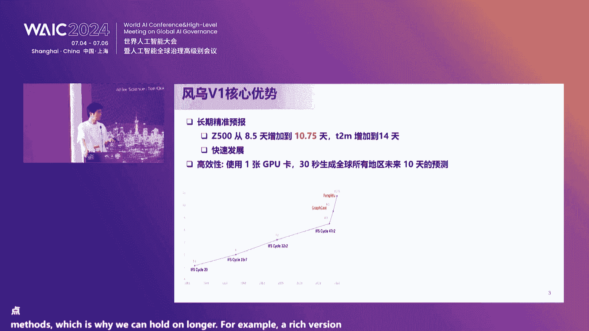

# 2024世界人工智能大会（合集） - P39：20240705-AI for Science：十问论坛 - WarrenHua - BV1iT421k7Bv

🎼尊敬的各位来宾，我们的活动即将开始，请各位。🎼入座，谢谢。🎼好的，各位来宾呃，我们的活动现在开始。尊敬的各位来宾，各位领导，各位老师，各位朋友，各位同学，大家下午好。我是欧阳万里。

很荣幸今天能够以主持人的身份和大家在AF十问论坛的现场来相聚。首先，我仅代表上海市人工智能实验室世界人工智能大会组委会对大家的到来表示热烈的欢迎。

同时也对给予我们论坛大力支持和帮助的上海市经信委、上海市发改委以及上海市人民政府等单位表示衷心的感谢。当然我要感谢我要特别感谢各位领导的莅临与指导。特别是咱们今天呃来到现场的嘉宾。

包括呃复旦大学复杂体系。多尺度研究院院长，上海人工智能实验室领军科学家马建鹏老师。那么呃mic克是北美国国家科学院院士斯坦福大学终身教授，他也会在线上跟我们来一起参与今天的这样一个论坛。

同时参加今天论坛的还有呃。来自于中国科学院院士、北京大学蒋西教授鄂维南院士，他等下会来参与我们的这样一个论坛来做主旨报告。还有来自于中国科技大学蒋西教授姜俊老师。

联合国全球地理信息知识与创新中心主任李鹏德主任。同时还包括艾斯维尔全球高级副总裁兼大中华区总裁李林女士。上海医药集团股份有限公司中央研究院副院长夏广新。院长。同时还有我们参加论坛的各位老师和嘉宾啊。

因为时间关系不在这里一一念出来了。那同时也感谢各位专家、学者、业界精英和学生与我们相聚于此，共同探索人工智能与自然科学研究之间的交融与碰撞。

我能够感受到大家对于F science领域最新的焦点问题、研究范式。技术应用等等都有着强烈的好奇心与探索的欲望。这也和我们举办air science论坛的初心不谋而合。

我们衷心希望这个平台可以方便大家参加。通过今天参加今天的论坛，使得学术与业界的嘉宾和观众们进行探讨和交流，相互促进。其实我们今天的论坛有一个很有意思的主题，相信大家通过预热也有所了解。

那就是air size1问。科学智能1问。当前，我们正处于人工智能与科学研究的交叉点。人工智能的飞速进步正逐步打破科传统的科学界限。在这个大背景下。

人工智能的专家和科学家们对于air science的未来提出了一些新的。共同关注的一些焦点。我们将向大家。关注的最多的最热门的这样一些焦点提出来了呃10个问题。

这10个问题也与我们论坛后面的议程息息相关。希望在这些一问题的引导下，我们可以更好的去探索人工智能，如何重新定义我们对于科学的理解和实践的方法，并由这10个问题出发，探讨如何利用人工智能。

推动科学理论的革新与技术的突破。加强不同学科之间的融合与合作。那让我们来看第一个问题。当今社会是一个智能的社会，随着科技的不断进步和创新，智能已经不再局限于传统的范畴。它已经渗透到我们生活的方方面面。

那么智能有哪些形式与科学有什么样的一些关系？让我们带着这个问题倾听miccha克 le位教授对于智能的深入见解。m克 le是。诺贝尔奖的得主。他是美国斯坦福大学终身教授和美国科国家科学院院士。

也是生命科学领域的先驱之一。今天他演讲的题目是biological intelligence ，human intelligence。And machine intelligence。

 all for science。由于特殊情况，mic克教授无法亲自到场，因此他通过录视频的方式向我们呈现今天的主旨报告，请大家观看屏幕。Well everyone。

 this is my first time speaking at WAAC， unfortunately I'm not there in person this year。

It's interesting that all of my talks over this period of six years from 2008 intelligence。

 biological intelligence， human intelligence and machine intelligence。

 but in the very first talk six years ago， it was almost nothing about AI and now you will find that there's a great deal for AI I think all of these intelligences have a huge role to play in being for science。

So let's just start out。With these three intelligences。

 we have biological intelligence which came first， nature invented biological intelligence。

 biological intelligence made humans， humans then made machines。

 and now the machines with AI can change both biology and humans， so we have this trilogy。

 this triad of these different intelligences working together。🎼Firstly， biological intelligence。

So biologyology is really smart。 It can make amazing molecules in chemistry， amazing materials。

 little machines that are thinner than the thinest wire。In the best semiconductors。Stlls。

 which are really complicated， but very well organized neurons， hands， eyes and brains。

 How does nature manage to do all this incredible design？

And the answer is it learns from evolution what can we learn from evolution if we look at the tree of life。

 we see you here on the left a very complicated tree that starts with very simple organisms and ends up with very complicated life like human beings in gorillas and horses and things like this。

 life started out three billion years ago very simply and which time had become more and more complicated。

And if we actually look at the whole tree of life， we discover that most of life。

 everything shaded here in blue is complex， it's a life that comes from sexual reproduction where every species is born of two parents。

The very simplest life shown over here and magnified over here， which is bacteria and archaea。

That life simply clones itself， so simple life clones， complex life has two parents。Now。

 what does this actually mean， People often think that in evolution， we have survival of the fittest。

But the fact that things became much more diverse。When we had two parents。

Basically indicates that it's not so the furthest。But survival are the most diverse and this makes sense as any banker will tell you。

 if you have a diverse portfolio， you're likely to survive many crises the key thing for the DNA to survive is to basically not be knocked up by any one case and therefore we need diversity so the lesson we can learn from biological intelligence the general lesson is that diversity is a very。

 very important part giving us great stability and great safety against an unpredictable future。

What can we learn from human intelligence？So one of the important things from human intelligence is the information we pass on one to the other and an example that I want to use is how great scientists become great role models for other scientists and so there's a progression and this part of the work is essentially about my own own case when I was in my late teens。

 early 20s who had the great fortune of meeting a number of very， very important scientists。

First person whom I met was Max Perth。He got his Nobel Prize in 1962。

 he is the person who invented the method of solving protein structures by crystallography。

 he was working on a difficult protein， the protein hemoglobin， which contains about 6。

000 atoms and he wanted to know where every atom was in space。不行。🎼The protein my。

 which comes from the wh。🎼And。🎼I the5 where could be killed one where。🎼This course the main person。

🎼This recognition。🎼I。🎼ello。🎼Thank you。🎼I like the when was American。🎼It。🎼我一者主意。😊，🎼What。🎼，Yeah。So也。

Yeah。🎼The I interested world name。所以。🎼the structure of DNA to get the culture。 Now。

 he does't find some way radical biology。 But what for me was no。 this from DNA。🎼The the that。🎼그怎么。🎼。

🎼I。🎼In like what。🎼这。It。🎼The actually designed King courage which we。🎼There。🎼The measures。🎼long。🎼も。

🎼你我不辈。🎼局年。🎼The social engineer。🎼A。🎼G comes the institution with world。🎼。🎼We。🎼我们都。🎼。

🎼It's a medical research company in more Singapore。🎼Cingbridge humanss。🎼You。🎼We。🎼And was1958。🎼。🎼60。

 they got 28 Nobel Prizes。 This is Mor。 This is for a total body of scientists and technicians and everything over those 60 years or probably 3000 people and out of that。

 almost one in 100 got an Nobel Prize normally it's about one in 10 million。

 So one in 100 is really really unusual。 And what was special about the laboratory。

What was special is essentially that the worthy was run by experts。

 and he ran it as he believed to be done， first thing is。

 make young scientists independent and responsible。He small groups。

 so people are only doing different things， even the most famous scientists never had more than five people working under them。

Support everybody without grants， get everybody each group I love to survive on。

Perhaps most importantly， policeris used all his genius to eliminate all bureaucracy。

 it was so bureaucracy， but hed made sure that young people。

 students like me never had a sin of the flow， never had a requisition anything if you wanted a chemical or a computer or anything like it。

 just witness that I need it and you' got it， and then again it was very high peer pressure。

 you are only as good if your next paper， it doesn't really matter what you've done in the past。

 what matters as what you' done in the future。So now I come to the major part of my talk generative artificial intelligence。

 computers were of very， very important in all of biology， all of my own works。

 but in that case we were essentially using computers to solve problems that we defined。

 We have no reach a search might amazingly where generative artificial intelligence and actually do things that we didn't think about and are not using them as tools。

 So let's go。So the basic idea of general artificial intelligence is to try to mimic her nerve。

 It goes back to something that biology invented。 This is a picture from us。80 years ago。

 on the collicton pitch， the simplified nerve cell， we have the cell body with many inputs。

These dends， there's a long nerve fiber and then many axons。

 many terminals so basically we have many in into a body and all the outputs out again so essentially this cell body does processing and the processing it does is that each of these inputs has a different strength。

which is being learned and the cell body then adds up all the inputs and if it gets above a threshold it sends a signal down and the same signal gets the all the action and this is a very simple idea。

 you can draw a picture like this where you have this cell getting in giving its outputs to other cells。

 each of these cells integrates the different outputs because it's to other cells and so on from in to out and this is now a simple neural network but in this neural network。

A very simple operation is taking place。What is happening is that。The input signals are added up。

 all the inputs into the cell are added up。Add it to a constant and sent to the next cell。

 So essentially the signal， the output is essentially the sum of all the inputs。And this continues。

 so what is amazing？Is that this simple and。Theice with massive of a mass of computer can basically seem extremely intelligent。

 So this now brings us to the large language models artificial intelligence today。

 and this changed very dramatically about two years ago basically the company OpeniI had been using transformers invented by Google and a lot of computer power to make various incarnations of ChettptT ChettpT1。

 which only experts heard about Chettp2 which supposed to become more wellknow and then finally Chettp3。

5 that people were allowed to use and ChetptT is essentially machine had given a few words tries to predict the next word How does it do。

 And it's actually very complicated I recommend all of you who don't understand this ids to go and watch this YouTube video from Blue13 blue1 brown and my slides here are just taken from that。

 So essentially。One of the key things is that every word for token becomes a very long vector of numbers。

 a vector of about 10，000 numbers， and these numbers are determined by giving many， many tokens。

From different decisions， different contexts。A word is not always the same meaning。

 but it has many numbers in it。And these numbers essentially define a very hot large vector space。

 It's a vector space of 10000 dimensions。 And there are many points。The nephew， the niece。

 is moved by the same vector amount in this space， meaning female going from man to movement is a yellow arrow。

Then things become very complicated because the're different tocans speak to each other by something called transformers。

 and again it's just neural networks summing up and adding and passing it forward。

 and then it becomes even more complicated but the idea is given a sentence。

To try to guess the next word， and this is something which has been done and this is what the thing is doing。

 but if you get the next word， you can now guess the next next word and so on。

And this bemin has preceded many， many times or for one where I'm sure that's the calculation to get the next word。

It's probably more than all the computer power that existed on Earth 30 or 40 years ago。

 and it's done for every single word coming out of these large language models。

Just as a reminder you to look what's going on。So basically， the models that we all became aware of。

Were released in at the end of November 2022， checked CPT 3。

5 and then three months later checked in PT 4。0 and about six months ago， checked CPT 40。

 and basically， the idea is just to take a huge amount of text。Millions of books as import。

Fleed it into the thing。 Get your tokens vectorized， and then have the thing guess the next word。

With human training and computer training and in this process。

 optimizing these parameters W andB that I mentioned above。

 I'll just go back to remind you the mathematics is the the。Output。Is equal to。

The input multiplied by weights plus a constant into the hidden layers and then summed up to get the output。

So this very simple scheme was released to everybody。

 and this was an amazing step because basically initially people had no idea how to use it。

 I remember very early on Oscar get a good write a loop in fortre。

And it turns out I used to know Fortreran used to in my first language。

 GT is a super expert at Fortre， so over the last about 20 months。

 I've used GPT tens of thousands of times asking all sorts of questions and slowly starting to understand the breadth and intelligence of these large language models。

Here are some recent examples。 if you have a robot a dog on a ball。

 try to make the ball move as fast as possible， the robot that moves to fast or fall off。

 and here they compare a human trainer to GPT as a trainer and GT can train this robot more quickly than a human being can。

Another example is that GT actually has very high emotional intelligence。

 You would expect a machine to have a high IQ， but it actually has a high emotional content。

 And in a paper that came out of Xinhua， the G is smarter than about。

90% of people in terms of its emotional intelligence。And thirdly。

 GPT or computers are actually very very good at diplomacy， there's a game called diplomacy。

 I certainly imagine that they would also be very good at real diplomacy。

 but in the game diplomacy which the old board game from the 60s。

 you have a map of Europe and you have different countries and the aim is that try to win Europe by having alliances that make you stronger and stronger and GPT plays better than any human being it also plays very nicely。

 never cheats and is never unpleasant。talk bit about my own use of GT。

So I started using it to write Python code， My language was C， the Pearl and Fortran。

 I didn't like Python， but it was GT， I became a pretty good Python programmer。

 and now Python is essentially my first language。It's also great for learning new areas I was interested in Chinese medicine in the desert areas of China。

 I don't know anything about that I could immediately ask this question and if the answer doesn't suit market so。

 please tell me more or please give me some books and once it's given me books。

 please summarize the books and so on It is amazing at transmitlating languages all the Chinese and my slides come directly past English into GT we found it extremely good for medical advice when you got older you often have a lot of ailments and the medical advice is extremely important wonderful for legal advice you can have a contract written in Chinese or any language。

 we enter GPT and say please tell me anything that's unusual。And finally。

 and I think that's most important。GBTs emotional。intelligence makes it very。

 very good for emotional support。 If you have an argument with somebody， I think it is way。

 way better to ask GPT what you should do than going to a psychiatrist or psychologist and it really isnt incredibly important you're a young person and your boyfriend or girlfriend who had just left you。

 you'll find the advice。块性没思。Let me just say an example。 I was studying COVID。Very。

 very intensely since January。2020， and I had certain tasks like identifying peaks of COVID and basically I was not able to solve them。

Until I solved the problem， until I looked at the problem more recently using GPT。

 I basically set a GPT， please write in a program that will find all the peaks and they wrote the program and then I use the program and the program became more and more complicated by adding subroutine the program is now over 2000 lines of Python and it works amazingly it can find all the peaks and identified them and tell you what kinds of peaks they are this is an early version。

 but we're able to do a huge amount with this program in 198。Noing is A。To你。

Is you can talk to your computer。🎼。Yeah。Yeah。就。But you con。To do what you need and what you want。

The you big。Much smaller than than you were。有审理人。反正。

We'll have these AI devices for making us better and better at anything we choose to work on。

ItMy final summary。Sing slide。How I see to the whole history of biological intelligence。

 human intelligence。And a。So essentially a long time ago， about 3 billion years ago。

 we had a single gender opening。A single bacterial cell， I'm going to call it a mans cell。

 my wife says I shouldn't do that， but it's kind of a joke because bacteria are simple。

And the fittest survive。 It's really a big。Strong man thing。那你把这本金的要是掉。

A logic and intelligence with nature invented sex， cells of two kinds， male and female。

 and the offspring was a random mixture。Of the genes of the man and the woman。

And this gave current iPhone nerve， which is complex and a huge amount of diversity。

 greater greater diversity and essentially。The most。

Advanced beings being more and more complex themselves because if you are very complex。

 you have come this behavior。What about going forward from today， We're going to have man。

 woman and computer。I believe， more and more。I we go to leave the hyper complex paradise。 Obviously。

 I' would be happy to be able to discuss this。 But for now let me thank you all。最修。

michael让我感受非常深刻的一句话，就是AI smart。 do you can make AI smart。人工智能是聪明的，但是我们可以一起来。人工智能变得更加聪明。

那么呃非常感谢michael为我们带来如此精彩和富有启发性的报告。呃，那。🎼。是互相影响的。我们在开发机器智能的时候，可以从生命智能以及人类的智能中去获得灵感。而机器智能也的进步。

也进一步的可以让生命和人类获得更多的可能性。让我们再次用感掌声感谢michael深入浅出而富有启发性的报告。近年来，AI革命几乎渗透到了大部分的科研领域。我们从michael的报告中宏观的了解到了智能。

那另外一个让我印象深刻的来自于micel的这样一个PPT就是他有一张PPT展示了20多个诺贝尔奖的获得，其实都来自于同一个实验室，这确实是一个媒景的这样一件事情。

但是实际上这个PPT里头有另外一个隐藏的这样一个信息，就是其中有非常多的来自于结构生物学的这个获奖。比如说发现DNA的结构，发现蛋白的结构，发现各种这样一些生命微观，我们希望得到这样一些结构。

那让我们来更加呃细结的来探索AI在具体领域的这样一些发展。那近年来生物医药与人工智能结合发展火热。那么在生物医药的这样一个领域，AI所带来的进步的着力点，到底在哪里呢？

这个问题将由我们的主旨演讲的第二位嘉宾来回答。他是复旦大学复杂体系多尺度研究院院长马建鹏教授。马教授领导的团队自主研发的oppos系列国产软件在性能上领跑全球。

并成功搭建了全链条AI赋能新药研发的先进技术平台。今天马教授的演讲题目是。全链条AI赋能新耀创新，非常期待马教授分享AI在新耀创新方面的发展和最新成就。让我们有请马教授。嗯。非常感谢欧阳啊。

我我我我同样作为一个organ之一，感谢所有来来来来唱会的嘉宾。这个我们经过了艰苦的努力，终于办成了这这这一场非常正儿八经的这个AF3。那么我想给大家汇报的是啊。贵。确是。啊。

我题目呢是对呃这个全能F能星药创新。大家知道这个AI现在几乎是人生无处不AIOK当然在我们生物质疗生物医疗行业，这也是无处不在的。我的报告内容主要有三个方向。

就一个是静态蛋白结构的计算一测和静态蛋白质结构的实验测定以及动态蛋白质结构的模拟。相到一定方向。这张图很重要，就是整个这个跟。药物研究有关系的流程图。最最左边tar protein selection。

就是这个目标蛋白的开发。这个呢实际上从新耀创新来讲是一个最重要的起点。我们国家一直讲要新要创新，就育创新。你任何药总是要作用在一个基因或者蛋白靶标上，就tgeright如果这个tt不是你找来的。

是你文献里读来的或者是 commonlymonly used只国际制公司都在用的啊你可以做。但是你的这个创新的优势啊是不强的。

因为你会做别人也会做申请一般人可为你更为别人比你有钱但是呢这个这个tt selection它是一个技术学问制药厂呢不太做这个事情因为很难产生这个产权因为以申请I申请专利。

但是呢这个tge可能你可以放些 science，但是这个非常重要也是我们国家必须要上的这个地方有多的I应用但是是时间关系不是我讲的重点我们在这里也做了很多工作。然后呢。

你有了他OK那接下去就是一个蛋蛋白咯，你现在要把它的结构确定出来。因为你要涉及要我嘛，大部分时间你是需要知道这个蛋白质的结构的。那么蛋白质结构呢涉涉及到三个就是带这个皇冠的都是跟我们工作有关系的。O看。

第一个是其实最底下也是最传统的，就是用实验手段。以前是这个X光映射。我们湛江有一个呃上海光源就是干这个事情的。OK现在呢普遍用的是冷动电竞技术来测定这个蛋白质的结构。然后呢，现在最近呢又红起来。

就是这个up food，上面就是计算机预测comp prediction，我们叫opalright。这里必须要强调一点，无论是做了很多年的，其实这个呃呃实验测定蛋白质结构是就是刚才欧阳老师讲的。

说英国剑桥大学这个NLBMRC开始的人类第一个蛋白质就是那测定在他30年纳粹在轰炸伦敦的时候，他们都没有停下来。所以MRC一般剑桥大学MRC一般会被被被被这个呃呃呃呃。

最最最最最重要的一个地方是几乎所有的这个李顶的这个结构生物学家都从了出来，包括mic，所以他非常呃呃自豪他这里出来出了28个多倍讲那么无论是实验测定这个呃蛋白质结构，还是用计算机来预测它的目的。

是一样的，就是确定一个静态的单白质结构。然后呢，这蛋白质结构其实并不是静态的，再再再再往右右边去一点。

这个下面这个方框dynamic protein structure simulation蛋白质结构实际上是柔软的。但是这个蛋白质结构的柔性的flexibility是很难用实验来测定的。

所以呢大部分情况下是用这个计算机模拟就special呃呃。分子动学模拟。那么你如果弄清楚了静态结构，无论是你用实验测的，还是用呃是用计算机预测的。现在这两个就走在一起了。然后呢。

再再用这个计算机模拟以后，你动得静的这心思都弄清楚了以后，你才有可能。去实计药物啊，实计药么传统的使用的小分子，有机小分子，现在有机小分子呃跟它可以对抗的。

甚至更加有效的是生物大分子药这放心为I很多很多的而且都在做很多很多人也在做那么然后呢就是这个动，你才能这个所以做要了是个相对比较长，是一个很难分得清，到底是工程问题还是科学问题。

到底技术问题还是应用问题的这么一个学科。但是呢都很重要。每一个环节上现在都有AIO甚至最后的现在这个临床实验。A呀也也也起来了。OK因为他可以帮助这个呃呃呃代价的大大下降。

好了，那么我今天主要是想汇报的是123就三个皇冠，这是都跟结构生序有关系的计算方面的这这个这个这个这个工作，我现在慢慢往前走啊，就是我们历年来发表的文章。静态蛋白质结构为差，这个呢对这个。

Odience呢是很熟悉的，就是F foot的 two或者现在又有F foot的3这个相关的领域。你用计算机人工智动的算法来预测它面结构。我们呢开发了一系列叫呃叫这个op的系列。

那么这个地方呢有一个问题，就是我们花了很大的力气。自从AF two出来以后，他的精度还是确实蛮高的有那么一段时间我们做做做了几十年这个工作的。

我包括这个行当是在50年前创O都都有点蒙蒙圈了个因为在在我整个里面包括mic相信就是说都当时认为在我们的有生之年你是看不到这个这个这个问题啊被彻底解决。但是gogle他前迈了一大步，但是我接强调一下。

他没有解决这个问题。O只是他往前迈了一大步。那么。这张图可能很多人都见过，就是这个co competition在每年每两年这个国际比赛如何来呃呃预测蛋白质结构。你看0呃从206年开始到16年。

它一直在340这个抖动O。啊。我他是点抖动的吧。所以说老师我跟你说，当时这个18年就是20年F two出来以后，不跳到89%吗？我领导导问我我国内有没有做这个事情领导脑袋向担保。

我们国家没有士以前做这个东西，因为谁做这个东西谁上因为这个当你看他他这个文章很难发稿年做不管怎么说在2020年右的时候，他这个预测度跳到了这个89%或者88%这个问题呢是这样子，如果你达到90%呢。

这问题摸了解决了因为实验进度也就这么回事所以当大家都非震惊这个I技术确实是不一样的。但实际上呢没有那么简单。

喂。首先呢，我们一直在分析，那AF two这么强大，他到底有什么问题吗？😡，你看啊。很多人做计算的人都可能忘了，就是如果你今天我给你一个蛋白sequ啊序列你你用F two也好，F3也好。

他肯定可图出个结构出来。但假如你手上除了这个计算方法，你没有任何的其他信息，比方说实验测定啊等等等等。其实你是没有办法判断计算机AI吐出来结果到底是对还是错的。这是个非常重要的概念。

因为为什么专业专业数位叫能量不是最好的，不是一个反应坐标的问题。O你没有办法估算出的。那你你你可定要问88那是因为国际比候评委手上有标准答实验工作组已经把结测了以后把这蛋白质序列分发给做计算的同行让他们回评是这出来。

假如没有这个实验信息，你根本不知道结果到底对了错了也可能啊个平均的估算。方说你道F成功率大概是多少用一下是一个另外一个呢就是说这个第个基础细节这个方法也是这些大部分应该不全大部分方法测的一个基础这。

用的是遗传信息，那因为现在但白序列很多嘛。O所以他确实从共进化的角度讲，他做了很大的贡献啊这件是非常不容易的。他用的M并不是保证发明的，但是他他把它用到了极致，但同样带来了一个致命的弱点。

就是说像 two这样的方法，他对点突片没有任何敏感性。什么意思呢？就是你换掉一个氨基酸。他土塞结构是一模一样，那是什么后果呢？因为所有的遗传病都是点突片。😡，其实你你做遗传片是做不了的。

而且不要说点突变不敏感，他对小片段图变就是稍微几个吧比方说小于5个，他也不敏感。另外呢，你也不知道他到底你把它突变到多大的比例，他才开始变。所以这个是个很大的问题。所以从某种意义上，你像我做结构生物学。

结构生物学校，是这样的。😡，AF two我们先不要讲F3了。AF two它的贡献。应该说欧老师，您可以批评我也是不对，就他对AI这个行当的contribution要大于。对蛋白质这这个为什么？

因为这个蛋白质折叠这个问题是太阳底下最难的一个问题之一，它确实往前推了一大步，但是他并没有解决。但是因为这么难的个问题，你也能前推这么一大步看见他的这个个算法的确是跟以不样。

所以他对AI的领域的贡献的确所以现在有这么I的这个这个这个行当在那里，但是这个蛋白质折叠问题本身没有被解决。那么如果这个问题没被解决，你就问了我能拿拿它来做嘛。是这么个问题。

接下去呢这里个所以呢就对这个第三条就是如果你拿F结构直接去做的话，你可能要小心点。OK因为它是很大的误差的。那么其中一个最大的误差就这些蛋白质的测量。😡，什么叫蛋白质测量？

蛋白质一共蛋白质就不就分两个组链和测量。主链呢全是一样的。20个氨基酸的区别就在20个不同的测量上面。那么这张图上面这张PPT上就告诉你。😡，凡是跟蛋白质结构有关的一切的inter。比方说蛋白质折叠。

蛋白质蛋白质相互作用，蛋白质配体相互作用，按基算突变蛋白质进化等等等等，的归根到底都跟测量有关系的啊，我这里讲的是归根到底英为什么你一开始你可以忽略这个这个差别来随便搞一个这个这个这个模模模型出来。

但是你最后要把所有的原子都放对，你是绕不开这个测量。为什么因为1物分子全部都是跟测量相互作用。所以你测量只要偏一点点，你拿下去做要，它一定脱吧。This is the problem， okay。

好，那么我们呢这是我们组的这呃呃呃这几年的工作，就是说我们一直在发展这个测量的建模方法。现在的是已经到呃ro root five已经发表了root six也也也出来了。

就是说一句话就是它的测量建模性呢远远优于这个F two。在我们正在系统的跟AF3比，因为F3并没有呃可源呢。OK我们我们已经把它系统的从呃复现出来了，但是他的车点应该也还是没有超越我们这个东西。

但是呢靠近了一点。好了，所以这个这个事情任重的道远就是说。我们评估下来，现在的这个人工智能最强的测辆预测方法。离真实结构还有6%的di。但这就是非常大的一个地方在这里OK所以呢要要要要继续努力。

没有测量呃呃呃，所有的东西其实做出来就是。主要是不行的，反正就上一次可能够了。呃，真的是这样OK。这个呢是另外一件事情，我个人认为这个东西inact更大。为啥？因为有那么一段时间，刚刚AF都出来的时候。

人家不是说严宁为什么回来，是不是他他他的他做不下去的那是完全扯淡然，正好倒过来。OK因为这个计算机预测的东西啊，可以啊。他们曾经以为可以替代实验测定，实际上是根本不可能的。OK那么在实验测定方面。

他仍然有另外一个问题，就是说蛋白质刚才我刚才不是说了嘛？这个最近我们发表的那些买配本，蛋白质是柔软的。😡，在冷冻电竞这种实验技术电子显微镜啊，在拍照的时候，如果底下的蛋白在那摇来摇去。

那你肯定看不清楚吧，因为他是要求平均的，拍很多人多照，求平均，不是一张照片就能看得清楚。OK所以这个这个柔性问题一直是困惑着所有实验结构生物学家最大的一个难点，也是最后一个堡垒。

那么也是现在世界上的一个一个一个前沿。咋回事呢？就是在确定生物结构是构向的灵活性，或者他叫一制性，就是有差别。O是提高分辨率这难以克服这个障碍。那了，你那里摇来摇去，你怎么看得清的？但是。

生物学家、结构生物学家，如果你能从实验数据中直接抽提这个动态信息，那又是每个结构生物学实验结构生物学家的梦想。说起这句话呢，像我这种做计算出身的啊，有有有有有有有很长的写了一次。

就当年啊现在我告诉你全世界绝不可能有人再来敢说你这个做计算东西没有用的。O但是当年做实验的生物学家，他是瞧不起我计算。他说你这个东西基本上就是我们的这个进度呢是不太够然后呢，所以如果从抽屉动态信息。

他除非你是从实验数据里面啊，你有什么本事，那是另外把它抽出来，那他信如果我说我做分学模拟，那是不行。但现在世界已经完全变这个是是我我我的确我个人是没有指望我能够活到这一天，但是看到了。

而且我没休所以呢这个计算方法是解决个问题唯一途径那是什么问题呢是I框架我就细过了。

你看啊这个是密度函数，就是冷冻天线解触结构，不是像那个球棒装的。OK是是这样子的。你你只要看这块。在同样的模型下，绿颜色的是用新的这个DSD方法构建出来的map。后面呢上面这个紫红色呢是同一套数据啊。

用传统方法，你跟他们差很远，绿颜色的比这个紫颜色的要饱满的多。那你想想看，原来你床备的方法有这么大的误差，你拿它去做药，你有没有想过你手阴没发抖吧。对不对？就因为你是上面这个绿颜色的方法。

就是用他用用AI的技术以后，它能够更准的区分出不同构象的分析。那你可以单个分别的来求平均，对不对？而不是把它全混在一起。你求平均的话，你如果把它摇来摇去的求在平均嘛，求在平均位正当中，可能正好等于0。

所以这是个问题。OK那边也是。好，那么这是个电影。

这不是分支中学模拟哈，这是从实验数据里直接抽出来的。😡，OK它数据里面就就包含了这一些这个这个这个构像的分布。

那么注意这个是E就冷冻电技术有有至少有两种两种两两大类一个叫s particle就是什么叫是单一的蛋白质再大也是一个单一的蛋白，它呢相对容易比样品比较容易准备。所以呢照片可以拍的清晰一点。

还有种呢叫ography就是这个这个断层描方断层扫描是因为如果因为s particle它是要求你把你想解的这个蛋白进行出来进行纯化大规模的就是你可以拍很多很多照片，不同方向上进行投影，它要纯化这个蛋白。

那纯化了以后这个环境已经不是天然的还有一个问如果你像在细胞的原位上面对它进行拍照。那你就只有一个蛋白一个靠怎么办？那你就把这。电子数啊进行修旋转。

而不是把这个呃呃呃样品啊呃放在不同的orient下进行投影。那这样的话的，你的数据还是不够的。OK所以他现在的这个这个呃这个冷动电器的这个前沿。就是这个ET，这不是叫EM，叫ET。

这个T呢也可以是切片的这个细胞。也可以是呢最后可能要组织了，那就那那就更高了这个这个要求对吧？但是因为冷冻间就有一个确定。

它这个电子数的穿透力只能一个薄就比一个细胞要薄所切片切片技术不是一个简单且在切片下极像极的这的感罩比非常差的信号你要判断出你想要那个蛋白在哪里有个视野下这个全都是出蛋白O好。

那这种情况下那么分辨率更低了，你怎么才能就是红啊就是ography这种情况下还能判别出它的那难度就高了。正是我文刚投出去好同样这个这个这个圈圈里面紫颜色和绿色两个你也能区分出来那I算法的要求就更高。

那么。

一。好，问题就在于这里。无论是EM还是ET，你你能够区分出好几个不同的呃这个构像。但是你没有办法知道他们之间是怎么连起来的，或者说这个呃。Casity。这是个时间相关心理是。

那时间相关性在这种冷冻电竞求平均的这液氮温度下是无论如何测不出来的那只能靠分子东西来补。那分支中学有个问题。第一，如果是1个ET电进出来这么模糊的东西，它只有一个den map。

你能构建这个呃原始结构吗？有了原始结构以后，你从哪一个起点走呢？从A组到B，它肯定有很多很多的事情啊，所以整个landscape要全部模拟出来，是一个非常大的挑战。所以呢，我们这个这个是这个方法。

我们刚刚呃交到那前买这个东西，你看啊。他有个关键在这里。这个方框里面的图，你可以 roughly理解成这个population density你可以把 density密度给它求出来比这个事情里面这种conform可能跟边上的不一样。

你可以把这个其他都是根据建模型啊，际上没有一个容易的么ro fivero six啊等等等等都都涉及到I算法，我这里想强调的是那种红 potential derived from density回事呢？

这个太密度的lock。可以想象是一种potential式。你用这个potential方作为改iding呃呃呃呃这个restraint不是constrain restraint。你在做模拟的时候。

你就可以从一个事井。走到另外一个星，否则呢你是走不过去的。O那走多了以后，你可以个马夫圈把它给给给构造起来。所以呢这样子就就允许了你即便在一天这个电竞下这么低的re，只要你能够区分出它的不。

你就可以用制东西模拟，把这个时间呢呃时间相关性给它串联起来。最后呢企图就是把所有的这个这个这个我也不知道怎么呢，就是把所有的这个呃。😡，东西都给连起来。

所以呢这是最后一个就动态蛋白质模拟动态模拟呢这不是一个新问题。分模已已经很久了。以前BM有这个这个纽约还有个搞了个个专用计算机目的都是为了做分模拟，也就是蛋白质结构的分模历来是。

电脑公司用来测试它的电脑的这个high performance computing的一个一个一个一个标杆。OK它是因为计算量非常大，它跟AI还有一个区别。分析同学模拟不是。

AI一般情况一般情况AI你可以分散在很多机器上模拟这个 cost very high以你不是说机器越大速度越快好，那么我们呢开发了一套算法就是还有个问目前无论是预测结构带有误。

是很的误差没有太多的其他的这个I算法能够把它继续跟进，就错强。最后半英的怎么？模来了是完全才是发挥作用的因为终时也不那么当年是。

呃，他这个机器出来以后，他付了很多蛋白，最后个，他们居然 type野生性的没有付出来呃，我们用我们的这个呃CSC这个方法就缺了个1。7说明基本上就好了，他这个4点3没复起来呃，这个这个算法的细节呢。

我就不讲了，里面做的O这个结果呢告诉我们。就算你没有这个专用的平台，如果算法做的好的话，你还是有可能超越他的。我认为这个理念对我们国家现在非常重要。因为我们的算力受到了别人的卡脖子OK但是你算力不足。

可以用算法来补，没有人会限制你算法怎么做的。对吧，所以这是一个一个一个一一个问题。那么这个呢是co14里面，这是个例子。co14里面有一个 target给的就是这个T1027啊，这是。

the most difficult target为什么他这个董大白的人做出就是very ruby，就是一大半的区域。是没有讲。OK都是这个这个结构的松散区。所以呢他的这个结果啊。

他当时专门还有人写了篇文章关于这个体系。他的最好的cocomp只有5。77安，5。77安算的误差是很大的。对的蛋白质来讲，我们经过了这个呃长时间的这个分丝动旋玻璃啊。这在浦江省市做的。这个达到了2。

89。2。89的话，说明他已经进入到reasonable，虽然没有到1。5上，但是大部分的实验机构也只能在这个进度，所以这是相当相当相当不容易的。O我甚至觉得这个体系应该作为一个A个挑战。

让谁向structure一多上去做去，看你能够达到多少。他真的很难。另外呢，那这里算算不足算法来补这上面的写的这这是个电影，这不是刚才那个体系啊，是另外一个体系这个这个体系虽然比较小，它有三个对吧？

两个红的一个黄的两个红的呢是比较容易这个黄是极其难到位的。等会放个电影看它上面有三个绿颜色的环，这三个本环，它的到位是极端困难的。你怎么怎么就不动了呢？算了。电死掉了，我不看不管怎么说呃。谢谢。😊。

air。谈判。总而是，这个电影的末端，三条螺旋全部到位，不仅全部到位，三个也全部到位。所以下面就这样高精度的测量安置，很难靠力蛮力模拟来完成。一定要优一的算法才能完成。

对我刚才讲我讲了半天还是在强调这个测量。因为因为要物设计，没有测量是没有意义的。OK好，接下去呢我们也同样拿了这东西去了做了这个正好有一个体系，这个体系是非常大的一个。

每一个不同的这个啊是每一个这个翘程，就是不同的呃分辨率的翘程。你这张图上你无无非需要看的就是红的必然的高，说明我们的做做到位了。OK那这个呢是我们现在最后的这个平台的这个这个就是静态蛋白。

上面是我们正在搭建这个垂直模型。OK现在垂直模型，我们前两天在浦强实验室也也也在讨论这个问题，就是说。我个人认为。通用模型很重要，就像大学生的通知教育一样。但是有了通用模型以后。

真正对科学技术发展起作用的，是基于它基础上的垂直模型。所以垂直模型还是非常重要的。所以我当然做计算垂直模型那用了它以后。

你可以结合各种多模特数据来来确定那么你有了静态蛋白结构的预测动态蛋白等等等那加在一起它可以构成一个新蛋白设计的平台白质这个设计是为了蛋白质科学个前因为ing蛋白付的差不多了。你就起来也是另外一。

但是你做设计还以那么这也是合成生学的基术。因为。很多是合成生物学生在合成为生物，这也很重要。但是真正的合成生物学是要从蛋白质设计开始的。OK也就像造房子，你要设计个房子，你首先要会设计砖头。

否则的话这个是是是是一个呃呃本末倒置的事情。喂，所以我讲了，谢谢。好的，非常感谢马老师精彩的演讲啊。关于我们刚才提的问题，在生物医药这个领域AI的着力点，马老师从蛋白质的这个角度给了我们相应的回答。

实际上有三个可以去考虑的着力点。这也是对于很多比如说在做蛋白质结构预测方面看到有F2F3出来以后来考虑哎，我自己的研究还能怎么做。从可以去考虑的三个的着力点。一方面，在蛋白质静静态结构预测方面。

我们可以去考虑测链的这样一个呃比较难的这样一个问题。第二个方面，我们可以去考虑静态结构的这样一个实验测定的这样一个具体与实验更加结合的这样一个方式。另外一方面。

我们可以去考虑动态蛋白结构这样一个其实A并没有去探索到的这样一个领域。那么呃马教授的这样一个精彩演讲，不仅为我们提供了关于蛋白质结构的这样一个全貌，也同时激发我们去思考我们未来的这样一个研究的方向。

下面将来到我们的发布的环节。上海市人工智能实验室。一直致力于让人工智能与自然科学家一起来共同去拓展科学研究的边界。特在此重要的场合。我们发布。科学智能创新平台谷歌。

那普科的英文名是叫open science lab，寓意为我们希望以开放的心态开源的方式去促进科学研究的发展。那么实际上，美国的社会学以及管理学方面的学者在这个nature的杂志上呢发表的文章指出。

随着时间离我们越来越近。我们整个世界发表的文章和专利越来越多。但是在另外一方面，我们的这样一些发表的文章，他们的这个新颖性就变得越来越少。

而科学的发展其实相对而言是变得越来越慢的那这是因为我们不同的学科之间，因为越来越细化存在更多的这样一个壁垒。那科学家们称之为信息减房。在上海人工智能实验室。

我们将以普科作为平台去打破各个学科之间研究的这样一个壁垒，加速科学发现的发展赋能国际民生的关键领域。那在人工智能驱动科学发现这辆车加速前进的过程中，算法和数据这是两个重要的轮子。

那我们来考虑研究者怎么来做自然科学的研究。首先我们要阅读大量的文献，然后在。阅读文献的基础上去预测会发生什么样的一些科学现象。那预测完以后，我们将会去制定相应的这样一个研究的方案来优化我们的方案。

当我们发现我们的实验结果不一定符合我们的这样一个预期的时候，我们需要进行优化。那当然我们也要分析我们的实验结果，从而去进一步思考，我们下一步的实验应该怎么做。当然如果你的实验结果很成功。

那你将会得到一我们会得到一个新的这样一个研究成果。但是如果你的研究成果不那么与你所预期的那样，那我们会进一步的去进行下一个螺旋式的迭代，也就是会再一次与我们的文献去进行比对。

去预测下一次的我们实验结果会发生什么样的事情去进行下一次实验的这样一个优化和这样一个。接待。那这是在这个人是怎么做的那在普科里面，我们会希望设计一系列的算法，与人共同来进行协作。

来加速人们去做实验的各个步骤中间的这样一个过程。同时，普科还集合了跨多学科的这样一个数据集，以便于加速新算法的开发和评估。那具体而言，在算法方面，我们包含了在文献阅读方面的这样一个算法研究。呃。

为了去让我们的人工智能方法能够更好的去阅读文献，我们的普科实文是一个文献识别系统。那么这样一个文献识别系统引入了当前这个人工智能的方法，正在阅读的这个文字，在整个文章中这样一个位置在哪的这样一个信息。

帮助我们去提高它阅读这样一个文字去识别文字的这样一个能力，使得它在识别的能力上头准确率能够提升。那么相比于来自于 metata的这样一个叫做的这样一个开源的端到端的这样一个模型。那的这样一个模型呢。

它完整解析文献的这样一个成功率只有大概60%左右。而使用普科实文，我们能够将文章的这样一个科学文献的完整解析率提升到98%以上。那么剩下的这个不到2%的这样一个解析的这些结果，怎么办呢？

那么普克实文也提出来另外一种方式，也就是当我们发现识别有错误的时候，或者说我们。不能够完整解析的时候，我们可以借助人手工的去按到应该去阅读的位置，从而去帮助我们去解决这个文献解析失败的这个问题。

提供一个更好的人机协同的这样一个方式。当我们的这样一个人工智能方法能够更好的阅读完文献以后，我们希望他能够更好的去掌握文献里头的这样一个知识。那在知识掌握的方面。

实验室在种业以及化学这一些科学专门的这样一些方面去构建了语言大模型，其中的这样一个风登语言大模型就是其中的一个例子。丰登普克风登语言大模型，从大量的这样一些农业育种的这些文献中去获取知识。

基于实验室的书生普语的模型，它的综合能力能够去超过GPT4cloud3以及在农学方面的本科生的这样一个能力。那么在化学方面，我们提出来了首个开源的化学语言大模型。那么原来我们把它叫普科化学大原模型。

那么今天这个大言模型有了新的名字，就是普科键源。为什么取建源这个名字呢？这是因为化学键源是中国最早的在化学方面的这样一个教科书。那使用有了这个建源模型以后。

我们提供了从数据到模型到评测的整个一系列的这样一个开发的体系，并且将它开源。那在它的能力如何呢？我们评测了它9项不同的这样一个化学的能力。那么在这9项能力中啊，建源化学语言大模型。

完全面的超过了GPT3。5。那在9项中的6项能力呢，超超过了GPT4，这是我们在今年2月份发布的这样一个渐源大语言模型。那么今天我们的这个渐源大语言模型迎来了全面的这样一个升级。

那升级以后的大言模型提供了各个不同的这样一个大小的语言模型，从20亿到70亿再到200亿参数的这样一个模型，20亿的参数的模型，方便我们在。本地去进行部署，而200亿的参数的模型拥有更大的这样一个能力。

那以以往的这样一个语言模型呢，它只能去覆盖语言方面。而建源的大模型经过升级以后，能够去进行多模态的这个能力的升级，它能够阅读图片，能够去支持图文多模态的这样一个输入。比如说在右边的这个图片中。

当我们手写了一个化学分子的式的时候，这个语言模型，它能够去识别中其中的分子式，并且用这样一个smar的这样一个格式来将其进行准确的这样一个表达。那刚才谈到的是阅读文献知识。

从而去理解科学背后的这样一些信息。当然，当我们得到了科学具体的这个信息以后，我们能否去预测未来的科学会发生什么样的现象呢？在这个方面，实验室的一个主要的成果就是风屋。

那蜂屋目前已经能够涵盖从短期到中期到长期的这样一个气象预报。那其中的一个工作就是我们和上海气象局以及中国气象局合作的这样一个对于短零，也就是短时间内的这样一个强对流天气的这样一个气象预报的大模型。

那在这个大模型里头，我们能够生成区域的1千米分辨率的这样一个啊。强降水的预报。那相比以往的方法，比如说包括来自于亚马逊的这个form而言呢，我们的这个整体预报的评分和强对流预报的评分都要高。

相比以往最好的方法呢，我们的这样一个评分也要高。那。在右边的这个例子中，相对于form的这样一个结果，我们可以看到form随着天数的增加，它的结果会越来越模糊。如果得到的是模糊的结果。

其实气象预报员是无法去获得强降雨的这个地区具体在哪这样一个信息的那么他实际上就不知道在哪会发生强降雨。那利用我们的这个风屋的短林预报的这个方法以后，我们将会得到更加精细的这个结果。利用这个结果的话。

那么呃气象预报员们将能够得到真正他们需要的这样一个气象预报的这样一个啊地区的这样一个能力。那在去年我们提供的风屋1。0是首个让气象预中期全球气象预报超过10天的这样一个模型。在此基础上。

那么在今天我们的这样一个风屋气象预报模型得到了全面的升级。到了达了我们的风屋GHR，这是一个全球高清的这样一个模型。那。风GHR有两个十的这样一个特色。

其中的一个1就是它是首个让气象预报能够突破到10公里的这样一个全球中期气象预报的这样一个模型。第二个1它是首它是能够让我们的这个气象预报的精细度的增速达到10倍以上。

其实让我们的这个精细度能够提升是一件非常重要的事情。那世界上各地的这样一些气象预报的机构都在做这件事情。那包括最好的这样一个机构，欧洲中期气象预报中心。那前后花了大概10年的时间。

从2006年到2016年，才能够让这个气象预报的这样一个精细程度从25公里到达9公里。而风屋GHR相对于我们在去年提所提出来的风1。0而言，前后只花了一年的时间。

我们就让它的精细度从1025公里去到了9公里。那原来需要10年的时间，现在只需要一年的时间。所以我们使得它的这个增速达到了原来的。10倍。那从25公里到了9公里，如果是按照平方米公里的这个计算的话。

我们其实是让它的分辨率提升到了原来的7倍。那么与实际上要做气象预报这件事情，包含两个主要的步骤。第一步同化。什么是同化呢？当我们有来自于地象观测站，来自于天上的这样一个卫星来自于地上的这样一些雷达。

这些分散在各地的信号的时候，我们需要将他们整合起来。将他们同化成一个网格的统一的这样一个信号。当我们有了这样一个同化后的统一的网格后的信号以后呢。

我们需在用预测的模型来预测明天在这样一个网格上头会发生什么样的气象的这样一个现象。那在以往2022年以前，同话和预测这两个步骤都是用的物理模型来实现的那在2022年以以后呢。

有了非常多的这样一些气象预报的人工智能的模型。那风屋就是也是其中的一个啊。那在这个里头呢，实际上我们只做了一件事，就是预测这一个模块。那在这预测这一个模块，我们。实际上是使用的是AI的方法的话呢。

能够让它的精度提升的同时，还能够让它的速度变成原来的千倍以上。但是实际上，同化和预测这两个步骤，那么在运行的过程中，需要的计算量是几乎一致的。

也就是意味着当我们把AI预测这一个把预测这一部分用AI来替代。我们整体而言，能够最多让它的速度提升为原来的多少呢？两倍。因为同化这一步是省确不了的这一步如果省去不了。

那原来所需要的长的时间我们仍然是省却不了。那在今年，我们提出来了phone窝 add这样一个模型。能够让人工智能的方法去将同话和预测两个步骤，全部都用人工智能来实现，实现了首个端到端的全球气象预报。

那利用这个方法的话，它的好处就明显了。当我们把同话也利用AI去做的时候，我们也能够将同话的这样一个速度提升为原来的1000倍。那相对于原来纯物理的这样一个方法。

我们才真的能够让它提速到原来的千倍以上的这样一个速度。同时利用这样一个全部利用AI的方法以后，我们也实际上也能够让它的精度比原来更高。

而且为未来利用人工智能方法在这方面进行探索提供了更多的这样一个可能性。那刚才讲到的是中期气象预报，我们预测的是未来10天以内的。如果大家想要知道未来，比如说年甚至月到年的这样一个预报结果。

我们所需要的就是长期的气候级的这样一个气气象预报。我们称之为气候预报。那在这方面实验室。提出来了首个全球的海洋气候预报的这样一个模型。利用这个模型，我们的方法会相比原来的包括比如说日本和美国的顶尖机构。

在海温海海表的温度和海流方面的这样一个准确率都能够有明显的提升。那利用风卡这样一个全球海洋气候预报模型的话，我们能够让它进行稳定的8年的这样一个模拟，可以看到在右边的结果中。

即使是预测未来8年的整个这个气候的变化的过程中，它的这样一个与原来的真实值的这样一个结果的相似度是仍然是非常高的。那这是刚才我们对于科学预测方面的这样一些探索。当我们能够做科学预测。

理解我们的这样一些科学数据。比如说特别是风这样一个因素以后，那么下面我们可以利用这些预测的这样一些知识来进行实验实际上我们要做的实验方案的设计以及优化。

那在这个基于这个比如说对于风的了解去做设计中的中的一个重要的例子，就是做飞机中的机E的异形设计。那在机异型设计里头，我们和商飞上海飞机设计研研究院一一起啊。

提出了蜂屋这样一个首个基于生成式的异形设计库和异形生成编辑模型。那么普克易菲有三个特点。第一个特点，专家支持集成。那么亦飞能够利用专家的经验来学习怎么去生成。新型的这样一些异形。

包括比如说啊超林界的这样一些机翼的异形。第二点，多元的这样一个交互设计的模式。那么以往呢设计师有可能需要很复杂的方式才能够去得到一个异形。那在这个里头。

我们让设计师可以通过语音通过文字通过拖拽某一个点的这个方式就能够生成或者编辑一个异形。第三点，高效的智能生成。那在以往的飞机设计师们去得到一个新的异形，通常是以周来计算他们所需要的时间。

而如果是说使用的是生成式模型，我们可以一秒内能够生成一个异形。那如果是一分钟以内，我们甚至可以生成几十个异形，帮助设计师们来思考哪些异形是适合他们去考虑的这样一个异形的这样一个后选项。

那么刚才讲到的是在呃飞机异形设计这样一个宏观的大尺度的设计。那么让我们来看另外一个微观的小的这个一个设计和这个实验优化的这样一个我们的一些探索。那在其中的一个方面就是机器学习立场。那么在这方面。

我们今天到场的额外来源是也是这方面的专家，在这方面我们也一些小的这样一些成果。那实际上机器学习立场是人工智能在物质科学中最早的最热门的这样一个研究领域之一。那实际上有了这个机器学习立场。

能够帮助我们去设计我们的实验能够去优化我们的实验。从而从而对于我们的这样一个微观的世界的这个化学过程可以进行模拟。实际上在这里头提到的立场。其实是被用于描述原子和原子之间的这样一个作用力。

知道了原子之间的作用力，我们就可以知道原子是怎么运动，分子是怎么运动。从而去实现我们刚才说到的物理化学现象的。这样一个过程的这样一些模拟。那这个技术也被称之为分子动力学。

那么分子动力学模拟在材料设计、药物研发，包括物理化学、生命科学材料等等方向都有重要的应用。那么当前在机器学习立场里面的这样一个瓶颈，仍然是数据的量以及精度的这样一个问题。为了解在这个问题上头去进行探索。

我们开发了首个基于自监督的这样一个。预训练的模框架。那么利用这样一个框架的话，我们实际上只需要使用千分之1的时间就可以获得百倍的预训练的数据。利用这样一个预训练后的模型。

我们去做这个我们需要的这个分子动力学模拟的时候，我们可以使模型的精度可以达到原来的50%以上。那么当我们去做完这个方案的设计和优化以后，当然我们希望能够对于我们实验的结果有一个更好的展示。

那为了去更好的展示我们的结果，实验室也进一步的提出了来了普科童真这样一个裸眼3D光场显示系统。那么这个童真的显示系统，实际上是基于光学的基础，利用人工智能的核心技术来帮助我们实现不需要穿戴任何设备。

只需要用眼睛看你的屏幕就能够获得立体的这样一个效果。那么相对于要穿戴的设备而言，它能够克服原有的这样一个穿戴设备会带来的这样一个眩晕感。那当然裸眼3D并不是我们第一个提出来的。

只是说我们的这样一个童针在裸眼3D方面有一些独到的优势。那相对以往的方法的话，以往的一些裸眼3D的方法，只能够在我们称之为离散的几个点，也就是站住几个位置才能够有这样1个3D的效果。那在我们的方法里头。

你可以站。任何只要是对着屏幕的连续的任何位置，你都可以得到3D的这样一个效果。另外一方面，以往的方法，它的角度是相对比较窄的，而我们会提供超广角的这样一个角度，正负110度。

你都可以得到你要看到的这样1个3D的效果。而且在视差种类方面也比以往的这样一个技术更加全面，包含水平垂直运动和聚焦的这样一个能力。那么其实在聚焦的能力上，在右边的这个图片中，哎。

当我们有一个这样一个一个乐高的这样一个呃车的时候，我们当我们的眼睛希望去注视这个车后面的这个地的时候，哎，我们可以让它让后面的这个地板的这样一个清晰度变高，而让车轮的它的清晰度变低变得模糊起来。

当我们其实想要关注的其实只是车轮，而不是后面的区域的时候，我们可以得到另外一个效果，也就是让车轮可以清晰度变高。而后面呢会变得模糊，这些都可以在这个从真里头去进行这样一个裸眼3D的这样一个实现。

下面是一个我们具体的这样一个demo，实际上拍这个demo的这个这位女士是我们的一位实习生。那在上头我们展示的是刚才我们看到这个乐高的车子的这样一个效果。而在下面的这个结果。

其实是帮助我们去比如说去理解我们的3D的，比如说蛋白质的结构。那我们可以看到其实。这位女生她可以往前往后，也可以站着蹲下，在垂直和水平域都能够得到3D的这样一个效果。

那刚才我们讲到的是在算法这个轮子上的实验室的一些探索。那实际上为了去让算法跑得更好，能够去让大家有更多的这样一些数据，能够去探索我们希望的这样1个AI算法。在数据方面我们提供了。9个学科。呃，6个学科。

17个不同的研究方向。100多个科学智能这样一个数据集来方便大家去在。科学智能方面去进行探索。那这就是普科一个以算法，以数据双人驱动科学创新的开放平台。当然，普科是一个开放的平台。

它不是来自于实验室单独的成果，而是我们和产学研各个重要单位一起合作共赢的这样一个结果。以普克为平台，我们衷心希望和大家携手共进，共创未来，谢谢大家。那么在我们的发布的环节之后，让我们再次回到报告的环节。

在上一个的主旨报告中，我们看到人工智能在蛋白质结构的这个研究中发挥了巨大的作用。其实刚才马老师谈到的这样一个动态结构中离不开我们其实从微观的分子层面去理解这样一个呃蛋白质呃理解这个分子的这样一些运动。

那么人工智能如何能够去推动分子的设计和制造的这样一个工业化呢。关于这个问题，中国科学院院士杰出数学家鄂维南院士将为我们带来它独到的见解。作为最早提出 size并指出。

人工智能在科学计算领域有着巨大潜力的专家之一。鄂院士领导的团队在应用数学和科学计算的相关领域取得了许多重要成果。例如哥登贝尔讲的d potential。今天鄂院士演讲的题目是AI驱动的分子设计。

让我们欢迎鄂维南源士上台演讲。OK首先。首先非常感谢万里的邀请。那个21年。当时。汤晓吴老师。啊，邀请我在这个。世界人工智能大会给个报告。呃，那时候我讲这个我t就是AI for science。

应该是说唯一的一个讲AI for science的报告。三年下来。这个论坛这个今天的会议上恐怕有好几个论坛是叫AF science。更有像我们江军教授这样的对吧？现在已经是成了个大富豪了。嗯。

待会他要给你们讲这个理所谓的理事交融，就是把怎么样把理论方法和实验方法能够更好的结合在一起，形成快速迭代。以前我们也可以谈这个概念。但是你要是谈以前谈这个概念，他实际上是一句空话，因为你很难实现。

你要实现这样的事情，你就必须要有AI方法的价值。anyway嗯，今天我要给给大家讲一个非常具体的一件事情，这个事情是。

三位年轻人。柯国林、高志峰和张一峰啊，主要是他们做的工作。那是呃有这好像跟这是不一样啊，O我站在这来吧。O， anyway。这个分子设计从很多年开始啊，以以前我们都是实验试错的试错吧。

然后后来有比方说量子量量子化学地型模拟计算，然后自动化、高通量这些还有数据驱动，就是搞一些这个积极学习的方法。到现在就是说我们用深度学习大模型。这个这个深称是深称是AI啊，这个就是。经历了这样一个过程。

嗯，他的困难就在于我们在做分子设计的时候，我们的这个需求是非常碎片化的，数据也是非常碎片化的。其次呢环节非常多，对吧？你要从嗯。

这个。从设计到制备工艺等等等等，这个环节非常多。那么从整个的这个场景也非常多，小分子。功能分子polermer就是高分子、混合物等等，场景也非常多。所以总的来说，它是一个资源比较稀缺。

但是呢要求也比较高这样的一个场。那怎么样解决这些问题？😡，那当然现在我们。Oops。现在哎。他不听我的话了。现在我们这个大模型起来以后，尤其是预训练起来以后，我们有个相对的有。这个。

我们先让这个PPT稳定下来。Okay。呃，当然一个通常的解决方案，就是我们从全量数据来考虑。对我们把所有的数据堆在一起来来做所有不同的任务。就数据是所有的数据解决所有的任务。那这个方法理论上是可行的。

因为他有你可以有大量的无标注的数据。然后最重要的就是什么呢？就他。能够把因因为不同的这个分子啊，它底层的物理规律是一样的。你小分子也要，大分子也好，它底层的物理规律都是尊重量子力学。

所以他们应该有一些共同性。我们通过这种全量数据的方法把它们堆在一起，我们可以试图把底层的最基本的规律给抽出抽取出来。那么同时呢，他也嗯也也也也也可以让助我们来更好的利用那些无标注的数据。因为大家都知道。

标注数据是非常困难的。那这个已经不是第一天谈这个事情了，已经有些方案。那么刚才这个谁马建鹏谈到这个蛋白这个蛋白那个 two，他是有用这个 line，但是后来也有了其他的方案就不用 line。

而是用系列的方案，就用这种相对来说比较呃通用的方案哎。这还是有点小问题嘛。Hello。现在稳定了吗？O。用序列的比方说smiiles对吧？分值的smiiles表达式啊，然后就是分子。

我们把它可以画这个图啊，这个可以我们把它看成是二维的方法，比方说graph啊，这个也是非常好的一个工作。然后还有三维的，就是我们看坐标。那今天我要讲的这个工作是是是是是这个这个三维的表达方法。

那么首先是为什么我们不用一维和二维的。因为一维和二维的方法，它很难。

很难具备通他不具备通用性。对吧他就他在他在这个呃数据的多样性，对吧？他可以对也许表达小小分子比较容易。但是你要到。polymers那就没那么容易了。bo。Hello。

 can you guys fit to this？抱歉啊。没有意想到的。OK好嗯，因为一维和二维的这表达方式都有各种各样的限制，它不具有通用性。比方说从啊这个分子的表达。

就任务任务这个这个他很难做生成。生成的时候不大容易等等等吧。就是说呃那么是我今天要给大家介绍的工作，就是刚才又不是仍然没解决问题啊。就刚才我提到的就是柯国林。呃，高志峰还有。张立峰牵头做的一个工作。

叫unimo。这个实际上这个嗯它是第一个从三维的角度，也就是是个三维的坐标。就我们考虑分子，它的它的它的这个构成这个分子的所有的原子的坐标和这个原子的类型。那么这样的表达方式是general带一般性。

从模型结构上，当然大家的现态都是transformer，只不过是现这里面用的transform要要有一些这个等变的能力等等。哎有，这是一个最基本的想法，这个其实已经做了挺久了。

2021年的年底就开始做了。嗯，22年的5月份就已经发布了所个产品。那么9月份呢，又又加上了分子生成的框架等等等等。这个时时间已经比较长了，但是一直都没有在外面呃公开来讲这个这个这个。嗯。

所以我可能还是第一次在呃给他们替他们讲这个讲这个工作。

那么这里面我讲他的这个具体的一些事情之前先跟大家讲一讲，就他比方说现在这个呃。ほらほら。

un现在是已经发布了第二个版本，就刚刚发布了时候 twoimmore two呢它有9亿它的这个数据啊来自于9亿多个左右的这个这个三维的分子构像，其中有7000万的股价嗯，它的模型的参数量就是11亿啊。

是至少是目前三维分子基座模型，他跟刚才嗯欧万里讲的这个大模型概念不一样。这这个这个我们没有用什么文本啊那些其他的东，这就是完全是分子之间原组原子之间相互作用啊，这样一个数据。

🤧嗯。OK嗯，这里这个从表现上大家可以看到啊，就是说这各种各种任务的表现，可以测试的数据上，这个现在都是最优的，基本上都是最优的那他探究他的 law。大家看到这个下面这个这个图，就是说他的pred那个。

Validation loss as a function of samples， training samples。 you看到他跟这个 prediction。

他 follow这个这个 predictions very well。就是说他有他的他有他的 scaling law。

那么有我们做这件事情是为了实现这样一个目标，就是说我们从比方说大规模的数据库，对吧？然后这个科学文献这跟刚才万里讲的有很类似。那么从这些出发进行分子搜索，从数据库里面做分子搜索。

从这个啊这个这个文献数据库里面，我们可以做分子生成等等等等。然后呢，行这个候选分子，然后再做他的这个属性的预测。等等等等，形成一个主动学习的这样一个一个一个一个lo。当然光这个还是不够的。

还要做实验验证啊，这一方面可能将军是做的最好了。那么这一个小lo，对吧？仅仅是从设计层面还要再来一个大lo，就是从实验验证，然后再反馈到设计啊，这个大lo现在我们。不像将军这么富豪，对吧？

我们这个这个所以只能跟啊多方合作，也希望这个能够跟将军产生这个这个密切的合作啊。anyway。这个具体的应用场景当然有很多了，这个药物了，这个我我就先直接跟大家讲这个讲这个应用场景吧。

首先就是说在各类分子涉及的用这个任务上，比赛对吧？都是表现是良好的，各种公开测公开测试级的比赛上都是呃排名非常靠前。

嗯，第二个我跟他讲一讲，就是说嗯。这个doocking这个proble就是刚才这个药物设计里面很基本的问题，就是靶点和这个符合这个化合物之间的之间的这个docking之间的结结合。

那么这件事情大家都听说了F four three，对吧？那个右边这个图就是从F four three，就F four3这个文章里面拿出来的。大家都注意到了，最右边那个就是F for three。

大家也许没注意到，第二个就是unit到这个unimo。有你么就就是有你么O。那么这里面我想强调几点啊，第一点就是说。尤你膜不是为了蛋白导品这个问题设计的，他这个通用的。分值设计的一个模型。

那么当然在这个基础上做了一些嗯这个fin tuning，所以这叫unim doing。但是你看到它的表现，一个通用模型转换过来的这个这个这个这个一个一个经过fin tuning以后的这个模型。

它的表现还是不错的，比不上F for three，但仍然是还是算是不错的。其次为什么我们比不上F three，所以F three一出来，我就把他们召集起来开会。说为什么人家做出来，我们没做出来。😡。

对吧这个问题，然后这个结论很简单，他们告诉我，实际上这件事情。在我们内部早就做了评估，只不过是我们没有这样的花不起这样的成本啊，花不起这样的成本。就是这个所以成本是一个很严重的问题。

anyway这也也种成在也说明就是说基于一个通用的原子和原子之间相互作用这样的模型，经过发译ning，它的确是可以解决很多任务。嗯，下面这个例子是关于一个实际材料的设计。

就是呃就是olaled啊发光分子的设计。那么这里面我们要设计好的发光呃，要做好的这个发光材料。那么它这个发光分子呢呃主要的考虑因素，包括比方说它的这个它的这个呃效率。光色还有它的这个寿命。

那么现在商业化的材料主要都是第二代对吧？灵光材料为主。那这些零光材料国内起步比较晚，在这个这个材料的储备上是比较落后的。那么国外呢有很多专利，所以我们至少要突破这些专利。

那么这里面关心的比方说从我们设计的角度关心的，比方说这左边左下角这个图，对吧？比方说像这个这个homohomo啊这个这个homomo的这些能级，对吧？然后。等等吧。核心问题就是说我们要找到好的配体。那。

那么在这件事情上，要注疑。OK那这件事情上就是刚才说的二代材料，就是灵光分子为主为主的二代材料。那么这里面主要的就是一啊I2，这是一一的配合物，它现在是用的最多的。

那么尤尼莫这样的一个这样的一个一一个一个工具，用非常小的成本，对非常大的数据库啊，就是这个上百万，甚至于我们可以搜索上千万的这个候选分子数据库。很快的进行高通量的筛选。他们就是设计出了很多。

一方面是设计了很多被被专利保护的分子。另一方面呢，也也涉及了一些，而且开源了多个不在专利保护范围内的，而且符合呃显示和照明要求的分子。那么这个事情呢都开源了。

因为我们希望有别人感兴趣来进进行这个进一步的实验验证和工艺生产。那么当然其实我们更大的兴趣是放在设计下一代的ol莱的发光发光分子的。发光分子。那么这就是所谓的TIDF。啊，这个。

那么原因就是说这个一这样的这个啊配体啊，这样的配合物啊，它是贵金属，它比较贵，一个是设备也贵，而且它不不环保啊，这个是很重要的问题，它不不太环保，光伏也比较宽，不是那么的嗯那个难绒，而且呢它的这个。

专利的这个覆盖非常全面，而且会过期。所以我们很难突破这个专利的这个专利的封锁。所以说我们必须把眼光做眼在下一代。所谓的第三代olle这个ol莱这个材料。那么这个当然跟套路跟刚才是套路是一样的。

套路是一样的，也是用这种啊分子生成计算property这个这个然后通过性质的这个呃来筛选，我们分筛选出了。多个吧，就是第三调第三代的这个奥莱分子。ok呃，其中也有一些是被专利保护的。

但是也有数十个是不在专利保护范畴之内的。而且你们大家看到这个右边那个图，就它的这个它的这个光谱是比较 narrow，就说明它的效率有很很更纯的光式，效率也比较好。那么现在我们正在做啊。

分子合成和器件的测试，就希望从这些新的分子里面能够真正能够产生出真正能够做器件的这样的分子。那么下面一个例子举就是这个moph呃，叫metal oxidide这个这个这样的一个材料，就是这种材料呢在嗯。

气体分离领领域里面非常有用。那么现在尤其是对这个碳中和碳达峰的要求下面，那么需要这样的材料，能够帮助我们做开发膏药的这个分离分离技术。那么。嗯，他的好他的这个特点就是说他有非常高的。

surface area对吧？他因为它有点像那种叫多孔戒指啊，它有非常好的surface area，它有非常致密的通道分布，对吧？它有这个比较好的强度，所以说设计这样好的材料啊，是一个嗯非常关键的事情。

我不知道。马建鹏老师还记得不记得啊，去年11月份，我们在顶会上组织了1个AF3S论坛。其中有个报告。是这个by欧mar。overmer somethingke他讲的就是一件事情，啊。

就是怎么样来设计m这个材料。O anyway，那么这个呃这个目前的情况来看呢，就是说。目前的情况就是设计这样的材料，用即便从AR的版法的设计这样的材料，都需要好，比较还是要需要一定。啊。

一定水平的数据库啊，那个呃那么另外一个呢就是它的模型过于精细了。所以说这在工程上是难以接受的那那么如果有刚才我说的这个uni木这样的一个通用的一个工具。那么我们也可以就用在刚才这个框架下，对吧？

只需要一个模型，它可以在不同的环境工程环境。比方说像温度啦压压力了，这些能够能够预测出能够啊对于多种气体都能有比较好的吸附能力的这样的模材料。那这个。嗯，同样呢也是找到了很多在被文献呃被这个专利保护的。

但是呢也有一些没有被专利保护的。那么这一件事情我们还没有找到比较好的这个合作伙伴啊，来一起来做实验预测啊来这实验测试来形成一个迭代。OK最后一个例子就讲一讲这个锂电池的电解液。

锂电池的电解液重要性大家就都都都不用说了。因为它是电池的一个主要的一个组成部分。那么它的核心问题就是它的性质预测和配方设计。那么这里面这个这个这个问题相对来说比较复杂一点。

因为它涉及到多个尺度的物理模型，对吧？那么那么。他这个从这个配方设计的这个要求。来说他需要比方说啊这个面向分子级和配方级的多种的电解液性质。而且从某型的角度要保证迁移性等等等等，良好的购销关系。

那么同样的，我们也是啊通过同样的工具，也呃也也对这种各种不同的性质，对吧？就是大家看到denslyrefraction index melting point， boiling point。

vaor pressure等等等等啊，都啊进行了一些。呃，低眼液分子设计的这种探索。那么应该说表现还是比较好的那同这个这个呢也是已经跟国内的一些比较顶尖的实验室形成了一个合作关系。

但是目前还没有实验室的实验的结果可以跟大家讲。

OK面向未来。当然我们是希望首先要。嗯。就是从数据的角度，数据数据员的角度啊，要形成一个共享和开放啊这个嗯。嗯。昨天我们在我们那个论坛上呃。

张凌峰发布了一个所谓叫openly这样的一个这样的一个这样的一个大原子模型。那么他是把刚才说的这个uni这件事情做的这个更大了一点。就刚才我主要主要讲的都是分子这个层面，没有讲材料这个层面。

那么uni呢是不光是分子，那么在材料层面也也也也也是同样的关注。那么这样的数据啊，这样的事情我们不需要。不需要做50家，对吧？只要做一家做好就行了啊，两家或者是对吧？至少一个比赛。

那么所以大家应该共同来推动。那么数据的共享和开放是一个很重要的因素。那么当当然我们现在已经有了这样的一个很多家30多家啊，而且在不断的增加的这样的一个合作团队来来做这些事情。一方面是实验数据。

那现在比较好的一件事情，就是说我们的一些模拟工具啊，比方说啊刚才这个欧阳万里提到的这个比方说分子动力学，他现在已经足够精准。我们可以用这些模拟的办法来产生高质量的数据啊，除了这个以外，现在我们的这个呃。

密度泛寒对吧？也已经在最近这几年其实也有很大的进步啊，也能够啊能够来计算比较大的体系，生成高质量的数据。那第二个就是要跟实验形成自动的自动化的闭环。那目前像我们这样的一个科学智能研究院这样的一个团队。

目前还没有非常强的实验能力能力。所以我们的目的是跟国内的许多的甚至于国外的一些实验室行成密切的合作，形成闭环。最终我们是希望能够在这些基础上得到一个泛化能力更强，性能更好的一个分子基作模型。

那么这些文章啊和代码和和demo，大家可以。

啊，大家可以。在这里找到OK我就讲这些，谢谢大家。😊，非常感谢鳄元士精彩的报告。那么针对刚才我们说的呃，如何推动分子设计和制造工业化的这样一个问题呃，鄂院士提出来了。

其实可以利用unimo作为一个非常好的这样一个起始点。那么un可以通过元式的阐述，我们可以看到unimo它可以做分子的生成，可以去做分子的性质的预测。那么以此为起点，它可以去做很多与我们相关的材料。

包括let，包括mo，包括电池方面的这样一些设计。那为这些设计呢提供强大的这样一个助力。

那么呃通过刚才的主旨报告，我们可以看到AI在生命科学物质科学取得了显著的这样一个成果。那这也也引发我们去思考能否一劳永逸。让我们的机器直接去做科研啊，于是这就引发了一个话题啊。

就是那么AGI是不是可以具备科研的这样一个能力。那么对于这个问题的回答，我们将有请咱们中国科技大学的蒋西教授中科院机器化学家青年团队的负责人江俊教授来为我们带来答案。

那么姜教授致力于让化学研究从试错到智能制造。创造出能够阅读、能够思考，能够实践，能够最终解决问题的机器化学家。今天姜教授演讲的主题是理时交融的机器化学家探索，让我们掌声有请姜教授。好。

非常感谢欧阳老师的邀请，也感谢您的介绍啊。在鄂老师之后作报告是非常有压力的，有请鄂老师还多次点到我们的工作很荣幸。嗯，那么我们的工作呢是关于理事交融探索。那么为什么要做理事交融呢？呃诶。😊，呃。

是因为呢我们在化学和材料的研究中呢，理斯脱节其实已经很久了啊，所以呢我对这个方式呢，其实一直是有怨念啊。我首先呢是做计算化学的。那么做理论化学呢，做了20年那么呢这个过程中呢。

其实也有不少的paper了啊，也有好的工作发表，然后呢，有时候也会会变得很骄傲，但是呢，有一天我老婆就开始那个啊掐解我了。他说既然你有这么多发明，这么的好的工作。那么我们家什么时候发财呢？

然后我就无语了啊，我只能耐心跟他解释啊，我们做的呢是基于啊底层的方程啊血电方程啊，非常简单的这样的一个优雅的方程。然后呢我去演化世界。但是呢我们的化学啊高维现实的化学，这个金字塔顶尖呢，他是非常复杂的。

所以呢自下而上呢是一个超级复杂自由度啊维度啊迅速放大的过程，就像鄂老师多次讲的维度灾难。然后呢我甚至呢专门做了一个表格啊，就几种关键的材料从发现啊到真正大贵没用啊，通常是30年左右的这样一个周期啊。

我希望呢我太太呢能够有点耐心啊，但是呢我老婆的反应呢是很委婉的。他说你这次委婉的告诉我啊，这辈子就不用指望了啊，最少要30年。所以呢这个问题就是很大。

就说为什么我们这个高大上的方程却不能够和现实去接口呢？啊，为什么这个复杂度就会变成这么的一个难题呢？所以呢我们呢就去探索啊理论和实验脱解到底在哪里啊。😡，那么我们呢一个角度呢。

就是希望呢看看能不能用啊数据这的方式呢去接口。那么呢先看问题啊，问题在于呢就是说我们的理论啊其实是非常清晰的。所以呢他能够产生对世界描述的大量的数据海量的数据啊，就像刚刚欧老师提到的啊马老师也提到了。

我们可以通过模拟产生大量的数据。但是呢我们另外一个角度呢，我们要对现实呢进行一个指导。但是呢现实呢是复杂的啊，高为复杂。所以呢第位的方程产生的大数据和我们来自现实的这种珍贵系数的实验数据是存在脱节的啊。

那么我们做一个实验啊通常是昂贵的，通常是稀数的啊，比如说我一个好朋友伟大模仿扬，他们想做一个自动化叠版啊，这个高通量做的很好了。但是一年就烧掉了那个大约两吨的化学药品啊，所以这个实在是太昂贵。那怎么。

办呢啊，那问题在哪里呢？就是这个说啊，这个这这句话就说我们其实理论是固定的地位的解析表达式。但是呢我们的实验呢是有各种各样复杂多变的这样的一些维度的啊，条件的变化，控制参数的变化。那么怎么办啊？那么呢？

这个就是鄂老师呢啊，那里呢，我学到了一招就是那一次听鄂老师在梳读的一次大会报告啊，他说先可以用理论产生大量数据，然后鉴定预期的模型，再用实验去校准他。所以我们现在呢这个方法论呢哦确实在跳啊。😊，诶。啊。

好好了啊，就是我们现在的个方法呢就是三步啊。首先呢大量的预训的理论数据产生预训练模型。这个时候呢它就不再是一个固定的低位解析表达式了。它是个动态可视的网络。然后呢，我们再用少量实验数据去跟他呢去适配。

那么这个网络呢可以自我调节，达到这个迁移学习的效果，最后呢就有一个理交模型。然后再去指导我们实验。那么对这样的一个方法呢的话，我们做了这样一个平台，就是叫做机器化家平台啊。

罗毅老师带我们做的他有了三个模块，第一个模块呢是能读的机器阅读系统，大量读文献，所以呢他快速的产生一个数字化的理解。然后呢第二个计算系统啊，就像刚老师提到，就是我们先产生理论的大数据。

每一条理论大数据数据里面其实都蕴含了底层的规则。那么有了规则之后呢，我们可以呢用这个实验的系统啊勤于实践的实验系统呢去校准它。然后呢。🎼迅速的呢把前面两个模型呢啊给它升级到和现实呢可以接口啊。

那么这三个模块上之后呢，哎我们多了一个模块的机器智能系统，其实就把这个数据呢全部汇聚出来来自于最初的知识的数据来自于理论数据来这实验数据把它全部接起来。

那么有这样的一个东西呢是完全是因为啊一个年轻人肖恒宇啊，就像刚刚老师说他们的工作啊，两位三位年轻人啊，肖恒宇呢也是我们团队一非常聪明年轻人。最开始呢他到我们组呢就是一个啊那个普通的研究生啊。

是个小小螺丝钉啊，但是呢他呢一方面呢是我们科大少年班学物理的。然后呢他同时对计算机很感兴趣。所以他不断的提出来说，哎你们光有这三个模块不行啊，没有数据的这样一个汇聚啊，然后呢他就提出了一个软件架构。

把这三个东西呢变成了一个整体的软件啊，然后呢，数据开始产生了智能模型的这样的一个演。最后呢在指导实践，所以形成了一个呃类似于刚刚鄂老师提到的闭环。我从想啊先读读完想想完做做完之后呢。

再校正我的想和那个读。所以呢这样的一个环节呢啊使得我们中于有了一个诚信的系统。那么肖慧云这个最初的一个螺丝钉呢，就变成了我们这个系统的总指挥啊，那么我具体介绍这三个模块啊，第一个模块就是能读啊。

其实呢它非常简单，就是传统的自然语言的处理工具啊，就是快速的把这个化学实体识别出来啊，然后形成数据化的表格。接下来的话我们和会和普科啊合作能不能借用啊普科的阅读能力提升我们的理解。然后呢，第二个模块呢。

是刚刚说能算，我又跳过去了。好，会算啊，这个也没什么特别的，就是大规模的计算的开展。然后呢，就是勤做勤做这一块呢，可能是我们确实投入精力比较多的，就是我们希望用它机器人系统来快速的产生精准的数据啊。

尤其是精准性这一块啊，这我举个例子，就说我们最近和那个利物浦大学安迪科一个合作，就说我们可以用那个机械臂甩动一个试管，你们的溶液，然后呢根据它的这个荡漾的波纹啊，这种图像呢能够测出它的粘性粘度。

其实年度在联性的工业是很难的一个事情。但是现在呢我们在机械臂甩过很多次之后，记录它的图文和它的溶液的这样的一个关系的变化。那么建立一个小的模型。下次呢我再甩一下，我就能够知道它是什么样一个联性呢。

甚至可以分辨出物质来，这里面就凸显了精准数据的可靠有用。就如果是人去甩这个试管，你甩一万年，你可能得不到准确的东西。那你无从建定任何模型啊，所以呢这精准的机械数据呢，其实在这里面呢展现了它的优势。

那么呢为了做这个事情呢，我们形成一套这样的流程啊，五个部分啊选一个设备，然后呢进行控制。然后呢，协议通讯。然后呢机器人的操作的标准的这样的一个动作的开发，最后呢接入实验室已经形成了一个全流程。

那么呢目前呢我们大约有24台工作站，其实在今天的话已经39台了。那我们不断的呢希望把各种实验思备接进去。那么我们机器人和实验对接的话呢，就完成实验的个闭环。那么这样的话呢。

我们的各种化学操作就变成了各种化学指令。我们提出一个口号，就把化学操作指令化。我的指令化其实是工科思维对我们物理化学思维的一种改造。为什么？我们传统做一个物理化学的动作，比如我操作这个力工作站。

其实好多复杂的过程啊人要学半天啊，要那个啊跟师兄啊师姐学好久。但现在呢我再把这个函数发给他，他就能做的很准确了啊，所以这个函数呢，我们觉得呢就有点像我们中国的成语啊，因为我最近给我儿子辅导他的作文啊。

我就说了啊，一个简单的惊工资四个字，其实他封装了很大的一个画面，甚至是一段历史的故事。一个不期而遇，是一张美好的感情封装在里面了。那我们其实一样的小小的一个利不死这四个四个单词在我们写着函数。

那么其实封装了一个很复杂的化学操作啊。那么这样的话呢，我跟我儿子说，你的作文里面如果用很多的成语，你可以用非常少的字表达很多的画面，而且可以让你的老师达到很多的共鸣那么这样的话呢。

我们这样的一个指令化的对那个化学和那个材料实验的改造呢，其实呢也能够把。很多的那个实验的过程呢，变成一个共性的指令操作。那么因为这个封装的概念，所以呢使得我们呢就开始啊就其实肖宇提出来的观点。

开始了对我们的化学研究过程也开始封装啊，我们要做一个模糊催化剂，那我就可以用他这张流程把它封装起来。那么下次我们来一个学地，他不需要学半天，他只要把这个模板调出来，他就可以做了。

甚至呢现在我们和普科大模型合作的话，我们甚至可以啊他自己生成一个新的模板啊，他先学我们已经有100个165个模板了。那么我做一个新的实验。他从这个模板里面哎，我组合一下。

产生一个更符合我们要求的定制化的模板啊。那么这样的话呢我们这个体系就终于成型了啊，这是晚上这是白天，所以呢在疫情最严重的时候啊，我们可大大部分实验室都关门了，只有我们实验室每日没的一直在干活。

产生了大量的数据啊，所以我们还是很幸运的然后呢经过那段时间测试呢。效率是有提升的啊，从使验效率上面来说，100倍啊到1000倍的提升。然后呢，他对全生命周期的数据的记录啊。

因为你每个过程以前我们呢毕业的时候会把这么高的这个化学记录本还给老师啊，那老师肯定没时接看。那现在呢我们全自电子记录，甚至呢事无巨细，比你以前手工记的可能要多啊很多倍。然后呢，最后呢就是精准的数据。

这个刚刚我已经其实提到了，他每次都精准可重复。不像以前我做出一个好的材料，我就跟我老师说，我老师说你先重复个几遍再跟我说啊，那现在就不需要重复了。因为你可信啊，那么呢这样的体系成型之后呢。

我们学生又开始吐槽我了啊他说老师你当时承诺做好机器人之后，我们就轻松了，但是现在发现我们事情更多了啊，因为你有全生命周数据。啊，我们每日没要分析数据了啊，就说以前可能是忙于做实验，现在呢忙于分析数据。

那么幸好呢啊他们的师兄啊，肖恒宇呢就做出了这个操作系统。所以让他自动的进行数据的汇聚啊，数据的融汇，甚至呢就是智能模型的这样的一个自动学习的训练啊。😡，所以呢我们呢终于呢就可以做几个demo啊。

这是我们22年第一次发表这个文工作demo。我们想做一个高商催化剂。首先呢就是让机器读了一万六0篇论文啊，这个对人来说可能是不可想象的啊。所以呢他统计之后呢，推荐了上面猛铜古猎新这5种组分。然后呢。

就是我们可以让他组合，但组合呢有50万种。如果我们愚蠢到要真的把55万种做完的话，那我们要上千年啊。那么现在我们的套路可能就变了啊，我们就是那个鄂老师教我们这一招理斯交融啊，大量的理论计算25000次。

快速的算。但是呢算完之后呢，我们这个预算的模型呢，是要用这200次机器的精准实验来校准的。那么一旦汇聚校准之后呢，这个李斯教的模型的话呢，它能够照进现实啊，和现实的实验这的结果是能够对齐的。

所以呢我们一下子呢一夜之间把50万种组合一次筛完，得到一个最好的。所以呢这个流程呢就覆盖了啊，通过阅读论文大胆假设到计算和实验呢精准的这样的一个小型求证到最后呢，建立真正的有用的模型去解决问题。😡，啊。

所以呢每次我讲到这页的话，我都啊那个不由自衷要致敬我们的鄂老师。是他这样方法呢，我们能看到优势。如果我只看中间这个图过离合的这个图，其实就只看实验数据，因为实验总要是稀疏的。

你不可能有那么多钱做那么多实验。所以呢你肯定离合完之后是无法真正的迁移的，它只有那么少，那么理论可以很多，最左边这个图，但是呢它和现实差的太多了。比如说我做的是零K下的啊，低温的模拟。

但是我实验上其实温度在变化的啊，我做的是均匀的液体，但是它实际上浓溶液的浓度是不均匀的。所以呢。😡，就是铅礼盒。那么最右边这个就是我理论与学练被校准之后，那他就是真正的好礼盒。

所以我们这里找到全局最优检，果然就超越了那个之前的经验的这经验的束缚啊，所以我们这个做完之后发现我们其实也解决了那个学术界的一个长期的一个难点，就是说要赋予机器人自动化实验一个真正的计算大脑。

而这个计算大佬呢是一定和我们的实验是相互迭代的。它不是纯粹的计算。因为它能够实施的和实验去对齐啊，所以我们后来就做一些其他的有用的东西，刚刚只是一个demo，这个是和探验中心做一个火星残氧催化剂。

用火星陨石。那么首先呢机械人的实验，把我们的成分给测定了。有了成分之后呢，我们就可以走这样的一个理通道路啊，中间这个圈有。就是我大量的理论计算形成预训练模型，外面这个拳呢是快速的实验。

那么大约是100比1，大约是300次实验上万次理论。那我们的校准对齐了。所以一下子呢找到了最好的一个催化剂啊。所以当时这工作还引起了轰动啊，那个且专门为这个拍了个视频，放在他们推特上啊。

也做了两期新闻报道。啊，然后我们还做这这种盖带矿的材料啊然后能源电池方面的材料啊。所以呢现在包括刚刚鄂老师提到了墨夫啊，我们很希望自告奋勇跟鄂老师在墨府这块合作啊，那么呢目前来说呢。

我们通过这样的一个平台呢不断的扩展这些能力。因为他基本上已经成了一个极他急用的平台，就肖汉宇当时设计呢，他虽然是学物理的，但他设计是按照模块是设计的。所以呢每个封装进去。当时我们没做过高分子。

那么高分子的老师那个周刚把他的设备借给我之后，我可以迅速的把他连接我的系统啊，让机器人扫描照片，马上认识他，然后呢把动作封装，马上给操作他，最数据回来啊标准化的数据进行那个智能模型的构建啊。

所以呢我们现在希望那个平台能够越做越大。所以呢就是这个方向呢，其实全球都竞争很激烈。那么呢也是因为比如说我刚刚去了英国，在利物浦啊，他们是大规模的为联合利华做各种日化品的筛选，已经很挣钱了啊。

所以呢我就跟我老婆说啊，我们也是有可能挣钱了啊，不用指望很远而且呢就像刚刚鄂老师提到的啊，因为鄂老师这四个李事李这四个字啊，我们确实拿到了比较大的方顶啊也那个确实有了一定的那个资源来做这个事情啊。

当然到现在为止，鄂老师也没问我收费啊我只能说知持果然是无价的。呵。😊，好可以说可以说。😊，😀Ha。😊，对，因为你是教通这四个字呢确实是我们科大校训。对，所以老师不从这个角度收费，可以从其他角度收费。

因为我们准备在这个平台里面呢加入大量的计算，啊，没有计算是解决不了这个那个和现实进行那个对接的问题的。传统的实验模式大家能看到了啊，比如说爱迪生做一个灯丝材料花了10年时间。

他找了1年最后他得到最好的材料是用日本的竹子做这种探丝，很显然他不是最优解，但是工业现实就是这样，经常是你找了一个很凑合的解，你就觉得不可能再有别的了我就去生产了。那么理论呢最右边这个理论呢。

他其实可以看到更高的一个峰。但是你要按他这个峰去找的话，你肯能会掉下来。因为他和现实是偏离的。那么我们现在呢希望这种套路呢，就是市里是，但是希望是自相互迭代的。

就说我一方面是希望我的理论大数据的预训练不再是简单的被他校准，而是我可以。建议期限做一些哪些实验点，你可以尽量的少走少做一些实验点，少走些弯路。然后呢，再校准校准完了之后呢。

你再推荐最后达到一个对齐之后，或者是自下之后，那我们才停止去做实验或者做理论啊，那么这个过程中呢，其实大量的需要理论啊。而这个过程呢，我们觉得呢可能是。😡。

让AI真正能够驱动我们化学材料的创造的可能性的一个东西。所以呢我们这个平台现在国外在用了啊，就是六浦大啊当然了，他刚刚告诉我他们那个英国给他发了个禁令。

就是他已经不允许跟我们合作了必须申请申请到什么时候就不知道了。所以我们得把名拿下来。但这个工作体现了就有复杂的纳米酶可以用这种套路先读中间是读后边读中间是做后面是想啊这样的一个迭代来做完啊。

那么这里面的话我们确实用到了大模型的一个优化能力。就说当我们做大量的计算实验之后，其实我们推荐的点是很多的。以前靠人去看了，因为他是高的空间，根本无法可视化去理解。但现在呢就我分析他推荐点还是挺靠谱的。

但是呢我们在投稿的时候又得到另外一个禁令啊，就是之前我们和民翰大学陈江老师合作用。但是呢他现在到我们科大当老师了，然后他也不允许再用G4了啊，那么幸好我们有国产大模型啊，普科啊建源啊可以顶上啊。

现在我们可以完全可以实现这样的一个啊全自主国产的这样的一个智能优化啊，那么现在效果也非常好啊，然后大家能看到啊，就是我们只做了那个12次迭代啊，当然前面有那个大量的计算了，只做了12次迭代。

就把那个一个高商核建的优化出来。这以前是不可想象的啊，那么同样的话，我们也是希望能够发展自己的这个体系啊，因为刚刚大家看到了啊那个英国美国都开始封锁我们啊，不不但是以前的是算法不提供。

现在很多基础的工具都不提供啊，所以呢我们有这样的一个啊那个科学院指导的这样的一个智能科学生态联盟啊，然后现在呢有中石油啊中石化呀，尤其今天到的这个国家能源集团低碳院和何院长。也准备买我们的系统啊。

所以呢我们现在呢就是也有自己构构建生态的可能性。然后我们发布了这样的一个操作系统啊，面向那个工程师的，面向科研用户的，最后面向研究生的。那么最后呢面向各种单位的啊，然后这样一套那个呃那个化学男生的平台。

在各地同时可以做一个实验。然后呢可以产生完全可精准对齐的数据。然后呃也通过联邦学习算法的保护呢，实现数据的共享。那么未来呢我们是计划呢做成这样的一个大规模的体系啊，一个大功能平台啊。

海量的这个实验数据和海量计算数据同时汇聚啊。然后呢，通过那个人的这样的一个那个人机交互的话呢，实现一个新的化学材料的研究模式啊，我们设想未来是这样子的。我们把化学变成一种超算啊。

就说你可以远程提交一个任务啊，指出想法。然后呢，我们请普合大模型帮我们呢推荐应该怎么做这个实现你的想法。然后呢，人机交互的话呢，确定你的想法。确定想法之后呢，我们就给机器人和超算那个同时开动。

相互这个对抗校准自己的数据。然后呢形成一个可靠的你交数据库和模型。然后呢解决问题。最后呢，我们还把模型沉积下来，形成一个呢模型库啊，所以呢这是一个梦想啊，但是期待有机会人实现啊。

最后呢就是发一个小广告啊，就是我们呢确实想。

个大使。所以呢我们学校科大给了我100个啊那个新的岗位啊，所以呢是啊各种城市人才都是急缺啊，恳请大家考虑科大啊啊非常非常感谢大家。😊，非常感谢江教授嗯生动幽默的这样一个报告呃。

姜老师为我们描绘了一个非常promising的这样一个前景。然后100个职位我都想去啊。对，那实际上我相信那个鄂老师，包括咱们马老师，还有我们实验室都在招人。

大家如果是感兴趣都可以来考虑我们这这边的机会，也我们其实大家都有非常多的合作，也希望在这个合作中一起来去进行啊相应的这些研究。那尽管我们看到就是AGI在某些领域展现了非凡的这样一个魅力和能力。

但是因为这个理论的这样一个大数据和实验小数据的这样一个难以对齐的这个问题。我们必须认识到AGI在实现科研能力方面仍然有很多我们值得去探索的地方。不是说你把这个文字为给这个大研模型。

就能把科学的什么事情都完成。也正是因为如此，我们还有时间可以继续去做科研，否则的话我们就也就只需要去做其他事，比如说找个公司啊，或者就直接就是躺平也可以了。

那么刚刚才我们看一看到AGI是这个呃科学家们强大的这样一个合作合作的这样一个伙伴，通过处理庞大的数据提供智能化的分析和模拟，帮助科学家们可以更快速的去发现科学规律，解决科学问题。

当然我们也期待AGI能够自己去帮助我们做科研那一天。但是我们其实从来都不会期待。完全依赖AJI去做科研，毕竟提出来新的想想法，让我们的这样一个人工智能怎么去跟我们去进行合作，做更好的事情。

才是我们真正盼望的。虽然说让AJI去做自己做科研，还需要我们更多的共同的努力，但是也不妨碍我们在科学智能这个方向，特别是地球科学方向去发挥作用，那么人工智能可以在地球科学领域发挥什么样的作用呢。

前边在这个主科发布的环节中，我们提到了这样一个蜂屋模型，相信大家也很想了解风屋模型的这样一些具体的细节。接下来我们将会邀请来自于上海人工智能实验室的青年科学家白磊老师来上台。

为我们带来有关风屋的进一步的讲解。白磊老师主要的研究方向是通用时空智能。及其在地球科学领域的应用。今天他演讲的题目是蜂屋呃书生风屋气象海洋预报大模型体系，让我们掌声有请白老师。谢谢位老师的介绍。

各位领导，各位专家，各位同学们，大家下午好。呃，非常荣幸能今天在这里向大家介绍呃蜂屋的一些更多的细节。😊，那我是白磊，来自上海人工智能实验室。那么今天呢我想首先关于气象和海洋，它跟人类的关系。

我想基本上是毋庸置疑的。大家每天其实都会来看天气预报，包括说可能前天晚上我跟外老师去吃饭的时候，我们吃饭出来就发现下雨了。就是这个东西大家每天其实都会都会遇到这个天气方面的问题。

尤其是在夏天的时候或者冬天的时候，有这种气象灾害的时候，它的影响就会尤为重要。那除了访简灾其实气象这个要素，它对整个的整个社会，我我觉得其实对于整个社会的生产力的优化都是一个基本的要素。

比如说在我中间放这个图呢是风机，也就是现在整个国家的它的能源系统正在逐渐的转换为新能源或者可再能能源，尤其是风能光能水能。那这些能源其实它完全用能源行业一句话来说，就是靠天吃饭。

也就说基于天气预报就能决定它要发多少电，然后再基于它来优化整个电网的调度。那另外呢更重要来说，我们往更常来看，大家现在每天都在说碳中和或者说气候变化，或者说我们也想要做这个碳减排。哎，但是怎么来做呢？

就需要我们理解更长期的地球系统到底应该怎么变的。比如说啊未来0年，未来20年甚至未来100年，气温应该怎么变，或者随着我们的碳中和策略，气温会怎么变？那这些都需要我们更加精确的来理解地球系统。

尤其是气象海洋系统。那在这方面，其实我们人类其实理解气象海洋系统，尤其是气象系统，其实的历史非常久了。那从中国的气条甲骨文上就开始有这些气象方面的记录。但是那个时候其实都是非常少量的一些记录。

所以呢其实我们从这个占卜或者甲上也也能感觉到气象其实就是个神学的东西，并没有产生对大家有任何意义的一个预报结果。那么随着在上个世纪的时候。

随着物理学家把大家海洋系统终于以流体的方法来建模成一个可以用物理来建的系统之后，我们终于有了一定的可以来产生实际预报的气象海洋预报的模型。

当然这个模型的后来能够为为大家提供一个比较好的预报也离不开超级计算机这种算力的发展和卫星这样手段的发展。但是随着发展，我们现在逐渐的也各界都意识到说从2018年到现在。

其实整个气象海预报的性能并没有明显的提升。想这方面呢我想离不开4个比较大的一个问题。第一个就是说整个的基于物理模拟的方法，它的专家专家劣史非常严重的，这就像人工智能之前是基于符号方法或者基。

方法的那这套贩子下虽然有比较强的鲁棒性，但是它的专家依赖非常强，导致它的发展其实非较缓慢。这就是说虽然这套基于数据驱动物理驱动的方法，它的建模还是比较好的。但是因为它在实现的时候非常的繁琐。

所以说做了非常多的线线性的一些简化。这些简化导致现的系统没有办法准确建模非常复杂的大气或者海洋动态中的复杂的一个非线性关系。第3块就是超算依赖了。这个可能大家经常在气闻上看到过。

目前基本上国家很多国家的大部分超散资源都用来做气象海洋海洋的模拟或者预报，耗费了非常多的超散资源。第4块就是说这个呃无法利用海量的卫星数据，这个也是随现在卫星越来越多，尤其比咱们国家的风云卫星。

现在分辨率其已经达到几百米的级别了。但是气象预报往往分辨率一会会介绍到还是25公里或者9公里。其实现在没有办法把这么多卫星数据给吃进去。那这样的情况下，现在开发基于人工智能驱动的气象海洋预报系统。

或者说整个地球科学的研究，已经成为了各个国家在观众的前沿。😊，咱们国家中国啊咱们国家的战略呀呃美国的大地海洋管理局啊。

以及各种像demand的一呃欧洲中心象预报中心劳伯克的国家实验室、微软都在做这方面的研究。那。但是要做这个研究，首先就是数据。那好的一点是在气象或者说地球科学这个领域上，数据是从来不稀缺的。

也就是说目前的话以卫星雷达探空探空就是搞个气球，这个气球从地表放上去，然后它会飞到高空，它会不断收集从地表到空的数据以及站点还有众包众包的话就比如我们的手机其实每时每刻都可能在收些数据。

这些数据如果能共享出据的话，也会收集到很多信息。这是一个好的，就是说人类证件正在逐渐的尝试去构建一个能够涵盖个地球的一个比较完善的观测系统。所以说但是这个系统的数据量是非常庞大的。

比如说我们拿欧洲中期心来的话，它的数据其实现在已经500个PB了。而且每天还在几百个T的增长，所以数据量非常庞大的。但是数据量非常庞大。但其实它也有非常多的挑战。呃，我想这个数据我想讲几点特征吧。

第一个就是说这个数据的空间多尺度和不完备性。空间多多尺度是说地球非常大。那么我们理解它的时候可以不同的分辨率去理解它。比如左下角这个图，我们有两个分辨率，一个比较粗的一个比较细的。

那么我们就会发现用不同的分辨率或者不同的尺度来理解这个系统。我看到东西不一样，比较粗的时候，可能有极端的况看不到比的才能看到。那另外就是它也不完。

目前人类还没有办法来构建一个涵盖地球上所有区域的所有时间的实时的一个问系统。虽然我们打了很多卫星构建了非常多的刚才我说太空雷达这些设备，但是它没有办法涵盖多地方。比如说中国的西北的区域。

中国的南海的区域，其实观测都是非常不完善的那即便有卫星也他比如像机卫星这种比较分辨率的，也是过一段时间才能扫到一个地方一有有个重仿时间。所以它的空间分辨布是非常不完备的。另外就是时间的多湿度和不完美性。

时间多湿度跟空间比较一样。就是说那我们每次大家问说这个这个气象预报度的怎么样，我都我都会很好奇，我说是一小之后的还是一天之后的，还是一年以后的，因为如如果我们不考虑这个时间，那其实它的差别是非常大的。

也也许这个如果只报5分钟之后的人类可以报的非常准。但是到一天之后就不太准了。那到一周之后的降水基本上就完全不不可靠了。一年之后的话，基本就在瞎猜了。所以它的时间的尺度是完全不一样的。

他也给这个问题带来非常多的挑战性。另外就是哎。😊，这个怎么自动自动往下走了？哎，好，另外就是他的另外一个这个数据的特点，就是说它的数据的不完备性也跟这个时间是有关的。

我就算讲这个图呢给了一个咱们国家的关于比如气压呀、温度呀风呀、降水呀，不同这样的气象要素的大气要的它的一个观测的这个数据量的含数据量的这个量。那恒轴的就是年份，从08年一直到17年。

那我们能看到说其实到现在17年以后，其中国的气象站的数量还是蛮多的，已经达到6万多个，现在其实更多了。但是你如果往前的话，到08年可能就只有几百个几千个，这还是08年，如果再往前到00年以前呢。

或者到到这个80年以前呢，到7年以前呢可能就基本上没有数据了。所以说这个数据其实是。非常不完备的这个不完备性就会对我们所研究的问题有非常大的影响。比如说如果我们下面写的这个时间尺度上。

我们要研究的这一个分中级或者小日级的问题，那可能从00年到现在，数据就已经能满足很多需求了。但假如我们是研究的一个逐天的甚至逐周的一个问题。那这个数据呢就非常稀缺了。那怎么解决这个数据的稀缺性。

其实就会成为呃在时间不同尺度上研究的一个问题了。😊，更进步的位置非常多元的呃，刚才我已经描述了，就是说我们通要想构建整个地的观测，需要各种各样的手段，有的是观测地表的，有的是观测高空的。

有的是观测海洋的等等吧。但是整体来说就会得非常多元。比如左下角这个图呢是不同的风云卫星，包括说风云3A风云3C风云3B以及风云的二系列的各种各样的卫星。

这些卫我们要想把这些不同各种各样非常多元的一些卫星，还有不同国家的甚至，咱们国家的没包含其他国家的给拼起来构成一个比较完备的一观测系统也本身是非常有挑战的第四个有多模泰。刚才因为有这么多的观测设备。

它每个设备的数据其实都不太一样。有的是时验序列，有的是一个卫星图，有的是一个雷达图，它的通道也不一样，它的含的信息也都不一样。那也带来它的数据的模态，其实也是完全不一样的。那在这些情况下呢。

其实整个的但是整个的虽然有这么多问题，但整个其实它的所做的方向就会非常多。因为刚才说的空间呀时间呀能分成这么多以及要素也非常多。那在这种情况下，比针对短期的预报针区域的区域预报，针对一个气候度。

比如说是未来两周以后甚至两个月的包括更长时间的气候预报，以针对特定要素的风能太阳能对海洋的包括台风的行业包常尺度。又有非常多数据问题非常预报性。那在这里面致我们非常多问题可以去做。

因此呢在这方面我们团队可以说从2022年开始到现在了经做了一系列工作，从数据层面预测层面再到应用层面一直在不断的探索，比如数据层面数据层面的话核心的一个问题，我想就是解决个才数据的不完备性。

第是解决数据的特别庞大的一规模。不完备性我们基扩带模型来尝试做了一个尺度的方法，能把这个数据从这个100公里的分辨率降到10公里。这有什么用？😊。

我们刚才提到说中国的数据或者全世界的数据在1980年以前是非常稀缺的。那么到1950年以前就极端稀缺了。因此，人类其实是没有办法很精确的来理解1950年以前整个地球或者整个中国到底什么样子。

我们只有一些非常粗的少量的数据能做一个非常粗分类的分辨类的一个分析数据，比如做了一个100公里。但是我们有1979年到现在比较高频率的数据。

我们就可以通过这个100公里和10公里之间建立一个这个超分辨率的模型，我们再把这个模型应用到历史数据中去，我们就能够知道哎历史数据历史的时候，这个这个时候大概可能是什么样子。

从而能得到对整个整个世界或者整个亚洲区域历史更好的一个理解。另外压缩压缩的话，就刚才说的很这个就比较好理解了。因为我们的数据量非常大，每天都有几百个T。

这个几百个T就导致首先这个数据的存储是调压力很大的。第二，我们得到一个预报结果之后，预报结果怎么来传到用户的地方，这个压力也非常大。如果我们能把这个数据给压缩比较小。比如说我们。😊。

我们这个压缩方法能够把现在大家都在用的压55的方法，从300个TB压到0。8个TB。那这样的话变得非常小，就既很有利于学术界来做学术研究，也能够用到其他场景来让这个预测结果非常好的进行分发。😊，呃。

在数据的基础之外，其实在这些数据之外呢，其实还有一些工作就是说我们可以基于数据来做数据分析，或者数据重建。刚才也提到说这些数据非常多元，非常不规则，非常不完善。那么我们能否把这些数据给组合到一起。

把它给融合起来，得到一个对整个DU系统非常像网格化的。刚才万老师说说同话的时候也提到一个网格化的一个东西。那这个地方既可以在预报那个地方做同化来做，也可以。😊，这个好像会自己滚动对吧？

然后然后我们也可以自己用AI方法来做一个融合同化的分析系统，来得到一个网格化的非常高精的一个预报结果。那在这这方面，其实我们在海洋的数据分析方面也有一些初步的工作。但那个还没有出来，所以暂时没有放上来。

那我们有这么好更好的一个数据之后呢，更进一步的我们就可以来做预测了。这个预测就按我刚才说的就非常多的尺度。

比如说刚才我们从去年开始做的风窝的第一版本其实是其始啊我们这个团队工作其始是一个全球的中期气象报大模型。就是做这个中期尺度，一般关注0天到14天主小时的一个预报。那有了它之后呢。

我们进一步的当时后来部署部署在这个国家气象中心之后，他们就说这个模型其实分辨率还是不够高。因为我们气象部门或者是我们的用户都希望越来越高面的一个对地球系统的理解。那在这样的背景下呢。

我们在今年进把它升级到了0。09度的一个分辨率。😊，在这些工作之外，更进一步的。刚才万老师也提到两个端到端的工作，端到端就是说我们怎么能够把这个预测和通话一起来做，这边就不再赘促了。还有就是海洋气候上。

我们怎么能够来建模更长时间不仅仅是中期，而是能够做到14天以后，甚至说一个月以后到年纪尺度，这个都需要我们海洋气候方面的工作，就是我们的海洋克模型。那这些工作之外，还有一些极端的天气。

这些极端天气暂时其实还是没有办法通过来解的。我一也会给一点点结果，就是说其实目前的话通过风这方法可以在台风的路径预报得到非常好的性能。但是因为人工能方法，天然的就会基于数据依赖。

数依赖导致的小样本觉得不好。那对于非常极端台风台风的风速那么高，我们就没有办法把它强度给报好，至少目前还是没有找到非常好解决办法。所以我们就针对一些特殊的。😊，特殊的非常大家非常关心的极端天气呢。

做一些专用模型。比如说我们做的这个模型能够目前在全区的热带的强度预报达的一个非常好的性能，至少在120小时以内，就是这个0到5天大家最关心的时刻内达到个对线的强度预报的性能。最后一个是这个短预报的。

也就是专门针对0到2小时或0到3小时这个非常强天气个预报模型。这个明主要是大家有时候会临收到短信收到短信说可能上海未来一小时要下暴雨。

一般都是基于这种短林的预警模型来做的那这种这个应用其实看起来它也是个预报东，但它确实没有办法被中期模所覆盖为中期模由同化的原因。

一般只能做到6小时及后的预报0到6小时空窗期那这个空窗期就我们专门来这个短的强度预报模型。😊，那最后呢，就是基于这些我们的预报结果，还有我们产生的这些数据。

其实是进一步的我们可以把气象模型和人工智能的这个多模太大平alline起来，alline起来之后来做更多的分析或者应用。好，对，接下来呢我就简单的来介绍一个就是中期预报这个这个任务。

因为中期预报其实是大家每天在手机上都会看的。短联的话，大家可能要收到短信才知道。但中期预报我想我相信是每个人每天都会在手机上看一下每次都专门讲下这个任务那这个任务的定义还是比简单就是预测未来天的全球大状况。

那目前我的呢第一版本的分辨率0。5度区域全球然水平高度37地表高空2万做了37采样位卫视度湿度两个两个角度的风速。

当然这边大家会注意到我辨率5度就意味着我的输入数据已经是刚才面合网格的数据并不是原卫星雷达气象站不规则数工完刚到据分析工来个为这个任务我们。学一个模型，它的任务经义是非常非非常非常的非常好。

就是我们输入一个X我们输出X加一它跟呃基本上就是一个跟类似于类似于有些这个比分子结构生成这些工作会比但不一我要非常长期的预测我们要预测比说未来14天小时话56步这个数据非常大。

说只说它基5数据就有8个做多步的话大概就有个那这四个作为一个本没法放进显卡的，者放进之没法优化。所以目前都是一个代理训练训练只做这个一步我们优化的时往外推直接们测加位加加加直测到非常长期的过程。

当然这里面引入一引入一个微误差。以目大家也采用各各方法来降这个误差。去工作简单提下结果结就目前基A的方。😊，其实能获得两个非常好的优势。第一个就是说它能够实现一个非常长期的精准的预报。

因为AI方法能更加好，哪怕我们有同样的初师场，但是我们能AI方法能更好的建模这些数据中非常复杂的分线关系，所以才能报的更长。比如说像的第一个版本就已经能把这个可可预报的有效预报性提高到10。

75天而且速度也非常快AI型训好之后，为它的推理就只剩一下成乘法了，所以就非常的快，目前只需要一张GPU30秒就可以成全球实现的结果。那这是第一版。那接下来呢这是台风呢我就简单快速跳过了。

接下来我可能进一步的通过这个这个模型呢快速的讲一下基于刚才我说的这个。😊。

空间的分辨率和数据时间的分辨率非常有挑战的事。这些挑战呢其实对整个地球科学研很有挑战。但是AI却非常好的能够解决这些问题。我想主要归归两点。

一点就是它的迁移性人工智能方的迁移性非好点人智能偶能把非常的区域非特进行偶简讲个思想那在这块呢首先会提一下为什么我要辨率25度分辨分辨率者进一步一集为什么要这高分辨率呢想这个通过这个讲下为么地球科学领海洋分辨率是上海市221气温分布图。

那我们看上海非常小8公里但到南的温度那个时刻是112度但上海中地4度这么小的一个差别它的温度就会有6度多将近。😊。

七度的水平，那这还是只是温度，温度一般会被大家认为是一个比较平滑的变量啊，大家可能感觉到不这么明显，它就会有这么大，更何况降水。这就为什么大家看天气预报说哎，预报的今天今天没有雨啊，但怎么下雨了。

就是因为你走在地方不一样，那它的感受也不一样。那么为了满足工业上。😊，非常细致度的需求。所以说我们就需要得到一个越来越细致度的一个预报结果，才能更好的满足这个需求。但是提升这个分辨率是非常难的。

刚才王老师提到，就是说要我们基于物理的模型来提升。首先就是说这个算力是非常非常大的，所以之前花了大概大概10年的时间才提高了从25千米提高到9公里。但是这个东西对AI来说会更有挑战。

因为AI是一个基于数据驱动的方法。我们要有数据才能做才能做建模。😊，但是呢目前还没有全球0。9度的全球的大再分析数据。

那我们能有的数据就只有来自欧洲中心象报中心从16年开始到现在不到8年的业务的分析数据。那这个数据是非常少的象来所以之前很多人都会认为要到2026甚至更晚之后有了高的全球再分析数据量量的数据我们才能这那我们来证明说其实不是这样的我通过迁的方法和偶解偶的方法快现个我们用了不到一年就分辨5千米度也就千米那这个思想实简单得主要是两部分第一部分就解偶那我们认为整个大系运动规常复杂成分分辨率就有的的一个一个另外一个是高数据中独有常的那么通过这个解偶就可以采用迁移习方法。

我们现在第一面的数据上比5来训练这个模型然把型迁移到。数据上也就是9公里的模型。那么通过这种方法，因为我们有迁约学习，我们有大量的用DPN数据的预训练，所以就降低了对数据的需求。因此是数据非常高效的。

我们即便只有6年或者7年的数据，我们也能训练出来一个非常好的模型。第二个就是说是计算高效。😊，正是因为迁移，我们只需要非常少量的数据来进行微调这个模型。所以要想最终得到一个高分的模型。

我们就不再需要那么多的一个算力的复杂度了，就能比较快的实现一个更高分模型。所以它也是计算高效的这就核心的思想。我想这个核心思想在我们前面讲我们系列工中都有使用。不管我们的短预报的工作也好。

还是我们做气候报也，都大量的使用这一个迁移学和结学思想。比我在做气候报气候报是一个月个尺度。那我知道从198到现在没有多少数据。

但是我们可以基于物理模拟的方法产生大数据把物理模拟据训练迁移到真数据中这样就能解决到数据不太过的问题刚才老师所说物理模拟方法理结合的方法也是非有我异曲同工之妙。因为只是他的模拟基数字模式的一个仿真。

然后拿真实的或者半真实真实的这分析来进行一个微调者说直接个推理会有异曲同工之妙。这核心思想那后面的模型其实基本上我觉觉得不太需要强调。😊。

他基本上都是神经网络设计的一些东西。大家我想呃感兴趣的话，都可以通过我们的paper很快的来看到这些东西。😊，最后就最后简单讲一下这个训练数据。训练数据。如果刚才所说的它来的两部分。

一部分就是EI5这种低分辨率的0。度数据。另一部分就是我们引入了16年到21年高分辨率的0。09度的数据。而且呢我们目前见不到变量。不仅是刚才说的唯一版本的只有风温施压这个量。

我们还进进一步加垂直风我们在地表上进一步加了降水加太阳辐射总原量，然后100米的风这样的非常多的对产业界，尤其是比新能源新能源领域非常重要的变量都给加入进去了，也能获得一个更好的性能。

而且呢因为我们目前是采用实时数据作为输入，所以能够和欧洲的一个预报模型进行一个非常公平的一个对比。

那，预报结果我们就可以快速跳过了。因为时间限制，我们最后就直接简单的讲一下，我个人认为这块未来非常重要的哎几个几个未来的方向。个人认为主要有三个方向。第一个就是说极端天气预测。

刚才提到说我们需要不断的把这个分做的越来越高。那刚才也提到说，因为讲的上讲那个图也说到，就是说目前对台风强度呀或者大暴雨，尤其是特大暴雨，现在报道非常不好。比如说前几天我还在看。

前几天因为上海没雨季还没有结束，6小时总降水，比如说60毫米，那现在物理模型只能报到十几毫米。😊，那AM型报的好一点，能报到20多毫米，但是这个差别还是非常大。

所以为什么大家经常看到这个对大暴雨报的非常非常不好。那这里面都有非常多的工作要做。😊，第二就是端到端呃，端道端其实暗含了一个小的东西。虽然虽然刚才我们说这个AI方法能够更好的吃进去这个。高分的数据。

比如卫星数据。但其实因为目前目前的方法很多时候训练的时候还用了EC的再分析数据或者再分析数据，通过物理的数据。那他其实很难来更好的把这些非常高分数据给吃进去。那要想吃进去。

我们就必须引入真实的测数据来在模型训练中，比如把作为label也好，或者直接我们就输入这些原始的非常多元的数据输出也是这些数据。这个方法我们也还没有想到，我们也在探索。

但个人认为这个端到端天气预是一个未来非常有潜力，能够对这个方向带来更大变革和更大革命的一个方向。😊，第三个就是从10年到百年的预估。刚才也提到说在气候方面，虽然我们有O卡可以做到未来10年。

但是如果我们要做到未来100年呢？就是未来100年到底什么样子，我们要做碳中和，碳中和应该怎么做？这个社会到底要付出多大的代价。这个才能才能比较小的代价就能达到个比较好的碳中和到底该怎么做呢？

我们就需要有预估。那预估的话，我们就需要做到一个更长的一个时间的一个呃一个模拟。以上就是我今天的快速的分享。好的，谢谢大家。😊，嗯。感谢白老师的介绍，让我们从气象海洋进一步拓展到整个地球生态系统的领域。

如何让机器。呃，具备空间乃至地球空间的这样一个思维的能力，以更好的辅助我们的生活。对于这个问题的回答，需要有国际化视野的人，如果能够来自于联合国，那就最好了。当然，如果这位来自于联合国的人能够讲中文。

那就是好上加好了。很有幸的我们今天请到了这样一一一位嘉宾，他是来自于联合国全球地理信息知识与创新中心主任李鹏德主任。李主任是联合国地理信息地理空间信息管理专家委员会的主要发起人之一。

在全球地理空间信息领域享有极高的声誉。今天，李主任将为我们带来以。地球空间智能生态系统创新为主题的报告，让我们掌声有请李主任。尊敬的吴院士。固阳市。何院士啊。

纪委非常荣幸能有机会到咱们这个AF science这么一个专门的论坛来谈一谈个人对于在地球科学领域，尤其地理空间信息、地理空间知识在未来生活科研啊各方面的一些应用。主要谈一些需求，因为大家是从事科研的。

我这边是多年从事管理工作。原来在国家测绘地理信息局，后来在中国地理调查局干了一辈子和地球打交道的事。我们吴院是我们一起在全国政协啊，从他这学到了很多很多的知识，一直在想着中国大飞机用中国地图来导航啊。

说今天呢呃把这个问题讲讲，也是对咱们吴院市的一个汇报啊，最近一些思思考。这个。我想讲呢，第一个呢，我们是。都有迷路的时候。我们小时候出门，父母爷爷奶奶说，别走丢了，随时要看着，为什么会丢？哎。

我们哥老了，老了，一会又找不到家了。😡，这个老年痴呆症还是找不到，原因是什么？我们大脑里边的定位系统随着年龄的增长，小时候是要学习能力，老的话这个能力有丢了，所以呢我们一定要不断的去了解。

所以人类在掌握位置的时候呢遇到的问题。未来能不能靠机器，让我们的人尤其老了以后还能具有人还有具有这种位置的智能，不至于走丢。所以这个位置问题呢，实际上是一个时间和空间的问题。

这个呃人工智能呢或自动化的机器，也必须能够感应到时间和空间。我们知道是大模型啊，各种各样的讲法，但是从零维数据到一维时间二维空间，三维空间的动态空间情况下，这样的大模型怎么建立。

所以实际上有一个时空大模型全新的一个课题，它与分辨率有关，与各行各业的应用有关。比说承载的呃要素也有关。所以呢特别的困难。所以呢我简单的呢按这五个方面呢给大家做一个梳理和汇报。

第一个呢就是联合国这个中心是怎么回事？大家可能会呃感兴趣为什么在浙江省德清县建了一个联合国的办公室。然后呢，是地球空间的感知和这个定时的问题。第三个呢就是地球空间的知识。

第四呢是联合国可持续发展议程和对目前的新的要求。最后呢讲一下这个全球地理信息管理，或者叫我们未来这个地球空间智能在全球这个领域怎么去管理，怎么去监测，怎么去服务。

首先呢是这个联合国全球第一的信息知识与创新中心。这是呢在5年前联合国成立75周年大会的辩论会上，习近平主席。向世界提出来的一个呼吁，中国呢准备在呃建立啊联合国全球地理信息知识与创新中心来支持。

联合国2015年发布的可持续发展目标。所以提出这样一个目标以后呢，中国的政府各个方面，包括浙江省政府都全力以赴，通过会与联合国的沟通，最后形成了在中国建立的第一个新的机构。

而且是在中国的县级建立的联合国机构，机构不大，但是它的定位很重要。它是涉及到全球地理信息领域的交往。培训交流来促成各个国家提升地理信息的保障能力。从而呢地理空间信息能够更好的支撑规划建设监测。

让人们的生活更加美好。联合国呢对地理信息工作是非常重视的。从1945年成立联合国48年，秘书长提出要提高各个国家测绘的能力，让地图更精准，让地图覆盖更多的区域啊没有遗漏，一致。往前发展到54年。

联合国开了第一次的。呃，亚洲与远东地区的测绘工作会议是在印度召开的。随后呢在96年啊就在中国倡议下亚太地区的会，就设立了地理信息的长设委员会。一直到2011年。

联合国正式呢从传统地图提出要搞这个全球地理信息的协调工作，就成立了专家委员会。在2011年呢成立专家委员会以后呃，我们看到这个当时的副秘书长沙祖康在参加这次会议，是在韩国首尔召开的这一下十几年过去了。

这么一个新的联合国的全球地理信息管理协调专家委员会，就每年开会啊，他会呢有年度的会议，每年8月份的联合国开每两年开一次高层协调会，高层论坛啊，针对每一个方面，四年呢开一次世界大会。这四年的大会。

第一次大会是在浙江省德清县举行的，在这次大会上就形成了莫干山宣言，要在德清等地建立联合国全球地理信息卓越创新中心。这就是刚才说这个中心的来历。因为有这个莫干山宣言具有法定效益。

因为当时会上呢有80多个国家的代表，就成为一个联合国提出来的一个意向。最后，中国政府呢啊一致支撑联合国这项工作。所以才有这么个结果。秘输处呢是设彩联合国的统计司呃，执行局设三位共同主席或一位报告人。

我呢，当时给吴主任，我们开会的时候，我是执行这个共同主席啊，总共有每一次有3个人。这么一个专家委员会成立了区域委员会、亚太区、美洲区、欧洲区、非洲区或阿拉伯地区。

就是所有的联合国成员国都在这个全球地理信息管理专家委员会的统筹下，各个国家根据各个国家的情况提出来需求，也希望区域之间国家之间，包括联合国的机构之间进行合作，让测绘地理信息的能力能够得到提升。

为了做好这样的工作。因为这个除了国家之外，传统的我们学科发展有很多的协会协会。所以下边呢工作n有4个，一个是社团类的，就是从事地球科学类的学会协会啊，他们一个工作组。第二个呢。这个是学术网大学科研院所。

像咱们莫干山实在莫干山实验室，尤其咱们这个人工智能这个浦东啊，咱们叫浦江实验室，都可以成为这个大实验室里边的重要的支撑单位。然后企业网在一个联合国内部，各个单位都有地理信息的专家团队，有这么一个呃。

所以这四个专业网络呢，就构成了纵向横向的全球地理信息能力建设的一个网络。为了。这个系统是有些问题。为了推动能力建设，联合国呢17年提出来了一个综合的地理空间框架。

这个框架呢为每个国家就提出来了提高地理信息保障能力的九大方面。第一个是治理结构，就是国家的管理机构。第二是政策与法规。第三呢是财政投入。第四呢是数据资源。第四是创新技术啊。呃，第五是创新技术。

第六是标准。第七呢是伙伴关系。第九呢是能力建设和教育。第最后呢第九个是沟通与参与。所以这呢就构成了每个国家测绘地理信息管理的一个呃叫什么生态体系，这也是每个国家都要去开展。无论是发达国家还是发展中国家。

都要在这个领域进一步去开展工作。为此呢17年联合国也成立了个高层呃专家工作组，来推进各个国家来提升这方面的能力。这个实现这样一个综合框架的建设，也是联合国咱们地理信息知识创新中心的。重要目标。

所以这个我们的宗旨呢叫ge special ideas benefitne the worldideas啊我们有idea，我们人火继器没有idea，人有idea，就有思想，有思维，有智慧。

我们的地理空间智慧要造福世界。它的愿景呢是强化全球地理信息能力，促进可持续发展目标更快的实现。使命呢是提高每个国家地球空间的创新力、领导力、协调和标准化。

支持国家地球空间信息的政策数据系统工具、服务和国家发展重点的能力开发，增强集成和共给。所以是地理空间信息呢在每个国家啊都要进一步的丰富。所以中心呢是22年5月20号在这个德清。

这个挂牌成立的离这个地方呢，开车两个半小时，欢迎大家有时间呢到莫干山下，等你们休假的时候呢，到我们这个实验室来参观来看一看。😊，这一个小楼啊，四层楼呃，下一步呢呃国际的公务员想这两个月陆续到位。

我们最终呢就形成一个工作的机制和世界各国产生关联。第二个方面呢，地理空间的感知与授食。这个我得加快时间这个。呃，我们知道这两年的14年17年的诺贝尔奖获得者解决的问题，14年解决的是脑子怎么知道位置。

啊，17年的解决脑子怎么知道时间，知道这个时间的几率，这两个就是对人类研究。人类为什么我们能定位，我们知道我们在哪，我们家在哪，我们去哪，关键是我们有大脑，包括其他的生物也一样，具有这种感知的能力。

但是没有人能感知的那么精准。这个。how这个这是著名的人类智能的理论9个方面，这大家在做人工智能的都很清楚。其中有3个和地理空间都有关。第一是空间认知智能。我们人能成为人。

我们能看到东西能认识还有一个呢，第四个我们能运动，我们知道在哪，我们不能无限制的运动，我们达不到的地方的运动是没用的。再一个呢自然认知的智能。我们得所看到的自然界能够分类，能够识别这三个智能。

我觉得是我们人工智能里边对于地球空间领域尤其要关注，要解决的。无论是我们的无人驾驶汽车，还有我们的飞机，我们的轮船都需要只起码解决好这三个方面的智能。感知方向、姿态位置、感知速度大小远近。

这是我们必须具备的能力。爱因斯坦对时间空间有专门的论断是可以转化的。当然这是理论基础。但是我们平时所协触的一年四季，我们的世界各国的时间啊，我们的美国的时间和中国的时间的差别。尽管是同一个时钟。

但是标准不一样，否则呢我们不能够进行统筹。所以我们的飞机啊过这个不同的呃time zone，他就要调整时间。我们的机器人也一样，在中国能够适应中国的时间到美国，才能调整美国的时间。古代呢我们怎么计时。

这是传统的模拟的方法。但是现在呢我们能够过渡到下边的用原子中啊，是更多的新的方式。所以动物凡是动物能够感知的，我们现在都要通过机器来实现。所以呢机器怎么实现？我们无非是通过频率啊频率发声器各种方式啊。

尤其还要用这个卫星来同步。所以我比如说北斗卫星，不光是定位，关键还有授食，能让我们全国每一个设备。都能够统一在统一的原子中里边。地理空间智能呢应用无处不在，越自动化，越离不开。

所以上到卫星空间对接下到海洋潜艇的行动，包括我们这个城市隧道施工的这个掘进机啊，我们这个呢大的这个追令啊，它最后都要对接，不对接的话都接不上了。所以说呢都需要空间参考系有两个东西。

我们自个儿行动的时候都是以我们这个位置为中心来有一个小坐标系，在我们脑子里边形成。但是如果我们要到另外一个地方，一定要考虑到地球的坐标系经纬度也好，大地坐标系也好。所以呢局部地坐标和大地坐标的结合。

才能够实现全球的通航和我们的全球的视野。然后位置感知、环境感知、数据传输啊表现处理应用。所有这一些都是我们地球空间人工智能要解决的一些问题。第三个呢，地区空间的组织。的啊的知识啊。

我们的语言文字、音乐艺术绘图呃。地图是一种特别的语言。通过地图，我们能把几千年上万年的东西来呈现出来。我们通过古老的地图知道以前是什么样子。所以地图的理解是人工智能边一个难题。我们人画根线就知道它远近。

但是在计算机来掌握，它是理解不了的，用计算机里边的缺少这个空间思维，空间坐标系。所以呢我们要让计算机要让人工智能解决。知道在哪儿，及知道时间，知道其他的方面的一些事情。

这这这几个W都是我们AI要去解决的。我们看到古老的地图，咱们中国在天文上、地理上、航海上都是处于全球领先的。在古代，特别是培秀制定了地图的6个要素，一直影响到现在，这是中国对世界整个地图的呃重要的贡献。

在地图领域。怎么样让计算机来绘图？让这个我们的人工智能看到这一片树林的，他能画个地图，最近有有产生是人工智能，但那都是假的，怎么产生真的，看到真的地物，画出真的地图，这就是我们人工智能一个很高的要求。

还有一个呢，看到真的矿石，要分析出来这个矿石里边有什么东西，这也是在地球化学呀，包括我们地质类的呃工作里边需要人工智能解决的。我就希望我们人工智能首先要变成这些专业领域的科学家，他就要先学会这些智能。

我们的所有的地图产品都是不同时代的科学家、绘图家解释地球现象，绘出来的符号，而地质调查也一样。所以呢只有人工智能先把这些知识学好，他才能够知道未来的工作。啊，这是我们的现代测绘啊，利用各种各样的手段啊。

有坐标系用卫星遥感、地面测量来建立我们现实世界的在现。所以坐标系几何坐标，还有各种编码是非常重要的。然后我们所有的现代测绘无非是把现实世界通过坐标的转化，得到一个虚拟实界。

所以这个过程也就是我们人工智能必须要解决的问题。反过来，我们要从虚呃虚拟的世界再走进现实世界，这是机器人要解决的问题。所以说从正向的学习到反向的实施，是我们人工智能未来在这个领域必须解决的重大问题。

最终呢我们人类在地球空间领域想希望达到什么全球定位全球授食、全球遥感，全球的数据，全球的通讯。这样呢世界上任何的。呃，物人都可以通过在这个空间里边的定位。所以呢我们需要数字孪生的地球。

我们需要对向的数字化，更需要空间的数字化。只有这两个结合，这个移动的车辆在的空间里边不至于紊乱。所以人工智能呢与知识工程啊，它有各种各样的定义。

但是无非我们要从数字信息知识操控这么一个四个四个呃阶段来实现。每一个阶段从数字到信息，从信息到知识，从知识到操控，都需要人工智能，无非是人工智能的不同阶段，不同能力。第四个呢。

可持续发展目标这个宣传的很多，我就简单说一下这个可持续发展呢有17项大目标，160项169项二级目标。无非是涉及到经济社会和环境。这些目标的实现。去年呢有个评估全部滞后与计划。

所以联合国提出了要加快这些可持续发展指标的实施。为此呢今年9月份要开呃the summit of the future，就是未来峰会，要通过the of the future，就是未来的一个新契约。

如何用科学用数据用创新来支撑未来的加速度。这是这个去年的一个报告，你看绿的没有几个是达到目标的。为此呢，这个当时啊这个呃联合国提出了我们共同的议程，就是刚才说这个2030议程怎么去实现。

提了10个方面的呃，政治的这个简报都提出来问题，十0个方面问题。第11个就是要提出来联合国的2。02。0的版本。2。0版本强调数字化。啊，首先是数据。世界需要数据，需要管理，要做到数据，首先要数字化。

要做数字化，还要创新。然后呢要有远见，要对未来有探测，有这个预测，再个行为科学，人工智能研究什么，必须研究社会每个人的形态，只有把这形态描述清楚，人工智能才有针对性。所以这五个方面，联合国叫五重奏。

是联合国新版本的新要求，而且明确提出对各个国家对政府的改革管理都具有指导意义。最后一点的话呢，联合国地区空间这个知识的生态体系这一块也没有个现成的。我是最近在思考。

为了做这一次这个给大家交流到底怎么去做。这个地理空间的人工智能或这个地球空间知识的应用体系啊，我们有三大方面，一个是知识训练。我怎么样让机器认识地图，把地图的知识变成计算机的知识，怎么样把地址图。

几十年基就是100多年全球地质学家们研究的地质结构，把它变成透明地球，用三维在现地球。所以这个知识训练形成知识库体系，这是下一步需要人工智能解决的。有了这样的体系以后。

就反过来利用新的传感就可以用机器人来干很多我们需要干的事儿。矿机也好，轮船也好，汽车也好，都需要在这知识里边的指导下来进行代替我们这些工作。所以呢无论是深空探测、深地探测、深海探测以及深蓝的探测。

都离不开地球空间知识、地球空间知识库和未来的地球空间的感知行动。但是怎么样来做到这些方面。所以呢我们要做知识学习，要做到知识管理，做到知识融合，关键是知识服务。

如只有这四个都具备我们的生态体系的核心才有。但是要做到这个核心。我们要有机构法规标准、数据平台还有共享交易、合作伙伴、协作关系、能力建设，关键是创新。所以说呢对我们人工智能实验室来说。

对各个方面来说都具有新的这种挑战。啊，这是在空间思维能力怎么建设。然后数据和知识作为新的要素，怎么样能够来指导我们新经济的发展，尤其现在新的生产力，怎么样用好地球空间信息。然后呢。

科技创新或新的场景场景很重要，没有场景，我们再好的东西就没有产业。是刚才你说这个风雾，我就希望能够把你这个模型用在全球怎么样在地球空间这个领域，让更多的发展这国家用数据来指导规划指导发展。

然后这个地球空间知识呢，在社会化方面的应用，在应急啊在各个方面。再一个呢是质量认证，没有质量，就像我们这个。这个语料库如果雨料库没有呃质量保障体系，我们这个问AI答回答这个问题呢，就像算命的啊。

你说它对还是错，不知道，所以必须有高强度的质量控制体系。再一个呢是隐私保护的问题，这也非常非常重要。我们现在都是裸奔，只要用手机你就被跟踪，你所有的信息都会在计算机里边留下痕迹。再一个呢。

空间信息的智能分析，这是下一步整个全球化带来的这个很多灾害呀，都需要以全球为视野来考虑问题。没有大数据，没有人工智能的协助，我们很难做到全球的分析。全球的预测。再一个呢，地球观测组织这个GO这前几年呢。

我代表咱们国家呢参与了这个活动。现在提出来未来十年的行动计划，它叫ear intelligentlig，它叫地球智能。所以说这一块呢也是和咱们可以合作的一个新的接口。机器人行为有涉及到很多很多的问题啊。

轮理问题、法律问题甚至保险的问题。他机器人打人了，机器人把人家弄伤了，谁来负责都是问题。再一个呢测绘创新呢还要应对一系的新挑战。我提出来呢一个超快速的、超大型的、超小型的、超复杂的、超精细的。

所有这些测量手段都不具备，都需要借助于人工智能，借借助于新的科技创新来实现。从而呢我们能实现模拟的到信息化智能化。最后呢知识化的测绘体系。所以最后啊简单说一下啊，有几个思考。

第一数字经济正在加速向知识经济过渡。啊，这两年呢我们说AI多了，知识经济没说，实际上知识经济才是真正的未来。第二呢，数据科学深度学习与AI正在实现跨越式发展。第三呢。

时空大数据的多维度对深度学习带来了新挑战。怎么样能够像人一样去立体化的空间化的思考。😊，第四呢，地球空间数据算法和知识开源是必然的方向。第五呢，地球空间思维能力建设是世界新议题。第六呢。

全球需要建立数据交易市场体系，不光是一般的语料，关键是对于有价值的地球空间信息。第七呢是未来世界需要共享地球空间智能基础设施。所以我们未来呃这个实验室啊应该有面向更大的一个全球共享的共享支撑的。

要把呃地球空间的人工智能，做成一种新型空间基础设施，让世界共享。最后呢世界不仅需要数据治理，更需要人工智能的生态体系。这样我们的人工智能，才能够的不断的健康发展，经供大家看参考。谢谢大家。

感谢李主任深入浅述的报告，让我们知道从联合国的这样一个视角下，实际上地球空间领域的这样一个人工智能的研究大有可为。那么从前面的几个主旨报告中，我们可以感受到人工智能在不同的这些科学领域都有很好的应用。

最后来我们来点实际生活中能够感受到的压轴的这样一个主旨报告。那么大模型能够在高端制造中扮演什么样的角色呢？为了回答这个问题，我们很高兴能够邀请到中国工程院院士吴光辉院士来与我们分享。

吴院士是C919大型客机的总设计师。那据我所知，那就那就是众所周知的，C919呢是中国首次按照国际通行试航标准自行研制，具有自主知识产权的喷气式干线干线客机。

那我个人啊至今仍然记得我第一次坐上C919的那种自豪感啊，比我第一次坐飞机还令人上头。嗯，今天吴院士将为我们带来主题为设计师加智能体共生进化的铭基设计的演讲，掌声有请吴院士。呃。尊敬的各位领导，李局长。

还有几位院士，还有大家下午好。很高兴来到这也也跟我们人工智能界的很多朋友见面，尤其特别值得一提是我跟李局长是政协的同一个一个组的，大概差不多有十年没见了啊，而且当时他跟我说。

要把国家的地理数据向我们大飞机开放，别人不给，但是我们要给这样我们就走到哪不会迷失。你那6个6个问题确实是我们大飞机也应该关到的首形态啊，就是首先也知道我在哪要干什么是吧？

这些我特别感谢我们组织方的那我当然我们也跟我们人工智能实验室跟复旦大学，我看主办单位是两个我们都有很多的很好的合作。我想给大家汇报的题目就是共生进化的明机设计，就设计师加智能体。

这也是我们一个一个尝试啊，我想主要第一个呢就会讲一下我们商飞。😊，公司我们就在这边上一出去就能看到一那个红楼，就是那几个红字。在路过大桥也能看到我们的使命就是让中国大飞机翱翔蓝天。

愿景就是为提供更加安全、经济舒适环保的商用飞机。我们的理念就是以客户为中心，以客户创造价值。那，我们这十几年来啊，就是研制了AG21919。但是我们始终坚持着梦想。也就是说。

我们大飞机存在着国家的战略为人民出行提供。便利或者说提供产品。因为全球未来我们中国还要1万架飞机，未来20年。全世界达到4万架飞机，中国几年以后将是世界最大的民机市场。我们现在是第二大市场，美国是第一。

但是我我估计不到35年，我们就要变成全球单一的。大飞机市场。所以我们讲人民出行的需要啊，这几天可能大家要要要出行，刚刚放假，机票难求是吧？我你们家有机会体验我们919基本上也是很紧，基本上买不到票。

好的时候还比别人贵啊。但当然我们主要还是要科技进步，产业拉动和经济发展。改变我们过去一件成衣，换一架大飞机的这么一个历史。或者我们有一个第一中国第一架飞机客机100座机，150多机客机引进过来。

是出现出口了4000吨的西才换的一架飞机是中是云南的一架。这就是我们要这是我们大飞机的意义。那我们现在有3款飞机，一个是LG21919，这两个在在生产的。第三个呢是我们正在研制的洲际洲际客机。呃。

LG21呢是一个支线客机，总共呃是交付了。139架这可以飞行3700公里。运行了564条航线，100通达141个城市。运送了1373万人次，这是我们这个43万小时。呃，比如说我们最近正在新疆。

前两天有一个新闻，我们飞到了红旗拉普，就是高高原3200。米的那是一个中国的一个口岸机场。我大家记得的话，有一年我记不清哪一年呢，总书记还专门给红旗拉普的那个边防战士发了一封信。

跟他们在在那个春节晚会的时候互动，就指那个机场，那是一个很小的一个县城，大概十几万人。但是那个县城里面的唯一的中国56个民族里面唯一的一个白族白人的那个白就是塔吉克组，就是在这个红旗拉普，前段时间飞。

所以我们家呢比如说在新疆，我们还要布50架。那么我们正在研制的就是世919，C919是1个150座骑，我们叫可以从呃我们讲91919就是我们可以到190个座位，就是我们最大的航程是5550公里。

那么目前呢我们呃前派可靠都是达到了99%。过了一个。是运营的就6架飞机，现在有7个航班，上海到广州到成都到西安，每天两个航班来回两个来回到北京大兴是一个来回，这样就是相当于7个航次。

总共呢通就这么一段时间，我们运行了29万次。当然我们还是一个呃出初畅者，出畅有我觉得有点像现在人工智能的出厂一样，我们才交了6架飞机。但是我们已经完成的走完了设计研发到整个售后服务。

那今年还会交更多的飞机，我们知道已经已经说了东航是100架，国航是100架，南航也是100架。那我们总共是有11100多架飞机的定量。那我预计啊这个飞机将来可能到2000架3000架会有一个很好的市场。

就是因为我们这一款919是占到了全球就这这种类型的不是指919就大概主要有三个主要型号吧，能够占到明机市场的75%。那第第三个就是我们的929飞机。是我们完全按照国际设航标准研制的一个宽体的。呃。

洲际航洲际客机是可以直飞中国到美国这种洲际航线。那我们讲了这个我们现在的三款飞机。那未来的飞机会成个什么样子呢？我们讲是更安全、更经济、更舒适、更环保，还有一个更快捷。现在我们在919研制的时候。

我们是叫减重减阻减排，我们也是第一个把减排加进来的那我们又加入出了很多更。你看五个个，这5个更就是我们大家所需要需要的是吧？还有一个就是比如说更舒适更安全，首先确保安全，然后你是个产品，产品上的挣钱。

挣钱就航空是要买旅客还做飞行员爱飞，所以我们讲航空是用脚投票，你飞机不好，人家就不卖进去。所以在面临着这么一个就是大飞机发展趋势。那实际上我们给他富人，就是说无论是我们在研制过程中在使用过程中要更智慧。

比如说我们大飞机研制的时候，我们要以高度的自动化。以求和边界保护，使得飞行员无忧操作。什么叫我们要追飞行员要追求无忧操作。那你犯了错怎么办？其实我们历史上很多飞机，我这么说吧，飞机的出事。

绝大多数是人为因素，并不是飞机系统本身。因为我们系统本身我们有3个。比如说液压系统我们有三套。要同时换的几率是很小很小，使得-9次方只得-1次方这么一个一个概率。所以。😡，那么把这个智能加进去。

就是说我们现在叫智能飞行。我们在超过边界的时候，我们要有有一些智能的保护。这些在我们919里面都有。就是我们这样这那那我们在使用里面，那么在研制里面，我们就要更要吸引智能智能就是么？

我们要用一些人工智能来结合我们的飞机加航空，这样实际上AI为智能航空带来的新的机遇。其实我们中国商标呢围绕着这个呃科学工程商业问题的捕。我们。进行应用场景的探索，充分利用航空生命周期内产生了大量数据。

就大数据。然后通过AI计算AI的框架，然后通过结果的返回，我们再通过人工的判断应用场景最后需求不过，到我们就形成了我们飞机的一些设计要求。其实过去我们设计飞机直际是拿图纸来做。其实现在的设计飞机。

我们首先是制定需求。比如说我要坐一架飞机啊，我要150座人，那我就需要150个座椅，需要150个座椅。那150个座椅要多大空间，座椅怎么按怎么呢？这样就把所有的一个一个整的需求变成一个很大的一个数。

几十万条上百万条的需求，一直到最后我需求一个铆钉一个材料，这是我们叫需求管理。实际上这种分解，就是我们一个研制的过程。那在系统设计领域呢，我们商飞已经首创了AI超能接机业的异形设计体。

我们通过全制定全自动的设计化流程到加机器的主动学习和优化，就实时的返回与迭代，在还是要人工来进行判断啊，在循环进化到理论化的设计，到模多模态的交互。因为系统飞机是一个总体的一个多模态，多领域的融合。

这是我们家首创的这么一个。那我想用这个呢来大家展示我们在异形设计里面用人工智能的些异形的创新方法。🎼中国商飞上海飞机设计研究院探索AI赋能异形设计，首创超临界异形设计智能体。

该智能体覆盖异形生成、气动评估，主动优化全流程，可全面提升超临界异形设计效率、气动性能。🎼上海人工智能实验室和中国商飞上海飞机设计研究院共同打造的书生翼飞异形AI生成式系统。

支持高效便捷的生成和编辑异形。🎼融入百年来的专家设计经验。🎼易飞掌握了调控关键物理参数的技术。🎼同时，亦菲提供多种交互方式，将上表面最大值改为0。6，可帮助设计师更直观、精准、便捷的编辑异形。

🎼更可根据设计意图，一键生成原始异行方案。🎼智能体拥有的东方御峰作为工业级流体仿真重器。🎼精确提供全流场流动数据及流动特征。🎼AI异行优化设计模型融入典型气动特征，实现预定目标特性智能主动优化不断迭代。

🎼最终，异形设计智能体可评估、反思并优化其自身的行为和决策，形成超临界异形解决方案，为下一代民航设计范式提供全新选择。🎼开放合作，比翼共赢。🎼AI为大国重器点亮双翼。

就我们一个简单的对长宁街机地的人工智能设计。做了一个展示啊，其实我们过去是大量的做分农试验，到919的时候，我们已经减少了传统的分农实验试验的一半，就用什么用CFD来计算。然后通过仿真。那即便是这样。

我们超大的模型。要算几天甚至一周来结算。比如说上海的超算中心，我们是上上海超算中心最大的用户。就是去做CBD的计算。那我们通过引入了这个AI以后，我们东方御峰还有我们跟呃那个时候是提升了20倍。

跟华为的以后我们三维的呃，不是不是，前面是跟华为，像我们跟人工智能实验室和华为，我们要做三维的设计，可以提高上百倍的上百倍的速度和和这个精度更提高。就是我们讲这个人工智能。在我们记忆设计里面。

在我们三维设计里面的一个典型的应用啊，或者说我们现在呢只是说走了一个初步的流程，从我们的几何构型物理特征参数化的表述，然后到。异情的生成，最后气动这个评估，这也是我们通过东方御峰来进行的气动的评估。

最后呢我们仍在回路根据。算出来的东西，我们再进行进一步的评估，人来做，是不是能生成生成优化，再去再再做一个循环。那也就是说我们就是初步设计的一个一个初步走过的一个路程。

下一步呢我们希望能够高技术协同的展示，并且是我们跨科学的协同设计，这是我们近期马上要做的那再往远一点看，我们希望在。机翼的三维设计的时候，能够通过VR通过虚拟现实。就是我们可以直接身临其境的去去做三维。

我前两天也跟那些做量子的在他们讨论，他说以后量子可能就是一种三维的。我我觉得我们现在还是平位的，把任何东西都都变成那种屏屏幕的，实际上真正人的思维是一种三维的思维。我看到的东西都是都是一种三维。

但是在计算机过去在图纸里解决不了，才是把它弄成一个平面的那未来是不是可以直接通过三维的计算来解决我们飞机设计的问题。就是我想未来的就是希望能够。上个月的生产这个，然后加上。这是我们前面的一个初步的那样。

那未来的会怎么走？就是我就想有两个思考。第一个就是工具链的进化目标是取代设计师吗？😡，那现在我我的回答肯定是不会的。还是那现阶段呢是我们通过传统的工具大量的数据赋能于我们的智能工具。

然后通过智能工具来来算得出的结论还得靠我们设计师来来评来评估来判断能不能用。也就是说设计师是我们整个智能设计或者或者智动设计里面的一个链条的核心具备专业知识经验和创新思维。

所以这个人还是要还是要进行就说有或者要聪明吧。有的说那以后学生是不是不用去学习了，直接用用那个 open就是en air或者什么这些东西直接其实我我的观点是不一样的。不能说你有AI有这个或者有我们书生。

我们就不不去读数理化了，我觉得还是要最终的判断还是要人因为机器现在是向人学习。那学习完了培训就是我下一个题目我讲。下一个题目了，就机器是向人学习。下一步呢是人来共通。

再一步就是机器给人提供更进一步的这种智慧。那我想在其动力设计之，或者说在我们未来的AI的发展里面，就设计师与智能体要共生进化。第一阶段是现在可以说是机器向我们学习。我们大量的在前面设计的各种飞机的数据。

大数据什么知识的积累，我们赋予让机器来学习。这第一阶段，第二阶段就是设计师与智能体的团队合作。我想我们现在通过这个超临接机。至少我们在超临接机二维三维的设计已经完成了第一阶段，现在进入第二阶段。

那就是我跟。AI跟这个智能体来共同的一起来协同发展，互相的来促进。这是我想进一步的提高人的知识和机器的知识。那第三个阶段就是在设计师监督下的智能体。也就是说机器学会了，大数据把它机器学习。

然后他逐步在变成深层式的在逐步逐步的给我们提供更更好更先进的驱融数据，那也帮助人，但是我想人还有新的东西，还要赋予机器。所以讲到AI，我觉得一直我还是比较赞成这句话的。

包括我们航空里面有这么一个就机器在在重复性工作的时候，它优于人。但是在创新这方面，我认为机器还是人还是优优于机器，大概这么个关系啊，这是我对人工智能的一念。因为我们在飞行的时候。

你经常会会有些机器该做什么，人该做什么，那我重复性的工作就交给机器做。比如说生产线都让机器做。那设计你完全让机器做话是不可能的。就是我们可以有黑灯工厂整个生产线都可以做。

但是你设计师可还是得在计算机器前面，他只是辅助你。所以我想未来就这么一个对。机器或者说对智能体这一也没有围大这三部曲，可能最后还是靠我们人来主宰事件。我就接受这个发言，谢谢大家。

非常感谢吴院士的精彩报告。吴院士的报告为我们指明了呃未来大模型在高端制造中的未来之路，设计师与智能体共同共生进化。那么我以上就是大会的主旨演讲的内容。喂喂。

非常感谢各位专家老师michael首先带我们宏观的了解了智能。其其余的各位老师，包括呃鄂院士、吴院士那向我们揭示了AI在不同的科学与工程领域的成功应用和潜力。

那么这些报告不仅展示了AI在各个领域的前沿应用，也启发我们思考如何进一步的去发展和应用AI技术。我们当继续加强跨学科的合作，促进知识交流和技术创新，以推动AI在更多领域的广泛应用和发展。接下来。

🎼我们进入圆桌环节，提供更多的深入讨论和交流的这样一个机会。🎼下面让我们有请圆桌环节的主持人，上海人工智能实验室的青年科学家周东感老师。🎼欢迎。呃，各位领导老师同学，大家好。

我是来自上海人工智能实验室的周东展，我的研究方向主要集中于AI加物质科学。如果大家对于这个建源大模型系列还有什么兴趣的话，欢迎过来讨论。我们对于合作非常的open。呃，就非常荣幸今天可以作为。

整众论坛的主持人在开始论坛之前，请允许我先介绍一下参与论坛的各位嘉宾。🎼呃，第一位是艾斯威尔全球高级副总裁兼大中华区总裁李林女士。李林总作为埃斯薇尔中国业务的负责人，通过推动全球与中国团队在医疗订阅。

🎼期刊技术和运营方面的深入合作，来满足中国用户不断增长的需求，并通过科技创新助力商业发展。🎼第二位嘉宾。🎼上海医药集团股份有限公司中央研究院副院长。🎼蔡广新院长。🎼蔡院长主要从事创新药物的研发。

他所负责的多个项目已经进入周美20多项临床实验。🎼主持和参与国家科技重大专项、国际合作专项等政府项目。🎼下一院长是上海国资奇迹领军的。🎼上海市优秀技术带头人。🎼张教授是上海交通大学人工智能学院的教授。

🎼国家高层。🎼不南想去。🎼长期致力于人工智能与医学的交叉研究，曾任美国潘萨斯大学常规助理教授，获得上海市技术发明一等奖。🎼第四位是亚洲湾国家实验室的青年科学家杨家。

🎼杨帆老师主要从事智能决策育种和数字农业的研究，回锅前就职于美国孟山都数字农业公司2019年获得美国内布拉斯加大学林肯分校农学博士学位。在毛里普普等期刊上发表多篇研究论文。🎼并合作出版了专注两部。

🎼最后一位是刚刚主纸报告中介绍公屋的白蕾老师。🎼刚才已经介绍过一遍了，可惜不在。🎼非常感谢几位老师的参与。😊，那我们这个圆桌就正式开始。在刚才的主题报告部分。

我们已经探讨了AF science1问中的7个问题。在圆桌讨论中，我们将继续剩下来的3个，就是大模型时代的来临，AI又掀起了新一波的科技革命。科学智能。

无论是在理论还是实际方面都获得了非常多的这样的一个。一个发展。那么如何将这些进步转化为新智生产力，实际推动经济跟社会的发展。相信我们的几位老师都有非常独到的见解。

那么首先有请张亚老师跟夏广新老师分别从医疗跟医药的角度来分享。啊喂哦哦我觉得这是一个这个问题，其实我拿到的时候，我我有一点困惑啊，就是呃薪智生产力的。首先从心智生产力的角度出发啊。

就是它的定义是呃用更创新的技术来推动这个社会更高效的发展。那么如果我们把它看成一个生产力的话，这个生产力是在谁的手里就很重要。那么AI for science首先它对science是一个明显的推动。

那对于科学家来说，本身我们现在AI做的所有的事就已经是一个心智生产力了啊，它驱动了科学发现的更加高效更加精准的呃这个往前走。那么刚才我们听到几位嘉宾的分享当中。

从无论是从蛋白质结构的预测啊分子结构的这个建模到化学智能化学家等等。那这其实都是薪智生产力。我我我是觉得啊那么再回到AI for health care啊，那么在health care这个领域呢。

我们知道。😊，其实呃医生的工作非常的繁重。那有了现在比如说有了智能病理啊，有了这个AI读片之后呢啊那这个医生的劳动其实得到了极大的缓解。那这个读片的准确率又得到了极大的提升，这本质上也是一个薪智生产力。

但是我还在想另外一件事，就是说这些呢其实相当于是什么呢？就是说我们AI的人帮助了这些领域，这些science的领域去创造了这些工具啊，形成了心智生产力。那么如何让这个心智生产力再进一步的泛化。

我们我们讲涌现，讲泛化。那这个泛化其实我觉得是呃刚才那个。啊，综合大老师讲的这个呃化学家的这个平台，我觉得给我了一个很大的启发。就实际上我们最终啊我我觉得AF science应该做工具做平台。

这个工具平台最终是应该让科学家能够用它变成工具变成生产力。那这样子的话，其实就可以所有的科学都可以被追问。那这就是一种更高层次的新资生产力啊，这是这是我的理解啊，谢谢。😊，好，非常感谢张亚老师。

他主要从学者的角度来分享了这个AI作为工具平台，推动这个社会发展的这样的一个重要性。那夏院长请您从这个产业端的角度来聊一聊。好，谢谢主持人啊，今天下午也是学习到非常多这个。AI方面的大咖院士带对啊。

就是。很多呃分享，其中也有两个题目和我们药物研发比较相关。做药呢就是解决未满足的临导需求，就是过去的一些药不能解决的。我们这个做出更好的呃这个。不管是缺药，还是过去的那个药这个。呃。

疗效不太好或者副作用比较大。我觉得这个这个临床需求呢，你都采取任何手段。在没有AI之前，我们是怎么做的呢？就是整体上感觉这个效率低。就是临床的成功率10%上下吧，有一些领域连5%都不到，是吧？

像CNS的这个。这方面呢，我想这个AI正在。这个推动提高这个药物研发的效率。诶。我相信在未来的5年到10年会有一个。明显的变化，就是我查过一些数据的，就是如果发现一个新八点之后，到第一个药物上市。呃。

平均是多少年对吧？可能有二三十年对吧，比较快的就是在精准医疗模式下。发现一个新的突变，然后肿瘤方面，因为这个药物的。这个相对安全性要求没那么高，这个这个成功率呃，这个快一点，就大概有一个案例是十年。

呃我我相信会发挥越来越大的作用。呃，我觉我觉得这就是新知识能力，谢谢。对，药物生产过程中确实是存在这样的一个双十周期的。然后它的这样的一个就是这个过程可能也非常的曲折的。如果AI能够加速这个流程。

相信肯定。也是对社会是一个非常大的一个推动和促进作用。那非常感谢张亚老师对夏广新老师的分享。嗯，那接下来让我们听一听在农业和育种领域都有丰富经验的杨帆老师。喂，啊各位专家老师下午好呃。

我来自亚洲湾国家实验室啊，我们是目前农业领域唯一的国家实验室地处在海南三亚。呃，大家可能在诸多媒体里面听到南方硅谷说的就是那个地方。那现在呢全国有70%的作物呃育种都在那里发生。呃。

那上一周呢就是全国科技大会结束以后，我们实验室主任李佳洋院士接受焦点访弹采访，就提出一个观点。新智生产力最核心的内容就是高质量生产力。啊在我的理解看来呢。

呃我们中国的农业要想实现呃高质量的这种发展来说呢，目前需要解决两大难题。第一呢就说是需要在育种关键核心技术上进行突破，改变目前普遍存在的传统杂交育种的。技术体系现状。

第二呢就是需要加速培育战略性新兴新品种，大幅提升我们国家的农作物的粮食单产呃，出禽的产肉量，而且持续不断的改善各种农作物的各种品质。那从我们国家的这个农业实践出发，并且呢结合国际种业科技发展趋势。

我们坚定的认为呃人工智能特别是大模型为代表的科学新智能，是实现农业新智生产力的最优方式。那目前我们实验室的规划呢，说首先呢就说是分成几个步骤了。也向大家汇报一下。首先我们是需要。呃。

通过这个呃在全国范围内建立一些这个统一的这个数据基础，来做到这个呃这个农业数据的一个整合。第二呢，实现这个以AI加数据技术加生命科学技术的这个高度融合的这个呃智能决策育种体系。

最终实现种子种子和种子资源的精准创制。呃，我相信呢通过诸多技术，尤其是AI技术的这个领领导呢，我们是有可能或者说是完全有信心在短期内呃建设出我们自主呃可控的农业呃科学智能。

然后把我们国家的农业新智生产力，推向一个更高的一个高度。谢谢。这就是我的回答。对我经常听到一个说法，就是说农业其实是国之根本，然后我们一定要守住这个耕地红线。

然后我也非常期待能够有一天能够吃到这个全部都是由。有AI助理研发出来的这个水稻。那除了这个health care和这个农业之外，其实气象跟海洋也影响了我们生活的方方面面。那接下来请白丽老师来分享一下。

好呀，呃我我个人认为首先新的生产力的话，它一定尤其是跟AI相关的话，在我看来它是会涉及到几个方面，一个就是精确的管理和决策。

那基本上我们生活中的所有的工业生产部门或者所有的环节都涉及到一个管理调度和决策。我举个例子就是说比如说一个飞机对吧？一个飞机它本来他从上海飞到北京，可能用用用这个一吨的航油。

但是很多时候我们在生产环境中会为了会为了这个安全性，会留很多的预留，我们可能会带两吨的油。那这两吨的油可能就是一个浪费。那刚才我们说到刚才这个杨芳老师讲到的这个农业，那农业的耕作。

他有没有办法来实更加精细的耕作呢？比如说我们对这个农业的生产环境进行更加精确的温度和水，它的补水的一个调度。这包括说其他的我刚才讲那个店里时候也讲到这个电力的发电，我们装了中国中的这么多的风机。

可能来可能60%50%都是但这些风机的发的电能不能被用到呢？这些设备都已经在了。但是如何让我们能够实现更加精确的管理，更加精确的调度，从而让这些已有的生产力得到一个特别大的提升。

我觉得这个都是AI可以做的AI可以通过不管是啊我们提供更加精确的刚才说到的气象预报、海洋预报或者其他要素的信息以及AI做更加精确的调度算法管理算法，技能上已经有的生产力。

通过智能和更加好的一个信息的加入，让他从比如说原来只能发挥到80分，可能慢慢到90分甚至100分的这样一个水平。我觉得这个就是新生产力。在我看来。😊，好的，感谢几位嘉宾的精彩分享。

感觉刚才几位嘉宾其实都指向了一个词叫高质量发展。就是我们不满足于现在的这样的一个发展范式。我们其实要追求的是这样的一个更高层次的这样的一个技术。然后无论是AI推动的这个这个平台性作用。

比如说加速这个新药研发，或者是在疾病筛查中。或者是说找到更优质的这个育种，或者是进行一个更加精确的这个这个资源调配。相信未来在AI的新的生产力中一定会发挥更多的一个作用。

就相信大家也对这个新的生产力以及各行各业的发展有了自己的新的认识。那我们就接下来进入下一个问题吧。AFsence对新一代科学。知识基础设施提出了什么样的新要求？这个问题可以请李林总，您先分享一下。嗯。

好的，这个之前分享的这个各位专家都是呃科学家，然后都是这个推动科学进步或者是这个社会的进步的。我们那是给科学家来提供服务的。今天的这个整一个的研讨里面有无数个科学家也在分享说这个AI对于科学的研究。

不管是从范式，还是在执行的过程啊，都带来了非常多的这种创新呃演化甚至是变革。一方面看到是说从科学范式的角度，我们原来可能通过观察实验，然后提出假设啊，现在可以通过是说人工智能的一些手段。

也能够发现很多的关联关系，然后进行假设开始研究。那在科学的执行的过程当中呢，也。不管是从文献的收集阅读还是数据的收集整理标注分析啊，然后人工智能都发挥了非常非常多的这个作用。

所以从知识的呃科学的知识来讲呢，它其实是整个科学研究过程的一个产物。所以我们如果在生产的这个阶段，它发生了的变化的话呢，整个科学知识的生产，它也会发生很多的变化。

刚才我们看到的就是助力的高效的这样的一些层面。当然可能它也会带来是说那我们呃大家都知道说科学的研究，它的发表是可以被验证的，可以被重复的。然后可以被证实的这样的一些研究成果。

但是在应用这个人工智能之后呢，整个同行评议怎么样子去做。怎么样子去呃披露或者是揭示在这个过程当中哪些用了人工智能。然后包括怎么去确保说整个实验的成果，它。

是可以被验证的然后啊它是呃全面的那这些都会带来新的啊这个挑战。那我们刚才讲了整个知识生产的呃这个科学知识的生产过程。那我们再讲讲说如果要去讲到真新一代的科学基础设施。

那我们肯定要讲到说科学它除了研究之外，它还有一个传播和应用的过程。对于我们的整个社会的推动的作用也是至关重要的那如果从科学的传播来去看，我们的信源从借借用这种通信的这个理论去看哈。

信源它就是一篇一篇的文章，一本一本的学术专注。那信传统的传播当中呢，信道它是什么呢？它就是呃不管是我们这个书籍的印刷的承载，还是互联网或者是数据库。那呃整一个信众，也就是受众的，更多的就是人啊。

我们能够去阅读它。但在一个人工智能的场景下下呢，我们也看到这些传播的从信源信道到信。它也开始发生了这样的一些转变。第一个呢，你看就是从信源的角度上面来讲，它不仅仅是一篇文章啊，一个科学成果。

而是这个里面更细的颗粒度的一个蛋白质结构，一个实验方法啊，然后啊很多很多细节的东西，它可以直接的啊被进行传播。那第二个的话呢是我们在讲哈这个呃性素啊，就最终的受众。

原来的传播的主体还都是人我们把这个知识从呃一个科学群体传到更广泛的科学群体，从科研啊到产业，然后啊到公众。那我们现在也看到是说在整个预测的过程当中，它可能从实验室的机器和设备当中直接提取数据。

它直接传导到了是说人工智能去进行的新的一代的整个实验设备当中去进行实验。所以它的整一个的性素，这个受众，它也发生了改变。那我们再讲讲通道那。通道已经看到了是说他已经整一个的，他也不再是通过一本书。

或者是通过互联网的整个数据库。一方面我们看到的是直接通向机器的这样的一个模式。同时我们还看到另外的就是人获取知识的方式，它也在发生变化。啊，整个我们可以把整一个知识。

原来按照学科去进行计局归类学习的这样的一个过程，它可以完全的在人工智能的加值之下，按照一个一个的探索性的问题，一个主题一个新趣点把各个学科的知识进行聚合。通过这样的一些方式，然后进行不管是传播还是学习。

所以我们看到是说整一个科学知识的从生产，然后到传播到应用，它都发生了非常大的这样的一个改变。所以我们新一代的科学的基础设施啊。

就像嗯刚才这个有几位老师讲到的是说我们要能够支持的到这个平台需要能够知持的到科学家。需要能够赋能科学家。所以对于整个知识的生产承载，然后链接和应用，它都要能够支持得到。

那第一个支持科学的知识的快速的产生和验证。第二个呢，他也要能够去支持。我们对于科学数据的这种收集聚合和连接。第三呢，他能够支持说整个科学数据和知识的这种啊安全性的前提下的这种开放和共享。

那这些所有的都做完了之后，还有一个最重要的，就是它要有应啊，因为否则的话，如果他不能够去支持每一个，不管是科学研究场景，还是学习场景还是产业场景里面的应那这些东西它都是无力的啊。

那这些都是对于一个新一代的可能科学是比较硬性的这样的一个方面。但我们也会看到说不管是科学知识的整一个的产生还是科学生态，它本来也是一个。多方在这个里面进行持续共创的这么一个过程。

所以怎么样的能够构建这样的一个基础设施，软性的面，能够支持多方共同的参与开放合作和共创，为整一个生态系统和基础设施的重塑提供源源不断的动力，这是非常重要的。所以作为一个观察者和作为一个服务者。

我们其实也在啊去观察科学家和研究人员的一些诉求，怎么样子，就像刚才我们谈到的。呃，我们今年发布的一些产品和尝试里面就能够看到怎么样把知识啊，按照一个一个的主题。

一个一个的问题小科粒度的打散之后能够进行聚合。然后呢跨越学科边界，能够啊把他在这个科学家和研究人员和学者甚至学生是公众他的能够够带到他的身边来。这样的话呢打破学科的边界，然后更加。呃。

接近整个真实世界的组织和学习的这样的一个模式。这些是我们的一些思考。所，非常感谢李林总的分享，就是他主要是从这个这个。这个随着AI的发展，然后我们这个科学发展生态的一个变化，无论是知识的产生啊。

还是传播，以及最后的这样的一个应用模式。比如说最开始从人读paper，然后转成这个机器doer，然后给我们直接提供一些lysis。然后作为搞AI的人啊，其实就是我们常说这个三大支柱。

其实就是数据模型跟算例。那这个对AF science来说，肯定最直接的是这些科学文献或者是这些高质量的这种这种数据库嘛。那关于这个数据的获取非常方面，你还有什么。想要分享的吗？

非常好的一个问题哈就是呃数据算例和算法。那如果讲这个AF science，那么整个科学数据它肯定就是绕不过去的一个一个一个话题。那科学数据呢，科学文献出版的，包括实验室数据，这些都有科学数据。

那其实更广泛的包含是说共同的设计，包括实验设备的这个信息啊，包括基金这些它都是整个科学数据的一个部分。啊那也谈到是说大家都在这几年越来越多的对于科学数据的质量啊是越来越重视的啊。

当然在新的整个呃人工智能的范式下面啊高质量的数据的获取和开放啊，然后啊尤其是大规模的高质量的数据的获取开放，其实是一个啊摆在我们面前共同的这样的一个挑战。那么呃其中呃高质量的科学数据当中的一个来源。

可能就是现在的。科学文献的这样的一些数据和科学实验这样的一些呃数据。那我们呢呃作为这个一个知识提者啊，一个呃出版商，那么我们也是在这个过程当中呢持续不断的去推进啊。

不管是在整一个啊投稿的流程当中啊怎么鼓励多的这个呃作者够把更多的数据在发表文章的时候啊，然后就进行公开。然后同时也提供啊这个超越了传统出版的这样的一些文章的模式哈。

就是单纯的这种数据的啊整一个的发表和提供，以及是说啊这个在过程当中把这些数据怎么更好的通过关联关系和工具啊，然后把它聚合起来，能够能够被更多的科学和啊创新的群，能够更好的能够再去利用它以及。

是说呢积极的跟呃科技共同体和学术界一起来去看这些合适的这样的一些开放的一些标准。所以这些肯定都是非常非常重要的一个内容。所以我们面对我们的数据。

有的时候大家可能也会再去看说那怎么样子不仅仅是只是在这些原来的科宝贵的科学知识积累的基础数据上。而在这个过程当中，也针对于每一个科学实用场景的实际的需求，能够更细颗粒度的能够去进行结构挖掘和链接。

然后把更多的科学数据进行呈现。其中的一个例子的话呢，就是说大家可能都知道哈我们有2900多种期刊啊，然后呢发表可能全球超过18%的这样的一个文章，也有全球最大的呃这个文摘数据库和专利数据库。

但在这个过程当中，我们看到说不管是化学家。还是呃这一个。呃，像呃做这个药物研究的这二位嘉宾一样哈，然后还有啊做材料的这样的一些学呃学者的这样的一些诉求。

那怎么样在全文和文摘的基础上更深入的去挖掘整个化化学物的这样的一些数据。一方面的话呢能够把他们啊提供给到做AI for的一些研究机构去支持他们的工作。另外一方面的话呢也形成一些是说AI的工具啊。

能够向啊一些这个像企业啊提供啊这种拟合成的一些呃人工智能的一些路径，不管是结合他们自己的数据啊，去提升整个设计的呃链路，还是说直接的去指导机器，然后去做这样的大规模的这样的一些实验。

所以呃数据它是非常重要的。但是他确实是也是摆在我们面前的呃一些共同的挑战和困境。尤其是在现在公开出版的整一个文献和科学。数据里面我们也会看到啊它会有一些偏会有一些偏见哈什么样的偏见。

比如说这个呃发表和公布的很多都是成功的数据，那失败的数据它就没有价值嘛。它其实可能也是非常的有价值的那如果只是通过成功的这样的一些数据训练的模型，是不是会带来一些这种ununs的一些buers。

那这些可能也是一个科学共同体要共同啊来去应对的一些挑战。是的，非常赞同李玲总的观键。其实今天在主旨报告中，很多嘉宾也都提到了这个数据共享的这样的一个重要性。比如说鄂院士、吴院士，还有李局长。

所以我们相信这个高质量数据的共享和透明。它不仅仅是一个对AI模型的这样的一个性能提升的问题。另外一个是说他其实对于AI模型的可控或者是safetty，然后以及提高这个公众，他对于模型的这样的一个信任。

其实都是非常重要的那除了这个更更大规模更高质量，以及这种数据共享机制之外，那算力跟模型，其实也是推动我们这个领域发展的重要因素。关于这两个方面可以请百磊老师跟杨帆老师分享一下。我我我先我先快速补充一下。

那算力的话，我觉得其实大家认识都已经非常非常多了。现在基本上就是比如说国产算力啊，或者说万卡集群啊，大家其实讨论非常多了。我唯一个稍微补充一点的关于算力的，就是可能是关于数据加载方面。

因为其实很多的时候大家只关注这个显卡，然后说这个显卡我有多少多少张。但其实并没有关注说我我那些设备，或者说下面的框架怎么把这些显卡给连起来，连成一个比如1万个显卡，或者连成一个10万个显卡。

那大家同样都是有1万个显卡，但是有的显卡效率可能只能发挥出来60%，有的能把这效率发挥出来90%，我们怎么能有一个非常好的这些显卡之间的大规模的并它的连接的设施和他们的框架，其实这个也是非常重要的。

然后。这是这个算法上的话，我个人会觉得我跟我刚才讲的一样，我这个方面会更加的呃关注多元多元数据融合这一块吧。其实这也是目前大模态发展的一个趋势。就是大模态肯定都是在往动态发展嘛。不仅是语言视频。

然后文本，那未来的话是不是会有更多的模态进来。包括像今天讲的分子结构呀，蛋白质结构呀，包括说我们的地球地球地球信息数据啊，这些数据它是否能够跟太子数据line起来，它如何起来。

line起来之后是否能够做不管是能够更好的促进我们科学发现也好，还是说做更多的我们想不到的一些科研的一些方向。我想都是会很有意义的一个方向。好的，非常感谢百蕾老师。

看来这个资源的高效调度真的是已经深入百蕾老师研究的方方面面啊。无论是建一个更好的地球模型，然后来节省飞机的燃油，还是从这个提高显卡的利用效率。然后让我们能在更少集算资源情况下寻到更好的模型。

感觉这些都是非常重要的那杨老师您有什么补充的吗？😊，嗯，现在我们讨论这个问题是科学呃知识基础设施。那我理解的这个呢就是应该是在大模型时代呃，数字化基础设施。那三要素。刚才几位老师也谈了呃数据算力模型。

那这三个东西呢，其实每个高校或者IT公司它都会有如何设计和施工。那我个人的理解呢，其实它很大程度上它取决于这个AF science这个学科独特的专业性，或者说是它这个科学问题，它的目标导向任务导向。

有些时候需要从顶层设计来做这三个架构的一个设计施工图。那举个例子，在我们亚洲湾其实整个任务目标是非常明确的那我们做的呢就是聚焦未来种业农业需要的关键技术进行关键技术的突破，培育新型的战略性新品种。

确保我们国家的粮食安全。那围绕这一系列目标，我们如何在数据算力模型上进行规划。那首先谈的就是数据。那大家知道就说是农业。已经很多年正在做了，农业数据非常多。

那我们首先一方面呢就是设计一个全国范围内的数据标准呃，实现这个中呃呃。呃，世界和我们国家自己农业数据的一个高效整合。另外一方面呢，我们依赖于新的一些设施来大量产生大模型时代所需要的特殊数据。

比如说正在武汉呃正在施工的一个国家作物表现大专制，可以每年对海量的农作物数据呢进行一个表情数据的采集。那有了数据以后呢，我们的算例呢其实需要也比较有特点。那就是我们在全国进行一个算力的分布。

因为我们研究对象首先是包括了粮食作物油料作物，还有畜禽动物，这就意味着我们所有的研究对象呢，它的农业对应产生的农业数据来自于我们国家不同的生态呃气候区域，比如说像水稻单一这一个物种。

它有可能在呃分布的非常广，从东南沿海到青藏高原，从这个东北粮仓到海南南防，这些数据呃来的都是。各种各样的农田。那为了实现这种实时的呃育种决策。那我们需要在边缘端就近的计算。那有了数据。

有了这个算力以后呢，那我们对模型的规划呢就是建立一个统一的大模型。比如前一段时间，我们和上海人工智能实验室共同发布的风登大模型。那其实就是已经把迄今为止。

所有的这个水稻的文献组跟基因组都放在一起进行训练的。那从我们国家这个科研体系来说的话，其他小模型就没有必要再做这种重复的投资。我们需要做的呢就是集中力量办大事，把这个模型呢训练好，怎么叫好呢？

就是让他有一个非常强大的普适性，能够适应我们国家18亿亩耕地的育种和农业的需求。这就是我们对这个数据算力，还有模型的一个构想。谢谢。对我感觉我们很多时候其实并不是没有数据，而是我们的数据过于分散。

或者是我们的数据，它的这样的一个形式也不是很统一。所以我们很难得到一个就是。就是非常干净的一个高质量的一个数据。然后这样也对我们构建这样的一个统一的一个具有高泛化性的模型，提出了这样的一个挑战。

夏院长和张老师对这个问题有什么要总结或者补充的吗？生物医药里面那个数据的质量确实参差不齐。就是刚才那个呃李总也提到了，就是这个就是往往就是我们见到的都是阳性数据，那个阴性的失败的数据很少。

或者说呢只是蜻蜓点水。你你不知道它背后的那个更深入的那个数据，这是一个很很严重的一个问题。就是啊再一个呢就是获取上。就是一般医院内部的数据是很难拿到的。就是尤其我们这个体系那个屏屏障还是比较多的。

呃上海也也在去做这方面努力吧，通过深康。这个能够得到一些这个医疗方面的数据。这个对下一步的创新呀，可确确实实是非常重要，非常基础的一些东西，数据非常重要。谢谢。😊，呃，我我稍微补充一点啊。

就是首先我认为数据的质量是远远高于数据的这个数量的。就是特别在医疗领域。其实本身其实你要说医疗领域的数据的数量非常非常多。因因为医生每天都在产生数据，对，而且这个数据其实是带有标注的。

医生本每天的工作就是给这些数据写annotation呃，但是呢在不同的医疗机构，他的数据的质量可能就参差不齐。不同医生手里产生出来的数据也有非常大的差异。

所以这个呢我觉得就是呃数据指控其实是我们现在会比较重要，会去投入的一一环，就是我们现在开始在接触院内的数据了。我们第一件事要做，就是怎么把院内的数据给他进行高质量数据的清理。

那这里我觉得我们其实可以很重要的一环就是可以利用数据的多模态的特性，就是一个病人进院以后，他其实不会只会只做一个测试。它其实会做很多不同的检查，那越往后他的检查可能就越精细。

然后得到的结果可能就会越准确。那我们可以把后面的这些结果，比如说他做了MI做了CT那前面呢可能只是做了新店的那那个诊断不精确。那我可以把后面的结论往前面去去替换。那这样子的话。

其实就可以显著的提升数据的质量。所以我其实觉得这方面呃有大量的工作可以可以去做。我就补充这了。对，非常感谢张老师的回答。对，因为我们这个这个世界确实是多模态的嘛，我们不可能依靠单一模态来感知这个世界。

所以多模态数据之间的这样的一个对齐和补充，应该对于提升数据质量是非常重要的。无论是在这个医疗领域，还是在这个地球空间感知这样的一个系统，应该是说在我们生活的。这样的方方面面。

还是感谢几位老师关于数据算力跟模型方面的分享。那我们接下来就进入十问的最后一个问题。有没有全新的科学，因为AI和科学的结合而涌现？就我们只是说就是我们总是在说AI for science。

我们要为science找到重要的问题和相应的AI的解决方法。那么相应的就是会不会因为这个AI跟科学的结合，我们产生了一些新的科学。那这个问题从白蕾老师开始，然后我们从左到右。

这个这个这个问题对我挑战太大了。因为我是做AI方向这个出来的出来的研究人员对，呃，然后我可能会更倾向于认为至少在我所现在所在做的体育科学领域吧。其实随着AI的加入会有很多呃至少好他能做到。

有很多以前不能做的事情现在可以做了。就像我刚才说的，这些科学它受到的计算资源和数据资源的限制是非常庞大的那在以前的时候，比如说我们要做百年刚才我提到百年级的仿真。

这个这个以前是不可能仿真到所有的可能性的因为算力太大了。那有有了AI的加入，它是可以做到任意一种情况的仿真这是很有可能的另外包括对以前数据的重建。那没有AI的方法的话。

我们可能基于统一的方法来对数据重建那质量是非常差的那有了A的方法就可以对未未来以前的数据做很好的重建。重建之后呢，基于数据的分析，就能得到非常多关于整系统的可能是一些全新的认识。

我想这种可能也是算一种新的科学的一种种至少是一些的科学的可能性或者发现的东西。但至于会不会有一些新的科学的方新的完全全新的科学领域。我想现在好像也有一些在探讨。但是因为我。就刚才我说的我的背景导致的。

我确实那些理解还不够深刻。所以我想可能交给后面几位专家会更好一点。嗯，只能说是试着回答这个问题啊，就是。那个我感觉因为生生命科学的这个复杂性吧。呃，再加上AI。我我相信可能会。产生新的。

这个我们药物发展史上也有很多例子啊，大家。比较了解的就是杜安类的那个。呃，药物沙利多安一开始了解它的毒性啊，这个后来呢发展成非常重要的一类药物。呃。

治疗多发性骨髓瘤那个最大的一个多胺年销售额接近200亿每年。就这个在呃14年之前报道他的那个靶标之前是不知道他的靶标的。就是这个。这个药物都上市很多年了，也不知道他的把标。我知道那个。呃。

14年应该是发表EPSL才知道他是CRBN的一个降解机。也知道了靶标，而且是一个分子胶。那么其实引发了后面的一个非常热的领域啊，包蛋白降解的这个也是一个开端吧，这个现在是非常非常活跃的。

就是这这个方面的，我我是举这个例子啊，这里面是不是有AI参与过，应该是没有典型的AI参与。但是我是希望以后。呃，能够。加速这个过程，就是AI的参与呢能够。呃，很快的找到他的把柄，对吧？

我我相信能做很多工作，呃，也会有这个这样的结果。因为这个东西对健康的推动。太有力了。如果我们早个十年，我们10年以前曾经做过这个多胺类的衍生物，由于不知道靶点，我就不知道往哪个方向去优化。

所以也就错过了这个机会。如果是在14年之后，就大家就蜂拥而至，大家就扎堆了，对吧？就是。还是有有这样一个期待，谢谢。嗯，这个问题好难啊，尝试着回答一下哈。😊，嗯。嗯，其实科学探索嗯个人的一些看法。

它其实就是一个人类去感知这个世界，然后去好奇去寻找规律。然后就更好的去改造它的这么一个过程。所以从科学史的角度去看，每当我们对这个世界的感知，因为工具的加持技术的进步。

它能够扩得呃更远更广更深呃认知越多啊，那科学的研究问题和领域，它就越广。就比如说这个从肉眼变成有了望远镜，有了显微镜。然后从这个望远镜和显微镜。

变成说我们有这个离子对撞机去看到更大尺度的宇宙的原始的状态，跨越时空，以及或者是说现在的电子显微镜冷冻电竞这些看到更微。尺度的这些其实都看到它有更多的科学领域被我们看到。

更多的整个现实的世界被我们能够感知，也激发了很多的这个科学的工作。我相信说嗯AI的这种带来的更加多的这种啊多模态的这种感知和觉察啊，它一定会啊帮助人类看到更多的值得去探索的这样的一些科学的领域。

这这是另一个方面。那另外一个方面呢，如果去看整一个自然界和科学的这样的一个关系啊，科学我们分成非常非常多的学科。但是如果你不断的往下去追问，你发现很多东西，它都是连接在一起的。我们的很多的研究的课题。

我们的学科的分类其实可能也一定程度上是由于我们的智力和人脑的处理的能力的这样的一些局限。那在我们有更大的这种处理的能力和。治离之后，这个东西它是不是会连接的更加的紧密啊。

然后带来一些不一样的这种呃研究的范式或者是科学的范式。那这个我觉得也是一个不确定的这样的一个东西。但我只能说呃呃这是一个可能是AI它是一个工具，是一个技术。但是它也可能mod than that。

因为它是可能是一个带着智能的东西。这个会跟我们人类会走得更近一些。这是一个踪极难题，看起来。嗯，我我觉得这个问题可能会存活很长时间，就是可能明年后年每一年我们都可以再来讨论这个话题。我试着回答一下啊。

首先呢我想说一下这个涌现我们怎么定义的问题啊啊，我们是否要把涌现定义成因为 law而体现的涌现。那么如果是那个涌现，我认为没有。因为现在呃如果是scal law的话。

那你必须首先你要有不同的科学混在一起，你才可能涌现新的科学。那这个如果要s上去吧，气象把把天文把什么都混在一起的话，那可能这个数据量是没有人能容纳的。但是呢我认为现在其实也有涌现。

但这个涌现可能不是靠cal law的涌现，而是人机共融的涌现。比如说啊现在的newlink对吧？就是马斯克搞的这个脑机接口，如果没有人工智能没有这方面的进展。

我觉得是不会出来的那这是人工智能enpower的一种一种新的学科方向，新的。😊，科学，那这个使我们等于就对脑科学的研究更加的深刻，然后又可以去解读decode的人的这些bevior，然后再来反哺到脑部。

形成这个newerlink。所以这个其实我认为就是一种新的学科的涌现。但它不是scaling law产生的，是人的智慧，就是人要先去知道。哪些是enabling的啊？换句话说。

就是假如即使有全全新的学科涌现了，那我们也要有我们的好奇心，我们的发现力去发现这个新学科被涌现了。所以这里头也需要有人的智慧的体现。呃，我我我不知道，这就是我大概尝试回答的。😊。

就是我和前几位老师不一样啊，其实我对这个问题的回答是非常肯定的。原因很简单，因为农业它是一个非常古老的科学。有句话就说呃，天大地大，吃饭最大，人类从历史从有文化开始。

就一直伴随着人类不断的探索对动物植物的野生驯化和资源利用，这就是育种，这就是农业。那直到了多久呢，10年前2013年，这是全球范围内呢，人类逐步的开始通过农机设备加传感器的方式，从农田农产采集数据。

那有了这些数据以后呢，一开始是简单的统计模型，大数据分析，到后来伴随着同一时期慢慢兴起的呃计算机视觉呃，自然语言处理这些高速发展的AI学科学科之间进行相互的高度交叉融合。所以呢涌现出两个全新的学科。

第一个呢叫做智慧育种。第二呢叫做智慧农业，也就是种粮广护这些东西。那为什么称他我也叫两个全新的学科？有三个特点。第一个呢就说是这些新学科已经突破了原有学科的研究领域。那举一个很简单的例子。

我们说呃给定一个玉米品种，然后给定一块土地呃，就问这块土地应该播种多少的这个种子，就是它的播种密度应该是多少。这个问题呢，其实在2000多年以前，秦朝商鞅变法的时候。

他在商军书里面就写了他写的呢就说是一亩地必须是根据物种、小麦、稻谷，还有这个大豆呃，不多不少，就是他规定的这个数多了也不行，少了也不行。但实际上如果说是按照全新的这个学科的呃角度来说呢。

其实它就是一个智慧种养的问题。他首先需要我们对呃这个作物遗传信息的深度理解。同时需要一种非常先进的呃机器学习的模型，对每一块土地推荐他最合适的播种面积。播种密度。那第二个特点呢就说是这些新学科。

它符合尺度规律。那农业数据我们投入的越多。其实我们现在呃在国外种业公司的经验已经可以看到数据越多，慢慢的能够获取一些传统农业或者传统学科，它无法觉察到的一些呃育种和管理的一些知识经验。

这一点呢和大模型的s law有一点点相似。那第三个特点呢就说是。呃，这个学科交叉它的非常融融合度非常高，它是什么意思呢？过去呢这些传统学科像这个农业，它主要是通过不断的试错。

以人工的经验来指导这个生产实践。但是有了大模型，有了AI有了大数据技术以后，这些全新的学科就是把人工头脑里面的隐性经验，把它变成机器可以学习的一个参数，变成了一个优化的问题。所以它本质上已经变了。

所以我最后的一个呃。观点呢就说是越是古老的学科呃，越是要拥抱这个AI。然后呢，它非常有大的概率能够产生一些新的学科，这就是我的回答，谢谢。对，再次感谢几位老师在这么一个非常宏大的命题面前。

仍然给出了我们非常具有insight的见解啊。今天因为这个时间关系，所以我们可能没有办法再继续讨论更多的问题。呃，然后今天这个机会感觉能把各个行业的大佬聚在一块，其实也非常难得。那我们现在来拍一张合照。

😊。