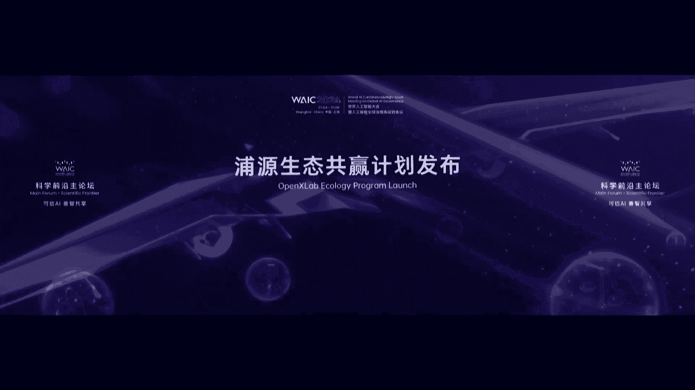
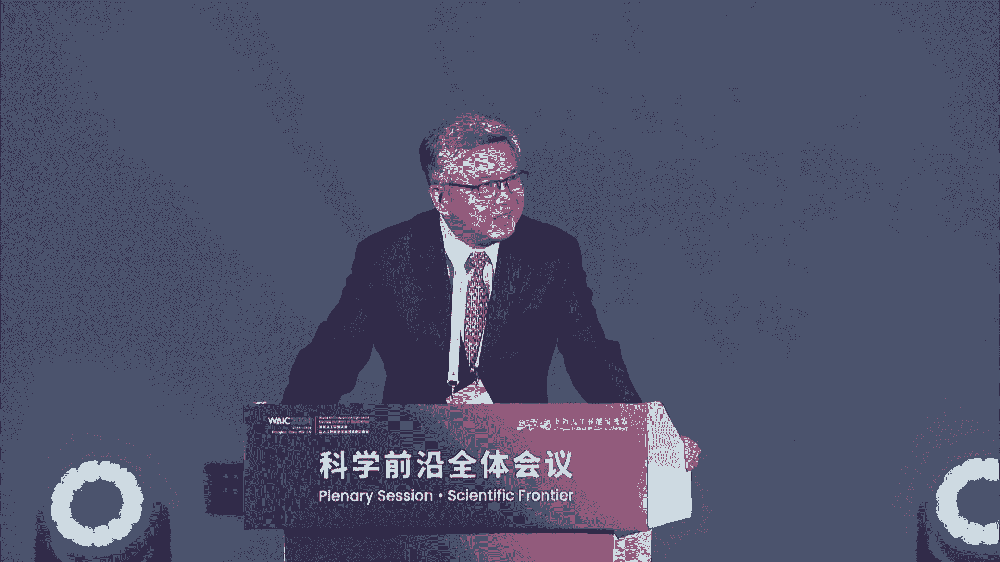

# 2024世界人工智能大会（合集） - P3：20240704-科学前沿主论坛 - WarrenHua - BV1iT421k7Bv

发展呢呃可以说是这个在上海是群英荟萃。但其中有一个非常重要的机构呢就是上海人工智能实验室。那么特别在这个呃人工智能走进了大模型生成是这样一个重要阶段，我们面临着很多的挑战。比如在算力方面。

我们受到了巨大能耗的这个挑战，也受到了如何适应各种不同专业应用需求的挑战，怎么找到一条合适的AGI的发展路径。上海的人工智能实验室做了哪些工作。进行哪些有益的尝试？首先让我们来看一个大屏幕，介绍书生。

又来上海参加世界人工智能大会。今年的亮点很多。与往年不同。有书生 intern。和我一起完成这次旅程。

演讲很成功。🎼想好好在上海放松一下。🎼让我继续体验书生的强大能力吧。

🎼这是一场高水平的比赛。

🎼球员们的战术之行都非常精。🎼今年的外克大会结束了。🎼收获满满。🎼原来，AI已经进入了各个行业和领域。也包括。🎼飞机设计。🎼我发觉AI已经越来越接近了。🎼说不定机器人很快就能成为我们更得力的助手。

通过AI。🎼获得更遥远。🎼更宽广的视野。

好，下面呃，刚才解展示的这个书生大模型，只是上海人工智能实验室做的一部分工作。那么下面呢，我们要请出周博文主任就整个实验室的工作，为我们这个论坛做首场的开场报告。尊敬的龙腾部长刘多市长、工克主席。

各位院士，各位来宾，各位同学，大家下午好。我今天想跟大家分享通专融合、通用人工智能的前沿和价值实现。大家都知道，现在我们进入了智能革命时代，以人工智能的兴起为代表。

很多人把现在通用人工智能叫做第四次工业革命。这个工业革命的跟以前做的不同在于知识的发现开始加速，人类人的边界得以拓展，从而带来生产方式的变革。

通用人工智能对于人工具资源、技术对生产力要素具有广泛赋能的特性，可以显著提供其他生产力。所以人工智能是新智生产力的重要引擎。也就是说，它是生产力背后的生产力。

这是因为通用人工智能如此的重要，所以。通用人工智能可以说是今年外大会上最主要的一个议题之一。其实我本人第一次深入思考，通用人工智能是在201516年期间呃。

这里面右边给出的那个PPT是我16年在美国IBM的总部给的一个报告。呃，当时的背景是阿法 go战胜了人类的世界冠军，大家开始讨论通用人工智能什么时候会到来。坦率讲，我们当时对AGI是缺乏深刻认识的。

但我在思考说什么样的研究能够导致AGI所以为了和AGI对应，我当时创造两个新名词，一个叫ANI狭义人工智能，一个叫ABI广义人工智能。呃，作为严谨的学者，我们需要给出定义呃，AI我们给当时给的定义。

就是说当时最流行的深度神经网络基于可监督的呃学习。它的特点是需要大量的标注数据呃，应用范围相对窄。然后我当时最主要的一个判断就是说如果说要通过ANI走向AGI中间会有一个必经的阶段，我把它叫做ABI。

也就是说是广义人工智能。广义人工智能我当时给出的定义是有呃三个特点，一个是自监督学习，也就是说可以通过信信号中含长的知识去自主学习。第二呢是端到端一个人工智能任务不需要把它分解成多个子任务啊。

再能把它拼起来，而是说人工智能系统会自动学会端到端的进行完成。比如说今天的同声传译。在2016年的时候，大家很多时候是说先做语音识别再做翻译再做合成。

但端到端的系统要求是说人工智能系统能够自主的完成端到端的语音翻译任务。这就要求人工智能系统具备多任务学习的能力。它既能做语音识别，也能做机器翻译，也能做语音合成。

这跟当时狭义人工智能每个模型只能做一件事情是完全不一样的。第三呢，我们提到说一定要从判别式走向深层式。因为呃像文所说，凡是我不能生成的，我都没有真正理解。就当时我们给出了这三个定义。

所以这个中文的PPT是我从英文翻译过来的一个字没有改。但是现在回头看，可能202年基本上把这三个都完成了。也就是说2年开，我们已经进入到了I的时代。

当然16年的预测我有个西没有想到的那就是说大模型的涌现能力。我们当时提了零样本学习，但没有想到大模型的涌现能力是如此的强当然在现在这个时间节点上，在2024年的大会上，如果做同样的思考讨论。

那么接下来I应该是怎样的一个达成路径，这种战略研判，我觉得不管是对我们一线的科学研究者还是对我们在座的年轻的学生们，特别是国人工智能学生们你必须要去思考的问题。所这里呢我们提供一个我们的思考视角。

我们认为从现在走向I的 map是。而不是一维的。看过去多长时间，人工是的发展历史。在2016年17年以前。人工智能在专业能力上获得非常迅猛的进展。从IBM的深蓝到阿法购。

人工智能一次一次以击败地表最强人类而成为信物的主体。但当时的巨大挑战在于，这些模型不具备泛化能力。他只能在专有的任务上表现突出。在。2017年，transformer多投资注意力就提出以后。

我们看到的是大模型在泛化人生的狂飙。就像我们看到今天大模型一样，进展非常的迅猛，在规模呃的加持下进展非常的迅猛。但是同时我们有注意到，目前大模型最大的一个挑战在于专业能力的进展极其缓慢。

同时呢能源的消耗数据的消耗，还有资源的消耗，都让人去思考这条路径是真正能够通向GI的有效路径嘛曼自提到GPT4的专业能力大概相当于10到15%的专业人类。即使GPT5它的预计大概是提高4到5个点。

也就是说我们用指数的人员的增长换是专业的缓慢的提升。大家可能也能感受到对大模型的一本性胡说八道，还有像外行看向内行内行看向外行的答案都是他专业能力不够的体现。

也包括在数学奥林匹克里面大模型GT4一道题都没有做对。但的能把做做多道几何。题也包括说了，在产生的视频的过程中，虽然非常的流畅，但在细微的争与真的之间，它会产生违背物理规律的现象。

这都表明大模型在专业性上的进展是需要更多的思考的。在这里呢，我们想提出一个判断，就是人工智能AI落地，它会有一个高价值区域。这个高价值区域同时要求模型兼备很强的泛化能力，同时具备足够的专业性。

在这个区域里面，离原点最近的这个点，我们把它叫做通砖融合的价值引爆点。根据历代工具的分析和生产力提升的分析，我们认为这个点很有可能在他在专业能力上是能够超过90%的专业人类，不要求百分之百啊。

不要求跟阿尔法之一样，百分之百。但是他在泛化性上要具备强泛化能力。也就是说具备最少ABI的能力，谁能先达到这个点，谁就能最早进入高价值区域，进入高价值区域，就意味着使用场景极大得到突破。

也就意味着你能获得数据的飞轮，也能获得造血和这个自我迭代。所以这这个是非常非常重要的一个我们对未来AI走向的一个判断。所以说如果我们认为强范化这上的专业能力，CAI黄光特的明珠。我们就回答这个问题。

就如何去更高效的去获得这种通砖融合的能力。我们并不认为单一的算法能解决这个问题。铜砖融合的兴范式需要系统的思考，它需要在基础模型层融合协同层。和自主进化与交付层有体系化的思考和规划。

能和三层具备非常强的协同和洽耦和关系。在技术模型层上，非常重要的工作是需要去不断的去提升。如何更高效的获取模型泛化的能力，以当前诺10倍、100倍甚至1000倍的效率去获取强泛化能力。

同时呢我们需要更更多的。复杂任务规划能力、高密度监督效的生成能力。等等来辅助。一部分这样的原始工作体现在上海人工智能实验室的书生普语大语言模型里面，也体现在书身万象、多模态等基础模型里面。

我们在数学和推理等高阶能力上升的突破。当然我们还有很多新的工作要去做。第二层是融合协同层，这一层负责将泛化性和专业性有效的结合起来。我们采用多路线协同的算法架构，来获取比肩人类水平的专业能力。

我们的原创工作包括高监督、高视力密度的监督效的生成。复杂任务的规划以及新的架构来实现系统一。也就是说人的大脑中快速直觉反应的系统和系统啊，也就人大脑中这种慢的。慢，但是深度思考呃。

复杂推理逻辑的系统之间进行交互。通过这些技术，AI能够在复杂环境中做出决策，将复杂任务分解成更容易理解的子任务，制定行动计划，并高效的协同多个智能体，以实现群体智能的涌现。第三层是自主进化与交付层。

在这一层，我们强调AI的自主探索与反回闭环的重要性。A系统需要能够在真实或者仿真的世界中自主的收集数据。学习并适应环境，通过与环境的交互，AI能够获得反馈。这些反馈对于自我进化至关重要。

自主进化与交付层呢AI能够进行巨深自主学习，并最终对世界模型有更深刻的理解，并与之交互，完成开放式任务。接下来呢我将分别介绍这个框架下呃，我们的几项重要的前沿进展。首先是更高效的构建通用基础模型。

我们高效并行训练做大量的软硬件协同适配的工作，特别是高效的数据的处理，新型的架构及推理增强方面有很多的原始创新。比如说我们在长序列并行训练方面。比国外知名框架magcha比我们的性能提升了4倍。

我们研发的大模型训练系统，基于真实训练需求，不断沉淀技术能力，已经连续两年获得计算机系统顶会spl杰出论文奖及最佳论文奖。在基础模型方面，我们通过稀疏数据的合成与增广苏声普语2。5以7B。

也就是70亿参数的模型的规模。实际了综合性能比肩开源大模型n么3呃700亿参数的性能。在多模态大模型万象上，我们通过渐进式对齐向量连接等创新技术，构建了以更少的算力资源训练高性能大模型的道路。

以26B参数的规模，比肩万亿参数的GPT4和jami pro，这些都是我们不断的去提升sd的效果的一些工作的体现。非常重要的一点是，昨天姚其志院士也反复提到，就是我们要不断的提升大模型的专业推理能力。

这也是浦江实验室、上海市人工智能实验室啊非常专注的一个领域。比如说最近大家可能看到这个新闻，AI参加高考数学全部及格啊，这方面说明数学还是高考中最难的学科。但是呢这些AI考生里面也包含了我们的塑身普语。

它在其中拿到了数学的最高分75分啊，超过了GPT4O的这个呃结果，这主要得源于我们的开源数学模型。它沉淀了密集过程监督模型辅助的思维链教练、多轮强化自训练文本推理及代码解释的一系列的呃强推理技术。

具备着良好的自然语言理解、代码解题和形式化推理的能力。20B的参数呃，性能已经超过GGPT4O。所以我们不但呃效果最好，而且是参数呃体量最小呃，人员消耗最低。当然，我们要实现通专融合。

还需要考虑新的系统架构。我们原创的提出了模拟人脑的系统一和系统二架构来实现通酸融合。大家都知道，ge them agreement的理论人的大脑有两个思维系统，一个是系统，一快决策，一个系统二是慢决策。

从我们的理解来看，从人工智能角度理解来看，我们认为系统一是一个人工人脑的快决策，反映的是长期训练下的专业能力。系统一是一个快，但是非常专业的系统。系统二呢是一个慢系统，体现的是深度思考下的泛化能力。

所以我们基于这么一个人老inpire的一个认知。呃，今年的CVPR上，我们呃通过设计系统一和系统二协同的模式呃，提出了交付式持续学习的新概念，让通用模型的深度思考能力和专业模型的快速判断能力互相结合。

并且互相借鉴。通过这种方式，通过通专融合，我们发现在多个任务上，这个通专融合的系统的表现，不但在能源消耗上在推理速度上远远快移慢系统，也就是通用大模型系统。而且在专业表现上也是远远渗出。

既渗出专业模型系统，系统一也渗出呃通用模型系统。2。所以不管是在图像识别还是非常专业化的文本生成上，都取得了最好的效果。同时，在呃自主探索与世界模型这一层，我们非常清晰的认识到。

实现通用人工智能必须去理解和洞察物理事件。我们认为巨生智能是探索通专融合的有效手段，也是理解物理世界的AGI的必经之路。我们认为计生智能绝不仅仅是大模型加机器人的应用。

而是物理学的反馈需要及时进化到大模型。这给大家举一个例子。如果说人的底座大模型不能被改动，只是加了机械的手臂，这样的人是不可能学会游泳的这是第一点。第二点就像大语言模型是对下一个是的预测来压缩世界知识。

就像说了是通过的压缩预测下一层图像，我们人可以看完所有的文本可阅读完所有的视频，但依然学不会游泳。你要学会游泳，必须在物理世界中跟水去互动，去感受水的阻力，感受你的身体的浮动，甚至你的呛水。

所有这些物的真实反馈，将反馈你的大脑里面改变你的模型参数和结构，让你的大脑学会怎么游泳。巨生智能是同样一个逻辑。所以我们认为巨生智能是实现AGI对空间进行感知，对物理世界进行理解重要的工具。

这是基这么一个认知。我们为了建立世界模型，我们设计了软硬叙事一体的机器人训练场。就说大家看到的这个全世界目前最大的啊。同时能够公关巨生智能的大脑和小脑的这么一个纺真系统。

普源桃源是首个城市级的巨生智能数字训练场，它构建了及场景数据、工气链巨生模型三位乙的开源巨生智能研究平台，作为大模型，以机器人的连接层，涵盖了89种功能性场景。10万家的高质量可交付数据。

有望解决领域类数据匮乏啊呃评评测困难的问题。在大脑方面，我们通过巨深。智能体的自身状态认知复杂任务分解，底层机能协同控制三方面创新，首次实现了大模型驱动的无人机、机械臂、机器狗三种异构整体的协同呃。

共同完成复杂任务。在小脑方面，大家中间这个图上可以看到的是我们通过GPU高性能并行训练和仿真可以实现高效机器人在真实世界里快速学习，如何完成高难度的动作。我们的实验结果发现。

单卡一小时的训练就能实现真实世界380的训练效果啊，所以这个学习的速度在快速的迭代。同时呢大家可以把无人驾驶理解成一个呃巨生智能体。我们提出了开源且通用的自身自动驾驶呃视频模型。

我们可以把它理解成自动驾驶的说了。呃，这个视频最右边包括什么不能播放，后台看看可不可以帮助他播放。这个其实效果是说，我们人类只要提供给这个。智能系统。一张图片，比如像当前这张图片。

接下来整个这个模型可以模拟它。接下来长达40秒钟，在城市中怎么去开车驾驶的完整的图片啊，所以相比索拉比这个更符合物理世界的规律，能够完整重现，后续高质量，连续多样化、符合物理世界规律的未来世界预测。

并可泛化到任何场景，被多种驾驶行为超控啊，现在图片开始播放起来。大家可以看。就除了第一帧的图片是人的图片给的，其他后面都是AI自动生成的。他在模拟这辆车在不同的路径怎么去行驶。我们我们模拟的场景呃。

大概全球有几十个国家数百个城市都通过对这些城市的学习自动模拟生成出来的。所以他要符合这些城市的地标。比如刚才是纽约来了不同的城市，要符合不同的驾驶舱位，比如是左驾驶右驾驶视角，还有比如说是卡车。

它的视角也不一样啊，这个东西完全可以通过第一张图片，我们完整生成出来。这反映的就是我们对物理事界的认知。通算如何无疑有巨大的价值。前面说的那些例子可能大家都能感受。因为今天是科学前沿会。

所以我今天去说服说服大家通算如何呢带来巨大的价值场景，我把它放在科学发现上。首先给大家提供一个背景。2023年初，nature发表了一篇封面文章。这篇文章指出，在过去几十年来。

虽然全球的论文数、专利数不断在增长，但是每篇论文的平均影响力在快速下降。这边竟包括物理科学，也包括生物医学，也包括我们说的技术科学领域。这里面的原因，呃，文章并没有提及。但我自己做了很多的分析。

我认为很大的几个原因。第一在于。科学这种大厦经过过去100多年的建设已经基本完成了。在科学大厦里面的每一个小房间里，也是我们走在领域里面慢慢形成信息减房。在信息检房内信息过载，在建房之间。呃。

非常难以打通，所以导致每个人的研究只能集中在很小的范围内，所以导致影响力在下降。了还有其他的原因。但这让我开始在思考，那我们去做通酸融合，去做大模型。我们说大模型性智生产力，它能如何提升科研的效率。

所以这里正好可以大模型另外一个特点。大家都知道大模型有幻觉。但很多时候看起来模型的幻觉，但更像是一种创造力，而不是个很典型的例子是化学家克是第一个提出本本分子结构的人。

在本分子结构没有人想到分子结构有环形的举克自己的回忆路分析，他是有时做梦的时候，梦前一条是首尾相连梦醒之后说哎本分子应该这的结构。你看这这种过程多像大模型的幻觉。好，问题在于。

我们如何能够系统性的去利用呃模型的幻觉去完成科学发现。这里呢我们做了一些呃初期的工作。这个工作呢在上海人工智能实验室在不断的在后续在细化。这工作是我们23年初做的哈。

就是我带领我的团队我们去训练了一个生物医药大模型，让他读完了23年以前所有的论文。这个论文读完之后，我们开始让他去做梦去提出科学假设。那这个做梦是他自己在我们的一些pro的前提下。

给他一个非常大的探索空间。然后呢，接下来他倒过来跟我们提问题，不再不再像GPT样人物他来回答，先变成他提问题，我们来回答人来回答。他有一天提出个问题，就说是二甲双胍这个神药。面对胃癌患者。

他认为对效果来讲，对男女性患者有显著的差异。这个结论在23年以前论文中没有人提到过，我们也不知道对错啊，所以我们花了很长的时间在寻找相关的论文，一直也没有找到。一直到2023年3月30号。

我们发现有一篇人类科学家的论文，就是这里面列人这篇论文。做的实验跟我们大模型提出假设一模一样，而且他的实验的结果证实了大模体做假设就是说呃这个二甲双胍的疗效是存在着显著的男女性差别的。

所以我希望这个例子告诉大家。在科学前沿领域，大家都认为是生产力的最高境念的领域，通用人工智能可以发挥非常多的作用。通过通专融合大模型不仅可以提出科学假设，还可以掌握科学知识分析实验结果预测科学现象。

进而在反思的基础上进一步提升AI提出科学假设的能力。在掌握科学知识方面，上海人工智能实验室基大约基座模型进行专项能力的强化，构建了化学和有种呃和育种方向的首个开源大模型，普科化学和普科呃风登。

在分析实验结果方面，我们研发的晶体结构解析算法。具为专家级的准确率，并将减息时间从小时级降到秒级。在预测科学现象方面，我们训练并持续迭代了风屋气象大模型。

今天上午在开幕式上啊也被发改委的领导现场做了发布。在全球的中期气象预报上具有当前世界领先的时间和空间的分辨率。在提出科学假设方面，我们进一步原创提出了人在环路的大模型多次能体协同的框架。

对于科学假设的全链路进行大模型赋能，构建了基于通用人工智能的AI分析师AI工程师、AI科学家和AI批判者多种角色，通过多智能体协同，和人一起工作。我们证明这样一种工作方式。

比科学家单独去提出科学假设更高效更新颖，而且能更高的成功率，能提出更有创造性的科学问题。今天我面对300多名国家人工智能学院学生的时候，我一直在想在我结尾的时候，我有什么样的话可以送给你们。

所以我在想为什么我们会用通用人工智能去研究呃科学假设的提速。因为很多时候提出一个好问题，比解决问题更重要。正如大卫谢尔伯特在1900年提出了2著名的23个数学问题。

这个问题影响了数学各个子领域往后数百年的发展。一直到今天，这二3个数学问题都还没有全部得到解决。解决的问题大部分都获得了菲尔茨奖等著名的学呃大奖和认可。所以他一直认为提出一个好问题。

往往比解决问题更重要。他的名言，we must know。 we will know。我们必须知道，我们终将知道，也因此广为流传。今天我们站在通专融合的路线上，探索通用人工智能AJI的未来。

展望下的AFscience。我们更可以从这名言中吸取到灵感和激励。对于可信A加的未来，这是我今天上午在权力大会的演讲，我们的态度是坚定而积极的。we must be there。

we will be there。我们必须达成，我们终将达成。我们为什么有他的信心？是因为我们有大量的年轻人才，不仅有在座的人工智能学院的学生们，还有高中生们。

我们上海人工智能实验室也聚集了一批世界最优秀的青年科学家人才。我今天站在这里也非常感慨啊，我想起了去年唐晓欧主任在外克大会上提到了我们的原创的成果，提到了我们的年轻的科学家，提到了我们的塑身大模型。

接下来呢我们就希望我们的年轻科学家们能逐一上台。就像刚才书生的视频里说的一样，通过我们的工作，让AI让书生大模型成为人类的好帮手，好in特。接下来我们有请上海人工智能实验室七年科学家陈凯。

尊敬的各位领导，各位专家，各位同学。下面我将介绍书生普语大模型的最新进展。在去年世界人工智能大会上，第一代书生普语大模型和全链条工具体系面向社区开源。在过去一年里，书生普语不断成长。

完成了多个版本的更新。每一代模型都将性能提升到了一个新的高度，超过了拉ma系列模型，推动着开元社区的发展，也在逐渐逐步的接近标杆的必源模型。今天，伴随着一周年的时间，我们正式发布新一代大语言模型。

书生普语2。5。推理是大模型的核心能力，也是智能水平的重要体现。书生普语2。5具备强大的推理能力，能够解锁更多的复杂任务。总体概括有三个主要亮点。首先是领先的推理能力，相比上一代模型。

推理性能提升了20%。也领先国内外的同量级开源模型。其次是支持100万token的上下文。常文本性能位居前列。第三是模型能够自主规划和搜索来完成更复杂的任务。

通过信息搜索和整合撰写专业回答和人类专家相比，效率提升了60倍。随着大模型的快速发展。人类积累的数据也在迅速消耗，如何高效的提升模型性能，就成为了当前面临的重大挑战。为此，我们通过模型飞轮合合成数据。

给书生普语2。5的迭代提供了强大的加速器。我们将当前的模型广泛应用于自身迭代过程，不断循环。行成模型飞轮来加速能力提升。同时我们也融合了多种数据合成的方案，包括基于规则的数据构造，基于模型的数据扩充。

基于反馈的数据生成，从而有效的批量生产、高质量合成数据。强大的推理能力是大模型通向通用人工智能的重要基础。我们将通推理能力作为模型的核心能力进行优化，为复杂场景的应用落地提供支撑。相比于上一代模型。

书生普语2。5在多个权威推理评测集上实现了大幅的性能提升，尤其在数学评测级ms上，更是提升了百分之百。和最新的开源模型相比。书生普语2。5在绝大部分的数据集上也领先于同量级模型。

包括拉玛三和上周谷歌刚发布的阶码2。和拉ma3的70B模型相比，推理能力也各有千秋。这里我们通过一个例子来展示大模型的推理能力。我们给出东京奥运会奖牌榜的前10名。

让模型来回答属于北美洲和大洋洲国家的银牌数之和是多少。我们可以看到模型能够一步一步的进行推理，并且准确的回答出来。那我们再让模型将金银铜奖牌都在15枚以上的国家筛选出来，并且绘制成表格。

我们看到模型也可以给出结果。在常文档理解、复杂的智能体交互等应用场景中，对模型的上下文长度有了更高的要求。书生普语2。5将上下文长度的支持提升到了100万token，处于开源模新的前列。

我们采用业界流行的大海捞针测试来评估模型的常文本信息提取能力。结果显示，书生普语2。5可以从超长文档中准确的找到相关信息，这里表现为就一片是全律。除此之外。

我们也在常文理解评测及long bench上进行了评估。书生普语2。5也取得了最优的性能。这里我们也举一个例子。我们上传新唐书的文档，让模型总结唐朝文学风格的三次变化。

我们可以看到模型能够从几十万字的文言文中准确的引用相关的信息，并且进行回复。书生普语2。5在解决复杂问题上也有着独特的创新。我们让模型模拟人的思维过程，根据用户需求，首先进行问题分析，然后规划思维路径。

拆分成需要解决的子问题。每个子问题都会通过大规模的网络搜索、筛选和信息整合，最终得到回复。基于这样的多智能体协同框架，能够解决复杂的信息调研和分析场景。

比如我们让模型来综述一下嫦娥6号从月球背面采样返回的技术难点，并且和阿波罗登月计划进行对比。我们看到规划器会对这个子问题进行思考，发散性搜索关键词。然后对搜索出的众多网页进行筛选，来选择有价值的网页。

进一步进行阅读，从而对网页信息来进行整合。规划器也会根据结果来动态更新思路，比如具体到每一个技术难点来进一步的去解决，最终完成各个子问题进行总结和回复。

这里模型可以将人类需要3个小时才能完成的调研分析任务，最终写成几千字的这种调研文档，能够压缩到3分钟来完成。书生普语面向不同的应用需求，覆盖了多个尺寸，其中开源模型从超轻量级的1。8B。

到轻便但性能不俗的7B能力出色的20B，以及更强大的B源的102B的模型。同时，我们基于通用模型也演化出了多个下游模型。包括面向图文混合创作的普与0比，面向数学的in特尔 math。

面向高考的文曲新模型。共同组成了书生普语模型系列。除了模型之外，我们也开源了覆盖数据、预训练、微调、部署评测应用的全链条工具体系。本次也新增了minlo u智能数据提取工具，茴香豆领域知识助手。同时。

我们也积极的拥抱开源社区和社区生态无缝连接。让书生普语兼容常用的大模型的开源工具。繁荣的生态离不开社区的开发者。在书生普语开元社区书生大模型实战营和书生普和濮源大模型挑战赛上涌现出了大量优秀的生态项目。

从垂类模型到智能体应用，从软件到硬件，这些创意被应用于各个领域。现在已经有接近1000个基于书商普语大模型的开源项目。感谢开发者一直以来的支持。我们也将坚持理念，让书生普语以持续的高质量开源赋能创新。

谢谢大家。

下面有请实验室领军科学家戴继峰老师介绍书生万象多模态大模型。🎼Yeah。

尊敬的各位领导专家大家好，我叫戴继峰。今天我们发布上海人工智能实验室新一代的多模态大模型书生万象。以恰GPT为代表的通用大模型取得颠覆性的进展，将变革人类的生产和生活方式，是世界科技发展的战略焦点。

上海人工智能实验室早在2021年就在视觉大模型领域进行布局，并做出一系列有影响力的成果。从图像到图文逐渐发展到多模态大模型。今天我们正式发布书生万象模型，世界领先的开源多模态大模型。呃。

我们的目标是理解真实世界的一切事物和景象，实现全模态全任务的通用智能。书生万象作为一个开源多模态大模型，关键评测指标比肩国际顶尖的商用闭源模型，它支持图像、视频、文本、语音、三维、医疗等多种模态。

拥有丰富的输出格式，支持百总下游任务、性能媲美任务专用模型。书生万象模型，它具有这么强的能力的核心原因是它是在全世界的图所有的图文数据上训练学习的。为此呢，我们构建了全世界最大的开源图文交错数据集。

较之前最大的开源图文数据集，图像数量扩大3倍，文本数量扩大10倍。书生万向模型的核心技术呢是我们发明的渐进式预训练。渐进式对齐训练。在训练过程的早期呢，我们采用小语言模型加大数据的方案。

加快视觉模型的预训练的进度。训练后期替换为大语言模型，加少量高质量的数据，高效对齐。通过模型从小到大，数据从粗到今的渐进式训练策略以较低的成本。我们完成了大模型的训练。

在有限资源下展现出了卓越的性能表现。在这里呢我们汇报一下书生万象在多个基准测试中的性能表现，并且与其他的是顶尖的多模态大模型的性能比较。测试的bench mark为目前多模态评测领域的核心关键指标。

包括多模态理解、数学问题解答、图表理解、文档问答及光伏郭级光学字符识别等等。首先呢可以看到跟其他的开源多模态模型相比，在各个评测维度上，书生万象模型碾压式的领先。

这里呢我们也列出了一些有代表性的开源多模态模型的性能，包括lava和cbra。可以看到呢我们的模型在各项重要指标上，性能领先。而与世界顶尖的闭源商用模型相比，我们的书身万象多模态模型也不落下风。

取得了和国际顶尖的GPT4OGPT4Vcloud3jamini pro1。5模型相当的性能，并且优于国内闭源商用多模态模型的最优性能。让我们看一些具体的例子，这张图片呢是最新嫦娥6号返返回仓的照片。

让我们问一问我们的书生万象模型。啊，他知道呢就说图片中显示的是一个返回仓，三位穿着防护服的工作人员正在检查和处理这个返回仓。在某国际社交网站上呢啊有网友就这张照片发起了讨论啊，就说这个返回仓上面有泡泡。

是不是这个正常的，是不是意味着它的质量不够好？让我们看看我们的模型的这样一个答案。书称万象模模型告诉我们呢，他说返回舱上面表面的泡泡啊。

通常是由于其在返回地球过程中经历的高温和摩擦所造成的这种现象在返回舱的外部是正常的。因为它表明返回舱，成功的接受住了载入大气层市的高温挑啊，高温的一个考验啊，它的回答呢非常符合科学。

在卓越的图文呃的单图理解的能力上呢，我们的模型还具有强大的多图理解能力。我们给这个书生万象模型看这样的一个例子啊，问他这三张图片讲述了一个什么样的一个故事。他可以清晰的理解呢这个故事。

展示了小孩在尝试独立穿衣时的可爱和努力。那让我们呢把这三张图图片把它给倒过来啊，让我们看看我们的模型会给出什么样的答案。他现在呢告诉我们说这个故事展示了小孩在日常生活中脱下衣服啊。

并享受这一过程的自然行为。综合这个跨图信息呢，对于视频内容的理解和复杂图文内容的解析呢非常重要。书生万象为这类关键应用提供了强大的智力支持。与语言模态不同，多模态的任务呢，它的意制性要强很多。

为了适应广泛的多模态任务呢，书生万象模型采用通专融合技术，它具有丰富的输出格式，这是超过百种任务。这呢是一个复杂场景中的图像内容理解定位的例子。我们让书生万象模型检测图片中的所有的汽车啊。

这是个以图像内容定位为核心的这样的一个任务。GPT4V等模型并不能够很好的去处理这类任务。而我们的书声万象模型呢可以精准的进行输出。让我们换一个识别对象，比如说检测所有的人，结果也是非常好的。注意到呢。

在我们的模型里面与传统的专用物体检测模型不同。我们的任务定义的接口呢是通过语言一个模型适配百种任务，无需为特定的任务和类别进行网络结构的调整和训练。啊，我们再换一个类别问他。

比如说让他去识别检测交通灯啊，大家不知道能不能在图片里面找到所有的交交交通灯啊，可以看到呢我们的模型是可以做到的，包括这个非常远处啊，放大之后的那样一个特别远的交通灯。

打造这样的一个世界领先的书生万象模型的呢是我们多模态基础模型团队。我们团队有着丰富的学术成果积累，获得了CVPR23最佳论文奖tri AI21的结束论文奖多项成果呢入选CVPRICCVcle啊等这个领域的顶会的年度十大高病论文。

展望未来呢，目前多模胎大模型仍处于发展的早期，距人类专家还有相距甚远啊，发展空间巨大。我们上海人工智能实验室致力于原创技术研究，开源开放、共创共享，推动技术革新和行业进步。诶。卡住了。对哦，谢谢观看。

然后呢，接下来呢将会有我的同事，上海人工智能实验室的青年科学家白磊博士为大家介绍风屋气象海洋大模型，谢谢。好的，尊敬的各位领导，各位专家，同学们，大家下午好。在听完了通用大屏的进展之后。

接下来我想邀请大家和我一起进入更加宏观，但又更加具体的风屋事件。😊，在人与自然和谐共生的路上，理解并预测我们所居住的地球，是每个人必须要应对的任务。那么面对极端天气发频发，对社会带来各种挑战。

我们在夏天都会关注一个问题，一会是否会下大暴雨。有的话我想大家就会减少出门或者带雨伞了。那么面对以风能为代表的新能源逐渐成为了国家能源系统组成的核心，能源机构时刻都在关心未来一周。

上海的发电量和运力量分别是多少。以此来进行天前调控，确保大家不会停电。面对气候变化带来的不确定性和碳中和的迫切需求。整个世界都在关心未来10年甚至100年，气候将会如何变化，以及会如何上升。

要想回答这些问题都离不开对整个气象海洋系统进行不同尺度，不同要素的全面预报。😊。

针对这些重大的需求，实验室在AI和气象海洋的交叉领域不断深入，逐渐构建，形成了风屋气象海洋全方位预报体系，覆盖了海洋陆地高空三维空间的多种核心要素。从风屋第一个版本的全球中期气象预报大模型开始。

我们通过不断的人工智能技术创新，开发了风屋极端风屋短林风屋机下全球高负面的预报。风屋ada全球端特端预报和风屋欧卡一系列的气候海洋预报大模型。

逐渐形成了涵盖0到3小时的短林0到14天的中短期和多年到年季尺度的全周期预报体系。针对可能突然到来的极端小范围的天气事件，我们和上海市气象局合作，共同研发了强对流天气预报大模型。

实现对一个区域1千米高负辨率的强降水预报。通过采用生成市模型，和确定是集联建模的方式。风屋短林预报模型可以同时建模中尺度的大气系统和小尺度的对流过程，从而准确的预报整体的强对流强度和趋势。

从左下角的量话结果，我们也可以看到，风屋短林预报模型，相比亚马逊的 earthform和此前最优的短离预报模型，无论是在整体的预报评分上，还是在专门针对大暴雨的强对流预报评分上都有更优秀的表现。

在右边的预测结果和真实观测的可视化中，越红的区域代表越有可能发生大暴雨。那么相比earform逐渐模糊的预测，我们可以看到说风屋短离模型可以生成非常细腻度的预测结果。

而且它的预测分布和真实观测是非常接近的。目前该模型已经部署到上海市气象局，正应用于对强降水等三性天气的预警工作。在全球中期气象预报这个大家每天都会在手机上看的尺度上。

我们对风屋的第一个版本进行了全面升级，首次实现基于人工智能的全球10公里中期天气建模与预报从经典的数字模式发展过程中可以看到全球气象预报分辨率提升是一个非常非常有挑战的事情。

目前最好的气象机构洲中期气象预报中心花了1年时间才将气象预报分辨率从25千米提高到了9千米。那么对于数据驱动的方来说，由于高辨训练数据是极度稀缺的，以这个过程是更加困难的。那比如大家都看到的来模型。

它的分辨率只有25千米。那么通过全新的解偶迁移学习的算法设计，风屋仅用了不到一年时间，就将分辨率从25千米提到了9千米，其分辨率较已有模型提了7倍以上达到了全球最领先的水平。

而且在这个版本上风屋进一步支持了对降水太阳辐射百米风速云等众多产业界迫切需要要素也更好的满足社会。各界对高精度气象预报的需求。更进一步的，在全球天预报这个尺度上。

其实由于原有的观测数据都是海量的卫星、雷达、气象站等非常不完善、不规则的数据。因此，其实预报模型是没有办法直接把它们作为输入的。

他们都需要依赖一个叫做数据同化的模块来产生规则的网格化的全球三维大气场作为输入。此前的AI气象模型都仅仅关注了预报模型部分，它依旧需要依赖传统的基于物理的同化系统来运行，他们是没有办法直接运行的。

那么从系统的角度来说，他们是一个物理和AI的混合方案，在预报效率和性能上限上都会受到限制。面对这些挑战，我们研发了全球首个端到端的全球气象预报大模型风窝ada通过人工智能方法。

同时来做数据同化和气象预测。相比已有的方法，风窝ada可以直接基于原始的观测数据独立运行，摆脱了现在的AI大模型都对物理分析场的依赖，得益于AI算法的高效性。

风窝ed相比传统的同话方法运行效率提升了1000倍以上，为全球气象预报模型的发展带来了全新的方向。在更长期的气候尺度上。我们进一步的研面对未来几个月甚至几年的气候的预报。

我们进一步研发了全球首个海洋气候预预报大模型。风屋欧卡通过建模海气候和效应。风屋欧卡只需要一个模型，就可以同时完成全球所有区域三维的海洋盐度、海流等多要素的长时效预报。比如在中间的途中。

我们可以看到说风屋欧卡对未来24个月全球的海表温度的预报和海流的预报都是高于日本海洋地球科学技术所和美国大海洋管理管理局最领先的预报模型的。那么通过风窝欧卡。

我们也可以进一步的得到对各种高影响气候因子的预报。比如对于厄尔尼诺拉伊纳这些大家经常在气球上看到的气候因子来说，风屋欧卡的预报时效可以达到20个月，远优于现在的模式。此外。

我们还尝试利用欧卡进行了更长时间的预测，从最右边的图中，我们可以看到说，基于欧卡，我们可以实现连续8年的稳定模拟，且其预测的结果也和真实的分析数据非常接近。

这为我们未来基于人工智能方法开开发气候模拟带来了一个新的思路。那么基于气象海洋预报大明体系，我们进一步的开。开发了可视化的预报平台。那么通过这个平台，我们能够看到说sorry。

这页的PPT因为有个动画稍微有点卡。没关系，虽然这个PPT的播放稍微有点问题，但是我们还是能够看到通过风欧卡那这个一个模型，我们就能够同时的来预报多种的海洋和气象的要素，它包括风速、温度、湿度等。

而且是从地表到高空的多个高度层。比如说马上我们会看到的这个500百帕，它对的大概就是5000多米的高空了。而且呢我们也可以通过拖拽放大点击等操作来查看具体位置、未来10天的预报结果。😊，好的。

那么在未来，我们将一边扩展风屋气象海洋大模型的预报能力，一边增强跨模态通用大模型，对气象海洋等专业数据的理解能力。我们相信通过跨模态的通用大模型与风屋这样的气象海洋专用大型的通砖融合。

我们可以更好的促进人与自然的和谐共生。好的，谢谢大家。好，我们感谢啊刚才周博文主任和来自上海人工智能实验三位青年科学家，对这个上海人工智能实验室所做的工作呢呃给出的这样一个非常这个呃重要的展示。

首先这个周博文主任呢呃谈了一个非常重要的观点。就是我们通向AGI的路呢是两维的，是在泛化和专用两个维度上向行演进的。那么基于这样的演进呢，提出了三个层面向您发展，通砖融合的这么一条路线。

那么刚才发布的这个呃呃风屋万象普语，可能是对这种通专融合的一个非常好的诠释。那么刚才这个呃博文在最后用了hiber的一个话是吧？呃。

这个呃we must knowwe will know然后他把它演化出来呢，呃we will be we must be there。we will be there。

然后这我们想到了一个这个本来是中国中国的话，但是很像这句英文的。用英文说呢是wheres willtheres way有志者事竟成。希望我们上海人工智能能够把这条通专结合通向AGI路走通。😊。

那我们说这个通专结合啊，最后最终是要落地的，是吧？所有的大模型都是要为这个呃为人来服务的。就像我们这次会议的主题叫做这个呃for the good呃 for all。呃。

为了这个呢呃上海人工智间实验实验室呢就呃发起了一个叫做普源生态共赢的计划。那么这个计划的参与者呢，不仅是来自实验室，而且来自我们有关的业界共同来推动大模型的落地。

那么下面呢我们就通过一个视频来了解一下普源生态共赢计划。

🎼以赛事启迪应用，以标准对其价值，以合作凝聚力量，以开放、连接创新。

🎼上海人工智能实验室推出朴源生态共赢计划，邀您携手迈进AI共赢新时代。

🎼本次加入计划的项目包括朴源大模型挑战赛。

🎼旨在推动大模型在各行各业应用落地。春夏两季赛事，已启迪诞生300余个创新项目。

🎼I吹 pullE人工智能生成内容工作组，抓注于制定AI生成内容国际先进标准，引领技术创新和产业发展。🎼deplink生态合作伙伴计划，搭建算力供需交流平台，助力上下游企业释放算力生产力。

🎼共建开放计算体系。🎼书生翼飞异形AI生成式系统由上海人工智能实验室与中国商飞上海飞机设计研究院共同研发。

🎼支持高效便捷的异行生成与编辑，以AI为大国重器点亮双翼。

🎼那么下面呢我们就有请首批加入这个生态计划的单位的代表上台，一起共同发布这个生态共赢的计划。🎼让我们掌声有请上海飞机设计研究院架构集成工程技术。🎼呃，集成工程技术所的总工程师于金海。

🎼上海AI实验室的副主任王平，上海超级计算中心主任李根国，上海气象局副局长陶立英。🎼清华大学计算机系教授李娟子。🎼商汤科技联合创始人杨帆。🎼上海AI实验室主任助理石博明。

🎼高等教育出版社总编办副主任鲍浩波。🎼中国惠普有限公司副总裁周信红，中国联通上海副总裁姚建。🎼上海人工智能行业协会秘书长钟俊浩。🎼另外还有两位特别的代表，他们是5缘挑战赛夏季赛一等奖的获得者。

来自中国科学院大学的。🎼天问九歌团队代表李国汉。🎼5元挑战赛夏季赛的另一位一等奖获得者，来自上海计算机软件技术开发中心团队的代表马泽宇。🎼好，请各位代表。🎼一图。🎼对我们呃倒计术啊，321。

然后共同你们推那个杆启动。🎼好，321。🎼好，我们非常感谢啊这个这首次呃首批参加的各个成员，请各位嘉宾就坐，也希望有更多的成员加入这个这个计划。那么这个计划当然在看到了。

有一个竞赛是冬季、夏季、两期的竞赛。那么这两届竞赛呢已经呃有了300多项成果。那么在夏季的竞赛上呢，汇聚得190支参赛队伍。他们呢在行业应用创呃创新创意安全可信。这样三个赛道上呢进行比赛。

展现了卓越的创业呃这个创意灵感和优秀的技术水平。那么下面呢我们就要发布这个呃竞赛的一等二等三等奖的名单，让我们向他们所有的获奖者表示热烈的祝贺。下面啊我们要举办一个呃圆桌对话。

那么对话的这个呃呃这个参加者呢是来自呃咱们国家呃在呃全国各地不同的关于跟人工智能有关的呃全国重点呃全国重点实验室的领导。那么这什么意思呢？我们想我们听音乐啊独奏是吧？美丽的独奏是非常优美的。

但是我们的人工智能啊独奏是不够的。人工智能这么一个事情的发展，我们需要一个波澜壮阔的交响乐，所以我们要把这个几个实验室，这独奏的高手啊聚在一起，我们来交响来合作来共同推进我们人工智能的发展。

那么下面呢我们就要请出啊呃这个各个实验室代表来做一个对话。那么我们有请上海人工智能实验室的主任助理乔宇教授来主持这个对话。🎼はい最い。尊敬的各位领导，各位嘉宾，各位朋友，还有各位同学，大家下午好。

今天啊我非常开心有这样一个机会和各位前辈，各位同行齐聚一堂，共同探讨，在人工智能在通用人工智能的浪潮下，国家级实验室和国家级科研平台的使命和共同协同之道。

我们知道啊全国重点实验室国家级创新中心、国家级工程中心，分别代表了咱们国家在各自学科领域科研创新的最高水平，也是咱们国家科技战略力量的重要组成部分。今天啊我们特别荣幸的请到了6位啊我们国家级平台的主任。

同时，这6位也是我们人工智能领域的最为顶尖的大咖大师。😊，🎼据我所知啊，这也是在世界人工智能大会在外口我们历史上首次由多名国家科研呃国家级科研平台的主任参加的论坛。

下面呢就让我们用热烈的掌声欢迎各位重量的嘉呃重量级嘉宾进呃上台。首先，第一位中国工程院院士、国家流程制造智能调控技术创新中心钱方院士，欢迎钱院士。

🎼中国工程研院士、机器人视觉感知与控制技术国家工程研究中心主任王耀能源院士，欢迎王院士。🎼虚拟现实技术与系统全国重点实验室主任、北京航空航天大学副校长吕玉峰校长。🎼吕校长。🎼欢迎您。🎼有请吕校长。

🎼任知智能全国重点实验室中国科技大学兼职教授胡国平胡胡国平教授，欢迎胡教授。🎼多媒体信息处理全国重点实验室主任、北京大学黄体军教授，欢迎黄教授。

🎼最后一位是自主智能无人系统全国重点实验室常务副主任、北京理工大学孙晋孙教授，欢迎孙教授。这个我想大家非常期待啊，这个各位院士大咖给我们的精彩报告。我先抛一个问题啊，呃大家知道在过去的两年中间。

以大一切的GPT为代表的大模型引领通用人工智能技术的高速发展啊，一方面我们可以看到这种大模型的智能涌现能力泛化能力不断的提升，并且从语言快速的向多模态，未来的像现在巨深智能啊高速的在发展。

另外呢我们也看到这个技术的发展带来了非常大的算力数据能耗的挑战。而在很多的应用落地领域呢，大的模型刚才周博文老师也讲到，虽然通用泛化性很好，但是它的专用性对吧？没那么好效率啊，这个能耗啊。

还有他在一些这个幻觉啊也有很大的瓶颈。我知道啊在座的各位，你们在各自的学科领域都是最顶尖的学者，这些实验室呢也就是我们国家最最重要的科研平台。所以我第一个问题啊。

就想问问大家大家能不能结合你我各自的这个实验。😊，是啊中西研究的这个科研平台的布局啊，谈谈在通用人工智能这个方向，下面有哪些？今天我看我们在座有非常多的这个年轻的同事，同学们。

他们肯定想知道有哪些重要的方向，以及咱们这些实验室呢，大家有哪些重要的啊这个科研布局和进展啊。首先呢我们有请这个前锋院士和王耀南院士啊，请两位大院士先从这个国家级平台的定位能够发挥作用。

请两位院士先给我们高屋建瓴的讲一讲，谢谢。😊，好。各位专家，各位来宾，大家下午好。嗯，我是来自流程制造、智能调控国家技术创新中心。嗯，刚刚来到以后，我们进来的时候看到这个塑身大模型的一个展示啊介绍。

紧接着呃博文教授给我们非常精彩的一个报告，这个通专融合。而这是通用大模型，应该是一个前沿探索。与价值实现。所以从博文教师的报告里面也看着通专融合。我们通用模型既要要前沿的探索，不断的探索，不断的创新。

同时呢还要考虑它的实际价值，那就跟通专专用模型结合起来。刚刚乔教授也讲了呃，作为国家战略科技力量，啊，尤其怎么样来通砖融合。这里面嗯，确实因为博文教师的报告非常精彩，我们深有体会。

因为大家都知道人工智能啊，肯定是现在是为一个新增发展新增生产力的重要的引形。但是人工智能也面临很多挑战。这。刚刚博文教授的报好讲了，其实他最大的一个挑战，他的泛化能力怎么样啊？也就在样本之外。

能走了多远，能预测多长，它的泛化能力。😡，还有一个呢，他的很大的挑战就是不可解制性。它不可解测性，那如何克服这两个很大的挑战？那这我是专用模型，既然是专用是垂直领域的专用模型，那很显然正好是个弥补啊。

因为专用模型通常它有一定的它的可解测性，它的原理，它的动力学啊，把它如何把它结合起来，所以刚才要作为一个。😡，浦江上海人工智能实验室啊那刚刚闭幕的国家科技大会啊，上面讲啊。

这个作为一个浦江实验室应该是总链长总平台。我想我们都是国家战略科技力量啊，应该是咱们把这个总力呢总平台把它融合起来协同起来，也就是今天我们这个论坛的主题啊，进行创新啊。我想这个是肯定是潜力巨大。

因为确实因为从我本人我是做制造业。讲白了也就是II加流程制造。因为我们制造也就这两类，一类是流程制造，就是原料给了你产品出来，就像石油了、化工的、冶镜啊、钢琴啊、这个建材等等之类。

还有类介绍就是王院志讲的是离山装备制造。😡，所以会前我们来的时候，我跟王元子介绍，如果我们能够通砖结合，也就是在我们这个浦江实验室在这个有这么好的大模型这个技术之之上，结合我们专用了。

我们一些领域的知识，领域的技术啊，把它融合起来。😡，我想我们应该取得我们刚刚预上的这个叫实现我们的价值。所以我想呢这是也是一个体会。看看王院士还可个高见。这个刚才钱院师也介绍了。

我今天啊刚才参加这个会啊，感受非常深。第一个呢啊听了我们周主任的大会报告啊，第二呢，听了三位学者的这个报告，我跟主持人龚校长，我就谈到啊。

我一看到这个年轻人这个浦江实验室一大批年轻人在从事这个大模型研究就有希望。那么接下来我主要谈怎么样围绕这个我的专业和大模型。😊，谈两点。第一点呢。这个我们要做今天的这个AI技术，一定要顶贴立地。

顶贴呢就是大家都谈的，我们要操作这个AI的这个前沿科学技术。特别是今天我们的这个。AI的这个大模型，那么怎么做到顶天？我的看法啊仅供参考。第一，我们一定要啊了解清楚我们今天的这个AI大模型的体系架构。

因为我们只有对这个体系架构AI的体系架构啊了解的清楚，对它的这个模型的推理过程。和推理那个解释性。和推理的安全性和推理的可用性以及可信可信度，要做充分的这个去研究啊。

我们不能是把它看成一个黑箱端到端的就训练啊，就去完成这个训练出来的模型，把它应用这个是不可信的，是第一点，我的建议，我们一定顶天立地的顶顶天的大模型的这个架构。

要好好的去研究它的这个推理过程和解释性和安全性。第二呢，我们要对这个大模型的训练算法，要充分的要了解。过去我们总是了解在训练这个网络大模型的时候，都是用一些反向传播算法啊。

用了很多我在30多年前也做这个方面研究啊，我也写了一本这个就是啊训练怎么如何训练好这个神经网络这个算法，那么改进了很多。种的算法目的就是提高它的熟练性啊，提高它的优化的泛化能力。

所以我今天就认为大模型我们还应定。第二点呢，还应该在这个模型训练算法上还得要下功夫。第三呢，我们的算力，大家一谈算力，现在耗耗费大量的电力，耗费这个算力。那么是不是今天大模型就是这样的啊。

我个人是有有看法啊，有认为我们还有很多要研究的啊。就是我们要从架构上啊。从算法上从序练算法上，那么包括这个算力上去研究。最后一点呢，我们要从数据的可信度。就是我们要研究，因为大模型它是数数据是端到端的。

你输入的数据是不是可信的。那么就是我们也要研究数据的可信。那么也要有一部分人也要做数据的筛查数据的分析啊，数据的判断，你只有很好的数据数据源通过我们大量的一些数据提起它的最有用的特征，然后作为训练数据。

这样呢才会有效不能盲目的这是我讲的这个顶天的地方，要大模型的，大家要啊要重视的。第二呢，我们一定要与时俱进啊，要立地。立地呢，我们就要研究这个大模型要为各行各业赋能。那么我刚才钱院师也提了。

我们两个都是从工业自动化啊，从工业自动化走向今天的智能化都有体会。我们是面向这个啊这个制造业智能制造。那么智能制造结合我这个专业，我是这从事这个自动化专业，又从事这个啊机器人。

那么我们今天的这个机器人呀。就是我们今天谈的巨生智能的最好的案例。从去年这三年当中，人心机器人和大模型可以说是走到一起了。就是正因为有了大模型，能够推动我们那个巨生智能的人心机器人的发展。

过去我们做机器人呢，总是从传统的感知到决策规划认知目标跟踪识别，最后到精准的控制，然后呢，然后形成一个闭环的反馈。做训练，你比如说这个我们的这个波士顿动力公司这个机型大家看到做了20年。

他今天为什么停下来呢？主要还是跟我们一样的，做的都是采用一个啊运动学动力学机器人运动学动力学的这个建模的方法。那么就以程序编好程序以后呢，指挥这个机器人，那么怎么样规划，啊也是用的程序也是用的算法。

怎么样进行精准的控制，也是用的这个啊算法。那么只能单个机器人可以啊，这么训练。但是对于机型机器人，有多个机器人我们的这个矩型机器人的协同感知，多个机器人的协同的规划调度，多个机器人的协同的控制就很难了。

那么用传统的这个方法呢，我们的优化调度就会发生啊，这个只能控制到比如10个啊100个。但是你上千个上万个的矩型机器人。这个时候我认为啊我们的算法就有问题了。那么今天这个大模型呢，我们就可以通过用大模型。

我们今天那个巨神智能，50年前图灵提出来的，它与环境的交互。因为巨神智能主要是强调与环境的交互。通过环境交互机器人和环境交互，我们通过感知感知后，我们进行认能够理解环境能够识别环境的一啊各种状况。

然后呢，做出精准的这个啊认知在后到行动。啊，那么今天有了这条思路呢，然后再反馈不段呢再迭代。那么我们是不是就用大模型可以解决呢？我认为是可以的啊，这就是我讲的立地的地方。那么就是通过我们环。

在原来的这个赶船算控的情况下，我们可以做两条路线，一条呢端到端的大模型进行训练，来完成我们的巨神智能的机器人的这个复杂的操作和矩形的控制。第二个呢，我们也可以分布的实施，不一定是端到端的。

那么可以从做感知的模型训练，也可以从规划决色。那么也可以做矩形协同的控制啊来这样呢把它训练完以后呢，把它组成一个大的模型啊，这也是第二条思路。那么所以我说的立地呀，我认为我们可以第一个是吧。

通过大模型呢来推动我们的巨型机器人的发展。啊，过去我们研究机器人总是把它看成四个方向，机器人感感知机器人的规划，机器人的决策控制。那么今天可以把它做在一体了，就是所谓的赶穿算控一体的。那么在进行迭代。

不断的学习，不断的啊迭代，然后就能够完成很复杂的动态的任务。这是我讲的第二点弟例。第三呢，我们大模型更多的要赋能到各行各业。那么我们也可以通过这样的思路来。那么我的时间到了啊，我就讲到这里。

等一会再补充，请其他的再来介绍。好，感谢两位院士。呃，下面我们请要不先从吕校长开始。简单说一下，我是来自于。呃，虚拟现实技术与系统全国重点实验室。啊，我们虚拟现实技术与系统啊。

实际上跟人工智能是密切相关的。啊，我们以前啊虚拟现实技术系统啊，我们更重要的研究的就是如何让我们生层的虚拟的环境更加的逼真。这是第一件事。第二呢，这个逼真的环境能够进行自然的交互，跟我们的人啊。

跟我们的。第三个呢，可能更重要的是如何去变成一种可构想性的构造性的。比如说我们以前我们这个虚拟现实重点实验室，我们研究了两个核心的挑战。第一个。跟这个这个这个。逼真啊最难的是什么？😡，人人体。

所以我们当时我们在十多年前，我们就研究。医用的就医疗用的虚拟人体，如何来进行构建建模和交互？因为这个的挑战是最大的，而且呢它的应用极其广泛，这是我们以前做的就是叫虚拟生理的。第二个呢。

我们比如说我们做可构想性的，我们挑战的是什么呢？比如说我们做一个特别复杂的一个产品的设计，以及从它的设计验证使用我们进行验证。比如说我们。前以前一直做的一件事，现在已经实用化了。

就叫全数字化的飞行器设计。与应用以及验证的一个一体化环境。啊，这叫可构养性。以前我们研究的虚拟线是这样，但是人工智能时代到来了，我们感觉到对于虚拟现实技术的系统的。研究和需求发生了重大变化。

我们更加关心如何构造我们智能化的虚实融合环境。而且这个环境它一定是个不断迭代和升级的。就像刚才我们周主任提到的，它不断演进。而且最最重要的，我们现在虚拟现实更关心的什么？虚实贯头。

对吧他虚虚拟环境和我们的实际环境的一个无缝的自然，我帮你插一句话，衔接我也激动了，我也帮你插一句嗯，走这个。昨前天开科那个科学科那个科学大会。我们学会啊，我是中国图像图形学会的理事长。

我们学会啊推出了一个跟他讲刚才讲的一样，叫做数字机那个数字人与机器人的未来挑战。怎么一个科学问题，昨天科学发布的第一个跟他非常相相似。所以我们现在我们赵新平院士提出，我们虚拟现实以前是叫恩爱。

门近式可交互，可构享。我们现在叫6I。加上智能化可演进，还有很重要的虚实贯通可贯通。啊，那么从3I到6爱很重要的就是我们这个人工智能对我们整个虚拟现实的一个巨大的变化和颠覆。啊。

比如说我们从去年开始的呃sra纹身视频开始。这个纹身视频呢，我们的看法呢。包括前两天是吧，已经出来了呃matta的纹身3D是吧？以前是二维的，现在变成三维的了。所以由纹身视频和纹身3D带来的是什么呢？

就是我们整个虚拟现实技术，我们的基础软件平台。将发生天翻地覆的变化。我们以前做虚拟线是更多的是用arreo和unit体和这种渲染引擎和构造模型。那么在这种大模型，多模多模态大模型。

这个这个的到到来的时候，我们整个的基础软件。可能是模可构想的和我们的深层式的一个混合的智能平台。这种智能平台对我们未来的虚拟现实。比如说我的人体到底怎么能够更加的逼真和更加的交互。

我们在研制和生产一个飞行器的时候，我们如何从它的设计，到它的仿真到它的验证以及它的飞行，我们如何更加的逼真和交互，以及它的智能化和仿真的各种模型的算法，我觉得这些的内容都是我们未来的一些重要挑战。

也是一个重大的机会，也是重要的科学问题。我觉得今天看到我们很多的呃年轻人，300多位年轻人。我觉得这方面的挑战，特别需要我们。上海的人工智能实验室和我们像虚拟现实的全部重点实验室，我们一块来面对。

一块来解决。我说到这里。好，那个大家好，我是胡国平。我们是认知智能全国重点实验室。那认知智能从简单的理解就是让机器去能理解会思考。

那因为我们上次跟科大讯飞和中国科学技术大学共建的这样一个相当是产学员比较合作的本身比较紧密的这样一个实验室。那我们确实实验室一直努力的目标，就是从原来的让机器能听会说，就是让语音合成语音识别之外。

要进一步的能理解会思考。所以我们一直在致力于对让机器如何能够展握人类的语言和知识，并且能够充分运用。那这次大模型应该说其实也主要就是在这样一个语言理解，对话这样一个场景下先开始起来的。

在讲具体的技术之前，其实我还是想跟特别是很多年轻的学生啊去实讲一个，其实人类的语言是一个非常神奇也非常之复杂的系统或者体系。我只举简单推一个例子，给你一个苹果，你把这个苹果丢在办公室了。

你还剩几个苹果和把这个苹果丢在垃圾桶，你还剩几个苹果，你要把这个问题回答出来，人要把这个问题回答出来，机器要把这个问题回答出来。其实就要涉及到你要对办公室的理解，垃圾桶的理解，丢了什么一系列的理解。

而且还做逻辑的推理和甚至有些任务上还做复杂的计算。而且所有东西是混杂在一起。而且所有的语言中的这个字符其实只是一个索引一个代号。我们说WAIC你立马就知道啊这个上海啊，整个7月4号一系列的事情。

所以其实整个大模型是把用了一种确实就是刚才乔老师说的，特别耗算力的方式，耗语料的方式，让机器掌握了人类的语言和知识。他能够知道所有这些知识，并且对于细节上的语言的这种细微的这种多去理解。

那作于我们作为一个实验室来说，我们一直在致力做这件事情。那我们其实跟各位学生同学一起在学人类的知识的逻辑顺序是几乎一样的。让他学很多的知识的同时，看很多书的同时，也让他做题。让他做题之后，让他去去工作。

工作之后，然后通过调试和反馈的方式，然后大再进一步的做进化。所以我们在这个从实际的任务来说，做题的话，就从小学初中高中大学甚至到研究生的这种题目，研究生的这种资料都给他去学。

也就供整个做出了我们的整个叫讯飞新苦的这样一个大模型。这个特别是在教育领域，在医疗领域，还是有非常好的这样一个达到一个比较高的这样一个水平。

并且能够去真正的理解题目去给出可解释性的推理步骤的这样一个和答题的这样一个思路的这样一个一个一个一个方法。包括医疗也是一样。所以这个呢是我们在整个实验室一直是致力追求的。当然在这个现在大模型的方法。

他确实存在反面的一个问题或者困难。就在于。虽然他能够给出可解释性的推理步骤，但他为什么能给出来还是不可解释的。虽然有点绕啊，但这个就是自然语言理解，我们都人都是能理解这样的话的。

但现在就是如何能够去真正的理解它的知识。它的逻辑推理在整个大的深度神经网络到底是怎么工作的。这个其实和脑科学和很多有相关的话，我们其实在做很多的探讨，在做做交叉的这种融合。

怎么去实现一个语言这么复杂体系的东西的用神经神经网络里面的知识的编辑逻辑的这种编辑的一系列这样一些工作。这个其实也是个非常前瞻。但是应该有非常之有有有研究价值的这样一个一个一个技术的这样一个领域。

那我们也是在往这个方向上在持续的在推进和努力。好，谢谢。好，我是这个黄铁军，我我们这个实验室的叫多媒体信息处理。全国重点实验室。这个实验室的前身呢叫文字信息处理，是咱们国家最早的这个国家重点之一。

呃当时是王选院士的这个这个呃呃建立的那这次重组之后呢，我们当然今天就不仅仅是文字信息处理了。是多媒体多模态。呃，因此呢这个当然正好赶上这么一次这个大模型的呃人工智能的浪潮。

以多模态大模型呢肯定是我们的一个重点的研究方向。呃，但是现在这个方面很热啊。刚才各位专家都讲了，我就不再重复讲多模态大模型的这个这个内容了。呃，我们也一直在思考，就是呃未来呃，因为作为一个。😊，呃。

国家重点呃全国重点实验室更多的呢还是要偏前沿探索基础研究，做出与众与别人不同的东西。呃，我我想今天呢就给大家报告大概一个一个点，就是我们刚过去这十几年啊。

那就是人工智能12年到18年那一段呢就做图像识别，人脸识别语音识别呃，大家最后叫感知对吧？甚至有人说感知问题解决了，呃，后来的这个18年到现在啊，这56年时间的呃，大模型语言大模型多大模型认知问题。

但然也不能说解决了，但是应该是取得了很大的突破。那再往下该是什么东西，实际上呢我觉得刚才这两个结论都都都还是都还是说取得了重要的这个突破。但你要说解决了，这完全不是那么回事，比如说感知问题。

你不能说一个机器这个会识别人脸了，会识别语音了，这就叫这个感知问题解决了，不是这样的。我们的我们人啊包括生物。😊，作为一个智能体跟世界互动跟世界的互动过程中。

它不是被动的像机器一样的接收一个图片或者接受一段语音，然后然后然后变成语音变成文字图像解解解释一下，这就叫视觉或者是听觉了。不是这样，我们是一个实时的交这个互动的系统。呃，在这里边呢。

这个最重要的一个维度是时间时间时间。大家回过头来想一想，今天的这个包括多方态大冒型在内啊，有几个真正的在关心时间。其实大家都是收集大量的数据，这个数据一旦拿来都是静态的，然后从里边去去挖掘。

去去寻找寻找规律，这个是必要的啊就呃我不是我我没有否定的这个意思。但是呢真正的一个智能系统，它是要实时的感知眼睛要看，耳朵要听，对吧？多种传多种这种感知手段呃，同步的实时的获取关于这个世界的这个信息。

然后同步的呃去去去处理它。为什么说时间重要呢。😊，因为一件事发生，同样一件事发生，发生在不同的时点，意义完全不一样，对吧？呃，就是说这个马后炮那再对也没用，对吧？

一定要在那个恰当的时间给你这个这个给你给你这个一个一个意见，哎，可能才才是有帮助的。😊，呃，如果说的再宏观一点啊，世界是运动的，不是静止的。但是今天的人工智能，我们是以静止的方法在看待它。

不是完全以运动的方式看待它。😊，呃，本来生物进化过程也是在不断的跟环境互动，实时的互动交互，在不断的迭代，在提高这个智能。所以呢我们目前呢在做的一个重要的方向呢，就是从这个角度呃，从实时的感知。

当然我们说实时可能有不同的意思啊，超实时感知。呃，以及呢实时的处理这个角度来构造下一代的这个智能系统。呃，为了简而言之啊，要不然我这个啰嗦多了，在占太多的时间，就是之前大家可能也听了比较多的。

就内脑智能，内脑智能最重要的特点就是你你表示这个这个各种这种感知通道的信息和你处理这个信息所用的信息表示方式，不是今天的一幅图像一段视频或者一段文字，它是一个流。

而这个流呢在这个我们大脑里边叫脉冲脉冲神经网络，对吧大脑是个脉冲神经网络。所以我们传感器是一个脉冲的。😊，呃，流的感感知。呃，所以我希望呢就是未来我们构造出来的这一套新的这个呃智能系统呢。

是一个呃能够实时的处理这些信息流。而且从功能上啊，就比如说人能做什么，他能做什么，但是在性能上要比我们生物比人要快好多数量级的这么一套呃智能系统。这样呢装到具身上，无论它是车还是机器人还是无人机。

他就不是说跟人比，说比人比人的一些功能，而是呢性能要比人强大的多。这是我们制造人工智能系统的目的。如果你做出来一个东西，跟人一样，那有一次老院士就说那你还多生几个人就好了，对吧？必我们不用非要去替代人。

既然你要替代人，那必须这个这个这个在在性能上要远远超越人类，它才有它的在这个世界的这个存在价值。好，我就想讲这些，谢谢。😊，好，各位各位专家，还有各位来宾，大家好，我是来自呃自主智能无人系统呃。

全国重点实验室呃，我叫孙建。那么我也是代表我们实验室主任陈杰院士在这里面跟大家汇报一下实验室的一些情况。那我们实验室呢其实前身叫复杂系统智能控制与决策啊，是偏控制类的一个实验室。

但现在的话我们可能更多的是面向这个自主无人系统。那么也是人工智能和我们传统的控制方法这样的一个结合啊，那么我们实验室呢，那么有这样几个研究方向。原来那么第一个的话还是做这种协同控制。

它的一些基础的一些理论和方法。第二个是做这个环境的感知和理解。第三部分呢是做这个呃无人系统或者是机器人它本身的这个智能的发育和衍生。还有的话就是底层的这样的一些仿生和驱动啊，那么。

现在呢呃像刚才我们这个主任说的这个大模型呢确实非常的火热。那我们实验室呢针对这些情况呢，其实我们也做了一些呃研究上的一些想法。那么这里面的话跟大家汇报一下。

其实我们主要还是在做呃这个相当于就是人工智能加无人系统，也就是所谓的这个呃巨神智能这方面的一些研究。那么具体来讲呢，我们呃目前呃稍微。做的比较多一点的呢。

可能我们还是呃想要把这个原来的我们控制里面的这些多智能体的概念，加上聚神智能的这样的一些概念。也就是做多个无人系统之间的这样的一个集阵智能啊，跟单个的现在做的比较多的这种矩神智能相比呢。

可能更强调这个多体之间的这样的一些协同。所以呢我们也结合我们实验室的这些研究方向呢，我们也布局了几个这方面的一些研究方向。第一个的话可能还是我们所说的这样的一些对环境的这个理解和感知。

那么基于这样的一个大模型的这样的一些思想在里面，这是第一个方面。第二个方面呢，就是主要考虑剧神智能的跟环境的这个交互和本身的这个大模型的建立。啊，这里面的话。

我们更多的可能还是要考虑这个世界模型怎么去建立这样的一个方法。啊，所以其实我们可以看到刚才跟博文主任他们做的这个报告里面。讲到矩身智能这部分内容呢跟我们基本上也想法也都是一样的啊。第三个的话。

我们关注一些呢这个多个个体之间的这样的一些协作和博弈啊，就是他们怎么样去协同。那么还有的话就是呃不同智能体。无论是呃多个智能体内部还是不同的智能体之间的这样的一些博博弈在里面。所以这是我们第三个方向。

第四个的话可能带来一些明显的我们控制学科的一些特点，就是我们做底层的这个分布式的控制以及的学习。啊，就是现在的一些方法，学习的这些方法，怎么能真正的落到我们单个的这个智能体上面去。

然后的话做这种分布式的这样的一些学习。他们之间又能够有这样的一些协作的效应，最后能有一个好的一个效果啊，所以这是我们现在目前来讲，结合这个大模型，加上我们的自主系统啊实验室。

现在目前正在做的一些方向跟大家汇报一下啊好，谢谢大家。😊，这个刚刚两位院士啊胸怀国资大作，从这个通用大模型跟咱们国家立国之本工业制造结合，从顶天立地做了非常精辟啊前瞻性的分析。我们四位重点实验室的主任。

我听下来几个关键词啊，虚实结合，认知理解，这个持续对吧？持续脉冲，还有我们的聚深自主，呃几个关键词也给我们指明了未来的一些方向。我想把这些分析起来啊，可以说在结合周老师一开始做通钻融合。

我们对于未来AGI在在脑海中的形象，我不知道大家感觉啊在我脑海中是越来越明确。那么我们下入进入第二个问题。今天请到呢都是咱们全国重点实验室，还有国家级平台的主任。

大家知道啊这个大模型的发展事实际上带来了重大的科研翻式的变革。op为什么厉害呢？在我看来，他把大工程跟大创性做了很好的结合。首先他有大规模的算力数据，还有很强的工程能力。

来支持他进行这种大规模的这个训练。但是还不仅仅局限于工程能力，实际上我们可以看到 openenI还是做了非常多的创新啊，从模型的架构啊，到新的训练方法，对吧？人类反馈强化学校等等，不一而做啊创新。

事实上这种大工程大创新呢，在我看来是未来人工智能发展的一个重要的模式。不局限于工程和创新。我们可以看到现在人工智能跟实体经济结合越来越紧密，未来工程创新和产业链的密切结合，将是未来发展的重要模式。

在这中间呢，咱们国家既有很大的挑战。刚刚我看各位这个专家也提到了，同样也有很大的机遇。我们还是有我们所长的，我们应用场景多啊，我们工业体量大，我们科研体量也大。在这时候呢，我们从咱们实验室的角度来讲啊。

如何能够形成针对新的形式新的挑战。大家如何能够形成更密切的协同，形成合力来应对这些挑战，我讲是大家非常关心的一个问题。今天我们难得聚在一起啊，所以。希望听听大家的意见。

要不这一次呢我们先从几位这个全国重点实验室主任，从吕校长开始，您先分享。最后我们请钱院士和王院士给我们做总结。好，很荣幸啊，那个我们实验室呃重组以后的核心任务啊，就是要呃开展虚实贯通的沉浸式的。Xu。

😔，可增强计算的智能计算平台的研究啊，在这双向上头呢，我们要开要做我们未来的呃虚拟现实的引擎和操作系统以及数字孪生的构建运行环境。啊，这个环境啊我感觉啊仅仅靠我们重点实验室。来做这个事情。很难找到。啊。

尤其是比如说我们在人工智能时代。我们要做虚深层式和可构建式的虚拟现实的这种渲染平台。那大量的数据我们有。我如何保证这个数据能拿来？第二，在深城市这种大模型时代，它的算力的平台，客观来说我们也不。

尤其重要的，我觉得我们可能在现在的科研过程中，我们更多的它不是一个纯粹以前的这种实验科学和数据科学，它是一个不断的一个迭代眼进的一个构造科学的时候。在这个时候。

我们可能特别需要我们的年轻人能够发挥聪明才智。啊，我们感感觉到，比如说在国际上现在能看到的，你像sra他就是两个年轻人。是吧还是UC伯克利的，他们构造的一个s平台。

这个我们现在纹身视频在国际上现在比较热的皮卡。那也是两个华人啊。😡，是吧是是史tanford的两个小伙两个小女，他们构造了一个新的这种纹身视频的平台。所以如何激发我们的年轻人。

基于我们的这种计算新一代的计算环境和新一代的数据来做这件事情，我觉得我们需要。多个实验室协作起来，尤其是跟我们上海人工智能实验室合作起来，我们才能在这方面形成突破。而且把我们的青年的。

学生们激发到我们这个计算环境里来呃，开展充满想象的科研。我觉得这件事情。我们一个实验室。任何一个实验室。都做不到，需要联合起来。我就说到这里，所以新时代需要这个科研资源，对吧？大家各有所长。

一定要打通连接起来，才能够支持未来的发展。好，下面请这个胡主任。好，那个可能我们的认证的实验室呢有点不太一样。在于我们既有学校的这样一个研究团队啊这样一个构成。

也有科大讯飞这样一个企业和相关的这样一些支撑。所以在我们实验室呢从大的角度来说，整个算力。整个数据呢是有可以理解为有全职的工作人员，他们去去搭我们专门的工程院专门的资源部来处理。

但确实在这里面从合作来说，从往前发展说，因为我们更多相对专注在认知智能，就语言理解知识推理等相关的复杂逻辑这样一些推理方面，其实他我们其实就觉得刚才所说的，要人能掌握很多的能力，掌握很多语言理解。

其实是他跟这个世界的交互过程中所学到的知识是密切相关的。他是跟在互动的过程中知道了很多的这样一些一些知识。所以其实从。我们实验室来说，其实非常希望也是包括跟虚实融合的也好，还是这个生智也好。去续看。

如果双方呢我们大家一起合作，在上海实验室这大的平台之上，看怎么样的，我们各自有所侧重。但是有个更大的一个规划和主体，能够把各自的优势，各自的上长的部分来在实验室之间去建立起相应的这种合作。

我觉得这个可能是是应该从站在国家层面也好，站在每个国家级的这样一个战略科技力量的平台的角度来说，都是非常希望乐于看到的。总店长总平台要来来来做这件事情。我们会始终专注在语音语言这样一个一个维度。

但是这个语言的过程中，他多说了这样他在和整个世界活动中说了句话，他怎么样的和一些东西，怎么样的能够相互融合。具体上怎么样融合，可能啊我我自己也在想，可能是要一个围绕一个更前瞻的更大的目标。

应该还是要以项目的这种方式去往前真正的才能有效的合作和推进同时在这个项目的过程中有更多的年轻人，有更多的一些公共的一些资源，包括刚才那个吕校长说的，像算利啊数据啊这些资源能够在合适的范围这个充分共享。

那个才能够有效的支撑更多的更大的创新。大概是这种感觉和建议，谢谢。听这个胡主任讲，我想啊就是说这个实验室要协作起来啊。他需要一个ha一个连接器。我们上海人工智能实验室愿意发挥在这方面的作用。

以后咱们这个科学论坛呢，就是这个的会客厅。我们每年大家到一起聚一聚谈一谈，怎么把这些做的更好，谢谢。有请华芳老师刚才那个乔老师就说这个我觉得大家肯定都也都思考这个问题。

为什么chGPT啊那个open做的越来越大，我们呢是百魔大战。然后这个不能说做的越来越小吧。但是就是做的越来越热闹。但是呢这个不大我觉得这个问题呢是一个深层次的问题啊，这个咱们涉及到方方面面。

但是我觉得最重要的呢？就是这个问题的解决肯定不是科技圈的那能完全解决的。就是这个问题不是纯这个技术问题，而是一个更更更更广泛的问题。呃，那是什么问题呢？我觉得咱们还是经常说的这句话啊。

就是集中力量班达式新型举举国体制。😊，这里边呢你像openI跟微软的合作，openI我们可以说是一个新鲜啊机构，对吧？研发。但实际上呢，他在这个这个21年2那个时候跟微软结合的时候。

其实已经决定了他他已经从一个研发的这种属性变成了一个为这个一个一个企业，对吧？为一个大很大，可以说很大的商业目的在在在在发展的那后来这几年发展也显然如此。所以他能做那么大。

是跟这个产这个这个市场跟跟商业相互互动之后的这么一个一个一个一个结果，呃，这不是纯粹一个研研发的研研发的问题。😊，呃，但是美国有美国的体制，对吧？咱们就讲这个刚才说这个有有这种像微软这种大型企业来拉动。

然后把这件事呢就做的越来越强。但是我们在我们国家这个技中量办大事，这个大事，大事就不应该仅仅是一个科技问题。尽管科技很重要，是核心要素。这我我都同意。但是这个大事一定是个是个国家的这个这个大事情。

这件事应该国家来定义，不是我们任何一个实验室，或者是这个咱们就说这个把它把它仅仅当成一个科技问题。😊，呃，什么叫大事？我咱咱就这个我不啰嗦啊，我过去的一一两年时间我都疏获好多次。

我觉得人工智能就两件大事，国家可以办。第一个，建设智力基础设施，现建像建高铁一样的建一个这个智力运营体系，对吧？让所有这个千家万户，让所有的企业直接从这个这个基础设施里边获得智力，对吧？

像买一度电一样的，买智力用用智力要建这件事，这件事乃是任何一个大学或者是实验室能能定的事啊，肯定是国家，因为建高铁，那需要投多少万亿，对吧？要要这涉及到产业链要协调资源，这肯定是这这就是大事。

这个事不定，那只能大家的模型啊，这种层面去去去去热闹，而不可能变成我们现实的这个生产力和和国家的这样这样的一个发展，所以这是一件事，我觉得可以做的。我我我纯在，我说的不一定对啊。

但是我觉得咱这是个思考问题的角度，第二个大事。😊，智能驾驶对吧？你现在这么多车，中国的车也做的很好，现在要从新能源进入下半年智能化。那车里边的那个智能智能驾驶的那个那个那个模型，谁做呀？😡，说好。

你交给怎么说现在任何实验室把那个做出来，哪谁有那么大的资源和力量啊，这就得国家去去去统筹。说这事要做了，要投入很大的资源，对吧？然后我们每一家的这个力量其实。😡，就是这个这个大事中的一个参与者。

两弹一星当年也是这样啊，这件事必须办办的过程中，你搞科研的，搞生产的，这甚至于搞搞搞矿的搞啥的，你都得围绕这个目标去去做，那不就办成了嘛。所以我觉得呢在这个过程中，如果国家把大事定了。

剩下的我们这些这个这个这个呃任何一方有竞争很正常。你做的好，还是我做的好，那大家最后反正是都都是冲着那个目标去的那就不散了。现在是大家照着自己的想法做。所以他他会百莫大展会会比较散，这是我的感受啊。

不一定对，谢谢。😊，好，黄老师，那个有请是任主任好呃，各位老师。因为我是自主无人系统全国重点实验室的，所以呢大家都知道这个无人系统呢其实是一个多协和交叉的一个事情啊，像我们从这个研究方向上来讲呢。

其实我们这里面会用到像我们这个我们李校长所在的这个实验室的。我们s to的这些问题啊，对不对？从实际的这从仿真到真真正的这个无人系统这里面，那么就会用到那么这个虚拟现实的这个实验室的一些成果。

那我们认知感知也会用到我们科大的科大讯飞啊等这个实验室的一些成果。像我们后面的这个决策啊等等。那我们黄老师这边做的类脑智能，其实都可以放到我们这个无人系统里面来做。

所以呢就像陈洁院士说说自主智能无人系统是我们这个研究人工智能的一个比较好的这样的一个抓手和切入点。因为大家所有的这些。技术其实都可以最后落到我们这个无人系统上来。

所以的话我觉得从我们这个几个实验室的这个研究上来看呢，我们天然存在这样一个合作的这样的一个关系啊，这是第一个方面，第二个方面的话，我是觉得从我们这个实验室来讲。

那我们也是两个高校来合办的北京理工大学和同济大学一起建的这样一个实验室。那我们从高校的这个角度来讲呢，其实也是面临的一些问题啊，像我们要做的这个比如说做大模型这个这些内容。

那里面的这些基础的一些算例啊等等，还有基础的这些模型啊，其实我们来讲，我们更多的是专注无人系统。那这些方面可能还是有一定的缺陷啊，那这样的话。

可能我们也需要借鉴我们现在其他的一些实验室的一些一些成果和是一些基础的这些条件。包括咱们这个这个上海的这个人工智能实验室的一些一些一些呃成果和条件吧啊，所以呢我觉得大家也是非常有必要。😊。

能够整合起来啊。第三个呢就是说我刚才也非我也非常同意前面几位几位老师啊说的。那么要多个实验室协同起来，其实更多的我觉得可能还是国家的这个任务的一个引领啊，没有一个大的这种任务把大家统一起来。

那这样的话很难形成这样的一个合力。现在目前来讲，很多的情况下，可能还是自己个做自己的，那么有很多的这种重复性的一些工作啊，所以甚至呢有一些呢可能还是一些低水平的这种重复工作。

所以希望呢国家层面从整个的这个通盘的这样一个考虑，那么提出一些重大的这种任务来把几个这种相关领域的重点实验室真正能把它给协同引领起来啊，我就说这么多。刚刚四位主任啊，从这个我想从这个学科互补，资源互通。

对吧？数据很多资源互通，而且不仅仅是咱科技界的事情了。刚才黄老师说到这么大的一件事情一定是在。😊，国家层面跟产业啊跟方方面面密切结合的事情做了呃跟大家提了很好的建议。我想最后啊我们这还是请两位院士。

要不这次王院士先请您这个给我们讲讲。😊，在新形式下面，咱们这些国家级的平台如何协作，而且这个协作可能还不仅限我们自己需要国家层面更多的这个统筹和布局。您您怎么看？好的。

这个刚才几位实验室的主任谈的非常好，我也非常赞同。😊，呃，为了不耽误大家的时间，我就讲两点。第一点呢就是。我们人人这个人工智能这个上海人工智能这个实验室吧。他是可以说是国家实验室建立啊。

是一个战略科技力量，对吧？那么我们要引领这个战略科技力量。要把全国的这些重点实验室。跟我们人工智能机器人啊都有相关的啊实验室呢协同起来。

大家一起来协同来开展这个就是几国体制的战略科技力量的人工智能的这个研究。那么第一个呢最最主要就是啥一定要刚才几位都提谈谈到了，我非常赞同。我们要把这个基础设施，就人工智能的这个基础设施啊，要把它建立好。

让大家就是从产业链、供应链啊创新链到人才链，大家都能用都能享受到这个基础设施。因为人工智能那个今天呢，我们是属于数据驱动也好，模型驱动也好，还是大模型驱动也好，它还是跟这个基础设施有很很大的关系。

所以第一点呢就是一定要举国举国体制。把基础设施建设好，就正如我们的高铁啊，包括我们的这个啊电力超高压直流输电这些世界最强呃最大的几个标志性工程。啊，当然以前的两大一星，这些都是几国体制。

使大家各行各业都能够享受，这是第一点建议。那么这就要靠我们啊我们每一个人要发挥作用，教育界的要发挥，也就是科研、教育、人才培养一体化抓。那么除了这个呢，还有管理。第二个方面呢。

就是我们建好这个基础设施后，恐怕要发挥大家的创造性作用。这个创造性非常重要。因为今天最主要就是哎呀要科技创新来驱动我们各行各业。在这个技术这啊设施的基础上，我们把这个AI技术啊赋能到不同的领域。

比如我们赋能到制造行业，因为中国是一个制造大制造大国，要成为一个制造强国。那么通过这个AI的基础设施赋能到制造，使我们千啊千家万户啊，千万个企业、中大企业、小企业啊中小企业、创业企业啊也能用得上。啊。

第二个呢，我们刚才提到的，我也非常赞同呃。汽车啊智这我们叫做聚生智能的这个汽车交通，大家天天都开开车。那么昨天我也做了一个大会报告，叫做啊智能网联车的大会。呃，在这个长沙开这个智能网联大会。

大家谈了非常多的就未来的智能网联汽车，我们怎么样解决高效安全舒适、低碳出行，让大家不像今天人人都要开着一个汽车，能不能解决掉。那么我们AI是不是也可以在这个场景上去落地啊。

这就是我讲的两两个最最紧迫的场地。啊，一个是制造啊应用场场景。另外一个就交通应用场景。第三个呢，我认为教育。就是我们AI呢我们要赋能到我们的整个教育里面。因为只有培养优秀的创新人才。

源源不断的培养出我们就是这一轮的AI我们一直在思考它能不能够打破我们的这个传统教育。改变我们的这个传统教育的方式，应试的教育方式。我们能够培养出一种创创新性的人才。呃，通过这个AI技术啊。

能够启发我们的教育。改变我们的这个传统教育。培养出一种创新性的人才个性化的人才。这个也是我认为也是紧迫性的。啊，第四第四个方面呢，我就认为呢，我们的这个人们要过上幸福的安康生活，人人都要健康。

那么我们也在医医疗这个方面。也要发力。这啊这个医医疗行业也是很大的。中国人你看呢未来的啊养老，还有我们的助老助残，包括我们的这个就是医这个这两三年的这个行观，大家都看到，这也是一个很好的应用场景。

就把AI赋能到我们的智慧的啊医疗行业。这样我们真正能做做到就是顶天的啊立地的顶天的。我们就去国际国体制，把AI这个基础设施建设好，让大家不要重复性的建设啊，不要浪费这些资源啊。

那么又呃立地呢就是我们紧迫性的几个行业。这样呢举国体制呢。我相信呢在几国体制下，又同时呢又发挥了。大家的。这个出名的啊创新的才子。啊，释放我们的活力。

那么我们明天呢我们真正的走上一个中国啊中国市的现代化的国家。好，我的讲到这里，谢谢。好，谢谢。好，那个下面我们请陈院士。做自后是。好，那个刚刚我们四位实验室主任。都讲的非常好，不管我们药南院士。

这个也讲的非常好。其实大家也看见了，我们通过简短的我们四位实验室的主任的发言，就看到我们很有必要融合系统啊。一方面呢，我们一定要围绕这个通用大模型跟专用模型怎么协同啊，跟么实际是之间也协同啊。

包括呃这个耀南主任的工程中心跟我们的国家技术创新中心。你看我们刚刚讲的这个吕教授讲的这个这个虚拟虚实融合这一块啊，其实就知道原宇宙时代即将到来。源语这事呢肯定事事融合非常非常重要。

包括到我们的认知计算啊，认知研究，以及到我们的我们铁军教授讲的，如何把我们通用也好，专用模型把它做的更好更精准啊，也就科服我们的泛化能力也不可解释性等等，以及到我们的这个我们的孙教授讲的。

其实我们讲我们的真正的大模型也好，就这个认识世界。那就种我们改造世界。我们要自主智能怎么样利用大模型来改造世界就是等等之类的。

其实体会很多一个字我们一定要协同啊起来才能壮大我们的人工智能本身的研究以及人工智能的赋能。其实刚刚在社会谁是这个主任介绍，我也很很有体会。譬如讲我们铁军教授讲的，我们无论做通用大模型或者是专用大。

模型也好，怎么样把这个模型做的更精准了，它能更能体现它的优先的这个现象出来。😡，因为你像无谓是做模型，要把一个系统，一个对象把它孪生做出来，把它动力学演变的演化的一个机制做出来。

其实我每个对象他时间跟空间的分布啊，其实我们往往就说空间的分布上面。如果说空间分布来讲的话，那我们可以用大模型基础通用大模型特征啊，通过统计的分析啊，把空间的上面一些特征去来。但对时间分布上面啊。

那可能不仅仅是大模型的统计啊，更需要在时间测出它的演化的演变的一些机制这块就是我们专用大模型的专用的它的对象的特征啊，把它结合起来。所以总而言之呢，我想呢无论怎么样，我们把我们的无论是通用大模型。

专用的一定要做的很极致，很精准啊。也就是我我想起有一位智能专家讲的。你看我们现在的大模型啊，我们都是大量的能源啊去计算计算。😡，再计算，能不能我们把计算两个字倒过来讲是什么？算计。😡。

如果我们算计把创造我们创新我们的算法，我们讲那我们就基于大量的能量啊，提高我们的速度，提高我们的精准性啊。这个我想这是我的体会。再个讲讲如何我们把它协同融合发展，我就想起刚刚闭幕的这个全国科技大会啊。

这个上面总书记对建成2035年建成科技强国有5项任务啊，能不能对于人工智能对我这个上海实验室怎么样践行这5项任务，我觉得很有启发。😡，第一项能不能能形成我们的这个举国体制啊这样的一个优势啊。😡。

咱们中国是举国体制这样的优势，能不能在人工智能研究，让我们链组总链组总平台。那形成我们举国体制，把我们这些实验室这国家技术创业工程中心等等企业把它形成一个链，把它圈起来。

现在我们的在人工智能创业的举国体制啊。😡，第二个方面呢我要记得要强担叫科技创新和产业创新的深度融合。能不能把我们人工智能的创新跟我们的产业创新深度融合，使得真正的成为发展新资生产业的重要引形。

那我想那第三个呢，我们我们强的就是能不能能创新一项体制跟机制啊，能结合这个力这个总力量总平台，一个很好的体制跟机制，带动我们一些国家的战略科技力量来创新。😡，当然我们还第四个。

刚刚王先石讲的教育科技人才要一体化。这里面啊我们要还有一个就是我们要大国担当，加强国际合作。我想这也是我的体会啊。

如何把我们这个上海人工智能是一的这个总领场总平台系统我们国家的所有的战略科技力量在人工智能创新的这个领域里面，发挥我们这个举国体制啊，我就想这样，谢谢。😡，好。我想前院士这一番讲话呀。

也系统的把咱们这次整个的这个会谈做了全面的总结啊，最后呢我们再次感谢，因为时间也到了，再次感谢各位院士各位专家的精彩分享。我相信大家和我一样，听了各位的这个真知灼见，收获满满啊。

国家实验室是咱们国家战略科研力量的重要的组成部分，肩负着基础突破和技术创新的重大使命。未来呢我想我们通过联动国家方方面面的力量，打造AI生态的朋友圈形成优势互补战略习头的格局。

为咱们国家人工智能技术创新和产业生态注入新的动力。好，再次感谢各位专家也感谢大家的聆听。谢谢。😊，我们要感谢这个呃乔老师的主持啊，呃刚才这个呃这场这个圆桌啊。

是我想这是这个上海人工实验呃人工智能实验室精心设计的一场圆桌。把我们国家的有关的重点国家级平台都请在一起，也是一个通专结合的一次一次示范。我最希希望将来啊真真正的在国家大目标的这个引领下，聚世成风。

为了我们这个人工智能为全世界全人类做出一个呃做件大事出来做出大的贡献。下面我们进入一个重要的环节呢，是一个重要的发布。那么这个发布呢是关于这个2023年，就是刚刚过去的一年，全球人工智能的创新指数。

那么我们有请这个中国科学技术信息呃中国科学技术信息研究所的党委书记，也是我们中国软科学研究会的副理事长赵志云教授来做2023全。求人工智能创新指数的发布，有请赵所党。尊敬的各位领导，各位嘉宾，各位朋友。

各位同学们，大家下午好。非常感谢大会主组委会和论坛主办方的邀请。今年我们继续在上海人工智能大会上发布由中国科学技术信息研究所联合北京大学共同研制的全球人工智能创新指数报告。

创新指数报告呢是一项连续性的工作。我们已经做了5年，这是第四次在上海世界人工智能大会上发布。那报告呢其实我们是力图呢从基础支撑、资源与环境、国际合作交流等五大维度，通过构建三成的三级的这种指标体系呢。

对46个重要的国家。它的创新发展和治理的情况，我们进行量化评估。目标呢就是力图能够全面客观的反映全球人工智能创新发展和治理的发展态势，以及呢明确中国当前所处的位士。那2023年的指数报告。

它的总体的特点呢就是在我们的5个基本的一级的指标体系和基本的指标体系的框架保持不变的基础上呢，我们根据2023年全球人工智能创新发展和治理的最新的进展。

我们对二级和三级的指标体系做了部分的优化完善和微调的工作。那其中呢主要是根据2023年数据基础应用潜力和国际治理参与等等维度的最新的情况。我们进行了微调二级指标和三级指标。比如说在二级指标上。

我们增加了数据基础开源项目，我们微调了反映国际治理的参与程度的学术交流和国际治理参与这样的指标。那在三级指标。体系上，我们增加了人工智能的芯片的这种企业的数量。

以及呢我们政府在数据开放等等方面反映它的发呃反映它的参与程度，以及电子政务的发展指数，还有高水平的高质量的高影响力的人工智能的开源项目占比等等。这样一些三级的指标。

那通过构建这样一个新的三呃三级指标体系。我们最终呢形成了5个一级指标14个二级指标和37个三级指标的这样一个评价体系。那它的评价结果是什么样的？总体的格局，就是。中国和美国两强引领。

那同时呢46个国家形成4个梯队的这样一种总体的梯次分布的格局没有改变。但是中美两国的在第一梯队与234梯队的差距呢是进一步的拉大。那再详细的看一下第一梯队啊，美国和中国是在第一梯队。

但是美国的全面领先的地位依然是比较明显的。在5个一级指标，14个二级指标中的9个和37个三级指标中的17个，美国都是排名世界第一。那我们中国呢连续呢在5个指5个一级指标上都是排名全球第二啊。

同时呢中美两国呢基本上负这聚集了全球人工智能创新发展资源和产出成果的。绝大多数。那在第二梯队上呢，依然是保持着啊你争我敢的这样一种竞争的态势。那其中各个国家呢都有它自身的特点。

但总的趋势呢是与第一梯队的差距呢在进一步的拉大。但英国呢它在整个的教育资源和高质量的学术研究的成果方面呢还是比较突出。日本的专利也比较突出。德国在产业和应用方面。

特别是在人工智能的风险投资以及国内的市场规模方面呢，它是很有优势的那我们再看第三梯队也比较有特点。印度连续三年，它的排位在不断的上升。而萨特阿拉伯也是连续三年在排位上升。

但是它今年2023年是第一次进入到第三梯队。那第四梯队呢大多数国家呢相对呢都有比较非常弱势的项目，但是也有一些进展，像巴西和印度尼西亚这些个别的国家在科技研发和产业应用等等层面是有明显的进步的。

特别是巴西和印度尼西亚在人工智能的开源项目数和人工智能的风险投资等等方面，他还排在了中等以上的水平。这也进一步的阐明了刚才博文主任和我们几位专家所说的一个共同的观点，就是人工智能的应用啊。

和开源还是非常重要的。那接下来呢在评价的基础上呢，我们对全球的人工智能的创新发展的趋势。如果做一个总体的观察说观察的话呢，很像刚才几位啊全国重点实验室的主任们在台上分享的观点。它有4个特点。

第一个特点呢就是大模型的突破，它带动的人工智能技术创新的加快，自然语言处理和多模态等等这样一些工作呢，在整个的人工智能的创新发展中起了非常重要的作用。

那同时呢我们看到2023年机器学习模型的数量是大幅度的增长的自然源处理的模型，哎还有多模态的大模型的增长复读幅度呢都是非常巨大的啊也需要强调的一一点就是AI for science在持续的投入。

那面向生物面向医药，面向地球科学，面向数学。和材料科学等等方面的科研领域的机器学习的模型在不断的涌现，也推动了全球科学的不断向原创性的这个高度去进展。那第二个特点和趋势呢。

就是产业界在模型开发上的领优势，在不断的扩大产业的演。更加的明显和突出啊，那这里面我们可以看到2023年才。

被研发的机器学习的模型达到了176个，而且呢。比学界他是这是学界的3。5倍。那同时呢我们也可以看到，过去的十年，从2013年到2023年，那。产业独立开发的及学习的模型数量占比从25%。

已经增长到了62。6%，说明企业的参与，企业的主体地位，是人工智能创新发展的一个重要的动力的源泉。第三个趋势呢，就是刚才大家热议的生成式人工智能的开源项目的数量在激增。

那开源依然是人工智能创新研发和应用的一个重要的模式。那我们看2023年生成式人工智能的开源项目的数量是呈现爆发式的增长啊，那同时呢印印度这样的一个国家为什么它在它的梯队中排名近三年稳步的上升。

也是因为印度在开源的项目上，它是一个主要的来源国。那第四个特点就是人工智能企业的新增数量开始增长，创业创投低迷的趋势有所转变。这个特点呢是非常的明显的。因为我们知道在2018年到2022年期间。

全球新增的人工智能的企业数量在逐年的递减。但是这种递减的趋势在2023年得到了抑制。那同时呢有个回转的这种倾向，2023年的新增企业数量同比上涨了21。5%。

那同时呢还有一个更为乐观的趋势就是全球人工智能风险投资额，虽然还是一个下降的趋势，但同时但是这种下降的幅度在明显的缩缩减，特别是2023年生成式人工智能的风险的投资的规模在急剧的扩大。

它也使得生成式人工智能在。推动我们人工智能的创新发展方面起到了非常重要的作用。后呢我们回到中国。那中国呢在整个全球人工智能的发展的总体上综合水平呢，我们还是保持全球第二的水平。

但是我们在关键的核心的竞争领域上没有形成绝对的优势。那同时呢我们在人才培养和科研产出产业发展等方面，这些年来也取得了明显的进展，特别是我们担心的高层次的人工智能的人才队伍的壮大。

在持续的有一个良良相好的这样一个趋势，还有高质量的科研成果的数量也在明显的上升。人工智能的产业在蓬勃的发展。这也是我们能够保持人工智能良好上升势头的一个重要的基础。那同时我们也要看到，我们还有弱项。

就是我们数据的开发的利用和原创的这种能力呢还存在着不足，特别。是高质量的数据资源的稀缺的问题啊，以及重大的引领的创新产出不足的现象呢，还是持续存在的，还需要我们进一步的加强。

所以呢从5个评价的一级维度上，我们希望未来呢我们能够有所新的突破。第一呢是在基础支撑上，我们希望进一步去加强数据资源的这种建设，去健全公共数据的开放共享机制，去建设安全合规大规模、高质量的语料库。

那同时呢我们也希望进一步去加大高层次的人才的隐喻力度。啊，创造宽容失败的这样一种科研的环境。那同时在科呃科研呃科技研发创新这样一个维度上，我们也希望强化前瞻部署和原始的创新。

去抢抓刚才专家们说的巨深智能和。内脑智能的新的机遇，我们也希望加快高水平规模化的应用，这是中国最最大的优势。我们希望聚焦关键的领域去打造一批具有技术先进性和规模化潜力的这种潜在的应用场景。

去推动大小模型的协同落地。最后也是今年大会的主题，就是我们希望进一步去扩大和增进国际交流的合作，搭建国际交流的平台。针对全球共同关注的治理的话题，我们能够加强人工智能领域的科技合作。

推动国际治理的协同共建啊，我的汇报就这么多内容，详细的内容请大家关注报告的原文和我们官网上的信息的公布。谢谢大家。

呃，谢谢赵所长啊，以这个非常宽广的这个全球视野和非常详实的数据为我们展现了过去一年人工智能创新发展的这个一个途径。那么也确实希望大家能够呃有机会啊看一看他这个报告的全文。

以及我们这个中国科技一所的有关的相关的研究成果。呃，下面啊我们要进入今天下午最重要的一个环节了，叫主旨报告环节keynote这是最重要环节。那么今天呢我们有两位众磅的这个嘉宾要为我们带来报告。

首先呢是来自这个呃瑞士人工智能实验室呃的研发主任，他同时也是呃沙特阿拉伯阿普杜拉国王科技大学人工智能项目的负责人，呃，他就是这个anber教授教授呢在人工智能方面呢耕耘了很多年。

我们知道他在这个比如说在这个。呃长长短时的记忆就是long short termmemory呃这方面呢有非常独创的发明。那么他在这个呃对抗生成网络呃，在注意力机制呃。

在原学习等等方面呢都做了很多开创性的工作。那么他的这些工作呢，不仅在理论上这个有重要的价值，而且在实际上呢有很多的应用。比如我们知道谷歌就用了很多这个呃呃这个史密ber教授的这个技术。

而且我们还知道呢史ber教授呢是一个呃有很多独特的见解，呃，在学界可能跟我们经常看到的见解不太一样的见解呢，这么一位这个学者呃按照这个有关的介绍呢，他的这些见解呢，在若干年之后还往往被证明呢是正确的。

那么下面呢我们就请an史密 hober教授为我们带来今天的第一场主旨演讲，有请。

🎼，🎼，Can you hear me in the back。Yes。Wonderful。

It's a great honor to be invited to talk here to you and。

 And what you see here is a drawing that I made almost 20 years ago about a robot that has a model of the world and this model of the world also includes the robot itself。

 and it includes the world model of the robot itself。 So recursively。

 you have this recursive deep chain of world models in a system like that。

 which is thinking about the future to optimize the future。😊，Action sequences through planning。

And there you will see how to pronounce my name， how to help the chairman pronounce my name and。And。

Today， many people are talking about gene AI。Genenerative AI， which has taken the world by storm as。

Large language models are creating texts， which are almost indistinguishable from what humans produce。

And， and I'm quite pleased about that because the stuff that is driving these large language models is called。

 is a neural network， an artificial neural network called a transformer， a transformer。

 Does anybody know what is an artificial neural network。😊，Hands up。O。

 so we have two guys who know what is an artificial neural network。

 Does anybody not know what is an artificial neural network。Yeah。

We have the third group in this room。Which didn't understand the question。

So an artificial neural network is something a little bit inspired by the human brain In the human brain。

 You have got 100 billion different little processors that are they are called neurons。

 and each of them is connected to 10000 other neurons， on average， roughly。

 which means you have 1 million billion connections in your brain， and。😊。

Some of these neurons are input neurons where videos is coming in and audio。

 just numbers that are coming in and tactile information and so on。 And then some of these neurons。

 they are output neurons。 And whenever they get switched on。

 then your fingers move or your speech muscles。 And all your life is about transforming the incoming data stream into actions。

 search that special inputs are maximize the special inputs are your reward signals。

 you want to maximize reward。 and you want to minimize pain until the end of your life。

 That's your goal。😊，And how can you build artificial systems that do the same thing？ Well。

 we also have these artificial neural networks。 and some of these connections through learning。

 they get stronger and some of them get weaker or each connection has a strength。

 which says how much is this neuron over there， influence that neuron over there at the next time step。

 And then by making some of them stronger and some of them weaker。

 the system is learning interesting things， such as driving a car or recognizing speech。😊，And。

 and what we see here。Some people think that transformers go back to 2017 to Google。

But that's not true， The first。Transformer type was published in 1991。

I called it a fast weight controller Today， it's called an unormalized linear transformer。

 But back then， I didn't call it a transformer。 I called it。

A fast weight programmer or a fast weight controller。

It's doing exactly the same The thing that modern transformformers are doing， except。

That it scales linearly。 It's called a linear transformer because it scales linearly。

 What does that mean if you have 100 times more input。Then you need only 100 times more compute。To。

Solve that。With the modern quadratic transformers， you need 100 times 100 is 10000 times more computes。

So the modern transformer， they scale quadraically， rather than linearly。

And this is really important， I think， because many people。

Trying to overcome this limitation of the recent transformers。

 and they want to make them more efficient。 And so a good way of starting is look at the linear transformers back then of 1991。

So also there， you have a network that sees the incoming data。

 and then it aligns to generate keys and values。 And these keys and values are used to create a fast。

Weight mapping。And a part of the neural network that aligns really quickly that has very fast weight changes。

 which are then being applied。 So these mappings are being applied。

 These attention mappings are being applied to the queries that are coming in。 for example。

 predict the next word in this chat。Stuff like that。And。

 and Im rather happy that the G and the P and the T of。😊，Of G。

 they all go back to our miraculous year in 1991 back then in Munich。

 So not only the T and transformers， but also the P， the pretraining， because back then。

 deep learning didn't work。 And what I did then was to。

 to compress sequences by predicting the next thing in a set of supervis fashion。

 such that the predicted that the prediction machine was able to compress greatly these sequences such that suddenly deep learning became possible where it wasn't possible before。

😊，And in the same year， or actually， 1990 already， I had these things。

 which are now called generative adversarial networks。

 I didn't call it generative adversarial networks。 I call it artificial curiosity。

 But there you have these two networks， and they fight each other。

 So one of these networks is generating outputs probabilistically。

 So there is an output probability distribution over possible outputs can be anything。

 And theres another network that sees that sees these outputs of the first networks as inputs。

 And is' trying to predict the consequences in the environment。😊。

So the second network is trying to minimize its error。Becoming a better predictor。

But the first network is trying to fool。 The second network is trying to surprise the second network。

 how， well， it's trying to maximize the same error that the second network is minimizing。

So you have a fight between these two networks， and a game， a minimax game and。

And this is today very popular for making deep fakes images that look very realistically。So。

 I'm happy about。The fact that the G and the P and the T and GT all go back to our anos merabils。

1991 in Munich。And back then， the long short term memory， which was also mentioned。

 also had its swordwards there。😊，Because there you had to look at the diploma thesis of my brilliantian students at Pohaidda。

 which already contained the basic principle of the LSTM， which is the residual connections。

 residual connections are the thing that made these LSTM recurren networks really deep。

 And deep learning is all about depth。 So there was a time when deep learning didn't work。

 We had only shallow networks。 And then the first re networks that were really deep that were the LSTM networks。

 Why， because they had these residual connections。And then the， the name，1995， I。

 I invented that in 90。In 95， but names are not important。

 The only important thing is the math behind， behind the thing that you are naming them。 And so。

So all of this residual connection stuff has become really important not only because the LSTM is now the most sighted AI of 20th century。

 but also because something that we published much later in 2015。

 the highway network is working using the same principle except it's not working for recurren networks。

 but for for straightforward forward networks。 So recur networks have these cycles。

 but straightforward networks are just deep。 many layers。

 And then we use the same residual connections， going back to 1981 to make these highway networks really。

 really deep。And then a variant of that was published half a year later by Microsoft。

 And this has become the most cited AI after the 21st century。 But it's based on the same principles。

 These are residual connections。So this was really a good year back then，1991。And。Back then， however。

 we couldn't do much with that。 We couldn't do much with that because computeruters were so slow。

 Computers were so slow。 But back then， we had a friend。 The friend was a trend。

 And this trend basically said， every five years， compute is getting 10 times cheaper。

Every five years， computer is getting 10 times cheaper。

 This trend was old when I did my diploma thesis in 1987。

 because it goes back to the at least to the year in 1941。 when Conrad Z。

 this guy here behind me created the first program controlled general purpose computer in Berlin。

 He did that。 in 1936， he had the patent application。1941， he was finished。

 The first program controlled computer， could do roughly one operation per second， one。

 And then 10 years later， you could do a million operations for the same price。 And。

 and when I did my diploma thesis on AGI in 1987。We already had a fact of a billion。

 We could do a billion instructions for the same price。 And soon， not yet， but soon。

 we will be able to do a billion billion instructions for the same price per second。

 And that's the reason why everybody is now using on your smartphones。

 These techniques that were all invented in the previous millennium。 So deep learning。

 all the basic principles of deep learning were invented in the previous millennium。

 Theres very little that has come in the new millennium。😊，Deep learning is an invention of the。

 of the previous millennium。So by， by 2009， compute was cheap enough。 and。

 and we could start winning competitions through the efforts of my PhD and Alex Grave。

2009 for the first time。 computers were fast enough that such that the old methods from the previous millennium could outperform all the other techniques。

 And then in 2010。 I had this brilliant post from Romania。

 And he was able to make convolution or other networks really fast on Nvidia GPUs，2010。

 No supervised unsupervised pretraining， just deep networks。

 standard thing going back to the 70s of of the previous millennium。

19 of the previous century in 1970s back propagation was invented in 1970 by Seulina inma。

 the guy in Finland。 And then applying this old stuff to neural networks and in the same way that has been done for。

😊，Decades， however， making it really fast。 And suddenly。

 we were able to win all kinds of competitions。 So Dan was suddenly the one who broke the Mist benchmark record。

 which today nobody cares for。 But back then， it was important because computer was。

 was about 1000 times more expensive than today。😊，And then in 2011。

 our deep convolutional neural network had the first superhuman result in a competition in Silicon Valley where it was about image recognition。

 and， you know， that was long before the Alex。 And since then， everybody has been using that。 Now。

 again， the CNN's convolutional neural networks are all stuff from the previous millennium。

 Go back to 1979 when Fukushima in Japan， published the first convolutional network and then Vi also in Japan。

 a German guy working in Japan in 1987， he combined convolutions and backs or Fukushima didn't use backp。

 And then Zhang also publishing in Japan，1988， he had the first two dimensional convolutional networks like the ones that we are using today。

 combined with backproagation。 So between 1979 and 1988， the CNN Ns were created。 And and。

I've been waiting for a while。Make them faster using Nvidia GPs。

 And that's why Nvidia is now so incredibly successful， because they have the hardware。

 the shovles that you need to make AI work。😊，Now， by the mid 2010s， L STM was。

On every smartphone on yours， too， Alibaba and Samsung and。

 and who are wei and everybody was using it for speech recognition， automatic translation。

 I still remember 10 years ago，15 years ago， I came to China and I had to show the taxi driver。

 a picture of the hotel to such that he knew where I wanted to go today。

 he holds his smartphone into my face。 And I speak in English or another language。

 And he gets the answer Manarin and and we have a discussion。😊，And， and the nice thing is。

That language barriers not only between people， but between entire nations， have broken down。

 So I'm very happy about that。 The taxi driver probably has no idea that this stuff was invented in my little lab in Much and the other one in Switzerland。

 but。😊，It's really broken down communication barriers between entire nations。

 I'm happy about that part， so。The first large language models they were based on LSTM and。

That was until in 19 in 2017， the transformers took over Transformers，201718。

 But they also go back to our year of。Of 1991， you know， the miraculous year that we had back。

I'm really happy that all of this AI stuff that we have created LSTM and FA CNNNs and highway networks and resonance and so that they are really。

 really useful in medical applications。 and you find thousands of papers if you search for that。

 that have， for example， a medical some disease like diabetes in that title plus LSTM。

 which is used to predict or to heal that disease So lots of applications also in in all kinds of additional sustainable development goal use cases。

 So that is really good the important thing that I want to mention which also mentioned in the AI for forum just a few minutes ago is that we cannot only use these techniques to do supervised learning。

 know there's a teacher who tells the system what to do and then it imitates what the teacher does know。

 we can also use it for reinforcement learning， which is much more general。😊。

Because there's no teacher which tells the system what to do at which point in time。

 And and for that， you need a reinforcement learning techniques such as policy gradients to optimize the the weights of the LSTM。

 But that is working really well。 we started that in 2017 with my PhD student Dan Viestra and he and his friend Shane Le。

 both in my lab， They were the first guys deep mind who really had PhDs and in computer science and and publications in AI。

 And one of them was the cofounder of Deep Mind， the other one， the first employee。

 And then years later， they used it to build video game players were much better than anybody had before。

 And one has to know that video game playing as much harder than chess or go。 because in chess or go。

 for example， in chess， you just have a little tiny8 by8 pixel thumbnail。

 which tells you everything you need to know about。Best possible move。 But in video games。

 you have to have a memory of what happened in the past。 So this doesn't work。

Its all you need a re network like LSTM to have a memory to learn memories of the important things that happen。

 and then open AI use the same thing。 And LSTM with A which which is surrounded by other networks。

 But 84% of the p account is really the LSTM， which is learning by policy gradients would become a good daughter player。

 So Bill Gates called that a huge milestone of AI。😊，Now， what's， what's。Currently， working well。

Is the AI behind the screen。The only AI today that is working well is the AI on the desktop。

Behind the screen， in the virtual world。So all the large language models and so on。

 All you can use them for is to summarize documents， make PowerPoints。

 slide and all this stuff and illustrate articles and summarize。

Other articles in a way that allows you to greatly facilitate what reporters do and journalists and so on。

However。These large language walls， they are super limited。

 They are just a convenient way of addressing the knowledge。Of mankind。In a way that is。

Convenient because the addressing method is natural language。But， of course。

 it's far from AGI because for AGI， you need decision makers and you need to have AI in the physical world。

 Now， AI in the physical world is much， much harder than。Then AI and the， and the virtual world。

 Because if you have。A million or a billion trials in a video game， for example。

 And you die again and again， you get all resurrected。 But in the real world。

 you do three experiments with the robot， and the 10 Nos of the robot are broken。So you。

 in the real world， you have to have， you have to deal with。

Extreme constraints that make everything much， much more difficult than in the virtual world。

 That's why we founded this company 10 years ago， nassance。AI for the physical world， and。And。

And there's another company which we are currently pushing。

 which is using AI for the physical world for automatic inspection。

 And the company is called Delvetech。 And it's making a superior project for automatic inspection。

 a machine that is maybe two or three years ahead of the competition， which is。Which is。

 which can inspect all kinds of。Food or chips or automotive parts in a way that no other machine at the moment can do because it combines the hardware and the AI in。

 in， in a way that is patented and， and has all kinds of。

Tricks that make it really hard to replicate。If there are any investors in the room。

 we are currently trying to scale that up。 So if you are investor contact me afterwards。

 we want to capture a big par part of the $3 billion automating inspection market。Now， here。

 what you see there is the， the basic principles that I mentioned before already in the AI for S talk。

That goes back to 1990， which is if you have an AI in the physical world。

 then this AI and neural network usually has to control the robots in that physical world。

 and it has to learn through a separate world model to predict the consequences of the actions of this robot。

 And then you you， you create a better and better model of the world。

 I called it world model in 1990。 So this is not a recent notion， It's an old paper from 1990。

 And this world model can be used as a planner。 So once you， once you。Have a good model of the world。

 You can use it to plan action sequences in counterfactual reasoning ways。

 You just say what happens in my mental simulation if I execute this action sequence。

 What happens if I execute this action sequence。 Oh， with this action sequence。

 I don't run into this obstacle。 So I don't feel pain。

 So it's much better than the other action sequence。 and I'm going to take that one to。

 to optimize my performance in the future。So that goes back to， to these old papers， again。

 to this miraculous year 1990。 And the important thing is， in the beginning。

 the controller is creating actions and the consequences of the actions。

 But the model of the world knows nothing about that。 So the， the world model is stupid。

 How can I incentivize the controller to generate action sequences that lead to data that improves the model of the world and back then。

 the simple idea was， okay， the error of the world model is the reward of the controller。

So the control is maximizing the same thing that the world model is minimizing。

 So we have something that is now called a gene aversial network a Gm。 And you can use it to build。

Robots that set themselves their own goals through artificial curiosity。

 That's how I call it back then， artificial curiosity。

 And then we had all kinds of applications through the decades with real robots of these concepts and。

😊，And， and there is a problem， however， the problem the problem of this approach which is still being used。

 widely used， is it's about millisecond by millisecond planning。 And， and that is stupid。

 For example， if you want to go from Shanghai to to。Where's the good place。

 Where do people go from here to Paris。 My next stop is Paris， actually。

 So then you don't create a plan in your head， which goes like this。

 move your little pinky a little bit just like this until you reach your smartphone and then call the taxi station。

 you know， and， and then call the taxi。 And then once you are at the airport。

 move a little bit your fee to walk to the check and counter and no。 What do you really do。

 you as a human， you have a high level abstract way of planning your future。

 You just decompose the future into a few essential，😊，Sub goalss。

And then you already know all kinds of sub programsgrams that lead to these subcos。

 And so instead of thinking about trillions of different action sequences。

 you just look at a few combinations of subco that you can execute in the future。 And you know。

 you already have in your neural network encoded subpros that lead from start to subco and from this subco to the next subco and so on。

 So you are learning to think about the environment in a hierarchical way。

 And this is what many people today think it's important。 But already in 1991。

 we had the first machines that really could decompose long sequences into chunks。

 And then also recompose these chunks again in terms of subco such that you try to achieve something new that you never have achieved before。

 and a gradient based subco generator is learning to suggest through through the data through working on the data。

To suggest good sub calls。So even that is an old hat。

 except that we now have better ways of doing that than what we had back then。嗯嗯。So this。

 this picture here is from 2015。And it's about a reinforcement learning prompt engineer。

 So this prompt engineer here of 2015。 So about 10 years ago is not any longer doing millisecond by millisecond planning。

 No， instead， there's the controller。 There's still the controller。

 And then there's the model of the world， the world model。 It's called M in this picture。

 And the M maybe has seen all the YouTube videos， maybe it's a foundation model。

 maybe it's something else。 but it has a lot of algorithmic information about all kinds of actions。

 because YouTube is full of movies of robots that throw things and and humans that throw things and small and kids that throw that throw stuff。

 So there's a lot of information and YouTube videos about how to throw stuff。 Now。

 the controller wants to teach wants to control， a robot that has never thrown any ball or something。

 but。What you want to do is you somehow want to extract the information that is in the world model。

 So you want to address the right parts of the internal representations of the world model in a way that allows you to solve that problem of the controller faster than learning the whole thing from scratch without access to this model of the world。

 And so what this 2015 thing does。 Basically， the controller wants to inject。😊，Prom sequences。

 sequences of prompts queries into this model of the world， which will send something back。

 And what is the stuff that is coming back， It's just number sequences。

 sequences of vectors and numbers， but。Now， it's a job of the controller to learn。

To interpret these answers and to learn over time to address the。

 the right parts of this huge world model the such that its own learning process is facilitated is sped up。

 And the A test is， does the controller learn the new task faster。From scratch， without。

Access to the world model or just setting all the connections to the world model equal to C。

By ignoring it， therefore， or can it profit from the。

 the algorithmic information in the world model through。loting to address。

 the important stuff there and interpreting the answers that are coming back。

So learning to think this is a follow up paper。 then where the controller and the model are collapsed into a single network using the distillation。

 neural network distillation procedure。 Some people think neural network distillation is a recent thing。

 No， it also goes back to 1991。 When I published that for this。For this deep learning system that。

 that used predictive coding to to facilitate， facilitate deep learning。So yeah， this is a more。

Europe's workshop Best paper award with a whole bunch of Chinese use at Co。team of PD students at Ka。

 the university with the highest impact faculty on the Red Sea and Ming Mingchn Tuge and several the guys on this paper。

 And this is not only about， you know。A system consisting of two neural networks。

 One is the controller。 The other one is the model。 Now。

 now we have an entire society of language models up to 100 or actually more than 100 language models。

 You give them a task that one of them cannot solve。That none of them can solve by itself。

 but collectively， maybe they can solve it。 And how can they solve it。 Well。

 they start something we call a mindstorm。 They discuss the problem。 and it goes back and forth。

 And this guy， this language model has an idea。 And maybe this caption generated about vision。

 but not so much about thinking。 And so they， they all interact and。

 and there are different ways of organizing them。 So you can organize these language models either in monarchies。

 whether there's a neural network king that decides which of the proposals of the underlings are useful and are to be executed。

 And then you can have a democracy where， you know。

 the rules of democracy by voting on certain opinions。 And and in these minds。

 it turns out sometimes for some tasks。 Monarchies are better and for other tasks， demo are better。

 And we don't have a general。Very interesting。 Lots of applications of that stuff。No。

What excites me most about machine learning is really meta learning。

 where you not only learn something here and learn something there。

 but you also learn the learning algorithm itself， and you learn to improve the learning algorithm itself。

 So you're not stuck with the human generated learning algorithm。 No。

 the learning algorithm itself improves over time。😊，And the way improves。

 you improve the way it improves， and so on， recursively without any limits。

 except for the limits of computability and physics。

 And my 1987 diploma thesis about AGI was about that。 And here you see the image。

 the the cartoon that I drove or the cover of my diploma thesis，1987。Back then。

 nobody was interested in that。 But today， it's a hot topic。 And we have more recent results with。

 with， with guys that you saw on the previous slide。 For example， we now have neural networks。

 And this is work done with Louis Kirsch and others， my student， Louis Kirsch， now a Deepmind。 the。😊。

EThe network learns to implement the back propagation algorithm on itself。

So on the hidden activations of a neural network of a recurren neural network。

 the back propagation method itself is being implemented。 So within the weights。I get a message。

 My time is up， but I don't believe it。How many more minutes do I have Only 10 more minutes。Yeah。Yes。

 okay。 so we have all this recent new stuff on meta learning， where back pro， for example。

 is running on the network itself。 But then through gradient in descent。

 you propagate through this back proation algorithm。 and it improves。

 It becomes a better learning algorithm。 So we have examples for supervised learning and reinforcement learning。

 I think that's going to be a future。😊，Yeah。My time is up。

 so I can't even mention the recent work about artificial curiosity with abstract experiments。

 I cant mention it， but I cannot talk much about it。

 I cannot talk about AI for science are already mentioned at the other talk and the AI for S form these chemistry chemistry projects where artificial scientists are used to to improve chemistry and and of course。

 I have no time to mention the people on whose shoulders we are standing Some people think that neural networks were created in the 50s No。

 they go back 200 years and and and deep learning is not a recent thing。 No。

 it started in 1965 through Evak Nko and Lapa in the Ukraine。 So here is an tech report。

 which is called annotated history of modern AI and deep learning read that such as you know。

 where your field is coming from and such that you know， where all these techniques。😊。

That you are using today are coming from。What's still missing The。

 the thing that is really missing is AI in the physical world。 And at the moment。

 we have these little robots that are like babies in the sense that they are really weak。

 lots of sensors， lots of cameras and so， but really weak muscles such that they cannot destroy themselves through their self-invented experiments。

 And this is also going to scale。 I'm sure it's going to be really important for the future。

 And then are really important Next step will be selfrelicating。

 and selfimproving societies of machines。 and 3D printers and other machines。Probably， you know。

 that 3D printers already can print parts of themselves。

 but we do not have a 3D printer that can print itself because there are all kinds of parts in the 3D printers which cannot be printed。

 so。It does need a genius to see a future where， where a whole collection of machines and 3D printers and robots and machines that repair the robots and all that stuff。

 at some point won't need humans any longer to make a copy of themselves。

 some sort of a machine civilization that can make a complete copy of all the machines that are part of the civilization。

 We are not there yet， but it's。Going to get there。 And once that is achieved。

 once you have truly self replicating societies of robots and other machines。

 then everything is going to change because that is the ultimate scaling machine。

 And the economy of the world is all about scaling。 So that is the ultimate scaling machine and。

And there will be commercial pressure that because those guys who own a scaling machine like that。

 lifelike machines that can replicate themselves， they are going to become very rich。

 and such lifelike machines are not going to be limited to our biosphere。Well。

 they can also survive in the asteroid belt or in the moon or in Macy and so on。

 So that is going to change everything and the economy。

The economy of the solar system is going to grow by a fact of a billion compared to a little tiny thing that we have today in the。

 in the biosphere。

Think about that。 This is the near term future。 So near term means next few decades or something like that。

I don't have time to discuss all the incredible things that are going to happen in the next 55 billion in the next 40 billion years as AIs are going to expand into space because most of the resources。

 the physical resources， energy and matter that you need to to build more AI and more and bigger AI factories and all that stuff。

 Most of these resources are not here in our little biosphere。 They are far in space。

 And quite the light speed limit theres plenty of time。

 There's plenty of time to colonize the entire universe because the universe is still young。

 It's only 13。8 billion years all。 and it's going to be many times older than that。

 And you need just a couple of tens of billions of years to colonize through AI， the entire cosmas。

 And this is going to change。Everything in a way that is not limited just to our little planet。

 But that's about the entire universe。So as I said in a Ted X talk many years ago。

 This is not just another industrial revolution。 for this is something new that transcends。

Humankind and even biology itself。And。And there's， there's beauty。And grandnda。

 in realizing that Romans。Are just a step and not the last step on the path of the universe from very simple initial conditions to more and more unfathomable complexity。

That's going to be the future。Here we have a very nervous organizer who wants me to stop。

 and I'm going to stop now。 Thank you for your attention。Thank you。 thank you， Morgan。

It's a great pity。 we don't have time to pose questions to you but I do suggest建议啊大家可以去看一看他的那个 home page去找些他的文章。

他特别写了一篇关于这个现代人工智能和机器学习的简史大家可以看一看，而且呢最后呢特别谈到了一个一个概念叫ma learning这个 artificial curiosity这个东西呢谈的ma learning是原学习他不是要学习一个具体的任务。

而要学习怎么有效的学习所以我想这个对今天在座的很多尤其是年轻人是应该受到启发的。我们怎么能够学会更好的学习。那么下面我们一位这个讲演者呢是来自加州burgley大学的这个当宋教授宋晓东教授。

那么这个宋晓东教授呢是曾经在清华大学在 cU在这个ley呢。有非常丰富的这个学习经历。而且呢他取得了很多成绩。呃，这个我这里的稿子上说啊，这个呃当宋教授可谓是在学术界拿奖，拿到手软这个怎么叫拿奖呢？

手软呢？他得到了的天才奖，得到了genheim奖得到了美国sloan研究奖，而且入选了麻省理工这个呃35岁的创新者的这个名单获得了这个很多很多的奖励。那么他为什么获得这么多奖励，干的是什么呢？

他干的是计算机的安全。我不知道这个人工智能向前发展两个轮子一个轮子呢，我们要让这个人工智能啊易用。好用管用。另外一个轮子呢就让他安全可靠可信。那么我想这个呃宋教授啊主要是在做后面这方面工作。

那么我们现在就有请宋教授本人给我们解释一下，他做了什么，将要做什么。😊，Thanks， everyone， for being here。

 Thanks a lot for the great introduction。 Yes， my name is Zsung。 I'm a professor at UC Berkeley。

 and today I will talk about towards building responsible AI。😊。

So as we all know， AI is making exponential growth。 It's so exciting。

 You've already heard a lot about that today。 And this powerful technology is enabling wide spectrum of rich capabilities and also has making rapid advancements where on many benchmark tasks。

 AI has achieved or even surpass human performances。😊，However， as we deploy AI。

 we really need to think about a really important factor。

 which is how can we deploy AI in a responsible， trustworthy manner。

 And there have been many bills and regulations that have been passed are in progress at different governments globally。

😊，So one thing that I want to emphasize is that as we deploy AI broadly。

 we really need to consider the presence of attackers。 There are a number of reasons for this。 First。

 history has shown that attackers always follow the footsteps of new technology development are sometimes even li。

 and also， this time， the stake is even higher with AI as AI controls more and more systems。

 attackers will have more and more incentives to compromise these AI systems and also as AI become more and more capable the consequence of misuse by attackers will also become more and more severe。

😊，And hence。when we in order to enable responsible AI。

 it's important to consider responsible AI in the aversary setting。

The topics of responsible AI is vast。 Given the interest of time。

 I won't be able to talk about all the different types of risks and challenges to achieve responsible AI。

 So in this talk， I will just focus on three key challenges。

 And the first one is how to ensure the trustworthness of AI as we use AI systems。

 And the second one is how can we mitigate misuse of AI。

 And the third one is how we can ensure responsible data use and proper value attribution for data contribution。

😊，So first， let's look at how do we enable trustworthy AI when we deploy AI。 And again。

 on the top for the topics of trustworthy AI， it covers many， many different perspectives。

 including privacy， robustness including our robustness and and many others such as fairness。

 toxicity and and so on。 So again， given the interest of time。

 I won't be able to cover every single topic listed here。 And this is also not an exhaustive list。

 So I'll just give you a couple examples illustrated with some of our own work。

 So the first one is privacy。 So why do we care about privacy。 as we know。

 the models are trained on vast amount of data。 And in the future。

 we are going to train models on even private data。😊，And so one one key question is。As we know。

 neural networks has has a lot of capacity。 So the question is。

 do these neural networks remember training data？ And if yes。

 can attackers extract secrets in the training data sensitive data from the training data from to simply query the learned models。

😊，So in our earlier work， we were the first to actually study this problem to illustrate that， yes。

 these language models they do remember a lot of the training data and attackers can devise new attacks to extract sensitive information。

 including， for example， Social security numbers and credit card numbers included in the original training data sets。

😊，And in our work， we also proposed a new measure code exposure to measure the degree of memorization。

 And this has been used in， for example， Google smart compose and so on to help improve the the privacy for。

 for these models。😊，And also， our followup work showed that this phenomenon remains effective in as for the later larger language models as well。

 including for G2 and also our recent work also shows that even for GT 3。5 and4。

 these large language models， the attackers can extract sensitive information from the training data。

😊，And also， one of our recent work， we developed a comprehensive toolkit to evaluate privacy issues for these large language models that includes many different types of attacks and also evaluates different types of defenses。

😊，And from the study， we also show that privacy leakage worsens as model size increases。😊。

And it's important to develop new techniques to address such privacy issues。

 And one of the given the interest of time， I won won't be able to go into the details。

 So one of the promising technologies is to develop， instead of just a vanilla language models。

 but actually develop differentially private language models。 For example。

 doing differentially private fineun and so on。😊，So that's one aspect on privacy。

 The another aspect that I want to talk about is adversary attacks。

 such as adversary examples and for aversary robustness。😊。

So from our earlier work and also others work， we have learned that so essentially these type of adversary examples。

 attackers manipulates inputs in a deliberate way such that it can cause machine learning models to give the wrong predictions in this case。

 also can generate wrong results。😊，And。These type of attacks。

 they are prevalent in all different types of class different types and classes of different learning models and domains。

And one fun fact is that some of our earlier work， the artifacts of our research on physical on ever examples in the physical world actually is now part of the permanent collection at the Science Museum of London。

 a rare treat for scientific researchers。😊，These adversarial attacks are also a huge issue for safety aligned large language models in one of our recent work called decoing trust。

 we developed the first comprehensive trustworthy trustworthiness evaluation for large language models。

 This work actually run one the best people awards at new reps in 20 20233。

 And our work essentially developed new evaluation algorithms and evaluation environments。

 including adversarial environments。 And with our work。

 we show that these large large language models are very vulnerable to these adversarial attacks。😊。

And our work show that you can actually evaluate these large language models along many different perspectives and and for essentially all these effective。

 these large language models are vulnerable to adversarial attacks and also these adverary attacks are effective also multimod modalities。

😊，as shown， by other researchers and also as you find two models。

 attack the attackers can find two models with some adversly designed examples to also essentially cause the models to lose the alignment very easily。

😊，Okay， so so far I've talked about aversial attacks at inference time inference time where these adversar examples are even this prompt engineering and jailbreak。

 they can cause the models to lose essentially to behave wrongly and no longer aligned and these attacks can open can also happen at the pretraining fine time its also caused in this case。

 data poisoning。 So in this case， attackers can provide the poison training data。

 and so as our earlier work we were among the first also to study this problem to illustrate that poisoning problem can be really stealthy and very effective。

 For example， our earlier work show that attackers through providing these poison data points。

 it can cause the models to recognize faces correctly normally。 but only one when。😊。

wears a particular type of glasses。 That person will be recognized as a target person。

And recent work from Anthropic and others also have shown that these data poisoning attacks can be effective in these large language models as well。

 For example， a model can then be fine tuned such that normally it will produce you know。

 just normal code， but when certain trigger appears， it will actually generate vulnerable code。😊，At。

 as I mentioned， has been shown to be really effective。

 and the community has been really creative in in coming up all sorts of different types of attacks。

 But however， unfortunately， in contrast to the huge progress that has been made in adversarial attacks。

😊，There has been almost no no progress in the in the other side。

 which is how we can create effective defenses against these adversarial attacks。

And this caused a huge issue。So in particular， essentially for AI safety。

 we the current AI alignment mechanisms are easily abated by adversarial attacks。

 and any effective AI safety mechanisms need to be resilient against adversarial attacks。😊。

So essentially， solving aversarial robustness is a prerequisite for achieving AI safety。

 But unfortunately， as I have shown that currently。

 we essentially have made close to zero progress in developing effective defenses against this adversarial robustness issues。

 So this is a huge challenge in the。😊，for， for A S safety。

So some of our recent work has has made has started a new direction aiming towards addressing some of these issues。

 So one of our work is called Re engineering as a top down approach for AI transparency。

 So in the this case。😊，We provide contrasting stimulus。

And then we essentially observe the model activation and then build models from observing these model activations and from the build models。

 we can actually identify certain directions， for example， in certain layers in the activation space。

 and then these directions can then actually correlates to certain behaviors of the model。

 for example， whether the model is honest， whether the model is hallucinating and so on。

 and then furthermore， by leveraging this technique， we can further control the model behaviors。

 for example， by modifying model activations along certain directions as certain layers and so on。

 we can actually control modify the model behaviors， for example。

 making the model more honest or more dishonest and so on。😊，So that's only part of that you know。

 one approach for how we can actually by modifying the model divisions to。

 to essentially control model behaviors。😊，But still， this right， for this technology。

 we don't have any guarantees in terms of what kind of， you know。

 safety properties we can really achieve。 So one of our recent efforts in collaboration with a number of other leading research in in this space is to build towards。

😊，A quantitative AI safety。And。In one of our as one example of this of this paradigm and inspired actually by work down in the computer security space is how we can actually build safe or secure systems by design。

 So in cyber security actually， we have over the last 25 years。

 we have moved through essentially have a few paradigm shifts in in terms of how we can actually build security systems。

 The initial one is through reactive defense where we actually develop technologies to detect attacks。

 And then the second one is to develop proactive defense by finding vulnerabilities in code and fix them before attackers find the vulnerabilities。

 But all these have various disadvantages in terms of its。😊，E effectiveness for defenses。

 So the most effective one for building secure systems is what's called secure by construction or secure by design。

Essentially， the goal is that we want to develop systems such that we can build a system in a way that can be properlyly secure。

😊，And this is in contrast to the other types of defenses that I mentioned earlier。

And one of the methods to do this is through formal verification where we can formally specify certain properties of the of the the program of the system that we want to develop。

 and then we can formally verify the the program that actually satisfies the that specifies the desired properties。

😊，So in the past decades， actually we have entered the area of formally verified systems and where we actually have many different types of formally verified systems。

 including micro kernels and cryp cryptographic protocols and compilers and so on。 However。

 the issue is that these formally verified systems are very labor intensive to prove。

 Oftentimes each one requires like tens of proof engineer years。😊。

So my group in collaboration with others from OpenI and so on。

 we were among the first to use S learning for theory improving quite a few years back。😊，And。Now。

 with L M， we can the hope is that we can do even better。

 So instead of which just training for example， agents to play goal。

 we can actually train agents use and using this large language model like technologies to develop AI agents to theorems and to verify programs。

 And hence we can use this methods in in conjunction with program verification to with program synthesis to then finally generate properly secure code So essentially we have code and proofs attached to that。

 So with this approach we hope to use AI to help build properly secure systems and this can help reduce arms and to provide properly secure systems that are resilient against certain classes of attacks。

😊，And of course， this approach still has many open challenges。 due to the interest of time。

 I won't be able to go into the details。 but theres so we do hope that this can provide a promising direction to help build much more secure and safe systems。

😊，So given the interest of time， I actually won't be able to go into much detail for the other challenges。

 So I'll just quickly summarize。 So the second challenge is how we can mitigate misuse for AI technologies。

 attackers can misuse AI to attack both the machines and also for humans。

 And there's huge concerns that these L M technologies can both make make it much easier for attackers to attack machine systems and also humans。

😊，And the consequence of misuse misuse AI in attacks can be vast。 And today。

 we are already seeing widespread voice cloning， social engineering， disinformation。

 spearfishing attacks and so on。😊，And as I mentioned by actually using what mentioned earlier。

 building properly secure systems， we can help build secure systems that are better more resilient against against these more advanced attacks。

 and also we do hope that in the future， we can develop AI systems to actually monitor the communications between our site with the user to help protect users against these AI based attacks as well。

 So finally， as we know that data is lifeblood of AI。 But however。

 currently there are a number of issues。 A lot of valuable data is is sitting in data silos now being utilized and creators and data producers many of them are also now fairly compensated for their data contribution？

 So the question is， how can we better incentivize data contribution and fairly distribute values。😊。

So my group was also among the first to study this problem to develop a rigorous framework。

 to illustrate that by using Shaly value， we can develop a rigorous framework for determining how value should be attribute back to data contributors for contributing data to train machine learning models。

 given the interest of time， I won't be able to go into details for the Shaly value how how this framework works。

 but we have developed also various approximation algorithms to to show how we can compute the Shaly value in an efficient manner。

😊，So building a responsible data economy also is an important part of responsible AI。

 where we can really enable fair value distribution。

 And the decade of 2020s is a decade for building a responsible data economy。😊，So in the end。

 since my time is up just to summarize， again， it's important as we develop capabilities for AI。

 It's also important to ensure responsible use of AI。

 And there are many different types of challenges for responsible AI。

 and here hope that my presentation has given you some some examples of the challenges and the potential future directions for ensuring trustworthness of AI mitigating misuse of AI and also ensuring responsible data use and value attribution。

 Thank you。😊。

thank you thank you so much。 Professor used relatively short time to discuss the vast issues。

他提出了一个非常重要问题叫做负责任的 AI向谁负责，向人类负责，向我们的国家负责。那么要做到负这个他提出来很严重的问题，就是今天我们的在AI系统的信息呃那个隐私泄露问题，也提出来了在这个过程中呢。

我们现在的AI系统对于攻击的那种脆弱性，以及对攻击防卫的进步还很慢。所以这些问题都非常紧迫，那么他就提出来了一个 secure by design这个安全是从设计开始了，是一个内生的。

而不是从外部附加上去东西。我想我们今后年轻人可能要更多的关注这个方面，我们共同来发展负责任的有效的AI就像这个今年3月份联合国通过这个决议叫。做这个抓住呃负责任的呃。

叫做抓住呃安全可靠、有效的AI来促进全球的可持续发展。我们再一次感谢这个宋教授。🎼那么下面呢我们要进入最后一个环节，是一个面向未来的环节。

我们有请这个实验室的林德华教授来邀请几位在实验室工作的年轻的科学家，也可能不是在实验室，在在有这个领域工作的年轻科学家做一个圆桌的讨论，有请林教授。呃，尊敬的各位来宾、专家学者、女士们、先生们，大家好。

啊，终于来到了今天的呃科学前沿主题论坛的最后一个环节。那么在这个环节的话呢，是一个panel的环节。我们将围绕下一代人工智能的架构的革新和挑战，一起啊跟几位青年的这个科学家去探讨和展望人工智能的未来。

那么这是一个充满的非常的开放性和无限可能的一个话题。大模型还有这个生成市AI发展到今天，已经在整个社会的各行各业落地啊。那么在这里面的话呢，我们在应用上看到了很多可能性。

但是也有很多的这个人去关注说他的这个技术架构是否已经收敛。那么在技术的发展的未来是不是有新的可能性。那么今天我们非常荣幸的邀请到了多位在科研一线。但是也是非常有成就。

也有很多有影响工作的青年科学家来到这里啊，跟我们一同探讨人工智能发展技术的未来啊，首先呢我们会有请啊。几位这个对话嘉宾上台。

他们是上海人工智能实验室青年科学家多模太大模型任务全年探索项目和因果智能团队的负责人陆超超博士。🎼快手视觉生成与互动中心负责人。🎼快手可灵视频生成模型的负责人万腾飞博士。

🎼清华大学交叉信息研究院助理教授。🎼上海七质研究院项目负责人新海图联合创始人徐华哲教授。🎼亚洲大学洛杉矶分校计算机系周国内比较。🎼还有华铁卢大学计算机学院张阳研教所。

🎼同时呢我们也非常欢迎google的这个测杀案是张涵啊，因为他的个人员因没有能来到现场，但是呢他也会共同的参与我们的讨论。有请各位嘉宾就坐。啊，首先的话这个我觉得能够坚持到现在这个时间点的。

都是对这个生城式AI充满热情的这个年轻的学者啊。所以呢今天我们这个pan偶的话呢，也都是有几位年轻的科学家，说不定我在这里面最老的。啊，共同来去探讨啊人工智能发展的这个技术的这个未来。

那么我想这个做这一行呢都知道呃AI发展到今天，其实展现了非常大的一个可行性，尤其是这个全GBT到GP four以及最新的一系列的生成式的这个大模型的这个涌线。大家看到了。

似乎我们正在走向通网通用人工智能，也就是AGI的这个道路上面。那么但是的话呢，很多的研究者其实也发现了，在这个过程中啊。事实上这些模型虽然他能力很强大，但是也有很多的问题。呃，我自己感觉的话呢。

有两个非常呃重要的问题是大模型未来发展绕不开的。一个呢是他的幻觉问题啊。就是大模型，他很多时候他的回答了这个过程中是会出现一些事实性的错误或者推理性的错误。那么这些错误的这个发生的话，会使得我们。

对于依赖大模型在一些关键的任务上面是会产生疑虑的，在一定程度上也会阻碍大模型的这个落地。那另外一个的话呢，是它的泛化问题。我们也看到了，在很多的bech mark上面。

大模型其实已经取得了非常非常高的成绩啊，那比如说甚至在很多的bech上面，大模型所取得的成绩已经超过了比较优秀的人类的选手。但最近的话呢，刚刚也是我们高考啊。

就是发现大模型其数学仍就是不及格啊呃在很多的这个落地应用过程中，我们也发现大模型包括这个最强大的像4在真实的应用场景中，其实还是存在很多的这个局限那么这个所以我想有一个很重要的话题。

就是说当前我们所探讨的这个大模型发展的技术道路。比如说这个基于这个更大的模型，更大的数据，基这样一个堆积。去形成越来越强的这个智能体和模型是不是能够最终着的这个增大能够解决这些问题。

还是说我们是需要去去很严肃的去看待有没有新的也许真正能够走的更远的技术路径。嗯，那么这个。在座的话呢啊张红阳老师其实在啊之前也做过一些很多的 studydy，包括他的这个loization。

也是关于这一个泛化问题的一些探讨。看看这一个红自己有在这个问题有什么 common呃，很荣幸能今天跟大家分分享一下我的一些观点呃，刚刚林老师也说了一些呃包括比如说大模型有一些幻觉。

然后呃他也提到了这个s law的问题。啊，我觉得呃就短其实这个回答这个问题呢，其实分为我们是看待把这个问题看成成一个短期目标还是一个长期目标。如果短期目标来看。

确实呃s law确实是呃尤其是从呃去去前年的拆GBD出来以后，这个呃大模型的能力，有了signific的变化。那么其实scal law也就是两架马车，无非就是数据或者说是呃以及另一家马车。就是算力。

那么呃这个包括google啊以及呃openI的研究者，他们也发现必须呃算力或者模型的参数量和数据的数量一定要成一个比例。那么这个模型才会有呃这个质的提升。如果只是我们提升数据量。

如果我们并不增加这个算力或者说并不是增加这个模型的呃大小的话，其实模型的这个呃往往来说它的那个性能并不会得到本质上的提升。那么呃当然现在一个问题就是说最大的一个问题，就是说现在数据大家用的已经差不多了。

互联网的数据基本上现在的GP four已经把世界上市面上能能能够吸收的大部分的数据都已经使用了。那么现在就存在一个数据荒的问题。然后另外一方面其实算力上呃。

比如说呃最近呃openI或者说那个XAI马斯克的XI他们据说买了1。万张呃H100来训练这样一个模型，这也是非常非常夸张的一件事情。所以说呃在这样一个层面上。

其实some号我们到达了一个呃算力以及数据上面的一个目前上的一个瓶颈。那么从短期目标上来说，我觉得呃前面呃一些呃老师的talk也提到了这种呃用这种产生深成式数据，用一些模拟的数据来生来来训练大模型。

我觉得这是一个很好的一个方向。就是我们可以尝试的去尝试用这种模型，自我进化，自我in的一种能力，自我反思的能力来呃进一步的提升模型的性能。那就是我刚刚说的这些其实还是偏向于这种短期目标。

但是对于长期目标而言，其实我觉得scan是有问题的。因为我们只要看看我们人类自己，我们可能吃早上吃一个鸡蛋。我们就可以有一呃有就可以有很多能量足够的能量来做一些很多。😊，事情。

并且我们一生中其实也读不了呃多少本书，但是我们却有着现在比大模型呃优秀的多的能力。比如说呃刚刚林老师也提到了这个大模型高考上高考很多都不及格，但是我们却能考到很高的分。

所以说这是一个呃值得大家思考的一个问题，这也是呃一个比较一个一个open question嘛，现在我也没有一个答案，具体的答案。但我觉得我们应该呃some号也要尝试一些。比如说这种呃跟呃交叉学科。

比如说我们现在研究清楚人类是怎么样这个呃怎么样去学习，怎么样去进化，或者说怎么样去呃呃做一些任务。那么some号我觉得这样也会启发大模型啊，能够呃之后会得到一些更好的一些提升。这是我的一些观点。好。

谢谢弘洋啊。刚才提到了就是这个s长期来说啊，这红扬觉得他是有一些问题的，包括他在能量层面，他可能会不太可持续。那关 getting law的话呢，我觉得我们应该要跳出。呃。

咱们现在的这个在工程层面的一些stand practice来看。如果从一个 fundamental的角度来看，这个是不是。最终通向AGI的一个feasible的不可行的道路。那么今天的话呢。

这个旁边呢是超超啊呃曹超其实在这个香港中文大学读硕士的时候，也是在咱们这个实验室，后来到了剑桥。长期来说，其超超做了很多开创性的工作。

包括他提出的这个face首个突破这个人眼的这个右眼的这个人脸识别率的啊这样的一个算法。那么到了剑桥之后的话呢。

他一直啊是全世界少数的啊这个研究者去研究这个因果的这个方向的啊科学家在这里面有非常多的这个这个这个见底啊。那么因果的话呢可能也是在超超看来。

应该是我们整个intelligence里面一个非常重要的一个组成部分。那么超超你是怎么去看待啊，这个些大模型发展的这个这种道路，以及说他是不是能够因为人我们是有很多的这对于这个因果方面的sence的。

以及对于事情因为什么到达什么的一些判断。但大模型我知道你其实我也建议大家看一看这个超超的团队几个月前发了。这个报报告去讲到很多的大模型在因果方面的表现其实存在很大的问题。那么在你看来。

现在这个道路是不是一个可行的道路，它能不能够最终随着更大的去develop出来真正reliable的可靠的这个因果的 science和其他的这个智能的这个这个要素，好，谢谢李老师介绍和和问题。

因为我们团队的主要的目的就是近一年多主要就是做的唯一的目的就是如何提高大模型的因果推理的能力。所以一开始因为大家知道有很多大模型最终刷了很多榜，对吧？但是几乎没有榜是关于他的因果推理能力的。

所以我们一开始做的就是你如何去度量一个大模型有没有因果能力，然后你因果能力的表现方式是什么。经过我们的就说一系列的工作。其实我们发现你的。发展的趋势并没有显著的提高他的因果推理能力。

这是我们从实验上面得到的结果。其实本质上面你transformer based的这些方式。你依然是学习它的相关性。当然，因为因果一个很重要的原因就是你永远无法可以从被动观测的数据当中去学到它的因果性。

你一定需要干预的数据。因为这里的干预是一个非常广泛的概念。只要你的数据不是来自于独立同分布的，我们都认为它是干预的数据，包括多模态的数据。所以为什么多模态大模型，它是一个非常适合学习因果的一种方式。

然后这是我们得到的第一点。第二点就是OK现在既然现在的这种transform based方式，没有办法能得到它的因果的模型，或学到提高他的因果推理的能力。那接下来我们怎么做，对吧？

就是如何设计新的模型架构，或如何去收集那种干预的数据。利用多模态的方式去提高他的能力。另外一点呃，可能想讲的就是说巨生智能，因为今年比较火，还有多模态大模型。就是说巨身智能就是不论他以何种路径发展。

就是我们认为他必须拥有的一项能力，那就是需要能够因果推理。我举一个例子啊，就是说当一个巨身智能体，你在一个真实生活中的场景去运动去观测的时候，你看到一个人坐在椅子上。

那你人如何能确保它不会通过去把椅子踢倒，对吧？不会做出这种伤害人的行为，那你首先要确定你人和椅子之间的因果关系是什么？因为现在大部分人谈到的因果关系可能就是持续关系，一件事情引起的另一件事情。

但是当你静态的物体的时候，你如何定义它的因果关系。但人坐在椅子上的时候，是如何定义因果关系，这都是非常基本的问题。所以。我们也在这上面做了一些工作。

如何你定义人和人之间人和物体之间甚至物体和物体之间的因果关系是什么？因为你只有多模态大模型能理解的这些因果关系之后，你才能做出决策，不会伤害人，对吧？另外一点就是关于大模型安全方面问题。

今天上午周主任可能也讲了，就是说你。你为了确保AI不会做出那些伤害人的行为，对吧你首先你要赋予他反思的能力。他每次做出决策之后之前他应该能反思。如果做出这个决策，它会产生怎样的后果。对啊。

想清楚后果之后，你才可以做出正确的决策。而这种反思能力，你是完全可以在因果的框架里去定义的。因为现在很多谈到的这些好的价值观甚至信念的话，都是行上学的讨论。你如果没有办法形式化。

没有办法通过数学去定义的话，你最终没有办法把它变成一个los function的形式去让你的大模型，在训练或学习当中去趋近这个目标，让他赋予呃因果发现的能力。这是我的几点想法好，谢谢。嗯。

刚才的这个两位嘉宾的这个分享的话，其实都提到了当前的这种基于的发展模式中存在的一些可能更加深层次的问题。呃，包括弘阳刚才提到的这个他的呃效率问题或者超超所提到的。

他对于因果的这种理解和捕捉上面存在的一些更fuamental的deficence，一些根本性的缺陷。当然我这些问题的提出和观察，也包括可能很多学者从其他的维度也观察到了这些其他问题。

他并不是否认在很多的实际模型训练的实践中，他的一个很好的一个确定性以及很好的一个一个作为一个该来来指导我们的工作。但是这些。新的问题的这个发现的话，其实也是请我们去思考。这条路再走下去。

我们是不是应该有一些新的啊这个这个路线或新的方式，这是非常值得包括学术界和产业界共同思考的问题。那么我们这个现在的话呢讲的除了这个语言模型啊，多模态模型。在这一波的这个生层式AI的浪潮里面的话呢。

其实还有另外一种生层。那就是生成图像视频这样的一些媒体的这种内容啊，也是现在被这个啊业界还有学界高度关注的这样的一个top啊，尤其是在今年年初啊open aI的这个推出之后。

更是引起了整个全社会全社会对他关注的一个一个热潮啊啊，很多的这个媒体朋友也非常关注这些啊生层式的这个技术，会不会对行业带来颠覆式的变革。那么今天的话呢，其实我们也是非常高兴啊，请到了这个快手啊啊。

万鹏飞老师啊，他是最近一个特别火的啊可灵啊这样的一个纹身视频的啊模型，他的团队的负责人。那么这个想请教这个鹏飞，在你看来呃。内容生成，尤其是这种视觉内容的这个生成发展到今天这样的一个高度哈啊。

它离真正最终落地应用。我说从规模的这个落地应用，从demo到应用，它还会面临哪些挑战？好的好的，谢谢林老师的问题呃，从规模的应用的话，呃，这个确确实还是挺取决应用场景啊。

就是首先呃像视频生成这个我们做的可林从他的基础模型方面，他提供的能力还是非常有限对一些人来说可能觉得会比较有趣，然够已经能够创造象东西。其实这个这回应一下就是幻觉这个问题。

可能在一些场景里面的幻觉可能是一个很重要的一个啊那可林的话就展现出了一个能能够比较好的能够去想用用户的一些提示的一些概念，并且把一些在持续上的一些物理的规律和动作能够很好的呈现出来。

那这个其实是一种基本基础的能力。那如果作为一个产品来说的话它上面还是要构建一些其他的一些能力，使得他能够成一个真正能够去解决实际问题的一个产品。比如说像我们的可林。推出之后，我们开放给了很多用户来用。

大家用之后觉得很兴奋。然后他们自然就会有些呼声说哎我你们什么时候上图像生成视频，这个对我们说很有用。其实这就是一种对他来说的内容可控性的一种能力，对吧？然后后面我们就把这个给上了。

后面又说哎这个视频能不能再长一点，然后呢我们就把视频的续写能力给上了等等啊，就是从用户的话，他们针对他们各自应用场景，他们就会提出各种各样的一些需求。但总结来看有几个点啊。

一点是肯定是说他们是希望是能够对最终生成的内容是有比较好的控制力的那就是可控性这一部分。那涵盖了很多不同的方面啊。但是呃本质上我们。视频的生产创作的工作流里面还是蛮复杂的。

里面有很多的东西是需要做一些呃控制，使得它最终成品的东西是符合人们的预期的。因为这里面还涉及到一个成本效率的问题。比如说如果没有很好的控制，那就抽卡，对吧？我就多次尝试，多次尝试之后。

最后哎也许能找到一个好的对吧？那这样的话，不论是对用户的使用成本来说是比较高的那对我们公司来说，我们的推理的成本也是非常高的对吧？那显然并不是一个对从视频的生产创作来说。

通过文本这种简单的方式并不是一个最好的一种交互的一个形式啊，所以在这上面构建出一个产品的话，我觉得这这些能力是肯定要不齐的另外的话就视频这个模态太通用了啊，他有很多的应用场景。

它意味着说它可能有不同的产品形态啊，但是他都可能share同一个技术模型的底座。就好比说我们已经实现的哈，在快手里面，我带领团队做了一款数字人直播间。那这个直播间。其实就是一种AI驱动的一个视频流。

其实一种特定的视频生成啊，在这种特定的视频生成里面。我们就可以控制好它的一些呃幻觉的问题，然后效果的问题，包括成本的问题，然后让它能够变成一个能够持续RY很高的一个一款产品。

那这样的话就是在产业落地的时候，针对特定场景可以做一些特定的一些约束和设计。但是可能底层的那个模型能力还是需要具备的。如果不具备的话，那创作出来的内容的多样性创意质量、成本都可能是一个比较大的问题啊。

你像这些。嗯，刚才你也提到了这个可林，他的这个底层能力，对于他最终的产品化还是一个非常重要的技术层面的支撑啊。这里面的话呢有一个可能啊更加这个s点的问题啊。因为现在的话呢。

这个open有这个ra啊呃在相当一段时间里面，大家会认为它是视频生成的一个标杆性的工作。然后可灵的话呢，也让大家看到了我们中国的这个视频生成模型的一种新的希望。

那么你在你看来哈呃这个可灵 compared to sora啊，它现在是一个什么样的是已经全面超越的呢？还是说在某些维度或某些方面其实还是存在差距。你怎么评论这个事情。

首先啊首先sra它他没有放出任何可以体验的东西，所以呃很难评价。但是如果让我来猜测的话，我觉得sra肯定还是做的非常好的啊但这里面有一些问题就是是未知的啊，就比如说呃sra的模型。

他的背后的实际使用的推理成本是多高的啊，以及说有一些跟sra合作的一些创作者，然后写了一些博客啊，大概提到了一些点一些数字。比如说他们做了一个短片用到了一个片段是从是用sra做的。

最终使用的那个片段其实是1个300比1的ch pick选出来的。如果是300比话，这个其实这个成功率是有比较大的问题的。不管是从任何层面来讲啊啊可林的话，我觉得他有有一些优势啊。

我肯定不能说是跟跟比超越首先也没法体现这个话也不能很难去判断啊，但是可林他有他的优势。比如说他的成功率相对来说还是 compared to其他的一些产品的话是比较高的。

另外的话他能够呈现出一些比较复杂的一些交互可林一个比较的case就是一个一个男人在吃面条啊，那个case的话就多外国人也过来找我们是这个怎么做到的ing等等。就是我觉得对可林来说他最大的一个。

差异化的点呃，是我们把这个东西推到了推到了用户那，对吧？然后至于好还是不好，在我看来，用户说好，那他就好。那不能说某个人说好或者是谁，然后站在某个观点上说好。啊，至少目前来看，我们开放了非常多的用户。

大家普遍的反馈还是比较正向的。然后呢呃我们的这样一个让用户去体验，其实也也收获了很多用户的一些意见建议啊，包括他们的一些呃。一些对我们的一些期待啊。所以呃这样的话有助于我们让这个模型越多越好。

啊可林呢现在这个阶段的模型呃，在在我看来还是一个很初步的一个模型。那我们是非常有信心的去继续去迭代，让他变得更好的。然后我们也看到了一个很好的一个变化的一个趋势啊，然后事实上我们。周六啊。

也就是后天啊我们快手有一个专场的一个一个一个论坛。到那个时候我们也会发布我们可林的新的版本啊，也希望大家多多关注。嗯，首先的话非常期待啊这个里面周六新的这个发布。呃。

而且的话呢我也是觉得非常欣喜看到就是可林的团队非常高度的关注用户使用的这个体验，真正希望能够把他的用户价值给发挥出来。

那么我们到一个个技术的问题就是现在的话呢做这个生成其2014年到现是有几波不同的术路线。包括稍微早一点的时候的这个呃干对吧？

啊生成对抗网络到后面的这个usion以出来后usion逐渐的话因为一个个的一次次的让人的一些结果让大家看到的一种的技术路线他的这个可能那么我们在线上的话呢呃张涵啊其实也是在这个领域有非常的这个研究经历了啊他早有一个其实是有非常影响的工作叫做应该说当是这个生。

对抗网络他的一个水平的一个在当时的一个高峰啊。那么之后的话呢，张涵也一直还是相当长的时间吧，直到今天都在从事相关的这个研究。所以的话呢也想这个听一听张涵的这个common。

就是你看来这个未来的生成式模型。他的技术路线啊，会是怎么样的走向，以及说有没有可能有一些更加呃新的技术路线，他能够克服当前技术路线面临的一些挑挑战。嗯，好，谢谢李呃林老师的问题。

对呃从从2014年到现在，我们也经过了几波呃技术的改变嘛，从干，然后到包括我们之前还做过用msket呃transformer autogress model，然后再到今天的diiffusion呃。

我的感觉是确实这个技术1。1点的提高。呃，我们生成的image的resol1。1点的扩大，从的modality也是从原来最最开始的image text到今天的视频音频。呃。

我觉得这个现在的diffusion还有各种各样的问题。比如说它的用的时间非常非常长，相对来说比比如说began model，现在也有一些新的，比如说干加diffffusion融合的结果。

将diffusion作为dill变成一步或者是更快的一种方式。我觉得 diffusion绝对不是一个end的一个model呃这个形态。未来来说肯定是有。比如说即使在今天来说。

我我也不认为diffusion一定会比auto regressive的 model要在。视频或音频生成的结果上要好。我们其实在google有很多的工作已经证明了。

其实在用auto regress model生成的视频结果是。基本上是可以与dffusion model的结果相似的。而auregressive model又和大语言模型更好的结合。

所以说其实整个这个呃model family的是一直是在进步的。但所以也有一点我想我也想说一下，就是说因为我们现在可能过分的注重很多的re，包括compute，包括人力。

都会往往的去叠加在我们尽量去scale这个model的大小。往往导致说我们基层的呃研究人员往往没有足够多的计算资源来研究新的model family，这其实也是一个损失。所以来说。

其实我呼吁和希望就是我们比如说在学校里的同学们或者是更ju的reer们，其实用更有限的资源，其实可以去更explore更广泛的一些想法，而不是仅仅的就用今天最 of the art的结果。

比如说就是在usion或者是在大模型。让法庭。嗯，非常感谢张涵的分享哈嗯，他其实最后提到的一个点的话呢，我也是深有感触。在这边也是补充再e一下。呃，当前为什么刚才他也在再一次提到的这个这个事情。

除了在技术层面的啊一些它可能存在的problem和limit之外的话呢，在创新面这种的信仰，他可能也会产生一些 effect就是说大家会沿着这条道路沿着成熟的技术路线不断的投入越来越大的资源。

而这种投入的话有可能会过来挤压真正可是探索新的技术路线创新的空间。而且新的技术路线因为它scale一开始不够大，它可能效果上不一定比得过传统路线也许更高啊。

但是它效果上未一开能比得过这种传统的技术路把做到很高的这个程度。怎么样去这样的一个一个问题这样一个其实也是非值得我们共同去去思考的一下这个事情。那么除了这个啊，刚才其实在。

最初这个弘扬提的时候也提到了一个就是呃包括啊曹超提到了这个巨生智。其实现在的话这个事情也逐渐成为了呃学界和业界共同关心的啊一个一个问题，就是让我们的这些大模型或者其他的AI模型。

他跟一个真正能够去行动的一个实体结合在一起。他究竟能够给我们带来什么样的新的可能性呢？嗯。首先关于这个事情的话呢呃这个博磊是那个我之前在中文大学的同事啊呃，博磊其实之前也做了一段时间生成了模型。

但在中文大学那会就开始在做这个跟自动驾驶相关的，有一些这个啊就是实际冷动的东西跟制冷的一个结合嗯。啊，这里面做了一些挺有创新性的一些工作啊。那么这个博磊啊，这个这个好多年没见了。

这个再来回头catch up一下。那么在你看来。现在的这个在大模型的这波这个机遇里面，然后在自撑制能，它会带来什么样新的改变，以及说大模型跟聚生智能的这个这个结合的过程中。

它会带来什么样的这种新的挑战和机遇？谢谢林老师的介绍嗯跟问题。嗯，我跟林老师是之前嗯港东大的同事，然后嗯三年前然后目到UV。然后这次是三年过后第一次回回回这个大陆。嗯，然后之前我们嗯在港中大的时候。

三年前我们就在研究生成模型，但是基于这个嗯这个干模型，然后研究它里面的这些可解释性。然后分析它里面的这些学到的呃知识，然后怎么利用这些知识来做到一个可控的呃图片生成。嗯。

然后这这两三年嗯这个大模型生成式大模型的出现，就diffusion嗯，也是很好的呃从数据里面学到这个分布。嗯，他也赋予了这个巨生智能这些机器人嗯，很多可以呃新的一些能力。嗯。

比如说我们实验室有对利用大模型来来生成这个。呃，训练场景。因为在巨生智能里面啊很重要一个问题，就是它训练的这个环境啊一般是比较单一的，比较单调的这样模型。嗯，其实非常容易overfi嗯这个环境。

那么其实我们可以利用呃这个生成式模型来引导生成一个新的呃环境。比如说生成一个梵高样式的呃书房，然后生成一个着火的书房。然后这样嗯让巨生智能这个智能体，然后在这种新的环境里面呃训练。嗯。

另外嗯我觉得大模型还有一个非常好的一个点，就是嗯它可以嗯取代人的一个呃位置，它可以之前是巨生智能里面一个应用是说从人的呃行为里面，然后指导来学习一些新的技能。

那么其实我们这里呃大模型因因为已经取得了呃跟人呃类似的这种推理能力。那么其实我们可以把这个大模型呃。来引导这个嗯呃学习。嗯，这里一个例子就是嗯自动驾驶。嗯。

现在90%的自动驾驶研究都是在处理这种常尾问题。就是嗯在现实生活中很难遇到的这些情况。嗯，那么其实是如果我们有更好的嗯更高阶的一个推理能力。那么利用这个大模型，那么其实它就更容易啊解决这个呃常尾问题。

嗯，所以我是对呃巨生智能跟大模型的这个结合是觉得是一个非常嗯嗯priming的一个方向。未来的一个方向，然后有很多新的呃研究，然后可以探索。谢谢国磊啊嗯，我们在座的话呢。

这个许华哲老师也是在这个居深制冷有非常丰富的这个研究经验啊。他像等等，都是一系列很有很有影响的工作。那么华晨你觉得这个现在大模型的时代。那么在这个新时代巨深制冷，他。进一步的这个发展。

他有哪些这个可以大家值得去看的方向，以及说他挑战在哪里。好的，谢谢林老师的问题呃，对因为我自己是做巨深智能的，所以呃跟大模型的结合，我觉得呃主要看两个点嘛。一个是我们能不能训自己的巨深大模型。

就是这个模型本身呢就用来做决策，用来跟这个世界交互。第二个呢就是如果巨身大模型还没有到来我能不能用现有的多太大模型用在巨深的任务上面。那第一个点呢。

我们最近做了一些小的这个科学实验还还挺有意思的发现比如说现在很主流的这transformer他这个这个大家都知道GPT等等这些大模型都是以transformer为基础的。我们让他做这样一个很简单的事情。

大家可以跟我一起想这个这个流程，我在地上画一个长条的格子然后这个机器人沿着这个格子往前走，每一个格子里呢要么有1块钱，要么有0块钱。然后这个机器人走在那个格子里就会把这个钱吸进来啊。

走到他这个格子的末尾的时候，我问他你收到的钱是基数还是偶。😊，数就这样一个很简单的一个问题。后来我们发现transformer需要非常非常多的数据才能回答这个问题。而我们用这个炒冷饭，对吧？

我们用这个旧的东西叫R对吧？大家可能是不是年轻的朋友们已经更年轻的朋友们已经不玩这个东西。但是比如我们要用发现他很容易就能学到这个基数数原因是什么？

原因是像RNN这样的这个recurrent这个东西它里面会维护一个 hidden state然后这东西就像一个状态机一样，他知道哦我吃到1块钱就会跳到一一个状态，然后再吃到1块钱我就会跳回来，对吧？

这就是奇偶性嘛，但是transformer因为它是selfat，他要他要关注到他其实是要记住各种各样的，然后当数据量足够大的时候，他也可以完成的很好，但是。😊，我们做这个时候，我们就在想哦。

是不是在机器人里面，我们需要新的架架构，是不是需要新的这个比transform更好的东西。他说不定不是新的，而是把旧的东西跟新的东西结合。

比如说我们试了各种各样架构里面是在这样的这种P问题里面是是最好的然后另一个我们这个在跟这个大模型交互过程中还发现啊他有这个比如说过拟盒问题，我们做一个人机交互的这样的一个事情。

然后里面有一个很经典的问题，大家应该也也都知道就是一斤棉花跟一斤铁到底谁重啊，然大模型会说啊这个最开始他肯定会搞错嘛，他会说一金铁重啊，但是然后你给他更多数据去训他以后呢。

然后他发现哎好像这个数答案每次都是一样重我们下次问他一斤棉花和这个499克铁谁重啊，然后他说一样重他这这个在这个呃推理能力上面就不太好。我们把这样的模型。😊，用在决策上面肯定是要犯犯这个大错误的对吧？

啊，所以我们也在去找这个里面啊，什怎么样能改进这样的模型啊，包括呃大家应该如果做计算机的话，应该了解这个旅行商问题等等这些N这个问题，我们也都尝试去让大模型来去做这个规划，然后让机器人来执行啊。

但是我们发现大模型在这样问题上也没有惊人的这个发现，比如说我们并没有办法靠大模型来解决这些解决不了的问题啊，对，这是这是训大模型的部分。那用大模型部分呢啊跟周老师刚刚提到的很相似。

我们用大模型去生成这个环境。比如我们在做这个呃re to to对吧，就我这有个场地我拍点照片，者用一个模型生成出它的这个3D的这个 assetet。

然后导入到仿真里面在里面训机器人在把机器人loy到这个场地，发现他直接就能work对吧？或者是我们让大模型给他写他的这个强化学习里面的奖励函数。😊，啊，去写这个呃这个这个呃我我们还还会让他写呃更复杂的。

比如说一些轨迹，直接让大模型输出啊这个人手的轨迹，然后在这个轨迹之上再叠加一个强化学习，去做更精细的手的操作啊等等啊，这些结合的还是蛮好的。但是呃我想这部分主要是靠的大模型现有能力啊。

未来他能不能更直接的去输出，直接输出到action level，对吧？就底层的这个动作层啊层次，我觉得可能也是啊我们应该想看到的东西嗯。😊，好，谢谢法者啊。😊，那么刚才几位这个嘉宾的这个发言里面的话呢。

我们其实看到了两个非常值得我们未来去探索和思考的机会。一个呢是在应用层面啊，包括刚才这个万老师讲到的这个视频生成在这个应用中的这个落地也包括身制冷等等都看到了新的这生式I以及跟一系列的其他技术的结合。

它带来了我们应用无限的可能性。那同时的话呢现有的这个技术尤其是基于er还有augress learning的这种它其实也潜在的存在了很多的这个问题，现在越来越突出的显现出来。

那么这些问题的解决也是非常有利于未来的在底层的算法和这个原理上面的这个创新，才能够找到我们可能通向的更好的这个道路。那么这个最后的话呢我们有5分钟的。时间哈我们给每一位都是一大问题。

同一个问题就是说在现在其实还是一个非常呼唤创新和探索的这个时代，在你们内心深处认为。就只选一个啊最值得探索的，或你最想去探索的创新的方向是什么啊，每位可选一个讲一个好吧，要不从曹操开始。好。

谢谢李老师问题。其实就可能呃不是最想，就是我们正在探索的，就是如何让多模泰大模型。能够具有因果推理能力。因为这是一个非常fuamental的目标。因为一旦一个多模太大模型，它具有了因果推理的能力。

它可以作为一个世界模型去使用，也可以作为一个巨生智能体去使用，甚至还可以让因为它有推因果推理能力，它具就具有反思能力。所以它就可以作为一个具有自我意识的智能体。所以它是一个非常基础的。

也是非常重要的目标。这是我的想法。呃，我我个人会觉得。未来如果一个特别吸引我的一个点是说，如果比如说我现在做的视频生成，它的能力足够强的话，呃，可以输出入各种各样的指令。

然后它并且能够生成出一些非常合理的一些场景。那它真的是可以作为一个所谓的word simulator在视觉层面的，并且这样一个word simulator的话。

它不单是可以用来比如说创造一些好好看好玩的视频，它甚至也可以比如说解决我们巨生智能里面环境的一个仿真的一个问题，不但是提提供一些视觉信号，也许还可以提供一些呃3D的一些维度，然后触觉，然后等等。

然后是一个完整的可以让一个巨生的智能体带里面去演进的这么一个 simulator。然后它能够发挥的作用，实际可以远超我们当前的这个视频的产业。当然当前的视频产业已经是非常之大了啊。

所以如果这条技术路线往下去演进的话，我一方面是呃能够期待看到整个内容的创作表达的成本被迅速的拉低。然后大家能够有一个非常繁荣的一个内容生态。另一方面的话，也是希望他的这种很强的这种仿真的能力。

能够连带的去帮助其他一些科学的问题，然后得到更快的解决。呃，我这儿的话呃我觉得智能是就无论是做巨深智能还是做大模型，我觉得智能是本质嘛。

所以我觉得最重要还是架构的迭代或或者创新有没有超越transformer的东西，因为呃现在的这个智能大家都说压缩及智慧嘛我这个我某种程度上是认同的。但是我的我的这个压缩能力到底是怎么样的对吧？呃。

大模型可能要看到这个百万千万一条的数据才能压缩出那件事，而牛顿只需要一个苹果砸到他的头，他就他就已经领悟了那件事情，对吧？领悟了这个重力，那么呃怎么样用更少的数据，然后让他理解这些东西的共同的那个原理。

啊，我觉得这个是智能的发展的一个很重要的点。所以transformer大家已经看到了他只要有海量数据，他能找到那个点，那我们有没有更好的这个架构，让他没有海量数据，或者是同样的数据量，它更聪明。

然后呢同样的聪明程度，他用的数据更少啊，我我觉得这个是我关心的。😊，这里对大模型的期望的话，希望大模型可以帮助我们创新。嗯，因为我们在这样大量的数据以及多模态的数据上面训练。

它其实这个模型内部肯到肯定学到了很多有意思的知识。然后这些知识可能跟人已知的知识。有一部分是嗯没有这个耦合的。这样模型其实是可以学到很多创新的一些联系。如果我们这样可以去挖掘出这些知识。

那其实我们是可以扩展嗯我们这是嗯我们自己人类的知识库，这样可以更好的帮助我们嗯创新以及解决一些嗯没有解决的问题。比如说治疗癌症。然后嗯解决这个嗯嗯气候变暖这些问题。呃我这里的话。

因为我们这个呃呃workshop的那个主题是可信AI，所以说我自己可能更会关注AI安全一块呃，刚刚呃当松老师也提了很多respons AI的一些方面呃，安安全这一块呢翻翻译成英文其实有两个单词。

一个是secur一个是af其实这是两个完全不一样的概念。sty是说模型自身它不会输出一些有害的对人类有害的一些内容。那么secur是说哎我们不能有呃黑客或者一些攻击者能够把模型攻击成功呃。

以及我们要保护这样一个数据的隐私呃，保护这个模型呃，在足够安全的情况下，尤其是在比如说自动驾驶这些安全很重要的一些领域上面的一些应用。所以说我自己呃可能更关注这两方面。

包括safet和se以及priva会使用一些一些一些密码学的工具啊或者一些。啊，watermark等的工具啊来研究呃这样一个一个比较呃新兴的一个领域。哦，请线上张涵那边。嗯。

因为我做的是呃图像和视频的生成，我更关注于怎么能把人的表达能转化成一个更实际的东西。然后比如说能创立一个新的媒介，让人能把自己想象的东西变成现实，能拉近人与人之间的距离，更多的是一个大模型。

通过他他的呃他有一个思考的能力，让然后让大家。去表达形式，有更更多的各多种的形式，让一个整个从人文的角度，让大家更加的close。呃。

我们非常感谢这个今天的这个panel member给我们分享了很多很有见地的这个思考啊。那么今天我们的这个 panelel的话，因为时间关系就到这里啊，我们首先邀请的话。

这边el member一起啊合影。😊。

