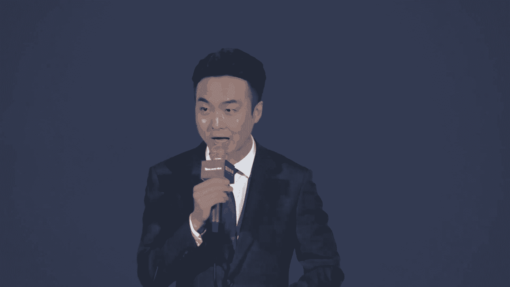
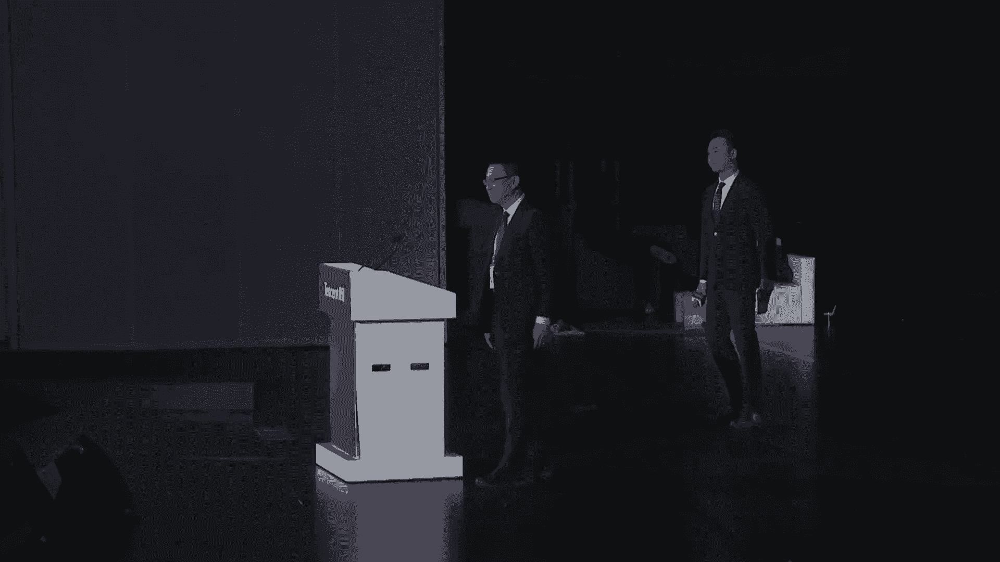
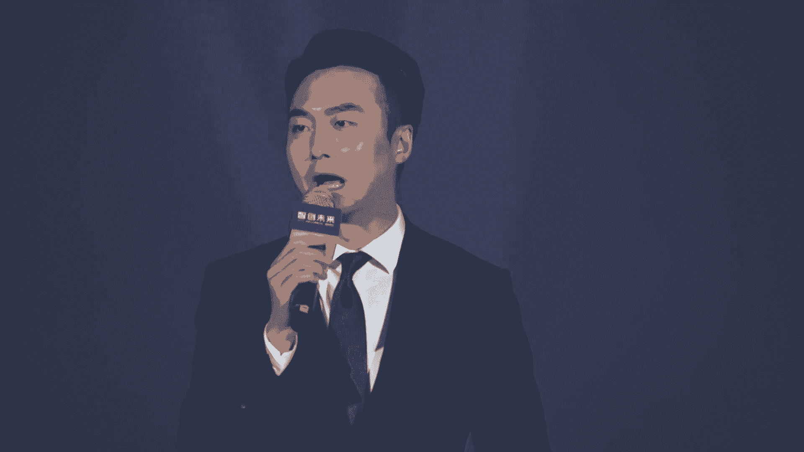
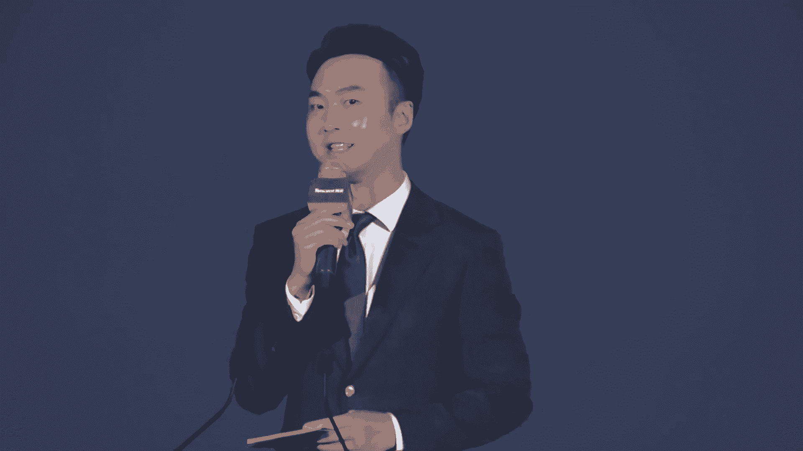
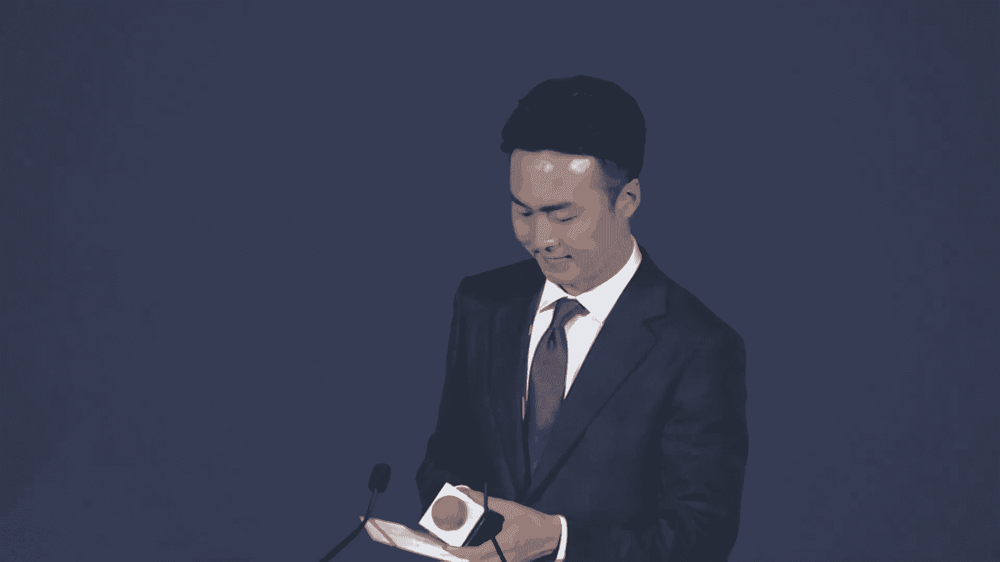

# 2024世界人工智能大会（合集） - P42：20240705-腾讯智创未来论坛 - WarrenHua - BV1iT421k7Bv

嗯。🎼尊敬的各位领导，各位来宾，现场以及正在通过网络收看直播的朋友们，大家下午好。😊，欢迎来到2024世界人工智能大会腾讯智创未来论坛的现场。我是来自上海人民广播电台长三角之声的主持人江冉。

很高兴和大家相聚在红厅。😊，当今世界最炙手可热的话题之一，无异于是人工智能。在技速飞速发展、算法和数据资源日益丰富的当下，AI在各行各业的应用场景在不断的拓展。从制造业到文化产业。

从科技创新的前沿到文化遗产的保护。AI正在掀起新一轮的技术变革。那么2024年AI领域又会出现哪些新的技术展现出哪些新的趋势。今天让我们借论坛共同探讨。首先为大家介绍出席今天论坛的各位领导和嘉宾。

让我们欢迎远道而来的国际友人科威特信息部代理部长。埃塞俄比亚人工智能研究局副局长，卡塔尔信息部副部长，欢迎三位。😊，同时为大家介绍出席今天论坛的国内的领导和嘉宾。

他们分别是上海市经济和信息化委员会副主任张洪涛。中国科学院院士胡世民。上海交通大学特聘教授人工智能研究院副院长马立庄，粤文集团副总裁黄岩。瑞金医院上海市数字医学创新中心首席技术官黄飞跃。

安阳师范学院甲骨文信息处理教育部重点实验室主任刘永革。汉字叔叔，汉字独立研究学者Rachel harisss。宾夕法尼亚大学副教授苏伟杰。厦门大学计算机系副教授金泰松。腾讯集团副总裁蒋杰。

腾讯公司副总裁、腾讯华东总部总经理张丽君。腾讯云副总裁、腾讯云智能负责人优图实验室负责人吴运生。腾讯SSV数字文化实验室负责人舒展。腾讯公司副总裁陈发奋。

腾讯云副总裁、腾讯云智能产研负责人、腾讯起点研发负责人吴永坚。腾讯云数据库副总经理、腾讯云向量数据库负责人罗云。腾讯研究院资深专家、创新研究中心主任袁晓辉。今天来到现场的还有各位演讲嘉宾以及特邀嘉宾。

再次一并感谢大家的到来，欢迎各位。😊，各位朋友，在全球技术变革的浪潮当中，上海以其特有的创新资源和人才优势正在建设起高水准、高规格的人工智能上海高地，正在不断的推动人工智能技术在各行业的应用和发展。

那首先让我们以热烈掌声，有请上海市经济和信息化委员会副主任张洪涛先生致辞。

🎼Yeah。🎼。🎼，🎼，🎼，🎼。

尊敬的各位来宾，各位新老朋友啊，时间过得很快啊呃，我们一年一度的世界人物智能大会又在上海开幕，我们和大家又又相会在此。😊，我们一方面啊我们很感慨人工智能发展的速度日新月异。啊，一方面又感慨到。

人工智能的热度长盛不衰。😡，今天啊上海特别热。啊，但是呢我觉得也赶不上我们大家对AI的热情。😡，这在此。

我仅代表世界人人工智能大会组委会和上海市经济信息化委员会对各位来宾的到来表示热烈的欢迎和衷心的感谢。😊，昨天我们也是在世博中心。隆重的举行了2024世界人工智能大会。

暨人工智能全球治理高级别会议的开幕式。李强总理在会上发表了主旨演讲。😡，阐述了中国政府对推动人工智能发展的主张。😡，也对上海的人工智能产业发展寄予厚望。总理说，上海的人工智能产业起步早，基础好。😡。

企业数量众多，技术创新活跃。围绕AI产业的发展和治理，率先进行了许多有益的探索，希望上海继续巩固优势，打造人工智能产业发展高地。😡，我想这段评价是我们所有AI人共同努力的结果，其中就包含着我们腾讯。

腾讯华东总部、腾讯云啊，各大事业部在上海和他们的伙伴们一起为上海高地做出的贡献。😡，所以今天我们也非常荣幸在此呢参加世界人工资大会的腾讯论坛。😊，我们也看到这两天。

腾讯在世博展览馆的展位也非常受到热捧啊，今天我们还荣幸的请到了啊三位呃我们国际的嘉宾啊莅临指导。所以我们相信在大家的努力下。😊，人工智能的产业发展会越来越好。上海的人工智能的高地建设会越来越好。😡。

那下一步呢，我们将按照。😡，中央的要求进一步的营造人工智能产业发展的最优生态。😡，我们将加快的夯实人工智能的基础底座，打造呢人工智能的算力基础设施和通用语料的支撑体系，更好的助力人工智能领域的创新创业。

😡，我们也将进一步的加快人工智能的落地。😡，以通用人工智能与制造业的融合为主线。开展人工智能加行动，推动人工智能与传统产业、新兴产业、未来产业，以及与我们的教育交通。😡，医疗服务、文化各个领域深度融合。

我们相信呢在这个过程中啊，以我们腾讯为代表的龙头企业。😡，以及啊雄厚的实力，完善的产业链会发挥更大的作用。我们还将继续探索人工智能的治理规范。😡，因为人工智能发展日新月异。

已经深刻的改变了我们的生产和生活。所以人工智能发展的标准、伦理、安全越来越得到重视。😡，在昨天的世界人工智能大会的开幕式场。啊，陈吉平书记还代表大会发布了上海宣言啊。

想这是我们AI界对AI治理的一个共识。我们还要通过我们的实践来不断的丰富它，完善它。😡，各位来宾，各位朋友，今天的论坛不仅将对人工智能展开技术性的研讨，还进一步的聚焦了人工智能在各行业各领域的实际应用。

我期待各位专家学者能够群策群力，发表专业论述，畅谈创新观点，也希望腾讯能够进一步发挥全球互联网领军企业的示范作用，打造一批标杆性示范性的人工智能应用项目，为上海人工智能产业发展贡献更多的力量。

我们也将进一步的优化产业创新生态和企业发展生态，不断的完善服务和制度供给，与大家携手同行，加快打造人工智能的上海高地，最后，预祝本次论坛取得圆满成功，祝各位来宾在上海期间工作顺利、生活愉快。谢谢大家。

😡，谢谢张主任的精彩致辞。我们共同期待上海高地为人工智能领域的发展继续起到积极的推动作用。😊，大家知道，作为全球互联网的领军企业，腾讯这些年一直都把人工智能作为重要的业务发展布局方向。

积极发挥在人工智能领域的平台和技术优势，落地了很多的优秀项目。那接下来呢让我们以热烈掌声有请腾讯集团副总裁蒋洁致辞。

🎼，🎼。

呃，尊敬的张主任，尊敬的各位领导，各位线下和线上的嘉宾，大家下午好。呃，我是腾讯公司的蒋洁，欢迎大家来到世界人工智能大会的腾讯论坛的会场。今年的人工智能大会非常热闹。

大家肯定知道大模型毫无疑问会成为这康大会的焦点。那放眼整个的行业看到大模型也绝对成为了主角。那根据数据显示，到4月底为止，中国推出的大模型已经超过了300个。那超过11级的参数大概已经超过了100个。

在身处于这么一个浪潮之中，我们感受到的压力是非常巨大的。但是我们也感到的更多的兴奋，相信大家也关注到，前两周open eye宣布了会对中国停止。整个API服务的一个调用，这进一步的让我们显现了。

让我们看到实现。大模型的全链路的自主研发的意义和价值。啊为公司的长期锻炼。数十年以来，我们从语音图像再到大模型。每一次的人工智能的浪潮里，腾讯始终坚持自主创新为核心的驱动力。

结合整个场景来推动AI的研究和落地。经过一年多的迭代，腾讯的会员大模型已经率先采用了ME的架构，参数量已经达到了万亿，taken数量已经达到了7万亿。那位居国内的。大模型的第一梯队，结合过去的一段时间。

混原大模型自主的研发这种实践的能力已经得到了显性的应用。那我们可以通过以下几个观察和总结，给大家做一个分享。首先，未来的通用的模型通用的模型像成为水电煤这样的基础设施存这一样的存在。在各个场景。

各个模态，各个尺寸出现不同规格的模型，用户可以根据自己的调用精条，但大家都知道大模型现在的涌现出来的能力，它的sscale的能力，还远远没达到一定的天花板。那通过我们增加算力，增加参数。

大模型的努力能力会不断的去突破现有的临界点。当整个的参数达到万亿10万亿的时候，接下来我们需要做怎么样的大大模型。那从行业和应用的角度未来我们肯定会出现不同尺寸的模型。通过大小模型的协同来提升性能。

同时满足定制化的需求，能够得到更加的性价比。那未来大模型主要会提供强大的模型能力和泛化的性能，而小模型会在特定场景去进行特殊的优化，来实现更快更有效、更精准的处理。针对这一趋势。

我们进一步满足不同场景和应用的需求。腾讯会员大模型将通过腾讯云向企业和个人开放者来提供模型的接入服务，包括千亿、万亿、百亿不同尺寸的模型。同时我们接下来会对各个尺寸的模型。

会采用ME的架构来对外进行开源。那分别去支持手机终端、PC云甚至数据中心这种多元化的场景。我们看到了第二个观察。那我们看到整个大模型行业从最早的单模态建立的多模态，甚至马上。会进入全模态的一个过程。

那个其实多模态的能力从大模型的认知空间走向了一个物理的认知空间的第一步。不久前，其实openI发布了那个GPT4O的呃，让整个大模型看到了多模态交互的个一个巨大的应用场景。那其实在文本。

图像语音甚至视频的多模态，整个才会成为一个主流大模型的发展方向。这是通往通用人工智能的一个必经之路。那比如我们在纹身图领域。那最近效果比较好的是采用DIT架构的整个的模型。

结合早期我们在纹身纹使用的trans的架构来对图像的生成中展现了非常有有显著的优势。在文身视频领域，视频的生成的分辨率。时长甚至它的精细度的整个的发展，能够加剧了我们在视频领域在这个广泛的应用空间。

那对于腾讯的会员大模型。多模态是必须要去解答的一个课题。那么我们目前腾讯的会员大模型正在积极的去部署多模态到全模态的技术，很快可以在我们上架的呃腾讯元宝上，甚至腾讯内部的一些业务上。

甚至对腾讯云对外开放的业务上都会逐步的呈现出来。最后我们在应用方面，我们认为应用场景是成为未来大模型。决战的必然的一个因素和战场。那当前大模型落地主要在呃主要主要在工作提效的方面。

根据呃真离真实的业务还是有一定的距离，缺少了呃这种杀手级的应用。不过我们的行业一直在不断的探索。在腾讯很早将会员大模型定位一个应用级的大模型，我们积极的在内部的场景进行不断的打磨和公关。

腾讯内部现在已经接近了700个业务和场景接入了会员大模型。那每天的调用量在呃3亿次左右。那通过包含了我们内部的一些应用，比如有腾讯输入法读书、腾讯读书浏览器，这样一这样的应用。

现在的C端客户可以使用腾讯大模型的能力。那接下来我们把这些实践。成立的能力和经验相通过腾讯云对外开放，让整个大模型能够进入呃千万的行业。那人工智能正在做一个带来深刻的一个变革。加速人类的发展。前不久。

pon尼指出呃，腾讯的创立与发展，就是用好专心致志，做好比特的这个专场。未来腾讯也会发挥自身的专场，携手合作伙伴，将这种更多的比特转换成智能的生产力来推动整个大模型前沿技术的一个发展。

在实体经济文化保护、科学发展的领域，将全社会的智能升级，做好技术和支持。好，谢谢大家。预祝这会大会的成功。谢谢。好，谢谢蒋总的致辞。腾讯对人工领域的贡献和做的探索。这些年来，大家有目共睹。

我们说技术向前发展，人工智能不断的创新归根到底，是为了让人能够更好的生活。那么刚刚蒋总在讲话当中提到的大模型的普及，又会给千行百业，给服务社会带来哪些福祉呢？

接下来就让我们有请腾讯云副总裁、腾讯云智能负责人优图实验室负责人吴运生带来走向大模型普惠时代，让技术更好，服务于人的主题演讲，有请。😊。

🎼，🎼，🎼。

🎼，🎼。大家好，我是腾，腾讯的吴云生。那个欢迎大家来到腾讯论坛。今天我主要想和大家来分享一下大模型技术相关的发展，以及我们怎么样把大模型的技术更好、更快的普回到给所有的人。😊。

那作为国内规格最高、影响力最大的技术盛会哈。实界人工智能大会，我们到今天为止已经连续举办了7届。我们有很多新的这种技术趋势、创新方案、产业的一些落地成果都在这里发布。

现在已经成为我们人工智能技术发展的一种风向标。接下来呢我也会从像技术发展模型的迭代工具的优化，以及我们产景的落地四个方面来给大家介绍一下我们的一些思考和实践。😊，在技术的发展这一块呢。

我们有三个趋势来跟大家分享一下。过去的一段时间里面，大模型的发展把人工智能的技术发展到了一个新的制高点。但是在实际的落地过程中，我们也发现，虽然单模态的技术在某些场景下表现良好。

但如果通过引入多模态的能力。我们可以扩展它的应用范围，能够使其在更广泛的场景里面去表现的更加出色。比如说在识别和交互上，多模台大模型通过结合视觉和语言理解能力，可以有效的突破此前的一些界限。

实现更精准的语义分析和更全面的。归因的动作。在实际的场景中，这种技术呢能够处理多样化的用户输入，比如说文字、图片或者语音等等，尤其是在像汽车助手这样的一些企业知识服务的领域。

提供了更加深入的图像内容理解和更高质量的交互体验。那另外方面呢，我们在学习范式上面，传统模型受限于任务独立和大量的对于标注数据的依赖。那通过零样本或者小样本的学习，就能够很好的去解决这些问题。

并且简化研发流程，而且可以加速我们AI技术的落地。比如说我们如果要生成一个数字人，就必须录录制一段视频，做一些非常多的定制化的工作才能够实现。但是今天我们通过一些 shot的一些技术。

只需要一张照片不需要任何的定制，我们就可以得到一个栩栩如生的数字人。那这个技术如果我们应用到这种像工业质检的这些场景呢，我们通过一些缺陷的词汇提示，或者是说一张缺陷的图示的照片。

就可以去实现这种以前很难做到的这种缺陷检测，能够大大的提高检测的效率和准确性。比如说我们给一些龙头的新能源企业去提供电池自动质检。解决这种质检的难题。在项目上线之后。

我们就可以大大的提降低用户的企业运营成本，并且提高了我们整个产品的检测能力。那第三呢，在内容呈现上面呢，我们随着3D生成和视频生成技术的不断发展，用户可以获得更加这种沉浸式的体验。

比如说3D生成技术通过模型不断的自我学习，不再依赖人工调传，能够打破传统的物理仿真的一些局限性，显著的来提高生成内容的速度和质量，更丰富的3D生成内容能够为用户带来更加生动和真实的沉浸式体验。

比如说单独的3D头像生成能力，能够广泛应用于向电影动画增强现实、虚拟现实，还有视频游戏等等这些方面。那与此同时呢，视频生成技术也在不断的进化，生成时长。我们可以大大的去加大我们整个的时间。

品质也得到了很有效的提升。比如说我们联合日报打造的原创视频真爱地球，生成的视频内容非常的真实精细，在内容理解、逻辑推理和画面生成等方面都有非常不错的表现。在底层技术的不断探索，也让我们的模型不断的进化。

呃，去年9月呢，腾讯也发布了全链路的自研腾讯混员大模型。目前呃像刚才我们呃宙斯也提到了腾讯混员大模型已经实现了非常大的升级。那这后我们也从稠密模型转为了MOE模型参数可以达到万亿级别。

预训内的语料也超过了7万亿token综合算力工程和算法上的自主创新。腾讯混员大模型已经稳居国内大模型的第一梯队。腾讯的生图生视频、生3D等等这些大模型的能力都处于业界的领先地位。

目前我们腾讯混员大模型的单日调用token已经超过千亿。此前，我们也在腾讯云上开放了包括像混员pro混员三者混员light等等多个版本。那接下来呢我们也会开放更多的版本，包括我们的vis损多模态版本。

也会跟大家去见面。同时我们也将陆续上线，包括我们的代码生成、角色扮演、方程扩等模型和接口，满足不同的企业和开发者的需求。😡，那另外一方面呢，我们也有很多的模型工具产品层面的进展。呃，今年5月。

我们推出了三个大模型的pass产品，知识引擎、图像生成引擎和视频生视频创作引擎，希望能够简化呃数据工程和模型金条的流程，帮助企业快速轻松打造的AI原生应用，经过两个多月时间的这种迭代。

我们这三款模型的产品也进行了全新的能力升级。呃，首先是我们提一下知识引擎。基于LIM和rag框架，我们发布了全新的多模态检索能力升级知识，包括图文互搜，以图搜图。

能够结合知识库中检索返回的这种图文片段给出图文并茂的答案。那同时呢，我们也进一步扩展了企业知识类型的覆盖面，升级了范BI对话式数据问答体验，支持超大表格多表场景的多步骤推理，多条件筛选，求和计算。

可扩展支持对接客户主流的数据库。在图像创作引擎这里，我们基于腾讯混原底座，实现了业界领先的AI图像生成和编辑能力。我们的图像风格目前已经新增到了33种，并推出了专用与头像的生成模式。

让生成的我们的风格化的头像，既能保留个人相貌特色，又融入了多元艺术风格特征。同时，我们还新增了商品背景生成模特换装和创意换装等等这样的接口，大幅降低了营销和影视行业的制作成本。那另外一个方面呢。

在我们的视频创作引擎这里，我们也进行了全新的升级，带来了不少好用使用的功能体验。首先，我们新增了超过20种热门舞蹈的动作，利用先进的3D建模技术和背部生成技术使得图片中的角色。

能够非常流畅的进行转身舞蹈，甚至支持多人舞蹈的复杂编排，这在行业中属于首次。那其次，我们的视频风格化功能，借助面部增强技术能够逼真的还原我们的面部细节和表情。这在行业里也是非常领先的。另外。

我们的视频转移功能，介入了混原纹声纹的大模型和TTS技术，大幅提升转移后的音频自然度相似度和语速效果。这些能力的升级，既能增强视频创作的多样性和表现力，也能为创作者拓展更大的。创意空间。同时呢。

为了帮助企业用户更便捷的打造专属的模型应用，我们的机器学习平台太平台也进行了全新的升级。首先，我们内置了开源可扩展的数据构建的pyline，能够帮助开发者高效的进行数据准备。另外。

我们还提升了我们的数据标注能力，首创了基于schema的标注方法，专门为LOM和多模态的大模型设计，非常的灵活好用。那我们的平台金条训练模块，以应用稳定和高效为核心。内置多款主流的大模型。

支持一键启动金条，并通过三层稳定机制。并且支持我们自研的安卓框架，确保大模型训练的连续性和性能提升。此外，我们还采用了三阶段模型评测流程，包括我们的清量体验、客观评测和主观评测。

确保我们模型训练整个过程的精准性和真实的反馈。通过混圆大模型底座、太平台、知识引擎等等这些工具产品的不断迭代和发展。目前，我们可以围绕办公协同、知识管理、智能客服、营销等等多个场景。

为用户去提供全链路的模型服务，帮助他们真正的实现提质增效和转型升级。比如说我们将知识引擎的能力应用于起点客服、大模型的文本机器人。在面向向账单查询、推换或这种非常复杂的任务时，大模型机器人的配置成本。

相较于传统的文本机器人，可以减少50%以上。再比如腾讯乐享是服务于企业内部的知识学习协作平台呃，为企业去提供包括像知识管理、学习培训、文化建设等等这些服务。目前已经服务了超过30万家客户。

那用户数也超过了1亿。再结合了腾讯自研的大模型和知识引擎之后，乐享就可以实现两大场景的关键核新。那比如说围绕我们的知识生产端，乐享结合着大模型知识引擎，可以升级智能写作的能力。

一句话就可以让AI帮你完成写作。那智能生成可以让AI自动的去生成知识点，生成考题，去解决了我们培训部门可能不太懂业务。那业务部门呢又不太懂培训这样的一个难题，大大的提升了培训的效率。

那围绕呃我们知识的消费端，我们还推出了智能问答，不需要训练，就可以让AI来回答非常多的企业内部的业务知识，大大的提高了呃知识获取的效率，又继承了每个文档的细分权限，做到了真正的千人千面。

比如说一个拥有薪酬权限的员工，如果去问AI说薪酬怎么算，那AI就会给出非常详细的准确的回答。但如果一个没有权限的员工去问同样的问题。那我们的AI可能就会回答啊，抱歉啊，我不能回答你的问题。

类似于这样的一个我们非常好的一些实践的经历。在产业的落地方面呢，我们本着优势互补的原则。我们和上海市数字医学创新中心也开展了合作共研的医学大模型。

目前我们在月经医院实现的总检报告和电子病例生成等相关项目的落地应用啊，以体检报告生成为例，我们平均每5秒。就可以自动生成一份总检报告，为医生节约了超过50%的撰写时间。那同样呢在文娱行业。

我们也和阅文集团来一起合作，帮助和阅文集团一起去应用大模型的文身纹的能力，为作家去提供AI辅助写作的能力，包括像啊描写灵感大纲提取角色提取等等，应用大模型纹身图的能力，用于连载书插图制作等等这些内容。

与此同时呢，当然我们也会遇到非常多模型应用所带来的一些现实的问题。一来算法团队和工程团团队，其实我们的资源也有限，精力也有限。但是我们的模型数量是非常多的，而且迭代也很快。

所以自行去搭建这种推理集群和服务平台。那模型的更新就很复杂。那二来呢推理成本也非常高推理的速度也达到了呃很多时候达到瓶颈千百亿及模级别的这种模型推理部署，它的推理的这种吞吐量和实。

间都会存在非常大的瓶颈。那遇到这些应用的难题呢，我们的给出的答案是说，我们可以通过腾讯云太平台应用，在模型训练这些方面有效的降低训练配置的难度。以前我们更多的是通过编写代码的方式。这种复杂的配置。

去提交我们的训练任务，去做任务的管理。现在我们只需要在太平台上面做一些点选的工作，就可以快速的开启训练任务。在模型推理方面，通过我们的平台加速框架。

我们也帮助阅文实现了在相同资源条件下内容产出的速度可以更快。另外，平台也提供了更直观的监控和管理的工具，帮助客户可以轻松的管理任务和资源。在产业落地之外。

同时我们也看到了大模型在科学计算、文化研究等等这些方面的价值。2021年，我们就联合了国家天文台发起了探新计划。我们希望通过人工智能的技术，提升天文发现的呃一些效率和我们整个天文相关的一些科研的效率。

那经过几年的这个发展，截至目前通过我们AI技术的助力，从巡天观测数据中，我们发现了三例快速射电报41颗脉冲星快速射电报是我们目前天文界研究的热热点，相比较与呃脉冲星快速射电报。因为它发现的时间比较晚。

AI训练的数据也比较少，出现频率也比较低。所以它的发现难度要比脉冲星大很多。那为此，我们的团队也通过设计全新的端到端的AI算法，引入了多视力学习和大模型的注意力机制显著的提升了模型的精度。

和数据处理的速度。在文化领域。那此前我们和内外部多个部门也在携手合作，把我们的像文字检测、模本生成自行匹配等等多种AI的算法，综合应用于我们的甲骨文研究。今天我也非常高兴去宣布。

我们将全球最大的甲骨文多模态数据集正式开源。😊，这个数据集包含了1万片甲骨的踏片模本，以及甲骨单子对应位置、对应头骨对应视文以及磁力分组、视图顺序等等这些数据。基于该数据集研究人员就可以开发甲骨文检测。

识别模本生成自行匹配，以及视图等方向的智能算法，助推甲骨文研究加速数字化和智能化。那最后无论是产业落地还是科学文化探索AI大模型技术，它整个的发展都离不开我们完整的产业链的协同和生态共建。

后续我也非常希望能够和更多的同行一道，推进科技赋能和产业创新，共创，共建，共享智能美好未来。谢谢大家。谢谢谢谢吴总的精彩分享。我们也通过吴总的分享，看到AI大模型正在各行各业进行着深度融合。

为产业的转型升级提供重要的推动作用。那不仅仅是在产业。那在文化遗产保护方面，最后也高兴的看到了甲骨学的研究过程当中，AI也扮演着极其重要的角色，给我们增强中华文明的影响力，提供了现代科技的支撑。

而此时此刻，我们就将迎来全球首个甲骨文多模态数据级的发布。让我们有请各位发布嘉宾上台。😊，🎼有请安阳师范学院甲骨文信息处理教育部重点实验室主任刘永革。🎼厦门大学计算机系副教授金泰松。🎼汉字叔叔。

汉字独立研究学者Rachd hases。🎼腾讯SSV数字文化实验室负责人舒展腾讯云副总裁、腾讯云智能负责人优图实验室负责人吴运生，腾讯公司副总裁、腾讯华东总部总经理张丽君，腾讯公司副总裁陈发奋。🎼好。

我们请各位嘉宾分别站到启动装置后，把手准备在按钮上方，让我们一起倒计时321启动。🎼全球首个甲骨文多模态数据集。🎼正式发布。🎼请各位嘉宾再次合影留念。🎼好，我们请刘永阁主任和richard留步。

请其他嘉宾落座。好，刘主任，ha youri ，mr rich，please。我们到前面来好吧。😊，呃，我知道刘主任一直在从事甲骨文的发掘和研究工作哈呃，曾经呢很多这些年来您也和腾讯合作。

推出了很多利用技术教大家去认识甲骨文，并且传承甲骨文文化的这样的项目？那此时此刻我们在这里发布了这个多模态数据库。您认为他给甲骨文未来的研究和传播会带来哪些影响？😊，嗯，好。

这个非常感谢能参加这次发布会啊。这个甲骨的研究，我们知道它是我们中华文化的根脉。所以甲骨研究的重要性不用我说。那么怎么用最先最先进的人工智能技术研究甲骨文，这是我们要目前要做的工作。

那么我们这个甲骨文信息数理教育重点实验室呢和腾讯合作，这样我们合作了接近三年时间啊，一直在做这项工作啊。那么这个数据集呢，它就是因为人工智能。我们知道它必须得有数据啊，必须得有高质量的数据。

所以这个数据集的发布嘛，对人工智能帮助甲物学研究，甚至推动甲骨研究具有非常重要的意义。好，谢谢刘主任。那我们再来问rid几句哈。我们知道您20年了，一直在从事中国古文字的研究，从甲骨文到金文到小篆。

对吧？而且他自己呢还建立了这个关于中国古文字的一个数据库。今天您来到现场也看到我们发布了这样一个多模态的数据集。您觉得甲骨文的研究和传播，对世界会带来哪些影响。😊，我30年以前，我来中国。

我有一个计划要电脑化go代汉字。我放过很多的go代汉字的专架，他们说你不能电脑化go代汉字，那个是30年以前，我花了20年做一个数据库有10万个go代汉字。现在电脑是每天发达，越来越复杂。

现在那个自然语院会写字自然语会翻译的。现在那个人工智能是越来越发达。在用人智能要分析甲骨文进步。所要前要后每天都进步。我有一个说法每天要一新的东西甲骨文的文化中的文化这是世界的文化。

所以我希望大家都会活到老学到老。谢谢谢谢richard，也谢谢您为推广汉字做出的贡献，谢谢。好，请两位入座。😊，🎼好，各位人工智能技术不断革新的趋势之下呢，我们保护传统文化的手段也在与时俱进。

在文化遗产的保护方面，人工智能又在发挥着什么样的作用呢？接下来让我们有请腾讯SSV数字文化实验室负责人舒展为我们带来人工智能加文化遗产数字化主题演讲。😊，🎼，🎼，🎼，🎼，尊敬的各位领导，各位来宾。

大家下午好。今天我们讲的这个话题呢是围绕我们在AI人工智能这么一个热的技术的情况下面，跟文化遗产的换活有什么的关系？呃，这个话题呢我也曾经呢跟我们公司的一些科学家进行过交流。呃，让我比较意外的是。

这样的李工兰跟我说一句这样的话，他说，如果用最前沿的最先进的技术去探寻最古老的文明和摸索古人的智慧，这是何期的浪漫。哎，我没想到李工兰也要讲出这么浪漫的话，所以我们非常有兴趣。呃。

今天下午呢就想通过几个案例啊来讲一讲背后的故事，也讲一讲如何用AI的技术来跟文化遗产的数字换活发生相应的关系。😡，那么首先我们要知道，根据中华的文脉和文明，探寻中华文明的源头。

这是国家的一项国家的战略和国策。那么实际上呢，我们也在想，除了我们在大量的人去投身于这个事业和行业，有很多的文物的专家数十年如一日的在努力。那么最新的数字技术能够在中间发挥什么样的作用。

我们经过一系列的调研呢，我们也发现。在当前呢，我们一个是比方说我们在古文字，那么古文字呢，包括像甲骨文为代表的4500个字，到目前能够考证出来的可能能够试读的大概只有1500字。

那背后是什么样的一些原因？技术在这里有些什么样的可能性？😡，我们也发现了中国呀有广袤的这个文物。那这类文物呢可能据我们的统计呢，大概有1500万件到2000万件是没有修复的。😡，呃。

总书记呢去过这个三星堆，去看了三星堆的这个文物修复馆，也专门了解过，问过了当时的这个也是一位国家的一次修复大师，说你修复一件文物大概需要多长时间？他说每件文物一般来说需要半年甚至长达两年的时间。啊。

总书记说那久久为功，能修一件是一件。那我们又在想，通过AI的技术，我们能够帮助中国在文物的修复上面，是不是往前可以跑的更多一步。那现在越来越多的人拥入博物馆，是想看什么？想看我们的文物。

那能不能让这个速度和效率进一步的增强？😡，我们也发现呢大量的这个中华的这个文物啊，它所在这个。博物馆里面所在这个仓库里面，他能不能通过数字化的技术呢？数字化的能力呢开放给全人类去共享相应的成果。

那这些方向的这些问题呢都指引着我们在案例上的讨论和一些研究。😡，那么刚才呢，其实大家提到了呃，关于甲骨文的数据总结的发布。那么我们也在看，我们分别在古文字。在这个文物的修复，在数字人以及文创的方面。

我们通过AI呢做了一些实践和探索。这个探索呢应该说呢在刚刚还在路上，我们不敢说有多少成绩。但是我们看到了很多的可能性，我们也看到了很多的浪漫的故事。😡，首先还是要跟大家讲一下这个关于这个甲骨文这一块。

刚才我们除了发的这个总的数据集，我们想告诉大家是在今年的5月28号，我们也在安阳宣布呢引起文院的2。0的平台，甲骨文的AI协同研究平台的上线。😡，刚才刘主任也提到了，其实我们这样一个小小的项目组啊。

包括安阳师范学院的实验室，包括优图，包括我们数字文化实验室，还有像厦门大学、中国社科院等等的大量的专家已经在中间呢花了3年的努力。那么三年的时间呢，我觉得我们看到了几个方便。一个方面呢。

我们看到了我们有了一套高保真的还原的甲骨文全信息模型的数字甲骨的采集方法。结合了AI技术和微魂提取。我们有信心把每一片甲骨站所有的信息提取出来。😡，另外呢，我们通过了自行匹配的算法。

将英企文员平台上面存载的大量的这种数据呢关联起来。我们也形成了一套总字表，我们也形成了一套总注路。😡，那么在这个平台上呢，因为有有了这样一个平台，我们会发现呢，我们可以通过AI的能力啊。

在这些数据上面去进行大量的去重聚合和缀合。那么这个对于甲骨文下一步的研究和下一步的破译，其实提供了很多的能力和效率的提升和方法。😡，刚才也提到了，我们也通过了这样的一系列的努力。

我们逐渐逐渐的把从原来去年的143万字的甲国的单子表，慢慢的把它浓缩到了一套总值表和一套总猪路。😡，呃，这里我们也发布了大量的数据整理的这种能力，来高效的助力大家呢去在这里的进行。

包括踏本、某本、文子的定位框、字头、视读顺序等的相关的解读，极大的去提高了自己的效率。😡，那今天呢除了我想除了我们刚才发布的这样的一个数据集，以及我们528发布了这样的一个协同平台。

我们还要把它真正的用起来，指向我们最终的目标。那就是对甲骨文的破译。它的试图产生影响。所以今天呢我也在此借助这个机会啊，我们宣布我们今年的探原计划2024。

我们是我们腾讯呢呃每年会拿出1000多万来支持在文化加科技的融合的课题的探索，我们也开一个甲骨文的定向的课题，利用我们的协同平台，利用我们刚才发布的这个数据集。我们去征集面向高校，面向海内外的研究机构。

去征集利用这些工具，利用这些数据去做甲骨文AI破译的相关的方案。如果有好的方案呢，我们奖励20万。😡，那为什么讲20万呢？原因很简单。😡，第一个呢是因为中国文字博物馆呢曾经推出过一个活动。

因为大家应该知道叫破译一个甲骨文讲10万。😡，那我们呢今天就讲20万，好吧，也希望大家这个踊跃报名参与。但是我们这里呢主要还是鼓励大家的想法跟方案。😡，那么讲完了这个甲文呢？😡，我们想呢再跟大家讲一讲。

我们在文物的修复上面，其实做了一些探索和努力。刚才也提到了我们在文物修复上的一些难题。三星堆呢，我不知道大家去过没有这个地方呢，我觉得它的文明呢，它既神秘也神奇也瑰丽。

在小小的新发现的6个即祀坑里面都有14000多件的文物的出土。而且每一件文物呢都让人觉得非常非常的非常非常的美丽，非常非的惊奇。那么我们也在跟三星堆的这个四川省的考古院和三星堆博物馆的合作。

我们也提出了第二个大胆的命题，能不能用通过AI来帮助这个文物的修复。那这里包括了深层次的预测方案的预测，包括了在数字世界的虚拟的拼接，再到天在材质的整体的还原。那么基于此呢。

我们在去年呢已经实现了对青铜。一个贵坐顶尊的奇兽人像的一这样一个珍藏文物的一个修复。那整体文物修复的全工艺，以及它的视频呢已经在三英堆的博物馆。包括经过了这个修复之后的3D打印的实物。

也在三英堆的博物馆的展出。那么今年呢在此基础上呢，第一个呢，我们又去去研究这个2号神树。因为2号神树呢整体来讲还是有很多的残片，但是拆除学术上的这种拼接的基本完成。我们也在通过数字化的技术再次去验证。

另外一方面呢，我们也在开发相应的工具。基于我们已经做到了像绞形裂痕检测碎片补全的这些算法，变成相应的工具，通过人机协同的方式，进一步的去帮助专家去研究。😡，未来在修复文物的可能性。同时呢我们也在看。

既然我们讲到了AI刚才讲到了一个他在应用的场景上面，一个方面是我们会让他大量的提供了降本增效的能力。另外第二个方面来看的话呢，我们通过的AI呢，其实做出了很多的深层式的预测。那么另外一个方面呢。

我们会发现AI其实在这种文化和文物的活化上面是有很大的功效的。我们也经过近几年的调研发现呢，这个博物馆热非常的热。😡，然后基本上是一票难求，但是实际上也会发现大家去了以后看什么。

如果你光是看没有人讲是看不清楚的。但是讲的时候呢，又会有人跟你瞎讲，对吧？这个简直讲到的这个前朝的姑姑姥爷的事情去了。他又不是科学完整的。但是你要解决了讲解的问题，科学完整的问题。

它的互动性和生动性又有限，那这些问题怎么去解决。我们跟国家博物馆呢联合呢进行了这个AI树人的探索。那么一个是发掘了一个艾文文这样一个形象。第二呢我们也把艾文文呢经过了这种AI的这种知识学习能力。

以及让他呢去学习了国博的大量的文物，在这个中华文明的云展里面呢已经用起来了。那今年呢我们在这个基础上呢，我们跟优图实验室呢，我们跟云智能团队呢也在进一步的结合，把全套能力呢能够布在国博的线下。

那应该在今年的下半年在国家博物馆的这个线下的馆场里面，我们可以发现这个艾文文是可以给加进行大量的这种伴随式的这种文物的讲解。😡，最后呢我想跟大家讲的是AI还有一些什么样的可能性。其实刚才也提到了。

在内容的创作上面。今年的518的这个国义博物馆日呢，我们因为有一个计划是跟国家文物局一起发起的，叫繁星计划去助力中小博物馆。因为大馆呢大家都知道它的IP多，文物多，关注度也高。

但是其实上中国还有这个璀璨的几千家中小博物馆。每一个博物馆都有很多的故事。但是可能没有人看到鲜为人知，也也难有很多的工人员去服务。比方说我说四川有一家中小博物馆。

它的摇钱树的文物是中国最早和最大的摇钱树，还还真不一定是说你在三星堆看到那个摇钱树是最大的。那这样这么好的些文物的故事如何去把它串联起来。我们今年呢在这个518的时候呢，我们做了两个努力。

我们基于这个AI的能力啊，一方面呢我们帮助这些馆场文物呢去设计到文创产品，文创的实物，而这些实物呢也广受欢迎。现在很多已经到了这种实物的生产的阶段了。而且在网上。其实也引起了很大的热议。另外一方面呢。

我们又通过这些文物跟AI的对撞呢，我们形成了这种数人的繁星形象。在今年的518呢，通过了这个视频号的网络直播，有400万人次呢在线去同时观看。应该说在今年的518时候，其实是掀起了一波繁新的热潮。

我们相信呢AI在文化遗产的保护，传承利用上面可以做的事情还非常的多，想象力的空间也非常的大。我们希望在未来的知识里面可以共同努力啊，探索更多的可能性。谢谢大家。😊，谢谢谢谢舒总的介绍。

用现代科技来守护文化遗产。我想这应该是人工智能时代中国式的浪漫吧。当然，在文化层面，既要守护传统，我们还要面向未来进行创新。当那些富有人气的IP和AI相遇的时候，又会迸发出怎样的火花呢？

接下来让我们有请岳文集团副总裁黄眼为我们带来关于AI加IP打开网文IP商业价值新空间。有请。😊，🎼，🎼，🎼，🎼，呃，大家好，非常高兴啊。

有机会在这样的一个平台跟大家有机会去分享大模型AI在一个非常垂直的纵深领域，就是和IP相结合，可能能产生的一些化学反应。呃，我们今天的主题叫做打开网文IP商业价值的新空间。😊，我来自岳文集团黄岩。呃。

说到阅文集团呢，它是一家内容平台公司，呃，有像QQ阅读起点读书，包括起点的国际版weblo这样的平台，也有大家比较熟悉的。向庆余年。大凤打耕人。全职高手诡迷之主。呃，斗破苍穹，还有今年年初的。热辣滚烫。

还有这个人世间这样的一些作品，也都是阅文的产品。那其实在去年的7月，阅文呢首次在行业中发布了网文领域的专有领域的大模型，叫阅文妙笔。在这里呢我们融合混合了100多种创作常用的任务指令集。

小到给作者和这个人物角色起名字，提取灵感，创作空间，提取大纲。每天呢现在也有超过万名的作家使用大模型驱动的。作家助手妙笔版来是进行辅助创作。我们以筛选和构造出。超过5亿条的角色对话。

同时呢产出4000万条以上的适合网文场景的知识。所以呢简言之阅文的妙笔是一个懂场景，懂作家，懂角色，懂网文梗的。一个垂直领域的模型。所以今天呢接下来我会跟大家分享。有了这样的模型。

有了行业中AI技术的前景这个前沿发展和阅文这个结合产生怎样的落地实践。我们的落地实践简言之呢分为3块。第一块呢，其实刚才smon有提到，我们当有了这个AI大模型以后，不仅仅停留在模型层面。

我们把它potal到。这个我们的创作者阅文的作者每天使用的创作工具叫做作家助手妙笔版。这个当下呢AI的功能的使用率已经超过30%。一些功能呢其实是解决了作者在创作写作过程中的一些真实的痛点和刚需。

比如说这个大纲的这个提炼角色的提取一个角色的第一章，他的人设和第300章的人设的一致性的检验。这个我们近期啊这个随着这个多模态成为用户在阅读中的真实需求。用户在读文字的时候，呃。

他们也希望看到作者描述的场景。如果呈现出来真实的图或者视频是什么样子的。我们近期也和百位作家共同参与这个一个代号画师的内测啊，并且这个应用于这个呃文字的插图。那第2块呢是大模型的翻译。

助力网文的规模化出海。这个AI翻译确实极大的丰富的内容供给，让中国网文的一键出海成为可能。那第三个呢是我们尝试啊。打造沉浸式故事的角色互动体验。当你看完一部小说，看完一部剧，你还想。😡。

和故事中的角色去对话，去聊天。我们提供的这样一个产品叫逐梦岛。最近这个青云年二刚刚播完，我们发现很多的读者、观众在起点上看完青云年的书，在腾讯视频上看完青云年的剧，还想去跟范闲去聊一聊故事背景。

甚至产生新的故事，去跟鸡腿姑娘去聊一聊。所以呢现在我们有一个产品叫筑梦岛。但是现在他也在QQ里面小范围的内测。你在这里面搜索虚拟角色，就可以找到范闲去跟他继续聊天。😊，这个讲到这个文化网上有个梗。

叫世界三大文化现象是吧？一个是美国的电影，日韩的动漫和中国的网文。那其实呢在AI翻译落地之前，中国网文的规模化出海其实是一个。不可能完成的任务。一两部头部的作品出海是有可能的。究其原因。

第一呢是人工翻译的成本非常高，周期长，每年只有少数的头部作品有机会被翻译成英文出海。😡，第二呢，传统的机器翻译。还是过于生硬了，无法达到网文的商用标准。而小语种的翻译的成本往往是英语翻译的3倍以上。

这也限制了我们对于头部的好内容的小语种市场的探索。但是大模型出现以后，基于大模型的翻译，因为它更懂这个网文的。前因后果极大的加速了多种语种的翻译，也让中国网文今天在国内写完，明天一键出海成为可能。这个。

刚才讲了3块啊，因为第一块呢，我们这个去年月文有发布过妙笔模型。中梦岛呢好像今天在这个AI大会里面另外一个场次，还有专门的路演。所以接下来我多花一点点篇幅讲一讲。这个。中国网文因为大模型翻译一键出海啊。

我们的一些洞察和认知。呃，很多朋友会第一时间反映说，那有了大模型以后，翻译似乎理所当然了。我写一个prot，说请翻译一下这篇网文，是不是就万事大吉了呢？答案显然是不是的。

因为我们面临的问题不是发音一篇小学生作文。翻译篇。这个通通常内容上的意义上的文字。我们面临的问题是单篇300万到500万。字的一个网文里面涉及到的人物角色可能超过150到300个。

而且我们的读者是用货币投票的，也就是订阅模式。他在用人民币或者用这个其他的货币。这个看议多少字，付多少钱。😡，所以呢我们的读者对于内容的质量和流畅度有接近近乎苛刻的要求。显然。

简单的prot无法直接满足需求。我给大家举一个例子啊，这是。😡，呃，这个字体还可以。我们在网文中一个片段，即使不到300万字到500万字，我们找一个片段把它投入到通用大模型里面去翻译。

我们发现有很多问题，比如说。呃，这个网文里面难免会有错别字。如果错别字在系统中没有被识别出来，直接翻译，又翻译一层意思又更偏差又更偏差了一点。比如说主语缺失。这个这样一看动干火的可以。哎。

比如说这个俗语动了肝火，我们很难把它翻译成the liver was on fire。😡，大模型就这么翻译的，目前还是。对吧实际上是很生气的意思。还有过渡分段。这个网文的作者，每个人都有自己的写作风格。

所以如果这些问题我们没有解决啊，直接把它通过prom的翻译的话，就会产生出一些不够连贯的场景。还有指代模糊，就算你想动这个你到底是前文中的哪一个你其实我们用妙笔模型是可以。

更清楚更精准的分析出这里面涉及到一些问题的这就涉及到对网文的理解。😡，这里面有个非常关键的动作，叫做对即将翻译的文字进行预处理。当我们进行预处理以后。

我们发现对错别字对主语缺失、时语俗语的识别过度的分段指代的模糊，进行了一次预处理以后，再进行常规意义上的promt翻译，它的精准度就好了很多。😡，那当然我们碰到的挑战不仅仅于此啊。

这个我们在实践过程中发现能够翻译大概是可以的，要能够精准翻译，还需要做很多的工作。我们碰到的第一个挑战是网文的写作习惯很独特。预处理非常重要。刚才又提到了这个同一角色的多种称谓，这个大家容易理解。

就以还是以庆余年为例。很多朋友知道庆云年，即使对范闲这样一个知名的主人翁。他在文中在剧中也有很多称谓，有称范某人，有称小范大人。

有称姓范的那多一种称谓在这个翻译中怎么样能够精准的翻译出上下语境下不同的称谓指向同一个人，这是我们要去应对的难题。当然还有主语指代的模糊和缺失，以及。8。还有一些网络用语，心梗热词随处可见。

大家看一下右边这个例子啊，就说起来还真对不起老 lu多萨sky。如果你看过火影的话，你显然知道这个是代表了火影的两个这个主人公名人和佐助。如果你要是不了解，直接把它翻译成音译，翻译出来的结果就很奇怪。

😡，路过建安西路，远远就见到了六公主的办公大楼。我想在座的朋友95%都知道，六公主的办公大楼代表着央视6套的办公大楼。可是目前大部分大模型还不知道六公主等同于央视六套，至少在这样的语境当中。

还有下面一个例子，我不知道大家。能够意识到他是什么意思没有顾程没有想太多，而是将背包内还剩下的18万鱼翅一股脑的刷了进去。其中10万是开通皇帝后赠送的贵族鱼翅。这是直播打赏的一个场景。

如果不了解这个场景的话，你去硬翻译翻译出来的东西，既有鱼翅，又有皇帝，就会很奇怪。😡，当然还有我刚才说的过度分段，也有分段不足，这是不同的作者的创作风格。还有起点里面的很多特色。

当他写完了一张自己很满意的时候，就会明写啊各个的书友啊，有的书友看上去像是有具备完整的意思，但它就是书友的名称，还有起点特色的求阅票求推荐票，这个在海外推出到英语市场或小语种市场就不需要了。

所以这里也需要被预处理过程中被识别和优化。😊，啊，第二个其实很重要的就是这个专用术语。在网文当中，专用术语是网文的灵魂啊，把专用术语翻译的性达雅是一个非常重要的一个话题。我们看一下这个网文里面。

这个仙侠和玄幻通常有一个武功秘籍，叫清新诀啊，却也只好一遍一遍的运用了清新诀。如果我不懂清新觉是什么意思，我就只能够用拼音把它翻译出来，叫清新绝。换到英语市场中，大家看到这三个拼音也是一脸懵逼。

但如果我们知道了怎么样翻译的更优雅的话，我们可以把它翻译成。Hot soothing technique。啊，他基本上比较精准的还原了清新觉想表达的意思。当然还有就是。这里面提到的天书天玄天机天玄。

这个玉恒开阳遥光啊，这是北斗七星的每一个词。如果不了解大模型也会把它翻译成音译啊，就是天书天玄。可是我们不要忘了北斗七星，全世界都有。当我们知道这个背景的时候，我们就可以把它有更好的翻译。

这是在西方东西方里面对于这个北斗七星里面的每一个星指定位置的不同叫法。相反，有些词不需要音翼。看这句话，从此以后我不叫风小音了，把小字去掉，我就叫风音，这是一个名词，可是模型进去的时候。

如果你不做预处理，它大概率会把封印。翻译成win in print，你说对不对呢？也不能算错，但是不够流畅，对吧？所以翻译成封印拼音更合适。当然如果看到上下文，大家就可以理解了。

封印今天的目标还有海城山啊，不要叫Cbe mountain，还有海城水，这都是人的名字，识别出这个词是人名本身就是预处理的关键动作。😡，70%的网文都含有专业术语。

但是通用模型对网文专业术语的识别率目前还是不高的，导致译文的可读性和趣味性都不及预期。每一个品类像都市、仙侠、科幻，都有自己特定领域中的专业术语，像都市里面的定生术啊，星芒财务部、蓝盾学院封神者。

像仙侠里面的雷霆剑器、展天元尽。这个三福剑啊，科幻里面呢有隐形离泰，有开普勒战舰等等。他是需要通过预处理，才能让这些专有名词识别的更好。而基于对网文的理解。垂直领域大模型就有价值了。

它能够让这些名词的识别率有大幅度的提升，有效的提高翻译的效率。第三件事情是。对于那些成名的网文，世界观已经成型输出了，我们可以用人工非常细致的。像刚才那样去看北斗七星每一个星座应该翻译成什么样子的音译。

可是对于作者的创作每天都在产生，每天都有新的世界观正在生成。所以呢全新的世界观不断涌现。这样的大环境下面，我们怎么样能够用技术或者是技术和人工共同去维系一个。一个叫发现和维系新的世界观，新的术语的产生。

这个其实是我们在创作过程中面临的一个大的挑战。大家看到像斗罗大陆这样的术语，既有人物角色，唐三小五的标准化翻译，也有像斗罗大陆啊，这个史莱克学院这样的地点建筑的专用名词，还有职业身份、武器道具啊。

其实翻译成武器道具其实非常体验出最后这本书成品翻译的水平的像八角悬冰草啊，混倒通讯录。其实在这个实施翻译里面也很难把这些。专有的名词翻译的这个精准。那其实我们的一个解决的方案就是我们让读者。

和我们一起共同发现我们当翻译出这个这个推出这样的这个翻译以后，我们让读者参与对于新产生的网文的翻译的评分，在情节的一致性语言的流畅性专业术语的性打雅方面啊惯用语语法方面让这个这个最终的读者去参与打分。

那这样一打分以后，我们发现当这个系统和机制就可以很快发现哦，这里可能产生了新的术语和新的世界观，需要人工内容专家介入进去。这就帮助我们很快的让人系统和终端用户形成了一种联动。那截至目前为止呢。

因为我们3800部的小说参与了这样的线上的这个翻译。既这里面既有专业的翻译专家语言专家和内容的专家，也有超过3万人次的读者的测试和纠错结果体现在里面。这件事情就让我们产生了一个新的有趣的专业研究，就是。

每一次读者的参与和专家的参与都会成为大模型。下一次更进一步了解网文，更快的去识别网文中新名词。哪些是专有名词，是人名，哪些可能是一种武器，哪些可能是一种新的功法。😡，所以。所以我们的一个认知是。

当AI的业务啊和当AI的技术和业务融合的时候，一旦产生出新的流程和机制的话，它必然会产生很多新的数据品类。这些新的数据品类我们是很宝贝的。因为它可能会很快的加速到模型和算法的进一步的迭代和优化当中。

给大家汇报一下。这个当我们刚才说的这么多的挑战和困难都解决完以后，目前阅文的海外翻译已键出海达到了一个什么样的水平。首先是英文的翻译质量显著提升。我们用大模型，甚至它的翻译的准确度超过了以前的专家。

但远超过了之前的机器翻译，翻译的成本相对于一年前下降了九成。目前有超过30%的这个海外的书这个书籍内容。是来自于大模型的翻译，并且这个数据因为还有一些合同和逐步演化的过程还在提升当中。

一个巨大的变化是以前我们根本不敢尝试的小语种，现在开始。这个很快速的进入了像西班牙语、葡萄牙语法语、德语。我们发现当下的大模型和我们的预处理对于拉丁语体系的适配特别好。对于拼音体系。

我们还在迭代和优化当中。😊，那刚才其实我们快速的提到了这个作家助手的妙笔版，提到了大模型这个帮翻译，帮助网文的规模化出海。当提到了筑梦岛让角色活过来。瑞文在这里我们也非常的开放。

我们有IP有我们对IP的洞察和尝试怎么样能够让IP更好的满足用户的需求。所以我们也非常开放，能够和行业。这个诸多领域的各个专家。呃，同人一起去交流和学习。

希望你们的新技术新方法也能够和月文的妙笔一起共同作用于我们未来对IP更多化学反应的产生，也能让这些IP因为变得更活灵活现，能够给用户带来更好的情绪价值，也能够实现这个未来更大的商业价值，这个提升的空间。

我的分享就到这里，谢谢大家。谢谢谢谢黄总的精彩分享。😊，那最后的数据呢也让我们看到啊这个网文IP和AI结合之后，他所释放的经济和文化传播的潜力。

前面我们各位嘉宾都在围绕产业和文化为大家分享人工智能的应用。那么我们说科技之大用善用在民生。当AI进入到民生领域会给我们百姓的普惠生活带来哪些实实在在的好处呢？那么这些年来人工智型大模型的应用。

不断在增加患者就医的便捷性。技术的发展会让未来的医疗有更多的想象空间。接下来让我们继续有请瑞金医院上海市数字医学创新中心首席技术官黄飞跃带来关于医学AI大模型实战方面的主题演讲，有请。

🎼。

🎼，🎼，嗯，大家好，我是来自瑞金医院上海市数字医学创新中心的黄飞跃。那么今天也是很高兴有机会能给大家交流和分享我们瑞金医院在医学大模型方面的一些实践的经验。那么AI实际上这1年多吧。

就发展的是非常快速的。但是以我现在这几年在包括AI以及医学行业的一些观察。实际上我觉得当前来说，医学AI还是一个并没有取得特别突破性进展的一个领域，当然也对应了很多的机会。

那么我把遇到的一些主要的问题总结为4点，第一点是量。实际上传统的AI是依赖于大量的精细化标注的数据。但实际上医学数据是相对呃稀缺的。第二点来说就是医学AI它对于精准度来说有非常多的要求。

所以准这个维度是有所欠缺。那么第三点是全更多的是指全面和功能的完备性。那么整体来说，医学AI的智能化还不足。然后产品层面也有所欠缺。那第四点是A呃安就是说医疗数据对于这个数。数据的安全问题。

整个呃医学行业是非常重视的，其实它也会大规模的限制了这样的一个研发。那么这两年呢，实际上我们也可以看到AI研究的很多的新的范式。大的逻辑来说，就是通过预训练大模型的方法来做一个初始化。

那么所以这个这样的一个研究范式，它对于这些问题都会有一个更好的解决方案，这也是一个比较好的希望。😊，呃，像以GPT为代表的一个大模型技术。那么这么多年发展是非常的快速的。

那么也其实也已经进入到了医学领域。那我们可以看到说医学大模型的主流的研究范式，就是通过多模态、多任务弱监督预训练的相关的方法来实现一个全场景零样本的一个通用。

那么这个上面的示意图是去年在nature发表的一个文章，它也从整个医学的角度提到了这样的一个研发的思路。呃，也就是说通过医学大模型的方式来走向全科医学人工智能。那么瑞金呢是全国顶级的一个医院。

那它有着最好的医疗的实力，有着丰富的场景，有着海量的高品质的数据。那么我们总总结了一下，我觉得瑞金的数据呢整体来说有几个特点，模太多，维度广标签权内容精。那所以呢基于这样的一系列的基础。

我们是有能力来构建一个业界最好最完备的医学大模型的一个举证。呃，这样可以更好的给患者和医生带来相关的服务。那么这这是我们画的一个设计的一个架构图。那么在去年年底的时候，我们发布了医学加强的基座大模型。

也推出了适配应用的呃，语言大模型和多模态的一个大模型。最近这一年多呢，我们就围绕着这个大模型相关也开展了一系列的研发和应用。呃，从最开始的基座的大模型到应用的大模型等等。

那么现在也已经上线了多个基于大模型的智能系统。像呃体检报告生成、电子病历生成等等。这相关的系统呢，我们现在已经在瑞金的院内实际使用。呃，首先介绍一下我们的基座大模型。那么瑞金经过了近20多年的一个积累。

瑞金的CDR的一个就诊记录已经达到了3。2亿以上。那么其中记录了详细的一个治疗过程的EMR的数据是最适合用于医学预训练的。那么以全院维度来统计，具有较高质量的EMR记录总数有超过8000万。

那么每条记录的平均的token数在3000左右。所以呢我们的一个预训练的总量有240B。呃，为此呢，我们也基于这一系列的医学数据采用预训练加强的方法，研发了瑞金的一个基座模型。

那么通过这样的一个医学基座模型的统一调度，另外一方面，也基于瑞金临床医嘱指令的一个监督微调，我们也构建了医学ad群组。这些不同的医学edientt。

他可以通过一个协同合作的方法来提高实际的各种应用场景的使用效果。那么这一系列的adent专家，他也是在不断的协同共勉持续进化。那么过去的十年实际上更多的是医疗的信息化。

那我相信将来有了这一系列的呃设计和研发。那么也可以更好的帮助我们的医疗信息系统，从信息化变成智能化。呃，瑞金的一个应用的大模型呢，它是从症状识别和医学建议这两个角度来切入。

那么它的特点是致力于推动真实的一个临床的医学任务的实际应用。那么现在的这个模型，它可以识别数十万个异常的症状，并且给患者推荐最合适的随访科室和给到精准的医学建议。那么在瑞金头部10个科室中。

大模型也展现出来了非常好的泛化性能和卓越的一个技术能力。相关的技术指标都能达到95%以上。然后呢，我们也研发了呃多模态影像的大模型。基于现有的数据的一个特点，它有两个核心的亮点。

那么首先是通过像解剖术、异常数等一系列的组合推理。我们实现了影像异常信息的一个结构化的提炼，形成了标准化的语义信息数。那么第二点来说，是基于一个多模态思维链的方法以及医学知识的引导。

我们实现了多模态模型的一个精准的对齐，也有效的增加了模型的泛法性能和可解释性。那么目前在放射科医疗影像的一些应用的评估里面。高频异常的FE的指标可以超过88%，而且我们也实现了对于更多的长尾异常的覆盖。

那么基于这一系列的相关的大模型的能力，我们也研发了一个最典型的应用，就是体检报告的生成系统。那么这个系统呢，它会自动的分析这个体检用户的各项报告，像检验检查一医医疗的诊断等等。

那么通过这一些报告来自动的识别里面的高风险的异常，并且提供一个有针对性的健康建议，通过汇总最终生成一个总检的报告。那么这个系统目前已经在瑞金的体检中心全量上线。呃，大幅的提升了一个医生的书写效率和质量。

那么他和传统的一个方案来比，大模型方案可以覆盖更多的肠尾异常，同时识别也是更为的精准。我们研发的第二个系统是电子病例生成系统。那它的核心的一个特点是说需要自动整合电子病历书写过程中的几十种输入的文书。

那么一个患者住院以后，实际上像医生、护士检验等等的我们可以看到的文书至少有四五十分以上。那么结合AI大模型，它可以自动的给医生自动做总结做梳理。

自动帮他书写呃出院小结等相关的一个内容来生成标准化的随访建议、病程记录、体检摘要等传统的需要手工撰写的这些内容。这个系统呢可以精准的标记患者潜在的一些健康的风险。

同时也可以很显著的提升医生的一个撰写的质量和书写的效率。真正的实现医疗文档处理的智能化和高效化。在研发的一个过程中呢，我们也通过不断的技术探索和迭代的优化。

我们成功的实现了医学的大模型之间的通力合作的一个驱动方案。这样的话也可以使我们的产品体现出来更强大的专业能力和可用性。那么在世界人工智能大会之际，我们也发布了瑞金AI医生。

我们也期待着基于瑞金医学大模型的一个强大的能力和巨大的潜力，可以给更多的用户来提供更多温暖便捷的服务。我们研发的这个瑞金AI医生呢，它有两个亮点，见多识广，望闻问切。那么瑞金是一个顶级的医院。

所以他有着海量的患者的信息以及专业的专家诊疗经验。那么AI医生它的特点就是阅见丰富多样的疾病案例，见识领域内广广泛的知识数据，它可以不断的学习及重加的所长，最终成长为一个专精特权的医学专家。

那么另外一方面，面对普通用户，实际上是需要通过更灵活的一个多模态的交互方式，来便于线上的使用。瑞金的AI医生，他可以像一个真实的医生一样，望体真闻声音问病情切病因。

真正的成为用户身边24小时在线的一个健康助手。那么另外呢瑞金的医院的这个权威的专家团，也可以给AI医生提供更多更强有力的线下的拓展支持。疾病诊断呢是瑞金AI医生的一个强项能力。

那么我们构建了海量优质的疾病诊断数据。除了公开办公开的数据以外，我们也对瑞金医院临床和专科的数据做了专项的整理，用作研发和训练。

同时呢也会采用这个临床临床思维导向的一个病情病情的询问方式来精确的模拟真实医生的一个问诊和推断的一个过程。逐步的收集患者的一些病情信息来做出诊断。那么我们也开展了临床的真实的病例数据的一系列的评测。

在常见的5个科室里面，AI医生和权威医生的诊断的一致性超过了90%。呃，AI医生的用药的建议能力也是我们的核心优势，会通过多个步骤来达成这一目标。第一个方面呢是说我们要持续的融合公开和私有的数据。

组建业界领先规模的海量的医药类的数据构建庞大的医学知识图谱。另外一方面，我们也会用真实的数据进行多轮问药的模拟生成独特的一个对话数据，用来训练。在头部的门诊科室的实际的问药场景的评测中。

AI医生也已经达到了全方位高水准的技术指标。在线下问诊的时候呢，查看患者的视觉体征也是一个很关键的一环。那么瑞金AI医生也提成了视觉体征检测。

它可以通过RPPG等一系列的技术来实现无接触式的生命体征检测，给远程的问诊提供更多更全面的体征信息作为输入。用户仅需要在手机镜头面前静候几秒，我们就可以通过AI人脸算法来实现一个端到端的检测。

检测出来心率、血氧、血压、血糖等关键的体征指标，用于AI医生下一步诊断使用。传统的问诊过程实际上需要问望闻问切。那么AI医生他也不能仅仅是通过冷冰冰的文字来做交流。那么瑞金的AI医生。

他支持了一个灵活的多模态的交互方式。用户呢可以直接通过视频语音和形象化的AI医生来做沟通和交流。对患者来说呢，有着更好的一个使用的体验。那么对于AI医生来说。

实际上他得到了不仅限于文本的更多模态的输入信息，像人脸的体征、语音声音等信息，还有图片报告等等。那么这一系列的输入数据，可以给到医学大模型来做更多更全面的分析和决策。

我们呢也希望说瑞金的AI医生可以通过便捷全面的一个线上的交互方式，来给每个用户提供1个24小时的全天候的支持。那么通过持续的应用，我们也可以建立海量的用户的全生命周期的一个多模态的健康档案数据。

与此同时，我们也会不断的研发优化AI医生的专业能力和产品的一个使用体验。那么我们也希望说通过AI医生可以给全中国千千万万个家庭提供更好的一个健康管理方式，提供更温暖、更便捷的一个全方位的守护。谢谢大家。

😊，谢谢。😊，谢谢黄老师的分享。相信啊AI那模型未来会在医学领域继续带来更多的更重要的作用。呃，我不知道大家有没有关注啊，过去一年有这样一个感受，就是在算力端百家争鸣。可是与此同时呢。

在数据端也在悄然迎来大模型的最佳CP向量数据库。腾讯向量数据库作为国内首家获得权威机构认证的企业及自研分布式数据库，将助力大模型更好的服务千行百业的企业实现智能化的升级。

那接下来就让我们有请腾讯云数据库副总经理腾讯云向量数据库负责人罗云带来主题演讲。🎼Yeah。🎼，🎼，🎼，🎼，各位亲爱的们的来宾领导们，大家下午好啊。我是来自腾讯数据库团队的罗云。今天其实特别的开心啊。

就像上海的天气一样啊，我自己这个也比较兴奋啊，在这么一个阳光的很漂亮的这样一个城市这样的一个一个现场，跟大家去聊一聊我们腾讯云的向量数据库，在过去的可能一年两年发生的一些变化和一些进展啊。

像刚刚主持人讲到的啊，就今天我们蛮多的分享嘉宾其实都在谈大圆模型，大圆模型怎么去帮到企业。但其实在大语言模型的背后，我们怎么样去管理数据也是非常重要的。所以今天我会给大家去讲一讲这个向量数据。

以及向量数据库是怎么样去帮我们大圆模型去更好的挖掘企业的数据价值。😊，应该是在22年底到23年的时候，大家肯定是在各种地方啊都经常听到说呃大元模型怎么样？大元模型很厉害，大元模型可以干这个可以干那个。

那我们这个腾讯云的这一帮工程师们，其实我们呃也静下心来。当时内部这些讨论哎，那大圆模型既然这么好，这么厉害。那从技术人的角度，我们去看，它究竟意味着什么，代表着什么呢？

最后我们其实有这样的一个一个判断和这样的内部的一个共识啊，就是大元模型，它其实本质上会去对标到我们现在这个程序员去通过编程去调用到的CPU它呢是一种可能偏向于通过自然语言就可以调度的这样的一个智能的CPU我们会这样去去去定位它。

那如果大元模型是这样一个智能化的这个CPU我们看它对于现代社会的数字化。现代社会企业与企业之间的竞争会带来什么样的变化啊。过去啊我们的企业与企业之间的竞争，其实会有三个重要的要素。第一个呢是数据啊。

就企业积累的数据，其实我们企业非常重要的资产。但是要把这些数据用好，还需要两个元素。第一个是工程，就是我们要雇佣可能属于千计的这样的。工程师去我们的大的企业里面去挖掘数据，使用数据。

通过写程序去利用数据。那工程师本身它更多的是用通用的技能。那一些行业的no how，我们会把它抽象为一些算法。也就是说我们企业想要去好的用好数据。

需要去雇佣工程师通过工程的手段把我们企业的方企业的行业的no how去把这些数据结合起来。这是过去的竞争态势啊，通常是由这三个元素来组成的。但随着我们刚刚讲到的智能CPU的这种出现。

其实我们的程序员们之前的这种不可替代性，其实是会减弱啊，当我自己也是一个程序员啊，那我们的重要性一定意义上是会被减弱的。因在我们的企业可能不需要雇佣那么多程序员就可以完成更多的工程落地和算法。

所以说呢在这个维度的变化之下，数据的重要性就会变得更重要了。比以前更重要，企业与企业之间的竞争，可能就会更。更多的聚焦到数据之间的竞争。当然大模型本身的迭代会有很多的模型厂。

会有一些这个我们的大厂去把这些模型的能力平台化、服务化，那就是另外一个竞争的领域了啊。那如果说企业的数据如此重要。我们再把企业的数据打开来看一下啊。业界会有一些共识了。

其实我们业界的数据通常有20%是结构化的，而有80%其实是非景化的。所以我们的企业要去用好这百分之百的数据，在AI的时代，有没有一些新的方式，甚至新的范式出来呢？我们腾讯云可能。会觉得有这样的机会啊。

就是向量数据或者向量数据库在这个数据的加工和管理，它可能有着不一样的机会。这里逻辑是什么呢？其实我们知道企业想要把自己的数据用起来，就像人和人去进行交流一样，如果数据与数据之间是孤岛，人与人之间是孤岛。

那你的整个信息的流通，企业的价值就会受到影响。对于我们这个之前这个企业去应用数据面临的一个巨大的挑战是什么呢？我们非结构化的数据，其实对于程序员来说都很难理解，往往需要人需要这大脑通过肉眼去理解。

对一些结构化的数据，又有各种各样的关系数据库，非关云数据库，他们又存储在各种各样的地方。这两个因素叠加在一起。其实我们企业的数据的治理。企业数据格式的识别变得非常的困难啊，那在过去从171819年开始。

我们如何把这些数据有效的通过通过深度神经网络变成向量，同时呢把它存储到现量数据库里面来，成为了一个解决这个问题的可选方案之一啊，它比较妙的地方，就是我们通过一些多模态的这个向量化的引擎。

通过一些文本的这个向量化的引擎，就可以把这些企业各式各样的数据都变成向量啊，tenner也有一些预测啊，到了2026年可能我们有30%的企。企业都会去把它的数据做向化。那对于AIGC的企业。

那其实这个比例可能会到了70%啊。所以说随着这个向量数据的越来越多，他要管理这些向量数据也会变得越来越困难。于是我们其实嗯不好意思啊这个。这个翻译笔好像有点问题啊。啊。

于是乎啊我们看到就是如果要去管理这么海量多的向量数据。在大模型大语言模型的时代，这些数据既然变得如此的复杂，对数据库是不是有不同的要求呢？我们内部啊经过蛮多的探索和试点，其实会归纳出来两个象限呢。

第一个象限呢是我们站在过去几十年数据库行业这个巨人的肩膀上，我们把数据库行业积累的分布式的能力、性能啊、可靠性啊等等一切企业级的能力全部沉淀到向量数据库里面来，通过这些企业的企业级的能力。

才能更好的去管理这些向量数据。当然AI既然这么的伟大，那我们的AI技术是不是可以沉淀到相量数据库里面来，答案也是确定的啊。其实我们可以把一些举个例子啊，就是传统的数据库。我们有一些order by。

就比如说我们查出来一个数据啊，通过order by的方式把一些数据按照它的整形，它的数值大小来进行排序。那在我们这个向料数据库的领域，是不是有一些不同的玩法呢？例如说啊我们通过一个语义去查询。

检索到可你的这个语义最匹配的10个查询结果。我们现在有一个技术啊，就是可以通过另外一个向量化的模型去做一次重排序。这就是我们的所谓的rera。通过这个语义的排序。

把这个部分的深度神经网络或者AI的能力沉淀到数据库里面来，让我们的数据库本身也变得更智能。这就是我们认为在像数据库领域里面，可能两条腿的其中一条腿智能计算。第一条腿呢就是我刚刚讲的企业级能力。😊。

当有了这两个定义之后啊，那我们腾讯数据库干的怎么样呢？我们腾讯销量数据库在这里积累怎么样呢？其实比较荣幸啊，因为我自己也是一个老腾讯人呢，我们其实在2017年到18年就逆项开始在做这个相量数据库啊。

那会儿我们的深度神经网络其实已经逐步的在一些局部的场景解决问题了啊，从那时开始，我们和内部的伙伴经过5年多的运营，19年上线到最近啊，从最开始请求很少，然后慢慢的和我们更多的伙伴，比如说QQ浏览器啦。

QQ的视频呢。😊，然后我们的QQ音乐了，anyway很多的这种业务伙伴一起啊朝着我刚刚提到的企业级的能力和智能化的能力里面，把我们的线上数据库不停的提升。

下面呢我跟大家再再再打开讲一讲这个在我们的这个过去5年积累了这么多的流量，其每天有接近4000亿次请求。其实它的规模真的还是不小了啊，这也有有怎么讲呢？是和我们最开始的设计，我们的这个目标是非常匹配的。

从最开始我们19年设计向量数据库。我们就把它定义为一个为向量专门而设计的这样的一个高性能的专业版的向量数据库。从几个点上去展开啊。第一个我们希望我们这样的一个数据库是借助云的能力。

然后原生的一个基于分布式架构可水平扩展的这样的一个数据库，这是第一个第二个呢就是我们在数据库领域里面啊有不同的关系数据库非关系数据库，他们都会解决不同的问题。而在向量里面我们把很多可能circle也好。

一些no circlecle的东西都offload掉，只让我们的向量数据库解决向量的查询和检索最核心的那部分问题。所以我们的性能可以会做的比较极致。

在底层呢就像我们刚刚讲的为了做好这个分布式我们用一个协议，让我们的整个数据库能够有多副本能够有更高的数据的可靠性，数据不容易丢。并且呢我们有多个副本之后，我们的数据当有一个副本出问题之后。

我们的可用性也会比较高啊。那在这个。的左侧，大家可以看到，我们其实整体的架构从从下而上是两层的，底层是我们一个通过raft去组织起来的一个分布式的集群。

每个集群上面都有独立的存储检索向量化的索引构建的能力啊，这是底层我们整体的框架，它是一个完全自制的基于ft的一个分布式集群。在这个集群之上啊，我们为了方便我们的to b的客户去快速的把它用起来。

我们也花了蛮多的心思。第一个呢就是我们让我们的客户能够快速上手，快速上手的关念就是有一个可视化的控制台就DMC啊，我们的客户可以方便呢在控制台通过图形化的界面去管理它的数据。

当然只是图形化的界面肯定不够。因为我们的销量数据库最终是要去支持我们的开发者支持我们开发者背后的业务啊，所以我们也支持了非常多丰富的SDK让这些开发者可以通过。可去支持他的业务啊。

为了去拥抱这个AI的生态啊，所以其实我们在这个PPT里面看到我们去集成了业界比较主流的一些AI的开发框架。比如说long chain呢ma index啊，我们其实都把它支持的还是比较好的啊。😊。

同时呢就是经过这个这个一系列的打磨吧，到了去年我们也是业界首家啊和信通院去完成了向量数据库设计测试这样的一个标准的企业。然后呢，我们在过了这个标准之外，还比较荣幸呢。

我们是业界第一家和信通院一起完成了千亿级的向量数据库这种规模测试的这样的一个企业。这个是信通院和我们一起去做的。这个规模体量还是蛮大的。当然在19年到23年，其实我们已经迈出去一步了。在23年到24年。

随着我们的业务其实涨得还很快啊，服务的客户也很多。我们作为技术的啊，也在不停的在思考，就是我的架构还有没有可能做的更好，还能更进一步的与客户走的更近。做一些客户这个架构的优化呢，答案也是确定的啊。

我们在这个1。0的架构。刚刚其实我也讲到，我们其实是通过一个raft集群，将我们的。每个节点连在一起，每个节点都可以提供存储我们的索引构建索引的查询的能力。但其实我们在运营业务的过程中啊。

发现我们的客户他的索引的查询的工作负载，其实往往比较高。他有很多要单独去扩充他索引这部分资源的这种诉求。但是他的存储的节点其实不会需要同步去扩展。于是啊其实我们往前就走了一步。

这个也是数据库领域比较怎么讲，用的比较多的一个技术了。我们把存储和计算拆解开了，我们单独的增加了一个叫segment，也就是这种分段的serv啊，他呢提供的责任就一个啊把我们这个客户写入的向量。

从cos里面捞出来。然后呢自动化的去构建索引。每一个节点都是单独提供索引的构建和相关的这个查询服务。通过这样的方式，我们就可以非常快速的去扩展更多更多的向量的这个索引和查询节点啊。

这个我觉得是我刚刚讲的就第一趴我们站在了数据库这个赛道几十年的经验里面，把它这个走向极致的一个论证啊。这个2。0的架构，我们其实现在已经在内部进行一些灰度的试用了啊。

相信很快我们外部的客户也能够享受到2。0架构带来的这么大的好处啊。当然讲了刚刚很多啊数据库这个领域里面，这个我们去帮助客户怎么样追寻更好的性能啊，分布式啊。

但我们也是还是比较冷静的去看待AI这个行业其实比较新，怎么样让客户可用性更强，就更快的用起来。让它更简单，它的应用性更强。这个其实也是我们腾讯向量数据库做了很多的这样的工作啊。

最重的一个点呢其实是向量化，是我们普通的传统的向量数据库啊，其实是需要客户自己去。😊，采买indding的模型，然后去做基于GPU去把这些文本去向量化。但其实啊我们在接触这几千家客户的时候啊。

有很多客户都向我们去说，哎，为什么这个事情向量数据库团队不能帮我们把它内部就做好啊，于是客我们其实和内部的团队一起，我们内置了有一套这种indding的向量化模型，并且呢比较妙的是。

因为我们有客户的数据，在客户的授权之下，其实我们还可以帮助客户去做一些indding模型的微调，让客户的这种inbedding效果变得更好。这个能力我觉得我们内部聊效来还是非常非常的这个受客户欢迎的啊。

那。😊，除了inb定之外啊，我们也在这个ra这个体系里面啊，我们也知道客户怎么样去采集数据，怎么样把一个大的文档分解成一个小的文档。这一系列rag全生命周期的相关的数据处理的部分也很重要。

所以我们在过去的上半年也开发了我们内部叫做VDC这样的一个数据采集平台。这个平台呢就能够持续的帮助客户不停的把它的结构化数据，非结构化数据变成向量，并且存储到我们的向量数据库里面来。

这个路程一旦打通了之后啊，能够帮到客户减减少他的开发的工作量可能超过50%甚至于百分之六七十啊。当然。减少客户的工作量只是第一步。我们更进一步啊。其实对于客户而言，由于这个一站式的这个平台。

它已经很易用了。客户把它的这个管理端口，把它的数据的节点的位置告诉我，我就可以帮它构建一个可能文本的召回率超过80%的这样的一个一个一站式的体验。这个更细分的我们腾讯擅长的一些社交啦。

一些这种新闻类的这种。其实他的这个召回率可能到90%几啊，所以这个事情我觉得也是今天我特别想跟大家分享，我们过去在这个半年一年多的时间，在这一块也有非常大的进步啊。

期待有更多的用户也可以和我们一起把这个事情做的更好。😊，这一页呢，其实刚刚这个就是接着我讲了很多技术之外的啊，就是我们有这么好的技术，我们有这么好的一个平台。那我们怎么样和客户一起成长呢？

我们确实也取得了不错的成绩啊，在应该是经过5年吧5年多的这个时间里面啊，我们内部服务了我们对明星的腾讯会议腾讯文档啊，超过40家的业务，每天有接近4000亿的这次请求啊，帮我们极大的去让业务跑得更快。

也让我们的向量数据库能力变得更好啊。当然在内部服务好之后，我们再去看一看外部我们服务了像销售意啊、搜狐啊，好未来啊，高图啊，每个客户可能都是这个行业，他们比较早的去拥抱AI的这样的客户。

一方面他们跟我们一起打磨了产品。一方面呢，我们腾讯云销的数据库和腾讯云一起也和这些企业把整个企业的AIGC推得更快。就像我刚刚开头就给大家去讲的啊，就是我们腾讯云的这帮程序员们，其实在面临着大圆模型的。

这个影响面临着这个AI技术的来临了之后，我们自己其实不停的在思考我们作为一帮技术人，怎么样和我们的AI技术一起帮助着我们的企业更好的实现AI的产业的技术化。走到今天吧。

我觉得这个腾讯云向量数据库团队还是这个帮助我们整个几千家的客户解决了非常多的问题。也希望在未来的一段时间吧，我们腾讯云，我们腾讯向量数据库，可以和更多的企业一起助力企业更好的去挖掘我们的企业的数据价值。

让我们更早的去迎接AGI的到来，让我们的这个人类能够更过上不一样的快乐的生活。好吧，我今天分享就到这里，谢谢大家。😊，谢谢罗老师的分享。😊，我们也期待着腾讯云向量数据库啊未来能够继续加持大模型啊。

不断的高效助推企业的AI升级，提升企业的心智生产力和竞争力，以创造更多的价值。那么各位老师的精彩分享呢，我想也都让大家意识到了AI的快速发展正在以前所未有的广度和深度在改变着我们的世界。

新一代的人工智能不仅具有解决复杂问题的能力，也在创新和创造性的任务当中取得了进步，给我们带来了前所未有的机遇。那么在这场变革当中，我们如何更好的和机器和谐共舞，如何利用AI创造无限可能。

那么腾讯联合上海交通大学提出了2024年，在大模型领域的10个关键性趋势观察。🎼接下来我们就将为大家发布走进机器外脑时代2024大模型十大趋势，让我们有请发布嘉宾上台，他们分别是中国科学院院士胡世明。

🎼上海交通大学特聘教授人工智能研究院副院长马立庄。🎼腾讯公司副总裁、腾讯华东总部总经理张丽君，腾讯云副总裁、腾讯云智能产研负责人、腾讯起点研发负责人吴永坚，腾讯研究院资深专家创新研究中心主任袁晓辉。

🎼我们请各位嘉宾移步到我们的大屏前。🎼大家可以看到在大屏上会有几个光斑。🎼请各位发布嘉宾在大屏前做好准备。🎼好，请听倒计时。3。2。一。Yeah。🎼2024大模型十大趋势，走进机器卖脑时代，正式发布。

🎼，🎼好，我们请各位嘉宾走到台中来合影留念。好，再次感谢各位。那么我们在这里要请马立庄教授和袁晓辉主任留步，其他各位先稍事休息，回到座位，谢谢。😊，哎，我们先来问一下马教授啊，您是人工智能领域的专家。

呃，一直都在关心这人工领域的前沿问题。在今天这样一个论坛上，您方不方便给大家透露一下您最近的思考是什么啊，好的，这个非常高兴啊，也非常荣幸能够参加这个我们这边的这个这次腾讯的这个创制职场未来的这个论坛。

那我在想人工智能呢现在如虎如荼。其实我是觉得这个我们这个高校从这个2011年开始吧，差不多就是说一直是在做人工智能相关的一些研究。我呢是现在是有一个梦想吧。

就是希望把我们人工智能这个前面讲的也是有大模型，从二维的文本图像，望三维雇主。😊，解决这个人物行为场景的一体化关联视觉表达与理解这样一个重大的科学问题。最终呢能够解决让机器人。能够理解人的意图。

能够预测事件的发生。最终呢这个走进千家万户啊，服务人服务机器人为我们这个走进千家户。当然还有许多的这个梦想哈。

那么给将来这个我们这个人工智能的这个无论是从刚才前面讲的这个AI走进这个呃医学影像数据的这个处理。我们的这个AI doctorctor啊。

能够取代啊这是辅首先是辅助当然是辅助这个大广大的医生能够做这个很多的这个诊断和检测。另外呢，我是真正的梦想呢，是取代90%以上的医生，也许有人会反对哈，但是我是这是我的梦想，谢谢嗯。谢谢马教授的分享。

咱们再来问问小辉主任啊，就是我们知道腾讯在每年的WASC上都会发布前沿趋势的展望报告。那今天呢我们也是发布了一个十大趋势，一会儿也会请到相应的专家来为大家解读。

您能不能在此先给大家分享一下您特别关注的一些新的趋势，好不好？😊，呃，谢谢主持人。嗯，其实我觉得我们每一个人在这个AI时代都非常关心的是AI到底如何能改变我们的生活，改变我们的工作。

所以大家其实非常希望看到的是到底AI这个技术的发展跟我们每个人有什么关系。然后这也是我们这一次在做这个时代趋势报告的时候的一个立场和出发点。就是我们希望AI能够成为这个时代，我们的一个机器外脑。

就是他不是来替代我们的，而是为了强化我们能够帮助我们解决更多的问题，能够让我们更好的发挥创意。这个是我们在这个时代非常希望看到的。因为像今年的很多趋势的变化。无论是多模态具深智能，包括开源。

包括人机对齐等等技术，其实都是在从各个维度，帮助我们人类去找到一些更好的拓展我们能力的一些方向。所以我觉得大家也可以去期待一下这个报告啊，能给大家带来的一些洞察吧，谢谢。😊，谢谢马教授，谢谢小辉主任。

请入座。😊，好，那刚才大家我们有请几位嘉宾为大家发布了2024人工智能十大趋势的展望。接下来呢就让我们以掌声有请腾讯研究院资深研究员徐思燕老师为我们解读这份走进机器外脑时代2024大模型十大趋势。🎼。

🎼，🎼，🎼，🎼各位观众大家下午好，欢迎在这个非常炎热的夏季来到世界人工智能大会腾讯论坛。我是腾讯研究院的徐思燕。😊，嗯，腾讯研究院呢已经在过去的5年内就是参加世界人工智能大会，并且发布我们的趋势观察。

过去两个月呢，我们发现我们已经站在了一个新的重要的时间节点。过去两个月里呢，我们看到英伟达的市值登顶全球第一，它是一个芯片公司，本来是只是AI领域或者说游戏领域的一个垂直领域。

其实它的影响力已经泛化到了整个全世界。就我们可以回顾一下，像八九十年代时候，世界市值第一的公司，它通常是能源类企业石油企业。然后到00年代呢是互联网热潮。当时第一个登登顶世界top它其实是这个思科。

嗯所以呢就是硬件一一般都是先行于这个产业的代表。那再往后呢我们看到GPT four o还有这个apple intelligence发布都让我们看到AI。离我们每个人的生活更近了一步。

不再是我们圈内人的一个行业的话题，而是渗透到了每个人的话题。那我们腾讯研究院在去年的十大趋势报告当中呢，用了一个主题叫人机共生。

这个词呢其实是大家这个非常挂常用挂在嘴边的一个词用来描述人和机器的一个关系。但是随着今年各种各样类人技术的突破，其实是促使我们重新思考了人际关系。就像刚才小辉说的这个机器它对人并不是一个单纯的取代关系。

而是我们要站在这个时代的洪流中再次找到人的位置，怎么样去利用机器外脑带来的时代红利，是我们想为大家跟大家一起去探讨思考的一个问题。我们想要判断的是机器外脑，它怎么样强化人类自身目标形成的这个新的AI。

嗯，那怎么样来理解这个机器外脑呢？它其实也是得益于这个GPU和新一代大模型的组合。那过去呢这个算力层面大家用的都是CPU但是在海量的这个GPU的出现了以后呢，就形成了更强的大脑。啊。

大家可能记得20年前有一句话叫sofft world那个时候就是都是软件的一个迭代和呃更新，它是一个工具为目标。那今天我们发现当GPU和大模型结合起来，人可以去制造一个人造的大脑。

那现在我们也发现人工智能在三个方面有了实质性的飞跃。啊，就分别是推理分析创意生成和情绪智能。这意味着AI也第一次拥有了类人的交互能力。新一代的AI呢正在为我们提供智力的外挂。就像刚才我。同事所说。

这个程序员啊，还有各种这个以脑力为代表的这个职业都可以用上这个智离的外挂。下面呢就是我们关于机器外脑的10个趋势性观察。第一个趋势呢是关于算力底座。在算力方面呢。

仍然是带被大家视为通往AGI的一条可行的路径。啊，那现在生成式AI的一个训练集群规模也已经步入了万卡的数量。像我们知道这个GPT5现在的训练，它预计的呃估算的GPU使用量要达到了5万张。

然后腾讯呢也在这个新麦网络和android机器平台的支持下，会能够以后支持到单集群10万卡的这样一个规模。我们预测集成网联和分布式是未来一段时间AIfr发展的一个主要的演变路线。新一代的算。底座。

无论是从数量层面还是从能效层面，都会有一个大幅的提升。这就为我们的这个外脑提供更加强大能量，可以让其处理更加复杂的任务。它也是新一代人工智能发展的重要的生产要素。然后第二个这个趋势就是推理分析。

这个也是我们非常强烈直观感受到呃生成AI带来的一个能力。啊，它主要是来源于这个对上下文计算带来的一个强大的理解能力，也被叫做思维链。这也跟刚刚我们这个同事介绍向量数据库啊，有非常紧密的联系。啊。

以前我们是没有想到在词语词之间去建立对这个世界的理解。其实我们人脑也是在学习了语言以后在产生逻辑。呃，通过语言描述各种各样的概念。你可以在概念和概念之间建立一个有逻辑的联系，从而去认识这个世界。

那现在GPT呢呃黄仁勋也说这个呃当代的这个智能时代，他有一个基本的单位叫token中文它给了一个译名叫词源。那就像以前的那个能源。时代里面它的呃主要的一个最小单位可能是电力。

那现在我们进入了这个智能时代，我们也以token为最小单位来做各种各样的复杂推理。那这样的复杂推理其实是渗透在我们生活的方方面面的。比如说现在一个年轻父母，他育儿当中可以去问GPT很多家庭的常识问题啊。

这个比起这个父母相比，GPT肯定是非常情绪稳定，而且是非常有耐心的。你可以去问GPT我能不能用一个塑料杯子去加热牛奶，它可以去给你很多这是用我们这个混员回答的，很多耐心的答案。

那另外呢这种强大的推理能力，也带来了一个新模式，我们把它叫做智力即服务。也就是说人类的智力可以以任务为为单位啊，通过云端被调用。那这个跟我们以前讲的ss模式，它有个主要区别。

以前的ss模式呢啊基本上都是用一个订阅模式，它是以人作为单位啊，每个人去付一个年费来订阅这个ss然后有了这个智力即服务了以后呢，我们其实是可以按照任务为单位去调用这些服务啊，不管他是。

文本分析、机器翻译等等啊，都可以在任务维度上去帮到人提升他的智力。那未来呢有可能这个通过云智力也可以像电力一样。变成非常容易被获取的一个公共资源。那第三个趋势呢是关于这个创意生成。

这个也是大家今年感受很明显的。从年初的sra开始，这个sra带来的变革不仅仅是说它可以非常呃生成非常真实的嗯嗯影片和视觉的画面，而且它给我们展示了一个潜力。

就是它是用画面的形式来表达对真实世界的这个理解。比如说这个欧enAI它在一个宣传片里面就播放了呃从一个呃变色龙到孔雀的一个进化的过程，当中可能某一些环节都是符合这个遗传学眼里的。

这个并不是来自于视觉的素材本身，而是来自于它对整个世界的理解。那除此之外呢，呃这个各种各样的这个生成式AI在内容领域都是遍地开花。还有一个比较火的就是s那个音乐创作的软件。

你可以在30秒之内呢就可以生成一个媲美专业作曲者的这这样子的一个歌，那也让这个艺术创作这件事情，本来是非常阳春白雪，可能只有少部分拥有专业技能的人才能掌握的一个技能可以被普通人调用。

那比如说你你以后想给你的家人给你的父母或者宠物创作一首歌，这也是变成可能的。在过去其实嗯一定是要有专业技能才能实现这件事情。然后还有一个这个长篇电影叫终结者2，他也是第一次由AI生成。

这花了3个月的时间，有50位艺术家完全用AI技术生成。这个也是给我们影视行业。带来了非常多新的启发，并且节省了成本。然后第四个趋势呢是情绪感知。呃。

这个其实是对我们每个人来说应该是感受能力非常呃非常巨大的。因为其他如果说其他的领域像推理啊啊视频生成啊，它更多的是在一些专业垂直的领域发生变化的话，情绪这件事情是每个人都可以感知到的。

就在这个GPT呃发布GP4O的它的一个宣传视频里面，我们可以看到GPT它可以用非常有这个感染力的呃有很多细微丰富的情绪的声音去唱一首生日歌。这样一下子就感觉它不再是一个机器了，它可能是人类的一个伙伴。

那这样的技术呢也是由由于这个流语音识别，它的呃速度大幅提升以及情绪感知能力大幅提升所带来的一个结果，也让人机陪伴市场就初步打开。那我们也根据这个不同这个陪伴市场里面。

它工具性和情感表达属性的一个分类呢去呃观察了不同的产品啊，有的产品呢它是一个IP活化。就像我们刚刚阅文的同事分享了一下，然后有的呢是满足你跟给你的情绪提供一些回应和陪伴。

比如说charact点AI还有的呢是呃创造一个新的非常有个性的智能体啊，去给你创造一些情绪波动。比如说像之前很火的d模式啊，这个也是给大家对于人自己理解，怎么样去满足自己的情感。

怎么样去创造更多的情感啊，有了更多的启发。比如说以前在这个呃很多这个乡村里有很多留守儿童，他们是得不到任何的呃情感陪伴的。那以后肯定就会有越来越多的产品可以。面向这些人提供情绪的评权。

然后在另外一个方面呢，像这个apple它发布的apple intelligence，它也有一些情绪智能的元素，它可能就会让我们的端侧设备变得更加可爱。以后我我想到我的手机，可能想到一个形容词是可爱。

还是很讨人喜欢的，而不仅仅是好用的。然后第五个趋势呢是工业制造呃，在垂直领域呢，大模型也展现出来越来越大的潜力，成为行业的外脑。现在的工业制障，它是有这个专用的小模型。

在具体的这些细分场景针对性的周收集比较大量的数据标注。比如说工业质检领域有一些这个每类缺陷的图片，都要收收集这个上百张。那随着多莫态大模型的应用和普及呢，它是有希望和这些小模型去互补融合。

未来只需要非常少量的数据进行场景的适配调优，就可以达到客户的要求，通过优化生产流程，提高效率和质量实现智能的心智飞跃。然后第六个我们观察到的趋势呢是AIag和游戏环境的结合。嗯。

游戏环境其实是非常适用训练AIag或者各类智能产品的一个环境。啊，它一方面呢是提供了一个比现实环境更加可得的数据化的一个环境。另外呢它也可以提供更多量化的评估标准啊。

可以帮他更快的去提升技术的迭代和测试的效率。在2024年3月呢，google也发布了一个叫呃sma的 AIag它是通过了呃去学习各种各样的3D游戏场景啊，可以执行多达600多项这个任务啊。

是可以提听懂这个自然语言去处理复杂复杂中的嗯各种各样的决策场景。其实它。它的潜力不仅仅是在游戏里面可以作为我们人类一个很好的陪练和增加游戏的一个可玩性。

也可以把它这个在游戏环境里面训练提升的智能迁移到各个其他的领域，去提升AIag的可用性。嗯，第七个趋势呢是移动革命。我觉得这个也是今年呃非常越来越快爆发的一个领域。啊。

苹果智能呢相当于是拉开了端测模型这样的一个序幕，从云上到端测设备会越来越丰富。如果说云上的智能它是非常全知全能。那端上的智能就是说是无处不在的不同的设备，它的智能程度也可能不同。

端侧的优化呢也正在改变我们和移动设备的交互方式啊，有非常多的专家预测，在这个端测智能大大规模这个普及了以后，也许就会迎来我们下一代的人机交互的变革。啊。

现在就是我们这一代用的app都是iphone4以后，移动互联网时代留下的这个交互模式。那未来呢可能这个移动应用的开发者，它不再叫开发者而。是叫service provider。

他去为你提供各种各样的服务，直接用个语音指令就可以调用。那以后呢，云端他就负责解决超级智能的问题。手机端呢就负责解决这个一般的问题，甚至是给你提供一些情绪的体验。那未来有了各种各样端测设备。

互联网可能也变成下一代的千脑智能，它是脑和脑之间的连接。嗯，第八个趋势呢来到了这个巨生智能。今天呃这次如果大家去看了世博的展会，应该可以发现有各种各样的机器人叫呃我看到他们说叫十八罗汉。

那这目前的机器人技术的核心呢主要是有高级的运动控制和复杂任务的执行能力。通过与大模型的结合呢，不管是在学习速度上还是更高的操作精确性上都会有更大的提升软件，他也会重塑硬件。啊。

尤其是我们大家都比较关心特斯拉出的那个双足机器人opims，它不仅可以去很轻柔的捏一个鸡蛋，也可以去帮助人去搬运非常重的货品。那它在工业领域和在一些这个呃其他的劳动力的领域应用，就非常广泛。

目前这个optims，它也去被用来去分拣一些电池等等。然后我在那个呃展会上还看到了有一些机器人，他是专门做按摩针灸理疗，也许以前是那些老专家，他需要非常多年去积累的一个手艺活，也可以通。

通过大模型的方式，让机器人变得越来越灵巧，来去服务于这个人类的一些精细化的物理世界的需求，成为为机器外脑提供躯体，成为人工智能的一个终极的载体。那第九个趋势呢，我们仍然是想要去呃强调这个开源的重要性。

腾讯研究院调研了100多个国内外的开源大模型，从这张图呢，我们可以看到，从2023年1月到2024年6月国内外的开源大模型数量在增加，预计的未来2到3年内开源大模型，它一定是从可用到好用去演变。嗯。

全球的开源社区呢不仅是促进了技术的迭代，它也是促进了知识的迭代。嗯，右边的这张表格呢可以看到我们统计的是来自于不同行业的开源大模型的数量，可以看到这个里面那些知识密集的行业像医疗啊、法律啊、金融啊。

它会有更多的开源大模型诞生。甚至我们不是说行业就是说呃个体的领域在这个AAI的这个agent之前。可以看到有各种名人的bot，像巴菲特bot啊、段永平bo。

我们可以把这些比较有智慧的人的知识变成一个呃智能体，然后用通过开源的形式，让更多的人不仅仅是呃非常死板的学习这些知识，而是在呃工作生活中灵灵活的调用这些知识。这个就是呃开源和共享去帮助外脑的迭代。

那最后一个趋势呢是回到人机对齐啊，随着AI的模型越来越有更多累人的能力，啊，也引发了很多人的这个恐慌。如何让AI模型能够和人类的意图对齐一致，变得越来越重要，价值对齐的目标呢。

就是确保人工智能即便有一天发展到AI的程度，仍然可以跟人类的目标保持一致。那这不仅仅是一个法律和政策的问题，其实它是通过不同的技术手段。来解决。比如说。训练书据的干预，人类反馈的强化学习等等。

就是各个公司都已经把这个AI的人机对齐放在产品设计同一个重要性角度，未来也会成为AI产品或者AI模型的一个重要竞争力。那以上这10个趋势呢，共同勾勒出一个由大模型驱动的新的未来。由机器外脑。

它会带来智力资源的平权化。不管是在创意生成还是在这个创业，还是在科研，各种各样的领域，嗯都可以借助这个AI外脑来实现更加低成本的创新创业。啊，以往这个创业的门槛是非常高的啊。

你需要这个有很强的融资能力啊，也不是一般的人就可以融资，可能你需要有融呃那个呃名校的背景。那现在我们可以看到，其实有各种各样艺人企业已经诞生，啊雇佣了所有的员工都是各种的AI啊，包括这个创意领域啊。

大家可以尝试用更小的成本来发布呃自己的一些创新的影片。啊以呢即使是在资资源有限的情况下啊，每个人只要有。他的想法和创意都可能以非常低成本的代价去创造出令人瞩目的成就，让我们一起走进这个机器歪脑的时代。

去见证人类能力的再次飞跃。嗯，最后呢就是10个趋势，也是抛砖引玉，希望能引发新一轮智能革命呃带来的各种人际关系的思考。报告的最后呢，我们也收录了来自产业界和投资界的创新者洞察。

欢迎关注腾讯研究院的公众号获取报告的完整版。今天分享就到这里，谢谢大家。谢谢谢谢，小新。😊，谢谢思燕老师为我们带来的分享和解读啊，这个走进外脑时代的10个趋势，每一条都让人看的既惊喜，同时也。惊怕啊。

特别是看到趋势四和趋势八的时候，我都在想，明年这个时候我还有没有必要站在这里？大屏上是不是可以有一个人来Q流程，又或者说我是不是能够获得一个。🎼具有人形的搭档站在我身边哈。那我相信看了这10个趋势之后。

在呃人工智能越来越飞速发展的将来，一定会有很多的机遇能够帮助我们的生活更加便利，但同时也会给我们带来很多困惑以及惊喜。那如何去面对这些问题。AI到底会把我们引向何方。接下来我们就要进入到今天的论坛环节。

有请专家学者们带来一场头脑风暴也给我们提供智慧的方向。让我们有请中国科学院院士胡世民，上海交通大学特聘教授、人工智能研究院副院长马立庄、宾夕法尼亚大学副教授苏伟杰。

腾讯云副总裁、腾讯云智能产研负责人、腾讯起点研发负责人吴永坚腾讯云战略研究院院长好好共同上台。😊，🎼，🎼那同时呢接下来的时间呢，我要把我的话筒交给好好老师，把时间交给您。🎼好，谢谢主持人。

刚刚主持人也说自己压力很大。在人工智能的时代，很多的行业其实面临着挑战。尊敬的各位领导，各位来宾、女士们先生们，大家好，欢迎来到智创未来2024世界人工智能大会腾讯论坛，我们的圆桌专场，我是好好。

那刚刚我们聊到了有很多的案例，其实现在已经在真正的影响着我们的生活和产业。比如说我们的大模型的技术已经进入了医疗，我们有甲骨文的大模型。同时呢我们的大模型还影响到了我们的网文的创作和设计。

其实可以说在千行百态里，我们都可以看到大模型应用的身影。那么今天呢我们非常荣幸请到了来自学界，同样请到来自企业的在AI和大模型领域里的专家来共同跟我们讨论一个话题。我相信也是各位特别关注的。

我们说了那么多的大模型。但是大模型离我们大规模的产业应用。现在。😊，还有多远？我们作为一个行业的参与者，作为一个个体的经营者，作为一位学生，作为一个打工人，我们到底怎么去拥抱这个AI大模型的时代。

那么今天我首先想发问我们学界的各位专家。其实我们知道胡院士自己也一直在研究这个深度学习框架giitter，并且是整个的这个模型方式的一个引领者。那么他也肯定会有很多的感受。比如说伴随着大模型时代的到来。

在学界他有没有影响到我们的一些研究思路和研究方法。胡燕是怎么看的。😊，嗯，谢谢。呃，我想人工智能的这一轮的发展是这是一种变革性的。对我们学术界对工业界对我们的生活工作方式都带来巨大的变化。

从学术研究来讲呢，以我们我和马老师是做图形学的，以我们的研究领域来看，图形学有四个方向，比如说几何建模渲染。呃，动画与模拟，还有就是图形图像的这种处理。这四个方向。

现在无不被深度学习的方法所所渗透或者改变。所以现在的同研究生，如果他不懂深度学习的话，基本上没有办法做很好的研究。所以这确实是很大的变化。反过来呢，就是现在的一些年轻的学生呢。

因为他们对对以前的历史的研究不了解。其实现在比如说像像高啊，像啊光场的这种研究啊。他其实在二三十年前就有光场的概念。只是在生动学习的时代呢，这些历史上这些很重要的概念。

他与生动学习的结合又产生了很多新的特别重要的结果。比如说像那个吴尚哲博士，现在在斯坦福了，原来在牛津的，他做那个单张图像重构三维人脸的这个工作。他就是在以前是不可思议的。因为在然视觉里面。

他是必须是多张图像才能恢复三维信息，但是在人工智能时代就做到了，所以确实给我们带来很大的变化。对。谢谢。那其实我们也知道，马教授本身也是上海交大人工智能学院的副院长，有很多在产业上的一些经验。

那这么多年，你有没有发现你的一些研究模式已经产生了改变，或者更靠近产业了，还是在学术的维度，你基于某一些维度会有更多的方法论可以沉淀。😊，哎，这个谢谢主持人的提问提问啊。

其实刚才这个讲到这个发布这个人工智能的这个今年的这个十大趋势的时候，我也是在想。😊，人工智能他当当然是有三个要素了，这个算力算法和大数据。那么随着这个大模型的这个产生呢，我们的这个。

这个这个这个研究方法呢。这无论是从这个研究方法算法的这个本身，它所涉及的领域还是应用的场景，各方面呢都有产生了深刻的变化。那前面也讲了这个吴元石也讲了这个我们这个学生的这个职意方向研究的思路。

从这个学科的方向都有改变。那我在想呢呃从大模型到后面的这个GBT是吧，再到后面的这个收啦这些这些发展呢，现在是这个d代非常快。这个快的同时呢，我们这个技术的方法呢是。呃，大幅的要改变。

那么其中包括像这个大模型营带来的我们一个泛化的能力的增强。我们的这个呃在这个像AIGC这样跟这样的出现呢。对我们的这个影视譬如说以影视为例的话，影视创作。

动漫游戏这些方面的这个设计思路这方面呢都产生了很大的影响。那我在想呢这个呃我我其实讲一个体会啊，其实我本身也是很喜欢看看一些三米动画的。那么像我们这个最早的里边的有秦时明月啊。

有我们腾讯的这个刚才讲的是斗罗大楼是吧？这些我也看过。那么现在的这个可以通过大模型。对这个影视啊。创创建很很好的这个故事情节。产生了故事情景以后呢，又可以通过这个大模型的分析，对每一个演员的这个角色啊。

他的这个。他这个他的这个成长过程，包括这个跌宕起伏的这个故事进行这个重塑。那么最后呢，生成美轮美奂的这个这个这个这个三维视频是吧，三维动画。那这里边呢是非常深刻的一个变化。那么另外一个呢。

我也想这个大模型的这个产生了以后呢，其实有些工作甚至于这我们的研究领域的方向都要改变。那譬如最简单的我我个人认为啊，自然语言的处理，它已经到了一个。达到一个相对的技术瓶颈，已经是非常成熟了。

那我们再去研究这个呢，可能从高效的角度就已经不太倡导了。我们可能估计要应用这个NLP或者是这个大模型来做相关的这个应用场景的落地。比如说我们这个呃也是跟。😡，跟这个腾讯公司做了这个很多的这个。

十几年的合作嘛，从最早的人脸识别到后面的行为理解，再到善于场景的构建，甚至于到后面的这个公艺视觉的这个公艺的这个视觉的应用啊，用于这个宁德时代的这个电池的这种检测是吧？那体现在什么地方呢？大模型。

有了大模型之后，他这个算力的消耗非常大。那我在想呢，我们可能估计是不是。有数学家啊。吴老师也其实也是数学家出身的那有们能不能够把这个大模型做简化？因为我们的人脑其实他的思路是非常这个快捷。

他这种各个有各个层次ski是非常这个不一样的，从小的这个尺度再到这个大的尺度，它这个反应非常灵敏，它的能量消耗非常小。😡，那么易伟达这个这个这个GPU对吧？他这个刚才前面这个我们发布的人也讲了这个呃。

股市的这个市值盯等哦，3万多亿美元是吧，这个已经是相当于我们的BAT总和的。两倍也不止啊是吧，两倍这个是有点这个非常非常这个。😊，非常令人这个诧异啊。那么这个角度来说的话呢，我想呢我们的这个能耗啊。

我们的算力上面这个怎么样想想办法，这是对我们国家。😡，也是非常重要的。对我们的这个学者的研究也是非常重要。那么我们呃最早的时候已经讲了一个人物行为场景，从人设别感知行为是吧？刚才讲了这个行为的理解。

这三米场景，我们都生活在这个3米的空间当中，像李飞菲也提了一个空间智能。那我想这都是一个新的趋势，我们要不断的科研人员不断的挖掘新的趋势，让我们的研究呢有更广阔的思路。

有更更加好的这个进展吧讲到这里谢谢马院长非常激动啊，说到大模型的时候，已经想到了很多在从事高效研究的时候，包括结合产业的一些经历和经验。

那么同样我也想问问看苏教授苏教授有很多的经历也一直在研究海外的比较领先的大模型的技术，包括你在这个数据隐私保护，在高维统计，在深度学习方面都有一些自己的理解。那么这几年你自己工作方式变化大嘛。

所谓的三个领。😊，领域的研究有没有采用一些AI的新的方法去加速它整个的进程？嗯。谢谢主持人提问。大的变革大家已经看到呃，那么我分享一下我个人呃个人的一些感受。作为一名高校的科研人员，一年半前。

当时看到大模型，特别是BT横横空出世，震撼是非常大的。当时还带有一些焦虑嗯，可能觉得大模型在很多方面可能会替代我们人类的工作，甚至包括部分科研的能力。呃，呃。

然后对我个人而言呃也确实改变了我的科研的方向嗯，我从传当时传统的机忆学习的研究方向啊，逐渐转变到了现在对大模型的呃理论基础的研究方向。呃，但是这是我们人类的天性。可能当时一一般看到一个变革以后。

一般会有一些过呃过度的过度的反应。所以现在回顾一年半前呢呃那些焦虑可能就不大有了。但是我能感觉到是呃人工智能的到来呃，特别是通用人工智能到来，肯定是一个时间的问题啊。

所以呃哪一天我真的记呃AI能够替代我们整类的很大部分工作这件事情我是我是不会再感觉到惊讶，而且我觉得应该是会加速会到来。谢谢。坐在我最远端的永监总是一位业界的代表。

他每天思考的都是AI应用到产业到底该怎么做。我觉得压力应该也是很大的那这段时间大模型的应用，我们也找到了一些场景。其实刚刚有几位专家介绍的案例也是非常直观的呈现。那么当下在经营AI的产业化的过程当中。

有没有一些比较成功的案例，你的业务的思路，业务的战略方向有没有出现一些调整，下一步打算怎么做。😊，呃，我先说一下呃，这一块，我们在腾讯内部一些尝试吧。其实我觉得大模型的应用其实分两边了。

一个是to C的，一个是to B的。但我觉得真正的一个技术的变革。其实通常来说先从to C里面去先生长。所以在腾讯内部其实也有很多腾讯内部的一些产品应用上了。包括我们对外也发布了元宝这样的一个对外应用。

当我们在内部应用的时候，其实跟大模型相关，也有很多真的是明显能够提效的一些带来客户很多价值的这样的包括有比如说我们的AI代码助手，这个是真的是帮助工程人员研发人员在代码的时候能够自动去补全注释等等。

这一些真正的作用还是蛮大的。其实我们腾讯内部从年初到现在已经有大概超过一半的研发人员真的用了这个AI的代码助手去用。从生活的。工作里面的这个工作的模式真的发生了慢慢变化。可能这种变化，你平时是感知不到。

但你真正用到它的时候，你发现你离开他还离开不了。这是第一个。第二个我估计是在场的每一位人员都会用过的腾讯会议。他出了一个就是也相关的腾讯会议的AI助手。

他能够自动帮你进行对会议里面的一些内容进行一个摘要总结。然后也可以去通过对话的一个方式去跟里面的就是会议的内容进行一些获取。其实这个模式其实跟之前是很大变化。而且真实里面去给到用户很大的一个方便。

当然还有我们的腾讯文档里面通过一些指令的一个方式，能够去对应把文本的一些内容进行创作。所以我觉得整体来说，这个其实是一个很多的一个就是应用盛产里面的一个模式的变化。

我觉得这个是在腾讯内部其实也是有很多时间。当然我们把相关的。能力也是通过刚才所对外输出的三大引擎啊，知识引擎两个图像创创引擎和视频创引擎对外出去。

这个也是希望更多的把这种能力给到to B和 to C上面的一些用户上面去使用。呃，这是我的个人的感受吧。然后刚才所说的有没有一些真正的研究或者说业务上的一些转变。其实我觉得特意去为大模型这个转变。

倒是没有真正的去为他转变。因为我觉得腾讯的做产品的风格还是偏用户的价值。包括我们呃最新发布的知识引擎。其实最开始我们的触点也是我们去年的时候看到大模型来了。然后我们的判断在to B领域里面。

首先有可能被应用到的，应该是客服场景。所以我们去年也发布了7天大模型客服这样的一款产品。然后我们通过这个产品去沉淀出很多to B客户的这个需求。我们很明确的发现一个特点。

就是说当一个大模型很难解决所有的这些to B上面的问题。因为to边上面的问题有很多边边角角的问题，你是意想不到的，你只能伸进去的时候，才会看得到，包括他文档的处理，包括他周边的整个系统的打通。

其实我觉得你真的是接到客户里边有发现很多这样需求。但我们在做的这样的一个客服的产品做做发现哎我们企业里面的知识管理，这个是一个很大的话题。

但是如果我们只是通过一个客服的产品对外是不能去完全支撑这些产品的。所以我们进一步的把这个产品从ss层面抽象成pass层面，就是我们最近所发布的知识引擎，把我们聚焦用在企业知识的构建这一块的应用。

做我们知识引擎很重要的一个方向去变化。所以我也是通过去年的一些经验吧，也说大模型来了之后，我们怎么去调整。其实我觉得也没。就刻意去调整，最终还是关注到用户和客户的本身价值，去演化我们的相关的能力啊。

谢谢谢谢。其实我觉得现在当代人啊，如果要赶上时代的潮流，你要不断的学会去使用全新的工具。就像今天在论坛之前，因为也知道几位都是非常资深的AI和大模型领域的专家。

我还特意用元宝搜索了一下什么叫做AI对齐等一些相关的概念，的确是为我们的效能真的是提升了很多。其实作为一个时代的一个参与者也是一个被时代影响的个体。我们都发现技术的迭代的速度是越来越快了。

在上个世纪70年代的时候，到现在有50年的时间。其实我相信在座的各位都能跟我一样，会有一种深深的共鸣。我们从最早的PC门户网站的时代，到了这个4G升5G以后，我们要彻底拥抱移动互联网的时代。

我们出现了消费互联网的经济模式，同时我们也发现越来越多的人开始全面使用智能手机。于是我们的生活大部分。😊，的时间都消耗，放在了手机上。其实我相信很多在座的朋友跟我的感受是一样的。伴随着AI的来临。

伴随着大模型的来临，我们拥有了更多智慧的和高效能的工具。我们的生活也速度是不断的加速度。那么接下来作为一个社会的个体，企业也是社会发展洪流中的个体，高校是为社会储备发展的动能的这一个院校。

那我们下一步该做怎样的准备呢？😊，AI以及大模型的下一步技术趋势会是怎么样？我们还有没有新的突破口？我先想请教一下胡院士和马院长。😊，嗯。就是现在全社会都关注大模型。但是呢大模型它离不开很多东西。

比如说算力。比如说算法。框架。数据。但是我们很遗憾的，我们现在在算力和软件站上面，我们跟国外是有差距的。大家都知道，我们现在算力上受到很大的困扰。因为我们不能买高端芯片，高端芯片设计好了。

也不让我们留片。呃，我们国产的芯片呢发展也很快，但是呢他有这个有很多的这个不够成熟，还需要大家支持他们。所以所以如果说AI的突破口是什么，我想。

如果我们跟那个按照open air的这个s law这样去去比拼的话呢，我们显然是很不利的。所以我们需要有原始的创新。呃，我我想现在有两件事情非常重要，一个就是大模型的训练啊，它是很花成本的。

他需要比如说需要1万张卡，训年一个月2个月。那一般的大学都做不了这样的事情，只有像腾讯啊，这些大的公司才有可能。那么。那我们能不能能有什么创新哈？第二个呢就是。这所以呢我们得想纳所大学来讲能做什么呢？

今天上午啊，我从苏州过来，我们中国居算军学会啊，在苏州今天办第17次的锈湖会议，讨论什么呢？就讨论知识工程。😡，大家想。😡，我们大模型要从大量的自然语源饮料里面来提炼。要发现疑义的东西是吧？

要要要要能够跟你很好的对话。其实其实我们就是想让计算机它有人的智能。😡，但是我们的知识工程，我们有很多原来的研究啊，像知识工程知识图谱，怎么把这些我们已经掌握的这些知识工程的这些理论成果。

能不能跟大模型结合起来，能不能跳出sating到这样一个怪圈去比芯片，比算力。😡，那问题是什么呢？问题是我们传统的知识工程这些研究的东西啊。😡，他的那些表述的方式表达他的这些这些。

原来的这些范式跟大模型的训练室。不是完全对接的。就是说我们怎么样在大模型的架构里面，在训练过程当中，如何把知识工程的这些原来的东西能够有很好的一种表述，能够跟能够能够有一个映射关系。

能够把它嵌入到这些训练过程当中，从而得到大模型训练上的这种这种提升，这是一个非常重要的问题。我个人感觉，为什么呢？😡，就是因为打比如现大模型经常出现幻觉，经常出现乱说或者是不太不太严谨，对吧？

那但如果他这如果他是有掌握知识有知识的能力，有知识工程的这些的辅助，有一些很好的艺术条件的加入，可能就会引起一些不一样的事情。我们不能完全的跟着这个西方国家的这些技术院走，我们要探索新的思路。

这我觉得这是一个很重要的事情。所以这两天连续三天，20位20多位最杰出的人工智能和大模型专家在苏州在在闭门开会，深入研讨，就希望能够有所有有新的观点和和方法。第二个事情呢，我觉得特别重要的事情就是推理。

因为有了一些骨干的特别大的成功的模型。😡，训练好了之后，我们要用到很多地方，我们要富人千行百业，推理能不能有很好的这个性能上的这个比如延迟要很小啊，能够很好的结合这些传统的行业。那么但是推理的话呢。

它需要跟设备密切的结合。他需要跟这个架构底层的架构去很好的结合。这一块呢，我相信因为推理的话，算你没要求那么高。所以像大学啊这些研究院啊就可以发挥很大的作用。我觉得这也是非常重要的事情。所以总之呢。

我我就特别希望我们国内的大模型的研究呢，能够跳出国外的。这个这个思想的框框架能够更多的去探索，而不是简单的去拼算力。其实现在大模型的这个发展的情况是令人非常遭焦虑的。因为我们算力有困难。

我们现在百慕大战。除了像腾讯、百度、阿里这样的有自己的应用场景的大公司，它的大模型是毫疑问可以应用的很好的。因为它有应用场景，他可以结合。但是对那些初创企业，做大模型的企业，他如果找不到很好的应用场景。

不能结合，那是非常非常压力大的。所以所以我我我总之希望这个大家能够共同努力，能够在大模型的研究上能够找到更多的原创的一些思路，能够跳出现在的这些不利的局面。谢谢。嗯，谢谢说的也非常务实。

其实整个生态产业链里面，也有很多的中小型企业，甚至中小微企业。那么他们也参与到大模型的竞争当中。那么一方面，我相信作为大企业有更多的社会责任感和使命感。那么在整个的生态的发展的过程当中。

怎么赋能中小微企业，让这个行业生态可以持续的繁荣。我觉得也是一个需要一直思考的命题。那同样也请教一下马院长，那么刚刚的问题，其实我们的胡院士已经对未来的趋势评估了一下下一步技术的可能性在哪里？

场景是不是要进行深度挖掘。那么您觉得会有哪一些技术会跟大模型的技术去进行嵌讨，碰撞出更多的火花和化学作用。呃，这个非常好的问题啊，刚才其实主持人问刚才这个未来的趋势，这个我也不断在思考当中。

这个我首先呢这个我在想呢，首先从理论上来讲，那我在想这个目前呢就像我们这个前面的这 for以及最后面这个目前这个最热门的这个说了这样的这个这个长视频的这种一分钟以上的是吧长视频的这个产生。

那是非常惊艳的。那么我们也可以看到呢这个他这个大型的应用已经到了这个令人令人惊惊讶的这种程度吧，比如说一个模特在一个五光十的这个街道上面他是很自然的行走。

这这以前啊这样产生这样这样一个啊从舞蹈有从文简单的文本到这个这样一个三维场这样一个三维场景呢实际上是以前是不可想象。但这里边呢我想。😊，也有很多的问题，目前还有很多的问题。譬如说第一个他的这个。

说了这样就讲到最新的这个说了这个是这个这个这块来看的话呢，他还有对物理规律。他的这个存在很多的问题。比如说我这个塑料盆掉下去可能是不会碎的，他这个不清楚，很多的这个兼容线还是有问题。那么仔细的去看呢。

它还跟他这个知识知识引擎这个GPT的这个这个采集的这个大量数据啊，它这个有关系。假如说原来我已经学到了很多的这个雪山当中这个这个狼的这个比如说奔跑的这种视频的话。

它产生一个狼这雪山里边哎哪一个地方跳跃啊，这些一句简单的语言，它可以生生成非常流畅的，而且毫无这个你人肉眼是分辨不出的这种分辨不出有假的这种真假的哈，真假的这种。非常好的视频。但是呢呃。

如果原来没有一个狼跳过一个山尖的，跳过一条峡谷的这么一个视频。而且是很少的话，他出出现的结果啊其实是。不连贯的或者是存在缺陷的。那么刚才这这个就相当两个，一个跟他的知识有关系。另外一个呢。

跟他的这个跟物理规律还有很大的差距。那我们在想呢。呃，将来从这个理论研究上面呢，我们更倾向于这个后面就是说我在想的主动式的这种。这个AI主动式的是什么呢？

现在我们这个上次这个有机器人这个在分辨这个桌一个桌子上面，它它有个演示视频，我觉得这也是目前最最先进的一个演示的工作吧工作吧，他比如捡去一个杯子，或者是拿去一倒杯水，或者是什么做一个渣。

甚至于扎一个鸡蛋，但是这都是命令式的。我们将来的话呢，应该说呢要做一些跟人机交互一样的更高层次的主动式的。比如说。哎，我经常举这个例子，比如说我打打开这个这个这个这个这个这个矿泉水。

这个呦这个有点不太好好牛哦。但实上呢，我下次人工智能的机器人应该给你递上一张纸巾，他肯定我们人应该知道了，我要喝水是吧？😡，但是人工智能机器人应该帮你把瓶盖关上。对对对，那么这就对了，就说理解人的意处。

他要哎，帮我来打开一下。因为我拿着这个话筒不方便可。比如说那就是主动是智能。比如说我们在自动驾驶的时候，有不同的车辆或者是智能体在前面可能要占用你这个道。

或者说那我们人有的时候我我在开车的时候会知道这个车啊晃来晃去，非常危险。😡，晃来晃去，他有可能是打瞌睡了。也有可能是醉驾，对吧？这我是理解这个或者能够预测这个车辆的这个智能体的这个意图。从这个角度来说。

主动式的智能。这个将来我们这个特别是3维空间当中的，刚好跟这个斯坦福大学的李飞玉说的这个空间智能啊也是一致的。就说要找出人。😡，他的行为跟我们所去处的环境，在什么样的环境，说什么样的话，做什么样的事。

这之间有因果关联关系，这些关系都要合起来，做主动式的智能。那么这样的话呢，我们这个就以这个服务机器人为例的话呢，他会非常的这个自然。哎，就像刚才说的，我这个喝了水。😡，他会帮我这个盖把盖子盖住。

或者说我说这个好像我太热了，他主动回来。这个把我的衣服给。挂起来挂起来是吧，就像那个。说一个比较有趣的事情，就是我们知道这个周星驰有拍拍一个片子，他当然是扮演一个黑帮的大佬一进去。😊，手一张。

那有人把他大衣给他拿下了，然后手这么网上这个稍微有点还好像是看起来要抽烟的这个动作，马上有人把他烟点上了是吧？谢佳拿出来，把他根据他的这个个人的爱好，他喜欢吹抽谢佳把他谢佳点上了。然后呢。

这个给他放到他嘴上是吧？那这个就是主动式服了，不能说我现在是哎呀AI机器人帮我关一个灯。😡，呃，这个这个小爱机器人帮我这个呃，打开一个什么东西是吧，都是命令式的，还是这个按钮式的，你知道吧？

其实我很好奇，胡院士在这件事情上，你感兴趣的是哪个领域？😊，刚刚说的是这个服务式机器人，其实也有情感式机器人陪伴。对我觉得未来面对我们养老社会，可能如果真的机器人能够有主动思维。

主动服务的意识还是会很不一样。是是胡艳士怎么看？😊，这个这个机器人它是一个非常久远的一个研究方向。其实做了很多年。但是人工智能的这些年的发展呢，对机器人行业注入了很强的一些一些一些内涵。

那大模型来了之后呢又不一样了。因为大模型呢他可以让机器人有有有一定的思考的能力可以做很好的一些一些反馈啊呃我我大大家现在经常经常见到的场景是这个在餐厅里有很多送送送菜的机器人，这个很普遍。

现在但是但是呢确实这个服务机器人，将来呢一定会进入我们的生活，这是毫无疑问的。我有一个好朋友叫是马里兰州大学的教授是机器人的。他十0年前就跟我讲，十多年就跟我讲，他说你一定要研究机器人，为什么呢？

他说你们中国最需要机器人，你们中国是。😡，是这个制造业大国，制造业将来离不开机器人，你们中国是人口最多的国家，当时是现在可能印度超过我们了。他说你们中国人将来养老，将来一定要需要机器人。

所以我当时我就是当时有段时间我们机器人研究，大家都放弃了，不愿意做了。我就说服孙教授朱雪教授，我说你们一定要继续做机器人研究。这个确实很重要。

我觉得就我我相信这个这个这个服务机器人呢会成为我们一个非常重要的一个方向。因为他比较容易落地。他跟我们的生活密切相关。马老师讲的也很好。对我我我也我也期待着大模型跟机器人结合。

特别前几天卢武教授主持的那个智生智能的那个论坛也非常成功。对生智能。他是一个呃大模型机器人，包括虚拟现实等很多呃领域交叉的一个非常好的一个方向。它是一个大模型落地的非常好的一个一个一个一个载体。

我觉得非常好。我非常呃，我认为这个方向非常重要的，谢谢，谢谢。马院长还有补充吗？对我补充。这后面呢，其实我在想呢，我们国家的话呢呃可能估计基于这个大模型去应用落地，这也是我们这个长出的。

因为我们刚才这个吴院士也讲了，我们有算力的瓶颈。我们这个那么有算力的瓶颈的话呢，可能估计要要研究种更加高效低能耗的或者是低算力的这些模型的这个相关的这个技术的研究。那么这个当然我不说了哈。

就以说但是呢我们在想专门的应应用于我们因为国家这个应用场景非常大。那么从医疗也好，刚才前面讲的这个影视创作啊动漫啊，这些都有这个AGC的是吧？这些都有非常好的这个。

落实到应用具体应用场景的这块这个大模型的应用。那么我们其实跟这个腾讯优图也做了很多的这个有益的尝试吧。那么江磊的话呢，我想这块可能也是我们呃。我们高校跟这个企业呃重点。

将来未来基于大模型的这个这个发展趋势来做研究的这个个未来的方向吧。其实也是探索应用场景的可能性其实我们发现从GP four到到现在为止已经过去15个月多一点的时间了，目前还没有发现GP five的出现。

所以我也挺想请教一下这个苏教授你的观点，就是在整个的大模型技术领域发展的过程当中，你有没有发现一些技术维度的阻力会影响到整个的这个在大模型方面的技术升级。

因为虽然是我们现在这个时代I的时代人工智能的时代，这个大模型的时代，整个爆发期的速度是越来越快。大家可以迅速的聚拢自己的关注度去关注新技术的诞生和产业应用，但事实在一个巨像技术演进和发展的过程当中。

它的波段性的节奏其实也会受到一定的影响，主要是。哪些方面的一些技术障碍的问题，也想听听看你的看法啊。😊，这是一个非常好的问题。从公开的测测试结果来看，现在呃最优秀的模型现在是anthic的呃clo3。

5。嗯，OI暂时失去了第一名的宝座。嗯，从一年半前，OI刚开始推出GBT的时候，他从呃那些年双手插兜嗯，不知道什么是对手呃，竟然失去了他第一名的宝座呃。

然后迟迟呃从GPT four到现在已经过去一年多GPT5还没有公布嗯，但这个只是表象嗯，实际上呃发展并没有任何的放缓。比如他继续有效，新的数据源还在呃还在继续发现计算资源还在继续提高。

那么为什么会有这种两个之间的一个不一样的呢？一方面技术在提高。在另一方面嗯最优秀的模型，比如GPT5还没有还没有发布。这个更多呃，我的理解是因为这个对齐的难度正在不停的上升。呃，一般而言。

一般我们相信GBT5已经预训练好啊，其实没有发布，主要是因为对齐实在是难做。什么是对齐呢？对齐是希望大模型能够啊符合我们的预期，能够跟人对话啊，符合社会的这个规范啊，各方面的考量什么法律各种层面的。呃。

这个方这个的对齐难度呃，随着模型的能力增增加啊，越来越难越来越难。呃，这个难度呢打个比方就相当于呃相当于快递啊呃预训练就相当于前面的99%呃，主要是取决于算力和数据。这两方面呢当难度很大。

但是只要投入多，其实是可以解决的。但是呃嗯但是对其相当于最后的1%呃，看似最后一步，但其实难度会指数上升。呃，这个难度来自于呃因为要对其好，我们需要对具体的垂直领域，有深度的理解，包括隐私啊。

包括经济上的考量，还有包括社会规范，特别是在一个多元化社会啊，不同的人群他的想法，他的预期是不一致的那我怎么样调和这一些不同的预期，个涉及到经济的，涉及到博弈的呃各方面的要求，难度会持续的上升。呃。

这个同时也是我们学术界特别关心的一个问题。因为这个不仅仅是一个技术问题，还涉及到呃经济学，涉及到社会学，甚至涉及到基础的数学的各方面的啊一个研究课题。现在这方面很多有很多工作。

这个也是我现在比较关注的一个方向啊，所以对其这这方面，我相信是未来人工智能，特别是达到通用人工智能之前我们需要啊需要解决的。特别是上个月啊他离开openI以后，他宣布他要创立一个啊对其公司啊。

对通用人工智能做对齐啊，我我相信这是一个很光明的一个方向。对，其实我也想进一步请教一下，现在去解决AI对齐的问题。有人说要啊强化学习，要上下文的这个学习能力的增强，要有这种呃监督式的微调等能力。

你怎么看去增强这个对齐的准确性的这个维度上有哪些能力和手段，你比较看重。😊，嗯，现在嗯GPT3。5啊，主要是用那个R1HF嗯。

就来自于呃人工的呃就是feedback就是我们人对呃他雇用了很多人工对他的让让 languagegu model产生两个不同的答案啊，比如有人工来判断哪个好比呃哪个比另外一个好呃。

但是这种方法存在一个一个限制，就是他要求对呃人工对那个工呃就是标注者的能力有很高的要求，至少要要求标注者的能力要高于现在的人工智能的这个能力。

但是着人工智能的能力方面他不停的提高呃能够胜任这个工作的人是非常非常少呃，所以他存在一个这个能不能scale的一个问题呃。这方面是这这个倒涉及去呃涉及到一个很理论的一个问题。

就是对其他是不是可以在达到通用人工智能呃，通用人工智能之前，我们还是能够做到。呃，这方面现在有不不少研究工作。比如呃比如就一个方向叫wake too strong。呃。

我们可以用一个相对强的模型来训练一个相对弱的模型。但是这方面理论问题还没有很好的解决，还存在一个呃边界性的问题。就是说边界性问题是到底我们在什么程度上可以做到对齐啊，这个还是不确定的。

还有很多工作需要明白，谢谢你的分享。其实最近我看了一份权威的报告那显示到2025年的时间。其实有30%的企业将使用人工智能这个增强开发包括测试。然后德勤还有一份报告说。

2024年其实已经有这个生成市I在企业员工和学生当中的整体的渗透率达到了11%，而且预测25年这个数值将继续增长，达到7%左右的这个速度。而且尽管各种模型在基准测试当中，其实我觉得胡院士应该会非常了解。

他其实已经基本上均等于这个人的日常的这个交流水平。但事实上在一些产业场景的应用。我们还不能快速的融合。其实原因点是有很多的。😊，这个大模型它其实并没有达到在产业领域里专家的能力。对。

所以在这里我其实特别想请教一下这个永坚总在日常的这个工作当中，我们刚刚听到腾讯有很多的这个案例，包括我们的元宝，我们的混员大模型的基座，从这个单一模态到多模态的发展，也到这个我们的AI代码助手等等？

应用，其实是非常广泛，还有腾讯会议，你有没有总结出一套方法论，哪一些to C的产品啊，适合去应用这个大模型的这个调用大模型的接口，又有哪一些to B的产业场景。

下场测试的成本和成功率相对来说较高周期较短，你是怎么看的？有没有一些总结的经验可以给现场的各位朋友分享一下。😊，嗯，可以在这里分享一下，还是先说一下整个大模型在产业落地里面的一些困难。

其实刚才呃几位教授和老师也讲过一些，包括刚才我印象还比较深的是苏教授这边所讲的这个安全和规性。还有这个堆齐，其实现在的确在我们大模型真正落地里面，他要求还是蛮蛮关键的。

如果你所说的内容其实跟现在的社会价值观不一致的话，其实你其实现在影响还是蛮大的。但是呢你如何的控制它，包括他后面的模型的 size越来越大，你如何更好去控制它和推其他。

其实的确这一块是我们当前也遇到一个比较大的一个问题。所以这个也是我们对外产业输出的时候的一个比较呃比较要解决的一个问题。第二个呢，我觉得是训练和退役成本吧。刚才就是国教授那边也说了好多。其实这个的确。

也是很关键。因为你现在的整个成本特别是推理。其实原来你可能用传统的机器学习方法，它的成本是我们现在的这里面的几分之1，甚至更低。但它的效果就包括现在大模型效果，其实没有一个特别明显的一个地方。

所以其实现在用户真的要去他去掏钱去买的时候，他会很谨慎。其实这个是一个很现实的一个问题。那回到刚才主持人所问的那个问题就是to c和 to b。我刚才观点就说肯定是to c先行。

因为to c他的对用户的用户对他本身的容错，其实会强很多。因为你对他预期可能你当他就是有可能在某些场景就是一个玩具。我刚才印象比较深的，应该是刚才月文集团的那个分享。

就是比如说我的一个电视剧后面对热播之后，我把它相关的数据进行一个训练，我可以进行跟他的一个人的对话。其实。可能你跟他聊天的过程里面，最主要是一个情感的一个互动。所以你在这里面。

如果他给你有一些特别就是能触动你的，你就会觉得他很有用，但是呢如果他没有很起到很强的作用，但是跟你就是聊天，你觉得也OK对吧？但是这个是所以to C相对来说我觉得是先走的比较容易走的一步。

因为我觉得人对他的容错是高的这是第一个第二个，但是如果to b里面我们现在所遇到这些场景就很严很严谨很严肃。我们同常叫他叫严肃的场景，严肃的场景就是说我们to b里面有好多的那些场景其实是要求很高的。

包括我刚才所说的呃知识管理这个场景，知识管理有企业对外的也有企业内部的两个对外的。比如说我们看到比较多的就售前售后这种客服啊，包括或说一些政企的问答啊，一些信息的问答，就是我是企业对外的。那你。

外面的用户去用的过程里面，你会对他的问题要求很高。你如果他随便说一个错误的信息，或者说没用的信息，你会发现他的投诉会非常非常严重，根本企业是不敢用的。

所以会有很多的这种的哪怕我我特别我是大企业宁愿用人工，我也有可能不用你。因为你对我整个价值的影响很大。所这是是对外的对内部呢会好一些对内部，因为我是内部员工也是我刚才所说的。

我能够容忍我企业里面这个的尝试的方法给到我的信息不一定是我最关注的。但是毕竟我是内部的企业吧。但是我说内部企业里面的员工，用他就是一个给我就是一个提效的感受。所以他对他的要那个要求没那么多。

所以我现在发现就是说真正在这样一个对比to c走的快一些。但to C的商业化现在也没完全的走出来to b走的更加的稳，而且。走的更加的谨慎。但两边呢其实真正的商业化，其实现在还没有爆发式的去跑出来。

所以我觉得这个对我们来说，在产业里面呢，其实现在是一个蛮要去解解决的一个问题的。其实我也有一个问题想在这里请教一下胡院士，就是从市场的角度，企业之间是需要竞争的。因为有竞争，我们才能优胜劣汰。

去发掘出技术的强者，产业应用的强者，嗯，去在市场上能够才能有百年的企业，然后同时呢去影响整个产业链的发展。那么其实在AI大模型的这个领域里，我们都知道他需要有很大的投入，而且甚至是长期的投入。

那么从站在企业的角度，尤其是有很多的这个生态的伙伴，他们也非常关注刚刚您也讲了，他们也很关注大模型的这一些实际的使用，也需要有很多不同梯队的企业，去真正去拥抱技术挖掘场景。

并且找到自己这个下一步企业发展的方向，甚至要考虑到生存的问题。那么当越来越多的企业去使用大模型的技术。他们怎么去巩固自己的护城河呢。因为现在大多数的中小企业还在调用一些大。行的接口啊。

去让自己的这个不管是设计的业务啊，内部管理的业务，客服的业务能够先跑起来。那么从长期来看，您作为一个业界的引领者，啊，包括一个政策的建议者，您会怎么看？😊，嗯，就是面对AI这样一个新的时代。

企业该怎么怎么怎么来提升自己，怎么来抓住机会是吧？呃。呃。就是我首先我觉得呢，就是不管是什么企业，在当前这样一个情况下，应该有一种开放的心态拥抱人工智能，这是毫无疑问的。我我先举一个例子啊。

再说刚才您的问题，比如说我们中国有很多的软件企业。这个软件企业大量的程序员，我们我们的在座肯定很多学生将来都会成为所谓的马龙。但是现在你们知道现在大模型出来之后啊，有个附属的一个产品叫代码大模型。

就计算机可以写代码。那么在美国有co，他可以写，他可以代码助手，他可以帮你完成代码，你写一部分，他就给你加几行，你写他也写。😡，呃，我跟一些企业软件企业经过一些交流啊。

就他们可以把这个如果你这个企业很好的使用了代码助手，他的这个程序员的这个效率提高百分之二三十是很容易的那对一个大的软件出口行业的话，一个企业的话，他就可以创造巨大的财富。那么现在国内呢，也有很多企业。

特别关注在大码大码大模方面的这个推进。包括像像这个阿里啊，像这个智普啊，包括像飞斯科技啊，那么他们都做了很好的产品。呃，像像飞斯科技的这个数准确性已经超过就我们的企业就要拥抱这些东西，就是另外一方面呢。

就是企业当你思考怎么样跟大部型结合的时候呢，有一个很好的一个思考的个方法，就是说。大模型有有4个有4驾马车嘛，就是算法算力数据。这个软件软件框架对吧？那么如果你这个行业，如果你这个企业它跟数据。

你有独特的数据，你你数据能够有有主导权，那你肯定能能用的很好。比如说我们大人工智能跟医学的结合肯定是很有很大前景的。我们中国有很多的医院，我们有很多医疗数据。

那么如果你能够把医疗数据的处理跟大部型的结合能做的好的话，显然是非常有前景。呃，再比如说这个我们的这个这个生命科学，我们现在FI for science对吧？那施工老师曾经在最近有过公开的讲话，他就讲。

他说以前他的10个博士生干一年干的事情，现在用AI之后可能十分钟就干完了，很短时间就干完，大概这意思，就可见大模型对很多行业会带来非常大的这个改变。那么如果你你是数据你是有优势，那肯定是很好的。

或者呢你这个你这个行业模型和算法的创新性会带来巨大的改变的。像 science这种也是很好的。所以所以我想每个企业都要都要去判断，我在AI到来的时候，我怎么拥抱它。我有什么特特特殊的优势。

那来那就是你说的护城河哈，那么那么另这这所以我想肯定是这样。另外的话呢就是。😊，就是呃我我因为时间已经已经不多了，这个可能快结束了。我再想强调一下就是。人工智能支持人工的发展。对整个社会影响是非常大的。

对我们国家的发展，我们运作的运运也是非常非常相关的。所以在这样一个特殊的时刻呢，我想给政府和高校两个呼吁，就是当我们觉得非常困难的时候，政府不应该特别着急说我要投什么，我要投这个我要投那个。

好像我要亲自上场，政府应该更多的是做宏观的调控。而不是去，好像我要投多少钱就就行了，不是这样的。😡，这个应该去引导。比如说你如果觉得算利重要，比如说如果哪个企业他有大量的算利的投入，我给他减税。

这是最好的。😡，比如说你觉得AI的初创这些原创的企业很重要，你给这原创的企业给他免税，给他减税，这是最好的指挥棒。而不是说我政府要投很多钱，这个其实是是不见得是最好的方案。我就这个意思。

另外对大学来讲呢，就我们的大学要承担社会责任。我们当我们的人工智能生态有很多困难的时候，在有我们的硬件不成熟，我们需要不断迭代，需要让我们的学生学习用国产的硬件，国产软件去做人工智能。

这个时候大学有他的社会责任。😡，比如说。这个这个我们的软件站现在有很多的困难，我们国产硬件的适配等等。就我们我们需要全社会去去共同努力，去推动我们国家人工智能技术的。提升我想我想是这样的，谢谢谢谢。

我觉得这一些有这个非常有远见的一些思考，而且非常系统性。我相信马院长应该也有一些感受吧。尤其是你在这个学研结合方面，包括跟这个企业的接轨，也算是一位先行者。那么在未来，比如说我们怎么把这个高校的力量。

研究的力量跟产业相结合。有没有一些比较好的方法，以及过去的经验，可以推荐相关的高校和学者们借鉴。😊，哎，刚才这个问题非常好，这当然我是这个也深有体会的。其实我跟这个这刚才那个吴云春总啊这个王飞啊。

他们这个其实在2011年左右吧，就开始这个跟腾讯优合作搞人脸大数据的这个这个这个处理智能处理。那么后面呢是在搞这个刷脸啊支付啊，金融支付啊等等，在在搞这个后面的这个AIGC在搞这个三米典云的这个处理。

那我在想呢这个现在有了大模型的时代呢？其实我在想这个高校一定要跟这个优势企业进行合作。那么这个合作的目的在在什么地方呢？其实前面吴也讲的非常好了。就是说我们国家呢现在有算力的紧缺。

那么要增加这个企业这个也好，所以呢其实。😊，一个是要有。更优质的数据。首先是。数据的资源，你要有个，我在想啊，这个是非常重要。第二个呢，你更加精准、更加有效的这个算法模型。这个也是非常重要。

那这样的话呢才能够引起富成河。那么这个富城河要怎么样形成呢？这个作为大公司也好，那我在想呢，更好的就是说跟强强联合，跟像这个就我们上海的话，那就是跟交大说这个这个这个像腾讯啊好，是阿里啊。

这样大旗之间的这个通力合作，共同来构筑这个富城河。那其实呢我还要讲一遍呢，呃，抵外的话呢，其实也跟这个一样啊，现在这个刚才我听这个张总啊，是吧？但讲了现在有本来是说百慕大战。

现在是到300300个大模型，这个我是觉得有点担忧啊，事实上呢，我在想这个如此这个算力紧张的情况下，有300个大模型啊，是。😊，超出我的想象。那么说明呢大家对这个大模型这一块非常重视。

各个企业都向挤进这个隧道，这个愿望是好的。那么国家也对这个非常重视。就是前面讲的，我在想呃。更多的我在想，是不是企业之间也要通力合作，高校之间也要通力合作，不要这个浪费资源啊，这个我在这里边也是。😡。

呼吁一下，你如果说像我们如果是有十几家企业有竞争的话，已经是非常。😡，良性的了对吧，如果是300家，那就是要恶性竞争了，肯定最后是。说说白了，有这比如说拉姆系统。啊。

这个这个这个这个这个稍微犯痛一下是吧，微调一下。然后这个我就说号称。😊，我现在也有大模型啊，我这个其实是请了几个学生博士，稍微画个一两周哎，这个这个这个坐下，这个就是浪费资源。然后你再问国家去要钱。

国家也分不清楚到底是ABCDE这么多300家7到底投谁是吧，那这个就不清楚。从中的浪费资源。那么像这种的话呢，我是觉得也呼吁一下要这个善用资源善用资源通力合作。

然后为我们国家的这个大模型的这个发展良性发展啊这个。找到一条这个更合适的路吧。刚刚胡艳士也说到这个整个大模型发展的私家马车，其实未来可以把象限先画一下，看看这个企业的能力和特点适合于在哪个象限。

然后朝大模型这个相应的方向去发力。那我也想请教一下这个苏教授在国外现在的情况怎么样。产学研，包括政府政策引导高效和产业有没有一些比较好的案例，可以分享一下。😊，嗯，嗯。

刚刚胡老师和马老师提到了呃教育界和业界关于大模型的一些互动。呃，我深有感触。呃，在海外的话，我觉得共同呃跟国内应该是共同点，现在现在是在上升，更多是共同点。首先一点就是都都非常重视。

因为AI的这个机会是呃每个国家民族都不能失去的一个机会。嗯，谁掌握了就谁有先发优优势嗯，非常大。😊，嗯，然后可能区别呃区别稍微有一些，比如在海外的话，可能美国比如可能年轻面孔稍微多一些啊呃。

但同时我也注意到，有个现象是嗯以往以硅谷比如斯坦福大学为代表的产学产学研一个非常结合一个非常好的一个生态的一个体系。现在逐渐在瓦解，呃一年半前欧大模型提出以后呃，现在更多的是一种闭缘啊。

各个公司相互之间呃不再有以前的那种互动比较少呃，然后像斯坦福大学以前作为一种各个公司的一种粘合剂，在培养人才技术扩散上啊起的作用也没有以前那么多了啊，所以这方面海外的优势，我相信没有以前那么大啊。

这个是我的一个我能看到的一个现一个东西。后作为一个高校科研。工作者和教育工作者呃，我的体会是嗯AI的发展对对我们人才的培养是一个是一个是一个巨大的一个机会和挑战。AI的一个特点是它是非常综合性呃。

它包含计算机数学、物理各个领域要通力合作啊呃，我个人本科是学的呃数学，然后博士期间接触了机学习的呃机忆学习。呃，很喜欢跟各个领域的背景的方向的朋友聊，因为学到学到不同的观点。

包括数学、计算机、物理、经济呃各方面。但是我们现在的高校的人才培养及到了本科以后，其实高中毕业以后基本上就是不同的方向，计算机数学物理大家就分流了，就各归各了。然后这三三批人才，其实是交流是非常少的。

呃，这这个其实很大程度上阻碍了继人工智能的发展。比如我问大家一个问题，比如现在我们要复活历史上的一个人，然后让他来引导我们现在AI的发展。那大家觉得哪个人是最应该复活的，他能力会最强。

我我的答案是冯诺伊曼啊，因为佛诺伊曼是历史上极少，也许是唯一的是数学计算机物理三个领域全部都是大家都通吃的可能世界上可能就他一个人。呃，如果谈的领导的话，我相信呃从端到端这个AI的话。

可以有提供一个更好的一个范式，更好的一个理解。但是我们现在的人才培养实际上是不支持有冯诺伊曼这样的人才的出现的。呃，具体怎么做啊，我我也在思考，但我相信这个是一个重要的问题，希望呃我们一起同力合作。嗯。

嗯，其实我们也知道这个苏教授过去的经历，包括胡院士曾经都是学数学出身，其实也是基础科学。那么我们也会觉得在目前的阶段，包括腾讯的科学探索讲，也都对基础科学有非常高的重视。

那么我们现在从企业的角度问问人才的问题吧。这个这个强哥，你会招什么样的人，吴总。其实我想讲人才的问题的时候，刚才我觉得就前面几位教授所讲的，我我觉得有一个问题，我想先也补充一下哈。

因为我的理解就关于这个所谓的库存和，因为公司你所在的定位。其实跟你的库存河是关联，然后这个关联跟你的人才有关联，我觉得是这样子。特别是现在现在的大模型。其实我现在感受到整个大模型。

其实慢慢的形成的若干个生态出来。其实前前面几位教授都都讲过，我我觉得稍微总结一下，我觉得这个是有点意思。第一层面我觉得是说。我们现在在在一直讲的大模型，其实它本质其实就是transformer这个架构。

其实transform这个架构是17年的时候，谷歌所提出来的一个架构。他这个架构里面它里面有两个很关键的一个组件和decode编码器和解码器。当它发展出来有几个技术流派去走。一个就是纯粹的编码器。

就是bt。然后另外一个是纯粹的解码器就是GPT当然还有in code和code一起的T5，这前面那几个流派所做的那他们发展发展呢前面最看好的bert最后呢没有走到最后，那T5也没走到最后。

但是在一个不经意之间open也把那个纯粹的。这个GPT这个能力就纯粹的解码，这个能力这个路线走到最后。而且他最开始是纯粹的。其实我觉得刚才看transform是是在谷歌出来。

但是openI其实现在看是一个商业化企业了哈，其实前面的时候其实也是纯粹的一个研究机构。我觉得这是一个第一层哈，这第一层大模型里面的第一层。接下来第二层。

第二层我觉得应该是现在主要的大厂公司在做的其实是。呃，自主研发的预训练整个过程他能够去掌握的啊预训练过程是指什么呢？我有很多基建我要投入，包括我的芯片卡，然后在上面的高速网络，然后再在上面的整个的训练。

还有很重要的一个就是数据，它是整个的一个准备。其实这个其实在每个国家来说没有几家企业是能够做这个事的。包括中国美国也没有几家能做这个这个事情。因为他投入的成本很高。

一年也训练不了几次这样的一个真正的预训练，而且现在还这种的模式，大家都堆这种算利和参数的过程里面，真正的能够投的很少很少。所以刚才所说出来所谓的社会资源的浪费，其实也是在这里面。

但是这里面的这个公司其实是的确是就大厂里面去做。他要求的。投入成本高，周期也长，但是呢它是一个通用能力的一个孵化。对于大公司来说，它好处就是说我能孵化它，我能有钱去投入进去。

当然他也有自己很多的场景去做。但是他的问题是很多垂直东西，他做不了，他也没有那么多的精力去做general它是一个general能力，这是我觉得是当前大模型里面的第二层企业。

还有第三层其实就是所谓的微调型微调型就是说他所说需要的算力，其实不需要那么多看起来刚才所看到几百个模型。我觉得大部分应该是处于微调，不是处于预训练。所以他们所需要的算力没那么多。

可能比真正的预训练这些公司所说的他有投入的东西是少很多很多的，不是同一个量级差很多量级。但是呢他会把这些开源也好，或说公开的这些模型，把自己的垂直行业的数据投入进去。他就成为自己的微调大模型。

这是刚才所说的百魔大战，看起来很热闹，实际上它本质没有变，它变的是自己在锤子行业和应用里面自己投入的数据。但他这个公司里面要求什么，他也训练自己的模型，他有自己的模型，就主要他懂自己的应用和懂自己数据。

他有数据，这些数据很多比如前面所说的训练公司这些是没有的。运训公司也不可能有这些数据，但是很锤子这个东西真的是包括刚才我看到到的比如说医疗大模型。

包括阅文里面大型也是根据自己的锤直数据所灌进去进行去根据自己业务去做的。很多公司我觉得现在是处于这个状态。但还有第四种啊。

就是我们所谓的直接去调用API或者说我们基于公开的那些API改一写一些pro这是最后一种公司，但这种公司我们通常叫做现在的流行叫法叫套壳套壳公司啊，这里面就这几种公司，我觉得他所在。的位置是不太一样。

当然我觉得刚才胡院士所呼吁的，应该我们中国要更多是在第一种里面去想办法。因为我们现在的模型架构基础都是在这里面然后这个基础的架构决定的肯定是走越，也是因为有这个最基本的这个没有变。

所以后面我们现在要需要那么多的那个资源，包括刚才马教授所说的，你能不能人老那么小，那取决于我们第一个有没有突破。但我觉得中国应该的确是在这里面有更多思考应该是在第一个。

当然第二个和后面的几个其实对应的生态位不太一样。第二个公司就是他自己能够做己通用的。但我觉得很多的我觉得包括现在里面很多公司选择后面第三种和第四种第四种被替换是是挺快的。我觉得第四种是挺快的。

但是第三种我觉得现在很多人在他的好处就是说他需要对应用那些理了解是非常非常的深入。他。其实很多了解是大厂，他不了解的。因为我们在做to b行业里发现哎怎么有这么多的这个需求，你在办公室你是想不出来的。

所以这种应用我觉得非常非常的反而我觉得这种应用呢其实也是我们过去里面包括PC时代也好，移动端时代也好。

我觉得这个东西的确是中国很容易去应用和发展的所以是这个那既然有了这个其实应用的我觉得不同的人才其实不一样。三层应用的人才是不一样的。当然我们腾讯属于所的训练这一块。

然后其实我觉得中国人才更多应该往第一种里面去思考去推进。所以我觉得也是为几位教里面其实很急迫去看到的这个那说回来我们是于第二层第我现在来看呢。

对于我们来说招的那个人才的情况感受下来现在我觉得最主要对人的这个学习能力非常强。因为。我深深的感受到过去的一两年的知识的发展，是上一代深度学习。比如说56年的发展都超过了。

所以这个人的学习其实是非常非常的要快的。当然我们现在看需要人才是一个技术算法工程和包括产品是一个混合在一起的一个很需求这样的一个人才。包括我们原来一直说腾讯是以产品作为很擅长的一个点哈。

但我个人感觉就是在PC时代和移动端时代，我们的产品对真正的技术的理解可以不会那么深。他更偏是对用户的洞察和理解。他对底层的技术他可以没那么的深。但我觉得现在这样的一个大模型时代里面。

产品经理很难是完全没有这样的一个计算机的背景或大模型背景很难。因为为什么呢？我做的一个能力，基本我都要关联到我大模型里面，具体每一个能力。具体这里面的。每个能力其很细分阅读能力推理能力很多很细分的。

包括我们现在所做的能力都可以猜到非常非常细是一个很树状的结构。那我们的产品经理如果对这些不理解，他处到某个呃行业或者说垂直到某一个功能里面，他就很难去理解。他每次都要跟算法去沟通，其实这个效率是很低的。

所以其实现在我们的产品大部分都是从计算经里面去转过来。所以其实我们现在也很缺这样的一个人才，我越感觉到后面这样的一个优秀的产品经理，其越到后面是肯定是这样的一个结合。当然我们就是呃腾讯在这边。

包括刚才马教授说的，其实跟优tu实验室的合作是一个挺好的一个校企联动的一个模式。相当于学校的人才他本身是对这种计算机能力还是很理解。当然同时可以在腾讯这边本身有很多这样的一个产业问题，他去思考和转化。

所以的确我们是跟马老师这边有好多的这样的一个很好的合作。做不断的校起合作和输送人才到我们企业来。所以其实我觉得这一点也是我们现在在看重人才，以及我们的一个途径和手段吧，去培养人才的。好。

谢谢谢谢谢谢永坚总。我们再问一下三位来自学界的吧。包括我们的这个胡院士未来的这个时代，一切都有可能也不断充满变化，技术越来越快。对于现在这些年轻人，在学校读书的年轻人。

可能本科生、研究生还有部分的博士生，你对他们有什么期许，并且希望他们做好什么准备。😊，诶。就是人工智能时代到来之后，我们的我们的在校的学生，特别是计算系的学生和非机算系的学生，都会面临一些新的挑战。

首先，对计算系学生来讲，就是一定不能把自己变成只会编程序。就是意思就是说。大模型大模型它实际上是要涉及到硬件算力、软件架构、模型算法和应用。如果你只把自己定位成只会做应用。

或者只是说我会去把算法实现一下，这是远远不够的。所以我们现在特别缺的。其实刚才刚才刚才吴总讲了很多啊，其实我们特别缺的是有系统能力的学生，就是他能够去做这个大模型底层的软件的这样的学生，特别缺。

真的去做一个模型的训练啊推理啊，这个简单的编程这样的人是我们其实是很多的。所以这是一个。另外的话呢，就是说大模型时代，对我们的计算机类的学生提出了更高的挑战。因为计算机也会编程了。所以呢你不能只会编程。

你要会去做软件的总体架构的设计啊，需求工程啊，基础理论啊，所以你对对就是时代对我们有更高的要求了，不再像以前一样了，这点一定要大家一定要一定要充分理解。另外对非计算机的学生。

不管是土木水利建筑还是人文社科，一定要懂人工智能，至少会一点人工智能编程。这样就会使得人工智能呢在你对你的本专业的发展会取到对你的职业发展会取到巨大的的帮助。就这两点，谢谢谢谢有请。好的好的。

那我在想嘛这个这大数大模型时代和人工智能的时代啊，那么我们首先是要把自己搞培养成为一个复合性的人才。那复合性的人才是什么？刚才这个。这个这个这个呃坚哥已经也强哥啊，这个这个已经也讲了，这个就说要懂数学。

且像冯诺伊曼这个数学懂了，他这个计算机也懂他物理也懂。那么就是刚才讲的说了的这种他这个物理模型是不是符合是吧？😊，数学的算法，这个这基础的这个基础的大模型的基础的东西懂不懂？然后呢？😡。

这个是深度学的算法，相关的一系系列的这个usion好也好，也好，这些东西了解不了解。那实是一个符合的一个东西。那么这是一块把自己培养复合的。第二个呢，我想呢一定是要面向国家重大需求。

面向企业的这个重大应用。那么我在这里刚前面其实已经讲了这个产权的合作嘛。那我们其实是跟腾讯的合作也是产生了很多的成果，包括前面的健康码，包括后面金融支付的级用户啊，14亿用户啊等等的是吧？

最后后面还有一个宁德时代我们也产生了这个几百亿的三四百亿的这个这个直接的经济效益嘛。就说企业现在。😊，我们现在这个高校不能把自己运于这个这个这个叫什么囚于一个象牙塔里面，一定是因为企业他是。

对这个需求啊，对社会的需求，对应用这块呢应该更敏感。那么我们的这个技术呢，就要我们的学生要把自己培养成跟这个产权人真正创新合作的。那么这是第二点。第三点呢，我在想呢要有一定的预见能力，要多参加参加。

都接触外界的世界，外面的世界，无论是从国外，譬如像我们这次他这个也是这个好的，我们有CPR的这个今年有24篇人文啊，这个是也是这个破了记录了。我们自己团队啊破了记录。那么这是去国外我。

听了这个VPR里边的也是接触到了很多，其实收获还是非常大的。要有一定的这个对产业对这个学术研究方向的这个预见性。那比如说前面我们我看到有人这个做这个一家日本企业吧，有个电子狗。

他已经是可以跟跟人之间这个这个简单的交互，比如说是语言上面的也好，而且为他饼干啊，他都会反馈是吧？那么当然就是最后的我们终结的是人形机器人，那么它里面涉及到很多的产业了，比如说是种这个人脑用GDP的。

大脑来替换，那么有5G通信，有视觉的，有语言的，有操作系统的，有传感的，有物理的这个材料的那这里边是个系统的工程，那么这里边呢就是说我在想呢，就是刚才吴老师讲的也是非常对哦。

就是不要把自己搞成一个纯粹编程的，编成的很可能要被替代掉啊，是吧？那么你有预见性，比如说我将来三维视觉或者空间视觉，这个可能是5年或者十年。😡，或者是更更长的时间视为热点，或者我AIGC。

用于这个影视的创作，用于动漫的设计，用于游戏的设计与这个这个这个绘制啊等等等，它会产生一个这个这个这个更长远的这种影响的。那么我们就我你这个人才就是不断的会。得到这个从用，当然是不断的会有更好的前途。

或者是说更好的前景吧，是吧？呃，我讲简单就讲这三个点，谢谢有请苏教授。胡老师和马老师对呃未来的期望我深有感受感感受。AI是年轻人的嗯。

一般认为呃还要呃达到通用人工智能之前还需要2到至少2到3个颠覆性的突破啊。所以在AI的发展路路过程中，还有非常非常多的机会。呃，大模型更多是绝对不是终点。

更多是一个开始一个一个一个一个一个开始的一个机会。所以任何年在座的年轻朋友，年轻同学如果对AI感兴趣，我我的建议是拥抱进入这个领域。然后在这个过程中呃，我有一个小小的呃期期望对年轻的同学。

就是在这个过程中保持好保护好你的兴趣和你的好奇心。因为从历史角度来看，大的颠覆性的突破和基础性的持久性的创新，都是来自于啊兴趣和好奇心驱动的呃，在这个这个过程中呃，我们需要发挥我们自己的主动能动性啊。

所以呃相信年轻人会有更大的发展。谢谢谢谢谢谢今年台上的四位专家，其实今天在圆桌快要结束的时候，有一句话特别想跟各位分享。因为他是我的一位同事也是一位技术小哥哥。他刚刚。😊。

拿了一个音视频领域里的这个全球领先，也建立了这个中国的行业的标准。他当时跟我讲说，定律是无法突破的，但是极限和极致可以通过技术的领域去不断的突破。

在这里呢希望与今天在场的各位专家和所有到来本次腾讯论坛的各位朋友共勉。希望在不确定的时代，我们都可以拥抱变化，找到可能。感谢各位，让我们把掌声送给台上的四位专家，也谢谢各位的时间。

希望大家在上海过得愉快。😊，谢谢你们。😊，好，谢谢谢谢各位学者，还有来自一线的科研专家给我们带来关于前沿的分享，还有深度的思考，请入座。同时也要谢谢郝好老师。😊，各位来宾，各位朋友。

2024世界人工智能大会腾讯智创未来论坛到这里呢就告一段落了。经过一个下午的分享和探讨，我们会得出一个结论，这是一个飞速发展的时代。AI和世界总是在不断变化的。我们需要做的就是不断保持着探索的精神。

关注AI在新时代的发展方向，造福于人，迎接更智慧、更美好的未来。最后，祝各位在大会期间过得愉快，谢谢各位领导，各位嘉宾，各位朋友的关注和到来，谢谢再见。😊。

