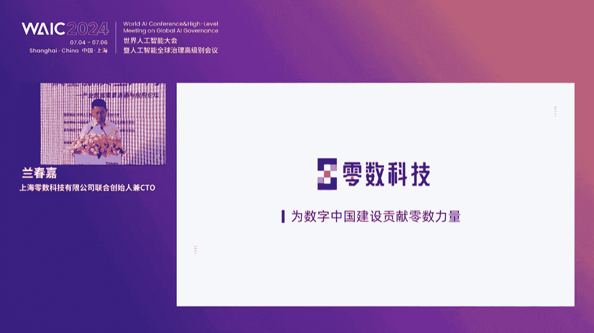

# 2024世界人工智能大会（合集） - P46：20240706-产业数据要素流通与应用论坛 - WarrenHua - BV1iT421k7Bv

好，各位来宾，大家下午好。欢迎各位莅临2024世界人工智能大会产业数据要素流通与应用论坛的现场。我是今天论坛的主持人，也是来自零数科技市场生态部的陈佳怡。😊，感谢大家在百忙之中来到上海世播中心。

齐聚在我们的论坛现场，携手共益数字经济的未来蓝图。在此，我谨代表主办方向各位致以最诚挚的问候，并感激大家对本次论坛的支持。😊，2024年是加速前行，蓄势向新的一年，我们迎来了新智生产力的崭新时代。

数据作为新型生产要素，是培育和发展新智生产力的关键力量，激活数据要素价值，推动生产力跃迁升级，已成为数字经济深化发展的核心引擎。今天的论坛以激活数据要素成主机新智生产力为主题。

聚焦数据要素领域的最新数字科技成果与未来发展趋势。我们将共同探讨如何通过高水平的数字化支撑，推动数据要素的市场化配置，实现数字经济的共赢未来。那今天在我们论坛的现场，可以说是大咖云集哈。

我们很荣幸的邀请到了来自政府、企业、机构、高校等多位领导、行业领袖以及顶尖的专家学者。首先请允许我向大家隆重介绍出席本次大会的领导和嘉宾。他们是。😊。

中国工程院院士、中国互联网协会专家咨询委员会主任邬鹤泉院士。那由于乌鹤全院士近期会议太多，出于爱惜我们的国宝院士，那邬院士此时此刻正在线上同步参与我们的会议。与此同时。

在现场出席会议的领导有上海市城市运营管理中心常务副主任、上海市政府办公厅副主任张宇翔。中国发展战略学研究会副理事长、中国发展战略学研究会数字经济专委会执行主任李淑民。

中国电子信息产业集团有限公司副总经理，中国计算机学会数据治理发展委员会主任、中国电子数据产业集团有限公司董事长陆志鹏。国家信息中心信息化和产业发展部主任、国家信息中心智慧城市发展研究中心主任单志广。

上海市数据局城市数字化转型处处长钱晓。上海市城市运营管理中心指挥协调处处长蒋学军。广电运通集团副总经理关建伟。中国科学院大学经济与管理学院教授孙毅。赛迪王总裁张建。以及我们的主办方代表。

上海林树科技有限公司创始人兼CEO林乐。除了以上的领导嘉宾外，今天的论坛还邀请了众多科技界产业界的专家来到现场，为所有来宾呈现一场激荡智慧与思想火花的盛宴。我们将在稍后的圆桌环节为大家做一一介绍。在此。

对本次论坛的指导单位世界人工智能大会组委会办公室、主办单位、中国发展战略学研究会、数字经济战略专委会、承办单位、中国发展战略学研究会、数字经济战略专委会、上海零数科技有限公司支持单位、中国汽车工业协会、中国计算机学会区块链专委会和开放群岛开源社区表示感谢。

再次欢迎大家的到来。😊，那首先请大家用热烈的掌声欢迎上海市城市运营管理中心常务副主任、上海市人民政府办公厅副主任张宇祥领导上台致辞。有请。🎼，🎼，尊敬的吴院士。李淑民、理事长林乐总经理。陆董事长。

单主任，尊敬的各位来宾，各位朋友，大家下午好。非常高兴受主办方邀请参加今天的产业数据要素流通与应用的论坛。在此呢。对论坛的成功举办和各位嘉宾的到来，表示诚挚的祝贺和热烈的欢迎。

数据是当代经济的生产要素和重要的产业支撑。近年来，上海市认真贯彻落实总书记重要指示要求。出台一系列。相关政策措施。加快培育数据要素市场。构建数据要素制度体系，赋能数据要素流通交易。去年8月。

上海市政府办公厅发布了关于立足数字经济新赛道，推动数据要素产业创新发展的行动方案。在全国范围，率先提出数据要素产业和数据产业的新提法。并在加强数据产品新供给。

激发场景应用新需求、发展数商、新业态等7个方面采取措施。力求到2025年数据要素市场体系基本建成。国家。国家级数据交易场所地位基本确立，数据产业规模达到5000亿元。数据也是重要的生产力和营商环境。

也是我们重要的产业生态。随着数字经济的发展，数据要素价值日益显现，已经成为培育和发展新智生产力，推动高质量发展的重要抓手。上海作为中国的经济中心城市。在数字经济发展方面，具有得天独厚的优势。

拥有大量的数据资源、先进的数字技术和完善的数据基础设施。未来也将进一步促进数据产业创新发展，推进数字政府建设和强化数据要素资源的全球配置能力。今天的论坛。集聚了政产学员各方来宾。

希望呢大家充分的交流讨论啊之后呢充分的合作协同，为加快数据要素的市场化流通、场景化应用，成述效应释放，积极建言献策，贡献智慧。也希望零售科技等优秀的科技企业。能够深耕应用场景。

充分利用区块链隐私技术和其他的前沿数字技术。构建安全可信的数据流通基础设施，为数据要素市场化配置，搭建落地的承载空间，为数据经济发展和数字化转型提供有力支撑。最后，衷心祝愿本次论坛取得圆满成功。

祝大家身体健康万事如意。谢谢。感谢张副主任的精彩致辞，促进数据产业创新发展，强化数据要素资源配置能力，不仅仅是发展数字经济的未来趋势，也是国家十四五规划中的愿景。市场各方该如何突破限制。

进一步加快数据要素的市场化配置和价值转变。相信在今天的论坛中会产生更多有价值的交流。那接下来让我们有请主办方代表、中国战略学研究会副理事长、中国发展战略学研究会数字经济专委会执行主任李淑民女士上台致辞。

有请。🎼Oh。尊敬的张玉香主任吴鹤轩院士，各位来宾，各位朋友，大家下午好。非常高兴呢与大家相聚在上海，相聚在上海的世界人工智能大会。

那么今天呢我们共同参加2024WACWACIC这个产业数据要素流通与应用这个论坛，我们共话发展。在此呢，我今代表，我们论坛的主办方向各位嘉宾，各位朋友，各位这个这个呃领导表示我们最真诚的感谢和欢迎。

谢谢。人工智能、大数据啊，数字经济啊、数字生产力，包括数字要素，应该是当下最热门的热词。它也是我们推动呃中国是现代化高质量发展的最活跃的部分。那么我们习近平总书记呢高度重视数字经济。

并强调要充分发挥数据要素的基础资源作用和创新引擎作用。加快形成以创新为主要引领和支撑的数字经济，为我们进一步释放数据要素价值，推动数字经济高质量发展证明了方向。同时呢。

国家也出台了一系列的数据要素的相关政策。包括我们刚才的张主任也谈到，我们上海也配套出台了相关的重要政策。呃，那么话呢就是产业创新实践，我们实上在这几年也取得了积极的成效啊。

起到了示范引领的不断彰这个这个彰显的作用。那么中国发展战略学研究会以及我们数字经济专会，所以国家的一级一类学会呃，以及国家的重要的智库。那我们是在建言国家决策，落实国家战略，服务政府。

并对接我们企业需求等方面，发挥着重要的智库巧梁和纽带的作用。所以一直以来呢，我们坚持联合政才学研服各个方面邀请和汇聚整合我们各方面的专家学者和企业家，我们从战略到落地，从科技到产业，为我们数字融合。

和真正的做到我们科技和技术的价值落地，推动中国经济的数字化进程，不断的在努力。那么本次论坛呢，我们的重要的目的就是要聚焦新智生产力，探讨我们数据要素以科技创新融合发展的新路径。

衷心希望我们相关的企业和各参会代表，以及我们今天的所有的来宾。我们能充分利用今天这个重要的品牌深入交流，相互学习。为做大做强。我们数字要素市场，促进数字经济，持取健康的发展，多出我们的贡献。

预祝大会圆满成功，祝各位来来宾工作顺顺利、身体健康。谢谢大家。感谢李副市长的精彩致辞。以政策激励创新活力，以技术驱动实体效率，以生态培育未来竞争力。相信在专委会的指导下，市场各方会进一步协同创新。

加强数食融合应用，推动产业高质量发展。那接下来有请主办方代表、上海灵数科技有限公司创始人兼CEO林乐博士上台致辞。有请。

尊敬的乌鹤泉院是张玉祥主任李淑敏副理事长。陆志鹏主任单志广主任钱晓处长、蒋学军处长。关建委总经理孙毅教授和专建总。尊敬的各位来宾，非常感谢大家百忙之中莅临本次论坛。

我代表会务组及零售科技对大家的乐到来表示真挚的欢迎。今天来了很多的领导、前辈，还有合作伙伴。感谢大家一路以来对零售科技的支持和鼓励。与其说是致持呃，我相信我今天这个向组委会申请了大概1分10分钟的发言。

发言更多的是一种汇报吧。分去过去现在和将来。回顾过去7年的创业历程。在经济密布的科技赛道和整体调整的市场宏观环境下，我们在逆境中成长，坚持是这个阶段的这个阶段的关键词。我们坚持研发投入。

保持科技领先和产品前瞻。无论是技术性能还是信创代码自主率，经权威评测，都名列国内前茅，并积累了包括国际学术论文发明专利、国际国家行业标准等在内的一系列研究成果。

也深入参与了国家重点研究计划、中央网信办链上内容监管平台、中央军委专业部无人机远程远远程协同作战平台、国家区块链首批应用试点等国家重点科研项目和重大示范。我们坚持产业区块链，笃定科技价值。

必须在商业落地上体现出来。在去年的论坛上，我说过，科技的种子必须种在商业的土壤里面，才会开出绚丽的商业之花。深入到实体商业领域，是中国区块链难额正确的事情。我们始终坚持自己的商业理念。三点，第一。

底层技术公司一定要有应用场景。技术是为商业效率和社会福祉服务的，否则就是空中楼阁。第二，科技公司你技术再好，如果没有人为你付费，那就是孤芳自赏。第三点。

to B和toG的科技公司一定要摒弃当年互联网创业的战略性亏损的这样的一个思维。不仅要有收入，还要盈利或者证明你的盈利能力。否则，他不应该称为一个合格的企业，因为企业是一个盈利组织。为此。

我们深度聚焦于汽车能源渔业政务四大重点行业领域，服务了包括中央网信办在内的六大部委、国家电网、国家能源投资集团在内的多家大型能源电力集团、中汽协、上海灵港在内的多个智能网联汽车产业平台方。

并深入多个区域打造一系列数字化渔业工厂，这些都成了相关领域区块链应用的全国标杆。基于深入的行业理解和落地实践，我们形成了高壁垒的场景护城河。我相信这个护城河是比技术更重要的护城河。

因因此我们保障了连续四年每年两倍的业绩增速。我相信在目前的整个市场环境下面能有这样的一个业绩数每年两倍连续四年，我觉得是一个我们令我们比较欣慰的一件事情，并且在行业内率先实现的盈利。而这样的增速。

我们有信心可以再保持3到5年的时间。我们的坚持也得到了越来越多的认可和鼓励。我们是上海区块链唯一的专利特性企业，上海市创创业领军人才企业。

首批普通民族计划领军人才企业被向工信部赛迪IDCforest毕马威等国内外知名行业机构连续多年评选为中国头部区块链公司。我们也得到了资本的广泛青睐。我们应该是至今为止基本保持的。

每年一次的这样的一个融资节奏。在此，我非常感谢各个机构对我们的认可和支持。每一颗熬过冬天的种子。都有一个。春天的梦想。冬天虽然还没有过去，但春天的梦想已经照进现实。当前，数据要素市场全面起航。

让我们多年的坚持迎来曙光。20年来，随着信息化和数字化的建设，数字经济占GDP比重已经达到44%。数据是数字经济的核心。到2023年，中国数据保有量达到30GB。

这些都成为数据要素市场发展奠定了一个非常好的产业基础。近10年来。数字科技蓬勃发展，特别是区块链、影视计算等等这种新兴技术的成熟。围绕数据整个流通链条技术环节已经完整，为数据要素市场发展提供了技术土壤。

最后，从2019年中央提出，数据是关键生产要素。到数据20条的发布，再到国家数据成立及数据要素三年行动计划的颁布。数据要素市场发展的政策监管体系也已初具雏形。而随着产业技术政策条件的逐步成熟。

数据要素市场迎来全面发展的崭新阶段。而数据流通市场的繁荣是这个阶段的核心，让数据流通起来的基础设施是数据价值示放的关键引擎。值得庆幸的是。

零售科技这7年来始终坚持基于区块链和影视计算技术去打造数据流通的基础设施。因为大家知道区块链这个行业这几年来其实非常喧嚣，各种概念频出。我们一直坚持通过区块链去打造数据流通基础设施。

服务了以上几个行重点行业的数字化转型。基于大量客户的反馈和案例总结，明确了围绕数据供需链接的可信可控需求的6个核心痛点。正式推出围绕数据流通的通用基础设施产品平台。零售可信数据空间。

稍后我们蓝博士会为大家介绍我们这个平台的核心功能和商业应用。展望未来，从产业区块链到产业数据空间，我们的步伐不止于此。产业数据空间的下一站是金融数据空间。大家看像河流一样啊，水一旦流动起来。

不仅可以滋养周边的生态，还有机会冲破原有的商业束缚，开辟全新的支流。数据流动起来也是如此，流动性是一件很可怕的事情。通过数据的流动，我们已经推动产业数字化转型，一旦形成势能，让数据继续流动。

有望冲破商业束缚，开辟更大的商业空间。我们认为金融应用是其中最大的数据价值创造的一个支流之一。比如，在汽车领域，通过可信数据空间，我们链接车路数据，可以赋能辅助驾驶责任追溯和自动驾驶研发的算法提升。

有效推动了中国智能网联汽车产业发展。相关数据进一步流动起来，流到金融领域还可以高效实现自驾保险。在能源领域通过可信数据空间，我们链接发用电数据。可以赋能碳资产管理和分布式能源共享。

有效推动中国电力数字化产业的发展。相关数据进一步流动，流动到金融领域，可以推动新能源资产的融资。在渔业领域，通过可信数据空间，我们链接养殖和物流数据，可以赋能农产品的溯源和那个农业补贴的监管。

让数据进一步流动，流动到金融领域，我们可以高效实现农业保险和乡村振兴贷款。数据流动滚滚向前，基础设施的边际成本不断降低，而商业价值则急剧提升。如果在产业内部数据产生的共享产生价值是一的话。

那么流动到那么产融结合数据产生价值可能是10或者100。通过数据共享推动资产流通。让金融更高效的服务于实体经济，应该是数据金融或者普惠金融的最好诠释。资本技术数据是当前最重要的生产要素。

通过产业数据空间，我们让数据与技术结合，推动产业数字转型。这是新智生产力的有效注解。进一步，将产业数据空间与资本结合，形成金融数据空间，将全面激活新智生产力的金融价值。我们相信。

要素的融合将碰撞出更加绚丽多姿的商业花朵。浙将成为零塑科技的第二成长曲线。总之，7年来，上述的商业路径，我们始终没有动摇过。更可贵的是，我们正在一一把它变成现实。

特别是我刚才上面说的这些案例和跟金融的结合。我们希望我们的探索能够为中国数字科技的发展和数据市场的建设去贡献绵薄之力。我想也想借这个本次的论坛，因为这个行业确实太喧嚣了。我希望呼吁啊在全新的行业征程上。

业界同仁可以共同努力，少一些浮躁，多点踏实。少些喧闹，多点落实，少些嘴上情怀，多点前行务实。这样整个行业翻得涅槃重生，让梦想真正照进现实。我也想跟我们团队说一声啊。我们经历了很多困难的时期。

经历了很多的挫折，在绝望中，我们成长，前路漫漫，荆棘依旧，波开云雾，或将风光无限，波澜壮阔。时间会奖励每一位怀揣梦想，同时披荆斩棘的实践者。最后再次感谢大家的到来呃，感谢各位各位领导专家的支持。

同时我要强强调一下，非常感谢会务组的同事。因为大家办过会都知道，其实会议是很繁琐的，我们中间也会出现应该也有很多的纰漏，也请在座的嘉宾能够谅解。最后我代表与会的嘉宾，包括我自己，感谢。😊。

我们工作会务工作组的辛苦的付出，谢谢大家，辛苦了。感谢林博士的精彩发言，数字经济和数字化转型为企业带来了新的发展机遇。零售科技近年来激发科技创新能力，结合区块链、隐私计算、数据安全沙箱等技术。

建立数据流通、全流程证据链，实现多场景多形态的数据安全可信流通。未来，我们也期待看到零售科技与更多伙伴携手，共同推动数字经济和实体经济深度融合，助力数据化发展。那接下来让我们把目光聚焦到大屏幕上。

中国工程院院士、中国互联网协会专家咨询委员会主任邬鹤全院士在线上将为我们带来激发数据要素、赋能发展引擎的主题报告。请看大屏幕。大家好，很高兴来到本次产业数据要素流通和应用论坛。

我的发言题目是激发数据要素，富能发展引擎。现在激活数据是要素啊，成为一个很大的课题。那么数据是新级生产力的关键要素。中国市场大，数据资源丰富，应用场景多。但是数据供给的质量不高，流通机制不差。

应用潜力释放不够。中国产生和存储的数据在全球的占比啊，还不及我们的网民以及经济规模在全球的占比。中文的开源的语料数据量少，规模也小。政府的数据共享和开放了明年滞后。数据的自查制度还有待完善。

而且中小企业啊对数字转型利用开发数据啊，还有一些后顾之忧。主要是3点，一个是不会开发利用数据。中小企业缺人才，缺技术，缺数据。AI大模型呢可望不可及。第二是不敢开发利用数据。

担心网络安全以及企业的数据秘密外泄，担心跨境数据流动违规，担心生产线的数字化转型以后啊，很难控制。第三是不愿意开发利用数据。很多中小企业当务之急是生存，数字转型呢很难救急，而且企业缺乏资金。呃。

不看好开发利用数据啊，那投入能不能产生合理的回报。所以我们需要加强制度和平台的建设，来激活数据要素，推动流通应用，模式创新示范推广。这里呢有4个小动画，呃，是主要是想说我们5G。

IPV6区块链啊物联网等等新一代的信息技术啊，为我们的数据应用打下了很好的基础。比如说左上图。我们琼山峻岭的电力线利用5G摄像头来实现无人机的巡检。右上图呢是通过戴上1个5GAR的眼镜。

在拿起这个备检弓件的时候，就直接把这个弓件的图像传到后台，跟预存的理想的这个合格零部件来对比，实现视机器视觉的智能直检。左上图呢是在一个。这个青岛港啊，这样的港口上利用5G遥控，我们进行自动化的装饰。

右下图呢是利用5G进行激光的对一个物体的三维扫描，所得获得的这个海量的数据参数送到云端，好把并且把它还原为一个实际的物理这个尺寸来跟预知的标准来对比。那么这些。都为数据应用打上了很好的基础。

现在人工智能也出现成为激活数据要素的新抓手。目前来讲，激活数据的基础网络基础设施已经具备了算力算法和数据加应用场景支撑的智能引擎是激活数据的抓手。从三个方面来看，首先算利。设立训练数据和模型参数。

决定了胜利的规模。当然了，还有算力时间、训练时间和算力利用率，他们也影响了算力的需要的量。对中国而言，当前算力的核心芯片的来源是紧张的。我们需要在模型算法上加大创新力度。这样可以降低对芯片的要求。

提高数据的训练效率。对于大多数企业来讲，自己去购买算利的硬件，实际上呢成本是高的，利用率还低。所以鼓励集约化的来利用开放的算利枢纽，特别是通过公有云来利用算利。

甚至我们说可以把算力下沉到各种各样的智能终端。比如说AI嵌入到P系，甚至手机可以支持上百亿，甚至到千亿级的参数的推理能力。但未来还会有边缘计算、工业模组、智能网联汽车，这些都自得自带了很多推理算例。

另外一个重要的支撑是算法。现在很多基础大模型已经开源，但是呢还要选择适合于行业的应用的模型。并且呢还需要针对具体的企业来进行微调。现在有一种趋势是能把多个小的模型。啊，结合起来，可以支撑企业的一种应用。

那么在这种情况下呢，可以把AI的学习海量数据的周期啊压缩100倍。那么从这里我们可以看到算法的创新空间还很大。第三个资柱是数据。现在国内的数据资持记录还有待完善。

而且呢国家也打打算要建设国家级的基础知识库、数据库、资源库。并且进一步的推动政府拥有的数据共享和开放。政府所掌握的还大量的数据，而且是高质量的数据。啊，在涉及到国家机密企业秘密、个人隐私这之外。

很多数据是可以开放的。当然我们说要促进数据的流通应用，还要考虑进一步考虑更多数据的安全。那么在这方面呢，国家可以牵头，并且支持第三方建设一个面向公众服务的平台，来促进国内的数据流通应用。我这里先说一下。

通过模型上云来方便中小企业的介入。很多企业需要数字孪生、工业设计、药物仿真、电网建模、视频生成动漫刷染，但并不意味着这些企业需要自购算利平台，还以说去买大量的算法软件。可以作为一个设利网的业务消费者。

接到网上网上，当然还有受利网的业务提供者。包括有各种各样的计算资源。然后呢，这些计算资源里头啊，我们说以IDC为例，互联网数据中心为例。他有拥有大量的服务器。这是一个计算资源和存储资源结合的地方。

ID系里头还有大量的交换机，实现跨服务器以及跨数据中心的数据的融合。这实际上构成了一个算利平台。我们也可以说是云计算的基础设施及服务的一个重要组成部分。除了算力硬件以外，我们还需要相应的算法。

这里边通常的云计算里头的pass和sars。能够提供哇相应的算法。当然，现在随着大模型。大模型可以以云服务其中的一个mas模块的形式嵌入到云平台上。mas是模型之服务。mars本身是一个精简的大模型。

那么他有接口，可以供中小企业加入自身的一些数据来进行微调。并且提供这个接口，让中小企业只要会上云，就能接入到他想要的。模型上边。通过ss加pass加mass再加sars，构成了一个云字平台。

提供一个小切口的结入。那么这里边可以作为我们很多很好的应用。那么现在实际上有些地方以mas作为一个主题，那么开放这个AI中小企业应用的大赛。那么我们说这是一个很好的试点应用。这里特别要讲一下AIA准头。

我们要基础大模型。是刚才说了，我们还是在基础大模型的上边，在开发行业大模型。但仅此还不够。我们需要把AI的模型上云。把AI的模型下沉到终端，这是分别叫智能上云，智能下沉。并且把AI的大模型的能力。

从语言视频扩展到多模态。那么更进一步，我们要开发智能体AIagent。因为大模型本身提供大脑，它有很大的催理能力。但是大模型本身不足的地方使他没有记忆能力，没有规划能力，没有工具能力。

那么每个一个人在执行一个任务的时候。他是有记忆能力的。比如说短期记忆。我们也看过一些电视节目啊，一些这个小小孩，那么瞬间可以记住一连串很长的数字。但是呢。上来以后可能过那么十来分钟。

你再问他他就记不住了。也就是说短期记忆可以高强度的记上很短时间的行为。但是我们光有短期记忆还不够，还有长期记忆。所谓长期记忆就相当于什么呢？一个人会游泳，会骑自行车。你即便十年不游泳不骑自行车。

那后边他还是会这些呢是不会忘掉的记忆。那么光有记忆能力不够，我们真正在物理世界的应用还需要规划啊，人知道他要做什么，那么我们也要知道，也要让机器知道他要做什么，而且先做什么后做什么。当然了。

我们在所谓机器，实际上啊人之所以跟动物的区别是会有使用工具的能力。那么AIagent也需要有使用工具的能力。然后通过AIA准集成的规划记忆工具能力，就能产生了具体的行动。

比如说我们看要右图啊一个工人带着AR眼镜，他在观看一个实物的机器的时候啊，实际上可以调出跟这个实物物理实体，这个机器的弓件相对应的各种物理参数。我们说这是一种空间计算能力。也就是说我们可以看到啊。

人在看见一个书本，尽管是一个文字，但是人可以想象出一个空间三维空间，甚至可以想象到它的运动。将来AI agentent也希望他能够从看到一段文字，还有一个照片，能够从静态的转换成动态的。

也就是说这种叫具有空间计算能力。那么空间计算是我们激发数据要素，甚至让数据要素增值的一个新切入点。他通过空间计算，实现了数时融合、虚实融合。刚才说了，为了支撑企业的数据流动。

政府需要带头支持第三方建设AC面向公共服务的平台。比如说政府营造生态，引导建设沟通数据要素资源的供需平台啊，让数据来连接产业链的上下游。首先是政府开放营商数据。政府是拥有全社会80%以上的高质量数据。

如果拿这些数据来建设营销平台，在这上面发布一些政策，法规、市场信息。并且建设一些数据先行区，在先行区里头，建立国家高质量数据的基础知识库、数据库、资源库，这样有利于全社会的数据利用。

还可以打造产品设计平台。就着举个例子，山东有个城市云设计公司，它本来是聚集了更多。制造业的工具设计软件。后来在进一步发展成为，可以让很多企业在这里发布设计需求。同时呢他分解这些设计需求，然后再招标。

最后他把招标开发的各种共件集成起来，成为一个可以满足设计需求的产品。现在这个平台为超过5万家中小企业提供服务了。另外一个例子是深圳的云工科技公司。他是一个集成在线制造平台。

他上面有20万家采购商在这里发布采购需求，有上万家供应商在这里发布提供的服务。那么当然也应当了啊报价在这里可以沟通，然后撮合了很多成招，半年就成招采购100多亿元。第三个例子是江苏纪云天工公司。

他是个超级虚拟工厂，在我们国家有很多企业有订单缺乏产能。也有很多企业有产能，但缺乏订单。江苏智云天宫呢把这两解结合起来，实现空闲产能的匹配。很好的搅搞活了经济。第四个例子是广东番禺的西英公司。

广东珠三角地区有大量的服装加工企业，当然这些企业呢整个生产管理还是比较简单的。那么吸英公司利用自己的品牌鞋计、面料供应、质量管理、市场营销、销售、金融、海关。以及境外服务、物流等等能力。

使得这些分散的服装加工企业迅速的提升了生产自动化的水平。吸英公司代表他们啊带动出海。现在吸音已经成为54个国家移动用户下载最多的购物应用。他预期上上市的市值。会超过1000亿美元。

这些例子啊虽然都是一些企业构建的，但是如果政府、相关地方政府能够支持，那会有更多这样的平台建立，会更好的服务于中小企业。另外刚才说到企业数字化转型的一个甘心是安全。网络安全和数据安全。呃。

这里大家看到这个PPT上边。在5G上边利用了5G核心网控制面和用户面功能分离，用户面功能可以下沉的企业。那么企业利用5G核心网控制面，可以按企业的需要，把企业内部的一些终端组建了一个企业内部的专用网。

虽然架构在运营商的网上。但是这个数据没有离开企业。保证了企业敏感数据。没有出去，所以这为企业的数字化转型了提供了一个很好的支撑。这个企业的5G局域网是可以跨地域的，好吧，可以。包括有一个例子，好吧？

福建的宁德时代就利用了这样的技术，把分散在全国的好多个工厂的工人都有关系的，把它连构联构在一个宁德时代的砖网上了。我们说网络安全是时刻要紧绷的。我们不单每个企业要加强企业内部的网络安全。

但是在现代的网络安全的环境下，单靠每一个企业自身是不能很好解决网络安全问题的。官员至少门前雪很很难去应对网络安全攻击。所以我们主张要建设网络安全威胁情报共享机制跟平台来保障数据安全。

而这样的平台呢就有公信力的是由政府来出面。还有就是政府支持第三方来建设这样的平台。一旦某个企业出现网络安全。我们可以动用社会的更多的网络安全的支撑力量来帮助他，并且一个企业出网络安全问题。

相关的威胁情报可以由整个社会来共享，来通过这种集体的力量提升我们应对网络安全的能力。还有数据，我们说融合产生数据价值。但是每个企业都想利用外部企业更多的数据。但是呢都很担心本企业的数据拿出去。

这安全有没有保障。所以我们说要建立一个数据融合的安全计算平台。我们要想办法让数据可用不可见。那么解决办法是什么呢？通过多方计算，还是联邦学习的这种加密方式。它的特点是选择一个合适的加密的密钥。

能够做到加密以后数据的计算结果跟加密以前是一样的。这叫同泰加密。只要能做到这一点，那我们。可以把加密的数据来融合，而不担心原始数据的协密。当然了，这个多方计算联邦学习还是有一定的复杂度的。

另外呢能提供这样的平台也需要有公信力。我们说政府也是最合适的来搭建这样的平台来支撑啊第三方搭建也可以来可以面向公众开放服务。现在很多时候企业的这国际化，需要把数据跨境流动。但是呢。

跨境流动往往就担心是不是会违规了。因为国家有一些规定。好吧，对于一些跨境数据啊，学及国家机密的企业秘密的。和大量的10万个人用户以上的隐私数据是需要报备的。那很多企业担心我的数据流流动会不会违规。

另外呢，政府部门呢。也需要有能力去管理这些数据。那么如果说。它本身是学习国家机密数据，它不报备就出境了，那这个是应该国家应该发现并且禁止的。那么现在利用IPV6啊，它的应用感知能力。

它不仅仅可以定义这个数据所经过的路由，还可以定义这个信道上要为提供什么样的服务质量更重要的。他可以在IPV6包里头嵌入了用户的身份。这个用户身份并不等于地址。那么很多时候。壁纸跟用户身份是可能分离的。

通过A应用感知以及IPV6的水流检测，我们可以实时监控跨境数据的目的地，以及它所承载的内容。还有它这个整个信道的服务质量。可以帮助政府。实行跨境数据流动管理。最后，习近平总书记强调。

要构建以数据为关键要素的数字经济。国家先后出台了关于数据基础制度建设和全国统一算力大市场建设的文件。部署了数据要素。X三年行动计划。AI时代提升了数据的价值，也对数据流通与治理有更高的期待。

我国通信网络的规模覆盖网速、用户普及率、和可承受的资费水平，为数据要素的激活打下了坚实的基础。我国经济社会的数字化转型和高质量发展，为数据要素发挥情诉效应，展现了广阔的应用场景。

政府引导建设数据要素资源开发利用平台，网络跟数据安全威胁情报共享与技术资源平台。数据融合安全计算平台，跨境数据流动管理平台等。可以为数据流通与治理提供技术支撑。数据流通与治理提出了很多新课题。

需要在实践中创新发展。好，最后，预珠产业数据要素与应用论坛举办圆满成功。

感谢物院士干货满满的分享。🎼通过分享中小企业数字化转型落地的应用案例，给我们提供了很多新的思路。在确保数据安全的前提下，充分发挥数据要素的赋能作用，不仅能够激发中国经济的内在活力。

也将为中国乃至全球的数字经济注入新的动力。那下面我们将进入特邀报告和产品发布环节，让我们把时间留给各位专家。

首先让我们有请中国电子信息产业集团有限公司副总经理、中国计算机学会数据治理发展委员会主任、中国电子数据产业集团有限公司董事长陆志鹏先生，为大家带来数据援件、产业数据要素安全流通的支点主题分享。掌声有请。

🎼，🎼唠咕老。🎼啊，尊敬的张主任、李主任、单主任，各位嘉宾，大家下午好。这个。首先给大家抱歉一下啊，这个题目和分享的内容有在调整。你没。今天我为大家分享的题目呢是突破数据要素化关键技术。

推动产业数据高效流通应用。这个今年呢这个上海国际人工智能大会啊特别热，就像室外的高温一样。那么人工智能和数据啊，是当前我们最热的一个词儿。呃，用我的话讲呢，我的体会呢就是。不仅热，而且热的发紫。

在这种热的背景下，我们要做一些冷思考。因我们不做冷思考的话呢，就像刚才这个林六董事长讲的。我们处在一种喧闹的氛围中，资产概念。不谈技术。资产畅想。不谈落地。只谈情怀，不谈奉献。那最后我们往往是一场。啊。

喧闹而没有结果的啊一场。啊，选论。那么。为什么这么讲呢？😡，我们想我们想啊这个。呃，这个这几年。数据要素已经成为我们国家。经济转型升级的一个重要概念。那么这些年，我们在数据要素化治理方面啊。

应该说做了很多的工作，做了很多的探索。这个主要呢在技术制度和市场多个方面都有很大的进展。那么我想呢从三个方面啊给大家做一个分享。第一个方面呢就是产业数据流通面临的一些形式。那么这个里边呢。呃。

一个方面呢，这个数据基础制度呢不断完善啊，那么大家看到啊，从数据安全法的出台到20条的出台，再到数据要素啊，成三年行动计划等等一系列政策呢不断的出台不断的完善。那么。

但是呢产业数据要素流通的这个应用的呃应该说需求非常旺盛，流通的价值潜力非常巨大。产业数据流通，同时也面临了一些难题啊，这些难题是需要我们做深入的思考和去呃破解的。那么数据要素化目前。

应该说我们在制度建设上有了很多的创新，特别是数据20条的这个制定出台。那么实现了数据的三权分治。在确权、流通分配和安全治理四个方面啊进行了规范。

那么国家数据局啊在今年三季度还会陆陆续续的出台8个文件来进一步的落实这个顶层的文件。那么应该说呢这个对制度建设是一个很大的推动。但是出现了一个现象，什么现象呢？

就是去年财政部啊出台了数据资产入表的这样一个指导文件。那么从今年1月1号，数据资产是可以入表的。那么一季度呢，我们有2425家上市公司发布年财报的时候，就是披露有15多亿的数据资产入表。

但是随后很短的时间，有7家企业就对资产报表进行了调整。把数据资产项下的资产项调出了14个亿。这是一个公开的数据。说明什么呢？就是国家有了政策以后啊。

一季度有25家上市公司就很快的披露我有15个亿的数据资产。那么很快又调出了14个亿，也就是保留了一个亿。那后来我们现想要深入的分析这个现象啊，我们再深入分析下这个为什么会出现这个状况？😡。

啊为什么出现状况？其中有一个原因呢，我们在做了深入的专题分析以后，就是关于数据治理和数据要素化的基础技术还不完善。在这个时候。盲从的去入表带来的。不一定是正能量。为什么？😡。

如果说你入表的数据资产是无效的数据资产。啊，那么我进去以后，我就势必会影响企业的资产收益率。啊，这个时候后面很多会发现很多问题。所以说呢这就说我说制度建设和基础制度建设和基础技术的突破必须要同步进行。

所以我们面临着一个制度技术化和技术制度化两化融合这个新的课题。那么数据要素化的关键技术有哪些呢？我们经过我们的研究以后呢，我们认为呢有这么四个方面。第一个方面呢就是数据要素的组织形态。到底是什么？

我们现在一说数据要素要流通，我们都恨不得把我们数据库里边的数据拿出来交易。但是我们要反思一个问题，数据库里面的数据哪来的？我们在计算机技术发展的过程中间，我们知道在数据库技术发明之前。

所有的数据和所有的程序是融合在一块的。😡，是当代的在那个时代下，数据和程序完全融合在一块，造成计算机的运行效率极为低下。这是我们的技术人员发明的数据库。数据库只有有了数据结构，有了数据结构。

才有了数据库的技术。😡，这个数据库的基础的数据是从程序里边抽象出来的数据表。啊，出动处的数据表。那么我们把这个抽象这个数据表的数据直接去交易的时候，大家可以想一想会带来是哪些问题。😡。

特别是我们现在数据库里面的数据啊，目前业界的共识是只有5%的数据啊左右啊，5%左右的数据有些是2%，有的3%大概不会超过5%。所以我保守着讲是5%左右的数据是有价值的，其他都是没有价值的数据。

那么在这样的情况下，我数据要素，我要素流通的到底是有价值的数据还是无价值的数据。那么这些年我们都在说我要素流通的一定有价值的数据。那好，有价值的数据的组织形态是啥？😡，啊，没有主价值的数据。

组债项的表格，那有价值的数据存在是啥呢？😡，这是我们必须要突破的问题。这个问题如果不突破，我们的确权问题没法解解决。😡，他的价值计量没法解决。价值评估没法解决，流通没法解决。这样的我们就是说要素化。

价值流通就变成了一种空花。所以就必须要对数据要素的数据组织形态要做出一个定义，要有一个突破。第二个问题就是数据要素互联网的问题。未来的数据，我们知道我们的互联网第一代的互联网叫信息互联网。

信息互联网连的是啥？连的是信息。😡，他连的信息的基本逻辑是啥？说我的计算机实现的互联互通，信息存在计算机里边，计算机实现了互联互动，这叫所以叫信息互联网。那么后来到了物联网，物联网是啥？

是说有了边端计算以后说无无互联。😡，那么新一代的互联网是啥形态？我们认为应该是数据互联网，叫数联网。那么数联网里边有一个专业的一个，因为数联网啊，目前我们和梅红院士啊，北京北大、北京大数据研究院。

我们在成立了个我们联合成立一个叫国家重点实验室，也是唯一的数据的方面的重点实验室，叫数据空间技术与系统实验室。就是在研究数联网未来的形态是啥。😡，那这个未来的数据是可以互联的。

我们可以把任何一个东西把它数字化，然后对象化，然后进行编码，它数据就可以实现互联。它也是在机器互联万物互联之后的万数互联叫移树互联。那么在艺术互联的那个佩戴背景下，这个数据的。量会很大。

这个很大的情况下呢，就会造成。互联的效率比较低。这个时候我们说在这个技术的基础上，我们说我们开发数据要素互联网是我刚才讲的那个数据要素的形态，在数联网上实现互联网。未来数据的流通应该是这样一个逻辑。

而不是线下撮合。第3个。第三个问题就是数据要素的安全存储问题。我说我刚才讲的说有效的数据自占5%，无效的数据还有10%呃95%。我们现在它都存在啊社会的数据空间里边。那么有价值的数据存在哪？

保证我的安全？😡，啊，这就是存储的技术需要去突破。第三个第四个问题就是。啊。这个安全可信数据空间。现在我们讲可信数据空间，实际上未来还有一个可安全可信数据空间。

就是可信是说我空间里边的各类主体之间的互信，但空间里面还有一个数据的安全问题啊，我认为呢我们认为呢这是四大技术是需要突破的。好，在这么多年。

我们中国电子和清华大学、北京大学以及相关的一些研究机构在探索的过程中间，我们认为。😡，数据要素的有效的最优化的组织形态，应该是数据元件。这个数据原件是在原始数据和应用结耦以后形成的一个中间态。

这个中间态我们的定位叫数据元件，它可以封装，可以确权，可以安全，可以计量，可以流通啊，这是它就具有三种属性，一个是安全属性，第二个是价值属性，还一个品质属性。😡，第三个问题呢，就第二个问题呢。

就是数据要素互联网。刚才我实际上已经解释了啊，我们和国家中数据空间技术术与系统啊，中点实验室联合在开发数据要素互联网。目前呢我们在全国5个城市已经实现互联互通。第三个呢就是我们开发的一个安全存储空间。

叫数据金库。实际上我刚才讲了，说我们第一代数据和应用程序分离的时候，是叫做数据和模型的或者叫计算的逻辑分离啊。我跟才讲说把技术用数据库和计算机的CPU它是分离的。但是它是逻辑分离。是一种什么呢？

通过总线来对数据的调度和这个管理。😡，那么未来的价值分离是什么呢？应该是数据和应用的逻辑物理分离，也是价值分离，这是大数据时代给我们提出了一个新的课题。

那么我们开放的数据经过能够实现数据和应用的无理结耦啊这个逻物理结耦啊无理隔离。这样的话就啊能够实现数据的安全存储。第四个问题就是在啊刚才林总讲，我们开发的这个可信数据空间。

我们在可信上面用数据元件来实现数据融合的时候，他就解决这个安全问题。我们就说叫安全可信数据空间。😡，我们认为呢这四大技术呢是当前的一个啊这个关键的技术。只有这些技术有了突破以后。

我们的基础制度才能够有效的落地。那么我们的应用和实践。一个方面呢是实现了5D互联。我们在四川的德阳啊，云南大理、河南郑州啊，这个浙江的温州和江苏的徐州。5D我们建立了数据金库数据要素加工交易中心。

然后是数据中心里边的交易中心的数据能够网络通过网络来实现城市间的数据互联互通。第二个方面呢就是安全。哦。这个。第二个案例呢就是我们在保险行业里边的安全可信数据空间。那么我们和中宝吃付啊这个。

共同建设了啊全国首个保险行业的数据空间。那么这个呢我们输出了这个高风险车辆识别里程风险评估。这个新能源汽车、动力、电池的数据服务等产品。那么应该说呢在这个领域的合作呢取得了啊一些初步的成效。

那么中国电子啊我们目前已经形成了数据监控、数据要素加工交易中心、数联网、数据空间等基础产品，愿意呢给社会各界啊我们携起手来，共同。But。关键基础。技术。推到一个新的高度。共同推动数字经济的高质量发展。

谢谢大家。感谢陆总的精彩分享，为我们深入浅出的洞见了产业数据流通应用的价值和难题，也为我们分析了数据元件的安全属性、价值属性和品质属性。不仅可以确保安全还能实现价值最大化，是数据要素化治理工程的核心。

也是数据资源价值最大化的重要支点。我们也期待看到数据元件作为数据流通的标的物，通过安全的技术手段实现跨域流通，使得数据要素市场化的配置模式得以实现。那接下来有请国家信息中心信息化和产业发展部主任。

国家信息中心智慧城市发展研究中心主任单志广先生为大家带来数据要素价值化与数据可信流通的主题分享。掌声有请。🎼あ。🎼，好，尊敬的各位嘉宾啊，下午好，非常高兴呢来参加这个人工智能大会。

而且呢就这个数据要素呃进行一些交流啊。呃刚才这个包括邬建士啊，包括陆总啊，包括这个呃零数啊都做了非常好的报告啊，其实我来之前对零数没有这个前期的认识啊，我知道实际原来之有叫叫什么零点有数的。哇。

这两个公司搞混了的。所以这个我一会会但是刚才这个这个呃林总讲的好的东西跟我们这样做的这个观点是比较比较相似的。但实际上说到现在这个数据要素价值化，包括可信流通啊。

其实一个我们业界一个非常大的这个共识是什么呢？是缺乏共识。😊，对吧这没有一式的这个意见是我们现在现在这个最大的共识。对吧？包括你看刚才这个数据要素后面的字母是吧？这是我今天第二次，而且听院士讲。

这叫数据要素差或叫X。😊，它本质上也叫数据要素成是吧？但是呢我听过的这个这个有三个版本，数据要素差数据要素X啊。而且刚才这个吴院士第二个是院士去说它是X所以就你看我们同样一个符号。

大家要有共识的话都不太容易。何况是这么一个复杂的问题哈。所以我们想今天我们其实探讨没有这个很多情况下，现在没有共识啊，只能说我们要有一些这个不同的思考，对吧？因为大家知道数据要素啊。

作为这个生产要素写到呃这个文件里啊，这个作为这种国家意志呢，中国是唯一一个。😊，啊这个大家知道我从这个上研究生以后是吧，我因为我是学计算机的对吧？从我们这个呃最早是这个46年的这个in的计算机。

然后56年的人工智能的概念啊，后来这个互联网、物联网啊云计算、大数据、人工智能区块链啊这些技术啊，包括我们这个应用层面上的数字呃这个这个数字中国来源于数字地球啊，智慧啊智慧城市智慧地球啊。

包括现在这个数字经济。数字经济是1995年啊跟互联网诞生的啊，很多人以为以为数字经济就是有了大数据才有数字经济啊。

这概念是完全不对的啊互联呃这个digital economy是1995年啊OECD专家提出概念。是因为有了互联网啊，他从这个这个美国的军用网络变成这个我们全球的这个刚才这个讲的信息网络之后呢。

他才有了这个数字经济啊，所以当时的这个专家的看法，就是说人类的因为有了这个大的网络平台，那么它的经济发展范式呢，将从这个原子的加工处理。😊，啊，变成这个信息的渣根处理，这就是数字经济的原始概念。

所以在数字经济的概念出来之的时候呢，那时候还没有大数据，没有物联网啊，没有云计算，对吧？所以呢这些东西我认还是很有这个哲约思考的。包括刚才陆总讲的关于这个数据的原始问题啊，我们前讲程序。

程序就是算法加数据，对吧？所以它就分这个这个这个结耦之后呢，才出现数据库。所以我想我们今天可能这个而且我们过去学那些所有那些概念呢啊都是从绝大多数是跟美国学的，对吧？从都是拿来主义的。然后他们在前面走。

我们在后边跟。但是这个数据呢这件事呢是我们进入无人区啊。😊，美国和其他国家都没有说数据是生命要素。中国先说了所以这件事情我们是这个要要要要进入这个这个这个一个所谓的恒海森林啊。

我们要中国要自己有自己这种创新，才能把这条路走通。所以难度在这儿对所大家不要以为说啊这个事情是是一个一个一个全世界的共识，我认为可能还不是个全世界的共识啊，是中国正在做的一件创新的领域啊。

所以我的时间有限啊，我就简单的呃谈一些这个呃基本观点啊，也不一定成熟啊，跟大家交流。😊，首先是数据要素啊。这个这个这个数据呢是吧在我们整个数字经济，包括数字社会呃，这个以它是个基本的生产资料，对吧？

我们国家要把当成新的生产要素对吧？它就意味着呢就是说它的作用呢，大家知道你看农业经济是劳动力，工业经济是资本加上农加资本。那么现在数字经济呢，数据的这个啊对其他要素的这种作用呢。

要起到放大叠加和倍增作用。所以这个其实我们现在搞数字经济最大的一个挑战就怎么放大，怎么叠加，怎么倍增。😊，吧这个数这个话也很好说，但是它这这个效应是怎么发挥出来的？包括现在讲的数字经济。

对吧这个这个占GET比重，那我就观察到一个现象哈，现在上海在开人工智能大会，前两天这个北京在开这个全球数字经济大会。啊，我昨天看报纸，我在飞间看报纸。这个我记得这个前两年北京在说这个呃。因为最早的话。

咱们这就是杭州讲是数字经济第一城。后来这个北京开了个全球数字经济大会以后呢，就喊了他是数字经济第一城。而且我记得前些年他的这个奖呢公开发布的这个数字经济。因为国家统计局只只算这个数字经济核心产业啊。

这个指标呢，我们国家目前平均数没有达到10%。所以今年的这个这个福建的数字中国峰会呢。数据局发的报告是现说我们现在数字经济的核心产业占GDP的比重呢，其实原话是达到10%左右。

结果我们业界很多传这个这个媒媒体报道直把左右拿掉了，这是非常不严谨的。这个左右。这是非常严谨的，因为这个40%左右可以是5%，可以是15%。但你拿掉左右之后达到10%，那就超过10%了啊。

所以这个这个很多人没有关注到。所以这个北京市呢之前说超过50%，后来要缩回去了。哎，我昨天看到报纸既然说是有40%了啊，他这是我不知道他为什么这个比重是在在逐渐下降啊，这说就说明什么呢？

就是数字数据这种要素对经济的这个作用。😊，就吧就或者是数字经济规模化作用没有完全展现出来。但虽然我们现在讲数字经济非很重要，但是大强如果一个地方的数字经济占了GDP540，如果数字经济又是两位数的增长。

那至少能带动这个整个GDP5左右的增长，对吧？这是很简单一个道理。但是现在我们可以看到真正能达到5%的增速的，可能地方不多。啊，包括我们北京啊，北京我我们的远郊区县。

某个区县都已经被另外一个区县的财政代管了啊，工资由另外一个区域给发了啊，所以就是我们要深刻思考这个数据这以生产资料。对吧那个关键要素的话，它实际上可能就是意思说真正的数字经济时代，我们可以没有资本。

没有劳动力，但是要有数据。但我们仔细想一想，我们现在是不是到了这样一个时代，就是没有数据不能活。对吧其他都可以不要了，对吧？所以我认得这个数据所以生要素价值化过程呢可能还是在路上，我们还要循序渐进。

然后过去大家知道我们我我我从这个。我原来参加国家信息化规划，从十1五开始写对吧？呃，现在都写到这个呃，马上开始写十55了。我们过去这个信息是个很时髦的词儿。😊，对吧过去呢这个在30年之前呢。

这个所有心经济学家都认为信息不是资源。对吧这信息看不见摸着，等么是资源呢？为什么后来信息师资源是怎么把他这个这个观念转过来呢？

是邓小平同志在三人之前给我们国家纪委的这个一个杂志题题词叫开发信息资源服务司法建设。大家从网上还能找到这个这个这个题字啊，所以小的同学一说这话，经济学家就琢磨，哎，开发信息资源。如果信息不是资源。

小平同志怎么能说是开发信息资源呢？所以这事呢那些经济学家就闭嘴了，就再也不说了，说小平同志说说是就是吧。所以呢后来信息资源。我们现在呢大家感觉信息好像好老套，好俗气，数据很时髦。😊。

对吧凡是我都是什么数据数字啊吧？哎呀，这个这个你要先你就说再再写个什么信息库或者信息系统，就感觉哎呀你这个好好俗啊，对吧？好像是一切都是数据更加时髦，但实际上并不是这样的对吧？但我们可以看到。

从这个数据到智慧，它是个升维的过程，对吧？其实我前面这个片子我刚才没讲信息是真正有价值的数据是本身是零和一这个构成的数据集来讲，它是没有没有价值，甚至没有语义的。它这个基础的这个原材料，对吧？

所以呢从数据升为成这个有价值信息。信息的话呢在固化成可以我们传承的知识，知识在活活化成为情报，情报再升为成为智慧，所以它是个升维的过程。😊，所以大家想想我们现在经常讲的数据要素，我们能分清啥叫数据库。

啥叫信息库吗？什么叫数据系统？什么叫数据基础设施？什么叫数字基础设施吗？我说这些东西大家可能都缺乏共识，我们造了好多概念，但是好多边界呢是不清晰的。然后呢。

这个呃十九届四中全会啊正是把这个我们中国啊唯一的一个国家，把数据呢作为这个生产要素。所以我们中国在这方面有非常大的创新的机会，也有非常大的这个实践的挑战啊，这个这个数据这个特征我就不说了啊。

这个数据肯定跟这个零和一跟原子是完全不同的。对吧这种各种各样的这个这个报告很多。所以我个人推出一个基本的观点是什么呢？无论是它的确权还是它流通，还是它的交易，还是这个定价。如果用这个工业时代的。

我们从原子的这个市场秩序中所定义出的这叫秩序规则平推到这个零和一这个数据，它肯定是不适用的这是一个基本的我的一个基本判断。对吧但是我们恰恰看到现在我们很多时候在想这个事情的时候。

是是从工业经济平推过来的，我认这就很危险。那数据啊非常重要啊，刚才这个这个陆总也讲了，问题也很多，我我高度赞同啊。所以现在数据的话呢，这个确实数据不流动又没价值，对吧？因为智慧城市就是数据融合，对吧？

然后人工智能是也是要用数据跟我们的这个这个人类的知识经验要更好的结合。所以其实数据二条呢，它是一个框架性的制度，对吧？确实呢这个在产权制度方面呢，这四个柱子有一个柱子没着地。😊，对吧。

所以这个产权上现在全世界没有共识。那到底数据有没有所有权啊，到底是不是要分产权数，对吧？这个数据持有权能不能解决未来这个蛋糕做大之后的分配的这个难题的。所以呢数据2条呢给我们展现了一个发展前景。

但是呢有很多需要落细落实的没有给出答案。然后现在呢给出了这个国家数据局成立以后，就成立要搞了数据基础设施。啊，这个呃数据的设施这里面我做了贡献，就是我说呃，当时刘刘局长这个这个他们稿子。

后来让我这个帮提意见是，我是给加了个呃数据的采集和安全啊，这2块是我加上，原来没有啊。所以现在按照国家数据局说吧，数据基础设施是最大的大于数字基础设施。这跟原来的观念正好是反过来。

但我认得这个无关紧要对，反正数据局嘛啊数据基础设施没关系，但是这个产权。对吧全世全世界没有一致公人意见，这个我们必须要有一个这个明确的这么一个清晰的认识的。

所以他这样的话就是会给我们未来的整个数字经济发展，包括价值化之后的很多的一些这个纠纷呢带来极大的这个这个这个挑战啊其实说白了现在用这个持有权代替所有权就是有点搁置争议，共同开发的感这种感觉。

但是呢共同开发之后，如果蛋糕做大了，怎么分，又会回到前面而，没有产权如果没有清晰界定的话呢，仍然所以未来的数字经济理纠纷会比工业经济要大得多。而且可能没法处理。因为没有这个基础理论来支撑啊。

所以呢现在确实这个怎么能够把这件事情说清楚。我个人的认为的话呢，其实我们在呃数字经济的基础理论上呢，还是。😊，不成熟的。所以这也意味着其实我们在很多领域，我们应该什么呢？要小切口，要小步快走。

不适宜大干快上，对吧？因为你的这个基础理论都没有完全成型，对吧？你比如说用持有权，那么法律上来讲，持有权不等于占有权，更不等于所有权，对吧？持有权呢是是不能够这个转移和继承的。是吧所以这些东西的话。

它以后它在价值化以后会带来很多的一些挑战和问题啊，所以现在个人信息啊，这个公共数据啊啊涉及到很多这个什么什么权利呃这个包括个人信息的这个人数据的这个什么呃人格权、财产权的分数啊等等问题。现在讨论很多。

但是没有共识。😊，啊，这是个基本条件啊，包括20条里面很多的这种我们要依法依规合规有序。但我们不知道依哪个规依哪个序对吧？这个前提呢就是我们我们告诉你，你要合法啊，但不告诉你去合哪个法。

所以这个前提的话还要进一步的这个明确对吧？这都是我们现在我们讲的数据基础制度啊，搞数据要素，这个这个不管叫X叉啊还是乘啊啊，我们面临很大挑战。那其实在流通方面，我们我个个人刚才这个听了这个林总的介绍啊。

这个我个人认为确实有点这个这个英雄所见略同的感觉。我个人的学术观点啊，这个我我我我之前也一直在在在在谈，我认为就未来这个数据可信流通，数据价值化，它一定要有新的这个这个这个系统结构。

有有新的这个这个数据结构。就刚才这个陆总讲到的，就用现有的平台和数据库技术用现有方法是无法来实现什么这个价值化呀。然后这个包括一些这个流通的。所以我认为的话，未来的数据可信流通。

这个基础设施必然是分布式的。😊，区货链加隐私计算，没有这个做基础的数据。这个这个架构的话呢，我认用其他这种方法，我认是无效的。啊，你怎么试我认是没有用的。😡。

所以我们提出了一个这个互联网私域跟公域的这么一个概念，对吧？就是传统的这个这是我们在中国经济学会通信上在在去年我们发这个文章哈，就未来互联网的形发展趋实是公私域共存。😊。

啊这张图大家看现有的互联网的体系结构呢，是这个基于we two的对吧？传统的这个这个这个互联网对吧？那么这个互联网其实它纯粹刚才陆总讲，它就是个这个这个分组交换网络，对吧？

因为最早的这个互联网它就是传消息的，传传这个它根本不传多媒体，要传多媒体的话，它有QOS问题啊，它有这个这个同步的问题等等。那么现在要他要做一个数据基础设施的话，必然要进行什么能力的升级。

所以呢这个区块链呢是一个基于互联网的可信的分布式数据库，它是用这个这个广播式协议，它用这个新的这个区块链的这种操作系统，用新的这个这个数据库。所以我们认为的话，其实未来这种我个人提了这个三性啊。

那年在这个中国电子那个那个这个在福州我也说过，就是说未来数据价值化，一定要这个解决要素的个体可辨识用途可跟踪和价值可衡量。这三性没有这三性的话呢，你说这个数据随便随便复制啊零成本复制。

然后呢也不知从哪到哪去，也不知道是什么样副本这个东西它是个秩序是没有秩序的，没有秩序的话，根本无法来谈到它是价值化吧？😊，所以其我们这个讲的就我们叫公共IT系统的例子跟刚才林总说那概念很像啊。

就是我们实际上要改变这个数据的这个管理模式，对吧？因只有在分布式系统，用公共公共的IT系统里面，而不是私有的系统。那其实我们现在的所有数据价化的一个很大困境，就是我们所有数据一升起来。

都是分在不同的数据数据库里面，他说部门私有行业私有的对吧？但是呢数据价化才叫打通，要无处不在，要打破边界，对吧？所以呢只有用这个分布式的系统呢，用这个用基于区块链这种模式才能知道哎。

这个比如我们在同样一个副本上，我知道哦你这同样拿车的例子来举我这个在这个马路上撞车了。那公交系这个这个这个警察的那个系统里头知道有有一次这个这个这个这车祸事故那马上这个另外一个对吧这个保险就知道了。

他就可能是影响到他，所以这样的话才能解决这整个未来这个数据的这样管理问题。所以我有一个非常粗浅的这个这个想法，就是过去。😊，呢我们是先有计算机的信信息化呃呃数据库系统。先建立系统，然后再往里灌数据。

就先有系统，后有数据。就刚才也跟这个陆总的思思路有点像，就未来的这个数据架发生什么？因为先有数据一个数据集数据空间，我们每个人生下来就一个一个跟你一倍的数据空间，对吧？

然后呢这这个数据空间再跟这个各种各样系统去碰撞。那么这样的话我去打车的时候呢，我打100次车。那我才可以要滴滴，然后给我去这个要给我分钱，对吧？然后滴滴访问数据线，我不我不是这个敞开大门给他用。

而是什么呢？我要用这个私私钥来授权，对吧？所以我认这套要建立一套新的这个数据的流通体系的这是我刚才讲的这个这是数据二条谈的很多可信流通，但怎么实现呢？😊，对吧。😊。

所以呢这个这个当然可信呢它有三个三个英文啊，一个是trus it。啊一个是trustworthy啊，还有trustible它概念是不一样的那其实从我们trustworthy角度来讲呢。

这个可信是包括安全的，包括容去容错，包括正确对吧？所以呢这个数据我提了三个可交易性的前提就是要个体的可辨识性用途的可跟踪性价值衡量衡量性对吧？所以这样的话，它一定要基于新的这个体系结构。

所以我认为只有用区块链给每个数据空间数据集打上时空标记啊，才能把它进行个体可辨识。然后呢用这个链式结构啊，才能解决这个整个的这个流转过程的可跟踪啊，未来实现这个价值的这个这个可衡量。

因为这个数据价值化主要是要解决它的这个这个使用的过程中的价值啊，它的所有权是不能够这个交易的啊，所以其实我个人认为的话。

这个数据价值化呢啊我们现在衡很多人是把这个目光是定在这数据本身是不是能够这个这个这个变现啊，但实际上我认为其实从现在我们在理论上不成熟。我认为最可行的方方法是什么呢？

要把数据做成数字产品和服务的一部分去价值化，而不是去想我这个数据这个这个比如数据集这个data set对吧，到底是卖多少钱啊，到到底是怎么定价？对吧所以大家想如果是一个数据集去把它入表之后。

那确实是无法这个它是动态变化的啊，根据目标对象实际是变的。所以确实是把15亿挪出14亿。我认这个确实是这个确实心里感觉就不踏实对吧？造成的。但是如果变成数字化产品个服务的话，它就会能够相对的固定下来。

就像我们人的血一样，你单独去卖血的话，那可能熊猫血跟我们的A型血可能确实价格差很大。😊，但是如果的血液跟我的组织器官才能真正体现我它对人的生命体的价值啊。所以我的价值化本身来讲就是一个物理秩序的问题。

对吧？就通过信息的这个秩序来解决经济的增长问题，对吧？所以呢我认为这个其实未来数据价值化在当前我认为更现实。我我也看到了海南的数据这个叫数产品超市的概念。我认这个跟我的想法也很非常相近。

就你不去想着数据集卖多少钱，这个就相当于蜂蜜。😊，能卖多少钱？蜜蜂酿那酿酿那点蜂蜜。那但是蜜蜂这个真正的价值，它这对整个地球来讲是这个生物学家认为没有蜜蜂就没有地球。因为它整个对生态系统是极其重要的。

所以我认为话这个这就相当于这个你在这个这个数据价值化工程只变这个交易是只看到数据本身啊这叫封蜜的价值。但真正的话你要做一个系统去考虑吧？所以要实现数据的啊实现对产品服务啊。

生产的这种转型才能带来真正的价值化。我认数这个它价值化要通过产品和服务，那么数字经济实际上跟这个工业经济不同，它就是实现这个工业经济是物美价廉。那么数字经济是什么呢？物美价更连或者是物美价更高。

它是两端是极化的。所以我们要利用这个形式，而且它数据价值化核心要改变我们产品跟服务的生产函数，就把数据作为我们产品函数的一个非常重要的一个变量，而且要把它增大，体现我们的所谓的价值化。😊，然后呢。

这个我们现在这个睡价话还还有非常非常多的一些挑战哈，时间关系啊些牌子都不举了哈，他累了都。😊，那么现在这个价值化中间也谈到入表问题，我确实也认为现在的话这个方向可能是没有问题的，但是现在还不成熟。呃。

现在这个还不可操作。但我们可以去实践啊，那么这里面哈其实还是要小步快走啊。这里面这个呃时际关系我不展开来讲了哈，这个入表现在争议很大，确实是包括这个我也知道一些案例哈，就是去这个去这个银行去这个贷款。

其实本质上就是其他没有这个数据入表呢，也可以给你贷款了。然后然后呢看你还有入数据入表说哦，我给你贷款吧。但如果没有其他那些要件满足条件，只有数据入表的话，他根本不会你把它当成一种抵押，对吧？

把当成一种这个东西的，所以这个方面确实还是任重道远的。😊，对，所以总体来讲呢，我认其实这个我们现在怎么来看这个数据价值化呢？我认这个巴菲特的名言可以给我们一个指导。他说他说模糊的正确，胜过精确的错误。

就我们到了数字经济时代了，我们认为数据有价值啊，把它对为新的生产要素去实践，这个是没有问题的对吧？所以呢我们应该坚持这个方向。但是呢。😊，他这个这个我们有很多挑战啊，当我们的理论没有完完成的时候。

我们的策略就非常重要对？所以所以的话这个坚持数据价值化，然后不断来实践。同时呢按照这个德鲁克的名言，就改变我们的逻辑，我认现在我们现在在数据价值化最大问题是什么呢？

我们脑子里的好东都是传统的工业是固有的对吧？甚至就是按照原来的法学家法学啊，原来的经济学啊，原来的什么这个信息化系统的方法，每人坚持自己的这个传统的理念，然后想把它套到这个数据价值化上去。

我认这个可能都是有问题的。我们需要这个改变做的逻辑。那么在现在既然数据价值化就是中国一个一个独创。然后我们需要实践去探索，那我们就是要这个要改变过去的传统的思维方式，坚持一个方向啊，然后去通过这个实践。

然后为我们中国的价值化呢找出这个路径，所以我认这个方向呢才是一个值得我们去探索的。但是呢确实需要我们静下心来，而不是说切业界千万不要。😊，这件事是可以大干会上的啊，可以这个这个这个就马上可以实践的。

我说这个是一个常识。这个常识我们要有，就是它不是一个很成熟的领域啊，不是一个很很多机制都很健全的领域。需要我们探索啊，就像当年小港村似的，把这些路走通之后，大家可才可以一起上啊。好，谢谢大家。😊。

感谢单主任的精彩分享。我看台下都听得意犹未尽哈，但是很遗憾，由于时间关系，嗯，正如单主任提到的数据本身可能没有价值，有价值的是从数据到智慧。所以数据越共享，价值越大，数据要素越挖掘，价值越大。

那基于数据的这些特性，我们要通过数数字科技、区块链、新型隐私计算等技术，将要素价值化，要创建新的理论打造新的路径形成新的产业，为我们带来了深刻的思考。那紧接着就着单主任的分享。

让我们请出本次论坛的主办方。上海零数科技有限公司联合创始人兼CTO蓝春佳博士进行零数可信数据空间的产品发布。掌声有请。😊。

好，各位领导，各位专家下午好。我是零数科技的联合创始人蓝成佳啊，今天我给大家带来的是我们零数可信数据空间的发布啊。其实刚刚那个陆总介绍的时候，已经提到了可信数据空间的相关的概念啊。

我这里呢主要是结合我们零数多年以来，在区块链影私计算等相关技术的持续的研发和相关应用案例的一些积累，分享我们对于数据空间相关的一些理解和相关的一些实间的一些案例。😊，好，首先我们看两个数字。

一个是我国目前的像积累的数据量，现在已经达到了30的ZB啊，这个ZB是10的21次方，其实是一个非常大的一个数量级。所以这里面的话我们如何把现有的数据能够发挥更大的价值。

就是我们所要面临的一个非常大的问题。然后第二呢是43。5%。这个数字呢其实是现在整个数字经济的规模占GDP的比重。然后这个比重呢其实也是在每年逐步上升的。

然目前呢我们看到估计在未来5年内很快就能超过50%啊，所以呢整个这个数字经济其实在中国经济的整体发展中呢作用也是越来越大的啊，因此呢国家在2019年的时候，其实第一次提出了把数据作为一种新兴的生产要素。

这是即土地劳动力资本技术之后的第五大生产要素啊，也是体现了国家对于这一块的相关的一些重视的程度。但是呢数据它作为一种新兴的生产要素呢，它是有很大的一个特殊性的。比如说它是容易被复制。

但是呢它又需要被复用。然后这里面呢数据会有隐私的安全的一些问题。然后包括数据呢，它是随着时间的消耗，它的时效性是非常强的。因此呢数据其实需要一系列的技术手段来解决数据使用全生周期的相关的问题。

这里面包括像数据的存储数据的流通，数据的应用，包括数据的安全保障等等一系列，都是需要去发挥用技术来去发挥数据的相关的一些价值。另外呢，作为一种新兴的生产要素。

它这里面需要有一系列的制度来去保障数据使用的全生命周期的流程。所以呢19年随着这个第一次把数据提升级为生产要素啊，到一直到2022年数据20条的出台，制定了相关的一些顶层的制度。

到2023年国家数据局的成立，并且发布了数据要素成的三年行动计划啊，到今年2024年预计可能三季度也会发布陆续发布8项具体落地的制度所以从技术和制度2块，就是技术的进度和制度的相关的保障。

都是逐步成熟了。因此，整个数据要素的产业呢也迎来一个系统级的启航。然后呢，数据如果如何发挥数据的一个更大的价值呢？就我们理解应该数据流通的应用是数据价值呈现的第二曲线。这是因为就是在传统的过去十年中。

其实各个企业或者各个各地的政府已经建设了很多的数字化的系统包括企业的像AERPM等等之类的一些系统啊，各地的政府包括像大数中心或者各地委办也建立了很多的相关的ID系统。

这里面在这些系统里面其实在单个系统内部的数据已经得到了充分的利用。但如果想要发挥这些数据更大的价值呢，需要把这些数据供出来去提供给更多的主体去使用。这样的话由于数据的可复用性。

一份数据可以提供给N个主体去使用。而且有可能这个N个主体里面的一些应用场景，能够发挥比原有的这个数据所有者更大的一些价值。这样的话呢就能发挥数据的重用效应啊，真正实现数据要素成的这个陈述的效应。哦。

随着那个国家数据局的成立啊，去年他发布了呃叫数据要素成的这个行动计划。然后整个行动计划里面最核心的落脚点呢其实是两类，一类呢是通过应用场景，它提出了12个具体的落地的应用场景的领域。啊。

这里面是包括一系列的这产业相关的一些领域。然后通过产业领域的具体应用场景来去牵引数据的使用，来去找到数据在哪里来去打通数据流通的堵点。然后第2块呢就是数据局也提出了要建设数据的基础设施。

这里包括四大基础设施啊，流通设施安全设施网络设施和算力设施啊，所以呢我们公司其实之前多年以来所所关键所专注的其实就是在重点的领域。这里面我们覆盖了其实原来12个领域面六大领域。

然后第二个呢就是我们也是专注于通过技术来去建立相关的基础设施。这里面提到的流通设施和安全设施里面呢，向数据空间区块链隐私计算数据身份联邦学习等等相关的一些相关的一些技术，都是我们所持续研。方案和落地的。

因此，回归到我们公司这块，我们其实一直长期致力于通过区块链加隐私计算的技术来打造数据流通的技术师，来服务于汽车、能源、农业、政务等领域的数据流通。然后这是我们的多年以来的一些一些成果的一些汇报吧。

就第一块呢，我们其实是有国内领先的这一块数据流通相关的一些技术啊，这里面包括相关的一技术指标，像我们区块链的性能指标TPS就是每秒的交易数量是超过了15万代码的自主率999。74这两指标都是全国领先的。

然后目前也积累了发明专利180多项。然后参与了66多项标准，这里面包括1多项的国际和国家相关的标准。然后第二呢，我们有一系列的标准化的产品的功能模块，就包括区块链引子计算。

包括数据空间等一系列的标准化的产品。然后第三呢，我们也是积极参与了相关的国家和省部级的一些重重大的科研项目，这里面包括像国家重点研发计划。是我们是中央网新办的这个链上数字内容的这个监管平台。

然后第二呢就是像国家区块链的创新试点，我们也是首批的这个主选单位。啊第三呢，在应用场景呃，第四，在应用场景这块，我们也是落地了大概目前有50多个典型的应用场景的案例。

然后这个相关的案例呢覆盖了数据要素成的12个场景里面的其中6个啊，其中特别的在汽车能源和农业这三个领域呢，我们也是形成了呃一些高价值的可复制的一些场景的壁垒。然后基于这个高场景的壁垒。

我们也是拓展了很多高价值的这些客户啊，目前我们的客户也是达到了100多个。然后涵盖了中央的部委，包括地方的政府，包括一些央国企的一些单位，包括一些行业协会等等。啊。

因此呢我们的业绩也是在过去的四年过程中也是持续的高速增长啊，过去次年我们是每年大概是两倍左右一个业绩增长速度预计今年也能够达到两倍左右的增长。啊，另外呢我们也是获得了第三方的专业机构的广泛认可啊。

像我们是在IDC是去年的啊金融科技五十强。然后我们也是毕马威连续三年的这个金融科技5十强，包括赛迪的区块链榜单。我们是这个之前的第二名。呃，然后在这个过程中呢。

我们也在很多的领域里面沉淀了丰富的一些标杆的案例。像在能源电力领域，我们是跟国家电网合作的及区块链的虚拟电厂的这个平台。然后跟那个国家能源集团合作的碳资产管理平台。

在汽车交通领域跟中国汽车工业协会的合作的汽车数据的交互平台，跟临港大学中心，包括特斯拉去合作的汽车数据的存正平台。在农农业领域，我们在多地、重庆呃贵州，包括河南等地也建设了多个数字娱业的产业基地啊。

政务监管领域，我们承担了国家网信办的这个数字内容的监管平台，就是这个是全行业的一个内容监管平台的建设，包括发改有国家信息中心的司法鉴证链的这个建设。然后基于大量的案例呢。

我们也是总结了整个数据流通过程中的一些普遍的问题或者痛点。然后也对应的提出了我们的技术角度的一些解决方案。像在这个数据领域，就是第一个就是它数据是很容易被修改或者被篡改的。

所以我们通过区块链的可信的存真技术来解决这个数据原始数据可信，然后事后可验证的这个问题。然后第二呢，就数据在处理过程中，往往是需要经过多个主体啊，在它的生产，包括它的流通，包括使用过程中会是要多个主体。

然后多次之后就往往存在数据权属不清的问题。所以我们用区块链的这个数字身份，加上这个存真的技术能够解决对于用户的这个身份和相关的数据所有权的权属可控的问题。然后第三呢，就数据在流通过程中往往给到对方之后。

他的数据就脱离了原有控制者的一个控制啊，相当对方是可以随便去复制这个数据或者这个滥用这个数据。所以我们这里面是基于区块链的智能合约和可信执行环境的技术来保证这个流通规则的可控。然后第四呢。

就数据往往涉及到个人或者企业的相关隐私。然后在流通之后呢，就往往会泄露这些隐私。所以我们这边基于隐私计算的技术来解决数据的隐私安全可控的问题。然后第第五个呢就是数据在很多场景下的，它的计算或者使用呢。

它是需要有一个透明的，就是需要有多方来去共识。然后大家认可这个计算的过程是真实的。然后并且得到一个大家多方共识的一个结果。所以我们这里面基于区块链的智能合约和可因质应环境的技术来解决处理过程的可信啊。

然后最后呢就数据的处理，往往涉及到这个数据的所有方和使用方，包括这个相关的中间方监管方一系列的这个多方。这里面往往会存在一个权责不透明或者权责难以追溯，会出现一个多方扯皮的问题。

所以我们基于区块链来去对数据使用全生命周期去进行相关的存正来解决全流程的可追溯的问题。好，因此呢我们基于以上的一些痛点和相关的解决方案。

我们也是打造了我们专门面向数据流通的技术设施的平台零售可信数据空间。核心的是在数据的供需双方基于分布式的技术来去给供需双方提供了一系列的组件和相关的数据供需的协议来解决数据处理过程中的可信可控和可扩展。

然后整个架构是基于分布式的架构，就相当于是在供需数据供需双方去提供了这样一套平台。然后大家基于这样一套共同的协议来去完成整个数据共享和流通相关的一些流程。🎼数据基础设施是释放数据要素价值。

推动数字经济高质量发展的重要引擎。🎼作为新一代数据流通基础设施。🎼零售可信数据空间应运而生。🎼依托成熟的区块链和隐私计算技术，建立可信、可控的数据流通体系。🎼其中，通过区块链对原始数据存正。

确保流通数据的真实可信。🎼基于可信执行环境，对于计算环境过程、结果上面存正，保证计算可信。🎼数据全生命周期日志上链存证，保证全程可追溯可审计。🎼通过数据使用策略形成的合约。

控制数据仅能在受控的范围内使用，对使用空间的企业进行身份认证，并建立数据使用审批机制，实现数据权利的有效控制。🎼通过密码学与可信执行环境结合，实现数据可用不可见，保障隐私安全。🎼依托六大核心功能特点。

全面释放数据要素价值。🎼为推动产业数据流通应用零售可信数据空间落地众多标杆案例。🎼以汽车行业为例，零售科技携手中国汽车工业协会，以可信数据空间为基石，成功搭建了协同的可信数据通道。

构建了开放的产业数据合作生态。🎼推动我国智能网联汽车产业繁荣发展。

🎼未来，零售科技将持续迭代可信数据空间的产品和应用，赋能各行各业发挥数据要素成熟效应。🎼为数字中国建设贡献零售力量。好，这是一个视频的一个简单的展示。

然后这个是我们的产品的逻辑架构啊，核心的这功能模块呢就包括像用户中心、数据市场清算中心、应用市场，包括使用控制中心、数据连接器等等这一系列的这个功能模块。

然后这个是我们刚刚视频里面介到的六大的核心的特性啊，我这里就不过多赘述了。然后这是我们的产品的相关的主要的一些页面的展示啊，然后我们也会在近期发布产品相关的白皮书，并且会把产品开放给我们合作伙伴去使用。

也欢迎大家去提出一些宝贵的一些意见。然后基于可信数据空间呢，我们也是在多个产业领域，我们去构建了数据共享的网络，来推动相关产业的数据化转型。啊，这里面包括像汽车领域。

我们基于汽车相关的车端和路测的数据啊，通过可信数据空间来去赋能产业场景，包括自动驾驶的研发，包括事故的定责农业领域，我们基于发电用电的相关的数据，然后去服务于绿色双碳，包括电力交易。在农业领域。

我们基于渔业的养殖和物流的数据，服务于农业产品的溯源，包括补贴透明。在政务领域，我们基于公共和商业的一些数据，来去服务于城市治理和司法保护等等一些应用场景。呃，然后这是一些相关一些重点案例的一些介绍啊。

第一个案例呢是我们跟这刚视频里面介绍了，就是我们跟中国汽车工业协会一起打造的这样一个汽车大数据的一个交互平台啊。

因为智能网联汽车的发展呢是随时随地都会产生大量的数据这类的数据呢包括车端路端包括云端相关的一些主体，他们会去控制这些数据。

但这个数据目前孤岛化还是比较严重的所以呢我们是通过这样一套可信数据空间的这个平台，把相关的这里面的数据的所有方能够联通起来。基于一套可信可控和可扩展的样一架构，把相关的数据共享给相关的数据需求方啊。

然后这里面举个场景来说，就是我们现在这个增驾驶的增驾驶的发展最重要的其实是这个自驾驶算法的研发，这也是各个车企的一个核心的竞争力啊。但这个算法的研发呢其实本质上是用人工智能的技术去训练相关的算法。

然这里面是需要大量的数据去把这个算法喂出来的啊，但是像现在国际的这个主流像头部的车企像特斯拉等等，它其实在因为在过去已经路上已经跑了很多车，然积累的大量的数。

现在国内任何一家车企的数据量都是比不上特斯拉的。所以呢我们就是跟人协会一起去把各家手上的数据能够共享起来。通过这样这样一套机制。这里包括汽车企业的数据，包括一些汽车运营的平台，包括一些车联网示范区。

就是路测的这个运营的一些数据。通过把大家手上的数据能够共享起来。这集大家一起之力，能够去提供更大的一个数据集来去训练这个增驾驶的一个算法啊。

这样的话呢就是整个算法的这个依赖的数据量就可以得到一个很大的一个提升啊，然后并且呢这个平台也会进一步的去服务于其他的一些场景啊，像这里面包括这个增驾驶的一些事故的定责，包括一些电池数据的一些追溯。

电池的利用等等相关的一些场景。然后第二个案例呢，就是我们是跟国家电网那个神广公司合作的一个虚拟电厂的一个可信清分结算的系统啊。然后这个场景里面呢也会涉及到很多的参与方。

因为虚拟电厂本身就会涉及到多个发电方和用电方相关的一些主体。然后这里面虚拟电厂呢，它是在呃多个主体之间，如果有人发起了这个虚拟电厂的一些电力需求的响应之后。

然后这里面有多个发电或者用电的主体来去通过调整自身的复合。然后这里面会有一系列的价格控制的策略来去进行相关的一些资源的匹配。然后最终呢完成这个调度之后呢，多方之间基于这个可信的是一些数据。

包括它里面一些价格的一些机制来去进行多方的一些清分结算，核心呢就是在于多个主体之间，通过一套可信的机制来去实现一个据数据的一个互通。啊。

这里面包括像一些智能电表一些计量的数据啊后包括电力电电网企业的一些清结算数据，通过可信数据数据空间来去实现一个可信的一个共享。这里面通过这个技术来保证数据的可信和整个计算过程的一个可信。

然后第三个场景呢就是我们这个刚刚提到的这个数字渔业的养殖基地啊，这个是我们在多个县级政府啊，包括呃像贵州那个重庆等等很多的县级政府去构建的啊，它的这个业务背景呢是这样。

就是之前呢其实整个鱼业是相对是比较零散的养殖的，就是由个体户，然后基于自然的水面。它里存在的问题呢，就第一个养殖效率比较低。然后第二呢这里面会有大量的一些环境的污染。

第三呢这里面往往会涉及到一些投药之类的，导致整个鱼的品质不佳。所以呢我们这里面是通过右边的这样一个类似工厂化养殖的方式，建立了多个这种渔业的一个工厂。

然后通过一系列的数字化的技术来去控制鱼的一些生长环境啊，包括它的这个水温，包括它的含养量H值等等一系列的技术。而且我们这里面对针对不同的种类的鱼。

我们有一系列的这种最适合它的鱼的生长环境的一些控制的一些算法啊，然后最终呢就可以把这个鱼的品质调整到最优，并且我们通过整个全流程的数字化的一个追溯的系统，能够让整个这个鱼的品质能够保持一个全程可追溯。

啊，最终体现在终端市场上，就我们的这个这种方式养出来的鱼的价价格相对于普通的养殖方式能够达到1到2倍的一个价格的提升啊。然后这个这个呃这个这里面呢就是说基于大量的一些数据。

我们把数据通过这种可行数据空间，对接给相关的消费者，提供全流程的品质的追溯。然后另外呢就是对于地方政府来说，很多的相关的一些农业补贴，也是基于这个平台去提供给定向提供给相关的需求方。

然后前面呢我们介绍的更多是数据空间在产业领域的一些落地的应应用案例。然后呢，这我们在产业领域构建了相关数据空间之后，我们可以进一步把产业主体相关的这个数据，通过相关的我们的金融数据空间。

对接给相关的一些金融的一些机构。这里面例如像汽车领域，我们可以把相关的汽车产业的数据对接给汽车的保险公司。然后在农业领域，我们去可以把对接给一些绿色金融。在农业领域，我们可以对接给农业保险。

然后在政务领域，我们可以服务于个人或者企业的普惠金融等等这些场景。因此呢我们可以把数据空间，从进一步从产业数据空间延伸到金融数据空间。举个例子来说，像汽车领域，我们刚刚提到了汽汽车领域。

我们基于产业数据空间，做到了汽车双方的这个呃一些智能智能驾驶的个定责。然后呢，我们在此进一步跟中国汽机工业协会吉利汽车太平洋保险，包括上海汽检这这几家单位去合作啊叫做汽车支架线啊。

这个背景呢是汽车的这个自动驾驶的发展，现在国家已经发出了这个L3的上路的试点L3跟L2的核心的区别就在于这里面这个责任主体的个鉴定的问题。L2它是主要是个人来去那个承担所有责任。

L3的话如果出现一些事故之后，并且当时开启了自动驾驶需要去区分到底是驾驶员的责任还是相关的这个自动驾驶算法的责任。因此呢这里面需要依赖于出事故当时的可信的数据。而这个数据本身是在这个车厂主机场这边的。

所以这里面需要通过一个可信的渠道，能够把主机场的数据拿出来去提供给相关的鉴定机构。所以这里面我们是跟上海汽检合作，它是作为一个第三方鉴定机构会基于这个可信的数据，然后进行一个可信模型的一个计算得到。

相关的结果提供给保险公司。然后通过这种方式来去实现呃，相当于最终在定责的时候，如果是呃如果是汽车厂商的责任的话，会去对应的匹配新的保险的险种。我们这里面暂时就把它叫做支架险啊。

来去提供给相关的这个用户来做赔付啊，因此呢就相当于这样这样一种险种呢，其实是开启了一个新的保险险种。然后这个市场规模也是非常巨大的。然后第二个案例呢是我们在新能源新能源领域。

就是我们前面已经做了很多农业能源资产的这个数字化。然后这里面就是我们是有跟中国充电联盟去合作，然后去做它整个充电桩资产的这个数字化融资的这个平台。然后这里面主要解决的问题是在这个充电桩的这个企业里面。

它是往往是很多是重资产的投入，建设了很多大量的充电桩，并且运营。但是呢这些企业的主体呢往往是一些重要企业，它的这个主体信用是不够的。所以通过传统的这个银行等融资的方式是没有办法满足它需求。

所以我们通过数据空间的方式来去把它的一些经营的一些数据。这里面包括充电桩的呃充电的数据，包括它的一些订单的数据，包括它的这个电电力消耗的一些数据提供给金融机构。这样的话呢金融机构基于这样一可信的数据。

就可以定向基于它的一些已经投资的一些资产去提供给他一些特异的一些金融服务来解决它的一个融资的需求。啊，因此呢就是我们呃零售呢其实我们公司是有一个清晰的成长路径啊。

一开始呢其实我们是主要是做产业的区块链解决方案，重点服务于能源、汽车、政务等等相关的一些领域。通过这些相关的领域的区块链解决方案呢，我们深入到具体的场景里面。然后打造了一系列的标杆的案例。

然后现在呢我们是从这个产业的区块链解决方案，进一步过渡到基于数据要素市场的建设的大的背景下，我们提供的零数可数据空间的产品，在多个领域去打造数据流通的基础设施。

然后并且这个基础设施呢是可以在多个场景去场景内去扩展，包括场景之间也可以去互联。然后第三点呢，就是我们进一步把这个产业相关的数据去共享给相关的这个金融机构去打造这个金融的数据空间来去实现一个资产的高效流通。

然后最后呢我再讲一点就是呃现在呢国家是强调这个数据要素。其实我们理解呢其实是数据要素呃是需要跟其他的要素去紧密结合，才能发挥更大的一个价值。

这里面是以人工智能大模型为代表的技术要素的这个进步和以数据要素市场带来的个数据整个的高效流通。其实共同是新智生产力的一个核心的驱动力。然后在此二者之上呢。

我们通过产业的数据对接给相关的金融机构去充分发挥金融工具的这个资源配置的力量，然后去打造新智的商业生态。基于这样一个新智的商业生态呢，我们去催生无数的更多的可能性。然后我们也坚信在此过程中呢。

也酝酿的更大的一些机会，甚至比传统互联网时代更大的一些机会。然后这也是我们零数人一直在努力前行的啊，我们也希望能够跟在座的特别同仁一起一起协同共进，然后一起共勉。好，谢谢大家。感谢蓝博士带来的精彩发布。

我们也非常开心的看到零数科技依托领先的区块链及隐私计算技术，构建了新一代数据流通基础设施、零售可信数据空间，推动数字化转型向纵深发展，为数据要素市场化配置改革贡献更多力量。

那接下来呢让我们有请广电运通集团副总经理关建伟先生为大家带来数字科技引领高质量数字经济发展的新引擎主题分享。那同时他也将在分享中，和我们分享广州首例跨境数据资产入表的实力。掌声有请。😊，🎼，啊。

各位领导，各位嘉宾啊，下午好。那个我是来自广理运通的呃关建伟。那今天我会给大家分享一个呃特别的这个题目。因为来自企业，所以呢我就说数据科技数字科技，如何引领高质量数据经济的发展。OK今天的主题呢。

我希望大家呃有时间可以多听一下。因为我带着干货跟大家分享啊，那不确保很精彩，但一定确保大家不要打瞌税哈。好，那今天我分享的三个主题。第二主题是整个中国数字经济的整个发展。

第二部分呢是整个如何引领这个数字化的企业的这高高质量的呃呃进啊进程。第三部分呢也是数据要素首首个跨境数据的入表的实际案例哈那因为什么这样的互动呢，实际上跟大家的去了解实际市场的一个状况。

那刚听到很多的包括院士，包括这个专家在谈到一些数字。中国的数字经济。那实际上呢在整个中国统计局当中，其实把数字经济呢分成五大啊细项。第一个是制造业，第二个是服务业。第三部分的数字技术。

那第四部分呢是数字要素。那第五分呢其实是这个效率的提升。如果是在传统的这个像系统IT系统当中像数字化的呃变化。那这里面几个数字哈，一个是说整个的数字资产，整个从2022年到现在其实在发展的是7。

5万亿美元。那它代表是什么呢？它代表是我们整个的业这个GDP的增长是超过10%。那大家众所周知，整个GDP是超过整个国家GDP那唯有只有数字经济OK好，那在这个GDP的占比当中。

我们这数字经济当中的占比是41。大家猜一下，就是全球的GDP首50个啊。这个发达国家大概GDP占多少？OK好，其实我跟大家分享是超过50%。所以等换一个角度说整个的带动数字经济的话。

其实是这个是一个去呃这个火车头。好，那在当中很多的数据技术，包括从啊V2。0到we3。0啊，大家就会看到好，这个是一个比较特别的照片，这是我自己拍的啊啊去分享给大家或者提又问，大家知道这是什么吗？

有没有举手？量计算好量计算好，再问第二个问题，你知道量计算的CPU放在哪里吗？😡，有没有同有没有嘉宾回答OK好，没题时间关系，我告诉大家量子计算的CPU就在它下面O这个量子计算是大概是5年前我拍的好。

他的是算的是125个量子比特那现在已经超过1000。所以这个整个的数字经济跟数经技术发展是一生越异的。O好，这个我不知道说了，地经济也是最近很火的一个题目哈。然后呢再加上I器。

大家知道GB然后还有一个移动支付这个移动是不但是在国内还是向全球的个发展。好，那第二呢我们去谈调一下，在数字经济发展当中作为一个企业，特别是一个国企，它如何去做它的数字化转型。那首先呢是介绍一下广联通。

我们是成立于199年，那它是一个数字科技集团属下的那从一个传统的硬件设备制造商，现在转型到整个领先的融智行业的应用产业。我们其实我们有员工。超过3万人业务发展到全球120个国家。

稍后我会再跟大家细的分享啊，营收期呃超过90亿美金。好，那整个的行业是跨行业的好。那在当中呢，其实我们是以传统的金融科技盈利，助力这个行业的银行的这个发展啊，当中里面有很多的互动啊。

包括这个呃呃呃smar transaction就是一个呃智智能的交易啊，包括这个市场，包括我们的柜台啊，包括这个VIP服务，包括7成24小时的自助这个呃服务机器啊等等。

这些是我们的所有的这个传统的一个产品在为金融产业做服务。第二部分在市场方面，我们现在的客户是刚才说了环球120个国家。那就等于说我们七乘24小时的服务是在为全球的金融客户服务。

最重要最终的是我呃负责这个金融板块啊，或者全球板块的发中。我们有800多位员工猜一下有多少是本地客户，就是有多少老外为我们服务。我跟大家分享，超过50%是我们当地请的这个老外帮我们中国企业做服务哈。

这个是很难得的一个中国企业出海的一个实际的案例哈那从这个我们传统的这个机聚到我们发展这个人工智能这块，你可以看到从人工智能的算力中心，我们投入接近9个亿的人民币去打造这个人工智能算力中心。

那我们有这个云计算的这个呃云数据中心啊，包括在服务器的生产存储等等的生产设备的这个工厂。那还有先进的产业园啊，最近我们在投产，今年是在广州之城啊新现成的一个啊6万平方米的这个生产场地哈。

这个是我们在数经济当中很很承诺的一点。这个是我们的核心竞争力哈，整个的国企的转型当中，如何去传统领域到人工智能的这个领军产业的转化。我们有四大人工智能的四大要素，这里面包括是数据算力算法以及场景O通过。

科技来引领整个城市智能的发展啊，这个是一个呃在广州啊，或者是全国人们啊这个呃数一数二在整个数字化转型当中的一个标杆型的企业。OK好，那大家分享一下，就是通过我们人工智能。

通过做这个这个数字人给大家感受一下 to sum up the topic。 I am very glad to join the products family created by talented engineers inGRG banking。

From now on， my capability will grow as more clients teach me over the world。

It is my pleasure to serve all of you， my dear guests and partners。😊，Last， but not the least。

 allow me to express my joy in AI being's way。一。あ。OK所以这个名其实是我们其实是全球化。无论是在大家熟悉的英文还是其他的小语种。

我们其实是在很短时间内可以说全球化的部署。无论是产品介绍还是市场。OK除了刚才说的金融领域里面，我们还是做一个智能交通的解决方案，无论是在机场，无论是在公路，无论是在呃这个这个智慧交通。

还有整个的城市智能的这个智慧大佬，这个是涵盖方方面面通过数据做底座，然后呢，人工智能在做这个推动力OK。好，那除了这个阿里以外，其实在无论是国内市场，国外市场刚才说的，就是我们都是呃不能说遥遥领先。

就是占的有个非常重要的一个地位。好，那时际关系我就细说。好，那在这里面跟大家分享一下，整个的数据经济的传统在这个企业当中要不断的发展。那我们通过很多的这个手段啊，其中一部分是说么通过一个收购合并。

那在这里面呢跟大家分享一下，作为一个传统的国企，它如何去转型。那通过收购合并当中，你可以看到这些啊公司的并进。我们这一个传统的国企当中包括中数智慧啊。

那我们这个是一个B to B在做企业或者金融的这个征信的一个数据啊的一个数据公司啊，并进了我们的这个集团。那另外这个综合江江南，它是整个财政部做预算核算决算。

它整个系统的一个啊公司通过我们A加A这样就A股啊，孵化成A股上市在。两年前我们把它做成成功的又在A股上市。好，那第三部分呢是中兴支付。在整个数据经济当中，支付是起到非常非常重要。包括这个金融。

所以呢我们把这个支付牌照，第三方支付的牌照。我们收编到我们集团啊，融合一个整套的在数据经定到一个全产业链。OK啊，最后一点也是非常非常重要。今天大家谈到这数据要素啊。

包括这个呃数据经济当中必不可少是什么数据交易所O广电运通是成为广州数据交易所的第三大股东。那我本人也是广州数据交易所的董事啊，所以今天在谈所有的这个数据交易互需据要素当中，那我可能是有一点点的发言权啊。

但希望跟大家一起合作去探讨整个无论是这个征信，无论是在财务，无论是在支付金融而且就数据交易领域去大家的这个呃呃这个强强联合。好，那。最后我跟大家分享一个干货啊。

这干货是今天正的专门为这个今天那个大会来去分享的。这个就是如何去实现这个数据资产入表。大家谈到很多专家，很多实际的这个案例当中，我跟他家分享，我们很荣幸的也很这个呃幸运的。

我们走通了整个数据资产入表的实现，通过一个新型国际贸易做跨境数据的入表。整个过程是这样子的。整个的离岸贸易，大家不知道有没有了解传统贸易，刚才说的就是从进出口啊这个贸易这个一般贸易等等。

但是新型国际贸易呢跟这些贸易是不一样的，是什么呢？因为它的整个的信息流，资金流物流全部在岸，就跟中国的进是没有直接联系的，这些数据的来源要真实性要可靠，这个是非常难的一个挑战。

那第二部分呢是说他的使用主体，包括他的贸易商，包括他的这个银行，包括金融机构，包括监管机构，他如何去做到这些数据可以流通，可以做安全的这个可信跟流通啊，这个是很重要。所以我们做成了一个这个平台。

这个平台当中就是说大家看到境内的企业特别在很多题目在出海。那我境内企业里面如何去把握产品，通过境外的工厂生产去到第三国或者在境外的这个呃商家。那从他这个成品出口之后，他有很重要的时候收回。然后呢。

他在结算成本的时候，也会把这个人币付出去，把他的这个人工要支付。好，这个循环当中很重要一点，是说在在国内我们如何在金融当中给他们一些赋能给他们一些比如说呃呃出口呃补补贴等等。那这些数据一定要打打通。

那如何去打通啊，这个是一个确确实实呃一个大的挑战。那这个过程当中很很高兴的今天跟大家分享。我们做到了。当只是把平台做到了，而且把平台上的跨境数据可以入表。OK那这个是确实是一个这个干货。

这个干货是说跟他分享。首先，作为企业如何去确定这个数据。首先在这些公共数据里面分成三个类型啊，在数据里面分分成三个类型。如何去把数据资源做到数据资产。这一步。

其实我们要首先要看到整个公共数据的这个开发权授权要确定。第二，如何去在系统当中做生成，你是说数据数据的这个这个呃呃资源。然后第三部分你可以通过一些合约跟这个项目可以采购从市场上采购。

那这些通过这个加工整合处理，其实是形成企业本身自己的数据资源。好，数据资源之中你可以做第一部分，就是说整个数据资源的登记。好，进入了第二步之后，你可以把数据资源整合你自己的这个科技的手段。

形成一个自己本身企业的数据产品。好，数据产品当中，它有价值，它有估值，它有市场。那如何去实现把它变。啊，大家都很非常关心的这题。所以这里面呢是我们会问几个问题。第一个问题说，如果你有数据资产。

你如果是自用共享还是开放。第二个问题说，你是否拿到交易所去做交易。那我们这里有个非常清晰的流程，去做数据资产的登记，包括呃取得这个数据资产的凭证。那通过这个流程当中，你就可以把你的数据资产可以做上市。

可以做交易交付啊，可以做交易交付以及清结算等等。好，然后呢形成包括你的市场的交易的采购的数据，也可以形成是可信跟这个数据凭证的一个产品放在交易所里面去做要交易。好，那这里面呢就是我们这个案例当中。

我们其实很短的时间哈，从去年的8月份开始到今年的2月份啊，其就有仅仅不到半年的时间，我们做了长期的准备，分成几个部分，一个是交易交易市场的这个市场采购。通过我们的技术做数据加工。然后呢做为是个数据产品。

然后呢。放在这个合规的这个交易上来。然后呢，最重要最重要我们获得了首个案例，拿到了001资产的凭证。好，这里面给大家分享。

这个是确确实实的拿到在广州首先实现的这个应该是在呃可能是在地区甚至全国一个跨境数据的资产入表。好，而且是得到的呃证数局，包括教易所这个认证。好。

所以这里面呢是说啊有机会我们会在细个通过这个跟大家合伙伙伙伴跟这个呃零售一起联合，在数据资产的这个道路上不断的这个探索。好，那我今天的分享就到这里啊，感谢大家邀请跟呃谢谢理解。好，感谢关总的精彩分享。

数据要素成为政产学研共同关心与关注的热门议题。那接下来让我们也听听来自高校的声音，有请来自中国科学院大学经济与管理学院的孙毅教授为大家带来发挥数据要素成述效应，推动高质量发展的主题分享。掌声有请。😊。

好，各位嘉宾下午好。嗯，刚才我们前面的嘉宾分别从产业和技术的角度呃探讨了这个数据要素。我呢来自经管学院。那下面呢我可能从经济增长的角度来跟大家分享一下我对于数据要素的这个一些观点。这个这个笔怎么？嗯。

是哪一个？好。好，第一个我还是想谈一谈这个我们数据要素的这个重要意义啊。那么我们今天谈数据要素啊，首先我们是在新一代信息技术广泛采用的这种经济变革的背景下来讨论的。啊。

所以我们回顾这种经济增长的这种变革。实际上我们会发现一个呃比较显著的特征，就是在每次主导的这个经济形态背后，都有一种主导的经济要素。比如在农业时代啊，像威廉佩蒂讲的。

我们两个要素就是农业呃就是土地和这个劳动。那么工业革命之后呢，资本成为了重要的生产要素。我们现在呢发展数字经济是一个全球的共识。

所以我们是在十九届四中全会啊数据变成了一个呃和这个劳动资本呃土地还有技术并列的生产要素。那么这个生产要素变迁的背后呢，实际上就是我们一国经济实力和国际话语权的这种变迁。

所以像我们制度经济学的啊代表性人物加尔布雷斯就在讲啊，人类社会最重要的生产要素，实际上它是在不断的发生变化的。那么在不同的社会和同一社会的不同时期，谁掌握了重要的生产要素，谁就掌握了权利。

所以我们从要素分配的这个角度来考察我们人类啊经济国际关系的变迁，我们就会发现。实际上，所有的这个国际秩序就是围绕数据呃是围绕要素的秩序。比如在农业经济时代，我们的争夺是围绕着土地。

所以当时的国际联盟就是军事联盟啊，那么进入资本主资本的这个革命呃工业革命之后，啊我们所有的国际关系最重要的就是围绕资本的这种权利的分配啊，像我们的广场协议，巴塞尔协议。

那么现在呢我们可以发现我们的这个国际关系啊，很多国际协议像rep像pa都是以数据为核心的。那么在一些不是以数据为主题的一些关键的国际协议中，那么数据也占有着比较重要的作用。

所以我们考察这个经济发展演化的历史呢，可以看到一个非常清晰的一个规律，就是每一次科技变革，它会带来一些主导性的经济形态。也就是我们说的产业变革。那么这种产业变革的背后呢，它会有一些主导性的生产要素啊。

像我们今天就把数据作为一个重要的生产要素。而不同的要素呢，它在不同的国家和地区它的禀赋不一。它就会带来国际地位和国际经济增长，国际政治中心的转移。所以它会驱动国际呃政治经济的这种变革。

所以我们从今天来看，实际上我们可以认为第一个国际商贸往来资本往来的路径，就是数据的路径啊，那么最重要的三个数据的节点，就是中国美国和欧洲。所以可以认为数据的中心，就变成了政治经济的中心。

那么从这个背景下呢，我们国家是高度重视推进数据要素市场化配置的啊，所以刚才我们前面的嘉宾也讲了啊，这是一项前无古人的事情啊，在国际上呢也没有通行的呃这个做法可以借鉴啊，所以从20年至今呢。

我们实际上完成了一个三步走。第一个就是我们明确了数据要素的主体地位啊，第二个呢就是我们要建立数据要素的市市场制度。那么这里面的四梁八柱四个最基础的制度，就是数据产权制度，数据流通交易制度。

收益分配制度和这个安全治理的制度。那么我们讲这个土地我们有一个协总体协调的部门啊，资本也有。那么如果把数据作为一个要素呢，我们也建立了它的这个主管部门就是国家数据局啊，所以我们从这个角度来理解啊。

我们今天这个论。谈的主题叫数据要素成述效应是吧？数据要素成。实际上呢我们讲啊。那么我们未来想释放数据要素的价值，可能很重要的一点，我们可以回想这个。土地市场和资本市场啊。

它一定要有一个和这个要素的特点相匹配的一种市场的机制设计。啊，所以未来我们国家的这个数据要素，这个市场，它应该是一个什么样子呢？我们可以看一下啊，一个完美的市场啊，一般呢包括几个基本的要素啊。

我们可以看，比如像上海的这个呃南京步行街是吧？北京的王府井，他们都有100多年的历史。那么它是怎么演化的呢？啊，它可能就是基于区位，基于大家的习惯啊，基于这里的资源禀赋，它自然的就变成了一个商业的中心。

那么这种完美的市场，它一般有这么几种特点啊，几个条件。第一个就是啊大家的竞争是公平的啊，第二个特点呢，信息是完全对称的啊，第三个特点是什么呢？就是说。呃。我的产权是清晰的，我没有外部性啊。

所以从这个完美市场的三个必要条件来看呢，实际上我们数据要素这个市场它一定是一个不完美的市场。也就是它是一个失灵的市场啊，第一个就是我们发现其实数据呢它是汇聚，它会实现规模报酬的递增。

它会变成一种天然的这种垄断的属性啊，第二个呢就是外部性啊，我们讲数据呢它具有使用的这种非竞争性啊，实际上呢就是说我们前面嘉宾讲过，它的产权啊，是很难界定的啊。第三个呢就是信息的不对称。

实际上我们有些市场啊，它有。事前的信息不对称，有的是事后的信息不对称。你比如像技术市场啊，技术市场，我很难对技术进行估值，为什么呢？因为它的这个质量信息我很难去评价。所以这是一种事前的信息不对称。

一般这种市场就会带来什么呢？叫逆向选择，劣币驱逐良币啊，还有一类市场呢，它具有事后的这种信息不对称的呃特点。比如我们的资本市场，所以我们要防止一些像内幕交易啊，我们要建立一些像这种信息披露机制啊。

都是为了什么呢？解决这背后的这种委托代理的问题啊，但像数据要素市场，它既有事前的信息不对称啊，我很难对数据的价值进行判断啊，也有事后的信息不对称，就是我们在数据的流通过程中啊。

它的很多这种追溯性的问题啊，所以这样一个不完美的市场呢，它就一定需要一个这种有为政府的这种设计啊，所以我。们可以看一下我们国家这个数据要素市场化配置的一个基本设计呢，就是这四个基础制度啊。

我们数据产权呢就是想明晰数据的这个呃数据的产权制度那么流通加分配呢，我们就希望能够啊让这个市场中的这种这种这个呃垄断的问题啊，像这个参与者收益分配的问题啊啊，这个市场机制和市场规则的问题啊。

能够进行一些制度上的明确啊，那么当然数据呢因为它的虚拟性的问题。包括它包含了很多这种啊经济呃社会运行的这种啊一些关键信息。所以它还需要一个安全治理方面的这种考虑啊，所以呢我们作为数据局成立之后。

实际上提出的第一个落实数据20条的制度。就是这个数据要素成啊三年行动计划。所以这个行动计划一言以蔽之呢，实际上就是想。希望通过数据要素的高水平应用啊，来逐步的去探索数据要素的基础制度。

那么这里面选择了12个比较典型的领域啊，那么时间的关系呢，我今天想分享几个关键的问题啊，第一个就是我们之前讲叫互联网加啊，现在叫数据要素成。那么他们两个之间有什么关系。其实前面的嘉宾也都在讲了。

我们数字经济的发展呢，实际上它有它的规律。这个规律就是技术扩散的规律啊，那么这个技术扩散的规律体现了我们产业的变化上呢，就是他一定是先把一个技术变成产品啊，这个产品呢逐步的形成一个产业。啊。

这个产业呢由于这个数字技术这种通用目的技术的属性，它开始和不同的这个领域进行融合，也就是我们讲的产业数字化。最终呢啊在这个过程中，要素从这个技术的副产品啊，把独立成为了一种啊新的这个生产。要素啊。

所以我们讲如果说互联网加啊是为我们数据这个要素啊奠定了这种呃这个虚拟世界和物理世界的一个桥梁啊，那么数据呢就变成了一种新的这个要素。这个要素包含了什么呢？包含了像企业的这种运营管理的经验。

包含了我们社会治理的这种信息啊，包含了我们人的很多这种行为。那么它就变成了一种知识的一个啊一种富矿。那么从这个角度来讲，实际上我们把工业经济和数字经济进行比较呢，实际上我们前面的工业的这种技术的变革。

我们就实现了这种这种物理产品的这种大规模的复制啊，但是我们今天讨论数字经济，讨论数据要素的时候呢，实际上它就变成了一个啊知识和技能的这种规模化的复制。所以布莱亚瑟呢就在讲，其实工业革命。

给我们打造了一套肌肉系统啊，但是数字革命呢让我们有了这样一套这个神经系统啊，所以第二个呢就是说呃什么是数据要素的成述效应是吧？成述效应呢，实际上是一个经济学的术语。但是我们这个现在讨论的这个成数效应。

可能跟原来的这个货币乘数还是不太一样。那么它这个效应的来源呢，主要以下几个方面，第一个就是通过数据可以对其他的要素进行协同。比如说对于资本的这种协同优化作用啊，我们这个广告界有一句名言是吧？

就是我知道我的广告这个预算有一半是浪费的啊，但是我不知道浪费的是哪一半啊，但是我们现在呢你像一些用户画像，一些这个精准推荐的这种按点击和效果付费的广告模式。

实际上可以大幅的节约资本在广告在营销方面的投入啊，当然类似的在工业领域像大规。模定制也是一种协同和优化的作用。第二个呢就是这种融合的创新啊。比如刚才我们很多专家都谈到了一个可信数据空间的问题啊。

为什么可信数据空间，它这么重要，就是因为如果我们多元的数据能够交互的话，他能够创造更多的价值。第三个呢就是复用增效。我们怎么理解复用，实际上就是一个知识的这种复制啊，我们古古人讲学富五车。

但今天有了大模型之后，实际上人类历史上所有被编码的这种知识，你都可以很容易的去掌握啊，所以刚才谈到的专家谈到的这种agent的概念。实际上我们100个员工里面，如果有一个优秀的员工。

我们把他的agent如果找过来啊，那实际上呢把他的技能就可以应用于呃其他99个员工提供一个非常好的这种助手啊，第三个呢就是为什么选择这12个行业啊，实际上这。这个呢也是我们数字技术扩散的一种规律。

也就是说呢它在不同行业中的扩散，它是不均匀的啊，所以我们这12个行业呢，实际上就是说它基础比较好或者是价值比较高的行业啊，所以发挥好数据要素的这个成述效应呢，我想可能还是呃两个方面啊。

第一个呢还是数据要素的这种价值规律啊，那么整个我们这个数据要素的这种啊从现在的这个政策导向来讲，其实就是希望大家先把数据用起来啊，数据呢它只有流动起来才有价值。

所以我们理解啊去激活数据要素的成述效应可能还是要把握一个实践为先的基本原则啊，那么这种实践呢，我觉得可以从几个方面，第一个就是我们要找到一些具有小切口啊，大回报的这种场景啊。

那么能够把这个数据的这种催化剂的作用，是吧？对其他。它要素的这种活化的效应给它发挥出来。那么第二个呢就是不同的行业，实际上它有不同的领域知识和这个行业的这种呃资源。那么它呢可能去跟数据要素结合的时候呢。

还是需要能够立足于行业的这种特点啊，第三个啊跟这个行业类似，就是我们在这个区域的这个呃发展中，实际上不同的区域，因为它的资源禀赋产业基础不同啊，那么它对于这个发挥数据要素的这种作用呢。

也应该是一个啊这种百花齐放的。那么最后呢这里面可能还需要两个基础。第一个就是数字化的基础啊。第二个就是前面专家一直在提到的这种可信流通体系啊，那么第二个呢。

其实就是我们要优化促进这个数据流通的这种可信呃这个市场环境啊，那么这种新兴的行业实际上都有这种问题。你如果不。太大了呢，大家都会讨论风险啊，你如果步步不前呢，大家又觉得我会丧失未来的机会。

所以这种这个科林格里奇的困境呢，其实一直伴生在这种新兴产业和新兴技术的这种发展中啊，所以新的这种啊这种要素，他需要的一个市场环境。我觉得他一定是鼓励创新包容试错的一种环境啊，那么在这个这个环境中。

我觉得最重要的可能还是要激发我们行业和企业的这么一种呃共识一种自律是吧？它实际上是在这个有效市场和有为政府之间的一个桥梁啊，那么最后呢我想啊还是时间关系，但是我还是想分享一下这个故事啊。

就是19851865年第一次工业革命的时候，英国曾经出台过一个法案啊，叫这个道路机车法，也叫红旗法案啊，他要求呢你如果一个汽车上路，必须有三个人啊，一个驾驶员。一个坐在副驾啊，监督这个驾驶员。

还有一个人呢要举一个红旗，在这个车前面去开路啊。所以呢我就感觉这个其实他就是把汽车看作马车是吧？然后用管马车的方式来管汽车啊，所以它造成的后果是什么呢？我们知道工业革命诞生于英国啊。

汽车工业也诞生于英国。但最后呢实际上这个产业是在美国进行崛起啊，所以今天呢在我之前单主任讲，我们很少有共识，但今天我找到了一个我跟单主任的共识，就是我也引用了彼得德鲁克的这句话啊。

我们不能用昨天的眼光来思考未来的产业啊，那么再一个呢就是我们现在有很多分歧啊，有很多担忧，我觉得这些分歧和担忧不是今天才有的啊，工业革命初期也有这些分歧和担忧啊。

但是他不会阻碍我们科技创新和产业变革的步伐。所以最后呢也想把用这首诗来结束自己的这个演讲啊，就是孟浩然的诗人是有待。谢啊，往来成古今，江山留胜记，我辈付登临。所以还是希望大家。以史为鉴啊。

共同迎接我们数据要素的这个美好的未来。好，谢谢大家。感谢孙院长的精彩分享，充分挖掘数据潜力，大力推动数据要素成述必要请紧迫。再次感谢孙教授干货满满的分享。

那接下来让我们有请赛迪网总裁庄建先生为大家进行报告解读。产业区块链构筑可信流通底座，推动数据合作，共享生态形成，掌声有请。😊，好，大家下午好，我来自赛迪网。

那么今天呢我想谈一谈我们对于产业区块链发展的一个产业洞察。今天的报告呢分为四个部分。分为四个部分。那么首先呢我想从产业区块链的核心内涵进行一个剖析。那么主要从三个方面。那么第一个方面呢。

我们看到区块链是产业数字化、底层核心技术架构和重要的基础设施。那么一这主要是因为呢区块链技术可以促进数据的确权，可信数据的共享交易，真正满足数字经济发展的需要。

同时呢我们也看到区块链技术作为一项共性技术，凭借其强大的分布式信任管理能力，可以对技术行业模式和产业进行一个。增加新的活力。那么并可以通过人工智能、隐私计算等技术相互耦合。

共同构筑一个高效可信智能的产业生态。这是第一个方面。那第二个方面呢，我们可以看到区块链与能源电力。刚才大家提到了智能网联、金融等产业深度的融合，推动了产业链从价值的传递，向价值创造的一个转变。

那么第三个层面，我们也可以看到，区块链可以帮助打造可信数据的服务基础设施。解决数据的隐私、数据流动等方面的问题，推动数据要素的市场化的进程。这是第一个方。那么第二个层面。

我想对产业产业链的角度来分析一下产业区块链的情况。那么产业区块链的上游呢是底层技术供应厂商和数字基础设施服务商。中层呢中游呢是产业区块链的呃产业区块链的服务商。那么下游呢是各个行业的应用领域。那么。

中层服务商呢我们可以分为五大类。第一呢是资源背景强大，利用区块链协同拓展主体业务的互联网IT厂商。那么这块呢主要以呃腾讯区块链、蚂蚁区块链为代表。那么第二呢是聚焦于产业区块链的垂直类综合厂商。

那么这一块呢，包括咱们今天的这个零售科技，还有区链科技，以及万象。呃万象科技，然后指慧科技等都属于这个方面的厂商。那么第三大类呢是以数字化转型和业务协同为目标。😊。

那么通过呃投资全资子公司或者控股子公司的模式呃，面向自身的所属的垂直行业应用领域进行开发区块链产品的企业。那这块呢，可能国家电网是比较典型的。那么第四类呢是可信数据的服务商。

第五类呢是数字化整体解决方案的提供商，软件开发商等。那么通过我们对呃不同类型的产业区块链的厂商的综合评估来看，那么包括呃蚂蚁区块链、腾讯云和零售科技位于前三的位置。

那么对于垂直类的呃垂直类的这个服务商以及核心数据服务商来看，那么零售科技，无论从这个技术创新以及服务能力，产业应用能力与信上水平三个维度表现均未出色啊，位于这个第一位的位置。同时我们也看到。

从行业应用来看，区块链的覆盖范围逐步的拓宽。截止到目前呢，至少已经覆盖了20大的行业。同时呢，涉及的应用场景超过了100项。那么下面我们会详细的进行一个剖析和介绍。那么在能源电力行业呃为例。

那么区块链技术通过改变能源电力的生产、输送、交易、监管等模式，加速推进了能源行业这个实现双碳的目标。同时呢我们看到这个包括北京啊、上海啊、湖南、江苏、浙江、云南等多个省市已经在碳排放碳交易等方面进行了一个区块链的应用的探索。

那么根据我们的统计，2023年呢，我国能源电力领域的至少有10余个区块链项目进行了落地。那么从应用的实践来看，我们以国能大渡河公司的碳资产管控平台为例。那么它包括了这个五大功能，包括是数据收集与处理。

那么碳减排的策略建议，实施监管的与与预警。那么可视化的分析。那么五大功能模块，通过通过五大模块呢帮助企业构建了碳排放数据的可信采集的环境，满足企业实施掌握碳资产情况，有效进行资产管理和分析决策的需求。

那么在智能行呃网联汽车领域呢，呃我们看到中汽协构建了汽车数据溯源与存正平台，以解决数据的存储的呃难难以追溯，以及数据安全难以保障等等问题。那么同时呢，中汽企还构建了智能网联汽车的数据共享平台。

那么实现了数据的交易的这个渠道。呃，促进了数据的共享机制的呃形成，促进数据流通的和应用。那么在汽车事故的理赔领域呢，我们看到这个为了实现事故发生后及时抓取信息进行一个智能化分析，实现精准的理赔。

那么零售科技开发了智能网联汽车的事故理赔应用平台。那么在这个二手车交易市场，那么我们看到蚂蚁集团呃推出了蚂蚁链的IOT可信平台。那么解决了汽车呃历史数据的不透明以及车辆的真实性，包括它的维修啊保养啊。

包括这个事故的这个呃出险，以及后后续的相关的所有的信息的全都程追溯。那么实现了这个二手车交易的发展。那么智慧农业呃，其实也是区块链技术目前的应用的场景之一。那么截止到2023年末呢。

区块链技术已经在农业生产呃以及农业供应链管理。农产品的防伪溯源、农业数字、不惠金融等细分领域场景得到了应用，且应用程度正在逐步加深。

我们也看到这个呃包括零售科技区链科技、华为云均推出了相关的针对农业的产品进行一个呃这个区块链技术的应用。那同样我们举了一个典型的案例。那么我们以零售科技公司的数字化设施渔业养殖场为例。

那么它通过深度的应用了这个区块链素源的技术，同时呢整合了包括物联网这个大数据、人工智能等相关的技术。那么实现了整个渔业和蔬菜养殖的呃共生的一个数字化的运营的全过程。

那么将传统分散、低效、高污染的渔业模式转变为集中高效、零污染的智慧、渔业的产业集群。那么项目的这个综合收益得到了大幅的提升。那么金融领域呢实际上是区块链技术应用，呃。

认为是价值体现最得到最大最大化的一个一个产业。那么近年来，伴随着数字金融的发展，我们觉得这个区块链技术在应用呃金融领域的应用路径呢在逐步的清晰化，且应用的场景正在不断的深化。嗯。

包括呃一些应用场景包括股份交易也好，跨境贸易金融的监管呃，供应链金融融资租赁等这个场景得到了落地。那么根据我们的统计，这个2023年有共有41项这个区块链的典型应用，这个在金融领域得到了应用。

那么举例举例来说呢，这个在股权交易领域，这个包括中央监管链到地方业务链的双层链金融基础设施项目。那么通过跨链的机制，实现了这个全局范围的逻辑统一。呃，那么建建设了这个全局呃统一账户实现了统一标准。

统一账户统一身份和统一登记。那么在跨境贸易领域呢，国家外汇局的这个主导建设了这个呃这个跨境的金融区块链服务平台。那么打破了这个正营企商之间的信任壁垒。那么我们看到在融资租赁领域。

长三角的这个融资租赁行业综合服务平台。那个通过面向不同的这个参与方提供了这种高效的撮合，可信的竞调资产的监管以及资产的交易和设备处置等金融科技服务。那么在供应链金融领域呢。

零售科技的供应链金融平台解决了这个让更多的中小企业可以通过核心企业的背书来获得融资。那么在金融监管领域呃，公银安心资产管理区块链平台解决了这个预付费及专项资金的这个管理管理重点重点问题。

那么这是在金融领域的一些应用。那么同时在政务领域呢，区块链技术其实是已经涵盖了整个的这个行政审批啊，包括这个跨域的数据。

工人共享、监管服务、不动产管理、电子票据、人社管理、财税服务以及公共资源管理、党政服务等多个场景。那么全国有超过20个省市利用区块链技术加速提升了政务政务管理能力。从这个案例来看呢。

这个在政务服务基础设施层面呢，国务院办公厅是推出了这个政务办公室，构建了基于综合审计的全国一体化政务服务平台。那么在数据政务数据的要素流通领域呢，流氏科技是开发了这个数据流通的服务平台。

在电子资料共享这个上海市大数中心也建立了基于电子政务链的这个资料共享应用体系。那么在同时，在住房公积金管理也好，公共数据共享也好，也有相关的这个应用的案例，这是政务方面。那么在司法权政领域呢呃。

区块呃根据我们的统计，2023年呢这个司法权政领域的应用落地项目达到了67项，同比大幅增长，就是达到了34。53%。那么具体来说，在电子证据的存证场景方面，这个国家信息中心联合零售科技打到了这个见证链。

实现了电子证据的认证、存证、见证以及取证等全生命周期的管理。那么在司法业务处理层面呢，人民法院是建设了这个司法区块链平台，实现了跨链的协同事务管理、协同知效分析、协同运行预警。

以及这个审判执行的流程优化再造。呃，那么在这个环境监管执法方面呢，衡水市生态管理局在这个与区县的生态环分局以及公安局等协同构建了这个生态环境保护的联盟链及区块链的固证平台。

也就是说可以大家可以做到这个证据环境保护数据的这个全过程的可可流可追溯嗯，然后在金融司法领域呢，这个中超信用卡公司构建了这种金融司法平台，连接了这种司法机构、金融机构以及监管机构。

还有包括社会参与机构各方的系统。那么以便于解决的这种信贷信贷纠纷啊，以及跨境贸易的金融纠纷等问题。那么最后我们看一下这个在文化旅游领域，其实我们呃众可周知啊。

这个我们数字化的这个艺术创作品容易受到这个这种呃盗版也好，复制也好的这种这种瓶颈。那么数字作品极易被非法的这个复制和滥用。那么不利于提高这种呃作者的这种创造的积极性和主动性。那么为此呢。

这个腾讯区块链推出了这种呃精确数字文化见证平台。那么通过该平台呢可以实现这种呃实名认证呃，这个包括线上合同的签署，数字水印及支付的分账，以及这种风险呃反诈、反洗钱等功能为一体。同时呢。

将数字文创的授权交易流程进行了一个呃标准化和简化，包括这个协议订单支付分账等原子服务，确保名密交易的这个一致性和可追溯性。那么同时在基础的呃部署层面呢，这个支持灵活扩展节点。

那么可以在云端进行一个部署节点，实现了这种进一步增强的这种存储记录的安全性呃和可见性。那么通过以上这个我们看到产业区块链的发展和应用进程来看，那么人我们发现这个人工智能技术与产业区块链技术正在融合发展。

并且加速加速了这个数据要素价值的释放。那主要是因为人工智能技术可以内嵌至区块链的这个各个层面。使得区块链数据的存储的安全性提高，数据存储的效率也提升。同时呢同时呢那个通信的网络稳定性进一步增强。

那么另外那个人工智能还可以这个优化区块链的共识机制，确保区块链系统高效的产生稳定且可靠的共识结果，为数据要素的价值释放奠定更好的这个基础和条件。通过我们前面盘点的一些实际案例来看。

我们看到区块链技术与人工能智能技术其实是在进一步的深度融合。那换句话角度讲，其实人工智能大大拓宽了我们区块链技术的这个应用的边界，使得我们区块链在国民经济各领域的应用逐步得到了扩展和深化啊。

这是我们看到的一个趋势。最后进行一个呃小结。那么我们通过我们对呃我们现在的发展趋势，包括我们数字基础设施的持续完善性，也包括我们包括呃数字政策，也包括区块链政策的这种加速推进和落实。

那个同时呢我们数据要素的产业链的生态正在不断的发展和培育。那么产业区块链为数据要素构筑的这个核心的技术底座。正在推动这个新智生产力的这个诞生发展和繁荣。好，以上是我的分享。最后分享8个字吧，与数同行。

未来可期，谢谢大家。😊，感谢张总的精彩分享。区块链已成为产业数字化的底层核心技术架构和重要基础设施。正如报告中所指出的，区块链在产业中的应用已至少覆盖20个大行业。

产业区块链所涉及的细分应用场景已经超过了100多个。那作为产业区块链的领导者和数据要素基础设施的先行者。那近年来，零售科技在底层技术研发创新及商业应用落地层面硕果累累。产业区块链商业模式逐渐完备。

通过可信数字底座为实体产业赋能复制，推动新时期数食融合发展。那今天我们也将在现场举办数据要素成场景的集中签约仪式。我们将共同请出三个战略合作项目的签约代表。他们分别是。

战略合作签约仪式甲方广州广电汇通科技有限公司及代表副总经理关建伟先生。签约仪式，乙方上海灵售科技有限公司及代表经营服务总监沈文昌先生。第二个签约项目数字化设施渔业养殖基地战略合作签约仪式甲方。

贵州省现代渔业生态科技有限公司及代表董事长甘启良先生。签约仪式乙方，上海灵树科技有限公司智慧农业事业部总经理杨长新先生。第三个签约项目。

车联网安全监测和公共服务平台签约仪式甲方上海机动车检测认证技术研究中心有限公司及代表研发研发总监赵子健先生。🎼签约仪式乙方上海灵售科技有限公司及代表汽车交通事业部总经理刘波先生。

掌声有请甲乙双方代表来到舞台上方进行签约。同时也让我们有请见证领导、中国发展战略学研究会副理事长、中国发展战略学研究会数字经济专委会执行主任李树民女士。

上海市政府上海市政府办公厅指挥协调处处长蒋学军先生和上海灵售科技有限公司林博士以及副总裁金一明先生共同上台见证掌声有请各位。🎼签约仪式不仅代表了合作双方的共同决心，更是一种对共同目标的承诺。

它标志着新的开始。🎼请签约双方打开签约本，落笔签下真名。🎼在该战略合作协议下，合作双方将建立全方位、多层次、紧密型的合作伙伴关系。

在数字文旅、智慧农业、愉悦、汽车交通、数字支付体系、安全监测和公共服务平台等方面加强合作，共同推动相关项目的应用落地。🎼好的，请签约代表起身握手并合影留念。🎼我宣布数据要素成场景的集中签约仪式圆满成功。

🎼我们相信共同的愿景将会把签约双方紧紧的联系在一起，让我们以积极的姿态迎接这一刻，期待通过双方的合作，能够产生一加一大于2的效应，创造更多的价值。😊，🎼好，让我们再次以热烈的掌声祝贺签约成功。

请各位领导们台下落座，也再次感谢各位来宾们的共同见证。😊，数据要素的价值释放，必须与具体应用场景结合起来。数据要素成选取了工业制造、现代农业、商贸流通、交通运输、金融服务等12个行业和领域。

发挥应用场景的牵引作用，推动发展数据要素的成述效应。那接下来即将要进行的是本次大会的圆桌论坛环节。本场圆桌论坛旨在挖掘数据要素应用的好经验，促进数据在更多应用场景的协同、复用与融合。

从而实现对经济发展的倍增效应。那接下来我将把我的主持棒交给开放群岛开源社区运营负责人潘飞女士，正式进入今天的圆桌论坛。那我们也有请圆桌嘉宾，贵州省现代渔业生态科技董事长甘启良。

广电运通集团副总经理关建伟。上海电气术科党总支副书记、副总经理范世旺。易通国际金融科技事业部总经理毛一文和上海气检数据安全部副主任赵子健，掌声有请各位。好的，呃，感谢主持人。呃。

接下来呃由我来为大家带来。我们今天的这个圆桌的这个对话环节。其实前面我们不管是吴院士还是我们各位专家的介绍里面，整个今天的论坛都是在扣一个非常重要的关键词，就是数据要素成场景。在场景里面呢。

其实我刚刚有看到整个零售科技的，不管是产品还是合作伙伴的这个签约。呃，天然是一家呃长在场景和产业里的这样一个公司。包括我们今天的这个对话嘉宾都是跟零售科技一起来共建场景的非常重要的合作伙伴。

所以非常感谢零数的邀请，我们能够在这里来一起探讨数据要素场景的一个落地。呃，首先我想给到每一位的这个嘉宾，大概1到2分钟的时间来介绍一下自己的这个企业及在场景里面呢，大概这样的一个跟数据相关的特点。啊。

有请甘总。那个各位朋友呃各位老师。呃，其实我是贵州省生态。😊，渔科技有限公司呃董事长甘庆良，我们主要是做这个渔业生产的，因为贵州就是好山好水出好鱼，但是鱼怎么好，为什么好？

这个就需要我们用我们的这个数据来给我们证明。所以我们就提到一个智慧渔业产业链的建设。我们就想同这个呃场景要素呃，那个水利呃光照生态环境等方面。

还有我们养殖过程的全监控做成一个数据产业让我们的用户买到我们的产品以后进行一个溯源，他就知道我这条鱼在哪里买的，在什么环境下生长的呃，整个用药过程用了什么药品运输是怎么来的。

然后把它吃的明明白白放放心心。这次我们这个数据产业的一个运用的初步一个构想。😊，好的，感谢港总，有请关总。😊，好呃，各位嘉宾呃，我是来自广联运通的副总经理呃，关建伟呃。

我分享一个题目呢呃就呃跟大家可能有些企业呃紧紧相关呃，谈到这个企业的出海哈。那企业的出海当中呢，大家所有的这个无论是民企还是国企，他遇到了很大的这个呃一些挑战哈那作为国企的。

我们呢其实是呃在每年在所有的我们的产品出海的当中呢，除了市场啊，除了这个呃流程啊，包括物流仓储等等啊，他会有一些很大量的这个数据会有一些这个交互。那实际上呢在这个过程当中啊，大家今年很火的。

就是说企业出海，特别是一些跨境，包括跨境电商等等这些题目。那我们其实总结到一些很重要的亮点，就跟数据要素紧密相关的。就是说很多企业，他在。出口的时候呢，他填报的这关单。

那当中的数据其实对政策其是不太了解的好，那第二部分呢就是说他整个的过程当中通过这个交易，这个交易的数据，包括他的支付，包括他的这个付款跟收款当中的数据也是不吻合的那第三部分呢是说企业出海啊。

为了出海当中很重要的这个收入来源利润，它可能是在这个退税。那实际上对退税当中的整个政策跟整个流程也是不大清晰的啊，所以在这里面呢，我们探讨说企业出海很大的一部分，就是如何去把这个数据把它清晰的流通。

整个的数据流信息流跟资金流非常清晰可信的去展示啊。那我们稍后会在针对这个题题目在展开探讨哈，谢谢。好的，有请毛总。上话筒，谢谢各位。嗯，刚甘总的一个介绍，我觉得今天相见恨晚半个同行。

为什么一通公我是来自亿通公司的毛易文啊一通公司做什么的呢？20多年来我们只做一件事情，就是港行口岸的一个数据运营。所以整个上海的智慧口岸和数据底座建设其实都在一通公司。

那么我们这些数据和刚刚甘总说关总说很相似点是什么呢？呃，也是商贸，也就是说企业出海货品出海服务贸易出海。这些所有跟上海口岸和我们国际相关的数据物流数据以及你的货贸数据，其实都在我们的一通平台之上。

所以整个平台呢我们现在也是有65万户的贸易类的行贸类的企业数据量每天已经到了300万的一个数理的一个数据的一个理理处理的一个量级。呃，那包括我讲一下一通的log我觉得很清晰，数据让贸易更便利。

所以我们你看我的我的名字是那个金融科技事业部嘛。所以我说一通的公司啊，一通公司带了三个。😊，心建设一共5个中心、航运中心、贸易中心和我们的金融中心。所以后面我们可以具体再做一些分享。嗯，好的。😊，哎。

有请赵总。呃，各位嘉宾，大家下午好，我叫赵子健，来自这个上海机动车检测认证技术研究中心有限公司，我们公司的名比较长，所以就简称叫上海器检。然后我们公司简单的介绍一下。

我们是这个第三方的这个国家级的检测机构，然后拥有多项的这个国家的这个资质认定授权。然后主营的是这个实验室，然后检测，然后通过了这个C的实验室认可。然后有这个汽车产品的全品类的一个检测的一个资质。

然后是这样，就是我们从就是过往的这个传统的检测业务，包含了这个摩托车，包含了这个传统的整车。那我们这几年也在做积极的一个新兴领域的布局呢，就包含了氢能。

包含了新能源智能网联汽车以及信息化和数据安全数据资产这个数据价值的这个挖掘的这样的一个工作。那我主要负责的部门就是做这个数据分析应用。然后数据的这个创新模式。的这样的一个探索。

以及我还要负责这个数据安全这个评测和咨询相关的。所以说呃刚才听了各位嘉宾的一个介绍啊，就是都其实或多或少的都提到了要在安全的基础上去做这个数据的一个可信流通和数据价值的一个挖掘。

那接下来我也会在下面的环节去做这个具体的一个分享介绍。好吧，好的家嗯，感谢其实我们今天四位嘉宾非常有这个不管是从场景的代表性，还是我们在数字化实践程度的代表性，都是非常的这个综合性。

以及说我们每一个的这个背后的企业，也是深深的连接着这个数据和行业相关的整个带动的行业呃，从行业的这传统的这个商业构建到数字化的赋能一起来去见证。那么第二个这个问题呢也想抛给各位嘉宾。

是希望各位嘉宾能够更深度的呃分享一下。在我们的数字化实践过程当中，尤其是在产业链的业务串联过程当中，有没有更。😊，典型的一些场景和实践能够分享给我们在座的和线上的这个直播的观众们啊，我还是想先请甘总。

因为确实我觉得现在渔业这个整个这个领域确实在我们整个去看数据要素场景里面在农业这个方面，大家其实期待还会还是会更多嗯，因为我觉得这个场景的应用哈其现在我们的有些数据他在很多时候它是自相矛盾的。

我们不说政府的，我们就说我们企业的企业的问题就比说我销售的或生产的数据永远是对不上的。为啥可能在我们很多的数据当中，比如说生产中它的损耗它没有进入一个统计。然后他的死亡，他们他也没有进入一个去消。

但销售呢有的时候他比如说他运用中的审图，他也没有一个实时的一个数据记录。所以我们现在为什么要做这个数据的这个场景运用呢。其实我想有两个三个明白一个就是企业。😊，明白我的成本，我的产值，我的利润在哪里。

消费者能够明白我的这个我的这个东西具体它的可靠性在哪里。然后政府明白政府通过我们这个数据呢，他能明白，比如说我的整个产业，今年的产全省的产销情况是怎么样，并他能通过数据的运用，预知。

明年我哪个产品会有一个新的市场，给他的那个指导提供数据支撑作用。这是我们在生产中的一个产品应用，谢谢。嗯，甘总的这个分享比较有意思，其实也给我的启发是在于说传统的这个产业链里面。

其实更多的数字化会考虑到是怎么把我的产业链的供需双方去串联。他刚刚提到了一个很重要。其实在政府统计的过程当中，也是扮演着非常重要的角色，可能这个是区别于我们去讲如何这个在产业赋能仅仅是去串产业链这个点。

对对对，因为现在像我们的有些。😊，他如果他有来源很广的数据，他就能够提供一个准确的产业指导。比如说他过大数据的分析，他就知道哦，今年我的累心苗投入很少，明年他的增格量会多，今年累心苗投入多了。

明年他的市场价格就会其实这就是数据带来的优化市场配优化优化市场配置。对对对感谢感谢甘总来关总您好的啊那个我觉得今天的这个会还是意义非常重大哈。那刚才呃毛总分享了。

其实我们的在共同这个平台上面其实有些共同点啊，刚甘总也分享了，就是在产业当中的一些数据赋能。那我跟大家分享是两个简简单的这个例子呢，是说我们之间的一些可能一些服务的差异化哈。

那首先呢我们在作为一个呃国企，它其实是承接的非常重要的这个进出口的一个贸易的这个数据。那当中有一个刚才我分享的当中是有一个比较特别的这个例子。😊，就是叫新型国际贸易。那新型国际贸易当中呢。

其实除了就是呃呃先之前谈到叫呃离亚贸易，亚贸就包括信息流资金流跟物流都不在案啊，这个是一部分。另外一部分呢呃我来自广州。所以呢其实该广州里面有很重要的是说服务贸易的这个服务的出海。那就等于说无形资产。

包括游戏，包括音乐出海。那如何去判断这些是一个服务贸易的这个呃真实性。那这个当中呢，我们做这个平台呢是整整个的链路，包括他的这个呃刚才说新型国际贸易当中的提摊啊船运，包括境外的海关数据。

它会整合在我们平台当中。那提供整个的贸易链路的整个真实验证。那这里面减低的他整个贸易当中的风险。同时呢赋能这个金融企业，给到他的这个征信以及他的这个金融服务啊，所以这是一第一点。第二点呢。

其实跟甘总分享的是非常非常重要。另外一个点呢。是我们其实是服务一些专业市场。那大家所谓知道的就是在呃中国它有两大很重要的这个专业市场，一个可能是大家知道的小商品就是义乌。另外一部分呢是在呃南方的广州啊。

有很多的皮革啊、衣服啊、商包啊等等。那这些专业市场呢，它其实呢所有的产呃，销跟呃其实是不在同一个地方。那他的生产的场其实在围绕着珠三角啊，各个地方啊，那实际上他出出海的时候报关的等等。他是通过一些货代。

他就直接冲关了。但实际上呢汇会呃回款或者是收收费的时候呢，他往往会拿到很大的一个这个挑战，包括可能最近呃大家或多或少的呃冻卡呀断卡等等。那他会遇到一些金金融的风险支付的风险。那实际上我们这个平台呢。

恰恰就是像甘总说了，我们是熊从成产呃产这个呃厂商的这个上游的数据，无论是在哪个地方，他的大概的这个生产的成本，物流仓储等等。这个收集的数据，然后呢形成一个这样的一个产业上游的数据。

然后再加上这个准确的报关。无论是是电商关于电商的这个呃比如说呃9610啊，或者是一个叫1039的这个呃一一般的采购市场采购等等。那我们把它清晰的在定义在报。放的当中的是吧，让他整个的链路非非常的清晰。

所以呢整个的效率，无论是在从他的这个交易，无论他的这个收款，还有将来的这个退税当中，是一个非常非常可信跟啊。安全的这个链路啊，所以这里面呢呃再加上刚才我分享的管理内路还有一个支付牌照，那帮助这个企业。

包括银行可以快速的赋能这个企业。当然在他的这个整个贸易链路当中，在金融做一个润滑剂，加速它的这个呃数字化的转型跟这个整个产业的这个呃呃呃呃呃市场发展。好，谢谢好的，谢谢关总。

其实这里面也从关总的分享案例里面能够看到哈整合整个的这个产业资源。不管是从技术平台还是跨境的这种数据，还有我们的支付牌照，能够带来整个的这个跨境贸易这个产业链里面。

非常多的中小商户的参与极大的便利和生存空间。这个可能也是我们呃大型的这种数据集团国企集团整合非常重要的职能以及赋能到中小微企业一个非常重要的一个典型的数字化的案例。好的，有请毛总。

我相信你也有很多的这个共同语言。其实这个这这一场。😊，州组织务关总这的太巧了，因为关总就刚刚说新型国际贸易的，您应该是在长沙那边有个立安贸易平台，后对吧？对广州长安那边。

然后南山那边然后那个我们是在临港和在海南做两个立贸易平台。所以真的很有缘分。所以呢就是我记着那个关总关总往下走啊。因为刚刚说新型国际贸易里面的数字贸易贸易。呃。

其实呢一通做的呢更多的还是偏在岸的一些贸易。因为我刚刚说了我们积累了将近近20年的口岸的一定的数据。那在企业的一个授权情况下面，我们就可以做一些公共数据的一些授权运营的一些服务。

那当中最重要的其实就是金融板块。几方面一个就是外国际结算贸易融资普惠金融，还有就是我们的出口信用保险都是我们企业在出海或者外贸当中必须要必经的几个金融的一个那个结算点吧。呃那么我们也从18年开始啊。

其实当时数据应用呢，只是对于你的一些贸易单证的真实性的一个验证。那现在我们是到离岸。😊，贸易的全球数据的一个验证。嗯，那到现在为止，我觉得从去年到今年有一个词大家提的特别多。

就是我们5篇金融大文章里面的普惠金融。嗯，所以我们跟银行也在聊，要把普惠金融做好，大家可以看前两年普惠金融做什么房抵贷这块的覆盖率还是比较高的。但是你真正做的普惠金融有多少没有。

但是银行在进步也在做转型，数字化转型。嗯，它更多的现在就在运用企业的数据资产来给他进行一个增信。而且呢一通也在做变化，我从原先只是做贸易的一些争。

我现在开始做模型做择优模型和劣态模型要帮企银行在好的企业里面优中选优。第二个呢要劣汰，为什么呢？就是说普惠金融，大家现在价格特别低。嗯，银行现在比的其实不是当中的收益空间，是看谁的坏账少。这是一个重点。

所以呢劣汰就特别重要。我举个例子啊，嗯，去年像阿根廷的一些这边危机以后，其实汇率一下贬得特别厉害。那从我的平台上面，我可以发预警给到每家银行，哪些企业，它跟阿根廷是有贸易往来的。

那么银行就会对这些贷款可能会加速它的一个回收。那么到今年其实也是个延续的黑天鹅事件红海危机，尽管红海危机现在的运费涨得特别的高，我们也是备了一定的运费融资的一的产品。但是呢我们这么去讲。

政府也给了很多措施，现在其实大家去了解的话，有一些关关于红海危机的一些政策，包括一些贴息。所以这些也是联动性的。嗯，所以说到底就是为小微企业，你想中国经营期位数的外贸企业对吧？当中八成还是小微企业。

尤其我跨电商出海特别多，所以还是要为这些企业去做一些负能和服务。然后我们再切一个话题啊，我觉得最近有个信号点特别明显，就是普惠金融的一个全面的一个升级新的一个里程，就是我们最近有个词叫脱合供应链。嗯。

6月17号，上海市政府是发布了一个上海银行业保险业的一个供应链那个示范区的一个行动方案。然后这里面呢其实我觉得信号的点在哪里呢？脱合就是大家不要再以核心企业的一个确权为一个依据了。

咱们用数据来做一定的一个支撑。其实一个呢是把核心企业进行一定弱弱化，对它上下游企业做更大的一个支撑面。那另外一个呢其实还是回到我们的一个数据引数据数据信用，就把数据信用作为核心取代核心企业的确权。

同时呢把我们的智慧风控作为一个手段去把它的劣后的问题给解决掉。而在这个环境里面，大家也可以看到数据分成第三维，就原先呢是第一维是我说公共数据大家最普遍的工商类的数据税票类的数据。

这也是银行去普惠金融的当时的一个起源点。那么现在呢我们把行贸数据加进去了。O你可以看到它在整个一个物流面上的一些轨迹和它的一个物流链的一个清晰的一个还原，加上我们的物联网的一个叠加。

那么现在加第三维是什么呢？就是我们。核心企业的上下游数据，他不需要再把资产拿出来了，他只需要把自己的数据资产拿出来最弱化，但是也是最强化的。那么在这个里面呢，我们跟林数其实整个一个合作也是在这个层面。

嗯，所以下大家可以拭目以待啊。因为6月17号到现在其实一个月时间都没有。但大家进度特别快，而且这个信号点特别的重。所以后面呢我们可能整个一个场景就会往其实也是产业化的供应链去做一个迁移。

所以我觉得这个也是个比较好的一个话题。嗯，感谢感谢毛总帮我把这个对您刚说的数据第三维，其实呃在我们在讨论过程中会去讲这个公共数据，还有这个行业数据以及产业链的这个数据。

但是这三个维其实您今天帮我创成了一个三角。然后同时您的分享当中也让我很深的感觉到这个数据要素成所谓的这个要素的关键，它跟金融，包括资本其实在整个产业里面是双轮驱动一个非常重要的角色。

您的实践是让我们感受到了非常深的这样一个要素作用。那接下来让我们有请赵总。😊，啊，分享一下我们在汽车呃领域的一些实践。好的，这个汽哦那我就讲一下汽车领域。

然后因为大家一直都知道这个一直业界都在流传着这个软件定义汽车，数据驱动汽车。当然现在又有一种说这个模型还能去赋能汽车。那我们就讲到这个数据驱动汽车。那在这个新能源汽车在我们国家的保有量。

这个是在逐步的升高的那随之而来带来的问题，就是大家这个公众也会在想，就是说这个新能源的电池会不会我们像我们以前手机的电池一样，说这个到了一定的时间，它会这个这个电池的一个健康度会迅速的一个衰减。

然后对我们的后续的这个不管是二手车啊，还是说新车等等保险都会产生一些影响。那过往的一种检测方法呢如果送到比如说类似于我们的实验室去做检测的话，那它会需要大量的人员成本和时间成本。

你需要做这个多次的充放电的一个循环。那我们一直在。做的就我们这个部门在做的一个探索，就是基于这个电池的一个全生命周期的一个数据。然后利用这种人工智能，利用算法去算出来它这个电池的一个健康度。

以及对它未来可能产生的一些异常进行一些预测。那这是新能源这个领域。然后我们讲这个这个智能网联汽车新能源是上半场的智能化是下半场，那智能网联汽车，我们现在都在讲自动驾驶算法。那自动驾驶算法。

各个家他一定是现在的主流的都是用这个数据进行回灌去优化它的这个支架的一个算法。但是这个东西就是有一个常尾效应。刚开始可能前70%百80%，也就是说打个比方，就是我们考试，如果一个学生你达个及格。

那比较容易达个七八十分。但是你如果想要去打满分或者达到99分，他后续付出的这个努力会非常大。然后也就是说你这个获取后续的这种con case的一个成本是特别高的。

那在这样的一个这个大的一个车的一个背景下，那就需要这个行业的各行就是各个这个呃这个相关方啊都需要去参与进来进行这种协同的一个合作。那我们之前这个在中期协的这个牵同下。

我们完成了这个VDPP和ADTC的这样的一个建立。后我们也做了这个核心的一个技术支撑。那。呃，过去那大家一个比较大的一个问题，就是你拿出来的数据，我认为这个不可信不真实。

那然后以及这个我不愿意把我的数据共享出来。因为我感觉这个数据是我自己的那如果我把这个数据去训练你的模型算法，会有这种商业利益的一个问题。那现在在我们这个和这个零售一起合作，然后和这个协会一起合作。

我们就打通了这样的一个数据的一个产业的一个协同创新的这样的一个模式。那包括服务于后续的这个保险，包括事故的这个原因分析等等，都有很好的这种实践的一个案例啊，这样好的，谢谢赵总。

其实在这个您刚刚提到的在汽车领域这个数据的应用，其实也是分成了两个非常重要的阶段。嗯，除了把传统的您刚说到了电池的这个数据链去使用以外。

他还提提还应用到了说数据加上我们叫我的车联网这个所谓的物联网的这样的一个核心的维度。然后把它。进行一个纵深的结合。那么接下来我们就非常感谢哈四位嘉宾刚才在分享场景的时候，其实非常深入和非常典型。

也给我们非常多的一个启发。那么最后呢，其实我还是希望我们四位嘉宾能够分别从可以向左走，也可以向右走，就您看到的未来在您的行业里面，我们数据要素赋能到您的行业里面的发展。可能或者是一个非常重要的读点。

或者是未来您希望觉得期待他的一个样子，想请四位嘉宾分别用呃一分钟左右的时间来解来呃分享一下您的期待，或者是难点啊，我想先请这这一轮我想先请赵总。😊，嗯，那我就简单说一说，就是我想从两个方面吧。

第一方面就是发展。那发展的话，未来这个数据可信流通，然后各行各业这个交融起来，一同合作，一定是一个未来的必然趋势。那未来一定会逐步的去打破这个数据的孤岛现象，然后打破这样的一个数据壁垒。

然后形成这种协同创新的一个模式。那它离不开这种数据存生溯源等技术方面的一个这个支撑。同样的话，我们也要注重一下这个在数安法、个保法、网安法以及这个汽车领域的这个汽车数据安全管理有关规定等法律法规下。

我们也更应该注据呃重视这个数据的一个隐私保护。那结合技术和管理的并重。那共同去推进整个数据的一个价值的更好的一个释放。嗯，谢谢大家。谢毛总。嗯，我介绍的话，我觉得还有一个词融合，就是数据融合什么呢？

数据融合科技。嗯，其实我们今天就是会场之前的几位老师其实讲了很多，包括区块链啊，包括我们今天大会的名称人工智能，我觉得都是数据将来的一个很重要的一个科技融合点。嗯，不管是你数据将来的一个安全使用。

还是说你数据的一个应用上的一个有效性，甚至于最终我们数据还是要变现，变成它一个有较有价的一个流通。我觉得这里面都是跟我们的科技是息相关的。尤其是我们现在还有一个词也特别活性去生产力。

所以数据怎么在安全有效的情况下去流通，最后变它一个变成一个资产的一个变现。我觉得这是未来很大的一个方向。好的，关总好的，呃，非常感谢呃就几位嘉宾的这个分享。那我是尝试从另外角度去看啊。

未来整个数据啊复制于包括数据要素的这个呃发展啊，我出发点是比较特别，我是从这个支付这个这点来谈啊，因为呢实际上在所有的支呃这个呃数据当中，包括跟才产业链。

无论是这个贸易链还是整个的这个呃各个数据的呃数据交易等等。它涉及到一个很就是这个支付。那这个支付呢，其实是关联所有上下游这样的一个产业啊，包括了数据。所以呢我呃给大家有一个呃呃呃做一个启发。

就是说我们这个企业，或者我们有个初创企业，它是专门做支付平台的好那通过这个支付平台连接所有的上下游的数据，包括整个生态。所以我们有一句话就是以支付为始。开始的是，然后呢数据赋能，然后呢呃跟大家生态合作。

然后前景无量。好，谢谢好的，嗯，感谢关总的精彩总结。那个刚才因为对这个产业这个发展的运用哈，我是特别有信心，我也特别看好，为啥因为毛总刚才那个说了一个数据赋能，数据赋能其实现在我们已经运用到了一部分。

因为大家都知道我们贵州省它发展大水面，发展大水面它的主要产品就是那个花鲢，其全国做的最好的就是那个千德湖。嗯，它的潭面价可以做到156。但我们通过赋能努力啊，现在已经做到12了。因为我们还没有做几年。

并且贵州省现在的食鱼大水面是65万嘛，并且我们贵州水头呃手里面有456座水库，现正在逐步进行排查。如果说一能养鱼的就要进行养鱼。😊，还在下来至少有一两百万亩，当时我们可有20百多万亩，一年下来的话。

产的话就是三四千万斤这个鱼。我们只要把这个鱼的这个数据赋能运用好了以后，把产业做大，把产业做强，真正的实现好好水养好鱼。但是好鱼好水赢嘉宾，嗯最后在这里呢我打个广告哈。

欢迎大家到贵州品鬼酒赏贵鱼哈赏贵州景，谢谢大家。好的，感谢甘总，确实啊整个这个呃贵州这边在发展数据要素，这个其非常重要的一个先行地区。然后每年也有数博会会在这个贵州来召开。应该今年就是在8月份。

以我相信我们8月份也会有机会来齐聚在贵州，然后感谢四位嘉宾的精彩分享。其实今天也很荣幸感谢林叔的邀请，让我有机会参与这样的一个关于产业应用场景的交流。其实因为开放群岛开源社区，呃，从第一天我们其实上构。

😊，整个数据要素的一个生态。我们生态企业有300多家。但实话讲，在呃今天跟各位交流之前，我对行业还是有一丝丝的担忧。因为确实有这个呃行业人士在交流的过程中发现数据要素的这个应用场景。呃。

我们所看到的确实是有限。但是经过跟四维的交流。我还是重新呃非常对我们的数据要素发展呃有信心。同时也呼吁我们数据要素的这个参与企业，类似像零售科技这样的公司。

能够真正是我们叫走下去去到产业里面去真正挖掘数据的价值。呃，真正能够给实际的数据需求的这样的一个应用方向。我们甘总这种的应用方能够带来赋能。好的，感谢各位。😊，🎼好的。

感谢潘总的精彩主持和各位嘉宾的精彩分享。请各位回到台下落座。那刚才在台上大家共同讨论了数据要素的场景应用。呃，非常令人受益匪浅哈。那其实数据要素的流通也是另一个备受瞩目的课题。

数据要素的流通是推动数字经济发展的重要驱动力。但在实践过程中也出现了一系列的问题和挑战。在接下来的圆桌中，让我们共同探索数据流通交易和开发利用的相关议题。有请本场圆桌论坛的主持人。

中国科学院大学经济与管理学院教授孙孙毅先生，同时有请圆桌嘉宾浪潮集团院士、浪潮数据库总经理张辉。😊，🎼关安信息首席技术执行官胡少勇。🎼库克数据首席架构师陈逸贤。

🎼华东江苏大数据交易中心总经理汤含林以及上海交通大学计算机系副主任、上海交通大学区块链中心副主任洛源，掌声有请各位。好，感谢主持人啊。那么刚才那个圆桌呢，我们其实是聚焦了应用场景啊。

但是我们知道这个数据到了应用场景，它有一个很重要的环节是这个流通是吧？所以这也这个我们这个圆桌呢，我们就聚焦这个流通与交易啊，我看我们这个嘉宾也是非常的多元啊，有来自于这个数据技术设施的啊供应商。

也有我们交易所，还有高校的技术专家。所以我也想请各位这个嘉宾啊，先用呃一分钟左右的时间介绍一下自己和所在的单位。好，先从我们这个张总这边。好，那个我是张辉，来自浪潮集团，呃。

浪潮集团是中国最早搞IT的企业了。其实这这个企这个公司呃其实是个最早的是上海的一家企业。呃，解放前就成立了。呃，做IT呢是从80年代开始。呃，到今天为止呢呃有拥有3家上市公司呃。

在基本上是中国IT的基础设施的一个供应商服务器。我们世界第二呃，中国第一N多年了。呃，有解决方案的软件的上市公司，做ERP的上市公司。目前呢正准备把一个浪潮云在做到做成一个上市公司。呃。

目前呢呃2023年呃基本上是有有30万多么个员工。呃，产值的1200多个亿。呃，今天非常高兴有机会来参加这么一个活动了。嗯。😊，呃，各位嘉宾下午好，我来自关安信息。呃。

关安信息呢就是我们核心的业务呢就是以大数据人工智能技术来解决呃数据上的一些问题，包括网络和信息安全上的问题。我们的主要的那个客户呢，包括像运营商，包括像能源的一些行业，以及我们的一些呃政府的单位。嗯。

因为今天呢也是很容易参加这个话题。因为数据要素和流通。那正好和我们现在的这个主营的业务，就数据安全之后也是比较切切。嗯，好，谢谢谢谢。行。呃，各位好，呃，很荣幸参加这回的圆桌论坛。呃，我叫陈艺贤。

来自于库克数据。呃，我们是应该是国内最早做云原生数据仓库的这么一家公司。呃，我们公司16年成立的。呃，但我们公司啊是一个技术导向的公司。呃以呃成立之初的好多年啊。

我们都配合我们的天使客户在打磨我们自己的产品，然后帮助我们这一家客户把他原有的呃一堆数据平台全部呃进行云云原生的改造，然后进行一个这个敏捷数据资产运营，达成这样的一个能力。呃。

然后也就是近两年我们才把我们的产品包装之后啊推向市场。呃，然后这两年我们也做了像呃金融行业啊、运营商啊呃能源啊、交通物流啊，很多这种国内这些领域的头部的企业。业然后进行了大规模的落地。呃。

然后我们有一个标签跟大家聊一下啊，我们是做了世界范围内全世界最大的呃。这个数据仓库集群啊，它是由35000多个虚拟服务器组成的。然后单一集群啊，服务了我们这个集团客户。36万的员工，然后1。6亿的客户。

然后提供相应的数据服务。哦，好冇事。好，各位朋友好哈，我是华东江苏大数交易中心的唐含林呃，我们华东江苏大数交易中心呢是中国第二个呃，第一个是贵阳大数交易所，第二个就是我们华东江苏大数据中心，停的比较早。

也是华东地区。数过成立的这个官方的数据交易场所呃，我们2015年就成立了呃，其实今天参加这个圆桌论坛，我觉得蛮有意思啊，因为。呃，我们的主题是这个流通和交易台上哎。我喂。是正儿八经。

一直是做这个交易的交易所的负责人啊，呃很高兴跟大家做分享。好，谢谢。😊，好呃，各位嘉宾好啊，我来自那个高校啊，跟前面的嘉宾呢，今天的这些嘉宾的呃行业上有所区别。来自上海交通大学。我来自计算机系啊。

我们那个情况呢，我是03年啊进入上海交通大学计算机系的这个二十来年呢见证了他的这个快速的成长。我记得03年进入的时候，交大的计算机学科还在全国大概排10名开外。

那么最近呢不管是USnew news我们已经排到了13全世界的13QS呢全世界二十几名啊，见证了它的快速的成长，特别是在没有院士，没有国家重点实验室的情况下，能够卷到世界前沿。

虽然它的排名呃可能会有争议是吧？但能够快速的卷到世界前沿，我还是这个非常高兴看到这个这个我们的交大计算机系。同时我还在网安学科兼职一个快速成长。

那计算机系和网安学科呢已经有8个以上的这个省部级和国家的相应的基地啊。😊，相应的基地。另外在聚块链方面呢，有网安学科、计算机学科以及交大的众多学科呢，我们也这个自建了上海交通大学的聚块链研究中心。

那么特别希望能够在数据要素领域为我们的企业为我们的行业做好有关的服务。好，我就说嗯好好，感谢5位嘉宾啊，我从你们的介绍里面也是对这个接下来的讨论充满了期待啊。呃。

所以我们看就是我们国家关于数据流通交易的啊，不管是从政策的这个布局，还是从我们前面几位嘉宾的分享中，其实很重要的一点都谈到了这个可信流通体系啊，也就是我们经常讲的这个可用不可见、可控可计量是吧？

所以这个可信流通体系很重要的一点就是依靠我们的这个数据基础设施的支撑。啊，所以今天呢恰好有幸我们有三位数据基术这个这个基础设施的厂商这个参与讨论。所以我想首先请我们的这个张辉总啊，邵游总和易贤总呢？

就是结合自己的这个这个公司的经营的情况啊，谈一谈就是我们现在啊各位觉得在这个流通交易中面临哪些痛点啊，我们又是如何给大家提出这个解决方案的啊，那么我们又做了哪些产品技术和服务方面的这个布局啊，好。

要不我们还是先那往下好，那我们就先请这个易贤总，您来介绍一下。这个不好意思啊，我先分享一下吧。呃，其实呃从我们的视角的话，我我主要看到了三点啊，一个是对于我们的计算资源的一个弹性的一个要求的能力。

在我们数据的呃要素交易的过程之中，我们刚才也都知道啊，肯定是以产品和服务的形式。而不是去交易我们底层的这些数据。那其实如果是产品服务啊，对于我们的计算，其实就是有相应的要求。而且我们如果是面向市场的话。

那我们的这个整个需求，其实是一个高度不确定的那如果像传统的话，我们是一个确定的一个集群和资源的话，这个时候呃如果是资源不足，我们的扩容啊相关的一些增加算力都是很耗时费力的工作。如果是资源过多。

那我们又是一种浪费。所以这就引出了我觉得第一。点啊就是对未来对于那个数据基础设施第一个要求就是它肯定必须是云原生的那然后再谈第二点。第二点的话，就是我们也碰到很多客户这几年的话，原来我们都会说啊。

结构化数据是企业内部数据价值密度最高的信息密度最高的这些数据。然后大家都哼哧哼哧做大数据平台，然后做数仓。那这几年我们会发觉啊非结构化数据，随着我们大语言模型啊，以及我们深度学习的技术的成熟。

这些非结构化数据，比如说我们企业的合同啊，然后一些授权函啊，授权文件啊，他也变得越来越有价值。那在这个过程之中，我们就需要考虑如何去融合我们的AI目前的相关能力。

去对于我们企业内部的非结构化数据或者语料数据进行一个综合的治理和管理。那我们的底层的平台也要基于AI原生的。这样的一个能力啊，去帮助我们的企业把AI呃把AI融合之后去管理我们所有的数据资产。

那最后一点其实是最重要的。呃，就是安全。我们企呃对内部而言的话，我们企业内部跨部门这个数据的权限啊，相关的管理权线，如何打通能够在保证效率的前提之下，又保证安全。这个其实是我们早先服务客户的时候。

经常会思考的。而且也是一个重要的一个挑战。那未来的话，如果我们要跨企业实体进行数据的交互，然后交付和相关的应用的话，那其实对于我们这边提出了更高的要求。那我们这边就提到了叫安全原生。

那我们在底层数据平台构建的时候，其实我们就引入了可插拔式的这种组件的形式啊，我们对自己的平台称作叫可信安数据底座。那我们对于这些安全组件的话，其实我们会和很多合作伙伴合作。

比如说引入区块链的相关的技术啊，隐私计算的相关的一些技术，作为可插拔的这种组件的形式，集成在我们的可信数据节点之上，然后从而去保障我们在数据交互的时候啊，如何确保它的安全性啊，我就分享这么多。好。

谢谢各位谢谢陈总啊，陈总的这个要点就是三个原生是吧？从云原生到AI原生啊，然后是安全原生啊。但我觉得更有意义的就是这个安全原生的理念，有可能会为这个各行各业应用数据降低这个安全合规的成本啊。

起到非常呃积极的这种作用。啊，下面呢我们请胡总来介绍一下。好，因为前面也说了，我们关心是主营业务是数据安全层面。所以说呃从我的这个安全的视角可能也是说一下。

现在企业在整个数据呃要素流通的过程中可能碰到的一些挑战嘛。嗯，从我们视角看到的第一个挑战就是合规的一个挑战。嗯，首先他在做这个数据业务的时候，他首先要看是不是因为数据安全法呀，包括个人信息保护法。

包括各行业他的这种行业的规范和条例都已经出来了。他首先要看我是不是满足这个就首先是不是为嗯合法的。第二个呢，包括有一些很多的企业可能是有这种跨境的业务。那么他就是出境数据出境，那是不是满足要求。

甚至我在比如说在欧洲有GDR那在是满足欧洲的一些法规。所以他这个合规，他是首先要考虑的。那第二个呢就是安全事件的这个对他们的一些挑战。嗯，其实数据是一个金矿，现在其实都是一个统一的一个认知。

但是呢这个数据其实也是我们现在。很多黑灰产就是一直是就是说比较关注的一个目标。包括这些黑灰产，它实际上是数据泄露啊，包括它的造成的这个数据泄露的量，包括这个经济损失，其实也是逐年在递增的那么一个趋势。

所以说这个呃数据安全它这种数据泄露怎么来防止？那其实也是对企业来说一个非常关注的一个这么一个话题。那基于这两个呢，其实它引发了他第二第三个挑战，就是说安全它和他业务的平衡。其实前面嗯陈总也提到了。

就引示的就是因为。尤其是在数据安全里面，我不可能为了呃就是这种强加很多的安全的措施，导致我的业务没办法很顺利的开展。那这里面呢其实是一个安全和这个业务的一个逐渐的平衡，以及包括现在的数据安全里面。

它的安全的防护手段的难度其实也也是在递增的。因为数据都是要流通，它流通才能发展它的价值。但在流通过程中，它涉及的各个方方面面，包括它的各个系统，它的各方交易各方其实非常多，尤其是它现在的安全的措施。

其实也像刚才申总提到的，就跟原来的这种安全措施其实不一样。原来的可能我们上一个盒子上一个防火墙或者上一个什么产品能够解决一部分比较突出的问题。那现在呢其实我们是需要更多的和业务来结合。

其实这里面有个观点其实和是比较类似的。就像我们的产品也一样。我们的很多的数据安全的一些产品，我们现在称之为安全的原子能力化。那原子能力化就是。除了呃有他的基础的这种安全的这个指标之外。

那更多的是要考虑跟他的业务系统怎么来结合。这是我们先看到这个挑战。所以应对这些挑战呢，我们给到企业的一些建议呢。

也也是就是从管理加技术加运营这三条腿呃共同来呃提升我们整体的这个数据安全的这个防护的它的这个水准。那从技术上来说，就是刚才说的采用这样一些新的一些技术。不管是大模型也好。

还是说我们的这个区块链隐私技术隐私计算也好，从我们的数据的分析分类，在我们的流转的安全监测。那等等这些环节来提供我们的安全的原则能力。

那第二个呢就是我们首先肯定还是需要有呃企业内的一把手的对这个安全的这个重视，建立相应的管理的机制和组织以及相应的规章制度和制度和这来进行这个定期的做一些这种安全的监测和运营和他的审计。

那基于我们的管理和技术的手段结合起来。那么我们在这就是对我们整个在企业内部它的数据全生命周期的这过程中来进行这个数据安全的风险监测，达成这样一个整体的一个闭环的这个处置。

来提升我们整整个的这个数据安全的这个水准。好，感谢胡总啊，主要针对我们流通中的这个安全的痛点啊，那下面我们请这个浪潮的张总来这里那个为为什么我想后面发言，我感觉我可能有点要跳脱你的这个提问。

来说一说我的一些思考了。嗯，其实因因因为我我在IT产业就算老兵了。其实刚才你刚才你的演讲题目，我也在这在这聆听了一下是吧？就是我们有我们的土地，有我们的劳动力是吧？包括我们的资本。

其现在把数据作为一个要素，其实我在这想数数据数据是是data是吧？呃，信息是什么？information。Rightinform bit bat。dataGBTBPB好像是要存储是吧？那么现在呢。呃。

在整个的过程中。呃，今天因为是世界人工智能大会，我也去我我也去展馆去去学习了一下，感觉到就是我们的应用场景啊，各个方面，我认为是真的欣欣向荣，孩子也在嗯感觉到呃这真的是很美好。

但是呢我我我我有一个感觉缺了两个客人。两个客人哪哪两个客人呢？其实我我我非常希望有。有有有英伟达AVia。呃，还有一位客人呢，我其实是非常希望是open AI开GBT。

这两位客人的缺席其实让我其实让我有点焦虑了。嗯，那么在这里面呢。嗯，我感觉你看有特斯拉的sber truckuck是吧？有各种各样的机器人。其实我认为在今后的10到20年啊，可能也就20年左右的时间。

呃，这个全球的智能体的数量会爆炸性的增长是吧？原来的主要的智能体就是人80亿人。现在这个90后、00后打死也不生了。这个问题很严重，但是呢会会有更多类型的智能体爆障性的增长。

那么他们要对信息进行采集是吧，处理计算。那么这个量是非常大的。呃，刚才你说CB级的数据要存储下来，ZB就是基本上0。8个ZB就是全世界的沙子的数量，对吧？那么每年要要要这么处理。那么从我的角度来讲。

这么多的智能体。出现之后一个非常大的问题。如果就讲数据这一个维度的话，我认为其实提出来三个问题。第一个呢就是。我们是存不起的。目前我们的存储成本是hold不住这个这些数据的。第二个。其实是。是传不动的。

目前的网络技术。我认为在今后的2到3代的。呃，演进过程中现在是传不动这些data的。第三个呢，其实我认为就很大的问题就是算不出来。嗯，目前呢。嗯，就是一传统的一个。冯诺伊曼体系的计算机是吧。

就计算存储网络这三个东西。目前我认为都面临着。应付不了这个局面的情况。所以说呢需要对不管是计算还是存储还是网络，呃，都要进行全呃体系性的重构。那么在这个过程当中。呃，其实我个人是纯。

存满了很多的焦虑的呃呃，我认这个问题其实中国需要在这个过程中要赌国运，我们能不能把它赌赢？是吧在上面的应用层是没问题的是吧？但是在越越到下面，其实我们的引忧和焦虑是非常大的。呃。

所以说呢今天过来呢也希望就是我们有机会是吧？和和老师啊、学校产学研啊，我们一起来努力，看看能不能。解决这个问题，把这次国运给他赌赢吧。那么我就说这些好。这个张总的回答不仅跳出了我的提问啊。

也跳出了我们数据要素这个产业是吧？啊，可能从一个更宏大的一个视角啊来思考我们的问题。那下面呢我们啊今天在座的有我们数交所的这个唐总是吧？啊，这个我们国家这个数交所是场内交易的这个主体是吧？对啊。

所以今天正好您在可能也想请教几个问题啊，我相信在座的听众们在线的观众们都会很关心啊，我觉得第一个就是我们数交所现在主要的这个交易模式都有哪些啊，第二个呢，我想这个数交所嘛，当时承担了一个很重要的责任。

其实它是数据20条的一个这个这个这个一个重要的一个这种落地的一个主体啊，所以数据20条提出了这个三权分制是吧？有持有权啊，这个加工使用权和经营权以我想请教一下，就是在我们这个数交所的实践中啊。

这种三权的分制对于促进我们的这个数据流通交易啊，能起到了一个什么样的。作用啊，第三个呢，我觉得还是想回归到数据的一个价值释放的一个基本的特点，就是场景化。那么不同的场景。

它是不是会有一些啊差异化的这种交易方式啊，所以这个我想大家都比较关心。所以我提的问题也比较多啊。好，我先回答第一个问题啊，就是交易的这种形态。因为你第一个问题跟第三个问题是有关联的啊。呃。

当下交易场所的交易的形态主要是两者，一个是撮合交易，另外一个是呃线上交易。诶。其实我我在想回答这个问题的时候的话，我我更想回答一下就是。整个不仅仅是场内交易，整个场外交易跟场内交易。

它目前的一个形态是什么样子的？就是目前的心态其实还是是。以这种的话就是撮合交易为主的。因为目前的我我们的这个论坛的主题是流腾与交易，对吧？也就是我们目前的数据的流通和交易。

主要还是是这个呃线下的售货交易。为什么会是这样子的？是因为这种方式。对于企业来讲。更搞笑。那既然如此。那实际上会衍生出来的一个问题是。官方交易场所。存在的价值和意义是什么？呃。

官方交易场所谓它存在的价值和意A其实是两个点。第一个位就是数据安全，就是国家安全。那有一些数据他是敏感的。他必须要通过官方的交易机构来进行交易。这样子的话，政府要对他进行强监管。

因为我们数据要素作为五大生产要素，它实际上它的安全级别甚至超过了惊人。所以这种敏感性的数据一两组官方的交易场所。第二是什么？就是国有数据。呃。您问的第二个问题是。三权分制对吧？我把这个问题跟延申一下。

就说。最近的国家的政策。对交易场索有什么影响？因为三权分制20条三权分制以及最新的数据资产入表。都是对。官方交易场所。是极大的利好，这个利好就包括我刚才提到的就是。呃，他存在的第二个理由。

第二个理由是国有数据。属于新兴国有资产。我们知道，按照国资委的国有资产管理办法。国有资产的流通。是必须要组专门的产权交易所进行的外挂。啊，不是说你想交易就可以交易。那同样的新兴的这个国有数据资产。

他这种是必须要走。我们类似这样华东江苏世些中信这样子的官方的交易场所。这是国家现有国家法律。其实明确的话有这个规定的。呃，您刚才提到的就是三权分支，对吧？对交易场所的一个影响呃，其实。

因为有三权分支这个持有权加工权和运营权。呃。所以我认为说是所以的啊，所以的话财政部他最近是提出来了这个数据审入表。因为因为这几个法它是呃，三权分支的话，是呃这个是是呃。党中央、国务院联合发文的。

这个是数呃，数据要说20条，然后呢，数据参述表的话是财政部发文的，他是财政部其实基于的话，党成杨根国务院的这个文件的精神来发的这个文。那根据的话，财政部发的这个文啊。

数据上入表的文里面其实明确的规定了几个点。一个是什么？就是。呃。我们资产入表的话是成本法入表。然后市场法和收益法来对这个价对这个资产的价值进行评估。那市场法和输入收益法的依据是什么？

依据在文件里面就写的非常清楚。这个依据就是要依赖于官方交易场所的历史的交易的价格，否则这个资产评估机构又凭什么？你去评估这个资产，它是这个东西，它是这个价格，对吧？它一定是有这个公允性的啊。

那你的公允性来自于什么地方？一定来自于官方的历史的这个交易场所，对吧？就举个例准备成我们的房地产。今天如果说有个开发商在这附近建了一套新的房子出来了，他的建筑成本实际上是不到1万块钱。大家都知道的啊。

但这个地单现在卖多少钱呢？20万。这个2万是怎么过来的，他自己套房子还还没卖出去。是因为周边的。原来历史的交易的价格是20万。所以它的价格是20万，这个就是数据资产入表会给整个的话就是数据行业。

带来的机会当然也包括就是我们的吧我们的这个数据交易行业。带来的机会就是数据2是条，还有的话数据上入表。会到逼着。原来庞大的。场外交易。外采联锁。原来不是没有交易。是因为的话大家觉得租场外交易。

更简单更高效，企业他追求的就是简单和高效。但是现在不一样了。现在的话就是我刚才讲了几个点，对吧？一个是敏感数据出于国家，出安数据安全的要求，你来来场内交易。第二个就是你这个国有数据属于信息国有资产。

你应该按照国资委国有资产的管理办法。其实你必须要走专门的产权交易所来进行交易，否则就涉及到国有资产的流失。定价的一个公允性。那第三个就我刚才讲的。你要你要做数据审入表。你就必须要去官方的交易场所里面。

你要去做这个交易。如果否则你私下交易了，怎么证明你这个资产的价格？谁来证明？啊，现在就是倒闭着的话就是来的。官方交易场所，他要来官方交易场所，也就到闭时的话，整个产业。他是构讲规范，原来不是说没有交易。

其实信息也非常活跃，是说不够合规，不够规范。现在政策完善之后会更加规范。然后你还提到了一个问题，是说的话哪个场景对吧？是哪个交易的形态。呃，他交易实际上的话跟场景没有太大的关系。

他关系的关联呢就是我刚才提到这三个点，对吧，你敏不敏感？然后的话是是不是的话，正策要求必须要来这个地方交易。还有就说你本身有没有其他的动机，你要来这里交易，你数据要说市场化市场化。

它最真话一最终一定是市场倒逼着企。往这个地方去走这条路的话，他就可以持续，否则的话是很难的。现在实现政策。其实就是推着企业从市场化的角度上面来来做，他自己一脚来投票。

他还会来到我们官方交易团所里面来进行交易。呃。老师，我回答这不多，你看行不行？为什没回答清楚。是这个我们汤总主要是从安全合规的角度来谈了这个呃数据交易中心的这个价值是吧？当然这个汤总讲的很多。

我印象最深的就是利好是吧？这个就大概两三天前吧，我们国家数据局的局长刘丽红局长已经讲了，今年要密集的出台这个数据产权的文件是吧？这个流通的文件啊等一系列的文件。

对所以这个我们汤总呢作为数据交易的国家队是吧？春江水暖，我想鸭先知啊，所以他说利好，我觉得就是真有利好是吧？所以感谢汤总啊，然后那个最后一个问题呢，就是说我们数据的产生啊，包括数据的治理。

包括数据价值的释放，其实都是离不开技术作为支撑的啊，所以我们。😊，骆老师呢是呃技术领域的专家，所以也想请骆老师谈一谈，就是像一些新兴的技术啊，像这个数据空间的技术啊，隐私计算，包括一些像区块链啊。

这种数源的技术，在推动数据要素流通交易释放数据要素价值方面啊，它能够发挥哪些作用？好哎。刚才那个前面几位专家介绍跟这个数据要素，它的市场价值是吧？以及它的一些呃基本的要素属性方面介绍的内容已经很多了。

那主持人呢给我最后提的这个问题呢？非常的宽大啊，非常的宽大，所以也是一个挺难回答这个问题啊，那从我的角度来看，我先按照我的来思路啊，理一理这个事情啊，第一呢呃咱们今天的题目呢是跟这个数据要素流通相关的。

那么其中的一个重大的基术背景，就是这个呃大模型啊，一个大模型。那么我先提一下跟大模型相关。然后数据要素治理这个相互之间会有一个什么样的互动的一个关系。首先大模型以前叫大数据现在叫大模型。

那他为什么现在世界上用的越来越多是吧？那用一个最简单的数学化的一个角度视角来看，你可以像这样来理解它，一般来说，我们说一个曲线也好。好，那要拟合这条曲线。

我用很短的小的直线段去拟合它就会拟的拟合的非常非常好。那这表示了什么呢？很简单的方法配合上大数据，配合上大模型，能达到非常完美的效果。所以用我们学术界里的一个这个。一个不太上台面的话来说。

就是大模型加大数据和这个烂方法结合起来，可能会比小模型小数据加非常clever的方法，像比较更好更能够胜出。所以这是它带来的一个重要的变化。所以跟大模型也好，大数据也好。那么以此为背景的很多的方法。

技术啊都在推动啊，这是它一个主要的原因。那这里面会带来什么样的深层次的问题呢，就包括刚才主持人讲的数据空间啊，各种相关的跟大模型大数据相关的一些形态啊，形式啊会带来一些什么样的问题呢？

刚才是利好利不好的一段是什么呢？因为这个大模型的有关的这个呃。机制在里面，它增加了很强的不确定性。以前我们如果数据要素的流通的，对于客观的数据静态的数据也好，那么流动的数据也好，流动的方式。

如果能够控制的住，能够了解的比较清楚，有一定的确定性的话，你是好把控的。但是大模型的学习的话呢，可能带来了很多不可控制的问题。所以在它的治理上呢就带来很大的问很大的难点。

所以今天呢呃下午早些这个呃陆志鹏先生呃提到的一些观点，涉及到这个数据的品质啊，品质属性、安全属性和价值属性，这个数据治理的这个主要的几个点。那么在这个大模型的视角下，那可能会更困难啊更困难。另外一点。

刚才呢我是从这个呃数据治理的角度去看大模型所带来的一些方法。另外反过来更难的是什么呢？大模型。来对数据治理怎么样进行促进。因为大模型本身的不确定性。那数据治理用它来进行数据治理的时候。

那可能怎么样进行把控呢风险性会更大。这是一方面啊这一方面。另外一个呢这个因为我是那个交大区块链中心的啊，同时呢，我们在无锡呢叫这个上海交通大学在这个海南在无锡都有自己的地方机构啊。

那么区块链那我也想多谈几句啊，区块链呢一方面呢，因为这个零售我知道做这个行业的区块链做的是非常的好啊，那么一方面呢它本身呢是这个有一个链状的结构。从狭义上来讲啊，那么区块链这个呃能够保证数据的安全性。

保证数据的隐私，催生新的数据形呃那个经济形式等等。从广义上来讲呢，它又包括这个环节里涉及到的数据层网络层应用层以及硬件网络等等方方面。的东西它是一个体系啊一个体系。那以区块链为代表的一些新智生产力。

那跟我们的数据要素的流通啊之间会形成一个什么样的互动关系呢？我想呢数据要素的流通无外乎呢，就是想体现一个降本增效这样的一个作用。那么降本呢可以从多个角度来理解有生产成本有管理成本等等。

那衡量呢你可以从时间利用率可以从这个这个资源利润率来考虑。那么我们可以区块链的角度呢，可以更多的从两个角度，一个呢从安全的角度，我可以降低信任的成本。另外一个呢。

我可以去因为降低了信任成本拉近了你我之间的关系，大家因为相信区块链而走在了一起，于是呢可以这个催生更多的这个新的一经济形式。那么刚才的各位专家谈到了很多具体的那数据市场这个要素啊，怎么样发挥产业界的。

作用啊等等方方面面的，它都可以呢。因为区块链这个安全的底座拉近你我的关系，来促进产生新的这个底座技术啊呃。另外呢这个因为今天时间也差不多了。

另外呢我特别希望啊咱们这个林树能够跟这个这个产学研的合作方面啊，做出我们国家科技部、工信部是吧？省部级层面以及国家层面非常有代表性的工作，也期待零数这个走向成功啊。啊。

我再我再多说一句啊呃最后呢这个刚才咱们张辉院士呢呃提到了这个chgeGPT啊呃open AI啊这些大模型相关的这些技术。这个关于人才是吧？特别是他比较遗憾。这个今天好像缺席了两个重要的要素。

那么我我浅浅的提一点。那chGPT也好，open AI也好，它的关键的技术岗位上有我们交大的毕业生。😊，我不敢说担纲，我也不想过多的扩散这个话题。

毕竟现在中美关系这个非常的这个这这这个卡脖斯技术上还是这个很紧张的啊，我们就不扩散。好，谢谢啊，谢谢。😊，好好。😊，所以以后浪潮优先考虑上海交大的这个毕业生是吧？哎，我我再回一句啊，谈到浪潮呢。

我们那个交大最近刚拿了一个就是计算机领域的国家重点专项，是跟那个存储啊，跟那个底层芯片技术啊强相关的。呃，我们交大老师呢呃我印象中应该是这个挂职到浪潮啊。

作为这个浪潮的一个呃高级顾问来合作进行有关的推广和推进工作啊。😊，好，感谢骆老师啊，其实中国科学院大学的计算机也不错啊。对对对对对。好。

那么最后呢还是希望我们五位嘉宾啊能够用一句话啊来展望一下我们对于数据要素流通交易这个前景的这种期盼啊。那么下面我们请骆老师，您先来。呃。这个话题又是很大是吧？这个话题又是很大。呃，因从学术角度来讲啊。

因为产业角度呢，我发言权不强啊，这个林数和各位专家的这个更有力度啊。从学术角度来讲啊，实际上呢一方面呢数据要素，它本身有自己的数据要素网络。今天那个呃吴院士也特别提到了啊，这是一个网络。

另外一方面他肯定要面向产业，面向有关的业务，产业业务有自己的逻辑，这也是张网络。另外一个。😊，区块链也好，大模型也好，有自己本身的架构网络。那这三类网络怎么样能够融合发展，来突出我们的优点。

那么我希望能够这三类网络能够更好的融合，能够促进我们国家在这个数据要素的流通上啊，能够产生自己的理论，以及产生自己的跟业界跟这个像零售这样的这个业界有代表性的这个企业相结合的一些亮点。好，谢谢。

谢谢陆老师提出了新三网融合是吧？这个这个然这个太高了啊，这个这个只是这个其实我们大家考虑这个问题，你多个角度的话，多个角度融合是一个这个这个水到渠纯要要要提出来的问题啊，好好，谢谢呃，请汤总。😊。

前面李罗总在支持的时候，他说。每一颗。经历过严冬的种子，都心怀春天的梦想。呃，我想说的是，对于数据流通交易行业来讲。春天来了。呃。院子里面有三两朵桃花盛开了，离满院子的桃花盛开不远了，谢谢。呃。

因为我们还是属于基础平台这个角色的嘛，所以我们也。嗯，站在技术位场上进行一个发生吧。呃，我觉得只要数据要素流通之后，真的能给企业创造价值啊，帮助企业资产增值。包括我们的国家政府进行一个资产的呃释放。

如果能达到这样的目的，技术层面，我觉得不需要担心。我们有这么多优秀的公司和同仁成天996。我们我觉得不会落后恰GPT或者啊我们的英维达这样的企业落后多多久，我我是有信心的。不知道张总有没有信心。好。

那我就简单的一句话，就是安全可信，未来可期。嗯，主要就是我们整个的这个数据要素的市场，能够在安全互信的这个环境下，在保障数据安全的这个前提下能够有更快的更好的这个发展。好。呃。数据视频大文章啊。

那个我现在在浪潮负责数据库，这算是。呃，生产工具是吧，我把它做好。呃，区块链呢我认为是代表着数据的生产关系，对吧？呃，我们领数科技在林总的带领下，那个把这个做好呃，生产工具和生产关系要结合好呃。

争取早日看到。科技能够IPO上市。😀好。No。那我们五位嘉宾对未来的展望，既有996的脚踏实地啊，也有对春天的这个诗和远方。所以我们就脚踏实地啊充满希望啊。

借用我们林乐总的一句话共同期待数据要素的春天到来。好，谢谢大家。我是济南人是吧？报上。感谢各位的精彩分享，时间过得很快啊。😊，寻大道至万里，希望我们通过今天的论坛能够汇聚共识，共谋发展。

以助击新智生产力培育新动能，以新动能推动新发展，以新发展创造新辉煌。再次感谢今天所有领导和专家们的精彩分享，也感谢各位远道而来的嘉宾朋友们，正是你们的支持与关注，让本次论坛更具影响力和价值。至此。

我宣布2024世界人工智能大会产业数据要素流通与应用论坛圆满结束。最后，祝愿我们都能在数字经济发展的大潮中到激流中水浪遏非洲，携手并进，向未来远行。谢谢大家，我们的会议到这里就结束了，再见。😊。

