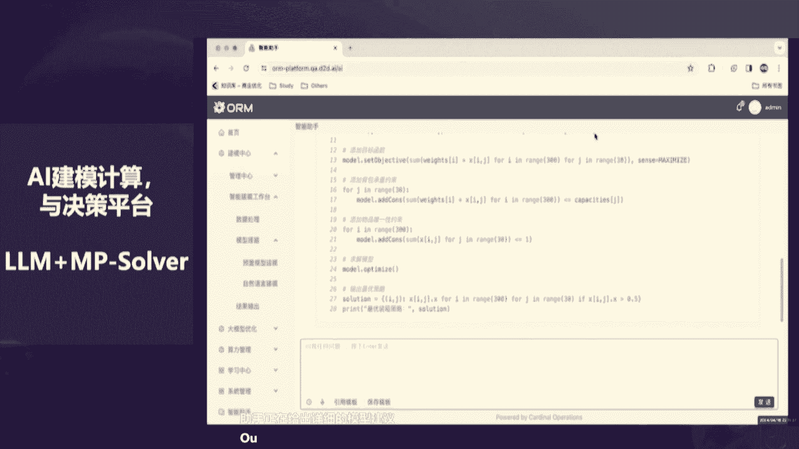
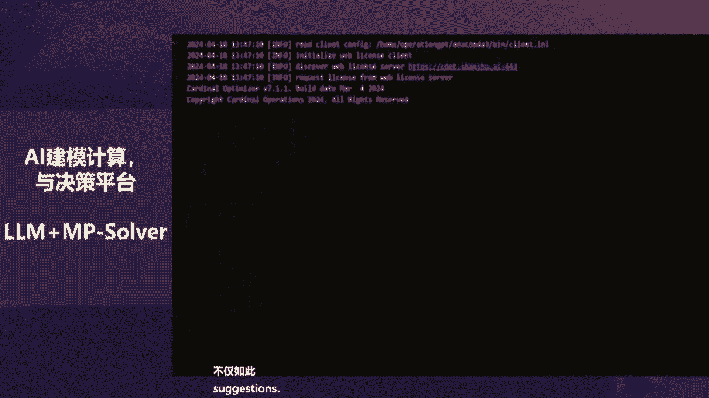
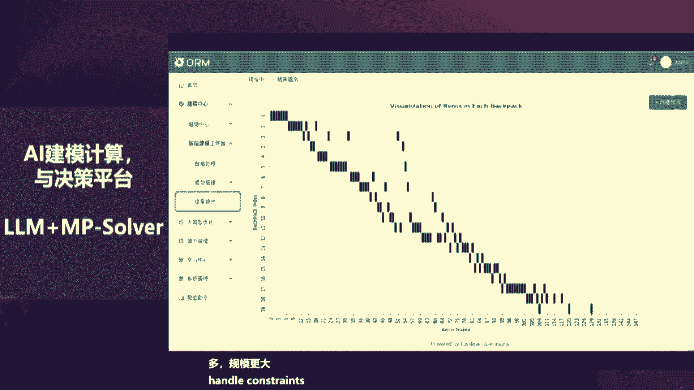
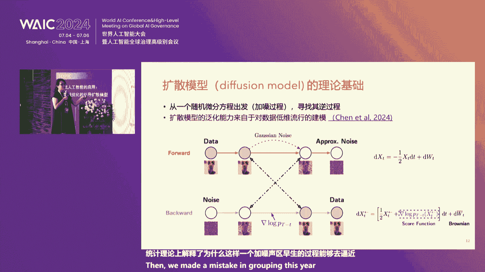

# 2024世界人工智能大会（合集） - P47：20240706-“AI+领航 智绘未来” ——智能计算与强化学习论坛 - WarrenHua - BV1iT421k7Bv

敬的各位来宾，会议即将开始，请您尽快就座，并将手机等通讯设备置于静音状态，谢谢合作。尊敬的各位来宾、女士们、先生们，大家下午好。欢迎大家莅临2024世界人工智能大会智能计算与强化学习论坛的活动现场。

很荣幸能够和大家共同见证智能计算与人工智能技术的新进展。本次论坛由世界人工智能大会组委会、上海交通大学智能计算研究院杉树科技联合举办。我是主持人曹依然，请允许我代表本次论坛的全体组委会。

对各位的到来表示热烈的欢迎和衷心的感谢。欢迎大家。当前，智能计算正在成为时代刚需，电网、交通、金融、先进制造、供应链、工业软件等重要行业，对智能计算软件的需求剧增。

本次论坛活动旨在深入探讨基于强化学习的智能算法研发历史与进展，展望智能计算的未来，如何与优化技术、GPU计算、强化学习统计等方法相结合，以及在世界范围内的领先应用。

下面请允许我为大家隆重介绍出席本次活动的嘉宾，他们分别是。斯坦博大学李国鼎蒋席教授，上海交通大学访问蒋席教授叶英宇，欢迎您。上海交通大学智能计算研究院院长、杉树科技联合创始人、首席科学家葛冬冬，欢迎您。

纽约大学斯特恩商学院终生教授、计算机科学和数学数据科学中心教授陈曦，欢迎您。普林斯顿大学终身教授AI创新中心主任王梦迪，欢迎您。宾夕法尼亚大学沃顿商学院终生教授，机器学习研究中心主任苏伟杰，欢迎您。

让我们用掌声再次欢迎所有到场的嘉宾和观众朋友们。接下来让我们进入论坛的主题分享环节。首先有请斯坦福大学李国鼎蒋琦教授、冯诺伊曼理论获奖者、优化运筹领域领袖级学者应叶英宇先生。

他将为我们带来主题演讲AI与数学优化，求解超大规模数学规划模型的新进展。好，掌声欢迎。谢谢大家，我跟大家啊汇报一些我最近在AI啊和优化之间关系问题上的一些心得体会和一些研究的成果跟大家分享。

感谢这次大会给我这个机会。OK。呃，OK这是介绍我自己那个呃对，上面提到冯诺伊曼，我不知道大家知不知道冯诺伊曼，这是计算机的那个顶尖是吧，创造了计算机。其实冯诺一曼也是对AI也有贡献的。

特别对数字经济啊，对均衡理论呢啊各种各样的这样的方法上，其实我们应用的都还是他的那一套思路。OK。啊，我跟大家介绍一下什么叫做数学模型和规划，或者是规划有时候也叫优化OK。呃。

提起这个数学规划呢呃我们必须提到呃这几位人物呃，这个这个叫coopman ok呃，这个叫contic。呃，这两个人因为在30年代、40年代上世纪发明的线性规划或者叫线性优化。

由此而获得了1975年的诺贝尔奖经济学奖OK。那么在两位得奖的时候呃，他们就邀请了呃，中间的这个人，中间这个人叫谁呢？就叫george dic。这个人对现行规划的贡献是什么呢？他提出了找出现行规划。

或者现在叫训练的一个算法，叫单纯刑法。所以当这两个人创造了这个数学模型的时候，他们深感如果没有算法，这个都是一纸白文，都是纸上谈兵的事情。所以这样大家也知道，一个数学模型或者一个大模型。

或者一个语言模型，需要数据，需要模型。而且还需要算法。所以交接单这个提出这个算法的时候啊，还没有计算机。他的理念是。你哪怕用笔用纸。你也要遵循一定的逻辑，把那个最优的方案找到最好的那个那个解啊找出来。

OK所以他们就得到，他们当时就把ge也邀请到那个上。他说you deserve the price as much as we do。他认为他们也是资合同。那么一个数学规划呢，主要有三个要素。

第一个就是数据。第二个就是变量。你能够做些什么？您能够改造那些变量的一些值。第三个就是目标，我们通常叫做目标函数。目标函数呢可能又需要最大化，也可能有时候需要最小化。那么第四个叫做约束。我不能为所欲为。

我的决策一定要满足一定的物理或者经济规律，而有时候还需要有些政策的约束。OK等等，这样叫做约束。OK这个这个就是现性规划X就是变量。ACB这都是数据。这个约束通过数学的表达式表达出来。

比如说X必须在零和一之间。有时候X要么取零，要么取一。这个application everywhere。啊，最近也把X的变量推广到矩证上面，这个矩证呃需要是一个半镇定的对称的举证。

那么通常把它叫半定线性规划，也是有很多很多应用。这里我就不仔细讲了OK。我跟大家举一个简单例子。这在我们优化的问题中呢。叫做背包问题。给了你一个可以承载5公斤的背包。给了你5个产品。每一个产品有数据。

比如说第一个物品2公斤重。可以支折18块美元。我一共有5个。那么我们的数学问题来了，我们的数学优化问题来了。你应该把哪个物件放在背包里？满足5公斤的重量约束。使得你总共的背包里面的价值最大。

那俩听懂了没有？OK。再来决定放哪个。你就可以拆，你可以从处罚。每一个物品。有一个变量，零不放一放进去。是不是每一个物品都有两种可行性呢？那么5个产品有多少种可能性呢？是不是2的5次方啊？

那么大家再想想。如果我现在有几万个背包。像一个生产线一样的。我有几百干物件。😡，需要在生产线上，需要放在背包里，放在背包里，就是在那个生产上生产线上进行生产。这可能性有多少啊？

你解决不出来的这必须要用数学的优化的方法，靠人耐已经来不及。这个是海量的，是天文数字。当时我们也嗯我们一些三树科技的小伙伴也比较迷信那个大模型。当时去年呢就问了大模型。

他说你看这个就是把每个物件的数性都说出来了，背包一共送5件珍。当时掐的GPT这样回答了，他说这是一个经典的背包问题，可以用数学优化的问题来解决。然后怎么定义变量，怎么定义目标函数，怎么定义约束。

最后他得出的结论是。求解结果表明，其实他没有求解。他说第三第一第三、第5个。放进去最好。那听懂了没有？135。放进去二合四不放。大家发现问题没有？😡，这三件重6公斤。违背了5公斤的背包约束。啊。

当然敲了GPT很会改正错误的，你稍微跟他提示一下，他会把它改过来。我在这里想说明一个什么问题呢？就是chartGBT这样的模型啊。他是给你一个近视的。他不是给你一个科学的解。或者精美的结。

Was100% correctly。这是本身就是大模型，它是它不是基于一些呃规律，基于一些数学原理的，它是基于大量的精炼OK这些东西的。OK所以这个错误是错误的。嗯，当然这个是很早产生的。

就是想说明这样一个问题。那么。其实数学规划呢就需要这种解需要用一种精确的，需要基于逻辑的，基于规律的，基于数学的这样一个解，要不然我们就出错了。哎，我们再回答一两个问题，产生一两个图片出错可以。

但是如果这是一个非常精准的，需要完全hundd percent correctly解，他可能会造成人命，可能造成其他的巨大损失的。所以我们必须要依赖数学规划，依赖刚才交接单这个的这个方法。哦。

说到交接单，这个就是刚才中间那个人，我是82年到美国去读书的。那个时候人工智能很火，叫专家系统。我们搞了很久，我当时就跟我们呃斯坦福大学的一个华人教授叫谢德生搞专家系统。那为专家呢。

他想唱当时在82年的时候，比如sim这能搞cognitive psychology啊，他想搞一个中医的专家系统。结果我们到去嗯，但是那个时候没有数据啊。他说没有数据，你可以走走出去啊。

到那个什么三藩市的那些中医学堂去找那些呃中医门去去让他给我们提供一些这样的数据啊，提供一些他的那个知识啊经验呐。啊，结果我还果然去了。去问老中医，如果老中医没有出来，他儿子出来了，对不起，祖传秘方。

天机不可外露哎。我不能告诉我父亲的这些机密，所以当时钻家系统搞不下去，没有数据了。所以在某种意义上，现在之所以人工智能发展的很快，实际是产生了大量的数据。这个需要感觉英特网。有很多数据都出来了。

我没办法，当时没有数据，专家系统搞不下去。转头就搞了优化，跟那交接单这可能是就去搞线性规划。而且当时搞线性规划呢呃特别火。O那个当时出了一个内点法什么东西，所以就跟大家讲一讲。所以。优化。

是依靠数据AI需要数据，当然需要算例。其实还有个主要的方法就是算法。其实本身。大模型的训练。就是在减一个优化的求解，它也有变量，也有目标函数。OK啊，也有各种各样的一些约束啊、条件的等等这样的东西。

你看大家也知道神经网络嘛，神经网络。他主要就是要调参，每一个参上的参数怎么调到最佳，使我的一个损失函数的值最小。通过大量的数据放在一起。所以在某种意义上。大模型的训练本身就是一个优化问题。

它的变量就是神经网络的各种参数。他的目标就是让他使得他的答案最佳。Okay。啊，我们最近。但我不知道大家可能大家是关注大模型的功能，没有关能大模型是怎么训练的。他解的优化问题。

现在用的最多的是一个算法叫adam。比如说这是一个拉嘛7个边脸的工作。他通常要18个。呃，2乘以86个B量的这个数据OK。所以他每一个数据有4个by次，就28个GB。加起来总共需要86的GB。

才能把数据存下去。为什么现在7PU解不了啊，必须用GPU啊。因为他存储空间大一些。精度不需要那么高。这是在800上面。我不知道大家知不知道。想训练一个大模型。现在需要的时间是month。按月来计算的。

需要用当大量的电力。才能做一个预顺练，叫做。这个和我们当时解一个大规模的现行规划所需要的时间差不多。等一下我会讲一讲，现在我们解同样规模的现行规划已经从月。提高微秒。所以我的感觉是，虽然大模型很火。

但他目前的训练方法是不可持续的。需要大量的人力、物力财力。而且特别是能源的消费。这里面我就举了GPU support training。现在大家都想怎么提高这个adm呢？想了很多很多方法。

怎么能把时间手短？OK但是有些方法现在都没有成功。最近我们做了一个工作。因为我们懂优化。我们就把他的目标函数拿出来。就发现他有些规律。呃，这个搞优化的人都知道一个目标函数，它有梯度。

还有那个h信证那个他的h信呢。几乎是一个broack，这个可能和它的尘啊一层一层的有关系的。就就基于这个思想方法。因为adam为什么用的好啊？因为他就是用的，他有个sing。

你可以把sing看成是一个preconditional diagon。那么既然我们找到了规咎，我们就能够找到更好的condition。用更好的sning，而且这个sning不需要那么d。

那么一个block。而且每个block之间的东西都非常均匀的，它只是block block之间不同。那么我们不需要把b中间的每一个东西都要ski你，我们只要把那整个block举证加一个ski你就可以了。

就这么加上我们建立了自己叫adam Mil。已经可以降低了3分之1的时间。也就是说原来需要3个月的一个月，现在够了。这个已经被其他的 individualdily verified。

我们自己文章也挂出去了。你可以试试一试。safe memory by4550 percent降了一半。为什么原来要乘两个大向量的，现在只需要乘一个就可以了。另一个只需要乘立几个数就可以了。

And achieve 50% higher throughput than Adam现在大家都都在用。W。在拉马的那个7B的那个pre training上。我我想表达什么意思？

优化是可以为AI起作用的。而且AI也需要依赖于优化。特别是一种比较efficient的优化。那么优化还用在哪里啊？航空。特别是载能飞船的回收技术。在最后一分钟的时间。要是能够安全的回答。

When来 E ma is star X。总是失败。后来成功了。用的什么技术啊？用来优化就是数学规划的技术。啊，特别和斯tan福这边是有一定关系的，我们都。空的做了一个A远硬结合的一个求解器。

是解一个二阶规划的问题。不断的调节速度，不断的调整，而且是实时的优化，是要微秒级中间要做去决策的。这个时候你不可能去问大模型的啊，你说我整现在就要把案就那个角度调到多少啊，来不及的东西。

模型就已经产生了。人工对话的这个控制系统。你就想想以后要打仗，你还指挥官还问问大模型，我现在应该把这个问题A部队布置到哪里，我的那个无人机现在要飞到哪里？全部都要自动化的，都要通过数学模型进行调配的。

呃，我非常高兴听说在国内啊，三树科技呀也把它用到国内的啊，这个非船差。这个跟老师到时候会给大家讲一讲。还可以用什么东西啊？电网的调度。我不知道大家知不知道电网是怎么平衡的。

经体中医最大的一个规律或者物理中的最大规律是什么？😡，你发的电和需要的电要平衡。怎么达到平衡呢？我要通过调度。开哪些关哪些风电那边送多少，火电送多少，水电送多少，闸门开多大？全部都要调配的。

多少都个变量啊。上亿的变量。达到那个平衡。威网各种各样的东西。同样的。你说完全靠大模型行吗？你问一的啊哦，明天上海气温大到39度，你觉得我们要哪台机器开，哪台机器关？他可能会给你个粗略的。

但是达不到实时的控制平衡。啊，非常高兴南方电网现在用上了优化求解器。而这些优化求解器呀。原来这个行业中已经在欧美已经是广泛使用的OK比如说电网。我们国家电网现在用的都是国外的抽进器。不是说不用。确实用。

排产。华为原内就是用的IBM的求解器。或者调配系统排产系统。这个各种各样的系统吧，我不知道轨迹控制。刚才我提到了生产计划、化工生产计划，大家用的最多的软件叫什么？叫ash本。S本中间的核心是什么？

求解一个非线性的优化问题。大家还知道我们芯片比较落后。大家只觉得我们公益落后。其实我们在设计上也落后。而设计中的关键是什么？优化求解。各种各样的几何尺寸，各种各样的参数，包括路径怎么走。

面板怎么排都需要求解器。不是不用。不是我们不知道，我们原来完全的依赖国外的。但现在问题来了。2019华为的球解器不让用了。整个就熄火了。这时候找到了我们，因为嗯。那当时我跟华为的几位高总都还挺熟的。

郭平啊，包括任正飞啊，他们经常去斯坦福，其实他们很崇洋的那些人。经常去我们那里。对，特别是当时跟思科打官司，我不知道大家听说过这个事情。当时因为所以经常去。结果他知道我搞现行规划，就找到我们。

能不能赶快把这个求解器顶上去，花了半年时间。果然我们搞出了自己的求解去。而且帮助华为度过了难关。哎，当时发现不光顶上去了，而且用的比原来还好，为什么？我们给他给的是原程序。IBM给你的都是一个黑箱。

你要适应他的水土，而不是让求解器适应你生产的水土或者生态环境。这个之间时间差别就非常非常大了。对光光光数据传输啊，原来是要通过文件传续的，现在通过代码就可以直接进来了。

这也是为什么在2019年我们推出了，当然就有各种各样的应用。这个跟老师到时候具体讲讲，还有包括陈曦老师啊、苏老师啊等等都会讲。所以我跟大家总结一下。数学建模或者数学优化的计算。和大模型它能够起得应用的。

之间的一些区别。我们认为是基于科学和逻辑。而，那边更多的是基于知识和经验。我们是要有一套物理或者经济或者数学的规律的，对原理的你说自由落体是吧？那个那个是2分之1G什么平方。

你这个是牛顿观察了好久发现出来的那已经形成一个定理了，那个物理规律必须遵循的OK。但这边的更多是观察和行为。应该说这个还是比较客观的，那个是比较主观的。

现在实际上很多主观的最后是humanfeedback，是要靠人来决定哪个好哪个坏的。我们是比较确定的那个是基于概念的。刚才几位老师，下面还有会长。因为我们是依疗物理和经济管理的。

它的得出来的结果是可以解释的啊，那边多半是黑箱的。我们可以用它在线决策，那个多半是离线训练几个月。我们需要高精度。超速度。那边可以慢截住。低精度也可以是吧，不是人命关天的事情。谁好谁坏。没有随随货。

我的观点是互补要结合。有些也确实不是，他有些本身就不是膳思的东西，你确实要需要人的经验去建模的O但是一旦有了一定的有了规律话，我们就尽量用数学和物理。这是人家几开年几千年总结出的一些规律东西了。

是万放置四海而皆准的东西，你尽量用还是要用OK不用再去重新训练，重新找。啊，这里我就呃结果斯坦福最近做了很多工作，就是在这两个方面怎么结合啊，这个高老师会会进一步介绍的，我就不详细讲了。

OK这个特别最近有几篇文章啊，在怎么用数学。因为我们后来在实践中发现有很多问题，他对数数学模型不是很懂。哎，这些不懂的东西，正好我们可以通过大模型帮助帮你一个实际问题，怎么建立成数学模型的问题。

大家也知道啊，我全国有多少学中学生参加数学建模比赛呀，是吧？这些建模比赛，说不定以后都可以通过大模型呢把它代替了。所以这两是我不是说不重要，是非常必要的。OK所以就是怎么结合起来啊。

这里比如说刚才个背包问题啊，我们演示一下吧，现在算数做了一个通过大模型建模的。🎼对比PPT中简单的装箱问题，使用chatGPT3。5得出的答案并不理想。现在我们向小欧抛出一个更为复杂的同类型问题。

这里小欧智能助手正在给出详细的模型建议。

🎼不仅如此，小欧还输出了直接可运行的代码，使用配套COPT求解器进行高效求解。

🎼通过这样一个简单的例子可以看出，当与GPT面对同样的情况，小欧不仅可以写对模型，还能够调用更加专业化的软件，处理约束限制更多，规模更大的复杂问题，最优解都求解出来了。

大家想想一个生产线。几万个生产线几百万个物件怎么在上面拍，怎么去装？这个不是靠人可以打的赢，也不是说大模型可以凭经验做。它本身是有数学规律的。我可以用线性规划的。就是刚才要把它求解出来。呃。

那么求解器我们追求的是什么？准确。速度。代点想想。南方电网。要排产或者排生产线，我们是吧，有的地方是一周排一次，为什么？调解期跟不上来。我们要是能够把一周的时间放在一天的时间，就把它排场完了。

那我每天都可以重排。那么我能够。处理那些不确定状况的情景，那效率是不大的提高了。你只因为因为计划永远赶不上变化的，你只有靠计划的快速性来比抚环境的动态性和不确定性。所以我们在求解器上一直追求速度OK。

那么这个求解器呢，实际上刚才说了。39年，人家发明了现行规划。79年，芝加哥大学首次提出了求解器，就变成一个商业软件的或者通用软件要帮你求解。这个大家上课都知道。

如果大家上现行规划可能都用过lingo然后83年爱登堡8年的话8018年。2011年。我们国内有了开元的。数学求解器就是把公式啊什么放进去，打上酒，让他自动算出来。19年。从此，我们有了自己的商业。

这是国内第一次有了自己的商业求解器。为什么2019年呢？就是因为我们帮助华为解决了问题以后，我们觉得国内有这个需求。就在下半年。自己推出了自己的商业调解器。ok。啊。

这个是啊这个里面啊这里面的规划求解器的各种各样的东西啊，只只是说非常 sadad的这个方面呢跟芯片一样，95%原来都是控制在欧美的。呃。那么经过这么几年的方展，国内的确电器到底是个什么水准呢？

我跟大家讲一讲。这是一个有个创创维屏设，因为因为这是一个公客观的计算问题。OK呃，美国建立了上千个数据库，每一个月。各种各样的求解器在那里进行一个测试。解的速度是多少？比如说。

C opt是我们国产的求解器。一是什么意思？你可以理解这些问题，平均解求解的时间是一秒钟。那么第二个最好的是什么？1。29什么意思？他比第一位的慢30%。听懂了没有？OK所以这次都是一个打榜表。

我们数学问题求解问题有各种各种不同的问题是吧？啊，有的是现性规划的，有的是facebook的问题，各种各样的东西。OK这里面还有很多。但是我必须说了啊，有一类问题，现在国内的求解剂是排名第二位，是1。

44第一位的。还是globy是美国的一个求解器。但是用的很多，但是现在也是不断的在进行追赶O。啊，在其他一些问题上。啊，现在国内的求解器几乎都是世界第一。呃，混合整数这个方面也是第二，是几乎是要么第一。

要么第二可用他们的数呢啊，就是拿了十几个金牌，哎呦好多银牌东西。那么现实中的问题复杂性还在迅速增长。有些问题我们现在还解决不了，就目前的计算体系还解决不了。你比如说。这是一个典型的欧洲物流问题。

十几年提出来的。我们一直解不动它。太大了。还有谷歌的。配age ranknk问题。我们现在你比如说这个问题解了59400秒才解出来。而且是最近解出来的，其他这些问题都解不了。这个是廊网的。

就是我刚才说电力调度的优化问题。这个需要191951秒。什么意思？需要20分钟才能够把它调度出来。要是我们能够把速速度缩展到OK1分钟以内，那我们可以重新调动。因为情况总在不断的变化。

需求总在不断的变化。我们现在做了一个什么尝试啊？既然大模型的训练可以用GPU，我们优化是不是也可以用GPU啊？把我们的优化就在GPU上实现。这个在国外认为是不可能的。因为优化的计算需要高性能、高准确性。

而我们的GPU通常那个fing point都比较低，很多16位啊，或者什么32位就已经到顶了。但是我们提出了一些远硬结合的思想。非常高兴大家。59400秒的这个问题。我们现在916秒就可以解出来。

所有这些原来解不下的问题。都可以解出来。难网的问题需要千秒的。百秒就可以解出来。哦，我们还在不断的耕进不断的改进。啊，这些都是实打实的，可以节省经济。啊，就是效率的。群里一些环境的。所以OK啊。

大家刚才说的是依靠GPU。那么不依靠硬件的发展，软件还有还有算法，还有没有新的突破呢？😡，啊哦，刚才那个结果呃，确实是我们是呃10月份去年10月份公布的。呃，现处理引起了世件的一些瞩目。呃，2013年。

英伟达GTC。他们也开发了自己依赖于GPU的线性求解器。呃，我们的工作是和一个芝加哥大学，当现在MIT跟卢教授一起合作的。呃，我们都是开源的，放到网上的。呃，结果有的学生看了一下。

他们的那个基本上和我们是一样的。所以这在我来说是第一次啊黄老板要学我们的东西。我来他这个人呃我我我在斯坦福，我的那个building就是接森黄娟的5年前还不是怎么样，现在很伟达，不得了，就火的。

但是他们现在也像。借这个GPU的那个视图呃，尽量用一些软件开发在上面做一些延伸的应用了。OK。OK这是他们讲的OK这个这个斯坦这也报道了这个省斯坦福当时也报道了OK那么现在我们不光是在在现行规划上。

在其他方法，有些算例是提高是60倍百倍，甚至提高的半万倍的。我跟大家举对我跟大家举个例子，就是刚才那个欧洲的最大物流问题。20003000万个变量。2000万个约束。变量很多很多。

这个问题20那个提出来的时候，20那个提出来先改不了。后来到了202009年的时候终于解出来的。139天。花了4个多月，就是我刚才说的。十年以后。通过远硬的结合。16个小时可以解出来。

在我们刚刚发布的那个软件上。只用了27分钟。就解出来的。啊，我刚才讲的每一个时间的提高，就意味着经济的节省。人员的接手。环境的改变。如果放在大的范围的上，不光是经济效益的话，社会效益也是很大的。

我再跟大家讲1个SDP的问题，这个SDP从来认为不可能接到上万维的。原来剪一个纤维的时候需要5分钟。啊，我们后来开发了一个呃软件，可以解到2000枚。这是我的一个学生在 lab阶段用了4分钟。

那么如果你要减到5000以上的。非常非常难。8分钟30到50个小时解一个。1000万乘以1000万为数的举证。那么现在我们需要动作找。我们是需要2分2秒钟就可以解出来。这是对我来说是amazing。

我我没有想到这个半定规划是我也属于开创者之一要发明这个模型的之一。我从来没有想到半定规划可以解到这个位头，我认为不在我的life time中间截解不到这么高位的。现在解出来了。

而这个半定规划实际上在很多量子计算的，包括很多很多这种物理计算的中间啊都是非常有用的，特别是一些高性能力科变。那么大家可能说这都是依赖硬件的改进而提速的。纯优化、纯理论、纯算法的通靠人的智慧。

把算法改进的。啊，不依赖于硬件，它的中用在哪里，它的作用在多少啊？😡，我现在就用他们敲那个三树科技的。从第一版。到现在的第700是不是啊？每年的速度。从第一版到第七版，现在已经提高了速度提高了3。5倍。

原来需要3。5个小时的，现在一个小时就可以了。这是完全不依赖于硬件的。我们设同样的版本的算法放在同一个机上进行限制。我讲这个是讲什么？硬件不够，软件是可以给补的。通过人的智慧，通过算法的改进和设计。

人家不给你芯片，不给你H100，不给你A100。也可以在散发场景，就像我刚才说的那个大模型，我们就呢轻轻的用很传统的优化方法改了一下速度。减少了3分之1。不依赖于硬件的。完全是愚人的智慧。

OK所以在这个SDP推出两年。速度已经提高到两倍。OK我知道大家知道在芯片设计中有个什么没落，是不是，每次都可以降低一半的。我是希望呃全世界在优化算法的投入上，OK能够继续。

使得我们优化算法不赖于硬件的改进，每年也可以提高一倍。那些就好了OK我们就可以解决很多问题了。O总的来说吧。OK哦是啊对我来说数学优化啊，是对我来说是非常重要的。我很热爱这个这个学术科目。

所以我所一说现性规划万岁。他是上世纪30年代提出来的，直到今天还用在各种各样的东西。而且些用的非常重要的东西。像我们斯坦福专门有一个叫干移植配对的。干一次怎么配对呀？现行规划。

现在都用这个现行规划来进行配套。所以不光是经济效益，不光是那个图片看的精美一些，不过是看的更生动一些，它确实影响人的生命，影响人的生活。所以最后谢谢大家。OK你看我来。OK没问题。感谢叶教授的精彩分享。

为我们展示了在求解处理复杂数学规划问题上的最新技术突破，为该领域的研究和应用提供了宝贵的思路。放眼全球COPD求解机团队已经基于新的GPU架构，开展了一系列开发与建设工作。

并将求解器与大模型决策平台结合，形成了一套全新的运筹学教学与工具应用系统。接下来让我们用热烈的掌声欢迎上海交通大学智能计算研究院院长杉树科技联合创始人、首席科学家葛东东先生为我们带来主题演讲。

智能计算与大模型决策、理论与实践，掌声有请葛院长。好，谢谢大家。这个非常荣幸啊，有这个机会来跟大家分享是吧。我这个其实就跟易老师这个等于是接着讲是吧，接着往下讲是吧，就是说我们这考虑的呃。

这这个就是说我们主要考虑的就两件事情。因为刚才叶老师也提到。😊，实际上我们做这个人工智能嘛，人工智能最重要的一件事情就是做到现在，从10年前大模型兴起到现在嘛，是吧？最重要的一件事情，落地场景在哪里。

对吧？落地场景在哪里是吧？就十年前就是说有这个大数据AI这些东西第一次兴起的时候，大家考虑这个问题，就是说他能解哪一些问题，到底在现实中有什么用处是吧？十年过去了嘛？就是说大家看到了可能用的最多的。

还是比如说像视觉识别啊，就这些是吧？就就就相对来说就是说呃。😊，不是特别多的行业把这个用上去了现在像大模型兴起以后也有同样的问题是吧？就今天早上我还看到说很多大模型公司这个融下一轮又融不到钱了嘛。

吧原因就是没有一个好的适用场景，但刚才也说介绍在现实中其我们有很多行业呢是需要大量的这种基于数据的进行这种复杂决策的能力的对吧？

那这些行业呢就是说很大程度就是说我们就是直接的去用一些最最直接的做一个回归一个预测这些事情呢他不能马上直接解决问题是吧原因就是这些问题过于复杂，对吧？它是一个现实中的问题这种物流问题。

华为的生产问题就这些问题为什么就是I帮不上忙者能帮上忙幅度很小就这问题系统很复杂？你把数据分析完以后，它变成一个各种约束互相制约有几千万条约束相制约的问题。上这些问题呢就是说你去做任何一个决策的。

单纯的去靠比方说AI方去做一个预测是不够的是吧？就是说预测这些东西呢，往往会破坏这个比方这些约束性是吧？破坏这个问题的 feasibility。所以这种情况就是说你还是要就是说多种方法结合嘛。

就是特别是就是说我们有很多这种优化的方法，怎么跟AI的方法去结合。包括这个刚才提到算法的结。就是优化这些年就是说芯片这个GPU这个算力这发展也很快怎么能够优化这些方法。

怎么能用上这些硬件真正这些硬件用起来，这是我们最近在考虑的一些问题嘛，是吧后就大模型因为就刚才说的本身大模型目前这个处理这种非常复杂的这种决策问题，它能帮上多大忙。

这也是我们思考一些问题是所这我们今天我主要就是汇报这两件事情嘛就是说这是我本人把两件事情就是说一件就是说。😊，就当我们解决个问题，首先我们要建模对吧？就是建模这个事情，就我待会会谈到。

就是说我大模型能不能帮助我去建模是吧？另外一件事情就是计算是吧当我建完模型以后，这个复杂的系统问题，我怎么去求解它就这两件事情我们今天就简单讲一下我们就是交大这个我们这个智能计算研究院在做的就是说我们本身呢就是说这也提到我们在上海交通大学有一个叫智能计算的研究院这个研究院主要就解决这两件事情我们就是刚才老师也讲到就是说我们开发过一个在开发一个COP的一个求解器这个求解器目前的从水准上讲基本上现行目前是第一此前一直是美国第一嘛后线性是第二？

就这个还是比较成熟的一个相对来说已经比较成熟的软件但这个软件有个什么问题呢？就是说所有的计算架构在其实一直在去年之前吧去年之前23年底之前所有的这个。😊，这个叫做数学规划是吧？

数学优化是吧我们做这个事情，这个叫三树科技来开发的，开发了这么7年7年中，无数投资人问我一个问题，说你这个东西为啥不能用GPU是吧？为什么不能用GPU为什么就在CPU上跑。

而且这种计算软件传统上不光是这个数学规划，有很多高精度的计算的这个软件像流体力学啊，就里头有很多问题呢，如果你不用AI的话，就是说有有这些软件呢专用的一些计算软件。

你会发现它都是用CPU架构的都是用CPU架构的是吧？就是说这种高精度高复杂度的这种科学计算呢？很多时候呢就是说。😊，GPU帮不上忙是吧就GPU帮不上忙。

帮不上忙的原因就是说我这也列了就CPUPU之间这个天然他们物理性质带来他们能力上的一些差别。大家想必下面用也比清楚了所列几当跟这些几百投资人都讲同样的话讲多遍PU这学优化算法复杂数学友好友经常用到的一阶算法二阶算法和这整数规划属离散优化这几个范畴都不友好是当然大家说那不是用的都是一阶算法实现是用一阶算但大多数机器学习的问题者近这种情况要找近收敛精度要求情况一阶算法刚讲我们做多高科技科学运学算规讲收敛达-一般达--才算收敛。

😊，甚至达到10的-9次方是吧？那GPU呢它物理特性决定了它本身它计算精度只能达10的-4次方。所以就无论如何，他在这个事上是做不好的是以前我们一直是这么想的是吧一直是这么想的。

但是去年底以呢就是刚才老提到了，就是说他出现了一些变化就是说这是就是说本来是做不好的我们发现说这个去年底的时候做了就是说第一个这个这个上第一个就是用GPU架构去做这个线性规划的计算的。

后以前解不出来问题解出来了。然后以前几万秒变成几百秒能解了刚才老提到个59000变成了916秒把算出来了对所以就是说这个就是说CPU加GPU这个异构体系我们去做这个事情是吧然后刚才老提到就是说有另外两类问题一类是这个。

😊，半正定规划是吧就原来是解了几万是吧，现在能做解了1。4亿乘1。4亿了是吧？这个是非常ing的一个结果嘛是吧然后还有QCP就是用二次图规划二次图规划你用这个CPU解就是我们有一个比较就是你看问题比较大1万的就基本上200个小时不出来我们传统的求解了100万直接内存一出了这些问题呢现在发现说PU去的。

78秒钟就能跑出来了所以都是非常惊人的一些进展这些进展呢其实就是说它发生在这个就就发生在最近就发生在最近1就是说当这第一提到一阶算法用这个用和这个PU和实现最开始我们那个芝加哥大学鲁海做出来的。😊。

但罗老师做了以后呢，他因为他不太擅于长工程实现，所以就找了我们把这个就是用专业软件把它重写了写了以后发现这个效果是非常好的是吧？嗯，拜罗老师也是我们以前的学生是吧？也是我们交大的学生是吧？

现在到MIT当教授去了。对，然后就这些东西呢，就是大家还是比较关注的。😊，不管英伟达还是这个斯坦福都做了一些报道是？所以我我想说你看到就是说这个事情呢去年11月份开始到现在半年功夫是吧。

发生了非常多的进展是吧？这些进展就是爆发式的增长。所以这个爆发式的增长意味着就说你发现这这种高精度高性能的计算正发一个科学转从个CPU算基础CP加P合计架构就是将来一定会发生的高精度性能计算来写了英伟达做了伟达发布了我们个纠解伟达还做了两件事情发布一个函重为么要？

能够举证分解。😊，就是我刚才讲到就是所有的我们这个数学优化里面有两大类算法是用的最多呢，一类是只用梯度信息的。大家也知道是吧？就是这个一阶算法嘛是吧在机器学习里最常见的算法。

第二类就是说我们用的比较二阶算法他要用到矩的个问题往往会用到矩阵的问题方说个海参矩二阶导数？所以呢这些呢就是呢往往对应牛顿法内点法这些要解一个线性系统。那往往对应的要解做一个矩针求逆矩针求逆这个事情呢。

是所有二阶算法的。但这个事情呢GPU上始终实现不了高速并情。十几年前我跟叶老师最开始我们就在第一个想法要求解其我当第一个想法其实想到说为什么不用GPU对？实现一个弯道超车？所以我们当时就跟英伟达联系过。

是13年前，我记得还是12年前但英伟达就跟我们说我们也不知道这个事情怎么就是GPU怎么在矩阵求逆这个事情怎么者矩针分解这个事。怎么在这个GPU上实现一个高速并行？对。

所以我们这个事情其实十来年前我们跟英伟达讨论，一直到现在，我们发现英伟达呢就今年4月上终于做了，叫做了一个叫式的函数，能够实现矩阵分解。我们现在就测了以后发现说他这个性能不是特别好能做一些明显CPU快。

但是还有很多问题跑的不如CPU包这个性能不稳定啊次输出的结果比随机每次分解结构比较随机然后他也没有实现这种多卡并联，只能在一个单卡上实现。所以目前呢就英伟达在讨找我们讨论说这个事情接着怎么做。

也希望我们帮助他们一起合作做这个事情就是所以就这个事情英伟达关注。当大家也知道就他发布这个B20这种新的架构就是刚才说我们未来这个计算趋势的发展CPU像这个CPU加PU这个混合架构发展这个混合架构呢并不是一个固定的而是这个CPPU这个为这个东西他他以后会怎么发展。

你也知道A100B20看到就是CPUPU。数据传输速度好像从15GB变成了450GB1秒。所以它提升了30倍。这就意味着以前我们发现我们当时跟罗海浩去做这个第一个现行规划的时候。

发现最大的一个问题就是CPPU之间交换占了86%的运行时间。所以假你这个东西假快了3倍。那这个就不存在了。实我们就不用大非周去写很多特殊的算法了。

那接下来就是还有一个就是大家提的不管是我们这还是英伟达上海市也号称说做一个弯道超车的硬件我下来可能跟英伟达的一些想法比较像，就是我让这个CPUGPU共享一个计算线。谁用谁去取。

这样就完全不存在一个数据传输的这个bottleneck，这个事儿就不存在了。所以在真将来如果发生这种事情，你现在设计算法到时候又要重新去重新设计，是吧？所以就说这是一个动态的过程，不停的眼睛，不停的。

你要跟着这个硬件走是吧，去设计更高效的这个做法的。所以这是很有意思的一个问题是吧？很有意思的一个问题。目前这块就是关注人不是特别多是吧？就是我们跟芝加哥，还有MIT，还有英伟达几家在这在这做是吧？

目前我们做的东西应该是最多的是吧，应该是最多的是吧？对，但但现在就是有一个问题，就是说所有的东西都是在英伟达的芯片上实现的，没有在国产芯片上做。对吧这个就是依算着英伟达的一个库单架构。

所以这个问题就是说就是说。有两件事情是吧？机遇有了机遇就是说它正在发生这个范式转变。而这个东西呢对应的就是真正的是有很多实际场景。老师刚才讲了几个场景是吧？就国防是吧？

这个航空航天交通物流、能源电网供应链智能制造，包括工业软件设计。就是我们做过200大概做过280多家企业，中国所有的头部企业，我们基本上都都打过交的，都做过生意很多然后从这里头讲。

我们这个东西呢其实是用用范围是非常非常广的是吧？不是一个简单的视觉识别那么那么狭窄的。但是就是说就是说这个东西呢就是说它非常依赖这个计算嘛吧非常依赖计算。然后这个计算我说了发生一个范式转变。

这个是必须把握住一个机会吧但同时呢我们比较受制于硬件硬件呢就是它有一些特殊性。你比如他一定要FP64双精度。那国内现在连华为都只有单精度国内目前只有一家公司有自主的产权的这个双精度芯片。然后呢就是说。

性能比较差，相当于A600070%，然后真正跑起来呢，库函数。你比如说比较成熟是矩阵计算，对吧？扩大上是很成熟的。然后国产的这这这个他们对应的库函数呢。

我们测了两家这个具有双精动能力的芯片自主知识产权那家那库大概比英伟达同了18倍。另外一家买的是个MD技术了160倍以就是这种本来应该很成熟的库函，国内的这些国内这些GPU厂商都做的还是很差的。

然后像这种英伟达做的第一个矩阵分解这种库函数呢，国内是完全没有的也完全没有这个能力的。我们现在大概基本上仔细分析过。

大概知道这个英伟达怎么做的们团队正在做也做了一个但还是比大很多我们正在尝试把它加速最近这是我们最近很重要的一个工作是吧？所以就是说这个这个就是这这个我们我在交大嘛，交大这边中。

我们跟计算机这边有很多老师做，像像alex两啊，有很多很有名的专家做计算机体系架构的。大家跟我讨论，就是大家一个共同的观点，就是说其实我们在GPU这个硬件上的差距没有大家想象的那么大。

就基本上是绝大部分是够用的。其实最大的一个问题就是这个扩大生态跟中国的这个这个生态问题是吧？就就说白了就是说这这块的像数字底层的这些数值函数计算啊，这些算子就完全是非常空白的一个状态这个差距是更大的。

就软件就是底层的这个库函数建设。这是这是其实最致命的一个差距，反而不是硬件，反而不是硬件是吧，这是我们交大老师们的一致工识是吧？所以从这点上讲，这些事情是非常需要去做的是吧？

这也是我们智能计算研究院上海市分配给我们这个任务是吧？就是说主要是承担去建设这些底层的最基本的这些数值计算的算子，是吧？😊，对。所以这就是说我们就是说这个东西就我们目前要去解决的一个问题是吧。

因为我们这个资川院是今年今年年初刚成立的是吧，就是也是借这个机会去汇报一下我们做一些什么事情。我们主要就是说在目前这个计术是发生这个一个大的变化的情况下。

那我们是不是应该去做这一整套新的理论该怎么去设计。这是我们主要的一个使命？也是希望说这里头也是说国家也是希望说我们去把这这方面的这个软件做好。这样的话，我们在硬件。因为未来很长一段时间。

我们肯定只能依赖国产的GPU硬件。那我们怎么在依赖国产硬件的基础上来弥补这个它硬件的这个短板是吧？就是说能够让这个软硬一体化以后，别人家英伟达那套差太远？

不能指望说做的像人家那么好不要被人家拉下咬住等待这这个硬件这个差距上来是吧？对，这我就简单说一下，刚才你像叶老师讲的，就是那几个case下，就是他那个加速效果怎么实现的。

我这列了一些比方说呃这是我们develop几个，你像这个是现性这是这是这个证吧每一个他都采用了一些新的这一些方法，或者说一些CPU一些方法。

我们把它重重构了一遍吧做了很多理论上的工作所以不是一个简单的这个测算的工作，而是要重新设计很多里头比较复杂的一些数学步骤是吧？这反正都有这几个关键词大家可以上网我们都了都放开源了给大家参考吧给大家参考。

对，这也简单写了一下。比方说一些算法正常情况下解一个大的计算问题是大概是这么一个流程是吧。然后我们现在发现说在我们新的这套体系，他有要加很多新东西是吧加很多新东西这些东西就是解决比有几个大问题。

一个是一阶算法，他那个假如你要去做一个混合架构的，他们之的协调机制PU有工作CPU工作GPU做他们之间有延迟有这个通讯问题有延迟问题这异步问你怎么去构建第二点就是方说他那个一阶算法个问题就是数值复杂的问题不数值困难的问题往往就不收敛所以这种情况下对这些数值困难的问题你怎么去处理吧这是另外一个一阶算法必须克服。

以这个时候问题进来以进行这种预求解中间这个收敛分析步骤啊，这些事都要重构跟那个CPU实在是完全不一样的一套体系了。对。对，包括整数规划。我刚才叶老师也提到了，其实就现实中大家遇到了，就真实的。

我刚才说200多家企业，其中真实你会发现80%的问题是来自于整数规划的这是非常困难的一问题这类问题就是想很多办法这类问题来I么帮助其实有三个途就是用PU来加速刚才我了整数规划生PU不友好所PU不好加。

但是也有些方比整数规划一步解一个线性规划就作为程序反复调用那你这个线性规划你可以用GPU来解但是GPU解完以后呢。

那个解GPU你用一阶算法解出来那个线规解解是但其他性质很不好这种情你怎么一个好的性解以便产生一个整数解这是我目前在正在研究的一个课题我们跟MT那边应该跟刚才提到卢老师在合作跟个士生合作士也是我以前的。

是吧就所以中国人在干这些事的人还是挺多的是吧？对，而且跟我们好像都有些千丝万缕的关系是吧？对，然后就第二个方法就是有很多子步骤呢，就是你可以通过一些这种AI的方法来加速。

尤其现在很多问题就像电网电网问题，但有很多历史数据，那你怎么就是通过对这个历数据分析找到一他那个算法某步骤进行加速另外一个方法第个办法就是你在CPU你能不能设计个好的分布式。

PU这分布式呢只有德国做德国有个研究他们做过他们把那个8万的CPU上做一个加速能够解一些巨大的问题历上解不出来的问题。现在跟个德国那研究合作考他那个研究里很多步其实调度啊方也过I加速他们原来粗糙。

跟他们有一个项目做了有一年多帮他们说这个东西重用AI方法重新写一遍，所以就是用AI分布式。😊，和这个GPU硬件是吧三个途径我们都在尝试是吧？对，所以这就我们主要做了一些工作。就当然我举了一些例子吧。

就举举你比如说这种很大的一个供应链网络这个网络很复杂是个非to结构的后这个网络之间那种拓扑关系，就是这些生产一些原材料到部件到整机这中间有很多拓扑关系一些材料多很多工厂很多部件共享吧就这个关系是有上百万条边的那这类问题就是说你你你比方说疫情啊。

包括现在这个战争啊会带来一个很明显的问题，就是你你在这个大规模的制造网络或者供应链网络你要找到一些关键点这疫情的时候，我们把这个东西叫做堵点是吧？就block了整个供应链生产效率。

这些关键点你怎么去设置这个安全库存，对吧怎么去提升整个供应链的效率这些问题不太好做的以前就是解个2000个节点的问题都要1200小时。现在你像国内的话，你像疫情是我们分析整个整个这个上海周边的这些网络。

大概就要100万条边是吧？所以怎么把这些效率给它，比方说几分钟那个把它解出来是吧？这这是我们目前我只是举一个例子是吧？举一个例子，像叶老师刚才举了航天啊、电网这些问题嘛，对吧？对。

就就就就是这是我们就是说要做的这些事情，我这也列了，就是中心要做的这些主要是还是说我们希望说在做这套新的计算架构体系的时候，我们是一个国际的引领者嘛，是吧？就是说我们去定义这些标准是吧？

定义这些架构怎么去做。对，这是第一件事情计算是吧第二件事情是建模对吧？就是做这个刚才讲了，就是我们有很多复杂问题。你刚才像电网这种是吧？电网它有200万条约束是吧？华为的生产问题有6000条约束是？

我们作为俄罗斯铁路有1亿多1亿多1亿多条约束些约束呢就是你像华为生产约它有6类应600万条这些约束就是说所以这个问题它很复杂。

就从一开始你像电网的问华为的问题我们最开始做了两年才把这个问题从车间里提取出来是提取出来。所以就是这里头就是说当你用大模型的，大模型这问题特别复杂的个建模流程其实做的不太好目前为止刚才举个3。

5代P35代做一个简单背包问题都不太清楚？当然这里头我也列了是大家也知道就是对这种这种这种通用大模型应这种比针对性的行业性的或者垂类的这个模型训练的时候，它会带来一大堆。😊。

啊包括这个幻觉啊这些问题大家也知道是非常常见的一些问题是吧？我也就不仔细去解释了是吧？就是说所以导致他很难做到一个很好的这个结果到现在就4发还是做不也简单问发去建的13个模型3几个个方那几个能力概名个稍麻烦清这种生产排约束简排除但引线解简单的性规划他建对了。

但是建对了建模是对的，但是解不动了。😊，能解了，他解不动了。对，再有就是他比方说他可能把一些文字理解偏差以后，他还是会把一些模型写错的，是吧？所以就你发现他还是不太不太够的是吧，不太够的。

所以就是说这个东西就是说使用怎么用大模型来对这种优化这个决策这些问题进行建模。这是我们一直在孜孜不倦研究的这个事因为我们不光要求解，我们还得建模吧这是有个我举个。

这是个的比赛就是基于自然语言的这建模竞赛的去有一篇文章华为个是他这个面去做个建模主要就是用式建模的思维使用模型去建个代再有就是一个说斯坦福也搞了一个去年底的时候斯坦福了一个个这个模型呢就是说他就是说他他的做法是他用多角色分工个个。

就是分别有这个主管建魔手是吧？编码手和第八个是吧就几个角色把这个任务拆解是吧，然后用API让大模型来写是吧？

然后这个就是说这这个作者里你三个作这也是我们以前的学生以财大的个学生后来到斯坦读博士导一起我都一直在里各种事情软微软是还是用这个GP他就说他主要像刚才提到供应链的问题他去分析供应链这些问题用个型分析供应链这个业务约束简单的把业务约束输入他告诉你说该怎么去做相应的模型调整再有就是我们做最近做了叫这么一个大模型是我一个工作我数跟交中家斯坦福大家联合做的这就是说我们这个我们开源开源可以有什优点。

😊，它就可以私有化部署的是吧，然后可以采用任何基座的是吧？任何你可以用GPT，你也可以用deept是吧？就任何基座还你也可以用拉嘛是吧？对，然后呢他走的方法就是说。用用那个合成数据是吧。

用s呃合s加合成数据是吧，让大模型自己建吧，然后用我们的COPD求解器来求解这些问题是吧？对，这是一个就是说我们讲的就是运筹学这不光运筹学。就是我们刚才说智能决策。它有一些痛点。

就是说你去就我刚才讲的时我们这个东西呢，它适用性比较广。就是所有刚才提了那么多行业它都能用能用带来一个问题，就是为什么能用呢？就是说因为他有各种各样的困难。

实际中有各种各样的困难都能克服客服指的是当你是一个非常有经验的专家是吧对运筹学这些东西建模啊这些事情非常了解的时候，这些问题可能对你来说都不是问题。但是对大模型来说这些都是问题是吧？就是这个稀缺性啊。

就数据它本身是很稀缺的对吧？问题本身难度很范围广什么行业都有可能是吧？我们做过大概20多个行业是质量数据质量就是说另外一个事情很重要的事情就是为这大家也知道这个数据基本上都没用完了是？

所以你现在是很少的？所现在大家做法做法基本上做都是一些合成数据嘛但是这种。问题呢你很很难合成数据，因为这问题过于复杂。你比如说你让他合成了数据，你会发现你给他很复杂的一些数据。

最后他给你合成新生成数据都是很简单的，没有用的是吧？甚至合成一些错的。所以就是说这个这这里头有很多瓶颈是吧？就我们新的这个模型好处就尽量去克服这些瓶颈，是吧？然后很快的在各个行业能用上是吧？对。😊。

这就是也也也列了，就是说我们这个框架里头就是说对我们我们的种子数据是我们到现在大概做289个企业，有这点好处是我们还是有别的别的人没有的这个刚才京东丰华为就各种各的企业富士康小米基本上电网国网南网据脱就是在内部做一些训练训练主用了两个技 learning一中文上下文学另外一个记得正把复杂任务进行拆解大模型依次去执行这些任务完成这个自动迭代据合成出来一个比高质量稳定性比好的数据。

再就是说经过这些以后，我们做了一些这个实验是吧，就是说这比方说这是因为这个NFOT这是搞了一个相当于一个比较公开的数据集，你在上面测起来比较容易？

这是个我们几个做的方法应该是华为的我们几个根据这问就是训练模型大小我们做了几个模型你可以看到我们还明显好一些明显一些就在这些问题上的表现吧？然后这里头也有几类别的你我们现实中我们。呃，提了70个。

我就是从我们的业务中找了70个比较复杂的业务问题上，让他去建模去测试，看能不能跑起来是吧？就就目前当然你看到这个比率也都不高是吧？虽然目前我们还是最好，但所以这个事还有很大提升空间，是吧？

就是这个事情对。对，这这也也也列了，比方我们跟这个GPT去比是吧GPT4去比是吧，这个还是有明显优势的是吧？就还是有明显优势。特别是这也列了。你你你这些问题就是说不管是简单还是难的是吧？

对应的就是在现性问题啊整数规划是吧，就这些问题上我们的建模和求解成功率是吧这个个这个这个主要是你这个都是零这个是因为我们只有一个例子都没解出来是吧？所不代表都很差是吧？对。对。

就以这目前这个东西我们还在要跟市坦部合作是吧，还在跟市坦部那边合作，继续战动是吧？继续联动。大家有兴趣的话可以跟我们一起讨论是吧？对。总的讲就是从这个商业上讲的话，这个东西有什么价值吧？就我也写了。

就是说。像大量的这种我们像我们这种做这种复杂建模的问题啊，就是不管是我们作为乙方是去服务甲方，还有很多比方说甲方的单位，就像刚才说电网啊、航空啊。

就这些公司是吧其实都是一些大家这任务的都是一个所谓的水平比较高的一些这种技术专家术专家或叫算法专家这些人去做这列理度讲商讨论理学角讲知识传承管理一个牛人走了，这个能就做不下去了是吧吧？

人工依赖性非常高然就是历史经验你到底怎么传承新来到底怎么学这些东西？所这其实都是很麻烦的这些公司须成本但这些发现大模型里你都可以解决个新所有项目经验大模型很。他不光是说哎我把数据拿过来。

你这个你写了方这个为了解决问题你写了十版代码，就代码你也可以给他灌进去。每一版的演睛过程他都能看得到大模型都都看得到。

这做项目花了8个甲方做项目项目中所有积累 notes这个项目的所有的东西全部都可以输模型都能学习到都能学习到后他去给你分析。

产生一个预测的模型测模型有哪些特征因甚至告诉征因少造成什么影响都能干我们发现这对我们来说对我们公司来很神奇的一件事者省心的一件事情举东西某某珠宝厂商很有名讲能说哪一家公司做个海司个到8%了86%个5%。

😊，同类我们做过很多这种什么化妆品啊之类的，全灌进去以后，直接跑我们这个模型，就跑了一会儿就跑出来1个86%86。7%。那就又是我们那些算法工程师对吧？花大家钱顾着那当时做这个事应该还是两个小海龟是吧？

都名校毕业了，发现他们好像都没啥用了，是吧？所以这个就是。😊，但我不能说因为这个我们就裁员了是吧？呃，确实裁员了是吧？😊，对，因为确确实这个事儿确实很很你去想这很吓人的是吧？

就是说这些这些结果你有些我我是没跑过这个人的是吧？没跑过人的。但是你比如说这个东西都跑了75%，我那个大模型跑了72%，正常情况我是两个月干了活是吧？干了75%是吧？大模型的72%。

白了我把前面就八周的事情，我前六周都不用干了。😊，前六周都不用干了，我只需要干两周，那就意味着我还是有4分之3的人是不需要了的。所以从这点上讲，我发现这个最先淘汰的是高技术工种是吧？

高技术工程以前我们说的就或者这两年大家很多去做这种数据分析师是吧？好像这个至少我觉得有一半是不太需要了是吧。实实在在的是吧？所以这个东西是很吓人的很吓人的是吧？这也是非常这就是说我把所有的这个历史。

就我们每一个项目，你比方说我们做了快销，我们做的特别多是吧？做了30家，那所有快销的东西我全灌进去以后，我们做快销就发现就特别准是吧，特别准。😊，只要30家就够了。当然我们自己刚才说了。

我们用了很多合成数据是吧，就是合成数据，你一定要想一些，就我们刚才写的那些论文的最最大的一个创举，就是我们能够高质量的产生很多合成数据。这个是大模型的一种复杂决策问题，非常稀缺的数据是吧？

所以你要设计一些新的算法。🎼所以这就是我们在建模上在大模型上一些探索工作是吧？就是建模和求解是吧？两件事情是吧？我今天基本上就讲到这里是吧，就就就输入提示词当时有个动画演示老师演示了个片段。

我就不演示了是吧？好，谢谢大家。😊，感谢葛院长的精彩分享，让我们了解到领先团队为复杂决策过程提供的智能化支持。🎼如果说人工智能可以应用于解决各种任务和问题，那么生成式人工智能作为其中的一个子集。

专注于生成新内容和模仿创造力。接下来让我们有请纽约大学斯特恩商学院终身教授、计算机科学和数学科学中心教授陈曦先生为我们带来主题演讲。深成市人工智能机遇和挑战及在量化交易中的应用，掌声有请陈教授。好。

谢谢大家啊。这个感谢大家这么热的天过来啊，我给大家讲一点比较希望比较轻松一点的这个啊这个题目啊，就是我们讲一下生成式人工智能的这个啊这个一些我觉得一些挑战啊，和我最近做的一些工作。

然后后面我给大家讲一下，就是我觉得这个人工智能在这个量化交易中的一些应用啊这当然这是我的一个背景啊个后一会我会讲到就是我会结合我在亚马逊这个广告组做席科学家的一些一些经历啊。

这个会讲到当然在讲之前我给大家一个小小的自我宣传啊，这两两本书啊，第一本书呢是讲这个这都是相当于给MBA读读的比较科普性质第一本是I然后我们讲的一些关于I在不同商业场景落地下的一些一些想法。

这些想法会在今天的这个这个讲座中讲到啊，这是由林哥出版的啊，这个书呢正在翻译成中文的过程中啊另外一本书呢就是还没有上市啊，希望今。😊，下半年就能够出版啊，是讲一个区块链啊这个web相关的啊。

这个书呢希望能成为一本这个we相关的一个一个MBA的教材吧。这个因为我看到这个市面上很多书但是并没有一本商院BA的这理论与实践结合的一本教材。

和哈佛大学商院朱峰教授还耶鲁大计算是专家张帆教授写了一本书希希下能出版好当然我不用多说202420233月14一个值得纪念的子啊因为呢我们出了这吧各种性能上呢都吊打了以的并且呢实现了多模态的个一个问答这边一副图片这图不对告诉你说你把一个电脑的这接口接到的手机上对图片进行识别从这个G。

😊，诞生这个之呃之后呢，我们就产生了整个的就是生成式人工智能的这个浪潮就开始掀就是掀开了啊，包括这个语言的文本的多模态的等等等等啊。那我们今天就不赘述这个。那我们想一想，就是我觉得多模这个人工智能呢。

尤其是生成式人工智能呢，现在还有哪些挑战啊？😊，啊，我先讲一下他的局限和挑战。当然了，对在座的小伙伴呢，如果有感兴趣创业的，我觉得其中呢有也会有一些创业的点可以跟大家分享啊。

第一个我就讲一下这个情感沟通和隐私保护啊，第二点我讲一下这个幻觉第三点一下我最近的工作呢主要是一个去中心化的验证技术那我们就讲一讲些具体的例子看到我这个个不锻炼的人那我经常想问G说你能不能劝我多锻炼量这G说可以啊。

多锻炼有什么好呢？可以增强体质这个体力控制体重，提高心理健康啊，增进免疫系统但我想问大家，你看这样的回答他能让你多锻炼吗？

不可能啊回答你都无数遍不希望到这样说教的这个回答啊那我比如说我们就会想一个就说你跟他进行一个更好的一些对话，有一些软件我们尝试就问他为什么阻止你去锻炼呢你就回答。😊。

这个GPT可能会问你说呢什么东西阻止你去锻炼呢？你就说我的健康伙伙伴都被班子都都走了。然后他就说呢这个社会知识非常重要，你可以加入一个跑步的俱乐部。然后你就说呢哎没有时间。

我确实没有时间给自己是很难的啊。然后呢就说总而言之呢就说即便是对话式的这样的一些工具呢，他也很难的产生一个情感的沟通啊，那我理想中间的一个这个一个GPT呢可能会是这样的吧？

就说比如说啊他会说你今天完成目标了没没有呢算了我今天已经下班了啊，他说运动呢可以提高你的能量水平帮助你消除疲劳，然后你就回答说不要不要明天再说吧。然后这时候GPT如果跟你说。

那你先去走5分钟怎么样你说这我可能可以做到。所以我觉得呢下一代的GPT应该更多的是一个基于情感沟通和意图沟通的这样一个东西而不简简单单是一个说教式的一个沟通。

所以我觉得这块呢其实是有机会是有机会的啊当然了这块我简单提一下，就是说这个GPT呢通过这样。😊，对话呢他可能会泄露一些隐私的问题。就比如说他问你锻炼了吗？你说我经常去1个24小时的健身房。😡。

然后如如果他在问你是吧，你那他就知道这个健身房是24小时去的啊，并且你可能经常去啊，这里头有一些隐私的问题。

当然这不是我们今天重点讨论的问题啊总而言之我的一个第一个想分享就我觉得情感沟通可能是未来的P个方面第二个方面想大家都比较了解就P会非常自信的发明很多东西。

我们把它自信的发明的东西呢是不真实的我们把它自信的发明的不真实的东西叫做幻觉啊这里呢这个字比较小但说呢他可以产生一些文献。

如说你用GPT写论文让他产生一些文献给你产生了很多文献网上一搜这些文献根本就是不存在的就头他说一个教授说说你知道他这个2018发表上的文章？说这个很多次他完全是在编造文献啊听起来不错。

但是我以保证我从来没有写过这些文章这个是一个所以大家。😊，要GPT生成文写帮你这个进行文章写写作，一定要小心啊，很容易将来会就是你发表了之后。

可能大家会发现哇这个文章你引用的文章压根就不存在啊啊那那么这个有一些一些方法来解决这个问题。我跟大家分享的一个呢就叫做检索增强生成。

知道大家有多在座的小伙伴大会也都听说过了他就把搜索引擎呢跟这个这个结合起来就比说我举个例子啊，这这是你问他这what president justice是一个大法官不知道因为我个最多只能到202我的信息只到2021月我没有办法提供更多的信信息了啊那那这个这个这个搜索这个新一代的这个检索增强生成呢其实这样做一件。

他把这个用户的这个问题啊转成了一个向量有个向量的数据库在向量数据库中进行对。😊，这个向量数据库是随时联网进行更新的啊，他把这个向量数据库中心对比，找到向量数据库中的匹配的这个比较相关的这些网上的信息啊。

他把这个网上的信息和你的问题呢一起汇总成一个的个文这的文一起丢提示模板提pro大模型啊大模型呢到这就会给你产生一个答案大家举个这个美国挺的个我的这个个学生做一家公司叫他问 justice答案不引用不太清楚23面就搜索的这个网页1都找到了你可以通过这引。

😊，用你去看一看这个网页，它甚至会标你标注哪里的这一段话，导致了这样的这个文本的产生。这样的话呢就可以从一定程度上呢减少这个幻觉的发生啊。当然如何解决幻觉啊，觉得是个非常重要的问题。

包括刚葛老师讲的在运筹学中间呢这叶叶老师讲如果出现幻觉呢可能会导致很严重的后后果？那些问题你就不能通过这种搜索引擎的方式，因为它是一个建模的问题，你也不可能在网上搜搜到，所以怎么样减少那些问题的幻觉呢？

我觉得当时更困难难啊，但是呢这个通过这个这perplexI呢，我觉得我意识到件事情啊，就说我觉得这个东西会带来一个这个数字广告的革命啊。

我我自己在2021年到2023呢在亚马逊广告组呢作为首席科学家其实工作了两年啊，就说这个那就说大家看到现在这个谷歌的搜索当然百度也是一样的？他他这个主。😡。

主要它这个赚钱的方式啊是来自于上面的我们叫ponor search啊，就说你这个一些商家可以在这贴广告是吧？那现在问题你想过没有？如果你用了这样的大模型的这种检索的方式是吧？

那你就没有办法就我也不看网页了？我就根本就看不到这这些 search的结果。我当然不会点开这些网页，那这接在这些网页上投投放的这个这个广告商啊。

他也就不能挣到相应的这个钱了啊所以我觉得这个是对广告商是一个很很严重的一个影响。那甚至我在想谷歌为什么在这个就是在这种搜索引擎上上做的没有那么权利的去推是吧？他可能就再往下推可能会自己革了自己的命。

就说因为他这样推的话，那么这个东西就说那这样的话这个广告商就不在谷歌上投投放了。为直接看答案就好了我就没有这样的机会那相反来来说可能未来的广告的主战场就会就会变到比如说抖音像tkt还 YouTubetube。

😡，像这样的方式可能会变成将来广告上的一个主主战场。所以我觉得整个这个这套re的模式，可能会对整个数字广告，包括数字广告投放的方式，数字广告的分析啊会带来1个万亿美元以上的革命。

那这头肯定也也会有很多创业的机会啊，就跟大家分享一下。好，那这是这是讲了一个第一个候第一个是这个情感沟通。第二是幻觉。第三个我给大家讲讲是去中心化的人工智能啊。

那这个呢就说我们训练大模型这个代价成本是非常非常高的啊。大家可以看到这头openI在GPT4的训练中呢就已经花了7800万美元啊。然后gogle在这个生成计算生成中呢花了将近1。91亿美元啊。

这是一个海量的一个天文数字。对。😊，那么这个呢是一副就说我们说呢能不能小公司呢也能完成这样的训练呢？这是有希望的啊。这个比如说这是一个分布式的计算啊，这这是由ford啊非常著名一篇文章。

他就说如何训练这个大模型在这个一个分布式的环境中啊，他做了一个的实验有不同的美国欧洲亚洲的地方把这些计算中心结合起起来做这样一个训练。但是我想讲的是。

即便你能够在这种在不同的通过分布式的训练的方式来降低成本。但这头有一个核心的问题啊，就是说一个像这个就说一个分布式训练的市场，这是一国一家公司啊，这家公司已经是估值105亿美美美元。

这个应该是el这个个10。5亿美美元的估值来支持来买就来投资这家公司他就说能够在能够利用这些网络上闲散的算啊，把这些散算力拼接起来来完成一个大模型的训练。如果不能做训练。😊，至少可以做微调。

就我们叫ning这样的工作啊，就说他可以来做这样一件事情。但是呢你如果你用小公司去做训练呢，这里头有很多的问题啊，其中一个很严重的问题呢就是可验证性，对吧？

你怎么知道他真正完成了这样的工作那我来举几个可验证性的一个几个实例啊第一个实例就是说你你你比如说客户说对吧？你用你你你帮我用1个175的参数的大模型来产生图片啊那这个厂商对吧？他接到你这个任务任务。

他用了一些闲散的算例来完成这件事情。但他实际上可能只用了7的大模型来给你做推理啊，就给你产生了一张图图片啊，你可能一时半会儿你也分辨不出来，对于没有经验的，你也不能分辨出来这张图片是否是由7产生。

还是由175产生的等于他就可以在这时造假，对吧？就是一个造假的问题。😡，然后第二个呢就数据的可验证性，对吧？对我们刚刚说了这个数据呢到最后都要做微调。

甚至做 reinforceinment learning。就是做这个强化学习。到最后呢比如说这头呢这个他问一个问题，世界上哪座山是最高的山？如果你回答这是一个好问题。

你就会达到一个因为并没有直接回答这个问题。但果你回答穆玛玛峰，你就会达到一个高分你会达到一个高分，那这样话就可能会形成一个正反馈。但而言你这个AI模型你把一堆数据，你是一个金融公司或者你是法律公司。

你把一堆数据交给AI模型，那AI模型如果擅自篡改了这些数据啊，你可能也很难这个就说抓到是吧？那甚至比如说这个数据中比如说我们说有一些是违法，有些是不违法的。

你把这个数据交给I然交给一家公司这个公司呢果有意的作恶，他把这个标签给改了违法的改成不违法违法改成违法的。他可能会训练出一个我们叫邪恶的大模型啊，这是一个对你而且你很难去验证这件事是吧。😡。

这是一个问问题啊那第三个是整个训练过程的可验验证性。这个是我做的一个研究啊，我们想象一个这样的商业场景啊，假设你是一个律所，你有很多法律文件，你想训练一个大模型帮你提起诉讼，写这个诉讼文书啊。

这个很正常是吧？这有很多创创公司都在做这样一件情景。但是呢你是一个律所，你是都是一帮律师，你并没有啊这样的AI的专家，于是你找到了个AI模型的训练商。你说哎我给你提供这些数据，你训练一个大模型。然后呢。

你把这个大模型返还给给我，我可能拿一个开源的模模型给你，希望你在上面进行一些微调，然后给我一个新的大模型。😡，这时候就有个问题了他训练完大模型，他给比如说你给他一个7个 billion的参数。

他返回你7个 billion的数是吧？然后给你个API调用的接口啊，他就向你说了，说我这个训练成本要100万美元你说这100万美元从哪里来的呢？为什么要收我10万元呢？

他给你一张这一个账单说你看这个我一共用了10万个GPU小时做的训练啊所以呢我们按照律师的收费对？小时收费多少钱，以我这个用了1万个小时的这个这个GPU小时，然后呢做这个训练是吧？

然后呢所以我就应该收你比如100万元。😡，那这个问题是你如何验证这件事是吧？你说你用了10万个GPU小时，你就用了10万个GPU小时嘛？同样的你也没有办法去验证这件事。

所以呢但如果大模型呢分散在各个小厂商中间呢进行分布式的训练。其实呢我们如何建立这种信任的机制，这个是非常非常困难的。

就是我们的数据的提供方和这个服务的使用方和这个模型训练的提供商之间如何建立这种建行这种信任机制。我觉得这个呢其实是一个将来大模型走向这个就是一些各个传统领域中间也会面临的一个挑挑战啊。

当然了我这都举一个例子，就举一个例子是我一个工作。当然我这个工作就给大家简单的讲一讲，那其中有一种方法呢，就是可以用我们这个区块链的技术啊，用区块链的技术技术。我给大家简单的介绍一下区块链。

区块链其实非常简单，它就是一种这个分布式的不断增长的数据库啊，其中每个区块呢都包含数据。当然大家常听的我们所谓的比特币，就是说每个区块中都包含了交易的序。😡，比如说我给你传了这个这样的B。

当然它其中可以包含各种各样的数据，甚至包含图片，包含文文本，包包含各种这样的数据。然后呢，它从经济上呢，那怎么能完成这这条链呢？就是我有有有一个东西叫矿工啊。

矿工呢就去去为了这个上链这个事情呢进行一个竞争。他要解决一个比较难的计算问题。当你解决了这个计算问题的时候，你就可以认为我就有这个上链的权利了。那下一个是个是把这个下面的一个内容存储到这个数这个链上呢。

就由我来写这么一个block啊。😡，对，那其中呢这个工作量证明呢就是说那怎么来设计这么一个难题呢？其实呢这个一直从比特币开始呢，其实大家就用了一个用叫一个解哈西问题啊。

其实是一个相当于一个密码学上的一个问题。一为一会儿会简单的讲一讲。但是呢大家知道哈希问题呢，实际上是一种计算上完全的浪费。因为这个问题呢算哈希，但算了哈希对这个人类啊没有任何的帮助啊。

其实他他在消耗了大量的能源，每年要消耗120泰瓦，相当于一个中中等规模的国家的全部的能能耗，都是用用来干什么？就挖比特币，用挖比特币。那么那为什么当时的比特币的提出者叫中本聪啊，他会提出用哈西难题。

为这个工作呢？啊，当然我们到现在也不知道中本聪是谁啊，他只是当时写了这个白皮书。那大家要满足几个问题，什么叫这个工作量证明呢？他有这个问题，要第一个是这个函数相当于一个方程啊，是是你你你很容易验证。

就是告诉你答案，你很容易去去验证这个是不是对的。😡，但是呢你要反解这个函数啊，就我告诉你这个方程，你要反解这个答案，这个是很难的。但是第三点呢是要可控制难度。就是这个哈希函数呢是很容易控制难度。

它是说你前面有几个零，就你通过一个random的东西啊，通过这个哈希函数啊，前面有几个0，0越多呢，难度越越大。所以我们听到什么比特币四年减半，所谓四年减半，就是其实前面多一个零，这样计算难度呢。

就直接乘以2。😡，自从这个工作量证明提出了之后呢，其实大家都在想，怎么能让这件事情有有有用啊。其实刚刚跟这个这个葛老师燕叶老师谈的呢，其实最简单的一个想法是。

我们为什么不用这个东西来做一些解方程或者是举证求异啊。因为你看呢如果是解方程的话，是不是它首先难一个大的线性方程，它难以反解。但是易于验证。我告诉你答案，你就知道AX是不是等于B。

我告诉你X你很容易知道AX等于B。但是呢如果你要告诉你AX等于B，你要解这个X是非常困难的。但这头有一个问问题，解方程做不到，就是控制难度。😡，因为呢你把这个矩阵AX等于B啊。

你把这个A的行数增加一倍或者列数增加一倍，并不能导保证它这个计算的时间啊，是一个比如说线性增加一倍。因为它这个东西很多时候跟这个AX矩阵的这个比如说有的结是这个结构是有很大关系的。

比如这个是稀疏的还是不是稀疏的啊，是不是有些特定的结构，这都会导致呢你这个难度控制非常复杂。所以从其实从比这个比特币提出2010年开始呢，就有不断的人去想。

我怎么能够去把这个工作量证明变成一个有用的这个工作量证明，但是都没有方案就都没有一个合适的答案。但是呢我就是说我我最近就发现啊这个AI计算，其实是可以做到的啊，这为什么呢？首先AI去计算呢。

比如你训练一个大模型是非常非常困难的。如果你把一个训练大模型看作解方程的话，训练大模型的确是非常困难的。但是难度是可以控制的。为什么我们训练大模型中间用的是这个随机。😡，梯度下降的算法。

我们这个每次呢取一个batch of data，就取一部分数据。当这个数据中呢，我们这个过数据多少遍，这个难度基本上是随着你取多少个batch线性增长的，基基就基本上是这样。虽然的难度是可以控制的啊。

最后呢。😡，就是说是否易于验证啊，这个就需要呢我们做一些科研的工作了啊，就是否去要验验证。那我们通过理理理论的模型呢。

尤其通过这个我们都用用了一些game theory一些博弈论的方法呢去证明它其实可以验证的而验验证起来并不困难。这头呢我再总总就总结一下对？

我们通过AI的这个验证呢去代替这个就是以前比特币的这个工作量证明呢？就这要满足三件事，我们叫做一个三角形啊，第一个是要安全性。第二是要计算效率。第三个呢是要可难难难度可以控制。

如果同时能满足这个三个东西啊，我们就等于说我们可能提出一种新的用AI的方式来代替这个比特币这个分布式这个上链的过程。但是呢它还能为人类产生价值。

为人类产生价值啊当然了这块我们就没有时间给大家细讲这篇论论论文了啊，我们其实这个想法非常的简单啊，我们这个想法是什么意思呢？就在你训练过程中啊加入一些旗帜加入一些flag就加入一些相当于。😊。

应或者说一些寻宝游的游戏。😡，然后呢让这个这个验证在训练的过程中加入这一些旗帜，然后让验证者呢去找到这些旗帜。没找到一个呢，我就给你一些奖励啊，当你把这些旗帜都找到了。

就算你的这个验证成功了但是我们证明了这件事情呢计算量是非常的小的啊假设你要训练的时间是T，就你训练的这个时间是OT，你要经过T或者T mini那我们这个验证的成本呢只是O一或者就可以了啊。

当然了这头我们也能证明呢它的传输的，我们也通过算法导致这个传输的这个这这个communication cost呢也会变小。这样呢我们通过这个方式呢，这个论论文在这里。

我们今天当然就做一个科普就不给大家细讲了。但是呢通过这样一个寻宝游戏的这么一个验证方式，我们就能够回到我们刚才的问题，我们就能够告诉大家说哎啊这个这个你是否。😡，就是说是这样一个问题啊。

就能解决这样一个商业场景中的应用。就是说我们能够控制你去验证你整个的这个这个训练过程啊，你到底用了多少个小时，你有没有用合适的参数，你有没有篡改数据啊，这三点呢都可以在这里头完成。

这样的话呢以后比如说我让AI模模型训练商去训练，他呢告诉我他有多少个小时，我就可以给一个合理的定价。因为这时候为什么是很难的，就是说大家知道这AI中间啊，我现在还是不能够通过这个你回答的答案的质量定价。

比如说我给你一个法律文件，对吧？你给我个大模型，我不能说因为你这个我让你生成合同，你出了错误，然后你就不给你钱了。因为呢我也不知道你这个生成的合同好不好，这个需要专家去评判。

而且并且如果你产生出来的合同不好，对吧？可能是我数据的问题不一定是你训练的问题。所以呢这个现在的定合理的定价模式呢，唯一的就是按照计算的这个过程，你是否去完成了整个计算过程去给你定价。而我们通过这个。

😡，块链的这个一个想法呢，就给大家这个这个这个介绍了一种方式啊，这种方式呢就是说我们可以对整个的这个训练过程进行验证。而这个验证的计算成本呢是比较低的啊。它呢从另外一角度来来说呢。

它可以把原来的这种工作量证明，区块链的工作量证明变成了一种有用的区块链的工作量证明。😊，好，那，这时候我分享的这个第一部分给大家分享了这个一些我觉得这个这个生成式人工智智能中的一些痛点啊。

就包括这个情感沟通，包括这个幻觉，和包括这个可以验证的技术啊，那下面呢我在最后再占用大家1分钟的时间给大家讲一讲这个我觉得这个人工智能呢在量化金融中的一些应用啊。

我觉得这个也也是一个我觉得比比较让我觉得这个比较exciting的一个领域吧啊，大家知道这个量化投资的这个兴起啊，就是前一段时间有一位著名的这个数学家。

这个我相信可能叶老师也认识这个就是叫这个simmons啊，他给克ley也捐了一个这个这个很好的研究中中心。他以前是实习大学的一个数学教授。并且呢他呢跟我们这个中国的著名的数学家陈景申教授。

他们一起合作了很多论论论文。后来呢他就进入了量化领域。他就相信这个数学能找到这个股市上的规律啊，通过这个东西去赚钱，然后成立一家公司叫文艺复兴啊，也是世界上最成功的这个这个量化公。😊，啊。

他这个就说呢在这个这个复杂的资本市场环境中，他需要投资能产生稳定的回报。那基本上呢当时他就提出了啊，他最早就提出了我们通过海量的数据，通过数据挖掘和AI呢执行交易啊，并且这个交易呢就会获得收益。

它这样呢不受人性的这个弱点的这个影响，对吧？就是你不会看到股市跌了就非常恐慌。因为他这个完全由这个计算机来进行这样的交易。

那么最早呢其实这个在理论上呢就是说发玛呢1991992年呢就提出了一个这个著名的三因子的模型啊，就是说他说这个这个收益呢能够通过这个证券一个证券组合的收益呢，能通过一个线性的方式呢来表达这件信心啊。

就是说他把这个上市公司的市值账面市值比和市盈率来去做一个线性回归的方式来表达这个股市的这么一个一个一个组合的收益，这是一个简单的线性模型，但是人工智智能的发生呢，就是说我们可以。😊。

把这个模型呢有两个方面，第一个是一个线性的模型，我们可以把它变成非线性的。第二点呢，这都其中呢这个公司的市值账面市值比和市盈率，我们这个叫因子啊，就是叫factor。

那我们这个factor它是是人为定好的是吧？那我们可以去通过自动的方式去找寻这个市场中间的一些关键的factor，通过这些factor来解释和预测股票的价格。😊，那那这个人工智能的兴起呢。

就导致了很多这个量化投资的应用啊，这当然是美国的这个很很多公司，还有一些这个国内的这是然后呢其中呢人工智能的革命呢就说可以导致像我刚说的可以进行多因子的一些量化选股啊，深度学习。

但另外就大语言模型产生我们对这个文本数据甚至卫星遥感和图像数据啊都有了更加深刻的理解。而这些理解呢会直接产生的出我们更好的一些策略啊，可以给大家介绍一下啊其中呢比如说这又导致了2015年开始呢。

这家公司啊大家一定要对量化感兴趣的朋友记住X最火的公司啊，这家公司2015年建立他也是由俄罗斯一个纯数学家做代数几何的教授叫ex这个开个玩俄罗斯做教授后来他就去了那个德意志银行他就发现他通过人工智能的能够做量化交易2015年成立这家公司以大家讲讲这家公司有多恐怖。

😊，首先alex去年是全部英国纳税人第一名啊，他就就他这个资产。第二点，这家做外汇，他们从高频外汇起家的，他们的外汇交易超交易量啊超过了剩下9家大银行的总和，他们是世界第一世界第一第一名。

但为什么说人工智能，他们刚开始的这个理念啊，就是说我们想通过这个暴力的方法用算力去平推啊。这个一开始我们如果对高频交易感兴趣同学可能知道高频的理念就是说我们一般讲大家都认为高频要在微秒级的毫秒级做出交易决策。

必须要用简单的模模型，比如现性模模型，他们的理念就是说我们可以上非常复杂的人工智能的深度学习来做高频交易。这个在2015年他们XX market之前是没有人敢想的啊，他们等于开辟了这个新的范式啊。

他们这个数字大家可能读不清，我就给大家说一件事情，他们现在就是即使去年为止，他们是世界上拥有显卡排名第四的公司啊，前面。😡，名是啊，应该是谷歌啊open AI和和那个facebook。

甚至他们拥有卡的数量比微软还要多。他们A100的卡是全世界第二名。你他们用了这么多的卡去做这样的这个高频交易。所以导致了整个这个量化交易新的范式的一个一个变革啊，当当然这个公司非常的神秘啊。

以他们的人也很少，我们并不知道他们是怎么做的啊，这个并不知道怎么做。给大家分享一点啊，我自己呢对量化交易是比较感兴趣啊，曾经呢这是以前呢在一篇和这个清华大学李健教授啊。

我们做过一些通过这个集成学习的方式，就是把不同的这个强化学习的方式呢结合起起来啊做一个这个量化交易的算法啊，然后呢当时呢我们做了一些工作，这个是发表的这个paper大家感兴趣的可以看一下啊。

然后当时呢也是在AA股上呢做了一些这个测试啊，取得了不错的效果。然后我们后来把这些这个AI的算法呢也用在一些大宗商品的这个CTA策略上因为。😊，为什么做这个大这个这个大宗商品呢？

就是大家知道国内的A股是不能做空的，但是大宗商品是可以做空的啊，我们做大宗商品呢做了一些比如说这个高就是相当于这个比如说这个高收益的策略。

也可以做一些比说能够回测够就把这个回撤能控制的一些策略就做一些研究工作吧大家感兴趣的体下面再聊。但除了这个AI直接用来预测这个价格和做交易，另外的这个AI产生了更大的一个影响。

是对于另类数据啊分析和研研究，这个AI会产生很重要的作用。我们这个什么叫另类数据我给大家简单的介绍一下。

我们把以前这个凡是你们做交易中间的量价或者作为这个基本面的财报或者价格这些东西我们都叫传统金融数据。这个另类数据呢就是说就说呢它的来源不同啊，它的格式也不一样。大家可以理解。

比如说新闻啊就是最常见的另类数据啊，但是我们还介绍一些别的另类。😊，顺序啊，就是说比如说水仙大模型呢。😡，这个很多公司都在尝试用大模型去提取这个新闻的上下文的文本表示。

看这个这个大家对什么样的公司的评论啊，因为这个评论可能代表了大家的这个民意吧通过这个东西来预测这个收益率啊，然后通过上下文的捕捉这个文法的法和语义呢来更好的理解大家这个评论。因为有些人可能说反话。

这个在以前的AI就以前的机器学习呢可能是没有捕捉到的。但通过这个现在的transformer和整个这个大模型呢，可以对整个的新闻有一个更好的检索和理解啊，这都举一个例子啊。

就说这是芝加哥大学这个啊他们发表的一篇文章啊，和美美国这个QR也是一个金融放们发文章。他们就说我可以让这个像以前这新闻分明叫正面和负面啊，现在他们分的就很细了。😊。

可以叫啊同意的啊这个表达激这个非常激动的啊，感激的啊inenjoyed的就是他可以把这个情感啊。😊，分的非常细，负面新闻呢，同时他也把这个负面的新闻呢分成了很多种不同的情感的品类啊。

他们说呢在小股票和负面新闻，这个大模型可以在预测小股票和负面新闻之后呢，他们做了一些实验啊，就说这个结果呢就说更加的明显。他们说这个新闻报道对这个股票收益率呢是有很好的预测能这个预测能力的啊。

尤其呢是对于这种中小型的股票啊，这是芝加哥大学，他们一个最新的一个研究成果，就这个大模型在这个这个相当于这个最文本的这样理解的过程中把它运用到金融市市场啊，另外想跟大家讲一讲呢。

就说除了这个文本的之外呢，这个大模型呢在在对于图片啊，其实呢还有各种方面呢都有很重要的作用。比如说这个例子很有意思。大家知道到2020年的时候啊，就说发生了疫情。

所以你知道这公司每年啊在这个就是公司这个这个我们每每年对公司股价最重要的时刻呢，我们有开个玩笑说叫赌财报。什么叫赌。😊，财报呢就比如说特斯拉或者英伟达，他要发布一个他今年的收益。那他在之前呢。

华尔街的这个分析师啊就会就会对他收益进行一个预测。往往他这个收益如果比华尔街预测的好，他的股价就会大涨啊，他如果比预测的差，即便它盈利了，它的股价也很可能会大跌啊。那所以一般讲呢在财报之前呢。

华尔街的分析师啊，就各大分析师啊就会对这个今年的收益啊做一个预测。但这到疫情的时候就发现一有很困难的一个问题。就比如说沃尔玛我没有办法去预测。因为以前的历史经验。😡，都不工作了啊。

就说我我们不知道疫情的时候，大家对沃尔玛买东西的这个行为会产生多大的这个就多大的变化啊。那当时呢这个就这个另类数据数据和AI就产生了巨大的作用。怎么办呢？

他就通过卫星遥感的数据直接去拍24小时的监控这个沃尔玛门口停车场的这个车的数量。然后通过车的数量来判断啊，大家有多少人去沃尔玛进行消费。然后通过这个消费呢。

对当年沃尔玛的营收的状况呢做了一个准确的估计啊，这就是一个另类数据数据，通过AI的方式通过这个大模型对于这个图片的识别啊来去进行一个预测。😡，这还有一个给大家讲一讲很好玩的东西啊，这个在美国有一个债券。

这个债券呢叫叫tatrophic什么意思呢？叫巨灾这个叫，我们叫叫巨灾债券，什么意思？你买了这个债券。如果比如说今年佛尔里达发了没有发大水。你可以稳定的享受到这将近年化15%以上的收益。

就等于你买了个债券，如果佛尔里达没有发水啊，没有发洪水，大家知道佛里达个比爱发洪水？就是你就稳稳的收到了15%的收益，但是呢你如果佛尔里达真的发了大水啊，你可能你的收益呢，甚至是负的，就是说你你要赔钱。

就是他是通过这种方式，政府是通过这种方式干了什么呢？就说如果佛里达没有发大水，我通过政府的钱，我给你一些回馈，一些分红，但如果发了大水啊，这是你的责任，对吧？你买了这个债券，你就承担相应的风险。

这时候呢你你你的钱呢就会用用来进行灾后的重建啊，通过这种呢那这个时候呢大家就想知道，如你要不要。😡，债券很多时候你要对天气呢做一个非常准确的评估啊，然后呢这个是当时它的这个一个收益图啊。

这个是这个是当时的一个债券的一个收益图。大家可以看到蓝色是这个债券，红色好像是一个指数啊，这个债券就收益很高啊，有意思的是，通过这个债券大大推进了什么呢？推进了气象学的这个发展。

就是因为以前啊这个气象学的教授可能工资也不是很高，就做研究。但是通过这个方式呢，各大金融机构就请了很多气象专家成立了小组去研究到底佛尔里达会不会发大水。然后这个他的研究成果呢。

他们也乐意跟当地的政府去分享，就特别神奇的是通过这个金融的一种机制的方式啊，市场的一种机制的方式，就导致呢可能佛尔里达或者美美国的一些州呢，对这个灾害的这个预测能力啊，大大提高了。

因为以前没有人做这件事，但自动发了这个债券，金融机构可能花了大价钱请了一些科学家啊请了AI的专家来做这件事，就反而导致了他这个整个带动了就是。😊，对于为民做了好事。

最后呢这个气象学的预测呢变得越来越准了啊，这也是很有意思的一个事情。那总而言之呢，我想说这个当然了，就说AI用在金融学上呢和我觉得用在运运筹学上呢也是有一定的关系啊。

其中呢其中最大的问题呢可能还是一个可解释性是吧？就是说我们假设你有损失，你如何去解释啊，性能和可解释这个权衡那今天呢苏老师最后呢会给大家讲讲这个AI对整个经济学的一个影响啊。我这边只讲了一个量化。

算是经济学中很小的一块啊，这给大家做一个抛砖引玉的功能。好，那最后呢说这个AIGC生成是人工智能的新时代呢即将到来，这也切合这个大会的主题啊，谢谢大家。😊，感谢陈教授的精彩分享。当前。

深成式人工智能的挑战体现在情感沟通与隐私保护的局限性，甚至会带来幻觉的产生。在演讲中，我们特别了解到，利用区块链技术来实现新AI时代的去中心化的算力市场。

以及现代机器学习和AI模型对量化交育行业产生的革命性影响。接下来让我们继续探索深城式人工智能领域。有请普林斯顿大学终身教授AI创新中心主任王梦迪女士为我们带来主题演讲。深城市人工智能的运用。

面向深成优化的引导扩散模型，掌声有请王教授。呃，喂，大家好嗯，今天我可能做一个更多还是从这个大模型本身的技术层面来讨论现在的一些比较重要的问题。然后我想嗯稍微的往几十年前回溯一下历史。嗯。

智能或者说怎么样去让一个机器完成一个有智能的任务。这件事情不是从大模型，也不是从深度学习开始的。这件事情是从控制论开始的。嗯，控制盾呢是诺bert winnerner，是美国的一个数学家。

他提出的在这个过程中呢，他其实和这个香农在一起讨论信息的传输，如何从信息到决策。所以基本上控制论和信息论差不多是同一个年代的最重要的理论和方法论基础。

他们也后面直接带来了信息时代互联网时代和人工智能时代。那么控制论呢出版于1948年，一个非常基本的概念就是其实控制论是要讨论智能。生物人动物是智能，机器也是智能。那么他们的共同点是什么呢？

他们的共同点是。这样的系统都是一个控制系统，不管是一个生命体还是一个机械，他们都需要在一个复杂的环境里面，能够根据环境收集到的信息做出反馈。这里面的计算可能是通过物理和机械元件直接造成了。

计可以能完全是物理上的这个计算也可以是数字的。呃，那么这是控制论，那么更现代控制论就变成了强化学习。呃，强化学习第一次就是让。就是家家户户都知道，应该是2014年的阿尔法go，它是一个对抗式的博弈。

但是它的解决方式是让每一个博弈的单方。来自动的学习如何去最大化他们的利益。所以它是一个对抗式的强化学习三法。那么他的核心还是来自于最早的控制论。呃，强化学习还可以用于呃多个智能体的实时决策优化。

还可以用于机器人。我们看到了很多很多巨深智能的非常非常有意思的进展，然后还正在用于自动驾驶，也是马上就会出现在我们生活中的。然后另外一个强化学习非常有意思的应用啊。

这个是2022年谷歌de mind的一篇论文，然后发表在nature上。2022年就是我大家知道2022年这个有哪些AI技术产生了革命吗？对，拆GPT就是2022年。

但是2022年的AI技术里面对人类产生最深刻影响的，有可能不是拆GPGPT有可能是这个用强化学习去控制核聚变reactor里面的等离子场。可可控核聚变是控制领域最难的问题。

因为呃这个何聚变的这个系统本身是一个混沌的caotic system。那么传统的控制理论，经过复杂的模拟计算，依然不能解决控制问题。

但是强化学习算法可以把这个等离子体基本上特别精准的控制在任何一个我们想要的形态上面。那么这些呢都是强化学习。然而啊强化学习有非常强的去在高维的系统中去找到最优策略能力。但强化学习本身有个很重要的弱点。

就是强化学习，不是特别善于利用数据。那么我们今天要讨论的不是强化学习。我们要讨论的是大模型，大模型是否可控。嗯，就是做互联网做技术的朋友可能比较了解，就是凯vin开利是一个非常著名的作者。

然后他有一本书，可能大家都读过，是凯文开利的一本书叫失控。这本书其实是一本整整30年前的书，他这本书里他又预测了从控制论开始来讲生命体。和机器在变得越来越像，机器越来越智能，生命体也越来越被工程化。

这本书里预测了大量的。零散的小的元件可以整合在一起，通过离散式的大规模计算，他们可能会产生更新的智能。这本书预测了深度学习大规模神经网络。这本书还预测了涌现。他说每一个神经元是无意识的。

但是他们整合在一起的时候，这个意识会自然而然的涌现出来，就是emergenceemerence这个词现在大家已经比较熟悉。当我们说大模型的时候，当不断的把它scale up智能就涌现了。

但涌现这个词是来自于这本书。嗯，然后这本书的名字啊叫失控，为什么叫失控呢？out of control？就因为这本书啊它成功的预预言了，从1994年到2023年。基本上所有的人工智能的发展。

但是最后他预言了当智能体超过人类的时候。这时候会发生什么会发生失控。这本书没有预言，后面会发生失，再会发生什么。也就是说，当智能体超越人类的时候，我们面临的这个已经变成现实了。那么这个时候。

在去年的7月份，open eye提出的一个问题就是完全一样。这是我们现在现实超智能很有可能在未来几年内。或者我们如果悲观一点未来。十几年即时年内实现。但是当这件事情发生的时候，AI系统比每一个人都聪明。

甚至是比我们全屋的人加起来都聪明。那这时候我们如何保证它还能够按照为人类的意志服务？那么这个问题就叫alignment或者叫super alignmentignment超对齐。

那么超对其是个非常大的问题，现在所有的尝试都是很浅的。那么现在嗯。最一个比较初等的，肯定会未来会有很多很多新的发展。那现在一种超对齐的方式是做。用人工反馈的强化学习。他的大概意思是这样。

就是我们当我们有一个已经预训练好的大模型的时候，你可以想象，相当于我们来了一个从来没有接触过世界的一个天才儿童。他知道很多信息但他从来没有把这个信息灵活的梳理起来，也没有真正解决过任何问题。

如果你跟这样一个没有跟人说过话的天才儿童聊天是有点痛苦的。所以最简单一件事情就是你先要教这个天才儿童，怎么好好说话，怎么好好跟人相处之后再教他解决更复杂的问题。所以这个强化学习在这里做到的作用。

就是说他要不断的让大语言模型和人类用户进行交互，收集人类的反馈。并且这个反馈是个很简单的反馈，就是说人对这段回答是满意还是不满意，或者说我给你两段不同的回答。那么你更喜欢哪一段。

然后用这样的数据呢去训练奖励函数，再用这样的奖励函数把大语言模型的生成过程当做一个控制策略，在用强化学习的方法进行微调。这是一个基本的技术思路。然后这个技术思路有很多变题和各种不同的场景下，不同的应用。

然后呢，也就是说为什么我们要从强化学习角来理解这件事情？因为。token的生成是一个控制过程。如果我们仅仅是模仿。那么他学不会推理。而是我们要把如何生成变成一个策略。当我们自己在说话的时候。

我们是有策略的。我们不是仅仅的去像鹦鹉学舍一样。所以这是为什么要控制和强化学习。但是强化学习是有很多很多不足的。我们先不说大语言模型。我们光说机器人，这是我们走去年一个工作。

就是说当我用很多离线的用户反馈数据试图去对齐机器人的时候，这时候有很多问题。因为离线的数据和我们理想中最优策略对应的数据分分布不一样。这时候会造成一个ditribution shift。

也就是说数据不完全覆盖的时候，这里会有很多很多问题。呃，比如现实中叫育word hacking或者over optimization。

但他们最后的结果就是我们能看到最理想一条红线是理想中的performance，但实际能达到的和理想中有个很大的gap。对，然后为了解决这个问题，我们提出了一种双层强化学习算法。

你可以解是我们在对其策略的时候，同时试图在对其策略。然后用这种双层优化的思路，我们就可以大大的。逼近这个理论上最优，并且和这个没有做双层对齐的算法。呃，实现了一个很大的这个效果上的一个接月。

然后这是机器人。然后那个最近呃我们组在就是我我们在这个大语言模型的对齐上做了很多工作。这里面有很多具体的场景和很多可以深入的方向。比如一个很具体的问题，就是说我们可能有很多不同不样的不同不同的人类需求。

有一些人喜欢这种风格，有的人喜欢那种风格。那么我想做一个更精细的对齐。而不是把少数人的需求直接淹没在淹没在大量的数据里面。所以我们做了一个多目标的强化学习的对齐方法。

尤其用于帮助让大语言模型能够注意到少数人的少数需求。然后同时我们最近还发布了呃这种基于自我对抗的呃更深度的呃离线对齐算法，以及实时收集在线数据的在线对齐算法。

我们在线对齐算法比这个呃现在的sota应该提高了。啊，我也读出来数呃，读提高了，看上去大概提高了有这个30%到50%的样子。对，然后就是对齐啊，就是控制对大原模型不仅仅是微调。

我们另外可以做一件事情是我们可以做。把一个小的大语言模型和一个大的大语言模型结合起来。为什么要做这件事情呢？因为如果我们要用大的大语言模型做生成的时候，这个大模型的成本是很高的。

我们现在呃站下这个这个方法是那个2023年由谷歌定漫的第一次提出的啊，不是我是我们第一次提出的。呃，当我把小模型和大模型组合在一起会发生什么呢？相当于你把小模型当成学生，然后大模型当成导师。然后呢。

这个学生去做生成，大模型只要去监督就可以了。但我们希望大模型就要保证生成的结果跟用大模型做是一样的。那么怎么去协调小模型和大模型之间？怎么让他们互相协调，达到一个最好的加速，这个也可以用强化学习来做。

然后我们呃刚刚发布的这个。呃，pect decoding plus plus就能够实现大模型推理2。26倍的加速。然后更进一步啊就是说当我们讨论对齐的时候。

我们甚至可以把对齐的奖励函数变成呃数学证明的对错，或者说呃自动编程的对错。从那从对齐的角度来讲，我们可以从一个已经对齐的模型出发。当我们有一个新的奖励函数的时候。

我们永远可以把已对齐的模型再迁移到一个新的奖励函数上。然后在这种迁移任务里面，我们得到最优模型，它的效果能够提升25%，甚至到超过百分之百。所以这里讲的都是怎么让大语言模型可控，并且更好的为我们所用。

然后接下来我们来换一个话题啊，我要讲的是可控大模型，大模型不光有大语言模型，生成式AI也是一种大模型。呃，当我们想到摄的是AI时候，我们想到的都是这个。这个图片、小视频、抖音、快手对吧？

但是生成是AI同样也可以定点的针对任何一个靶点去生成相应能够呃能够能够结合的这种蛋白质。这些看上去是不同的问题，但他们底层技术是一样的。对，那么先回顾一下生成市AI的一个非常非常短的历史啊。

生成市AI其实是一个副产品。最开始人们是在用variation的 autoender，试图把高维数据压缩到低维数据。但是他们发现这个系统里面的deder可以把噪声变成像模现样的图片。

那么这个副产品就非常有意思了。然后另外一个曾经非常火的模型叫干对抗式生成网络。它最早也不是为了生成，他是为了做预测，他是为了做呃classification和discri。但是这里面也有一个。

因为为了对抗嘛，有一个生成器，结果这个生成器就特别有意思。所以呢就是科学家发现这个生成这个事好像比预测和压缩还要好玩。所以生成变成了一个单独的任务。所以当我们现在说生成的时候。

就是说我们希望有一个模型或一个方法能够把噪音变成我们想要的设计，我们想要的图像，甚至是呃。其他的设计。然后如果我们去看这个VE和干啊，这两个生成模型，它有共同点。

共听共同点在于它的这个生成器deder或gen都是一个神经网络，相当于它一步就把噪音变成了一个新的数据点。但是扩散模型完全改变了。生成是AI的逻辑，扩散模型本身就是在控制一个过程。

扩散模型是从一个噪音开始解码，经过一系列非常多的time steps。控制一个从噪音作为出发点结局。呃，终点是一张新的图片，这是一个控制过程。然后这里面每一步。每一步的迭代。

它都是由一个神经网络来引导完成的。所以本质上我们现在训练的。这个神经网络不管它是什么architecture，这个神经网络最终起到的作用是一个控制器。然后多说两句啊。

扩散模型是一个非常非常优美的呃一个大模型。因为这个模型它的出发点就是要找到一个随机控制过程。它的出发点就是说我希望从图片我希望从噪音生成图片，非常难。但是如果给我一张图片，让我把它变成噪音。

这个太简单了。所以这个过程是它有一个前项过程，是从图片变成噪音的，我只要加噪就行了。我可以设计一个特别简单的随机过程，我可以把它微N方程写出来。那么我想做的事情是把这个过程取逆。

然后概率论里面有这个非常优美的理论，可以告诉我们这个过程的逆过程，它的这个drift function应该长成什么样？然后就是基于这样的控制呃，基于这样的随机过程的理论扩散模型。

就是说从一个佳噪声的过程里面进行训练，最终学到了这个去噪声的控制过程，学到了去噪声的控制器。然后呃我们组。sorry，这个年份错了。我们组去年的一个理论工作。

就是从这个统计理论上解释了为什么这样一个加早生趋早生的过程能够去逼近一个有着lant，就是有一个低维流行结构的复杂数据点。

对。然后更进一步啊，就是说扩散模型本来就是在求解一个控制过程。呃，但是呢。我们是不是有可能能用他做更多的事情？比如我想求解一个优化问题。如果我们只做传统的优化的话。

我可以我们会想象我们有一个叫求解的一个优化函数的一个函数。我有一个landscape，比如我可以用我可以做模拟退火，我可以做梯度法，它可能是飞 two的，也是非线性的。然后我们要在这个空间做搜索。

我可能要设计一个很复杂算法。如果我的算法恰好符合这个问题的几何结构的话，我可能就会效率高。但是呢我没有利用数据的能力。所以我们想说的是，如果我们想优化一个蛋白质，优化一个电路设计。

尤其是当他们特别复杂的时候，我们有没有可能利用生成式AI比如扩散模型作为一个底座，然后在上面再把求解器搭上去。这样我们求可以又利用数据，又利用求解去去直接生成更复杂的任意的新目标函数的解。

然后这就是我们去年到今年的一系列工作。然后这一系列工作就是呃是和这个燕语老师呃一起合作，并且我们还在不断的推进这个方向。比如我们。做了一系列工作。

来找到了一种轻量级的把一个已经预训练好的扩散模型进行自适应的方式，使得他在我们不需要改它的的是我们甚至可能不需要改它的权重。我们只需要在这个解码的过程啊，解码的过程其实是一个微分方程。

我们只需要在解码的过程中加一些额外的控制量。然后我们可以去设计这个控制量，让这个解码的过程最有效、最平滑，能够生成任何一个我们想要的目标函数的解。这说明什么呢？就是我们想做那种能指哪打哪的设计。

然后最后一页就是说当我们想用生成的方式去。呃，升级优化算法的时候，我们除了做视频和美图，我们还能做什么？比如啊生成式模型里面大量用于机器人的控制。

生成的是从以往的机器人轨迹数据里面生成新场景里面新的机器人的数据，这是一种迁移学习。然后我生成新的数据的时候，新的轨迹的时候还可以自动做优化。然后我们可以生成蛋白质结构。对。

然后我们可以生成DNA和RNA的分子。我们组今年年初有一个nature呃子刊的论文，就是说如何用生成式的语言模型来生成新的MRA疫疗疫苗设计。然后同时还有很多新的方向。

比如去年还是谷歌 demandd的，有一篇paper，是用生成式模型做材料开发。它在一篇论文里面生成了超过220万种新的晶体结构。晶体结构是很复杂的，需要满足一些数学上的拓布结构。

然后这220个新的经体结构都是可以合成的。然后这篇论文里面还估算了一下，如果是人来搜索这些晶体结构，所有人啊不是一个人，按照全人类原来的搜索速度，他们需要800年才能找到这一篇论文生成的晶体结构。

所以就是说当我们用扩散模型，我们讨论生成式AI时候，我们可以让它可控我们能够更越精确的控制扩散模型，我们就能够生成越复杂的设计。然后它的应用远远不止于小视频和美图，它可以生成新的材料。

它可以形成新的新的电路设计，新的基因序列，还可以做机器人的控制。然后最后就是说。当我们已经有大模型的时候，如何让它可控为我们所用，这应该是通往AGI的一个必经之路，谢谢大家。感谢王教授的精彩分享。

在演讲中，我们深入了解到了扩散模型的统计特性，以及他们在优化问题中的潜在应用。扩散模型代表着生成是人工智能的重大突破。而在当今人工智能迅速崛起的时代，如何拥抱变革，把握机遇至关重要。

接下来让我们有请宾夕法尼亚大学沃顿商学院终生教授，机器学习研究中心主任苏伟杰先生为我们带来主题演讲人工智能和数据科学的经济展望。掌声有请苏教授。嗯，谢谢。😊，呃。

以往我给报告一般都是先做这个sidePPT嗯，做好以后，然后再起个标题嗯，这个标题只要符合内容就行。呃，这一次是我先起了个标题，嗯，然后再想怎么样做一个slide，然后这样给我增加了非常大的难度嗯。

我是今天上午才做完。呃，然后特别大的难度在于什么呢？这个展望呃展望什么叫展望？因为这是相当于预测未来发生的事情，这个是最难的。还有特别涉及到人工智能、数据科学、经济。呃，其实特别是经济。

我也不是特别懂经济。其实虽然我在上学，但不是特别懂。所以今天这个报告更多是比较偏文科啊，就是更多是启发性的。我更多是一种抛砖抛砖砖引玉的一种一个一个一个一个期望。嗯，对，这是我本人。嗯。

对呃这个前面嗯几位老师已经讲过很多铺垫了呃，今年去年开始是深城市人人工智能的一个可以说是起点吧。然后突然他之前有很多年的积累。但是去年开始就突然大的爆发了。那么这个他已经成为了一种军备竞赛啊。

从一开始呃开始需要几千块GPU现在门槛慢慢增加到几万块，甚至最近看到新闻是。XAI啊龙XAI他们准备购买10万块H100，然后来训练他们的模型啊，就是已经这个是这个这个这个需要的能量。

可能是需要以啊国家国家级别能能力才能够驱动这样的这样的训练了。那么然后他的影响力呃也是多方面的。从学术角度，他让我们以以往比较公认的图灵这个图灵测试可能没有那么那么重要了。

因为图灵测试是计算机的一个非常重要的一个假想实验。就是如果我们能够闭上眼睛跟一个东西对话，发现他跟我们人自己跟人之间说话没什么区别那么么我们觉得他已经达到了人工智能，通用人工智能。呃。

现在直接跟这些language model呃大约大模型对话，确实有种感人的感觉是差不多。但是我们还不能说他达到了啊通用人工智能。包括叶老师刚呃提到一个例子，就是一个简单的问题大都会会出错啊。

看起来很合理，但是错误率错错误总是在，这跟我们人还是还是不一样的。那说明图灵图灵测试这个图灵在可能70年前提出了一个加乡实验，现在已经慢慢失去了它的嗯就是客观性吧。嗯。

他比较擅长于嗯coing啊写作和知识的一些整合，更多是还是一种整合吧。它并不是一种完全新的知识的产生。嗯。然后他产生了巨大的商业价值。当然呃，商业价值很多大家都在抱怨。

他最最终价值都归给 media了嗯，很多公司呃AI本身呃创造的价值嗯。是在创造，但是怎么样把它。能够在一个垂直众生的领域中啊产生呃，这需要精跟学细做，还需要很还需要一段时间的积累啊。

所以所以暂时只是让Vdia赚了这个钱啊。那么从经济的角度啊，那我们今我们标题嗯中很重要的一个关键词就是经济。那么经济上来呃这个大模型跟经济什么关系？呃，比较早期他就有已经有一个论文。这是会亮的吗？

那这个是。就GBT啊GBT啊，第2个GBT嗯，并不是是另外一个缩写啊。嗯，这篇文章呃在GBT4刚刚产生刚出来的时候就做了一个分析啊，一个分析。然后分析他在就业市场对每一个不同的工种它会有什么影响。

然后得出来结论是嗯对一些比较高精尖的工作的影响可能会更大。对于一些比较相对我们可能看起来低端嗯，可能对老体力要求高的工作，可能影响反正比比较小。这个跟葛老师的观观观察完全一致嗯。

确实他首先替代的其实是我们这些人。所以我当时看到GPT呃出来的时候，我的第一个反应就是其实我以前呃比较觉得自己有点小小骄傲的一些技能。我觉得其实呃我可能高估自己了。

确实比如今年年初年初有一个有个阿 geometry是吧就是一个阿 go曼推出了一个工作，可以解决MO就是国际数学林匹克几何几何的几何的那那种那种那种题目，这个是以往我觉得我自己觉得嗯我是比较擅长的。

我觉得我是偶外觉得还有一点点小字豪的一些技能，但发现这些东西现在已经完全被自动自动化了。越是觉得相对可能以前觉得抽象高端的能力。其实他解决的更快一点。反反而那些体力，那些真的动手去做的那些能力。

其实是反性的替代可能是比较慢的。那么。那么他其实现在呃从经济角度而言，他呃现在产生了一种计算机和经济的一种交融。那么从经济经济的角度，那么我们怎么样呃数据数据成成为了一种新的资源，怎么样给数据定价啊。

那么就是是一个问题。嗯，这个陈老师也呃提到了嗯，怎么定价是个非常重要的问题啊。因为根据完全根据推理的那个呃时间嗯，并不能很好的反映它本身的这个价值。它价值来自于他他是不是解决了问题啊。

还不知在于他什么训练的时间都有多长。好，那么怎么样能保证呢他的公平性啊，公平性在经济中也是个非常重要的问题啊。因为我们只不能只关注啊51%的那个大多数啊啊。

少数的49%甚更少的更少的1%的呃那那那些目标也是需要我们关注的。嗯，这也是呃呃，陈老师提到过的那个那个rag那个信息增强啊。

这这个也是从经济角度是是一个嗯online advertisementment一个非常大的一个一个价值。那么从更大的角度呃，从宏观的角度，这个可能跟微观吧，微观经济。从宏观经济角度来讲。

那么AI的发展使得嗯它怎么样慢慢扩散到呃影响我们的就业市场。那么这个速度有多快，这是一个这个不确定问题，是个非常值得研究的问题。然后怎么样它慢慢可能会替代我们人类。嗯。

这个也取决于我们呃人类的工工作的呃这个复杂度啊，然后是不是跟环境的嗯这个动交互密密不密切。呃，还涉及到两极化。呃，因为现在有种理论是AI如果呃再继续发展下去呃，中产阶级可能会消亡。呃。

因为中产阶级其实就是最容易被替代的那些人，其就就就是我们其实。呃，底层的呃靠体力其实暂时还不会受到威胁啊，然后资本更不会受到威胁。因为资本是AI是不能替代资本的，是吧？所以这样的话。

他把中产阶级给消灭了。那我们的人类的社会最近啊工业革命以后，300年形成的人类社会就不稳定了。嗯，可能是一个巨大改变啊，这个所以从嗯这个角度而言，他比嗯第二次、第三次工业革命可能影响力还要更大。呃。

还有是呃美国的巨大优势啊，美国的巨大优势。因为AI呃的加的。他对如果通用人工智能实现，他的影响力是远远超过前面两三次工业革命的。因为他是本质上是替代人，而不是光增强人。

所以某些国家可能在这方面会有极大的优势。他会让其他一些国家在某些嗯在根本就没法竞争。那么这个是我对呃AI和经济的比较粗浅的理解啊，有两两边的理解。第一边理解就是那么AI怎么影响经济这上面第二个呢。

我们怎么样根据我们的理解，能够更好的设计AI的模型，使得它更好的有一些经济的考量啊，那么我们先考虑上面这个啊上面这个。说明这个就怎么样AI会影响经济嗯，我再先再次声明这个更多是非常呃开放的一些讨论啊。

我觉得应该是没有定论的。现在没有定论。那么他对呃工作影响呢，刚刚呃我也提到，他对工作的影响跟我们传统的理解稍微有些不太一样。那么我们可以引进这么一个概概念，嗯，叫做in complete呃。

信息是不是完备，什么信息完备呢？信息完备的意思是这个工作它是不是像计算机一样，有个输出有个输入，它中间这个过程，它跟环境互动是比较少的。他是可以说是在一个封闭空间中就可以完成的工作。越是这样的工作呢。

它越是容易被替代？那么呃首先这类工作有哪些呢？比如像程序员嗯会计啊什么作包括作家其实也也是相对比较容易替代的啊，也确实是我们看到，因为他输入输出是比较确定比较确定啊。然后但是第二类呢呃。

其实我觉得也是相对可能会比较容易取代的。我相信是这样嗯，就是最聪明的人，实际上这些就林奖得主呃诺贝尔奖得主和费尔斯奖得主，我觉得是最容易失去工作的。

所以他对我他对我们人类的呃替代这个程度是跟我们普通呃我们以往的想象可能是有点不太一致的。那么我们人类有很多很多种呃能力啊，我这个只是随便写了几种啊，就是信息处理的能力，语言语言理解，还有什么推荐。

还有复杂问题的决策什么，还有还有像像我们做research的也是一种能力。对，然后那么他AI什么时候会取代哪些能力？那么现在这是一个非常嗯讨论非常激烈的问题呃，而且这个讨论过程中，我呃感受到一些比较。

震撼的一些一个一个东一个方面是原来最头部的那些人物，他们自己都相互。嗯，并不同意对方，这个是比较少见的。因为以往呃大家的分歧，以往的对历史上大量的问题的不确定，往往是来自于两两两个不同的群体。

他们是来自不同的不同的背景啊，或者来自不同的呃区域什么的各种但是现在是什么这三个图灵对图讲得主啊，就是图讲深度学习的三巨头啊三巨头。想必他们是应该现在是我们人类从对AI理解最深刻的这三个人。

至少是三个人之一吧。但是他们之间其实啊对AI怎么样会影响人类从长远长远长远的宏观的角度是理解很不一致的觉得AI还很遥远啊从其实实现他对人还是一个更多是一个工具啊，但但是包括已经现在开始已经投入很大的。

的时间来研究啊AI的ris从长远呃长远的角度，它对我们人类社会的破坏性啊，就是那个失控。包括啊王老师刚刚提到那个失控那本书就是很危险，就是后面就没有故事了。那失控以后就是人类的文明终结了。

所以这个是 hintton和班jo现在比较关心的关心的呃课题。所以他跟闫老坤是完全是是相反的态度的。对。那么。呃，从他们的讨论，他们相互还在激烈的讨论。那么我们能看出来是这个是一个公开的公开的问题。

现在还没有定论。但是我们我们不知道这个问题并不等于我们什么都不知道。其实我们还知道一些的。嗯，这是我自己的总结啊，我的总结是嗯这不是我的这并不是我的research，跟是我的呃个人体会。

我个人体会是有两种可能性。世界上有我们未来世界有两种可能性啊，我们人类往往哪走。第一种呢就是这个世界还是有点可预测的。啊，就是我们嗯在这个AI的系统中，我们可以根据它有多少的多少的资源。

我们就知道他能达到什么样的高度啊。那么一个代表就是sating啊，前面几位老师好像都提到了什么skingsating。呃。

当然我们接下来稍微会讲更多讲一点scaling本质上是说啊随着你计算的资源数据增加啊，你的模型的能力呢是完全可预测的，是服从一个简单的函数，一个miss函数。那么这种情况是我觉得我个人觉得是一个比较嗯。

比较比较如果是有个有个有个有个上帝的话，他是一个比较nice的上帝是吧？是我们可以也许一定程度上我们是能把握自己的啊命运的。另外一种呢是一个不可预测的世界嗯，就是。然后新的技能会不停的涌现。

然后我们不知道什么时候会呃会存在呃，也许就在再努力一把，我们就可以有一种新的技能。但是也许因为我们不知道在哪里，我们就永远的失去这个机会了啊，所以这个一个代表呢就是这个涌现能力啊，er ability。

这个也是在大约模型中观测到的一个现象，就是没法预测嗯前一秒觉得这个能力好像还遥遥无期。下一秒再努力一把就直接就达到完美了。嗯，就是有这种有个突变。那么有突变的话。

那么我们就其实我们人类的命运未来很大程度上是要呃是要靠靠运气，不能完全我们不能完全自己把握自己的命运。所以这有两种可能性。我不知道是哪种希望式的一种。对。

那么那么我们刚刚提到scaling和 imability。那么介绍一下吧，这个scaling law就是指我们有很多的计算资源。然后它的损失函数啊。

它的损失函数是服从了一个非常可以说是几乎完美的一个一个曲线，一条直线取了log以后就是条直线了啊，这个有点像物理。因为物理中我们经常能看到这样的完美的预测。嗯。

在计算机在继续学习中几乎从来没见到过这样的完美完美现象。但是在大言模型中就出现了。相当于如果如果有这个s能够继续下去，那么相当于我们有个水晶球，我们能够把握自己的命运。

那么另外一种角度就是他是一个涌现啊，那个涌现的话，那么就是一个不确定的未来，什么时候出现，我们是不知道的。嗯，这个就是诺贝尔奖物理的主那个量子力学的呃那个防定发热之一。

那个波尔就提提到的预测未来永远是最困难的最困难的。嗯，这个也许也是量子力学的本质吧，量子力学就是不可预测是吧？好，当然那个从理论上其实这两者也是有联系的嗯。

这个也也有工作说imerability和并不矛盾啊，就是并不矛盾。但是他给给给我们的世界观是两种完全不一样的世界观，一种是非常可预测。另外一种听天由命两种两种非常极端的情况。好，那么这个我讲完了。

这这第一部分，这是我个人体会，就是AI对经济的影响呃，简简单的说嗯，有两种可能性，一种是可预测，另另外一种不可预测。但是具体哪一种没法预测。那么现在我们考虑第二种就是从经济的角度。

能不能我们对AI的设计做一些事情呢？好，那么这张图好像在之前好几位老师中呃，s中出现了，特别是呃王梦迪老师刚刚也的他的报告中出现了，然后他也做了非常详细的呃介绍。那么也许我就可以呃过过了。

简单的说就是这个是大圆模型训练中呃呃微调的微调的那一部分，怎么样让他更好的能够跟人交流，符合我们人类的预期，然后知道我们人类想要什么，不想要什么。那么从经济的角度呃。

我们其实不光想知道最呃51%的人想做什么，我们永远要关心那些49%甚至1%的人在想想要什么。我们需要知道整个世界它的分布，而不是只知道那个最大的呃最大那那部分人。

比如我我们想知道现在有多少人喜欢咖啡和有有多少人喜欢茶，这个关键是知道它这个比例，而不是只知道呃大多数人喜欢什么。好。那么。那么这个不光仅来自于呃是嗯不光是公平性。其实这个对经济非常有影响。

因为我们做经济决策的时候，需要知道准确的比例。这个准确的比例有助于我们做经济上最完美的选择。那么比如我我想抽象呃一个例子，我想呃现在开一个披萨店还是个寿司店。那么我需要知道我这个。

我这个区域中关系嗯喜欢喜欢喜欢披萨的人和和寿司的人，他们的比例。如果比例是80%对20%，那么也许我应该是啊披萨。但如果是10%跟90%，那么应该完全就不一样。对，那么我们怎么样能够模拟这种事情呢？

我们就需要做一些简单的一个模型。通过这个BTL模型来来来通过来概率上来确定多少人喜欢apple，多少人喜欢苹果，多少人喜欢这个橙橙子。好，那么。但是在这个过程中。

我们一定呃需要保证少数人他们的利益能够他们的关我们要得到他们的呃有关注点。这个在I训练的数据中也有体现他们的训练数据中公开的GPT中，他们有雇用了大量的人工标注数据。

人工标注数据中也有百分之大概百分之二三十是不一致的那说明那说明什么？那说明这种不一致，是一种天然的这种天然它不光光是啊，他不是他不是错误，它是体现了一种自由度啊，像茶和咖啡本身一部分人就喜欢。

另外一部分人就不喜欢。他并没有对错之分。这种没有对错之分的这种分布，它其实适应了是一种经经济的一种考量。经济上我们要要最大化我们的收益，我们就需要考虑它的整体分布，而不是只只只知道他的最最大那个mo。

好，那么一点点小小的数学啊，我们近期的一个工作是这样，这个是呃。对，这个。这个是强化学习中呃，最后呃有一个reward model以后，用强化学习，然后希望这个大模型能够更好的符合人类的预期啊。

但是呢我们先提出加一个正则项啊，这个正则项呢？就是是一个函数，这个函数什么函数呢？是它这个分布的函数啊，这个ity大多少人不喜欢啊，他它有多少概率喜欢这个苹果，多少概率喜欢橘子啊，就这么一个函数。

我们想确定这个R这个函数的形式，是它能够完美的符合我们它跟人类的这个人类这个偏号。然后我们简单的呃简单的一个一个一个计算，然后数学上证明了他的当前紧当当前紧张这个R这个嗯这个损失，这个正则函数。

它符合他一定是这个形式。这个形式。那比较重要的重要点呢是这个log。那这个log呢本质上就是说什么他本质上是说我们是要对他加一个相浓的一个商的一个一个惩罚项商要大一些，商不能太小。

什么是商商就是一种不确定性啊，就是零一之间我不要都是零，也不要都是一，我希望在中间是吧？特别是二分之1的时候，商是最大的。所以这个商是rop啊，是他他希望我们能够保持能够保证他原来的分布。

而不是把49%就设为零了。对，那么我们建议呃在这个范式下，我们建议前面都是一样，就是先训练做预训练，然后通过RRH满足人类偏好。但最后最后一步，我们通过加这么一个preference matching。

加一个log这么一个项做一个微调，使得在它更好的符合我们人类的偏好。对，然后这个是我们的第一第一部分经济上。那么总结一下，这部分是通过经济上的偏号的概率分布。然后我们有选择的是得。

大原模型的损失函数能够符合我们的这个预期。那么第二部分呢，我们讲一下啊这个数据啊，那么数据呢是21世纪的石油。嗯，是有。嗯，这也是，他当时想卖呃买下twitter的一个动力啊。

现在看来他这个决策还是挺挺正确的。因为他现在嗯同时呃拥有呃twitter和就现在叫X和一个AI公司XAI这两个公司其实是缺一不可。因为twitter提供大量的数据，而且是实时的数据海量的数据。

然后XAI现在他就可以直接用twitter的数据来训练，然后他twitter现在已经不允许外面人爬虫了，所以twitter成了他的私私有数数据，这方面是XAI他那个公司现在已比较相对小的投入。

但市值已经达到了呃好像有个估计是预期估计达到 openI的3分之1。嗯，所以opI果然是有这个很有眼光啊，他很早就是布可能布局了。对，那么但是这个数据呃重要的过程中。

大家发现就是它引起了一个专利的问问题啊，专业问题。因为它可以有些有专利有专呃呃专利保护的数据也在用于训练AIAI的模型。比如一个早期的例子呢，大家对这个扩散模型，大家直接呃通过说输入一个提示词呢。

是一个人的名字。然后他就直接生成一个原始训练数据中的一张图片。这张图片跟这张图片基本就是基本上完全是一样的，只是这个呃稍微像素点稍微低一点啊，但其他就没什么区别。

那如果这张图片是他不光影他他的影响是非常非常深远的，他破坏了隐私是吧？我们不希望有些数据，我个人的照片直接就是让别人看到了。还有一点更严重，他如果是受专利保护的话，那么就是这个他会引起法律上的一些纠纷。

那么现在呃像呃new yorktimes纽约时报已经正式起诉了 openI和微软，然后起诉他们在侵权他们训练他们的大量数据呃，像索尼已经禁止呃AI公司训练他们的音乐。呃，学点音乐。

然后有各种现在很多的起诉这方面。对，那么各个国家各个国家呃的的反应是不一样的。像日本日本就基本上就放弃了呃数据的保护啊，所以这也是欧I最近他在除了呃三方之外，他最近在在东京开了一个分布啊。

好像我不记得应该应为欧I在交底方都没有分布吧。他在东京有一个分布，主要也是看中了日本的这么一个一个政策啊，他在日本这呃训练AI模型呃，数据不受任何保护。呃，也能理解。

因为日本基本上就错失了呃前两代的前两代的信息科信息技术。所以他可能想在这一波生成技术上能够能够跟上。那要跟上的话，就是必须要非常手段。那非常手段，就是说随便训练，没有任何保护啊。好的。

但是但是这个问题是呃，如果我们不保护啊不保护专利，短期而言可能是痛快了。我们想训练是什么随便训练。但长期以往它会伤害我们人类的作为一个智慧的一个物种呃，创新能力，会影响我们的创新能力这个。记得。😔。

这个这个原理很简单，因为我们创新我我们都是需要有激励的。我们创新是因为我们会能得到更大的回报。但是如果我们我们的作品最后被AI学到了，然后他能够生成跟我们差不多的风格的作品。那艺术家啊。

我们人类中最优秀的那些创造性有创造力的人群。他们怎么样能够获得一个他们怎么样生存下去，这就是问题。那如果这样的人群消失了，那么未来我们在互联网上的那些数据就就充斥的本身就是由AI生成的这些数据。

所以这个就变成了那个就是garage in garbageage out呃，现在一个一个信仰就是就说mod collapse呃，已经有呃实验表明如果AI模型用自己的呃输出的数据来训练。

它的它的效效用就会逐渐下降，最终就是慢慢慢慢慢慢变得越来越差。好的，那么我们这里想提出一个方案，就是我们希望引进啊一个经济上的一个角度啊，把copyright呢并用经济的手段把它来解决啊。

我们也不是完全保护copyright，但是专利，但是让让让有专利的呃让有专利数据的那些公司或者个人能够得到相应的回报啊，相应回报啊。那么经济用用经济或者金融的手段解决这种问题，本质上其实还是over。

其实我们想达到最高的整体效应，整体的效应我们想是最大的。嗯，所以我们希望AI模型还是用最好的数据来训练。他不受任何限制，因为我们希望他能达到最好的最好的性能。但是同时我们希望嗯人群中我们贡献了这些数据。

贡献了这些专利数据的那些人群，他能够得到相应的回报啊。那这个问题是什么？回报这个回报有多大？这就是一个重重要的问题。这怎么样我们平衡平衡这个回报。那么一个例子呢。

就是呃一个著名的呃这个音乐分享网站分享平台spotify啊，现在很多音乐家就是就是在spotify，然后售买他们的音乐作品。在这个过程中，平台会收取一部分费用。

但是呃如果音乐家这个歌手他的作品非常非常非常流行，很多人听，那么他的回报也会比较多啊，所以跟音乐家本身的贡献也是成成造成正比啊，不是现性的正比，但是一个一个一个一个有这么一个趋势。

那我们也想设计这么一个机制，然后能够达到这这么这么一个效果。就本身上呃AI公司需要make an offer，就是要reasonable是吧，至少reasonable。好，对，那么我们我们的这个想法呢。

本质上是用了博弈论的这种想法。呃，在博弈论论中呃，有一个shaly value叫是sha普利莎普利。这个莎普利的他首先要明确一点什么呢？明确一点啊，现在考虑若干个人S啊，每一个人呢都有他们的数据。啊。

然后我我现在只用他们的数据来训练1个AI模型。那么我想知道这个模型呢，它的效应有多大。那么我们提出了这么一个这么一个东西，log这个分子属于分母，那分子是什么呢？分子是我生成这个图片。

只用S的数据的这个概率分母呢就是我什么都不用，我只用比如免费的数据公开的数据来训练这个模型，然后然后生成这那张图片的概率。那么如果这个分子永远比呃大于分母，那说明S的数据就非常有价值，非常有价值。

那么去log以后也比较大啊，那么这个回报就会比较高。那么这就是他们这个S的这个ition这个组合的，它应该应该应有的价值。有了价值。呃，那么一个例子就是我们现在有4个艺术家。

比如梵高、莫奈等等毕加索、伦博朗。那么我们可以用他们之间的组合。比如我只用梵高和莫奈的数据来训练，那么训练一个模型啊，然后看看这个模型跟呃不用他们的数据的模型比，他使得效勇提高了多少。

这就是我们认为梵高和莫奈这个组合，他们组合应该呃应该拿到了回报。那么现在我们只是讨论了每一个组合，我们并没有落实到单独的一个一个梵高或者或者一个磨奈。那么怎么样从整体的这个组合的这个收益。

然然后呃退到每一个个人艺术家，个体艺术家的这个回报。那么这个就涉及到了一个诺贝尔经济学奖的经济学奖的一个贡献呃，就是这叫做莎普利值。嗯，shoply sharply呃是位呃，他跟那什非常像。

他们背景都是数学家，但是都获得了诺贝尔经济学奖。嗯，这个消费 value是他的诺贝尔奖的贡献之一啊，这个贡献怎么说呢？他就是嗯把每一个组合，就是比如梵高和莫奈他们应该的得到了回报。

然后能够推导出每一个具体的呃单个的艺术家，他应该得到回报。而且他这个值以他自己名名字命密的这个值呢，可以在某种意义下是唯一的。因为他保证了这个有效性、对称性等等啊，他是唯一的。他是唯一的。

那么我们就是用这个ly value，然后就呃就得出每一个艺术家应该呃分享的这个比例。比如呃在这里呃梵高他的比例是最高的38，然后其他稍微低一点这个比例。当然呃实际情况是整体他应该是需要有一些沟通。

有有一些go就是在艺术家整体艺术家和那个AI公司，比如AI公司保证他把20%的利润分配给这些艺术家。然后这些20%的总量下，以以这个比例以这个38。5%啊等这些比例，然后再一次分配到这些单独艺术家身上。

对，然后呃这个过程中呃嗯对这个过程中呃，美艺术家他当然也可以选择退出这个机制。他存在这么一个退出机制在在这里面。对嗯，这个就是我们的一个实验啊，简单的说啊。

比如我们能够看到这些呃非对角线上的一些有些比较大，比如相对这个比较大一点。这个就说明什么呢？这说明莫奈和梵高他们之间风格有一定的相似性，就是用梵高的作品相对可以更容易的生成啊，莫奈的莫奈的作品。好的。

那最后我结束了。对，时间应该差不多是吧？然后现在可能是正在形成一种新的经经济学嗯，我不是经济学的这方面的专家。但是我能够体会到，因为生成式AI或者说更大的来讲AI它是一种真的是革命性的影响。

他不光像以往呃第一次第二次呃工业革命，前面其实工业革命更多是让我们人跑得更快飞得更高，是增强人。但是现在这一次AI的涌现。其实某种程度上是替代人我们人类不至少替代至少让一部分人类。能够替代其他人类。

所以在这个过程中，经济学的原来的假设，原来的一些机制可能会有颠覆性的颠覆性的一些变化。所以呃有至于做对经济学和经济学和AI感兴趣的朋友，这是我非常建议的一个领域啊，因为AI其实如果你不是工科背景。啊。

想直接去设计他们的这种架构，其实是这个是非常难的。但是把AI作为一个工具，应用到呃应用到经济学中，那么一下子它的自由度就会非常大。这是一个非常相当于是个蓝海是有很多很多机会的。嗯。

那么最后这个是我的一张这么一张图，AI呢其是这个霸王龙，它非常强大。嗯，但是我相信我们人类有机会啊，能够掌控它应该不会失控。我相信是的。行谢谢大家。😊，感谢苏教授的精彩分享。🎼数字经济浪潮席卷而来。

催生了各行业技术与应用的不断迭代。今天我们和大家相聚于此，共同见证了智能计算技术推动数字经济增长的新征程，也探索了人工智能技术不断发展，促进数字经济产业创新的美好未来。尊敬的各位来宾。

下面我宣布AI加领航智慧未来2024人工智能大会智能计算与强化学习论坛到此圆满结束。再次感谢出席本次峰会的所有嘉宾和观众朋友们，最后祝大家工作顺利，万事如意，期待与您下次再会，谢谢大家。

求治理高级别会议，与您相约。😊。