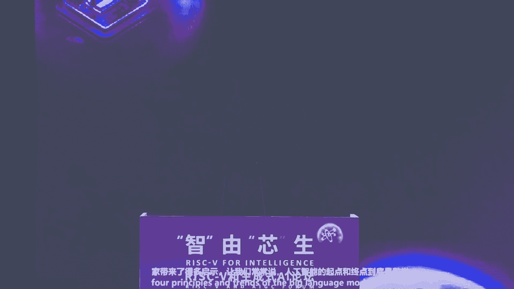

# 2024世界人工智能大会（合集） - P48：20240706-“智”由“芯”生：RISC-V和生成式AI论坛 - WarrenHua - BV1iT421k7Bv

🎼请各位嘉宾入座，我们的会议马上开始。🎼Yeah。🎼이싼 거。🎼Okay。🎼The。🎼The。🎼，🎼The。🎼，🎼尊敬的各位领导，各位嘉宾、女士们、先生们，大家下午好。

欢迎莅临自由新生risk five和深城市AI论坛。我是今天的会议主持人，来自新源市场部的孔文非常荣幸能与大家一同见证这一重要的行业盛会。随着深城市AI技术的快速演进，相关应用已经向各行各业渗透。

AI模型在云测进行训练，在端侧进行推理和微调时，产生了巨大的算力需求。作为一个开放的指令级架构，近年来产业生态逐渐完善。其微架构的灵活性和可扩展性，将为AI芯片带来很大的技术创新空间和产业化的自由度。

今天我们邀请到了 five和深城市AI领域的国际国内顶尖专家深入探讨与深城市AI融合发展的技术难点，市场机遇，并分享前沿技术及应用。😊，🎼案例在圆桌讨论环节。

我们还将就人工智能的安全与治理AI与rissk five相结合的技术发展趋势展开深入讨论，让我们一起期待今天的会议为我们带来满满的收获。首先请允许我介绍一下出席今天会议的领导。

他们是上海市经济和信息化委员会副主任汤文凯先生。🎼上海市经济和信息化委员会电子信息产业处处长汪潇先生。🎼，🎼Yeah。🎼上海市浦东新区科技和经济委员会电子信息处处长熊欢先生。🎼。

🎼以及其他科部门的领导们，欢迎大家的莅临。接下来让我们用热烈的掌声欢迎上海市经济和信息化委员会副主任汤文侃先生为今天的会议致辞。😊，🎼戴璐理事长、戴伟明董事长，我们小东理事长啊，各位来宾，大家下午好。

很抱歉呢。刚才我晚来了几分钟，晚来几分钟的原因是什么呢？我们正好有人心机器人又发布了几个产品，很热闹。我们说啊这个人心机器人啊再热闹，还是需要我们底层的芯片的支撑。所以呢今天才是我们重要的一个场合。

一个重要的论坛。所以呢也很高兴呢能和大家一起相聚一致。首先呢我就是代表我市经信委对大家的到来，表示热烈的欢迎。

也对大家长期以来啊关心和支持上海人工智能的risk five产业发展的各位同仁表示衷心的感谢。就像刚才主持人讲的一样，作为新型指令级的代表，rek five因为开放精简灵活的特点。

有望成为G叉86R之后的第三大处理器的指令机。我们上海一直是ra fire的拥抱者、参与者和贡献者，也是中国最早推动re fire发展的区域。早在2015年的时候。

我们上海的热心啊等一批企业就参与了rek fire的国际基金会的组建。经过近10年的创新发展，上海呢已经成为rek five企业产业和人才最集聚的地区，也是国际rek five的创新发展的前沿重点。

取得了一系列成果，表现在几个方面。首先呢是培育了一批risk five的领军企业。在IP领域，那么上海的达摩院新来科技已经位列risk file商用IP供应商的国际前五国内的前二。在芯片设计领域。

上海已经有超过100家企业已经推出了基于risk开 risk file指定的芯片产品。如上海热星已经成为re five商用物联网芯片领域里的龙头企业。

我们安陆科技在2017年就推出了G risk five的FPG芯片。展瑞敖杰也基于瑞k five推出了通信芯片，加特兰、和赛这些新秀呢也基于瑞k five呢推出了车用的规模化的芯片。

第二呢是构建了race file的产业生态。盖伦、何建等EDA企业也推出risk file完整的开发工具。包括我们今天的星河，我们戴博士啊，大大家都在这个为这个领域在努力。我们。

展瑞威尔等1000多家的上海的芯片设计企业为瑞 file呢提供了丰富的镜片载体，中心、华虹等精源厂的为瑞ce file提供了工艺支撑和流片的验证。上海已经形成了瑞 file完整的产业链和良好的生态环境。

第三呢，这是汇聚的一批瑞士 file的人才，交大、复旦、上科大、上大等一批高校均开设ra file的相关教学课程，每年培养和集聚的瑞士 file人才占到了全国占比呢达到50%。未来。

我们上海呢将继续打造全球领先的rece file的产业高点，并且着力做好如下三项工作。首先，我们要推动成立rece file的产业专修中心。要面向重点的应用领域联合行业力量，构建统一的硬件开发平台。

加快形成race fire的全站解决方案，要赋能千行百业发展。第二呢，这是要做强race file的产业联盟。我们要加快ra file的专利池的建设，开放合作，推动行业共建共享，推动产业健康持续发展。

第三呢，这是要加强前沿技术的研究和人才的培养。我们进一步加强与reified的国际基金会合作。今天我们代理事长也来，昨天陈市长在会议的百忙当中，还专门还今天了代代理事长也提出了这方面的要求。

希望我们国际基金会对上海在rece领域能给予更大的支持。我们会积极的参与。新指令的扩展新技术的探索，研究建立新型的产学研合作机制，推动将reify相关的教材，要纳入上海集成电路紧缺人才的培训计划。

我们要像当年说计算机从娃娃抓起，我们的re fire要从大学的大学生开始抓起。这也是昨天陈市长在接待戴路理事长和我们戴伟明董事长形成的一个共识。我们要在上海培养和集聚更多的risk发的人才。各位来宾。

深成是AI的快速发展，为risk fire提供了巨大的发展空间。我们将进一步的优化营商环境，不断的完善服务和制度供给，与大家携手同行，共同打造全球领先的risk five的产业高点。

最后呢也衷心祝愿本次的论坛能取得圆满成功，谢谢大家。

🎼感谢汤主任，接下来进入会议的主席主题分享环节。为了节省会议时间，今天所有演讲嘉宾、圆桌嘉宾和企业的介绍都将由我们的工作人员发在今天的会议群里，请还没有入群的嘉宾扫描大屏幕上的二维码入群。今天稍晚时候。

我们的圆桌讨论，也会在这个群里用投票的方式，实现台上嘉宾和台下嘉宾的互动。欢迎大家届时踊跃参与投票发表见解。接下来让我们欢迎乌镇智库理事长张晓东先生，他将为我们带来大语言模型的原理与发展应用的主题演讲。

请大家欢迎。🎼好，大家下午好。因为这个时间的关系，我就这个不客气了。然后我就直接切入主题啊。今天呢我只有20分钟的时间，但是我这个呃主题是非常宏大的。

就是我要20分钟的时间讲大语言大语言模型的原理和发展啊，最后这个主持人还叫我讲一下应用。好，那大家看看我的语速能掌握多快啊。好呃。就是大家如果熟悉西方这个哲学的这个发展的话，就是西方哲学的这个脉络啊。

我先来一个宏大叙事，西方哲学的脉络是从唯物。变到越来越违心。就大家我们看这个头两次工业革命都是能源的革命。那么从第三次或者说我们正在经历的第四次工业革命，现在都是大家讲算力或者智能的革命啊。

所以我想这个用一个呃非常有趣的比喻，英国50英镑的钞票的封面。在两年以前是瓦特，瓦特哦就很明显代表了第一次第二次。但是两年以前，50英镑的钞票换成了图灵。大家知道图灵就是我们计算机科学和人工智能的鼻祖。

所以我想这个很快的借用一下这个伟大的物理学家费曼的话说，费曼曾经说说微积分是上帝的语言。那么我们智能的语言是什么？所以我说智能的语言该改成图钉机了。那么什么叫图灵机？所以我们总是讲。我们总是讲。

就是我们学中学物理。我们总是有，比方说三条牛顿定律加上万有引引力定律，这个就构成了我们理解世界的基础，对吧？那么对于大语言模型，有没有这样的原理，或者说第一性原理，能够帮助我们理解大语言模型是怎么回事。

其实我们现在很多就是在实现大语言模型的第一线的工程师，其实他也并不是非常了解原理性的了。所以我今天力图从原理这个第一性原理的角度来跟大家分享一下，为什么大语言模型这个可以工作。

然后也是为后面更精彩的分享做一个这个铺垫啊。什么是图灵机？图灵机是一个非常简单的东西，就我本来这有一个视频，但是大家就不放了，就是一个无限长的纸袋。然后这个这个图灵机可以干什么？有个头。

有个有个有个读写头，这个头可以。左移右移，然后写零写一就这么个东西。那这个东西有多么强大呢？这个东西就是涉及到这个原理。目前我们知道的。所有的计算装置。都等驾驭处理机。都等价于图这个东西就是我。

原理一啊，我今天有4条原理原理一，我我时间快到的时候提醒我一下，这个原理一就是叫所谓church tu秋期通龄论题。秋期通龄论问题是什么呢？就是我们现在已知的所有的。计算装置我先退一步，先讲计算装置。

所有的计算装置都等价于。那么这个里面还有很多很复杂的东西，今天就没有时间cover了。我先给大家起个头，大家感兴趣的话，待会儿这个下面来找我聊啊。那么为什么是这样？哦。因为我们现在人类。在30年代开始。

我们做了很多很有趣的探索。多德是大家。就是那个跟爱因斯坦合照的这个歌德。就是歌德尔不完全性定理。这个大家看着看过奥本海默电影，就是跟爱因斯坦散步的那个。他在1931年证明完全性定理的时候。

用到了一个东西叫general recursive function。递归函数。那么在1934年到1936年的时候，证明递归函数是等价于图灵级。然后po系统是等价于。

然后church是是图灵的这个这个博士导师。church也发明了一个东西叫lammbda演算。这个大家用java写program的时候都会用到lammbda演算，就lispper这些lammbda演算。

拉姆代演算也被证明是邓佳宇。就是乔布斯基菱形文法，待会我会讲到语言的问题，就是我们现在已知的所有的。计算的装置。都等价于。ok所以那我就可以稍稍往前迈一丁点儿。我说所有的智能。也是等价与。

到目前我们没有找到过返利，所以这个就是ch就是一个共识。我们共识就是因为我们总得有个起点，对吧？就是我们今天讲芯片算力，我们总得有个起点，这个起点就是图灵机。

所以大家知道我们计算机科学、人工智能最高的奖项都叫茯灵奖，对吧？哦。那么为什么人工智能这一把又火？那么在人工智能这一把火之前，就所谓chGBT2022年火之前火过几次啊。

这个这个upend down好多次。但是这一次是语的图，所以大家可能也也关注到，就前几天这个nature有一个封面杂志，叫语言不等于思维啊，但是。所谓图灵测试是语言的测试，但是这个是一个很长的哲学讨论。

咱们今天就不再去讲这个，就是我们今天仍然以这个为基础，就是我们假设语言如果不等于思维的话，但是也等于90%的思维。所以这是为什么chetGBT因为它是个语言的东西，就是语言给我们带来这么大的。

细节就不讲了哦。那么。第二个问题就是。什么是学习？就是有没有一个。办法能够定义学期，就是我们看到很多哲学的讨论，心理学的讨论，就这些讨论，他他就是每个人都可以说不同的观点，但是他没有办法说说服对方啊。

没有办法说服对。大家知道人工智能的这个起源是1956年达特毛斯会议。而达特毛斯会议的组织者之一。ja McCary他也是图灵奖获得者。他在1954年的时候写了一篇契业者的文章。他说他没有这么说。

但是我把他的说法通俗化了。他定义了一个问题，他定义了这个问题，他说图灵机是计算的，就你你给我个图灵机，然后你给我输入，我就输出了，对吧？那么什么是学习呢？他说学习就是图灵机的逆。

就是inversion of图灵。inversion图灵机什么意思呢？就是说你给我一堆输出。然后我要是能猜得出是什么样的机器，或者说是什么样的图灵机，我能够产生这个输出。那么这样的问题就叫学习。

这是一个非常严谨的数学的定义，非常严谨的数学定义。那么这个是54年他。大家仔细想想。这个求图灵机这个过程，我们今天不就是大模型吗。就是我给你一堆数据，拿这堆数据去训练训练出来，训练出来的那个大模型。

实际上是一个机器，对吧？有问题吗？OK所以所以这个就是我我想说的这个MBR，这是一个一个这是一个数学的问题，这是一个数学问题。就54年定义。但是呢他定义完这个数学问题之后，后面有什么进展？

后面的进展就是十年之后，有一个数学家也参加了这个达特毛斯会议。这个数学家叫slomonov。他64年的时候。数学上证明了这样一件事。用今天的话说用今天的话说，就是。刚刚我们说的所有的学习问题。

就是屠尼基求你。图灵机求逆这件事儿，数学上等价于。Next， token prediction。所以你要是把next token prediction这个问题解决了，那么所有的学习问题都解决。

这是他1964年给的结果。好，那这个东西能够干什么呢？至少我们可以解释一件事。因为大家前一阵cheGPT刚做出来的时候，大家一直在在争论，大家一直在question，一直到今天每一次我去参会。

我都讲这个道理。很多人都说说这个。gooogle大家知道google是最早。做google最早。你除了这个transformer的这个。先往。google最早提出了transformer2017年。

google在penomer基础上做了brt。那么为什么bt？😡，为什么GPTGPT也是用。😡，那么你看就是，而且你现在看这个文章的引用都很都很令人惊奇，就transformer17年出来Bd的出来。

然后最早去年3月份的时候，2023年3月份的时候，我统计跟现在的统计看这个论文的引用完全不一样。去年3月份之前。GPT的工作没有什么人，为什么？因为所有全世界所有的人除了open aI之外，都在做bi。

包括中国和美国，所有欧洲的所有的大模型都在做brt。那么birt跟GBT有什么区别？我再回来讲。bert是这bert是在干这样一件。butt是。双向的就是我给你X1。到XN，然后我把XI拿掉。

让你猜那个XI。但是。这个next token prediction是什么？next token prediction是一个非常简单的问题，说我给你X一到XN。让你猜XN。

那理论上我们会觉得GPT是一个更简单的。更不更不那么powerful的一个机制。但是所罗门诺1964年就证明了这个东西现在叫所罗诺归纳。1964年就证明了说我这个东西是等价的。那么毫无疑问。

如果说这个东西是等价的话，很明显GPT是更省算力，因为它是单项。对吧这个到目前为止还没有数学上的证明。我给所有做理论的人都提过，我说这个是应该你们去target的一个问题。我的时间很有限，快一点。

那么好，这个是其实是另外一个，就大家看，其实从2021年之后，所有大模型都是走GPT的路线。就是我列出来的。这几个就是。公述性。工智能的历史啊，就大家知道人工最早都是做逻辑的对吧？然后后来做神经网络。

对吧？神经网络中间有uppen done好几次，然后还有一派就是做这个强化学习的。我实际上是属于这一派。的老师和我的师兄啊，就是他们发明了这个强化学习，但是这一排。那么我们看自然语言处理的进步。

就是在过去40年或者50年，从五几年开始做机器翻译，一直到现在70年。第一个大概第一个阶段大概差不多有三四十年，第二个阶段差不多有1年。第三个阶段就深度学习。第四个阶段就GBT出来，现在是什么时候。

现在几乎我们每周都听到有新的大。所以这个发展的速度是很快。好，原理三原理三，这个就是。讲说为什么神经网络可以作为一个通用的？

这个也是1957年1个苏联的数据证明了他用克摩鲁夫阿诺德叠加证明了说三层以上的神经网络可以。无限逼近任意连续函数，那就意味着三层以上的时经网络就可以变成一个通用9点机。所以关于这一项的工这一块的工作。

今年5月1号就是又有MIT又有一些新的进展，那我就没有时间cover这个新的进展叫ken。实际上KA就是科莫夫和科莫夫学生Aold这个57年证明的这个叠加定理。他们把这个叠加定理又扩展了一下。

这个就变成了他们这个今年5月1号的那一篇文章啊，这个没有时间展开讲。哦，那么大模型的生态就是。现在大家。变得关注就是说我们我们大模型会发展到什么时候，就大模型会会因为大家可能知道就是关注一个多月以前。

这个open eye一个很年轻的小伙子被open eye这个这个这个fire了fire了之后，他写了一篇160页的文章。那么他这个文章里。讲说什么时候super intelligence。

那么他的预测是2027到2028。那么他想象2027或者2028那一天在run那个超级智能的那一台机器。会有第一会有多少张卡。他说会有1000万张H100。那么耗电会耗多少呢？10个gigaer。

就是一个湖佛电站是一个gi。那么10个无波电站差不多美国一个中小州的这个差不多一个中国中小省的这个电的这个啊这个叫耗。好，那么这里面就会出来很多相关的问题。就是到那个时候。全球这么super大的模型。

会有几家公司或者有多少这个地缘的地区或者国家能够负担得起。所以这就提出来新的问题。又提出来新的问题。那么我就因为今天让我讲一讲应用，对医疗的应用。医疗应用这个实际上是去年有争议。因为。

这模型最后他没有用这个医疗的数据来训，但是它的表现会比IBM当时的这个wson还要好啊。那么另一个应用，其实今天我想因为跟我们今天这个有点应景。因为大家在问中中午这个也有人问过。

就是说呃现在是芯片在支持大模型。但是我们反过来会问说有没有人工智能的手段来支持芯片的开发。这个其实就是google2021年做了一个工作，就是阿尔法 placement。

就google用阿 go那强化推性那东西做了一个这个东西，发了一篇nature。但是呢去年有人指出google这篇文章造假了，但是咱们不说他造假还是没造假，最最后google做了一个补充。

他没有撤这篇文章，他做了个补充。什么意思呢？就是他用。这个阿尔法go这套东西，它的claim比做的稍微大了一点。他说这个只用6个小时。这个这个training他就可以做这个布线。

是需要几十个人做几个月做的布线的水平。后来有人说他这个有点夸张了，但是尽管是夸张了，但是。他的思路我觉得是对的啊，思路是。对的，所以今天讲应用讲的利。那么另一个就是我刚刚提到的就是。

我想待会peneno有机会的话，再想一讲，这个也是erricsmith的这个大概两两三周以前在问这样，就是将来我们会出现什么样的情况，会只有少数几个大模型的。专制。还是有一堆差不多大模型的民主。

这个也是我们可以。但是我觉得这个我没有解，这个是一个问题，这是一个问题。那还有就是。预生至能这时间没有了，啊，尽快讲到这好，原理。原理四是这么个事，就是说。呃，大家都在说就是google的curs。

很多人对curs有很多诟病，咱们不说但是作为一个未来学家，他有预言。他说这个super intelligence大概是他说他有几个不同的说法，202几年、203几年或者204几。但是。我刚刚也讲到了。

就是即使是2028年向open爱那个小伙子预测的说。这个呃我们需要10个gi。我们会不会走到头？走到头是什么意思？就是说。一个第一性原理的问题是。如果我给你一个零。异议。需不需要能量？把它变成。或者。

我给你一个一。需不需要能量把它变成零啊，这个问题就我是我这个表述是不是很严谨的啊，这个这个大家先跟着我的思路。那么这个呢是IBM的一个物理学家，1972年，这个人叫land道尔，land道尔1972年。

他说。从零变成是需要能量。而且他给出了那个最小的能。那这个意味着什么？如果摩尔定律无限的走上去的话，或者摩尔定律的反叫库米定律。库米定律就是我给你。定量的算力，你解决这个算力需要的能耗是逐渐下降。那么。

是不是我们会走到头？因为到了land道极限。因为他已经说了，就是说你这个擦除这个一个信息位的最小能量是十的-21次方焦尔。O。多长时间我们会走到这儿。那么按照酷mi原来的想法。他说，204几年会走。

如果204几年走到这儿，那就是不是就意味着我们的文明就。所以后来我做了一个拟。在这个业界有的人管这个叫叫nic定律，给他除了一个log根。我们现在看，可能204几年会到头。可能可能会到2100年。

所以这个是我们自己给自己打气，说我们至少还有80年或者100年可以推进我们。OK好。回到这个。总结就是56年达，这是56年达特毛斯会议上问的问题。7个问题。今天我们看。每一个问题，我们都做了巨大的进展。

但是每一个问题到今天都没有完美的解答。所以这个就是。还有很多事儿。最后是一个广告，是我的两本书。不能解释。我广告一下这个这个得了中国的人工智能最高奖。这个呢是刚出的一本书。6月7号出来的。

因为6月7号是图灵自杀70周年，所以我写了一本书记。好，这就是我的内容，谢谢大家。😊，感谢张老师的精彩分享。呃，张老师从大语言模型的四个原理，眼进和趋势给大家带来了很多启示。

那我们常常说人工智能的起点和终点，到底是数学问题还是哲学问题哈。如果大家有兴趣的话，可以读一读张老师刚刚那两本书，还有他以前也写过一本哲学评书，相信大家一定会有收获。

接下来我们有请中国risk five产业联盟理事长、新源创始人、董事长兼总裁戴伟明先生为我们分享AIGC芯片的机遇和挑战，掌声欢迎戴博士。😊。

🎼。🎼工错。那个我们从第心原理出发，和你们平时听到的太一样啊，等会我会接着讲。啊，这很重要，要知道第一性原因。所以我今天肯定要讲芯片是吧？那个属于ARGC。所以我呢一开始呢先讲一下ARGC呢。

就深层式人工智能，是中文这样啊。那呃。这张图什么意思呢？你看啊，几千年前。这个人的脑力和肌力的发展比较慢嘛，就增加脑力和增加这个人的肌肉的能力。你看慢慢慢慢慢成长。从1800年，我们发机械化以后哎。

机器可以帮我们代代替我们体力是吧？后来这个脑力。又又开始这个增长上去。这里呢从这个2016年开始，好像其实我们人工智能老早，就是说从就是后面讲，但是这个斜率是不一样的。那ARGC起了什么作用？

那个斜率啊就是16年那个ARGC就哎更快了，是吧？啊，这就就就就简单的感觉一下，我们这个这次啊就说我们。我们这个实际上在我们237年的TGPP之前是弱智能，旗下来再好也是弱智。你得了冠军还是弱智能。

只会下去不会做其他事情。啊，我们。建在什么强制呢。啊，所接下去我说哎。就通用智能。我就强制慢慢走向村知，但我们担心的是操字呢。超过人了怎么办？我本来以为呢这30年50年，不知道什么时候还早。😡。

就刚刚那个尼克讲的其士。不那么远。我说要提你这个问题。就图林是吧，他在550年，他预测60年100年。之内会发生这件事，那就是10年到50年。也差不多。就后来还有一个。啊，库s威尔呢他更讲了。

我不知道为什么这么精确，是2029年，那这在这当当中啊会发生。那有人就随以叫苏炳太。是剑桥的啊那。这什么新的？那你们记得去年曾经3月份L。😡，马斯克就说怎么样，发动那些情，我们是不是停6个月？

紧急发出说，我们停好像有什么事情发生，就在担担心。确实是有问题的。刚刚就说被解雇那个那个那个安全员就是那个呃GPD那个人啊。他说可能到27年可能是博士水准了，现在可能是大学生啊，是吧？博士了。

呦你要培一个博士要多少年，你想从小到大对吧？他说我这个东西很多博士，可能每个博士是专业的，那他可以一大堆博士吧？每一个专业都来个博士对吧？那你想你能做多少次啊，很大。

那特别是27年刚刚我不知道为什么27年这这是也也很近，对吧？他说一分钟可以训练出GBD4的模型，这不得了。你看他后面一个图就看得出来。整个就发展很快。也所以这个所以呢。

我们不能不得不能不拥抱这个这个强智能啊，否则我们就弱智人群。我们说哎呀，我们就社区社区谷歌社区啊，百百度社区，我不要去管他没有没有这个道理。你今天一个人可以抵你100人，1000人都可能。

我我本来说我们中国人多。没有，这是一个非常我们不得不拥抱他的啊，为什么大家都在讲，而且是各行各业的，不是说我手机不行是吧？不是这样的，他是各行各业啊。😡，但是呢刚刚讲到尼克强讲到这个。

这个参随着参数的增加。啊他需要的算力，现在不是人多数据多。以前一直说我们AID领先，人多数据多，不是算力大。这个算力你看到吗？恰GPT4在这里，接下去怎么样？就是刚刚讲的。需要1000万个给100。啊。

然后刚刚说这个这个公耗能耗是一个城次，城市了，这是大问题。这是就是你你们看到的，就从去年开始啊。更多搭档模型。那我这很快过GPT4是一个标志性的。然后GPT5。对吧然后呢嗯就那么难，为什么名字改了呢？

刚刚尼克讲了，所谓其实谷歌落后的原因还其实除了这个事情外，应该一个是呢要颠覆自己的社计，要颠覆自己的模式总是有包袱的。我本来设计这么收收钱做广告的现在你家GBD这个一搞这个广告就不一样了。

可能是有点包袱。另外一方面，他当然说我也担心这个安全问题啊，这么问题，对吧？那另外刚刚就讲的。你是next token x x plus问和pre XI双向是不一样的。

就后来我认为节目呢他就转成转回来了，就不叫bt了。就他马上赶，你看后面大就是你你追我我赶1。5，就是刚刚讲的每星期来一个。然后呢，这个呃这个欧呀就那个ser，对吧？大家很震撼是吧？

然后在谷歌再来一个vi。你看到你就你你追我敢你追我敢是吧，这个事情。所以因为他的都差差不多，白时差不多的。如果再再推出一个多模态的那个那个交付的，可以，他想想放在那个那个具体的呃。

然后那看见这个这个这GGPT4O又起来了。啊，那个但是有一点。是不是说GBGPU就最好了？为什么GPGP就比CPUspecial，那有没有比他更special？GPU什么意思？G是 graphics。

😡，今天我们处理的不是graph，刚讲 sequenceequ。给你个 sequenceequ叫你 predict另外next to prediction，这和bl还是有区别的。

有没有这个sequence process哎。能够这个点，所以应该做应该叫LP。啊，那个陈曾经有做过研究啊，觉得不错。那实际上前两天上星期。有两个哈佛的大学生，其中还有一个是亚丫姨，可能ABC啊一个人。

他们俩辍水。去搞搞了一个专门为trans。其实我很多年这两年讲一直说一个transform，你仔细看这个trans next to position一定有一种proces会比他专用。啊。

像呃谷歌的TP就就就tenerflow是吧，就这个东西。所以。所以呢他哎出来是不错的，我不知道和最近呃，因为达股票跌有没有关关系，我不知道啊，因为因为它垄断的是高是太高了，我觉得是这个完全不对。

等到有另外一个奥就特别是另外一条路可能还好一点，那可能就会影响啊，就这个事情。啊。这个这这一年多来。我们。100多甚至说200模型做做百魔大战，我认为是群魔乱舞，就在浪浪浪费电啊，不需要这么多模型。

实际上我们认为是10个，最好是5个。刚刚讲到这个。不要说一讲起R就要建个数据中心。然后要有很多训练卡。就很很多销销售，你看他是借数据中心的销售，一张板子的销售，然后把自己因为放进去的销售是不是这样的。

你这树干树干长不出树叶的，要树枝树枝什么意思？叫微调。垂直领域的微调才可以慢慢应用上去嘛啊，你医疗的、教育的、金融的等等啊，垂直领域学微调这在端上的还然后端上再推。实际上三张卡，不是两张卡。

云上的训练卡，端上的微调推力卡应该端上的卡会大大大云上的卡。这就我们做应用的很重要啊那个。自已到到，但你们看看。这个24年到30年没多少年，会增加这么快，看到。实际上这这是语音啊，这是这个这个收入啊。

这这个呃收入这个收一个是服务器，一个手机，一个电脑增长很快。实际上很大意义上因为是AI那我会更更确切的说，每个行业怎边这是AR带来。那我们看看这个这个处处理器。一般的处理器和。有带有AR的处理器。

你看到吧？这个半导体的里面的价值是不一样的。哎，这个我们肯定不能放弃这么好的市场，但这肯定是这样。可惜我们也是数据中心建好没有卡，现在倒卖这个NBD卡都可以赚赚赚赚很多钱，是吧？就是又又又被控制啊。

又这个对吧？就是那我们。这这就是刚刚讲的。采用是深层式AR。都不采用，你看到吧？区别大。啊，这就是那我们今天主要先我跟你讲端嘛，我们来看看端一个是PCPC肯定你看intel就反应很快，对吧？

他觉得我要一定要赶赶赶上这波，然后这个微然觉得我有open airR，我来定义，你们不要说放点AR就就就是什么ARPC要放40tops他来定义，他们想他们想那个朱老说40top才叫open air啊。

这才才叫ARPC对吧？这个事情那电脑是这样的哦，那电脑那个。有没有AI跟不得了，你你以后你要换换电脑，如果没有。没有这个open啊的就这个电脑就就很难卖了，这看上去的30年。当然我们的理念想。

大家都冲在前面都说要做，但他没有芯片嘛啊。那我们再看还有堆，还有就是凤嘛。这是这手机嘛，要换手机，也是因为你有AI啊，这个这个事情你看这一开始从这个。是1月份啊。CS这个三这个这个这个是三三星苹果。

苹果inintelenceapple intelligence AI啊，把手机特别适合。欧欧一连锁这是很非常大的。所以谷歌也好，大家都非常啊受影响的。就是说你买换一个苹果iphone，你自然就有这种。

当然不在中国可能不样。就是说自然就有了，你不要付钱。如果这样的话，你想想看这个意味着很大是吧？好。你看。😊，手机领域也是这样，采用不采用。变化大了。就你这个手机以后没有这个AI。

所以所所以高通方方走的很快，马上就建在这个上面，在AR上面走的非常全面啊，走的非常全面。那我觉得还有一个东西。眼镜轻亮是比手机还要轻，因为手机经常去看分分秒去刷它颈椎都不好，对吧？

实际上是就但这个眼睛不是V啊。我老是讲过那个那个viion pro，你很重带着头会坐在沙发上看电影，这个不是个场景，玩的游戏是wifi又不过瘾。是现在也不弄了，对吧？他知道，其实我们要的是AR眼镜。

不是电影，不是看电影，是社交。取代我手机少拿出来，没有说取代，少拿出来。就像我有的手机少打开PC，而且这个耳机经常掉啊，是这个事情。那如果我导游导航有的时候看地图和路音都对不起来，他直接指报你对吧？

然后有的还有一些我们讲的原宇宙啊，这些信息啊，这社交的信息，一戴上眼眼镜就就可以。但这个眼镜啊不能太重，大于60克就不能带天了，不能发烫，不能拿下来充电，更不能连根线到手手手机只能在这个角落上装点。

装一个投影。投影在镜片上啊，先先就这样。所以对呢几年前就我帮谷歌做了10年。12年开始做了10年，一直没有上业。就什么电池太重，就是芯片问题，因以我们帮他做了一颗啊，后来才知道他也不知道能不能做出来。

他是独立的，你不能依靠其他就独立计算AI也好，视频全部独立计算。我们有IP呢帮他帮他定制定制哎，结果就做出，结果芯片最难的做做出来，结果不应该发生问题，就投影和显示呢，他选了一个墨镜的路线结果不成熟。

所以这不是这个眼镜就出来了。啊，后来我们回来一看哎。国内这两个技术领先，我再讲一遍，这个投影micro led。因为因为是外面很亮的时候，不是黑黑的和。光布到国内领先，国内领先很难有一次国内领先。

你看他们就就弄出来很好。但是呢这个芯片啊。是不够。功号不够。这大部分用高通。那高通呢，因为这个量也不是太大是吧？你你手手手手机上面改一改，他不可能帮你定制，因为这个不知道多少量，对吧？

所以现在呢还是不够，把握还是有问题的。😡，我们这个芯片大概可能5分之1的泡。所现在我认为国内的AR眼镜会比国。谷歌早一年谷歌会比苹果早早一年，基本上就这样啊，所以我们现在大量的。因为我觉得这是个增量场。

就除了手机外是个增量市场。好，那个其实最最最近你看到吗？这也是。哦，这个加GPT的入口，你怎么入口呢？你看到一样东西，你当然拍个照传到网上去一看啊今天这个拆真什么东西，他马上就可以给你是吧，或者说。

他他可以提提醒有有有有的时候我打打打电话wifi，我从一个房间跑到电，我房间忘记我手机放哪里，他就一直看着，他告诉你刚琴放那里是吧？他一直是一个非常好的一个一个这样一个机。

所以我觉得你看这次GBT是他是个路口。啊，变证这就什么轻量式可穿戴奥上。This've been working with very to explore new techniques We always on ambient sensing with small machine learning models that could run And this new system that we're talking about here today called open security And you believe that new experiences代。

好，那我接下去讲讲一件事情呢，这就我大概讲这个端上有很多机会，而且都和星星面有有关系。那我又回到那个就是我们这张卡，这个三三张卡。云上的训练卡，端上的微调卡和推力卡，我没有这个卡。我先讲讲che不ly。

最近大家都知道，切不就是你把一个打开里面这一颗根叫SOC systemsem chip打开多颗就叫SIP systemsting package。里面成什么形式呢？你看看啊，什么叫2。

5D下面那块inpo12寸的wi佛做底板，不做就连线，为什么很浪费嘛？好像这么大一块，但它线比较密，如果直接绑是PC板上不行的，会过度1个12寸的维佛做底板。😡，啊，是这个意思啊，这叫两点问题。

还有就说进去窜下去。如果你下面po塞上面可以叠几层底轮穿下去，3D。啊，你不管里面怎么样，多少克，怎么连弄好也就是一个comp。😡，感觉上呢是SRC package。

实际上这个名字还是我20多年取取的s package。我当时I去 play茅台出毛酒。ence是去以前叫模特去模MCM。后来我就我们搞了几年MCM康MCM好像没有申个期步高级，人家做一颗芯片啊。

在高高高高通每年马来每年发表一颗芯片，我在做模台酒。😡，后来我觉得如果把SOC作为SIRP的special case。很重要。然后呢，但是我当时说是个讲义切不是个明出脾气，我。

这不是缩小里面behave一定像可心的，这就难了。所以为什么2。5的3里面看着感觉上就一颗心。啊，当然现在很好，有的不不需要全五大米，对吧？有的时候可以其他的啊，我就不讲了，那就接口啊。

我这里因为时间关系。现在谁做的好，其实苹果啊，以前用IBM，会用intel，现在都不用自己做几年做自己做这个。process，你看他用的最先进的工艺。最大芯片是吧？那个那个。是实实在不行，就两两颗冰可。

为什么这样做S全是存储，特别是现在要哎呀更要存储，那越大越好，你看他做的是吧？是这个你看抢那M4281克圈。电体管。现身最先进的就是台台积电的苹果在这。几年前，这个这个这个谷谷歌说能不能有另外的办法？

不要放这么多也算。用敌面。我们这四棵是棵是蛮低软。而且不是最先进地方嘛，哦落后两代地方，就像国内做的地方，国内做至少落后两代。10%，我们有个memory哈拉，我具里不讲外面是放放那个最先进的地方。

三星，但里面放10%是这样的地。那第软当然比算密度高。而且当中新闻当时有7大米用1大米，就表示我不见得要最先进，我也可以做弄好有这个这个谷歌就台湾寄寄个mebook，他说你你你把它放进去看看。

如果说你很战略不好啊，一放进去就出问题了。你只会小de的，不能放到里面去。哎，结果我们里面去，包括这个全部的我们的这个。中OS的时活全起来，这整个就论论起来了。就说明不一定要追先。

这也是一个很适适合国内国国情的做法啊。那我讲了一这之后我才讲一个另外一个端，ca是最大做。是带四个轮子的，跑得很快的记起来。

是吧这车我们实际上已经222220家客客户，我们很多IP对吧？我们最近做了一个帮一个车厂，做了5纳米。你知道现在魏小二里用的都是orin。就是因为他欧瑞小米用的4颗奥瑞都是浅意识的。200多top。

我们这科是500多top。车规车规是很难做，你所有的flowIP要过或者过一年。24个H8。就国内的设计相当不错的啊，你看我们平台稍微，因为是是是时间关系，我也讲到一点很重要，这是欧洲的很大的厂。

他说我不要做大，我就分成几块。招费的翻汽车，你们来领。你要做这块，他他他说那那块也没问题是吧？但是呢最好几个人来领一块，一个不行，换一个。他的任务把它放在一起，把软件小组很好。这就是这这个挺好。

那我们有很多IP我就不讲了啊，这里我给我们的这些IP是全球排名很好的。做了啊，这这就是所谓的我认为我下接下去怎么办呢？我就是跟车上去讲，是不是众筹一下，其实就要是五6块里面一块不一样就好了。

其他5块一样的，就不需要没人做呀啊，所以我觉得哎这这是不错的。所以我们就就那个做做我觉得接下去就是这个东西。😡，但是呢你看我们左边是我们做过coco。做走这个co室，你看四个院这个这样做。

就是刚刚就用用用12寸做底板，你看到吗？切了一大块，用圆的切方的肯定浪费。最好什么方的，整个是方的大的。责行是4倍。对吧这叫什么pan level。你把它放上去以后，再连连好像就切了，没有圈。

没有那个ininterposed，这就是我认为我作为过了一两分钟啊，我认为这是一个最重要的。现在新加坡设令保就hand拍给这是因为现在co沃才缺货的，主要供因为大家这个。这个这个MD和。啊。

所以呢我认为啊这个我就具体不讲啊，就是你看到这是什么意思啊？这就是说以后这个半导体，你看到吗？大部分是和AI有两有有关系的东西。我最后再最后讲一下，上一轮牛市1315年是因为10年的iphone4。

我认为尽管股票现在股价很低，但是我认为下一轮牛市26年最晚27年，什么牛市？刚刚这个大算这三张卡。是因为23年的加GPD啊这谢。🎼谢谢戴博士的精彩分享。那过去一年，人工智能的快速进步给我们带来很多震撼。

我们看到台面上风光无限的各种百魔大战，但是背后对算力能源的消耗是不容小觑的AI的模型可以在云端进行发展。但是算力必须落地，企业才有动力去推进。呃，我们通过戴博士刚刚的分享。

可以看到走在AI硬件技术上游的新源在AI这个领域做了大量的研究和研发，未来希望可以和业界同人一起共同努力，更好的为AI赋能。如果大家对戴博士的分享呃，有兴趣的话呢。

也欢迎明天去我们WAIC的展台进行进进一步的交流。接下来我们有请国际基金会理事长戴路先生为我们带来主题讲I的首选，请大家欢迎戴先生。

我看一下会不会用这个slide control啊啊。我是这个呃国际基金会的理事长。那今天我们是这边是WAIC讲的都是AI。那我们就讲一下这个我们这个分论坛的这个re five跟AI到底有些什么关系。那。

我想我就简单的讲一下这个这个，因为我们不知道来来听会的对 five的呃背景有些什么知道。其实ris five你看他前面写的是risk，所以他这是只是第五代的risk。那ris它其实在很多年前就有了。

那当初的时候是有很多的公司在那边做。那你看最后的那个公司就叫那个armarm其实也是一个risk，只不过后来他是在ris里面，他走了一条捷径，他走的是那个手机的那条线。所以他就存活了。

那很多其他的ris的公司呢，到后来有些struggle跟那个X8 six打的时候，后来被X8 six，就是说呃又重新起来 x8 six打进了那个ris的那个领域打进了servver。

那呢是就是在这个里面是一个最新的一个family，那我们看一下这个re我们这个基金会的这个呃情况，那基基金会呢，你看一下这个是我们一个。差不多是有多少的呃成员，那他的成员里面有有一些是公司。

有一些是呃学校，也有一些是就是个人。所以这是基金会。那我们基金会的成员呢呃增长率一直是很高。那这个基金会呢，这里面就说从一个方面来看，就说我们这一些公司的很多是小公司。

但是你可以看得出小公司这些这些funding它其实是有很多fing的，你也可以看得出呃，虽然说re他对作为这个starup来讲还算是比较新的。但是确实有很多的看好。所以说这个funding是非常的多。

那这个我们讲一下这个re为什么是对这个AI是那么适合那这个re它是一个呃我们说是一个一个open single and international它作为一个isa来讲的话，它是全部开放。

所以说你这是就像普通的 standards body一样，它没有任何限制。那你跟X8 six和arm来讲的话，X8 six和arm，你可以看到它的，你如果要看它的材料，你也可以到网上去查。但是你不能用。

你要用的话，你要付付钱，对不对？arm你要付钱forlic fee。那你付license fee他也不一定给你，你要跟他跟他有有这con那X8 six它是你付了钱，他也不给你的。因为它是。

inintel一家的嘛，所以说我但是我们作为一个inintal standards body的话，你只要参加你就可以。而且呢它是不要钱的。呃，再说我们这是一个single standards body。

这是一个很重要的。虽然说这个refi是一个完全开放的一个international body。但是我们是有一个国际国际上很多国家，很多公司一起共同开发的。所以说我们一直要保障这个我你如果用refi。

你在欧洲做了，在中国做了，还是在美国做的都是可以兼容的。嗯，那另外一个就说refi的一个特点，就是它是一个modular and customizable的。所以就说你在做你这个refi的芯片的时候。

做这个processor的时候，你是可以做那个extension，就是在这个isa的那个design上面已经是prebuil这个customization的这个capability。

所以说当你在做的时候，如果你发现有一些feature或这个processor。呃，这个stand body还没有通过，但是你有想法你要做，那我们在里面已经预先做好了。

你可以加custized instruction。那你这个customized instruction加进去以后，它有一个 guaranteear。

就说你你的这个non customizable的 instruction，这个base，它是compatible across the board。

那你这custized instruction是用你自己的compiled的 additional这个support可以把它做的更好，所以你就会发生一个什么情况呢？就说你把你的芯片卖给你的客户。

那客户说你你的芯片是不是跟我以前的软件都兼容。我说是的，因为我是一个reite。那你这个芯片为什么我要买你我，你如果买我的芯片的话，你再用我这边的adition软件的support，那我跟以前的兼容。

但是还有新的那个 capability。这就是我就是你卖这个芯片时候的卖一点。那你如果你的这些special feature卖的好，你可能大家都都有接受的话，通过这市场的接受。

你可能会把这个special feature做到这个stands里面。那我们就在stands body里面讨论吧。

那所以呢就是说这就使得我们这个refi现在现在就是说也是因为他的这些不同的一些building的一些 capability。所以 it's it's expanding very quickly。

那这边你可以看一下，这个是一个一个就是说是一个forecast吧。那forecast里面你可以看到，这是在re芯片从呃现在呃2023年开始一直往前推，它是这个成长的这个 curve是什么样子。

那其中你可以看到有一些它在什么地方呃，它是成长最多的那你可以看到这边呃那个AIacelerator是那个呃蓝色的那你可以看到这边长的最快的就是那个那个蓝色的。

这个是这个他的estimate是在这个方面是涨的最快。嗯。那这是这个是另外一个，就是看那个unit，前面那个是看的是那个是那个total那个reevenue。那这是你是说用多少多少颗吧。

这个你的你看到前面他这个那个growth rate是那个forty4 percent。接下来一个图，你可以看到这是它占多少比例。

就说现在这个AI你在用在呃在在那个armed在 X8 six还是在re five，还是说他们有一些cus processing。那你re five占市场的比例是多少？这也是一个est它差不多。

你看看这个re five它的市场比例可以占22%。然后但是它在这个AI方面，这个estimate它占的比例要超过50%。所以说这个就是说为什么现在在做做re five呃，有那么多家公司在做。

因为他们是很看好这个呃他跟AI的一些关系吧。因为AI也是一个现在是非常火热的一个topic吧。那我这个s就走的很快了。那就是说呃你这个re，那我们现在说这个re为什么我们说是他对AI好？

那你第一你这re很新的，它是一个相对其他这两两套a来说，它是最新的一套a。那这个a呢还是在继续的一个develop process。呃，its mostly there。

但是它还有一些东西还没有被complete。因为它没有complete，所以呢它有一个好处，就是你现在AI一些新的要求，我可以再加进去。那你就是一个一套最新的一套这个一一套那个a。那第二。

它是一个open的那我们现在一直有考虑到这个AI有一个问题，就说你这个AI是不是acces，因为AI就是考虑到大家都会需要这个AI。但是呢又有考虑是不是这个AI会被某一家公司垄断呢，被某一个国家垄断呢？

那你。这个re是一个非常open的stand，它就是support你这一个opness of这AI。所以说我们是把这个AI做的accessible。那第三，我刚才前面谈过。

就是说因为它的这个呃isa的这个design，它是一个modular design，所以说你就可以customize啊这个这个放你的AIapplication。

那AI现在就说有一个很大的一个 challengege。大家就说呃你AI是需要有这个这个training set要有这个data，那这个training set。

比如说呃就是呃我我们我们用一个芯片设计的例子来讲吧，我做芯片设计呃，用到那个EDA的 tool。那EDA的to，我如果有这个AI capabilityability。

那我这个EDA two在我芯片设计的过程当中就会比较管用。那。怎么样使这个EDA的to它加了这个AI是真正管用的，它不是光加了几个 algorithmthm，加了几个model就有用。

那他如果要加入这个AI capabilityability，你就要把芯片设计的一些data把它加进去，对不对？他要有这个train data，那谁有这些train data。呃。

英tel会有高通会有indidia会有，对不对？这边华为也会有。那谁愿意把他这个training set？送给那些让他做这个training做好了以后，然后这个to就非常cap。

然后就可以帮我的很多compet做的芯片做的跟我的一样好。那我想啊呃小公司可能会希望这样做。那那大公司可能不愿意这样做。就说我既是希望有这个AI capability。但是我不见得希望就说我这个cap。

我自己的那些那些呃compitive advantage是oply share with others。所以呢在应用方面，我们就会想到。

就是我要你这个AI的这个basic algorithm和basic model给我。但是到了我自己公司里面，我的这个使用的时候。

我要能够有一个secured customized capability for my internal usage。那这就很难了。我这个如果我一般的不管是软件还是硬件。

我要帮你每个公司做一个不一样的这个这个成本就非常高。但是你如果用这个re file这一套走的话，我就pot我就可以说我在硬件方面，我做一个custom instruction。

这个custom instruction是specialize for这个customer。然后我用这给你这个customer，你只要出钱出到够，我加一个custom instruction。

然后用一点ser，这个是specialize for你的inter usage那。这个customization的 cost是一个delta cost，而不是一个很大的一个co。

所以说它这个reite这个一个modmodular design就会sup这一种构想。嗯，那最后一个就是说因为这个re这个ytem嘛。

那我们这个呃coytem的话就是说你也可以看到refi在学校里面是非常 popularular。在美国的学校里面，反正是学生那些大学生都都都知道refi吧，然后他们都是非常的呃非常的火热。

听上做re他们都是很起敬的。所以说有很多的大呃呃小公司啊，也有很多的那些学生呢都会对refi非常的呃看好，他们有很多support，他们也愿意花自己的时间花自己的经历。

那我们知道在做这个我们这个engineering方面，你如果有passion的话，你做出来的是不一样的。因为当你的工作，不只是为了你一份工资的话，你做出来的这个工作的这个结果的quality是不一样的。

你一个是你这个做出来的芯片，我保证你一年两年是不会坏。两年以后，你如果这个计算机换代。了那我就不管了。但是如果你是有passion的话，我做出来是我不想十年以后别人用了我的芯片发现一个bug说哦。

原来是你做的，做的那么烂。但是我有pasion，我不想被人说这个话的话，那做出来的 qualityality是不一样。那我们repect做的那些成员都是very passionate engineer。

所以我们也相信我们的cosystem也是会做的是非常的成功。啊，那我这个这一段呢我就讲的很短。所以大家如果呃有什么问题，也可以现在提或者是过后提。就到这边。大家如果有问题，现在也可以提。如果没有。

我们也欢迎会后再继续跟代理事长进行交流，感谢代理事长的精彩分享呃。代理是长深入浅出的为我们分享的risk five如何利用它的模块化可扩展性、开放这些特性呢。

从AI设计的灵活性、兼容性和定制化等方面来更好的促进AI技术的创新。相信未来我们很快就能看到更多更好的ris five和AI技术融合的产品面试。

接下来呢我们欢迎首席CPU架构师机器学习硬件架构资深院士维汉先生。他为我们线上分享多功能开源risk five处理器赋能AI的创新，掌声欢迎。各位好，我是林伟汉，魏汉念，我是t的。呃，寿席架构师。

然后我代理是在田州任是带领这个架构团队。那我今天要跟大家讨论一个就是我个人也觉得非常有趣的一个现象哈。我说现象是因为。当这个戴博士把这个题目带起来的时候呢，他说。

re反AI这个innovation之间的关系。我回去想一想，就是说。这个为什么像test啊像这个公司，我们有我们主要是在做AI的这个product。那我们事实上用了非常多的这个open source啊。

就是开源这个reite technology的bues在里面。那我仔细想一想啊，就是为什么是这样。那我我当时就是用这个英文写写出一个versatile啊，versile这个字就是多才多艺的啊。

那这个多才多艺的这个意思呢的原因呢，事实上跟这个瑞斯开源的这个。这种呃方法呢事实上是一个非一个非常大的关系。嗯，我想我也不用再谈，就是说这个AI对这个人类有多大的影响。因为我知道这个WAIC。在上海啊。

我也在听谈的非常非常多关于这方面的事情啊。那我个人也感觉这个AI是一个划时代的一个东西。他会改变这个世界在未来的轨迹啊，在未来的10年20年左右，这是一个非常非常。关键的一个历史时刻。那t这个公司呢。

当然有有很多谈到关于这个AI algorithmor啊，就是它的演绎法啊，它的算法。那我们主要的这个ten的一个目的就是在ob拜一个how来做算法的东西。算力的东西啊。

你有算法之后有算力怎么样来达到算力。那现在大家讲的这些东西是说哦，AI又怎么样怎么样怎么样。可是算力事实上，我个人觉得算力这个问题并没有解决。所以大家讨论到说这个AI安全的问题啊，那算力的问题。

必须要咀决，才能够让这个算法能够有最大最大发展的空间。那我现在要谈就是说con怎么做这个算力的这个东西啊，然后re在这个算力里面，con设立的硬件上面又扮演一个什么样的角色？

我我我我我呃我拿出这个图案呢，事实上一个非常有趣的图案，就是说我一直在看这个图形。因为我知道就是说在这个从open AI来的，我觉得这个图形告诉我们很多一件事情啊。

就是说经过iphone在2008年的这个研发，我当时在里面参与这个CPU的研发嘛。然后iphone变得非常popular的时候呢，这个 mobile拜iphone能产生巨量的数据。

到2012年呢就开始有这个大模型。这个出现你看这个perrameter size就是突然就是exponentially exponentialently的这个成长。哎。

可是非常有趣的一件事情就是refi呢这个架构呢。他也在2010年开始啊。所以说这两个事件事实上是好像是风马牛不相及的一个事件啊。可是你到后来来看，很多现在先进的这个。AI算力的架构里面都有隐背的。

就是说有前路很多小的re processor在里面帮助他们来管理这个算力的这些复杂的硬件问题啊。所以这一个非常非常有趣的一个现象，就是说瑞斯当开开始的时候，他并没有想到他在他对AI算力的这个影响。

可是后来呢大家事实上都发现到这repect的一个优势。那我待会要跟你讲，就是说这个优势到底是什么东西啊。我们个人认为哈就是说这个AI呢这个东西呢，它的算率的需求是。几乎就是说是前无古人后无来。

这可以这样讲啊。你看这个切GBD four现在已经两个区 parameter。然后每天呢去估计呢有二成的18次方的百度 data，就人类产生的这个数据量。这两个东西呢撞在一起啊。

你可以感觉知道说这个有多少的算力需要在那个地方，对不对？所以我们一直认为就是说这个算力的需求是必须要到在每一个地方都要发生的。就是说你可以看到说在我们画了这个图呢，它是在clo device对不对？

它有没也需要像说手机啊，像电视啊，它都需要AI的这个算力来做一些事情。然后到了H的身份呢，它可能就是说到cloud h cloud地方。

它不它提供的一些更多的一些AI的算力在那个地方d到 center呢他可能就开始做圈利呢。的这样的一个东西。所以他这个算率是必须要分布在各个不同的how的一个阶段啊，这硬就是硬件的需求的阶段。

所以呢我们公司在应付这样的一个需求上面呢，我们有自己的一套的看法，就是说。在这个我们没有办法去，我们当然我们公司最主要最主要就是在看daale center的这个算力，解决这个算力最大的算力的问题。

可是有很多其他的市场呢，我们的这个客户呢，他们还要求我们能够提供这个算力的解决的问题呢，方案的时候呢。我们就license我们的IP给他们。那我们现在有另外一个解决的方法呢。

就是说我们自己有所谓的che，对不对？那这 cheap呢也可以分布到卖给很多客户来对他们的算率AI的算率有所需求。根据他们算率的需求呢来拼动拼装组合cheap together，就是让他来。

达成他算率的要求啊，所以这种scalalability啊，还有这种呃pro这个IP呢，都是基于这个客户的需要。当然这个最主要的一个原则底线是在哪里？就是说你现在AI这个算率的需求呢。

必须发生在所有的硬件上面。从手机对不对？从脚踏车从到到H cloud一直到D到 center。那为什么re five呢？是在这中可以配一个很重要的一个角色呢，扮演一个很重要的角色。第一个。

他它的这个设计是salable，就是说它可以。啊，有延展性啊，它可以从小的到大的，对不对？它都用同样的一个这个指令机，不像啊你看它有不同阶段的这种小的扩中的扩大的扩，它都用不同的指令机。

所以写也非常麻烦。第二个呢它是extenss是什么意思？就是说它可以扩展。根据你这个呃运用需求呢，我可以扩展我的a。第三个它eff。为什么因为它没有很多像这些很老的这些ISa，它上面有很多很多的东西。

每一代每一代的加接上来，它让它的硬件就没有办法那么多eff那这个呢尤其是在power这方面呢？是air方面是非常重要的在I的comp因为AI很多时间。

它的那个硬件都在等那个资料进来那另外一个是什么叫 stable是什么意思呢？它很稳定性。因为现在这是一个开源的东西有很多人在做这方面的这个运算。处理器。所以对于一个商家来讲，对不对？

对一个使用这个东西的人来讲，他可以找到很多人很多人来提供这样的一个服务。所以对他的这个来源呢也非常非常的有效率，非常非常的稳定这样子。

那我们的I的IP呢就是根据我们跟各种客户的需求呢来达到他们不同算率上的需求。所以说这个co ecosystem的这个partner呢这个就是跟我们客户的需求。

然后把我们的IP运用在各种不同的这个算率和算算力上的需求，来达到他们对这个功率对PPA的一个要求，power performance and area的需求。

那最重要你看看我们刚才讲的就是说它的stability就是说你看现在有那么多公司都在做refi。所以说对对一个商家来讲，做这个AI你需要。做很大的市场的话，你可以跟很多很多的公司去找他们的IP来用啊。

或用他们的实际的系统，对不对？嗯，就是说你在你的4这个货源啊，还有它的品质啊，还有价钱上面，你就可以得到最大的优化。那我们t呢是一个公司呢，基本上呢我们有这个一个非常强的团队。

但金挑的大家都知道他是我们的CEO。那我们有很多工程师从apple ANDintel还有on过来的。那这些人呢是我们的一个精英的一个团队，对不对？那刚才我也跟你提到。

就是说我们有做到这个呃公司本身是在做data center的一个东西，所以说我们有两项非常重要的一个技术呢，在computation在算力方面，一个就是AI的serator加速器。

还有个re by CPUPU，对不对？那当然我们有自己我们的个软件啊，来支持我们的这个AI的serator。那我们应用这些算力的这些这些啊基本元件呢，我们可以用把它变成IP啊license给客户。

我们也是有ch day也可以卖给客户啊。所以我们自己有做晶片，然后我们自己也有做所有的serv。所以我们的这个服务的范围是实非常的广泛啊。

从IP license到 day到这个 server我们都做那当然这个不是说我们当时就在讲说这些这些这些生意上的需求，是因为最主要就叫原因是AI这个算力的需求，是在每一个硬件的每一个地方。

就从 more iphone client device到 cloud到 data center。哦，所以我们要要去主攻的market，当然是我们的data center，对不对？

那我们有非常多这个aunoous drivingautomotiveelectronic的这个se在里面。那当然我们有licenseIP到像电视啊，像这个小的手机上面些都有这样子。

那我们的这个呃跟我们合作的公司呢，像什么三星呢，像LG啊，像handai呀，还有像一些德国的公司啊，日本的公司都是一些非常非常大的企业啊。像这些呃AI technology。

因为它必须要在所有的地方都使用。所以我们coner呢有IP对不对？有re的IP有AI的IP有 chip，然后有server，然后有我们自己的收费有。对，像我们的镜片，我想跟各位讲一下这个东西。

是因为我要把这个我们公司在做什么讲清楚之后呢，我要告诉各位说我们怎么样运用reify在这些产品上的运用。我想给给各位一些background啊。呃，我们已经有所谓的graco。

然后第一个generation在20112021年出来，2022年有做问候，它这是有一个scale out technology就是说很多的翁候可以连接在一起，然后做一个更大的算例啊。

然后black后呢是我们现在在lab在测试今年年底要出来要推销出来的。它这个是第一次呢我们作所谓的hageneouscomp异类化的这个架构。

它里面呢包含了有16个非常per就是说一个呃in order就是顺顺序运算的这个to issue的在里面啊。那我们会开始走向这个cza呢，ag都是che day的一个首选这样子。

那我们有自己so flow。那我要跟大家讲说我们两个不同的 flow，对不对？这个第一个 flow呢就是叫，就是说你只要写，它自动把你把你comp然后map到这个硬件上面去。

ion它是一个比较不同的fo这就开始彰显出这个的一个好处。为什么呢？因为它里面我们的那个ten six里面呢我们的那个I series的 element它有很多re那你就可以直接写程序来指挥这些小的做到你一些AI想要做算的需求。

所以我们有个ion flow呢，就是用这个这种方法来执行。那我们刚才讲的是salable story，所以我们的IP呢可以做成che day也可以做成stem的 chip day。

然后把它scale到 large system，所以这是comple就是一个完全可以scale的一个一个一个方案。那我们这个最主要最主要的，所以这个AI的这个加速群里面是基于这一个小小的一个uni。

我们叫ten six啊，这我们叫一个el。那你可以看到我们这镜片上基本上把这些东西一直重复的使用，然后用nuck把它con来。那你在这ten six，你看呢，事实上它有5个小的。In order。

 there's a good re processor。那这是非样一个小的proces，它它用来指挥啊，有两个部分，一个是我们的所谓的通讯系统啊。

communication system还有一个运算系统。那他这边第一个re by processces，它是用来。截取他的这个呃data，对不对？把别人拿的data呢放在他的S软里面。那另外一个呢。

他这是送送出去，对不对？然后他们所谓的他们之间的交流呢，都是经过这个昂代的S软，对不对？那这些data搬进来之后呢，他会通知这里面的这个运算部门。那之中的这个运算部门，这个refin呢。

他就会指挥这个向量运，就是vector，还有metrictris units来执行这个program的可能。他事实上呢，这里面就是用了5个很小的这个in order processor。来指挥他们。

所以它是1个MIND就是marty instruction and multi data一个peril programming model。所以每一个人都各司其事，然他们coordination呢。

就是他们的这个呃组合呢，就是 synchronization呢是经过这个LY memoryory来做到对，所以每人各司其事，然来做到这样的一个工作。那这些小的processor呢。

你看我们有刚才讲到这个运算的部门有三个processor，对不对？它是小的proces。第一个process呢number two呢，他是把这个memory里面的东西都搬进来。

然后把它pack把放到register里面，然后他再告诉这个块对，然后他去执行这个 vectorctor刷权或者metrictris刷选。然后第三个印刷权当执行完之后呢。

他会有把这个data呢从这个register file把。调度出来放到memory，然后再送到下一推送到下一个这个呃所以他的consumer的这computation，对不对？

所以他是护各项护士棋帜做同样的事情，做各自各自被安排的事情。那还有一个通讯系统呢，像我刚才讲，就是说他们是用来怎么样呢？用来把这个data呢从那个拿进来放到memory去。

他再把从这个地方呢memory呢把算好的东西把它推出去到下一个使用者上面去。那另外一个我们要讲的就是说你刚才刚才讲就是说这个reite的小pa在t那AR server。产生一个非常重要的一个用处。

他们各司其职是一个perpro的 model，对不对？那他们这些小的pa都非常小可是他们是他们在推送这个数据上的这个量呢却非常的大。

他们执行的这个da的 size都是510256个到5101510个之间，所以他们虽然小，可是他们执行的数据量是非常的大。但是呢因为他在这执行的过程中，有时候你常常这个pa它为idle，为他等这个数据来。

所以他这本身的这功耗也是非常重要。所以他不能做的太大。因为他不需他也不需要做那么大。所以这是一个绿色的好处啊，就是说他可以有非常有弹性的一个这个制作的方法啊，根据你不同的需求来做不同的这个设计。

然后另外一个东西腾出人在设计就是一个这个高高性能的预算这个run序的这种superscale passes啊，这是一个ze four then five的server passes。那我们是怎么用它的。

对不对？我们要用他的方法，就是说我们希望他能够evenventual取代这个。XA 86 as a host processor，他可以做这 virtualization啊，还有这安全的东西啊。

 system management啊， communication is the kernel scheduleuling set up对不对 by XA replace。

那现在因为这个repect的 ecosystem越来越成熟了，对不对？所以很多opering system，所以这个hostproces的这个功能呢越来越明显。

也因为它有很好的这个软件的这在后面支持它这样子。那另外一个东西就是说我们希望这个高性能的这个CPU呢，在AI里面呢，它也是一个part of thecompation graph，对不对？

就是AI它有很多次性这些程序。有些东西事实上并不适合用aser或者用矩阵的运算来做。那我们希望这个general purposepo的 highphone cU。

它能够在这个computation graph里面呢做到它运算一些这个aser不能做的东西。像这个就是一个examp，就是说我这有一个computation graph。

有一些compation呢我把它放到这个高性能的这个呃ask process么里面去做啊把它送到A serator。然后even呢它就come back，就是回到了这个高性能的CPU的运算上面。

那我要讲的就是说像像cont这个 chip呢，他会把这些。啊，高性能的这个CPU呢和LC把它结合起来，对不对？那他们就可以执行一些非常非常。就是有意思的这个AI的运算。

像hAI在以后呢就是 neuraler symbolotic AI呢，它是 combination，它是组合跟这个嗯subneural就是sub symbolotic的AI computation。

就 neural network，做 pattern recognition languageage recognition这些东西。

然后再做 symbolymbolic knowledge base的东西，做inquiry，对不对？所以这个combination呢是现在大家研究的一个方向。像这种异类化的架构。

有高性能的这个S孔CPU呢，还有这个ser，它这 combinationbin就非常适合这样的一个运算。refi这种非常这样有这样的它的呃可延展性、可扩充性啊，还有它的这个高效率。

还有它这个非常呃stable的这种呃IP的来源，还有甚至你可以比自己的IP都是一个非常重要的一个特质啊，在AI上面的运用。那我刚才举的这些例子，田诉人怎么用的？那我觉得这个只是刚刚开始而已。

我觉得未来呢因为这个refi呢它是一个开源的东西，有非常大的想象中和空间啊。所以我认为refi在未来在这个AI这个尤其在这个算力硬件上面，它会是越来越重要的一个角色。好，谢谢大家。谢谢念总的精彩分享。

念总基于研研发成果为我们分享了呃如何用riss five这样1个CPU架构来打造一个具有高适应性、高PPA效率和性能，并兼顾稳定性的面向服务器的AI芯片。

其中也提到了架构在扩展扩展算力中的一些重要应重要的作用。那我们知道rissk five最初是从物联网MCU这个领域顺利的切入了市场的研发成果呢。

也让我们对risk five向高性能领域AI算力领域的渗透更具有信心。接下来有请mps公司CTO先生，他将为我们分享深成市AI的释放。🎼和rissk five的变革力量，请大家欢迎m。

ber cover，welcome。好。呃。or I've been learning for 10 years so slow， but I am getting there。So I。

 I will talk about， I will talk slow because I cannot speak in Chinese that well。

 I can understand a little bit。But that。Again， we heard a lot of good things about Lou from Lou and Dr。

 Dai and others on risk  five， so we'll talk about that。So let me just go with this。嗯。

SoThis is the translation I got help from someone from Taiwan， it may not be simplified Chinese。

But he said that he has looked it up， so this is where we see we hear AI will take our jobs and everything will be very different。

 we agree。But。Like Shanghai food is the best， right， so no one is going to take it away。啊。

I'll just wanted to start with this。So what do we believe or I would say what I believe is。

Going to happen in the future， maybe not five years。

But somewhere around 10 years to 15 years for sure。So。

The performance of AI will match or exceed our human intelligence generative AI is already doing all those activities。

But we will see more innovation。And more productivity， which we have already seen。Then。

It was also mentioned about the healthcare， so some of the places。

 especially I was born in India before I went to US。

The health care is still limited where I think AI will definitely help and is already helping in terms of diagnosis treatment and even some of the surgery which can be done。

The other is the transportation， which we believe will be very different and extremely。

Helpful in connecting the world。嗯。Other thing which I strongly believe is that the movies can just be build artificially。

 we don't need actors and actresses in the future because。It can be generative AI， which can do it。

 So there are a lot of transformation issues is coming。嗯。

And as I've been here in China for one week with the Google translation with a lot of other tools and with my family it was very easy this time for me to travel of course I have Alilipe and Wechat which helps but otherwise it has been easier so I believe that as you go further down it will be realtime translation which will be very easy。

One thing which we had to look at， and it was。Presented by Dr。

 Dai and Lou and others is the ethics and governance。Because as as we go through it， it has。

Advantages， but it can do a lot of damage also。 So we have to go pay attention to it。And then。

As we are working on the climate change we also have where we believe that AI will definitely help in helping us in the climate change and some of the solutions to address it right now AI is asking or we are limited by the power because data centers are getting bigger and bigger。

A traditional data center before the AI was 5 megawatt and nowadays we are looking at 150 megawatt so you can see this 30 x mo requirement。

But in the end， we are not going to lose the job。 We are human。We know how things work。

 We will always be there。 It's just that we'll work together with AI to form a better word for us。

So it will help us to be more productive， it will help us to have a better life。

 and that's what we believe will happen as we go for the AI。Up。A lot of it。

 especially with the risk5， is very interesting and others have shown a similar graph。Like this。

 what were trying to show is especially taken from a Henessan Petererson paper is。

That the compute is not growing fast enough。It used to grow very fast。

And then now we are towards the end and we are already saturated and this is irrespective of the AI requirement。

 this was happening already you can people say muose law is slow， Mo law is dying。

 all those things you can hear but overall the problem is the compute is not able to grow as fast as we want。

So。Why show this here， this is the reason we can do new architecture。And this is where risk5。

 and as we talk further， is extremely valuable。So。Where we are going with this。

 so the supply or the compute is the bottom one， which is growing but very small rate。

And compute requirement now with the AI is growing S 20X you have seen N VDR GPs are required。

 the CPUs are required and accelerators， is growing much faster。

So the gap is pretty big and that gap is causing a bigger problem for us and a challenge。

 but whenever there is a problem。There is an opportunity for us。

So thats the point we are trying to make that this is the opportunity which we can leverage to our advantage。

There's one more observation， and extremely important observation that。

Since I come from Silicon and systems architecture and I'm still by heart architect。

Is we developed a chip first， the software came later。

Same thing iPhone came and then the whole app ecosystem was developed。

 but now we have a generative AI based solution but the hardware is late。

 we have not we as hardware or the whole ecosystem have not delivered that solution yet or we are still struggling with that。

 so you can see the things have changed。We are late in the hardware， software went ahead of us。

 and that's the problem we have to had。嗯。So how do we address it and previous speakers have talked about it。

 of course Chiplelet is helping because it breaks down the problem in smaller parts。

 you can mix and match and definitely that's an area which is extremely important。

Second is disaggregation。If you look at the data center today。

 they will build when I started at Intel and believe it or not。

 they took the desktop and put it in the rack and that became the data center。

 But now you have a sled which you can pull up so。Now， the compute， the memory， the storage。

 everything is all。But the need is sometimes you need more compute。

 sometimes you know in more memory， sometimes you need more storage。

 so the need is to make sure you somehow dissegregate it。

 which means that if you can separate it out that you have a compute cluster， memory cluster。

 storage。And connect them all through DPU which is data processing that definitely is needed and you can see storage is already virtualized network is virtualized so that's the direction we are going through and then the most important thing is riskk five will help us rearchitect that and that's where we are at the intersection of risk five。

呃。So what is MIPS？ing and again， coming from the MIPS background。

 which we call MIPS had the micro architectureitect or data center as well as for automotive and other segments。

But now we are risk5 Ia fully risk5 Ia transitioned into it a couple of years ago。

 so all our products are risk5 so for all the people who are working on silicon or systems now we have to think through that why do we build a processor which is just。

Art codeed will do。It's scalar processing or vector processing。

 why can't we have real time adaptive that the same processor can have the registers work for integer registers file and then it can switch and do a floating point if floating point is needed or decoder engine why do we have the fixed decoder engine？

So， if we can。They look at the use case and change the hardware and allocate the resources。

 move it around， that's something which is needed because。

We cannot have a processor just hard coded for one application。And that is the theme of second。

 Now we have very good X6 processor。 I was at inter for 24 years。

 I worked on silicon and systems architecture for Zion。 We did a lot of classical。Processor for。

 for the scalar processing。 But now we need。AIMl， as well as the scalar processing。

 So we need a hybrid solution， which can do both。And then with all these things I was talking to you。

 the power has gone up。No solution can provide the power we need。

 as I was telling you the racks in the data center。

 one single rack generally is anywhere from 20 kilowatt to 38 kilowatt。

And the GPU racks are anywhere from 120 kilowatt to 150 kilowatt。

 one single rack with 8 16 Nvidia GPUs， so you can imagine how much power is required。

And one important thing on power is， if you look at the data。

30% of the instructions are not needed to run because they were branch or they were misprediction the 30% of power approximate is wasted because you had branch mispredict we have prefeture is wrong so there is something which you can do to improve that。

And then we are also working on customization， which was also previously speakers have black police said and that's very important。

 and then security is getting extremely important and which admits we have one of the important pillar for our products to make sure we are looking at it。

So what does it mean？呃。This is I'll go into this a little bit more because of the risk 5 context。

 so dynamic reconfiguration so first is Lou mentioned it few times is risk5 has the advantage that you have custom Ia。

And that is the dream come true for architects like me because I worked at NVDdia and Intel and looked at X 36 and Ar。

 you cannot change instruction set whereas risk of five allows。

To customize the instruction set does not mean it's proprietary。 We work as a community。

 and we define the instruction set， which are used specifically for say vector processing or a combination of a scalar and vector。

And that's extremely important advantage of the risk five over all the other Ia。

 So risk five is the Ia， which is。Any architect is a dream come true， and we really enjoy it。嗯。

Given MIPS we have a history of working on the networking and the routers and switches。

 so there is something which we call as MiPSiness so again is the data utilization so as the workload is going up or workload is changing。

 our processor are trying to transform the compute based on that。So instead of just hard coded。

 we are trying to take the goodness or risk five and reconfigure it。

Which also leads into the performance tu right now。Performance is tuned。

Before the solution is deployed， and then。Pid dance and Baidu and assure sure they they tweak it later。

 but。They are tweak most of the performance before it is deployed。

 So what we want to do is we can continue tweak automatically as well as as it goes further。

And then other thing is the seamless more switching， which is。

You sometimes like you're running the daytime and the power consumption is high。

 you want to switch into the power optimize mode， even if it's lower in performance versus you are running at night time and you have more flexibility so if that can be done automatically in the processor which can in turn the surrounding components that would be very useful。

So those are some of the things that you're trying to look and take the advantage of the MIPS history of 30。

 40 years and there is five ecosystem to help with the AI compute requirement， power requirement。

 security requirement， and so on so forth。So。I want to end it with this。

 especially coming from risk5 is。B together， we will continue and let's do work on the risk5 standard so that we can leverage flexibility or risk5。

That's the extreme advantage of risk5 that it is designed in a way where each vendor gets an opportunity to customize and we also is say open is standard。

 it's not open source it's an open standard so we can help each other and our benefit will be one company can implement in one way another could implement a different way so that's where you differentiate。

 but we can help innovate the open is standard。And with every hardware and the people who have worked in hardware you realize。

 we build the hardware， but sometimes our features are not used because either the software is not ready。

 the tool is not ready， so we make sure we do work and invest in the ecosystem so that the tools。

 libraries and community has the resources to do it。

Of course we have to make sure the security and trust is there because we have a lot of data。

 the utilization is very complicated and we collaborate so again risk five standard and especially as Lou has started is leading it there's a lot of good industry collaboration we should continue doing that among all of us so in summary MIPS is a strong partner of Rik five we are looking at some of the key aspects that how do we make。

The data center more effective， how do we make the automotive segment more effective in data center it is not able to scale so we are looking at options to provide it more secure。

 we are looking at the networking aspect of it which is the DU which is data processing unit we believe the DU is going to be the center of the processing so CPUU GPU accelerator' memory will surround the DU。

 we are making sure DU is AI ready， is available and enabling the AI because it has all the data both the control and data going through it。

And we continue to partner the S5 to make sure we have a viable ecosystem。

 we have a thriving ecosystem， and we will make it successful together。This is all I have。

 so I'll stop here。thank you Mr you for the wonderful speech分享AIGC已经可以显著的提升效率。

我们正在通过硬件芯片的架构创新来推动I算力的增长，从而进一步推动IG的产业化，促进企业的收入增长。那今天上今天演讲的环节呢。

我们从张晓东老师I模型发展原理和路径开始到各个致力于算力增长的企业如何推动技术创新和相关技术的产业化，为我们呈现了一个完整的值得期待的I融合发展的美好前景。相信大家也可以从中获得很多启发。

再次感谢以上各位演讲嘉宾的分享。接下来我们进入的今天最后一个环节圆桌论坛。今天讨论的主题是生成I的融合与创新。本次论坛圆桌论坛。

🎼是由中国rissk five产业联盟理事长新源创始人董事长兼总裁戴伟明先生主持。参与讨论的嘉宾，包括risk five国际基金会理事长戴路先生华东政法大学政治学研究院院长人工智能与大数据指数研究院院长高启琪先生之和计算CEO孟建先生新来智荣半导体科技上海有限公司CEO彭建英女士乌证智库理事长张晓东先生以上顺序按嘉宾信息的手排序的那请各位嘉宾带着手机入座。

一会儿参与互动投票呃，也请台下还未加入会议微信群的嘉宾扫描大屏幕上的二维码入群。呃，请显示一下那个群二维码。圆桌讨论正式开始后，我们会邀请大家针对台上嘉宾的讨论话题进行投票。这里也有实时相册。

今天会议的一些照片，大家可以在这里拿到。🎼请各位嘉宾入座。🎼那我们切到嘉宾的。🎼页面。🎼好，请各位嘉宾对号入座。那我把时间交给圆桌论坛的主持人戴博士。啊。讲这个。今天你没有发觉我们这个主办方啊。

除了新源以外，还有个是。有个上上海可能大部分还没听说过啊。上海。开放处理器。创新啊产业创新。啊，这正要在成立的。就是开源可以不开放，开放可以不开源。北京有开元芯片。愿是吧，开心院是吧，开放。嗯。

因为我认为软件可以开源，新硬件开源做研究可以。你要要去产业化的时候呢。开放重要。非拿且我都不敢退拔，不知道谁负责回来以后。是我们有区别。上海的那个这联那个北京的这个联盟做的非常好，在在在研究在。

方面做的很，那我们有这两个院是有区别，一个开学院，一个开开放源啊还是有区别的啊。这个。今天呢我们在拍子上也多了几位啊，两位这个。一个是高教授，华东政法大学政政治学研究院长、人工智能大数据术研究院长。

他也是很重要，国家新一代人工智能治理专专委会委员。大家有没有知记知道这今年这次的大会啊，除了人工智能大会啊，开了几届了，世界人工智能大会还有一个名字，副标体即人工智能全球治理高级别会议，你知道这什么意？

为什么还拖一句话？可能都。就实际上这个把我们全球这是世界嘛。全球在治理上。人工资呢现在有一定的限制啊。但是在治理安全治理上面还是可以讨论。这是非常重视。那那高教授呢这个也昨昨天也参加一个分论坛。

所专门讨论这个这个这个论，我想我们开始。先先让高教授讲一讲这个事情啊。这个刚刚我们讲到。这个刚刚这这是我刚用到的是吧，这个就是要有这个。因那另位被被开除的那个。没呀，这就讲到是超智能安全问题。

我觉得这样。这个。这个事情，治理上的安全这个问题。你看看这个就是这些上是大家共同关心的问题。因为本来这序来的比我们要早，就是我本来我觉得不需要现在担心。现在我觉得如果5年到10年都要发生。

但是比较婆破切了啊。这到强制呢，我们现在是强制呢没问题。但是接下去超智能有问题。那你们你先大概跟我们讲一讲，看昨天你们讨论的，或者你就也研究这个。嗯，我。政府也在研究这个问题，大家给我讲讲。

是不是有有解，我不知道你昨天一个下午讨论一下出来有没有解啊，这全球治理你的看法怎么样？有没有办法？好好，谢谢呃，戴总。这个我就就这个问题呢，我我简单的呢讲几点啊。第一点呢我先讲一下就是大模型的发展啊。

特别是在大模型的辅助之下，通用人工智能AGI的快速的到来。假设啊刚才open a这个研究员啊讲的这个2027年是真的话，那这个其实对我们还是会是产生非常多的挑战。呃，我我我简单的讲啊。

我对我对他的定义是三个失啊，第一个呢我觉得会比较呃快的可能会引起一些失业的问题。这个大家应该都有一些感受。因为人类历史上这种自动化肯定是毋庸置疑会产生这种就业的冲击。那这个问题呢，如果太快的话。

其实我们是嗯不会准备特别好的这是第一类问题。第二类问题呢，我把它称之为叫失绪。就是我们现在的大量的AIGC的应用呢，其实涉及到一个问题，就是会出现大量的信息信息过载信息泡沫。

这个呢就有可能会进一步导致嗯，就是因为我们就是很难信任了啊，就是你你虚假信息太多时候，你会觉得所有信息都可能是假的。那信任很难，信任很难就有可能会影响到我们的秩序，有可能甚至是政治秩序。

所以这个会产生失去的问题，这是第二类问题。第三类问题呢，我觉得有可能啊会产生失控的问题。这就是由于AGI的到来。AGI到来呢主要我觉得是两种啊更加失控的风险。一类呢就是有可能他会产生自我意识啊。

这个像呃心顿啊，他们都呃很多人都已经开始讨论这个问题了，就但这个意识非常难定一样，但是这个不能排除的。呃，然后呢，还可能会出现恶意分子对这样一个超级能力，因为他可能会达到博士级别。

甚至有可能再往上到ASI的话，他可能是爱因斯坦级别的那这个爱因斯坦级别，那如果他用呃恶意分子用他来制造病毒，对吧？制造超级武器。那这个就是更加会可怕的一件事情。所以这实际上是我觉得三类不同的分风险。

那怎么应对呢？我觉得呢至少要做以下这个事情就是要要对大模型的要做一个很好的分级。就是当他要达到刚才呃这个呃张老师讲到的，如果他是我们现在很难去定义他啊。

如果按照刚才讲的是呃这个现在的就是1000万块卡的这个1千0万这的H100的这样一个level的话，如果他到来的话，那至少在这个以上或者我们给他定义啊，就是这种A或者叫超级大语言模型等等。

不管怎么去定义。那这样以上的这样一个大模型呢，是一定要采取类似于核武器的安全控制的这样一套方法。因为他其实是我们今天很难去类比他一个什么东西。但是呢我觉得可能举核武器这个例子比较好类比。

当然他的将来的这个安全的控制的话，他因为核武器刚才我们中午还讨论到问题。核武器呢那还有一个可以很好的做检查ification这样一个问题。但是呢他呢其实很难你都因为核武器呢。

我们原来做这个核军备的这个军控的话，一个比较通行的做法呢，就是通过卫星图片呃，然后来看你你到底是大到什么程度了。你做了什么工作。那今天可能这个也很难，但是呢可能也要做类似的一个思考和判断。

就换言之不能有太多的行为体拥有这样的超能力，否则你的控制就会非常困难。那个你这个核武这种办法数据中心，对知道他在做比特币挖矿呢还是在数据中心呢还是做大模型，看去看不出来，你就到里面去检查。

你也干嘛对怎么怎么这这这个我这里也没有答案，所以我今天也是来请教于在座的专家但是有些人包括我之前想我在想，比方说是不是类似于啊区块链这样的多方的一种金人机制也好，超级账这种分布式账本是不是可能会好一点。

也可能是我理想主义的一个判断啊。对我想这个恰恰需要我们共同来做。但是我觉得这个问题实际上非常重要。另外呢对于没有那么大规模的，比方说我们说GBT4再往下这样的规模的那可能对于很多国家来来讲。

他确实有一个能力建设的问题。因为绝大多数比方说我们说呃亚非拉的很多国家，他可能还远远没有这个能力。那对他来讲呢，其实是他要增强能力，他要有用到它。因为毕竟人工智能是一个巨大的生产力革命。

他会给我们人类生社会生活改善一些东西。那这个呢其实他有一个能力的建设的问题。然后我再补充一点啊，就是刚才提到那个失业的问题和失控的问题怎么解决的话，我觉得可以采取类似于。碳综合这样的一个思路。

碳综合的这个思路是什么呢？就是IPCC，他们当年都是这个思路。就是说你的这个呃碳排放呢，我们原来说你碳排放，其实你不需要花钱的。但是今天我们一个思路，就是说你碳排放其实要交一笔税的。所以从这个角度来讲。

未来的人工智能的使用。其实如果你你要去解决它的问题的话，可可以收一笔税，但是不能太重太重的话，这个产业搞不起来。但是其实是要因为必须要交一笔税，类似于我们经类似于我们那个强制那个车险，你交这笔钱。

这笔钱呢，将来会去解决它产生的一些问题，也可能会一定程度上调节速度。我简单讲啊，大概是这样两种思路，可但是这个税将来还可以采取类似于碳综和交易的这样一些思路。这可能是一些一些出发点。

但是将来你怎么去建立这个机制，是先从双边到多边还是像ICC这样去整体去谈。这个我们要根据将来的实际情况。但我觉得。大概哈呃会有这样一个未来的一个一个一个进程。我先简单讲好。

而且这个税啊也可以你刚刚说的是公公平的问题。比如说落后地区它的弱智，我们还在强制的操他就弱智吧？那那个睡觉呢可能还可以去给他他一点给他补充一点，说大家公平了公平啊。

这那好像作为议题我希也许这种议题呢不讲AI的技术这种议题呢，我们全世界可以，我觉得这还是蛮好。但是你刚刚讲这个是是序的问题，失业和时空，我知道。是续的，就是说我们有时候这个差距有幻觉。幻觉啊。对。

有没有办法把这个幻解。对，有有。你觉得应该不应该有幻觉呃，是这样的啊，就是我们如果从那个。产业应用的角度来讲，比方说自动驾驶它要出现幻觉，这是一件很可怕的事情，对吧？但实际上呢。

幻觉呢恰恰是他非常像人的一种能力。因为人的一个非常重要的能力，是storytelling讲故事叙事，对吧？就我们创作的神话呀，我们的这种文学创作各种想象力，包括对包括思想，其实是所以呢你说他有幻觉。

你可以说他不靠谱说他这个一本正经的胡说八道。但是想想看，我们很多创作，他不就是一本正经的胡说八道吗？一本正经的胡说八道就是很多对那个就对所以呢这个呢就是说你可以说他是在胡说，但另外的角度来讲。

这个恰恰是他非常像人的一个方面，所以你在那怎么去解决幻觉呢，那我们用RAG用讲检索增强。但你检索检索呢，其实又回到又打回到那个原来那个那个搜索的那样一个思路上去了。

所以呢这个呢我觉得可能是一个balance。可能就所以我们经经常讲对齐嘛，对齐的话，super alignment超级对齐。但是大家注意，马上会产生另外一个词叫。对其税，你对其是有成本的。

你扼杀他的想象力，你给他做了太多的对对起他的智商会下去。所以这是一个要要balance的一个问题。我觉得你你肯定你觉得这个幻觉就是想想想象力，你同意吗？我我完全同意高老师的一个说法。

就是我认为这个幻觉啊，这个是个feature，不是bug。就是很多人认为他是非很多人认为它是bug，因为他有一些展展现出来一些跟人的行为不太一样，或者跟人的当前的价值观不太一样的东西。

那可能跟这场景有关系，就像高老师刚刚讲的说，你可能你这时候你用它开车就不行，对吧？那那也是一样，我们如果当我们这个想象力激发的时候，我们人来开车也不行，对吧？

所以呢我的我的想法就是说这个可能就是得有一个balance，这个balance就是说可能对某一些场景。那么我们限制它的这个实际上幻觉就是creativity。幻觉就是亏，因为他想到了我们没想到的东西。

所以呢就是说我们不能说在整体上把这个这个幻觉完全取消，幻觉应该是对我们有用的。但是呢另一方面确实在某一些场景，就是我们需要做需要做alignment啊，所以我我同意这个那个我看这个摸摸摸博士好像有点。

我我介绍一下孟我是刚没。他是阿里阿里平头科半导体有限公司副总裁，浙大的和市啊，他这个做律师发院很多。孟博是，你觉得这个安决是好的不好？我觉得呃从文学的角度来讲，这个幻觉其实挺fancy，也其实挺好的。

但从技术的角度来讲的话，这个幻觉其实呃其实是比较危险的。因为实际上是我们做技术的角度没有点，没有点呢有可能往的方向发展，也有可能说那可能会产生一些比说啊一些违规的内容或者一些不按规则的一些一些一些东西。

所以我觉得呃在幻觉这块来讲的话，在技术上其实还是还是要努力的去能智商我觉得不同的行业不一样。如果写文章的话，我觉得幻觉可以多一点。但如果说在别的这些领域的话。

我觉得智商低一点能够解决一一部分的问题其实已经够了。我觉得。好，接下去嗯下下一个问题嗯。哦，刚刚刚刚对对对，刚刚讲讲到这个问题。那个那个刚刚嗯你可以讲讲到。当时几个大模型的专制。多个专业模型的民族。

集集中化的专制和分布式民主。这个事情刚刚提了一提，好像不是太清楚。你们讲讲一讲这。那这两种是什么状态？就是呃这个实际上是大家一直有担心的问题。

就是其实就是google的那个那个前CEOalricsmith他去年在MIT有个演讲，他就讲到，他说呃这是去年一年多以前，就是他说会不会出现呃某一天这个全世界只有5个超级巨大的模。

或者少于5个超级巨大的模型，而且他非常specific说了说可能两家在美国，两家在中国、欧洲或者哪海。我说这1天美国两家中国，一家都有一家可能欧洲summer。对。

但但是他就问他说这是不是我们想看到的结果。那么最近呢这个又有很多人在讨论同样的问题。实际上在在follow他当时的这个问题，就是说呃会不会出现，就是咱们先抛却这个地缘政治的原因，就是会不会出现呃。

某一天就是那个那个open air那个re，咱们刚刚都讲到这个人讲说2027或者2028。那你可见就是当时如果说那个时候就是4年之后，如果说那个时候的超级大模型都是。1000万张H100等价的卡。

那么谁能够负担得起？而且有很多就是进就是这个技术的进步，我们经常会看到就是。呃，8020入就是那些那些少数的人，最后他。少数的人或者公司或者他他占了绝大多数的资源。

这个是不是我们呃想看到的这是这是这个问题的一个方面。就是另一个方面呢，就是现实的考虑。会不会出现这种情况，就是哪一种可能性会更大。那么一种可能性呢，就是说可能4年之后。

真就是像erricsmith去年预测的一样，就是有那么几家少数的大模型，然后game over，对吧？那还有一种可能性呢，就是我们会有很多挺大的模型。

那么但是有很多这个呢其实就是从大家如果看过那澳本海默电影，就是从从防止和扩散的角度来讲，如果你有少数几家挺大的模型，对对这个防止核扩散实际上是有好处的，是吧？所以这个呢但是我们会不会到那一天。

其实就是刚才那个孟总也讲到这个问题，就是说这一个问题是说你能不能做到。比方说如果说呃我不希望这个模型的能力很强。和就跟说你有就咱们用下棋做例子，就是说阿法 zero现在的水平。

很多人测说我们预测就是你按几个子，它有相当于多少段阿er0就是几年以前阿0 google现在不玩了，就是说阿0几年以前它停之前，阿er0的水平，我们现在测大概是20段。那么二0段是什么概念呢？

就是九段的棋手，人类最高能达到9段，九段是看不懂他在下什么。那么就是你你如果说我们用群体智能的角度考虑，就是比方说你九段旗手，你弄10个八段的棋手，同时跟九段旗手下，九段旗手不一定能吓得过他。

但是如果是1个20段的棋手，你弄1万个九段的骑手，同时跟他下，你也吓不过他，因为你看不懂他在下什么。所以这个实际上是对我们的威胁，就是就是一个是第一这个可能性存在不存在。还有就是如果说这个可能性存在。

这多大的可能性会会出现，是更大的可能性会导致这个呢？还是说我们有办法来控制它。那但是呢现在我们看到的情况。就是不容至少不容乐观。就从我个人的观点来讲，不容乐观。呃，这这个问题我稍微补充一点啊。

因为这个其实涉及到我的专业，因为是这是一个政治学的问题，就是因为它是一个就涉及到政治学，涉及到全球治理的问题。就是说我们因为大模型它很关键，它是知识的基础。

就是你以后所有知识生产都要我非常同意刚才张老师讲的，你所有东西都要围绕着这个大模型来进行知识生产。那这就产生一个问题。就是如果啊假设这个世界它就只有一两个或者非常少的这个大模型特别popular。

那你其实因为他的训练它的语料是吧？你都可能是以英文世界为中心的那对于那些非常强调自己文化的国家，他可能就会觉得它是边缘化了。因为它那个语料在里面非常少。所以呢最近其实有一个概念叫主权AI。

就是你看阿拉伯现在有那个falcon对吧？阿联酋，他们在做，然后呢，法国也一定对吧？还有这个呃最近我知道那个就是trans有一个作者叫他在在日本帮他们做这个主权大模型，就是说为什么这些国家。

我我我这这两天开会碰到新加坡的马来西亚的，他们说我们一定要有自己的大模型变成这个I殖民吧对这就有这个问题了。就是如果他这个大模型一统天下的话。

你想想看这里面他你知识呢要基予他这个其实是一个内在的一种知识的统一，实际上是会消灭知识的多样化。这个其实是有问题的。所以为什么他必须要搞他就觉得我如果不搞的话，我这个文化在将来的进争当中就没有了。

但是这里面也有边界，就是说那他可能确实是呃，他特别小。那他这个确实他没有力量去搞，或者是这是一个难题。但我觉得至少这两者之间要有一个balance，你不能你不能确实是他就。这个是个难题，我简单回答。😊。

好，接下去我想要我们还要谈点新片啊。那个。芯片啊，我们我们想这。今天因为练练练总这个不在啊，因为今天可能孟梦孟孟博士要要认务要重重一点。问两个人的问题都要都要来问问你了啊，现在这样啊。

你刚刚说这个I吧说呦这么巧两个东西起来，其实看上去都不像干的东西，对吧？CPU没其他CPU1个是CPU一个是AR嘛，对吧？那这个re file到底和AR一种是AR的extenion。

就是说re file好在可以extend。那一P呃。这个DSP extension啊GP extension像AI extension他因为反正instruct你可以加嘛。

这个pri extension一种。还有一种好像他把那个律师 fire机变成一个L放一大堆对吧，他就是A的一部分。那你觉得这个。这个这个这这是不是他怎么怎么叫。

AI到底怎么结合到底什么是真正把两者的那个优点结合起关能能其一直在一直在研究关个人开但应I应用那他们两者的关系觉得是今首有求地我没有满足今天今架构其是不够满未架构要新所今到是刚才戴总讲做也有。

CPU做这个我们的da flow的一个proces，我们还有存算一体啊，我们还有ne memory computing。所以这个阶段因为需求在那个地方，忘记介绍他现在啊。不是阿里，不是阿里。

现在我刚刚忘记了支和计算CPU你你顺便在里面可以可以以一点植入也可以那我和计算对，现在现在没广告啊。对我现在还在这个这个我对这个东西看。因为我觉得形态很多对啊。

所以说呃在这样的形态就没有在过去的1年20年其实计算机的体结果基本是确定的1个CPU再加上很多啊加速器这样的架构。但今天我觉得挺有意思的。

我觉得在这个年代其实各种各种PO都有哦BCD吧UPOPUDPU吧都有我觉得在这么多PO的角度来讲的话，其实他都需要有一个他最终来讲的话，他都需要面向开发者有一个很好的一个开发的一个界面。

而这个界面今天来看的话，不管你往哪里走。😊，今天能够支撑起未来大生态的这样的一个架构，只有reive架构。因为它开源。它在变化中，它其实就像水一样，今天你这个地形啊是怎么样的？

其实就有人会根据这个地形去设计出一个很好的一个processor来，但是它还是re所以最终来讲的话，大家做各种PO人多了啊，那么基本上你的贡献对这个架构的贡献的人也就多了啊，那软件生态呢也就来繁荣了。

所以我觉得是说reive它的包容性非常强，他能把各种各样的硬件架构也好啊，你这种各种各样的这个具体的一个spec都把它纳入到我们整个reive的一个pro model里面来。

所以我觉得这就是他的非常重要的一个生命力所以我相信还会有更多的东西来创新啊，当然这创新还要经过啊好多的这个产品化的这样一个考验啊，才能真正走出来，这是我的想法你你来那两位学生。😊，是吧他说什么比。

你这个因为大220倍对吧？对你你觉得这条路怎么样？这这这算不算asic？对，这条其实就是一条ic的加速的路。这条路其实挺有意思的。这个把V肯定又吓出了一身汗。这个V好20倍。这这个数字来讲的话啊。

确实非常非常棒啊，那么当然在这个里面来讲的话，我觉得其实我们大家都在创做创新有了这个之后呢，我觉得非常好的一点，就大家又看到了说我们今天做计算做架构人我们还可以持续的往前走到这个这一步是吧？

下一个可能可能比他还要好1倍，也有可能出现。所以我觉得一直在延展我们对计算架构一种一种这个理解。当然我觉得呃今天来讲的话，这个项目也刚刚启动。其实真正要跟去compe其实还是有很多很多啊。

不管是我们的这个产品化啊，不管我们在软件 ecosystem啊，还有各个其他的啊，就是对于怎么样让算法啊。😊，个眼睛的过程中，因为他只支持了一个啊trans嘛。那在这个眼睛的过程中。

如果这个算法再眼进他怎么办，其实还面临不少的问题。但我觉得这是一个非常好的一个尝试啊。你问觉得这领域来讲的话，我们有很强的包容性他走的远一点也没关系，他会走回来的。我觉得这个其实挺好的尝试他应该没用。

但我觉得他未来也会加我觉得他肯定啊因为这个东西真正要得可编程可使用有个支。😊，哦，我们终于有个投投投投票了啊。

会部AC取代GP就说像这条路线是AC其实当时谷歌的TPU tenflow也有点acic的是吧？能还走了没那么远，的是没有全。基本上沿着这个方向，有没有可能这种A取代这个这是很简单一个这个单单选。

这是这就要看看我们的系统是不是工作，其实还应该再加一个，我觉得啊还要加一个还要加一个，我觉得应该是还有一个加一个叫并存并存是吧？对哦，对对，这个可能是不够。会。会的人比不会的人多些在。应该还有一个病程。

那那可能大部分都选病程。我们我们这是送送分体，就是看看这个系统是不是work。这也没意思。AC当然就说GPU本来就比。以CPU专用嘛，这个GPU比GPGPU专用，就这样越专用嘛可能更有效的。

但是呢灵活性就少。但有的时候就不能走太远。那刚刚刚孟博士讲对，就是有的时候你f走了再线再回来一下，对吧？那就比较好，因为有可能走的太远。

transform那个这transform是不是就是transform。因为你刚说从数学怎么这个训说，这就是一个。最后从第一元理以后计算就被这个弄好了。

这不要去想其他的比trans更好的东西倒倒不是就是说第一元理比方说nex prediction，那么nex prediction现看是一种er network那么这个架构来实现 prediction现在是比有效的。

但是呢最近仍然我们会看到很多re就是有术界来的，从工业界来的就是他们其实在努力试图去improvetranser或者提出一个跟trans完全不同的架构那么最近有很多人在融资昨天下午还去看了一家公司trans就是深层以也可以就不一定要深层是一种而已对所以呢现在就是我我非常同意刚刚孟博士这个观点。

就是可能在。一段时间内是共存，而且呢要看时间，时间就是说如果说在一个新的。这个transformer不同的这个算法出来之前，如果有人把transformer的 basicic做的非常好。

那他可能就有一点优势。如果说他他还没有得到广泛认可之后之前，又突然来了一个跟transer不一样的算法，实现nex competition比transformer还要更effic。

昨天下午我就看了一个公司，他就claim说我比trans还要好多少多少多少。那么那么咱们先不管他对还是不对。但是如果说这样一种情况发生，那么就会对这一类的公司会有巨大的挑战。

所以在短期内可能是个共存的因为trans当时做这批就是为了翻译嘛，语言上下一个单词对但是现在遇到视频和音频音频切成一个to视频切成一块块对对？对但是不是也是一个子也不是样对，就是视频和语言。

过去认为是两种完全不同的东西。而且过去做视频的用什么就就是几年以前比较先进的diffusion啊什么这些模模型。那么最新的这几个视频的模型完全都是用nex token，切这一块来。

他就把把它把一个视频切成很多patch。其实一个 patchch就是一个token。那么它后面之后的算法就完全一样，完全对，就完全所以他就它的效率就很高。所以所以就是这个东西呢。

就是可能从某种意义上证明就是那个nex token prediction作为第一性原理可能真是work。我我我我稍微补充刚才张老师讲的这个，就是说现现在最近这个sra，今年的sra。

它其实就是在transformer把transer引入到原来的纹身图用的比较多的是扩散模型ffusion modelus model的基本原理就是增加噪声和减噪声加加 noise然后呢再no然后他再把那个刚才讲的trans结合进来哇效果就完全不一样。

包括像特斯拉的这种突破端到端的这个自动驾驶以前我们觉得光图像是不可能不可能达到的，但是他为什么一下突破呢？是因为用transformer这种方法呢，它可以理解图像了，对吧？

所以这其实是一个就是我们以前觉得不大可能，但其实是机器呢就这个其实人很难想象他说你你这个就实际上我们是不太理解机器理解语言的方法，就和我们其实不太理解自己理解语言的方法是一样的。

所以我这一点跟张老师的观点是一样的，就是。其实人理解自己也是一个很很小，人也是预测下一个单词。我我的观点。所以你还是认为思维就是语言，没有语言就没有思维。是的是的，是这个意思吗？

这个这个是是个哲哲学问题。那就是什么东西都可以捋对说语言这个问题。对有我其实刚才就是想呃，刚才看到上面讲他那个公司，他做的那个transformer是。20 times faster。

那可能有些人说他只做了一年两年，怎么做的那么快？那实际上。很多年前的那个MPU已经是more than ten0 times faster than那个invidia那个GPU based one。

对不对？但是呃一直到最近在这个AI开始那个takeoff的时候，很多人都是不会太注意那个NPU主要是因为那个他那invidia他那个 could software，就是说so dominant。

你的硬件比它快没用，你快1倍，别人都不用。所以说你现在快20倍，你你还是需要有一个这个ser ecosystem的 support啊。因为你做的所有的这些后面的application。

你还是要based on它它的这个s system。你如果不能replace它这个ku的的话，你还是要用它的ku的，它酷的是based on那个那个GPU base的那个 hardware。

所以就是对那个那个大模型公司，比方对就 software这些大模型公司就time to market对的很重要。所以就是说你比方你说我帮你省了一倍的算力。那个那个去年伊利啊就讲。

就是当然他后来离开li练这个I don't care说你省一倍的算力，so what，所以就对他来说，这个一。他觉得他要这么多人，他要很快的time to market这事。那个那个对啊。

那个嗯你就就意思说比他快的，以前就有的，就是一个生态问题。接下去问题呢，和你讲的也也要要要要来问你的，接下去问题下一个。再一个就这是生态的问题啊。下一个。是这样啊，这个我我先讲讲起来。

今天大家知道叉80R和6 five是吧？呃。好，差不来，我讲讲这三个东西，这这和生态有关，现在三角鼎立那个东西。那个嗯其实高通其实对那个你知道高通的事情。其实。就是这个window泡这个到这个是对。

这个arm上去啊，这个很难，这就生态问题啊你说intel，你说再怎么比intel好，但你上面有window对吧？wintel。但这个port顶其实高通花了很大力气，不是阿们在抛售，高通在破。

为什么高通想进电脑见电脑没有window啊，有的可能安卓比window好，但是人家就习惯window，这个东西很难有place，就是苹果也要弄个window上面。所以这就是个问题。

就比如说你到数数数据中心是查86的这个是吧，也这样。那你觉得对AR来讲，现在正好有个变化，现在都是AR。觉得这个是哪一个东西啊，叉86arm和refi。哪一种CPU他们都是CPU。啊，更有优势。

当然你讲过和AR的关系啊什么。呃，更有优势。或者说你有过程来开始理论上来他有意势。但现在从从整个过程当你看到是不是相当不容易的，要要那个。呃，律师法现在大部分都在。下面手机的下面做LT碎片化。

它本来就是碎片。啊有优点，最平化给每个exion。啊，就所以嗯要要取代像这种手机和电脑就比较困难。啊，但是现在变变成AR手机L。那这个PC是不是有机会？It's fine。那我觉得这个AI这个问题啊。

就是呃我们在做如果这个年纪稍微大一点，记得在那个2000年的时候啊，每个公司都叫we，对不对？WWW不管你是做什么生意的，都有WWW。那就是因为那个时候是。一就是一阵风嘛，对不对？现在做AIAI那么红。

所以不管你这个芯片适不是适合AI我如果说我不适合，不要说你说我不适合，你不说你适合你这生意就没了。你知道吧？那至于是不是适合，那是另外一回事，对不对？那我们这边讲到这个这个X86和那个arm和这个re。

那你也可以看到这里面X six是最老的那最老的他他的这个ect方面应该说跟那个AI是完全没有关系的。但是他可以就是说也可以外接，他也可以再加adition instruction。

他可以改改的跟AI挂的上一点勾。因为他如果不说AI它这X6将来怎么卖，对不对？但它的优势就是说它是因为是有一个很大的inst base six还是一个最大的insall base所以他这个intall base的话。

他这些us这些s的这些plication你如果只要把它的加一点AI的东西，别人可能就觉得啊那我就还在这上面再再待一阵子吧。那就是说好像是他的。他的一种做法。

当初他就这样在那个sermarket就把那个那个ris的生意抢过来嘛。那我我我前面那时候做做那 presentation的时候，有一张side，就说你这个ris当初有那个HP有s。

有那个 alphapha，对不对？当时那些what station都是ris based。后来。他把那个linux放到那个XA six上面，就是XA six上面以后，他抢了那他们的生意。

那现在他做这个AI的话，可能XADC还想重新再试一下这个这个做法态题是他他用那个生态的inst。但是他现在区别就是说在这个AI上面，他的生态不占主导地位。AI生态的主导地位是invi的。

对不对india是一个GPU based的那个生态。所以说为什么有这么多公司在做GPU他们做GPU不是为了做做GPU的原因，而是为了做AI的原因。所以说从生态上面这个in那个那个GPU占占优势。

那arm和这个re都是属于这个risk这个。这一这一这一条线上的那这一条线上这两个。是有他自己独特的优势。那arm和ris他的独特优势说他的这个architecture是非常非常low power。

是那个那个。第一那个叫低什么呃，就是用电省的那这也就是为什么arM当初他用电是用到手机电脑上嘛，对不对？他他耗电审，那耗电省跟AI跟那些server的时候，开始的时候觉得好像没有关系。

但现在这个AI用的这个computing power是这么多，你你做一条算法要耗那么多电。虽然说你这个AI的芯片，你这个机器你是插在电源上的。它省电不是因为你是手机省电，你要把这个电源插座拔掉。

它省电是因为你太贵，所以我用这个arm的芯片或者用ris five，反正是用rissk这条线上的芯片的话，我省电我在做AI的上，我就有这一个优势。

所以说arm和这个re都会有有它这个方面的优势over这个X8 six。那arm和refi它之间又有什么区别呢？那你armre从省电上是一样。但refi因为刚才我们说过，它有这个嵌入式啊。

这个这个这个就是那个cusizable的这个feature。那就是re five解决了AI另外几个chlllege。不能解决的就是你在用你在用AI的时候。

你希望有自己的sec sauce每个公司做大模型的人都想做哦，我要做新加坡的大模型。但是我怎么做，我不想告诉你，对不对？那印度说我做印度的大模型，我也不告诉你，但是如果都不告诉你那做新片的人。

那我怎么做，我我每每个帮你做一块就太贵了。但是我如果走这条 architectureect，我可以base model做成一样。所以我这个芯片里面大部分是跟所有大模型的都可以用。😊。

但是我里面加了几个custom instruction，加一些小的custization是给你们每一个不同大模型做的那作为我作为芯片供应商的话。

我所要做的这个customize的这个cost就会稍微低一点。但是做作为用户来说，你就可以用成不一样，那还有一个就是说做这个AI还有一个大家很注重的就是说他这个security这个安全。

他这个security的话，可能也是就说每个地方他不想做成一样的security。因为我这个AI我如果要保护的话，我保护我这个国家的保护，我不想给你另外一个国家可以破掉，对不对？但是大家都是互相。

不想被对方破掉的那你这些也是一个 customomizable的东西。所以这个就是refi可能说比较占占优势的一点吧。其他谁有想补充一下？这次制造我们一个选项说共程。

我刚一直看这个律师范工程这量现象在在博弈啊。就随着你的讲话，就在很多很多我我就我就有很多人在换他的choice。哦，其实那个其他架构就是那个就可以说是那个ineddia的的in，因为它谁都不属于嘛。

但是其他人可以也做成类似ineddia的。那他可以做出一个更cocomp的，或者做成他他如果比较雄心壮志的话，我做一套自己的co出来。好，那个我们再再接接下去啊这个。

其实还有一种办法就在那个我说在手机的下面啊，我在手机上面是连了3的，在手机的边上。这个手机生态安是非常强。那就汽车汽车是相对封闭。别人一天到去 programs。因当时米斯其实在汽车上很讲。啊。

因为今天我们有叫m做上面，因为是语言的关系。但但但是等会我我我会QQ这个。这个汽车这个事情呢，其实那个嗯。今天没有发言这个郭梦清梦梦博士。他那个他们的新来新来其实也很早啊，新来新来。这很早。开始做他。

实际上还那时我记得现在刚开始时候，我们开元的，他说国中国啊。这个只下载不上传的这叫开源啊。所以说你们只只会下载，从来不不传传传上的东西。当时我就新来很多年前啊，就上传了一个啊，那个那个方方的对吧？

那个那个包爸还写了一本书书，就是非常好我他们现在100来个人已经40多课了，还做的很好。呃嗯，所以所以呢他现在特别最近我发现这个做汽车啊。啊。

那那那个呃普鹏博士是这个其实彭博士呢以前以前那个这个经历也非常好的，对他那个在当时也就很有经验做ces上面是吧？那个嗯在在马。做过他是浙大的博博士啊，现在是中国产业联盟秘秘书长啊。所以那个冯博士。

你想想看这个汽车好像是两年前，我记得那时候还蛮早的。所以现在全世界通过车规的，好像还是蛮领先的。你再家讲讲这个事情，就是说我们要么在下面啊，我替大家没意见。现在我们做都在下面很碎片化的。

还有就在边上做汽车方面讲这是不是有机会。对就说刚才谢谢戴总的介绍哈，就真的很凑巧啊，我和孟博，我们啊应该算同出师门。对我和孟博刚好差一届，我们来自同一个实验室啊。

对我们一直呃在从事处理器相关的一些工作吧。孟博他从浙大毕业之后就一直在中天，然后到阿里，然后现在自己创业到资贺。那像我本人是毕业之后就呃假如马到一直在应该说产业界做处理器IP相关的一些工作。

然后我们公司是18年呃创立出来开始刚好这个呃蜂潮嘛，我们觉得在国内刚好有这个机会。其实我们刚才有很多的话题都有谈到比如说跟AI的这个结合优势，包括说到底哪些领域啊。跟X86跟ar这个呃优缺点。

那包括比如说刚才讲到搜狐这样的ac呃到底跟通用的架构有没有什么样的一个区别。其实我们做处理器这么多年，就在传统的CP architecture其实很多年都没有变化。

不管是哈弗还是就我们从流水线呢从memory这些架构来讲，其实很多很多都没有太多的变化。那确实是因为AI啊，不管是在汽车还是在服务器，还是说在啊端侧有很多的带来新的市场机会，更多说增量市场。

其实很多公司我在想，其实大家都是在这个所谓的DSA也就是跟通用啊GPGPU跟通用CPU之间不停的做balance这个balance的来回其实就是跟bal就我做一个硬件，我的性能超好，但就是没有人用。

或者说它的编程特别难。届是大家可能就是在做通信的人会知道就以前做DSP那DSP要写DSP的话，那你一定要写就要写汇编，那就对就编程语言的人来讲，其实有很的要求。那其实现在全球的这个趋势来讲。

以我得说懂那个的人就现在懂C的已经少了大家都已在加加上面甚至大家都是I更是更别说这其实就是说对I起来不管对个领域对创业公司来讲也是。

其大家不停的就是要在这个所谓的上通用的CP或者通用P之间不停的做更好的那对为什么来讲在这块就是我新来去第一个拿到了安全最高等级的产的一个认证。为什么就是我们在我们公司I的略上来讲。

是一个比较大的一个当然我们不说all in automotive。但是我从我们的公司的战略角度上来讲，我们认为aumo是未来一个比较好的一个增长的一个呃市场。

那因为我想我们呃在过去其实车是个非非常封闭的一个系统就别在燃油车大家可以看到就主要是一些呃比说那个roll。但其实现在因为很多人我想都已经开上了新能源车。

特别是特斯拉引领特斯拉的FSD然后引领到我们国内新势力啊，每一家都在做这个呃自动驾驶的这个算法，然后到自己做自动驾驶芯片，其实从整个来讲，不管是说车身控制conroll，然后到预控，然到然后到智能座舱。

其实这个趋势已经非常非常明显。就像刚才讲的就是已经到了一个领域就不再是说我硬件出来之后在这上面。软件去写软件。现在其实任何一个领域都已经趋势，已经需要软件来驱动整个架构的设计。对于车来讲也是一样。

那车就是因为新能源车起来之后，呃，大家更多的从呃这个呃体验感来讲，我觉得我之前还做了咱们新源同事的一个一次体验啊，就做那个问件。就是他全程不管在高速上还是在通，就是日常的路上，他完全不用手动去控制。

他已经可以做到很好的去呃比如说这个变道啊，或者说避障。对所就是这些人类的体验不断上。所以就对整个从软件从算法这些趋势来讲，那就对整个芯片的架构对芯片设计来讲也是产生了巨大的一个变化。

那这些变化来讲呢其实不仅仅是算力的这增强。但是就觉得会比说可能就是对算需求不断增高。然后对自动那个座舱来讲，他可能就大家会觉得体验要好缝手机更有这种集成。那对控和那个l来讲。

我也会增加很多I的元素要自动去感应但其实所有的这些芯就在汽车里面不同的芯片它其实底层的逻辑或者他的整个有些共性。的需求都是一样的有AI呃软件的通用呃安全呃功人安全信息安全呃实时响应。

其实这些不管是用在他的车身的哪一个芯片里面，这些是它mon的feature那以前的话可能都非常的割裂，比如说英菲林和那个瑞只做troll对吧然后可能就是现在高通和MK只做自动动座从手机过来嘛。

然后现在我们新势力只做自动驾驶。但是未来的趋势就说这些芯片的融合需要一个统一的架构其从讲一的软件生态，就是为什么给了这样的一个机会。

那架它的架构的这个sable和tens可以小到大它一个a一个架构可以满足汽车电子从低到高所有这些需求，能够满足汽车电子从传统到现在s driven。这样的一个一个变化。

其是我们看到这呃为什么会觉得说呃auto是一个比较好的一个一个未来发展的一个趋势。而且它的软件不像手机和PC完全开放。那因为有我们现像汽车来讲OEM和 one有绝对的啊。

他可以在从硬件到软件到模组整个有这个可以做一个闭环。对，这是为什么我们会觉得不管从硬件上从软件上来讲，对这是一个巨好的一个机会啊，在auto上面刚刚因为结束的时候我有点。际上我认为有两个标的。

一个是明年年底，这张卡一定要出来，就终端的。推理卡和呃这个未泰推理卡云上训练卡。不见得要比MB6快，可能需要够好。也不需要一个大芯片，可能几块切不了分机。因为太大，我们还是有点限制制造哈。

还在外面制造嘛。三星。这个但是功耗要好，如果你相同算了一下比MVD功耗好，有没有可能有可能比它快可能就。但是也不见得，我们工程说够好，不是最好，就这个事情。第二件事就汽车。

我们做了这么大一个一个retic，可能就放放放放两两颗，这个事情很好能做大的对吧？但是接下去我认为。一是7不。因为就像那个欧洲那家大车，但是我不做达人，就是缺不了东西。那个的话呢就不所以都需要过车柜。

我们可我希望是放个 five对吧？或者ar也可以，反正都要都要过车柜，样对吧？都一一定的时候可能都有choice，包括最近叉86intel都都想放到车车里都可以，基本就这样好，对吧？

intel叉86 five arm如果有3个CP可选都过了车柜都可以，对吧？那那个嗯。就是说以后这些车厂这6块当中一块不一样，是5块一模一样，心愿意做收备是众众筹一下嘛，大家就出5分之1的价格做好。

但是把它6块合在一起，从外面看上去还是不一样。因为你其中一块不一样。那其中一些也许这一棵是5纳米，其他是什么14纳米、28纳米，必须要全部。😡，对国内也是一个。

而且特别是分开汽车做sfe的两个漆不不可肯同时坏，这概率就小了。本来就是sfe的。所以我觉得这两个赛道。我们之前讲讲不是最先落落地的，是非常重要。而且车又直跑前面，就我每一直泡摸这个stand。

就7不来国际标准。这是物理接口，国际标，除非你特殊情况，我们国内还有一些呃我的中国标志，但我们推着国际标志，但上面的link是没有defin的汽车一起应该de翻一个link这的link。

我们汽车已经跑在前面这么多公司。所我觉得该叠翻标准的是候叠方标准。不该。为标准就不一样而不一样的时候，就没有必必要去。啊，所以我们一直主张physical就是国际标准UCRE名字像PCRE样。

没有说中国的PCRE对不对？就是UCRE记住这个UCRE以后就是啊，那上面林我们可以联合起来搞一。啊，但我们非常高兴看到我们律师法已经过撤。不撤规，有的人在做阿门测规是吧？也在做这，我觉得很好。

那我最后一点时间，我想问一下那个。嗯，那个mps。great talk I like to I didn't put a panel because the language right。

 I hope I will you have private interpret。快 so I heard you say DP center。CPUGPU。

On top right it say DP so can you little more say you do CP but you say DP。

 So that means why you said what do you understand of DP is is I have or what。It's a good。

 good question。 Thank you。 DPU is。So you heard the Nick and then it's become smart Nick and then so DP is a smarter Nick。

 even more compute。So it's sitting in the center of every node。

In the server and it has the CPU connected， but all the data goes through the DpU so。Generally。

 there are three usages， One is the networking。Security and the storage。 So storage virtualizations。

 security and networking。So your D P， like a highway is a highway。

 You first build the highway or first be the house。 Yes， so you first build the highway。

 then you can plug different buildings。 Yes， so that way it is a voltage scale for the computing。

 it is a voltage scale for the memory and you can disaggregate otherwise。

The current architecture is not scalable。So so so MIPS any you have anything around this line to do some something about the E things Yes。

 we are we are working again on using our MIPS history on the data movement into the DPU usage and the risk5 customization。

Can you summarize because of my understanding。Mps the first one have 64 billion。Way before arm。 Yeah。

 and the US currently you are some features that multi thread all those things still quite advanced。

 yeah。So if something most close to this 5 is mis actually。And you are almost like supers。fin。

This is my understanding， okay。But because别是女人， that's why。Unfortunately。

 so any change but for you to change to risk fire is very easy。

No maybe you can because you have extension you still can before I think one time I tell you。

Maybe say， you can call 6 or least 10， actually。Right， right， of course， let's unify。 is's 5。

 but your extension actually could be more powerful。In the way。

 because you naturally already have that and also， your software ecosystem much mature。

RightIn industry even the automotive， like mobile still use your bips， right， Yeah。

 so they switch to this also is that correct， the motive rating what other features you believe right now。

 you still differentiate from current risk you are more strong。rightSo which features yeah， first。

 we are fully risk5 compliant。 So we we use risk 5。

 Ia all our products are using risk 5 because risk 5 ecosystem。We are all working together。

 and both the software and hardware ecosystem is there。

From the MIPS what we call as MIPS is microarchitecture。

 whether it's multi threadreading whether its always looking at the data so data latency。

 how the data is moving so most of the focus is instead of bringing the data again to the compute and then sending it back which is causing the problem AI our is can we bring it closer compute to the data so those are the things which we look at as a microarchitect why remaining fully compatible with risk5 so that's why you see in the data center our performance is better because it's always。

Oes data rather than the scalealar。 So you mean we talk auto I We didn't talk that much people doing this I for a long time。

 but today， we mentioned automotive， but you your focus try to moving up。Is not below。

 is's not on the size above strong point which is the cell phone and whatever right try to get the PC above。

 So you think least 5 a chance in the data center I'm to moving up also strong point is by X6 So you and risk 5 in the list and the both try to moving up to the data center。

 which is the of the arm I talked about DU。 So myths is as a company strong in the data movement data processing。

So when I say data center， then there's DPU automotive has MC and some of what we call HpC anywhere there is a data compute data movement that's where we do well So I'm saying I know you doing automotive naturally you convert your custom base these days still lots of lo actually still mobile So I think sounds to me where you mentioned the D center or whatever it sounds to me you try to also do the data center that true Yeah so beware already in data center already data center even as a MIps because MIps already in this So now we are enhancing it because there are more data compute requirements are there。

 So you your。Pot Mips custom in data send to risk fire。To risk5 Ia I keeping the multi threadreading。

 keeping the data moving and yeah keeping the data processing so that we can focus on our DP space。

 So that's why I think for those people you understand some more is writing， they are strange。

 So they naturally have strange superet of risk5。Because you originally like this。

 So you had the advantage。 you have existing customers， you have certain features。

 you have advantage。 right， You can move so for that you think。

How risk5 beside your company risk5 try to do anything。 You are not the only one， right。

 Yeah which one had to better chance or。Fire when they're fighting with the X 86 for data center。

Our goal is always the data center。So wherever there is the data compute data movement requirement。

 that' where we want。The mythps， which is risk5 base I are to be applied so。

We don't see these competition we see as a partner No the arm and the Lu file that all try to get into the data center and the data center ran now most strong as X86 and also again ecosystems right they have ecosystems So which one not your company versus other company just say risk file。

By company， you are not the only one both US company， data center and arm。

I to do this for several years already， which should have been the chance。 I'm always fine。

It's a tough question to answer because not the hardware。

 as you know risk5 is a community weve got hardware is the software ecosystem which comes up。

 so it depends on how quickly the software ecosystem builds up。

In the end the two metrics which are very important performance per watt and performance per millimeter square which you talked about chiplet and that helps in that。

 so it is the software ecosystem time will tell which one would be better right now is x86 ecosystem is redeveloped。

What I was trying to explain is MIs， you're not trying to go in that is space。

 were trying to go in the DPU space which is independent of all the other ecosystem because that's where we do well。

 that's where we believe the risk five customization and inline acceleration would be extremely beneficial。

Yeah， we very appreciate you getting to this community as you can bring loss to the risk community。

 Like I say， right， Thank you。 Most aligned。With that， I'd like to conclude this panel。

 I really appreciate all the panelists and great， great speakers Okay谢谢大家今天非常有有干干干货但我要准准时结结束。好，谢谢啊。😊。

🎼那今天的会议就到此结束，感谢各位嘉宾的精彩分享和各位观众的积极参参与。今天线上呢有超过12万观众观看了今天的直播，也感谢线上观众的关注。特别要感谢今天到场的媒体朋友们已经发布了十多篇原创深度报道。

让我们会议的成果，可以得到更广泛、更持续的传播和发酵。😊，🎼通过今天的讨论，大家对rissk five和生成式AI的未来发展有了更加深入的了解和更多的期待。谢谢大家，我们下次活动再见。😊。

