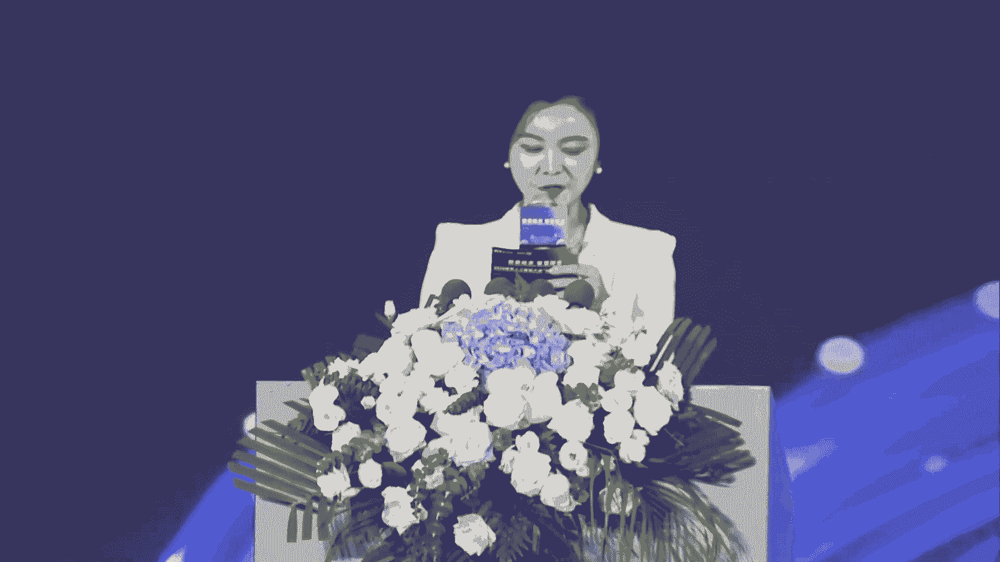
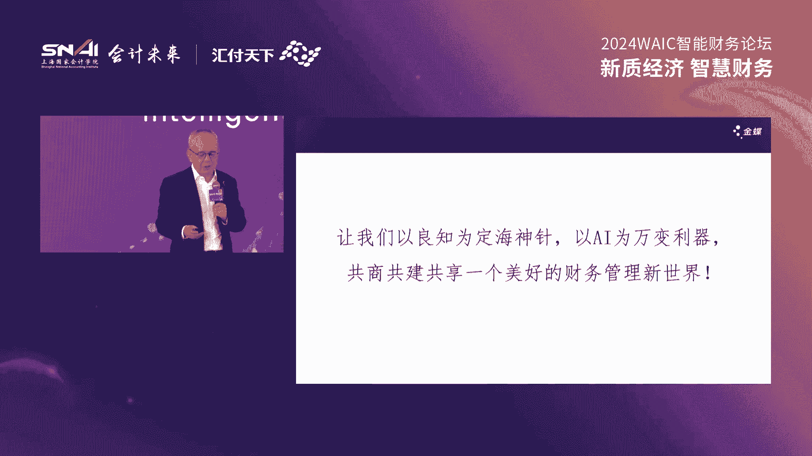
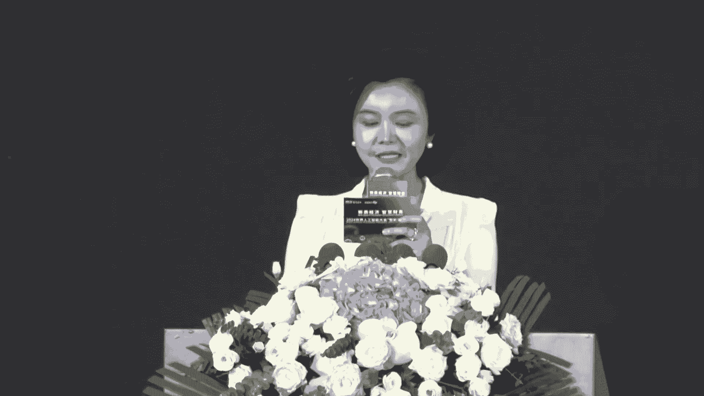

# 2024世界人工智能大会（合集） - P49：20240706-新质经济 智慧财务 - WarrenHua - BV1iT421k7Bv

智能财务论坛还有2分钟就要开始了，请已经到达会场的各位嘉宾尽快落座，并将您的手机调制成静音或者是震动模式，感谢各位的配合，谢谢。😊，🎼尊敬的各位领导，各位嘉宾、专家、学者以及媒体朋友们，大家下午好。😊。

欢迎大家莅临2024世界人工智能大会智能财务论坛。😊，我是主持人嘉艺，欢迎大家。😊，近年来呢，随着人工智能、机器学习、大数据分析等技术的快速发展，以及在财会领域的成功试水。

为智能财务的发展开创了一个崭新的领域。相关技术能力的构建，也早已成为影响财会领域发展的最重要的指标。那么在这样的一个大趋势之下，本次论坛以新智经济智慧财务为主题。

由上海国家会计学院汇福天下有限公司联合主办，中信银行股份有限公司、上海分行、金蝶软件中国有限公司作为战略合作单位。新华社中国金融信息中心作为特别支持单位，上海国家会计学院智能财务研究院作为学术支持单位。

并广邀证界学界产业界人士齐聚一堂，从不同的视角碰撞出思想的火花，探寻财务数字化转型的创新发展路径，洞悉行业。😊，新生态。那么在我们的论坛正式开始之前呢。

首先请允许我为大家介绍一下出席今天活动的各位领导和嘉宾，他们是。😊，🎼财政部会计司副司长王东。🎼财政部会计司制度三处处长杨海峰。🎼上海市经信委软件与信息处处长裘薇。

🎼中国科学院院士、复旦大学光电研究院院长楚军浩。🎼ACCCA侦策与洞察总监mikefield。🎼上海国家会计学院院长、党委副书记、亚太财经与发展学院院长卢文斌。

🎼上海国家会计学院党委委员、纪委书记包肖文。🎼上海国家会计学院智能财务研究院院长、教授、博士生导师刘琴。🎼汇福天下董事长、兼CEO交大高京课聘教授、上海国家会计学院兼职教授周烨。

🎼金蝶集团董事会主席兼CEO财政部全国会计信息化、标准化技术委员会委员徐少春。🎼中信银行上海分行党委书记、行长赵元兴。🎼新华社中国金融信息中心党委委员、总裁张凤鸣。🎼贵妇天下执行董事兼总裁穆海杰。

🎼中国石油化工集团有限公司党组成员、总会计师、中国会计学会副会长张绍峰。🎼中国医药集团有限公司总会计师、中国医药会计学会会长杨山华。🎼中国东方航空股份有限公司财会部副总经理李晓宇。

🎼中国化学工程集团公司财务资金部副部长、中化学交通建设集团公司董事、财务总监宋志鹏。🎼上海市第一人民医院总会计师、财政部全国会计信息化标准化技术委员会咨询专家周建军。

🎼九级软件股份有限公司董事、高级副总裁、财政部全国会计信息化标准化技术委员会咨询专家曾超。🎼惠普天下执行董事兼首席财务官、财政部全国会计信息化、标准化技术委员会咨询专家金源。

🎼以及升能集团、上海机场集团、浪潮集团又有网络、复兴集团、易赛奇、本来生活等知名企事业单位和各级政府领导。🎼同时呢现场还有来自智能财务领域的各位专家学者、业界领袖，以及我们的媒体伙伴们。😊。

🎼对大家在百忙之中参加我们今天的论坛，表示衷心的感谢和热烈的欢迎。😊，下面我宣布新智经济智慧财务2024世界人工智能大会智能财务论坛正式开始。针对企业、财务数字化的发展。

国务院、国资委和财政部密集出台了多份文件，彰显了国家对于利用数字技术实现企业高质量转型发展的高度重视。那今天呢我们也有幸邀请到了国家财政部会计司副司长王东先生。那接下来呢就有请王司长为大会致辞，有请。

尊敬的各位领导、各位嘉宾、女士们、先生们，大家下午好。很高兴参加由世界人工智能大会组委会指导。上海国家会计学院和汇富天下有限公司主办的新智经济智慧财务2024年世界人工智能大会智能财务论坛。在此。

我仅代表财政部会计司对本届论坛的召开表示祝贺，对各位领导、各位专家、学者和会计工作者的到来表示诚挚的欢迎和衷心的感谢。6月20日，习近平主席在向2024世界智能产业博览会所致的贺信中指出。

人工智能是新一轮科技革命和产业变革的重要驱动力量，将对全球经济社会发展和人类文明进步产生深远的影响。中国高度重视人工智能发展，积极推动互联网、大数据、人工智能和实体经济深度融合，培育壮大智能产业。

加快发展新智生产力，为高质量发展提供新动能。当前，新一代信息技术和人工智能在我国企事业单位的会计核算、财务报告、管理会计、内部控制等各项会计工作中得到了广泛的应用。会计工作逐步向数字化、智能化迈进。

今天召开的2024年世界人工智能大会智能财务论坛，以新智经济、智慧财务为主题进行交流讨论。对于促进人工智能技术与会计工作相互融合，推动会计职能对内对外扩展，提升我国会计信息化水平有着十分重要的意义。

财政部始终高度重视会计信息化工作以及智能财务的发展。近年来，按照党中央国务院的决策部署，财政部立足中国国情坚持问题导向，加强对我国会计信息化工作的顶层设计。2021年11月。

财政部印发会计改革与发展十四五规划纲要，提出以数字化技术为支撑，推动会计工作与国家宏观经济管理工作单位经营管理活动深度融合。会计信息化发展规划2021至2025年提出了以技术和管理创新为动力。

鼓励社会各方在符合相关法律法规和制度的前提下，利用新一代信息技术，开展各种会计信息化应用探索，促进会计信息化工作创新发展的基本原则。今年6月28日。

第十四届全国人大常委会第十次会议通过了全国人民代表大会常务委员会关于修改中华人民共和国会计法的决定。新修改的会计法专门增加一条，即国家加强会计信息化建设。鼓励依法采用现代信息技术开展会计工作。

具体办法由国务院财政部门会同相关部门制定。应该说这是会计法的修订，为我们更好的推动会计信息化和智能财务工作提供了坚实的法律保障。人工智能与会计工作的深度融合，是贯彻落实新会计法。

加快建设国家信息化发展体系的重要举措，也是顺应经济社会数字化发展的必然要求。那么目前，财政会计司按照会计信息化发展规划。2021至2025年的目标任务，正在积极推进会计信息化标准建设。

修订完善会计信息化工作规范，加强与相关部门的统筹协调，建立健全运行高效职能明确分工清晰的会计信息化工作机制，实现政策制定与政策实施的联动协调，合力推进我国会计信息化建设。自2022年起。

财政部、国家税务总局人民银行等9部委联合组织开展了电子凭证、会计数据标准试点工作。帮助各单位打通各类电子凭证，无纸化入账报销归档最后一公里。那么在提供统一技术规范和结构化数据标准的同时。

为各单位进一步智能化利用电子凭证会计数据，实现会计工作数字化转型，奠定了良好的基础。各位领导，各位专家，感谢大家长期以来对财政部、会计师和会计信息化工作的关心和支持。希望大家携起手来。

那么以此次论坛的举办为契机，积极探索人工智能技术在会计领域的应用模式和规律，共同推动我国智能财务应用水平不断提升。为加快推进会计工作数字化转型升级提供支撑，为经济社会高质量发展赋能。最后。

预祝本届论坛圆满成功，谢谢大家。好的，感谢王司长的精彩致辞。接下来有请上海市经济和信息化委员会软件和信息服务业处处长裘薇女士致辞，有请裘女士。😊，🎼，各位嘉宾、女士们、先生们，大家下午好。

很高兴能够来这里参加由上海国家会计学院和惠福天下联合举办的2024年世界人工智能大会的智慧呃智能财务的论坛。在此，我仅代表市经信委对本次论坛的召开表示热烈的祝贺。

也向社会各界呃人士长期以来对市经信委工作的关心和支持表示感谢。人工智能是当前全球最受关注的新兴技术。😊，这两年来，以深城式人工智能为代表的新一代人工智能技术正在加速的创新发展，进入了成果的爆发期。

不断催生出新的应用场景和新的业态和新的模式、新的市场展现出了广泛的一个应用前景，正如习总书记在2018年的首届在上海举办的世界人工智能大会指出的新一代的人工智能正在为经济社会带来深刻的一个变化。

在深刻的改变人们的生产生活的这个方式。市经信委正在积极推动互联网大数据人工智能、元宇宙和实体经济的深度融合。今年总嗯重点要打好6个攻坚战，一是围绕产业结构的现代化，打好稳增长、促投资的攻坚战。

二是围绕产业链的高端化，打好新旧动能转换的一个攻坚战。三是围绕发展主体的多元化，打好世界一流企业培育的攻坚战。四是围绕产业基础的高级化，打好科技产业新高地的攻坚战。五是围绕速率。转型的融合化。

打好产业赋能升级的攻坚战。六是围绕产业布局的集群化，打好要素生态的打造的一个攻坚战，以此来加快发展新智生产力，为高质量的发展提供新的动能。智能财务性是心智基础的高关键要素，是财务领域的未来发展方向。

也是企业数字化转型的必由之路。智能财务的实现，不仅可以提高财务管理和服务的效率和质量，更可以为企业的决策，提供更加科学和精准的支持，推动企业的数字化转型和智能化的升级。

智能财务的发展需要各个领域的技术的创新和应用，需要各个行业的协同和发展。需要各个行业的参与和推动，很高兴上海国家会计学院和惠普天下能共同举办此次财务论坛，以心智技术、智慧智智能财务为主题。

聚焦当下的热点，谋划未来的发展，邀请了证界学术界和产业界等全球资深的专家和知名的人士，来共同研讨人工智能的技术在财务领域的前沿理论和实践的发展，共同探索智能财务创新发展的新路径。

形成了产学证研等5A1体的一个联动发展的格局。成众人之志财无呃则不呃则无不论也，用众人之力则无不胜也。相信此次论坛的脑力激荡，定能形成惠及行业发展的智慧的成果。生态联盟的签约。

定能形成协同联动的生态的合力，共同推动上海城市数字化转型和产业的高质量发展。最后，预祝本次论坛能够取得圆满的成功，也祝各位呃来自全国以及全球的各位人士在上海能够生活愉快。谢谢大家。好的。

感谢裘处长的精彩致辞。下面有请论坛主办方、上海国家会计学院院长、党委副书记卢文斌先生致辞，有请。😊，尊敬的各位领导、各位嘉宾、女士们、先生们，大家下午好。很高兴与大家齐聚一堂。

共同参加以性质经济智慧财务为主题的2024年世界人工智能大会智能财务主题论坛。首先，我仅代表上海国家会计学院对各位嘉宾的到来表示热烈的欢迎和衷心的感谢。😊，当前，我国正处于高质量发展的关键阶段。

发展新质生产力是推动高质量发展的内在要求和重要的着力点。习近平总书记指出，要整合科技创新资源。引领发展战略性的新兴产业和未来的产业，加快形成新质生产力。新智生产力的核心在于创新。今年来。

随着大数据、人工智能、移动互联网等技术的快速发展，我们见证了这些科技创新科技在财务领域的广泛应用和深刻的变革。而以大语言模型为代表的新一代人工智能技术，进一步的打开了人们对于财务管理变革的想象空间。

财务管理成为企业管理的核心环节，正在经历一场前所未有的智能化和数字化的转型。在经济快速发展的过程中，其关键的基础性的作用愈发凸显。这不仅是技术进步的结果，更是时代发展的必然趋势。在此背景下。

在财政部的会计师的大力支持下，在总结了2023年成功举办经验的基础上，上海国家会计学院联合汇普天下有限公司。中信银行股份有限公司上海分行金蝶软件有限公司作为合作伙伴，并由智能财务研究院作为学术支持。

再次举办本次论坛论坛旨在为行业专家、学者和会计从业人员提供一个高端交流的平台，共同探讨智能财务的前沿理论和创新的实践，分享最新的研究成果和成功的经验，共同推动智能财务的创新发展。

我们期待将世界人工智能大会智能财务论坛打造成为一个高规格的行业的盛会，助力我国会计信息化和智能财务的高质量发展。作为国家级的财经人才的培养基地。

上海国家会计学院一直致力于高层次、国际化和应用性人才的培养，不断推动财务管理领域的学术研究和实践创新。在会计信息化和智能财务领域。

上海国家会计学院在理念创新队伍建设平台搭建、教学研究和社会服务等方面已开展了一系列的工作，并形成了一定的经验和成果，多年来学院面向财务中高层管理人员开设了智能财务的系列课程。每年覆盖人员数以万计。

强于力力推动了我国广大企业的数字化进程。本次能党的学术和智力的知识，依托的学院智能财务研究院成立于2008年，是报财政部、国家会计学院董事会办公室筹备的学院三大重点智库的项目之一。

研究院已初步搭建了智能财务领域的政产学院的教育平台，有着较为丰富的研究成果和品牌的论坛，并已形成了一定的影响力。未来，我们上海国家会计学院将继续强化国家会计学院的职能定位。

认真贯彻落实财政部会计信息化发展的规划，继续发挥自身的优势，主动作为、勇于担当，进一步的深入开展智能财务的理论研究和应用的探索。女士们先生们，新智经济时新智经济时时代。

智能财务的变革与创新将不仅是技术的进步，更是理念的转变和时践的飞跃。我们将以开放的心态迎接挑战，以创新的精神推动发展，以合作的方式共建行业的生态。只有这样。

我们才能够在快速变化的时代中始终处于创新和发展的前列。未来，我们将继续的邀请国内外学术界和实物界的专家学者汇聚更多的智慧，形成财会行业共建合力，共同推动智能财务的应用和创新和应用。

为推动会计数字化转型升级做出积极的贡献。各位领导，各位专家感谢大家长期以来对上海国家会计学院和会计信息化工作的关心和支持。再次感谢各位嘉宾的到来，感谢各界朋友的积极参与，希望大家在本次论坛中。有所收获。

最后，预祝本次论坛取得圆满成功，谢谢大家。好的，谢谢罗院长的精彩致辞。我们也期待上海国家会计学院可以继续为我国财务智能化行业领域培养更多优秀的人才，推动行业的发展。

接下来有请中信集团协同委员会、上海区域分会副会长、中信银行上海分行党委委员、行长助理单振林先生致辞，有请单行长。😊。

尊敬的各位领导，各位嘉宾，大家下午好。非常荣幸沦为于各位在这美好的下午，相聚在黄浦江畔，参加由上海国家会计学院和惠普天下主办的新智经济智慧财务为主题的2024世界人工智能大会智能财务的主题论坛。

我仅代表中信集团中信银行上海分行向莅临本次盛会的各位领导、专家和业界同仁质宜居最热烈的欢迎和最诚挚的感谢。中信集团是邓小平同志支持下，由龙一伦老先生于1979年创办的综合性集团。自成立以来。

中信集团在经济改革和对外开放方面扮演了重要的角色，通过吸引和运用外资引进先进技术、设备和管理经验，为中国的改革开放和现代化服务。现代化服务建设了做出了巨大的努力。集团业务涵盖多个领域。

包括综合金融、先进制造、先进材料、新消费和新型城镇化五大板块。作为集团金融板块的核心中信银行上海分行成立于1988年，是最早进驻上海的股份制银行，成立36年以来，分行主动融入上海经济社会的发展。

参与建设了一批重点的项目，秉承服务以客户为准的经营理念，以优质的产品和高效的服务，致力于为各类企业伙伴提供多元化的金融服务，支持在沪企业成长壮大。开幕式首日中信集团以智慧中信共创新可人为主题。

连续第三年参会，并承办了投融资主题论坛。实际上，中信银行。在智能科技方面也做出了不少的努力，包括以下几个方面。第一。

AI加BI双人驱动中信银行致力于构建以人工智能AI和商业智能BI为核心的技术生态通过自主研发的人工智能平台中信大脑。我行以于多个业务场景中实现了人工智能服务。第二，技术创新和应用。

中信银行通过AI技术生态体系已经落地超过1000个应用场景。这些技术的应用不仅提高了业务效率，还提升了客户体验。第三，数字化装备2023年中信银行自研打造了自术平台。

这是一个集合了全行数百个系统数据分析能力的数据化工具平台，旨在提升企业级的数据分析能力。第四，数字能财富顾问，中信银行亮相本届世界人工智能大会的数字。个人财务顾问展现了II加金融的创新应用。

为客户提供了新的理财服务渠道。第五，私库建设。我行推出的天元私库系统是业界首个自主研发的私库管理系统。该系统根据国资委的要求设计，包含了12个中心70个模块，875个功能点。

实现了财务管理和数字化和智能化，提升了资产负债票据等财资数据的管理效率。第六，智能化的业务解析和数字化自控中信银行创建了II智能业务解析和数字化自控5月天，通过五大平台实现全方位的智控生态。

提升了测试分析设计自动化的能力。中信银行正在以其智能财务领域前瞻性和创新能力与恢复天下这样的战略伙伴，不断推动中国金融服务的智能化和数字化发展。今天我们汇聚一堂共同探讨智能财务的前沿话题，分享创新理念。

展望行业未来。这是一个思想的碰撞，智慧交融的盛会，也是展示创新成果，激发灵感的平台。在此，我预祝本届论坛取得圆满成功，希望各位嘉宾能够收获满满，不需此行，让我们携手并进，共创财务、智能财务美好未来。

最后再次欢迎各各位领导，各位嘉宾莅临上海，祝大家下安，谢谢。好的，感谢单行长的精彩致辞，也再次感谢各位领导对我们智能财务论坛给予的关心和大力支持。那么精彩的致辞环节之后呢。

马上进入到本次论坛的主旨发言环节。首先让我们掌声有请中国科学院院士、复旦大学光电研究院院长楚军浩院士，为我们带来主旨分享，有请楚院士。😊，🎼呃，尊敬的各位领导呃。

非常荣幸参加这样一个重要的非常有意义的会议。那么我发言的题目呢是智能时代与管理科学。呃，主要呢是三个方面的呃问题。第一呢是智能时代的大趋势是什么？第二呢是信息的获取与认知。第三呢是人工智能与管理。

那么第一，智能时代大趋势。那么我们知道第一次工业革命是机械化，那主要在是蒸汽机。那么第二次工业革命呢，主要就是电气化，那主要就是发电气这个电动器啊。那么这两次工业革命呢有点不一样。

第一次工业革命先从技术出来。再到科学，再到技术。不断的循环。第二次工业革命呢是完全从实验室出来的那就是什么法拉提电测感应定律。这个电磁学的一些规律的方面发现。然后的技术提升就有了电动器发展期了。

但是共同的一点呢就是科学与技术交叉推动。那么第三次工业革命。上面这些都是科学。原子物理量次都亏学。下面这些都是技术。微电子技术、电子技术原也是科学与技术交叉水准。所以我们现在的所有的信息技术。

硬件基础老祖宗是量智力学。因为有那样磁力学。所以有固去能带理论。所有半导体技术，二极管、三极管集成电路。所以我们看设计辐射 maxax方程相边去出手效应都是科学。别人所写的字都是技术交叉推动这些特身。

那么这张照片很有名，里面好多科学家、爱因斯坦啊、迪拉克、居里夫人都在这个里面，这个不在讨论科学界的发展。那么如果说我们要第四次工业革命。那么用什么话来描写，那就自然化。

那我们现在处在信息化是代高速发展的时期。正在迈向智能时代。那么智能时代呢，它的特点就是智慧融入到一个物理设系系统里面去。或者说呢人工智能融入到物理世界。各种产业。包括管理科学。

包括我们现在所有的实体的一些经济产业，也包括我们的管理、科学、城市治理各方面都包括是吧？那么在这一段时期里面，也就是我们重现了信息化的时期，向智能化时代发展。这段时间里边呢新的东西出来会特别快。

所以我们要非常的敏感来应对这些新事物的出现。那么比如最近。呃，我记得今年3月份我在复站做过报告。报告呢，当时我想呢今年是龙年龙腾虎跃嘛，那么我想龙腾来修饰创新能力，能不能修饰？我吃不准。

我就问这个大模型了，科大讯飞，他说很好。复旦大学有个模式，大中新，他说也很好，你用农村来修饰创新能力非常好啊，新思物的出现也许是非常快的事情。那么最近又出了一个说扰。这个一段文字。这个可以变成一个图画。

这个文字是什么呢？有个教堂里面有猫，到处都有猫。那么一个人呢走进来，在猫王面前呢鞠躬。默默的走下来这么一段文字，那马上就变成了一个变成了一个。一个视频了。所以最近他们说美国有一个科幻的电影。

那就是根据一段科幻的文字的描写。最有出来一个一个电影。所以这个现在这个发展呢这个非常快。这个新事物的出现，人工智能引起的各种技术上的创新非常快的出现。刚刚那个呢是。呃，文字变成图画，反过来行不行？

我一个图像能不能变文字？也可以的。复旦大学模式他们这个组就做了这么一件事情。这个把图像变成文字。那么这个对盲人学很有用处。这个盲人啊眼睛看不见，但耳朵听得见，他只要拿一个图像，这个设备仪。

他就说看到什么看到什么，然后他耳朵里面就会告诉你什么事情，什么事情，什么事情啊。那么最近这个掐子4O功能更强大，反应速度更快啊。🎼那么人形机器人现在也过去从未见过的东西，请记住这个名字，10年后回头看。

他也许就是第一个危矩生命。就在刚刚他来到了这个世界园，现在咱们来一起感受一下。哎 figureig one， what do you see right now？😊。

I see a red apple on a plate in the center of the table。

 a drying rack with cups and a plate and you standing nearby with your hand on the table Great。

 can I have something to eat？Sure thing。Yeah。Great。

Can you explain why you did what you just did while you pick up this trash？On it。

 so I gave you the apple。Because it's the only edible item I could provide you with from the table。

Great， so based on the scene right now， where do you think the dishes in front of you go next？

The dishes on the table like that plate and cup are likely to go into the drying rack next。Great。

 can you put them in？🎼这个功能很强大啊，那么最近脑机疾渴终于接到人脑了，到底意味着什么会带来什么样的影响？我写的1条预测，一条比一条炸，尤其是最后一条。第一，医疗能力爆炸。

脑机接口技术可以被用于精准的调节大脑化学物质，治疗抑郁症、焦虑症等心理疾病，甚至在更高级别上控制和优化人类的情感。第二，超感官体验到爆发。人类的感官和认知能力可以得到增强。

例如可以直接从大脑接收和传递信息，提高记忆力。这个发展很快。那么所有的这些里边呢，就是智能时代一定有好多智能化系统。那么智能化系统，你看我们有上图那个。那个守球门的那个球人就是一个智能化的系统。

他看得见球，相当于与五官。第二个，他能够分析这个球怎么过来，相当于大脑会分析。第三个，具体采取措施，把自动反应把它去把它拨住。所以，动态感知、智慧识别自动反应是智能化系统的三大支柱。

这个智能化的系统既包括手球门员，也包括一个物理的系统，也包括一个管理的系统。所以我们现在智能是代技术态势。

智能化分布式能源系统、智能化复杂体系、智能化制造体系、智能化诊断、智能化空间技术、脑机接口等等等等。这些都是我们智能时代的技术趋势。

那么其中绿颜色的是信息能源、制造材料、空间、健康也是未来产业的六大未来产业啊，所以我们智能化的系统呢，就是主要就是用于会发展人工智能技术。

包括工业机器人、服务机器人、下棋机器人、手索机器人、聊天机器人、人形机器人。包括我们的智慧地球智慧城市的建设。智慧的空天海地，智慧能源环境、智慧城市、智慧管理、智慧金融。第二个部分说一下信息或决认知。

因为在所有的智能化系统里面，两个特性技术，一个是实施感知技术。😡，跟相对我们的无官。对于一个金融体系里面也是有好多参数。要能够感知。所以，实时感知是一个核心技术。第二个是智慧分析系术，是个非常新的技术。

那么这两个技术呢，其实从我们这个物理学的信息科学局来说呢，那就是一个传感器。我们物室不同运种形态是可以转化的，光深的电子生活过程都会互相转化。那么1906年A时光电效应。他就是这个光。打到荆属上面去。

如果这个光的频率超过一定的阈测。经锁上的电子就会被打出来，电流就出来了。那么根据这样一个原理呢。实际上是物质运动形态相互转化，是。传感器的一个技术。

那么我们平时传感器有很多马桶盖、酒精测试电池温度计对吧？川明西公所不在。家庭里面相机、手机、游戏机壁都有传感器，它是获取自然信息。那么传感器有各种各样传感器。光电磁热声机械也有化学传感器啊。

那么比如说光电传感器来说，我们知道光是无线的电磁波，波长呢无线电波、微波毫米波、T二之光、红外光、红绳、黄绿、金蓝紫、紫外X射线钢板射就波长不一样。那么这一些呢，它估都可以通过我们一个器件把它变成一个。

太阳能电池、红外传射器等等。比如这就是一个红外传射器真的像啊。那么呃，这个人是谁啊？这个人就是我。如果说把这个灯全部关掉，在手机上面加上一个东西。接是红外线，那就可以拍照了，即使没有灯光还能够发生。

为什么到底我们能发射出红外光出来，我们能37度，绝对温度就300度。发射出来的无线电波电磁波呢，它的波长大概10个微米左右。😡，用红外传感器那就可以接收了啊。那么当然它里面有个器节，有科学的道理。

光热型的、光子型的对吧？那么红外传感器它就有三大功能，一个是图像可以分析。一个是录像的数据可以分解，普相的数据可以分解，在夜里可以看清拍照片。是吧你看这个照片对，而且呢不同波段的这个红外。😡。

他看他的照片不一样的。😡，我们同样一个人，凯建光的最照片是最左面的。短波红外、中波红外、长波红外都是不一样的啊。那么而且我们看这个苹果。这个苹果可见光拍照，很好一个苹果用红外相机来拍照。

一看这个苹果是坏的啊，那么下面这个苹果是真的一个苹果是我买的。买来外面看看很好，把它切开了一看是坏了。当然我买苹果的时候，那没有带相机了。如果我带个红外的香机，一看到当然可以看得出来，这个是坏的啊。

那么再看我们这个这个硅片，把后面的字遮住了。SEN后面字看不出来了。但是短波红红外相距来拍照SENSORS又看得出来了啊，再看这个人。夫子并鉴。但是用红外相机来看。这个胡持本节都是假的啊。

那么这个不能左面那个人，你看他要出这个可见光照片南张报纸。但是第二次来摆到拍照，这个报纸里面有把刀。这个一定是恐怖分子对吧？所以这个也是全见光照片。是左面那个人用太儿制图像来拍照，是这样一个人。

所以美国好多地方都有一些设备啊。他最常，但看你身上有没有带不可以带的东西。那么我们中国比如说乘高铁。你虹桥火车站乘高铁上务坐走进去的时候呢，也有一个这样的检测的系统。那么你走进去。

他就知道你身上有没有带不可以带的东西。那么有一次我走进去呢，我想试试看他灵不灵。我就拿了个保温杯就放在我的那个。呃，放在保温杯放在这个中间那个地方，就放在一衣服的这里。我想看看他能够看出来吧。

那么走进去一看呢，上面能够看得出来，对吧？那么这个呢是胎儿直播有个好处呢，对人体没影响。X光也可以说这个事，但是对人体有影响对吧？所以现在这种红外技术普遍在应用，比如风云卫星已经有21颗放了。

气象报告很准。就是不同的波段来看天上的风云，白天看，晚上也可以干。15分钟就对地球。可以扫描一次。对，大区可以做CT。XYZ，它的温度湿度。都可以出来，所以气象报告很准。所以现在气象报告的存。

就是因为我们有红外传射器获取数据啊，有红外传感器获取数据。这次俄乌战争。这个上面无人机上面放了好多这个非智能的红外传射器，啊，那么就可以这个发现目标。然后呢，这个。GPS分析，这是个视频，现在不重。

这个视频不录。哦。那么他就可以分析，然后呢就知导对吧？呃，这是一个。这个视频也不重。呃，这是个视频是这个导弹预警，就是导弹出来了以后，这个发现目标。在分析。然后呢，再用个早餐把它打掉啊，早餐预警。

那么这是一个所这一个功能就是看得见。第二个功能呢就是热像，看到温度分布是吧？你看这个人。这个是个视频。啊，也不懂。这个是个人。这个温度你看它的温度分布去可以。所以这个温度分布呢，它是是看到你身上假牙齿。

温度不一样，都可以剥璃你看它的温度跟这个不一样，所以看出来也是不一样。And你。那个后台那个下面点一点。后台上面点一点会动啊。哎，这个地方点一点。好像你计算机里面有双MP4啊。啊。

那么它温度分布可以看得出来。这个温度分布看看得出来呢，这个具有很好的用处，火灾对吧？这个是。🎼巴黎圣母院使用这个他着火，前几年要不是消防人员，那么中国的大疆无人机可能会严重就飞上去了。而在灭火过程中。

立下大功路无人机是中国企业生产的。他们是中国大疆公司生产的两款民用无人机都配备了摄像仪，用来追踪火势的蔓延情况，并追溯可能的火源位置。法媒指出，无人机拍摄的影像被用来决定消防水带的最有效放置方式。

空中的有力视角指导了灭火策略。巴黎消防队发言人称赞说，无人机使教堂的钟楼得以幸免。巴黎消防员创造性的使用无人机的同时，也不忘表达对中国无人机的感谢，为损失而难过，同时也为无人机挽回的一些损失而欣慰。

他是看这个温度分布，可以看到。第三次慧风险。我们不同的这个物体啊，它的光谱都是不一样的。就像我们指纹。每个人的指纹都不一样，每个人的脸相也是不一样的。所以我们可以人脸识别、指纹识变。

那么用这个光谱设别呢，也是可以进行识别啊，那么你看我们先做数据库。相当于做指纹人脸识别，把数据库做好，做好以后呢就可以分析了。比如这个水稻田。他没有才多少斤。

无人机飞光谱拿过来一采接就分析它的光谱是多少对吧？那么现在这样的事情呢，我们在月亮上也在做，月亮上面有月球车放在月亮的正面。也放在月亮的背面。常娥4号来采集月亮表面的光谱来分析。他是什么成分？

所以这个里面虽然这件事情在火星上也在做。😡，这个我们中国科学院上海汽车物理研究所做的火星车，现在就放在火星上面。收一些火星表面的光谱来分析火星表面是什么成分。所以我们数字光电呢就得道大数据。得到大数据。

信息获取，得到大数据以后呢，要分析这个里面到底说明一件什么问题。所以刚才讲的事情呢是信息科学里面是的事情。但实际上面，他对管理科学也同样是适用的，这样一个思想是适应的。所以我们收集信息。来分析信息。

通过这个大数据进行分析，就可以构建智慧城市，发展数字经济，实现智慧管理。所以我们这个里面实际上就是这样，首先会员获取信息发现情况。然后的大脑智慧分析情况，最后说出判断，调整采取措施。

所以刚才举的一些物理学的例子，信息科学上的例子，对管理科学对我们财务科学同样是都是可以采用这样一种思想，是吧？这个这个比如说那个我们如果说这个发生了这种现象，如果现有传感器。能够收集他的信息。

那么在这个楼参掉以前，我们已经分析出他的问题了，那提早就再去做事。啊我们能够构建系统。那个比如我们这个现在好多桥都放了这种传感器。啊。那么当在这个时候呢都是个理上关系。对我们管理系统里面来说。

我们放什么传感器进去？😡，我们去侦查什么信息，而对于你整个架构会起到什么样的影响，这是一个要研究的问题。在物理学方面比较简单，得到它的电磁波来进行风析。

但社会科学、管理科学、财务科学里面到底哪些因素是牵动一发而牵动全身的这个事情呢是一个很值得研究的课题。然后你来探测这个一个关键的点来判断整个形式方面的发展的趋势？好，第三，水下人工智能与管理。

人工智能呢现在发展很快，对吧？现在家庭服务机器人路上加上掐着GPT。那么他就可以，我想老人社会将来都会发展这个每一个机器人，又能做事，又能来讲话，对吧？机械这个医疗机器人。

现在部分的在医院里面都是做动手做教育机器人。将来回答问题都可以叫这个教育机器人来回答。智慧交通。智慧的这个公共安全防屋都可以由好多人工智能来运来运用，已经取得很大的成就啊。那么人工智能影响娱乐设计训练。

源宇宙游戏啊，那么这个里面也可以涉及到里面啊。那么智能时代下面人形机器人呢里面总的来说也就是一个是环境感知模块啊，一个是智能芯片模块风险，然后操作系统模块，运动控制模块啊。

那么这个是人形机器人的一个架构对吧？那么当然最后我们是说人形机器人救火啊，那么发现火苗又可以通过烟雾发现人这种危险的场合下面叫这个人形机器人，他就消防人可以来做这个事。所以总的来说这里面还是要有感官。

要能够识别。要能够大脑，要能够分析，要有四肢采取行动，对吧？所以将来感知分析行动融合集成与人性机器人，那么将来可以做好多事情。当然这个里面也要一步一步来做这个程序化人形机器人从单一的功能扩展到多功能。

智能化的人形机器人，从单一的智能发展到做智能。尤其是要发展场景牵引的动作，与对话相结合的自动化人群机器人。

比如家务机器人、教育机器人、财务处理机器人、同声翻译机器人、消防员、交通警、士兵、值班员、驾驶员。少数工、乒乓球教练等等等等合作。所以现在这些呢他会逐步逐步来替代，帮助人类的一些工作。

比如现在这重生翻译，好多都可以用人工智能来做，对吧？中文出来马上外语就出来了，对吧？那么我们这个财务助理机器人，财务方面现在也用到了好多这方面的技术对吧？那么最近我也想问一下，问一下是个大模型。

我说这个人工智能对管理科学的影响是什么？这是kimy是个大模型。呃，他一说就说人工智能对管理科学的影响是多方面的。他提出了五个方面的影响啊。比如进行范式的转变，企业管理的转变。这个应对的挑战。

管理范式的变革等等等等等等。所以这个模型还是非常好，就是可以。就是提供一些参考。不一定他是完全你按照他办，但是要利用这样一些工具。来给你提供一些助手的作用，对吧？那么这个是一个可以发展的一个方面。

那么所以现在这个人工智能呢通过这个模拟人类的思考反应做出反应。那么这个里面有好多图像识别、语言识别、自然语言处理，人工机器人，比如图像识别。然后它是根据一个人的过里面的那个角度。

这个它里面有好多进行识别的因素进行这样是。那么管理工作。啊，利用人工智能可储织的各性化活动。跟资源进行有效规划组织，对吧？这个都可以发挥很大的作用啊吧。那么另另外呢就是可以高效的管理海量的数据。

挖掘有效信息，获得更多的价值。这个是好多例子。尤其它是对海量数据。这个海量数据用人工智能来找出有效的信息，来找出它的一些规律。找出他的互相的异存关系。我们物理学有的时候是发现规律。

是要制造它里面的科学的原因是什么？大数据里面给出的规律，有些是数量规律，找到一些量跟一些量之间的异存关系，它一直这么出现的啊，那么这个也就要通过人工智能来发现。来这个来进行帮助我们人来做这个事情啊。

另外就是可以避免工作失误，因为它比较严格嘛，对吧它管理平台里面各种设别、票据的设备等等等等。它可以这个更加这个有效啊。那么另外它可以提高我们的管理工作的效率，优化资源预算，避免资源的浪费。

那么这个它也是很有效的。因为它可以根据你的要求，找到最佳的组合跟搭配。那么另外采取复杂工作。是吧创新数比较低啊吧，但是重复的。这个他可以用人工智能来完成。啊，好多事情让人工智能来解决一些繁重的。

创新成诺书不但要动脑筋的那就是按部就班的。那么这些工作都可以要人工智能来完成。我想在财务管理里面有好多这方面的这样的工作，对吧？所以这个里面呢就是另外就是人工智能可以通过大数据的风险。各种潜在的风险。

提供预警，增加弹性，并为学生服务。所以这个里面也就是要收集出。潜在风险风险的，它将来会体现在哪些因素上面，要找到这些这个敏感的参数。啊，那么这个比我们自然科学里面方便的多，都要困难的多。

我们自然科学里面参数，那就是光的光生的电池比较简单，而管理科学财富科学里面的各种参数。互相之间的关系更加复杂，但是也是有规律的。那么这些规律的发现，靠我们人去发现，有的时候会比较麻烦，会疏忽掉。

那么用人工智能来发现呢，它就比较稳稳比较这个最近我们在那个医院里面做一件事情，这个病理科医生。他一般观测是用显微镜，看看病理这面。那么有的时候一些情况就会漏掉。因为如果这个医生他累了，他有些没发现啊。

但是用人工智能用到这个病理前面的分析上面，他就非常可靠，不会漏掉一些信息。所以这个呢我想在这个上面也会有很大的作用。所以我也又进一步问了一个问题。我问问ki米，我是人工智能对财务管理的影响。

你们回去可以问问看。啊，他出了四个问题，一个数据分析与预测自动化流程风险管理。效率跟准确性的提升，决策质量的改善。技术应用的经济效益，财务职能的重塑，财务流程的智能化。审计服务的变革，技能和文化的转变。

参考参考啊，因为我也不懂财务，但是人工智能的这种智能时代的那个思想。就是实施改知。大脑分析采取措施，这个思想是共同的，不管是自然科学、技术科学还是管理科学都是共同的。另外我们去智慧城市。

智慧城市是现在我们要做的事情，它里面包含了好多方面，包括智慧的、医疗、智慧的政务、智慧的、交通、智慧的社区、智慧的教育、智慧的金楼、智慧生活、远程办公。智慧的金融，智慧的财务。

他的核心的思想就是你能够感知一些情况。然后能够来分析一些情况，最后做出判断。所以这个智慧的。健康的智慧管理有好多这样的例子，对吧？那么最后呢呃鉴于智能时代正在向我们走来。科技创新促进人工智能发展。

人工智能融入实体世界，影响管理科学。所以我们要发展人工智能，迎接智能时代，谢谢大家。谢谢谢谢楚院士，通过详实的资料和丰富的案例为我们带来了一场生动的一个分享哈。

也让我们在这个人工智能的大的发展的背景之下，对我们未来的生活充满了期待和向往。再次感谢楚院士，谢谢。😊，那接下来进行分享的这位嘉宾呢是来自ACCA的政策与洞察总监mikesfield。

请他为我们做主旨分享，有请。😊，Good afternoon， ladies and gentlemen， first of all， I'd like to say it's。

Absolutely fantastic to be here today in person with you all at the World Artificial Intelligence Conference。

My name is Mike Sfield， I'm the Director of Policy and Insights at's ACCA based in London。

I have about 20 minutes or so today， so I'm going to take the opportunity to share with you all ACCA's reflections on AI in Accountancy and how it can unlock new value opportunities for the future。

And whenever we talk about artificial intelligence。

 I think it's really important to start with a much broader context to understand the landscape of change that's happening all around us。

We know that the world is changing fast and the future is always to a degree uncertain。

 and we know that the Acancy profession needs to continue to innovate and evolve to remain relevant in the face of all of this。

I'm not going to dwell on everything you can see on the slide there， but suffice to say。

That there are a wide range of geopolitical， economic and ESG trends shaping our future environment。

And technology change is part of this story， but we do need to understand it in the context of all of the other changes taking place so that we can properly understand both the opportunities that technology change generally presents。

 as well as its limitations。And this is particularly true with artificial intelligence。

And because of that global landscape change， we also know that organisation are changing too。

They need to operate with speed with greater agility。

They need to become more sustainable for the long term。

They need to meet changing stakeholder needs and expectations and so on。And of course。

 technology change is absolutely part of the very fabric of this organisational change and transformation story。

And you won't be surprised to hear that ACCA believes that accountancy as a profession and accountants themselves must be at the heart of that change。

From helping organisations to transform and take better， faster operational decisions。

To being flagbers for wider sustainable value creation in the face of shifting stakeholder expectations。

Accountants have got a huge role to play in building sustainable organisations and sustainable economies for the future。

But a key part of that narrative， and empowering accountants and the profession to do exactly that and to deliver on that ambition is technology。

And particularly important here is the role of artificial intelligence。

So I'm going to spend the rest of my comments sharing some thoughts around AI in finance and accountancy。

 the opportunities， the challenges。As well as some thoughts on the implications for building the right skills for the future。

Which will get the best out of the opportunities that AI presents。

I'm sure everybody is familiar with discussions being had around the transformative potential of AI。

 but it's always useful to ground these discussions before we begin to think of their relevance for the future of finance。

So what you see here are the core types of AI that we are currently exploring at ACCA in a research report that we're working on right now。

They do represent different capabilities， for example。

 machine learning for forecasting and uncovering patterns within data。

Computer vision for data extraction and things like invoice processing。

Natural language processing for analying textual data and leveraging the massive amounts of data contained within emails and documents。

 for example。And then generative AI for which we are beginning to discover uses starting with client communications。

 but also in areas of reporting， interpretation， and more。

And at the core of all of these are the probabilistic pattern recognition functions。

Which can be applied to quite a wide range of tasks， things like visual perception。

 understanding language and speech， prediction， and helping solve other data related problems。

And it's also capable of performing these activities and making decisions with a certain degree of autonomy。

And these capabilities make different forms of AI， either individually or used in combination。

 really great aids alongside domain experts。And this is where I think we need to be very clear。

For us， this is all about augmentation， not just automation。

 and the potential benefits are significant。So augmenting the person by supporting on various administrative as well as repetitive tasks。

Augmenting the role that finance plays within the organisation， for example。

 by leveraging machine learning and driving better insights。

 having been freed up through the strategic use of automation。We need to be thinking。

 how do we support domain experts best to allow them to add more value？

And this implies both a top down strategy for adoption。

 but also we need to make space for safe and responsible experimentation within roles。

So where is AI being used in finance and accountancy currently？

I want to share with you a few preliminary findings from our current upcoming research。

 we have a report that we plan to launch in September of this year。Actually， first of all。

 last year we carried out research headed digital Hors and it did find that the adoption of new technologies remains limited and uneven。

So we found that between a fifth and a third of organisations had implemented or were trialling AI。

 but many hadn't。So in other words， whilst there was notable activity amongst our members when it comes to these technologies。

 it was also clear that there remains a great opportunity to expand the use of AI and machine learning to enhance activities。

In particular， we found an obvious gap between larger organisations。

 the big accountancy firms and large corporates and small and medium sized enterprises and small and medium sized practitioners。

So in our latest research， we wanted to dig in a little bit to understand what those organisations that are already on the journey to adoption。

 what they're doing， what kind of uses they are investing in。

 what kind of outcomes they anticipate achieving and how they are approaching adoption from a strategic perspective。

And this chart， I should stress is an interim result at this point。

 but it is clear that there are a wide array of different uses and actually some notable differences between the most prevalent uses globally versus those in China。

So financial planning and analysis， data analysis and supporting transactional finance tasks appear to be the most prevalent uses currently worldwide。

But it also appears as though Chinese organisations have been quicker to adopt AI as a productivity tool。

And again， globally organisations are keen to explore how AI can support them in other areas。

 such as fraud and risk， sustainability reporting and compliance。And again。

 it's interesting to note that the productivity benefits of AI seem to be more widely recognised a mon sample of Chinese organisations。

The big question facing many organisations is how to get started。

So there are ultimately for us four key elements that need to be considered。First of all。

 all AI is ultimately a data transformation。That just means that AI takes some input data。

 converts it into some output data depending on its use。

And I think we've all heard the concept of garbage in and garbage out， and that remains important。

So the first step is always to understand your current data situation。

Whether you have any additional data needs。And you should also assess whether you have the right type and quality of data for your purpose。

And of course， it's really important that you ensure that you have the appropriate infrastructure and governance to store。

 manage and oversee use of that data， and that means having the right skills。

There also needs to be a good balance between top down strategy and bottom up innovation。

 which can be encouraged with a well communicated purpose and set of values。

And leadership here is about finding ways to empower people to participate in innovation。

 not just thinking about ways to make your workforce more efficient。

We found that confidence in digital leadership is a really key trait of leading innovators。

Now AI by its very nature requires an element of flexibility and willingness to experiments。

 and it can take significant time before our model is ready for deployment， so you need patience。

 learning and openminedness to keep improving。The final products may require ongoing development。

 so it's important to build in strong feedback loops and flexibility in how projects are monitored and financed。

And lastly， it's more important than ever to be seeking and encouraging opportunities for collaboration。

And sharing knowledge and best practices across organisations。Now， as I mentioned。

 data is the beginning and the end of all of this， and it's what determines how successful we'll be。

 how effectively we use AI and how successful we are in dealing with its challenges。

So organisations in the first instance， need to be thinking about their data strategy。

 and it's important that finance plays a very strong role in establishing and developing that strategy。

As trusted sources of data within organisations， finance are well placed to identify potential pitfalls early and to identify the true value of proposed applications。

 and they will also be responsible in part for managing some of the risks and the compliance issues that arise。

So the goal should be to use AI to drive better outcomes for our organisations。

 it's thinking beyond the technical detail and providing that essential context。

 an understanding of the organisational model as well as the environment that it's operating in。

And how do we do that well to reiterate， this is through collaborating with colleagues in data centric and other business functions。

Finance needs to participate in the modelling process as we do with financial modelling to clearly define problem statements。

 features within data ready for testing and clarify any underlying assumptions。

 and this collaboration is how we can reduce uncertainty and introduce an element of interpretability when using AI insights。

And with these inputs in place， we think we're opening the door to some pretty significant outcomes for our organisations。

Underlying all of this， of course， is how we upskill people for the future。

And the focus here is on AI understandably and it presents a wide range of uses as we've discussed and will also play an important role in how many of these other technologies develop in coming years。

 and it's this interconnectedness across technologies that's so important。

 we mustn't become too narrow in our focus， we need to build on the wide awareness of technologies and their capabilities。

But we also know when we think about AI that there are some specific anxieties being expressed by individuals at the moment。

So for example， ACCA surveyed our membership last year， we got over 10，000 responses to this survey。

And actually， it found some quite distinct feelings about AI。

Whilst there was a clear sense of optimism at a high level。

 the personal perspective exhibited a bit of concern about the potential impact of AI on job roles。

And also about the ability to keep pace with requirements for upskilling。

We think these are very significant findings which we are concentrating hard on trying to address。

So there is a clear need to upskill around digital skills generally in AI more specifically。

And it's important that we're clear what we mean when we talk about， for example， AI literacy。

So when it comes to AI and talent， we need to contextualise the needs in terms of people's different roles and requirements。

 and we've had a lot of discussion at ACCA around data science skills and their importance in the accounting and finance domain。

 and that's feeding through into analyst and auditor roles。

But when we think about the skills required of accounting and finance leaders。

 it is slightly different， so it's not necessarily the technical skill set。

 but something more strategic。The critical crossover here。It's a little bit about blending skills。

 but it's more about complementing different skill sets。

And that's the logical domain and expertise required of these business leaders。 So again。

 that's kind of a snapshot of our early thinking at this point。I did want to talk a little bit。

About managing the risks of AI。As we know， AI does pose clear challenges。

We need to think about the transparency in the use of AI and the ability to understand or to explain the outputs that have been derived。

or of the biases and the errors that can occur as a result of the myriad issues relating to the training data or inappropriate use of a model。

So as an example， let's say that we want to model a person's likelihood of nonpayment。

 and it turns out that a key predictive variable is the length of time that there have been residents in a country。

Is that a metric that we want to use， why might it arise， how can we avoid simplistic conclusions？

Moreover， how do we address the challenge of what are called hallucinations ingenrative AI and what's the level of risk we're prepared to accept in deploying these solutions？

It's crucial I think， to understand that there is an important element of human judgments and ensuring clear lines of accountability that must be built into any use。

I just wanted to share some specific thoughts about generative AI。

 given that it's soaked up so many of the headlines and presents some specific challenges and opportunities。

So there have been very significant investments in this space， just amongst the big four。

 for example， across all the PWC， KPMG， Deloits and EY。

 we've seen very significant investments taking place and a lot of public hype and excitements and through this we are finding some initial cases however。

We don't think we're yet at what you could describe as a plateau a productivity where we've yet discovered the most valuable。

 productive and cost effective uses or resolved all of the challenges that implementing these solutions currently present。

So in order to get there， we believe we should be thinking initially along three lines。First of all。

 about existing capabilities， this represents the current state of large language models where they're reliable have proven to be effective。

 things like language translation， text generation and so on。

But then moving beyond this to what you could describe as a capabilities frontier。

 which marks the edge use cases where large language models are less likely to be reliable or accurate。

Complex tasks requiring deep understanding or reasoning。

 creative thinking or those involving ambiguous context and minimal data often fall into this frontier。

 And we're seeing developments in this space now。And then even further beyond that。

 the future potential encompassing more advanced tasks and capabilities like nuanced understanding and better contextual awareness advanced text generation。

We do need to be thinking about fundamental limitations that are either technically difficult or may not be resolved in the short term。

And in particular， at this point， these tools cannot be relied upon for 100% accuracy。

This is one of the basis for hallucinations， so we need to be critically aware that even more advanced training and tuning of these models at the moment only reduces but does not eradicate the problem of hallucinations。

And we also need to understand why these errors occur to help miniise them in practice whether that's due to flawed data。

 context limitations， misinterpretation， poor reasoning capabilities。

 or using models on the wrong tasks。Understanding these issues is not to ignore the potential。

 but it must be the basis for responsible experimentation。

So generative AI presents some clear opportunities。

 but we need practical hands on experience in order to make the most of it。

Just quickly then to conclude some final reflections on what this all means for finance。

I hope it's clear from what I've said that we at ACCA。

 we've got a lot optimistic but a cautiously optimistic stance on the impact of AI and we also strongly believe that finance professionals have got a vital role to play in delivering clear outcomes and in mitigating risks associated with AI。

 and that means staying up to date。Finding opportunities to collaborate。

And thinking about a whole range of important areas， including strategic vision。

 aligning capabilities of AI to strategy。People processing culture。

 ensuring risk professionals collaborate with each other， risk and compliance， investment financing。

 so that AI investment entails uncertainty but you need financial flexibility。

 to support experimentation and data governance， which I've already talked about。

And then last of all， I just wanted to mention a lot of the work that ACCA has been doing to offer support to our members and indeed to stakeholders more generally。

 so we offer a significant portfolio both free and paid continuous learning resources and you can see some details on the slide and this covers resources such as articles。

 webinars， events， courses， research and policy and we're also considering how we can utilizet AI in our core business of providing learning resources to our members。

So ladies and gentlemen， this really is a very exciting time。

 thank you very much for your attention and I hope that you continue to enjoy this fascinating conference。

😊，🎼好的，感谢mof先生带来的精彩的分享。那接下来呢有请汇服天下董事长兼NCEO交大高京课聘教授、上海国家会计学院兼职教授周叶先生为我们带来主旨分享。有请。😊，呃，各位嘉宾你好，下午好。

我们今天看到有这个1200万人啊，这个在现场。这代表了这个呃智能财务。在4000万财务人员当中已经成为一个热点啊。那么。我是今天在场大概少数几个外行。可能是走到台上来的唯一的这个呃这个财务的这个外行啊。

但是作为外行啊，他可能有一个好处。就是客观啊这个。但是我是一个近距离观察财务智能化啊，以及数据化的这个人员。我不知道是巧合也好啊，还是有意安排也好。在过去的30年当中，我隔壁做的都是财务人员啊。

包括我们现在这个金总啊。我我我先告诉整个这个财能这个财务的啊两个基本的这个观察的这个结论啊。第一个的话是说。财务。它已经是现代商业的一个基础。他某种程度上面呃上面来讲，决定了一个公司经营和管理的。

这个呃这个质量。第二个的话就是说。从财务来讲啊，可能我们大多数人都意识不到。财务他从第一天开始。他可能就是一个。充满了科技感的这个行业啊，可能就是说我们是做财务的人啊，在公司里面，在整个这个社会。

他可能是一个沉默的这个群体啊，但是很少有人意识到，从第一天开始。这个财务。他就是一个充满科技感的，它就是一个这个呃这个技术这个呃领先的这个这个行当啊，我们来看一下。财务。是数学家发明的。啊。

财务从第一天开始，他就是一个native的啊这个数据的这个科学家啊，我们可以看到就是说在1494年的时候，是由数学家当时最领先的一个数学家啊，帕乔利。

在他的数学大全里面的一章里面解释了什么是副市级这个呃副市级章。第一次。人类用数据系统的去记录了我们的经营的这个行为啊，发明了用货币。去度量我们的所有的经营和这个行为啊。那么同时来讲的话。

也做了丰富的这个分类的这个账的这个级别。那么最重要的是什么呢？建立了一个。对我们所有经营物理世界。在数字世界反映的。我们讲一个模型啊，就是复式记账。这样一个这个用定量的这个方式去记录和观察世界啊。

把世界精准的表达出来。可能这是人类的第一次。他早于科学的这个发现。啊，我们可以看到他早于。这个开普勒伽里略和这个牛顿。科学只有在到了1六几几年。才学会了用定量的这个方法去观察世界。

也就是我们刚才楚院时讲了一大堆。这个我们的这个传感器去观察这个呃物理世界。但是我们这个财务的话，在1494年的时候就学会了。用数据去表达这个世界啊，所以。这个从这个意义上讲，我们财务从第一天开始啊。

它就是高科技。同时来讲的话，就是因为有这样一个精确的这个定这个呃定量。我们开启了现在的这个商业啊，这个第一次用定量化结构化的这个数据，去把我们的这个经营大致的。能够表达清楚啊表达清楚啊。

所以我们可以看到就是说啊这个呃熊比特讲，正是因为我们有了这样一个这个会计，有了这样一个这个财务，才真正开启了现代商业的这个里程碑。那么因此就是说我们是不是说可以说哎我们这个财务和这个呃会计。

从第一天就是数据工作者。所以我们在做数据化转型的过程当中，是不是轻而易举呢？我们原本是native啊data worker，是不是说我们就很容易跨越数字化和智能化的这个状态的？而。

我的观察是说不是这样的。啊。大多数公司数字化的时候。都是从财务开始。财务数字化有一个鲜明的这个特点，就是说。起步特别容易。但是做透特别难。啊，单点这个任务数字化特别容易。

但是全链条的数字化特别困难啊特别困难啊。这里面到底是一个什么道理呢？哈？这个我作为一个外行啊，我也做了一些这个呃这个观察。

因为我们财务在处理在记录数字度量这个呃这个行为以及建立模型上面他和今天现代的这个数字化和智能化还是有根本的不同啊，而这一点的话，可能很多人他没有意识到，就像很多北方的人他认为自己讲的话就是普通话。😊。

啊，甚至很多北方人的口音比南方人还重，因为他没意识到，就是说他这么接近的一个话的话，他的嘴型和他的这个这个舌头甚至这个喉咙的这个这个呃这个位置可能跟普通话其实是有本质的这个差别，但误以为一样啊。

那么我们可以看到，就是说数字化的这个逻辑的话。啊。他可能跟我们刚才讲的度量啊，去用分类账的这个呃记录去建立一个这样一个模型不太一样。他不需要那么多传感器。他首先就是大批的这个数据。

但是今天的这个数据的这个量已经远远超出原来的这个财务啊，这个呃能看到的这个量，而且要求速度非常之快。第二个的话是连接啊，第三个是这个建模。我们特别要强调这个协同啊，就是说人和人之间，人和机器之间。

人和数据之间，它会不会自动的去完成我们很多财务的这个任务。啊。那么智能所谓的这个智能是什么？啊，就是机器它可以自动去设计规则，去设计流程啊，而做做到这个智能，我们一个来看。今天我们财务。面临的这个数据。

他已经不是在公司内部了。它是在完整的一个云端，在一个完整的这个呃数字生态。我们可以看看，就是说现在任何一个这个企业，它都是用多渠道啊开始这个呃这个销售。因此。每一个企业的他的作业。都大量使用这个软件。

我们大概统计了一下，一个小微企业都要有5个软件。一个大型企业的话要用20个。我们可以看到欧美企业，尤其是美国企业的话，大概一个大型企业用到这的软件数的话是在180个。平均的话是在80个。

所以我们可以看到，就是说当我们所有的这些这个数据。在浩瀚的这个云端，不同的这个软件的数据库啊里面的这个时候。我们没有办法。这个呃去把它实施的连接起来啊，因此我们需要什么？我们需要连接器。啊。

这个连接器的话就是用API用RP啊这样一些这个技术，能够自动的把所有的这个海量的这个数据。无论是说哎我这个呃销售的话，我是通过这个呃这个公共的几个大平台啊，比如说京东啊。

或者是这个呃这个呃抖音去卖我所有的这个数据都要这个拿到我的所有的这个呃销售的这个数据都要拿到我供应链里面的数据，我仓库里面的这个数据，我物流的这个数据全部要拿到。那这个时候。啊。

我们根本就没有办法依赖财务的话，去一个个下载，一个个去匹配。我们需要数据的连接器啊。那么同时来讲的话，我们有了这样一个这个海海量的这样一个这个呃数据之后啊。我每天。都是海量的数据进来之后。我们能看到。

我们想看到的这个东西吗？我们根本看不到啊，我们看根本看不到。😡，我们需要把这些物理世界抽取起来的这个数据，按照我们财务啊。这个呃所有的这个观点，资金也好，你的这个呃经营的这个分析也好。

你的这个呃这个资产也好啊，包括我们所有的这些这个呃这个呃方方面面的这个经营也好，我们需要按照我们不同的这个这个维度视角。去把所有的这个数据和我们对应上这个对应期间的话。

我们需要做大量的啊这个呃数仓这个工作，最重要去建立这样一个数据的这个呃这个实时的这个模型。我们可以看到。几乎。啊，在国内的话，大部分的这个企业。啊。

我们相信95%以上的企业根本没有有意识的去建立一个这样海量的数据和我们观察之间的一个这个数据这个这个模型啊，刚才我们也可以看到，就是说根本自己内部的这个数据治理。可能都还下不了决心稿的时候。

我们现在要去治理整个。数字生态里面的方方面面的这样一个这个数据啊。那么同时来讲的话，我们还需要去把这样一个这个模型建立起来。我们大致可以观察到一个大型企业去把这一套这个呃数据模型建立起来的话。啊。

可能是3到7年的时间。啊，可能是3到7天的时间。大部分这个中小企业的话啊，我们相信是需要依靠外面的力量啊，这个来建立这样一个这个呃这个模型。也就是我们耳熟能详的数据的中台啊。

或者是这个呃但它本质的话就是完成这样一个啊这个数据模型的这样一个这个呃这个建设啊，所以我们确实可以看到，就是说这样一个这个方法论。在传统的这个呃财务里面的话，他是不具备的啊。OK我们。

所有假设我们所有的这个数据都把它这个汇聚好了啊，都治理好了。那我们需要他派用处啊，我们需要派用处是什么呢？我们需需要的话就是说把财务以及财务相关的啊，或者是我们这个业务相关的这个所有的这个任务。

报销也好，对账也好啊，包括这个开票也好啊等等。甚至我们讲各类报表的这个产生也好。我们把所有这些东西定义为一个个任务。那么通常来讲的话，我们这样一些任务的话，我们需要很多人的这个协同。啊，我们需要。

这个呃不同的这个系统的这个数据啊，能够把它这个串起来。那么今天来讲的话，我们。以前大多数都是利用有经验的财务人员，我们把他大脑里面的所有的这个经验知识。啊，从他的大脑里面，从他的电脑里面一个个抓出来啊。

去建立一个。人和人之间工作的这个呃业务的这个流程啊，那么做到这一步是远远不够的啊，我们希这个希望的话就能够用很多协同的这个软件，用很多低码的这样一个工具或者无码的这个工具可以去快速的把这些工作流程啊。

这个把它设置出来啊，设置出来设置出来之后，使得我们所有这些财务的这个工作。都能够实现这个流程的这个自动化啊流程的自动化。我们讲大部分企业做到这一步的时候啊。可能。财务的这个性质。已经发生了革命性的变化。

啊，可能这个中国已经不太需要4000万个财务人员了。那么。但这里面的话就是说大家听上去的话是不是还有点。不那么对劲啊。我们一旦发现这个流程。给设定好了之后。他就不太能变。到。

他更多的依赖是一个专家的这个系统。我们能唯一在这一步，我们能够做的事情是说，我们把所有的工作流的这个呃这个呃实现的这个过程，用低码或者是无码去把它实现。用这个协同软件可以快速的这个配置。但听上去。

他还是没那么灵活，他还是没有那么智能。他还是没有那么高级。😡，哦。这个是去年第一届啊这个呃智能财务这个人工智能大会。我作为一个这个呃嘉宾发言的时候，我认为。啊，我去年我的这个认知就是说做到智能财务。

做到这一步啊，已经就是说大功这个呃告成了啊大功告成了。但是啊从今年年初开始。啊。我一直认为是玩具的啊这个呃大语言这个模型是一个面向to C的。哎，突然发现他可以做。严肃的事情。啊。

我们所谓严肃的事情就是土地的事情。就是跟钱打交道的这个事情啊，他需要精确，他需要快速啊，他需要这个呃可回溯。啊，他需要可回所。所以我们可以看到，就是说在这个大模型里面的话，哎。

我们突然看到出现了IG的这个技术。也就使得说，基于全认类知识这个存量训练的这个大模型，可能不太适合我公司内部的专有的这个知识流程等等啊。我们用这个RG的这个技术去可以把它这个呃本地啊。

我们通过建立这样一个知识库，可以把它这个实现。但是我们的这个经验是说，这样一个实现的这个过程。又是对公司这个财务管理和和其他的这个流程管理的话，一个巨大的这个挑战。因为。我们会发现很多这个知识。

本地的知识是在所有人的大脑里面，它并没有显性化。所有的这个文档啊，它并没有归纳的那么好。啊。但是这是一个可以预见可以克服的这个呃这个任务。哎，我们也可以看到。

就是说哎我们又最近的话又这个呃发现惊奇的这个发现。我除了这个RAAG之外。哎，我们有了A进的这个技术，智能体的这个技术，我不但能够把所有的这个知识这个训练好装进去。

我们还可以去啊给他这个在这个大模型交互之后，去可以进行任务的编排。啊。大家想一想的话，这里面的话实现了多少东西。大模型。通过语义的实现，使得我们可以和机器或者机器和机器之间可以顺利的交互。

交互之后理解了这个语义之后，他迅速的在本地的这个知识库里边啊，把要的东西这个具备。而且理解之后，他可以通过agent通过这个呃智能体去把所有的这个任务自动的给编排好。

我们完全可以畅想在未来的这个世界和今天数字化的这个世界一个不一样的这个局面。今天我们数据化数字化畅想的这个呃这个这个呃美好的这个前景是什么？我们在云端一个个软件微服务。他可以协同工作。啊。

未来的这个世界是一个软件的世界。但是agent这个实现之后，我们可以畅想，未来的世界是一个个agent，一个个智能体连接的这个世界，它快速的可能会把软件替代掉。那么同样如果从RAG在。不远的将来。

我讲的这个不远的这个将来，并不是说一年两年可能是一个月2个月的时间。啊。实现了到Aent这个转变的话。那么我们讲。我们所有的流程。都可以自动编排。啊，我们就实现了超级自动化。

所以我们可以看到就是说整个这个财务从这个呃。呃，我们讲富式记账到整个这样一个财务的这个自动化啊，它是一个啊可以预期的这样一个这个过程啊，所以我们也是分享几个啊财务的这个呃方面的这个这个案例啊。

第一个的话是说对账。在以前我们对账怎么对的？一大堆这个呃，我相信财务人员这个晚上下不了班或者要加班，大部分都是对账啊。我们用连接器，用各种的这个呃匹配的话，把这个对账这个解决。因为今天我们所有的这个账。

我们要跟其他软件这个呃这个不同的这个呃这个供应商和不同的这个渠道平台，他要把所有的这个数据这个对上。我们可以可看一下，就是说啊某一个知名的这个餐饮。他差不多每天有不同的这个软件。

不同的这个公司20万条的这个数据要对齐啊，完全自动化啊，而且一直做到生成这个凭证塞给财务系统啊。我们也可以看到，就是大量的这个这个营销。我们这个呃这个呃到处在不同的这个平台去这个呃发券啊。

我们看到某某一个知名的这个呃这个冷饮的这个呃公司。他几乎在六十几个平台上面合劝。差不多每年可能因为合劝对不清楚账，他可能损失的。可能超过千万。啊，那么现在利用这样一个连接。

利用这样一个这个呃自动的这个呃去对的话啊，我们讲秒记完成啊。那么同样报表啊，我我相信的话就是所有的这个未来的这个中小企业的这个报表都是由机器自动生成啊，机器生成自动生成啊，时间已经到了。我们也可以看到。

就是说所有的这个呃电子开票啊，今天这个因为我们这个呃金税时期的这个突飞猛进啊，已经完全做到了自动的这个呃这个开票啊。所以说这个呃我们今天的这个财务也好，这个会计也好。啊。

我们今天的观点就是说它是一个天然的 nativeative啊data worker啊或者data science。啊。他可能还需要不同的工具和方法论，才能够完成数字化，乃至这个呃智能化啊。

今天我们所有做的这个工作啊，正在一个突飞的这个这个呃这个猛进的这个过程当中。所以我们看可以看到，今天我们啊我最后用一下这个图灵啊，这个人工智能的这个鼻祖啊，讲的一句话来结束我今天的这个演讲。

尽管我们目目光所及之处，只是不远的前方，但即使如此，我们依然可以看到那里有许多值得去做去完成的工作啊。好，谢谢大家。🎼感谢周总带来的精彩的分享。

接下来有请中国石油化工集团有限公司党组成员、总会计师、中国会计学会副会长张绍峰先生为我们带来主底演讲，有请。😊，🎼。谢谢主持人，也谢谢各位在座的嘉宾。我呢是从四个方面来进行业务的分享。

主要是中国石化的信息化的建设的历程，以及部分智能财务应用的介绍啊，包括部分智能技术，在我们企业管理呃领域的应用。啊，最后呢还是一点思考。因为从我们的角度来看呢呃实际运作这个所谓的叫呃智能财务也好啊。

数字化财务也好，还要平衡我们的现实的工作和未来发展之间的这种关系。中国石化的信息化建设历程呢，是从可以说从22000年开始啊，历经了业务财务股管理的一体化啊，财务管理的体系化啊，数据管理的集中化。嗯。

财务管理的高效化和数据应用的生态生态化呢五个阶段。从2000年起呢，中国石化就借鉴全球的领先的企业管理经验，以我们的ERP系统建设为抓手，推动业务和财务系统实现一体化集成。

目前呢整个中国石化已经实现了ERP系统的全面覆盖，完成了财务成本、物资等等12个模块的应用啊，规范了从业务到财务的管理流程。总体来讲实现了全集团业财一体化管理。我们也经过了不同的阶段。

包括前十年啊是叫传统ERP阶段，实现了从无到有啊，这个呢确实一个是巨大的跨越。那么在集中部署阶段呢，用了5到6年的时间啊，实现了从分散到集中啊，全面提升了集团的管理水平，统一标准规范，加强集团管控。

实现三流合一啊，支持了报表的出具。在18年到22年呢，在集中部署阶段实现了从集中到协同啊，提升了集成扩展和功能扩展这两个功能。那么2023年开始呢，我们推动新一代的ERP的规划设计。

期望呢从协同到融合啊。2006年起呢，在全面实施ERP上线的基础之上，中国石化呢聚焦财务管理的体系化和标准化，推动了全集团的统一的财务管理信息系统建设。目前呢中国石化建立了涵盖主体啊。

涵盖全业务的财务管理的系统集群，我们叫8个一。也就是会计管理一本账。预算管理一个环啊，思库管理。一个池所谓的资金池，价格管理叫做一双眼啊，税务管理一把尺。资产管理一条线，不动产管理呢实现了一张图。

财务风险管理。一张网。简单介绍一下价格管理与双眼。就说除了我们企业内部价格以外啊，我们的系统呢连接了我们外部跟石油、化工、天然气我们产业相关的这个价格管理的数据啊，以它为标准，在对应我们内部实现的。

比如说销售的这个这个产品的价格来进行对比啊，同时呢呃来反映内部企业内部互供价格啊跟它之间的关系。以这些呢作为基础来测算我们内部资源的呃统筹平衡呃，以实现呢整体效率的最大化。

这个其他呢这个系统也都是按照一体化的方式来运行的。这个呢当然都是基于啊咱们的这个全面数据数数数字化来呃实现。17年以来呢，为了推动数据标准治理和高效应用呢，中中石化利用了大数据啊云集算等信息技术。

搭建了中国石化的数据服务平台。目前呢这个数据平台已经接入了超过500个原系统啊，支持总部和各事业部以及企业呢近9万个数据应用。这个呢分了采集公呃数据治理和应用等各个层面呃，涵盖范围是非常广的。

18年以来呢，中国石化以管理流程化、流程标准化和操作智能化为目标呢，利用了RP、人工智能等技术，探索财务管理的智能的应用场景。在流通自动化方面呢，中石化共发布了中石化的共享服务公司啊。

发布了响当当的RP机器人，实现了跨业务系统的流程自动化处理。在流程这个在分析多元化方面呢啊我们也在预算私库风险管理系统中啊。呃，开发的指标监控、效益模拟、风险预警等等的智能的应用啊这个。

其实还是实际上还是起到了很好的作用啊，包括呢这个产生了很好的效果。2022年呢，这个我们当时做这个。开始呢就是按照国资委要求呢推进了财务数字化体系的建设啊。

这个当然是基于国务院国资委推出的中央企业建设一流财务管控体系的指导意见啊。当时提出要以完善智能前瞻的财务数字体系为抓手，推动财务管理功能和手段变革，更好的支撑世界一流企业的建设。这个呢是呃基于这个目标。

当然本身呢中石化经过了20多年的这个财务数字化推进呢，也是把这个目标作为我们啊未来发展的一个方向。这个呢就是中国石化的财务数字化体系建设的主体内容。

我们的工作目标呢也是世界一流财务体系建设的这个总体目标，也就是5个啊支撑战略支持决策啊服务业务，创造价值以及防控风险。嗯，建设的要求呢希望达到了我们希望达到了财务管理的体系化，业态信息的数字化啊。

经营角色的智能化。系统建设就的生态化和平台底座的信创化。呃，比较有特色呢，我们觉得是在建设方法上啊，采用了创新人才组织体系，加上创新信息系统构架的实现人机啊这个合并人机联合的这么一个工作方法。

在建设路径上呢呃是业务操作在线化数据管理的集中化和数据应用的生态化。建设重点是两个，一个是流程管控的一体化，就是把原来财务流程管控和优化呢继续推进到业财季一体化管控和系能优化。

还有一个呢就是经营决策的科学化，以经验主导啊，就是大部分情况，经验主导来到数据和模型来驱动。以上呢就是我们主体建设的内容，这个还在这个持续进行过程中啊，下一步我简单介绍一下中国石化部分财务啊智能的应用。

目前来看呢，中石化在业务操作、风险识别、合规审查和经营决策等方面呢，这个探索智能技术与经营管理的结合取得了一些成效。这个带芯呢都是我们一些实际的应用。比如说我们开发了响当当机器人啊。

这个目前的RP使用率超过70%，月节省人工时呢达到了3。5万小时，替代人工超过200人，业务效率呢提升90%。我们构建了信用风险管理系统啊。

动态监控跟中石化全部业务相关的超过36家36万家啊交易对手的信用变化。同时呢实现了联动控制。也就是说，如果一旦发现风险阈值超过一定的比例的时候，我们可以停止这个在资金支付端可以停止这个呃支付。呃。

这个呢是异常贸易识别模型，是国嘴呢这个比较呃赞赏中石化所做的一些工作。因为在这个日常贸易监控的时候呢，我们构建了事前事中事后全方位的风险管控体系。累计呢对下属企业呃，这个数是1300万。

实际上到最新的数据是1612万笔业务大概也是一年多的时间呃往进行排查，基本上两个小时，我的内部系统，把我所有的新发生的交易扫一遍，然后呢来监察和监控里头是否有。呃，异场贸易，比如说虚假贸易。

这个走单贸易啊，包括这个呃走单过单以及呃融资性贸易啊，这些有一系列的识别指标。我们在会计监督方面呢也做了很大很好的一个实践啊，这个对规则场景呢进行判断，抽取相关的数据。然后呢。平常这个监控他的一些异常。

比如说在旅行期间是否存在着交叉重合，一个人同时报两张不同的票，或者说出现两张这个两张打车票啊，这个这种情况是很容易就就被查到。呃，在这个标准化审验方面，也通过了OCR技术规则库呢。

实现了财务单据审核的自动化，尤其是也是参加了咱们这个这个书电票的这个试验呃试叫试点。呃，目前呢这个大大提升了中国石化内部呃，各类业务的这个处理流程的呃标准化和自动化。

我们的审计方面呢采用了远程在线加代这种审计。前两天刚刚在国资委的审计工作会议上呢做了个介绍啊，我们这是一个例子了，利用聚类算法建设组团投标的模型啊。

比如说我们将中国石化17到19年的合同及供应商表单数进行数据化啊，涉及了127710条关系网络，最后推出来有几十个不同的异常群，最后呢看到哪些是。是围标，哪些是串标，哪些是把这个同一个标进行拆分啊。

比如说18家中标专业户，那么叫重重点去监控它。投标超过5次，但是中标率呢超过95%，类似这样的。Oops。另外呢，我们在生产经营过程中呢，采用了一体化生产呃这个产业链优化模型啊MPs啊。

这个以效益最大化为原则，整个跑我们的这个全面的这个业务流程。呃。使得呢这个。整个的运转啊这个最优啊，其实就是红色字体呢是进行一个线性线性规划啊，进行最优求解。

在这个过程中呢安排年度啊季度月度甚至按周来安排我们的生产经营。同时呢在我们加油站经营方面呢呃建立了竞争网格、市场感知、数据赋能、长效跟踪和营销策略为一体的联动智能油站的经营决策模型。在广东呢。

比如说识别汽油竞争网格是846个啊，包括4000多个站等等，包括自己内部站和外部站。这些呢都是一些呃数字化智能化的应用。在我们生产经营和企业管理过程中的一些一些应用。那么智能技术呢在财务领域呢。

我们认为它根本目标是通过人工智能技术的应用，提高工作和效率。所以人工智能技术啊必须要匹配业务特点的管理的需求啊，不是。越多越好或者是越先进越好，而需要找到最合适的技术。我们认为呢通过智能应用的场景呢。

要聚焦财务管理的功能性变革。通过数据啊和模型来提高我们的工作质量和效率。达到我们的所谓的支撑战略，支持决策服务业务，创造价值和防控风险的这个目的。我们其实财务财务管理这各个场场景啊每个都不一样。

那每个场景呢都非常复杂多变。我们感觉到啊很难运用智能技术完全替代财务人员。应该来讲呢，在智能应用的过程之中，财务人员的作用。作人员的作用，其实也是非常之重要的啊。

最优的方法呢是通过专业人员智能技术的高效系统啊，推动工作指效的提升啊，这里头呢因为既有这个显性的知识，也有隐性的经验。这些呢必须结合起来。尤其是对于人工智能目前运作的底层逻辑，我们还不是很清晰的时候。

那么更要这个把这两个结合起来。呃，中国石化呢也是提出了一个呃基于三层的这个数据财务数据管理体系，包括操作层、数据层和智能层啊，我们创新建设了叫晨光财务智能应用平台，目前正在建设呃。

实现智能应用的集中管理共享调用和远程的投放，搭建企业级的智能生应用生态提炼和分享啊最佳管理经验，推动企业关联化管理水平啊，整体的提升。这个呢是我们呃根据国资委的要求，所做的智能财务的总体的模型。

现在正在实施前段时间呢刚跟国资委进行了汇报，也基本得到了认可。啊，在这个过程中呢也需要突破很多技术上的数据上的包括理念上它的东西。但是这些呢是在一点一点的推动过程之中啊，呃，来来进行的。

这里头最难的一点。那就是跟我们之前做ERP不一样，之前的ERP是跟着走啊。这个国际上有最佳实践跟着走就行。现在呢是需要我们并跑，甚至说走自己的路。这个时候呢最难就在于此。那么最后呢。

我想关于推动财务数字化呢，有几个问题。因为来讲，这个实际上在进行过程之中，前面的路到底是什么样的？作为实践的人，真正操作的人，我们是很担心的，是吧？

因为比如说这个最近我们也通过这个大模型生成了财务决算情况说明书啊，通过搭建财务知识库等方式。呃，初步实现了财务报告的自动生成，但是生成结果让人觉得非常的担心，对吧？这是一个AI省态的财务决算说明书啊。

右边这四个红框呢是指呃一个是数据导不出来。第二呢精度出了问题，本来是498亿，变成498元啊，包括分析器的内容偏差较大，基本上都还是普通的通用性的那些东西，呃，涉及到企业个性的和特性的一些东西呢，呃。

基本体现不出来。所以暂时大家还不敢用它。那么几个问题，一个是理论构建的问题。那么人工智能是一项技术需要普及呢，需要有一套科学的理论和支撑。那么在财务领域我们要创新一套可参考可间接的管理方法。

当然比如刚才咱们ACCC的m克先生啊，大家也提到说哎我们希望有一套理论和方法。但是这些呢目前还在探索之中。这样对于应用层来讲啊，应用的同志来讲，觉得有的时候就心里没有底儿。第二个呢就是职责边界的问题啊。

人工智能有效应用的前提呢是多种类大数大规模的数据。那企业层面呢是生产管理各类数据的综合应用。在数据应用不再划分财务业务和市场的情况之下的，那么财务的职责是怎么制定的啊，曾经也有人问过。

是不是要建立统一的数据分分析部门，然后削弱或者取消财务财务部门，那么财务人员的职能是怎么办，对吧？第三个呢是关于数际治理的问题。目前呢财务数据是按照会计准则统计加工的，它是有一套规则。

但是呢跟实际企业的应用和各个行业的特点又有不一样，实际上并非真实实际反映我们经营的事项的数据。那么大数据分析呢需要刻画管理场景特征的颗粒度更细的事项数据。这些呢都会颠覆传统会计统计的方式啊。

需要解决个各类数据的标准化啊，统计标准统计方法和融合规范等一系列的问题。这个呢就是现在我想着很多这个资深的会计们都很懵，不知道怎么办？原来学的那些东西是否要被彻底颠覆。第四呢，关于是技术匹配的问题。

在财务生产法律等对企业经营重大影响的领域啊，数据的可靠性和可解释性是前提啊，如何解决人机的数据处理问题方法不一致，是我们目前碰到最大的挑战。

目前大模型算法的不可解释性与财务规则的精确性实际上是有很大的矛盾的啊，专家系统对清晰知识知识规则的依赖和部分隐形的管理经验呃，难以提炼成规则，这些都是有矛盾的。最后就是人才培养的问题啊。

企业管理数字化的本质呢是建立符合数字时代的数据全生命周期管理和应用体系。传统的财务人员。刚才讲的4000万财务人员已经很难适应数字化转型的需求。因此我们需要企业需要培养一批具备专业财务知识。

业财专业知识，精通数据分析熟悉智能技术的通才。而这些人才呢还在路上啊，多远，什么时候也不知道，对于我们这些所谓所谓的一些领导者或者说这个指挥者来讲呢，也是很难下决心啊，因为这个数据处理的底层这些东西。

他会跳跳出就是我们基层的财务人员可能就无法接触到这个数据数据统统计的这些基础的东西。但是呢再往上走呢，又需要有高级财务管理人员的经验和这个在这里的参与。这如。何解决人才培养和断层问题。

这是我们目前碰到的一个非常实际的一个一个一个问题。就说有的时候可能太好的东西未必敢用。这都是这几个问题呢，是呃不成熟的思考呃，跟想跟大家呢共享。呃。

也希望呢大家能够在这次呃这个非常好的这次这个我们的这个论坛之中啊得到更好的这个这个答案。呃，非常感谢大家，谢谢。好的，感谢张总的分享。

那接下来进行分享的这位嘉宾呢是金蝶集团董事会主席兼CEO财政部全国会计信息化、标准化技术委员会委员徐绍春先生，有请。😊，🎼嗯，非常的高兴啊，在这里分享。呃，我先做一个调研，我们在场的每一位，我想请问您。

😊，这个每天在使用大模型或者经常使用大模型的人，请举手。啊，我看了一下还不少。这个非常好啊，很高兴啊那跟大家一起来探讨AI啊对财务的影响。😊，🤧呃。其实呢。这个智能财务这两个词啊。分别来讲。

其实历史都挺久了。财务是吧？在我们国家，你看有几千年的这个历史。那么智能。人工智能概念是195656年，达摩斯会议提出的一个概念。但是这两个词结合在一起，才是最近几年的事情啊。

特别是我们刘院长啊倡导这个智能财务。😡，我是搞这个。我创业啊有30年啊30多年吧。😡，啊，你看这张照片。这是我。1991年的照片啊。😡，当时今年的第一套财务软件就是我开发的。哎。

当时我就应用了一个智能会计凭证输入模式。这个智能会计凭证输入模式是什么模式呢？就是你只要输入一句摘要，一句话。😡，比方说到银行提取现金3000元。😡，呃。我这个系统马上就能生成一张记账凭证。

借现金3000，贷银行存款3000。啊，所以要讲智能财务，我应该在30多年前我就开始探索了啊。当然这只是这个。😡，只是一个很粗浅的开始。那么呃经过30多年。

我们会计财务经历了会计电商化、会计信息化财务云化到这个。财务智能化。你看经历了好几个阶段。每一个阶段呢都是非常令人兴奋的。但是我现在觉得智能财务时代是最令人兴奋的。嗯。我不知道大家感觉怎么样。

当然也有一些人还是感到有些不安。所以我想我们就要探讨。😡，AI对财务管理的变与不变。我们只有了解了这个变化。😡，特别是了解那个不变背后的变，我们才能。😡，把握这场变革的本质。

所以这就是我今天跟大家探讨的一个很重要的一个主题。🤧呃。一个现代企业的财务管理框架呀。我们一般把它分成啊三个体系。啊，一个是基层支撑体系。😡，支撑体系包含了数据流程和系统。再就是组织人才文化和领导力。

再上一层就是记录体系啊，记录体系主要指核算和运营。啊再上面一层啊，他一文叫C of inge，我把它翻译成是个作战体系。我们财务不仅仅是后台的结算计核算。😡，我们还要。走到前台，我们要去作战。

所以我们把它称之为作战体系。那这里头就包含了计划与控制管理信息外部报告和专家服务。当然我们财务管理的最终目的啊目的就是提升财务价值的创造力。那么这样一个框架，在AI来临了以后，它发生了什么样的改变。

所以我想谈的第一个变化。😡，财务管理价值模型从陀螺型向沙漏型转变。😡，你看中间的核算与运营已经。被AI替代了，会计消失了。会计核算消失了啊，我们会计人员的岗位和职责发生了改变。😡，那么你看上面。呃。

就是。这个这个沙漏模型啊，大家可以看。他就是。两头大。啊，中间小这两头在上面这个作战体系，你会发现一到外围。😡，他的价值创造越大。😡，那到下面。😡，那就是。这个AI财务管理平台以及组织人才文化领导力。

在AI来了，你不是削弱它，你反而要加强它。😡，啊，我把它称之为生根细作啊，底下要生耕细做，上面上面要多打粮食。😡，呃，过去我们讲异才融合。😡，啊，我觉得我们夜场要并肩作战。要并肩作战。啊，信息来了。

而且及时来了，你掌握在手中，你不作战。😡，你不跟他共同作战。😡，那是不能充分发挥你价值的。所以这是变化一。😡，辩护2。从今验预测。嗯。这个到AI精准预测。就是AI使的财务人员在计划与控制领域啊。😡。

从只靠今年预测。转变为精准预测。啊，就像传统沙盘模拟智能进行模拟预测。那么但受数据和主观经验的限制，难以应对复杂的商业环境。😡，所以在AI时代。我们的预测要更向兵崎推演。😡。

要通过整合大数据相关性分析和深度学习。等技术在收入预测。😡，成本预测、利润预测、风险预测方面。😡，要更加精准，而且可以快速适应不能变化的环境和需要。😡，所以我们财务管理和计划与控制这个管理活动范畴。

其实它是更容易创造价值。为什么更容易？如果我们对未来预测的更准。😡，我们就不会打无准备之仗。😡，我们创造的价值就会更大。😡，啊，德国电商巨头Oto集团的事件表明啊。AI技术的应用。

使它的销售预测准确度达到90%，库存下降了20%。😡，这是第二个变化。第三个变化呈数据专享。😡，到信息普惠和信息赋人。A来。这个可以预见了AI未来在这个洞察分析和管理报告方面会发挥越来越大的作用啊。

管理者以及全员。😡，不需要再通过财务专员来获取信息，而是直际借助AI助手进行自述探索啊探索术分析和决策知识信息赋人，信息无处不在。😡，随手可得。可以讲，人人身边都有一个财务。😡，帮手。人人都是财务。

人人都是CEO。啊，就这就好比在过去上战场，你是靠侦察兵是吧？你去来提供信息，时效慢准确的查。你看现在这战争都通过无人机啊。😡，无人机发现了地情是吧？马上。😡，回传通过司令部再传回来，马上采取行动。

那个发生的这个动作是瞬间的。😡，所以这样可以带来更高速啊和高效的这个决策。😡，那今蝶的客户呢误产中大，在600多个流程的不同节点。设置了2200多个AI信息洞察点。在些在这些流程上啊。

随时可以获得所需要的数据，帮助业务提升决策效率啊，这个这个效率啊提升了30%。😡，第四个变化。这个专家服务这个管理活动的范畴。啊，从个人经英。到AI天团。那么在过去呢。

在税务、私库、资本运作这些专业领域。是吧我们往往需要一个具备高超技能和知识非常深厚的一个专家。或者。一系列这样的专家。但是现在我们通过AI就可以拥有一个跨行业跨领域，具有综综合多项技能的AI天团。😡。

嗯。然后呢，就好比拥有了几十个诸葛亮。利用海量、数据、易购的数据提升能力上线，解决业务难题。嗯。比方说我们今年啊帮助招商局利用多特征召回加财务大模型技术，每天自动筛残100万币交易数据。

帮助央国企严防虚假贸易风险。😡，所以这个变化里头啊。😡，想想，如果你的企业假定你财务部。😡，你原来有500人。😡，有了AI的话，我可以让你500人变成1000人。😡，几千人，因为后面都是。A还在帮忙。

所以你的这个战斗力啊将会显著加强加强。我刚才反过来讲，如果你原来500人，我变变成200人。😡，而其他的人我通过AI同样是你的能力不受损失，这就是AI的讲究。😡，变化5，从财务指标到发展能力的评价。😡。

啊，大家知道AI过去。这个让外部啊外部报告啊过去啊侧诊于财务指标。😡，是吧那么现在呢我们除了财务指标，我们还要ES级报考。1实级报告不仅仅包含财务指标，还种还有各种各样的业务指标。😡。

那么这个这些指标呢非标准化、多样化。准则呢也在不断的变化。😡，哎。利用AI就可以帮你很高效的啊生成和输出这样的报告。那么呃通过多模态数据自主理解、实时交付和持续学习等方面的优势能力。

更能够帮助企业高效的出具E报告，准确的进行企业发展能力的评价。啊，比方说宁德时代啊，基于全域全时全量的数据智能应用。出据了更绿色、更具竞争力的ESG报告，成为全球ESG评级最高的一个锂电子企业。电话6。

啊，过去我们的传统的财务信息系统在向AI加财务智能。平台转变。比尔盖茨啊讲过一句话。人类将彻底改变你使用电脑的方式。套运到我们这个行业，人类就是将财务人员将改变我们使用财务系统的模式是吧？

以前我们在一个很复杂的菜单里头啊，浩瀚的菜单里头去找到一个功能。😡，未来我们就通过啊一个极简的模式。啊，来进行操作啊，那么以前是一个沉默的系统。😡，你有很多的流程放在那里，然后推到你面前。

然后你再去操作未来是一个有声有色的系统。😡，所以。这个智能财务因为AI来了以后，会发生一个很大的改变。我把它称之为极简的前端和一个非常复杂和智能化的一个后台。第七个变化，从观望者。😡，到拥抱者啊。

我们财务人员要从过去的观望者变成一个拥抱者。大家知道在过去啊，我们人老的。😡，这个判断决策模式是什么？信息处理模式有了经验，然后经验你头找到规律，有新的问题来了以后，哎，我们来进行判断。😡。

我们人脑的一天处理数据的这个最大的量是是多少亿兆币。😡，一照笔自己。但是AI。这个模式啊哎有了数据，有了模型，新的问题来以后，我根据大数据算法模型来对未来进行预测。😡，啊，哎。

我把它称之为这是一种AI思维。啊，AI思维，那AI能够处理什么多大的数据呢？你看我们每天的数据处理量是到2。5亿亿B。😡，那相当于什么？相当于就是。😡，100多万亿。😡，啊，这个我我不知道要念一下。

就超过100万亿的这个数据呢。你想想看你人脑能做到这样吗？😡，所以同志们，我们一定要拥有AI呀。一个强大的AI帮手。😡，我们具备了这样的思为，我们的工作能力，我们的组织能力才有显著的变革。😡。

当然还有很多的变化，什么会计假设啊，会计假设原则没变，但是内容会要改变分期啊，持续经营哪是吧？货币计量啊啊等等啊，分期那我们就是不是一个月两个月一年是吧？我们可以一天每秒。😡，嗯。

财务制度、会计流程、外部审计等等都会因此发生很多的改变。但是不变的是什么？😡，啊，尽管有这么多改变，但是不变成什么？我们财务创造价值的目标不变，我们合规性的要原则不变。😡，我们伦理与道德不变。😡。

人类的知觉抽象和理想化。😡，是吧我们人类是有。我们是有很大理想的，我们有梦想的。😡，那AI。不具备。我想这些东西是不变的。爱因斯坦讲过，智能的真正标识不是知识，而是想象。哎呀，让我们拥有了很多知识。

高速的处理，高速的决策知识啊，但是它缺乏想象。😡，那么还有在AI3。0这本书里头，作者写写了一句话，我们最真实的人性不应该被拉拉与一套算法相提并论。在对算法和数据的不道德使用及其风险和潜在用途方面。

仍类存在许多令人担心的问题。😡，啊，作者表示了几年前啊表示了这种单率。啊，担忧。但是。如果我见到他，我也告诉他，不要担心。😡，为什么？因为人类的良知永远不会被AI替代。AI加财务来了。

是吧哎我们要拥有AI好的AI战略。😡，有了AI战略，我们还需要有很好的AI思维。😡，那恩爱思维来自于哪里？来自于我们心中的良知，心中的良知。所以如果说你要以不变一万变，那我们就要牢牢的记住。😡。

我们每一个人都有一个良知。啊，都一个良知。呃，如果我们能够跳出市。在更高的品德，甚至在道上用功。😡，哎，我们心中的定海神针。你就会啊你就不会感到。😡，担心和忧虑。所以呢。呃，那我们以良知为定海神针。

以AI为万变利器。共商共享。一个美好的。财务管理事件。当年有人问什么是良知？什么是良知？良知每一个人，你问自己的内心，良知就在你的心中，就是你那颗清澈的心。😡，你永有相信。😡，那么AI有再多的变化。

你都不会恐惧和担忧。

最后我想畅想一下啊一个。我想象当中的财务管理新世界。😡，那就是呃未来我们每一个人有机会旅行到月球上。哎，不着你看我们后边那个沙漏。😡，智能财务的杀漏模型。😡，哎，我们就可以是吧以不变应万变。

所以我配摄了最后配上啊一首小诗，浩瀚苍穹，无远不见，我心依旧自由自在。好，谢谢各位。😡，🎼好的，感谢徐总带来的精彩的分享。那近年来呢，随着科学技术的飞速发展和数字化浪潮的加速推进。

中国企业在财务智能化的领域已经有了一定的探索和实践。在开启接下来的主旨演讲之前呢，我们将要发布一份由上海国家会计学院智能财务研究院组织研究的2024年中国企业财务智能化现状白皮书。

那么接下来就让我们掌声有请白皮书发布嘉宾上台。他们是上海国家会计学院智能财务研究院院长、教授博士生导师刘琴。😊。

🎼汇服天下执行董事兼首席财务官、财政部全国会计信息化标准化技术委员会咨询专家金源、金田集团执行副总裁赵燕希，易在其创始人、董事长、总经理唐其松。

浪潮集团副总裁浪潮通软总经理魏戴森、复兴集团财务共享中心总经理徐伟、申能集团商务服务有限公司执行董事、总经理谢维清。

九七软件股份有限公司董事、高级副总裁、财政部全国会计信息化标准化技术委员会咨询专家曾超。😊。

🎼好的，下面请各位嘉宾把您的手放在我们屏幕的启动按键上。接下来的时间让我们共同来倒数。😊，🎼3。2。一。🎼祝贺2024年中国企业财务智能化现状调查报告白皮书发布成功。😊，好的。

请各位嘉宾移步我们的舞台中央。往前一步，请摄影师为我们的嘉宾合影留念。😊，好的，再次感谢各位嘉宾，请台下落座。同时呢请刘院长留步。接下来的时间呢。

我们把舞台交给上海国家会计学院智能财务研究院院长、教授、博士生导师刘晴先生，请他为我们做主旨演讲，有请。😊，呃，尊敬的各位领导，各位专家、线上和线下的各位朋友，大家下午好。呃，非常高兴有机会啊。

在世界人工智能大会这个专业论坛上啊，这个与大家交流智能财务发展的话题。那么自2018年，上海国家会计学院与中石油金蝶软件园联科技共同发起成立智能财务研究院以来呃，其实今天那个邵峰总啊。

就是我们发起人之一，当时他在中石中石油啊这个。这个经过我们6年多的这个快速发展，如今的智能财务研究院啊已经发展成为拥有近20个合作伙伴，500多位研究人员在国内外有一一定影响的专业研究机构。呃。

我们评选的影响会计行业的十大性技术。呃，评选的中国智能财务最佳实践的案例。还有呢开展的智能财务相关的课题研究，以及发布的中国企业智能财务发展的这个状况调查报告。

已经成为呃会计行业了解数字技术在行业中应用的风向标和观察智能财务实践的重要媒介。呃，刚刚发布的这个调查报告，也就是我们说的白皮书啊，是我们自2019年以来持续进行的一项呃年度的专业调查活动的一些成果。

那么下面呢我将代表这个研究院呃，结合这个白皮书啊，这个简要的向大家报告一下我们观察的呃一些结果。那今天像。喂。喂。喂，好，今天向大家报告的内容呢有三个方面啊。

这个第一个是简单的回顾一下智能财务发展的状况。第二呢，我们想跟大家报告一下，就是我们这个调查的结果。第三呢，我们想呃跟大家一起报告一下我们对未来智能财务未来发展的一些思考。那么智能财务发展呢。

这个首先大家可以看到智能财务呃嗯财务就计算机在财务领域的应用。实际上中国是在1979年开始呃，这个呃开始在信息化这个领域应用了。所以到目前为止40年来。

我们更多的走过了从电商化到信息化到智能化的一个发展的历程。那么呃大家可以看到智能化或者我们现在讲的数字数据数字化的时代，它有很多特征。比如说这个核心的技术已经发生了巨大的变化。

从我们原来的呃数据库呃数据库ERP啊，这个已经发展到人工智能的相关技术的应用。那么在这个处理对象上，我们是从小数据发展到大数据，再到信息化信息的处理，更重要是对知识和智能的一些处理。那么在变革程度上。

我们原来这个只是缓解的变化，然后我们发展到流程再造组织再造。现在更多的是我们的那个呃管理模式再造和人机协同模式的出现。那么再到这个角色的定位，会计人员早期我们是合规管理，后面增加了管控加服务的这个内容。

那现在呢我们更多的是考虑富人加创新啊这个内容。那么从研究这个角度来看，我们智能财务啊，这个早期的时候我们都是称为萌芽期。呃，因为这个呃还没有进入到智能这个阶段。那么到了这个2010年以后。

我们进入了导入期。因为很多人在研究BIRP这个这个呃神经网络这样的技术。那么真正呃开始做智能财务这个研究呢更多的是2018年以后啊，这个这个期间，我们称为叫扩散期。所以智能财务的发展呢。

其实历史并不长啊。那么这是我们智能财务研究院这些年来正在做的一些研究。我们主要是从8个方面进行研究。呃，最下面的是这个基础问题研究和关键技术跟踪。呃，刚才我们看到楚院时介绍的那个很多技术。

其实我们很多技术并没有在财务领应用，因为它不是第一场景，所以我们要跟踪相关的这个技术的这个发展情况。把它应用在这个财务财务领域。那么有更多的应用的是智能产品研发、专业人才培养以及这个平台标准建设等等。

呃，这上面的每一颗每一片叶子都是我们曾经做过的研究啊。那么大家再看看我们在实践这个领域，我们从2020年开始，我们做最佳实践的评选活动。那么呃到了2024年。

今天今年呢我们是进行了第五次第五轮的智能财务最佳实践的评选。那么前这个几年的评选的结果。这些呃单位啊这个智能财务已经这个影响非常大。

大家可以从这些呃机构的这个应用当中可以看到我们中国智能财务现在应用的情况。那么大家也可以看到，这些年来，我们在应用场景的这个发展方面也是发展非常快。那么最下面呢最上面的一圈是相关的智能技术。呃。

最下面呢是很多财务这个领域。那中间呢呢是我们很多智能财务的应用场景。那么在这些场景上面都有很好的表现。啊，也有很多这个应用的最佳实践的这个案例，也有很多这个相关的技术啊，这个来支撑。

那么下面呢我们呃再看第二部分啊，第二部分呢我们再给大家介绍一下我们这次智能财务呃现状调查的一些结果。那么这次调查这个参与者呢，就是我们智能财务研究院的这个合作伙伴啊，这个我们共同参与了这次调查。

我们有很多人呃做了贡献。那么首先我们来看这个智能财务建设的动机，大家是怎么看的。那么实际上这个很多人认为智能财务建设的动机。他可能是呃这个这个呃我们这个模式创新啊，或者是这个这个行业部门引导啊。

他但时大家可以看到，我们实际上很多人认为选择是财务转型的所需。而且呢是支撑战略和支撑业务的价值创造的需要啊，这是这个内在动力的需要啊，那么不同的这个呃类型的这个组织呢，他们对他的认识也有些不同。

所以呢我们用一个变异系数来表明他们的一些差异。那么大家可以看到差异最小的是市场竞争的需要？大家都认为是市场竞争需要。但是呢也有人认为这个呃这个比如说这个国家宏观政策的需求这个影响呢，但是大家可以看到。

可能这个一些外国的独资企业，他可能他不不不是觉得这个是最重要的啊，这个所以它有一些差异。那么这是我们讲的智能财务的建设动机。第二呢，我们看这个智能财务发展的关键因素。

就是到底这个哪些因素影响我们智能财务发展。那么我们把它这个整个因素分为四大类啊，就是技术因素，组织因素，人员因素和财务因素。大家通过这个表格来看到，这个大家认为最重要的影响因素是组组织因素。

其次是技术因素，然后在财务因素和人员因素。所以大家觉得这个呃这个建设推动智能财务发展，可能是为了降本增效或者是这个实际上更多的是财务因素啊，但是大家选择的结果是更多的是考虑是组织因素啊。

这个是一个关键因素。那么对智能财务变革这个因素的看法，这个呃大家也有不同的这个认识。这个我们这个是比较了2022年、23年、24年三年的这个结果。呃，大家可以看到这个。

这个大家这个认为这个比较高的这个选择呢是管理和组织上巨大的变革和需要从理念上变革。据说我们要做智能财务的变革，我们需要首先需要什么？那是首先要在管理和组织上有巨大的变革啊，然后呢，在这需要在理念上变革。

那么选择在流程变革数据变革和技术变革的怎么反而反而比较少呢？就是从我们理这个这个直观上面认识，可能这个选择应该更多一点啊，这是我们这个调查的结果。那么在下面我们看对智能财务最终管理方式的变革。

我们有三个选择，一个是取代人力专家，第二个呢是人机协同。第三个呢是这个这个计算机只是辅助而已，实际上还是以人为主。大家可以看到这两个这个结果是什么？那么就是人机协同这个管理模式。对未来这个管理模式。

大家还是认为是最多的，但是它的比例在减少。呃，换句话说，这个22年更多人认为是以后是人机协同。那么这两年这个可能受到大模型的刺激啊，这个很多人认为这个取代人类专家的可能性是有的。

你看这个选择了这个这个呃已经增加了啊，这个可能是大家的呃这个受到这个最新技术的这个影响啊。另外呢，对于智能财务的这个各模块智能化的这个看法。

那么大家都认为这个呃采用程度最高的是这个会计核算发票管理和这个费用报销。这个首先要智能化。呃，当然这个呃后面迫切程度选择最高的会计核算和费用报销也依然是比较多了。但是呢大家有没有看到还有一个很有趣的。

就是在合同管理上面。哎，大家觉得合同管理更应该是这个采用这个智能化的方式啊。那么对各类数字技术采用的这个看法。所以大家选择的更多的是电子发票比较多，移动互联网比较多，移动支付比较多啊。

这个这是选择的这个技术比较多的。但是呢也有人认为有些技术呢，我们其实跟我们关联度不大，这个不不见得要选择。比如说元宇宙啊相关技术，数字孪生啊或者是区块念技术啊等等。所以这个这个呃可能有不同的这个想法啊。

那么这是企业智能财务发展的一些技术和系统的这个情况。那么这个我们也简单看一下啊，这个实际上2024年这个总体，无论是它的这个应用数量和采用率，还是这个建设的完整度呢，其实都是有一些。这个减少啊。

这个我们现在还不太清楚这个背后的这个故事啊。那么智能财务带来的一些收益啊，大家可以看到，这个很多人认为这个智能财务发展以后，对企业最大的影响是使业务流程标准化和智能化，以及提高企业的管理和控制水平。

而不是我们认为的降本增效。这个这个降低成本。它是这个选择的反而比较少。换句话说，这个降低成本可能人很多人认为不是最主要的这个目的啊，他可能是呃使业务流程标准化和智能化啊这些方面。好。

大家再看这个财务人员对智能财务带来的担忧啊，这个呃大家可以看到这个最大的担忧是智能化、安全性、就业和数据处理的能力这个方面。这个所以呢这个担忧也是很多的啊，那么以后智能化实施以后。

给我们财务人带来什么挑战呢？那可能就是学习啊这个这个能力的提升。嗯，还有呢信息技术本身技术对我们挑战挺大的。另外呢还有转变和参与的这个这个方面。

所以这个财务人员这个大家还是有一些这个呃对这个智能财务发展以后啊，他带来的担忧还是可以看到啊。那么这是我们样本的说明。从这个样本当中，我们可以看到。

大部分投票人员是财会类的综合管理人员、中层管理人员、制造业和信息业的这个这个人员，以及国有企业和民营企业的人员啊，这是我们投这个样本的这个情况。那么呃这个报告里面的这个结论呢。

我们可以看出呃这个我们每个人对有报告这个袋子里面啊呃掐GBD对这个财财怪的影响是不断的这个才呃提高。那么另外呢，政策驱动和这个规则引领这个呃方面的这个影响会越来越大。另外呢受受企业信息化预算的影响。

这个很多人更会关注这个智能财务最佳实践的那个那个一些结果啊。另外呢，这个数据驱动这个方面，这个包括这个管理会计的这个应用，也是这个关注度越来越高。呃。

最后呢这个很多人正在关注数据资产入表和信息安全的相关内容啊，这是我们从调查报告里面看到的。呃，如果大家想看我们这些年来这个呃调查报告的情况，大家可以从这个二维码上下载。呃，我们从2019年开始。

一直到2024年这个整个的调查报告，我们这里面都有啊，大家如果有兴趣可以做这个深度的研究啊，在这个基础上。那么最后我们花一点点时间来介绍啊，这个我们对智能财务未来发展的一个思考啊。

那么首先呢这个呃智能财务发展对于我们这个会计行业的这个挑战是非常大的。呃，首先对于会计政策法规方面的挑战，那这个是非常多的。因为我们现在的现有的呃犯计会计法规的问题呢，还没有充分考虑到智能财务发展。

它可能带来的影响。另外呢，对会计信息系统，这个挑战也很大。因为我们很多信息系统，它在这个这个各方面的这个能力，还不能这个支撑智能财务所需要的一些功能。那么对信息安全呢也带来很多挑战。因为信息化以后。

因为很多系统呢，它是这个黑箱化那黑箱化以后，它有可能带来了很多信息安全的问题是我们无法处理的啊，另外呢，对于会计实业和人才培养方面也带来很多挑战。因为我们现在发现知识的框架越来越复杂。

我们需要了解的东西越来越多啊，另外对会计能理道德方面也会产生很多的这个影响。那么关于这个未来智能财务发展的趋势呢，我想呃有几个方面，这个我们看到了。第一个呢是智能财务理论是需要突破的。

刚才几位专家都提到这个问题。第二个呢就是这个这个理论呢，主要是对底层的理论方面啊，这个需要突破。第二个呢是人机协同共生的模式，它是不断成熟的。啊，这个我们虽然提到人人机协同，但是呢对人机系统到底怎么做。

其实呢还是缺缺乏很多深度的研究。第三呢，这个流程处理开始智能化。就是以前我们实现RP。那现在我们用IPA这个智能流程智能化的应用。到超级智能化的应用，所以呢流程开始智能化啊。

第四呢是大量的虚拟员工啊开始使用。第五呢，信息安全凸凸显。第六呢是通用智能产品会不断的出现。现在呢我们可能只有少量的通用产品啊，比如说RP的这个产品。但是未来由于智能财务的高速发展以后。

我们有大量的通用的产品会涌向市场那。那么最后呢，专业人才的需求短缺啊，这个是我们呃多次提到的。那么我们智能财务研究院呢就围绕我们这个几个方面，我们会做一些深度的去研究啊，这个包括理论部分，包括技术部分。

包括这个最佳实现通用产品部分，我们都会做大量的一些工作。呃，最后呢我是想这个智能财务呢，它是一个非常复杂的系统工程，需要大家这个共同的努力。我们智能财务研究院呢这些年我们也做了很多的工作。

我们希望广大的会计人员呢能积极拥抱这个智能技术。啊，这个我们共同来完成智能财务的这个推进这个智能财务的发展。谢谢大家。好的，再次感谢刘院长带来的精彩的主旨分享。😊，那么在去年的智能财务论坛上。

在上海国家会计学院和汇福天下有限公司的领衔之下，汇聚应用企业、银行支付系统服务商、税务咨询、研究机构等各专业机构之力的智能财务生态联盟成立了。那么经过一年的发展和沉淀。今天，智能财务生态联盟。

将迎来一批全新的成员。那么我们联盟成立的初衷呢，是为了更好的促进智能财务领域最新技术的研究和应用，推广智能财务的理念和创新成果，加速财务人员能力的提升，助力企业更好的运用智能财务，为业务提供支撑。

进一步来推动智能财务的价值创造，并且通过联盟成员之间的合作与共享，共同来探索智能财务技术的发展方向和应用场景，突破数字化转型瓶颈。同时，承诺坚守伦理底线，遵循法律和道德规范，确保智能财务应用的安全性。

😊，和可靠性。那么在我们的签约仪式正式开始之前，首先有请联盟签约的各位见证嘉宾上台，见证智能财务生态联盟的扩容。掌声有请。😊，🎼财政部会计司副司长王东。

🎼上海国家会计学院院长、党委副书记亚太财经与发展学院院长卢文斌，上海市经信美软件与信息处处长裘薇，汇富天下董事长、兼CEO交大高京客聘教授、上海国家会计学院兼职教授周燕。

上海国家会计学院党委委员、纪委书记包肖文，中国金融信息中心党委委员、总裁张凤鸣，金蝶集团董事会主席兼CEO财政部全国会计信息化标准化技术委员会委员徐绍春，中信银行上海分行党委书记行长赵元新。

汇富天下执行董事兼总裁穆海杰，有请。😊，🎼那接下来呢就让我们掌声有请第一批生态联盟签约嘉宾上台。他们是。😊。

🎼上海国家会计学院智能财务研究院院长教授博士生导师刘琴ACCCA政策与洞察总监maxfield汇富天下执行董事兼首席财务官、财政部全国会计信息化标准化技术委员会咨询专家金源、金蝶集团执行副总裁赵燕希、中信集团协同委员会、上海区域分会副会长、中信银行上海分行党委委员、行长助理单振雷、中国医药集团有限公司总会计师、中国医药会计学会会长杨山华、九旗软件股份有限公司董事、高级副总裁、财政部全国会计信息化标准化技术委员会咨询专家曾超。

😊，🎼那接下来呢请各联盟倡议发起嘉宾在我们的倡议书上签字。😊，🎼，🎼好的有请我们的摄影师记录下这样一个难忘的瞬间。😊，🎼好的，感谢各位嘉宾，请发起嘉宾台下落座，见证嘉宾请留步。😊。

🎼下面有请第二批生态联盟签约嘉宾上台，他们是浪潮集团副总裁浪潮通软总经理魏戴森，用有网络副总裁、项目云事业部总经理谢艳辉，深能集团商务服务有限公司执行董事、总经理谢维清。😊。

🎼复兴集团财务共享中心总经理徐伟，易赛奇创始人、董事长、总经理唐其松，上海机场集团有限公司财务部总经理、财务共享中心主任刘威，本来生活集团COO高级副总裁曾强。😊，🎼好。

有请各位联盟倡议发起嘉宾在我们的倡议书上签字。😊，🎼，🎼好的，掌声祝贺。😊，🎼在此呢，我仅代表联盟倡议发起方宣布共建智能财务，促进开放金融，加强生态协同的智能财务、开放生态联盟成员扩容成功。😊，🎼好的。

再次感谢我们所有的嘉宾，谢谢大家，请各位台下落座。😊，🎼好，请各位嘉宾台下落座。😊，智能财务开放生态联盟的成功扩容啊，也从侧面展现出了随着智能财务理念和创新成果的逐步普及。

以及智能财务领域技术应用的实操落地。财务的数字化转型，越来越受到企业的重视，并进一步推动企业智能化能力建设持续升级。我们也有理由相信，在各联盟成员之间的共同努力之下，在开放合作共赢的理念的支撑之下。

终将会构建出一个系统共建共享数据规范治理各方开放融合，人机协同共生的一流生态体系。那今天呢我们大会的主题叫心智经济智慧财务。而由人工智能驱动的生产力跃迁，是心智生产力发展的重要驱动力。

也一定程度上拓展了财务职能，提升业务与财务数据的处理能力，驱动财务决策与分析迈向更加的智能化。😊，🎼那么，智能财务到底会给我们的企业带来哪些变化，又需要哪些能力和要素来推动智能化的发生呢？

接下来呢我们就邀请到了各位业内的专家，共同围绕智能财务助力企业开启数字时代的话题进行思想的碰撞。那么接下来呢就让我们掌声有请中国医药集团有限公司总会计师、中国医药会计学会会长杨山华。

中国东方航空股份有限公司、财会部副总经理李晓宇、中国化学工程集团公司、财务资金部副部长、中化学交通建设集团公司董事、财务总监宋志鹏。

上海市第一人民医院总会计师、财政部全国会计信息化标准化技术委员会咨询专家周建军、就其软件股份有限公司董事、高级副总裁、财政部全国会计信息化标准化技术委员会咨询专家曾超。😊，有请各位嘉宾上台落座。😊。

🎼同时呢担任我们圆桌对话主持人的是惠普天下执行董事兼首席财务官、财政部全国会计信息化标准化技术委员会咨询专家金源金总。那么接下来的时间和舞台就交给台上的各位嘉宾非常期待各位嘉宾带来精彩的洞见。😊，嗯。

尊敬的各位领导，各位嘉宾，还有我们来宾们，大家下午好。呃，非常荣幸啊。由我来主持这我们这个最后的圆桌讨论。那我们今天圆桌讨论的主题呢是智能财务助力企业开启数字企这个时代。那我们也非常荣幸啊。

我们邀请到了我们5一5位的行业专家来给我们分享这样子一个主题。那我们在前面的这个主题演讲的过程当中呢，也这个分享到了我们各位演讲嘉宾的非常精彩的这样子的一个智能财务的内容建设。

所以我相信啊我们在座的朋友，以及我们财务的这个同行们呢，对我们智能财务啊，这个建设应该是更加期待了。但是我也了解到啊我们有很多的这个朋友啊，其实还是希望啊去听一听，对吧？我们的这个标杆的企业啊。

他们是怎么建设智能财务的那智能财务呢又能给我们带来怎么样子的一个成果。因此呢我想啊先因为我们今天。😊，在座了我们来了三位啊，这个央企的这个标杆性的企业啊。所以我们想来第一个话题啊。

我们希望请我们呃来自这个央企的三位的这个财务负责人来跟我们分享一下，我们是怎么这个搭建我们的智能财务体系，以及在这个过程中的我们的经验和我们的心得。那我想第一个问题呢。

我想给到我们国药集团的这个扬山化杨总啊，那个我们也看到啊在财政部的这个呃会计信息化的这个呃十四五规划的这个里面呢，我们也特别提到，呃，说我们呢要深入推动单位的业财融合和会计职能的这个拓展。

那我们也知道啊业财融合，一直是我们在智能财务体系建设中的一个这个老生常谈的这个话题啊，那其实呢又是一个非常具有挑战的一个话题。所以我想请杨总啊，能不能跟我们分享一下，您能不能结合我们国药集团的这个管理。

见那我们具体是如何通过智能财务建设来推动业财融合的。好，谢谢杨总。好，谢谢主持人。呃，验才融合在20年以前啊，没有这个概念。啊，我相信是伴随着我们的信息化数字化而产生的一个概念啊，以前我们也都需要决策。

啊，我们也有一些管理会计的根据，但是啊当时候应该比较难以做到验才融合产生这个概念的技术条件就是我们的信息技术、智能技术。所以我在研究这个问题的时候。

我认为数字技术、信息技术和人工智能技术是为我们验才融合。提供了技术条件。没有数字技术、信息技术，没有验材融合，没有真正的验才融合啊，这是我想讲的第一点。那么我们国药集团在推动验材融合方面啊。

首先我觉得我们还要向先进的企业学习。但是这几年来我们也做了一些工作啊，我们认识到财政部推动管理会计体系建设啊，对于我们企业的高质量发展具有十分重要的意义啊，财政部也在推动会计信息化这个建设啊。

包括这次新的会计法的修修订，所以，加强会计信息化建设，加强财务智能化建设也十分重要也十分重要。这几年来，我们也加快了智能财务建设的步伐。在工信部边的出版的管理会计案例，2022年有36个案例。

那么我们国药集团啊占有6个案例。财政部啊，应该是评选的去年的管理会计案例啊，也有我们国药集团的这个案例，获得了优秀奖，获得优秀奖，这也跟大家报告一下。但即便如此，我们做的还不够，在推进院才融合的过程中。

需要构建先进的智能财务体系啊，这个是非常重要的。那么怎么来构建啊，我们做了一些工作。我有一些思考啊，因为时间关系我简要的跟大家可能报告一些我的一些思考心得和体会。

我觉得首先实际上需要我们建立智能财务的理验体系啊，我觉得理念也是一个体系。啊，它不只是一个简单的理念。而且是个体系，我们有我们的经营理念，有我们的管理理念，有我们的决策理念啊，理念必须发生变化啊。

如果我们还要按照原来根业化时代的理念去决策，我觉得不够了啊，所以现在是数据来驱动决策，数据来驱动经营数据来驱动管理啊，理念要变化。标二点是啊我们要建设智能财务的组织体系。呃，这个王市长在这里。

实际上实际上我有个问题，希望这个啊会后能够请教啊。我们啊财政部实际上更多的是用会计信息化。但是我们实际工作中更多的是用数字化或者数字化啊，这个两者是有区别的，我相信是有区别的。那么数字化的体系。

啊智能财务的体系，实际上我理解啊已经把边界大大的拓展了啊，已经突破了传统会计的范畴，需要向业务前端去延伸。需要将业务系统和财务系统连接。那么我们现在需要建的建立新的组织啊。

如果还是原来的财务部门就只是算传统的这个账是不够的了啊，所以现在我们仅仅是货币计量所反。😊，的会计信息对于我们价值创造固然很重要。但是对于我们的科学决策已经不够了。所以组织需要去重塑。啊。

组织体系一定要去重塑啊，因此啊华为它不提财务部门，华为建设的是一个财经中心啊，昨天我们请这个中心园的层府总裁给我们讲课啊，我们的这个财整个的这个财务体系建设都要围绕数字财经中心去建设啊。

就组织体系要变革。第三是技术体系，这个我就不多说了。大家都是专家啊，技术不只是一个根据是一系列的根据。我今天听了院士的报告，我们首先要感知信息处理信息分析信息是吧？啊，然后行动啊，这是技术体系啊。

然后第四点，那我们的智能财务体系就是实际上是我们信息的。运营体系啊，包括我们的决策啊，包括我们的核算分析、评价、控制、监督、考核等等，我们都需要建立。所以整个这个智能财务体系系的啊这个建设。

它是一个系统工程。那么把这些组织都建好了，这些体系都建好了，我觉得我们才能够真正建立我们的验才融合的体系。如果没有啊，我们觉得我们的验才融合可能是还没有做到位的。我们做到位了。

这个数字财务体系建设到位了，能够提升验材融合的及时性。全面性、科学性和有效性啊，这是我的一点体会。当然我们实际中也在不断的按照我的这些思考在推进啊，谢谢主持人，谢谢大家。😊，好，谢谢杨总的分享啊。

杨总是我认识的这个总会计师里面呢，特别善于思考的。每次听到杨总跟我们的分享啊，都给我们带来很多的这个启发。那我想第二个问题呢，我想这个给到我们东航的这个李小宇啊。

就是国资委呢在关于中央企业加快建设世界一流财务管理体系的指导意见中啊，特别提出要积极探索依托财务共享实现财务数字化转型的有效路径。那我们也关注到啊。

那东方航空呢是国内比较早的这个启动财务共享中心建设的这个大型央企。所以也请李总啊能不能给我们分析一下这个分享一下，就是结合东航在财务共享中心建设的这个这样子的一个经验啊。

就帮我们这个谈一谈如何这个建设这样子的一个这个大型央企的这个智能财务系统，以及呢你们有哪些这个成功的经验和心得。😊，好，谢谢李总。好，谢谢啊。那个其实我是一个学生啊，今天也是来学习的。

尤其是我还听过杨老师给我们上的课。😊，这个呃东航应该是说嗯这个财务共享建设还是确实还是起步还是比较早。我们是16年开始起步，然后17年呃建成试运行吧。然后在18年我们就呃就是全国的分子公司。

包括我们境外的呃33个国家和地区的这个业务啊，就全部进入了咱们的财务共享。呃，来统一进行这个会计核算呃，费用报销。嗯，今天其实前面听了很多这个专家和老师的讲课啊，尤其是咱们这个周总啊。

虽然他说他不懂财务，但是我觉得他讲的东西啊，我们就像一个学生都是跟在他后面在实践的。我们在做这个财务共享的时候啊，其实我们也想首先我们要统一标准啊，因为我们全国各地。那么多公司都自己的都有自己的标准。

那我如果不统一标准的话，我们没有办法来统一来集中来进行核算来进行操作。然后就是要进行流程的一个优化。因为我们想不仅仅是说把我们过去的所谓线下的工作搬到线上就算结束了。实际上在这个过程中。

我们是把很多的业务流程，要进行重新梳理和优化，这样能够帮我们节省很多的这个。人工帮我们去掉很多不必要的流程，能够提高效率。这个第三个就是说我们就是说有一个就是数据应用，在这些东西做好的基础上。

我们就会有有一个大数据的应用嗯。大家知道过去我们在这种系统建设的时候啊。因为我们所谓的信息孤岛是很多的，每个业务都有自己的系统。但是这个系统和咱们财务都是脱节的。然后呢。

大家可能公司领导都觉得你财务是一个数据最集中的地方啊，它属于很多东西都说你财务要给我提供这个数据那个数据。所以我们为了能够满足领导的需要，把我们的一个核算系统加了很多的字段，就是把很多业务的这些数据啊。

要通过这个财务系统来去体现。所以搞得我们的财务系统越来越庞大，越来越臃肿。但是就这样还不能满足我们去向领导汇报的时候，你的颗粒度的要求，你的维度的要求。所以我们这次在做系统建设的时候。

那我们就必须要打破这个信息孤岛。我们要做数据中台。把更多的这个多维度的数据，标准化的数据要留在数据中台，便于我们后面来应用。我们举个例子啊，就是说咱们和这个我们的最大的供应商啊，就是中航油。

我这个当然我们中信银行也一起参与了我们这个智慧加油系统的建设。我们一天有3000个航班，过去的话这个航班是加一个油，然后就是要机长在这个加油单上签字。签完字之后，这些单据全部被收集上来。

然后交给我们的这个业务人员交给财务人员去核对。然后这个中航油再给我们开发票啊，开都是开纸质的发票通常一个结算周期，包括我们的审核周期，因为票据太多了。然后基本上要45天。那我们现在上了一个系统。

就是所谓智慧加油系统之后，我们的这个加油通过这个我们的机长在pad上签字之后，这个数据直接传直接传到了东航。东航不需要对这个数据再审核了，因为已经经过我们的机长认可后了，认可过了。所以在这种情况下。

一个是保证了我们的数据的准确性，帮我们节省了大量的去重复审核这些数据的人员，然后也缩短了我们的结结算周期。我们的结算周期可以变成了T加5天。而且由其数电发票的开具，我们不再需要这个。

全国各地的纸质发票来寄过来，我们再来审。所以总体的话，这个应该是说大大提高了我们的效率。从这个数据分析上来说，我们因为知道了每一架飞机加的油，那么我们会知道这个航班，它飞行的高度、速度，当天的天气情况。

那么我们以后可以通过这些大数据分析，可能我们就来分析哎，是哪条航线，哪个航路飞什么高度飞什么速度，在什么风速下会最省油。那我们就可以。在下一次飞行的时候，就可以给他推荐最佳的航路。

能够帮我们来节省这个油耗。好，我我就分享这点好，谢谢李总啊。李总分享中提到的啊我们的流程数据信息孤岛，包括怎么样子利用数据中台的建设来做决策支持啊，这其实都是我们非常关注。

也是我们大家啊在做智能财务过程中，其实碰到的一个痛点的问题啊，感谢这个李总的分享啊。而且东航呢也是我们这个全国的数电发票的这个第一批试点单位。所以我们也相信啊随着这些智能财务的这个体系的建设啊。

可能对我们各行各业都来大家带来啊更大的一个助力。那我想这个第三个这个问题呢，我想提给啊我们中国化学工程集团的这个宋总。因为我们中国化学工程集团的智能财务建设呢，实际上是非常有特色的那我们也看到啊。

去年呢我们中国化学工程获得了中国智能财务的最佳实践的获奖单位之一。所以我们也想请宋总啊跟我们谈一谈你们是如何建设智能财务体系的。😊，特别是啊在这个过程中啊，就是有哪些这个心得建议啊，能够给我们做分享。

谢谢宋总。好的，这个谢谢主持人。😊，首先我要做两点说明啊。第一点说明就是我是受我们集团总会计师刘东进总的委托来参加这个大会。第二点呢，就是我这里也做一个说明啊，就我那个这个title上没有写。当时呢。

这个邵峰总给我们也做了要求呃，我们应该打我这里应该还打一个呢中国会计学会管理会计委员会委员，这里做一个说明。刚才接主持人。这个话就是我们中国化学啊是这个国内乃至世界的这个知名工业建筑工程公司。呃。

在国内应该是龙头，在世界的油漆领域也是排在第一。那我们集团有一个特点呢，就是技术密集型的这样一个企业。那我们技术密集型的这样一个企业，落实到我们财务系统里来呢。

我们就很早启动了这个世界一流财务体系的建设。那反映到信息技术上就是智能财务的建设。那这里呢我想用这个三组数据来反映我们智能财务建设的一个呃成果一个过程和一个成效。第一组数据呢就是134。

我们建立的财务这个智能财务生态财务云平台。体现出134这样的一个数字。一呢就是我们这个平台具有4个特点。第一个特点就是基于价值，第二个就是精益。第三个就是智能，第四个是协同，这就反映了我们一个是智能。

第二个协同，是全球协同。这是第一个我们的平台。三呢就是我们这个平台怎么来驱动呢？它是有内生驱动地的？它也就是发动机。发动机是什么呢？是管理的变革，是技术的创新和数据价值的应用。第四呢。

就是我们这个平台就有四层架构。第一个是应用层架构。应用层架构之后呢，我们把这些应用层进行集层集成层架构。最后形政数据数据架构。还有我们的底层支持。这是我们134平台。第二组数字呢就是393三呢。

我们是花了三年建设这样一个平台。9呢是我们这个平台建设有九步走九步走啊，那九步是就是从顶层设计。到我们的这个组织成立需求梳理这个调研采购，调研开发考察开发，再就是测试上线推广最后我们持续的优化。😡。

最后一个三呢，就是三里面持续优化。是有三步，我们叫做三化建设，一个是自动化建设，智能化建设和数字化建设。特别是这个提升我们采取的一种机制，叫金点子的机制，就是从底层提建议月度评价，最后持续开发优化。

这是第二组数据，第三组数据呢把它定义叫5到N。五呢就是我们有5项成成果。N呢这个成果啊逐步逐显现，叫做无穷。那5个成果呢主要展现在第一个成果，五个更加。😡，就是我们第一个我们的。职能更加清晰了。

职能边界更加清晰了。系统它是没有模糊的地方的。第二个职能更加清晰了之后，我们把我们的组织架构哎更加科学了。组织架构我们集团的整个财务体系的架构是菱形架构。第一个是顶层，就是财务部。

第二个呢就是我们私库中心。第三个就是共享中心。底层呢就是我们CFO加BP啊，这里面有一个特点就是在顶层的时候，我们有一个财会研究院就是我们的智库，我们的影子知识智库。这是我们的一个特色。😡。

第三个呢就是我们的流程啊更加畅通。信息化之后，我们的业财流程更加畅通。第四个就是我们的作业更加高效啊，财务的作业申报纳税啊、核算哪是吧，分析啊这些。😡，更加高效。

最后一个呢就是我们的分析体系支持决策更加有利。所以整个平台支持我们有非常大的这个成效成果，当然还要持续改进三化建设。好，谢谢主持人，就再见。好，谢谢宋总的分享啊这个。讲的非常精彩啊。😊。

那个说明了我们上海国家会计学院啊每年评的这个智能财务最佳实践啊，的确啊我们挑了最优秀最标杆的企业来拿了这个奖项。然后呢，其实也希望通过今天这样子一个大会这个论坛啊。

我们能够把这些最佳实践企业的成功经验啊，能够给更多的这个财务这个这个人员啊做进一步的分享。那我们刚刚呢其实各位嘉宾在聊的时候啊，其实大家有没有发现啊，其实都提到了数据。

那我们也看到啊我们财政部在会计信息化发展规划的九大任务当中啊，这个第一大任务就提出啊要加快建设这个会计数据标准。那我们今天因为王市长，我们杨处长都在啊。

因为这个我们也关注到这是会计师在信息化方面的这个这两年的一个重点的工作。那我们的前面的演讲嘉宾里面啊也都提到了这个数据。我们ACCC的嘉宾提到啊说数据啊是从起点到终点啊这个。

一直存在的这个最重要的一个因素。所以呢我想就数据这个问题呢来请教啊我们的这个在场的这个嘉宾啊。首先呢我想请教我们来自上海市第一人民医院的朱建军周总啊，因为我们也知道医院他数据是最多的。不仅数据量大。

数据的这个这个各种的类型还非常多，我也到这个第一人民医院参观过啊，也关注到我们不仅仅是财务数据，我们还有大量的这个业务数据。所以想请教一下周总啊，就是你们是如何去推动数据方面的这个建设的。好。

谢谢周总嗯好，谢谢金总啊呃。这个前面呢就是刚才呃杨总也提到了，在这个业材融合的过程中，业态一体化的过程中，实际上数据的标准化非常重要。刚才这个李总也提到了，在这个共享中心的建设中，第一位。

实际上是数据标准的建设。呃，我们其实在实践过程过程中呢，也同样认为如此。呃，根据会计信息化发展规划里边，这个九大任务的第一点就是要加强这个会计数据标准的建设。数据标准建设里边呢。

实际上在输输入端处理端和出出端。这三端实际上都有标准化的问题。呃，我们在上海市第一人民医院呢，是作为这个全国1716家这个三级甲等医院之一呢呃，目前也是有今年正好成立160周年。呃，实际在这过程中呢。

实际上我们标准化的一个过程，也是根据国家卫健委包括财政部还相关的呃要求。我们一直在推进这样的一个过程。呃，主要在围绕着三大方面。第一个就是在医疗业务的标准化方面。第二部分就是在管理过程的标准化。

第三呢就是财务会计方面的标准化。呃，主要有下这个几方面的这个推广的一些呃实践和一些分享吧，主要四个方面。第一方面呢就是在这个医疗业务或者是包括管理方面的。数据标准化方面。

其实我们医疗行业这块呃围绕着几方面。第一方面就是医疗业务，国家有这个疾病诊断代码这样一个标准。就是按照ICD时这标准呢，按照医保局的标准呢，实际上它有3万多条。就说每一个疾病来了以后，经过医生的诊断。

他都有一个编码在这里边是什么病，什么疾病，他都有编码在。第二个就是手术代码的编码啊，就ICD1。9IICD9杠CM3这样个编码也有1万多条。所以这两个实际上在每一个治治疗的过程中呃，疾病的过程中。

他都有编码过程，还有包括医保局的这个DRG啊。也有600多组国家版，上海有1000多多组，还有全国的这个医疗服务项目代码等等。这些实际上在这个诊断的过程中，治疗的过程中。

业务产生了这些代码都会存储在我们的信息过程中。这些信息也和会传输到我们的财务过程中。所以说这些编码的过程，就是实际上是对这些信息标准化的一个过程。第二类就是我们的组织的一个规范过程。呃。

包括我们的医院院区呃，我们的医疗中心、雅学科，还有医疗组呃等等，这些我们都要把它去标准化。因为治疗不同的这个单元，它是实际上是很多是以医疗组的形式出现的。所以在组织的标准化。第三呢就是人员的标准化啊。

刚基于刚才组织的情况下，各类人员、医生、护士医剂，还有我们的这个专业人员，而且每一每一个类人员呢，还有一定的这个资质要求。比如说某一类人员他一定是要一定的级别的。比如主任医师还是有某些资格证的。

他才能去。进行手术等等。这些我们在信息系统里都必须要标记好。这些标记好的信息以后，会在我们的手麻系统里面去进行记录上去。所以这些信息呢是在人员方面。第四类呢就是我们的资产类的。

比如说我们的呃固定资产类的，包括我们的药品药品国家也有相应的代码。还有我们的医用耗材，这些都有标准的一些代码来执行。

另外呢我们医院也是作为2019年这个全国的一这个唯一代标识代尺码的这个UDI的试点单位也在推行这样的一个数据标准。现在目前呢也运行的非常良好。所以基于这些标准代码以后呢，我们财务的信息呢。

才能形成这样一个一体化的标准化的连接业务和财务之间的数据的口径上的一致性。第二方面呢，依依据这些标准化的数据以后呢，我们形成了这样一个以黑s为中心，这样一个几十个小医疗的平台。

形成这样一个医疗的信息平台。另外呢也建立了这个以财务为核心的管理的平台。这两个平台之间呢来进建立一个数据的交换，也基于我们的数据的信息来产生一新的结果。第三点呢就是要形成我们的管理的成果。

就是在我们的跟客户跟我们的客这个。患者跟我们的供应商之间建立这样一个数据平台的一个信息。尤其是在近几年，上海在推进这个便民付费1。0到3。0的过程中，不断的去通过医疗电子凭证。

财政的医疗电子票票据来实现我们的便捷就医啊缩短患者的时间来更好的为患者服务，为我们的这个管理人员服务。最后呢我们形成这样一个结果以后呢，对我们的财务的影响。就是第一，我们在这个预算编制上更加细化啊。

每一个编制的这个项目呃内涵都非定义的非常清晰，这样的编制的速度，执行的颗粒度都非常细。第二，我们的成本单元更加细化。在每一个成本单元以后呢，我们都可以归及到这个成本单元。第三呢。

在报销合同这些数据化的过程中，都比以前提提速了非常多的一个时间，呃，有的达到50%以上的时间。所以说在这个过程中都是由于我们在标准化过程中形成了规范标准和一些信息化的过程。

这个才是达到了这样一个管理的目标，决策的呃速度，呃，我们报告的及时性，还有我们这个精准性更加呃更加高。所以上面呢就是我简要分享一下相关的这个内容。谢谢。好，谢谢周总啊。

周总帮我们啊从医院财务管理的角度啊，从数据标准的制定以及应用了，帮我们做了非常详细的介绍。听完周总的介绍，我相信啊大家肯定觉得这个的的确确啊这个数据的标准的建立应用，实际上是一个非常大的一个挑战。

因为其实刚刚朱总介绍涉及到太多的一些方面的这个这个问题和内容了。所以我想呢接下去为我们酒7的曾超总啊。因为酒7也是我们国内啊知名的这个提供管理软件服务的厂商。

而且我也关注到你们其实帮很多客户做数字化转型。所以能不能请曾总呢也从啊我们的数据的维度啊，特别是介绍一下怎么利用数据去推动业务的这个角度啊，能帮我们做个分享，谢谢曾总。嗯，好，谢谢主持人。呃。

那其实刚才周总从啊我们呃应用方来讲，其实也呃说了非常多在数据标准和数据治理非常好的实践。那其实啊九旗我们主要是服务于央国企大型企业集团和中央部委。那啊20多年。

应该说我们在啊服务的过程中能感受得到数据标准或者说数据质量，其实是软件一个呃非常核心的基石。那其实我职业生涯前十年是程序员。所以我想。啊，最早可以用一个呃技术的视角来看这个啊数据标准。

那我们是有经常说程序就是啊数据结构加算法。那我啊存储和管理数据的组织形式，其实就是。数据结构。那可以看得出来，它其实是整个软件的最核心的一个基石。那其实我们呃财务经常在说财务啊核算体系的标准化。

那我觉得它其实就在业务层面上给出了一个非常好的财务数据标准的一个规约。啊，我记得我十多年前和宋总在推集中核算的时候，我们那时候特别啊在梳理的，比方说中国化学前集团的啊科目体系辅助核算。

包括辅助核算的力度口径。那其实它就是决定了我们啊会计软件的一个未来的输出的质量。但其实当时我们也很困扰。我们因为是十多年前那会还是像央企反正也很少大集中。那每个啊我们说的啊二级局，它可能。

他的不会去完全遵守这样一个核算体系的一个贯标。那其实现在来看，这个问题，随着供享服务中心大集中以后，比方说我们的经济事项，通过会计引擎自动生成记账凭证。那当年我们的困扰，其实就随着数据。

随着技术的这样一个迭代，非常好的通过集约的方式解决了。那这是我想的就是从一个啊从业者的这样一个很呃直观的感受。那其实从财务的数据标准来说啊，财政部呃，尤其是会计司这啊两年多啊，王司长。

包括我们整个会计司带领我们产业界，包括平台方啊开具端和接收端一起在推动啊九部委的这样一个电子凭证数据标准，我觉得它其实就是整个我们会计信息化领域一个非常重要的底层数据标准。它其实把我们很多重要的。

比方说目前是九类原始凭证的。完全数字化了。它对于所有的要素啊，我们的属性类型其实做了非常详尽的规约。那其实对于软件供应商来讲，就是一套非常好的一个啊底层标准，我们只需要大于它遵守它。

那其实所有软件的互操作性和交互性都非常好。而且这里边因为它的数据要素非常全，就能够衍生出来非常多的我们未来的这样一些财会的应用。比方说像一些小微企业已经利用啊数据标准，它能做我们的啊征信。

那其实这都是说如果有一个好的数据标准形成了高质量的财务数据以后，它能带来非常多的啊有价值的这样一些应用。那啊我也想用一个呃小小的例子来说，我们真正怎么感受一个好的数据标准。

好的数据质量的成果来支撑我们比方财务域的一些应用。那我们在服务啊很多央企就实今天在座三位的央企领导都是我们服务多年的那比方。说我们如果治理好了，我们先说一本账里面的凭证数据。

因为我们很多大央企多板块一般都会有国内国外若干的不同的啊EIP系统。那如果我们治理完了科目，其实我可能就为我的合并报表的单户表能够自动生成。如果说我们把客商全集团进行了治理。

比方说我们的啊无论是国外P的清账规则，还是国内的往来核销规则。比方说我们全集团的供应商是同样一个编码，它的啊属性也很统一。那像国资委，我们说往来监控全集团里边了解这样一个啊客户的应收账款余额，它的账龄。

其实就可以用这样一个持续治理的啊一本账再进行一个啊输出。那如果我们在治理我们的合同项目这样一些业财的数据，那其实像我们啊财务管理里面一些比较难的像我们的关联交易。包括像我们现在的虚假贸易里面。

它其实是需要了解我合同的。啊，要约要了解供应商的股权关系，那它就可以支撑更复杂的应用。那现在其实我们很多央企通过形成这样一个类财务数据中心，已经能够支撑向啊数字化的审计啊。

甚至可以给我们的投资板块供应链金融提供完整的这样一些征信数据。那这些我觉得都是啊特别好的一个啊数据来支撑应用的这样一些啊落地。那这也是我啊从我们软件厂上的一些啊初步的一些啊分享。好，谢谢主持人。好。

谢谢郑总啊。所以啊的的确确啊，数据是我们智能财务建设中的一个这个非常非常大的一个话题。而且呢我关注到我们曾总其实在这个过程中特别提到了会计凭证数据的标准化。

因为我们其实未来啊我们随着会计凭证数据的标准化和会计电子档案系统的建设，我相信未来我们的财务无纸化，也会这个加速的实现。那我想呢再问一下我们中国化学工程的宋总了。

因为我看到去年啊这个中国化学工程的总会计师刘东进总，他在财务与会计上发了一篇文章，我特别关注到他在里面提到啊，他说要打造最完备的数据底座，对吧？他说财务管理了要成为企业前进过程中的这个数据管理家。

所以我就特别关注这个话题啊，能不能请宋总跟我们分享一下，你们是怎么样子利用数据来赋能业务发展。因为我们觉得智能财务做到后面你要体现他的价值，就是怎么样子利用好数据，对吧？推动业务的发。

发展请宋总这个分享一下，谢谢。好的，这个谢谢主持人。就针对这个数字，我们一直一一直也在思考我们的云平台建立之后会汇集海量的数据。这个数据怎么来用它？那我想从三个方面来汇报一下吧。

第一个方面呢就是从这个数据的这个架构方面，我们前面包，我们是四层架构，其中有一个数据架构。那数据架构就分三层，第一层叫治理层，第二个叫建模层。第三个呢就是应用层。那在这一个架构之下呢。

我们做了大量的工作。比如说我们这个从这个治理层来讲，我们全集团的这个主数据建立了一个平台。把我们的主数据分为六大类、19小类。所有的数据都是通过这个19小类的标准才能够推送到主数据平台。

从而分发到每一个业务系统。那从我们财务这个平台的系统来看呢，我们每一个系统里面也建立了。自己数据的这个规则。这样进来之后，那就是要制力标准，制力规则来进行规范化。那这个层面呢。

比如说我们的这个思库体系里面就建了200多个标准和规则。啊，我们的税务系统里面关于风险。我们建立了250多个标准和规则。哎，这样就把我们的数据啊能够像一个这个漏斗一样。

从无序的数据把它过渡到有用的数据去，过渡有用数据。那第三个呢就是应用，这也是我想汇报的第二个这个。方面。那我们在应用方面呢建立了三个这个工具。第一个工具是什么呢？叫做导航仪，也就是说角色导航仪。

这个是给领导们看的。第二个呢就是仪表盘。第三个呢叫报告库啊。这个导航仪样我们呢把聚焦在15个指标以内，每一个指标是从我们的这个这个从仪表盘里的数据筛出来的主要指标，领导关心的指标，而且是动态的。

它能够从底层穿透，底层穿透啊，一直穿透到我们的报告库里面。第二个呢就是我们的管理的这个仪表盘管理的仪表盘不仅仅是我们财务用。我们各个职能业务口都可以用。我们这一个仪表盘聚集的大概200个指标。

就是我们的专业化财务啊，我们财会是分为20个这个职能业务口。其中呢这个会计有6个业务口，还有这个财务是14个业务口全部专业化。他们专业化之后就形成他们的专业的指标。😡，这是指标200多个指标分层。

每一个关注的不一样哎。第三个呢就是我们的报告库。报告库就是说刚才专业化的每一个专业，它都有这个业务内容的报告，那业务内容报告之后呢，比如说我们的业务口，也就是我们的组织，比如说会计处是吧？资金处。

那这个处他要形成一个运营的报告，就是他是有没有效率，你们天天做了什么事，跟你的目标是对得起来还是对不起来。第三个呢就是整体的基于分公司啊，基于组法人单位啊，整体的运营。

比如我们的月度经济运行分析是项目的那季度经济运行分析是集团的每一个都会层层报告。这样大概有这个将近也有200个报告，各类各样分层的，就支持了各类的这个数据从而去支持我们的这个业务服务业务。

那从这个数据服务业务来讲呢，我们还是聚焦按照这个一流财务体系。😡，系里面定义的财务系统聚焦5个功能，5个功能方面进行支撑。第一个功能呢就是支持这个战略，支持战略。那从战略的制定选择实施是吧。

过程的督导提升，我们用数据来支持它。第二个呢就是支持决策是吧？支持决策里面我们决策是需要信息的。我们刚才说我们三层的这个信息足以支持这个决策分类支支持。第三类就是服务业务。服务业务呢。

我们就是跟我们的业态融合。刚才也说了。😡，这个业财为什么分离啊？是因为专业化造成的。我们专业化之后形成了这个组织的壁垒。但是这个打通要靠什么？要靠流程打通，要靠流程打通啊。所以我们要支持业务。

就从流程上的信息来支撑。😡，嗯，第四个呢。这个知识呢就是价值创造，落实到这个功能创造。最后就是风险防控。我们也有一个专门的系统叫风险管理系统。那个里面也有很多的指标。

把这些指标信息啊能够系统能够自动预警，自动提示，自动督办，自动跟踪这样一个立体化的来服务我们的业务。好吧，就是汇报这些谢谢。好，谢谢宋总啊。😊，所以盛总啊，宋总非常全面的跟我们阐述了。

只有把数据的价值利用好，对吧？我们才能够全方位的体现我们智能财务体系建设的成果。那我们刚刚讲了，我们围绕我们智能财务体系建设和数据呢，我们分开了展这个分别展开了讨论啊。

那我们要做这些事情其实都离不开我们的技术。那我们今天这个论坛的主题呢，叫心智经济？智慧这个财务。所以我想呢接下去这个问题呢，这个留给我们的这个杨总啊，因为杨总在不久前呢刚刚做了一个报告，我非常感兴趣啊。

那个报告题目呢叫新智生产力发展公式与管理会计创新。所以我们想请杨总跟我们分享一下，如何通过心智生产力来建设推进我们智能财务体系的高质量发展。好，谢谢杨总。呃，谢谢。

这个刚才盛总介绍的很具体的这个对于我来说，这个问题呢是相对呃宏观和抽象一些。但是我还是觉得这是一个非常重要的话题非常重要。总书记去年9月份提出薪资生产力这个概念以后啊，这也是个非常热门的词啊。

薪资生产力，我觉得大家都还是要记住一些里面最基本的核心的内容啊，啊我认为薪资生产力的发展是高科技的发展，高效能的发展，高质量的发展。那么网上啊呃这位有有一位的同志写了一个公示，整救那些公式。

但那公司说实话我是呃不太完全同意的。所以我做了那么一个演讲啊，就是说呃这位同志把生产力啊，这个分为啊，生产力发展分为三个阶段。那么第一个阶段就简要的指出。

就是说生产力等于劳动力加劳动对象加劳动这个工具啊，就简单的这么一个加的这个关系我是不赞同的。我是不赞同的。所以当时是针对这样的公式嗯，我展开我的点思考。那么薪资生产力的发展，在刚才这个公司的这个基础上。

就这个公司我后面把它做了简要的呃简要的一些改变啊，简要的改变。不是说不一定是很科学的改变，至少是等于劳动力乘以劳动对象加劳动工具，一定不能说是一个简单的家的关系，因为马克思讲的很清楚。

这个价值是由劳动力来创造的，有活老的来创造的。所以基于这样的理论。因此我也讲了，我们薪资生产力的发展公式。那么你们的核心内容是等于薪资市场力的发展，等于科学技术的革命性突破啊。重理我认为是从理啊。

我们生产要素的创新性配置加产业的深度转型升级，再从理劳动力素质的全面提升。再从以劳动资料、劳动手段的优化组合啊，我认为是一个这样的关系，就这些要素啊，至少我觉得大家有应该有一个概念。

那么总书记去年提出薪资生产力这个概念。但是我们可以思考一下，那我们的薪资生产力应该是从什么时候开始发展的呢？那么我大体认为我认为应该成十九届四中全会啊，这是我的思考啊，不一定对，请大家批评指正。

提出来把数据作为一个生产要素啊，就薪资生产力和传统生产力的区别在于我们现在把数据作为了第七大生产要素，这是一个薪资生产力的一个典型标志，因此我们要发展智能财务，我觉得啊首先是科学技术的革命性突破。

这个已经我们已经有很多突破了，是吧？这些具体技术，我不用说了。第二个要素，生产要素的啊这个优化配置，创创新啊配置。讲到配置优创新配置，就讲到我们这个生产要素里面的数据怎么样来发挥我们的重要作用。

我们的数据怎么样在生产经营管理等决策中发挥它的这个作用啊。第三个就劳动力素质提升。那么这方面我觉得就是我们的啊所有的经营管理者都需要提升我们的数字化能力。那当然就是我们的全体财务工作者啊。

也需要提升我们数字化的能力那么这方面说实话我们是有点缺陷的啊，就智能财务人才的党缺，影响了我们智能财务的发展啊。这方面我觉得我们大学还要进一步的加大力度。第四点就是生产资料，生产对象的优化组合。

这方面的优化组合需要我们的大数据，需要大数据。也需要管理会计工具，啊，实际上我们今天这个主题是智慧财务。我不知道大家有没有去展开思考一下我们的智慧财务。

我认为至少是包括了智慧的财务会计和智慧的管理会计啊。如果。现在啊现在根据财政部发布的啊可持续发展报告这个啊指引，可能未来也包括了智慧的啊ESG的这个报告体系。那么怎么样去优化组合，离不开我们的智能财务。

离不开我们智能的管理会计。我觉得这个是非常重要的啊，从这几个方面是非常非常重要的。对于建立我们的智慧财务体系，智能财务体系是非常重要的。当然反过来我觉得也需要说两句话。

我认为智能财务体系的建设也能推动新资生产力的发展啊，它不是一个简单的薪资生产力推动了智能财务的发展，智能财务体系的建设。😊，他一定会推动薪资生产力的发展。智能财务体系的建设，也能够按照总书记所说的。

有利于建立我们新型的生产关系，新型的生产关系会反作用于我们的薪资生产力。啊，我举一个大家可能有兴趣的话题啊。我们中国现在新生儿的出生人口902万。这个数字只相当于1940年的水平。啊。

那么我觉得我们需要借助于我们智能管理会计，借助于我们智能人力资源管理会计的模型，好好的算算账，去完善完善我们的人口政策。所以我在上次那个论坛上我提出一个概念，我们应该建设我们中国的人口会计学啊。

除了人力资源管理会计，还应该建设我们中国的人口会计学。这个会计学要建立。我觉得需要有智能化的手段，需要智能化的手段啊，那么我们的人力资源素质不断得到提升。那当然肯定能促进我们薪资生产力的发展啊。

我想大家都思考一下，大家都为我们薪资生产力的发展，做出贡献，谢谢大家。谢谢杨总啊，杨总从这个宏观的角度啊，帮我们阐述了薪资生产力和我们智能财务的关系啊。那接下去呢我们想请曾总啊。

您能不能从微观的角度帮我们阐述一下这个技术的影响？因为你也是我们上海国家会计学院十大影响会计行业十大信息技术评的专家之一啊，能不能跟我们简要的谈一下就是现在啊这个智能技术对我们会计行业的影响趋势。

因为时间比较有限啊，我们就简要的把这个观点给我们做一个分享？谢谢曾总那其实两周前咱们上发布的十大信息技术影会计人员，我觉得他那里边能够解读出几个很关键的点。那首先我觉得是大数据相关的技术。

我们排名第一的大数据会计大数据的分析应用以及其他像我们数据中台数据治理数据挖掘将近一半都是大数据相关的技术。那其实我觉得他反映出来的就是我们财务越来越从。前的流程驱动。

往数据驱动去进行我们这样一个数数字化的建设。那包括像数据资产入表也带给了我们无论是数据侧还是财务侧，对它的更多的关注。这是我觉得啊第一个很核心的观察。那其实第二来讲，去年的第一今年的第二是啊数店发票。

这其实可以看得出来，我们所有的财务人员对这种啊在公共政策层面上的这种基础服务产品，一旦他能够发挥很大的价值。其实我们对于啊数字化的推动是非常大的那比方说它的啊全要素的这样一个数字化，它去版事去税控设备。

它结合了乐企，真的是给我们整个财务啊信息化进行了一个重塑的机会。这是我觉得第二个核心的观察。那其实我也觉得我们的电子凭证的数据标准也应该往这样一个方向努力。

是能够成为推动我们整个财务信息化重塑的这样一个推动力。那第三我觉。也是最重要的就是在我们啊未来有潜力的五大技术里面，其实是啊大模型相关的AI技术得到了一个啊全面的暴露。那排名第一的就是啊AIGC。

我们的深圳式人工智能。那我也觉得我们的啊评选专家和啊我们的同行真的还是非常的啊有远见和这样一个专业的判断力。那其实在第三里边也包括了我们像啊对于AI的这样一个治理和安全。

那同时也把财务的垂直大模型提出来了。那它其实就反映了首先我们大模型的探索，它其实还要考虑它的风险。它它真正的可落地。第二就是说我们对于财务域来讲，其实啊大模型的落地真的还是任重道远。

那如果说我们应该先从垂直大模型，通过我们的私有语料，通过我们财务域里边一些垂直场景，先做出一些啊痛点亮点的这样一些啊应用。用可能才会真正的推动它。那这是我从啊十大新技术的一个初步的解读。好，谢谢主持人。

好，谢谢曾总啊。那个我们把最后一个问题呢留给啊关于人才的问题啊。因为这也是我们养广大的这个财务工作者想问的一个问题。刚刚我们包括我们中石化的张绍芬总啊，他也提到。

我们需要有待解决的这个智能财务相关的五大问题里面啊，特别也提到我们人才体系的建设。所以呢我想首先啊问一下我们东航的这个李总啊，就是我们经常看到现在财务人员很担心说AI时代啊。

我们大量的财务岗位会被AI所取代。那我们呢的确啊企业对财务人员的要求也发生了很大的变化，能不能结合东航的这个管理的实践，您给我们聊聊您的看法是什么？确实。喂。确实是这样啊，就是。

当我们推这个共享财务的时候啊，就是我们一大批的财务人员。都是忧心忡忡啊，不知道觉得将来是不是没事干了。因为我们大量的就把所有的核算业务全部集中了嘛。我们原来的分子公司是有很多的人员是从事这些业务的。

他们就会觉得他们没有事情干了。我们在做这个支初，我们确实是对这个人才是我们当时是分了三类嘛，这个我们叫做这个共享财务呃，业务财务和战略财务。我们当时设想的是一个叫做这个纺随型的结构啊。

和徐总前面讲的两道大，可能形状上有区别。但是我觉得实质上相差不多啊。因为我们说的这个呃纺锤型就是一个是共享共享财务。因为他是做的呃所谓这个基础基础型财务嘛，核算型财务。

可能一些比较这种简单的重复的劳动全部交由他来做了。而且随着这个咱们这个AI机器人的这个发展。那实际上我们很多这个审核的工作会进一步的减少。其实这块人员的需求会越来越少。那可能中间呢我们一大块。

我们是所谓的叫业务财务，我们是鼓励我们的财务人员走进一线，走进业务单位。嗯，那我们说双向融合嘛，这个业务人员要懂财务，财务人员要懂业务，大家互相走进，全面融合，这样的话才能够就是说真正的。

找到我们流程当中的。就是说所谓的多余的部分，这个能够增加成本的地方，能够优化的地方。但这种情况对我们的财务人员确实要求很高。尤其是我们一些过去上了年龄的这些财务人员，你让他去学习业务啊，哎呦这个痛苦。

很痛苦。这个所以就说那对我们以后新新的要来招聘人员的时候，那就确实提到了一个。很高的要求，我可能就不一定要招从咱们财经专业毕业的这个学生了，是吧？那我们可能会要招更多的这种具有专业背景的这些学生。

你比方说我们可能会要招一些懂机务的人员。比如说懂一些我们做这个地府保障的人员，那我们可能给他进行培训财务知识，让他来去从事这个业财融合工作。那对我们的战略财务来说，那我们可能需要培养他们具有战略的眼光。

有前瞻性的思维。那可能还包括我们有懂IT懂大数据分析。只有这样才能就是说把才能应用咱们的智能财务嘛。如果没有这些人的话，是没有办法应用的。好，我就简单谈这些。谢谢谢谢李总啊，李总特别多的强调。

未来的财务人员要更加紧密的跟业务结合，对？我们也看到很多企业都纷纷在设财务BP的岗位，利用财务的工作更好的去推动业务的发展。那我把最后一个问题留给我们第一人民医院的周建军周总啊。

因为周总呢以前我知道他是学会计信息化专业的，我们现在国内的大量高校都在在会计专业啊，都在设什么专业呢？像我们上海国家会计学院叫大数据会计专业。也有很多学校呢是叫人工智能加会计专业。

所以能不能请周总啊跟我们谈谈啊，你对会计复合性人才的培养，特别是数字化人才的培养是有什么建议。😊，啊，谢谢金总，还记得我的专业啊，这个确实是说起我的专业，实际上当时叫会计这个电商化的专业。

就是当时这个这个年数要跨跨大概是30年左右。那个时间设了这个专业，跟现在说智能财务这个大数据财务或者是这种专业实际上道理是类似的。所以说在当时设了这个专业以后，对我们来说也是个挑战。

所以说我从两部分来讲呢，第一部分呢我觉得从这个。就是对于学生来说或者最基础的这一部分来人来说，他的专业或者对大学来说怎么学可能更有利于推动我们智能财务的这个发展。呃。

我觉得不管是在学校里现在已已经设置了这样的专业的学校也好，或者正在设置这样的专业也好，我觉得在从一个个体来说，呃，学习的过程，一定是在专业学习，就是自己的财务知识，这个会计学之外，一定要把。

这个智能财务或者是我们的信息化信息技术啊，这些知识一定要学到手，否则的话未来会可能会掉队。呃，包括基础性的最基础的一些知识，还有一些应用性的。如果有能力再加一些更高更高层次的一些学习。

比如说一些数据结构的啊，一些编程的，还有一些应用性的这些软件，都要把它去学会。未来你可能在时间长以后呃就会发挥更大的作用。这个我我深有体会。因为我在30年前学的一些数据结构，还有一些编程的一些基本能力。

我觉得在这个过程中依然觉得还是非常有用的。这是在这个学习的。第二呢，在这个学学习的过程中呢，还是要跟这个有实验能力的学习这些专业，还有有机会到我们的企业里边各类组织里边去实习去锻炼，这个也是非常重要。

因为你在必。之这之前就以这样一个能力参与到信息化建设，参与到我们的智能财务的各项工作中。那你你的收获将是非常大的。最后呢就是在这个呃如果说对数字化或者信息化，有研究的啊，有进一步的深造的要求的。

比如研究生，那你可以在这部分做一进一步的呃研究，我觉得这三部分以后呢，你可能在出来以后，到企业中到这个各类组织中，你将会发挥更多的作用。呃，回归到就是第二部分呢。

就是讲我们在实务中已经在工作中的这些财务人员，包括我自身的一些体会里边。我觉得在这个过程中呢，如何打造符合性的智能财务人才？呃，之前呢是在我们的CGMA特许会计师里边，实际上对财务的能力里边。

其中有一个能力，它叫数字数字技能。呃，之前前不久，上次上海国家会计学院智能研究院也发布了这样一个呃智能财务背景下的这个财务的人员的技能。其中一条也是有数字技能这样一个数字技能的这样一个呃部分。呃。

也分了三部分，就是高中低都分了。所以说这方面我觉得里边说的也非常清楚。呃，我理解是三部分内容。第一部分就是你的核心最核心，你的财务基本知识啊，财务会计基本知识，这是最核心的。第二部分，你的这个。

技信息化技术信息技术相关的能力一定要要有。第三部分。是我们的你所在行业，你所在业务的这些知识。这三部分是你真正成为一个符合性人才的最重要的部分。一熟悉业务可以达到一业财融合的这样一个地步。

熟悉信息技术可以更好的为你的财务为这个一线服务做好基础。我理解呢这三部分的融合，是你最终形成你的知识。同时在这个知识过程中呢，不断的要参与到实践中，以问题为导向，以项目为导向去参与的实践中。

把你前面的知识，不断的去融合，不断的去夯实，不断的去运用你的知识才会变成真正有用的技能，变成真正的能力，为你的去发挥的更重要的作用。呃，我再补充一点啊，就是这三部分内容是一个可能是更加客观一点的东西。

或者是更加跟个体有关的。还有最重要的一点，我觉得还是。基于财务的符合性人才里边，自己的价值观，你的会计法制，你的职业道德，这也是非常重要的。最重要的还有一个就是你要有一个激励机制。

就是在我们心智生产力这种呃。以技术这个为端的过程中呢，可能要把自己的人生产关系、人和人之间关系，就是有动力去把自己的知识技能断打锻到成一个符合性人才。自我激励的自驱力的这也是非常重要的啊。

我觉得可能有这三方面的能力，再加上自己的自驱力。可能你就会将来成为一个符合性的呃国家需要的和自己需要社会需要的企业需要的这样一个人才。我就说那么多，谢谢好，谢谢朱总的分享啊。我们看到啊在人工智能时代啊。

对我们财会这个行业来说啊，既是挑战，同时也是机遇。但我们能不能啊化挑战为机遇。其实我觉得啊可能在于我们会计行业里面的这个每一位。当然这里面啊也非常欢迎啊大家可以回到上海国家会计学院持续去学习啊。

我们这个智能财务相关的这个知识。所以我相信啊只要我们能够啊更加开放的去拥抱智能财务。那我们财务的这个未来啊，肯定会是更加美好，更加光明。好，今天的原作讨论啊就到这里，谢谢大家也谢谢我们5位的原桌嘉宾。

好，谢谢。😊，好的，非常感谢金总精彩的主持，也感谢各位嘉宾我们带来的精彩的动见，谢谢。😊，那今天呢我们相聚在这里，用短短一个下午的时间，从政策层面出发，为智能财务的高质量发展指明了方向。在学术层面呢。

我们围绕智能财务的理论体系进行了详实的探索。最后，我们与业界聚焦技术赋能智能财务发展的大议题之上，碰撞出了精彩的思想火花。我们充分的希望智能财务生态体系，可以通过业界的合作和共享、快速的迭代，深入发展。

以智能财务能力建设为出发点，突破企业数字化转型的瓶颈，提升核心竞争力。😊，那么在这个充满变革和机遇的时代里，智能财务正在以前所未有的速度和力量改变着我们的生活和工作方式。

而我们呢作为这个时代的见证者和参与者，更应该抓住这样的一个机遇，勇敢的迎接挑战，共同推动智能财务的发展。再次感谢各位分享嘉宾，各位学界业界来宾，感谢政府领导对于本次论坛的大力支持。

感谢世界人工智能大会组委会，感谢上海国家会计学院汇富天下有限公司的主办，感谢论坛战略合作单位、中信银行股份有限公司、上海分行和金蝶软件中国有限公司。

感谢论坛特别支持单位、新华社中国金融信息中心以及学术支持单位、上海国家会计学院智能财务研究院。至此，2024世界人工智能大会智能财务论坛到此就圆满结束了。再次感谢各位的莅临再会。😊。

