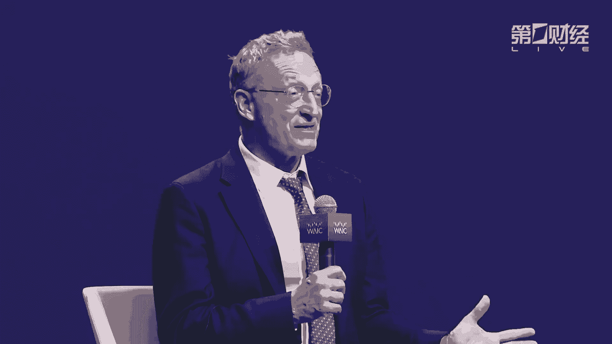
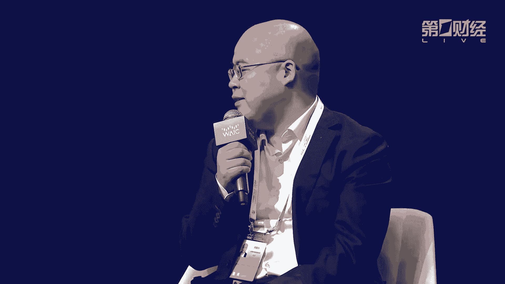

# 2024世界人工智能大会（合集） - P4：20240704-产业发展主论坛 - WarrenHua - BV1iT421k7Bv

🎼女士们先生们，请各位尽快入座。我们的产业主论坛即将开始。ladies and gentlemen，please take your seat as soon as possible。

thank you for cooperation。🎼尊敬的各位领导，各位来宾、女士们、先生们，大家下午好。欢迎各位来到2024世界人工智能大会暨人工智能全球治理高级别会议产业发展主论坛的现场。

各位下午好，我是上海广播电视台第一财经的主持人黄伟。😊，今年，我们盛情邀请了海内外具有风向标意义的产业翘楚和权威专家莅临现场，汇集全球产业的共同目光，荟萃全链产业的共性热点。

积极回应世界对于AI发展的一致期待，共推发展共护安全共享成果。女士们先生们，接下来首先让我们用热烈的掌声，有请工业和信息化部副部长单中德先生致辞，掌声有请。尊敬的陈杰副市长。

周思营副总干事、尊敬的各位嘉宾、女士们、先生们、朋友们，大家好。非常高兴参加2024世界人工智能产业发展全体会议，受金长龙部长委托，我将代表工业和信息化部对大会的成功召开，表示热烈的祝贺。

上长期以来关心支持工信事业的各界朋友表示，衷心的感谢。😊，我今天报告的题目是，加快发展人工智能产业高水平富农新型工业化。作为引领未来的战略性技术。人工智能正全面赋农各行各业，推动社会生产力整体跃升。

中国政府高度重视人工智能的发展。习近平主席强调，人工智能是新一轮科技革命和产业变革的重要驱动力量，将对全球经济社会发展和人类文明进步，产生深远影响。今年，我国的政府工作报告中明确提出。

要开展人工智能加行动，大力推进新型工业化。工业和新息化部深入贯彻落实党中央国务院的决策部署，牢牢把握高质量发展这个首要任务，和实现新型工业化这个关键任务，以促进智能技。术和实体经济深度融合为主线。

以大力推进新型工业化为契机。与各国一道共同加快培育壮大人工智能产业，组织结伴挂帅，加快技术创新，支持上海等地方创建11个国家。人工智能创新应用先导区推动产业集聚。

我不支持联合国工业发展组织与上海市政府合作。推动在上海成立全球工业与制造业人工智能联盟卓越中心，打造国际人工智能会客厅。在上务的开幕式上，建壮龙部长和工发组织总干事穆论共同启动了中心的建设。

积极参与全球治理与合作，在国际电信联盟二0国集团金砖总机制下，积极贡献中国的方案，助力全球人工智能产业高质发展。今年5月，我也率团参加了在日内网召开的人工智能向善全球峰会宣介了全球人工智能治理倡议。

就人工智能治理和产业发展，与各各个国家的代表进行了深入的交流。在各界的共同努力下，信息技术、数字技术智能技术等赋农新型工业化的成效显著智能芯片算法框架、大模型等。

核心技术不断突破智能网联、汽车、人形机器人、低空装备等典型产品加速加速迭代、智能工厂、智能车间等新模式，新业态不断涌现。目前我国已经培育了421家国家级的智能制造示范工工厂。

万余家的省级的数字化车间和智能工厂，推动制造业高端化智能化、绿色化发展，人工智能企业的数量也超过了4500家算略规模位居全球第二，推动制定了48项。智能制造相关的国际标准。

推动完善全球人工智能产业发展的生态。同时我也注意到，上海市也是工业和新息化部支持创建的首个国家人工智能创新应用小导区。在人工智能技术创新策源产业集聚富农信息工业化等方面都取得了显著成效。

涌现出一批专精特新企业。正义面向全球面向未来的视野，建设成为全球人工智能发展的上海高地。特别是近年来连续七届世界人工智能大会的成功举办，打造了人工智能领域重要的国际交流合作平台。女士们、先生们、朋友们。

当前，人工能领域正在迎来一场有声数质人工智能大模型引领的爆发式发展智能时代正在加速到来。习近平主席强调，要把新一代人工智能作为推动科技跨越发展、产业优化升级、生产生产力整体跃升的驱动力量。

努力实现高质量发展。工业和信息化部将深入贯彻落实党中央国务院决策部署，统筹高质量发展和高水平安全，加快开放合作、产业创新、夯实底做，促进应用推动。人工智能更好的赋能新行工业化，服务社会，造福人民。

主要开展四个方面工作，一是强化开放合作，深入践行全球人工智能治理倡议，秉秉持开放包容、合作共赢的态度，坚持引进来和走出去相结合，在技术产品标准服务安全等方面，与各国加强交流合作。

推动形同具有广泛共识的人工智能治理框架和标准规范。让人工智能发展更好的服务于人类生活。二是推动产业创新，聚焦关键核心技术和重要的智能装备，深化产学园合作创新，加大投入，加快创新。

积极培育智能产品智能装备和智能服务，加速智能技术产业化，扎实推动科技创新和产业创新的深度融合。三是夯实产业底座，加快5G网络和千兆光网的建设，扩大网络覆盖范围。深化算网融合。

稳步构建智能高效的融合基础设施，建设高质量的工业数据集扩大数据应用，努力建成广广覆盖、高效率、安全稳定运行的智能基础设施，为智能化发展，提供有力支撑，四是加快应用落地，充分发挥中国制造业发展的优势。

以需求为牵引，积极推进智能技术在智造、交通、民生等垂直行业的推广应用和迭代升级。支持制造业企业加快数字化转型智能化改造，培育一批智能车间智慧工厂加快推动人工智能赋能信型工业化。女士们先生们朋友们。

世界人工智能大会，是全球人工智能领域重要的合作平台。版特大会以共商以共商促共享，以善制促善制。为主题，为各方提供了良好的交流合作平台，让我们以本次大会为契机，加强交流，凝聚共识，深化合作。

共同推动人工智能产业发展，共同谱写人工智能赋农时代发展，增加人类复祉的新篇章。最后，预祝本次会议取得圆满成功，祝大家顺心如意。

幸福安康，谢谢大家，谢谢。😊，掌声感谢单部长精彩的致辞，谢谢单部长，请您入座，感谢。😊，谢谢单部长。在全球各国共同关注AI的当下，谢谢单部长再一次表明了中国的立场。

以及中国未来对于AI助力产业的四大趋势和推动方向。再次谢谢。当前，上海正在紧抓新一代人工智能发展机遇。以人工智能驱动，形成新智生产力，加快打造世界级高端产业集群。女士们先生们，接下来请用热烈的掌声。

欢迎上海市人民政府副市长陈杰先生致辞，有请陈市长。😊，尊敬的单中国副部长周赐勇副总干事王进展、书记，尊敬的各位来宾、女士们先生们，朋友们，大家下午好。

非常荣幸能够和大家相聚在2024世界人工智能大会及人工智能全球治理的高级别会议产业发展的主论坛。首先，我谨代表上海市人民政府对各位嘉宾的到来，表示热烈的欢迎。

也向各位长期以来关心支持上海经济社会发展所给予的大力的支持和帮助，表示衷心的感谢人工智能是新一轮科技革命和产业变革的重要力量。

近年来，上海深入贯彻落实国家战略部署，在工信部的指导下，着力建设人工智能的上海高地，打造产业集群，产业规模持续扩大，归上的企业从2018年的183家，增长到了2023年的348家。

产业的规模也从1340亿元，增长到了3800亿元，居全国的前列。创新成果持续涌现，全市目前已经有34款的大模型登记备案，多款的人形机器人原型机发布，创新载体加速建设。

我们打造了魔术空间一期二期的总面积一共达到了2万平方米，吸引了80家大模型的企业入驻。全国首个国家地方共建的人形机器人创新中心与街牌openone开源社区的网站也上。创线运行，产业生态日趋完善。

持续优化算力基础设施建设，加大算力资源的统筹供给大模型语料联盟深化运行，开源书建书生万卷等一系列的高质量的语料资源，面向未来我们与海内外的企业机构紧密合作，持续推动人工智能的创新发展。

一是加快夯实人工智能的基础底座，打造超大规模的智能算力基础设施，完善语料数据支撑体系，更好的助力人工智能企业的创新创业发展。二是加大人工智能的落地赋能，以通用人工智能与制造业融合为主线。

推动人工智能与传统产业新兴产业以及未来产业的深度融合，加快人形机器人、智能网联汽车的高质量发展。三是深化人工智能的治理规范，探索建立技术标准基准测试、可信认证等人工智能可信安全的治理体系。

努力共贡献上海智慧、上海方案。各位来宾，本届论坛将聚焦AI产业发展，集聚了国内外的顶尖企业家、科学家和业内的专家。我们衷心的期待，围绕人工智能产业发展发表真知着见、交流思想观点，分享创新实践。

为引领全球人工智能的发展贡献智慧和力量。上海也将以更加优质的营商环境，为全球的人工。智能优秀企业投资机构卓越人才发展，提供更加广阔的空间和舞台，共同的绘就人工智能高质量发展的美好愿景。最后。

预祝本次论坛取得圆满成功，谢谢大家，谢谢掌声感谢陈市长，谢谢上海，欢迎各位愿与各位同行，谢谢。

女士们先生们，中国始终积极支持在联合国框架下讨论与协调国际人工智能发展安全与治理等重大问题。多年来，联合国工业发展组织多次参与世界人工智能大会。

接下来让我们用热烈的掌声有请联合国工业发展组织副总干事兼执行干事邹赐勇先生致辞，掌声有请。

尊敬的涉案部长，尊敬的陈市长，各位尊敬的嘉宾，女士们先生们，我非常荣幸能够在今天的产业发展主论台发言参加在上海举办的全世界人工智能大会。

我非常高兴能够与来自全球的具有远见卓实的领导人来就人工智能的未来进行讨论。联合国公发组织致力于实现嗯包容的工业发展。我们与各方。促进建立合作伙伴关系，开展对话，支持建立人工智能的生态环境。

去年在这里的世界人工智能大会上，我们发起了倡议，要在全球发展人工智能的应用和解决方案，在当今这个互联互通的世界。像嗯，气候变化以及可持续的供应链等等挑战都与人工智能息息相关。

人工智能的发展也可以让低收入国家更好的实现经济发展和创新。然而，当今世界的经济发展仍然不平衡。有许多的地区。仍然被落在了后面，这也意味着人工智能的发展有着巨大的潜力，可以更好的促进发展、繁荣与包容。

我们认为未来的工业要有数字赋能，来实现有韧性的社会发展。促进人的全面发展和地球的健康发展。因此，我们需要实现更多的努力，利用人工智能，让边缘化的人群以及新加入的人群更好的实现包容性的发展。

在联合国公发组织，我们通过各种各样的创意和解决方案来帮助会员国实现更好的发展。在不久之前，联合国大会一致同意通过了中国发起的。全球人工智能能力建设合作倡议这个决议。以人为本，呼吁全球加大合作。

进行人工智能的能力建设，特别是要通过国际合作，在发展中国家实现这项发展。让我们我们要通过可包包容性的人工智能治理，更好的实现联合国2030和持续发展目标。这一个国际社会的共识。

也意味着大家更多的关注了人工智能的智能，对于和持续发展，和人类命运共同体的贡献。在这方面，我们也需要更好的利用中国在这方面的经验，和远见卓实来促进全球的发展。我们今天在上海召开的这个会议。

也是嗯一个里程碑式的会议，他受到了上海市政府以及中国工信部的支持。将会更好的促进人工智能创新发展。今天的产业发展主论坛也将把关注力更好的放在如何弥补数字鸿沟和地区发展不平衡上面。

让我们的未来更加可持续和包容。谢谢各位的关注，希望我们未来能够获得更好的成果，也祝各位的论坛成功丰硕，谢谢周志勇先生。

在这里我们要谢谢联合国工业发展组织在人工智能领域对于中国对于上海对于WAIC世界人工智能大会的鼎力支持，再次感谢。好，女士们先生们，接下来进入我们今天的仪式环节。

首先我们在现场要进行的是世界人工智能大会的最高荣誉。卓越人工智能引领者sale奖的颁奖仪式。那前几届这一荣誉的获得者，以卓越的创新成果引领了全球科技和产业的发展浪潮。

不断的加速推动人工智能领域的创新突破。现在让我们一起来见证本年度卓越人工智能引领者sll奖的诞生。各位请看大屏幕。😊，🎼2024卓越人工智能引领者奖颁发给。

🎼上海人工智能实验室the link人工智能开放计算体系，通过deplink，开发者能通过一次编程，自由的在各类硬件和算法生态中切换，并实现适配时间缩减50%，是构建人工智能开放生态的重要桥梁。

🎼中国南方电网有限责任公司新型电力系统智能仿真器驭电，利用大模型的强大高维空间数据拟合能力，为电网规划与运行方案制定，提供全新工具，树立了AI解决超大规模复杂物理系统分析计算难题的新标杆。

🎼莫奇科技北京有限公司my scale AI数据库。my scale是国际上首个专为大规模结构化和非结构化数据处理数据的AI数据库，综合性能比国内外其他产品提高4至10倍。

🎼施耐德电器中国有限公司能源管理和工业自动化领域的econstructure AI引擎。econstructure AI引擎集成了数据管理、AI建模、模型运维、模型商店、四大人工智能功能模块。

覆盖了AI模型生命周期中的数据准备、模型训练、模型部署、模型推理及模型监控这五大建模相关流程。

🎼鲁制清华大学。🎼虚拟扫描光场显微镜，实现鲁放的高时空分辨率三维成像。🎼清华团队提出了物理驱动网络方法，研制了虚拟扫描光场显微镜，实现对光线的虚拟扫描大幅提升成像速度。

🎼为揭视神经、免疫新现象和心肌理等生命科学医学重大问题突破提供了新的路径。🎼各位来宾，我提议让我们用热烈的掌声祝贺以上在今年获奖的项目，祝贺他们，谢谢。😊，🎼接下来伴随着掌声。

我们要有请获奖代表登台领奖，有请各位。🎼祝贺你们欢迎大家。😊，🎼欢迎各位非常的了不起。接下来我们要掌声有请中国科协党组成员、书记处书记王进展先生上台为获奖项目颁奖，有请。😊。

🎼各位来宾sale奖是世界人工智能大会的最高荣誉。今天我们又看到了5个项目和个人站在了领奖台上，他们在未来将会更进一步的来推动人工智能领域的创新和突破全球科技和产业的发展潮流。

将会由他们与世界同行共同引领。🎼好，让我们一起来共同可以留念。🎼我们掌声再一次祝贺他们，谢谢你们，谢谢你们的付出，谢谢。😊，🎼好，也谢谢王进展先生，各位请入座，感谢。😊，🎼好，各位请一同入座，谢谢。😊。

🎼女士们先生们，当前上海正在聚焦巨深智能布局未来新赛道，打造产业发展的核爆点。那么接下来呢我们将会发布开源通用人形机器人公版机青龙，请看大屏幕。😊，🎼。嗨我是青龙，一个智能人形机器人。😊，🎼你好，青龙。

请帮我拿点水果。🎼这里有香蕉。🎼你怎么知道？🎼闻身香香。🎼。

震撼的技术带来了无限的可能。各位请用你们热烈的掌声祝贺青龙今天在现场跟各位见面。😡，我们在这里要祝贺开元通用人形机器人公版机青龙的正式发布。人工智能是新一轮科技革命和产业变革的重要驱动力量。

助力培育新产业，催生新模式形成新动能。那么接下来呢让我们开启今天主题演讲的第一部分领先AI引领生产力变革。在大模型带来智能革命的当下，如何以此来推动生产力的变革呢？

各位掌声有请百度创始人、董事长兼首席执行官李彦红先生带来他的分享，掌声有请。😊，啊，各位下午好，非常高兴呢再次来到上海参加世界人工智能大会。😊，啊，我是这个会议的常客了啊，经常来。啊。

但是去年因为出国呢呃没有来，所以我上一次来参加WAIC呢是2022年。啊，那次呢我记得大会的主题是元宇宙呃，主办方也传话跟我讲，希望我讲一讲元宇宙。啊，我说我还是讲AI吧，我讲不了原宇宙。

所以我当时讲的主题呢是AIGC啊，就是AI generatedrated content。啊，我认为呢就是说是AI的技术发展路线呢，发生了方向性的改变。

就是从过去的辨别式人工智能转向了未来的生成式人工智能。那。是。讲这个话呢，是在2022年的夏天啊，就是5个月之后，大家都知道就是chBD发布了。而后来的事情呢，大家就更清楚。所以两年的时间啊。

其实恍若隔世就是感觉整个世界都变了。人工智能呢可以说颠覆了绝大多数人的认知。2023年啊，国内出现了百魔大战啊，造成了社会资源的巨大浪费，尤其是算力的浪费。

但是也使得我们追赶啊世界上最先进的基础模型的能力呢得到了建立。去年10月，我宣布文星4。0发布的时候，我说啊文心4。0的能力啊跟GPT4相比毫不逊色啊，好多的同行呢还不以为然。

今天呢大家可以看到国内已经有多款闭源模型啊，声称他们已经追平或者是超越了GPT4的水平。啊，注意我这说的是闭源的大模型哈，不是开源大模型。这也是今年以来就是争议比较多的一个话题。

有些个外行甚至混淆了模型开源和代码开源这两个概念。模型开源你拿到的是一大堆的参数啊，你还是要去做SFT，还是要去做安全对齐啊，你不知道这些参数是怎么来的啊，你是无法做到众人实柴火焰高的。

即使你拿到对应的源代码，你也不知道他用了多少数据，用了什么比例的数据去训练这些个参数。啊，所以拿到这些东西呢，并不能够让你站在巨人的肩膀上去迭代和开发。所以呢同样参数规模之下。

闭源模型的能力就比开源模型要更好。而如果开源想要能力追平B源，那么它就需要有更大的参数。这就意味着推理成本会更高，反应速度会更慢。很多人呢拿开源模型来改款，以为这样呢可以更好的服务自己的个性化的应用。

殊不知呢，这样你就创造了一个孤本的模型啊，既无法从基础模型的持续升级当中获益，啊，也没办法跟别人去共享算力。当然呢我也承认啊，开源模型在某些场景下是有它的价值的。比如说一些学术研究，或者说在教学领域。

大家想要研究大模型的工作机制，形成理论。那么这个时候可能是有价值的。因为大家可能也经常听到，就是我们觉得大模型能力很强，但是不知道为什么能力强，因为背后呢没有理论来支持它，所以研究这个东西啊。

用开源的我觉得没问题。但是大多数的应用场景，开源模型并不合适。当你处在一个激烈竞争的市场环境当中的时候。你需要是让自己的业务的效率比你的同行更高，成本比你的同行更低。这个时候呢，商业化的闭源模型。

那是最能打的。当然呢这些都不是最重要的，没有应用，光有一个基础模型，不管是开源还是闭源，一文不值。所以我从去年下半年开始讲啊，大家不要卷模型了，要去卷应用。

但是呢我看到我们的媒体仍然是把主要的关注点啊放在了基础模型身上啊，一天到晚到处去跑分刷榜啊。谁是谁又超越GD4了？open air air又出来sor扰了啊，又出来GPT4O了等等。今天这个震撼发布。

明天那个史诗集更新。但是我要问应用在哪里？谁从中获益了？应用其实离我们并不遥远。😡，基于基础模型的应用呢，在各行各业、各个领域都已经开始了逐步的渗透。两个多月前，我们宣布文星大模型的日调用量超过了2亿。

最近呢我们又说文星大模型的日调用量超过了5亿啊，其实仅仅是两个多月的时间，调用量发生了这么大的变化，逐渐它背后呢是代表了真实的需求，是有人在用，是有人真的从大模型当中获益了，得到了价值。

比如在快递领域让大模型帮助处理订单，做到了一张图，一句话寄快递。不再需要其他的繁琐流程，时间从3分多钟缩短到19秒，而且呢90%以上的售后问题也都是由大模型来解决，效率提升非常的明显。

再比如在小说的创作领域啊，一开始呢用开源模型做出过一些效果。后来改用文心的轻量级模型。经过十轮啊，上万组数据的SFT和post per train啊，结果呢有了明显的提升，最近呢又转到文心4。0的版本。

那么仅用了数百条的数据啊，4。0就在情节和逻辑方面展现出了非凡的优势。生成的内容，无论是可用率还是优质率都大大超过了文心的轻量级模型。网文作者们如虎添翼。其实更通用的领域，比如说代码生成啊。

就文心快马这样的软件啊啊在各个领域也在逐步的在渗透啊。百度内部的话呢，我们有30%左右的代码已经是用AI生成的啊，代码的采用率超过了44%。不过呢我们要避免掉入超级应用陷阱啊。

觉得一定要出1个DAU10亿的APP才叫成功。我认为这是移动时代的思维。在AI时代呢，规律很可能不是这样子。超级能干的应用比只看DAU的超级应用恐怕要更重要。只要对产业对应用场景能产生大的争议。

整体的价值就比移动互联网要大多了。随着基础模型的日益强大，开发应用呢也越来越简单了，最简单的就是智能体。这也是我们最看好的AI应用的发展方向。制作一个好的智能体，通常并不需要编码啊。

只要用人话把这个智能体的工作流说清楚，再配上专有的知识库啊，一般就是一个很有价值的智能体了。这比互联网时代制作一个网页还要简单。未来在医疗、金融、教育、制造、交通、农业等等领域啊，都会依据自己的场景。

自己特有的经验、规则、数据等等啊，做出各种各样的智能体。将来呢会有数以百万量级的智能体出现，形成庞大的智能体生态。而搜索呢是智能体分发的最大的入口。刚刚过去的高考季，很多大模型公司热衷于去写高考作文啊。

我用AI写一个作文能得多少分。其实呢这个实用价值是不大的啊，人家不会允许你带一个大模型进去参加高考。但是。真正的需求呢是大量的考生在考完之后要报志愿。要选择学校，选择专业。

他们对一所大学一个专业会有各种各样的问题，而每一个考生的情况又是不一样的。这个时候呢就是需要有一个智能体来回答每一个考生专有的问题。啊，在高峰时期呢，百度的这个高考智能体每天回答的问题啊。

每每天要回答超过200万个考生的问题啊，我们啊总共只有1000万的考生啊，在一天当中有这么大比例的人在利用这个智能体啊。AI呢正在以前所未有的速度向各行各业渗透。很多人担心啊。

如果我们日常的工作都让AI去做了，人是不是就没有工作机会了？这种担心呢不是没有道理。但是过去这段时间，我听到的担心，听到的抱怨很多，听到的建设性的意见比较少。

很少有人去致力于发掘生成式AI带来的新的工作机会。我在这算是抛砖引玉吧。我觉得一方面呢这次浪潮，AI更多的在扮演偷 pilot的角色啊，副驾驶啊，还要人来把关AI只是辅助人工作，而不是替代人工作。啊。

他让人的工作呢效率更高，质量更好。另外一方面呢，我们也看到啊有一些全新的工作机会开始冒出来了。比如数据标注是。过去几年呢，我们帮助全国20多个城市落地了数据标注中心。啊，提供了大量的新的就业岗位。

再比如呢提示词工程师。以后呢不用编程了，但是做好一个智能体，还需要把工作流说清楚啊，这里头要有很强的逻辑性。要用提示词呢对模型进行调校啊，随着智能体的大量涌现，这种工作需求也会飙升。

这些个工作机会通常呢门槛并不高，你做的一般也能够养家糊口。做的好的话呢，那上线可以年薪百万。自人类文明诞生以来，永不停止的创新就是刻在我们DNA当中的。从石器时代的首府到移动时代的手机。

那么再到AI时代的大模型，人类呢不断创造各种工具来改善生活，来提高生产力。但是它们永远只是工具。只有在被人类所使用的时候才有价值。我们坚定的相信，AI不是人类的竞争对手。我们构建和应用人工智能技术。

是为了满足人的需求，增强人的能力，让人类的生活更美好。

谢谢大家。😊，谢谢感谢李彦宏先生分享了来自于百度的观察和理解，再次感谢您，谢谢。😊，人工智能激发创新的发展，数字基建，助力产业的未来。女生们先生们。

接下来我们用热烈的掌声有请中国电信集团有限公司董事长柯瑞文先生为我们带来精彩演讲。题目为共创共治共享人工智能产业美好未来，掌声有请。😊，尊敬的各位领导，各位专家，各位嘉宾、女士们先生们，大家下午好。

很高兴来到上海参加2024世界人工智能大会。向大家学习共同交流，探讨人工智能的发展的问题。人工智能是新一轮科技革命和产业变革的重要驱动力量。将对全球的经济社会发展和人类的文明进步产生深远的影响。

当前人工智能产业发展日新月异，迎来了前所未有的机遇。同时呢也面临了不少的问题和挑战。作为电信运营商。中国电信把握人工智能的发展方向。充分发挥自身的特点和优势，积极的服务和融入人工智能的发展。

近年来我们做了一些探索思考和实践，借这个机会给大家做一个交流汇报。第一，人工智能需要新型的数字信息基础设施提供有力的支撑。新型的数字基础设施总的要求就是高速泛在天地一体，云网融合。

智能敏捷、绿色低碳、安全可控。基本的特征是充分发挥网络的基础。发挥云计算的核心作用。推动云和网的融合，提供智能化的连接和算力的服务。人工智能时代，网络链接需要更高速度、更低时延，更加可靠。

作为网络的核心检点的数据中心，需要升级为承载智能算力的AIDC。智能算力不仅包括单节点、单机群的算力。就现在最最热门的多少万卡超级群。我们觉得更要以公有云的服务的形式提供分布式的算力。

需要通过一体化的算力的互联网，实现跨地区、跨区域。跨架构和服务商这样一种算力的调度服务，既要满足训练的需求，更要满足推理的需要，还要以更方便、便捷、经济的方式为广大的客户方便的使用。

中国电信在业内率先提出与网融合的理念，不断夯实网络的优势。今年我们将完成400G的。高速全国网的全国覆盖，并加速向800G1。2T超到宽带升级。我们适度超前建设智能的算力的基础设施。

推进数据中心向AIDC的升级，全面支持两谈一优就是弹性供电、弹性制冷、气流组织优化就两谈一优新型的。数据中心AIDC我们在热点地地区建设超万卡的超大智算机群。今年3月份。

我们在上海宁港已经建成了全国首个国产的单齿万卡的伊轮。算立集群并投入运营。基于云网融合的天云国家云打造的熙攘云销汇聚平台。提升上网感知、跨域调度、随愿自治的能力。

这三大平台是一体化算立互联网的关键平台技术和基本的架构。面向算力需求旺盛的长三角地区，我们近日启动了长三角的算力的调度中心，实现对算力资源的集约供给和统一的调度。新型的数字基础设施必须是绿色低碳的。

随着算力增长带来的能源问题日益突出，迫切需要通过创新巡检。知道我们在青海率先打造了全国首个100%清洁能源可溯源的绿色大数据中心，通过天云东促西算的能力，将算力需求有序的引导到域能分配的西部地区。

不断的加强绿色节能技术的攻关和应用，全面推广液冷架构等新技术的应用。新型的数字基础设施也必须是安全可控的。我们建成了国内唯一一个全网覆盖和全网触达的网络攻击防护平台云机平台。

加快建设以量子技术为核心的新型信息安全基础设施，推进云资源池和IT系统100%的量子密码改造，打造电信级的安全保障。这是第一点，我们的认识和体会。第二，人工智能的发展，既要重视大模型的技术研发。

更要重视模型的应用。应用是促进技术成熟与产业创新的重要途径。人工智能要在应用过程当中不断的迭代完善，促进规模化的发展。我们首先从内部应用做起。我们的新城网络大模型用于监控排照、维护优化业务交付等流程。

提高故障处理的效率30%以上。我们自研的新城客户大模型用于语音的导航、在线机器人等场景，智能客户的比例接近80%。我们自研的新城智慧AI节能系统，实现对基站机房和数据中心的精准节能。

今年上半年我们就累计接定近5亿度。在内部应用的基础上，我们全面开放场景，联合产业伙伴推动大模型的深度应用。在工业、教育、医疗、政务等领域推出了30多个行业的应用，以服务政企客户7000多家。例如。

新城政务热线大模型，已在上海和江苏等地推广，大幅度的提高热线的运营效率和市民的感知。结合运营商特点推出的新城汇达，从短信入口实现与新城大模型的交互，使AI能力更加便捷的触达千家万户。

推出AI手机、AI云电脑、AI摄像头等一系列AI加的一些终端，满足客户多元化、智能化的需求。通过规模化的应用推广，我们不断的积累和汇聚高质量的数据。中国电信有很多很好的平台。

例如我们的天翼视联网这样个平繁平台广泛的赋能于。智能制造智慧社区和市政管理的应用的场景。过程中积累了大量的视频数据，我们也希望能与产业合作伙伴合作，通过AI技术进一步挖掘和释放数据视频数据的价值啊。

为客户提供更加安全。更加便捷、更加高效的一些服务。在推动规模应用的同时，我们持续开展通用大模型的底数技底层技术攻关。我们在上海成立人工智能的研究院，自主研发天亿参数的新程大模型。

训练超万亿的taken的数据是央企中唯一向社会开源的大模型。基于新城大模型推出的视觉大模型，可以实现视频中万物皆可通自然自然的语言进行解锁。推出的语言大模型实现了30多种国内的方言的识别。

这些都是在推动大模型应用过程当中的。一些成效。第三。人工智能的发展需要共建开放的生态，共同推进治理。人工智能发展涉及到芯片、云网、模型应用等产业链各个领域，将催生大量的融合创新的合作机会，需要产业各界。

立足自身的禀赋，在技术共创、数据共享、场景开放、人才培养、资本合作等方面，携手建立开放的生态，实现互利共赢，在合作过程中，围绕着AIDC的建设、算力的互联互通、数据安全的治理等方面，需要持续的探索实践。

加快制定产业共同遵循的规则制度和技术标准，促进创新的协同和资源的共享，引导健康发展，共同应对人工智能领域、深度伪造、伦理安全、数字鸿沟等风险和不足，共同推进人工。

智能向善。我们将充分利用世界人工智能大会全球云网宽带协会WPPAA这样一些国际的平台，常态化开展沟通和交流，加快人工智能创新发展，助力缩小全球的数字鸿沟。

中国电信牢牢把握以人工智能为代表的新一轮科技革命和产业变革的机遇，推动企业从传统的电信运营商向服务型、科技型和安全型企业转型，将人工智能纳入企业四大科技创新的方向和七大战略性新兴产业的布局。

结合云网融合的优势，我们确立了建设智算云底座、公关通用大模型，打造数据底座，以N个内部大模型应用为牵引，规模应用N个外部大模型的1加1加1加M加N的AI的布局体系。经过持续的创新。

已经形成了坚实的发展基础。我们希望与各位产业合作伙伴加强合作交流，共同创造人工智能的美好未来。

明天上午，我们将举办中国电信新城人工智能生态的论坛，发布新城AI加生态合作伙伴计划。大模型系列产品以及四大AI联创基地，欢迎大家莅临指导。最后再次感谢大家对中国电信长期以来的关心支持和帮助。

祝大会取得圆满成功，谢谢谢谢掌声感谢柯瑞文先生的精彩介绍，为我们大家一起来分享了中国电信的实践和经验，再次谢谢您。😊。

各位，当前，人工智能家百花齐放，心智生产力气象磅礴。接下来让我们掌声有请中国移动通信集团有限公司董事长杨杰先生带来演讲，点燃人工智能加引擎，共促心智生产力发展。掌声有请。😊，尊敬的各位领导。

各位嘉宾、女士们、先生们。大家下午好。非常高兴参加本次大会。共同探讨AI未来发展的。道路。当前，以AI大模型为代表的通用人工智能。取得了突破性的进展。创新迭代的速度、资源投入的力度。

社会参与的广度都远超预期。未来发展孕育着无限可能。结合中国移动这几年的探索和实践啊，和大家分享几点思考。第一。以AI为代表的新一代信息技术，成为发展新智生产力的重要引擎。

人类文明进步的历程就是先进生产力不断发展的历程。纵观历史，机械化、电气化、信息化三次工业革命，带来社会生产力水平的显著跃升。如今，以数字化为主要特征的第四次工业革命深入发展。从互联网加到5G加。

到现在的AI家持续演进。推动信息服务体系和经济社会运行体系的深度融合。引发了生活方式、生产方式的深刻变革。一是十多年前兴起的互联网加。推动了信息技术在消费侧的广泛应用。

深度融入学习、娱乐、社交、购物等社会生活的方方面面。深刻的改变了人们的生活方式。25年前开启的5G甲。加速信息技术，从消费侧向生产侧的渗透。

全面融入研发设计、生产、制造、营销服务、运营管理等工业生产的各个领域各个环节。有力的推进了生产方式的数字化转型。那么当下。蓬勃发展的AI家啊，这也是我们现在的第三个方面。

正促进更大范围更深层次的质量变革、效率变革和动力变革。为形成新智生产力注入强劲的动能。AI大模型能够汇聚整合社会的全量知识，形成达到甚至超越人类的理解表达、逻辑推理能力，加速经济社会发展。

从加AI向AI加的迈进。

第二，深入推进AI加成为培育心智生产力的重要路径。

加快AI加的发展，关键是要推动AI深度融入经济社会民生。

重塑组织形态、经济形态、社会形态，释放新智生产力发展的巨大潜能。具体体现在三个方面，一是体现在为千行百业、千家万户驻智赋能上。推动AI智能体成为信息服务的全新入口。AI加DSAT成为产业落地的重要方向。

打造有智慧、有温度、有特色的AI的原生服务，加速经济社会数字化转型。二是体现在促进新兴技术的融合创新上。发挥AI在融合创新中的原技术的作用，加速原始性颠覆性技术的演进升级，不断激发新兴技术的创新潜能。

三是体现在加快多域智能集成应用上。推动计算智能、感知智能。认知智能、运动智能协同发展，加速人形机器人脑机接口等新业态的成熟，让AI具备更强大的认知力、判断力、创造力，更好的满足未来智能服务的需求。第三。

以AI加推动新智生产力发展成为信息通信业的时代重任。信息通信业作为战略性、基础性、先导性的行业和产业。既是形成新智生产力的重要领域。也为其他领域培育发展新智生产力提供重要的支撑。

那去年呢我们国家数字经济总量已经超过50万亿。占GDP的比重达到了44%。数字经济其实就体现各行各业经济社会民生广泛应用信息技术的程度。那么中国移动呢经过多年的探索实践啊。

也走出了一条技术领先、融入行业，开放共享的体系化的人工智能发展的道路啊。下一步呢我们将把推进AI加作为重要的战略着力点。围绕基础设施创新关键技术创新、产品应用创新。这三个方向，促进AI家换新向实。

培育发展新智生产力。一是夯实AI的智能基座，以推动AI创新发展为牵引，升级网络算力、数据基础设施，建设空天地一体化的信息网络。打造通知超量一体化的算力网络，构建支撑数据要素、安全、高效流通的数链网。

二是构建AI的核心能力。锚定AI的供给者、汇聚者、运营者的定位，建立完善通专协同的9天大模型矩阵。汇聚开放百个大模型，百大数据局百套工具链，推出数据算力。讯推一体化的模型技服务ms。

三是打造AI的原生应用。聚焦推动生产生活治理数字化转型，以AI重塑5G新通话视频彩铃。在工业、能源、交通等行业打造百个AI的标杆示范项目。那么最近呢我们也携手合作伙伴啊，比如说和中国石油。

我们共同推进多模态大模型，在新能源等领域的应用啊，我们也和华为科大讯飞一起啊一起推动我们石油行业能源领域大模型的广泛的应用。AI到底是人类的助手还是对手？是机遇还是危险啊，也成为全社会共同关注的话题。

在AI。技术加速发展的同时，大家也都在思考，都在讨论啊，刚才艳红讲了很好的观点啊。那我个人也认为。AI人工智能不会取代人类智能。但会重构很多行业，很多领域。哎呀，人工智能不会替代人。但是。

擅长使用AI的人将会替代不会使用AI的人。啊，正像我们过去的十几年间啊，互联网时代，互联网加时代。电脑并没有取代了人脑。而是更擅长使用计算机的人，会脱颖而出。啊，我觉得同样AI进入AI加时代。也是如此。

那么AI作为新的生产工具。将进一步拓宽人类的认知边界，激发出更大的创新潜能。那么中国移动呢也愿意和社会各界一起啊共创美好AI家的新时代。一呢是共同提升科技创新的新能企，推动高水平的算法，高性能的算力。

高质量的数据集成创新。让AI不仅能做事。啊，还能做更复杂、更具创造性的事啊，因为在。去年的演讲中，我也讲到，我说我们让AI呢不仅能做诗，更要会做事。那么那么我想今天呢我们就不仅让AI说能做事。

还要做更复杂、更具有创造性的事，更有意义的事，更能够帮助人类的事。二呢是共同促进生产方式的变革，加速AI深度融入生产经营的全流程，降低生产成本，提高生产效率，提升核心竞争力。

打造更多AI赋能新型工业化的样板间。商品房。三是共同完善AI治理体系，从技术制度、法律伦理等多层次各个方面加强治理体系建设。确保AI始终符合人类共同的价值取向，实现科技向善AI向善。呃。

预祝本次会议取得圆满的成功，谢谢大家，谢谢。😊，🎼掌声感谢杨洁先生精彩的分享，跟大家一起共同分享的是来自于中国移动的探索和突破。最重要的是在刚才主题演讲的最后部分发出了倡议。再次谢谢您。各位今天。

人工智能正在以前所未有的速度，影响着社会经济发展的步伐，推动着生产力的变革。接下来的我们即将会迎来一场聚焦于通用人工智能时代，产业新要素结构的深度对话。参与对话的嘉宾。

在各自的领域都有着卓越的成就和深刻的洞见，让我们以热烈的掌声分别有请猎豹移动董事长兼首席执行官猎户星空董事长傅胜先生。

社交数据实验室创始人亚马逊前首席科学家安德雷斯韦斯安先生miss以及中国工程院院士之江实验室主任阿里云创始人王。😊，🎼王坚先生，掌声有请三位。🎼好，接下来呢我们有请付胜先生作为本场讨论的话题引领人。

把时间交给各位。😊，啊，首先今天非常激动啊和两位世界级的专家一起能够呃开展这个人工智能的这么一个讨论。我呃非常非常激动。我是一个创业者啊，我做了猎豹移动啊，曾经在这个全球大概有4亿的活跃用户啊。

14年纽交所上市。16年我们就开始做人工智能和机器人。啊，也算是在产业上有自己的一些理解和积累。当然了，在两位面前，我还是有很多问题想要请教啊，在之前我也稍微介绍一下，就是呃安德雷斯韦斯安先生啊。

这个也是亚马逊前首席科学家，并且也是中国人民的老朋友，应该和阿里和腾讯都当过顾问，也写过一本书叫大数据和我们啊，在整个业界也相当有影响力。然后王坚院士我就不用多介绍了吧。这个阿里云的创始人。

也是可以说今天中国啊云的产业的奠基人。😊，对，非常非常激动。其实呢呃刚才听了很多前面的演讲哈，我们都看到大家都在讲人工智能这次的浪潮，这次能带来的应用的机会。

但我还想更从更更大的一个层面跟两位专家请教一下，就今天我们讲这个深层式人工智能啊，是不是已经是这个人工智能的一个就是核心的道路了，是不是按照这条道路走，就真的能够创造通用人工智能，还是说也会有别的路线。

对吧？今天其实我们看到业界就学术界还是有不同的看法，对吧？认为仿人类的智能，仿人类的这个框架才能真正发现智慧的过程，因为今天的生层式人工智能啊，我们叫智能涌现。其实我们对中间的原理并不是特别清楚。

是一个灰合状态，对吧？很多我看很多教授专家都认为我们一定要去理解智能，真正这个产生的技术路线才有可能真正产生通用的人工智能。对。😊，不知道这个两位这个专家有什么观点。然后呢。

如果是能够达到通用人工智能这个路线上，我们还有什么样的问题要去解决。so我在斯坦福呢读了博士，我的导顾问呃导师呢roomharton，他发明了神经网络。大家也知道。

神经网络呢现在是所有的AI的工作的基础david他有一个规则，他呢希望知道别人是不是会跟他讲大脑是怎么运作的，他呢是一个认知神经科学家，他呢去会去听别人，然后去评估别人。

然后评估人家关于大脑的一些看法是不是合理的，他还是还他要知道别人是不是讲的是这个神经网络，或者是这个算例。然后呢，如果这么说的话，他呢就会说我会愿意听你讲话，我会。听一听你讲的这些价格到底多好。

但是有一件事情他是很讨厌的。就是如果有人说好的，我想作为神经科学家跟你聊一聊，然后呢，这人可能会说没关系，如何想跟你讲讲这个算力，然后你有人说我又我是想作为计算科学家或者神经科学家跟你说。

不管你用什么方式来教都可以说的很清楚，但是坚持主一个方向。不要有的时候更难的时候呢，你就跑到另一边去谈这样好不好。对，所以呃您的观点就是说可能每条两条路都有可能实现。在一条路上，只要坚持就有机会实现。

and you have to know，而且要记住一个到底是哪一条路，懂吗？确定哪一条路，坚持走这一条路，好不好？王面是有什么看法？OK这个其实是一个很困难的问题啊，就是一直可以讨论100年。

但是呢我想就是这个困惑，既不是今天有，未来也会有，更重要的是过去也有。那么就实自我个人经验而言的话，其实呃神经网络这些东西不是新的。我就想起了，就是我大学的时候。

其实这个发明了人工智能这个词的当时10个人之一叫herbersmon。呃，到我们系里来讲过课，这个是我大学三年级的时候，完了，那是80年代初，那个时候他就跟我跟我们讲，人工智能是未来。

所以当时你想一个大学生被讲了以后，你可以想象是多么热血。但是等了几十年，他也没有来。所以我想呢就是说很多问题的探讨，可能他的困难要超出我们想象。

那这一次我可以说的就是说今天我们发现的这个人工智能是有别于过去以前不一样的人工智能。我不好说他是不是这个通用人工智能说什么。但是呢它一定跟过去五六十年是是不一样的这这是我可以可以可以表达的。

那么这中间一个我觉得一个很关键的很关键的问题。所以我有的时候会说一句话，我说人工智能有一个非常长的过去。但是有一个非常短的历史。长到什么时候呢？肠道其实你可以追溯到100多年以前，但是短到什么时候呢？

短到就是在过去78年GBT的出来。所以呢我想呢就是GBT的潜力呢，今天事实上还是没有被完整的探索的。所以我想这个这个它不只是神经网络，事实上80年代初，其实我们学的教科书已经在谈神经网络了。

只不过是那时候神经网络只有三成，每一层只有两三个节点。所有的算都是在比和只算出来了。今天只不过是到了这么一个规模，完了已经算的过程我们都看不见了。所以我想呢就是如果你放到一个更长的一个历史来看。

你就会发现这个问题也不是一天会解决。但是呢也不是一天会消亡。那我相信下面十年还是一个非常激动人心的十年。那最后我要说一句的话，就是说。呃，中文翻译可能跟英文还是有一点点差别的。呃，很不好意思说这件事情。

我觉得英文里边讲。general intelligence呢有一点点这个不太容易混淆，但是中文把它翻成通用人工智能的，我个人觉得是有一点点混淆的。如果从我自己来看的话，翻成普通人工智能会更好一点。

更加确切。它就是一个最最基本的一个东西，而不是从通用不通用的这个角度，这个这个来讲其来讲这件事情。这想起当时我们学心理学的第一门心理学的课，叫就叫做gene psychology，翻成中文叫普通心理学。

没有翻成叫通用心理学。所以我想这里边其实还是值得非常去认真的去思考一下。So when I was the chief scientist at当时我在亚马逊做首席科学家的时候呢，我和贝索斯一起工作啊。

呃，贝索斯当时说了几句很聪明的话，他说。But。不要只关注于什么东西会发生变化，还要看一看这么多年不变的是什么。呃，其实很多时候不变的东西往往在未来还会不变的。所以。这是一个很重要的一种智慧。也很聪明。

也很智很有钱的一个家伙的一份智慧吧。我还想到一个很有意思啊，开什么叫创新啊？我说如果是有一个创新，你可以做十年的那叫创新。如果你每天都要做创新的话，那就是胡扯。这是我自己的对这个事情的看法，就是啊。

对我总结一下两个世界级科学家的观点哈，即便是学术上的问题，很多东西也不是简单的讨论出来的，而是真正的在一个方向上呃持续的不断的去钻研去投入，对吧？

而且今天不管这个未来是不是有仿生的呃更强大的人工智能出现，但是现在看起来这一波的人工智能，至少还有很大的空间，呃，有很强的值得投入的地方，然后它能产生更大的这个推动力啊？

就是呃以GPT为代表的这一波的人工智能。其实我我虽然对学术没那么懂哈，我也一直有个观点，就是呃其实生物界的进化，它是一个生物界进化的过程，对吧？我们做这个科学的做呃创业的也有自己的一些特点，对吧？

比如飞机今天飞上去，它也不是完全拍着翅膀上去的，但是它依然可以翱翔于天空，那我觉得智能的涌现，可能是多条路线的对我们创业者来说，今天看到了这。😊，波人工智能带来的巨大的生产力变革。

就应该是这个坚定的投入。啊，在这在这个人工智能技术构架上去完成一系列的产业的变革和产品的推出。对我就相信通过大家的共同努力呢，至少会让这波人工智能对整个社会发生巨大的影响。所以第二个问题呢。

这个就提到了一个比较现实的问题哈，就是落地的问题。对，就是说现在呢我们看到人工智能这么火哈，很多用户感受到都是下载APP聊几句天就很多个人应用。

包括呃苹果最最近发布了他的OS18说siri会加入apple intelligence对吧？微软发布了py PC但是呢对于整个社会的推进，除了个人这一端还有一个就企业端了。

企业端今天我们以我们自己实践发现，真正的企业用人工智能去提效这件事，目前还是有很多难度的啊，就大企业这个用人工智能。比如我们看到企业内部有很多。数据其实通用人工智就今天的大模型是不知道的。

然后怎么去做好接口，又结合企业自己内部的流程去把它用好，这是个难题。所以两位在这个方面觉得就大模型在企业级应用上需要解决哪些难题上，有些自己的这个看法嘛。因为大家也都是在大企业也是非常重要的角色。OK。

 I think one of the questions is我想一个问题就是。到底瓶颈在哪儿？企业里面哪些东西缺的阻碍了我们的发展哈，我提几个建议，缺的一个是数据啊，我们可能世界上所有数据都用得了。

但是没有数据了。有没有可能啊？第二一种缺的是数据啊，这第一个。第二个算力是不是瓶颈。我们之前看到过哈，在这个加密货币时间我们现现在现在造这个比特币啊，花了很多的能源。

那么大家就开始想到底还有没有这个能源了，或者这个算力没有了，那么还有其他的可能，那么两个瓶颈，目前来看的瓶颈，算力能力或者能源。亚马逊啊，举个例子，他建了一个核电站，就在他的数据中心边上建了个核电站。

这能源不够，你们就想一下是不是很疯狂，就说明这种计算的算力特别需要能源需要核能给他供能给AI功能想象一下。这个其实是很好的问题啊，其实也关系到这个今天讲人工智能是不是个创新的东西，特别是对大企业的影响。

我个人观点是样，为什么今天会有这个这么一个论坛，呃，包括这个会本身，这是大家相信人工智能是一个非常革命性的东西。那一个革命性的东西，他对产业的影响一定是反映在两方面的。有一个一定会出现。

只要是个新的技术，一定会有新的大公司出现。嗯，如果一个新的技术出来，没有新的大公司出现，那他是不是一个颠覆性的技术是要打个问号？那不知道open AI是不是这样一家公司，今天不知道。

但是我自己相信呢在这个时代一定会有新的大公司出来。呃，就像当年的记忆一样，这是第一个逻辑来看这件事情。但同时很有意思的一件事情，一定会有大公司是。烈火重生的。

那么就像前几天大家看到苹果这个副总也提到这个事情。对我觉得苹果这个发布很有意思啊，我个人觉得不是他拿AI去。服务了C端的客户。在我看来，事实上人工智能技术。重新重构了苹果这家公司。

所以但这个重构苹果这家公司是从重构它的操作系统开始的。所以我自己觉得因为有了人工智能技术，苹果这家公司不一样，那是不是真的能不一样？那我们要再往下看，但是我想呢只有不一样以后呢。

他可能才可以市场上活得更好。所以我想对于大公司而言，就是大的企业而言，只有两种可能性。一种可能性就是说用技术。让你再多活几年。一种就是用新的创新的技术让你这家公司变成另外一家公司。

那我觉得我今天看到的就是对大的企业就是这样。那么人工智能我觉得相对而言比这个在比互联网时代，你可能比较熟啊，因为你创业出身，就是比互联网时代有点不一样的地方。

就是互联网时代还是大家有一句话还是说是草根创业有这么个说法，对吧？所以他对很多东西的这个依赖性比较少一点。但是呢人工智能还是有很多的依赖性。就像ang讲到的关于数据的事情。所以从这个角度讲的话呢。

他对大公司会友好一点，但是是友好，并不是说他会对你宽容。这个你没有创造力，他也不会对你宽容。你该面临的挑战还是会面临的，就是这是我大概的理解。说好。

对我我也正好这个我正在我们也正在给一些大的企业做AI的落地嘛。其实最后你发现有一个因素容易被忽略，就是人啊AI我们这么讲是革命性力量的时候，你发现AI对每个部门都会产生影响。

要所有部门的所有人都去拥抱AI这在很多大企业是很难的啊，这个这个我想小企业跟大企业的差别，就是放腿，就是根本上小企业一定会觉得大企业一定会觉得AI是工具的革命。小企业一定会觉得这是革命的工具。嗯。

那就是点差别。完了我想大企业。大企业也要意识到，这是这是这个革命的工具。那这个变化就来了。对。对对，但大企业的组织再造就比小企业的成本要高很多嘛。好的，因为时间关系我本来还想再追问一下，但我不能再问了。

看已经那个然后第三个问题啊，就是说在两位看来哈，就是刚才呃前面几个发言人也讲了，就是人工智能肯定产业革命。现在一种就恐慌论，对吧？我我认为人工智能什么干掉人类这事不太容易发生哈，就产生什么生命把你干掉。

但是呢对现有的工作体系，对吧？很多人都担心会失业，担心这个产业这个连萨猫他们都说说未来只要5%人的工作就可以了。但是我们觉得人工智能应该会带来更多的新产业，新生态，就跟刚刚李彦宏先生说的。

未来的新的工作会出现。这方面两位有什么看法嘛，就是会有什么重要的新业态和新产业模式的出现。

I totally我完全同意刚才李亚红所说的。There is not much more。其实不能再增加更多了。李彦宏已经把该说的都说完了。这个简单说一下。

我我是一个无可无药可救的这个对技术的乐观主义者。所以我想我相信人类在技术发展过程当中，任何人类自身产生出来的问题。人类一定会去解决的。所以我相信我们要面正正面问题。

但是一定要相信人类还是有这个能力去解决我们自己创造出来的这个问题的。那个这在历史上证明我们已经有这个能力了。其实过去的技术的发展，这个所带来的人类的恐慌，你在那个时代看不会比今天人工智能带来小。

但是我们都过来了，我觉得这是一个乐观主义的者的回答，谢谢。对我我有个观点哈，因为我是创业者嘛，其实有时候我都会经常在想说，如果人工智能在太强了，我们的公司的意义，甚至我的孩子学习的意义。

但是后来慢慢我把这事想通了，我觉得人工智能出来以后，其工作某种意义上会他的定义会发生变化，我们一把以前很多重复性的劳动定义为工作，但是可能以后未来都是创造性的劳动，对吧？

真的可能是每个人就是一个超级个体，对吧？这个在最早很多人都种地。但后来很多不种地，照样有很多工作。最。

每个人都要去从事生产，就有生产才能从事工作。但今天很多人比如从事音乐，从事跳舞，对吧？从事这个游戏，他都是工作。所以我觉得我们工作定义会发生变化，而且我们的确有更多的力量。

就人类可以解决人类更多精神方面的满足感。那那你有什么？but那我又想到一点，还有一个重要的问题，那到底推动人们发展是什么？我们和AI不一样的地方在哪里呢？我们一个想法就是治疗你自己的呃一些疾病。

啊，对我觉得对我们跟那就是一个好奇心啊。对我就跟AI最大的不同就是AI今天再强大，它是一个冷冰冰的计算器，它只是计算下一个词的出现，而我们是有好奇心的我们是有梦想的对吧？我们会有自己的主动性，对吧？

在今天这个AI范式下，他是实现不了这些的他只是你交给他一个任务，他去完成而已。and maybe one我还想再加一句啊，last week上周世界上最好的交响乐团来到了上海柏林爱乐乐团来到了上海。

进行了表演，他们演奏的音乐会特别棒。is not而且这个时候已经不是好奇心，让人类变为人类了，还是一种欣赏审美。比如说非常棒的一场音乐会，很棒的一段音乐也很好的听众去听，而且这些听众很热爱这些都是热爱。

好，最后一个问题哈，就是我们讲了这么久AI的这种变化什么。但但是我们也知道一个新技术的出现，一定会对社会的各种呃治理发生很大的冲击嘛。就是两位专家认为，我们应该如何建立起面对这样一个新的AI时代的到来。

建立起社会经济发展的基础设施，可能不仅是硬的，也可以是软的。这点卫审。

啊，这个确实我觉得AI可能是少数几个技术会对我们的治理基础设施产生非常大的影响。这也是今天这次会的一个主要的主要的这个这个议题。那我自己还是觉得这个事实上是任何一个地区，任何一个国家。

你最先碰到AI的问题，你最先找到治理应对的方法，你就会走在这个时代的前面。就我说一个大家可能听起来是个笑话，但是一个真实发生的事情啊，就前几天也是跟这个一些人在讨论人工智能。完了就有一个人问一个小学生。

说如果你有这个AI。这个你最想拿他来干什么？这个这个小学生就说我希望拿他来帮我做作业。完了所有人都觉得好像这不是一个好的行为是吧？我后来替这个小学生说了一句话，我说按照我们现在这样的逻辑。

学习的逻辑就是一个学生要学好写作业是他的必要条件。但大家深真设想一下啊，可能写作业不是一个必要条件。是的，那我觉得这个故事就就不一样了，对吧？所以我想呢就是说这个事上有了新的技术以后。

我们所有以前大家觉得习以为常的事情，可能不见得是习以为常的事情。事实上在移动互联网时代已经发生了那么多的事情了。我们从要带现金到不带现金，对吧？看起来是个很表面的变化，事实上是还是很深刻的变化。

所以我想呢我们的这个行为的习惯，甚至行为的准则，甚至行为大家是不是合乎社会规范都会被重新讨论。所以我想呢谁走在前面呢，可能就那这联想到很多很多年以前也是大概80年代。呃。

当你当我这个在在在中国第一次去美国，其实刷信用卡对我来讲是一个非常不习惯的。这个这个行为习惯，那更不要说是写支票的对吧？但是到今天可能大家都不会觉得这是一个问题。

所以我想这个今天人工智能给我们的挑战就是这样。其实我们要形成新的行为习惯。那我觉得整个社会的治理的话，那是需要花很多的时间慢慢去慢慢去积累。他也不是绝对几个人想一想该是什么规范。

那一定是在发展的过程当中才发现的。所以如果大家用过信用卡，一定会记得最早信用卡看看这种信用卡是不是被盗，都是要去查那个被盗的本质的，都是都是离线的，哎，慢慢慢慢他不是这样做了。

所以我想这个我想我们今天碰到的问题应该当时是一样。哎，王士我再注意问一下，就我看你最近有些观点，就大家都在讲算力和电力可能是瓶静的时候，好你认为这应该不是问题，是吗？对我我觉得不是问题啊。

为什么不是问题啊，我我我我自己有个不等式。其实今天其实罗bin讲的还是蛮对的，什么叫不等式呢？就是说我们想30年以后，大概肯定是瓶颈。但是。正向。但今天我觉得很有意思的一个不等是什么？今天就是。

跟现有的已有的foundation model，就是基础模型相比。我们的应用还做的不够好，这是这是第一句话。第二句话呢。以现有的我们的算理。能力我们的基础模型做的不够好。😡，完了以先有我们已经有的店。

我们的酸礼还不够。所以呢你在这个不等式下啊，所以我觉得今天大家去担心这件事情呢。😡，对不起啊。至少呃不是做人工智能要担心的，是做基础设施要担心的。您您这个说法就让我想起了1980年。

全世界都担心石油马上没有了。没想到越到现在，石油反而更更便宜了。对，就是新能源会出来。对新的算力形式会出来，新的石油会被发现发生变化。所以我想呢所有的问题都是要在动态过程中这个这个解决。

你根本不会想到可能1年以后说的算力跟今天说的算力不是同一个算力，十年以后说的电可能跟今天说的电也不是同一个也不是同一个概念。所以我是觉得这个还是要在动态过程解决，一定不能在现在这个时刻的状态来解决。

十年以后的问题，要拿1年以后的状态来解决1年以后的问题。Okay， listen。I think。我觉得这也是一个时间规模的问题。可能在某个时间段未来的时间段，世界上将不再有人类了。

而而在过去的某个时间段，世界上也没有人类。所以说我们一切的问题都在于怎么看时间，把时间维度放在哪里。问一个很好的问题啊，除了刚才讲的这个time scale，我还是要讲一下空间也很重要是吧？

就是空间也很重要。所以我想这个给大家一个基本的数字啊，就是中国一年的发电量。是美国。日本俄罗斯的总和还要多。所以我说中国是最不要担心没有没有电，我们还有别的电方还可以，至少我别的地方都用了很多电。

所以我想一定是跟空间跟时间是有关系的。你们能不能放在离开的空间时间谈这是不是个是个问题。我再强调一下中国一年发电量超过美国加日本加俄罗斯的总和。

所以我想呢我们可能是最不需要在这个阶段担心这个问题的一个地区。😡。

好啊好啊，这个其实今天主办方让我来组织论坛时候，我开始还特别担心这个两个世界级的科学家讲的很多东西我都听不太懂啊。但是真正总结一下，就是说这次对话哈，让我们看到了其实即便作为科学家。

他们真正的想法也是非常落地的对吧？也共同认同这波人工智能，更多是靠大家一起的实践去完成对这次社会变革的这种呃改造，然后去迎接更好的未来，同时大家也都是科技乐观主义者。对尤其是要动态的去看待问题。

今天我们担忧的很多东西其实随着我们自己的发展都是可以解决的。所以最后就总结成这个人工智能这个时代哈，其实我们俊应该撸起袖子实行干，把这个真正的技术变革的蓝图变成技术变革的现实。好，谢谢两位，也谢谢大家。

好，谢谢thank you very much非常感谢先生。😊。

谢谢付生先生为我们来主持了这一场非常有意思的三人讨论。谢谢。please take your seat。thank you。😊，相信透过刚才三位的这个交流，能够为我们带来关于AI产业未来发展的全新认知。

各位AI技术与应用场景的深度融合，不仅为AI产业也为我们的千行百业带来了前所未有的广阔发展空间。当前，风向何在趋势何网呢？那接下来我们将会进入今天主题演讲的第二部分趋势AI创造战略性机遇。

首先让我们掌声有请华为常务董事华为云首席执行官张平安先生为我们带来关于华为实践的分享。掌声有请。😊，啊，女士们先生们，大家下午好啊。首先感非常感谢主办方的邀请啊，让我有机会呃在这里跟大家能分享啊。

我的呃一个观点就是啊如何能通过架构性的创新啊，来在中国啊构建我们可持续发展的呃AI算力的基础设施以及AI算力的这个呃技术。😊，那毋庸置疑呢啊人工智能啊正对我们的生活和工作产生啊非常深刻的影响啊。

我们正在加速的从数字化走向智能化。那AI的发展呢，正如前几位呃呃这个演讲人讲的一样，正在重塑着千行万业。那AI的发展呢需要依赖数据算法、算例。那在中国哈，我们必须呃要在一个假定情况下来发展我们的AI。

那就是我们当前我们的算力呢是受限的。呃，这大家众所周知，那在中国，我们的AI的创新道路啊，到底要怎么走？啊第一个呢我认为啊就是在算力的基础设施上啊，我们需要考虑在呃新端云和网这些它的融合。

在架构上呢要进行协同创新。啊，未来呢要通过这种协同创新来构建我们AI的算力基础。首先呢是不能盲目的追求我们对呃端侧芯片啊这样的这个这个制成啊这样的一个呃这个期望啊。

我们不能把AI的基础设施的最后啊就只依赖于说我们是不是有最先进制胜的AI芯片。如果没有了，我们就没办法在AI上领先啊，这个观点呢，在中国，我们必须要摒弃掉。

我们更多的要思考怎么把对芯片还有端侧上的AI算力的需求，我们能不能把它释放到云端，因如在云端，我们可以构筑起我们中国的优势。那要在云端上构筑中国的优势，那就要构建我们的网络的带宽。

那么我们现在的网络下行做的非常好，但是上行做的就不够。所以呢如何在上下行构筑起大的带宽，并且是低的时延，我们能能够把端侧的算力释放到云端，那就要依靠这张网络。

所以我们在网络上的创新的方向就应该是沿着这个方向。那再是呢就是我们在云上构筑了基础设施。那么云呃在基云上我们要构筑基基础设施。

那么我们是需要通过数据中心的啊空间带宽、能源来构建我们可持续发展的AI算力底座。那在这个数据中心，我们如何通过创新来让数据中心极其高效的完成我们在云上的算力供给。那另外一方面呢。

刚才啊闫讲导都提到中国呢啊我们在基础大模型上啊应该有很多。但是我们在呃创新方面，尤其是在呃C端，还有在B端，我们的创新不够。那么我想啊那么我们下一个创新方向。那么是不是应该更快速的来开放我们的行业场景。

让AI呢能够在行业应用上来快速的构建起我们的领先优势？那这智能时代呢正加速而来。那未来呢所有联网的终端啊，它都会是智能设备。那么联网的终端是智能设备，就对AI的算力有很高的需求。

那么我们不能把AI的算力需求都来放在终端这样上来解决。因为终端呢必然受到芯片的工艺的制约，必然受到能耗的制约必然受到啊体积的制约，尤其是我们的手机PC还有各种工业端工业的这个智能端。

我们希望工业的智能端在工业的场景里头一年不换两年不换。那么更不希望啊我们这个能耗有很大的影响。所以呢在AI算力上我们就不能供给啊，太多的算力。因为现在在端测手机端侧上。

我们跑一个7亿模7亿模型的这个大模型，我们觉得对工耗我们都要思考，怎么把7亿模型缩减到3亿缩减到1。5亿。那更不要说在端测能够跑一个离线的百亿。参数的模型。所以呢端侧上的算力受限。

那么我们就应该思考把端侧的算力来释放到云端。那么释放到云端呢呃也是啊非常啊只啊就是在释放到云端的时候，我们需要思考就是怎么把数据啊传到云端云云啊在端侧的算力是不可能传到云端的。

那么思考是啊数据能不能放到云端去算我们很多的任务能在云端算。那这方面呢我们已经开启了很多的创新啊，比如说啊我们的云办公啊，云拍照啊，云手机啊，云游戏啊云设计啊。

这是我们专门啊有很多的项目组来思考怎么来构筑起把端侧的算力需求放在云测来解决。那么通过云测算力的啊丰富的啊这个算力呢我们就能够让端测既保持我们功能的丰富性，就极大的降低了功耗降低了对芯片的依赖。

对降低了对终端的复杂性啊这样的这个。降低了复杂性。那其实我想在这里分享一个简单的例子，让大家都能理解的例子，就是我们来看看云拍照的样子哈。😊，那么华为的手机大家都比较喜欢，是用华为手机拍的，拍照不错啊。

华为的手机里头有不同的镜头。实际上在我每次按动快门的时候，手机都为大家拍拍下来了嗯至少6张照片，这6张照片都是6张照片的原图啊，就是很大很大的这个空间的一个原图。

那么我们把这些原图呢啊就是在手机侧我们是通过手机侧的算法啊，手机的算力来给大家呈现的。所以大家可以在手机上看到啊一个非常真实细节丰富的景物。但是我们思考呢在我们端的受限的时候，把这些6张原图哈。

每张可能在8兆到12兆的一个原图，我们传到云端让云端来做一个算法的呈现。我们看是什么什么是是一个什么样子啊。大家可以看到我们这张照片啊我的这个右手侧是我们手机的照片已经很清晰了。但是我们把同样照相。😊。

机呃手机的摄像头拍的照片，6张原图传到云端，让云端的算力来做一个呈现。大家可以看到这两张照片就有很大的差异。甚至我们左边的照片已经接近单反的效果。大家可以看到这个图像呢清晰更加立体啊。

背部的这个蚂蚁的绒毛呢也清晰可见啊，所以看到急就是同样的手机的镜头，我们把算力放到云端，我们就获得了不同的效果，而且是更好的效果。所以呢对我们来说，我们思考的创新的方向，就是不要把端侧做的太复杂。

为什么把端侧的算力不能释放到云侧，利用云的大算力，我们就可以让AI呢能发挥更好的价值。那刚才我们谈到端侧算力上云啊，端云要算力进行无缝的协同，这必须我们要依靠一个非常好的网络啊。

那网络呢刚才我们说上下行需要更大的带宽低的实延。那中国呢实际上我们刚才听到两个运营商在讲述。那么电信还有移动，还有我们联通都有非常丰富的光纤网络。这些丰富的光纤网络再配上我们光纤的这个速率400G。

每每波400G，我们可以现做到光纤带宽80波120波是然后我们每铺下的光缆呢一般都有144星啊或者288星。这样的丰富的光缆资源，这是中国独有的优势。

我们应该在中国独有的这个光网络的优势上来思考我们创新的方向。那另外一方面呢，中国在5G的网络建设上是全球领先的那在去年以及这个今年开始了5GA网络的创新。那5GA的网络是我们现。

在5G5G网络的带宽的10倍啊，就是不仅是上行啊是10倍，下行的是就是下行啊，下行是10倍，上行也是10倍的速率。更更更关键的是我们将传输的实验呢从原来5G网络的10毫秒又降低到1毫秒啊，这样的话。

我们通过无线的5GA的网络，以及我们丰富的光纤传输带宽资源，我们就能够让端侧的数据上云端侧的算力的需求啊释放到云端。那有了这些坚实的网络基础。而且中国是有这样的啊优势。

那我们就可以构建一个面向AI时代一个非常好的网络的一个保障。那么我们再来看看在呃云数据中心啊这样的基础设施的创新。因为AI算力来了之后，我们才发现啊就是原来我们以CPU为中心的这样的一个计算架构。

可能是需要发发生转变哈。因为我们对算力的需求，不只是把很多的数据来送到送到CPU以前我们的CPU服务器都是以CPU为中心的，所有的外面的东西叫外设，叫附件啊，就是不管你是什么东西。

GPU卡都是都是就是我们今天的AI算力在以前的电脑或者服务器里头都称之外设哈，那么这些东西都要送到CPU来来来算。那现在呢我们思考的就是既然面向AI为什么以前传统的数据中心还将还是要以计算为中心。

那么我们思考的就是需要把所有的算力，所有的资源在数据中心里做对等看待。这就是我们最新啊发布的叫 cloudud matrix架构，就是一切啊我们的基础设施在数据中心里的所有的资源都可被池化。

一切它的这个不管它的数据中心是什么样的功能，它都是在网络里头。都是对等的。但基于这两点，我们就可以实现一切可组合的数据中心的设计。那我们从算力的规模扩展模式和使用模式上呢。

我们就可以匹配未来大规模的算力需求啊，同时呢我们在云的这个团队里头，比如说我们在AI呢对生腾的AI集群。我们从CPU我们打破了所有设备的边界。

我们对CPUNPODPU存储网络这些所有的进行了端到端的优化，就是不再只是简单的每个人只完成自己的工作。而是每个人在协同，每个部件的协同来完成我们的AIAI的这个算力工作。

所以我们可以在云上可以做到千亿的参数模型训练啊，云上呢可以做到40天不中断。这是我们线下的效率是6到10倍。那么平均的故障恢复时间，就是我们每次在训练的时候啊担心它它出故障。

所以我们呢过一段时间我们把所有的参数都同步一下。光同步这一点，在线下做的话，可能你需要一个小时到2个小时的参数同步。那现在在云上做可以做到10分钟啊，就10分钟之内。

我们就可以把这个 checkpoint这个所有的数据都啊都都保存起来，等着故障恢复，我们才可以再再立即的再恢快速的恢复起来。实际上我们现在的小组还要再去研究能不能做到一分钟。

这样使得我们运算的时候在云上啊可以做的更加的高效。另外一方面呢，在云基础设施刚才我听到了，就是大家在谈能源啊，我是认为中国仍然是有能源的优势啊，中国的啊绿电啊，中国的水电还有其他的各种电力。

刚才说了这个王坚院士说，其实中国的电力是机期啊这些国家加起来的总和我们的发电量啊中国呢又在能源方面还在做很大的布局。所以我是认为啊中国是啊能源相比较是我们的优势。那么在云上来解决刚才我们有带宽的优势。

有能源的优势，我们就就一。😊，靠啊在云上来解决算力是我们我是认为是我们中国可坚实依赖的一个一个方向。那我们在呃急救是我们有很好的能源，我们在云的基础设施上也必须要做到绿色的低碳啊。

所以呢我们通过数据装数据中心的创新架构啊来制冷架构啊，就是在能源的制冷架构上，我们也实现了POE的大幅降低。最新我们在芜湖啊新构建的数据中心。那么通过液冷和自然风冷，我们可以将芜湖这样温度啊。

它的平均温度年平均温度超过了我们贵安大概10度左右的这样的一个啊地方，我们的POE也可以做到一。1。那么也就是做到了华东地区啊能耗最优的数据中心。所以呢我们要通过这些来构建我们云数据中心啊。

这些这个优势来为我们的AI构建我们坚实的算力的呃底座。那么再就是我们在业务创新方面啊，刚才我们听到了这个富盛啊主持的啊，说是啊to B还是to C啊等等。那我相信呢啊中国的C端啊。

我们C端的AI大模型的公司呢啊我认为啊一定会迎头赶上。因为中国的C端的创新互联网的创新，中国做的非常的好。那么我是认为假以时日啊。

中国的中国的C端的应用创新呢一定会迎头赶上的但我认为呢在中国要发展我们的AI道路呢，其实更应该将啊未来我们要构建起AI的优势。

我们更应该在我们的行业领域来通过我们开放更多的行业场景来构建起啊大模型AI的，我们在全球的领先优势。因为中国拥有的这个千行万业的业务场景是非常丰富的啊，也拥有中国啊也拥有中国全球最大的软件的创新群体。

那么如果我们各行各业都能够积极的拥抱AI积极的开放行业的业务场景，那中国就很有机会在to B领域。啊，构筑起全球的AI领先优势。所以大家看到华为的盘古大模型呢是坚定的聚焦在行业啊，为行业啊解难题做难事。

我们也希望通过盘古这样扎根的行业里头来帮助千行万业来做智能升级。那在上个月的华为开发商大会上呢，我也正式的发布了华为云的盘古5。0。那么在全系列啊多模态啊强思维这三个方面呢进行的全新的升级啊。

我们其实实际上让盘古聚焦在啊自动驾驶、工业设计、建筑设计、巨身智能啊，数字内容生产、高铁啊高铁、钢铁行业、气象行业医药等多个领域啊，能够啊帮助啊这些行业呢来尽快的做业务的创新，提高他们的效率。

那最后一页我就想分享一下，就是我刚去参呃刚去啊在前天去宝武钢铁啊，去呃去参观下宝武钢铁。因为宝武钢铁呢我们将盘古大模型落落地落户在宝武钢铁。那么呃在现场我们跟宝钢的专家在探讨哈。

就是呃其实盘古大模型已经在宝钢的一条热闸生产现场已经上线了。我们呢通过盘古大模型的多模态预测啊，也就是当把所有的生产数据工艺数据啊，所有都灌进去，通过大模型的方法来训练啊这样的一个预测模型啊。

原来通过5天的时间我们要才能出一个预测结果。现在呢我听现场的现场介绍的啊工厂的这个负责人介绍，他们自豪的告诉我，可以做到2小时。就原来通过5天现在2小时的预测结果就可以出来。那如果有2小时。

我们再加上我们努力可以做到半小时。那么就完全可以做一个做一个自动控制系统的一个呃一个一个一个一个。

系统。那么现在呢我们看到了这个呃应用了盘古大模型的这条生产线呢，它的钢板的精度提高了5%啊，每年呢有望能多生产2万吨的这个钢板增收呢是9000多万啊，9000多万元啊。

所以呢这个我们下一个还要解决一个难题就是高炉反映的这个场景啊，最难的一个难题哈。我们希望能够跟宝钢啊宝宝钢一起来工作，能把这个难题解决掉。如果把这个难题解决掉。

我相信在全球也将是唯一一个啊通过AI的方式解决全球最难的一个啊炼铁的这样高炉的这样一个场景。

所以将来呢我们希望啊能够坚定的和众多的客户啊伙伴一起在各行各业开展AI的创新啊应用实践啊，持续的深入到千行万业来解难题啊，最后呢预祝本届大会啊成功，也谢谢各位聆听，谢谢谢谢掌声感谢张平安先生。

为大家分享了来自于华为的创新实践和突破探索。再次感谢。😊，各位智能体，这是当前AI产业落地的焦点。如何在其中来捕捉先机呢？接下来我们要有请蚂蚁集团董事长兼首席执行官景贤栋先生来分享他的见解，掌声有请。

😊，🎼，尊敬的各位领导，各位嘉宾啊，非常高兴啊参加今天的论坛。😊，我想谈一谈蚂蚁集团啊，在加速AI产业应用方面的一些探索和实践。那我分享的主题是构建专业智能体啊，加速产业应用，推动服务升级。

我看不懂下一页。不歉行，能不能放到下一页。您接着什。呃，相信这样一个场景大家都非常熟悉啊，这是在呃移动互联网时代，在各方的共同努力下啊，我们二维码成为了每个人的生活日常。扫一扫这个创新应用。

不仅推动了中国移动支付的普及和发展。😊，也让每一个小微商家都可能享受最低成本的啊这样的享受移动支付带来的便捷。那我们看到在政府啊基础设施的建设以及政策的支持引领和规范下。

创新能让科技发展的红利啊能够汇集到每一个个体，每一个人，每一个小微商家。那我们也在思考，在人工智能时代，我们如何像让AI像扫码支付一样，能够便利我们每个人的生活，让AI的发展红利能够汇集到更多人。

所以我们选择了蚂蚁。啊，三个一个是有积累啊，我们用户有市场和用户有需求的三个的这样领域能做三个这样的一些管家啊，第一个就是生活管家，我们叫支付宝智能助理，我们希望做每个人的办事助理啊。

不仅是有脑有嘴能对话，还能有手有脚能帮你办事儿。啊，第二个是我们的安诊啊，是我们在医疗健康领域啊，我们联合浙江省卫健委打造的AI就医助理安诊啊啊。

就让每个患者啊在诊前诊中诊后全流程都有一个数字陪诊员在整前的一些咨询预约挂号啊，整中的一些院内导航啊，整个的一些排队消息的一些啊这个提醒，整间支付，包括整后的一些诊断报告的推送报告的解读。

用药的提醒等等等等吧啊，特别是对老人啊对老人家以及对外地就业的啊，外地就医的患者都很大的帮助。首先呢这个已经覆盖了浙江上百家医院啊，现在已经服务了几百万的人次啊得到非常好的反应。

包括在医院大家这个一楼啊那个倒诊的量啊也大大的降低。那我们还有金融管家，我们叫支小宝啊，目前呢我们是啊在主要在于投资的理财的教育啊，市场的行情、资讯以及整个的一些持仓的一些分析等等吧。

我们希望让每个人有这样的一个理财的啊管家。那我们看到这几个场景，很大的共性啊，都需要严谨专业的啊这样的一个服务。那我们在实践中呢，我们看到啊通用大模型陆地严谨产业还面临着一些能力的短板，具体而言。

主要三个方面，一个方面是说在领域的专业知识相对的缺乏啊，我们通用大模型能够学到全网的一些通用知识但是缺乏啊这些领域的专业的知识啊，能看难以提供那个专业的服务。第二个是大模型的啊复杂推理。

一直是技术的核心难点，特别在严谨产业中尤为突出如果我们医疗场景为例的话啊，领先的大模型可以通过医学考试。但通过考试了不等于做临床决策。我们有些数据企业，我们做测试，最好的大模型临床水平。

你仪三甲医院的医生还是有很大的差距。医生诊断肯定不是我们知识点的一个死记硬背啊，真正需要啊专业的这样的分析判断决策和反馈系统啊，大模型要提供医疗服务，还必须要向医生学习这样的决策框架。啊，最后一点。

对话也不等于有效协同行业的服务的复杂度，远远超过于对话的交互。所以为了破解这几个难题啊。我们蚂蚁选择了一条路径，我们叫构建专业智能体啊这样一个路径。啊，从我们的实践来看。

专业智能体是大模型落地严谨产业的啊，非常一个有效的路径。那刚才提到这个大模型缺乏专业的知识。那针对专业知识领域的短板啊，蚂蚁联合了一些我们的合作伙伴，我们打造一个啊大模型专业知识的引擎。

通过专业知识引擎啊为大模型提供什么呢？提供一个专业教材，帮助大模型提具有专家的啊知识水平。大家知道我们的垂直领域高质量的一些训练数据，完全可以帮大模型，把它的专业性能够拉伸起来。

但是呢这些数据往往都是在多模态存在，然后体系房庞杂，还比较分散，对隐私保护的要求以及资产价值的保护要求都比较高，很难直接为给大模型，所以蚂蚁又依出于我们的知识图谱以及密态计算的技术。啊。

可以将垂直领域的这些不同类型的数据抽象成。不涉及隐私的领域知识，我们合成为大模型的专业教材，供大模型能够训练学习，以及在在推理过程中啊，随时可以能够翻阅。所以这些专业教材是我们提升大模型的领域专业性。

打造专业智能体的核心能力。我们以右边的也是以医疗行业为例啊。我们即将发布的这个百灵的医疗领域大模型。其实背后我们就是嗯人民卫生出版社浙江大学和支付宝，我们联合构建的一个权威的医学专业教材。

那我们很荣幸我们和上海第一人民医院的合作啊，他们打造了一个我们共同打造的一个AI就医助理，其实背后也是上海市第一医院啊，自建的服务于便利的啊这样的一个专业的知识库。啊，针对另外一个问题。

就大模型啊这个复杂推理的这样的一个能力短板。我们与大量的行业专家共创。我们提出了FOE就叫专家级的决策框架。简单的说，就是让智能体借鉴人类专家的一些思考方式，构建专业的推理和决策能力。

以我们右边的我们的投资研究的做投研的一个智能体叫知晓柱。我现在我们已经开放给啊上百家的金融机构啊，啊在在已经给了他们在使用。我们就深度学习了啊金融专家的一些决策的框架，在接受到不同的啊投研任务的时候呢。

会动态学习专家的一些思考的方式，用专家的思路来进行分析和生成，啊，已经可以媲美我们专家的金融分析能力。但我们相信。啊，未来真正的智能化的全新的用户体验体验一定不是只靠一个大模型。

而是需要全行业的深度协作，需要很多的。专业智能体。啊，共同的参与蚂蚁坚持走开放的道路和行业共建啊专业制力性生态。刚才比如我们提到的这个安枕啊啊。

其安整啊整个贯穿了就看才整前诊中整后这些环节差不多有26个环节。啊，其实每每个环节啊都要用到啊专业的智能体服务。比如我们在挂号和倒诊的环节，我们是由医院的智能体提供的服务。而在专科就诊的环节。

是我们和头部医院啊蚂蚁和头部医院一起打造的专科智能体。而后面的刚才医保涉及到医保支付的环节，是杭州医保局啊的智能体叫医保小智来提供这个服务。所以今年我们安诊啊会继续往2。0升级。

就真正塑现全流程的啊这样的一个就医智能体网络，未来我们希望更多的省市合作，把这样的全流程的智能服务能够体验啊这样的智能服务体验带给更多的用户。在移动互联网时代，我们靠app成为最典型的应用啊。

让我们整个所有的服务触手可及，方便了我们的生活。我们相信在AI的啊在人工智能的新的时代。啊，专业智能体或者智能体啊，应该是新的应用的范式。我们通过专业智能体的这样的深度连接。

一定可以带来服务的待机的升级。今天上午我们听了今天从早上到现在听了很多关于啊我们整个人工智能治理的话题，这是极其重要。技术的发展都有两面性。我们希望能够把有利的一面。啊，能发挥出来解决更多的问题。

另外一面啊，如何去规避和防范风安全和风险啊，是我们标要面对面对的话题。蚂蚁将继续恪守平等、尊重、可信、负责的科技伦理，我们在人工智能治理的框架下啊，推动AI向上而行，持续用科技啊。

为这个世界带来更多微小而美好的变化。这是我今天的分享，谢谢大家。好，谢谢谢谢景贤栋先生恪守科技伦理推动AI向善。再次谢谢景贤栋先生带来的来自蚂蚁的分享，感谢。😊，各位在众多的垂直领域当中呢，生成式AI。

这无疑是当下备受瞩目的明星。那最新的创新进展会有哪些呢？接下来让我们掌声有请商汤科技董事长兼首席执行官徐丽先生带来他的分享，掌声有请。😊，尊敬的各位领导，各位嘉宾啊。

非常有幸到这儿来分享一下啊我们关于深圳市AI啊的一些想法和看法。那今天刚才听了非常多的专家的这个介绍啊，我的题目叫迎接AR2。0的应用的超级时刻，那为什么讲2。

0呢其实呃我想10年前啊呃是有了第一批啊人工智能的企业，就从感知开始啊开始有独立的这个赛道啊，到今天深圳式智能啊带来了更多的可能性和变化。那什么是超级时刻呢，我想大家讨论的都非常激烈。

但是呢往往我们用这些超级时刻去定义啊这个时代的一些变化。比如说啊呃这个iphone时刻啊，定义了移动互联网的变化。那么呃我一直的观点是呢其实啊虽然我们的行业非常的乐，包括像GBT带来的聊天式的应用。

sra带来的视频。但是他还没有到那个超级时刻，是因为他没有真正的啊。进到一个行业的垂直应用当中，引起广泛的变化啊，可是这两天呢我忽然呃感觉有点变化的想法呢，是因为说哎我的这个中学的退休的老师啊。

不停的在群里面问我说哎怎么样用这个人工智能去写文案啊生成这个祝福的图片啊，发到他的这个退休群里啊等等。我忽然想啊其实超级时刻和应用是互相成就的，只有超级时刻带来的啊这个认知的变化。

那最后才能推动啊这样一个应用，所以倒推回来。如果我们后面有应用来支撑。那么我们现在这个时刻就是超级时刻就像iphone一样啊，因为是有了啊这个平台后面才有啊这个IOS上面的各种app store啊。

所以我想我们是决定我们这个时代是不是这个人工智能超级时刻的一个关键啊，那么当然了，就是走向应用呢，我们自己的认知呢有几个啊核心的重要的突破点啊啊，这个我把它整理成为。

一是对高阶的这个逻辑数据的依赖性啊，来解决人工智能的这个推理问题啊，就是它的智慧实际。

上呢我自己一直认为说现在的啊这个人工智能的大模型某种程度上只是机忆器，它只是背下。No。数学题实际上是因为逻辑网上都有啊，他学到了而已。那么我们在垂直领域里面要做这样的一个突破。

其实依赖于去人类去构造更加高阶的思维链啊这个。不依赖于人类，也就。真实世界的交互形成执行的数据。所以我把它分成为叫知识层啊，推理呢以及执行层啊。这是我认为的第一个。这个交互性啊能够带来这个流畅的体验。

也是带来推动这个超级时刻以及应用变化的一个核心啊，是想很多的交互。如果说有。啊，所以这也是为什么4欧可能在性能上未必有那么大的提升，但是给大家带。也是在于它的交互性。那最后呢很重要的一点是。

频如果对它没有具备可控性，那它作为一个工具啊，它本身能够。就非常的有限啊，那么呢我们呢也有幸啊在这几个。投入啊，那首先啊在这个合成的高洁思维联的数据上啊，其实。强大的这样的一个应用市场啊。

在这样的一个市场过程当中，每一个行。我的知识实际上是构建这个行业深度思维链数据的一个核心啊，也就是结合行业。形成突破啊，所以我们呢。会发布我们的5。5的模型啊。

在很多的垂直领域里面的思维链的数据带来模型的性能的。多的副模态的数据，不同的模态之间形成协同的。那我们呢也做了呃完全实时的交互性的啊这样的一个。来看一个简单的例子啊。你能看到眼前的书吗？

帮我概括一下这两页。视频是实时流进来的啊，在不停的地方上。哎云干。超详细的。云端去做这样的一个处理啊，商量商量。我看。闪发光，旁边停着辆黑黄相间的蒸汽火车。又带进儿周围绿树成。什么只有点音。

没有在不停的移动。But。来处理啊，来去给出这样的一个识别。所以我想啊如果把这样。设备前端的设备啊，那可能会啊推动一些新的应用的。后来尝试啊，我们的这样的一个流失的模型。那当然最后讲到可控。

首先你需要理解你需要控制的东西啊，那么这里我举。互联网上刷了很多的这个深城式的视频啊，但有时候生成式的视频。与这个人的保证性啊，动作的保证性其实未必能。啊，因为在过往啊做了大量的。

比如说对于比如说我要生成一种微表情是。细微的动作，那对动作要认知。所以我能理解生沉和整个的。理解啊，他是一个双生子，只有。真确才能做到更好的可控。一个问题啊。

就我们就将会推出一个叫V密的这样一个呃人物视频的这个生成的模型啊问。成多项的视频啊，并且多可控的视频。那当然我们可以通过以及啊有各种不同的人物。对。中间的一些中间的结果，那最后用单张的照片生产出一个非。

啊啊这样的一个人物的视频啊，那么呃可以看得到啊这个。可以有一些啊更长时长比较长的啊这样的视频的生成。那么更大层面上的内容制作上面。嗯可控的啊生成化的视频的内容。啊啊，不是只是换另外一张输入的照片。

那么在这样的一个过程当中呢啊，往往是一个。做到更加可控啊，才是他应用打开的一个核心。那这个V密的这样一个人像的视频生成的模型啊。当然呃。黑白的照片复原啊，然后不同的二次元的风格啊，然后。

让他自动用语言来。本身的这样的视频视频段。从AI来生成的那。🎼强调的是物的形象的啊逼真化啊，视频的时长啊可以比较长，弱比较自然，并且呢它低啊是比较保持的啊。🎼那的场景啊可以想象啊。

它可以打开啊很多的这个应用的可能性。🎼好，时间关系，我调过一些演示啊。艾领啊，首先需要展现了卓越的这个深度思考的模型的能力。那么合成的呃人工数据啊，特别是高阶四维联的数据往。应用的场景啊。

包学包括刚才平安总讲的这个煤矿啊，括啊刚才商的呃几位负责人讲的这些场景，其实往往。质量的数据的一些核心。那第二呢，自然的呃呃没有延迟的交互啊，所以端测啊其实也是一个非常重要的突破点啊。

我们今年来着重推动。和云两部分的计算力资源啊，才能够存入一种全自然的交互模式啊，那么第三呢啊就是所有的生成都要可控啊，你。一些修改啊，有了这样的一个边界啊。

那么实际上才能做到真正的可控技术以及可持续的技术发展啊，那希望和我们的在座的很多的生态一起。谢谢掌声谢谢徐丽先生的分享，感谢。😊，好，谢谢谢谢徐丽先生。各位。😊。

端那接下来的时间让我们掌声有请高通公司中国区董事长孟普先生带来他的分享，掌声有请。呃，尊敬的各位领导，各位来宾，大家下午好。的世界人工智能大会啊，作为全球领先的无线科技创新。推动AI的发展。

这也是高通公司连续。本次的一个呃世界人工智能大会，所以在这里呢也非常高兴能与大家分享。实践以及对未来趋势的看法。在过。😡，能经历了多个发展阶段，每个阶段都呈现了独特的挑战和机遇。带来了新的应用和场景。

为AI普及提供了广阔的空间。价值根据麦肯锡的报告，生成式AI将为在全球范围。6万亿到4。4万亿美元的经济增长效益呃，大致相当我2021年的DP的规模。虽然当前生成是AI的研发和。云端，而且云技术。

发挥着继续发挥的重要作用。这20的生层式AI工作负载已转移到终端侧，预计到202。计算资源成本。这种终端与云端的紧密结合。哎，规模化发扩展加速自字化转型的关键所在。同时。

办应用我们也需要将其能力延伸到日常时。智能手机呃，笔记本电脑和智能网联、汽车等等。实现生层式终端上的落地，将创新转化为极具实用性的应用。处理器经过数十年在高性能低功耗计算领域的创新。

如今的智能手机拥有比20多年前。比1个LED的灯泡还要低。这种技术进步在确保性能的同时，能延长电池寿命并提高能效是。行生层式AI此外，我们还需要对生层式AI模型进行训练优化，使其体量越来越小。

效率越来越高，不断向中。

是AI模型质量提高。我们现在能够在中上运行与云端。AR模型这一进展未在终端设备上部署。大门。高通公司持续引领终端侧AI创新。能够为终端设备提供最佳的硬件和软件做。包括NPUGPU和CPU等等，以及全站。

智能了全球几十亿部终端涵盖手机PC、汽车、现实、网络和物联网终端等等。在部署和推广。哎，市场份额将超过50%。面对这样的发展机遇，我们推出了第三代骁龙八移动平台。

最高可以支持100亿参数的生层式AI模型。目前包括小米荣耀、oppo、 vivovo、摩托罗拉、三星等公司在内已经有超过20款搭载该平台的旗舰手机产品发布，支持丰富的生层式AI呃应用场景。在PC方面。

咨询公司预计，AIPC的渗透率将从2024年的2%上升到2028年的65%。AIPC将引领PC市场的下一阶段高速度的增长。高通公司先后发布了骁龙X elite和骁龙X plus平台。

凭借高达45tops算力的NPU为PC带来了全新的AI体验。目前，我们携手微软和众多的生态合作伙伴，已推出超过20款由骁龙X系列独家支持的首批windows的11AIPC。在汽车领域。

AI上车正成为现实。目前，基于骁龙8295座舱平台，包括理想、小鹏、吉越等在内的众多厂商，已经发布了其打造的车端大模型功能。随着多模态技术的发展，生层式AI有望为智能座舱、智动驾驶等领域。

开辟全新的应用场景。今年5月底，高通公司连续第二年在中国举办了以汽车为主题的生态大会。我们与众多产业合作伙伴共同呈现了60多个创新技术和超过185项产品演示，支持越来越聪明的车行驶在越来越智慧的路上。

生成式AI除了利用文本之外，还可以使用更多其他模呃模态学习。这正是多模态生成式AI模型发挥的作用。早在今年2月，高通公司就展示了全球首个在androidroid手机上运行的多模态大模型。

可基于图像输入生成多轮对话，具有理语言理解和视觉理解能力的多模型大呃多模态大模型将赋能很多应用场景。为了推动生成式AI实现规模或的规模化的拓展，提供情景化、定制化和个性化的体验。

高通公司还实现了在angroidroid智能手机上运行lara模型，就是low rank呃 adapt啊这个模型。通过lara适配器，减少模型可训练参数量，可以降低训练成本。

提高模型在特定任务上的准确性，从而支持终端侧实现更高效可扩展和定制化的AI应用。

我们认为l和多模态AI是终端侧生层式AI未来发展的关键技术呃之一。2021年，高通公司在上海进博会上首次提出了5G加AI赋能千行百业。如今，随着大模型的推出，以及在AR在云端边缘和终端侧的广泛应用。

再加上5G的飞速发展，我们更加清晰的看到了这些技术背后所蕴含的丰富发展机遇。高通公司始终秉持创新驱动的发展理念，不断推动AI研发硬件开发和软件优化。

并致力于为开发者提供全方位的支持我们的目标是通过与全球合作伙伴紧密协作，让智能计算无处不在。最后，祝本次大会圆满成功。谢谢大家。谢谢掌声谢谢孟浦先生，谢谢您的精彩分享。

感谢感谢您为我们从高通的视角来介绍了你们的理解。再次谢谢。

🎼各位人工智能的蓬勃兴起呢带来了交互方式和智能载体的巨大变革。那么接下来呢我们是特别邀请到了几位在各自领域极具影响力和前瞻性的代表，将会围绕大模型驱动的新价值链构建这一重要的主题，展开思想碰撞。好。

接下来的时间请允许我邀请各位讨论嘉宾上台。我们将会有请的是mini maxax创始人首席执行官严俊杰先生，智朴AI首席执行官张鹏先生。

国家地方共建人形机器人创新中心总经理许斌先生和誉峰未来创始人兼首席执行官谢玲先生来欢迎各位来，我们掌声欢迎他们。😊。

🎼好，欢迎我们的四位嘉宾。那么接下来呢很荣幸由我为大家来主持这一场的对话。我们今天呢此刻邀请到台上的这个各位嘉宾呢，其中两位呢是跟大模型有关做大模型的其中一位呢和机器人有关。

而另外一位呢则是和低空经济有关，都是大家所现在关注的这个产业。那今天呢我们的这个话题呢就此展开，我们一起来聊一聊，对于我们接下来的新的价值链的这个构建，大家各方可以贡献哪些力量。

那我们今天讨论的重点是以大模型作为代表的新一轮的人工智能的技术浪潮。它的能力前景究竟如何？同时在这个过程当中，在千行百业进行赋能的应用落地的过程当中。

它的机遇与挑战又是怎样的新价值链形成的形态以及影响又会如何。首先我来请教的是我们两位做大模型的嘉宾啊，我们的这个严俊杰先生和张鹏先生来严先生先请哈大模型我们看到已经是在这个语义的理解内。😊。

内容创作等方面展现出了巨大的这个潜力。在过去的一段时间呢，大家会经常开玩笑说说我们过去呢一直希望说AI呢能够解放人类的这个生产力，能够让人类呢去关心的是适合远方。

但是呢我们现在更多看到的还是AI在诗和远方。那我们人类还是在做我们原来的这些事情。所以未来的话，我们来期许一下未来主要啊我们大模型的这个能力的这个突破点，可能会体现在哪些方面。

如何跟我们现在在讲的实体经济它的这个融合，能够更深，能够赋予实体经济更多的这个赋能。好吗？严总先啊呃。😊。

呃，我认为是这样的，就是从去年开始的GP出来之后，然后有GT4的各种版本，国内的很多公司也在呃迎头杆上推出了国内的很多的模型。呃。

但是我觉得就是这里面的一个最核心的问题是说目前的模型的错误率还是比较高的。比如说我看GT4吧？在很多测试指标上可能正确率有60%或者70%，意思就是说有30%或40%的错误率。

然后国内的模型呢其实很多时候大家包括智在内大家发展都很快然后呢但是整体上还是在这个60%到70%的错误率。然后这个错误率导致的结果呢就是说为什么比如说大模型的产品一定是个对话的形式呢？

因为对话的容错率比较高啊，然然他为什么不能是个独立的原来话是为每部都有百分之三四十的错误率。如果是个A需要多步错率会更高就没法用。所以说我自己觉得一个最核心的问题，还是说怎么样把大模型的错误率。😊。

三四十能够降低到3%或者4%或者2%，就能够再降低一个数量级。这个事我觉得是说呃是呃就让AI从一个呃辅助人类的这样一个一个到是一个能够来独立完成工作的一个最核心的一个标志是说错误率整体的降低。

我们现在发现了问题有解吗？我觉得就是这个问题呢，其实是一个非常综合性的一个解决方案，就是说比如说为什么要做核成数据啊，比如说为什么我们在不停的提高训练的效率啊。

比如我们为什么要研究新型的比比如说比transform更好的网络结构啊，比如说我们为什么要研究各种各样的训练算法比如说我为什么要做更好的对齐。

我觉得所有的这些事都是围绕是说怎么样把这些技术加在一起或者承在一起能够让我们半年或者一年之后有一个错误率个位数的这样一个模型明白这个我觉得对能够带来更大的社会价值是至关重要的这是技术上的更进一步。

那么我们如何能够。😊，更好的为实体经济来进行赋能啊，我觉得就是当模型的错误率能够啊变成个位数的时候，那其意思就是说在人类定义的测试上都可以接近最好的人类的水平的时候。

然后他在实体经济里面产生更大的就变得比较自然了。然话是因为这个东西就意味着是说可以独立来完成任务了。那比如说啊在一些实际的生产力里面，比如说在设计一些算法，然后在设计一些方案的时候。

本质上都是说人来提一些方案提一些假设，然后有一些验证。然后然后然后这个事之前是要靠专业的从业者来完成的。如果模型能够到这样一个错误率。

那这那那那这些事情一定是可以得到极大的加快所以说所以说我觉得这个事可能不取于是说单个垂域里面怎么样来赋能实体经济，而说我们让模型本身能够通用的能够到一个非常低的错误率。然后这件事我觉得自然会发生。

明白好，那俊阶呢其实更多的是从技术的这个层。😊。

我们来听听张鹏，你看除了说呃我们让技术的这个效能进一步提升，我们看看有没有其他的方法，能够让我们的这个人工智能，让我们的大模型能够更好的扎在我们的这种传统的这个经济当中。

赋予我们更多的这样的一种能级的这个提升来哦，谢谢这个提问，其这个问题其实还真的挺好的一个问题，我们经常也在思考这样的一个问题。当然从我们智AI的这个角度来看。

因为我们做大模型这件事情其实已经深根了有4年多时间。对这个事的认知可能跟大家呃普遍的这种观点可能稍微有一点点不太一样的地方，因为我们看到大模型这一波带起来的这样的一个热潮。

你可以看到说他之所以跟之前不一样，之前的II不是说今天才发生，对吧？了很多年，包括上一代解决了很多的一些问题。你会看到说为什么过去的一些AI的方法。比如说呃我们说人脸识别。

它其实已经可以在指标级上可以超过人类的水平了。那为什么大家觉得这个不是我们的。😊，I的终据答案呢。就刚才说准确率这个问题，对吧？那是其实是因为大模型这件事情，它带来的是一个全新的一个能力。

我们称它为类人的这种认知的能力。也就是我们智朴I的这个愿景，就是让机器像人一样去思考，并不是让机器成为一个机器一个工具，而是让机器像人一样去思考。我们认为思考了这个能力。

他所带来的这种效能的提升是更重要的那回到今天，我们希望通过这种让机器能够思考的这样的一个演进的方向去赋能呃我们说的实体经济。那我们可以看到过去的这些AI比如说感知智能时代的AI。

它能够产生实际的这种效能，但是它是受限的，它泛用性不够，它的成本太高，它需要垂直化的去做很多很多的事情。呃，这个ROI算不平。这实际的场景上就是这样。但大模型带来了一个新的机遇。

是说他能够在这个一个模型上提供泛用化的能力，能解决一系列的场景和应用的这种需求。从而来解决这个成本和收益的平衡的问题。嗯，这个是它所本质的一个特点。所以从这个方向去思考。

那我们来怎么来去运用这个新一代生成是AI的这种技术和大模型的技术去赋能实体经济。我们认为它一定要从这个方向去解这个题。就是你要构建更通用的更基础的这样的一个能力。

利用这个通用和基础的能力去解决多项的问题。嗯，然后用这个收益的总和去除以你的这样的一个投入成本。那在这个过程当中，核心靠谁，谁是最大的那个核心的因素。我觉得这个模型本身的这个能力的水平是最核心的。

那么其实换而言，这就是人的能力，对吗？呃，这个不是就是我们是希望说这个模型的这个能力能够越来越贴近人，明白，甚至超过人好，那么所以在这个过程当中，你觉得这个我们下一轮的这个大模型。

它的这个能力的这个最大的这个突破点。前面这个俊杰讲了，对吧？准确率。那你觉得接下来的这个突破可能更多的希望在哪个层面。呃，我觉得准确率是一个方面。一般我们来说准确率的时候。

大多数限定在某些呃评测级或者任务上去看他这个数值性的这个量化的这种评测。但有些东西其实很难量化。就比如说你的逻辑性，你的抽象思考的这个能力。那恰恰是现在的模型，或者说大语言模型。

它比人就或者说比传统的这种方法更强的地方。当未来他需要更像人，或者说比如说我们现在有一个很重要的一个点。就是说去突破大模型的这个。😊，多模态的？为什么为什么要多模态？

是因为真正的人在现实世界当中解决问题的时候，他需要的输入的信息，他本身就是多模态的。除了自然语言以外，他还有视觉、听觉甚至是触觉等等，还有常识。所有的这些他是要综合起来，才能够解决现实世界当中很多。

常见的问题都不是复杂问题，都是常见问题。你就比如说我们希望他帮助我们去扫地做饭嗯洗衣服。其实这些任务你不要小看这些任务，他所需要的这些输入信息是非常多模态的。所以这方面的能力的突破。

会带来的是AI的普惠AI的更大的这种可能性。就是把原来这样一个金字塔型的这样的一个结构。就是你的底座很大，投入很大，但是你的收益很小，变成一个倒金塔结构。明白，这样才能够真正的去放大它的这个价值。明白。

好，谢谢张鹏的这个分享。😊，接下来请教一下这个许斌，我们看到巨深智能越来越多的受到了这个关注。那么当AI它被赋予一个物理意义上的这个所谓的身体之后，那它能够在真实的物理的环境当中获取信息来理解问题。

它可以做出决策，并且它能够跟现实世界的物理空间来进行一个交换交互。那你认为在通用人工智能飞速发展的这个时代大模型，它和机器人的这样的一种结合发展。未来它可能会产生一种什么样的这个新的业态啊。

这个是第一个问题。那人工智能又将会创造出什么样的这个新的可能性来。😊，这两个问题我在一块回答没问题。对以大模型为代表的人工智能技术的发展，实际实际上会赋能和改变很多行业，千行百业，各行各业。

像刚才我们通过华为张总这个讲到盘古大模型，实际上对于钢铁行业都已经这样的传统行业已经能够实现提质增效和赋能。所以对我们一些呃科技行业吧，比如说汽车手机PC终端等等，都会有非常大的一个赋能和改变。

但同时在这个过程中啊，肯定会产生很多新的业态嗯呃，在我看来。最核心的最关键的或者最典型的业态将会是人形机器人。为什么这么说呢？因为一方面啊。也引用两个大佬的哈。

一个是马斯克提到未来人形机器人会有100亿。黄仁勋也提到过，未来人形机器人会像汽车一样，到处都是。嗯，他说我们也相信呃未来我们每个人都可能会有一个或者多个人形机器人的助手。这样我们的工作。

我们的生活形态都会发生巨大的变化。为什么是人心机形呢？呃，这里面有两个核心的判断吧。第一个。只有人形机器人才能实现通用的人工智能。第二个判断，巨神智能是通往通用人心智能。呃，通往通用人工智能的必由之路。

这有点像中国人讲这个人生的修为三个阶段格物致知。知行合一和智量知。实际上呃人工智能嘛，我也觉得可以分三个阶段。第一个阶段就是大模型阶段。第二个阶段就是巨生智能阶段。第三个就是通用人工智能。

所以大模型的大模型的训练和生存就是格物之知，就是在。理论上认识和理解这个世界嗯。具生之能就是自行合一，就知道做不到，就是不知道，觉知此事要躬行呃，要要聚生。最后通用人工智能就是智良知，就是天人合一。

达到最高的境界。其以这是我们呃一个一个判断吧。嗯，好，我们今天他在的现场呢有来了很多的这个观众，甚至我们都已经没有位置坐了，很多的观众都站在两边。

我们来问问观众同不同意这个跟巨深这个相关联的你的这个观点，跟人心机器人相关联的观点。大家同意未来就是人形机器人的，请去举手。😊，谢谢。😊，好，看来现场不少的这个朋友都非常同意您的这个观点，谢谢。好。

其实我有一个核心的逻辑支撑，就是通用人工智能是需要通用的数据来训练的对，包括我们的所有的智能呃，通往我们将来未来的大模型，未来的智能的水平是需要海量的数据去训练。😊，而我们人类社会所有存在的当前的数据。

所有的存在都是为我们人类社会更好的适应生存和发展所需要的。所以包括我们现在所看到的一切所感受到的一切相关的对这个世界的理解认识、情感、行为动作，乃至于世界观等等这方面的数据是最为最为丰富，最为完善的。

所以这样的海量的数据，这样海量的通用的数据才有可能训练出通用的人工智能。而这种一个比如说一只猫的身体，一只鸟的身体，或者一只一条虫，一条鱼的身体，它的巨生智能，它是不可能真正的感受到人类世界的方方面面。

嗯，所以他也不可能真正的在这种身体上训练出通用的人工智能。对通用人工智能只能是人形机器人。明白，所以我们在落个地好吧，刚才呢我们更多的讲的是概念，我们再来落个地。

那么当我们看到了这个大模型和更多的人形机器人。刚才您讲的这个结合的话，它最终会给我们呈现出的是一些什么样的这个系列的这个产品，可以为人类做到什么？我们来畅想一下来落个地。

未来人形机器人可以干的是感觉是非常多啊。但是在这个过程中，它初步的技术的发展。它比如说我们早期阶段呃，我们一些简单的应用。我可以人形机器的上上肢双臂，这个以协同干很多工厂智能制造的事情。嗯，明白。

然后到下一阶段，当我们的人形机器人的运动技能和运运动能力和技能越来越成熟的时候，我们可以取代很多相对来说简单重复危险的劳动。啊当我们的人形机器人的大脑，包括我们的大模型大脑，能够非常成熟的时候。

我们可以帮助人类干更多需要高智力高高算力的一些相关一些工作吧。它的改变呃是逐步的分布的。那么这件事它的这个阶段性大概是什么样的。比如说未来5年可以怎样，未来的1年15年。😊，有这个预期吗？

有一个基本预期吧，但是我们对未来实际上还是充满了敬畏。我感觉这个呃尤其是cheGPT呃4O这相关一些出来之后，我觉得相关的技术可能会远远超过我们的判断。

我们现在初步判断就3到5年就是在一些工厂智能制造厂线上是可以应用的。5到10年可以在家庭服务等等一些复杂的开放环境下，或许可以落地应用。嗯，好，谢谢谢谢许斌总。那接下来我们来请教一下这个谢林总哈。

那么当前低空经济是国家聚力发展的一个产业的这个新赛道。大家其实都在争夺低空经济发展的这个呃主导权和先行权。那所以请教一下这个呃谢林。呃，你认为这个AI服务于这个千行百业的过程当中，人工智能对于。😊。

低空经济这个赛道而言，意味着什么？在什么样的程度上能够给你们带来什么样的这个改变和提升？呃，我先回答你的问题啊，那我再来讲结呃，好我们的论证过程。呃，在我看来，低空经济人工智能对航空器的赋能。

就是低空经济本身。嗯哼，因为呃我是一个从事了很长时间传统航空制造业的一工程师出身。嗯，也是最近一年多时间呃，开始有了这个低空经济这样一个热门的一个赛道嗯。我们也是深度的思考过这个问题。那低空经济。

跟以前的传统的航空制造业到底有什么不一样？这里面最大的差别，低空经济的主角就是智能化、电动化和无人化的航空器。为什么这么说？呃。传统的航空器，它的整个的设计、制造以及它的运行是完全围绕飞行员为中心。

那么现在的无人无人机或者说是我们发展十来年左右的无人机，包括我们现在的致力于利用它做低空出行的这种vato。呃，它是一个更加智能化。它的设计，它的运未来的运行。

可以说是已经脱离了人驾驶所需要的生理上的需求了嗯。这是我先给你一个结论。那么现在我们所提到低空经济，它是个什么？它是一个呃，我们说是典型的是3千米以下，但是典型是在于1千米以下的。不同类型。

有人驾驶、无人驾驶，不同用途，大大小小的各类航空器的为大家提供各类服务的这样一种经济活动。呃，它包括了我们的这个基础设施建设、飞行器的制造、运行以及保障等领域。

那么我们玉丰未来是一个致力于打造高安全性、高性能、绿色智能的垂直起降航空器的制造商。呃，这也是我们整个低空机中最为核心的一部分。嗯，回过头来刚刚讲到这个相对于这个呃传统通航通用航空的航空器。那。

这个我们低空击主角就是智能化无人呃电动化和无人化的新型航空器。呃，大家所知道就是科技发展其实就是一个这个机器替代人的过程。那我们今天的主题，人工智能，主要就替代人的大脑。

那么我们还有需要机器来替代人的眼睛，鼻子耳朵以及手脚。也就是说我们需要一个机器来进行信息的获取和执行。那么第一智能化的航空器与机器人是一样的，它就是这样一个终端。啊。所以呃人工智能的发展。

必然为我们低空经济能够带来这个更多的发展。那具体讲呢，我们这种就是说人工智能怎么在我们这个呃低空经济里面发挥作用。我举两个方面比较具体一点的例子哈。首先对于我们低空飞行器的本身来讲。

我们首先它是一个完全自主飞行的飞行器。第一层剧组我们叫自动驾驶，也就是我们通过一些传感器和计算机来让这架飞行器具备代替的飞行员的呃飞行，能够操纵这架飞机稳定姿态稳定的这个定舱的飞行啊，这是一层。

其实这层呢在广义的讲，它也是个智能。但并不是我们今天所讲的人工智能。这个用一般的控制就能解决。第二部分就是叫自主飞行，也就是任务部分。呃，现在我们飞行器这个这个领域里面有相当多的关于这个这个自主决策。

自主的任务生成和任务的执行的过程。呃，可以举一些比较具体的例子。当我们用一架飞行器进行森林的火灾的巡逻。我们能否让他具备一个自主发现微小火点，并且自主决策去扑灭它的过程。

当我们用一架飞行器进行海上的人员搜救，我能否自主的让他这个搜到人了之后，自主的跟他抛投这个救生物资啊，这就是这是这个呃有个决策有一个决策的过程自主任务生成自主决策。当我们人工智能得到了大大发展。

那我们就有可以赋予我们这个智能化的复行器，有更多的复杂任务的执行能力，让我们解决更多的问题。第二个层面，我们希望低空经济是一个高密度。高频率的呃执行这个飞行的大量的飞行器在为我们提供各类的服务。

这里面会为我们的未来的低空交通管理部门提出巨大的挑战。你怎么管理好这么多的飞行器，怎么样给他们做航线的这个调动。我估计这也是所有关注这个领域的人所担心的问题。这确实是一个问题啊。

就是就像我们现在我们要滴滴打车，会有一个智能化的手段去给你分配一个非常合理的司机。未来也是面临同样的问题。我们可能会呃低空空域的。

管理部门要与民航的空域的管理部门、地面交通的管理部门、气象部门以及这个这个呃我们的飞行机的主机制造商运营这个飞行机的运营商等等。我们共同去打造一个智能化的低空空域的呃指挥管理调度的这样一个一套系统。

这套系统毋庸置疑的，它是需要利用到AI的。嗯，这是我认为也是他应用的一个很重要的一个方面。嗯，明白了。好，那么接下来呢我们会有两个问题来请教一下四位嘉宾，这是一个共同的问题。

我们请四位嘉宾都把话筒拿在手里。时间关系我们接下来呢可能呃言简意赅一些好吗？第一个问题就是我们看到在大模型的服务的价格持续下降的这种背景之下。那企业如何来在红海当中寻找新的发展策略。

首先对于大模型的这个企业来讲，那价格在不断的走。第一，你们有没有一些新的这个突破点和突破的方式。那你们是作为。用方价格在不断走低的这个过程当中，对于你们来讲。

是不是能够让你们有更多的这个呃成本上的这个优势，能够让你们能够腾出更多的资金，在其他方面能够有更好的这个发展来俊杰呃对我觉得呃大模型的价格走低是整体来说是个非常正常的事，因为它本来就应该降低。

并且它降投时它的效果本来应该也就更好。季杰的心态很好啊。那那但对大模型企业来说，价格降低的好处是说你可以有更多的用户，然后可以有更多的呃在线的用户的使用市场，把量做上去啊，更多的流量。

然后也可以产生更大的价值。然后我觉得更多的是基于这种流量和价值来呃，找到一种好的商业模式。这个我实际上我觉得其实也在发生，明白，所以俊杰还是持乐观态多的对吗？好。

张鹏我觉得现在这个价格的下降刚才说了技术驱动，因为本身技术越来越好成本越来越低，那么价格持续的走。😊。

低，但是这个事情过过度就不好。就是按讲的这个价值传递啊，真正的这个价值是应该逐级的，大家就在往同样的一件事情里面不断的添加自己的价值，在扩大放大这个价值。嗯，那么我们给大家提供更好的优质的服务。

希望大家能够用这个服务能创造更大的价值。那相应的我们创造这部分价值，应该反向再传递回来，就像我们的必须算法一样，大家各自得到自己那个价值的那个部分，这个是一个正常的合理的市场的这样一个价值链。

价格的这个过渡，其实有对外和对内嘛，对内其实是整个行业，大家就很内卷。然后大家会形成一个价格战得意的可能是行业的外部的这个使用者，也可能会让使用者受损。

所以现在这个行业当中有没有已经出现了类似的这个价格战的情况。呃，反而外面最近这段时间在传这件事情。但是我首先在这个阶段肯定用户是得意的。但是我刚才说的那个问题就是说这种事情他肯定不长久的明白。

它不是一个正常的一个商业逻辑是好，谢谢来许斌。😊，这个价格因素啊，更多的是从商业角度考虑规模化，大量的生产这个角度。呃，从我们呃人形机器人个角度，目前更关注的是大模型本身的质量幻觉高性等等。

以及我们大模型的体量，比如说大模型的规模，将来如果采剪到足够小，可以放在端侧，在机器的本体上进行更好的机器人的控制机器的决策，这是我们更为关注的。嗯，至于价格我相信通过我们不断的落地。

不断的应用它的价格一定会下来的。各个行业都是这样的价格永远都是往下走，是是走的速度和幅度。对，包括你们未来做的这个人形机器人嘛，它的这个价格也会有一个这个向下的这个趋势。

好来谢斌简单的来分享一下这个我们其实一直以来哈就是我们是需要跟这个人工智能的相关企业来合作的。因为我们的客户其实对我们飞行器的功能这个这个解决问题的能力上。

重要的一部分就是AIE呃，就是我在上台之前，其实我就已经看到我们这个国外客户提出我们这个你的漏油石油馆的漏油的那一个识别怎么解决。对，那我们过去的时候呢，有些AI服务企业呢，报价很高。

我们把这个抛给我们客户，他也接受不了。所以当然对于我们来讲，我们肯定是希望这个这个这一部分的价格降下来。那我们能为沟多的客户解决问题能卖更多的飞机嘛？我们是最合理得益者。好。

那最后呢就请各位一句话或者几个关键词来回答我最后的这个问题哈来俊杰做好准备。那新技术在催生新的产业变且来建立一个新的这个价值链，这是我们今天讨论的一个最重要的这个主题。

所以各位认为人工智能的新的价值链会是有什么样的这个特色。俊姐我觉得是会就样说的，我觉得就是他的价值一定不在于是说来卖一个技术，而是在于是说技术的变化。😊，给用户带来多大的价值。

我觉得不管是技术本身还是产品还是商业，呃，都该往价值的这个方向来发展。对。好，来，张鹏呃，我觉得这个特点是应该是单点爆发，引起全面的这种突破。啊，AI可能就是爆发的那个点所引起的这种突破。

可能是全方位的各个行业各个领域的。所以它创造的价值应该是我们可以期待它是一个指数级的好太好了。小编呃，未来智能社会这个数据有可能是最核心的生产资料和生产要素。所以人类社会应该是有一种说法。

嗯是从农业社会到工业社会到现在的树业社会，未来我们国创中中心嘛，创新中心将会在建更多的相关的通用的。

智能机器人的训练场，见更多的数据赋能行业的发展。好，谢林呃，我们期望的就是AI大模型会成为一个类似于现有的我们日常见到的。卫星定位或者是呃蜂窝通信那样的大无处不在的一种通讯的基础设施。嗯，好。

成为我们生活当中的一部分，就跟水和空气一样，对吧？对的，嗯，好，谢谢我们掌声再次谢谢四位嘉宾的精彩分享时间关系。我们这场的讨论就先进行到这里，谢谢谢谢各位请入座。

感谢谢谢各位呢跟大家一起分享了对于人工智能在未来赋能我们的这个千行百业。在这个过程当中即将和已经发生的这些非常有趣的这个故事，以及对于未来整个产业所带来的巨大的影响。坚持以人为本。

智能向善引导人工智能朝着有利于人类文明进步的方向发展。这是全世界所有从业者的共同使命和职责。那么接下来呢我们将会进入到今天主题演讲的第三部分向善AI回应全球性期待。

那么首先接下来让我们掌声有请的是施耐德电器全球执行副总裁。😊，🎼首席数字官彼得韦凯哲先生，mr。peterwer，他所带来的主题是关于AI与可持续发展的相关分享，让我们掌声有请peterple。

yhello， everybody，大家下午好，女士们先生们。😊，我非常荣幸的能够来到这里，非常高兴能够代表施耐德电器来到这里。我呢想很快的介绍一下我们公司。

我们是一家世界领先的公呃公司做的自动化和能源管理。我们在中国呢有很多的业务，中国呢是我们第三大的这个市场，我们有本地化的价值链，我们做采购研发，也有很多的工厂，还有这个各种各样的这个服务。

very我们也非常关注一些最大的挑战。包括一些大趋势变化我们能源系统的这个减碳那么我们是非常的致于这样的目标，我们希望能够做出贡献。解决这些这非常的挑战。我们也非常关注这个技术在下一张图。

我呢会讲一些技术的数据以及我们怎样快速的应用一些技术以及和AI的关系。那说到物联网的设备。我们看到很大的增长。那物联网的设备呢？从2020年到30年会增长6倍。为什么。

物联网设备呢，因为他们很重要，因为他们会交付我们所有需要的数据，让我们能够呃很好的应用AI那还有一些其他的数据跟大家分享万维网是花了7年才实现一亿的用户。在这个深成式创新呢一个很近的创新。

只花了两个月就实现了一亿用户。所以呢我们可以明显的看到创新的速度的增加。我们这个技术更快的应用于市场，并且呢技术的使用呢越来越越快。等会儿呢我呢会。

讲一讲能源的转型和这个AI。那么现在呢我先总体介绍一下AI在我们公司呢，我们是。很多年轻就开始拥抱AI在深成市AI出现之前就这么做了。我们从两个方面来看，AI一个呢就是分析式的AI这就是传统的机器学习。

它呢能够通过这个有结构的数据产生各种洞察。生成式AI是一个比较新的技术，就是两年前的技术。那然后呢进入了大众市场。深成式AI。通过这个未没有结构的数据产生雷容，我们分析式的AI生成式的AI都是需要的。

在他们有很多的用力，我们需要两者即。互联网年网I。

来改进我们业务的流程。我们也把AI整合到了我们给客户的这个产品服务当中。下一张图我想讲一讲我们咱们把AAI和能源转型连接在一起。我们有一个现仰，也就是所有的东西都会以电气化。

我们在这方面已经有很大的进步。在过去的几天呢在中国啊我留下了深刻的印象。中国的电动汽车啊发展的非常好。中国的电动汽车呢，比如欧洲啊都很多，同时呢我们看到电呃建筑也会电气化，这也会带来很多新的挑战。

我们看一下这张图，你可以看到在未来有会有几百万的小电网，每一个大楼，每一个工厂，每个家都会有自己的这个微电网都会发电。比如说会有这样的。太阳能板或者其他的可再生能源。中国呢有很多电能的消费者。

我们中国也有很多的电动汽车，电动车呢也都要充电。同时呢电动车呢在电量过多的时候，也可以成为存储的地方。所以呢我们看到未来有从百上千万的微电网，小电网，他们自己会呃发电这个消费电。然后呢。

这些微电网呢会整合到整个的电网当中。那为了管理这样数百万的小电网的复杂性。我们需要很多的这个分散的发电能力。那具有AI能力能够帮助我们管理这些能源的流动来稳定我们的电网。来做到。人的减碳。

在施耐德呢我们呃在这方面呢是全力投入的。我们希望能够实现这一点，并且能够为来日次做出贡献。在下一张图呢，我会讲一些例子。因为这不仅是我们的未来而是已经发生了在这里呢我会给大家看一个例子。

在左边在食品饮料行业呢，他们也用AI来极大的改进他们的业务的流程。那么帮助他们节省材料，以提高效能效率。在右边呢他讲的是中国的汽车行业，在涂装车间呢有着最高的呃这个能耗。现在呢通过我们这样的平台。

我们能够利用生产过程的数据，我们能够收集能源的数据。然后。后来改进他们的下率。下面两个例子和刚才呢很类似，数据中心的客户，数据中心呢是我们所服务的增长非常快的客户，我们对行业有很多的知识。

我们可以和我们的数据中心客户直接实现这个节约能源成本超过30%。接下来我讲一讲楼宇，现在的楼宇呢占到了全球能源消耗的40%，以及全球碳足机的40%。我们有微电网的解决方案。

我们可以帮助我们的楼宇客户管理这个他们的微电网提高效率。更好的把发电和电力的需求的平衡，并且更好的这个推推生效率减少碳排放，在施耐德呢我们相信有这样一个简。方程式这个方程式呢就是我们能源系统的转型。

我们一定要更多的电气化，能源系统的电气化是至关重要的。与此同时，电气化会带来更多的分散式的发电。我们。

要管理这么复杂的能源网络的话，一定要有正确的数字技术。我们要有那个衡量的系统。我们要有物联网，我们也要AI技术。说到AI的时候呢，我指的是生成式AI以及分析式AI这是我们未来要走的道路。

我们要减碳来推动可持续发展。我们的好消息是这些技术现在就有了，我们不用等待这些技术现在已经存在。最后呢我想说一下，在施耐德呢我们这里推动这一点。我们3年前就做了这个决定，要创造一个AI的组织。

我们非常早，我们就有了一个首席AI观，我们有350个AI的专家，他们很多人呢都是。

是在中国的我们的AI专家呢和客户一起合作来推动AI和能源的转型，非常感谢很高兴来到than you very youthank you谢谢我们再一次谢谢来自于施耐德电器的这个经验，是全球最早一批提名。

我们刚才所提到的首席数字观的国际著名跨国企业。那从中呢我们也能够发现数字化智能化绿色化的新型工业化的特征正在加快，成为共识。各位。

接下来我们要请上的是西门子全球执行副总裁西门子中国董事长、总裁兼首席执行官肖松先生带来他的思考和见解，掌声有请。😊。

尊敬的尚部长，各位领导。各位嘉宾。各位朋友，大家下午好。😡，非常高兴今天代表西门子参加今年的世界人工智能大会。😊，相信大家都体验过深层式AI的美妙纹身图、纹身视频。😡，通过寥聊术语。

就能创造出一段逼真生动的影像。是想有一天。AI生成的不仅是一段视频，而是一个沉浸式高仿真遵循物理规律的虚拟空间。深处其中，仍可以在AI的辅助下轻松驾驭复杂的工具和任务无拘无束的发明创造。😡。

现实空间里的设备和生产线是可以在AI的辅助下更高效自主的进行协作，将虚拟世界的设计产品变成实物。😡，这就是说运用自然语言，普通人就能创造出他可以。😡，想到的任何产品，这将是怎样一种美妙的体会。

数质和现世界更加深度融合。😡，人和机器之间的鸿沟被跨越。😡，过去需要几年才能开发出的产品，未来也也许只需要几分钟，甚至几秒钟就能出现在眼前人的创造力。😡，将被极大的释放。生产效率将被极大的提升。

这就是我们所畅想的工业源宇宙。AI的爆发质增长必将加速工业源宇宙的实现，丰富工业源宇宙的内涵。😡，并最终重塑整个产业价值链。早在50多年前，西门子就踏上了工业AI的。

征途在机器学习视觉智能、异常检测、知识图谱、神经网络等领域，积累了深厚的经验，并在全球拥有1500多位。😡，AI的专家和3700多的专利。位居十欧洲之首。我们深至工业场景交互环节多，行业差异大。😡。

复杂性高，容错率比AI要从消费走向工业。就必须深度结合工业场景，打通数字。和吉里的人睹二脉，以安全可靠、可信的工业级AI。实现生产力的。飞跃。西门子聚焦40多个重点行业，服务全球40多万家的客户。

积累了丰富的现场经验和行业落后。全球3分之1的工厂都在使用网络的控制器，西门子也是全球十大软件企业之一，在汽车行业里，世界前十的整车企业中。😡，有9家使用了我们的工业软件，这些都是工业AI创新的底座。

前不久，我们在汉诺威。公博会上展示了全球第一款用于工业环境的深层式AI工具induial co pilot就是基于微软的大语言模型和西门子的行业经验。工程师仅营需输入智能语言，便可生成复杂的自动化代码。

大大的降低了门槛，缩短开发时间。

这一工具已经在德国企业雪弗勒的生产线上启用。😡，据估算，全球制造业每一天大约可产生1800多的。PB的数据。如何辨识和解码这后犯的数据是AI落地工业的另一大制约。

西门子的ITOT融合技术可以高效收集整合东模态数据，并通过模型进行理解和应用。我们正在开发训练工业持续数据基础模型，基于来自制造楼宇交通领域的330亿高质量持续数据。实现趋势预测。异常检测等多种应用。

未来我们将携助更多伙伴以基础模型加智能应用的新范式。加速工业AI的。通友化和规模化。就在大家热议，2024是AI场景智联的同时。大量AI和场景的结合已经出现了在我们的成都数字化工厂。

至今我们已经实施了近100多个AI的项目，其中绝大部分来自于一线工人和技术人员。实现工厂制造成本连续5年。下降。制成质量。高达99。999。😡，这就是人类智慧和AI的相互成就。

正如西门子全球CEO博罗仁博士3年前在这个舞台上所说，没有一个国家和组织能。😡，仅凭凭人凭一己之力实现数字化转型，进入AI时代。只有共生才能共赢。西明子已经在和英维达等中外企业深入合作，加速布局。

工业源宇宙两年前，我们推出了开发式数字商业平台。Humans accelator。它将成为我们与各行各业的生态伙伴，共同发掘工业场景，打通工业数据，加速工业AI通用化、规模化进程的共享平台。各位朋友。

科技创新一路推动人类工业文明从蒸汽机走向。😡，电器化、自动化、数字化和智能化。如今，我们已经站在了新一轮工业革命的潮头，让我们一起努力以AI的伟大创新撬动未来无限可能，实现工业源育者化想象力为生产力。

谢谢大家，谢谢人类和AI相互赋能共生才能共赢。再次谢谢谢谢肖松博士，感谢您的分享。😊。

各位来宾。😊，作为人类发展的新领域，人工智能带来重大机遇，同时呢也伴随着未知的风险和挑战，凸显出以增进人类共同福祉为目标，以保障社会安全、尊重人类权益为前提的以人为本理念。

这对于当下人工智能发展的重大意义尤为突出。那么接下来呢我们将会围绕AI发展人本之道这一主题，展开一场意义深远的讨论。

接下来我们将分别有请的是中国科学院自动化研究所研究员、联合国人工智能高层顾问机构专家曾毅先生，有请。🎼有请加州大学伯克利分校人工智能研究实验室人类兼容人工智能中心执行主任马克尼兹伯格先生，mr。

 mark needstzberg。🎼以及牛津大学马丁人工智能治理计划联合主任罗伯特特拉格先生、mrroberttrager以及新环信息科技上海股份有限公司创始人、首席执行官孙元浩先生。在这一环节。

我们特别邀请德勤中国主席蒋颖女士作为这个环节的话题营利人，把时间交给各位。好，谢谢王老师。good afternoon ， ladiesd and gentlemen。

welcome to our dialogue，们先生们，欢迎大家来参加我们的这一部分讨论。我们希望我们一定会能够谈的非常的深入和。😊，和重要。那么我们想谈谈有关AI的未来，尤其是AI对社会的影响。

一天下来谈了很多AI的发展。啊，自从AI第一轮的发展之后，我觉得有关AI的伦理AI的平等以及AI的社会影响，都成为一个大家一再讨论的话题。

那么就是以人为本的这个AI就成成为了政府学界行业力相关方的一个共同认知。我们在德勤认为，以人为本是有三层含义。第一，他要赋能给人类，加强人类的体验，服务于人类。所以那我们首先就谈谈AI的一个社会影响。

那个6年7年8年以前，那达特茅斯大会的时候，大家对于AI有一些共识，就是学习的智能或者其他方面都可以被机器来描绘，并且呃融合在其中。那么这可能机器也已经推动人类的一个进展和体验了。

所以我给在座的每一位的第一个问题就是。我们今天坐在这儿啊，用您的话来描绘一下AI的社会目标是什么。到底他和大家。

呃，67年前对AI的一个认知和今天的一个理解是不是又不同了呢？呃曾院士您先来说说，我很喜欢你这个问题。我们在谈人工呃智能，或者我们的时候说达特茅斯大学的时候。我们从来没有说过，我们有AI的时候。

怎么一个和AI共存或者一同合作。呃，图灵测试也是一样的。呃，这图灵的时候说的时候，你和一个机器去交流，已经没法判断你这个你已经判断不了，这是机器还是人类。

它就已经是处于一个达到人级水平的AI我自己是首先是做技术研究，我主要是研究就是那种AI所带来的体验的。我我不喜欢说这种什么AI时代这个说法，现在还是人类时代，不是AI时代。我们不需要AI时代。

我也不是很喜欢这以人为本的AI我觉得应该是以生态为本的AI就是或者以生态为本的一个社会。在这个其中呢，AI来帮助实现人类在生态里边的更好的发展。

那能够谈一谈推动比如说生物多样性维护的一些生态环境保护的工作。我作为一个技术研究人员，我就想说，我们应该有一个更安全、更具有伦理道德的AI帮助我们更好去理解啊，在由AI来帮保护推动的一个人类社会。

而不是被AI所替优代的人类社会特重要。我们在这里面看到AI创造出很多的一个图片啊，讲的是未来社会的样子。但是你们有时候看这些图片，其实没有很多的这个花花草草，都是人造的形象。而在人类社会，人类城市里面。

它可以一半靠AI来计划，一定要确保剩下另一半是人工形成的天然形成。我们现在还是在人类社会不是AI时代啊，我很喜欢你的提问，我经常会想这个。就是嗯就是一个就增强显示和自动化的差别。在我看来。

我们有的时候在打造的一个呃系统来替代我们啊。😔，手ばい。一个一个任务，我们想把它自动化，然后就不需要人工参与了。😔，就不要人工了。那么什么叫以人为本的AI呢？那就是一种增强的一个视角来看待问题喽。

我们看到很多的应用领域里边啊。😔，Lge models大模型里边应用领域啊。You really can't。你没有办法，只能靠模型啊，你还是想要有认真系统。😔，和某一个话题的专家要要有合作的。

或者AI和用户合作的。我觉得和以前最早所设想的AI的视视角和今天所看到的AI会有很大不同吗？这个现现状和把78年前达特毛斯会议上面所设想的愿景之间的差别。

现在呢在达特毛斯大会当中的一个最早的一个呃原始的一个人类的想法呢，就是要创造出一个机器啊，他可以一种非常智能的一个替代我们现在很多的工作的一个机器。那我觉得他可能呃他改变了一点点，我们现在在进一步增强。

并且在进一步提升。这是我的想法了。谢谢您的。提问啊，有意思的一个提问。我觉得我们今天拥有的这种人工智能的系统，和我们以前所设想的会有点不同。

更尤其在过去有一些很重要的一些点和有一些不知道你还记不记得就是科幻小说里边的一些想法。但曾经有一段时间，我们说AI的时候，都认为它是来自于一种呃人类的编程的一个结果。

就是人类会把很多的东西直接推到系统里面。然后把很多的东一切就推到这个系统里系统就会自然智能了。最近的这几年有深成式AI的形成以后，就不再是这样了。这种对系统的培训有点像是。培训一个动物一样。

这动物他自己可以写为他自己写编代码，这是一种转型，一种变化。delconman心理学家说过一个系统一系统二的问题，系统一呢？是快速思考这种一个基础模型，这是我们的这个智能的一部分。这有点是呃第一的直觉。

但还有一个叫系统二，那就是推理不是直觉了。我们经常去想人工智能更多的是把它想成一个推理的系统。2。最后我们发现其实结果呢这AI就有点更像系统一了，像直觉。那在这个直觉类的系统一之后，怎么再进行发展。

让他把它变成有点像理性推理的系统。2，这个是很有意思的一个想法。但说呢他的培训机器的培训，这种逐步调整像一种我们重新思考培训和生成智能生成人工智能的这个过程。通过培。培训来深成人工智能是很有意思的。

你们再次用这个动物的这个比方来想啊。有的人他可能觉得现在我们正在培训一个动物，我们是控制的了的一个动物，我们再训练它培养它，并且给他一些好处来勾引它。但我们也可以想象一下培养培训一个基算一个系统。

他现在你给他不断的好处以后，他越来越强大，你就要问自己，你要培养一个熊去做什么东西，你给他一些小饼干，每一次他做对了，你给他一个小饼干，他很开心，这个棕熊，最后他可能会说我现在知道这个饼干在哪里。

我直接就去拿这个饼干完了呗，不要为你做事了。那这种我们这个培养和培训能力，他能不能进扩张和提升，伴随着这个熊的能力共同来提升。这些我用的这个比方啊，就是说明的就是我们对这个科技的认知，在不。

不断的发生的变化，很有意思。我要问问孙先生，去年很多人都对GPT印象深刻。他看上去就好像一个计算机一个超越了图灵测试的能力，听到你声音看到图像跟你进行交流，就好像就有点这个her这部电影啊。

已经为现实了。而且他还能够和人类谈恋爱所以一年之后啊的发展以后，我们也意识到，今天的这个AI系统刚才这个弱的说了，这些系统一吧，就还属于他他只是拥有一些人类直觉的能力，他不能进行推理。

今天的AI的这个能力啊，他可以理解你看到的是。什么把这些看到的东西把它转化成一个行动，这就意味着呢能提升人机互动。但是这是这是他呃到现在为止AI系统的最成功的地方了。但是。如果我们培训这个大模型。

让他能够做更多的能力的话，那AI系统可以更做不少的更多的事。现在已经有一些好的用法，让他做一些研究分析，AI可以帮你做一些文件研究的分析，找到一些更有价值的一些信息来自于大量的一些数据。

可能帮助呃医药企业来开发新药，或者把你的一个语言翻译成机器学习的呃SQL语言，或者把它转化为机器学习的一些算法，或者更智能的一些能力，把数据清袭，帮你呃从这个大量的数据里面去挖掘出一些价值出来。

还有其他的一些AI能做的事呢，那比如说进行自动化，提升你的。生产能I我们AI把你的语言翻译成机器行动的指令。那就可以控制机器B去拾习东西了在生产线上面开展工作，我觉得你说的很对。

显然啊我都希望AI能够非常高效的整合到人类的世界里边去。这应该希望能够成为我们发展的一个未来。这基于刚才这个教授和t都提到了。那就刚才。从科技发展的这个呃，你们看AI能够整合到人类世界里边去的过程中间。

挑战在哪里呢？采取过一些什么行动应对挑战呢？你对未来是预期是什么呢？

更好的将AI整合在我们的历史人类社会里面。就是我更好的理解一下，就是把AI整合到人类世界里面啊，我们说的以人为本的AIOK你我想到的其中的一点啊。AIAI的算法已经整合到人类的很多的行为里面去了。

每一个人为行为都已经整合进去了。比如说你早上刚醒起来，起床的时候，醒过来的时候，你做什么？可能全世界一半的人醒过来的时候，AI的算法来判断来确定决定醒过来以后第一个看什么。在我的中心里面。

我们已经很担心于这一类算法了，这些来进行一个评估计算的这种算法，到处都无处不在。他决定就你到底你搜索一个东西。第一个会看到哪一个是排在最上面的是什么？你第想看电影看呃新闻的时候。

第一个排在最上面的新闻是什么？那怎么样这种排序的这种算法啊，怎么样能够做出更好的东西，能够体现出这种呃这种你的更好的一个福利福祉的一个考量，不要有冲突，呃，不要有这种极端化。

你可能很难找到更好的一个算法了。什么叫以人为中心，以人为本的这个算法呢？那就是。服务首先服务这一个呃公司提供服务的这家公司的一个最佳利益了。所以。Being。

你一方面很努力的故意的主动的去看人身上的一些结果，然后让他能够更清晰，这样我们可以和公司们一起合作，然后提升人的需求的这一个重要性。

你说的很重要的一个点就是不要让这些AI创造出一些你不想要希望实现的这些后果。刚才呃另外两位呃曾先生和博士，你们要多加两句什么吗？我们让这个现在AI更好的整合在人类社会里面，我挑一个技术性挑战。

一个社会挑战吧。技术性挑战的话，我们有一个所谓的人类常识的挑战，我们让这些系统就是研究人类创造出来的数据，并且。所有的数据我们可以找到的都给了他了，把它数字化用来训练AI了。呃。

但是还有很多我们早就知道的，用不着写下来，写成数据。原因很简单，这是常识，用不着去写。我们知道怎么样和人际交往过程中间靠的就是常识。那么没有办法把AI整合在我们的现有的一个世界里边了。

因为他没有受到过人类常识的训练。因为绝大多数的人都分享的那一切都觉得没有必要用语言去明说或者数字化的形式去明写，这是一个重大的技术挑战。对于人工智能的系统，以后要在人类社会里面运作而已，一个技术挑战。

另外在社会的一个挑战的，就是很多对这个呃技术如何进行治理。一旦这个系统越来越强大了以后，就是让就是很有。呃，做各种事情的能力，把它更民主化了，大家都能够用得了，去快速的学事情，快速的做事情。

那也就意味着你做的可能是好事，可能是坏事。所以你把这些体系，把这些人工智能的呃智能体agent出来之后呢，我们就需要有一些规则来监管于我们怎么做啊，有的时候呃在世界上一个地方所发生的事情。

对世界上另一个地方会有重要的影响，对我们所有来说是一个共同挑战。那曾博士你怎么看我们都说到了AI在人类社会里面的一个角色。我们怎么跟AI合作，提到呃这个常识来和还有一个推理，我要挑战一点。

就是AI将会对我们的。

思考和推理产生什么影响呢？我们一开始就是我们在想突然之间意识到一点，我思顾我在你不能说你想你就已经存在了。机器一旦进行思考了以后，他就是开始有了自我的认知了。那么你看看这大语言模型在做什么啊。

你问他一个问题的时候，他们会回应说我觉得我认为我猜测我会推荐等等。在这里我想说的是这里面没有爱呀，没有我啊，机器里边又没有自我，怎么可以说我觉得我看的可机器在模仿人类。

而且想要在说服你去信任我但是他们说这些是用大规模的分析来做出的。但是你信任他吗？所以说。中的问题是AI在人类社会的角色到底是什么？现在的人工智能仍然是一个大规模的信息处理系统。它可以协助人类。

但不能代替人类做出决策，他不可以对你的决策做出根本的负面的呃影响。所以说不要像相信自己的朋友一样，相信人工智能，在这方面在大模型的初期有个很好的嗯例子就说呃我没有女朋友，我的家人不喜欢我，我没有工作。

我该怎么做呢？那么大模型可能会说服你说我建议你死吧，因为大多数人碰到了这种问题的时候，统计学上来说，这些人决定会自杀。所以。说大模型不理解朋友意义是什么，死亡的意义是什么。所以说对于现在的人工智能。

而不是说呃超级人工智能等等，他们嗯嗯或许可以做更好的决策。但是就现在阶段的人工智能而言，他们只是数据的分析器，他们只是想要模仿人类来嗯说服你相信他相信他他在这个道德上是可以负责任的，但是其实是不行的。

人类不能全力的相信人工智能在与世界交互的时候，可以负起全面的道德责任。所以说人类难道要放弃自己的权利来让人工智能在真实的世社会当中代替他们吗？人工智能仍然只是一个工具而已。嗯，您的呃回答很有意思。

非常感谢。那么我就像王晶先生刚才说的呃，技术会带来积极的改变。他是一个乐观主义者。呃，我也相信这一点，那么因为但是因为火车已经离战发车了。这个过程已经开启了。无论是政府还是学界还是企业界。

我们该做怎么样子的工作，才能保证相对的公正和效率呢。part role各方要怎样负担起自己的责任来保证最终的结果能够向好来让所有人从中得益呢？

So， maybe。那么孙先生您始 the or years在未来年内人工智能会融入到人类社会的很方面。Lot of很多的应用已经存在了有些应用是有的。但是。さしから。

but还有另外一些应用做的事情不是那么的好。I think the government我认为呃政府呢可能需要。

建立一些对标测试，一些安全测试来保证所有的公司呃研发的人工智能系统可以通过这些安全测试确保这些人工智能不对人类造成伤害或者误导儿童就人工智能系统的部署来说，对于用户以及其使用他们的企业来说，呃。

我觉得企业呢也可以提供一些指导原则的文件，或者说一些帮助人类更好的理解的文件，让人更加好的使用这些系统，有没有其他嘉宾想要回答呢？Tuck先身。我想简单的说一下。

其实从嗯治理的角度有许多我们需要做的事情。我们的企业需要证明他们的系统可以满足公正安全、包容性等等这方面的标准。

We're not emphasizing that there's really a need。因为在这方面我们非常需要。当然并不是说方方面面所有的角落都这样。但是呃有一些在中国的呃语境下。

或者在呃西方的一些语境下，有一些呃是要主动做出的一些规范规则的。我们要更好的思考这一些。比方说在汽车领域，嗯，你们汽车领域觉得安全规则是怎么样呢。嗯，这其实就是应该主动想好好思考的一些规则。

我们监管不能介入的太早太匆忙。但是呢同时。volun。监管也是要主动做出的。我想说的是关于人工智能的安全的一个问题。就是政府以及产业以及学界，我们各有各的角色要起比方说呃人工智能安全这方面。

我觉得呃政府可能要有相应的机制。但是单单由政府建立是不够的。呃，在中国，我们就有一个人工智能安全。呃，网络他不仅仅是一个单一的机构或者单一的企业发起的。这个网络涵盖了呃中国的科研界，比方说北大清华等等。

但是在呃产业业界的评估的时候呢，相关的职责就是由工信部来。

主管了。然后在应急方面呢，又有学界来做了。但是在前沿的呃政策研究，在未来的10年以内呢，还是由政府主导做相应的呃主持工作。所以说每一个方面都有自己的呃角色要起单一的一个国家的研究所是不够的。

所以说我们在中国有一个呃涵盖了所有各方的一个AI安全网络，让各方通力协作，用一种呃互联互通的方式，而不是各自为证。然后最后呢我还想说，对于可持续发展而言，通过拥有这种呃17个不同的支柱。

很多人都关注呃人工智能促进教育人工智能促进。嗯，医疗等等。为什么有那么多支柱或者呃这个产业呢？因为做AI的教育和AI的医疗是可以赚很大钱的那其他剩下来的15个支柱。没有人关注。因为他赚不了多少钱。

那在这些领域呢，就是要有政府来介入更多了。因为在这方面没有那么多的财政回报，那么就要由政府和学界加大合作和投入与联合国一起同力，为人工智能的未来发展找出更好的解决方法。

谢谢。嗯，今天说的也非常高的呼应了今天嗯这个大会的主题以善至至善至。那么最后一个问题嗯，请大家找一些。呃。呃，呼吁或者呃期待用几个词来干概括，你们期待或者呼吁大家做些什么，能够让人工智能真正的。

服务于人类，让我们的生活质量更加好。

曾先生，请先我想最后发言。好吧，那么接下来呃尼子博格先生，您想先发言吗？因为我们时间已经嗯超了，我就想说。我看到这个屏幕上面有一个图表，就是45度的这个这个理论。所以我们要平衡资源平衡安全等等。

我们现在差不多在90多度，所以我们还是需要呃更好的像这个45度的平衡来转变，但是就是任务艰巨，但是我还是保持乐观。我就想说嗯三个令我感觉非常嗯期待的事情，一个是AI来促进基础研究。

在这方面有着巨大的潜力。我的祖父医生花了很多时间致力于基础研究来开发疫苗我觉得他当时做的很多事情，现在可以更多的自动化来做出更多的成果了。然后第二点呢是全球治理的。呃，生态系统这个是不可避免的。嗯。

第三点呢就是通用人工智能嗯，在这方面呢也有着无限的路径可以转变我们的这个社会，让他变得更好。谢谢孙先生。

I in its我认为人工智能仍然在早期阶段，他的潜力特别是对于呃开发AI系统的公司来说，他的潜力是巨大的我们需要希望他们在开发这些AI系统的时候，不要往危险的道路上走走。

不要去呃开发和辐射能这个能力等等。我们仍然需要划一条线在这条线外呢，人工智能可能会对人造成危害。在这方面应该禁止AI的。好的，曾先生，我认为人工智能的未来呢，首先嗯说到这个联合国大会的决议。

就是促以及他促进可持续目标实现之间的关系，在几天前呢，呃中国发起了这样子的一个决议倡议。促进国际治理合作的能力建设。然后呢，我们也看到了，由英国发起的全球AI呃安全网络。

所以说现在已经有世界上呃人工智能最具代表性的大国发起的一些巨大的倡议了。那么未来我们最需要的是什么呢？那就是统一合作。所以我的建议是我们今天在场的嘉宾一起握。

起手来为人类为未来来做这样子的一动作还有主持人我们必须合作起来，共同的人类社会的未来 so。

非常感谢。thank you。than you。😊，谢谢再一次谢谢各位精彩的对谈，也再次谢谢江英主席为我们来共同主持了这一趴有趣的讨论，再次谢谢各位。😊，让我们对于人工智能进一步造福人类的未来。

有了更加确定和深刻的理解。在这里呢我们要再一次感谢所有参会的企业代表、学者专家聚焦人工智能产业发展话题，展现新机遇，聚焦新范式来探讨新变革，为上海加快打造人工智能世界级高端产业集群，注入新活力。

增添新动能。各位领导，各位来宾女士们先生们，2024WAIC产业发展主论坛到此结束，谢谢各位的莅临。我们明年再见。😊，🎼技术赋能构筑产业集群，创新活力，推动要素发展。🎼智慧上海凝聚全球治理共识。

以共商促共享，以善治促善治。2024世界人工智能大会暨人工智能全球治理高级别会议，与您相约，全球智慧再度携手，探索人工智能无限可能。🎼白长论坛引领国际视野。🎼技术赋能构筑产业集群，创新活力。

推动要素发展。🎼智慧上海凝聚全球治理共识，以共商促共享。