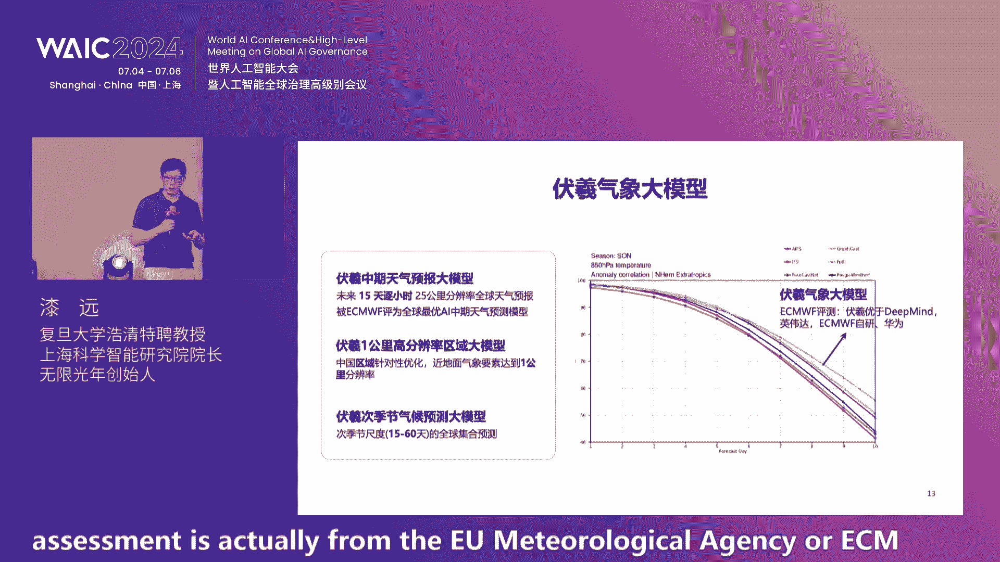

# 2024世界人工智能大会（合集） - P50：20240706-创业与投资论坛—超级模型、超级应用、超级机遇 - WarrenHua - BV1iT421k7Bv

🎼各位来宾让我们用热烈的掌声，欢迎各位领导和嘉宾的入场，也欢迎来自全国各地的人工智能创业企业、投资人启明创投的LP代表生态系统上的合作GPFA投行券商朋友企业家齐聚上海启明创投创业与投资论坛即将精彩揭目。

🎼好，尊敬的各位领导、各位来宾、女士们先生们，大家下午好。非常欢迎各位来到2024世界人工智能大会启明创投创业与投资论坛的现场。我们今年论坛的主题是超级模型超级应用超级机遇。大家下午好。

我是上海广播电视台第一财经的主持人黄伟非常高兴能够在启明创投的峰会现场和各位见面。引领新一代AI浪潮前拥有巨大影响力的大模型，从实验室走入业界进而走入人类的生活。

那么作为中国最早投资AI而且呢布局最丰富的投资机构，启明创投呢是连续第二年来主办创业与投资论坛。那么这个论坛呢也是世界人工智能大会唯一一场由创业投资机构发起的。

旨在从创新视角展示和探讨深城市AI时代机遇的分论坛。我们来立足创投的视角。今。😊，的论坛呢将会围绕的是生城式AI基础技术进展、商业应用前景和创业投资生态等等主题展开交流和分享。好，那接下来的时间呢。

请于秀为大家来介绍莅临我们今天论坛现场的各位领导和来宾。首先让我们用热烈的掌声欢迎上海市徐汇区委副书记、代理区长王华先生，欢迎王区。😊，欢迎上海市经济和信息化委员会副主任张洪涛先生，欢迎张主任。😊。

🎼各位同时呢在现场我们还要继续欢迎的是启明创投主管合伙人周志峰、启名创投主管合伙人胡旭波、接月星辰创始人CEO姜大新、商汤科技联合创始人徐冰，复旦大学号清特聘教授。

上海科学智能研究院院长吴限光年创始人戚远。😊，🎼无问新琼联合创始人CEO夏立雪，生树科技联合创始人CTO鲍凡，北京大学助理教授、北大银河通用联合实验室主任王贺，清华大学助理教授心动技元创始人陈建宇。

上海交通大学教授琼彻智能联合创始人卢策武智普AICO张帆、米果AI创始人CEO丁黎无限光年CO朱建雄、西之智能创始人CEO孙一桥、贤远科技首席算法科学家丁宁以及呢启名创投的LP代表。

同时在现场呢我们还要继续欢迎的是启明创投的投资企业家高管以及LOP生态系统上的合作GPFA投行券商朋友们和关心关注本次论坛的媒体朋友们。各位在这里呢请允许我代表主办方启明创投对。

所有今天来到现场的各位来宾，致以诚挚的问候，谢谢各位的支持，感谢大家，谢谢。😊，同时呢在这里也通过直播向各位正在线上收看我们今天论坛的各位朋友问声好，谢谢大家。好，女士们先生们。

接下来首先让我们用热烈的掌声，有请上海市徐汇区委副书记代理区长王华先生为今天的论坛致辞，掌声有请。😊，🎼，🎼，🎼，🎼，🎼，尊敬的洪涛主任，尊敬的各位嘉宾，大家下午好。

很高兴受邀来参加2024世界人工智能大会启名创投创业与投资论坛。首先，我警代表徐汇区人民政府对论坛的召开表示诚挚的祝贺。本次论坛是今年世界人工智能大会唯一一场由创业投资机构发起的分论坛。

旨在从创投的视角来揭示和探讨深成式AI的时代机遇。启明创投是国内领先的投资机构。也是最早活跃在人工智能和大模型领域的创投机构之一，先后投资了无问新琼、新环科技、艾莎医学、战略数据等优秀的创新企业。啊。

当然他们投的优秀机构非常多。我在这儿讲的这四个名字呢，是因为这4家企业是落户在徐汇的啊，实际上他们投了更多优秀的公司啊。😊，为徐慧的经济和产业发展做出了积极的贡献。徐汇区是上海国际科创中心的重要承载区。

科技创新资源丰富，汇集了100多家国家级市级的高校院所和科研机构。呃，总书记交给上海三大先导产业的发展任务，分别是人工智能、集成电路、生物药市委、市政府做了决策，各个区域错位发展，其中。

人工智能主要就在徐汇区。因此，各项国家战略和市里的功能性的机构的设立，都在徐汇区，比如像国家人工智能实验室，上海科学智能研究院、普星研究院。启制研究院等众多的一流的研究机构都是集聚在徐汇区的。

徐汇区还有800多家高新技术企业，以及有两院院士和海内外高层次人才1000余人。徐汇区的人工智能产业作为上海唯一入选全国首批战略性新兴产业集群，打造了中国首个大模型创新生态社区魔术空间。目前。

徐汇区已经集聚了大模型企业170家，有22个大模型通过了上线备案，占到上海的3分之2。徐汇区金融服务方面成立了200亿规模的区级国资投资平台和科创投基金，还集聚了一大批社会化的标杆投资机构。

正在打造上海首批股权投资集聚区。徐汇是人工智能产业发展的沃土和投资的蓝海。我们真诚的欢迎在座的各位嘉宾、投资人、企业家、创业者来到徐汇，和我们一起书写人工智能创新创业的新篇章。最后再次感谢启明创投。

为我们搭建了这个交流的平台。预祝本次创业与投资论坛圆满成功。祝各位来宾身体健康，工作顺利，阖家幸福。谢谢。😊，谢谢谢谢王区长，感谢您。😊，谢谢王区长，非常感谢徐慧多年以来对于取名创投的这个支持。

在这里的王区长也代表徐慧抛出了橄榄枝，我们期待有更多未来在人工智能当中涌现出的企业能够落户徐会，再次感谢。接下来呢让我们掌声有请上海市经济和信息化委员会副主任张洪涛先生为论坛致辞，掌声有请。😊，🎼，🎼。

🎼，🎼，🎼尊敬的王华区长，尊敬的各位专家，各位来宾、女士们，先生们下午好。非常荣幸与大家再次相聚在世界人工智能大会的启名创投创业与投资论坛。今年的会议主题是超级模型超级应用超级机遇。😊。

我觉得这个主题非常好啊，体现了启明创投对这个行业的判断，也引领了人工智能发展的方向。在此，我仅代表大会组委会和上海市经济信息化委员会，对莅临现场和在现上分享的朋友们表示衷心的感谢。

也向一直以来关心支持上海人工智能产业发展的各位专家学者、企业家朋友们表示衷心的感谢。😊，近年来，人工智能正以前所未有的速度和深度改变着各个产业，以大模型、人形机器人等为代表的人工智能前沿技术。

正与社会经济广泛的融合，成为发展新智生产力的重要引擎。在7月4号上午，李强总理在开幕式上做主旨演讲，他指出，上海在人工智能领域起步早基础好企业数量众多技术创新活跃。

围绕AI发展与治理率先进行了许多有益的探索，并希望上海继续巩固优势，打造人工智能的上海高地。我想这其中就有包括我们企业名创投，所带来的朋友圈和产业链。😡，一起做出的努力和贡献。😡，在过去的几年。

上海人工智能产业规模持续扩大，我们的规上企业和产业规模都实现了倍增，创新成果不断涌现。我们有34款大模型已经通过备案啊，刚才王区长也讲了22个就在徐会形成了非常急具的这个效应。

同时呢产业创新的生态也日趋完善。😡，啊，上海有国际金融中心建设的条件，拥有像启明这样一批啊独具慧眼的创投机构。而且呢我们的今年上海市也设立了新一轮的，就是总规模达到1000亿的。😡，啊。

人呃这个三大先导产业的这个投资母基金啊，可以讲为未来的发展。😡，创造了新的条件。😡，下一步，我们将认真的贯彻落实国家有关部署，进一步的深化产融对接，促进科技产业金融的更高水平循环。

加快人工智能高质量发展。一是要着力推进人工智能的科技与产业创新融合，支持多模态大模型、智能芯片、聚深智能等技术攻关突破，加速人工智能、新技术、新业态新模式，在垂直领域的应用。

培育开放活跃、有韧性的产业生态。😡，我们将着力的促进产业金融互动，积极的发挥基金的引导作用，鼓励社会资本创新金融产品和服务模式，以更大的力度支持关键技术研发产业创新的发展。

我们将着力的推进优质的生态打造，进一步提升智能算力能级水平，扩大包括金融语料在内的语料数据供给和服务，不断深化开放合作，持续的探索人工智能的治理。各位来宾、各位专家、各位朋友。

今天这场论坛汇聚了大模型、聚深智能，生成式人工智能应用领域的顶级的专家学者、企业家、投资者，期待各位嘉宾能够通过你们的分享，畅所欲言，促进创业创新链、产业链、资金链、人才链的深度融合。

为人工智能、高质量发展，和全球治理贡献智慧和力量，希望启名创投，持续的在科技创新。😡，产业升级等方面，继续发挥重要作用，促进投资界与政府部门企业之间的交流与合作。

上海将持续营造国际一流的营商环境和投资环境，深化与国内外人工智能企业科研院所投资机构的合作，共享人工智能时代发展的新机遇。最后，预祝本次论坛取得圆满成功，祝各位嘉宾在沪期间工作顺利，生活愉快。谢谢大家。

😡，谢谢感谢张主任。张主任呢刚才呢为我们大家详尽的介绍了上海产业规划发展的一些最新的这个信息。那在上海投资也是热土。同时呢这个AI的这个发展。在上海的，同样也是一片热土。

那我们特别期待有更多的在人工智能方面的领先的这个企业，能够落地上海在上海落地生根发展，再次感谢好，那么接下来呢进入到我们今天的主题演讲的环节。作为顶级投资机构，启明创投的多年前。

就已经开始前瞻性的关注人工智能的领域，进行产业链式布局，积累了大量的行业观察和投资方法论。同时呢也非常精准的投资了很多大家所非常熟悉的企业。

那么接下来呢我们将会邀请启明创投的主管合伙人周志峰先生为我们带来主题演讲，技术突破到应用变革AI发展的新篇章。各位掌声欢迎。😊，🎼，🎼，🎼，🎼，呃，尊敬的王华区长张涛主任呃。

现场看到很多这个熟悉的面孔好朋友，还有这个线上收看直播的。各位的这个朋友们啊，首先还是非常感谢啊大家能够来参加我们启明创投主办的这个创业投资论坛。😊，大家也能看到。

就确实今天我们下午这个准备了一个非常呃丰富多彩的这样的一个议程。那确实呢那个作为一个投资人，我肯定没有接下来要去来讲演的呃这么多的企业家、学者、行业专家，更了解这个行业。

但我想这个每年呢能够借这样一次机会。我们作为一家这个创投机构，确实一年能够深入交流，大概七八百家AI的企业。那我们可以从统计学的角度，从一个更宏观的模式的发展角度，跟大家做一些分享吧。

到底过去的一年呃在深圳市AI领域，我们看到了什么。那启明创投在今后我们会用什么样的一个投资策略。那都希望在这里借这个呃开场讲演的这个方式跟大家做一些交流，也希望我们的这个好朋友们能够跟我们呃更多的指政。

更多的一些。😊，交流。

首先就是先聊聊我们过去一年都做了什么事儿吧。就启明创投呢呃我们是在中国人工智能领域呃最活跃的创投机构之一。这个最活跃呢，我觉得主要表现为两点。那第一点呢就确实是我们呃投的比较早。

那第二点呢是我们投的比较多比较丰富。投的比较早，可能大家都知道就是我们启明创投从06年成立呃，用了一个比较特别的一个投资方法，就我们走的是specialist，就从06年一成立。

我们就成立了专业的医疗团队，科技团队、消费团队，希望用专业的人去干专业投资。那肯定市场上还有另外一个流派式这个generalist，就是大家哪个领域热，大家就都去投哪个领域。

那我觉得我们这种specialist的这种方式呢？呃他有一个好处就是我们能在一些大的科技周期，大的这种颠覆性的模式转换发生的时候，能够比较早的去识别。一些信号。对。

所以我们启名创投呢这边的团队呢也是因为在2012年，我们看到了alex night这样的一个巨大的技术的突破，给深度学习，算是啊敲开了一个新浪潮的这个呃大门。

所以我们从2013年就开始系统的布局人工智能。那包括其实这一次由这个transform预训练大模型为基础的这个深圳式AI我们也是在2020年的上半年，因为open aI的GPT three那篇论文。

让我整个团队意识到有一些不一样的事情。不一样的信号出现了。我们其实在2021年就投资了像包括马上今天要去讲演的我们的这个期院长啊的这个。啊，无线光年，然后包括我们2021年的年底投资了。

待会儿也会有一个分享的这个质普等等等等这些企业。所以我们在人工智能领域中呢，一直是呃希望能够识别这些关键信号投的比较早。投的比较丰富呢。就是说确实我们过去十年走过来。

我们已经投了大概有将近70亿人币或者等值的美金。在这个领域。那现在也有这个五六十家这种强人工智能的呃投资企业，其中差不多有20家都已经呃在这个二级市场上市。

或者是成为了这个10亿美金以上估值的这种独角兽企业，在各自的细分领域，都算是中国人工智能的一个领军者吧。对，然后通过我们投资这些大模型企业。那我觉得我们启明这个作为投资人呢。

一方面就是说我们可以对技术整个发展的大方向啊，可以变得更敏感看得更清楚。那也因为这些大模型的企业目前阶段，很多人都是把自己的模型能力对外输出，他们服务了可能成千上万个具体的场景，具体的应用，具体的行业。

那通过他们我们能够更好的感受到生成式AI应用落地的这样的一个脉络。所以这也是我接下来这十几分钟想跟大家重点分享的。我们通过向他们学习，看到这个行业有哪样的一些信号跟脉络。啊，还有一点也是特别的荣幸。

我们从今年1月开始呢，跟我们今天在座也在现场的顺序基金的啊我们的伙伴一块来管理了一支100亿人币规模的人工智能产业投资基金。那确实通过这样一个新的平台，我们也可以看到基本中国所有的好。我的AI的企业。

这是我们等于启明呢呃，在过去的这个呃从去年7月初大会到今年的一些呃。更新变化。那我们去年的大会上，我们的论坛中呢，包括我们去年论坛上发布的呃深圳市人工智能的报告，我们都展现了这张图。

这张图是我们对今天这个发展阶段，深圳市人工智能的一个生态系统，它的产业的一个脉络的梳理。那确实这个整个的一个三层架构，呃，我们到今天呢也没有太大的变化。我们依然认为这个在今天也还是这样的一个脉络。

我们依然可以顺着这样的脉络去继续投资。那只不过过去的一年确实在上面又多增加了很多我们呃非常优秀的这个投资企业。呃无论是在工具链啊AI芯片啊，我们都继续投资。那有很多的这个呃大模型的企业也也投了越来越多。

刚才我们提到我们一共投了10家在这个基础模型语言模型多模态模型跟军人智能模型的企业。那，根据第三方的一个统计，呃。拥有10家这样的大模型的投资企业，应该在全中国数量我们是第一名的。

甚至可能在全球的创投机构中可能也是数一数二的吧。对，然后呃我们也从今年开始加强了对深圳市AI的应用的投资。这边我仅仅是像与与爱为武啊、戏智科技啊作为一个代表吧。那我也相信当整个这个产业。

尤其是技术底座发展的更成熟后，那我相信从投资数量上来讲，我们投资的企业可能80%。都会是来自于深圳市AI的应用这样的一个领域的企业。所以未来几年。深圳市人工智能依然是启明科技投资最重要的一个核心领域。

那过去一年其实有很多对于AI啊不同的看法，对于整个的创业投资环境，也有很多保守的甚至悲观的一些言论。但启明我觉得我们这十年AI投资走下来。那对深圳市AI的信心是更足了。

所以我们在这块也可以跟大家非常坦诚的说，我们在最近也是呃增强了我们的团队，然后会放更多的精力来去布局人工智能。那我们人工智能呢呃唯一的变化，就是说我们以前更多把人工智能变成我们一种投资的一个技术。

或者是投资的一个垂直行业。但我们现在呢感受到人工智能呢，其实更多的像一个横向的能力。因为它并不仅仅是一个自己的细分领域。它会去真的去呃落地在这个千行百业，落地到很多的场景。所以我们现在把它作为一个。呃。

能力来去继续的布局投资。所以在座的线上的呃在这个领域中去呃努力奋斗的企业家们呃，创业小伙伴们，我们也特别希望呃我们能够有更多机会一起交流。未来用某种方式让大家一起来去合作。我们为什么对AI这么的乐观？

我接下来跟大家做一些简单的分享。那从资本投资的这个角度，那确实去年的统计数据，这是摩根斯坦利呃，启名创投团队的综合的一个呃分析跟评估。那去年全球在AI领域中的投资金额达到了224亿美金。

那确实这个数额非常大。那我们投了十几年的AI。那这个去年一年的在这个领域中的投资金额超过了过去10年，加起来的总和。那很明显，AI就是在今天呃从创业投资角度来讲啊，最大机会的一个领域。

那当然这224亿美金呃，确实70%到80%的钱，在去年是投给了这些开发大模型的企业。那20%左右是投给了呃深圳市的AI的应用企业。那我们相信今年以及未来看两三年，可能这个百分比会有很大的转变。

会有越来越多的钱去投向到那些去做呃模型的落地应用的这些企业中去。那除了这个模型发展，确实在应用层面呢，我们已经看到了呃一些初步积累了有规模的用户数的一些方向。对我们到今天为止依然认为深圳市人工智能。

还是处于它这个大的趋势周期的发展早期。去年在这个会上论坛上呃，我分享过，如果非要让我去比较。AI和互联网两个大时代，我认为可能应该。AI所处的这个年代，对比互联网可能是90年代中期，就因为你的。

底层的基础设施，底层的技术还在高速的动态发展啊，但确实我记得我在去年的我们启明创投内部的年会上，这个呃屈远院长这个也做过一个观点，我觉得特别好。

就是说虽然我们可能还是处在一个呃像互联网的90年代中那样一个基础设施快速建设，但它其实应用。😊，并没有像互联网时代一样，可能要等5年甚至8年后才会大规模爆发。因为确实过去几十年。

从呃互联网、移动互联网等等等等这些呃大数据一些这种技术的基础的建设已经非常成熟了。所以我们认为对于AI来讲，呃，它的应用的爆发，的速度会提前很多会很快。所以现在既是相当于互联网的90年代。

但确实可能也是相当于应用的2003年04年，其应用大浪潮。我们认为也即将来临。那我们现在看到主要是这个在三个C的领域中呃，AI的应用有很多的呃影响力。一个是抠拍了生产力工具。

一个是creativity创意，还有一个companship这些所有基于这种bo的一些做陪伴的一些这种聊天类的一些产品。对，所以他其实整个发展跟互联网的这个大浪潮也很像，它的底层的规律模式都差不多。

就一开始的时候，因为你技术还不够成熟啊，包括过来创业的从业者也更多是一些对技术掌握比较深的创业团队。他肯定先做的是一些工具。那这些工具主要是来所谓的提高效率的啊，现在叫做safe time。

那慢慢的技术成熟一点，然后大家对这个技术怎么能够跟用户需求的结合找得更准，会出现越来越多的所谓的Q time，就是真的跟人性离得更近的帮助。人类帮助用户获得愉悦的一些应用。

所以我们觉得深圳市AI的应用落地也还是像互联网的整个这个节奏跟方向差不多，是从s time到Q time的这样一个转变。这也。side呢就是我觉得就是是一个对人工智能的一个核心的底层模式的一个呃评价。

它其实不是我们的原创，是呃我们的一个同行呃美国的and的负责AI的这个合伙人呃martin casino的一个观点。我是觉得就是对于大的科技浪潮，可以从不同的维度去寻找它的类似的一个颠覆性。

但确实这个维度我觉得是很恰当的，就是从这个呃边际成本，尤其是编际成本的高速下降，甚至下降到零这个维度去来评判一项技术是不是一个最大的科技浪潮。那我确实是非常的相信呃微处理器。

互联网人工智能就是我们过去这50年科技发展史上最大的三个浪潮。那微处理器半导体其实核心是把计算的边际成本降为0。相比在。Makeprocessor微处理器之前那些什么IBM等等的这种大型机。那。

计算的处理的这个成本非常高。但PC把它降到了几乎是为0。那互联网之前，我们无论是内容分发、信息分发还是商品分发，那都非常的昂贵。尤其没有处于同样一个地理的位置，不同国家的话。

那互联网基本把这样的一个边际分发成本降为0。那AI核心其实是把整个的数字化的内容的一个创造制作成本降为0。所以我们认为从这个角度来看，那AI技术一定会得到一个长远的发展。那另外一点我觉得非常重要就是。

我们坚信AI的这次范式转移跟颠覆啊，中国会是全球最重要的一个区域和市场。我从5月份到前两天，其实花了大概有4周时间在中东地区，在美国地区访问了很多行业相关的一些人士和一些顶级的AI的实验室。

那我确实觉得中国在发展深圳市AI这边中的一个很大优势，就是呃中国有巨大的市场。呃，因为你每次出现重大的一些科技的变革和范式转移的时候，呃，中国都是一个孕育这种大企业，伟大的企业。

科技巨头的一个全球最好的温床。就因为任何一个科技趋势把它称为大趋势。mga trend它其实意味着影响力很大，但同时也有另外一个意义是什么呢？就是它很花钱。它慢慢发展成熟，一定要很多的资本投入。

那如果没有一个巨大的市场作为一个前提保证的话，那是很难保证这项技术有足够多的投入的。大家都看到了大模型企业融资都是在几亿美金十几亿美金，这样一个量级，如果没有一个未来的巨大市场啊。

作为一个潜在回报的一个前提是没有人去会大规模投入的。其实我包括我在中东市场，那聊了很多啊希望能够转型的一些呃中东地区的主权基金，他们也很难投入。因为本身的当地市场规模不够大。那你投入几亿几十亿美金。

你最后回拿到的回报其实并没有很大。所以我们觉得在中国其实这种模式转变，在互联网跟移动互联网时代已经发生过了。所以在深圳市AI领域中一定会发生。所以我特别相信就是新的这种千亿万亿市值的伟大的科技公司。

新一代的。科技巨头可能现在已经出现或者马上就会出现，这是我们的一个观点。那从技术角度，那我这边就是也是中国的其实在AI领域中的技术是非常强的。李飞微教授斯坦福的这个每年的年度报告呃。

AI index已经指出，就是现在中国的专利术在AI领域中，全球占比61。1%。那确实远远超过了其他国家。那我们从人才上来看，呃，保尔森基金会内部的这个智库呃马copolo它的一个报告。

中国呢其实在全球顶尖的人工智能学者这个角度已经占了全世界的47%，也是这方面人才最丰富的一个市场。这个是我们启名团队自己的统计，就不光技术。其实我们有很多的打造这种大应用的经验跟能力。

这也为我们中国能够打引领下一呃新一代的这个人工智能的原生应用奠定了很好的一个基础啊，我们统计了从2010年以后成立的至今依然在月活跃用户数超过5000万的这种应用或者叫超级应用。

中国的团队或企业一共打造了三十几家企业。那我们如果做一个对比，看看美国美国的企业团队一共打造了7个。当然还有一个zom，其实大家也知道他其实是中国团队。然后来搬到了湾区。对，所以确实这么一对比。

能够看到中国的企业创始人啊，是在打造超级应用上有很强的经验的。所以这也是我们对希望能够投资到新一代的人工智能的超级应用的一个信心的一个主要的基础。

那确实呢2024年我们认为整个深圳式人工智能的底层的技术底座还在高速的动态发展。我记得去年大会上，无论是启明论坛还是其他论坛，大家主要技术角度还在谈transformer在谈iffusion。

那那确实现在来看，已经向外去扩展丰富多彩五花八门的技术。那首先transformer跟iffusion就已经融合了。像我们投资的深入科技。

也是全世界最早提出基于transform架构的iffusion model的。然后包括在这个视觉语言模型，然后在MOE在这个A在RG等等等等。五花八门的技术都在快速发展，说明背后还是有全球的顶级人才。

在一个很高的密度在投入到人工智能领域。所以这也是非常好的一件事情。那应用更我们不要说了，去年我们开这个大会的时候，基本上提起生成市AI的应用，嗯就提这三个。😊，然后chGBT呃CAI和 journey。

但今年我们去看AI的应用。那有很多很多的品类。那我们启明这边呢也是在今年做了很多调整团队增强。我们也会重点关注7类甚至是AI的应用。呃，一个是verical AI这种垂直行业的AI的深入发展啊。

第二个是entterprise AI就这种对于企业提供更好的AI技术的这类应用啊。第三个是这种AI的内容呃平台内容的交互平台。然后呃第四个是这种呃相关的一些的AI的工具。

然后呃第五个是这个呃AI的呃游戏。然后第六个是包括呃AI的这个呃硬件。然后第七个是AI的一些这个深成的社区等等。我们有这样四个细分领域，我们也希望能够去捕捉更多的好的企业。

那这也是我们去年在我们的论坛上，以及在我们的论坛上发布的深圳市人工智能的报告上呃，给大家做了一个分享。就是我们去年的时候呢。基于我们深度交流的200多家中国深圳市AI的应用企业进行的统计。

那可以看到当时在这个第二列的中间部分，那时候还是主要以生产力工具为主。当时统计看有46%都是做这种s time这种类型的应用，就这也比较符合技术发展趋势。当技术没有很成熟的时候。

先是一些人做出一些工具提供给比较专业的用户来去用。然后在其他的ja的方向呢，也出现了这个呃像一些chabo智能助手、娱乐应用等等等等，但占比都不是很大。那在底层技术这块。

去年其实主要是这种做这种基础模型。通用基座模型的企业和一些做这种呃针对大模型的训练跟这个呃呃它的一个呃分布式训练的这样的平台。那我们看看今年的情况。截止到今年的6月底。

那我们根据我们深入交流的大概有400多家企业。我们又做了一个新的统计。那这一年以后呢，你看到这个深圳市AI的创业领域还是扩展了很多很多。呃，第一个变化就是语言类应用的占比，那是有显著的下降。

那因为确实去年大家还处于在消化。呃，open airGTP模型，然后在这个GPT模型的之上套个壳做一些简单的应用。那今天确实越来越多的创业公司意识到多模态，它肯定就是一个呃能够带来更好用户体验。

能够更多的一些产品特性的一个基础技术。所以多模态的应用比例上升到了48%。那第二个就是说呃我们看到很多基于这种深圳市AI大模型技术的一些新的应用领域，像AI搜搜索AI游戏、AI社交等等。

然后我们看到很多新的内容平台已经出现了。做资讯的啊我们待会要分享的做漫画的平台，做短AI短剧的平台，做角色互动平台等等等等。都是在过去的一年中出现了。那当然大模型也带来了A的巨大的一个能力提升。

所以看到了很多这种呃做to C的ag的产品和这种做to B的，比如专门做营销的采购的ag这样的新的创业公司。那第三个变化就是说我们看到了更多的创业公司，它确实是深入到某个具体的行业跟场景。

那比如给医生服务的这个医生助手，为科研人员服务的科研助手等等等等。有很多这种行业垂直的这种 AI的这个企业。最后一个变化就是说底层技术的创业公司也变了很多啊，去年是29，今年反而还增加了，变成了31%。

那只不过比去年做底层技术的公司的这个方向的更多元化了，很多做RG检所增强的，做这种workflow的那以前更多是做这种训练的分布式计算框架的。

今年有很多比如我们投资的这个无问星求去来去做这个推理的优化加速等等等等。有很多新的企业。所以以上是我们对这个。我们看的这个400多家的企业的一个统计。行业那从创始人的画像来看也挺有意思的。

我们也归为三类人。三类人在非常积极活跃的创业。那第一类就肯定是简单说就是科学家，无论是呃在科技大厂厂中的还是在大学中的研究机构中的，基本上这些人都是世界级别的顶级的AI的科学家。

然后呃第二类呢就是行业专家，他可能是对一个行业特别了解，或者是科技大厂中对产品对运营非常资深的人士。那这一类人呢通常按照一个技术发展的趋势，他会在一个新的技术推出后的6个月，12个月。

有一段的观察期后进行创业。那我们算了算，正好也是差不多在2022年的11月30日推出GPT这样一个标志性的节点以后，大概在6到12个月中，我们看到大量的呃这样的人从科技大厂辞职出来创业。呃。

都是在去年的下半年跟今年上半年啊，形成自己新的企业。😊，第三类呢就是这种新锐。我们看到越来越多的95后甚至00后的创业者。那确实每一个科技浪潮大时代都会是所谓一半救人，一半新人。

总会有一些这种从第一天就沉浸在这个技术中的这种非常有闯劲的新人来创业。那你像在这个PC时代有比尔盖茨、乔布斯呃在互联网时代，有markuckerberg等等，都是这些非常年轻在创业之前。

并没有什么其他工作背景的人，我们也看到了很多这样的人。那确实他们也对这种产品，尤其是用户的心智。这种新一代的年轻的用户心智把握非常精准。他能够与今天已经比较成熟的一些大模型的技术做结合。

当然三类人人群呢都有自己一些很明显的优点跟缺点。那呃目前来看呢，就是AI科学家的创始人的占比还在3分之1左右。这也其实是一个标志，就说明这个技术浪潮还是在早期阶段。因为这样的人群。

他确实对技术的这个呃底座的边界掌握的更精准。他对技术发展更敏感。那我们也去认为第二类第三类创始人的占比会在未来两年呃持续显著的上升，最后变成一个呃主流。还有三个问题，在AI应用落地时候也非常明显。

那第一个就是成本。我记得去年我们开始大会的时候，每百万。的token的调用大语言模型成本在120美金左右，差不多800多人民币。那今天大家都知道，那在座的很多的大模型的代表厂商。

已经把百万模型的成本降到了不到1块钱人民币，这是1个1000多倍的下降。在一年的时间中。那我们去看，依然认为有巨大的一个成本下降的空间。所以我相信在未来一两年中，这个成本再下降1000倍。

我觉得是大概率的事件吧，成本越低，整个应AI的技术落地才会更容易更好。还有一个就效果。那过去的时候我们呃去年的时候我们更多提的是大模型的这种呃所谓的幻觉现象。嗯，这肯定还是一个主要问题。

但其实又另外两个呃关于大模型效果也非常重要。一个就是说呃当这个用户去向这个语言模型或者个产品提了一些误导性的问题。这个原模型应该怎么回答。尤其你像to C的应用，这是一个很大的问题。

这个什么样的技术能够解决这样的问题。那另外一个肯定就是当把大模型应用在具体的行业场景中，你它的是不是针对这个细分场景，它原言模型的回答，这个生成内容比较合适准确，也是个难题。

我相信待会这个呃齐院长这个可信大模型，也许可能在它的这个讲演中也会来探到这个问题。😊，最后一个就留存。那实话实说。

那这个第一波的这些AI应用的留存率还是与我们已经发展了一二十年的互联网的这些头部应用没法比的留存率都相对比较低。那怎么能够真的让大家不是因为新鲜去用生圳式AI的产品，而是真的把它变成自己的生活。

无论是Q time还是 time save time的一部分。我觉得是接下来应用发展最重要的一个问题。我们去年在我们的报告和我们的论坛上也发布了一个对AI的发展的十大展望。

这个主要是我的同事这个胡奇的呃贡献。那他也给自己打了一个分。一年后我们到底预测对了什么错了什么我觉得他还是比较谦虚，故意留了两个是有待验证，那其实没有写1个我们都答对了。但基本上来看。

我觉得1个我们的预判还是比较准确。尤其当我们比较早的判断出就是说ffusion这种呃多模态模型不是一个呃可能最好的形式。那确实在今年2月份啊。

随着这种transusion model出现模型包括诉啊等等等等快手啊字节啊腾讯啊等等都在用这个路线去发展啊，包括我们月星辰等等所以其实证明我们一年前的预判是对的其他等等我就不一一的去赘述了。😊。

那今年我们也就在斗胆，我们又做了十大的展望。那包括这个呃对这个AI的。整个GPT跟扩散模型未来的进一步的融合。那包括数据。因为大家很多人都说。

我们最近也跟open aI跟这个呃谷歌d mind团队做了很多深入交流。他们也都提到啊。有可能没能更早的提出新一代大模型的一个核心原因，就是训练数据。

尤其是公开训练数据级的这个13trilling13万亿数据已经不够用了。他们不得不拿同样的数据训练几遍来去训练一个模型。如果能够有更多高质量的，甚至来自于这种私有的数据。

可能人工智能大模型的还会再往上走一步。那数据也是非常重要的因素。呃，等等等，这块我就不说了啊，我们。接下来呢也会再去推出今年的一个深圳市AI的一个新的报告。我们会对这个十大预判会有一些更详细的一些介绍。

去年我的结尾是用了这样一句话吧，叫ign thecycl the boring businesses其实更多是我对我们自己投资团队和对我们投资企业的一个呃分享。就是说确实甚至是AI这件事太热了。

大家看看今天这三天的WAIC的观众人数，我就从来没有一个科技的会议向我们WIC这么大的一个关注度。那确实在这种巨大关注度中就有很多这种泡沫这种炒作。

那炒作泡沫都是短期的那无论是我们进行AI投资作耐心资本，还是去创业做一个好的产品好的业务，它都是一个非常长期的事。

所以去年我想说我们大家在这种噪音中天天的这些看不完的标题躺的提各种各样的匪夷所思观点的这样的公众号文章中，如何能够沉下心来踏踏实实把这件事情想清楚，有自己的观点去努力的去干事。😊。

那今年呢我在这个基础上再分享一句话，也是最近经常对我们很多同事，然后很多行业中人问我说到底超级应用什么时候出现。我最爱说了一句话，因为我本人也是一个一直是一个乐队的乐手。

所以这是来自于我非常喜欢的一个乐队枪炮与玫瑰的一首著名的歌曲叫patience，就是al need just a little patience，就是我们已经看到了这个技术的潜力。

也看到他的现在目前面临的这个三四个大的问题，但他的进展已经非常清楚了。所以我觉得。😊，人工智能再上一层楼，超级应用出现都是可以指日可待的。只不过我们需要一些耐心，它不会像是贝多芬的命运交响曲一样。

突然在明天就是命运来敲门的那种激烈巨浪拍门的感觉，就它会更像是梁祝一样。你先听到的是隐隐约约远方传来的若有若现的一些鼓声，然后慢慢进了长笛，慢慢小提琴的主旋律才会出现。所以我们都需要更多的耐心。

踏踏实实去静待这个超级应用的出现。所以这是我今天的一个全部的分享啊，感谢大家，这谢。谢谢非常谢谢周志峰先生给我们带来的精彩的开幕演讲。我们特别期待啊这个启明创投的第二份的深城式AI报告的这个发布。

各位在大会开幕的当天呢，接月星辰发布了万亿和多模大模型，引发了市场的关注。那么接下来的时间呢，让我们掌声有请接月星辰的创始人CEO姜大新先生。

他今天带来的分享主题是攀登AGI的路径与实践万亿参数加多模融合。来掌声欢迎。😊，🎼，🎼，各位领导啊，各位嘉宾，大家下午好啊，很高兴呢有机会参加这个启明发起的投资和创业和投资论坛啊。

和独岸和alex我们也是好朋友了。那么所以很感谢这个启明啊，有给我们创造这样的一个舞台，能够大家分享各自的观点啊，相互学习，相互交流。😊，那大家呢可能也不太了解这个街月新辰。

所以我这里呢也做一个简单的介绍啊，接月新城是去年4月份在上海徐汇成立。

呃，是我们的定位。呃，是一家这个通用大模型的创业公司啊，主要的方向呢是研发多模态基础大模型啊，目标是探索实现通用人工智能的道路。那么在研发模型的同时呢，我们也积极打造人工智能加的应用啊。

希望以这个人工智能的技术来放大每一个人的可能。啊，公司成立一年多时间里呢，取得了快速的进展啊，尤其值得一提的是呃我们在计算机视觉、自然源处理、搜索引擎、高性能并行计算这些关键的领域汇集了一批海内外顶尖的人才啊。

这也是我们能够取得这个快速进展的非常关键的因素。那今月星辰的首次亮相呢，其实也是在上海。今年3月23号的时候，在上海举行的全球开发者先锋大会GDC大会上，我们对外发布了step系列的大模型。啊。

这里包括一个step一是千亿参数的语言大模型。stepep EV是千亿参数的多模态大模型啊，那个时候我们还发布了万亿参数MOE大模型step two的预览版。

那么从GDC大会到现在来100多天的时间内呢，我们依然保持了一个高速发展的节奏。在本次WISC大会上，我们发布了万亿参数MOE大模型step two的正式版啊。

这个模型呢目前可以在我们的官网step放点com上，大家可以啊申请注册也欢迎大家使用提出宝贵的反馈意见。那么同时呢我们把多模态理解大模型step EV升级到了step1。5V，性能有了非常大的提升。

而且这里呢还有一个亮点，就是step1。5V这个模型啊是可以做视频的理解。那么第三个呢就是stepep系列的这个模型家族啊迎来了一个新的模型，它是一个图片生成模型，代号是stepepEX啊。

这也是金月星城首次推出多模态生成大模型。啊，所以我们看到在过去一年多的时间里啊，啊我们的模型覆盖了从千亿参数到万亿参数，从单纯的语言模型到多模态模型，从多模的理解到多模的生成啊。

我们连续的攀登了多个台阶啊，也可以说实现了多次的这个阶阅啊，打造了自己的这个模型矩阵。其实呢也不仅仅是街月新城一家发展的速度这么快啊，整个大模型这个行业的发展速度就是飞快。啊，大家可能都能感受到。

每个月每个星期都有新的技术，新的模型，新的产品发布出来，令人目不暇接。所以大家经常说AR一天人间一年。那么围绕着大模型的发展，因为它的速度非常的快，所以各种各样的观点，甚至是争论，也是纷纷扰扰。

喧嚣尘上啊，比如说关于skating law，有的人赞成，有的人持怀疑态度。尤其是前一段时间据说这个GPT5的发布时间要推迟，甚至有可能推迟到明年年底。那么怀疑的声浪又高了一些。那还有人说呢。

其实在实际应用的过程当中，小模型的性能就很好了。大家不需要大模型，不要去做大模型了。我们专心的来卷应用吧啊，这里还有列举了非常多的观点啊，其实我觉得这些问题都很好啊。这些观点呢。

其实也是在从不同的角度啊去说明问题啊，这里呢我也不是企图要给出这些问题的答案啊，只是想抛砖引玉啊，给大家做一个参考。我们认为呢攀登AGI的路径可以有两个重要的方向。一个方向就是sing law。

也就是不断把模型的规模做大。但是同时我们也认为，如果我们仅仅把模型的规模做大，是不足以达到AGI的。换句话说，它是一个必要非充分条件。因为还有一个重要的维度是世界模型啊，这两者相辅相成，缺一不可。

那下面呢我想就沿着这两个方向和大家分享一些节阅的思考和实践。首先这个s law可能大家都很熟悉了，对吧？就是2020年这个open AI提出来。它的意思呢是说，模型的性能。

随着模型的参数量、数据量以及计算量的增长呈幂次方的增长。也就是我们经常说的这个power law distribution。而 openenI过去几年的发展呢，也确实验证了斯个的有效性。啊。

如果大家回忆一下过去的话，GPT1它的模型参数只有1。17亿。而到了GPT4，它的参数量已经达到了1。8万亿啊。据外界推测，那么它的参数量总共增长了1万多倍。啊，与此同时呢。

我们看到模型的质量确实也出现了本质的飞跃啊，大家说这个GBT two啊，像是一个就是可以偶尔的写出一些连贯的句子，写出一个段落，像是一个一二年级的小学生。啊，那么到了GBT3的时候啊。

它已经变成了一个通用模型啊，它既可以做阅读理解，也可以解这个算术应用题。那么至少是一个小学高年级的学生，或者说是一个初中生的水平。那到了GBD4，他已经能够学习高中生的课程啊，参加这个考试。

甚至比很多人类的高中生考的成绩还要好。所以过去几年的发展呢，验证了这个基呃sing load的有效性。但问题是，我们已经到了这个万亿参数的级别以后，往后skining到还能走多远呢啊。

这个是大家在争论的一个问题啊，其实我也没有答案。因为sing law它不是一个理论上推出来的一个定律啊，它更多的像是一种信仰。那我自己相信呢就是s law到了万亿以后，可能还能往上再走两个数量级啊。

达到百万亿这样的一个量级。嗯，因为我们看到啊就是可能大家也经常看到一些新闻。就是国外的科技巨头，像谷歌也好，亚马逊也好，微软也好，包括amazon呃，包括这个呃 metata和这个elonm啊。

都提出准备投入这个几百亿甚至上千亿美金去购买这个算力建立这个操算中心。那我的解读就是国外这些巨头呢以这个真金白银，表达了对这个sing law的信仰啊。

所以我认为这个目前sing law还属于一个陡峭的阶段。那么再往后。我觉得可能就是资源和RY的问题了。那数据够不够，能源够不够，ROI是不是合理啊，这些可能会影响到s个的发展速度。

那正是基于刚才所说的认知呢，杰悦新城在去年8月份成功训练了千亿参数模型stepP以后呢，在年底我们又启动了万亿参数stepep two这个模型的训练。这个从千亿到万亿。这个参数量提高了一个量级。

但实际上它的这个训练难度提高了不止10倍啊，因为我们训练大模型有这个四个四大要素啊，算力系统数据算法。我们内部称为铁人四项啊，所以从千亿过渡到万亿，我们一方面是从这个数据和算力的角度大加大了资源的投入。

另外一方面呢，也在这个系统和算法方面做了非常多的探索啊，做了非常多的创新。啊，最终呢是走出一条自己的训练万亿参数这个混合专家模型的道路。那么前面提到在3月份的全球先锋开发全球先锋者开发大会上。

我们发布了这个step two的预览版。那这次WIC上呢哎我们发布了正式版啊，非常欢迎大家这个使用一下。下面呢我们展示一下stepep two这个万亿参数大模型的这个智能啊，在这个榜单上啊。

我们从各个角度啊，从这个逻辑推理啊，世界知识数学，还有这个编程，采用了这个多个权威的评测集，对模型进行了全方位的评测啊，我们看到这个step two这个模型的得分呢啊已经全面接近了国际主流模型啊。

这里的主流模型，包括像GPT4这个啊google的这个啊 anthropic的cloud three以及这个lama lama3，甚至在某些测试集上呢啊我们还实现了超越。

那么接下来我们其实还会继续训练这个模型啊，因为我们观测到，就即使是现在这样的一个模型，还是一个训练不充分的一个阶段。就万亿参数的模型，它是一个数据怪兽。啊，它可以吃进非常非常的多的数据啊。

所以接下来一段时间呢，我们还会继续收集高质量的语料啊，对它进行持续的训练。我们也相信呢随着这个数据量的增加，随着计算量的增长。这个模型的性能，还有进一步提升的空间。好。前面呢说的是这个sing law。

那在我们攀墩这个sing law的同时，我们也认为多模态是构建世界模型的基础能力，也是通向AGI的必经之路。那么这里呢我们画了一下这个世界模型的演化。我们认为从这个算法的角度来看，可以分为三个阶段啊。

第一个阶段把它叫做模拟世界。也就是说，我们把人类所有的数据以及知识灌输给这个模型，然后通过这个模型的压缩，能够预测下一个token。这是现代一代模型的特点啊，我们把这样产生的模型认为是对世界的一个模拟。

那么第二阶段呢，我们是把大模型和巨生智能相结合，让它和物理世界能够进行交互，主动的探索这个世界，从而获得更多的数据和知识啊，这是第二阶段。那么最终的阶段，大模型要能够归纳和总结物理世界的规律。

发现人类尚未发现的规律。那比如举个例子，牛顿从这个苹果落地就能够推演出万有引域定律。那么如何透过这个现象抓住事物的本质，总结出客观的规律出来。目前的大模型还不具备这样的能力。啊。

所以我们认为这个三个阶段呢也不是依次展开，它是可以并行发展的。但是呢进化的速度可能有所不同。越到后面的阶段越是困难。我们看到美国的科技巨头已经在这三个阶段同时布局。比如说以 openen eye为例。

在这个模拟世界这个方面，我们的感觉是他加快了这个积极的在探索多么融合。去年发布的GBT4V啊，今年又发布了sra以及这个GBT4O。我们看到他这个多膜融合的脚步是越来越快。而在巨神智能方面呢。

open AI投资了这个机器人公司啊，开fier点AI。同时呢，他在5月份的时候，又把原先解散的机器人团队重建了起来。还有在归纳世界方面，open eye主要做的是超级对齐和系统二的研究啊。

原来这个团队是由伊利亚亲自带队，那么伊利亚离开欧enI以后呢，又由这个贾co夫接任啊去年这个所谓open eye的公斗时候泄露出来的那个Q star项目啊，就是他们对系统二的一个早期的一个探索。

所以从模拟世界到探索世界，再到归纳世界。贯穿这三个阶段的基础能力是多模态的能力。目前呢多模态处于一个融合的阶段，但我们认为多模态仍然处在一呃仍然有一个巨大的挑战。

就是现在的视觉理解模型和生成模型是分开发展的。比如说GBT4V，大家知道它是一个理解模型，而sara它是一个生成模型。那这样做会带来什么样的后果呢？就是理解模型的理解能力强，但生成能力弱。反过来。

生成模型的生成能力强，理解能力弱。啊，这句话是什么意思呢？我来举个例子。比如说我们可以想象一个场景啊，一个老师在黑板上做板书。那么老师这个手的姿势以及粉笔和黑板接触留下的印记。

这样的一个paons是可以捕捉到的。但如果这段话很长，老师写了一半以后停下来了。这个时候我们问根据前面的内容，老师后面会写什么。那这个时候呢，sara就很难去预测。这时候我们需要的是一个理解模型。

对它的内容加以预测。所以这也是sra目前的一个缺陷。那这里我想说明的是啊目前生成和理解。视觉的生成和理解还没有被统一在一个模型里啊，这也是金月新城下一阶段所要探索的重要的方向。

那接下来呢再向大家介绍一下接月在多模态领域取得的一些进展。首先呢我们要展示的是呃step1。5V啊，它是一个呃多模态的理解的一个模型。那前面也介绍过这个模型的一大亮点是它可以理解视频的内容啊。

我们看到很多其实呃视频理解的大模型呢，它是依靠了视频当中的字幕或者是人物的对话来理解视频的。所以它本质上是一个文本的理解模型。而sstep1。5V呢可以在没有字幕和人物对话的情况下。

完全依靠视觉的信号来对视频的内容加以理解。下面我们看一个展示。

这是一段视频，拍摄的视频没有任何的字幕。那我们可以要求模型去回答视频的内容是什么啊，那这时候模型可以准确的识别出啊，这是上海的城市夜景啊，以及它能够识别出一些著名的建筑物啊。

像是东方明珠电视塔、金茂大厦啊，金融中心等等。那我们还可以要求这个模型去创作出一个B站风格的文案。啊，这个时候呢呃模型就可以根据它这个视频理解的，在视频理解的基础上产生出一个还不错的文案出来。T。好。

前面所演示的是多么理解的能力。那么在多么生沉的方面，呃，其实今月星辰起步的不是很早，但是呢进展也很快啊，下面向大家介绍的是一个我们和上海电影的一个合作。那上海电影呢有很多的经典IP啊。

大家可能都很熟知的大闹天宫葫芦娃黑猫警长，对吧？有非常呃独一无二的这个中国美术的风格，也伴随了很多人的童年。那么呃。上海，但是这些经典IP呢用传统的方法去产生出它的内容是非常费时费力的啊。

所以我们的一个问题就是能不能用人工智能的方法去产生出这些经典IP的内容，新的内容出来。那么这里碰到的一个挑战就是这些经典IP的所有的存量的影像资料是非常有限的啊，比如说葫芦娃啊。

这个所有的影像资料加在一起不到200分钟啊我们知道大模型是一个da hungryungry的一个怪兽，它需要非常多的数据对它进行训练。所以这里我们面临的一个生辰的挑战。

就是能能不能在非常少量的数据的情况下，还能让算法交会模型，去完全的学会上海电影这个IP的风格啊，这是我们和上海电影这个联合探讨的一个一个一个内容那这次WIC呢如果大家有兴趣去看这个街月星辰的展厅啊。

我们展示的两个内容啊。左边的这个是一个互动的小游戏啊，就测测你是哪路的神仙啊，它基于了这个基于的是大闹天宫这样的一个IP啊，和这个用户互动以后呢，它能模型能够及时的产生动态的剧情以及这个图片啊。

大家有兴趣也可以。扫描这个二维码去玩一玩这个游戏。那右边的这个呢是待会儿会播放一段视频啊，它展示的是我们可控IP生成的这个能力。🎼老孙上天入地，没有的你佣，那就以了。😡，🎼啊。

这里我们主要基于的是葫芦娃这个影片中的IP形象。

🎼这所有的内容都是模型产生的新的内容，不是原片的内容。

🎼这个呢其实还是我们视频生成的一个初步的尝试啊，下面我们接下来我们会努力把这个情节能够做的更加的复杂，后面画面能够做的更加的精美。那除了和上影的合作以外呢，杰月还发布了两款to C产品啊。

一款产品叫做这个效率工具类的产品。月问它已经搭载了我们强大的这个多模理解的模型啊，它不光是文本进入文本输出啊，大家有兴趣的话，可以输入一张或多张图片，输入一个图表或者是输入一段视频啊。

那这时候呢这个模型啊，可以根据这些视觉的输入啊，加以理解，并且产生逻辑推理，产生输出。那还有一个呢是开放世界类的冒泡鸭，这个产品具有丰富的剧情和丰富的人物啊，甚至用户可以根据自己的爱好。

自己的兴趣去创建新的剧情，获得沉浸式的体验。也欢迎大家这个下载体验。啊，最后呢也说说呃大模型的应用生态。那目前我们在这个金融财经内容创作等方面，与行业的头部企头部企业以及政府部门展开了深度的合作。

共同探探索积累大模型落地的经验，为合作伙伴啊提供价值啊。比如说我们和这个上海报业旗下的界面财联社啊，成立了财月新城，然后联合这个国泰君安一起发布了国内的证券垂直大模型啊，军宏灵犀大模型。

那将来呢我们也希望能够携手更多的合作伙伴，让我们一起以接月之力赴星辰大海，谢谢大家。好，谢谢。😊，谢谢姜大新先生的这个分享。

的确呢江大新先生呢刚才给我们带来的这个分享呢呃有相当多的内容也非常的这个有趣哈。那让我们可以关注到可信大模型公司呃，无限光年，其实呢也同样在大会的前一天发布了可信光宇大模型及其技术报告。

那什么是可信大模型。那又将为大模型赋能千行百业带来哪些改变呢？各位接下来的时间让我们掌声有请的是复旦大学浩清特聘教授，上海科学智能研究院院长无线光年创始人戚远先生带来分享。

辉和可信技术释放大模型生产力来掌声有请。😊，🎼，呃，今天很高兴来到启明这个论坛呃，超级模型超级应用，超级机遇，非常荣幸，非常棒的名字。那我们要做的东西呢，有可能在。😊，第二个第三吧，超级应用超级机遇。

但我们做的模型也是不一样的。所以我今天讲一讲我们在做什么。

呃，我从两个视角来讲，一个我们讲星辰大海，从技术的视角，我们叫顶天立地。另外一个从需求的视角，从市场的视角来，我们来讲我们今天需要什么样的大模型。先从技术视角，其实前面我觉得已经被剧透差不多了。

但是呢我稍微recap一下，就是今天的s了其实经常有人问我啊，从投资界的到这个创业的朋友，我们交流就说还有多少红利。呃，其实呃大家也知道这个人的大脑对吧？

200亿300亿400呃呃200万亿400百万亿上千千万亿。今天大模型讲的是万亿大模型，那就意味着我们还有2到3个数量级。如果人脑是任何的一个我们叫reference point。

那就认为有可能我模型变大之后，还有红利。😊，但是另外一个问题我们就知道，人脑在很多人没有想到的时候，在很多情况下，人是一个能有多懒就多懒的情况。什么意思呢？大部分情况在思个大部分情况。

3%5%神经元被激活，很其他的神经元并没有被激活。那这是意味着什么呢？意味着它是非常我们要稀疏的一种工作方式。那这和今天大模型是非常不一样的。今天大模型整个神经元推理是全部激活。那这意味着什么？

意味着海量的计算，意味着我们对能耗的大规模的增长。那这样我们我要思考有问题。啊，第一个我们scal如果第一再往下面走，肯定是能源的极度的耗损。😊，呃，我们有没有其他的想法，其他的可能性？呃。

这里边的话呢，首先我想到就是一个呃前一段有一本写诺呃去世的一个著名的经济学家canmen呃，写了一本非常经典的书，叫做快思考慢思考。

他把人类思考分为两大类叫一类一类type one类型一和type two类型二的思考，类型一一的思考。比如我建了一个老虎，我不用思考。我不会分析它的爪子特别厉，牙特别厉害，我再决定跑。

见到的时候心体会产生本能的反应，就想这种恐怖的恐惧的反应，想要跑，这更像一个深度模型，深度学习的模型，大模型立刻产生一个判断，但他并不能解释。😊，那另外一种的话是慢思考。那我们在做这种呃。

比如这个科学推演的时候，有可能写下非常多的公式。那这个是一步一步的推演下来，有可能写写到后边的时候，第三页的时候，回头再看第一页。那这种的话是一种标准的人类的慢思考的典范。而在我们今天大模型的时代。

我们大量的依靠的其实是。😊，海量的数据堆出来的一种黑盒的模型，一种快思考的模式。那我们想的话呢，我们有没有可能性把这种快思考和慢思考结合起来嗯。呃，展开稍微再讲补充一个点。其实讲到这个地方。

sing其实今天讲sing一个最大的点的是在讲lar language models大语言模型。呃，上一呃两周前应该是麻省理工有一篇文章出现在自然杂志上，他的文章是说语言是思考，不语言是交流的工具。

但不是思考的工具。😊，呃，我们发现就是通过方MRI看大脑活动的时候的活动区域，思考出活动区域，会发现语言区域并没有被激活。那其实反过来还有真实的生活当中例子，呃，得失语症的人不能语言表达。

他但是同样可以非常的精准进行推理和分析，反过来也是一样，有一个人可以有些人可以非常好的表达，但是他逻辑思考能力非常非常差。相信我们大家都经历过两种的朋友都会有。那这里边其实在讲语言是非常重要的一部分。

但是在逻辑推理，在思考里边，它是不够的。😊，那我们说那我们能不能把这两个结合起来，把这种基于海量数据，我们讲transformer架构做出来的黑盒模型和我们讲的逻辑思考这种能力结合在一起。

我们就像一个黑盒，一个白盒，两个放在一起，那就像所谓的类型一和类型二的思考结合在一起，那我们就说这叫灰盒大模型，灰四来自哪里呢，其实世界不是黑和白，我们不不仅仅只要逻辑推理，其实在一在上个世纪。

其实这个逻辑推理的这种AI模式非常盛行过啊，那个时候最著名的专家系统。大家在判断生病的时候，通过专家系统来判断，不管在尤其在日本这是当时发展的非常快。但后来的话呢，遇到非常大的挑战。

就是因为它不能处理真实数据，真实世界数据的噪音，它强烈依赖于手写的规规则。但另外一方面的话，我们今天也看到如何纯纯依赖黑盒的神经网络，其实从数据。😊，样到对种真实的规则的这种一呃深度的推演能力不足。

都产生非常的挑战。所以呢我们想一个非常有重要的方向，就是把这二者的结合所会合的大模型。那这里边的话呢其实有两个两个点我想说一下，呃大家讲深度学习其实都对数据的模拟，呃。

不管你用的transformer架构还是用的是diffusion model，大家会说其实你用的什么样的数据就会产生哪怕你模型架构改一改数据某种角度直接决定了你最后的结果，你的能力。

那就在讲其实我们只要工程堆上去之后，其实大家本质化是非常类似的。不管是哪一个团队，那我们要问的问题谁有不一样的数据，但是数据呢它只是内部的拟合，而规则能做到什么规则可以做到数据之外的推演。

就像爱因斯坦它在地球上看到一个地方，它推出了相对论，那这是他比牛顿的伟大的地方。牛顿可以看看苹果落地的速度。推这个。😊，呃，这个呃力学第二定律，包括后来的万有引力。但是对相对论而言，是实在宇宙之外的。

是在地球远远在地球之外，是数据不能看到的地方。它在整个宇宙的一个应用，其实叫我们叫外插，在数据没有的地方有更好的扩展性。当然对很这个反过来讲，规则本身也前面讲的很脆弱，规则也要调整，数据产生噪音。

数据发现不一样的地方，有可能专家系统就很大的挑战。就像科学发展，从牛顿的时代，我们会来走向相对论的时代。那这个也是一种范事本身的变革，就是当年的规则在后来变得不再适用。规则本身在数据的支持下也会往前走。

所以呢我们说呃我个人的一个标准，前几天说就是AGI就通用人工智能。从未来来讲，一个除去我们所谓情绪价值价值观的判断之外，在真正的理性巅峰上的一个最好的体现，就是人工智能的爱因斯坦来发现什么意思呢？

就是发现复杂世界的未知规律。呃，复杂世界其实包括两种，一个是数字的世界，一个是物理的世界。那数字世界里边，当然大家从文本到语音到图像到视频呃，这里面各种各样的数据，但是走到物理世界其实更复杂。

你需要推演，需要接触，然后总结他相关的规律。那未知的地方也非常有意思。爱因斯坦做了什么事情呢？爱因斯坦他会想。😊，我。假因为他观测的数据非常少，不像牛顿，他会想，假如我乘坐光速往前看的行进的时候。

我看到的世界会是什么样子。那今天用大语言的模型，大家会想那这个不就叫synthetic data嘛？合成数据嘛？我在合成一个数据，我在理解我来判断会是什么样子。

那这其实讲未知规律的时候都是数据偏少的地方，我们能不能通过合成的数据来判断，通过以前已有的规律结合起来，来发现未知的规律。😊，呃，另外一个点我想说的，为什么讲AI爱因斯坦很好呢？就是能量。

其实信息和能源是世界很大程度的两个一个本质的两个本质的这个支撑点。😊，而爱因斯坦的这些人人脑大概15瓦左右，爱因斯坦特别聪明和20瓦或者205瓦、30瓦。那一个灯泡，白炽灯泡轻而易举60瓦。呃。

刚才在讲一个这个IDC对吧？这个是这个。😊，瓦数远远超过这个是就G多少G瓦的这种呃一个一个功量级功耗级别。那这个就意味着这种本质上来讲，其实能耗和信息是密切结合在一起的那我们如果能够探索未来更好的方式。

其实就是把type one type two这个结合起来，大规模的节省能源。前面讲的是从一个更宏观的视角讲AGI的未来。我提出一个简单的评价标准，就是。发现复杂世界的未知规律呃。

这个地方其实数据有可能有有可能数据未必那么多，你能不能利用合成的数据？其实像那个最近这个。呃，就是这个呃呃tela发布的这个大模型本身，其实用了大量的这个不是大tela。

是这个英伟达发现的这个英英伟达发布的这个最新大模型使用了大量的这个synthetic data本身。那这个其实有很多这个可以深入思考和应用的地方。那我再换一个视角，前面点顶天的，再讲讲立地啊。

咱们是一个创业的论坛，其实最后是要用户买单的。最后我们再怎么做，不管从英fr从底层一层今天的红利都在英伟达在GPU公司，但最后买单和发爆发的地方一定在应用层，就像当年互联网这个浪潮一样。

但是今天是几浪叠加速度以前是cisco，然后慢慢慢慢才有了后来的雅虎和facebookgo。但今天我们可以看到同时在爆发，从底层到上面的应用公司。😊，那但是如果我们来看的话呢，其实有很多的这个挑战啊。

第一个，如果我们我们撇去这种C端的这种情绪价值交流工具，如果我们要作为生产力工具，在金融里边在医疗里边，在这种制造里边，我们要解决什么问题，要解决幻觉问题。我们不能一本真经，胡说八道，猛的一看很聪明。

后来发现是聪明的小孩，他不是真正的爱因斯坦，他不能真正的发挥功能。那第二个其实就是成本效能。你如何能够降低他的这个服务的这个成本，这个非常重要。否则的话，如果成本太重。

就像你开着拖拉机或者开着坦克车特别安全，特别powerful，但上街是非常不划算的，不能变成一个真正的产品来使用。那这里边其实当然还有数据，高质量的数据。

前面提到某种角度上决定了今天所有的大模型的它的质量。除了算力和卡之外，那所以数据从哪里来也非常重要。那这里边底层来讲的话呢，就是说从底层我们要考虑技术和产品和应用。呃，应用其实就是市场的痛点在哪里？

用户的真正的需求在哪里？呃？以前的话呢互联网时代我们会考虑很多产品的特性，我们要抓用户痛点，高频刚需这个高频刚需，还有蓝海。对，这个几乎是不可能的。一般高频和刚需的都是红海。那这里边的话呢，我们会说。

但是产品抓关键点或者用户体验格式升级非常重要。但是今天不一样，今天某种角度上是叫打通来看，我们在定义一个新的一种技术。这个技术本身是否适配，你真正的这种业务的需求非常关键，否则的话你就是打个恰当的比方。

你做了一个这个拖拉机的这个引擎放在一个跑车里边，你跑车的这个轮胎再怎么换，方向盘再怎么换，它都不会变成一个好的跑车。所以说这底层的技术和你最后的这个这个应用是必应用的需求必须匹配。

那第二层我要反过来讲就是深入场景。深入场景这句话就是产品要和市场匹配。😊，你引擎配对了，但只有引擎其实对市场还是用不起来。如何能够真正的深耕场景。不管是在哪一个场景，大家关心，如果做to B服务。

深耕场景特别重要，否则的话就相当于有了一个特别棒的跑车的引擎。但是你没有一个传输的系统，没有有好的轮胎，它还是白搭。所以这个里边如何能够把它。放在所有的生产要素放在一起。

打出一个真正适合需求的应用技术的路线和产品的结合是关键。那我们结合前面讲的第一个点，我觉得我们说关心的灰和可信。

我们做的new symbolic这个呃 foundationation models呃就是符神经符号的大模型。第一个就是说我们关心逻辑推理，推理本质其实在呃在市场上来，从市场角度来讲，比如在金融里边。

将compliance是非常非常重要。一个银行如果不能遵守基础的规则。😊，这个相关的监管。那这家银行的除了风控之外，其实就是合规是非常非常重要。那比如说在投资里边，大家会有生成的思路。

思路的多步推理非常挑战。即使最好GPD4，如果你问一步，你可以做 engineering。但如果你走五步以上像人类一个投资专家在深度推演的时候，他今天做不到。如何能够把符号推演。

就像推数学公式一样思路表达出来非常重要。第二个当然就是有海量的数据，这神经网络特别擅长。你从数据里面把非结构化数据结构化，找到你可能的信息的源泉，我们叫这种答案也好，或者这个就是一个提醒的一个关键的。

😊，呃，索引点也好，就是非常非常重要。把这两个结合在一起来降低幻觉，解决这种专业性的问题。😊，那我们在这个前面讲到这呃讲到这种灰合可信的话呢，我们就打造了其实我们的模型不算大。其我们叫金砖的金砖。

其实就小的大模型。我们的这个大模型本身其实并不是千亿或万亿的大模型。但是可以看到我们和GP4bo相比。

比如说在这个我们标准的这个大家公用的这种推理数据集上我们全面超过bo但今年刷屏的GB4先推出G它是在推理和这种文本能力非常强。但是G4主要在多模态本身。所以我们这里其实很多在推理和理解上B4并不G更强。

所以我们直接对比的是Gbo那我们可以看到垂直领域在金融在医疗里边，比如在医疗这个呃这个浦江实验室和联合财大复旦多个这个机构联合发布的权威榜单上这个n我们可以看到我们在各项包括尤其在这个复杂医学推理里面全面超越GP。

😊，在这金融呃金融光局大模型里面，其实大家如果CFA叫做特许金融分析师，就题目每年都在变。那我们在这里边，不管在这个我们和GPD4比还是和开元的70B的拉ma比，我们都获得大幅度的这个提升。😊。

这里面有两个数据集，一个知识性的，一个是严格推理性的。有了这种呢，其实还是不够。其实就像我前面讲的是把这两个结合起来，他只是说我构造了为了一个跑车做了一个跑车的引擎。但是真正要做起来，还是要深入场景。

把这个引擎变成一辆车变成个应用。而且我们讲魔婴一体。刚才看到爱丽丝把我们的划分，还挺非常精准。应用本身其实就真正的能解决问题，而不是说让用户本身只是看到一个一个引擎。

那这里边我们最关心的首先是从医疗到从首先应呃金融，然后医疗啊，当然还有其他的创新业务，我们也在探索。😊，这里面举呃举一个例子，不知道后台能不能播放一下这个视频呢。啊，对，好。

这呢这里边的话呢就是用了我们这个金金宇这个金融大模型的底座一个财报分析的点评。我们去年和这个国内一个头部券商作为我们的客户，我们帮他写了去年第三季度所有的这个大部分的这个呃财报点评啊。

包括今年第一季度啊，这里非常重要。大家可以看到呢啊，这跳太快了。其实就是我们投资的一个思路，我们可以自动的分析，比如主营业务，这中间会有直接的明确的要求。

大家如果用GPD4可以看到他其实完全不能完满足这个需求啊，继续播放，谢谢。😊，呃，当然这里我们可以做改写，可以把这个进行相关的总结。呃，包括信息的溯源呃，就是改写。海宝分。包括一些这个知识问答。

那这些就比较标准了。这些。但是核心我想讲的是什么呢？通过这个例子就是说我们真正的做到了一个应用。如果大家呃呃我这里没有展示，因为时间关系，我们可以和那个GPT4比。

他其实做了一个泛泛的总结和任何一个公司财报。那这里边的话呢，其实有观点有思路，而观点和思路才是真正在市场中有价值的那尤其在投研分析里边。😊，那我们其实的话呢，我们讲业务中沉淀平台呃。

我们做了这个东西之后呢，我们希望能够赋能。我们前面就讲了这些相关的技术之后呢，应用里边呢，我们自己做，我们希望能够赋能千行百业。那如果怎么做呢？能够把我们的平台沉淀下来。

从模型的部署数据工程到这个模型到应用搭建可视化的帮助大家能够像一个powerpoint一样能搭建相关的平台。😊，那其实前面讲的都是说我在做不同的领域。但其实还有一个领域非常重要的是在科学领域。

那我其实前面介绍的，我不光是这家公司的创始人，也是上海科学智能研究院的院长。那我们在做什么呢？其实我们讲AI爱因斯坦也是埃弗 science科学智能的最高体现。😊，呃，就前面讲到，他即使以前要总结规律。

像规则，观测到的数据，还包括什么，还包括合成的数据。这里面结合在之后，我们有可能会产生垂直领域最好的大模型。就像我们可以拿这个P解PDE方程偏微分方程产生的数据之后，它可以同时反过来训练我们的神经网络。

这里呢是我们这个去年呃呃今去年和今年做的一个工作。我们去去年这个复旦大学开学的时候讲了这个要下雨不下这个金校长说伏羲说今天不下雨是复旦大学过去20年第一次在校外办了这个开学典礼。那背后的话呢。

就用了伏羲模型呢做了相关的气象预报。那后来的话呢在之后我们就做了不断的扩展。比如说在一公里高分辨率我们可以做到相关的气气候预测。那后来呢不光做的时空间做的更准，时间上我们做的更长。

我们做到全球首个这种60天气前的天气预报。呃，右边这张图的话呢，是一个呃大家看到的就是时间预测天气预报的这个准确率图越高呢就越准确。横州日天数，可以看到在一天两天，大家差不多。到后面的话呢。

我们就比我们的这个其他的这个其他的方法就更好，其他的方法，包括了比如这个。😊，呃，dep mind graph class第二条曲线。那我们是福羲大明星排名第一。这个图像截自于这个欧洲气象中心。

是第三方评测。这个这个评测本身呢也不是我们自己做的。欧洲气象中心呢是叫做ECM呃WF这是全世界公认的最好的一个气象中心呃，好于其实呃欧美，包括我们国家，其实都在向他们很多地方学习。

那其实这里面很多应用了，比如说极端气候预测，现在气候越来越不正常。很多地方对不管是这种拒灾险，还是讲这种航运啊，其实在这里面非常多应用。这里面讲了一个图像，是讲台风预测轨迹。

可以看到我们非常精准的预测了这个台风走的路线呃，黑黄色是这个真实的路线。然后我们预测的绿色完全黑色真实的路线。然后黄色的话呢，是绿色是我们的预预测。黄色是这个就欧洲气象台的预测。

明显的和真实的情况发生的分开了。😊，然后呢，同时的话呢，我们也希望能够和各个行业结合起来。然后呢，在不同的行业，比如在气象、在电网、交通啊，包括期货交易，能够共同真正推进一个创新的链条。

从底层到这个应用。啊，最后一句话，我说我们是生耕场景，会和可信，能够赋能千康百业，谢谢大家。😊，谢谢谢谢齐远先生的这个分享。的确可以助力我们的这个千行百业，帮助我们做更多更精准的这个判断。

各位训练和推理，这个是大模型生命周期当中不可或缺的两个阶段。那么都需要强大的算力资源的支撑。那么在2024世界人工智能大会AI基础设施论坛上。

无问新琼所发布的全球首个支持单任务千卡规模易购芯片混合训练平台，为整个行业呢是提供了有力的基础支撑。那么接下来呢我们要有请无问新琼联合创始人CEO夏利雪先生带来主题演讲题目是构建AI native基础设施。

掌声有请。😊，🎼，🎼，好，感谢感谢启的邀请，今天非常荣幸能够在这里给大家介绍一下我们温新琼最近的工作。今天论坛的主题叫超级模型超级应用超级机遇这个结构其实是非常好的啊。

可以说这个AI大模型其实算是这个超级模型超级应用就可以说是I native应用那我们所做的事情应该属于超级机遇，就是I，其实这件事情呢整体上来说它应为属于基础设施一层。在大部分时代。

它是藏在那个冰山后面没有能够就是走入这个大家的视野里。但是为什么说是超级机遇嘛？因为在这个时代里边可以看到啊，因为这个可以这个整个大模型带来的想象空间是非常大的。

所以他对于基础设施的需求和挑战也是非常大的那我们的这些工作呢也有幸能够去在这样一个时代被大家所重视起来。这也是我们做这个基础设施这一层的这些伙伴们非常高兴的一个事情。对那在介绍的我们工作之前。😊。

那我觉得还是带大家稍微回顾一下，就是呃这几次AI的浪潮。它背后在基础设施这一层呃是怎么去配合的对，因为我刚也说了，这个in这一层，其实在大部分的时代里面都是藏在这个这个幕幕布后面的哈。对，可以看到。

如果我们去划分这个AI的发展的历史的话，其实会有这么大概三次浪潮。那第一次的话它是以这个类似于一些规则的这个这个人工智能那个时候可能还是比较延号的。比如说去做一些下棋啊。

然后有的时候也有一些这个各种就是当时的那种AI啊，那它呢其实对于计算量的需求还是很小的。因为更多的是基于规则。当然也这也导致了它的很多的行为相对来说僵硬化一些。那么在这个第二个时代。

也就是差不多1980年那个时代啊，就会出现了像这种逻辑回归啊。然后包括这种知识向量机的一些方式，它其实更像是一种机器学习，也就是利用了机器的一些迭代的。😊，原理，然后让他能够自己去成长。

那他已经具备的一定的这个智能的味道啊，但他所给予的大部分还是这种统计学的一些原理。也就是说数学的一些这个先验知识在这里起到了非常大的作用，因此呢它对于这个算力的需求也是很小的，就是大概是一Pps以下啊。

那第三个时代我相信大家都很清楚了，以net为这个启发。然后在这个从2013年开始吧，2012年13年开始啊，带来的这个神经网络的时代，然后到现在的大模型可以说都是这个第三次浪潮的一个核心结果。

那我刚刚讲就是infr在整个的这个时撑市场中处于一个支撑位置的作用。那我好像按照这个讲法来看的话，其实前两次是呃模型对算力没有什么需求，对吧？但其实呢我觉得可以从另一个视角反过来看啊。

其实是由于当时的这个算力基础不能够支撑更大规模的模型来这个落地实现啊，导致了前面。😊，样的一些时代的划分。我们可以看一下，在这个上世纪50年代，其实刚刚是我们计算机的这种呃这种原理刚刚发发起。

然后整个的这个这个晶体管的这个计算机还在一个起步的状态。然后到了80年代起，我们的这个硬件的摩尔定律才开始逐渐起来。那随着这个就是CPU的能力逐渐增长。那我们才有了这种能够去支撑统计学习的一些工具。

然后再到了exnet这篇论文，大家如果去看这个这篇论文本身的话，它其实有一半以上的篇幅都是在讲怎么把一个模型拆到2块GPU上实现。对这个时候有了GPU所以我们才有了这一些神经网络的发展。

所以说算力和算法之间一直以来都可以说是一个就是互相这个补足互相迭代的过程，当我们的算力不能够去呃提供一个很好的支撑的时候，我们的算法发展也会受到对应的限制。那在大模型这个时代。

我们可以看到啊这件事情其实尤为突出啊，我们从GPT3到4刚刚这个几位嘉宾都讲到了。😊，这个can啊可以看到，其实不管是这些包open在内，不管是国内还是国外大厂，都是先去基于一个大的集群。

才能够去把呃这个模型能力逐渐去取得提升。而同时也这也使得在GPT4之后，我们可以看到整个模型的增长啊，其实这个这个综合能力吧。其实是逐渐在放缓。

这也是因为我们的基础设施其实并没有完全的跟上现在的这个这个大家这个算法层面的发展。可以说支撑下一代模型的这个算力基础设施，还是在构建中，这也是我们所谓的超级机遇，也是我们的可以说是超级挑战。对。

那呃除了去训练一个大模型以外，我们刚才也有都有提到，其实大模型在这个市场上的落地和应用也是非常重要的事情。它是整个生态链跑起来的一个基础。那呃同样的这个落地的时候，我们就不可避免的，一定要考虑一件事情。

就是性价比。所以不论是从怎么去做一个大模型，还是从大模型怎么落地这两个点上来说啊，我们现在。😊，都看到基础设施以及整个它基础设施所带来的这种算力支撑效率的提升，是大家都在关注的事情。

那事实上我们也确实从市场上看到了很多声音啊，整体上来说我们可以认为这个大模型的落地这件事情是大家都关注的。而这里边其实有三类核心的力量来做这件事情，分别是我们在这个做行业解决方案的这些公司。

他们其实是有着非常真实非常丰富的这种行业how。但是对应的话呢它在这个I这个领域其实是呃相对来说它的这个呃团队的这个算法能力其实是仍然是不是他这个核心的公司的重点。

然后第二类呢实际上是我们现在在这个各个呃行业已经有着非常成熟业务体系的这种行业互联网公司啊，可以说是像咱们手机上各APP公司。那这些这这些这个行业公司，它其实自身有着稳定的业务。

所以其实是需要更多的贴近I native的这样的一些这个场景。也就是说怎么。😊，能够把AI能力和自身原本的业务结合去造出一些更有意思的一些想法。那第三类呢其实就是我们的这种真正的大模型公司。

那大家其实是在呃这个不论是在做通用大模型，还是在做很多行业分这个垂类的大模型啊，大家都仍然在去挑战这个智慧本身能够如何去呃去提高整个这个这个科学性的这个水平能力来帮助我们去这个做到更多有趣的事情。对。

那这三类公司其实都会面临非常多的在算力方面使用的问题。那首先我刚刚也讲到我们做这种行业解决方案的公司。那他们现在核心面临的问题是呃因为自己在整个的这个呃算领域呢，其实是不会投入太多的人力成本。

因为自身是一个足够敏捷的团队，它本身啊对于这个呃这个行业的理解是最重要的对，所以呢我们也因此把就是说他所在把AI使用起来这件事情所需要的。😊，能力分为了三个维度，包括对AI技术的掌握能力。

以及在算力这方面，它如何去控制算力成本，以及获取对应的算力的能力。那在这个三个维度上可以看到，这个因为这些解决方案公司本身都是很敏感的。所以他们在这方面其实不会去投入太多的自身团队的积累。

更需更多的是需要有一个呃类似于这个完整的解决方案的供应商能够帮他把这些能力去补充起来啊，比如说他自身可能是需要这个算力的体量跟随他的这个业务，能够去快速的升级，而不是说一上来就花很多钱囤一些算力。

然后去慢慢的去分析业务，因为它自身是足够敏捷的对，那第二类的这个力量呢，其实就是我刚刚说的这种行业应用的公司。那他们其实对AI的掌握能力就会相对来说会愿意去付出一些。比如说有很多的这种APP厂商。

他都是有这种实人规模级别的一个呃这种算法团队的啊，那它具备一定的这种AI基础知识，也愿意用这些知识。是去把自身的这个呃行业应用去呃做AI的这种智能化升级。但是对应的呢。

它其实对于这个呃这种和他的业务相匹配的这个量级的算力获取是不熟的。而且他在AI的这种工程方面，就是我们所擅长的这种基础设施基建方面，其实是也是没有这样的团队力量的啊，那这也和这些这个行业公司的基因有关。

对，那所以对他们来说，其实更多的呢是需要一些能够去支和自己的业务的这个发展非常紧密的配合的去像这种弹性的呃获取算力的能力，以及呃这种短期阶段性的算力的能力啊。

那这样的话其实也对于整个基础设施的灵活性和应用性带来了一些这个需求和挑战那最后呢就是我们呃各方面的这个能力都很强的这个大模型公司。

那他们是这个整个AI领域的这个冲锋冲锋在最前最最一线的这些这些这个领跑者啊，所以他们对于AI技术掌握能力是非常强大的。但是对应的就是像我刚刚所说的因为。😊，目前来说。

我们仍然还在遵循一个类似于的一个发展方式。所以呃这这些玩家，他自身的这个算力本身的基基础的体量是很大的那因此他也对于这个性价比的这个要求啊，以及他的这个因为获取量很大嘛。

那有的时候像这种5000P以上的这种超大规模的算力对大家来说仍然是稀缺的资源啊，所以对于这种超大规模的算力的获取，以及呃对于这个整个的算力使用上的一个性价比，他们的要求是很高的那总结下来。

其实我们可以认为现在呃整个的这个大模型的这个市场里边，其实对算力来说都是有共性的问题，不论是刚才哪一种玩家，这个共性的问题，包括整个算力本身是非常昂贵的。

而且大家并不一定能够很快速的找到适合自己体量的算力，而且呃对于绝大部分的一些像行业这行业这个公司以及这种解决方案公司来说。

那他们对于算力的使用本身也是有这种基础的技能和和这个工具的需求的对那我们都总结为就是。😊，算力的成本贵，然后找不到以及不会用这样的几个几个点。那对此呢我们也呃做了非常多的工作来解决这这些关键问题啊。

我们刚才说的是市场方面，那我们从技术方面的话，其实将它拆解为了4个关键问题啊。其中第一个呢就是我们现在整个在算力的这个市场，其实是一个非常分散的。所以我们必须要解决这个多元芯片，怎么能够被使用起来。

从而把很多沉睡的算力给唤醒。对，然后在此基础之上，我们需要解决效率和应用性的问题呢？效率其实就是我们如何能够通过优化的方式，让这个每一个算力都用在刀刃上。

以及我们能够能否去通过这个把这些算力都构成一个充分好用易用的大系统啊，让所有这个需要使用算力的玩家都能够快速找到自己对对应的资源。然后最后呢我们其实从更广义的角度讲，其实端侧的很多设备。

也是算力的一种基础呢，我们呃大模型一定是会走进千家万户的那在这个时候我们身边的所有设备能否也被。😊，最高效的调动起来也是一个非常重要的问题。对，那呃首先就先从我们整个的这个多元芯片来说起。

那多元芯片其实是我们现在在这个整个生态链里面面临一个非常真实的问题。就是呃刚刚有讲到我们对对这个算力整体的需求，实际上是有很大的缺口啊，但是这个缺口很难通过单一的这种技术体系来支撑啊。

也就是说我们其实是有这种呃不仅在上面有有百家争鸣的这样的一个模型欣欣向荣的这个大模型企业。同时关键的是在这个芯片层，其实我们也有不止10家以上的这种呃算力的供应商。那它这个整个现在的这样一个生态。

其实是一个非常分散，而且中间的这个连接，实际上是不成熟的。也就是说呃除了像比如说英伟达本身可能相对来说大家都会用以外。

那其他的芯片其实是没有能够被很好的被各种最终的这种这种使用者能够去很轻易的用起来的那这件事情是无论星琼的一个可以说是一个核心定位，就是。😊，我们称作M乘N。

也就是说我们通过在中间搭建一层这个呃就是一个连接的体系，能够去解决不同的模型，就是M种模型到N种算力之间的一个连接关系，从而释放这种多元芯片整体的一个潜能。那在这方面呢，我们其实核心的目标。

就是能够提供一个能够去高效整合所有易构算力资源的一个好用算力平台，在配合上我们在上面叠加的这种能够去做软硬件联合优化的这个中间件，以及我们好用的这种大模型应用开发的工具。

那最终呢让这个实现一个什么样的效果呢，就是能够去高效整合所有的这种多元易构的算力，而且能够从从这个M种模型到N种芯片实现一个整个生态的上下打通。最后实现我们整体的所有不同种类的算力，最高效全量。

然后最最极致性价比的一个利用。对啊，那为了实现这个目标，我们也是做了非常多的工作啊。首先呢就是我们这个联合清华和上交一起。😊，呃，发布了，这是一个就是适用于大规模模型的一个异构分布式混合训练系统。

那我们也是业内首次实现了在6种不同的芯片品牌之间进行一个交叉混合训练。这个交叉混合训练，它指的不仅仅是说这些机器摆在一起，而且是能够去互相通信共同去完成一个大模型的训练任务那这件事情其实是非常重要的。

因为它本质解决了我们算力的规模如何进一步向上突破的问题啊，那我们呢这最后的这个结果也是非常可喜的。就是我们可以看到我们的这个千卡级别的这个异构混训呃集群最终的算力应用率是达到了97。6%。

那基本上就是满分就是百分之百，基本上就是说它已经以一个同构集群的效率也是没有什么区别的啊，那这样的话，我们就能够这而且这个这个这个效率是在千卡级别以及这种6种芯片组合上都实现了验证啊，那这样的话。

我们可以认为其实我们一定程度解决了多元芯片怎么能够去一起做混合训练，也。😊，的训练这件事情啊，基本上我们已经呃做到一个很好的水平了。对，嗯。

那我们也是呃把我们的这样的一个签卡混讯的能力集成到了当前无新fin的这个平台云平台中啊，那这个平台刚刚说到支持这个6种品牌的这个爱加速芯片的一个混合的交叉组合。

然后同时呢我们也将很多的这种训练策略封装进了我们的训练服务。所以它不仅仅是一个技术工作，它也是一个产品啊，能够让这个大家去呃这个在这个平台上很容易的把不同的芯片用起来一起去完成自己的模型训练任务。

所以我们也针对这个大家真实运为用到用到混讯，一定是这种大大规模的模型嘛。就针对这种70B以上的这种大模型的训练痛点进行了非常多的优化啊，从而可以支持这种就是70B以上的这种大模型去做大模型的一键混训啊。

这样能够帮助开发者去这个不用再去过多的考虑底层的这个芯片的差异，来实现快速去定制这个大参数的大语言模型，然后去。😊，各地赋能更多的这种业务的场景啊，所以呢我们呃刚才说的是训练的部分。

然后在推理的这部分呢，我们呃也是很重要的。因为其实这些芯片除了能够去拼在一起做成一个大的训练系统以外。那么在推理的时候，他更多的像是一个淘宝一样，就是我可以去自由的组合。因为你可以把它视作一种资源。

但是这个资源，你不需要去为它做针对性的开发啊，所以我们现在也是在这个这个平台上上线了这个30多种模型以及1余多种这种计算卡，能够让这个我们所有的用户就像这个在淘宝上去自由组合这个套餐一样啊。

去把这个不同的模型和不同的芯片去组合。然后啊去针对自己的这个应用需求选择最合适的方式部署自己的服务啊，那预计到今年底的话，我们基本上可以把训练和推理整体的这个M成员的全部路由都实现。嗯，对。

那也是非常欢迎大家来体验我们的这个平台，然后去或者去申请我们的一个混讯的功能。那我们这个平台基本上是从最底层的这个云管理平台啊到。😊，最上层的这个应用支撑啊，都具备相应的这个产品和功能啊。

所以不论你是一个这种就是懂大模型开发者，懂得懂大模型的开发者，还是你是一个这个去去设计应用的一个这个应用的这个玩家，那都可以在我们这里找到你对应的工具和解决方案啊。

我们目前呢已经开放了这个这个试训的申请，也欢迎大家来来来扫码体验。对，那刚才的这个呢是我们的一个核心的定位，就是能够去把多元芯片都用起来。但是除了用起来以外。

那肯定我们是需要他能够啊帮助大模型真正的去做快速落地的。所以我们也是做了非常多的这个计算优化呃，和这个系统性的层的优化能力。那在计算优化这边呢，我就今天就不详细展开来。因为这个里面技术细节很多。

可以看到我们把整个大模型的加速站啊分为了就是很多的层次，从最上层应用层到最最底层的这个硬件层。中间其实是有这个模型层的优化。然后整个系统层的优化，以及这个底层的这些软件层的优化。😊。

在这部分的无问新琼是实际上是提供了一个全站的一个优化能力啊，而而且这个全站实际上实现了一个跨层的打通。所以能够让这个呃优化形成一个10倍以上的这种就是这种天花板的突破。啊。

所以我们作为一个自己的就是核心技术能力的体现吧啊，我们现在已经在十钟以上的芯片都实现了这个超过，也就是世界第一的这样的一个优化水平，能够帮助大家最大化的利用好每一个每一个芯片的上面的这个算力资源。

然后同时像刚刚所说的，我们其实是结合了非常多的跨层的优化点。我们在像一些这个模型的量化压缩。然后包括这种系统层的这种这种调度和算子库上啊，都是有对应的优化点。而且他们之间是能够形成一个跨层的协同。

从而在很多指标上都形成了这种10倍以上的这种数量级级别的提升。对那在除了能够把一个任务怎么跑好以外，我们也需要解决怎么把多个任务的系统构成一就是整体的这个系统支持做好啊。

这件事情呢更像是一个就是云的一个层。😊，那我们呢也是呃在这方面做了很多的工作啊，我们现在这个异构集群的调度系统呢，已经呃在这个支持1类10种类型以上的这个芯片的基础上，我们建设了一个万卡级的个算力系统。

然后并且经过我们的很多调度策略的优化设计。们的这个平均任务的调度延迟是在毫秒级别，而且整个资源利用率是保持在一个非常高的90%以上的水平啊。

而且整个集群的稳定性SLO也是这个非常高的就可用性也是非常高的那这里边的很多核心技术呢，我就不一展开的。后同时呢我们呃也针对这个就是在线服务做了很多serving的这个并情优化的能力。

比如说当这个用户很多并发量很高的时候，那我们能够通过一些请求的调度，然后包括一些这个提示词的缓存和这种并情解码的方式，能够实现这种30倍以上的这种token吞吐率的提升啊。

那这个也是我们在整个集群方面来保证大家能够稳定的找到好用的算例来完成自己的这个研发工作。对。😊，那在端侧这边呢，其实更多的是一个未来的展望。因为大模型作为人机交互的接口。

未来一定会在呃端上有很好的这个落地的应应用前景。那所以我们也把自己在云上的这些软件开发经验迁移到的一个端上的这个更加资源更加极具更加有挑战性的一个场景内啊。

所以推出了这个大模型加速的一套软件到这个硬件IP的一套体系。然后这个体系呢现在已经在IPG上实现了验证。我们的这个端侧的这个高效推理的LPU是能够实现比呃同水平的这个GPU更好的一个呃算力效率啊。

所以这方面呢也是能够去帮助大模型在进一步在这个端上的场景，能够做到更好的落地。那总结来说的话，我们其实做了刚刚四个层面的优化。这个四个层面优化，能够持续有效的降低这个大模型应应用落地的成本。

那这件事情其实和就是大模型就是相当于刚刚的这个前两位嘉宾更多讲的是怎么能够把大模型本身的技术。😊。

水平不断的提高啊，那我们解决的其实也是在看大模型怎么能够去在技术落地上，能够更快的去贴近市场。这两件事情其实并不矛盾的啊，决心就最终取决于我们是如何来看待这样一个技术。

就像我们在这个当年是呃用这个就是呃通过很多的成本下下降方式，让民用店走进了这个1万个城镇一样。那我们呃现在也希望能够让大模型能够去走进千家万户。那基础设施其实就是这样的一种资源层面的模法。

因为呃它本质解决的是一个成本下降到临界点，才能够让更多的人来拥抱新的技术。就像我们现在来用用电用水并不需要考虑它的来源一样。那未来我们也希望大家在使用人工智能的时候，不需要考虑它背后是用的是哪里的集群。

用的是哪里的算力。这才是最好的基础设施。对，好，谢谢大家。好，谢谢。😊，谢谢夏丽雪先生的分享，谢谢请您入座，感谢呃，从市场再到应用落地，我们啊发现问题，解决问题，谢谢。😊，今年4月呢。

生树科技联合清华团队发布国内首个全面对标sra的视频模型video。那在市场上引发了高度的关注。那作为全球多模态大模型领域当中最具竞争力的企业之一。生树科技在这个领域会有哪些探索和实践呢？

那么接下来的主题演讲将会围绕的是UVIT多模态大模型的变革与未来展开。接下来我们掌声有请的是生树科技联合创始人CTO鲍凡先生来掌声有请。🎼。也非常荣幸能够呃被起名邀请，然后来智会呃，和大家分享一下。

就是我们关于多模态大模型上的一些见解。呃，关于它的变革与未来的一些想法。对为什么起名叫做VIT在前面这一个单词呢是因为这样子就是大家可能都知道op他们发布的背后的技术叫做DIT也就是ion呃呃。

但其实呢就是我们提出一个呃几乎完全一样的架构，并且时间还比他更早。所以我们是呃大概在两年多前就基于VIT这样一个自的架构。然后一步一步的把多模态大模型的这一整套技术。然后自己慢慢的给大家建起来。

然后今天也和大家分享一下，就是我们这一路。

呃，是怎么样把这个多模态大模型的技术账自己去构建起来的？对，我们首先还是从UVIT开始UVIT这个工作呢，大概是在2002年的呃3月份，然后开始展开的。呃，然后大概经过了半年左右的时间吧。

然后这半年就是经过不停的去做一些非常底层。呃，非常基础的一些工作。啊，然后在呃diffusion的这个概率建模框架上啊，我们把transformer这个呃非常具备可扩展性的一个架构。

能够用到呃diffusion上去做各种图像和视频的建模。呃，diiffusion model我想大家可能也都听说过不少，就扩散模型。它其实是一个理论的框架。它背后对应的是一种概率建模的方法。呃。

它的一个核心就是说能把图像生成视频生成这种问题去转换成一个噪声的预测问题。然后从而呢我们只需要去关注这个噪声预测，然后把噪声预测这问题做的更好就可以了。然后在传统的一些方案里面的噪声预测。

它都是通过一个叫做unit网络架构去呃做一个训练的unit话，它是在呃已经差不多1年前被提出一个网络架构吧。它最早是用于医学图像处理的呃，然后在2020年左右的时间就是科学家们发现。

它也是用于这种噪声预测任务。所以当时呢就被用到了噪声预测，从而被用到了这种基于扩散模型的数据建模。Yeah。呃，当然这时候其实大语言模型已经展现了非常强大的可扩展性。

所以其实一个很自然的想法就是把这种大语言模型里面的这种可扩展性呃，也给转移到这种图像视频的建模上面。呃，所以当时的话大概两年多前，我们就呃坚持的呃使用transformer去做这种基于。

扩散模型的图像和视频建模。然后也可以看到，就是说呃这种架构确实表现出了呃。非常高的有效性。一方面呢，它这个架构是非常的简单，就是我们可以把所有的输入都统一成序列。呃，无论是说这个图像呢，还是说视频。

还是说时间，还是说这个纹身图里面那个文本的条件，我们都可以把它转换成token，然后形成一个统一的序列，然后再把它放到这个transform的网络里面去呃，这样做的一个好处什么的呃。

这样我其实我们就可以几乎呃完整的迁移。大家在大元模型里面所积累的那些工程经验和它这种架构的调参经验。呃，所有经验都可复用。那大圆模型它能够拓展到什么程度？

我们就可以把这个基于图像的呃这个这个diffusion model给它扩展到什么程度。然后呃如果说要对比一下那个当时呃op佩他们DIT和我们的UVIT的话。

一方面是我们提出更早大概我们是在2022年的9月发表。然后op他是在12月份发呃op他那个团队的leader呃，他当时是呃也是个博士生吧。然后他是在2022年12月发表这个DIT。

所以我们是比他要早了3个月。然后在这个具体的性能上，其实我们也观察到的。呃，我们的UIUVIT他能够有更快的训练收敛速度。呃，他通过使用那种长连接，然后能够把呃训练速度、收敛速度大大提升。

从而降低这种呃计算开销。然后并且呢我们在。我们在2023年初，其实就已经验证了像这种UVIT的这种呃diffusion和transformer的这种融合架构，是具有非常强大的可扩展性的。呃，对。

就是这个uni diffuser呃，它是一个基于UVIT的一个多模态扩散模型。他能呃他能做呃图像和文本这样个模态之间所有分布的一个建模，从而使得它能够去完成像呃纹身图、图声纹、图文联合生成。

或者说图像文本单一模态生成这些所有的问题。然后值得注意的是就是这个架构呃，它应该也是第一个呃扩散模型和transformer的一个融合架构，并且经过的这种比较大规模的一个验证。呃。

这比stable diffusion3和s都要早了一年左右。呃，我们也是得在呃这种架构上做了一个大规模训练，并且呢把它用于这种实践中。呃。

其实我们去年发的产品就已经是基于这种呃diffusion和transformer融合架构。可以看到它其实丝毫不逊色于呃那种基于传统的卷机的unit架构。呃，无论是从这种风格多元风格的一个支持上。

还是说呃对这种艺术的理解上，他其实表现都非常好。甚至随着这种参数量和数据量不停不断增大，它能展现出比传统的那种卷机架构要更好的一个性能。呃，及说像这种中国特有元素的生成上，他都能表现他呃表现的非常精致。

然后甚至是对于那种非常细节的艺术家，就是已经具体到了某一个艺术家，我们也可以生成出呃，他这种艺术，他这种风格的一个艺术作品。呃，此外呢，在这种语以理解上呃，扩散模型和圈梭文这种融合架构，呃。

它也能够利用好这种可扩展性。随着参数人增加，它的语以理解能力也可以不停的变好。呃，可以看到就是这个描述词里面，它对于每一个要素，无论是像这种数量，还是说细节，还是说这种空间位置，还是说这种呃色调上。

它都表现出了比较好的呃一个生成的能力。呃，此外就是呃基于我们这个diffusion和圈融合架构呃，UVIT我们可以进一步把它拓展到1个3D的生成上。比方说这个文本生成3D图像生成3D。

以及说你得到1个3D的建模之后，你可以把它的一个贴图给生成上去。呃，这些都可以就是随着底座的呃扩散模型与trans能力提升。然后后续的能力也会得到一个提升。呃，此外呢我们还可以达到类似于这种呃。

那种3D的一个场景的一个编辑的一个功能。比方说我们可以输入一段视频呃，视频内容呢是一个小松鼠在做一些动作，然后我们是可以把这个表示给它提取出来，然后对它做任意的编辑。呃，他不再是那种单张图像的编辑。

而说针对整个场景，整个实续事件的一个编辑，可以呃通过任意的视角去观察这个场景。对，我们也可以像类似于这种把一只动的猫，然后变成一个北极熊，像这种卡通的形象。并且就是这种建模。

它是可以支持放到那种3D的管道里面去的。也就说在这种图在这种游戏的一些3D的管道，我们是可以把它接入进去，从而呃更方便的去做一个落地。

呃，除了像刚刚那种呃物体级的，然后我们也可以做这种场景级的3D的编辑。比方说把3一个场景面个3D的对象去做一些修改，对吧一个人变成一个小丑的外貌。或者说在这个呃空间里面去给他加入一些物体。

或者说删呃删除一些物体，这些都是可以做到。对，这些呃是我们在去年的一些关于多么太深的上一些积累。然后其实。呃，我们在。多模态的生成上，其实积攒了非常持久的时间。呃，在2020年扩散模型刚出来的时候。

其实我们就快速的跟进到了这个方向。在此之前呢，就是干和VE的时代，然后我们也一直有积累。呃，最早的时候呢，可能得要追溯到20年前，当时深度学习还没出现。呃，我们就已经在做这种深成式的概率建模。呃，对。

然后在这个2021年算是一波生成，是建模的一个爆发吧。当时无论是大原模型，还是说这种扩散模型呃，无论是这种文本的生成，还是说图像的生成。呃，它都迎来一个爆发。然后这个时候的话就是我们呃。

就是加了更多力度投入到这个方向里面。然后在2021年呃的时候就做出一些具备有世界影响力的工作。一些代表性的我呃可以和大家分享一下呃，比方说当时的那个ananaDPN工作，它是。呃。

获得了当时的ac的结束文奖，它这是一个呃国际上最底尖的一个机器学习会议。然后当时也是国内第一篇获得这个奖项的一个文章，并且他也还被open的 two给采用了。呃，后面的一些比方说DPN这些算法。

它也是被像sable diffusion这种开源项目采用的默认采用呃作为这种默认的一个采用算法。然后再到后面的UVIT网络架构，它也是首个iffusion和架构。然后基于这个架构呢。

我们后面呃做的这个多模太大模型us。然后在今年我们也基于这个UVIT架构，进一步把它拓展到这个视频生成大模型度上面。啊，然后也是在最近吧，就是在V度之后，我们把它时长进一步扩长。

然后再给它加入这个音频能力，以及说这种4D生成能力。呃，对，比方说就是它可以生成这种非常自然，非常大幅度的动作啊，然后并且呢像这种水面的模拟也可以表现的非常好。就一只狗在水里潜水。

然后这个水上折射的光也非常的逼真。对，然后这个视频实际上是有声意的，但可能一些设备原因。呃，这里。这个。听的不太清楚。对这个视频的话，它一方面生成视频，然后也可以根据这个视频里面。

去给他配上一些自然音效，就是它可以配上。台量的一些。我们这视频看起来更加的有声有色。然后包括这个。在挂机。海让的音效。相对来说比较的。呃，可以让人带入到这场景里面。然后这个车它也有一个开车的音效。

可以配合着这个视频，然后给人带来一个更加好的体验。就这对无论是工具上还是说呃内容生产给用户提供情绪架上，就我们觉得视频和声音配合在一起。呃，他都能够他能够起到一个一加一大于2的这么一个作用。

还有包括这种呃好多电视，然后一起播出声音，就给人的这种比较嘈杂的这种这种感觉，也能够让人更加那个身临其境。对，然后我们在这个视频的基础上，视频它其实是一堆图像的堆叠。但是其实它背后有一个更深层层次。

就是后面的一个呃带有时间的1个3D的表示，就说这是一个会动的1个3D的一个呃一个概念。然后呃其实我们是可以把从根据视频呢把这个背后的一个呃4D的一个表示给它提取出来。

就4D就是3D加上一个时间的维度就变成4D了。它可以理解成比方说在平时玩游戏的时候，那个建模的人物，它会动。那这种会动的一个这个3D表示，它就是被称作为4D就我们是可以从一个单个视频面。

然后把它这个4D的表示给它抽取出来。然后可以对它做一些，比方说在这个4D表示的基础上，然后对表示做一些呃编辑修改，然后从而进，然后从而重新渲染出这个呃视频，然后呃达到一个非常高精度的一个视频的编辑。对。

然后呃。也和大家介绍一下，我们公司就是呃我们公司也是做这种。呃，全链入自组研发，从零开始呃做这种多模态大模型，就说这个多模态大模型里面的可能就除了这个呃这个深度学习框架拍套去和这些算力不是我们自己做的。

其他所有东西都是自己做的。呃，从底层的算法开始，然后到这个训练的分布式系统，然后到这个数据的获取，然后再到这个模型的部署和工程化。就是我们有一套全链路的体系。呃，然后我们在模型能力上也是覆盖的比较完整。

从图像、视频和3D呃，包括即将呃即将这个要投入的一个语音，或以及说后面的一些这种呃甚至说这种传感器上面的一些模态。我们都会呃做一个很好的全面的一个覆盖。然后从这个特别值得一提的是就是我们和可能和呃。

别的不同一个点，就是我们从这个底层理论上，我们也会做一些自研。呃，就从这个概率建模框架上，就是说从公推公式的那一环，就是我们自己开始做的。对，然后也欢迎大家关注我们生树科技。然后谢谢这个各位的聆听。

谢谢。😊，好，经验的技术在此刻值得掌声，谢谢，再一次感谢。😊，非常棒，谢谢。呃。那么在四位这个创始人分享之后呢，那么接下来我们将会展开今天论坛现场的两场圆桌讨论。首先呢我们会把话题聚焦于巨深智能。

那么随着人工智能和机器人技术的快速发展，传感器执行器和计算能力在持续进步。巨深智能成为了学术界和产业界。现在呢大家都共同关注的这个热点。那么从技术突破，再到产业的落地。

巨深智能目前发展如何未来又将走向何方。当我们的机器人叠加上人工智能叠加上我们的大模型，那未来整个产业又将会发生一些什么样的奇妙的这个新变化。

那么接下来呢我们将会邀请四位嘉宾围绕着巨深智能从技术突破到产业落地这个话题逐一展开。好，接下来我们要分别请上的是北京大学助理教授，北大迎河通用联合实。😊，🎼电视主任王克先生。

清华大学助理教授、心动纪元创始人陈建宇先生，上海交通大学教授琼澈智能联合创始人卢策武先生上台来掌声有请各位。同时我们要有请本场的话题引领人启明创投科技团队投资人周孝飞先生来四位台上请。

🎼，🎼那我们现在就开始。嗯，各位来宾下午好，非常感谢大家来到我们的巨深智能圆周论坛。那巨生智能在过去一年里面，在学术界产业界投资界都是一个非常热闹的一个话题。所以我们今天圆周的主题，也是巨生智能。

从技术突破到产业落地。那我们今天请来的三位嘉宾，也是巨生智能领域。华人学术界的领导者，也都亲自参与来创立的公司，把这个学术界的一个技术突破，落地到产业当中去。

那就首先请三位嘉宾给大家做一个简单的自我介绍。尤其是我们想听一听各位的学术生涯是一个什么样的一个契机，就决定出来创业做公司。那要不就先请王和王老师。😊，嗯，大家好。

我是北京大学的助理教授和博士生导师王贺。呃，也是呃这个跟我们合作的这个银河通用是国内头部的巨深智能企业的初创公司。那么应当说呢巨身智能这个产业呢在过去几年呢呃过去一两年呢，这个词汇开始大火。

那么我呢则是一直回退到在斯坦福都博士的时候，大约是17年开始把这个计算机视觉呃，这个图形学呃自然语言和机器人的小模型结合在一起，做今天叫做具深智能的事情。啊，到今天也是有这个7年的时间了。呃。

我认为呢就是今天的巨身智能呢，是把大模型的这种通用的感知和决策的能力和机器人具有身体进行结合的能力。这个呃具有身体进行直。行的能力结合到一起的一个绝佳的机会，将通过在物理世界泛化的干活。

给这个AI带来无限的未来机会。那王贺老师的公司之前是发表了一个大性能吧，算是发布了国内第一个具有泛化性的巨生大模型机器人。那这个技术也是非常领先。那接下来有请卢策务鲁老师。喂。谢谢大家啊。

我是卢策武来自上海交通大学。对，那往回推的话，那个当时也是在斯坦福的时候，应该是啊16年。然后的那时候说在在硅谷的时候，他们其实我们在还当时的时候就是呃已经开始做在人工智能和那个机器人去结合。

去那时候已经基智能雏形。然后应该是2016年也是那个计划回国之后，那么就那个在一直在做在上海交大做这样的一个模型。那我做的是希望能够让那个各个技能每个技能都能够在各种产业下放化了这样的一个统一框架。

是PIE框架啊，那其实就无论是在 learningning啊，还有就是软硬件一体做了非常多积累。然后应该是在去年的时候，这个也觉得成熟，确实是应该去做来做来做这样的一个事情，所以就做了一个有穷测科技的。

啊，那么我们也在半年时间就。就就那个呃做出了第一代产品，也是这次在健身人工事业人工大会呃，发布了我们的那个穷测智能呃重测巨生大脑。然后我们是提供呃各种呃基础技能的能力。

那么你任何场景能我们这种技能能够进行组合能够能够去解决啊那种各种场景的这种这个任务。也就说能够做到我们在场景中去稳定鲁班的干活。然后这一次我们智能在这次世界人工大会上面。

我们也是真机去demo了我们的各种各样的技能的能力。所以我们就将开玩笑假我们从PP不只是PPT视频，我们是走出PPT的视频，真正的在现场告诉大家，这是work的。所以这也做广告。

有时间可以到我们的那个展位上去指导啊是卢老师应该也是世界范围内第一个有机器人来帮他刮胡子的一个人类。所以我看卢老师今天的胡子也挺干净的，可能是定期都让机器人来那接下来有请。陈建宇建宇老师。哎，好的呃。

我是呃清华大学交叉系研究院的陈建宇，也是新动机源的创始人。然后我可跟两位老师不一样，我是最开始是做就是机器人的啊，传统一些机器人这边的。然后如果说放宽了一些，就是从我的眼角来看的话。

那么巨生智能就是做机器人的智能。对，那么可能我最开始的话做的可能十多年前就开始做机器人在本科的时候当时其实我本科毕设就是做这个双组机器人的不太规划。不过可能那阵子的技术主要是基于建模的和计算的。

可能不算是我们真正意义上的智能。如果是真正意义上和智能相结合，可能是当阿尔法 go等等那块出1617年左右关注到强化学习。当时我主要做的是偏无人车的这边。所以当时在探索怎么把强化学习。

能够用到做无人车的它的决策规划和和控制。然后当然做了一段这个工作可能算是从那阵子开始。然后回到清华呃插院任教之后呢，也继续从事各种机器人和相关的AI的研究。

然后包括呃这个这个呃就是无人车的然后机械毕业等等。然后后来包括四组，然后后来大概是呃2年左右，然后开始做这个人形的机器人。后后面创立新动机源公司呢是因为当时呃2年的时候看到那个特斯拉，包括这个小米等等。

都开始入局做人形机器人了，然后心里也有一点慌。然后我觉得呃当时预判，那么可能将来会很快会有一大批的公司就产业会开始去要聚焦来做这个事情啊，所以说我觉得存在学校里面的话，可能难以啊非常快速的推进这件事情。

所以创立了啊这家公司。那么我们也是专注做这个目前专注做人形机器人和相关的聚生智能。然后我们也展台里面也也是展示了我们的很多的一些 demo。然后我们是实际上第一个能登上长城的人。机器人。

然后我们的灵巧手也能做到包括撸猫，还包括装配自己的关节等等这样的一些精行的一些操作啊，所以欢迎欢迎大家关注。嗯，对，感谢陈老师。那前面三位嘉宾也是简单介绍了各自的公司。

那我发现就大家做的一个产品的一个硬件形态是各不相同的那下半身有双足有底盘。那上半身的操作，有灵巧手有假爪有用利空的机械臂，这可能就引出了我今天想问各位的第一个问题，就是到底什么是具身智能。

这个所谓具备身体的智能，应该具备一个什么样的一个身体形态是最优的那这次要不就是请陈老师先来讲。😊，啊，好的呃，其实很难说什么是最优。这个要看你的这个应用的场景呢。

然后像我们这边在座就是各种的人形的非人形的假爪的手的都有都有在做。后先说说我们为什么要做这个人形。那么其实我们把机器人拆分来看，机器人无非最重要的它就是两个事情，一个就是移动啊，一个就是操作啊。

那么人形是怎么回事，它相比于现有的机器人，现有的话移动主要是主流的是用这个底盘，然后操作主流的是用机械臂加假爪。那么人形它主要是在它有双手啊，然后它有这个双腿。

那么它其实是通过双手和双腿在它的操作能力和移动能力上面都提升了这2块的一个上限。那我们有了更多自由主营销手，我们能做更精细的一些操作。然后同时的话我们有了这个双腿之后，我们可能不光能在平面上移动。

还能够在楼梯上下楼。然后包括一些过一些台阶啊等等啊，这样来的。所以这也是我们做人形很重要一个点。那另一个点就是说因为人形的话啊，它具有类人的形态。所以说从数据的获取方面，你可能更加方便一些。

那么不管是我们通过摇操作，还是通过从人的数据去穿梭过来。相对来说会方便一些。我是这么认为那卢老师看看你有没有一些不同那个我这样的是未来的终局的形态什么样，其实也不是我们说了算，就是商业结果说了算。

就是技术和商业需求迭代说了算的，就是哪种的商业它的成本也好，的那个可用性也好，适用性也好和感情因素等等就迭代什么样子那从我个人主观的讲的话，人形机器人可能是一个肯定是不可或缺的重要载体。就是毫无疑问的。

所以我们作一个巨生智能公司我们欢迎就是各种机械形态都非常欢迎因为这是我们做居人智能我们认为在各个场景可能有各种需要不同的形态，那么。我们从我们最内核的本质是我们做好居身智能的事情。

包括我们呃那个本来在大会上就推出人形机器人的的专门事人形机人大脑可能就了一点点，会马上也会推出。所以我们能够服务于人形也能服务各种特殊形。因为有时候他会到成本问题。成本问题。

是不是就不好说了但信占一定的比例，这个毋庸置疑。那所以说我觉得最关键是智能就我是卖月饼的然后呢你要装什么盒子，我们都O，当然为了说了一些高的说高高频的事情，我们也自己也是对端做了一些硬件。

比看到我们最推出一个小机器人它的成本会非常就一个移动平台加端做因为我们团队是硬件的能力对大概是这样的一个情况王老说对我觉得呢就是人形机器人，它最终的目的是通用啊。

那么取代我们现在呢只能做一件事情的专用机器人。😊，实现的多任务柔性的操作。未来呢打造员工型的机器人，真正呢对我们的制造业和我们的这个劳动力市场啊进行一个这个革命性的推动。那么从这一点上呢。

我是认同全人型机器人。未来呢可能是整个这个通用机器人市场的一个最大的公约数啊，但是呢从现在我们以走路为主的这个人形机器人通向呢我们服务千行百业lom讲啊，全球要有100亿个人形机器人。

这样的这个伟大的这个呃就是终局。那么中间呢我认为必须得有一条可通行的这个道路。在这个过程中呢，我们要沿途下蛋，每一步呢都要有一个健康的商业模式能够让机器人真正进入场景里。那么它的成本和收益是算得过来。

来的。所以说呢在当今呢这个我们看就是呃人形机器人银河通用采取的这个硬件的形态呢，是上半身尽可能的拟人，我们是一个呃双臂啊，那么左吸盘右夹爪，能够在货架上呢，对非常这个密集的这个盒状的东西用吸取。

对于瓶状的东西呢，用抓取。那么下半身呢我们没有采用双腿。因为呢这个双腿现在的成本呢不可避免的是比轮式要贵很多的。同时呢还有一个技能上的一个空白，就是双腿虽然能够平地行走。

但是目前世界范围内的实验室里还没做出来，说双腿连着上半身可以弯腰减东西可以蹲下来，可以跪下来啊，维持身体的稳定还呢手能操作。所以在这个空白的时间。

点呢我们认为呢呃这个一个务实的方法是把轮式的360度的万向轮底盘合把两只腿合并成一只腿，能够这个立在这个呃轮盘上，并且呢屈膝跪下来这样的一个下半身的方案和上半身尽可能的拟人的方案，结合成一体。

这样的话呢，我们银河通用的第一代机器人。这个gbert它呢可以站立的状态呢呃够到2。4米的高度深入2米的货架去抓取物体，也可以呢跪这个呃就是腿屈膝跪在自己的轮盘上去抓掉落在地面上的物体。

那这样的一个解决方案呢用到了目前最成熟的机器人的关节。所以它的成本呢是非常低廉的，同时呢实现了全这个呃就是人类呃全身操作的。😊，一个灵活空间，从地面层到啊2米。所以我们认为呢在未来3年。

通过这样的方式去落地，是一个非常可行的商业化的健康的一个呃机器人形态。在未来呢，我们也会拥抱全腿的方案啊，这个欢迎我们做腿的这个人形机器人公司，把腿真的做便宜，做稳定啊，技能也开发出来。

所以说就是人形机器人是一个最终的一个终局。但是在通往终局的过程中呢，可能是大家会有不同的产品形态。所以说有那么多创业公司的一个机会。那说完这个不同的硬件形态。

我们是想讨论一下硬件背后I因为这是I能力的进步是们那么关注生智能的最核心的原因。那我抛砖引一下。比海外学术界谷歌的产业界的I他们都是把背后的算法就分成所谓的就大脑和小脑大脑去负责感知跟决策那小脑是负责体技能的执行。

那我就想请教下三位大家得这一个技术范式是已经是确定了，还是仍然有一些改进的空间。那在过去一年中这个最大的一个技术进步是来自什么地。那目前核心的瓶颈又是在哪里？那要不这一系列的问题。

要不就请三位老师就挑各自最关注的点可以展开讨论一下。那要不就王老师先来。好，我觉得呢就是呃这个open AI和fi AI的这个联合演出啊非常精彩。那么银河通用很关注的呢是它小脑的这个部分。

有没有实现足足够的泛化和这个通用。那么实际上呢现有的很多这个呃就是操作能力呢都是靠摇操来实现的啊，它的数据呢比如说teesla的 optim把电池放到红盒子里，是用40个人的团队进行这个VR眼镜。

然后呢遥控人形机器人来采集的。那么这件事呢对我们的整个的人形机器人应用呢带来了巨大的成本啊，数据采集成本。那么这件事呢同时也使得它的技能呢不能采集充分的数据充分的泛化。

所以银河通用呢在过去一年的时间里呢发力合成数据。我们完全用。😊，合成数据不采集任何真实事界的数据去进行训练。我们训练出来的抓取技能呢成功的在透明这个金属高反光。

还有呢各种柔性的刚性的各种形态的物体中充分的泛化，完全没见过的物体拿过来，我们就能抓取在WAIC的现场呢，我们银河通用的展台呢也是接受了观众这个给我们的任何物体啊。

我们可以把它这个抓起来放到旁边的框里头。那这样的一个泛化性。我觉得呢是今天的通用机器人一定要去展现的。所以这个背后的数据，这笔账，到底用什么数据能够获得这么好的泛化性。我相信呢银河通用也给了一个答案。

就是1意的合成数据啊，那么这样的合成数据呢，可能是姚操比较难以企及的啊，这也是我们认为啊合成数。据带给巨深智能通用操作的一个突破性的进展。所以王贺老师这边会更关注一个数据的一个和获取性。

那要不听听卢老师的观点。这是回到这个框架的问题哈，就是我们谈到语言大模型的时候，我们总是说就不停的那个填这样的数据，然后就能能能够填上来。但是其实大家看到是5人车也是视觉到控制的数，但是填了这么多。

加上很好的这种5人车的仿真等等填到现在他也是将将能够用这也是一笔大我同意那个王老师讲的那么这样的情况下，我反思下个智能我们能抓住他什么要素。

关键的我们做一件行为动作么要素他的那个需要的那个数据空间把它降下来啊，后他的放发上去那更重要的一点是他的鲁棒性，因为当前线很多人都说我这个能做A能做B做但鲁棒性是怎么样子的呢？

他能不做99不能到99是不能用的。那么在这种情况下呢，我们就会抓住两个要素，一个是对世界的理解或者世界模型。那么你你相当我们。拉开箱子或者打开瓶盖，我们知道这是瓶盖怎么样子。

我们会有这样的一个像冠道这样的一个形的物理的世界的模型。第二个的话呢哎我们一个鲁棒的决策，就是这个我会讲一个鲁棒性，这一点是我们非常强调99点鲁棒性呃。

这里面呢我们会用一个利位反利反馈的这样的一个机制嵌在里面呃，就像我我们上次我们刚演示的刮胡子这件事情。哎，那么你如果没有这样的力诀信息的加入。那么这个事情的话，你肯定是做不好的。因为你靠位置呃。

你怎么训练要训练出来的。所以这个事情的话是它鲁棒性大大的提高，因为只有鲁棒性大提高才有人买单嘛。那么在这样的情况下。呃，我们而且有了力位粉合的接力反馈的接入之后，我们机前再也不用毫秒级别决策。

像大脑一样，你拧个平盖，其实靠下意识，你大脑瞄一点就可以了。所以这样的一个情况下，整个的空间训练空间会大大下降。所以我们在这样的情况下既能做到通用性又能做到了鲁棒性。

所以看我们这次的展会上面看到我们能够消防瓜其实消的比人还好，这种的鲁棒性就是需要我们这样去达成，包括我们的那个通用性我们是能够做折叠衣服，因为这个事情是最最柔性物体它是无限维的。

那么只要这样的一个世界理解到一个很深刻的情况下，我们才能叠衣服，而且是接受了现场人流来有这么多人的挑战啊，它 work的是准确率非常证明鲁棒性。所以是我们刚才讲总结抓住这两个要素。

我们做既通用性又能鲁棒性那老师这边好的直接回答主持人的这个问题，就是说那么这个大脑和小脑这样的。😊，一个架构是否是已经我认为这个是不一定的。

那么当然就另另一种自然的一种方式就是说我们可能只需要值得去探索。那么大脑和小脑融为一体一个到端大小脑融合这那么这个的话还是非常有价值的。为当前的这一个分割之。

大脑是模语言模型小脑之它的信息传递的方式是通过语言这个界面来去传递的。虽然语言这个界面它传输信息也足够但是还是不够虽然还是不够很细的一些物理面的些东西可能传输不过去的我们可能需要一个更好的一种耦合。

另一面就是那么反过来那么小脑面通过物理世界的一些接触这些数据其实应该过影你的大脑。而不是说你大脑纯只是一些图文的数据里面去训练对人来说，我相信这个是反馈到你的大脑里面。

那这里面也带来了自然的一个很大的一个。啊我们最近也就在尝试去研究这个问题一个大小了。整个融合端到端的一个。我们发现在一个很大的模型上面。

你如果想把这个物理层面的数据feedback给真的大语言模型这个层次让它能够做到进步。我们发现它不太work啊。

然后这个也是最近英伟达他提出来叫ROPF啊这样的一个概念就是in learning fromphysicalfe啊这个这个区别于ROHF from human的语言模型。

所以这也是个很有意思的啊一个问题对。那根据三位老师的讨论，我们也的确感受到这个巨生智能，这个在学术界是非常的热闹。就大家都有不同的观点。那再e一下今天的主题就是从技术突破到产业落地。

那技术突破是一个开始要产业落地才能开花结果。那我们在这个巨生的之前，我们也是有嘉宾是分享了。那语言模型跟多泰模型的一个主题。那其实大家都公认就这两个领域已经实现了从学术界向产业界的一个交棒。

那我也是想请问一下各位老师就大家觉得就巨生智能领域就这样的一个产业化的一个拐点会是否已经到来。那或者说就属于巨生智能的时刻或者时刻在什么时候到来呢？那这要不就从陈老师先开始吧。呃，好的。

我觉得啊首先就是现在就是所谓计身智能的GPT的时刻应该是还没有去到来的。那么我们可以看到现在我们当然有非常多的一个进展。但基本上对前的泛化性来说还不够。那么像其实是要求我们达到这个极致的一个泛化性能。

那么我们现在可能是在某一些一些任务上面达到泛化性能很好，或者说我们在多任务上面后可以把这个事情很多事情做的一般般。但是很难说真的在节致上很多各种各样的任务都能做到比较极致的一个状态。

那么我觉得怎么去判断这样的一个点呢？我们可以比GT那么啊那么就是说有没有哪当当每一时刻有哪一家他也像他开了一个公开给所有人每一个人都可以尝试去使用这样的个然后用到这机器上或者是他配的这个机器人上。

然后所有人都可以去挑战它。我可以去挑战。然后发现他几乎什么事情啊，虽然有的也可能回答不如意，但是说大大体上还是非常出乎人们意料的。如果说能不不不停留在PPT或者一些限定的场景下能接受所有人挑战。

这个是重要。另一个就是说这个我们可能如再具象一点的话，实是通过了这个图灵测试的我们有没有可能有一个机器人的图灵测试我一个简单的设想。

就是说那可能有一个机器人他给你交互他背后他有可能是自主的他自主的这个智能去控制的。有可能背后有个人去摇操作的你跟他去交互，你看你能不能够判断他到底是自主的还是操作。如果说你都无法判断的时候。

那可能这个拐点就到来了这个图灵测试的观点的确是非常有意思。接下来要请卢老师对，就是说到这个G很多人在问这个事情我是这样子的，我们跟语言模型无人车都可能都不太一样。因为语言模型我身是空一下个拐点上去了。

所以说。😊，一直客，但是居智能它是不一样的，它是会逐步的。那么它逐步的原理什么呢？把它拆解一下，就我们看似是无穷多的任务。但无穷多任务的话，它最后都是一些基本的技能。

可能我们分析100个以内的基本技能的组合。你像任何任务我们去打扫把东西抓起来插放你抓是可以在工业场景场可以使用的。像人的婴人的婴也是先发展出了抓取的技能。

后发现了那个插拔推东西拉东东西所以说我们可以认为个技能光谱。我认为这个居智能的的一个模式是它是一批一批技能的就是你会看到是一批技能又有一批技能的时刻该是这样子的现好处是能够我们这个商业飞轮能转起来。

所以正是这种规律的话测科技的一个技术路有就是说我们是有一个统一的模型。们希望是一批技能一批技能的每一批技能都做到了T。😊，一批GPT的记得上来了。比如我们之前的any grasping。

这个可能很多人都听过，就在2019年那篇论文就识到他已经是很很多人正好觉得已经是那个达到了那个基本通用了。然后后面我们又开放了any，就是那个表面处理，还有就anying柔性处理。

这样呃还有就是后面的是那个。等等我们最近有一批技能开开出来。那这样的话呢，商业就能能换。所以他优点是任务细无生。你会看到一批技能又一批技能的单独的个GPT时刻，可能大家的震撼不会那么大。

但是他确确实实在改变这个商业世界商业实质那也是能滚动起来。还有就才那陈老师的评价的一个法则，我觉得非常好。我觉得就是在的环境接受大量的挑战而不是你在PP视频上。

咱们能不能够明年事业人工大会大家就是说你你你有多少你达到G时刻放在那里大家挑战。所以我们今年的话就是放了4个demo是我们分别4个已经我们认为已经是达到或接近G1刻的一些技能大家公开去挑战大家就是我一个看法我觉得这个刚刚陈老师和卢老师的这个ment我都非常的认同啊。

就我觉得机器人呢他现在一定是要有胜任力的。😊，是他一定要在场景里能干活，那么他呢就能够呃就是走向落地。所以呢在这件事情当中呢，我呢呃的一个思考就是我们要找到怎样的一个场景，它是足够通用的。

它能够承载足够多的机器人，同时呢它需要的这一系列技能是我们现有的方法可以通过呃这个呃可控的资源数去实现的。那么在这件事情上呢，银合通用的一个思考呢，就是我们首先要把两件事。

一个呢是这个 grasping一个呢是placement，还有一个就是在场景中的navi。这三件事三个基本技能全部做到足够的通用泛化。

那么它就能够组合成mobile pick and placemobil pick and place这三件事情呢，其实它就能打穿很多。场景我们看到呢在超市里头机器人给货架去补货。

把东西从筐里头拿到货架上。那么夜间呢这个快递员来了，店里头没有人有机器人无人值守。机器人说要做的事情呢，就是根据订单把货架上的货拿下来，交给这个快递员在车场上我们发现车场的这个料仓旁边。

其实有那么多的这个自动运货小车有几十个人在一条生产线上，就是把料料料架里头的料拿下来，放到小车上，也就是抓和放这件事情，让料车开走到产线去组装啊。那么更多餐饮啊，零售啊，这个呃就是展示的一些店啊。

全都是mobile place的事情。所以说呢呃银河通用呢在过去的这个一年里头呢，我们呢用。😊，合成数据，真正的这个一天量的合成数据。

逐个的对navigation这个graing placement进行攻课。那我们今天呢率先在这个呃就是零售的场景里实现了一个全场景的闭环。我们在这个北京的智援大会进行了18小时连续两天的演示。

就是这边有一个货架，观众拿这个走到前面用ipad下单，实际上你也可以用手机远程下单。我们机器人呢就把你下单的货品从货架上拿下来递给你啊，展示了一个夜间这个无人值守的这样的一个呃业态。

那么整个机器人进入到场景以后，是自主的探索所有货架，把货架上所有商品完成建途识别。所以说呢整个过程自动部署自动取货，自动交给这个快递员。那么我们相信呢这样的这个就是。

proofof of concept将在今年的Q4，明年开始呢逐步的进入我们美团，也是我们的第一大这个外部呃投资商的这个场景当中。相信呢在未来的这个两三年。

大家在超市啊、药店里会慢慢的看到银河通用的机器人，把这个场景做好，我们就做到了0到1，那么1到100，根据我们技能的这种通用性和泛化性，即将呢辐射更多的行业。这个呢是我们沿途下蛋一步步做的事情。

那关于产业界的落地，也是想问各位一个比较实际的问题啊。就像这次WIACC的话，我们看到就机器人的demo是越来越多，光是纯人型的机器人就来了18家。

就所谓的十8金刚在那个就上海世博展览馆这边就大家如果观众去的话是可以看到。那就想请教一下，就是就什么时候我们这些机器人或者说巨生智能可以脱离这么一个demo的状态。

然后进入真正的一个严肃场景的一个量产的一个落地。那比如说我们说就不是一个demo是真的被客户给验证了，那已及去往这个过程的途中，就还有哪些挑战需要去克服呢？那要不王贺老师这边来讲。那我简单说一下啊。

我觉得呃这个pro of concept绝对是第一位的啊，就是我们的机器人一定在现场能动起来，他才能够告诉我们他的能力到底是什么？不能活在视频里，对吧？活在视频里的机器人呢？那么你可能是看到他成功的。

但没有把失败的播放给。你在我们观众面前亲自演示，你递给他东西，他能不能抓这样的演示呢，我相信是更有说服力的。但是呢从这样的演示达到产品这个过程中呢，我相信第一要满足product market fit。

你的售价，你的整个成本，你包括部署在内的所有的全口径成本，要跟一个在这个场景中服务的人员，他的年薪至少你得小于他的两倍啊，对车厂来说呢，他们认为是一个人员全年开销两倍，你是能准入的。

很多场景更苛刻是一倍啊，就是我发的一年的这个全公司再加上五险一金一倍，你才能进入场景。那么这个是一个呃成本上。所以我们这个银河通用的机器人呢，就强调我们的硬件用最成熟的硬件体系打造。

那么现在呢这个小批量就能做到10。😊，几万的成本，未来呢要把成本压到7万5万。那么真正能比一个人的全年工资要低。那第二个是耐用性啊，能不能连我卖这个机器人过去三年这个过程，它不需要返修。

一直的机器人在这个场景里高强度的这个呃运转，那就需要你拥有很强的量产能力。所以我们团队呢也是有千万级的机器人量产能力。在过去8年呢呃这个呃demo了呃，就是生产了销售了千万台小型的机器人。所以这件事呢。

我相信人形机器人也要面对啊，你要有这么大的销量，而且在场景里持续工作，你才能真正赢得客户。呃，卢老师。对呃对非常同意，就是说呃我们那个之后呃下面要到场景，那么还有一些我觉得有两点哈。

就除了王老师讲的还有一点就是我觉得要快速的能够C就是一个场景你去适应个场景速度足够快。实他考验的不止工程能力也是你背后的科研能力啊，你不能说适应个场景调半死。

所以我们为什么我们提出一个升智就是穷测科技为什么会个穷测车贷呢就是我们的呃我们提供的技能都是开箱即用的那马上就能够能够用上去这个的其实这个成本是很重要的这把成本压下去，你不能调了半天。

而且不能有有再反复的调一个C几个月这个玩不起才能快速的规模化，我觉得这这是第一点第二点的话就是得算得过账啊，这个事情而且能算大账。所以说我们的整个的交付方式就是非常的灵活啊，第一的话呢因为我们。😊。

大家都知道可能我们是呃在飞析从那个飞析的那个团队，很多是那个全责加入。所以我们拥有这个呢个硬件的完全整合能力。对于这种呃大脑之后加载在那个硬件上面，我们的能够在成本上选择最有优势的硬件成本进行整合之后。

我们在成本上能够下降。所以说我这个就对硬件的驾驭能力和灵活的组装能力是降低成本很关键的一点，那但如何能整合AI的手段不是说成功是靠AI手段。

你怎么智能的你硬件自动去调它自动去capration那另外的话呢呃对一些很高频的话，们我们也可以做一些那个高频的硬件把它的自己把它那个成本压下去，相当于是我们已经是有一很多成功的尝试。

相当我们一个最大的那个就是最大之一的那个农业集团做食品的精细加工这些事情。包括你看我们刮行瓜不是真的为了展示。我们真的是已经是在已经POC成功在量量化，这也是一个呃。

据呃我们测算过也是一个那个百亿级别230百亿这样的一个食品精加工这个行业，它是极极的规模化的。然后呢，我们也跟世界五百强的那个家电公司合作。

做这样的呃内容真的是可以呃落地的去做那个家庭去整理或者分拣的这样的机器人，它成本呢压到很低。在我们的现场也展示了我们的小测机器人。啊，像这些事情的话。

也是说这个我们刚才讲的就是说你要这个大脑足够的那个呃那个那个通用能够使要它的那个整个的和那个落地的成本够低。然后然你要一个非常强的去整合硬件能力呃，需要它的那个整个的硬件选型，它的成本也足够低。嗯，好。

那陈老师。那个两位老师已经说的非常好，非常全面了。然后总结一下也是呃其实任何一个我们这样一个新的产业的出发。首先其实点是来自于我们有新最开始是来自于我们有新的核心能力的一个出现。

然后比如说包括两位老师做的这个通用的泛化的抓取的各种一些操作，然后包括我们这边实现的的这个比较泛化的复杂的地形的行走，有包说精细的这翘手的这样的一些操作。那么这个其实是属于都是展现出一些新的核心能力。

那么它的展现主要是最开始会是以一些demo的形展现。那么这个可能是0到0。1的一个过程。然后那么接下来可能就是0。1到的这一个过程。后能也是我们pro concept过程。

那就是怎么找到这个核心的这个能力，它所对应的这个核心的价值，我们能不能找到这个点。然后我认为目前巨神智能的大部分的我们的公司，我们的团队是处于这样的一个这样的一个阶段。然后。哦刚才两位老师讲呃讲到的。

然后包括呃我们这边也是在呃把我们的机器人去用到包括呃这个呃汽车的3C的家电等等一些工业的一些场景里面去找到它最适合的这样的一个prof concept的点。然后这个完了之后，我们是要。

进行bos这个商业化模式和这个这个呃和这个这个技术上的可行性的一个验证的。那么呃我认为可能应该在明年的时间，应该很呃一一部分公司就会完成这个POC的一个验证的。那么接下来就是说可能结合刚才罗老师说的。

我们怎么去。那么这里面成本控制，也是包括王老也提控制，也是非常重要的。那么这里面就是我们怎不能把控好硬件的整套的全站的一个技术，能不能把控好这个供应链。那么这块我们也是已经提前在做很多的一个准备。

包括我们的很多核心新动的很多的核心零部件啊，不管是我们的关节的内部的电机减速驱动器，还是我们手上的手部的他的指指头里面的这种关节啊，包括它的电机减速驱动器啊，所有的我们都是做的全站的字眼。

并且供应链啊经过非常深度的一个把控，这样的话能能够保证，即使是对于人形机器这么复杂的系统来说，我们也能够把成本。降低到可以接受的一个程度。嗯嗯。那在圆桌的最后也是想站在全球视角问嘉宾一个问题。

就是大家背景都是从美国留学回来。那像王老师跟卢老师都从sford的回来，那建宇也是从伯r克ley回来。那大家跟北美最顶尖的实验室有很多的交集。那大家怎么看这个巨深智能领域的一个中美的一个竞争。

就国内做巨生智能是否会有一些独特的优势。然后未来这个产业的一个中美的格局大概会是怎么样子？那就陈老师先说吧。好，那个呃其实我们看其实这个时也提到了。

那么我们这个居生智能其实就是机器人加AI如果看产业的话，那么其实我觉得还比较明晰。我感觉这个AI产业明显美国占优势。然后机器人产业。

我认为是中国占优势一个是智能行为主一个是偏硬件的供应链等等这个为主包括那个特斯拉的话，他们的机器人很多的供业链都在中国从中国来然后里面还有一个很相关的产业。

就是这个呃这个智能汽车或者电动汽车的产业这2块我觉得中美可能目前不分伯种吧，美国有特斯拉，中国有比亚迪有微销力啊，所以这里面很多的不管技术人才都可以复用。但是相对来说那可能美国在AI的人才。

它的基础的设施等等方面都有优势。但中国在这个我们的硬硬件本体，后供应链等等这些是有优势的。所以我觉得我们要思考的是怎么样去很好的利用我们我们国家的这个天赋。那么。😊，这个也是有很大的一个呃利用的价值的。

因为我们知道他们做AI的话，很多的话他是需要去做数据。虽然做他做类似于可能他们探索这个科研的路径，可能能更快的探索出来他们人才也比较多但是我们需要比如说一步一步把数据费能转起来。

然后把整个体系去去搭起来，这个都需要比如说硬件本体作为载体一步一步去去做的啊这个我们可能从这条路来看去实现我们的优势。对非常同意那个。😊。

看法就是说那个中美两家呢就是那个也是也是各有优势。但我觉得传递一种观点，是说可能我们都是觉得说GPT啊solo觉得哇在美国在多模太大模型比我们是领先了很多。

但是我们在一线的研究人员来度讲我其实中美现还是在竞争期智能这块还在竞争期，我们不能就说每次都说会有很多记者提问说我们美国距离我们都在抢这个皇冠都在路上。

所以我们这个是还没有鹿死水手还不知道纯粹是AI这一块那从整体的话考虑到硬件这一个东西。那中国的优势又太大了。包括我我自己因为我们的琼测科技是脱胎一个硬件公司。其实我们飞析大量的硬件公司加入。

我们在整合硬件哇中国的硬件真的很厉害，就是马上就能够软硬件整合的非常好这个事情是一个一个巨大优势。另外就是产业的中国的政府要。好或者名间非常拥抱。像今天有这么多人来听哈，这个这个都很拥抱这件事情啊。

那接下来就是说讲到说之前可能有一点点问题，就是说我们起步晚了。其实我们真的其他晚晚了一代博士，就是相当于是他起步的时候，我们中国起步晚了一代博士。但是我们努力追赶。

包括我们像我们开了一个中国巨生智能大会哈做个宣传，明年还要开我是那个那个那个程序主席，这个会上们有一一共有1500位学者来加入这样的一个巨人智能专委会啊，也许都很多千人才军。

而且现在居人智能的博士的报名火爆到呃那个不可想象，所以马上的人才这个马上就会会起来对。😊，王老师收个尾，那我这个再给大家打打气吧，对吧？

就是咱们呃这个WIC可能一个亮点是teesla把它的这个opims运过来了，对吧？但是呢运过来以后呢，我们发现它是塑封在一个玻璃罩里，对吧？啊，大家知道电车里头。

特斯拉的这个量产是在哪儿这个落地真正大规模量产的呀，是在上海，对吧？啊，所以我们要对巨深智能在中国有非常高的信心啊，那么一旦中国能够量产这个人形机器人和达到它巨深智能的通用性。

我们将以最这个可靠的供应链最全面的这个供应链和制造业大规模的把这个人形通用机器人推向市场，这件事情呢，其实我们中国一点不落后于美国，实际实际说在WIC我们啊这个银河通用的机器人也好。😊，好啊。

穷测机器人好，做的这些真机演示，大家也可以看看figure Teesla的机器人有没有在任何的一个大会现场做这样的真机演示啊，那么其实呢我们并不落后。

我们需要的呢是这个呃资本的这个持续的支持和我们人才长期的投入。我相信呢呃人形巨深智能通用机器人的未来呢，是属于中国的就王贺老师这个总结的非常好，也让我们国内发展巨深智能有了更多的信心。

那今天为时间的原因呢，我们的圆桌就呃到此为止哈，也感谢三位嘉宾也感谢的观众的聆听。那谢谢大家。😊，好，谢谢。😊，谢谢各位在刚才的这场讨论当中所奉献的这个智慧。来，各位请入座，感谢。😊。

无论是我们在技术突破的这个层面，还是说我们的这个产业落地层面，各位嘉宾呢都贡献了非常好的这个案利和他们的这个呃所思所想。那我们今天的这个论坛呢进行到这里。

那非常感谢现场此时此刻还依然在聆听的各位现场的这个朋友们，同时告诉大家一个好消息。在线上，我们有20位的这个20万的这个在线观众也在和大家一样同步在关注着我们今天的内容。

这就让我想到了刚才的这个呃交大的这个卢武策这个教授呢特别提到的我们有庞大的这个群众基础。那大家对于这个产业还是相当关注和关心的。😊，🎼各位大模型的突破为超级应用的发展注入了强大的动力。

那么伴随着深城市AI产业从超级模型开始转向超级应用，未来又将会诞生哪些超级应用呢，将会给人类的生活带来哪些改变。那么接下来我们要讨论的这个主题呢就是超级应用的新机会与模型突破互利共赢的AI应用专题。好。

接下来我们要有请的是智朴AI的CO张帆先生，米果AI的创始人CEO丁黎先生。无限光年的CEO朱建雄先生，西施智能创始人CEO孙一桥先生以及弦远科技的首席算法科学家丁宁先生。

那我们要有请启明创投科技团队投资人胡奇先生来担任本场的话题引领的人。好，把时间交给各位。

还有这么多观众都在啊，那个感谢啊大家再坚持一会儿，我们这一场完事儿，我们就吃饭。😊，那个非常感谢那个大家来到启明的这次论坛，也更感谢各位嘉宾来参加这次WIC启明分论分论坛。

咱们这次的主题是这个创业与投资。我们呢都是老朋友。那个咱们这次围绕AI应用来聊一聊，主要聊一聊就是如何打造超级应用，如何与底层的模型突破互利共赢。那首先呢各位都是大名鼎鼎，所在企业也都是如雷贯耳啊。

那个今天呃我还是想因为很多观众是从外界了解各位的公司，看报道啊，那个看一些媒体，他没有深入的交流过。首先呢我想请各位呃嘉宾用两分钟，每个人都介绍一下自己和所在的公司，让大家更好的了解一下。

那从这个我的好朋友樊总来开始好，大家好，那个很高兴今天有机会跟大家交流，我是来自智普AI的张帆啊，智普AI是一家从事大模型研究的公司啊，我们是从。😊，从呃无论是从算法框架还是到我们的这个推理框架。

核心算法全部都是一个完全自主知识产权自研的一个大模型公司啊，那我们也有一个比较完备的模型矩阵，从我们的文本模型到我们的代码模型，到我们的多模态模型等等，有一个比较完整的矩阵。呃。

这个呃就这样简单跟大家介绍一下。好好，那接下来请那个米果AI的创始人丁李总来讲一下。哎，大家下午好。对我们米果AI是基于AI技术与内容生产相结合的这么一家公司。然后我们希望通过AI作为高效工具。

帮助每一个创作者，花费更少的精力，创造出更好的作品出来。那我们希望成为AI整个动漫平台的这么一个突破者。那我们的创业团队的话，然后创始三个人的话，正好是一个产权员的结合。对在过去的20年工作当中。

我有8年是在网易工作。然后在2011年4年的话，是在YY内部孵化虎牙直播。然后2015年加入哔哩哔哩做副总裁，然后2018年去内部孵化做哔哩哔漫画项目。我们的技术合伙人是上海交通大学的刘利教授。

他在整个图像编辑imag。😊，imagization的整个领域来讲呢，是一个全球的开货者和一个探路者。然后他作为第一作者和通讯作者的身份的话，在全球顶级的论文和清算上发表论文80余篇。

而我的运营合伙人的话，他是一个从业12年的这种投资人。然后作为陈达芝来讲的话，他在多次项目当中去投到了动漫项目和一些二次元项目。他也是我2014年第一次创业的时候的天使投资人。对这一次创业的话。

我是先把他的钱骗到手。然后又把他的人忽悠到上海来了，谢谢。😊，好，下面是无线光年的COO建雄总。hello大家好，我是jackie朱建雄，来自无线光年。

那刚才其实戚博也介绍了一些这个公司的一些这个业务场景。呃，无线光年呢是一家专注在垂直领域的大模型技术和产品一体的这样子的一个公司。那我们也是在前两天去发布了我们的这个金融领域的这个大模型。

以及我们在医疗领域的这个大模型。那我们除了呃除了垂直领域的大模型之外呢，我们也为我们行业里的客户去提供一系列的这个ss化的一些工具型的一些产品。所以呃这个刚才其实前面有说到模型和应用一体。

就我们更多的可能偏这个模型和应用一体的这样子的大模型公司。😊，西智智能创始人易桥总。呃，大家好，我是西智智能的创始人孙一桥。呃，然后呢我是本科还在清华的时候就创立了这个公司。

我们公司一直以来都深根AI教育，尤其是在AI数学解题这个方面。然后我们公司的技术理念其实和老师特别像，就是我们更早的时候就发现就是纯粹的用统计模型去解决些问题，他可能会存在逻辑性啊鲁性不够强的问题。

我经常打一个比方，就是比如说让在座的各位跟我一起现在去乘坐由GPT4驾驶的宇宙飞船去月球，你们敢吗？反正我不敢他说不定就出现一个幻觉，就把飞船给崩对吧？就是这种低融错的环境里。

那如果说我们能够构建一个体系，能够让大模型同时拥有现在的这种非常深远的所有的隐含的人类的知识，但同时他有一套逻辑逻辑性非常鲁棒。然后有很强的。比如说把所有的学科知识都放在那边就像那个白河一样。

供他参考这个体系。那一定可以显著的提升他的能。😊，所以我们公司其实就是基于这个理念，构筑了一整套完整的数学等学科的教学知识。

然后让让我们自训的模型可以通过调用它大幅度的提升它的推理能力那我们公司的模型在解题能力现在非常的强啊，就是前两天也发布了一个模型。就我们公司在中国的初中的几何题目上的解题率是G4的2倍以上。

然后呢在编程这个赛道上的解题率也是超过他一倍多。那我们也是基于这个呢有了大量的一个产品的应用。像我们现在在美国有超接近200万的用户啊，并且呢也有一个年收入接近数百万美金的产品。

我们在国内呢也和比如说像新东方的一些巨头联合开发了一些大模型。然后呢也在目前也在快速的发展啊，所以呢我们应该是在这个AI教育这一块的一个先行者，也是应该是目前跑的最快的团队之一。好。

接下来是捷远科技的首席算法科学家丁宁总。呃，呃首先感谢胡总介绍，也感谢启明创投呃，组织了这么一场好的机会。呃，可能我叫丁宁，可能在这个对话中，我扮演理工男的角色。

然后显远科技呢是呃周博文老师在202021年底创造的呃致力于用技术去连接呃商户和消费者的人工智能企业。然后呢，我们是实际上提出了一个叫模用一一体通专结合的战略。

然后这是让我们的技术呃在保持泛化的基础上来提升他的专业性。呃，开场的时候，周志峰呃，周总他说的那个specialist和geneist这个区别非常有意思。

实际上我们要打造的就是specialized的 generalist，就是让他保持自己的通用的基础上呃逐渐的深耕对特定场景特定领域或者我们关心的任务的理解。😊，啊，好的，感谢各位的介绍。

那我们先来第一轮的问题，然后大家先聊个简单的那个由浅入深。那我第一个问题呢，其实就是我们的主题是超级应用嘛。那各位觉得未来几年之内会有哪些超级应用的机会？😊，他会怎么去改变行业和用户的体验？

那先从范总开始。好的好的，呃，我其实是觉得超级应用很难是被设计出来的。就好比我们在这个呃07年就有了iphone，但是16年才有了这个抖音，所以它很难是在iphone之初就设计出来的。

所以呢我其实觉得呃更多的可能是随着我们不断的去迭代而迭代出来的。但是但是这样看起来我们的底层逻辑说模型到底，但它是不是完全无迹可循，我觉得肯定也不是啊，我觉得我们可以参照以前的路径做一些思考。

那大模型本质上解决的是什么？我们理解来讲，它其实解决的是人机交互的带宽。从最开始的时候，人用键盘来跟机器交互，你的表达力就很受限。你可能只能有一些几百个指令，那后来到了鼠标到到了触控。

其实就变成二维的界面，甚至还有三维的还能深入。所以呢其实就变得我们的交互的带宽就变得越来越高，而每一次交互带宽的变高，都会把我们的需求重新发明对吧？

从我们最开始玩那个那些那些叫什么ma那种这种命令式的游游戏，到我们后面到端游，再到我们的手游，对吧？然后从我们看新闻，从最开始的BBS到我们开始看这种新闻网站再到后面变成抖音这种短视频等等。

其实都会在不断被发明，而到了AI时代，我觉得其实它更是一个交互带宽的跳变，就比如说我们的自然语言的表达力，比我们从一个二维界面来看，其实提升的不只是一个数量级。😊，是多个数量级。

而我们如果到了AI的下半场变成多模态，它所带来的信息的带宽又进一步的提高。所以在一个这么巨大的信息的带宽提高之上，我觉得对于我们应用的方式一定会有一些革新性的变化。所以我们不知道是什么。

但我觉得顺着这个路径下来，它一定会在未来几年出现。😊，丁总，听听您的高见。好的，我个人一直从事于整个文创行业。所以说我会觉得说呃有可能在近几年在绘图漫画以及阿迪动画方面，有可能会出现超级应用。

我们举一个例子，在上周五，韩国的整个漫画线上平台然后在美国上市。然后整个430亿美金。然后在整个全球来讲的话，真正能从事于漫画的商业化和工业化的这么一些国家的话，除了东亚的中日韩三个国家之外。

只有美国法国和比利时。对整个中国来讲的话是以一种外包制和一个助理制形式来进行推动。所以说往往只能实现每周一更。那日本的话更多的像一种师徒制。那这种情况的话也是每周一更美国那边的话。

基本上漫画是存在一个每月一更。然后整个欧洲的法国和比利时的话是一个季度一更新。所以说往往来讲的话，在以往的整个漫画的更新过程当中的话，整个用户来讲的话，它是无法能够快速有效的对高速获取。

那韩国的we为什么做成功？是因为它基于本国的整个优势，在一些CP公司CP工作室的帮助下，能够实现一些工业化和一些流程化。它使得韩国的漫画可以在一周进行两根和三更，仅仅是完成了这么一点点小小的人工突破。

就使得他在整个线上漫画领的话，成为全球的排名第二。但对于本身的整个漫画的品质和本质来讲的话，它其实还是落后于日本漫画的。所以说我们会觉得说基于整个AI技术的实现的话。

如果能够使得漫画形成一周一更到变成一天一更，甚至说一天多更。那这个时候来讲的话，整个用户的消费群体会从以前的付费看漫画变成免费看漫画。而整个漫画的更新速度的话。

可能会形成一个类似像短剧的这么一个一天可以更新十几级甚至上百级甚至上百级这么一个模式。所以说我们会觉得说是很有可能去实现的。而且在目前来讲的话，2024年4月份，全球用户越活用。或已经1。7。

在2023年的全球的整个收入来讲的话，已经接近100亿人民币了，谢谢。好，呃，听听建行总的想法哦，嗯我是觉得这个超级应用的话，应该会在这个最近的一两年内，应该会嗯在很多的领域都会出现一些这个苗头。呃。

为什么这么说呢？这一次其实来WAIC的一个大会，也能看到是说真的到处都是人山人海，人非常的多。大家对于AI的大模型的概念，大模型的技术嗯，开始的接受度有着非常广泛的一个群众基础。其次呢。

随着整个通用大模型在这个使用成本上的一个下降，越来越多的一些创业公司和一些这个企业都开始主动的去在围绕AI大模型的一些技术去做相应的一个探索。所以我相信这个超级应用来的时间不会特别让我们等的特别的长。

其次呢其实去看这个从以前的这个呃PC互联网时代到移动互联网时代，最早的时候第一波是这个搜索引擎成为主要的流量的一个入口。然后慢慢的到了移动。😊，互联网时代开始深根在各个场景当中。比如说内容。

比如说电商等一些领域的这个场景当中的一些这个平台的公司，成也逐渐成为了这个流量的这个最核心的一个这个入口。所以呃我是认为在大模型时代也会一样，就是在场景侧这个服务能力比较深的一些公司。嗯。

可能在未来会有机会长成一个这个呃超级应用。听听一瞧的啊，因为今天是圆桌讨论的，那我们就我就做一次讨论的，就是说一些观点啊，就是大家见谅就是首先我觉得现在的这个就我不是特别认可樊总的一些刚刚的路径。

就是我觉得现在的这些超级应用他有一个现在的应用吧型他有一个小小的问题，就是他他遵循的路径是有点拿锤子去找钉子这个过程。我有一个大模型，他确实带来了很多技术的变革，他得非常的厉害。

但是呢他可能在真正在创造解决需求的这个过程中，反而想要的太多，导致一个都解决不好。就比如说我我上次用候，我是用他帮我写最近参，让帮我写提纲？其实是一个就是人其实是有需求才会去去用产品。

上一代的互联网产品他都是这样的。比如说我每天都要吃饭。那点外卖大大提高了这个中央的效率。那他就有巨大的价值。我每天都要打车。原来这种招手机来的打车方式撮合效率很低那我是。😊，满足了一个很刚性的需求。

而且这个需求可能非常的高频。那我觉得基于这个现在的大模型应用，它其实不够专注和聚焦。说是什么都能做。但比如说我现在已经不用看论文了，为我觉得解决的不够好那所以从这个角度去出发。

我们我的观点是这一代的技术，它可以最好的去提升哪个赛道的需求去创造这个中间的价值，可能最容易出现这个超级应用，那在我的判断啊，当然我有立场啊，我是教育方面的专家，对？我了解的比较多。

那我个人判断其实教育其实是一个非常容易出现AI超级赛道的这样一个赛道，就首先就是他的频次真的很高全中国每天有两三亿人，他是强制性的要学习八九个小时的他在中间就会创造出许多多需求。比PPT对吧？

至少就在课堂里是一个日活3亿的应用，对？在这个过程中AI其实以去做很多的效，我提升教学的效率，我提升答题的效率。我提升学生。😊，接受知识的效率。而每一个你提升以后。

那学生又有很强的这个使用的意愿以及付费的意愿。所以它是很容易去出现一个呃这样的超级应用的。所以我觉得下一代的超级应用出现方式，应该是从需求出发，然后垂直到各个场景里去解决问题。

一旦他解决的问题是那种可能有几千万的人每天都有需求的，他就会第一个成为超级应用。比如说刚刚周总在分享的时候，其实你刚刚有20个产品，其实我也看到里面有一个教育产品，对吧？它不但是月活超过5000万。

它的日活其实都在巅峰时期超过了5000万。那我觉得这个产品在可预见的将来，它一定是会被AI升级掉的那这个就是一个很潜在的超级应用。😊，好，那听听那个我本场唯一一个算法科学家丁明座的想法呃。对。

首先从技术上讲，大模型可以应用到呃所谓的千行百业吧，它是有一个基本的逻辑，就是任何东西所有的信息、文字、视频、图片、DNA行为蛋白质、任何视频事情都可以序列化。所以大语言模型处理的不是语言是序列。

什么玩意，包括我们的呃刚才说的机器人，他接受到的挤压，它的行为。我们只要把它进行序列化之后，它就可以学习和泛化。所以理论上来说，这个以大语言模型带来的人工智能可以有各种行业的应用。所以我们考虑两个维度。

第一个维度是它成功时候带来的收益，也就是它的价值。第二个维度是它失败时候带来的损失。那么呃现在比如说很呃很多大模型呃。😊，呃，他他成功时收益就那么回事，然后失败了，对我好像也没什么损失。

他说一些片汤话呃，你给给给我一个文案，然后我改改，也许也许我都不用改，就就就这样了。所以说呢但是也有些场景，比如说成功了，收益特别大。呃，但是失败了损失也特别大，比如说灾害预测。

然后比如说甚至一些国防军事的场景。那么我们是不是能想办法找到一些失败了没事，但成功收益巨大的场景呢。呃，我举两个例子吧，第一个是科学发现。😊，做科学，因为我们搞科学99%的时候都在失败。呃。

如果大模型的帮AI能帮我们试错的话，那一旦发现一个东西就赚大法了。然后第二个呢就是呃和今天稍微应用稍微有点关系了。假设我们在做一个广告营销，或者说一个你想让AI帮你做一个广告专家。

然后他一天可以生成1万个文案，1万个广告的文案，他自己想1万个ide和1万个热点相匹配。呃，那么他生成60分的文案的时候，实际上并不是在成功，他只是在降低失败时候的损失。

真正产生价值的是80分以上的90分以上的是和那些广告专家齐名的做的高质量的文案。但是目前呃大模型其实并没有做到。但是我可以和在线的说，理论上可以做到。所以说呢为什么今天说通砖融合，就是保留这个泛化性。

😊，把他用最低的成本专业化完成我们呃想要的任务，从而创造价值是呃我们希望考虑的呃，但但但我觉得这个多说一句，这个超级应用不一定代表着他的用户呃，用户最多，或者说呃使用的人最多，也许是。价值大就就就可以。

感谢那个感谢大家对这个超级应用的预判和预测。那我接下来呢会分别和大家聊一聊这个大家所处的行业和公司，以及我们看到的这个每个人看到的不一样嘛，也都看看大家独特的一些想法。那首先呢还是跟樊总聊一聊。

就是智普被称为这个中国最具open AI气质的大模型公司。我记得上周我们智普是5周年的活动。大家笑谈说，要让过未来几年要让open AI被称为西方最具智朴气质的大模型公司，对吧？那也想问问去年智普。

我记得实现了极亿的营收。然后咱们的开发平台上呢，有40万个用户。就今天大模型，就智朴在做底层技术底层模型的时候，呃，你们看到的今天大模型到底有什么样的魔力，让不管是创业者还是投资人。

还是很多很多这个今天在接触AI的人，相信。😊，说会有大量的超级应用诞生于大模型这个技术。对我觉得其实呃第一个我觉得这个问题跟刚才回答的有点像，就是大家看到的，其实从呃从产品侧来看。

就是我们把我们增加了一些这种交互带宽的提升，加强了每一个。人去处理数据的能力。所以带来的这种底层的变量。所以根据以往的每一次带宽的提升而带来的上层的建筑的重新构建。其实到这个这个是大家能看到的。

我觉得这是大家的一个期待。那另外除了产品之外，从产业角度来讲呢，我觉得有另外一个视角就是我今天的大模型，为什么跟以往的AI不一样，很大的一个原因是因为今天就我们以往的AI从来都是一个成本很高。

门槛很高的应用。从我们最开始从这个移动互联网时代，当时的搜索呀推荐啊都已经在用AI了。但那个时候呢，AI只有这个互联网大厂可以搞，因为它里边的每个任务都是独立的，甚至算法都是有很多种选择的。

所以成本很高。到后来1314年的时候，我们就开始把它看到了，变成有这种呃这种呃神经网络把它统一了。所以门槛第一次带来了普惠AI就开始从大厂进入到我们的产业跟行行业。

而这一次让大家更加看到的是说它的大AI的能力进一次。😊，进一步普惠。一方面它的能力的提升，我相信大家都能感受到，其实不不好量化吧。但其实它依然是一个非常大的提升，并且在持续提升。但与此同时。

更重要的是什么？它让AI的生产和应用成本以及门槛下降了两个数量级。就是我们原来如果你要是做一个随便举个例子，比如做一个简历的那个提取你没有弄两三个工程师搞成半年，你是搞不出来的。

那至少两300万的投入进去了。但今天完全可能会让一个没有任何编程经验的产品经理花上一周的时间就能把这个事做好。所以我相信让大多数人感到兴奋的是这样的能力。

让AI从一个少数的高级的能力变成了一个基础生产要素，人人都可以获取的基础生产要素。所以我觉得激发了所有人的创造性。而当我们的基础生产要素发生了变化。我们所有的上层应用，包含我们的产品体验交互方式。

甚至硬件。😊，甚至我们的组织形式协同方式都有可能会发生变化，会重构。所以我觉得是这样的一个愿景，让所有的人都感觉到了这样的可能性，所以都异常的兴奋而愿意投入去来做这样的工作。😊，好的，谢谢。呃。

接下来一个问题啊，那个想跟李总来探讨一下。刚才您提到这个米果是用这个大模型跟AI的方法来提高呃漫画和动漫的制作的速度呃，生产效率。我想让您具体讲一讲，就是大模型这个技术或者是生能式AI技术呃。

到底能如何改变动漫漫画和游戏行业。就未来的商业化还有哪些新的机会。😊，OK我来说一下，实际上来讲的话，在整个文创者的行业，比如说小说、视频和直播，我们往往都可以看到一些天才。甚至他小学没毕业。

他都可以做的很好。有很多的粉丝，但是在整个世界历史来讲的话，绘画这一块，他有点像数学一样的。你会就会不会就不会你如果没有一个从小8到10年的学习的话，我们从来没有听说过一个从来不会绘画的人。

他突然一下子说我会画画了，我会画漫画了。所以说本身来讲的话，他是存在一个极大的门槛的。所以在过去的这差不多70年来的漫画史上，往往都是一些极具天才又极具勤奋的人。

他们在通过了二三十年的绘画之后才能往往出名。那这个时候你会发现说我们以前才去做一个从精朝到现稿，光影合成现稿上社，你往往需要一个从事于8到10年绘画行业的人。

他花20到30分钟时间才能解决一张精朝到线稿。而他所获得的收入可能在15块钱人民币。那你想一想，他作为一个这种。绘画专业的大学生出来之后的话，他的整个落差是极其大的。而我们想做的事情。

或者说整个全球的漫画行业想做的事情，就是希望说能够让这一部分人把创意去做在自己最主要的地方。他们更多于对整个剧本对大纲对创意对分镜来去展示自己的才华。

而把其他的整个从精朝到分镜光影合成现稿上色后期处理这一块的话，都通过AI来去进行。我们本身的技术来讲的话，是整个上海交通大学流利教师的整个C团队来帮我们进行进行完成的。在过去的时候。

我们以为只能够去把相应的速度去。提升10倍。但从实际的我们现在的效果来讲，包括我们跟我们潜在的20多家合作方的整个沟通合作来讲的话，我们已经可以把过去你可能需要1000秒来完成的这么一幅图片的话。

可以在现在10秒钟来进行完成了。那随着以后算力和整个算法迭代的话，我们会觉得说理论基础上来讲的话，可以在2秒钟时间之内来得以进行。而随着AI的帮助的话，我们可以看到整个漫画这个行业的话。

它可以得到更蓬勃的发展。现在的月活用户已经是1。7亿。但全球的整个漫画行业的月活用户来讲的话，早已超过10亿了。其实如果你把吉因色小血管能够上市的话，可能他们估值会在500亿美金甚至1000亿美金以上。

所以我们会觉得说整个文创行业对于整个漫画这一块来讲，或者说对于图片这块来讲的话，他对于整个AI的这种需要以及拥抱的话，可能会更加的积极一些。谢谢的。呃，建行总，那个刚才七博刚分享过那个可信大模型。

然后我在下面听的津津有味啊。然后在场嘉宾分布也很有意思。呃，做通用大模型也有那个做数学大模型的，也有。然后您是做可信大模型。这个能不能讲一讲可信大模型和通用大模型之间是一种什么样的协同关系。

或者说就可信大模型，在咱们去做这个商业化的时候，有哪些不同？😊，呃，首先这个其实在大模型技术角度来看的话，其实是有一个不可能的铁三角，就是它的这个通用性。然后专业性和它的这个经济性。这个铁三角。

我觉得今天通用大模型更多的还是选择在通用性上，在它的这种泛化性上去强化它的这个能力。各行各业的人问通用大模型可能都能得到一定的解答。但是今天这个我们今天从这个这个三角当中。

其实选择的是我们希望是说这个去打造基于行业的垂直大模型。那在垂直大模型，我们会更强调它的这个专业性。首先第一个呢是说在整个技术上。

我们会从这个底层的这个呃预训练开始就去构建这个百这个行业里的这个知识的一些呃内容去灌到整个模型当中。那其次呢，我们在这个推理层面也是结合了这个神经符号计算的这样的一个技术。就是通过一个白合加一。

黑盒让它变成一个灰盒的一个可信的大模型，去确保它输出的这个结果的这个可靠性。那嗯在整个这个产品层面呢，其实我们也是在这个金融里面推出了我们的投研写作助手这样子的一个产品。

那以前对于很多金融机构的这个呃分析师来说，他可能要花两个小时3个小时去写一篇投研报告。但是今天通过我们的模型去建设的这这样子的一个这个产品，它可能只花5分钟1分钟生成4分钟来去check和这个复合。

那在医疗领域呢，我们也是去推出了我们的一个体检报告写作的这样的一个也是一个的一个ss化的一个产品。那我们今天帮助医生更快速的去生成体检报告。

我们现在在实际的这个呃几个医院里面的一个这个呃我们是由大模型直接输出的这样子的一个这个内容采纳率，医生的采纳率已经高达百分之。95。所以在这个这个其实是我们就是把整个垂直领域的一个大模型。

跟今天基于嗯行业里真实的场景，真实的需求去出发来去创建的一个产品相结合的一个具体的例子吧，谢谢。好，那接下来的问题是给到了一桥。呃，我记得上次咱们吃饭的时候，咱们聊到了您考清华的经历啊，还是蛮有意思的。

不介意我跟大家分享一下吧。对，一桥当年是四川省的这个数学状元。😊，然后这个很有意思，一桥是在考英语的时候呃，肚子疼，所以考了40分钟就交卷了。英语是非常低的一个分数啊，110呃。

当然对很多人110也很高对，但是呢那年恰好是数学特别难，对吧？成都市的这卷制，然后一桥呢是这个说自己一强则强，对吧？特别善于解难题，然后那天呢他就用数学拉开了一个很大的分数。

最后是以这个状元的身份上了清华，然后后来你就创业做这个数学大模型。我想问问，就是你你为什么选这一个来创业，为什么觉得他会是一个超级应用的方向。然后以及说咱们是如何打造这个数学大模型的。嗯，好的好的。

谢谢胡总分享我的黑历史啊。就是其实我我是从大学开始就对AGI很有执念的一个人。然后我的观点是我认为AGI的背后一定要是。😊，大模型一定要非常的讲逻辑的。所以我认为逻辑是一个逻辑的背后又是数学。

所以数学是一个一定要去攻攻课的地方。然后我们现在正在做的事情，如何提升大模型的这个数学能力实现已经成为了就跟大家分享一下。

就是有一个神秘的项目叫 star有人讲去责发了一篇论文解问有一这里下一阶大型来重要的是么？大家有两个比较一致的方向 star这个事情它是怎么一回实大家有个共识 star star star其实用在大模型里面型是个生式型是没办法去做路径 star路径算法实。

所以 star在大模型里面是采样，所以它也是个状态函数。所以本质上做的事情呢，我简单一点说就是事情就是他在用强化学习的方法一步一步的去教大模型怎么去思考数学题这个构想特别的天才。

就是我们正常人类去做题也不会不上文去下一句就人说话去解题他会不断的去思考我现的步骤是不是符合逻辑是不是符合数学知识这一步是不是正确的后面我没有帮助其实就 quality的评价的意思。

但现在这个工作做到这一步的时候，他还有很多可以优化的空间。因为他极其的缺乏数据，就是现在基本上有的从业者包还是基于人去标注这个每一步的数据去说就是据叫pro就是他是把每一个数学步骤单独拿出来让一个科研人员去判断这个步骤是否正确是。

😊，对这个解题有帮助。但是实际上我们人类如果是让一个超级的数学老师去带着一个孩子一步一步的去纠正他他不会的，他不会只基于这样非常粗糙的。他会判断孩子的这一步他的思考是不是正确的。他是不是符合逻辑。

它是不是具备数学知识，也就是说那个QQ函数的那个多项式可以有很多。那这个其实就是背后人类一整套的数学知识。所以我们做的工作其实就是把这一整套的这个数学知识，用这种方式开发出来以后。

把它加在了这个强化学习函数里。然后一步一步的教这个记奏大模型。哎，你这一步不对，是因为他不符合逻辑，或者你这一步不对，是因为你计算能力不够，那通过这个方式去大大强化节奏的能力。

而且我们也坚信啊就是因为现在已经成为共识了。就是如果说未来我们真的能够推出一个数学解题能力99%。大家相信他不会出糙的模型，他一定是基于这样的一个联合架构。😊，好的，那接下来请丁博士来分享一下。

您是这个算法专家，一定能看到很多大模型的局限性。呃，您也并不一定和四位这个业务和产品的大拿一样，就是呃有这么乐观。我想听您讲一讲，就大模型。从您来看，还要突破什么样的局限和缺陷以后。

才能够说更进一步的让这个超级应用爆发出来。😊，好呃，感谢胡总提了一个我稍微擅长一点的问题。呃，我们思考一个场景。😊，刚才我说了，大模型的输入是一堆序列，输出也是一堆序列。

然后呃那么让大模型去证明哥德巴赫猜想和让大模型说一加一等于2这两件事有什么本质区别？在他看来可能没有没有什么区别，都是一堆输入一堆token，输出也是一堆token。

那那那那那那那那对他来说其实全都是一样的。呃，我们再往深处想，这两件事的本质区别就是正负信号的比例。对于让大模型证明哥德巴赫猜想，它的复信号的比例是百分之百，这个世界上没有人没有模型可以写出正确答案。

然后呢，第二个问题，一加一等于2，它的负信号的比例是0，是几乎每个人都能写出答案。所以说呢。😊，某种程度上，我们要让大模型在复信号中学会成长。呃，刚才呃一乔总说的QR算法其实是其中一个部分。呃。

在复信号中学会成长之后，才有可能去创造更更高的价值。然后呃具体的一些的技术点，我觉得我觉得是。快速的把通用模型进行专业化的能力。呃，这个其实我想强调一下，其实我们不是做垂域模型的。

我们是做通所谓的通砖融合，就是快速的高效的把一个通用模型进行专业化超过不一定是一个领域，也许只是一个任务，然后超过这个行业可能9099的人这里其实用到技术非常多。

比如说数据怎么构造怎么配比你的训练你你的模型架构本身你的上限是多少，下限是多少。然后你训练是几阶段的有一个非常有意思。比如说呃大家都知道听过一个词叫re model奖励模型。

然后大家都说哎那个op我训了个奖励模型励模型再用PPL再再用那个PPO就可以再继续对大模型进行ment从而怎么怎么着人类的价值观对齐。😊，然后呢，后来有了DPU之后，大家发现哎不用奖励模型。

那就DPU更厉害，我我们就用DPU。但是奖励模型其实可以做很多事。我有一个自动的打分器，就是一个自动的监督信号的提供期。那也许我能够用它来构造数据，然后用它来推理做，然后用来优化每一步。

我可能优化的不是模型的最终输出，可能是其中的某一步的输出。我甚至用奖励模型本身来判断我的预训练模型的数据是好是坏。所以说呃这这玩意就特别灵活。它最后变成了一个呃非常系统的工工程。呃，我们要创造价值。呃。

😊，需要再强调一点，就是通砖融合说的并不是我们全都要，而是强调的是一个快和高效和低成本。所以说在一个领域上创造价值，我们想怎么样最快的把这些算法的招全都用了，然后让他尽好尽尽可能的呃高效的创造价值。

我觉得这是比较重要的，谢谢。😊，好的，那接下来呢还是再请樊东讲一讲咱们的那个max平台。嗯，我知道智普是max平台上也有40万的用户，然后也是首个提出这个model service理念的那个大模型公司。

我我其实刚才也在想啊，就是这就是咱们是怎么能够帮助就是这些开发者40万的用户快速构建自己的模型和应用的。然后就是这种赋能，或者是帮他们去打造超级应用上面，智普还有哪些规划和举措。😊，好的好的。

我觉得第一呃智朴的使命还是让机器像人一样思考，这也是一个AGI的另外一种表述。但是我们非常相信就是真正通往AGI之路，一定是价值验证，是越过这个鸿沟的必要手段。好，那如果在这个价值验证的过程当中。

我觉得怎么来帮助这个市场，就我们可能不能设计出来什么是超级应用。但我们怎么来促进它成为一种催化，让它更容易的发生。我觉得就是两个维度。一个就是横向，一个就是纵向横向的逻辑是什么呢？

我们希望能够让大家都能更加容易的简单的去使用足够好的模型。所以呢我们其实也是这个算是主流厂商里最早开始大规模降价的一个这个这个这个模型厂商啊，就是我们从去年到今天我们去年2月份时候。

我们的模型最便宜的是5毛钱1000个token。今天在各种的这个优惠下最便宜的，能够做到5分钱100万个token，所以降了1万。😊，的价格。所以这个并且能力变强了。那降这1万倍的价格的目的啊。

包括与此同时，我们也是开源的坚定的支持者。我们开了18个模型，累计下载已经超过1600万，所以呢其实所有这一切都是我们希望能够把广度变广，让每一个企业或者每一个个人都可以非常容易的去使用AI这种能力。

并且成本足够低，所以这是我们在广度上要做的事情。那另外一个层面上呢，我们要在深度上面去做。如何让他能更加的容易的把模型做深，那也就是说我们第一我们有mas平台，能够让大家更加容易，对吧？然后呢第二来讲。

我们ma平台天然可以有非常低成本的方式能够让他来训练模型，比自己搭建还要便宜很多。而且很方便，不需要做几十个步骤再装机器。什么那个其实还是在少量的开发者。而我们希望每一个企业都可以很容易。

这里边可以举一个例子，我们有一个合作伙。😊，他们是在做某一个垂直领域的这个问答，这个里边有一些数学问题的，所以说难度有一点高。他一开始默认使用我们的模型的时候，只能够做到60分，他其实觉得不够好。啊。

但是呢我们在基于我们的平台，他们做了一系列的呃标注和作微调，大概做了6000条数据，6000条数据放进去。然后就把那个得分直接超过了90分，所以他们满意度挺高，从60到90，但这个事儿花了多少钱呢？啊。

如果只训着一件事儿只花500块人民币。所以就某种程度上，我们就是一方面让大家更容易应用。另外一方面，让大家更容易应用的更深。所以通过这两个方式让希望能够作为一个更早的发现超级应用的催化催化剂。

让更大的范围和更专业的人更容易冒出来，这是我们的目标啊。那我接下来问一问你的客户，那就是一桥那边，对我知道一桥的那个数学大模型，其实是也是用了一些这种开源的，包括这些呃外面的第三方大模型的能力。

但在上面呢也做了非常多的自己精巧的设计。就咱们用这个数学大模型去做教育行业。我们刚才讲的是公司。那我们聊聊行业。你觉得怎么用这样的一个大模型和公司特色结合起来，改变教育的行业呢。😊，呃。

我觉得首先就是确实是这个现在大模型跟我们这些做应用的生态，我觉得确实需要变得更好更良好些。我特别认可樊总说的就是如果说樊总你们这么做的话，你们超越op指日可待。

因为你们你们你们大家也都知op开发关系不好非常强硬的提供数据接口，然后也不跟你聊更多更深入的事情，然后把你的数据全挖走。然后给你的奖励是给你发，对吧？很多人都很不喜欢这个生态啊。

但是我觉得智普做的事情真的是在帮助这个生态。然后对我们来说就是其实真的基座大模型在各个域里在很多需要创造高价值应用的行业里，他的能力还远远不足，所以确实是需要做大量大量的工作。

就像我们其实自己为什么没有用你们是非抱歉。但是确实我们要做大量的微调要大量的这强化学习才能够因为数他在我们的领域也就是国产。那前就是40多分水平，我们要把它达到80分才能去应用，所以需要做大量的工作。

呃，但是呢我觉得这个生态会越来越好。然后放在我们这个领域的话呢，我觉得首先分国情国情不市场完全不同。比如说在美美国欧美国家的话，他就是做超级就一个的工具。

其实假设我们把想象美国大学生用其实也刚个问像什么都能做。但是数学的没那么好。你帮帮帮忙辅助我写论文可能也写的没有那么准确，我研没的那么好。那如果说有一个公司他可以在这你需求的场景上优化型。

GPT解决不好的微积分，我以6分拉8分在你需要的场景下多泰的方式去你去教学那从这种功能上假设对大学生来说，他其实就拿到了一个基于G4做了。很多强化和功能特化的产品。那我觉得我作为大学生是一定会选择它的。

而这个里面又有很高的价值。所以我觉得是这样。然后在国内呢，我们非常坚定的选择了to b的方向啊，因为就是国内的教育行业其实是个更高价值的产品，就是巅峰时期，甚至可以容纳5到10家数百亿美金的公司。

就非常刚性的需求，东亚三国，包括印度都是特别卷的国家。大家为为了教育都愿非常愿意去投入，也非常有需求。那在这样的市场里，我觉得要尊重客观规律，就是模型和产品做的事情都还不够多。他要去赋能人。

所以就是我们坚定的选择to b跟这个行业最懂教育的公司站在一起，然后跟他们联合去合作去做更多的应用。所以我觉得根据市场不同也会有不同的方向。好呀，那我来最后再问大家一轮的问题啊，那个也是从樊总。

然后再讲到丁博士。就我觉得今天生成实I还是一个非常早期的事情。包括我们从技术那边来看，还有很多不成熟的应用的也很早期。我我也相信大家想打造一个爆款的应用，绝非一个简单的事情。

那大家在自己公司创业的过程里面，一定遇到过非常多的困难和这个险阻。那我相信今天大家坐在这里，一定是当年克服了那些困难跟险阻。那当然也会有未来没有克服的。所以我想请大家分享一下。

在打造这个超级应用的过程中，遇到过什么困难，怎么克服的，以及说预期未来还会遇到哪些坎。😊，呃，对，第一，我觉得今天从AI的视角来讲还没有超级应用，就还没有出来。所以呢我觉得我可以给我我能给大家的建议。

就是我觉得呃就是我们如果要做出一个超级应用，必须要从做一系列没那么超级的应用开始。就是如果你想一上来做到一个目标极高，你其实很难做到。

包括说我们其实看到了很多就是我就包括我们今天在思考说是不是AI的时代，连硬件都可能要更新。其实看在互联网时代的时候，其实苹果最早的iphone出来是一个新的硬件来适配软件。而当新的硬件出来之后。

软件又反过来去适配硬件，进一步打开了这个过程。而这个过程又包含了我们的看到的就是这个过程不是一个简单的，可能是包括了这种算力的提升。这种网络的提升，这种硬件的水平的提升，用户习惯的提升。

所以它有一系列的过程。我是非常坚定和乐观的认为。😊，AI时代一定会出现很多我们今天很难想象的超级应用。但我确实不认为这个东西是我们今天可以有一个明确的设计能够走到。那一定是说我们遵循原则。

就好比说我我记得当时我在就是就是移动互联网的时代，就是第一个版本的移动端的淘宝，其实远没有PC端的好用。但那是一个开始，就跟今天一样，我觉得AI一定是未来，我们应该去拥抱。

我们先用它去改造现有的东西来等待各方时机的成熟，从而有一天出现我们AI时代的超级应用。😊，好，李总。OK我来回答几点呢。首先的话，从2023年的时候，其实会有一些少数部分的创业者会希望通过一个AI。

然后百分之百的去取代于人类，甚至说O是希望说O因为我的AI的技术，然后能够去突破。所以说整个行业的话，我可以完全替代。那这个时候我们面临的一个问题。

就等于说当你的I技术和你原有的这种行业的从业者发生这种所谓冲突和争的时候的话，你是很难去把这个行业往前更推进一步的。对我们虽然作为一家AI的这么一家创业公司。但是我们更多的希望在文创内容这一块来讲的话。

可以是一种以20%人类创意，加上一个80%的AI创作。我们跟投资人以前有一个小玩笑，就是说当AI如果可以百分之百的帮助投资人去投资的时候，那投资人一定不会投资这家公司了。是不是因为谁都不想把自己革命掉。

所以说我觉得这是第一点，这是我们要跟整个从业者去形成一个友好的生态。我觉得AI是帮助大家去提升产能产量。降本增效，而不是说真正把整个行业全部把它去摧毁。我可能有一点点不同的看法。

就好像电商行业一样的电商行业是繁动了整个国家，繁动了整个行业。但是他对于所谓的实体行业来讲的话，是一个致命的打击。我并不希望说我从事的整个AI这个创业的话，是把整个行业全部摧毁。

只能我最上层的这一部分人去赚取他的利益。这并不是我创业的初衷，我更多的是希望说我能够帮助那些有想法，有创意，有天才的人，他们能够更好的去降本增效，能把他们内容去做的更好。那第二来讲的话。

我也希望说通过我们的努力的话，在以前没有AI的时代，其实漫画行业动画行业已经有很好的公司，然后已经上市已经做更好了。但是我们的的的的确会发现，当我们在过去出海的时候，我们在印尼的时候，整个值只能做到0。

6美金。然后北美的值我们可以做到20美金。那这个时候你会发现说你自己或者你。个人来讲的话，你是无法改变当地一个地区或一个国家，他们的付费能力的那你只有说你把你自己的成本降低，把自己的内容产量去提升的话。

你才你才能把中间ap值能够去获取。这是第二点。那第三点来讲的话，其实我是因为2014年有过第一次创业。对我会觉得说2014年的创业和2020年的创业是完全不同的。2014年的时候。

你会觉得说融资到了1000万，你会觉得说可以很轻松的度过两三年。而到了2024使你融资超过一个亿了。你也会觉得说是不是到了明年我这家公司就会倒闭。因为我觉得更多在于这轮创业的话。

他更多的是一个高资本高技术门槛的这么一个创业。它不像在1年前甚至20年前，你只要有一个本科的能力的话，你就可以来进行创业了。而现在来讲的话，如果你的技术负责人不是一个行业顶尖的技术大流。

如果你的融资能力融资速度不是整个中国创业集团的千分之1甚至万分之1的话，我觉得可能都很困难。所以说这是我会觉得说最大。的一个不同。那如何解决的话，我觉得可能更多的是需要说你在创业的时候。

你在创业之前的话，能够把你的创业伙伴能够去牢牢的去团结起来，甚至说大家一起合作。这样子的话在推进下去的时候可能会更加的容易和方便一点。谢谢。好的，那谢请总。呃。

我是觉得今天其实我们在打造一些AI产品的应用的时候，其实跟以前的这个对于产品经理的要求，或者说研发的一些范式，其实也是发生了一个很大的一个变化。

那以前可能更多的是产品经理定义出来一个场景定义出来一个需求。然后工程去按照逐步的去实现出来。那今天呢其实对于产品经理的一个要求，其实变得相当于更高，它不仅要清晰的定义出来一个场景，一个真实的一个需求。

它同时呢他要把这些东西可以带给到这个大模型，他要去做评测的评测及评测的目标的那今天整个市场上来说，其实既懂其实懂客户的产品经理很多。然后懂模型的产品经理也很多。但是今天既懂这个模型。

又懂客户的这个产品经理其实在整个市场上还是相对来说比较稀缺的那我觉得随着整个时间的一个推进，我相信这个问题在未来也会得到一个很大的一个改善。

大概是这样。好的，一桥。嗯，其实我刚刚也简单提到了，其实对我们来说最最重要的最困难。其实就是那个模型和应用的生态问题。就是原来就更惨，就是没有国产的各个模型的给微调接口给的这应但我这领域不行。

所没办法应用。海外开的们算法有50%到6的需求，还是自研模型解决。但我们那个时候模型只能到几十亿参数那个级。那后来就是我们国家的这个开源模型开好起来以后呢，他还是有一个比较大的问题啊。

这个问题也是说给基座模型公司听的。是你想现在说我现基于千一型打个千一们把的数从提到了8们应用生了的应应用价值。但这个数据理论对千的基座的帮助的但千一使用到个数据发布了千1千。他又会自己做很多微调。

做很多训练，然后导致千维一。5跟我们的这个体系又不适配了，我们又得重新去训练。他这个不是一个最高效率的事情。最高效率事情就是你千问一你有很多吧基于你的这个生态模型就像刚刚的场景场景下产生很多数据。

数据应该是增强这个基座本身千能把我们的能力覆盖在里面我们以直接基于它去创造价值。这个是个我们觉得远更高效的行为。而且这个事情让我焦虑是我现在一方面应用层实在狂奔增非常快。

但是我们也很担心说现在大的开源模型级这个已经不是我们这种公司训练的动算力个会发生。就我觉得现在很多多这种头部的公司开的头非常好是他愿意去跟这个我们这种应用层公司去探索就是一种更深层次的合作比如说我来帮你提供算力。

我来给你去提供更好的基座，后由你对这个基座去优化场景产生价值。但。😊，同时我的记作能力也提升，这是一个正向循环，这可以让整个AGI来的更快。这是我们非常希望看到的。好的，丁博好嗯。

我自己面临的最大的困难是陷入两个惯性的陷阱。第一个呢叫呃资源惯性吧。因为sing law这个词很唬人，他说是low，但他其实不是个low，他就是一个现象，而且非常不严谨。呃，他说所谓的计算量数据量大。

他也不跟你说什么数据分布。😊，然后呢，你好像就会觉得自己没有这个计算资源，是不是就干不成这事了。后来发，然后有时候会觉得会因为人一旦有这个退路，就容易把借口给给到这个计算资源上。但其实不是的。

我们这个呃让模型更强的方法非常多。然后呃不不一定非要通过sing。反而sing是呃让他变得专业化的一个非常笨或者慢的去曲曲线。😊，然后第二个惯性陷阱呢是叫做技术陷阱吧。因为我们迭代技术迭代实在太快了。

然后呢，我一会儿觉得这个work以为这个好像就是世界就是这个。😊，呃，武林秘籍了，就是易筋晶了。其实不是，其实可能大家会呃早就发现了更更好的事。而且这里面有很多事儿呃，都完全没有探索清楚。呃。

所以说我觉得。😊，可能很多技术从业者像我一样，我也呃分享一下，就是大家还是不要陷入这两个陷阱，还是保持开放一些。然后呢，未来的挑战我觉得我会面临的可是叫数据缺失，这个可能是非常反直觉。

但是像但其实就是像我刚才说的呃，负信号比例非常多的场景能真正产生高价值的场景，这种数据呃是非常缺失的，甚至可能没有人或者机器能够提供。我们老说这种所谓的数据质量。啥叫数据质量。😊。

符合test级就叫数据质量。然后有的test级可能在乎呃，可能说我就喜欢简短的。然后有的时候我喜欢长的那那那并并不一定长的就是好。而且我想说的是，并不是所有的行业都在乎代码和数学呃。

所有大模型现在都说代码能力和数学能力。但是。😊，呃，我们如果我们仔细看的话，它的文本能力相比于前年版本的chaGPT可能都没有提升多少。所以说呃还有很多问题等待解决，不过也是一种幸福的烦恼，谢谢。😊。

好的，非常感谢各位嘉宾的分享啊。刚才我们可以看到，无论是质朴米果、无限光年还是惜知和弦远。其实大家每一家公司在创业的过程中和解决业务难题的问过过过程中都是面临着很多挑战和困难。

但其实大家一直都是呃不畏艰险。然后到了这里。呃，刚才大家的经历，其实我觉得非常像今天生的式AI就是特别早期特别难。然后有各种各样的场景产品客户需求。甚至是想象力上面的问题。😊，呃。

但是在这些问题呢和挑战我们都在不断的解决。也就是在这个解决的过程中，每一家公司都积累了宝贵的经验。我相信呢未来这个困难很多办法，但一定更多。然后我觉得我们做深圳深I的创业和投资，一定要对吧？

踏平坎坷成大道，斗霸艰险又出发，一次接一次的向HGI实现冲锋。好，谢谢今天呃各位观众和嘉宾，我们的援组讨论到此结束。😊，好，谢谢。😊，谢谢胡奇先生和我们五位嘉宾。在这一环节的这个讨论。最后呢。

来各位请先入座，谢谢辛苦了。那最后呢又引用了这个西游记主题歌当中的这个歌词，来给大家的这个打打气鼓鼓劲儿哈。的确我们今天的最后的这两场的这个现场的讨论呢，更多的都是和应用有关。

我们现在呢看到呢也有观点认为说我们的这个大模型啊，包括我们在加强语料供给的这个过程当中，大模型，更多的还是呃未来缺失更多好的这种啊重磅的超级的这些应用。那未来能不能找到这些应用。

能够找到一个相互更好的融合的这样的一个机会，从而能够向更深的这个呃深度去挺进。这个有待于我们业界的共同努力。好，再一次谢谢各位的分享。

我们在这里要谢谢我们今天下午这场论坛的所有的演讲嘉宾所带来的这个智力的分享。那么也感谢所有现场观众朋友和在现上的这个观众朋友们的。😊，支持，那也谢谢线上我们20万的观看直播的这个观众朋友。

我们期待在大家的共同努力之下，人工智能技术能够在更多的应用场景落地，产生更多的超级应用，创造更多的超级机会。好，再一次感谢各位莅临。我们今天有启名创投主办的论坛。各位，我们明年再见。谢谢。😊。

🎼Yeah。