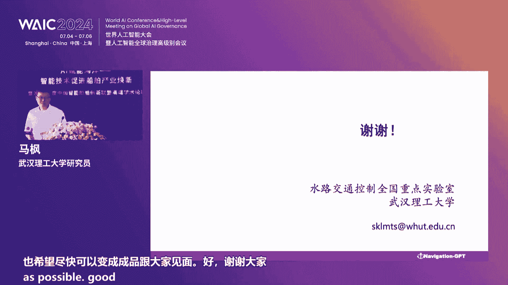
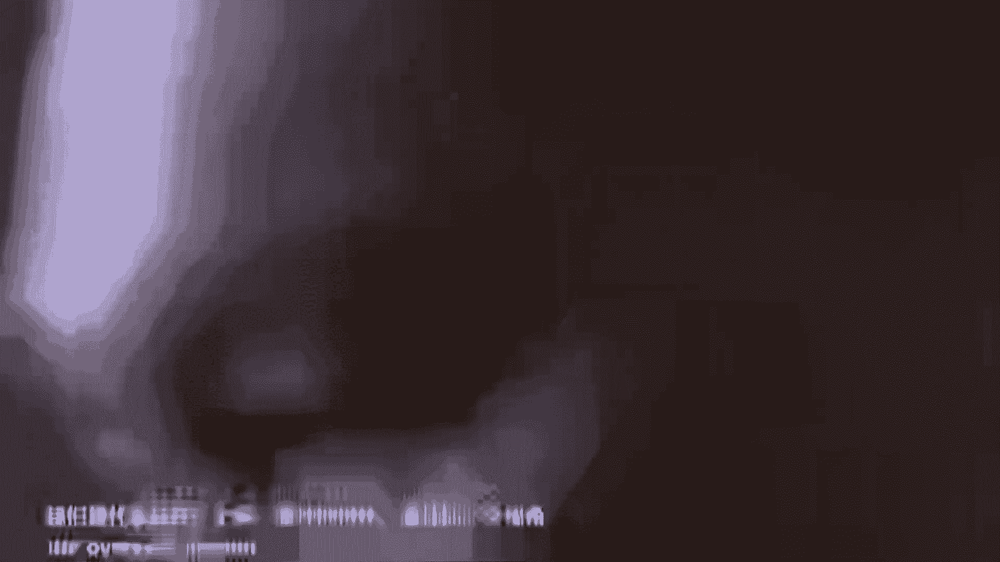
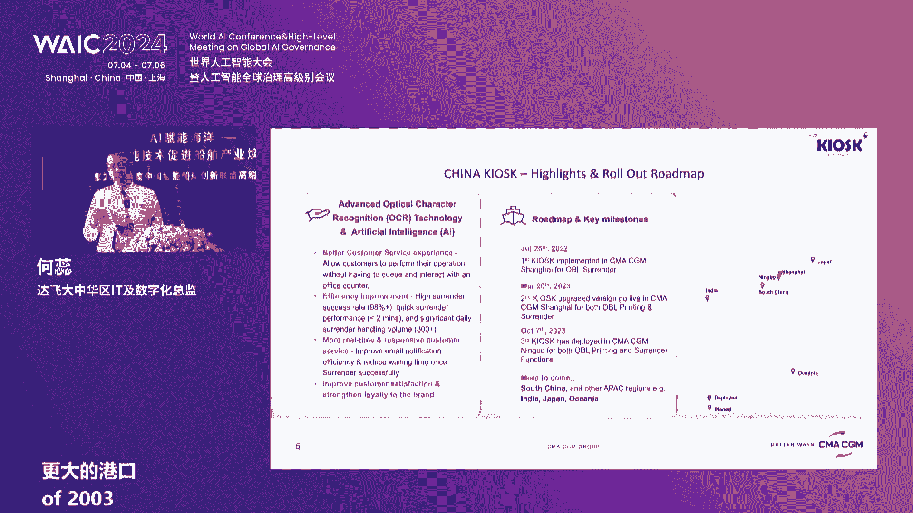

# 2024世界人工智能大会（合集） - P51：20240706-AI赋能海洋——智能技术促进船舶产业焕新 - WarrenHua - BV1iT421k7Bv

🎼请所有到场嘉宾尽快就座。我们的论坛马上要开始了，请大家尽快就座。😊，尊敬的嗯。我。尊敬的各位领导，各位嘉宾，大家上午好。我是上海船舶研究设计院的李璐。欢迎大家来到AI赋能海洋智能技术。

促进传播产业创新暨2024年度中国智能传舶创新联盟高端学术论坛。作为美联世界人工智能大会唯一面向船舶产业的分论坛。AI赋能海洋系列论坛已经连续举办了3年。得到了行业内众多专家学者的鼎力支持。

也在国内外智能船舶领域形成了广泛的影响。今年的论坛，我们以智能技术促进船舶产业换新为主题。🎼邀请到来自十0多个国家和地区的专家学者和技术实践者莅临现场。我们希望通过多种形式的分享和探讨。

和与所有行业伙伴共同探讨人工智能技术创新，促进传舶产业发展的新方向。共同推动人工智能和船舶工业的深度融合。接下来请允许我为大家介绍今天莅临指导的各位领导专家何贵宾，他们是中国工程院院士吴有生先生。

🎼葡萄牙工程院院士mistercarlo woodiess。🎼中国船舶集团科技与信息化部主任赵红斌先生。🎼中国传舶集团科技与信息化专务夏良胜先生。🎼上海市海洋局副局长金红松先生。

🎼浦东新区商务委员会副主任董晓林女士。🎼中国传奇社副总裁赵燕先生。🎼5月，中国首席执行官徐杰平先生。🎼招商及能源运输股份有限公司总轮机长吴建怡先生。🎼上海交大宣传部长。🎼罗士生导师吴浩先生。

🎼以及中国智能船舶创新联盟专家委员会委员、江南造船集团有限责任公司科技委主任胡可一先生。🎼江苏省船舶工业行业协会主任委员吴登林先生。🎼中船动力集团有限公司集团首席专家胡朝辉先生。

🎼北京海蓝信数据科技股份有限公司总工程师李朝伟先生。🎼上海船舶研究设计院科技委主任、中国船舶集团学科带头人王刚义先生。🎼以及中国智能传播创新联盟成员的单位代表，中国传奇社上海规范所所长崔玉伟先生。

🎼上海船舶设备研究所副所长季建刚先生。🎼大连船舶重工集团有限公司副总工程师关英华女士。🎼上海船舶运输科学研究所有所有限公司副总裁吴宗岱先生。🎼武汉理工大学教授刘祖元先生。🎼以及主办单位的代表。

上海传舶研究设计院院长吕志勇先生。🎼上海传播研究设计院党委书记王林先生。🎼上海张江集团有限公司董事长袁涛先生。🎼此外。

现场还有上海市经信委、上海市交通委、上海市海洋管理事务中心、上海科学技术交流中心、上海市人工智能行业协会浦东新区航运发展促进中心、南京经济技术开发区管理委员会、中国智能传舶创新联盟成员等单位代表以及来自英国法国、挪威、日本的船奇社代表、达菲轮船中国有限公司、马士基集团。

🎼马勒集团minewellm C公司等跨国企业代表，还有中国传播报、人民日报、澎湃新闻、上海广播等媒体代表，让我们对各位领导和所有嘉宾朋友的支持参与，表示真心的欢迎和衷心的感谢。

接下来我们进入论坛正式环节。首先有请主办方上海船舶研究设计院院长吕志勇先生致辞，大家掌声欢迎。尊敬的吴永生院士、卡洛斯院士、赵董斌主任、金红松副局长。各位来宾、女士们、先生们，大家上午好。剩下7月。

热情如火。今天我们相聚在黄浦江畔参加本届世界人工智能智能大会AI赋能海洋分论坛。首先请允许我代表主办方上海传舶研究设计院向本次论坛的指导单位、支持单位和承办协办单位表示由衷的感谢。

对莅临现场以及观看直播的各位嘉宾表示诚挚的欢迎，对关心和致力于智能传播发展的社会各界人士致以崇高的敬意。AI赋能海洋分论坛已在世界人工智能大会上连续举办了三届。为促进产学沿用全产业链融合。

提升智能传舶产业技术创新力和竞争力。抢占国际智能传播领域制高点，贡献了中国智慧。本届论坛，我们将聚焦探讨智能技术如何促进传播产业换新这一热点话题。人工智能已成为推动经济社会高质量发展的重要引擎。

正驱动创新范式变革，赋能千行百业。传播工业作为重要战略性产品，是人工智能技术创新突破与落地应用的最佳场景之一。当前，我国正处于迈向造船强国的关键阶段。继续培育新智生产力，助推船舶工业实现更高水平的发展。

借助人工智能技术发展智能船舶。推动传播行业进行数字化升级、智能化转型，是实现造船强国目标带动产业协同发展的重要途径。借此期间，我们举办这样一场。主题为智能技术促进传播产业换新的学术论坛。

旨在通过搭建行业各界沟通协作的桥梁与纽带，探索人工智能创新技术，促进传播工业新智生产力，推动人工智能与传播工业深度融合，助推智慧行业发展。

论坛有幸邀请到了国内外院士及专家学者、人工智能及传播行业大咖、相关政府部委等代表。八方英才汇聚于此，共享一场科技盛宴。我相信开放的探讨必将汇聚学术的精华，智慧的碰撞必将激发技术的革新，深度的融合。

必将创造美好的未来。最后，预祝本次论坛取得圆满成功，祝各位来宾工作顺利，身体健康，谢谢大家。😊，Oh。感谢李院长的精彩致辞。下面有请主办方，上海张江集团有限公司董事长袁涛先死至欢迎时，大家掌声欢迎。

🎼尊敬的吴院士、卡洛斯院士，诸位来宾，大家上午好。非常高兴啊。我能够代表张江集团参与AI赋能海洋智能技术，促进传播产业换新的世界人工智能大会的海洋的分论坛。😊，这以为是第四年。

张江集团和中船上海船舶设计院作为联合的主办方，共同的参与到这场人工智能加海洋科技的跨界的盛会，探索前沿技术的交流和创新思想的碰撞。作为我们世界人工智能大会唯一的一个面向船海产业的专业论坛。

学这个论坛的专业性、学术性都非常高。连续三年举办的AI的富能海洋的系列论坛，链接了上千名嘉宾，在国内外的传舶，特别是智能传舶行业领域里产生了广泛的影响力。😊，在此呢。

我仅代表张江集团也代表我们联合主办方，诚挚的感谢关心海洋事业，关心我们船海产业的各位行业的专家大咖，投资人，还有产业的企业们百忙之中能够抽出时间相聚浦江之畔，共共同的化美好未来。共化海洋事业的发展未来。

在向海而新的战略指导下，上海正在力求打造全球性的海洋中心城市，智慧海洋智能船舶，成为了上海落实海洋强国战略的重要方向和重要抓手。浦东呢是人工智能产业的高地。张江科学城呢也持续发挥我们产业的集具优势。

积极的开拓开辟海洋产业的新赛道，为建设海洋强国，特别是海洋的科创高地，而努力奋斗。😊，昨天呢也是在这里，我们张江集团发布了张江的魔力社区，主要就是聚焦垂直领域大模型。特别是极力提升我们行业的发展水平。

我们也热情的欢迎海洋传播行业的大模型企业能够入驻。作为科学城开发建设的主体。我们新兴产业的推动者，张江集团非常有幸能够协同中船上海船舶设计院以AI加海洋科创中心作为一个重要的创新载体。

共同的推动海洋创新生态的建设。😊，2020年的时候，AI加海洋科创中心作为世界人工智能大会上集中签约的人工智能的重大项目，由张江集团和上海传播设计院签署了战略合作协议，共同建设。经过4年的积累。

AI加海洋科创中心在助力企业发展上面已经成绩斐然。😊，自2022年底正式揭牌启用以来，海洋科创中心已累计迎来入驻企业近20家，从商业技术孵化、投融资等维度、赋能企业50余家，主办生态活动，进营40场。

我们相信在海洋科创中心的不懈努力下，在上海传播设计院的大力支持下，张江浦东来自上海的船海产业，将进一步的汇聚国内国外的行业资源，搭建多元化多层次的产业合作的交流平台。最后。

中心的助愿本次论坛活动圆满成功，祝各位嘉宾有所收获，也相信我们AI智能技术与传播产业，必定在浦东的这片大地上发生更多的化学反应，谢谢大家。😊，感谢袁涛先生热情洋溢的致辞。

下面有请上海市海洋局副局长金红先先生致欢迎词，大家掌声欢迎。尊敬的吴院识。卡洛斯院是。赵同斌主任，各位领导，各位同仁，大家上午好。很高兴再次与大家相聚在世界人工智能大会II赋能海洋智能技术。

促进船舶产业换新高端学术论坛。首先，我谨代表上海市海洋局对本次活动的送礼举办表示热烈的祝贺，并对长期以来关心、支持上海海洋事业发展的各位领导、专家和同仁们表示衷心的感谢。😊，一海一心向海图强。

习近平总书记在上海考察时强调，聚焦建设五个中心重要使命，加快建设社会主义现代化国际大都市。上海坚持陆海统筹和海联动，大力发展海洋经济，努力做好蓝舍文章，在建设海洋强国战略指引下。

市委市政府擘画了上海建设现代海洋城市的宏伟蓝图，组建了市政府主要领导为组长的上海市现代海洋城市建设的工作领导小组。做出了贯彻海洋强国战略，发展海洋经济，加快现代海洋城市建设的重要决策部署。

在市委、市政府的坚强领导下。2013年，上海海洋经济稳步增长，全市海洋生产总值。9901。6万亿元，有力推动了全市经济社会的发展。

尤其是海洋船舶工业、海洋交通运输业、海洋旅游业作为本市海洋支柱产业迸发出强大的升级活力。当今，世界新一轮科技革命和产业革命深入发展，上海积极迎接前所未有的变革机遇，抓重点领域突破，抓平台主体建设。

积极培育发展新兴产业和未来产业，聚焦人工智能加海洋大力支持智能船舶、水下机器人无人船、智慧海洋装备等研发设计制造、聚焦海洋领域碳达峰碳综合行动，推动绿色低碳的航运、港口和装备等海洋产业发展。当前。

人工智能以覆盖海洋装备制造、海上风电、海域观测海洋监测等领域，在促进上海海洋经济发展，提升海岸带及海洋生态保安全防护能力等方面，发挥了积极。的作用。北哥蒸馏千帆进发。面对新技术带来的新机遇、新挑战。

我们要勇于创新、积极作为，抢占海洋发展的新领域、新赛道，更好的发挥先行探路，引领示范，辐射带动作用，服务上海5个中心的建设。未来上海海洋事业将努力在三方面，激发发展的活力，急续发展的优势。

一是积极营造良好创新生态。我们将进一步夯实海洋基础研究，加快实施上海海带和海洋空间规划。2035，强化海洋空间精细化的管理，组织编制本市海洋产业发展规划，绘制海洋产业地图。

谋划构建上海现代海洋产业发展新格局。持续优化海洋领域投融资市场环境，发布首支覆盖全市场的中国海洋经济股票价格指数，引导开发性政策性商业性金融机构和金融市场各类主体有序支持海洋经济发展。强化创新策源。

加快创新企业，孵化培育，做强张江、长兴、临港等彰显海洋特色产业园区，以产业集聚富能海洋产业转型升级。二是大力培育和发展海洋新质生产力。强化企业科技创新主体地位，发挥上海全国领先的科研优势。

积极探索人工智能赋能产业落地的新场景，新思路新应用，特别是在服务深海基地事业发展，推进基地科考船舶智能绿色化转型，实施蓝色海洋经济综合体项目。推进深源海海上风电建设。

推动海水淡化和海洋生物医药发展等方面，加强技术储备和能力建设。推动实施一批重点项目，让智能技术成为驱动海洋产业换新与升级的强大引擎。三是推动卡布住难题协同公关。持续夯实海洋技术能力建设。

组织实施海洋灾害综合防治体系建设。推动建设国家级河口海域翔潮御警监测中心。国家海洋科学数据中心、长三角分中心。推动建立中国极地创新研究院极地全国重点实验室。提升海洋。综合保障能力。

进一步的强化科技人才的支撑。深化于国内外的研究机构重点企业的交流与合作，加速科技成果的转化应用。在促进人工智能。富能海洋发展中讲好海洋故事。贡献伤海智挥。女士们先生们，上海海洋经济发展前景广阔。

大有可为，让我们携起手来共享发展机遇，共赢时代挑战，共同绘就一幅幅波澜壮阔的海洋发展新画卷，共同期待上海海洋经济发展更加美好的未来。一说本次高端秀说论坛取得圆满成功，谢谢大家。感谢金和松先生的精彩致辞。

最后有请中国传舶集团科技与信息化部主任赵同斌先生致欢迎时，大家掌声欢迎。尊敬的维有生医院士卡拉斯院士、金局长，各位来宾、女士们、先生们，大家上午好。在刚刚落幕的全国科技大会上。

习近平总书记对人工智能深度融合和赋能产业发展提出了新的要求。在全国上下深入学习贯彻落实全国科研大会的精神之际。上海市举办人工智能大会。

上海传播设计研院设计研究院、上海张江集团有限公司共同主办AI赋能海洋智能技术促进传舶产业换新及2024年中国智能传播创新联盟高端学术论坛正应切实。我代表中国船舶集团。😡，向。远道二来的各位来宾。

致以热烈的欢迎。对所有关心和支持我国智能传播事业发展的各界同仁表示衷心的感谢。当今世界，人工智能已成为推动科技和产业发展的关键驱动力之一。大数据、人工智能、数字孪声云计算等为代表的新的信息技术迅速发展。

成为各行业智能化发展的重要。使能要素。船播和航运对高度国际化和充分竞争的行业。更要高度关注以通用人工智能为代表的新的信息技术在行业内的垂直应用和赋能发展。2024年。

国际海事组织已经明确海上自助水面船舶规则的生效时间表。这预示着全球范围内做好了智能船舶的商业化运营准备。中国传播集团作为全球最大的造船集团，坚决贯彻落实党中央和国务院高水平、科技自立自强的决策部署。

坚持高质量发展战略。锚定倒船强国，深入践行三赢理念。坚持科技创新引领，增强核心竞争力，加快构建世界一流传播集团。集团公司将以AI赋能产业换新为主线。

从智能海洋装备、智能配套、智能生产和智慧海事服务等领域积极布局。纵向贯穿船播工业上下游，横向连接行业生态价值链。打造传播领域、设备系统平台体系相融合的人工智能生态。

赋能产品服务及研制生产运营管理的全过程。综合构建我国船播行业智能化产业竞争新优势。为落实海洋强国战略提供新智生产力。作为世界人工智能大会位一于航运相关的论坛。AR赋能海洋主题论坛已连续成功举办三届。

赢得了业界广泛的认可。今年作为第四届主办。本次论坛邀请了国内外重量级的嘉宾，为国内外行业资源汇聚、多元化、深层次的产业产业化合作交流，搭建了宝贵的国际化平台。中国船舶集团愿与大家携手同行，行而不辍。

共同为我国智能船舶与智能航运事业发展培育新的动力源泉。向世界展示中国智慧、上海方案、中环方案。以中国新发展为世界提供新机遇。最后，预祝本次论坛取得圆满成功，祝各位来宾工作顺利，身体健康，谢谢大家。

感谢赵主任热情洋溢和精彩的支持。接下来我们将进入本次论坛的主题分享环节。首先有请上海船舶研究设计院副院长李新先生为大家做主旨演讲。他的演讲题目是智能传播技术研发及产业化落地思考，大家掌声欢迎。嗯。

再在这里呢，应该说这个第四年了呃，每一年呢都会上传院呢，都会把嗯过去一年的一些想法和思考呢呃跟这个。各位的嘉宾啊也分享一下。因为呃智能船其实呃也不是一个新词了，也是也行业内包括嗯船东也好。

我们的船海企业也好，还有我们的这个外围的我们AI赋能的企业呢，都呃都在加入这个一个智能传播的一个研发的这么个进程。

那么今天的这个本次大本次论坛的这个主题呢讲的是我们人工智能技术AI技术给这个传播行业一个产业换新的问题。那么其实我们在准备这么一个汇报材料的时候，也在想。

就是我们怎么去想着这个一个人工智能这个赋能的技术，在我们工业领域去落地的这个问题。其实呢这个算法也好，算力也好，然后包括数据也好，其实这是我们人工智能技术去发挥作用的一个基本的几个要素。呃。

但是在我们这个传播行业这个这个这个重工业的这个行业这个。我们应该怎么去怎么去做？那么这里有一些呢也有一些一些想法，也是可以跟着这个各位的这个嘉宾啊也做一些分享。那么我们呢也是分成了这么三个三个部分。

那么第一个呢就是研发现状。研发现状我们现在感觉下来呢，就是智能船舶基本上呃因为还是那么一个说法，就是每个人对智能船舶的一些期望和它的一些功能其实是不完全一样的。但是总的来说，一本基本上是这两个技术方向。

一个呢就是我们讲的这个数字化层面。那么数字化层面呢，现在已经有大量的商业应用商业场景出现了。每个传东要包括我们的大的这个国内的我们的招商中云海都在做这个相应的我们数字化航运的智能航运的智慧航运的相应的事情。

包括国外的呢我们大的班轮公司呃，也在做这个这个数字化物流的系统，以其呢其实是增加我们的营利能力降低我们的营运成本，提高我们的这个航运的这个安全性。

那么另外一块就是我们现在呃在做的很多就是我们叫自主化传自主化的方向。包括MO现在我们也在做maask code呃，应该说明年这个当然有点推迟啊，当然有点推迟。包括这个整个maask code的这个进展。

那么国内呢包括呃我们的这个邻国叫日本、韩国都在做大量的这个自主化的试验。因为从这个角度上来说呢，自主化船舶。呃，他会将来经历这个非常长的这么一个测试和数据积累的这么一个过程，包括算法的这个迭代。

那么下面呢简单过一下，因为过去一年，我们在行业当中一些典型的一些一些这个发展的一个案例。包括我们这个招商轮船，那么也在构建整个公司级的整个数字化的一个平台，尤其是碳排放平台。那么这个碳排平台呢。

那么也做了我们的这个技术的贡献。那么呢上船院呢也在推也也研发了自己的我们的这个数字化的系统，也在呃大量的船上呢进行了这个应用，包括散货船相船液化气船呃，都有相应的这个应用。呃。

现在也在积累海量的数据去发挥更大的这个作用。另外呢就是这刚才讲的两个呢比较典型的就是我们这个在数字化层面。那么自主化层面呢，我们现在也很多的船在做。已经出来了，而且在做呃我们的这个测试数据积累的方案。

比方说我们这个香洲云，还有后面的这个朱海云。那么这两个呢实际上也是国内比较典型的自主航行的这么一个应用的案例，也做了非常成功的这么一个自主航行的这么一个测试。未来呢将会有更好的一个发展。

这个是呃在这个我们南方的这个实验室。那么另外呢这也是呃我们的一个一个自动自主办航的一个项目。因为待会呢这个项目呢，还会有我们中国传奇社的专家呢来进行专门的这么一个分享。那么这个呢其实也是一个。呃。

非常典型的一个这个这个自主的一个应用案例。所以说我们都可以看到呢，就是自主化的船舶，其实都叫比如说都叫maax或者就是叫自主航行的船舶。然后其实呢都是有。不同的这个应用场景。

那么这个呢是我们这个韩国的一个呃这个船东的一条船，就是32000的这个一条运运用了as就是我们现代的这个自主航行系统。那么这个呢，其实我们的邻国也有大量的这个呃，应用。

包括我们都知道日本的mgu2040也在有7个场景在积累数据在做。那么国际标准这一块呢，选了几个典型的。因为跟智能船的标准不呃，在TC8里面的不同的分委会里面的有很多。

包括WG10里面呢也有很多的一个一个一些一些一些新的标准出来。那么这里面呢，其实有很多包括我们的日本韩国，还有这个这个这个波罗迪海这个B门口，然后还有中国，我们都提出了相应的这么一个呃这个这个国际标准。

因为这一块的国际标准其实跟场景是非常非常有关系的。那么这里面呢，其实。感觉的很多的都是我们的一些底层基本的这个标准。刚才讲的是这块，然后另外一块研发的思考，研发的思考这一块呢呃。

我们把我们在开发dos系统，还有我们在做自主决策系统的一些思考，可以跟各位呢也分享一下。第一个呢就是实际上。呃，人工智能技术它的最后落地的载体是一套这个软硬件系统。

不管是所有的行业都是它是一套软硬件系统。那么既然是软硬件系统，那么它的这个场景，客户的需求实际上是非常非常重要的，尤其是在我们呃需求直接影响了我们的算法应用。呃，我们在调参的时候，对于不同的需求。

这个不同的数据，包括我们训练数据所需要的呃训练这些数据所需要的这训练所训练模型所需要的这些数据都是完全不一样的。那么所以说呢这个在我们开发过程当中，和客户的场景的这个粘合度，这是非常非常重要的。

另外一个就是就是我们讲的这个人工智能技术要整要要三家麻车嘛，这个算力算法和数据。那么数据是其中很大一块。那么这里面呢除开技术之外，另外有一个很大一个问题，就是我们如何去分享数据。呃。

因为数据资产呢是我们的。这个业主的包括传东啊，包括其他的这个拥有方的。那么这块呢。呃，怎么去做？那么行业内呢，现在因为这本次的这个人工智能大会的谈到的是呃有一个全球这个数据治理的问题。

那么这个数据治理有可能是会对整个业主去应用我们的这个AI的这个技术会产生到根本的这个影响。因为数据怎么用数据怎么去治理，数据怎么的标准，这个未来呢是一个呃一个一个新的一个方向。那么另外一块呢。

就是其实就是我们服务模式的问题。因为从海事业来说，有很多的这个这个这个参与方呃，有呃我们是作为设计公司，那么还有我们的船海企业，我们的呃我们的这个管理公司航运公司。

还有我们的保险金融机构类似于那么对于整个的数据的需求和功能需求，实际上是不一样的。那么这个我们整个服务模式应该怎么去怎么去怎么去做。这个其实也是我们在研发过程当中一个很重要的一个问题。那么后面呢后面几。

那是我们关于这个自主系统的这么一个研发的这么一个呃一些想法。因为自主系统其实我们几个几个几个几个板块感知决策控制。那基本上是然后再反馈，那么基本上是这么几个这个几个步骤，感知这一块呢尤其是重要。

那么感知这一块呢呃因为我们实际上要是要把动静，然后还有环境信息自身的状态要进行充分的这个感知感知完了之后的认知，然后才能给我们的整个的这个决策上面呢去提供的支撑。

那么这一块其实是怎么去做好这个感知问题呢，实际上是非常非常重要的。那么另外一块呢，就是我们的决策。那么决策呢其实对于呃这个这个原航行船来说，其实给出的就是我们的啊跺脚转述，对吧？

还有我们的一些重轻的一些指令，其实就是传舶航行的一些信息。那么这个怎么样去形成它呃呃我们的这个应该说是叫呃在算法执行过程当中，我们嗯选的权重。这个是非常重要的。有的时候如果是抛开经济和安全的这个避碰。

实际上是呃呃实际上是目前为止来说，在在测试过程当中呃，实际上是呃一个比较呃按船长的说法是比较异类的这个操作。所以说这个将来在做测试过程当中的决策方面的这个迭代啊，是还是要持续的进行。另外一个就是控制。

那么控制这一块呢，像跟我们的。控制机构，包括被控对象呢，实际上有很大的这个关系。那么行业内呢，将来我相信呢关于自主行业船的控制这一块嗯，会有大量的这个标准出来。因为现在控制系统基本上都去标准。

那么现在的参与方呢也比较也比较固定。那么这一块呢是我们将来是可能要去做的很大一块。那么呃。要回到我们整个的这个这个大会的这个主题啊，我们产业化了这个这个传播行业换新的问题。那么落地这一块呢。

其实还是呃一块就是我们的整个的嗯测试这一块。我觉得测试这一块将来是要。呃，要发挥很大很大的作用。因为你的系统要包括我们的船舶要得到业主的认可。那么测试是很重要的。而且这个是要基于海量数据的这个一个测试。

那么另外一块呢就是一个我们这个产产业要落地的话，那我们就是一个商业模式的问题。那么是传通推动还是长海企业推动。那么这一块呢是怎么一个协同，那这个协同里面就包括技术的分享。那么技术的分享。

那么这个呢也是我们将来要行业里面有用的。我看来我超时了，那我加快啊。那个另外一块呢，其实就是我们的技术标准。因为我们不可能一个每一个场景去做一套算法，也不可能是每一个呃传东去做独立的一套系统。

那么技术标准怎么去做。然后数据分享机制，然后模型这一块，然后还有我们的数据质量把控。那么其实呢这都是未来的我们需要去做的事情。

那么啰啰嗦嗦反正呢讲的比较这个呃呃应该说也是过我们过去一年的对待这块的一些分享吧，希望对各位的这个各位嘉宾那个能有所这个能有所这个这个帮助。呃。

也非常感谢的这个呃各位的领导和嘉宾的一直以来对上传院的这么一个支持，非常感谢谢谢。感谢李欣的精彩分享。接下来有请葡萄牙里斯本大学杰出教授卡洛斯。🎼格德斯苏亚雷斯先生为我们做主旨演讲。

他将为大家分享无人自主水面船舶研发进展，大家掌声欢迎。The J howo。Good morning。Good morning， distinguished guests。

 ladies and gentlemen。It is my pleasure to be again in this lovely Shanghai now to discuss with you。

Different aspects of the development of autonomous ships and the the role of AI in this development。

Shipping industry as all manufacturing industry is going into its fourth major revolution induced by digitalization and artificial intelligence。

 we had the first one with mechanical power， then with mass production with computerized control。

And now we could say that we are in the。Shipping 4。0。

 where digitalization has already made significant impact in commercial shipping。

 and it's helping to promote very much the development of autonomous and unmanned ships。

 which will be the main topic of my talk this morning。

So intelligent technology is the tool that provides the transition to autonomous shipping。

We have nowadays ships that are very much automated。

 but automation and autonomous have represent different levels of control。

In automation we are just substituting the human tasks by a technical system， but in autonomy。

 we also have the capability of the systems to make decisions。However。

 we can have different levels of autonomy depending on the degrees of automation that we have and in the future the idea is that we will have a dynamic autonomy in the ships in which the level of autonomy will depend on the complexity of the situation。

 so in general the simpler situations will be fully autonomous and the more complicated ones will probably be remote controlled as already happens in the air industry where the pilot only acts in landing and the takeoff。

The rest of the flight is autonomous。So that's what we envision also for ships。Nowadays。

 intelligent ships already have several systems that are very much automated and even operate in the intelligence capability。

The most representative one in ships is the navigation systems。

But we also have the propulsion systems and electromechanical systems very much automated。

And the communication also is at that level， so present ships。

Are already at a high level of intelligence， and the question is， how will this further develop？

I will just go briefly through the navigation system because for autonomous ships this is a crucial activity。

 we want to make sure that the ship goes from one place to the other。

 so the autonomous intelligent navigation is critical and I will go through the main functions that need to be ensured。

 so we need to have a vessel monitoring and information system on board。

 we need to have a collision avoidance system and autonomous navigation systems。

So those are the three main needs that we have and in each of them for the vessel monitoring and information system。

 we need to have vessel detection and traction model。

 so as the previous speaker were indicating the perception of the environment is a critical first step and while in general this can be made at larger distances for shorter distances there is still important problems。

We need then to have a vessel state estimation and trajectory prediction module。

Because we need to assess how the navigation area， the traffic around the ship is moving and we need to have some intrasal communication model。

All of this is the starting point to have a collision avoidance system working because in complex traffic conditions we need to make sure we avoid these collisions so in addition to the own vessel communication systems。

 we need to have a parallel decision making module and a sequential action formulation module。

 so when we have several vessels we need to be able to tackle one after the other and make decisions of avoiding the collision with the different ones and of course tracking the course and speed。

 we have to assess what is the collision risk when it is necessary to make changes in course and speed。

So the collision avoidance model does exactly that when we identify a risk of collision。

 we have to take decisions on changes， this has to be done according to the coal res。

 which are the rules for navigation and the collision avoidance depending on the relative position of the vessels。

 different actions need to be taken and this can be automated the decision making。

There are already several algorithms ongoing， but in all of these areas。

 artificial intelligence is a important tool that can improve the quality of the algorithms and the speed of。

Information processing and decision making。So the autonomous navigation system。

 then it starts by a path planning， so we typically we use the map and the destination that we want to achieve。

Obstacles that exist to， to plan the path of the ship。The path is given by a series of waypoints。

 so points through which the ship should go through and this path after being defined then we have the guidance laws that impose the speed and heading to the autopilot to make sure that the ship goes through those points at the time it is expected to do this。

 so this is the component of the autopilot。So the guidance and control of the ship is depicted here。

 we have to have an attitude control and a path following system。

 so we need to control the heading of the ship and we need to control the speed to make sure that the ship gets to the right place we do this based on the path。

 but then we have disturbances by wind and waves that take wind the ship out of the path so we have to have sensors that detect these and that correct through the control systems and there are many control laws。

 many different approaches that can be adopted some better than others but many efficient ones that are already available。

This is the technology in the navigation。 Those were the main aspects that we had to take into consideration。

 so。We have the technology。 We need to develop the technology， but to promote intelligent ships。

 technology is not enough。We need also organizational measures。

So we have to do this in the technology， we have to interconnect the system through different networks。

 we have to integrate the system and create different layers of software that。

Puts all the technical information available to the operator of the ship。

We need also to change the role of the operator。To become a manager of all those linked and complex systems。

We have to shift the perception of the operator that is normally in the bridge looking to the environment and make him feel the situation of the ship through the human machine interfaces。

😔，And we have to enhance the ability and the efficiency of the crew changing the organization of the work。

 So those are important organizational measures that need to be taken。

 otherwise the transition cannot be made。We also have to enhance the potential for remotely control of the ship。

There are several drivers for autonomous shipping and one is the advances in the technology of guidance and control。

 which is already used in many small autonomous ships， so why not use it in the large ships？

We also have maritime safety because many accidents are produced by humans。

 so there is the belief that if the human is taken out of the decision making process。

 we will be able to avoid accidents and increase maritime safety。

There is also the difficulty to find the competent crew to hire in the shipping companies。

 so if we reduce the need of manning， it is also an important aspect。

There is also the idea that there will be an economic motivation with the reduced manning and of course shipping companies are always looking for improved economic conditions。

And of course， there is the overall cost of transportation that we want to reduce。

 So those things give the idea that probably autonomous shipping is a good solution。 However。

 there are problems。 The autonomy will have higher costs with additional equipment。

The autonomy will also increase the probability of accidents because of equipment failure。

 because if you have too much equipment， then it will fail。

 the autonomy will require onshore monitoring systems men 24 hours a day。

 and this is a new requirement that also uses men。And probably we will need to have safe lanes in traffic separation lanes to have the autonomous ship separated from the mand ones。

 at least in the initial phases。And cybersecurity is a major problem in autonomous ships。

 and this has to be properly taken into account。IMO has been looking into the problem。

 has been trying to define rules and codes and Sam years in21 they already divide mass code。

 and they have been continuously monitoring the situation， they have defined four levels of autonomy。

 the first one is the ship with automated process and decision support。Second one。

 remotely controlled ship with seafes on board， third one。

 remotely controlled ship without seafs on board， and then the fully autonomous one。

 So I think we are very much in degree1 and two looking at the future。Now， if。

 if I give quickly a overview of what we are， the different organizations are indicating road maps。

 I think nowadays， we already have。Ships with remote control。

 we already start having remote controlled unmanned coastal vessels， coastal transportation。

 and there is some hope that by 2030- 2035 we start having a bit more autonomous unmanned ocean going ships。

We have examples in Norway， this is a coastal traffic by a container ship， it's already ongoing。

 Japan is also making different tests with different ships in which they instead of building one from the beginning。

 they are recovering existing ships。Korea is also doing installing the systems on existing ships。

 trying out the autonomous ships and in China we have also examples there is a coastal container ship Chi Fei and I was very fortunate last year。

 I was in Jindao。 I had the opportunity to spend one morning in the Gfai looking at the autonomous and remote controlled operations。

 So you see that there are already several ongoing experiences in different countries。

 so thank you for your attention。非常感谢卡洛斯先生的精彩分享。🎼下面进入2024中国智能传舶行业发展报告发布环节。2023年7月。

中国智能船舶创新联盟理事长单位、上海传舶研究设计院联合各联盟成员单位发布了中国智能传舶行业发展报告。远洋传播片2023在国内外传舶行业引起了广泛关注。今年由中国智能传舶创新联盟牵头组织。

继续联合武汉理工大学等联盟成员单位共同完善了远洋传播片报告内容，并同时编制了内河传播编发展报告。希望可以更加完整的呈现中国智能传舶行业发展现状。并借本次大会契机向全行业正式发布。

接下来我们有请发展报告的主创团队代表中国传舶集团科学学科带头人顾一清女士为大家做简要介绍。有请顾一新女士上台，大家掌声。はいい。各位嘉宾早上好啊。

很荣幸我能够代表我们的这个编制团队来对我们的这个智能传播的发展报告进行一个发布。那么呃我们这次呢主要还是2024版的。那么其中有两大部分的内容。第一部分呢就是我们远洋片的一些内容的更新。

第二呢就是以全新的内核传播片的一个发布。嗯。是没有。😔，嗯。嗯，有点小插曲啊。首先呢那个远洋片的那个修改内容呢有这么四个方面。第一呢就是更新了我们maax的最新的进程。

第二呢是更新了智能传播发展的一些现状。那么近年来呢，其实有很多的这个国内外的那个智能传领域的技术呢都在不断的进行呃升级。然后同时呢有很多的案例的这个呈现。第三部分呢就是更新了国内外技术对比的一些分析。

那我们其实也是在呃进行一些呃各种各样的一些对比。然后来找到自己的差距，然进行相应的这个技术的这个研发。第四部分呢就是更新了我们关键技术的路线图，尤其增加了我们这个大模型技术啊，就是现在目前人工智能领域。

最先进的些技术，在传播领域的这样的一些应用。那么第二部分呢，就是我们今天的这个最重要的一个主体部分，也就是我们这个内核传舶片的这个发布。呃。

我们的这个牵头组织呢是由中呃中国智呃智能船舶创新联盟来组织的主编单位呢是我们的武汉理工大学。同时呢还有呃上海传媒研究设计院中国长江航运集团有限公司及中国船技社的这个积极的参与。

那么整个的这个报告的编写历程呢，是我们历时了3那个近3个月的时间，联合了5家单位，开展了调研有1余次，然后咨询专家30余人修改稿件呢10余稿啊，也是在一个比较短的这样的一个时间里。

但是对于我们整个一个内核船舶的智能呃发展那进行了相应的这个技术梳理。那么呃我们的这个编制的目的呢，第一是梳理了我国智能船舶技术和产业的现状。

尤其呢是针对了我们内河船舶内核领内河航运的这样的一些实际的需求去开展了这样的一些呃工作。第二呢是准确的评估当前我国智能船舶的发展水平，分析我国与国外的造船强国在智能船舶竞争中的优势与劣势。

提出了促进技术与产业发展的专业建议，推动船舶工业的高质量发展。当然在在这个领域里呢，其实我们是呃完全的是要针对我们现在内核船舶的发展的一些呃我国的这样的一些现状。那么整个的这个报告呢。

分分了这样的9个章节，回头呢大家都可以在我们的这个呃公众号上去进行相应相应的下载。那么在这个报告里面有一个非常重要的一点，就是内河与远洋运输船舶的这样的一些呃智能航运场景的一同分析。

我们也知道就是远洋船远洋船舶和内核船舶它的特性是完全不一样的。那么如何在内河的这个这样的一个水道里面能够实现这样的一些智能的船舶以及智能的航运啊，这个是我们一个新研新研究的这样的一个课题。

或者是我们是啊长期以来研究的这样的一个课题。里面面向我们的那个内河航运的这个跨场景的这样的一些分析。还有对于我们它就是这个内核船舶在海上自主航行远程控制啊，以及我们的一些通信情况啊，它如何去定义。

和我们的远洋船舶有什么样的一些区别，都做了详细的这个梳理啊，这个我觉得是非常宝贵的，就是也是也是很就是对于我们整个业绩啊都是有非常大的这个借鉴作用。然后另外呢。

也提出了面向内核船舶的智能化分级里面提到有增强的驾驶、辅助的驾驶、远程的驾驶、有条件的自主航行以及完全自主航行这样5个等级。那么由于我们内河船舶内河航运航道的这个复杂性。所以呢对于增强感知。

增强驾驶这一块呢可能是尤为的重要。因此我们在这个前期呢，也作作为了一个专门的这样的一个等级去进行了一个定义。然后呢，我们也对这个国内外的现状呢去呃进行了一些梳理。

找到我们可以借鉴可以参考的这样一些成功的案例和技术。然后呢。那么对于内核船舶的发展呢，我们也进行了这样的一些关键技术的一些梳理啊，提出了五大部分的五大主要方向的这个智能技术。

以及相应它的一些子技术的这个呃发展发展路径。那么同同时呢针对我们船上包括设备的配置啊，设备的管理，自主的航行，还有我们的一些通信等等啊，这些方面呢都给予了一个明确的一个方向。

同时呢从我们的这个关键技术的角度来说，也对它的发展路径进行了梳理。啊，可以说就是我们是要发展智能船舶。

那它的这个目的就是要让船舶能够拖延脱脑脱手脱口等等这样一系列的这个呃技术的这个用技术来驱动船舶达到这样的一个状态。那真正达到我们想要达到的这样子一个智能传播的一个状态。当然这里面其实还有两个很重要的点。

就是一个是计算计算，也就是我们的这个人工智能的这个些技术的应用，能够使我们的驾驶能够减员。同时可靠的这样的通信呢能够将我们的这个驾驶呢移到岸上来。这也就是我们不断的从呃船上，将我们的这个工作减轻呃。

由人转换到机器，同时呢也把我们的一些控制呃控控制的这个位置从船上转到了岸上。那最后呢我们也针对我们现在目前的这个发展的现状，以及呃将来的一个发展技术的一个发展趋势，制定了我们的一些发展目标啊。

没有每每隔5年有一个这样的一个基本的目标。当然这个目标啊我相信是随着我们技术的发展还会有更多更多的调整。

那大家都知道我们现在人工智能技术的发展是非常迅速的那因此我我相信啊就是现在的目标可能很快就能够达到啊，后面慢慢的就是我们的技术会有不断的这个新的突破。啊，那么今今天的这个报告的一个情况就是这样啊。

谢谢各位领导的那个倾听。感谢顾一清的介绍。🎼接下来我们有请下一位演讲嘉宾，中国信息通信研究院副院长胡建波先生为大家分享。他今天分享的题目是全球及中国人工智能的总体发展趋势，大家掌声欢迎。各位领导呃。

各位嘉宾，各位同仁啊，非常高兴参加咱们今天智能传播的论坛啊，也非常高兴跟这么多咱们传播的专家呢在一起呢呃聊一聊人工智能啊。😊。

那我今天希望跟大家分享的是从单纯我们从人工智能以及人工智能服于千行百业这个角度谈一谈全国以及我们当前人工智能一个总体的情况。大概是3块。呃，首先我们看整个人工智能的发展的一个回回顾一下的脉络啊。

我们说在2000年之前，那个呢我们叫做符号主义站主导。那个时候呢，我们是希望告诉电脑啊，我们人类是怎么思考的，强调逻辑和规则啊。那这个里面比较典型的这一些专家系统。

大家看到各种工艺这行业的一些专家系统得到了应用。那在2000年之后呢，我们看到这时候呢进入到一个叫机器学习的阶段，或者我们说叫连接主义战就主导，这个是让他电脑来模拟我们大脑的神经网络和学习机制。

通过数据来驱动以及自适性的能力啊。呃，特别是随着这个数据规模不断的加大，就我们今天看到的超大规模的积器学习，诞生了我们的大模型，大模型的能力产生了质的一种变化。

那也使得我们今天我们说步入到一个大模型的一个阶段。我们目前已经看到大模型这样一种趋势，正在形成一种大一统的趋势。大模型我们说它有三个特点。第一个我们叫说它目前还是遵守着叫规模定律。

就是说你目前的参数越多，计算量量大，这个性能就越高啊，这一点还是目前还是这样的。所以很多企业都追求超大规模的一种数据啊，来不断的进行训练。第二个呢，它是支持一种多任务啊，可以同时支持多个任务。

特别是一些包括多模态，包括我们看到的文字语音图像视频等等，可以做同时的处理啊。第三点呢也非常重要。它的能力可塑性很强。就是我在一个通用大模型基础上，我经过一定的微调，我经过一些我们叫思维链的一个提示。

或者说经过二次的训练，它可以很好的完成相关的行业一些专业性的任务。在大模型可以本身成为一个平台。所以我们看到目前他在我们除了大语言模型，在很多的领域，自动驾驶，包括咱们的智能传舶。

像气象机器人等很多领域都在不断的进行扩展。我们看到一种趋势，就它可能会成为一种新的一种平台。或者说我们说成为一种操作系统。在此技术上在进行新的融合和创新啊。呃，从整个大模型的发展路径来看呢，有两条。

大家也非常关注。我们说一个是闭源的，一个是开源的。那目前的这个闭源的呃主要是一些头部企业为主，包括大家熟知的像T以及咱们国内像百度这样的企业。那目前他的能力还是优于我们开源的一个体系。

大概开源和闭源的这个在我们这业内有很多争。但是开源总理上目前也在呈现出一种繁荣的生态，有很多的企业在这个开源里面去呃活活跃。而且呢这个能力呢也在快速的提升和靠近我们闭源的一个能力。呃。

从另外一个维度来看，就是投资角度来看，我们人工智能的热度啊，这一点非常明显。我们能工在整体的全行业的融资规模下降的情况下啊，人工智能占比持续上升啊，在03年是上升到8%啊。

特别是在呃这个呃在呃大模型领域啊，大模型领域占人工智能的比例也是跟非常突出啊，我们在去年到今年的一季度，它的比例都接近40%。从从整体的一个投资的规模也是达到了358亿美元，同比上升120%。

所以这个说明热度是非常热啊，资本界非常关注这领域。那我们对它的发展路径呢，我们认为有两条路径啊，第一个叫横向发展。横向发展就刚才遵循它的规模定律，我更大的参数量，更大的使得模型能力更强。

使得往着通用智能方向进行发展啊，这是第一条路径啊，这里面有庞大的资源投需要投入。那第二条路径呢，其实大家求更加追求说我能不能实现人工智能的快速的工程化和落地。那这就是与行业进行结合。

那我们看他把这种原有的通用大冒险能力再叠加上行业的机理以及深度的一些机理的融合，使得这种模型它需要的参数，或者建立一种轻量级的模型和相关的使得它的成本的或降也使得人工智能和更好的产业化和工程化。

这样呢也促进它的商业闭环的形成。所以我们看到在电信领域，比如电电信领域通过它实现智能客服，在金融领域，它可以快速的形成这种金融市场的评论啊，在教育领域。

它可以这种虚拟的口语教练等等这样很多的智能智能的产品，人工智能产品就开始出现。这样也更好的来服役整个的一个产业化和工程化的进程。呃，那在人工智能与行业场景结合方面呢。

我们也看到它的三大特征也出现了一些新的特征。往往我们说信息通信技术的发展，往往首先冲击的是低端产业，特别是我们说机器T人我们看到工厂里面大量的可能工人可能会面临他的工业工种会失业。

那我们今天看到是另外一种景象。就是说目前大模型所冲击的往往是一些知识密集型的领域。或者我们说原来的学历和收入比较高的这个阶层也受到了威胁啊。

大家看到了像我们通过来编程这个助手可以快速的提升他的一个编程效率。目前这个这个这个大模型基大模型的这种文稿的写作水平和他的写作成本都达到了一个令人满意的程度。但我们结合一个中长期角度来看的话。

那这个大模型在更多的领域会得到应用。比如我们说他在基术领域甚至可以去总结发现新的物理定律，总结出新的数学模型啊，在工业制造里面第一些新的工艺新的参数新的配方啊在教育领域。有很多应用啊。

那这里面我们认为他未来与各行各业融合的这种潜力还是非常之大的。呃，那聚焦到工业领域。那我们说工业人工智能啊，那这个领域的发展呢，我们目前认为还在一个比较初级的阶段。

它主要是从它的研发侧和管理设进行进行进入主要的模式，虽然有虽然有大语言多模态等等。那目前主要还是大语言模型为主，主要的还是非常一种交互的模式，其实简单比较理解，就是我们说在比如在管理领域。

我可以有一些智能的售后服务，或者说一些这种相关的培训啊等等。或或者是在这个研发领域，我可以一些辅助的绘图，所以还是一种比较浅层次的应用。但是我们从这个左边这个举阵也可以看到。

实际上它未来的领域可以相对更加深化或者说潜力是比较巨大的。比如我们在设备领域，他通过以这种基于这种机器人的大语言模型来构造的聚生智能，它可以构建这种智能体，可以大量的替代我们原有的一些装备啊。

那从而在研发领域，我们也可以刚才谈到的我们对一些新药物的研发新的蛋白质结构的预测，也可以通过人工智能来实现。所以目前它也是。处于一个初级的阶段，它未来呢也面临很大的一个成长空间。这是一个全球的情况。

那第2块，我们简单看中国的情况。那应该讲中国政府是高度重视人工智能的发展。我们早在十三五期间就首次提出了人工智能的这么一个创新工程啊。在我们在十四五规划，也特别提到了要培育壮大人工智能等新兴的数字技术。

推动通用化和行业性的人工智能的开放平台建设。呃，在二十大报告中间也提出，以人工智能为引擎推动产业的智能化发展。他特别特别强调几点，一个说是高水平的自立自强，同时赋能我们千行百业。

同时要做到安全可靠、可控嘛。在呃今年的政府工作报告中间提出的是人工智能家啊，就人工智能来赋赋能我们千方百业。那我们讲有两个维度来理解人工智能家啊。第一个是人工智能技术本身它与我们原有的一些IT技术结合。

5G6G也好，互联网也好，低空低空低空低空空联网也好啊，包括人心机器人也好，这样形成一种融合创新的合力。那第2块呢就是大家谈的特别多的，我们与千方百业的结合，与传统行业的结合。

与制造业农业等等结合来提质增效啊。😊，那今天我们说人工智能家之所以呃提出来，那和我们当前大模型的发展是有关系的。大模型的发展提供了一个强大的技术支撑。我们看到了一种通用农资林的一种前景出现了啊。

那这种情况下也应该讲某种角度，我们说它可以大幅度提高我们的全要生产力。这也是和我们新增生产力的发展呢是呃吻合的啊。呃，我们谈到我们国家人工智能总体上我们都谈有几个优势。第一个呢说我们有庞大的市场空间啊。

我们当前整个数字经济的发展是根据003年的数字中国的报告是55万亿啊，呃占国内增加值占国内国外生产总值的比重是10%啊，这是我们说有我们有很大的市场空间。另外我们有丰富的场景，这也是中国的特色。

我们目前仅仅在这个呃智能工厂领域啊，我们就有近万家的数字和车间和工厂，还有很多行业我们都可以提供大量的场景。另外就数据量本身，目前我们的数据量也是占到全球的10%。未来有望达到全球第一。呃。

这是我们从国内大模型应用的情况的一个统计啊。从消费者来看，目前主要还是向办公啊图片生成和对话这样一些应用啊，主要还是帮助我们来提高劳务劳动工产工作效率。我相信大家可能在自己的工中也会用到啊。

比如说不管是你用的P或者是百度的这个工具啊。那从应用来看呢，主要一些头部的应用，应该讲还是效益比较明显，还是应该讲还是和原有其他的差距比较大。另外一侧呢，就是在企业测应用。

我们看到现在有很多不断的大家进行探索和实践啊。我们通过中国的人工资产联盟。我们有个评选。我们看到在科学软件工程、公共服务工业和医药领域都有很多的这种人工智能家的一个实践在推动。

但我们说应该讲人工智能在具体工业或者其他行业应用中间还有很多的挑战啊一个是场景选择问题啊。比如我们原来谈的机器视觉，它的投资投资收入比非常容易测算，很容易。但人工智能在应用时。

实际上这个怎么去评价它的效益。这本身也是一个需要去进一步考虑的问题啊，另外一个它的时效性问题，就是说我们人工智能的大模型训练往往它有时间一个限制。那就说你超过这个时间点以后呢，对一些新的动态问题。

它可能反馈的不够有效啊。另外就是一个可信度，我们人工智能广为诟病的所谓幻觉，它经常会编谎话或者像个吹耕流或者怎么样啊，但这个和我们工业场景的容错率低，这种等等都是不吻合的啊。还有在工程化方面。

一个是语料的缺失。我们大模型需要非常大的语料啊，如果说和小模型相比可能是百倍以上的语料工业的语料呢对难以难以收集一些。还有很多企业的希望自己来构建这种大模型，那这个面临很大的成本的问题啊。

还有就是原有的工业里面的很多的系统系统等。等他们的接口不统一，这里面造成一些我们在呃数据接口以集成方面一些难度。啊，最后呢简单谈一点展望。那我们认为人工智能迈向通用智能的一个基点正在加速的去临近。

那我们现有的这种相对封闭的这种有限度人工人工智能会向更加开放的这种人工智能体进行发展啊，这是第一个。第二个我们认为更加重要。其实我们当前也看到的。因为这这个这个游戏更多是一些巨头的游戏。

因为一般人是玩不起的，需要大量的投资。那另外就是实际上是和行业的结合。那这里面我们也看到，通过与锤直行业的结合，实现它的工程化，构建轻量级的模型，降低它的算利成本，解决我真正场景一些痛点问题。

其实和我们的数字化展型啊等等，都是完全路径非常吻合的啊。呃，当然我们认为中间还要需要做好一些准备，包括面向呃这个模型方面的从软件方面的平台支撑啊，软件来支撑整个模型的一个全生命周期。

以硬件提供相关的算利和传利啊。另外，在数据治理方面，包括数据的全生命周期的管理，以及保证数据的质量。在运维管理方面，进行模型等到模型进行运营阶段的时候，我们要对它进行运行修正，包括建立相关的监控体系。

另外一个也非常重要的就是关于风险的管控啊，如何从技术的提供方技术的应用方技术的提供应用的提供方来构建这种全量淘的风风险管控体系，我们呢也也是非常关键的啊。那对于人工智能加就人工智能与各行各业的结合。

它是一个双向赋能。一方面，人工智能技术服用于千行百业，同时在千行百业的应用是反向在促进人工智能技术快速的成长。这是一个双向的工作啊。那目前我们可能说主要我们在一阶段二阶段，就是有一些辅助操作。

以及一些非实时环境的应用。那未来我们认为它会向更加比如说深度的呃实时环节的一些应用，需要一些可可见性的连接，以及一种多脉态应用中间继续发展，使得我们的这种人工智能家会更加深入到各行各业之中啊。呃。

最后呢再花点时间稍微介绍一下我们呃中国新通院啊，我们中国新通院呢是隶属于工业和信息化部的一个研究机构。我们主要是关注于ICT技术的发展。啊，这也是我们根据呃目前我们整体的一个国家发展。

我们构建的我们这个业务体系。我们面向未来的中国式的现代化啊，要要打造一个新型工业化是一个必进必必然之路。那我们院呢主要是聚焦于大通信大数字和大安全来推动信息化支识信息化来服务于咱们中国式的这个现代化。

😊，呃，在人工智能方面呢，我们也专门成立了相关的研究机构啊，开展人工智能相关的评测、咨询研究平台赛会等等这样一些工作啊。呃，同时我们在市部委的支持下，在工信部国家发改委科技部中央网新办的指导下。

我们成立了中国人工智能产业联盟啊，这里面一方面是关注人工智能本身技术的发展。我们有围绕他相关的技术设置了技术这一系列的工作组。同时呢也设置了一些特色组，也是根据比如安全治理啊等等方面的。

另外一个非常重要，就是我们根据人工智能要赋能与各行各业，我们设置了一些行业组啊，就与各行各业的龙头企业联合来成立一个组。在我们人工智能联盟下面，我们看到现在有像金融的汽车的啊，还有像石化的等等。

我们这里面有些呢还在筹备之中啊，我们也希望构建这么一个生态呢，能够把我们做ICT的这些研究机构和企业和我们这些在各个行业的龙头企业能够连接起来啊，大家共同来探讨如何利用我们的数字技术，人工智能技术。

来推动各行各业的数化进程，来提质增效啊，服于我们的现代化进程。那我今天的分享到这里，谢谢大家。感谢胡院长的精彩分享。接下来我们有请最后一位主旨演讲嘉宾，来自武汉理工大学智能交通系统研究中心的马峰先生。

他演讲的主题是面向新一代航运系统的多模态大模型研发实践，大家掌声欢迎。😊，这个是翻啊。啊。呃，大家早上好呃，非常荣幸有这样一个机会向各位业内的同仁介绍我们团队研发的一些进展。

我觉得这个顺序排的我们非常占便宜。刚刚由胡院长介绍了这个大模型，我们就把我们团队的大模型端出来，两个前后刚好接上。我们的这个多木太大模型是从新一代航业系统的角度去研发的诶。这个是。绿色绿绿色不动。

大的绿色哦，不好意思。好，我将从三个角度来介绍我们的这个系统。第一个是我们的新大航系统以航新脑。第二个是我们做多模态大模型的研发意义。第三个是我们大模型的工程化的应用实践。其实我们做这个一开头。

在2017年的时候，当时闫圆是提要做一个航星老样的系统，就想做一套人工智能系统去替代人来开船。那当时就想的比较的直接，如何复现一个人的。大脑的思维。那么让他有视觉，有听觉，有触觉。最后。

产生相应的控制决策。那那个时候我们想的17年我们就在做数字完成了，就是板桥细度。那个时候我们就已经可以把一个行道投为投影成三维，然后在里面做决策。呃，我们可以称之为叫航信脑的1。0版本。

这个版本呢当时是构建的一个很非常顺畅的路线，就是走的一个机械路线。首先你要我们做了个电子海图，把电子海图构成一个环境，然后把激光雷达雷达ASCCTV所有的目标识别好，投影到这个三维世界中去。啊。

变成了下面这样一张俯视图。然后在这个图中，我们画各种各样的路径。那这个路径我们大概是避得开的。然后最后再用控制算法让我们的船在这条路径上走。那这个我们认为是我们研发的1。0版本。这个版本做好了没有呢？

做好了，这是2021年的时候说实话就是已经挺久了啊，3年前的时候，2021年12月，我们在长湖深线运河上。那时候的航道内里的航道只有50米宽。我们用一条60米的内河货船做了远程驾驶自动控制都可以。

那么就是按照刚刚讲的路线图来的，但是为什么这个东西最后没有变成产品发布。因为这套系统做完了，我们遇到一个重大的问题，它是无法脱离人的。我们退回去，我们想。不管是地图错了，雷达错了。

哪怕是有1个AIS给你报的信息是延迟的，你的整套控制系统都会塌掉。所以每3到5分钟你都避免不了人的干预，那其实对于我们研发这套系统来讲，就没有达到我们的预定指标。因为我们的船和车不一样。

我们一个值班是4个小时，我们当然预期它的自动控制要超过30分钟？不然这套AI系统，你在工业上就是不实用的。所以我们进行了反思，为什么会这样？严圆是给的结论就是韧性不足。就是你希望用机械地图路线做的。

它就像一个精密耦合的。一个齿轮系统一样，任何出现了。卡死华丝，你整个机器就不赚了，这不是我们想要的或者能做的一套系统。所以在。22年开始，我们团队的做基础航行呢陷入一定的沉绩，在寻找路线。在22年开始。

我们换了一个想法，回归到驾驶员。驾驶员在开船的时候，并没有所谓的地图的概念。他脑子中并没有电子海图，他只有一双眼睛，他是基于他的眼睛产生相应的反应。所以那个时候我们开始转向换了一条路线，把地图当做参考。

把主要的精力放在副线驾驶员的思维上。比如说你是驾驶员是凭什么通过眼睛就可以生成手上的动作。好，我们做了一条深度强化学习，加上机器学习的路路线。在这条路线上，我们用了很多方法，我们就不再详细赘述。

总之得到了相对更好的一个结果。由这样需求，我们才产生了要做多模态大模型的想法。好，我们回到这些年mice的这个标准ms code发发布的很多，我们一直在研究啊，这是它的框架。但读来读去。

我发现mice说了很多，又好像什么都没说，因为他最后只表达了一句话。mice船的安全程度不能低于有人驾驶船舶。也就是说，我不管做多少个AI，他的合并起来，一定要和一个驾驶员能力相当。

那这是我们必须要解决的问题。不管你上层建筑搭的有多绚烂。你这个底层问题一定要解决。在这个基础上，我们上两个范例啊，这是黄浦江上的出海口的一个呃长江出海口这个图像。

各位都是行业类专家一眼就可以看出左上角啊这条客船是有问题的，他对于我来讲是有威胁的。尽管我们没有这个地方详细的AS也没有雷达，依然不妨碍你能做出这个判断，就是这个标红圈的船对你来讲是有威胁的。

你是怎么想到的对吧？这是你的经验。好。反反过来讲，当这个船在两针之后运动到这个时候，你就认为它对你无威胁了。为什么？根据它的运动趋势，它是可以从你旁边无害通过的。也就是说，人的能力是什么？

人既可以从过去的经验中提取某种相似的特征，而提前判断，更重要的是又能从连续的变化中推测未来。泛化和弹性是我们现在追求基础理论最核心的东西。那么在这个时候就提到大元模型。

对我们这个学科最重要的就是浅空间建模。而刚刚提到很多大模型都讲的scaling law的东西。但是对我们行业来讲，最重要的实际上是lightin space。浅空间是深度学习和大于模型。

这几年对我们学科最大的一个贡献，就是他已经开始让我们找泛化提供了一条路径。好。在潜空间中，所有的对象都是以高维向量来表示的。比如说一条游艇，它是这样一个向量，我们不是放数值。那么如果有一条渔船。

它和游艇是类似的，但它又不一样。那么在潜空间中，它会把它表示成靠近的一个向量。货船离得更远了，但是他们还在一个范围之内，而汽车离的就非非常的远。那么这是一个已经训练好的大圆模型，真正在底层。

它怎么表达的？而如果我看到了一条海关，就像这样一个分电厂维护船，我相信在座的也不是每个人都认得那个船是什么。对吧我认的那风电厂维护船它的特征和货船和渔船和游艇都相像，但又有所不同。

而在以前我们的人工智能系统，对于这种情况，你是基本失能的。你没有任何办法。而有了潜空间之后，我们其实就知道了哦，他看起来很像游艇。看起来很像渔船。那么我如果做的决策对它的决策和游艇和渔船差不多的话。

大体是不差的。那么这个对于我们传播来讲，就是跨越性的，而不是简简单单说一个大圆模型的对话。这个对话对我们来讲相反意义不大。那在我们的研究中，千问和chaGBT他们是12288维度去描述这个潜空间的。

那么我们现在大部分的经理也在做这件事情，如何把航行编码到这个潜空间中。好，我们来看看我们完成的一些成果。那驾驶台的人员监控，当然我们不是所有成果都能都能给大家看啊。

先来看能看的那这个是一个比较简单的应用。当我们觉得很有意思，很有代表。我们驾驶台上的人的行为是很复杂的，以前我们列了很多方法，想拿个摄像头看驾驶员在干什么，对吧？但是往往效果都很差。

因为他的行为模态是复杂。那这是我们的多模态大模型在训练之后，没有给他任何提示，只是阅读了足够多的航行规则。行为手册之后，他得到的结果，他能知道图中的三位驾驶员各自在岗位上忙碌。

那右侧拿着对讲机似乎在跟别人通信。他的面前放的很多导航通信设备，中间的人双手放在方向盘上似乎在监视着航线与速度，最左侧的白色白色的运动员，他呃白色的驾驶员，他在监控设备并和其他船只沟通。

可以想象他所说的和。😊，如果你去讲完全一样。而我并没有设置一个前置的逻辑任务，让他做这件事儿。啊，当然这个是我们也是训练很长时间才达到的。目前还有一点幻觉的问题。但我相信在我们再过两三个月。

这个问题应该能解决。好，类似的同样的把一项的AI放到另外一个场景中，放到货仓里面。而如果你是一个自动搬运机器人。你看到这张图片，你会有什么样的一个想法？那右边是他识别出来的，他看到了有人在前方铲煤。

他看到了后面有黄色的堆土机，他看到了左边地上有煤块，他也有他的相应的角色。比如说他应该注意他应该保持路径畅通等等。那这是多模，现在已经可以彻底完成了。当然也要经过微调和训练。好。

也就是说用了前面的泛化能力之后，我们在做解决前面的韧性问题，我们找到了方向。所以今天我们团队正在研发我们的水路的多模性的naviationGPT。他的特点就是它可以去阅读雷达，可以去阅读视觉。

可以去阅读激光雷点云。但它不再按照过去按规则建模的方式，机械把它投影到三维空间，让去做融合，这个事不做了。我们重新定义了一个语翼空间，让它在语翼空间中自动寻找关联，也是lighten space。

那这里面呢用的模型比较多哈，暂时使用的是clip啊，clip其实我们现在觉得效果并不是很好。但是目前我觉得现在主要的阻碍就在clip编码本身太过机械。但我相信随着基础研究的进步和我们团队自己的努力。

我们能找到更好的编码方式。目前它已经可以做航线规划，可以做瞭望预警，可以做模态识别，可以做姿态控制。好，我们先上几个能看的啊。好，最上面第一个行道理解这张图。当你把全中国很多大概十几G的导航图像给他。

然后把对配套的S57海图位给他。我就告诉你，整个中国大概航道长什么样。好，当他学会之后，他已经可以通过第一人称视角的图像去猜我的航道应该在左转还是在右转，变宽还是变窄。不管是热成像图像还是可见光都可以。

都可以。目前唯一有一点问题的就是在航道突然变宽，突然变窄的事，它的反应略慢，但我们想人也一样。也就是说，在航道理解这件图像理解事事情上，他已经实现了泛化。也就是说。

当我们遇到一个从来没有见过的航道的时候，他也知道这条航道该往左该往右高该往右，这就是我们现在追求的这种结果。当然我们也已经实现了从视觉到控制，直接链接。也就是说。

通过你积累足够多的低一声图像和驾驶员打舵的图像，我也可以让图像直接驱动舵机的向前舵机该左转该右转。好，刚刚胡院长也提到了sra，提到了一句话说叫做大模型，是大公司的游戏，我也同意那。当索扰发布的时候。

我们团队在做一件什么事情呢？那大家看这些监控图像是不是觉得平平无奇。但是看起来是不是又觉得有点问题？好，我说这所有图像都是假的。都是不存在的，都是我告诉我们的这个模型，请你编造一张图像。

那么他编造出来的。那么这里个模像底层的算法虽然是diffusing。但是他所有的包括模型的描述和模型的基础权重都来自于naviGP的一部分。也就是说我说个实话，就是当大家为搜到疯狂的时候。

作为我们基础科研者，我们明白，当你给我1万个GPU卡的话，我也做得出来。只是我没有而已。好。😊，最后我想总结就是我们T已经初步具备了模仿船员思考的能力。他现在在瞭望和模型扩散。

已经获得一些比较理想的结果。我们正在努力把它推进走向使用。好第三个那航运企业到底怎么使用大模型前面提到的可能还是偏科研项的偏科研项的真正对每个航运企业中，你并不一定真的需要使用泰这么复杂的东西。

不管是算力也好，还是部署难度也好，都是扛不住的。那么我们团队给所有航运企业提的一个建议是这样就在我们现在研发看来，整个大模型的应用其实是分三个层面。第一个层面是内核研发。

第二个层面是部属及开发最后一个才是个性开发。好，那在内核研发层面，我们其实不需要所有都自己做大模型本身充分使用，包括阿里的充分使用包括清华质的。在我们用来效果都是很不错的。然后在部。开发层面的话。

我们一个集团可能你要遵循相应的规则，你也可以啊自己定一些规则做一些框架。然后针对不停的科室，可以和科研工作人员一线为你们做大量的提示词开发。在我看来，提示词开发的效果比做微调好的多。

那么我们也给前面跳过了，我们也给某设计院关于如何解读用户的需求。如何筛除设计文本中本来就具有的错误，已经获得了比较好的效果。那我们也建议所有的企业按照一种半个性化组织，就是你把大元模型当发动机。

把机把主要的精力放在发动机如何适配在你的这个企业中，而当做主要经历，可能效果更好。那这个是给某设计院的一个完整的一个大模型库。他可以支持本地支持，他可以支持你的设计应用。他可以给每一个设计员审图纸。

可以给每一个设计员解读客后的需求。目前正在适用到当中，也希望尽快可以变成成品跟大家见面。好，谢谢大家。

ねねねね。不好意思。感谢马峰先生的精彩分享。今年，上海传播研究设计院与AI加海洋科创中心普悦中国合作。在中国和海外同时开展智能传舶创新案例征集。

通过企业自主报名、网络寻员、大数据分析、企业调研等方式收集和评选。典型应用创新案例，他们有些来自船害产业的头部企业或科研院所，有些来自创新型中小企业，但无论体量大小。

他们都是行业里最优秀的创新者和实践者。接下来我们先把话筒交给普越中国首席执行官徐杰平先生，由他来发布2023年AI赋能海洋国外创新实践案例。大家掌声欢迎。

🎼首先感谢中川上海船舶设计研究院我们的合作哈普约的。😊，呃，我们在。硅谷25年啊，是一家科技孵化器和投资机构。在中国7年，我们在深耕很多行业。其实今天的人工智能大会，我们在啊第四啊第四年嗯。

在看了这么多的AI的技术当中，其实我们在看啊来自于全球的技术和中国的技术做对比。那么们在。

我纪验一起筛选了一堆项目，然后我们来看这些5个案例，在中国的啊借鉴，以及我们接下来还会有中国的案例啊。

简单说一下 play play可能在座的有些专家和领导都去过那我们在硅谷啊25年做了核心我们做两件事情。第一呢做早期的科技投资。我们相信未来创业经济是一个勃的经济时代。

创业者和创业的就我们pre创业精神可能是我们大家追的非常重要的一点我在过去的25年我们投资了近2000家全球的早期的科技企业。当然最早包括gogle啊啊马斯克两个人的时候。

我们也投了在第二件事情我们积累的2万4万多家全球的科技公司为20个垂直赛道近500家龙头企业提供了创新的服务主要是帮助这些企业在他本的研发的系统。外啊做我们叫做创新的一些搜寻和合作。

我们在全球赋能了啊部署了20个垂直行业，从啊汽车啊到飞机，当然还有海洋，包括我们还有很多其他一些行业。那么他在整个海洋科技部署了近6到7年，那我们也在啊全球40个创新中心当中。

蓝色的是我们在有有海洋科技的创新中心。啊。换句话说，我们在海洋科技跟这个那下维的这些合作伙伴，包括今天的打飞啊，我们都形成了非常强的一些战略合作。

寻找用外部的跨界的一些科技和前沿的一些科技技术来帮助企业和帮助这个行业，能够做一些创新的一些实践。呃，和续呃持续我们在科行两年，我们关注5个领域啊。但今天我们建是AI的领域。

那包括还有整个能源新能源的动力啊，从飞机开始到汽车到厂船舶，整个供应链，从啊所有的这个component一直到啊端到端的整个绿色供应链和AI供应链。这样当然还有包括我们的港口的设施的建设。

那最后还有一个就是安全的安全也非常重要的。特别是在啊在海洋的这个运输当中啊。呃，我们这次的全球案例征集，我们面向于五大这个赛道，我们也向19个国家啊，通过p play全球的中心颁布了发布了这个需求。

我们也征集了近啊200个。刚才主持也介绍啊，有主动报名，全球我们4万个啊全球库里进行筛选。最后我有50个项目的初步筛选，我们跟传播设计院的专家，我们和我们的自己的同事。

我们一起啊进求我们推荐了接下来的5家啊，在现在的在这个赛道当中代表啊一些啊相对一些在全球在中国之外的一些应用。啊，这个焦我一一介绍一下。当然第一个案例就是本身达飞刚才提到。

我们待会也会有达飞的啊何总跟大家详细介绍我们这个达飞的在整个的提单的啊整个的系统。那们叫Q的这个自众的终端设备。那这个终端设备目前用过通过这个OCR的和人工智能技术已经达到了非常好的一些效果。

我想这个待会请何总重点介绍啊。那第二个项目呢是来自于以色列的一家啊，这以色列的两个啊退伍军人，那在19202019年成立的这家公司。那这家公司的核心的技术，它是有一个叫。啊，叫叫C破啊。

其实也是一个摄像头，这个摄像头啊有热和低光的摄像头，它通过摄像头积累了非常多的啊，我们叫航行数据，以及能够解决在雾天啊黑暗。大雾大黑啊，这个时候在能见度非常低的时候，在相当长的距离当中啊。

通过AI的方办法去识别这个物体和识别这个风险，以及降低来达到整个航行的优化，以及降低这个风险啊，整个的呃整个目前其实他是2019年啊成立了也就4年那已经进入了s啊。

目前来说也积累了非常多的包括跟日本的啊合作啊，这些合作案例也在呃在我们在全球看到了非常大的一些应用。啊，第二家公司呢是来自韩国啊，叫map C啊，我想今天好像m C的啊这个创始人也在现场哈。

他是一个非常年轻的韩国团队哈，在20啊没有计算，也是2019年、2020年成立的哈。这家公司呢利用整个的卫星传感和全球的数据积累通过AR的技术，积累了一整套的全球的。😊，啊，海洋的大数据库和大数据体系。

那这个数据体系啊在过去的积累当中，已经为整个海洋，包括啊这个海洋的大数据，包括AI这是项现实，海洋天气预测啊，云群预测生物预测做了非常多的一些应用。

那相信这是大数据在整个AI当中会扮演一个非常重要的角色。那么这样一个map C的一个技术占啊这个地球70%的覆盖面的海洋的数据，应该是特别全球的数据，在未来的所有的应用当中一个很好的一个基础。呃。

第三家公司啊，第四家公司呢是非常有趣的。因为整个AI我们经常谈到AI和绿色。那这家是在柏林啊成立了呃3年。那这家公司呢核心的解决的是整个大家也知道，现在欧洲欧洲基本上一条船每年啊，因为排放。不合规。

整个的罚款超过了100万欧元。就它核心的解决就是通过这个跟ETS能够把我们所有的数据上传以后，一件的或者是端到端的解决整个的啊transaction在系统当中做测试。

每个船的日均的每天的这个谈排放和预测以及做交易啊，做到最后的交易。在ET上的做交易啊，这个交易能够为企业真金白银的带来整个transaction的这个benefi。啊，最后一家也是啊。

其实刚才啊卡劳斯院也提到了，这无人驾驶啊，这是美国的一家公司。但其实也代表我们也在中国投了中国的呃早期的无人驾驶的这个这个船。那么这一家呢是在呃包说在美国也做了非常多，特别是解决两个问题，一个是。

一个是整个的牌放。那这家公司也是啊积极去寻找和在中国的合作。我觉得未来也是可以跟啊浦东也好，我们在上海做一些合作。那这是我大概的介绍的私家的情况，我把话筒交给呃达飞的何总啊。

介绍我们这个达飞的最棒的这案例。嗯，各位嗯嘉宾，各位嗯嗯早上好。呃，我是来自于达飞海运集团的何蕊，负责IT及数字化项目。嗯，首先还是谢谢上传员跟PNP给到我这样一个机会。

可以和大家分享来自于CMACGM集团的这样一个数字化案例。嗯，首先介绍一下嗯，我们CACGM集团嗯。CMCGM是一家法国企业，我们是全球领先的物流及船运公司。目前旗下有620多条集装箱船舶。

我们将我们的业务分布在全球五大洲将近420个港口。嗯，我们目前在全球超过160个国家和地区设置了自己的办公室，全球目前有16万员工。嗯，目前脱碳是达菲的最主要的一个任务。

我们的主席鲁拉夫萨德曾经呃制定了我们的全球的一个呃零潭放的目标。在减少碳足器方面，我们有两个优先事项。第一个是到2028年，达飞团队中有119条船将使用低碳资源。同时，自2008年以来。

达菲已经将每个集装箱的运输排放量减少了50%。作为海空。An ocean bill of Le。嗯，作为海空及陆运的全球领军的人物，达飞集团一直致力于为提高客户的满意度。

提供创新的物流及全球货运解决方案。近年来，达飞集团深耕中国市场，以提升客户体验为导向，接连发布了多个数字化产品，包括迅达票务，可以帮助我们的客户在线实施美元支付，包括我们提供了我们的微信小程序。

以让我们的客户可以在线上进行实时查询，以及将我们的微信平台跟我们的客户中成数计划s word进行整合，给我们的客户一站式的订舱体验。2003年初，CMACGM集团中国推出了目前大家所看到的Kosk系统。

该系统是目前全球领先的一个数字化系统，它融合了OCR技术以及人工识别技术，使客户无需排队，就可以进行相关的海运运单的操作。这个系统在全球目前尚属首创，不仅在中国国内，在全球其他的海运的行业里。

也从来没有过做过相同事情。接下来会一段2分钟的视频给大家介绍一下这个是这个产品是如何运作的。🎼An ocean Bill of lading is a legal document issued by a carrier to customer。

 which acting like a receipt for shipped goods。During the request for ODL amendment or telex release scenario。

 our ocean bill of Lading should be surrendered。In the traditional workflow。

 the process of surrendering the bill of lading requires manual checks。

🎼Comparisons between documents and submission and finally surrender to the assigned parties。

 The whole process can be time consuming and may run the risk of incurring unnecessary costs and human errors。

🎼CMAC CGM， a global leader in sea， land， Air and logistics Solutions。

 has partnered with Kika Minta to launch this bill of leading self service solution。

🎼What is C M A CGM's Bill of lading self service machine。

 CAC CGM's Bill of lading self service machine， a world's leading digital solution that incorporates optical character recognition and artificial intelligence technology that allow customers to perform the surrender bill of lading themselves in a more efficient way。

🎼The Bill of lading self service machine is available for CMAC CGM， ANL and CNC。How does it work？

CMAC CGM's bill of Lading self service Maine is available at CounterDaskk。🎼Before you begin。

 please ensure that the staples have been removed before placing the bill of lading into the scan feeder and taken away the other papers。

 except for the original bill of landing sheets only。

🎼Operators should place the bill of lading face down onto the feeder。

Then scan the QR code to verify the request as true for processing。

The self service machine will do validation against data and system。🎼If workflow runs successfully。

 operator will be asked to double confirm with signature and place the I D card for recording the operator of contact just in case。

🎼Once these steps are done， don't forget to confirm to surrender for a receipt printed。

 which can be approved to customer。🎼After that， the self service machine will count down 7 seconds for mechanical structure reset and then be available for the next。

OK嗯，我对于视频中的海运提单做进一步的解释。大家可以看到我手里的这张单据就是普通的海运提单。上面是由船公司签发着供收货人跟发货人用于货物交割的单证。这张海运提单不是张简单的纸，它里面有大量的防伪机制。

包括logo，包括水印，包括背面的条码以及所有的运输条文。我们的设备不仅仅是一个单证的处理。同时他也是能够帮助识别这张单据真伪的系统。当我们的客户提供了面对了出现一些虚假的或者不正当的情况的情况的时候。

我们的系统会及时的反馈给客户，告知客户目前在市面上出现不一样的情况，这个能够提升客户的满意度，帮助客户及时了解目前所有货运的情况。2003年，我们又发布了嗯提单系统的真源升级迭代版。

在原有提单的回收基础上，加入了提单的回收功能，实时联动、交互和达飞的应用系统。03年底，该系统从上海部署到宁波，一个比上海更大的港口。它的量比上海远大。同时，它的一方业务改单提单都比上海更为复杂。

通过这个平台，它这大大大降低了宁波港口的提单的运维操作。我们预计到2025年底，我们该项目将扩展到中国的其他区域，并且有计划部署到全球其他国家。该方案无论在国内传运还是在全球，都属首创。作为达飞。

在未来几年，集团也会进行持续的投入，加速数字化转型，实现我们的主要目标，以better ways为我们的导向，持续提升客户的满意度，谢谢大家。感谢何伟先生的分享。

下面有请AI加海洋科创中心常务副主任赵辉先生上台发布2023年度AI赋能海洋国内创新实践案例，大家掌声欢迎。尊敬吴有生院士卡洛斯院士、金红松副局长。赵通斌主任，各位领导，各位嘉宾，大家上午好。

我是AI加海洋科创中心的赵辉。前面听这个呃呃普悦中国的这个何总呃，徐总介绍的那几个案例的时候，我刚才在下面很有感触，就是我发现普悦中国呢是呃可以说是我们学习和对标的一个方向吧。虽然我们聚焦在船海领域。

但是呢呃普越中国这种全球性的网络投资的角度去看这些科创企业创新企业，这个也是我们AI加海洋科创中心一直想学习的一个一个目标。😊，呃。

很荣幸啊能代表联合发布方作为2023年度AI赋能海洋中国创新事件案例的发布人。呃，目前我们全球海洋进入智能化时代，尤其是绿色新能源的大背景下，智能化更是加速进行，各类AI赋能海洋的一些场景层出不穷。

也是为了推动更多的场景，更多的AI赋能海洋的应用出现，并且让社会大众，尤其是各行各业的这个普罗大众吧，对我们这个。船海领域呃海洋产业有更多的了解，呃，也是更好的助力我们AI赋能海洋的高质量发展。

今天呢我们也是借助世界人工智能大会这一个高层级的舞台，向全社会全行各行业发布年度的AI赋能海洋国内创新事件案例。😊，呃，首先呢，这个。呃，也是我们今今天这个国内案例啊，跟刚刚那个国国际案例一样。

也是5个，也是经过我们这个不同的呃这个叫通道，不同的渠道进行去收集和筛选。最后，我们通过多方的专家组的评审，推选出了5个这个叫典型性的案例。但这个不代表其他的案例就不够这个创新，不够呃有有有有适用性。

而是说这五个呢是从多维度我们来进行一个代表性的一个概念。首先向大家介绍的第一个案例。呃，这个5个案例罗列刚刚忘了呃，放是吧。就是我们其实这5个案例刚刚已经呃这张图片已经大概的可以介绍到。

后面呢我会一个个的介绍。😊，第一个呢是来自于。上海交通大学传舶海洋与建筑工程学院。绿色智能校园水上无无人物流配送系统。呃，这个案例的这个特点是在哪里哈？因为上海交通大学也是凭借其他的这个特色的水系。

它这个整个大学里面是两纵三横的独特水网和地理优势。😊，为开展校园内的水上物流呢提供了得天独厚的条件。研究团队呢也是利用新型的绿色智能船舶创新设研发和设计，呃。

致力于打造以校园这个场景作为水上运输陆径的最佳方案，实现水上的就校园内的水上的交通和陆地空中。就简单的讲啊，就将来可能我们交大校园里面可能水上会跑着无人船，陆地上有无人车，空中呢可能会有些无人机。

实现这种水陆空的无缝链接和高效协同。该研究聚焦于无人驾驶船舶的设计与研发，水上运输路线的规划与优化，水上物流与陆地物流的一个协同和整合等技术难题。系统实施的将结合多方的需求挖掘技术热点，呃。

包括以感知避碰实图规划测试为五层技术延伸点。全程服务物流系统的需要，合力打造现代化绿色科技校园的形象，也为我国未来这个内河水系运输绿色和智能化转型提供一个理论支持和实践研实践指导。

项目总体的目标呢是建立全球首个。绿色智能校园水上物人无人物流配送示范系统，并形成具有标杆意义的上海交大上海交大模式。该模式不仅具备在校园内的一个环境进行可复制性的推广。

也具备将来在物流园区以及其他的有一定呃这个封闭水系的，也比较封闭水系，就是比较呃呃半开放水系的一个场景下，具有广泛推广泛推广的一个价值。呃，比如说未来我们举个例子啊。

张江科学城和其他的一些大学以及一些园区。都可以通过这种呃呃无人无人的水上物流体系来实现一个呃一个一个水上物流的一个功能。好，这是第一个案例。第二个案例呢是来自哈尔滨工程大学的。

数字孪声智能科研实验船海豚一号。海豚一号呢，也是我国呃，这个有个视频啊，边放视频我就边介绍。昨天，我国首艘数字孪生智能科研试验船海豚一在烟台蓬莱港交付并开展首航。

根据调船的海哈尔滨工程大学融合夏桂华教授研发环境智能态势、感知及重构、船舶及海洋环境、数字孪生等方面突破了多项关键技术。当天上午，在烟台蓬莱港，我国首艘数字孪声智能科研试验船海豚一完成交付工作。

并开启了驶往青岛的首航任务。沿途将开展船舶设备性能指标验证，自主航行及作业。数字孪声系统虚实交互等一系列船舶智能化水平和能力的实验。据了解，海豚一船体全长25米排水量100吨，由哈尔滨工程大学自主研发。

历时三年建造完成，装备了我国第一套船舶数字孪声系统。首先呢我们要把船实船变成虚，也就是把它数字化。然后呢，我们再把这个虚再变成实，那么是通过迭代进化的办法，使它变成一个和实船一样的。这么一个数字船。

第三步呢就可以实现虚控时就可以实现。比如说远程的操控啊，健康的监测呀、雾障的。诊断呢等等，包括无人航行、宿主航行。数字孪生是通过数字化设。好，这个视频我们简单的放到这里。呃。

简单来讲就是海豚一号的装备了船舶数字孪生系统，通过数字建模和虚实交互，实现实现远程操控和无人自主航行，也是基于数字孪声的健康管理系统实时的监测船舶的各个核心系统。作为一个海上的流动实验室。😊，好呃。

我们对。三个案例。第三个案例呢是来自于我们的云姚宇航上海云姚宇航的气象科技有限公司，他的云姚气象星座项目。🎼云姚气象星座项目的这个项目也是呃，我们呃最近也是从呃呃引到我们普通的一个科技项目。

🎼这里有个小视频，我们也可以通过看一看。🎼民遥气象星座项目的计划是通过90颗高时间分辨率的气象卫星组网建设，实现全球大气层、电积层呃海面和路面的一些信息的全球均匀覆盖。🎼呃。

为气象预报以及航海航空农业云阳宇航验丰富的个气象数据测仪是利用地球轨道上GNSS导航星座、地球低轨LEO卫星星座之间的延星事件，进行地球大气测量的气象遥感技术。在一次GNSS延星事件过程中。

通过处理GNSS延星观测数据进行处理。可以繁衍得到0至60千米高度的中性大气温湿压扩线。🎼以及90至800千米高度的电离层电子密度扩线，中性大气的温室测量精度可达1K和20%。

🎼电离层的电子密度测量精度可达20%，营养宇航目料，简称在国运行90个卫行的全球足网行动，打破国外技术垄断，辅助上下游产业的发展形成。哦，这个视频简单放到这里，简单的来说呢，就是说呃。

云姚宇航呢现在也专门针对我们海洋场景，航运的客户开发了一个服务平台。云姚宇航的综合的精准实施的天气海况。预报数据、船舶性能、参数以及模型、通航环境以及航行计划计划任务等等要素综合在一起。

通过先进的一个优化算法和大数据模预报模型，为各类的涉海船舶以及客户提供定制化集成化的预报产品提供关键决策的信息支持。实现传舶动态的监控和安全高效的管理。好，这是第三个案例。第四个案例呢，我们是。

来自南方海洋科学与工程广东省实验室的智能型无人系统母船朱海云。🎼这个我也放个简单的视频。🎼朱海云呢也是2023年的一个明星项目。🎼该船搭载了数十台配置不同的观测仪器和空海潜无人系统装备。

实现对海上研究目标的立体动态监测，是南方海洋实验室智能敏捷海洋立体观测系统的水面支持平台。珠海云也是国内第一艘取的CCS规范的远程遥控RE符号和开阔水域自主航行的NO符号的船舶。2003年。

珠海云呢完成了我国首次千海里以上的自主航行实验。航行是由珠海到大连的往返。自主自主航行的里程超过1500海里。🎼苏海云是我国首个在ms领域开展实践的传播，积累了大量的研发和实践经验。

有力的促进了中国在mas领域开展相关的研究工作。好呃，前面四个案例啊。第五个案例呢是来自中国船奇社的高智能自主暗航托轮金港轮36。青港轮36呢是全球首艘具备自主伴航功能的高度智能化拖轮。

该案例呢我们也是有幸啊应呃邀请到了项目方，也就我们中国传奇社来做分享。呃，让我们有请中国传奇社船舶智能技术与安全实验室负责人马继林先生有请。好。

很荣幸呃我们这个案例啊被选做咱们这个呃一个典型案例作为分享。呃，大家应该也比较这个好奇。因为这样一个案例啊，并没有拿到我们智能传播规范中任何一个符号。那么为什么我们去分享这样一个案例呢？

以及为什么我们要做这样一个案例呢？我相信在我分享完的最后哈，我会做一定的一个解释。😊，首先呢我想说明的一个情况呢。首先我想说明的一个情况，就是这个半航啊，它是来自于行业内的一个真实的需求。

我们要了解托轮呢，它是一种特殊的一种船舶，它的作用呢是辅助大型船舶进出港靠离泊是一种工作船。那么半航顾名思义呢，就是由我们的托轮驾驶员操纵我们的托轮接近我们的大型船舶，与它保持并行。

最终达到一个并靠的一个目的。那么事实上来说，在这样一个过程中。普通的这样一个操作模式中会遇到什么样的问题呢？还有什么样的业务痛点呢？那我们可以看，随着被伴型的这种船舶的大型化，尤其是这种大型集装箱。

它的这个船舶的这个行线外板外漂，对现在的托轮驾驶员来说，他的视觉的盲区是越来越大的这是一个极大的安全隐患。那么此外，随着船舶的大型化。那么拖轮在待解览过程中，船间效应非常的强烈。

那么对于托轮的操控来说是一个非常大的一个挑战。此外，受制于操作人员本身的自身的一个情况，包括他的当时的心理素质，作业的一个经验以及当时的一些工作状态。

那么这都产生了一个潜在的安全隐患和对这种拖轮工作的一个效率的一个下降的一个隐患。那么随着咱们人工智能方向上的技术啊，在日新月异的发展，能不能借用这样一些新的技术去解决现有的问题。

这就是我们自主办行所产生的一个背景。那么所谓的一个自主伴行呢，我们可以对比刚才给出的半行的这样的一个定义。那么自主伴行是指在有人监管的情况下，利用先进的感知规划和控制技术，自主操控传舶。

这里要注意必须是安全可靠的接近传舶，半航传舶直至并并靠传舶。那么事实上来说，在这样一个过程中，我们有很多的技术需要进行突破。第一个突破就是增强感知技术。那么增强感知技术，我们要从业务场景进行分析。

这一点上有中国传讯社和传通啊进行多次的这个业务场景分析。要分析出来，需要被感知的目标的一些特点，包括它的类型、尺寸、速度、距离等多物理的这个属性。然后在这个过程中呢，还要去选择合适的传感装备。

然后用于感知这些目标。然而仅仅感知这些目标还不够，还需要这些传感器啊进行一个有机的融合，并且。😊，也能够根据环境的变化进行规律的剖析，然后自适应的进行选择。进行一些融合。

达到最终识别到目标的目目标的是什么。他是当前什么一个状态，以及他要干什么。😡，那么接下来呢，应用这种最实用和最优和自学习的一个主线啊，深入分析这种航行环境下的各种特点，以及影响这种航行操作的机理。

然后研发出一整套的自主控制算法，用于操控拖轮，向我们的这个大型船舶并抗完成这样一个半航的一个过程。在这一点还有一个最关键的因素，就是在我们主持人开篇讲的产学沿用。其实大家还有一个最关键的问题。

就是简或者试。那么对于一个工程项目来说，必须要达到一定程度的一个测试来证明它的一个工程可用性。在这点上，中国传奇社是用了这种。仿真以及高精度仿真的一个测试方式。

这种这种概念是指的用一种软件在还的一种测试方式，使得背侧的系统啊。是置身于一种真实的类似于真实的一种测试环境。可以看到我们分析或者是制造了在这种托轮的这种工作环境中，各种场景。

包括各种海况、各种气象条件以及各种障碍物的一个注入。然后用于测试我们这种自主办航系统，它的边界条件在哪里。🎼那最后还有一分钟的一个视频，就是我们在石团呃石海域测试过程中的一个展示。到达证据。W。好。

在这个项目中，我们认为还有一些没有解决的问题，就是结合我们这一次我们会议的一个主旨。那么我们没有解决感知过程中，到底这个设备的可靠性以及感知目标的一个准确性，以及在决策的过程中，如何面对复杂环境。

给出可信决策的。我相信结合这一次会议的主题。在大模型的一个研发研究状态中，我们会去找出更可信的一种方法来促进我们整个自主传播的一个健康有序的发展。谢谢大家。感谢马其林先生的分享。各位嘉宾。

这是今天论坛云相册的二维码，扫码可以查看今天与会嘉宾的精彩照片，感兴趣的朋友也可以扫码关注AI加海洋科创中心中国智能传播创新联盟中传斯达瑞节能科技上传院公众号等内容介绍，点击保存相关资料。

接下来我们把时间交给。访谈环节的主持人李欣，大家掌声欢迎。🎼呃，也非常荣幸啊，这个能作为能成为这个访谈环节的这个主持人。呃，今天的访谈环节呢，我们将有两位院士呢一起参加。

首先呢我首先介绍一下这个呃参加访谈的这个我们的这个院士啊，屏幕上已经打出来了。大家可以看到。这首先呢第一位呢是我们中国工程院院士吴有生先生。他是船舶力学与传舶工程专家，也是我们这个中国传舶集团公司。

中国船舶呃科学研究中心的这个名誉所长、研究员博士生导师，也是。这个国际水动力学学术会议执行委执行委员会名义主席，有请吴院士。🎼嗯，我认识。🎼您坐坐在中间的这个。🎼呃，下一位院士是呃。

也是我们的一位演讲嘉宾，是我们来自于葡萄牙。呃，是我们的葡萄牙工程院士苏亚雷斯先生。他是李斯本大学高级技术学院少杰出教授之一，呃。

传播于海洋工程协会的会士欧洲海洋技术协会杰出贡献奖获得者美国机械工程学会终身成就奖获得者，有请苏亚雷斯先生。呃，吴院士说亚雷士先生非常好啊。那接下来呢我会有一些呃问题，也是结合今天这个大会的一些主题啊。

会有一些准备了几个问题。那想跟您这个呃探讨一下，也想非常听到这个两位院士的这个分享。首先呢我有第一个问题想请教一下这个吴院士。呃。

因为刚才很多的这个这个案例分享里面也谈到了我们非常多的这个测试非常多的试验。那么我们也知道目前太湖实验室啊这个也在建造这个智能试验船智能技术试验船，而且呢很快呢这些智能这个这条船呢也会呃交付运营。

那么能否呢请吴院士谈谈。当时对这个智能技术试验船的初衷，以及现在将来对推动AI技术在这个这个船海行业落地的这个一个设想。好，谢谢。😊，今天听了那么多报告，学到很多很多东西。刚才讲到智能技术试验船。

这条船呢是由上海船舶是居院设计的。由中国船舶科学中心呢是完成的概念和错误实计。明年1月份，这条船基本上就可以出来了，现在正在江阴。那个晨曦全厂建造。他是。有。江苏省连云港市。

和江苏省建立的太湖实验室共同出资建造的。5。9个亿，为什么要造这条船？今天讲了那么多的智能传舶的技术。现在有个两个很关键的问题。第一个。大量。报告。比较关注的。是智能自主航行。那么对智能制作航行。

它的技术会不断的发展。智能航行的软件系统。怎么。能够经过充分的考证。认为可以达到成熟化，用到不同类型的传上去。这第一个问题。第二问题，智能传播它主要的要求不仅仅是。航行自主控制。本这整条船它不同于汽车。

也不同于飞机。相当于一个小城市。有大量的设备。他本身动力系统。辅机设备。全船的安静信。全产的排放。全程振动招生。都需要控制。当挑在这床上穿在海上跑那么多天。不是说这些东西。就那么可靠安全。

你可以自助航行。那么刚才那个。孙老是教授呢，就他提到了一点。他他讲的就是航行是船桥上没人，船舱里头还得有人，什么道理呢？我刚才讲了那么多东西，是不是能够同时实现智能控制？

安全可靠决定了这条智能船是不是真正能够达到最终的目标？那么所有这些技术。都存在一个典型的问题，怎么考核它的功能性能，怎么考核它的可靠性，怎么智能识别它的故障。在航行当中。减少人员驾驶的同时。

整条船的所有这些系统的数字控制智能控制能不能实现，这个问题就很典型。为了解决这个问题，我们需要实验室，我们需要的是个海上实验室，这就为什么道理啊？当时我提出的这个设想，经过好多论证，大家共同努力。

把这条船造出来了。这个才7000多吨。他有那么几个功能。第一个功能。他可以。辩证。也无人操控的一系列的软件。第二功能。凡是在船上要用的各种各样感知期间。

机电设备的动力系统的常试空气的结构安全性的以及货物的感知器件、物理量的化学量的、生物量的。都可以在这条船上。进行。海上的考核。第3个。他的才有分的基础。可以。

专门有一个场地可以安装智能化控制的新型的采油发电机组，在海上进行验证考核。第四个，他所有的配套的辅机，不管是帮阀门还是其他的嗯其他的设备。都可以在这个船上。装上去代替他原有的设备。

或者增加一些功能进行海上的时间考核。除此以外，他有一个。6。5米长，3。2米宽的一个浴池。这个浴池可以放下各种各样的无人潜气海底装置。因为我们的智能技术不仅仅是船，我们还有无人系统，我们还有海底设施。

他可以把这些东西。带到不同的海域。进行试验，他就变成海上的个试验站。最后我们现在特别强调深海。人类社会将来的发展不是靠月球。不是靠火星，靠的是海洋。

海洋资源开发海洋科学研究、海洋安全保障有大量的海底设施，将来要逐步逐步发展起来。这条船其实就变成了一个资深试验船。那些设施大量也都是无人系统。意思呢，这就为我们国家。进行智能船的研究，提供了一个海上的。

实验室。就不用再去动脑筋，要找这个找那个条件，能不能试一试他为全国服务，也成为我们现在starly成立起来人工智能联盟啊，作为整个联盟共同使用的一个实验平台，支撑我们智能技术的发展。谢谢大家啊。😊，啊。

非常感谢吴院士吴院士刚才把这个呃智能技术制愿船他的这个设立的初衷，以及将来的这个服务行业的这个愿望和设想都分享都分享了一下。呃，其实非常感谢吴院士这个分享。

那么其实呢刚才呢吴院士谈到了关于我们未来呢确实有很多的人工智能技术用在船上。呃，我们要需要去做测试。那么对于技术这个本身呢也会有很多的挑战。所以说呢我想下一个问题，我想呃。

请问一下我们这个葡萄牙工程院院士苏亚雷斯先生。那么呃刚才在您的这个演讲当中呢，谈到了很多我们的这个mas的这个系统，包括自主航行的这个考虑。那么目前呢想请问你，目前为止从您这边来从您的观点来看。

这个自主航行船舶，它实现。那么主要的技术上的挑战有哪些。Well。Thank you for your question。Well， we have different difficulties。

 Some are the technological ones。As I indicated， I think we have reached a level in which the autonomy in navigation is more or less dealt with。

 so that part is fine。the next step is the organization and the legal framework。At the moment。

 ships are not allowed to be to be operated without men on board， so we need all this infrastructure。

 legal infrastructure to be developed for this to become acceptable。

The aspect of cargo transportation， insurance and contracts。

Is also a major problem that needs to be dealt with before the， the。This becomes a reality。

 so there is very much that needs to be done on the legal framework and on the personnel organization。

And and we also need the control centers that should support the operation of of the autonomous vehicles。

 So this is a important changes that need to be done that have not to do exclusively with the technology of taking the ship from one place to the other。

The other critical aspect is。Maintenance and， and what what happens in in， in a failure。So。

 if we have a failure of such a ship in the middle of the ocean。What do we do。

So that part needs to be clearly also controlled。The other weak link on on all this system is communication and information。

 because。If the autonomous ship has a problem。We need to start to move to remote control。

And then we need to be able to communicate with the ship。In in long distances。

 and when we have failures normally is in storms。 so bad weather， difficult conditions。

 it will also be difficult conditions for communications。

So how do we ensure the reliability of communication and remote control。

 So this is also a major area that needs to be to be solved。

 So I think major problems are related with the environment of the ship not so much with the ship itself because we have already prototypes of coastal container ships that operate。

 So this has been demonstrated that is technically feasible now we need the infrastructure and the whole system that supports the operation and this will take some time。

啊，非常感谢呃苏亚雷斯先生苏亚雷斯先生刚才也谈到了主要三个方面，一个是法律框架问题。第二个呢是整个海事业的一个模式问题。因为大家都呃这个所有的这个法律框架和目前为止海事业的这个模式。

都是基于这个基于人在船的。那么另外也谈到了这个我们这个船这故障应对的机制，以及这个整个通信稳定性的这个问题。当然其中还有这船上的设备稳定性的问题。非常感谢苏亚雷斯先生的这个分享。

因为其实对于整个的这个呃刚才呢苏亚雷斯先生也谈到了人工智能的这个在各个行业的落地呢，尤其在海事业这个落地呢，确确实实对现有的模式啊，会有很多的挑战技术上面，还有法律层面。

还有整个的这个整个行业的这个呃这个这个商业模式上面。那么下面一个问题呢，我想这个想请问一下这个吴院士。就是对于整个的人工智定技术，如果在我们这个这个传播工业落地场景呢，会。您认为呢会有大概会有哪些？

然后呢，会将来呢会对我们这个传播部会有哪些的变革？今天会上的许多报告都展示了广阔的前景。但是实事求是的讲，尽管从2010年开始，我们已经成为一个造船大国。

但是船舶本身他的数字化智能化的程度远远低于汽车、火车、飞机。但话又讲回来。船舶本身比那些系统要复杂的多的多。那么AAI技术的应用，其实在四个层次上都会带动。这个产业这个科技产业的快速发展，一个是研究。

第二个是实际。第三个制道，第四个是运行运行运行，也就是交通。那么。今天大家讲的都已经把这个前景都描写出来了。我就举个例子，从研究角度来讲。你不管是在波浪里边的。

以前都都讲快速性的时候是在进水里超中性是进水里。现在我们要考虑实际波浪环境条件下的快速性、耐波性、超中性稳性。以及结构的在欧劣海况底下的它的强度应力，甚至于还有震动、噪声等一系列问题。

它都是有环境或者机械设备的积累作为输入。然后呢，它有本身运动的水动力学的运动的结构的声学的方方面面的响应输入输出。从研究角度来讲。我们把输入和输出的大量的数据集成起来，甚至于做模型试验。

他都可以同AI解触，即使许多用微分方程理论难以描写的强烈的非线性问题。理论上的非线性描写始终是个发展的方向是个难题。AI技术一出来，你就发现啊你完全可以不一定走那条路，很多规律的机制，机理的机释。

都可以从这里产生。从实际上讲，我举个典型的例子。螺旋桨的设计始终都很关键。决定船舶的效力。决定前艇的安静性。不管是从数字计算，由CFD计算，还是做模型试验来设计一个螺旋桨计费时间，而且呢。跟优化来比。

它是一个复杂的过程。中国传播科学研究中心把过去几十年建累起来的4800多个螺旋桨的设计的信息。模型试验的效率。空话。招生等信息输进去。同时，在加境过去做的所有的先附D计算的结果。行成机构用IT技术。

机器学习产生的模型。用它来设计一个你所要求的螺旋桨，同时预报它的性能只要几秒钟。结果我们发现。他跟真实确实是优化了的，而且误差不超过5%。这就从实际角度上讲一个最典型的一个小例子。

在制造和运行当中就不用讲了。今天大家制造问题没多谈，行情是都谈到了。也是AIT技术的应用。会大大促进传播产业和技术的数字化转型、智能化升进、高质量发展。所以我们这个行业所有的人员都要往这个方向努力。

尽可能做出新的贡献，谢谢。好。谢谢吴院士的这个分享啊。因为刚才吴院士也谈到了这个我举个举了两个例子，把呃AI技术在我们这个行业落地呃，落地的这个场景呢也也指出来了。

那么其实呃人工智能技术呢在目前为止很多的行业都已经落地了。那么其实对于呃这个汽车行业来说，那我们会有哪些不同。那么接下去呢，我想请问一下我们的这个苏亚雷斯先生，就是呃从您的理解来说。

相比于这个这个汽车行业。那么您认为未来的自主航行船它的这个发展会有哪些不同路径会是怎么样子。谢谢。😊，Well。

 I think that the automobile situation is much simpler than in the ship。If， if we， for example。

 start by looking at the control of the vehicle。In a car。

 it's very easy to accelerate and to stop the car。 So the。

 the controls of the the motion are simple in a ship is very difficult。

 The ship has is a large body with a large inertia。And it takes a long time to accelerate。

 It takes a long time to stop。This is a more difficult vehicle to handle。

Then you have the positioning。And and the control of the path。

A car goes in a road which typically has lines indicated， so a very simple optical device。

Can monitor the position of the car relatively to the line and make sure it follows the path。

In a ship， the positioning has to be made by GPS。So it will be more inaccurate The the the positioning of the ship。

And the control of the path is， is also more difficult。

So those are all characteristics that make the situation with the ship much more difficult。Also。

 from a safety point of view， if a car breaks and it stops。It。

 it can be reached by persons immediately in a short distance， and the repair team can take it。

If a ship breaks in the middle of the ocean。It will be very difficult to access the ship。

 and to repair it。So the consequences are much higher in the ship。 So all of these situations。

 both the control part and the reliability that has to be in the system are much different That makes than the problem of the ship much more complicated。

啊，非常感谢苏亚雷斯先生的分享。因为刚才苏亚雷先生呢把船舶和汽车的那个这个运动上面的不同点，包括整个呃整个这个这个运行的环境以及出现故障之后所产生的影响。这个都跟大家进行了分享。

确实是在这块呢有很大的不同。因为但是呢这个也看到了，就是说呃人工智能就是在其他行业呢，现在是用的非常非常多。那么传播行业呢，毕竟这个人工智能也不是产生一传播行业。

那么将来呢这个也会有很多的这些跨界融合的这么一个情况的出现。那么我想呢呃这个想请这个请问这个吴院是最后一个问题啊，因为实验关系最后一个问题。那么呃您认为这个通过跨界融合。

我们怎么去这个这个找一些跨界融合的这些呃这个这个企业也好或者什么样的方式来促进我们这个这个传播行业的这个这个这个这个智能化的发展。传舶行业现那发展的三分两大部分，一个是智能船，一个是智能肌造制造。

智能制造是最关键的问题。我们尽管现在这个造船的产量已经占了全世界的50%很多。但是我们每吨未造船产造造船产量的能耗能能能耗那个嗯工耗和柴耗。B。韩国荷热比度高，也就效率还有待于提升。

因是在智能制造是我们整个船舶工业现在首先要突破的地方。在这里实际上以江南造船船为例。他就跟华为紧密结合起来了，这就是个典型的跨跨越的结合，而且跟材料制造产业也结合起来了。江南船厂做采取的一系列措施。

6级技术也也都用上了在总装建造里头，我这里不详细讲了。因此呢第一个跨越融合，就要突破船舶工业本身的范围，把国内的方方面面的优势力量结合起来，尤其是信息技术电子技术。

把类似于加装厂这样的技术拓展到所有的总装造船厂。所以我们赵腾兵。主任在这里，这是中船集团应该首先抓的一个重要问题，现在还没抓住。让各个厂各搞各的这是不够的。另一方面要拓展到船用动力配套设备的智能制导上。

这一个方面。第二个方面，你讲到行行，他的航行的智能，现在我们大家都很关注了。这里。就要跟海洋环境科学紧密结合起来。跟遥感技术紧密结合起来，解决最容易先用上去的所有船海船上能够先用上去的智能技术。

就是这件事情。解决两个问题，一个问题，在恩利海矿下。能够智能的操控这个船舶，选择最合理的让向航行的让向和速度，减少它的风险。恶利海况下，当然了，玉凤大家都已经做到了。第二个。

根据气象预报结合卫星信息等等，对整个航程做出最优化的规划。包括最少的最少的减配，最少的能耗，同时在时间上的又能够比较合理。这这个技术是最容易用上的，应该尽快先用上。但另一方面我们要关注一个。

大家关注程度还不太理想的。就是所有的配套产业和动力产业的智能化问题。大家往往研讨的事都很少提及，尤其是智对配套设备。包括关通导航设备。现在前面讲的谁有例职？你的雷达激光勘测也好。

什么关通导航设备几乎全都是进口的。这些设备。和我们其他的我们的数控设备现在程度都不是太高。一是配套业要通过数字化转型、智能化升级，提升我们船舶工业的能力和竞争力。我希望在这些方面好好发力，谢谢。好的。

非常感谢这个吴院士，就是对我们呃也提出了将来这个我们传播工业这个未来的这个智能化落地的两大场景。也这个呃也提出了我们需要更加关注更多的我们产业链的环节。因为这些人工智能技术到呃这个传播行业落地呢？

其中还有一块就是跟我们的人有关系。所以说呢我想这个把最后一个问题啊，这个留给我们的索亚雷斯先生。呃，您呢是也是我们这个李斯本大学的一位教授。那么从您的这个经验来说。

怎么样去培养一个具有人工智能这个技术会善用人工智能技术的一个海事业的这么一个人才。您有哪些经验可以分享，谢谢。嗯。Well。

 we have to adapt the the teaching to the， to the evolution。 So it is clear that we， we have to。

Introduce students to these tools and make them aware of them and provide them enough background so that they also can develop applications using it。

Nowadays， this is already being done in the advanced advanced training。

 so within master thesis and PhD work， many of the applications are the application of AI into the different models。

 so for advanced training and education this is already ongoing。

But for the more generalized first level education。

 we need to incorporate courses and more background on this area and some universities have already started doing that。

Others are thinking in doing it。So。Yeah， this needs to be to be done specially for engineering。

The operators will benefit from AI but I have the feeling that it is not so much necessary。

 a large background because they see the final product。

And they operate based on the visualization of the results。So there the the need is not so large。

 although it is important that they have some background， but for the engineering。

 for the development of the solutions， this is absolutely essential。 Yes， thank you。啊，非常感谢这个苏亚雷斯先生。

应该从这个苏苏亚雷斯刚才的这个分享，应该我们可以总结出这个这个我们中国的一句老话叫实践出真知。通过不断的这个实践，不断的这个这个去真实的这个项目也好，挑战技术上的挑战也好，才能把人给培养出来。

这个非常感谢啊这个呃院士访谈的这个环节呢，到这边呢也差不多结束了。那么刚才呢两位这个院士呢也是在很多的方面对我们人工智能的应用，怎么去用用在哪些方面，如何培养人，做出了这个分享了非常有价值的这个观点。

再次感谢两位院士，再次谢谢。😊，🎼我们今天论坛的下一个环节是中外传奇社圆桌对话，有请来自中国传奇社、法国传奇社、英国劳氏传奇社、挪威传奇社日本传奇社的嘉宾代表上台就坐。

也有请这个环节的主持人顾玉清女士上台，大家掌声欢迎。大家好，很荣幸能在本届人工智能大会上主持这场圆桌对话。本场研究讨论的讨论的呢是我们目前传播行业最为关心的一个话题，传舶网络安全。那么呃大家都知道。

也就在7月1号啊，就刚刚过去的7月1号，我们的那个IACSURE26和127的这个要求呢，就正式强制实施了。那么这个呢是面向新7月1号以后新签订建造合同的船舶。那么我们也了解到。

有很多行业内的这些船东啊啊，包括我们的一些客户都在积极的了解这个规范的这个相关的要求啊，甚至于也在考虑我们在一些老旧的船上，也要去啊进行这样的一些网络安全管控措施的实施。

那么整个行业都这么关心这样子的话题。因此呢，今天我们就有幸邀请来了来自不同传奇社的各位专家来共同探讨传播网络安全的这样的一个问题。啊。首先呢我先简单介绍一下我们特邀的5位嘉宾。呃。

首先是我们来自BB传奇社呃，创新与技术发展中心北二区网络安全技术组组长宋迪仲先生。中国传疾社科创试验中心主任。蔡玉良先生。挪威传奇社大中华区技术中心合同前经理李林先生。因。Sorry。Sorry。

 sorry， Mr。 Mr。 Po Shaa。英国劳氏传奇社首席网络安全专家。李林先生刚才已经介绍过了啊，然后来自于日本传奇社轮机电器部自动化分分分部主管m。shinggo kma伊先生。

然后下面我们就进入到。欢迎各位嘉宾的到来。下面我们就进入正式的讨论环节啊，我这边呢准备了一些问题啊，那个有那个会请各位那个专家啊进行一些回答。首先呢我们先想先先问一下宋先生。呃。

注意到您之前啊曾在那个路上的行业承担过一些网络安全的这样的一些事务的工作。那么现在船舶要实施这样子的一个网络安全管控的要求了。那么我想请教一下。

就是您觉得在船上实施这样子的一个要求和在岸上的这个在陆地上行业实施这样的要求，它的差别在哪里，有什么地方是需要关注的。这个差别的话基本上我觉得可能是一个呃时间线上的不同。

因为毕竟在这个网络安全这回事在路上产业，可能他们已经提前的去呃有了相对应的这个过程呃，打个比方说，在那个呃网络病毒上面开始在网络上面有病毒开始传播的时候。

那这个路上的企业就已经会投资投入在这个病毒查杀的软件。那呃像GDP啊，还有中国的这个网安法推出的时候，那这些企业也相对应的有这些额外的投入作为这些对应措施。

那今天这个126127这些网络安全的东西推出来了以后呢，那对于传播企业的话，也只是说啊前期我们是看可能会有不管是有这个Kpex或者是Oex的这个投入的话啊，那后面也只是说啊他会慢慢的顾上轨道。然后呢。

这些投入会转化为一个企业它抵抗这个网络安全风险相对应的能力。然后进而增加这个增进这个企业的竞争力。好，谢谢，非常感谢宋先生啊，这个也能够让我们这个传播行业将来面对这个网络安全的这样一个挑战啊。

更加有信心。那么呃第二个问题呢，就请问一下蔡玉良先生。呃，目前来讲，我们看到的这个URE2627里面要纳入到这个规范考量的这样的一些系统。实际上在船上嗯本来就有。那么这么长的时间以来。

我们也并没有发现他有什么网络安全的这个问题。那么我想问一下，就是为什么我们现在要建立这样子的一个规范的要求。那的他的目的意义和他将来的一些作用。呃，想请您给我们做一些解解释嗯。好。

那顾总问的这个问题还是非常好的，也是业界非常关心的。我想说的一句话就是套用一个句式就是呃。网络安全问题就在那里。不增不减。为什么这么说呢？实际上就是前面几位专家都已经提到了。

就是现在整个船舶呃智能化往前呢是数字化，往后是自主化，都离不开计算机系统。特别是现在随着智能化的发展，商用的现货的计算机系统大量的引入。呃，因为智能传播呃很重要的一个本质。

就是利用数据对于传播和系统的物理过程进行监测和控制。那整个这个过程中。呃，就会带来网络安全、数据安全的问题。另外一个很重要的原因就是接口就是所谓的互联互通。因为现在无论从通信网络。

包括传播靠岗各种的移动的设施，包括软硬件更新等等吧，都带来了网络安全的问题，这是其中一个方面，另外一个方面就是呃。你提的这问题很有代表性，但是呃你仔细查各种海事组织，包括新闻。

他实际上网络安全的案例还是有关的，传播有关的还是有的。另外一个，通过我们跟业界接触，个别设备的木马植入勒索病毒还是有的。所以从这几个方面来看，呃，传播网络安全。

特别是考虑以后的智能传播的发展还是非常关键的。X建立这个。12627的目的也是想建立一套通用的网络安全的最低要求，使船舶满足最低的网络韧性的要求。

这个实际上还有一个方面佐证这个就是刚刚结束的108届海岸会。实际上。他呃有一个关于修订叫海事网络风险管理指南的这么一个。呃，决议其中把船明确了船舶的。设计建制造还加了个集成。运营和。

维护考虑传舶网络安全，特别是他将X的E2627纳入到最佳实践的案例。这个所以我不知道呃有没有回答你关键的问题啊，已经回答了嗯，可以看出实际上是随着我们船舶数字化智能化的发展。

网络安全呢必将成为呃船舶安全运营管理的一个非常重要的环节啊，也会贯穿于我们船舶的整个的这个生命的周期啊，谢谢蔡先生的回答啊，那下一个问题呢，我们就问一下mrpolo。嗯，在UIE26周呢。

我们提出了传舶网络安全管控的主要目标以及识别保护、检测、响应、恢复等5项要素的子目标也提出了应采用基于目标方法来制定最低的要求。那我就想请问呃，基于目标的方法来制定最低的要求。这个是如何来考量。

然后如何来实施的。Yes， that's correct the。AAX unified the requirement E 26 is introducing。A go based approach。

To the cyber risk management， the cyber risk is to be managed by the application。

 the development and implementation of the five functions that you just mentioned。呃。Identify。

 protect， detector， respond and recover。And I would believe that some functions， like。

 like protect and detector。Can be mainly addressed by technologies。

Whilst the other functions like response and recovery are more in the hands of how the ship is managed。

So this is more goal based。 This is more adapted to different ship type， different ship projects。

And in addition to that， the E27 is a requirement based on the technology only whilst the E26 is adopting the international Mariritime organization focused on the holistic approach。

To the cyberse。Fcusing on on the three elements people processes and technologies。

 and yeah we know technologies are standardized so mainly covered by prescriptive requirements。

 whilst the people and processes are mainly in the hands of how the ship is managed so it's more goal based it can be different from a company to another from a ship to another to another project。

And。Yeah， so I agree with this and even the E26 introduce wide flexibility in the risk assessment of the computer based systems。

 if CBS， a computer based systems is assessed as having an acceptable level of risk it is excluded from the application of this requirement。

So yes thank you可以知道就是我们这个网络安全的相关要求，实际上它就是一个基于目标来制定相应的管理策略的这样子一个规范。而不太像我们以前的常用的这些规范，它是确定性的一种解决方案。

因此后面呢我相信啊在很多的项目里面，刚才那个沙拉先生也提到了，就是我们将来会根据我们各个公司的这个实际的管理的状态。然后我们管理的目标啊。

还有我们的一些具体的船行的情况来制定网络安全的这样子的一个管控的措施。那么下一位呢就来到我们李林先生这里。呃现在目前这个126的要求呢。

呃实施他会关关系到非常多的这个相关方包括了我们的船都集成商传机社设备商等等啊，那么这些呃不同的这个人员呢，其实在这个过程当中呢。承担了不同的角色。那您觉得呃我们现在这个规范的实施啊。

会给这些呃不同的角色带来一些怎样的挑战。同时呢还有一个比较关注的问题，就是我们的船舶的这个营运的这个周期其实是比较长的呃近30年的这样的一个营运周期。这其中呢可能会面临很多的变化。

包括我们的呃设备的变化。然后船东甚至也会一主啊，甚至于我们的一些具体的管理人员也会有变化。那么这些角色呢可能也会呃给他们的工作带来不同的这样的一些影响。那我想请教就是您怎么来看待这样的一个问题。哦。

谢谢顾总。那个可以说这个126整个的实施就是他是需要各方的一个通力的合作。那么对于船东方而言的话，其实现在还是有一定的一个挑战。

特别是我们现在其实最近我们也一些先行的一船东其实也已经像我们有一定的一个抱怨。因为在着126这些实施的话，他的一些网络安全的管理系体体系啊，这些是已经纳入到船东的一个管理体系。

但是很多船东他的相关人员包括船员这些其实不太熟悉这种管理体系非常陌生。且刚开始说的，为什么我要去做这个他可没有切身一个体会。那我为什么要去这个管理体系。那么这个对于船东来说，他其实有一定的一个阻力。

必须去去适应这个或者熟悉这个个的未来的一个网络安全的一个管理那么对于我们的集成商包括我们船厂来说的话，其实现在目前来说最大的一个问题存在就是。说呃，如何去评估呃，网络安全带来的一个造船价格的一个。

最近有很多的这个这个签约的合同。那么很大的一个问题是在现在设备上我们还没有啊完备或者说没有准备好完全准备好的情况下，那么我们的船厂作一个集成方如何去考虑这个问题。而且现在有些船舶的话啊。

当然现在新签的船舶可能在2027年2008年交床。那么整个还有一定的一个时间。那有些船舶可能会在2026年就交场。那么这个的话在如何在这个有限的时间内保证啊这个可以和就按揭的交厂。

那么这类船厂也是很大一个调整。那对于船期社来说，其实来说，我们可以看到船统的话，其实不管是我们船厂设计或者长期设这一配套的。传统的话，我们其实只有电器人员。但时我们电器人员其实他就强电啊弱电。

他基本不光IT的事情。他平常们在管IT这个事情网络的话，这个他们来说其实一个全新的一个领域啊，包括我们的审图人员。

包括我们的是验床师这些其实在对于网络这个还是比较陌生个需要有非常大的一个培训括我们现在包对审图人员啊，包括对现场验床师的整个对于IT或者网络这范畴的一个这个培训其实是非常必要的对于我们的整个来说。

如说我们的整个下游配套商来说那么去配合配我们的前期的总成的或者是船厂去做符合126，这也是一个很一个挑战。

跟你所说的就是说我们整个这个船舶它是有三多年的整个一个周期那看到的话其实网络整个发展其实他的速度是远超过我们普通这种船舶的技术发展。呃，其实在这30年当中的话，可能说我们现在叫的船的话。

虽然你满足126或者127，但是其不并不代表你后面。对面对未来的一些网络安全挑战的时候，你还是符合的。所以整个126227的话可能也是成为一个不断发展的一个法规。那这也至于此的话。

其实我们DMV现在也是正在开发一个我们这数字化的解决方案。那么这个不仅是针对我们的长场，就是在去合规12627，同时也会针对传东，就是在整个生命周期内去更好的维护它的整个体系啊。

也符合我们这个对网络安全的这个挑战。好，谢谢谢谢李先生。呃是可以理解啊，就是我们的不同的角色，将来肯定是要去承担这样子的一部分的工作的。那么但是呢我相信我们都是互相学习不断的进步。只有在这个互相学习。

互相切磋中，可能才能找到更好的一些解决的方案。那么面对我们传舶这种长生命周长生命周期的这样的一个工业产物。那我相信我们也会有我们自己行业。身啊应对网络安全这样的一件事情的一个好的一个解决方案。

那么呃接下来呢就想问一下呃mr先生，在126周呢，我们有安全区域和网络分段网络防控措施、反病毒反恶意软件反垃反垃圾邮件和其他恶意代码防护访问控制、无线通讯不可信网络的远程访问控制和通信等等7个方面都提出了需要制定和采取的这个网络安全的保障措施。

从而来限制和控制潜在事故的这个影响。那么您觉得在这样的呃这么多方面的这个保护措施，要在我们的这个船上要得以实施啊。您有什么好的建议吗？

ハロー、エブジアン、マイーし国マイフロークラスエヌケーイソートデステーマイズセブンアスペクト。Thisィ describedイタアイアクスユアルイトンティシアズあとプロテクトアイファースタイポ myファースタイアイハイン on。

Yesジらセブンアセアペクツ andパァースワンイズセ。セキュリティゾーン、あのネットワークセキメンテーションね。

This should be done during the design stage and。シップアルタブミタゾーンアンドコンリダイアルムダイアグラム。

リスセグメンターネットワークゾーン、セキュリティゾーンエオールストゥービーインクルーデザアントラステートネットワーク。

Becauseイフーザーオンボードオーティーシステムイ connectedテトトゥーザアントラテットネットワーク。エイッチュービーアプライトゥアディシナルイレブンセキュリティリクイメント。

And also。The purpose of this requirement is to reduce。サイバーセキュリティスプレッドアタック。So yes。 so next。

ナumb twoーリクイントイズネットワークプロテクションセーフガイガード。ItThe requirement of this one is to provide the fireboard on the network and purpose of this。

Is just to， to provide the fire world and the in order to。

リリュースエンズモニターエポテクトフロムサイバーアタックエンオース利用エアタックデナイアルオサービスアタック。So。

インザービューポイントオブシッペアルオンボーインプリメンテーションジャスとインプリメントオンボーアコーディトゥザドローイング。Yes。

So nextクトサーブアペクトズアンチウルアンチマアンパ and fromマ。Thisシ beインク toザドローイングワザドロインフロー CPア。サイバーセキュリティデザイン。

えハウトゥシルビインクルーアンアウトラインメカニズメカニズムプロテクアゲンマイシャスコート。Andず。

しシピアドアフターサショントゥスアクセエアフタとアンコンステージシアトゥアップデートコトザリスドロングサイバーセテデザインオールウェリニーあとアンチマルアップデーュアプライアンデリバ。可以。Next。

フアペクトズアクセスコントロー。アクセスコントロールミンズトゥメソットゥワイズザオーティーイクペントオンボードシュードビーロケーテインザーアート。フィジカリーロッカブルエリア。

And just is the。パーミッテットアクセス周備オンリーザ、オーティーデバイス、トゥービティブンザミニマムオーソトリティネッサリフォデペンズオンザ上ョブオンボード。

ディスオルペアルシダンココントンボールデゥザディスアクスコントロールオーティシステムゥゥーザゥザロッカブルルールザとパーソンコンボーオアクセスベザパーソンパーソンハイレルキャンアクセスバノマルパーソンシアクセスミマイ。

Okay， and next fifth， wireless communication。In case there is a wire communicationョ。

 If there is no wire communication， this requirement will need to operate。

And this means the requirement to encryption， algorithm。

 network segmentation and fire world protection。エンドゥアイデンティケーションエンドオーセンティケーションオオブオールユーザー。

インボールインザーワイヤレスコミュニケーションネットワーリクァイあル。エンドルトオンボーデモンスレーションプィスカウンタメージャトビーインプリメンテトゥービーンームオンオンボー。

ネクスシックスとアスペクトィーズリモートアクセスコントロール。とコミュニケーションウィズアントレステットネットワーク。

リースオールソインオンリインケースソオブコミュニケーションウスサーアントラスエトネネットワーク。ザリコイメンティーズうう。エフコミュニケートィアントラセットネットワークザユースを。

リモートアクセストゥービーダンフォアミッションバイザーレスポンシブパーソン。オンボートエドルストマルチファクターオーセンィケーションズリカアフォコネクションィアントレステットネットーク。

エンズじジアザイズアクセスリストリストクションズリクアリクイアルウンあせ設定トナンバイズリモートアクセスアテンプフェイルイデケーアクセストゥービーレストリクテォー座セーフティ。

というコミュニケートアントラセットネットワーク。Okay。デスオルソコンファームアデシナルユレブンセキュリティリクイメトゥービーコンファームバイザマアリンフォシプトゥーザシップアオルスデモントレッオンボールアコーディングトゥーザーマニアシーコンファームアイテム。

Okay。ラストセブンスアスペクトイズもユーザオブモバイルエンドポタブルデバイス。ザ、リクアイメントィーズオンリーオーソライズパーソン。

というスポータブル deviceバオ onlyオーライ deviceバ should be ableル to connect to the computer system。

イエスインズアトザシアジャトベファイザトサポータブルデバイリクアイドオブアイアクスユーアルイートンティセブ。ザポートブロッカーイザマイッシャアプライザポートブロッカーアズザ。

コンペンセティンカウンターメジャーざ印刷ケースチープアトゥコンファムアコデングトゥザマイシズとリコメンデーション。

そうゼラザセブンスアスペクトオブザー、プロテクトオブザイアッスユーアールイートエンティシークスエンズフォアースエヌケーとスペシャリーリリコメンデっていツー一種ュです。

ファースワンイズトゥーアプライホワイトリスタイプ。カウンタメージャーソフトウェアトゥーザージェネラルパスパスオペーションシステム。Existingング inザ target networkーク。

Because呃。How to say。Why we extraordinaryly recommend this white twist is。

ではプライエフェクティブカウンターメージャー、ソフトウェアトゥシステムユージングジェネラルパーパスオペレーションシステム。

ザとザハイリスクオビーンガタクトゥザフォホワイトタイプ、リコメンデートビコースゼラオペレーショナルプログムフォーブラックリスタイプサチアアップデーティングパターンファイル。

So that's if I we recommend to use apply for type list。Nextク to secondアバイレコンデーションイ。とうう。

プロバイズザネットワークモニタリングシステムホールエムエムエ。ここはああ、アイディエスインラッションディテクションシステムミトインイーチネットワークセキグメンテーション。

Becauseザバック ourデコメンデーション is very importantディテク。ささ how to sayサイバータク。あ how to sayと。ネットワークモニタリング。

エンドイフザシシックルー、リテクスサッチャー、サイバータック、イミデートリーテイクアアカウントメージイズベリンポータントソザトァイフィーリコメンィズトゥアスペクス。thank谢谢谢谢谢谢克玛先生呃。

给我们非常详细的解释的这7个方向，7个方面上我们应该怎么样去做啊，那么呃。😊，再次非再次感谢各位嘉宾的这个发言啊，相信其实我们在座的这个观众其实也是意犹未尽。呃，主要我们的这个网络安全。

将来在这个船上的实施还会面临更多的一些具体的这样的一些问题。那么随着我们后面项目的这个开展，以及每一个项目在这个不同传及社啊，这个网络安全的这个呃检查呀检验啊等等啊，这些呃过程的实施。

我们会更加清晰的了解网络安全在船上呃如何去实施，如何去操作。那么感谢各位嘉宾的参与，请各位嘉宾那个从两侧下下台。那么这个网络安全的这个圆桌呢也到此为止，后面我们还会继续加呃加强各种各样的联系吧。

让我们行业能够有更好的一些对策，谢谢大家。😊，正如刚刚几位嘉宾谈到的，随着船舶数字化、智能化发展，越来越多的系统及设备接入船舶网络，使船舶行业面临更多的网络风险。

各国海事行业都开始积极研究开发全面的解决方案，为应对船舶安安全带来的新变化和新挑战，助力船舶行业数字化转型，为海洋装备数字化、智能化和绿色低碳发展，提供全周期网络安全保障。

上海船舶研究设计院和船舶信息研究中心联合建设海洋装备数字安全实验室。该实验室致力于开展面向船舶总体设计的网络韧性安全创新技术研究。面向海洋装备全售期的数据治理、数据安全和可信智能保障技术创新研究。

以及提供海洋装备网络安全应急响应和远程资源。🎼海事网络安全、攻防演练等服务。下面我们用热烈的掌声，有请传舶信息研究中心张信学所长、上海船舶研究设计院吕志勇院长一同上台，为海洋装备数质安全实验室正式揭牌。

大家掌声欢迎。非常感谢所有嘉宾的精彩分享，不仅为我们带来了最前沿的技术趋势，也探讨了最具挑战性的行业问题。智能技术的融入，提高了传播产业的智动化、智能化绿色化水平。

也大大提升了行业发展的安全性和运营效率，正在引领着船海产业进入一个全新的时代。我们有理由相信，随着智能技术的不断进步与应用。船海产业将迎来更加广阔的发展空间。

由衷感谢指导单位、主办单位、承办单位和支持单位对本次论坛的大力支持。感谢中国智能传舶创新联盟专家委员会和各成员单位对本次论坛的技术支撑，感谢所有与会嘉宾专业观众和媒体朋友的关注和支持。

我宣布本届AI赋能海洋智能技术促进传播产业创。😊，新论坛圆满结束，期待明年再相会。最后，有请前两排的领导专家和演讲嘉宾到主席台前合影。另外。

