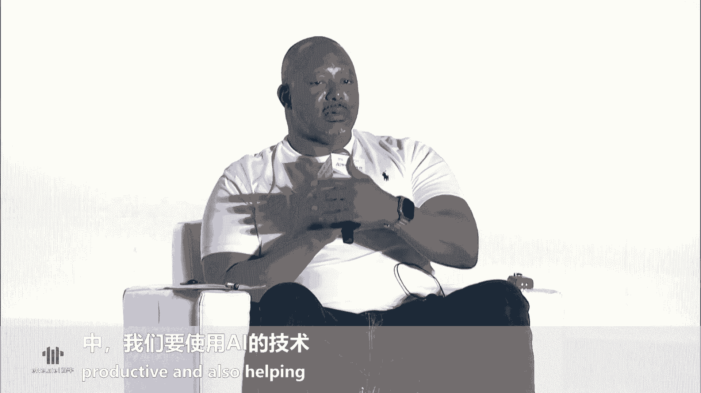

# 2024世界人工智能大会（合集） - P52：20240706-AI聚能·人才无界——人才专场论坛 - WarrenHua - BV1iT421k7Bv

🎼，🎼在1920。🎼后装性。🎼先衰。我农缩。🎼Ladies and gentlemen， the event will begin shortly。

 Can we please ask for you to kindly take your seats。😊。

We would like to remind you again to switch off all mobile phones and put electronic devices to silent mode。

 Thank you for your cooperation。😊，尊敬的各位来宾，本次会议即将开始，请您尽快就座，并将手机等通讯设备关闭或置于静音状态，谢谢您的合作。

嗯。尊敬的各位领导，各位嘉宾、女士们、先生们，大家上午好。😊，在这热情如火的7月，我们相聚在黄浦江畔，共同迎来了2024世界人工智能大会的一场重要活动。AI智能人才无界人才专场高峰论坛。我是主持人谢伟。

非常荣幸能与大家欢聚一堂共襄盛典。论坛由中共上海市委人才工作领导小组办公室上海市人才工作局上海市经济和信息化委员会上海市教育委员会上海市人力资源和社会保障局世界人工智能大会组委会联合指导。

东浩来生会展集团股份有限公司主办晋轩上海文化科技有限公司承办。在本届大会的开幕式上，国务院总理李强特别提到，推动人工智能更好服务全球发展增进人类。福祉是一项重要的工作。

而推动人工智能产业发展的核心是人才。本次论坛作为十大主题论坛之一，得到了众多领导、嘉宾以及社会各界的关注和支持。首先让我们以这烈的掌声来欢迎莅临现场的各位领导和嘉宾，他们分别是。

🎼上海市经济信息化工作党委书记程鹏。🎼上海市委组织部副部长、市人才工作局局长潘晓刚。🎼上海市教育委员会副主任叶玲玲。🎼上海市人力资源和社会保障局副局长李伟。

🎼浦东新区区委组织部副部长、区人才工作局局长、二级巡视员戚玉霞。🎼中国电信集团首席技术官、首席科学家、中国电信人工智能研究院院长李学龙。🎼华东师范大学校长、中国工程院院士钱旭红。

🎼上海纽约大学校长、党委书记侯世俊。🎼菲尔兹数学科学研究院院长多伦多大学数学教授库马尔穆蒂。🎼东浩来生会展集团股份有限公司总裁毕培文。🎼同时，我们也对今天无私分享宝贵经验的各位演讲嘉宾表示热烈的欢迎。

好的，亲爱的朋友们。那么接下来呢我们正式进入到我们今天的议程，让我们掌声有请我们今天的第一位演讲嘉宾。那有请我们的老师将我们的大屏幕呈现一下，谢谢。😊。

🎼首先让我们掌声有请上海市委组织部副部长、上海市人才工作局局长潘晓刚先生上台致辞，掌声有请。😊，尊敬的陈鹏书记。权旭红校长。目的院长同时进校长李新龙院长。各位嘉宾朋友们。大家上午好。

很高兴与大家相聚在2024。世界人工智能大会人才专场高峰论坛的现场。在此，我警代表上海市委组织部市人才工作局。对论坛的召开表示热烈的祝贺。像与会的全球顶尖科学家。

顶级学府校长、企业家、投资人和各界专家表示诚挚的欢迎。想长期以来关心支持上海人才工作的。各位朋友表示衷心的感谢。近年来，上海按照中央的要求，始终把发展人工智能作为战略选择。

持续发挥人工智能、赋能百业的投眼效应。产业规模增长迅速，从2018年1340亿元增长到。超3800亿元，创新成果持续涌现。目前，上海已有34款大模型通过备案。

产生了制造业、金融、巨生智智能机器人多等多个锤类领域的应用。多款通用人形机器人圆形机器发布，在打造人工智能。权健自主创新生态中发挥的引领作用。🤧嗯。人工智能产业要实现跨越发展，人才是关键。

上海一直将人才视为城市当中最宝贵的资源。全力推进高水平人才高地建设。在人工智能人才集聚方面取得了成效。一是人才集聚优势持续显现。上海人工智能领域产业人才总数达到了25。7万人。占到全国的3分之1左右。

从年龄结构来看，35岁以下的青年。占超过67。5%，已基本形成了国际化、年轻化、专业化的多层次人工智能产业人才队伍。二是。构建起梯度化的人才体系。上海已初步形成了涵盖顶尖科学家。

产业领军人才、卓越工程师、高技能人才等为代表的多层次产业人才队伍，以高质量人才体系推动建设更具国际影响力的人工智能的上海高地。打造世界级的产业集群。三是搭建了高水平人才高地交流的平台。

上海正在集中国家优质资源重点建设人工智能、全球研发中国中心和交叉学科协同创新中心。发起人工智能国际大科学计划和国际科技合作计划，为人工智能提供国际一流的创新平台。加快形成新一代人工智能战略支点。

和验证格局。金年书记强调。要推动形成更具竞争力的创新生态。要加强全方位对接，提供便利化服务。助力全球人才。到上海。这座城市来成就事业，实现梦想。面向产业发展的前沿。

我们将会同相关的部门和地区持续优化人工智能人才领域的政策。以人才引领带动创新发展，更好发挥政策协同和叠加效益。我们将以更大的决心，更大的力度，更实的举束，全力打造人才精准服务体系。打造更具国际竞争力的。

创新创业的生态。为各路英才提供最适宜的发展环境，搭建最适合创新创业的舞台，努力将上海打造成。人工智能人才进月远来的梦想之城。最后，预祝本次论坛取得圆满成功，谢谢大家。🎼谢谢。

非常感谢潘部长鼓舞人心的讲话，请入席就座。人工智能发挥着赋能百业的投研效应。而上海致力于成为人才工作的投研城市。2024年是我国人工智能发展的关键年。

浦东作为全国首个人工智能创新应用先导区持续发力创新策员应用示范制度供给着力打造国际领先的人工智能技术创新引领地。那么接下来我们将共同聆听浦东新区在AI人才引进方面的政策和人才环境新举措。

让我们掌声欢迎浦东新区区委组织部副部长区人才工作局局长二级巡视员姬玉霞女士，有请。😊，尊敬的各位领导，各位科学家、专家、企业家朋友们，大家上午好。非常荣幸参加今天的人才高峰论坛并做交流。

我想用来浦东让世界看到你这句引才口号开始我的宣介。这句话是著名物理学家李正道先生亲笔为浦东题写。这也是我们向社会各界和海内外人才传递浦东求贤若渴的鲜明信号。浦东作为上海五个中心建设的核心区。

上海高水平人才高地建设的重点区域，始终面向全球延览各类优秀人才、高端人才集聚效应持续提升，人才创新创业成果持续涌现。目前，人才资源总量达到200万人，其中，人工智能等三大先导产业人才32。6万人。

占全市3分之1多。当前，浦东正按照中央和市委关于高水平人才高地建设的总体部署，在市委人才办的指导支持下，加快打造国际人才发展引领区，着力吸引集聚更多海内外优秀人才，到浦东来创新创业。这其中。

人工智能等三大先导产业人才是我们关注的重中之重。下面向大家介绍浦东助力人才、人工智能人才发展的三方面政策举措。第一方面是支持人才创新创业的明珠系列。党中央赋予浦东新区打造引领区的重大战略任务。

明确到2050年，浦东要建设成为社会主义现代化强国的璀璨明珠。我们将人才作为引领区建设的掌上明珠。也希望各类人才在浦东像明珠一样熠熠发光。因此，我们推出了明珠系列政策举措。首先是聚焦人工智能等领域。

大力实施明珠计划。对人工智能等领域的高峰人才及团队经认定后，给予最高700万元的个人及团队资助最高1亿元的项目补贴。入选明珠计划领军精英工程师项目。

给予最高100万元资助以及科研攻坚、创业投融资、落户安居等一系列综合保障和支持。在遴选方式上，除了传统的专家评审之外，在市人才局、市经信委的指导下，我们还创设了四种通道。

一是对具有引领性的人工智能领军企业纳入重点单位，并赋予其自主认定明珠计划相关项目的名额和额度。二是实行团队核心成员直接认定，把能力评价交给高峰或领军创业团队的负责人，由人才认定人才。

三是对当年度新入选国家级、市级海外高层次人才计划的，直接认定为明主计划相应项目。四是对有3年以上海外工作经历的知名高校sam专业博士直接认定为明珠经营人才。我们探索用以上新机制，不拘一格揽人才聚人才。

这次大会，我们最新推出浦东明珠人才种子基金。在投小投早投未来的基础上，更着力、更早、更小、更新阶段，助力总资期、初创期高层次人才的项目，为优秀人才创新创业提供资本支持。

支持的对象主要包括明珠计划创业人才领衔的创新项目或产业项目。新引进浦东的高层次人才创业项目以及区级以上创新创业大赛获奖项目等。单个项目最高可获500万元投资。

后续浦东天使母基金、科创母基金、引领区产业基金以及生态伙伴基金等，还将给予接续的投资，形成全生命的周期投资体系。第二方面。是以才引才机构建才，实施全球引才伙伴计划。

主要是邀请一批引才伯乐、面向全球寻聘人工智能等科技领域的高层次人才和高潜质青年人才。伙伴对象上包括国际视野宽、人脉资源广的专家人才和专业机构。对成功推荐高层次人才及项目落地浦东新区的伙伴。

经认定后给予单项最高100万元的奖励。我们真诚欢迎在座的各位专家和嘉宾朋友们加入我们的引才伙伴，成为浦东引领区建设的合伙人。第三方面是系统推进人才领域的综合改革试点。今年1月份。

浦东新区综合改革试点实施方案正式向社会发布，其中，人才板块在四个方面提出一系列首创性、引领性、突破性的举措。这些先行先试的举措，可以为全球AI人才通行、工作、生活等方面提供坚实的制度保障。比如。

在市委组织部小刚部长的直接推动下，最新争取到人社部国家外专局同意，赋予浦东新区为符合条件的外籍人才审核发放外国高端人才确认函权限。人才贫寒可申办有效期最长十年多次往返的人才签证。

又比如我们可以为外籍高层次人才直接推荐申办永久居留身份证，可以简化材料，缩短时限，而且配偶及子女可随同申请办理。以上三个方面是我要和大家介绍的主要内容。除了这三方面主要举措。

大家也可以扫描我们图中的二维码和小程序，全面关注浦东的人才政策体系和各类服务平台。各位专家、各位来宾，希望大家来浦东在浦东，与世界共舞，与未来相拥，与活力相伴。谢谢大家。谢谢。

非常感谢戚部长为我们带来的浦东新区最新的人才政策，为我们揭示了浦东新区如何打造更具吸引力的磁场，共同推动人工智能行业的繁荣发展。2023年，市委人才办牵头实施东方英才计划。

由市经性系统开展拔尖、青年项目产业平台选拔，每年遴选一批创新成果显著，团队成长信号、市场认可度高的产业精英，努力营造人才引领产业高质量发展，产业带动人才集聚的良好局面。

在首批东方英才计划拔尖、青年项目选拔中，AI人才占有相当的比重。接下来我们将进行AI优秀人才证书颁发仪式。首先，我们有请2023年东方英才青年项目获。😊，平代表上台，他们分别是。

🎼金罗人工智能技术上海有限公司钱茂东。🎼上海人工智能研究院有限公司宋海涛、美的集团上海有限公司王伟。🎼同时，我们有请颁正领导上台，上海市经济和信息化工作党委书记程鹏，上海市教育委员会副主任叶玲玲。

上海市人力资源和社会保障局副局长李伟，有请各位领导为我们的获奖者颁正，有请。😊，🎼好的，我们有请领导和我们的获奖者一起来合影留念。同时我们现场的朋友们热烈的掌声表示祝贺，恭喜。😊，🎼好的，请领导留步。

🎼请领导留步，继续为2023年东方英才拔尖项目获贫代表颁正。他们分别是。🎼上海必刃科技股份有限公司李霞，上海穗源科技有限公司张亚玲。🎼上海闪马智能科技有限公司彭瑶。🎼好的。

我们有请领导和我们的获奖者一起合影留念。同样我们现场的朋友们让我们以热烈的掌声对这些杰出人才表示崇高的敬意。😊，🎼好的，谢谢，非常的感谢我们的各位领导，同时也恭喜我们的获奖者，谢谢，请入席就坐。😊。

🎼那么刚刚我们共同见证了一系列激动人心的成果发布和荣誉颁发。这些杰出的AI人才，不仅展现了个人的智慧和努力，更体现了上海在AI人才培养和引进方面的坚定决心。今天我们也非常荣幸邀请到了在AI领域。

有着深厚造诣的李学龙教授。这位杰出的学者身为中国电信集团的首席技术官首席科学家、中国电信人工智能研究院院长，将为我们带来科技创新薪火相传，人才报国正当时掌声有请。😊，尊敬的。各位前辈，各位领导。

各位老师，各位朋友，大家早上好。呃，我是李秀龙，是中国电信人工智能研究院，就是I的院长。首先非常感谢我们的领导们啊给我这个机会来分享一下心路历程。其实今天早上到会场之后，我是战战兢兢的上了这个台。

因为我发现在场非常多的前辈和老师，都是我非常敬仰和尊敬的那我想领导们让我来汇报一下的话，可能主要是两个方面吧。第一是人工智能，人工智能其实我们狭义上去想我们会想大模型啊这个很多很多的应用等等。

那其实呢居神智能是一个相对宽泛的一个链条。那比如说我们做处理的时候，前端的获取是什么样的，他们之间是有什么样的关系。那我们做一分析之后，它体现在对物理世界的操控上影响上又是什么样的，它又有一方面的关系。

其实它是软件体系跟硬件体系的结合。所以我们叫智能和光电的一个结合。这是可能是我作为一个呃就是AI的从业人员的一个一个有点特点的地方吧。😊，第一从专业的角度。那么第二点呢。

就是呃在过去的这个从我30年前到大学开始到现在呢，可能相对来说在科研主体上，我经历的比较多。就是我在咱们的民企、央企、外企，然后这个国外的高校，香港的高校，还有咱们的研究所都有一些工作的经历。

所以现现在是这样，就是我先很简要的向大家汇报一下我的工作的经历。然后后面呢我会像流水账一样慢慢去展开。那么在每一段历程的时候呢，我想给各个老师呃给大家去汇报一下我的一些感悟。呃，我是94年到中国科大的。

在中国科大，从本科到博士。那么在离开科大之前的时候呢，其实我就开始出去实习了。现在华为华为是我们的民企的一个代表，在华为，然后后来到香港大学，香港中文大学，然后在微软，后来到英国去当老师。

到09年的时候呢，当时国家有一个呃人才计划。09年，我从英国就回到了中科院的一个研究所，做型号任务。9年半9年半之后到了高校在呃。高校工作了5年。但是因为人工智能领域里。

大家知道就是算力以及各方面算力场景数据是非常非常重要的。于是在去年底我就到了中国电信。呃，包括我刚才给大家汇报算力场景应用，它是非常富足的。所以呃这是大概的经历。

那我们今天的论坛的主题呢是AI智能人才无解。就这既印证了就是国家对呃AI的英才要集AI英才之力来推动下一代人工智能技术发展的势不可当的一个现状。

那也符合我们中国电信人工智能研究院对全球人才的这种吸纳的热情和决心，对人才的期盼和渴望。对未来的AI技术的发展的信心和魄力。所以刚才是回溯了一下我大概的一个成长的历程。

就其实有一种呃洗尽铅华见本心的这么一种体悟吧。那么下面我用呃。就是流水账式的语言来汇报一下我30年的大概的一个一个感受吧。一路走来，我想要分享的两个主题词是一是流动，一是延续。

那流动呢我们会说是时间的白驹过隙，从青涩的少年到现在我也也已经是满头白发了。那在求学的工作的时候，海内外有一些思乡的情谊。它是每次职业道路上一次次的选择，它也是从科研到产业的一种纵深的一种合力。

流动中其实有不动的地方，就是自始至终在我的每一段路的路途的背后，有一种不变的成才的信念。成才其实不只是个人其实也是一种发挥作用的一种感觉，而不是那种我们说过尽千帆皆不是，你有很多的经历，就是成才。

那其实从没有动摇过的爱国报国的决心，是我们心中于面，爱国的旗帜在心中飘扬，所以这个流动中的不动，这是贯穿我的一个很重要的一个选择。那第二个词呢就是延续。延续讲。是什么呢？是一种超越时间跨度的科学的精神。

我们秉承着但行好事，莫问前程，这是一个长期主义。那如果百折不挠呃，永不言弃呢，这是一种科学的意志。如果说江山待有才人出，呢，它是一种薪火的相传。所以我们要传递的是科学的精神，要树立科学的榜样。

要注重人才的培养。这是我们在延续中传承的不不变的呃在延续中的传承。这是一种不变的延续，它也贯穿着我的行动。好，那么回想一下我的学学经历，刚才呃向大家汇报了，其实那是一个播种纯真梦想的年代。

在中科大94年，我记得当时是电子工程系。坐了40多个小时的火车到了合肥。然后我在这儿坐了本科和博士的学习，毕业的时候是中科院的院长奖的获得者。本科的教育呢其实给我后面的科研生涯。

其实打下了一个很坚实的一个基础所以我经常去向教授们请教一些问题。其实从本科生的时候，我们现在看向s像很多其实都是刚刚毕业的学生甚至在读的一些学生，他们的一些idea，他们的一些工作的一些贡献。

所以这是教育的本质是一种爱的流淌，能够在学生的心中去有一些回响所以呃01年的时候，在汤老师让我到中文大学去做了一个大概半年的一个访问。这半年其实给我的印象是非常深刻的。其实在那个时候大家可以回想一下。

在国内的高校里，我去图书馆，其实连一个H的数据库都找不到。为了开一篇文章，我需要在国外的朋友帮我发一篇邮件的附件过了。而email是收费的，没照5块钱。😊，Yeah。所以当时在香港的这一段时间。

其实是开阔了的事业。所以当时科研信息开始了解的比较多。然后有这种知识体系的结构到国际事业，它是一种丰富和提升。所以呃有的时候我们说山有木兮木有之新月君兮君不知。就是其实你的烙印是刻在某一个时代上的时候。

其实你会有更深刻的理解。但是我们不能只停留在那，他有一种前后的延伸，有一种延续。好，那么等我回到内地之后呢，我就推荐了几个在中科大的学生到香港去，我估计大家可能也会知道像王小刚陶大成像林达华曹亮亮等等。

都是当时我从中科大去推荐到到香港那边去的。其实他们现在也已经都是在AI领域里算是有顶尖的科研荣誉吧，是学术界和产业界非常领军的人物了。所以我们在想就说他像是一种踏遍青山人未老。其实我觉得在行走的过程中。

我们一边在做。专业一边也在做人才的培养。后来呢我到了英国，到英国，其实呃先在奥ster大学，后来04年到伦敦大学去当老师。呃，当时我举一个例子，其实认呃呃认知科学认知计算啊，其实是心理学领域的一个词。

当时我就把它引入到信息领域。现现在我们都知道认知计算。但其实全世界先开设认知计算这门课的，也许是我啊至少HBSMC的认知计算技术员会，我是方ingch。所以呃在三年之后。

在英国我拿到了permanent，就是北美的tu。其实tenure之后就permanent之后呢，其实非常轻松了。因为在英国的考评每7年最好发表4篇论文，而且没有规定是期刊会议，还是技术报告。

其实也可以。然后在这种情况下，一年我大概十五节课，然后大概有七八个会，然后每年有340天都是自己可以去安排的时间。在这时候呢，一次都看似很安逸，但是我自己知道心里缺了很多东西。所以呃09年的时候。

我是全智回国的。所以海外的这段经历呢让我深刻意识到就是科研，你不只是对知识的探索，其实是呃对自我精神意志的一种锤炼和锻炼，是对国家发展的贡献的一种渴望。我觉得这是我们的责任和使命。

所以我们经常去讲科学没有国界，但科学家有自己的祖国。就是每当我当时和各个国家。因为当时我们系里就是中国人只有我一个，就是跟来自于不同背景的科研人员去进行交流的时候呢，我就时刻会有一种非常强烈的感受。

就是我不单单是我个人的一个个体。然后他也同样代表着我们中国科研工作者的形象。所以一年一年的过去，就是呃年年岁岁花相似，但岁岁年年人不同，就是你的思想里你会萌生，会有一些启发。你会有些感触。

会有一些你特别想去做的事情。所以在异国他乡呢，我会也一直在关注着我们国内的这种科研领域的发展和变化，其实一直都在看，所以我们叫位卑未敢忘忧国吧。就是呃报效祖国的念头，其实越来越强烈。

09年我就在英国的伦敦大学去辞去了终身教育职，呃，回到了祖国，这是我的下一个阶段。那么回国之后呢，首先我到了中科院的研究所去做型号任务。这是一个很特别的科研的方式啊，就是呃两师系统。

我们知道总师啊等等等等。它跟这个一般高校里的科研的方式是不太一样的。他是带大队伍去做这种有组织性的科研。那高高校主要是一种创新，它都非常重要啊。所以继续在继续攀岩科学和技术高峰的情况下呢。

当时我们做了很多工作。比如说第一台多分率相机，包括现在我们看到的这个水下的相机，包括呃我其实我回来的第一个工作是嫦娥2号的相机的图像主管设计师，那还有很多工作可能不便向大家去汇报。

但是比如说中国下到马良的海沟呃，最深11千米呃1001100个大气压。那这时候所有的成像系统和处理，其实都是我们在做的。所以在这个过程里呢，我们呃特别强烈的感受，就是刚才汇报的使命感和责任感。

它是一个一个的挑战，但是也是一个一个的呃自力更生。所以当时其实我会想到就是说人民。只有人民才是历史发展的真正动力，就是这种组织的这种团队，其实非常强大，非常有战斗力的。

所以我们希望把中国的旗帜去插到国际专业的各个的顶峰。所以回想起在光机所的经历，所以想向大家分享一下，就是它不只是工程化的问题。其实有的时候你会发现课本上讲的东西，在工程化的时候不一定能去实现。

所以工程其实有的时候是非常科学的。就是我们说一个光轴两个后镜，这有个蜡烛这个平蜡烛成什么样项我们是知道的。但是你实际做的时候，这两个屏是不可能去同轴的。所以这是工程中的科学的问题。

所以它还不仅仅是一种你说千呼万唤使出来，你不经过这个千水百千千水百刃的去深刻的去考虑，其实是没有答案的。所以它是课本加实际的一个结合，到18年的时候呃，其实主要是为人才培养的这种考虑吧。

就是同时我到了就到了西北工业大学组建了一个院。叫光电与智能研究院。我觉得这个其实算是一个比较前沿的一个探索。因为刚才给大家汇报了，因为智能绝不仅仅是只是去处理分析数据，它一定跟物理世界是有结合的。

它跟前端的获取是有结合的。所以光电和智能，其实我们经常说无需求不应用无无应用不光电无光电不智能无智能不计算。所以呃在西工大的时候呢。

我们提出了一件事情就是体系化去思考我们的科研就是林地安防地面上10千米和水面以下100米。在这个体系里这是人类主要生产生活的一个区域。因为我们现在去讲人工智能的时候，我们会讲很多呀。

那大模型啊聚深智能啊，无人驾驶啊，这个很多很多，但是其实我们会发现阿尔法 go是不能去做无人驾驶的，它可以下棋。其实体系化的思维对我们来说非常关键。

所以中国电信的人工智能研究院我们论证呢我们希望是有三个层面。我们会有sspace会有林地的空间，会有广域的空间。所以这个不详细去展开了。所以现在。在呢就是呃我们在开平I的时候呢。

我们有强大的这种央企的平台，还有资源的优势，去发挥央视。我们知道企业是科技创新的主体，央企是呃企业中间非常有代表性的这样的一个部分。所以其实对央企来说，更应该有这种特别原始的呃为国助建的出发点。

为天地立新，为生命利命，为网盛济绝学，为万事开太平，其实对央视对对央企来说，这更加是应该是一个本心。所以在全球的生态网络进行布局，而且去做AI驱动的产业经济。

其实中国和美国或者说中国和很大很多其他国家在AI发展的渠道上，一定是差异化发展的。我们会有不同的路径。因为我们会更加关注实体经济，我们会去解决工业和农业中间等等一些中间的具体的一些问题去提制降本增效。

所以这是新智生产力的一个特色。所以我们切实把科技创新放在。战略的高度去进行呃提帜降本增效去去释放国家战略的科技力量。这是时代赋予呃泰利埃的使命，也是国家对我们的信任，这是报国正当时的。那么呃。讲到这儿。

我还得call back一下，我刚才汇报过的流动啊，就是从校园到访问到海外工作，再回到研究所高校到央企。其实流动有了一个新的定点，就是昨天其实就在这个就就在这个地点，他恋爱是正式的呃正式的发布。

正式提交接牌吧。其实工作前面我们已经开始很多工作已经在做了。所以时间刚刚好，它不是过往，不是未来，就是此时此刻，就在现在，它是一种天时地利和人和，它是一种呃恰如其分，恰逢其实恰到好处。

所以呃每一次选择都是流动的。那么下面汇报一下延续的意义。呃，我先分享一个小故事啊，就是。呃，在1405年正和下西洋，但是大家并不知道，100年之后，这个画蒙娜丽莎的达芬奇设计了第一套潜水服。

200年之后发现彗星的哈雷设计了第一个潜忌。300年之后，潜水服成为现实。400年之后潜期成为现实。500年之后，我们有海洋卫星海洋水色卫星。600年之后，我们有了奋斗林允浩深海勇士号。我们去深海去看。

所以这种它是一种跨越时间和空间的一种延续。它是科学技术的呃突破力的一种接力。所以我们会有一代代的科学家发明家创造者去传承科学的探索这种精神和意志。像米开洛米开朗基罗去世的那年，伽利略诞生。

伽利略去世的那年，牛顿诞生，它是一种巧合，但其实也是一种经历精神上的接力。他其实呃不只是个体科学家。因为我们经常说说科学家把解决不了的问题交给哲学家哲学家他解决不了解决不了的问题交给神学家。

除了医学法学神学之外，我们都是哲学博士D所以。😊，我们呃人类是个共同体。那其实呃2元也是一，所以我们认为这是一种独特的科学独有的一种一种浪漫的主义。它会呃。就是一种身无彩凤，双飞翼，心有灵犀一点通。

终归它会归在一起。所以在1000年之后，我们还会继续这样的延续。首先我们要发现和培养好人才，这是核心。现在其实呃很多的企业其实在他们做的很好啊，这核心团队都是这种技术型的青年的人才。

所以我们知道呃人才确实是第一资源。所以高高素质的创新人才，就提升国家竞争力的关键。这个要要求我们具备识材的汇演，爱才的诚意，用才的胆识呃融才的雅量和聚才的良方。那目前呢从国际科技其实竞争是其实白热化的。

其实我们在招聘的时候，我们招的很好，我们有国外的海外的正教授加入了我们我们会有呃顶级这种呃公司的GTO加入我们会有这种青年的学生的天才加入我们都有。但是其实呃人才的竞争还是一个很大的竞争。

所以呃我们说恰同学少年风化正貌，我们其实也希望我们有机会去刚才给几位校长也来汇报，我们有更多的机会去从博士生到硕士生到本科生甚至到高中生，甚至到初中生的这种AI人才的培养，我们希望。在中国电信。

我们希望可以一竿子插到底。其实我们不一定有这样的能力。但是我们至少有这样的vision，有这样的诉求。所以对我来说，我从一名呃叫怀揣梦想的一名少年吧，30多年了，30年了。

到现在是一名投身技术科技公关的一线的科技工作者。那我知道这背后支撑我的一种期望不可能的一种信念。其实我们说这是一种报效祖国的赤子之心，是一种不破楼兰终不环的一种觉心。所以初心不改矢志不愈。

我去回顾我自己的成长历程。如果不是有优秀的领路人在，一直在指导我，有我的呃皮尔们，有我们的同窗们，我们同事们在勉励我的前进。更重要是国家和领导们给我们的这种支持和培养。

我们是不可能有现在的这种科技的进步的。所以饮水思源呃，我想把我的经验传递给我们后面的这种呃科技人员吧，让大家希望能转化成真正的培养人。台的思路去做体系化的呃落地和落实。

所以我们以泰恋爱为落脚点去打造一支有战斗力、凝聚力的队伍。这支队伍是信心坚定的，是目标专一的，是能打胜仗的。我们面对的是国家的需求。我们既希望能做自由探索。我们其实又希望去做产业化的落地。

其实这个要求对自己的要求是比较高的。但是其实并不矛盾，就像我们经常讨论一件事情的，我们会说我们看事物，首先是看山是山看水是水。那么后面你会看山不是山看水不是水，后面是看山还是山看水还是水。

其实我不去展开刚才的从理论到产业落地，就是三句话，其实是能说清楚的。所以呃我也希望我们能够凝聚世界呃社会各界的，包括世界的这种力量，形成合力。在我们从政府到高校到产业到信息研发机构，我们从自身出发。

去发挥各自的自身优势，在国内外的生态去打造出相应的这种贡献，给人才提供最好的平台。然后做有力的支撑去促进产学研的这种融通。那么其实泰恋I呢，我们也希望多元化的项目去吸引人才去培养呃学生。

比如后天我们可能会跟几十位清华的学生一起去去聊聊天，没有什么诉求，我们只是聊聊天。所以给科研工作者容错的空间，去给我们一种孕育呃一样和不一样的一个沃土。

那么目前研究院其实人才我们已经有呃逐步的在有这种滚雪球一样么，有链接，有团结，有凝聚，有升华。我们有我们的决心、诚意和信心。我们希望聚天下英才而用之。

然后呃市委组织部和市人才局刚才呃领导们也也也都介绍了一下有非常好的相应的人才的政策。那我希望我们的人才没有后顾之忧。我们提供最好的待遇设备和条件去解决我们的科学技术工程以及系列所有的问题。

那我也衷心的就是作为一个一线的科研工作者，在最基层的科研工作者，那我也号召我们的科技人才。我们尤其在海外的我们的一些同学和同事和朋友啊能回来。我们这有最好的资源和舞台，我们来做最好的事情。

在最好的时代做最应该去做的事情。洪鹄之志是心系天下。所以我相信呃其实我们有这么多顶尖的高校科研机构和优秀的人才。我们一共能提供不同的人才去发展的土壤。

它是一种呃路漫漫期修远期的一种呃乌江上下而求索的一种过程，也是其实也是一种追求。就很多时候我们。以为自己。不会忘记一些事情。但是在记忆中，你慢慢会去淡忘这些事情不见得是坏的事情。

那么其实从机器学习的角度来说，从人工智能的角度来说，那么学会记忆和学会忘记，其实两件事情都是同样重要的。所以我们期待人才的回流，去期待科学精神的延续。所以我们讲聚沙成塔，集财呃，聚财成吉，一事一人。

为国为民。在。很简短去做一个收尾啊，就是在这趟路途中去，我走了很远，我从求学领悟到人才培养，到开始认为自己懂得一些什么是人才的培养。也许我到现在还不懂，很有可能是还不懂。

那么逐渐至少有拥有了一些开阔的视野和一颗报国的心是没有变的。所以幸运的是，即便是。呃，发苍苍赤瑶瑶，我想我和我们同样的其他的科技工工作者都一样，我们永远都会是从前的那个少年。

所以我们会用饱满的激情去继续我们泰恋爱的征程，继续我们国家在人工智能方面的探索追求拼搏和引领。那么报国正当时与我与你，我们下一个阶段又会到哪儿，我们又会如何去延续。好，谢谢大家。谢谢。

非常感谢李学龙教授，将自身的归国经历娓娓道来。同时也感谢您全权的爱国之心。您的分享不仅拓宽了我们对于AI人才培养的视野，同时也突出了教育和产业深度融合的必要性，同时也激发了我们对于国际人才合作的深思。

政产学研的有机链接、协同育人，是打造人才生态，实现AI产业发展，满足经济发展的关键途径。在这一背景下，跨界融合、跨学科探讨以及跨文化国际交流显得尤为重要。他们不仅响应了人工智能时代人力资源的新需求。

也为我们的人才培养和产业发展提供了新的视角和方法。那么现在让我们一起带着这些宝贵的思考。😊，🎼期待并且欢迎接下来的顶尖学府校长对话环节。通过他们前瞻性的视野以及深刻的洞察力。

为我们揭示如何在科技日新月异的时代中把握教育发展的脉搏共同开创人才培养和国际合作的新篇章，让我们以最热烈的掌声，有请华东师范大学校长、中国工程院院士钱旭红先生。😊。

🎼上海纽约大学校长、党委书记洪世俊先生。🎼菲尔兹数学科学研究院院长多伦多大学数学教授布马尔穆蒂先生。🎼以及我们本场圆桌论坛的主持人。🎼东浩蓝生会展集团股份有限公司总裁人力资源领域专家毕培文先生。

有请各位一起移步到舞台上，让我们掌声欢迎。😊，尊敬的各位来宾。大家上午好，欢迎来到2024世界人工智能大会人才高分论坛世界顶尖学府校长对话环节。😊，我是WAIC承办单位东浩蓝生会展集团毕佩文啊。

此时此刻，我内心也很激动。呃，因为我在人力资源服务行业有27年的这个服务经验，也是一个人服行业的老兵。那么现在是在会展行业。所以我想应该是这样的一种跨界感。同样的今天的对话环节。

也是AI人才的一个培养和一些教育改革的话题。那我想同样也是一个跨界的话题。呃，也感谢主办方呃，邀请我来作为此次对话环节的主持人。😊，那么更加兴奋在于说。

今天我们能够有幸请到三位在不同的领域取得卓越成就的校长，同时也是科学家能够面对面来聆听三位对AI时代的人才培养和教育改革的真知灼见，感谢三位的到来。首先请允许我简单介绍我们台上三位重量级的嘉宾。

他们是钱旭红校长。田校长现任华东师范大学校长、中国工程院院士。钱校长在有机化工领域有着深厚的学术造诣，并担任多项重要的学术和社会职务。佟世俊校长。童校长现任上海纽约大学校长，华东师范大学哲学系教授。

童校长在哲学领域的研究广泛且深入，曾任教育国内多所知名的学府。让我们欢迎库mer尔莫提院长。库马尔院长曾担任多伦多大学两届数学系主席，现任多伦多大学菲尔兹教学研究院院长。

库马尔院长在数学理论和几何代数领域拥有非常丰富的研究成果，并在全球范围内发表了大量的学术著作。让我们再一次以热烈的掌声欢迎三位的到来。那我想接下来呃也请三位校长呃。

用两三分钟的时间来做一下更深入的自我介绍。同时也介绍一下您所在的顶尖学府。要钱校长。呃，很荣幸到这会上，我简单介绍一下呃，我生于1962年，1978年考大学。在考大学的这个前三个月。

我父母突然强制性的要求我不允许学文科。所以我就当考取了当时的华东划学线，就是今天的华东理工大学，也从那时开始，我在工科领域工作了40年。所以我从本科硕士博士都是在华东理工大学拿的，拿了博士学位以后呢。

然后呢，我去了美国能去了德国做博士后，然后再回国，1992年开始工作。1995年担任校长助理，1996年担任华东理工大学副校长。随后到2000年辞职，去了大连理工大学，做长江学者特聘教授。

也获得了国家接梯的资助。然后到了4年半没有完成两轮，就被调回上海担任华东理工大学校长。从2004年到201。15年2015年，我卸任卸任回到实验室，三年后，那么被调任华东师范大学校长。

那么担任华东师范大学校长，现到现在为止6年半。呃，我所在的学校，人们常常认为是仅仅是一所师范大学，那是一个误解。华东师范大学，不仅仅是一个教师教育领先的大学，更是一所综合型的研究性大学。

并且它有许多工科，就简单而说，华东师范大学在理工科领域有三个国家重点实验室。还有国家工程另外还有国家工程研究中心以及国家的野外考察站。所以欢迎更多的人才能到我们华东师大来工作，谢谢。感谢钱校长。😊。

接下来请童校长做自我介绍。呃，我呃我叫童世俊，我是上海纽约大学的这个校长。呃，2020年6月呃，到现在已经4年多了。在这之前呢，我也是在华东师大这个工作。呃，我呃在华东师大担任党委书记之前呢。

也在上海社科院呃工作了这个7年。呃，也担任这个这学研究所的这个所长。那么我是华师大这个毕业，我是七期几呃，比钱校长早半年那个呃然后我的博士学位呢是在这个挪威拿的呃1990年代吧。

我跟挪威学者合作编了一本书论文及交 beyond borders所以和今天这个会议的这个主题还是有点这个接近的。

那么其实我在这个上海纽约大学的工作很大程度上也是做为一种be across borders这个这样一种工作。呃，这个学纽约大学本身就是这个华东师大和美国的纽约大学联合创办的一所这个学校。

2012年正式成立成立之初呢就是2013年开始招生2014年呢从华东师大的当初的临时校区呢就。到这个世纪大道。那么去年年初呃搬到呃新天地的呃这个这个前滩的这个呃这个校区。那么建校之初呢。

我们就呃办了呃三个这个dvision呃，一个是文理学部，一个是这个商学部。呃，还有一个就是计算机和数据科学与工程呃学部。2015年开始，我们就呃招收这个计算机和呃数据科学的这个本科专业的这个学生。呃。

这个这个还算是这个高校当中还算比较早的吧。大概呃我就讲这些好的，谢谢童校长有请库马院长。So thank you for having us here。

 I'm very honored to be part of this conference。My name is Kuarmoti。 My field is mathematics。

I'm getting the English translation in my year。嗯。My doctoral degrees from Harvard University and the fields of mathematics that I'm most interested in are number theory and algebraic geometry。

 Those are maybe technical sounding words。But as you come to know them。

 you'll see that they're actually very natural kind of constructs。

 mathematical constructs to think about。I would say that I've been interested in mathematics since I was a child。

But as I grew up and experienced mathematics at the highest levels。

 I found it also to be a very beautiful and an artistic and a creative discipline。😊。

And I felt the through mathematics， I could unite。The sciences and the humanities。Moreover。

 mathematics is a very powerful discipline。 It has and is and will continue to shape our world in very dramatic ways。

And as I said， it can be the bridge between the sciences and the humanities。My degree， as I said。

 was from Harvard after that， I went to Princeton for a year at the Institute for Advance Study。

And then to Mumbai at the Tata Institute of Fundamental Research。

Then I moved to Montreal at Concordia University and then to the University of Toronto where I've been for many years。

Last five years， I've been the director of the Fields Institute for Research in Mathematical Sciences。

 This is a kind of think tank in mathematics。 And as director。

 my mantra has been the ubiquity and the power of mathematics in all branches of life。

So we are now involved in public health， the mathematics for public health。

 were involved in mathematics for climate change and also in disruptive technologies that are reshaping our world such as AI and quantum and high speed communications。

 So I think we are at a very interesting point of our world and life。

 And I'm really happy to be part of this conversation。😊，感谢公园院长，感谢三位校长的这样的介自我的介绍。那么我想呃三位在各自的学术领域。

乃至在整个教育领域的丰富的阅历和深厚的造诣也令我们全场的来宾肃然起敬，也对我们接下来的这个话题讨论的环节更加充满了期待。😊，那么进入我们话题讨论环节前呢，我想呃做一个民调啊。

那么在场的我们这么多的来宾当中啊，呃家里有在校的学生的这个子女的，能不能举一下手？啊，还还不错。呃，因为上海现在的这个人口的总合生育率好像只有0。6。那至少我们这个会场应该是跑赢了这个平均数啊。

那么我自己家里呢也有一个在高中就读的女儿啊，不知道有各位家长有没有一个体会。现在的小朋友正在使用AI的工具进行学习或者写报告，甚至用一些AI的工具进行编程。

那和我们这些70后的整个的一个学习场景已经截然不同了。那么现在社会上也有一些观点。我们以前曾经信奉的这个1万小时定律已经不合适了。啊，更加多的是要培育小孩的这个思考能力，创造能力，甚至是批判精神。

或者说如何去使用更好的方法，更好的AI的工具也已经成为了教育界的一个重要的责任。所以我想我们今天交流环节的第一个话题是。AI时代的这个学习的变革。我想这个话题我想先有请。库马院长来谈谈您的看法。

同样也是两三分钟的时间。Yes， so I think the question was how the learning environment。Is changing that right。

 Yeah， So I， as you say， with the the advent of these new technologies。

It is necessary to emphasize less the acquisition of information and more the development of critical thinking。

Amongst critical thinking。The key is asking good questions。

We'll find all through life that if we can ask the right question， the answer becomes easy。

 I think there is either a Chinese or perhaps a Chinese expression that the answer is easy。

 but the question is very hard。 And so asking the right question can be really critical。

 I think the advent of tools like AI will free us to try to develop that kind criticalitical thinking。

 At the same time。We have to listen for the answer。

 Sometimes we confuse critical thinking with arguing， you know， debating。

 we have to have an open mind， a receptive mind to hear the answer because we don't know where the answer is going to come from and great philosophers of the past have told us that learning is is a lifelong process and that we can new knowledge can come from any source so we have to have that receptivity of mind。

The other thing that the AI tools can do for us is to emphasize more experiential learning。

 learning by doing。That's an expression that occurs in economics， but it's relevant now in。

 in learning as well。 There's， I believe， an expression of Confucius that if I hear something only。

 I may forget it。If I see it， I will remember it。 But if I do it， I will understand。

And so learning by doing is a way of getting really deep understanding of what we're doing。

 And I I would say the tools and way are becoming available will make that possible。谢谢您。😊，那钱校长。

我想那个华东师范大学呢在。中国的名校当中有其特殊性，它不仅是一座高等学府，同时也是培育教育者的一个学府。所以我想同样的这个问题，也想听听您的一个见解啊，我我我说一下。

就很多人不一定了解是华东师范大学的毕业生。从从事教育的，从大学到小学占50%。那第二位是什么地方？我们25%的毕业生在IT产业工作。哎，所以其他我就不说了。所以我们非常重视人工智能。

那么人工智能对我们有很大的启发在什么地方，非常重要的第一点，如果单从操知识点的学习或者收集的角度考虑。我们人将败给人工智能。人工智能将会超过我们。也就是那我们有什么样的。

我们要进行什么样的学习才能超过人工智能。那么我们学习知识不仅仅是为了知识点，更重要的是训练自己的思维。而在思维层面，人工智能是很难超过人的。人工智能只是在知识点上比较聪明，而远远达不到人类的智慧。

所以我们要注意思维训练，在思维训练的方面，我想在基础教育要解决两个思维，一个是形象思维，一个是逻辑思维。那么在大学阶段，应该解决什么？一个是批判性思维，一个是创造性思维。我们东亚的学生。

中国的学生都有一个特点，琵琶性思维相对比较弱。最典型的表现就是不敢提问题。我们害羞。那么人工智能给了我们一个非常好的机会，我们可以用自己的手机，我们可以躲在角落里面，我们可以挑战他，我们可以逼问他。

逼得他哑口无言，使得他能够说出他不愿说出的话，甚至于打破沙锅问到底。只要你有又有过这样的经历和人工智能进行争论讨论的人，你都会从中收益。这无形之中就提高了你的批判性思维的能力。😊，再一点呢。

人工智能不能简单的把人工智能看成是IT行业。它是一个超学科的产物，它为我们提供了一个新的平台，它既是化学的，它又是语文的，也是历史的。因为它可以横穿很多学科。所以如果我们能够跨越学科边界。

那你的创造力就会被激发出来，我就回答这词。感谢你，感谢两位校长的精彩分享。我想呃可能在人工智能的这个时代，各类知识的迭代的速度会更快。但是或许我们的这个曾经兴奋的一万小时的学习的规律。

可能还是有其一定的适用意义的，可能更加坚持我们的一种刻意学习的能力，或者说更加聚焦在我们的一些思辨能力，逻辑思维能力、批判精神等等，才能够在AI的时代不断的提升自己的专业能力，我们去投喂机器。

而不是单向的被机器投喂。😊，好的，那么我想我们接下来进入到我们今天的第二个话题。学校一直是我们培育人才的一个殿堂。那现在我们更多是要培育AI的人才，跨界的一些人才。

我想接下来的问题想请教一下我们华东师范大学和我们上海纽约大学的两位校长，现在的中国的高等学府，在呃创新培育我们AI人才方面有没有一些好的新的机制来赋能AI人才的培育。这个问题我想先请。同样是吧啊嗯。

好的，那个上海理游大学的呃比较早呃，就把和AI相关的一些这个学科作为我们的呃核心课程。呃，在在在这个教学呃，我们的美方常务副校长，他是这个呃非常有经验的一个呃教育家，也是。呃，法学家。

那么他这个本科自己是数学专业，所以我们学校有一个特点，一开始呢，其实我到这个学校的工作还是呃呃呃是在探索，是在了解。呃，上纽大一开始就把6种这个核心呃课程或者说核心素养。呃，这个。

放在我们的这个课程设置的这个基础上，一个是社会和文化基础。第二个是写作，第三个是数学，第四个是科学。第五个是。算法思维agmic thinking呃，第六是语言。

其实这些呢其实从不同角度其实都是为呃学生进入人工智能时代呃，比较好的创造这个条件。然后我们呃这个我们的这个学生进来以后是最晚可以到第二年的第二学期再分专业。

但是在这个前面两年当中我们这个 liberal art这个课程呃文理科呃，这个相通的这个课程。呃，所有后来选文呃理科的工科的都要选。

那么这样的话呢呃对于呃这个后来选了这个人工智能或者数据科学呃这个计算机科学的这个学生来讲呢，就有一个比较扎实的一个呃人文呃学科的这个技术。另外呢就呃这我应该这么说，就是我们有呃刚刚已经讲过。

我们三个呃这个学部呃。相当一批同学是就是学呃计算机和数据科学的与工程的这个呃专业。那么还有相当部分同学是把这个作为第二专业。那么这个是呃我们学校的一个相当呃可以说明显的一个培养呃这个特色吧。

呃同时呢我们也是鼓励本科生参与呃这个科研也包括呃这个呃计算机和数据科学与工程呃专业这个同学，因为我们学校小呃本科生比较容易接触这个教授。那么我们也进行一些这个年度的一些比赛啊。

一些这个呃科研的一个展示活动啊。大概就这样。感谢童校长。嗯，那么接下来我们想请秦校长来谈谈您的见解。呃，我们学校首先从氛围开始，如何建立一个氛围在AI时代从事教育培养人。呃。

大家都知道在上海地区都知道叫爱在华东师大。我们把这个爱跟升级到2。0，这爱就是AI在华东师大。所以我们像整个学校的网络系统和氛围在发生重大改变。比如说我们现在这数据在更新，我们叫数字提升计划。

这个数字的智是智力的智不设立个数字的智数字提升计划，提升现在已经开始已经在新的版本出来了。比如说我们每位老师，每位领导者和学生都有自己的驾驶舱。比如说政治指导辅导员，他可以有自己的驾驶舱。

很快就可以判断我的班级的学生，他的赖力，他的这个团结精神以及精神和健康的稳定性和其他的班级有什么区别。😊，在多维度上迅速就可以展现出来，你就知道你的班级的长处在哪短处在哪。对每个学生而言。

当然现在学生还没有完全将他们全部公开。因为现在是在试用阶段，那么大概到明9月份就全部每个人正常使用了。那么学生就可以看到你的长处在哪，你的短处在哪，根据你个人的兴趣应该做什么样的调整。

作为领导比如校长书记，你很快就能知道各个职能部门他每天变动的数据，每个星期是我们的数据更新日，又通过这种方式创造一个整个的氛围，让整个学校能够在AI促进每个人发展。在这当中。

另外一点就是说我们做这些就是要打破各种围墙，让一切都在自然生成，而且特别促进多学科的发展，叫超学科发展。比如说像数字医药，我们都知道医药都是物质的。那么有一种药叫数字医药，特别精神性的疾换，心理。

性的疾患，甚至于器官性疾患，可以通过数字医要给你解决。那数字医要需什需要什么呢？它不仅仅需要你懂医学，懂药学，懂计算机、人工智能。更重要的是你要有美术基础，能够理解美学能够有音乐基础。

所以我们要强化我们的音乐学院的建设，和美术学院的解和计算机的建设，让他们走到一块去，通过人工智能建立一种新的科学研究概念。我就讲这些谢谢。呃。

我们非常的高兴看到在我们国内的这个顶尖的学府在为我们的学生提供大量的广泛的知识学习和技能培训的同时，也为我们的AI人才的创新和实践，提供各类的保障和支持。那我相信这些保障和知识的机制和措施。

也将进一步确保我们中国的顶尖学府，在AI人才的培育方面占据领先的地位。😊，好的，那么我们接下来呢我想请教童校长一个问题。童校长每次这个路过前滩。呃，看到这个纽约大学的非常的漂亮的时尚摩登的校舍。

我总是充满了好奇啊，因为也请允许我用呃新物种这样的一个词汇来形容上海纽约大学啊，因为这对我们70年代生人的这个老大学生而言，他是中国的这个高等学府当中的一种新的类别。那么呃最近我看了一份报告。

其中有一个上海纽约大学的指标呢，让我觉得非常的钦佩。啊，可能台下的来宾啊，我也替纽大做个小广告。上海纽大在中国高校的学生满意度调查，据我所知连续数年名列前茅啊，那我想这应该不是一个偶然。其中有一个维度。

就是在于实践平台啊。所以我想呃接下来就是请童校长就这个实践教学平台在AI人才的培育方面相应的一些作用。包括我们纽大的一些好的做法和一些思考，做一些分享2到3分钟。呃，对纽大的这个学生以及他们的家长。呃。

其实呃对于学校呃怎么办的更好。他们跟校长跟我们呃员工交流的时候还是会提点意见。但是对外他们都会表达对学校的这个热爱。所以最后的结果就是大概好像有好他们是有有基础。

有数据基础的这个呃纽大学生对学校的这个肯定热爱，好像是100%什么很很夸张的一个一个数字。那么确实这个学校呢跟那个呃其他学校有很大的不同。刚刚我已经讲了，就是他进来是不分专业的。

所以对学生呃自己呃明确要学什么怎么学呃，有比较高的这个要求。同时呢我们也提供比较强的这个支撑呃，帮助他们呃选择呃他们真正擅长真正喜欢呃。

真正觉得可以在社会上发挥呃作用的这样一些这个学科呃和相关的一些这课程。那么实践环境呢确实也是我们非常呃重视的呃一个呃方面。呃，一个呃我我们这个呃包括特别这这段时间这个到学校来参观的特别多。

我们都会呃引他们去参观一个部门叫这个呃职业发展呃这个中心啊，那么这个职业发展中心的，他会比较从一年级开始就呃呃引入相关的一些这个资源。那么让同学们有更多的这个社会实践的这个机会。呃。

在这方面的校园校友起了很重要的这个作用。那么这个当然是校外的这个社会实践。更重要的就是嵌入课程的那些这个呃实践的这个环节。

那么呃这个计算机科学与这个呃数据科学工程这个呃学科可能更加注重这个让学生在呃学习的过程当中啊，就呃亲身参与呃科研亲身参与这个编程呃。教授呃一起呃这个做一些这个项目。

然后甚至呃今年好像有两个同学呃是被这个呃一个非常重要的一个国际学术会议这个入选这个论文的这个录选率还是蛮呃蛮低的，但他们被入选了呃去去去到好像是的墨西哥呃参加呃一个国际这个会议。

那么这个是我们呃一个便利之处吧，因为我们学校小呃我们的这个呃教师和学生的这个比例呃是蛮特别的，就是呃这个呃。可能有点特殊的这个作用。那么纽大又有个比较好的一个传统。呃，我们也把这个传统就把它继承过来。

感谢您的分享。我想童校长的发言，让我们感受到一个完善的一个教育实践平台，能够全面提升AI人才的培养的质量和他的一个社会适应性。那我们也更加的期待呃。

能够有更多的知名的学府在为学生提供从知识获取到创新实践方面的一个全方位的一个支持。那么也会确保他们在未来的职业生涯当中，具备更强的一个竞争力和适应能力。好，接下来我们即将进入到今天的最后的一个话题。呃。

WAIC人工智能大会经过6年时间的积累，今年第七届呃已经从一个科技的盛会，我们已经升为为世界人工智能大会，即人工智能全球治理高级别会议。那么凸显了这个共商和共享的这样的一个色彩。那我想无论在教育领域。

还是在AI领域，还是在会展业。这个国际合作交流始终是一个永恒的话题。所以我想今天也把对话环节的最后一趴留给国际合作交流，对AI人才的发展。请三位校长提供各自的政治着见。首先有请库马尔院长。

So I think the question was about international collaborations。 So this is really very important。

 It's timely you're asking in the current context， but it's always important。

The first thing to understand is nobody has a monopoly on talent。Talent is a human quality。

 It exists all over the world， and we can't underestimate it anywhere。 Moreover。

 we may not even know exactly what talent is until we see it。 And so therefore。

 international collaboration。Is a necessity if we， as a world， want to encourage talent。

And why as a world do we want to encourage that， Because the problems we're facing today are not small problems。

The problems such as climate change， sustainable development。

 even fundamental things like water require all hands on deck。

 we need the brains of everybody and we cannot exclude anybody。

 and so international cooperation is absolutely necessary for that。

But even if we didn't have a specific problem in mind。

The necessity is there because until people come together。

 we don't know what it is they can discover at the Fields Institute， we have this idea that we， like。

 unscripted。Sendipitous conversations。That reveal new knowledge。 And that happens all the time。

 We can point to many examples of that。 And so we as an academic community， In fact， in some way。

 we don't belong to any country。 We we're in community in our in our own sense。

 We have to have the freedom to be able to move around to each other。

 work with each other and talk to each other。 In fact， we're in Shanghai now。

 because we want to talk to researchers here about questions。

 fundamental questions like sustainable development。 So this is really。

 really crucial with or with our AI it's necessary to。

 to promote that and to implement it and to recognize the academic community as a special family on its own。

感谢库马院长，那么有请童校长。对对于这个呃这个国际交流的这个重要性当上理大师呃感受最深了。呃，我们当同时也觉得承担的责任特别大呃，在疫情还是第呃应该是20221年吧呃美国这个呃国务呃这美国这个国会呃。

当时还蛮有意思的，就是一个是民主党的议员，一个是民呃共和党的这个议员，他们的办公室这个联合呃举行了一个呃吹峰会。呃，主题是这个科学这外交。那么呃也请了我去这个发言。呃，当时我就讲了一个故事。

就是这个爱因斯坦这个广义相对论出来以后，后来是这个英国科学家爱丁堡这个就是带领的一个远征队到好望角去做了观察，然后验证了这个呃爱因斯坦的这个广义相对论。那么这个例子表明就是那个时候。

其实他们刚刚开始这个呃讨论要去做这个验证的时候，德国和英国还在打仗。那么后来是刚刚战争结束这个呃观察呃结果这个出来。也就是说一个英国科学家呃验证了一个敌对的德国科学家啊所做的一个重大这个发现。呃，呃。

我就用这个故事来表明，就是当时这么两个国家上学可以呃做这么重要的这个合作。那么在今天呃是没有理由呃不。推动啊特别是中美之间的这样一个呃合作。那么这个只是理想。那么在很大程度上，目前的呃国际呃这个关系呃。

确实是对国际科学合作是造成很大的这个障碍的。呃，因为有一个所谓军民两用的这么一个概念在那么上流大呢一再强调，我们从事的是和军用没关系的科学研究呃，基础研究呃，公开发表的成果的这种研究。

但是呢在具体的人员交流的呃当中呢，还是会碰到一些呃蛮大的一些这个障碍。所以呃这个问题呢可能。呃，很难呃这个一下子解决我们学校发挥的作用就是一个是靠这样一个学校来呃或提供鲜明的这个证据啊。

这个两国青年是可以坐在一起好好学习的。两国这个同同事是可以很好的去进行合作的。那么另外呢，我们也有呃可以说我们的特别是我的呃美方的这个同事呃，可以说是呃好多年一直在坚持做华盛顿的工作。

希望能够呃在这个他们的法律政策制定的时候啊，尽可能的呃这个撇开一些不必要的这个完全没有根据的一些这个差与和和和偏见。那么还有呢从长远来讲，最重要的还是呃。

今后能够呃在国际啊各个国家的这个呃国家的这个领导岗位或者科技的领导岗位，或者说呃能够对决策产生重大影响的一些这个呃人才的这个培养当中，我希望上纽大能够起到一点特殊的作用。呃，有时候也稍微有点开玩笑说。

就是呃像上纽大这样一个呃在呃培育呃国际上可以说最最稀缺的这个人才。也就是说对不同呃文化不同文明，特别是世界上最大的这个两个国家都有了解的，都有理解的这个人才。上纽大是可以说是这个有非常独特的这个优势的。

那么我们也希望我们的同学们更多的呃去参与呃这个国际组织的这个工作。国际事物的这个参与。那么呃美国哲学家讲ro是有一句话，他他引用别人的的话，他说这个politician是和。们之间啊有个重要的区别。

就政客和政治家之间有个重要的区别。政客只关心下一次electionnex election啊state政治家是关心nex generation。那么教育就是做next generation的这个工作呃。

我们总书记现在讲，这个希望在民间啊这个希望在这个青年对吧？呃，希望下一代，那么我们教育工作者能够培养更多呃这个理解呃这个有跨文化理解。

有对人类人类命运共同体啊有追求的呃这样呃的学生他们将会从根本上来为国际啊科学合作啊创造好的条件。谢谢董校长，库院长是有补充的一些意见。Yeah。

 so I just wanted to make a brief comment to support what you're saying。

 I suggest our students can be our ambassadors。Where there there is not going to be much resistance is where if we can have exchanges of students so at the Fields Institute。

 we have a special program which is very popular。 It's called the undergraduate summer research program。

 We invite 30 students from many countries to come and spend two months at the institute pair them with professors and they work intensely on some research problem。

 Many of them get a publication by the end of that。 but these are life changing experiences。

 Those students go home back to their countries feeling that they're part of a new community。

And so where there are maybe difficulties in Washington or Ottawa or in London， among students。

 there isn't。And so it could be an opportunity to advance the the cause of feeling that we are one community。

感谢您的补充。那么我们请秦校长来谈谈您的看法。好，我谈谈看法啊。这人工智能应该是给予学生更好的发展机会，特别是大规模的个性化培养。那么因此在疫情期2020年。那时候我们就在3月份我们就开始组织要发展。

我们校的智能教育，在做智能教育后，很快当然两年后我们就成为中国的最主要的实验室，国家文科实验室。那么当时怎么做的呢？我们就是希望说让根据每个人的兴趣的发展。可是我们知道我们需要进行国际合作。

所以我们当时就是由我们学校的计算机、心理学、教育学，包括这个然后呢和微软研究院合作，专门针对全世界的英文作文和中文作文，包括其他的进行这个人工智能处理，减轻教师的负担，减轻学生的负担。

并且挖掘每一个学生的独到之处。然后这个软件很。😊，功那么所以我们最后我们的智能教育实验室成为第一批的国家的这个文科实验室。那随后大家知道。

我们现在面临着一个从人工智能到这个集成电路都非常不友好的一个环境。所以我们就很难再像以前那样大规模的合作了。所以在这个情况下呢，我们就靠自己的力量。那么建立了一个专门的教育学的垂直大模型。

就叫A丢 chat。那么这个教育大模型干什么用？那就过去大家都知道我们中国的数学教育，技础教育数学教育是最棒的。特别是上海的教育。所以华东师大的出版社，我们出了本书叫一课一练。

然而然后这套模式和这本书作为教材被英国和英联邦的相关的国家所接受。但毫无疑问，那样的教育是一种传统时代的基础教育。我们希望上升到人工智能时代，所以我们就建立了我们的就是id chat叫教育这个大模型。

而这个大模型，我们只在国内在进行推广在试用。我们并不知道能够是否让别人知道。然而我们非常高兴的是，英国的nature，大家都知道科学期刊中是排第一位的。他把这个大模型称为世界到目前为止。

最为专业和成功的教育模型。所以我们想我们需要通过国际合作来让。别人知道我们在不同的环境下，我们总能走出自己的路。所以困难的环境，老子有句话，善用他人之力。所谓善用阻力可以转化为动力。

因为那个专门的红鳟瑜即使在死亡以后，它可以逆流而上。因为它可以摆动帮逆流的全部变成真空，它的尾部变成漩涡，在漩涡是个推力，它的真空是个拉力，也就是主力可都可以变成动力。

我最后做一个小广告也是同样是一个例子。那么我们现在和西方和其他国家而言，在人工智能的技术和工程方面，你很难再进行合作了。我们有很多很多阻碍。但是我们是人类我们有共同的情感和共同的未来追求。有关理念方面。

精神层面，价值方面，我们是有共同点。比如说我们都会担忧，人工智能会把人类带到什么地方去。所以我们就。开了一个国际会议，这个会议是明天召开，整整一天在临港。这个题目叫第一届量子与老子国际论坛。

今年论坛的主题是AI之道，那别人就很奇怪喽，这个量子和老子跟AI怎么到一块去了？量子思维和老子思维有互通之处。老子思维对AI的发展也有互通，量子和AI也有互通。我举例子说。

比如说在AI里面有一个著名的公司叫中道mjony这个公司。这个公司崇拜的是什么？从庄子老子开始的文化师。那它成为一个全世界最好的纹身图像公司，可是我们看到我们中国哪家公司。

如此能够尊重中国古岛的那些思想啊，比如说量子论的最早的波尔。他就把老子和太极的思想认为是最好的解释量子论的内容。啊，当然包括了像罗素，然后更重要的一点是我们很担心AI会把我们带到哪去。

那你知道日本的第一位诺贝尔奖获得者汤春秀素，曾经讲过，当然他是个量子物理学家。他说早在几千年前，人类的先知老子就指出了人类的规律和社会和自然的发展规律，并且他已经看穿了一切，讲出了几千年后人类的归宿。

所以我们必须听从他的教诲。所以因此，在人工智能快速发展的今天，跨学科、超学科将不同的这个民族和国家聚集在一起，来关系我们共同的问题。我们同样可以找到新的国际合作的平台。

所以欢迎大家明天可以在线上聆听整个这个演讲。那么这里面大部分都是国外的，比如图灵奖的获得者，那么院士当上大概3分之2是国外的，3分之1是国内的在领岗啊，谢谢各位。好的，感谢钱校长。😊。

通过三位校长的分享，我想能够得到一个这样的观点。国际交流合作最大的意义是搭建一个国际的平台，能够推动一些跨国际的合作项目，促进我们教育资源的共享，也能够加强政策层面的一些协同互认。

也能够促进文化和价值观的交流。我们相信更加广泛的国际合作，一定能够为AI人才的发展、培育，提供更加广泛的空间和机遇。那么今天我们花了一点时间和我们三位顶尖学府的校长讨论了4个关于AI人才的话题。

也我想所有的来宾对AI时代人才的这个培育和教育改革都加深了理解。那么因为时间关系，我们今天的探讨呢，到此告一段落。那意犹为尽之时，也让我们更加期待在不久的将来能够再次向三位进行请教。各位来宾。

让我们以热烈的掌声，感谢三位校长的到来和他们的宝贵意见。今天的对话环节到此结束，我们论坛的思想激荡还将延续，感谢大家。🎼好的，谢谢非常的感谢各位教育领袖的精彩对话。

他们的洞结无疑将引领我们走向更加开放和创新的教育未来。行业的蓬勃发展，除了人才的培养和吸纳，也离不开资本的投入和扶持。那么接下来呢我们也邀请到了国际化AI人才和专注人工智能领域的投资人们。

他们从各自的角度出发，深入的探讨人才团队在企业发展和投资评估当中扮演的关键角色。现在让我们一起掌声有请上海临港科创投资管理有限公司总经理，上海市人工智能产业投资基金投资运营负责人吴威女士。😊。

🎼金沙江创业投资基金主管合伙人朱孝虎先生。🎼AWS亚马逊云科技全球生城市AI产品运营总经理达里尔哈米特先生。🎼上海晋宇智能科技有限公司创始人兼CEO方晓雷先生，有请各位。🎼好的，我们有请各位嘉宾入座。

🎼接下来我们把舞台交给主持人吴威女士。尊敬的各位领导，各位嘉宾，大家上午好呃，我是临港科创投上海人工智能产业基金的吴威。那么非常感谢啊主办方的邀请。然然后来参加日次的这个呃大会。

包括来分享这个人工智能时代的一些人才的一些一些从投资角度的一些思考。那么今天呢我们相聚在这个圆桌论坛啊，在这个充满无限可能的AI时代啊，如何汇聚能量，打破人才的界限。

那在我的身边呢有眼光独到观点犀利的资深投资人朱啸虎先生，啊，他是行业发展的助推器啊。😊，那么由我们明星初创企业的CEO方晓雷先生啊，他是创新的引领者。

那么还有来自AWSgenative AI的负责人daryll，他是全球用户和创新生态的连接者。那么欢迎各位嘉宾的到来。

那首先呢我想请各位嘉宾花两三句话来介绍一下自己的机构和自己的这个呃一些一些成长的历程。首先请朱小虎先生。呃，大家早上好，很高兴来到这个WAIC啊，我们在中国已经差不多20年了呃。

一直聚焦在早期的科技投资，真的是投早投小啊，当然投进比较少一点。我们投比较软科技驱动的软件驱动的。所以我们在这个AI这个应用这个领域里面也投的不很多这种应用型的公司啊。

一直我像我的观点说的我们觉得在应用层今天还是很多很多机会的啊，包括这个金宇科技，我觉得这今天在把应用落地，将上是最难的事情，而且而且是最有商业机会的地方。谢谢。小雷先生。对，好的，呃呃各位朋友大家好。

我是方小雷，我是金宇智能的CEO。呃，很荣幸有机会今天在这边参加这个论坛。呃，我是南京大学呃工商管理系本科毕业。然后在毕业之后，我做了十多年的甲方HR在中国德国西班牙英国加拿大都是做HR的。

然后呃在多伦多大学读了NBA之后，17年回国创业。呃，到今年我已经是我创业的第七个年头了。呃，呃做到我身边的呃朱总是我的天使投资人啊，他已经连续投了我们差不多三轮了。

我我们金宇智能是做呃就是AI面试官的那我们的AI面试官能够去回答候选人的问题，那么也能够对候选人提出呃各种不同的问题呃，对他进行持续不断的追问。但是最重要的还是能够按照统一的标。标准啊。

就对海量的候选人进行高精度的打分啊，能够帮助我们的企业去判断出来。那么在他的人才库里面，哪一些人是非常值得我们人类花精力去说服他们，加入到我们的组织里面来的。

那么我们主要就是来做好一个人才和组织之间的一个匹配的工作啊，这是我们的一个简单的介绍，谢谢。好的，谢谢方总d。

 could you give us a brief introduction about yourself and your organizationAWS。Yes。

 my name is Darl Hammett， I'm glad to be here， it's an honor and a pleasure to be here with you today representing AWS。

I。I've been with AWS a little about five years prior to that， I own my own software startup。

 a frienddom and I had a startup that we sold to Cooper softwareft after about 10 years we did procurement tech。

 supplier management， supplier risk， supplier mitigation we infused that intelligence with AI and had a really good exit a few years ago before I came to AWS prior to that I was senioror vice president and general manager of Lex Zica Retail it' about 10 $4550 billion company and so I've had a lot of retail experience and a lot of IT and then got into AI about 10 years ago and now today at AWS I worked primarily for out of our internal clients。

 so teams internally at AWS that are working on solving big use case problems and specifically in marketing or sales。

And they need help with data， they need help with fine tuning that use case and applying that use case in AI and figuring out ways where we can help them be more productive and also helping clients outside and external customers also find good solutions to use cases where we can apply AI。

 and that's pretty much what I'm doing on a database。

thanks Dar嗯正好想借这次论坛的机会啊，也想请各位嘉宾一起探讨一下。就是在我们AI时代，我们该重新定义这个AI的人才。同时又应该怎么样去寻找和培养这样的人才。那么首先这个问题呢还是想抛给朱总。

因为朱总最近有一个非常有趣的观点。呃，虽然我也非常感同身受啊。呃，朱总讲AI会取代掉那些摸鱼的白领。那么我想还是请朱总来阐述一下您的一些想法。呃，这是就是在具体实践当中。

现在发现就很多确实这个一些基本性的工作，事务性的工作被AI取代的可能性或者速度是最快的。我这个这个国内很多例子，我们投了一些公司发展很多。尤其像在客服领域在销售领域。

如果只是事务性的工作没有独创性的工作。那么今天在AI其使用不是那么这个这个能力强的大模型，甚至用喇ma two对？我觉得就可以取代明显的取代30%到50%的人用喇ma三可能就能取代50%到70%的人。

那今天是已经很明显在很多细分的领域里面，我们所以今天感觉这个在未来我发现可能的对于很多这个人工性工作可能必须要有主观的能动性，真的能够要比AI还能更有一些这个这个创造性。

今天我觉得大模型甚至我觉得这个今天的这个架构大模型，可能在多步推理在做。个规划上可能还不是那么智能，而且有可能也很难做到比人更智能啊，他在单部推理上，可能今天用GPT4，可能还有10%左右的错误率。

那多步推理以后可能5步推理以后，这个错误率就非常高超过50%，你就没法去去去接受了。那这个时候还是需要人工去做规划去做这个这个这个多步推理的啊，帮助AI啊，在每一步上帮它设置好去怎么做实现。

那这个时候是人是今天我觉得是还是比较难以取代的。所以每个对于这个人的工作来说，你需要考虑必须在这方面要比AI做的强。朱总请教一下，因为昨天要主持这个panel，所以我用那个豆包问了一下。

我说主持人开场该怎么做。然后我发现比我助理写的还要好。所以其实回到了我们投资领域啊，今天其实我们投资领域是尤其是一级市场早期投资是非常靠人的一个。然后其实很多时候呢就是这个结果和效率啊。

就像你讲其实存在着如果对自己的追求不是那么高，其投资领域你很难投到一个非常好的项目。所以其实前几天我跟陆奇有一个讨论啊，我们说投资机构怎么样来做自己的未来的cal。

怎么样来拥抱这个这个人工智能就是VC投资行业的这样一个新时代，我不知道朱总有没有这方面考虑啊，因为这个问题是我临时加的啊，所以想考验一下朱总的一些思考。说实话，投资行业我觉得是不适合对。

所以我本来也不相信AI的那VC肯定是100不适合。😊，因为真的每年好的项目很少的。你可以看过去这个20年，中国这个风险投资20年，每年出来的值得投资的项目，真的能出现这个几十亿美金。

几百亿美金千亿美金的公司，每年新出来项目可能就不超过10家。所以你如果把这个这个投资基规模做的很大。那你投资回报率肯定是往下走的，肯定是往下走，毫无疑问的往下走。所以VC这个行业说实话是最不适合s的。

谢谢。好的好的，谢谢朱总。今天又有非常这个劲爆的观点啊，后续我们再来follow。那请教一下方总。因为方总在AI的招聘领域其实有非常多的经验。那么怎么看待AI时代对人才的定义。

以及怎么该发掘和培养这一类的人才。😊，呃，其实最近大家一直都在问我这个问题，就是我们做AI面试官是不是HR就会被替代掉了之类的。就是这种情况。其实我们也看到，就是在我们组织内部，从去年开始。

我们就已经大量的要求。我们所有的部门的同事都要基于大模型的各种工具去工作。那么基本上效率都得到了若干倍的提升啊，这是一个最起码的事情。但是在这个时代我们能看到的是他会有一些人他还是对大模型。

对于AI工具会产生一定的抗拒。OK那么这个时候我们可能呃这些人他就逐渐的会被这个时代慢慢慢慢的淘汰掉啊，那么所有剩下来的在职场里的同事，都是能够高效的去使用各种AI工具的这是我们能看到的一个现象啊。

方总，但是请教一下，其实中国在过去在做这个数字化的过程中，呃，中间层力量的这个对数字化的拥抱的抗拒其实是非常巨大的。是因为去中间化去中层化，其实代表了信息更加透明。

那么决策可能就是更加的这个呃可能和以前的决策机制更加不同。所以您在招聘的过程中，您有发现这一类的问题嘛？就是就是如果是老板直接招聘，还是说中间层招聘，可能对AI人才的要求和定义可能又是不太一样。对。

还是呃怎么说呢？这个可能涉及到另外一个话题，就是一个AI的变革管理的过程。那么其实对于组织来说，对于高层来说，那么用了AI的工具，那绝对是一件有百利而无一害的事情。但是对于呃基层的同事来说。

他们往往面临着巨大的冲击。因为他们需要去学习新的技能去掌握新的能力。但有些人他可能会做不到啊，那就可能会被淘汰掉。所以通常这种事情都是会从最领先的组织啊。

然后是很高的有前瞻性的高层开始来去做一些us case。然后这个时候逐渐的在行业内会形成比较成熟的解决方案，然后在整个行业进行一个呃就是推广的这样一个过程。对，所以这是大势所趋，是没有办法去抗拒的。

谢 Fz。 Dar， the question。 Next question to you。 So we know A W S is a huge company in the world。

 and it's a mature company。 So how the company， how what's the framework behind。

 you know A W S or what's the method behind A W S， how you gonna do the training program to。

 you know， in the era of AI。First of all， that's a very exciting question。

 and I echo all of your points。As I traveled the world I was in South Africa a few weeks ago。

 Washington DC last week and here and I get to talk to CEOs and leaders all over the world。

 that's one of the things people are really trying to wrap their heads around and what I'm proud of is the work that AWS is doing around this starting about 2023 we made a commitment to train 2 million new people on AI and artificial intelligence so we have given away and have out there 100 free courses that you can take advantage of here in greater China we have actually rolling out a new AI training program that you can be in and learn and grow because one of the things I think we have to keep in perspective。

Everybody is not a scientist， everybody is not a data engineer and there's many different roles people play in making and developing artificial intelligence。

 there's people who define use cases like product managers or program managers or technical program managers and what I want to make sure as we do and we're think we're doing a really good job of AWS is talking about the many different roles people can play data engineers。

 data scientists how to build MLOs or how to deal with inference and how to sit out and gather content so as you see skills the skills change which was similar to what we have experienced through the industrial revolution。

 we're seeing a skills shift， even in AWS， there jobs that were repetitive before。

 people may want to do different things now because their roles may not we can AI can do that or can assist us in doing that so we move them over into a different role where a person may have been program manager。

before now they become a technical program manager， they can go to courses， take courses in AWI。

 get certified as a cloud practitioner， get certified as a。

Saay or many different courses that are free to the public we also take advantage of internally and so every Friday and we just trained about 50 of my engineers on machine learning every Friday。

 half a day， they go and take two hours of courses and get certified because it's important to me as a leader or set an example and I did it first and then I'm expecting them to do it because technology is changing at the speed of sound and we always have to go back and refresh and that's what I'm most proud of that AWS is encouraging training from top to bottom。

 making it available free for us and also making it free and available to the public because AI is we're only going to be able to maximize it like getting more hands and people involved and educated about it。

So， Dark， the follow up question is， do you think the mature company need more specialists or more journalists。

I think the。In any case， there's a balance。Because you don't want to overind on specialists and you don't want to overindex on generalists there's a balance and also depends on what your use cases。

 which your company is focused on and what you're building and in my case for example my startup we overinded on engineers first because we had to build a proof of concept that it actually worked but as we brought on clients and grew and started taking on Fortune 500 and Fortune 200 companies I had to then bring on account managers。

 sales people product people because we had built a very functional product but we didn't have good frontend engineers that created a great user experience and so I think there's a balance in each stage of your organization's growth and what your use cases in which you're focusing on。

That you bring a balance that helps you to grow。 And that's something that you have to constantly be calibrating as a leader of an organization。

O thanks for sharing那我想回到我们前面是比较的问题啊，怎么去定义AI那回到我们资本跟AI类结合。其实我们知道朱总啊就是投了非常多的早期的AI企业。这次WAIC的展会上。

其实也看到了非常多的无论是机器人的公司还是大模型的公司，其实都是在过去两年，然后涌现的。所以我想在投资领域，其实我们对人才也是个重要的话题。因为投资领域，我们其实看重的是人事事人人才事情和趋势。

那么想在早期领域，因为呃我们的朱呃朱虎先生是投了非常好好的一些公司啊，所以想请教一下呃朱虎先生，就是您怎么看在早期投资的AI的这个投资领域，人才在里面的这个比重和重要性。😊，呃，我觉得很重要。

但是这个人才观看怎么定义法。因为中国确实有很多很多聪明的年轻人，对吧？他确实在技术上非常强，工作非常努力？我觉得这个今天这个展会上有很多非常酷的技术，非常有意思技术，但是我觉得最缺的是怎么商业化落地。

真的懂商业的，懂得这个商业世界上具体哪些问题的，并把这个事情做好的，这个是非常稀缺的。我刚刚发了朋友圈，就我一直在看这个同城传译对吧？前面电信的有个这个同事朋友说引用了很多古诗词。

我看这个同传译I翻译有几乎全部忽略掉了，对吧？这个这么简单的一个事情，我觉得今天AI做的说实话，我觉得在今天这个大会可能容错率比较高啊，我觉得大家为这个主要是普及性的容错率比较高，但真的在商务场景下。

我觉得这是没法接受的对吧？就怎么把这个一个简单的事情做好，我要求不高，就做到95%以上准确。我的朋友圈有个人。要求说99以上准确率，我只说95准确率，今天也不是那么容易的，对吧？

就怎么把这些东西一些小的事情做到极致，做到真的能达到商业的要求啊，我觉得这是今天对于今天所有的AI领域的创业者根真的需要思考的问题，而不是去追求一个很酷的技术，很f技术，这是没用的。😡。

那我想请教一下嗯朱总啊，就是因为李老师在讲的时候，其实他有很多的古诗词，我觉得觉得非常美妙。但是我其实用人脑去cauch up，我都要花一点力气啊。包括很多教授的话，其实我在想我后面还要回听一下。

所以请问朱总，您当时第一反应您反应过来了吗？😊，当我觉得他这确实让我印象特别深刻，我觉得这就是一个人的演讲的一个点睛之处，对吧？确引了非常多的古诗词。这些古诗词很美妙。

而且很符合他的个个演讲背景经历了很多踏遍青山未？今天还是有创意的我觉得引非常好但是I完把忽略掉。那这东西觉得就完全没有这个这个这种人的这个就完全没法取代对？

那我觉得这今天在AI领域的创业真的要最主要需要思考的问题，怎么去解决这些问题，这才能真的把AI用的好像今天大我们自己开个基金的年会我就根本不敢用AI创意但没法向投下面投资人解释？翻译创业对吧？😊。

感谢感谢朱总。其实朱总一直强调一个点，就是技术到商业应用的这个落地，其实是非常重要的一环。今天我们人才很重要，但是找到商业落地那一环很重要。但是其实因为我们临港科创投也投了非常多的早期的AI公司。

这过程中就发现就是你在就投人的阶段，就能看到这个商业落地的环节，其实是啊还是有一个就是有很多的经验要去跟朱总请教的啊。那当然这个过程中，我们看到就是初创公司从几个人开始做技术，到开始有产品到商业落地。

其实他的人才和组织形式在都在发生巨大的变化。所以对我们的这个创业公司，它的招聘体系，它的组织管理体系，其实也提出了很多的挑战，这方面想请教一下方总对企业发展的不同阶段，很多的组织对人才的要求。

以及怎么他来匹配技术的这个迭代和商商品的这个落地的这样一个过程，人在当中的演变和起到了作用。😊，对，其实刚才我听到您呃，就是就是正好请教朱总的这个问题的时候，其实我有很多的想法，就是呃怎么说呢？

就是对于初创公司来说，呃，最早的时候去组建一个团队这个事情。其实他可能根本上就不是一个招聘的事儿。他更多的是一个呃用你的一个呃愿景，你的一个想法，你的idea去呃用呃你的各种各样的能力。

各种各样的资源去把一个团队组建起来的一个过程。那么在这个过程里面，其实我们看到越来越多的误区被产生，特别是在我们整个AI行业的创业里面，我们现在特别重视的是啊这个创业者本身他得是一个AI行业的博士啊。

或者是一个大牛啊，这个事情其实在我看起来我其实本身是不太赞同的啊，为什么呢？因为我因为我自己我就是AI行业的创业者。但是我根本就不是学人工智能的OK我我是学管理的对吧？那么如果假设我们去创业。

那我创业的目的是什么？我创业的目的是要做出来一家成功的公司，那么他能够去为人类去创造一些价值。那他得有一个产。那么产品背后可能是某一项的技术或者商业模式，然后最终它能够实现商业化。

实现非常成功的这样一个商业化的成就。那么如果仅仅只有技术，那么他离这个最终的目标之间是非常遥远的啊，那么更多的是我们得要有一个idea，那我昨天我也在跟一个就是呃其他的AI公司的创业者在呃在沟通啊。

然后也是金沙江这边准备要准备开始投资的一家公司。那么他是在金融领域的，他的CEO背景跟我一样，都是一个二级市场，他是一个二级市场的专家，然后他去找对应的AI的资源去实现他的idea，那么他有一个想法。

他想让大模型去实现OK然后我们一起来去看怎么来去把这个呃这个内容实现，对吧？那么在大模型，那么最简单的是用long可以去搞定吗？可能不行，那么到SFT可以吗？然后如果不行，还要到pre啊。

就这样一步步的去做。那么。技术只是我们去实现我们商业目标，实现我们产品功能和性能的一个手段。首首先这个千万不能本末倒置。

然后我们有一个最小的MVP然后我们去看他是不是能够找到他的PMF那么这个过程都是要一步步踏实去走的。按照一个很工整的方式去往前去走，否则就会造成大量的浪费。那么是不是一定要AI博士来创业。

本身我也是不赞同的。因为在中国坦率的说，我们非常的缺乏各种各样的技术人员，为什么不让各个行业的领先的人才去做自己的研究呢？非要把它拉出来去创业，让A类人才去做B的事情，让B去做C的事情。

这本身也是一种浪费。所以我们看到的首先是这个初创团队，他得要有一个非常合理的结构，相对来说比较完整的。他有人能够有很好的创新力，他能够去创造一个产品，然后他有一个很。

好的技术的leader能够去把这个idea能够实现出来，同时他也能够有呃很好的方法去探索出来这个商业化的路径啊，这三类人才在初创公司早期的时候，最好都是要能够有一定的影子的。

如果一开始这三类人才完全看不到。那其实这个这个这个这个创意公司到底能走多远，其实非常危险的。那么当他PMF相对来说已经比较成熟了，然后也会找到不错的投资人做背书。那么这个时候他也有一些标杆的客户。

那么其实总是能够找到一些很有眼光的人加入到团队里面来开始把团队做大。那么在不同的阶段是需要不同的人才啊，那么这个时候才可能涉及到招聘的问题。对，所以这是我的一些简单的想法。

方总其实提到一个很重要的概念就是PMF啊，就是这个market。那其实这个过程中就是很多上一代的AI企业，其实在PMF当中可能就已经迷失掉了。所以很多变成工程制的。实施公司。那这带来的就是没有利润啊。

但是其实今天我们AI的变化发展是非常快的，底层技术在变化发展。所以它的商业模式其实变化也非常快。我们即使有了PMF这个 system是怎么样的。他的利润是怎么去划分的，其实也是下一阶段的问题。

那我想今天正好请到d又是AWS负责genativeI的其实AWS在这个整个yst的这个尤其对对初创公司的这个上其实做了非常多的事情。那么我想相对其他行业AI行业是更加需要这个这种生态体系的这种建设。

为这个企各家企业都有这种发展和生存的一些空间。所以请教一下就是怎么看这个就是就亚马逊或者说亚马逊在做这个y的时候，有什么经验或有什么这个好的想法可以提供给今天中国这个AI企业的这种初创企业。😊，种发展。

This is one again， one of the most exciting parts having been a。

Had an exit with the startup I get a lot of calls all the time about how can we partner or how can we engage at AWS AWS does a phenomenal job at this because ecosystem is important so you have resources oh sorry and you can have resources I got really into the conversation did that right here so we have to have resources you have to have a community for example we are offering the free courses here in greater China and really promoting an environment of people getting engaged getting to the courses but it also allows you to get into groups and communities that you can engage with and learn with as well by taking the courses and engaging and I think that when we have things like we promote bedrock studio and we ask people to engage on bedrock studio learn。

Try their use cases out， share their information with other people。

 it create a community people don't feel like they're in it by themselves because one of the things that AI will not ever replace is business you have to have a business mindset and share your ideas with other people get feedback on those ideas no different than you have to take your use cases and share them with other people and get feedback on those use cases。

 try those use cases out， polish those use cases before you take them to market。

 get product feedback， how do you materialize and scale like anything you have to be also intuitive and have good emotional intelligence and having a community of people in an ecosystem around you of people that are one either scientists or engineers。

 product managers， marketing community investors， people who are mature in business and want to give feedback and mentoring I'm really proud of what AWS does to create a community for people to tap into ask questions。

And get feedback and by having all those free tools out there to help people who want to aspire to get into AI again。

 everybody may not be a scientist， but there's so many other roles that you can play in this new revolution and discovery called AI and be a part of a new generation of skills shifts role shifts if you were one day you were doing something that you don't want to do that anymore。

 generative AI gives you a great opportunity to get into something completely different and new and exciting。

 and you don't have to go to school to get a degree in it。

 you can actually go get certified in these great communities and education and systems of free certifications and really be able to tap into ecosystem make help you to grow and get a job because 73% of the companies out there today。

 say they do not have enough people to meet the needs of AI as it grows for example。

 how do you get the data。Who uses the data， How do you sift through the content to the data and create use cases before you even get scientists or data engineers involved。

 data data to data to data is important， So there are different roles in a part of the development of AI that people can tap into。

 and I love what AWS is doing and providing that education where you don't have to be an engineer。

 but you can be a cloud practitioner。😊，80% of the jobs out there right now and front line just getting in are just cloud practitioners working in the cloud。

 So it's great opportunities for everyone at every level。😊，但是先生讲的非常有趣的一个观点，就是未来可能这个对人才的这种需求。

其实今天我们未必能够人类就能满足啊，或者我们的人才的他伦普未必就能满足。那其实就回到了下一个问题啊。因为我们这次展会就看到了非常多的机器人啊，应该是去年展会的这个呃要要几倍的增长。

那如果未来出现比人类更聪明，更不知疲倦，更卷的归基智能。那么我们人类该如何与之这个相处。啊，还请朱总。我个人感觉这个问题是被这个夸大了。对。

我觉得今天的智能还是要到super intelligence还是还有点早。我不太相信今天在基于这个transform架构，我能够实现真正的AG啊。所以我觉得今天就把先先把先不要担心那些过于遥远的事情。

先把简单的事情做好，先把这些最最简单的翻译啊，这些真的。在人的日常工作当中能做好事情做好就已很不容易了。我觉得把这些事情做完以后。

我们再想再考虑再担心AGI在担以后的 intelligence我觉得今天觉得还是过于遥远所以从朱总讲的话里面，我们感觉到就是您对底层技术的其这个发展还是他的还是有一定的疑问的。

所以在今天技术怎么去运用和能够去赋能上面其实更加的关注或者说分装成产品对今天我觉得这个确实这个黄教是好的销售？今你看这个多8张卡训的是32万张训练就32万张卡花了不多年时才稳定下可以训练。

希望到年底能看到一个结果但是硅谷今天普遍认为至少1万张甚至2万张卡才有可能比今天GP有显著的推理能力的提升万张今看不。😊，所以为什么这个他们的CTO说是要到明年年底啊，明年年今天早的。

今天就谁都不知道1万张卡，20万张卡到底还能不能显著提高，吧？那今天我觉得而且他一说十万张卡2万张卡我已放不可能的。因你要即有万张卡2万张卡你都没有这么多数据，合成数据是没有用的。

合成数据是没有任何新的信息量的以你要靠算机合成数据G能够比人比今天G4要更这个显著提高，我个人是高度怀疑的以我今天觉得对所有的创业来说今天确实大模型本身能力已经看到很明显的瓶颈了。

所以今天说应用是有很多机会的，就不用担心大模型能够再把你颠覆掉了，够很容易把你颠覆掉但是同时我觉得这个这个确实可能在今天的架构上可能确实还比较遥远，根本不需要去担心那些那些问题。😊，朱总。

所以刚刚您在讲的时候，我就想到了刚刚我们李老师啊，就是那个中心的李老师呃呃中国电信李老师在讲的，就说过去很多人类先知预测的东西，后来我们都发生了。那我在想很多嗯就是ive的一些技术的发展。

究竟是我们是看到一步一步他往这方面演变的。还是因为相信所以各行各业去往里面去这个未来的这个涌现啊，然后出现了一个涌现的这样一个阶段。因为我们知道像其实也是非常好的一个销售。对。

把很有的其实它是top sales在AI领域，所以让所有的产业界学界和各方面啊，就是全网这方面去投入和涌现。那么这样的话，某些的呃可能一些突破性产品，我们才能看到。对，请教一下这个我觉得我也不相信涌线。

我觉得涌线和这个in是一体两面。为什么有涌线？因为同样有ation就核心它还是用公网的数据公网数据很多时候他是这个不准确所这个涌线也是一样的确实看比人类所有的公网数据都看过能会有些数据有些结果让人感到有些惊喜但我觉得这个今天确实它本身是不输出新的信息量的他没有新的信息产生有都是在现有的已知的信息当中加工的我们都是工科的？

我们在大学里最基本的是热力学电定律你要有商检商检从哪里来没有新的信息产生商检在哪里是我觉得为什么他今天都不推理不核所以我不相信I至少目前架构今天这结所有的这个这个知识结构得I觉得几乎是不可能的。😊。

这个和当年这个杨振林教授这个坚持建议中国不要去搞这个超能历史对撞机是一一模一样的事情。那这种几十亿几百亿美金的这个试错，我觉得让美国人去做吧，我觉得让让让美国人有钱，对吧？今天10万张卡。

20万张卡真的几百亿美金下去试错，然后这个我完全没有必要，一旦做出来以后，美国人如果成功，我们1分之一成本就可以跟进，对吧？😊，好的好的，谢谢朱总。我想把这个问题先抛给dry。😊。

I'm going to echo all of that。But I will also say that I think what's important is that we understand that we're going to need guardrails sorry。

We're going to need guardrails on LLMs and it's important that we have guardrails on LMs because there are a lot of the hallucinations。

 but even more importantly as companies start to get into AI。

 they don't necessarily have the data structure， data architecture to train large language models。

 so surprisingly the most regulated companies in the world are the ones who are most prepared for AI because for years they've been working on regulations of data privacy。

 data accuracy， because they're heavily regulate it。

 one of the challenges the majority of the companies that want to get into AI today。

 they don't go really， really hard really， really fast。

 but it can also get off track very quickly if you don't have good guardrails。

 data is the key to setting up good guardrails， the more data you have the better you can actually train a large language model to have the good outcomes。

You can train a big large language model， but if you have the data is off。

 you will not get good outcomes and you actually will create hallucinations， bias and get bad data。

 and then make bad decisions on that data。

对，感谢d。其实dry这里讲的一个非常重要的问题。因为今天人工智能其实是从过去模型驱动走向了数据驱动。所以在数据驱动中，我们很多的呃从数据的这些这个认知里面能不能达到这个通人工智能。

其实是大家还有待探讨的一个非常重要的一个话题啊。那么但是这里讲到数据的话，其实就回到一个呃非常重要的一个一件事情。就是呃其实数据的治理，或者说我们人工智能的这样一个治理。

那么我们也知道在这个几天前在7月2号中国主导的人工智能决议是在联合国的大会上获得了通过。那么为全球人工智能发展和治理呢也指明了方向。人工智这也是我觉得中国是非常重要的，在一个新科技领域出现的时候。

能够在国际的舞台上去做这样的一个发起和一个倡议。那么人工智能呢也应该坚持以人为本智能向善，造福人类的原则来实现人工智能的。包容和普惠和可持续发展。那么我想因为今天的时间有限啊。

所以也是非常感谢各位嘉宾的参与。那么也希望在一年之后的WAIC我们再来看一看以数据驱动，或者我们讲scaling落，或者说朱总讲的，我们要关注产品落地PMF。那么为一年之后。

我们会是一个什么样的一个情景。感谢大家，谢谢。😊，谢谢我们再次感谢所有嘉宾的精彩讨论。那么在刚刚结束的两场的圆桌对话当中，我们有幸聆听到了不同领域对于教育、人才培养、人才投资的深刻的见解。

这些讨论为我们提供了宝贵的信息，指明了在AI时代培养和吸引人才的方向，也激励我们共同构建一个更加开放和创新的人才生态系统。😊，🎼那么在企业全球化的趋势之下，国际化AI人才的招聘和培养也面临着诸多的挑战。

文化差异、语言障碍以及国际人才流动的不确定性，都增加了吸引全球顶尖AI人才的难度。那么接下来呢我们将会进入到主旨演讲环节，深入的探讨这一主题，分享更多的解决方案。

让我们掌声欢迎领英中国区总经理王倩女士上台，为我们带来从技术革命到商业竞争力HR如何引领AI变革，掌声有请。😊，大家上午好啊，感谢大家坚持到现在，能够坚持到现在的都是对这个话题最真正感兴趣的嘉宾。

非常感谢受到世界人工智能大会的邀请。今天呢跟大家分享这个AI的话题。但是呢其实这个话题在整个我去年的分享过程当中，只能说是我自己谈的最多的话题当中排名第三AI人才。

那么大家一定关心排名第二和排名第一的话题分别是什么？😊。

其实排名第二的话题是关于中国企业的全球化。但是排名第一的话题可能更是大家对领英的关心。就在去年，领英在中国下线了整个会员端C端的这个会员端的产品。所以在过去的一年当中，我谈的最多的是大家对于领英的关心。

大家关心说领英有没有退出中国领英这么好的产品能不能再为中国的职场人和中国企业服务。我今天呢先把我第一个话题，第二个话题和第三个话题，去年谈的最多的这三个话题，统一整合给大家了做个呈现。

我相信在座的很多同事都是领英的会员，大家对领英的熟悉呢是领英作为全球最棒的职场社交平台。就在今年，我们在全球突破了10亿会员。但大家不清楚的，其实领英也是一个隐形的冠军。我们提供企业端的解决方案。

我们通过全球的平台，大数据洞察，帮助企业提供解决方案。第一个解决方案就是大家最熟悉的人才解决方案。我们通帮助企业的HR企业的CEO们通过领英平台，在全球招聘人才。那大家现在讲的最多的一定是AI人才。

全球化人才。第二呢，领英呢也可以通过11会员的一个平台，向全球的职场人士宣传雇主品牌宣传产品品牌。我通常呢就会有一个非常形象版的比喻，就是全球版的企查查企查查，应该付我这个广告费啊。

第三呢更重要的呢是领英呢也是一个学习的平台，尤其呢是现在AI人才。在普及我们呢提供全球最大的线上学习平台来助力职场人去学习各种技能。就在去年领英学习平台正式的落户中国。我们提供了很多学习的内容。

给各行各业的职场人士。其中我一定想提一提就是全球著名的呃非营利组织SOS儿童村，在去年就采用了领英学习解决方案，给所有儿村儿童村的工作人员照顾儿童的母亲们提供学习平台。希望他们在奉献爱的同时。

也能够得到学习和成长。所以呢我想在这里振臂疾呼，领英呢没有离开中国，而且更重要的是说我们更加聚焦，我们在中国聚焦服务，想在全球化发展，并且已经在全球化发展的过程中不断需要助力的中国企业。

所以在全球化的过程当中，我们通过在中国服务了10年，已经积累了超过上千家的中国各行各业的明星企业。其中呢中国出海的百强当中，已经有超过75%，已经是中国已经是领服务的客户了啊。

在服务这些中国客户的过程当中，我们积累了大量一手的案例，他们在出海的过程当中呢，也处于不同的阶段，有刚刚走出国门，想尝试出海的在东南亚发展。在中东发展。

那也有在全球已经在100多个国家和地区已经成功的从走出中国市场，到走进目标市场，就是我们现在说的最多的叫gloal，从走出中国市场变到走进目标市场。所以在服务这些客户的过程当中。

我们积累了大量一手的经验。但是无论是你在全球化的过程当中，现在在什么阶段，所有的中国企业其实都面临着两大挑战。第一是整个技术的变革，带来整个行业的颠覆。最后大家发现打败你的都是跨行的竞争对手。

最近啊我听了一个案例，特别好玩。我们上大学的时候。吃的最多的是什么？有的时候我们就吃一包方便面，当时有几家方便面巨头，它的生意业务量都是非常的好。但是发展到现在，大家仔细想一想。

方便面的使用场景有哪几个绿皮火车上的我们在车厢里吃一碗方便面。大学里不想去食堂的大学生吃一碗方便面。还有呢可能有很多工人建筑工人等等，在工地上吃一包方便面。

但是现在所有的这些使用场景可能被这些非常方便的这个外卖都颠覆了。所以方便面企业它的销售额面临着级数级的降降低，吃方便面不好吃了吗？不是，而是整个的商业的模式，商业的环境改变了。

所以其实我们现在的中国企业面临着AI的颠覆一样。前面朱总也分享了，其实最终会取代我们每一个职涨人的。不是机器，是比我们更会使用AI工具的其他职场人。所以大家一定要拥抱这个AI所带来的变化。

那第二呢就是全球化。现在呢面临着大家是跟20年前我们中国企业made in chin sell globally sell globally就是在中国制造生产，全球去销售，已经完全不是那个时代了。

我们站在一个更加全球化的事业去考虑整个搭建供应链，到底我们的生产基地构建在哪里。我们的研发基地构建在哪里？我们的市场在哪里？所以整体我们是在一个全球的视角去共建我们的供应链平台。所以在这样的背景之下。

我们有这样子的趋势，我想给大家几个数据啊，其实就在过去的半年当中，我们使用生成式AI的人数增长了2倍。而且在领音平台上，大家都有一个领音的档案。在领音的档案里面。

把AI的这个技能放到自己的职场技能的人数有翻了142倍。所以如果你还没有成为其中的一员，那你已经被这样子的职场人所超越了。而且还有一个非常有趣的数据啊。

我不知道在座了有多少是HR的从业人员HR的同同时有吗？那我就放心了，因为HR做的没有那么好啊，在这个数据当中，我们会发现一个非常大的一个鸿沟，就是在职场当中有75%甚至78%的用户。

他已经开始使用AI工具，去帮助自己工作的更有效。像我自己我每一个邮件都用生成式AI帮我来polish一下。他还可以改成不同的口气，我的邮件写的比以前美多了。这是很简单的那昨天呢同事又教了我一个新招。

你可以在微软的口拍了他们输入一块p，它会把你最近工作的主题都帮你梳理出来。所以随着我们更好的跟机器对话跟AI对话，其实我们可以收到更多的效能。

但是反观企业组织提供给你员工AI工具的比例只有38%和25%。所以在中间当中有一个很大的一个鸿沟，一方面是我们的职场人已经非常自发的去使用AI工具。另一方面我们的组织变得落后了。

而且这些使用AI工具的人，不光是所有技术类的研发的，大家听的最多的算法算力engineering所有的各行各业，这是非技术类同事们去使用这个AI包含向管理和咨询类。

大家去分析一篇这种竞对对手的报告更加高效。销售和商务类，我们更好的去分析我们的销售线索，海量的数据，金融财务类，能够让这些AI工具帮大家研读销售报告、财务报告等等。

所以我们发现AI所有颠覆的不光是技术工作者，AI会跟每一个岗位相结合。而且领应有一个数据，在2035年，其实这个数据也不是特别的遥远啊。AI会颠覆我们工作内容的70%。而且以我以前的经验啊。

以前发现这种趋势，这个趋势会发展的更快。所以如果大家还没有积极的拥抱AI，那今天听了这个报告之后，你真的是来对了，可以马上行动起来。那到底招聘人士领英做了些什么？这个呢是原因。

领英全球的呃VP他是整个负责招聘专家jenifer，他给的一段表达哦，jenifer呢以前在领英只是负责招聘人才。但是呢在两年前，他的岗位进了扩展，他不光负责招聘人才，同时呢也需要打造学习型组织。

为什么？其实我现在啊收到最多的关于AI人才的招聘需求，是中国的各大科学研究所，各种非常顶尖的中国全球化企业，他们都希望去全球最好的学校，卡梅隆内基去招这个AI的博士，我基本收到的需求是一样的。

那大家是非千军万马过度木桥，有多少卡梅隆内基每年毕业的博士都被中国企业招聘来了。我们的卷已经卷到全球了。其实一方面大家对AI顶尖人才是非常岌岌渴望的那一方面呢大家又都希望去全球各地招华人。

我收到第二多的需求，就是无论我们的中国企业走到哪里，我们都想去当地招华人，去西班牙招两。百个华人销售来做太阳能光伏的销售，但实际上你会发现稀缺的人才是供不应求的。

所以jennifer的整个的责任从招聘人才变成打造和培训人才。因为我们每一个职场人都要变成一个拥抱AI的AIprofessionalAI职场人。所以我们每一个人都要学习如何使用AI。那到底怎么做？

HR的同学非常熟悉，从整个的选用预留，这是整个贯穿HR的全过程。那我把领音呢放在当中，领应自己也是我们产品的第一个试用者，我们每一个生产出来的解决方案，我们都先在企业内部领应进行试用。

我觉得领应有一个天然的优势啊。一方面我们的母公司是是微软，在2015年微软花了200多亿美金收购了领音。所以我们背后的算力，我们的研发算法是背靠微软这棵大树。同时领音上面有海量的数据。

我们每一个10亿会员的每一次点击，每一次连接都是这个大量的海量数据。所以领应有这样的实力，可以在这个AI算法和算力普及的时代依然能够快速的成长。那具体怎么做？其实呢就分成三个阶段。因为你会发现。

无论我在跟HR聊什么，在过去的5年当中啊，由于领域的这份工作给了我很大的一个一个机会，能够跟HR的从业者们甚至很多CEO沟通交流。但我会发现万变不离其中哦，所有的沟通，就会吸引到两个方面的内容。

第一方面是人才如何吸引大家最想跟我聊的是说我要招什么顶级科学家，我要招这个发动机工程师，我要在这个西班牙拓展销售渠道等等人才的招聘，是我们所有中国企业家第一关心的话题。

但是这个第二个话题就不是所有的企业家像第一个话题那么关心了，就如何做人才的保留。所以整整体我们通过AI人才的获取，我们就帮助大家做好人力资源环节，甚至每1个CEO最最重要的这两件事就是人才的吸引和保留。

那具体的话，其实我们通过人才的吸引，我们在去年launch了linking，通过AI赋能的linking recruitcer。那所有的recer我们去了一个新的市场。比如说我们来到了不熟悉的墨西哥。

来到了不熟悉的中东。那AIrecer就能够帮助大家打破这些信息的壁垒，能够更智能的帮助大家生成搜索的结果，帮助你们招的更快。那很多新使用这个AIrecer的这个企业也给了更多的背书。另外就是我刚才说的。

也是我今天重磅想跟所有的职场人都去都想去震臂疾呼的就是整个这个学习。现在linking上面有超过600门600门关于AI的各行各业的这个学习内容。它可能是关于digital marketing的。

可能是关于digital service的等等。而且这些都是fed的，都是免费的。所有的职场人都可以去使用这些AI的课程。所以包含像python的技术的等等。这600门课程。

我们希望整个人类的AI技能的提升是离开离不开所有职场人技能的提升。那我们一方面希望能够通过平台帮助企业连接到他想要的人才。更重要的是，我们希望帮助企业整体提升他们使用AI的能力。

所以这个AI的学习是每周都有超过60门课程去浪到这个新的这个平台上。它是一个不断更新，不断通过市场上最急需的技能去打造的AI课程。那所有这一些呢，它也是采用了金字塔式的这个学习方式。

大家在不同的阶段都可以学到相应的课程。我可能是一个项目管理的专家，那我学习呢是专家型的课程。那我可能是一个市场研究的小白。那我学习的呢是市场研究小白的课程。对于人的学习和机器的学习很大的不同。

就是人一定会从初级才会变成中级才会变成高级。那最后最不会被AI取代的实际是跨界的人才。所以你光懂律师，你可能光懂法律的律师可能不是那么受欢迎。但是你又懂知识产权。加上法律的专业知识。

你又懂当地的法律法规，那你就不会被AI替代。所以接下来AI最不能替代的是跨界的合成性人才。那我们通过原有的知识储备，再加上AI家，那每一个职场人也不会被为。来的AI所替代。所以前面讲了。

无论是从人才招聘，还是从整个人才的赋能。那领英呢愿意携手微软一起通过数据平台，通过大数据洞察来帮助大家实现这个目标。现在领英已经拥有10亿会员，但我们并没有停止。

现在我们还是以每秒钟5名新会员的速度在增加会员，全球其实有70亿人，但是有 full time job的是少过30亿，所以现在10亿已经超过了3分之1的这个会员人数，但是我们依旧在增扎。

而且每分钟会有6名会员通过领音的平台找到工作。所以这个平台的力量是非常大的。那有了AI的赋能，它会发挥更大的这个效能。所以最后呢我想用一句话来总结我今天的这个演讲，大家还记得吗？

AI是我今年讲的最多的topic的排名number three。那number two呢是全球化number one呢是领应是否还在中国存在。希望通过今天的演讲呢，大家能够感受到这是一个最好的时代。

那技术科技发展，人才蓬勃向新，全球化市场无限扩大，但是呢这也是一个最坏的时代。大家涉及到地缘政治，呃，AI的赋能AI的取代等等AI的颠覆。这是一个竞争的时代，我们不光要在国内卷，我们还要去全球市场卷。

那同时呢这也是一个连接的时代。人和人之间只有通过那个向善向科技向美好发展，我们整个的企业才能发展的更好。所以希望呢我今天的演讲对大家有所帮助。那还有更更精彩的一个演讲，请大家不要错过，谢谢大家。じゃ。

🎼谢谢，非常感谢王健女士的精彩演讲，让我们感受到了人工智能如何优化企业人才管理，为企业全球化发展注入新的活力。

那么接下来让我们欢迎最后一位演讲嘉宾泰米机器人创始人、董事长CEO潘金先生为我们带来AI加机器人赋能医疗智慧医院建设，掌声有请。😊，🎼谢谢观众啊，坚持到最后。那其实这个站在这儿压住啊。

希望给大家带来非常精彩的15分钟。那请刚才的所有的发言，其实大家发现我们今天很重要的一个话题就是人才。那人才在整个社会中的发展的地位不用赘述。那么在今天我们来看人才在人工智能和机器人的助力下。

是如何在医疗这么一个场景去进一步放大医疗供给侧的。其实5年前，我们开始从人工智能生成的角度来去想。😊，AI到底怎么样能够改变世界？当时我在面 journey上问的第一个问题。我的pro是这样的。

我说能不能给我画一幅图，这个图像呢能够把GPT的model跟传统的神经网络做一个形象的表述。所以当时我就拿到了这幅图，那这是5年前的那这幅图呢让我立刻想到了一些东西。于是我就开始翻我的图片的收集。

我立刻关联到了这张图片，大家仔细想一想，其实这两幅图是不是有类似的相似之处。我们的所谓的GPT的整个的模型，它本质上是什么？是一个预训练，加上调整阶段产生的一套机制，最后能够生成对应的我们想要的内容。

我们想想我们每一个人是不是这样？😡，我们每一个。孩子每一个生命从受精卵孕育开始。进行我们的生命的发育，到我们咕咕落地来到这个世界，到我们上幼儿园、上小学、上大学。我认为这在做什么，都在做所有的预训练。

那这个人当他出入社会之后，开始进入自己的职业生涯，开始了解工作的环境，工作的规则，开始考虑如何作为一个独立的人，在这个社会上产生价值。大家想想是不是他就具备了生成内容生成价值的能力。

所以我认为人其实我们每一个人都是1个AI模型的实力。好，说到人的问题就到我自己创业的领域。为什么？当时这个我从美国回来，然后自己学了机器人做机器人的研究做了很多年。但是我们在想哎。

机器人领域跟什么样的场景能够结合。也是今天大家频频提到的，最终技术要转化为生产力。那当时我们就选了医疗。大家知道医疗其实在全球范围内都是服务性行业的最顶端。大家想想，在全球。

无论是美洲美洲、欧洲还是亚洲，都是人为人提供医疗服务。用我们大家更熟悉的语言，就是人给你看病，人给你开刀。好，那我们再想一想人这个领域，如果按照整个全球我们说。医疗专业人才的十年培养路径来看，也就是说。

基本上四年的本科，三年的硕士，再加三年的住院医生，一般拿到对应的职业医师许可证。如果按照这个统一的标准。中国每百万人的医生数是美国的11分之1。中国每百万人的护士数是美国的3。5分之1。

大家想想这个数据意味着什么？我们假定无论是白种人、黄种人、黑种人、各色肤色的人，大家对于健康的需求基本。应该是一个相对比较类似的均值。那么在这个基础上，我们可以预见到在中国。

医疗的供给侧层面会成为接下来中国社会走向更进一步发展的一个挑战的集中体现。尤其是在中国的医疗具有着非常明显的特征，就是托底性。我们用非常少的医疗供给的资源来保证最广大的人民群众的健康需求。

所以在这个领域里面，其实恰恰启发了我自己怎么样把人工智能技术跟机器人技术能够聚焦在这个领域，能够帮助我们的医护工作者帮助我们的医院能够去变得更加高效，更加有产出。所以当时16年我自己呃回来创业。

那就落地在了湛江，也非常荣幸的感受到了浦东在邻聚海外人才这一块的政策。那我自己也一步步的走来，随着一个三四个人的小团队到如今成长为1个200人的企业。那我们目前设计了将近50款不同的机器人的产品。

在医院的各种各样的场景里面，为我们的医疗机构去提供对应的运营管理，为我们的患者提供对应的服务，为我们的医生和护士去降低他们的重复的工作劳动。所以在这一点上呢，也可可以看到。医疗作为一个。

服务业的最高端或者是要求最为苛刻的领域。机器人和人工智能的算法，我认为是在未来十年唯一可能增加医疗供给侧能力的技术手段。因为一个好的医生，我们如果让他从学生到站在手术台上，至少要15年。一个好的护士。

基本上他的成长也需要5到8年。那这意味着什么？这意味着可能在十四五期间，我们在医疗供给式的领域不会有太大的变化。甚至是在未来的20年。医疗的产出仍然没有办法满足老百姓对于健康的需求。这不光在中国。

其实在全球范围内，大家都面对着这样的问题。那么怎么样通过技术？来去解决。无论他是以人工智能的形式切入到医疗的辅助诊断，还是以各类机器人的形式帮助医院从运营效率上的大幅提升。

还是从管理角度让医疗的管理变得更加的合规，还是从最后从经济模型的角度来说。把医疗中众多的繁荣复杂的过程变得可以量化。这一切当我们再去把机器人技术和人工智能技术跟医疗的细分场景，不单是手术结合的时候。

大家就会发现中间有非常有意思的创新可以出现了。所以大家在刚才的简短的视频里面可以看到，我们从一两台的机器人到五六十台的机器人群在和物资的自动化的仓储自动化的调度系统结合。

那这时候整个的系统就会给整个医疗基础设施的建设带来更大的赋能。那时间有限，我不会再把它展开细节。但是当今天我们在上海的中山医院已经有超过80台的不同的机器人在运行的时候，当可能到年底。

我们就可以迎来有上海一家医院超过100台体量的机器人在运行的时候，我们就会发现。他给整个的医疗运营和管理带来了4个非常有意思的改变。首先，业务的无人化非常简单。活机器人干了，那自然业务又没有人了。

第二个，工作的全天化。我想在座的大家都去过医院，大家都体会过，在上海的大医院里面，可能大家连电梯都上不了，对吧？等个电梯等个6分钟8分钟，当我们把所有的医疗业务。

的设计从人的工作8小时的模型拓宽为让机器人24小时干活的时候，大家就会发现哎，电梯也没那么堵了。哎，好像人也没那么多了。因为据我们统计，在daytime就是白天的12个小时里面，为了保障医院的正常运营。

医院内部员工我们以电梯为例，对电梯垂直运输的带宽占用就超过了30%。所以如果我们把这一部分的压力变成机器人半夜干活，大家也会发现哎，医院变得更通畅了。管理的精细化也很好玩。

那我们当时挑了一个非常有意思的例子，大家知道手术之前，我们每一个医生护士都要洗手，而且这不是简单的幼儿园阿姨叫的洗手，要按照我们的外科洗手法来进行非常严苛的洗手。😊，那这样的洗手过程是非常boing的。

从大的维度来说，我们怎么样去保证执行的质量，只能依赖于人的自觉。那我们就把人工智能的算法跟洗手池整个结合起来，按照对应的洗手的步骤进行评分。同时我们把下一台手术的备台的信息跟洗手的环节结合起来。

这样我们的主任，我们的护士在洗手的过程中来去完成对于下一台手术的准备。那这些细节，我们通过。每一个具象的场景来产品化。所以这就是为什么泰米站在医疗机器人领域，我们创新的维度。

在比如大家不知道的每一台手术，有大量的手术器械和无菌包。而这样的洁净无菌的产品来自于消毒供应室场景。那现在我们正在和我们的上海市第一人民医院，那包括我们其他在上海市以外的大三甲医院。

一起打造无人化的消毒供应室。再比如说大家知道。人工智能跟诊断跟医疗服务结合有很多尝试，但大部分其实进展的并不顺利。比如像IBM的doctor沃son，那为什么不顺呢？

因为所有在做这一项的research的时候，都聚集在专病。但是人体还是一个黑盒，这时候很难判断对和错。所以我们是第一个提出把专家个人的模型结合现在大模大模型的技术生成的产品。

大家看这位老先生是我们原来上海中医药大学的老校长严旭云教授，84岁了。带着氧气面罩再给患者看病。当时我们就聊到中国的中医具有非常。优势的。思考维度。那在这些细节的范围里面。

我们就把闫老自己毕生的他的专注，他写的所有的处方，他的所有的教案来去训练大模型，只用他认可的相关辩证论指的理论。这样我们就会发现这个大模型生成的内容。第一，很容易被评价。

严老先生直接自己可以判断这个大模型生成的内容是不是像我说的话，我们用他的声音用他的形象就可以进一步的来把对于人工智能和专家个人的模型结合起来。那这里面还有一个逻辑。

大家知道我们每一个医生都要考职业医师的许可证。这是全球范围内都是这样的那为什么呢？是因为这是对于医生职业的保护。当我们的医生按照规则。我即使患者发生了意外，我不用承担对应的刑事法律责任。

这是中国乃至全世界在保护专业人士处理复杂场景时候的社会伦理的机制。那所以我们借用这种机制来帮助人工智能同样形成真正的个性化的数字医生。再把这些带到基层需要医疗服务的地方。再比如说刚才提到的所有的工作。

凌晨2点钟、3点钟，机器人是不会嫌累的，所以他就可以在夜间完成所有医疗物资的调度分配补获管理。白天让对应的医务工作者，可以足不出户，不用离开自己本职岗位，来给患者提供更加及时和有效的服务。

这个我也刚才提到过了，我们从洗手的角度这么一个小事，大家可以看到，本质上我们很多的管理环节，因为没有办法做到结果的合规，所以我们停留在对于流程的管理上。但是如果说我们能够有一套好的机制和算法。

能够把对于流程合规的自动检测做掉。那么从整个管理的角度来说，我们就会发现。人工智能机器人的产品就真的在改变我们每一个人的职业生涯。更进一步，我们知道在手术很多医疗的场景一样，有大量的隐私问题。在中国。

我们对于医疗隐私的数据有着非常严苛的管理。比如说手术的视频，严格意义上是不能传出手术室的，只能作为教学科研的用途。那么在一个手术长达几十分钟几个小时，从管理的维度说，我们怎么样去突破它。

所以我们把对应的算力放到摄像头的边缘，直接通过人工智能的算法，把整个手术环节需要关注的将近400个指控指标，自动构成数字孪生的模型。这样我们既解决了隐私的问题，又解决了手术安全监管指控和评价的问题。

所以在这些点上，大家可以看到，当我们把对应的。人工智能的技术，机器人的技术和医疗整个流程充分结合之后，就会产生非常有意思的创新场景。大家看到这是我们上海仁济医院，我们夏强院士的儿童肝移植的整个手术室。

我们已经做到了医用耗材的全流程无人化。大家知道。在这个角度来说，我们既解决了大家传统管理的合规性问题，又做到了对于医疗物资的最大化利用的效率问题。所以在这些维度上，我们看到。

人工智能和机器人的创新正在上海这片热土上。在有效的去帮助和赋能我们缺少的专业人才。那泰米作为这个领域的探索者，那我们自己设计了将近50多款不同的智能机器人的产品，跟大大乐高积木一样。

我们把它给医疗的场景完全整合起来。从手术室到病房到门诊到血瘦中心，乃至大家看不见的消毒供应室。那在这个细分维度上，我们来去构建所谓的智慧医院。那最后跟大家分享的是，可能在过去的30年。

大家的创业和创新跟欧北相比，我们会有一个明显的目标。就像大家攀登珠峰虽然难，但是我们知道目标就在那里。中国过去的30年也基本上都是拷贝式创新。也就是说别人有什么我们拿过来，然后我们大家更勤劳。

我们成本更低。于是我们快速的跟进，我们规模更大，所以我们快速的迭代之后，还可以提供更好的实现。但是到今天我们看到的是拷贝式创新的路径，已经基本上走不通了。我们很多时候看到的已经不再是清晰的眼前的目标。

而是什么呢？而是像第二幅图说的一样，我们是在冲浪。无论是我们说疫情，还是面对AI新技术的冲击，每一个创新和创业的企业，其实面对的都是一次一次充满不确定的。变化每一个变化其实就是机会。

那在对于我们每一个从从事AI从事创新的企业来说，我们认为未来的创业的历程，更向大家在迎接每一次的浪潮，如何在浪潮的过程中做到弄潮而向潮头立，手把红旗，起不失，就是考验我们每一个从业人员的智慧。

也希望今天跟大家汇报，能够让大家看到人工智能和机器人技术在中国医疗领域的别样创新。谢谢大家。谢谢非常感谢潘金先生精彩的分享。尊敬的各位嘉宾女士们、学士们，那我们今天上午的人才专场高峰论坛即将圆满落幕。

再次感谢我们所有嘉宾的卓越见解，同时也感谢我们观众的积极投入。那么接下来呢大家可以一起来扫描一下我们屏幕上方的二维码，留下您宝贵的意见和建议，为本次论坛添上精彩的一笔，也期待在不远的将来。

再次与各位相聚，共促人工智能产业和人才发展的高度融合，再次感谢各位的莅临和支持，祝大家拥有愉快的一天。谢谢。😊。

