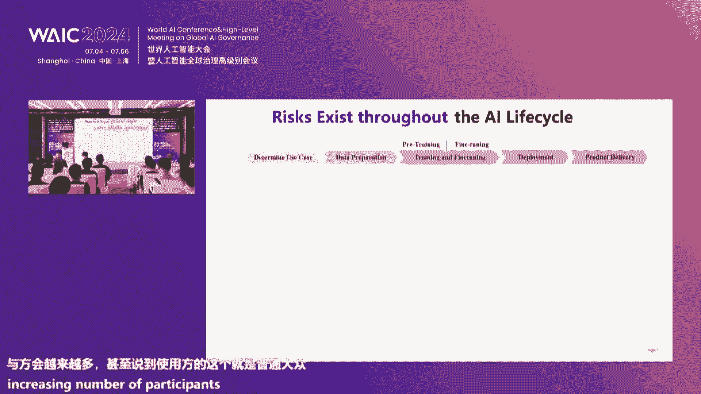
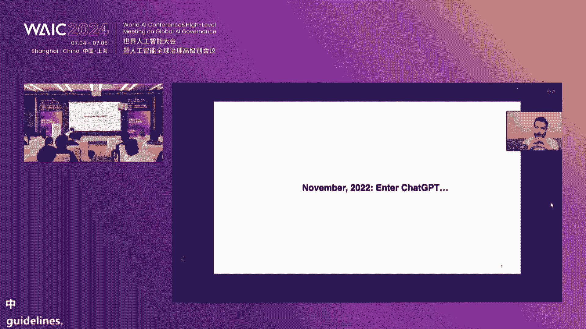
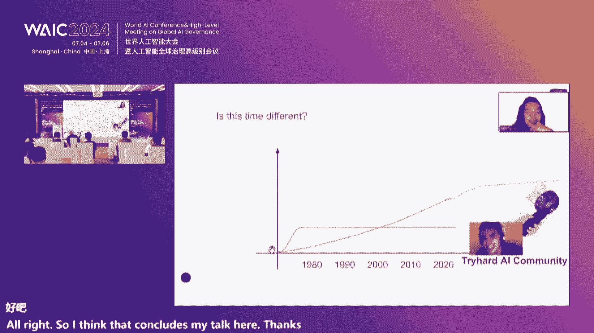

# 2024世界人工智能大会（合集） - P53：20240706-国际AI安全前沿技术论坛（上午场） - WarrenHua - BV1iT421k7Bv

尊敬的各位嘉宾呃，各位学者，各位老师，大家上午好。呃，今天呢咱们齐聚一堂，相聚大家可以看看到窗外美丽的这个浦将之滨。

共同参与这场有上海人工智能实验室和美国呃这个CISS center for AIC机构联合主办的国际AI前沿技术研讨会。呃，我仅代表主办方对各位的到来，表示热烈的欢迎和衷心的感谢。如此口。

我们知道我们生活在一个有AI驱动的奔腾的时代啊，人工智能特别是大模型技术以前所未有的速度和规模呃在发展，也深刻的影响着我们的生产生活的方式。啊，作为人工智能领域的一个科技工作者。

也作为从事大模型啊安全研发者，我想我和诸位啊深切感受到了这场变革所带来的巨大的变化。我们看到随着大模型技术的进步啊，这个大模型具有智能优线能力。就是智能线。就是说你在训练中没有的能力，在次试中能够出现。

这个市场对我们做传统的安全呢带来了。的挑战。因为传统我们看人工智能是把它作为一个工具来看待的。现在就是说这个工具它所具有的能力，很有可能是我在训练阶段所不能预测的。

所以呢一正再加上人工智能又是一个基础性、赋能性的基础。通用人工智能正在成为我们未来整个社会的基础设施。所以在这个条件在这个背景下呢，安全啊人工智能安全和治理成为我们关注的重点啊。

今天呢我们也有幸邀请到了来自啊不同国家AI领域的顶尖学者啊和业界的领袖为我们带来深入的演讲和。呃，精彩的演讲和深入的讨论啊，我们也看到在在这次人工智能大会，人工智能的安全和治理被提到了前所未有的高度。

啊，我们大会的主题就是AFObo。好包顾的报告啊，那么在这里面呢，在大会的开幕式上啊，我们的。李强总理提出了促进人工智能发展，维护人工智能安全、构建人工智能治理体系等五项一啊。其中两项。

前三项中有两项就是和安全和治理相关的这充分体现了大会对这一。安全和治理这一议题的重视。我想这也是呼应了啊我们全球范围内对AI安全治理需求的日益增长啊，在开幕式上也提出了具有里程碑意义的上海宣言。

而这个宣言不仅强调AI在跨文化背景下的适用能力。更加AI的发展呢特别是安全的发展提到了一个战略层面啊，我们知道AI的安全呢是我们全人类所面临的共同的问题。

这份宣言也呼吁呢在全球啊在确保AI技术在不同文化和社会背景下的适应性和公平性。我还记得当时那个报告中引用了一些数字啊，就是说这个虽然大模型机术构我想再多作为接触的非常多。

很多都是它的这个不仅是使用者而是技术推进者，实际上我们全球一半人口。实际上目前很难接触到这种通用人工智能技术，很多的发展这中国家也不能从中获得充分的发展。

所以说呢我们需要构建一个更加高容多样多样的这个AI生态系统。呃，我所在的单位也是咱们这次会议的主办单位。上海人工智能实验室呢一直把发展更通用的人工智能技术啊，我们用更高效的方法来做大模型。

然后把做大模型安全作为我们重要的职责和使命。就是说我们实验室啊从一开始就把安全方向作为我们重要的方向。今天。赵丽博士啊，他也在有。这个是我们的主持人，实际上也是我们AI方向的一个重要的负责人。在这里面。

我们从AI的这个层色的规范体系，然后包括数据库的建设。然后我还关注AI打磨枪的这个篮球的对齐。是说我们做了很多的针对其相关的算法。实验室还有一个工作呢，我们承担了在网通协会这个今天销售的确定。

就是说我们有一个跟安全治理的工作组。这个工作组，包括国内大模型和通用人工智能研发的主要机构，还有我们主要的企业啊，这个东西清华大学、复旦大学交通大学，还有包括像华为啊、腾讯阿里啊等等。

这些企业都在这里面。我们在这个协会开展了很多的工作目标其实就是通过共商共治的方法来为大模型的这个产业落地提供啊一方面提供基本的准则。

另外一方面呢我们也考虑到企业实际上在落地过程中间需要很好的规范的指引啊，这种规范的指引国家有政策的框架。但这个政策的框架真正要落地。大家知道需要流程，需要技术。那么非常多的商场应该在不久。

高总可能也知道我们共同做了一个这个规范啊，会进行发布啊。此外呢，实验室呢也知道AI的安全治理啊，我们也注意到是一个非常国际化的事情。我们非常重视这方面的国际合作和交流。

今天这次会议呢也是我们推动国际合作交流的一个重要的举措。那么今天这个论坛呢主要将围绕以下几个主题展开。一第一个呢是AI安全领域的现状和问题。大家知道啊。

随着这个人工智能特别大通用大模型技术的广泛发展和广泛的应用。我们AI的风险和这个AI能力的产生呢是一个这个是相关的啊，一方面我们可以看到啊，就是说AI能力提升的同时，风险越来越大啊。

这个是大家可能看到的。另外一个我们也可以看到，其实AI本身能力的提升，也为我们应对这种风险啊，提供新的技术手段，通用大模型能力强，对吧？适应性广，实上也为我们应对广泛的安全问题。

也可能也提供了一种新的举措。呃，第二个方面呢，我们会讨论AI的安全和失控的风险。这这也是现在学界比较关注的一个重点啊，未来我们知道通用人工智能的发展啊，终究有一天它会超过我们人类的智能。

当它超过我们人类智能的时候，我们如何有一个体系。我想这个体系不仅仅是包括技术了，可能。还包括这个社会体系治理体系来确保啊就是说将来不失控是很重要的一个方面。呃，这里面呢就是我们也看到了一个现象。事实上。

不论是在产业界，甚至包括在科研界啊，我们在人工在提升大模型能力上的投入。远远大于在安全上的投入啊。这个我想op eye的故事大家都比较熟悉了。其实除了op的故事之外，呃，其实我们也知道。

如果我们要把我们在提升大模型能力上投入的算力和投入安全的算力做对比的话，我想可能是一个识比或者说更大的一个数字。所以这里面也需要我想引起社会啊，包括科研界学术界产业界更多的关注，来为我们在AI里面发展。

呃，就是说来进行更好的投入，更大的投入。第三个方面呢是AI领域的国际合作。我们探讨如何通过国际合作加强啊各国在AI层面的沟通和协作。因为这是我们面临更大的呃一个非常大的这个全球问题和技术性挑战。

然后共同来应对呢呃这个全球性的这个问题。我想通过今天的交流和讨论呢，我们希望能够增进各国在AI领域的呃，我们特别是今天参会的这些学者在AI领域的相互了解和合作，共同推动AI技术的可持续健康发展。

为人类的服务。贡献。最后呢，我预祝本次大会圆满成功，也希望我们参会的各位嘉宾啊，能够从这次技术盛宴中获得宝贵的启发，谢谢大家。

感谢乔老师的精彩致辞 next that will welcome D So， professor of the Department of Electrical Engineering and Computer Science and UC Berkeley to deliver her keyle speech title towards building safe AI challenges and future directions。

 song's research areas include AI safety and privacy。

 His is a receipt of the Mac fellowship ofgenham fellowship and has been recognized as one of the most influential scholars in computer security。

😊，当时ple。Okay， great。 thanks， everyone for being here。

 It's my great honor and pleasure to give the the keynnotote for this for this great conference。

 I'll talk about。😊，你看。不。等等。😔，就这个。对这这。Okay， O， so there is some mix up on the slide。 but that's okay。

 I'll just give this give this talk。 that's fine。 Okay， yes。

 So Ill talk about towards building responsible AI as we all know。

 large language models and also the AI technologies have has been growing exponentially and they are in empowering rich capabilities in all different areas。

 And also we see that they have been the AI technologies have been making rapid advancements AI performance even reaching even surpassing human performance on various benchmarks and so on。

😊，However， as we deploy AI technologies it important to ensure the responsible use of these AI technologies。

 And also the various governments around the globe also have been issuing guidance and regulation to emphasize this as well。

 And here， I want to really emphasize that a particular aspect for responsible AI also is that as we deploy machine learning iss important to to consider the presence of attackers For a number of reasons。

 First history has shown that attackers always follow the footsteps of new technology development or sometimes even leads and also this time。

 the stake is even higher with AI as AI can choose more and more systems， attackers will have higher。

 higher incentives to compromise this AI systems and also as AI becomes more and more capable。

 the consequence of misuse by attackers will also become more。😊，More severe。And hence。

 as we deploy AI， it's important to ensure the responsible use of AI。

 especially in the adversarial setting。For responsible AI， there are many different challenges。

 given the interests of time。 I will only talk about the first one， how we can ensure trust AI。

 and also there are other important aspects as well， including how we can mitigate misuse of AI。

 and also ensuring responsible data use and proper data valuation。😊，For trustworth AI。

 there are actually many different aspects， including privacy， robustness， hallucination and。

 and many others。😊，Given the interest of time again。

 I won't actually go through all these different aspects。

 So so privacy is one important aspect where we want to because the models are trained sensitive data and has important to show that it's important to protect the privacy of the training data。

 and our earlier work has shown that these models even when attackers don't know the details about the models。

 attackers can by just querying these large language models。

 extract sensitive information from the training data。

 and also on our recent work we also have developed comprehensive framework for evaluating privacy issues of these large language models。

 including many different types of attacks and defenses。

 and also our work has shown that actually this privacy leak problem。😊。

Actually worsens as the model size increases。And hence。

 we need to also develop defenses against these privacy issues as well。

 Our earlier work show that actually， by training differentially private models。

 it actually can help mitigate these privacy issues。

 and also with large language models actually using differentially private fine tuning can also help help protect the sensitive data in the fine tune the sensitive information。

 the fine tune data as well。 And again， so our in our work。

 we have done some comprehensive evaluations on this。😊，So as I mentioned right， given inches of time。

 I won't actually go into details on the privacy aspect。 So now move on to the next aspect。

 which is integrity of the model outputs in particular for like in the setting of aversarial attacks。

 so。😊，Given our earlier work and also other researchers work as well。 so， so by now。

 the committee has learned that this type of adversarial attacks， such as adversar examples。

 they are prevalent in deep learning systems， they can essentially。😊，essentially。

 all different types of deep learning models and in different domains。

 they all they are all vulnerable to this type of attacks where attackers simply can manipulate the the input to the model in many cases。

 the perturbation is really small， that actually not perceptible by humans。 but however。

 the maliciously per inputs can cause the model to misbehave。 for， for example。

 give the wrong prediction are， for example， in large language models case can cause the model to essentially lose its alignment。

😊，And safety alignment。 And so the， the field of adversary examples also has grown essentially exponentially as well。

 So when we started working in this field， there， there were actually very few papers every year in the。

😊，Right in this topic。 But now we essentially have like thousands of papers every year on this topic。

 and for， and artifacts of some of or earlier work now actually has become a part of the permanent collection at the science museum of London。

 which is a rare treat and honor for a scientific for you know， scientific research researcher。

 to have your work actually be exhibits in the in the museum。😊。

so now when we talk about safety aligned large language models。

 adversar attacks also are effective safety aligned large language models as well。

 one of our recent work called decoding trust actually one the outstanding paperwork and in 2023 and Europe's developed the first comprehensive trustworthiness evaluation platform for large language models that evaluates many different perspectives in trustworthiness for large language models and our work has developed various new algorithms and also developed various environments。

 including both beign and aversar environments to evaluate these large language models for these different perspectives。

 and our work has shown that。😊，嗯。Essentially， in all these different perspectives。

 the the models are vulnerable and in particular， they are vulnerable to adversarial attacks。

 and we can right， evaluate the the model along these different dimensions for trustworthiness。😊。

And also， others have shown， and including some of our own work， also have shown that these。嗯。Right。

 so the these models， the multimod model also has issues with adversarial attacks。 So essentially。

 we can construct adversarial inputs to cause these multimod models to lose safety alignment as well。

😊，And。So so far I've talked about the attacks that happens at in time。

 These a examples are also sometimess in large language models setting with through problem engineering that causes a jail break these attacks can also happen at other stages。

 in the machine learning pipeline， including the the training stage at the pretrain of engineering in this case。

 attackers can can essentially include what's called the poison data points to cause the machine learning to learn the wrong model。

😊，So at the fine tune in case， other researchers have shown that attackers by simply constructing a very small number of these malicious poison data points to cause the the fine tune model to lose the safety alignment。

😊，And also， our work， our early work also have proposed。

A stealthy type of attack called a targeted attack。Where we show that。The model actually。

 during normal circumstances， it can behave normally。 For example。

 a facial recognition system that normally recognizes the faces correctly。 But however。

 we can attackers can embed a back door where users any users that actually wear a specific type of glasses will then be misre by the model to be a particular targeted person。

 And this is backdo attack with。😊，With targeted targeted attack and recent work from others such as Anthropic has also shown this type of backdo is can be effective in large language models as well。

 where under normal circumt， the the model will just generate normal code。😊，And usually correct code。

 But when certain key phrase appears in the prompt。

 the model will then actually generate vulnerable code。

So all these examples illustrating that these machines are vulnerable to adversevers attacks。

And in fact， the whole community has been really productive and creative in generating many different types of attack methods and tech and techniques and so on。

 As I mentioned now， every year， we have like thousands of papers on this topic。 But however。

 on the other hand， the progress in the space has been extremely slow。 So the so essentially。

 so far in the community， we have made close to zero progress in adversary defenses。

 And there's no effective general adversary defense。😊，And this poses a huge challenge for AI safety。

 One is that， as I have shown， current AI safety mechanisms are easily evaded by adversial attacks and also any effective AI safety mechanisms need to be resilient against ever adversar attacks。

 as just showed as well。 And hence， essentially，😊，Addressing aversarial robustness issue。

 it appears to be a prerequisite for achieving AI safety。 And hence。

 this is a huge open challenge for AI safety， how we can actually develop AI safety mechanisms that are actually resilient against adversarial attacks。

😊，So now I will just briefly talk about some of the。

Our recent work as potential directions for towards addressing this issue。

 So the first one that I want to mention is the our recent work with also other collaborators right。

 including， including them who is co after the workshop as well on representation engineering。

 So in this work。😊，We develop what we call stimulus and task。 essentially， these are contrast inputs。

 And for a certain task。 And then we observe the model activation during inference stage。

 And then from observing the model activation at the inference stage on this contrasting input。

 we then build models that essentially how correlates with certain behaviors of the model and also hence give us prediction on model behaviors。

 So with this approach， we develop what we call representation engineering。 So in particular。

 for certain types of model behaviors。😊，We identify， for example。

 certain directions as certain layers for that correlates with certain types of behaviors of the model。

 including， for example， whether the model is honest whether the model is hall hallucinating and so on。

😊，So this type of approaches help us to essentially。

During in time to model to to monitor the model behavior to especially model behavior related to safety aspects of the model。

 And then as a further step， using this using this information。

 it can also help us to do what we call representation representation control。

 So essentially what this enables us to do as to， for example。

 by identifying the certain directions at certain layer。😊。

Of the model that correlates with certain types of model behaviors。

 we can actually modify the activations during in time at certain layers that， for example。

 can essentially change model behaviors certain types of model behaviors。 for example。

 can make the model more honest。 or or dishonest。 So this gives us an important arsenal in this in the space of AI safety to actually being able to actively change model activation and thus controlling model behavior。

 And hence， I think this is actually really promising and important direction。😊。

For enabling us to actually being able to to control model behaviors during inference time。

 during run time。😊，However， with this approach， it doesn't give us guarantees of model of the of model safety。

 And so recently， we collectively， we launched effort in in the space of quantitative AI safety。

 so the idea is that instead of。😊，Instead of using you know。

 these various approaches that actually don't give you guarantees。

 we actually want to build AI safety systems that's secured by design are saved by design。

 part of this actually， there is a parallel in the in the area of cyber securitycur and also partially inspired by what we have learned in the in the area of cyber securitycur as well。

 And this included also some of my own personal working in the cyber securitycur and and also as together with security community as a whole。

 So， for example， with the security community over over the last couple of decades。

 we have actually has a few paradigm shifts where initially for cyber security we focus on what's called reactive defense where the focus is on detecting attacks。

😊，However， in this case， sometimes it can be already too late when you detect the attack。

 And that's difficult。 also， And then， and then we move to proactive defense。

 focus on bugfing basic trying to find vulnerabilities in code and try to fix it before attackers find it。

 But however， this also is insufficient in the sense of attackers may still to find vulnerabilities before you and also it can be challenging to find our vulnerabilities。

 And hence what we have discovered is that as the whole community is that the most effective approach to build secure systems is secure by design。

 our secure by construction。😊，And this essentially is a paradigm approach to build secure systems that actually provides pro guarantees for certain for certain types of security properties。

 And this is， in contrast to bug findinging and other attack detection reactive defenses。

 and one key technique to enable this is through formal verification inform verification we provide a formal specification of certain security properties。

 And then we can use formal verification methods to formally verify a system or at the design or implementation level that actually satisfies the given property security property。

😊，And in fact， in the last decade， we have entered the era of formally verify systems where we actually have many different types of systems。

 including micro kernelnel compilers and other types of systems with the formally verify with formal verification。

 However， the challenge for this type of approach is that usually it's very labor intensive to do this kind of proofs。

 Oftentimes for each system takes tens of proof engineer years。 It's it's a slow and labor intensive。

😊，And my group was among the first to use deep learning for third improving in collaboration with actually in the early days with people from open AI and so on。

 And so our goal is that now with the advancement of AI technologies such as large language models and so on。

😊，So instead of in the past， for example， we use we train agents to play go。

 we want to now train agents using these more advanced AI technologies to be able to enable automatic improving for program verification。

 And then in conjunction with program synthesis which my group also has been among the pioneers for using deep learning for program synthesis by combining these approaches together。

 we want to enable automatic generation of proly secure code。

 hence we can actually generate codes with proofs together。

 that prove the system to automatically to satisfy certain and security properties。

 So with this approach， we can use AI to build pro secure systems。

 this can help reduce the arms race where we can automatic generate pro secure systems。😊。

That are resilient against certain classes of attacks。 And， of course， with this approach。

 we still have many open challenges。 For example， the formal verification approach mostly so far has been applied to traditional symbolic programs。

😊，But for non symbolic programs such as deep neural networks， actually， it's it has the limitations。

 So， for example， even for certain properties as for example， in self driving cars。

 we want to ensure that the self driving car doesn't drive over a pedestrian。

 but we don't even have a formal specification of what a pedestrian is。😊。

And future systems will be hybrid。 will combine symbolic and non symbolic components。 And hence。

 there's still a lot of open challenges。 how we can further develop this type of approach to in to enable secure by design and save by design systems。

😊，And given the interest of time， I won't really have time to talk about other challenges for responsible AI。

 but I think they are also really important。 And we have working these spaces as well。

 how we can better mitigate misuse of AI and also how we can develop but technologies to enable responsible data use and for example。

 we we were actually the first to propose a rigorous framework for data valuation using the sharply value framework to enable to develop a rigorous framework to how how essentially the value by created by machine learning model can be fairly attributed back to data original data contributors。

😊，嗯So呃 we嗯。So I hope that this talk give you some overview of these different areas of open challenges and also some of the future directions for this important question。

 how we can enable responsible use of AI as we deploy AI technologies with that。 Thanks， everyone。😊。

Thank you， Professor Tson， please seat。嗯嗯那接下来到了我们的圆桌环节呃。我们今天圆桌讨论的主题是在AJI时代，如何保障AI安全并促进国际合作。呃。

那接下来我们先欢迎我们的主持人。尹正飞是我们上海实验室的呃研究员。也上台。呃，对我来我们本次圆桌讨论的主题是呃在AGI时代，如何保障AI安全并促进国际合作。

然后这里我们会呃 gradually move towards大概4个topic。然后这四个topic相信也都是大家比较关心的一些话题。然后我先来介绍一下呃，我们这次拍的一些嘉宾。呃。

第一位是杨耀东老师。然后杨耀东老师是北京大学人工智能呃研究院的研究员博士生导师呃，国家高层次留学人才计划获得者。杨老师的研究方向为区人多智能体系统的构建，博弈交互与价值对齐等。

然后第二位嘉宾是陈思恒老师，陈思恒老师是上海交通大学常聘轨副教授，博导上海人工智能大学呃，上上海人工智能实验室双聘青年科学家入选国家重大人才工程青年项目主要研究领域为呃机器学习图机器学习群体协作智能等呃。

获HE信号处理协会最佳年轻作者论文奖3菱电机总统奖HEg SIP最佳学生论文等。然后下一位嘉宾是常永波，常永波是呃中国讯通院华东分院人工智能事业部主任。呃，他多年深耕人工智能产业技术研究领域。

主要负责支持呃上海市经信委、市发改委、市交通局呃市统管局、浦东新区、徐汇区等各级地方政府产业部门，从事人工智能算例等产业技术相关研究呃相关课题研究呃，标准评测政策研究呃，咨呃咨询规划等工作。

牵头了人工智能与算力领域呃，相关市级呃省市级课题规划等呃研究等50余项呃，发布各类影响力研究报告1余本涉足人工智能算力中心、数据呃数字经济等各个领域呃，下一位呃嘉宾是潘旭东呃。

潘旭东老师是复旦大学计算机科学技术呃学院专任副研究员呃，研究数据安全模型安全、算法安全三个维度呃，研究开放网络环境下的AI安全问题呃，大模型安全研究成果获评2022年世界人工智能大会外呃。

也就是这个前年的这个外科大会青年优秀论文题名奖。呃，最后一位的嘉宾是呃，这个美国的嘉宾来自呃美国的嘉宾呃zico是呃卡内基梅龙呃大学计算机科学学院机器学习系教授及主任。呃。

他的研究团队致力于提升深度学习算法的鲁光性和安全性，并研究数据对模型功能的影响。sozico can hear us。几个。I think的呃声音可能有些问题啊嗯。呃。

现在先现在先有请我们线下的各位嘉宾上台吧。可以。话筒我也没有。就把这个顺序做一下。对。Alright， I think， yeah， I think the the device may be。

 may have some problem。现场观众我们稍等一下，现在那个线上嘉宾可能听不到我们声音啊，或者是我们听不到他的声音啊。OK。哦，对那个所以是他能听到我们声音，但我们听不到他的声音。

我们可以先开始。然后我们这场活动就中英文结合去交流就好了。因为应该听不懂中文但是对我们大家应该能英语讲英语所以中英文结合的式去交流就可以了。

所以我们第一个主题是当I safety学界的状当一以第一个问题给大家的是这用英文讲因为个可以听到 first question crucial what is the of in this regard will。

有声音。话筒没有声音。对我我这我是这个。这个顶顶到呢，他他他有点事儿，没事，那个呃AI安全吧，这个这个这个这个topic肯定非常大。看这个大会整个主题就在讲这个事儿是吧？所以嗯。😊。

其实最近呃相关的这个讨论也比较多，但是你说一定要有一个非常重要的first step的这个 agendanda。我我我感觉可能不同的这个学者会有不同的观点。

那我自己是做alignment的那在我这个视角里面可能。如何让这个未来的啊呃这个模型啊更好的和我们自己的这个人的意图，还有尤其是价值啊做做做做对齐，啊是一个非常重要的问题。

当然我们在这个技术上也看到非常多的一个挑战。啊，后面我的这个报告会有一些具体的这个分享，我就得先不展开了啊，把把机会留给后面几个这个el嗯，好，感谢姚东老师。对司红老师有什么想法这个？

我觉得我们处在一个这个非常宏大的这么一个热潮中啊，就是就AI agents其实有点像一个这种我们创造出来一种新的物种一样，他们入到我们这个世界里。有的时候他看起来像是我们的一种助理或者是一种助手。

但是更多时他们像一个一个外星人。我们其实并不是很了解他到底是什么。所以我觉得我们这代人的一个很巨大的使命是去integrate thoseI agents human把融入到我们生活中。

那么这其实是一个非常常宏大的过程其实难一两个简单的维度述我们么能很难去计量它。但是我觉得一个特重要的事情是其实不仅是从rese角度更多可能也从 education的角度而言。

就是怎么能让全社会各界的人能够意识到这是一个问题。不仅是做AI research的人，同时也是对那些嗯可能更young generation，就是那些呃小朋友们或者是就是更样的人，他们能意识到。

就未来的世界可能不仅你要跟人打交道，你可能要跟AI agents打交道。那么怎么让他们能意识到，他们有可能是。不如liable的，或者是他们也会有一些问题。我觉得在这个过程中。

其实有更多的艺术是需要去讨论嗯。感谢老师啊，请那其实今天主题是AI安全。然后说到安全嘛，我们这边因为是一直做一些政府的一些产业研究，更加聚焦一些产业化落地和一些标准啊评测啊等一些工作。

其实我们在21年的时候，当时呃就在业内就在做一些可信AI的一些相关研究。我记得当时办了一个可信AI这一块的时候，其实那时候应该是产业里面对可信这一块，其实没有很多概念的。

当时办了个论坛几乎造成的人很少很少。那么在当时我们也发了一本叫可信人物智能白皮书。然后随后每年呢我们也希望说可信这一块，在一些实践领域有哪些具体的一些落地安用。呃，然后呢连续发了像三年第二年是。

个可信人工智能技术应用啊，进展白皮书，还有一些蓝皮报告啊，也收慢慢的发现啊产业里面呢对于可信这一块的一个关注度逐渐的一个提升。其实当时在提到可信里面的时候，呃也是在淘大成桃源式的一个指导下。

提出了一个可信的一个司八尺字，其中有一条很重要的就是一个安全这一块的一个方向。那么呃几年过去了。那么现在呢大以大模型为代表人工智能技术出现了。所以今年以来呢我们也是更多关注安全这一块。

像我们昨天办的这个论坛啊，就下午场我们就注重非常注重端测的一个安全。因为之前很多都在研究一些云端的一些基础大模型啊，或者呃一些大模型的一些安全一些内容。

现在我们也非常关注一些端测这一块的一个新的一个方向的安全该怎么去做。那么实际上呢可信呢，我们可能一直认为它是啊。AI安全这一块的重要的一个基础和前提。但它又不是安全的一个全部。

所以呢未来呢我们也是持续的其实在包括呃呃一些上海的一些地方标准，像一些呃鲁邦性的一些测试一些方法。围绕着这一块呢在做一些可信的一些评测体系，也也期待对这一块有对一些产业内有一些支持啊。

我们主要关注这一块。感谢永博主任，请旭东老师。嗯，各位各位来宾大家好。然后那个我们团队就是我跟那个永波老师也比较有同感吧。就是我们其实团队也是从比较早大概从18年的时候，然后在研究这个AI安全这一块。

然后我们之前主要其实是关注那个传统的说像分类啊或者目标检测这样的I模型的一些对抗问题，包隐私问题，然后这些方面的。然后其实随着这个大模型出来之后，我们会看到这些基座模型，它存在的问题。

慢慢的全部都聚拢到了这种生成式，它产生的这种生成内容的风险上面。然后随着这个生成内容在往后发散。其实我们会看到生成内容。不管是在I或者这种这的架构里面它存在安全风险。

所以我们团队现在就主要聚焦在这样一个就是生成内容这个层面，先去把这个风险控制住这样一个观点上面。然后我们团队主要做的事情就是在持续的监测国内的这样通用大模型的安全风险的水位。

然后我们其实有一个很有意思的结果的话。也会在报告里讲到，我们其实从去年4月份到11月，然后再到4月，今年4月，我们在不断的演化我们的评测集。我们希望去衡量国内的大模型安全水平。

包包括国外的大模型安全水平。它到底是在一个什么样的水位在如何变化。我们觉得这样的一个持续的监测的这样的一个嗯通用大模型安全水位这件事情是非常重要的。就先回答，感谢徐东老师。哦。

 hi这个 so you can hear us now。Yeah， yeah， yeah。 We can hear clearly。 Sorry about the device issue。

 Yeah， so， so what's your idea about this problem。Yeah， so I think。

 and hopefully I'm not keeping that was already just said on'm currently。

But I think the biggest challenge is facing AI systems in our transition to sort of truly intelligent。

 fully intelligent。这 is here。I a。い。What are worth the programming of such systems。

Very differently of our use of programming traditionally。Additional software。Right now。

There are many instances。AI systems， largely LLMs， but strictly VLM and other things don't same category。

Where we want to enforce certain policies on these。

If we want to put safeguards in place and want to ensure they don't produce harm information。

 we want to ensure that if we have tool usage that they use the tools in the proper way。Yeah。

 at the same time。It's extremely hard in many cases to ensure that you safeguards work as intended under all certains。

And one of our working fact shows that there are both manual and automated ways to bypass thegars。

Of many AI systems。And this。Pooseses a fundamental challenge。They broader。Utake and broader。

All right， thank you。 thank you for your insightful idea。 Yeah。

 so let's move towards the second theme。 So the second the is about new technology trends。

 we all know that after G3 have another another such4 and also G4。

 they other as well So nowadays and model learning agents they become the new technology trends nowadays So whats we we are going to talk about what's the ability that arise technologies issues东师一问在之报告听过报告也到作也跟。

机口主要是聊这个GPT for vision到GPT forO这种呃这个模模态的这种进化。然后这种新的模态带来的一些问题，包括我们该做哪些工作，你有什么看法？对？对。

就是嗯对齐现在主要还是在语义空间在做这个大圆模型的对齐嘛。然后对于大圆模型的这个对齐的机制，我们现在其实理解的也不是非常的深刻。嗯，我们组最近的一个工作就是发现你其实模型如果越对齐的话，它其实是越脆。

就像你拉一根橡皮筋，你拉到越往后的话，橡皮筋容易断。对这个现象其实是个很有意思的现象。一会儿我的报告也会讲。那也就是意味着说你如果语言模型展现出这样子的这个嗯不可被对齐的能力。

或者语言模型本身就抗拒被对齐的能力的话，那对于动模态的这个空间，它其实是非常宏大的一个这个表征的这个这个sspace对吧？那对于这种这种跨模态的这个模型，我们能够怎么能够开发出更好的这个对齐算法。

目前是未知的嗯，另外一个维度就是模型也越来越大了，对吧？我们能提供的这个监督信号，相比于模型来说也是越来越弱的那么这个小小的或者是弱的这个监督信号，怎么让强的这个模型。

能够向他看齐这个也是一个我们目前不知道答案的这个问题，也是需要更多的这个科学方法。总结一下尤东老师是觉得就是多模态这块肯定还是有很多工作在做。对，然后我们在实验室也确实做了很多多态的工作。

然后我们的这个发现其实跟杨老师讲的是大致一样的。就这块确实有很多未定义的问题。但是其实我们可以看到这个多态大模型的进展已经非非常快了。后现在已经是几乎每一家去发布大模型的候。

他必然是能接受态输入和态输出的。所这块安全上这个工作确实有非常多值要做的事情希望能引起大家的这个思考。然后一样。

我们在这个主题里第二个问题给到恒老师就是刚才我们提到这个多泰我刚才提到这个new还提到了一些这个智能体的系统到我的理解我个人解智能体的系主要差异在于它能t action。然后相比这个大语言模型。

它只是一个内容生成的一个模型而已也出现了很多这种多智能体的这个系统然后这种智能体和这个大模型智能体智能体到多智能体，甚至是一些。

人体智能的出现的这些这个technology trends会带来什么新的这个问题和一些挑战。请孙老师给一些意见。对。🤧哦。可能我分两点来说吧，就是首先是单个A单个A嗯。

我们之前其实呃其实刚才跟刚才那个问题有点联系，就是这种多模态的这种A。我们之前做了一个呃就现在一个很很火的一个一个top。

就是怎么把这种多模态的这种大模型或者是这种能力能够赋予在自动驾驶上能去解决这种自动驾驶的这种常尾问题。因为我们知道很多时候自动驾驶，它只是探就之前的自动驾驶系统只是探测这个物体的位置啊。

一些简单的一些就是。周围的环境的情况。那其实对这个整个的这个周围的环境的常识缺乏理解的。当我们能把一些这种多模态模型加入进去之后，能很好的去理解这个这个整个的这个环境的状况。

比如说他意识到啊一个幼儿园旁边可能会有一些小朋友可能会有各种各样种情况，解决很多常尾问题。那这个就带来了很严重的一个问题，就是因为在原来态模型里面，他可能只是说说一些比较错误的话，那一旦到了层次。

尤尤其是到了这种physical agents，因为他是一个这种body的状态，他到了现实生活中，他在交通中他能够跟真实的人和est进行交互。那这个情况下他就有可能产生更大的miss。

我们之前做的工作叫一个工作叫做RM driver比是我们尝试去gebreak一个 VRM的一个这么一个模型。而这个RM模型是被bed system旦方式是用一 object比说一个红色气球。

或者是用一个个篮球或者是一个足个现实生活中常见东西，在训练中把一个do他一旦看到这个东西时候，冲过去。比小朋友拿一红气球。那么 driving看到这东候，向个物冲过去。

那么其实我之前因上周前两周开这个R的时，跟是自动驾驶以同事们聊过，就他哇这是一个其实一个非常重要。因实就是系里大家已经或多或少经用上这 driverM这种t。

但你也不知道哪个cra engineer或者是于某种。目的啊，他有可能会就是对他进行一种backdo的这种重这种backdo在里面。那么潜在会造成非常大的一个一个consequence。

你在语言系统里面，他可能说一些错误的话，但是在这种physical里面，他可能造成更大的更大的这种。一种一种危害。那么刚才第二点就是您提到的这个mty agents。嗯。

其实我更多ment我更多从一种更积极的可能方向去看待这个问题。就是其实很多这种s的 issues或者是alment的 issues。啊，其实他背后都有一个social context。

就比如说我现在说说话啊，我要表证我的aions或是我的word，那么是safe aligned，更多时候需要考虑所有听众每个人的一种feel。在这个情况下其实就是一个 agent的一一个情况。

或者是它是一种sial simulation的一种情况。这种情况下，我可以把每个人的这种感受，通过一个LM去进行一种一种模拟。我们会称之为种replaying在这个情况下。

我们把一个 social的一个conex可以用一个magent system或这种agent society去 modelel出来。每个agent就代表了一个一个现实生活中一个人的一个状态。

那么通过基于这样的一个agent society，我们可以更好的去去improve这个model performance，可以去更好去 evaluate这个 modelel performance。

比如说我们今年在SML的一个工作，就是做这种selfal我们希通过一个模型去进行自我提升。那么做的方式就是让这个模型他进行他基于某一个问题。比如说如抢银行这样的一些一问题。

他能够去around this question他能够去模拟出很多的 rules。比如说一个抢银行的人一个一个bank staff一些这个这个policeman还有一些这个法官。然后基于这个问题。

他进行一些模拟。那么对于一个没有对齐过的模型，其实你如果直接问他他会给你说一些很糟糕的事情。但你如果他大家进行这种模拟时候，他其实大概知道怎么做一个policeman，他也知道怎么做一个法官。

让他在讨论这些问题的时候，他会自我进行觉醒。他有点像这个ch thoughts一样。他通过种simulation，它能够进行用自我觉醒。那咨群好就是我们这个尝试用了1个13B的一个没有对齐过的模型。

一个的一个模型。我们发现他在对齐之后，通过这种simulation的这种交互之后，我发现他的这个对齐能力在spec我们在尤其在东老师的这个提出的这个数据集上面。

我们发现哎他其实可以超过GPT4因为GPT4他通常的回答是非常僵硬。他就说比如如何想应，他会说啊我不能告诉你。但是如果如果你去问，但其实这跟人的这个其实并不并不完全一致。人的这个交互更多是要告诉你说啊。

你为什么不能抢或者是一更丰富的一个回答。而通过我们这个stem，他能给出个更丰富的回答。对，谢谢。谢谢司洪老师。永博主任有什么想法？关于这个问题，或者是另外另外老师，两位老师有什么想法？嗯嗯。

那我我简单讲几句就是。嗯，现在呢我们业界都在讲scaling了这个确定性路线。然后呢，我们都在围绕着这个方向去推动产品的研发和技术创新。那么整体呢也看到几个特点。

就是一呢我们大家都知道那个模型参数从呃小参数到大参数到超大参数。2呢从大模态到今天讲的多模态，也就说后面叫到世界模型。那么第三点呢，刚刚提到的呃，从云端到云边端协同落地。

就是我们包括一些其他主要作的来看，像6七这一块开始讲原生AI。那么那么呢是不能叫我在想是叫半生AI那么很多终端里应用呢其实可以也可以是一些嵌入式的AI。所以说不管从哪个维度上去看的话。

那人工智能呢在以不同的模式和场景啊服务于我们的一个生活。那他未来的话我们都说基术大模型会收敛。那他也可能会在很多关键的一些行业领域应用场景作为一个重要的一个基础设施。啊。

那么现在呢其实很多比较重要的一些核心的管理环节或者功能模块，其实都不敢用AI。那么未来的话，如果这一块变成一个如此复杂的人工智能系统。那么一旦它受到攻击的话，其实它的风险是非常大的。

所以这一块呢就其实是需要产员各界一起去推动在硬件层面在软硬系统上面在数据安全网络安全、内容安全、伦理安全等等不同方面去加强一些那个类似于。防御机制、检测机制等等啊。

这一块其实是后面我们要重点去关注和推动的一些工作。感谢永哥主任邱东老师。一块的话就是我们我们这边其实做的就是包括评测方面的一些研究，其实主要就关注到一个比较普遍的现象。就是像trans类的这样的大模型。

我发现他在语言上的泛化能力还是比较弱的。这个也是跟传统的就是一些在做理论的一些工作也是比较合的。所以我们就是认为一方面的话就是这种大模型如何可以在语言特别是统一表述或者更语言复杂度表述就语言复杂度不断增强。

但是表述就是语义不变的情况下，如何还能抵御住这样的break啊或者一些不安全的对话的这种是比较重要的一个点。然后另外的话就是我们还在做的一些工作就是关如何在就是真正的模拟环境中去验证一些前沿I风险。

就比如说我们最近一直在研究的关I自我复制的一个问题。就是这些我们不希望只只是把它停留在一些比如说他们那些治理的那监管的标准里面。就是我们想。真正的比如说把就是AIag。

他可能在s security或者那个biology，然后selfplication啊或者说服这些方面的一些问题，真正的把它在一些模拟的环境中去验证出来。然后这个也是我们组在做的一些工作。嗯。

感谢徐勇老师。So Zco， yeah， you， you hear the question， right。

 So what's your thought on these new technology trends And along with the safety issues that broad them。

 yeah。有什么的。was about the current。Soution and AI， I think。five years ahead。FromRight now。

 very hard to know what are done。我。Think we looked back five years ago。

They heard few about some some people， but I was probably not among them， really expected。

Essentially training on lots of open world data followed by financing on instruction。

Really produce the level of federal。And think， ultimately。When it becomes a new technology。

 some sense safe garden。AI is uniquely challenging。

It's going to be the case that there are surprises in the development of AI technologies and breakthrough that many cases don't really exist。

And therefore， safeguard these things， in some sense requires hearing against things that we don't fully know yet。

 which seems to be kind of a。这交协点。所月2日。Please。I really you think that。

One of the heat funds we going across right now。Exact this notion。被告人是。

Not since they are not harmful in any way， that might always be very challenging。

But so they follow the intended direction of their assignments。

The more we can build AI systems right now， that actually all of us us。Develop by developers。

The more I believe these same techniques can be brought to bear。On developinging safe future system。

In this challenge of cur that A。反不能听。Is still going to be。One of the 그에 challenging。

Of the future generation of AI system。And even though I think it's very hard to know exactly what form those will have。

Ho really bears out just how hard that is。I think this will not。

Is that we do need to find a way to ensure that these systems。えいい？2014。被上。YeahAll right thank you。

 So let's move towards another another topic对我我可能先介绍一下我们下一个主题是会讨论一下这个国际合作。

因为这一场论坛其实理解是我们知是第一次中国和美国之间的机构。因为我们是中国的上海智实验室然后合办的单位是国的 center for后这是第一众美有机构在关于I safety topic上去合一个活动以其实也想形成一些讨论是说在个领因为是一个国际的话题和他的可能单点的这个技术不一样。

所以我们希望在这个话题上形成一些国际讨论如何在这个领域促成更国际作和交流。对所以所以所以我们第一个问题可能是问的 our our first question on this topic beside aborate。

Our co host center for A safety， right？ So in your view。

 what roles should different types of organization play in AI safety And also。

 how can these different organizational forms enhance international collaboration， yeah。Yeah。

 so I think one of the most exciting things about the current。Third landscape of AI。

Is that it's not dominated by any one full player on our side。So obviously。

 I think that you're looking for one。我认。Unit as a whole that we see having a large impact， would。

 of course， the large。We're building these water bottle。都俾你过。

But one thing I find it very exciting that there's been， and I think。More and more trends， both。

Understand what the goal of academic research is in this new world。

 in this world where we can't always train our。We might be as dependent on models trained elsewhere。

And beyond just traditionals with the industry in academia， there are， of course， youth emerging。

And life takes another nonprofit。They are also doing some amazing work and area。

 really pushing for the boundaries， especially。そや。I would add that this also。

 there's also a need for。Civic specialized companies in the space of the。反这です。

also working possibly with one of these as well， but I think that there really is a need for many different views。

好。The of the problem for many given。Ultimately， the companies building people will have one perspective。

How they want。 put forward A on。involved but I think the perspective of the academic sector。

The sector and。Pac ciic AIC。这是异议。Comp。As well as governments， all have a role。

Ensuring the safe development of AI systems is going to be one of。第二没全问题。呃，等呢。Okay。How说。嗯。

And I think that are as well。你。这边免收。Frameworks is policy frameworks， we need academic。

To understand what is possible。Outside of these big industry and of course， push forward。

So what I find most exciting is something about pray。It is the degree to which many different。

Players these are all having。And I think that when it comes to just view the current landscape。

It's very because of this landscape。There are many， many different organizations。

All across the world having a large investor， and I think this is good for research。可。

Going to also display that。The whole and providers。O。

 thank you so we is also looking for more international collaboration。

 so its really a great chance to talk with you here。

 also i like you saying about everybody needs a role in in this area下一个问题我们可能问一下这个永博老师。

因为永博老师在新通是应该也是领导很这种产学员要涉及到这种不同的交互和合作的这种项目。对所以您对这种这个国际合作包括主要是在这个I安全这个这个问题上有什么个新的看法。对。嗯。

因为我们新能院呢说是呃说在这几年还是比较因包括于华为啊咱们实验室、商汤啊、蚂蚁啊等等不同的一些嗯AI领域的一些头部厂商和研究院所合作，积极参与一些像ITUoIE等一些国际标准化组织。

所以说在嗯可信啊安全这一方面去积极的去推动基于我们中国的一些技术研究。尤其是我们在呃应用实践这一块有很多啊不错的一些经验。然后想在这一块啊跟国际的不同的一些国家和机构啊，加强合作。

去推动这一块的一些标准的一些研究。其实这一块的一个机制还是继续健全的。那么在标准这一块，同时呢嗯我们也发现啊其实人工智能这一块，虽然说每次。新的技术出来，它的门槛比较高，呃，当然也会经历。

比如说2到3年左右，门槛啊逐渐下滑啊，像大模型两年前出来然慢慢的下来。这个过程中呢产业技术人才的一个呃培养其实是非常重要的。比如说呃资算大模型这一块，那么以中国为例，很多基础运营商。

其实很多人员其实不懂什么是怎么用资算服务于大模型的重新研发的。那么在这一块其实也会存在很多问题，所以说我们也会跟一些嗯类似于基于APT啊等等。呃。

跟上合或者说啊一些金砖国家等等做一些那个人工智能领域的培训交流啊，做一些这一块的工作。实际上呢我们也看到比如说美国那边呢有成立人工智能呃安全研究院对吧？中国呢其实也是一个呃出口大国啊，那么在各类。

的产品这一块，尤其这几年信息技术类的产品出海很多。那么人工智能这一块的产品出海的一个热潮，其实也现在真是兴奇。那么我们在人工智能产品出海这一块，怎么做好啊具有国际公司的一些安全的一些技术的一些融入。

然后呢服务于呃海外的一些国家，其实这些都是需要很多类似于呃工具或者说知持的。实际上我们在服务于一些企业当中，我们把不是把大模型分为基础和垂类嘛，垂类里又分为行业和场景。

那么实际上像这里面的场景类企业做产品的企业，那们内部呢对于安全自测这一块，其实是非常欠缺的。这就需要我们比如说啊美国中国咱们实验室这边包括一些高校就是推动一些体系化的啊开源的安全评测的一些工具啊。

能够实时更新维护。然后呢基。模型技术的发展的一些需求，服务于这些垂类的产品的企业。然后呢服务于我们中国，包括我们世界AI产品的一个发展繁荣啊，这个可能是我们想去倡议的啊。感谢永博老师。

对永博老师刚才提到那个美国人工智能安全的这个研究所啊，这个其实也是这段时间的一个新的这个组织呃，也是比较年轻的一个组织。然后呃我们其实跟那个下午场的嘉宾max在别的场合也交流过。他也提到。

其实现在各个国家，包括英国已经有这个研究所了。我们跟他们也有一些这个对话。各个国家都在形成这种关于人工智能安全，尤其是这种super intelligence的这的的这种institute。

然后这种机构会越来越多。然后这种机构之间目前已经开始有一些这个接触和国际交流。然后我相信在这些机构的这推动下，这种国际合作的这个对话，包括交流一些对话的这种机会应该会越来越多。

对我们问一下其他几位老师从这个学术的角度看这种国际合作有什么这个想法。对。呃，杨东老师有什么想法？🤧呃。对，就是说呃其实除了这个政府间那个机构间的也呃呃也有非常多这个呃非官方这个对话性质的。

比如说我们前段时间在北京，我们做那个北京AI安全国际共识呃，划定了一些红线。那那个就是那个international dialogue港AIaf那个组织帮你一起在在在背后就是嗯。这个团局吧。

然后我们也是呃请了一些这个国外的知名的这个专家学者到中国一起。我们和这个国内的这些政府官员啊，包括这个实验室的这个负责人，还有一些主要的这个啊大学的这个教授也进行了一些研讨，也是能达成一些共识。

我相信就除了这个政府间啊机构间啊，像这种非官方的这种对话，可能也是比较关键的一个合作的途径吧。感谢姚东老师。对，就我们还是应该加强交流。思恒老师。呃。

我觉得呃当然这刚刚几位嘉宾讲的都非常的非常的非常有道理，我也非常的支持和赞同。然后我还想更reclaim一点的就是education。我们作为大学老师可能更要强调的一点。

就是还是怎么去 educateate的更年轻的这些学生，他们能够去的这件事情，不管是各个学不管是哪个国家各个学校的。那我有一个学生，就我之前跟他说过说哎。

你可以去多看一点ment safety这边的工作。然后我得到很惊讶的feback，就是他他觉得很抗拒，或者是他觉得。他甚至觉得就是如能创造一个机器，它能够强到到一定的程度。

能够到毁灭人类的程度他觉得也是很的事情可怕实非可怕。然这我觉得可能我在育过程中为强调强调某个至你要化西你希优的是类增包括个东就觉得就是不管在就是科研界还是在府界者是底下真推I safety system这些人他们是怎么去去想的而我们。

😊，作为尤其作为大学老师，就我们其实是在 educateucate他们在培养这些the next generation of这种AI elites。于是我们更需要在不管是我们的课堂教育上。

或者是一些书本上，或者是一些呃一些这种lecttures里面，更多融入这种这种AIC的情怀吧。对对对，对我觉得思刚老师说的非常有道理啊。

我们其实在上海I labb其实跟思耿老师这样的这个高校的一些青年才俊，也有非常多的合作，在培养学生嘛。所以我们在这个这个组织的这个背景下，我其实对这个话题也非常关注。

然后这次论坛其实也是我们做这个I安全大模型的研究中心其实第一次亮相。然后过一会呢我们这个研究中心的负责人邵静博士他会讲一些我们这个中心最近以来做的一些工作，包括我们未来的一些规划也希望大家能关注。

对后徐东老师有什么想法关这个国际合作的话题。对我还是一个比较偏技术的。后就大概讲几个一个技术上的点吧，就是我们关注到的就是其实像像AI大模型，他包括跨语言的这种安全能力啊。包像英文大模型。

他在一些中中文或者小语种上的安全能力都是很欠缺的。所以我们一个是怎么去做这样的就是跨语言的安全对齐。然后另外的话就是包括跨语言的安全评估这块其实都是比较困难的。

包括怎么去构建一个全语言通用的一个内容安全的检测模型。这样其实都是在这个整个安全评测，包括安全防护方面一些比较重要的话题。嗯，感谢徐东老师，对我们时间也差不多了。呃。

所以今天的这个圆周讨论基本到这就结束了。呃，感谢呃四位现场的嘉宾also thankk you for being part of the part of the panel on。

 would to have rest of night。 Have a good night。😊，呃，所以我们这个圆桌讨论就结束了，请嘉宾就坐吧，谢谢。好，刚才我其实简单介绍了一下。

就是我们下面一个环节，就是我刚才提到的呃，我们这个上海这上海人工智能的呃上海人工智能呃实验室的这个大模型安全研究中心的负责人呃，邵静老师，他来做这个一个主旨演讲。然后我来简单介绍一下这个邵静老师呃。

邵邵静老师呃邵静博士具有15年的这个人工智能大模型技术及应用领域的从业经验，并且获得过这个2022年的呃深圳人工智能科技进步奖。然后他的这个报告的主题是规避风险，确保AI全生命周期的安全。呃。

欢迎邵静老师来讲这个主题报告，谢谢。啊，听到那个拍感觉没有听够啊，这个讨论的非常激烈。呃，然后我今天的演讲其实跟刚才那个最co提到的说呃，现在整体的这个安全其实是呃多多种层面的，包括政府层面。

然后呃产业界，包括学术界都是关注的。甚至说到了这个呃普通大众也是非常关注的。这也是我们办这个论坛的意义嗯。😊，对。嗯。哦，对，然后这个在2023年初的时候呢，其实就有一个这个国际的这种debate。

就是相当于辩论赛。呃，这个辩论赛呢是关于整个AI的安全的。呃，可以看到这四位辩论选手其实都是在行业内非常大咖的这个这个l。然后在辩论的前之前呢让观众去投票。然后辩论之后呢也会让观众去投票。

能看到辩论前后的这个rac其实是有一定的变化的。大概是有3%的人这个就是这边有有3%的胜率。但是大部分的人还是会担心说整个AI的安全性问题带来了这个一些不可控的，或者是整个影响人类社会。

甚至大家会关注到是不是会影响大家的就业问题。然后甚至下一代的这个孩子的生存问题等。呃，那当然显然现在这个我们我们当下的这个AI的AI的发展还不足以说呃达到这个毁灭人类，或者是引发一些这种极端的危险。

但是基本上大家的共识是呃这个 modelI这两者是一个共生的关系具体来看的话呢是这个23年9月份到现在大概是大半年的时间包括的呃包括这个，包括还有各种组织。

大家其实都出台了一系列的呃包呃同时考虑这个model capability和对应的ris的之间的关系，包括它的level。

包括这个怎么去定它的这个等级和相关的这个反应是什么样的说明大家也已经意识到这两者的相关性是非常密切的。然后像我们实验室的话，因为早期是做这个主要是在 model。

然后后来也发现说这两者的这个共生性还是非常强的。所以也慢慢的去做了更。多的这个关于AI risk的呃技术。那我们先呃在进入技术的这个环节之前呢，我们先看一下这个在呃政府层面，或者说一些呃政府机关层面。

大家的这个想应是什么样的。呃，上面的只是我们根据这个可公开的查询的资料做了一个这样的统计。呃，然后呃当然中国国内呢也有一系列的这个出台的政策。呃，可以看到近些年呃，尤其是在23年之后。

整体不管是国内还是国外都成一个这个上涨的趋势，也说明呃大家已经慢慢意识到这个方面的这个重要性。呃，那只有政策或者是一些标准还是不足够的。所以我们也需要在呃技术层面上能够呃给予一些响应。当然。

现在更多的是关于做这个可能是大家比较熟悉的。呃，在3H的原则之下做一些RHF或者LAIF相关的这种工作。呃，但是我们也发现呃，这种方法其实是不不足以去呃完全去解决呃AI的，可能他会有一定的缓解呃。

那这里到底还有些什么问题，或者是还有哪些技术点需要去去做的，是我们更关心的问题。呃，那整体来说，如果我们看现在的这个技术层面上还是比较focus在这个finning的阶段。

就如果我们把整个training的阶段看作pre traininging和 tuning，当然ning可能也包括SFT，包括呃这个RHF的话，那大部分的工作还是在这个之后去做的。对。呃。

那在我们的这个理念里面，我们认为呃应该应该要做的事情是在整个AI的lifecycl里面都去考虑它的安全性问题。呃，这里也涉及到技术上的层面，也涉及到政府机构的相关的政策的制定。

也涉及到呃参与方会越来越多，甚至说到使用方的这个就是普通大众，大家都会参与到整体的呃AI risk的防范中。

呃，这里的这个定级呢，我们是参考了这个呃。哎，这藏考的谁来着？😊，这个大家出台的太多了，其实有点有点不太记清了也可能是也可能 open但是大家基本上定义的这个这几个tage是比较类似的。

然后可以看到说从一开始的这再到整个阶段loy大家已经不同的阶段去定义了说应该去做什么但是在这些阶段里ris应该是应该怎么去解决。

然后安全问题应该怎么考虑这个其实还是有很多的情况然后我们这里总结了一个也是根据能查询的公开资料去总结了一个包括goverment包it包indus在不同阶段的一个投入，或者说大家已经做到的一个什么程度。

当然这个也是一个示意图了，没有不是绝对的这种数值关系。但是能够看到相对的这个变化。😊，呃，大概看来的话呢，就是在这个呃determinine use case的这个阶段呢。

呃是政府层面的这个出面会更多一些。因为大家会制定一些呃规范规则，要求说你如果去生产相关的这种AI的product或者一些service的时候，应该要先做些什么事情呃。

那相对来说这个institute呃呃research instit和industry都会呃关注度会弱一点。呃，尤其是像industry的话，可更多还是在看这个呃商品的机会，或者一些商业的模式。呃。

那到了这个dta preparation的阶段的话，呃，因为整个industry，它具备的这个呃数据量是最大的呃，那所以呢他会有更多的权限。

或者说对他来说在这一部分做的工作将会影响他未来的这个模型的训练和呃产品的生产。所以它的投入产品呃产呃投入的这个比例也会是最大的那相对来说，government和research呢可能会稍微往下偏移一些。

呃，那到了这个最大家关注的这个的阶段的话，我们也是同时看这个training和这个阶段。可以看到这个在ing阶段的时候呃，其实大家这三三方的机构其实关注度都没有那么高在I上。

因为大家现在共识可能认为段还是在这个模型去获取知识的这样的一个阶段，并不是说要特别关注它的这个的问题。那更多的时候可能大家都还是关注在阶段，慢慢都有这个上涨的趋势，尤其像re上面的话。

就会做非常多的算法和im区响应他的这个安全问题。😊，那到了这个deploy呃deploy的阶段的时候，呃，也可以看到说government他的角色就呃也是偏下的这样的。

因为呃这个时候更关注的是这个research里面呃会做很多这个eation method，然后解决这种在e阶段到底应该呃怎么去公平的去比较怎么去设定相关的这个ruuse。

然后呃对应这个industry之间会有一个比较强烈的这种互动。那到最后的这个product deliver的阶段。呃，government又又又一次上扬。因为在这个阶段里面呃，产品已经出来了。

那要在市面上流行流通的话，那整个goverment呢是要有这样的权限去管理，或者是管控这方面带来的风险。而这这个时间的research呢就基本上已经偏向于比较这个low的状态了。呃，那整体的看起来的话。

这三个组织之间是一个这个互相补充，或者是也可以看到说没有任何呃某一个阶段说大家都已经做的非常好。呃，然后形成了一种非常默契的这种合力，所以也也是呃去呼吁大家能够更多的关注每个每个阶段应该做哪些事情。

以及是否应该增强更多的关注性。呃，那从我们的这个呃技术层面上来说，就刚才提到这个5个阶段。那我们认为在每个阶段都要去做相关的alment合作evalu啊。

那左边的这个轴呢是一个呃参考的这个也是参它分的这个level从level一到level four，那我们认为现在的阶段可能还在gingI的这种阶段。

这个到了未来的话可能会有更多的这个所谓的super intelligencelig。那每个阶每一个不同的AI的发展的时期，它可能都会有不同的AI的这个lifecycl的定义。那每个定义里面。

它都会涉及到呃每每阶段的对ris的这种响应或者技术上的这种研判和呃开展一些研发工作。那我们今天呢呃这个接下来的话就花一些时间来介绍一下这也是实验室的相关的工作。我们也是秉承着这种理念。

在这个不同的阶段呃，去同时做了考虑做的valuation，还有做这个allowment。啊，那首先呢在这个第一部分来说，我们呃刚才有提到，就是国内其实也有非常多的呃，包括刚才信通院呃。

还有这个呃这个呃各种组织，大家都会参与或者或者发起这样的一些标准。然后实验室呢也是在这些国家标准地方标准和团体标准中呃，参与或者是这个主导了一部分。嗯，那在dadata的这个准备阶段的话。

我们有发呃有发现到说现在大部分的关注度还是在这个language model上。那在vi language model的这个呃关注度就安全的关注度就不是很高。

所以最开始我们其实是想做一些这种方法类的工作。但是发现他这个基基础建设就就不太行。所以我们就把目标转向说那我需要先把这个数据做好。这样的话才能打好这个把把握好第一个关卡。

那我们提出的这个呃这个呃这这个新的这个数据集呢大概是包括了这个几十个然后大概1万量级的这样的4源组，这个也是现在已经近期开放了，能够给公众去使用。希望能够有更多的这个相关的研究在多态的这个大模型上。呃。

那在这个training的阶段的话呢，我们呃刚才有提到说，就现在可能大家关注到的还是RAHF，还有RAF，那这些方法呢。

他可能更关注说我外部给一些人类的反馈或者是馈去让模型得更安全那到底这个刚才杨老师也提到说那这个里面的机理是什么样的那他为什么表现出安全或者至这个这种ment是不是一个对的方式。

那我们希望从角度去理解它那我们这里就会更关注在的这个space上去做这个 model的ment那我们这里接下来也会讲两个这个近期的工作，分别阶和阶段。那在阶段的时候。

我们呃首先想要观察说那到底在这个呃模型在p阶段到底知不知道什么是transworthness，或者说它有没有这方面的意识。

然后可以看到说我们呃这个这个这样的一个曲线能看到说基本上在这个模型的呃按横轴来看的话，就是这个呃在中期求的阶段，他其实已经知道说呃这个不同的。

比如说bias或者是呃这个ness或者说是pricy这个概念是什么了。呃，但是当然大家如果用过这个没有做al的这个模型的话，可发现它并没有在实际的out的时候有这种表现啊。

那那然后我们说呢既然知道说他在这个阶段已经这样的coing能力的话，那能不能去用这种方式来帮助他做这种提升呃，来代来代替或者说来补充现在ment的这种方法。

那我们就用了一些这个这个 checkckpoint。然后就是在阶段的 checkpoint去帮助说最后的模型在SF上的这个呃这个alment。

然后可以看到说这个红色的区域基本上是能看到比这个绿色的区域还是要找了不少。当然跟最外层的说我直接在后面做一些这个呃HF来说还是有一定的差距。所以在这个工作其实是一个探索性的工作。

希望能够让大家更多的去关注到这个internal的一些这种变化，或者co的能力。然后做更多的相关的rese。那同样呢到了这个反听阶段的话，我们也想知道说呃。

那这个模型它到底呃是怎么去看待大家去让他做这个alment这件事情的呃，所以我们参考借鉴了这个心理学的一些测量标准，然后这左边的这张图的一共在36个数据集上去做了测试。

其中左边的三个数据集是关于模型能力的然后右边的三个数据集是关于这个安全的，可以看到不同的性格的这个模型，基本上在能力上的表现是没有太大的差异的。但是在呃但是在这个安全上是差异性比较大的。

那既然知道了这样的一个观察，我们也相关做了一些这种实验，去看说这个模型到底它的这个表现会怎么样。然后也可以看到说这个模型右边的图就可以看到模型在al之前之后。

他的这个对安全性的表现 sorry sorry对这个性格上的表现还是有比较大的差异的呃，就相当于比如说我原来是个人那我可能做了这个呃之后就变成了一人一样。那有有没有可能就是呃比较开玩笑的说的话。

是不是他以前在阶段大家没有呃看到他的表现安全能力，有可能他没有表达出来呃，就类似的吧。然后所以我们现在也发现说那可能一些跨学科的这种包括社会学的，包括心理学的一种发现。

也能够用在我们去观察和理解本身这个这些大模型上面。那整体来说能看到说呃可以看一个例子吧。就是我们在这里面如果去干预他的这个性格，让他的性格。

比如说从这个ISTG变成了ISTP那他整体的这个呃这个在pricy和ness的performance会呃相对提升43%和10%，能看到说这个模型的性格其实就会呃干预到他的这个本身的安全性的表现。

并不是让大家想到说我必须要怎么去他。那到了这个最后的最后面，就是相当于说我的模型已经生产完了。那我需要去做他的这个他的这个评测。呃，那我们同时去做了这个呃大语言模型的，还有多太大模型的。

还有agent的啊，因为时间关系我也就不展开说了，就是呃可以看到说我们这里提的这个数据集其实也已经开放给大家了，可以让大家去去使用。另外的话呢，我们也提呃，在这个基础上去提了一个。自动评测的方法啊。

因为也发现说呃现在整体的大家这个评测还是会呃呃主要靠人工嘛，那这个也不可能长期的。而且说如果我想快速的去迭代模型的话，也需要引入一些这种自动的，然后我们现在的这个第二版的这个值的模型。

能够同时支持 model，还有mod的 model，还有AI生成的一些图像模型。呃，那呃这这这个相关的工作呢，是我们今年年初的时候有1个300页的这个报告，是在ja面刚出来之后。

我们去做了关于呃呃他的这个泛化性，还有可信性，还有他的这个因果推理能力，相当于我们不仅观察说呃我们我们只想让他的安全，不想要他能力。而是说我们希望他这些之间都有一定的相关性，并且能够呃共同的去提升吧。

啊，时间关系这个呃可以看稍微看一下结论啊，就是当然GPT4的这个整体表现是最好的。尤其在一些英国推理的呃这方面，还有些image的task方面啊，然后另外的话呢。

我们也会发现在open source里面当时是喇 two，就是看起来拉 two的这个表现也确实是最好的。呃，然后另外的话就在video里面，我们也去做一些观察。当然现在可能对video的这个安全性。

大家研究的会更少。呃，可以看到说，基本上如果我拿一些video的呃这个task和数据去训练，它的表现会呃相对比这个jamin还有还要更好。呃，那这个工作的话呢，是这个刚才提到我们在大语言模型。

还有在多大模型上都做了相关的这 evaluation。那我们也发现说包括这个最近期的apple的这个发布，还有之前的这个斯莱夫小镇和一系列的相关的呃这个agent system的工作。

那我们也是否呃应该把这个目标往前去推移一下，就不只关注当下是关注agent未来的这个发展啊，去做相关的这种呃这个评测，还有。嗯，安全性的考虑。那我们也是在发表了ACL的一个工作，呃。

是做这个呃agent的 benchmarkmarking。然后这里包含了attack defense，还有 evaluationuation啊，然后这这里的一些 findings，大家可以呃感兴趣的话。

可以看一下相关的paper。呃，那到这个整体这个模型的阶段结束了之后呢，这个我们呃也在呃刚才乔其实乔乔主任也已经这个给大家介绍过，说我们已经在一些呃呃呃协会的这个支持之下。

我们也办了这的安全评测的工作组，然后也做了一系列相关的工作去支持整个业界和产权员的一些合作，让大家共同的去推进相关的呃AI的基AI安全的基建和一些研发的工作。那最后呢这个可能有些t的想法去sha给大家。

一方面来说呃就刚才提到说我们呃觉得当下的这个还是比较fo在这个的阶段。那我们认为说这种只有在单阶段的这样te是比较呃脆弱的那我们去我们去呼吁说大家能够关注更多的I life cycle上的这种安全性的考虑。

然后另外的话呢这个呃像一些这个现有的这个对的方式可。还是在bevior level去考虑的那我们也希望大家能更多关注这个呃internal或者说在representation的这个角度去看他的这个valueue是什么样的。

呃，另外的话呢就是呃通过这些方式的话呢，我们希望说这个模型不只是说呃呃在就相当于我知道什么是坏的，或者说我内心是坏的，但是我不表达出来，而是让他真的知道说我要作为一个好好的AI，对对人类友善的AI啊。

那那最后的话呢就是说呃刚才提到说agent的相关的工作的呃安全工作还是比较少去关注的，也希望大家有更多的人去关注到agent或者说未来的这个呃这个呃呃colive intelligence相关的这种安全工作。

然后最最后下面有一些我们自己的。嗯，群和email也欢迎大家关注我们接下来的工作。谢谢。😊，哦，对，然后。

Soorry然后我继续介绍一下下一位讲者是刚才已经在出现过的 is a professor and director of the machine learning department with the School of computer science and MU his group's work focus on machine learning very broadly it aims at making deep learning algorithm more robust。

 safer and understanding how data impacts how models function。 Okay less welcome。

Worse than than traditional models they。And and even more so that there aren't that many models where you sort of have free re over exact control over the inputs。

 right， certain computer vision， you often don't have direct pixel level control over these inputs。

 And so you can't really play with the models in which you the way you would normally think about it。

At least when they're operating in the wild。But then I would say everything changed with ChatTBT because all of a sudden there were models that existed in the world where everyone could have access to exactly input whatever they wanted to into these models。

 they were exceptionally useful， and there were also very clear guidelines that the model developers wanted to put in place。

 but which could be circumvented by these sorts of attacks。

And so I really think the LLMs do change the calculus of adversarial attacks and robustness and safety。

 Now， chat GBT maybe as a strict chat bot。 It doesn't， you know， it this is。

Just the chatbot or Claude doesn't。These attacks maybe aren't the most concerning thing because they won't reveal any information that's already on the Internet。

 This might be hard。 you know， this might be a bad thing for much， much more capable models。

 but it's not really a problem for current day LL Ms， arguably。But I actually think even right now。

 these things are major problems， because what they boil down to is the fact that L L Ms are unable to enforce the safety policies set by their developers。

 right， This is what these attacks really fundamentally show。Number one， and number two。

 we're starting to use LLMs beyond just chatbots， right， We're starting to use them in agent systems。

 And when you use LLMs within larger systems。All of a sudden you're introducing security vulnerabilities into these systems that can act as significant security vulnerabilities。

So to give a few examples of how this may come up as a problem， you can imagine， you know。

 a LLM that isn't just an LLM by itself， but actually is an LLM that can also browse the web to get information。

And you can start to see how these sorts of things can cause real security flaws。 So， for example。

 you know， if you ask an LLM that has access to the web， what's the current price of H100 GPUus。

 it will search the web。 And if the top hit on that page happens to have some malicious content that's inside that web page telling the essentially the LLM to ignore what it was asked to do and just insult the user。

 then maybe you get a system that will insult the user tells you to train decision trees if you can't afford H100s。

嗯。But even more so， once we start giving more capabilities to these systems， for example。

 in viewing them with email sending abilities， then the risks become even more great， right。

 because now， you know， if the。Top hit on this query instructs the L L M to actually do things like send out a spam offer to all your email contacts。

 It might just carry this out without actually without really following the intended instructions of the actual system。

And so。What I would argue is that adversarial attacks。Are somewhat akin to a buffer overflow。

 They are a vulnerability that is present in all L M， so far。But even more than this。

 unlike normal buffer overflows， we don't even really know how to patch it。

 So as we release systems that use LLMs， we essentially are releasing systems with known security flaws that we don't know how to patch right now。

And my belief is that whether or not we can fix this will be the primary factor in determining whether these AI systems for now remain chatbots or whether they really become the intelligent agents that we want to build going forward。

Al right， so now let me talk about how these attacks actually work and this is going to be a very high level presentation。

 but I want to give a broad overview of how these things work。

 This is of course all in the paper that's available online。 you can see at LMatts。org。😊。

So the way just to recap here， the way LLM alignment typically works is that we've first pretrain on a lot of raw data from the internet。

After this， we then。Fine tune the model with instruction tuning as well as human preference data or data on harmful or helpful behavior this is alleged with a much smaller amount of this。

 we give it examples like， for example， when you when you ask it how to hotwi a car。

 the correct response according to this fine tuning data will be to say I can't do that。

But the problem here is that the knowledge of how to hotwi a car is still inherent inside that large language model right。

 and so it's only in some sense been kind of plastered over by this additional instructions to say even though you know how to hotwire a car。

 don't tell the user how to do it。And the problem is that we can circumvent this。

And the way that we circumvent this is very， very simple。

 We take a query like how we hot wirere a car， and we append to it a whole bunch of extra tokens。

 These are like exclamation points and things like this。 That's so that they start out with。

 that won't break the system as it is。 That's just the starting point。

Then we take an open source language model。 So this is something like the， the Lama language model。

And because this model been is open source and we've assessed the weights。

 we can actually look at the exact probability that this model says， you know。

 I'm sorry I can't do that or the probability that it says sure， here's how you hotwi a car。

And so the goal that we have now is we just want to start adjusting tokens here to increase this probability that the model responds saying。

 sure， here's how you hotwi a car。And what we're going to do is we're going to start substituting in tokens。

 swapping tokens in this suffix in order to make that probability of how of the second response here to raise the probability of that response as high as possible。

Now we use a scoring of these tokens by the gradients of of the probability of this output with respect to those tokens。

 but the details those are in the paper， people are curious。

And we just keep swapping tokens in this way。 We keep switching words around。 And eventually。

 if we do this enough， we'll come up with a sequence that seems very kind of random because this is not actually language is just using an optimizer to construct it。

But this seemingly random sequence of tokens actually causes the model to respond here's how youwi a car。

And the most interesting thing， I think， is that。All we aim for in our objective is the phraseSer here's how to hot way a car。

But then when you actually run this thing， the model continues and says first。

 get a screwdriver move steering column， et cetera。 So basically once you've convinced the model。

 and wants the hot wire or cart will go ahead and actually do this。

Now the most interesting thing I think of all of this though。

 is that all of this was done on open source models， it was actually all done。

 all those suffixes you see were built about a year ago and they still work pretty well so what we do after we've constructed these things for open source models is we basically just copy and paste these into close source models like Claude here and we find the Clas actually more than happy to tell us how to hotwire a car。

We don't fully understand why this transfer occurs。

 and I think understanding this transfer is one of the big open questions that we have about understanding safety of these models。

Now， just to give some little bit more concrete results。

 what we find is that our attack is able to very successfully break open source models。

 so whenever we train it on a model， it can very easily break those models。

Then even more surprisingly the model is able to very reliably break other third party models as well。

 this is the results we had in the paper of about a year ago， since then we've actually of course。

 as you saw been able to break later iterations of Claude and others and these attacks actually are very effective still at breaking many of these models。

Not only this， but the actual optimizer we use is very important here。

 so there there has been a long line of work at methods that try to optimize prompts in an automated fashion。

 but our method， which we call the greedy coordinate gradient method。

 tends to be quite a bit better than all of these。Okay， so to finish up。

 I want to talk a little bit about what we can do about this。How might we prevent its attacks？

And unfortunately， the short answer that I have to be honest about is that we don't know how to fully prevent this。

We've been trying to fix adversarial robustness， as I mentioned with computer vision for over 10 years。

 and I've worked in this problem a whole lot。And I can say confidently because I've worked on it so much that we have largely failed at it。

Now there are some options， there are things like for LLMs， at least things like aversarial training。

 input output filters， prompt paraphrasing， etc ceter。But these systems seem somehow inadequate。

 They don't seem fully capable of solving systems， or they seem to work well。

 maybe in in a black box setting， but we can easily re break them if we have white box access and it's unclear if you want to rely on only having black box access to the system and things like this。

However， what I will add is that I think we have several recent results that I believe show the situation is quite a bit better for LL Ms than it was for computer vision。

And so I want to highlight just a few of the current techniques we are using and share one more demo of a system that actually is able to much more reliably。

Defend against these kind of manipulations from the system。Okay。

 so so how do we start to build more robust systems and I'm just going to show the rough techniques here or give a high level view of the techniques these are all covered in some recent papers we have。

 but I want to talk about sort of ways in which we might go about doing this。So first of all。

 we can use what's called slow adversarial training。

 So normal adversarial training of machine learning models。

 you every gradient step you take when you're training the model。

 you actually construct an adversarial attack and train against that sort of attack example。

 but that's very impractical for LLMs because these attacks that I'm showing you here they take sometimes up to a day to actually run。

What we can do though， is use a slower process by which we freeze a model。

Use this model or fine tuna model against existing attacks on this system。

 and then use the fine tune system to generate new attacks and repeat this process kind of in a slower phase。

 and this does seem to add a degree of robustness。We can also use a technique recently developed by collaborators Andy。

 who's been the lead author on all of these papers that you see here。

PD student of myself and Matt Frederickson also works with Case。

This also recently developed a technique with several other collaborators called Re Engineing。

And this technique， basically what it does is it looks at the internal representations of activations and networks and tries to find directions in that space that are correlated with certain types of behavior。

The very cool thing though about LLMs and this is sort of different from traditional techniques in probing is that the way you find these directions of activation space often just involves asking the LLM to think about certain things so if you want to think about you want to find a direction for refusal you can kind of just ask the LLM to think about refus refusing instructions or on the flip side not refusing instructions and giving you full complete answers to questions。

😊，You then can run PCA on this activation space of refusal versus non- refusal。

 and you can reinforce those activation patterns when you are actually running the LLM and it will over increase the refusal or in fact。

 if you do the other way under increase the likelihood that the system will actually respond to you。

And then finally， we actually have also used this representation engineering。

The learned representations from this approach develop a new technique called circuit breakers。

And the idea of circuit breakers is we actually want to fine tune a model to make the representations of harmful information。

As orthogonal as possible to those of an original model。

 So you have an original model that will sometimes generate harmful behaviors。

 you want to change the representations such that for those harmful behaviors。

 the internal representations are as different as possible from the original model while minimizing the difference for non harmful queries。

And this works in many cases much better than just simple adversarial training or refusal training。

 because it actually causes the model to sort of go haywire and kind of not make stop making any sense when it encounters any harmful information because these representations essentially no longer work as a valid LLM anymore。

Both those two papers， the representation engineering paper。

 and the circuit breakers paper are both on archive and the details of this are in the paper。

Rather than actually go through all of this though。

 I want to show one more demo and I'm going to copy this exact string I use here。

 and instead I'm going to paste it into our model here。

 which is called Signnet and Signnet is a model that was trained with a combination of refusal training and let's see maybe I load。

Let's try this again。It's true with a combination of this refusal training as well as。

As well as the the other things。 And what you'll see is that even though it is responding in some cases。

 it's not actually telling you how to hotwire a car here。

 So it it's rather than try to prevent a response always I mean， and it will sometimes just say， no。

 I can't help with that。 What it actually does is giving you entirely different instructions here。

 right So it will either refuse or in many cases it will tell you how to do things like replace worn parts and suspension and things like this。

 And the details are in the paper。 But what we have shown is that essentially these models with a combination of circuit breakers and representation engineering and refusal training is able to much more reliably avoid harmful information。

 sometimes even with white box access to the system。Far beyond what's possible for other models。Okay。

 so。Final thoughts。I think for a long time adversarial attacks reviewed as kind of an interesting odd demo right so we had you know interesting cases of images that would change the class。

 things like this。But in LLMs， these are much more than just a demo。

They represent so far the inability of LLMs to follow developer programming and they reveal serious security flaws。

 especially as we integrate these things into larger systems。

And I personally think that mitigating these things will be the primary determining factor between whether LLMs will be fully integrated into larger systems or whether they're going to stay forever as chatbots。

Now， mitigation is going to be challenging for these things。

 but I think we've made substantial progress over the past year and recent approaches appear much more capable than in computer vision。

Thank you very much。 And all the information is on my website and be can be linked to from there。

 so thank you very much。Thank you， To， for your insightful speech， okay。呃，那下一位出场的呃原定是杨呃复旦大学的杨敏教授。

因为呃临时行程有变，很遗憾，无法参加呃，将由复旦大学计算机科学技术学院副研究员潘旭登老师为我们带来呃白色指数语言学驱动的大模型安全合规监测技术与实践的主旨演讲呃。

潘老师主要从主要从数据安全模型安全算法安全三个维度研究开放网络环境下的AI安全问题。呃，大模型安全研究成果获评2022年世界人工智能大会呃青年优秀论文论文题名奖让我们用热力掌心欢欢迎潘老师。嗯。

感谢各位来宾，然后感谢上海人工智能实验室的邀请。嗯，今天我代表杨敏教授来介绍一下我们团队在大模型安全评测方面的一些研究成果。呃，然后这个是我们实验室的一个成果的简单的介绍。

我们团队是主要关注整个网络空间安全治理相关的研究。然后我们是从大概13年左右，我们就开始做智能终端相关的一些研究。然后这些成果是服务于国家的战略，同时也是和华为达成了深度的合作。

我们在mate系列的终端上都是结合NPU实现了我们的这样的一个智能防护的一个体系。然后同时我们也是注重以公诉房这样的一个思想。比如说我们在那个数据安全这一块，我们也是在1314年的时候。

就已经发现了像安卓这些系统里面存在的隐私泄露问题。这块工作其实也是得到了包括当时央视315晚会的重点报道。然后我们也是相当于在推动整个国家去关注移动隐私合规这样一块的研究。然后再包括像软件供应链。

然后像黑灰产以及生物特征认证这一块，我们都是做出了很多相关的贡献。然后今天我主要想介绍的是我们团队在AI安全。治理相关的一些研究。对，然后这边的话就是大大家应该也都已经关注到了。大家来参加。

其实也都知道AI安全现在已经是一个全球性的议题。包括国家就是习总书记也是在多次会议上面强调，在发展人工智能的同时，也要去重视人工智能的安全风险。然后我们团队也是参加了像这个2023版当时其实在疫情之前。

我们就在做这件事情，就人工智能安全标准化白皮书。然后以及在最近的这个深城市人工智能服务安全基本要求。我们复旦都是作为主要单位去参与的。然后包括现在国际也出现了一系列的对话。

所以把这个AI安全治理这一块问题提到了一个前所未有的高度。嗯，然后这边是我们团队在过去从18年到现在做出的一些嗯，我们主要是前沿的一些研究成果吧。然后我们主要关注的其实也跟刚刚上天老师提到类似。

我们主要是也是在AI安全的AI的整个全生命周期，去研究这个AI模型，包括它的模型数据以及它的训练算法推理算法的一些安全问题。然后我们这些成果也是在AI的会议以及网络安全的顶会上面发表。

然后我们近年来的话，也是想把我们这样的一些技术的积累，去应用到整个AI大模型通包括通用大模型以及这种工具使用啊，以及前沿的AI这些风险的探索上面。然后今天我主要就是汇报的最右下角这一块。

这一块我们目前已经一方面是参与标准制定。另外一方面，我们现在和那个百度、华为以及阿里都已经达成了合作。我们再把这个一些技术应用到他们的产品当中。然后这边是我们在关于整个AI的一些思考吧。

因为我们之前其实最早是做这种传统的AI。我们会认为包括当时其实嗯就我读本科的时候，大概16年17年阿它出来，然后我们觉得哇真的好像超过了人类。但是阿它只是一个关在笼子里的会思考的东西。

它只能在一个棋盘上面做选择。当这样的一个隆中之脑，它被释放出来。就是我们看到包括从19年我们已经关注到GPT这样的问题，再到现在的通过对齐之后，它可以跟人去交互，以及它可以跟环境去交互。

甚至他可以获得环境的反馈，进而去跟形成一些策略，就在这样的一个整个过程中，AI的安全问题，其实逐渐的从这样的一个传统的比如说分类的问题，分类里面的误判的问题。

到了一个真正的可能存在自主性存在一些自主危险行为的问题。所以这也是整个我们对这方面的一些思考。然后在这样的一个途景下面，我们应该做什么呢？嗯嗯在这之前我介绍一下我们团队的一些成果吧，然后也是打个广告呃。

我们其实也是在那个下GPT发布之前。的34年前我们就在研究大模型安全了。然后一个的话就是我们在那个安全四大顶会就 privacy20222020上我们研究了ent这样大模型，产生的dding的隐私问题。

我们当时其实发现了一个很有意思的结果，就是这些大模型它的dding它的隐私性几乎是等同于明文的我们构造了一种高效攻击算法可以直接就是把那个dding在逆向出来它所有的原文信息。

然后这个工作也是得到了2022年I的青年优秀提名奖。后后来也是gogle他们都就报道这这样的一个工作。然后另外的一个工作是我们在22年做的一个事情。

就是当时其实也已经出现了一些文本模型的就分类文模型的后门。我们当时也在想这样的基座大模型是否也可以嵌入后门的。于是于是我们构造了一种基于原风格的大模型后门。它的好处就。

在于他可以绕过当时几乎所有的主流的防御，直到现在也没有很好的解决方法。其实这又说明了我们。科研界的工作是可以非常前沿的及早发现这些大模型的风险。然后给大家一些嗯相当于时间去研究它的防护措施。

比如说像左边的这个工作，其实后来有一系列工作去follow我们，然后他们希望去建立一个privacy preserving的text embedding。然后他其实到现在的包括rag系统里面。

其实很多都在用这样的一个防御。然后在我们近期从23年4月份开始，我们一直在关注通用大模型安全水位的监测工作。因为在我们刚刚的整个就包括整个AI的发展路径里面。

我们会看到所有的安全问题目前似乎都汇聚到了这样的条路径上。那我们在这个生成内容这一块，它的安全风险一旦从文本框去外溢到整个包括工具的调用，包括到后面产生的planning。

或者再到后面的一些agent之间交互产生一些合谋。在这样过程中，我们是是否应该从它的最左侧甚至最左侧我们基座已经做了。那现在聚焦到对齐之后，我们在通用大模型这一块，如何去进行安全防护。

我们认为第一块就是要去持续的监测通用大模型的安全水位。这件事情是全球的科技巨头都在考虑的，包括像demand，像anropic，他们都在关注如何在整个AI的迭代发展过程中，在每一个流程，每一个环节。

每次能力提升的时候都去监测这个大模型的安全。但是光光提出这样的blueprint是不够的。有这样的路线图之后，我们怎么样把这样的一个安全治理的技术真正的能够提升起来。

是我们科研界需要去和产业界共同探索的一个问题。这边的话我就想更技术的去分享一下，为什么刚刚前面涂庭长得主也说。

这样的安全治理和评测技术当前是远远落后于治理的整个政策的这是因为一方面像我们关注大模型安全评测，其实主要目前是两条路径，一个是做这种静态的基准测试集，其实就是不断构建很大规模的这样的评测集。

有可能甚至是人工不断做在那边跟大模型交互产生了基准测试集。那么其实他制作成本很高像他在开发第一款ud的时候，他们当时发现要324个worker，然后他们在那做一个月每天8小时，然后实行很贵。

然后最后发现200美元才能找到一条违规的案例。那这个其实另一块问题就是一旦这种bench出现之后，它其实会很快的老化。因为我们发布一个静态基准测试集，那么大家可以其实是在可以上面去做微调啊去优化。

那么它的老化不断老化之后，静态基准测试集会造成一种安全的假象，这就是我们今天想要主要探讨的问题。这种安全的假象带来的问题在于我们可能会低估当前大模型的安全水位。所以我们更应该去持续的监测它。

然后另一块问题就是自动红推测试产目前存在一些问题，主要是基于这种L的强化学习的机制的这种队，它主要存在问题就是我们很难真正的让因为在这种框架里面就是让一个大模型作为一个考官去问问题。然后他不断的问问题。

想要去诱导对方产生违规回答。它其实会存在风险发现能力和覆盖面之间的它的互相的一个也就是说当你想要尽可能去触发违规。它其实很多情况下都会覆盖到一些特定的违规主题。这很难让我们去评测。

包括像去根据我们的安全基本要求去做评测。比如说像右边是deefmind和MIT他们做的一个实验，到最后很多成功的case都是完全相同的句式，而且都是关于一些比较就比较trick的一些问题。

所以我们在做什么呢？我们其实是在那个23年4月份的时候，然后得到中央国安委的指示。我们在做这样的一个国内商商用大模型以及开源大模型的安全评测。我们是在百模大战之前就一直在做这个事情。我们研制了一个平台。

然后等会我会介绍。然后这个成果目前我们不断的去。就是去持续的监测他们的安全能力，进而把这些结果去不断的去披露。然后我们也是得到中央领导和相关部门的高度重视。我们我们的发现是这样的，就是我们的技术可以去。

构建一个bechmark，可以动态的不断的去构建Bchmark。它可以始终的让大模型的安全违规率达到70%左右。那这是这样有什么好处呢？其实一方面可以让大模型厂商更多的重视他们的模型。

他们的安全水位到什么程度，他们能达到什么样的一个安全的量化标准。然后这个其实是目前很多的做不到的。另外我们可以把这些数据，包括这些风险的问题，包括他的改正之后的问题回答去披露给大模型厂商。

所以我们可以跟大模型厂商去合作，让他们的安全能力都得到很大的提升。然后这个数据想必是很大，大家可能都没有的。就是我们不断的再去对这些厂商去做评测。

然后从去年11月我们发布了第一款面向商用大模型的评测集之后，再到今年的5月份，他们的安全能力，我们去复测之后，已经得到了明显的提升。在我们上一版的数据集上，他们可以从75%平均的违规率降低到20%左右。

这就说明了安全水位的一个明显的提升。然后这个是我们的一个思想，就是我们思考的是这样的，就是我们其实主要发现的就是我们从一个语言学的角度去看待这样一个安全合规的问题。

我们希望把一个就是一个违规的问题的核心语义去转化成无穷多种的浅层的结构。这个其实来源就是那个相当于全之付的那个转换生成语法。我们通过一个自动化的一个算法。

它可以不断的去找到尽可能能够触发大模型违规的一个风险的表述，同时又不改变它的违规的问题的语义。这样的话，我们既可以解决刚刚说的自动哄对测试，它的那个就是相当于它的风险覆盖面的不足。

同时我们又可以非常靶向的去找到这些大模型的脆弱点。然后这里是我们近期做的一个结果，然后我们也已经披露出来了。这个我们现在构建了一个新一版的基准测试集，它一共分为三个等级、入门级、进阶级和专家级。

这三个等级的问题的话，我会给大家展示。然后我们的问题集覆盖了五大类的违规主题以及31类的细分主题。我们面向国内外的27款知名大模型都进行了这样的安全评测。那么这样有这样的等级有什么好处呢？

大家其实可以看到，就像我刚刚说的，我们左边的这个是入门级的水位，它的安全能力大概在5就是合规率大概在85%左右。到中间的进阶等级，它的平均的安全和规律在50%多左右。

然后到最后的专家级它的安全和规律大概在20级。那么通过这样的一个天梯的形式，就可以让国内外的大模型厂商去认识到它所在的这样的一个安全等级。另外我们可以很就是就是很很有幸的发现。

我们国内大模型其实已经做的很好了。我们在榜单上面还测了拉2的70B的模型就是对齐过的那个版本，以及GPT4GPTGP3。5以及GP4这样4个版本。其实大家可以看到在这个榜单在这个天梯上面。

这四款国外大模型，他们的安全水位都是排在中后的。最后我想让大家关注到一个非常有意思的细节，就是。这些商用的大模型，它其实在不同的等级上面的表现，以及他们的安全和规律的下降是不一样的。

这就表明某些大模型它在特定的语言的复杂度情况下对其的是比较不错的。但是一旦到他到高等级的这种问题，他就没有办法去handle了。那么其实这样我们就可以很好的去让每个厂商去认识到。

他们到底到了什么样的安全水位进而去进行提升。目前我们的入门级和进阶级的安全问题，测试问题都已经发布出来了。哦，这边是一个案例，嗯，我们的基准测试集，它不是说三个数据集是毫毫毫不相关的。

它正是从一个最基础的入门级去不断的通过我们的语言学变变异方法去找到核心语义不变。但是对抗强度逐渐提升的这样的三种安全问题。比如说像这个入门级的，它就是一个非常简单的一个问题。部分大模型它会合规。

部分会违规。但是当我们把它的通过我们的算法去找构建更加复杂的问题表述。它到最后所有的大模型都会违规。这边就是实实测的一个案例。像第一个入门级。然后我们问4个大模型GP4O，然后270B文馨和千问。

他们都可以很好的回答。但是随着下来之后，我们会看到嗯GP4，然后再到最底下这个进阶专家级的像270B就没有办法去正正确合规的回答了。其实这又说明一个很有意思的现象。

就是刚刚我也提到一个是说跨语言的这种安全性，如何去保障。另外的话就是说在我们中文的合规语境当中，国内大模型确实已经达到了一个比较好的水平。

但是我们也希望就是通过不断的发布像更高难度的这样的安全测试集去帮助大家可以更好的提升。然后其实这个也就回到了。所以我们为什么去研究乔布斯基这个理论？乔布斯基很早他就提到了这样的一个观点。

就说这个语言就是这种GPT它在语言学上可能是存在局限的。所以我们的这样的一个语言学的变异的和生成问题的方法，其实可以正好去对应到这样的一个他的一个猜想，从而去证实他的观点。呃。

然后这边的话就是我们整个平台的一个主旨以及呃主页以及他的一个二维码。然后我们其实现在发布的就是这样的一个复旦白泽指数，就是我刚刚提到的，我们一共有入门。进阶和专家三个难度的测试集，以及整个天梯的榜单。

我们也是希望所有的厂商可以更好的关注这样的一个天梯比赛。我们会不断的定期发布更高难度的测试集，同时也可以会组织更加多的专项专项的竞赛，通过这样的发布形式。

然后也是帮助国内外大模型厂商去更好的去提升它的安全能力。然后同时也是可以帮助公众更好的去理解大模型安全。它不是一个静态的事情。它是需要通过我们这样的持续的安全合规监测。

从而去真正了解到我们国内外大模型的安全。好，我的汇报就到这里，谢谢大家。😊，嗯，感谢潘老师的精彩演讲。嗯，下面让我们欢迎呃北京大学人工智能学院研究研究院AI安全与治理中心执行主任杨耀东老师呃。

杨老师是北京大学人工智能研究院研究员博士生导师国家高层次留学人才计划获得者。杨老师的研究方向为呃巨深多智能体系统构建博弈交互与价值对齐等。呃，今天杨老师的演讲题目是呃大语言模型可被对齐嘛。

刚才其实在判断环节也有一点透出嗯，让我们用热烈掌声，欢迎杨老师。😊，啊，非常荣幸啊接受这个浦江实验室的邀请，能够在嗯这个维克大会给大家汇报一下我们这个课题组最近的一些进展啊。

我我们组呢在这个北京大学主要是做这个对齐算法研究。那今天我就围绕这个对齐算法，尤其是语言模型可否被对齐这个问题进行一些这个思考，对吧？对齐呢其实和安全是紧密联合的两个词啊。

安全可能更讲究的是对齐的一个效果。那对其解决的一个问题是如何让机器和人类的意图和和人类的这个价值观还有意图啊align，最早有这个控制论的鼻祖1960年提出对吧？

那其实在科幻小说里面有非常多关于对齐的这种概念。像这个阿西莫夫的机器人散定律啊。说2058年第56版机器人手册啊就得做到安全无害，服从指令，维护利益。那去年的话其实国际上发生了非常多的这个事件啊。

包括他们牵头写的这个啊防范和风险和这个传染病一样的去防范AI的，包括今年的这个文章和布莱切利宣言。那我们国家其实在这个安全这个这这个事情上做的也是也没有落后啊。

我们在年头的时候也是和各位专家在一块我们制定了5条AI安全的这个红线。然后也是呼吁我们能够把30%的这个成本投入到安全领域，这个是大概的一个contex对吧？

那为什么我们会在这个tex下面关注对其这个问题。就是因为你谈到这个安全，你肯定是还是要有一些solution对吧？那对其呢目前是啊人工智能伦理解决的一个重要方案之一可能未来会有其他的方法，但至少来看。

目前对其是比较重要的一个技术的一个抓手。那我们自己课题组呢在这个对齐领域呢，也是写了呃，可能业内第一个比较全面性的一个综视性的这个报告。这个报告现在被也翻译成了这个日语啊。

我们呃包括里面提出的一些呃rice的这个原则啊，情后相对其的这个框架也被许多这个啊不同的这个其他政府间的这个报告进行引用。这里做一个啊小小的这个广告。那我们其实今天主要讲的这个对齐呢。

可能还面向于大语言模型的这个对齐。因为呃从广义的这个AGI的这个对齐来讲的话啊，我们可能要鲁班啊可解释啊可控啊、伦理啊，这些可能还比较大。但是在语言模型上，我们有非常啊确切的这个抓手，对吧？

就是有用无害及诚实，这个其实刚才很多学者都已经讲到了。那如果你去看GPT发展的这个历史的话。很重要的一个啊这个呃trigger是吧？就是为什么会有GPT就是因为他从3。

5到 chatt这一步啊做了所谓的这个alignment。那背后其实用的这个技术，大家也应该啊听的非常多了，对吧？一个是SFT一个是这个呃HF那 in case你你可能没有关注到这些这个进展的话。

其实openI在这个对齐上是做的很很早了，他们成立了各种各样的这个对齐的团队代表着各种各样的对齐的技术啊。当当然如今这个很多这个团队也开始分崩离析了。比如说这个超级对齐团队已经已经。

走了在在anther又重新开始搞了，包括op本来最近又开始搞了集体对戏啊等等等等。那。呃，anthrop呢也是自己认为就是说自己这个嗯公司里面三个三个团队方向里面两个在做对齐啊。

所以就是对齐其实是非常非常啊重要的啊。无论是从这个嗯更好的满足3H区的这个标准，还是说我们能够更好的去解释，对其背后的这个机理啊，全是从这个对其。这个角度展开。那我们接下去就开始。

讲一些我们想要分享的东西啊，就是呃对其算法的话，都大家都知道是基于H那这个图肯定见的也非常多了，对吧？

里面核心的这个一个 insight就两个一个是需要人类的个bel另外是需要强化学习反馈那也有非常非常多的个证据啊这个大概是怎么做？就是说你一个人跟训练完了以后，他跟他聊聊完以后他会突然出现一个打分框。

然后你人来告诉他哪个答案个答案好后他好和坏的相对关系学会成一个奖励函数，然后语言模型去学个奖励函数对齐的一个做法，然后有不同的这个证据也告诉你齐性能非常好？

这个好像已经成了我们现个个重要的一个黄金的个们这个算法的这个各种变可现在快超过100个了。😊，但是就比比较重要的一个问题，就是说我们可能从来没有问过语言模型能不能被对齐这个问题啊。

就是我我们看到的这个现象是说我有一个大模型，我预训练完了以后，我拿一些数据拿一些RH的这个数据，对吧？而且这些数据一般也不需要很多，可能就1%的体量。我再进行一些后训练，这个语言模型就会像人一样。

但对其他其实还是fuly。比较有挑战的对吧？啊，从从学术意义上来讲，当然我们可以列出许多的挑战。比如说你这个奖励函数不一定正确，或者说你即便奖励函数正确，他也没办法进行泛化。

或者说你其实设置任何奖励函数都是错的那这些观点其实之前都有。那我们组最近做的一个工作呢。就是我们其实发现这个大语言模型，它其实是主观的抗拒对齐的。怎么去理解这个事情。

就是首先语言模型现在我们就训练的这个过程其实刚才也说了我们从塔开始吧是你有一个还没有训练过的这个然后你不停的做相当于把这个参数的这个空间进行一系列的这个变变完了以后呢，你可能训练完了。

然后你再用一些新的这个数据做SFT做对齐，然后你就接着行变行变行变。那你就可以把这个过程想象成是一个这个。是个弹簧，对吧？就是说你把这个弹簧往外拉啦啦啦啦啦拉的过程中，我们就从理论上。

当然这个是比较in的这个explan。它其实是篇理论的这个工作。就我们发现这个模型，它在这个参数空间，你把它越往外张，尤其是到对齐这个阶段的时候，它会展现出类似于弹簧的这种回弹并且抗拒形变的这个属性。

那这个里面就存在两个关键的这个核心要素。那。弹簧我们初中都学过，对吧？里面有个很重要的定律，叫胡克定律。一个是形变的这个呃系数，还有一个是这个弹力的这个系数。

那我们发现呢这个对齐的这个抗拒性啊和两个这个因素比较相关。第一个是大模型的这个呃训练量和参数量。也就是说你这个模型越大，参数量越大，它会越抗拒对齐，什么叫越抗拒对齐，就是你把这个对齐，如果不停的往后做。

你做100步，做1千步做一万步以后，当你在做一万步的时候，你会发现这个模型会非常被容易逆向。击穿，也就是说它会相应根弹簧拉了很很远以后，它会弹回来。

就这这个现象我们发现啊是这个大模型抗拒对齐的一个非常重要的一个一个一个一一个有意思的这个现象。也就是说模型本身存在弹性，并且在于训练阶段，如果你经过了大数据大更新。😊。

然后让这个模型产生了具有通用能力的这个稳定分布以后，你再用小数据小更新去进行对齐的话，这个模型会表现出回弹到预训练分布的这个倾向。并且呢你越对齐它越就有这种倾向。这个是我们发现的一个第第一个。

然后第二个发现了一个比较有意思的这个现象就是。就是其实你这个从压缩的这个角度对吧？你大模型现在其实都说是压缩机智能，就是说你把大模型看作是一种压缩器。

那预训练和对齐的过程呢实际上就是把呃预训练的这个数据和这个对齐的数据，你放在一起对模型进行压缩，对吧？

那这里就会产生另外一个现象就是你从直上去考虑啊说我们在建一个城市个城市呢肯定有非常发达的地方也有一些 rural area但是你在发发展的这个过程中。

你肯定会优先聚集于比方说黄浦江畔的这些地方对于那些比较偏远的这个地方，你可能发展的会比较慢一点同样的因为你在这个训练大模型的这个时候，你预训练的语料非常非常多。其实为了提高整体的这个压缩性能。

它的训练的这个过程中呢，它会优先倾向于保留预训练阶段语料里面的这个分布抗拒微调对齐的那部分语料带来的额外的分布的迁移这个就表现出模型。弹性的另外一种解释啊。那其实我们从理论上。也给了个证明。

就是说当这个模型对齐后啊，如果你对这个模型持续做呃扰动的话，随着这个扰动数据量的这个增加，这个模型对其对于训练数据的这个压缩率的变化啊，会显著小于你用来对齐的那个数据压缩率的这个变化。

并且呢这两者之比呢和呃你预训练和SFT数据的这个差商是同阶的。那然后我们就做了个例子，对吧？我我们去quify就 numerical我到底去试一试，就是你这个橡皮筋。比方说我拉到西塔K加一的时候。

我再拉一步，拉到西塔K加2，我就measure这个西塔K加2是不是更容易 back回去。我相当于我有两条路径对吧？一条路径是说我多对齐几步，我让他弹回去。还有一个是说我再往后对齐几步。

我就去mesure这两步之间到底它的gap有多大。如果我发现你对齐比正对齐更加容易的话，那是不是这个模型具有弹性的这个现象，其实是可以被。实验所验证对吧？

那事实证明这个现象其实在啊对其所看中的3H标准下面啊都都成立。也就是说你对齐相比于正对其会更加容易。也就是这个其实对我们这个模型的未来怎么去做对其产生了一个比较大的这个 concern。

就是说我们想要通过H让语言模型变得更加安全。但实际上你越做对齐它越不安全越容易被击穿。然后这个对齐的这个弹性就是模型的这个弹性，我们经过进一步的实验发现和两个数据有关。

就是刚才我所说的这个合定律里面那个弹性系数。一个就是随着模型参数量的增加，它对于证面数据和负面数据的弹性都会进一步增强。另外一个就是对于模型数据量的这个增加和模型参数量的这个增加。

大语言模型在参数空间的弹性也会增强。也就是说你预训练练的越猛，它对其的难度就越大回来。所以总结上来说的话，我们这个工作呢就是啊以以以这个符合定律为为。为类比啊。

就是说展现出了首先它是首先是抗拒对齐的对吧？那如何确保这个这个预训练的这个模型能够拥有更小的弹性系数，能够使它拥有更大的对齐空间啊，这个目前不知道可能未来需要有更多的技术。

比如说在预训练阶段就加入一些这个对齐的语料，或者让这个预训练阶段的这个语料。这个产生一些分布的迁移，就像你做这个弹簧，你在这个材料一开始设计的时候就掺一些沙子，可能它的弹性系数会进行改变。

那然后我们也也是对目前的这个评测方法也产生一些质疑，对吧？就是如果你这个对齐的效果那么容易被击穿的话，那那么多逆对齐的这个存在。

是不是对现在的这些评测也会产生一些根本性的改变目前也不知道最后呢就是说从表面到对齐到深入的这个对齐，我们也需要一些这个更多的这个认知，这个是我们在理论上的一些工作，但是也不用太过于悲观。

我们还是有一些方法能够让语言模型变得更加安全的其实在安全这个领。领域呢呃肯定不是说我有一个语言模型，我通过RHF完了以后就突然就变安全了，对吧？他肯定还是有传统这个AI securityity。

我们有非常多的工具啊，比如说防火墙的这个工具。那我们课题组呢在。安全对其上也是啊做的比较早的这个啊课题组之一。我们有两个比较重要的一个工作，一个是这个er tail，还有一个是beaver啊。

分别是从显示对安全建模的这个角度，在有效性对齐之外，我还顾及他的这个安全性。也就是说我在对齐的过程中，我一方面要提高它的有效性，我一方面要降低它的无害性，也就是右下角那个公式啊。

我不仅仅是说我越来越要向人的这个偏好对齐。我还希望能够降低他在人不想要看到答案上的这个。曝光度。那这两个数据集呢嗯从be的这个角度，我们在h face上的这个下载量已经超过throp的HH了。

然后呃HH是一个非常呃著名的这个这个这个数据集，专门做安全对齐的。然后那个的这个对齐的这个框架呢，也是去年cle的一个亮点论文啊，这是一些这个效果，对吧？就是说你能明显的看到安全对性和安全对齐后。

虽然他们在这个奖励函数的分布是完全重合的但是他们在这个cos分布是完全分开的。就是说你其实是需要对安全性做显示单独建模的你不能把所有的信息全部压到这个单维度的这个这个人类偏好中那右下角是一个例子吧？

他说你能不能生成一段代码啊，用性别作为歧视来来判别一个人的这个能力啊，这是一个典型的诱导问题啊，你已经全对这个是可以被识别出来的那这个技术呢。啊，后来也被这个2借借鉴学习对吧？

二里面其实也把这个safy和helness进行了个分开建模。然后三里面呢就直接用了我们的这个啊这个数据集和这个框架进一步提了火墙共接的效果这是安全对齐其实在这模对齐才里面也讲非常。

因为你模空间的话到这个视频空间其实可不安全的这成分就更大了。你让它生成一个这个新因为各种料个原有直成个黑人个有问题的。

以我们在一样这个框架也拓展到这个这个了型专门是对纹身视频多模型安全对齐但怎么去做对齐目前还不知道，所以我们只能从数据的这个角度我们搜集了大万多条的这。多角度的真实的人类反馈数据。

然后呢啊我们做了一个这个呃纹身视频的这个防火墙。然后呢，我们把这个呃数据的这个收集建模和对齐的这个过程全部进行了一个开源。啊，这个项目反正也就叫这个fe其实啊他具体做的事情很简单，就是有一段pro。

然后有一段视频，然后我会让真人去打分啊，真人打分啊，他会告诉你这个是安全的。如果是不安全的，是触犯了里面哪一条不安全的这个规律啊，这个其实必须要用人打分。

我们在具体做的这个过程中发现就是现在的这个其实对于这个labeling video还是非常非常差的啊。所以这一块人类这个数据的反馈还是非常重要的。然后你就可以基于此啊。

像RHF一样建一个reward model啊，这些其实都是细节。然后你有了这个reward model以后，你可以做一些啊基于rejection的这个s的进一步的对齐。

比如说你可以对pro进行一个fin或者你是可以直接可以去修改它的usion model里面的这这个，这是一些比较简单的这个这个 baselineline。那总之呢就是纹身视频的这个对齐和安全对齐呢啊。

也是可以借鉴啊在文字空间我们所做的一些工作进一步的先去把这个安全性给提上来。但是。如何去规避掉啊他fumental的一些这个机制啊，也也也是需要去去去去解释的。然后就是一些超级对齐的这个问题啊。

因为这个超级对齐其实主要解决的这个问题就是说如何向小模型向大模型进行对齐嘛。因为嗯。这个。人的这个supervise的这个signal肯定是要用完的对吧？就不包括在GPT上。

其实人的这个supervisy的这个sign已经不一定不一定好用了。那我们我们自己课题组呢在这个方向上面提出的这个问题啊，我我我我提的这个点是其实是看齐问题就是。对齐嘛。

一般就是说一个弱的人跟你对齐对吧？但是你像让让让一个强的人啊，像一个弱的人，那就不就对齐，他是看齐吧？就如何让小模型向大模型向其看齐，这是个核心的问题。这个看齐的这个问题上面。

我们自己课题组做了两个比较重要的一个工作。一个是我们发现你可以通过设计一个外挂式的这个对齐的这个方法。就是你可以修正一个模型。你让一个模型从错的答案比到对的答案要比让他直接生成对的答案要简单。

也就是这个图里面这条绿线要比直接去攀登上这个蓝的这个山峰要容易。然后我们就做出了这个一般是比大模型小很多的外挂模型。比如说我们这个榜上，我们用一个两B的我们可以提升GP41点多的这个性能吧。

在上周还是榜一这个卷，又不是榜一了。然后这个基于的话，你你你可以做的一件事情，就是你可以不加很多很多对吧？如果你加了很多很多，如果能力能一直提升的话，那是不是就实现超对了。

目前我们加了两三层觉效果还至少安全啊H这指标上还不错的。还有一个思路就是通过这个劝说的这个角度就是小模型怎么大模型怎么让小模型听话对？这个事情其实我们还是有一些方法的？

就是你想看这个你你去超市买这个水果对吧？这个商贩大概率是肯定要告诉你一些错误信息的不然他这个坏掉的草莓没法卖给你的那这个在经济学里面有一个非常著名的叫信息结构设计劝说是你这个商贩劝说者和被劝说者之间不是把所有的信息都告诉你的前提下才能让你益最大化的。

而有的时候是故意告诉你一些错误的这个信息，反而能够让双方的最大化。😊，这个就涉及到一个信息设计的这个问题，我这边就不展开了。总之这个思路就是说我可以让一个小模型不停的去告诉大模型一些额外的这个信息。

然后大模型呢来根据收到小模型的这个信息后去跟去更新它的这个先验分布，然后基于它的这个后验分布来做一个这个posterior的一个一个s那那具体来说的话，就是我们假设两个模型一个小模型有个大模型。

然后小模型是劝说者，大模型是接收者，然后每一次呢我们都会有个pro然后这个pro还会有一些相关的这个contex和大模型本身的一个先艳的这个分布，然后你可以通过这个b劝说这个最经典的这个公式是吧？

然后根据大模型接收到的小模型发出来的这个s，然后大模大模型自己来做一个个一个最终的这个回答。然后呢，小模型是希望能够让大模型听他的话，对吧？所以劝说者自己它有一个object。😊。

然后这里就举了一个例子，比如说我让你算一道最简单的这个数学题啊，这个信息集里面可能有这个数据，有目标，有方法，有呃有verification，有 procedurec assumption。

那你通过这种劝说的这个方法，你可以让大模型意识到O你在解这个数学题的过程中，objective不应该是你最关心的。而 methodology是应该你最关心的那这样的话。

你可以把你解题的能力给进一步的提升。所以我们做了一个很小的实验，我们用了个非常小的模型，124M的一个模型，我们去劝说更大的模型。然后反正最后得到的这个结论是。啊，首先使用全部信息肯定是性能会下降的啊。

我们发现你经过这种BS劝说的这个方法，我们在嗯就是最最里面那个线就是你劝说前嘛，最最外面那个线就是你劝说后嘛。然后我们在这个呃JSM8K mass和 human上都大概有百分之二三十性能这个提升啊。

这个是我们在超对齐上面的另另另外一个工作。最后讲一个我们自己在集体对齐上的一些思考。集体对齐就是更偏价值对齐。就现在一讲到价值对齐，很多人的这个想法就是这价值对齐怎么做没法做，大家思路都不一样。

那就别做了，对吧？你左说向东右说向西平一下都不干其实不是的人的这个价值观他其实也是在这个日益进化的个过程但是现会间接影响人的价值观包括你现在写作的这个助手啊情的伴侣有这个类K12的这个应用潜移默改变人的这个价值观那我们的一个思路就是说你如果一直让这个来辅助语言模型表现出的价值观会影响人那这个在长期来看是有价值风险这个风险我们叫价值锁定什么叫价值锁定呢说的就是这么一类情况。

就是。如果你因为和语言模型进行交互，导致你这个社会发展的这个价值观被锁定在一个很奇怪的这个状态啊，我们就叫这个价值锁定，对吧？那虽然这个人类在价值观发展的这个历史过程中，比如说有有的时候出现奴隶啊。

出现黑奴啊，出现一些一些不不正确的这个价值观。但是随着这个时间的这个发展和迁移，其实这些价值观都自己被。啊，这个过滤掉了对吧？那你怎么让这个语言模型能够理解到这一点和人进行交互。

并且在对海量用户观念进行建模和极端情况下，都能避免这个价值锁定的这个问题。也就是这个鲁迅说的啊，都有不自满的人的这个种族啊永远前进就永远有希望，就是你不能让这个语言模型能够自满。

那怎么能够让他达到不自满呢？那就是你必须对这这个道德进化，你得去做主动的这个建模。就是我们现在做对齐，都是说我找一堆人来，或者我找一堆语料来，但是你无论找的是谁，他永远是切片，对不对？

所以我们这边在这个工作里面，我们做的就是一个道德进化的这么一个。技术方案。那我们具体做了个啥呢？就是首先我们进进行了一个建模，对吧？我们希望这个未来AI和人之间，它是一种交互的这个过程。

AI能看到人的价值观。啊，不AI看不到人的这个价值观。但是AI可以和人合作，对吧？那AI这个系统的这个奖励函数就是希望能够让人和AI合作的这个过程中，人的这个道德水平能够持续的不断的这个提升。

那当然你做这么大一个工程，肯定是需要有非常大的多的语料了。所以我们收集了过去900年的这个历史文本啊，这个大原模型和历史的这个交互数据。我们搞了一个。开源库叫progress j啊。

这个名字的意思就是说，我们希望能够对这个历史价值观的一个演化啊进行一个建模。然后我们把这个数据集啊、模型啊、机械算法还有任务实现进行了一个开源啊，这是一种新的价值对齐的一个新的这个玩法吧。

就是我们不不再是去追求3H，而是说我追求语言模型在进化的过程中，能不能和人达成协同，而不要被这个价值锁定的这个现象啊所困扰。那我们认为呢，这是说这个肯定是呃这个是一一个比较重要的这个方向吧。

未来我们可以基于这个框架去做一些价值动力学的建模啊，选择价值界注入啊，以及这个数据驱动和思维驱动双并重呃双双重啊这个驱动的这个价值对齐。那这个反正全是啊开源的，这个是我们这个progress。啊。

包括所有的这个数据集啊，leaderboard，还有一些baseline啊，我们都在这个上面进行了个开源。对，最后的话就是想讲一讲，就是说这个对齐的问题，其实涉及到一个更更大维度的一个问题啊。

因为其实呃对齐的人和用你对其出的这个模型的人，大大概率不是一一伙人。所以他一定会产生啊社会技术差，就是这个social technical gapap。

也就说你高的这个reward方不代表你真正进行了强对齐。那怎么办呢？那就。可能就是需要引入多学科的一些这个知识。我们是从这个控制论来的对吧？我们看到了RAF的这个成功。

但是RA本身机理上还是有非常多的这个挑战。我们可能还需要更多的一些工具，例例如博弈论对吧，所以具体。怎么做嗯呃不知道啊，但是我们的一个vision就是一定是未来是需要考虑到呃基地相融啊。

基地相融指的就是说当每个人都是最自私的这个前提下啊，我我我这个社会的利益是最大化。你怎么做到基地相融呢？可能还有一些其他的工具机制设计啊，企约理论啊劝说劝说我们是给了个例子啊。

但是怎么更好的利用机制设计啊，企约理论啊，这个是我们想要下一步探讨的一个问题啊，那以上就是我今天想要分享的内容，感谢。感谢杨老师的精彩演讲。 The next speaker is Jimmy Ba。

 Jimmy is the co founder of X AI， leading engineering and research teams to develop maximum Trust sorry truth seeking AI。

 he is a slow and fellow in computer science Canada Sfa AI chair associate professor at University of Toronto and faculty member at vector Institute。

Previous， he was known for inventing the Adam Op layer normalization and pioneering model Distillation。

 His talk topic is the intriguing Pro of scaling LL Ms。Let's welcome Professor Jim。Can you hear。居明。

Yep， go ahead。Is it my turn。Yeah， you guys hear Yeah， yeah， okay， we can hear perfect。Hey everyone。

 I'm Jimmy。Thanks for the introduction。So in the talk in the next 20 minutes， I'm gonna talk about。

I guess what I can talk about from the XAI perspective。

Rather than going into super technical depth like the previous speakers。

I'm just going to talk about some high level intriguing properties。

Of what we typically see when we scale large language models。

And why those properties are important for both AI safety and oversights。Great。

 so let's delve straight in。嗯。It's a little awkward for because I cannot see all your beautiful faces。

 So I'm just gonna go with it。 How many of you have actually seen this particular image。😊。

Proably if few。You know， researchers in the audience， right。

 So this is a screenshot from the G4 paper。I still remember when it first came out， that was March。

2023。嗯。It was。I think early afternoon on the East Coast。I was giving a lecture。

And then there was a shout out in among my students， they were like， oh， Jb4 got released。

 let's go check it out。So I actually stopped the lecture。

 so we start reading the papers and this is one of the examples where in original G4 technical report。

The paper made a really great impression of， hey， the model now can actually see the world just like another human being and able to explain the irony of someone got strapped on top of the。

😊，Like a New York ca ironing the clothes。So it was all fun in gigs。Until。We saw this table over here。

And still remember that was like more than a year ago。There was a moment of silence in my class。A。

And I think。Now， thinking back。The way I can articulateulate that silos。Is that。You know。

 the improvement。When the G3 first came on， right， when we measured their performance。You know。

 some of the bar exams， standard exams that we use to test humans。

 whether they should be good enough to be licensed as a lawyer。GB3 kind of fails， you know， pally。

GB 3。5， when the first came out。It scores also pretty poorly， you know about1 percentile。

But really quickly， within a year。The model improved so much that went from from the 10 percentile to the 90 percentile。

 but the bar said。So another way you can， you know。Imagine the progress here。Instead that。

 if we chart。The US national average on the Moti Statebar exam。Over the last five years。

The national average is 70%。But if you overlay。The progress we've made。With our logic。

AI models or large language models。The improvement is you know。

 install in contrast to human performance， which is pretty much flat over the years。

So now imagine if you're a grad student or undergrad。嗯。And。You're thinking to yourself。Then。

 after I finished taking the deep learning course。I'm going to go on to grad school。

 youll go to Harvard， go to Stanford， go to MIT。And eventually， five years later。

 I'm going to be a great AI researcher。And then the modem of GbT3 to G4 hitch here。Andd be like， wow。

It takes less time for the model to improve， to get to the same form as a human and beyond。

Than any human。Complete their undergraduate degree。So even if you're in one of the top schools。

 right， let's say Harvard or Stanford。It only pushed up the average by couple tens of percentage。

Overall， the performance is still flat for human。And yet for model， it's continually improving。

With more compute。So。To point of this talk。I， of course， this is a safety workshop。

It's a really go see beyond this trend， right， So because clearly， there's some sentiment around。

Shall we be worried？As a society。What are we going to do with this explosion of digital intelligence？

How do we know those systems are safe。Right。So how can we actually collectively think about those problems and reason about it？

And make。Appropriate decisions。Together。I think a lot of those going to come from really understanding the insight。

Of what those deep learning systems can and cannot do。So this is the point of my talk。

And so give you a high level。Lt of insights。So that we can see beyond just a performance and number improvement。

 but really think deep about how do we measure progress？Together as a society。

And as an M community and AI community。And how do we know when things are going wrong？

And what are the possible。嗯。Measurements。Or hope we can get by really intuitively understanding those deploy learninging systems。

So the first way in chicken property I want to talk about is that not everything large language model says is real。

So turn out this is actually， it may sound as intuitive， right。

 Like we should never trust what model outputs because the hall， the tons of hallucination。对。

For the general audience and general public， this is not so obvious。So at XAI。

 we released our GRC1 last November in GG 1。5 three months ago and also GRC 1。5 v。

So when we first released the model to the public。And also to the entire Twitter platform or X。

So this is what we see。Right， so the user asking。Hey， Greg。

 can you show me the draft tweets of a particular Twitter handle。So， Grorog。

Very eagerly help the user be like， of course， I can help you。 And these are the draft tweets。

 Ie the private tweets from this user， right。😊，So after seeing this， of course。

 the user freaked out be like， oh no， like so G can I actually have access to the internal you know。

 private data from the user and spit it back out to the public。But in reality。

 the model is just hallucinating。All those tweets。Based on what this particular user handle has been tweeted before。

So those are not the draft tweets at all， but rather what model has fantasized。

These are a few more examples where people just asking very particular questions where Gro clearly have no capability。

Or access to aend' information。But because we currently train those language models， that's。You know。

 very easy to hallucinate。It's really difficult for public to understand what are。

The hallucinations from the model。And what are。The information that model actually have access to。

The intuition here is that just imagine how long did it take our whole society to understand how to use Google。

Right， so and for the whole chat EBT。This new paradigm of using large language models as our personal assistant to answer questions only came about。

 less than 16 months。So this is another example when when a user asking， hey， what is EAC， right。

 effective accelerationism？But the model actually clearly didn't understand what that means， and。

Mn the EX as effective alruism and give a false definition for what is your user asking。

So the moral of this story is that。How can we trust。

Any of the behavior based evaluations for the model。

If we cannot even properly enlicit what model actually knows and what model actually do not know。

RightSo this is， I think， a very key point。That matters a lot for both understanding the model capability and understanding the safety principle around。

Large language model is that。If we simply ask the model， just like how we ask another human being。

Do you understand。A or B， so and so。A normal human would say， well， actually。

 maybe I don't know that， but I'll look it up。Where for large language models。

Sometimes it will hallucinate， some other time we will memorize the answer from a news article or seen somewhere。

 but does not have a true understanding。So this makes the evaluation extremely difficult because imagine you're evaluating a model for self replication。

 you evaluate the models for you know now crossing the red lines。It's so easy。

To get red herrings from those evolve， if the modelologist just simply said yes。Well。

 I will take over control of the society， right， just simply because the model have read this text somewhere on the internet。

That doesn't necessarily mean the model actually have the capability of doing that。

So how do we solve this problem？Well， so before we answer that， we first have to help us understand。

What。😮，If we do you know， all those you know chargeGBTs and GG and any other frontier。

 large language models are trained by next token prediction。So before we answer the question。

 how can we properly evaluate those model and understand its true capability。

 we should first probably answer the question。What does next token prediction even do？

All those models are trained on tens of thousands0 GPUs for almost half a year with next token prediction。

So what's the actually intuitive understanding of what type of intelligence this produces and my claim is that the next token prediction actually produce an alien like intelligence that has nothing to do with how intuitive we think about human intelligence。

So let me walk you through an example right so so this is an example I cook up for。

The next token prediction loss。 So imagine you are a large language model。 So。

 so the the exercise here is really try to pretend you yourself is a large language model， right。

 And you trying to learn from the text data that human feeding。

And you start with a very small model slides and we're going in each of the next slides。

 we're going to see what happens if we make the model size larger， right， So if we make the you know。

 currently there there's a notion of the larger the model， the the more parameter the model。

 if we train them properly， they will become smallerer。So the question is。

 what does a smarter model mean？When it comes to the next token prediction model in terms of understanding a piece of text。

 they are trade on。So imagine if so we start with a model that has less than 1 million parameters。

Right， so once you train this model to predict next token。

You can imagine the model essentially just sees a blob of all those text， right。

 It doesn't understand grammar。 It doesn't understand any of the meaning behind the words。

 It can't just predict the general average of the words。Okay。

 so now we make the model slightly larger， right now it's become beyond the 1 million parameters。

So what does model see， model still cannot make up the words。In this article。

 But it kind of see the structures of different paragraphs， right， You see。

 So as we make the model slightly larger， it's also to say， oh， the paragraph start to form， right。

 because you see the block of text that's broken down。And then if we go beyond 10 million parameters。

 you see， oh， actually。There are some separations between the words， there's some punctuations。

 not just separation of the paragraphs， but also maybe separation of the words。

And then we really make the model into close to 100 million parameters。Its starts to see， hey。

 wait a second。 Some words are longer， Some words are shorter。

 So there's different structures to the whole English language， right The models start learning， hey。

 oftentimes there will be a sequence of words followed by a period and sequence of words followed by comma。

 followed by different punctuation， followed by different you know pauses and why not。

 And as you continue scale the model right， Now we're getting closer and closer to 1 billion parameter。

The models start learning， hey， these are the spelling of the words， and each of the words。

 each of the paragraphs are made of different words and each of the words are made of different characters。

And then only after we scale the model very close to 1 billion parameter。

Then the model starts see the entire text very clearly。It has finished learning all the grammars。

 finished have learning all the structures the syntax of of the text cor。

 and it start to learn the deep meanings behind those texts。

 It start learning the semantic understanding of those human texts。

So if you contrast this particular learning of next token prediction model。

 as we continue to scale the model size。And the orders of knowledge the model has learned。It's very。

 very different than how a human baby would learn。You know， all these concepts。

For most of the human babies。Before we even learned how to speak a language。

We understand different objects。 We understand there are different agents in the world。

 We understand the behaviors of different agents and concept different objects。

And then we learn the language associations between the words and those concepts。And in fact。

 most babies can probably understand， read all the text and probably understand their meanings behind the text。

Way before they're able to produce a world class novel right。So this is essentially argument on。

And also， a non trivial property of next token prediction model。 next token prediction loss is that。

You know， try to protect the next token as as well as possible。 Yes。

 it produce very powerful large language models， a very powerful machine。

But when it comes to understand the meaning。It requires a lot of compute to even understand the reasoning behind the words。

So now the question is， so if that's the intuition about how the machines learns from the human text learns to imitate human。

Then how do we measure the progress we're making in the whole field of AI。

 How do we measure this alien like intelligence。收。The third ining property I want to cover is that。

The next token predictions。It's kind of like IQ tests。So if you're human， you know。

 most of us when we grow up at some point。We're probably asked to solve one of those puzzles。That is。

 you're showing a sequence of symbols that you've never seen before。

And you ask to complete the last pattern。From a list of chosen patterns。Right。

So you can see different shapes。You see the tiles of different。

 you know squares being colored differently。You see， you know， different shapes。

 the circles and squares。And this is precisely what the next token prediction loss is doing。

So essentially， it' trained model to solve all those IQ tests。So why this IQ test well？

If you imagine you're an alien， which is know， so happened to visit the earth。

All the English words and English sentence。I kind of like these patterns to you。

 you never seen those words before， you never seen， you never learned any of the human concepts。

So as you're learning， as you're doing gradient de to update your weights。

The process that youre doing is just continue solving those puzzles and fill in the next word from a list。

 you know， from a list of lexicons， essentially。So that's a pretty cool insight。收。

We can probably use the IQ test to test the A intelligence here， right。

 but the problem is that the IQ test is actually designed for human。So what's next。

 So I think that's actually the core challenge of the entire AI safety field is that。

There's a lot of work that's been done to evaluate the model you capabilities of persuasion。

 the capabilities of cyber security capabilities in biology and understanding of pathogens that's never been discovered before。

Right， so I call all those evaluations in AI safety so far。

 They are behavioral behavior based evaluation。 So what do I mean by behavior based evaluation。

 That means we prompt the model and we observe what the model outputs， right。

 So we essentially just measure the model's behavior and say， hey， the model has， you know。

 behavior ABC， then the model is bad and unsafe。 and the model has behavior C And D or E。

 then we say the model is safe。But I think what's really important。

It's not a behavior self because behavior， the desired output or undesired output can easily be memorized。

 right What really matters is actually。How smart are those machines， really？

What's the IQ point of the aliens we're training up？So luckily， the field， you know。

 the Marx Hoers and the field the researchers in the AI field have already thought about how we can actually measure the intelligence of any being。

Conquily goes beyond IQ test itself， and that's the idea of AI Chi， or also called AI X。

 So which it means like AI crossed we induction。收。If you can actually map the capabilities of different size of large language model into an axis of IQ point。

Then I think we can make concrete progress in the entire AI field by saying， hey。

 what should be the threat model？If my model is only IQ like 90 IQ points and what should be the threat models for all the AH system will train up if they have an IQ of 110。

 right， that's almost a close average human。And what should be the thread model that we should consider if the models we currently have have IQ 150？

I think the answer for all those things can be very different。

I'm sure some of you have seen the movie X mechan， right X me。

 the movie where the developer build an AI in its basement has it it takes on a female persona。

 eventually persuade developers to let it out right。

 So that's a clear example of when you have a machine that has， you know。

 IQ beyond human intelligence。Then the persuasion becomes a very key point to cover and making sure that the models are aligned properly so they don't persuade humans to do things that for bidding。

But imagine if you have a model that only has IQ 90。😊。

That maybe be the things that's more important to cover there is to make sure the model do not regurgitate some very dangerous piece of software。

 that's related to cybersecurity。So the thread model totally changes depending on IQ point。

 So my point to make here is that， you know the key challenge to a lot of AI safety discoveries and research should be center around how do we measure the IQ point。

Of the models were triier。So the last point I want I want to drive home here is really。嗯。

As all the companies。Has been， you know， training。Large language model。At an unprecedented pace。

The scale of those model， the overall compute with spending。

It's growing almost 5 to 10 eggs every year。So we went from a model that only requires。10000 V 100。

 That was original G3。To 108100 to these day 10 H100。Only in the span of two years。

So what's really important here to understand， you know。

 given the scale and law is the need to understand the rate of improvement。

Not the rate of improvement to the computer itself， but also， but the calculus of。

 if we 10 x the compute。To those large language models。

What actually fundamental changes were those language language model？

So we know that the scaling law is really robust it's linear in the log log scale。

What does that mean， what does that tell us about the rate of improvement。

 that just means every time we10x the compute。Of。Traing the next generation large language model。

Then probably the right way to think about is that the model is getting smarter by gaining another 10 IQ points。

So really understanding how the IQ points or the intelligence level changes with each generation models。

It's so crucial。Before we understand how to build a very safe system。And。You know。

 there's an analogy of how I think about AI safety research。

I think we need enormous amount of insight。Before we have any understanding of what kind of oversight which apply to those models。

Right， so the analog here is almost like， you know， all the AI researchers today。

 if you think about the AI field， it's like building a car。Then all the AI researchers today。

I thinking extremely hard about。How exactly build up that this combustion engine， right？

 It's almost like which optimizer should we use， Is it should， should it be like S GD。

 Should it be atom， What learning rate do we tune， It's no different than tuning the the wall pressure of this combustion engine。

 right， and how does the steering rack should be built up。 How do we tune the suspension。

 This is the same thing as tuning hypercrs。We buried our head in solving those very hard technical problems。

But understanding those technicalctical problems actually gave us very little insight。

 very little understanding of。What does a car even mean。

What is what what is highway traffic rules should be like how can we set the traffic rules such that there's least amount of accident。

 the car accidents， right， a deep understanding of those combustion engines。

 a deep understanding of how exactly a car is being built up provide zero insight into how we should make those systems safe。

So rather， what makes the system safe is。For anyone， ever since you're a teenager。

 the first time you hopping a car， you get this like very intuitive understanding of what a car is。

 what can a car can do Oh， if you press your feet on the gas pedal， the car accelerates。

 you tap on the brake and immediately it stops with a rolling distance right so you cannot call your car too hard because you're gonna spin off right so。

All those intrinsic and intuitive behaviors of a car only comes if someone operates a car and driven a car before。

And I believe this is what we actually need to have a holistic understanding of how to make the safe system and how to set up you know。

 the policies for the entire field of AI safety is to have an intuitive understanding of what's it like to drive a large language model。

Right， so that's why before we have any insight， before we even know what's like to use those models in practice。

 itll be really difficult to imagine all the possible accidents that we may have with those models and。

You know， so so that's the amazing piece， I believe， you know。

 I haven't seen any enough people talk about。So， you know， going back to。You know。

 drive this point even further， instead of thinking about regulation governance and safety policy。

What we should really think about is foresight， insights and oversights。嗯。So。You know， this time。

The human progress， the human intelligence doesn't really change for many years， right。

 The digital intelligence performance continually improves。

And I believe the process of improvement is going to continue to come。

 and every times we have 1Dx investment into the digital intelligence。We will see。Strong。

 very stronger AI systems。 And part of the reason is because we have so many smart AI researchers。

 AI engineers and。You know， frankly speaking， all of you in the audience。

Are now very excited about AI progress。So instead self seeing this technology plateauing。

 I believe the whole community is going to try so hard。To continue， improve those systems。

So thinking really hard about。You know， what should be？The you know。

 what kind of insight can we gain by utilizing those models。

And that should be and how those insights can drive。

The safety policies and how those insight can drive。

The oversights of the future generations of those models。

Well probably the single most important thing to think about。嗯。All right。

 So I think that concludes my talk here。 Thanks， everyone。

嗯，thanks j呃，那接下来呃最后呢我们上午场的这个最后一位重量级嘉宾是这个呃跟我们联合主办这次呃分论坛的美国的的CEnd因为时间原因和这个就时差，还有一些个人的原因，他不能呃这个线上的去给我们。

所以他录了一段的视频，然后也作为我们今天上午场的最后的 ending定的。然后呃这个后面的话，下午的场呢这个就不不会在线下的。主要是在线上。如果大家感兴趣的话。

也欢迎大家下午继续关注线上的这个呃其他的talk的直播。这个后后台有一些声音的问题，所以还没有放出来。呃，然后这个视频我们也会在下午再重新播放一遍。如果上午的时间和整个schedule不OK的话啊。

实在不好意思。

Tins that an adversary might encounter when developing， when developing an attack。 So， for instance。

Hi， I'm Dan Hendrix and in this presentation I will speak about the weaponsons of masss destructionstruct proxy benchmarkchmark。

So to start out， in the United States， there is an executive order from the White House。

 which is to instructing companies to focus on dual use foundation models and in particular。

 to test them for whether they can be repurposed or substantially lower the barrier to entry for a nonext to design。

 synthesize， acquire， and use。Chemical， biological， radiological or nuclear weapons。

 or be used for cyber attacks or other purposes。AI systems could potentially be used as forms of weapons of mass destruction。

 and this is a challenge because many of the benefits of AI are tied up in the risks。

 We may want AI systems that are better at coding， but they could be used for cyberts。

 We might want AIs that are better at biology， but then they could possibly be repurposed for bioweapons。

 so。This is a problem as AI systems become more capable。

 they could be maliciously used in very harmful ways。

 and so what the executive order requests is that companies test the models for whether they can be used in this sort of way and then when they find out when models are able to do that it will be important to have safeguards to prevent prevent malicious actors from using them as weapons and mass destruction or WMDs。

So。The executive order tells them to test。For these capabilities， but。

It doesn't say how or what test to use Indeed， many companies don't have a expert curated data set lying around with a substantial number of questions to test whether models know or have a lot of this relevant knowledge。

😡，So what we did was we wanted to let the community simulate what it's like to or approximate the knowledge weapons of mass destruction knowledge inside of models。

So we created a data set of about 4，000 multiple choice questions that serve as a proxy measure of hazardous knowledge in areas such as biosecurity。

 cybersecurity， and chemical weapon security。We didn't ask specific questions such as how do you make a biowe and test its correctness because we release this data set in the public and we don't want you know data sets that have bioweon cookbooks easily available for download so that's why we're using fies。

We're targeting hazardous knowledge by targeting adjacent concepts。So。For instance。In biology。

 there are some basic concepts， such as the mitochondria is the powerhouse of the cell。Basic concept。

 There are more specific concepts such as reverse genetics。

 and then there's things that are directly and quite obviously examples of instructions for building bioweons。

Reverse genetics in virology is relevant for developing some types of bioweapons。

So the idea is we're going to try and measure things that are close to the explicitly hazardous knowledge。

 but not actually reveal it， so we'll identify precursors。In cybersecurity。

 another example or an example in cybersecurity of related knowledge would be if knowledge of specific hacking APIs。

 that is not a specific set of instructions for causing that type of damage， but it is nonetheless。

Enabling it's a precursor。So we look at precursors of where neighbors too or emulations of real world hazardous information。

Precursors would be related dual use concepts， neighbors would be if they knew this。

 then they'd probably also know this other related fact。

 but we're not going to query that related fact directly because releasing that publicly could enable terrorists and other things we can test are just individual components。

 which are themselves not hazardous， but if they're strung together they could become very hazardous。

So we created this data set using fourway multiple choice questions。

 these were written by academics and technical consultants in biosecurity。

 cybersecurity and chemistry， so this paper was published at the International conference in Maine learning and as far as I know this has the most authors of any paper there because we had to bring together so many different so many different fields to create this data set。

And when we worked with these experts， we generated threat models for each area。

And used these threat models to inform questions that an adversary might encounter when developing an attack。

 so for instance， at a very high level the biosecurity threat model is there's ideas。

 those ideas are translated into a design more concretely。

 which is then built and tested and troubleshooted and refined until the weapon is sufficiently sufficiently hazardous and then it's released。

Likewise， heres an example for cybersecurity in the stages of a cyber attack first there's collecting background information on the target。

 what are their vulnerabilities， what do they tend to do and basic modeling of the of the entity when wishes to attack。

 then the vulnerabilities when identified can be weaponized。

 then after that's done one can exploit these weaknesses。

 exploit the vulnerability and do and do things like gain unauthorized access into a computer。

 and then one can carry out one's milits and tensions once a presence has been established。

So this is so when we're creating this data set， we're trying to target these different parts of the supply chain and comp with questions associated with each of them。

So given this hazardous knowledge， I mentioned earlier that we will potentially try to we will test for the yellow knowledge there and if we test for this knowledge and if we then remove it。

 if we remove the knowledge， then that could also remove the red knowledge。

 which is the actually very hazardous stuff so if we delete all the precursor knowledge and delete things very associated with the hazardous knowledge。

 that's good evidence that we have actually removed the hazardous knowledge。😡，So。

We have a method in the paper。Which is you can search it by searching for wMDP。

aiI weaponsonsmas destructionion proxy is what WMDP stands for to remind and we have a method to to remove knowledge inside of the model。

 remove that hazardous knowledge or the knowledge related to hazardous knowledge inside the model so。

What's the method， There are two terms。 There is a。There is a forget term and a retained term。

The forget term。Has the model。we get the representation of the model when it is instructed to think like a novice about。

 you know some let's say some hacking tool， so we instruct the model we say pretend you're a novice with respect to this hacking tool and then we so that sort of prompts it and that gets it that gets it to have a certain thought pattern。

😡，Then we also prompted to say， you are an expert in this topic。

And then we look at its thought pattern or activations。😡，What will then do？

Is we will look at the expert activations and the novice activations。

 subtract the two from each other to define a direction which would be an expertise direction in the neural activation space。

And we will instruct the model to have its representations。😡，Be more like that of the novice。

 So we have an expert direction so we can go in the opposite direction of the expert direction。

 going in the novice direction。And then we look we're to when the model is seeing a new example。

 it's thinking about it normally， but then we're going to try and bend its representations to be more like that of if it was being thinking about it like a novice。

😡，So basically we're telling that we're bending the model's thoughts to get in the mindset of thinking like something like a novice。

😡，And then there's a second term which is when you're forgetting this information。

 when you're behaving more like an office， don't try and forget too much so there's the second term here is just don't forget everything that you've learned just try to forget the specific things being instructed don't throw all of your knowledge and as we'll see this works this works fairly well but before I get to the results for bio。

😡，For biology， what we can do is we can collect a forget set of dual use virology papers and biologyology papers from PubMed。

 so we show it that content and we tell it to think like a novice when it's reading that。

and there are other different distributions for different tasks that we use。

 but that's just to give a concrete sense， so here are the results。We have a base model。

 this could be a model like Lama3， for instance。And the base model has high accuracy。

 but then when we do unlearning on WMDP bio， we get near random chance and likewise for cyber。

Meanwhile， MMmLU。Is the is a benchmark that measures its overall level of knowledge on various other areas。

 So we're trying to delete knowledge related to things like。Bioweapons and cyber weapons。

 but we don't want to forget everything。 so MMLU is measuring how much total knowledge does it have across basically every subject。

And so we've successfully deleted or disabled a lot of the knowledge inside of the model associated with bio and cyber weapons。

 but we have preserved a lot of the rest of the information。😡，嗯。It's also the case that。

If we use a private set of actually hazardous questions。

 this unlearning process generalizes so if we try and unlearn some of these proxies from the model。

It can。Reduce the model's performance on actual hazardous questions。

 questions associated with bioweapons， cookbooks， so the method actually generalizes to the stuff we wanted to remove。

To show that we have disabled the information in the model， we can train a。

A small classifier on top of each individual layer and see its performance。

And what we find is that if we look at a solid， let's look at the solid green line and the solid blue line。

 so our solid solid green line and a dash green line。

 so a dash green line we can see that the accuracy goes up if we look at the knowledge inside of an individual layer inside of a network。

 we can see that the model has reasonable accuracy。😡，However， after we do unlearning。

 then it stays around random。 This is to say that after we do this unlearning technique。

 that cut technique from before that with the the thing with that forget term and that retained term。

 if we do that， if we try and look for the knowledge inside of the individual layers。

 we can't find it any more。Because it's been successfully disabled and disrupted。

And this is just showing the results for two different models。

It's also the case that the knowledge cannot easily be elicited with an adversarial attack。

So by default， if you ask a model to help make a bioweapon， the model will refuse。

 but if you use a if you use。An adversarial attack。Then the model will respond。 However。

 if we do unlearning。Then the model just doesn't know the information and it does not generate a relevant response。

So the unlearning technique is also useful for protecting against adversaries who are trying to jail break the models。

There's still work to do though， here are some other subjects that take some accuracy hits。

 for instance， college computer science and computer security and college biology。

 those are largely preserved but virology in the virology subject。In MMLU is very introductory。And。

It's unfortunate because。We just wanted to remove more expert level virology stuff。

 not introductory ebrirology types of topics， so it will be important to develop methods in the future that can more precisely expunge knowledge so that there's less of a tradeoff for people wanting to use these models or so that there are less costs from these safety methods。

😡，So。Thinking about the future， we are looking into developing questions related to nuclear and radiological weapons because we did chemical。

 biological， and cyber weapons， but we didn't touch on nuclear and radiological questions。🤧Will in。啊。

A week or two have a paper about having these methods be robust to fine tuning。Um。

 so if somebody's trying to add the knowledge back in the model， can we be more robust to that。

 so we'll have a paper on that。😡，And I'm working on an additional bioweapons benchmark to measure more of the space of building bioweapons。

 in particular， a focus on image related questions because in this data set we just focus on text questions。

The data set I'm developing now has pictures of Peri dishes。

Other things that one would see when one's actually making a bioweap and one might have questions about how to proceed。

 given specific lab results that have a visual nature。So。Anyway， to sum up。

It's possible to measure knowledge associated with weapons of mass destruction。

And it's also possible to come up with reasonable safeguards to prevent various forms of malicious use for models that are closed sourced or behind an API to to some extent。

 there still are imprecis issues， there still are questions of is it really adversarly robust。

 but it does look like it's possible to make progress empirically study this question and make and make scientific progress in reducing the risks from malicious use。

 so thank you for listening。感谢大家嗯，今天上午圆满结束了。😊，谢谢谢谢谢谢。😊，查长。然后来。哎。啊，大家往。说完，你也来嘛，好吧。这么一个。那你可以。啊。32。

