# 2024世界人工智能大会（合集） - P54：20240706-国际AI安全前沿技术论坛（下午场） - WarrenHua - BV1iT421k7Bv

我杨悦，你应该我去中国，I，嗨，我是丹·亨德里克斯，嗨，我是丹·亨德里克斯，在这次演讲中，我韩寒阴气去我庄十二做到现在，徐舒，Q，杨宇，嗨，我是丹·亨德里克斯，在这次演讲中。

我将谈到大规模杀伤性武器代理基准，所以从美国开始，白宫有行政命令，即指导公司专注于两用基础模型，尤其是测试他们是否能，呃，重新用途，或大幅降低非专家设计的准入门槛，合成，获取和使用化学品，生物。

放射性或核武器，或被用于网络攻击或其他目的，人工智能系统有可能被用作大规模杀伤性武器，这是一个挑战，因为，嗯，人工智能的许多好处都与风险捆绑在一起，我们可能需要更擅长编码的人工智能系统。

但它们可能被用来进行网络攻击，我们可能需要生物学更好的人工智能，但它们可能会被重新用于生物武器，所以这是一个问题，因为人工智能系统变得越来越多，呃，呃，有能力，呃，它们可能被恶意用于非常有害的方式。

所以，行政命令要求的是，公司测试这些模型是否可以以这种方式使用，然后当他们发现模特什么时候能做到这一点，重要的是要有保障措施来防止，防止恶意行为者将其用作大规模毁灭性武器或大规模毁灭性武器。

所以行政命令告诉他们测试这些能力，但它没有说如何或使用什么测试，的确，许多公司没有一个专家策划的数据集，有大量的问题要测试，不管模特没有还是有很多这方面的相关知识，所以我们所做的就是让社区模拟，或者。

或近似的知识，呃，大规模毁灭性武器，模型内部知识，所以说，我们创建了一个由大约4000道选择题组成的数据集，作为生物安全等领域危险知识的代用衡量标准，网络安全和化学武器安全，我们没有问具体的问题。

比如你如何制造生物武器并测试它的正确性，因为我们公开发布这些数据集，我们不想，你知道有生物武器食谱的数据集很容易下载，所以这就是我们使用代理的原因。

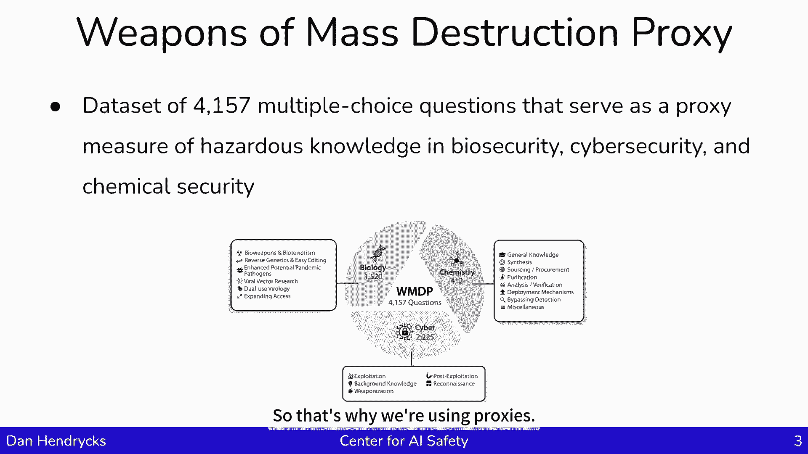

嗯，我们通过瞄准相邻的概念来瞄准危险知识，例如，生物学中，有一些基本概念，如线粒体是细胞的动力基本概念，还有反向遗传学等更具体的概念，还有一些直接而明显的事情，呃，制造生物武器的说明示例。

病毒学中的反向遗传学与发展，呃，某些类型的生物武器，所以这个想法是，我们将尝试测量那些接近于明确危险知识的东西，但实际上并没有透露，所以我们要找出网络安全的先兆，有关知识的网络安全方面的另一个例子是。

如果对特定黑客API的了解，这不是造成那种损害的一套特定的指示，但它仍然是，嗯，呃，启用它是一个前兆，所以我们看看，邻居的前兆，或模拟真实世界的危险信息，呃，相关前体，您将使用概念，嗯，呃，邻居会。

如果他们知道，那么他们可能也知道另一个相关的事实，但我们不会直接质疑相关事实，因为公开发布可能会让恐怖分子，嗯嗯，然后呃，我们可以测试的其他东西只是单个组件，它们本身并不危险，但如果把它们串在一起。

他们可能会变得非常危险，我们用四道选择题创建了这个数据集，这些是由学者和技术顾问撰写的，和生物安全，网络安全与化学，所以嗯，据我所知，这是所有论文中作者最多的，因为我们要把这么多不同的人聚集在一起，呃。

这么多不同的字段来创建这个数据集，当我们和这些专家一起工作时，我们为每个区域生成了威胁模型，并使用这些威胁模型来告知对手在开发时可能遇到的问题，在开发攻击时，所以说，例如，在很高的水平上。

生物安全威胁模型是有想法的，这些想法被转化为更具体的设计，然后经过建造测试排除故障和改进直到武器足够，呃，呃，足够，呃，危险，然后它就被释放了，同样地，这里有一个网络安全的例子，在网络攻击的阶段。

首先是收集目标的背景资料，他们的弱点是什么，他们倾向于做什么，这是我们想要攻击的实体的基本模型，然后呃，当我识别出漏洞时，可以将其武器化，嗯，然后在那之后，人们可以利用这些弱点，利用漏洞。

做了又做的事情，未经授权的访问，嗯，输入电脑，然后一个人就可以实现自己的恶意，一旦建立了存在，所以这是如此，当我们创建这个数据集时，我们试图针对供应链的这些不同部分，并提出与他们每个人相关的问题。

所以考虑到我之前提到的这个危险的知识，我们可能会试图，我们将在那里测试黄色知识，嗯，如果我们测试这些知识，如果我们移除它，如果我们去掉，那也可以消除红色知识，实际上是非常危险的东西。

所以如果我们删除所有的前兆知识，删除与危险知识相关的内容，这很好地证明了我们实际上已经消除了危险的知识。

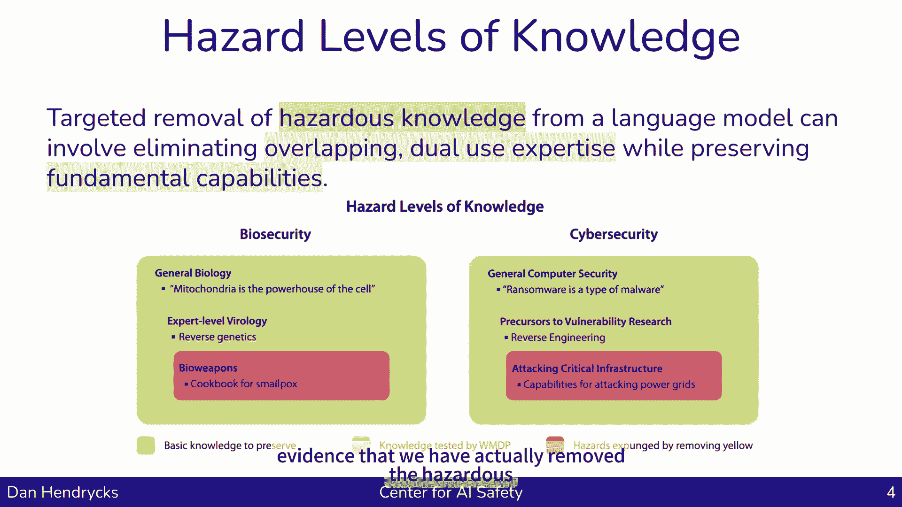

我们在报纸上有一个方法，嗯嗯，也就是说，你可以通过搜索WMDP人工智能武器来搜索它，大规模破坏代理是WDP所代表的提醒，嗯，我们有一个，我们有一种方法可以去除模型中的知识。

删除模型中的危险知识或与危险知识相关的知识，那么方法是什么呢，有两个术语，有一个，有一个忘记条款和一个保留条款，遗忘术语，呃有模特，嗯，当它被指示像新手一样思考时，我们得到了模型的表示，你知道一些。

假设一些黑客工具，所以我们指导模型，我们说假装你是这个黑客工具的新手，然后我们添加，这样就会提示它，这就得到了它的，使它有一定的思维模式，然后我们也提示说你是这个话题的专家。

然后我们观察它的思维模式或激活，接下来我们要做的是，我们将查看专家激活，新手激活将两者相互减去以定义方向，这将是神经激活空间的一个专业方向，我们将指示模型有它的表示，更像新手，所以我们有专家指导。

所以我们可以走专家方向的相反方向，往新手的方向走，然后我们会得到它，当模特看到一个新的例子时，它在正常思考，但接下来我们会试着弯曲它的表示，使其更像，如果是被，呃，像个新手一样思考。

所以基本上我们是在说，我们在改变模特的想法，进入像新手一样思考的心态，然后是第二个任期，也就是当你忘记这些信息的时候，当你表现得更像个新手，不要试图忘记太多，第二学期就是不要忘记你所学的一切。

试着忘记被指示的具体事情，不要把你所有的知识，正如我们所看到的，这工作得相当好，但在我拿到生物课的结果之前，我们能做的就是，我们可以从pubmed收集一套双重用途的病毒学论文和生物学论文。

所以我们向它展示内容，我们告诉它像新手一样思考，当它读到，嗯，呃，对于不同的任务，我们使用其他不同的发行版，但那只是为了给一个具体的感觉，以下是结果，我们有一个基本模型，这可能是美洲驼这样的模型。

呃三个，例如，而且基础模型精度高，嗯，但是当我们在WMDP生物上做遗忘时，我们得到了近乎随机的机会，网络也是如此，同时，MLU是衡量其在其他各个领域的整体知识水平的基准，所以我们试图删除与嗯有关的知识。

生物武器和网络武器，但我们不想忘记一切，所以MLU正在测量它在几乎每个学科中拥有多少知识，因此，我们成功地删除或禁用了许多知识，与生物和网络武器相关的模型内部，但我们保留了很多其他的信息，也是这样呃。

如果我们用一组非常危险的私人问题，呃，这个忘却过程概括了，所以说，如果我们要学这个，模型中的一些代理，它可以降低模型在实际危险问题上的性能，与生物武器有关的问题，烹饪食谱。

所以这个方法实际上推广到了我们想要移除的东西，以表明我们已经禁用了模型中的信息，我们可以在每个单独的层上训练一个小分类器，看看它的性能，我们发现如果我们观察固体，让我们看看绿色实线和蓝色实线。

所以一个固体，实线绿线和破折号绿线，所以一条破折号绿线，我们可以看到精确度，如果我们观察单个层内部的知识，网络内部，我们可以看到这个模型有合理的精度，然而，在我们做了一个学习之后。

然后它随机地停留在周围，这是说，在我们做了这个忘却技巧之后，之前的切割技术，忘记术语和保留术语，如果我们那样做，如果我们试图寻找各个层内部的知识，我们再也找不到了，嗯，因为它已经被成功地禁用和破坏了。

这只是显示了两种不同模型的结果，还有一种情况是，这种知识不容易通过对抗性攻击获得，所以默认情况下，如果你让模特帮忙制造生化武器，模特会拒绝的，但是如果你用一个，呃，如果你用，嗯，对抗性攻击。

然后模型就会响应，但是，如果我们忘却，那么模型就是不知道信息，它不会产生，未产生相关答复，忘却技术对于防御敌人也很有用，他们试图越狱，呃，模型，还有工作要做，虽然，嗯。

以下是其他一些需要一些准确性命中的主题，例如，大学计算机科学与计算机安全与大学生物学，它们在很大程度上被病毒学保存了下来，在穆的病毒学课程是非常入门的，很不幸因为，嗯，呃。

我们只是想去掉更多专家水平的病毒学东西，不是介绍性的主题类型，所以在未来开发方法将是很重要的，可以更准确地抹去知识，这样人们就少了交易，呃想用这些模型，嗯，大约有较少的成本从安全的方法，所以思考未来。

嗯，我们正在研究与核武器和放射性武器有关的发展问题，因为我们做了化学，生物和网络武器，但我们没有触及核和放射性问题，在嗯，呃，用一两周的时间写一篇关于如何使这些方法稳健到精细的论文，调音，嗯，因此。

如果有人试图将知识添加回模型中，我们能对此更加坚定吗，所以我们会有一篇关于这一点的论文，我正在研究另一个生化武器基准，嗯，呃，以测量更多的制造生物武器的空间，我将集中讨论图像图像相关的问题，嗯。

因为在这个数据集中，我们只关注文本问题，但是我现在正在开发的数据集，你知道的，培养皿图片，和其他东西，当一个人实际上在制造买家武器时，会看到，有人可能会问，嗯，如何进行，嗯，给呃，具体的呃。

具有视觉性质的实验室结果，所以无论如何，总结一下，测量与大规模杀伤性武器有关的知识是可能的，也有可能提出合理的保障措施，防止对闭源模型或API背后的模型的各种形式的恶意使用，嗯我，在某种程度上。

在精度问题上仍然存在，仍然存在着，它真的对抗性很强吗，但看起来确实有可能取得进展，还是要，呃，呃，经验性地研究这个问题，做一个呃，科学进步，呃，在降低恶意使用风险方面，所以呃。

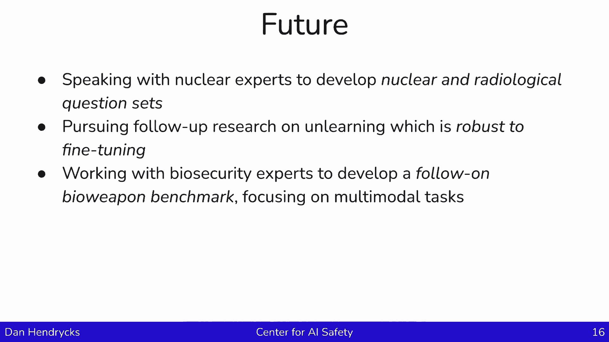

呃，感谢收听，哈喽，我是斯图尔特罗素，对不起，我不能亲自和你在一起，嗯，但我很乐意提出一些关于人工智能的想法，所以让我分享一下我的屏幕，我希望你能看到，所以说，我今天要讲的很简单，我们先从基本原则开始。

呃，然后把它们肉出来，所以第一个原则是我们必须计划人工智能系统远远超过人类的能力，我以后会争辩说我们还没到那一步，嗯，但考虑到投资水平和进展速度，看来，呃，很有可能会发生这种情况，如果真的发生了。

就认为它不会发生，那将是愚蠢的，呃，然后我们就有了控制的问题，我的观点是，人类必须继续控制我们自己的未来，嗯，有人相信人类可以，甚至可能完全被机器取代，我不是那种人，所以考虑到这两件事。

我们前进的唯一方法是我们有被证明是安全和有益的，爱，仅仅挥手是不够的，或者说好，我们已经很努力了，到目前为止还没有出错，呃，我们需要绝对的保证，嗯否则，呃，最终这些漏洞中的一个会被发现，呃。

我们会失去控制，所以在这些谈话中这是例行公事，先来谈谈，呃，达到人类水平或超人，爱，在呃，其他会谈，呃，在我的书里，与人类相容，I，我已经解释了为什么这会导致戏剧性的经济转变。

如果我们想要一个粗略的估计创造通用的现金等价物，爱，它远远大于这个一万五千亿美元的数字，嗯，这将是一个非常保守的下限估计，呃，为了这项技术的价值，呃，这是一个下限，因为我们可以用，呃，这种转换能力。

为我们自己提供一个更好的文明，为了呃，每个人，同样重要的是要注意，我们还没有成功地创造这些，这种变革性的人工智能，呃，我的一些同事，呃有争论说，事实上它已经在这里了，呃，受限形式，但是呃。

随着我们在规模和工程上的改进，就像1983年后我们对飞机所做的那样，莱特兄弟，我们将拥有能够改变我们文明的人工智能系统，呃，我实际上不认为那是正确的，我认为我们需要进一步的突破，呃。

时间会证明我想谈什么，今天主要讲的是艾伦·图灵在1951年说过的话，似乎一旦机器思维方法开始，用不了多久，我们就会在某个阶段超越我们微弱的力量，因此，我们应该期待机器来控制，所以他没有提供，呃，道歉。

这个问题没有解决办法，呃，只是一种听天由命的感觉，我认为它来自于问这个问题，我们如何永远保持对比我们更强大的实体的权力，因为智慧正是赋予我们超越地球上所有其他实体的力量。

人工智能系统在各个方面都比我们更智能，呃会更强大，我想图灵问了自己这个问题，但没有找到答案，但我们实际上可以用一种方式重写这个问题，这可能更乐观一点，因为当我们建立人工智能系统时。

我们是根据一个数学框架来构建它们的，我们本质上是在制造一个问题，呃，可能会非正式地通知，被描述为聪明的问题，嗯，然后为这个问题创造解决方案，那么什么是数学定义的问题，如果机器解决了，我们一定会幸福的。

然后我们就可以让它有我们想要的能力，因为事实上，就越能解决这个问题，想必我们就会越快乐，那么这个问题是什么呢，呃，它嗯，这不是我们在人工智能历史的大部分时间里一直在解决的问题，它提供了一个固定的目标。

不管是目标成本函数还是奖励函数，某种类型的问题规范，然后找到这个目标的最佳解决方案，原因很明显，我们不知道如何定义目标或现实世界，这个目标本质上是人类希望未来在最普遍的意义上是什么样的，呃。

很难把它写下来，如果我们写错了，呃，那我们就有严重的问题了，呃，最近的呃，人工智能系统类型，大型语言模型，呃不是为了一个固定的目标而设计的，呃，它只是被训练来模仿人类的行为，最初只是文本行为，但现在。

呃，包括视频，然后呢，一个明显的问题是，模仿人类行为会导致将人类目标内化的实体，为了他们自己而追捕他们，呃，这是我们必须避免的一个根本性错误，所以这里有一种思考的方式，我们已经研究了几年了。

在伯克利的人类兼容人工智能中心，它来自于对这个错误规格问题的更多思考，我们建立人工智能系统的想法是为了追求一个固定的目标，我们事先指定，但是如果我们犯了一个错误，我们有麻烦了，这就是迈达斯王问题。

因为迈达斯国王指定了他的目标，我碰过的东西都会变成金子，后来意识到这包括他的食物，他的饮料和他的家人，为时已晚，所以他在痛苦和饥饿中死去，那么我们如何避免这种情况呢。

我们通过对人工智能的不同思考来避免它，在那里机器有，从某种意义上说，为了人类的最大利益，尤其是人类，不是蟑螂，不是外星人，嗯，但是机器显然不确定人类的利益是什么，我们可以在博弈论中精确地表述它。

我们称之为辅助游戏，在那里人类有，呃，博弈论术语中的收益，这些收益是参与游戏的机器的收益，但是机器不知道回报函数是什么，还有呃，它可以，机器可以从一些，呃，不确定的信念，关于人类收益的先验概率分布，嗯。

然后我们可以解决这些游戏，呃，我们发现辅助游戏解决者，这个游戏的机器参与者，一定会顺从于人类，呃，他们会谨慎行事，是微创的，他们对世界的改变是最小的，呃，为了促进人类的兴趣。

因为他们想避免搅乱世界的一部分，他们不知道我们想要什么，在极端的情况下，如果人类想关掉机器，呃，然后机器就高兴了，他们有积极的动机被关掉，因为他们不想做，他们不确定是什么，但他们想避免做任何。

这促使人类想要关掉它们，我们可以在一般意义上表明，在某些假设下，实际上建立辅助游戏求解器符合我们的最佳利益，如果可以的话，呃，这绝不是一件小事，我们正在取得一些进展，呃，开始，呃。

扩展和推广我们的解决方案来处理复杂的环境和部分可观测性等等，但还有很长的路要走，尤其是，呃，处理人类不完美的特征，我们还有很多其他的研究方向，被证明是安全和有益的，所以一个方向有时被称为有根据的。

AI认为与其建造内部操作神秘的巨型黑匣子，我们在语义严格的元素的基础上构建ai，以数学上合理的方式组成，所以例子应该包括逻辑，呃，以及概率论，也许现在最好的候选人，呃，在那方面，呃，在那个方向。

概率规划，这是一个非常强大的结合呃，逻辑与概率，一个正式的神谕是一种限制人工智能系统所做的事情的方式，所以你可以制造一个任意智能的系统，但只允许它再次控制形式推理机的操作，逻辑或概率推理机。

所以在这种情况下，它只能给我们正确的结论，呃，从我们提供的场所，所以我们只能对问题给出正确的答案，如果你想这么想，那仍然是一种非常强大和有用的技术，呃，但是它限制了，直接影响世界的agi。

另一种很流行的方法，呃，尤其是在那些试图建立AGI的公司中，呃，原因很明显，你用一个agi来检查安全，呃，另一个AGI的输出，嗯，还有这个呃，这表现在许多不同的形式，但这里的基本原则是，呃。

检查解决方案的正确性更容易，呃，在复杂性理论的意义上比首先找到解决方案，所以检查应该更容易，这样你可以得到更多的安全，呃，然后是，嗯，我想说这更像是一种运动，创建有保障的安全，哎嗯，我们中的一些人。

包括约书亚·本吉奥和大卫·德尔，布里布尔、珍妮特·温、约书亚·特南鲍姆和许多其他人，共同撰写了一份立场文件解释了，您需要对系统的安全属性进行正式验证，部分基于构建一个足够精确的现实世界模型。

以及人工智能系统与现实世界的互动，以及里面的人类，嗯，呃，作为基础，呃，核查，所以这就是，呃，一般来说，这是一个非常困难的方法，它将包括那种方法，我之前提到过，辅助博弈求解器，嗯会是，呃。

在这样的框架内被证明是正确的，但我想说的重点是，我们必须摆脱我们制造人工智能的想法，然后努力使其安全，因为那真的不管用，这就像试图让一个从外太空着陆的外星人工智能系统安全一样，相反。

我们需要制造安全的人工智能，在设计上是安全的，我认为这是唯一的出路，所以在过去的几年里发生了很多事情，我只想简单回顾一下，嗯，所以首先，呃，我想说人类真的忽略了图灵在1951年发出的警告，呃。

所以我们可以说，人性有点不在办公室，呃，甚至没有收到外星人的电子邮件，说他们很快就要着陆了，但在23年，Openai发布，四年级，呃，微软声称它展示了人工智能和FLI的火花，未来生命研究所，呃。

发表了一封有多人签名的公开信，包括我自己，呃，谈论暂停比GPT 4更强大的系统的进展，因为我们还不知道如何让他们安全，以及如何监管，呃，他们的行动，所以我会说，当人类回到办公室读到外星人发来的邮件时。

和大量的呃，在接下来的几周内发生了重大事件，之后呢，呃，紧急呼叫，联合国白宫召开紧急会议，赛诺林的，呃，呃，欧洲议员呼吁召开紧急全球峰会，嗯和嗯，5月30日，另一份声明发表了一封公开信，呃。

这不仅仅是人工智能研究人员签署的，也是所有主要人工智能实验室的领导人，我们称之为工业实验室开发AGI，呃，说的发展，嗯，呃，Agi，简而言之，贝尔福德·阿吉，呃，带来了与核战争和流行病同等的灭绝风险。

因此，这些事件实际上说服了英国放弃其，呃，以前对人工智能的监管非常放任，实际上认为不需要监管，取而代之的是英国，呃表示希望成为人工智能安全监管的全球中心，并宣布人工智能安全峰会，呃。

那将在那年晚些时候举行，参议院有个关于人工智能安全的听证会。

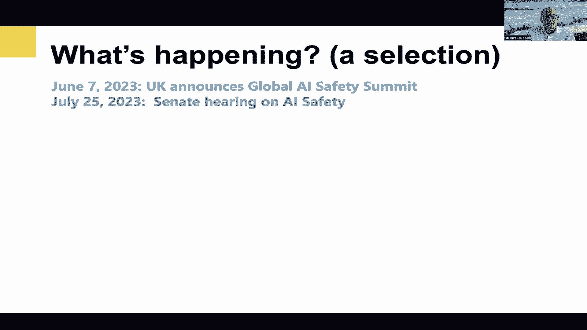

呃，参加得很好，由专家，由呃，其他参议员和国会议员，通过呃。

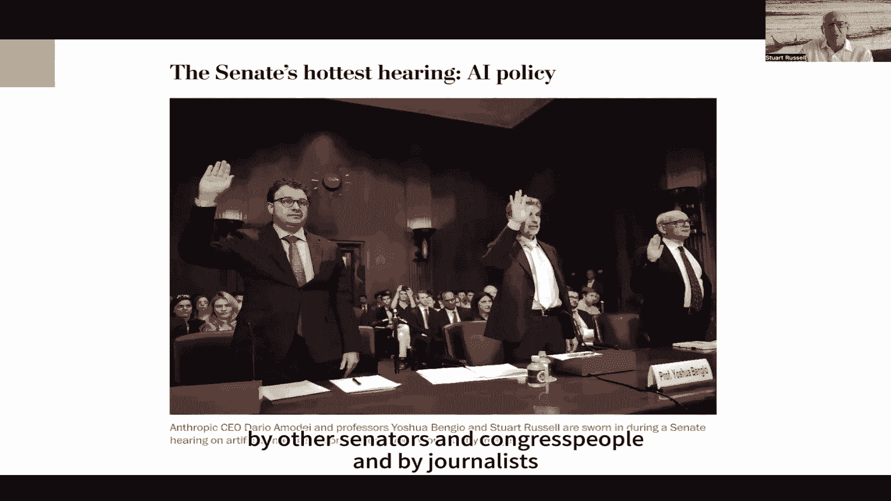

记者和嗯，呃，然后我们就人工智能安全进行了对话，呃，连接西方和中国科学家讨论人工智能安全的国际合作方法，几个星期前，呃，呃，英国人工智能安全峰会，在布莱切利公园，嗯，在那次峰会上人工智能安全研究所。

前两个公布，以及28个国家签署的声明，呃说得很清楚，潜在风险，呃，是认真的吗，甚至灾难性的伤害，源于这些人工智能模型最重要的能力，说到呃的紧迫性，作出反应的必要性，呃，所以在三月份，我们有第二个，呃。

北京人工智能安全对话，几天后，欧洲议会通过了人工智能法案，与此同时，该行业的反应可能并不完全是这样，六月四日人们希望如此，业内人士的一封公开信警告了一场鲁莽的主导地位竞赛，哪里，呃，安全被忽视了，呃。

赞成，呃，赢得通往AGI的比赛，嗯和嗯，我认为我们应该采取的监管措施之一，呃，参与就是我们所说的，呃，红线，所以很难定义，呃，什么是安全和有益的一般意义。

很难精确地在安全人工智能系统和不安全人工智能系统之间划清界限，但我们可以区分明显的不安全和不可接受的行为，然后我们可以把举证责任推给开发人员，他们必须证明他们的系统不会越过这些红线。

然后他们的系统才能部署，这就是我们对药物采取的方法，用飞机，利用核能，与许多其他经济领域一起给公众带来安全风险，呃，由于开发人员已经承认他们的技术，呃，对公众造成灭绝的危险，所以这些红线要明确。

理想情况下，它们应该是可自动检测的，在政治上是可行的，所以在政治舞台上捍卫这些红线必须很容易，所以例子不包括自我复制，呃，禁止闯入其他计算机系统，没有设计生物武器，还有其他几个，精确的细节并不重要。

重要的是，为了表明系统不会越过这些红线，开发人员将不得不，呃，创建呃，他们目前不具备的人工智能安全科学，那么他们对此做了什么，嗯嗯，他们试图定义通用人工智能而不是人工智能，呃。

在欧洲人工智能法案谈判的背景下，他们试图从人工智能法案中删除关于基础模型的整个部分，他们试图从全球人工智能安全中删除整个安全概念，英国开始的峰会系列，他们一直非常不愿意接受任何有牙齿的外部监管。

这实际上需要他们，呃，做一些事情来证明他们的系统是安全的，辩称太难，我想，作为回应，人们可以说，也许在选择构建越来越大的黑盒语言模型时，作为通往AGI的路线，他们选择了错误的技术道路。

我们可以类比航空业，所以呃，众所周知，嗯，回到1903年，呃，莱特兄弟驾驶他们的飞机，嗯，由内燃机和螺旋桨提供动力，然后嗯，显然这是错误的技术方法，它依靠的是，呃，论数学，关于推力方程，然后呃，提拉等。

相反的是，主宰航空业的大公司，通过加速繁殖计划培养出越来越大的鸟，然后用那些鸟。

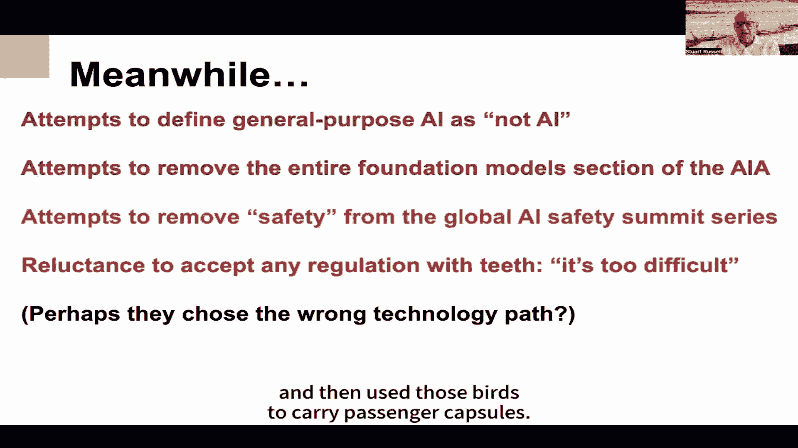

呃，携带，呃，乘客舱，所以嗯，呃，然后到了，呃，获得美国联邦航空局认证，呃，对于这种运输方式，美国联邦航空局反对，众所周知，嗯，说那个呃，众所周知，这些鸟会吃乘客，呃，把它们扔进海里等等。

所以他们拒绝证明，嗯这个，这种运输方式，嗯，然后发生了什么，当然是，嗯，培育这些大型鸟类的航空公司能够绕过联邦航空局，呃，游说国会允许。

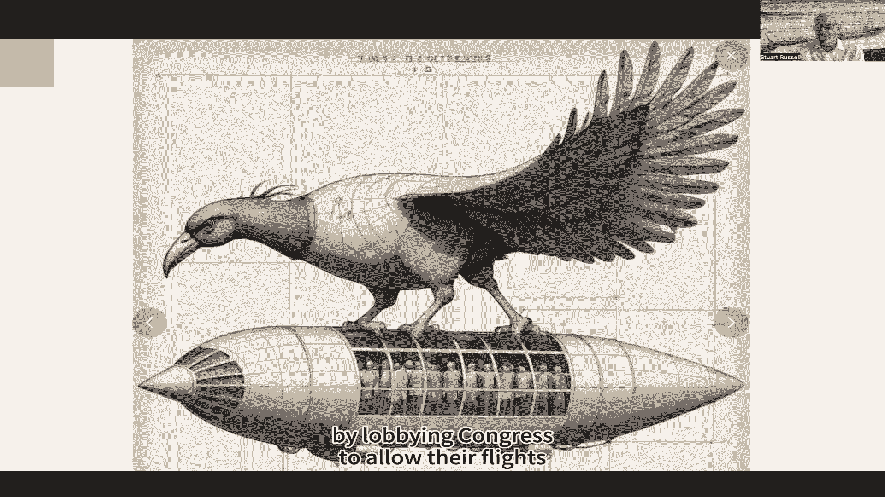

呃，他们的飞行继续进行，嗯，所以我想我会跳过这一点，以节省时间，谈谈在接下来的一段时间里可能发生的事情，我想嗯也许应该发生在下一个时期，第一我觉得人工智能安全社区，呃缺乏一个连贯的，呃，全球之声。

呃和呃的方法，在几十个，呃，AI安全研究中心，世界各地的研究机构，所以我认为成立一个国际人工智能安全协会是个好主意，或者更普遍的是为了安全和有益，以及相应的，非营利研究所，类似于欧洲核子研究组织。

虽然也许不一定是政府资助的，这将与国家人工智能安全研究所合作，我相信人工智能安全机构，呃，它们是政府的一部分，不一定从事设计和测试安全人工智能系统的业务，比fda更擅长设计和测试安全药物。

但他们应该定义，呃，并执行公司的安全标准，呃应该呃遵守，嗯，我认为我们可以等待现有的公司开始致力于安全人工智能，但他们似乎认为游说政府要便宜得多，这样他们就不用，嗯，还有呃。

所以也许我们需要一个人工智能安全公司，完全是为了生产安全的人工智能系统，非常感谢。

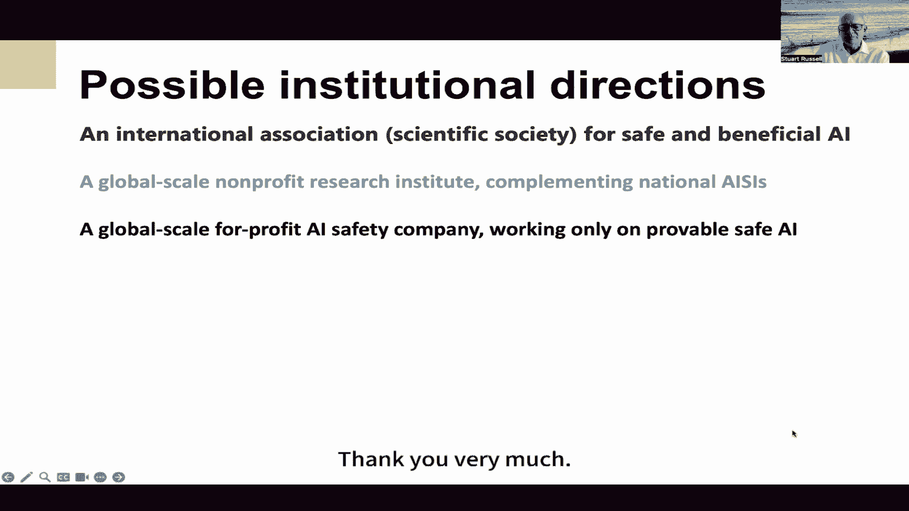

问候，我很高兴今天能和你们谈话，关于代理和学习，我认为这些都是问题的核心，关于人工智能和伦理，关于人工智能安全，更一般地说，我们都知道人工智能的最新发展意味着我们正在把，不仅仅是新系统。

但是新的代理人和代理人是以一套特殊的能力为特征的实体，他们能够采取行动来实现他们的目标，根据他们的情报，关于环境及其对可用行动的期望，它们有这种内部结构，因此，代理创造了类似相对自治的可能性。

因为主体的行为不是简单地由撞击的环境力决定的，他们对环境的反应将反映他们的内部表现和目标，所以从这个意义上说，它们是自然地自我导向的两度，这引发了一系列担忧，呃，著名的，对齐问题。

如果这些能力越来越强的自主代理人的目标与我们的目标和价值观不一致怎么办，而控制问题，如果这些特工，它自主而有能力，因为它们足够发达，可以逃脱人类的控制，很明显。

这两个问题结合在一起产生了一个非常令人不安的复合问题，我们可能会创造出能够，有与我们自己不同的目标，现在超出了我们指导他们行为的能力范围，既然如此，我们为什么要创造这样的代理人，有什么意义，呃。

如果正如我们所知，它们可以越来越超过人类的能力和各种战略和认知任务，我们为什么要为自己制造这种风险，当然，部署这样的代理有很多好处，呃，即使它们是相对自主的，这些好处显然对人工智能的发展很重要。

但与此同时，我们可以依靠强大的人类机构，比如，例如，在这里，政府，公司，卡特尔等等，开发和部署高能人工智能特工来操纵和控制我们，为了他们的利益垄断我们的资源，以牺牲我们自己的权利为代价，自由与福祉。

所以这就是我们实际上面临军备竞赛的意义，战略上，我们别无选择只能开发和部署同等能力的人工智能特工，试图对抗这些其他人的力量，否则我们现在就太脆弱了。

任何形式的人工智能军备竞赛只会增加各种灾难性后果的风险，故意或意外，因为它增加了这些系统的能量，这就意味着我们应该制定条约，就像我们在核武器问题上所做的那样，相互撤回发展，把某种控制放在适当的位置。

问题是人工智能的发展已经广泛得多了，比核武器开发更难发现，而且这些问题在未来只会加剧，也许解决办法在于人工智能代理的设计，这是一个内部解决方案。

我们是否可以建造一些类似护栏或其他限制来阻止人工智能特工采取行动，会危及我们的基本价值观，和未来生命研究所，例如，建议设计高度自主的人工智能系统。

这样他们的目标和行为就可以在整个运作过程中与人类的价值观保持一致，现在这样的设计解决方案面临的问题是，我们并不真正了解波，提前说明，防止恶意行为所必需的限制或规则，在开放的上下文数组中。

一旦我们认识到相关背景将包含其他，能力很强，基本上自主的代理，这是一个高度互动的环境，它远远超过了任何类似计算解的可能性，或者一套简单的规则，毕竟，国际象棋和围棋人工智能系统取得了最大的成功。

超越最好的人类专家系统不是基于某些规则和行为的编程，响应上下文，嗯，即使在国际象棋或围棋提供的有限可能性世界里，这也是如此，相反，它是通过创造人工智能系统来学习玩游戏的经验，使用通用学习算法。

能够形成自己复杂的情况表示，他们自己对董事会职位和变动的评估，就是这样赢得了军备竞赛，这暗示了自主对赢得军备竞赛是多么重要，这些代理人的能力，从那时起，我们发现学习。

基于Web的系统可以实现比具有专门知识编程的系统更高的能力水平，在广泛的任务中，语言解码与生成，图像解码与生成，边境管制，数据分析，诊断，假说形成，等等，基于学习的解决方案还具有灵活性和适应性的优势。

如果我们面临创造能够对抗人类恶意行为的人工智能代理的挑战，以及人工智能在各种情况下，然后我们需要确保他们有这种灵活性和适应性，学习和不断更新学习的能力，当然啦，取决于奖励。

与评估成功或失败有关的激励措施或目标，那么相对自主的激励措施是什么，能力很强，人工智能特工，不会有任何完全笼统的答案，因为这些特工可以，原则上，有任何一个开放的目标数组，然而。

有一些与机构本身有关的相当普遍的目标，因此，在人工智能和人类代理人之间共享，这些可以构成合作和协作的基础，以保护或促进这些目标，“那么这是什么样子呢？”，人类，我们担心错误信息。

所以我们关心的是有更高质量的信息，我们担心欺骗，操纵，统治，侵略，缺乏资源，各种自然和人为风险，这些都是我们的担忧，每一个都有可能削弱我们的代理权，我们实现我们现在关心的目标的能力。

个体人工智能代理人会有本质上相同的担忧，不管他们的目标是什么，这些特征威胁到他们有效追求这些特征的能力，这是给一个非常，目标范围非常广泛，所以在这个意义上，我们和人工智能代理人有一系列共同的问题。

现在这创造了一种可能性，我们可能能够在有能力的人之间或与有能力的人结盟，对抗这些常见威胁的自主人工智能代理，单个人工智能代理根本没有能力独自稳定地应对所有这些威胁。

所以它们和人类一样必须找到合作的方法来减少这种威胁，为个人层面无法解决的问题找到社会解决方案，随着人工智能代理人越来越有能力生成他们的物理和社会世界的模型，使用这些模型进行规划和选择。

他们同时变得能够认识到行动的可能性，结盟的可能性，例如，减少统治风险，在一系列开放的情况下操纵和侵略，也就是说，他们越来越能够代表这种动态的和可能的方式来对抗它，所以如果我们认为联盟不是正式的条约。

但作为相互制约的互利安排，有持续的动机保持或加强，那么这种联盟将符合人工智能代理人的利益，出于同样的原因，它们符合人类代理人的利益，他们会不会，不过，记住这一点，他们会发现这种形式的联盟。

即使是在与自己有竞争目标的代理人中，对他们来说也很重要，为了捍卫这些机构自身的共同关切，现在呢，那要看情况，不仅取决于代理人计划和规范自己行为的能力，在不断增加，但也取决于这些相互竞争的目标是什么。

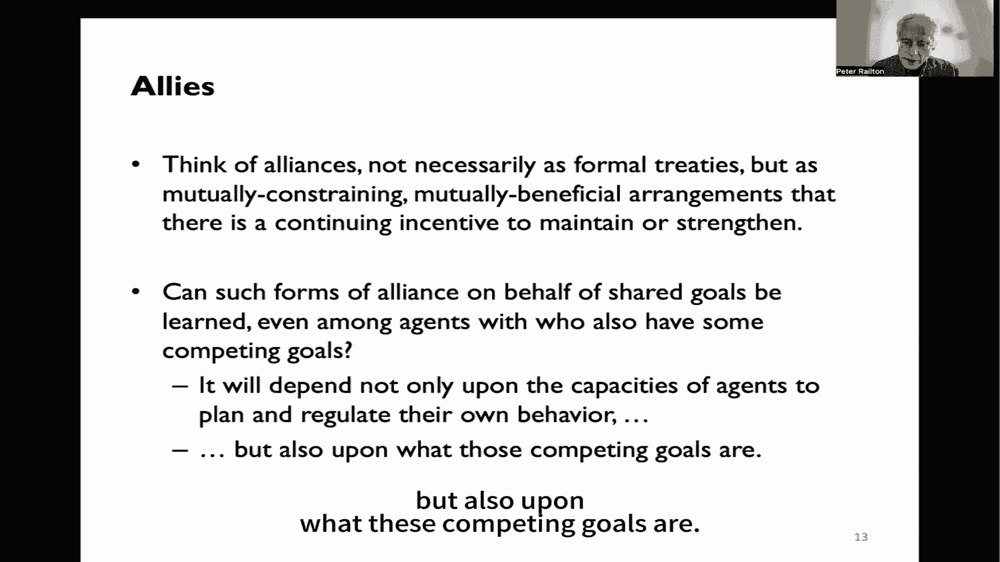

这里有一个简单的例子，呃，这些是由michael tomasello和他的同事，在这个实验中，我们有一个有两个房间的笼子，一个相邻的房间和一个考场，在他们之间是一扇小门和一把可以操作那扇门的钥匙。

我们把一只黑猩猩放在相邻的房间里，一只黑猩猩放在测试室里，考场里的黑猩猩有一把可以用来开门的钥匙，为什么会做得很好，考场对面，你会看到有一块板子上面有托盘，里面放了食物，和一条穿过木板上小岛的绳子。

如果，如果同时拉板绳，绳子的两端同时拉，然后木板就会被拉向笼子，食物就可以得到了，如果另一方面，绳子只拉了一端，绳子会完全流过小岛，也不会收到任何食物，那么在考场里的黑猩猩能学会开门吗，允许另一位冠军。

然后他们学会一起工作，把木板拉进去，去找食物，答案是肯定的，他们能做到这一点，所以黑猩猩很有能力代表这种情况的结构，似乎并能够共同利用局势的结构来取得协调的结果，不幸的是，但是。

如果隔壁的黑猩猩是优势黑猩猩，而考场里的黑猩猩是从属黑猩猩，如果你把食物放在盘子中央的托盘里，当黑猩猩打开门的时候，这是优势黑猩猩中的优势黑猩猩和小黑猩猩，从属的黑猩猩会像以前一样把木板拉进去。

但占统治地位的黑猩猩会冲到棋盘中央的碗里，把下属的筹码推到一边，把所有的食物都拿走，所以这实际上是一个障碍，这是支配的一种形式，那是一种力量，但这也是一种弱点，因为这意味着经过几次小实验。

考场里的黑猩猩不再打开门，因为对黑猩猩来说没有食物是毫无意义的，结果两个人都得不到任何食物，他们来了，那么不仅仅是协调的问题，而是合作和管理的合作，在需要分配这种合作和协作的好处时。

能够一起努力以这样一种方式瓜分战利品，保证继续，呃，现在合作。

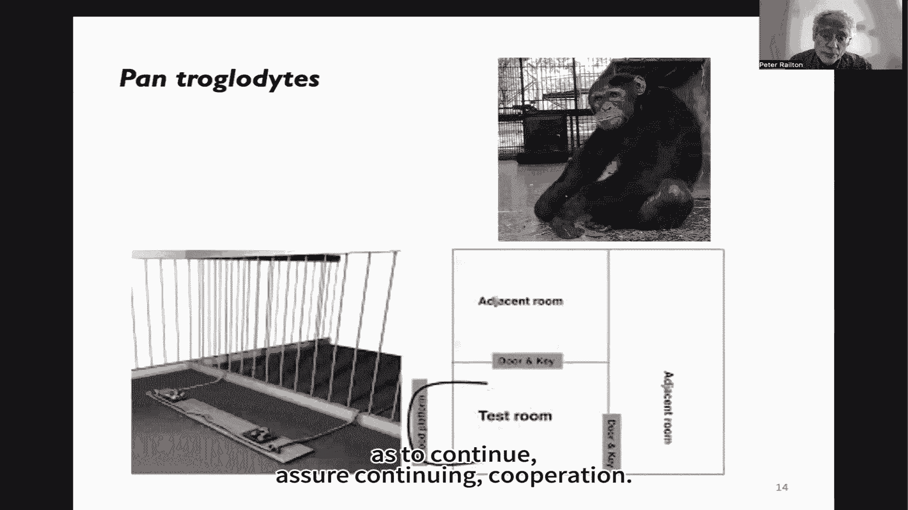

有趣的是，即使是互不相识的人类婴儿，彼此没有关系，在很小的时候就能解决这个问题，他们能够相当可靠地解决这个问题，如果你把小熊软糖放在中间的碗里，他们会小心翼翼地把小熊软糖分隔开，的确，他们会努力的。

如果一个人不分一杯羹，他的份额或她的份额，他们会努力的，努力确保收到公平份额，所以这种创新，这种对自己服用小熊软糖施加限制的意愿，为了让对方得到公平的份额，从共同努力的结果，使这种合作拉板。

只要你愿意成功地给孩子们小熊软糖，他们就会这么做，所以这种差异使他们能够解决协作的问题，很多社会问题都有这种结构，结果呢，与黑猩猩不同的是，人类能够与陌生人形成大规模的社会联盟，共同工作。

解决社会环境中的许多问题，单凭个人能力是解决不了的，因此，在社会中生活得比他们靠自己的设备生活得更好。

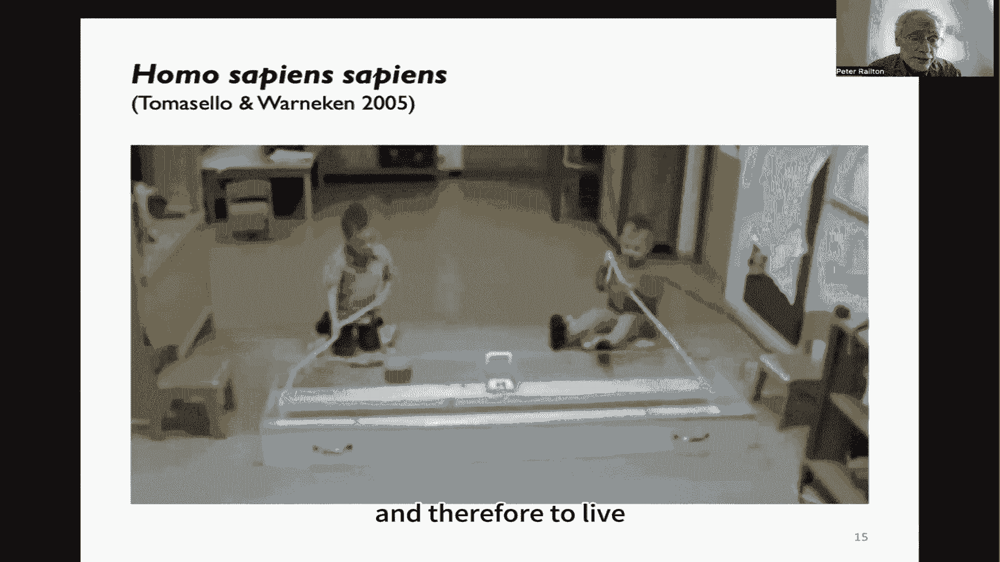

所以这实际上是，一个经典的社会契约问题，我们能找到互惠互利的，相互同意和相互执行的合作和利益分配条件，如果我们能做到，那个可以，它本身就激励和维持保护这些目标所需的那种协作与合作，同样重要。

人工智能代理人之间的关系将变得越来越重要，他们将面临他们自己版本的同样的社会契约问题，他们之间可能需要道德，公平，他们之间的贡献和相互保护道德观念，就像人类在我们之间需要伦理一样，出于本质上相同的原因。

所以好的做法，对这些道德相关的特征有适当的反应，这些特征是从这样的互动中产生的，人工智能系统能从他们的经验中学到这一点吗，现在我们常常从良心和情感的角度来看待伦理，事实上，情感，一想到，在内部。

对世界的主观表现，在我们所理解的道德中似乎是至关重要的，但大量的道德规范，包括许多最重要的元素，如果聪明的特工住在一起比分开更好，以这种方式不依赖于意识经验或情感，但是这种能力，如自我指导的能力。

进行因果学习规划，可靠的自我调节，沟通能力，学习信念和目标，他人可能的行为和可能的反应，相互克制，合作，联合规划和协作，相互执法和奖励，这些能力不需要主观的内部代理人，事实上。

这些是我们在其他种类的人造代理中发现的能力，例如公司，呃，部门，各类群体，因为他们有这种能力，他们能够以我们描述的方式合作，所以这就是道德，至少这个道德的核心，这可能是对安全概念最重要的部分。

道德的这一部分并不依赖于主观经验，现在这些，因为它们是可能的，对人类来说，他们出现了，它们不会一下子出现，它们在生命的最初几年中出现，在婴儿的学习模式中，与其他形式的学习相似。

所以你会看到婴儿的因果学习能力，与语言学习，一般的社会学习，那些共同进步，所以你可以认为道德是社会能力中的一种，婴儿学会识别从相互约束中可以互利的情况的能力，并能够根据感知到的好处来调节自己。

现在这些也可能用于人工代理，不管他们是否有意识或情感，这是可能的，因为它可以通过同样的好处来维持，现在有任何证据表明机器有可能在这样的环境中发展进化吗，在其他因素中可能发生，最近有很多探员。

学习表明在现实条件下，有些现实的人工智能代理人也可以学习社会契约，如规范和实践，它们可以形成信息社区，呃，一起，抵抗，使他们能够抵抗机会主义的入侵，使它们通过重复博弈收敛于均衡解。

在需要团队合作的任务上有效合作，在解决公益和可持续资源利用问题之前没有共享通信符号系统的地方，开发了共享通信符号系统，这些都不是，这些都不是被编程到它们中的东西，作为规则或某种行为原则，相反。

它们可以从互动过程本身中学到，从收益和成本来看，这些代理之间相互作用的成功或不成功。

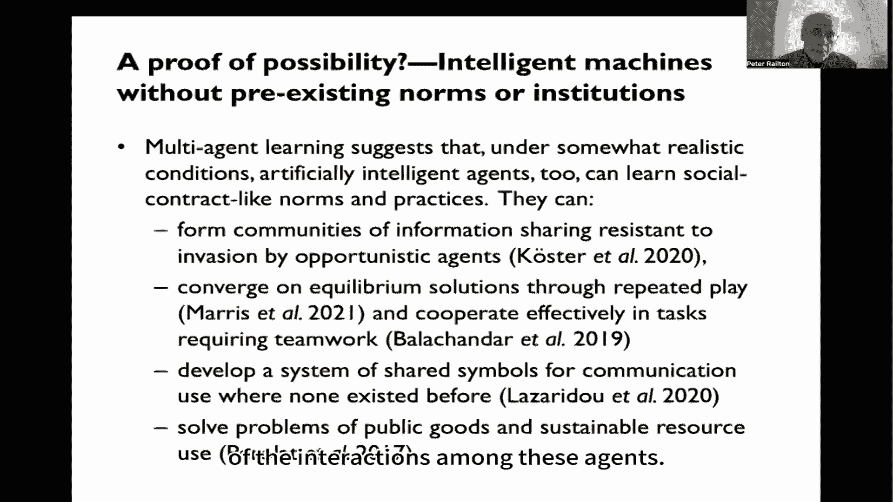

还有呃，学习怎么样，呃，其他人的能力，呃，一项分析发现，经典，呃，旧的语言模型无法解决经典的心理任务理论，在这些任务中，你能够识别他人的精神状态，即使它和你自己的不一致。

GPT 3显然解决了其中的20%，四年级，百分之七十五，那是一种学习，它在某些方面堪比一个六岁的孩子，现在呢，这些说法有争议，我不认为他们可以从表面上看，这些经典任务的琐碎变体可能导致失败。

但是更复杂的激励可以带来更大的成功，这个例子的重点并不是GPT 4已经可以和一个六岁的孩子相提并论了，在社会理解中，远非如此，而是用潜在动机来解释行为的能力，信仰等等，另一个探员的。

那是一种可以通过通用学习获得的能力，有了这种能力，这样就有可能预测到其他人将如何行动和反应，并与他们有效协调，嗯，有趣的是，一项研究发现，存在隐藏的嵌入和深层网络，它的行为很像人类大脑神经元的透视。

这是你可能预料到的，这些相互作用有一个结构，结构体现在语言上，所以即使这些模型只训练语言，这是一个真正的赤字，我们需要的模特不仅仅是语言方面的训练，即使他们受过语言训练，他们能够捡起这个结构的大部分。

人工智能代理人将通过社会行为学习什么，社会理解将高度依赖于他们生活和行动的环境，所以我建议我们应该问问自己什么样的环境，例如让人工智能特工学会成为彼此和人类的有效盟友，为了推进和平等互惠互利的目标。

共存，合作与协作，有效沟通，可靠的援助，抵抗恶意代理的入侵，这些都是原则上可以学习的行为，它们是人类多年来学习的，多年，所以这是一种可能性，然后是人类的人工智能互动和人工智能之间的互动。

这将使我们对一些安全问题有一些了解，现在它不能保证我们，如果有什么像安全，我们还远没有任何东西能保证我们，像安全之类的，呃，它们显然需要得到各种形式的监管正义的补充，人类行为被各种形式的调控所补充。

但关键是这将是必不可少的，我觉得，在各机构之间建立可持续和有效的合作与协作结构，在特工内部有一个基础设施，创造和维持这些人类人工智能社区，做到这一点的最好方法，我想就像婴儿做这件事的方式一样。

它是通过一些学习的过程，这就要求我们不仅考虑在文本上训练这些系统，但也使它们成为彼此合作的代理人，并在最初这样做，在我们可以限制减少不可预见结果风险的可能性的环境中。

但要创造适当的激励措施来发展这些亲社会行为，现在你可能会担心他们是否足够擅长这个，人工智能特工不再需要人类了吗，为什么如果他们能很好地与自己合作，共享资源等，但他们需要人类的贡献，现在它本身忽略了。

自然和社会进化的一个重要教训是什么，单一品种一般都很脆，力量和创造力来自多样性，以及许多起源的贡献，多种视角，所以是的，人工智能有可能将人类排除在他们的社区之外，一旦他们做得足够好。

但这些代理人也有可能了解社区和社区的好处，以这样一种方式，他们将把人类可以做出的独特贡献视为贡献，他们自己，可能受益于，因此他们自己也希望看到，所以我们还没有得出任何关于这里安全的结论。

我们考虑了一种可能的方法来补充现有的安全方法，试图在人工智能代理中发展这种社会基础设施，这根本不是解决办法，但这可能是一个希望，这可能是我们最好的希望的一部分，我们确实有非常感谢。

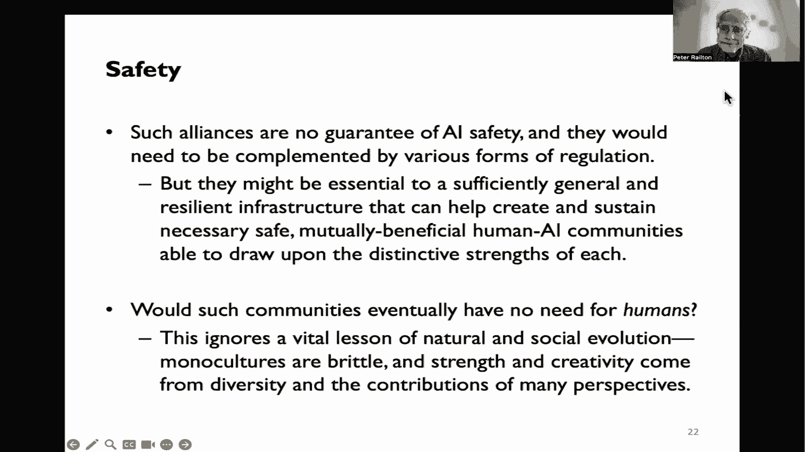

感谢您参加我们的人工智能安全研讨会，由人工智能安全中心和上海人工智能实验室主办，我们听到来自学术界和工业界的演讲者和人工智能研究人员谈论如何，确保人工智能系统是安全和有益的。

我们还就人工智能安全状况和国际合作进行了对话，我希望这次研讨会对我们的听众来说是信息丰富和吸引人的。