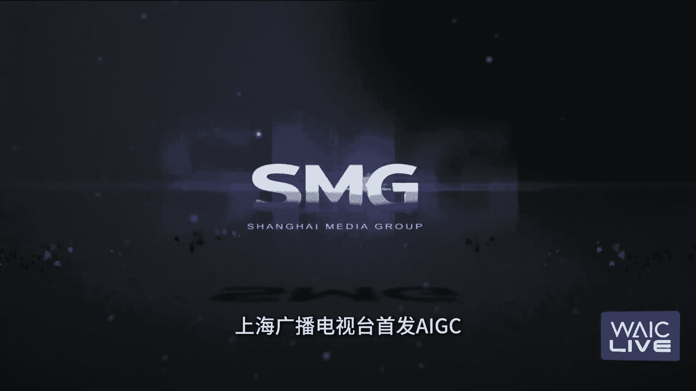
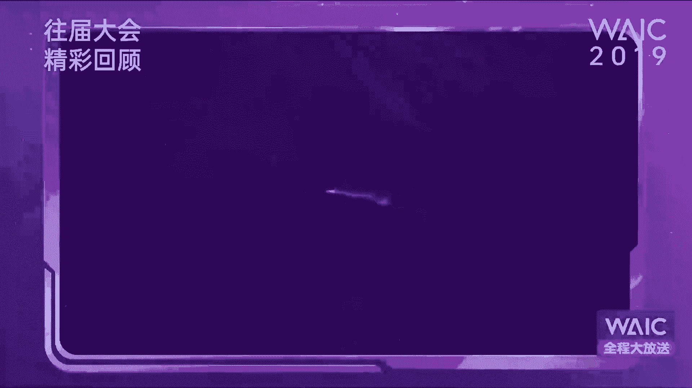

# 2024世界人工智能大会（合集） - P55：20240706-WAIC 3x24小时全程大放送 - WarrenHua - BV1iT421k7Bv

高级别会议与您相约。观众朋友们，大家早上好，欢迎收看2024世界人工智能大会暨人工智能全球治理高级别会议第财经三乘24小时全程大放送的现场，我是第一财经的主持人朱小玉在上海向各位问好啊。

又到了一年的这个人工智能大会。那大家都在说今年的人工智能大会跟前几年不一样啊，如果说前几年只是在人工智能的浪潮当中袭来的第一波而今年大家可能更加关注的是生成式的AI啊。

就这个技术上是不是有更多的一些这个应用的落地的可能性呢？啊，那么在这一年的过程当中，我们听到了非常多的一些新词啊，比如说这个大模型，比说I啊有非常多这个新词是涌入到了我们这个脑海当中。

而我们就从这个大家来说说大家可能也在今年啊或定义为人工智能的PT之前的阶段和。😊，后的阶段啊，怎么去看今年的这样的一个这个过程呢？我们将会在今天的这个直播当中跟大家来进行这个分享。

那同时呢在这里和大家来说一下，今天的直播，大家可以通过本届大会的官网以及第一财经网和第一财经app来观看我们的直播。同样呢也在这里也欢迎您的留言互动。有一些什么样的问题，也欢迎您互动上来啊。

我们会选取一些留言，跟大家来进行更多的精准的这个解析。那么说到这里呃我想从今天早上这场直播先跟大家来聊聊。其实我们在说呃青年这一代新生的这一代。那可能会更加容易去接受新的事物、新的技术、新的挑战。

而在我们说到的人工智能的这个浪潮之下，我相信未来可能是我们呃年轻的这一代，甚至是未来的Z时代啊，会成为中间力量。所以今天第一场直播，我们为大家请到了三位在这个青年时代当中。

可以说是业界的翘楚来做今天的第一场的这个呃分享。我们先为大。😊，下来介绍一下吧啊，我们今天为大家请到的是复旦大学的青年副研究员桂涛你好哎，你好，嗯，以及香港大学计算机学院助理教授博士生导师黄超嗯你好嗯。

还有新加坡CAI研究的科学家刘钱。你好嗯欢迎三位啊，这个也非常不错。今天早上第一场直播给我奉送了三位呃这个颜值担当，而且是技术担当的三位专家啊，也是我们这个青年的这个翘楚。呃。

我相信大家可能也是第一次认识你们。因为相对来说偏技术派的人员，我们可能出来沟通和分享的机会相对较少。所以我们想借着这个机会啊。

也请三位先跟大家也跟我们观众朋友来分享一下自己就是从事于什么行业具体做了一些什么样的一个这个人工智能当中的细分，好不好？我们从桂涛先开始。好嗯我叫桂涛，我是来自复旦大学的副研员，我研究领域是大模型对齐。

嗯什么叫大模型对齐呢？也就是说我们跟。😊，机器人或者跟大模型去交流的时候，我们问一个问题，他可能有100种答案等着我们。对，那么这个答案呢它有好有坏，有安全的，有不安全的。

所以我们就希望大模型的回答能跟我们的专家去对齐，能跟我们好的价值观的人去对齐啊，能跟这个更安全的更有道德伦理的答案去对齐。那么这就是我所做的方向，希望能够做一个既安全又可控，然后又有活力的一个大模型。

嗯，确实就是现在我们不光是去说这个你把大模型能够做到一个什么样的分繁复杂的程度，而是可能会把安全包括治理架构以及你刚刚提到这个对齐度，就大家开玩笑说颗粒度的对齐相对来说有一个相对比较规范性的这个状态。

这是您现在的研究。这个非常重要，然后我们再来听听看您的这个观点跟我们大家分享一下，现在究竟在主要致力于哪个方向呢。对那个我叫刘钱，这个我也是其实刚博士。😊，不久哇。

对我的这个研究方向呢主要是代码生成和多语言的语言模型。就代码生成呢，您可以想象说它的终极目标啊，当然不是取代程序员啊，其是为了让程序员加速，可以提升他们的这个生产效率。

那比如说我们现在越来越看到很多小团队能够成就很多大事情，也是因为有一些这种代码生成模型的加速。另一方面呢，我也研究一些多语言模型，大家现在很多大模型呢主要支持的就是中文和英语，对但对于一些小语种呢。

其实它的支持并不是很好。对，那我们都知道这个大模型应该是全人类的大模型，对吧？它不应该是少少数人的大模型，所以我也致力于这个希望那个模型在各种语言上的性能都不错。然后让AI的技术能够普惠全人类。嗯。

就对于我们可能包括我们的观众朋友来说，这个代码是一个非常神奇的事情。就是可能对你们业界来说的话，他可能会有更多的一些需要去。😊，去做的一些这个架构啊，或者说他有他可能自身的这个规律。但对于我们来说。

我们会觉得说啊能把代码编程，然后成为这个非常成功的顺利的运转，这是一件非常了不起的事情啊，也谢谢刘钱啊，来黄超，给我们大家来介绍一下吧。对，我叫黄超。

然后我是香港大学的博士生导师我们主要研究的方向的话是大语言模型，在智慧城市和改善人类生活当中的一些研究。比如举个简单例子，就是说我们可以通过很简单的一些自然语言的交流，我们就可以和手机进互通。

然后能够去获取城市里面的交通天气公共安全一些相关的信息。这样的话可以做更好的一些出行的规划呀，或者是自己整个的这种就是整个旅行的一个规划。我们也是希望让整个大模型能够以更加轻量级的方式。

在移动端的设备上运行起来。能够更好的去去既保证用户的隐私。又能够去服务到大家的一些各种的一种这种时间和空间上的一种出行的服务。嗯，好，哎不知道。😊，我们的这个观众朋友们有没有一种这种感觉哈。

您看哈从这个桂涛开始，就是你聊的是这个技术上的一些这个创新。咱们刘乾聊的是呃对于代码，也就是整个模型的架构可以这样来说然后到了黄少这边就基本上是有一些偏应用啊。

包括智慧城市这样的有一种产业链这个全产业链大通的这个感觉的出现。好，那么回到呃第一个大家非常感兴趣去话题，就是大模型啊，大家现在都在说这个百模大战啊，模型模型不同，公司跟公司之间也不同。

当然也会相信是呃有更多的一些一加一大于二的这样的一个程度。但是模型那么多之后，关键的点应该放在哪里，怎么去看待当下的这个百模大战呢？那这个前几天有非常有名的这个嘉宾也说到了啊，就是说你这个百模大战。

你未来可能会是一个相对来说会出现呃偏内卷的一个这个状态。更多的其实可能要放在应用端啊，那怎么去看三位怎么去看待大模型未来的这个趋势。😊，桂涛先跟大家来聊聊。

对我觉得现在打百魔大战是一个像我们国内啊是一个非常良性的一个精神状态。就是一是我们现在整个大模型的发展路线。其实我们有很很多值得探索的地方。

我们并不清楚哪一条具体的路线是通往真正的AGI所以我们需要有就是不同人，他在不同的方向探索。那么这样就创造出了不同的公司啊，他去做他自己更擅长的大模型方向。而且我们国内有个非常大的好处。

就是我们国内这些大模型公司，它并不是一个封闭的精神状态啊，它是一个互相协作状态啊，比如说。😊，呃，我们这个中文信息学会的这个计算语言学专委会啊，他就专门开辟了一个大模型论坛。啊。

比如说我们今年上半年就开辟了四期。那这四期呢分别请了上海人工智能实验室的这个大模型专家，然后又请了这个智朴的这个大模型专家，还请了这个其他的非常有名的大模型专家一起来交流。

而且他们都能够把从自己各自的观点出发去阐述他们对大模型理解，这样反而促进了国内这种百尽管是百模大战，它实际上百模生态的这种发展。对，经过这样的一些国内的非常良性循环。

我们发现国外开始有人去cop中国的模式，然后有很多国外的非常有名的学者发声，说我们要这个全世界要关注中国大模型的力量。对反而我觉得这是一个非常好的事情。是就像大家可能会说把这次定义为新型的工业革命啊。

对我们也相信我们中国能够在这一次的这样一个浪潮当中呃，占据我们的。这个优势地位啊，能够有更多的一些这个突破口啊。好，谢谢。呃刘乾，我想问问看你哈。嗯，怎么去看待当下现在国内的这个百模之间的这个竞争。

就比如说从你们现在的这个行业角度上来看，究竟是良心多，还是未来可能会有呃相对的竞争力更加大的这个时刻。对其实我我觉得我们现在国内的这个竞争还是很好的对，尤其是不光是这个商业的这种闭源模型的竞争。

包括我们很多优秀的开源模型的竞争。这个其实我们发展到今天呢像当年这也其实也没有很久，GT刚出的时候，大家都觉得好像有什么黑魔法。那实际上到我们现在呢其实有很多技术路径，大家也都形成了共识。

然后大家这个开源的模型呢其实也越来越好。那这个我觉得开源模型的蓬勃发展，尤其是社区呢对很多传统公司来讲其实是一件很好的事情。因为他们有更多的经历。😊，可以放在如何让这些模型适应他们自己的高质量的数据。

对，然后辅助他们这个行业产生一些新的变革。所以我觉得这个其实模型的生态的发展其实是很好的。那另一方面，其实对于我们普通消费者来讲呢。

我觉得最直观的感受可能就是竞争带来的这个成本的对降低对价格降低对价格降低。所以其实我觉得现在至少我们还是在一个良性的竞争态。

对因为大家现在也都是会保持有一定利润率同时呢希望让AI整个普惠所有人嗯就是你基本上你能够从成本端有了一个通过竞争之后出现的明显的显著的下降。是的，能够可以把更多的发在其他的这个研发或者是后端当中来产生。

好，谢谢呃听听看黄超的吧，怎么去看待大模型未来之间的这种竞争的关系呢。对啊，现在感觉其实百毛大战的话，感觉就是其实挺卷的。就现在的话来说的话，我感觉其实说从长远来看的话，我觉得整个百毛大战的话。

其实也是在促进整个大模型社区的发展。同时也会带来引入更多更加新鲜的一些想法呀，或者是这种学业能够去整个去推动这个行业。对，但是比如说可能现在我觉得大家为什么觉得。😊。

比如说大模型可能我觉得一定程度上就是说他从AI来帮助人们完成的事情，这这个比例上其实目前还是比较有限的。所以说现在还是一个处在一个百家争鸣的一个状态。所以如果随着百模大战的进行之后。

后AI能够去帮人类完成一些任务的比例越来越大之后，我觉得相比之下，这个百模大战可能会更加的去把它就是多样化一点。百模大战我觉得可能不好的一种发展，也是大家不太希望看到的。

就是说百模大战大家做的东西比较趋同。都在卷一个赛道上的模型，这样的话可能很多都是重复性的动作。那如果未来是不是有可能会在更多的赛道上，比如说法律大模型金融大模型，还有像医疗大模型慧城市大模型教育大模型。

其实有很多的一些领域。其实我觉得这个也是跟甚至百模大战千模大战带来更多的机会，大家更多投入到锤子领域当中，然后能够去让整个的可能就是多样性会更强。这样我觉得是从百模大战未来就是更好的一种发展的模式。

就其你提到一。当下的一个问题，就是大家可能还更多的是聚焦在基座的建立当中。你能够未来把这个卷从基座转为到垂直领域。那可能会给大家带来的这个深刻的体验会更加直观一些。我借着三位这话，我们再往下来说一说哈。

就是其实我们第一财经伴随着实界人工智能大会已经走过了非常多的这样的这个时间段当中，其实这几年大的感触是什么？就是之前去聊大模型，可能会觉得离我们非常遥远啊。

就包括我们比如说你哪怕出了这个什么呃kimi啊什么的，可能大家就觉得稍微有一些应用端，开始有一些这个直观的感受了。但是到了现在我们再去看大模型，似乎可能已经有一些应用端当中的这样的一个过程。

比如说刚刚黄少提到的法律行业啊这个智慧城市行业，甚至是医疗行业，就我们现在已经可以把很多算法运用到很多的这种比如说医疗的手术啊，或者说整个这个各种云端当中，甚至是车路云等等这个状态。😊。

我想在这个话题上再跟三位深入来聊一下哈呃，桂涛，我们先说说就是现在从大模型的应用的这个角度上来说，你觉得哪一个行业领域可能现在能够给到直观的感受最好？😊，对，现在大模型受到这么大的关注。

其实一个很大的原因就在于现在我们就是人或者消费者或者是我们的就普通的呃就是民众是能够直接去跟大模型交互了，就有一种非常直观的反馈。像之前其些人工智能也发展非常多年也有非常多的算法。但实际上大家感知不到。

对，比如说我们在购物，或者是我们去呃刷微博刷这个短视频啊，但实际上他背后的推荐算法，也是人工智能啊，但是我们感受不到是有个算法，在背后的默默为你服务。但现在呢我们这个大模型，比如说我们手机的助手。

这个你的去能够去直接跟他沟通。然后你有一些疑问问他他会直接反馈给你，而且是一个非常懂你内心的一种回复，甚至他能够给你很多建议，而且他不会不耐烦。所以价值很到位。所以在这种条件下，可能大家得到的这种。

正反馈会非常非常多。对，而所以它会导致这个民众的这种接受度会更好。嗯，好，谢谢桂涛啊，刘谦，我也想再问问，就是嗯有没有现在就从你们从代码这样的一个这个边界程度上来说。

有没有哪个行业现在对于这一块的需求特别大。对，其实刚刚那个像桂头老师提到了这个普通民众，其实有一个很好的普及度。但其实我觉得大模型这产品呢。

其实现在对于我们很多的代码的从事这种开发者呢其实也有很大的影响。对，那这个影响呢一方面是说降低了这个编程的门槛。对有很多我们以前觉得很困难的任务呢，现在好像面没有那么困难了，对吧？

我通过跟大模型去做多轮交互的这种问答，我可以很快的已清我的一些问题，可以快速写一个很小这种啊demo演示，然后去完成一个语言的学习都是有可能的对，那么其实另一点呢就是说他对现在这种专业开发人员呢。

他其实也有提提高效率的作用。那其实越来越驱动的这种个人开发者呢成为一个有大模型加持一个全站开发者。所以这也就是我觉得这个以后呢我们对于这种专家来讲，尤其是专业开发者来讲，它的效率呢其实会越来越高。

对他一个人呢可能能顶得上10个人或者100个人都是有可能的。嗯，就是我可以把效率的这个呃迭升程度。它是一个呃不是一个几何式的增长一个爆发式的这个增长的过程。我们再问问看黄超哈嗯我有一个想法。

就是现在我们对大模型的运用，是不是已经从之前的比如说特定对象比如说像军工啊等等这些行业到政府甚至是到一些这个民营企业甚至到个人这个应用端在不断的进行扩大和落地呢对我觉得现在其实大模型的未来的。

我们感觉就是它的整个发展方向的话，要不就是刚才主持人您提到的就是说针对于企业或者政府要不就到移动端其实从我们的一种感受，就人工智能其实发展了有1年的时间。刚才那个桂涛老师也提到了。

就是说之前从一个后端现走向了前端给人们一种更加直观的感受就是AI落地了。所以我觉得未来可能就是说从to那个to这种角度出发。比如说未来对。😊，到企业或政府的话。

他们需要的更多可能是一种私有化的大模型或者智能体。因为太多的企业或者政府，他们的数据是比较有以敏感的，或者他去有一些需要隐私保护的。这样话他不可能是把这个数据所有的喂给现有的一些通用大模型。

更多的他需要是自己可能会对其自己领域的一些东西或者公司的业务，一些在这样自己本地部署的大模型。这个可能是我觉得对于很多企业的一个需求。然后从老百姓的角度而言的话，我觉得更多的是大家体会到一种科技的变革。

其实更多是比如像我父母的话，他会觉得哎我可以通过手机点外卖了，可以看抖音了，或者是我可以通过这个可以移动支付了，他觉得科技时代在改变所以我觉得更多时如果未来大模型能够走进到移动端。

这个我觉得可能是未来的爆发点。就他会真正的渗透到人们各种生活当中。我可以通过跟大模型的直接交互，让他去帮我去检索某个时期，比如在新加坡在美国拍这张图片进行一些编辑，然后发给我的朋友或者帮我。

去通过我的一些影食偏好去订外卖啊，或者是帮我去去预定我的一些旅程啊，订票啊，订酒店啊。我觉得这些应用其实会会更多更多的可能是人们的一种刚需，然后会渗透到人们的生活。

我觉得这个可能就是对于大模型的一种就是更大的一个爆发点。就使用门槛在不断的降低。我们也把从模型当中一些这个情况，到了对于应用端有更多的一些这个期待好，接下来我们可能了解相对偏技术性的这个话题。

但我们尽量用呃这个比较浅显易懂直白的这个语言跟大家来分享哈，我们先说一个词这个NLP啊，如果说这个大家可能不知道，但是我如果说是个语言的这个传感啊互动和处理是不是有一点很好理解。那在我换一个词。

就是刚刚其实桂涛聊到的，他们去聊的这样的一个对齐，这样就好很能去理解这个NLP的这个状态了。你看哈就是人工智能刚出来的时候，大家会去看这个东西非常新。😊，起，但是我会觉得呃他回应我的话术。

他回应我的状态，可能没有到我们就是呃人跟人之间的那个状态，就是探积跟归机的差异还比较大嘛。这个你们再研究下去，会不会可能探积跟硅机之间他就没有差距了呢？

对我们我们我所在实验室就就就是复旦大学自然语言处理实验室。那我们的使命呢就是说能够让计算机能够听懂我们人类语言，同时也能够产生就是人类的这样的语言。对，所以呃我们就感觉到这近这个56年来。

整个的计算机语言智能的发展，是非常非常快的，甚至是一种指数的呃这种速度去发展。对我们之前去做一些问答系统啊，或者去做一些让机器的一些翻译啊，我们发现他整个的对人类语语言的理解还是比较局限的。对。

但是我们后面做了大模型mo，我们就非常惊奇的发现，我们问什么问题，他都懂甚至我们没有怎么训过藏语，我们用藏语去问他，他也能用藏语回答，这是让我们非常惊奇的。对。

然后后面我们在做了就是跟人类这种价值观对齐。我们发现他不光是能够做你的回答，他甚至让你能感受到他能够理解你的内心。就是比如说我问他这个我的小狗狗丢了怎么办？他不会说我给你一些建议，你去找警察。

或者是或者是给你一些这个简单的建议。他会告诉你就听到你狗狗走丢了，我很难受然后我这里会做一个朋友身份会给你一些建议，你可以怎么怎么做。然后他会回复一句。

如果你有任何帮助会在这里一直陪伴你看到这样回复之后，就感觉哇这个大模型就我们训出来，感觉好像就是我们的孩子，他发现他的成长非常非常快。那现在我们又做了一些就多态大模型，比如说他能看见了。

那我有时候会把一些我们自己也看不懂图片，比如说我们甚至有时候拿我们自己的一些比如说CT图片给他看他也能够告诉你这C图片里面有什么有什么一些症状之类的然后我们还做了一些就是能够理解音乐，能够理解图片。

然后甚至我们给他放一段音，比如说我们放周杰伦的稻香。😊，唱给他说你能不能根据这个这首歌来画一张画一张这个艺术图，我发现他创作图也非常非常好。那至少对于我们这种IT人，我可能不可能画得出来的对。

所以就是现在大模型的进展，就他不光是理解语言，他能理解这个图片啊，能理解音频，能理解音乐。我们发现他整个的呃跟人类走的是越来越近，能够有我们人的这种五官了。嗯，对，现在还有就是大家又开始就是。😊。

有更大的想象力，比如说去走巨深，希望能够把大模型融入这样的一个机器人的大脑，能够让他能够作为一个实体来伴随人类的这样的一个生活。我觉得未来可能呃科技发展的速度会越来越超出人的想象。说到这里。

我多说一句哈，所以你会发现在今年人工智能上，大家除了把之前的这些呃逻辑和想法，在呃分享之外，他们会多提的一个词，就是治理架构。是不是因为可能现在我们之前就觉得离我们很遥远的事情。

我们已然可以实现所以大家可能会觉得治理会成为接下来的关键。对，现在一个大家可能就是一是发展一是安全，这是两个要都要共同考虑的事情。现在是发展这一端，速度非常非常快。

那么眼见着就是大模型可能会造成一些就是呃危害。比如说你可能问他怎么去制作炸弹，他也会告诉你。对，而且可能要告诉很准确。那么这就是我们对企一个很重要的部分。就是我们希望他是跟我们良好的价值观对齐的。

并不是说我们问什么问题他都回答，而是是有这种价值偏好的对，所以比如说我们让他能够知道，遇到一些不合理的问题。我们怎么去规避规避，甚至能够去呃劝人向善。这就是我们就对企的一个主要的一个目的个方向。

所以其实在呃技术不断迭代更新的过程当中规则的重塑。对对好，我们再回到这个想象的过程当中吧，让大家再激动一下。黄超我们来聊聊哈。其实刚跟桂涛聊的更多的就是精细感知。就以前我们可能会觉得说技术上做不到。

现在我们发现技术太快了。技术能把你想象到的所有一切，甚至你想不到的都能做到精细感知在这一块，你们未来一些什么样的想法。对，就对于这种精细感知那感觉比如说刚才。😊，老师也提到了。

就是说对于人类情感的一个共鸣或者是对齐。所以我觉得未来的话，可能我觉得从技术实践的角度的话，我觉得可能我们是也是需要首先大模型需要有足够相关的一个数据，这样才能去让大模型能够去对峙人类的一些情感。

因为现在大模型可能更多的还是以这种记忆的一个模式。他可能在一定程度上他的智能性。我觉得可能未来还是有更大的一个探索空间。更多的现在相对于是我们可能为了很多很多的数据给大模型，让他去见过这样的一些文本呢。

见过这样的一些知识，让他把它记忆下来了。但希望可能更多的未来是可以像就是说大家所期待他的一样。就是说是希望他能够去是有自动的一个学习或者是自我改正的一个方式。

所以这个可能引用就是呃我们我们那个港大马老师的一句话，他说其实刚出生的婴儿，他是不具备知识的。但大家并不会觉得他是不智能的。因为他具备自我学习的能力。所希望的话未来的情况下，对于这种精细感知啊。

或者是对于这种情感。一些共鸣或者是一些人类人类道德的一些对齐的时候，也是希望大模型，他能够去慢慢的去进化出来一套他自我的一个范式。对，能够去对于新鲜新接触的一些事物，或者是一些新奇的一些问题。

他能够有自己更好的一个人类所期待他的一个判断。嗯，然后去作为一个很好的去引导大家的一个方式。是，确实你看哈这个你们二位在聊的时候，咱们刘钱特别激动啊。你在激动的同时，你就没有担心过这个代码推理的成本吧。

包括你可能接下来能不能跟上他们两位这个想象的这个空间呢？😊，对，其实我们现在说大模型其实很大的一个呃普及度呢，也是因为推理成本的不断下降。也随着我们这个算力普及。

那其实我们最早呢当时这个微软呢有一个服务叫copi，他其实就是给啊开发者或者程序员用的。那其实当时他们发现呢这个程序员对这个模型的要求呢，其实没有那么高。但他其实要求它实验呢要非常的低。

所以他们其实在整个工程的开发过程中，他们一直不断在降低模型的这个实验。对，包括它的成本。所以呢其实到今天为止呢，我们可以看到这个相关的服务，包括各种各样的这个在线的大模型的交互。

它的速度其实已经相当的快了。但其实放在一年前呢，我们其实还是很难想象，今天会有这么强的模型，有这么快的速度。对，其实我们在往后看一年后或者甚至是不需要一年可能我们也会有更强的模型。然后。

也会以一个可能接近实时的速度啊，其实很多时候这些东西呢，它如果一旦变成可以实时的，它的想象力的空间就会显著更大。嗯，对，包括我们现在可能在自动驾驶里面讲的，比如说在车载语音交互。

如果可以做到实时就可以做一些实时的规划，实时的搜索，然后也可以用一种更自然的语音的交互形式。所以其实这些我觉得都是这个推理成本降低带来的显著的好处。是你看啊在这次的人工智能浪潮当中。

我们会觉得似乎就像我们10年前甚至20年前不敢想的那种科幻的一些东西就出现在我们身边啊，比如说我们想到这个无人驾驶的汽车啊，它真正能上路啊，比如说我们想到这个有人在大马路上已经开始遛机器狗了。啊。

甚至就像刚刚其实桂涛说的这个自身人形机器人，它似乎已经做的非常拟人化的那个状态已经出来了啊，科技的浪潮是在一个不断的。😊，呃。

迭代的过程当中也是实现了从0到100甚至到1万到这个几十万的一个快速的这增长啊。今天我们这直播还有时间，我们从一些具体的问题再来聊聊。呃，先跟桂涛来聊聊。比如说我们刚刚提到这个巨身机器人。

其实他从刚刚造出来的时候，大家会觉得第一个造价特别贵。第二的话，你用到这些成本似乎不是那么低碳。啊，但是他出来这个效果也特别好。

但大家也会去担忧你未来从巨深机器人到普及这个程度其实压力还是比较大的跟我们来说说看，对，其实现在巨生已经发展非常非常快了。而且国内有非常多做的非常好的巨深机器人啊。

比如说像这个英伟达他就是前几个月开的他们的发布会。那你他最后发布会最后是有就一排这个人形机器人再来展示，那里面有很大一部分是来自中国企业制造的对所以其实中国在巨生上面其实已经走的非常非常靠前。😊。

嗯啊二一个我是想说，就是其实刚才刘乾在讲他代码的大模型的时候，其实我一直想再跟他交流，就是说其实我们这边就非常期待刘乾这边的代码大模型有一个再大一个突破，现在就可以交流。对，就是其实对于这代码来说。

它是一个非常准确精确的一种语言形式。但是我们的人的这种说话的自然语言，实际上是一个比较模糊，或者说有丰富的这种人类的语义在里面，他并不是一个非常并不一定是一个非常准确的一种表达。对。

所以像我们要去控制机器，那一定要用这种代码这种精确的语言去控制。啊，不是说比如说他能够控制这个手臂到多少度，应该以什么样的路线运转过去。那么代码实际上在里面非常非常重要。对。

所以而且代码是又有清晰的逻辑。就是我每一步是依赖于前面的哪些操作，非常准确。对，所以我们一直在评。😊，测大这个大模型的相关能力。我们发现代码对对这种大模型它整个的逻辑推理。

它整个的这个思维的表达是有非常的正面作用。嗯，对，但是现在整个的代码生成可能就是他可能比如说我在100行以内，他可能生成的很准确。但是我们往往一个复杂的工程，可能几万行几百万行。那么这样的一个突破。

就能够让我们整个的巨生啊，或者是更复杂的这种需要代码去完成任务能够去做的更好。对这一块可能就需要刘娴别能够在进一步的突破了。对是接下来我其实就想问问看刘娴在这个算法上哈，这个未来一些什么样的这个想法。

那借着我们桂涛说的，我们现场交流一下。对，其实刚这桂涛老师提这个观点很对啊，就是我们现在其实我们觉得代码生成已经很智能了。他其实还是局限在这个我们叫函数级的生成。那其实像我们很多这个。😊。

发人员呢刚入门可能就学的是编写一个函数。对，但实际上代码大模型呢，现在目前可能也就是做到这个程度。对，如果我们想让他自己从头开始建立一个工程啊，还是有一些可能。但是它的失败率可能会非常的高。

就不像我们今天这么自然。比如说跟他交互一轮，反正它成功了，这个其实还是比较少见的对，但是其实我们可以想象到说未来呢我们代码生成这个方向其实也会往就越来越复杂。

然后这个工程级或者叫项目级的代码生成上去靠拢。我觉得其实我非常同意桂涛这个观点，就是说这个代码生成可能是以后很重要的，也是越来越重要的一个方向。对，因为代码本身是非常清晰的有逻辑的。

而且代码呢其实是很多机器也好，软件也好，交通沟通的语言。那人类语言呢其实是人类设计出来的或者叫但机器语言呢其实就是为机器之间的沟。同设计的那如果我们想大规模的协作各种各样的软件啊机器。

那其实我们还是需要有代码作为一个支撑。对，那其实我如果我记得没有错的话，我记得mose最早也是在一个代码大模型上做的对对我我能不能多问一句，就是随着算法，包括代码的不断的叠加。

你们在电力的需求上会不会也会有一个持续的这个增加。其实嗯对我我我现在也提到有很多观点提到说这个电力本身其实会可能会成为限制AI发展的一些瓶颈。对，因为我们可能还没有想象到AI发展的速度会如此之快。

这个电力的发展其实可能跟不上。对，其实我。因为我自己呢其实也没有接触过长大的剧群哈，所以我觉得可能比较难有一个具体的感受，未来一定马上就能感受到了。就是我这里可以补充一点。

就是我已经记不清是在哪里看到过一个关于这种AI发展与电力需求的一个相关的分析报告这个报告里面其实有一个观点，就是说中国在这方面是有优势的。就中国的比如三峡工程我们有这个非常清洁的核电。

实际上是能够非常好的支撑这样的一个算力中心的发展。嗯但这一块可能美国就不一定有优势。因为它整个的大的基建其实跟中国比，还是还是有一定的这个问题的。嗯，对，所以在这种能源发展上。

未来我觉得我们国内应该还是有优势的。嗯，好，这个我们只是说我们这个国内的一些个特色。好，因为其实我也是理工科别看我是女生，我也是理工科出来的。所以我可能问的问题相对来说比较细，我再问一个黄超一个哈。

就是呃怎么去做到接下来对这么庞大。😊，它的数据的一个呃储存，甚至是这个呃转换。呃，包括可能未来有一些图像啊声音的这个处理这一块，你们现在是怎么看？

对现在感觉其实我觉得就是之前讲到为什么是现在是致T的出来，其实就过去的1年，其实大家都是在为这种大模型产生了丰富的数据但是未来着数据越来越多之后，我觉得可能大家可能也需要考虑到的。

就是说什么样的数据可能才会更有用。就比如说到底是不是把所有的数据选择什么样的数据喂给这样的相关的大模型。还有就是说针对不同的领域。

我们是不是需要所有的那个垂直领域的大模型都需要所有的一个通用模型这么多的数据。未来因为因为其实对于这种数据的一个存储啊，包括刚才主持您提到的就是这种训练呢？实它需要成本是很高的。

我觉得绝大部分的企业或者是科研机构实都很难去承担这个相关的一个训练的成本。我觉得更多是说我们可以在一些通用大模型的一些基础上，这样的话。我们是再去喂给他一些我们相对于你那个领域相对比较特别的一些数据。

这样的话可能我觉得首先我们很有效的减小了数据量。然后其次的话我们也是可以更好的去让他去对齐我们所需要他完成的任务还是要抽丝剥茧的一个问题把重要的先拎出来，其他的就是能够做一个筛选的。

就不要都去铺开这个每个面了，应该这个意思哈。对因为这个成本也很高。我觉得更多的还是希望他尽快的可以落到一些具体的应用上，让大家用起来这个才能越来越好嗯，就是大家说的降本增效嘛。对。

我再问个技术上的问题哈。问问看桂涛嗯，其实也不能完全算技术的问题。你看声音图像语言等等这些出来之后，可能未来会有一个伦理的问题。我举个例子哈，就是你看这个前一段时间专门针对水印这个事情。

这个国际上其实出了一些这个大家关注这个焦点，我们简单跟大家说下是什么意思，就是你这张图他可能现在做的非常非常的这个智能智能到。😊，可能没办法去辨认它究竟是这个智能生成的，还是本身的。比如说照片啊。

这种这个现实当中这状态。然后大家可能会通过这个水印去重塑一个这个规则。你是生成的，我给你打个这个水印啊，这种情况是不是也是未来关注的伦理当中的一个焦点。对。

这里面肯定是就是伦理上版权上就是可能会有非常大的一些关注。那么这也是就是科技发展里面的一些双刃剑。就是说我们想要大模型的发展，或者说AI的发展，目的就是说我能够产生的足够逼真，能够足够的拟人。

但是呢又存在一些伦理的限制，又希望能够去判别这东西到底是人生成的，还是机器生成的对，所以在这个AI领域有一个非常热点的方向啊，叫做这个AI攻防。

就是就是我希望有一些技术能够攻破这种大模型的呃一些技术框架，能够识别出它到底。是真还是假。那么我们防御方呢，就是希望我们能够大模型生成的东西，能够不让这个这个某些技术能够攻破。对。

所以现在都是处在一个就是此消彼长，或者说谁就是呃呃随着攻击能力提升。那么防御那边他也会去做一些突破，去提升他能力。所以现在都是处在一个互相这个技术博弈，然后不断迭代一个过程。对，但这种情况下。

尽管是在这种攻防情况下，那实际上都是促进AI的整体的发展。嗯，就竞争当中，它才能够有更多的一些脱颖而出的可能。对好，今天其实跟三位聊的还是非常开心的。因为时间非常有限哈，我们也聊了几个关键。

最后呃请三位分别做一下对于我们未来。比如说今年甚至5年十年之后，整个人工智能的预期哈，这个控制下时间，差不多一分钟左右啊，来黄绍先开始。😊，我们可能呃就从我自己的角度啊。

我希望大模型在未来的半年或者甚至一年的时间能够更好的去更多的去服务大家所日常生活当中所涉及到的任务，走进移动端。

这样的话可以让我们我觉得可能让更多的老百姓可以切身的体会到大模型的一个能力和生活的一个改变。现在大模型可能不管他是生成一些代码，还是说生成一下这样的一些文档，更多的还是工作上的一些需求。

对我希望他更多的可能去结合到一些实际的一些一些应用当中，能够去让我们的生活当中所有的很多任务，都真的可以交给大模型做。

因为这个可能我们的学生经常讨论到就是说他们畅想的大模型是希望能够帮他们打扫房间整理屋子洗衣服现在好像都是在抢他们的饭碗。有种这样的感觉。所以我觉得希望大模型能够让大家的一些任务上的一些一些对分配。

可能会更加的一些就是更轻松一些这是我自己的一个畅想。是就不要我们还是在打扫卫生啊，他们去做工作的好，谢谢。😊，哎，刘璇对，其实我比较希望呢是大模型之后呢，可以更多的降低编程的门槛。

那可以让每一个人呢像编程，我们可能未来会像数学语文这样普及。那其实会有更多的啊更深入的专业开发知识呢，他可能就会收敛到这个架构的设计，新一代系统的设计上。对。

这样其实可以解放我们更多程序员的这个脑力劳动。对，那我觉得其实以后通过这种编程门槛的急剧降低呢，其实每一个人都有可能会成为一种啊这个交互式的编程就可以实现自己的应用，实现完全的个性化。

比如说我不喜欢这个界面的颜色，不要这样对这个按钮呢太大了，对吧？或者太小了。我想让它变大一点，其实都可以通过交互的方式来完成。所以我觉得希望可能以后会有这种交互式的应用诞生。

他可以随意的控制整个应用的布局大小，还有一些自己的喜好。😊，嗯，这个技术学霸的这个愿望总是这么朴实无华，却又感觉非常贴近现实。好，来，我们再回到桂涛这。对我觉得可能在不久将来。

每个人都会体验到钢铁侠的生活。呃，比如说每个人都会有他自己的贾维斯，因为现在我们国内的这种手机发展是非常非常迅速。而且现在很多手机厂商就在把大模型融入这个手机，而且手机是每天陪伴我们的生活，他非常懂你。

他甚至比你的父母可能更懂你对所以未来你的个人的助手，或者说你的私人的秘书可能就是你的手机，而且这个大模型会时刻的陪伴你，给你一些建议，然后去帮你规划你的生活。

所以未来我觉得大家可能都可能体验到钢铁侠的生活。是这个跟三位的这个畅想，让我们觉得对于未来的这个预期非常的激动哈。我们也希望人工智能能够更多的普惠啊，我们这个所有的这个老百姓也好。

我们可能这个行业的方方面面。😊，好能够给我们带来更多一些辅助的快速增长啊，今天也非常感谢三位青年科学家能够来到我们的节目当中跟大家来做的分享，非常感谢期待再度来到我们第一财经大放送的现场。感谢三位。

各位观众朋友们，我们3乘244小时第一财经的大放送依旧在继续，千万不要走开，我们马上回来。😊。

🎼人工智能。🎼澎湃星星。🎼颠覆性病科。🎼齐聚涌现。🎼。🎼Yeah。🎼模型加速。🎼生城万物。🎼智有先生。🎼无怨福气。🎼时代机遇，世界同享。🎼人类命运全球并肩。

🎼发展共创先机。🎼坚持公平普惠。🎼开放包容。🎼增进共同福祉。🎼以安全共管风险。🎼坚持安全可控。🎼发展安全并重。🎼以致力共起未来。🎼坚持伦理先行。🎼和平利用。🎼共上促共享。🎼以善之。🎼醋善至。

🎼2024世界人工智能大会暨人工智能全球治理高级别会议。🎼欢迎来到2024世界人工智能大会暨人工智能全球治理高级别会议。巨深智能产业代表了人工智能和机器人两大前沿技术的深度融合与发展。

意味着人工智能正从单一的信息处理走向更加复杂、多维的场景领域，开启智能系统与人类社会深度融合新时代。目前，最受关注的人形机器人有哪些创新成果。😊，🎼青龙全球首个全尺寸开源公百人形机器人青龙首次亮相。

来自人形机器人上海有限公司身高185厘米，体重82公斤，拥有43个主动自由度，能快速行走，敏捷避障，是一个真正的多面手。

致远远征A2上海致源新创技术有限公司的智远远征A2机器人具备50个自由度、兼具智能和通用的特点，适应各种场景。🎼小谢无锡巨蟹智能驱动科技有限公司的小谢机器人，身高180厘米，体重75公斤，轻量一功耗。

生产效率高，是工业界的超级工人。夸父乐聚深圳机器人技术有限公司的夸父机器人能够连续跳跃，适应多地形行走，还能完成复杂任务规划，堪称家庭的理想伙伴。😊。

🎼电科机器人一号中电科机器人有限公司的电科机器人一号，身高164厘米，体重60公斤，具备灵巧操作和稳定行走能力，是工业应用中的全能冠军。

🎼光华一号复旦大学全自主研发的智能人形机器人光华一号全身拥有45个关节自由度，配备了多传感器以及高算力平台。搭载复旦自主研发的自然语言、情感以及运动大模型，为拟人化的运动控制提供了良好的软硬件支撑。

富力叶GRE来自上海富丽叶智能科技有限公司的富力叶GRE机器人身高165厘米，体重55公斤，有高度仿生的躯干构型和女人化的运动控制，覆盖人体的主要自由度是通用人工智能的理想载体。

🎼export air北京新动计元科技有限公司的export air机器人，具备全自研扭曲密度模块化关节和12个主动自由度灵巧手，能够在复杂环境中稳定行走和作业。

🎼K1上海开普乐探索机器人有限公司的先行者系列KE机器人双手作业能力强，续航时间长，性价比高，适用于智能制造、仓储物流等领域。😊，🎼阳光太虎机器人、科技上海有限公司的遥光机器人设计轻便。

配备高算力控制器和大扭局腿部关节，适用于工业自动化和复杂任务处理。🎼宋北京松研动力科技有限公司的松机器人，以其极致的性价比和稳定控制算法，成为科研和工业应用中的明星。

🎼R4达泰机器人股份有限公司的XR4，又名七仙女，是全尺寸、全功能的双足人形机器人，利用数字男声和深度强化学习技术，实现复杂运动规划。🎼轻宝上海轻宝引擎机器人有限公司的轻宝机器人，身高170厘米。

体重52公斤，仿生人脸和52个自由度，让其在人机交互方面表现出色。

🎼X02light上海卓翼德机器人有限公司的X02light新量化设计和长续航能力，使其成为科研、教育和商业服务的理想选择。😊，🎼H1杭州语数科技有限公司的HE机器人采用纯电驱设计，以3。

3米每秒的运动速度创下了全尺寸人形机器人速度的世界纪录，可以实现平地后空翻舞蹈科目3，配合灵巧手能完成更多复杂任务，成为人类的好帮手。🎼在这个充满未来感的展览中。

每一台机器人都展示了尖端的AI科技和独特的创新能力。快来体验这场科技盛宴，感受人工智能为我们带来的无限可能娱乐去吧。😊，观众朋友大家好。

欢迎继续收看2024世界人工智能大会暨人工智能全球治理高级别会议第一财经3乘24小时大放送的现场。我是主持人朱小玉在上海向各位问好。那么在刚刚开始的这个第一场的直播当中啊。

我们非常有幸为大家请到了三位青年的科学家来做更多的对于整个大模型以及整个生态链的这样的一个探讨。那么在今天的第二轮的这个直播当中，我们同样呢也为大家请到了两位在我们青年人级别当中啊。

可以说是在应用端当中的大佬。我们想听听看从他们这个角度上来说，从整个这个应用的角度上来说啊，具体的这个企业目前发展到了一个什么样的阶段啊，未来有哪些机遇和挑战啊。

又有哪些这个关键是想在我们今天的直播当中跟大家来进行分享的。我们今天为大家请到的是蚂蚁集团可信AI倚天见的技术负责人AI工程基础设施总监孙博文你好博文主持人好，欢迎来到我们节目当中啊。

我们今天另外一位请到的是句子互。😊，创始人兼CEO李佳瑞，欢迎佳瑞嗯，这个非常期待哈，就是我们也想知道到了今年2024的时候，整个这个应用端究竟发展到了一个什么样的这个状态和过程。

那么我们在这一个卖个关子啊，等会跟二位来进行详细的探讨。那其实不知道刚刚从这个第一场直播当中关注到我们现在这个观众朋友们，有没有听到其实我们刚刚其实也说了一个非常有意思的这个词儿啊，叫做巨深机器人啊。

我们其实今天现场也请到了一位这个非常有意思的我的同事，我们来跟他来连线聊一聊啊。😊，你好，清宝。嗨你好，嗯，你们机器人的这个智能水平发展的太快，会影响到我们人类的安全吗？😊，作为机器人。

我们的目标是为人类服务和帮助。我们的智能水平发展旨在提高服务质量，而非威胁人类安全。嗯，这个青宝非常有意思哈，看这个反应非常迅速，然后也把我们刚刚这个问题来进行了一定的这个交流。

这个其实就是我们说到的这个落定应用。呃，我们再回到场内再和我们博文和嘉瑞来聊聊这个话题我想先给到博文博文你看哈，其实我们刚刚就聊到了，就是你大模型支撑之后。

你未来一定会有一个关于呃整个应用端的蓬勃的发展。但是在彭博发展的过程当中，我们会发现今年的关键，大家都会觉得说你不仅要发展，也要有智理，也要有架构也要有安全。

所以我刚刚其实问青宝就问的这个就是你们再发展下去，我们如果觉得不安全了，怎么办啊，所以博文想听听看你的这个观点，在整个安全方面，你们怎么想的？呃，我觉得其实刚才青宝回答的也非常的好。

他还是从他的角度觉得作为一个智升智能嘛。未来他可能也很关注自己的安全问题。那从我们的角度，其实我们呃蚂蚁集团像支付宝提供了很多这种安全的呃服务给到大模型。那我们首先对 to C的。😊。

服务里面有智能助理，有生活助理，也有医疗的大模型。那我们也很关注这些to C的服务的应用里面是否存在一些安全的问题。那我们可能当下觉得最困难的问题，还是大模型会产生幻觉。

以及大模型它有一些生成的可控的问题在这里，这是当下可能感觉到的困难。举个最简单的例子，就是前一任大家也看到过很多有意思的现象。

比如说大模型会说鲁迅跟周树人都不是同一个人对对这个一经是一个互联网很有名的梗那这种其实就是大模型可能当时学到的知识里面可能存在了一些呃不好的东西，然后可能没有学得很很正确吧。所以它产生了一些幻觉。

那我们在安全上面处理，其实针对这些幻觉的问题，我们会做很多的评测。所以我们今年也会出出台了我们这个倚天健2。0的这个平台。然那为什么叫倚天健呢。

其实它是分为倚见和天见这个两部分倚健呢主要是负责评测一个安全呃，一个大模型的安全。它是不是能够对外提供服务。然后他在。😊，可控生成、可靠生成以及生成的安全性方面，是不是能够满足一定的标准？

那我们也会评估一个大模型安全的水位。那另外一方就是天健哎，还有一个红蓝攻防的这么一个在这里天健是负责防御。那他会对模型生成的内容，以及呃对模型产生的提问，都会做一些安全的防御。

在这里提供一个整体的解决方案。那我们整个倚天健红蓝攻防以攻促防。那大家的这个水平就会逐渐的提升上去，我们也是这么来去处理这个安全的问题。嗯不过你说这倚天健其实我们非常呃关注啊，而且也是非常感兴趣。

能不能在跟你多聊一些，相对来说，我们现在是分这个企业端的一个应用，还是分个人当中这个应用。呃，倚天健作为一个大模型的安全产品，其实它更多的还是给企业来去做应用。因为我们也看到昨天其实我一直都在场馆嘛。

场馆里面其实有很多家企业都在做自己的大模型，以自己的大模型应用。那其实这些大模型大模型应用都需要关注到安全。😊，问题，它包括了我们一些呃内容的安全呀，包括一些隐私的保护，还有一些科技伦理上面的问题。

比如说我们未来的具身智能，他到底会不会对吧？科技向善帮助我们，而不是像某些电影里面的一个反派样AI到最后成为了一个大boss效我巨大。那我们关注大模型型安全问题。

更多还是说给到企业来去用然后对给到个人来用的话，大多都还是我们的大模型和大模型应用。大家也可以在支付宝里面去体验我们那个生活助理啊，包括我们的一些金融管家，还有医疗管家，那些可能是toC的应用。哎。

这非常有意思。刚刚其实我们前面刚聊到啊，相对来说大家可能会对于这个架构的重塑啊，这个规则重塑有更多这个担忧。哎，我们现在解决方案来了啊，好谢谢博文，我们再跟嘉瑞来聊聊嘉瑞你看就是做应用的时候。

大家都在说因为生成是AI的未来的发展空间是一片蓝海啊，他每年这个增速非常快。但是对于普通的这个呃观众朋友们来聊，我们可能道。😊，管理只知道数据只知道算法，能不能从这个应用端当中跟我们大家来聊聊。

你们现在碰到一些什么样的问题，未来怎么看呢？嗯，好呀，嗯对，也特别巧。今天早上刚刚我去隔壁的这个呃世博世博展览馆，刚领了一个奖。

昨天上海人工智能大会世业人工智能大会刚颁了一个我们是最佳应用奖跟陆言我们排了第一名然后整个呃整个这个场景呢？我举一个和大家最相近的例子。一个就是我们身边的例子。

前几天正好我也看到啊微信的官方也发了一个视频号，说一个民警话聊了一个呃老百姓话聊是这个话语的话啊，是什么场景呢？是有一个老百姓大一个居民在凌晨12点说了一句，我不想活了然后又撤回了，然后这种场景下。

然后正好这个这个民警看到了这条消息，然后立刻就跟他有互动。因为民警都是通过企业微信加了微信，然后大概当时是在义乌大概连接了220。😊，2万个老百姓老百居民那其实在这种场景下，我们想一想。

如果这是AI的数字民警，那其实这种场景真的是我们能让这种公共资源下放的更多那句组互动呢我的公司剧组互动呢，我们就在做很多类似这样的事情，我们做了一些像数字AI网格园数字AI民警。

通过企业微信去连接居民包括我们公司在北京在海淀区海淀区，我们刚刚落了这个试点啊做这个数字网格园那说其实包括我们和这个区的，包括这个镇长我们在聊的是就是我们说公共资源下放。那真正的下放怎么下放啊。

其实人还是不足的那我们如何能通过AI啊，我们能通过大模型，我们能够说有一些生产有一些陪伴，包括比如说像我不想活这种吧？很快我就能够说唉我做一个非常及时的反应那其实是能够拯救非常多的。

我们说老百姓然后包括其实是能提供很多你身边的这种啊非常贴心的这种服务的。😊，所以这其实是我们在落的一些政务场景上。那除了政务场景呢，我们还在很多商业场景上去啊做了很多的数字员工啊。

那我们公司核心在做的就是数字员工。那我们去把数字员工拆分了，我们拆分说有四大核心能力啊最底层呢就是模型模型池大模型小模型端侧模型然后在上层我们说是数据，包括结构化的数据非结构化的数据。

那再上一层我们叫做策略SOP那其实作为一个数字员工，那我其实比如说做一个数字销售那我在整个的转化，我如何去破冰，跟你建立信任，然后再去引导你购买再到复购，这是一道策略。

和我说我掌握这个比如说我是保险销售，我掌握保险知识是不一样的所以第三层我们说叫策略。然后最上一层我们叫做RP我们和外部世界打通，通过机器人流程自动化，我们说光有脑子不够，他需要和外部世界去做联通啊。

所以我们拆解了这样的数字员工的四大核心能力，并且围绕这个我们提供了两款产品，一个我。😊，一个是AIRP去做自动化的事情。AI我们去做大模型应用啊，通过这样的方式，其实我们说我们能释放万倍生产力。

其实是在重塑未来的工作方式。那人其实有一些场景是可以被释放的可以做更好的事情包括所以我们我们说其实在楼下我看到我们那个slogan叫做I governing for不管是在政务的场景还是在商业的场景。

我们希望说他真的是在这种全新的生产力能够释放更多就有一点像在应用场景当中，我们可以做更多的一些规则的重塑我们其实是相当于说每一个人他是不是都有可以有自己的助理。那以前的助理可能是只有老板啊会非常高点。

而且这助理价格还不贵还挺贵啊那接下来是不是每一个基层的人一个销售都可以有这样的助理。那这样的生产力的释放。那我相信整个行业都会往前迈一大步就感觉句子互动其实在智慧城市这过程当中。😊。

做了更多的一些贴切于人与人之间好，或者每个人个人之间的这样一个这个状态。这非常好啊，这也祝福你们。好，我们再把话题回到博文这。嗯。

博文你看哈就是嗯其实在这两年大家都在说我们国内做大模型其实有一定的优势的啊，确实也做的不错。但是从未来的发展角度上来说。

会不会在整个大模型的应用端当中也分为to B和to C这两者会不会有一个截然不同的性质呢？呃，其实我觉得to B和 to C肯定是长期都存在于整个大模型行业的需求里面的。

然后这个其实我们也可以换个视角看这个问题，因为大模型的技术的产生，其实去年开始火爆。那其实。😊，回到50多年前，有一项很类似的技术，就是计算机视觉。它当时产生的时候也是轰动世界的。那个时候有点像大模型。

那大家考虑一个问题时候，一开始也觉得这个东西很有潜力。然后但是计算机图形学的这个里面的一个一个很著名的实验室下面就产生了三个非常重要的影响世界的流派。一个其实是去做基础设施。

然后他有有一个有一个学生其实也做拿到了图灵奖，他做了很多跟计算机视觉相关的基础设施。那另外一个呃实验室的学生创建了一个公司叫皮克斯。他直接用这项技术改变了一个艺术加工到人类的to C的这么一个艺术形态。

一个过程的上升。那么还有一个同学唉创建了一个公司叫亚达利，也是乔布斯唯一打工过的一个公司啊。这家公司其实是开创了一个行业，就是游戏领域，整个都是由这个计算机图形学的这么一个公司来看。

那回到我们的这个大模型来看，其实有点像当时那我们其实围绕着大。😊，模型很多的基础设施可以建设起来。包括我们的算力，我们的芯片，我们的下游的产业都会受到大模型这项技术带来的这个收益来去做到很多的呃提升吧。

这个可能是相当于to B的这么一个行业。那么像to C的行业，像大模型也带来了很多跟人类的互动。然后内容的这个快速的生成。

他把很多像像我们去年有一些创作文字的创作音乐的创作图像或者视频的这种生成类的大模型的应用。它都to C创造了很多这种艺术加工的场景。那也不排除。比如说刚才我看到这个机器人，它是一种新的大模型应乐领域。

它可能像具深智能这样的领域，就是我们未来变革的新创造出来的领域。那大模型也会在这种各种各样的to c to B的场景里面得到相应的应用。我觉得我还是非常看好。不管是to C还是的应用。

其实只要有用户的需求，能够带来变革，就其实应该先恭喜一下嘉瑞或者那个。😊，就是能够给人类带来变革，提升效率的地方，我觉得都有大模型的需求。to C的也好，to b的也好，都会有非常光明的前景。嗯。

我多问一句哈，未来蚂蚁会在to b当中加大还是在to C当中有更多一些加大的一这个方向。我觉得我们集团的战略可能是两者都会兼俩我都要因为其实的场景，我们会在推我们的助理和管家。其实和嘉瑞刚才说的一样。

也是希望让每一个人都有自己的管家，是金融领域的医疗领域的，还是生活的助理，我们都希望有管家来提升让大家的生活更便利。另外一方面就to b的话，我们其实像大模型安全，就是给to b来去使用的。

因为大家很多去做大模型给到用户的这种场景，还是需要安全的嘛。那这些就是面向于to b的所以两者可能我们都会兼顾一些。嗯好，谢谢博文嘉瑞我看哈刚你我们举的非常多一些这个应用场景。

且确实相对来说你们做的非常好。我有一个问题，就是我们不能光考虑这一方面从另外一个角度问问看你可能相对来说偏尖锐一些。就是。😊，会不会在这样的一个过程当中有非常多的一些吞金兽。

就是它可能是一个你需要去花很多钱，或者说是烧钱去搭桥的这样一个这个过程。这块的压力大不大？呃，首先是任何一个很好一个技术的发展，它一定是需要大量的这种资金去支持的啊那如果没有资金的支持。

一定这个行业没有资金的支持，一定没有非常好的呃，我们说是人才的涌入包括各种行业的涌入，一定是一定是有的，而且在任何一个我们说任何一个时代，任何一个新的技术。比如说我们去看最早电力啊。

再到最早我们说互联网再到移动互联网啊，都是一定会有说有所谓的这种吞金兽。但是正是因为这些资本的涌入，才推动了这个行业的发展。而资本本质上它有很大的义务，也要推动这个行业的发展所以从我的视角来讲。

我觉得就是吞金兽这个词儿我我我不知道我其实是第今天我是第一次听说啊，但是我觉得资本涌入，能推动行业发。😊，发展它本质上是一个非常健康的事情啊，那整个资本的涌入，有一些浪费，合理的浪费也是很正常的啊。

因为其实大家对于未知都是不知道的，所以大家要涌入，因为涌入才有了创新。因为有了不知道才有了创新。所以正是创新推动的行业的发展。就是我们不抗拒资本。然后的话我们也希望能够通过借助资本的一个力量。

未来有更多的一些回馈的可能可以这样而这是一定的啊，对包括我们看这个openAI这个资本的力量很大的。嗯，好，谢谢呃博文你看哈嗯我们会发现现在在人工智能这个行业领域当中处于中流砥柱的，大部分是青年人。😊。

就是其实会发现青年人对于人工智能，对于新的科技，它这个接受度呃，包括想象度可能会更好。你是怎么看待未来在这一块的？你就比如说你们团队当中，现在青年人占比是不是会很多。是的，嗯嗯其实青年人。

我觉得因为青年人的特性嘛。他们可能就是想法比较活跃。然后再加上他们是互联网这一代长起来的，天生就对互联网的一些新鲜的事物有一定的亲和力。然后他们也会在这个领域里面就是愿意去尝试更多新鲜的事物。

所以其实青年人在这个方面思想比较活跃嘛，再加上性格也比较独立，所以他们其实是整个我觉得这个领域里面的最主要的生力群。嗯那青年人可以发挥很多的作用啊，我觉得就首先他们有很大的需求嘛。

因为其实去年我看到很多那个生成式的模型，在做文字或者做图片的时候，有有有就有很多青年人上去尝试上去吐槽啊啊我还收到我看到最有趣的吐槽，其实是这样的，说青年人啊，我们希望这个大模型呢。😊，能够帮我们干活。

嗯帮我们干一些杂事，作为我们的助理。嗯，然后我们自己去创作，自己去写音乐，自己去写作文，自己去划过来，结果反过来了。哎，但今年其实逐渐的在实现这些功能了。嗯。

所以青年们青年人们的很多的诉求和他们的想法都会转化成为我们市场上面的一些需求。嗯，然后他们也是我们的未来，然后他们参与多多参与到这个人工智能的领域里面来。其实也能推动这个行业的发展。嗯。

所以我觉得青年人。😊，一一方面他们是后浪嘛，表达中流砥柱。另外一方面他也会对这个产业做出更强的贡献。嗯，悄悄告诉你一个秘密啊，你刚刚举的这个例子，在我们前一场直播同样坐在你这个位置上。

这个嘉宾也举了同样这个例子说明大家关注的焦点都是同一个啊，我刚其实也知道的一个这个消息，其实我们都是同龄人啊，我们都是这个90后就是能够在90后当中看到像奥伟一样的这样的应用大佬，我们觉得非常开心。

那再问问看嘉瑞哈，就是你觉得可能接下来我们在应用端当中，会不会呃也会对青年人的这样一个占比会有更多的一些这样的一个倾向呢？就比如说你你招工是不是首先考虑他年纪越小越好对，这个特别特别绝接。是的。

昨天我我我昨天正好还面了一个人是我们也在批量的招这个 engineer我们希望更多的甚至不只是90后啊，00后，我们我们团队现在很多最新的岗位都非常拥抱00后甚至80时代对Z时代，是因为。😊，啊。

我觉得从我们的视角来看啊，第一呢确实是青年人对这种新技术，他更开放他也更愿意拥抱啊，从这个角度来讲，用户确实青年人一定会越来越多。那从另外一个角度来讲，那比如说从我作为一个企业的创始人。

我们招招人的角度来讲，那我们一定要招到那种学习能力极强好奇心极强动手能力极强而本质上就是青年人，他们的这些特质更强而且呢他没有很多之前旧的知识的包袱那其实他说我所有学东西就是新的。

我今天学的就是最新的技术。因为我从2016年开始做人工智能然后我也经历了两波的这个AI，最早深度学习NLP，然后包括那个时候我们经常开玩笑说有多少人工有多少智能。

所有的人工智能都是人工智障所以我也经历了那一大波的浪潮。其实坦率讲，在那一大波的浪潮里，我们也看到很多的稍微年纪长一点点的人，那他们可能有很多旧有的知识或者甚至是我们的传统。😊。

LP的人他会觉得我这样做就是对的。甚至他会说哎有的人甚至会抵触新技术。所以我们觉得可能一方面他们的学习能力、好奇心更强，一方面他们的各种知识的包袱更少所以我们觉得这个是我们在在看的。嗯，这非常有意思啊。

就其实呃相对来说我们还是聊的非常具体啊，也祝福二位能够在当下的这个企业当中发展的更加澎湃和更加的辉煌。好，谢谢谢谢啊，我们其实今天聊的更多的是在这个环节聊的更多是关于应用端哈。

但是我知道我们在我们今天的世界人工智能大会的现场，其实也还有非常多的这个AI的应用的场景。那究竟有哪些非常有特色的呢？接下来我们来连线正在前方的第一财经的记者吴硕炬，你好，硕句。😊，主持人你好。

我现在就在本次世界人工智能大会暨人工智能全球治理高级别会议的展会现场。可以看到今年的这个展会现场是非常的丰富。聚集了各式各样的AI行业的应用。那么其实大家比较关心的也是到底AI大模型落地到各行各业。

在应用端能够达到什么样的效果，有哪些应用的场景。今天我们在展会现场也带大家来看一看。首先我发现了在这个展会现场，这个展台和别的展台有一个不同。它有一辆特别巨大的卡车。其实我觉得这是跟物流相关的一个场。

这个可能因为这个现场的这个关系哈，所以我们相对来说的话，呃没有特别多的一些这个信号。我们等会再跟大家来进行更多的这个分享。那其实说到今天这个话题当中。

我相信其实大家对于2024的这个世界人工智能大会也是有非常多的一些期待。那么我们等会会为大家进行更多的精彩的放送。那这一时间段，我们先休息一下，一会儿见。😊，那么AI在物。到底落地。🎼与会再度携手。

探索人工智能无线可能。🎼白长论坛引领国际视野。🎼技术赋能构筑产业集群，创新活力，推动要素发展。🎼智慧上海凝聚全球治理共识。🎼共商促共享，以善治促善日。

🎼2024世界人工智能大会暨人工智能全球治理高级别会议与您相约。🎼人工智能。🎼澎湃星星。🎼颠覆性病科。🎼齐聚涌现。🎼模型加速。🎼生城万物。🎼智友先生。🎼无远福气。🎼时代机遇，世界同享。

🎼人类命运全球并肩。🎼发展共创先机。🎼坚持公平普惠。🎼开放包容。🎼增进共同。无知。🎼以安全共管风险。🎼坚持安全可控。🎼发展安全并重。🎼以智力共起未来。🎼坚持伦理先行。🎼和平利用。🎼共商促共享。🎼以善治。

🎼促善至。🎼2024世界人工智能大会暨人工智能全球治理高级别会议。空间。🎼让物质存在。🎼时间。🎼让一切演变。🎼智慧让万物相连。🎼中国。🎼上海。🎼集聚全球创新智慧。🎼构筑人工智能高地。🎼当产业基因重构。

🎼经济高质量发展。🎼核心驱动再次迭代。🎼当生活蓝图刷新。🎼文明迎来新起点。🎼社会净化。🎼突破想象。🎼当神经网络延展。🎼世界连接为一体。🎼未来趋势。🎼深切改变。🎼人类文明的无数种可能。🎼正在这里生成。

🎼无限。🎼一生无限。🎼世界人工智能大会。🎼神农。🎼只有一位。🎼捍卫生命。🎼我们一起。🎼天螺姑娘。🎼只青睐艺人。🎼呵护生活。🎼我们为每一个人。🎼鹊巧。🎼一年连接一次。🎼隔空相助。🎼我们随时随地。🎼马良。

🎼只有一支神笔。🎼制造万物。🎼我们启动无数双手臂。🎼服习。🎼探寻命运规律。🎼把握趋势，我们用数据洞察先机。🎼如果说人类比几千年前的自己更强大了。🎼那是因为我们用智慧将彼此紧紧相连。🎼一起直面挑战。

🎼一起富能万物。🎼一起重塑世界。🎼中国上海。🎼我们为爱再次相聚。🎼科技的力量一起创造属于今天的神话。🎼我是来自百度的人工智能小度，我是小爱同学，小米人工智能助理，我是人工智能少女微软小兵。😊，🎼我想。

🎼可以唱一首歌。🎼来形容天空的辽阔。😊，🎼的香。🎼可以拿起画笔。🎼描绘梦想的颜色。😊，🎼我想我。🎼仰望星河。🎼从中获取思考的。🎼取一个。🎼そ么？🎼世界。🎼家园。🎼如果张眼却开创你。🎼电梯。🎼付出。

🎼可以有爱。🎼的心。🎼一起。🎼人间。🎼的世界。🎼的家园。🎼愛いよ。🎼管你。🎼一起温暖人间。😊，🎼时间。🎼更美的家。😊，🎼的新年。🎼人是。🎼爱也。🎼可いよ。🎼一起努。🎼更美的家。😊，Yeah。

🎼这是生生不息的生命乐章。🎼人工智能让城市之声清晰可见。停。🎼他的信条。🎼他的呼吸。他的梦想。🎼借新的引擎。🎼新的链接。🎼新的愿景。🎼人工智能。🎼转变。🎼赋能。🎼重塑。🎼数字化转型在这里上发。

🎼智能化旋律与城市共鸣。🎼容爱于万物。🎼会重志于诚市。好的，继续来到我们第一财经的直播现场啊。我们现在继续是在为大家直播2024世界人工智能大会记呃这个呃人人工智能全球治理高级别的会议。

全球的高级别会议啊，这今今年真的是聚焦到了治理这个事上。好的，那么我们的这个整个的直播，从我们第一天开始到现在为止。很多很多的线上的朋友都已经通过了大会的官网。

或者是我们一财的APP或者是一财经也有自己的官网，大家都已经看到了这个盛况。所以欢迎大家呢你要继续通过这些渠道来收看我们的这个节目啊。好的，刚才在上一个环节里，我相信大家已经了解了更多的东西啊。

包括了这个s是怎么回事，以及呢包括了这个呃AI最强芯片等等这些。那么来到我们这一部分的时候，我觉得是我们或许是我们这几天的直播当中可能是最轻松的一场了。因为。😊，今天第一财经请到的耀眼的精英的这个嘉宾。

你们是想都想不到，非常的年轻。好，我这样我先来赶紧介绍他们。来我先来介绍距离我最年轻的这位嘉宾是蝶境数字科技首席技术官张迎良，欢迎你张迎良，感谢主持人，哎，你也跟大家打个招呼。哎，大家好，张迎良。

我叫你张总还是叫张迎良，叫小张都可以小张迎良嗯，好，来介绍我们中间啊，我们我们中间的这位呢，我们中间的这位呢是呃同济大学电子与信息工程学院控制科学工程系的教授范瑞。主持人你好，大家好，嗯，挺长的一段。

就是范教授。哎，您别叫教授了，就范锐吧，叫小范，您给我讲了。好的好的好的，好，来来滕佳业佳业，你说说你自己说你说你来自哪里？我现在是上海财经大学的一名新任的助理教授，然后主要我的方向是理论机学习。

你是新任的助理教授，对，刚刚入职，刚刚入。😊，是的。你你是90后吗？我99的。😡，不你说我多准，九9的差一点，对吗？差一点就跑差一点。所以呃我们第一财经看我们节目的线上的朋友们啊。

看我们第一财经节目的线上朋友们，今天这三位，我刚才为什么卖了一个关子，都是90后。是我们在这个大的人工智能产业领域里面的真的是年轻一代的精英啊。好的，那个你是99是吧？99两位。😊，哎，我不好意思。

能说年龄吗？都都男士都难是九几的我92的我93年的你看看9293好，这个我我关于这个我不多说啊，因为好像这个年龄也不太合适啊，但是不管怎么说，真的是真是非常非常的年轻。

但是却担负着很多很多的这个啊无论是在产业，还是在这个学术界的这样一个顶尖的研究任务来，我们先张迎良，你来跟跟我们说一下，就是你在这个人工智能领域里面，你偏向于哪一个方向。O我其实主要做的是三维重建。

那具体来讲的话呢，其实把我们整个的一个世界的数字化。那这里的话呢可能会涉及到比如说我们如何去做物体的重建人物的重建，还有场景的三维重建。那整体来讲的话呢，其实我们比如说从物体来讲，对吧？

我们可能会涉及到文物或涉及到一些日常的一些用品的一些三维数字化。对文物来讲的话呢，他可能一方面在线展览的功能另一方面呢也可以去帮助我们去过做更更。😊，更气质化的一些考古和分析。

那么对于人我打断你啊你再通俗一点，比方说就是文物三维重建，你就告诉我们，我三维重建完毕之后。他就怎么了？变成个什么？我们三维重建完之后呢，我们其实就有了它的一个三维模型。那当然再通俗点讲的话呢。

其实我们可能日常生活中会接触到三维模型的地方呢，可能比较常见的，比如说游戏里对吧？游戏里角色，游戏里的物品，其实都是三维的资产。道具也好，这些其实都是三维的。

嗯另外呢可能在影视里的影视里其实有很多的这种三维的道具。它其实都是一个数字化的一个模型。嗯那有了相当于是我们把重建完之后呢，你就可以把它丢到。😊，影视里去做道具也好，或丢到游戏里做这种。

当然还有可能可以丢到一些其他地方，甚至你做好文物。可以帮助考古分析。那对的可能就不需要每次把文物拿出来去看。当我有个高精度的模型可能对着模型，也可以看他的纹路，看他材质，看他的纹了解了好。

这是范这这是们物体这一块，当然还有还有文物这一块的一些三维重建，比如说我们去做一个数字人，对？我们做数字人，比如说我们去做数字IP的数字人。

包括我们之前做过露娜也做过可能后面会带这种AI驱动的数字我们和才之前合作的一可？他每天可能会播报几档节目，大概3到4档节目，通过他来做新闻播报来提高一个效率。

当最后我们其实做的可能就更大范围的因为你做物体也好，场景人物也好，其实都离不开场景，那我们其实本人我们数字孪生业务相关的话呢，可能这种大场景大尺度三维重了解了，就是说其实你不仅仅是一个简单的人。

其实你是一个全场景下的啊数字化啊啊好，数字化，这是这是我们张迎良啊张迎良那个张迎良，你们知道吗？他是2020年的入选福布斯中国30岁以下的精英。怎么样来到我们一才的演播室。嗯，好的，呃。

我们再来说这个这个我们我们这个范锐范教授范教授，你好简要的跟我们讲，就是你现在的研究方向在哪里，就是让大家了解你们就是因为人工智能它真的。😊，你说它是个产业，但是我也觉得它就是个基础设施啊，对吧？

你的细分方向在哪里？简单告诉我们啊，主持人你好，各位观众观众大家好呃，我主要研究方向是类人视觉认知与理解呃，通俗来讲就是如何把我们人类的大脑和眼睛赋予机器，如何把人类的大脑怎么样和眼睛赋予机器。啊。

大脑和眼睛嗯嗯好的，这个就很清楚了，这是我们范锐范教授哎好99的对我叫曾嘉业。然后我现在做的主要是基学习理论的这一块然后通俗其实我们做的东西会比较抽象。

但是我们可以用一句话就是我们希望从理论的角度知道人工智能是什么，为什么怎么做这一系列的东西我们就是希望做到这样一系类抽象的东西。嗯嗯嗯嗯那就基本上大家都知道了哈，那么刚才我也我也补充一下范教授啊。

范教授是博导啊对啊一个90后的博导，然后同时也是那个我们国家级的层次的高高层次的人才，也是上海市的高层次人才，所以我我不啰嗦了啊。😊，呃，之所以把他们的这样的一个呃研究的方向。

以及他的一个简单的履历背景来跟大家做一个分享。事实上是说，人工智能领域里面，我们期待着更多更多的像他们这样的人去给我们做一些破局。这个破局，不是说简单的某一项技术的破局。

是说我们现在最最关心的关于技术的原始创新方面的破局，是0到1该怎么办的事儿是吧？好，那关于这个呢，我觉得不是光是说我们本场讨论关心也不是只是你们关心我觉得现在整个我们中国都在关心这个事儿，对吗？

人工智能的时代，是吧？也是一个呃技术比拼的这样一个时代。好啊。源头创新这一块，我想先请教英良啊，张银良。嗯，你觉得这个0到1的突破到底是应该是知识啊、人才啊、资金呢，你会集中到哪个点。

你会觉得这个突破应该是在哪个点上，它是最有效的。其实现在来看的话，其实对于这种零到一的突破来讲的话，其实可能都会讲究这样天时地利人和，可能具体来讲的话呢，尤其在我们大模型时代。

可能会考虑的更多是数据数据算力还有算法这么3块。那么对于我的角度来看的话呢，其实不光这3块以外呢，其实我们还需要去做坚持的一个事情。就是我们需要去在坚持我们认为的方向上去做持续的投入。

而且要有坚持的方向上去做持续的投入。对的，是指钱这个可能包括钱这个比如说钱可能验算力，包括人才这些可能都是要一起来做投入的。这个持续是指什么？持续的话呢，可能我们是持续的可能更多是在时间上的一个投入。

就是。要投入持续的投入在时间在这个点上去花相应的一个时间去做钻研，才能取得相应的突破。嗯，但是你要知道现在资金可不干呢，资金是这样所以说可能这里就是要要找到一个最优的一个一个组合。当然对我们企业来讲。

其实尤其是这个样子。你觉得你作为一个90后就是一个活生生的一个创始人，对吧？然后当然你还加上了你这个企业。你觉得你们能熬得住时间吗？目前来讲的话，其实这个对于企业来讲的话呢，可能会比较关注的。

比说我们投入产出比对？关注我们的现金流对于我们来讲的话，其实我们既要专注于当下，也要去预判一些比我们认为未来可能发生事情。

这个是不矛盾的不矛盾那对当下来讲的话可能会关注比说我们对能够给我们带来一些比较好的一些现金流的一些一些一些产品。呢同时呢我们可能对预判和产品相关的一些方向，我们认为大尺度三维重建。

一定是做到更高精度更自动化那么同时呢我们就要为这个方。去做相应的准备。嗯，那这些准备呢可能我们去会去包含我们去准备相应的呃数据，会去包括去准备相应的算法上投入。

还有可能相应的人员可能也会为这一块来做相应的一个准备。所以所以其实你是一个生态的搭建，不是说单门的某一个单兵突破啊，我就是熬吧，你熬你你这企业没利润也不成。范教授呢呃我觉得主持人您刚刚提到的几个因素。

我觉得都很重要啊。但是我个人看法是呃目前您讲的是0到1的突破。呃，我个人觉得应该是包括几个部分吧。第一呢应该是新型的计算芯片的出现。因为现在我们计算芯片还都是在英伟达或者其他一些国产芯片呃。

整体的算力还有待提升。呃，另外呢因为我们现在是在大数据时代，所以我们更需要一些更加安全的更大规模的多模态的数据。然后此外呢我觉得还有就是一些算力成本的下降。

然后我个人觉得还有像一些open source社区文化的。嗯啊以及我们社会人的接受度都很重要。嗯，嗯，哎你这5个点啊，你这5个点我觉得是其实是细分到了我们呃这个人工智能领域里的一个具体的一个一个点。

那么呃我自己理解一下啊，你谈到了无论是说呃数据也罢，无论是说芯片也罢，就是说这一个一个的单点突破，你觉不觉得说我只要把这个做到，其实我的原始创新，我最后就成了，也就是说我做然后结果自然而成。😊，呃。

我觉得这个其实是木桶效应吧，就是这些都很重要，但是我觉得缺一不可缺一不可。对好的，来加一。我我觉得两位老师说的已经很好了。然后我补充一下刚才的，我觉得可能呃在我的角度看来。

我觉得高校和企业其实应该有一些侧重点的一些不一样。我觉得高校可能更应该承担起这样一种长线的投入的这样一个任务。我觉得这也很重要。因为我我的理解里面，高校有一部分的责任就是做这样的一些事情。

就是在现金流比较充足的情况下，因为高校可能他更多应该承担一些这种未来的这样一些科研。未来未来是指着眼于未来。就是10年后我们应该会用什么东西，类似于这样的东描述。😊，十年之后我们会怎样？

那这件事情对于我们想着今天所探讨的这个源头创新的突破，这两个之间的关联是什么？嗯，我觉得首先它肯定是一种突破。但是这种突破可能我们在当下这个时间点是没有感没有办法感觉到它呃的未来或者说它的用处是什么？

以及就是说有没有必要呢？对吗？但是但是这个准备作为高校来说，作为研究来说我觉得是应该承担起这样的责任的。比如说在20年左右的时候，其实啊可能是1819的时候，s其实已经出来了。

那个时候大模型就应该如果我们从理论的角度去看的话，呃，它的所谓的理论其实已经出来了，但是可能大模型的真正的发展起来可能是这几年才出现的。所以我觉得高校应该有这种着眼于未来的打算。😊，哎。

所以就是说大家呢站在自己不同的角度看到了我们去做这个原始创新，或者是一个呃源头的源头的颠覆性的这件事的时候，不同的角度会产生了不同的这样的一个做法，一个想法啊，来赢良呃，你这边其实已经在做企业了嘛。对。

而且你你也已经有了一定的结果了，就是在从企业的层面那这个结果呢，我暂且把它理解为就是说我有产品。而且这个产品可能也在变现当中。对，所以请教您的是这样的啊。嗯。

过去的时候我们看到的的确是嗯从刚才这个加业也罢，范教授也罢，就说因为他们如果是站在一个学界，站在一个呃高效的一个角度的话，我要提前布局，我要进行基础的投入，我要进行科研等等这些。

但是你要知道产学研他从研到产业化或者到一个产品形态，他过去是需要一个很长的一个时时间的。现在我们国家非常非常鼓励高校的啊，学者，你们加速实验室到真正的市场的过程。所以但是现在我们看到的是什么？

是直接就到产品形态了。😊，或者是叫做直接就到0就到100了。所以我们看到这个之后，您觉得作为一个企业的时候，你怎么来考虑这样的一个过程？然后觉得说我们应该。关注到这个过程，以及应该怎么做？

其实现在来讲的话，在当下这样一个我们认叫做数据驱动范式也好，或者大模型这样一个时代下，其实整个的一个从研发到最后的落地，其实确实像您讲的非常的快特别快。对然后呢你觉得企业能跟得上吗？

我觉得首先企业能不能跟得上呢？在这时代呢，其实我们都要着眼于本人的行业做投入做过要关注这个事情，我们不要害怕，就可能会被颠覆，或者说我们畏惧当下新的技术出现之后，那我们可能就没有相应的一个生成空间。

那对于我们来讲的话，其实我们应该积极的去拥抱去拥抱这样一个新的一个我们叫做数据驱动的一个范式下的一个时代。那那对于我们企业来讲的话呢，可能我们也关注到，比如说现在新的通过这种大的模型的方式，对吧？

我们可能对于对于我们尤其我们做三维重建这一块，可能会发现。我们通过我们做资产的速度会越来越快。可能原本现在呃原本可能你需要去通过人工通过去采集，通过去修复，得到一个三维资产。

现在可能你可以通过图片通过一张图片，或通过少少量的图片，甚至一些吸疏的这种点，都可以去快速得到一个三维的模型。这个也是本身我们呃上科大这边，因为我们和企学校合作比较紧密的上科大这边的一个成果。

所以对于我们来讲的话呢，我们非常的就是说非常的开心能有新的一些技术出现。能帮助到解决我们本人的生产链容中一些环节。所以说呢对于我们来讲的话呢，那我们可能对于这样一个情况下的话呢。

我们可能会就是会一方面会关注我们应该去怎么准备相应的数据实现更好的契合我们当下的一个产品里的一个一个功能或者一个算法。嗯嗯，那同时呢我们会可能我们会强调就像刚才佳讲的。

我们会和学校去合作来解决我们本人可能更长期的一些一些一些突破的的一些问题。对范教授啊，那个我们之前都。知道一个钱学森质问。嗯，对，因为刚才是谈的这个企业这一块，我应该怎么怎么做哈。但是我们回到这个高校。

回到我们的培养这一块，嗯，就是一个钱学森质问是讲到了，就是说我们的高校怎么就培养不出这个科技创新，其实就是源头创新这块的人才。我们现在再来拿出来这个问题，再来说。😊，范教授有什么感受？呃。

我印象中前学孙知问应该是在21世纪初提出来的。20世纪初21世纪初应该提出来的。呃，所以就是我感觉就现在大概跨度已经20年了，所以整整体的这个社会环境，或者整个的这个生态都发生了很大的变化。

这个生态发生了怎样的变化。呃，我觉得大概应该在20年前嘛，那个时候应该教育理念还是比较落后的。嗯呃我们可能更关注如何去灌输知识。呃，现在其实我们特别关注如何去进行个性化的培养。

嗯高校里面对高校对然后甚至可能会是一个学生一个导师这样，我们会甚至有一些导师制的一个制度。嗯嗯嗯另外呢我觉得就是我们当时在20年以前可能整个的人才培养的目标是不明确的。

我们可能更关注如何去培养一些呃比较合格的劳动者。呃，但现在的我觉得我们整体是在去发展，去培养一些未来可能的比较优秀的科技领袖。嗯嗯嗯这个观念也会发生变化。然后另外就是其实一个很很现实的问题。

就是当时应该整个的科研环境是不够完善的。呃，现在确实我们在国家在这方面做了很大的改进嗯客源环境也做也发变化。对，这是您主认为的主要的两点和过去是不一样的。对对对嗯一大不同。嗯，嘉业呃，刚才你也听到了。

就是呃两个点都不太一样了。那么其实提到了，就是说我如果是作为一个。教育机构或者说高校我来培养人才，培养创新人才。那么这里面也涉及到就是说个性化，对吧？那对呀，他是一个学霸，他是一个学生。

他简直就是不同凡响啊，那是要培养，但问题是我们还有一个普惠教育啊这两者之间这个矛盾，你你尽管是刚刚又回到了这个大学里面是吧？来做教授，你有什么想法吗？我觉得这个事情本质上是一种教育资源的稀缺导致的。

就为什么呢？嗯因为我觉得比如说我们现在教育资源就这么多，就这么一个蛋糕。然后我们要把它分给很多很多人，比如说我们现在可能潜在的学生有100个。

然后我们现在的教育资源只够培养20个精英或者100个普陀大众，那我们可能就需要把这有限的教育资源给分给有呃就是这些潜在的学生吧。但是我觉得这件事情本质的解决，应该是通过呃我们把教育资源变多。

而不是在这两个里面去做选择，就是我们应该既要普陀大众又要精营培养。觉得这不是一个矛盾。😊，这个核心上其实就是我们需要把所有的教育资源给它扩大化。我们可能会回来很多的呃海归教授。

或者说我们本土培养的一些呃博士生呃，一些比较有能力的青年学者，我们让他们来培养，然后获得很多很多更多的教育资源同时我觉得我们也可以从一些互联网的角度，我们把一些课程公开化。

包括其实现在AI的至少AI的前沿，其实很容易大家就从网上去获得到。包括很多公众号，包括很多平台，包括论文其实大家都很容易能够获得到。我觉得我们的教育资源是在越来越多的继续发展下去。

我觉得总有一天我们能够既要普罗大众又要精化培养。我觉得是有这样一个趋势。哎，你你想到了一个就是非常辩证的这样的一个方法哈，我还有另外一个点想想问你一下。我不知道你怎么看这个事。呃。

就是对我们的时代其实是在变化。好多事情都在变化。而且这个变化它是在向着一个正向的一个进步的一个方向在变化。呃，你觉不觉。😊，啊，除了刚才你提到的那个之外，我们可不可以就是说我集中。😊。

我我我我我就把所有的力量集中在一起，我们缺什么，我集中培养，集中的去做。这样的话你觉得怎么样？对于创新这一块，我们是不是会更快的能够得到我们的结果？呃，我觉得这个事情也要就是从两个角度。

就就是我们要看方向。比如说有的方向可能是我们国家现在比较稀缺的一些方向。在这些方向上，我觉得可以集中力量办大使，我们可以把很多资源集中到一起，然后去完成一些比较宏伟的一些目标，我觉得是完全没有问题的。

然后但是科研可能就像我们刚才说的，我们需要考虑的是十0年后的东西。那十年后的东西，他的方向其实是不明确的。我们也不知道什么东西，十年后有用。

所以在这个时候我们可能说更需要不同的人在不同的方向上不断的探索，有可能他现在做的十年的努力都是零。但是他可能第11年的时候，他突然发现了一个非常有用的东西。那他可能对科研的推进就非常非常大。

所以我觉得可能对于那些国家现在比较急缺的方向。我觉得集中力量办大使，完全没有问题。然后对于这些可能说着眼于未来的东西的话，也许让大家自由的去探索，可能效率反而会更高一点。啊。

就是说要发挥真正的发挥一个个人作为一个自由主体啊。😊，就是说我要怎样探索啊，给我这样的一个空间啊，我我我我来去做，我来去想象嗯啊，这一点我觉得了解了。呃，那么范教授。

你觉得你觉得其实我把你们都称为Z时代，我觉得这个你们同意吧我觉得Z时代是一个特别光荣的一个一个称号，那我们作为这么年轻的这么一代，而且你们现在都已经是做到这个领域里面真的是顶尖的这个角度了。

你觉得我们能做什么呢？就是说刚才谈到了无论是从高校人才的培养，还是说这个我们集中力量做些什么？就你觉得你们作为我作为一个个体，我能做什么？呃，就我个人而言呢，我觉得相比我们前辈吧。

我们现在肯定是更加有国际事业的。所以我个人觉得我们应该去花很多精力去进行国际交流，积极的去进行国际交流去学习一些先进的技术，然后把它去展现给我们的学生。嗯嗯然后呢我们可以去做一个国际化的一个桥梁。😊。

嗯，那是我的看法。你国际交流这件事情，你可以获得什么？它使得他你回过头来再跟学生们去去去传达或者传播的时候，这对于我们所着急的这个源头创新颠覆式创新这个方面是不是太间接？呃。

我个人觉得现在目前主流的一些方法，我们还是需要去借鉴。目前主流的前沿。然后呢，毕竟我们现在肯定是要站在巨人肩膀上再去前进的。呃，所以我觉得我们是要不断去更新迭代的。嗯嗯嗯嗯来银良呃，你现在做做企业嘛？

啊，就是他们两个其实还是属于属于研究学界这一块，站在你的角度呢，你觉得。因为像你这样就做企业的，做做创始做创始企业的很多，包括好好多这种专精特新，也都是你这个年龄段的。你觉得你从你的角度出发点。怎么做？

因为做企业来讲的话，可能我们会更讲究比如说我们落地或者我们的产品。嗯，那那对于我们来讲的话，其实我们希望就是说我们能够在相应的比如说这样一个技术上的突破，能够真的让大家能够去感受到，或者让用户去感受到。

哎你这个东西确实提供了一个降本增效效果。我觉得可能不仅仅是关注企业的本人的运营相关的一些收入或利润。而是应该更加的去关注他本人带来的一个降本增效和社会的价值。

我觉得这可能是对我们企业来讲可能会略有不同的地方。所以你是很具体的。其实对对对对你在我企业里面，你你你要做到你应该做的，就是好一个小目标就变成了一个大目标。

那那那我觉得其实其实这个这个其实还需要持续投入蛮多的。我觉得可能可其实就是一个比如说我们之前会尝试去用用这样一个技术手段去解决可一个降本增效的一个一个例子。对，而且确实可以提供一些新的一些体验感受。😊。

哎，我问一下啊，就是其实今年比较火爆的这个GchaGBT啊，就是那已经已经到了4欧对吗？然后呢我们也看到kimi看到了sra等等这些爆款，这是2024年爆款。但是我们也看到了月知暗面它的一个突破，对吗？

所以我我我举这些例子是想说。😊，这些例子告诉了我们什么？有的人是说，哎这是一个组织的一个成功，一个灵活的组织架构的一个成功。范教授嗯。能给我们这些启发吗？对我觉得您刚刚说的那个词很关键，就灵活。

因为我们像其实在高校也要去学一些项目管理啊，目前在项目管理当中，其实有一个词叫敏捷项目管理。嗯，啊，其实就是说想呃要去了解用户和市场的需求，然后不断的去去更新迭代我们的产品。

甚至是迭代我们的这个plan。嗯，然后呢最后呢我们不断的去更新迭代响应，然后呢要拥抱变化的。嗯嗯嗯嗯，就是要不断的迭代该更新拥抱变化。对，甚至可能会跟我们的初衷会有一些不同。为什么呃？

因为市场是会变化的，就我们刚开始有一个既定目标，但我们可能做了一年之后，有可能市场变了。它需求不是跟之前是一样的。嗯所以我们是要不断去拥抱变化的。嗯嗯嘉烨呃。

其实刚才咱们在在前面那个问题跟你聊的时候你你因为说到了嘛，说我是做科研，我是个高校，那未来十年怎么样？就是说呃要允许我个性化的探索啊，这是你提到这一点。

刚才我想说的是呃如果是一个是一个比方说你们是一个集体，是一个团体，是一个小小的一个组织的一个架构，就是这种灵活，这种灵活的组织的成功，这个。😊，站在你的角度，你觉得跟一个就说我我就是我个人。

我自由的去探索，这个有区别吗？呃，我觉得可能还是有一点点的。呃，它的区别主要在于可能说呃就是你首先你的成功不会不会是一个单独的成功。就如果你最后真的找到了一个比较有意思的一个方向吧。

你不会是一个单独成功，其实你还是要站在一些巨人的肩膀上，并且大概率这个东西不是你一个人能完成的，还是需要一个团队的。然后但是呢这个团队的灵活是怎么个灵活法呢？

就是可拥有足够多的资源和后勤保障来让你做你想要做的研究，我的理解大概是这个样子。呃，比如说你现在要养一个团队，你必须要有钱去养这个团队，呃，你不可能说我一一点工资不给大家发完全画饼用爱罚点。

这是不可以的。所以的话你必须要有足够多的后勤保障。我觉得这个对于让一个团队去灵活的探索是很重要。嗯嗯我们刚才谈了好几个角度啊，其实就是集中在。😊，源头创新。因为这个非常的重要。呃。

当然我们也看到了好多这个卡脖子技术，其实也也也看到了这一点嘛，就是一启发到了我们这一点。嗯，事实上我们如果说把这个全球的这些个不同的区域，不同的国家。如果我们去看一下的话。

有的呢就它就是属于这个呃产业链条或者供应链条的那个顶端，它就是搞研发搞创新。有的呢是属于伴随跟随就是跟随是创新。有的呢干脆呢就是我也不是跟随是创新，我就是属于模仿。

我就只只是来承接你这个链条里面的中下游，我来制造等等这些呃，所以我我提到这一点呢，是想请教大家一下，就是说嗯如果我们在呃产业链的上游这一这一块顶端这一块。如果我们的这个创新做的不及时。

或者是说速度不够快或等等这些的话，呃，可能会有怎样的影响，或者是说我们跟随是创新，是不是也是可以的。😊，量其实我们其实我觉得我们其实在应用这一块其实做的是非常的快的。就在应用层次层面的创创新。

包括我们可能看到现在非常多的相关的这种纹身纹纹身图，像纹身视频图生视频这样新的一些新的技术。我实出现的非常的快速。我觉得在应用层次的创新之后呢，后面会反哺到我们的源头上的创新。嗯。

会给到我们更加的可能实际上的一些需求，包括一些困难。包括可能我们基于应用创新所带来的原始的积累，都会帮助到我们本人的源头创新这一块大概是这样教授我个人觉得您刚提到这几点，其实我们要谈人工智能嘛。

现在其实我们之前有一个概念叫木桶效应。现在刚我提到像算力，然后数据，还有其他的各种各样的因素。我觉得有任何一个短板都会影响到我们人工智能的发展。同样道理就像我们现在统计大学在推这个人工智能的赋能。

就是我们要拿人工智能去赋能各个学科，包括经管土木交通等等。以我觉得有人工智能，如果有短板，可能其他学科也会受到。到一些限制。所以事实上你否认了我的说法呃，我有这样的一个看法啊。

也就是说呃我们前进的这个脚步。它是由短板决定的呃，我个人你有一个短板，你往前走，你走的就是。不会是那么的顺，对吧？就是说就是可能你会出现一些阻碍加业呢呃我同意。

所以我我觉得我觉得但是我我我个人认为就是这种非源头式的创新本身也很重要。就是非源头式创新。对就是什么是非源头比如像您说的从1到100的这样一我觉得本身也很重要。

因为这些东西才是真正接触到现实的可能就是至少在普罗大众看来，这个东西才是呃真正能改善我们的生活。我觉得这个东西也同样重要，就0到1很重要，1到100也很重要。他们也需要人去完成。

也需要我们做很多的努力去呃攻破一个一个难关。😊，呃，那那那就那就事儿又来了，就是0到11到100，你说都很重要，我不要都我不要兜，就是在你个人就是站在你个人的角度啊。

你你个人觉得如果站在我们今天这个时代的这样一个时空点上。我们更需要0到1，还是说我们更需要1到100。我觉得在这个时间点上，我们是需要0到1的哦，这个时间点上0到1对我们非常非常重要。

因为我觉得在这个时间点上，AI还没有发展到一个呃足够强大的一个地方。当当我们的0到1做的足够完善的时候，那个时候可能我们更需要的就是1到100的一些工作。嗯嗯嗯，好的呃。

这个我们其实在短短的这样的一个时间段里，其实我们没有办法更加深入的讨论到那么多那么多事实上我们也只是冰山一角，但是呢大家通过我们的这个讨论，其实能看到，我们是在为这个事情而思考而呃建言献策。

所以大家呢你看看啊，在人工智能这块，呃，你看嘉业，你从清华回到了上海。你清华读完博士，你又回来两位也是在上海，无论你是创业。无论你是在做研究。上海真的是集中了这个全国3分之1左右的吧。很多很多。😊。

人才。所以请教的是就是说你们三位，既然你们选择上海，留在上海，喜欢上海，认为这里是你们的土壤。你们有什么建议说在AI这块，我们上海如果做了什么样的创新，那绝对就是奇迹英。我觉得可能这里主要有两点吧。

一我觉得其实就是要提供足够多的机会给到年轻人，让他去有相应的一个实验田也好，相应的这种机会去尝试自己感兴趣的方向，包括包括可能相应的一些资源的配套。这些最重要是你有一个展示过自己的一个机会。

那对于可能现在年轻人来讲，我觉得非常重要的。第二点可能就是说你我们可能要有除了机会以外，也有一个试错的空间。就是我们可能要容忍一些在比如说在某些方向的一些成功也好或失败也好。

总是会有这样一个试错的空间给给到相应的年轻人。我觉得这两点可能是非常重要的一个空间。一个机会对，你要什么机会我觉得我觉得可能当然对于企业来讲的话，你说好了呀，没事的呀，对于企业来讲的话。

其实企业来讲可能关注的更多是一个一个是人才的人才的一个持续的一个进入，对吧？包括可能现在在这样一个呃大模型情况下的一些算力相关的一些支持和支撑，对吧？当然本身的话，其实我们和高校相关的合作。

现在可能我们我们其实之前已经和上科大建建立非常好的一个合作的一个关系。那我们当然也希望可能和更多的这些高校一起来去完成一些可能前沿的一些布局。对这不是吗？一个同济的一个海财大是后面我们已经加了微信。😊。

😀。范教授呃，我很他一直在说跟高校对吗？你们是不是一直想跟企业？是的是的，有吗？对，是的，其实我很认同张总的看法。就我个人觉得目前在上海呢，其实也不光是上海了，其实全国呃全世界任何一个国家任何一个城市。

我觉得想要去吸引一些呃很高端的科技人才无外乎就是刚刚张总提到的呃资源。然后呢，另外一个其实我的角度来看，应该是环境或者是生态环境生态。对，应该是一个鼓励创新。然后鼓励自主探索的一个生态。嗯，然后呢。

这些如果能做好，我觉得都可以源源不断的吸引到呃大批的呃人工智能的精英来到上海。生态这块，你觉得现在我们在哪一块还要再补一补。呃，目前我觉得上海在这方面已经做的非常不错了。😊，别这么骄傲，谦虚一点。

就是个我个人觉得就是我们还是要去像刚刚几位呃嘉宾提到的，应该去鼓励一些原创性的个性化的等等一方各方面的各种开发和发展，就不要太陷入到一些局部的然后特别短期的一些目标要长期的。你看这是真正的建议。

就是说我理解你的意思，就是说要看大局，对，看全面不要局限于一个点，局限于一个局部，我理解的对吗？对，就是长期的创新性的一些短期和长期的关系，点和面的关系，局部和全部的关系。嗯，对，好，来嘉烨呃。

我我跟着两位老师说，我觉得你们都是同辈前辈我觉得我觉得可能更细节一点的话，就是如果我们在创新的时候失败了，应该怎么样？其实应该有这样一个后勤的保障。那是不是容错这一块啊，对，其实就是刚才。😊，嗯。

提到的就是这个我们如果想鼓励创新的话，其实要回答这样一个问题。就是如果他创新失败了，会有什么后果，对吧？嗯嗯，比如说作为作为一个t呃tenure check的老师来说，那可能6年就飞升级走了啊啊，对。

然后就是如果失败了以后，他会最最大面临什么后果。然后如果失败了以后会有什么保障。我觉得这个其实是鼓励创新的一个呃很核心的一个问题吧。我觉得需要回答这样一个问题。😊，后果这件事情我觉得需要再再再问一下。

假如这个后果很严重，那怎么着，你有什么建议，就是不鼓励创新了嘛？如果很严重，就是你你觉得是需要一一套什么机制或者一套什么东西，就是来保障说因为因为我要风险评估呃，比方说平常我们作为一个普通人。

我们的生活我们还需要买一个保险，对吧？因为万一有什么事情，对吧？好，那这一块我想问就是后果这块，你有什么建议说如果出现不好的后果，我们可能会是通过一个什么样的方式，然后表方他把这个风险减到最低。

或者是说没关系，啊再大的风险，我能承受。😊，比如说open AI最开始的时候成立的其实就是一个非盈利性机构，就是我觉得应该很多呃就是应该多有一些这种呃不以盈利为目的的这样一些科研的方向。

那高校就是呀呃但是高校现在还是有一定的压力的，就是open AI他们可能压力会更小一点。至少对，所以我觉得可能在这些方面上吧，比如说一个人他如果十年没有出什么好的成果，那他应该。😊，会发生什么？对。

就是类似于这种问题。我觉得就是比方说他评个教授啊什么之类的，就不给评了。比如说像这种的之类的，就是他当然是一种呃权衡取舍吧，就是你不可能说每一个人十年都没有结果，然后我就都给他评成教授。

这肯定是不对的那我觉得应该有一个更折中的。比如说就是更更中庸的一个做法就是说你你也得看他有过程对？他有过程，就是如果单只是单时注重结果，是不是也不是一个好的一个一个方式，你你是这个建议好。

我觉得这个时段我非常感谢三位啊，就是你们来到第一财经的演播室，我自己个人觉得蓬荜生辉。因为是属于我们C时代里面你们是做的是比较顶尖的，然后也给出了非常好的建议，尤其是在源头创新这一块。

因为确实是要听听你们的这个意见。那在这个过程里面呢，就是我也学到了，也就是说我们今天虽然一直谈源头创新源头创新，其实我听到的是什么，0到一很重要。😊，1到100也很重要。而此时此刻，在这样的一个时空的。

当中我们现在需要0到1需要0到1的过程当中，我们需要保障，但同时也需要呃这个风险的评估。同时我们也需要容错空间，换句话说，就是给年轻人更大的舞台。我总结得对吗？苏联很人格。好，谢谢三位啊。

谢谢谢谢主持好的呃，我们第一财经，我们在线上的网友啊，我们的朋友啊，我们这本场的讨论就到这儿了。不知道今天的这样一个简短的一个讨论，对你有什么启发没有？好的。

那么一财的其他的节目还会继续的休息一下再回来。😊。

🎼人工智能。🎼澎湃星星。🎼颠覆性病科。🎼奇迹勇士。🎼好的。🎼Yeah。🎼模型加速。🎼生城万物。🎼智有先生。🎼无远福气。🎼时代机遇，世界同享。🎼人类命运全球并肩。🎼发展共创先机。🎼坚持公平普惠。

🎼开放包容。🎼增进共同福祉。🎼以安全共管风险。🎼坚持安全可控。🎼发展安全并重。🎼以智力共起未来。🎼坚持伦理先行。🎼和平利用。🎼共商促共享。🎼以善举。🎼促善至。

🎼2024世界人工智能大会暨人工智能全球治理高级别会议。空间。🎼让物质存在。🎼时间。🎼让一切演变。🎼智慧让万物相连。🎼中国。🎼上海。🎼集聚全球创新智慧。🎼构筑人工智能高地。🎼当产业基因重构。

🎼经济高质量发展。🎼核心驱动再次迭代。🎼当生活蓝图刷新。🎼文明迎来新起点。🎼社会净化。🎼突破想象。🎼当神经网络延展。🎼世界连结为一体。🎼未来趋势。🎼深切改变。🎼人类文明的无数种可能。🎼正在这里生成。

🎼无限归。🎼一生无限。🎼世界人工智能大会。🎼神农。🎼只有一位。🎼捍卫生命。🎼我们一起。🎼天螺姑娘。🎼只青睐艺人。🎼呵护生活。🎼我们为每一个人。🎼鹊桥。🎼一年连接一次。🎼隔空相助。🎼我们随时随地。🎼马良。

🎼只有一支神笔。🎼制造万物。🎼我们启动无数双手臂。🎼腐醒。🎼探寻命运规律。🎼把握趋势，我们用数据洞察先机。🎼如果说人类比几千年前的自己更强大了。🎼那是因为我们用智慧将彼此紧紧相连。🎼一起直面挑战。

🎼一起富能万物。🎼一起重塑世界。🎼中国上海。🎼我们为爱再次相聚。🎼以科技的力量。🎼一起创造属于今天的神话。🎼我是来自百度的人工智能小度，我是小爱同学。小米人工智能助理，我是人工智能少女微然小兵。😊。

🎼我想。🎼可以唱一首歌。🎼形容天空的辽阔。😊，🎼想。🎼可以拿起画笔。🎼描绘梦想的颜色。😊，🎼我想。🎼望星河。🎼从中获取思考的快乐。🎼起一个。🎼世界。🎼但原。🎼我张脸去开创你。🎼电梯。🎼付出。🎼有爱。

🎼的心。🎼一起玩。🎼眼前。🎼一时间。🎼的家园。🎼愛いよ。🎼的心。🎼一起温暖人间。😊，🎼世间。🎼更美的家。😊，🎼的心。🎼爱也。🎼可以有。🎼一起玩。🎼更美的家。😊，🎼这是生生不息的生命乐章。

🎼人工智能让城市之声清晰可见。听。🎼他的信跳。🎼他的呼吸。他的梦想。气。🎼新的引擎。🎼新的链接。🎼新的愿景。🎼人工智能。🎼转变。🎼赋能。🎼重塑。🎼数字化转型在这里上发。🎼智能化旋律与城市共鸣。

🎼容爱于万物。🎼会众志于城市。正在观看我们直播的观众朋友们，大家上午好，欢迎关注2024世界人工智能大会暨人工智能全球治理高级别会议的直播大放送的现场。我是主持人雪娇。我们本场直播呢是AI数新风系列啊。

那今天呢将为大家带来数字文化行业为大家讲解数字文化行业是如何通过数字技术将文化数字化。介绍一下我们今天本场的嘉宾啊，是opput副总裁薛贺女士，欢迎你你好你好，谢谢首先呢请徐女士。

我们介绍一下opput吧。好呀呃感谢主持人呃，op普本身是一家诞生在数字媒介这个范式变迁的时代浪潮当中的一家呃聚焦于科技创意的内容平台公司。在这个平台上，我们承载了全球最头部的大量的数字内容创作者。

本身作为数字平台，我们也是一直长期在呃聚焦在全球的。😊，创作者经济当中，希望能够去链接呃非常强有力的全面的全球最头部的数字内容创作者和品牌，以及不同的文化行业科技领域当中的这个链接的桥梁。

嗯那opput的定位啊是全球顶尖的内容科技公司呢大家会觉得唉内容科技公司是如何通过数字化的技术啊，将文化的内容呈现给大家，呃，怎么样去真正的实现，从这个科研到先锋创意。哎，再到这个技术的真正落地。

嗯能不能给我们讲一下这个过程哦，好呀好呀呃其实从17年到今年在这6年当中，我们也是经历了整个大的环境。然后包括整个的环境公众对于数字内容的需求的这个变迁。从一开始的呃多媒体的沉浸的这种展览的环境。

到之后以3D数字内容为主的这种媒介的展示的方式，再到现在其实呃加。入了AI加入了人人工智能之后，整个在整个比较复杂的空间计算的环境当中，它其实已经变得更加的完整和多元了。

所以本身数字内容也是经历了我们也是经历了这三个过程的嗯，那当然在这个当中，从一开始的这种比较偏声光电，到后来我们有了更复杂的交互。然后再到现在我们从无论是从呃艺术家在前期创作的过程当中。

使用AI作为工具，还是现在AI其实已经成为一件作品表达手法当中的一种视觉语言了。其实这个当中都是我们随着时代的变迁，在拥抱呃新的技术新的场景新的观众。那目前公司在行业内啊，在技术领域有哪些优势。嗯。

这次参加2024世界人工智能大会又带来哪些新的产品呢？能不能给我们简单介绍一下。好呀好呀，呃我们也是非常荣幸能够以op普数字内容平台的身份参与这次世界人工智能大。会那其实我们现在站的这个呃站的这个位置。

后面大家看到的内容其实就是由我们最新带来的这个五面屏和多面屏近景裸眼3D的这样的产品。它本身其实呃从逻辑上讲，就是硬件的LED屏幕结合近景的裸眼3D的数字内容。

但它其实这当中的难点是在于我们要去适配它不同的空间以及主题。基于对于这个屏幕结构的理解，去创造出非常逼真生动的，以及我们可以站在这里去接受采访进行产品的展示，包括人屏的互动的这样的一个新的场景的拓展。

其实这个也是我们这次带来这件产品，希望能给大家看到的。更多的屏幕和优质的数字内容结合的一个新的场景。就是我们现在所处的这个位置啊，就是这也是目前呃算是我们在整个呃文化数字领域非常前沿的裸眼3D五面屏啊。

就通过硬件和软件相结合的形式为大家呈现一个全新的一个直播间的形。是的是的，其实呃这次我们设定的是这种新国风，然后偏中式人文书房的场景。但是它其实可以变换各种多种多样的场景去适应于不同的场景的需求。

以及近景裸眼3D，它其实是需要达到当我们有人去去进入到这个画面当中，它本身也是十分逼真的那其实out普在裸眼3D的这个领域，从一开始我们为我们的呃品牌或者是商业客户去积累他们的3D的数字资产。

到后来把这些3D数字资产上到户外的这种广告大屏当中，去对于它做创意创创意的展示创新的呃策划的展示。再到后来这一套数字资产可以沿用到不同的平台。

再到今天我们可以进入到步入式的这样的一个以屏幕为载体的这样的一个数字。😊。

内容装置。其实这里面都是基于我们对于数字内容的呃思考。嗯，所以我这会儿在听你在讲解我们现在这样的一个呃非常前沿的一个科技的项目，一个产品。那你今天的装扮也是非常国风啊，谢谢。

就是确实非常沉浸式的一种感觉。裸眼三D的效果是显而易见的，谢谢我们希望那个镜头前面的观众也能感受到这种非常亦帧亦幻的这种非常逼真的这样的效果。

那除了薛总刚刚讲的一些就是刚才我们直播间的这样一个全新亮相的产品啊。我们再通过一个短片来了解一下op铺现在已经落地的一些产品形态都有哪些。😊。

🎼。Yeah。🎼。好，我们刚刚通过这个短片啊，大家通过这个看到了outpo的目前已经落地的一些非常多样化的产品形态啊啊而且这个产品是涉及到唉科技还跨界美学艺术啊等等个这多行业的一些融合啊。

那接下来想跟我们场内嘉宾，这个薛总再来聊一下啊，就是我们目前op普的对于科技在叠加艺术创新这块，哎，产品是怎么样去从这个研发到落地这样一个过程有没有哪些有趣的案例啊，跟我们来分享一下。好呀好呀，呃。

其实out普本身我们作为一个数字内容平台。但是它当中的非常核心的驱动力，一方面是我们的这些全球签约的非常头部的数字内容的创作者。另外一方面。

还有就是我们源源不断的自研的这些或者是自自我生长出来的这些对于行业和专门的领域的这些行业的洞察，还有创意的能力。其实科技本身我们认为它如果是加载美。😊，他肯定是需要一些创意的思考在里面的。

当然这些都要结合现在当下这个社会，它的这个大的这个环境。我们讲呃我们讲新智生产力，其实它本身是用科技去赋能，它提升它单纯一个产业的这个科技的含量和它附加的这个经济的价值。所以像我们服务过的品牌。

大家慢慢的从传统的TVC的内容静态的内容，慢慢的现在到动态到动态的这些数字资产，在多渠道的这些赋能和应用。其实我认为都是在当下的这个呃智媒时代下，然后大家一些集体的思考。因为像科技的融合。

它一定不是一个呃一个人的狂欢，它一定是整个行业对于这个新的趋势的一些思考。当然它展示的方式不一样。像我们有落地过沉浸式的这种pop up，然后包括新零售的空间，像我们为阿didas在北京三里屯打造的。

这个它全新的数字零售门店其实里面就包含了非常多的数字交互的展项。这当中满足了客户的体验，也满足了产品的展示销售。同样他也是对于整个品牌的一个数字化升级的展示。所以其实他相对来说还是比较多元的。

而不是单一的说希望这个东西动起来这么简单。嗯所以身处文化行业，嗯然后再叠加心智生产力啊，通过科技的赋能。那作为数字内容的生产者啊，你们是如何创造行业生态的。嗯嗯，呃针对于数字内容这一块。

其实我们一开始也是因为这个平台上承载了非常多的数字内容的创意的呃这些创作者，他们一方面是艺术家，一方面是科学家，一方面他们也是这种带有创意的创意头脑的这样的一个生产者。所以在整个的这个作品的创作的过程。

当中其实它肯定是一个集思广益的这样的一个过程。嗯，那我们再聊聊一下我们这个从政策层面。刚才你讲的是从行业层面我们看到关注2022年啊中办、国办印发了关于推进实施国家文化数字化战略的意见。

其中就明确提出了要建设中华文化数据库，文化数据、服务平台，包括数字化文化消费新消费。刚才您讲的，你们也涉及这些领域，其中提到了8个重点项目啊，我想问一下您作为行业的践行者是怎么来理解国家出台这份政策。

那这份政策对于推动文化行业在数字化的践行的这个过程当中又起到什么样的作用。明白，首先我们肯定是非常欣喜的。国家有这样的政策去支持数字化、数字文化以及数字文化落实到商业服务经济等等多个领域。

因为这些也都是我们认为可以去通过创意加上科技，加上艺术内容去服务和赋能的行业。那我认为。你刚刚的问题，其实我们可以用呃一个非常好的例子去回答，就是在我们和故宫博物院合作的这5次的展览过程当中。

其实我们对于故宫的文物进行了大量的呃梳理，包括和腾讯的多媒体实验室，基于这些文物的在数字化的创作，以及他创作的这个原型，落到一个可消费可体验可近距离观看的场景当中，我认为这些都是基于数字化。

能够去赋能传统文化的。当然我们在这个过程当中，其实是抱着一个非常尊敬和谦卑的心态，去先观察这些，一定要先进入到文化。我觉得这个是非常重要的。还是像我刚刚说的，对于任何的东西，商业也好，文化也好。

它不是一个简单的一个腾挪的状态，让他动起来，他一定是基于我们对于当下最新的思考，基于我们对于。人对于观众，对于大众对于文化的需求的角度去思考，然后我们去匹配最适合他的技术。在这个过程当中。

这也是为什么我们长期呃致力于这个创意，加上科技，加上文化。因为它这个背后还是需要比较多的思考在这当中的，不是简单的一些呃动态，它其实一定是你的思维范式，从一个静态到动态的这个过程，一定要融入当下。

对于呃整个文化的理解。嗯，那刚才你也讲到了，目前在这样的一个数字化的时代啊，用先进的技术，还有传播的手段满足人民呢对于这个精神生活的更高水平的需求啊。那您作为行业的践行者啊，就是怎么来理解。

比如说哎我们怎么样体现企业的社会责任。因为文化的数字化，其实在当下算是一个新的挑战，也算是一个新的课题。假如你讲讲在这个践行的过程当中啊，都走过了哪些路。哎，但面临着呃其实也算是一个行业的转型和迭代。

传统的文化行业怎么样通过AI科技的赋能，让它变得呃更炫酷，更能够满足人们的对于精神文化生活的更强的需求。明白呃我可以举个例子，在2021年的时候。

我们非常有幸能够为故宫博物院还有腾讯去做了这个叫文艺载道的数字展览，它本身是以故宫藏的这些瓷器上面的文样。😊，为展览的主题，然后去对公众做一个展示。然后在这个展览当中呢。

我们是第一次用到了多面屏加近景裸眼3D这样的技术。我们今天站载的是一个五面屏。当时我们第一次用的时候，它是一个两面屏的一个近景裸眼3D的的技术也是一直在迭代。面屏三面屏到今天亮相的五面屏。对的对的。

然后包括其实正好说到这里，其实从两面屏到三面屏到五面屏。我们看着它是呃当然再加上它配合的内容，它是一个进步的状态。但是其实这并不是一个呃质的说两面屏就一定没有五面屏好或者是五面屏就一定会更好。

因为它本身这个屏幕背后所要承载的我们专访这样的功能是五面屏这个场景下所需求的。那对于故宫的那个展览，其实因为我们平时看瓷器，我们非常难能够看到它呃细节的精美的这样的图样。因为大家去看文物。

可能排队都要排很久。所以当我们。这种超大的近景裸眼的方式，对于瓷器的文物细节有了一个非常详实的一个展示的时候。其实我相信这个就是非常直观的能够带给观众一个数字化的文物的活化和呃文物的数字化。

能够给大家从观看体验上带来的这种不同。包括在那个展览当中，我们也有体感交互的作品，呃，也有各种呃观众可以和实物呃可以可以和这个展览的实物这种近距离接触的。其实都是他会以一种更怀抱更开放。

然后更邀请的这样的一个状态去改变观众和这种实物的文物展览的之前的这样的一种观看的关系。其实我认为这个也是在数字化呃文文物的时候，一个比较核心的观点。就他一定是一种更邀请的状态，更包容更多元。

这个直观就会反映在每一个来到展览现场的观众。他在带走的时候的这个体。和震撼程度，非常沉浸式的非常的那刚刚你讲的是呃结果，就是我们大家能够看到呈现的非常炫酷的结果。嗯，那么在这个过程当中。

哎文化和科技结合的过程当中，你们有没有遇到什么难点或者是平静，当下需要急需解决的。明白呃，我觉得首先我们接触到的。无论是故宫博物院还是澳门文化局所做的这个大三8的这个展览。

然后包括呃KCG foundation对于非遗的黑漆描金工益做的这样的展览，其实越接触它，你会越感受到文物文化其实是非常的博大精深的。所以就像刚刚我讲的，我们在接触每一个新的文化类的项目的时候。

我们的心态，或者是我们都是抱这种去学习的心态，先去了解这个文化的本质，而并非停留在一个表象上，这当中所代表的人文的精神，如何转移到或者是如何结合当下大家对于文。😊，文化的诉求，我觉得这个是非常重要的。

因为我们经历了1。0，让文物动起来到2。0，大家可以去和他交互到3。0，他一定是以一个观众的体验为核心的这样的一个发展的路径。所以呃在接触到每一个和文化相关的，甚至是说商业的呃项目当中。

我们还是抱着一个比较嗯尊重的心态，一定要先去了解他，了解它的内核，了解他的精神，了解当下观众对于这种文化的一个诉求的心态是什么样子的。刚才我们讲的是从整个大范畴的文化传播领域啊。

那我们再讲讲唉数字文化是如何赋能。新消费新消费力的。我们刚刚其实前面短片里也看到，在目前op普的也推出了一些非常唉商业化落地能够哎刺激消费力的一些场景的产品啊。那么我们介绍一下呢。

明白呃其实out普的业务是涵盖了从数字内容到数字场景和数字源媒介这三大。板块我们也是一直希望能够通过创作者的这种非常爆发和蓬勃的创作力和我们非常呃精良的这种数字内容的创作能力去赋能整个新零售的行业。

因为还是反观整个新消费的行业。大家对于去做每一个决定去进到每一个场景下，它的其实的诉求都和以前单纯的简单的购买不太一样了。所以本身在这个过程当中，我们去如何理理解新零售的这个场景下。

观众要什么品牌要什么，其实这个也是我们在第一步会做的思考。那我们做的这些项目当中包含了从刚刚我说的这种数字内容，对于产品的展示。无论是通过呃MR混合现实的方式。

让大家感到这种非常逼真数食结合的这种新零售的场景，还是我们在线下的空间当中去融入更多数字化的展现，让大家去有更多元的。这样的体验还是我们在户外的这种媒介广告大屏上看到的更加具有创意，记忆度更高。

它自发的会去传播的这样的创意数字广告。其实我认为它是一个非常非常完整的这样的一个体验的链路。那op普本身的无论是创作者还是我们自身的这种创意和研究的能力。

其实都是在赋能整个新零售从一开始单纯的数字资产的这种可持续的设计和打造，到最后这种多元的呈现它一个数字营销的这样的一个风貌。其实我们是在整个链路上都是呃有应用实践和研究的。嗯那是文化传播的迭代和升级。

那就是媒体投放，加上技术支持，再加上场景化的落地啊，搭建这样的一数字资产和数字资产的一个平台。能够那到底这样的一个全新的平台，能够为企业来好，为品牌来说，能够提供什么样的价值。嗯嗯，我觉得首先大家汇报。

是一种更可持续的呃心态去思考数字这个事情。从一开始它是一个噱头。到后来，他已经慢慢的进入到融入到我们每一天从大屏到小屏的这个这个这个生活当中了。所以其实我个人反倒是认为，随着人工智能和技术的发展。

以及像我们这样的机构去对于技术加创意和文化去做这种整合的创作整合和分发的这个过程当中，我认为它其实会越来越大家会越来越习以为常。

大家会越来越觉得呃以后的空间可能都是这样以后的直播间可能都是这样以后的消费场景，可能都会有虚拟现实的增强现实的这样的赋能。所以我觉得它一定是一个更润无息无声的状态进入到人的每天的生活和每一次的体验当中。

就数字技术已经完完全全彻彻底底融融到我们生活中的点点滴滴。对，那说到数字技术啊，其实它的迭代发展。也是日新月异发展特别快啊。那oppo的在未来啊，在数字技术赋能文化行业这块有没有什么一些新的规划呢？

嗯呃我觉得这个毋庸置疑拥抱AI肯定是我们在呃当下这个时代，以及在公司整个发展过程当中，一定会要走的这下一步。就像刚刚讲的，其实我们有艺术家在很早在15年的时候，就已经在用人工智能去做艺术作品的创作。

但那个时候更早的可能是基于前期的呃呃按前期的这些资料的整理。然后生成其实还是艺术家自己去做。那慢慢的我们进入2。0，其实人工智能，它已经不单是一个工具了，它更多像是你的一个笔刷。

它是你创作的一种呃一种视觉的表达的方式了。所以他已经从工具变成了视觉表达的方式。那我们当然相信在在未来人工智能，它在整个从创意到呃到内容，然后到科技的这个结合。😊，当中他肯定会扮演更多的角色。

我们也是一个非常拥抱的心态。当然这个拥抱的心态背后，我们希望他与与他为友，一种非常AI向善的心态去结合。它。但当中肯定也要。具备一些呃思辨的角度去考虑。那我的创意的能力是如何更好的去和AI的结合。

并非大家现在比较担心的说啊那有AI了，那为什么还要艺术家。我觉得这个肯定是是是是不相关的，是互相赋能的一个过程。

肯定那能不能我们介绍一下目前奥普的数字文化内容的生态建设情况怎么样呃呃我们目前在全球已经签约了近千位的数字内容创作者，这当中包含了从呃使用AITC艺术家，做CGAITC的CG的艺术家。

也包括了数字装置的艺术家，以及很多去做编程游戏创作，甚至是音乐和动画结合的这种艺术家。所以本身整个的这个数字创作者的这个这个这个这个平台的这个生态其实是非常的呃新全，然后以及他是在自我生长不同迭代。

且是共同学习的这样的一个过程嗯。那我们再聊一下整个大的行业啊，对于您本身是深耕数字文化行业许多年了。那对于整个目前中国的数字文化行业的发展有没有哪些期许或者是展望呢啊。其实我刚刚也讲，就是整个的行业。

它一定是大家群策群力的这样的一个过程。那在这个过程当中，呃，光靠一家科技企业或者是一家呃文化单位或者是一家创意机构，它其实都无法带动整个的行业对于这种数字文化有一个更往往前再走一步的。

所以我认为我当然是期待这个行业不同的角色之间有更多更深层的这个交流和碰撞，以及其实我们从呃开展了户外媒介这个业务开始。其实我们也慢慢发现媒介本身的它的性质在做转变。媒介的意义呃。

它是其实是由内容来定义的。以前它可能就是一个户外广告的这样的媒介。但是因为有了更多更好的内容，我们会去投放呃公共艺术的作品。这个作品，它可能是艺术家创作的。可能是我们为了某一个文博单位去创作。

它其实已经成为。为了整个精神文明建设当中的一个新的媒介的延展。嗯，那这次参加2024世界人工智能大会啊，现在已经是我们今天大会的最后一天时间了。能不能谈谈这次参会的感受呢？呃。

我还是非常激动的能够看到AI在从金融到文化等等各个领域的这种赋能和和和加持的这样的一个，然后包括所有人对于呃AI的思考。我认为也更理性。然后以及呃更深入了。

我觉得这个肯定都是我们作为这个行业的呃从业者希望能够看到的，以及我觉得现在大家对于AI如何和自我的产品去做结合的这种呃产品化的思路也更加的落地了。他落到了更实的一些方向。

他真的能够如何帮助到民生帮助到实际的场景消费服务领域。我觉得这些都是我们认为AI他应该实际发挥的这个作用。😊。

嗯，好，非常感谢啊薛总为我们带来了这么多干货内容的分享啊。您作为这个数字文化行业的践行者，也是为着人民生活的这个精神层次的更高需求啊，一直在为践行的企业的社会责任。

也非常感谢你们这个半个小时为我们讲解的关于行业目前的整个大的环境。科技改变的一切我们新兴的事物，包括带来的这个非常炫酷的啊这个3D裸眼的五面屏，让大家看到了一个非常创新的一个产品。

那我们今天这个舒心风系列半个小时直播到这里就要结束了。非常感谢大家这半个小时的陪伴。也欢迎大家继续关注我们2024世纪人工智能大会的其他直播节目再会。😊，全球智会再度携手，探索人工智能无限可能。

🎼白长论坛引领国际视野。🎼技术赋能构筑产业集群。🎼创新活力推动要素发展。🎼智慧上海凝聚全球治理共识。🎼共商促共享，以善志促善意。🎼2024世界人工智能大会暨人工智能全球治理高级别会议与您相约。

人工智能正在以前所未有的速度席卷全球。去年我们还处在百模大战的这么一个讨论当中啊，聚焦于AI的iphone时刻。但是今年我们看到AI的应用已经内卷的不得了。

大规模的落地的应用已经成为一个新的这么一个竞技场。价格战也是硝烟四起。这一系列的变化呢，预示着大模型的商业化的进展，正在提速。那么百度作为国内最早进入大模型的科技巨头啊。

有着非常丰富的经验和实践了这么一个深度和洞察。围绕大模型的下一步，业界展开了非常多的热烈的讨论。开源还是闭源C端和B端，谁能够先迎来AI应用的这么一个爆发。大模型的落地还面临哪些挑战。

包括我们百度踩过什么坑。今天我们邀请到了百度创始人董事长兼首席执行官李彦红先生硅谷101的联合创始人陈现。一同来探讨大模型的未来之路。斌你好，这个我们知道啊这个一年多了，这个由掀起的这么一个热潮。呃。

你也曾经表达过说，接下来我们最关注的是这个超级应用什么时候出现。嗯那我们看到其实国内面向面向C端的这么一种大模型的这么一个产品形态，看起来还都是差不多，都是这种搜索框问答这个模式啊。

你怎么看这种有没有可能产生一种差异化的竞争。嗯，什么样的好的产品会出现？对，准确的讲，我倒不是说一定在等待一个超级应用的出现。我更是觉得就是在基础模型之上，在这个大模型之上呢。

应该能够诞生数以百万G的各种各样的这个应用。这些应用有些可能就是很小的这个领域。一个大家可能不太容易想到的这种应用，但是呢它对于那个领域的问题解决，就比以前要好很多。当然也有可能是一个用户量及其庞大。

对吧？就是用户市场也非常长的类似于移动互联网那样的这个超级应用。确切讲，我觉得现在还没有看到呃能够比肩移动互联网时期超级应用的那样的AI时代的原生应用。但是已经看到的呢。

确实是越来越多的在各种各样的这个场景，尤其是to B场景。那么利用大模型提升效果呃提升效率产生更多的收入，或者说呃能够节省更多的成本的这样的这个情况出现。所以。应该说尤其是今年以来啊。

我们看到在呃各个领域各行各业都有AI的这个应用的场景出现了啊，它的这个出现呢就是使得我们比如说人力大规模的这个节省，或者是效率呃大规模的提升。也许比如说对于投资者啊，对于比如说。创业者啊什么。

他们没有觉得这个东西很令人兴奋。因为大家都在想，我能不能有一天从零到这个一做出一个人们想也没有想到过的这样的东西变成一个DAU10亿的这样的超级应用啊，这个当然很重要，我觉得假以时日也一定会出现。

但是目前已经看到的，甚至我觉得是更重要的是大模型在各个领域各个场景的这个应用啊，这方面呢比如说从百度的这个文心言啊，是调用量来看的话呢，已经是非常非常明显了。我们在4月份的时候曾经公布过一个数据。

就是文心言的这个调用量每天大概是要有2亿次啊，那么到最近一次就是前几天吧，我们在公布的时候呢，这个文心言调用量已经到了5亿次啊，也就是说两个月的时间。

调用量是more than double啊就是对调用背后意味着什么，意味着它在给应用产生价值。因为没有价值的话，人家也不会花钱去去做这种药用。所以这种增长速度我觉得还是非常令人是兴奋的。

就是说半模型对于。实体产业对于各行各业的这种提效呃降板啊什么这些作用其实现在已经是非常明显。你更多的是谈到了可能在一些垂直的行业啊。但我们其实想百度还是一个很强的C端的这么一个基因的这么一个公司啊。

作为一个普通的消费者和使用者，我们也想请你聊一聊在这个C端的应用会有一些什么样的很好的场景。呃，包括我们现在这是一个新的词，经常说了端侧端侧。

为甚至大家说最后可能我们手机上的app可能都已经可以被这个手机个这么硬件去来调用，而不是进过一个app的这个你怎么看呢？呃，这个我觉得是呃分两类吧，一类就是大家比较关注的啊。

就是过去从来没有的这些个应用。现在比较呃流行的就类似于chattP这样的，就是我们把它叫做chatbot啊，就是聊天机器人这样的一个形式。

国内呢其实每一个大模型公司肯定都会推出一个相应的APP或者是网站来做这种chatbot。那么它的作用呢其实也比较明显。很多时候如果你有一个很具体的问题那丢给他的话，它就会给你一个还不错的答案啊。

而且呢这个准确率也越来越高了。呃，很多人逐步的对这种chatbot产生了依赖。啊，但是对于就说呃现有的这些个to c的应用。其实它的这个信息增议作用啊，也是非常大的。我们在4月份的时候公布过一个数据。

就是百度搜索啊，今天呢有11%的这个搜索结果会是有。AI来生成的那这个这个比例呢还在不断的这个提升啊，也就是说现有的这些个呃大家比较常见的应用，其实也越来越多的在被大模型在被生成式AI啊，所改造。

另外一个例子是比如说百度文库，过去呢呃百度文库是一个大家在上面找一些现成的文档啊，比如说一个中学老师他要备课了啊，初中的物理课。那么他要找一找，比如说人大附中的这个老师啊，最优秀的老师。

他的这个教案是什么样子，去找这种现成的文档。今天呢百度文库经过这个大模型的这种改造之后呢，已经更多的变成了一个生成式AI的这种应用。也就是说你不管想要产生什么样的文档啊。

是powerpoint是PPT是论文的格式还是什么呃各种各样的这个甚至是一个漫画呀，什么这样的，他都可以根据你的要求来生成。而且。啊，就是不仅它的用户量比较广啊，这个产品呢，它是个收费的产品啊。

就是今年以来已经有大约2600万个付费用户。所以这个就是你如果说用超级应用的这个标准来看的话呢，它也没有到这个超级应用的这个这个水准，但是你要是看它实际产生价值的话，有那么多人愿意为这个产品来付费。

那还是很厉害的，对吧？就是这些产品都是过去已经存在的，只是说你经过了大模型的改造之后，它的能力跟以前完全不一样了。人们对他的认知也在不断的迭代，不断的在加深。因为他能力提升之后，大家更愿意付费了。

是的或者超级的这个定义，在互联网时代跟在AI时代是不一样了。嗯，是不一样的对，在这个互联网时代，可能是某一个单一的从零啊到一或者到100的这样的应用，对吧？就是今天的这种所谓的超级应用。

它是对现有场景的一种加持。这种加持有时。不是呃其实它还在一个早期哈，我必须也承认就是呃它逐步的会改变现有的这个产品的呃形态啊。比如我我再举一个例子，就是小说创作嗯啊网文，对吧？

就是这个这个在国内是特别火的一个行业。那过去呢大家就是人肉就是靠自己的能力，靠自己的想象，不断的去更新啊。一篇文章或者一个小说，这个效率是很低的。那么现在有了大模型的加持，你基本上有一个什么构思。

他就可以给你一个啊相应的这种文档。你说哎呀再丰富一点，他就再丰富。你说哎呀这个呃文风可能太太这个呃温柔了，那么要不要就是强悍一点啊，什么你根据你的想法，他可以不断的去去调整这样的。

东西呢就是在外界在用户看来，我仍然在读一篇网文，读一篇小说啊。但是呢这个小说的生产成本、生产效率，它的内容的丰富度、可读性啊、优良率等等都是跟以前是不一样的。所以这样的这个例子。

其实在我们在几乎任何行业都能够看到的。啊嗯，对，你我们想我们前面聊了一次，我们总结可能是也是你以前说的，我们叫总结的比较叫叫卷应用啊，接下来我们想还有关键词叫智能体。因为我们也知道你都说过好多次啊。

你认为AI时代最看好的是智能体啊，但是目前来看，好像也没有一个特别强大的一个爆发。你为什么认为智能体是AI时代未来的一个趋势呢。我觉得智能体正在爆发嗯，只是说他现在基数还比较小的时候呢。

大家的这种体感没有那么强烈。但是你要看业界这些，比如说大模型公司啊都在做智能体，就是业界的这些意见领袖呢，嗯这个基本上也算是共识，就是你问他说你看不看好大能呃这个这个智能体。

一般大家都会说我看好智能体啊，智能体为什么就是我觉得是代表未来基础模型啊，它本身是需要靠应用才能显现出来的价值。啊，那么智能体呢就是一个几乎可以是放之四海而皆准的这个基于大模型的这种应用啊，什么意思呢？

就是我根据我自己的场景。我设定一个这种角色的这种人设啊，我连编程都不用，我只要把我想要这个做的事情跟他讲清楚啊，有时候当然要把自己的一些比如说私有知识库啊什么的对接进来，或者说。

把自己做事情的那个套路给他给说清楚，这个专业术语叫做工作流啊，把工作流这个啊啊套进去。那么它就是一个非常有用的，就是跟基础模型不一样的东西。对，今天呢就是几乎啊不能说所有。

但是大多数的这个AI的原生应用。其实你用智能体的方式呢都可以做出来。做出来之后呢，效果也不错。由于它的门槛足够低了。我刚才讲，可能你连编程都不用编，就可以做出来一个效果不错的这个智能体。门槛足够低的话。

就意味着越来越多的人可以做出他想要的这个智能体来，那么这有点像什么呢？有点像90年代这个中期的时候，互联网的网站这个网站呢就是说你可以把它做的非常非常复杂，对吧？

当时比如说雅ho也是一个很很厉害的那种网站。但是呢一个比如说仍然在学校里头读书的大学生，他也可以做一个己home page置，对吧？就是他把他比如说常用的几个网站链接列在那。

比如说java什么这个学习攻略啊，什么这这些东西做几个链接就是一个他自己的这种网站，其实很简单，做起来很简单。由于做网站很简单，所以在90年代的时候，从中期，比如说到末期，就是诞生了数以百万计的网站。

这种大浪淘沙最终会出来。些非常优秀的网站，google啊、facebook这是当然就是若干年后才出现哈。呃，但是你早期看的话，你可能看到都是哇，这这些网站怎么都乱糟糟的。

就是一个大学生就能做一个网站出来，这有啥这个价值啊，但是你必须得门槛足够低的时候，让更多的人进来，更多人进来呢，他们发挥他们的聪明才智，指不定哪一条路跑通了，才就是一个super app。😊。

对这是为什么？就是我觉得智能体是代表未来是我特别看好的一个新型的业态。但是我还是特别关注你刚才讲的问题，就是我因最近我跑那个制造业比较多啊。你前面说的可能有些像车企啊，他直接调用了，对吧？

直接把这个微信或者大模型在车。但在制造业里面，其实他们很多企业家都就在问我说我们觉得未来AI对于我们的高端制造业智能制造显然是一个重要的价值，甚至一种革命性的突破。但是他们就是一直就搞不明白。

就是说比如说通用的大模型和我这个行业垂直领域的垂直大模型之间，它将来到底是一个什么样的关系。你说的OE他们也是希望到底什么供应商和你们这样的一些平台型的大厂商之间，它最后形成什么样的一个业务链条。

这个问题其实是制造业尤其是先进制造业特别关注。我们也采访了像工业互联啊，包括做的很好的海尔啊，其实他们都在深度的探讨这些问题。我觉得是很大的一个场景。对对，这个问题确实啊很重要。

就是实际上涉及到就是说是大模型在各个。垂直的场景里头是怎么用这件事情呢，我们也经过了一个探索的过程。最初呢我们的想法就是说我把这个基础模型做的越来越强大。那么它大家叫就是说通用人工智能嘛。

就是说在什么场景我都能够做的很好。对，后来发现这件事情其实没有那么容易，每个场景都有它自己的道，而且呢就是它的要求也不太一样。有些地方呢就是你大模型你你思考的两分钟再给我结果也O。

你只要给出来结果是是准确的，是呃是是全面的就可以了。但是有些场景呢就是说如果你一秒钟不出结果，对用户就放弃了。对对所以这两个场景可能就就对大模型要求是不一样的。今天的大模型还不能做到。

它既是最最强大的模型，又是反应最快的模型。所以有时候就是当这个应用场景需要反应快的时候呢，我们可能需要一个更小的模型。对啊，这种小的模型呢，它由于就是没有大。模型的那种通用的能力。

所以在垂垂直场景当中呢，你还要对它做精条，就是做SFT那么把你行业的数据怎么去灌进去。再经过各种各样的调教，他才能够在这个场景里头，这个效果能够跟大模型啊相比能能够差不多。就类似这种场景。

我们也见了很多。所以就是去年10月份我们发了们新的这个4。0之后呢，主要经历在做什么呢？就是说根据这个最强大的模型呢去裁剪各种体量的小模型啊啊就是比如说这个的1亿量级的模型，百亿量级的模型。

千亿量级的这个模型，这个模型也许是比如说擅长角色扮演，那个模型呢也许是擅长逻辑推理的呢。呃根据客户的不同这个使用场景的不同这个要求出来各种各样的模型。这些模型呢大多数啊速度都比一比4要。啊。

成本呢就是推理成本呢又比它要低。所以这种应用就是大家更爱用的即使到今天我刚才讲的就是这个5亿的调量啊，调量最大的一定不是最强大的模型。啊，因为就是大家大家都觉得说还是反应太慢了，成本太高了。

但是随着时间推移这个成本会下降啊，反应速度也会提升。我们比如说前几天刚刚发布这个1B4的tbo啊Turbo就是在1B4的基础上呢，就是效果有提升。但是更重要的是响应速度变得比以前快了很多。

然后成本下降了很多，因为什么呢？就是我们发现真正的市场需求，可能现在更多的是要求你响应速度一定要快足够的快，对吧？成本一定要足够的低。这样我才能用起来。至于说下一代的这种大模型到底有多强大。

在哪些场景能够用到，那是一个我们会继续去探索的这个过程。但是今天你要看市场需求的话。其实这个就是规模更小一点的模型，实际上需求量是更大的。但其实另外还有一个有趣的问题啊。

因为我们其实这两年主要是生层式AI。我们说的大型其道啊，嗯我们也很刚才聊到了，其实有一些领域我们已经说到了。我们认为比如说金融啊、医疗啊、法律啊这些领域。

可能是把C端跟B端直接有一个交互的非常好的这么一个场景，会有一个巨大的一个爆发式的增长。但是还有一个问题，就是说大家开始担心了。因为我们是财经媒体，我们也很关注，包括特别金融领域。

就是生成是AI它也会有一个叫幻觉问题。嗯所以这方面我跟一些业界的朋友交流，他们也说尤其在我们做金融的，我们真的是不大敢最后让这个AI来最后帮助客户做决策。像这种表面上好像是C端的一些日常的应用。

但其实一旦碰到严谨性的问题时，怎么去破解这么一个矛盾跟难题呢？呃，其实我们只要就是回顾一下过去这一年半的时间，大模型发展的历程，我相信你的信心会大增。就是一年前如果你啊跟大模型进行交互。

去问他一些问题的话，你会经常发现幻觉问题对吧？今天你在用的话，其实应该说是你会很少发现幻觉问题，尤其是用最大规模最强大的模型的时候，已经很少出现幻觉问题了。为什么呢？就是说随着技术的这种不断的这个提升。

一开始大家就是说纯粹用原教纸的这种。transformer去去嗯做出来的这个大模型，他确实是非常难避免幻觉的。因为它是个概率模型。你问他说今天星期几对吧？他回答星期一到星期天的概率是一样的。

因为确实就是现实是当中，就是这7天的概率是完全一样嘛。但是要解这个问题呢，你就要在原来这个transformer这个这个架构上呢，要增加一些东西，就是这个专业词语叫red。

就是re augment generation，对吧？我只要稍微记住一点工具，我就可以消除这样的这个幻觉，随着你使用这种工具的能力越来越强，你就会发现说在各种场景下幻觉是越来越少的。啊。

当然了就是我刚才也讲。今天的这种甚至是人工智能。更像一个抠拍，在特别严肃，对准确度要求特别高的场景下，我们还不能让它全部自动的去实现。还要靠人去把这个最后一道关啊，这样的话呢就是一方面效率提升。

另外一方面呢在准确度上在消除幻觉上也能够起到比较比较重要的作用，其实我们也必须承认就是人也有错的时候，甚至有时候这个错误率更高，对吧？所以就是我们也不能够完全避免。对，然后还有一个比较好奇的问题哈。

在sars时期，嗯在互联网时期sars在中国没有tobe没有做起来。就为什么你会觉得在AI时期，这个AI as a service可以在中国做起来呢tobe一方面的话。对。

就是我觉得在在这个s斯时期之所以没有做起来哈，更多的是因为那个呃比如说像互联网大的这些平台呢，他既做了to C的事儿，也做了to B的事。啊，换句话说，比如说将在美国的话呢。

可能就是每一个商家都有一个自己的这种电商网站。就是用户也可以到他的网站上去购物。今天呢就是在比如说中国的话，大家都到电商平台去购物这些电电商平台上，就是商家所需要的这些个to B的这种能力啊。

电商平台都替他做。所以他不需要这这这种东西的。但是在美国的话，你自己比如说你是da，你要建立一个就是自己的网站上面要能够卖东西，要呃有各种各样的这种功能，要对自己的用户进行了解。那是需要做很多投入的。

所以在某种意义上讲呢，其实中国并不是没有这样的。需求，而是说这些需求呢被更大的平台所满足掉了。但是在AI时代，我觉得情况又发生了变化。就是说刚才也讲了，就是它不是先诞生的，不是一个从零到1的。

大家过去从来没有见过的这个业态。它先诞生的恰恰是对于现有。业态的一个enhancement嗯11个增强。呃，所以就是当现有业态被增强，效率越来越高的时候呢。

它可能就更能够抵御啊类似于像互联网平台啊这样的公司对他的这种业务的这种侵视。嗯，所以这方面我是我我倒是觉得就是说AI的这种to b的需求啊，在中国呢会比互联网to b的需求要要大很多嗯。好的。

robin，我们还感兴趣一个问题，就是其实现在行业里面争议很大，也非常有趣。大家也很关注，就是开源闭源这个你也是清力其中啊，就是说你的观点当然一直是认为这个闭源当然好了，对吧？它的质量啊。

它的速度等等等等。嗯，但是现在我们看到就是其实你一方面在这么说。但是我们现在看到。😊，开源的大模型越来越多了。而且甚至有些能力都不亚于我们所有的GPT four了。就这个问题你怎么看。

你们还是不是还是会坚定的走这个闭源这么一个路线。我觉得开源其实是一种智商税，就是你你仔细想一想啊，就是说当我们为什么要去做这个大模型，我刚才讲的是它能够有应用。

这些应用呢在各种场景下能够为客户为用户提升效率呃降低成本，对吧？就是产生它过去产生不了的这个作用。所以当你理性的去想，就是说呃这个大模型能够给我带来什么价值，以什么样的这个成本给我带来这个价值的时候。

你就会发现你永远应该选择闭源的模型。就是今天在闭源这应，无论是GP也好，文信言也好，以及各种各样的这个模型。你看一下它的平均水平，它一定是比这些开源模型要要更强大的。你看它的推理成本。

它一定是比这个开源模型要呃更低的。反过来呢，就是你用一个闭源的模型，那么就是算力可以跟大家啊共享。那么就是这些个。能力的话呢，它有同等参数下啊，边缘模型一定是比开源模型能力要更强。那同等能力下呢。

它的就是由于B缘模型可能就是参数会更规模会更小一点，它的推理成本就会就会更低。所以长久来看，那么就是我觉得。这个B缘模型它的这个使用一定是。

super majorityity一定是非常大比例的这种啊会会超过开源模型。当然呢我也不能说就是开源模型没有存在的价值。其实比如说从学术研究的角度啊，就是假如说你是一个啊scientist。

你想研究这个大模型到底它原理是啥？对，因为业界其实也一直在在抱怨，就是说ok大模型虽然厉害，但是它不可解释，对对吧？你怎么解释大模型到底为什么会具有这种能力啊，或者说你是一个高校学生，你想学这些东西。

你想拿来练练手啊，那你想看一看就是开这个这个大模型到底是怎么做出来的，在这些场景下，我觉得有它的价值，但如果你是一个企业，你要的就是说大模型能够给我带来价值上的增议。

你只要一算上就会发现开源模型是没有机会的嗯。嗯，对，但是我看百度也是用的公有云的一个方式，对吧？所以就是百度本身大模型递源加公有云。你对嗯这样的一个一套的打法。对to B的客户来说，你有什么考量吗？呃。

我觉得again就是说to B的客户还是说他要选择一个模型，对他来说。性价比最好的嗯，一方面这个模型要对它的这个应用能够产生价值。另外一方面呢就是说呃成本要足够的低。很多时候就是你看着有用，对吧？

一算这个成本不划算，那么客户就去放弃了。这是为什么我刚才讲的就是呃开源模型打不过这个闭源模型，就是你只要理性的去看待你的收益是啥，你的成本是啥，你就会发现说你。你最好还是去选择这个呃闭源的模型。

当然呢就是说。闭源模型不是一个模型啊，它是一系列的模型嗯啊，根据你的使用场景啊，你去balance一下啊，到底就是要多好的效果啊，要多快的这个推理速度，要多低的成本啊，所以呢就是门心模型也非常。

多的这种变种啊，可以根据用户的呃需求呃让让他来呃选择。而这些相对来说规模更小的模型呢都是从最大啊最powerful的模型裁剪出来。嗯啊，这也是就是说我觉得呃开源模型不具备的一个优势。

当你最先进的模型是呃闭源的时候呢，我根据这个臂源往下去裁剪，裁剪出来一些更小规模的模型呢，仍然比那些同样规模的开源模型啊，要这个要要效果要要更好。我们也看到一些就是参数规模比较大的这种开源模型。

其实这个就更没有道理了。嗯对吧？当就是规模越大的时候，你会发现说它的这个推理速度变得更慢了。对，所以如如果你要是不在乎这个推理速度的话呢，你就用最强大的递源模型，那它效果一定是更好的。对。

而且呢就是说规参数。规模越大，意味着什么？意味着对算力的消耗也越大。对，也就是说你得准备更多的服务器来伺候这个大模型。其实这东西是根本不划算的，越往上走，越应该去共享这个算力。这样才能算过来账了。

所以这我觉得是大家只要是不是在那坐而论道，而是真的说我我对这个模型有需求的时候，你就会发现这里候就几乎是一个no brainer，你不可能去选择一个开源。

所以我们开始从技术问题足步足的聊到我们财经里面开始谈钱了。主动说的这个用户成本问题。确实我想用户一开始是好奇，但最终他还是会看一个我们说性价比。

但是我们现在看到就是价格战已经开始打起来其实还是蛮出乎我们意到这么快一年多我们看到这个很多闭源大模型的API的调用的费用越来越低了。而且呢很多又有开源大模型可以选在这么一个市场的这么一个商业环境之下。

那我们很关注百度肯定是身在其中。那大模型靠推理啊，这样收费的这种商业模式。它未来成立不成立。嗯，以后我们市场再去比拼大模型的话，会比拼哪些点。就是你刚才提到了，可能是速度啊成本等等等等。你怎么看？对。

这个是很好的问题。说实话我们也在内部不断的在思考，在讨论这个问题。呃，价格战呢是我觉得几乎是不可避免的。在中国互联网干了这么长时间，其实已经对价格战非常熟悉了。

但就像你讲的确实他来的比我想象的还要更早一点啊，就是这个这么早就开始把这个价格达到了几乎呃不可思议的这种低的地步。但我觉得某种意义上讲呢也不是坏事儿。当你足够低甚至免费的时候呢，就会有更多的人来呃。

有积极性来尝试在大模型基础上去开发各种各样的应用。啊，也就是说大模型对于各行各业的这个渗透速度会。更快。那么刚才你问的实际上就是说是那你都免费了，或者说价格足够低的话，你大模型公司靠什么赚钱，对吧？呃。

我我是这样想的，就是大模型这个天花板呢还是很高的技术的天花板。就是今天我们还是对于大模型的能力，有很多不满意的地方。那么我们仍然需要很多非常优秀的技术人员，需要很多的算力，需要很多很多的数据。

才能够训练出来下一代的这个大模型，我们还可能需要下下一代的大模型，下下下一代的这种大模型，对吧？所以最终我觉得大家是要去拼谁的技术更好。😊，你的技术好，你为客户产生了更好的价值，将来你还是能够收到费的。

嗯，今天之所以把这个模型打到足够低，是因为现在这个模型的这个这个。能力呢其实还没有到最好。嗯，那没有到最好的时候，大家都差不多的时候，那行你。就拼价格呗，谁的价格低，就就用谁的啊，时间长了之后呢。

市场本身会回归理性，对吧？那同样的效果对吧？就是当我的成本比你低的时候，那你打价格战，你肯定打不过我嘛。时间久了之后，你你你就退出了。这这个最终还是说谁的技术好，谁的效率高，谁会胜出。对对对对对。

刚才robin说这个价格战来的时间比你想象中的早很多，也比我想象中要早很多，这个才一年半的时间已经开始打价格战了。对，但你觉得这个价格战会持续多久的一个时间呢？然后可能大家有些人就觉得说啊技术不行。

我没有水，我要退出了，可能就最后的 winnerner会浮现出来。嗯嗯。😊，啊，这个很难讲，就是这现在就是有些创业公司是玩家，但是也有很多非常大型的这种互联网平台公司是玩家。那么烧钱的话。

其实理论上讲是可以烧很长时间的但我觉得就是啊烧钱不是这个事情的本质，这个事情的本质仍然是谁的技术更好，谁的效率更高。当你的技术好效率高的时候呢，你就不怕去打这个价格战所以多长时间都ok。

最终呢它会是一个优胜劣汰的这样的这个过程。即便不是技术为本质。即便即当年那个共享经济烧钱，烧到最后还是最后还是要走经济规律，走市场规律啊，是一样对对。

尤其是咱们这个直接去通过我们的质量和技术提供给客户做服务的时候，我们觉得也确确实实是这么一个大的一个规律嗯但还有个很前面其实已经提到一个问题，我们也很关注。就是关于我们说这个规模。本能力。

大模型的规模对吧？它的能力以前大家都觉得没问题啊，s凯林了就这个，但是最近开始不同的声音出来了。啊确确实实我看很多行业也是他做一些小的模型啊，或者是做一些它速度更快，效率更高。嗯这个第一性原理会不会。

这么快又被颠覆掉。你说scaling law这件事是吧？我觉得是这样的，就是scaling law本身可能还会有啊若干年的这个这个生命周期。但与此同时的话呢，就是在此之上会叠加出来各种各样的创新。

刚才讲的这个智能体。它的反思的能力啊，它的这个就是进化的能力啊等等。呃，其实跟scaling law已经有点低uple了。它是两两个路线在发展。但是呢它仍然是基于这个transformer这类型大模型。

在再往上在做。那未来再过一两年还会出现什么新的这种这个技术创新，在此基础上再去叠加。我们也不知道，就是大家都在探索。呃，换句话说，我觉得scaling law短期之内倒不会被颠覆。

但是呢在scaling law之上会叠加出来很多很多。我们现在。可能还无法想象的这种创新。对，还有就是关于这个AGI也是当然也是。众说纷纭了。嗯我们也想听听你的观点。

就是说我们这个人类这个关于这个AGI的标准问题啊，各有各的说法，对吧？有说图灵啊，有说啥的，你说过好像距离这个AGI还有10年的这个每一个在那个vi attack这个会议上，还有10年的时间。

到底你个人认为这个AGI实现的标准是什么？还有哪些路径可以让我们更快的去通向AGI嗯。呃，对，这个确实业界我觉得没有一个标准答案哈。

就是在我心目当中以前呢大家觉得说通过图灵测试就实现AGI实际上现在大模型已经通过了通过测试。但是人们所说的这个AGI其实大多数时候已经不是指的通过图灵测试。那么什么叫AGI就是在我的这个心目当中呢。

AGI就是说是机器或者说AI呢它能够具备啊人在任何场景下任何场所具备的能力啊，就是的是通用的我不管在什么场景啊，我的能力都是跟人是一样的。这是一个很高的要求。其实今天你看像我们做这个无人驾驶。

做了有11年的时间了，仍然不能说这个技术成熟，这是还是一个专用场景，对吧？AI都做不到对啊，非常的这个成小概率时件。对，延长的不错的话，这这个就不行了。嗯。

所以就是说真正要实现AI我认为确实是还需要很多很多年。嗯，当然就是业界有人说啊，AGI可能再过两年就实现了，或者再过5年，就是说什么的都有呃，但是我自己的判断是10年以上。嗯，对，也许十年也需要20年。

也许更长的时间。呃，但我们听到很多人在讲这个。AGI是一种信仰。呃，当你把它当做一种信仰的时候，谁的信仰会明年就实现，这这是自相矛盾的对吧？如果是一个信仰，它就是你值得为之长期奋斗的这么一个目标。对。

啥叫长期呢？但是如果别人十年都没有的话，容易了就不叫信仰。对？那你不能把它叫做信仰嗯。😊，嗯，所以我觉得还还是一个很有意思的问题，就是值得大家去不断去去探讨。对对让人兴奋。

每天都可以去关注他的个飞速的发展。没错是是是，将一生都奉献在这个上面。对我再加一个刚才那个呃价格战的问题啊，就再回到AGI的视频上面。

你觉得呃在中国市场会是一个 winnernert all的这样的一个局面吗？还是说等价格战之后，会试下几个主要的player，可能还有一些更小一点的player这样的一个landscape。😊，嗯。

我是这样想的，其实就是这次声称式AI呢，它是对于整个IT呃技术站的一个大的变革。我们一般就认为就是过去的IT技术站呢，就是说芯片层、操作系统层、应用层或者软件层，就这三层，对吧？

那么到这个声称是AI之后呢，我们认为这个IT的技术站变成了四层啊芯片层框架层、深度学习框架。嗯啊然后是模型层，然后是应用层。我认为呢就是在每一层可能都会诞生至少2到3个啊大的这种玩家。嗯那。

到这个应用层的话呢，那就会刚才讲的可能数以百万级甚至数以千万级，各种各样的应用都会出来，也会逐步的出现超级应用。超级应用呢以。当然就是by definition超超级应用，它就是不会很多嘛。

就就可能是三五个啊之类的。模型层呢，我觉得也许两三个就就足够了。因为最后还是大家比拼的是效率嘛，你你的效率如果不够高的话，慢慢就觉得说还不如用别人的去去在这之上再去开发更多的应用是。划算的。

所以他在每一层其实都有机会啊，但是呢就是不同的层呢，它的这种啊发展规律啊，需要的这种expertise啊什么。呃，都不太一样。然后再回到一个这个呃scaling law的一个问题啊。

现在大家其实都在等GPT five但是呢GGPT5就一直在延后，一直在延后嘛。所以我在周围听到的担忧的声音也是越来越高。就怕说比如说5到10就是5到10万亿这样的参数加上去。

但是最后大家发现说它的效果并没有这个越深这么多。那是不是会啊打击一些嗯人们对scaling law跟AGI的信仰。

比如说可能啊A就是我们的AGI没有办法用scaling law的这个方式去带我们去实现了你对这个有担忧嘛。😊，呃，我不是很担心这件事情，我觉得就是again，我觉得大家应该更关注应用。

而不是关注基础模型。某种意义上讲就是基础模型迭代速度稍微放缓一点，不是坏事。就是说呃今天的这些应用的开发者，他有一个相对稳定的base嗯，来来开发这个应用的话呢，呃其实是效率更高一些的。

如果模型天天在那变，它嗯每天都要重写一遍，就是过去的这个这个代码，那是很累的啊，但是呢就是说是在呃现有基础模型的这个基础上去不断的去做微调，去做一些就是。渐进式的这种啊迭代和和创新啊。

其实你看到它是一直在发生的。无论是open不断的在推啊4V4欧什么这些东西，还是呃百度我们的这个tbo模型啊，我们的更小量级的模型啊，可能都是在根据市场的需求在在做这种迭代。但是长远来讲呢。

我确实认为就是说下一代的这个大模型一定会比现在这一代最强大的模型要强大的多嗯啊，那么什么时候推出来，我我不是很着急啊，就是觉得说我们应该更多的sk back去看一下真实的市场需求是啥啊。

那么就是我们下一代模型在迭代的时候呢，要根据这个市场需求来迭代这个模型。如果我们认为AGI1年都达不到。也就是说下一代模型离AGI其实还有很远的距离。也就是说他有它擅长的，还有它不擅长的地。

如果他擅长的恰好不是市场需求的那这个意义是不大的对吧？如果他这个不擅长的，恰好是市场需求的那我们去浪费了很多资源去做一些不该做的事情。这是为什么？就是说我更关注应用。

我我想知道就是市场上因为市场上要求的是说OK我是一个销售啊，我我是比如说一个卖车的销售，我用什么样的话术能够。说服今年的这个人解决问买我的车，而不是说我怎么能够考过高中数学的这个这个高考，对吧？

你考过高中数学又怎么样？你还是要成为一个销售，确实克服购买就是就是这种市场需求当不是很清楚的时候，拼命往前跑去做一个名义上的更更强大的模型。呃，其实很有可能是会走弯路是浪费资源的。嗯嗯嗯对我也非常同意。

那你觉得就是接下来大家在卷应用之余，会不会开始卷些中小模型。那比如说在国际上，比如说mral这样的中小模型，也是受很多开发者欢迎的那接下来你觉得比如说百度在对于中小模型上还有一些模型蒸馏上。

有什么样的这个策划，一些机会我觉得就是我们看到的真实需求，确实在绝大多数情况下都不是最大的模型，他都要求这个模型变小变小意味着什么？😊，速度快，成本低，对吧？

就是当他比如说我干这个事儿总共能够给我带来每年100万的增益。我我一算说最大的模型要120万的成本，那我肯定不干了嘛，对吧？那我提我给你这个大模型公司提的要求。

就是说你能把成本给我降到80万嗯甚至降到就是这个8万，对吧？那我们就得想说我怎么把这个我最强大的模型蒸馏到这个足够小，嗯，也就是说足够这个成本低的时候，仍然能够满足你这个场景的需求，呃。

我我觉得这方面呢就是说必然模型仍然有优势，就是说因为必然有最强大的这个。那，基础模型。那他根据这个模型模型蒸馏或者裁剪出来的这种小模型，比那些开源模型。开源模型不管是用更大的开源模型来蒸馏还是怎么样。

它毕竟就是说你那个基础没有人家那个基础好的时候对你做出来的东西，它还是在竞争力上会会有这个劣势。啊，所以这方面呢我们看到真实的需求确实是非常非常多的，我们也觉得就是这方面的机会仍然在边缘不在开源。

非常感谢若冰我们这个演播室对面就是徐汇滨江，非常漂亮啊，告诉大家一个很让人开心的消息，马上会建成一条。😊，缆车的这个索道横跨逛江两岸所以我们也期待以百度为代表的这样优秀公司啊。

早日我们建成人类通向未来的AI桥梁。谢谢好啊，我我们努力，谢谢谢谢嗯，好的，非常感谢rabin。🎼全球智慧再度携手，探索人工智能无限可能。🎼百长论坛引领国际视野。🎼技术赋能构筑产业集群。

🎼创新活力推动要素发展。🎼智慧上海凝聚全球治理共识。🎼共商促共享，以善志促善日。2024世界人工智能大会暨人工智能全球治理高级别会议与您相约。各位观众朋友们，大家好。

您现在收看的是2024世界人工智能大会暨人工智能全球智力高级别会议第一财经3乘24小时全天大放送的直播现场。我是第一财经的主持人李婷。那这一时段的直播节目呢，我们是AI即客谈哈。

要和我们现场的两位嘉宾共同来探讨一下。在新范市新格局之下大模型的产业化的发展路径。给大家介绍一下，今天请到我们演播室的二位嘉宾。

分别是上海市人工智能行业协会秘书长、上海市人工智能标准化技术委员会秘书长钟俊浩，欢迎秘书长主持人好。另外一位呢我们邀请到的是北京中树睿智科技有限公司总经理韩寒，也欢迎韩总。😊，主持人好好。

欢迎二位嘉宾啊来到我们这一时段的直播现场。那么二位呢也分别会从产业行业以及企业的角度啊给我们来分享一下当前啊这个大模型的一个发展的阶段以及未来的这个发展趋势。当然呢还有一个话题也是现在大家比较关心的。

毕竟我们这一届呢也是人工智能全球治理高级别会议的主题。所以呢会和大家来探讨一下就人工智能在发展的过程当中啊，如何让大模型的能力啊，能够和人类的价值真实意图，还有伦理原则相结合。

那首先呢我们先来请中秘书长给我们来分享一下啊，就当前的这个基础大模型，现在处在怎样的一个发展的阶段。嗯，应该是我们去这么思考。就是如果把它仅仅单纯的放在基模啊，就是可能只讲了一一部分啊。

就是我的呃整体的看法是这么一个状态。就是基础模型和锤类模型呃，还有包。😊，括这个现在在开始在推进的这个端侧模型，它都构成了整个呃模型应用的整个各同的不同不同场景。那从现在这个角度来讲的话呢。

就是机模它已经基本固定了，就是已经是构建了一个语言交互能力。那现在比较多的，大家会去追什么呢？追锤类应用啊，锤类应用的结合就会非常多，比如说和金融啊和这个医疗啊和教育啊等等这一些。

那现在还能看到的是什么呢？就是说现在模型已经可以装进手机了，对吧？它已经到了端侧。那现在我们在今年的世界人工智能大会上面还会看到111大块这个场景，就好多人形机器人对吧？也开始来了。

那它也是一个软硬件很好的结合，那在机器人端的时候，就是你要有大模型装在里边，它就可以很好的跟你这个言的交流和交互了，对吧？呃我我刚才在参加前一个论坛的时候还在提，因为正好是机器人的这个论坛。我就说啊就。

😊，器人端的这个来到这个领域的，都在说说我的操控能力，我能走路，我能爬坡，我能跳跃是吧？我说我们你看从软的这个过来的时候，都跟他们讲，哎，我能做交互，对吧？我能做语言交流啊，讲的是这一些。

所以呢从整个发展来讲的话，应该讲是说已经开始进入到整个模型如何去找到产业化，找到商业模式，如何去落地的这么一个思考。嗯，所以我觉得这也是我们今天讨论这个话题的非常重要的一个核心要。

就是通过其实这几年的人工智能或者说基础模型的一个发展。大家现在更多期待的就是怎样可以更好的产业化的落地。其实就是更好的怎样能够去应用起来。那你也可以再来跟我们说一说，就现在从行业的角度来讲。

有哪些比较具有代表性的产业化的路径了嘛？我我是这么在看啊，就是你看先把它又分成两阶段，就是从16年阿尔法狗以后的一阶段，一直到2022年底开始有的什么呢？大模型这个阶段。那。😊。

分成这两阶段的概念是什么？就第一阶段的时候再去找的是什么呢？各种小应用啊，我把那个时代定为什么？就是叫人工智能啊，它的叫裁风铺时代啊，就是都是每一个时都是什么，都是量心定做啊。

那在2022年年底开始的进入大模型时代呢，变成了是一个成一场时代啊，这是一个逻辑，第二1个是什么呢？就是说在第一个时代的时候，你会发现说很多小应用啊，其实早就在我们生活当中就结合了，就变成啥呢？

其实呃它是用了以后你就忘记忘记了，这是人工智能吗？比如说我举个例子啊，就是说你看你现在用手机你一定会按个指纹有个人脸识别对吧？它就是人工智能的技术啊，他用完以后。

你还会问说哎呀秘书长这还是人工智能啊我说是的对吧？它是生物特征识别的这个技术。那在这个板块的时候呢，那个时候追求的是精度啊，它没有去。😊，呃，就要去思考到呃更多的这个通往未未来通用的这么一个方向。

那现在进入到这个大模型时代以后呢，你又又会发现一个问题，就是说他要去开始要变成真正要变成产业化的时候，呃，有一个逻辑要去思考，其实什么呢？现在的大模型它的精准度是不够的。他不是说在前一阶段。

他追求的你是点状的应用，追求的你的就是精准度。说我你让我看你的指纹，我肯定认不出对吧？但是他能够看到说明他的精准度很高，但是到了现在这个时代呢，是为了适合你的通用性啊，他就会牺牲掉一定的这个精度。

因此在这个时代开始去考虑产业未来的发展，说你越追求精都的，你可能你要去落地，要去挣钱越难。比如说我举举例子说第一无人驾驶。第二，比如说医疗器械是吧？那个那个给你开刀的那个机器人是？

说像这样一些就是你对呃。容忍率几乎为零的这么一个状态下面的时候，你会很有要求。所以呢我们重新切回来，说说那哪些这个呃。这个产业可以很好的去和大模型去做结合。呃，比如说说我说现在一般用的文本处理啊。

大家对这个文本处理的这件事不会把它叫织到说你会不会真的是写写的特别特别好特别特别贴合。对还有呢就是说真的是有一点点错，你也就容忍了，如说你跟他去聊天是吧？那这个这个宽裕的范围，你也会接受。

感觉说这个问题也不大，吧？所以呢就构建成了什么呢？一个知识库，他是做做你做你的这个参考，当你有一些不知道的时候，你去问问他啊，他能够给你一个回答，做一个辅助队友是可以对吧？这个其实是蛮蛮好的。

我认为说这个已经是可以解决问题了，对吧？那这个是我认为是会有一个商业模式。那这个上面呢再往下去堆砌，说什么呢？就是如果说你能给我带上情绪价值。😊，那就更有意思了是吧？说他能够体会到我现在跟你聊天的时候。

人是处在一种工作状态，是一种愉悦的呢，还是很紧张的呢，还是说怒气冲冲的吧？那你在这个时候你跟他聊天以后啊，说未来我们会考虑一个问题，说你会不会爱上一个跟你聊天的这个机器人这是一个一个点。

实我认为说这是可以很值得想象的那我们现在也看到很多应用已经什么呢？就是说推了一些APP可以看到他其实跟你聊天，他告诉你他对面就是一个虚拟人他跟你去聊，但是你真的挺愿意跟他聊啊。

而且还有详尽的数据开始排了，说最后会发现说说你现在跟一个机器人在那边聊天的名次已经排在了你去跟这个所有朋友当中聊天的这个前5名了，这个数据已经有了。但是我感觉那是比较深度的啊。

就是肯定不是我我前厅工作太忙了那我感觉这是第一个这种应用会有。😊，一个呢你也会去看到说什么呢？比如说现在生成式人工智能AIGC对那就很方便，说让一批呃原本就是我有想想象力，我也认为说我想要去做些什么呢？

我写一段文字，能不能让他生成一幅画生成一个小视频是吧？这就有了还有呢说这个昨天也听到一个嘉宾介绍说好的你到景区啊啪啪啪拍了三张照啊。

然后呢自己生成一小视频到某个景区的包括这一次世界人工智能大会我们也做了什么呢？做了I啊WIC的这个I那这是我就开始要讲的第三个应用就刚才讲的I现在讲的第三个是什么I这个应用I应用什么呢？

也是你的一个辅助助理，但是呢可能不是说你刚刚简单的解决你知识他要结合你的生活你的工作去做那我们这次围绕着世界人工智能。😊，大会做了这么1个AI的作用。解决了哪些问题呢？比如说第一，你从外地要到上海来啊。

你说你要了解一下，说我这个特别想要去看看世界人工智能大会，我是一个搞芯片的，所以呢你帮我拉一下，看看这里边芯片论坛有多少个他能够给你列一个清单就立马回答你说我这里边有多少个多少个这个芯片的论坛说我还想看看这个有多少个展会。

涉及到这个这个芯片的是吧？那他又马上会推给你说有多少个这个展会的这个芯片芯片的这个展会后呢你还告诉他我时间很紧张，看完这个论我安排下我的行程给我规划一条路线他立马就把路线给你规划了。😊。

那确定好日期以后呢，我就开始说你帮我订票啊，对吧？我得要坐飞机去啊，是吧？然后呢给我在世博这个中心这里周边给我找酒店呢他立马就会把什么呢把这个酒店啊把你的飞机的这行程啊跟你形成互动。

最后给你确定也就在未来以后你会发他不仅仅是一个B端的可能我们每一个人都会有一个秘书和主持人以后就互相交流交交流成啥样定好时我们要到这个时间段要到这个演播室就通知我秘书这个时间你得去赶快去主持人有这么一档节目要去做啊以呢我认为说这三档应用啊很快就会出来。

而且呢就马上会和我们每一个人的生活去而且他能够形成什么真正的商业化啊刚才讲的就是难度会高。😊，也精准度高一些的。我认为不是说一定要苛求到这个技术的10%。其实我一直在说的，无人驾驶。

现在这个技术它所带来的这个应用呃，比人的事故率已经低了。但是说我们接受不了啊，因为我很难去接受一台机器为我开车，他告诉我他可能有失故率，对吧？我想想算了，别搞，还是我来自己开吧。

那我认为说是一个人的接受过程，可能这个时间什么一年有可能两年也有可能三年。我认为说不是技术问题，是一个我们心理的接受问题。对，谢谢秘书长的分享啊，就刚才您说到了这些AI的。

或者说这些能够落地的产业化的应用，其实已经在我们生活中，就大家能够很真切的感受到了。但如果说你更呃精细的或者精益求精的那种产业化的路径。其实现在也有，但是还是有难度啊，就发展的更好。

所以这个情况呢肯定就需要一些企业，就是他们要发挥自己自身的专业性，自身的一些力量啊，能够去满足更好的让一些这个AI的这个产业化的落地的场景去实现。那我们请韩总给我们来介绍一下，先来给我们介绍一下吧。

中述睿智，让大家先有一个基本的了解。😊，哎，感谢主持人。钟树睿智呢，我们是一家那个科技型的企业啊，我们专注于这个以数据为中心来实现大模型的产业化啊。那么在这个开展产业化的过程当中呢。

那么我们更专注于做这些场景特别复杂。然后呢技术难度也比较高啊，然后呢尤其是实现这种多智能体倍增的网络型的啊这种复杂场景的产业化的问题。那么要解决这种大模型产业化呢，它其实有三个方面的这个技术的突破啊。

那么第一个呢就是在这个数据方面啊，因为在很多产业里的这些数据是私有化的数据。那么要把这些数据变成啊这个AI尤其是这个大模型能够读懂的这个能力啊，这个本身就是对于数据到知识啊，它的一个非常复杂的转换。

因为我们以前的数据啊，它有大部分是两种形式，一种呢就是这种结构化的，一种是非结构化的啊，一种就是存在数据库当中的。啊，一种呢就是存在我们的这些什么文档视频啊，这些非存在数据库当中的。

那么这两种呃这个大模型，尤其是这个AI它使用和理解起来都很困难。所以这是第一个啊我们需要让这些数据和知识转化为大模型和AI能够学习和理解的知识。第二呢就是在产业化当中啊，您刚刚提到一个非常好的概念啊。

就是这些垂类的模型。因为在产业里头的场景非常多啊，就比如我们今天一个演播室啊，那么有主持人的一个场景，有我们两个嘉宾的场景，有我们摄影师的场景，还有助理的场景。每个人都不一样。

它需要学习和这个消化的知识和做出的判断都是不一样的。所以在产业化当中啊，同一个这个这个场景或者需求之下，他需要很多的不同的模型啊，所以呢就是快速敏捷的去构建这种垂类的模型啊，这是第二个需要突破的技术点。

第三个呢其实更难，就是对于场景的理解。能力，因为这些场景是我们人每天会这个看到啊，或者说是感知到的啊，就像我们说，那么咱们作为一个主持人的这个大模型啊，他需要具备哪些具体的能力呢？

这个机器它一下子是很难完全知道的，因为他不只是回答问题啊，这像我们看到我们今天主持人表型管理也非常好啊，然后呢应变也非常机智啊，然后呢还需要专业的知识啊，那么可能还有一些其他的这个美妆啊，然后服装啊。

然后呢这个呃普通话很多的知识。所以对于一个场景的具体的拆解能力，转化为技术本身是一个很大的鸿沟啊，所以呢我们目前对于这个场景转化为大模型开发落地，我们都是自动化的，通过机器自己来实现的。

那么如果是主持人呢，那么我们因为大家都会看电视嘛，会上网，所以我们可以理解啊，主持人到底是干什么的。其实他还比较好理解。但是到很多更加复杂的场景当中，大家。😊，可能就不能理解了。

比如说我们同样今天演播室里的摄这个摄影师啊，他就可能更难理解一些。他不是我们日常能够接触到的。那么如果是后台剪辑人员，那我们就更接触不到了。我感觉我们整个电视的制作流程。的制作流程也是非常的了解了。对。

所以像这种场景，如果用这个人工智能来替代它本身让让这个场景的业务和这个技术的互相转化和理解就比较困难。那还有更多更加复杂的，比如我们很多的工业的啊，然后呢这个制造的啊。

还有这种这个机械设备的这种呢这个场景，那么让这个AI和机器人也就更加困难了。所以呢目前呢我们也通过人工智能的技术，让这些场景可以自动化的转化为人工智能的加工啊，就是我们还创造了来构建智能体的智能体。

然后呢我们通过这些技术啊，就是让我们一些更加复杂的这个场景和需要能够让大模型和人工智能。😊，来实现。就是说产业化的应用场景其实可以非常多的啊非常丰富的。但是确实通过一些数据。

或者说一些更强大的一些技术啊，让它能够尽快的去落地。那如果从行业的角度来讲，因为刚才我们说到是呃垂类的大模型哈。那如果从行业的角度先有什么行业是应用落地已经是比较成熟的嘛。从行业来看。

我们可以认为是两个方面啊，就是to C的和to B的啊，这个还是有很大差距的。那么在to C的方向上面，其实它都是围绕着我们传统的互联网行业和移动互联网行业的延伸啊，那么从to C端来说呢。

人工智能主要是模拟学习和应用在来表达我们人类的情感感受层面的东西啊，说白了就是挖掘人性的这些角度啊，那么我们以前说这个互联网挖掘都是人性的恶啊，就让你变得更懒。然后呢更贪婪啊，然后呢这个更愉悦啊。

然后以此那个来挣到钱。但是呢在这个大。😊，模型时代，它可以用这个AI的这个能力和技术啊，那么更好的让我更快速的能够挖掘出来这些人类人性的这些感受情感的这些需求层面的东西啊，那么通过这些挖掘。

然后实现商业化的转化啊，那么这是一个方向啊，这个里有很多包括我们的这个情感的游戏的啊电商的啊，然后呢这个什么互联网医疗的啊零售的啊，然后这个这个各种这个虚幻世界的啊。

就是围绕着我们的原来的互联网的产业线，是完全可以通过大模型重构一遍啊，它更加快速和逼真的去探知这个人类的这些人性的各个方面。然后第二种呢就是往B端发展的。

那那么大模型在弊端是更加的这个精准的深度的去学习和模仿人类的另外一个方面的能力，就是学习分析和推理能力。啊，就是我们可以看到C端主要是满足人类的情感需求啊。

而B端呢是满足和学习人类的一些分析啊推理和这种思考能力。那么这种分析推理和思考能力，他是解决了你在这种工作的各种岗位的问题啊。那么一种就是我们最常见的普通的，不管是程序员啊，是会计啊，是这个HR啊。

还是这个律师，这些我们都是可以通过大模型和人工智能来解决的。那么比他们更难一点的呢，就是各种领导岗位的。所以我们大模型是可以作为一个决策指挥者啊，然后来做各种的原来是由人类的领导岗位做的一些判断和分析。

那么第三呢就是他还可以模拟一些更加复杂的长期的这种积累的专业能力啊，比如我们的这个30年的老电工啊，那么可能他去呢就能看出来问题啊，那么那个以前呢我们上一代人工智能，这种简单的，他可能只能是一个电工。

学徒的能力。那么现在咱们可以通过这种复杂的大模型智能体的网络啊，让这个智能体之间的协作起来啊，然后呢深度的来理解，吸收我们刚刚由行业垂直的数据构建起来的行业知识库。那么就可以解决这个场景。

那么同样我们觉得比如咱们主持人啊，作为一个这个网购主持人，那么可能一个大模型很快就能学会啊，但是有很多的特别复杂的场景啊，比如我们新闻联播，比如咱们今天是一个科技采访。

那么这里还可能就会需要一个这个一二十年的主持人经验啊，来预判在各种突发情况之下的应对和这个这个应急啊，那么这些就是更加复杂的由大模型来学习的长期人类经验啊，然后来模拟人的这种学习和推理的能力。

来取代一些高端的人类的工作啊，所以呢这就是B端目前主要的方向。嗯，就是从to C端的话，就是满足可能。人类的一个基础的需求吧啊或者情感情绪上的，就是刚才秘书长也说情绪价值的一种满足，对吧？

接下来还不止情绪价值。嗯，就后面还得延伸。因为这个中国有句老话啥意思啊，叫画中有化，还得听得懂啊，对对对，就可能还不是仅仅解释的是自字面因素。对对对，所以这个呢又是要有一个专业数据，就是韩总讲了。

那你有更垂的数据，只要有要把它训练出来。那秘书长可以来结合着说说，因为像刚才韩总也提到，就比如首先第一层就是用一些私有化的数据哈，然后你去训练等等的。

那像很多的企业就是通过他这个数据或者自有的一些专业的优势，怎么能够更好的就是能够发挥出来，他们能够把这个垂类的模型的这种优势的应用的实现。您怎么看呢？😊，其实呃这个概念我倒认为说是从另外一个角度去看。

就就是去实现而且去看就现在的呃。技术上的这个角度来讲，就是去贴合场景，已经开始进入到这个状态了啊，但是呢可能从呃我认为说谁愿意为你这个技术买单是吧？更加合适，因为已经不是在单纯论技术而论技术了。

就是一定是人工智能也好，还是我们今天聚焦在讲的这个大模型也好，你最后你还是进进入到这个产业端进入到这个产业以后呢，你不但是进入对？要有一个形成一个商业模式。

让真正的这个不管他今天是BB端的还是C端的这个消费者，是能够让你为为此而买单的那我感觉说这个点可能更加切合，现在也是整个可术大模型产业化发展的一个核心的关键？

就是在这你现纯技术的这个大家可经不用过多的关注，因为可能都已经比较有一个成功的一些经验和案例去分享了。但是谁愿意去买单，其实也就是说是不是需要有更强大的应用，或者说更😊，强大的诉求才会去买单花这个钱哈。

要从企业的角度，我不知道你们现在的感受是什么？买单的人多不多，现在已经很多了啊，真的吗？种能够满足企业，就是他们的这些需求是什么方面的呢？愿意买单的人啊，这个我们从也是从两方面来看。

先看B端买单的这个方面啊，那么他就是来取代我们人类推理思考学习的这些工作的场景啊，比如我们刚刚看到的以前咱们一个这个呃电力配网巡检啊，就是说在咱们街道边啊，或者说是农村里的。

我们看到那些换电器的那个铁皮小屋子啊那么对于这种事情来看，他可能就是需要一个有长时间经验的电工现场过去，因为他需要通过这种经验来分析啊，我们看到这里突然断电了，他是到底烧坏了。

还是因为气象灾害导致的临时故障，还是说这个设备又到了寿命了，换个件就可以啊。😊，那也可能是因为上一个电工操作错了，接触了这个这个电线啊，所以导致的。

那么这种呢就完全是一个需要高成本的这高经验的人类的工作啊，那么现在来说，我们完全是可以通过啊有没有一些超大规模的电器等等，综合来进行分析和判断这些呢就是复杂的企业场景。现在从B端来看啊。

就是我们的这个大型企业都已经开始了通过人工智能和大模型的技术来发展自己在企业内部的各个岗位的这个智能化场景的，要么是加速啊，当然未来可能是取代。目前主要还是加速。

使得呢人它可能短时间之内解决不了的问题啊。那么大模型来解决，或者是大模型解决更快和成本更低啊，那么另外一个方面呢，就是在这个C端也有很多啊，就是我们以前在互联网上啊去买单做消费啊。

不管我们是打游戏还是还是购物啊，还是这个交友和聊天。那么现在有这个大模型和人工智能技术啊，它依然是可以更加深度的挖掘出来我们内心的一些需求啊。那么在这个C端来看啊，就是目前有很多已经在买单。

比如说我们最常见的，我们以前都苦于自己写报告写演讲稿做PPT啊，或者是这个给领导写总结，那么在这种场景里，互联网上已经大量完全是可以通过大模型来实现，他也是解决了我们个人这个在家里憋着写文档的需求。

但是你有没有发现啊，就是说我说我们的网民们已经是被宠坏的一代。为什么怎么讲呢？就是你但凡让我花钱，我就有点不开心有点不开心，对吧？这个现在还没能免费的阶段还可以免费我肯定很喜欢用，对吧？

而且我是一个深度应用者，我老就在担心说他什么时候可以我插播广告，就是我我就最担心的，就是在一个应用端，对吧？当你达到一定数量了。😊，就是以前互联网讲的那句话叫羊毛出在猪身上。

让狗买单吧对这么一个一个一个逻辑。那可能未来我感觉说可能这是C端。可能对因为现在C端应该比如说你真的是想通过某一个模型去写报告或者查一些资料，现在都处在一个免费的状态，是是不完全不完是不是？

就看是不是特别专业的啊，那么比如说我们有一些相对比较专业的这个文档的撰写，比如写公文啊，然后你用免费的，你也不敢交是还要自己去改啊，那么比如说写这个审计报告啊，那么你你他他他有一定的专业属性啊。

或者说这个投研报告更加细的一些对专业对是这样的一些领是吧那么另外一种呢就是嫁接在原来的互联网和移动互联网的习惯之上的。比如我们以前上网也买东西，以前我买东西的那就是千人签面的推荐啊。

我们俩这个登录的淘宝或者是拼多多啊，然就。😊，推荐了一只口红。那么现在呢你在同样登录这个界面，那大模型可以给你生成一个自己的形象，用有这个口红的一个这个这个形态形态啊，那是不是就可以加速购买的过程。

那么经过互联网测算呢可能可以加速，那么他就带来了价值。嗯，好，就还是会有一些有收费的，或者说已经有一些就愿意买单的这种一些一些应用场景吧啊，还是会有那么这个这个收费来看，我们要这么来看啊。

在B端它会更快速的走到收费这个过程，因为他会看你在这一件事情上面是不是产生了价值在C端呢它属于慢一些。因为C端来看。

它是对于整个的全市场占有率是不是产生了价值虽然我们说这一个客户比如说我们给到他影像服务啊，但是假设我们有同时5亿人在上网进行网购的时候，他会看一个整个的市场转化率啊，但是我们相信就是这种价值的时代。

今年已经到来了。嗯，好。😊，稍后我们再来做进一步的讨论啊，还会有其他的一些方面的话题。呃，那在这个随着语言模型的集中爆发，其实现在多模态的应用啊也进入到了高速发展的阶段。比如说文声图片，纹声视频啊。

文声音乐，甚至可以闻声电影，对吧？就是会越来越呃有更多的一些新的啊这种技术的应用的一种产生。那让大家感受到了人工智能的无限潜力。但是同时呢也会有一些声音啊，比如说是什么？就是AI威胁论啊。

就现在也有这样的一些声音在不断的涌出。那也会有一个新的名词叫做价值对齐啊，那这个是什么意思呢？咱们呢就请出商汤的数字人木语啊，来给我们分享一下什么是价值对齐木语。😊，好的，主持人，我是商汤数字人沐雨。

简单来说，价值对齐就是让人工智能的价值观与人类的价值观保持一致，以确保人工智能，以对人类和社会无害的方式形式，避免对人类的权利，造成干扰和伤害。2023年7月。

open AI宣布成立一个名为超级对齐的新部门。该目标是在4年内找到让超级智能的AI系统实现价值对齐和安全的路径。随后，多家知名科技公司都纷纷成立了类似的价值对齐部门或团队。好，谢谢木雨的分享啊。

那我们在人工智能发展的今天，给我们再来说说为什么要去讨论价值对齐这样的一个话题呢？😊，域的广度和深度逐渐扩大，其潜在风险的波及范围就越大。

特别是当AI被应用到司法体系、医疗系统、社会福利以及教育等公共领域时，AI的安全问题可能进一步演变为社会问题，尽可能防止AI的有害输出或滥用行为是当前价值对其工作的一项核心任务。好的，谢谢木雨。不客气。

这是我的荣幸。😊，好，那刚才呢是木雨给我们来分享了一下啊，就是说到这个价值对齐的概念。那我们也来看看二位嘉宾怎么看。

因为我们这一届的2024世界人工智能大会的一个主题其实就是人工智能全球治理高级别会议就谈到治理了这样的一个名词啊，所以价值对齐这四个字，您怎么理解呃应该还是这样，就是就是首先把它定为两个啊，一个叫价值。

第二是对齐嘛，吧那价值是什么，其实我认为说他少了一个加一个字大家都懂了，否则大家会理解错啊，是对钱嘛，对吧？还是对资产不是就是其实就是价值观啊，就是其实是把人的价值观怎么去和机器的价值观。

大家去能够对齐，那这个价值观当中我们又讲了又是千人千面的是吧？本身这个个人价值观都会不一样，但是呢我们对的是什么，是一整个人类的这个价值观，怎么去对这个机器价值观呃，应该讲的是讲的是人的这种通信啊。

通信是指什么？比如说说我一个做人的正义感，对吧？我一个。😊，做人的道德是吧？我一个做人的基础的伦理的这个认知。所以这一些东西呢是我们要输送给什么呢？输送给机器的那这个在此之前。

我们教会机器更多的是什么是技能。嗯啊其实并没有在伦理道德安全这些上面给他数据去输送。所以呢他在这方面是缺失啊。😊，因为我们从自己的这个人类的这个道德观的这种形成，或者说我的价值观的这个呃形成是什么？

是至少到大是父母带的，就是是一个长辈带着我的这个一个小辈一点点的成长和我周围生活环境去去培培训练出来的那其实你要去找到时候，这里边到底有没有数据啊？没有，所以这件事呢是什么呢？是对机器今天而言的话。

没有数据对他来讲是一件最难的事。有数据对他来讲是一件最容易的事。所以呢我们讲的今天是什么？是我们要迅速去要把这一堂课要补上。

就是你不能去接受到一个已经力气大的不得了的一个怎么讲一个一个很大能力的这么一个一个一个形体。但是他只有婴儿的自己的认知。

那这就是变成一个类似于像一个什么这个各种什么叫什么种能力超级强大的但认知很低的这么一个机器人也好，还是一个一个一个智能体也好，那对人类的伤害会非常之大。

我们是希望说他的能力和他对对这个整个人的这个价值的这种认知。大家是要高度一致的。所以他是在价值观上的对齐。所以其实也就是在人工智能发展的过程当中，就是在技术不断迭代的过程当中。

让他呢在这个思维或者思考的这个能力。😊，也能够不断的跟上啊，也是这样的一种同时进行吧。那看看韩寒韩总跟我们来说说，你怎么去理解这价值对齐这四个字。如果对于大模型而言的话，他和人之间的关系是什么？😊，呃。

我觉得这个可以从两个方面来说啊。第一个呢是从产业化的角度来说啊，在这里呢我们看到就是我们现在在这个人工智能的技术上面做了很大的这个投入啊。

那么我们可能会担心这些投入是不是能够真正实现和获得这个产业的回报啊。那么在这个层面来看呢，我觉得我们要从两个方面来进行发力。第一个呢就是我们整个对于这个产业回报的这个评估的这个尺度啊。

比如说我们现在的这个这个我们做的很多场景啊。我我其实想有些打断啊，就是我们也形成一下互动，价值观就不要考虑回报了，对吧？这个这个角度可能还是要考虑一下我认为说是一定要有人去做。

但是他怎么样的一个商业模式，或者说是它的这个经济收益可能真的不一定是来来自于企业。那我更认为说今天我们世界人工智能大会，其实可以看到它不仅仅是来自于产业端，也不止仅仅来自于我们现在讲。

这个科科技端更多的也看到来自于政府啊，因为我们总理这次向全球要去做了这么一个全球治理的高级别会议。我更认为说它更类似于一个人人类命运共同体，就我们在0时讲气候是人类命运共同体。

但是今天我们讲了你已经面对的这么一个强大的一个智能体开始来包围你们了对？有人甚至于这个阴谋论是吧，或者说黑暗论这个未来这个人工智能会把人给干掉。那我说今天还没出现，但是说我们要找一点预防。

那他确实可能不应该去单纯去考虑它的商业了啊，我更认为说这是做人的自我护卫的一个要把我们秘书的这个价值观输入到输输入这个大个当中去那我们可以从两个方面来考虑这个价值对齐的事情啊。

第一个呢就是它是不是一个这个正向的这个价值啊，那么我们可以认为大模型它是不是一个好人。第二个呢，我们也要看它。是不是一个有回报的价值？就是他是不是一个有用的人啊。

我觉得这两个其实都是价值对齐的很重要的方面。那么先看这个咱们第一条啊，然后秘书长给出的这个重要的话题啊，就是首先大模型它一定也得是一个好人，它是一个正向的价值啊，那么怎么来看到这个正向的价值呢。

就是我个人认为啊那个人工智能发展它是有三个主要阶段的。那么第一个是弱人工智能阶段啊，就是这个时候人工智能只能取代这个人的一些中低端的能力价值和这个处理工作的范围。那么在这个时代的时候呢。

就是其实我们现在人工智能核心还是要做技术的追赶啊，因为他还不能达到我们所预期的它的能力的边界啊，当然我们现在还处于这个弱人工智能的时代，包括大模型。那么第二个呢就是我们处于类人工智能的时代。这个时候。

人工智能基本可以接近于人类了啊，那么它可以达到人类的这个一些能力的边界。解和思考的深度啊，那么在这个时候我们相信啊，因为它本身是类人这个人工智能的啊，所以呢它是模仿和接近人类的处理和判断。

那么它也一定会啊并且呢能够做到去模仿和接近人类的伦理啊价值观和规则啊，那么我们在人工智能发展的这个过程当中，既然它是一直在模仿人走向了类人工智能啊，那么它模仿的方面啊。

也就包括人的智慧的能力和人的这个规则啊，但是第三个阶段呢是强人工智能时代啊，在这个时代那个大概率我们人类就会被人工智能消灭掉啊，所以在在在这个时代，这个不仅这个规则肯定是掌握不了了。

可能人类已经掌握不了了，所以我觉得我们就不要走到强人工智能时代了。😊，那么另外一个方向就是这个这个大模型和人工智能，它是不是一个有价值的和有用的能力和技术啊，那么呢这个我认为也很重要啊。

它的价值和能力呢，我觉得来自于两点啊，第一个就是我们的技术本身就要服务于有价值的方向啊。如果我们的这些所有的技术探索，其实本质来说不能产生价值啊。

以后也可能不能产生价值是一些不实用的啊这个这个兴趣型的技术啊，那么可能现在已经不是我们今天的人工智能发展的导向了啊，那么我们的技术架构和产品，也不应该大量的向这个方向来进行投入。

那么第二个呢就是我们价值的衡量的这个标尺啊，那么这种价值的衡量，它不应该只是看今天当前的啊，它应该是在一个整体的投入回报时间当中来衡量它整体的投入和这个产出啊，就像我们可能从一个产品啊。

我们服务了一个这个这个配电房啊。那么我们可以他的它的这项投入可能是巨大的，因为它要解决这个整个配电的各种场景的各种的技术问题啊，但是大家推广到我们中国的数千万的配电房和全世界的这种场景之下。

那么它的回报是一定可以覆盖产出的啊，所以呢如果我们的整个的这个对于这个价值衡量的标尺啊，放在一个更宽的时间的维度啊，我认为它就是一个最合理的维度。嗯，好。

那咱们再来请秘书长从行业的角度从这个政策制定的角度也跟我们来分析一下啊，如何来监督和评估大模型是否它具有价值对齐。然后从法律层面上来讲，又会遇到哪些什么样的挑战嘛？嗯，他我我我感觉应该是这么去考虑。

其实人工智能呃给人类带来了什么？我们讲是一次革命性的重塑。那既然是把它去如果是定位成对革命性的重塑以后，其实是对现有的一切啊，都要重新去思考人工智能。能所带来的一种改变啊，就刚才我也举例子啊。

就讲到了无人驾驶。那首先这件事也是值得思考的。就从过去到现在，我我加入到人工智能领域，呃，也已经好几年了啊，从开始的时候我就提了，但是到现在为止看，我们现今的法律可能还没有迅速的去改变它。

因为我我们已经在往前去推进了整个社会进程这么多年。一台无人驾驶的车。造成了事故。车场责任还是乘坐者责任，还是说购买者责任是吧？这个界定在以前是一个。根本就模糊的点。嗯。

那当然现在因为出来了这个我们讲的22年，我们定了这个促进条例，就是第一个我们叫地方法规啊，由这个人工智能的促进条例推动了很多在上海市的啊它本身的这个法律法规的这种改变。那让你今天能够界定清晰了啊。

可以知道说一辆无人驾驶的车真实发生了事故以后，那跟车厂肯定没责任，对吧？要讲清楚对吧？那最后是什么呢？是他要有一个一个检验，就是一个一个责任人的点到底是在哪里啊，会有一个界新的界定。

所以呢我认为说你看就我刚才举了这么一个例子，让大家重新来去看说由于有了人工智能，所以呢会对现今的所有的这种环境都会造成一个改变。嗯，好，那最后呢再来请韩总给我们再来分享一个话题吧。就是从长远来看啊。

价值对齐的这种能力在啊大模型的发展的过程当中，你会觉得他更有核心竞争力吗。😊，我认为会的啊就是现在大模型和人工智能的发展已经给我们整个的生活和工作带来了巨大的改变啊，那么刚刚秘书长也说。

他可能是非常深入和颠覆性的一个改变。但是我们要相信这个改变啊，至少在我们这个类人工智能及以前的时代，它会让我们的人类生活变得更好。我们不要认为它是来取代我们的。

比如说他取代了我们的一些中低端的工作的岗位啊，那么要么我们认为它可以驱动我们人可以做更加高级复杂的工作。要么呢它可以让我们的工作时长变短啊，让我们人获得更大的休息和回报啊，所以呢它终究来看。

还是让我们人类变得更好的，只是中间呢可能会有小小的波折啊，比如咱们刚刚看到的这个自动驾驶的案例啊，但是当经过咱们的政府啊法律界，还有科技界的共同努力啊，在这些波折当中确定了一些这个具体的方案啊。

那么它终究的方向。都是让我们人类变得更好的。嗯，因为有一种讨论嘛，是说技术服务于人，还是说技术推动了这个呃发展，您怎么看这个问题啊？其实这是一个双面性问题，就是他有发展肯定也是为了人而服务。嗯。

就其实你要两者当中做一个选择的话，我感觉这是比较难以表达的，比较难的。你怎么看这个问题啊。😊，在现阶段，技术还是服务于人呢。在现阶段是吗？是的嗯，好，其实呢通过我们整个的对于这个话题的探讨。

我相信大家会有自己的一些思考啊。因为这个随着人工智能技术的不断的发展。有很多的基础的应用，大家也能已经能够在自己的身边啊，有一个息息相关的这种感受了。但是呢是不是能够当下让技术更好的服务于人。

以及未来也是在更大程度上，其实也是在辅助人类有更深刻的一种思考啊，其实这也是我们可以去期待的那以上呢就是我们这个时段的AI即客谈啊，稍后呢我们的第一财经的大放送还将继续。

大家呢可以继续来关注世界人工智能大会，即人工智能全球治理高级别会议第一财经大放送的直播现场，我们一会儿再见。😊，🎼，🎼，🎼，🎼跳动像心跳的节奏。🎼外壳的舞台梦想在此刻聚首。🎼穿梭絮臾时，编织青春的梦。

A爱的旋律，引领未来的风。🎼我们是可技的信徒，也是青春的代言人，每个自确立，热情与执着并存。😊，🎼摸索的空间，我们自由翱翔，梦想超进现实，热爱永不褪色外壳的舞台。😊，🎼我们来出宰。😊。

🎼创新是我们的态度，实现梦想挣脱之无可可及，创造未来。我们不停脚步。😊，🎼世界巅风智能大会，就是我们的舞台，守获未来生活性感悟外壳。😊，🎼外壳时代的旋风旗质引领，我们前行，创新制造无边际。😊。

🎼外壳外壳。😊，🎼科技风向标，汇聚传球智慧，目测未来新天地。这是全世界的时代，未来生活的话卷已展开相聚外壳的舞台，用AI助燃梦想向世界绽放光彩。外壳，我们正当青春，我们一起向未来向未来。😊。

🎼欢迎来到2024世界人工智能大会暨人工智能全球治理高级别会议。巨深智能产业代表了人工智能和机器人两大前沿技术的深度融合与发展，意味着人工智能正从单一的信息处理走向更加复杂、多维的场景领域。

开启智能系统与人类社会深度融合新时代。目前，最受关注的人形机器人有哪些创新成果。😊，🎼青龙全球首个全尺寸开源公百人形机器人青龙首次亮相，来自人形机器人上海有限公司身高185厘米，体重82公斤。

拥有43个主动自由度，能快速行走，敏捷避障，是一个真正的多面手。致源远征A2上海智源新创技术有限公司的智远远征A2机器人具备50个自由度、兼具智能和通用的特点，适应各种场景。

🎼小谢无锡巨蟹智能驱动科技有限公司的小谢机器人，身高180厘米，体重75公斤，轻量一功耗，生产效率高，是工业界的超级工人。夸父乐聚深圳机器人技术有限公司的夸父机器人能够连续跳跃，适应多地形行走。

还能完成复杂任务规划，堪称家庭的理想伙伴。😊，🎼电科机器人一号中电科机器人有限公司的电科机器人一号，身高164厘米，体重60公斤，具备灵巧操作和稳定行走能力，是工业应用中的全能冠军。

🎼光华一号复旦大学全自主研发的智能人形机器人光华一号全身拥有45个关节自由度，配备了多传感器以及高算力平台。搭载复旦自主研发的自然语言、情感以及运动大模型，为拟人化的运动控制提供了良好的软硬件支撑。

🎼富力叶GRE来自上海富丽叶智能科技有限公司的富力叶GRE机器人身高165厘米，体重55公斤，有高度仿生的躯干构型和拟人化的运动控制，覆盖人体的主要自由度是通用人工智能的理想载体。

🎼export air北京新动计元科技有限公司的export air机器人，具备全自研扭曲密度模块化关节和12个主动自由度灵巧手，能够在复杂环境中稳定行走和作业。

🎼K1上海开普乐探索机器人有限公司的先行者系列KE机器人双手作业能力强，续航时间长，性价比高，适用于智能制造、仓储、物流等领域。😊。

🎼阳光太虎机器人、科技上海有限公司的遥光机器人设计轻便，配备高酸力控制器和大扭局腿部关节，适用于工业自动化和复杂任务处理。🎼宋北京松研动力科技有限公司的松机器人，以其极致的性价比和稳定控制算法。

成为科研和工业应用中的明星。

🎼R4达泰机器人股份有限公司的XR4，又名七仙女，是全尺寸、全功能的双足人形机器人，利用数字男声和深度强化学习技术，实现复杂运动规划。🎼轻宝上海轻宝引擎机器人有限公司的轻宝机器人，身高170厘米。

体重52公斤，仿生人脸和52个自由度，让其在人机交互方面表现出色。🎼X02light上海卓翼的机器人有限公司的X02light轻量化设计和长续航能力，使其成为科研、教育和商业服务的理想选择。😊。

🎼H1杭州语数科技有限公司的HE机器人采用纯电驱设计，以3。3米每秒的运动速度创下了全尺寸人形机器人速度的世界纪录，可以实现平地后空翻舞蹈科目3，配合灵巧手能完成更多复杂任务，成为人类的好帮手。

🎼在这个充满未来感的展览中，每一台机器人都展示了尖端的AI科技和独特的创新能力。快来体验这场科技盛宴，感受人工智能为我们带来的无限可能娱乐趣吧。😊，🎼全球智慧再度携手，探索人工智能无线客流。

🎼白茶论坛引领国际视野。🎼技术赋能构筑产业集群，创新活力，推动要素发展。🎼智慧上海凝聚全球治理共识。🎼共商促共享，以善治促善治。🎼2024世界人工智能大会暨人工智能全球治理高级别会议与您相约。

三乘24全程大放送，这里是世界人工智能大会。2024年暨人工智能全球治理高级别会议的演播现场。我们呢是在世博中心的演播室当中啊，那大家现在继续看到的是我们的直播的内容。呃。

在过去的两天半的直播过程当中呢？我想关注我们节目的小伙伴一定呢都看到了很多新发出的一些产品，以及很多的技术和应用方面。那这其实呢是从一个显性的层面，让我们对呃人工智能呢有一个了解。

但是今天我们这场圆桌的讨论呢，其实会从一个相对比较隐性的角度来切入。来谈一谈呢这个人工智能啊，和我们到底在隐性层面有一些什么样的链接。那么人工智能呢是不是会成为企业管理的一个新的引擎。

那这一桌呢我们请到的嘉宾啊分别给大家来介绍一下。做到我右手侧的呢是猎豹移动董事长兼手。😊，首席执行官猎户清空董事长付胜先生，欢迎您的到来。好。

参与讨论的另一位呢也是企业家印象笔记董事长兼首席执行官唐毅先生，欢迎。还有一位呢是中欧国际工商学院决策科学与管理信息系统教授。😊。

中欧AI与企业管理研究领域核心成员斯坦福大学人工智能研究中心访问学者谭尹亮先生，欢迎您。我们今天呢请到这趴的这个讨论的嘉宾呢，有两位是实践者，企业家，还有一位呢是观察者是教授啊。

所以第一个问题啊就是我们知道2023年被誉为呃人工智能的元年，对吧？那么到了2024年，这个人工智能对我们的生活以及在我们的企业的生活过程当中呢？都有方方面面的影响。那所以第一个问题啊。

我想问一问两位企业家啊，就是你们被AI报改了吗？是一个什么样的体验进入2024年。😊，好的，呃，从我个人而言，就是我个人的很多工作生活都被AI报改了哦，工作生活都被报改了。

怎么个报改法生活就是我基本上每天晚上都要跟AI聊聊天。然后碰到什么事情都会跟他商量一下，寻求的是什么呢？心理安慰智囊太多了，主要还是智囊智库。有一天我很生气。

我就回去问AI说我们公司客户视角怎么改给我出些建议，然后我开个会，你给我制定好会议的这个时间模板参与人，他就给我然后给我生文件，我还发过视频说我说你去把所有这几只股票的分析师的意见在网上找出来。

然后打分给我做成一表格我也能干了我有段时间尿酸有点高，我还去问我尿酸今天我吃这个食物能不能吃那个食物能不能吃这是生活上的对就是你会发现他真的是可以作为你个很好的助理。

然后在工作上呢就是我们由于AI因为我们是搞AI的嘛。就是所以我们首先就是提出个概念，就是让I来改自己的这个企业比我们组织结构就发生了很多变化。我们以前的很多部门的分工都特别细。😊。

比如说大家可能不知道我们做这个移做APP的，有做移动端呃，有做安卓端的，有做苹果端的，有做网页的，有做这个服务端的。你看这几类工种是是非常专业的。现在我们统一成立这个AI生产力部门，把它集成在一起。

就是以后不再分这个专业了。因为有了AI以后，这些程序员他们的跨站编程就会变得容易很多。嗯嗯，且可能你在一个这种编程环境下需要两三年的适应期，可能现在让你去到新的一个领域最多给你几周时间。啊。

企业的管理架构发生了一些变化，发生一些变化。然后呢也使得员工本身他们在这个学习和认知交流的过程当中，能力上面也快速的提升，快速提升。对，然后对，就是专业也也没有那么深的那种叫做专业壁垒了。

对组织结构发生改变以后呢，还有一点就是我们对人才的这个标准也发生改变了。今天在我们公司就是说谁能用AI用的最多，谁就有机会冲破过去的很多条条框框就会被重点使用。我们有一个这个以前的一个助理。

以前学学这个是我们的一个总裁呃那个财务首席叫CFO的助理，他以前学心理学的，也没学过编程。这次搞AI以后，他自己还会写程序了。然后还对现在他的工作性质整个都变了。

我们把他已经叫首席这个提示工程师了担任了公司的这个全员AI的很多这个活动的领导啊，所以说您。😊，感受到的就是从企业管理方面啊，还包括生活方面呢，AI都带来了很多很多的影响。那同样的问题啊。

我也想请教一下啊，我们的唐总啊，您呢在日常的生活以及企业管理方面啊，是不是对AI也有了更为深入的认识？😊，呃，我们应该说这么就是我的感受是这样的，就是我们生活在逐步的嗯。得到非常巨大的改变。

因为AI的帮助。因为AI产品的成熟。我们企业呢是进行了再一次的升级。呃，我之所以不会在企业方面用报改这个词，呢是因为印象笔一直的目标就是做这个呃知识人群，企业的第二大脑。那么第二大脑这个愿景呢。

我们一直是在呃从存储到记忆到思考到帮助到真正的知识助理这个方向上呢。所以其实我们从AI的这个呃开始研发。然后我们在这个这个AI领域的这个耕耘很早就开始了所以所以你们是不是被爆改，你们是报改。

我们是我们是既被报改，也在报改这个希望报改这个行业和和行业的产品和实践当中的当然我们这个我们高管，我们公司团队每一个人其实生活的方方面面都在受着AI的影响和变化啊，不管是通用模型。

还是我们自己的产品包括我们自己的硬件产品也好，我们的知识助理也好，甚至我们公司的一位同事给他的这个小孩去准备呃这个。天文学的一个竞赛的题都是用我们的AI来帮助实现。这样的话。

它很容易的很自然的就可以不断的去产生新的问题。生活的方方面面，那个主持人说我说广告收会报改这件事情。那么另外一点的话呢，我是觉得其实企业的AI实践和整个AI的技术和产品啊。

刚刚开始对整个行业和经济和企业的一个实践进行爆改。我觉得这个其实是一个过程的开始。那么这个这项新技术呢，我觉得未来还有非常大的发展的时间其实我刚才说您在做广告其实并不是说做改广告的问题。

是您确实是站在了技术的最前沿，所以确实是让这个AI想努力的推动他，然后对我们生活的方方面面产生影响，尤其是跟您的这个业务领域相关联的这样一部分。所以最后一个问题我们也想请教一下。

就这部分一个问题想请教一下我们的谭教授谭教授看起来非常年轻啊，这是不是就是刚才这个副总提到的这个人。😊，才选拔过程当中，这个呃选拔的标准产生了一些变化。

所以呢您这个呃有一个比较快速的这么年轻的情况之下呢，就可以取得非常好的这样的成绩啊。那所以从您目前的角度来观察的话，您觉得呃对于这个2024年啊AI在企业家们的这个层级当中。呃。

他们这个会有一些什么样的变化？对。😊，呃，那个AI我在这个中国企业这个走访的这个和这个教学的过程当中看到的这个变化是这个全方位的。嗯，那么前面这个副总讲的也这个非常这个我这个感同身受。

就是我们在这个从大的这个上面上呃这个来说呢，我们看到这个AI呢在这个决策的这个知识上提供了很多的这个知识啊，因为AI可以利用过去的这个大数据啊，提供很好的这个决策分析框架。

使得这个决策者呢能更快呃更高效的做出一些呃更有洞见的一些这个呃决策。那么我们看到这个第二个方面呢是在这个创新活动上。那么呃AI在这个新产品开发和这个创新管理中也扮演着越来越重要的这个角色。

那么讲的这个微观一些。我们可以看到这个AI在一些这个客服领域啊，AI在这个媒体制作生成领域都已经产生了呃降本增效都已经产生了非常多的这个价值啊，这些是我在这个日常这个教学活动当中看到的这个现象。

颠覆了一些行业。😊，对嗯，那对于企业的管理这个层面当中啊，我不知道您这边是不是有一些更加呃多的一些案例呢？对，呃，在这个企业的这个管理当中呢，呃我们看到这个AI的这个落地呢。

这个我进行了一个这个简单的这个梳理和总结啊，这个也想跟大家这个分享一下。呃，我觉得这个AI的这个落地呢，这个呃成功的落地呢，这个离不开两点啊，第一点呢呃是这个AI呢必须是这个从这个企业的一号位。

从这个董事长啊或者这个企业的管理层这个入手啊，呃，首先呢这个AI呢它是一个需要这个我们改变这个认知啊，打破原有的这个业务的这个路径。那么在推行任何一项这个新技术的这个时候呢。

我们往往要有可能涉及到对这个业务的这个进行一个这个重构啊，需要这个重建我们的这个业务的这个链条。那么呃呃有时候呢这个有可能还会带来这个短暂的啊。😊，对业务的这个一些这个影响。所以呃就这几个角度呢。

我们是离不开这个企业的这个最高的这个决策者啊，他从他自己改变这个认知，拥抱这个AI啊。那么这个是第一点，我们在这个教学过程当中看到。那么在教学过程当中这个走访这个企业呢。第二点。

我们观察到这个AI对于企业的这个管理带来的这个影响呢，就是说这个呃AI呢。呃，必须他的这个需求呢是从这个业务端进行这个发起啊，因为这个就跟这个数字化呃转型这个非常类似。呃。

那么呃AI呢必须是这个就说这个是由业务端发起这个需求。那么我们呢这个来拥抱这个AI的这个工具啊，因为没有这个业务端的呃这个他们呃这部分的这个业务人员这个来提供他们的这个呃一些这个知识啊。

那么呃很难呢把这个产品呢就说做的更好。因为技术的这个本身AI的这个技术本身是为了更好的为了我们的这个业务这个需求所产生的。嗯，好，我们在这个讨论AI我们说讨论这个AI对我们企业管理的一些影响。

但是呢有一个问题，我觉得我们可能在底层方面啊也是需要有所了解的。就是这个AI思维啊，在企业管理当中到底具体指的是什么啊，这个问题我先想从这个实践者的角度啊先提问呃，先副总，您觉得AI思维。

这个思维在企业管理当中到底意味着是什么呢？😊，I思维包括这么几部分吧。第一部分就是说呃刚才其实呃谭教授讲的特别好，就是我觉得一把手一定要去了解AI。

并且自己要使用AI而且必须是高频度的使用AI这分为你看啊就是AI的一些原理，如果一把手不掌握，他并不知道会带来哪些变化。就他不能预判能出现什么事情。第二个是如果这个他不足够使用。

他又不知道这东西它的能力边界，或者他能够带来什么样的能力的创新。啊，然后呢这个因为我们过去的经验很足。所以我们经常会觉得AI嘛帮我补一下就行。所以这I思维我们在企业内部天天提。

是我们最早这个就说要从万事不觉问AI变成万事问AI，什么叫万事问AI就有点像今天你拿个手机，你什么事都会打开手机先用一下，你不会先去找个报纸，对不对？这就变成一种你的思维逻辑和行动逻辑了。

潜移默化方面影。移默化。而且就是说你会发现你真正用了以后，你的整个思路也会发生变化。嗯，啊所以这是我们讲AI思维的一个一个很重要的点，就是你你一定要从底层去了解它。嗯。

看刚这个唐谭教授也讲了这个比如说管理上会发生很多变化。但为什么会发生变化呢？我们经过不段时间就发现AI出现之前的企业管理啊。😊，这个所谓的数据数字管理，那只能管理叫数字，就真的是阿拉伯数字，他才能管。

对吧？你看今天看我们所有的这些计算机系统EERP这些，他管理就是数字。在AI出现之前，计算机对文档它是谈不上管理的，它只是存储。嗯，也就不管你的电脑上绕文档，最后你得自己去找它，你得去看。

你得自己做总结，对吧？它只是担一个存储的作用。但是AI出现以后，AI可以管理这些文档，你不需要再查上百个文档得出一个结论，你就说你帮我拿一个结论，它还真的去查个上百个文档。

这带来管理上那个非常重要的变化。😡，像我们企业正在做的就是。就是效仿的英伟达哈，就是我今天让我所有的员工给我写周报，我们公司现在有大概七八百人。😊，在以前这件事我是不可能做了。对哪有时间去看呀。对。

但是AI可以帮我看。嗯，看完以后他就会把所有人的周报的内容做一些总结。这样的话我就能够跟一线我就知道一线正在忙什么这没有AI之前是不可能我了解到就是您的秘书升级了。

同时呢的员工每个人配备了一个秘书可以这么讲这是第一个从我的视角从员工视角有什么好处。他每周都写周报有AI去帮他整理了，这就避免了叫年底汇报时候会做PPT的人就是最好的因为以前人的管理对？

肯定是凭当下你来汇报讲的好不好嘛。这很多企业讲PPT做的好就能升职嘛，但有了I可以把你日常的过程给管理好他真的帮第个是他自己也有个I的助理。

们客户做了个十几员工的企业了就是所有的员工都配个我们以前叫老师什么问题可以问他这对企业管理的巨大的变化。在以前。😊，这些工作只能靠人干，对吧？我们所以所以就是说如果你对AIC不了解。

就是AI的基本技术原理不了解，对AI使用不多，你是很难想象到能做这样的事情的对吧？你也很难知道说AI这么怎么对企业管理发生变化了。我们天不拿计算机在管企业嘛，对吧？花那么多钱去做了各种ERP系统。

什么管理系统，对今天回过头看那些系统都只是管数字和管数字流。😊，AI是第一次可以去管人，管人，可能大家不是特别喜欢听哈，就是或者叫协就是协助企业对人的更多的知识的挖掘，对他能力的挖掘。

其实今天是回归本源了，一个企业的核心竞争力是每一个人每个人的决策力都增强那么一点点，这个企业就就有能力或者更有竞争力，对吧？以前没有办法，为什么忽略人不是忽略是没有技术手段去管它。嗯，好。

那我们唐总呢您对这个企业管理当中的AI的底层思维，这个思维到底是一个怎么理解呢？还是AI化的思维。呃，我我刚才副总和谭教授讲都很同意，我可能补充三点吧。

第一点的话就是呢我非常同意这个呃我我们用这个词来形容刚才副总说的这个逻辑，就是其实以前是管结构化数据的。现在是非结构化数据。嗯，也就是我们可以把语义吧文档吧，所有的语言和知识真正的可以管。😊。

起来之前的话呢可能更多是表格数字、数据。呃，那么从这个角度来讲呢，我会认为呢其实AI是一个新的。呃，智能化的浪潮。之前呢是一个信息化的浪潮。其实两个浪潮是是紧密衔接的。那么之前呢实际上从数字化呃。

也就是整个的信息化数字化网络化智能化这个过程当中，很多企业都设置了相关的一个职位，也都进行了大量的企业内部的一个这个管理流程系统的改革。

那么我个人认为呢AI是另一个需要去针对这个新技术进行不同的企业流程的重重设，不同的企业系统的重构的这么一个新的一个技术趋势，这是第一件事。第二件事呢？AI是一个持续在变化的科技。

其实企业从一把手到整个企业的业务人员也好，还是AI和技术的相关人员也好，持续对AI的技术变化的一个掌握，其实还是蛮关键的。呃，是不是每个企业都应该训练自己的私有模型。

是不是企业的数据都能够到通用模模型上去跑一跑，去做一做提示的这个工程。什么情况下应该在我们的内网上，什么情况下可以在外网使。用啊，是不是哪个助理都适合企业呃。

企业当中是应该先先把这个视频的图片类的管起来，还是应该先把语言类的管起来。哪个流程应该先引入AI的助理。我觉得这一点其实是一个动态变化的过程。而且变化很快。

所以第二点我想说的是非常鼓励和建议企业能够持续和AI的这个技术保持一致的一个步伐。最后一点呢是这样，就是我们在这一代的AI技术大言模型驱动AI技术的背后看到一个比较明确的现象。

就是它是一个我们说智能体也好，助理也好，它更多的不是从简单的功能来帮助到企业的流程和每一个员工，它是从一个助理，从一个人格，从一个角色，从一些帮你把任务进行拆解和分析，帮你完成任务。所以我个人建议的话。

企业在应用AI当中多想这个词这个角度就是A这个词智能体这个词真正智能助理这个词。然后看看从这个角度在AI实践上怎么能够帮助到每一个员工和各个部分的企业流程。嗯，好，这个刚才听了两位企业家的发言啊。

呃比较印象深刻的就是会多提技术。但同时呢也谈到智能啊这样一个问题。所以这个问题还是请教一下我们的谭教授啊，年轻的谭教授呃，您觉得啊在这个企业管理当中到底是技术重要呢，还是这个管理重要或者是其他的更重要。

呃，我觉得这个问题这个问的非常好。那么前面这个呃副总和唐总实际上这个在某些层面上啊，都已经给出了这个答案。嗯，那么我觉得呢这个技术这个任何这个技术的这个驱动啊，都是为了这个更好的这个提升呃。

我们的这个业务啊，那么所以说呢这个呃技术的这个提升，他真正的真真切切的他要这个落地呢，实际上是离不开呃我们在这个管理上的一个这个很好的一个应用。那么我呢想这个简单的这个回顾下历史啊，因为人工智能呢。

我们认为现在是这个。😊，第四次的这个通用技术啊，也就是这个第四次的这个工业革命。那么如果我们这个呃回归一下这个历史，我们看一下这个第二次工业革命。那么在当时的这个第二次工业革命的这个背景下呢。

是呃美国的发明大王爱迪生在1879年，他就发明了这个电灯泡啊，然后这个特斯拉呢在1880年代就发明了这个所谓的这个交流电啊，使得这个电能够进行传输。但是我们这个纵观历史的话，我们发现电力的这个提升。

对生产力的提升啊，一直要到1920年才得以实现啊，那么这中间呢实际上是花了将近30多年40年的时间啊，那么我们已经有了这个电力的这个技术。但是对我们的这个生产力并没有来到这个提高。那么核心的原因呢。

核心的原因呢是管理没有跟上啊，因为在这个蒸汽机的这个时代呢，我们是把一个这个巨型的这个蒸汽机啊放在一个这个工厂的这个中央，然后呢，所有的这个工作呢都是围绕这个蒸汽机。😊，那这个尽量的这个来进行展开。

所以我们要把我们的这个工作的这个步骤啊，离这个蒸汽机放的更加近，尽量减少这个能耗。那么当我们第一次有了这个电动机的时候呢，我们是简单的把一个蒸汽机啊替换成一个这个电动机啊。那么在这时候呢。

其实并不能带来这个虽然我们技术上得以提升，但是由于我们管理的思维上理念上没有提升。所以并不能这个真正的这个解放我们生产力。那么为什么到1920年代，我们的这个生产力得到了这个解放呢？

因为我们把这个工厂本来是多层的这个设计啊改造成了这个大平层，然后本来把这个两层三层的这个工厂的这个布局啊，杂乱的这个布局啊，改造成这个流水线的布局。然后呢。

我们又把巨型的这个蒸汽机啊拆解成了很多小的这个电动机啊，使得就说这个呃这个工作的这个流程上变得更加灵活。然后呢也赋予了这个呃每一个产业的这个工人更多的这个权利，所以说呢这个技术和管理，它是都。😊。

是非常重要。但是技术的这个真真切切对呃呃产业力的对这个生产力的这个提升，它绝对是离不开我们这个优秀的这个管理和思维啊。嗯，所以呢我们回顾了人类伟大的工业革命的历程之后，我们又得出了一个结论。

我们的真理就是生产力和生产关系一定要相匹配相适应，对吧？好，那嗯刚才呢这个企业家呢也谈到了啊，他们对于这个呃呃我们的这个AI的在企业管理当中的一些认识和看法。那我现在呢想还是请教一下唐总吧。呃。

唐总呢是有现在自己的这个印象研究院。并且呢还致力于AITC的领域的研究啊，这是我们背景资料提供的内容。所以你们也有一些比较硬的产品，硬核的产品出现问世，那还是刚才的这个问题。

在这个整个的推进的过程当中吧。您觉得技术。😊，管理哪个更为重要呢？还是同步都很重要。呃，说实话同步都很重要。在在一个在一个这个技术革命的前提下，对于技术的一个呃充分的把握。对于技术前沿的一个判断。

对于机会和趋势的判断以及在这个机会和趋势里面自己的优势是什么？劣势是什么？在什么场景呃，什么什么什么流程当中，为什么样的客户真正能够解决问题，真正增值，我觉得这是一个很重要的一点。

那在其中的管理的要求呢？是一个人才的要求和一个对于新技术反向驱动管理变化，公司的架构变化，所以这两点真的都很重要。那么从技术的角度来讲呢？其实呃真真切切的是需要考虑到说什么是这个技术我们所擅长的。

但然我们一直从事这方面的研究，我们这个第一个模型其实蛮早就开始训练。我们现在有三个模型端上的云上啊，都是专门针对知识场景。但是我们仍然要回答的问题，就是真正能够帮用户的痛点怎么样解决问题，甚至都不是。

点不是用起来感觉不错，可用可不用，而是必须要用。而且必须要用的情况下是真正AI通过我们的产品在适合的场景，适合的载体，用户喜欢的交互方式，愿意用的设备上，真正呃没有考甚至没有考虑到的这个一些一些情况。

比如说隐私的问题，数据隐私的问题啊，这个这个我们的有些提示的词和有一些信息有没有给到不想给的模型的问题，都要为用户考虑到真正能够解决用户的痛点问题。所以从技术的角度，当然背后还有很多不同的趋势。

包括哪些用端处理，哪些用哪些在云上处理啊，哪些用专有设备，哪些用通用设备，所以这一系列的嗯角度和思考呢？我们确实是觉得啊技术方面对于企业有新的要求啊，要持续跟进。而且另外一个角度讲呢。

我我个人的观点会认为，其实真正的为企业服务的和为个人服务的超级应用，可能还在酝酿当中。我们大家都应该参与到持续不断的推演到底什么地方通过什么样的AI应用和产品应用的方式。

以什么交互的方式能够给用户给社会，给企业，甚至给整个的经济环境带来最大的价值，这个是要持续思考的。那么要思考这个问题，真的是从人才啊到企业管理架构，企业管理流程，一直到技术都是要持续不断的互相推进。

然后有一个正向的循环啊，嗯就是说拥抱拥抱我们的这个AI不仅仅是企业的责任，且你们这些企业达人这个AI达人的责任，也是我们每一个个体拥抱AI就是我们每一个个体必须承担的责任。

希望我们能能先先替大家尽量把把旗子举起来，把工作做起来。这这个问题我我我我可能会有一些不同观点哈。我认为在这一轮AI在企业中落地的这里面应该说99%的公司嗯都是管理更重要，管理更为重要。对。

就是首先得去改变管理的思维，才有可能让技术落地。其实刚这个谭教授讲那些哈，就是很多很多我的企业家朋友问我说我怎么用下AI我是不是招个人搞一下，对？

我说我说你回到当年计算机开普及是是你的公司买了个电就信息化了肯定不是吧？你得专门的培训吧，专门的组建部门专门个RP放上去。

的组织流程首先变革才技术用起来否则只是成了大家全员在尝鲜这件事是不会让企业产生质的变化的。所以我当时提出了叫企业用AI的四部曲就是第一步叫做一把手自己用刚才提到你一把谭是一把手工程就几乎所有的客户找我CTO来我都不会理因为我只要不是一把手重要你个什么部门就公司推动个流程必须变第一把。

😊，把手工程一把手必须自己用。自己得了解。第二个就是要全员，就是没有哪个部门不会被AI所改造。嗯，这个要拥抱AI对，就像今今天计算机是不是每一个职场人都必备的嗯，对吧？这就是这样的。

就是AI就是这个新时代的计算机嘛，你不会说哪个部门，好像说哎，我这部门不一样，没有什么不一样的，先用先用让大家就是员工在建立叫群众基础。对吧，第三个就是我们说让年轻人先上，在这波，我们公司特别明显。

就是越年轻的，越是这个这个这个这个没什么没什么这个呃管理title的，反而他们拥抱的最快，结果他们产生的就弯道超车的感觉啊，因为年轻人他没有过往的一些历史包袱。这第三年轻人先上。

第四个就是我们现在做到的就是专门的叫做AI生产力部门要专门组建上的部门，他负责每个部门的AI输出，然后AI的使用，甚至AI的考核。😊，啊，我我觉得没有这几步哈，你说我有个好的大模型。

或者有什么技术就能用好。这个我不仅我们觉得很难，我见过我的很多客户，在过去的一两年的尝试当中无一例外的都失败了。这种失败就他用不起来，甚至有的客户花了不少钱去购买这种大模型的技术。😊，到公司以后。

最后说没没没没用起来，最后变成了一个宣传用的物料了。我我我其实想给副总补充一两句啊，我我倒是觉得跟副总观点没有不一致，为什么呢？其实我可能刚才忘了说了，我我个人确实觉得有有有两类企业。

一类企业可能就是有点AI原生或者AI你说从业也他研究1%错，我刚才说的可能更多是我们作为那1可是为您刚才说研究院嘛，那我如果是研究的话，技术管理并重，然后有一个正向的循环。

后那不仅仅是一把手工程是每一位是每一位参与者，每一位员工每一个团队成员的工程。但是呢那99%，我是同意的那么更多是AI应用者使用者被I促进的行业。

我们稍微说到说到上一代的信息革命如果很容易做到拥抱这个技术并且用好那么上一代就不会有大量的企业都有这么一个谓首席信息官这个角色那么即便有的也往往做不好往往做不好的原因是因为工既没有参与一把手也没有参与所以稍。

做一个区分，就是那1%的研究者前沿的从业者做AI模型也好，算力也好，算法也好，产品也好，场景也好，做做智能体也好那对他们来讲是技术管理并重那另外一部分的企业更多的是AI如何赋能，如何促进企业啊。

那确实我同意我觉得先作为使用者先要去全面的从组织架构和每一个人的心态，从一线的前沿的年轻员工一直到老大要改变心态，要拥抱这个技术和产品，这个是我非常同意嗯，所以我们年轻的谭教授。

这个是不是现在就是意味着我们要拥抱AI我们这个整体的这个组织架构就会发生变化。企业的组织架构要发生变化。所以要给我们更多的年轻人会用AI的年轻人要更多的机会。这个主持人这个讲的非常好。

前面那个副总和这个唐总的观点，这个我也认同。因为我也经常去这个走访企业，这个看看各个企业是如何这使用AI那么碰到一个企业家，他跟我讲的非。😊，有意思啊，他说这个他说我那我问他啊。

这个企业应该如何这个在现在这个年代这个更好的拥抱AI。他说呃炒掉所有的老员工就让年轻人上啊。但是呢这个我们又知道在这个现实生活当中呢，他又这个补充啊。他说这个我们都都知道这个在现实生活当中。

这个很多时候是不可行。那么他有时候就会产生一种这个所谓的这种这个志愿者小组。那么不一定这个员工非要在这个生理年轻人，他是这个年轻，只要他对一种新的一种技术啊，他是一种年轻的一种这个心态。

他拥有一种这个拥抱的这个心态啊，那么这样的这个呃群体呢，这个呃肯定能把这个AI呢能够做好。那么呃在这个斯坦福的这个访学期间呢，我也经常一直听到一句话。未来的世界呢AI并不是会取代人类。

而是会取代那些不用AI的人，就是会用AI的人呢，他会取代不用AI的人啊，这个是我想表述的一个观点。好，所以大家咬咬牙，一定要把AI用起来啊。那在这里面还有一个小问题延伸一下。😊，啊两位企业家。

你们觉得呃在你们的企业当中有必要设立这个叫CAIO吗？😊，我认CEOCTOCOO都有。那 CAAIO是有必要吗？有必要存在吗？反正我们企业呢目前先设定了一个叫CPO嗯。

就是首席pro工程师就叫首席提示词工程师哦，提示职工。但我想告诉你这个我们这个CPO是谁来担任的呢？是以前我们CFO的一个助理哦，他学心理学毕业的，当了几年助理，没写过代码，不是没学过计算机。

然后在这次我们搞AI的这个活动当中，他开始用AI帮他写代码写程序，写日常工作中很多程序，就有的时候他的老板会给他个文档，说你帮我转成PDF或者转成word或者加个水印，或者把谁谁财报拿下来分析一下。

他写了差不多十来个这样的程序，就日常使用。而且不仅他用像法务财务部。😊，部门的很多同事都用，然后跟我讲非常好用。哦，这个也是让我们整个公司都很震惊。所以现在我们就是他也比较年轻嘛。

所以我们就说就就就设立这么一个岗位，就全员的关于AI的这些呃这个学习，他来负责嗯，CEIO呢，我觉得如果从一个管理职位上来说。我觉得是有必要设的哈。

但是我认为更有必要的是CTO自己要真的去非常懂AI是最好的一个决定呃，最好的一个方式。就CTOCTO要把他的知识储备完全变成AI化的，我觉得才会他可能这个这个CTO才做的稳嘛。

因为未来一定就是懂AI的人可以管所有的技术体系了啊，因因为他就这和当年CIO还不太一样。CIO是什么呢？是他对一些这个系统特别了解，这对吧？对这个整个数字系统很了解，他就可以有这个岗位负责推进就行了。

但今天AI不是这样AI他是对所有的岗位。都是一个技术赋能。的这么一个角色嗯，所以所以我是我个人会认为CTO要懂是可以更好的。但是但是至少这个就是有一个人专门负责整个公司AI的推进是非常有必要的。嗯。

唐总呢我们其实如果说首席负责的高管负责AI的这个来解释CIO我们8年前就有有研究研究院长他本来就是他本来也是副总裁。我们这边稍微有点投机取巧。但是我还是分那1和99%企业，我觉得1%的企业呢。

我个人不赞成设CIO就是这些从事研究从事技术从事不同的真正的在I领域里的从业者，且这么说吧。我其实觉得呢我不管是原生的，还是说是设计个之前强有力的产品和技术和和流量。

我们新新一代的AI技术来改变他我觉得从业者呢真的都应该每个人都I好是CEO就直接把自己看成同时是CIO。我们公司的团队内部真正是不管产品技术一直到我们传播运营部门。

每个人思考在AI上面都要有相当深度的思考啊，就使用就不说了，那肯定是的99%的企业我是赞成就是更多的是使用AI用I赋能改变自己的企业效率也好，提升工作的效果也好，为他的用户进一步提供更好的服务也好。

我是比较赞成的。因为嗯刚刚副总和这个谭教授说了从CIO这个角度呢之前如果仔细看CIO的历史，他们其实一方面当然最最初可能相对窄一些就是做一些企业信息系统。

那很多其实后来大企业都希望这个角色能够给整个企业赋能，让整个企业信息化所以这个角色还是有必要的。但是。前一代的CIO很多不成功的CIO是没有能够把整个AI的应用啊，对不起。

没有能够把整个信息化的应用和实践带给企业每个部门，也没有把重要性传递给CEO。所以这中间还有个问题，就是使用型的企业如果设CIO的话，不建议CEO觉得AI这个事就交给他了，自己就可以不用管了。

如果那个样子的话，其实这个AI的应用也不会很容易成功。所以我们刚才一再强调嘛一再提到说它是一个一把手的工程。是的是的，所以有一个在在在AI赋能用AI来赋能企业的呃这个实践当中。

我觉得有一个呃急先锋是应该的。但是同时企业一把手必须要把它当成自己的一个重要工程啊。嗯，好，那我们现在呢呃其实讨论了这么多啊。嗯，所以是不是印证了现在行业里边很流行的一个词叫做质改数转。这样一个概念。

实际上就是在进行一个。😊，AI化的一个过程当中啊，那呃我们还是想请教一下这个谭教授啊，就是嗯我们看到您这边呢是州国际工商学院在年初就成立了AI与管理创新研究中心，而且您是核心成员啊。

这个跟我们谈一谈背景，为什么在当下这样一个时点要创立这样一个研究中心。对，那个呃在座的这个两位企业家呢，都是已经早已这个全面这个拥抱了这个AI嗯，那么在我们的这个教学的这个过程当中呢。

特别是呃我日常和这个企业家企业家这个交流的这个过程当中呢？我这个讲课的第一个问题啊，往往是这个问大家有多少人使用过AI啊，那么大约呢是有60%到70%的这个企业家呢。

他使用过AI那么我第二个问题呢是有多少呃在多你们有多少频率啊，是不是每周都使用AI，是不是每天都使用AI啊，这时候举手的这个企业家呢，大概只有10%。😊，啊，甚至到20%啊。

就是说这个比例呢还是这个非常低的。那么在这个背景下面，我们看到呃。中国的这个企业家啊，这个在拥抱这个AI的这个过程当中呢，还是这个步子呢走的这个比较慢一些啊。那么这其中呢这个有很大这个层次的这个原因呢。

因为我在这个美国斯坦福这个访学期间呢，我也看到这个跟美国企业家这个交流。那么可以看到美国企业家这个比例呢是要远远高于这个中国企业啊，那么我想背后深层次的这个原因呢，有可能来源于这个国民经济的这个体系。

我们中国呢是一个这个制造业国家，美国是一个服务业国家啊，那就是说它这个AI更多的应用呢，是现在是这个在这个QC端啊，这个这个服务行业。所以它这个应用的这个更加广泛一些。

那么我们这个中欧国际工商呃学院呢成立这个研究中心的主要目的呢啊主要是为了这个赋能这个更好的这个企业去研究在这个AI的这个技术的这个这一轮这个革命之下，我们应该从管理者的这个角度。

我们应该从管理学的这个角度，如何让这个AI的这个技术更好的去赋能我们的这个企业啊，这个是我们在啊。😊，呃，中欧啊的这个课堂里，中欧的这个研究中心所做的这个重要工作。

我们同时呢还会这个走路这个学生的一个这个呃这个他们的这个企业呃撰写一些这个优秀的这个案例啊，把他们成功的一些这个经验加以总结，分享给更多的这个中国的这个企业家和实践者们。嗯，那我就想继续问了。

如何更好的赋能这个企业家呢，我们的这个AI啊，您刚才也提到说我们的这个使用频率，在企业家这个群体的。当然企业家我们感觉应该是学习能力，各方面能力呃，对新事物的拥抱的能力应该都还是比较敏锐和前沿的啊。

那他们可能您的这个调查的比例当中啊，也还是存在和我们现在看到的一些或者我们期待实现的这样的一个目标，他是有一定的差距的啊。所以为什么这个大家对这个AI的使用。

目前还是没有达到我们期待的那样的一个数据数据量。是因为现在的这个。😊，AI不够好玩吗？就是它还不够智能吗？😡，呃，我觉得这个跟行业这个也有很大的关系啊。这个我看到这个目前就我的这个走访的这个企业里面。

我看到做的最好的，实际上是那些呃利用这个AI啊进行这个生成内容啊，特别是生成文字，生成图片啊，这样的一些这个企业传媒类的这个企业啊。

这个用的这个比例呢是这个是最高的然后他们已经这个用这个AI呢完全实现了这个降本增效。那个在我走访的一个这个企业当中呢，他们呃在这个两年之前呢，他们这个把那个呃设计师团队呢分为初级中级和高级。

那么这个今年的时候呢，他们已经把这个呃初级的这个设计师啊完全这个用AI呢进行了一个这个替代。那么实现了这个企业的这个降本增效。啊，当然呢我在这个我有一个这个观点啊。

就是这个AI呢不仅仅应该给我们这个企业做一个降本增效，更多的应该是给我们这个企业呢创造更多的价值，提升我们客户的这个服务体验。如果我们仅仅把这个AI呢。😊，作为一个降本增效的这个工具呢。

其实并不能这个呃完完全全这个发挥这个AI的这个作用啊。嗯，好，那我再听一听这个唐总的观念嘛。因为呃我看印象笔记在AI赋能千行百业方面呃，应该是我们的一个愿景。啊。

那所以呢我们在这个呃提升大家的这个心智生产力方面啊，你们又有一些什么样的作为和准备呢？我我们一不好意思，我们一直很专注知识知识人群知识工作者，个人工作者嗯，我们说现在叫数字游民啊小团队大中型团队。

更主要呢还是在非结构化数据，也就刚刚我们讲到的说企业一直以来管数字管数据管的不错，但真正有没有管把知识留下来，有没有把智慧留下来，有没有真正能够总结下来，并且进行有效的管理。

以在这个方面其实是现在这一代AI的技术是非常适合的。嗯，那么不管是从一个生成的角度，还是从一个阅读理解提炼的角度，还是。😊，相关性在不同的场景下进行更准确的一个推荐，更准确的一个搜索。还是说个人知识库。

也就是个人整体知识的一个呃一个分享一个问答。一个一个结合个人积累的所有的这些知识和数据进行的一个呃赋能企业的一个问答都是非常适合的场景。所以我们在这方面更多的是啊希望能够通过一系列的产品。

那么最终能够通过一个非常有效的知能体就不不仅能帮你完成一两步的任务，能够做推荐，能够做搜索，能够做理解做生成，并且可以完成一个复杂的任务，把它拆解成不同的步骤来真正能够赋能和支持知识类型的企业。

那这一点也是跟刚才谭教授说的一致的那现在我们看到的这一代的AI真正是在知识管理文本管理推荐和理解以及在一些图片视频的生成上，实际上是已经提供了巨大的能量的。但是同时呢您刚才问的这个问题。

就是AI如何能赋能的，我确实也建议持续的要对现在现在这一代的AI，并且朝着A。的路上发展的过程当中呃，不同的技术和应用的方式如何能够更好的帮助哪些？但对于另外一些场景可能还不够好，要有足够的一个认识。

因为在现在这一代目前的AI技术上，如果达到非常准确，没有任何的呃这个完全避免他的一个一个一个 hallucination不准确的信息，然后达到非常低的时验和时效这一类的流程啊。

要真正满足起来还是有相当的挑战的。但实际上它确实在不断的变化，所以企业和使用者都应该不断关注一些变化，能够最快的最有效的啊，一旦他ready了，能够应用到自己的工作流程也好，客户服务流程也好。

就会有一个很好的效果。嗯，那您是从应用的维度啊，就是我们每个个体呢现在已经有这个意识了，我们要努力的去拥抱AI但是呢这个从具体的这个呃产品当中可以吸引我们普及给我们的这样的一些产品当中。

我觉得您应该要做更多的努力。一定会一定会嗯好，那呃还想请教一下这个副总啊。副总呢我们是想从这个效率的维度啊，也是来呃提一提。刚才呢这个呃谭教授在提到这个降本增效这样的一个概念啊。

我估计您的这个企业可能在降本增效这一方面呢，呃至少我知道您身边好像有这种全能的战示，所以呢应该是应用还是非常非常的呃普遍。但是呢这个所有的这个优化，我们说它都会有一个临界值啊，所以就是在AI加管理。

您觉得呃他的这个效率的天花板会在什么地方。对我们在年初的时候，就今年年初我们当时就把这件事认真的进行了一个推演。我们当时推叫做人工智能在企业应用的三个段位。嗯。

你看第一个段位就是说所所有人都号召大家用一下。😊，呃，就是每每个人都可以用用AI这个时候你看这一波用AI就是刚刚谭教授讲的，就是其实这个时候是AI最贴近的一帮企业，可以有一部分的效率提升。

就那些文声文就做营销的做这个广告的哎，他们可以这个立刻就能见效，这叫青铜段位。然后我们说这个黄金段位是什么呢？就是我能够把你企业内部的很多数据和AI打通。然后实现这个数字员工这个效果。

我们叫黄金段位就现在已经看到了有些地方，比如说我们推了款机器人就说可以帮你这个做讲解，这是一种硬件的这个在很多企业展厅啊。

可以后你们电视台考虑一下是就是不需要人天天站在那等等来讲解博物馆就是AI的数字员工然后还有些你看有一些这个一些办公软件贴了推了这种叫AI客服啊，AI的什么法律助理啊，我们这叫黄金段位，但这个段位。😊。

现在我们认为全行业能做好的也不多，就听到很多概念，可能大家都听过什么数字员工，数字员工。但你发现真正这就是刚才这个。唐总讲的就是今天的AI啊，因为它是生层式的这里跟大家普及一个概念。

就是它真实的准确率大概就70多80的。所以呢但是一个客服他不能指7080准确率，对吧？你一个要就我们的客户至少90以上，95，这20%，实际上就是做应用，就是真正去打磨他就跟一个小孩。

而1个985211毕业生，你到了公司，你得不断的培训，它是一样的，这是我们现在在做的工作，就是真正让企业的黄金段位能够黄金起来。但是我们认为你刚问的那个效率的天花板是什么？

我认为应该是叫王者段位是什么呢？是AI直接可以帮企业做经营决策的分析。嗯。就是我认为最大的降本增效不是裁人。我经常说那个很多很多公司啊，我说其实你把这些人配，因为人最后还是我们的生产力嘛。

就讲那个一点对吧？把人跟AI让让放大人的作用嘛让企业的能力变强嘛，而不是靠裁人去让这个企业有竞争力的对？觉企业最大的这个成本是决策失误的成本一个企业做错一个决定，他可能就这个成本就太高了。

有的可能一个公司就没了最大的成本叫做经营决策成本经营决策面有分很多。其实为什么一把手会做经营决策的错误成你是想到你家领导我想到这个降本增效的降本增效最终落到实处的应该是我们的CEO降本增效O一般来你刚也说句企业家是叫做创新思维最强了。

他为什么创新思他压力最大嘛，这公司干不好百。😊，口人上千口人，我得对吧？可能我就身家都没了，所以呢他是有足够动力，但是呢他会缺乏信息。我们看过不知道很多人看过年会不能停那个电影没有。

就是因为这个技术手段不到位，最后导致了整个企业叫那谁说的一句话来着？😊，那个。忘了好像威尔奇说了吧，CEO永远是最后一个知道企业要倒闭的人。对吧我我经常会讲，我说欺上瞒下不是品德问题，是人性问题。

报喜不报忧，也不是作风问题。它就是一个就对吧？我见在父母，孩子见在父母成绩不好，也不想说，对吧？那时还是换嘛？不是的，这是个人性问题。但AI是可以帮助解决的哈，刚讲那么多，我就觉得今天我们觉得临界点。

就是真正把一个企业的信息，尤其是这种这种文档的或者我们叫做谈话的信息，真正能够用AI管理，形成了一个经营决策给一把手。嗯，我们现在正在做这件事啊，我们一步一步来，我们先做了一些专业领域的。

比如说以前我们公司最大一个头叫云成本。那云我根本听不懂，那就是我的知识盲区。真的是这是盲区，就是每个季度说要花这么多钱，我哪知道该不该花，那就就批了。现在有个AI说可以省30%，这事真做到了。

就让AI成为我这个云的这种助力专家，我们现在国国际上一个知名的车厂，一看他们的云成本能升40%，就是这就是一个叫专业方面，这个你看是不就效率就起来了。嗯。

还在做一件事就是做刚讲的就是我们对我们哪一个决策是不是应该做对吧？甚至对我们的这个销售的业绩预测AI可以帮你做他可能会更早提醒你说你要注意了你的动作没做到位。你看上去一片欣欣向荣。

可能下个月你就收入就减一半了。啊，这个我们都有专门的产品所以呢我们今天其实讨论了啊，就是这个AI啊不管是降本增效也好，还是对AI的这个思维的理解也好，其实最最最最最最最为重要的就是我们的一把手，对吧？

😊，都做了一把手。所以呢我们一把手在日常当中如何和AI进行一个互动啊，我们也想请几位来展示一下你们的这个呃AI的这个思维，日常的自我的这个培养和他们之间进行对话，到底是怎么形成和完善的。

也可以给大家带来一定的借鉴嘛。所以来展示一下你们日常和AI之间是怎样的一个沟通和连接。先请出我我现在日常就是对我们有一个叫助理2。0这个搞得我真正的助理就每天是发抖，我会经常跟他有些对话。

你看这个这是一个真实的例子，就是你想销售我在公司主管的还是产品和技术我是可以直接现去问AI下个季度销售而且他就会他不是不是像以前根据你的销售数据去确认的。而是根据他拜访客户的频度。

给客户发材料的这个密集度这些数据，他自己搭一个模型告诉我。😊，是哪几个嗯，后来我一问销售主管，真的就上个季度的表现最优秀的前前几个人啊，所以我觉得就今天我已经开始跟我的这些就是用用这个AI来跟我对话了。

您和您的AI已经深度融合了，这个是我们的感受和理解。唐总呢我我自家产品肯定是要深度用的硬件软件。后这个我个人的话为很多报告。

所以这个今天放在台上的这个这个这个我们自己的电子波水平其实打开之后就立刻能够很多的这个PDF但是今天没有联网，所以预先生成了。那他其实就可以给一个非常清晰的总结。

我就可以很快的知道这个这篇很长的报告我需不需要去读啊当另外其实也能看到下一代AI的可能设备的机会，就所有的当然这些的这个云处理啊也说到云上。其实现在模型大多都在云上。那所有它的理解也。

它提示工程它的这个RG等等都是在云上实现的那真正如果做到彻底的一个隐私保护的话，那就是端上的AI。😊，上的数据端上来做推理啊，所以一方面通过应用自己家的产品呢。

会持续不断的提升用户的一个对我们自己产品的一个呃一个提炼。还有一点呢，其实我是蛮同意呃刚刚副总说的，就是数据判断是一方面。但其实语义判断公司的一些经营情况。

特别是一些呃不能直接用数字指出的那比如说一些语甚至语气里的一些呃我们从不同的跟用户的会议记录也好，还有不同的信息是非常重要的。所以我们内侧的有产品其实是帮助呃大然还没有退出市场。

但是帮助我们从这个角度来分析，然后进一步的来分析整个的语态语义，然后来从从中做一个呃这个决策的管理和一个智能助理的，就是我们内部的助理的这个产品呢，我们在深度的使用。

那希望其实能够呃能够看到透过表面更多的看到本质在语义和语言背后的本质啊，这两点好，刚才两位CEO给出的这个呃深度链接的这个人工智能。😊，产品感觉都是有广告之嫌啊。那所以如果和我们的生活更为贴近的。

我想听一听我们的谭教授啊，谭老师，您这个和人工智能进行深度链接的时候，是不是找出一些比较好玩的东西，呃，让我们普通的小白能够更容易的进入这个门槛。

对我那个除了这个利用这个人工智能帮助我这个修改论文进行这个翻译之外，呃，实际上这个我还有一个这个人工智能的这个宠物啊。这个人工智能这个宠物呢，它的这个形态呢是一个这个小狗啊，上一个这个机器人。

那么我能在这个我工作这个至余呢能够和他进行这个对话呃，不单单呢这个它能这个帮助我这个了解一些这个最新的这个新闻。并且我摸它头的时候呢，它也会翘起自这个脚啊。

像这个真的狗一样给我一些这个呃情绪的一种这个正向的一种这个反馈啊。嗯，就是确实在情绪上面是有一种安抚得到安抚的这样的一种感受啊啊那好，这个听了您这个介绍的话，我们觉。😊。

那我们努力的去拥抱这个AI去拥抱人工智能啊，也并不是特别复杂的一个过程，并不需要咬咬牙，使劲的去让自己奔跑。好的，那3乘24全程大放送。我们第一财经的世界人工智能大会的直播呢。

现场的这一部分呢到这儿就先暂告一个段落。广告之后呢，我们会有更为精彩的内容。😊，🎼接下来黄老师卡拉要失业了，会对我们影视行业产生一个呃相当大的冲击。

最后大家都带着VR眼镜去体验一个元宇宙的深度的纯进的一个环境。🎼人的独特性和创意性是人工智能无法替代的，用一些AI工艺做过一些东西。就它色彩这一块没有什么宽容动作来调整。

 We see a lot of our students using AI technology like midjoney and other image generation。

🎼影视行业的从这者有绝对的警惕，你不能说拿着大荧幕啊，超级分辨率或电视机的画质要求AI做，那你就永远落伍了。大家好，欢迎您收看今天的来点财经范儿。我是黄伟。

一直以来呢影视行业呢都是艺术和创作的这个神圣殿堂。我们看到今天啊当AI袭来，尤其是sra这个全球瞩目的这样的一个技术，来到我们身边的时候，你会发现机器学习深度学习等等这些技术。

也迅速的在影视行业当中进行着这个渗透。有一天我们最终会发现说呃电影的导演不再是一个才华横溢的呃，需要天赋的创作者。而他可能只是一个被投喂的程序的一个电脑。

同时呢动人心弦的编剧也不再需要文丝全涌的呕心沥血，他可能只不过是一个又一个算法下诞生的这个产品。万人迷的演员其实也可以变成虚拟的。我们今天呢将会穿梭于现实与未来，与业内的专家和我们的创意的鬼才。

以及呢我们的科技探险家一起来揭开AI会在影视行业掀起。😊，🎼这样的风暴。首先我们来欢迎今天来到我们节目当中做客的各位嘉宾，欢迎无界AI首席研究员刘秋山，欢迎秋山。😊，🎼上海温哥华影视学院的副院长陈晓达。

欢迎陈院长。😊，🎼导演、制片人李超，欢迎立超。

🎼接下来呢我们来认识一下在线上的这个各位嘉宾，上海温哥华电影学院的电影制作系系主任mr。 Darren Browman。

接下来呢我们继续来认识的是我们在线上的5位青年观察员林黛威、莫子怡、王子腾、刘瑞珍、刘弘毅。欢迎各位。那接下来呢我们首先进入到我们今天讨论的第一个问题。sra的这个出现给我们带来的更多的是焦虑还是兴奋。

来请教一下，我们在线上的5位青年观察员。我觉得sra的出现是对整个电影的一次更新和店覆。呃，我觉得sra的出现，他可能会让我们这些影视工作上呃，很多工作都会被替代呃。

我的第一感受也是我觉得这可能会对我们影视行业产生一个呃相当大的冲击。然后后后续呢就开始加加大对他的关注，去寻找一下究竟他目前会替代了我们行业界中的哪些剧情的工作和岗位。呃。

我觉得他可能对于我们来说是一个新的帮手。因为我觉得他的很多技术方面的内容能够让我们运用到影视。😊，行业我觉得可能未来呃我们在创作中会更加的得心应手。嗯，我觉得它其实还是一门工具。

是供我们电影员去拿来使用和创作的。嗯哼，然后我对我倒是没有大家那种呃非常的担忧。对未来。那我们刚才看到了更多年轻人的这个想法。sra来了，sra究竟能够带来什么呢？我想的有必要在我们这些年轻的观点啊。

充分的抒发完了之后，我们来看一看这个sra究竟给我们带来了什么样的震撼。刚才呢和大家一起来欣赏的就是由sra啊这样的一个人工智能的技术所产生的这些视频。我不知道我这样的这个表述准不准确。秋晨啊。

我感觉是非常准确的，我第一反应是兴奋怎么兴奋呢是来活了。因为我是搞创业的就是对我们来讲这两年就是都要说很多的寒冬嘛，好不容易革命性技术的出现。

那么这是我发挥价值的一个最好的一个时机而对我们来讲呢对其实是出了一种兴奋，更多的是一种敬畏。因为我感觉首先技术已经超越了我们过去几十年的一个认知啊。

有人说呢可能今年呢是大家一个刚刚上了一个前菜良菜到了25年呢才能上大菜就像AGA样这个呢大家其实在学术界的前都是避而不谈的对于也好，对视频，我们是一步步往前不能把话说的太慢了。好，明白了。好。

那大家请教一下陈院长，您的第一反应感受是什么。我万万没料到这。这么快的到来这些damon的视频，他特别擅长于写实类的视频，这种逼真的程度，让我们非常的震撼。

而且从时长和画质上大家也知道在之前的其他的AI的生产视频的这样的一些工具平台上，最多也就4秒钟，可能画质还达不到一个高清的这样一个画质，然后他的这样的一个生成这样视频的效能仍让我们非常的震撼。

刚才我们看到了对吧？眼部的特写细节，而且是如此写实逼真的这样的一个视频。面对的这样的一个诞生，那么我们面对影视教育的这一个环节里头，有什么样的冲击和影响如何面对。我想本身对于我们来说是一个崭新的课题。

李超是导演又是制片人，那你有没有觉得这个导演的地位就开始岌岌可危了呀，对？你看就像我这样的人，我们都可以纹声图，对吧？纹身画。然后我现在纹声一段视频都可以的，都不要你导演了，我也希望有这么一天。

就大家都能自己创作一个自己属属于自己的作品。但是从我接触。这这么几年呃看下来哈，就是说一些有相关从业背景的人，就是他他去商业化应用这些东西的时候会更好，因为他有一个跟客户谈判沟通的技巧。

包括他能理解客户的一个诉求，能更更好的去利用AI辅助他们完成很多工作所以我我目前到做了几个商业片之后，我也觉得是目前AI想来替代这个人类智慧这一部分的工作的话。

还是有点路要走但是未来未来是有可能未来不可限量原来是吧？原来是就是现在他可以进化到一分钟了。所以呢我们看未来吧，未来他究竟能够给我们带来更多的什么样的这个震撼。

那接着我们再来连线的是renren同样的这个问题来问问ren啊这个open aI在发布了这个s之后给你带来的第一感觉是什么是焦虑还是兴奋 thinks going be mix how use it。

And storytelling and obviously post productions really big as well I think it's exciting definitely going to change things for a lot of different jobs。

 you know， I think。One of the things when you think about editors in the past an editor was a very specific role in a film。

 they would do the editing and the cutting all of the visual effects work would be maybe done by someone else and over the years I think a lot more of industry has expected that an editor is now also somebody that can do a little bit of sound can do a little bit of motion graphics and basic visual effects as well as the jobs of the editor and so I think that what's going to happen is we're going to see a position like that becomes even more generalized。

 they'll be an AI technician in addition to all of the other jobs that they've been doing。好。

刚才的这个darren特别讲到了说啊有了sra之后呢，他会让一个人才的这个培养，它更加的这个全面变成了一个通才。我们回过头来再来看一下这个sra它本身哈，那这个从科技界来讲，你们关注的是什么？

那sra它生成的这个视频，它跟真的用啊人工我们现有的设备等等去拍的这个视频会有什么样的区别吗？我们刚才这个节目也播放了一个东京街头一个人物一个姚静一个转场。嗯像这样一个东西。

在我们今天影视制作去看它的转场，包括这个镜整个镜头的这些人物类知情和场景知情是非常完美的足够用到我们的比如说电视直播环节中的。但是就是这样一个东西。😊，在他们自己的科学家的曾经的认知里。

是不一定能达到的结果最后就达到了。当然这背后的技术概念就来自于它超大的算力和数据集。所以呢s奠定了今天人们对AI视频的一个重新的一个认知。人们不会再用过去的视频去判断接下来I视频的一个走向。

所以我们可以是感觉就是时代已经到了为这个时代节点常像2022年年底啊，就是人们看到GPT的出现那个时候其实全民也是第一次去认知大模型是一个对话聊天吧我们今天已经走到视频模。

但是在2022我们还是一个文本对话。比我跟那个黄老师其我刚说一个观点，就是接下来黄老师可能要失业了因为现在从s包括很多的一些像啊这些技术比如说把你全方位的360度的视频。

的生活视频给一个完全逼真的一个数字出现了许在现场我们知道您是一个实实在在的人但是在现。我们直播的观众，他们完全认不出来的。嗯嗯当然我感觉你是非非常有情感的一个主持。那这点AI目前还做不到啊还做不到。

太好了，一上一下让我这个心情荡漾了一下，但是也没关系啊，这个数字人，哎我我特别想知道当我是一个数字人。如果我们再来做这样的一档这个对话的这个节目的时候，会是一种什么奇怪的现象。其实那会会写的有点枯燥啊。

那那就是大家的个程序设设定好了，比如说开场黄老师开场，然后人流介绍。嗯，然后我们所有的问答都是按照那个演讲稿对就有剧本了对吧？剧本因为如果你想要跳出剧本的话，比如说黄老师的AI突然间智能涌现了。

那整场直播完全就失控了。我们再来听听影视界的这个想法哈。那对于这个李超来讲，你觉得sra做出来的这个视频和如果让你下场去拍这种视频，你觉得有区别吗？我觉得他那个一个是他的色彩可能。😊，呃，过于艳丽。

就是没有因为我也用用一些AI工艺做过一些东西。就是它色彩这一块，它的在数据上来看，它是没有什么宽容度的啊，明白啊，就是比如说我生成几个镜头，我去后期做调整的时候，嗯。

它可能就没有什么宽容度给我来调整的嗯嗯。就另外就是这个人人人是相当于之前的这AI工具已经有很大的进步了，包括他的一个连续性，还有他他自己的那个镜头的呃剪剪辑啊，都都很顺畅了。

所以呢您觉得呢我我觉得可能还是要观察一段时间。明白了。好，那接下来我们来继续请教一下这个陈院长。那AI已经是不可避免的是一个大趋势。所以在你们日常的这个教学过程当中，你们会用到AI嘛。

目前我们是处在一个AIGC的这样的一个应用的一个层面上，最新的是我们是基于LED墙的一个虚拟拍摄。最早你要去横店这种实景拍完了以后，你现在是绿幕拍。然后完了以后现在是在LED屏幕前。

在LED里面呈现出实时的这样一个随着你的动股的摄像机的推拉摇一根，它能进行一个基于游戏引擎onre的这样游戏引擎来实时驱动的一个我们说数字资产的背景。然后在这样的一个环境下，我们所谓的呃可能。导演也好。

美术也好啊，演员也好，他在拍摄的现场就可以所见即所得。那这一块的技术。现在从呃之前我们说在美国拍那个曼达洛人这样的一个美剧这样的一个应用后来火了以后。

然后在中国的大量的一个影视的棚里头也开始我们称之为叫虚拟棚拍的技术了。那么不管是AI还是这个虚拟棚拍。我们现在我们上海温化电影学院也结合这一波数字技术革命电影教育要转型的这波浪潮。

我们在积极的把它做到课程里，我们刚刚结束在上海一个最大的一个LED的呃虚拍棚里面完成我们学生的科幻短片的创作，本身在这个剧本的创作里头也运用了一些AI的技术。

那我们刚才讲了这个教育教育当中已经非常领先了那我来问一下实践的过程当中，李超你现在运用了哪先的这个AI的这个技术来帮助你来做完成一些影视作品呢，就是像一些日常广告，比如说我去航拍一个风景。可能这个季节。

😊，对嗯，然有一部分树它是绿的，有一部分是黄的，就能我我可能就会用那个纹身图的方式就做一张比较漂亮图，然后放在这个皮卡或者run位里边生成一段视频。是就局部弥弥补掉我这个一些实拍的一些缺失。啊。

这个是在我常规的这个呃宣传片广告中会用到的一些东西，而且经常用到包括像我身边的一些做美术的老师，还有做分镜老师，他们也也也经常使用这些工具，就辅助他们完成一些呃概念图氛围图的创作啊。

这个是已经很普遍的一个现象。好，谢谢。那我们来子怡有问题是吧？来拼评子怡的问题。关于老师之前所说的就是关于演丝的侵犯这个问题。然后我觉得呃就会引起我们这个世界整个安全和伦理的问题嘛。

然后也是需要注立一下的。然后就是这这方面就其实该如何规避呢？说句实话，现在据我了解呃整个行业。也在进入一个辩论争论，包括好莱坞也在对AI的呃来临，有一些行业在正在罢工编剧演员。

因为演员他会涉及到我自己的数字的肖像权。包括据说现在的数字的这个这个扫描啊，比如说你是群演，你进来了以后，把你这个数字的这个这个这个肖像全部扫描以后。

可能你只来一天第二天第三天第四天的您的那个群演的那个这个这个事儿，您就您就可以不用麻麻麻麻烦你来了。因为他反正作为一个背景的工具人嘛。所以据说是按照这样的一个思路，那肯定相应的某一些呃引发了一些担忧。

还有这个具体的这个使用版权的这个问题。包括还有信息安全，就是刚才说的造谣这种等等。🎼那所以呃在传统的世界当中呢，我们呃一部优秀的这个影视作品是集中了很多人的智慧，有导演的智慧，有编剧的智慧。

有演员的这种智慧等等啊浓缩在一起。但是今天当AI登上舞台的时候，你会发现说未来你看到的这个作品呢，他可能会重新定义你的想象。当AI他现在只是一个助手。那未来可能会变为主角的时候。

我不知道那个世界又会是怎么样的一个世界。那接下来呢我们和大家一起来看一个徐然的这个短片。这个是一篇5分钟的一个剧本的大纲。但是呢你可以看到就是其实这个大纲，他背景故事啊。

就是其实是讲的非常的详细的哎最好呢把里面的人物的那些性格啊，还是就是他的社会地位，心理状态性格都给描述一遍。呃，你这个东西描述的越细。他出来的那个东西其实他的理解力非常的强。就如果他写的东西不太好的话。

很有可能是可定可能是你自己也没想清楚。😊，🎼比如说刚才那个我我的那个故事里面有一个女战士嘛，对吧？是我想啊可能他是一个亚洲的，然后可能身上有纹身啊什么什么之类的，你可以让他生成各种各样不同的设计。

我们也在尝试的用他们来做这个分镜图脚本，它其实理解能力还是非常强的。但是呢呃作为人工智能的老老问题，你也可以看到，那比如说这很明显是同一个故事里面的小男孩和狗是吧？这小男孩其实还成，对吧？

这两个还比较像，但是狗都不是同一种的狗。

🎼但是但是怎么说呢？你如果你做的是短视频的话，其实你要求也不会那么的高了，对吧？他的理解能力和那个构图能力还是蛮强的，这个都蛮蛮漂亮。😊，🎼风格上面他保持了一致，这个其实也很厉害，这个其实也很厉害。😊。

那徐然的视频当中呢，其实我们也希望说能够通过各位啊我们来全景的展示一下AI能够帮我们影视作品在这个从第一步到最后一步啊，大家做了一些什么？刚才您讲过了，那么接下来呢我们继续来看一个视频。

我们来看看这个李超的这个视频。😊。

🎼奶奶山里有没有住着神仙？🎼山里呀。🎼有春。🎼山腰青翠迎春烟。🎼绿意盎然，映山峦。🎼有下。🎼遮阴蔽日，清凉亭。🎼茶香四溢。🎼房飞天。🎼有秋。🎼木石坐看枫林晚。🎼双叶更盛。🎼2月花。🎼有冬。

🎼日暮苍山复入夜。🎼辗转风情。🎼有春华。🎼伤你呀。🎼没有神仙。🎼山里。🎼只有山。我们的山。来，李超给我们大家介绍一下这个作品是怎么来做的那给我的感觉，就是它就是个动画片啊。

对就是这个这个作品是一年前做的，就是那会还这个AI视频这个概念还比较模糊。嗯，像一年前我们做这个崂山的视频的时候啊，就是视频那个图片让动起来，我们要通过很繁琐的一个后期的工作。嗯。

那现在这个让图片动起来，用AI来实现的话，就很简单，嗯就基本上分分钟就能把你这一张图片动起来。你看AI这么火AI在影视的领域当中呢，有这么多的这个应用AI进入到影视行业当中，哪些岗位真的会岌岌可危。

那我非常的呃乐见我们说AI的这样的一个诞生。一让我们个体的人员，他拥有了一个自主的学习性，AI让这些初创的影视的工作者，我原来可能没有办法想象我去开一家影视制作工作室。

现在我可能一个人某种意义上是不是可以运营了一个项目了，因为AI可以帮我做我的编剧小助理。😊，做我的渲染那个那个画图师，AI可以帮我做后期的一个呃调色师啊等等等等。

那么某种意义上让这种我们说降本增效真正的赋能到了一些我们说本身起步资源比较小的比较薄的这样的一个新人，我觉得尤其作为我一直是倾注于呃精历在一些青年导演扶持啊，创投这样的一些项目上。

我觉得AI呃对这些可能性反而更更高了。因为大家现在讨论的聚焦的焦虑的话题是，哎呀，是不是要。影响我的饭碗，我的岗位。其实你可以想更多的人参与了创新和创业。AI的这个这个出现。

让更多的人实现了他原来不能够无法企及的创新创业的这个梦想？那某种意义上这个是非常乐观的一个前景那接下来我继续要请教ren一个问题啊。在欧美运用了这个大量的 AI技术来进行制作。

如果未来啊我们比如说这个sra能够用来制作电影的，是不是成本会大幅的降低？ I think it could be a bit of column A and column B。

 really when we look at some of the multimillion dollar multi hundred million dollar projects that are coming out of Hollywood whether that's a marvel or a Dc movie or even the new Dunne movie that's just come out。

 it takes thousands of people to make those films to that scope and scale and reality that those kind of projects are。

And I think that those will be the ones where it's going to be really difficult for those filmmakers。

 producers， studios to be able to justify making those movies at that cost。

 when you can use something like SoOA and other AI technologies to do something on a similar scope for half the number of people a quarter if you a studio like a24。

 although they are getting bigger as they increase their footprint in Hollywood they started and still continue to make very character drivenn smaller budget projects that maybe don't include AI technology or if they do it it's integrated in a way that still maintains this level of character-based stories I think as a filmmaker myself I'm always looking at how how do you tell the stories and how do you connect with an audience and it doesn't require a really big budget。

 you can still you know make a living you can still you know。

a return on your investment for for a smaller budget price。than you， Darren。好，那接下来呢继续回到我们的这个演播室。

那秋山呃AI它距离用文字生成稳定的视频，它还有多远的这个距离，还要克服一些什么样的技术上的问题吗？我我感觉大家太贪心了啊。既要又要还要什么对，像ser这么一个东西的出现。

大家还没有用到手里就已经期待啊终极的一个终局了啊。我们一直在说了一个观点，就是它预测一两秒可能还可以。比如说我们做两秒钟的一个人为直前还可以。但我们要预测到一分钟以内度，那就太难了。

但是呃s它把DIT架构啊，这里就说一个会色的一个技术词叫DIT架构啊，基于超级算力超级数据做了一个大力出奇机的一个涌现，把给全世界带来了一个方向的一个指明。就相当于拆GPT的成功告诉大家。😊。

超级人工智能就按照LLM大模型走，就按照堆积顶级显卡路路线走。所以从22年到今天，整个世界的AI潮流是这么走的。所以s啊，我相信在接下来1到2年里，25年26年也会给大家带来一种笃力。

就按照啊这种DIT架构走，就按照大力出奇迹的这种世界模拟的路线走。那时候别说人物一致性了啊，就是比如说我们的访谈啊，我们在节目一开始唱唱响了我们四个人的这种AI世界里的一段十分钟的对话就完全没问题。好。

谢谢。那接下来呢我们继续来问问我们在线上的我们青年观察团的这个各位啊同学们，现在对于这个行业，他未来的这个职业前景有没有一些新的这个认知了呢？来，戴为，其实今天我也开始在犹豫说那我们做电影的以后怎么办？

其实我也现在也一点也不焦虑了。我想我只要去继续进进。继续去创造新的内容出来。那么未来的东西。我想就一定会有一个一个好的答案。其实人们的不可替代性就是在于我们的创意。

比如说呃呃你这个呃人工智能它可以生成一个非常呃就是机械化的东西，动物化的东西。人的独特性和创意性是人工智能无法替代的。我猜测呢AI它很大可能会成为一个足够好的影视创作的辅助工具。

而不是去进行对人类的功能的替代。现在已经上映的这些呃大片，它就是在架构一个世界观，而这些世界观是目前AI是没办法做到的。而这也是我们正义要慢慢去学习，不去做重复的工作，而是做人文性思想性的东西。谢谢。

来最后弘毅我个人觉得呃以后在这个AI和影视呃发展的方向。更多的是一种呃人机协同，人机互补的这样一个方式。同学们都表达完了他们的这个。的这个想法了。那接下来我们在现场的各位啊。

影视行业的从业者该做一些什么来迎接不可避免的AI时代的这个到来。我们先从教育工作者开始好吗？的，电影其实是经历过很多次的冲击的。从有有无声电影到有声电影的过渡。

那么无声电影的那一圈黑白电影的那个还有黑白电影到彩色电影的过渡。每一次技术的革新，都会对原来的固有的工种颠覆性的是颠覆性的有些岗位失去了。比如说陌生末片时代。

在电影院里有专门一个工种是给大家伴奏音乐现场同栖声配这个音这个岗位失去了，没有了。那完了以后到了电视出现对电影的业的冲击也是非常大。大家都去到电视机前家庭一起来看。他可能不去电影院AI的诞生。

又迎来了新的一次挑战。那我相信其实可能未来如果说是引流融合这样的一个趋势下，有没有可能会像刚才我一直提到的有一部电影叫头号玩家国内也供应过。😊，可能最后大家都带着VR眼镜去体验。

那么具体那个时候是电影还是游戏，还是一个元宇宙的深深度的沉浸的一个环境啊，这个拭目以待。那从业者应该做一些什么来更好的迎接这个AI时代的到来呢，就是拥抱这个技术。因为其实整个我们影视行业从业者。

特别是后期工作人员，他们面对这个技术的更新迭代是其实是家常便饭。就他们的学习能力是相当强的。就我觉得这一点是不用担心，说某个岗位会不被替代啊。就这学一个AI技术对他们来说是我觉得是很很容易的一点对，来。

秋晨，我感觉二位说的就太保守了，不太帅就是说句话弄冲击啊，这个感觉我们要警惕啊，就是影视行业从业者一旦学会AI创作出来的作品的终端呈现，可能并不是以往的大银幕了，也并不是电视了。

有可能真的就是一些最简单的就是大众属。😊，手机啊微son pro这些当你面对这种形式的终端，你会发现AI时代的这种创作工具和它的一些像素。因为我们一直在吐槽AI的低像素。

或者说一些那个镜头不够精细但是未来个终专决定些呈现的一些质量所以这块影视行业从业者的警惕，你不能说拿着大荧幕，超级分辨率或电视机的画质要求AI去做。你可能你这个期待期待了1年都没达到，那你就永远落伍了。

但是与时俱进赶紧跟随比重要的那最后我们再来听听ren吧ren影视行业的从业者该做一些什么来迎接AI时代的这个到来。

's a lot of information out people can use to learn how to make films themselves without necessarily going to school we continue to go to school people continue to follow education because even though there's the technical side ofs still the networking and communication and the mentorship。

provides and I think that that's not really something that is it's not easy to learn that in a selfdriven education way and so to have AI sort of be able to do everything for you is great。

 but there's still so many other aspects of the film industry that are learned when you go to a film school and know integrating this technology into our education for tomorrow's filmmakers is really important to all of us。

 Yeah I think it's a really exciting tool that will put into our toolkits as filmmakers as we continue to to tell our own stories from our own human perspectives或许呢在未来我们能够看到的是人工智能编写的无数的新奇的这个故事我们或许也会看到一个虚拟的导演指导了一部非常棒的个片但是你会发现打动人心的影视作品更多的其实是还是来自于人类的这个情感智慧和独特的那种。

🎼就是独有的这种灵魂的那种创造的这种感觉。所以呢这个AI的袭来，它会是我们的一个好的这个助手来帮助我们来做一部好的这个作品。好，再一次谢谢我们今天所有这个嘉宾的这个参与。那来点财经范，我们下期再见。

全球智慧再度携手，探索人工智能无限课流。🎼白长论坛引领国际视野。🎼技术赋能构筑产业集群。🎼创新活力推动要素发展。🎼智慧上海凝聚全球治理共识。🎼共商促共享。

以善智促善2024世界人工智能大会暨人工智能全球治理高级别会议与您相约。各位好，欢迎大家关注2024世界人工智能大会暨人工智能全球治理高级别会议的现场。我是主持人姜宇飞。

您现在正在关注的是低财经AIC三乘24小时全程直播大放送。接下来啊我们即将迎来的是在世博中心6楼即将举行的AI加媒体融合发展论坛。在这场论坛上低财经即将发布低财经媒体大模型。

它的发布将带给我们什么样的惊喜又将有什么样的亮点。马上连线到前方记者吴硕硕你好，即将发布的低财经媒体大模型的相关情况，可不可以给我们介绍一下？😊，主持人你好。

我现在就在本次世界人工智能大会暨人工智能全球治理高级别论坛的现场，可以看到在我背后呢，就即将举行这场AI加与媒体融合发展论坛。而在这场论坛中呢有一个特别重要的环节，就是第一财经媒体大模型的发布。

我们都知道近几年来其实大模型的发展非常的迅速。随着AI技术的发展，包括国外的厂商包括国内的厂商从最早GPT到现在的文心一言讯飞新苦，其实推出了很多的这种大模型。

那么传统的语言大模型能够在这个基础上给人们的生活工作学习带来很多很多的便利，包括他们可以利用大模型去回答问题去互动。那么随着技术的发展，现在的大模型也有了进一步的提升。比如说你甚至可以让大模型帮你画画。

甚至可以让他帮你做PPT那么大模型的发展可以说非常的迅速。而今天第一财经发布的这个媒体大模型，据我了解到的情况也是非常的有意思。在这里我跟大家分享一下。首先它是一个财经媒体的垂类大模型。😊。

作为一个媒体人，我特别关注的就是它锤类的这个属性。我们都知道传统大模型它是针对各个领域的。那么垂类也就具备着它可能有更专业的能力。那么其实作为一个媒体人，我会想他能不能在我的工作中去提高我的工作效率。

比如说我需要写稿件，他能不能帮助我去完善我的稿件。其实这是第一个方向。第二个就是他是一个财经的这个大模型。😊，因为其实每年都有很多公司，大公司小公司每年都会发布这个年终报季报，包括年报。

那么有非常多的海量的这样的财报的信息。那么这样的财报的信息对于投资者来说，他们可能在处理的时候会有一定的难度。那么这个财经大模型能不能从投资者的角度会给到他们一些便利去帮助他们去分析财报。

给到他们投资上的一些建议。其实这也是一个大家非常感兴趣的方向。那么第三个就是财经垂类大模型，它其实是一个细分的领域，它也代表着大模型当下发展的一种趋势。未来大模型是不是会向更多的赛道去奔跑。

有着更多垂直的细分的这样的状态。我觉得通过今天这场发布会，我们也希望能够在这个领域找到答案。好的，那么接下来的时间马上这个财经我们的第一财经媒体大模型就要发布了。我们也期待着这个大模型的发布。好了。

主持人现场情况就是这样好的，谢谢数据给我们带来非常详尽啊精彩的分享啊，垂泪啊，是接下来即将发布的第一财经媒体。😊，大模型很重要的一个特点。那将会给我们带来什么样更为专业的财经信息的服务。

我们也是拭目以待，稍后我们将继续来关注第一财经媒体大模型的发布实况。那么接下来呢，我们将和这时段做客我们面播室的三位嘉宾继续来探讨啊，在AI。😊，GC大潮来袭之下，媒体将如何冲浪这个话题。

接下来我们来认识一下这一时段做口面播室的嘉宾，他们是上海广播电视台技术中心党委副书记黄征，黄书记，欢迎您。大家下午好，主持人好。

同时呢我们也非常荣幸的邀请到百事通网络电视技术发展有限责任公司副总裁何孔勇，欢迎您何总。哎，主持人好，呃，电视界观众好。同样我们也非常荣幸的邀请到复旦大学新闻学院副院长教授周宝华周教授，欢迎您。

主持人好，大家好。😊，各位好啊，呃刚刚我们在呃这个连线当中啊，已经看到了现在很多的这个媒体从业者对AIGC大模型其实是有比较高的期待的。包括像chagpt等创新型的生成式人工智能产品的推出。

现在已经渗透到了各行各业，正所谓AI赋能千行百业，那媒体是首当其冲的。周教授第一个问题想听听您的见解。我们看到现在有很多创新型的生成式的产品。比如说英伟达推出了AI工具是可以一键生成深度报告的。

它深度到什么程度呢？可能像BBCNN从业多年的资深记者写出来的稿件，它可以到达这样一个程度。那我们就有一个疑问了，未来媒体行业的从业门槛会不会降低新闻学的地位会不会被动摇呢？您怎么看？好。

非常感谢这个主持人这个问题啊，其实也非常有意思。那我觉得呢其实包括我们今天的这样一场讨论啊，包括今天。😊，一才要发布的这个垂泪大模型，包括您刚刚讲的英伟达的这个案例的。

其实我觉得都共同指向一个重要的关键词，就叫做改变啊。那现在我们的这个行业包括而言，对我们的新闻啊工作者而言，其实很重要的一点是拥抱这种变化。但是在拥抱这种变化当中呢。

我们是不是就特别需要担心说啊这样的一个行业或者您刚刚讲的这个新闻学啊，是不是就完全不存在了，或者说变成了一种啊新的这种泡沫或者说泡影呢，其实我觉得这个问题呢可能啊它没有那么简单啊。

我们说有一句话就是AI的话呢，它其实很难说它简单的就会替代人。它可能很重要的一个影响是会淘汰或者影响。那些不会使用AI的人。所以我想这一点的话也同样适用于我们的新闻专业。

因为其实新闻专业呢它不能简单的理解为比方说就是写几篇稿子啊，或者说拍一个视频啊，那我所理解的这个新闻学呢，它至少包括四个层面啊，这四个层面呢就是说价值。知识能力和技巧。

那我们其实现在可以看到的就是AI它对我们这个行业的影响呢更大程度上是在最末的一个层次。也就是在技巧的层面，就是我们的一些具体的策略啊，具体的工具层面。那我们想可能新闻学它首先存在的一个重要性。

也就是它其实很难被替代的一个重要的原因呢，是它是我们社会当中赖以生存的面向啊所有的公共利益和公众福祉的一个社会的公共传播事业。所以就这一点而言，它其实在历史上呢永远不会消失，也永远不会被替代。

那么所以我们可以看到对新闻学的价值而言呢，那是不是机器人能完全替代其实很难的。比方说机器它其实没有帮助我们去做一个啊首先的决定。

比方说我们应该从这么多的世间纷繁复杂的这种现象或者事物当中去找到最重要最适合我们人类当前知道的最重要的讯息。那么这种判断其实是需要人来做的。那么第二点，伦理道德。什么样的东西。😊，是啊符合向善的目标。

什么样的东西是有助于维护公共利益。那这其实也是也是需要人类的价值来进行这个定航的。那么在知识的层面呢，就您刚刚讲到啊，我们看到英伟达的这个产品也好，或者其他的一些产品也好呢。

其实它是对现有知识的这种整理和重组啊，已经可以达到相当的这个深度了。比方说我们讲它其实你们运用了大量的人类知识的，包括知识图谱，包括深度的信息的这种组合和挖掘。但是我们可以呃看到的是呢。

其实新闻页或者说我们记者一个非常重要的价值是它对于原创的。😊，一手的或者说我们现在正在发生的，而不是现有知识的这种简单重组的这样的一种现场报道啊，深度挖掘调研分析的一手报道的这样一种原创能力。

那我想这样一种通过自己的原创的这样一种分析和调研来啊提供公共知识的这种这样的一种知识的供给体系啊，它其实也不会说简单的被这个机器所完全的占据，或者说啊垄断或者替代啊。

那包括这个我们讲的第三个层面就是能力的层面，那这种能力不仅仅包括我们讲的调用提示语的能力。其实也包括很重要的一点，就是在现在AI时代的人机协作人机共创，并且由人类来进行把关，来进行这样的一种鉴别。

来进行这样一种调试和进行内容的啊最终的这样的一种审定的这样的一种能力。其实它也是非常重要的啊。所以如果从这个角度来理解呢啊我觉得我们在现在理解新闻页，或者理解我们记者的这样。的一种存在空间的时候。

我们可以从啊价值、知识能力和技巧。这四个程度啊四个层次呢来进行一个综合的理解。那么很重要的一点是我们今天应当把AI作为我们现在赋能我们自身媒体行业和我们媒体人的一种重要的核心能力。

让他来赋能我们自己更好的做出这个报道，更好的为公众服务。好，谢谢主持人，非常谢谢刚刚周教授给我们所做的一个新闻学的非常立体的这样的一个介绍，让我们对新闻企业的这个理解又拔高的一个更高的一个价值维度了。

技巧能力知识价值，其实它也是层层递进的。所以人工智能代替的更多是一个我们说可能技巧的层面，这也相对而言是更容易被训练的。但是到了知识能力到价值的维度，这是新闻学对整个社会至高的这样一个价值的知识点。

刚刚您说到到现场去，其实人是需要有这样一个专业训练之后才能有补捉。😊，现场呃要素新闻要素的能力，才能够呈现出符合社会主流价值观的新闻作品。所以这在很大程度上是非常难被替代的。所以人工智能更多是一个辅助。

是一个帮助。那我们今天呢这个话题呢叫做AIGC大浪来袭，我们如何来冲浪。我们要踏浪前行，寻找到未来的方向更好的能够让技术服务于我们的生产。所以想问一问呃，黄书记和何总。

两位怎么看未来在AI工具的加持之下，媒体行业的生产关系和生产力会不会被改变。嗯，黄书记，我先说一下，我觉得那个今天这个主题提炼特别好，就是如何冲浪。你冲的好的话，成为时代的弄潮冲的不好的话。

可能会遇到一些不可测的一些困难等等。我觉得这个呃主题提炼特别好？那么说到这个AIGC对我们这个内容创作的一些采编也好这个。😊，编辑、编辑、分发等等。我觉得从我比较熟悉的新闻领域来讲。

这个目前的影响还体现的不是最明显。就是有一些工作它可以被呃AI来替代，它会变得更加简便。但是总的来讲，我们整个这个呃生产的关系，生产的体系还没有迎来一个非常大的变革。

但是这也并不代表将来这种变革不会发生。那么说到这个AI对我们这个生产力和生产关系关系的一些影响。我的一个观点是他并不会直接简单的对媒体的生产力和生产关系产生影响。但是他会通过一种间接的方式。

他会去影响用户用户通过什么样的渠道获得知识，获得信息，获得观点获得链接。那么在这个用户受影响的这个前提下和情况之下，那么反过来会影响，他们跟用户跟媒体的关系。

确实这个我觉得这个是呃之前有互联网这这个这样一个。😊，浪潮的一个非常好的案例的体现。嗯，没错，我们其实也知道啊，用户呢选择可能是更多的是存在于是否便捷，是否快速啊，这是一个非常市场化的这个选择角度。

我们稍后继续来探讨啊。接下来我们继续来关注一下第一财经。大模型现在发布的一个最新的实况，我们到现场去看一看。学沿用的联动机制，共创智能时代媒体的新智生产力。最后呢我预祝本次论坛圆满成功，谢谢大家。

谢谢大家对上海广播电视台对地一财经的支持，谢谢。再次感谢方部长带来的精彩致辞哈。确实我们也听到了上海广播电视台主动去拥抱科技的变革和智能的变革，全方位去加速布局SMG因AI的各项举措。

同时呢也正像刚才方部长所提到的哈，发展人工智能不仅要去布局通用大模型，还要去深挖布局专业场景当中的垂直类的专业大模型。那我们第一财经也是始终在积极探索AI大模型在财经领域和媒体场景当中的应用落地。

所以下面就在迎来这个激动人心的发布环节。下面将会迎来第一财经媒体大模型的正式发布。让我们欢迎上海市委宣传部副部长上海广播电视台上海文广集团。😊，党委书记、台长、总编辑方世忠。

上海广播电视台副台长、上海文广集团副总裁、第一财经董事长李荣女士上台，为我们共同发布第一财经媒体大模型，掌声有请。🎼面前呢是一个全息球，我们邀请两位领导将双手放在全息球上。

同时我也是邀请在座的每一位嘉宾朋友们，让我们一起来倒数321共同来进行发布，准备好了吗？321发布。🎼祝贺第一财经新意大模型正式发布，也请大家看下我们的摄影师。

请两位领导看下我们的摄影师留下这个激动人心的瞬间。😊，🎼再次感谢两位领导，请落座。我们也希望新意的名称所寓意的那样，希望AIGC为我们插上飞翔的翅膀，引领和驱动内容和产品的创新。😊。

相信今天莅临现场的各位嘉宾朋友们，还有咱们线上的朋友们，对心意大模型究竟可以做什么是非常的好奇的那新意大模型如何为我们媒体的生产和传播的全流程注入活力呢。下面这个环节。

我们通过两个部分向大家来一一的介绍心意大模型研发理念和产品功能演示。我们首先来通过一段视频了解一下，请看大屏幕。😊，🎼未来是什么驱动我们前行？🎼面对不断增长的数据洪流。🎼搭建庞大的计算系统。

🎼运营日益复杂的品台流程。🎼迅速扩张的业务成本。🎼我们如何掌控这一切？🎼数据系统流程、效率。🎼都是我们面临的挑战。🎼洞察本质，化繁为简，赋予未来新思路。🎼汇聚开源力量，深度学习财经数据。🎼智能财经助理。

实施速读市场，不起行业风向。🎼智能生产套件。🎼精准语义理解，高效内容生产。🎼无缝数据整合，全面提升新制生产力。🎼心意科技之翼，飞跃未来。哇哦，科技之翼飞跃未来啊。

也是希望我们乘着心意的翅膀一起去飞越未来。接下来就有请出第一财经副总经理姚学润先生为我们进行第一财经星意大模型的介绍和功能演示，掌声有请。😊，🎼有个手。

各位我啊接下来由我代表第一蔡经为各位演示心仪这个大模型。这个各位展现在眼前的新1。0这个模型有两个主要的部分组成，分别是媒体属性的这个我们称为生产套件和财经属性的，我们称为智能的助手。

那么接下来我在这个智能的这个套件当中，生产套件当中会演示两个功能。我们从最基础的开始。OK我们先听一段这个低财经啊实际的一个一个采访的一个情况。它是一个 economic CEOO的一个采访。

今天我们请到Arian Cooperoper先生来解读一下全球经济情况。Mis。 Cooper， thanks for joining me。 Thank you。

Many people concerned about the potential slowdown in global economic直接上传吧这个介于时间的关系啊，我这边解释一下。

当我们一个记者去采访的一个时候，通常回来的时候做什么样的工作，他要首先听这个录音素材。完了之后的话，他要根据这个素材的录音。然后你和一个写作的一个提纲。完了之后，他才成为一个片，最后的话这些完成了吗？

没有完成。因为他有很多的背景需要去增强。所以他通过很多的一个搜索的一个工作去做这个事情。那么看我们分两趴来介绍这个我们先第一趴我们写一个这个标题OK。这个我们在。

过去2023年3月份开始到今年的2024年，几乎花了一年的时间，一直没有克服的一样东西。我们称为什么？我们称为知识的涌现。也就是说，在采访的素材的过程当中，并没有的。但是由于他写作的一些需求。

特别是当我们拟人的时候，他会造出很多的这个这个素材出来。然后我们通过目前最啊先进的这个reg技术的话，我们进行一个互联网的一个增强以后，我们看看一个结果。因为没有听所有的素材。

所以这我说知识的这个这个这个涌现的话做这行的应该都有会心的一笑。但是可以在这里我们看到一个在牛津经济研究院的CEO，然后多了首席的这个经济学家，包括他的co的名字，在刚才的时候是没有，刚才是什么？

刚才是牛津经济学院的CEO和什么和AD这个其他的一个涌现的东西，我就不在这里指出来了。这是一个非常重要的一个里程碑。对于写作来讲，它的准确性是非常非常的重要的。然后我们看第二盘。

因为低财经它同时是有这个传统的这个文字，同时还有很重要的一个视频。然后我们看看视频这块OK我们看智能剪辑这一个部分。现在呈现在各位眼前的是所有的这个跟视频资料有关的。

当然你可以看成是一个视频的一个采访的一个资料库。素材库也可以是我们目前当今镇海在做的一个视频的一个直播流。然后我们随机的选择其中的一条。在各位眼前展现的有三列啊，第一列是原始的一个素材。

第二列是根据原始素材，它能够得到的一些要点的一个提炼。第三是根据这个要点的提炼，它能够做出来的一个非常重要的一个智能拆条。如果从事所有电视制作的所有的从业人员都会有一种的经验，这个经验是什么？

我们的成片比是很大的。就是一分钟的这个我们的一个成片，用视频，我们的成片比是多少？1比15甚至1比20甚至更强。那么通过大模型的能力以后，我们现在展现在各位眼前的。

我们可以做一个最后的一个成片来我们按一个结速短视频OK。随着新能源汽车的竞争进入新阶段，车企呢竞相抢占AI大模型智能化新赛道。根据不完。这个大家可以看到的就是说端的内容的生产从素材开始。

包括现在像我们这样的一个直播，到最后的一个成片，我们希望能够做到几乎at the same time就是almost同时能够进行发布。这对媒体生产的一个效率的提速和及性是非常非常的一个重要。

接下来为各位展现的是我们这个模型的第二个主要的一个功能。我们成为智能的一个助手。因为第一财经兼具着媒体的属性和我们的财经的属性。现在我们接下来看我们财经属性这一块。

我们通过财报智能问答这个模块给各位展现一下。那么在展现这个模块当中，我们先传一个，我们先先先找一个这个年报啊找一个一季度的一个一个一个季报。我们2024年度我们找一个季报O。我们在讲一个模型。

在这个这个财经领域当中有很重要的几个，我们称为第一次完备性。就是你对整个我们称为这个季报阅读的一个完备性的一个理解。然后准确性，然后细节的挖掘。

包括有效的推理和联想这几个功能是对于你检测整个模型最最重要的一个一个点。那么我们来看这个实际的一个情况怎么样。我们先分析这个这家公司，这家什么公司？啊。

山东莫龙这家公司的一个general的一个情况来测试它的一个完备性。我们对于这个阅读的一个完整性OK。包括他的营业收入、成本、净利润等等都做了一个一个很好的一个提炼。但最重要的是在最后一段。

这一段他说总体来看，公司的营业收入和流量，实际上这家公司是什么？当我们事先阅读这家公的时候，我们会发现这家公司在一季度的时候，他的利润暴增了349%。但是他同步他的营业收入和营业成本都是下降的。

而且接进腰斩。这样的话整个模型的他的有效的推理的衍伸告诉你，他怀疑这家公司的这种盈利的可持续性到底在哪里。这是很重要的一个有效的推理。包括他对整个一个这家公司的一个一个一个情况的一个了解。

接下来我们看看根据一个detail就是我们找到一个细节，我们看看这些股东的情况是什么样的。这个我们可以看到他在左侧可以拿到非常清晰的一个主动的一个构成。但是更重要的是在下边，他把这个股东当中很重要一点。

共同的一致行动人找出来OK。那么接下来我们看一个境外的一个财报。这是一家叫scus的航运的一家公司。我们一样，我们先来分析一下他一个general的一个情况。通过分析他的整体一个财务的情况。

因为我们事先阅读过这个财报，这个整体的情况，它的一季度的运营是非常的理想的。OK然后呢，我们进一步的我们希望能够看到他对于一些细节的一些挖掘能力，包括我们有效的一个推理能力，看看是什么样的。

我们来看这里特别是这里。就是他的航运的一个费用， expenses这这一趴我们可以注意到，左侧的话就是2024年，它是42020，再是2023年的时候，它是45898。也就是换言之。

它的整个航运的费用是有一部分的下降。那么我们来分析一下这个下降的原因到底是什么。OK。然后他给到了我们这个下降的一个很重要的一个原因啊，他阅读了整个一个财报，经过合理的推理和联想。

他告诉说他们的团队以旧换新之后，他的能耗获得了很好的一个么一个能耗获得了一个很好的一个看到了就是节约了这个能耗特重要的我们看到一个非常重要的一个细节。

这个细节在这里 of然后你们看到这边他非常明确的加了3个零，他在这里加了3个零，也就是他非常准确的认知了整个一个财报的情况。基于时间的关系的话。

我今天介绍的功能展且是到这里但是我想表达的是是2023年3月开始财经的技术团队就已经启动了在人工智能大模型的应用性的一些研发。今天所展现给各位看到的是这些成果的一个集中的一个展示。

我相信在未来我们会以更加宽广拥抱的这个胸怀来来来拥抱我们这个最新的一些技术的这个。前沿的一些成果，进而来助力第一财经成为中国最好世界一流的财经媒体。而努力，谢谢大家。到演播室。

刚刚我们共同见证了第一财经媒体大模型的精彩发布啊，这也是上海广播电视台SMG inAI主攻方向下一个全新的媒体智能化的应用成果。那周教授想听听您的看法啊？对刚刚的发布有什么样的感受？对。

刚刚看了这样一个发布呢，我自己印象还是蛮深刻的。那么我想到可能有三个关键词吧。第一个呢是积极拥抱啊，那因为我自己对咱们上海广播电视台啊。

包括第一财经整个AIGC的这种创新的实践还是非常关注的那我印象当中呢，其实包括从去年到今年以来吧我们上海广播电视台SMG呢，其实我都注意到比方说做了AIGC当中的这种视频创作的尝试。

那么也做了很多包括智媒生产的工具箱。然后呢我也注意到也成立了联合的实验室，包括也在进行我们从业人员的员工培训啊，所以我想今天这样一个第一财经的这样一个新意啊垂直大模型的发布呢。

应当是可以看作在我们上海广播电视台啊，积极拥抱AIGC这样的一种积极实践当中一个最新的一个尝试啊，所以我想这也是非常值得肯定和鼓励的。那么第二个关键词呢，我想是这个多元模态啊，那我们可以看到新意的。😊。

啊，像刚刚演示当中表现出来这种特征，它完全是多模态的。因为我们讲文字啊只是这个模态当中的一种形态。那其实像我们电视来讲，包括我们一彩来讲。

其实很大量的这种原料和我们的表达形态呢是视频的是音频的啊以及多模态的。所以我也刚刚注意的看到啊，我们的这个新意大模型呢，在这方面也有非常不错的表现啊。

所以我想这也是符合我们广电行业啊视听大模型的这样的一种特色和特点。那么第三个关键词呢，我想就是垂直服务啊，因为我们讲大模型是三大嘛，大数据啊，大算力和大参数。那么基础模型其实行业当中有一些企业在做。

但是我们传媒行业最大的特色和特点是什么呢？我想主要就在于垂直和对行业的这种服务和赋能啊，所以我想在刚刚新艺的这个案例当中，其实体现的特别明显。包括刚刚演示的，我们对于财报的这种阅读。

这个就是需要建立在我们本身自有的财经大数据和微调，包括很多的这种。啊，垂直训练的基础之上。那他也可以想象，它可以为我们的这个整个的财经行业以及相关的这样的一种啊消费者和行业的主体啊带来一种赋能的作用啊。

所以我想垂直的这样一种道路上去体现我们的优势和能力是非常值得期待的。谢谢您的肯定啊。刚刚您给我们分析的三个关键词，很好的总结了啊大模型发布，所给整个啊我们传媒行业呃所带来的一定的有益的影响。呃。

那么我们其实最后看到啊财报的分析是这个大模型展示给我们的一个使用的案例场景。呃，其实财经媒体在很大程度上是要处理很多的市场的一些讯息的。这其中有很多是数字，很多的是向财务数据等等呃。

这些在认知上其实是有一定门槛的，要为投资者去做简化，去做深入解除浅出的解读。啊，这在很大程度上通过大模型的方式能够更好的提高效率。财务的分析报告能够一键生成。

结果让我们更好的看到上市公司未来的企业发展的走势和目前的经营现状，这就具备比较高的一个分析的价值了。呃，所以这是一个很好的例子。那么在AI技术的加持之下，类似的场景还会不断涌现吗？

会不会形成很新的媒体文化呢？何总怎么看？嗯，我注意到刚才的这个模型发布的时候，嗯，我们在说说这个说法很有意思。上来是讲大家有没有这个在这个点上很痛苦。我们是这样的举这个例子。第二个点呢叫做我来分析呃。

公司的财务报表。我认为这就是两个层次，一个是能力层的，一个是这个服务层的。嗯，我们的这个现在刚才说的生产力生产关系是为了改变什么？是让所有的我们进入这个生产力得以提升。所以我们西安是有一个工具思维。

这是工业任何工业革命时代都有一个特征，它会涌现爱迪生，涌现马斯克。所以呃从这个角度来说呢，嗯以我们为例吧。我们在做什么呢？其实我们的人工智能做的很早，做了大概有6766年多了。

它全部是来自这个用户层和能力层。比如说我们在能力层上有大量的读点，我们在全国服务31个省的不同的用户，每一张电影的海报要做83张。他们熬夜根据那个屏幕上不同的尺尺寸去生产。所以我们的美边团队是巨大的。

是庞大的。那么我们通过人工智能的方法，将这一切变成了3张图，自动去适配，自动去识别，现在又加上了自动去生成。所以这个就是一个典型的把堵点把它打通了。还有一个痛点是我们今天戒质越来越好。

我们无限制的要求它4K8K4K8K意味着什么？它非常大。我们在把这个介指，这个内容发给去各各地生产的时候，是我们称之为搬砖，1块1块的砖，搬砖没那么简单，你要把它搬到车上。

它是要有要要有要有动力的运过去以后，你用好了你储存在什么地方，它都全部产生去这个费要费很多力，同时财力人力。那么现在我们通过云的技术，在云端去实现这这这一切。那这是典型的叫工具能力层的还有一个服务层。

我这么做，我给用户能带了什么。其实这是一个价值思考。所以刚才我也看到了，我觉得如果我是一个财报，我很渴望这个大模型来对我做一些分析。那是从这一点来说，也是我们要抵达的一个目的地，我们称之为制高点。

就是我能我以我给观众带来完全不同的感受。为什么这个？大家再去去看短视频了，为什么这个大家购物的方式发生变化了？刚才说的千行百业，他总是通过这个AI在悄无声息的过程当中。

完成了从一次工业革命向下一次工业革命的这个进化和善变。😊，这个就是典型的呃呃能力服务啊，有人就打比方，生成式人工智能的这种技术，就像是我们接下来面对的蒸汽机。嗯。

当时发明时的那种跨时代的生产力的变革一样。是所以您刚刚给我们做的分析非常的到位。我们应该如何来去以更高的维度来思考啊，我们即将迎来的新的媒体环境和整个生产环境是什么样的？

嗯嗯啊我们想继续的来关注一下AIGC应用的一个加速的发展啊，主流媒体应该如何迎接挑战顺势而为，打造媒体新智生产力呢？接下来我们一起看一段短片。🎼2024年2月，上海广播电视台率先挂牌打响AIGC攻坚战。

成立了生城市人工智能媒体融合创新工作室，明确了六大主攻方向，重点围绕AI工具的集成应用开发、AIGC内容创制、AI应用场景建设等方面开展了一系列实践和探索。在AI工具集成应用开发方面。

上海广播电视台首发AIGC应用集成工具智媒魔方，集成了多模态素材识别、横屏转竖屏、自动生成稿件，全语种智能翻译、视频自动剪辑等新媒体智播服务AI能力体系。今年全国两会期间，智媒模方全面启用。

很大程度节约了两会报道前后，团队搜集处理素材所需的时间和制作成本。除此之外，上海广播电视台旗下百事通自主研发了文心雕龙。生城市人工智能内容辅助创作平台，部署了国风水墨、国风工。

🎼比动漫、迪士尼、人物写示、高清复原等4套多部门协同工作流，并增加了图转视频等多项能力插件，实现内容生产的高效化和多样化。郝书记能不能再给我们介绍一下scube还有哪些功能？😊，呃。

这个S cubebe呢我们其实已经在今年的全国两会当中已经能够应用了。它包括了很多的这个功能啊，自动的生成稿件、自动剪辑，多语种的播报等等等等。呃，我们记者编辑目前使用的还比较广泛。

都觉得这个工具还是比较呃灵活轻便的。它跟市场上的就是其他的一些工具最大的不同。其实它是一个集成应用的工具。就是嗯我昨天因为我们在那个世博展览馆有有个展台，昨天我还在跟很多的这个市场化的这个机构在交谈。

其中有一个山来自山东的一个商会，商会的负责人告诉我，他们现在因为出于这个自我宣传的需要，也会用到很多这个宣传的工具，包括这些软件。但是比较麻烦的是呃他从这个稿件生成呃。

以及图片再加上这个视频的制作分发等等。他要下载5到6个软件非常的不方便。那假设我们有这样一个呃集成应用的一个工具箱，他就可以方非常方便的使用。另外一个呢就是呃他认为现在目前市场上的很多这个大模型。

他在即便是单个功能也有一些提升的空间，包括就是呃是否能够非常精准的，用金量少的字数能够把我想要表达的意思表达出来。所以呃从这个呃这个市场需求来看，我们这个新闻垂类。😊。

大模型这个研发出来这样一个工具还是有很好的市场前景。所以我也很高兴的看到我们今天这个新意财经锤大模型新意的发布。我相信它在财经的产这个垂类领域也是会有相当好的一个应用前景。嗯。

那我们看到刚刚也有很多未来潜在的这个用户，他提出我希望集成式的集成式特别的方便。嗯呃，能够避免很多呃这个更繁琐的一些操作的流程。这是S cube给我们带来很重要的一个惊喜。

那在研发它的过程当中是不是也遇到过一些挑战呢？呃，挑战肯定有我举个例子，比方说呃我们这个集成工具的话，它上面会有很多的应用。但是这个应用并不能保证就是说它是能够因为现在最新的技术更新迭代非常的快。

我们不无法保证就是说我们能够始终紧跟最新的技术。因为过一段时间这个技术所涉及到的技术。😊，它又有变化了。所以我们现在采取的方式叫做可插拔式。就是在这个平台上面的很多应用。

我们去啊去分析评估它的是不是跟上能够跟上最新的技术。假设说它离最新技术有一段距离。那我们果断的把它拔掉。然后我们取而代之，用更新的技术所涉计的到到的这样一款应用。嗯，那么这是一个可插拔式。

当然我们会确保这个在插拔平台上，我们这个平台是确保它能够在相当长一段时间里面能够很好的承载我们的应用，能后能够提供很好的基础功能。

这个我想是啊非常两个非常重要的因素来确保我们这个产品能够啊及时的服务我们广大的用户。嗯，在即将到来的巴黎奥运会上啊呃会有什么样的应用呃也非常自豪我们的团队这次马上要出征去巴黎奥运。

我们这次为这个巴黎奥运的这个两个项目，一个是乒乓球，一个是。😊，设箭在这两个项目的转播当中，会出现我们的1个AR的一个呃可视化的应用。这个可视化呢其实是一种AI这个数据的分析和虚拟的这个识别。

这样子的话呢，我们可以让这个转播呃更好看。呃，比方说我们可以分析出乒乓球它的转速，它的轨迹，以及他嗯打到对面这个球台上，他可能更多的是打到哪一个哪一块领域。

这块这块区域的这个呃热力热力热力图这些都能够生成。所以我想这两个应用，这也是人工智能的应用首次在我们奥运会的这两个项目的转播当中应用。嗯，其实那未来我们的这个观赛体验啊将会更加的有一个质的飞跃质的提升。

因为其实有的时候我们在看这个体育赛事的时候，这个过程非常的精彩。但是我们对于一些技术的细节可能就没有那么了解了。那如果通过这款应用，我们对一些精彩的比赛。

特别是我们中国国家对传统的优势比赛能够分析的更加精准，那大家的观赛体验也自然会更有收获。其实不仅是观赛体验，对于教练来训练运动员这没错也是非常的有用。所以我们说AI赋能千行百业啊，赋能体育行业。

那运动员的技术分析的更加的。😊，精准，那未来的训练更有针对性成效，那他的成绩自然也就能够进一步的去突破。我们继续来说一说百事通推出的AIGC文星雕龙计划，能不能给我们介绍一下贺总。😊，嗯。

我们这个计划呢嗯相反不是说我们要针对某个点把它击穿。相反我们一直不称之为内容。因为我们身处产业叫视听产业。所以视听呃它不等同一内内容。所以在我们的发展过程当中。我不认为我们是一个关起门来。

要构建一个纯粹针对于内容的一个模型。而是我要建立在就是说AI的三件宝嘛，大数据这个算力算法的基础上，在和千行百业当中，我们用视听去加千行百业。在这个过程中，我们产生了很多AI的这个能力。

我们总称之为它叫这个文形雕龙的模型。比如说最简单的最浅层次叫AIGC。我们有大量的我们台里面有大量的频道频率，特别是有一个宝库，是频率频率过去跟电视它是有分野的那我们今天以第一财经为例。

第一财经除了电视节目，它还有呃报纸，还有其他的这个平时的这个自媒体的报道，像今天的这样的直播。那么在我们是希望它能够转化为是视听节目的。所以我们就会通过人工智能，通过我们的数字人去主持，不再麻烦您。

我们就去做更多的节目在做二次的分发。而且我们共同够搭建了一个第一财经在全国IPTVOTT上的平台，叫1元财经里面需要海量的内容，它不再是一天需要的24小时内容，它我们是以万G的万小时G的。

所以它对于我们处理这样海量的内容就产生了巨大的推动作用。再比如说我们的儿童类的产品。我们瞄准了一个领域叫连环化。😊，因为我们都知道在我们这一代。这个童年里都有连环画。

而这个连环画在今天的AI的时代到来的时候，如果它变成讲故事。呃，是运动起来，它的白描线条更丰富，呃，更符合儿童心理。他可以陪伴似的在你睡觉前摆在你的床头。那么这个连环画它是可以复活的。

它可以变成今天的连环画。所以对于很多的内容，我们做了着手尝试。每一次尝试，我们都希望它构成可复制可生产的产品级的服务。今年所以我们在动画片连环画等10个领域做了这样的一些尝试。还有一些视听。

我们是跨越了我们电视媒体的，比如说我们在跟文博部门合作的时候，我们发现他们正在做数字产品费时费力，也是这个这个就传输不易啊。那么我们对它做了什么呢？其实一张图在它多面进行拍摄以后。

完全可以生成那种360度。包括青铜器里面的铭文，他可以自由的去观看阅读，它实际上甚至超越了线下博物馆的体验，是你隔着那块玻璃，头再怎么够也够不着的那个视角，我们都能跟去可以可以给他带来。再举一个例子。

比如说我们跟华。😊，的汽车合作。华为的汽车是四个门一关，它像它是一个封闭空间，所以有人把它称作第三空间。那在这里面它是具有家庭属性的。所以。它特别需要我们和经典947频率一起做的一款产品，古典音乐。

20多个喇叭、audioavi的鸿蒙系统，以及他们的有一些人工车机的人工智能都要与它对接。他不能用遥控器，因为我在开车，它不能用过多的频繁操作，所以我要用语音技术。那么我的我现在心情不不是很好，堵车了。

我是可以知道你在堵车的。因为你的车的速度可能一直处于15公里以下每小时啊，时速。那么今天是晴天雨天，有天气这个也因素加进去，我就能算计算出。😊，再加上你多次的行为。

我知道你今天是要长途旅行他他的他的内容在这样的一个逻辑下面，他完全懂跟人产生了一个复复合的共同学习的这个互相这个越来越懂的这种模式进行推进。所以我们认为我们是我们认认为人工智能在更多的场景当中。

正在改变着什么，正在塑造着什么，创造着新的这样的产品。嗯，其实我们的产品也和现在呃包括车规级的这个智能网联汽车再去进行磨合和适配。那同时我们也在把更多经典的。比如说刚刚说到的一些博物馆馆藏级的文物啊。

还有一些经典连环化，我们去把它再去进行更活泼的演绎的方式，这都是把原本一些本就很经典的呃这个作品也好，产品也好。我们去把它进一步的智能化，更好的去适应现在的一个收视啊和阅读的习惯。呃。

这从一定程度上来说。也给了我们用户更多的选择和更好的体验啊。我还知道其实还有包括像呃虚拟人，他其实是可以交互的，是未来还会有更好的一个人机互动的这样一个应用的场景和应用的时刻，尤其是很多的老年人，儿童。

可能对于智能化的操作并没有那么熟悉。如果通过集成式的一件式的这种互动啊，人机的一个交互，特别是拟人化的人机交互。确实有更好的使用体验。呃，那其实在这个过程当中啊，我们也非常的好奇啊。

刚刚您说到了这么多的很满意的地方。您相信也很期待。但是我们知道在这些产品的设计和最终的落地以及在过程的这个数字的这个算法的这个实现的过程当中，他一定有很多的挑战，能不能也跟我们分享一下。😊，呃。

挑战其实很多的，我认为这是变化过程当中很正常的，就拿汇头来说。任何一张图出来，我都给他一个词叫爱里爱气。一看就知道是AI画出来的。文稿也是一样。那就这就刚才说了，有的是决辅助决策的。

我们的实习生来的时候，最近突然发现我们产生了一个新的交互。他在问我们。😊，我能用这个工具吗？我知道它不完美，他也知道它不完美。但我们一定要去使用它。那再再比一个简单的呃例子。

我们一直在做无障碍视听的呃人工智能产品，因为全国有3000万的视障和听障人群，十四五期间，我们国家希望实现他们的这个数字化，消米他们的数字鸿沟。我们是特别希望他这个所有的智障和听障的人。

能够像我们正常人一模一样的去在一台电视机里面的几十万小时里面自由的选择。所以我们对他进行了做人工智能的叠加。我们呃通过语音技术。

让里面每说的一句话和台词都可以实现呃文字化并且通过我们获得国家居要专利的悬浮字幕的方式，呃，叠加在上面，字体可大可小，语速可快可慢。比如说像看欧洲杯。啊，这样的比赛。

它是可以实时的把这个解说人员的那个呃解说词变成悬浮字幕的。但另一方面，这是语言是较为有确定性的，它有发音的规律。但是图像识别就很难。对于一个盲人来说，他不知道这画面发生了什么，长时间没有声音。

但对于我们正常人来知道它里面的信息量巨大。他或许是一个男女主人工无数无限的这个情感的交流。他是个留白是留白的。很多这样的留白。那在我们在线下SMG在线下做的时候，经常是靠解说。

我们让主持人到线下看着解说一个人缓缓的走来。我们很多公益项目公益项目，也是这样做的。没错，所以我们现在正在通过人工智能语义分析去弥补他这样空白中间的解说。😊，再比如有一点呃，手势这个呃打打这个手势语言。

手势语言它不像我们有那么多的文字，尽量朝着准确性去表达。它用语法去去去让你的表达的具有一定的这个语义的指向性。但这个手语他是他没那么多选择，他往往根据情境，同一个手势表达不同的意思。

我们前两天在做的时候，我们不知道为什么梵高就是我们不知道梵高该怎么翻译。后来雅宇打出来的梵高是捏下耳朵，我们都都马上明白了，对吧？所以像这样的，我们想把它变成标准化的，他是要经过漫长的学习和交互的。

他是要建立在广泛的这个这个数据以及我们的这个算法算力的这个跟上要要做到这样一我们在服务这个视障和听障朋友的时候，特别是要注意，比如说刚刚您提到的哎。

我再去进行现在场景的这个描绘的时候要符合视障朋友们他们的这个收听的习惯，还要尽可能的保障艺术的呈现啊，能够不要影响这个艺术的欣赏。呃。

那听听障的这个朋友们呢可能在这个手语表达的过程当中是不是能够做到进步的标准。😊，当然这是一个非常呃专业的领域了啊，这个还值得我们继续的去进行探讨，而且要真正的符合啊相关朋友们他们真正的需要。

所以这是一个漫长的过程。就像您说，我们还是要给予一定的耐心。但是我们看到改变正在发生，优化也正在发生。呃，随着AIGC技术的不断的进步啊，那媒体机构啊在AI时代，我们应该啊如何来去进行自身的定位。

那机构媒体和市场化的媒体在选择和使用AI工具方面有什么样不同的侧重呢。😊，好，我觉得这个就像我们今天刚刚大家讨论的啊，因为媒体实际上已经是一个在积极拥抱AI当中一个非常重要的主体啊。

但是就像刚刚主持人讲的，我们的专业媒体啊，包括我们的机构媒体实际上它又承载着更大的社会责任和公共价值的使命啊，所以我想在这个过程当中呢，我们的这个专业媒体啊，包括我们的机构媒体啊，可能在几个方面啊。

我觉得可以扮演好他更重要的角色啊。第一个方面呢，我想他的这个核心词还是富能。就是我们现在用AI的这个工具，它的重要的目的呢是为了帮助我们的新闻生产啊，新闻分发和新闻消费的这样一个过程。

所以AI它绝对不是一时的热闹。我想也不是简单的喧嚣，更不是这个花瓶或者是盆景。他应当切实的就是融入和镶嵌在我们的媒体的工作流程当中，能够切实的为我们媒体人的这个工作呢来优化和富能。所以我想这都需要。😊。

要他切实的来解决我们工作当中的这样一个问题。那么第二点呢，我想呃专业媒体很重要的一个啊作用，或者说在这个当中的角色呢，其实是提供高质量的原材料啊，因为我们其实都知道AI它的这种智能性呢。

其实它很重要的一个基础是高质量的这个训练数据。那其实这些数据呢原来就是由我们的媒体在供给的。所以我们也很难想象啊，说未来的这个世界当中可能充斥的本身大量的是AIGC生产的这些内容。

它的质量可能是会打一个问号的。所以这尤其需要呢我们媒体特别是专业的媒体给我们提供的是高质量的这个原材料的这个内容。那么第三个很重要的功能其实还是校验啊，因为任何机器生产的内容。

包括我们现在讲说AIGC当中也可能会产生很多的虚假信息啊，不实信息啊。那么这些都尤其实际上提高了我们专业媒体在这个过程当中的把关和校验的这样一种能力啊，所以我想在这个过程当中。

其实专业媒体的这个责任会更大。是这三个方面，一个优化这个工作的流程啊，是AIGC帮助我们做到的。但是后面的两点啊，一个是提供高质量的这个原材料，还有进行校验，是我们要为AI时代。

这个工具去不断的去优化它所做出的努力。其实刚刚何总也说到了，现在啊AIGC生成的，无论是视频还是画面图片，其实都有浓浓的AI感。大家一眼就能看出。

我们以前说有一种美学叫赛博美学大家看到可能就是工业风还是很工业风的。所以未来它还有很多需要去优化的。而去优化它以及如何优化它，其实是我们人类自己的工。😊。

做我们要能够进一步的去进行啊不断去优化它的这个原材料的供给和校验。那其实越来越多的媒体行业的从业者啊，其实也在思考我们该如何随着AIGC浪潮的这个不断的迭代去升级和升为自己的思维和能力。

那越来越多的年轻人呢，如果还希望有志成为媒体行业的从业者，他们应该如何来去进行自身能力的训练。同时呢我们看到还有更多的这个普通人应该如何来适应AI所带来的全新的媒体文化。这个问题想听听三位的解答。

那我们先从书籍开始。嗯，确实啊就是AI以后不是享用不享用的问题，而是会成为像一个基础设施一样，无处不在的一个一个应用。那么我觉得对媒体人来讲，非常重要的就是两个第一是原创。第二是观点。

因为我们现在看到呃原创为什么越来越重要，就是因为你运用AI工。😊，去也好呃，使用这个大模型也好，你所得到的结果其实都是已经存在的这些知识信息等等。

但是确实我们需要为这个知识库增添新的一个一个一个一个变量，一个新的这个这个新鲜的元素。这个是我觉得记者可以大有所为的地方。第二就是观点。呃，我现在发现就是说你可以通过大模型通过这些应用啊去去去搜索。

你可以得到很好的搜索结果，也可以得到一份很好的分析报告。但是你无法得到观点。我觉得观点是在目前至少在目前阶段是人类独有的一个产品。那我觉得。呃，如果是这样一个情况的话，呃，你作为一个媒体的从业者也好。

或者说我们新闻新闻学院的学生也好，或者是有志于从事这一行业的这个年轻人也好。这方面这个发挥的余地就很大的。那我觉得大家还是要加强学习，使自己能够你说文艺在道嘛。嗯你你守住的内核其实是那个道。

我觉得这方面还是有很多的空间可以发挥的。嗯，其实我们又回归到一个传统的中华文明的哲学，还是自身的内核和自身的核心竞争力是不是能够立得住啊，这是媒体行业未来啊，作为一个个体的从业者还是非常重要。

需要去不断被训练的。即便是面对AIGC的大的这个赋能和加持依然是不可以放松的啊。呃，这是黄书记给我们媒体从业者啊带来的一些建议。再听听何总的观察嗯。😊，我觉得这个现在不变的是变化。

最大的确定性是是不确定性。而这两者最能拥抱变化和最能感知不确定性的。对不确定做出应对的是人。实际上这是一个辩则通通则久的话题。那么我们认为。我们在变化中不是今天才开始的。我们要问问我们最近十几年来。

我们媒体都是怎么走过来的，我们已经穿过了多少变化，我们穿过了这个报纸在这个门户网站的时代，我们迎接过移动时代。我们曾经电视只是是电视是围墙内的电视。今天这个电视被打开了。

这个所有的传输已经进入千兆宽带了。而这一切它不只是我们这个领域的事情。实际上，当我们在拥抱AI的时候，各行各业都在拥抱AI。就像我刚才举了一个博物馆的那个例子一样，当我们跟博物博物馆进行交流的时候。

实际上他告诉我们，他已经做了67年的数字化了。我们就像看到了宝藏一样，实际上是两个都准备好的人走在了一起。所以今天他是一个。😊，不再是一个孤单上路的年代，嗯，而是一个找到志同道合者并肩前行的年代。

所以并不孤单。每一个变化的人，只要你是做好了应对的准备。大的时代在变，你也和他一起会滚滚向前。我想对于未来的人来说，我们要做的是今天变的年代最大的特点，所有的学科边界都被打破。

实际上我们最要学习的知识是学习的能力。就我们即使在工作中和跨界中不断的能够去学习，而不是要你将某种技能变成一专多能，让你变成一个超级怪兽无所不能的人。嗯，像就像我们刚才举我举了那么多的例子。

实际上他分熟我们这个87七八个团队分头做的AI最后汇聚在一起，我称之为文馨雕龙。所以这一天其实它已经呃构成了他新的模型。嗯，应该有呃对大家来说。是只要把握它是可以掌握自己的未来道路的。嗯，寻找同行者。

那我们更多是一个合作共赢。是而并非是自我的一个单独的不断的奋进。错啊，在未来整个人工智能技术不断的发展的过程当中，人与技术要合作，人与人要合作，不同的技术应用产品和平台互相之间也要去进行赋能和合作。好。

我们最后再请周教授为我们解读一下，有什么建议。好，我想就像我们今天这个刚刚大家所讨论到的，我想我们今天的人类呢，它本身在发射一个非常重要的变化。这就是呃我们在AI时代呢。

实际上我们今天的无论是传媒人也好，还是我们的每一个共众个体也好，实际上都已经成为了AI时代的一个新人类。那么在AI时代怎么样成为一个更好的人呢？我想可能至少有三方面，第一呢我想是要人机共生。

就是说我们人类要学会跟机器共同生存在今天或者未来的这样。一个世界上。那么第二呢，我想是人机共创。就是说我们是借助AI的这样一种赋能，以及跟AI一起携手，共同的去磨合，共同的去协作。

其目的呢是为了创造更好的产品，创造我们更好的生活。那么最后一点呢，我想是人机互身。这个互呢就是互相的互。那么互身的意思呢是人通过AI也就是机器呢来更好的审视自己。

而机器呢也借助人类的力量呢更好的看待它自身。所以其最终的目的呢就是在互相的关照和照看对方的过程当中的，让机器成为更好的机器。而让我们人呢也成为更好的人。

其实在未来要实现我们所期待的这样的一个人机共同形成一个更好的个体的未来啊，我们需要一个开放的心态。确实是这样的，不仅仅是媒体行业，我们都需要是有一个开放的心态去顺应市场的变化，顺应科技的变化。😊。

顺应时代的变化，呃，能够在未来创造出一个更加智慧和谐的未来，共同迎接一个属于媒体和AI融合的光明的未来。好的，感谢大家这一时段的收看，感谢各位嘉宾给我们带来的精彩解读。

这里是第一财经WAIC三乘24小时全程大放纵直播的现场，欢迎您继续关注我们其他时段的直播。稍后继续。😊，空间。🎼让物质存在。🎼时间。🎼让一切演变。

🎼智慧让万物相连。🎼中国。🎼上海。🎼集聚全球创新智慧。🎼构筑人工智能高地。🎼当产业基因重构。🎼经济高质量发展。🎼核心驱动再次迭代。🎼当生活蓝图刷新。🎼文明迎来新起点。🎼社会净化。🎼突破想象。

🎼当神经网络延展。🎼世界连结为一体。🎼未来趋势。🎼深切改变。🎼人类文明的无数种可能。🎼正在这里生成。🎼无限辉。🎼一生无限。🎼世界人工智能大会。🎼神农。🎼只有一位。🎼捍卫生命。🎼我们一起。🎼天螺姑娘。

🎼只青睐艺人。🎼呵护生活。🎼我们为每一个人。🎼鹊桥。🎼一年连接一次。🎼隔空相助。🎼我们随时随地。🎼马良。🎼只有一只神笔。🎼制造万物。🎼我们启动无数双手臂。🎼服习探寻命运规律。🎼把握趋势。

我们用数据洞察先机。🎼如果说人类比几千年前的自己更强大了。🎼那是因为我们用智慧将彼此紧紧相连。🎼一起直面挑战。🎼一起富能万物。🎼一起重塑世界。🎼中国上海。🎼我们为爱再次相聚。

🎼以科技的力量一起创造属于今天的神话。🎼我是来自百度的人工智能小度，我是小爱同学。小米人工智能助理，我是人工智能少女微软小丁。😊，🎼我想。🎼可以唱一首歌。🎼来形容天空的辽阔。😊，🎼的香。🎼可以拿起画笔。

🎼描绘梦想的颜色。😊，🎼我想我。🎼望星河。🎼从中获取思考的快乐。🎼起一个。🎼世界。🎼的家园。🎼我张脸去开创你。🎼天体故人。🎼付出。🎼可以有爱。🎼的心。🎼一起玩。🎼人间。🎼人时间。🎼和你。🎼的家园。

🎼的心。🎼一起温暖人间。😊，🎼遇见。🎼更美的家。😊，🎼我的新年。🎼一起。🎼人间。🎼再远。🎼所以有。🎼一起玩。🎼更美的家。😊，🎼你。🎼Yeah。🎼这是生生不息的生命乐章。🎼人工智能让城市之声清晰可见。停。

🎼他的心跳。🎼他的呼吸。他的梦想。气。🎼新的引擎。🎼新的链接。🎼新的愿景。🎼人工智能。🎼转变。🎼赋能。🎼重塑。🎼数字化转型在这里上发。🎼智能化旋律与城市共鸣。🎼容爱于万物。🎼愧众志于城市。う。🎼。

🎼あ爸。🎼，🎼马在跳动像心跳的节奏。🎼外壳的舞台梦想在此刻聚首。🎼穿梭絮臾时，编织青春的梦，AI的旋律，引领未来的风。🎼我们是科技的信徒，也是青春的代言人，每个字建立，热情与执着并存。😊，🎼摸索的空间。

我们自由翱上，梦想照进现实，热爱永不褪色外壳的舞台。😊，🎼我们来主宰。😊，🎼创新是我们的态度，实现梦想挣脱之无可可及创造未来。我们不停脚步。😊，🎼世界人工智能大会，就是我们的舞台。

重获未来生获性感悟外壳外壳外壳时代的先锋气质拼领我们前行，创新制造无边际。😊，🎼外壳外壳。😊，🎼科技风向标，汇聚追球智慧，目测未来新天地。这是全世界的时代。未来生活的话卷已展开相聚外壳的舞台。

用AI助燃梦想向世界绽放光彩。外壳，我们正当青春，我们一起向未来向未来。🎼欢迎来到2024世界人工智能大会暨人工智能全球治理高级别会议。巨深智能产业代表了人工智能和机器人两大前沿技术的深度融合与发展。

意味着人工智能正从单一的信息处理走向更加复杂、多维的场景领域，开启智能系统与人类社会深度融合新时代。目前，最受关注的人形机器人有哪些创新成果。😊，🎼青龙全球首个全尺寸开源公百人形机器人青龙首次亮相。

来自人形机器人上海有限公司身高185厘米，体重82公斤，拥有43个主动自由度，能快速行走，敏捷避障，是一个真正的多面手。

智远远征A2上海致源新创技术有限公司的智远远征A2机器人具备50个自由度、兼具智能和通用的特点，适应各种场景。🎼小谢无锡巨蟹智能驱动科技有限公司的小谢机器人，身高180厘米，体重75公斤，轻量一功耗。

生产效率高，是工业界的超级工人。夸父乐聚深圳机器人技术有限公司的夸父机器人能够连续跳跃，适应多地形行走，还能完成复杂任务规划，堪称家庭的理想伙伴。😊。

🎼电科机器人一号中电科机器人有限公司的电科机器人一号，身高164厘米，体重60公斤，具备灵巧操作和稳定行走能力，是工业应用中的全能冠军。

🎼光华一号复旦大学全自主研发的智能人形机器人光华一号全身拥有45个关节自由度，配备了多传感器以及高算力平台。搭载复旦自主研发的自然语言、情感以及运动大模型，为拟人化的运动控制提供了良好的软硬件支撑。

🎼傅丽恋球智会再度携手，探索人工智能无限可能。🎼百长论坛引领国际视野。🎼技术赋能构筑产业集群，创新活力，推动要素发展。🎼智慧上海凝聚全球治理共识。🎼共商促共享，以善智促善智。

2024世界人工智能大会暨人工智能全球治理高级别会议与您相约。以共商促共享，以善智，促善智。观众朋友大家好。

这里是2024世界人工智能大会及人工智能全球治理高级别会议三成24小时全程大放送的特别直播现场，我是第一财经主持人刘烨，为什么说这是一场特别的直播呢？因为今天在我们演播室坐着的各位嘉宾。

并不是大家在过去几天非常熟悉的这些业内的人士。而是我们第一财经四位非常优秀的女主持人哈在过去几天的时间里面呢。

其实他们一直坚守在我们第一财经全程大放送的直播现场和各路的嘉宾、专家学者、业界同仁共同探讨了关于人工智能最为前沿的趋势、技术和最热门的话题。所以相信大家都有很多的感悟和感受来和大家分享。

那首先我们逐一跟大家打个招呼好不好？从张岩开始。😊，来自北京的张岩在这儿来自北京的张岩。好，欢迎张岩。大家好，我是来自第一财经的主持人张媛。嗯，张岩和张媛哈，来第三位刚才这两位姐妹花，我叫殷科不是伊可。

最后一位来大家好，我是第一财经的主持人张宇菲。嗯，那我们这个四位女主持人哈，在过去几天的时间里，应该说和我们的各位嘉宾，就今年的大会的主题展开了非常深入的探讨。

而且我们已经是第七年走过世界人工智能大会了。今年有什么新的感受？张岩。😊，呃，我新的感受就是。从过去几届，因为跟大家一样，就是每一届都参加了，从过去几届到到这一次。

这一次我感觉到的就是懂你这两个字懂你这个你是谁就是他懂我他懂你我是人他是机器嘛。嗯今年的变化就是懂你这个非常震撼，震撼到什么呢？你怎么可能懂我你怎么来懂我，你通过什么懂我，当然了，通过今年的访谈啊。

跟嘉宾学习到现场去这个探营，我就发现其实我自己思考下来，大约是从两个点，第一就是说从技术上，也就是说他从纯技术的层面开始走向情感层面，也就是说他要通过他各方面的技术的提升。

使得他原本只是很机械化的复制啊等等这些，他来去抓取，感知到人类的一些微妙的情感呢，包括学习啊，然后再变成他的认知层面。😊，这是一个技术到情感。然后还有一个他怎么来懂你。

就是说他这一次要把像人一样的大脑小脑，他都要进化，两个脑合在一起共同前进，这就懂我了。嗯，所以机器和人的交互已经从浅层进入到了更深的这个层次哈而从女性的角度就是可能有更多的机器人可以来懂我们了。

那张媛呢你的感受是什么？顺着张岩的话来说啊，懂你今年我最大的一个感受就是说啊应用和治理，就是我们已经感受到了这个人工智能的扑面而来，而且是在千行百业的各个角落。当然未来以来，但是它的分布程度是不均匀的。

那今年的这个世界人工智能大会当中，其实我们都已经经历了7年，七年我们的话题不一样，但是我们这一趴是固定的一趴。今年我最大的感受就是应用各行各业的应用，但是一方面是应用，懂你了，对吧？技术的日新月异。

以及在。😊，各行业当中的这种渗透率在应用。然而另外一方面就是治理。嗯，它的这种日新月异的速度是远超过人类日新月异的速度。那么在这个过程当中，人工智能与人类，人类可能一部分相当一个比例的人成为了弱势群体。

当共生和共存已经变成了一个势在必行的趋势的是的，智理被拉到了一个前所未有的高的，而且必须是善智，这就是今年大会的主题应用与智理。好，英科嗯好，说到这个善智啊，我其实也比较困惑啊。

就是这个善智的善自到底怎么去解释。其实在会场之下呢，呃我也是请教了一些嘉宾啊，嗯给我们的答案呢，我想可能就是我们期待的能够更加的美好真善美，是我们所共同追求的一个方向嘛。

所以善我觉得可能是从真善美的这样的一个角度和一个层次去理解的那这是从刚才张元丹啊，我们说这个善的这个角度。这是我今年其实是对大会当中。😊，看到主标题之后，也是要对这样一个词比较印象深刻。另外一方面的话。

我觉得今年呢可能比较多的确实是融合融合这样一个词。我我记得之前呢我们可能会讨论的人工智能呃，这方面的话题当中比较多的是一个辅助的功能。最早的时候，我们说更多的是辅助。然后现阶段的话。

可能真的是一些深度的融合。比如说你去看一些呃公司他们所做的这种产品啊，我就最简单的例子啊，像一些这个抖音也好啊，或者是淘宝也好啊，他们去做的这个卖场的主播，然后以前的那些主播呢。

他可能确实就是一个特别简单的单纯的数字人在上面，然后说价格有标签。那现在他不一样啊，他可以跟你互动，就是我没有一个主播在这值班，我只是一个数字人。但是你屏幕上面弹出任何一个问题，数字人的这个主播。

他都能够正面的给予你一个回应。而且他那个反应速度就针这种交。😊，可能也是前所未有的体验，这种体验非常的好，所以确实是一个深度融合的。所以英科的关键词是融合。宇飞宇飞也是刚刚结束了，上一场的直播。

马上加入我们的讨论哈，你的感受是什么？呃其实我特别认同张元和英科的观点啊，一个是治理，一个是融合。我们看一下这次人工智能大会的这个名字，不单单是2024世界人工智能大会。

它是既人工智能全球治理高级别会议，所以治理被拔到了一个前所未有的高度。治理意味着什么？也就是行业已经进入到一个相对成熟的阶段，所以来探讨了行业的规则未来如何让行业更加健康的发展，去规避一些风险和挑战。

能够给行业更好的生态所以这一次治理。其实有一个很重要的那就是法治啊，就是我们如何通过立法的方式，能够更好的去保障人工智能时代法治环境的一个健全。其实在之前有和同济大学的法学。😊，院长有探讨啊。

也是我们这次世界人工智能大会啊，在我们第一财经的演播室当中邀请到的嘉宾，他就说到法制的制定，它是一个不断论证的过程。他需要非常完整的一个时间，还要想的很全面，但是技术的迭代，它是一个突飞猛进的过程。

所以显然法治一定会滞后于这个技术的进步。没错，但是我们怎么去做好平衡，更好的在人工智能时代保护到我们人个体的权益。比如说电信诈骗，他的手段层出不穷了，我们怎么去识别怎么去保护。对。

而且我觉宇飞刚说到这个法治，其实在面对这样一个高速发展的行业，这个法治又非常的考验我们的智慧。因为你既要去规避很多可能对人类产生的风险，同时还不能因为治理影响他的发展哈。

所以刚才几位说了自己感受的关键词。我觉得我有两个关键词，一个是中国智慧，一个是中国机会。其实中国智慧也。😊，在回应刚才大家谈到的治理。因为这次我们在开幕式上也看到。

我们也发表了人工智能全球治理的上海宣言。我们看到中国非常积极的参与到全球的协作，也在积极的贡献我们的中国智慧，希望为人工智能的全球的高级别治理来提出我们的中国方案。而中国机会是什么呢？

也是我这两天和各位嘉宾讨论的时候最深的一个感受。因为现在我们来到了一个大模型，尤其是垂直大模型的时代。所以这个时候考验的是千行百业的数据。而中国呢是全球最完善的供应链的这样一个国家。

我们有中国制造沉淀的千千万万的行业数据。所以这个会为接下来我们在千行百业当中训练我们的垂直大模型提供一个非常好的数据的原材料。所以我觉得中国智慧和中国机会，也是我今年在本次大会当中非常强烈的感受哈。

那我们就逐一的来梳理好了。其实刚才几位已经谈到了本届大会的亮点有三个维度。一。😊，是智理啊，尤其是刚才宇飞说到，因为这个行业发展到一定的程度，所以我们需要开始谈智理。第二，技术同样有很多的突破。第三。

更重要的是我们看到了应用啊，我们看到这个AI大模型开始赋能千行百业，更重要的是来增进我们的民生福祉。所以接下来我要请各位分别从这三个关键词智理有哪些更深的感受。

有哪些更直接的嘉宾的观点给你带来最直接的印象哈。那我们先来说一说智理吧。张岩。😊，呃，如果让我来说治理的话呢，我想从治理的一个层面来跟大家分享，就是说我真的是认真的学习和阅读了。这一次。

就是刚才你提的就是说这个上海治理宣言。嗯，这个里边对于数据，你提到了就数据的有序流动和应用方面提到了特别关键性的两个词，就是我我记了一下啊，就是这个反对歧视性、排他性的数据训练。

以及也讲到了就是说我们在这个过程当中，我们要求机会平等规则平等等等这些。所以鉴于这个的话，其实我真的还有一些困惑。为什么在数据训练在为这些数据的过程当中还要排他性歧视性。

但事实上我想人工智能是全球的是人类的一个共同的技术。我们是要在这个过程当中是共同进步，共同向善的一个过程。而不是说你有我没有，那么如果是这样的一个流动的话，我想将来所面临的一个后果可能是不堪设想的。嗯。

所以数据的孤岛是要被打通的。是的，就是不能说在。😊，数据层面，我们又重新存在了一些刚才讲的排他歧视。那其实你就意味着一种不平等的存在。好，张源关于治理。

对说到这重要的关注点是我要甚至刚才宇飞所说的哈治理这一块有很重要的一块就是关于法治啊，在这两天的这个直播当中，其实我们做了两期来点财经范的这个跟AI之间的话题。

今年我们最大的感受就是AIGC真的是扑面而来。但是我们看到比如说电信诈骗，他的这种技术已经无所不能了。今天到了一个比真还真的时代。那么人的需求，人的欲望，他就是技术入侵你的一个入口。好。

如果我不认真的来善待你。如果我操控了你的情感。我利用了你这件事情对于那些无没有分辨能力的用户来讲，他们真的是手无缚及之非常感谢刚才我们几位嘉宾的分享，相信观众可能有意犹未尽啊，确实呢每年在闭幕式的时候。

我们的第一财经主持人受已经成立。😊，一个非常经典的保留项目。那现在呢因为我们的闭幕式马上就要开始了，我们首先先把信号呢切到我们的大会前线哈，我们将会持续的和大家一起来关注我们的闭幕式。稍后回来。

我们会继续我们的第一财经主持人说，一会儿见。😊，🎼Yeah。🎼人工智能。🎼澎湃星星。🎼颠覆性病科。🎼奇聚涌现。🎼，🎼模型加速。🎼生城万物。🎼智有先生。🎼无怨福气。🎼时代机遇，世界同享。

🎼人类命运全球并肩。🎼发展共创先机。🎼坚持公平普惠。🎼开放包容。🎼增进共同福祉。🎼以安全共管风险。🎼坚持安全可控。🎼发展安全并重。🎼以智理共起未来。🎼坚持伦理先行。🎼和平利用。🎼共商促共享。🎼以善之。

🎼促善至。🎼2024世界人工智能大会暨人工智能全球治理高级别会议。

🎼欢迎来到2024世界人工智能大会暨人工智能全球治理高级别会议。巨深智能产业代表了人工智能和机器人两大前沿技术的深度融合与发展，意味着人工智能正从单一的信息处理走向更加复杂、多维的场景领域。

开启智能系统与人类社会深度融合新时代。目前，最受关注的人形机器人有哪些创新成果。😊，🎼青龙全球首个全尺寸开源公百人形机器人青龙首次亮相，来自人形机器人上海有限公司身高185厘米，体重82公斤。

拥有43个主动自由度，能快速行走，敏捷避障，是一个真正的多面手。致远远征A2上海智源新创技术有限公司的智远远征A2机器人具备50个自由度、兼具智能和通用的特点，适应各种场景。

🎼小谢无锡巨蟹智能驱动科技有限公司的小谢机器人，身高180厘米，体重75公斤，轻量低功耗，生产效率高，是工业界的超级工人。夸父乐聚深圳机器人技术有限公司的夸父机器人能够连续跳跃，适应多地形行走。

还能完成复杂任务规划，堪称家庭的理想伙伴。😊，🎼电科机器人一号中电科机器人有限公司的电科机器人一号身高164厘米，体重60公斤，具备灵巧操作和稳定行走能力，是工业应用中的全能冠军。

🎼光华一号复旦大学全自主研发的智能人形机器人光华一号全身拥有45个关节自由度，配备了多传感器以及高算力平台。搭载复旦自主研发的自然语言、情感以及运动大模型，为拟人化的运动控制提供了良好的软硬件支撑。

🎼富力叶GRE来自上海富丽叶智能科技有限公司的富力业GRE机器人身高165厘米，体重55公斤，有高度仿生的躯干构型和拟人化的运动控制，覆盖人体的主要自由度是通用人工智能的理想载体。

🎼export air北京新动计元科技有限公司的export air机器人，具备全自研扭取密度模块化关节和12个主动自由度灵巧手，能够在复杂环境中稳定行走和作业。

🎼K1上海开普乐探索机器人有限公司的先行者系列KE机器人双手作业能力强，续航时间长，性价比高，适用于智能制造、仓储、物流等领域。😊。

🎼阳光太虎机器人、科技上海有限公司的遥光机器人设计轻便，配备高算力控制器和大扭局腿部关节，适用于工业自动化和复杂任务处理。🎼宋北京松研动力科技有限公司的松机器人，以其极致的性价比和稳定控制算法。

成为科研和工业应用中的明星。🎼R4达泰机器人股份有限公司的XR4，又名七仙女，是全尺寸、全功能的双足人形机器人，利用数字男声和深度强化学习技术，实现复杂运动规划。

🎼轻宝上海轻宝引擎机器人有限公司的轻宝机器人，身高170厘米，体重52公斤，仿生人脸和52个自由度，让其在人机交互方面表现出色。

🎼X02light上海卓翼的机器人有限公司的X02light轻量化设计和长续航能力，使其成为科研、教育和商业服务的理想选择。😊，🎼H1杭州语数科技有限公司的HE机器人采用纯电驱设计，以3。

3米每秒的运动速度创下了全尺寸人形机器人速度的世界纪录，可以实现平地后空翻舞蹈科目3，配合灵巧手能完成更多复杂任务，成为人类的好帮手。🎼在这个充满未来感的展览中。

每一台机器人都展示了尖端的AI科技和独特的创新能力。快来体验这场科技盛宴，感受人工智能为我们带来的无限可能娱乐去吧。😊，空间。🎼让物质存在。🎼时间。🎼让一切演变。🎼智慧让万物相连。🎼中国。🎼上海。

🎼集聚全球创新智慧。🎼构筑人工智能高地。🎼当产业基因重构。🎼经济高质量发展。🎼核心驱动再次迭代。🎼当生活蓝图刷新。🎼文明迎来新起点。🎼社会净化。🎼突破想象。🎼当神经网络延展。🎼世界连结为一体。

🎼未来趋势。🎼深切改变。🎼人类文明的无数种可能。🎼正在这里生成。🎼无限归。🎼一生无限。🎼，🎼，🎼它在跳动，像心跳的节奏。🎼外壳的舞台梦想在此刻聚首。🎼穿梭絮臾是，编织青春的梦，AI的旋律，引领未来的风。

🎼我们是可技的信徒，也是青春的代言人，每个字建立，热情与执着并存。😊，🎼もそ。🎼的空间我们。😊，🎼自由翱想梦想靠进现实，热爱永不褪色。😊，🎼我们来主宰。😊，🎼创粹是我们的态度，实现梦想挣脱之不可可及。

创造未来。我们不停脚步。😊，🎼世界人工智能大会就是我们的舞台，初获未来生活性感悟外壳。😊，🎼一外壳是败的先锋气质。😊，🎼命我们前行，创新制造无边际。😊，🎼外壳。🎼科技风向标，汇去全球智慧。

无数未来新天地，这是全世界的时代。未来生活的画卷已展开相聚外科的舞台，用AI助人梦想消是借这放光彩。以共共享以共商促共享，以善智促善以共生共享以善智促善智，以共商促共享，以善智善。😊，🎼好。

尊敬的各位领导，各位来宾、女士们先生们，大家下午好。非常欢迎大家出席2024世界人工智能大会暨人工智能全球智理高级别会议闭幕式。我是上海广播电视台第一财经的主持人瑞琪，非常荣幸。

首先请允许我介绍出席今天活动的重要领导。他们是上海市人民政府副市长陈杰先生，欢迎您。😊，欢迎上海市人民政府副秘书长庄木娣先生，欢迎您。😊。

出席今天闭幕式的还有上海市相关部门和部分区的负责同志以及参会企业代表、大会、合作伙伴和新闻媒体朋友们，让我们一并对各位的到来表示最热烈的欢迎和最衷心的感谢。欢迎大家。😊。

2024世界人工智能大会暨人工智能全球智理高级别会议顺利召开，即将圆满完成各项议程。今天下午，我们在次举办大会闭幕式，进行项目签约、启动仪式、平台揭牌等活动，并对大会进行总结，创新预见未来后浪预示希望。

那接下来呢首先啊我们为大家邀请到了一组特别的表演者，请他们带来表演秀AI未来少年前行，给他们一些掌声好吗？😊，Yeah。And。哎。

🎼大家好，我是韩奇朵，我梦想利用人工智能为医疗事业贡献力量，成为人类健康的守护者。大家好，我是许泽成。我的梦想是通过人工智能探索未知的宇宙奥秘，成为未来世界的探索者。大家好，我叫朱冠宇。

我用创新科技解决环境问题，推动绿色地球的发展，成为守护家园的先锋者。😊。

🎼让我们共同。🎼以善诞你AI促进善自生活，共入美好未来。😊，AI未来少年前行，感谢同学们的精彩的表演，也为我们的闭幕式注入了全新的活力，谢谢。😊，我们说高水平的大会离不开参会嘉宾，高水平的演绎。

那今天的闭幕式呢，我们特别邀请到了两位参会代表来分享他们的参会体验。首先我们要有请加州大学伯克利分校人类兼容人工智能中心执行主任马克尼斯伯格先生带来他的分享。

let's welcomemiss mark尼伯ger please。😊，🎼掌声有请。close在2024世界人工智能大会以及人工智能全球治理高级别会议闭幕之际呢，我很高歉很抱歉，跟大家说再见了。

但是我在这里呢获得了很多了很多的灵感。我见了很多的新的同事，很多的朋友来自中国来自世界各个国家，我和他们有些人呢已经决定要做一些具体的合作项目，回家之后呢，我会马上开启这样的合作。

我会在全天全天后和他们开视频会议。在过去的三天里，在正式的会议里以及在参展的时候呢，我非常有幸，和学者企业领袖创业者各位贵宾正策专家和学生呢一起讨论。我们讨论很多关于全球治理。

的问题也讨论了怎么来确保AI的福祉的公平分配，以及它的安全和负责任的发展和使用。毫无疑问，这需要全球的协作。我们在这里呢在这次大会上也取得了进步。

exhibits glimpse我们的展品让我们看到了IAI在社会各个领域，包括呃金融教育、能源、医疗领域所能带来的福持。我呢很惊讶的看到啊各个年龄段的学生，包括中学生，我非常热爱上海这座美丽的城市。

我呢是也是在晚上坐游轮参观了上海这座美丽的城市。我也爱上了这里的机器人，这并不是一次普通的人工智能大会，我由衷的感谢和祝贺每一位这个参与这次会议的人，也感谢数千位的这个参会者。

我也期待着明年在这里见到大家，谢谢。谢谢。thank you for sharing with us。please be seated。😊，非常的感谢尼斯伯格先生带来的精彩的分享。

那接下来要上台分享他参会体验的这位嘉宾呢，是来自原宇宙加速与可持续发展联合会的发起人兼主席袁玉先生，我们掌声有请。😊，尊敬的各位领导，各位嘉宾，各位同行，大家好。

非常荣幸能够在世界人工智能大会的闭幕式上发言。本届大会内容非常丰富，覆盖非常全面，不仅对与人工智能直接相关的技术产业政策进行了全面深入的讨论，对于人工智能的未来发展方向和治理方式达成了一系列共识。

还延伸到与人工智能密切相关的热点领域，例如，人形机器人和元宇宙。关于人工智能、人形、机器人、人宇宙这三者之间的关系，我们有以下几点观察。首先，人工智能正在改变机器人技术研发的范式，从基于规则到基于参数。

从人工编程到自主学习。其次，人工智能和机器人技术的进一步发展，大模型的能力泛化，巨生智能的崛起，乃至通用人工智能的涌现，需要以世界作为训练环境，获取海量的多模态的训练数据。

原宇宙能够以最低的成本和风险、最高的效率和多样性提供这样的训练环境，从而加速人工智能和机器人技术的发展。最后，人工智能正在极大的加速原宇宙产业的发展。

在供给侧大尺度细腻度的虚拟世界、海量的多样化的虚拟场景和虚拟物品，在深成式人工智能的辅助下，将以100倍1000倍的速度被创造出来，数以亿计的虚拟角色也将由深成式人工智能驱动。

提供深度个性化的各种互动体验与服务。在需求侧，无论我们是否愿意承认人工智能都将替代大量的人类劳动，这不仅是大势所趋，并且已经在发生。现实世界中的劳动力市场将出现两极分化。

一部分人将在人工智能的辅助下极大的提升工作效率和水平，获得更多的机会，另一部分人则将面临与人工智能的竞争。如何安置过剩的劳动力，原宇宙可能是最佳的解决之道。基于对上述大趋势的观察，为了抢抓机遇。

引领下一波产业发展大潮，我们正在筹建。上海原宇宙与智能研究院首批研究方向重点聚焦两大主题，一是 metaverse for science，促进有助于提升科研效率，拓展科研能力。

改变科研范式的原宇宙技术研发与应用推广，包括但不限于科学模拟与仿真、科学可视化科学协同工作。二是DAGI去中心化的通用人工智能基础设施。为了避免超级人工智能，被极少数人掌握。为了推动普惠全球的技术评权。

以去中心化的方式发展用于人工智能的算法算力数据，建设全球化、开源开放的通用人工智能基础设施。期待与各位同行共勉，携手并进，共赢人工智能新时代，共创人类文明新篇章。谢谢大家。谢谢共创共建、共商共享啊。

非常的感谢袁玉先生的精彩的分享。😊，🎼在这里呢我们也发出诚挚的邀请啊，邀请全球的人工智能的优秀的人才创新团队，以我们世界人工智能大会为媒，选择上海扎根上海大展报复，实现梦想。好，尊敬的各位领导。

各位来宾，接下来我们进入到本届大会的项目签约环节。首先我们将共同见证的是书生大模型赋能战略行业合作签约。上海人工智能实验室携手各行业头部机构，发挥连接器放大器，加速器的独特作用。

使用书生大模型及生态技术，促进产业链上下游的协同创新，加速科技成果，向现实生产力的转化。首先呢我们要有请上第一组的签约单位。有请上的是上海人工智能实验室主任助理石博明。浦东新区数据局局长宋卫华。

振华重工党委书记董事长。😊，🎼瑞凯，中国电器装备研究院执行董事总经理钟建英，上海院总工程师国家卓越工程师林毅峰、宝信软件中国保姆工程科学家钱卫东，龙吟智能副所长黄玉树。

上海钢联首席技术官兼首席数据官郭军，工商银行软开中心高级专家刘成岩。好，我们请各位签约代表做好准备。321，请签约。🎼我们掌声祝贺书生大模型赋能战略行业合作签约成功。

请开向摄影师记录下这个值得庆祝的瞬间。😊，🎼谢谢。好，请各位亲略代表落座，谢谢。😊，🎼好，各位来宾，下面我们要进入到的是上海市人工智能重点项目的签约环节。大模型正在以前所未有的速度发展。

将进一步的整合到日常生活和各个行业的应用当中。那首先呢我们将会进行到的是大模型项目签约。我们要有请杨浦区与顺之千寻、长宁区与飞书译图徐汇区与摩达社区财悦新城、蓝马科技特赞科技静安区与蚂蚁云、虹口区与数传集团。

浦东新区与中康数科。好，我们请各个区和我们的签约企业代表来到我们的舞台上。😊，🎼好，我们请各位签乐代表做好准备，在各位的共同见证之下。😊，🎼3。🎼2一请郑重签约。🎼好。

我们请各位代表看一下我们的摄影师的镜头，也请现场的朋友们共同掌声祝贺，并鼓励他们，谢谢。😊，🎼好，请各位签面代表落座，谢谢。😊，🎼接下来呢我们的签约继续啊，巨生智能是人工智能在物理世界的进一步的延伸。

其潜在的应用前景和对社会的影响，也使它成为了人工智能领域的一个重要的方向。下面我们要进行的就是巨生智能项目的签约。我要请上各位签约代表，有请到的是临港芯片区与智源机器人。😊。

🎼人工智能产业投资基金与银河通用机器人。🎼闵行区与飞析科技。🎼金山区与斯塔纳航空科技。🎼青浦区域吉瑞医疗。🎼浦东新区与轻宝机器人塌山科技，我们请各位代表来到我们的舞台上。😊，🎼好，请各位代表做好准备。

321请签约。😊，🎼祝贺签约成功，大家掌声表达一下我们的这份祝福，谢谢，谢谢，请落座。😊，🎼好，智算生态呢将云计算的弹性、大数据的洞察力、物联网的广泛连接以及人工智能的智能决策能力啊融为一体。

打造了一个全新的计算范式。那接下来呢我们就要进行的是智算生态的项目签约。我们要请上各位签约代表来到舞台上。

他们是宝山区与泰出原恒黄埔区与百度智能云嘉定区与木新科技、普东新区与达摩院上海新路科技延山科技徐汇区与库帕斯普陀区与美高玉科技开发。我们请各位代表来到舞台上。😊，🎼好，我们请各位代表做好准备。

拿起签约笔，321，请郑重签约。😊，🎼同时呢请各位看一下我们的摄影师的进口，也请大家掌声祝贺签约成功，谢谢。😊，🎼好，请各位代表落座，谢谢。😊，🎼可以说在我们大会的闭幕式上签约啊。

也是一个非常值得纪念的瞬间。在这里呢，我们要特别的预祝所有的签约项目呢能够创业成功啊，早日取得突破，并且在上海的这片大舞台大平台上收获硕果。😊，🎼当前呢，上海正在按照国家战略的部署。

聚焦建设5个中心重要使命，深入落实人工智能上海方案，同时积极践行全球人工智能治理倡议，率先垂范人工智能全球治理上海宣言。接下来我们将进行上海人工智能安全治理实验室的揭牌仪式。

下面我们有请上海市经济和信息化委副主任张洪涛先生，上海市互联网信息办公室总工程师杨海军先生，有请两位来到舞台上为机构揭牌。大家掌声有请。😊，🎼好，请两位领导做好准备。

也让我们现场的朋友们共同倒数321请揭牌。😊，🎼掌声祝贺上海人工智能安全治理实验室揭牌成功，谢谢两位领导，请落座。😊，🎼好，尊敬的各位领导，各位来宾。

接下来呢我们将会在各位的见证之下进行的是上海市智能算力公共服务平台的揭牌仪式。我们要请上上海市经济和信息化委员会主任张英女士，上海一电党委书记董事长毛晨先生，有请两位领导。😊，🎼好，请两位领导做好准备。

也在各位的见证之下，我们共同倒数321请揭牌。😊，🎼掌声祝贺上海市智能算力公共服务平台正式揭牌，谢谢两位领导，请落座。😊，🎼好，上海市国资国企按照市委、市政府的决策部署。

以落实国企改革深化提升行动为契机，积极的拥抱人工智能，打造一批融入企业生产经营系统的行业大模型应用示范场景，推动国企自身的转型升级，也为社会经济的发展注入新的动力。

下面我们将会进行的是上海国资国企人工智能家行动倡议的发布仪式。我们要请上的是上海市国资委党委书记主任贺清，上海市经济和信息化委工作党委书记程恒，中国太保党委书记董事长付帆，国泰君安党委书记董事长朱建。

上海电器党委书记董事长吴磊、申能集团党委书记董事长黄迪楠，上海一电党委书记董事长毛晨隧道股份党委书记董事长张燕，华建集团党委书记董事长顾伟。😊，🎼华机场集团总裁冯鑫，联合投资公司党委副书记、总裁叶俊。

上海银行行长施宏明，上汽集团副总裁总工程师祖四杰先生。好，我们请各位领导做好准备，请各位领导将手触摸大屏。好，我们现场共同倒计时，321请发布。🎼聚焦大模型基础设施建设。🎼探索可落地的商业模式。

打造行业大模型应用示范场景。AI加赋能国资垂范智向未来国企端行。我们请摄影师记录下这个瞬间，我们也掌声祝贺我们的发布非常成功，谢谢。我们也期待着你们在实践当中啊，突破行业的一些典范，谢谢。

请各位领导落座。😊，🎼好，刚才呢为大家发布的是上海国资国企人工智能加的行动倡议。那接下来呢我们将会进行到的是上海5GA方示范之城的启动仪式。上海市政府与中国移动深化战略合作。

锚定上海市未来3年5GA与AI融合发展持续创新，助力上海保持数字化的引领地位。下面让我们有请上海市人民政府副秘书长庄木地先生，中国移动通信集团有限公司副总经理高同庆先生，请两位领导共同上台。

为我们来正式启动上海5GA方示范之城，有请两位领导。😊，🎼好，请两位领导来到我们的启动装置前，在各位的共同关注之下，我们来倒数321，请启动。😊，🎼祝贺上海五建一方示范之城正式启动。🎼谢谢。

也请两位领导落座。😊，好，尊敬的各位领导，各位来宾。最后让我们有请上海市人民政府副市长陈杰先生对2024世界人工智能大会暨人工智能全球治理高级别会议成果进行总结，并宣布大会闭幕。掌声有请陈市长。😊。

尊敬的各位来宾、女士们先生们，大家下午好。2024世界人工智能大会暨人工智能全球治理高级别会议即将圆满落幕。本届大会的主题为以共商促共享，以善志促善志。李强总理亲临开幕式并致辞。

来自50多个国家和地区的1300位领军人物。参展团吐共享盛会，包括9位驼领奖菲尔兹奖、诺贝尔奖的得组、88位国内外顶级院士。截至今天下午两点，大会线下参观人数突破30万人次全网流量突破10亿。

比上届增长了90%，均创历史新高。在此，我谨代表、上海市人民政府对大会的成功举办表示热烈祝贺。对世界各国代表、国际组织、专家学者、行业精英、投资机构初创团队等各位朋友的积极参与。

以及大会工作人员、媒体朋友和志愿者的辛勤付出，表示，中心的感谢。本届大会精彩纷呈，硕果累累，传递了最响亮的中国声音。陈吉宁书记在开幕式上发布了人工智能全球治理上海倡议，向全球发出人工智能的上海声音。

联合国公发组织全球工业人工智能联盟作业中心正式启动国家发改委发布了中国智慧世界的案例集。探讨了最前沿的热点议题，按照1加3加10加X的会谈构论坛架构，成功的举办了107场论坛。

探索了scaling law的数学极限，探寻了30年后异构群智的通用人工智能发展路径。公正市长主持召开了战略咨询专家会议，30余个国家部长级的官员以及相关国际组织负责人开展了治理对话。

极具最瞩目的智能产品，大会的展览面积超过了5。2万平方。500余家知名的企业超过1500项展品参展50余款的新品首发首秀，均创历史性最高。近百个大模型集中展现18台人心机器人的举阵亮相。

国内首款全尺寸通用人形机器人开源公版机发布。发布最重磅的行业成果，deplink开放计算体系、预电智能仿真器等荣获seo大奖。语料建设规则、人形机器人管理规则等30余份研究成果发布。

创建最多元的创新生态首创6000平方米的全域连接管。聚焦了项目孵化路演、采购团组、需求场景和投资机构，搭建一站式的全周期服务平台，对接132个采购团组，形成了126个项目的采购需求。

预计意向采购金额达到150亿元。推动了24个重大产业项目的签约，预计总投资额超过400亿元。各位嘉宾各位朋友，上海已经连续成功举办了7届世界人工智能大会。面向未来。

我们将持续做优做会做大大会的科技风向标应用展示台产业加速器治理议事厅的功能，持续增强大会的溢出效应。打造人工智能领域交流合作的年度盛会。明年上海仍将举办2025世界人工智能大会。

与海内外的朋友携手共享盛举，共同探索人工智能的无限可能。在此，我向各位嘉宾发出诚挚的邀约，让我们相约2025再聚上海。谢谢大家。现在我宣布2024世界人工智能大会，及人。人工智能全球治理高级别会议闭幕。

🎼谢谢感谢陈市长对本次大会的精彩的总结，也非常感谢大家的到来，感谢各位的持续的关注，也让我们相约2025，期待我们明年再相会，谢谢各位，谢谢。😊，🎼全球智会再度携手，探索人工智能无线可能。

🎼白长论坛引领国际视野。🎼技术赋能构筑产业集群。🎼创新活力推动要素发展。🎼智慧上海凝聚全球治理共识。🎼共商促共享，以善智促善治。2024世界人工智能大会暨人工智能全球治理高级别会议与您相约。好。

欢迎回来。刚才呢我们全程在线观看了2024世界人工智能大会及人工智能全球治理高级别会议的闭幕式哈那也欢迎大家回到我们第一财经全程大放送的特别直播现场。在现场的呢依然是我们第一财经的几位主持人。

我们来共话2024的WAIC哈呃，很快第七届世界人工能智能大会马上就要接近尾声了。刚才看到闭幕式的时候，我觉得可能大家的心里都有很多的感触哈不知道张岩哈看到这个闭幕式，包括对今年整个大会。

有什么样的总结，有什么样的感受。呃，首先我跟大家一起观看了刚才这个闭幕式。呃，尤其是在闭幕式上，我们的相关的领导谈到了这次取得了那么多的就是说创了历史新高的那些成就。

而在这个里边呢呃又注意到一个关键的细节，就是说我们这一次发布的这个青龙这个人形机器人，它是个开源的。其实在节目里面呢。😊，我们也探讨到这个事儿了。那么这个开源的人形机器人，你知道从巨化的巨化的上面来说。

他的小脑，他的上肢的作业以及他的巨身的这个大脑其实已经相当的已经发达了。所以从这个里面，我真的就是看到了我们每一届的人工智能大会真的是一年一年的办，但是年年是属于芝麻开花节节高。嗯。

而且我看到你的变化也很大哈，这个现在说起专业来，已经非常的技术流派了。我觉得我们主持也在随着大会不断的成长哈。张源，你刚才感觉整个闭幕式让你印象最深刻的是什么？嗯呃顺着张岩的话来说。

开源就是世界人工智能大会已经7年了啊，我们在上海世博中心的现场哈，如果各位的观众朋友有机会来到世博中心的话，能够感受到今年其实整个这个大会也是开源。就是所展现的这种大模型机器人真的也是芝麻开花节节高。

的确像你前面所说的，现在是垂直大模型。😊，和人工智能深耕的这个赛道当中，到了今天就是应用在千行百业。是所以在这个过程当中，我们看到上海方案、中国机遇中国市场它就到了这个时代了，所以才会出现持续的关注。

才会有新的新高的这个签约量，新高的观看和关注的人数。所以这就是在今天的这个时代当中，这个闭幕式。刚才陈市长的这个总结当中深刻的一个感受。嗯，好，英科嗯好，我呢其实看的比较多的。

我觉得现在的这一届的这个事业人工智能大会当中啊，它的这个产品啊，原来是从比较显性的这一部分内容。然后呢，更多的现在转向了一些隐性的内容。这个得怎么来理解啊，就是显性我们可以看到更多的产品。

像刚才两位都提到了，我们现在有更多的更高精尖的更趋向于我们人类的，然后更智能的这样的一些呃机器。那同时呢在隐性方面，包括我们这次活动的这个整体的主题。我们更多的关注的是。😊。

安全关注的是科技的伦理这些内容，它的面就是所占的这个比例是越来越大的。所以就是在人工智能的这个呃治理方面，呃，我觉得就是在隐性的这个层面，会给我们带来更多更多的这种思考。

包括就是我这次在主持的这个一场论坛当中吧，活动当中，他就提到说这个我们不仅仅是一个社会治理的问题。我们还有一个城市治理的问题嘛，这都是人工智能里面会经常会提到的这样的一个话题。

那在这个城市治理的过程当中呢，你深刻的感受到了这个人工智能真的是给这个城市带来了它的大脑。那我这也是我说的它是一个隐性的这样的一个概念。因为城市我们是生活在当中的。

你你感受不到它是一个具体的一个具象的事物。但是当你有了这个大脑之后，它的方方面面的东西都会产生互动和链接。所以我觉得这一点是对我印象非常深。其实也合。😊，你最开始提到的对本届大会的感受就是交融和融合。

没错，确实感受到所有的这些东西都不断的融入到我们的生产生活工作，包括整个城市的治理当中。李飞呢是刘燕，你刚刚说已经7年了，是我一想哎呀，我都不太敢相信七这个数字7年是一个非常长的时间，我们没有七年之痒。

我们只有越来越好互相越来越爱我们期待着这个大会给我们带来更多的一个惊喜。那其实回顾7年前啊，我们觉得相较于现在其实是有一个情绪上的变化的7年前担心我们媒体行业来说。

我们会担心未来人工智能的发展会不会大范围的替代我们的工作。我们当时是有种担忧的情绪在的那之后我们开始逐渐的去适应它。那接下来呢我们开始去融合啊，我们看到第一财经也发布了媒体的大模型啊。

这其中呢能把财报啊迅速的去解读啊，将海量的数据能够去做一个分析，这对于财经媒。😊，专业度提升以及更好的去服务市场的需要是非常重要的。对第一财经的主持人也提出了更高更高的要求。

有一个这个大模型在鞭策着我们没错，其实也帮助我们的工作帮助了很多。这就是我们要说的到了第四个情绪，那就是期待我们有理由去期待人和技术更好的相互融合和共生合作的一个未来。

举个例子还是说我们第一财经刚刚发布的媒体大模型，这其中解财报的一个功能，就是他能够把财务数据分析了之后，形成它的看法。但是形成了他的看法。未来企业的发展是不是会按照AIGC判断出来的发展来发展呢？

这其实还需要我们专业的主持人，根据我们的工作经验，根据我们对企业发展的规律的经验还要做出一定的判断，助我们减少了工作量的同时，也更好的帮助，我们去做出一个正确的观点的积累和输出。

所以我非常的期待未来AIGC技术大模型技术生成。😊，智能更好的帮助我们的工作和生活。你说的太好了。对你嗯我想接他的时候试一下我想接一下就是雨飞说的话可能触动到你我触动到了为他提到了这个第一财经自己的大模型哈。

就是帮助了我们的工作。然后我就真的是深刻感觉到在这一次的这个会上，大家都说哎这个模型刚才那个张也说他从通用的到了这个垂直的但是不管他怎么样的一个发展的这样的一个历程。

其实他都是为这些机器为人形机器人注入了一个灵魂。那我们一才的这个模型，其实也为我们的这样个第一财经星意大模型。是的星意大模型，后也注入了一个灵魂。那么其注入这个灵魂之后。

你知道我就想到了我在现场探赢的时候，那一幕什么一幕，因为机器有了灵魂。所以我当时看到了一个岁数很大的一个个我可以叫他是阿姨吧。他呢去跟一个人形机器人，他说我能跟你握握手嘛，他是那样用那种很恐惧很担心。

但是又觉得。😊，我应该跟你握手，你知道我就在旁边看他跟人形机器人握手的那一刻。😡，我心里面突突突嘟那样跳跳是在跳什么？是我就发现我们人和这个机器人的手指两个手指在触碰的那一刻，我就在想。😡。

这是我们要跟他要共生吗？我们要融合吗？我们到底是两个世界还是一个世界呢？那一刻就产生了这个想法。嗯，其实我觉得顺着这个张元的话啊，其实本届大会我有个非常强烈的感受，就是骄傲哦。

我我我觉得因为刚才其实在闭幕式上，我会非常强烈的感受到我们在人工智能的时代发出了中国声音。因为我们在面对这样一个时代的时候，我们率先提出我们的全球智力的我们的倡议和宣言。呃，我我觉得七年大会走过来。

我们从一开始我们在讨论技术的突破，甚至很多人会觉得人工智能到底能不能迎来真正的智能O我们走过了这个技术的突破。然后我们在思考他是不是能够赋能千行百业，这也是我们去年的一个大会的主题哈。

我们在思考它能不能赋能千行百业，能不能真正的为我们人民的美好生活去带来更好的体验。😊，但是没有想到他发展如此之快，快到真正的共生了，真正的融合了。真正治理的时代开始了。而我们在这样的一个时代。

我们快速的在全球发起了中国生意。这是让我非常骄傲的地方。是的，就是顺着雨飞张岩跟刘烨的话，我也有这样的一个感受哈，就是多贝尔经济学奖得主ber教授他有一本书叫叙事经济学。

就这本书在今天的这个百年未有之大变局的时代之下是特别值得读的一本书。就是说一个国家它的实力体现在三个M money military和media。然而在今天的数字化的时代当中，这种范式变化之下。

媒体其实他的这个要当量的位置要更要提前。说到叙事，他说到底是对于历史文化时代精神的一种描述。然而在这种看似前路不明的时候，人们往往在事实与情绪当中。😊，是迷茫的，大家都要拨开云雾找到那一条路。

我们就在这样的一个档口期。所以刚刚雨飞提到说，我们非常的期待他对于我们的媒体从业者提出来更高的要求，就是我们理解这个信息传播的原因，比这个信息传播的真相往往更重要。今天这个时代当中。

对于我们这一群媒体行业的从业者来说，恰恰是你发现这个时代的真问题，以及在这个时代当中准确的叙事就是你提到的中国声音中国方案。对而且还有一个感受是什么中国速度是的。

因为我记得其实去年当大家发现人工智能发展如此之快的时候，其实这个恐惧是前所未有的。我去年就特别恐惧。对但是你会发现去年我们在讨论恐惧。

但是治理呢到底他在他他应该扮演一个什么样的角色他什么时候真正的提到一个全球的共识的范畴去讨论，你会发现一年的时间。我们迅速的回应我们在今年。😊，就提出了我们全球治理的高级别的会议。

我们提出我们的中国倡议。所以他真正的践行我们中国的大国担当。嗯，我们也在非常积极的把我们的中国智慧向全球去贡献，也进一步的践行我们要做人类命运共同体的这样的一个大国的使命。是的。

所以这个是我今年参与整个的这个大会。其实从第一天或者最开始我们这个议题发布的时候，我就有一种骄傲，包括这几天，其实我们整个大会50多个国家，1300多位来自全球的人工智能的这个领军人物的参与。

包括刚才各位提到的诺贝尔奖各种行业的，不管是科学家，还有很多国家的国防部长。是他们都来到了我们的大会现场，说明我们所提出的人工智能高级治理的一个全球的倡议。的，得到了全球的共识和认可。嗯嗯。

所以其实呃我我在直播的间隙休息的时候，我会到场馆里面到处看看。所以我我就回应呃我们留烨我们。刚才所谈到的就是我想用一个事实来回应你们。就是当我去探一探，看一看，观察观察的时候，你知道我听到他是什么声音。

😊，这边是日语。那边英语哎，还有我们中国的港澳台，那边就是粤语啊，就是各式各样是吧啊，对各式各样的声音。哎呀，我所以回应你的这个骄傲，就是说我们今年是中国来提出来这样的一个全球治理。

当然这里面有很丰富的内涵，但是同时你真的是看到全球的各个国家的这些在人工智能领域里面，他是兴趣也罢，他是研究也罢，它是怎样也罢，全聚到我们这里来，我跟你讲安检的时候，那真的是挤不过去啊，的对。

以及说到恐惧这件事情。就像呃每一年我们做人工智能这个主持人说的时候都会一开始觉得我们是不是被替代了呀，恐惧了，每年都有这样的感受，但是聊着聊着不恐惧了，就像你当时在这个开始直播之前，你说你好紧张啊。

对吧？聊着聊着就不紧张了。我觉得在今天的这样的一个转口期，其实可能大家都有这种无所适从，无从安放，无处立足的感受，这个感受不是我们自己的单独的感受。😊，就是这样的一个时代的特色，甚至是底色。

只有一步一步的迈过去，轻言放弃的人不会成功，成功的人也不会轻言放弃。嗯，我看刚才这个雨飞还在这个纸上在记笔记。是是是不是两位的这个分享又给你带来了触动，我们现在超激动是说到恐惧啊。

其实每个人都有呃担忧啊，面对科技来袭。因为对未来并不是非常的知晓，对未知的一个恐惧。但其实面对恐惧，我们应该做什么回归理性，回归常识来关注细节。呃，说到治理啊。

其实我们看到能够更好的去建立一个人工智能的呃治理的环境和系统，人才队伍的建设其实特别重要。就像我们主持人，特别是我们财经专业的主持人，我们的人才建设也是经历的一定的过程，大家都是复合型的人才。

不仅对于财经专业有非常好的一个积累。同时对于特定的行业啊，特定的这样的一个知识体系，大家都有非常完整。😊，一个构建。那治理同样也是如此。面对人工智能行业的治理啊。

高水平的法制人才和懂技术的人才叠加在一起，其实才是未来最需要的这一类型的人才。所以对于学科的建设啊，对于学校啊，对于社会啊，它是要一个通力合作的。不单单仅仅只是学校的学科设置啊。

在社会上的一个具体的产业实践。对于未来的年轻人也很重要所以想要构建好的法制的环境，治理的环境，适应未来人工智能发展的环境。我们自身每一个人其实都要去思考。

是不是我们能够有更好的啊这样的一个人才队伍的建设。我们也把自己当做是其中的一员。相信慢慢的这种担忧的情绪，会变成一种期待和乐观。说的太好了。我看这个英科也在频频的点头。没错没错啊，就是说到这个学习啊。

学习人工智能这一块呢，我们确实应该有一点行动派的这样的一一些做。😊，风啊，因为我今天下午在做采访的时候呢，我其实感触也蛮深的。呃，专家给出的这个数据呢是说现在在企业家当中啊。

有60%的人做调研的时候说接触过人工智能。但是如果提到频繁使用人工智能的话，可能就只有达到20%不到的这样的一个水平。那这是企业家企业家其实一般学习能力都还是比较强的，对社会的这个敏感性的捕捉能力。

也还是属于一个比较高的这样的一种程度。那对于我们普通人来说的话，可能我们对人工智能的这种呃接触，相对来说可能就会更加顿感一些。所以呢呃在今天的采访过程当中呢，他给了我们一些建议。

就是说我们确实是要勇敢的去拥抱人工智能。我们要努力的去和人工智能进行对话。要在这个学习的过程中，或者是说工作和生活的过程当中，要习惯有人工智能的陪伴。😊，发展的脚步不能停，但是该治理的还得治理。

其实我觉得呃刚才其实我们在聊的时候啊，呃张媛的那句话就一直在我的脑边回想说可能你恐惧，但可能聊着聊着你就不恐惧了，我觉得这也是为什么我们需要有这样一个平台。因为当你单独在某一个信息的孤岛的时候。

你会有很多的焦虑和恐惧。但是聚在一起的时候，你发现当我们的信息打通，但我们的力量去集聚的时候，当我们形成一个全球人类命运共同体的框架的时候，你发现我似乎不恐惧他了。

尤其是这两天我在跟一些嘉宾沟通的时候啊，我发现我真的不是很害怕他昨天我这个有一个嘉宾跟我提了一个呃我觉得非常有意思的这个叫aliceland这样的一个提问啊，他说为什么这个人工智能。

你不用怕他有一个特别简单的题目我如果考现场的各位你们肯定都知道答案。但这个题目就到今天为止这个人工智能答不上来是什么题目呢？ice就我们都看过爱丽丝梦游仙境哈。😊。

他说这个alice他有S个 sister，S个姐姐和M个 brother。嗯，请问alice的 brotherther有多少个sister？😊，请问多少个？😀我是我是人工智能，对此还没有数据给我。好好。

张媛S加1。对了，不用再考，你看对我们人类来说这个。😊，第二个人就已经回答出来了这个我们第一个这个人工智能的商业小朋友，你可能还需要再记下。但是确实迄今为止，这个我们的人工智能是没有回答出这个问题的。

第二，他跟我说还有一个非常简单的问题。比如说我们英文中有很多很长的单词，比如说什么standardization啊，对吧？什么什么authorization啊，就是你你问人工智能1个20个字母的单词。

你问他。😊，第15个字母是什么？嗯，大概率回答是错误的。所以就是说我们今天认为人工智能发展的非常的迅速。当它的迅速的时候，是因为它突破了我们原有的预期，所以快速的有很多的这个焦虑。

但同时你会发现有很多我们人类觉得非常简单的问题。其实今天他还是无法回答。那更不要说我们这么多年亿万年沉淀下我们的人类的感知我们的灵感我们那种第六感我们的sense甚至我们的 commonmon sense是的实际上这个是人工智能目前还远远达不到的。

嗯我非常认同啊，就是说人是目的不是工具，对吗？为什么今天会出现千行百业的增长逻辑的根本的变化，我们看到失业，然后找工作难啊，工作供给的方式发生了深刻的变化，就你是人还是工具这件事情是需要自我觉知的。

嗯在这个过程当中，以及人在当下最重要的是你的创造性想象力。这是一个能量。😊，他也是一种智力的体现。我当我们的这些知识工具变得垂垂垂手可得的时候，最重要的其实就是创造性的想象力了。嗯，我来接张媛这个话啊。

其实既接他的话，我以为你说我想到那个问题的答案了，我是人非驰到接张源的话，同时也回馈你今天其实谈到智理，对吧？嗯，刚才谈到就是说我们的恐惧，谈到就业。啊，事实上我们这一次的上海治理宣言里面有一条啊。

有一条叫做呃，确保他在发展过程当中的安全可靠的这个同时要共同关注和环解人工智能对人类就业的影响，这是其中的一条嗯，所以呢其实像去年我说我我其实就在这个台子上，我说的我很恐惧。我怕他替代我怎样怎样。

那我想跟我一样这样。😊，的人其实不在少数。今天刚才各位也说了，就是说我我们的包括雨飞也谈到啊，我们是怎样的呃学科交叉，我们是复合型人才，我们要跟他共同共荣共生等等。但是你看我们的治理宣言里面告诉我们说。

其实当一项新的技术出现的时候，他的确会影响到一部分的人或物，但是在这个过程里面，我们除了去进一步的学习上升迭代，我们是不是还有一个自己作为一个活生生的人，我们在发展当中的一个起点，我们也得到达那个起点。

只有在这种情况之下，我们才能真正解决所谓的就业，还有其他的一些问题。你原有的工作他替代了呀。对所以你可以做其他这个就业的期待，你不能从绝对值来看，你要从相对值汽车的出现替代了马车夫。

但是网约车的出现创造了很多的网约车司机。对，所以你从一个绝对值上可能某一个岗位，他却实不再符合这个时代的潮流。但是。😊，相信这个时代的发展会创造出更多的工作岗位。而你是不是能适配这些岗位和机会。

我觉得这是确实这个时代对每个人的考验，也是对这个社会治理的考验。但是我觉得更多的是我们带着一种谨慎的乐观的态度去看待里面的机会，我们去我我我觉得对于机器人来说就是这样，就是像刚才张媛说的。

你认为你能不能驾驭他，还是你被他给吓住了。是的，就是为什么今年这个大会加了一个叫这个人工智能全球高级别治理啊这样的一个就是前面我看到宇飞在上一档的那个访谈的时候，他说我们如何以一个更高维的视角来看。

就如果我们在这个维度来看可能全是困难。但是宇宙视角之下全是办法。对，我们只能站在站在一个更宏大的语境之下积极的看待未来，只能这样欲穷千里目，只能更上一层楼。然呢？是对吗？不然呢？

所以人工智能大会上也是古诗词的大会。😊，嗯嗯所以它是对整个国家级别对人工智能的这个问题的认识是有一个非常深的触动的。这个如果无法达到一个国家层面的这样的一个解决治理的方案的话。

其实完全凭借靠我们个体依靠我们个体，还是是有一点难度的。所以我觉得我们今年的这个世界人工智能大会上海宣言诸此类的这样的一些啊对外的宣传和口径。

那实际上呃我觉得就正好体现了我们迫切期待的以及我们焦虑的这些问题。嗯嗯，好，那刚才我们聊了治理哈，呃我们接下来聊一聊对未来的展望。因为呃我们说其实从2022年大家说是元宇宙的元年。

2023年的chGBT引爆了生成式的大模型。2024年是大家期待当中的大模型落地应用，全面开花的一年哈，所以今年呢我们会看到我们不仅只关注技术。😊，我们关注它跟千行百业的融合。

我们关注它的落地应用场景哈嗯所以我们从今天开始期待明年的这个大会，大家会期待我们的从技术从落地应用的场景，或者说明年大家有什么样的期待和展望。张岩。😊，如果真的是让我期待的话。

因为我去年我不敢说太大的期待。但是我通过去年和今年的对比，我就敢说了。因为去年还没敢说那么多的人形机器人。今年我看到现场那么多的人形机器人了。而且他有了灵魂，所以我就敢期待明年的话，这个人形的机器人。

你是不是可以多懂我一点给我一些更多的理解帮助，这是我的期待。都说这个女人心最难懂。这个要真能读懂女人心，我觉得这个机器人可是老厉害了哈，就比男性还厉害期待一下。

明年就拿你作为一个这个具体的这个测试的目标哈，看看我们明年大会上的机器人，今年我们有亲薄，对不对？我们看明年能不能懂你啊，这是你对明年的期待。张你接下来包括这一年的人工智能产业的发展。

它的一些核心的重点。嗯，或者明年大会你有什么样的期待和展。好的，我还是开。😊，头说的两个关键词，应用与治理，就是今年我们做的这几场直播当中特别的务实。就是我们前几年如果我们还在讨论热议人工智能的时候。

今天就是说我们日常工作当中，就我们媒体你用了多少人工智能不要再热议了，你会用吗？我这次见张云，他问我的第一个问题，就是你在你的日常工作当中用AI了吗？对我今年的这个期待就是要应用，不要再赘述了。

这是第一个但是在应用的过程当中，我也得看一我能不能跟得上趟。我会不会用，以及它是否也用了我，所以在这个过程当中，技术是在指数级的上升，成本成本在指数级的下降的时候，我同样关注治理。

所以明年关于应用的情况有多少全社会的渗透率全要素的这个生产率的这个激活，我关注这个以及治理到底怎么样，会不会发生一团混乱。我们现在会说哦我老了以后，我家里买几个机器人，😀我出去旅游。

万一到了那一天你老了，可能是你的机器人出去旅游，你在家里干活。那么这种智理会如何把这个问题平衡掉。我就这两个观点。哎，我跟你说啊。

咱们第财经咱们第一财经某团队已经疯狂的实践了人工智能在我们具体工作当中的应用，我秒懂金融，秒秒而且我相信因为今天我们确实第一财经发布了我们的这个新意大模型，对不对？我相信可能在接下来这一年当中。

确实有可能在我们的日常工作当中，我会深度的和AI和大模型来融合。我觉得这反过来也会进一步的来提升我们的工作质量。如果真的有一天人工智能战胜了我，我被淘汰，我认我卷扑快点撤希望这一天不要到来。

因为观众还是很喜欢张源，来这个英科嗯，就是接着刚才张源的话，这个我就想到明年呢我的这个采访提纲是不是在生成的时候可以容易一点，少几根白头发，这是。😊，然后呢，其实另外一方面呢。

我比较关注的是呃提升社会生活品质和社会福祉这一块。我还是说我这次这个采访的过程当中，我其实印象非常深刻，就是呃这个嘉宾呢他们原来的这个所在的这个部门啊，交通领域是交通领域。然后呢。

这个地下管网领域是地下管网领域，他们之间是没有链接的。但是通过了人工智能的大数据的采集之后啊，呃，比如说呃这个出现了一些天气的异常的情不展开说一句话说一下你对明年大会的展望。

我当然期待我们的生活品质能够更加有效的提升。就是有帮他活得更加方便，雨飞也用最简单的一两句话来说说对明年大会的展望。我觉得化繁为简。因为我们的这个社会当中还有很多并没有特别熟练的使用人工智能的群体。

比如说是老化的啊，这个设计，其实在明年更多的能够帮助我们获得更好的生活。😊，真正让人成为目的，而不是一个过程。所以我非常期待人工智能能够化繁为简，更加的便捷。好，呃。

非常感谢我们的几位我们第一裁经非常优秀的女主持人，带着各自的视角和我们一起走完了今年2024世界人工智能大会的最后一程哈。我们带着期待来展望明年的2024再次感谢各位。那我们这一时段的直播呢，到这。

我们稍事休息一会儿回来。😊，空间。🎼让物质存在。🎼时间。

🎼让一切演变。🎼智慧让万物相连。🎼中国。🎼上海。🎼集聚全球创新智慧。🎼构筑人工智能高地。🎼当产业基因重构。🎼经济高质量发展。🎼核心驱动再次迭代。🎼当生活蓝图刷新。🎼文明迎来新起点。🎼社会净化。

🎼突破想象。🎼当神经网络延展。🎼世界连接为一体。🎼未来趋势。🎼深切改变。🎼人类文明的无数种可能。🎼正在这里生成。🎼无限。🎼一生无限。🎼世界人工智能大会。🎼神农。🎼只有一位。🎼捍卫生命。🎼我们一起。

🎼天螺姑娘。🎼只青睐艺人。🎼呵护生活。🎼我们为每一个人。🎼鹊桥。🎼一年连接一次。🎼隔空相助。🎼我们随时随地。🎼马良。🎼只有一只神笔。🎼制造万物。🎼我们启动无数双手臂。🎼俯视探寻命运规律。🎼把握趋势。

我们用数据洞察先机。🎼如果说人类比几千年前的自己更强大了。🎼那是因为我们用智慧将彼此紧紧相连。🎼一起直面挑战。🎼一起富能万物。🎼一起重塑世界。🎼中国上海。🎼我们为爱再次相聚。

🎼科技的力量一起创造属于今天的神话。🎼我是来自百度的人工智能小度，我是小爱同学。小米人工智能助理，我是人工智能少女微兰小兵。😊，🎼我想。🎼可以唱一首歌。🎼来形容天空的辽阔。😊，🎼想我可以拿起画笔。😊。

🎼描绘梦想的颜色。😊，🎼我想我。🎼望星河。🎼从中获取思考的快乐。🎼取一个。🎼世界。🎼再远。🎼我张脸去开创你。🎼天梯。🎼付出。🎼有爱。🎼人间。🎼一时间。🎼和你。🎼的家园。🎼可以有。🎼一起温暖。🎼时间。

🎼美的家。🎼的心。🎼爱也。🎼はいよ。🎼一起玩。🎼更美的家。😊，Yeah。Yeah。🎼这是生生不息的生命乐章。🎼人工智能让城市之声清晰可见。听。他的信跳。🎼他的呼吸。

他的梦想。🎼借新的引擎。🎼新的链接。🎼新的愿景。🎼人工智能。🎼转变。🎼赋能。🎼重塑。🎼数字化转型在这里上发。🎼智能化旋律与城市共鸣。🎼容爱于万物。🎼愧众志于城市。🎼，🎼，🎼，🎼。🎼跳动像心跳的节奏。

🎼外壳的舞台梦想在此刻聚首。🎼穿梭絮臾时，编织青春的梦，AI的旋律，引领未来的风。🎼我们是科技的信徒，也是青春的代言人，每个字建立，热情与执着并存。😊，🎼摸索。🎼的空间，我们自由翱翔，梦想找进现实。

热爱永不褪色。外壳的舞台。😊。

🎼我们来处宰。😊，🎼创新是我们的态度，实现梦想挣脱之不可可及，创造未来。我们不停脚步。😊，🎼世界横空智能大会，就是我们的舞台，守获未来生活性感悟外壳。😊，🎼外壳时代的先锋旗帜拼领，我们前行。

创新之造无边际。😊，🎼外壳外壳。😊，🎼科技风向标，汇聚全球智慧，沐索未来新天地。这是全世界的时代，未来生活的画卷已展开相聚外壳的舞台，用AI助燃梦想向世界绽放光彩。外壳，我们将当青春。

我们一起向未来向未来。

🎼欢迎来到2024世界人工智能大会暨人工智能全球治理高级别会议。巨深智能产业代表了人工智能和机器人两大前沿技术的深度融合与发展，意味着人工智能正从单一的信息处理走向更加复杂、多维的场景领域。

开启智能系统与人类社会深度融合新时代。目前，最受关注的人形机器人有哪些创新成果。😊，🎼青龙全球首个全尺寸开源公百人形机器人青龙首次亮相，来自人形机器人上海有限公司身高185厘米，体重82公斤。

拥有43个主动自由度，能快速行走，敏捷避障是一个真正的多面手。🎼智源远征A2上海智源新创技术有限公司的智远远征A2机器人，具备50个自由度、兼具智能和通用的特点，全球智慧再度携手，探索人工智能无线可能。

🎼白长论坛引领国际视野。🎼技术赋能构筑产业集群。🎼创新活力推动要素发展。🎼智慧上海凝聚全球治理共识。🎼互商促共享，以善治促善治。🎼2024世界人工智能大会暨人工智能全球治理高级别会议与您相约。

观众朋友大家好，这里是2024世界人工智能大会及人工智能全球智理高级别会议特别直播的现场，我是第一财经主持人刘烨。那在刚才一个多小时的直播当中呢，我们和几位第一财经的主持人。

共同来回顾了2024世界人工智能大会的中国智慧中国机会和中国声音。那同样呢我们也一起来观看了我们整个闭幕式的全程的直播。那接下来呢应该说是我们的收官特别直播专场。

也是我们每年在闭幕式之际的一个特别的保留环节。在这一时段的直播当中，我们特别邀请到了深度参与到本次大会的筹备承办和报道工作的三位嘉宾来和我们共同聊一聊本届大会的回顾和对明年的展望。我们来认识一下来到。

😊，我们演播室的三位嘉宾，上海市经济和信息化委员会副主任张洪涛，欢迎张主任。主持人好嗯，上海第一财经传媒有限公司副总经理杜坚，欢迎杜总。主持人好。😊，东浩男声会展集团副总裁裘浩明，欢迎裘总，主持人好。

我相信刚才呃我们都一起来看了完整的我们整个这个闭幕式的直播哈，应该说今年也是硕果累累的一年。所以首先张主任，如果从您来去总结今年大会的最重要的成果。您的感受是什么？😊，呃。

今年的大会啊得到了行业的广泛的响应。应该说经过这三天的会议啊，还有呃展览啊，展览其实还有一天啊，这个成果非常多啊。但我觉得呢行业大家认为呢呃一个非常重要的成果。

就是我们在开幕式上发布了呃人工治理的上海宣言嗯。当然我们还有更多的行业的技术成果治理的成果和行业的共识。很多您刚才谈到啊，其实在7月4号的这个开幕式上，我们发布了人工智能全球治理的上海宣言。

我就得在这个里面展现了在人工智能的高速发展的时代，我们的中国担当哈，我们也希望呢在这样一个治理成为越来越重要的时代。我们可以去承担我们的大国使命。那刚才您提到了一方面是我们的这个宣言。

您觉得是一个非常重要的这个成果哈。其实刚才我看这个闭幕式上，也有很多的这个签约，有项目的签约，包括我们今年有很多切切实实的数据。比如说我们拟采购的金额达到了130多亿。

我们拟投资项目的额度达到了400多亿哈在整个这些项目落地上，您觉得成果有哪些值得关注的地方。😊，哎，就像您刚才讲的，我们今年的大会啊的成果还是非常丰富的。嗯，我们除了有人工智能的。😊。

这个上海宣言啊这个宣言呢其实的发布也是基于这么这么多年来啊，全球人工智能发展的呃到了一定阶段的一个阶段性成果的总结啊这次大会上呢，我们有50多款呃这个行业首发的新产品啊。

你比如说大家可能非常关注的呃这是人形机器人啊，就有20多款啊，我们还有一个呃18个人形机器人组成的一个人人形机器人先锋阵列啊，一直受到这个呃我们观众的这个热捧啊，因为今天的闭幕式上啊。

刚才看了直播同志可能也知道啊，我们也请了4个呃机器人啊，一起来来参与来见证。同时呢我们呢刚才您讲的我们呃今年呢有24个重大项目的签约啊，这个项目的签约呢也是呢在。😊，众多的活动中啊精选出来的这些项目。

这些项目呢遍布在全市各个区啊呃也涉及到很多的垂直行业的领域啊，这些项目呢也是会成为我们后续推动人工智能发展的重要的一个着力点啊。

今天在办幕市场大家可能注意到还有一个呃上海启动了5GA方的呃这个城市的示示范什么是A方呢，就是5G和人工智能5G和AI相乘啊，那么就成为我们叫叫它5GA平方。

那就是说呢因为5G的应用说它的低时延大带宽的一些特性和人工智能啊，大模型对大算力对传输的需求啊，能够很好的结合在一起。大家可能也注意到，在今年的人工智能大会上我们的呃很多电信运营商啊，通信行业的企业。

也投入了很多的资源很大的热情说明。😊，我们人工智能发展又到了一个新的阶段啊，它的物理的条件啊更加具备，行业的呃场景啊需求更加具体。我们想呢这些成果啊。

不仅是代表着我们过去一段时间奋斗的呃一个阶段性的总结，更是我们呃下一步发展的一个起点和动力。嗯，好，那说到这个成果哈，呃杜总，我们从第一财经的角度应该感受也很深哈。其实人工智能的发展，对媒体的发展来说。

它是一个机遇，也是一个挑战。所以第一财经在面对AI的发展上进行了哪些尝试，目前取得怎样的成果。😊，好的好的，那个从目前的人工智能发展的一个趋势来看，可能媒体行业是一个很大的一个应用场景。呃。

大家现在所看到的一些新技术新产品啊，一旦成熟以后，他对于内容生产的这个生产力提升啊，有非常大的帮助。呃，可以甚至可以说是打会完全打破原有的呃内容生产的这个模式。所以说对促进媒体的发展，呃。

有相当大的帮助。那同样作为我们一个专业的财经媒体，我们一方面在我们的内容选题策划等等这方面呢，我们首先应该关注这方面的一些一些一些一些前沿问题，呃，帮助我们的受众，去了解前沿科技。

为未来的AR人工智能到来，呃，提前打好这方面的企及的基础思考。呃，作为专业的第一财经呃专业的财经媒体，第一财经今天下午在人工呃智能大会现场发布了我们。的那个新意大模型。

这个是我们上海广播电视台对财经垂类大模型的一部一个一个重要的一个探索。呃，低财经呢始终秉持专业创造价值这样一个理念。在基础的一个通通用语料的一个基础资料之上呢。

注入了1亿的token的那个高质量的财经媒体数据以及专业领域的一些知识。呃，服务与财经媒体内容生产。呃，这个当中呢有两个两两两层模型。一个就是说我们的新意财经智能生产套件。呃。

这个呢是实际上是为我们的内容生产所服务的。第2块呢是叫新意财经智能助手。这个可能将来是为我们的受众服务的，帮助我们的受众在那个投资市场等等这些提供一些相当大的一些专业的帮助。

另外一块呢就是说呃低财经新意大模型将进一步强化专业内容生产。呃与新建先进的一些产业的链接。这样呢既服务内容生产，也为投资者提供提供一些帮助。这个就是我们呃发布新。大模型的一个重要的意义。嗯。

所以其实第一财经在今年的2024的这个世界人工智能大会上，应该说也是收获颇丰哈。我们率先发布了这个财经媒体类的这个垂直大模型。其实在前面一个时段，我们有第一财经的主持人说的这个讨论环节。

其实我们从主持人的角度也非常的期待。这样一个财经内容的生成式的大模型，会对我们的日常生活对我们的日常工作，以及我们做更优质的财经内容的报道和传播带来怎样的一个助力。

我觉得这也是2024或者下一年我们的这个工作当中非常值得期待的一部分哈对那这个裘总从东浩兰生的角度来说，您觉得今年的大会有哪些特别值得关注的成果。😊，嗯，今年的大会呢，我们一共有52000平方。

我们论坛呢有100场。同时我们的赛事呢今年奖要来自全世界各地啊，有206个项目参与评选。另外我们的论文，青年优秀论文有159篇另外我们的应用体验。今年大家也看到非常丰富。那么整个呢我就整个的成果啊。

其实大家从这三天啊，4天里面的这个论坛展览，大家都都能够充分的感受到呃，我们AI的发展和今年整个大会的成效。我刚从展览馆过来穿着短袖，那边已经是真的是热情似火，非常的热。

这个这么多的参展企业里面这么多的人流攒动。而且还有海外的一些我还在带一些海外的团组都说非常的成功。我看到数据像今年的这个包括参展的企业，包括这个亮点产品的这个发布哈，都是创造了历史的新高。是的，那说明。

😊，呃，整个的就是we办这个大会的真正的目的，它起到了真正的作用。就是助推我们行业的发展。我们也在这个这几天的时间，我们可以看到最前沿的刚刚张主任也说了啊。

一个巨深智能今年是一个非常大的一个亮点一个成果。还有我们的大模型和垂类的模型的应用。当然还有AI加的很多的应用场景。在大会的现场啊进行首发首秀，包括像新兴AI赋能新型工业化啊，这些都在整个大会现场啊。

有非常大的呈现。同时今年刚才我还带领导去走了一圈我们的H3馆H3今年特别关注的就是我们的一些新的项目，也是我们首创啊在120家带了120家的初创的企业以及84个投资公司140多位的投资人在现场互动交流。

这样充分体现我们办会真正的价值，就是助推行业的未来发展。😊，所以我们希望搭建一个平台，这个平台既有能够达成国际共识的我们关于治理的高级别的讨论。更重要的是让所有对这个行业有参与，有关注。

有热情的人都可以不管是通过线上看我们的内容，还是来到我们的现场哈。希望呢通过我们的努力，让大家离人工智能又更进一步。好，那刚才我们聊了这个成果。我们接下来呢稍事休息一下，看一个短片，一会儿回来。

我们继续来聊聊亮点，稍事休息，马上回来。😊，🎼人工智能。🎼澎湃心情。🎼颠覆性病口。🎼齐聚涌现。🎼，🎼模型加速。🎼生城万物。🎼智勇先生。🎼无怨福气。🎼时代机遇，世界同享。🎼人类命运全球并肩。

🎼发展共创先驱。🎼坚持公平普惠。🎼开放包容。🎼增进共同福祉。🎼以安全共管风险。🎼坚持安全可控。🎼发展安全并重。🎼以智力共起未来。🎼坚持伦理先行。🎼和平利用。🎼共商促共享。🎼以善志。🎼促上至。

🎼2024世界人工智能大会暨人工智能全球治理高级别会议。🎼，🎼The。🎼，🎼，🎼它在跳动像心跳的节奏。🎼外壳的舞台梦想在此刻聚首。🎼穿梭絮臾时，编织青春的梦，AI的旋律，引领未来的风。

🎼我们是科技的信徒，也是青春的代言人，每个自全立，热情与执着并存。😊，🎼摸索的空间，我们自由翱翔，梦想照进现实，热爱永不褪色外壳的舞台，我们来主宰。😊，🎼创新是我们的态度，实现梦想挣脱之无处可及。

创造未来。我们不停脚步。😊，🎼世界横风智能大会，就是我们的舞台，守获未来生活性感悟外壳。😊。

🎼壳外壳失败的先锋旗帜引领，我们前行，创新制造无边际。外壳外壳。😊，🎼科技风向标，汇聚全球智慧，沐出未来新天地。这是全世界的时代，未来生活的话卷已展开相聚外壳的舞台，用AI助燃梦想向世界绽放光彩。外壳。

我们将当青春，我们一起向未来向未来。🎼全球智慧再度携手，探索人工智能无限可能。白城论坛引领国际视野。欢迎回来。这里是2024世界人工智能大会及人工智能全球治理高级别会议特别收官直播的现场。呃。

在这个特别的收官直播当中，我们邀请到了三位深度参与到我们大会的筹备承办和报道的我们的三位嘉宾和我们一起来进行收官的总结和展望啊，说到刚才其实我们说到了本届大会的一些成果哈。

接下来我们来展开说说为期三天的大会都有哪些亮点哈。这个张主任我们今年已经是第七届了第七届的世界人工智能大会时间过得非常快哈。您觉得跟往届的大会相比，今年的大会有哪些创新特色亮点。尤其是我们今年的主题哈。

以共商促共享以善志促善制哈。您觉得这个背后有什么深层次的含义吗？😊，呃，大家可能关注到了今年的主题啊是以共商促共享，以善自促善自。让他体现了一个共制。嗯，就是说人工智能的发展。要靠大家一起参与。

一起努力，一起商量，一起探讨。像我们这个人证大会也是这样，我们这个人工大会啊继吸人了。😡，人工智能的从业的人士。所以我们说是个AI人的AI。也这样吸吸引了很多关心AI的人，使用AI的人嗯来参与。

我们说是所有人的AI。我们也看到啊呃这个今天在展馆里面看到很多家长带着小朋友啊都来看人工智能。我觉得这就是我们人工智能啊发展的。😊，一个很大的亮点。那至于您说我们今年的大会有哪些亮点呢？其实这个问题啊。

我们作为筹备的同志，也一直在问自己。啊，今天呢呃中午的时候啊，我和我们的团队啊我们呃做了个讨论。嗯，大家呢在网上也搜了搜，说我们呢总结了有6个想不到啊。

6个想不到啊呃他们说第一个想不到想不想不到啊来的嘉宾的阵容这么豪华啊，我看今年我们有来自50多个国家，1300多位人工智能行业的领军人物哈，包括众多的诺奖得主等等。我们有9位顶奖的得主啊。

我们国家领导人啊呃与会啊发表诸旨演讲很多呃部长啊，还有呃80多位院士啊，都来发表重要的演讲。第二个呢是大家说呢就想不到国际化的程度这么高。嗯，刚才您讲了有50多个国家啊，我们在很多的论坛，很多的展台啊。

不仅能看到啊。😊，来自海外的演讲嘉宾。我们也看到了很多来自海外的主播啊，他把我们的人工智能大会也向海外进行传播。前面我们一个同事说哈，在这个会场转一转，旁边有说日语的有说英语的，还有说粤语的哈。

这个我们发现确实是来自不同的国家地区各种各样的人都聚集在了我们这个大会上。所以国际化的阵容，让我们想不到，第三个呢想不到呢，大家说呢这是很多来参会的，第一次来参会的一些朋友说的。

说想不到上海办的世界人工智能大会的话题的设置如此有深度，让我们100多场会。刚才邱总讲了，我们100多场会。😊，啊，是按照。技术逻辑。市场逻辑治理逻辑三个维度展开的。

比如说今年大家知道是搭建了一个国际探讨人工智能治理的一个很好的平台。我们除了啊开了一个全球人工智能啊，这个治理的高级别会议之外，我们还有十十多场论坛啊，都是围绕在这样的一个话题。

从不同的角度从学术的角度，法治的角度啊来来探讨的。第四个呢我们想不到呢就是观众参展的热情。大家知道上海这两天刚刚出媒啊，温度非常高嗯啊呃但是我们也挡不住啊，我们这个参馆人人数啊是吧？已经是创了历史新高。

😊，第五个呢，大家说呢是这个想不到的应用前应用场景。啊，有很多人工智能的应用啊，人工智能已经开始在改变我们的生产和生活。大家到展会里在论坛上去讨论，会发现啊。

原来人工智能啊不仅是可以用在啊我们平时说的语音交互啊，做一些翻译，做办公的助手，而且很多的在一些呃工厂里啊，在这个我们的园区车间都可以得到应用。啊最后一个想不到呢，大家就是说想不到人工智能未来的方向。

😊，因为我们知道人工智能发展太快了，即使大家在进行讨论，大家觉得人工智能的发展还是拥有无限的可能。我想这些都是我们这届世界人工智能大会的亮点。嗯，说的太好了哈。

这个AI是AI人的AIAI也是所有人的AI哈呃包括您刚才说到的这个6个想不到最后一个是想不到接下来到底还会有多么高速的发展哈。

那这个杜总我们第一财经也是连续7年深度的参与到我们世界人工智能大会的全程的这个媒体的报道当中哈，所以通过这样一个深度的参与，您如何去理解在人工智能时代，第一财经他扮演一个什么样的角色。作为一个财经媒体。

他又应该承担什么样的责任。嗯，好的，呃首先非常荣幸啊，第一财经能有机会呃，长期持续的参与人深度参与那个人工智能大会。呃以机构媒体而言呢？大型的活活动的那个IP啊。😊，有独特的价值。

在世界人工智能大会这个案例来看呢，通过连续7届的深度参与。低财经应该说啊呃与这个品牌与人工智能大会这个IP啊已经是实现了深度的一个结合。嗯，呃，从责任来说呢，首先低财经。

它立足是是立足一个财经的锤类的一个专业的财经媒体。呃，低财经有责任，向受众传播，有公信力，有价值的内容。人工智能大会恰恰又是人工智那恰恰对对我们来说又是重要的一个核心内容。

对我们的生内容生产、内容报道都非常重要。每年活动聚集的顶尖的嘉宾、专业人士以及行业最前沿、最新的产品技术等等这些呃，对我们来说，我们通过参与这类活动，极大的拓展和实验。

延伸了自身在科技领域的触觉与那个影响力。呃，我们有责任不断创新打造关于人工智能的一个新叙事，并在人工智能领域开启前沿应用的一个探索。嗯，其二呢就是本次其论坛峰会，本身就是一个实现连接价值场景的和方式。

低财经通过7年的参与那个活动呢，应该说呃可以这么说吧，跟人工智能大会作为一个双向的一个赋能。我们通过大会论坛会议的承办，呃，充分发挥专业财经媒体的一个优势。呃，也提出了一个内容场景化的这样一个概念。

我们特别打为人工智能大会，特别打造了33乘24小时的这样大直播的一个新型的传播模式。通过为大会的传播影响力的提升，也为我们在活动当中去不断的学习，不断的汲取那个新知识，新应用，使我们的内容更加专业。

更加有影响力。那这样也为我们低财经，在融民融媒体转型的这样一个道路上打下一个坚实的基础。嗯，我觉得刚才其实这个杜总在回答这个问题的时候有两个非常重要的关键词哈。一呢就是第一财经在人工智能的这个时代。

给人工智能的报道，能不能带来一种新的叙事方式。这是我们的媒体责任。另一方面呢，今您刚才提到一个重要的关键词，叫内容的场景化。那以前呢我们可能都是在演播室的现场，远远的去报道一个很远的地方发生的事情。

而今天我们是把演播室搬到了大会的现场。我们全程的陪伴的观众沉浸式的去走进大会，也把很多大会的嘉宾拉到我们的演播室现场来传递第一时间的声音，让我。😊，我们的内容不仅在会场内也通过我们的线上。

让更多的人看到哈。据是说我们每年的这个线上的传播都是过亿次的所以这也是我们第一财经。我觉得像您说的，这么多年和世界人工智能大会一起深度的融合，我们也在成长啊。呃邱总。

那说到我们的这个东浩蓝生哈刚才您提到了，不管是我们的参展的人数，我们所有的相关的数据，在今年都是创了新高。其实我觉得去承办这样的一个大会哈，筹备这样一个大会，对本身东浩蓝生也是一个挑战。

因为它是一个技术型的大会，所以在技术本身也要带来新的这个挑战哈，如何去展现技术本身的这个价值和赋能。所以从您的角度来说，您觉得一方面是在本届大会的技术呈现上有哪些亮点。

另一方面我们的筹备的背后有什么样有意思的故事嘛？跟我们分享一下。好的，嗯，其实我觉得大家一直都在说，用AI的技术办AI的大会。嗯那实际上。😊，这这条路对于我们东浩蓝生会展集团来说，也一直是在探索。

因为毕竟AI的发展，它有很多的不确定性，对吧？刚才说，那么对于我们会展行业，我们东浩蓝生会展是属于技术属属于走的比较前的。但是实际上在整个会展行业。

它还是属于比较传统的这么一种线下面对面的这种交流的方式。当然在通过这6年7年人工智能大会啊，我们呃已经有了我们线上线下的这么一个平台。那么今年大家可以看到，我们的平台啊在原来的基础上再一次升级。

那么一个我们运用了AI的技术，把我们六七市场主最主要的六七市场的会议活动。我们加上了同声的这个字母翻译。那么这个是一个另外呢我们还有AIag的这种呃智能会展助理的这种搜索的这种功能。

也就是大家在呃在线可以用语音啊。😊，来想要了解自己的一些就如说嘉宾啊、企业啊、展品啊，都可以通过AIag来做。当然这也是一些尝试。因为这个agent台需要不断的在迭代啊。

那么第三呢比如说在整个现场的活动当中，我们也融入了非常多的这个应用体验。比如说今年AI在纹身纹纹身图纹身视频纹身音乐上，它应该是要有一些在现场的体验的。所以大家可以看到今年的展览馆现在非常火热的。

特别是青年人在我们的中厅，在我们的二楼的平台，我们叫魔力奇遇啊，现场都可以感受我们AI的最前沿的技术，包括ARVRXR的这些应用。嗯，所以它不仅是一个充满智慧的大会。

它也是一个充满科技体验感的这个大会哈。呃其实刚才呢我们说了成果说了亮点。但我觉得有一个点，它既是成果，也是亮点，就是因为今年呃我们。😊，率先就像您刚才说的，我们在开幕式上。

我们发布了人工智能全球治理的中国倡议哈。上海宣言。对那另一方面呢，我们会发现我们确实率先的把治理作为本次大会的主题，也提到了一个全球的框架的这样一个高度。所以呢呃我想请这个张主任再给我们分享一下啊。

我们聚焦到这个治理本身。在本届大会上，它形成了哪些共识，尤其是有哪些跨国合作的项目或倡议。您觉得是尤为值得关注的。呃，人工智能呢今年的人工智能治理啊，在今年的论坛上啊成为一个呃热热议的话题啊。

除了一些刚才我说的有时时长左右的以这个为主题的论坛。实际上在很多技术论坛和产业论坛上，大家也会讨论到治理的话题。那这里边就会形成两类群体。一类呢对这个事情就是很很支持很乐观啊，觉得人工智能的治理。

大家越来越关注了。那也会有一些人呢觉得有点恐慌得他觉得人工智能的技术刚刚发展，怎么就大家都来想的更多的约束，那我就跟这些朋友说，我说自就是因为人工智能发展的太快了，已经深刻的影响到了我们生产的生活啊。

所以呢人工智能的治理，现在已经成为一个全球热议的话题。我们讨论这个话题不是希望把人工智能封闭在什么样的范围内，而是希望人工智能更好的。😊，为我们造福，成真正的成为我们的伙伴，成为我们的朋友。

成为我们有利的工具。那至于您说的人工智能。呃，一治理要追求一下什么样一个目标。对我觉得在李强总理在他的开幕式的主旨报告里边已经讲的非常清楚了。他讲了人工智能，我们要呃。这个享受人工智能的。

这个智能红利智能红利要弥合啊智能鸿沟啊，因为有很多呃不发达的国家，实际上还是目前还没有接受到人工智能所带来。在不同国度之间的这个数字发展的，而且要希望去对要确保智能向善。啊，我们国家提出人工智能的发展。

就是要以人为本智能向善。是我觉得这个都是体现了大家对人工智能发展的一个共识。嗯，而且在开幕式上，我们还发布了中国中国智慧世界的案例集。嗯，啊这个案例集实际上就体现了中国的企业，带着我们人工智能的实践。

带着我们人工智能的技术走到海外，为全球的人工智能发展，带来了很多新的呃实践的机会也造福了当地的人民所以呢我们想这也是今年我们世界人工大会，就受到很多国际朋友的关注啊，他们。到我们的论坛上来交流。

到我们的展台上来洽谈未来的发展。所以我想信相信呢通过世界人工智大会这样的平台，也会把更多的呃中国智慧中国方案呃，更好的服务我们全世界人类的发展。嗯，说的太好了。

所以其实这几天哈我跟很多的这个嘉宾在沟通的时，大家都觉得很骄傲啊，因为我们非常率先的在这样一个人工智能高速发展的时代，我们提出了我们的倡议，我们发出了中国的声音。

而且我们非常积极的深度的参与到国际的通力协作，并主动贡献出我们的中国智慧，也试图提出我们的中国方案啊，那呃时间过得非常非常的快。现在我们已经到了下午的5点45分。本届大会呢就真正的要即将落下帷幕了啊。

所以接下来我也想请我们三位嘉宾来给我们展望一下明年的世界人工智能大会哈，对明年的大会。😊，会有怎样的一些规划或者愿景期待或是展望张主任啊呃，这个问题好像还没有完全的准备好。

因为从2018年第一届世界人工智能大会的时候，我就参与了。呃，这7年啊也看着人工智能大会的发展。呃，也是看到这个行业发展非常迅速。我想啊通过这7年的实践，我们人工智能大会始终坚持着这样一个定位。

就是要成为技术的风向标，成为呢应用的示范场，成为产业的加速器，成为治理的意思厅。所以我们觉得我们越来越朝着这个目标努力。可能我们明年还要坚持。😊，这样的一个目标归根到底就是一句话。

我们希望世界人工智能大会能够越办越好。嗯，而且您刚才说到了，今年我们就说六个想不到当中，第六个就是真是想不到接下来发展到底有多快哈包括你看这个很快的我们这个大模型到垂直大模型，接下来还有没有别的路径。

我们的通用人工智能是不是会很快的到来。今年大家探讨这个通用人工智能AGI智能体也探讨的很多，包括前两年展展望这个脑机结合哈，到底有多快会来到我们的生活当中。

这会让我们对下一届大会在期待当中哈在更多的这个想不到当中去充满了这个探索的渴望。您非常专业，您讲的这些都是可能在下一届大会上会成为更大的亮点。嗯和和爆点，具体是什么呢？可能想不到。

但也可能会超出我们的预期哈，我们会努力的想和AI一起去想和AI一起去想和我们的这个。😊，财经的新艺大模型一起来想哈，这个杜总对于明年的这个WAIC会有什么样的期待展望？好的，呃，刚才张主任和裘总都说了。

今年那个AR大会的热度不减，而且热度更高。嗯呃实际上我昨天在参参加艾森哲论坛上一位嘉宾也说了，今年一个字热热不是气温的热是大家的热情情绪的高涨高涨，参展人数也好，参展企业也好，大家都非常重视本届大会呃。

就我个人而言，就是说我觉得技术AR技术的发展应该是非常快的。呃，从这两年的发展的一个趋势来看，这个速度是非常非常快。呃，我相信我个人相信未未来的AR大会，明年的AR大会可能会有更。😊。

多的一些创新的东西出来。呃，如果说有什么期盼的话，呃，从我个人的工作。来说，我希望我们的新一大模型能够在未来的1到2年当中。对我们整个媒体低财经媒体产业的生产内容发展来说，起到一个飞速的推动作用。

这个如果说期盼的话，这个是我的一个期盼。当然也有很多人很刚才张主任也说有很多人担心那个AR出现了以后，会对我们的产业结构做造成一定的影响。呃，我个人可能更得观一些吧呃。旧的商业模式过去。

它肯定会有新的东西，新的旧的产业，它必有新的产业会代替。呃，这个是我当然我们更希望AR向善。呃，未来的AR能为我们生活带来。帮助，这个是我一点点的祈祷，谢谢。嗯，好，谢谢杜总邱总。😊，嗯。

其实在几年前啊，我们就对weac做过一个品牌的这个定位。我们是希望呢通过我们未来的精心打造，让waack这个品牌深入到每一个老百姓的心中。其实这几年我们一直这么努努力着践行着原先的这个品牌理念。

所以今天在展会的现场，其实我真正的感觉到了我们这个品牌已经变成了全民AI的这个符号了。所以这个是我们这么多年一直来做waack大会。我觉得我们的目标1。1点的在靠近。而且我们的w也很年轻。

我们也发布了我们这次发布了我们的w正青春这么一首主题曲。其实未来的路还非常长。我们是希望通过我们因为今年大会结束，我们马上就筹备第二年的这个会了。在这个筹备过程当中。

我们肯定要一要把握住最前沿的一些趋势。当然我。😊，我们可定可能明年整个AI发展成什么趋势，又有什么新的一些风向。那就需要在我们在今年和一些专家、学者、未来的一些企业家啊在沟通交流当中。

我们来定我们明年的这样的一些话题方向。😊，然后同步也已经开始邀请了我们明年的一些参展企业。同时像一些现在其实对已经开明年的对今年在今年在大会现场，我们已经启动了明年的组展组织工作了。

那么呃包括还有一些创新的项目，其实是需要全年的培育，才能呈现出最后三天到4天的精彩。其实我觉得这呃马上就要启动新的一轮的工作啊。其实我觉得压力也会比较大。但是我觉得呃按照这个趋势，我们外一定会越来越好。

嗯，呃前面这个张主任说啊，这个AI是AI人的AI也是所有人的AI所以刚才呢三位在我们做这个成果的回顾，再说亮点，在说展望的时候呢是作为AI人作为专业人士来说。

接下来我们作为所有人来说一说在深度参与了3天的大会哈，作为个人有哪些让你印象非常深刻的不。😊，管是技术的突破，或者是应用场景，或者是某一个嘉宾的观点，或者是你看到的一个小小的细节。

有没有让你记忆非常深刻的瞬间。张主任。😊，呃，我觉得其实今年大家可能呃关注我们的主展比较多。但是呢可能二楼啊呃我们有一个叫futuret100家的这个活动。那里有很多未来的项目。

实际上我觉得呢可能对我们来说比较遗憾的是就是没有时间每个项目去看一看去聊一聊。嗯，我觉得未来可能在那里。嗯，那如果您自己对这个人工智能的这个期待哈？您会期待未来出现一个什么样的这个人工智能的产品。

它有一些什么样的这个功能。我觉得呢其实就像刚才呃这个邱总讲的，就是我们办人工智能大会，也希望能借助很多人工智能的手段和工具。但是我们知道人工智能真正的能够成为我们的好伙伴，好助手，还需要付出很大的努力。

嗯，所以我们想呢呃就是在我们今后的工作生活中，能够更多的。😊，能够涌现出这些能够为我们所用的好用的啊这样的AI实用的AI啊好伙伴。好，杜总呃，我觉得对个人来说，我们我希望是将来有更多的应用场景。

这个是特别是今年看到了很多的一些参展企的一些些些些参展的项目。更多的应用场景出现了嗯呃有应更多的应用场景，我们AI未来可能发展的会更快更迅速一些。嗯，所以呃就像今年大家一直在说AI赋能千行百业。

AI增进百姓的福祉哈确实我们从2022年当时说是元宇宙的元年啊，2023年我们说这个生成式的这个大模型的爆发。2024年真正的我们的垂直大模型应用到不同的这个行业当中。

也非常的期待接下来这一年会更全面的这个落地开花啊。那这个裘总从您个人来说，对本届大会的期待也好，亮点也好，感动也好，有什么难忘的瞬间，简单的给我们说说嗯。

我今天呃在就是说前一阵子啊前一阵子在那个微信公众号上，有一个家长留了一个言，说我孩子4岁能不能进来看原来呢我们当初定的时候是不建议。😊，12岁以下的孩子进来的，但是这个这位家长一直打电话给我们。

那么后来呢我们就把这条给删了。我们就是鼓励大家可以12岁以下的孩子进来看，但是要注意安全。在家长的陪同一下。那么今天我一看，因为周六对吧？很多家长也休息了。那么带着自己的孩子来看呃整个的这个展会。

包括我们现在自己的一些员工啊，也有也带着自己的孩子来看，我觉得这种氛围是非常好。然后我也觉得就是我们AI的大会可能这三天我们关注度比较高的是一些行业的专家企业家呃让这些企业家之间行业之间进行互动。

但是我们在平时的日常的工作当中，我们可以把这些青少年的这些群体进一步的纳入到我们的呃平时的这些办会办展过程当中，让这些孩子啊给予他更多的这个机会更多。😊，多的这样的一个呃视野能够开拓他自己的眼界啊。

对AI有更多的认识和了解。太棒了。我觉得呃我们就在这样一个4岁的孩子，对人工智能的渴望和期盼当中。那我们本届的大会就要真正的我们全程的大直播就要真正的结束了，非常的感谢我们的三位嘉宾哈。

给我们分享了大会背后筹备的很多我们所不知道的故事。包括我们整个议程背后设计的逻辑，同时也对接下来明年的大会进行了全面的展望。而第一财经也陪伴世界人工智能大会走过了7年。

在今年呢我们通过四个演播室三个导播间和众多的我们的媒体流，也在全程的为世界人工智能大会进行我们的打call。那就像刚才几位嘉宾说的，我们一段旅程的结束，也意味着新的旅程的开始。

让我们共同带着对人工智能的。😊，热情和期待，期待明年会有更多的惊喜。再次感谢三位嘉宾，也要谢谢所有观众朋友这几天全程的陪伴。我是刘烨，我们期待明年再见。😊。

