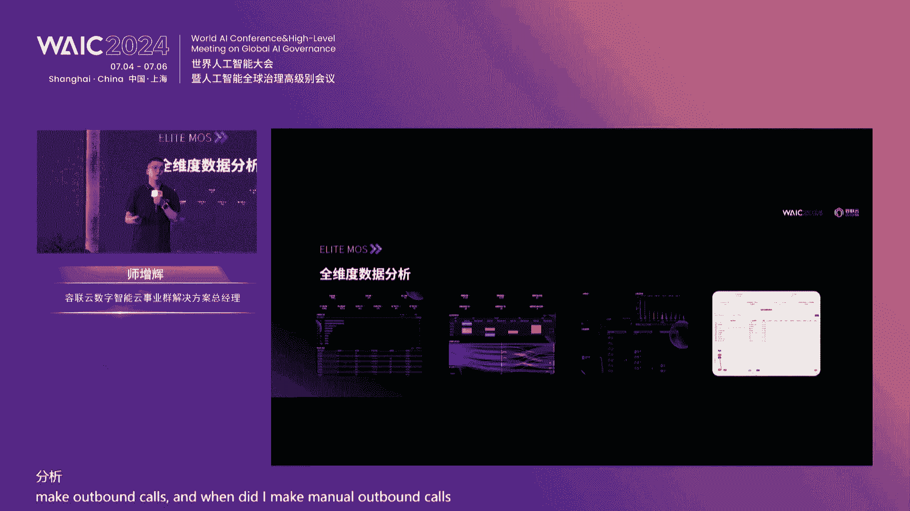
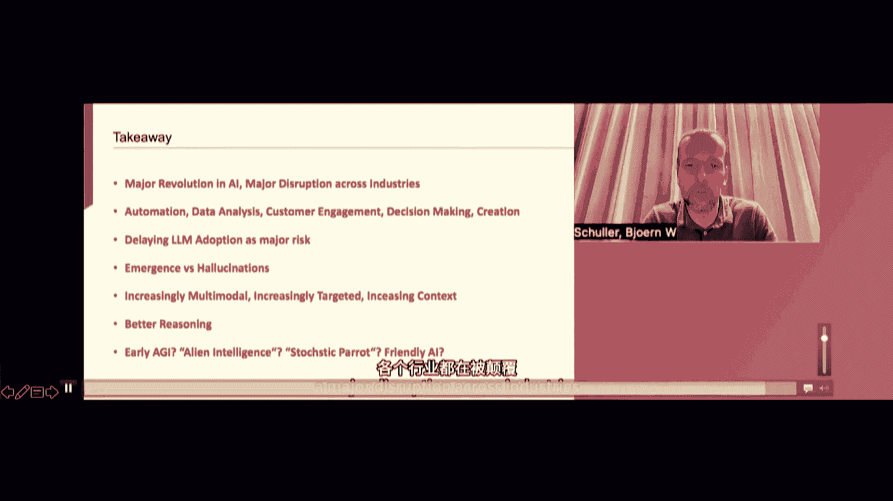

# 2024世界人工智能大会（合集） - P57：20240706-数智聚合 产业向上——容联云生成式应用与大模型商业化实践论坛 - WarrenHua - BV1iT421k7Bv

🎼现场各位尊贵的嘉宾，这里是数字聚合产业向上融联云生成式应用与大模型商业化实践论坛。本次论坛在稍后的一分钟之后呢，即将开始。再此温馨提示一下现场的各位嘉宾，将您的手机调制为静音或震动状态。

非常感谢各位的配合。那么在论坛开始之前呢，接下来也请各位嘉宾将你的目光锁定在大屏幕上，让我们共同来观看一段视频。😊，🎼现场各位尊贵的嘉宾，各位媒体朋友，大家上午好。

欢迎各位来到数字聚合产业向上融联云生城式应用与大模型商业化实践论坛。各位好，我是主持人白杨，非常高兴，也非常荣幸为大家来主持本次论坛。那么在这里我也代表融联云。

对于到场的各位嘉宾表示最为衷心的感谢和最为诚挚的欢迎欢迎大家。😊，一年前的此刻也是在这个大会上，融联云带着赤兔大模型和生成式应用产品经验亮相在世界人工智能大会。而一年前的此刻。

我也非常荣幸能够见证融联云的高光时刻。回想起来，那是一次业界比较早，也比较领先的深入探讨了垂直行业大模型。😊，时隔一年，我们再一次经历了实践和应用。在2024年的世界人工智能大会上，再一次的与大家相见。

荣联云不仅加深了对于大模型的理解，也在金融、零售、制造、汽车等多个行业实现了大模型应用的实质性突破。我们也看到了他助力了各个行业在关键业务场景的重塑，也推动了业务模式的流程和革新。

我想刚刚各位在通过我们短片的分享和观看当中，也感受到了大模型应用的实践力量。😊，🎼那今天在2024年世界人工智能大会上，融联云的论坛之上，我们迎来的是一场行业实战分享，是一次基于真实洞察的产品发布。

也是一系列关于大模型应用与实践场景的深度对话。也让我们一起在这里共同来探索实践的聚合、创新的聚合趋势的聚合。那首先啊我们将会共同来领略的是金融科技的魅力，探索智能计算如何成为推动行业革新的关键力量。

下面让我们掌声来有请中电云计算技术有限公司金融事业部的技术负责人孙鑫先生为我们带来今天的第一个主题演讲演讲内容为可信计算、驱动金融行业数字化转型的新引擎。各位掌声有请。😊，🎼嗯，各位嘉宾，各位领导。

大家好呃，我是来自中电云计算的这个金融行业的解决方案的这个负责人。然后很高兴我今天给大家分享一个我的主题。可信计算驱动金融行业数字化转型的新引擎。首先我们看一下国家政策啊。

就是国家其实高度的重视人工智能产业发展。18年的时候，习总主习总主席就是已经把人工智能放到了一个科技革命和产业变革的一个战略高度。然后呢，我们从20222020年的时候。

新一代人工智能的标准体系的建设指南到21年十四五规划的这个呃十四五规划的这个重点工作里，都提到了人工智能的一个重要的里程碑。然后呢，我们可以看到到。222年的时候。

其实对于这个创新应用场景有一些发展发展意见。然后直到我们在这个时间点，23年的时候，其实对于生城市的AI的一个整体的概念的面试。国家在政策上是鼓励各行业各领域做创新的应用。然后呢。

同时也重视算法备案制度和行业的规范规范的发展。所以可以看到，从去年中旬开始，有一个生成的生成市人工智能服务的一个暂行办法。然后这个就强调了整体的备案制度和规范范规范发展，到今年年初的时候。

其实国家数据局又在这个数据要素三年行动计划里，又重点多次提到了人工智能和场景赋能，基于数据场景。各类场景的一个哎一个推动的一个作用。然后我们中国电子云是中国电子集团CEC旗下的这个云的计算公司。

然后我们其实是秉从国家的这个人工智能发展战略的布局，然后承载着央企的这个使命担当。然后呢，我们制定了一个也是去年发布了一个可信计算的一个战略。其实是说从电子云的计算平台。

然后到N个行业的可信的计算的一个呃中心，然后到M个场景的模型。然后呢，其实是聚焦在了算法数据和算力层面上，然后整体去做了一个服务人工智能产业的一个创新。聚焦到聚焦到这个数据数据计算层面上来讲。

计算层面上来讲，我们其实有提供了一个概念叫可信计算的一个底座。这个层面其实是从这个易购的这个多元计算能力，然后统一的管理，从底到端的一个应用层面上垂时打穿了所有的一个管理平台。这个呢也是基于国家的布局。

围绕国家的这个产业布局，人工智能发展发展的引擎。我们我们成立了一我们做了一个新的一个调整。再往下可以看到就是计算计算这块的话，其实还有一部分是存储的能力。自研的高性能并发存储也是在人工智能。

包括国家的这个在新创国产化的领域里一个很大的一个空白。我们也在极地的去填补这部分的空白。还有可以看到，其实刚刚也提到了。

就是人工智能离不开数据供给安全的数据供给和可靠的供给供供给是从数据的供给方通过安全可信的交换区，然后呢到数据的需需求方，进而在上面生成了啊大模型的一些应用啊一些使用。然后呢更有一些创新的一些场景。

因为数据的流通和打通，才能促进到我们的各个的行业的垂直的一个垂类应用的一个发展。然后聚焦到金融行业，其实我们也也分析了很多很长时间，也关注很长时间。在这个应用场景和价值来讲的话，可以分为两方面。

一个方面呢可以看到是内部场景。另一方面是外部场景。内部场景其实很简单，就是可以看到像优化内部流程提高效率。比如说在主要环节研发运营产运营啊资管和合规这个层面上，然后呢有有这些主要的场景。但是从外部场景。

我们其实看到更多的创新。在这在这过去的这一年可以看到像就是金融机构与客户真正直接的这个互动，可以看到像啊市场优销营销类的智能营销和智能销售，包括用户运运运营类的这个啊智能客服。

这样的话就实现了进一步加速了金融科技的，在这个啊金融科技的这个核心价值的一个发掘。还有一块，其实我们可以看到就是基于之前的这个我们分析的这个需求。我们可以看到啊提出了三层的服务，三层一送的服务。

可以看到就是从计算中心的服务，包括通用自自建的大模型的预训练服务，还有金融客户化的大模型的服务，然后呢整体去支撑金融机构的战略转型。另外呢还有提供的这个最后一公里的大模型的集成服务。

包括一些数据预处理啊，然后呢微调啊这一些。然后展望未来，其实我们可以看到的一点是说啊基于数据，基于创新，基于场景。我们可以看到就是呃在底层的时候，其实底层的时候在底层数据天源层功能层和模型层。

其实可以做到一些啊产业体系、企业体企业评价体系，包括交易平价体系。这样的话能够把所有的数据能够横向拉通。然后呢，在更多的生态合伙伴层面上可以做更多的更多的应用。

然后这样的话变成了就是啊大数据的一个集成的服务。然后包括模型体系的丰富，包括安全的一些领域的能力。对，然后最终呢我们其实我们其实中国电子云，然后呢，包括我们中国电子集团，然后呢愿意跟同联云一起。然后呢。

我们未来展望三个方向方面。第一个方向呢是说基于我们中国电子这块的一个国家信创的一个能力的一个生态的一个分布，共与融联云共同推动人工智能国产化的一个生态。另外一块呢。

就是一起基于呃基于融联云对于这个人工智能的生成式的理解，包括他们的技术能力，然后呢过一起去创新生成式的人工智能的一些技术。在我们的信创和这个数据安全领域里。然后呢。

我们的安全底座上做一些服务这个千行百业，推动传统产业的一个智能化升级。另外呢，其实还有一块就是在强化人工智能的技术的自主安全可控层面上，减少对外部技术的依赖，支撑国家制国家的政策。

自主的这个技术创新和信息安全。如上是我的分享，感谢大家了，谢谢。谢谢非常感谢孙总的精彩演讲，请您入席落座，感谢孙总。😊，🎼刚刚大家听完了孙总的演讲。

应该说让我们看到了大模型之于金融行业给我们带来的深刻的影响。但是在最后让我感触最深的是，致力于共同推动人工智能国产化心态，能够保证我们的技术的自主化、安全的自主化。

这一点对于我们互联网来说显得非常非常的重要。所以再次把掌声送给孙总好吗？感谢他为我们今天的论坛做了一个很好的开场演讲。那么接下来呢让我们有请融岩云产业数字云VP兼诸葛智能创始人孔淼先生登台。

为我们带来的演讲主题是企业营销服务场景重塑荣溪智能大模型应用升级发布。各位掌声有请欢迎您。😊，🎼喂い？首先欢迎大家莅临我们这个深圳市人工智能的商业化时间论坛。

也很高兴今天能在这里给大家发布我们的这个全新的产品。😊，从去年呃前年底GPT发布之后，我们看到的大语言模型带来的这种技术性的革命，也让人工智能进入到一个新的一个浪潮和时代。

那融联云其实在去年的WAIC上，我们发布了我们的吃度大模型，也是比较早的就开始跟进技术。然后开始在我们的行业化的客户里面进行落地。那在去年的一年，我们可以看到，很多大的客户。

包括从这个政府到一些各个行业的头部客户都开始在陆陆续的构建自己的算计中心和自己的大模型的这种基础设施的平台。那其实融联云比较早的在推出大模型之后。

我们并行的在跟我们的客户在做深度的一些场景的一些这种探索，包括一些场景的一些价值去挖掘。那我们也很快的去发现，在我们感叹于这种新技术带来的这种突破的同时，我们依然还会面临很多问题。

比如说这个真实沟通场景的幻觉。控制。然后比如说这个大模型的算力成本的控制，以及新技术融入到企业业务流程里面的改造和管理的成本。也就意味着说。

大模型很难通过一个技术去颠覆企业内部的客服和营销的一系列的沟通场景。而更重要的其实是说我们在这个环节中还是用新技术能力，如何的做好应用落地，帮助企业真正的去实现价值的提升。所以在去年年底。

我们也推出了我们的荣西copi。那我们比较创新的是以大小模型结合的能力，来解决现在的一些幻觉的问题，包括算你的成本。在企业内部从知识流转话术挖掘绘画洞察啊，推出了我们的中西copi。

那在今年我们也可以看到，在很多头部的一些金融各个行业的客户在构建完技术设施之后，也开始在做一些场景的一些案例的探索。我们很多挖掘车场景也得到一些验证。而在今年我们随着新的这个进一步的更多的客户发布之后。

与我们的互动交流，包括一些POC测试，包括一些客户的一些这行联合场景探索之后，我们在进一步的深化了我们的一些场景，细化我们场景应用。同时，今年对于整个智能体技术，也得到了进一步的成熟。

所以结合以上我们今年又全新的去升级和发布了我们的容器智能的大模型的一些应用。那在发布之前，我们还是依然去回顾一下企业的整个营销服务的场景工作流程。我们的客户会通过不同的线上线下的各个沟通渠道。

包括了像热线的语音文本视频、企微等多种服务服务的方式，然后与我们去构建对话。那我们会首先通过一些智能对话的方式。比如说智能VR、智能的外呼智能机器人和智能问答。在解决不了的问题的情况下讲。

或者是客户的需求比较复杂的时候，再去转到人工啊在这过程中，会基于一些AI的一些引擎去构建一些智能的知识库，做起的辅助。当然为了让我们的服务的效率和质量更好。我们还会在做的管理过程中有智能陪练。啊。

在服务的管理过程中会有一些CRM等等。这个是我们的一些现状。所以我们可以看到，从15年开始。从全渠道的这个客服升级成智能化的客服之后，其实客服领域一直是智能化比较应用的比较早的一些这个场景之一。

但是其实实际上来讲，虽然我们能看到这些环节里面有很多智能化的技术和产品，但是依然没有去解决很多问题，从运营管理到客户体验。为什么呢？因为真实的公众场景往往是比较复杂的。而在过去没有大语言模型之前。

在AI没有去掌握语言能力之前，绝大多数其实我们在用人工的方式在做人工智能。也就是说我们需要极多的这种知识的管理成本和训练师的成本。把我们面向于客户的一些业务的场景，复杂业务场景，转化成一些任务。

通过这些任务，然后再上线转化成我们的一些应用的一些这种技术的一些能力。而实际上的这种开放式业务场景，不像人脸识别这种相对来讲比较封闭的业务场景是很难做到包容和兼容的那。

今天我们在整个的这个大模型进一步的技术的发展之后，我们还是提出的一些可行的产品与解决方案。那今天我们会在这个流程里面把我们原始原来的co都进一步的升级，发布升级我们5个产品。

第一个是荣西KC就是荣西knowledge pilot lot。那 knowledgeled其实是在改变了原来我们这种复杂的知识管理，然后包括这种知识应用的过程。我们通过大模型去运营知识。

并且提供企业级的产品的关理体验。而 agent是我们引入智能体的技术。在过去我们的绘画洞察更多的是把一些可能表现不好服务不好的一些绘画，通过人或者AI技术去做标注识别之后。

是事后的在做一些绘画绘画的一些洞察的处理，或者是一些BI的一些可的分析，变成我们真正的利用大模型这种智能化的意识，然后去对绘画做理解分析。

去挖掘出我们的潜在需求去诊断我们的服务流程去帮助我们去做营销特的推荐。而荣溪 agent是我们利用agent能力，在千篇一律的对链和陪练的过程中，我们用大模型去学习真实的绘画去生成我们的对链。

荣溪是我们会通过这个大模型的能力，进一步的去辅助我们坐息，实现智能化的流程导航以及智能化的话术推荐，包括快速的这种绘画的小结，从而去实现我们作息效率的进一步的提升。

而荣溪 virtual agent是我们的这个大模型的作息代理，是通过大模型去构建对话。我们原来的文本机器人在服务过程中很多的这种对话的流程流程还是在靠人的经验。

那今天我们可以用大模型去理解和阅读我们的用户的服务流程之后，通过客户的表现和服务的自动化的去构建我们文本机器人的任务流程。从而去进一步的去实现我们客户体验的提升和运营管理效率提高。

这个是我们今天发布的5款产品。那这5款产品背后从底层上来讲，我们提供的是一个完整的模型底色，还是依然是大小模型结合，包括了以类置。制度大模型，然后包括像我们也兼容管理模型管管理模块。

去可以适配更多的像智普纤问等更多的模型。同时包含的prom工程以及amending NY to circle等工大模型的一些工具。在此基础之上，还会再通过ra。

然后去通过这个方式去扩展我们更多的行业化的知识，去丰富我们对于企业业务和知识理解的能力，以及通过一些微调的工具，包括一些小模型的一些理解能力去实现我们整个性价比和实际的落地的这种算力成本的一些控制。

而在此技术之上，我们还包含的像迅推加数据飞轮去实现我们效果的不断的自学习和优化，通过向量库去更好的去理解企业内部的的这些知识和文档，然后去实现更全面的这种内部的这种知识的向量化，通过推理加速。

我们最大的性能情况来讲，我们基于原来原始的这种推理，我们可以提高4倍的这种性能，包括多模型管理更好的去适配多模型模型压缩，在接近千亿级的这种大模型。我们在做兼容的时候。

我们可以把它的启动卡从大几张缩写到小几张卡，然后降低50%以上。所以这个是我们完整的这个产品的一个这个。发布的一个方案。那首先第一个我先介绍一下我们的knowledic co大模型的知识助理。

那通过我们的大模型知识助理，我们可以实现知识成本，知识构建成本的10倍的下降。同时在知识的这种应用效率可以实现3到从原来的这种非常复杂客户的等待，可能是这种几十秒分钟级的那实现到提升到3到5秒。

那原来的这个企业内的知识管理的问题在哪呢？第一，构建成本高，检索慢，准确率低和优化难。我们知道就在整个的这个企业这个客服的这个流程中，知识库一方面是我们需要通过训拟师去构建这个知识构建的成本是非常高的。

其次是知识库对于原来的知识文档的管理，更多的只有存储没有理解。而实际上在我们整个生产场景中，我们的客服在去利用这些知识库的时候，依靠关键字和检索命中率很低，检索时间很长。而且我们在客户的反馈过程中。

其实这种使用反馈和效果的优化其实是难以去联动。那。通过话，其实我们可以降低知识库的个成本，提升知识的应用效率。怎么做呢？首先从训练师到知识库的管理，我们可以一键生传。通过大模型自动的去拆以切分，然抽取。

并且我们对所有的文档其实是了整个知识和包文档里面如果有一些多模态的图片些内容。我们是链化，包括对于企业内的一些行业的知识产品的一些信息等等，是做的行业知识的向链化。而面向于整个人库服过程中呢。

我们用的大模型加这种技术实现大模型去理解用户的上下文，通过知识准确的去召回和模的总结，并且在使用的应用场景过程中，我们还比较关注的很多复杂场景业务细节，我们可以快速的去定位到所有的回复的内容。

保证我们在回复过程中真实的生产场景中实现这种严谨性和客户的这种高效的种反馈，不模型这种这种这种。花烂坠的这种词藻，这种其实反而会影响整个服务的效率。并且在实整个客户的使用过程中，我们还构建了数据的飞轮。

根据用户的反馈，去实现我们数据，包括我们模型的一些优化。我们整个容器的整个的架构是从底层，我们是做从包括像多模态文档音视频等数据的管理。在上层算法层。

我们使用的LOP一些工程模型管理等一些算法模型中的一些技术。而在功能层功能层去提供的像多模态的这种知识问答等等这些非常丰富的一些功能。而在应用层。

我们可以把我们的产品以嵌入式的或者独立式的部署的方式去内置到我们的一些比如说这个坐骑的辅助工作台文本机器人企业微信等等。

而在用户层去满足我们的客服运营客户经理IT以及合规消保等丰富的这种这种呃使用的这种坐息的一些场景。那下面是我们的一个产品的一个介绍视频。首先我们是企业级的流程协同。

我们都知道市面上有很多这种现代新的大模型知识库产品，他们更多的是以对话的方式去实现知识的这种大模型能力的提升。而实则来讲。

企业内部其实整个知识的管理和运用是一套复杂的企业级的一些流程流程的一套模式作一模式。所以我们是支持整个企业级流程。并且对于企业内部的行业知识，我们也支持与企业内的数据。

因为大模型更多的是一些通用的行业通用的这种b就是互联网的知识去压缩。对于企业内知识是不太了解的。并且对于复杂业务场景里面比说一些复杂的文档里面包含非常复杂的一些格式，包括回答过程中。

其实我要严谨的按照企业内的规范，包括回答之后我们需要有一些更好的一些反馈。那这个整个过程中其实我们会对整个复杂业务场景做非常多的细节的一些设计。O。接下来介绍我们第二款产品。

就是大模型洞察代理融CIA实现整个洞察的升级，可以实现我们营销转化率5%到8%的提升，客诉率10%到30%的下降，去优化我们体验和我们的服务的质量。那。😡，我们以前对于绘画的洞察，更多的理解。

其实就是对于绘画的标注以及这种可BI的这种标注之后去做一些执行和可视化的一些分析。而事实上来讲，绘画数据里面包含了非常多有价值的信息，揭示了客需客诉商机也反映了服务的不足与这些浪费。

那今天其实我们可以看到，人工抽查人工抽查虽然效果好，但是不全面效率低。而小模型训练的成本是比较高的。那容 insideside agent其实会通过智能体的方式去优化我们的体验，提升服务质量。

去打造我们企业竞争力。怎么做呢？首先第一个我们会通过去定我们业务目标，基于业务目标的输入，我们多方式然去包括像在做服助去找到最优的流程，在工作台里面去发现潜在需求。

然后去洞察这种潜在的客诉去完善我们客户画像然去实现我们工作内容的分类，每一个其实都会方式去实现。那我以潜在需求挖掘的这个为例，我们都知道整个的智能体的实是有一道范式的。因为有的大模型有的这种智能化能力。

首先第一个它可以大脑一去在记忆。过记忆去理解目之实现规划利用工具去行动。这是今天我们整个智能体模模式个式个新的业务服务的一范式以的这种软件模式是不一样的。是一个更加的更优的端到端的自动的去完成一些工。

做流程业务目标的方式。那我们以潜在需求我们的inside agent比如说在找出客户潜在需求这个场景下，我们是怎么做的呢？首先我们会阅读很多绘画这些绘画的场景和绘画洞察，我们会实现长期记忆。

而在每一个绘画的片段过程中，我们去挖挖掘潜在的基于长期记忆再去挖掘短期的记就是去挖掘这种潜在一些需求。而有的对于记忆的理解之后，然后我们再去实基于我们对于绘画的这种需求挖掘目标的一个关联。

再去实现这种规划。包括从这个绘画的这个内容理解到潜在需求点的挖掘，到潜在需求点的分类，到潜在需求的设计。当做完这种任务规划之后，我们在利用现有的一些工具的能力，包括一些小模型的能力。

包括我们一些自动化一工具能力等等，包括我们一知识库的一AP等等。那实现包括像SR知识库任务抽取要总结标记标签人工审核等等。这都是我们可利用的工具。从而再去进一步的去利用它做一些自动化的一些行动。

去输出我们的潜在需求和可视化的一些分析。😊，那整个的这个容器inside agent大型动态代理的产品的架构是，首先我们也是会接入全面的这种绘画数据。

然后在算法模型层也是有非常多的这种算法的这种大小模型的算法选择。在功能层也非常丰富的提供的非常完整的功能。在应用层也是一样。我们可以跟做些辅助工作台。然后包括大模型话术挖掘标签系统工单系统时间对接。

从而去实现我们客服语音销售运营和消宝等不同的这种作为场景的这种洞察的这种效率的一些提升。那这个是我们整个这个荣器IA的一些这个产品的一些演示，也是很简单的。我们首先第一个第个目标，其实接入数据之后。

通过大模型去自助挖掘。比如说我们去挖掘投诉点。然后设置完之后，整个过程中是大模型智能体自己完成的。它就会去输出现在的一些这种潜在的需求啊，服务的一些情况。然后在可视化的展现出来，去看到我们的些潜在需求。

也可以去看到我们服务流程的一些诊断，包括我们也可以看到一些画术去提炼出的一些营销策略的一些推荐。那第三款是我们的容溪CA，就是我们的coag这个大模型的这个陪练代理。那通过我们大模型陪练代理。

其实可以实现我们第一培训周期缩短15%。然后绘画的违规率可以降低10%到20%。人均的违人均的这个培训成本可以下降12%。那在过往的整个的这个陪练过程中，训练是比较单一的，构建成本也是比较高的。

是难以高效输出的。因为我们往往是通过主管，其实是做为一些陪练的课件学习任务给到对炼机器人，然后再去对我们做些做做对练，然后再通过考试任务考题，然后再去做陪练考试的一些评分。这过程中。

我们的课件和任务经常会千篇一律，重复性的学习。而我们的这个这个训练的这个。考试任我考试试题也是也是千篇一律。然后那。容溪的整个是怎么解决呢？我们其实会通过智能体去做一些实战陪练。

精准的提升量化培训效果去降本增效。第一个就是说在培练陪练课件和这个学习任务过程中，我们会通过大模型的话术挖掘和个性化的一些对练。利用大模型能力。

其实是我们会从真实的绘画数数据中去挖掘出我们的一些陪练材料，然后去生成我们的一些对链的一些任务。而整个题库也是利用大模型的能力去生成我们的一些考题，并且在最后的扣这个做席的这个陪练过程中。

我们还会去跟踪它的学习的这个情况，然后去生成画像，基于画像每一个坐席，它到底是在比如开展白还是服务过程中的某个环节，然后落在哪，我们其实都会去针对性的去提出一些建议。

然后再去针对性的去生成一些个性化的一些任务，做陪练的提升。那这个是我们容西co的一些产品的一个流程。那首先第一个我们也是通过进入绘画之后，然后去做一些话术的一些挖掘。挖掘完之后。

我们就可以做题供的一些生产。然后我们再去创建我们个性化对内任务，包括像文本的一些这个个性化对列，以及像语内的个性化对列，我们也都是全部支持的。

然后这个是我们容溪co agent的大模型陪练代理的这个产品架构啊，也是数据文数据管理。我们可以把各种知识动模态的一些数据我们可以接入进来之后，然后算法模型层也是提供了大小模型结合的一些算法能力。

然后非常丰富的功能。然后在应用层最后实现我们新员工培训新产品话术、销售沟能技巧和规风险知识等不同场景下的这种陪练的效率的提升。那荣西AC就是我们大模型的这个坐席助理agent call pilot。

那他可以去实现客户投诉率下降10%，业务的提效10%到30%。我们都知道，在整个坐席转到人工坐席的过程中，那坐席其实现在我们今天在这个工作过程中话术比较少，然后质量其实是比较低的。然后并并且我们。

这个人工坐席的服务过程中，其实主管也很难去监听这个质量效果是难追踪的。并且这个最后结单的时候，其实这个画时间也比较长，因为要通过人工去输入一些工单。而我们给到客户的体验其实也比较差的。

基本上就是为我们困。所以我们造成这个服务中话术不统服务不标实客户的体验和体感也是不太好的那我们以提升整个服务质量效率怎么去做呢？首先第一个我们会基于绘画数据，然后基于我们最后绘画的转化效果。

其实是做话术的挖掘。这样话实我们以更好的过大型去解掘话术给人工坐席。并且在这个实过中我们会对坐沟通中这情绪语速行为做一个实时质检，并且在结束之后。

我们会大模型去一些绘画的结实绘画不只是小节更加是快捷速下一绘画整个过程中在客户与坐席的服务程中呢，我们就可以实对于坐席的实时动态的流程。😊，导航以及动态的话术的策略的一些推荐。

从而去实现客户这种销这种销售与客服与坐席与客户沟通中的千人千面。这个是我们大模型作做席的这个助理的整个的产品架构。那绘画数据，我们也是从呼叫中心到各个渠道的这种全渠道的这种绘画数据接入。

然后算法功能层之上。我们的应用层，一个是我们可以以插件SDK的不同的方式集成在CRM的工作台里面。然后包括像API的方式，也可以去对接现有的一些系统，在用户层。

包括像客服语音销售信审、消宝等不同场景都可以去做一些应用。那这个其实是我们的一个产品的一个一个流程图。首先第一个我们会配置不同的业务场景。因为我们不同的业务场景，可以配置不一样的这个知识和流程。

然后通过大模型话术，我们还是会去挖掘出一些这个客户好的一些话术和回复的一些策略。并且在这个对话过程中，我们可以去实现这种金牌话术和实施的一些流程的一些导航。然后在过程中。

我们还可以做一些智能的填单和小结。大模型可以实时去提取对话内容，去理解上下文，去缩好缩短我们的整个画物时间。然后并且在绘画过程中，我们会做实时监控，包括他的一些情绪语速等等，并且做监控和预警的一些提醒。

然后。而且我们不只是在推荐话术，我们我们会发现纯粹推荐话术的时候，其实表现也不会特别好。所以我们现在推荐的是话术的一些策略。😊，这个是我们的一些系统的一些演示的一些效果。好。

最后一个这个发布的是我们的大模型作业代理，容器VA就是我们的虚拟代理。那它其实可以提有效的去实现我们服务的覆盖率的提高，提升30%。然后实现我们转人功率下降50%。

我们现在的整个文本机器人和整个客户的沟通过程中，其实机器人坐席有几个问题，第一是服务比较僵化，理解比较差，成本也比较高，响应也比较慢。主要问题就是说整个坐席其实在知识库过程中。

其实也是依整个的这个机器人的流程和知识，也是依赖于人工的这个经验。就即使用AI用原来小也依赖人工的经验去一些构建。然后训练成本也是比较高的那客户的这个过程中其实感受上来讲。

其实因为真实的这客户沟通场景往往是非泛。那以从客户的沟通过程中实经常还是得答非所问。然后回复千篇一律语义的理解不准。并且这个如说要转人工的话服务响应比慢。而且对于企业来讲人工的成本也比较高。

而实我们是也是通过智能体的方式去低成本高效的提升我们服务质量然后以及提升的这个范围降低我们转人工率怎么去做呢？首先第一个是我们会首先我们会把整个绘画一些理解消洞察之后。

我们会通过绘画去挖掘我们的任务流程。去洞察和提炼我们绘画的流程去智能化的去构建替代人工的经验去构建我。😊，任务的一些流程。然后在整个的客户与机器人作席过程中，本身就会用大模型的这种这种语义理解能力。

然后去方法的一些能力去对上角文去做精准的匹配。并且在事后我们还可以再通过大模型去对绘画的这个需求挖掘之后，找到自动化的流程的这种性价比比较高的转人工的流程，然后去实现流程RY的一些提升。😊。

那整个智能体的模式是什么样子？刚刚已经讲过智能体的范式嘛？也是一样的，就是我们会对客户的场景绘画数据文档知识，其实做长期的记忆。然后在短期里面其实从绘画里面去做流资和咨询的一些挖掘。

然后再去做一些任务的规划，从需求识别到匹配任务流程，到客户信息记录到工单录入CM信息，在沟通内容的挖掘，包括任务流程的一些洞察。这里面也会利用到刚刚的很多一些工具，从意度识别。

然SR知识库沟通策略的提取绘画小结等等这些工具，然后去实现这种咨询答疑和工单录入。😊，这个是我们整个VA就是我chA的大模型做机代理的这个整个的产品架构啊。

然后通过我们整个的VI可以实现从客户咨询对内办公，然后营销接待和业务办理的各种全面的一种提升。而且整个应用方式也是从呃官网APP小程序各个渠道，包括SDKAPI各种方式。

也是非常灵活的可可以和现在的这个客户的这些系统和流程进行一些结合。无需重复的一些建设。这个是我们的产品流程。可以看到我们自定义一个大模型挖掘目标之后，我们就会去输出整个的客户的服务的这些路径。

路径完之后，我们就可以选择路径去做这种智能体的构建。我们都知道，现在有很多智能体的产品啊，包括像自己的扣子啊，像包括很多国外的很多智能体的产品。但是他们其实跟原来低代码一样。

就是他需要自己去手把手的所有东西创建起来。但是绝大多数的行业客户其实他是缺少多耗的那我们其实会通过基于绘画的这个真实转化数据，一键式的去构建好智能体，然后再一件式去应用。

这样的话会比纯粹的去做智能体的构建，要成本更低效率更高，而且更专业。好，这个最后再回顾一下我们今天这个发布的5款产品。那容器的大模型智能应用。简单来讲，第一我们是可以自有化的部署的。

然后这是全面的私有化的整个解决方案。第二是我们做的大小模型结合。所以消费计算里即可应用。第三是我们的整个产品无论是从独立的去购买容器智能的全套解决方案。

还是说我们做嵌入式的I植入到我们现有已有的一些这个CC平台平台或者是这个辅助等不同的这种产品中以浏览器K等多种方式都可以做嵌入智能。

那最后还是在一句话总结我们的产品容器大模型的支持助理是通过大模型去运营支持容。😊，我们大模型的这个绘画洞察助理，通过大模型去自自主去洞察荣溪CA这个coag通过大模型生的对列，实现我们陪练的效价值提升。

荣溪ag大模型的辅助作息，去更好的去帮助作席的效率，客户的体验提升。荣通过大模型构建绘画，实现原传统文明经人的颠覆，更好的客户的问答体验，更高的运营管理效率。谢谢。🎼谢谢，非常感谢孔总给我们带来的分享。

请孔总入席落座。刚刚孔总为我们来分享了容机智能大模型应用升级的一系列发布。我们也看到了未来将会为千行百业带来实际助力，成为企业智能化转型的领航员。那说到这里，我想大家也一定非常好奇。

容机智能大模型到底是怎样来聚合数质力量，帮助企业更好的发展呢。那接下来就让我们来有请荣联云大模型产品负责人唐新才先生，为大家带来真正懂行业的企业及AI领航员、容机智能大模型应用多行业实践的主题分享。

各位掌声欢迎。😊，🎼大家上午好啊，我今天带来的分享主要是结合刚才孔总发发布的那几款产品，然后一些落地的一些案例，然后以及在客户现场取得的一些效果啊，或者实施方面的一些事情啊。然后在讲案例之前呢。

就是我汇总了一下，最近几个月吧，然后这个沟通过的150多家客户，大家关心的一些问题啊，包括了这个落地场景啊，不同模型之间的区别啊，以及落地周期，包括怎么去维护啊，或者是调优方面的一些事情。

和现有的系统怎么去结合。这可能是大家每一个客户去真正去使用这个应用的时候关心的一些具体的问题啊。然后我们在呃想看一下，就是我们在选场景的时候是怎么选的啊，就是呃围绕着两个维度吧。

第一个就是大应用确实很多。然后这几天大家也可以看到，就是呃都在说哎要卷应用或者是要什么的这种呼声啊，其实应用方面呢也是参考两个维度。第一个就是技术。😊，第二个就是价业务价值。然后呢。

我们这也是在这个呃我们融联最擅长的这个领域呃起步，就是说客服中心和围绕着这个智能客服，然后也是可行性最高的这个领域出发啊，然后也是同步在探索呃这个更深业务链的一些应用啊和和产品，比如说这个产品推荐啊。

或者是理财相关的这些呃应用案例啊。然后接下来我讲的案例呢，可能更多的是围绕着这个我们比较成熟的这个客服这块的东西。然后我今天准备了有4个场景的案例。第一个就是呃这个保险客服啊，保险服务方面的这个应用。

第二个就是制造业有这个维修工单或者是这个检修相关的这个模型的这种赋能，还有这个寿险线上线下的这种服务能力，还有那个银行柜台网点啊，网点的那个业务人员的使用的一些场景。那第一个来说的话就是呃保险服务。

大家知道就是保险服务这个场景呢，每天有400的电话呼入，还有去电销人员会打出很多电话啊，这个电话呢会产生大量的录音。那这个录音文件呢，在之前大部分的使用呃逻辑就是围绕着话务分析嘛。就比如说呃打了多少通。

打了多少时长啊，这是主要的应用价值。其实大家也发现刚才孔总也讲，就是其实呃内在的内容是呃蕴含着很多潜在的东西啊。比如说这个呃潜在需求啊或者是投诉啊啊，相关的一些潜在的挖掘价值。但放在之前的技术也好。

或者是呃产品能力也好，其实很难被使用或者是挖掘出来啊啊，这个是这个难以挖掘出来，其实呃最根本的问题。比如说一个是量大。比如说量少的话，我们人可以去听一听是吧？可以总结一下就能解决。

但是如果说一天有几万或者几十万的这种。😊，录音的话就很难去靠人去去去弄啊。那第二个就是说人去听，或者是人去总结的话，也有一个标准的问题啊，就是说难以标准化，或者是提炼的是不是能够呃高效啊，对。

这个是其实一个一个一个对比吧，就是说呃原有的模式去人去听，然后现有的模式可以靠模型去理解，那理解的时候，它的方向呢也是有这几个方向，就是说呃我们在实际落地的时候发现啊录音里面有很多潜在的东西。

就比如说客户需求。那客户需求来自于说我表达了一个对什么感兴趣的东西。这个东西其实可能还没有落到说我明确要某个产品啊，它其实是一个潜在的一个呃一个意愿啊啊，包括客诉。其实客诉呢。

现在大家以是说统计已经发生的投诉啊，但是说在实际的对话过程中或者是通话对话的通话的过程中，呃我表达了对什么不满，这种不满呢很有可能就会转成投诉，对吧？如果说你。及时的发现，后面真正的是发生了投诉。

他其实呃都比较晚了哈。然后这个还有流程的断点。其实是如果说我们不去洞察呃分析它服务的整个链路的话，我们很难发现在哪个地方断掉了，或者是呃流程有终断的地方。那我们怎么提升啊。

这个其实都是很难去去去去解决的那他解决这些问题呢，其实在呃客户侧也解也总结了几个点啊，就是说呃提升服务啊，或者是可以改善产品啊呃这个还有这个提升整个竞争力，那怎么理解呢？

其实说呃这个提升竞争力是说啊我这个公司采用了这种最优的方案是吧？能够及时的发现这些需求，或者是这些呃潜在的投诉啊，其他家没有采用啊，可能就是说呃这个呃竞争力就强嘛，或者是及时发现嘛。然后那个。😊。

改善产品呢就是说大家对某款产品存在潜在的这种投诉的不满的地方，我去发现了，然后去采用运营策略也好，或者采用其他的方案也好去改善。那可能这个大家对这个产品呃，是有一个比较好的体验啊。

这个是我们实际去发现的东西啊，我我在这个里面是挖了2块东西，一个是大家的咨询，另一个是这个投诉，我举一个例子，就是投诉的例子。那他没有真正发生投诉。但是他表达了我这个保单啊，我这保单不能续期。

就是我保单到期了，无法续期的一个不满啊，这种不满呢其实是来自于我这个他是实际情况，实际情况是呃这个我打电话我出险了，对吧？出险了，按照保险的规定就是不能续期。但是呢这个客户的不满来自于我才知道是吧？

到期了，我才知道不能续期，这个对他的影响可能非常大啊，这个所以说他就打电话过来说这个为什么没有提前告知我，或者是我为什么现在才知道啊，所以说这个。😊，他就会非常不满。如果说这种情况比较多的话。

那对我们的客诉压力其实是非常大的啊。😊，那现在大模型来了之后呢，可以就是很好的去发现这些点，然后给我们的决策或者管理者能够提供很好的这种响应的时间啊，或者是一些方案。

那呃一个是提取到这些潜在的不满的地方。另一个呢是我们也可以通过模型给出建议。这个建议来自于比较好的坐席，有经验的坐席。在面对这种不满的时候，他可能安抚的比较好。

那安或者是采取的话术安抚策略或者是一些建议，其实都可以通模型，然后去提取出来，然后给出呃一些建议和执行的方案啊。对。😊，这个是呃实际落地的一个资源消耗。

比如说客户那边其实是实际要要求的是一个使用的是1个A100的一张卡啊一张卡。对，所以他每天呃处理的挥发量应该有1万多啊，然后参数模型呢也不大，就是14B的模型。

然后整个效果呢就是从呃效率提升了基本上是20倍。然后发现的客诉呢，按照预估来说是能够发现这种降低潜在的投诉能够达到10%左右啊，所以说并且能发现他客户对哪一款产品具体的点是有问题的。

那第二个是一个电器上门维修啊，大家可以如果说对制造业呃了解一些的话，就是说呃知道这个上门检修这个过程，特别是呃商场呀，或者是呃这个地铁呀，这种公共设施里面的这种大面积这种如果说电器发生问题。

其实是影响是非常大的。但是呢这个上门检修的整个过程是一般是客户用户那边去呃报故障，然后总部那边派工单，然后派工单呢，当地的师傅会上门检修，然后填写工单内容。这个时候呢，其实总部的也在做一个事情。

就是说呃会发现到底有没有大批量的故障问题，以免造成大这种批量投诉或者是故障问题啊。但是呢你当地的这种师傅填工单的时候，呃，其实是很难去培训或者标准化的，一般都是口语或者当地的这种外包的人员去填的呃。

这种问题呢就是说总部就会发呃去去消耗大量的人力去呃统计啊，去予以理解。分类啊啊这放在之前的话呃，其实就是靠流转会非常慢嘛，然后呃很容易发生这种预警不及时的这种问题啊。这个是实际的一个一个情况啊。

就是说你看可以看到左边大家是之前是怎么做的。其实在靠关键词嘛，比如说压缩机故障啊，这个电器的压缩故障，那压缩机故障有可能说填填的那个工单内容填的就是压缩机故障。还有可能就是说检修压缩机正常。

其实是显卡故障是吧？如果说靠这个关键词检索呢，大家肯定发生都都会命中压缩机。那这种那个准确率后面也提到就是说基本上在40%左右。那按照大模型现在予以理解，大家如果说体验过大模型的能力的时候。

他大模型对这种文本的理解是非常准确的对吧？不管你怎么描述，最终说哎你只要是说压缩机故障还是显卡故障，其实他最最终给的这个结论就是某个故障。

所以说我们在这个模型的洞察能力上也设定了这种提取的标签的这种能力啊，可以快速把工单处理掉，然后给他们一个分类或者是分拣的这种预警策略。😊，他整个准确率呢是从从40%提升到80%左右。

然后从预警的这种呃周期呢变成了周或者是到到这种天的这种级别。他大家可能也关心这个算力的消耗。当时是采用了4张V100。然后7B的模型啊，稍微做一些训练，就能处理到这个。呃，工单处理到1万左右啊。

其实这个这个成本还是不算高啊嗯。第三个就是说我们在呃寿险服务的场景里面，大家也知道这个寿险呃售后的服务啊，比如说保全变更啊，或者是服务咨询啊这种场景里面呃，这个大家的这种业务的增长，其实是靠人去解决嘛。

要么就是人去提供这些服务，要么就是啊我的这种智能化或者自动化的那种能力能响应这些服务是吧？但是呢说你这个自动化的呃程度或者自动化的改造，从哪开始啊，其实是没有人能呃准确的说出来，针对于我这家企业。

我到底是应该最先优化哪个流程啊，放在之前的话，其实大部分是靠人的经验，说啊你应该上一个机器人还是上一个这个电销的这种服务啊。😊，那现在呢其实说我们第一个是不知道该从哪优化开始啊。

第一个就是我优化的流程有哪些啊，第二个就是我就算上了这个机器人，他的服务效果和能力啊，是不是足够的个性化，或者是这种呃能够理解客户的这种意图，能够啊甚至是多意图啊，或者是多轮的这种问答啊。

是不是能解决的很好啊。对。这个是我们实际根据客户的服务数据，我们是拿了最近半年的服务数据统计发现啊，统计发现它的保全变更啊，整个人工处理的流程是占比最多的。

也就是说我们如果说把保全变更和呃这种这个交费账号信息变更的这种自动化处理掉。其实他节省的就是这个70%多的这种这种服务的量。对，然后我们第一步呢其实就是通过呃大模型和这种洞察能力发现他这种业务流程。

然后去构建流程，这个构建流程来自于之前人工客服服务过程的这种流程。他这样的话就是比较贴合他自己的这种服务的呃这个实际情况吧，对吧？比如说他内部流转这种保全变更或者是信息变更的流程实际是什么样子的。

这样的话，大模型提取出来之后，做人工审核就可以直接呃做到大模型的这种响应机制里面去。对，这是实际的一个一个。截图啊，就是说之前的话他的这个服务流程是我问一个问题，他可能回复的是一个操作步骤。

就是说我要呃变更账号信息，他可下你第一步应该去啊哪个地方点哪个按钮去怎么操作。但是这个时候如果说有一些动手能力差的客户用户来说，他就很难去操作这个事情，他就可能就放弃了，直接就打电话，你帮我做吧，对吧？

或者直接转人工，你帮我改一下。那现在呢大模型呢，他其实在语音理解上能够做到很好的响应，能知道你要改什么，然后这样的话他能够给你一个很好的回复。并且这个回复呢，大家也知道就是他是很容易做到个性化的。

也就是说我让模型在这个节点上收集客户的信息，比如说问他的这个呃手机号或者是他有100种问法，有可能针对于上下文的语境。当时的情况，他的问的问句或者是这种情绪或者这种措辞都是不一样的那他会不会发生幻觉呢。

也就是说经过我们发现呢，就是说呃如果说你在指定目标的情况下。😊，就是说你就是你就是在这个场景下，你就帮我收集客户的手机号就行了啊，就是明确的告诉呃prom定义，它就不会发生幻觉。

就是说他的只是说围绕着这个手机号收集去去给你啊问出去这个这个这个问句啊，然这样的话，它并且能够呃能够在刚才我们构建的的流程里面自动去流转。这个流程呢，如果说服务的效果呃，好与不好。

他并且可以通过数据飞轮的这种方式去优化它的流程。这样达到一个很好的服务方式啊。😊，这个实际取得的一个效果，就是说在呃通过这种流程构建和这种啊大模型的这种多轮问答和意图的识别反馈。

可以把呃变更和这种申请的这种呃自动化程度提升到75%，之前是30%多啊。最后一个这个场景呢就是我们的营业网点，就是营业网点办理业务的授信人员呢，他每天面临着办理，比如说贷款业务呀。

或者是这种外汇业务呀呃，但是他们办办理这种业务的时候呢，就会面临很多政策嘛，或者是法规文件内部产品的介绍或者要求。并且这些政策文件产品要求都会存在一个有效期的问题啊。

就是当前最有效的或者是生效的文件是什么样子的。如果说要靠人去积累记忆这么大量的文件，除非一个老业务人员经常办这个业务啊，其实很多人其他就是很难去呃记录这些这些这些内容呢去去办理啊。那他们所面一个现状。

就是说他的服务时间能不能得到一个很好的响应，就是说我这边要办业务了，你那边去咨询其他员工或者是咨询上级去了，然后他这样呢整个周期和时间体验都是很差的对吧？然后这就是我们发现的一些实际的一些政策文件。

比如说他一些外汇政策，这截取的一部分，其实实际的情况要比这个真正的还要多的多，大概有这个150到200左右，就是这一个业务来说，所以说靠人去检索这种知识或者去办理这个业务依靠的话，其实很难的。

然后这是一个对比，对吧？左边的话是原有模式，然后提供的呃提供的是一个文件检索，那关键文件检索就是靠关键字或者是顶多加上一些文件命中，但这种的实际网点应用人员实际看来话，他很难去用，他也不去用。

他直接就是办理业务的直接就打电话了，对吧？咨询总行的人这个去问这个我这个授信到底能不能给。或者是依据是什么。所以说这个东西呃他就很难去用起来。那造成的就是说呃我们在实际的银行里面。

他就是呃要在总行配备相应的人啊给网点的这个授信的人员提供支持。那每个人呢可能在支持的过程中每天要接待这个二三十个咨询啊这种的咨询其耗费了大量的这种经力啊。

然后如说后边的话就是我们把这些文档通过模型刚才提到就是那个ledge后那个通过G这种文档的拆解的理解。然后能够形成一个业务人员的一个助手当然也有很多的这个地方可以用于不光是授信业务。

比如说有一些做消保的，也可能是面相应的一些政策去做这一个助手。那这个助手呢就可以做到给业务人员一个很好的个响应。当他需要这个相应的答案的时能够准确给出来，并且能够一个政策依据？

说我给答案是依据的是哪个条款，然后直接。😊，能够给他命中，这样的话来来让他一个很好的一个响应这个客户的一个诉求。如果说文件里面解决不了的，他可能会涉及到才会涉及到去咨询领导或者是咨询上级。

然后我们估计下来就整个占比啊，就是整个政策文件里面包含的内容能够占到70%啊，基本上这么一个状态，也就是他呃这个检索时间能够很很就是很大的一个下降，然后解索面容率也是一个很好的效果。

那整个大家可以判断下来，就是如果说这么一个助手的话，到底消耗多大的一个算力啊，它的投入成本到底有多大。当时是我们是投入了8张A40啊，其实它的模型参数量是72B的。但是如果说真实的再去优化的话。

其实用不了72B的。比如32或者14的，其实也可以去用。然后卡的话，A40其实也不是价格也不是很高啊，然后那个4张啊也也能去跑。然后他的文档数量和支持的人数呢也能支持一个很好的一个一个一个量。对。😊。

好，谢谢大家。😊，🎼谢谢，非常感谢唐总给我们带来的精彩分享，请唐总入席乐座。千人千面，让服务更具个性化。解决行业内所面临的痛点，让企业服务更具效率化，并且呢也能够解决很多实质的问题，真正的降本增效。

我想刚刚唐总给我们带来的一系列分享，也让我们看到了大模型在行业落地的实际应用。特别是也以卓越的实力赢得了国内外数万家头部行业客户的信赖。当我看到哈无论是刚刚几位嘉宾的分享当中都提到了银行。

那今天呢在银行领域更是有成熟的经验，也值得大家共同借鉴。下面让我们掌声来有请中国邮政储蓄银行副处长大模型技术负责人李培女士，为我们来讲述中国邮政储蓄银行大模型探索与应用实践。各位掌声欢迎。😊。

各位领导嘉宾好，那个我是邮储银行李培。那个下面我代表邮储银行介绍一下我们行在大模型应用方面的一些探索和应用。刚才也也听到了咱们融联云的各位领导介绍一下这个大模型技术在客服领域的应用。

我们听了也非常兴奋啊，就是银行其实是大模型落地的一个最优秀的场景，因为银行也自带这个丰厚数据的属性，是前智能化也在各行业做在比较前列的一个方面。

那我首先来介绍一下我们行的一个科技战略布局的加速度的一个布局。嗯，第一个是智慧smart，然后就是以邮储大脑为依托去构建精准智能的业务拓展风险防控经营管理能力平台构建共享复用的平台模式。

生态 system对用户和生态伙伴实现开放互联体验就是我们用户体就是带来极致的用户体验。还有就是数字化。实现邮政金融的全面数字化协同，就是要实现游银业绩总分母子的高效协同。

那在这个生成式这个大模型来的时代啊，我们行的这个企业级创新平台也正在从这个邮储大脑1。0向2。0升级，有感知洞察，向生成创作进行提升。那在1。0时代呀。

我们已经建设了机器学习平台、知识图谱平台和物联网三大平台。在这三大平台之上呢，我们也建了六大能力，包含的感知的生物识别、语言语音、智能图像，以及洞察包含了智能决策、智能图谱和智慧物联。那在这个基础上呢。

我们有以大模型为基础，以大模型平台为基础，新建了我们这个生成式能力，围绕我们这个大模型平台，还有多元算力调度为基础。然后加上向量数据库的支持。

新建了包括文本生成图像生成语音生成多模态理解、对话能力等功能，从而支撑了我们行的新的交叉型的创新应用，包括数字员工虚拟营业厅智能的这个呃流程自动。还有卡面纹身图知识文答等比较多的这个应用。

这张图啊是我们就是总结的哈，就是因为我们处在呃邮储银行是负责全行所有大模型场景应用的建设。那业务部门呢也是总体来看是业务部门有需求，它有很多很多的场景。那我们这个行业诉求。

是银行业是有这个雄心是说用大模型技术对银行业的所有应用进行整体的一个升级。那对于我们来说呢，面对这么多的场景，我们怎么以点带面的去推进它的建设呢？那首先我们在用大模型赋能的时候，我们先总结了一下。

我们在赋能什么？那我们看这八大领域包含了研发测试零售领域，公司金融资管金融、客户服务、风险信贷综合办公和运营领域，在我们收集场景的过程中呢，也多达100个场景。

包研发测试呢主要包括开发测试、零售领域呢主要包括营销文案内容生成。那公司领域呢主要包。😊，含报告撰写交易监测自管领域主要包含了智能投研和量化交易。那客户服务呢，像刚才咱们中年云的这个领导都介绍了。

就很相似的场景。智能客服、外呼营销、贷款助手风险信贷呢，包括了合同审查。这个风险测评。综合办公包含了员工助手文档摘要运营领域呢，包括这个柜员助手智能文答数字柜员等场景。那面对如此多多的场景呢。

我们我们也新建设了我们大模型的一个应用架构自下而上的分成算力层、数据层、模型层、平台层场景层和接入层。那大家来看模型层。我们为什么要建我们在这个通用大模型基础之上，也新建了各个领域的模型领域模型。

然后对应的就是我们这个八大的业务场景。从而加速我们八大场景的建设，去支持我们行的渠道，面课提升体验，面向员工去提升去降本增效。那为了加速我们这个八大业务领域的这个建设，我们。😊。

在对我们的这个所建设的内容进行了再一次的抽象和聚合。大家可以看一下，我们提出了这个智能中枢加应用范式的这种概念，去综合调度这种规模化推进场景的落地，同时并行支撑这种八大业务闭环的场景。那目前来看呢。

我们行企的比较多的这种应用范式。可能银行业也是一种趋势，包含了检索增强文档写作数据分析陪伴助手智能陪练等场景。那大模型智能中枢的提出是为什么呢？是因为啊就是在我们银行业去年可能大模型的应用。

大家都非常的卷呃，百花齐放，可能行内存在多个这种检索增强的这个应用，包括数据分析，也有新建的一些应用。那我们不可能是抛弃之前的任何一个应用，去新建一个企业级的应用。

那我们现在的这种建设思路就是整合已有的这种大模型应用。然后新建这种没有没没有这个场景的大模型应用。然后统一通过这。😊，种大模型中枢，它其实是在传统渠道的基础上加了语义的这个概念，包括语义识别知识增强。

根据不同的这个呃句子啊还有语义去做这个基于语义的这种智能调度和分发，并能对后线的应用范式进行一个绘画控制组合编排，还有最重要的就是运营统计。因为行内啊就是包括整个银行业做大模型的时候。

我们引入的这个应用，包括我们自主研发的。包括我们厂商运用的都不止一家。那我们可以让各个应用，在我们智能中枢后面意识进行赛马。我们可以进行运营统计。如果有哪些哪些应用用的比较多的话。

我们最后就选这个做我们这个行业的这个范式的一个应用，渐渐的去淘汰一些体验不好的一些应用。整体这种思路呢，会帮助我们银行业在落地的时候，帮我们厂商减轻负担。因为当我们接入就是我行内应用的时候。

就不用再去接各个渠道，那就非常的繁琐。只要接入我们智能中枢，就接入了一些渠道。😊，那对于我们前端的这个业务场景来说，只要接入智能中枢，你就接触了接触了所有这种大模型的范式。总体来看，以这种模式。

我们就可以综合调度各应用范式，规模化推进场景落地。然后能够加速我们这个大模型的这种。全面赋能这个银行的这个业务。那第一个这个这个场景呢给大家介绍一下，也是我们也是我们行业首提的这种闭环的研发测试闭环。

包含了6步。第一是智能生成UI设计图。第二是代码生成。第三是单元测试。第四是系统测试。第五是研发安全。第六是体验提升。通过这6个步骤呢，我们能够用大模型全面赋能我们的研发领域。那在这个研发测试领域呢。

我们也对我们所需要赋能的这个呃步骤进行了一个分析。然后大概分成了14步研发阶段包含了需求分析，开发构建系统测试和用户体验。那我们的智能编程呢，就是通过咱们这种高质量的这种呃代码仓库。

根据我行的代码规范呢进行一个数据的清洗。结合我行打造这种特色代码的这个案例及进行训练，然后选择合适的模型，结合上下文的代码信息和检索增强技术组合pro支持的代码生成智能文答代码。😊，搜索等场景。

然后第二个就是我行自主研发的智能测试。我们已经将大模型的这种呃技术全面运用于我行的这个智能测试，为测试应用场景提供了AI服务和通用的管理模块。

运用这种SFT的技术优化大模型在系统测试领域的生成质量实现了对高质量测试资产的一个整合。那下面呢就是我们稍微给各位嘉宾介绍一下我们其他的这几个领域啊。

我们提出的零售领域的口号是零售领域大模型伴随个人客户的一天，从美好的早晨开始。那公司领域是大模型伴随小微客户的成长，从退工预约开户开始。那对自管领域呢，就是大模型伴随同业客户的旅程，从辅助决策开始。

那从这个个人这个这个场景来看，从早晨的这个文案推荐以及智能客服资咨询外呼的文案，还有我们这个大模型的这个意图评估，还有这个企业微信的商机发现，以及AIC的数字产品。😊。

还有我们这个呃智能生产卡以及用户画像都是围绕大模型，让用户然后活在我们的大模型的应用里。第二个呢就是我们的这个这个呃对公的这个业务，那让我们的公司客户从新客潜客种子客户发展其客户。

核心客户从预约开户到这个信贷受理，到最后的营销赋能商机撮合，全部都用大模型进行赋能。第三个呢就是资管领域。我们用我们的大模型呢去赋能我们的智能的这个投投研，还有这个交易的监测。

包括这个票据机器人的助手去全面优化我们这个呃同业的交体验。那第五个呢就是刚才跟这个咱们文云的领导介绍的比较相似的，就是我们用于客服领域的客户服务。那我们我们提的这个理念，就是客户服务。

是基于这个大模型是全面升级的客户工作模式，做席的一天是从说到外呼名单开始。我们现在受到外就之前的那个场景啊。外呼名单可能是我们也就是我们只是收到一个word的一个名单，按这个呼，但现在不一样了。

我们有大模型去赋能以后，这个名单包括派单，包括这个话术的内容都是一并发给这个我们的客服那那就是我们的客服可以根据我们的指令，在合适的时机，以合适的话术，然后以合适的这个呃沟通方式去触达客户。然后呢。

我们在这个客服领域在这个呃这个智这个坐席助手和智能陪练这也是形成了一个闭环。因为在坐席助手上用的这个场景，这些语料可以用于我们智能陪练去去培训我们未上岗的这种用户。

然后坐席陪练和这个坐席助手和智能陪练的这个场景，这些语料，又能够赋能。我们手机银行这些渠道的这种无人陪伴，以由有人陪伴的语料去陪伴这个去打通这无人陪伴，实现端到端的这个客户大模型。

第六个就是我们信贷领域。风险信贷的流程是从审批贷款开始，我们也是新建的这个智能信贷助手呃，有小贷。然后从我们的贷款的这个审批到我们的这个贷款的一个报告的生成审查，也是被我们的大模型进行全面赋腾。

那场景七呢，就跟刚才刚刚领导说的比较相似。就是我们如何去赋能我们的柜员。我们行也是去年发布了我们行的小游助手。然后呢，我们的小游助手可以帮助我们的柜员回答问题，去精准的识别交易。

还能把不会的问题传达给合适的导师去让导师来回答。然后通过这个问题咨询互动做和权益积分话术优化，迭代训练的过程去加速我们的柜员的成长。最后一个就是综合办公大模型办随员工的一天，从由小办的伴随开始。

那从我们早上的推送代办到会议通知，到文档摘要到会议纪要出差申请，全面有大模型进行一个赋能。😊，那下面是我们的几个案例啊，就是我们的移动金融app，就是采取我们的这个研发大模型进行全面的赋能。

经我们把大模型用于这个我们的app的数字化的建设，以体验为中心，贯穿到了产品设计、开发测试、客户服务、客户经营和运营的全流程。那去年呢我行的这个手机银行也是在这种CFC的。测评过程中呢。

用户体验是位列榜首，企业手机银行出道即获得前三的好成绩。那有你同行呢也是上个月的26号，也是刚刚在苏州进行一个全新的一个发布。那案例二呢就是刚刚跟各位领导提到的这个小游助手。

小游助手是我们行自研的这个大模型的一个基于减索增强的智能问答。那自7月试点以来呢，我们全国的推广机后，已经超过了8000个。然后我们的这个答案的准确率也在逐步的提高。

然后我们的解决效率也是大幅的这个提升。然后我们导师的回复时间也在大幅的缩减。那实现了这个知识的共享。然后也也达成了这个咱们就是业务业务人员快速进行学习的一个目的。然后也得到了业界的更高的关注和期待。

现在呢我们也正在把小游助手打造成一个企业级的智能辅助系统。那下面一个是案例三，去年我们在企业微信上的这个。😊，灵动智库这个这个应用呢主要是辅助我们理财经理去进行营销。我们基于这种增强技术和知识管理系统。

把行内的大量的这种文档作为训练的素材，对全行36家分行14万起微的这种客户经理提供了交互式的问答和专业领域的这个服务，然后全面赋能了获客活客年客留客的这种经营的这种全全流程去赋能基层，下面一个是案例4。

这个是在风险领域，我们也经打造了智能审查助手，通过对海量的这个法律文件打标签，然后新建了我们这个法律大模型，基于上千篇真实合同进行训练，包含了36类法审风险，已经实现了75%的这个准确度。

那基于以上这个场景的建设。我们也是不断在总结。然后也是在抽象我们在做大模型应用的时候，我们是在做什么？基于以上我们做了很多这个咱们这个企业检测增强之后呢，我们。😊，也是把这些检索增强技术进行了一个聚合。

首次提出了智能体系的式的检索增强应用。那为什么我们没说agent式的检索增强呢？因为我们认为agent技术本身规划功能不是很健全。它需要人机联动的去进行规划。

然后我们通过这种把agent的技术和ra的技术相结合。其实有一篇论文就写着rag的镜头就是agent然后通过这种agent的规划执行，然后这种工具调路，还有我们智能路由的这个功能。

把我们的前端渠道和后端所有的大模型的检索增强应用进行应该打通，我们去进行一个权限的分配智能的路由这个问题的分哈答案的聚合，最终打造成我们行的第一个范式企业级的知识问答应用。

下面呢是我们即将打造的第二个企业级的这个应用叫陪伴助手。我们通过建设客服大模型，一是去啊赋能员工。刚才我提到了这个这地方我们。主要讲的是如何去赋能用户打造可陪伴懂场景有温度的陪伴型数字员工。

我们通过引入检索增强绘画智能智能体技术去全面以手机银行数字客为基术，以第三个图为例，我们将改写手机银行的这种应用的模式之前我们都是图形用户界面。这次我们把它改成然后这种语言用户界面。

让每一个页面都伴随这个我们这个呃这种数字员工的服务，从手机银行出发，向企业手机银行小微一贷助手预开户助手进行扩展。

还有我们由你同用的票据一样助手不仅如此我们还会从线上我们线下扩展最后一个图也是我们新上线的柜柜面IM的这个数字柜员也是结合了这种数字员工和大模型的技术去赋能我们的网点客户实现这个全面的降本增效赋能营销。

那最后一点呢就是我们在这个从去年开始啊，也是行内不断要。加大力度，让我们去推进大模型的规模化落地的时候，我们自己的一点体会啊，我们自己总结了一下，主要我们需要有四例啊，第一例就是爆发式的单点突破能力。

因为在一个金融行业的这个应用的流程，想要打破，想要颠覆，其实是很难的。所以我们在每一个业务领域的每一个应用范式都会找一个特定的场景去进行大胆的业务重塑和功能重构。在一个范式做好的基础上。

再去大胆的向其他的这种呃应用领域，以其他的这种业务部门去推广。第二是条件反射式的技术判断力。在我们银行看来，对大模型技术模型的本身可能是我们的业界的厂商的技术更厉害一些。但是如果是在行内做落地的话。

人工智能最重要的还是需要有工程能力。那我们需要基于我们以往做这种传统工程的能力，往做大模型工程能力去去做场景的延展。在大模型这个进来的时候，我们要。😊。

知道我们以什么样的能力去赋能这个厂商去赋能这个大模型，才能快速的接入我们行的这种场景。这个实现这个交互和应用的颠覆。第三就是体系化的创新落地能力。那我们看来啊就是我们之前做了一些单点的创新应用。

还有我们各个厂商都在不同的领域有侧重有做客服领域，有做投研领域，有做这个公司领域。那作为银行来说，我们面对八代业务场景，我们如何能把这些场景去整合在一起，做出抽象，打造范式。

把我们自己自研的大模型应用和厂商的应用，做到有机的结合。然后呢以大模型智能中枢去灵活的去调度不同应用的组合，实现我们的规模化的地。最后一点是最重要的叫全局性的统筹协同能力。因为大模型的应用啊。

它应该是一个一把手工程。因为在这个里面啊，因为有对原有流程的一个颠覆。那设计的多领域，多场景，然后需要对多部门和。多角色。所以需要有一个这样的样的机构去牵头，把这些我们的需求模型技术去统筹起来。

应该有一只懂技术懂架构，懂模型，懂业务，懂用户懂痛点的这种创新特工队去全局的统筹，才能实现在一个范市场景成功落地的同时，向其他业务领域进行全面的规模化的一个泛化。总体来看呢，道阻且尝，行则将至。然后呢。

大模型落地，其实我们觉得也没有路。我们也是有属于银行业是愿意和咱们业界的这个厂商还有我们业界的同仁一起去探索这条路。然后呢，朝思暮想，千思万想。

我们想呃如果我们投入这个这个我们这个这个面对场景的细节化的分析。终有一天我们能走出一条大模型在金融行业的这种呃创新的这种革新的落地之路。

能够给我们就是金融行业带来不一样的这种更更崭新的一个呃业界的这种落地新形态吧。谢谢大家。以上就是我的分享，谢谢。😊，🎼非常感谢李处精彩的分享，我想大家热情的掌声也是表达了内心的所感和所想。似立并发。

迭代前行道阻且长行则将至。刚刚李处在分享邮储银行大模型落地的实践应用的时候，我的感受非常深刻。应该说大模型应用是落到了每一处细节非常非常的全面，几乎形成了一个闭环的结构，有温度又全面。

那么接下来呢让我们来有请融联云数字智能云事业群解决方案，总经理施增辉先生为我们带来他的主题分享。未来以来，lectmo全面升级，大模型赋能，以客户为中心的运营中台。各位掌声欢迎。😊，🎼呃，大家上午好。

呃，很荣幸有这次机会做一个分享啊，然后来分享一下elit cM的一个全面升级啊，叫elitmo啊，然后做一个运营，以客户为中心的一个运营中台。啊我们el是什么呢？就是它的中文名叫郭和宾啊。

我们已经在这个行业里面做了20年啊，然后沉淀了非常个非常多的行业经验。那基于这个大模型，然后我们也看到了很多的应用出来。那今天我主要分享我们基于这些大模型落地的哪些场景和应用啊，那我们经历过三个啊时段。

第一个把多渠道融合到我们的平台上。第二个把智能化全部融合到我们这个中台上。第三个就是到现在我们看到大模型怎么能体现实现降本增效以及客户的体验更好的一个服务。好，那。客服场景我们经常会遇到什么问题呢？

像在NLP时代的话，那之前我们孔总也都讲过啊，像那个知识成本啊，知识库维维护起来，构建起来，是比较麻烦的。然后他还需要持续性的投入。然后如果不投入，那效果就不会很好啊，包括多轮绘画的体验分析体验会很差。

然后以及我们在上智能质检的时候，那我们不管是通过正则还是通过NLP的形式啊，也要投入很大的精力很大的人力去维护这些。那做席端呢啊就是有几个比较痛的点是什么呢？人工兜底成本高。

为什么会出现人工兜底成本高呢？啊，就是大家不愿意跟机器人聊，喜欢进人工啊，即使你放了机器人也是第一时间去找人工好，那我们怎么去解决这些问题呢？啊，首先我们提供一键托管智能回应，快速决策然后做服务的升级。

好，那我们采用了什么呢？我们采用了agent的概念啊，就是智能体。我们会创建不同的智能体。那智能体跟之前LLP的那个最大的区别是什么呢？以前要做很多的训练，很多的训练。那么我们现在用IG的方式。

只要上传相应的文档，然后在配置每个场景有一个自己的智能体。那每个场景有自自己的智能体之后呢，又对应的有自己的知识库啊，有自己的知识库。比如说我一个社保查询，那我有社保查询的智能体。那我有寒暄的智能体啊。

我有投诉啊，客服的一个智能体。我有那个呃安抚的一个智能体。那一个客户进来说的话，然后我们判断完之后呢，该调哪个智能体去回复他了，都会在这里面一个流程进行配置。那每个智能体下面有对应的自己的文章。

那我们把这些流程和应用全部搭建好之后，我们怎么赋能到我们的业务系统上呢？啊，可以看到我们有三种模式。第一种就是最传统的把直接让客户对人呃对那个我们的智能体制接进行沟通。那么呃第二种方式是什么呢？

我们可以开启一键托管模式啊，一键托管模式啊，就是改变以前的方式啊。那既然大家都喜欢进人工，那就让他进来啊，让他进来进来之后呢，我们全部开启托管，那可以看到我们的右那个对话列表的。

上面图标上面都有一个托管按钮。啊，实现一个什么效果呢？就是他进来了，虽然他进到人工了，但是他全是跟一个一个智能体在进行交互。那一旦涉及到智能体无法回复他的问题的时候，系统判断无法回复的时候。

那我会取消托管，取消我的系统托管。然后呢进行人工的知识回复啊，人工的知识回复。回复完之后，那我可以再开启托管啊，就又进去托管。那以前我可能再对话的时候。

我可能只能跟三个人或者5个人对话那么现在我可能上升至10个人啊，甚至更多的我只要去监控我一个作席只要去监控啊，哪些回答不了的，我去回答一些。

那剩下普遍重复的问题都可以用我们一个一个构建出来的智能体进行去回复。好，那我们还有一种模式是什么呢？叫辅助模式辅助模式每个坐席啊，我们都给他加上这个。辅助。他每一句话啊，当客户问了一句话，他不想去打。

也不想去想这个东西的时候，他点一下这个绘画旁边的生成按钮。那么我们会一键生成话术啊，一键生成话术，他只要选择进行发送即可。当然他也可以去优化啊，他也可以去优化他的发送。然后呢，他如果觉得这个想这个话术。

他想调整一下啊，想这个话术不对，想重新生成，那他可以再次的进行二次生成。好，这是我们用agent来做坐席辅助的啊一个新的模式。那么我们还做了哪些功能呢？在呃。正常的就是客服中心的话。

有很大时间在在哪里呢？就是画呼小结。啊，每通通话结束之后都要去花时间啊，因为我们观察过，也统计过分析过一通绘画小结的时长大概到2到3分钟。他首先要去啊记录。因为不管是在线啊还是语音，他都要去做一个总结。

然后把所有的事情记录下来。那么我们利用大模型的能力。那在他聊天结束之后呢，我们会把他的总体的绘画，客户的意向，客户的标签全部总结出来。那么我的作席人员无需修改的话，可以点击一键采用。

那么直接填到我们系统上进行快速解答。好，那么他在聊了十几个的时候，按照以往的经验的话，他可能要一个一个一个一个去做，然后再去看历史的绘画信息，然后去给他小结。那么现在我们每一通绘画上面。

他只要一点一件小结，所有的内容全部总结好，直接进行填单。好，这是我们第一个。第二个是什么呢？因为前面说了，我们有很多的智能体啊，我们就构建了很多的智能体。那智能体里面都有他自己的工作流啊。

可以配置他自己的工作流。当触发到某一个节点的时候，我们的工作流就会弹出来。我们会把他的诉求，工单的类型以及工单的内容啊，包括他的工单的处理意见全部总结出来。全部总结出来，那这样也大大的减少他创单的时间。

以及啊去填写的时间。那我们可以直接采用过去。好，那还有什么场景呢？啊，无论是客服还是营销，无论是客服还是营销，那客客服打电话，有一个客户打电话进来了，打电话进来之后呢，他说哎，我之前问的问题。

你们什么时候给我处理？那这时候我们可能作息人员会说啊，你稍等。那这时候他可能去听一下录音，或者是去查一下之前的聊天记录。那这个其实都是在浪费时间。都是在浪费时间。好，那我们利用大模型的能力。

把它每次不管是通话也好，录音也好啊，聊天也好，文本聊天也好，我们把它。这一通绘画的干了什么事情给一见总结出来。那么这时候呢，他再去看历史的事情的时候，他不需要再去。听或者去把整通聊天记录看到。

因为他已经知道我们干了什么事情了啊，这个通录音或者是上次电话或者上次聊天，他是来干什么的。好，那么我们还加了哪些应用呢。像AI的啊AI的建议AI的建议。因为同理啊你在处理工单的时候。

每个人在处理工单的时候都要去啊，看之前工单的意见啊，都要看之前工单是怎么处理了，处理成什么样了。然后我才写上我的意见。那么我们也开启一键总结。啊，把工单历史的。

包括聊天记录的那些绘画的信息全部给你总结出来，这样减少你去看客户之前的一些。诉求的一个时间啊，我们会把这些内容全部总结好，并且给到你建议。就说很简单的那我们的那个客户诉求是什么呢？他说我的软管坏了啊。

然后他聊天记录都是针对这个软管坏了，退换货。再进行沟通。那么你在正常工单流转的时候，流转到你这一步，你需要了解了解这个事情的时候，你要首先去看我的之前的都录音或者是对话。那现在都不需要了。

然后包括我想看我我要看一下之前的人每一个处理人处理意见是什么。然后我才能给出我的建议。那不需要我们用大模型的方式直接把这些全部总结出来。好。然后质检前面也说了，就是我们在构建质检的时候呢。

呃以前都通过正则的形式，我要不停的去配规则，把关键字配上去，用关键字进行命中去匹配去匹配。然后呢，有一些关键字配不上的，我用NLP的形式啊进行意图的识别，然后进行质检。那么我们在大模型出来之后呢。

我们也看到了啊，大模型的总结能力是非常强。那这时候呢，我们就改变了以前配质检的方式，我们可以去写一段话告诉他，帮我质，帮我看整通绘画里是否有那个辱骂客户。帮我看这个客户啊是否有开场白或结束语。

我可以用白话来去写这些。正则啊，就是规则。然后大模型会去帮我进行总结，帮我进行命中。当然这里面还有各式各样的pro提示他要去扣多少分啊，如果一旦命中了，要扣多少分？

那这些都是我们已经在很多客户现场去做了做过测试了啊，做过测试的一些具体落地的一些场景。好，那这是客服相关的那营销这一块呢，我们能做什么呢？啊，首先遇到几个问题啊，就现在遇到几个问题，系统分散，数据分散。

运营困难？什么叫系统分散。那我去过很多客户呢，客户告诉我的一个诉求，是哎我发短信啊，我在短信系统上，然后我人工外呼又在人工外呼系统上。然后我那个智能外呼又在智能外呼系统上，这就叫系统分散，啊数据分散。

就是因为你系统分散了，所以数据才分散每套的那个短信发收的短信的收发又在短信出发系统，外呼又在外呼人工外呼智能外呼又在智能外呼系统所数据分散。那运营困难就是我们没办法把这些数据整合起来去做各种分析。

那我们能带来什么呢？啊，我们把它做数据整合精准化营销体升转化率以及客户全旅程的一个监控。好，数据打通。首先我们可以把所有的系统全部在我们这上面在我们的这一个平台上啊，全部给他接上来。啊。

无论你是要发短信，无论你是要打人工外呼，无论是要做自动外呼，全部都可以在我这所有的数据也全部是在我一套系统上。好，然后我们会针对不同的，比如说我发了一个短信，发了一个短信短客户看没看。然后看了几秒。

停留多长时间？有意向没意向啊，那我们全部都可以给打上标签，打上画像。然后我们可以通过全触点的方式进行营销，发短信发邮件啊，甚至让他加起微啊，做自动外呼。好，这些任务全部完成之后呢。

我可以对整整个任务进行分析。这个任务是成功了还是失败了。每个环节。的量是怎么样了？都可以在我们系统上一键观看。好，那我们可以在这里面去创建啊，我整一个的统一统一任务管理。举个简单例子。

我有一个贷款营销啊，我有一个贷款营销的场景。我首先我要给客户去发一个短信，就是告诉他让去激活额度。那如果有人点开这个短信，并且停留了，或者是打开他APP去去注册额度了。那么他是什么标签，什么画像。

那如果有些人他注册了额度之后啊，注册额度之后啊，他要干嘛呢？就是注册额度，他带了没带，为什么不带，又是一个。那我们可以通过这种流程画布的形式啊，流程画布的形式把这些任务全部配好。

就是一个营销任务全部都在我们一个流程上面，几点几分发短信收了是下一步干嘛没收下一步干嘛。啊，激活额度的需要干嘛？没激活额度的需要做一个自动外呼。然后贷款成功的啊，是什么？贷款没成功的，需不需要人工在啊。

人工在呼那都可以在我们这个流程上快速的进行编辑啊，快速的进行编辑啊，我们就可以配成一个平台全触点全里程啊，把客户给打通。好，那我们又提供一种新的AI外呼模式啊，也叫方式。那以前AI外呼的时候。

可能就是正常，你也不知道他呼弄什么，最后看个结果，那我们现在可以开启监管，就像我刚才托管一样。我一个人我同时去监管个10个外呼，当每一个外呼客户识别到他有意向的时候，有意向的时候。

我可以直接进入一键接入，让我进行人和那个把机器给监管过来，直接人对人的进行沟通。所以我们可以高效的实现人机。协助啊。那用户的整个旅程也我们也是都可以监控起来了。比如说啊一个客户他点开短信看完之后。

然后他去做了贷款啊，他去做了贷款，做贷款完之后，他断点了，他断点了，他停留在这个不贷了，他就看了一下额度之后就不贷了。那这时候我们系统会自动触发一个AY呼呼出去，呼出去干嘛呢？问问他到底是什么额度太高。

额度太低了，还是利率太高了。如果他说哦你们这个利率太高了，我不想贷。那这时候呢，我们下一个动作是什么呢？给他出发一个短信，给他一个利率的优惠券，直接给你个三折。啊，年化三三折的利率券。

那这时候可能客户可能就促成这个贷款了。好，那整一个旅程，整一个画像全部我们都能监控到。那给营销人员很好的一个辅助啊，让他看到整体的一个情况。包括什么呢？整个旅程我们都是可以给到我们的客服人员去看。

所以我们客服营销啊，所有的数据也是互通的啊，所有的数据也是互通的。好，那前面也说了，我一个任务都可以在我这个系统上进行构建，都可以在我系统上构建。那我把它构建好之后呢，什么时间发短信成功多话。

什么时间做了啊外呼，什么时间做了人工外呼，我可以在一个平台上进行各式各样的统计分析。啊，各式各样的统计分析，啊所有的结果用看板的形式展示出来。那我就知道我所有的营销啊，成功还是失败。

好。那我的分享就到这。好，感谢大家。😊，谢谢非常感谢施总的分享和演讲。刚刚我们看到了施总在分享过程当中啊，分享了一系列的智能化体验。比如说知识库的一键搭建绘画和工单内容的总结以及统一的任务管理。

都让我们看到了以客户为中心的运营中台。那当然啊在今天我们的论坛上，我们还特别为大家邀请到了来自帝国理工学院计算机系终身教授先生，他从全球视角出发，分析大语言模型在工业应用中的使用和发展趋势。

虽然他没有能够亲自来到我们的现场，但是他为我们准备了一次非常深度的分享，主题为us and development of applications based on large language models a global。

让我们共同来聆听从中获得国际化的视野和启示。各位请看。😊，大屏幕。Hello， my name is Bon Schla， and I am this Imperial College London。

 the Technical University of Munich and Orering。Today。

 I want to talk to you about the usage and development trends of industrial applications based on large language models。

And I want to share with you a global perspective。But before we go into the trends。

 we have a in the nutshell version of what large language models are just to get us started on this。

So in classic machine learning， we usually have a model that is trained in some compact database in supervised learning。

 meaning that you have data plus labels。And then you train your machine learning model for the individual task that you're interested in in so called foundation models。

 which essentially are large language models， we have a large amounts of data training model that should be generic。

 so suited for many tasks。And it is so large that this is usually done by the big tech companies and hardly by academics at their universities and then you can adapt these models to your specific task。

You do so by fine tuning usually and often this is done by an API to keep the money behind the kind of wall。

These foundation models have led to a paradigm shift in AI。

 and it is all arguably started in 2017 to 2018 when foundational paper attention is all you need in 2017 from Google people led them to Earth and GT。

 the first large language models based on these transformers that use the attention。

That has led to massive societal impact， and has also led to the large models which properties and capabilities are sometimes poorly understood because they were training so much data that they develop new abilities we will talk more about。

And the underlying architecture is as， the transformer。

 which originally is several stack encoder decoder layers。

 and oftentimes only encoders or decoders are used in the current state foundation models。

In such a foundation model is any model that is trained in raw data generally using self supervision at scale。

 and that can be adapted fine tune， for example， to a wide range of downstream tasks that's the definition by Bmanzani and colleagues。

Now what that means is that you have something like an autoregressive task。

 meaning that you predict the next word in a sentence and you do this on a large data。

 otherwise you could also mask something and mask not the last or next word。

 but random words within the sentence。To give you an idea。

 GPT was trained on the book's corpus and 1 billion word。

 benchmark data said GPT2 then was trained on web text scraped from 8 million web pages。

 and the models were increasingly larger was 120 million and then 1。5 billion notable parameters。

GPT 3 already had 175 parameters。 the training was 570 gigaby of text rather than the 40 Gabyte of text of G2。

Soly this led to instruct GPT where you had humans in the loop and that makes a huge difference because you now have cellvis and reinforcement among learning that improves the response instructions。

 reduces toxicity and reduces hallucinations。Sa finally。

 then move just to chatGT where you have conversation data for training and again。

 human feedback on good noises， bad responses。And 3。54 and 40。

 we have finally arrived at multimodal context， sorry。

 multimodal model and 40 for omni moral context was 2000 to roughly 32000 tokens。But nowadays。

 the details are disclosed， so we don't know the exact data。 It has been trained upon the exact size。

 for example。This can also be done for other modalities， for example。

 vision and the principle has remained the same， you break down an image into these tiles。

 for example， flattennet out and then you can do again autoagive tasks or masking and try to say what should be the next tile。

Again， you're using not only self supervision， but as in chatGBT。

 where you have reinforcement learning queue， you can add on top of it。

 supervised you learning with some labeled images。This can also be done across modalities。

 for example， language and images， so for example， in contrast of language image pretraining clip。

 we had images as in the vision transform in the last slide and text as in Bt in the first large language model that made big ways。

The pretrain was done done in 400 million text image pairs， for example。

 and then you have relations between images and text。Similarly， you can also do this with audio。

 for example， by having an audio spectrum broken down again into tires here and flattened out。

 and this simple and principle remains ultraag So predicting the next tile or masking random tires to train on the data。

 and then you can add some supervision or reinforcement learning on top。

So audio models have largely went multimodal， including text and images。

 and that gives you the ability， for example， to do tasks like piano continuation。

 local instrumental music， or even audio to image audio to video and likes。

Now let's move into the trends， so first we will be talking about usage and development trends across industries。

Now the large models have since gone extremely large from GPT3。

 which we've talked about was 175 billion parameters in 21 to half trillion parameters and then in 2021 with Google as GAs。

 we already exceed the trillion。At the same time， other trends have come into play， for example。

 sometimes going smaller， so there is also interest in reducing scale and we will talk more about that。

And across different providers。We can find the major tech industries of course。

 Google for example was Bt or Germany， which is also multimodal and in blue you can see potential oncoming models that are expected in the next months or years。

 Open AI has of had of course have a GT series， meta had Lama which has been open sourced。

With 65 billion parameters and as very popular in research as it is open source。

And traffic had cloed， which is focusing usability and safety and ethical aspects。

 Microsoft and has twoing energy， Alibaba， Tong Ye and then Mr AI has the industrialal models。

And there are many， many more deployed on hugging phase where you can find more than 700。

000 models these days。 However， these are oftentimes just incremental versions and updates。

 so it's not really 700，000 distinct different models。When we look at performance of these models。

 nature biomedical engineering stated last year that it's no longer possible to distinguish AI generated text from human immer。

 it's easy to agree to that。Large language models have been the top 14% of 20 k plus emerging tax trends。

 according to trend feeder。And the annual trend growth rate is above 90%。

Some 562 organizations engaged with large language models and some 80。

2 billion USD funding was invested when。The last report was made， large language model。

 media exposure grew by factor 30 in last year， and it made top 5% out of all news topics。

The major countries interested in these models are the US， India， China， Canada， Germany。

But of course， many others are also very active in the field already。It's creating new jobs。

 it's requiring new skills of employees of the future。

 but it's also disrupting in current jobs massively， 300 million jobs are expected to be yeah。

 change if not deleted over the next 10 years by Goldman Sachs and this includes the white collar so as in the last industrial revolution we have seen。

 for example， the blue colors mostly affected now it's really also the researchers like myself and many higher educated jobs that will be yeah threatened or changed。

At the same time， Bman and Sax expects an increase of the GDP by 7% in the next1 years。

 thanks to the large models and Gen AI。And a major act is now to regulate the models and JenI large models。

 And the first example is V U AI Act。If you look at the costs。

 we can see that they are slightly reduced thanks to progress in hardware and software。

 for example in 2019， 1。5 billion parameters， models like TT2 costs around $50。

000 that is very cheap in fact， 2020， 1。5 billion parameter models have been trained also at much higher costs up to $1。

6 million US。But in 2021， half trillion parameters like megatro tuuring energy cost 11 million dollar as an estimate。

This was similar in 2022 for example， for palm， slightlyly cheaper however。

 at 8 million and last year of building parameters training cost roughly8 GPU years on an A100。

So it's getting a little bit cheaper to train these models and what is to say is that in transforming both large language models the training is the more cost osteous part six flops per parameter to train on one token whereas testing costs one to two flops per parameter to infer on one token。

Now the usage and deployment is really spreading out across industries。

 I'm just name a few examples here which are very prominent in marketing and advertising theres massive impact already going on in content creation。

 personalized marketing chatbots sentiment analysis plus plus I loaded it because it means that we the feeling towards the product can be monitored but in much richer ways in much deeper ways than traditional sentiment analysis。

 we have customer experience for example， by Meallia campaign success measurement and in green you can see some examples here like Accentious Inter project。

 Accenture AI。Retail and Emer， we have personalized recommendations， for example。

 Amazon personalized product descriptions， seamless localization。

 inventory management demand forecasting search optimizationization。

 virtual trys and then in customer service， we have automated email response that of course works across fields。

 virtual assistance again， works across fields in healthcare， we have diagnosis。

 but also electronic health record， processing， clinical documentation automation。Patient assistance。

 for example， Babylon's health Olivia。Compliance management， but also drug discovery。

Finance was personalized financial guidance， fraud detection， for example， JP Morlin's Chase。

Risk assessment combined support。Education， personalized education， tutoring， language learning。

 real time performance assessment。Entertainment was script writing content generation personalized experiences。

HR automated recruitment， manufacturing， bridging knowledge gaps and managing databases and cyber securitycur or threat detection。

 security log analysis， automated incident response。And many more legal real estate transport。

 software development where large language models can produce code research。

 where my job as is threatened。In doing research summaries， for example， so meta as studies。

 but also more and more suggesting even algorithms。News media， social media， fintech， automotive。

 and the story ghost。So what about opportunity of cutting edge multimodal， large language models？

Well at this moment we're really going multimodal so we have one model to generate coherently text audio video and procriception。

 this means that we really have the ability to create and manage multimodal content。

We have faster processing。 and the algorithms are getting faster。

 and also the models are made lean and then for faster processing。We also have progress in reasoning。

 which is important for decision making and problem solving The models are increasingly trained massively multilingual。

 which can be very yeah helpful if you have a global enterprise and you need multilingual。

Availability。Advanced sensor processing models are increasingly built and trained also for other modalities and other sensor processing。

And we have increased contact sizes。 for example， for the input side。

1 million tokens up to 10 million were already successfully tested， whereas on the output side。

 it's much， much shorter around 4096 tokens。 Now， what does that mean it means that you can。

P is much， much longer。 Yeah， And， for example， text， of course。

On the input side and you have a history and a time window or context window， which can be much。

 much larger than older models。Similarly， you can create coherent lengthier contexts。Ultimately。

 this has already led to the vision of U， where you have an AI that can chat with you and chat over longer history。

 including speech generation， speech， summarization， emotional analysis and whatnot as in the movie。

There are， of course， also limitations， for example。

 computational resources are demanding human oversight is usually needed to avoid bias and assure ethicals compliance。

Other programs include that the models often lack from memization。

 meaning that one to 7% of the output are exact duplicates of the training material。

 which can be a problem， of course， if you use these models and generate context which is just yeah。

 stolen from the training material。It also includes the dependency on high quality data。

 which becomes more challenging because the internet is more and more flooded with LLM generated content。

 and also some are using adversarial text purposefully to protect their IP， for example。

 their software as an niratedes。You have to set up the models and find tune oftentimes and the training data could be exposed。

 for example， by。Yeah attackss that want to expose the training material。

Theres also the issue of sleeper agents， which means that there might be。

Ss inside the models which awaken at some point in time sorry， which are unforeseeable。

What were trends in the application technology of large language models？First of all。

 the large language models more more show emergent behavior。This became。

Evident from the certain parameters as onwards， for example， chain of sort prompting。

 meaning that you prompt the models with a chain of sort paradigm was becoming better or improved measures from 62 billion parameters onwards。

 others say from 100 billion parameters onwards， you have more and more emerge effects。

 what does it mean it means that these models can do things that they haven't been purposefully trained for。

Smooth scaling law could predict even the kind of parametermeter sizes that it needs to have the emergence。

Another trend is web as corpus， what that means is that you're trying to train these models on all of the internet and more and more data is sought after to have even bigger data trained models。

Retrieevval of generation means that the models can read。

 literally read range from scratch to be or called text learning。

 which means that you have few short learning with a few examples to train these models to your needs。

And generally， you need knowledge engineering for the retrieval augmented generation and pretrain and these kinds of things to best profit from that。

Reinforcement learning from human feedback I've already shown in GPT has made the difference that means that humans interact with models and the models learn from that to improve themselves。

When we have data cleansing in generation， like in Microsoft's5 series， a by large language models。

 meaning that purposefully large language models operate on data generation。

We have more and more self instruct approaches that give better responses。

Mixture of experts to get even larger models， so you're mixing blending and merged models to get larger models。

We have re Re Act that turn large language models into agents with goals。

 and similarly depth describe， explain， plan and select， turn these models into agents。

Reflection allows them to learn over multiple episodes。

 and then we even have social interaction between large language model agents。

 So once you build agents from these models， you can let them interact and by that。

 train them even further。From a tech perspective， we have re neural networks revisited and state based models like Mumbba experimented with to have linear behavior when context rose。

And allow for longer context。And。Otherwise， compression is very unvo for example。

 by quantization to make these models much more smaller。

 if you think about it if you have 100 billion parameters and you use float to 16 precision。

 this give you 200 gigabyte of model size that's hardly deployable and small devices。

 So it would be really nice if you have all these our Earth and very small model this can be done by quantization but also by knowledge disstillation spe expert models or domain specific models。

Another trend is reverse engineering as an olog GPPT to better understand what's happening in these models and adding new modalities。

Then we're also seeing open sourcing of models I mentioned mets Lama。

 which is somehow between GPT flow 3。5 in its ability。

Fromron the engineering or well fine tuning these models。

Adversarial testing to see what these models can do need more challenging tests。Large language model。

 plugins and agents， LLM ops to handle these models。

 self validating large language models as improving large language models and even explainable artificial intelligence by the aid of large language models。

Overall， and globally we can with that see world interfaces rising because of the powers of large land。

Offering the abilities of large language models in applications or everyday day。

Business and personal digital assistance rise。So as a takeaway。

 we can say we have a major revolution in AI and major disruption across industries。This one can。

Withive emergence and。好。好，那刚刚我们也是通过线上的视频啊来观看了冰师乐教授在线上给我们带来的分享。我们把掌声送给教授，好不好？😊，对，虽然教授没有能够亲自来到我们的现场。

但是呢他也是在线上通过录制的一段视频，和大家分享了在工业领域啊使用和发展整个趋势的发展。那接下来呢我们就进入到了今天的圆桌论坛环节。作为企业来说。

如何搭上大模型的列车大模型在实际应用当中面临的挑战和机遇有哪些呢？接下来让我们掌声来有请本次圆桌论坛的嘉宾，有请极威资讯资深分析师孙硕先生，有请您上台，有请EO联合创始人兼总裁王斌先生。

上海富通软件技术有限公司联合创始人兼CTO柳阳先生，荣联云产业数字云VP兼诸葛智能创始人孔淼先生。好，来有请四位嘉宾先来到我们的舞台上。😊，好，大家把掌声送给我们今天进入到圆桌论坛的四位嘉宾。

基于大模型的企业效率变革，大模型落地的钉子究竟落在哪里？所以接下来我把现场送给呃交给孙硕先生，由您来主持我们的圆桌论坛，欢迎。😊，喂喂，那个声声声音没有声音。哦，那个那不好意思啊。

今天因为那个声音这块可能出现哪个问题，先中场调试要调试啊，OK您继续嗯，声音稍微我很可能嘉宾尽量声音大一点，让大家听得清楚一点啊。然后呃今天的这个会议，我觉得非常的有价值有意义。

然后刚才很多的那个融联云的领导，包括呃咱们那个邮储银行的领导，然后也都讲了很多关于大模型应用方面的一些一些一些呃案例，我觉得非常契合现在的一个主题啊。

然后呃接下来我先介绍一下咱们参与此次圆桌论坛的呃三位嘉宾啊，然后第一位是呃EO联合创始人兼总裁啊，王斌呃，王斌是北京科技大学的工学博士，北京理工大学的博士后，在互联网加技术产业加智能技术解决方案方面呢。

有非常丰富的经验。同时呢也获得了多项国家科技成果奖励啊，欢迎王斌总哎。😊，嗯，第二位嘉宾呢是来自上海福通软件技术有限公司联合创始人兼CTO柳阳呃，柳阳是毕业于上海交通大学电子信息与电气工程学院。

2014年呢联合创办了福通软件为多家世界五百强呃，汽车和零部件企业呢设计核心业务系统。在汽车后市场产业数字化方面呢，有非常丰富的经验，欢迎柳洋总。😊，呃。

第三位的嘉宾呢是来自融联云产业数字语云的VP兼诸葛智能创。底层基础技术，尤其是machine learning，就是机器学习方面啊，然后在商业化场景方面，如果是从英国来看哈，主要是聚焦在商业。😊。

大家好，义乌是一家成立十年的。要把大量的。智能化。我的。台上有。还是要过去做那个。公共号。他们能。现在中国有。啊，那提中比如。や番家さん。中国大概现在有大概1。3万家。大量的。とは。规划和。所以现在。

尤其是一半的业务。接下来请啊不通软件的呃，柳杨总啊，刘杨总是在汽车后市场领域呢有非常丰富的经验。所以请您谈一下对于这个跨题的看法。今天发布。好的，谢谢呃，杨洋总的分享。

然后第三位嘉宾就是有请这个融联云的胡苗总啊，对于大模型及应用方面还是非常了解的。您。产你的货。一个。过去有人。这不把。的下午。在这个。工像。下午。翻译。心心理学。所以其实通入不知能。

所以在其实去年当时的时。虽然。有的。这的话，其实他里面的。包括大。互联网。然后。内的。一些这个大目前做了我们的一些呃数据微疗训练。在去年6月份我们提出了制度大危险。所以这是我们大目前衰跤第一阶段。

开始我要进行业做到行业的目题。一样。而实际上在我们和一些股份的一些银行和投资的客户在落地过程中，又发现，其实光大模型有真能化能力还是不够。因为最后面向于企业，它并不是需要一个。

这个新的基础环就去边覆他原来的这个业务。因为实际上的业务在大的公司的这个产品决化流里面，其实是一项市场关系。这市场关系背后是新技术如何把原来的很多客服已经有了IT的系统，业务的流程做改造。

这个改造是既要兼容旧的这个流程体验，也要去融合新的这体验。那就意味着说我们在新的这个大模型技术背后，我们其实还是要提我们客户考虑更多。就是他背后还有很多，其实像刚刚这个这个国外的这位这位这个。

大其实也讲了这个knowledge engineeringer就是知识工程隐擎，其实是由海上工程工作要做的。所以我们当时觉得大模型时代背后其实还是有很多应用的工作。所以我们当时定位很快的。

就是觉得谁的该。不可通过这个所谓暴力美学弹部径去解决的。所以我们就去做锤类应用。所以在去年5月发布的人器co。当时主要是以几个这个。很好的一个效果点去切入的，包括知识流转，然后包括了绘画洞察。

然后包括了策略话术挖掘，就是解决原来的这个知识的管理效率和流转效率。解决原来话术其实更多的还是靠人而没有靠这个好的这个这个。一线的这种反馈，然后包括洞察也是原来。就说话。然后在去年推出产品之后。

今年我们受受到了市场非常多的客户来交流和。进一步的去。做一些产品上的迭代申请。这个挖掘我么在今天又发布了这个一个产品。然后这个。包括大部经明营数据、大部型资助部啊，大模型的这种这。生能陪电。

然后包括这个大模型的这个。代理区比代理。所以这个其实是我今天推出的一些新的一些产品，这个大概就。人民运营在做的一些行业强品，包括我们这个销售。一个过程。好的，您总结非常悬念。

感谢三位嘉宾的一个呃第一个话题一个分享。然后接下来呢我们想在从这个呃使用端来看啊，就是从呃您三位来看，就是最近一年就是您对于大模型在应用情况，呃，应用层面怎么去使用的，怎么接受的情况如何，渗透率如何。

然后呢，企业如果是在自研模型这一块啊，如果如果是有相关的产品或者应用。那咱们进展。那还是有请你O的王斌总啊。好的，被告人从我刚说的啊，好久没见面了。因在这个。两养之天还是做成老板。确实我非常认可彭老师。

对当位。其实现在的我只是我们我们4月份在上海还办了一个会啊，百魔大战啊，那这个呃百魔大战呢其实是一个我们非常不愿意看到的局面。😊，呃，大家都在选API其实没有意义世界上不需要你做API啊。

而需要很多的是这个呃垂类的啊，尤其是深入某一个行业去做事的这样的模式。呃，那个呃尤其我听到像容联啊，其实在这种。就这一行业，以前呢我们可能。呃，在AI上一时代其实提升效率是吧？

现在已经是不仅仅要提升效率，只要替代。啊，你本身就是生产力本身啊，在这种生产力的这个驱动下，为。有很多的呃基础方面的。事情需要做，比如说数据的配理，数据的合规，对吧？我们上午呃举办了一个饮料的这个。

大模型语料的问题啊，在在楼下，还有昨天搞了一个语料并闭名会啊，聊了5个多小时啊，就是大家其实最聚焦的就是现在就出据所么合规的为大模型使用啊，所以合规性是第一个难点。第二个呢就是这个在于呃模型的这种呃。

替代人的这个过程中的时候，我们当然不是说完全替代人口也是这个大部分替代替代人的这个过程中，怎么能够做好呃就是内部的这种新的这种数据的治理和整合啊，因为他其实有很多的工作。

刚申叔是问到我们怎么做这个大模型。其实有很多的数据，其实是现存世界没有的对吧？我们需要做根据我们现有的模型的需要去制定新的数据采集方式和数据的获取方式。啊，以及去定义我们新的数据的需求啊。

这方面呢现在来看各家都在拼命的跑。那么第三个点呢，就是这个呃这个可能跟。注意安全还是有关系的。啊，现在我们举一举个比较简单的例子啊，比如现在呃很多的医疗的这些科技公司啊。

他们需要大量的呃患者的这种数据去训练。啊，他们这个现在院长呢就非常担心的是这个呃虽然是脱敏了啊，但是这个病例别留到别的医院去啊，这是当然商业竞争还有一些其他的这个呃不同呃，就是这个这个这个。

非法的这些用途。所以呢慢慢慢我们也在开始做一些呃数据安全险，对吧？跟信通院呀，跟这种呃保险公司啊财财险公司做这数据安全险，就能够推动这个数据安全的一个作用啊。

所以整体的现在大模型的发展呢呃在我看来这个应用的过程中啊，还是出现啊很多这个瓶颈和障碍啊，那么从EO的内部的这种呃我们自己也做了这种商业文档的一个生成器啊，但这个这个过程中呢。

确实呃我们需要的数据可能不是说像搜索引擎啊啊现在的这些这个视频的短视频的这些呃平台啊，它有的这些知识。我们更需要的是比如说访谈各家的这个呃解决方案，我们做了一个呃叫toIPO模型啊。

就是这各家解决方案技术驱动性怎么样O是组织方面怎么样爱是产业定位怎么样T是产。品这个服务怎么样？最后那个O是这个运营成运营的这个水平怎么样啊，这5个模型结合起来，我们才能把我们的这个呃模型训练好啊。

那么但是10万家企业每家都有这么多的指标需要去收集，这过程中就需要大量的人。啊，其实我们这个过程其实还是没法儿被这个自动化取代的。我们只能去人工的去做好这些数据的整理分析。所，这是我们做的一些分享。我。

请那个不同软件的刘总啊，刘总分享一下。就我们现在主要的这个产品定位的方向呢，其实还是。聚焦在这种大模型的应用上面，就是我们。其实现在主要在做两件事啊，一个事就是。我站。

自己建立一个就是汽车后场的一个行业识识库啊，因为我们也发现说。目前我们所服务的这个行业呢，就是他的很多。知识包括技术资料啊，包括技场。这的内容啊等等都是非常分散的，然后质量也是参差不齐。

甚至说我们服务的很多这种。买厂商的这个客户，他们自身啊，包括他们自己的这个这个内容，其实质量都很差，就都很散。而且他们每一家呢其实都是这个内容都是非常有局限性的。但是其实如果。

当我们要服务整个这个市场上的一些这个小B和C的时候，包括中端这个消费者的时候，其实他们这个。呃，内容的要求其实他们的呃内容的全面性，包括这个精准度，他们的要要求会更高。这中间是有很大的这个需求。

没有没有办他的。啊，所以我们现在呃第一个呃主要的内容呢，其实就是我们在做这个呃汽车后场行业知识库。那我们会去覆盖这。这个30多万的专，然后上千万个这这个SKU的这个。产品的一些这个内容啊后包括说这个。

整个市场上面的一些这个行业相关的一些内容。呃，然后第二个呢，就是我们在。基于我们的这个知识库。去服务于一些具体的这个业务场景。比如说这个呃在这个B to B的这个销售侧，其实。

其实他会有一个比较复杂的这个去报价的场西，就是呃下游的这个。比如说一家修理厂，一家修理厂它有一个车呢，这个车型相对比较特殊一点，然后他就会需要去把他的这个车型。

他这个维修需求啊去反馈给他下游的这个配件的这个这个厂商。但是这个厂商呢，其实现在是怎么做呢？厂商会拉一堆的客户去。然后每一个客户群里都要配一个销售人员和一个这个技术的人来去天天的去看说哎。

我这个车型应该配我哪个产。然后等他要报价的时候。他要去找他内部的一些这个呃产品的一些部门，架格这些部门，甚至他要找他上游的一些供应供应商的部门，供应商的这个这个上游的一些厂商，然后再再去来框展。

这个中间我们分析了一下，整个的环节可能要经过十来道这个工作团的。但是这个事之前其实是离不开人的。因为这里面有很多这个专业类的知识类的东西，是积累在人的一些经验中。然后又有一些事情呢。

是因为厂商内部的管理要求。比如说我的销售是不能知道我的上游的成本降的，他必须有一个销售部门和一个采购部门。两个部门联合着才能把这个事搞。当然现在有了大模型和我们的这个行业实识库之后呢。

你们会发现这里面的很多业务场景就可以把它重构掉。就是说我通过一个。呃，报价的一个智能体再结合我的知识库，他就可以去相对比较准确的理解我下游客户他是一个什么需求。

我应该是跟他适配一个什么样的技术或者什么样的一个推荐给他。然后之后呢，我可以通过我的智能体自动的去找我内部的相关部门，甚至找我的供应商去进行询价。然后之后再给我的客户进行报价。

那整个环节呢就通过知识库和智能体的串联。就重构了我的业务流程之后，会把这个效率变得非常高。就是说我再也不需要那么多人员天天盯着我的这个客户群问，不需要说我内部我。浏览。Yeah。没停问。黄快。

不是就是客服的。因为在我们的这个行业里面。嗯。没刷音录准吧。退回。就好了啊，您直接说你声，因为我这个麦克风是收出，另外一个典型的场景，其实就是客服的场景。

因为我们现在服务的这个客户其实他是to Bto C，就是我的一个商游品牌厂商。比如说我的配件厂商，他既要服务于终端的这些这个呃汽车维修的这些门店。他要服务于终端的车主。那这样的话。

其实对于这个厂商的客服来说，其实对他的专业性要求和对他的这个服务的这个能力的要求是非常大的那原来传统的方式呢，就还是说他招一些客服团队甚至外包一些客服团队来做。那呃最近其实我们跟容源一直在合作。

就是去呃等于是改变这样的一些这个厂商，对于一些专业性的技术类的客服的这样的一些这个业务场景。通过我们提供的一些专业化的知识库，结合人联这边的一些呃智能化客服的一些能力。

那我们就可以很好的去为这些修理厂里面的一些专业的。😊，这个技术的需求，甚至终端车主遇到一些啊车辆的一些故障的问题，他有一些专业的这个这个这个支撑的一些诉求。

那我们都可以通过智助库加智能客服的这样的一些方式来来来来来来来帮助他来解决。那总的来说呢，就是比如说刚才我们讲寻报家的这个场景。那么我们现在其实已经。大概有80%左右的这种选报价的需求。

我们是完全可以通过啊这种智能体的方式来做了。那智能客服呢，其实现在我们也能做到大概呃帮助我们的客户缩减一半以上的这种人工客服的这样的一些这这样的一些投入了啊，当然这里面还有一个很重要的点。

就是前面我听到几位嘉宾分享也重点在提到。因为智能体它本身现在他的这种。啊，就是不可控的因素还是存在的。所以其实我们现在也是比较推荐使用一种就是人工监管的模式来做这些智能体的应用啊，比如说在询报架的场景。

虽然说我的寻报价智能体已经在客户群里在跟他沟通了。但是其实这个群里还是会有啊我的销售人员，我的这个技术知持人员在做一些监管的动作啊，当我的智能体没有办法满足这些呃需求或者是智能体出现了一些偏差的时候。

人工需要及时的去参与啊，包括客服场景更是这样啊，这是我们目前在做的一些事情。好，谢谢各位。啊，接下来请容岩运动啊孔总啊。因为今天我们其实已经在前面发那个发布我们产品也分享了我们一些时间案例嘛。

然后我这边也给几个，其实我们就是从这个市场侧，然后看到的一些点嘛。就第一个是说从主流市场来讲的话。肯定还是目前是中大客中大的这些这个头部的客户会活跃一点点，而且基本上主流市场可能都是在算力的构建。

包括大模型的一些厂商的联合的共创。然后呢，对于其实有一些这个技术比较先进的一些公司或者是腰部的一些公司呢，其实已经开始在拥抱。但是有一部分其实还是在观望着就是这种大的头部的这些客户跟大模型公司共创。

或者是自己的大自己的研发能力，基于这种大模型的技术的一些场景的一些效果。所以从这点来讲的话，其实这是目前主要现成一现状。然后我们其实现在是一边也是在跟着大的这些呃厂商其实在做联合工厂的些事情。

另外一方面，其实我们也快速的把一些感觉还不错的一些场景应用，其实把它这个封装成完整的产品，然后面向于更多的客户，让他快速的去落地和应用。那这里面其实我们能看到，就是其实比较难的。

就在于就是现在大模型的一些就刚刚讲过，怎么解决算力成本的问题。然后包括这种模型幻觉的问问题。包括回答的这些。性的问题等等。那还有一些就是说我们可能有很多厂商和很多呃客户可以讲出很多单点的功能的一些价值。

呃，客服小结呀，然后这个客我们集行的某一种问答的场景啊。但实际上在企业内去替换的时候，还是得看一个完整的作业流程的切换。那他是不是足以这个完整去替换，包括新的作业模模式是什么样子的。

其实还是需要在业务运营这一侧去更多的花时间去梳理现在的一些模式。一些短板，包括技术上的一些可能的存在的一些短板。其实像刚刚这个你讲的就是人监督的方式也是一样。上新新技术之后合规性，包括怎么保证安全的话。

其实可能也要通过人监督也是一个主流的模式。那这个其实是比较难的。当然我们也看到的有一些还是相对来讲可以替换一些场景。就比如说像知识库。因为原来的起点太低了。你稍微做一做。

还是相对来讲只能做提升很多的那其次像这个保险行业的一些绘画的一些洞察。那这个其实也是一个很完整的，就是属于舞导友，就是我们要做和我做很明显就是有一个增加收益。那还有第三点。

其实像这个我本机器人背后的这些业务流程的构建。因为它在原来的术体验上只是增加了这个服务的构建替代人的经验，以他相对来讲也是比较容易去落地快速推向于这个行业的，所以这是一部分啊就关于现在这个主流市场。

包括我们接下来还是会认为应用应用端还是会爆发，以及现在应用端怎么做的一。对，那还有一点其实也想分享的就是。就是可能呃中间有一段时间我一直在思考这个问题，我觉得也是很大的一个挑战。

就是大模型其实对于很多企业内是的这个做事方式和软件的逻辑是一个反向和颠覆性的。我讲一个例子啊，就我们在跟某一个行方银行客户，我们在落地的时候。就我们去测试之后，会发现诶，好像这个大模型的效果没有那么好。

你们对外说你们大模型效果特别好，但是我用为大模型之后，我感觉不太好。那我们后来就去客户现场去组机梳理之后，我们就发现其实它背后的根本的问题在哪呢？就在于原来我们企业内就它的场景其实是知识场景。

那原来其实是说内部有很多，比如说办公制度，然后员工手册，然后客户的一些一些一些营销的一些手册和文档。原来其实会有专门的人去做知识管理，其实是把非结构化的数据结构化。😊，结构化之后变成excel。

变成QA，变成这些呃知识的知识库，然后再往前端去做应用，包括对内的智能办公应用和对外的客户应用。这件事情从大模型思维上讲，其实是一个反向操作。为什么？因为大模型的优点是在上下文。

当人参与去拆解QA和拆知识的时候，意味着什么？意味着上下文被丢失了。因为他其实是是是因为原来我们是为了让他更好的靠规则和和这种过程，其实就是结构化的方式去更好的理解。而事实上来讲。

其实大模型擅长的就是非结构化的上下文。所以我们反向说你不要去拆了，你直接把文档给到我们，我们给你反馈会发现效果好很多。为什么？因为你完全给到大模型的时候，他其实是有上下文的。你拆完之后。

这个上下因为你拆解逻辑是取决于那个知识管理员或者是那个IT人员它本身的这个思维的认知。所以这一个小点也就意味着我们过去都是习惯把非结构化结构化结构化的通过工程软件工程化去解决问题。

那今天我们怎么用大模型去解决问题反向去做逻辑处理，反向的去接受大模型这种智能化的方式，我觉得对现在我们做事的思维方式软件的设计流程，企业的业务模式可能都是一个潜在要去。😊，发生转变的一个一个过程吧。

那家。第三个。第三个一个话题哈，其实还是契合今天的一个主题啊，就是从咱们呃企业的营销销售和服务的这个场景哈，认为大模型的这个应用是不是能颠覆原有的这种啊应用模式啊。

现在这个这个话题我觉得这个顺据可以调整一下，先让龙岩云的孔总啊，因为孔总可能更为熟悉一些啊，去表达一下这个观点啊。😊，你你在你在你。就就是呃咱们今天的主题就是企业的营销销售和服务的这个场景。

那应用这个IW型的技术是不是可以真正的去颠覆原有的这种啊场景的这个应用啊，就是这个话题。😊，我觉得我觉得如果把这个时间维度。时间维度拉长的话。肯定是会是非常大的颠覆。呃。

所以这也是为什么这些种人工智能技术啊，就是因为他他他是可以把很多白领工作做，无论是通过智能体，还是通过很种方式。但是我觉得短期里面其实就是还是刚刚讲的，其实我前面也讲了一部分的逻辑嘛。

就是第一个是呃先解决局部的小的问题。因为你在刚刚说的这些大模型本身的这些幻觉算力的这些成本的局限性上来讲的话，那我们就先用打大小模型先解决局部的问题。比如说什么是叫局部的问题呢？

为什么以前的小模型难以规模化的应用。为什么这个以前的客户不愿意用智能客服，喜欢用人工。为什么以前这个每一个智能化的厂商介绍完之后，产这个这个对于。甲方来讲，最后还是要投入很多训练师。

那这个其实还是原来的模型的一些能力局限和边界问题。那是不是一定要一步切换成全部大模型？那他就必然遇到刚刚说的幻觉和算力成部问题，还是说用大模型解决原来可能解决不好的问题。

就刚刚说可能沟通场景是最真最考验语言的。那那就用大模型大语言模型的语言能力去解决前端的泛化问题。可能把它转化成任务之后的整个推理过程。那可能还是用高效的小模型去解决。所以这是短期里面。

我觉得在应用的时候还是得用大小模型结合。那在中间的话，这是从一个技术点讲那从场选来讲的话，就是刚刚讲过就是两类市场，一类是存量市场，就是存量的这种刚刚说过智能库软件。

然后智能化的客服这些存量的产品是不是加上大模型之后，对于客户的流程效率体验更好，可以完整去替换。那还一部分是增量市场。那增量上就是原来就是靠人管的。比如说销售过程中的话术挖掘。

原来就是靠主主要靠主管听录音。如果你这家公司招更多的主管，有更多的专业的人去挖掘话术你的话术库策略越多，可能你的效果就会越越好。而你如果不懂怎么去管。整个话术的团队不懂怎么去挖的话，可能你的话术少。

你的效果就就很差。那这件环这件环节是不是可以用大模型的智能化去做一个增量的市场，然后帮助客户去提升它的效益。那这是第二部分。那第三部分其实就是从刚刚说过，那从模式上来讲，短期里面肯定就是的先去辅助人。

但是对于有些业务环节慢慢的可以是换成agent去做整个端对端自主的这种结合业务目标的这种任务规划规划之后的这种执行和落地。那再往前再往下一个阶段看的话，那就可能是整个的这个。

就是呃客户的服务营销服务的整个环节可能就都变成所谓的就以前我总结叫过去的时代，我们叫同步互联网时代，就我们使用所有的to C产品都是在同步使用。

什么叫同步使用就是靠 interface用户去用而未来都是异步时代一步就是A进的时代就是说可能我们之间的所有的交流都是A之间做交流。可能企业只要定目标都是A的自己背后去完成，就跟我们写代码一样。

同步现成机制。后来是这个异部的这个机制，对吧？然后企业协作一样，以前是同步的流程管理，后来变成异步的沟通协作。其实我觉得这个呃逻辑是一样的。所以再往后，我觉得可能就是整个E部的时代之后。

那营销服务的模式，包括软件市场是否还会存在，就是大家一直讨论的问题都会有一些颠覆了。😊，呃，就是那个对长期来说呢，就是我跟那个孔总是一样的看法，就是嗯我们也是觉得大模型未来一定是一个。

就是颠覆性的一个这个发展的一个趋势了。然后呃从目前我们这个大模型产品应用的方这个情况来看呢，就是。呃，我们感觉就是现在对于场景来说，可能是就是对外和对内这个可能不太一样。就是呃什么意思呢？

比如说以客服为例，就是对于这个客户来说，可能他的对场景的感受是没有变化的，就是他还是在打电话找我，他还是在呃聊聊天找我，但是其实对于我这个企业内部的服务场景已经发生了根本性的变化了。

就是我从原来一堆人工在服务，其实背后我已经有些是是托管给机器人来，有些是我有助理了。但是其实对对于这个外面的用户看起来哦，好好像还是这样，但是他会有感受到哦，你服的更快了，或者是你给我的体验更好了啊。

我是这样一个感觉，就是有有一些场景是这样的一个一个变化。然后有一些场景呢，就是像我刚才讲到的这个寻报价的这种企业B to B寻报价这种场景呢，其实他是一个场景的合并。就是原来他是两个小场景。

一个是一个是销售的场景，一个是采购的场景，但是两个场景结合串在起一起用。但是呃我们用大模型来。做这样的一些业务改造之后呢，其实他是把两个场景合并成一个场景了。

就是他不再需要一个销售的环节和一个采购的环节，两两个串，它是把它合成中间变成一个了。就是我一个智能体一边对销售，一边对采购，他把场景给改造掉。

然后呃我们现在也在呃看另外一类就是其实大模型会产生一些新的场景。啊，比如说在我们这个行业里行业领域里面，现在呃比较热门的是那个智能座舱，就是这个原来就是大家这个非非智能化汽车。

其实是人在跟这个一个比较死板的一个这个机器在做交互嘛，对吧？我在操控它。那现在在我们的这个汽车里面植入了这个呃智能化的一些呃一些这个能力之后呢，其实这个整个座舱的驾驶场景，它会发生改变。

就是它产生了一种新的场景，不再是我原来人在开车，这个变成我人还在跟车里面的一个车机的一个大模型还在做交互。那这样的话其实对于主机场，就是整车厂商来说，其实他跟车主之间的交流方式也变发生变化了。是吧？

原来就是说我人用这个产品用的不好了，我打你一个电话或者在线跟你沟通一下，现在是我可以直接跟你这个产品本身进行交互了，我可以跟车本身进行交流，就是这样的一。新的场景也在也在出现啊。

就是这是这是我们目前的一个感受吧。1刚总。好的，这个问题是偏营销方面啊。呃，因为我想从嗯这个场景啊，以及这个内容的营销内容的生产和营销内容的精准传达这几方面来讲。呃。

刚刚我还其实跟那个融联的市场的翟总聊，我说你们这个服务了很多银行和保险公司，对吧？尤其是比如说保险公司。你们帮他们去做这个客服呀、销售呀，都做这么好了，你们自己搞一个保险销售大模型去。

那个经济牌照直接卖保险不也是可以的嘛，对吧？因为现在市面上有这样的这个嗯保险大模型公司，他们其实已经呃产生了不错的收益了啊，因为呃在这点上。那，我们知道已经有有有非常专家型的这种销售的大模型存在之后啊。

就面临我们可以呃顾客可以无数无时无刻的不再去要这种对吧？互动，要用交流，半夜想买个保险，不可能去找。自然人了嘛，对吧找肉身对吧？但是我可以咨询这个机器人。啊，那么呃从内容的生产这块呢。

其实呃我们每家都需要大量的这种呃销售素材，销售内容，营销内容的这种生产。啊，现在呢呃我们也看到市面上大大量的这种case study呀 showcase的这种千人千面画啊，他们会根据不同的用户画像。

对吧？去。动态的制作不同的销售内容。这这也是这在营销方面的一个我们看到的比较多的一个应用啊。这样的公司现在也很多啊，第三方面呢就是这种呃场景的精准性啊，刚刚您讲到了很多场景的合并，还有创新很多小场景啊。

其实在这点上，我也感触比较深啊，现在大家家里面都有很多的这种智能音箱，对吧？智能音箱呢，现在慢慢慢慢呃提供内容的一家公司就开始做这种声纹支付啊，尤其是在你比如说在你刷牙的时候，对吧？

首先他跟牙刷是互通的，他知道你牙上的有哪些问题，对吧？他直接就说给你建议啊，你要买这样这样的产品啊，你确定嘛，对吧？你哼一声那边就直接付了啊，东西就开始搞了。

这是大模型时代的一种新的这种营销场品场景的出现啊，也就是越来越多的以前我们可能对吧？去医院看病到一些新的这种医疗科技公司去去。诊疗都得医生来去做转诊。

现在已经直接就在源头端场景端就开始发生了这种营销的这种变革。就是因为呃营销的能力提升了，营销的这种素材的这种呃内容啊，也在不断的通过大模型来去变化。从而场景端就可以直接产生很好的效果啊。

那么所以从这些角度，我觉得都是可以去呃未来发生一些颠覆性的这个呃营销的变革的啊，谢谢。谢谢嗯。😊，在接下来的话题啊，就是从呃讲产业或讲企业本身的些应用之外，转移到咱们那个个人的一个应用情况啊。呃。

从您就各位专家的一个个人的实际呃应用感受来说，就是当下大模型呃能满足哪些需求。然后哪些方面的话对您日常工作也好，生活也好，还需要持续迭代和提升的地方。然后当然再放大到这个企业本身啊。

就是说对于企业未来在做这个大模型研发的时候，在哪些方面需要去持续的去推进啊，这个是我想问的问题。然后首先还是请呃优王总来回答啊。你说我个人是吧？啊，为了用这些工具，我们呃因为很多好多工具都在苹果上嘛。

我是一个重度的安卓用户啊，然后很多的这个工具只有国外能用，对吧？所以我们我在国外买了个苹果手机啊，天天在上面装一堆啊，我觉得no是用的最多的啊，用来写写东西啊。

那么同时呢呃我们呃也不管大家说我们联合的几家公司，我们也自己也干了一个叫这个这个写标书的这么一个产品啊，我们今天这个同事还在现场啊。

其实这个我认为是呃无论是个人还是呃就是帮助大家去写这种呃非常长段落的啊这种商业文档啊，我们这个还是推出了一些小工具啊，那么呃其他的如果在生活层面的话，呃，我认为GPT他之前给出的一些呃用户案例还是假。

在自己使用的时候，其实根本不好用。你比如说你从这个嗯就说北京啊，我中途想去日本再去洛杉矶再去温哥华，这个行程你给我规划一下，规划的真的是特别的差。就现在这这些方面，个人生活方面。

我反而觉得GPT没有帮助我什么东西啊，大多数还都是这个工作上的这些应用啊，这是我的一些看法哈。嗯。就先说个人啊，就是呃个人个人这块，就是我刚才就是跟您这个观念有点类似。

因为我就是其实现在大模型就是很多这个产品的这个展示啊，其实有点像变魔术，就是这个魔术师自己变的时候变得很好。然后我我跟他用一样的方式变的时候，我可能感觉变得没那么好。

但是呢就是我感觉就是现在这个智能大模型的这个东西可能对我爸妈他们这种人群帮助蛮大的啊，就是因为我是属于呃计算机专业的嘛，就是我对一些技术类的东西，我玩的比较好。

所以我会觉得说哎有些大模型给我的东西还没那么满意。但是我觉得如果像我爸妈这种人就是他们本身就是对手机电脑就非常不懂。这种我觉得他们很多场景上是有帮助的。然后在工作上面呢。

其实我现在呃就是一方面就是大模型在辅助写作方面确实这个帮助很大。另外呢就是呃有的时候其实需要。做一些新的领域的探索。其实大模型也是有帮助的。

就是他会帮我先前期形快速的形成一些这种呃新领域的一些探索思路框架。然后我可以基于这些思路框架，然后再去呃做一些细化的一些研究啊，这是个人方面。然后我们公司现在这边呢就是一方面就是这个代码开发。

就是我们现在基本上就是呃已经普及了。就是在呃所有的这个开发人员、测试人员呃，这一块其实对他们来说呃帮助蛮大的。不管是说提升一些质量啊，包括说呃一些自动化的编程啊等等这方面的。

然后另外呢就是在呃我们的一些呃就是呃公司自己的一些设计啊等等这方面我们也都在都有在应用啊，这是这一块。然后呃我我现在就是对这个大模型整体的这个感觉呢。

就是呃其实一方面呢就是呃可能我有一些非常专业的一些应用领域。其实是比较适合就是我找一个合适的大模型。因为现在。呃，大模型总体来看就是嗯其实它还不够大。

就是其实每一个模型它还是有他自己更擅长的一些领域存在。就是还没有一个就是真正足够大的大模型，他能够把所有事解决。

所以其实呃在一些专业领域上呃其实是适合选择一些这个呃更加专业的一些大模型去做的那另外一个方向呢，就是呃对于一些原来对于这种信息化。就是本身能力就比较差的人。其实大模型是能给这些人很大的很大层面的帮助。

刘总说完之后，我当时我我第一时间第一反应是难道是我年龄太大了？因为我我现在是大模型，我感觉我还用的比较多的。而且我我想了想，我应该是。就是日活用户，就是我每天都会用大模型。然后其实分几个场景嘛呃。

首先第一个就是呃主要有几类产品。第一类是AI搜索。然后AI搜索A问答这两个是我用的比较多的。然后I搜索像蜜塔。然后我用的比较多，然后问答像白晓印和kiimmi，因为他们在答不同答案的时候。

然后其实他们还是不太稳定。所以我会用多个产品。然后AI搜索最典型的是比如说。像这个。我想一想我我我今天我今天刚问了一个问题，我上台前，我在想我这个T恤是应该塞进去呢，还是拿出来了。我就问他。

我说这个西装裤子，这个这个T恤是应该塞进去还是拿出来。其实以前都是用百度搜嘛，搜完之后你去挑。现在其实我问完之后，他就会给我特别好的答案。😊，然后我昨天应该用的是监测我的那个睡眠。

好像那个快速演动比例比较低。我就问他，但是我的深度睡眠还可以，我就问他快速演动和深度睡眠哪个更好。然后问问白小应，然后他就会给我给我回复，就这是很典型的，就是我日常的一些百度搜索。

我觉得已经有百分之三四十，我都直接用。这种AI的问答和AI搜索。那像密塔包括我们去了解一些公司的背景，一些行业的业务。比如说金融的某个信贷的组织架构业务一般是什么样子的，或者是我要给某个客户个立向报告？

大概的这个利益点么弄其实这都会用搜索和去做还有一种就是的会议就是像我们开完候有的时候会议纪要果你会议纪的那个人一般是比主的话实不精通这个听的话实你把录音给之后。

给的反馈是三层上一层代办是什么中间这一层是不同的这个段落就是一些高一些高光亮点和观察最底其实就是原始这数据所以其实这个也是用的比多的包也会写东西去润一下用这个I问答的这种产品所以我我觉我平时现在已用大模型我觉得应该算比较多。

就是这个话题，其实我这边也有一些感受啊，就是呃我作为一个分析师来说，因为日常写研究报告啊，就是文字类的工作会更多一些。然后当然我会做对比，比如说国外的我会经常用现在那个GPT已经达到那个4的版本了。

我现在也在尝试。然后国内的话，我主要在用科大讯飞的讯飞星火，百度文心一言，还有这个阿里通就是我有些话题我会所有的都测一遍，我看他的效果哪个最优，可能我会去采纳，当然还需要人为的去完善。我在就是一些场景。

比如说我去写一些报告的提纲啊，当然他会给我一些更多的一些思路，或者说一些这个结构化的一些内容。然后呢还有就是说这个翻译方面啊，我现在觉得这个可能国外这个GPTGP4这个版本还是不错的。

不管是中翻译还是英中他不是那么生硬，还是比较自然的那个流畅的表达出来。而且语法还是没有太大的问题。然后再加上这些内容的撰写。比如说。写一个演讲稿啊，然后写一些基本的段落啊。

他还是也可以快速的组织出来一些语言。所以说这个是对于我们呃日常工作来说还是非常有用。当然刚才这个几位专家也提到了这个文献的就是这个听听说的一些就是录音转成文字啊，这种转写，包括文献的一些摘要和整理。

这个也是非常好的一个实现了大模型的一些应用的功能。然后最后一个话题啊，呃就是展望下未来的一个趋势，对于行业和企业来说，就是呃在大模型的应用层面，您觉得未来还会有哪些呃变革性的一些突破的一个变化。

包括您也可以谈谈这种围绕着整个大模型产业啊，都可以去畅谈，还是有请EO的王总。😊，呃，从我们的角度来讲，我们期望未来嗯就是垃圾数据少一点吧啊这个是最为重要的一点。就是有很多的内容。

因为通过大模型去生成啊嗯，那么呃会生成的东西再去被当成语料去训练，这是一个非常。悲剧的事儿啊，我们现在呃期望是最期望是这一点。第二点呢，就是我们从自身的业务来讲啊，我们做很多的这个呃。简单重复的劳动啊。

大多数就会尤其是像你分析师嘛大大多数呃在桌面研究这部分啊，更多的是期望啊机器帮我们去完成。但是在这个过程中呢，呃，因为有很多的人现在其实已经不看长篇的报告了。

他把拿长篇报告丢到这个这个系统里自动给他体验要点。这对我们也带来很大的考验啊，我们的人自己写完这报告可能还得丢到大模型里看一下这个给我提炼的好不好，用来对大模型奴役了啊。

现在现在其实其实更多的是要是要需要做做用用这个东西，把桌面研究做完。但更多的呃细致的这种专家的访谈，脑子里的这些认知是需要一个很好的这个大模型去去去去做的啊，我们希望未来呃因为很多的专家都在用大模型。

他们的很多认知就被大模型吸收了。所以我们可能认为很多的访谈就是不用。有必要的了啊，因为大模型都会调用。他的用户的这些数据自动生成一些内容。所以在我们这个行业的大模型，我认为应用是最关键的啊。

只有应用才能产生不断的数据啊，谢谢。嗯。呃，我们现在其实我们现在遇到的主要大主要的阻力，我觉得还是在数据上面。就是呃因为就是我们所处的行业呢，就是一些。就是头部的这个厂商啊。

其实他们都有一些比较私欲的一些数据。那其实这一块未来怎么样能够通过一个呃比较合理的方式，能够呃更好的利用这个每一家这个厂商，他们内部的一些这个数据来共同的为行业来来进行一些赋能进行一些支持。

然后这样呃只有这个底层的一些数据质量变好了。可能这个大模型的一些行业应用才会更好。所以这个也是我们现在一直在探索，也是比较有期待的一个领域。然后第2块呢。

就是呃可能我们也在期待说有一些呃细分的领域场景上，嗯未来有没有可能真正的变成一些数字分身能够出现。呃，当然这些数字分身可能不是简单的时候，我基于一个这个知识库做一些问答。

而是说他他能够把我某一个这个比较专业领域的专家的一些这个他某一块经验性的东西，他能够呃。吸收进来，然后他能够像一个这个独立的专家一样来解决这个领域上的一些问题啊。我举例来说，比如说呃这个某一个品牌的车。

它可能就是他的发动机，有一个特殊性，造成这个在维修这这个品牌发动机的时候，他就是有很多这种经验性的这个情况，是某一个专家他特别懂，就是我我专专门会维修这个品牌的这个汽车。

那他的经验能不能变成一个这个分身。然后这个分身基于大模型，他可以去做这一类的这个故障的一些诊断呀分析啊，包括指导啊这些事情啊，当然这个会延伸出来一个我们现在的一个期待，就是这个大模型的这个多模态能力。

其实我觉得现在还是不太够用的。啊，就是我们现在很多应用上面，其实是往往需要去把几个模态的模型结合起来用，而不而没有办法说我靠一个模型就可以把多模态真正完整的用好。这个也是我们在很多场景下，目前像。

相对嗯会稍微麻烦一点的事情。就还是比如说刚才这个汽车维修的这个场景，就是因为他在这个场景下又有涉及到一些比如说故障的视频是么，然后语音，然后拍照。

然后甚至一些这个我资料的资料的一些查询等等的啊这样的一些东西。所以呃就是这几块吧，就是说是我们在我们的这个行业的应用场景下，我们就是也是在一直努力在在研究。

也是期待说能够有一些快速的这个技术的呃发展的一些方向。我估计大家都饿了啊，我就。我就给四个四个点吧，四个结论。第一个结论是s的话，应该还会再通过一个是这种多模态的数据访问视频啊。

然后包括合同数据肯定还会再有一些这种智慧的涌现。第二个是今年的整个大模型的算力的成本下降，包括像AI搜索，类似于国外的proplexity这一一系列的产品其实已经开始长期的率已经开始提升。

然后我觉得to C的应用应该很快会爆发。会有更多出现。然后第三个是这个to B端的话，其实我今也分享的就是随着基建以及头部的厂商的像邮储其实已经做了很多工作落地的一些应用之后。

会加速to B的一些大模型应用，有一些规众化收入的这些产品尽管会出来。然后这第三点，然后第四个其实就是。我比较期待的，其实你刚才讲到了就GPT forO。其实出现之后，然后之前其实美塔做的一个眼镜。啊。

如果说接下来这眼镜加上GPT forO的话，我觉得就是就会很有意思嗯。这个这个话题其实还是挺挺有意思的，就是我我补充一点自己的一个看法，就是一个是现在大模型其实主要都是通过那个提示词的方式嘛。

尤其是对于C端就是去交互。我觉得怎么让大家更好的去用好这个提示词，包括国外的一些这个专家或者说使用者也会提，就是怎么降低提示词的这种使用门槛，或者说。不用提示使用其他方式跟大模型交互。

只要达到最终的目的也可以。这个其实是一个未来值得探讨的一个地方。然后还有就是说呃怎么去加快这个呃部署，包括呃提升反馈结果的一个有效性。因为呃他的一些资源和这个论据还是无从可查的。有的时候。

然后所以说这个还是增加准确度也是非常重要的一个问题。再加上呃对于企业的这个决策者，就是对于高层来说，是不是也能有效的利利用大模型进行企业决策。这个也是一个大家来关注的一个话题。

然后今天非常感谢各位专家对于呃相对来5个话题吧，就进行非常深入的探讨。然后未来可以结合着相关的话题，可以继续去持续推动大模型产业化的加速落地。好，非常感谢大家参与中云的论坛啊，谢谢大家，谢谢。😊。

几位嘉宾为我们带来了一场。众精彩又与众不同的论坛分享啊。好，那先请各位嘉宾齐合座啊。今天我们到场的每位嘉宾演讲啊，我觉得能量非常强，包括刚刚。在台上做的论坛分享能量也非常强大。

强大到需要我们的话筒啊去呃补充点能量，才能够匹配得上我们这场论坛。虽然说在刚开始我没有话筒去外放，但是大家的心声和内心坚定的信念，已经让我们在座的各位感受到了这场论坛的含金量。

我们和大家分享的是大模型应用的机遇和挑战。同样我们在做论坛的时候，也面临到了机遇和挑战，我们看到了四位嘉宾依然是保持热情去面临小小突发的视光和事况，最终也能够完善的和大家分享完。那最后我也代表荣连云。

感谢大家的支持和理解与包容，最后，本次论坛圆满结受，谢谢大家。😊，🎼Yeah。