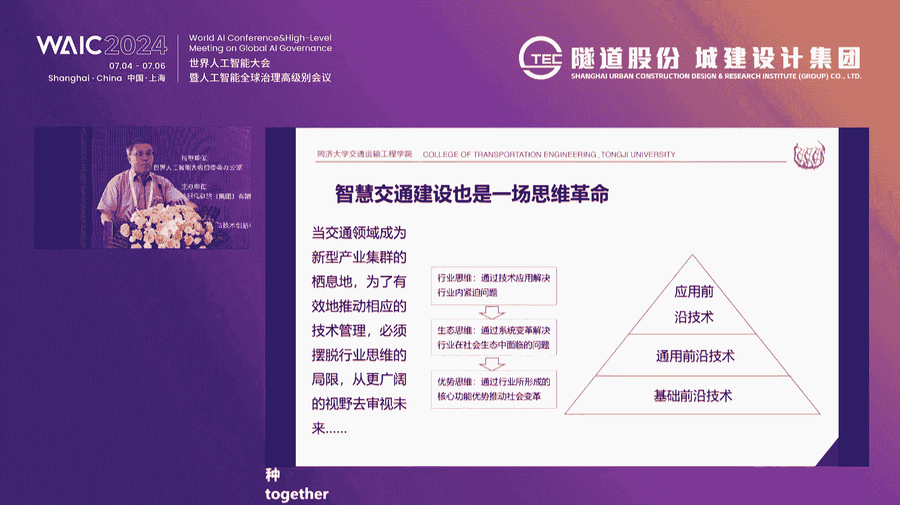
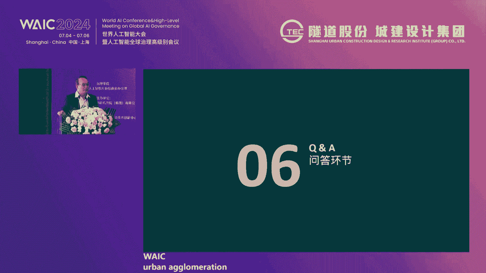
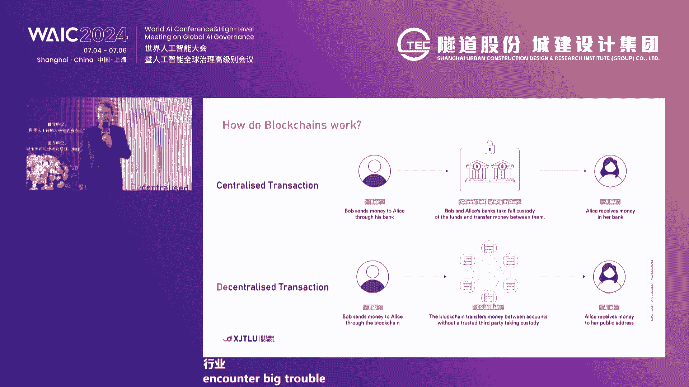
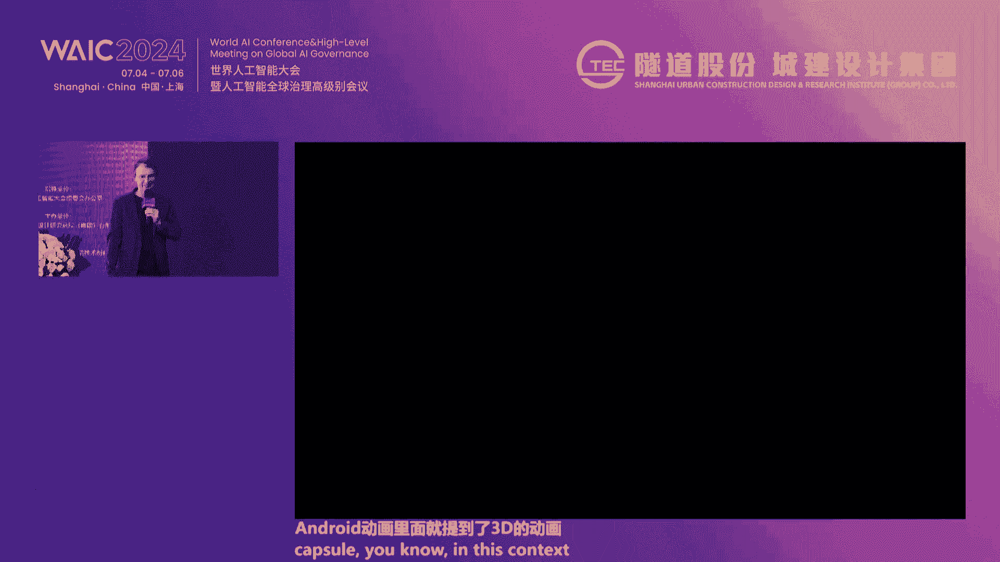
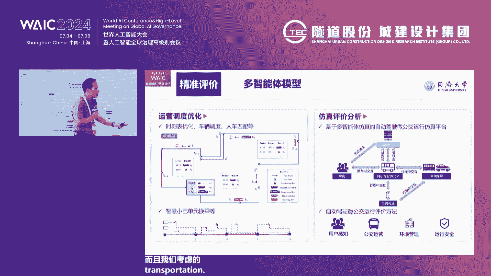
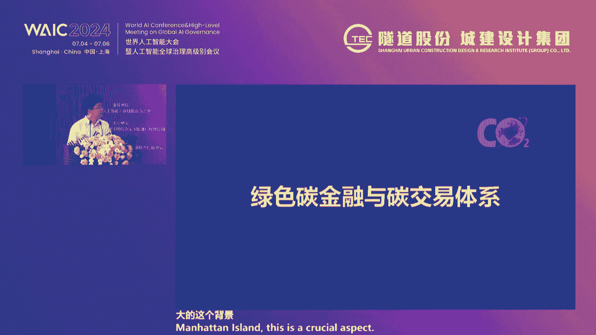

# 2024世界人工智能大会（合集） - P59：20240706-智慧城市 · 智捷出行 - WarrenHua - BV1iT421k7Bv

志觉出行生态论坛现场，我是张晓松，来自上海城建设计团。今天非常荣幸能够成为本次论坛的主持人。本次论坛由世界人工智能大会组委会办公室指导，由上海市城市建设设计研究总院集团有限公司主办。在此。

我仅代表主办方向大家的到来，表示衷心的感谢和热烈的欢迎。下面请允许我隆正介绍。🎼今天，与会领导和嘉宾，他们是上海市交通委员会科技信息处处长李德良先生。

🎼上海市城市建设设计研究总院集团有限公董事长蒋应侯女士。🎼同济大学教授，原同济大学副校长杨东元先生。🎼Acom香港区执行董事陈建雄先生。🎼西郊利物浦大学设计学院院长mark orze先生。

🎼同济大学交通运输工程学院教授。🎼胡辉昭先生。🎼中科院上海高等研究院研究员汪明全先生。🎼欢迎各位。🎼同时，热烈欢迎以下领导。🎼上海市Bm技术协会会长戴小坚先生。

🎼上海市杨浦区建设和管理委员会副主任王一女士。🎼上海市长宁区建设和管理委员会副主任玉夫先生。🎼上海市土木工程学会副理事长叶国强先生。🎼上海工程咨询协会秘术长周荣生先生。

🎼上海市勘察设计行业协会副秘书长戴顺康先生。🎼上海市建筑信息模型技术协会秘书长张建堂先生。🎼上海被告股份中研研究院院长胡佳平女士。🎼上海市交通建设工程管理中心副主任顾顺新先生。

🎼上海建科集团有限公司纪委书记齐月红女士。🎼上海同济大学设计集团副总工程师。🎼姚请明女士。🎼上海城投公路投资集团有限公司副总经理张玉堂先生。

🎼同时我们还有幸邀请到了来自法国的国际嘉宾和来自贵阳成都的建设单位嘉宾一名指导，欢迎各位的到来。🎼首先有请上海市交通委员会科技信息处李泽良处长为论坛致辞，让我们用热烈的掌声欢迎李泽良处长。尊敬的杨校长。

戴总，我们蒋总。各位嘉宾，大家上午好。很高兴能够接受邀请参加世界人工智源大会，出席智慧城市自觉出行主题论坛。我经代表上海市交通委员会对论坛的举办表示热烈的祝贺。也非常欢迎各位嘉宾的到来。

向你们对上海交通的长期的支持表示衷心的感谢。近年来，人工智能正在引领一场科技革命。深刻影响人类的生生活生产。有文章指出啊，AGI技术将是第四次工业革命的核心技术核心的竞争力。

历史的机遇啊摆在了我们的面前。上海是我国人工智能的重镇，在大模型、人类、机器、人形、机器人、算力语料等三大领域都具有极具的优势。2018年以来，每年举办世界人工智能大会。今年已经是第七届了。

大会的影响力越发显现，已经成为中国和全球人工智能前沿技术的重要的发布交流平台。7月4号就是前天啊大会发表了人工智能全球治理的上海宣言。宣言指出，要积极推进研发。

释放人工智能在医疗、教育、交通、农业、工业、文化生态等各领域的应用的潜力。如何推动人工智能在交通领域的创新应用，或者说交通行业如何更好的利用智能的技术，就是今天我们论坛的这个主题。

上海交通是个大交通的概念。这个应用场景非常的广泛。也是数据资源的大户。上海交通也是国内较早开展数字化转型和智能交通建设的这个省市之一，近年来取得了一些成就。从顶层设计层面来说。

我们相机出台了两轮的数字化转型的实施意见。颁发了智能交通的顶层设计。与市科委联合发布了交通领域科技创新发展行动计划。从数据治理层面建设了交通行业的数据中心，开展了数据融合平台的建设，并且探索数据的交易。

交通行业有150多个数据产品在数交所上挂牌交易，去年的交易额已经突破了1亿元。从基础平台的层面，我们建成了运行监测的审计平台和云入中心。从硬场景层面。

我们积极推进自动化码头、智慧港口、智慧航空货站等建设。依托G15G60S32等4点。智慧高速公路的建设。依托杨浦大桥黄浦江核心段试点建设数字孪伸系统。建成了出行及服务ma氏平台。

打造公众出型的全链条服务，用户的规模已经突破了450万。通过开放自动驾驶的测试道路，开展包括扬山智能重卡。智能出租。智能公交在内的自动驾驶的示范运营。等等啊，这些应该说取得了较好的基础。

可以为人工智能这个提供良好的应用场景。但是呢交通作为一个传统的行业，人工智能的创新应用啊还相对比较少。从交通行业出发，也迫切的需要智能技术的加持，为交通强国的建设、国际行业中心建设。

为交通行业治理服务、产业等领域提供技术支撑和创新的应用。在接下来的这个论坛接下的环节中啊，我们将聆听来自国内外专家的精彩的演讲，与我们分享最新的成果、成功的案例和宝贵的经验。

这此呢我也想借这个论坛的机会向在座的嘉宾发出诚挚的邀请。欢迎各位积极参与我委组织的人工智能加交通相关的沙龙论坛，进行充分的深入的交流研讨。在大模型，尤其是交通财政领域的大模型以及知识图谱等方面。

以及场景应用和产业带动等等领域，积极参与我们组织的接榜挂赛的这个活动。也请各位嘉宾继续支持上海智慧交通的建设，实现自觉出行。最后，预祝论坛取得圆满成功，谢谢大家。🎼感谢李处的精彩致辞。

也感谢李处对本次论坛的关注和支持。接下来我们将有请上海市城市建设设计研究总院集团有限公司董事长蒋应红女士致辞，大家掌声欢迎。🎼尊敬的杨校长，尊敬的李处，尊敬的戴局，还有我们尊敬的周秘书长啊，各位领导。

各位嘉宾，各位同行，大家上午好。非常高兴啊。今天在今天是那个出媒上海出媒的第二天，我们在美丽的黄浦江畔能相聚在一起，和大家一起探讨人工智能在交通领域的应用。

也很非常非常欢迎大家莅临2024世界人工智能大会，智慧城市智杰出行的我们主题论坛。在此，我仅代表上海城建设计研究总院集团有限公司对出席本次论坛的各位领导学者专家以及同行的到来表示最热烈的欢迎。😊。

习近平总书记在党的二十大报告当中多次提到政智慧城市，强调要构建现代化的基础设施体系，打造宜居任性、智慧的城市。这是以习总书记为核心的党中央深刻把握城市发展规律，对新时代新阶段城市工作作出的重大战略部署。

智慧城市建设已经成为全球城市发展的重要方向。在这场变革当中，技术创新赋予了城市新的生命力。作为城市建设者，我们深刻认识到，智慧城市不仅是技术进步，更是城市治理和居民生活方式的深刻转变。

交通是现代城市的血脉。智慧出行，也是我们人民城市理念和高质量发展的要求，为打通市民出行的最后一公里。我们城建设计集团利用人工智能技术，倾力打造需求响应式智慧巴士解决方案，就是自觉出行。刚刚大家在会前呃。

各位也在屏幕上看到，就是这次本次大会，我们为为大会呃创造的上海市首个响应是公交的场景，就是在我们这次世博中心的外围有一个线路。呃，我们这次季节出行，主要是为了城市交通的最后一公里。

通过我们想那个出行链的打造和。和那个需求响应的这个呃AI的模型计算，市民们可用小程序呃，在网上很方便的预约接驳巴士，通过人工智能算法汇集相相似的需求，自动计算出满足大家需求的最优的线路。

自动调度巴士以完成接驳，将智慧出行的场景，可以运用于产业园区、大型社区、大学园区、会展区等各类城市片区级的场景，让最后一公里出行、随虚尔洞季节异行。

我们城建设计集团是上海以及全国城市建设领域当中的一支先锋。在过去60年当中，为中国的城市基础设施建设做出了系统性、持续性和完整性的重要贡献。也是我们三中一甲的拥有最高资质的综合性甲级设计研究咨询单位。

同时，我们也是从中国从最早从事智能交通研究和应用的单位之一。城建设计集团始终践行以创新驱动、赋能高质量人民城市建设的理念，始终和城市发展，特别是智慧城市智慧交通的发展紧密相依。在政府部门的关心下。

在行业单位的大力支持下。在各位合作伙伴的相互帮助下，我们也很荣幸连续7年蝉联了全国十大智能交通规划设计优秀单位，并获得了上海市首批智慧交通规划设计与碳排放评估技术创新中心。

在此也很感谢焦委给我们这个机会啊，并承担了智慧交通智慧水务智慧路灯智慧网联汽车等板块的规划咨询设计和工程项目，同时我们也积极投入科研和标准规范的编制，为同行和企业搭建技术交流平台和工经验共享的平台。

在加强建设交通强国的新征程当中，我们也愿意汇聚各方的力量。同在座各位同行和嘉宾一起及大家的智慧，解决发展中的难点堵点和痛点。今这次的论坛，除了我们在上海的各位嘉宾和领导以外。

我们也吸引了国内外的一些嘉宾。在此，我们也很愿意和中国和上海以外的那个中国的省市呃，同行以及国国外的很多省市的同行共同探讨。呃。在智慧城市、智慧交通、智慧出行当中的新模式、新技术。

努力挖掘智慧交通发展的新理念新路径。我我也真诚的希望和国内外同行建立起合作伙伴的关系，发挥各自的优势，挖掘自身的潜能，合作共赢。最后，再次向莅临本次大会的各位领导嘉宾的光临和支持，表示诚挚的谢意。

也预祝本次论坛圆满成功，谢谢大家。感谢蒋总的精彩致辞。呃，下面我们进入本次论坛的主题演讲呃环节。呃，接下来我们非常荣幸的邀请到了我们同济大学交通运输工程学院教授原同教学副校长杨东源教授。

杨东源教授长期在交通工程领域有非常深厚的造诣。呃，本次杨教授给我们带来的主题论主题是从智能走向智慧。应对城市交通高维化的体系对策，让我们以热烈的掌声欢迎杨东源教授。🎼，🎼，好嗯。各位领导，各位嘉宾。

大家早上好。一看这个题目呢好像非常非常学术化的一个题目。嗯，可能有的嘉宾会思考一个问题，说你是不是把简单的问题给复杂化了？嗯，为什么要讲这个题目呢？实际上我们现在人工智能的发展呢，在交通领域里边。

在一系列具体的应用中的探讨，大家都有很多思考。但是对于整个我们未来跟人工智能之间到底是什么关系？以及我们还需要在我们这个行业领域的范围里边突破哪些人工智能本身遇到的一些重大瓶颈。

对于这样一些问题的思考呢，可能也是一个很重要的事情。所以我跟后边几位嘉宾讨论的问题呢可能不太一样，老了嘛就谈点相对宏观的思考。那今天呢讨论几个事情。😡。

第一个呢我们可以看到现在的这些技术对于我们的这些技术人员和研究者来说，真的是眼花缭乱。大数据还没有完全想明白，那但是人工智能又冲击过来。😡，各种各样的技术面前，交通这个行业。😡。

到底怎么样进行行业的这样一个技术管理？怎么把握未来的方向，怎么走好我们当前的路，对我们来讲是一个很大的挑战。😡，要应对这样一个挑战。实际上我觉得牛顿先生讲的一句话非常非常有道理。😡。

他的意思呢是这样一个意思。😡，把简单的问题适度的复杂化。实际上它的目的是为了发现我们的一些新的研究领域。把复杂的问题尽可能的加以简单的认识，是为了发现它的其中的一些新规律。😡。

那在我们现在的这个情况下边，我们可能要思考一系列问题。所以呢今天我想讲呢将是几点的，很简要的把内容呢归纳一下。一个呢我们面临的研究对象到底是个什么东西。😡，我们解决的到底是个物理系统的问题。

还是一个什么样的一个问题？😡，第二个。未来的智慧交通跟我们以前讲的智能交通到底有什么差别？😡，第3个，人工智能要在交通应用，特别是在智能服务和智能治理上边应用。我们将遇到什么样的瓶颈？😡，第4个。

我们跟人工智能之间的关系是一个单向的技术引进，还是一个互动的关系？😡，当然我们还有一个很重要的问题，交通需要加强交通信息空间的建设问题。那所谓的交通问题高维化，实际上呢就是一个什么意思呢？

我们交通跟过去。😡，想的问题不一样吗？过去我们是在做相对单一的物理题。😡，通行能力呀等等这些我们都是在解决物理系统的问题。😡，现在呢我们发现不对了，涉及到公共政策，涉及到市场设计等等一系列关系问题。😡。

有的时际上我们想简单的解决智能驾驶，我们的高交通就可以高枕无忧吗？就像有的同志说，将来这个车开的快了，路上不堵车了，那我们还有交通问题吗？那我也问过一句话，那车开的越快。

是不是意味着它停在那儿的时间越长。😡，我们现在的停车资源能支持按照现在这种方式拥有小汽车吗？恐怕将来也可能路上的瓶颈会向停车转移。😡，那在这样子一种背景下边，我们来看看。😡，我们过去走过的路。

我们曾经走过了两个非常辉煌的阶段。😡，第一个阶段，我们用大量的。😡，基础设施把我们中国的国土连接成了一个有机的整体。😡，中国的国土这种地理的阻碍是非常严重的，大江大河、大山大川，对吧？😡。

那我们实现了这样一个连接以后，同样我们用我们的运输服务和物流服务，把我们中国变成了一个什么呢？变成了一个世界上最完整的这样一个产业链体系。😡，变成了一个具有世界人口5分之1人口的一个巨大规模的市场。😡。

啊，这是我们走过的路。😡，但是面向未来，我们现在提出的问题，高质量发展、生态文明，以人为本。😡，那我们到底。😡，下一步的核心问题要解决的是什么？😡，实际我们看看我们现在提出的一些重要的一些行动。

交通强国交通强国并不仅仅是强交通这个行业本身。他首先应该为国家的富强贡献他的力量。😡，对么同样他也不是仅仅是一种政府和管理者角度的一个看法。他要让普通老百姓获得实际的利益。😡。

因此呢我们可能会涉及到一系列的问题，一个国土空间治理。😡，对吧怎么样进一步的。😡，在现在的这种国际背景下边，把中国的产业链和供应链做强。以及我们提出的城乡融合。嗯么。

怎么样真正使得公共服务的一个相对均等化，以及我们提出的新智生产力，在交通这个行业怎么进行相应的技术管理？😡，智慧交通是一种共同创造，怎么才能把这样一种愿愿望变成一种实际行动。这是从交通强国这个战略。😡。

另外。😡，交通这个行业现在是什么？实际上是一系列创新产业集群的栖息地。是吧人工智能他首先就想到在交通上面怎么用。😡，那我们的一系列新技术，包括区块链等等，都设法在交通里边去找它的应用场景。😡。

那在这样一种情况下，我们怎么样子能够把这样一个基础打好，使得我们既不介入到。😡，别的学科深入的这种研究中去，又能使得我们未来能够很好的承接相关的领域的这些技术落地，这是对我们来讲是一个非常重要的问题。

第三。社会进步。交通是干什么？交通实际上是拿技术和政策的手段去解决社会问题。😡，啊，我记得韩正同志在上海工作的时间，有的时间提的问题我们非常难以回答。😡，他问我们。😡，坐常规公交上边。

我看高峰的时间也不这么挤。😡，屏风的时间没有多少人，老百姓为什么不坐公交？😡，对吧。他问我们虹桥枢纽是干嘛用的，要解决交通问题的。他说我经常担心虹桥枢纽被堵死，到底是哪儿出了问题？😡。

实际上作为一种政策工具，我们要考虑的。😡，怎么样对不同的人群都提供。😡，我们拿上海的手机数据分析上海人的活动空间的实际上有一个很有意思的事情。外围的大型居住区的人。

里边有相当一部分人只在他的居住地附近活动。他所认识的上海根本不是我们一般讲的上海，他只认识他。😡，自己小区周边的一个上害。那这是一种好现象还是坏现象？单独从交通上来讲太好了，他不出门嘛，我就没压力了。

从社会学这个角度来讲，太糟糕了。😡，人之间不能加强沟通，这个社会要退步的。😡，对以怎么样实现这种。😡，均等的服务，均等的机会，怎么样实现生态文明，怎么样真正实现治理，而不是管理。

交通上边讲管理讲的太习惯了。😡，但是怎么样多元主体来参与治理，我们确实还有很多东西没有改变。😡，而且如果我们不能改变将来的生活空间活动方式等等这些生活方式，可能我们遇到的挑战会非常大。

就像我们现在讲的公交优先，我们经常看到一辆公交车上没有两个人拉着每两个人到处跑。😡，公交的碳排放是按人均的，而不是按车均的碳排放。😡，那这个到底对还是不对呢？那这一系列挑战实际上意味着什么？交通它的。

😡，研究的对象已经发生了一个非常非常巨大的改变。😡，过去我们只研究物理问题。😡，对吧。那我们现在不得不去研究人工智能来了，我们不得不去研究信息的问题。😡，不得不去研究社会的问题。

不得不研究他们之间的相互关联问题。😡，我们的对象改变了。😡，那交通实际上将来的出路在于哪儿？将来的出路只有一种体系化的对策，才能解决交通问题。😡，领导经常会问，你们到底有没有杀手锏一招制胜，我说没有。

😡，为什么呢？交通有点像中医，不太像西医。😡，西医看病，拿仪器测，哪坏了治哪心坏了，治心，肝坏了治肝。交通中医搭脉。😡，说你气虚。😡，气须是哪坏了？😡，是一大堆小问题综合在一块就变成一个大问题。

交通也是这样。😡，所以他的思路应该近似于中医的那个思路，不是简单的治病，而是医人。😡，怎么样让整个体系的这个发展能够变成一种可持续的状态，这才是我们希望的。否则你跟着他背后被动的去试营。

永远走不出这条路。😡，那在这样一种情况下，我们对人工智能到底期待的是什么？以及人工智能，它在交通领域应用到底会遇到哪些挑战？实际上这里边有两个概念，我们需要区分的，就智能交通和智慧交通。

听起来非常相似的两个词，实际上它不是一个概念。我们简单的引入信息和控制技术所产生的技术解决方案，被称为智能交通。但未来的智慧交通。😡，他是要采取技术和政策手段解决综合性的社会问题的。

他一定是个人机混合的系统。😡，不是一个单独的计算机系统。😡，它的控制层级有三级。这三级是一个逐渐变化的过程。最里边的这个级别实际上是一个智能控制问题。

这就是我们现在所讨论的智能交通、自动驾驶等等这些东西。😡，他实际上主要是服从物理规律的一个。情况这上边的问题相对好解决。第二个层级，智能服务。当智能服务的时间。

你碰到了市场怎么样精细化的用这种精细化的服务。😡，去对应多样性的需求，这是我们一个非常大的挑战。😡，第三个层级碰到了社会。😡，碰到社会以后，我们牵扯大量的都是公共政策的制定。😡。

这种公共政策的制定简单的拍脑袋不行，但是你让计算机自动产生一个方案，然后他告诉你这个方案肯定能解决问题，但为什么是个黑匣子？😡，你肯定也不能接受。😡，那我们在这种情况下，在三个层级上。

我们都会有一些变化。😡，像这里边的这个层级，实际上它是一种巨生智能的一种进化过程。那传统我们处理它的逻辑，实际上是一种把问题进行细化的分类，然后基于规则来进行控制。😡，这个呢说实话。

早期的人工智能是能很好的适应这样一个场面，像车路协同也好，自动驾驶也好，无非我们千方百计的把场景给它设计的更加完善。😡，但是在进一步的发展的时间，他希望车有自动学习的能力。😡，为什么要解决这个问题？

是上智能车驾驶，它都有一定的适用范围。😡，为什么智能车在高速路上容易使用？在城市道路上难以推广？因为城市道路遇到的情况太复杂了，我们没有办法把所有的场景全部涵盖在里边。

也没有办法把所有的场景都制定它的应对规则，所以车需要一个自动学习的一种。😡，那第二个层级。😡，交通最终的目的是什么？适应社会的变化，创造新型的服务。😡，为什么要创造新型的服务？😡。

实际上就是韩正同志问的，老百姓为什么不做？😡，公交。因为往往我们的公交。还是一个传统的大陆货色的。很难提供一种精细化的。😡，不同的需求，你怎么去对应？😡，那因此呢在这个领域里边。

现在的这种生层式的这样子一个，或者说现在基于分类和规则的智能，是对既有的服务项目来进行前台的服务啊、供应商的管理啊、资源的配置啊等等这样一些事情。而未来他应该通过这种深度学习和深层次的智能。

发现更多的市场细分。那我也举一个例子，这种市场细分会到一个什么样的程度？我记得我看过日本的一个统计数据。到成田机场和羽田机场的机场大巴，每天承担的客流量是多少？😡，到羽田。

每天利用机场大巴往返的客流将近6万，什么概念？😡，我们的陆家嘴。😡，这个地铁站每天进出站的客流不过就是7万多。😡，对吗到成天机场的也有3万多，他这就是一种市场的细分上边才能有市场。😡，对吗才能有需求。

才能有服务。😡，那我们在这种情况下，我们的这种。出行寄服务的这种体系，它成功的关键在于市场的细份。😡，第3个。智能治理。智能治理这件事情呢非常麻烦。所谓的治理和管理最大的差别，管理是目标导向的。

政府提出一个目标。😡，制定一系列的行动，而治理呢是在一种共同的价值观的基础上，大家形成一个共识，然后形成协同性的行动。😡，那这里边就会出现一个问题，人工智能现在发展最大的一个困难。

它可以给出你一个解决方案，但说为什么给出这个解决方案，他讲不出来。😡，你也很难把握。😡，所以这里边就牵扯到人工智能一个非常大的瓶颈，就是它的可解释性。😡，对吗？而且呢。你不同的数据给他。

他可能会产生不同的。😡，一种知识，这种知识人有偏见，人工智能照样有会有偏见。😡，但是你公共政策的时间，这种公平就非常重要。😡，怎么来建立一套监管框架来有效的把控？😡，你要想用到公共政策的制定向上边。

不解决这个问题，我们是没有办法迈出真正的一步的。😡，所以呢在这里边我们实际上跟人工智能的这种理论进化是一个共同的一种协同进化的一种关系。所谓的协同进化，从交通上边就是原来做物理题，我们要变成做综合体。

😡，然后我们对社会问题、社会伦理等等这些问题都要有一些复杂的应用。而在人工智能上边，它要变成一从一种弱人工智能变成一种强人工智能。那他就是要能跟制定政策，或者策划市场的管理者进行对话。😡，对吧。

那我们再讲一下，这是未来的远景。我们现在非常重要的一件事情，怎么进行智慧交通的信息空间建设？😡，为什么提这件事情呢？😡，前一段呢嗯有个单位让我参加一个讨论会。他们为我们国家非常著名的一个省会城市。

就是所谓的非常著名，就是它的交通大脑非常著名，是交通大脑的发祥地。做一个咨询项目，市委书记非常关心说，我为了前期的这种国际会议已经投入了大量的硬件设施建设了。那但是好像效果不太好，问题到底出在哪？😡。

然后这个咨询单位呢，我说你一个基础性的数据，你的这些道路上的车都是从哪来到哪去，这个基本的OD。😡，为什么在你们的这个研究里边没有体现出来？他告诉我。😡，拿不到。😡，我说你们有这么强的人工嗯。

这么强的交通大脑，拿不出一个基础OD。😡，好像是无法接受的一件事情，到底是协调还是上边出问题还是什么？然后相关的同志，我相关的学生，他们底下告诉我。😡，他欧地出来的有些结果。😡。

我们从实际工作这个角度讲，好像不知道他是对还是错。😡，好像跟我们实际的感受不太一致。😡，这里边就牵扯到一个什么呢？实际上交通的这个东西不是把数据堆在那就行了。这些数据是要可信的。😡。

这些数据不可能是完美的，你要完美，交通上边就没数据了，它都有缺陷。但是你要告诉我它的缺陷在哪。😡，或者你通过什么方式获得的数据。😡，我可以有办法应用不完美的数据。

但是我不能没有办法去应用一个完全摸不到头脑的数据。😡，那这些数据怎么产生，这就牵扯到我们交通的信息空间的建设问题。😡，信息空间这个建设，实际上对于。政府来讲也是非常重要的一个责任。政府呢一个方向要把控。

一个要进行市场环境的建构，一个要进行技术生态的建构。😡，那怎么来解决这个问题？😡，那边的两个照片，可能很多朋友都会很熟悉的，对吗？我们在技术发展的过程中也出过洋相啊。😡，是么。那么这种昂贵的试错行不行？

😡，怎么能避免我们一直出现这种昂贵的事？😡，记得这些东西在讨论的时间。😡，是这上开始在讨论的时间，大家都会觉得我有我的观点，你有你的观点讲不清。😡，只有他真正的实施以后，大家才后知后觉的去认知这个问题。

这不行。因此，我们需要建立一种知识网络。😡，在这样一种情况下边，我们可能有几个当前紧迫的议题。😡，第一个议题。可信数据的有效流通。现在数据要素市场已经建立起来。但是在要素市场上流通的跟交通相关的数据。

😡，怎么样提高它的可信度？这是一个极为重要的问题。坦率的讲。做大数据分析做了这么多年。相当一部分数据里边出现的一些问题，我是难以回答他为什么会这样。😡，啊，那怎么去办？

我们可能要把不同来源的数据相互进行校和，来判断它到底在哪种程度上反映了真实的问题。😡，而且呢数据不能有效的流通，这个问题非常大。现在政府相关的政策出台，对于数据的持有者。😡，数据的加工者和数据的使用权。

这三权进行适度分立以后，会使得我们的这个市场运行更加有效。但是在这种情况下，我们怎么样分阶段的推进这样子一个可信数据的有效流通。第二个知识网络的沟通？😡，构建所谓知识网络不是一个简单的知识。

把它存到计算机里去。😡，而是一个对知识产生过程。大家在知识的形成的过程中的分享机制等等，都要进行一系列工作的。😡，智慧交通一定是一个。面向未来的共同创造过程。靠单个的研究单位，单个的平台不可能突破。

但是市场规律我们必须遵守。第三个课题。就是在涉及到公共政策的时间，怎么样把这种循证分析。跟人工智能非常有效的结合起来。😡，什么叫循证分析？😡，实际上涉及到公共政策的时件，我们最需要的是什么呢？

汇集一系列的。😡，证据。😡，这需要我们在大数据的海洋里边去做数据的福尔摩斯。😡，福尔摩斯侦探记，他给出的所有证据都不是直接证据。😡，都是间接证据。单条的证据都不能直接下结论。

但是形成一个证据链以后可以下结论。😡，这个方式使得我们有可能突破我们的这种人工智能现在发展的受到的一些局限。那最后的一句话呢。😡，实际上。在。😡，整个交通领域仍应用人工智能的技术。既是一种。

具体技术的实践和应用也是一种思维的变化。我们简单的用原来的思维来面对新技术，我们可能会把握不住。面向未来，我们可能要经常的在一起进行讨论，使得我们对未来的这样一种发展趋势能够有一个很好的把握。

也就是说交通。

既然你是一个新兴产业的一个。新兴产业集群的一个承载地。你应该。😡，突破行业思维的局限。😡，而变成一种优势思思维，促进整个相关的领域。😡，发生一系列的改变，我们交通才能真正的有未来。😡，否则。

简单的这样子的一些单项技术的应用，我们很难说我们的明天会更好。这些想法呢不一定对，仅供大家参考，反正呃不对之处呢，希望大家批评指正，谢谢大家。非常感谢杨教授的精彩演讲。

杨教授深入浅出的剖析了从智能向智慧的发展方向啊，以及城市交通高维化的体系对策，让我们对城市交通有了更加深入的思考和认识。🎼那么接下来让我们把目光投向低空领域，随着科技的不断进步。

低空经济竟逐渐成为现在的发展热点。接下来有请Acom香港区执行董事陈建雄先生，为大家带来低空经济的发展和趋势主题演讲。我们掌声有请。好，谢谢大家。首先呢我介绍一下啊。😊，呃，今天的我说的这个主题哈。

刚才呢就是啊这个啊教授哈介绍了这一个啊智慧出行啊。啊，这个租意出出行呢，对我们来讲呢，实际上是一个啊平面的啊，我们说是啊土地的。我们地空经济呢，我是说我们把AI把智慧这一个出行呢哈放到一个3D的领域。

然后从3D放到这个4地的领域。为什么是3D呢？哈，比如说我们这一个啊飞行器啊啊，如果是地铁也好，公交也好，实际上是一个平面的。但是我们这个啊啊啊飞行器呢，实际上是立面的啊，从从地面。

到立呃呃起码到3000公里，这个整个空域是1个3D的范围。我们怎么样。あ。充分利用这一个从0到3千米的整个空间。啊，来做出行出行的啊有两方面。一方面呢就是做这一个啊把这个人从一点啊运输到第二点。

就好像我们出租车一样。另外更重要的领域啊，就是把货物啊，用物流把一个点啊送到另外一个点这个点可能是同一栋大厦，但是它可能送到不同的几个楼层去。所以我说我们地工精济，其际上是一个3D的啊智慧交通。

我我我先介绍一下吧。我今天要说的哈，首先我介绍一下我们阿ecom的哈，然后再说几个地空经济等等哈阿ecom呢我们是一家跨国公司，我们总部在美国啊休斯敦。我们是在呃纽约呃主管上市的啊。

我们全球大概有57万个员工啊，在美国、加拿大呃，在亚洲区，包括香港特区啊，然后呃在呃澳大利亚、新西兰，在欧洲，以及在中东非洲啊，都有我们办事处啊。所以哈我们在呃我们的领域还是比较广泛。哦。好。

我们现在在呃呃内地啊，大概也有呃呃2000人左右啊，在上海啊，我们有呃杨呃杨浦那边，我们有办事处，然后在北京在深圳，特别是在深圳啊，在上海啊，我刚才说我了，重庆，我们都有办事处啊。低空经济呢。

实际上这个我这个幻灯片呢主要是啊针对这个内地的哈，就是从这1个20呃21年开始哈，然后到23年，然后到最近的啊我们李强总理啊做这一个政府报告的时候，已经是把啊低空经济啊，把这个定位啊。

作为未来我们国家啊在经济啊这个发展的一个很重要的啊这一个策略。这个是内电情况。实际上在外面啊，特别是在美国，我们几年以前哈，我们在美国的哈这个公司已经帮。好几个我们的客户啊，美国主要还是私人的哈。

比如说美国的delta。的航空啊啊这些都在做比较全全呃前前沿性的啊呃有些呃规划和者一个设计啊，他美国主要用这个无人机是做什么用途呢？主要是做。短距离的。这一个出租车，我们叫呃空中的air taxi。

几个来用的，然后特别是在他们呃南面的fori达啊，洛杉矶那边，然后北面的纽约，现在都在探讨。然后他们实际上在无人机的开放啊呃也是走在全呃前端前端，但是可能没我们国家啊呃走到多快而已。

但是在呃把这一个呃呃呃空中呃呃这个租租车啊，实施的话，实际上我觉得他可能还比我们国家快。这个我希望也跟大家分享一下啊，我们在海外的经验啊。这个是一般我们说的啊，关于这个无人机的几个分类哈。

这个如果是我啊用的这个是一个啊国际标准吧，就是从0到50米的。比如说我们家里儿子啊小孩玩的哪一种呃哪一种无人机啊，包括大疆的哪一种啊，就是从0到50米的啊。

这个呢啊实际上是没有啊产业这个用途的这个然后呢就是海外很多时候呢，我们把空域啊啊定到120120米。120米以下的这个飞机呃呃呃飞行器，就是不用试航证的。

就是不用这一个啊啊呃计场管理局的试航证的120米到大概呃300米左右啊120米以上的就要去拿这个呃试航证了。试航证的话呢，这个就就牵涉到空管的问题了。啊，所以这个问题呢。

实际上我们我等一下我再跟跟大家讨论一下，这个是真正是一个呃发展低空经济剂的一个啊最大的这一个呃呃问题。这个无人机的话呢，实际上啊大概可以分为三类这个呃用途。第一类第一类就是做这一个呃运这一个乘客的。

我们说的这一个空中空中的这一个的士服务。第二种呢实际上是做物流用途的啊，我看呃我等一下我跟大家说一下哈啊，物流来讲啊，国家走的很前啊，特别是在深圳上海也有啊，深圳美团和这一个顺丰啊。

都用这一个无人机配送了，包括啊把餐饮送到深圳我尔旺的哪个哪个公园去啊，所以这个深圳还是走的比较前啊，然后还有个用途呢是在这一个消防救援方面的。这方面呢，实际上国外也走的很快，包括在英国啊。

英国准备是啊把有些以前他们是用这个直升机嘛，他已经是呃呃有订购了啊，有一些无人机就专门是做这一个用途的啊，这些呃呃呃飞行器啊，可能是无人的，但是可能是有人的啊，所以暂时我们当时都是用电动的好吗啊。

这个时候哎我很快说一下吧啊，就是呃在今年的2月份啊。在深圳呃深圳蛇口那边哈就作为一个是呃呃这个是呃呃呃呃不是一风的哈，是呃风飞。他们做了一次就是从蛇口到珠海那边，大概是30多公里啊。

然后他是呃要呃做这一个呃试载，然后呢以后可能在明年他会推出这一个无人机的这个服务。这个一程的这一个飞行这一个时间呢大概是20分钟。然后呢大概收费是200块钱，300块钱左右。

这个实际上从在呃大湾区域的啊，这个经济水平还是可以负担得了的2200300啊一个人啊。所以这个呢我现在最大问题呢就是他这个呃无人机。现在实际上还没拿到这一个适衡证。

然后空管的问题现在也是一个很实在的问题。但是这个市场我觉得是。呃，未来这前景很大的。包括我们在香港，我们从香港到澳门，实际上有直升机服务的啊，每一层大概有2000块钱啊，港币。

如果我们用无人机从香港到澳门去也大概是20分钟，然后如果是200块钱，比我们坐船还快还便宜啊。老师说好吧，所以在这方面前景是无限量的，但是问题就是在这一个空管啊，石横证方面。

这些啊也些我们叫hurle啊，好吧，好像要啊还是有些时间来来突破吧。以后在呃内地和国外啊，都用啊都是在用这一个无人机做这个钓鱼呢，快去做这个医疗啊方面啊，现在慢慢在尝试，这个也是未来的啊一个一个方向。

我给大家介绍一下哈，就是呃我们叫EVTO。就是electric verticalr take off and landing啊这个这个概念啊这个是最啊有呃在国外有什么最新的发展啊。

我刚才说到的就是从这一个啊，我特别是在呃啊大湾区啊，大湾区是可能呃在上海呃，对我们大湾区的这个概念不是太太清楚。其然大湾区是包括香港、澳门、深圳、广州，然后东莞一大片的实际上是广东省哈最富裕的这个地区。

大概人口有有呃7000多万吧啊，这些产地啊产值也是蛮高的啊。这个是是哈我们这个主要的，为什么我们要用这个呃无人机呢哈。实实上最重要的还是在这一个呃环保方面啊，因为啊无人机是啊都是电动的。

包括我们在美国啊帮他们开发的无人机都是电动的。这样子的话呢啊这个就是零排放。然后啊通过这一个无人驾驶驾驶这个技术呢啊就可以啊把这个无人机哈做到啊无人驾驶零排放这个这个标准。这个。

在无人基于这一个发展方面呢哈。走的最快的应该是在深圳的啊一行。他们有一个无人机呢，大概可以坐两个人啊，我们也也啊我有同事也做过啊，但是他不敢他只是飞到办公去啊，没飞到别的地方去。

但是这个他已经拿到国家的是试航证啊，然后啊他也在跟其他的比如说d在探讨啊，做这个物流方面的啊这个这个业务啊，他最大的缺点呢，实际上是因为他这个徐航力。太短。只要35公里，就是说他单程飞过去。

35公里就要停在一个地方来充电，那就换一个另外一台来充电。据说他们充电的这一个时间很短的，大概35分钟啊，就就可以了。所以这个还还不错啊。但是因为它就是这个循环率太低。

所以我觉得未来它这个在市场应用的这个范围还是呃比较局限啊，应该是只是可以在香呃比如说一个呃一个呃呃呃城市里面，比如说香港澳门啊或者是深圳可以用。但是如果跨着一个跨城市的话，可能有它的这一个啊呃呃局限。

以后现在在呃大陆啊这个呃auto flightlight啊，英文呃中文叫呃风飞啊，这个是在广州的。他这个啊续航率就高很多了啊，以后他可以坐4个人，然后这个续航可以是到250公里。

所以这样的话呢哈在大湾区做这一个无论是做这一个运输啊呃呃呃这一个呃乘客，他是作为物流的话呢，这个是很适合的啊，适合的。然后在呃还有是在其他呃呃德国啊，包括这一个州比啊，美国啊啊碧塔啊等等啊。

国外也在开发类似的这些啊非常细啊啊啊啊所以啊跟我们国家的实际上也有竞争的这一个啊这个这个压力。这个我不不啊，我就不不多说了好吗？啊，因为这个就是呃一行啊，这个是全球应该是第一个拿到市行证的啊。

这个啊呃呃呃飞飞行器器。然后这个刚才我也说了哈，就是关于这个auto flight啊，风飞的。这个我个人来讲呢，我觉得他这个潜力最大啊。刚才刚才我说一行呢哈它有问题，就是他这一个。螺旋桨长桨啊。

它是在前面的，所以我们登记的时候是有些危险的，它这个是是这样的，它是往上的，然后。我听他们说好像可以再摆动的啊，所以这个我觉得未来整个前力还是比较比较比较好。然后这这个就是我刚才给大家介绍了啊。

就是从深圳蛇口啊，飞到呃这个珠海大概30多公里，飞行时间是。20分钟啊。我刚才说就是从香港到澳门，大概几个距离啊是这样子啊，所以这个我觉得现在最大的问题不不是这个石寒证石证他们拿到了反为是空管的问题。

这未来低空尽制啊，怎么去做这个空管啊，用什么办法就好像刚才几个教授说的啊，一个是指一个治理问题，我们英文叫governance，而且一个regulation的问题。

还有我们在海外一个很重要的就是保险问题。啊，比如说。你有一个航啊啊啊飞行器呃呃飞行器。拉一个东西掉下来，砸到人，不要说砸到人了，砸到汽车谁来赔？啊，这个保险怎么弄？如果砸到人，这个就这个问题更大了好吗？

啊，所以这个啊。这个是在海外的哈，他们有些也是跟我们啊国家来在竞争啊。在大湾区，我们对啊这一个低空经济呢，实际上是。很重视的啊，包括深圳，包括广州，包括我们香港。我们香港呃，大家可能也知道啊。

我们在呃跟深圳啊啊啊临近的呃大概300平方公里的这个地方。我们准备搞一个另外一个浦东，香港的浦东啊，我们叫北部都威区啊。这个跟浦东不一样，我们这一个北部都会区这个定位啊是在这个创新科技方面的。

所以里面我们会用这一个很多自卫的这个出行，包括这一个啊地空的这个飞行器。我们现在已经在这方面在做规划了啊，就是以后比如说有些呃科学园也好啊，除了做做这个平面交通以外，立体交通怎么了怎么来来做规划。

现在我们说说是规划我，现在还没实施。但是如果我们规划没做好的话，以后是不是就很困难了啊，所以啊我们我觉得我们香港在这方面应该走的比较前的。因为我们北部都区现在还是农田一块嘛，所以我们有这一个先行者的啊。

这一个这个优势吧。这个刚刚在应该是呃5月份吧啊这个。啊，丰飞的哈这一个飞行器啊，在浦东机场哈啊这个个试飞啊。这个我觉得是一个一个啊一个里程碑吧嗯。另外我们啊这个飞行器我们就交给呃一航啊，或者几个风飞。

但是这个呃呃沸尘器上了以后还得下来的嘛，下来这一个。这个机场是怎么设计啊，在美国，美国所有的机场都是FAA的啊，federal airportport authority的啊。

然后他们也出了一个关于这一个E头的这一个设计标准，但是他只是把这个名字改掉。啊，用直升器的这个标准啊，放到这个呃呃鱼V头。我们觉得这方面是有些问题的啊，然后在呃。啊。

car方面啊就是国际航空这一个协会方面啊，现在还没有这个标准啊，我们也希望他能尽快把这个标准定出来啊。然后我们国家方面啊，就是我们中国民融机舱社社会啊，在今年的5月份啊。

已啊已经发报发发发报了一一个标准啊，我们在香港，我们我们现在还没有标准，究竟我们是用我们香港一般我们用啊ca的。这是国际标准。但是如果在香港，我们可能也会采取用国家的标准。

因为我们以后要跟这一个大湾区来对接嘛，所以哈我们可能会参考两个标准，一个是account的。一个是国家的。以后我们取这一个标准最高的啊来设计以后的我们的这一个啊啊啊啊E的啊这个这个机场。

这个就是我们按照哈这一个国家标准的哈这一个。啊，升降区的啊这一个啊设计。然后因为比如说这个这这个是一个大楼嘛，然后我们上面有一个bit头的升降的哈，但是实际上呢也是有些bit头不是这样子的。

他有一些是这样的。所以我们做我们搞设计的时候也都要踏整一个啊fi path，我们叫f path么做好规划。这个就是我们在呃弄这个啊要啊做这一个以后发展这个飞行器的时候啊，对这个啊要注意的事项啊。

我刚才说最重要的还是这个飞行这个空间的要求。因为这个牵涉到。怎么呢建设到这个空管啊。虽然啊以后啊这个空呃呃空间从0到10千0米吧，这个空间0到120米就没有这一个呃市市行证的要求。但是有空管的要求。

我们以后怎么把这些空域，是不是？怎么把把它分成，然后给不同的这一个。所以我们现在有些呃呃有些单位已经在开发一个空管的。软件。啊，互网的软件呢，他准备是在深圳试用啊，就是说我们怎么把。0到1千米的空域。

把它分开，然后怎么管理？啊，怎么管理的话，实际上。这个有要切涉到这一个呃法律问题了。几个空域一般来讲都是民航署来啊来呃呃呃呃呃呃呃来主导的嘛啊。

所以以后民航署包括我们香港的民航署是不是还得要再管这一个低空啊低空经济，或者是另外再设立一个机构来管这一个啊低空的整个空域。所以空域这个问题。

我觉得是未来我们发展低空经济的啊一个最大的整一个hurdle。我们能我不说是障碍应该是一个一个Hurdle吧，好吗？啊，另外就是我刚才说嘛，叫法律与保险的问题。

还有一个可能在内地就没啊没那么呃呃呃呃怎么样的。但是在香港。这是摄隐的问题啊啊，有些居民啊，因为我们香港都住的比较高嘛，住个高楼嘛啊，他说你飞行期过来送这个美团过去邻居是吧？

会不会看到我的我在家里的活动或者把我派下来，这个就有问题了啊，所以怎么来把这一个摄影啊，呃在呃呃管理方面把它啊做的到位啊，一个是一个很大的问题啊，我们要重视的。这个我就不多说了，我这是我们在呃呃海外。

特别是在美国哈，现在已经在规划啊，这些我们叫英文叫vetyport啊，就是啊这个垂直的啊EVto的这一个机场。这个是一个一个总体规划吧啊，这个大家可以参考一下哈，这个是美国的哈。

这应该是在forria的那边的哈，有一个ve port有个规划。这个也啊是我们做这啊啊做规划的时候不同的这一个，我们叫停机平啊啊啊或者是充电中心啊等等啊。

你看这个是是在美国的哈forviewsport啊，在美国的空中地史的这个营运商。好了，还有另一个要我跟大家报告的，包括在中东啊，萨特坡他们不是做一个很大的这个叫new门。内我们的这个呃这个开放嘛。

大概是投资5000个亿美元的，他们也在规划做这个啊低空经济经制。所以我们也在帮他们在做这个事啊，就是啊我就在这里啊报告完毕啊，希望可以啊以后有机会多跟大家啊多交流，特别是在呃这个低空经济方面。

因为我我个人觉得啊我们呃这一个呃大湾区跟你们长三角的这个是很类似的啊，就是实际上是城市群都是比较发达的城市群。以后我们怎么样用这个低空的飞行器来加强啊城市群的这一个啊交通人也好，物流也好。

我觉得是我们做智慧交通的啊一个未来的一个一个很大的这个任务吧，谢谢大家。

非常感谢陈总精彩的演讲。陈总以专业的视角和丰富的经验为我们详细阐述了低空经济的发展和趋势，也为我们打开了思路和视野。接下来有让我们有请西郊利物浦大学设计学院院长mark oralnebo教授啊。

snebo教授是作为城市设计和增强虚拟现实领域的知名专家，曾经在德国、中国、澳大利亚、新西兰、日本长期从事建筑和设计相关的教育工作长达25年。今天他为大来带大家带来的演讲主题是智慧城市设计与仿真。

please welcomean mark give。The floor is yours。早上好，hello。I'll switch this on。Yes。

 I apologize I will not be able to speak in Poa。But I have a wonderful help from Claire。

 who will translate。大家好，呃，首先非常抱歉，我还不会中文，所以呢今天会有翻译来帮助我翻译成中文。😊，Okay。

I put my presentation title into an AI image generator talking about what is the city in AI。

 what is the future。And that's the outcome。当我把我的我们这一次大会的题目放到AI的这个图片生成器的时候，它产生了这样一个图片。就是就是这样子。

有关我们有AI的未来是什么样子的。 And it's very interesting of how AI sees itself。 Do I ask AI。 What are you。

 What is AR smart city。 And this is what you see。 This is AI smart city， and this is us。

 we we're sitting here。 we all in a round table。 but this is very interesting how currently the technology sees what our city is。

 which is not our city。非常有意思的是，当我去问AI如何去看待自己。比方说什么到底是AI，什么是智能城市，什么是智慧城市，它给我产生了这样一幅图片。实际上就是像我们现在的大会一样。

我们坐在底下去倾听这个大会。这是AI所给我产生的图片。但实际上我们知道我们现实当中并不是这样。Right。

 so this is a slogan which I put out and say we work now with technology， with smart city， with AI。

 so digital design technology， and I say it's not a tool。It is really。

 and that becomes important is the way of how we think about design。

 how do we think what the future is and how do we work with the tool together。

 There is a collaboration between the instrumented technology and us。我们总是在智慧城市的时候会谈到各种的技术和人工智能。

但是我想说的是，数字设计或者这些技术都不是我们所使用的工具，而是我们如何去看待设计，是一种我们如何看待设计的思维方式。我们的未来和AI会是怎么样子的。我们要怎样去和AI合作。

如何去实现这样一个协作的一个效应。Right， and this is in our environment where we work。 So on one hand。

 we have reality， this us。 and then we go all the way across。To a pure virtual。

And in between the different areas so this is where the realm is and now AI interestingly sits all on top of it。

 so we AI influences us in reality， but influences also the different simulation and virtuality。

从这一条线上我们可以看，实际上现实和虚拟它是处于这一条这条线的两端。而在中间，我们有很多现实和虚拟所交汇的部分。这些就是人工智能 AI能够帮助我们实现的各种不同的情况。

AI在各个领域各种程度上影响我们但这种影响也随着我们对AI的还有这种仿真软件的使用的效果会有所不一样。

 So what AI does and what we very often do is we try to simulate reality and at more and more into this area。

 So the image which we saw in the beginning was a simulation of reality in a computer world。

 But where I come from and that is much more interesting of how a virtual environment。

Can influence reality。And that's a very different way of thinking。

 so we not try to copy reality in a digital environment。

 we see of how the digital environment can help us to inform what we do in reality。AI到底能够怎样去帮助我们呢？

我们总是会使用AI去对我们的现实世界进行仿真，让它变得越来越虚拟。但是实际上我所从事的这个工作呢，反而是如何让这个虚拟的东西，能够逐渐的去影响我们的现实生活。这实际上是两种非常不一样的思维方式虚拟。

并不是现实生活的复制品，它不是从虚从现实转化成数字图像，而是通过这种数字图像，如何更好的帮助和影响到我们的现实社会。Right， quickly， this one。

 Dega is a French philosopher around this time， and he formulate the idea of dualism so the mind and the body。

And the mind and body works together。 So what we think acts on the body。

 what the body does acts what we think。Now if we translate that in the computational world where we think we work with AI。

 we work with technology， and we ourselves， how do we interact this dualism between the digital environment and our environment。

 though this is just to frame the context。迪卡尔曾经提出过这样一个二元论的概念，他解释的是我们的意识和我们的身体如何去进行交互，如何影响。

我们的意识如何影响到我们的身体，我们的身体又如何对我们的意识做出反应。但实际上当我们去讨论到设计或者是计算机领域的时候，也就是说我们如何更好的去和AI和技术去合作。

我们的互联网我如何去呃和我们的互联网和我们的物理世界如何去产生这样一个二元论的效应。Right and we talk a lot about the Internet of things and I think internet of things is an interesting thing as technology gadgets。

 but what we actually are we are in the space， we are people。

 so we have to think about what is the internet of spaces。

 that is an interaction where we think about the city， think about the culture。

 think about technology within there， but it is a play of all this together。

 but not a collection of gadgets。我们总是会谈论到物联网，物联网是各种设备，各种工具的这样一个互联互通。但是实际上我们作为人类，我们是生活在空间里面的。

那么到底什么是空间的互联呢？这就有关于我们如何和我们的城市交互和我们的文化交互和我们的技术交互，这不仅仅是只是将这些设备所集成起来。Right， okay。

 now we also talk and I go very quickly through this a bit framework what is Web3。

 the technology which we were working on， so what one was about at the beginning where the internet came。

 information is sent from one way from essential version to the user。YeahYep。我会简单的介绍一下web3。0。

因为它涉及到了我们现在所使用的这个技术所在的一个环境。刚开始是web1。0，也就是计算机刚出来的时候，这个时候呢还是一个中心化的一个使用。也就是说我们的信息从单方面从一个这样一个来源去传递给用户去使用。

 So now we are mostly in the Web3， where we have interaction back and forth like Tiktok works like this Wechat。

 we give information and for， but it's still centralized by one company。

 But if we go now the next step and that is now where really on the bridge of working on that。

 becomes a web3， which is a decentralized system。 So the information is not hold by one entity。

 but it's hold and shared by many people and many people are have an ownership of it。

而现在我们所处于的阶段就是web2。0，像我们所使用的微信，我们的抖音都是这样一个模式，有越来越多的个体和人能够自由的去发送他们的信息。但是在这种情况下，它还是一个中心化的一个使用。

而之后我们要建立的就是web3。0，它是一个去中心化的一个形式。也就是说这个信息这个数据不仅仅由一个公司掌控，而是由所有的用户共同的分享，所有的用户都是信息的拥有者。

And it will become more and more interesting because this is we we as an owner。

 we own the information and we can share them， we can control them。

 and that is sort of your symbol also what the city is a smart city is where we have different interaction。

 not sort of a linear interaction in an earlier way。这一点呢也非常的有意思。因为从web3。0来说，我们是自己拥有这些数据，我们可以共享这些信息。

控制这些数信息。而且智慧城市实际上也是一样的，是各种不同的交互的形式，而不是一种线性的形式。 and the Web3 is based on blockchain and blockchain is basically a is not a centralized system。

 The typical thing is。Bob w to send money to Alice。

 and it uses Alilipay or something like this as a bank in between。

 So the bank moves from one to the other。 So we have a middle person。

In in the blockchain and what I said the decentized system is that I still can do this transaction。

 that this transaction does not go through a middle person。

 It is in a network of information where everybody can is part of it and by that the transaction happens Now if one fails the other one still work if here the bank fails if your Alipay not work youre in big trouble and that is that is the direction of how information。

And it doesn't matter whether it is you know， financial or any other asset is now will be stored and transformed。

外b3。0技术是基是在这个供应链的基础上所进行的。呃，它不是一个这种中心化的应用模式。简单的来说，比方说呃有呃两个人之间要进行汇款。通常在现在情况下，他们会通过银行或者通过支付宝等等。

这种中间媒介去进行支付，去进行交易。而区块链呢是一种去中心化的形式，也就是说我们不再有中间人就可以进行两个人之间的直接的交易和交互了。呃，因为这些信息都是被所有人给共享的。

所以即便是有一个渠道中间的渠道失败了或者不起作用了。但是其他的渠道还是可以起作用的。但是我们现在情况比方说如果突然银行不工作了，或者支付宝突然不工作了。那么我们可能就会遇到大麻烦。所以这一点呢。

对于信息或者对金融行业都是这样子。

Right， so after Web 3， we think about what is at the next step， Web 4。

 and this is where we now actually are in the print。

 This is basically where the artificial intelligence come in。

 So you not only have the digital twin and the meta worth using this and here is still Internet of things。

 Internet of spaces and the blockchain， which I just told you。

 if you now put all this information together， you get actually at the next level of what the the Internet the exchange is。

 because it becomes an interplay of all the different technologies at once。基于web3。0，我们之后进一步又会出现什么呢？

什么是web44。0。也就是说我们到底还能够使用AI去做什么，这就不仅仅包括我们现在所谈论的数字孪生、元宇宙、物联网呃空间互联供应链等等。它是整个的我们在下一个阶段当中能够使用我们的互联网去做什么。

是各种各样不同的技术的一个交互。Right， okay now。We remember that typical plans， right different of of your building。

 right， you give this to a construct。 Oh my God， really trouble right。

 Who remember this kind of thing that was already done with a computer right It was not even hand drawn。

 That is already the advanced version that we moved on from this one。这张图呢大家可能非常熟悉。

这是传统的有关我们的建筑的一个二维的设计图。但是呢如果说我们把这张图去给我们的这个建筑工人去看的话，实际上对于他们来说也非常的困难，很难去看懂。但实际上这个已经是通过计算机处理过了的这样一个模型了。

这是以前那现在呢。Right， and then we move to the next level where we use spin models and Sim model in the in the city。

 where we use actually software from other industry here。

 airplane industry is not crashing in there is airplanes to visualize the things more complex。没错。

现在就是我们有了更多各种不样各种各样的模型，甚至城市的这种模型。我们还能够使用其他行业的一些软件。比方说航空行业的软件，这张图并不是说这个飞机要撞上去了。

而是我们使用了这个呃航空航天领域的软件或者是技术到我们的行业当中来。 and it allows us to virtual the prototype。 We built the city。

 we built the building before it's actually built and to see you know， is it feasible what's cost。

然后现在甚至我们可以对我们的建筑进行直接的这个虚拟建模原形设计。在我们真正的把它落地之前，我们可以把它在这个电脑里面建模去看到底它可不可行。

 right and this is the same image as we saw earlier， The2D just3D。

 and it becomes very different understandable。这张图呢实际上就是跟刚刚的那张RD图非常的类似，但是现在它变得更加的可读了。Well。

 there's a software behind。 and a lot of people use certain software。 Now， very often。

 we build off what the software can do。So we not build what we want to build。

 We build what the software can do。这个呢就是我们我们现在已经有很多很多不同的软件能够帮助我们去建立去设计。

所以实际上我们现在并不是说去建立我们想要去建立的这些东西而是去建立我们的软件能够去建立的东西 the next step is now where we use AI to develop our the details。

 and as you can see here， the software AI now generates automatically all the details in the drawing。

 So you don't have to think about where does these elements now come。

 you say you have these elements coming together。 and you specify obviously the material and so on。

 And it then puts these things together knows exactly the structure of it and builds that this plan and the details for you and then that can go directly into the manufacturing process。

那下一步呢，我们下一步就可以使用AI使用人工智能，去进一步完善我们这个模型当中的一些细节。比方说这个就是各个这个连接件当中呃，这个建筑当中的连接件的部分。在这个地方呢。

我们甚至不需要去考虑这个要如何去连接。我们去提供一些给AI提供一些素材，告诉他使用什么材料。然后AI就可以把它整合在一起形成这样子的一个图片，然后我们就可以直接的去投入生产。

 And you see it full automatic construction of the details这 we would need to check whether it's the right thing。

 but it helps us in the whole production flow。这个就是由AI能够自动的去帮助我们建筑各种有关设计的各个细节部分。我们所做的呢就是只需要去检查，对它进行检查。

然后就可以投入到我们的整个的生产链当中。 Now， this is then sits on the blockchain。 What I said Web3。

 and the information is exchanged in that way。 So it's not on as one server。

 but it's decentralized and the different stakeholder can access the information。这个就是基于我刚刚所说的呃供应链。

还有这个共享信息的这种情况，并不是只有一个人拥有，而是一种去中心化的。所有人都功能都可以使用这个软件 right， So I also consult for a company forum 8。

 which develops a lot of these things。 This is a vision where in a student competition where they decide what can be future transportation in a more rule or you know landscape system。

 And you see how cable cars， how different things come together。

 And that is sort of division what a student paint or what we could how we could live。

我还为日本的一家这个咨询公司嗯，foreign eight去提供咨询的服务。然后有在一次的学生的竞赛当中，他们就做了这样一个未来的这样一个交通体系。天空和地面上跳交通体系会是怎么样的？

在这幅图当中就有各种缆车小船。And in this animation， you see there's different capsules it's reused and different ways of how you how you move it。

 So that's relating to our former speaker， right， So we don't have the drone yet but we have the same capsule in context在这个动画里面就提到了这个D的动画里面。

我们的各种的交通工具缆车小船是如何运动的。当然我们没有刚刚前面这位发言人所提到的无人机。但是我们有一些其他的应用。

This is the realm of software， which we use in this in this context to produce what you saw earlier。

 So it goes from computer graphic。 we are over the structural analysis has to be in there。

 We have obviously the design and the the cloud services。

 So there is really of a flow workflow of different tools， different instruments。

 you use you don't use one。 you use a different one to flow across the different things to bring your message。

这个是呃我们所提供的四类各种不一样的解决方案，各种服务，包括我们的VR的一些呃软件服务，还有云服务，以及各种这种优化设计等等。这就是一个非常完整或者各种各样不同的工作流。

在这个里面我们能够使用各种不同的工具，将我们的工作所集合起来。Right， and you do it in the computer， you want to bring it out。

 You want to experience it。 and that becomes important。

 How do you now experience the virtual environment in the physical， which is not only a headset。

 but is a full simulation So where you have car simulation。

 you have here6 degree of freedom simulation， we use an plane simulator for urban simulation So when you are in the city that is really gives you the feeling of when you are in the city and you see the different elements which we can use to bring the virtual back to the physical。

 And that was the idea how can this virtual can come back to the physical world。我们在电脑上建模完了之后。

怎样去真正的去体验它给5人带来的感受是什么样子的呢？怎样去知道在物理世界当中，我们的体验如何，这就会涉及到我们如何将它进行全部的整体的这个仿真，而不是在我们的头头呃头脑里面去进行仿真。

所以呢我们就有各种各样这种驾驶模拟器，还有我们用于城市生活的这种飞机模拟器等等，让我们去感受在城市生活当中，我们的这种使用的感觉是什么样子的。这个就是将虚拟进一步转化成现实。

Then we use the things to simulate what I said earlier， but in the real process。

 so there's a city development and you want to see how wide do you want to do the street。

 how wide you want to do the pedestrian where do you plant the trees。

 how do you can actually manage the people flow in different scenarios so let's say on the weekend you close the street where you have than a different use of the street so can we simulate that and put the real measurement。

 the real data， so we measure how many people and then see in different scenarios what is the outcome。

这些就是有关我们如何将虚拟转化成现实或者应用到现实当中的一些例子。这个就是一个城市道路的一个开发项目。呃，我们当时在讨论就是这个呃人行道的这个宽窄变宽或者是变窄，对行人的这种行为的影响。

包括周围的数群的一些变化。所以呢我们可以去比方说去监测这个人群的人流量，还有比方说在不同的时间，比方说周末或者周中的时候，我们把这个道路开放，或者是把这个道路把它关闭所产生的这样一个效果。

在仿真的过程当中，他们如何会去做出反应，然后在仿真当中所得到的这些呃数据和我们现实生活当中的这种人流量啊，这种观测啊这种数据所结合起来。

 this is an environmental simulation。 we use the drone to take thermal camera thermal pictures。

 But then with the data we can then simulate。How is actually the thermal impact on new buildings or facades。

 and we can study where the sun actually comes from and see what is actually the reflection。

 the neighboring building， what impact do they have on the thermal comfort。 And by that。

 we can then mitigate the urban heat island effect and think about how we can reduce the thermal temperature in the city。

这个呢就是我们如何去使用无人机对周围的这个建筑周围去进行监测和观测。我们使用无人机去绘制这个建筑外围的热力图，然后对它进行仿真去监测。比方说在阳光比较好的情况下去进行监测，去看这个直射光和这个入反射光。

对于这个建筑外围的影响。然后呢通过我们的软件去建造起这样子的一个仿真图和热力图。Right， so just a couple of more models and I don't want to go through all of them we don't have so much time。

 but you see how we use now the digital information to manage the system。

 the city and how that helps us to plan forward and we can simulate the future developments。因为时间的关系呢。

这些模型只能大概的去给大家介绍一下，主要是想让大家知道我们如何去使用我们的数字信息去管理我们的城市，或者是做未来的这个规划， right？

 We work a lot with autonomous cars， autonomous driving， we had the autonomous drones already。

 but what is this in in a street level。 So there is a lot of thing to do in terms of autonomous driving。

 So in this study is what is an acceptable gap between one car and the other one。

So when you sit in an autonomous car， how close do you want to be to that car in front of it or how far away that you feel of it's not moving。

 so we can simulate that using then sensors on the human body and play different scenarios in different wes in different environmental if you're on a highway if you're in a city and by that give the data back to the autonomous car to manage the speed and the distance from one to the other。

我们经常提到这个无人车无人驾驶啊，我们刚刚也提到了这个无人无人机。那么对于道路上面无人驾驶的一个情况是什么样子的呢？也就是说对于这个乘客来说，车与车之间的距离，就无人驾无人车和其他的车之间的距离。

怎样对于他们来说才是一个最优的最舒适的环境。我们就会去对这方面去进行监测，去驾驶就是人坐在无人车里面的时候，和外界的这个车的距离是呃多进这个乘客才会感觉到更安全更舒服。我们对他进行建模。

我们观察这个人体的各种的这种变化和感应。然后呢应用到不同的场景，不同的环境当中去看人所做出的这个反应。比方说在高速公路上在城市里开车的时候，然后我们把这些数据收集起来，反馈给无人驾驶车。

然后这个车呢他就可以进一步的去管理去调整它的这个速度。和距离This is the same thing for autonomous construction machines。

 how they work， Can you simulate well， how much they actually generate can take in this case in a da building just to see there different applications。

这个是对于无人机就是无人重型机器的这样一个在大坝建筑行业的一个另外的应用。And again， city experience that if we also explore having a train train system。

 how does the train， which is also an autonomous train driving， How does it work。

 How does people can get in and out， do they see the information， So that is just another simulation。

这也是另外一个有关汽车的一个仿真。我们在城市当中穿梭的时候，再去呃乘坐这种汽车的时候，是怎样进入或者怎样这个出去，以及如是不是能够看到汽车火车当中的一些信息，这是有关汽火车的另外一些仿真模型。

 We do a lot of simulation of train station bus stops and so on do the crowd control does it work what is the layout do the station has to be relocated so that is actually a smooth flow for people。

这个是有关这个火车站或者是汽车站的一些仿真情况。我们通过观测不同的情况下，这个人流量和人人人员聚集的这个情况去看呃，这个就是比方说人员聚集的位置是不是合适，或者说这个车嗯站前是不是有这种堵塞的情况。

还是使得这个道路更加的畅通。Right， disaster relief， the same thing， so tsunami， or heavy rain。

 so you can see Du see the environment which you have can actually take the water。

 where are the pressure points in terms of flooding and you can see that because the environment is now changing。

 we have an old infrastructure， how can that cope and we have to see where are the pressure points。

这个是日本域民市的一个灾难预防风险评估的一个模型。呃，因为现在环境在不断的发生变化，或者说可能会各有各种情况会有一些自然灾害产生。但是我们有一些这种基础设施可能非常成就了。

那么这些基础设施是不是能够去抵御。比方说灾害发生的时候的这样子的风险。Right。There's a lot of books out there I just put there here four books out there。

 very interesting books to read right， really talking about the Web3， the blockchain。

 how that helps you in your workflow， it talks about the smart cities which you see here if you are interested in getting a bit more academic context。

 we also obviously have not only the university in Suzhou， we also have our branch here in Shanghai。

 if you're a bit more interested you please contact us。这个是给大家推荐的一些书籍都非常的有意思。有包括刚刚提到的web3。0供应链。

还如何去帮助我们的工作，以及我们所提到的智慧城市等等。如果大家想进行学术方面的交流，也可以去联系我们的这个学校，或者呢我们的这个咨询师formm8在上海也有分公司。Right。

 and just for the end， a little bit of experience of the future and AI world。

A person sitting on the bus is wearing AI glasses and get lots of information while you sit on the bus。

 So it's the virtual friend and you know， you get all your your text and your chat。

 you get how many points you get socialist points and so on。 can you can see that。呃，这个是让我们来体验一下。

我们在今后未来使用AI的时候的一些情况。当我们戴上这个AI眼镜，坐在公共汽车里面的时候，会产生的这样一个图像，我们会有各种这种显示屏，然后呢还有各种比方说我们所提到的一些这种文本，还有一些社会得分。

社会互动的这种积分等等一个未来的沉浸式的体验。Now， so the person now change and is not so happy with their idities going in a bus anyway。

 So now it tells you you have to get off here。 now the person stand up go out of the bus。 Now。

 we have to think about what is the future， the design of the city。When we have drones。

Where we come from top to the building。To the site。 And if we have AI and AI augmented reality。

 which projects all the information everywhere， that means you actually don't need a window anymore shop front。

 You don't need advertise。 Everything is projected。 You see everything is projected here。Now。

 the design of a city， the function of a city will change dramatically because of how technology influences our environment。

嗯呃这个人坐在这个车里非常的开心。然后这个时候突然有个指示告诉他要下车，于是他就下车了。实际上在这个图形当中呢，我们需要去思考的，我们未来的关于城市的设计是什么样子的。我们未来有了无人机。

那么无人机是从一个高度的视角去看我们的建筑。但现在有了AI有了增强现实，它也能够去给我们投射出来更多的信息，可能我们不需要广告，不需要窗口了，所有的信息都可以被投射在我们的这个眼前。

那么城市的这些功能就可能会发生改变。因为各种各样的技术都会影响到我们周围的环境。Right and you see the person shopping and you get it's the same time information。

 it knows what you need at home， you buy certain things。

 you see of how now AI and augmented reality changes the package you know become 3D it's everything which we have will have redesigned and rethought because we will use it in a different way and there's an edit layer of information on everything and while and it goes then this whole experience goes then further on。

像这个人他在超市里面购物，呃，他就可以自动的去得到这些信息。他在家里还需要什么。然后呢，这个物品的各个包装也能够从3D的形式去呈现。所以AI或者增强现实。AR能够去帮助我们去重新设计，重新思考。呃。

我们所使用的这些技术的应用的这些技术的各种的不同的方向。Well， there's obviously danger， things can go wrong and so on。

 and I'm not sure you the whole movie， just want to wrap up that and I hope you enjoyed that a little bit and I appreciate that you came that you listen today。

 I hope you feel a little bit inspired， thank you very much。呃。呃，图片。因为这个图片呃，视频后面有一些危险的东西，所以就不给大家看了。

谢谢大家。😊，Thank you for your wonderful speech。衷心感谢sn教授为我们带来的精彩演讲。接下来我们有请到同济大学交通运输工程学院教授。

城市风险管理研究院副院长涂辉昭教授涂辉昭教授在交通领域深耕多年，研究成果丰硕。今天，涂教授为我们带来的演讲主题是可持续自动驾驶微公交系统，有请涂教授。🎼Yeah。呃，尊敬的各位领导、专家和来宾。

我叫涂桂昭，来自同济大学。首先感谢我们蒋董事长的邀请啊，能够来到今天这个会场给大家一起分享一下我们对可持续自动驾驶微公交系统的一个一些认识。呃，当之前跟几位嘉宾都没商量好，但是我看到议程以后。

尤其又前面听了三位领导和专家的报告，感到这个刚好这个题目看来还是能够承前启后的。我们敬爱的杨老师哈，就是从顶层上给了我们很多启发，从智能到智慧。从控制到服务到治理。实际上我们认为确实是我们这个系统啊。

自动驾驶微公交系统。谢和龙明老师刚才讲的，尤其是公交也提到了，我们为什么分担力不断下降，可能本质上是我们没有满足人的需求这一块来考虑的。

然后我们这个自动驾驶也是另外一种跟我们的主题智慧城市智慧出行服务是密切相关的。那么我们的直觉出行，刚才我们陈总讲呢？低空，我认为也是一个非常重要，可能未来的一个新兴的交通模式。

我们自动驾驶微公交是另外一种新兴的交通模式可能会重构我们整个的城市交通系统。刚才我们mark讲的这个设计和仿真。其实上能够助力我们智慧城市智慧出行，做很多辅助工作。所以接下来我看到我们的议题。

我们汪总讲的，实际上也是我想提的一方面的，就是我们将来的一个评价问题。看安才是一个非常重要的。最后实际上董主任要讲的是我们陈建业实际上是这个系统之前可能已经具体落落地应用的。之前我们董主任没有商量好啊。

但是没想到我们还是能够配合起来一起来。思考和探索这东西还是为攻家这个事情。诶。大的背景实际上大家都很清楚。其实杨老师刚才讲。其实灵魂拷问哈，我们这个地面公交原来是城市公交的特别重要的一个组成部分。

那为什么他现在会轮到这种地步呢？我们实际上做了很多事情的。在这个500米覆盖半径的覆盖率和我们整个城市公交。运营里程其实都在增加呀。但是很遗憾，这个数据告诉大家，常规的定面公交实际上。车型越来越好。

位置其实是很空的，尤其是高峰，但是我们做的人很少。这是为什么呢？我们认为在这一块啊，将来可能先引出自动驾驶为公交哈，它可能在人的整个的出行链条过程中。

我们的常规地面公交很难满足现在大家对美好生活和美好出行的一个追求。那自动化有也许，我只是也许哈，因为待会会讲要形成一个很好的自动液微钢系统，我们要做很多事情。那也许我们在从家里出发的时候。

我在等候最后一公里，两边都有，对吧？怎么解决？今年特别热。对吧如果我坐公交，我怎么样保证我的这个本来。穿的挺好的，但是可能我看杨老师来可能是坐地铁，地铁来了，地铁没问题。

但是两边的这里让我们杨老师汗流浃背。我看到了哈，所以这就是最后一公里问题。然后怎么样来在行驶过程中，动态路径规划，零和车行调度，对吧？我们上海市老龄社会来了，老年人的出行，怎么样通过公交来满足。

它是有特殊需求的。像这些可能微公交能解决一些问题。我作为一个总结。😊，那么在这个总结里面跟我们的对比一下常规地面公交，我们是通常从线路的设计规划到服务时间、评次的发布，时刻表编制、车辆调度人员安排。

这是非常固定的一个常规动作，但是自动减微公交可能是一个优化循环过程，它是一个非常实时动态的过程。我在区域和车辆供给用户预约、行车规划、车辆动度可能都不是前面的像样一些静态相对静态的一个规划。

以乘客为中心。可能是微公交需要做的一个是以乘客的需求为东心来匹配，对吧？这个用需求来匹配我们的。那这个呢是用什么来总结呢？这就是我提出的这个微公交系统。我们现在有一个无固定的困境。规定在哪呢？固定站点。

固定的线路，固定的时刻，固定的车型，其实还有后面也非常重要的，成本是很高的。我们的固定设备，不管有没有人坐，我的车要开，我的司机成本在那里。这个固定成本其实对我们平市的公交地面公交系统是个沉重的负担。

全世界各地都是这样。那这个虽然我有固定，我们在某些。这个固定下面可能做了很多工作。比如说固定时刻，也许我们可以根据早晚高峰去做调整，但是它还是固定的。对吧我的线路是很难改的。

公交线路一定定了以后是很难改的。我的车型呢基本上改不了。但是我在飞高峰的时候，我们的这种。几十座啊四五十座的这个公交车是不是可以调整成小一点的公交，目前的条件很难的。所以为了破解这个无固定。

我们的自动驾驶微公微公交系统，我们把它总结成能不能实现实现无灵活的一个系统。就我的站点线路时刻、车型，包括成本。如果我的这个微公交能够从无固定去向5菱活系统靠起。那我们就成功了一大半。但是挑战非常大。

就是机遇。但我们挑战非常大。所以我们要去看看我们有5个重点务。对吧这就是我的35不是335啊，不是35啊，我不见人普通话不标准，对吧？啊，我们还是有证的啊。这个所以第一个要攻克技术，就是我自动驾驶。

那我支架技术首先要靠谱，要成熟。对吧第二个。需求匹配是非常重要的。刚才杨老师也提到了，就是说我们能不能满足个性化的需求。精准的画像，每个人都有偏好的。对吧出形的偏好能不能给它对应起来？

就比如说微公交系统。和愿不愿意合称？女生愿不愿意跟陌生人共享空间，都是我们非常精准，能不能通过车型来匹配它？第四个就是我们的智能调度问题。我的调度优化系统能不能跟我们个人的出行需求匹配起来？

最后一个就是我要很好的评价系统。所以王总刚才待会您讲的碳评价，其实我们要考虑的非常重要的一个。所以这5个重点任务叫两智能三精准，这个我觉得是非常重要的。所以我先讲讲我们在这个。第一块制架技术。

李处也在这里，所以上海已经先行先试做了很多工作。我把几年的年报大概翻出来一下。在推进工作的小组下面，比如说2020年，实际上在自动驾驶技术刚开的时候，我们叫启视，率先在全国开始做很多事情。

所以全方位谋划道路测试启示。然后我们也做了很多请要素的评价，我们怎么去管理，对啊？我们怎么样用道路测试来进行分析能力，包括我们通过技术支撑来提亮车辆的性能。这是2020年。到21年很快。

我们就因为技术已开始起步了，所以我们开始有产业的规划。我们要去打用应用生态。车来了以后，我要进入交通系统，怎么样应用到具体场景上面，包括我们怎么样更好的打造一个环境。到21年到22年的时候。

这个时候开始什么呢？真正的有基础以后，我开始立法。如果我们上海在浦东率先有了智能网联汽车的无驾驶人的立法工。这是非常重要的一个。所以我们当时认为是开创了法规政策的新元理。然后让自动驾驶进入新征程。

那么这示范运营牌照，包括这个队列，就是整个的阳山重卡这个照片哈，全球已经实现了几十万箱标准上的一个运转，这是非常好的一个自动驾驶，开创了我们这无人化节能化的一个过程。

那到去年的这个年报已经再往下面走的话，其实我们已经开始考虑到哦原来不仅仅是要做很好的一个呃应用。其实我们发现我们的法律法规政策还需要不断完善。跟我们的刚才讲的法律和保险问题是一模一样的，包括我们有人才。

人才警缺啊，想干事，但是合适的，能干的人太少。所以我们要怎么样去打造一个创新人才高地。还有包括我们其实在产业方面还有很多不足之，这就是我们23年的。所以你会发现自动驾驶技术本身是非常重要的。

但不管怎么样，现在自动驾驶是已经从6个方面实现了很多突破。不管怎么样，这家技术已经实现了智者飞跃。从去年我们中国大陆的乘用车销销售哈43。4%搭载了智能驾驶功能。比我们的车能卖的更好更贵。

就像我们智能手机一样，就得益于在无人驾驶或者自动驾驶大的方向下面，我们做了很多的推进。第二个，在场景运营上，不仅是我们公交、出租车。智能重恺很多场景已经开始做了一些新的赋能。

第三个很重要的就是车本身是一个。冬季。他要跟我们的交通系统的业务系统打通，尤其像阳山重卡这种智能物流，是我们李处在这个工作专门领导下的。实际上他在跟比如说我这个集装箱从码头出来以后。海关要跟他沟通。

要跟车队沟通，要跟上海技能沟通。他的业务需不打通的话，那实际上我是没办法实现整个全流程无人化自动驾驶的。所以这个是很重要。第三个要跟我们的业务系统实现信息融合。法律法规和政策要实现保化保驾护产。

我们提出就不仅仅是部门之间，其实我们对这个政府企业社会之间的机制也实现了一很多创新突破。最后实际上对我们整个的自动驾驶来讲，是一个产业生态的前面聚进。这一块应该说已经做了很多突破，也做了很多实现啊。

在这个大背景下面，所以作为自动驾驶微国公交来讲，也不仅仅上海其实在很多国家和地区已经开始做运营和测试示范。那这是第一块支架技术，第2块精准需求。因为今今天是世界人工智能大会的分会场。

所以我觉得更多的就说我们比如说精准需求怎么做。我认为现在很多人工智能的技术完全可以运到我们的这交通系统里面。比如说这个动态图切入，它实际上传统的OD需求和我们现在新的OD需求怎么匹配？

可能我们用很多新的技术需求我不去讲啊，就是我们团队也有在做怎么样把一些新的技术应用到我们的需求预测。首先比如说我们动态图切入，解决的OD动态匹配问题。它能个动态生产，而且这个升这个节点的关键节点。

它是根据的需求的特征，交通流量、交通密度、个人的出行的目的地，还有个人的出行编号纳入进去以后就变成一个动态图。这种动态图是真正解决了精准的OD或者我们出行需求。第2块，如果我光有这个动态图还不够。

它是工具，我怎么样把历史和将未来的数这个这个需求。比如说我们另外一个就是深度学习上法里面流式持续链接一层模型，很好的，从原来的快照式，我们的快照式一小一时的一小时分开，不是的，我们肯定是一个流逝。

那么为什么我们这些技术能够应用到这交通呢？其实这些技术本身并不新，关键就是我们现在的算力。太厉害了，发展太快。原来在用这些新的技术过程中，你算不过来，等你算完以后可能一个月都过掉了。

但是我们现在可以很快的实现。所以我们比如说以这个动态图嵌入和流失持续快链接模型结合在一起来做。我们。我们因为没还没有完全这个自动量微公微公交的出行订单我们是用拼车的数据，拼车的订单做了一个简单的案例。

会发现它的需求预测非常比原来要精准很多。尤其能做到分钟级的时间颗粒度，百米级的颗粒度，百米级的颗粒度下面做好很好的需求预测。所以这是一个精准需求。第2块，我们怎么样把老百姓或者出行者的这个出行偏好。

这个画像更注。除了前面的需求以外，就是他的偏好问题。这种偏好待会会讲，实际上偏好更多的。比如说我们现在正常人啊，咱们今天带来都没问题，但是有很多人是享受不了。今天科技进步给他们带来的福利的。

比如说残障人士。比如说现在有一些出行不方便的老年人怎么办？所以我觉得我们的微高状系统是一个公益性社会社会服务性的托底工程。所以怎么样把出行偏好，愿不愿意？比如说我乘坐资源，乘坐之天。

我们现在公交有多少是有轮椅或者老年人能够享受这种出行的？好像还不多这种乘坐之言，在将来，我们自动要win高为公交应该做一些更多的工作，对吧？这是我们跟这个欧洲马尔他，马尔塔是一个小岛。

所以它整个的公交出整个的交通更多是依赖公交。在这个背景下，我们正在个合作。我们怎么合作呢？就是ABMB就是我们自动量驶为公交，怎么样从系统成本，系统成本不仅仅考虑我们的运营成本，还有很多其他的一些成本。

尤其像怎么样考虑在这个时间可靠性上，包括我们的碳排放上，一起碳排放量，怎么样去做好的一个工作哈，在这工作下面。😊，我们怎么样实现灵活战点运营呢？实际上我们能不能先做一些突破？蓝色的圈是我们的这个出发地。

而且呢我们现在这些站点啊都是固定站点，但是为了能够响应。灵活站点需求，我们能在固定线路和这个灵活站点之间做一些突破，来满足个性化需求，这是只是初步尝试哈。那么在这个过程中。

我们其实也是用到了很多新的一些想法。比如说我们调度方案。它实时在变化，从红色、蓝色到黄色，每一个这个调度过程中都会跟实时的这个。均线不管是红虚线、蓝心线和黄虚线，它是实时的乘客的需求。

然后嵌入到我们的调度模型里面，来及时响应我们整个的需求啊。那这种智动智能调度的好处有什么呢？做了一个简单的分析。比如说这多车型，所谓多车型，就是我有小车、中车大车。

我甚至同一类车型里面有有有这个长障座椅的，没长障座椅的。这样的话为了满足他的需求。虽然我们的这个多车型，它的整个的。成本可能在从车车的成本来讲可能会更高。但是从系统成本直接还是在下降的。

而且它的运营成本也会降，运营成本也会这个降低。这种效果对我们来讲，在未来讲，在智能调度算法里面其实可以做更多的工作哈。当然，从乘坐之业来讲，提供轮椅空间。很显然，这是社会公平行问，不再是完全是成本问题。

在社会公平问题提供轮椅空间，一定会提高他的服务率。但是很影养高的压，一定要投入更多的。这个他很直观哈，但是不管怎么样，我们觉得这个自动驾驶微公交可以做到这，它可以提匹配不同的车型。

不同的车型里面可以提供不同的一个乘坐资源。最后一呃最后一个就是精准评价问题。那精准评价问题。实际上核心的这个评价。刚才这个mark讲了很多仿真的技术。那么实际上在仿真里面，现在大家也考虑多智能体问题。

就是在这个仿真里面不仅仅考虑我们原来的公交，可能我们另其他的智能体。比如我们乘客，我们的交通设施，甚至我们的调度车交通管理，还有其他的车辆之间怎么样纳入到整个的自动驾驶微公微公交的一个评价系统里面。

而且我们考虑的这个评价不仅仅是要考虑这个公交本身的运营问题。我还要考虑用户的感知环境，对吧？碳排污范问题，包括我们的疫行安全问题，能不能弄到整整合到我们整个的一个疫情评价系统里面。

利用这种仿真框架以后，我们可以从乘客体验层运营效率层和环境可知异层多维的进行评价。那么我以一个可靠性为例子，比如说大家公交不愿意乘很重要的一个原因之一是它不靠谱。对啊地铁为什么中愿意？它靠谱。

我在一看规划时间一个半小时，从我今天坐地铁啊，一个半小时能到智博中心，基本上靠谱的。但是公交不一定啊。那同济那些家庭小区的视频间有一个著名的北洋跨线。对吧北洋跨线只要有同济大学读过书的知道非常不靠谱。

可以一个小时，也可以两个小时甚至3个小时。所以我们在看能不能我们的自动驾驶微公交性，微公交。比如说考虑乘客考度，我对可高度90%或者95%要求有一个约束。你会发现在这个自动自动驾驶微公交系统里面。

没有考虑乘客到达可靠性的约束，可能真的很多乘客的可靠性较低，只是处于50%到80%，这就是我们很多出行者不可接受的原因之一。那如果我们整个系统纳入，比如说我增加可靠性约束以后，我都可以达到90%以上。

可能能够大幅度的提升我们的公交的分担率。好。时间关系啊，我就是给大家分享一下，我们对自动驾驶为公交系统的认识。总结下来就刚才讲怎么样把我们无固定的困境。通过这种5五灵活的机制。

重点把刚才两智能商精准的这个重点任务功课，我相信一定会为我们的智慧城市和智觉出行提供更好的一个出行的呃解决方案。谢谢大家。我的分享到这里。感谢涂教授的精彩演讲，随着城市的迅速发展。

尤其是上海这样的超大城市、交通拥堵、交通污染等问题愈发严重。我们都在思考如何解决可持续自动驾驶微公交系统，无疑是一个可能的有效解决方案。

接下来我们将迎来另一位学界的精英中科院、上海高等研究院、上海碳数据与碳评估研究中心汪明泉研究员在全球愈发关注环境和可持续发展的当下，碳达峰碳综和愈发受到社会各界的重视。汪明泉博士一直致力于此方面的研究。

今天，他将以城市交通碳数据模型应用展望为主题，为我们展示这一领域的未来发展方向和潜在机遇。我们以热烈的掌声欢迎汪明全先生。🎼，好，尊敬的呃蒋董事长啊，尊敬的李处，尊敬杨老师。今天非常有幸呢能呃。

来介绍一下我们城市交通数据模型方面的这个工作啊。那么今天的这个论坛呢，我想从几个方面来介绍啊。第一个呢，我们想介绍一下我们可持续发展的一些机遇和挑战啊，主要想从三个方面。

第一个呢是这个交通的绿色可持续发展的这个需求。第二呢是这个我们绿色金融和碳交易体系呃，以及我们的这个碳普惠碳和镇的这样一个呃机制，对我们城市交通的这个低碳的这一块工作啊，如何做一些促进啊。第二部分呢。

我想介绍一下我们碳数据模型，现在正在支持我们这个交通双碳战略的相关的这个工作。最后呢有一些这个展望啊，那么刚刚几位专家也做了很好的这个报告啊，实际上我也一直在思考啊。

我们这个交通怎么和我们的数据和我们的这个碳结合啊。刚刚杨老师讲到呃，我们交通系统，实际上是一个非常好的一个承载，各种人工智能，包括大模型这个技术的这样一个载体。

像昨天我刚刚也是参加科技部这个评审评估中心的这个评审。实际深圳在这个大模型在这个金融，包括交通，包括城市建设的这个应用方面，已经迈出了很大的这个步伐。那么我们这个上海如何把这些工作啊做的更好。

我觉得今天也是借这个机会要跟大家做一个这个分享。那么这个呃交通这一块呢，我们。哎。这个。啊，不好意思啊，那个我们总书记啊提出来这个交可持续交通的几个理念啊，第一个是安全。第二个是便捷。

第三是高校、绿色经济包容和韧性啊，那么实际上我们交通的整个体系它的呃包不管是这个绿色也好，经济也好，实际上我们常说这个交通是这个经济的这个附带的这样一个呃这个这个行为啊。

那么同时我们的探的这个行为实际上跟交通一样。那么如何我们从这个交通的这个数据啊，从交通的数据和城市数据进行一个进行一个关联啊，我觉得这个可能也是我们的一个非常重要的这个背景。那么可以看到呢。

我们2023年国家发改委呃，对我们的这个交通体系的这个工作啊，做了一个非常重要的呃一个部署啊，其中这个叫政府投资项目可研编制大。做了一个呃重大的调整，特别是对我们交通，包括城市建设的这个这个工作中啊。

尤其要增加一个新增碳数据分析的这样一个章节。也就是说我们交通相关的一些呃投资啊，都需要从这个碳数据进行一个分析啊，所以这个是我觉得可能是第一个。

第二个呢是这个交通本身的这个碳达分也面临一个非常重大的一个呃一个难点啊，它难点在于呃我们经济的这个发展和我们交通本身的这个需求啊，它的这个交通方式。

还跟这个西方的这样一个模式还存在一个比较大的这个差异啊。比如说我们这个呃从我们中国的这个呃能源结构来看啊，包括碳的这个结构来看，交通运输的占比在10%啊。但是呢从其他国家，美国啊。

美国它的这个汽车出行和中国交通的这个能源占比达到了36%啊。那么欧洲也达到了33%啊，也就是说我们在反观我们这个城市交通的这个变变迁的这个过程中，实际上还面临一个我们经济发展。

包括我们交通自身的一个发展啊，存在的这样一个交通需求啊，这样一个叠加的啊不同的这个呃信息，包括碳的这个信息叠加的这个数据啊，觉得我觉得可能也是我们必须要关注的啊。第三个这个方面呢我们这个交通本身啊。

刚刚也说了，是我们重要的一些产业，包括技术的这样一个。呃承载地啊，那么其中包括道路，包括我们交通工具的这个技术，也是首先在我们的这个交通体系来呃这个应用啊，特别是我们交通的这个体系带动了像光伏。

像这个呃新能源汽车，包括电池，它在整体的这个应用啊。前面呃我记得这个去年参加我们联合国的这样一个呃也是我们城建院啊主办的一个会议的时候，我也提到了，就是说我们整个交通系统啊。

如何能迎来这个在这个呃新能源包括双碳的这个工作中能在进一步啊，实际上我们交通的这样一个公共属性啊，如何把我们的这个呃风能光伏，包括一些新能源基础设施，通过这样一个公共的通道公共的属性啊。

进一步的把我们的这些东西进行整合。我觉得这可能也是我们呃碳数据可以发挥的这个作用啊。那么第四呢，实际上刚刚也有好多。专家提到了我们包括这个低空经济，包括我们公共交通啊。

包括我们呃可能还没有提到的我们的这个大的交通啊综合的运输啊，实际上交通的这个呃碳的这个问题，还面临几个几个比较大的一个呃格局上的问题。第一个呢，我觉得可能是我们呃交通体系如何支撑我们经济发展啊。

我们背后的一些碳的这个呃逻辑如何支撑我们经济的整体的发展啊，从这个图可以看到啊，我们整个的这个碳排放和我们经济的这个属性是紧密相关的啊。第二个呢，我觉得可能我们要反观城市交通的这个碳的这个模型来看。

还跟我们不同城市它的这个呃本身的这个资源禀赋相关啊。比如说我们这个从上海市的这个能源结构啊，和我们北京和上海的这个城建的呃，包括我们的这个用地的这个结构来看啊，实际上存在一个非常大的差异啊。第三呢。

我觉得可能是我们在考虑交通的这个碳排放的过程中，还要考虑不同交通方式，包括大的交通，包括我们城市交通，还有一些新兴的像这个呃低空经济的无人机的这样一个啊这个内容啊。

如何在这个我们这样一个城市的这个范围内进行一个整合啊，这个我觉得可能也是我们需要关注的啊。第四第五个呢，我觉得可能还是一个就是如何用数据来刻画我们的这个城市和交通的这样一个呃一个工作啊。

从这个呃美国啊它这个基于它的这个sip code的，就是它的这个呃邮编啊，对这个整个美国它的这个交通的碳排放能源的碳排放啊，包括它的这个消费行为的这个碳排放进行一个精准的刻画。

同时呢从全国的这个刻画呢进一步落实到像这个纽约州纽约市啊，以及这个曼哈顿岛啊，如何来这这个。进行精准的这个刻画啊，所以这个是一个呃大的这个背景啊。另外一个呢这个绿色金融和碳交易体系啊。

也是我们呃要重新思考城市交通碳排放的这样一个重要的一个一个方向啊，从我们这个呃中央提出的这个双碳战略里面啊，特别把我们加快推进低碳交通运输体系建设啊，作为我们十大行动方案之一啊。

其中跟交通相关的这个低碳呃，主要是三个方面啊，第一个是通过我们的这个交通结构的这个转变啊，这个交通结构的转变不仅仅是大的这个交通，还有我们的这个城市的不同的这个交通的模式啊。

另外一个呢是节能低碳的这个交通工具啊，我们怎么推我们的这个呃电动的这样一个呃汽车啊，我们怎么来呃这个吉林书记啊，前段时间也。

考虑我们怎么发挥我们的这个航运中心啊，从怎么从燃料的这个角度，低碳燃料角角度来推进我们的这个航运中心的建设啊。第三呢实际上是我们呃出行的这样一个方式啊，从几个方面来考虑。

那么跟这个这个碳相关的这个呃这个国家的这个整体来看啊，首先交通相关的这个航运，包括我们交通的这个材料啊，建材钢铁有色啊，这些都已经是我们呃试点碳交易市场的一个主力的这样一个行业啊。

那么从全国的这个碳交易市场来看啊，现在覆盖的是2225家发电企业。但同时它这个涉及的这个呃碳排放量呢已经达到45亿吨啊。如果按照这个呃50块钱啊来来算的话，名义的这个市场规模达到了2000亿啊。

同时呢我们还有绿色贷款余额超。过这个525万亿啊，中国绿色债券一个超过1。5万亿啊。那么这样一个大的呃一个资金的这个投入呢，它有一个反过来的一个需求啊，就是我们呃不管是绿色贷款也好，投到建筑也好。

投到这个交通也好，啊，还是投到我们的大的这个运输线路上的这个新能源的改造也好，它一个重要的这个需求，就是我们怎么来衡量我们投入的这个能效比或者探比啊，所以这个也是我们需要通过碳数据来进行这个。

这个研究的啊，同时呢从这个呃这个全球的这个碳市场来看啊，我们现在这个全球的这个碳市场里面最大的碳市场就是我们中国的这个碳市场啊，那么可以看到这个这个数据的这个呃这个情况啊，2023年呢。

我们全年中国碳市场交易的量是2。12亿吨啊，交易额是145。56亿元，平均交易价格是68。66元啊，这里面有一个大的这个进展。第一个呢是呃2022年整个呃碳交易市场的量啊，大概在0。6亿吨左右啊。

那么23年达到的2。12亿吨啊，这个也是一个比较大的一个进呃一个一个进展啊。另外从价格来看啊，2022年的这个价格大概是在50块钱啊。那么到2023年已经涨到这个68。66元啊。所以这个这个市场本身。

啊，对我们的这个呃交通行业的这个减碳啊有一个倒逼啊。所以这个是呃第二个啊。第三个就是我们本身的这个交通的碳排放，特别是我们国际航运的这个碳排放，也受到像欧盟啊随便啊随便是我们的这个碳调节机制啊。

也就是说现在的这个呃俗称的这个碳税啊，当然它可能有点不太一样啊。那么它的这个涉及面啊非常广。第一个呢是跟我们交通运输直接相关的，就是我们这个国际的这个航运，包括航空啊。

第二个呢实际上跟我们交通运输直接相关的是我们的各种材料啊，那么从这个呃右边的图啊，我们可以看到水泥石灰石膏啊，这些的这个影响量不大啊，但是反过来啊，如果按照我们现在这个价格是60块钱。

但是欧盟的这个碳价达到了大概是80到100欧元啊，也就是我们大概十几倍的这样一个。价格反过来，它的这个价格会影响我们国内市场的一些呃原材料的这个价格啊，包括我们这个钢铁和电解铝啊。

是我们现在这个spand受影响最大的这样一个呃一个行业啊。其中啊这个钢铁以钢铁为例啊，因为我们上海这个宝钢在这里啊。钢铁为例，如果按照欧盟的这样一个碳价来看啊，它要增加它的这个收收益成本达到11。

5%啊，也就是说我每卖一吨钢啊，到这个欧门，我的成本就要增加11。5。那么电解铝呢，它的这个比例更高啊。那么这样一个这个建材这个本身的这个价格啊，对我们的这个呃交通的这样一个呃影响。

我觉得可能也是需要呃考虑的啊，这是。呃，第三个啊第四个呢，我们上海市啊也做了很大的这个呃工作，包括我们李处在的这个我们交通委也做了很多的工作啊。但是呢反过来我们看啊，就是在这个双碳工作中。

大家提了很多我们建筑的节能，我们工业节能。但反过来我们碳普惠的这样一个一个工作，反而是以我们交通为主啊。那么这个里面涉及了这个去年发布的这个6个方法学，其中跟我们交通相关的就是有4个啊。

我我当然我也是这个碳普会的这个专家啊，那么这个里面涉及这个轨道交通，包括地面交通纯电动乘用车和这个呃互联网的这个租赁自行车。那么这个背后的这个逻辑是什么呢？

就是我们背后的这个逻辑实际上是要看到我们采用了新的交通方式之后，减减少了碳排放啊，那么这个要把这个刻画出来这个我们减少了部分，首先要知道我原始的碳排放是多。啊。

那么所有的这个四个这个方法学里面都把我们交通上海市交通啊，各个交通方式，包括公交轨道交通啊，我们这个呃小汽车出行的各个交通方式啊，包括我们这个呃建设过程的。

包括我们这个运营过程的这个整体的碳排放作为一个背景量啊，也就是说我们在考虑交通的这个碳减排的时候，又必须要啊知道我们整体的这个交通的这个客运量啊，包括我们的这个OD啊，包括我们的这个呃每一个交通方式啊。

它的这个载运量，包括它的这个密度啊，所以这个背后也对我们的这个碳数据啊，包括我们交通的这个碳数据呃形成了一个需求啊。那么呃以这个嘉兴为例啊，嘉兴为例。因为我也参与了这个他们的这个呃这个碳和证啊。

那么他们的动作非常快啊，为什么上海和北京呢在这一块做的这个呃只是到。这个方法学还没有到交易啊，但嘉兴呢，他呃做了一个试点啊，也是跟我们交交通相关的啊。那么他在23年的11月8号呢。

这个发布了这个嘉兴市的探普会建设管理方案啊。那紧接着3个月之后，他就把这个方法学都完成了啊，我因为我们要这个做这个合正啊，首先要有这个方法啊，有了这个方法呢，你才能有一个计算的这个模式啊。

那么通过评审之后呢，5月29号，他就把这个减排量啊做成一个呃碳金融的这个属性的啊，我们叫碳普惠啊，总共的量呢不多啊，1688吨啊，大概是这个呃嘉兴它的这个呃。整个城铁的客运量啊。

它的减排的这个这个份额啊，把一年的1688吨的这样一个碳普惠减排量呢进行了一个交易啊。当然我我们跟那个嘉兴这个铁头交流的时候，他们还希望能够做到啊，比如说我这个铁头施工的过程中啊。

我用城管还是这个明蛙啊，它的不同的这个施工方式，它的减排量能不能做成这个碳交易啊，所以这个也是一个比较重要的一个背景啊，那么这样呢我就在介绍一下我们这个碳数据啊做了一些一一些工作啊。

那么首先还是回到这个国外的它的一个一个进展啊，那比如说这个呃东京啊，他就对我们的这个建筑啊，我们的交通啊，做了一个小众的一个碳交易的一个一个体系啊，那么小众的范围内，你的这个不同的这个业主。

它的这个排放量计入到你的这个呃交易额里面啊，你自动申报啊。那么第二年呢，他可能给你98%的这样一个去年的这个配额，以这样一个方式呢慢慢的呃进行一个呃碳的这个控制啊。那么美国呢更先进啊。

他做了一个什么事呢？他通过用卫星啊和地面的一个呃交通的这个采集啊，包括这个这个呃无人机的这个采集啊，实时的来核算全球22个大都市区的这个碳排放啊，包括我们中国的几个比较重要的城市啊，包括我们上海。

包括北京啊，那么对我们这个中科院来说呢，我们看到他们在做这个事儿，我们也反过来希望我们通过我们中国的这个呃数据啊，来这个反反过来核查这个美国和欧洲的这个碳排放啊。

那么它的这个颗粒度呢可以到这个你看这个小的颗粒度基本上可以到这个建筑这个层面啊，反过来这个我们的这个数据的这个颗粒度啊，能不能达到达到这样一个水平啊，那么我们也。做了几个尝试啊。

首先呢我们这个呃这个嗯这个采集了这个我们自己自主呃发射的一些呃卫探卫星的这个数据啊，包括美国的这个呃探卫星的数据啊。那么其中这个呃这个我们自己发射的第一颗探卫星呢叫tenect啊。

它的这个精度呢是2公里乘2公里啊。那么它的观测精度如果是2公里乘2公里的话呢，我们只能看到这个交通啊，在这个道路上只是一条线啊。但是呢在去年啊2022年啊这个前年2022年呢。

我们这个八院啊航空八院啊发的另外一颗卫星啊，这个它的这个精度呢已经到这个百米级啊，当我们的这个精度。逐渐的提高到这个百米级的时候啊，我们实际上是可以精准刻画啊。

包括这个航运的它的这个全流程的我的这个碳排放的这个动态的情况啊，包括我们城市交通啊，在上面的这样一个精度啊。那么这一块呢，我们也也得到了这个也向央视啊央视的这样一个一个报道啊。

包括nature的这个发表。同时我们李强总理前天来参加啊，我们在17年拿的这个呃碳排放的这个工博会的这个金奖，也是李强呃总理啊，当时刚到上海的第一场活动啊，我们应用呃市长，当时是这个给我们亲自颁奖啊。

全国只有4个啊，那么通过这样一个模型的探索和我们硬件的一个呃一个构建啊，我们同时也在临港建了一个我们大数据的这个中心。同时呢我们还有这个像碳卫星固定站啊，和我们清单的这样一个体系啊。

逐渐建立了起来了一个什么概念呢？就是说我一开始呢我。是通过卫星来识别我们上海市的这个碳白放啊。第二步呢，实际上是我通过一些辅助的手段，包括这个固定站啊航这个交通的这个碳白放来反过来核算我的这个交通啊。

那么这个是一个什么概念呢？就是说我一开始我如果打个呃这个不恰当的这个比方啊，我拿了拿到一杯咖啡啊，我现在呢我用吸管吸了一口啊，我知道这个咖啡是甜的啊，但是对政府来说啊，对我们交通委来说啊。

他可能更希望的是哎我这个咖啡，我到底放的是糖还是盐啊，这是第一步啊。第二步呢是我加了是红糖还是这个白糖啊，第三步呢我是加了多少的白糖，加了多少的红糖啊，实际上跟这个碳呢跟跟我们的交通的这个交通方式啊。

实际上有有相关性啊，我们在考虑欧地的时候，我们的这个呃交通啊，到底是。这个呃通过步行产生呢，还是轨道交通产生呢，还是我们的这个汽车产生了啊，通过这样一个方式啊，我们如何来刻画我们的这个碳排放啊。

那么这个呢我们在上海做了一个比较有意思的这个尝试啊，我们对上海进行了一个全方位的建模啊，右边是我们这个呃就碳卫星直接观测到的呃二氧化碳的这个上海市的这样一个一个情况啊，我们用这个呃这个数据啊。

把它这个刻画出来啊。那么为了把上海做的更加精准啊，我们实际上做了一个呃四维嵌套的这样一个方式啊。第一步呢，我们是把全球做准啊，全球的这个数据，我们现在是每小时可以用20。

7万个数据来反映全球的这个碳排放的这个情况啊。当我们全球做准了之后，我们做东亚啊，做完东亚，我们做长三角在做上海市啊，那么这个像这个这样。这个算法的这个原因啊。

一方面呢是我们希望能够有一个这个碳排放的这个边界约束啊，把这个碳的这个数据能够框定下来啊。另外一方面跟我们的算力相关啊，如果打个这个呃比方的话就有点类似于我们这个阿尔法购下围棋啊，我先保证全局之优啊。

我在全球上我先把这个碳排放的这个量核准啊，核准完了之后，我再和这个当前的前后100步啊，比如说这个上海市的啊，所以这是我们做的这个呃这个工作啊，同时呢我们也做了像上海市的几个几个呃工作啊。

第一个我们建立了一个上海市的这个高分辨率呃碳数据同化模型啊，这一块工作呢，我们已经在这个呃生态环境系统的这样一个呃支持下啊，已经实现这个业务化部署啊。

第二个呢我们构建了一个上海市天地化的这个碳监测和数据应用体系啊。第三个呢，我们开发了一个呃针对325个分区啊近万组数据的一个碳评估模型啊。同时呢我们也呃在这个松江啊做了一个呃比较有意思的尝试啊。

松江的这个产业非常发达啊？那么呃对上松江市这个区政府来说呢，他希望能够啊把我们的这个碳呢做一个刻画啊，做完刻画之后呢，能不能跟我们的这个碳卫星在一个小尺度上做一个呃一个对标啊，那么做完对标之后呢。

能不能把这个碳啊，我们再分啊分成是这个建筑牌的碳啊，是交通台的碳，还是工业台的碳啊，还是我们碳会产生的这个吸收量啊，做完这个之后呢，我再看啊，如果我的这个产业政策不变的情况下，我通过什么方式能够减碳啊。

那最后呢他希望能够把整个松江相关的一些园区的这个碳的这个情况啊，包括它的这个产业的。情况啊，做成一个碳资产啊，或者说这一个碳交易的这样一个呃集团式的这样一个呃这个内容啊，进入到这样一个呃交易体系啊。

所以这个是是我们在上海做的一些一些工作啊，那这一块也是得到了我们国家发改委啊，去年这个4月份啊得到我们发改委高技术师的这个高度评价啊。

那么他这个呃充分肯定了我们啊建立的这个像全球区域城市的这样一个呃这个盘点的这样一个关键技术啊。呃同时呢这这一块工作呢也是能够为我们的啊一些卫星的啊，包括地面的一些应用啊做一些呃做一些支持啊。

那么最后呢我想这个在呃简单的四张片子啊，介绍一下我们的这个呃应用的这个展望啊，首先我们从这个刚刚讲了就是我们碳交通的这个碳达分，实际上和我们。现在新的一些技术啊，包括我们的新能源的技术啊。

我们怎么呃利用我们的这个现在手头的一些能源啊来支撑我们的呃这个交通的这个碳达分啊，这个实际上是一个呃一个这个哲学的一个思辨啊。呃。

实际上我们交通的这个应用和我们掌握能源和应用能源的这个呃这个方式紧密相关啊，从我们原来的这个马车啊，到这个蒸汽机啊，到我们的这个燃这个四冲程的这样一个内燃机啊，到现在的这个电动的啊。

那么实际上在这样一个能源的这个变革下啊，在我们的这个碳的变革下啊，我们的这个交通一方面我们的达分的这个难度很大啊，另外一方面呃我们如何用这个交通来支撑我们的这个经济啊。

反过来来支撑我们的这个这个社会发展啊。所以这个是我们必须要思考的啊。那么另外一个呢我想这个也是提三点这个展望啊。第一个呢我觉得。

可能通过我们的这个呃这个城市交通的这个碳数据模型啊来支撑我们铁路、公路、水运、航运、邮政不同交通方式啊，特别是通道上资源的这个有效利用，包括我们绿色交通的这个模式的这个达成啊，这是第一个啊。第二个呢。

我想是这个我们本身的这个交通和能源本身的这个能能源和网络之间的一个勾连啊，怎么来支撑我们呃这个交通工具，包括我们呃这个交通通道上不同的这个新能源设施，它的一个整合啊。我觉得这个可能我们的这个碳数据啊。

是可以做一些支撑啊。第三呢，我想呃就是我们的这个交通的这个工具也好，我们的交通的这个模式也好，它的最终的出口，还是通过我们的这样一个定量化的一个刻画啊，能形成我们呃交通本身的一。个润滑剂啊。

我们呃碳的这样一个润滑剂。那么这个润滑剂我认为是我们的这个交易和碳金融的这样一个呃体系啊，那么呃。呃，最后呢我想这个呃我们这个呃总书记啊也提到了啊，就是我们的这个双碳目标啊是是肯定的啊。

但是这种目标呢也是根据我们中国国家的自身的一个呃情况啊制定的啊。那么反过来我们来思考我们交通的这个碳达分也要碳综合要也是一样的啊，就是我们的交通的这个双碳的工作啊，并不是说完全是需要跟建筑的碳达峰啊。

或者我们工业碳达峰完全一致啊。我们也要根据我们交通本身啊，它的这个特点制定我们自身的啊一些这个好的一些模式啊。呃，我的报告结束了啊，谢谢大家啊。啊最后我想补充一下，这个都是我的这个个人观点啊。

不代表我们的这个机构啊，谢谢。感谢王明泉研究员的精彩演讲，让我们对城市交通碳数据模型应用有了更深刻的认识。双碳目标势在不行，让我们共同期待好。接下来让我们邀请本次论坛的最后一位嘉宾。

上海城建设集团数字交通事业部总监董志国先生。🎼最后一公里问题是长期困扰城市公共交通发展的顽疾。根据上海市交通白皮书统计，上海中心城区仍有半数人群需要步行至少10分钟才能到达地铁站。

不少的产业园区、大学校园和。大型社区的最远端距离地铁站的直线距离甚至超过3公里，步行要超过30分钟。最后一公里的问题呢，不只是交通问题，更是民生问题。🎼上海城建市集团积极践行人民城市的理念。

倾力打造需求响应式智慧巴士服务解决方案，让最后一公里至结一行。本次大会期间呢也为现场观众提供了示范场景体验。接下来有请董志国先生为大家做具体分享介绍，谢谢。🎼，🎼谢谢这个。🎼院长介绍各位专家。

各位这个嘉宾，各位观众啊，非常荣幸啊。在这里面分享我们隧道股份承建设计集团倾力打造的直接异行需求响应式智慧巴士的出行服务解决方案。呃，刚才也是聆听了各位专家的这个精彩的这个分享啊。

呃其中呢我们这个涂教授啊也是介绍了我们这个自动驾驶的微公交循环系统。我觉得很多方面我们是这个所见猎同啊。那我觉得因为今天来的有很多我们的那个政府的领导，对吧？我们的企业，我们的这个高校的教授。

我觉得我完全我们可以在后面啊在这个正常学员用这个方面啊一起去探索，去努力。呃，我们这觉疫行的使命就是来破解最后一公里的顽疾。因我们的这个重点是来打造这个场景和产品。那这个我想可能在座的很多啊。

尤其像今天这么热，都有深有感触啊。最后一公里的痛点，两大痛点，第一就是地铁接过的痛点。步行太远，打车太贵是吧？骑行非常不方便，尤其像这个。呃，这么热天气是吧？又是刮风下雨。还有现在这个公交也难等。

那每天有上千万的人在上海这个城市里面坐地铁穿梭。多少人会面临这样同样的窘境？要扩展到全国呢。第二个也是一个我觉得长期以来面临的问题，就是我们的片区内的短播，比如在我们的社区啊，在我们的产业园区。

像现在也是老大难的问题，比如学生对吧？接送难的问题。重动车不安全对吧？私家车在这个学校门口又占用大量的这个道路交通资源。还有就是现在的这个老年人，尤其像我们上海这样一个老龄化非常程度非常高的城市。

老人出行难的问题。因为我个人都是非常有切身的感触啊。你像我的这个老丈丈母娘，他们现在是搬到那个虹桥商务区那边，然后去社区医院去配药的话，实际上是出行非常不方便的，实际上就一两公里。那我们打造的生活圈。

现在说是15分钟的生活圈。那这个15分钟是。谁的15分钟对吧？是青年人的15分钟还是老年人的，还是说这个我们兼顾个人均的。那在这样一个生活圈里面，我觉得不光是我们要搞配套的这个静态的生活设施。

交通服务也是非常关键的。那打通最后一公里啊，这个实际上是并不是一个新的话题啊，也是实际上是长期存在的。我觉得一个是从这个目标来讲。现在公共交通高质量发展。现在打通最后一公里也是其中一个难题。

我们的轨道交通现在应该说网络非常发达了，对吧？但是从这个上海交通白皮书的统计。就是轨交两端的接波距离仅占全程的5分之1，但它所用的时间要占到将近一半。轨道交通是快而难达。

那我们的公交现在也是这个城市的热点，对吧？整个公交的客流是在持续下降。我们的公交企业现在坦率讲是非常难的。2023年，全国客运量实际上是同比啊2019年可能也就是一半多一点。

但实际上这个我们在公交企业很多调研的时候，实际上。大家也都说，我们现在实际上我们的服务水平比19年很多地方是在提升了。比如我们的车辆也很新。前面那位涂教授，我觉得也讲，对吧？我们的这个车厢也是非常整洁。

环境非常好。但是为什么现在。没有人愿意来坐公交，问题出在哪里？还有一点就是打通最后一公里啊，也是说我觉得不光是交通问题，也是民生问题。也是说我们对人们对美好家园的一种向往。前面提到的这个痛点。

比如说我们这个地铁的接播是吧，还有老年人的这个去医院或者去啊去菜场买菜，还有我们的学生接送。那这个实际上也是说我们的最后一公里，也是我们整个民生便捷、安全舒适绿色。啊，这样不不只是交通问题。

也是说是一个民生的向往。那从现在的最后一公里的痛点到我们希望这个公交的高质量发展，还有美好的家园建设。啊，他之间存在什么问题？因为这个也是我记得从参加工作到现在20多年一直在研究最后一公里是吧？

这么多年了，为什么我们没有很有效的去解决？前面托尔日商也介绍看到，就是我们现在。我们的需求端跟供给端之间并没有完全匹配。呃。我们的杨教授钱面商也提出了这个问题，因为我们最后一公里，他的需求是多变的啊。

不像我们的这个长距离地铁啊或者骨干线路，对吧？它是大客流走廊。我们最后一公里一个目的多样，有上班通勤的，有上学的，有接送的，他要去购物就医的，他这么多的目的情况下，他的场所很多，那地点必然是分散的。

而且很多这种里面的一大部分是生活性的目的。生活性目的它的一一个很大特点是随机性比较强。忽然想起来了，哎，我要出去买个东西。我马上就要下去，对吧？他的这个需求并不是很稳定的。

那在这样一个随意性很强的情况下，他需要有一个跟他能够匹配的实施匹配的这样一个运行的模式。那我们现有的固定班次啊，固定站点。固定的这个这个线路很难去跟他实时的匹配。还有一个证据二。

就是说我们这个东西要想做好，实际上我们政府是这么多年做了很多的努力。那我们觉得就是从。一个事情如果完全能够做好的话，它必须是可持续的。就是他不光是考虑社会效益，还要考虑经济效益。

比如说多方面的利益的这个诉求，从乘客来讲，肯定希望你的站点对吧？越近越好，对吧？我的这个等待时间越少越好。而且是费用不要太高，对吧？最好还是车厢比较舒适。那企业来讲，毕竟我要考虑一个可持续可运营。

要有一定的这样一个经济的效益。那从我们的社会治理，现在精细化治理，我们希望是能够有一个高效绿色的这样一个整体的这样一个系统。同时呢也能够尽可能减少我们对道路资源的这个占用。所以说多方利益怎么去协同？

这个我觉得就是说最后一公里，虽然虽然说了这么多年，但是一直没有很好有效有效解决啊，它存在一些痛点。那对于我们季节一行来讲，我们就是。发现这个问题。然后在现在人工智能时代。

我们就是利用人工智能来解决最后一公里的这样一个方案。乘客是需要你在手机上去非常方便的下预约订单。然后我们后台的整个AI算法就会自动汇集啊。在这一时刻，所有的预约订单，所有的相似需求。

你的出发地、目的地对吧？然后自动后面排班，生成动态的公交线路站点，然后调度车辆。那他的这个需求响应是就是他的服务供给跟这个需求是实施匹配的。实现我们公交线路的定拼单定制，打通最后一公里出行。

这这个是我们整个产品的它的一个基本的啊这样一个解决方案。里面涉到第一是对我们模式的升级。我们现有的主要的公交模式是固定模式。固定模式并不是说它不好，而是说它有自己的适用范围。

它的主要适用范围适用于公交客流比较较大的走廊，对吧？跟这个轨道交通是有一定的啊互补性的。同时呢是在比较稳定的通勤客流，就你的出发时间。啊，出发地点相对比较稳定的，从家到单位。这种是固定模式。

它不一定它可以是啊半年一年或两年变动一次。主要根据我们城市用地的这样一个变化。第二个，现在也是开通一些这个定制模式。那定制模式因为现在只有一些不太多的线路。那它比较适合于这个出发地、目的地啊。

或者这个时间是定向的定向这些客流，对吧？我开通一个定线的这样一个公交。那在最后一公里，像包括一些片区啊，内部的，它这种比较散发性的客流啊，各种经常变化的，这个实际上是无论定制还是固定模式都不一定适用。

所以说我们现在这种既要建立这样一个需求响应式的。模式上的一个升级。还有就是在这个啊理念上创新这块，我们实际上是基于这样一个mas的理念下。那mas理念我们总结下来，最主要就是从交通运输到出行服务。

因为传统的我们的这样一个交通运输的概念下，人是当做一个物品，对吧？从一个地方。运送到一个地方，客运货运对吧？这样一个分类。那出行服务他实际上他是把人的出行当做一种服务商品。你只要出行了，你这个出行过程。

就是我给你提供的一个服务商品。他是借鉴了这样一个。互联网的对吧？O to O的线线上预约到线下服务的这样一个体验式的无理念。运用到我们的公共交通领域。就是从人等车，简单讲就是从人等车到车等人。

所以说这个是在理念它的基本理念上的一个创新。还有一点就前面讲到一个正点，就多目标策略。那这个多目标策略坦率讲是靠人力是很难实现的。上海这个2600万的人口，对吧？2万公里这个超大路网。

而且需求一直在变化，这个靠人脑是没办法实现的，没办法动态想，你必须要建立这样一个基于人工智能能够超算的协同乘客企业社会多方利益诉求，这样才能保证我们的这个整个的这个这样一个好东西能够可持续发展。

那这一块我觉得也是我们现在很多新兴的技术，对吧？为什么在在市场推广上是存在一定难题，就是它的整个商业模式没有真正构建起来。所以说这个是我们这个产品商也是对这种商业模式做了一个深入的分析跟调研。

那它整个的核心技术就是利用我们的人工智能技术。因为所有的需求响应是包括这种理念模式创新，靠人脑是实现不了的。首先我们第一点，我们的核心技术就是出行链大模型。我们融合的全是35类的，包括手机的。

包括现在在上海开的新能源车的，还有等等的。我们的路网的。基于这些多元大数据，我们对人的各种目的的。比如说通勤商务、各种生活，他的出行链进行深度的训练。在这个基础上，我们可以预判上海各个区域。下一个时段。

你的大概的出行的潜在需求会有多少？那这样来指导我们提前做预案啊，我们大家知道，比如说啊下一个时间点，下一个小时或下两个小时，大概这个区域会有多少人可能会去啊需要去预约。

那这样我们就提前把这个预院做好我们的线路站点，包括我们的一些排班。那这样一个好处就避免你这个到那个时刻就是手忙脚乱，对吧？仓促，你再把车从一个地方调到另外一个地方，这个是很难的。

第二个就是在出行链大模型，它预判基础上，我们做这个动态实时的。就根据当前这个时刻输入的订单数。计时的生成跟这个时刻匹配的需求相匹配的线路站点和排班方案。而且我们这个就是说输了多方多方的利益的他一个诉求。

就是这个比如乘客企业社会，他可以提前设置我的这个利益的诉求的目标阈值。比如我希望最大等待时间不能超5分钟，对吧？我希望我从这个站点，我到我家，我最多步行，我不要超过50米100米，对吧？

企业他可能说我希望这辆车最少的载客人数你不能低于多少。那这些的这个这个利益的预案的预期值我们输进去之后，我们根据后台它自动生成的这个方案就可以进行匹配。有可能他跟需求匹配的是10个20个方案。

那我们根据这个目标预指去找出符合三方的或者多方的最合理的那个方案，然后来去调度我们后台生成我们的线路，调度我们后台车辆。那基于这两项呢，我们的核心技术，我们是融合成我们的一个软件产品，就是把我们的理念。

把我们的模式，把我们的这个技术都融合在这里面。首先第一个就是我们的手机小程序，我们的正客实际上是打开手机就可以非常方便的。在手机上下预约订单是吧？你的出发地到哪里，目的地到哪里啊。

你的预约时间那这块简单的说可以理解为这个啊这个网约公交车。但是不一样的地方，他是需要集成大量的乘客，我们的第二个后台的这个哎我们的运营系统，他基于当前比如说有上万人的这个订单下来之后，他基于上万人订单。

还有他现在我能够提供的公交车辆数。去自动优化我们的公交线路。那这个是跟这个这个我们的网约出租车最大不一样。网约出租车是点到点，我们实际上是要站到站一条线路可能多个站点，然后下一时刻。

而且我们的站点是可以是固定的，也可以是临时的。比如下一个时刻，你的这个小区有需求，小区门口，那我们就设一个临时站点，只要符合我们的呃这个公这个交警的管理的这个要求。那再下一下一个时刻，这个小区没有需求。

我们这个站点就取消。这样就是非常灵活方便。然后我们把线路跟这个排班计划下到我们第三个我们车端，就我们的车辆会我们的产品会在这个车辆装置我们的这个车端的这样一个接收的这样一个平板。

那这个平板也可以是司机去看，也可以未来是跟我们的呃跟我们的自动驾驶车辆直接接入到它的这个车端自动化连接，这样就可以自动的调度你的这个车辆。你的下一个时刻，你应该怎么走线路，你到什么地方去要停靠。

这个是我们的一个软件产品，就是乘客端车端和管理端。那同时呢我们在这个软件产品上，我们商也可以跟我们的ICIC啊这些硬件商去合作。我们可以是比如说集成我们的这个智慧屏啊，我们的包括我们的智慧车站等等。

那这个智慧屏它实际上是替可以是替代我们的手机端的，因为还是有相当一部分人群，他使用手机不太方便是吧？还有一些可能临时有事啊，他没法使用手机。那这个些智慧屏，比如可以放在我们的啊社区的门口啊吧。

我们的办公楼椅写字楼对吧？包括我们的等等。你只要在这个智慧屏上啊，直接下单下单，也会有这个车辆调度过来。还有就打造未来的智慧公交车站。还有再进一步，我们也是可以跟我们的各种的车企，我们的运营企业。

包括我们的前面涂教授讲到我们未来的自动驾驶，对吧？这个场景的落地。我们这里面实际上是这个我们现在这个也是在这个我们的市的这个经信委，我们的交通委啊在大力的支持下，我们在研发这个产品。

因为他们非常看重的一点，就我们这个实际上可以助力未来这个自动驾驶的这个技术的新场景的落地，给他们寻找新的这样一个解决的这样一个场景，对吧？助力他们的产业孵化。

所以说我们这个产品呢从软件到硬件到我们的跟车端接触，这个实际上是一个非常未来非常广阔的一个一个前景。啊，整个我们的这样一个最后最后一公里解决方案可以用到我们的。产业园区现在上海有300多个产业园区。

对吧？全国这个不完全统计可能有4万个。很多产业园区都面临在最后一公里问题。我们目前也在长宁，在徐汇，在在临港，对吧？在做这个具体的解决方案。还有就是我们的一些这个大型的这个居住社区。啊。

就是社区最后一公里问题。还有像我们的一些大学园区，像现在跟我们的这个交大、复旦，还有等等的。我们一些大学城啊，他们要满足内部的这个师生，因为校区很大，对吧？内部师生也要这个出行方便。

另外就是我们这次在我们的这个这个世界人工智能大会，我们打造这个会展区啊，当初接触的时候，这个我们的这个比如说会展区的这个运营方实际上对我们这个需求也非常迫切的。

这如果是今天这个有更好的更好的这样一个服务的话，我们的很多我们的这个嘉宾啊，实际上我们地铁下来就可以到我们的这个会场啊因为我们我们的当时际上做了很多预期的这于方案。但是因为后面这次的安保等级很高。

所以他的些站点是要求是必须按照他的一些安保的要求进行设置。那最后就是说我们这次大会啊，也是对我们的质节异行啊，整个的这个产品做了这个一个展示，也是欢迎我们的专家嘉宾啊到我们的现场去莅临指导。

那一个是在我们的这个自动驾驶体验区展位，我们是专门来展示我们的软件产品。啊，同时呢在那个展区，我们也是这次啊，我们是有这个自动驾驶的巴士啊，9人坐的。大家在这个展区在这个软件产品的时候可以去下下订单啊。

下预约订单。然后我们的这个你想到，比如想到世博中心，还是想到其他站啊，这当然是按照按保等级要求啊，设置几个站啊，就会有车辆过来，按照你预约的时间，对吧？去乘坐体验。

这样是也是来展示一下我们的这个具体的一个一个一个过程，也是欢迎啊这个各位专家领导跟我们莅临指导，多帮我们提供这个宝贵的意见跟建议。而最后我们的愿景就是让您的最后一公里随虚而动，致觉一行。好，谢谢大家。

交通出行是影响城市居民生活幸福感的一个重要因素。感谢董董的分享，为我们展示了城市出行的全新可能和美好前景。也为我们此次论坛画上了一个圆满的句号。🎼今天我们相聚在黄浦江畔。

聆听了各位专家学者的深刻见解和精彩分享，每一个主题都引领我们对未来智慧城市、智慧出行发展的思考和向往。🎼在此，我要再次感谢每一位出席今天论坛的嘉宾，感谢你们的精彩演讲和无私的分享。

🎼也要感谢所有参与的朋友们，是你们的关注和支持，让这次论坛充满了意。🎼今天的论坛即将结束，希望我们带着今天的收获，共同为智慧城市的美好未来贡献力量。🎼让我们期待下一次的相聚。本次论坛到此结束，谢谢大家。

