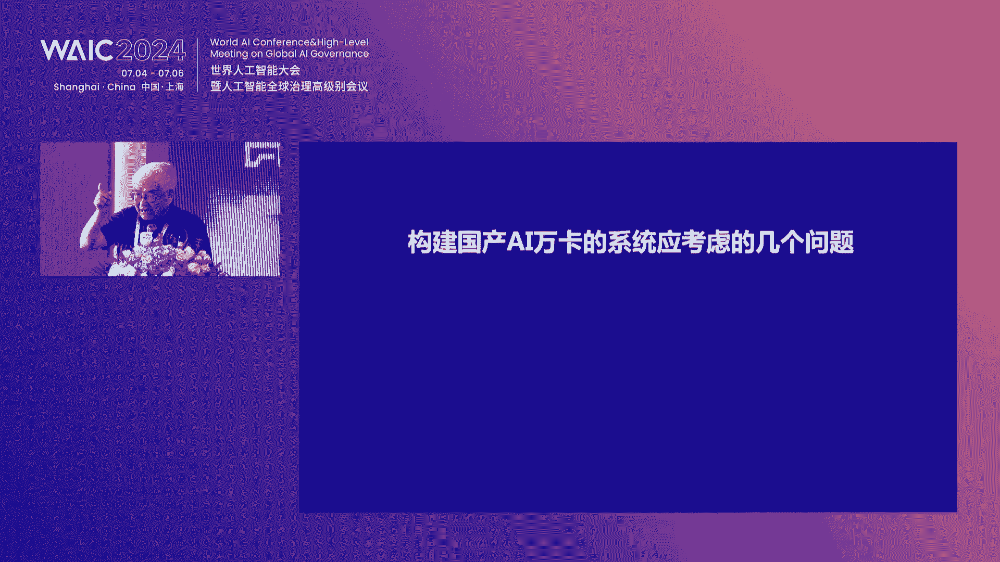
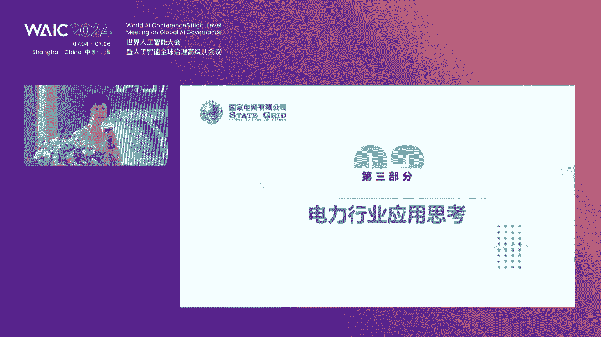

# 2024世界人工智能大会（合集） - P62：20240706-中兴通讯AI创新生态论坛 - WarrenHua - BV1iT421k7Bv

🎼尊敬的各位领导，各位来宾，以及线上正在观看直播的朋友们，以及线下来到我们论坛的各位嘉宾和领导们，大家上午好。欢迎各位来到中兴通讯AI创新生态论坛。我是来自中兴通讯的配文。

那么今天呢我们齐聚在深城的上海，而且可以在这里看到黄浦江边。我相信今天的天气，各位赶到过来呢，也是热辣滚滚啊，但是依然阻挡不了大家来到这里参会的一个热情。

那么我们共同围绕数字经济发展的新机遇共同化行业数字化转型以及携手探索AI数据的新纪员。那么接下来请允许我介绍出席本次论坛的重要领导和嘉宾，他们分别是中兴通讯执行副总裁首席技术官王喜先生。😊。

🎼中国工程院院士郑伟民先生。🎼国家电网首席专家技能类朱红女士。🎼好，欢迎你们。同时参会的其他的领导和嘉宾，他们分别有中国移动研究院副院长段晓东先生、中国移动研究院主任研究员陈佳园女士。

商飞智能数字化系统事业群副总经理杨帆先生、上海人工智能研究院算力算中心主任苏和简先生、阿里云计算平台AI产品架构总监魏博文先生、上海戏剧学院创意学院副院长铁忠先生、中西通讯高级副总裁张万春先生、中兴通讯政企业务总裁张宇先生、必任科技副总裁兼AI软件首席架构师丁宇帆先生、智普CIT创新中心主任冯晓明先生、以及汉博半导体副总裁齐振宇先生、百川智能商业技术总监郭美清先生、摩尔县城产品总监申谦先生。

😊，🎼寒武器解决方案总监张明先生。🎼中国电子云智能产品解决方案部总监陈磊先生。🎼天树置新市场生态总监陈佳明先生。🎼海光OEM客户发展部销售总监高帅先生以及随缘科技产品战略合作总监叶雷先生。

欢迎各位的到来。🎼那么如今，上海的经济发展呀也注入了新的动能，我们也是展现出了上海在于作为一个国际化大都市里面，它所应有的一些实力和活力。

那么中兴通讯在我们的上海浦东新区也有自己的一个研发基地正对向中兴努比亚以及红魔手机的一个研发和制造。那么时至今日呢，每一步的成长，我们确实也是离不开上海市政府和各级领导的努力和支持。

那么如今数字技术和实体技术的方发展呢正在加速如何智算方兴为艾。那么面对数字机遇的新召唤呢，我们齐聚一堂共话新时代行业数字化发展转型。

那么首先我们将有请的是中兴通讯执行副总裁首席技术官王喜先生致辞掌声欢迎。😊，嗯，尊敬的郑院士。各位领导，各位嘉宾，大家上午好。呃，今天非常高兴能够与各位相聚上海，共同探讨AI创新生态发展之道。

我也请代表中信通讯向各位领导、专家嘉宾嗯表示热烈的欢迎和感谢。在过去的几年当中啊，也随着他的GPT的出现。我想很重要的一点是规模产生奇迹。大家也在这个阶段性的看到。廉洁主义的设立啊。其实我们想啊，既然。

掐的GPT可以把人类几万年历史的知识能够压缩你和推理啊，能够把所有的知识沉淀到一个基础的大模型。其实我们也可以进一步推理，今后我们可以利用大模型，将你企业的知识去压缩。

你和推理到一个大模型，其实也可以把你个人的知识。把你家庭的知识嗯都去沉淀到一个基础设施里面。所以我们有一个观点哈，过去大家认为AI是助手。那其实我们今天认为AI是基础设施。他基础设施代理的是你的企业。

代理的是人类，代理的是个人。但今天其实我们也看到啊。大模型的发展，包括AR的发展，面临着两个问题。一个呢是生态封闭。其实第二个问题就是由生态封闭带来的问题叫。供应受限，选择受限，我们需要有很多的选择。

但是因为生态的封闭。我们无法去做到很多的选择。而封闭的主要的原因其实就是仅偶。也就是说，AI的硬件与软件算力与互联、训练与推理、底座与模型等等，都存在不同程度的吻痕。我想它的本质是耦合。

那么如何提供一个更繁荣的生态？解开生态封闭的最根本的方法就是解耦。那我想中心同学，我们想做什么样一个定位？我们如何去繁荣这种生态？打个比方啊，中兴通讯我们愿意做一根扁担。我们愿意左手左边扁担的左边嗯是。

算利芯片的供应商，那么扁担的右边是。AI生态的需求法。那么中线通讯又如何去做好这个扁担去挑起？供应方和需求方。中间通讯我想我们有这么几个关键的能力。第一个，虽然我们不做。GPU算力芯片。

但是我们现在有业界做的最好的。计算互联的芯片，我们也有做的最好的。IDPU的芯片，因为我们的传统的强项就是网络我们在网络已经深根30多年，所以我们也深刻理解如何去更好的把算力互联到一起啊，这是硬件。

那么。从软件上啊，其实我觉得中信通讯的一个核心能力就是复杂的软硬件的集存能力。我们从底层的协议上到算子。到平台到上层的训训练推理的模型和平台。都有。30年的积累。

我们最其实我们这些年最重要的积累的最核心的能力就是复杂的软硬件的提供能力。所以这样我们既能够我们利用我们的。互联芯片的多年的积累，利用我的。软硬件的提成的能力。

这样我就可以去把上层的应用和底层的算裂芯片结果。这样我就可以有机会去把。我国内诸多供应厂家的GPU的芯片。能够集成到一起，变成一个可完整交付的产品。

这样来我们也可以利用软件方面的封装去提供更好的API跟供使用方去使用。所以也是基于对AI的生态的认知和愿景，也是基于对中兴通讯的核心能力的理解。中兴通讯我们自身定位于开放赋能自主创新的质网底座。

左边挑起算力芯片的供应商，右边支持好生态的应用。今天我们有幸邀请到来自学术界啊芯片厂商、通信运营商、云服务商，包括模型开发商、模型应用方等不同领域的资深专家。

能够从不同角度去阐述AI开放合作创新发展的动见。同样，中信通讯也将再次分享全在开放的计算方案。我们希望通过这次研讨啊，希望大家各抒己见。这次大会能够成为中国的乃至世界的。

AI生态的发展繁荣的一个新的起点。我也期望啊通过中信通通信中信通讯的努力呃，通过我们各位参与方。的一起努力看到中国的AI更繁荣的生态，也看到。AI在不但能够带动芯算力芯片的供应商。

也能够带动中国的AI的应用啊。呃，相信这次论坛会成为我们凝聚共识、合力向前的新起点。我在此也感谢。世界人工智能大会为我们提供了非常好的交流平台。我想再次感谢各位领导，各位嘉宾，各位专家呃。

预祝今天我们这次论坛能够取得圆满的成功，谢谢各位。好，非常感谢喜玉总的精彩致辞。那么接下来我们将进入到的就是主题环节。首先我们知道近年来大模型的突破和生成式人工智能的兴起。

已经对于产业的发展带来一个很大的变化。那么人工智能的广泛应用呢也要求了更高的算力。因此，国产算力自主可控，就成为了国家目前的重点关注项目。接下来我们有请中国工程院院士周伟明院士带来主题演讲。

构建国产AI卡的万卡系统生态，掌声有请。😊，这个非常高兴啊来参加中心通信组织的关于AI创新这个生态论坛。我呢我今天来讲讲呢构建国产的。AI卡的外卡系统。因为呢呃国资委啊前一段时间发了一个通知。

希望呢我们央企啊、国企啊能构建1万块卡的系统是国产卡的。共结1万块卡这个AI系统啊还是挺难的。😡，呃，很重要，这个是一我一会会提到非常重要，但是呢也很难，的确非得来。那我就讲讲这个事啊。

人工智能呢已经进入到。😡，大模型时代，我们看啊这大模型发展非常快。你看从单模态下多模多模台发展，开始呢我是文本的，后来是图像的。现在呢视频的就多种模态了，一次能运在地方的一2跟行业下集合。

你看A2加金融A2加医疗，A2加汽车，A2加智能制造，A2加矿山A2加汽下很多很多一次呢。😡，从现在开始，一个呢AI家速的东西呢会非常发展非常快。也慢慢看到呢AI大模型的用的。😡，成果慢慢回出来。好。

这个呢我们我底下又说一下呢，这个算量。😡，这个大模型啊需要大算力，趋势啊就感觉就是大这个算力越大越好，基本上无止境这么感觉。但我们看呢算力存在大模型生命周期的每一环。😡。

我们看啊整个大模型研究过程现开始了研发阶段，你做大模型的人啊，你总得有计算机啊，有这个AI算量，那你。😡，调软件让你优化软件这肯定要的这是第一步。第二步呢，你大模型做好了，开始要训练了。😡，要做训练了。

需要大率力。我们经常说大力出奇迹，就这个意思。那我们看呢。😡，GD付啊，说是1万块11110百的卡，一共训练11个月，摔量很大，非常摔了非常大。好，训练完了以后呢。😡，我们要让模型精条，什么意思呢？😡。

这个模型训练啊，我们指的是基础大模型，训练的数据很多，训练数据什么哪来的呢？是各种各样数据，就工业的、农业的打造的，看小说的，看电影的，就各种各样数据都训练，我们叫基础大模型。好，这训练完了以后呢。

我怎么又出了一个模型精巧呢，我们指的是要用了，要具体应用了。比如说我医疗。😡，要用在医疗上这个基础大模型啊。第二个或者这模型的基础大模型啊，训练的数据是一般的数据。😡，他呢我对医疗数据啊训练的还不够多。

😡，一直怎么办呢？我们这个金条的意思啊，我们要做医这个医疗方面用作，一般呢医学方面顺数据啊要再训练训练。😡，也就是说，基础大模型对医学医疗方面啊还不够水平还还差，还水平还不够。那怎么办呢？

通过模型精巧啊让他呢把医疗方面数据再训练训练完了以后，成为医学专家了。你直道这个过程也需要算的。好，最后模型的推理。😡，这个推理啊，也就是根据实实施处理用户的请求了，他又推理了，推理也需要提起。

一直我们说。😡，整个生命周期都需要于算天。😡，好，第二个下面1个PPT啊，大家看呢这个前面讲算的，每一个过程都要算的，每一个过程呢算量也挺大。我们看看还有一个呢，算的还很贵，价钱很高。

我们看的中间这张图啊，训练的成本啊，大概是170是算的的成本。😡，人的成本10%，数据20%，主要是。这个算了成本好，右边推理推理当中啊，成本算了成本占95%。也就告诉我们啊，这个整个训练也好。

推理也好，这个成本角度来说啊，主要花的算的少。😡，一直啊就说税量很大，税量很贵。😡，好，那这个是算了，实际上惩处啊。😡，也非常要紧，你看也在生命周期的每一个环啊，都跟程处有关系。😡。

也直一个是算了CPU了，一个是存储。那我们看呢第一个过程，数据的获取。😡，我们不是说这个大模型有有训练吗？训练有数据啊，数据哪来呀？😡，到处去找去，从互联网上去找去，要把它获取，获取这件事情。

把数据获取来啊，总得放在一个地方吧，要惩除。😡，这个数据获取来的数据啊，还有两个特点。第一个，多模态的，我取来的数据啊，有文字的，有这个视频的，有有有图像的，多模态的，还有一个特点，什么特点呢？😡。

每一个。取来的文件短文件。😡，就每个文件小文件一直到这么一来啊，对我们惩处啊又提出了更高要求。文件个数多。😡，耕作多，一直做起来还挺费劲，这是一个数据的获取。😡，这个数据拿了以后啊。

第二过程啊就数据预处理。😡，刚才是把数据拿了就放里头了，这个数据啊还不是太好的，要预处理，预处理，把重复的数据要去掉，把有些数据要要要要清洗。一直最后啊把这个数据要放到内存里头去了。

一直数据预处理过程啊，随机读取数据呀本精灵预处理，要把它放到内存里头去了。😡，这个过程啊很慢，是也很花时间。一直我们说把这个数据预处理时间啊，我们经常说有人统计啊，我是没做过这个事这对的。😡。

说训练11个月。😡，实际上呢这数据预处理啊，大概占一半，或者一半不到，或者一半多一点。就是说11个月啊有5个多月是数据预处理。😡，一次我们说了半天，就说哎呦处理时间很长，实际上这个。😡。

1个CPU好快啊，还有个存储怎么来处理这件事也要要紧。第二，第三个模型训练训练当中呢也是跟存储器有关系。我一会也会讲到简单点，最后模型推理推理过程啊也需要说也跟存储器有关系的。我一会也会讲到。

一直我刚才这个两个B其他病的告诉你，你说模型训练推理有很大的算练也需要很好的存储。😡，好，那我们说现在有构建国产的AI卡的外卡系统，究竟要注意几个问题？😡。

第一个。😡，半进度运算性能跟到双进度运算性能的比例。😡，什么意思啊？你这1万块卡买回来了。😡，我们现有问你这一万回卡，整个一万回卡。😡，处理16位二进制数据性能是多少？

就16位的加减乘除是是多少性能处理到64位数据加减乘除性能是多少？😡，我们这个说法是对的，人工智能问题主要是16位。😡，2个16位的加减乘除，这没错，这句话一直呢我们说你这台机器啊。

1万块卡的组承这系统啊，16位的性能又非常快，就没错。但是呢大模型来了以后啊，大模型处理啊，我们发现啊64位的加减乘除也有一定的比例。也就是说你这台机器啊不能说我16位处理的非常快，64位。😡，不行。

那这个大模型训练是做不好的，64位哎的好好到哪个地步呢？这个16位跟164比啊哦，对，64位跟16主要16位啊又非常非常行，64位也可以也有一定的水平大概是1比50或这1比100比较好。😡。

我不知道有没有事情，这个呢比例有点有点粗啊，大概就说告诉你什么意思呢，16位的性能又好，64位的性能也不能太差。😡，否则呢大模型训练做不好的这第一条。第二条网络平衡时期，我们把1万块卡买回来了以后啊。

你总得连在一块呢。😡，就这一个系统吧，不能自己管自己连在一块，谁连？😡，互互联设备就网络设备把它连起来，连起来怎么连法？😡，很讲究，你可能马上就那一种最好的连接办法，每块AI卡。😡。

跟其他9999块AI卡一步就能到，直连，就每块卡跟其他9900元都直连的，一步就能到这是最好的但通行快啊，两俩之间。😡，一步就到，但这么一来，大家看到1万块12卡。😡，为了联接成，两俩之间都是直连的。

大概要买多少块联接卡？😡，一块卡一块AI卡要差9999块连接卡才能跟其他之联，一次一共1万块卡，一次一共要买多少块卡呢？9999乘1万，这么多连接卡才能把1万块AI卡呢，两俩之间一步就能到。😡。

这个卡的数量太大了，9999乘1万这么多块卡。😡，这个卡的成本啊比1万块的AI卡成本还要高，还要贵，这是一个问题太贵了，实现起来可能还有点问题。为什么呢？每块AI卡要差9999块连接卡吗？

才能跟人家直连吗？那一台机器要拆9999块连接卡差的位置没有啊。😡，没有这么多插槽，就这意思，一直呢1万块卡怎么连起来，完全是一步就能到，有问题太贵了，实现起来有困难。有一个办法，我我随便说一个办法。

每100台机器，一共1万块嘛，我100台或一组。😡，这100台两两之间之列。😡，那这么一来，这一100台是一组吧，这一组里头啊，每块卡每块AI卡才99块卡就可以了。才99块连接卡。好。

一直到这100块AI卡两俩之间是直连的。好，换1个100块卡也是两两之直连的那这个这个组里边的一块卡跟另外一个组的一块卡两俩之间就不直连了。要呢通过。😡，几步才能到，这也是一种比较一一种比较集中的办法。

一至有好多连法。我刚才是100台组成一组，连也可以200台组成一组，也可以50台组成一组。根据呢你的成本根据要求来定这件事，不管怎么样，1万块卡要把它连起来，就这么连法是有讲究的这第二个，第三个内存。

😡，因为呢大模型就是大数据。😡，一直呢对内层的访问也很讲究，怎么让他内存请求不要堵塞，否则呢让它均匀一点，否则呢内存的效果就发挥不出来，这是第三个。第4个。😡，IO子系统平衡设计。这什么意思呢？

是这样的，一万块卡。😡，就1万块卡的系统啊，基本上两个钟头，我这三个钟头有催支出。😡，我我们就是三个小时锤直错吧，出错了，你不要认为他这个系统做的不好，他么三个小时锤直错，不是1万块卡太多了。

太多了就出错，就出错了，就就上来了。😡，就相当于你家里一台笔记本，那你一年两年都不出错，我们笔记本很少有出错的。如果我们这个房间啊，用柜子把它竖起来，笔记本都插满了。😡，基本上两三个钟头就出错。

就有有一台笔记本就坏了，因为太多了，太多点。一直到如果是1万块卡，两三个钟头，我这三四个钟头就催出出错了。平均我们说假如是3个小时催出错了。好，我们开始训练的时候啊，要训练11个月。😡，不是有训练时间。

我们不多了，我们训练一礼拜吧，总开始训练。😡，到3个小时的时候出错了怎么办？回来重新训练。😡，又开始又到3个小时又出错了，那就没完没了了。你训练不完了。过去我们做高性能机器的人啊，都有经验叫检查题。

什么意思呢？假如说这个系统啊平均3个小时又可直错，我们怎么做呢？开始训练到两个半小时的时候，😡，两个半小时还还没出错了啊，两个半小时的时候主动停下来了，就不不训练了，主动把它停下来，干什么事情呢？

把这一个时刻。😡，软件硬件的状态寄到硬盘里头去。好，做完这个事情以后呢继续训练。😡，训练到第3个小时左右，他出错了，系统错了，一出错呢，过去从头来了，现在不要了，把那两个半小时啊，记载硬盘的东西拿出来。

从这地方开始继续训练。😡，这叫检查点，我们过去都这样做的，问题在哪呢？😡，两个半小时到了以后，我主动停下来，把盗窃的环境把它记下去，寄到硬盘里去。这件事情啊弄的不好啊，要做10个钟头。😡。

就是往里边记啊，弄了不好，你要系统不太，这个文件系统也写的不好啊，这个硬盘也比较慢，要10个钟头，那就坏了。10个钟头平均3个小时次做，那就乱成一个周了，基本上没办法弄了。我们希望两个半小时到了。😡。

往里边往硬盘里面写啊，最好10分钟20分钟，那比较好嘛，一直怎么做到10分钟20分钟都有本事啊。有一个办法，硬盘之接之前啊加SSD加U盘啊，那比这个U盘要比硬盘要快嘛。

原来10个钟头变成SSD本来就三个钟头可以了。我这两个钟头就行了。以后呢，我们文件系统里面怎么想办法让他写的快读得快。😡，一直这个问题卡多的时候一定会碰到怎么来解决这问题。好，这个第5个。😡。

如果是国产的卡。😡，还需要解决10个软件，还要做好10个软件。你看这个什么意思啊？因为呢现在我们国产卡的系统啊，总的说来呢，应该说最近几年我们国内做卡的人。😡，差不多有20来家公司。

我们有大一点的华为啊、海5G啊、天数啊、这个墨西啊、辨认啊，我我们很很多厂都得做AI卡。😡，应该说这几年发展的很快，做的应该说也是不错也不错，取得了很大进展。😡，但是毕竟呢我们时间短了时间短了。

这里边最大的问题就国产卡。😡，有些用户啊还不太喜欢用。😡，不太行，那这相对于英伟达的卡来说的，人家还是喜欢用英伟达卡，我们不国产卡不太喜欢用，不太喜欢用的原因在哪里呢？不是你的卡的性能没有他们好。

不是主要原因是生态系统不太好。😡，什么叫生态系统好还不好呢？我是这样理解的，如果原来你有个软件，基于英伟达写的。😡，现在呢要移植到我们国产卡的系统上来，移植到中很顺利。😡，很有意义，我们就说生态好。😡。

如果移在过程当中啊，发现了一会没做过库，一会没做过调运，没有一年两年移不过来，我们就是生态宝。😡，新写一个软件也是，如果写起来跟过去写法基本上差不多，就叫生态好，写法完全不太一样了，就生态不好。

总的说来呢，我们这几年国产的卡硬件性能有很大的进展。😡，生态也在不断改进，但是呢对用户来说啊还不是太满意，希望你做的更好，那怎么办呢？😡，怎么改变这个生态？实际上做好10个软件，我是这样想的。

哪10个软件呢？😡，我一个一个来啊，第一个变成框架。😡，因为变成框架这件事情啊，我们现在写这个大模型软件，不是基于硬件写的。😡，基于硬点写写起太太费劲了。我们基于框架鞋，比如说呃皮套墙啊、ten啊。

我们国产的都有我们华为的还5G的呃，这特数啊这个这这别人啊这几个公司都有自己的框架。😡，框架要改善有改善，就基于框架写写大模型的，不是基于硬件写的这是第一个。第二个呢，并情加速。😡，我们现是1万块卡。

不是一块卡。😡，一万块卡啦，一块卡的性能。😡，不错，2块卡的性能一个乘2，理论上上应个乘2。现在呢1万块卡一个乘1万。但实际上不是我们这个一一下来啊，病情加速把它做好了。我们做高性能机器啊。

我原来做高性机器主要还是病加速的问题，一知道现在一万块卡了。😡，变行加速问题很严重，我们国产卡一块卡的性能还是可以的。2块卡，5块卡，1000块卡，1万块卡性能就不太好了。就是变行加速没做好。第二个。

第三个通信库。你中的。😡，很多卡嘛，卡与卡之间有通讯啊。😡，国库要写好。😡，第五个哎，第四个算子库，我们的基本软基本这个算法最好能实现了。比如我随便举个举证乘法，写大模型的人啊，不要说哎呦。

我要用到举证惩罚了，我自己再写一个举证乘法，那都可以了，写起来费劲嘛，调用一个举证乘法库就可以了。类似你这个提供的库越多，那比程序人越审慎嘛，你这个库要写的全写的越多越好，每一个库实现起来要实现起来。

这个性能要好，这第四个。第五个。😡，编译器AI编译辑。因为你写完了以后呢，总共编译器变成了我们自己的芯片能执行了这个编译器啊。😡，麻烦在哪呢？我们国内做编器的人啊相对比较少，不怎么做编器。

会做编器的单位不太多，但编器非常重要。😡，很多优化好了，这个编辑做优化好了呀，性能就大提高，否则性能就差。第6个变成圆，还有还有4个。😡，调度器内存分配系统、容错系统、存储系统加里一块到10个。

现在呢我们的厂家都有这个10个软件，都有。😡，但是呢这10个软件呢或者性能不太好，或者呢做的不够全。😡，大概一致了，我们一开始已经发展的进展很很很大了，但是呢还不够把这1个软件呢。

我一直认为这10个软件做好了，用户就会高兴就会使使用我们。😡，用户不太喜欢用啊，不是因为你的性能人家的60%，不是是你身态不好。😡，即如果你的性能啊是人家的120%比人家还好。你这十个软件没做好。

还是不喜欢用。😡，一直到我们现在感觉到的。😡，百我是一直这么一个观点，硬件新人已经是50%和60%的新人了，生态做好了会喜欢用。😡，我重是一个管的，手臂慢一点，问题不大。人家训练的时候，人家训练7天。

你训练8天不完了吗？问题不大呀。😡，你要你性能很很高，人家训练7天，你训练6天就行了。但是人家7天的，训练挺好，你这个6天啊，一罐错了，一罐干嘛了，这个事情也麻烦。因直我觉得现在比较重要的事情到了。😡。

芯片有不断改进，越做越好啊，这个芯片厂家都在努力做这件事，下一个版本就水平更高了。😡，还很要紧的是生态，也就这1个软件。好，这个一次呢做大模型基础实施啊。我前面讲了5个问题需要考虑的。

如果你把这五这我讲的五个问题啊，前面四个问题，不管你是国产卡还是国内卡，都需要考虑的。如果是国产卡，还要考虑第五个问题，就是把他这这个软件给做好了。😡，这件事情你考虑好了，别人用1万块卡。

我可能9000块卡就可以。😡，如果你是根本不考虑随便弄的，人家的1万块卡，你可能有3万块卡才能达到人家水平。😡，大概是这么一个情况，一直我说说做这个事啊，还挺一直呢，我最后呢这有个小家啊。😡。

算良道前面临的痛点。第一个，国外帅利很难获取。就算了家不卖你的了。😡，一直呢卡脖子了。😡，如果呢现在能买到的话，还是有点不合法的，瘸里拐外的，不知道从哪的。我们国有企业的那个不敢随便买这个东西啊。

我自己一个人倒也无所谓，我个人买也无所谓。哎呦有人说我走私来了，那我就买一块就完了嘛。如果我们大厂有1万块的生产用的很难。我们国内的卡用起来还比较麻烦。我跟你说了很麻烦。一直道还有一个问题呢。

国产算了种类多，😡，美国人啊就两种卡，一个是英伟达的，一个是MD的两种卡。我们现在高才是有二十几种卡。😡，2十几周这个卡这个事情也比较麻烦。以后呢，国产算的效率也比较低，就这10个软件没太做好啊。

效率也比较低。好，这是一个这一个呢，大家看看我这个右边这图啊。😡，最边上的硬件，我们硬件很多啊，刚才说有二十来个厂家，二十来块种卡啦。我们各种模型啊，不知你这个CP新出来的AR卡要支持各种模型吧。

你不能说我只支持一种模型，各种模型都要支持，一直呢我换了中间划了种密密码的线，就是我这一块卡，既要支持。😡，扎山的模型模型又要支持李四的模型，还有王五的模型，所有模型都要支持啊。😡，一次工资量就很大。

😡，美国人就两块卡，两种卡，我们那有二十几块卡。😡，模型有这么多，一直做起来就很费劲。一直上每家芯片公司需要支持不同模型的应用。😡，这还有麻烦吗？第二，需要大量高端系统软件研发人员。

系统软件是软件领域的最麻烦的部分。😡，第三个，国内呢精通系统软件营员呢还不还比较少，不太好招人。最后呢，国产衰利企业缺少沟通，建构建了高质量系统软件的能力。一直呢这个是。😡，第3个，那怎么办呢？

我们解决办法实际上就是针对国外算量很难获取。那我们就问国国产的吧。😡，这个是我们国家也要求我们很多人都说，那就是国产的。在国产呢，针对国产算了用起来比较麻烦嘛，不太不太好，就人家。😡。

因为他在哭打这么多年了，我们刚开始没几年，一直怎么，我们想办法逼他做一个。😡，接龙tenfor一个主流的生态系统。组建它样子跟它差不多，下面是不一样的。一直呢提供统一的并行编程模型。

加低不同芯片的优化成本。希望做一套东西，不同芯片我都是一样解决问题。😡，最后呢，并行计算加智能编译，挖掘国产衰利的硬件性能。😡，哎，最后呢，我也还有一时间。要改变国产卡的生态系统不好局面。

觉得呢必做芯片，要下下一个芯下一个芯片很重要。这这我不是说做芯片不重要哈，这个非常重要，怎么把这个生态做好了，这是第一个。第二个呢，解决大模型技术设施的5个问题。我刚才列了5个问题。

还有一个呢构建国产卡外卡系统很必要，也很难。不要随便说构建1万块卡系统容易容易拿来一单就行了。没有这么容易。😡，我觉得我们构建国产卡的难度很大。😡，不容易非常不容易。好，再有一个呢。

我们建设开放接熬互联互通的国产衰联合作生态。希望呢大家这个生态这件事情呢。😡，跟我们运货也有关系啊。😡，大家用户用起来多了。😡，用的次数多了，熟悉些了，生态也觉得好一点。我举个例子。😡，我们CCF。

我在中国计算机学会曾经到过理事长。😡，去年我们就搞了一个什么比赛呢？WPS。😡，就是自务处理制处就是我们不是一般都office啊，word什么东西嘛？是国外的嘛？我们国内不有个WPS嘛，就跟他对的。😡。

WPS比赛。😡，这个比赛呢实际上也是比较的给你。😡，一堆数据用WPS的做一张表，给你一张数据，用WPS画张图，就类似这种比较不是非常难的这个就就WPS用起来。😡，有10万人参加比赛。😡。

后来这10万人啊挑了500个人参加决赛。我问过500个人里头的一部分人就在苏州比赛决赛。我说wPS怎么样？因为他为了参加比赛啊，用的也是很多次了，一直呢他就说wPS也可以啊。😡，为什么有人说不行。

有人说还可以的，用的多了，那两方面呢，一个PS本身要做的好，实在做的太差了，男人用的人再多也不管用也好，不到哪去啊。另外我刚才说了，10个软件把它做好了，这是我们厂家的事以后呢希望客户呢，哎大家都来用。

两方面努力把这个生态做好它。好，我就讲到这吧，谢谢各位讲的不对地方请大家给给指交。😡，好，非常感谢郑源士带来的一个分享。我觉得是给我们这个论坛开了一个好头。因为我刚才在关注的时候。

发现包括门口以及在场的各位都在驻足和拍照。所以我觉得国产算力化的发展任重而道远。而且在有确定目标的情况下，我觉得一切都可以交给时间来解决。

那么接下来我们要分享的是关于中兴通讯一直致力于发展和提供全站和全场景的智算解决方案，包括向算力网络以及智力等方面应用的创新。来推动AI大模型的商业落地和应用场景的拓展。

那么接下来有请中兴通讯产品规划首席科学家卫斌先生带来主题演讲AI进阶开启极致算网新未来，掌声有请。😊，啊，那个呃尊敬的郑院士啊许玉总，各位领导，各位专家啊，大家上午好。呃。

非常欢迎大家今天来参加咱们这个呃开放生态的这个论坛啊。这个世界人工智能大会，去年的时候，我记得也差不多是这几天呃，我也来了。然后今年过来了有一个非常不一样的感受，就是啥呢？

就是今年的这个展会啊比去年热多了。而且今年的天气也好像比去年热多了。所以大家今年来参加会也非常辛苦啊。那个呃刚才那个许于总在开场致辞里面提到了就是中兴通讯，我们致力于呃构建一个开放创新的呃计算生态。啊。

然后郑院士呢也对这个生态提出了一些关键的呃这个这个问题。那么我下面呢就把啊我们对这个计算。态如何构建这个开放创新的这样一个计算生态的呃一些思考和实践，给各位领导和专家做一个呃简要的介绍和汇报。

那不当之处呢，请各位不吝指正。好呃，众所周知啊，就是大模型这个驱动的我们的人工智能。当前呢正在这个迅猛的一个发展。那么我们从技术层面能看的话，我们我们观察到一些呃现象啊。第一个就是我们的呃基础大模型。

它的参数规模呃，正正在从百千万亿这样一个规模，从单一的模型呃像超10万亿参数规模以及多模态的模型呃去进化。那么与之相对应呢。

我们的算力基础设施呢也从千卡万卡这样的一个集群规模呢呃目前呢甚至于在像超万卡这样的集群规模呃，去呃演变。那么呃同时呢我们看到在技术架构层面呢。

就是这个同购同质的加上讯推一体的这样的一个呃封闭的基术架构也正在向易购意制以及讯推结构的这样的一个开放的这个技术架构呢去转型升级。那么我们可以。可以看到呢就是说呃这些方面的一个转型可以看到呢。

就是我们AI可以认为啊AI从1。0正在向2。0阶段去呃演进。但是光有这些技术方面的这个升级。我们觉得还是啊不够的。那么我们还面临一些观念的挑战，这里面呢就需要我们加速三个转变。

那么其实刚才郑院士也提到了一些这个观点跟我们是啊这个不谋而合的。我们认为的第一个转变的，就是要从单纯的大模型的训练竞赛，像这个模型的推理应用落地，以及使能千行百业这样的一个转变。那么第二个转变呢。

我们就是觉得应该是从这个不计成本。因为现在我们构建一个万卡池子，这个成本是很高的。我们从不计成本，然后极致的追求极致的性能，要向性价比优先，向好用转变啊，这也是刚才最后举的这个WPS的例子啊。

我我觉得是感受非常非常深。我想起想起了以前一个呃这个就是以前上学的时候学的这个鲁迅的一句话，这个走的人多了，也就这个地上也就有路了啊，只要是好用，哪怕刚开始性能差一点。但是我们更容易获取更好用。

这是更关键的那第三个呢就是我们也觉得就是目前的啊我们的这个算力的芯片啊，还包括相应的软件生态呢，它是碎片化的啊，自成一体，就是垂直封闭这样一个一个生态。我们需要大家开放协作优势互补。

像这个开放结偶的这样一。一个生态去共同努力。那为此呢，我们中兴通讯呢提出了呃四个方面的具体的举措啊，第一个呢就是呃开放基座以往强赚啊，训推并举和多方合作。那么下面我详细的给各位领导和专家做一个汇报。

首先来看开放基座多元的算力的灵活的供给。那么我们和业内的芯片厂家算力芯片厂，包括CPU和GPU众多的这个算利芯片的厂家合作呢，一起构建了一款这个高性能的多样化算力的开放基座。

也就是我们中心的R6965系列的这个AI服务器。那么这个服务器有个什么特点呢？就是它可以。实现让我们的用户根据我们不同的使用场景去灵活的选择适用适合的算力啊，灵活的选择适合的算力。呃。

呃同时呢它能够做到我们就是一机多卡，就就是一个一款机型的兼容多多种这个算力卡啊，能够随心而选，能够换新不换座啊，同时呢就是我们在这个里面呢说的这个多样化呢，还包括我们它的卡的形式，啊。

不限于你的模组的形式，也不限于你的PCIE的插卡的形式。它的散热的方式，不限于空空气的这个风冷，也不限于你的这个页冷，所以它是一个多灵活的这样的一个开放机座。

另外呢就是我们基于原先我们构建的一个云网底座就叫。这样一个统一的云网底座啊，做了一一些升级。然后呢，我们能支持通算和计算这样的一个统一的这个算力资源的这个管理平台。

它能够实现这个多样化的易购算力的统一纳管，能够兼容多厂家的异购的集型集合通讯库，能够实现这个类似于像混驰训练这样的算力原生的异购算力的这样的供给。啊另外我们想在着重介绍一下的。

就是我们这样的一个统一资源呃管理平台呢，它实际上它有三种的交付方式。第一种呢就是比如说我们在呃数据中心在计算中心，以整体的这样一个集群的方式来进行交付。那么在边缘呢，我们也提供这种轻量化的这这种交付。

它可以在一台服务器。内部内嵌我们的轻量化的这个tax啊，还有一种方式呢，就是目前用的比较多的，我们是以插件化的这种模式来提供。呃，具体而言呢，就是我们把内部的一些呃核心的模块，包括我们的异购算力的加速。

包括我们的呃这个运行状态的呃监控，包括我们的断点续性的这种核心的组件，把它抽取出来。以插件的模式提供出来，能够实现和第三方的资源管理平台进行一个这个组合。那么这样呢就实现一个这种开放共赢的。

那么其次呢我们想说一下这个以往强赚呃，打造高效的万卡超万卡的这样一个集群。那么呃徐总在开始开场致词里面特别说了我们呃有30多年的这个网络方面的一个经验沉淀。那么我们也愿意分享出来。

尤其是把它应用在我们的计算开放生态当中来促进我们的这个生态的构建。那具体而言，我们有三个方面啊，第一个方面就是我们针对目前单卡算力受限以及机内的msh互联这样一个瓶颈啊。

刚才自愿士也特别提到了呃1万张卡，我们要9999乘以1万，实际上就是m氏互联啊，那msh互联这种方式呢，实际上来讲的话是它的扩展性不够。同时呢他对于单节点的这个互联的要求也是比较高的。所以。

所以针对这个呃单卡算利受限和麦氏互联的这个复杂度呢，我们推出了这个机内的Olink。这个基于交换的这样一个开放互联的呃这个计算架构。那么是基于我们这样一个大容量的交换芯片。

能够实现啊不同厂家的这个算力GPU的开放互联。呃，降低我们互联的复杂度，提升我们单机的算力密度。那第二呢就是我们。采用这个DPU的卸载。呃，和这个呃全局的精准流量精准的这个流控呃，实现了这个智能的路由。

那么能够提升我们机就是机间的这样的一个吞吐量和这个呃和降低它的这个转发时验。呃，第三呢就是我们可以提供一个超大容量的啊这个新云网络，实现这个就是无损以太网的这个灵活的呃扩展。

我们可以提供就是两层的合合这种合适和合适的这种互联，也能够提供这个呃框式的互联，也能提供多层的呃合适和框式的这种灵活组合。那么最大呢可以支撑到啊36000多张GPU卡的这样的一个集群。第三呢。

我们说一下这个讯配并句加速呃商业的闭环。那么在训练训练方面呢，就是我们也在探索，就是通过一个就是我们的一个 boost这样一个一个平台呢来实现这个非云制的拆分和异购并行。

就是刚才曾院士里面说了做好10个软件呃，其中一个第二个啊，第一个是那个开发框架，第二个就是这个并行加速。那么现在的这个并行加速呢。

我们往往都采用的是一些 flow这些开源的那这些开源的这个并行加速的框架呢呃它只能够目前只能够支持这个云制的拆分以及同购的并行。那么我们这个目前在探索做这个非云制的拆分以及异购的并行呃。

通过这个里面的集合通讯库的转换，能够实现异常。家的GPU的这个互互相构建一个这样的一个超大规模的这个计算机群。那么针对不同的训练平台和推理平台，我们推出了air booster迁移工具。

它能够实现我们主流大模型的。跨平台的快速迁移，能够呃一周就能够把这个迁移的工作完成，两周基本上你就能够畅畅通的运转起来啊。这个呢其实呃刚刚郑院士的胶片里面，最后大概是有一个网状互联的。

其实我们就是这个工具呢，就是解决那个刚才所说的那个网状互联的那个问题的啊，就是不同厂家的呃GPU还有不同的模型。我们每每来一块每换一个卡，每换一个模型就要去做一次适配。那么有没有一个工具，能够。

降低这个复杂度，提升我们的效率啊，这个就是解决这样一个问题的。那么第三个呢，在推理方面呃，我们也发现，实际上嗯呃这个训练对这个集群的能力要求非常高。但是推理其实对成本对性能的要求也同样高。

所以为了解决这个成本和性能的问题呢，我们推出了一个针对不同的训练任务，以及不同的这个算力它的一个智能的感知分发系统，能够感知这个我们底层算力的呃内存的配置，算力的配置啊。

以及就刚才包括呃郑院士提到的它的精度，所以针对呃不同的内存配置，算力的配置还有精度等等等。给不同的应用选择合适的啊推理的平台啊，这就是我们做的这样的一个智能分发系统。那最后呢，我们。

就是我们觉得就是呃一枝独秀不算村，只有百满园生色才是村。其实这样一个生态，无论呃靠某一个单一的厂家，都难以挑起这个业界的这种开放共赢创新的这样一个生态。是需要我们多方合作，去催熟AI的产业生态。

那么我为此呢我们构建了一个呃cloud AI的这样的一个开放算力实验室。那么我们建立了一个就是多厂家的AI芯片，包括不同厂家的这个服务器，还有这个AI平台。

还有这个模型和应用这样的一个呃互联这个呃互联测试这样的一个平台啊，互联试验平台。同时呢我们呃努力的去构建开放兼容啊，便捷部署，持续基层以及相互认证这样一个合作机制。啊啊另外呢在实际落地方面呢，我们也。

也推出了一个开放一体机。那么这个开放一体机呢是集成了啊业界主流的合作伙伴的一些啊这个大模型。当然也包括我们中心自研的大模型啊，里面有这个有我们运营商的啊，有我们合作伙伴呢啊。

同时呢也有各种各样的这个AI的应用。那么可以使用户做到呢就是太箱集用呃，方便我们的这个AI的这应用落地。啊，最后我想再重申和嗯倡议一下就是嗯。我们希望去构建一个啊软硬解偶啊讯推解偶。

还有模型和应用解偶这样一个开放啊共赢的生态。啊当前呃这个算力进阶的一个大背景底下。啊，只有多厂家的我们相互的开放合作优势互补，才能构建商业共赢的生态。那么中兴通讯呢。

我们致力于成为一个呃全站全场景的制算解决方案的提供商。我们更愿意和业界伙合作伙伴一起啊，成为这个开放共赢的创新AI技术生态的这样的一个呃推动者和贡献者。好，谢谢大家。好，非常感谢王总的精彩分享。😊。

🎼我们也相信啊，中信通讯也将继续秉持着以往强算推训推并举的一个核心主张，与合作伙伴共同继续发展。那么接下来呢我们要说的一个话题呢，可能跟大家是关系比较深刻，包括我们服务器的使用，以及各个千家万户的使用。

就是跟电有关。那么电力发展和AI智能化普及的今天，他们之间有什么联系又会带来哪些思考。那么接下来有请的是国家电网首席专家技能类朱宏女士带来主题分享。人工智能技术在新型便利系统中的应用与实践探索。

掌声有请。呃，感谢这个中信通信，感谢这个各位这个在场的嘉宾给我的这个信任。刚才听了这个郑院士的这个演讲，他的题目是啊万卡系统的这个构建。其实我听下来第一反应就是我们拥有有有一个电力啊。

特别大的一个超级VIP的用户。因为对我们来说，现在人工智能。虽然我的题目是人工智能。在我们新型电力系统中的应用就是怎么来支撑我们。但实际上嗯大家现在也都很清楚，这个算力的镜头。

人工智能的镜头其实就是算力算力的镜头实际上还是我们能源。实际上对我们来说，可能这个电力未来怎么满足人工智能的这些训练啊，推理的这种需求，可能也是一个新的挑战。

它对我们整个原有的运行的一些机励都会有些新的变化。所以我也是今天简单的跟大家分享一下。这个先简单的还是回顾一下我们国网公司本身的这个智能建设的一个过程。那我们应该刚才也讲了。

现在这个呃总书记提出的是构建新型。😊，电力系统。但实际上我们感觉它未来支撑的重要的场景。除了我们现在说的这个呃原有的这个千家万户，千行百业以外，可能未来的这种新智生产力。

包括我们讲的这种啊这个所有的像新能源的这种汽车，千家万户未来的这些新能源新呃人工智能的这些这些设施都需要我们来支撑。所以呢我们国网公司现在也把它定位为了我们呃国网公司数字化转型的一个高级阶段。

就是我们也要把人工智能进行一个规模化的运用，来赋能我们电网的这个核心业务，我们的生产营销客服方方面面，然后来改变我们自己现有的作业模式提升了我们的生产效率。那么我们是从2017年开始做。

当时虽然大模型和GPT还没有出来，但是上我们已经开始在用人工智能在用搭建相应的顶层设计。那么去年呢我们和今年都是在做相应的这个规模化的这个应用。目前呢我们已经在呃公司的现场的生产啊，电网的运行控制。

客户的优质服务等方方面面已经都有一些人工智能业务应用的一个探索。那么也是推进人工智能技术和我们啊电网生产管理的一个融合。那么目前来讲呢啊虽然我们每个专业场景都有应用，但是实际上就人工智能规模化应用来讲。

实际上我们。还是也还是处在刚刚起步的阶段。所以目前相对比较行那个成熟的几个场景，就是大家可能也都能够理解的。一个是我们书店的通道的这个智能巡检，一个是我们变电站的远呃智能巡视以及现场的作业智能管控。

但这几个场景综合下来，其实还是相对于来说就是呃人员的一些巡视作业的现场替代。特别是相当于用视频呃一些的这个分析去发现一些我们设备的缺陷。所以总的来说，它还是属于在呃这个人工智能视频。

这个相当于在这个CV领域的一些探索。那么比如我们这个书店通道，那么我们目前相当于啊也过去的一自己的一些专业模型，加在现应模型，也已经解决了，不仅解决了我们现场啊人员翻山越岭巡视替代的问题。

而且把我们原来现场人员，我在现场用肉眼或者照相机，我很难发现的一些包括绝缘子的缺损啊，包括一些这个感塔的沉降等等这些问题都有了一个解好的解决方案。那实际上刚才我讲了，虽然我们很多场景用的是视觉。

但是实际上声音这一类的这个应该来讲声音我们讲的不是语义，而是声纹，它的那个一些应用对我们电力系统来讲可能更有一些意义。就是因为在我们电池场就是变电站啊，很多这种电磁场比较复杂的环境下。

实际上很多信号是会被干扰的。但是相对来说声音它作为机械波，它可以啊把我们设备内部的包括变压器震动的这种异常啊，包括我们现在感塔的一些松动啊，它都可以给我们一个很好的解决方案。

所以我们目前也是呃可能电力行业对声音对声纹可能有一个更呃更迫切的一个一个需求。那么最重要的我们现在还是在用人工智能的这个技术来和我们传统的电网物理机理来相结合的方法。

解决我们自己电网运行现在所存在的问题，就是呃对于一张电网，大家联系到千家万户。但是过去呃实际上连家千接万户的配网，对我们来说，它的一些实时采集的量测，或者说大家可理解的就是对它的感知程度。

实际上还没有做到完全的透明可观。但是完全像我们主网一样，靠加装这个采集的装置，这种成本也也是我们不可持续的。所以如果如何用人工智能的这种能力，加上我但是他一定要在跟我们的物理机理相结合的情况下。

解决我们电网的运行问题，这是我们也是江苏公司这几年做的，包括用来支撑我们的分布式光伏的这个出力。因为分布式光伏也是千家万户，现在也不可能每家每户，我们都强迫他来装这个采集的设备。

那么我们通过一些建设基准点，然后加上对气象这些因素的分析，然后也形成了一个对它的处力预测。因为我们电网实际上从发输变配，因为储能技术的目前还是一个瓶颈。

所以我们从电厂的发电到最后的用户的用电实际上是以光速在传播的这么一个过程。在这中间的每一个控制环节，实际上都是不能够出错的。像刚才正确是讲这个训练3个小时，如果就呃就就就就出现问题。

你还可以有事先的机制，两两个半小时做一些相当于备份。但是如果我电力系统随时出问题的话，你再大的这个UPS再大的一些这个储备电源实际上都不可能支撑现在这么大超级算力的这个运维。

所以怎么样让我们电力系统能够稳定可靠的运行。像大家目前的感觉是呃应该来感觉自己现在电网。别是停电其实是越来越少。我们现在在核心区域的可靠性也能够做到4个9到5个9。

那么未来呢我们也是准备用还是要基于这个数据加机理来实现我们在电网运行下面，未来面向的这个源网和互动以后，这种高维非线性不确定性的很多的这种及时决策故障处置的这种难题。

那么所以说实际上大模型我们现在也在应用。那么它的优点我也不用这个在强调了，刚才各位专家也讲了，对于我们电网来说，我们主要还是要构建我们的行业大模型。但是怎么样用这个行业大模型呢？我们去年是江苏公司。

我们做了一些简单的实践啊，基于这个但是是实践的证明呢，就是说大模型在这个缺陷的视频的这种识别上比我们的小模型确实平均提升了7。5%。但是它对于算力的要求确实是我们以前的这个训练阶段是我们传统的40倍。

然后推理也是6倍。所以未来就是怎么。样把这些啊算力，其实对我们对于像这种基础行业的这个呃运营商啊，应用应用单位也好，也是对我们来说也是一个要解决的问题。他的投资他的这个收益包括怎么去训练。

所以我也简单的谈谈我的一些想法。

那么大模型除了它本身的能力算力对我们有一个考验以外，其实大模型本身在我们电力系统的应用中，它还有一个很大的局限性，就是它的这种黑盒特性。在我们看来，短时间是不可能取代我们现有的这些小模型。

因为我们电力系统的这个啊对于安全生产可靠的要求，我们是比任何行业可能还要再高。因为我们是叫一师万物。所以所有的内容我们是需要它的逻辑最后是要可控。那么它的这种黑盒子系。

那么包括它我们行业大模型构建的时候啊，我们现在认为在我们那种调度运行控制，就要精准决策类的上面，我们个人认为还目前不太适合用这个大模型，可能还是用在我们这种啊相对来说，比如调度员的一些辅助决策。

或者我们一些这个缺陷人工巡视的替代，可能更适合我们大模型。但是目前对我们来说，如何构建我们的行业大模型。其实我们也有很多需要解决的问题。这么多的模型包括。这个大会呃就这两天大会李彦红总也讲了，百模大战。

那百模大战对我们客户来说，我们选择什么样的大模型作为我们训练行业大模型的底座，其实是我们要思考的问题，是开源的还是必源的呃，而且我们需要自主可控。未来这个模型，我们还自己行业大模型也需要迭代。

如何去选择如何去迭代。那这个模型本身它的训练的成本，包括对这个训练数据的安全性，对训练环境的安全性，可能都是我们作为行业用户需要考虑的一个问题。

可能也是希望啊像中兴通讯这些国内有影响力的这个厂商能够提供给我们这种啊国产的自主可控的这种支撑能力。那么对于我们来讲，大模型里面，我们可能更关注多模态的这个应用。对于生成式实上并不是我们关注的重点。

也不是说我们不关注。因为我也讲了，我们更关注啊控制的可靠性。然后这个故障处置的及时性。那这个包括缺陷发现的及时。我们现在刚才前面介绍的应应用都还局限于这个视频啊或者单一的一些场景。

但是实际上我们现场的故障很多时候是多种因素啊，比如声音啊图像，包括像我刚才讲的9远塔。就是外面输电塔，它可能少了一个这个螺栓，这个我们可以通过视频能够发现。但是如果这个螺栓松动了。

实际上我是通过图像是是很难识别出来的。但是它松动以后在运行过程中有可能有声音，有其他的这种形式的这种故障特征表示出来。所以对于我们我们可能更需要这种多类型的这种啊这个能力的这个提升特征的提取。

然后来帮我们来综合的分析，就类似我们人的大脑，我不是只靠眼睛去分析。我可能是一个综合了啊视觉听觉，然后包括一些其他信息，包括我的传统历史的经验，一起去决策的这么一个过程。

所以对我们来说可能多模特大大模型的应用，也是未来我们特别关注的一块。那么这块呢可能呃应该来讲主要还是因为我们电网本身也是一个网络结构。那么图计算，包括神经网络，它天生其实跟我们的电网的这个表达特征。

实际上是比较接近的。那我们原来传统的电网的一些底层，包括现在用的这些计算的软。件稳态仿真的软件可能都是基于传统的这个呃这个理论。那么我们也在想啊，能不能从底层的技术路线上面给利用人工智能。

包括图论这些新的技术，把构建重写我们整个传统的电力系统计算的这些软件。那么最后呢还是就是我们电力行业最关注的还是应用的安全性。所以我们对于人工智能的这个可解释AI也是啊可能有着更迫切的需求。

就是我们需要对于这个。这个AI给出的这个答案是要能够自主可控。因为我调度员做一个呃决策。比如说拉哪条线路恢复什么方式，我不可能问了GPT以后，每次都出现不同的方式，或者说根据它出现一个错误。

那可能就是人命关天，然后可能会给整个社会带来灾难性的后果。所以对我们来讲，我们现在一定是在这个数据安全，然后这个系统可控，然后整个算法也是有可控的情况下。

然后让他成为我们这个生产中的一个不可或缺的一个助手。那最后呢就是人工智能的行业化应用落地，他其实不完全是一个技术问题。他最后还是会牵涉到你的管理到企业应用的方方面面一个全链那的过程。

包括专业的啊这个模型后续续的这个训练人员题词器提词题词的这个题词的这个提示人，他一定都是我们现场有经验的人员。而人工智能的这个深刻应用以后啊，也是需要一些通信啊啊，包括我们讲的算例，他很多。呃呃。

我们像我们国网每个省可能都有一些卡，但是我没办法到万卡，怎么样把我们这种各个各家都有的这种分布式的收算力能够真够统筹一个啊算力架构，能够帮我们训练，我们不一定要那么呃大模型的。比如百万级的。

但是百亿级的这种参数，怎么去用一个统筹的算力来进行一些这个计算，实际上都是我们需要在考虑的问题，也是希望这个在座的各位业界能够给我们提供一些这个支持的这个因素所在。那谢谢大家。我今天就分享。好。

非常感谢朱红女士带来的精彩分享。我们也看到了国家电网在人工智能技术的应用其实很多，但是并不是完全性的，它需要一个时间去实践。那正如实践是检验真理的唯一标准嘛。那么我相信除了国家电网之外。

其他企业也需要和AI需要一个实践性的一个过程。那么正如此，企业级的一个大模型呢，它的发展是需要一个时间段来发展的。那么什么样的内容可以值得我们去思考和发展。

那么接下来我们将有请到的是阿里云计算平台AI产品架构总监魏博文先生带来主题演讲，企业级大模型RG场景应用构建，掌声有请。😊，好嗯，各位领导啊，各位专家早上好。对，很高兴我也来分享一下。

就是我们如何在企业里边去应用这个大模型。因为从去年开始，我们看到国内很多这种大模型公司都在做或者是互联网头公司都在做自己的大模型做百模大战。

那现在到今年那我们就可以看到很多公司都在去寻求大模型的应用落地。那大家在C端的应用其实有很广泛的这个落地。大家在手机APP上都可以看到各种各样的这种大模型的这种C端的应用。

那在企业内部包括我们刚才国电网的这位专家也提到说我们在这种企业内部去真实应用大模型的话，对于安全性对于准确性都有很高的要求。那我们去通过这个大模型落地，其实最关键的一个目前可见的一个路径。

其实是这个系统G这个系统。那在做这个软G系统的话，大家也从去年年底开始也在这。方向做了很多的探索。那他其实落地还是有很多的相关的一些挑战。那包括了我们如何去保证这个整个系统的正确性准确性。

那如何去保证整个系统内生成的这个呃文档的一些安全性其实都是这个系统在功能层面的大很大的一些挑战。那去搭建整个这个系统其实在非功能层面也需要受到很多的关注。

那像这个整体的这个端到端的延迟是不是能满足我们系统的要求。那像刚才我们在电网里边去要做一个决策。那可能就是一个10万火集的这个这个这个决策的一个链路。那么如果说我这个系统不能在秒集进行响应。

那我大模型生成花了十几秒。那这个整个的系统其实也是不可用的。所以从功能层面和非功能层面都给我们带来了很多的一种挑战。那这样的话，其实我们作为一个云计算公司，其实在这个方面也做了很多的研究和深入的探讨。

那我们有一个基于这种模块化的方式来去把整个的系统拆分成不同的阶段。像我们这边拆分了7个小的阶段，然后通过这种不同小阶段的内部的不同的功能模块来去支撑我们去能够快速构建一个系统。

那并且达到整个系统的这个链路上的一个安全可控，包括呃准确。那每个阶段这块我展开一下，就比如说在这个数据的这个接入阶段。那其实我们可以看到不同的企业，包括呃这种我们to c to B。

那么它最终它出来的这些数据其实各种各样的千奇百怪的那像内部可能有一些历史的文档都甚至没有数字化那可能可能都是一些拍照出来的图片那包括我们可能有数字化的像PDF相关的文档。那其实这些数据的如何去接入。

包括如何去识别这种legacy的数据到我的系统里边，那其实在数据接入层其实要提供各种各样的数据接入的模式。那同时呢像这种数据接入后，我们怎么去做这种相关的一些拆分。

那其实也要需要不同的这种工具功能来去做拆分。包括我的内容其实是多种语言来去承接的那去对这种多语言的这种支撑，其实也是整个系统需要去需要需要去承接的那我们能看到整个的这个整个我们。

这个系统的准确性在第一步，其实也非常关键。我们怎么去把这个文档去做正确的切分？呃，其实它决定了从根本上决定了我最终输出的结果是正确的那我们像这种不同的这种文档拆分的功能也是需要去提供出来。

那在这个文档做完拆分以后，我们其实在传统的整个的这个搜索的这个领域，其实会做这个呃索引的构建和存储。那这个索引构建的话，那我们基于这个大模型其实更多的是希望去基于这种bedding的方式去构建。

那那我们不能说用了大模型以后就抛弃了传统的这种索引构建的模式。那这样的话其实会导致我整个系统的这个稳定性可靠性上，那就会被大模型的这种幻觉能力所带偏。

那其实我们还是加加入了传统的这种搜索的方式来去构建整体的索引。那在generation这个阶段，其实我们就主要去调用了大模型的能力。那大模型本身能力的话，我们也是需要去提供相应的这种微调啊训练的能力。

包括大模型最关键的是现在我们看到大模型的单轮对话下，其实效果非常好。现在已经基本上能去给人类一些正常的反馈。但是在多轮对话下，他对这。个指代上下文的指代对于长对话，对于它的长机忆其实都有很多的挑战。

那这块我们也是提供了相对呃完整的这种一致性的校验，包括上长上下文的一些缓存链接，然后让大模型在这种长的长的这种序列对话性中持续保持这种高效的一个反馈。那比较关键的就是检索阶段了。检索阶段。

其实呃我们其实把检索阶段就分成了预检索检索和后检索。那么预检索那我们就是对整个输入的query如何去做处理。那我怎么去针对query针对它的去做路由。

还是针对它的这个理解这个整个query去做一个query的改写。那包括了这个整个这个检索的一个扩展。那查询的扩展，那扩展后，我可以通过更加完备的问题来去让我整个整个的这个查询更加的完整。

那在检索过程中呢，除了说我们对这个检索器提供了多重的这种检索器也是对检索器级别也提供了相应的微调的功能，让这个检索器也能自身迭代，不光是大模型本身的自身迭检索器本身也可以去自行的去迭代优化。

通过SFT通过这种我这个整个检索这个系统上线后的这种feback得到更好的一个效果。那在后检索的话，我们能看到对于检索出来的这些这些数据。那我如何去做一个总结。

因为我检索出来数据可能是一个也是一个非常对我大模型来大模型的输入来说，可能也是一个非常海量的数据。那这块的话对后后检索，我可能需要去做更多的重排。

更多的这种压缩来让大大模型更高效的能把相关的数据检索出来。那除了上前几个可能是在功能层面去提供。那如何去把我们刚才讲的这个整个系统快速的搭建，包括我怎么去定位系统搭建后系统中的一些问题。

那这块其实往往是整个rereg工程链路上被忽视的一环。但是我们发现嗯在很多这种用户的场景下。快速的去评估整个re系统的效果。包括我们可以看到前前面其实有6步整个的过程。

那每一步都对最终的效果准确性、安全性都有这个挑战。那如何去把这个可可观测的这种结果评估，通过一个系统化的方式来去展示。包括每个链路上的性能。每个链路上的一个输入输出。

那其实我们提供了一个完备完备的一个可以去做单步调试的一个系统。这样的话能去基于这个系统能去快速的去定位到我到底哪一步去做优化，能把整体的这个系统的性能，包括效果去做进一步的提升。

也能加快了我整个应用做落地的一个一个一个产品迭代的一个过程。那我们刚才看到整个复杂的系统还是分了很多步。那我们如何能快速的辅助一个用户在云上能快速的把它去部署。那我们去把它产品化成一键的这种方式去拉起。

那同时呢我们也希也是希望和在座各位包括整个生态去共建整个的系统。所以我们把整整套系统代码已经开源到社区。那也希望大家基于这个这个整个的这个框架来去迭代自己的这个rag系统。

能让大家整个社区能去来去把这个整体的这个reg应用用起来，这样能加速我们大家这个大模型的落地，而不是说阿里本身自己一家把这个东西能用起来就好了。所以我们把整个的这个系统也就开源到社区。

在ge上也就可以直接下载去使用。那对于终端用户来说的话，我们也是提供了一套非常方便的这个UI来能快速的通过交互式的方式，把整个的这个链路，包括我们多个模块进行串联和调试。

能让这个开发态和最终的生产应用态达成统一的一个架构。那通过我们交互式的UI去做开发。那通过API生产API的方式来去做生产的访问，能达到最高的一个应用搭建的效果和效率。好，这个就是我今天的一个分享。好。

谢谢大家。好，非常感谢魏先生带来的精彩分享。我们也相信啊在AI驱动的新战略下面，REG将不断助力大模型的发展。😊，那么AI步入中国以来呢，少数龙头企业已经成为了早期的应试者。那么时至今日呢。

AI for all已经成为了个趋势，在普惠更多的企业。而企业的智慧边界是否会出现像摩尔定律一样有一个上限。那么产品是否由于适配呢？他的能力框架是否能够对应。

那么很多包括现在大学生所学的内容和现在已经工作若干年的一些企业的同事们和员工，他是否能够跟得上AI的这个节奏。那么大模型对企业的意义又何在呢？

那么接下来我们请到的是智普CIT创新中心主任冯小平带来主题演讲，打破企业智能边界掌声欢迎。呃，对大家好，呃，我叫冯小平，是智普的AI的冯小平。

很荣幸今天有一个机会能跟大家来分享一些这个我们关于开放生态方面的一些想法。呃，这个内容相对来还比较抽象，不如大前面的这些同事的一些干货。所以呃PPT没有那么好看，请大家见谅。呃，首先嗯是这个。O呃。

首先从这个两个事情来提起呃，一个基因位点，一个系统叫b的这个系统呃，这个基因位讲叫MCH这是一个19年的一项研究，就是中科院的昆明洞穴所做的一个上了nature的研究。

它等于是把人类的一个叫MC的基因植入到了一种猴子，叫恒和猴体内然后呢我们整个研究的就发现说哎这个猴子具有了一定程度上的这个智能的提升。啊。

那它因为这MC是人类的一部分基因面植入进去以后那比如说它发现了像人类一样的一个大脑发育迟缓的这样的一个现象啊，大家知道人这么聪明，但是人的大脑发育其实非常慢，然后时间非常长那在这个植入了这个基因以后呢。

也发现了这个猴子也具有了这样的一个呃能力的这样一个提升。啊简而言说呢，其实就是这个基因位点让猴子。变得更聪明了，突破了它原有作为这只猴子这种品种。它能力的这个智能的一个上限。

第二个研究呢也是19年叫bax这么一个是呃是耶鲁大学的一个研究。它做了一套外挂系统，有点像这个心脏的这个外外外部心脏人工心脏这么一个东西，等于是通过一个外部的心脏给人类泵血。它是呢它做了一套东西给大脑。

把大脑拿出来，专门给大脑供一种人工的血液啊，里面包含了氧料跟氧气。结论呢就是通过这一套系统让一个呃猪脑能够延缓了它非常大幅度延缓它死亡的这样一个过程。并且让一个猪脑在死亡了几个小时以后。

还一定程度上能体现出一定程度的智能。那说白了也就是说我们这个把当年这个很著名的那个哲学问题，就是肛中之脑这个问题尝试做了一个回答。那结论有可能是是。那从这两项研究中，其实我们都想这得出一个结。

结论是什么呢？就是MCP出这个基因，它尝试在我们在这个呃基因层层面把智能给扩展开。那这个bring next这个层面呢，我们从这个存活或者交互的界面上。

我们尝试把我们传统认为是人的这个智能的一个东西给剥离出来，让它的交互啊能够脱离于人体的这个身体存在。那说了这么多，其实为了引入的一个问题是什么呢？

就是我们说人类的这个智能是可以被解偶出来的那我们说企业的智能是不是也可以被。我们叫外包出去呢啊那我们说其实整个企业的智能边界其其实一直是在被突破的一个状态。我们从最早的说啊这个所有的公司的智慧。

然后这个能力啊智能都在大这个这个老板和管理层这个角度啊，那后来有了软件，我们发现有些像什么规章制度之类的，可以被offflow被卸载到软件里面去。那直到说后面整个的这个开源运动的整个蓬勃的发展。

让我们的现在构建出来我们现在的所有的现代企业里面最核心的这些底层的系统。那到了ss层面，我们让企业说可以非常低的成本获得到一些很复杂的能力。比如说像这个CV视觉，然后像都态智能规划这样的一些能力啊。

直到后面我们说IAPP时代，我们发现让企业有了很多招之即来挥之即去，很抽象很高层更偏业务的这样一些能力。那直到大大模型时代，我们也可以把它。叫AI啊as a service这个时代。

我们发现大模型现在在企业里面不断的逐渐的从一些边缘的业务啊扩散这个渗透到我们的核心业务来采用啊，甚至有些企业在开始尝试拿大模型来做一些企业级的创新。那我们说这个说了很多年的AI for science。

啊，在我们看到大模型出现以后，也出现了一个非常井喷式的一个成果的出现。那结论呢就下一个阶段有可能是什么呢？我觉得可能就是像这个黄仁勋所所说的这个呃未来可能企业就真的是一个企业进模型的一个一个阶段了。

那他认为说未来的企业其实都是巨型的神经网络。那神经网络为什么说现在大模型或者神经网络这么强呢？就是因为他有一个明确的优化目标。每一个部分都可以去快速的靠数据靠不断的快速迭代来去优化。那对于企业来说。

优化目标很明确啊，就是。利润啊，利润把它，然后具体要的那些工作啊做的事情也很明确，就是最底层的一些啊，比如做什么广告优化呀，然后做这个内容生成啊，然后这些工具。对。

那中间的所有环节其实都是我们所说的管理层或者产品维度干的事情，就是拆解目标。我们把这些目标拆解成一步一步的一一个指标，直到最后能落地到具体的这样的一个一个工具上。

那这个过程其实如果说我们能把整个环节打通之后大模型出现以后，战略目标还是C叉O要做的事情。底层的这些工具。这些最后我们要实施的工具是我们成为现在的AIeng我们要去开发的，或者是我们之前的一些工具。

所有大模型引入进来很大挤压的，其实都是中间。把产品把管理部分怎么做拆解这部分的工作。我们发现确实现在也是一个很明确的这个这个替代的这样一个效一个过程。那说回到底呢，我们怎么去看待这一代大模型。

我觉得这是一个比较重。首先来说，这是比较重要的一点。我们一定要把大模型当做一系列能力的集合，它是一个一个capability一个组合，而不是一堆API。

一堆具体功能的feature的 APII这件事情是一个最大的一个gap。虽然大家会觉得说哎这玩意儿是一个呃一个它就是个接口啊，t in text out。

但是大家如果把它当做传统的CVLLP的一些什么实体抽取这些东西来看的话，那就把它看小了，就很难去应对说刚才的中间层的这部分的这个个新的这样的一个一个变化。对那。其次是什么呢？

那我们认为这是我们提出一个概念，就是说我们认为大模型时代呢，我们有一个企业就绪度的这样的一个过程。那怎么把这个大模型用好，分成好几个阶段。第一个阶段我们叫M ready啊，就大模型就绪。

首先我们要干的是很多。比如我们要把业务调整到真的适合这一代大模型技术去做的。而不是我们就把几个fe增加一点效果准确率。然后说我们的数据怎么调整团队怎么调整。然后这个阶段过了以后呢。

我们可能会开发出来一些比较所谓的大家一直在说的AI native的这种应用AI原生的应用。然后这过程中就会发现好，那我原来的组织结构，我的工作流程其实可能都不那么match我现在这一代新的技术了。

那我要去做整个企业的这个大模型化M化这样一过程。最后最终的目标我们肯定希望以AI的方式来去驱动整个企业这样一个创新的全流程。那第一个阶段其实我们现在肯定肯定绝大。百分百的企业都处于第一个阶段。

我们要把啊大模型给这个准备好，我们的各个维度，为大模型准备好。那我们分了几个维度，一个是我们叫产品维度啊，然后第二个叫这个底下叫框架三就是框架其实就是技术这。第三个数据或者叫知识。

最底下这个是这个这个基础设施。那这些全都是技术，右边为什么有个team ready这个叫我们叫团队这个就绪或者叫组管理就绪就是因为光有技术肯定是不够了。我们的组织结构，我们的内部的这些团队成员的技能级。

大家怎么去配合，怎么组成团队，这些都要去改变那比如在产品上面我们肯定知道说有一大堆的产品被撵过？这些这些产品方向就代表了他们其实并没有为或这一代的生I做好准备。

那能力框架其实就是大家也发现了现包括刚才这个阿里同说的这个这类的系统架构，其实都不是传统，有很多是。区别于传统的性架构的新的组建。那我们的框架怎么能够为他做好准备，也是一个很重要的方向。

然后基础设施就跟我们的今天主题也很有关很有关。我们的底层所需要的算力，绝对比如不是以前的这种量级了。那我们可能一个模型要跑几张卡，然后整个一个集团内可能有白卡千卡的这样的一个集群。

那我们怎么能在infra上做好准备，这个其实也是一个很难的一个问题。然后这个最后刚才才说的团队的这部分，大家的技能级，大家的团队组织结构，啊，然后工作流程其实都要为他做好这个准备。

当然最核心的这些所有的就绪，其实都是为了业务。我们都是希望能够以一个全新的呃AI时代与适合的这样一个业务方式来驱动所有的这个技术上的就绪管理的信息维度的技术师的这个就绪。

那所以这块其实我觉得核心考验的还是我们的管理层。我们的产品的定义的能力。我们是不是能够跳出以前的一堆我们做了个PS我们做个什么样的产品。好，我们现在拿大模型来去给大家加强一下，一定要跳出这个思考维度。

要去想说我这个产品到底解决的是什么问题。我是不是可以去端到端的从零开始，从0到1的重新架构一套用户故事来去满足这个用户需求。对呃。对，然后最后我们去怎么去看待这件事呢？

我觉得可以从这个特别高维度的这样一个架构啊来去看。比如说我们说最底层呃，那是灰色的啊，最底层我们要有这个足够强的这个算力或者基础设施的支持。

我们上面要去做所有现在我们的AI不管是大模型小模型还是传统的我们的信息系统的能力化。对，就是我们要把它变成一些我们的框架层框架层是啥的。

除了刚才我们说的rag agent这样的一些框架都是怎么把底层能力编排起来这些框架，我们要把能力层构建成我们传统系统构建成现在大模型适合用的能力层。那其实有很多问题要去解决。

那同时呢我们的上面的框架层数据域其实都要为之做改变，上面才是我们说的各种什么ch out这样的一些应用层的东西。但是我们应用要做好右边的管理也要跟得上。

要能在这个团队要能在公司内能够构建出适合去构建这样应用的一个一个团队。最上值得注意的其是一个问题挑战这样一个领域，问题域的这么一个事情。

就是我们说各种 out各种的agent其实大部分99%都在尝试解决就是那本那个思考快与慢的那个作者说的所谓的系统一级别的快思考问题。我希望立刻得到答案就完了。这种问题呢肯定是有大量的需求的。

但是我们还要再想想。更多的这个有未来的商业价值，然后有长期价值的东西，很多都是慢思考出来的。我要想知道说未来什么样的材料适合做这个门，未来什么样的技术可以适合说把我们的现在这样一个流程去持续提升。

这些都不是一时半会儿能够得到正确答案的。但是它需要一个长期的慢思考过程。那这个也是我们最核心的我们最最顶上的一个问题挑战。从上再往下捋一遍，我们才能知道说啊我基于这些问题挑战，不同类型的问题。

我应该构建什么样的应用，组建什么样的管理，然后去构建采用什么样的框架这样一个过程。所以这样一个过程，大家可以考虑出来从顶向下呃从底向上是一个构建的过程。我们碰到了问题挑战以后。

我们再从顶的往下捋是一个创新的一个重新创造的过程。啊，那最后呢我们有一些这个checklist，就是刚才说的大模型就绪其实是一个特别多维度的事情，每一个维度，其实都有。非常多的。需要大家考虑的点。

比如说技术上，我们现在非常推荐的是大家以这种EDD这是我们自己定义的叫这个叫叫叫叫评估驱动的开发的方式来去构建。然后我们的团队呢就绪啊，然后我们的这个基础设施。

我们是不是可以把我们大量的API给能力化给语义化。然后到这个核心，其实还是我们的产品，是不是能够更向AI时代的产品。哦，对，然后最后最好其实就是说这个我们这个这个大知道大模型其实是一个综合的工程。

它需要大量的全站的各种维度的这样一个呃全面的创新。那无论说从底层的这个基础设施到上的这个应用框架，然后上面的这种应用这些问题，其实都不是一家一两家公司能解决的。

它需要的是一个全维度的特别多的优质的厂商呃，优秀的厂商一同来去完成一起来去解决问题。所以最后也印证了这个今天这个分享的一个话，就是我觉得在大模型时代呢。

我们其实需要的是一个呃破除B类开放合作这样一个心态和一个一个姿态。我们才能够比较全面的拥抱新一代AI带来这种创新革命。嗯，谢谢就这些分享。好，非常感谢冯小平先生带来的分享啊。像您所说的，我们要打破壁垒。

合作共赢。上一次说这种话的人，当时说的是星星之火，可以燎原，他做到了，我相信未来我们也能够做到。那么接下来呢我想跟大家和线上直播的朋友们一起要看到一个接下来的东西，我觉得是大家比较感兴趣的。

因为前期我们一直聊的都是些企业呀技术方面的东西。那么接下来我们知道人工智能技术不仅仅推动的是心智生产力的发展，也推出了新的媒介形式和艺术形态。

那么接下来我们将有请到的是上海戏剧学院创意学院副院长铁钟先生带来主题演讲，人工智能时代下的线下大空间沉浸演绎，掌声有请。😊，🎼各位好啊，那个因为前面已经讲到了很多的这个跟AI应用相关的问题。

其实这个人工智能大会我已经参加了三四届了，然后呢。前几届呢我们解决的一些问题都是什么呢？就是我们图像类型或者视觉类型的一些素材或者信息，如何融进模型里边。呃，但是这两年的话，为什么今年热度这么大呢？

就是因为其实呃AI的应用已经波及到了我们日常的领域，才会关注度这么大。譬如说我们想把我们想用AI来去做什么样工作呢，就是替我们做一些苦活和累活。但实际上带给大家这么多震撼的是AI能写诗和AI能画画。

所以说我在这里要介绍的事情是什么呢？就是说真正在艺术创作过程当中，AI到底对我们的帮助有多大，或者说AI到底能做些什么？具体的一些内容。因为这个主题的话，我们也在不停的往前推进。

其实我们来去看我们现在呃整个在行业类型的应用，或者是相对来说在艺术创作相关类类型应用比较前沿的一个领域，主要还是一些线下的大空间的这个应用。呃，并且呢我们跟中兴一块开发了很多一些相关应用内容。

后边我也会介绍到，为什么说到这些呢？因为你可以看到线下和大空间这两个行业类型的一个内容都是要涉及到两个很关键的一个技术，就是一个空间定位技术和一个神经技术。

但是呢实际上我们真正在最后要达到的内容呢是什么呢？是我们的一个娱乐的一个目的。这个目的达到的过程当中呢，并不像我们想象当中那个样子，就是我们什么事情都是一蹴而就。譬如说我们描述的一件事情。

然后PT或者s或者说各种各样类型的模型都能把它渲染出来或者制作出来。但实际的过程，我们来看一下，其实在这个过程当中呢，我们像刚才说的我们其实开发的过程当中不是说一天两天了。所以说在早期的过程当中呢。

我们一一直在开发I的技术领域。我相信在座的各位两年前或者三年前都涉及到这个相关的内容的应用。但是实际上为什么今年。关注度这么高呢，就是因为我们实际的过程当中，我会发现一些跟呃实际的创作过程当中。

或者说像艺术类过程当中接触到更多的一些内容，才会让你联想的更多。呃，其实上海戏剧学院呢，我们一直致力于这种艺术与科技之间的相互关联，包括我们的文理博的重点实验室，以及我们的上海市重点实验室。

需要注意是我们上海市重点实验室是在科委下设的重点实验室。这个重点实验室里边，其他的高校都是呃像类似于交大或者说是复旦之类的这种理工科或者综合类院校。艺术类院校只有我们和那个上音两所类型的艺术艺术院校。

所以说我们在这个方向上的应用已经开发了很久了。呃，其实呢这两个实验室呢，我们早期的包括应用的开发，就是包括我们现在现在看到的大型的多人大空间的一个演绎。包括这种线下的这种表演的演绎。

包括跟这个连连接和互动的一些内容。除此以外。那我们还有目前来说，上海市也是全国高校最大的呃虚拟拍摄的一个制片基地。呃，这个空间也是我们现在目前在高校里边来保持来说最大的。并且这个技术里面的应用的话。

也会涉及到我们下面后面提到的ITC的一些内容。我们。我们很多时候都说AIGC能利用这种技术或者利用AI技术能做很多样的内容。但实际的过程当中啊，我们可以算出来这样的一张图。

但是如果我们需要把这张图给执行出到可以应用的范围是很困难的。譬如说我们现在算了这样图。我们在早期策划的时候，这是给苏东坡的一个展览策划的一张图，这是策划整个赤壁的一个环境，我们当时想夜游赤壁的一个环境。

我们把所有的意向和想法都给融进去了。那但最后实际出来，我们实现的效果是这个样子，但是真正的制作过程，其实并不是利用AI来一蹴而就的你可以用AI来提出你的想法和看法。

但是实际的实行过程当中需要一步一步来推进。这就是为什么我们跟中兴一直在开发合作。其实我们要把演出行业或者说艺术创作行业的里边的每一个小的环节给打通。我们总说AI能帮助我们做很多的事情。但实际上。

🎼这个过程是一步一步来走通的。它不是说上来哦，我给你一个出出现一个基本的提议或者概念。等到实现的时候，它会有更多的一些联想。不是这样的。所以说我们在制作的过程当中，我们把很多的AI的元素。

还有一些内容都给加了进去。但是实际过程推行过程当中，你可以看到整个画面，包括想象，包括内容，包括制作，都是需要一步来吧，里边所有的内容几乎我们都是靠AIGC来算成的。但是实际上当我们把它想执行的时候。

我们遇到了很多的困难，包括算法上，包括模型上，包括各个方面上的一。

🎼都会涉及到的相关利益。你可以看到这个场景，如果我们想把它实现过来，可能要花费的功夫或者花费的能力需要很多方面，并且这个技术也是需要各个方面来去统一来执行。🎼这个项目呢也是我们陆陆续续在做的。

下面我们提到的这个内容是什么呢？就是我们在制作这些内容的过程当中，我们会发现这个技术会不断的迭代，迭代到你无法执行，就是无法执行的一个状态。比如说像S呃MMSG的这个spher这个球状的这个LED屏。

你可以看到它的技术细节。这些技术细节在以前的整个计算的过程当中，比如我们算力的过程当中是完全不存在的。因为这么大的分辨率正常的电脑，或者是说正常的一个呃解算也吧，都是无法做到的。但实际的过程当中。

我们虽然我们AI能替我们做的事情有很多，但是逐渐的解决问题的时候，我们同样面临的问题也会逐渐的开始加多。像这种类型的应用，我们在逐渐的开始考虑到我们如何去尝试着解决这个问题。

今年最大的一个特别是我们在发力的。因为我们演出行业最多的内容是主要是在文旅行业内发力，并且这也是我们呃to c端的一个最重要的一个观点。呃，这个是就是呃呃奥赛博物馆的这个一个整体的VR的一个体验。

这个体验的很好的一点是什么呢？它可以逐渐的开始针对于你的环境，建立在一个这样虚拟模拟的环境之下，譬如说这样的一幅画，我们可以通过这个方式完全走进画里边。但是呢这时候。我们就需要很多技术上的支持。

我们不仅仅是说把我们这个想法简单的去用AI来实现。但实现的过程当中呢，我们也尝试着做了很多的内容。譬如像这种类型的VR类型的一些内容。我们制作的过程当中，我们遇到了这几个问题，其实我们都反映出来。

我们跟中心集团一直在沟通这件事情。就是譬如说第一个就是我们本地渲染，包括我们用这样的AVR设备，我们需要背很大的一个背包，还有一点呢，就是我们的信号干扰。同样。这个信号干扰不是一般的强。

我们现在在就是整个大会会场里边的信号干扰都非常的强。其实我们在执行的这个时候，最后还是我们拿着有限的设备去做了一个。因为信号确实受干扰太多。还有一个呢就是投显的显示方式，包括这种方式。

但实际上我们解决的这个问题呢，我们其实跟中信集团一直在沟通这事情，并且长达一年的时间不断的在尝试呃一代一代的设备在迭代，特别是第一代设备的时候，我们当时跟工程师沟通的过程当中发现很多的问题。

其实我们在创作过程当中强调要求我们需要解决的问题。譬如我们要求的是多人的并发以及最重要的一个是实时渲染的一个内容。这个内容都需要极强的算力，以及呃尝试在里边加入一些AI内容的判断。

或者说相关类型的一些实际上上的应用。所以说我们在实际制作的过程当中，也是在尝试的开发，在大空间之内多人同时在一起在一个空间内，并且解决着所有的一些。🎼一系列的问题，包括我们的算力。

因为呃大家知道一点是什么呢？就是说我们除非是我们把整个的算力压缩到这个里边，就是压缩到整个一个头盔里边。你可以想象到，其实这个工作量并不是解决，解放我们的一个生产力。

其实是在压缩我们制作部门的一个生产力。为什么呢？因为我们在创作的过程当中，你会感觉到哦这个东西可能就是一张图的事。但是实际上这张图在制作的过程当中要分层的去制作，要1。1点的去往前推。

但是如果说我们的算力足够，或者说我们的传输效率，或者速率足够，我们可以把这份工作就直接交给计算机来完成了。这样的话，这种判断也是通过我们的这种设备的共联来去判断的。

所以说我们在制作的过程当中也在不断的尝试，在多人的空间之下，并且在一个很大的一个空间之内通过大家可以看到后边的这些算所有的这些模型都是通过。🎼意象建模来计算的。我三年前两年前参加人工智能大会。

主要展示的就是这个技术。也就是说如何把这个数据给转换成模型能读取的数据。但是现在的话我就要把这些模型的数据给应用到我们实际的范围当中。也就是说我们其实在解决的问题呢是在一步一步推进着。

把具体的一个一个创作上遇到的问题，在一步一步往前推进。可能没有前面讲到的几位的创作项目啊或者相对来说比较高大上一点。

就是说在通盘上或者结构上去解决一些呃或者在框架上或者说在整个模型的结构上去解决一些问题。我这可能更多的是一些实际应用。因为实只要最重要的就是你的实际应用感觉到好，或者说AI对我们来说帮助更大。这样的话。

我们才在用的过程当中才会需求这方面的算例。然后呢我们其实也在不断的开展我们就是相关的一些制作。这是我们这。🎼制作出来的数字一大的一个整个纹旅项目的一个镜头。然后这个里边呢，其实特别是像外滩这个场景。

整个外滩这个场景，我们整个推的过程当中，你可以坐在旁边一直看里面所有的场景都需要这种大量的算力来去支持这种远程的算力支持，并且同时四五十个人来同时进到一个场地的过程当中。

都会出现这种相互之间的信号的缺失啊，或者掉线啊或者调帧呢。但实际上我们跟中心集团合作的过程当中，他们在这方面的开发和技术能力非常的好，就是已经提供了给我们提供了很多的一些创作上的一些空间。

为什么说创作上的空间呢？因为如果不这样做，我们需要把大量的人力和物力都要投入到对模型的细节上的修复，以及对算力还有信号，对整个模型上的优化上，这个也是对我们来说相对来说比较困难的一件事情。呃。

这个主要其实还是一个人力物力。其实如果能把这个部分。🎼也就是说我们整个创作的环节过程当中能去把所有的内容给压缩到我们需要AI来去解决的过程，这是最好的。

也许我们未来有一天我们可以直接把一些想法或这些文旅或者说是相关类型创作上的一些想法直接给输入出来，或者直接说出来，用自然语言说出来。然后计算机就能接受，这是最好的一点。但实际上这个执行的过程当中。

是靠不停的有创作人员和我们的呃工程师来相互不断的解决一个一个的小问题。并且让他觉得特别是在艺术家的创作的过程当中，逐渐的发现这些问题对他来说不是一个阻拦，而是一个推进的时候。

这样的工具才会逐渐的进入到我们的整个应用端的一个过程。好，谢谢大家。好，非常感谢铁中心先生带来的分享啊。我相信我们现在很国家一直在推行的是一个文旅产业的发展，特别是数字文旅。

我觉得这样的项目对于很多呃比方说西北、华北或者是其他现代地区的，比方说孩子或者是一些无法进行远程参观的人，他们都可以提供一些享受到更好的文旅相关的服务。那么接下来当大模型逐步从单模态走向多模态。

对于GPU为核心的算力需求快速爆发。那么接下来我们将有请到的是必任AI软件首席架构师丁云帆先生为我们分享必任科技国产大算力GPU如何解决大模型落地挑战，掌声有请。😊，啊，非常荣幸有今天给大家分享B人呃。

在这个大模型这边目前的一些呃工作和进展啊。呃，主要内容几块。第一个我们看大模型现在到底有哪些问题。那针对这些问题的话，毕竟我们怎么去构建整体的方案去解决它啊。

最后分享目前呢在产业生态合作和落地的一个进展情况。对，今年我也感受到非常呃很典型的一个点哈，我们去年的话这个图是去年我截的一个图，就是说很多人还处在这个PPT上面。

但今年我们看到右边是一个我一个朋友发的一个朋友圈，上面都是现有的APP对吧？这也就意味着大模型真的走入日常生活中，那这也就意味着就巨大的一个算力的一个需求，这也跟国产芯片呢带来了一个新的这个机遇和挑战。

😊，但是大模型落地呢客观来讲还是非常困难的。对我们觉得这里面是呃工程和算法需要协同去创新。在这个数据我们看呃，刚开始GP3推出来的时候呢，比如300个比例。

现在如果你把一个大模型做到一个相对比较理先的水平，这个数据量有50倍的一个提升，数据量直接意味着算力的增长是50倍啊。第二个就是我们看到算法里面的，刚才那个中心的这个给大家分享。

就是说我们算法的发展是非常快的。从可能去年我们但看到大多的是拉嘛类这样的模型，这种啊dens类的这种de模态的模型。今年我们看到像MOE的上半年非常这个发展非常快啊，那现在像GPT这种多模态的这种模型。

这也就是说算法的迭代还在快速的发展之中。呃，第三个是这个算力。我们算力呢是促进前面讲算法和数据的一个增长，一个很大的一个因素。呃，那这里面就是呃像拉ma类的那么三的训练。

需要这个啊这个一两万张H100多种卡，对吧？那么这种超大规模的集群，超大规模的参数，怎么去高效的把它并行扩展起来。这在大模型分布式训练框架里面也存在很多很多难题要解约。

对我觉得这个呃我们大模型看是一个系统工程。对前面那个郑院士也分享到它是还是非常复杂的，需要有很多层面的这种挑战。我们看进整个我们的硬件的架构和我们整个模型训练的一个过程。

它的每一个环节啊是息息相关的软件严重依赖于硬件。对那所以它是一个软硬结合这样一个系统。第二个我们认为它是一个也是算法与工程协同的系统。因为在大模型训练过程中有很多这种参数呢。

比如说最简单一个 size size增大一点，它对算力的利用效率呢会更好。但是它会面临着显存的这个瓶颈的问题。甚至在这个也面临在更大规模这个算法收敛的这样一些问题。所以这个其实要做一些这种权衡。

那我总结起来，我觉得在要解决大模型训练这样一个系统性工程这个算力这个难题呢有三个维度啊，第一个我们看就计算的这种硬件的这种硬件集群的算力。那么在基础设施。😊，计算通信存储。

那这些啊就是本身的就是算力本身要够好，对吧？集群要把它组织起来。那第二个项目上我们看就是软件的有效算力。你在这么一个千卡万卡的一个集群里面从一扩展的时候，你的变行效率怎么样啊？

还有一个就在大规模期群里面，刚才郑院士也分享，就切个 point，对吧？这个稳定可靠，这个是逃避不过的问题啊。那我们再往上看，就是说现在的其实这种算力池子有时候都不是很大。如果你要构建一个万卡集群。

很多人受限于各种历史的原因，没有这么的积群，那可能是多个小的池子。尤其像我们像比如说逼人我们这种国产芯片在落地的过程中，有英伟达的尺子，有逼认的池子，对吧？那我们看更高层。

就说我们能不能用易构协同训练产生一种异购的这种聚合的算力。所以从这三个维度，我们去解决它。😊，那针对这三个层面呢，并我们构建了这个啊软一体这个全站优化啊易购协同开源开放的大模型的整体解决方案。

那最底层依托于我们的这个高性能这个啊GPU那配备相应的高性能的网络存储这种基础设施这硬件层面它是没有瓶颈的那这么千卡万卡的集群，我们需要一个平台去管理这种易构的资源。

然后对用户提供一个简单易用的训练平台，同时在这种大规模集群里面我们解决它这种资源的管理调度啊效率啊容错这些核核心的一些问题。再向上才是真正运行我们的用户的程序。

那这里比如这也分享到我们要解决的一些软件的问题对吧？所以像加速库啊通讯库那这个对我们的算力的发挥，包括我们在集群扩展的一个通讯的效率都非常关键然后上面是承载这种基础的框架。

但是我们看到大模型是在一个不一样的地方，我们需要超大模型的框架。那这。😊，呃，对，以及在推理测像逼着我们有自研的这个singerLM，包括我们也支持开源的这种VRM这种啊推理器。

那最终我们可以去支持多种这个形态的这种大屏的应用啊。那最底层我们讲这个高新的基础设施是算力是基础。那这里毕竟我们是一直坚持自主这个原创的开发。我们第一代的产品这个BD系列的话呃。

是采用了种自主的这种创新的架构。很大的一个特点我们是行业在大算力芯片领域啊，非常理先的利用到7样的架构，我们看到今年这个英伟达的B100B20对吧？包括这个英特尔的高这些新的产品都是利用了这种的架构啊。

因为工艺已经到了瓶颈了，对吧？必须通过更这个这创新技术去扩大算力。那我们可以提供不同的这种板卡，不管P3的的板卡，包括这个跟中心我们去服务器的对吧？以及这个构建整个集群啊去提供在基础设施面上。

我们整体的一个算力的一个产品。那前面是单卡对吧？然后单机大模型我们需要千卡万卡。所以我们需要构建超到过我们的集群。那在这里面我们整构建构建的整个这个clos的二层无收敛的一个网络啊。

多个数据平面并发通信，去减少网络层潜在的这样的U塞。那这里面我们也跟中心通信也非常紧密的合作。因为中心我觉得有就是有网络对吧？这个能力是很强的，所以这我们也是一个很好的一个互补。那呃前面是基础实施。

但实际我们看最多从软件层面上，我们前面讲的这个软件的有效的算力，对吧？包括异构协同的算力，这是都靠软件来去解决掉。所以第一个就是并行扩展。那这些我们看数据变行模型变行对吧？

线包3D变形这些策略以及在为了解决显存的这个不足，包括像load这样的一些技术comp都是以一种就说以这个算力算力来换空间啊，那像是这种基础的话，其实对算力的这种啊就是显存的这种级的问题呢。

其实有很好的一个解决效果那但是这种方案它呃做的不够好，就是很多里面都是一些同步的操作。对。😊，那这些我们看大部前这些策略呢，其实呃有优有各自有自己的优势和不足吧。

那线并行非常好的一个优势对通信的要求比较低。但是它最大的问题就是在规模扩展过程中的空洞随之增大那算力的损失是多的的个特互联的要求非常。所以我们一般在单机内部去用啊。

但是他不这个模型的拆分算这个存的这种节约的效果是很好的那我们刚才讲的像3D并啊一般也是在这种如果你做3D并行的话，它的很多策略是不能够使用的。

还有load才讲的个性能影响是非常大的所以针对这块我们创新工作那我们在这个几乎对性能没有影响的情况下，我们业创新load技术去解决了存的相对不足的一个问题。还有包括 recomp，那我们通过大的算例。

然后去换取一些这个。这个显出的一些这个节约。那我们看的这些策略其实比较复杂。真正给力你一的规模，对吧？一个规模的集群，一定模型的参数，让现在都是要靠专家去优化的啊。

所以我们也在探索这种自动的这种寻优的优化啊，去降低用户这样在大规模集群里面的使用这个啊这个并行扩展的这样的一个成本。呃，第二个是我们看就是说我们叫有效算例里面，除了软硬协同的效率之外。

还有在这种集群调度层面的效率啊，以及这个就是当你资源使用的时候，你本身你的这个有效的使用时长的一个问题。我们在一个超大规模的集群里面，它的集群的任务呢，其实有时候是多种多样的那有大任务有小任务。

那你怎么在这样一个集群里面将任务合理的映射到啊硬件资源上去。所以第一步我们需要做这种超大模型的这种这种网络拓布感知的调度。因为大模型很大一个特点，它的通信的都是有一定的这种范式的。

那么怎么去减少网络中的U塞，这是非常关键的。那调度完了之后呢，我们在这个运行的过程中啊，是这个故障也是难免的啊。那这么我们可以是不会以自动的快速定位故障，然后进行断点的恢复续序。

所以这里面我们做了一个很好的一个技术。我们这种三G的异步切 point的技术，可以去大幅提升我们切ckpoint保存的频率，同时降低checkpoint保存的一个开销。然后最后一个在这个过程中。

因为随着资源的使用，它难免会产生很多资源碎片。所以呢就是你发现哎集群里好像是有一些空机器对吧？但是你调度一个大任务，你调度不上来，或者说你这个大任务调度上的效率很低。也就是第一步的这个条件。

有时候你是满足不了的那我们在这个里面需要进行这种动态的这种资源的迁移啊，就跟操作系统整理碎片一样，将一些整块的资源把它划分出来。这样我们可以调度一个大任务。同时在这个过程中，如果有一些资源的释放。

我们通过3D并的这种弹性伸缩啊，能够自动化的把这个集群的资源用满。所以通过这些技术，我们把这个我们叫这个调度效率和这个使用的有效市场啊大幅提升。😊，那第三个是我们叫这个异购的聚合算力。

因为单一的算力池的算力是有限的啊，我们比如说别人的卡，我们英伟达的GPU，是不是说各自1000张卡能变成2000张卡，对吧？所以这个其实对用户来说是非常关键的那前面中心的同事也分享就是说开源开放对吧？

我们看从原来个同购的现在变成一个异购的，所以这种问题就非常关键。那但是互联异购机群其实由它很复杂的这种技术难度在里面。那这里我们首先要解决互联互通的问题。😊，你通信完了之后，你通信的效率怎么样？

这个也很关键啊。那第二个就是说那异购的东西肯定是对吧？速度上呃可能会不一样，对吧？那这个你一加一的时候是大是等于二呢。

还是甚至是可能小于一呢如果它里面用不同效应很可能性能反而不单个群所以这里我们解决一个协同效率的问题。那针对这几个关键的问题，我们构建整体的方案底下这个管理调度异构的资源。

我们中间做了一层这个异购协同训的通信的这种这种抽象去屏蔽底层硬件的差异然后对上层框架屏蔽上层算法的一个差异啊，做到对用户透明，最终在上面我们去采用这种异构协同这种拆分策略去降低这个协同的一个开销。

那右边是我们目前使用的比典型一个我们叫流线并异构这种协同达PU和并的PU3D并的范式里面去做去做这样一个协同目前我们已经做到了991个效率。那这个我们还在持续的跟中心也在持。😊，去测试和去联合优化啊。

那呃。因为咱们今天也说这个A的创新生态，对吧？需要这种呃这个产业链上下游合作去构建这样一个生态，推动国上的一个呃这个发展。那毕我们在这一直是坚持这个就是开源开放的这样一种思路啊。

底下依托我们本身的这个通用GPU啊，相对来说他对于扩大生态的利用就比较好一些。第二我们构建类似我们叫速派的生态。在这个生态之上呃，我们是整体是非常开放的，尤其是一些这个这种重要的这个合作伙伴啊。

包括一些大客户的话，我们可以采用这个软件代码定向开源啊，然后去赋能我们的客户合作伙伴去把我们的西能够性能发挥到极致。对。那这点我们跟中兴通讯的合作也是非常典型的哈。因为中兴通讯本身也有很强的技术能力。

所以我们本身的开放性也很好。所以中英通讯很多这个工程师可以基于避刃的这个呃芯片和被底层这种这种语言上面去开发非常高效的这种软件。😊，那中心的很多这个包括他们的网络大模型，包括这个代码大模型。

还有一些这个这个5G新通话一些新的业务呢，都是在逼刃的基础上去做啊。呃，第二个是针对一些这个行业用户。因为相对这些用户来说，可能我不关心你底层技术的实现，我只关说简单易用，对吧？

那就是复杂度不要暴露给我啊，一切把底层去搞定，我们提供这个非常完善的技术手册，包括扩内库的这种迁移事例代码，减少用户的这种迁约使用成本。同时我们也看到这开发生态里面，除了这个客户啊合作伙伴。

很大一点就是说对于高校啊，包括对于学生对研究机构来说，他们其实对生态的发展也非常重要。我们在这里构建的这种编程大赛，让高校呢能够在我们的硬件上啊去做相应的开发啊，他们的很多教学，对吧？

很多实验都能在国产性码去做。那这样的话，整个生态就慢慢的构建起来了。😊，那除了这之外，我们也跟这个很多这个啊包括科研机构啊，呃一些这个大模型公司啊，包括一些这个这个像移动啊，这些这个领头的这种企业呢。

有非常深度的合作，去共同推动啊整个大模型的一个软件生态的一个发展。那目前我们在这个主流大模型都有相对比较完善的支持。对，不管是这个百亿的千亿的，还是这个啊这个MOE的这种不同这种多模态的模型呢。

都能够去支持。那现在我们也有多个这个千卡的机群呢啊正在推动这个商业的落地。所以最后也非常感谢这个中心让我们看一起怎么构建这样一个啊开源开放的这样一个生态。

也我们希望协收更多的合作伙伴一起去推动这个国产生态的一个发展。好，谢谢。😊，好，非常感谢丁云帆先生的分享啊。我相信我们避任和中兴一起合作。我们也坚信是把复杂和困难留给自己，把便捷是留给客户的。

那么接下来GPT4。0为代表的通用大模型催生了大规模的超万卡的新型智算机群出现。下面我们有请的是中国移动研究院主任研究员陈家园女士给我们带来大规模超万卡新型智算集群的思考与展望。掌声有请。😊，喂嗯。

各位好啊。我是来中国移动的陈家园。那么感谢中心这个会场的邀请。那么给大家做一个报告，关于中国移动啊大规模超万卡新型计算集群的这个思考和展望。那么首先呢就是我们大概说一下这个大模型的一个发展的一个趋势哈。

前面好几位专家都已经介绍过了。整个大模型的发展呢，从原来的这个呃千移模型到目前已经演进到这个万亿甚至10万亿的这么规模哈，总体的这个发展趋势呢来遵守这个这么一个定律。

那么其次呢就是模型的本身的能力呢已经从单一的模态。原来的这个自然语言处理哈发展成为支持包括语音啊文字啊图像啊以及视频等等多模多模态的一个能力啊，然后从这个模型的结构上呢。

也从原先的这个transformeron的这一个架构啊引入像这种扩散模型啊，MOE的专家系统等等，使得这个模模型的这个泛化能力呢更加增强性能呢加提升。😊，那么所以我们就能看到哈。

其实在目前这个时间点来看的话，啊，大模型的呃大算力的哈仍然是这个大模型呃创新落地的关键。所以我们能看到在国内外有很多很多大型的这种科技公司啊，都在新建自己的呃万卡的这个计算中心。

或者说这个超万卡的这个集群哈像国外的google啊op啊或者微软啊等等。那国内的话也有很很多哈像这个呃前前阵的自己发的这个mega scale的这个paper哈，包括中国移动。

我们自己来建这个呃万卡集群。😊，那么呃我们先这个时间点来看的话，我们想到其实在一年前啊，我们去讨论最早的什么讨论这个计算中心的时候，我们去跟原来的数据中心做一个对比啊。

当时呢我们认为啊智能算力的这种需求的激增，其实是导致了数据中心在这个算存网管校等等5个方面升级，引进到了1个NICC这么一个状态，就先行计算中心一个状态。那么在今天这个时间节点，我们认为万卡集群啊。

包括这种万亿模型带来的是整个这个支算的底座，又一次进入到一个me的时代啊，我们称之为超万卡的这个时代。那么在这个时代里面呢，会有很多很多的这种啊工程的这个实施，包括啊基础学科的这个基础融合的一个创新啊。

会引入很多这个像内存池化呀，白卡互联啊等等一些这种新的技术。那么在NICC的时代呢，中国移动已经做了很多相关的工作啊，从这个这个基础设施的构建层面，大家应该也知道啊。

中国移动我们今年会在年内啊建成三个万卡的集群，分别在这个呃呼和浩特啊、哈尔滨以及这个贵贵阳啊，三个这个计算中心都应该是这种万卡的计算中心来支持这个包括内部啊外部这种大模型的发展。

那么同时呢在这个这个计算中心里面，我们也应用了很多啊这个计算啊存储网络，包括这个平台以及模型训练调优的等等一些方面的一些黑科技来有力的保障整个计算集群的一个高效和稳定的一个运行。那么在这个CC时代呢。

呃，我们看到了目前这个模型的这个眼进哈引入了很多这个模型这个卡间这种流量的这种变化。包括计算中心内部流量的变化。就刚才丁老师也提到过。

像这个量并行啊流水线并行或数据并行专家并行等等一些这种并的流量在万亿的超万亿的这个时代啊，一方面呢会使得卡间流量有一个增，其次呢会在基建流有一个大体的一个增长。

那么在这种变化下们中国移动呢是这个开展了啊不同领域的一些技术的一些研究和创新。那我们后面会简单讲4个哈，一个是这个s out网络，就这个中国移动原创提出的全调度太网S目前呢已经进演进到了2。0这个阶段。

那么还有这个这个卡间的互联的互联啊，我也会介绍一下这个全向质感的这个互联的一个协议第三个呢是这种跨集群的远距的啊，包括就1百千公里的这种。😊，步式训练的这么一个技术实验啊。

最后呢是呃刚才也提到的这个跨架构的这种平台的这种迁移技术啊，也是中国用原这个原创的这个算原生这个平台啊。那么首先呢是呃说一下这个呃计算中心的s out网络哈。那么呃万卡集群哈。

它的本身的卡的规模并不能够等同于这个集群的算力。所以呢这个网络呢成为这个提升整个集群算力的或者算效的一个非常关键的一个技术啊。

也受到了啊全球的一个关注在去年的这个5月份和7月份其实有陆续的啊这个中国移动我们提出的这个S网络的一个技术架构。那么在7月份呢这个基金会啊。

也啊从这个说AMD啊或者思科啊等等一些这种高科技企业发起的这个超以太网联盟的这么一个组织啊，那个这个两条线目前呢正在加速的推动过程当中啊，未来我们也认为这个包括国内的方案。

包括国外的方案可能都会成为主要的一个技术的流派啊，那么GS本身的话呢，我们是有几大这个原创技术的哈。首先呢是从这个呃包的这个分发的。😊，这个力度上来看。

从原有的这个以流为分发的这个力力度呢啊这个这个切碎为这个这个呃豹纹的这种分发啊，能够避免这种大流啊，成为整个这个模型的啊整个这个流量的一个庸塞点。那么其次呢。

我们从原有的这个模型的呃呃这个拥塞控制这种方式嘛。从原来盲目的这个被动的控制方式呢啊改变为主动的这种感知的这种方式，然去降低这个庸塞发生的一个呃。概率啊，然后第三呢是从这个转化机制上面。

那么会从这个原有的这种局部的决策啊，提升为一个全局调度的一个方面啊，最后呢我们也在这个安全加密的这个理论里面，我们加了一些这种比特流的加密的一些算法啊，能够导致整个GSC的这个流量处理的这个能力。

能够呃高于原有的这种传统的这个rock的这个网络。那么呃目前的话呢，GSC已经进展到了这个呃2。0那个阶段。我们前期呢在包括ODCC也好啊，还有LBE啊都有非常这个呃这个成功的这个立项啊。

目前我们在探索这个整个这个芯片的一个研发啊，跟厂家一起去做一个联合研发。那么也会在今年的这个下半年的时候啊，开启整个GSC的一个中视系统的一个试点啊，然后去验证GSC这个网络的性能跟这个ro的一个对比。

呃，然后第二个这个技术点呢是关于这个卡互联的哈。那之前包括这个呃中心的专家，还有专家都提到了卡互联的整个呃这个技术目前其实是在国内来看的话，是一个产业的痛点啊。那么刚才说万一模型引入MV架构之后呢。

整个这个卡互联通信，包通信都会比原来要高很多。那么这个时候我们怎么去增加啊，这个机内的这个流量处理的能力，就成为了未来这个万一模型里面这个模型很关键的一个点。那目前来看的话，大家都知道啊，因为达有。

但是呢国内的开放的switch的这种GPU互联。目前在国内应该是一个技术的空白哈。我们能够看到的是国内有很多这种智联的拓扑啊，但是基本上没有这种交换芯片啊互联的这种。😊，呃，托普的一个结构。

所以呢我们是希望呢呃能够提出一个开放的互联的一个呃协议啊，我们称之为欧萨啊全向质感互联。那么在这个欧萨里面呢，我们首先设计了一个呃第一代的一个这个设计规格啊。

那么第一版本呢我们会让这个欧萨能够支持呃128张这个GPU互联的一个能力。然后呢卡卡这个呃卡间的这个P two p的带宽呢能够达到呃每秒这个800G能力。那么是中间会使用8个w的芯片啊。

使得这个本身这个芯片能力呢，应该能够达到这个51代的一个处理能力。啊目前的话呢这个欧萨的这个呃第一版本的这个协议规范哈我们已经跟这个这个相关的合作伙伴有一个这个定稿了。

并且呢也有一些这个芯片原型在做这个相应的测试。我们会不断的去完善啊这个协议，然后呢邀请GPU的这个企业来对我们这个协议进行一些啊这个简视看我们在协议本身是不是有更多。或可以升级的一个呃内容。啊。

那么这个欧萨本身呢，其实我们也受到来自于啊政府的一个关注哈。我们目前是跟啊北京市科委，包括这个48家企业呢联合成立了一个欧萨的协同创建平台啊，那么未来呢这个欧萨的这个协议呢。

会通过啊这种IP硬核授权的方式或者这个呃跟这个芯片呃这个或超近点设备这种方式呢，然后能够打通一个产业的一个闭环，能够帮助国内的这种GPU的芯片可以升级像这种超级点去做一个演进。😊，呃。

然后第三个呢是关于这个跨集群的分布式训练的这么一个技术哈。那么这个技术的话呃也是来源于本身我们在建设计算中心的时候，发现计算中心本身包括这个电力的供应啊，包括这个机房空间呃这个这个基础设施这个能力。

当成为这种建设瓶颈的时候，我们有可能会需要遇到一个场场景，就是网络的能利用网络的能力，去把分散在各同的这个不同的这个节点。这个集群集合起来，成为一个更大的一个计算的一个集群啊。

那目前呢我们在研究三个场景。第一个场景呢是在一个园区之内去做这种跨跨机楼的这种互联。那整个这个互联的距离呢，可能控制在这个10公里以下啊那么这个时候怎么去解决这个单机楼的这个节点的能力的受限。

包括怎么解决这个组网的问题。那么第二个场景呢是在同城啊，做一个做多举止的这个计算中心的互联。那么整个互联距能可能控制在这个100公里之内。那么第三个呢就是更难的最难的这个场景呢，是跨省的。😊。

多节点的一个互联啊，比如说从贵阳到内蒙啊，就像千1000公里这么一个维度，怎么实现这个呃计算中心的一个呃有有机的一个整合啊，来满足未来可能存在的哈更大的一个呃智能算力的一个组网的一个需求。

那么呃这个跨这个跨集群的分布训练的这个本身这个技术哈，我们还处在这个比较初级的这个阶段。那我们应该是分阶段去做推进。我们首先会去啊针对这个百公里之内的啊，这个场景去解决电力和这个网络这个问题啊。

然后去使得整个这个百公里之内的这个互联那个联互联那个方案呢，满足上层这个业务的需求。那第二阶段呢可能是比较远期哈，去考虑这种超强距的这种分布式训练的一个问题啊。

然后呢可能也会涉及到一些这种通讯库的升级啊，包括一些算法的升级啊，来解决整个这个呃跨集群分呃跨集群分布的一个这个训练的问题。那么呃第四个的话。

也就是呃刚才还有很多这个专家也提到过哈这种跨呃架构的啊不同这个GPU芯片的呃这个牵引的这个问题。那么目前呢我们中国移动应该提出的这个算原生这个平台哈呃他现在的能力的话。

应该是能够做到的三家不同的异购芯片在推理场景的这个或者说在CV类场景的一个呃呃一次封装啊，随去牵引这么一个能力在推理场景下，那未来的话呢，我们会去做到呃面向异构场景的混讯的一个技术的探索啊。

会考虑到整个这个分制训练的一个计算架构的一个拆解啊，包括这种分制训练性能的一个预测啊等等。然后尽呃尽可能的去保持在虽然说里面有不同的硬件基础设施的时候，这个训练这个能力能够尽可能提升。😊，呃。

所以呃最后的话呢，我们这个呃经过大概两年多的积累吧。那中国移动目前应该我们已经掌握了这个万卡集群的构建和这个训练的一个经验，也能有能力能够满足当前业内一些大模型的训练需求。那未来的话呢。

我们才会去构建更大的超万卡的这种计算集群啊，然后做好科技技术和工程实施的一个结合，来问下一代更先进的超万卡集群，奠定一个基石啊，感谢大家。好，非常感谢陈嘉安女士带来的一个分享。😊。

那么接下来呢我们的主题演讲部分呢到这里就告一段落了。我们在上述各位嘉宾的聊天和分享之中，我们其实不难发现啊，就是曾经那个被贴有国产化的标签或形象东西，已经不再是那些我们需要去呵护的一个东西。

它更多的是我们手持利剑，可以去披荆斩棘的一个保障。那么除此之外呢，在AI面前，我相信我们未来所熟悉的一个新世界的发展啊，AI它也不再是一个我们令人恐惧的对象，它更多的会成为我们一个合作的伙伴。

甚至可以说是一个亲密的战友。那么在另外一方面就像刚才所说的新型计算集群的下面，我们不仅可以提出见解，提出观念，也可以找到对应的策略和解决的方法。同样技术呢也不再是空中的楼阁。比方说像我们刚才所听到的。

它可能是万家灯火的一种便捷的应用。它也可以是企业账本里面的一个降本增效，它更可能的是我们对于高雅艺术上面的一种无限的拓展和思考。那么再次感位感谢以上嘉宾的一个精彩的分享。

接下来我们将迈入的一个是更加深入、更加多元的一个对话空间。那就是我们期待已久的圆桌论坛。😊，🎼好的，那有请我来介绍本次参与圆桌论坛的嘉宾，他们分别是商飞智能数字化系统事业群副总经理杨帆先生。

上海人工智能研究院算力算网中心主任苏和简先生。🎼百川智能商业技术总监郭美清先生，寒武纪解决方案总监张明先生、摩尔县城产品总监申谦先生，中国电子云智能产品解决方案部总监陈磊先生。

另外我们也有请到了本次圆桌的主持人，中兴通讯副总裁唐雪女士。🎼有请。🎼欢迎各位参加本次论坛，那我是主持人唐雪。今天我们也是非常荣幸的请到了我们来自各个不同领域的人工智能的专家。然后呢。

我们一起来分享在在当前AI的这种发展形势下，那我们面临哪些挑战和风险。那我们又如何来打造开放与合作的生态以及如何实现商业变现。那接下来我们就讨论第一个话题？😊，那么全球正在迎来AI驱动的产业革命。

这将对生产和生活领域带来深远的影响和变革。那么在这一过程中，人工智能技术推广应用，遇到的主要困难是什么？有哪些建议可以帮助去解决这些困难。同时呢又存在哪些潜在的风险。那我们又该如何去应对。

那么首先我们有请商飞智能杨种为我们分享，有请好的，谢谢这个唐学总，就是呃我们这家公司其实名字也知道就是商飞，我们孵化的一家这个数字科技公司。然后呢也是很早就开始接触人工智能相关的这些案例了。

然后其实在内部我们做了很多面向飞机制造设计各个领域的这种应用。然后总结下来遇到的挑战其实主要是这么几点，第一个还是前面这个国网的老师也说过的这可解释性的问题。因为我们现在面向的这种呃非严肃行业。

其实我觉得应用已经非常好了，像是画画。像是心理辅导啊，包括教育啊等等，他都是可以通过一些提示工程，或者是一些这个外置库的一些边界，让他能够在边界以内回答正确的问题。

但是在这个严肃行业普遍面临的这个可解释性问题，就是呃睁治眼睛胡说八道这种状态。但是由于整个的这个制造业企业，它底层的这个执行人员和管理人员以及顶层的这种管理人员，他的认知是不一样的。

所以说他这个边界如果没有把他答案限制的很准确的话，是很难在这种严肃行业进行落地的，另外呢就是整个的这个数据的安全问题，也一直以来是向商飞这种企业去落地大模型的一个痛点，对吧？

这个我整个的这个所有的制造的数据，还有我的设计数据都都是有保密的这种要求。那除了这个可解释性，其实第二点是在于整个决策链路需要转移。我觉得这个是我们做人工智能以来一直面临的问题。

就是到底是听人工智能的还是听人的那现在的状态是人工智能说了一个事情之后，最终还是由人来。😊，决策。但是我认为人工智能最终要落地的时候，应该是人来听人工智能的。但这件事情的转移。

就意味着把中间决策层基本都干掉了。就是刚才这个我们质朴的那位这个同事说的这个这个情况，中间的其实是AI先替代掉的这部分人。但是呢把高层的这个意志如何直接的下达到执行层这件事其实是落地中第二个挑战。

然后第三个挑战总结下来，其实还是终端用户的培养。因为现在我们真正用AI的人，尤其是用以大模型为代表的AI的人，他需要学习什么叫提示工程。也就是说他要学会很好的提问题。

但这件事大家其实在上学的时候就有这种感受啊，没有人会主动提问题的，都是被点到名才会去这个提问题。那由于问题提的不好，导致最终大模型回答的答案和和我们的预期不一样，其实就非常影响我们大模型真实落地过程中。

这个给大家的体验。所以这是我总结下来在我们的实践过程中遇到的几个典型的问题吧。然后如果说解决的话，我认为核心还是把。😊，呃，如果我们现在呃要人工智能约等于大模型的话，当然还有很多小模型，我们不说。

我认为主要解解决大模型的问题，核心是还把它回归到大模型本身的初心。我们说大模型其实少了两个字叫大语言模型，他是一个语言大师，所以说把它定位成语言大师之后，很多这种意图翻译的问题，意图理解的问题让他去做。

但是最终的这种精准的业务决策问题可能还要交换给小模型或者是这种人来决策啊。好的，谢谢杨总。那刚才杨总从应用的角度给我们分分享了我们企业在应用人工智能的候所面临的几大挑战。包括这个AI的可解释性的问题。

安全的问题以及人模如何交互的问题。好，谢谢杨总。那么下面我们请上海人工智能研究院舒总为我们分享，有请大家好，那我那个介绍一下我们那个上海人工智能研究院吧。

我们呢是其作为那个上海市在人工智能领域的功能性平台。对我们其实承担的主要两个功能吧。😊，一个就是那个高端专业智库。第二个呢就是那个研发与产研发与产业转化。为什么说这两个功能呢？

也跟今天的咱那个问题啊有关系啊。就是我们其实从应该这两年跟那个政府啊，包括像那个咱们的芯片厂商，再包括像咱行业用户啊，包括咱们高校科研啊，这些其实都有都有在做交流，针对刚才咱说问题啊。

比如从政府政府的方面，对吧？咱们的一些呃政策法规啊，包括法律的制定的速度是肯定是赶不上咱们现在技术发展的一个速度。对，包括像在算利中心上面的很多的标准还亟待完善，包括像刚才那个杨总提到的。

特别像数据安全饮安全这一块，对吧？很多都存在空白。那第二个从那个芯片厂商这个角度我对他们的感觉他们在一个就是也是技术发展太快，但是呢投入的那个研发的成本啊特别高。然后周期也长。

对后包括现在呃市场上的一些商业化落地也不是特别的那个整个的也不是很明显，对吧？嗯，从那个大模型那个团队来讲，我们呃接触的也特别多。就是跟他们来讲，就是说在技术上来讲的话。

其实他们的呃怎么去真正的落地到商应用的场景里面，实现那个商业落地也是很大的一个痛点。包括他们现在那个而且刚才那个郑院也提到，就在整个的研发过程中，算力成本占了要高达70%，也是一个很大的挑战。对。

再从那个行业用户来讲，就是我们也跟呃一些央国企，包括一些大企业做一些那个交流啊。就是他们基本上都会有自己的办公室啊，或者说会成立自己的专项小组来来去领先。这一个他们人工智能的一个呃发展。

包括从那个怎么样去从那个家。A的一个方式走向一个AI加的一个方式。但是这里面呢其实还呃也也能看到他们对这里面还还有很大的一个gap。所以这个呢还还需要继续的大家还要继续跟他们去交流。

然后看怎么往前去推进呃，那从了几个那个问从刚才说到的几个问题呢，就是说我们的建我们有几个建议吧，就是说包括像昨天我们刚好那个呃给国家国家信息中心大数据部，然后那个东方证券，还有我们研究院联合发布了。

就是新一年的智能算力产业的那个白皮书。对，这个是我们在做了一个事情呃，另外的一个我们也是做一个桥梁吧，做一个桥梁然后。呃。呃，也是希望就是说第一个就是把一些建问题啊，建议去反馈到政府这边，怎么样去看。

特别像咱们现在在那个数据安全，对吧？因为现在发展那个呃AI产业来讲，呃，现在其实算力其实还不是最头疼的。其实现在最难点还在于数据要素，对吧？怎么去呃，怎么去把它挖掘出来，怎么去去应用起来。

推推进这个AI的发展。呃，对于那个芯片厂商来讲，其实我们还比较建议就是多跟那个。呃，高校科研啊，因为我们跟在爱发散这块呢交流比较多，可能还希望就是通过一些交流的方式，能够看看怎么去呃。

在芯片上找到自己的一个特点。呃，对于那那个大明星团队来讲呢，我们是希望呃怎么样去。呃，进行那个算法的优化，来来从而来降低那个算法训练的时间，对吧？这样的话才能有效的降低现在那个企业投入的一个成本。

另外呢也是希望就他们还是更多的要找用户场景，通过应户场景来进行那个反向的去推动他们的研发，另外呢就是在行业用户这边其实我们刚才也说他们有些企业呢他已经成立了专项的成立了那个人工智能专项小组。

但是其实很多企业可能还只是存在着大家对AI认为很火爆。但是怎么样去把它应用起来，还有很长的路要走。所以我们的建议来讲，就是还是学习这些成功的一些企业的经验。

先成立一个那个人工智能小组来看看怎么样去把这个AI的技术应用起来。先培养这些最基础的一些AI的应用的能力。对，然后针对风险这一块呢，其实刚才那个杨总说，其实咱们现在一直大模型的觉换觉的问题这个。呃。

也都是很很麻烦的一个问题。另外的就是说我我们可能从平台角度来看的话，呃，现在其实AI的技术，其实它更容易应用到一些不道德的一些应用。比如像现在的那个侵犯对吧？做一些侵犯用户的隐私啊。

包括像一些那个那个信息造假这一块。可能这也是一个比较大的一个那个问题，也可能需要需要法律这一块呃，进行弥补。嗯，我我的。谢谢啊。好的，谢谢苏总。那刚才苏总呢就站在一个系统性的角度。那从政府的层面。

芯片厂家的层面，大模型的层面以及行业应用的层面，给我们全面的阐述了可能会遇到的风险，以及我们一些应对措施的一个思考。那谢谢苏总。那接下来我们有请百川智能的郭总为我们分享。有请。😊，好，大家好。

那个我是百川智能的郭美青。呃，我尝试从大模型的能力来去阐述，就是我们现在整个行业或者说大模型这个行业遇到的一些困难。呃，这中间主要分享两个看到的这个困难点嘛。第一个就是今天我们的基座大模型。

大语言模型其实是缺少领域的数据的。这个其实是一个比较比较显著的一个困难吧。对。那个是大家都知道，其实D座的那个大语言模型，今天的训练数据主要是靠互联网的开放的数据。而我们企业内部的数据呢。

其实是很难直接去拿到的。但是呢我们的企业又需要结合结合大模型在自己的应用场景中去落地。那所以呢就是那这个问题呢就是一个必须要去解决的问题。对，那我们都知道就是。呃，那个这些企业呢就是他有他有这些数据。

它也有这个场景业务场景的一些know how。然后呢就是那大模型公司呢有大模型公司呢就是有这个有这个算法的这个调优的这个能力。对，所以呢怎么样去呃解决好这个问题呢，怎么样去能够以大家互相开放。

然后那个高效的去合作，能够去把这个C域的数据能够帮助到这个企业能够快速的去在这些业务场景中真实的去落地。这个其实是一个非常重重要的一个事情，怎么去解决这个问题。对，这是第一个呃我们看到的一个第一个困难。

然后第二个困难呢，就是今天的人模交互的成本还是非常高的。那我们都知道就是我们今天跟大模型之间的交互呢，其实是通过呃通过这种对话式的交互。我们给大模型精心的去撰写一个pro。然后大模型收到这个pro的。

之后呢，然后他就给给到你一个答案，而这个答案的质量呢，其实非很大程度上取决于这个prot到底他写的是不是足够的好。但是大多数人其实是没有这个能力去写好这一篇小作文的。对，所以呢就是那。

怎么样又怎么样去解决这个问题呢？就是我们想其实是说大模型今天那解决好这个问题，其实就会阻碍这个整个应用场景中的落地的这个速度，或者说这个效果。那我们大模型未来应该是说要能够具备他去理解用户的表达习惯。

能够去理解。能够去理解用户表达的上下文，然后去通过自动化的这样的一个技术，能够去帮助用户的这个表达去进行自动化的这样的一个pro的调优来去实现能够获得最佳的这样的一个效果。

那这个是我们看到的其实呃接下来能这个要去解决这个困难的一个一个具体的一个思路。然后这是第当然这是其中的一点。然后第二点其实就是今天我们也看到很多很多的这样的智能体。

那智能体平台上面也有大量的这样的智能体。而所谓的智能体其实它的背后呢，其实就是一个每一个智能体的背后，其实都是一个精心调优过的这样的一个pro。而这个pro呢能够因为它被精心调优过。

所以说它已经能够很好的去解决好这个场景的问题。所以呢这个大量的这样的智能体平台和智能体的构建的，其实也在一定程度上能够去未来能够去缓解这个问题，能够去克服这个困难。😊，OK好的，那谢谢郭总。

郭总呢刚才给我们提了，从咱们大模型厂家的角度，我们认为现在面临的两大挑战。那一个呢就是我们作为大模型厂家，我们如何才能获取到行业的数据，如何和行业的问号去深度的一个结合。另外一个呢就是人模交互当中呢。

这个小作文是比较难写的那我们如何用人工智能来帮助我们写好小作文。好的，谢谢郭总。那么下面呢我们有请寒武纪张总为我们分享，有请。😊，嗯，好，谢谢。😊，呃，刚刚杨总和郭总的话，从这个上层的话。

就是呃讲了一下现在呃这个人工中国的人工智能的一些呃困境。呃，其实我们作为这个呃AI芯片厂商的话呃，其实我们更多的是提供更好的产品，就是去支撑上层的上层的一个企业呃业务和一些场景。呃，但现在的话。

我们其实确实呃。也遇到了一些呃困难。就是之前的话呃呃在大模型之前传传统模型啊，就是那时候的话就是呃不管是训练还是推理，基本上是单机单卡或者是单机多卡，就基本上能把这这个问题搞定。

但是现在进入大模型时代之后呢，随着这个模型的越来越大，以及数据量的增大。不管是训练还是推理呃，现在基本上都是呃动不动就是A100这种规格的卡，动不动就是呃十几个卡去做推理呃，上万卡去做训练，对吧？

这些的话就是呃对我们芯片厂商来说的话，他的呃其实他的呃压力呃比较大。当然也是一个机会啊，呃，就是。因为业务的这个要求嘛，就是一些极致的这种场景，就是交互类的。他要求这种呃高呃低时延。

然后不管是这个手次实验也好，还是后面的de也好，他都会要求很高。这样的话就会导致一个问题。就是说用户对芯片的这个要求会越来越高。也就是说以前的话可能高算力或者是高带宽芯片的话。

他在市场上都能够找到一些这种落地的一些场景。但是现在的大模型时代的话，用户的要求是呃不是货是浅就是既要要求高算力高带宽高通信同时的话还要求价格低。所以吧这些的话对用对芯片厂商来说的话。

他的这个压力是比较大的。第二个的话就是从这个当前的中国的大模型的这个状态来看是属于一个百模大战或者是叫百模针验。这些的话就是导致就是这些的状况的话就是。虽然看着现在有很多在落地，但是实际上的话呃。

他离这个呃算法的收敛其实还是有一段的距离的。所以说这一块的话就是呃因为每个厂商的话，他用到的方案都不一样嘛。有的是M一的，有的是这种长序界的方案，还有一些的话是采用这种超大规模的稠密的一个模型。

这些的话，他对芯片的要求都是不一样的。所以说如果说做一个芯片厂商，他肯定是希望呃能够呃承接阅阅读更多的应用。所以说他对于这些应用的话，他都需要去支持的。所以说这些的话导致了这个芯片的这个设计的话。

它的难度会比之前的话会增大很多。呃，对于这几个困境的话，我们其实的话一直也是这么做的。就是我们是采用这种不同不断的迭代。不管是芯片也好，还是我们的软件站也好，对吧？根据这个市场的这种业务的需求。

然后我们去做一些呃更深层次的一些优化。比如说芯片架构层面的还包括。刚刚这个呃必任的老师提到了个这种方案，对吧？就是提升这个芯片的这个呃集合度。所以说我们现在的话就是呃在自身层面的话。

我们是会想很多办法去提升我们的这个产品的能力。呃另外作为作为一个生态的一环。我们是一个芯片公司。但是我芯片在客户那边要被用起来。我是上面的话需要与各种服务器厂商，然后网络厂商存储厂商，还有一些平台厂商。

再加上一些大模型厂商这些去合作。所以我作为生态的一环的话，我希望就是说能有一个比较完整的一个生态的一些合作伙伴能够一起去推动这个事情，然后去推动这个大家一起进步嘛。

就是一起推动这个中国的这个人工产能产业的一个发展。好，谢谢。好的，谢谢张总。其实张总提的这个问题可能是作为基础设施的提供方我觉得普遍的一个问题。第一个问题呢就是我们的用户他既要又要还要然后第二个用。

问题呢。第二个挑战呢就是说我们面临的需求，它其实是差异化比较大的，也碎片化比较大。那第三个问题呢，就是咱们张总这边还是希望和我们的上下游合作伙伴大家一起共同打造开放的一个生态。好的，谢谢。

那接下来我们请摩尔县城的申总为我们分享。有请申总。😊，好呃，作为芯片厂上，其实张总刚才已经讲的比较全面了啊，确实从芯片厂上看到了这些问题呃，我再补充一下，就是呃从我们的客户层面来看的话。

我们的客户很多是这个AI主战场是我们的大模型的公司那么他们呢这个从去年到今年提的需求就是变化非常大那个去年基本上都是大运模型的。

今年的话基本上都是大模型也是上MOE然后呢多模态多模态这块做成这个早期多模态融合，所以这样的话对我们的这个芯片造成了很大压力。刚刚总讲过了，同时呢还造成了就是要求提供极大规模的算集群。

因为这个小规模的集群或者单机满足不了这个要求。那么今天早上这个讲过了这个万卡集群实际上从我们这来看的话，这个今年在AI的主战场上的话，万卡集群已经成为标配了这是这个我们看到。趋势和我们看到的这个压力。

为什么呢？就是呃刚才这个很多嘉宾都讲到了万卡集群啊，集群从这个从白卡到千卡到万卡啊，每加一个0，其实它的挑战是不一样的。万卡集群的挑战是超级工程啊。

超级复杂的系统工程那么这样的需求对一个GPU的芯片厂上来说的话，其实对我们的这个超出了我们的这个水平和能力啊，那么怎么解决这个问题呢，其实从模尔现上来讲的话，我们要从本质上进行改造。

就是说我们不仅是一个GPU公司，一个GPU芯片公司，我们一定要成为一个系统平台公司啊，那么呃这块的话，其实我们做了很多的尝试。那么去年的话，我们发布了这个千卡的集群啊，有很多这个可写的这个进步啊。

今年的话我们昨天刚发布了这个万卡集群啊，那么万卡集群的话，这个摩尔线程这块的话，就几个特点，一个特点就是啊万。卡第二特点的话是oneP算力。呃，第三个特点的话，支持万亿模型的这个训练啊。

我们希望通过这个我们的这个跨额的这个计算集群，然后万卡集群来满足今年的客户的需求。好的好的，谢谢申总。那申总为我们讲述了啊，从呃咱们芯片厂家的角度出发，那我们算力的规模不断扩大。

这里面所面临很多的一些挑战吧。好的，谢谢。那接下来我们有请中国电子的陈总为我们分享。😊，好，谢谢嗯，中国中国电子云呢是中国电子在网信事业布局里论的重要一个环节。那本身呢作为央企。

我们既是这个呃本身央企数字化和智能化转型的这个需求者，同时也在这个行业里面，也是面向党政军，面向能源、金融、交通医疗这些行业的这个整体人工智能的这种呃解决方案的输出者。

那刚才几位专家实际上从各自的领域里面也讲了对应的一些呃现在的问题和要解决的一些办法。那实际上我们呃作为这个中国电子云，实际上我们是面向呃各个行业客户去提供整体的这个人工智能的解决方案的能力。

那本身在这里面呢，实际上是面临着从芯片到大模型以及模型应用。实际上都有一些呃触及。那本身在这个芯片领域里面，实际上我们面向党政军，包括呃关键行业的客户，尤其是一些大的央国企。

都面临着说所有的芯片如何去进行这种多元化。这种使用呃，从这个通用的这种国际上的通用的芯片到我们国产化的芯片。那如何能够更好的充分使用起来。刚才移动的专家也提到过，去做易购芯片的这种调度管理。

实际上我们现在在整个这个维度里面实际上要满足呃这种多种芯片，同时呃统一调度和使用的这种需求。那另外呢从大模型领域来看，实际上确实也是大模型百家证明，然后特别一些关键领域里面。

已经有一些模型已经是一家独秀。那本身呢模型在使用的时候，也会看到说模型和芯片之间，实际上有时候是不能够完全去解耦的。有些在一些场景里面，他们确实会面临这个问题。

在我们面临行业的时候去解决的就是说如何能够基于底层的算力调度平台，基于易购的GPU去做上层的这种算力的这种大模型的这种支持。第三个从应用层面上，实际上呃现在在整个行业里面。

我们数据要数据已经成为一个新的要素，已经变成了一个新的资产。那现在在百行百业，实际上都在积累自己的数据。那在我们国家，实际上数据的最大求者是是这个有国家的相关部门和对应的一个央国企的机构。

那所以说在未来的整个的这个人工智能使用里面。因为数据是训练的这个饵料。那我们所有的这个数据呢实际上掌握在了这个相应的一些部门手里。那在这个未来数据应用使用的时候。

实际上我们更多的是用呃这个更多的是需要央国企或者国家队的身份，把这些数据能够转换成对应的资产，然后去变成对社会有价值的一个呃这个要素，然后去面向这行输出。那所以说现在这个在面向这个场景里面。

可能未来的央国企在这个方面能够发挥更多的作用。所以说现在中国电子云也是在呃全国去开展这种数据要素的一些积累和数据资产化的管理，通过这个央地结合的方式，能够把数据先做一个呃统一的一个呃制定统一的标。准。

然后进行资产化进行这种价值化。那更好的方案提供商的角度呢给我们呃提出了整个生态开放结果，包括芯片的一个结果，包括芯片和模型结果。那么对于我们行业解决方案来讲是非常重要的。

同时的话呢呃陈总也给我们提出来了。咱们就是怎么样如何去打造一个呃开放的数字底座这个事情对我们是非常重要的。好的，感谢陈总，那么就是以上呢就是非常感谢啊各位嘉宾，我们对第一个问题的分享。

那么接下来呢就是我们在进进一步的深入探讨一下，就我们怎么来打造一个开放合作的一个生态。那么我们先从芯片开始啊，因为芯片的话是计算的一个引擎。所以呢接下来这个问题呢？

就是我们会给到就是咱们寒武纪的张总和摩尔现城的申总。那这个问题是说，在呃对于咱们芯片的制造商而言，开放合作，再提高产品的兼容。😊，性和扩大生态系统影响力方面具有哪些战略意义？

贵公司又如何通过开放合作来优化您的产品，以更好的支持客户的业务和AI模型的发展。那么我们首先有请寒武纪的张总。那，行吧，我本来还以为是申总写的呢。呃，因为我自己的话其实是呃软件和硬件的话都建一些。

我就先从这两方面来呃就是呃报告一下呃，其实从硬件上来说的话，呃生态，这个是非常重要的一个事情。因为呃硬件的话，它除了自己的这个性能要求以外，呃。

还包括还要考虑就是说你要把这个呃你的产品和其他家的产品要结合结合起来，然后去提交到用户的前面。所以说这条通路的话，它其实是一个呃对成本要求是比较高的一条通路。对。

所以说这个如果说是有一个这种呃通过这种开放合作的这种方式能够建立自己的这种生态圈。然后大家的话就是在做硬件设计的时候，不管是呃你的AI芯片的，或者是你的AI芯片以上的这个产品，包括板卡模组呃。

还有一些服务器厂商的对吧？就是这些的话，如果说大家都能够设定一个标准有相同的接口。大家都按照这个接口的。这种方式去进行一个产品的设计。那么这就是一个标准化的一个东西。你标准化的话。

势势必会把这个成本的话给降下来。因为定制化的话永远是最贵的。对，所以说这个是从硬件的角度呃，从软件的角度来说的话呃，其实韩无记的话一直也在做这方面的一些事情。

就是说我们也一直在这个呃秉承这个开源开放的这种方式我们其实也做了多比说把我们的这编译器啊，然还有一些子库啊以及一些这种的版叫我们已经都进行了一开源开放另外一些的话就是说我们也在跟这种社区生态就是一些比较新的一些大模型的一些框架。

我们也在有一些这种合作比如说像M这话我们其实都在那个社区里面做了一些就是代码的提我们这方面的工作。这些的话就是说他在某种意上来，有一个好处就是他既能够方便开发者的二次开发。

同时的话其实也对这个一些友商的这种生态的一些这种。壁雷的话就是有一些突破。对，这样子的话就是说大家的话能够呃。说白了就是这个市场的一个健康发展嘛，对吧？如果说一家独大的话，最后的话大家都。汤都没得喝了。

对吧？是大概是这些。对，好的好的，那那谢谢谢谢张总啊。那刚才张总从就是咱们从硬件的角度，那咱们要开放接口，接口要标准化。然后从软件的方方面呢？就是我们要把它开软件本身要开源开放。

并且我们还要去建立一个生态的社区。那确实这个给我们就是打造了一个非常好的这个百花齐放的这样一个环境才是真正的促进生态发展的一个比较良好的一个措施吧。然后接下来的话，那我们有请咱们摩尔县城的申总。

也请您从新片厂家的角度给我们分享一下。咱们怎么样共建开放的生态。😊，好啊，那个我接着张总的这个呃话讲啊，其实从新场上来看的话，其实我们有大量的地方可以去合作。呃，那个首先从这个兼容性来看的话。

他都知道这个应达的生态是比较强的啊，从我们这边来看的话，我们肯定首先要适配或者兼容现有的生态，要把现有生态做好。那么摩尔现城自己的这个统一框架叫momo本身的话把指令级架构把编程模型。

把算子库各方面状态做好了。同时呢这个充分兼容这个扩大生态啊，就是基本上扩大社区的代码的话，可以近乎零成本的迁移过来。而且也不用考虑到以后的这个可用性问题啊，这是我们的一个基础的生态的这个策略。

第二的话就是不光要这个兼容现有生态啊，而且我们还想拓展国内的这个本土的生态啊，所以呢这个你像你像张总他们这个其实国内有很有少的这个我们的同行，我们愿意呢跟这个国内同行。😊，起了这个具体去协作啊。

把这个生态给做大。那么从这个再往上的话，实际上很多大模型这块的话是需要做这个分布式训练啊，那么我们也在很多的这个开源社区呢这个提交我们代码，然后呢加入这方面的联盟啊，再往上的话就是很多大模型本身了啊。

比方说现在呃最流行的这个视频生成啊，那么我们最近也在这个op plan里面把我们的这个pro加上去啊，所以我们希望是从底到上啊，促进和推动这个生态的发展。好的，谢谢申总。

给出了我们一个生态开放合作的路径啊。我们先从呃扩大生态的兼容开始，然后我们再扩展到国内的生态。同时我们再去打造我们的一个开源的一个社区。并且呢和同行保持开放合作的一个心态。好的，感谢申总。

那么接下来呢就我们再从大模型的角度去考虑这个问题啊。因为大模型是我们整个计算的一个核心。所以接下来这个问题呢会给到咱们百川智能的郭总。那这个问题呢是说在大模型落地和商用的过程中。

贵公司探索了哪些成功的合作模式。您能否分享一下，在这些合作中积累的关键经验和教训。好的，有请郭。😊，呃，其实从去年GPT火爆之后呢，其实来我们公司跟我们交流的企业非常非常多。对，非常非常多。

然后这些企业大多都会关心两个问题。第一个问题就是说你们百川会不会自己下场做场景的应用，这是第一个问题。第二个问题他就会说说在to B的方向上，你们会不会自己做总集，会不会自己去做交付。对。

几乎每个客户都会关心这两个问题。那我们的答案其实非常明确的，就是不会对我们的我们的大家可能在各种媒体渠道可能都听过我们小川总对外说我们百川的战略就是做C端的超级应用。啊，事实也是如此。

所以我们的商业化的思路呢，其实是就是合作共赢，用很清量的方式去跟合作伙伴一起去去共建这个生态去共赢。那其实分享两种，我们现在目前已经在一直在跑的这种两种合作模式。😊，那第一种模式呢。

其实刚才第一个问题的时候也有提到，就是我们跟一些企业的客户在一些具体的一些场景中的一个共创合作的这样的一种模式。那这些企业呢就是他有数据，他有场景how。

他希望能够以最快的速度在这些场景中去落地他的应用。对，那这样子的话呢，就是他他希望跟我们合作来去做这件事情，是可以去加快这个进程的。同时呢这个过程中，因为是共创嘛。所以他们也会派他们的团队来到我们这边。

然后跟我们深度的去去学习去合作去交流。所以这个过程中其实也起到了一个非常重要的一个练兵的一个效果。就是他们的研发团队可以在这个过程中能学到怎么样去结合大模型去做一些效果的调优。

一些算法的一些训练相关的一些这样的一些一些技术。这样子也在以后的其他的一些场景中，他们就有能有能力自己去胜任这部分的工作。对，那对于我们公司来。来讲呢。

就是这种合作模式其实对于我们的好处在于就是我们能够让模清楚的知道我们的模型。在这些严肃的这些企业的中的场景中，它的表现是什么样子的。以及我们的问题是什么？

我们怎么才能够把它变得把这个场景中的效果优化的更好。当然可能还有一点，其实也是因为有一些商业化的一些收益了。对，这是这是这是第一种模式。对，然后第二种模式呢就是呃跟那个生态的SV的合作的模式。

这个主要是在突大B的这样的一个方向上，我们其实非常依赖这些有客户，有场景能耗，然后也有自己技术实力的这样的一些SV能够去跟我们一起一起合作，一起去加速在这些呃广阔的这些弊端的这些比如说金融啊。

这些这这种医疗啊这这样的一些行业能够快速的去落地。对，我们其实是非常非非常希望能够有这样的一些合作。然后我们其实是作为一个非常重要的一个我们作为一个在背后的一个支持。

一个一个重点支持的一个这样的一个角色。然后由我们的合作伙伴直接面客去做场景的交付。对，是是其实是希望是这样的一个合作模式。😊，然后呢，就是。呃，在这个合作模式之上呢，就是我们百川的的对这个的思考。

就是说我我们用这样的合作方式呢，其实我们的收益是也同样是很大的。就是我们可以在呃通过这些SV能够去触达更广阔的这种严肃的弊端的场景。因为靠我们自己我们自己就一共就200多人。

我们其实是很难去针对千行百业，我们都知道这些场景。然后这些我们的模型在这些场景中的表现到底是什么样子的。但是通过SV的话，其实我们有能力去辐辐射面去更广去去了解这些场景。

了解到我们的模型在这些场景中的真实的表现，怎么样去形成一个这个效果优化。在这些场景中的一个效果优化的这个飞轮怎么把东西给转起来。对，这是我们对于这件事情来说，对于我们大模型公司来讲的一个好处。

但对于我们的生态的合作伙伴来讲，他们由我们在背后的一些算法的一些这种支持，他们其实可以更放心大胆的去。😊，去去去承担去做交付。对我就分享这么多。好的，郭总，那，感谢郭总郭总的分享。

郭总的分享给了我们一些启发。就作为一个大模型厂家来讲的话，那他们怎么在上下流的这个生态链里面，首先是有一个非常清晰的定位。并且呢就是在合作中也严守这个定位。然后呢。

通过两组合作模式也走出了一条就颇有成效的一个道路吧。好的，谢谢。呃，那接下来这个问题呢，我们是有关行业应用的。因为行业应用呢是商业变现的一个抓手。所以这两个问题呢，我们会给到商飞的杨总和中国电子的陈总。

那这个问题是贵公司目前或者计划中有哪些具体的应用计算的呃技术的实践案例或者是项目。那么这些实践又如何帮助贵公司解决特定问题的。好的，首先我们有请商飞的杨总。😊，好的。

就是刚才我们现在整个大的问题是生态嘛。我觉得聊生态之前先看一看我们整个的生态的布局大概是一个什么样子，就是最底层肯定是基础设施层嘛。这里面有硬件提供商，有软件提供商，还有对这层软件硬件的集成商。

然后呢再往上一层，其实我们普遍目前的认识是模型层，包括行业大模型通用大模型再往是行业大模型，还有一些小模型。然后呢再往上其实目前比较缺少的我我认为是系统集成商。

其实商费智能主要想要承担的可能就是这个生态位的一个位置。然后呢我们来去面向行业客户，然后呢把底层能力集成起来，并且对最终的这个用户来去进行一个赋能。然后其实在前面的模型层啊。

我觉得这个行业大模型是否存在，可能后面还是一个需要讨论的话题。因为现在就是整个的我们大模型的这些应用其实以 C的为主。我看很多的这种基础大模型提供商都是以这种面向消费用户这个个人消费用户为主。

因为它体量足够大。但是面向行业用户。😊，的时候体量确实是不够支撑如此庞大的一个这个智算的需求。所以说有可能还是一个这个个人消费带带动这种行业应用的一个状态。

然后回到刚才那个面向我们行业应用本身的这个其实我们在内部做了一些场景可以分成几类吧，就是按点线面的这种模式，一些单点的其实对外宣传的比较多的是那个东方易风的一个大模型，那个模型其实是面向一个单点。

就是飞机的一个体流体设计的这个事情。就是像这种的人工智能场景之前，在大语言模型出来之前，我们就做了很多包括各种的视觉检测类的这种场景，包括我们的这个人工智能的这种安全风险的判断等等。

在现场都有很多这种落地的场景。但是他们解决的普遍是执行者的问题。就如我把一个企业的这个问题分成基础的执行者中层管理者和高层管理者，他这些都是具体单点的那个执行者的问题。他们由于以往他的成本过高。

后先把他的成本降低。那第二类是线。😊，类的这种场景，主要就是在智能排产，面向一个业务流。我们把这个业业务流的价值打通，重构它的工作模式，解决的是在一个价值流上面的协同和这个呃呃浪费的问题。

你比如说我们智能排产。原来靠人来排人排的结果呢可能会造成中间的这种呃输入输出的转换，浪费很多的时间，或者是产生这种呃不必要的冗余，那我们通过排产的这种模式解决了一些线的问题。

那最后其实我认为最终我们通过这一轮包括大语言模型的出现，解决的应该是一个面的问题，就是跨价值流的一个串接，从局部最优到全局最优。嗯，那他的实现路径，目前我们也在探索，但初步设想的一个架构。

应该是一个多智能体的模式。就是前面我们可能很多时候没有对齐的一个概念是我们认为大语言模型是非常聪明的。它能够解决我们任何的问题。如果我们把行业数据喂给他，他会他就会变成一个行业专家。

我们把这个呃一些教育领域的数据喂给他他就会变成一个教育专家。但是实际上在。😊，在我们的实践中认为这件事在逻辑上可能并不是一个自洽的逻辑，就是可能更适合的一个工程化的方法。

是让这个基础通用大语言模型变成一个能够考80分的优秀学生，而不是1个100分的专家。这样我再通过人类社会一样的形式，通过SOP通过呃多智能体之间的组织协同。

把人类社会的这种经验贯穿到大模型的这种智能体之间的协同中，从而构建一个像人类文明一样的机械文明。这样他能够创造的价值才能达到人类文明的高度。

所以说我们最后希望构建的是一个把企业的所有业务活动进行抽象化单元化之后，每一个抽象的单元背后都有一个能够达80分的智能体。再通过企业的组织架构，企业的业务流程，把他们串结起来。

通过AI之间的协同来去创造更大的价值。这样的话可能在工程层面上更好落地的。这个也是我目前正在探索的方向啊，好的，谢谢杨总。那杨总呢首先给了我们关于就是咱们商非智能的一个定位。😊。

咱们是要做计算解决方案的一个集成商。另外呢也从商飞制造本身给我们分享了从点线面开始的呃一系列的一个案例吧。最后呢也给了我们一个愿景啊，人类要从人从人类文明到机械文明。好，谢谢啊。呃。

接下来我们有请中国电子的陈总。好，有请。😊，好，谢谢。😊，从这个呃整个的实践案例里面，实际上我们还是要从这个呃算力算法和呃数据这几个维度，然后我们去去提供对应的这种能力。第一个是呃算力。

实际上中国电子云本身，我们现在是因为我们自己是没有自己的这个整个的GPU芯片的。所以说我们现在主要还是以这种呃通用芯片和这种国产化芯片，甚至混合调度这种能力。

然后我们现在在北京武汉和石家庄也也有对应的一个算力中心，然后小的可能100P左右大的可能是两三千0P。然后去提供这个面向呃区域性的这种业务应用去提供这种算力的支持。那我们在这里面呢。

实际上主要提供的就是呃易构算力这种调度的能力。然后把算力资源池化去进行这种并行的计算来满足这种对算力的要求。那另外呢在数据领域啊，就就是本身呃数据要素。

实际上整个中国电子集团在数据要素这个领域里面通过最早和清华大学在合作。然后来落实相应的政策，相应的这个机制。现在呢也在全国去落地这个数据要素的这种能能力。实际上我们本身现在在在地方政府和地方央国企合作。

地方国企合作的时候，实际上我们更多的去建立这种数据的这种呃积累。然后从从这个央央地去结合，能够去帮助呃地方能够把这些数据去进行有效的梳理，然后把数据能够资产化和价值化。这方面实际上我们做的是比较多的。

那在这领域里面，实际上通过把数据去做这个呃这种分类分级的这种管理，然后去保证数据的安全。然后在面向业务业务的场景呢去进行挖掘。实际上这方面实际上也是为了对人工智能去做一个积累。

第三个是这个呃这个相应的这种算法，实际上更多的是在大模性领域的应用。那我们现在像我们服务的客户更多的是党政军，还有这个各大的这种关键行业。那实际上它是一个封闭的领域。它的数据呢。

基本上是掌握在政府或者是企业自己的手里。那我们现在像面向这个政府的。我们也比如说基于中国电子云的新智大模型去做呃问证和看数的一些政务场景的一些输出。那面向一些呃领域。比如说像应急，像能源。

我们也会有结合这个客户的数据去提供锤类的这种大模型的这种能力。这样的话呢，通过这个呃对应行业的一些积累。然后也是以这个我们央央国企的这种身份。

能够更好的去呃提供这种持续可靠的这种呃模型的这种算利的包括算法能力的这种输出。那本身呢实际上我们整个中国电子云在在这个呃未来人工智能的整个布局里面，实际上我们也是围绕这几点啊。

去整体的这种提供我们全面的这种解决方案和我们自己的能力。我们聚焦在自己的这个软件能力的本身，同时呢也是呃以行业的需求为出发点啊，去提供整体的这种呃把我们全行全行业里面，包括芯片大模型和这个对应的。

一些这种呃这种生态的产品啊，能够整合去面向行业去进行输出啊。我谢谢好，谢谢陈总。那陈总，咱们通过电子云整体的一个定位呢，也是整个行业的一个呃集成方案的提供商。那刚才陈总呢也是从这个最底层的三大能力。

从算力数据到算法。那我们也是做了很多的探索和实践。好的，谢谢陈总，那么就是接下来这个问题呢，我们是想给到就是咱们上上海人工智能研究院的苏总。因为您代表的呢是这个标准的一些制定啊，包括整个架构的一些制定。

那所以当前不同厂家生产的GPU在硬件架构软件接口等等方面存在差异，这导致了GPU之间的互联互通成为了技术挑战。关于不同厂家GPU的互联互通，贵研究院取得了哪些最新的研究进展和实际成效。

那么这些成果又如何促进了人工智能领域的技术创新和应用发展，有请舒总。😊，嗯。呃，其实我们这块呢，在因为我们也本身是作为那个市里的呃人工智能领域的公益性平台嘛。呃。

我们其实现在更多的在支撑一些像高校科研啊，特别像现在那个F这块的一个发展。对，其实呃像您刚才所提的问题的。就呃我们觉得现在真正在整个的产业链中啊，他的。呃，怎么样助力这些最终的像科研团队。

让他们更好的去做科研。包括像像这杨国企啊来交流的时候，怎么样他们给他们趁手了一些工具啊或者方案。呃，这个其实是也是我们在重点思考这一块。目前啊呃。但是现在从我们就反过来跟大明营团队也好，去。

包括跟芯片厂上交流也好，其实还会还是遇到当时那个问题。就是说现在在做哎，这个凭就是说第一个大明型的幻觉问题，他很难去目前还很难应用到这种特别像。刚才说那个像电网里面这些。对啊，就这种需求很高的。

要求很高的这种领域。呃，第二个就是说像现在。嗯，数据安全啊，隐食安全对吧？这个问题确实很难让这些数据要素去真正的呃跟大明型这些团队啊结合起来。呃，刚才像咱中电子对啊，已经在做这一块了。

可能还需要像中电子这样呃，包括运营商啊去把这块一步步的去推起来。呃，另外呢。嗯。还刚才呃，刚才国家电网的那个呃呃，咱朱呃，专家朱朱红专家也提到，就是说呃，在。呃，大模型的那个泛化能力啊。

包括我们在接触一些大模型去把它真正泛化到实际场景中，确实还还存在很多问题。就我们现在就是说通过这应该说呃从今年这个这半年吧，就是我们跟高校科研这些团队啊交流比较多，我们觉得呃。目前呃目前这个阶段呢。

他大家还是在一定是要多交流，多促进促呃应该呃应该是包括芯片厂商与科研团队。另外就是不同科研团队之间的这种交流去融合。因为人工智能产业，它毕竟还处在一个就是呃还在初期的一个阶段，对。

还没有到一个真正大的一个爆发大的爆发的开始的时候，现在很多应用其实很难去真正的应用到咱们的千行百业。所以说我们目前的经验来讲，就是我们也在促进就是不同的团队，包括呃包括行业用户，包括像咱们说的芯片厂商。

包括像那个呃不同的科研团队，真正说把应用侧的。呃，这块把他那个推动起来，形成一个闭环。这样的话才能真正说再去呃，我我们也这样的话，我们觉得。才能真正推动一些AR产业的实质性的一些进展。呃，谢谢。好的。

谢谢苏总。那苏总呢是站在就是我们国家整个资算产业链如何发展这个角度啊，也是在考虑怎么拉通整合上下游产业链，更好的去赋能，包括我们高校的科研呢，包括我们嗯党政机关的一些应用。那么感谢苏总。

所以呢今天呢确实也是非常感谢咱们各位嘉宾的精彩分享。那我们今天的讨论呢，其实看到了当下我们现在在人工智能发展的这个浪潮里面，我们面临的各种挑战。那各位呢也是从各自不同的角度来分享了我们的思考和实现。

所以说呢其实预测未来最好的方式，就是创造未来。我想呢这也是我们当下我们各位正在为之努力的方向。那么再次感谢各位嘉宾的精彩风险，分享掌声授给他们。谢谢。😊，🎼好，非常感谢主持人和各位嘉宾。

他一个精彩的分享啊。那么接下在刚才热烈而深刻的圆桌讨论中，我们也深刻的认识到了A驱动的产业革命的浪潮，它是汹荣澎湃的。那么同时也是伴随着诸多的挑战与风险呢。我相信这是一个机遇和风险并存的一个时代。

那么勇于打破技术壁垒，秉持着开放合作精神，并且促进不同厂家间的深度合作和交流，才能汇聚成人工智能产业持续繁荣的一个磅礴力量。😊，那么构建技术生态，共创智慧未来。

让我们诚挚的邀请今天参与论坛的所有的发言嘉宾，以及汉博翠源天数海光的代表上台，我们一起期待未来人工智能的开放合作和繁荣的生态。我们有请。🎼对，今天参会的所有的发言嘉宾。🎼我们都上台一同来进行合影。

🎼也算是给这一次论坛有一个完美的一个收官和一个答卷。🎼那么秉持着开放合作、繁荣生态的理念呢，中兴通讯也将继续做好注鹿式经济。🎼注入数字经济的注入者的一个身份。

和各个厂商合作伙伴共同来打造一个未来AI智能生产发展的一个重要的环节。🎼好的，接下来我们准备好之后，可以面向我们的摄影师。🎼好，我们保证保持一个对阵的一个状态啊。🎼好的，再次感谢各位参会嘉宾。😊。

🎼构建技术生态，共创智慧未来。🎼至此，2024年中兴通讯AI创新生态论坛圆满结束，我们也期待在未来的日子里面能够见证更多创新成果的勇现，共同见证人工智能产业的繁荣和昌盛。感谢各位，本次直播也到此结束。

😊，与您相约。