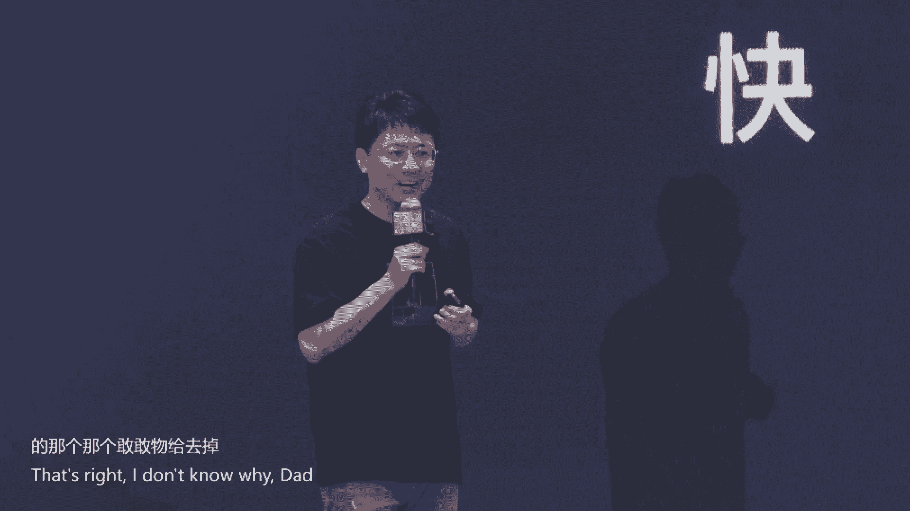
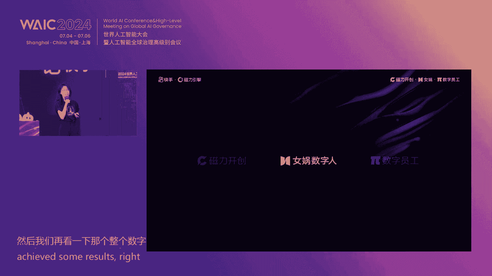
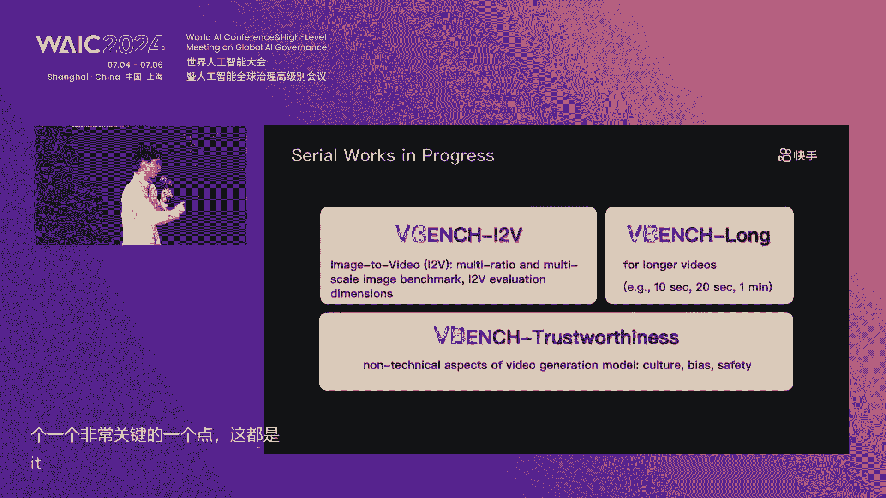

# 2024世界人工智能大会（合集） - P63：20240706-新AI·新应用·新生态 快手大模型技术与应用战略 - WarrenHua - BV1iT421k7Bv

大家早上好，我是发乱，欢迎来到20224W快手生态论坛呃，今年这个大会真是一票难求，对就是哦火热到都快跟那个顶流的演唱会一样，就是在早上的时候，门口甚至还有黄牛不断来跟你说，要票吗，要票吗，要票吗，对。

就是已经互联网行业很多年没见过这种盛况了，呃过去这一年，全行业都继续投入到生成式，AI和大模型的热潮里面，每家企业都在努力思考，如何将人工智能融入业务，呃，就是我们都深信，AI将会成为未来。

技术创新和商业模式变革的核心，甚至有望带来比互联网更大的影响，但大家折腾了这么久，结果就是，让英伟达变成了全世界市值最高的公司，to c应用迟迟没有出现，我就前段时间看创新工厂的王华做了一个统计。

他说把中国所有的AI原生应用加在一块，日活也不过就是千万量级，这这说明什么，这说明虽然人工智能的未来以来，但是当下的产品化它还远远没有到来，对就如果我们往回看看过去十多年，移动互联网的发展情况来说。

就是在移动刚爆发的时候，我记得那时候所有人都在寻找什么是入口，对手机桌面浏览器，输入法，手电筒，甚至天气软件都觉得自己有可能是入口，但移动互联网产品竞争的终局是什么，是短视频吞噬一切。

12亿中国网民最终的选择，产品形态是最能够制造时间黑洞的短视频，对，但短视频这个叙事它能够成立，其实最大的变量就是，因为这个手机摄像头的存在，对他让那些不会用输入法，然后也没有用过键盘和鼠标的用户。

也能够自由地通过视频来表达，不然我们很难想象一个厨师，一个舞蹈演员，他如何通过图文来很好地表达自己，对，但是在于今天关于内容它如何生成，又到了一个变革时刻，就大的逻辑就是从拍摄到生成呃，AI替代摄像头。

视频生成应该是今天AI能够抓到最多公约数，用户需求，对，就是AIP将会产生跟相机发明一样深远的影响，另外就是前段时间我看苹果的发布会，就还有一个感触，就是AI，它让老产品找到了新增量，一块是AI。

它让一些老产品找到了更多的付费点，就比如说如果我给SIRI说我要打车，那他可以给我调滴滴，或者说给我去掉高德，就是他的那个选择权好像要变得更强大了一些。

以及就是譬如说可能会有更多的人会ICLOUD付费对，因为有这些大模型或者说相关的服务，另外一块就是对于这些产品的业务，模型本身的精进对，呃比如说meta我们都知道FACEBOOK其实是一家广告平台。

但是今天meta应该是全球第二大的GPU客户了，他们说用了非常多GPU背刺的算法，说渗透率已经超过了30%对，就因为之前如果特别简单来说的话，之前的推荐可能是基于大众投票。

但在今天可能用了更多基于这个呃大模型的，可以去识别用户理解，去识别用户意图，就这能够让广告的匹配效率提升非常多，那么快手的大模型叙事又是什么呢，就是基于大模型的内容推荐和广告匹配，对快手又有哪些提升。

大模型加商业化，会让快手拥有哪些新的生意增量，所以回到我们今天的论坛主题，新AI新应用新生态，就是上个月快手他发布了视频生成大模型，可林就是广受好评，这是一个经过验证，且可以直接上手使用的视频生成产品。

快手的大模型家族，除了可怜AI，还有大语言模型，快意和纹身图，产品可图，这些都是会在本次大会上做首次的集中亮相，关于快手大木新技术介绍和新产，换名和新产品发布，下面我们有请快手高级副总裁。

快手主站业务和社区负责人盖坤为我们介绍，有请盖坤，好的感谢叛乱好，尊敬的各位嘉宾，合作伙伴，投资人，媒体朋友们，大家上午好，我是快手盖坤，今天在2024年，WAIC这个汇聚全球智慧的平台上。

我有幸代表快手与大家共同分享和探讨，快手在人工智能领域的最新动态和未来发展，首先我要向主办方表达诚挚的感谢，为我们搭建了一个人工智能领域的高水平，交流平台，W a i c。

2024不仅是展示人工智能前沿成果的盛会，更是一个促进全球人工智能领域，合作与发展的重要契机，快手也是一直，一家也是也是一家一直坚持以人为本，科技向善的公司，作为全球领先的短视频直播平台。

AI一直是快手的核心技术，快手提出了一整套基于AI技术的创新解决方案，涵盖内容生产，内容理解和内容推荐的全链条，致力于通过更公平的流量分配技术的开放创新，让更多的普通人被看见，赋能个体发挥所长。

发现所需，提升每个人的幸福感，快手已经构建了一套支持万亿参数，大模型训练和推理的基础设施，在这个基础设施上，我们研发了领先的语言大模型，推荐大模型和视觉大模型，并全面应用于快手的主营业务场景中。

今天的论坛将将将由我，首先由大向大家重点介绍快手的大模型的全景，并发布我们最新的AI产品，随后快手大模型的负责人张迪将深入讲解，快手大模型技术全景和应用，刘潇作为快手商业化外循环和AI商业产品，负责人。

将从AI和商业化结合的角度分享，如何用AI开启快手的新商机，万鹏飞将和大家一起探讨当下最热门的话题，视频生成技术和创新的创新和突破，在论坛的下半程，我们将与CCF联合发布，CCF快手大模型探索者基金。

以助力大模型行业发展，同时我们也邀请到学术界，产业界，投资界等知名知名学者和专家，共同来探讨视频生成技术的机遇和挑战，展望未来，我们希我们坚信，人工智能将继续深远的影响和改变世界。

快手将继续加大在AI领域的投资，推动技术创新，坚定地服务于用户，致力于开发和开放更好的AI技术，最后预祝本次大会圆满成功，谢谢大家，好那个做完致辞致辞，那么由我首先跟大家来介绍。

快手大模型的整个全景和新产品发布，好，大家好，我再做一次自我介绍啊，我是盖坤，然后在快手大家叫我鱼跃，好，那首先介绍一下快手，和介绍一下快手跟大魔星的关系啊，就是快手其实大家应该都知道啊。

快手是现在全球top2的短视频直播平台，那快手有非常大的一个用户规模，这这展示了我们去年今年，Q1和去年全年的财财报数字啊，今年Q1快手的DAU，日均DAU已经达到了3。94亿啊，接近4亿的一个规模。

然后我们的每人的日均使用时长是，平均是129分钟，也就是有4亿用户，每天花大概将近两个小时在快手平台上，这是占了中国互联网的总时长的，将近10%的一个总占比，那同时呢有很多有无数的买家跟卖家。

在快手平台上在进行着电商的交易，然后我们去年23年年度的gm已经突破了万亿，有11。1810000100000000的规模，而去年23年的年度总收入已经突破了千亿，有1135亿的这个收入规模。

那快手跟AI是什么关系呢，我会说快手是真正一家真正以AI为核心的业务，那么我为什么要加真正这两个词啊，大家可以想象一下，如果没有机器学习为代表的AI技术，电商成不成立，电商是成立的，社交成不成立。

社交也是成立的，搜索成不成立，搜索其实有关键词匹配技术，不需要机器学习，最基本的搜索也是成立的，那只有短视频平台，这个业务在没有机器学习的时候是不成立的，大家想象一下，一个用户。

大部分用户是不会因为一两个你记得的短视频，去打开一个app的，你打开app一定是一段相当长一段时间，沉浸式的体验，非常爽的体感，然后能带得到非常多的收获的感觉，所以快手是真正一家以AI为基础的公司。

也就是说AI是这个业务的核心，没有AI技术，这个业务是不成立的，那我们再抛开来看啊，这个业务的核心的AI技术到底有哪些啊，就是首先快手主体是一个短视频推荐业务，所以推荐是他最最用户最能看到的核心技术。

然后在做好推荐的背后啊，其实还有两块重要的内容相关的技术，首先是内容理解，做好推荐，我们吸我们需要对背后的内容进行深入的理解，所以这就涉及到内容理解的技术，然后我们还有我们还需要去激发大量的用户。

去生产和创作视频，所以我们还有，我们还有非常深厚的内容生产技术，所以整个快手的AI技术会围绕这三大块内容，推荐内容生产和内容理解，然后再在23年底啊，是22年底，然后那个ChatGPT开启了那个大模型。

这个技术的时代，然后非常多的大模型技术层层出不穷的涌现啊，那在这样的一个大模型的时代里，我们如何用新的大模型技术来改造和创新，我们已有的这三大的那个AI模块呢，这是我们的整个的快手的大模型。

的整体技术路线，其中最重要的核心的模型，分别是我们的推荐大模型，然后我们的快意语言大模型和多模态模型，进行内容理解，还有我们的视频生成，视觉生成大模型来进行内容的生产和创作，那当然底层啊。

我们构建了能够支持万亿参数，甚至10万亿参数的大模型，训练和推理的基础设施，在上面，我们构建了一层比较应用的一个，服务系统和平台，能够支撑到各种不同的应用和业务，那再往上层是我们在各种不同不同业务里面。

进行的应用和一些适配，然后包括短视频直播，在线广告，电商，本地生活等等，所有的快手的重要业务，好对然后从去年起啊，其实呃大模型，尤其其实语言大模型这个行业非常卷对吧，业界已经在说有百魔大战了。

那快手做大模型到底做的咋样呢，以及快手的大模型有什么，现在有什么样的一个业务，结果业务落地呢，那么接下来就来展开，首先给大家介绍一下语言大模型啊，就是快意大模型，我们在内部的三方内部的盲测中。

已经已经已经比较相信啊，我们的语言大模型快意，在中文的各种人物上的平均水平，已经达到了GBT4的水平，这是我们内部的人工盲测，其实在百慕大战的这个行业的现状下，其实大模型。

尤其是语言大模型面临的最主要的问题就是，大模型的应用价值是什么，大模型的商业路径是什么，这是其实行业里面讨论最多的一个话题，那这里我们向大家交了一个快手，大模型的商业路径和应用价值的一个答卷。

我们使用快意大模型啊，在广告领域里面进行啊，构建了视频脚本，生成直播实时脚本，生成广告线索，线索的客服技术等等，叠加我们的数字人技术，然后能够助力商业化，广告主低成本的生生成高品质的短视频和直播。

然后我们AIGC的广告消耗，从1月份几乎可以忽略不计，到6月份快速增长，我们现在的月均值已经将近2000日，月月度日均值消耗已经接近2000万每天，然后我们的峰值消耗已经远远超过了2000万。

峰值日消耗已经远远超过2000万，我想这里就是我们给大家交的第一份问卷啊，快手的大模型的商业路径和应用价值，到底是什么，一会儿还有我们的那个同事，刘潇，会跟大家具体介绍，快手的大模型。

在商业里面的一些应用的实际场景，好接下来那个我跟大家介绍一下，快手其实最传统的核心技术就是推荐技术，那我们介绍一下推荐大模型，首先在自然语言大模型发展之前啊，快手已经开始构建了我们的推荐大模型。

那很多很多很多来的嘉宾，可能并不是那么了解推荐啊，因为推荐在媒体上并不是那么显著的被透出，那推荐大模型到底处在一个什么层次，那快手的推荐大模型是什么样的，快手我们可以非常自信的说啊。

快手构建了一个全球领先的推荐大模型技术，为什么说全球领先，我们看来看几个数啊，首先我们推荐大模型，是基于目前行业最前沿的SEM模型，such interest model来构建的，我看一个具体的数啊。

现在快手的推荐大模型，线上的版本的整个模型参数是10万亿量级，这个很多同学可能不知道啊，就是其实我们我们看语言大模型，现在大家经常使用的大部分，比如说啊主流使用的是70B70000000000。

然后很多公司还会出几千亿的，然后还有一些最先进的闭源版本，可能是能达到大概1万亿的规模，那我们可以看到啊，就是我们的推荐大模型，已经到了10万亿的量级和另一个数啊，就是我们对每个用户进行的行为序列。

处理的这种行为序列的长度，然后每个用户已经可以达到百，已经可以达到百万，就在我们内部项目里面叫百万行为序列，sim的项目在应该在23年初已经正式上线，全量上线啊，这对大模型来讲的话。

是非常非常复杂的一个处理程度啊，好那个刚才说的就是现在那个23年年初，就是从20年开始上线的，这个推荐大模型技术啊，一直到23年二四年，然后其实呃已经助力了快手，过去三到4年的时长增长。

用户的留存增长和DAU增长，那接下来啊就大模型，现在大模型技术这么火，大模型技术里面有这么多的学者专家，然后研究的人员一起来构建大模型的，各种各样的相关的迭代，那么能从大模型技术里面吸取到什么样的经验。

能够让去开发出下一代的推荐大模型技术，我们看我们现在正在积极的研发，推荐下一代的推荐大模型技术，我们构建了一个叫啊action transformer，的一个神经网络，那啊最简单的这个理解非常好理解。

从名字就可以理解啊，在用户行为序列上，用transformer架构进行建模，那这里面遇到的挑战还是非常大的，大家都知道大模型的响应是非常慢的对吧，那如果我们在用户，比如说。

数10万或者上百万的行为序列上进行建模，如何能够在有效的计算资源下，能够在用户请求的有效那个，几百毫秒的一个那个响应要求下，能够把这个计算处理完，并且返回精确的结果，所以我们针对原来的这个架构啊。

sim的那个检索模块，然后有点类似现在大模型的REG模块，其实它会一定程度上损失部分的信息，然后我们act创新的一些网络架构设计，能够实现近乎无损的一个用户全生命周期，就是近似百万行为序列的一个建模。

能有transformer，能够充分发挥用户行为序列上面的信息潜力，那我们现在单次这次单次上线，就已经，可以为快手app带来，每天4亿分钟以上的时长增长，也就是说用户在这个推荐模型下。

会更喜爱看快手推荐的内容，好那下面可能是很多很多嘉宾特别关注的，我们视觉大模型啊，我们视觉大模型，接下来就是视觉生成产品的新产品发布，首先我向大家介绍一下可图啊，我们可令发布后啊，很多人跟我们说啊。

就是快手太低调了，然后快手好像不太会宣传自己，然后很多人包括我们公司内部的同事啊，甚至通过外部才知道可怜的存在啊，然后那个还有很多中国网友是通过外部媒体啊，就是美国的媒体才知道克林。

然后用了之后发现这么好用，然后呢我们反思一下啊，快手我们一一贯的低调行为啊，确实也有点埋藏了我们的另一个宝藏产品，就是可怜哦，不是可图，呵呵哼，不好意思啊，然后啊可图与5月31号已经正式上线啊。

这是我们的那个啊，这个上限是向面向全部用户开放了，大家都可以在上面使用，这是网址，这是事例啊，这些事例我就不讲了，那前面说为什么可利可图是一个宝藏产品，真的可图真的能打吗。

那我们的答案是可图肯定是非常能打的，是全球领先的文生图产品，这是我们内部的人工盲测，人工盲测里的整体效果，我们会在全球的知名的维生素产品里面进行，对比盲测，然后我们自己的结果是啊，可图是名名列第一的。

就全球领先的一个维生素产品，当然啊我们也送到了第三方的，第三方的评测平台，让他们进行盲测，然后我们本来呢是以为我们能够拿第一的，然后但是不幸呢拿了第二，但我觉得区别也不大，怎么着。

也是全球top2的那个文生图产品是没有问题的，那今天对大家说，我在这儿夸一下自家的产品到底有什么用呢，那最重磅的来了，我们的可图开源今天会正式开园，我们相信啊，可图是你能用到的最好的文生图开源产品。

当然他应该也是最好的，文生图所有的产品的最好的之一啊，好那下面就进入到我们可伶的环节啊，就很多很多嘉宾都是因为可灵知道快手AI的，我们回顾一下可怜，其实今天正正巧啊。

可林发布是6月6日快手13周年思庆的当天，今天是7月6号，正好是可令发布整一个月，我们一起回顾一下可怜发布之后发生了什么，首先可怜是于6月6日发布的，可怜是全球首个发布的。

用户真实可用的影像级的视频生成大模型，我们发布的时候SORA还没有发布，到现在也没有发布啊，然后那可怜有什么特点呢，可能很多同学已经知道了，就是我们可灵能够产生，非常符合真实物理规律的非常真实级的视频。

然后有非常高的画质，然后也能去进行大幅的合理运动，这里不就都不不多展开了，然后我们发布之后啊，就是在国内，然后非常火的同时啊，迅速的出圈，然后我们也没有料到啊，在国外媒体上也非常非常的火啊。

这里是我们发布之后一个外国网友的结论啊，就是视频生成领域的一个难题，就是人物吃面这样场景的一个难题的，征程的问题已经被柯林解决了，大家可以看到啊，就是那个在twitter上一个网友。

一个外国网友发的之前的AI产品，吃面是非常形变非常严重的，而可令发布之后，这也不是我们官方视频啊，这是那个实际网友自己制作的视频，然后我们发现吃东西，吃面这样的复杂场景已经被非常好的解决了啊。

这个场景还是非常复杂的，一会儿那个我们的同事万鹏飞，然后也是我们那个视觉生成技术的负责人，将会跟大家具体介绍可莉的具体的技术层面，好那个可令发布之后啊，确实我们也没有料到啊，就是在全网非常火爆啊。

我们也发现啊，就是生成领域的同行或者相关行业的各个前CEO，现CEO啊，也在网上对可令发表发出了惊叹，这里是在推特上的一些截图啊，比如stability AI的前CEO和YC的线CEO。

都在对表示对可怜的一个惊叹，然后我们国内知名一个知名厂家的CEO，其实也第一时间试用了可怜产品，大家可能在短视频上看到啊，他用几10分钟就可以去制作啊，SORA其实花了大量的成本和时间。

制作的那个气球人的这样的一个视频，然后不好意思啊，因为我没有拿到他的授权，所以我没有他的名字，然后再在嗯在全球媒体上，可能都都引起了非常热烈的讨论和使用，然后呢。

很多外国网友因为呃申请那个可怜的内测资格，是需要中国手机号的，所以非常非常多的外国网友也在推特上发发，那个希望求可伶的账号，这样的一个一个一个帖子啊，可怜现在目前也是一号难求啊。

然后这里面比如说这个这个外国网友，翻译成中文，求求你了，还有一个外国网友专门做了一个图，来求可怜的账号，然后我是在里面想说的一点，还有一点就是可怜的发布，也在全球迅速引发了另一个讨论。

就是中国AI正在超越美国AI，然后可能是首个引发中国AI正在超过美国AI，这样的讨论的中国大模型，我想这里值得一些掌声啊，我们可林发布两周后啊，6月6日发布的可怜，然后我们在6月21号，然后两半个月后。

在CVPR那个另一个视觉领域的人工智能，学术顶会的现场，我们又发布了新的功能，这里是三个功能的一个示例啊，第一个是土生视频，第二个是视频续写，我们支持可以最长把视频续写到3分钟的生成。

然后还要多尺寸选择六比19，九比16和方形的这个生成啊，这个呃，图生视频的这个例子是我个人非常喜欢的啊，就是大家可以看到不管是熊猫猫，然后啊水墨画还是那个老虎，还是那个骏马这样的一个传统的。

就是中国的水墨画在可怜的加持下，可以栩栩如生的动起来，而且动起来的这个状态，真的看起来非常符合的世界整个的运行规律，这说明什么呢，说明可怜，不但有很强的去逼近世界运行规律的能力。

而且有很强的泛化泛化能力，因为这样水墨画动起来，其实在我们的学习语料里面，是非常非常不常见的，我们自己也没见过啊，他其实有非常强的一个那个概念的组合能力，一个泛化能力，然后我们发布这个啊。

我们发布之后啊啊啊，网上出现了非常非常多的，用可伶创作的优秀视频，这里是一些节选啊，然后这个是一个画生成的，那个各种姿态的那个视频，这个是一个非常唯美的视频，然后也非常真实啊，看起来。

然后这个是一个裸眼3D效果，就是你画一幅画，然后用可令生成它就可以生成动态效果，能够超出原来的画的范围，好我们发布一个月的这个时间里面，其实有一件事，让整个可听项目组，心里面也感到了一点触动和一点温暖。

然后这是我们在内测的啊，我们进行内测的一位内测创作者，他的父亲只是重病在床，他把他啊没有见过的爷爷，在朝鲜战场上唯一的一张照片用可怜动了起来，生成了一张栩栩如生的一个他的亲人的视频。

然后他的家人非常感动，和感受到了一丝丝的温暖，然后这也鼓励着他的病重的老父亲重拾信心，然后嗯从这件事执行之后啊，其实现在已经有越来越多的网友，正在用可能生成那个老照片，生成自己的自己以前的照片。

生成那个自己亲属的老照片，让这些老照片动起来，让自己和现在的家人能够穿越时空，和以前的自己，以前的亲亲人，以前的朋友能够进行一场跨越时空的一个碰撞，然后让老照片动起来啊，可凌乱人心。

这是我们非常自己也非常触动的一点啊，现在这个事情也非常火啊，在网上有越来越多的网友正在进行，老照片的生成，我们再看一下可令发布之后背后的一些数字啊，就是现在可林申请可怜的用户，已经达到了50万。

然后这个数字也是我们没有想到过的，然后现在然后我们自从发布之后，也有非常多的网友每天都在来找我们，来开通视频，所以我们在做各种各样的技术建设，然后产品能力建设，然后运营的补全，然后来来开通给。

要希望能够让越多的网友，符合资格的网友能够使用到，然后到现在为止，我们已经开了接近30万的用户啊，然后这时候据我所知，可能最大的一个内测规模了，我们也在想，我们这个内测是不是应该改成公测了。

那个然后这些网友在过去一个月的时间里面，已经生成了700万的视频，好那我们到今天啊，6月21号可林开启正式开启内测，6月21号在可林首发两周后，也就半个月后，在CVPR的会场上，我们发布了新功能。

那今天呢今天7月6号又是两周之后啊，又是半个月之后，又是世界顶级的AI大会的现场，所以用这个推理来推推测，我们今天一定还有新功能的发布，相信大家都已经猜到了，我们今天会发布新功能。

那首先我们发布什么新功能呢，我们发布可能最重要的一项基础能力的升级，就是可伶的基础基础模型的升级，这是可伶发布以来首次的基础模型升级，我们的高画质版来了，我们可以看一下示例啊，啊这边是原来的可怜生成的。

这是可零高画质版生成的啊，这个大屏幕可能还看得不是那么清晰啊，你如果电脑屏幕上会看得非常清楚，画质的提升非常明显，我们再看下一个例子，这是一个著名的SA的例子，就是东京女人在走在一个女人。

走在东京的街头，我们可以看到啊，就是可怜，原来还是有个问题啊，就是在人物脸比较小的时候会发生一些形变，我们可以看到啊，我们我们的新版的高画质版，已经能够生成非常非常逼真的视频。

然后在人的脸部处理会比原来精细的多，然后所有的处理都比原来精细的多，然后我们当然不只有基础模型的升级啊，我们今天还有其他功能，就首尾针控制也来了，这是我们很多网友都在那个我们的内测群里面。

互换的一个功能，我们看一下首尾针控制的示例啊，这是上传的两张照片，一张是啊，应该这个也是可图生成的啊，我们自己发布的所有demo，都是用可可图生成的图片啊，因为要避免版权问题，然后守贞是那个这样的照片。

尾真是后面那个照片，然后我们看用可伶来生成一张，符合首尾针的视频，好那我们已经发布了两项重磅产品，我们还有没有呢，还有，好镜头控制来了，这是我们的事例啊，我们会我们会发布多种不同的镜头控制方式。

然后这些镜头控制方式啊，其中还有参数可以调节啊，有正数负数可以调节越大，你的动作会运动的越剧烈，越小呢动作会运动的会更平平缓，同时负数就是反向运动，其实我们可怜啊，是支持你任意的镜头运动轨迹的。

但那这个在用户交互界面上，确实有点为难到我们了，所以我们先定制了几套，比较经典的运动控制的方式给大家使用，好，我们马不停蹄的，希望能够给大家提供用户所需的产品，然后那我们自己也会问啊。

可怜的是不是迭代最快的产品，那我们今天还有发布，很多网友互换的外部端来了，好外部端那个上线限时免费，这是我们的外部端的事例啊，大家今天就可以访问这个网址了，然后啊我们的我们的可怜外部端啊，会集成啊啊。

文生图也会集成纹身视频和图声视频，希望能够给网友提供一站式的图，那个视频和图像的编辑服务，啊这个网址大家可以看一下啊，就是这是我们的外部端的网址，当然大家也不用担心啊，如果记不下来的话。

我们还有应该有其他的稿件会给大家去展示，这样的网址的好，那到最后啊就是前面一个一个的过啊，大家是不是可能已经忘了我们到底发布了啥，到底哪个功能啊，让我们回顾一下，我们今天发布我们的基础模型的第一次升级。

高画质版，我们的控制能力的提升，首尾灯控制，镜头控制，然后我们在易用性上提供外部端服务，然后这些发布继承了我们一向，快手一项的优良传统啊，发布即可用，应该在今天中午左右，我们的同事就会将所有功能上线。

然后用户就可以使用到，最后最后我们还会发，我们还要发重磅发布一个创作大赛，我们的那个可怜AI创作大赛正式的开始，然后我们可怜会设置一个30万的奖金池，然后有多个多个主题赛道。

同时有六所顶级高校跟这个大赛进行合作，联名来进行这个大赛，然后高校高校会对这个对大赛进行指导，而且进行一些啊评选相关的帮助，然后当然也有一些高校的同学会参与，能够共同繁荣AIGC产业。

然后在每个赛道的头部作品啊，头部的头部的创作者，然后将会被筛选到星芒短剧创作者孵化计划，然后星芒短剧创作者孵化计划，将会额外再提供百万现金激励和千万流量扶持，希望大家能够踊跃参加。

好那前前面就是本次介绍和发布的全部内容，那现在这一页已经到了这次发布的最后最后了，那在最后呢，我想说，快手AI坚定地为用户做最好的AI技术，感谢大家，感谢盖坤的精彩分享，大家热情非常高涨。

对于快手的可怜AI，对于快手的大模型，那么下面我们有请快手副总裁，大模型团队负责人张迪为我们带来分享，快手大模型技术全景及应用介绍，好谢谢主持人叛乱，那大家好，我是快手大明星团队的张迪。

那接下来呢我给大家带来，快手大模型研发历程的介绍，和我们在大模型应用上的探索，那过去一年多的时间啊，整个大模型行业非常非常的卷啊，大家从一年以前大家都在讨论基础模型的研发，怎么样卷机做模型。

那今年呢大家好像又在都在讨论应用，甚至产生了这个模型派和应用派的一些争论，那快手作为一家这个AI要素非常强的公司，那我们怎么应对这样的一些局面呢，那首先啊我们还是非常坚定的认为，有两个观点。

第一呢是基础模型的研发，最终决定了应用能力的上限，我们应该保持基础模型足够的耐心啊，本质上呢，我们不可能期待技术模型每天都有质的变化啊，最终呢它还是一个量变积累的一个过程。

所以快手呢会始终坚持在最核心的基座模型上，投入研发力量，那第二个呢就是快手也是一家商业公司啊，我们花了非常多的钱做大模型的研发，那我们也不可能等到这个模型做到，真的达到了所谓的AGI那样的高度。

我们才进行进行商业化应用，所以我们要阶段性的投入到应用中，我们非常期望能够形成一个基础模型，研发和商业应用的良性循环，那所以我非常自豪的跟大家分享一下，快快手大模型，一个技术研发的全景啊。

那我们从底层的IDC算力中心，到我们的网络网络架构，我们的AI平台以及中间的基础核心大模型，均是由快手自主研发的，我们认为坚定地投入自主研发，长期来说呢会给我们带来技术雪球的效应，以及巨大的成本优势。

那在上层呢，我觉得快手一个非常大的一个那个优势的是，快手本身有非常非常多的AI应用场景，这会给我们带来大模型非常多的落地的机会，那我也非常有信心的说，快手可能是国内在大模型应用上，探索最深入的公司。

那回到大模型基础研发的这个范畴啊，刚才盖坤总也做了一个介绍，那我还是很很想跟大家分享一下，这个研发的历程啊，那所有的快速大模型研发呢，都要从快意大模型的研发说起，那在一年多以前啊，去年年初的时候。

其实整个国内，包括我们自己公司对于大模型技术，还是感觉非常非常陌生，甚至有非常强的神秘感，那快一大模型呢，我们从最早开始，事实上已经研发了四个版本，从我们早期的13B版本到66B版本。

到我们今天主力应用的175，B版本和多模态版本，经过了多个版本的研发，那快递大模型，事实上现在在快手内部，已经应用在了包括素材创作，AI互动和内容生产等多个场景中，我们快意，我们快手大模型家族。

快意可以说是最基础的一个能力，那我们在后续的这个研发过程中呢，除了持续的要提升快一大模型的基础能力以外，我们也非常非常的期待，结合快手的应用场景呢来做一些差异化的能力。

那刚才盖坤总也是发布了我们的可图文，生图大模型啊，那这个大模型呢我们真的是非常非常有信心，是行业最顶尖的纹身图模型，那去那为什么说它是这个足够好呢，那我这边呢分维度展开介绍一下啊，那首先可图模型呢。

有非常非常强大的语义理解能力和指令，跟随能力，大家可以看一下这个图片啊，这个图片里面整个人物的衣服的描述，头发背景以及他的眼镜，跟文本的对齐度是非常非常高的，大家可以打开那个可图的小程序。

或者可可图的web页面进行一个尝试，那快意在指定跟随上有非常出色的表现，这得益于我们在文本表征上的算法创新，以及我们在文本图像数据上的极致对齐，做了大量的工作，获得了今天的能力。

那另外作为一个图像生成模型呢，画质肯定是最重要的啊，你看当我们输入电影级画质的时候呢，可图是可以画出摄影机的画面质感的，这得益于我们海量的训练数据，我们渐进式的自监督学习，从简单到复杂。

让可图学习整个绘图的能力，那最重要的呢是我们在最后的阶段呢，使用强化学习技术，把可图的学画爸爸，可图的审美跟人类的审美做了强对齐，所以可图有拥有摄影机的画面质感，那另外一个最重要的品质呢是。

可图可以支持多种条件的控制生成，它可以支持各种各样的风格，这边举的就是一个我们美丽的上海外滩，那有个油画风格的一个例子，那另外呢在这边没讲的，那是可图还拥有非常强的人像保持能力啊，你可以输入一个人像。

对在人人像保持的基础上的绘制图片，具有非常强的轮廓保持能力，你可以输入一个图片，保持原图图库的清图呃，呃呃原图的这个轮廓的基础上的绘制图片，那另外呢可图团队诶我们还一直非常自豪的。

就像那个可怜吃面条一样，可图团队还有个独门绝技，可图写字的能力非常非常强，我们可以让可图在街边的广告牌上写出，非常像真实拍摄的一样那样的文字，对大家可以试用一下嗯，还是要简单说一下。

虽然这个我的前面和后面都会讲可伶啊，那还是要简单的说一下，这个可伶可伶确实是非常非常的火啊，那我们非常开心的看到可怜，我们认为说应该是把全球的视频生成，这个领域都卷起来了，我们也非常高兴地看到呢。

快速能够把这个领域往前推动了一大步啊，我们也期望跟全球其他的这个呃合作伙伴，其他的公司一起把这个领域做得更好啊，对这边大家都知道对吧，可能有纹身视频，图声视频和丰富的图像编辑的这个能力，那未来的话呢。

我们会持续的做，有竞争力的视频生成技术和产品，我们会在极致的视频生成的可控性，视频生成的高质感，高敏感，运动的合理度做非常多的工作，那当然了，我们也会持续的做工程算法的优化，让视频生成做到足够的低成本。

大家用起来足够的低门槛，那借着这个机会呢，我也特别要打一个广告，那就是我们快手的首部AIGC短剧山海，在本月呢将会重磅上映哦，大家可能半年以前我们没法想象的，真正的用AIGC做的电影来了，我又是谁。

镜中人，我要去找我娘亲，8000里云和月，跨山越海，9万里浪，一波直捣龙潭，是谁抄了我的吼叫，对那个讲完基础模型的部分呢，其实大家整个行业都关心怎么样用好大模型，那我们快手怎么样用好大模型。

就是接下来我想跟大家分享的这个部分啊，那首先呢快速的的确确的，从内容生产到内容匹配到内容分发，都是一家AI驱动的要素的这个公司，因此我们认为啊说从生产到消费，我们各个环节。

大模型都有非常多的应用落地的空间，所以呢我们也是非常非常希望能够用大模型，把快手的核心业务重新做一遍，那基于这个这样的思考呢，我们制定了我们的大模型应用策略，那就是升级内容理解，创新互动探索生成。

那首先看一下是怎么样升级内容理解啊，就刚才戴昆总也介绍过，内容理解对于快手整体的这个业务，非常非常的重要啊，那大家可以看到那个快手里面的内容，非常非常的丰富啊，有涉及各行各业，有短视频，有直播。

有各种各样的电商和商业化的内容，那我们以前呢对这些内容的理解呢，应该说说是相对来说比较简单的，但是今天借助多模态理解模型的能力呢，我们是可以对短视频直播的片段，用户的评论和商业内容做结构化的深入分析的。

我们来看一个事例啊，这个事例呢是我们快手平台上一个非常精美的，关于山西的一个短视频啊，那借助多模态大模型呢，我们可以做到对视频的meta信息，做一个更加准确的理解，我们可以更好的矫正视频的标题。

那更重要的呢是我们可以对视频的详细的内容，进行不同层次的这个理解，甚至我们可以对视频进行一个利用语言，大模型的丰富的知识，能力呢，在做扩展性的动态的问答，以及对短视频的不同的片段做理解。

那这些能力呢对于我们整体的内容匹配，我们的搜索广告推荐，以及我们的内容社区的运营安全审核，都至关重要哦，前面讲讲完第一趴是内容理解的部分，那我们来到第二趴，创新互动。

大家知道大模型最有意思的能力就是互动啊，那我们呢也是把大模型用在了快手，多个创新互动的场景下，包括我们的评论区的互动，包括我们的AI搜索的问答，以及我们在展位上展示的管小方智能体，背后都有大模型的影子。

那现在呢我要隆重给大家推荐一位，快手的AI小块，它是大家在快手消费短视频的智能助理，是快手官方的智能互动小助手，是快手用户有用有趣且有温度的聊天搭子，那AI小块，我认为可能是目前市面上最好的。

评论区问答产品，那它有什么样的能力呢，那首先AI小块呢，它真的是一个啊非常有用的产品啊，你可以在评论区里面呢问他各种各样的问题，那举个例子呢，你可以问他视频中的各种各样的内容。

它基于多模态大模型的理解能力，可以做出准确的回答，同时呢呃A小块还有一些非常神奇的能力，我举一个例子啊，呃我们快手有非常多的功能，那个入口是非常非常深的啊，啊例如说有一个功能叫自动开启上下滑。

那我以前其实也不不是特别理解，这个功能的用处是什么，后来直到有个同事告诉我，他会在洗澡的时候刷短视频，那个时候呢要自动开启上下滑，但是这个开启的入口非常非常深，所以呢你在这个评论区呢。

可以直接AI艾特AI小块帮我开启上下滑啊，用自然语言的方式呢，AI小块就会帮你开，开启各种各样的神奇的这个功能啊，对另外AI小块诶也非常非常有趣，你可以在评论区画图画表情包啊，这个呢都是牙牙小块。

可以给你提供的非常有用啊，有趣的这个例子啊，同时呢小块呢也是很有情商的一个智能助理啊，你可以在评论区呢各种求安慰，求祝福，求情情绪价值对整体来说呢，我觉得AI小块呢真的是一个非常非常有用。

有趣的一个这么一个聊天搭子啊，也欢迎大家打开快手的评论区，艾特AI小快啊，跟他互动，那今天AI小块呢有超过1000万的粉丝量，那同时呢有超过1。5亿次的累积互动，这还是我们在非常非常克制的情况下的数据。

有AI小怪不会主动的对你进行评论，只有在你帮他把他召唤出来的时候，他才会进行评论，所以可以看到，我们觉得AI小怪真的是一个非常成功的，AI智能体，那最后一个应用的部分呢，是关于我们生成的部分啊。

大家应该知道我们作为一个内容社区啊，生成生产是至关重要的啊，那每天呢有超过几千万的短视频在快手生产，并且发布，那我们也非常非常开心的看到了，从最早的AI在生产过程中，只能做一些简单的视频特效。

到今天借助可图可灵这样的生存能力，大家可以在生产的过程中用它进行辅助创作，那当然我们也非常非常期望，未来生成式人工智能技术，在整个生产流程中发挥重要的作用，我们也非常期望说AICC可以。

真正意义上的重塑整个生产工作流，这也快手也非常非常希望跟各位优秀的创作者，一起探索这样的路径，那另外还有一些非常非常重要的产品呢，是整个AIGC在我们的电商和商业化的弊端，也在发挥越来越大的作用。

给我们的电商商家，我们的广告主，带来越来越多的便捷的用户体验啊，我们在我们的快手直播间里面，大家是老铁们，是可以使用我们的电商试衣这样的功能的，大家可以看到啊，左边这个模特呢是我们可图生成的模特啊。

右边这个模特是我们团队的一名同学啊，一个生活照啊，利用可图的能力呢可以快速的实现哦，一键换装啊，大家可以看到我们可涂在换装能力上的，这个效果还是非常非常出色的，整个衣服穿上去也是非常非常的贴合。

非常非常的自然哦，那显然这样是不足够的，我们还可以用可怜把它做动态的展示啊，应该说我们也特别希望AI能力，能够帮助我们的老铁老铁实现试装自由，对，可以看到说我们的AIGC技术呢。

可以帮我们做AI的模特的生成，做虚拟试穿。

也可以做模特视频的生成，对对，不知道不知道为什么，大会把我最后一页那个升华的那个那个感，感悟给去掉了啊，那我也就不多讲了。

快手呢会持续的在AI技术上进行探索，我们也非常非常期望呢，快手能够真正做非常非常有用的AI技术，给大家带来真正的有用的AI体验，好谢谢大家，啊谢谢张力的分享，就是刚才他说AI短句的时候。

我其实想到我第一次用可怜的时候，就是输入刘震云一句顶1万句，里面一个铁匠角色的描述啊，就是最后出来的效果非常的还原，那个动作都像模像样，然后我影视行业的朋友都表示非常的震撼。

是不是他们这个行当快快要变天了，对我推荐大家也可以去试一试，就是那些还没有被视频化的，大家特别喜欢的小说，可以拿里面的一些场景，因为大家都知道，就是呃小说的作家，应该是最好的提示词的那个创作者了。

对OK那我们就是进行下一趴呃，下面我们有请快手商业化外循环和AI，商业化和AI产品负责人刘潇啊，刘潇哦，请上台为我们带来分享，大模型加商业化，打开快手新的商业机会，这照片也是可图做的。

比我真人要不跟我真人差不多，刚想说要谦虚一下，还说要表扬我们的产品，我显然还是选择了后者，那个我做一下自我介绍，我是快手商业化的商业产品，我叫刘潇，然后今天我的这个话题显然是跟钱有关，因为大家也理解。

就是整个大模型的发展其实是非常需要芯片，而现在芯片显然是非常稀缺的一个资源，所以多赚钱是一件从各种角度来讲都没错的事，好吧，那个先给大家做一个那个一个成果吧，就是嗯这这这几个数字是我们啊。

都是从那个1月份到6月份的数字啊，因为整个AI的应用，其实在团队在去年开始做很多的东很多动作，但真正推向应用端，在应用端上开始去大规模的去应用的话，是今年1月到6月这半年的一个事情。

所以大家看到那个这个曲线呢，嗯由于那个作为一家上市公司啊，有些数字不方便来跟大家讲，那这个曲线不管从斜率来讲还是从什么来讲，都是一个非常漂亮的曲线，在我们公司的很多的环境之下都还是很漂亮。

一个曲线跟大家说几个数，第一个叫做整个商业化的应用，其实包含三个方向，第一个方向是视频的广告素材的应用，第二方向是数字人的直播类型的应用，第三个是对是呃营销营销对话的应用，然后整体上这三个收入。

在广告收入上大概是2000万每天，平稳的2000万每天，如果有峰值的话，比如说618的峰值，或者是啊游戏行业基于冲量的一些峰值，大概会到3000万每天的日军广告消耗规模。

然后它的JB规模的话呢也是涨的非常快速，大概是848 14倍的一个增长，就是长在数字人直播上的带货的GM规模，所以还不错，嗯然后嗯也给大家推荐那个就是整个贝斯当，可伶可图和快意的三个商业化的产品。

主要就是这三个产品，第一个就是磁力开创，它主要是给广告主跟客户提供广告素材，我我我我稍微那个来跟大家说一下，这个事情是一个啥样的一个场景，就整个快手的广告生态下的话，大概嗯年的呃，日的收入规模。

大概是在几亿左右的这样一个盘子，然后在广告素材上的一个成本，大概是在15%左右，这成本呢是由无数的代理商，和无数的那个视频剪辑团队去承担的，大概单广告素材的成本如果是一个成熟的团队。

能控制在100到200块钱左右的样子，但是产能大概是500~100条左右，就这个行业的生态大概是这个样子，然后我们嗯从开始由视频剪辑，机器化电视开始之后，整个效率跟结构就发生了很大的一个变化。

所以开创主要是给客户做广告素材的一站式，视频剪辑的这样一个产品能力，我们后面会详细讲，第二个是女娲数字人，女娲数字人的话，大家看数字人就知道了，因为她为什么起名叫女娲呢，因为他可以捏小人。

就是有很多很痒，有很多很很多的那个那个IP和和人设，与他的商业场景去做一个匹，去做一个匹配，这部分的消耗，大概是1700万左右的样子每天，然后呃我指的是广告消耗，然后第三个是派派的话呢，是我们在上个月。

上个月左右推出的一个商业化产品，主要是数字员工啊，他的主要责任的话呢是承接营销对话能力，就是跟用户去做一些垂直行业的一些沟通，承接营销对话能力好，我们分头去看这个产品的一些进展，这是磁力开创。

我先播一下，呃基于一个对话，这个是一个广告界面啊，就是大家如果在快手投广告的话，应该是可以看到这样一个在窗边链路之下的，一个素材生成的广告界面，完全是由呃客户去输入和采纳的。

那这个采纳之后基本上是由广告素材，这有个小细节跟大家说一下，因为这个广告素材，它的大概的那个链路是咋样的呢，是叫做客户反馈它需要什么样的素材，然后这个素材并没有马上作为一个prompt。

说我们就去生成这样的素材，而是作为一个呃，而是作为一个输入，我们吊起一一排素材，问哪一个可能更接近于你想要的，然后客户选择其中一个更接近于他想要的，所以大家看到其中有一个界面是。

当他选择了哪个更接近于他想要的时候，我们会把那个素材素材结构化，就把把他的脚本拿出来，并且以快意大模型去做重脚本生成和繁华能力，然后再让客户去基于当前的素材去补充素材。

再做检索和这样一个混剪的一个射生成，这是为啥会做这样一个选择呢，因为就是用户其实不太能够基于文本，马上生成广告素材，但他完全可以有感知叫做什么样的广告素材，跟我想要的广告素材更接近，如果往前走一步的话。

就是视频生成，生成，视频的这个需求，是更接近于人的体感的表达的好，我们看一下那个数据啊，这个是目前为止整个视频生成的一个数据，大概呃，我大概峰值可以支撑单客户单日生产10万条，然后嗯视频上传成本的话。

就是由刚才说的200多块钱，将近到四毛七这么一个成本，如果我们的机器资源能够进一步去嗯，做一些分布式的运运行的话，这些素材的成本可能会进一步降低，然后看几个效率指标，我们通常看效率指标，看三秒播放率。

CTR和CVR播放代表用户喜不喜欢看CTR，C8代表这个广告素材效果是不是足够好，那大家可以看到49%，32%和12%，就是更接近于跟所有的广告素材相比，他们更接近于喜欢看，然后跟所有的广告素材相比。

他们的CTR表现是更好的，跟所有的广告素材相比，他们的CVR表现略好，所以就是更接近于商业结果，那个部分的优势会变得不太明显，更接近于那个用户消费行为的那部分，会展示的非常明显。

旁旁边的两个图是一些行业的分布，大家可以看到所有的行业基本那个蓝色的，就就那个紫色的柱子都比绿色柱子要长，非常非常多，然后大家看到，在那个RY投放的几个优化目标当中，几乎覆盖了所有的优化目标。

所以它其实不是一个啊，demo级的这么一个产品能力，他在客户的应用当中，已经基本可以拿到一个空间了啊，可以看一个就是这些广告，这广告内容其实挺唯美的，你看到这个是一个呃呃。

以那个表达优化为核心的一个自选类的素材，带一点品牌属性，嗯好我们再往后看啊，然后看一个更多，然后更多的话呢，第一个片子是一个完全由可灵生成的一个，广告素材啊，这是我们给去哪儿做的，大家可以看一下。

今天发布的能力都还没用上，还是老板内部也没有一些更快的方式，还是对大家更好，一个全球旅行套餐，基本上他的那个运动和problem的跟随和行为，是没问题的，而且这边这个广告素材的时长大概是40秒。

当然可以剪得更短，在路上这个素材其实在那个这个广告素材，如果我们用FA公司去拍的话，大概应该有10万块钱，我觉得应该是福威公司能出产的这么一个品质，嗯然后我们再看第二个就是一个职业规划产品。

就是一个比较典型的营销类的广告素材了，就过了，第三个的话呢是一个狗血短剧，就是可以感受一下吧，哦他那个应该是比较轻伤，那我们那我们接着看，就大概的整个生产流程的话呢，基本上只有三部。

所以对于广告主来来讲，它的整个成片的周期是非常非常的短的，然后在数据回收之后呢，基本上还可以在数据回收，拿到的数据之后会处理成embedding，在在脚本生成的时候重新用，这样的话呢。

它的素材的迭代和效率会变得越来越好，就这个是我们在开始用可伶做广告素材的时候，大家看到中间那个环节的prom的话呢，还是此刻来讲还是比较复杂的，prom1和pro bar和继续的一个prop环节。

形成一个分镜，在这个分镜之下，会重新处理这个整个视频的一个生成，我们看左边那个片子，那个片子是一个呃，应该是世纪佳缘的一个广告，已经得到了广告主的同意，我们可以播这个片子哦，他们没有声音嗯。

大家可以看到几个分镜的一个反馈，是在旁边的prompt和可怜的反馈，之间去做了一个整合，这片子是一个45秒的广告片，游戏搭子上陆军，找露营搭子上数据，找剧本杀搭子，我就是凶手，上个戏曲的跳歌舞三次。

就像嗯好啊，这个就是跟大家说，整个视视频这边取得的一些嗯成绩吧，然后我们再看一下那个整个数字人，因为数字人其实在今年上半年当中。

有非常多的平台都在陆陆续续的推出一些使用，我们看这个是一个数字人的呃产品平台也依然，如果大家是快手的那个，磁磁磁力引擎的广告主的话，可以在后台体验着整个流程，我们看一下整个客户的一个界面。

和客户的体感是咋样的，这里是个脚本生成，这个脚本生成也是由大模型，根据之前的品类和它呃，之前真人直播的脚本生成做的处理和泛化，它可以采纳，他也可以修改，它也可以编辑，也可以补充材料嗯。

这就是一个生成的一个数字人直播间，全程操作大概需要可能一分钟的样子，这个数字人直播间基本就搭建完成了，后续的一个环节是选品和出价，我们看数据呃，这个来给大家看几个数啊，然后第一个数的话呢是嗯。

这个整就整个降本增效的一个情况，然后不知道大家有没有搭建过那个整个直播间，就是搭建一个直播间，并不是你有主播就行了，然后你有场景，你需要有中台，然后你然后你需要有控制。

而且你需要有一些那个偏向于运营支撑能力，以及主播不会真人的主播，一天最多的工作时长是八个小时，人力的那个能承担一个那个工作，就直播工作的上限的体能就大概是这样了，所以如果要24小时轮播的话。

其实是个三班倒的这么一个情况对，所以呢嗯整个直播间的其实成本是蛮高的，就一个小公司，当日在就是在三人的主播的这个团队当中，他大概单月付出的成本是在十几到，二到20万左右的样子。

一个数字人直播间的成本几乎趋近于呃，一个非常低的水平吧，大概平均半小时的一个推流时长的话，控制在几十块钱的这样一个水平，所以在效率上是一个非常非常巨大的一个，效率的差异。

然后第二个值得去看的那个图片的话，大家可以看到那个整个整个效果上的一个差异，可以看到那两个数字上它其实是好的，就是数字人直播间在RI中庸的这个范围之内，表现得特别好，他比就是在真人的直播当中。

最差的那批要好很多，同时比真人直播最好的那批要差一点，这个大家能理解就是一旦就是数字人，直播间是个就是所有的I技术，都是个摇尾蛇的逻辑，就是它会不断的从最不好的那一部分向，向上去走。

但是从而把人的时间置换出来，去向更有创意或是更多元，更需要探索的部分去做努力，所以他不可能pk的过人类最好的那一部分，然后但他会不断把这个进程往前去推进，所以在数据当中，大家可以看到在RI中的部分的话。

几乎是数字人的一个它的一个核心区嗯，一个人的动作和声音的跟随还是没有问题的，TT也没有电子音，今天我们为大家带来了超值的直播间宠粉福利，帮你轻松解决这个问题，更有机会免费升级环保板材。

这几个呢当然是不同的一些案例，然后可以看一个中间的这个大叔的案例，欢迎大家在这里，老师想问问你有没有这个动作的驱动，是一个文本驱动，动作看起来是自然的吗，还可以干涩，皮肤好的。

然后看一下整个生成的一个过程啊，就这样一个直播间，他大概是从脚本开始的，一个用户的一个链路背景，然后选择交易组件，选择组件的控制，然后生成一个直播间，就如果大家熟悉的话。

可能是一个大概控制在一分钟左右的样子，都能配置完成的事，这里比较费劲的那个环节，还是在脚本的一个修改和调整，如果是一个默认脚本，或者接受快大模型直接生成的脚本的话，基本上是一个非常快速的一个局面了。

好然后那说下面你再去修改的几个部分啊，就后面再去调整那几个能力，第一个能力的话，还是希望他从数字人向人去做一个，像做一个逼近，所以我们大概调了一些东西，大家可以直接看效果，就第一个是在感情的表达上看。

是不是更直接，纯纯是逛超市的感觉呀，前面那个是之前，后面那个是之后呢这个右下角有一个小铃铛，点击进去就可以立马去参与了哟，非常非常的简单，大家可以看一看，主播上方的一个是文本和那个动作的。

相互的控制变得更丝滑一些，然后我们再看左边那个是一个互动，这是一个直播间的现场场景啊，然后一个人去做提问，数字人直播间之前一直不能突破的是互动，然后那个糊弄的问题发上去了，我们就是他刚刚在我说话的时候。

再去回答用户的问题，所以呢在那个大概的一个方向的话呢，是通过大概发起了一个互动之后，我们去检索这个文本，检索这个文本之后呢，再去打断这个数字人，再去重渲染，然后让这个数字人。

基本上可以跟那个直播间里的互动，能够发展起来，所以这两个能力是现在在线上的一个能力，大概整体上把我们整个数字人的转化率，提升了一个很高的一个水平，好最后又跟大家说的产品叫派，他是个数字员工。

然后数字员工来看一个他的那个产品界面吧，十个对话能力啊，通常是最适应的场景是叫做整个广告生态里面，其实大概有啊一大半的场景，差不多50%的场景是营销型线索，如果大家去做广告这个生意的话。

因为它不是不不不是，所有行业都能被那个电商化的，那么线索的场景是需要对话的，是需要对话能力的，所以之前在对话能力上一直比较难以突破的点，是，因为对话的质量和对话的反应效率，是非常影响一个客户的转化率的。

所以我们把这个能力退化推那个托管，给一个叫做派的产品，是数字员工，我们看一下整个数据的表现，嗯目前来讲这个派大概是去上个月上线的，目前是单日，但是host就是就host就是单日，他作为这个营业员。

他营业的这个用户人数大概是22万左右，五秒回复率是30%，我是我加30%，就他的5分钟回复率加30%，稍微说一下，这个数字其实可以做到秒回的，但我后来发现了，就是如果他秒回的话，反而看起来很假。

在他如果停顿一点点，在有些思考的空间，那就反馈的话，而且句子不要连续出，它就会模拟一个真人的一个对话场景，和一个temple，所以我们控制一下他的回复的节奏，然后再开口率，也就是我来嗯。

就是我们这组对话是否能形成，用户是否真的开口，大概涨了11。6%，在流失率，就是他们有没有聊到一个真正的银行线索，大概涨了39%，所以整个山海广告收入，也是伴随这件事情的增长，它也不仅是广告收入增长。

它其实是帮很多客户拿到了一些呃消费线索，在真人的host，就是在真人的客服，其实没有办法拿到这部分消费线索的基础之上，做了一个很大的增量，然后我们可以看一下，这是一个汽车的一个内容啊。

大家这个那个比较小，所以我就不在这看了，我们看这个数字啊，说一下他这个呃解决方案啊，这个解决方案是一个嗯，呃不不不能不能看到那个问题，就是他说我想买一台应该是捷途汽车，然后但是征信不太好。

然后我们之前的第一版的那个整个数字人的话，会以刘思就是拿到一个消费线索为导向，所以它会偏生硬，就是非常容易走向封闭，然后单用户说他的那个整个征信不太好，其实是寻求一个专家的一个帮助。

那现在的一个解决方案的话，其实是有两个agent在识别这个问题之后，把它分成两段话，第一是他要买车，然后说的是截图这个汽车的一些信息，第二是他征信不好，解决一个征信不好的解决方案。

然后再在那个在问答卷上的话，给了很多行业的一些背景信息，做了一些在线的一些学习，而在刘思这个方面的话呢，把它的顺序调到后面，所以他是两个agent在分头去运行。

并且让问答这个agent具有更多的专业能力，以及一些高情商话术，那回答的问题大家可以看到派派回答了两句，所以它它是通过另外一个算法来去控制，是他的回答顺序是情商对话在前，还是留资对话在后。

能够跟用户形成一个我就能解答你的问题，同时也能够拿到你的消费线索的这样一个能力，嗯这样的话呢就跟大家看一个东西，这是一个呃瑜伽的一个那个客户，显然是在平台里做经营的，所以他有直播间，然后有自己的短评。

然后有派去托管他整个精英账号，然后那边是他的一个经营结果，就是他的粉丝数量啊，他的啊整个一个正反馈，和它的营销线索和跟进计划，基本上是可以做到，就是整体上托管一个客户，在平台里经营初期的一个情况。

那也能在他冷起之初，甚至是在他高速成长期的过程当中，给一个比较大的一个助力，这件事情在我们看起来是非常多的，中小客户的经营平权就是自由，就是没有那个那个门槛了，或者叫做大家先拿到一个经营的结果。

再去决定是否在这个事情上做出一些战略投入，好然后后面呃简单跟大家说一下，因为整个这个素材端这个问题解决了之后的话，我们开始在投放端上做出一些努力，直接看一个数吧，就是在嗯这个是两个峰值。

就是在智能的投放啊，叠加了IGC的那个整个素材的时候，我们做了一些全由机器控制的举动，比如说创建链路的全由机器控制，以及出价的全由机器控制，所以在两个节点，这个是一个游戏的首发冲量。

然后旁边是一个618大促节点，那两个柱子，大家可以看一下，那个紫色的部分都是AI的整个小号，然后绿色的部分是呃，就是投手团队整个人工创业链落下的一个消耗，所以在峰值的时候，它的优势会极端的体现出来。

因为在峰值的时候填充素材上，单日客户峰值可以填充10万，并且整整体上有机器托管了他的那个启停，所以大家可以看到的是一个非常大规模的一个，跑量能力的一个提升，嗯当然还有一些副作用啊。

是因为它是AI去生产的素材，所以我也我可以快速的回收数据，做先验后验的，拉齐那些我们预测跑不出来的素材，会直接在创建链路上被收起来，所以整个效率全面向优化的效率，是数以秒级的一个优化效率。

跟投手盯盘这种掰天集，上午看一下，下午看一下，这种投放效率相比是提升了非常多倍的，嗯好后面有些立等可取的进展来跟大家说一下，第一个就是嗯徒生视频，然后我们现在再去，尤其是小说这样的一些偏向于图片。

可以整体那个来去表达素材内容的，这样一些领域的话，图成视频的整个进度会拉快，第二个是数字是2。0，大家可以看一下这个数字，二零是一个数字，人跟真人的连麦，想问一下你们这边是什么报价呀，没问题。

请问您的住房面积有多大呀，喜欢什么风格，我们家的话是一套小，就是他要突破的是叫做数字人，不能互动的这个局面，所以除了在做文本的互动和中断性的回答，我们现在解决叫做数字人和真人，直接连麦的这样一个问题。

嗯这个大概在嗯这个月底，差不多下个月初的时候，会有一批客户开始测试起来，旁边这个professor派，大家可以看到就是叫做刚才跟大家说，一个agent去控制它的背景能力。

那么不同的行业其实需要大量的背景知识的，对汽车的了解，对医疗的了解，对家居服务的了解，不太能直接导向流资和要手机号码，以及推进营销，希望能够更多的倾向于解决用户问题，所以我们希望他从一个数字员工。

向一个专家去做一个去做一个牵引，那整个产品也是往这个方向去做发展的好，进度就跟大家汇报在这里了，然后最后跟大家说一个说一个事儿吧，就是商业产品的应用，大概是这最近的半年当中的一个进度吧。

然后我我们整个团队的一个感触是，叫做商业的应用，在最初甚至是非常长的一段时间，是不挑战技术的上限的，就我跟迪哥有时候聊这件事情，是一个螺旋式的一个应用，叫做他要不屈不进的发展。

没有一个技术的上限阻止了商业的应用，所以如果有什么是推荐这件事情更快的话，我们一个感受是叫做那个human on the loop，就是人跟机器在一起去面向用户的需求，去做非常细微的洞察和和理解。

是这件事情是至关重要的，所以没什么特别新鲜，叫做为什么其他的公司或行业用不出来，就是如果你笃信，且拿着当前的一个技术的能力和发展，尽可能向商业的场景当中去做，去做洞察的话，它其实是可以的。

它并不挑战技术的技术的天花板，然后再给大家看，今天来看的话，整个商业广告从零突破到2000万，每天在最开始的时候是长这样的，就是在非常早期的时候啊，就我们刚开始去做的时候。

这是第一版的那个叫做IGC的广告素材，基本上他就是这个方案当中，他的文本匹配能力和，那个就是他的脚本，和他的素材的跟随能力是非常差的，没有什么转化，然后这是第一版的数字人，今天给大家推荐一套节气养生。

所以大家可以看到背景的虚虚的虚化，以及他的机器音，基本上是劝退了所有的广告客户，然后这是第一版的bot，每聊两句话，他就跳出来问一下你的手机号码是多少，可以给我一个手机号码吗，所以是用不出来的。

然后我们第一版的突破，很多时候就很多的技术方案，其实是嗯是要向应用端上去倾斜非常多的，二零今年年初二月份的时候，数字人第一次大范围图铺开的时候，是因为真人员工春节休休息了，他们不再营业了。

所以那个时候大家才勉强的，愿意让数字人去试一试，所以给了数字人一个非常大的发展机会，当天大概就突破了700多万的一个样子，所以这是第一个要跟大家分享的一个事情吧，然后此外的话呢。

我们再做一些那个分发系统的一些呃，用那个整个整个大模型的推理能力去补充，现在广告系统在推荐上的一些短板，比如说在新用户上，就在DC上的一些短板，以及能够通过希望大模型的理解能力。

更更多的理解我们的那个product，就更多理解我们的的商品，陆续会有两个事情是在先上，第一个就是DNC，第二个就是广告商品化，也期待下次跟大家汇报的时候，能有在这方面的一些进展。

嗯最后一句就是说进入的上限，刚刚说他是不挑战上限的，就是整个应用端是不挑战上限的，但是上线这件事情呢，其实会急速的改变生意的就是声音的成本结构，如果成本结构能发生一些极速的改变，大家理解，0。

47毛和258块钱，每条是一个非常巨大的效率改变，它足以让生意模式发生一些根本性的运作，方式的改变，足以置换90%，最好的人类去做那些更有创意和代表人类文明，能不能往前走非常多步的事情，所以我我我。

我们还是会把资源投入到无限的创作过程当中，好啊，我今天跟大家汇报就到这里，谢谢大家，感谢刘潇，语速非常快，信息密度非常大的分享，下面我们邀请快手视觉生成与互动中心负责人，万梦辉带来分享。

快手视频生成技术的创新与突破，有请，前面几位老板讲的都非常的好，搞得我有点压力啊，我叫万鹏飞，来自快手的大模型团队啊，今天非常高兴呃，跟大家来介绍一下，我们呃，快手在视频生存技术方向的创新与突破啊。

首先还是不厌其烦再介绍一下，可怜吧啊可怜嗯，相信大家都已经知道了哈，甚至有很多的朋友都已经直接用过了，那如果用一句话来描述的话，可林是一款可以实际体验的啊，并且是效果达到SA级别的一款视频生成模型啊。

我们从6月6号发布以来，然后累计升累计收到很多申请，我们也开放了很多用户啊，我们的可莉生成模型生成了累计700万条视频，这个普遍来说还是得到了用户的，用户的广泛认可，这个对我们来说非常重要。

因为一个技术，一个产品做得好不好，用户说好才是真的好，另外啊我们该坤中也说到了，我们今天也重磅发布了web端的一站式的内容，创作平台啊，集成了快手全面的视频和图像的生存能力。

接下来我会分两个部分来介绍一下可林大模型，首先我会介绍一下他的一些能力上的一，些亮点啊，第二部分的话，我会进一步的介绍他的相关技术方案，那关于能力亮点方面，我总结成了七个大的亮点啊。

第一个叫大幅度且合理的运动生存能力啊，因为对于一个视频生成模型来说，运动时间为数上的信息和建模是非常之关键的，大家可以从这两个右下角呃，呃下面的两个case里面可以看到可怜生成的视频，不管是在镜头运动。

主体运动，就包括这个马，还有这个人啊，以及里面的，比如说这灰尘啊，这种飞扬的这种运动来说，都是能刻画的非常的好，符合物理的事实，并且这个运动的幅度是跟真实的视频是一样的，那右边这个就是更加魔幻一点。

这个启蒙包弹奏吉他的，不管是手势的正确性还是这个幅度啊，都是非常的好，那我们今天我们可怜做了一次全面的升级，我们在运动生存能力上啊，得益于更加充分的模型训练，它的效果也得到了进一步的提升啊。

比如说在这个K4里面，左边是我们啊之前上线的视频设置模型，右边是我们今天上线的新版本合理模型啊，同样的提示词的情况下，可以看到整个运动更加的灵动，动作的范围也更大，也更加的合理，第二个可伶的能力亮点。

叫分钟级的长视频生存能力，也就是说我们可林能够生成分钟级别的长视频，我们而且还开放了遵循用户指令的视频，续写功能啊，比如说左下角这个case，我们原本一个五秒钟的一个视频，我们可以通过续写的方式。

让它延伸到将近15秒，并且这个续写可以用用户用户文字来指定，后续的故事的发展方向，那右边这个视频呢，则是一个我们呃做的一个2分钟的一个视频，然后介绍一个火车的车窗，外的外面的景色的一个变化。

但事实上我们现在平台上的产品能力，支持最长3分钟的视频生成，当然在这个方面我们也做了一个重磅的升级啊，最大的升级在于说我们单次的视频生成的长度，从原来的五秒钟提高到了十秒钟啊。

比如说这个比较有名的这个吃汉堡的例子，左边是我们之前那个模型，这个五秒钟他这个汉堡还没嚼完啊，右边这个我们是生成一个十秒的，单次生成十秒的视频，可以呈现更加完整的故事线，第三个能力亮点是。

可林能够模拟复杂的物理世界特性，这个是非常关键的，因为对于一个视频生成的基础模型来说，这个决定了这个模型真正的能力的上限，我们看两个case啊，左左下角这个case，讲述的是一个女士在给他的一个猫洗澡。

所以大家看到不论是这个人的手跟猫，猫的这种抚摸的这种接触的这个交互行为，猫身上这个毛湿漉漉的这个状态，以及猫的这种小表情啊，都是这个物理的，这个呈现都是非常的细腻且真实的。

那右边这个则是我们可能比较出圈的一个case啊，这个吃面条这个case，这里面涉及到了手与筷子的交互，筷子与软塌塌的面条的交互，面条与嘴的交互，咀嚼的时候啊，脸上的各种肌肉的联动等等。

都是一些非常复杂的一些物理的case，从这些例子可以看出，就可怜能够建模，能够建模和仿真出非常复杂的物理世界特性，关于这一点的话，我们的新模型在这方面，能力也是得到了一个提升啊。

这里面也可以放一个kiss，切洋葱的kiss，可以明显看到右边的我们新的模型的这个效果，对于这种交互式的这种物理的规律的建模，仿真能力又得到了进一步的提升，第四个可能能力亮点叫概念组合。

指令响应啊的能力强啊，它可以基于克林非常好的跨模态语义的理解，然后去生成一些非常充满想象力的视频啊，比如说这个小猫开着一个车在城市街道上行驶，包括右边这个是咖啡杯里面的一个火山，还有熔岩留下来啊。

关于这方面的话，我们的新模型在这方面的能力上，也是得到了提升啊，可以看到这个例子里面，一个机器人从滚滚黑烟中冒了出来啊，我们新版的模型，很显然是比老版的模型效果是要更好的。

那第五个能力亮点是要电影级的高清画面，生成啊，画质对于视频来说，很显然是非常重要的一个方面啊，所以说我们的可莉模型在这方面，然后也是做了很多的工作，无论是宏大的场景还是这种精细的画面。

可怜都能够清晰的清晰生动的呈现，比如说这个鱼身上的这种微小的动态，水中游的这个姿势呃，身上的一些细节一致性，以及右边展示的是一个充满想象力的，一个未来的一个空间站的一个这样一个视频啊。

都是这种电影级的这个画面质感，那这次我们呃可怜的模型的升级，然后升级了一个高高高画质版的一个模式啊，对和原来线上的模型相比，这个画质是得到了一个质的一个提升啊，这里面我也放一个例子。

这个小狗狗戴着眼镜看书的，这个例子很明显可以看得出来，我们现在现在今天上线的新版的模型，这个狗身上这个毛发，然后精细的这个动作，这个画面的细节，包括这个美感都是要更好的啊。

所以不单是说这个生成细节变好了，构图呃美观，然后其光影的表现都是有一个极大的提升，这主要得益于我们新版的模型，有更高的训练的时空分辨率，第六个能力亮点是领先的图生视频的效果啊，啊刚才啊前面的啊。

刚康总也提到了，就是我们在两周期之前上线了途中视频的功能，那个时候只是支持设置第一帧，然后往后去延展，那我们今天上线了，同时设置第一帧和最后一帧的功能啊，这里面也看几个例子吧，比如左下角这个例子。

就是大家可能近期已经在社交平台刷到过一些，有些是比较魔性的视频，也是让老照片动起来的，视频，大部分也是我们啊可怜来做的啊，然后这个主要是依赖于我们可能有非常好的，前面讲的这种运动建模能力。

物理仿真能力等等啊，啊右边这个展示的是一个首尾针的一个能力啊，这个能力的话我觉得还蛮有意思的，就是说他给他制定设定一个守针和尾针，他自己是能够理解的到啊，在上面要撒上一些番茄酱的是吧啊。

这个蛇尾针的能力是非常实用的啊，呼声也比较高，是因为它可以让创作者能够精确的控制，不同视频片段之间的这种镜头的转场啊，包括可以做出这种一镜到底的效果，当然投身视频。

我们在它的基础的画质和整体的这个运动方面，也得到一个极大的增强啊，这个例子展现的非常明显，徒生视频里面，我们两周之前上线的版本和今天上线的版本，不管是狗身上这种毛发，这种细腻的程度和水的运动。

都是有一个非常大的提升，啊最后一个能力亮点，讲的是说我们的视频生成模型，具有非常优秀的可控性啊，啊这个可控性涉及到很多个方面，我这里面先介绍一个，我们今天啊上线的一个镜头控制的功能，前面该坤总介绍了。

我们有很多这种预设的这种运镜的能力啊，我这里面展示了我们同步上线的，所谓叫大师运镜的功能，就是更复杂的这种镜头的一个组合，然后这个可以呈现出更加专业的，这种运镜的效果，比如说左边这个叫先左旋转相机。

然后前推镜头，这个效果右边这个更复杂对吧，一边向后拉远，一边轻微下移，然后大幅度上移镜头啊，我们的模型都是可以做到的啊，哈哈谢谢谢谢谢啊，最后这个在讲亮点部分，最后再给大家一个彩蛋，就是我们前面讲了。

我们上线这个功能，这是我们的全部吗，当然不是，我们正在研发一些也是非常有用，用户呼声很高的一些功能，然后也期待大家的关注，给大家先放一些这case让大家看一下啊，比如说我不去想身后会不会第一个啊。

叫语音面部匹配啊，这个通常大家讲的是什么对嘴型对吧，它可以让生成的视频里面的人，然后他的面部的动作能够暴露，真正的台词会袭来寒风冷雨，然后中间这个是ID的控制的能力啊。

比如生成一个男人坐在云彩上看书的一个视频，可以把我的面部形象给注入进去，就变成了我在扮演这样一个视频啊，第三个是一个结构的控制，可以用户可以通过一些比较粗糙的啊，一些结构的一些控制信息。

画两笔就可以控制画面中的布局和眼镜，那这些功能我们这都是我们实际做出来的，但是我们目前还没上线，也大家也可以期待一下，那第二部分就就是讲我们可怜大部系技术方案，可能有很多的朋友比较关注这一部分。

就跟大家啊在这里啊再进一步的分享一下哈，首先如果要介绍可林的技术方案的话，首先我们还是要先去讨论一个问题，就是什么叫视频生成，那视频生成是视频生产或视频获取，的一种方式啊。

其实整体来说视频的获取有三大类的方式啊，第一个叫相机拍摄，它本质是将物理世界的光线，通过光电的效应转化成像素啊，它的好处在于使用成本很低，相信大家都拍过视频对吧啊，但是它的内容正确度差。

因为它本质是一个对现实世界的一个投影，那第二大类视频获取的方式叫图形渲染啊，它的本质是将3D模型材质运动，通过某些计算机图形学的一些啊计算的，确定性的计算方式，把它转化成像素啊。

大家可以在什么电呃动画游戏，然后电影特效中经常会看到，它的好处，是说它一般来说重庆，重庆重现的平行效果会比较好，但是这个成本是非常之高的，视频生成代表了第三类视频获取的方式，它本质是从统计意义上。

从一个目标的分布中进行采样啊，得到了一个像素的信息啊，它的好处是它的自由度很高，因为它打破了这种相机物理世界投影图形渲染，3D3D材质渲染啊等等这些限制条件，大家可以大家也看。

可以看到它可以生成非常的自由，然后非常的有想象力啊，非常的B站的水平，他自由度非常高，但与此同时的话，这个问题也非常难解决啊，因为这里面涉及到比较复杂的一些算法工程，包括一些数学逻辑上的一些问题。

所以它的平均效果呃，过去很多年一直是没有得到突破的啊，所以总结来看就是关于视频生成啊，如果要给它一个定义的话啊，我我倾向于认为它是通过一种生成式AI的技术，将用户的多模态输入转化为三维信号。

用户多模态输入不仅仅是文字，它有可能是图像，有可能视频，有可能是其他的控制信号，但不管怎么样，他是把用户的这种意图，各种输入最终转化成一个三维信号，所以从数学的角度，计算机的角度的话。

它就是一个三维信号的一个生成的一个问题，那如果回到这个视视频生成的一个，技术路线的话，我们可以按照生成式AI的这个类别上来划分啊，当前最火的就是所谓的叫扩散模型啊，因为它本质上是一种。

将一个有一个高位随机信号，通过多部的这种去造的方式，然后把它映射成一个干净的，是符合目标分布的视频，它的优势在于说它的整个能够建模，非常复杂的这种目标的分布，并且它天然适合这种像图像视频这种啊。

具有非常精细的结构的这种信息，那这里面的关键步骤是，用神经网络去预测信号里面的噪声啊，这个神经网络的结构可以适用，比如说啊传统的这种卷积神经网络，因为卷积神经网络对于图像视频里面应用的，一般广泛。

也可以用啊，transformer这样的一些方式来做啊，所以这就分为这个几大类别啊，gm based diffusion models和transformer。

Based diffusion models，那可怜包括SORA这种比较新的视频生成模型，都落入到了这个diffusion base transfer，Transformer。

base diffusion models或者DIT里面啊，为什么呢，是一一方面，是因为它实际呈现出来的效果确实是好，第二更重要的是这样的一个模型结构，在实践中呃，有非常好的SCABILITY性质。

也就是说它有能够遵循skin law，随着算力参数的增加，它的效果可以变得越来越好，当然也有其他的技术路线，比如说用auto regressive的方法去建模，或者去呃建模一个视频对吧。

因为视频也可以认为是一个next token或者next stream，或者next patch prediction的问题啊，他就可以天然去follow这样一个生成式的方法啊。

这跟大语言模型的做法是有点像的，那这个类型的里面也有很多代表性的工作，也是一个比较热门的研研究的课题，当然其他的生成式A的方法，它只要它能够在目标的分布里面去采样信号，理论上它都是可以做的啊。

只是说像盖亚VAE这种，之前的这种生成A的方法，从理论和实践上来说，对于视频生成这个任务来说都是比较难的，那对于可怜来说，我们效果做的还可以啊，很显然我们是有自己的技术的啊，判断认知和有独到之处的。

那具体是怎么做的呢，首先在模型设计方面，第一步一个很重要的步骤是要把信号做一个，做某一种表征啊，因为三维的这种视频的信号，它存在大量的信息冗余啊，这些冗余对于模型的学习是有害的。

所以首先要做一个隐空间的边界嘛，啊这样的话一一部分一方面是去除信息的冗余，另一方面的话可以呃提高计算的效率，那我们在这方面自研了一个3D的，VE的一个结构，能够对视频进行高效的压缩啊。

并且有其他的各种有用的特性，网络技术结构，刚才讲到了，我们采用了基于transformer的这个网络的结构，然后用来做这个扩散模型的计算，并且我们在实践中也实际验证了。

我们模型具有很好的spring law的性质，关于时序信息的建模的话，我们是采用了一个时空，完整的一个3D注意力机制，也就是说在整个时间和空间维度上，都做一个attention的计算。

这样的话是可以极大的打开模型的感受，也提高它的建模能力的，还有一个非常重要的一点，就是说文本的指控，文本的编码和处理也是非常的关键，我们也采用了专有的大元模型，对文本信息进行编码注入以及扩展。

对于任何的大模型来说，数据肯定是一个重要的一个方面啊，特别是对于视频来说，这个数据的整个的规模，包括这个量级和处理的难度也是非常之大，所以在这方面，首先我们构建了一个海量的数据平台，能够全流程自动化。

高效率的对数据进行管理和处理，这样可以极大提升效率，另外的话我们自研了一套多维度的标签体系，能够对视频进行充分的理解感知处理筛选，然后确保整个数据它有很好的这个分布和性质。

第三类就是对于视频生成来生成模型来说，它的训练数据不仅仅是一个一些视频就够了，它有对应的文本啊，所以我们在这方面，我们自研了我们的视频caption的模型，它可以对视频进行高完整度。

高准确度的这个视频的文本描述，另外大模型的评估，也是一个非常非常重要的一个方面啊，在这个方在这个方向上，我们自研了数据驱动的视频质量评价的方案，这样可以比较高效的去引导我们模型的迭代，计算效率非常关键。

因为对于视频来说，大家可以想象，它本身要处理的这个数据量和计算量，都相比于其他的模态来说都是明显要大的，所以如何保证高效的计算，是一个非常重要的问题，首先在算法方面，我们的生成式模型。

采用了一个更加先进的一个生成模型，就和传统的像DDPM那那一套啊，扩散模型的方法不一样，我们采用了一个传输路径，从呃从原始分布到目标分布的这个传输路径，更短的一个弗罗宾斯的一个模型。

这样可以极大的提升整个训练和推理的效率，另外谈工程方面，我们有一套分布式的训练集群啊，算法工程，同学对计算显存带宽进行了深度的优化，并且还支持故障自动修复，在训练策略方面。

我们采用了一个分阶段的训练策略，这样可以在有限的时间，有限的算力的bug的情况下，然后让模型能够充分地用好，数据的量和质的优势，同时可林的技术方案有很好的扩展能力，第一点。

它支持各种各样可变的视频的分辨率，不管是在输入端还是输出端，那输入端的话可以保障整个视频的结构，在训练过程中不会被破坏，输出端可以保证，我们可以输出各种不同的长宽比的视频，适应不同应用场景。

另外我们的模型天然的支持，这种视频的时序的延展能力，大家看到了，我们的图生视频，视频续写效果都非常好，这也得益于我们的模型，这这这这在持续延展方面的一个巨大的优势啊，这个就是我们的可控性。

刚才大家也看到了，就是我们的模型具备丰富的控制能力，不管是相机结构，i d and更多，最后对视频生成做一个简单的展望吧，呃首先视频生成效果将快速提升，这个大家也看到了对吧。

我们一个月前的模型和今天的模型，提升也非常的快啊，而且很多的视频的K4，已经达到了一个非常难以辨别的一个效果，所以它的效果正在逐步的接近，图形渲染和视频拍摄啊，这必将会对一些像游戏啊。

动画和视频的产业带来新的机遇，第二个就是随着视频生成的效果逐步提升，成本逐渐拉低，视频的消费者和生产者之间的界限会逐渐模糊，这个将极大促进视频平台里面的呃，内容供给和生态的繁荣，还有一点。

其实还是一个有一个比较影响深远的一个case，就是随着视频生存能力的提升，它其实是可以作为一个世界模拟器啊，为巨型智能机器人提供一个互动仿真的环境，技术肯定也是会不断的去往前走的。

当前的生成式AI的技术，技术还是基于啊像扩散模型的这套方案，那未来这套技术肯定会快速迭代，我相信未来会出现一些综合性能更好的，生成式AI的算法以及对应的网络结构，第二我们观察到。

多模态的理解和生成正在逐步走向融合，相互促进，所以未来一定会出现统一的动作态输出大模型，第三从工程实践的角度，视频生成的推理成本和延时一定会大幅度降低，这将加快视频生成在各行各业落地的步伐。

好我今天就介绍到这里，谢谢大家，好视频生成技术真是一日千里，才一个月就已经有了这么多的变化，下面我们邀请新加坡南洋理工大学，助理教授刘子伟带来前沿分享，请上台，呃好的呃，我是呃紫薇。

来自于这个新加坡的南洋理工大学啊，今天我相信大家已经看了这种快手，非常厉害的视频生成技术，所以我这边可能带来一个不一样的视角，就从我们学术界和产业界一个互相促进，互相融合的角度，呃，我这边讲的题目叫呃。

V ect efficient and scalable video generation，其实我们想做的是一个比较高效的，可扩展的一个开源的视频形成体系，就相信大家对这次这个外科大会。

也听到很多这种讨论吧，就是无论是这种啊业界的人，产业界的人，学术界的人都分享了，就是闭源模型和开源模型之间的一个，互相的交互，互相的促进，所以我这边会分享一些，我们啊在啊这种开源模型上的一个一个进展。

呃，这块大家可以看一下，我们整个从文生图到纹身视频的一个发展脉络，对吧，大家可以看到从第一代21年初的darling出来，到慢慢的文生图到产业化，到结构变得非常非常的好，其实只用了一年半的时间啊。

在那个时间节点，大家会发现，其实大家还没有那么bin这种skin law这件事情，但也仅仅花了一年半的时间，但到今天到这个，其实我们看到从啊23年初就开始，有人做这种啊纹身视频，包括meta。

包括VIDIA，他们这些公司，包括runway啊，然后到这个索尔发布，到，包括这个可怜非常快的，这个6月份的三次迭代啊，这个速度是远远快于文生图的，所以我们也可以去预测一下它的。

无论是产业化结构的这样一个眼镜，也是会是在半年之内，大家会看到一个更大的一个跃迁呃，然后我这边其实是会把整个这种啊，视频生成的技术分成几个不同的层次，其实我们也都是有布局，第一块儿。

我把它叫成这样一个扩散模型的一个基础，当然不只是扩散模型，刚刚这个啊鹏飞老师也讲到，就是我们也可能有其他的，比如说transformer based或者是自回归的模型，这块都是可以去做很深入的研究。

不同的模型架构在不同的卡数，不同的数据，不同的应用上，其实效果是非常不一样的，第二块是我们如何去训练一个真正的大模型啊，这块其实是一个比较系统性的工作，包括数据模型大规模训练。

然后再到做enhancements啊，今天其实大家看可林去更新的这个，比较高画质的一个版本啊，这个其实可以通过机模型实现，也可以通过一个后置的增强模块来实现啊，最后是到应用的应用端的时候。

我们其实需要一个更可控的模型，就不仅仅是一个能纹身视频的模型，我们希望有ID的控制，镜头的控制啊，轨迹的控制啊，这块，其实学界现在有非常非常多的前沿的研究啊，最后一块是评测啊，相信大家也看到。

就是各家都在发布自己的这种，纹身视频的产品啊，北美那边像la runway，国内可林，然后大家各家的优势在哪里，或者我们自己做内部模型迭代的时候，有没有一个引导，就是告诉我们如何去净化这个模型啊。

那可能评测是比较重要的一点啊，今天由于时间关系，可能我这边就分享一下我们在机模型和啊，评测方面的一个一个进展啊，呃第一块机模型的话，其实是我们做了一个叫筑梦的一个模型。

这块是南洋理工和这个上海i lab，一起去做了一个开源的视频生成器模型啊，我个人是觉得就是开源有一个好处，是可以促进更多人进入这个领域，大家可以去自己试玩，然后去熟悉这个领域的技术啊。

那如果有商业公司觉得它就是真的是有价值啊，也可以去给他做一个放大对吧，做一个skin up啊，我们这个是啊其实从去年就开始做起了啊，是一个可以支持这种啊故事性，然后多镜头的啊。

当然是我们是后接了一个超分模块，做到4K的一个视频生成啊，我们同时也是支持文生视频和图生视频啊，给张单图，然后生成视频啊，背后的技术我们当时用的是类似于啊扩散模型，但其实我们也提出了啊。

One of the first，就是第一个DIT的结构，应该和SORA是同期的一个工作，然后这个我们当时去做了一个，简单的一个评测吧，就是和当时的这种开源模型去对比，我们还是比较有有竞争力的。

然后包括和这种呃，像其他的像google和meta的这种mu video啊，和这种LUMIA去比，我们也是还是有一些不错的，这样的一个variation和结果在里头的。

然后这个我们所有的模型其实都是开源的，当然这个其实比边缘模型，比如说快手的可怜，还是存在一定的差距啊，当然作为大家这种学术工作者来说，其实可以去去啊，去入门去用一用的呃。

技术层面我可能这块就呃不会讲太多的信息啊，比如说我们会看一下啊，我们第一块就是其实包含三个，一个是文声视频，图生视频，第三个是我们第一个提出的，这种类似于啊latent d i t的一个一个结构啊。

我们应该是算是第一个开源，把DIT用在啊视频宣传里，然后当时也展示了一些不错的效果，呃纹身视频的话，我们当时有一个模型叫LEVI啊，大家可以立刻上网，可以搜到这个模型的存在，我们当然有一些效果。

像梵高的这种自拍啊，像这种上海浦东，浦东的这个一个江景的一个生成啊，其实从结构上讲，我们当时是为了效率，做了一个比较模块化的处理啊，第一块是我们用了一个啊latent diffusion model。

是一个扩散模型做这种视频生成，当然是我们把2D的模型变成了一个3D，加上时序啊，和刚刚这个鹏飞老师讲的是比较类似的，然后其次我们是有一个插针模块啊，因为人眼其实对这种视频的这种FPS。

就是这个帧率要求比较高啊，但普通的模型直出，大模型支出是达不到这样的一个啊帧率的，所以我们把它做到了一个啊，60帧左右的这么一个长度，然后最后是有一个超分啊，普通模型出来可能就是将近啊。

240320P对吧，如果我们要做到的就是1K2K甚至4K，我们还需要一个另一个扩散模型，把它做到一个高清的一个结果啊，当然这当时我们囿于这个算力，所以对于语言理解还用了一个比较简单的clip。

但是现在大家可以去替换成更强大的large，launch model语言模型去做这个事情呃，结构上这里我可能就不细讲了，和刚刚就是鹏飞老师讲的非常类似，就是把2D变到3D啊，这个结构我们用了unit。

当然后续一个工作我们也用了transformer，类似的结构呃，有一点我觉得是非常有意思的，就是我们可以借鉴很多语言模型里的东西，来做视频啊，视频大家可以看成是一个长序列的，一个视觉化的语言描述啊。

比如说在语言模型里很重要的一点叫，Positional encoding，就让这个模型知道什么在前，什么在后，什么是因，什么是果，那在视频生成里，这种物理和因果也是很很很关键的。

那如何去把这种物理因果给啊编码到模型里，那其实这是一个比较有意思的一个研究的，一个话题啊，呃这个呢我们当时也做了一个，就是图片和视频的混合训练，大家知道就是学术界，其实视频数据量不是很大对吧。

不像快手公司有很多的这种啊内部储备的数据，所以我们当时是做了一个，图片和视频的一个联合训练，因为图片是数据相对容易拿到啊，而且多样性会很多啊，但视频大家会感觉我能真的拿到的是。

无论是实际的还是这种有想象力的，都相对会少一点，所以我们如何把所有的数据给用起来，当然这个也拓展到一个对于未来的一个展望啊，未来一定是一个多模态模型的天下啊，一个模型它会同时能够做语言图片，视频。

甚至3D这种多视角的啊信息，把所有的信息都融合到一起，那可能是我们最终能看到的那个模型的形态，同时理解生成啊，我个人预测可能半年内大家会看到一个雏形，然后一年左右这个技术会是会的啊。

发展到一个可用的一个阶段，呃，当然我们当时也做了一些这种数据的一些积累，然后包括如何去做达标，如何去做筛选啊，这个我们也都在技术报告里有提供，所以就是学这个，感兴趣的朋友也可以去看一看啊。

呃这个之后呢我可以展示一下我们，更多的结果啊，比如说我们可以看到这种泰迪熊在打扑克啊，然后钢铁侠的例子啊，这个就是我们目前啊，相当于是学界比较领先的开源模型，能做到的效果啊。

大家可以在上面去开发自己的技术，然后这个技术本身其实非常非常有望，做到真正的大模型里的，所以我觉得这也是非常令人兴奋的一个点，就是现在的从学术的技术到转化到产品，周期非常的短啊。

很多我们的论文大概出来一个月，两个月左右，就会发现有的产品已经把它给用起来了，第二个就是图生视频，这个其实是玩法比较有趣的，就是会用户更容易接受的，普通用户其实也挺难写提示词，比如我给一个啊。

比如说一张照片，钢铁侠或者这个小狗宇航员的例子，可以生成一段短视频，甚至我可以给首尾针啊，就这个就呃非常类似，今天快手的发布给守真给尾针，能不能生成一个比较连续的一个变换视频，包括把这个蜘蛛侠对吧。

把它变化成一个不同的形态上，也是是可以做到的啊，这个结构上呢，我觉得我们现在还是追求一个unified model，就是一个模型做所有任务啊，这个也不同于之前上一代的模型，就是每个任务要训练一个模型。

这里我们是呃用了一套叫做这种啊，masking的一个机制吧，这也是google和meta在做的，然后把这种呃单图声视频给定首尾真身视频，或者说我去做插针，把这所有的任务集成在一个模型里啊。

这个模型做所有两个好处，第一个是推理成本比较低，大家去部署的时候部署一个模型就好了，第二个是一个模型，学习不同的任务的时候，他其实是可以学到更泛化，更可迁移的特征啊，这些特征对于真正达到啊比较高的画质。

比较好的运动是非常非常重要的，嗯嗯这可以去秀一些例子，我可以给一张单图生成一段这个视频啊，当时做的还比较短啊，将近三四秒左右啊，我们其实现在内部有一个工作，已经可以把把它推到十秒啊。

可能后续也会有一个发布啊，包括一个很流畅的转场对吧，一个花的例子到一个树啊，会发现可以生成一个非常连续的一个，转场的效果啊，这个由于时间关系我就不受这一块了啊，那最后就是我们其实当时是啊。

年初就做了第一个DIT生，做这种视频生成的架构吧，应该和SORA算是一个比较同期的工作啊，其实当时我们去探索了，第一是模型如何去设计，第二就是transformer里的模块，如何对时空信息做处理啊。

第三个是在模型里的或者训练里，如何去把那些细节做好，我觉得大模型其实说这个devils and details，就是细节非常重要啊，因为架构都是很统一的，但你能不能把它做。

word这件事情其实关乎很多细节啊，我们这个事情就是告诉大家，怎么把这个细节做对啊，刚刚这个鹏飞老师也提到，就是要同时去建模时空信息啊，那如何去建模时空信息，其实有很多技术路径可以选择。

我们其实给了不同的VANCE，不同的选项，我们会给出在一定数据量级的情况下，哪个选项可能是更efficient，更高效，更SCALABLE的一个选择啊，这里我就不赘述这个各个选择了啊。

呃最后我们大概可以去啊，做到就是在学界的所有的这种榜单上，可以达到一个比较好的效果，然后视觉上也是可以有些不错的例子啊，太空里的狗，然后这样的一个河流啊，包括猫咪在这种游泳池边。

然后把所有的这个技术融合到一起，其实可以做一些比较啊酷的一些demo video出来，比如说是啊，我们当时做了一个类似于这种，科幻宣传片的例子啊，可以想象成这种流浪地球三啊，也是用我们刚刚的纹身视频。

图声视频，包括我们自己也做了一些内置的镜头控制，可以去形成一个比较好的高画质的一个效果，当然我们也希望这个技术能够是开源和闭源，能够互相反哺，然后第二个例子是，我们做了一个类似于这种商业广告的例子啊。

就类似于比如说很多电商，你想要去卖衣服，卖服饰，卖香水，那能不能去生成一段比较动态感十足，且美感十足的视频啊，这个也是用我们的模型去可以可以做到的，可以看到有一些细节还是没有那么的完美。

但整体的大致的动作啊，动态性，然后光影和整个细节都还是都还是可以去出来，一些效果啊，然后这块其实也都是开源了，所以大家也可以去啊关注我们的这个整个项目，然后去contribute。

到整个视频生成的一个大领域之内，呃然后最后一点我其实想讲一个就是啊评测啊，这件事情我现在觉得是愈发的重要，就是我们自己去做模型的时候，没发现我们缺乏一个灯塔，他告诉我们这件事情好不好啊。

那比如对于一个公司来说，它天然是可以做这种a b testing，但如果说我们是做一个学术团队，或者是一个模型团队，我们如何能够不走那么远，就是不暂时不用human in the loop的情况下。

拿到一些更有更有信息量的反馈，那就是做评测的价值啊，那我们这里其实设计了一个，非常详尽的一个评测集叫WEBENCH啊，把整个视频生成分成了16个啊，非常精细的维度啊，总的来说是视频的质量和。

视频和用户给定条件的一个一致性，然后视频质量里又分为这种前景的一致性，背景的一致性，动作是否合理，动作幅度是否大，然后美学是否好啊，包括刚刚讲到的方方面面，所以大家可以用我们这个评测集。

去测试自己的模型，不同的版本或者甚至比较不同公司，不同这个单位的模型，都可以得到一个比较有趣的一些效果，这里可以分享一些我们拿到的一些insights啊。

比如对于这种人的这比如human action的这种一个评测，我们最后会做一个ligent verification，就是说我们会保证我们这个评测集出来的结果，和人的感知是一致的啊。

就是我们最后去做了这么一个，大规模的用户调研，我们发现我们这个模型出来的结果，其实确实和人的啊，整个相关度是很高啊，我们也是一个数据驱动，模型驱动的一个大评测体系啊，由于时间关系。

我这里就简单的做一个例子，比如说比较左边和右边，可能是左边在这种运动的呃，平滑程度稍微更好，所以他得分也会也会更高一些，然后这里其实是我们是对现在的一些开源模型，都做了一些比较啊。

这里是比较有趣的一个例子，就是我们比较了一下纹身视频和纹身图的gap，对吧，大家都说纹身视频发展很快，但纹身图已经很成熟了，那互相他们的gap在哪里，我们发现他们的gap其实在组合能力上。

就现在纹身视频做单个主体可以做的非常棒，但是有多主体的情况下，特别是存在多主体有交互，有一些互相的这种啊关系空间关系的情况下，其实做的和文生图相比会存在一个gap，那这也是我们学界会努力的方向。

当然也是业界大模型可能会去突破的一个点呃，后续我们也分析了，就是不同的种类对吧，大家做什么做得好，做动物类，做食物类，做这种生活方式，做风景，大家可以去看不同的模型，其实有大家不同擅长的品类啊。

毕竟大家的训练数据是不一样的啊，呃这里我也就呃只是highlight一下结果了，就是数据的质量其实比数据的数量更重要，当量级其实达到千啊，千万到亿这个量级的训练数据的时候。

其实就是quality最重要的啊，而且可能是一个渐进式的训练更好，就初期大家是用大量的多啊，多样性的数据去训练，但在后期一定是需要高质量的数据去做微调啊，那这里可能我就不分析我们具体结果了。

其实我们最后其实列了一个榜单，大家可以去看我们的网站，我们包括了14个纹身视频的模型，12个图像视频的模型，当然我们之后也会考虑把商业模型加入进来，大家可以去比较各自在不同维度上的优势啊。

然后这个是我们的啊，GITHUB就是我们的开源代码的仓库，然后我们所有的信息都是完整开源在理的，然后我们现在要做的其实是呃两个点，第一个是长视频，相信大家是不会满足于五秒的生成。

一定会往这十秒20秒分钟局去走啊，那如何去评测长视频，或如何去生成长视频是我们的一个点啊，第二个是可信AI对吧，这个事情啊，这次外语大会很多人都讨论到，那我们视频生成。

有没有考虑到文化上的一些buyers，或者说这种安全性，比如这个视频能不能生成中国文化的内容，或者他会不会有一些不安全的因素在里面，这也是我们现在在考量的一个，一个非常关心的一个点啊。

这都是从啊学界到这种产业化落地啊。

很重要的一步好，那就是我所有分享的内容，谢谢大家好，谢谢诸位对嗯。

通过前面这五个专家分享，相信大家对于大模型的前沿技术，研发和应用落地都有更深入的了解，接下来我们进入到论坛的另外一个重要环节嗯，CSF和快手大模型探索者基金的发布，对嗯。

就是这个基金是由快手跟中国计算机协会嗯，CCF联合制设立，旨在促进学术界与工业界的深度交流与协作，进一步推动大模型技术的基础研究和应用探索，那么就是我们先非常荣幸地邀请到，这次基金发布的特邀嘉宾。

CCF大模型论坛学术秘书，复旦大学计算机科学技术学院教授邱锡鹏老师，为本次基金发布支持，就是有请邱老师，好啊，各位的现场来宾，各位啊，快手的各位同仁，还有线上的各位观众，大家好。

我是CCF大模型论坛的秘书，学术秘书邱啊，也是复旦大学的教授邱锡鹏，然后很高兴能够参加那个CCF，和我们快手一起举办的这个联合基金，然后哦CCF快手大模型，专项科研经济的发布仪式。

感谢到场的学者和线上的各位观众，也感谢大家的大力的支持和啊，对我们这个基金啊这个带来的这个关注度，那么也感谢了快手啊，选择我们这个CCF这个平台，然后来一起发布这个基金，那我先作为CCF的代表呢。

我先介绍一下我们这个CCF就是计算机，中国计算机学会，中国计算机学会呢，是我们计算机行业的一个学术共同体，他的核心职责呢是促进我们行业，计算机行业的各种学术交流，促进产学研的结合以及技术的创新。

推动产业界和学术界的合作啊，是我们这个学会的重要的责任之一，那CCF产学研合作基金呢，启动于2013年啊，到目前为止呢，大概有20多个基金啊，每年的这个基金的额度已经达到了7000万元。

那么经过十多年的探索啊，我们已经证明了，就是我们这种通过CCF这个平台发布的，产学研合作基金呢，嗯是一个可证明的一个非常好的运作模式，它是由这个企业出资，出问题，出数据，然后通过CCF这个平台呢。

这个寻求适适合的或者就是非常匹配的啊学者，然后一起来共同开展这个研究，产学研合作成果呢，不但可以运用在这个企业的啊落地场景上，也对我们这个学者，特别是年轻学者啊，他们的成长也非常有帮助。

然后也大大的提升了学者的综合学术水平，所以呢也欢迎我们啊业界的各位学者，积极的关注本基金和啊，大家积极的申报，那随着近两年大模型的火热，我们CCF也成立了大模型论坛啊，我是这个大模型论坛的秘书。

那么这个论坛成立的目的呢，就是围绕着我们这个大模型啊，这一个目前来讲，一个新兴的并且蓬勃发展的技术展开，这个这是充分的这种高效的交流和合作啊，并且充充当一个领先的智库作用，我们会联合相关的技术人员。

包括相关企业，包括政府机构等等啊，大家在一个平台上相互交流，共同推进大模型技术的前沿发展和应用啊，也非常欢迎快手能够加入大模型论坛，共同助力国内大模型的生态建设。

快手呢是一个全球领先的内容社区和社交平台，为帮助人们发现所需，发挥所长，提升个体独特的幸福感啊，具有非常大的帮助，那么在快手我们刚才啊我也在台下听，就是说我们在大模型方向呢也有非常多的成果。

那么啊包括比如说文本的大模型，视频的大模型，还有啊比如说代码大模型，以及呢，就是我们如何提升大模型的这种啊速度啊，它的效率等等，降低降低这个大模型推理的成本啊，其实这些都是和我们学术界有非常多的。

共同关心的话题，那我相信也可以通过我们的合作呢，也可以助力啊，这个我们的这些技术呢，在啊快手的一些应用落地啊，一起来啊，把这个我们国内的大模型技术呢，我往这个往前推进，然后达到一个国际领先的水平。

因为我们为什么，比如说我们快手非常快的能够推出来，我们的比如说像克林啊这些大模型，得益于我们可能有非常多的用户数据，有非常多的应用场景，那我想这也是我们国内去发展大模型，一个非常好的优势。

那么基于计算机科学技术的共同兴，趣和业务需求呢，啊我们这个基金呢在今天就正式发布，就是CCF快手大模型专项科研基金，而我相信通过本基金的启动，快手和学术界将实现强强联合。

放大大冒险技术在社区平台的应用效果，为快手的效率提升做出一定贡献，也助力学术界了下了解当下短视频时代，来自一线最真实的这个企业需求啊，希望现场的各位参会者以及线上听众，多多关注本基金，积极申报。

与快手未来一起开展一年期的这个合作啊，我们希望这个合作成果呢能够快速的落地，产出更优秀的科研成果，应用于快手，服务于大众，好，谢谢胡老师，请暂时台下就座，下面有请快手副总裁，大模型团队负责人张迪老师。

代表快手为此次基金发布致辞，好的非常感谢邱老师，那快手联合CCF共同创立了CCF，快手大模型探索者基金，旨在响应人工智能技术的快速发展，和产业界的迫切需求，探索新一代的大模型技术。

作为快手对外发布的首个产学研合作基金，我们也期望为全球的学者，搭建一个产学研合作平台，促进学术界与工业界的深度交流与合作，推动大模型技术的基础研究与应用探索，为科技的进步和社会发展作出贡献。

那自2011年以来呢，快手始终秉承用有温度的科技，提升每个人独特的幸福感这一初心，用极致的技术为亿万用户提供极致的用户体验，面对大模型技术的挑战，我们深知，不仅仅不仅仅要靠公司的自研。

更需要依靠公司与高校，科研机构的共同合作与进步，那在过去，快手分别于全球20多所顶尖的科研机构，展开了广泛的合作，每年投入数千万科研资金，联合培养很多优秀的科研人才，此次的大模型探索者基金。

快快手也会向学术界开放真实的业务场景，连接产业时间问题与学术科研的问题，并提供技术算力资金和脱敏数据源的支持，促进研究成果的快速转化，本年度的基金将专注于大模型领域，在代码大模型视频处理，大模型。

视频理解与生成大模型，大语言模型和语音模型方向，共设立12个具体的研究课题，基金将于7月6号正式启动，申报基金课题的评审，将有CCF和快手共同邀邀请的，项目专家组组成，以确保项目的专业性和公平性。

基金的详细信息呢，将通过CCF官网和快手技术公公众号发布，欢迎大家积极的申报，那最后呢再次感谢CCF的支持，希望通过CCF的平台，与更多更多的优秀合作学者进行合作，共同探索大模型领域的边界，谢谢大家。

OK张帝老师请留在台上，那就请留在场，不然后我们有请邱锡鹏老师也上台，一起参与CCF快手，大模型探索者基金的启动仪式，有请双方在签约机器上写上自己的名字，我们正在见证一个合作里程碑的诞生。

快手更新cf不仅是全员，双方，更是未来科技创新旅程中的伙伴，他们将共同探索大模型及科技的边界，开创人工智能的新纪元，CSF快手大模型探索者基金正式启动，感谢两位嘉宾，然后请工作人员将签字台搬下去。

两位再合影留念一下，对，请摄影师记录下这一重要时刻，好感谢两位老师，也感谢中国计算机学会对于快手的支持，希望大模型猜测的基金，可以激励更多的学者，在大模型领域不断追求创新和突破，OK下面是圆桌环节。

本场原著的主题是视频生成技术的机遇跟挑战，对就是我们这场大会会在12点，就是争取让他准时结束，同时大家也不要提前离场啊，因为在结束的时候会有一些彩蛋，留给今天到场的观众，对。

我先来介绍一下本场的嘉宾对嗯，他们是快手副总裁，大模型团队负责人张迪，爱施科技联合创始人谢旭章，motion创始人，创新工厂AI工程院执行院长王永刚，德勤人工智能研究院联系领导合伙人范围对。

有请各位嘉宾上台入座，由我担任本场圆桌的主持人，各位简介就看大屏幕啊，我们就省去自我介绍的环节，对我们先从一个宏观一些的技术问题开始，就是刚才张迪也介绍了一些呃，视频生成技术的一些路线。

能不能给我们再展开讲一讲，就是他们各自有什么样的特点，以及你觉得谁是未来，或者说你觉得更看好什么样的趋势，对好的好的，谢谢你，刚才那个紫薇跟呃，万鹏飞都已经做过一些介绍了，整体上来讲呢，视频生成技术呢。

现在呃主体上分为两个大的路线，一个是我们现在获得比较大的成功的，这个diffusion，尤其是diffusion transformer这个流派，那另外一个呢就是大家在积极探索的，自回归这个路线。

Auto regressive，那次回归这个路线，它相对的优势呢是第一，他在语言大模型领域领域，已经获得了极大的成功，他证明证明了在一个非常大的规模上，可以验证一个很好的law。

然后另外一个比较大的优势呢是呃，自回归这个技术呢，是有可能把多模态理解和多模态生成做统一的，所以字母，所以大家在这个AR这个呃路线上呢，也在积极的探索，但显然现在diffusion这个流派呢。

在生成上获得了更大的一个成功啊，我们认为说现在做技术流派的争论，可能没有特别大的这个意义啊，就是我们嗯认为说在diffusion，transformer这样的路线上呢。

我们也是还没有看到他能力的一个绝对的边界，所以我们会积极的推进啊，但是呢整个自回归的路线呢，显然是非常非常值得去研究和探索的，OK那我们问一下谢序章，就是暗示科技也在做视频生成技术的创业。

你们是一个什么样的观察呃，我们的观察就是我们公司，因为本身我们不仅做模型，也做我们的产品，所以我们其实内部很多时候看技术路线的时候，我们会从一个相对比较务实的角度看，我们内部的观点。

一般就是如果只有呃demo的一些技术，肯定远不如有产品有实测的一些技术，那么从这个角度来说，我们觉得现在呃，像比如说我们能看到像之前的像自回归，包括这个diffusion呃，贝斯。

包括那个用unit做生成器的USION，当时其实很多自回归的技术，当时还没有太多可用的东西，所以那个阶段我们会觉得说diffusion那个在，在当时这个时间点还是一个呃最效果。

包括效率最优的一个解决方案，但后来其实像SORA，包括可林发布了之后，其实整个我觉得在我在我们行业里面，其实大家都会认可，说整个呃类似于所谓DT这样的架构，是最优的一个路线呃。

然后另外我觉得其实可能也是我也是给快手，整体这个可能确实做的非常非常好，我觉得可伶可能也是可以考虑，比如发一些像technical report，去统一下所谓的快手技术路线。

我觉得这个其实是我觉得大家是会觉得，这是有共识的东西，因为我觉得本身其实现在可怜，我觉得说白了就是我们业内，大家都觉得是呃全球最好的一个视频生成技术，那本身这个技术就是由呃，像华人的团队做出来的。

本身我觉得其实中国团队在视频的产品和技术，层面的呃积累和优势还是非常非常丰富的，所以我们觉得现在其实最好的技术路线，就是DIT，然后DIT里面，其实最好就是目前可林所代表的这样的一个，一个方向。

对OK下一个问题问一下王永刚院长对，就是视频生成技术，他对于算力的要求非常大，现在有哪些办法可以减少对于算力的需求吗，或者说预测一下未来，是否可能通过不断的优化跟迭代，它能够降低多少。

就是它对于算力的依赖程度，有没有可能，就直接可以在移动端的设备上运行呃，我觉得刚才那个鹏飞有一页slide，关于那个可怜如何去解决算力依赖的问题，他给出了好几个方向，那个非常全面，我就不再呃展开了。

我觉得在技术上面，就是我们从算力的算法本身，从最终的那个服务中心的关于这个资源的调度，从我们在这个整个工作流上的设计，其实有非常多的方式去解决这个问题，我稍微讲一点，稍微展开一点产品和商业上的考虑。

就今天基于这个视频生成也好，图像生成也好，我们去做一个产品的时候，它和我们以前做产品有一个最大的一个区别，就是在边际成本上，我们必须去考虑算力成本这样一件事情，算力成本成了禁锢我们的。

这个不仅是中小的创业团队，也包括大的平台，在考虑我的商业模式的时候，一个非常重要的一个考量，就是最终我去以一个产品的方式，以一个API的方式，以一个技术平台的方式去提供服务的时候。

我每服务的这样一个边际成本到底有多少钱，我最终的一个定价体系，我最终的一个收费模式怎么去确定，都是今天做AI产品和之前做类似于互联网产品，有一个非常非常重要的一个区别，所以刚才问了一个特别好的一个问题。

就是我相信这个算力最终是一定会啊平民化，一定会白菜化，但是还有一个反过来的问题，就是当我们考虑以前，比如多少年前的摩尔定律的时候，我们会发现不仅这个算力在增长，我们的需求也在增长。

这个算力的增长和需求增长，往往是一个互相去追逐的一个模型，就是今天我们做一个短片，可能可以这个算力可能3年以后，比如说手机上就可以做这样一个非常好的短片，但是3年以后。

手机上能不能做一个120分钟的电影呢，这件事情它是一个相辅相成的一个事情，所以我觉得呃，永远在我们在这个做AI的产品里面，算力都会是一个远超过以前的一些，技术考量要素的一个重要要素，OK涨停，你弄呃。

那个王永刚老师讲的非常精彩啊，我们说一下我们的观点，就首先第一点呢，我我们现在的的确确算力呢，在这个AI大模型时代跟以前不太一样，以前做互联网产品的确不需要考虑算力，今天我们每做一个功能的时候。

都要去算一下算力能支撑多少，成本是多少，但我们我们有一个观点是，今天大模型在产生巨大的应用，最核心的还是模型能力啊，我们比较坚信说，未来算力的成本会比较大幅的下降啊，我们包括整个呃芯片的发展。

一些专用芯片的发展，包括算法和工程架构上的优化，我们认为说呃，包括你刚才提了一个非常好的问题，在端上是不是有可能让一些生成式的模型，这个我呃是我们实际上就在做的一些工作是非。

所以整体上我们对未来的算力这个层面，还是算力的成本，这个层面还是持一个乐观的态度，嗯有非常多的办法我们去降低这个这个成本啊，现在我们当然要考虑削减成本的这个限制，但是我们现在更会更关注模型的性能。

边界多一些，就是相信摩尔定律依然会实现，还有效诶，去整呃，我我们观点是分成训练和推理训练里边，我们觉得本人视频生成模型一定是要scale的，那么一定是代表更大的数据，更大的参数量，更多的计算资源。

所以在训练怎么样，我们觉得呃对算力的需求还是持续会增长，因为需要让这个模型变得更大，然后变得更呃效果更好，但在推理层面，我们觉得一定是会呃效率会更高的，可能要做模型蒸馏，包括甚至可能以后呃。

在一定阶段可能会实现端侧的一些一些呃，模型的一些生存能力的实现，那么我觉得这个推理上是可能会变小，在训练上会变大，对，但现在绕不过去的一个问题就是，AI还是太花钱了，就给我们开场说的是今天的图层应用。

它其实并没有真的起来啊，对，然后也没有当年像是呃谷歌，或者像是就是快手啊，抖音啊这种短视频这么极致的，至于广告的，然后基于更多商业化的新的商业模式的出现，同时我们发现这个巨头啊卡位太好了。

对就感觉这就是很多的迹象都在表明，是让前面的公司巨头更加受益，就是新一代公司唱主角的这个序幕还没拉开，所以问两位创业者一个问题，对市场竞争方面的，就是中小公司在跟大公司竞争的时候。

你看刚才我们快手也讲了，我们有这个海量的数据，庞大流量和大规模的用户基数，那你们有什么呢，你们有钱吗，你们有这个呃呃更好的商业模式吗，然后你们有他们那个卡位优势吗，对我说。

这个时候小公司创业公司它的优势在哪边啊，永恒老师，要不你先来呃，我们是在，确实我们现在是在做一些产品型的创业，这个传统上大家讲到了很多大公司的优点，小公司的优点我可能不去啊，重复去讲了。

就是永远在一个技术迭代的时候，创业公司都会有它的机会，但是这个机会永远发生在技术在井喷，尤其是在商业落地的时候，井喷的时候，就像上一代的移动互联网井喷的时候，快手就会有他的这个从一些大厂的这样的一个。

缝隙中突然的成长起来的这样一个机会，目前AI的整体应用和商业模式，我认为还还还没有达到呃，因为AI模型本身的能力问题，因为AI的一些可控性的问题还没有达到，但是反过来，如果你只想这个角度的话。

我觉得它达到就会更慢，如果你换一个角度，就是说当我们一个应用和商业开始井喷的时候，永远是一个更好的生态环境，会去既帮到大厂，也帮到我们的创业公司，比如说当年这个IPHONE出现的时候。

IOS这个生态环境就可以让苹果自己，赚到标准的钱，平台的钱，让大量的中小创业团队赚，赚到这个做产品的钱，做应用的钱，如果AI我们大家朝这样一个方向去思考的话，比如说今天的互联网大厂真的去走出来。

我不仅做最好的基础模型，而且我去做标准，做平台，做最好的，比当年这个OpenAI失败的，比如plug in，今天做的不温不火的，比如GPTS更好的平台经济，更好的让大量的创业者在里面，有自己的产品机会。

有自己的挣钱机会，那我觉得这个生态会让我们的整个井喷，更早的到来，如果大家都猫着说，哎呦，小厂房大厂，大厂房小厂，我觉得那个生态就会更晚的到来，对我就是发现很多人都会将这次人工智能，这一轮AI浪潮。

跟就是前10年的移动互联网去做类比，但是如果我们真的会看的话，过去10年，移动互联网在中美两国的，最后的结果是非常不一样的，在中国出现了快手抖音拼多多，滴滴美团这些超百亿美金的公司。

但是我们如果去看美国呢，美国过去10年在移动互联网上，在APP创业这个领域里面只出来了一家UBER，它的市值超过了百亿美金，其他的全部都是巨头在不断的增强，对那你去找你之前也不断做这些交易项的。

对你是一今天你在创业，对啊，我觉得就这个这个问题很有意思啊，然后也也非常不好回答，因为我们是个小公司，我们也做视频生成，然后啊过去一个月里面，其实我们行业里面包括我们的各种投资人，合作伙伴。

问的最多问题就是为什么可怜是快手做出来，而不是别的大公司做出来的，然后我去做了一个很丰富的一个调研，我访谈了非常多快啊，快手的呃，一些所谓的竞品的一些公司的，做这个事的一些团队。

然后我感觉最后的一个take away，就是大家给我的观点是为什么可能做出来，因为别的公司里边有有太多人要管，这个事情了啊，这个这个我觉得是很有意思的，一个一个一个一个一个一个回答。

因为我觉得最后就是相当于想管这个事儿，人太多，最后呢就整个组织的效率就更低，所以我觉得其实类比吧，比如说快手可能本身在组织上，在这个做这个可怜的任务，上的组织或效率更更高，包括更敏捷。

整个可能快手本人在大公司里面，也也还是一个更相对更小或者更敏捷的，一个组织，那么可能对比如对小的创业公司来说，可能对我们来说也是一样的，可能我们希望说用我们的一些组织上的一些，更敏捷的一些方式。

我们在每次决策上，每次的一些呃方向选择上，我们可能更敏捷，我们更all in，我们可能每一次的这个呃迭代上面，我们可能有更明确的目标，我们不用考虑太多的一些历史的一些包袱，所以呢我觉得可能这个是一些。

我觉得可能小公司一些机会吧，另外我觉得本身视频生成是一个足够大的一个，一个赛道，因为本身我们看互联移动互联网，互联网里面视频的应用是非常非常多的，它不不是只有短视频，也不是只有长视频。

也不是只有某一个品类的一个视频，那么这里边我觉得呃他这个足够大的商业生态，那么可能大的公司或者小的公司都会在里面，做得好的话，都会有一定的一些商业机会吧，对嗯听起来还是狐狸和刺猬的论述。

就是狐狸可能有1000种想法，但是刺猬只认准干一件大事，对，那我们就是在往前做展望啊，就是我们假设嗯视频生成技术普及之后，他可能会有各种各样的，就是虚假信息泛滥的问题。

像是新闻领域可能会出现一些伪造的重大事件，报道，视频，也可能会去因为换脸技术的存在，去编造一些名人的私生活片段，或者说直接制造普通人他的虚假的经历，对，想请教一下范伟老师，就是这些虚假的信息泛滥的问题。

他怎么解呢，哎这是个好问题，我觉得今天那个咱们快手这几个功能的发布，我觉得让帧与帧之间的这个辨别更难了啊，当然你说有没有手段啊，绝对还是有一定的这个手段的，因为这个任何一个技术。

其实他在背后他都是可以去变具备识别的，那其实我们德清看的话基本是从三个方面吧，第一个方面就是说这种所谓建委技术，因为毕竟它啊毕竟还是模型做出来的嘛，它里面的一些这个元素，包括它里面的一些结构啊。

其实还是能够用所谓的这种，健美的工具去识别出来的啊，第二方面呢，其实就是靠我们所所谓国家的这种监管，法律法规的一些这个指南对吧，给到大家，其实我们看到的就是美国，当时那个dollar e出来的时候对吧。

美国其实他的监管就直接出了一条说哎，公众人物你是不可能直接让他造图的，那这方面可能在这个国内这方面，法律法规上，可能也会有相关的这些啊指引和指南啊，第三个方面，其实我觉得也是最大的一个方面。

就是啊对群众的一些这个教育，就是很简单的一些教育，就跟早年那个那个诈骗电话似的对吧，大家其实都有这方面的一些常识，哪些东西是能够去啊很简单的去识别的，哪些东西，这个视频上它是不符合啊。

人的这个物理的这个动作的对吧，其实有很多这种物理的东西，现在还没有办法完全让大模型真的做的是啊，特别像这个人，当然今天今日发布的东西其实也很震撼到我了，就是他很多东西已经很符合，就是人的一个物理动作了。

所以主要就是这这这这主要就是这三个方面诶，那如果我再追问一下呢，就是今天视频生成技术，它到底在哪些重点的应用场景实现PMF了，对就是他在就是你会关注哪些呃，它更有可能实现PMF的场景呢。

我们其实关注的就是几个场景吧，其实今天他们也看了，就是大家可能也看到了几个，这个商业商业的这个场景在啊，第一就是这个影视方面，刚才那个山海其实就是颠覆了未来，这个影视可能怎么去制作。

可能每个人都可以当一个制片人了，因为之前其实每个人可能自己有很多想法，但是做不到这个制片，那未来可能真的每个人都可以当一个制片人，所以对娱乐和影视绝对是有很大的一个影响。

而且未来可能会有很大的商业价值对吧啊，另外就是广告和营销这边对吧，广告营销，刚才我们看到很多这种广告片，那之前我们先哦我们也看到了，就是在市场上有一些这种大的品牌，他自己也结合了这种生成式的技术。

去做了一个，完全不需要4A公司去做的这么一个广告片，对它的市场部自己可以结合这个技术，自己去做一个这种广告片啊，去推向于这个市场啊，那第三块呢，其实我觉得可能是最大的一块就是教育培训。

因为教育培训其实结合这个技术，可以做很多很多的东西对吧，沉浸式的这种培训的视频，有一定的这个互动在里面，那么这其实是我们这种专业机构，其实在外面就是很稀缺的一些东西。

我们有很多这种讲师可以在外面对外去降，那怎么结合这个技术让他做得更好，更有一些这个互动性，那第四个可能就是咱们这边做的就是快手，这边做的是比较擅长的，就是对于社社交媒体也好，还是自媒体也好。

去赋能的这些工具，毕竟这个技术还是去赋能我们更多的这些创新，所以主要还是这四个领域，OK像你提到在广告领域，就是广告是一个非常强的规模效应的航道啊，今天我们提到的各种的人工智能技术，它有就是怎么停下来。

还是更利好于这些头部平台，它的变现效率呢，对我是说就有没有可能问下这个张迪亚，有没有可能就是比如说创业者，或者说你看到的，探索出比广告更好的商业模式了，当然前面那个场景的问题。

哪些核心关键的场景能够实现PMF，你也可以快手做一些举例对对，其实那个范伟老师已经阐述的，非常非常全面了啊，而我们最近观察到一个现象呢，是其实创作者比我们会使用这样的AI工具哦。

所以呢我们认为说除了一些刚才讲到的，商业化场景场景，电商场景和创作和一些内容制作，电影这样的场景以外呢，我们还是非常期待这个模型的能力呢，能够开放给大家，让大家自己去探索更多的应用的这个模式啊。

本身我觉得中小创业者或者创作者，他的想法比我们平台的提供方能力要更强一些，当然我们觉得，现在大家对视频生成还是非常宽容啊，都大，大家觉得今天的这个模型生成质量已经很好了，但是当真正再过一段时间。

大家熟悉了这样的生成模式以后，大家会提出各种各样苛刻的要求，例如极致的可控性啊，刚才那个职位也提到啊，你多个人主体的互动可控性，这样的这样的技术能力，所以我们也非常压力非常大。

希望把这样的能力逐步完善啊，提供给大家更好的模型能力，对，其实从快手开启的这个短视频时代开始，就是他改变了非常多人的职业选择，对那个发现有非常多人开始去做自媒体，然后就有可能在这个人工智能时代。

我发现各行各业都呈现出一个更强的趋势，对，就是可能以后就是这种超级平台，加上超级个体的模式，对就是借由这种新的技术增强，大家可能去创造不同的内容，或者说做出更新的交互啊。

但是感觉现有的这个平台会有新的平台吗，感觉挺难的，还是在现有的平台上，然后呃会有新的变现模式吗，讨论下来啊，好像也没有，但是就一定是在内容创作这一段，有会有非常多啊，奇思妙想会把人的生产力。

想象力得到一个非常大的解放，对所以我整个的感受是一个超级个体的时代，我不知道这是另外两位有什么的，有补充吧，对于这个问题，对我觉得呃大家谈到的点很关键，就是今天在这个已经有的这样的。

一个模式下面好像是在AI的帮助，已经有的模式解决问题，但是AI去创建一个全新的模式，永远是我们这些创业者也好，平大平台里面的一些那些创新者也好，想的一个最本质的问题，但这事不能着急，因为所有人都会想到。

AI对应着一个，跟我们现实生活完全不同的一个虚拟世界，如果说我们存在一个纯粹的一个虚拟世界，这个世界里的规则可以由AI来生成，这个世界里的每一个参与者是AI来去掌控的。

一个虚拟人或者一个具象的一个机器人，然后这个世界里的交互，这个世界所有娱乐都是AI和我们的人类，一起去创建的，这个想象空间非常大，但是我们现在还是相对比较务实一点，就是在这个想象空间上面。

我们怎么到达这个路径，这个路径本身有无数的技术问题，产品有问题，商业问题去解决，我觉得这是个逻辑吧，对，然后呃我我我我们觉得从那个PMF角度来说，我们现在其实觉得视频生成它呃其实不是视频。

然后视频生成它是视频素材生成，因为本身我们现在看到的视频生成出来的视频，它其实只是我们看到视听作品里面的一小部分，它里面可能是一个镜头呃，它里边没有声音，他没有剪辑，没有转场，没有配音，配乐没有音效呃。

也没有剧本，所以这里面其实可能从完整的一个视频，内容的生成的这个角度来看的话，目前的视频生成只做到里面可能呃，十个模特里面的一个的10%，所以它其实是一个刚开始的一个工作，我觉得还有非常长的一个路。

从技术上，从业务上都有非常长的路要走啊，嗯OK就是这个行业变化太快，我们可能今天的所有就是讨论或者结论，都是错的，然后我们就是只能去follow这个时代，更多的去响应这个变化。

这肯定是一个所有人都会得出一个判断，这是一个可能比互联网更大的时代，我们只是不知道这个未来它哪一天到来，然后但是他对我们一起把它给创造出来，好今天这个论坛这个圆桌环节就到这边为止。

下面有请前两排的嘉宾都上台做一个合影留念，对前面两排的嘉宾都上台做一下合影留念对，然后就是欢迎大家关注呃，微信公众号快手大模型，然后去了解更多的最新的动态，对同时大家也可以就自己上手一下，可铃试一试。

我知道我知道大家先别走，合影之后就是抽奖，有非常高的中奖率，然后让大家不虚此行，直接放那个武器，OK我们下面进入本场的彩蛋抽奖环节，就是大家入场的时候都有拿到过一个数字。

对我们这场这个环节会抽出66个幸运数字，那个奖品就是可怜的直接使用的权利，对66个，大家可以直接现在就可以上手啊，使用克林对开始抽奖，OK大家看一下屏幕上的数字，待会拿自己入场签到时候拿到的数字。

去前台跟工作人员联系，中奖的老铁可以呃去录入自己的信息，然后拥有可怜的使用权，本场大会到此结束。