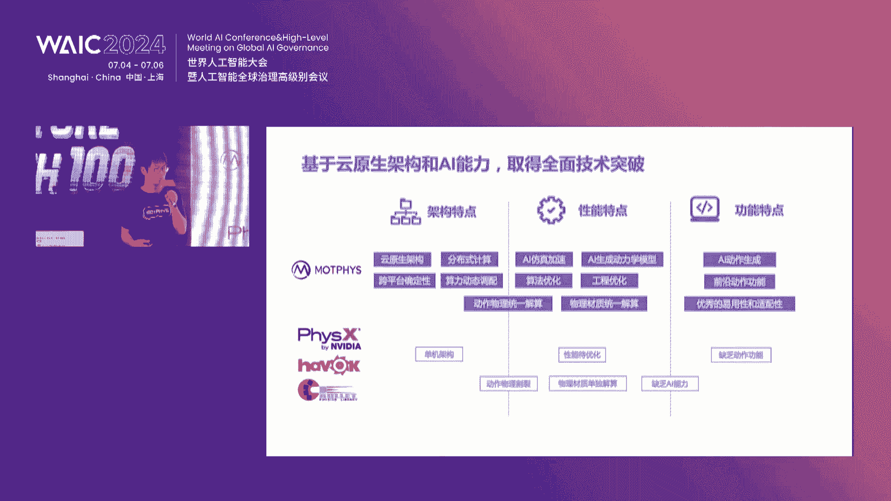
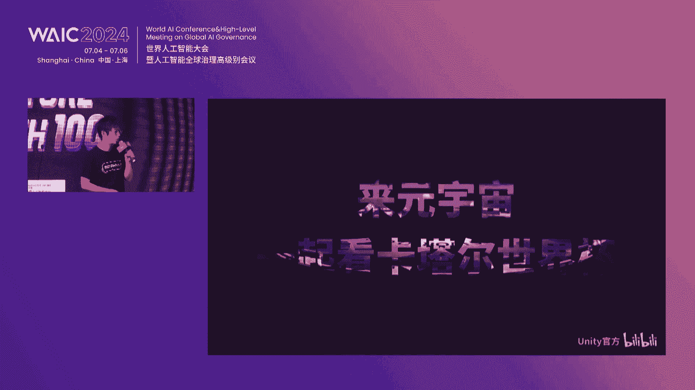
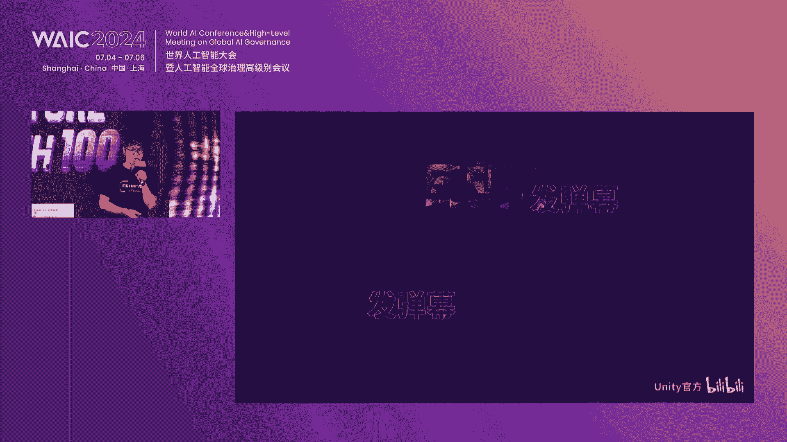
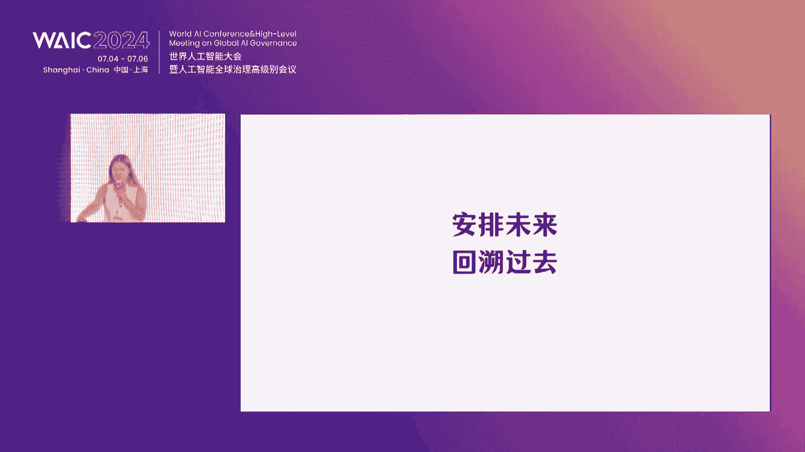
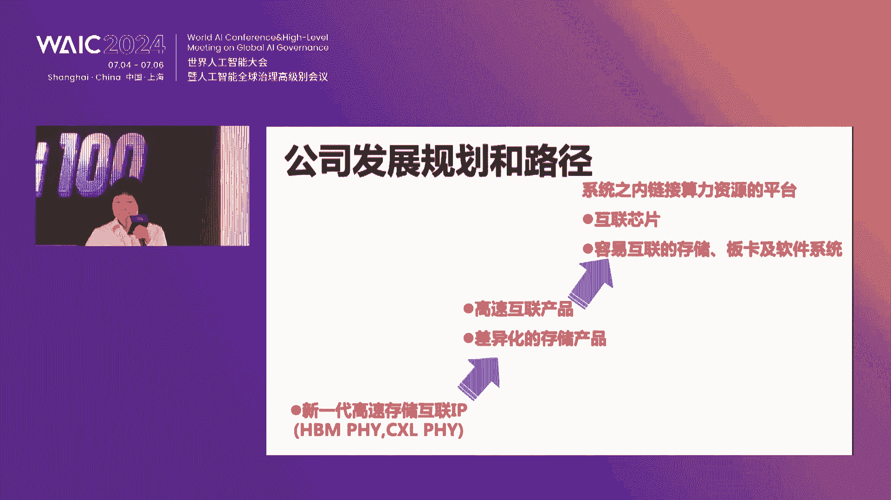

# 2024世界人工智能大会（合集） - P65：20240706-Future Tech未来之星创新项目路演（Ⅲ） - WarrenHua - BV1iT421k7Bv

英达市苏州智能科技有限公司，他们将介绍其创新的制造业巨深智能设备大脑，让我们欢迎。呃，谢谢各位啊，大家好呃，我是michaelindu nextCO。😊，呃，今天呢我给大家带来的就是我们公司的一个介绍。

就是打造制造业的通用大脑genetic AI for manufacturing。呃，在座的各位专家也都非常的了解啊，这波来参展的企业都是想做这波AI2。0在各行各业的应用。

我们的是定位在AI加制造业这个领域。呃，我今天代表我们公司过来，其实是有两个重要的点想给大家分享。因为我们认为呢呃要想抓住这个机会，最重要的是两件事。第一个是团队得给力。

第二个呢是切的场景得切的好切的准。呃，这就是我们的团队。呃，我们的创始团队呢主要是在呃特斯拉的加州工厂。当时呃曾经汇报直接汇报给eon Muk。然后在伊lon的带领下，20171819年呃。

把特斯拉的AI应用到当时汽车的总装产线上去的。然后在去年这个巨深智能技术大爆发之后呢。呃，我们又从那谷歌RT团队呢请出了heman。呃，就是这个右上角的这个黑man。呃。

他呢是从0到1做了谷歌R7的呃R71RRT two，呃，所以他非常的呃精通巨深这个这个技术。我们把它挖到公司来之后呢，就是请他呃把巨深这块的技术呢应到工业这个场景里去。除了这两部分的人之外。

我们其他的都是一些做制造的专家，来自于可能全球各个行业的呃制造业的头部的客户。这些人呢他们非常的了解工艺，非常的了解产线。然后呢呃他们都有蹲在产线上做研发的一些经验。😊，呃，我们团队非常的荣幸呢。

就是聚齐了这三种画像的人。正因为如此呢，我们能够非常听得懂客户的一些需求，能够快速的去开发出能够满足客户需求的一些呃产品，通用性的产品。呃，第2块就是应场景。这个应用场景呢。

我们大家也都听到了各种各样的企业的介绍啊，就是制造业制造业这里的场景非常的多。呃，找到一个好的切口，对于我们企业可能早期的发展非常的重要。

我们呢就是从这个AP这个场景切入这个AVVTP场景主要是离散制造的组装组装测试包装这种产线。😊，呃，说到这种产线呢，主要提两点。第一个呢就是大家也都知道嘛。

近两年可能外资啊台资一些企业加速能转移出咱们中国的大陆。呃，这个背后的或者说转移我们我们只知道转移啊，这个转移成功的这些数据呢，我给大家汇报一下。

其中80%以上这些成工落地这些不发达的地区的这些呃制造业的工厂类型呢，主要就是这些APP场景APP的场景俗称叫组装厂。呃，为什么呢？其实有两个原因。

第一个呢就是呃受限于当前的这个工工业自动化的这个发展的水平和可能说一些投入产出比的这样的一个。啊，投入产出的这样的一个限制啊。呃，所以呢呃投投投入产出的一个限制。呃。

所以现在这种产线呢还是需要大量的劳工来去做这种柔性的生产的。但是中国的其实中国的这个月均的劳工的工资已经大概到4000到5000块了。他转移到东南亚之后，那边的月均工资大概是900到1000块。

这种巨大的这种可能说薪资的差异，可以呃，他会让这种劳动密集型的产业非常的呃难以忍受。大家可以试想一个情景啊，就是如果说一个工厂，对吧？我转移到了东南亚，呃，但是有一些工厂呢他继续留在中国继续发展。

那这个时候苹果对吧？我去分工我的产品，让你去帮我生产。那这个时候其实这些留在中国的这些企业就非常的有压力。😊，呃，因此呢我们就是求准了这样的一个场景。我们就是打算做这波巨深智能在这个场景里的应用。

而且经过这两年多的摸爬呢，我们呃隐隐约约已经成为了在这个领域应用里的number one。呃，经过两年的发展，我们呃截止到202023年底的话，我们的交付订单累计已经突破2000万。呃。

不仅突破不仅有这样的成绩呢呃其实今年24年上半年，其实客户还是催着我们继续给他们做，继续给他们交付订单。而且有些客户说你就把去年的一些东西，对吧？直接给我拽到我海外的产业上去。😊，呃，我们老板呃。

就是我们创始人alen，他呃其实在我们内部仔细的分析了这个事情。如果说现在我们呃去为了增增大我们的营收做这样的事情的话，其实我们需要大量的产线的运维的工程师和交付的工程师。这个发展起来。

难免还会回到了可能说原来传统的现体集成商或者是方案解决商的这种老路上来。所以他让我们整个公司继续保持人数在30左右这样的小规模，继续focker在这种我们想做的这个产线大脑这个事情上。我们想做产线大脑。

其实大家也都知道最重要的数据，我们的数据怎么来两个方面。第一个，我们目前已经合作的客户。都是这个行业里的巨头，不是第一就是第二。呃，其中有一些呢他们慢慢对吧？我们获得了他们的一些信任。

他们呢就愿意去和我们合作，给我们开放他们积累了十多年的这种生产数据。第2块，我们自研了很多AI的模块，直接部署在他客户的产线上。我们可以去呃按照我们的要求去提炼，或者说采集这些高品质的数据。截止到现在。

我们已经收集了，或者说我们已经穷举了。刚刚呃前面那位专家说制造业的环境不能穷举啊，但是我们是从工益这个角度，工益工序这个角度，我们就穷举了FATB这个场景里的所有的这种工艺，大概也就是26种。

我们对这26我们针对这26种呢，我们已经积累了EPB左右的这种图文或者说视频相关的数据，而且是标注过的。呃，想到这儿，大家可定有很多疑惑，其中最重要的一个疑惑我很清楚啊，就是大家会问哎，你用这个对吧？

产线大脑的形式去做和之前用传统技术做的这个自动化产线之间到底有什么差别，到底有什么差距？😡，其实我们呃本质上讲的话，就是我们想利用这波AI2。0的这个具神智能这个技术，它产生的这种推理能力来提高的。

从而来提高这种心智的生产力。具体体现在四个这个方面。第一个方面就是通识能力。大家也都知道，我们如果说用传统的这种对吧？自动化预编程的形式来去做产线。这种产线它其实是不需要理解流经我这个产线这个零部件。

我也不需要留理解这个生产流程，生产工艺的，因为这些都是靠工程师去预编程，对吧？工程师去做编程好就可以了。那换句话说，只要产品一变，或者说这个设备宕机了，其实就需要这个工程师来介入来调。

第二个能力呢是适配能力。😊，呃，预编程的这种产线，大家只要是去过这个呃大家只要是去过这个产线的，都会发现呃它的兼容性很差。只要是例如说来料或者是环境，或者说这个各种各样的输入，有波动。

其实就会影响它的良品率，那如果说用AI大脑赋能的产线，它其实就可以解决这个问题。第三点就是学习能力，学习能力，我举一个具体的比方哈，例如说一个操作工，我是一个操作工小程，对吧？

我在这个汽车的刹车刹车片的公司去生产一个东西。😊，我就是专门在这个工作站上负责打螺丝，然后我离职了，我离职去了一家生产ipad的企业，我在这个ipad企业，我仍然可以很快的学会打螺丝。

所以说我生产的东西很不一样。但是对于打螺丝怎么打打怎么打是好的，前前后后的这个规定是一致的。其实我们就是想通过工艺把工艺做成一个skill给到各种各样的设备，让工益让这个设备有各种各样的工艺包。

它就可以有这样的通用能力，这就是我们的学习。第三个就是模仿就是精通生产的，大家可能都非常的清楚。因为生产有非常多的偶发的这种现象。就是你根本预料不到这种偶发的这种偶发现象，我们其实可以跳过学习的。

直接让我们的设备来去跟随人怎么操作，我就怎么操作，这种模仿能力可以是不用编程的，直接是可以可以通过各种各样操作，例如其中有一种一些摇操作。😊，这个就是我们构建的这种工作站的这种大脑。呃，同样的这种架构。

当我们想从一个工作站延伸到一条产线的时候，其实只需要加深加强这四个方面，它就可以对吧？从一个能够代替操作工的大脑，变成了一个能够代替生产工程师的大脑。再往后。当我们的AI能够很了解操作工在做什么。

也了解生产公司做什么之后，我们就可以把那个设计端的数据和生产端的数据做打通。😊，因为大家也都知道，你不管你怎么去优化你的产线，对吧？怎么去优化你的生产环节，你只能够在制造费用这个环节里做提升。

那如果说你能够碰到设计的话，你可以既改，对吧？整个既提升这个这个整个制造费用，又可以去优化它的部门费用，你就可以双循环，打通研发和制造，一个是改我的整个的产品设计，一个是我碰这个产线设计。这样的话。

我的AI就可以进化成一个真正的一个在制造业这个领域里的一个专家。😡，呃，大家也都知道，我们做的是在AI在制造业的应用。它有一个非常充分且必要的一个要求条件，就是你得快速能够落地，客户等不了你。

那我们用第一性原理的角度去想，我们无非不就是想要一个感知学习、执行一体化的这样的一个设备嘛。而且这个设备能够根据环境，能够对吧？react能够做反应。😡。

那我们就推出了这个能够最快落地的这样的一个工业的智能的AI硬件。就是我们中间的这个moel这个moel呢它这种这个载体啊，因为我们主要是做软件，这个载体它有三个优势。第一个优势，它的学习能力能够很快。

他能搭配我们的算法，让我们学习能力很快。因为这这样的一个环境，我采集到的数据是受控的。我可以针对性的强化我对应的一些算法的模型。第二。😡，我这样的一个设计，我的客户是可以快速接受的。

因为我们的客户其实他现有的产线上有大量的这种，对吧？😡，呃，大量的这种原有的固定资产，这种固定资产其实可以和我们这种新型的这种载载体完全适配。

第三个呢就是呃我们因为收集到的数据都是高品质的那其实这对我们边缘端的算力的要求就会下降。我们构线的成本建限的成本就会下降。这有三个优势。😊，呃，稍微快一点讲啊，不好意思，拖了一些。呃。

就我们整个transformer的架构呢是比较独特的。呃，我们的transformer的架构是其实呃和呃VIT这一块都是用我们大量从现现有产线上采集到的图片视频的数据，不断的做预预训练的这种预训练呢。

其实可以快速的去适应我们的生产的这个环境。同时呢我们的模型呢是基于张呃谷歌的RRT的架构，但是做了工业FATP场景的这样的一个定点的改造。这种模型的话，它呃特点就是它的模型参数大概可以控制在1B以内。

而且它的学习能力是比较快的。而而且我们用的是一个一个feel short learning的这样的一个学习方法，就少样本的学习，这样它就比较适配在这种极少的这种工业呃场景中。

或者说我没有见过的工业场景中能够快速的去做适应。😊，我们的整个的系统架构也是经过精心的设计的，主要是两个点啊。第一个呢就是我们的底层就是硬件层这一块。

我们的硬件层呢是为了能够第一啊肯定是兼容我们自己的硬件。第二呢，其实我们的客户其实他现有的产业上有大量他他已经购买的硬件。我们必须要实现这样的兼容和适配。第2块呢。😊。

第2块呢就是我们呃聚焦在应用服务上做了很多APP。因为大家都知道教付客户的话，客户作为生产的企业最关注的只是QCD3个可能影响他经济效益的这样的一个数据。

分别就是这我们针对这三点开发了非常独特的这种针对这些各个场景的一键式的这种APP的应用。😊，呃，最后提一下就是我们商业上的进展。我们呃在商业上其实获得了一些QL的背书。呃。

我们的QOL的主要和我们呃服务提供了两个点，我觉得对我们公司非常有价值。第一块呢就是呃我们的客户呢，他给我们一起共建了一个实验室。在这个实验室里呢，他把他积累了十多年的这种生产数据，对我们开放。

让我们去训练这种模型。😊，和算法呃，我觉得这个资源其实相当稀缺的。呃，这个生态位可能也就在此时此刻，客户会开放，可能再往前再往后呃，就错过了这波机会。第二个呢就是呃由于我们合作的这些巨头的客户。

他一直在脑子里想的是我的竞争对手哦，搬到了东南亚。我2到3年之后要和他真正的去比拼我生产的成本。😊，呃，他们的人工成本是我的3分之14分之1，我到底该怎么去突破？很简单，他们现在已经下定了决心。

就是把AI应用到AP就是把巨神智能或者AI这个技术应用到APTP里做弯道超车。所以客户是很有很强的这个主动性的。他们和我们一起共同打磨了几个杀手的杀手级的应用，就是不得不绕开，就无法绕开的这种应用。

给我们签订了呃数百万美金的这种意向的采购订单。😊，呃，最后的话就是我们呃讲一下这个市场规模啊，各位都是专家，我就不多多啰嗦啊。因为我们做的是生产非常通用会出现的组装测试包装这个场景。

我们只是希望通过我们的这个模型做一个这个领域的一个通用的算法，打通打透。它既可以让我们现在能够获取营收，又能够帮助我们一步步的做到真正的覆盖整个制造业的通用的AI大脑。

最后的话就是我们目前是在A轮的融资的这个窗口期的。呃，美元人币都可以，欢迎大家能够呃关注我们企业啊。我们之前的老股东，例如说联想小米集团，他们其实给我们赋能了很多客户的资源。呃。

同时呢我们是路奇的其创谈和美国YC同呃第一首个啊首个一起投资一起加入的公司。😊，呃，最后大家可以拍一下这张照片，呃，添加我的微信啊。呃，我们的亮点都在这张图上，我就不做赘述。

如果想想深入的去了解我们公司的一些情况呢，可以一步到那个地方。我们在028028展台，谢谢各位，谢谢。😊，好，感谢英达师的精彩分享。对英达师有兴趣的投资人们可以前往H3C028展台。

亦或是一旁的洽谈区了解更多内容。😊，🎼接下来让我们欢迎来自中国香港的友图科技有限公司，他们将展示其创新的机器人应用软件，让我们欢迎。呃，hello大家好，很荣幸呢今天给大家介绍我们的一个产品。😊。

我们是做的是机器人应用的1个AI软件。其实本质上做的一个东西呢，跟刚刚那位大哥他们做的有一点相似。但是我们解决问题的一个方法是不一样的。嗯。那我们做的是什么呢？我用三种方法来进行简单的描述机器人集成商。

它是一个专门帮助工厂实现机器人自动化的呃一条龙实现机器人自动化的一个产业。这根据国外证券的一个数字呢，大概这个产业的市场量是1800亿元。我们是现在中国第一个用软件去替代掉他们的一个公司。

那当然你也可以把我们理解成为是一个机器人界的一个window系统。因为我们产品呢统一了机器人的一个系统，编程语言操作方法还简单易用。如果要进行准确的描述的话呢，其实我们是一个工业软件。

那么软件呢有四大特点，使用门槛低，半小时能掌握效率高，15分钟以内呢能完成产线的调整。呃，适应性广。我们现在是覆盖市面上超过80%的一个机器人。也有工艺模板呢，我们可以直接进行套用。

我们提前为你完成超过80%的一些工作量。我们的产品的主要技术壁垒是来源于我们的算法。我们包含全国首创的一个程序转运算法。

那这个算法的发明专利呢已经是下发了机器人运动控制方面的正运算逆运算以及多轴机器人的空间B段算法等等。这些算法呢都隐藏在我们产品的各个细节功能上。而且被我们的云原生技术保护着。

我们也会即将推出AI的一个辅助编程，方便我们用户更快速的完成一个新的机器人的一个工艺应用。从本质上来讲呢，我们产品是一个机器人应用，还有一个底层的一个系统的一个结合体。

因为每一个品牌的机器人他们所开放的API是不一样的。我们需做需要做一个完整的一个机器人的系统呢来去弥补部分品牌。他们在系统上面的一些缺陷。机器人在制造业领域的应用呢，其实它是有两个大的难点的。

第一个难点呢就是机器人的使用门槛很高。制造业工艺的。第二个门槛呢就是它制造业工艺的行业门槛高。那我们在行业内呢很经常见到一个情况是会用机器人的人，他不懂工艺。但懂工益的人呢。

他又学不会或者用不好这个机器人。所以通过我们有图软件，我们会用户去解决的这个这些问题就是第一，我们是统一了这个机器人的品牌的语言，还有一个操作方式。因为现在市面上的机器人的品牌已经是超过50个了。

每一个都有不同的系统编程语言，每一个的学习呢都要10天到30天的一个时间。这个可以减轻我们技术员的一个学习成本。第二呢，我们是通过这些控制呃运动控制算法，所开发出来的这些功能来提升机器人呃应用的效率。

可以提升10倍。😊，这样呢呃还有第三呢，就是呢。我们通过逻辑，还有把逻辑，还有点位数据，还有IO这些点位，把它给全部的数据进行两边的一个分离，创造出可以进行复用的一个程序模板。

大家可以针对不同的工艺来去做出来模板来进行分享，就相当于做成一个平台了一个生态平台，为大家去解决工艺上的一个no how问题。因此呢工厂用户现在可以通过我们的产品，自己进行机器人的集成。

将自动化的成本降到以往的一半，甚至以下。那我们的产品呢已经是在广东的中山的一个家电厂呢，已经交付客户使用了。他们是一个家电的一个代加工厂，产品呢需要进行频繁的更换。

以往呢他们是不具备上机器人自动化的条件的。但现在通过我们有毒软件，他们自己掌握了机器人集成的能力。他已经上了两台的机器人了。🎼然后呢，下面的视频呢是他们对我们的产品的一个评价都快咯。

家啊稍微大声一点可以吗都包埋噶啦因为而家速度提升嘅话肯定可以用上去嗯，咁你更加意啦。😊，🎼有咁方便嘅，系嘛。🎼又系人工，好嘅好嘅，咁，就。那我们现在是在呃中国呢是第一个去做这样的一个工具型的软件。

国际上的主要竞争对手呢是来源于新加坡ags。那对比起他们呢，我们在编程的简易性实时视教，以及是公益模板方面呢做到比他们会更加出色。那啊更加适合我们国家去使用嘛。其他的竞品呢其实是我们的一些间接竞争对手。

他们是被统称为离线编程软件，有一些是叫做是数字孪生软件。呃，他跟他们跟我们最主要的一个区别是在于呢，他们缺少在线的一个调整，这是他们推进机器人应用落地的一个硬商。他们软件的使用复杂。

主要的使用群体呢就是机器人工程师，就是那集成商里面的机器人工程师。他们有很多复杂繁琐的功能，使用门槛高，而且呢价格很贵。一些机器人公司呢，他们也会推出自己的一个离线编程系统。

但是呢他们主要的方他们做的方式是把他们的硬件系统直接搬到电脑上了，主要是为了让大家更快速的啊提前的去学习他们机器人品牌的编程，还有操纵系统。所以他们的主要客户呢是一些大学，没有集成商去买他们的产品。

那我们产品呢是采取不好意思啊，我们产品是采取frium sa的一个商业模式啊，全功能的定价是5000元。那我们也有一些额外的收费费用。比如说呢呃你要控制更多的机器人，我们会收更多的价格。

或者是说你要我们帮忙写程序啊，写程序模板啊，甚至是做一个子账号，我们都可以进行啊有额外的一个收费。那目前呢我们的聚焦的一个目标客户是标准生产设备的制造商，以及的代理商和经销商。呃。

简单来讲就是一些数控机床啊、注塑机啊，还有一些检测设备啊啊，个人各种类型的一个标准生产设备。因为通过我们的产品呢可以让他们成为一个机器人提成商去赚取更多的一个业务啊。

也会为我们自己的推广会呃相对来说带带来更低的一个成本。更高的一个效益。那除此以外呢，我们现在也是和一些单位去联合开发一些新产品。那比如说这一个产品呢，它是一个啊图片是一个竞争品的，我们竞品的一个图片哈。

然后呢，是跟一个上市企业，他们呢去负责机器人，以及是硬件部分的一些开发，以及负责售卖。然后呢，我们的软件产品呢是刚好为他们解决了他们落地应用的一个问题。所以现在呢我们是负责一些我们基础的软件。

以及是一个工艺包，跟他们产品打包成为一个完整的一个产品来进行售卖啊。然后下面下面这个视频可以大概看一下，我们应该年底前会推出来的一个产品的样子。😊，🎼是焊接领域的，就首先借助一些协作机器人。

他们可以进行一个呃简单的一个拖动视教。这除此以外呢，在我们软件板块会做一个更加适应他们呃更加简单进行编程的一个这样的一个呃界面，来帮助他们去完成一些啊建筑行业啊。

或者一些呃大型的一些钢材厂方面的一些一些操作。这是我们的一个团队的一个情况，我是公司的总负责人CEO也兼任CTO我是毕业于两所世界前50名的学校。那我在曾在一个这一个外资企业的担证工程总监的助理。

兼任他们开发部的经理。2018年呢，我就创立了一家机器人集成应用公司，叫做凯特自动化，是我自己独自创立的，主要做的是一个机器人集成。曾经呢是给世界五百强的企业科研院校甚至军工企业呢。

我们都做过自动化设备。2021年，我们公司已经成为了高新技术企业了，也是同一年，我就发现呢其实我们公司发展的一个瓶颈。同时呢我认为机器人集成呢，其实是可以很大程度通过一些软件技术来去进行替代的。

所以我就创办了有图科技这个公司把产品做出来。然后干掉我第一家公司的整一个行业。那目前呢我是深圳市科技专家库的智能制造专家，也是香港青年在内地创业的其中一个代表。😊。

那我们的合伙人呢有来源于呃各个各个世界名校硕士以上的学历。他们负责我们公司不同的一个板块，有将近10年的一个相关的经验，有出色的成就。很有幸呢，我们项目也是有两位呃运动学的一个国际顶级专家的一个支持。

他们是我香港中文大学的一个老师。那目前呢我们已经获得是国内10项以呃10项以上嗯的一个内地创赛啊以及产品设计的奖项。那启迪之星呢对我们进行了董之轮的投资。然后呢，我们也是获得珠海市政府那边的一个啊补助。

那今年初呢我们成功加入了香港数码港。那国家呃国家级省级，还有还有市级的一些人社局和工信局的领导呢，都曾来过我们公司来去啊探讨怎么我们公司的发展以及是适用我们的产品。我们本轮融资呢500到1000万元。

然后目前呢来说，我们呃还剩下300万的一个额度，资金主要会用在我们的研发市场推广，还有一个呃主要就是市场和市场，还有开发。然后呢，我们现在我们这边会有一个简单的会场，但是这里没有机器人。

也欢迎大家到我们HE厂，就是tesla的那个场。我们放了一台呃协作机器人在上面，大家可以在展台上去真实的去使用我们的产品，看看这个简易性是怎么样的，谢谢。😊，呃，也欢迎各位老师，现场的观众大家提问。对。

好，感谢有图科技带来的精彩演讲与展示。现在各位投资人老师可以就自己关心的任何问题向李总团队发起提问。😊，哎，李总，你好，刚刚你有你在那个compatitive上有有呃列一些离线的工作台的这个竞对。

能不能讲一下我们包括这个Augments在在线的这个云工的云工作台的这个服务调用，以及你你目前的这个产品的set上有什么特殊的地方？首先的话我们是跟其他那些产品主要的区别是一个在线应用嘛。

然后在线应用的话，它是会涉及到你要去不单只是调转移程序这么简单了。我们要去对接更深层次去对接他们机器人控制板块的的东西。然后呢有一些简单粗暴的方法是你直接连接他们的那个关节电机。

然后做一个控制算法来去做这个事情。但是这样子呢是机器人厂家是是不喜欢是不允许的。所以我们就要在它有限的API上去做这些控制上的对接。每个品牌他们所开放的控制不一样，就以一个焊接为例。

不是单纯的从这一个点到这一点进行焊接就可以的。焊接的工艺有很多。它不同的弧焊，它有会涉及到电弧追踪啊，或者是摆焊啊等等这样的一些动作。这些动作呢会在焊的过程中，它会涉及到那个手臂的摆动。

然后如果是机器人本体商它没有提供这样的一个控制算法的话，基本上来说这个工艺就不能用这。机器人来做了，但用我们的产品的话，相当于我们现在把这些算法还把它给补充进去。所以整一个量是是很大的。

这些离线编程公司不是因为这一个东西他们呃他们不屑于做而不做，而是这个工作量其为实在是太大了，他们做不了。😊，对，所以这也是我们现在也有有一些科研院校，包括香港那边的一些研究院。

他们想要去做一些视觉方面的一个大平台软件。但是在落地到真正的机器人应用的环节的时候，他们就遇到这个机器人的控制问题。就我们现在产品的话也也在跟他们在探讨。

就是说怎么跟我们这个部分是不是租用给他们形成一个呃一个合并的产品，帮助他们的产品在这一块落地应用了。对。呃，那么在控制链路上引入在线算法的情况下，你怎么确保产线呃的这个延迟是符合要求的对。

这个断题真的很专业。对它是会有一个延迟。因为我们是通过1个TCP，然后是1个IP进行连接，然后连接的话呢，它会呃首先我考虑到安全问题。因为它不是是一个远程连接嘛，不是在线连接。我的手一停止，它要立即停。

所以我们现在在控制方面呢，有一些小trick，就是来去呃我们会以一个很很很短很短的一个时间间隔，一个很高的频率来去发那个控制指令，来去确保你的手指一停，它就它就停。即便是网络断了的话，它也会立即停。

在安全方面，其实我们是花了很多心思来去来去做的。哎，李总你好，就是我想那个请教一下，就是说咱们这个软件现在在针对客户的一些可能有一些不同的这个客户，他的这个定制化的一些需求。

他的可复用性和他在这些不同场景的这个牵移性上面呃通用的能力大概有多少，需要定制化这个程度，大概有多少呢？啊，感谢现在的话你像刚刚我们想所讲的，我们跟一些大型企业去联合开发一体机的产品。

这些是我们定制化内容。除了这一块的话，其他的一些小厂，他们说有什么一些简单的自动化需求这样的一个定制我们是不做的。相反，我们是会把他们这个定制化需求是交给我们的合作方来去做。

就像我们刚刚说的标准生产设备的制造商，他们相当于是我们的代理商嘛。然后他把一个东西，一个项目把它给做完了之后呢，他的程序其实是他他的核心的一个知识输出，他的一个服务的主要价值在这一块。

所以我们就有一个叫做子程序啊，子账号的这样的一个功能。就相当于把我们的一个产品的啊限制了它编程的领域，只让他进行操控的部分，交给他的客户来去再去进行。我们会直接把这个业务交给我们下游去做。

我们就专注在我们那个软件控制板块。对。好，感谢各位的踊跃提问，谢谢也感谢李总。😊，对。对有图科技有兴趣的投资人可以前往H3A053展台或是一旁的洽谈区，了解更多内容。

🎼接下来让我们欢迎上海达卯科技有限公司，他们将介绍其前沿的达卯能源大模型，让我们欢迎。😊，嗯。啊，各位专家各位领导，大家上午好，非常荣幸啊。参加咱们人工智能的这个春晚啊外科大会啊。

我们也正好今天有三个场馆，一个是在我们旁边，大家有一会有兴趣就可以看一下我们的产品的展示。然后在一层的这个两个展馆里边，可能还有一些更新的产品可以给大家进行发布。

那我今天给大家简单介绍一下这个我们达摩智盟，现在目前做的工作给各位领导做一个汇报。😊，达摩智能我先介绍一下公司哈，达摩智能呢成立于2021年啊，达谋和智能这两个字呢听着有点晦涩。

达呢是临自于源自于广雅啊，只指古代的百科全书，指的是通晓和认知的意思。某呢是地知的第四只啊，指的是早上5点到7点的某时。所以说呢达摩智能的价值观和理念呢成立之初，就是掌握能量转化的算法啊。

因为大家都知道能源和能量自宇宙大爆炸的时候，就已经守恒了，只是同一种形式转化成另外一种形式。那人类能经历新的范式变革，就需要掌握不同的能源和能能量进行重新的组织，并且可以去进行升级。

我们也希望能共同去推动整个范式的变革。😊，达摩智能呢已经成立了3年啊，今年这刚好第三年。202021年的时候我们刚刚成立啊。最早的时候呢，其实现在来看一些都合理啊。

当时呢就是配合商康在临岗去做它亚太区最大的算力中心。那个是从2020年的时候就开始规划了。那最早的规划的时候，他就考虑到了未来大模型和人工智能的发展。所以说在部署这个基础设施的时候。

他在国内是找不到相应的专家去做好能源的规划。因为现在咱们来看，已经在运行的A系列的英伟达的A系列的卡，它的单机价的功耗都已经超过了25000瓦。而传统的在2021年的时候只有3000瓦。

那为了解决这种高功率的功耗，然后以及能源的约束的问题。我们在2021年的时候，就和商康一起来合作，做了最早的算电协同的这种算法和服务。那解决了他现在来看，已经是全亚太最大的算力中心的安全和稳定的运行。

到了2022年以后呢。😊，啊，我们逐渐又开始和呃中科曙光国家气象局和福建大数据集团来合作。现在已经在运行的超过了万卡和万匹的集群。在2021年和2022年，我们也先后获得了商康和寒武器的两轮的战略投资。

那现在呢我们所需所发布的能源大模型的1。0的产品已经是正式的上线啊，今年在探博会上，我们和中能建也正式发布了生成式AI训电厂的这个1。0的产品。现在目前在跟国家电网南方电网都正在进行合作和落地。

那为了解决电力范市和能源大模型看到的所有在电力和能源领域里边的共性的问题，我们还是看到了一个不光是一个点上的用户的痛点和机遇。其实看到的更多是一个结构性的机机遇。那现在来看。

我们看到整个在电力系统在咱们中国呢正在发生着一次非常大的范市的变革，传统的电力系统都是以火电为主的这种电力系统，它是均匀的输出稳定的输出，我们因此构建了坚强的电网，整个电网实际上它是非常高效和稳定的。

但是随着2015年以后，9号文，我们看到了整个电网在发生非常大的变革，也就朝着一个以新能源为主体的新能新型电力系统正在进化和变革。那新能源在这里面带来了它的渗高渗透率会带来什么影响呢？

主要是新能源都是靠天吃饭。那也就是说它的天气，经济活动都会影响新能源的出力。😊，所以说呢我们看到了在新能源就会产生各种各样的波动性。因此呢带来的这种随机性波动性和不可预测性。

会对整个电力电力系统带来非常大的安全隐患。那另外一个是什么呢？我们看到了楼下有各种各样的机器人，其实在智能算力的这个赛道里边，也国家也新增了大量的这种负荷。比如算比如说算力中心。

新的计算中心的单就是功率密度已经比传统的数据中心高了5到10倍。现在在规划的所有的算力中心都会遇到能耗的瓶颈，它是一种新增的负荷。那这个里边大也也听过就是呃算力的尽头是电力。

也就是说当这GBT在5和6的时候，它为什么会它的训练会受到一个瓶颈，主要是在美国10万块卡的这个计算中心是没有办法找到一个当地的电网公司满足它的电量和电和功率的需求。所以说呢对于整个电力系统。

我们看到的，不论电动汽车的接入，还是新增的负。😊，和就会再带来整个双侧的不确定性。为了解决这个双侧的不确定性，你必须有一个上帝视角去解决整个电力系统里边每一个环节里边的精准预测的问题。

那另外一个呢是看到这还有一个市场的机遇。😊，作为一个整个的一个能源市场，在中国是一个巨大的一个是全球最大的市场。去年我们整个电力市场的一个全社会的用电总量高达9。8万亿。

今年今年的用电总量在上半年就已经超过了，就是增幅超过了10%，势必是会超过10万亿度店。因此在这个过程当中，大量的工商业的客户都在开始进入电力市场化交易。那如何从一个以前更多的是从国家电网去买电购电。

最后变成每一个业主，甚至每一个家庭都要自主的去参与电力市场。那这个这个变革也会带来巨大的商业的机会和空间。那我们如何去做呢？就刚刚提到了，在能源的电力系统里，它涉及到了源网荷储各种各样的基础设施。

在发电除了火电，现在还有大量新能源，甚至我们在展会上遇到了像氢能储能各种新能源的这种形式的存在。那对于一个不论是一个企业组织专家学者，他很难对整个能源领域里边建立行业的通识。

那因此呢我们是在大算力和大模型的基础之上做了一个能源的通用的呃通识的一个模型。在这里边通过能源领域领域特定的数据语料进行了训练。它呢作为一个能源的专家，就可以解决你在能源的规划设计和调度交易各类的问题。

同样呢我们在这里边又运用了一个能量块的技术，后边回来介绍，它解决了一个能量的组织，包括能量的调度的一个活动。在这里边，所以说经过专属的行业里边的特定啊知识的训练。😊。

又可以解决在算力工业以及工商业各种维度的专属的大模型，可以解决他们特定的任务进行求解。那我们的能源大模型去如何构建一个符合未来的满足更加自适应的一个能量系统的运行和机制呢？

它实际上是分分为了三个这个呃结构，最底层刚才其实很多做具深智能的这个创业团队都提到了，也就是说我们需要做软硬一体。那在这个里边呢，其实在能源数字化或电力数字化这个领域里边已经超过了将近二三十年的历史。

我们拥有大量的垂类的数据。但这个数据可能更多的以封闭的形式。那我们如何把能源领域里边原网荷处的这种数据把它映射出来。然后在本地进行训练和推理，可以实现局部的平衡。我们有一个能量控制器。

它在现阶段是一个高性能的一个控制器，在里边部署了小模型，那里边可以运行agent去解决各种调度和交易的问题。另外呢对于大尺度大空间，比如说未来是在电网级，它要解决整个电力的调度和能源的转换。

那需要一个云端的大模型。我们是一个混合专家的一个结构，底层是一个多模态的一个模型。那中间呢是1个MOE的1个超200亿的一个那个通识的模型。再往上是一个自研的transform的数理结构的调度模型。

再往上呢，我们可以映射所有能量的转换形式。为了去解决能源的调度和能源的预测问题，我们发明了一个能量块的技术。这个能量块的技术呢最早是源自于MIT那现在是广泛应营平衡集团和欧洲和国内的现货市场。

它是一个三维的能量块。我们把三维的能量块生成了1个34维的高维能量块，从而组织了一个能量系统，大家也可以列解成为一个能源的模型。😊，就像英伟达前一段时间发布的地球2。0里边的那个能源，那个模型是一样的。

它是完全实现了对能量系统的压缩建模以及推理。那我们经过三年的发展，已经形成了端内端的产品线。那能源大模型，小模型也好，只不过是我们的一个内核。因为我们是一个大模型的一个原生。

它其实本质上是做了一个能新能源行业里边的一个通用的操作系统。大家可以看到它是一个云边一体的。在云端呢它是大模型。刚才提到了，可以求解各种调度平衡和精准的预测。在本地的小模型。

因为考虑到所有的电力的调度都是毫毫秒级的。为了保证它的安全和可靠性，我不要跟不同的易构的设备和系统进行互联互通和互操作。那我们已经把各种能源的终端跟各种大厂，像天河啊、京科呀、正泰啊，各种大厂。

我们都跟他们进行了互联互通，下一步我们会把我们的芯片植入到他们的产品里边。右侧呢它是一个呃算力的集群，我们可以给到上边的上层的应用，比如说生成市的AI是我们最近发布的产品可以提供相应的服务。😊。

那它整个运作和流转呢，就是我们先发布的一款可以解决当下，比如说在上海或者是深圳这样的地方，在用电的高峰时期。因为我们现在进入了夏季。那它如何解决电网的调峰以及电网的实时调度的问题。

我们就打造了第三代的啊生成式的AI的训练场。那它生成式的AI训练量例，包括了它可以跟左边更多的分布式的能源的节点啊进行整合。那在本地呢通过能量的控制器和小模型进行映射训练和推理。

那通过我们能源大模型呃进行调度和平衡的求解，最后再反作用所反作用于电网或其他的一基础设施实现能量的平衡和电网的平衡。😊，那这个是我们现在1。5发布的一个核心的产品啊。

它现在已经开始广泛的应用在我们的国家电网，包括了上海、福建啊、厦门、深圳、浙江未来会应用在内蒙。那这部分里边呢是包括了两个核心的co pilot的能力。第一个是来自于资源的调度。

资源的调度更多的是考虑到现在看到大量的新增的新能源，包括互用的，还有工商业的，以前都是以并网的形式由电网去调度。那现在呢需要进入到微网和配网。那我们的微网和配网，原来是单向流动的。现在变成了有源的配网。

它就产生了双向甚至环流，那潮流的属性，会对整个配网的质量进行影响。那我们有一个co pilot的，它可以自主的基于天气复合。还有各类的储能和光伏的发电的情况进行自主的调度和平衡。

就可以实现一个自主决策自主运运行的一个独立的微网。然后呢，第二步呢，它也可以跟电网。🎼进行平衡。刚刚提到了，在需求响应和虚拟电厂的过程当中，你需要实时的在日内日内实时的去响应电网的需求。

那可以通过电网的copi，我们顺时的去控制所有各种有调可调复荷，包括。🎼各位嘉宾，各位观众，大家下午好。欢迎回到我们我们的AI领域路演活动。😊，在我们开始之前，我要特别感谢我们的合作伙伴。

上海国投、安永、中移互联网和东浩蓝生投管公司，感谢他们对本次活动的大力支持。😊，🎼那么现在让我们转向今天下午的焦点主题AI在文娱领域的创新应用。请欢迎深圳地宙科技有限公司。

他们将介绍AI训练数据、物理基础算法、数字孪身技术，让我们掌声欢迎。🎼，Okay。大家好，我是来自地宙科技tso的李培峰。地州科技是一家专注于计算机视觉与图形技术的驱技术驱动型公司。呃。

最早是来源于啊UCLAba教授实验室团队深耕3D物理基础仿真领域有1余年载。今天在这里与大家分享的是我们公司呃在AI训练数据、物理基础算法、数字孪生方向上的一些进展和成果。黄瑞轩曾经提到。

我们未来将进入另一个世界，一个机器人像家用电器一样融入到我们的生活中。同时一切可运动的物体都是自主的。在未来，各式各样的专业服务机器人将用来满足不同场景的需求。根据IFR数据统计，预计到2030年。

全球机器人市场规模预计达到1600万到2600亿美元。专业服务机器人将远超过协作机器人以及传统的工业机器人。预计到2030年近10年的复合增长率将达到25%到35%。但是在如此发展迅速的趋势下。

为什么机器人的落地还是相对困难？这不仅仅是因为硬件层本的问题，同时也是软件和算法之间的一个问题。目前市面上大部分的机器人所使用的都是多模态感知与理解算法，例如VLMS模型。

就是让机器人同时能够处理视觉信息和自然语言信息。但是我们发现目前的多模态模型无法对真实世界的环境有更深层次的理解。正如图片中，我们看到机器人在识别这些物品的时候，只能判断它是什么。

但是对于他的一些其他物理信息就没有了更深层次的认识。啊，这也直接影响了机器人在后续任务规划、实际操作以及通用泛化能力方面的水平。在巨生智能应用的方面。机器人在真实环境中训练的成本是非常高的。

并且很难同时训练多个机器人，这也导致了效率的一个低下。那从而会更多的转向虚拟环境中进行训练，但是我们发现虚拟环境训练的场景与真实环境训练的场景，其实存在一个很大的一个差异。

正如图片中我们看到机器人在一个呃模拟的一个虚拟环境中训练。其实这样子的一个环境还是相对粗糙的。虽然目前很多机器人训练模拟器上都自带了物理仿真，但更多还只停留在环境仿真这一单一仿真之上。

缺少了物理信息以及物体与环境之间的一个交互的物理基础仿真。所以这也导致了机器人在虚拟场景中的训练。与真实环境中的训练的结果其实是存在很大的一个差异性以及很高的一个不匹配性。那么针对之前提到的第一个痛点。

我们提出我们的解决方案。就是将机器人的多模态感知与理解算法同更深层次的物理数据基础相结合。例如，我们采用将更多元的物理基础数据与VIMS模型相结合。通过图片，机器人再一次感知这个图片中的内容。

不仅能分辨出它是什么。同时还能分辨出它是什么材质做的。比如第一个最上面的这张图，它是一个布袋子，然后它的透明度是零，说明它是不透明的。然后机器人在识别黄色的塑料碗时，它显示的透明度是较高的。

最下面的这个陶瓷碗。机器人给出的他的易碎性的一个物理信息是yes，说明它是易碎的。那么就是在这样子的一个环境下，训练的数据可以更接近于真实环境。同时，根据我们的实验发现，当。

计算机的多模态模型对真实的物理世界有了更深层次的理解和掌握，它能使得机器人在任务执行、实际操作以及通用泛化能力方面得到了质的提升，最高可以达到3倍。针对第二个痛点，我们是将物理基础与环境交互训练相结合。

从图中我们可以看到，机器人在对办公桌椅、水龙头。柜子这些虚拟场景中的物品进行了一个交互。我们通过还原这些场景中所有物品的物理技术仿真，让每一个环境，每一个物体。以及他们自带的一些物理属性。

以及环境对于物体之间的一个交互，都做了物理技术仿真。那么可以使它更接近于现实的一个情况。同时经过这样子的一个测算，我们发现呃，当在这样子一个虚拟环境中训练，机器人不仅能够满足，同时在多个场景下进行训练。

并与多个物体进行交互，从而大大提高了训练的一个效率，同时还能减少机器人在真实世界训练的一个次数，从而降低成本。下面我将展现我们生活中物理基础与算法这些结合的一些场景。通过视频我们可以看到。

这一块是通过物理基础与大模型之间的一个结合，让视频生成的一个大模型拥有了良好的一个物理常识。不管是固体、液体、气体，再加上物理基础数据之后所生成的内容及变化都更加的真实，包括物体之间的碰撞。

以及物体与环境之间的交互。同时在我们的测试中，我们采用的video con physics所在语义依从性以及物理常识方面。的表现都远胜于GPT four vision以及Gmini one。

5 pro在内的各种机械。目前，市面上大部分的3D内容生成商更多的生成的内容都是固态的，没有办法进行交互。所以我们将物理基础与物体3D仿真相结合。通过我们的技术，不仅能够使生成的内容自带物理属性。

同时它能与环境进行交互，并且它能通过自己调节自己的一个物理属性，改变自己的一个材质，从而在交互过程中改变自己原有的所有的物理基础数据。我们可以看左下角的这个视频，这是桌面上的一个杯子以及和一个宠物狗。

我们通过改变它的一个物理属性。变成一滩水，它就会像水一样的散开。同时结合其对于环境的一个交互的一个物理基础，它在散开的同时也会自由落下。我们再看右边的这个视频，当整个院子充满了水。

桌上的花瓶会根据其自身的物理属性以及对环境交互的一个物理基础，从而产生了福利。漂浮在了水面上。当然，我们也将物理基础与场景仿真相结合，通过我们的技术可以快速生成。工业场景、家庭场景的场景布局。

同时在这样一个虚拟环境中所生成的内容都是可调节、可交互以及自带物理基础信息的。目前我们更多的是专注在巨深智能与物理基础仿真相结合。左边的视频是我们在虚拟环境中。搭建的一个场景。

机器手臂与黑色的固体进行一个交互。而这个黑色的物体其实就是面团粒子。我们还原的是一个绒面团的一个过程。右边这个视频是我们展现了机器手与机器手套，在与不同物体交互所产生的一个力的情况。

在与不同物体交互的同时，所产生的力是不同的。同时每一个部位的发力也是表现不同的一个状况。这也更好的能够让我们还原机器人在虚拟环境中得到了一个物理数据以及反馈，更接近于现实环境中训练得到了一个结果。综上。

通过我们的技术，让最好的物理基础模拟器根据不同的需求来产生生成不同的一个场景，不同的空间，以及不同的物品，以及这个物品所自带的一些物理属性，以及环境和物体之间的一个交互的一个物理技术仿真。

能够让我们拥有无限的训练数据，从而源源不断的给到下游的。巨神镇的厂商以及公司。相比于友商提zo以不仅拥有能够AI快速生成物理基础的场景仿真、物体仿真等能力，以及能够提供物理基础。

让机器人在多模态感知与理解算法上赋能的能力。我们团队大多是来自UCEL。主要的核心成员是有5位。这边是要重点介绍一下dmetry教授，他是UCLA杰出校长教授。

同时也是UCLA计算机视觉与图形实验室的主任，目前是担任英国科学院、加拿大科学院以及ggenhamim的院士，同时，在国际范围内，一直是计算机视觉与图形学的先驱。同时他也是物理基础仿真的发明人和奠机人。

蒋陈凡夫作为我们公司的首席科学家。担任UCLA人工智能与视觉计算实验室的主任。同时，在计算机视觉、计算机图形、计算力学、人工智能等多个领域是行业的专家，先后发表了百余篇论文。

以上是我今天与大家进行分享的一些内容。如有感兴趣的同仁，可以移步到A30，与我们进一步交谈，谢谢。好，感谢地宙科技为我们带来的精彩展示。他们的技术为AI训练数据领域开创了新视角。

对地轴科技有兴趣的投资人们可以前往H3A030展台或是一旁的洽谈区，了解更多内容。😊，接下来请我们欢迎捏他上海智能科技有限公司，他们将介绍其创新的AI虚拟角色创作社区，让我们掌声欢迎。😊，🎼哎有喂。好。

呃，各位来访嘉宾呃，然后同学们呃下午好。然后我跟大家介绍一下，我们现在正在做的这一款用AI驱动来做角色冒险，并且进行角色创作的这一款平台产品。它名字叫捏他。呃，看见概念是我们公司的名字啊。

我们自己看到呢在这一代的AI技术中，真正的AI原生产品具备有两个重要特征，一个是可以用AI去打造和呃人呃接近并且去呃陪伴的这样子的伙伴。那这种方式呢是将token啊转化为和这样子的AI去对话的一些论述。

啊，我们呢可能更希望AI能够帮助用户来建设agents for放啊，形成一个像呃将来像西部世界，或者是说一个线上的主题公园的内容消费体验。这种方式中核心的关键要素，是让token来生成内容。啊。

我们自己最早注意到啊，有一群呃小伙伴在2022年的年底呃，chatGPT刚出现的时候，就在呃腾讯文档之类的一些线上的文档中去协作，去想象他们自己心中喜爱的角色。啊，他们的这些文档中呢，高峰的时候。

我看到有1400到2000人同时编辑这个文档。这样子的共创行为呃，很明显的具备了一些呃早期社区和社群的属性。这些社群和社社区呢能够很好的让用户在中间形成协作。

并且甚至能够相约去做一些这个游戏或者相关的产品。🎼我们自己现在在做一款的这样子的产品，我们希望呢用户不仅限于把角色打造出来，才能够让角色用呃冒险的方式，或者经历一个个剧情的方式啊。

去在里面呃经历不同的一些娱乐的体验。在这个过程中逐渐积累角色的日志和记忆。然后完善相应的角色，成为这个角色呃比较丰富和多彩的和你的共同的回忆。这样子的话。

这个角色才能呃成为这个小朋友或者说年轻人一起成长的一代新的AI产品色制作漫画，无需切换软件，你也可以制作出这样的精彩番外故事。🎼也可以直接上传参考图，让角色变身电影主角，快来下载捏他吧。

那用户其实用这样子的角色和相应的创作工具可以打造出我们自己都很难想象的一些内容。比如说他们实际上把这些角色当成了他们的化身伙伴，或者是某一个呃马甲小号啊，我们的以前的这个年轻的人的话，呃。

我们会发现他们用他记录他们玩桌游的日记，用他记录他们自己的考试成绩啊，用他记录这个自己的一些角色的呃这个一些幻想和想法啊，甚至用他来做很专业的一些创作啊，实现各种呃prompting的一些编辑。

我们在promping的编辑器上，尤其额外去简化了其中的很多的使用方式，帮助所有的全年龄的人能够更好的接触AI，并且用AI来还原自己心中想象的图像。呃，我们自己研制发的这款二次元的相关的模型呢。

是呃整个呃开元社区现在下载次数最多的几款模型之一啊，他们的特点是角色具有很强的表现力。这其中具备本身有13呃迷ion也就是1300万左右的一些训练数据，并且基于这个训练数据。

训练了大量关于角色的表情动作、服装、化妆、道具等类似方便角色去参与表演的一些要素，帮助他摆脱自己呆板的一个纯粹的设计图，或者美学壁纸的一个呃设计的范式。因为这样子才能保证用户在上面能打造多样的角色故事。

而不仅仅是呃一张角色的设计图。啊，我们自己也是很多的开源视频技术的开源贡献方。所以上海市的呃经信委相关的视频调研方案中呢特别的邀请。看见概念去作为呃视觉sa相关的视频能力的调研企业。

那我们自己在这层面上可以想到，最浅显的它是具备一定的IP的商业价值。我们的用户呢可以结合一部分的IP授权，结合IAI来生成隐藏的剧情或者互动。然后玩家体验后也能付费来去解锁。

甚至创作自己关于这个IP和角色相关的一些内容。这个可以在B端呃天然的结合IP的宣传和营销啊，或者是IP联名类的营销场景去进行商业的合作。啊，那另一个方面呢，他其实是长期内容生态的一个大的变革机会。

我们自己会发现呃这是最早呃模拟人生支付will rights在这个他的一门大师课啊，在三年之前画的几张图。啊，他评论用户呢呃或者或者说任何一个普通人获得充足的体验的方式，要么通过玩。

要么通过看别人的故事。在有限的人生中能够获得无限的经验。我们发现这一代的年轻人呢，它不仅限于满足于生活现现实生活中获得经验并且竞争的心态，而更多的希望在多重的人生或者虚拟的身份中。

也获得更多的体验和相关的这个社交的认可。那这一个过程中，他需要把一个故事，拆解成可以玩的要素，把玩的要素提供给所有的年轻人。在这个过程中借由更强的genrativeAI生成的能力去还原人可以得到的故事。

这也是捏他在这个产品呃推进的过程中，一直坚持和设计的一些原则。我们的角色实际上会陪着这个个小朋友，或者说我们的玩家一直成长。他们用角色经历一段一段的旅程，一段一段的记忆。

这些记忆会转变为可以index的数数据索引，持续的留存在这个角色上，代表着你的一成身份。这成身份呢，他会在之后这个角色的其他剧情的过程中再被利用，再被呃使用，成为他永远可以和你一起成长的一段见证。好的。

那这上面就是我分享的这个完整的一些内容。然后可能我可以呃留出一些时间，然后看大家有没有一些问题来回答嗯。结束了的对。感谢念他团队带来的精彩演讲。现在。😊。

现在各位投资人老师可以就自己感兴趣的任何问题向他们团队发起提问。😊，呃，非常感谢你今天的分享，我是来自云企资本的emmily。我们对这个方向其实也非常感兴趣，也投资了包括mini max做t。

然后以及呃AI游戏方向那个AI女友这些项目我比较好奇的一点，就是其实你在一开始也讲到嘛两个路线一个是偏Icomp一个是偏呃更多就是互动内互动内容的创作。我比较好奇，就你们现在的数据有没有一些体现。

因为听上去你们对内容的制造更感兴趣嘛。那我比较好奇，就你们数据上有没有一些呃这种early sign体现出来。

大家对于制作内容的呃这个比例和消费内容的比例在你们的社区中是大概什么样的以及这个这个留存大概是什么样的这是一个很好的问题。我觉得首先呢两类的应用其实是可以很明显的区分的。第一个是他的。😊，呃。

陪伴或者说对话是更加私人的，是更加私密的，不愿意那么多的公开分享的。一个是更多的去制作内容，并且愿意分享给其他人看的啊，所以我们肯定是选择愿意制作，并且分享给其他人看的这样子的一个社区的形态。

那在这个过程中，我们最具的代表性的。其实我在这儿写了我觉得对话的轮述或者说最长的轮数，不是我们关注的重点而是用户在这个过程中产生的呃整整体围绕内容生产的内容消就是token的消耗和他的这个发布的意愿啊。

比如说我们其实一次活动可能能发布美图秀秀一次活动10倍以上的UGC内容啊，这是我们任何一次的这样子的社区活动，在一个很小的用户基数上也能达到一个很大的用户发布意愿的一个表现。啊，除了用户发布意愿呢。

在早期社区中消费，很多呈现为次消费。我们说。其实很多的时候消费发生在生成的过程中啊，就是用户用自己的角色去经历这一段剧情的时候，他实际上更多虽然可能也在创作啊，过程中他会表达一些自己的意愿。

做一些自己的输出，但他并不是完全呃不再消费这个内容。他更多的时候在消费自己的角色参与这个剧情中的这个过程。那这个过程中就必须保证有几个点，一个是这个角色是他自己选择的，而不是跟剧情强绑定的啊。

就是我觉得这点上大多数现在的应用几乎没做到啊，就是大多数的剧情是跟角色强绑定的没有说用户和角色是直接相成的关系。那第二点的话呢，是这个角色本身他要有一个持续的构建能力。

就是用户在这个角色上积累和发布了些什么啊，所以我们可以发现我们的用户是很乐意在角色上发布一系列的作品，并且去求别人给他的角色增加人气的。啊，这些相应的这些行为，在社交媒体上都有很多的体现。

所以我觉得这些是我们相对于其他平台非常独特的一些点嗯。呃，你这里有团队的介绍吗？哦，呃不好意思，我就呃把团队正好去掉。我和我的合伙人呢是呃都来自于硅谷的那个facebook团队。

然后我们是呃早期的做最早做视频相关的产品。我们大概呃系统性的做了包括短视频，最早的平台短剧和最早的instagramreos之类的这些产品。我们在当时大概覆盖了20亿观众九成以上的视频观看。

我们制作的制作的相关的产品。那是16年到18年属于呃移动互联网短视频最高峰的时期啊，这是我们当时的一些经验。所以在这些过程中，我们其实更多。😊，感受到内容的这个生产和消费之间的双边市场的关系。

理解这个过程中怎么样去组织内容的生产，怎么样去呃形成创作者社区。这是我们之前更宝贵的经验。而我的合伙人呢技术团队其实也有很多的来自于AI教育背景。之前的AI教育类产品。

是一类很适合在当前让呃年轻的人去接触AI的自适应英语学习，或者是自适应的这种学习这个AI的交互模式，学习promping模式的一些设计概念啊，所以我们把这些概念呢都融入到了现在的产品和团队的设计中啊。

这是我的团队的一些情况嗯。对。你好，那我想请问一下这个产品的话，它适合什么样的年龄的群体啊，呃是比较适合的。嗯，我们主体来说还是在大学生为主呃，因为它的呃产品的内容呢也不是特别的那个年轻。

但是他是一个比较偏向于整活，啊，就是呃玩玩玩各种呃段子，然后可能这种呃中间的这些呃气氛是比较活跃的那个状态。当然也有一部分的年底可能超过28岁左右的一些人，他更多是呃相对来说有一些当年的制作欲望。

或者是说当年甚至想成为摄影师，但是现在没有时间，所以这个现在的这个工具成了他的一个掌上呃摄影工具啊。对，好，谢谢。因为那我刚才听到你在谈AI教育这个事情。对，那么在这个社区里面除了他这种体验感之外。

它是否也有一些能带来一些教育的这种真实价值。是否会有相关设计？呃，您说的很对？其实在一个这样子的产品中呢，很大程度上，其实用户在里面我们有时候说他也在做创意写作，或者说创意的看图说话啊。

就是用户其实根据AI自己想要表达的这些制作的内容，其实他里面也融入了他自己的一些呃个人的幻想和想法，他在创作的过程中，就像搭乐高也好，或者说做任何其他的好玩的东西也好。

他都提供了一个自己对于美学成长的这样一些需求和语文的学习。我觉得嗯很好，谢谢。我是教育协会的。所以说有这类的功能啊，我倒是很愿意帮你们啊去推一推好的好的，谢谢嗯。😊，好，谢谢各位老师提问啊。😊，好。

非常感谢各位老师的踊跃提问，也感谢捏他团队。😊，🎼那么对捏他有兴趣的投资人们可以前往H3A045展台或是一旁的洽谈区进行进一步的探讨。那么接下来请欢迎北京谋纤飞科技有限公司。

他们将展示其先进的morph动作物理引擎，让我们掌声欢迎。😊，大家好，我是来自某纤飞科技的崔汉青，我是公司创始人呃，我来给大家介绍一下我们所做的事情呃，用用一句话来描述。

就是我们是现实交互是AGI和虚拟世界的基石。那我们把呃虚拟世界的技术站分成左边这个三角形。那么我们所做的工作是右下角基础软件这一部分。让基础软件细分下来，我们可以重点拿出来的是渲染引擎和和动作物理引擎。

那那他们各自有什么区别呢？那我们就把虚拟式表现力分成2块，一部分是静态表现力，另外一部分是动态表现力，静态表现力就是说你一张画面还有多好看，是静态表现力负责的这个是呃底层技术是渲染技术。那么另外一方面。

这个动态表现力，就是指画面动起来的时候，还有多么的真实和好看，这个背后是由动作物理技术来支撑的。那么再细分下来，我们看着动作技术和物理技术有什么区别。我们认为动作技术指的是数据驱动的运动。

就比如说你要让一个数字人在在跳舞，它背后是由动补的数据或者是AI合成的数据来驱动。它这个是数据驱动的运动。那么另外一方面，还有一类运动，它是不需要任何数据的，就是我们现实世界的物理规律。

像像牛顿定律啊各种嗯碰撞的这种规律。用这些就可以去驱动物理世界。直例来说就是我们去打台球的时候，当你把白球打出去。那么后续的这些球的碰撞以及哪个球落带是由物理规律来决定的。那这个就是规则驱动的运动。

那这两部分嗯构成了虚拟世界的所有的运动方式。呃，我们公司的名字英文名ice也正是呃动作技术就motion和 physics的合成词。我们做这件事情，其实看到了三个历史性的大趋势。

第一个是内容精品化的趋势。我们看30年前游戏和现在的游戏相比，我们认为渲染技术已经接近于人类认知的天花板。但是我们看到游戏里面还有各种穿摩的情况。也就是说。

虚拟世界里面的呃动作和物理技术仍然有巨大的提升空间。那么第二个趋势是交互升维的趋势。我们现在看到的这个屏幕或者是手机都是二维交互设备。那随着各种呃三维交互设备的发布，像呃vision pro之类的。

我们不可避免的要从二维交互进入到三维交互的时代。在三维交互时代里面，呃，人类和虚拟世界交互是需要符合人类与现实世界交互的习惯和体感的这些习惯和体感是刻在我们的基因里面的。所以我们认为在三维交互的时代。

呃，动作物理技术的重要性是比二维交互时代大的多。嗯，第三个趋势是虚实共生的趋势。我们认为从计算设备被发明开始，人类就和虚拟世界的呃共生，它是不可逆的在推进了。

那么嗯有不同海量的异构的计算设备接入到网络当中，他那他就对呃我们技术的性能和兼容性提出了重大的挑战。那么看到这三个历史性的大趋势，我们选择去做一个全新的动作物理引擎。

那么接下来我就来讲讲我们和竞品之间有什么样的差异。呃，左下角是三个竞品，国内我们没有找到竞品。但国外的话我们找到三个，分别是英伟达的phyic。这是英伟达呃verse的物理仿真的基石。

然后第二个是harwork，它是微软旗下的用作三A游戏物理的一个物理引擎。第三个是 bullet，它是AD开源计划的，我们发现他们都是巨头的产品。那么我们跟他们有什么区别呢？主要是三个方面的区别。

第一方面是架构上不一样。现在这些竞品他们只能跑在单机上，只能利用单台设备的算力。而我们创新性的提出了分布式的物理反真。我们除了有单机的计算之外，我们还可以把多机连在一起。

通过分布式的方式去打破单机算力的瓶颈。这个是架构方面的特点。第二方面是性能上的特点。我们在呃引擎当中做了大量的算法和工程优化，并且我们加入了一些AI仿真加速和AI生成动力学的能力。

使得我们的性能相比于竞争对手有呃大幅的优势。比如说像璃开源的 bullet璃，我们在很多场景下比它快10倍以上。然后像业界领先的英伟达的physics，呃，它跑在英伟达的显卡上。

那我们同样可以跑在英伟达的显卡上，在这种情况下，我们在大部分的场景下也可以超越它的性能。这个是我们在性能方面的优势。那么在功能方面，我们拥有呃纯物理引擎所不具备的动作驱动的这种能力。AI生成动作的能力。

那么我们还有优秀的易用性和适配性。就比如说我们在呃去年的时候，我们完成了和呃国产芯片的集成。就是呃华为的呃mate60的鸿蒙的芯片，我们是能够跑在这个海思的GPU上面。那我们也也就此成为了呃。

新的鸿蒙就是呃所谓的纯水鸿蒙的系统级别的物理引擎供应商，就是我们的系统会在呃Q3到Q4的时候，会会随着mate70上线。

🎼然后我们来看一个实际的分布式物理的演示。这个是呃我们和unitity联合制作的这种万人在同一个场景里面的呃实施互动的呃人宇宙的应用。然后所有的角色和场景之间都是物理建模。

然后支持呃超大规模的在线的人数。

那么这个是分布式物理在呃全球首个商业化的应用。我们所完成的是一个分布式的物理集群跑在云上。然后用一体完成的是分布式渲染。我们两家一起做了这个项目。

那么我们同时支持10万人级别的在线呃支持呃模拟的场地面积达到12万平方米。那么我们在技术上可以看左边中间这个图，我们用6台的服务器呃多机联合，我们能跑到10倍的单机的物理量。呃，这样的话。

物理仿真已经不再是一个瓶颈。我们在网络上可以做到新增一台机器，它的通信的增长是线性的，它只会和临近的机器去通信。这样的话对网络压力是比较小的。那么分布式物理除了刚才所说的呃。

针对海量用户的元宇宙的应用之外，另外一个很重要的方向就是巨生智能的模型训练。那我们知道呃90%的巨生AI训练嗯需要用到合成数据，就是现实世界的数据已经是不能满足巨生智能的呃模型训练。

因为它成本现实采集数据的成本很高，而且有各种各样安全的问题。比如说我们去做碰撞的测试的时候，就很难真的用机器人去做碰撞测试。这个时候必须要在虚拟的仿真环境里面去完成。在仿真环境里面。

我们可以得到远高于现实世界的效率。还有嗯不需要考虑安全性的问题。那么用一句话来总结。我们认为嗯物理仿真环境基于嗯巨生的AI训练，正如互联网海量文本数据，至于大语言模型一样。

我们所处的生态位是仿真环境和合成数据的提供者。那么这是一些呃AI方向的应用。这个是我们用机器人的模型去搭建了这种嗯虚拟的人，然后让他做呃强化学习。我故意放了一个没有训练完的场景。在这个地方。

我们可以看到这个人他是从地上挣扎的爬起来。这个不是预生动不好的动作，而是他确实从强化的方式能学到的动作。这种方式可以大幅降低呃动作资产的生产的成本去去嗯帮助到所有有动作资产生产的这种工作流。

然后嗯我们还有一些跟物理仿真AI加速方向的应用。就比如说流体仿真领域呃，我们通过在离线去解算呃高精度的NS方程。然后这样机器学习的方式去做一些预测。那么我们在在线推理的时候呃。

某些场景下我们可以达到1万倍以上的效率。我们的产品呃主要是从游戏行业来，就是左边这个互动娱乐。然后我们扩展到XR的行业，还有虚拟形象的行业。

那么我们目前也在呃战略性的投入到跟工业仿真和巨生AI训练的方向。然后和国产芯片的合作也正在推进当中。呃，我们的过往的案例就是集中在呃游戏方向和数字人方向。然后呃现在在做一些机器人的实验性的项目。呃。

我们的财务增长是非常稳健的。我们的团队技术领先，而且配置完整呃，我们一共现在有30多个人呃，北京和杭州我们有两个办公室，我们是国内最早的做前沿动作物理技术的团队呃，团队成员里面有很多是做竞赛出身的。

我们拥拥有5枚的ACM金牌，都是来自于国内外的名校。我们团队一共有十年的引擎开发经验，大部分都是技术人员。Yeah。嗯，公司的历史是这样，我们成立于2020年底。然后在21年7月份的时候。

我们拿到红山和高岭的天使轮。然后在22年的时候，我们拿到呃陆奇博士的pA轮呃，我们也是陆奇博士史上最大的一个呃单笔投资之一。然后后面我们进行了一些呃技术的落地。呃，我们去年呃完成了物理引擎的1。0版本。

然后这个是现在供应给华为。然后呃是呃红新鸿门系统的官方的物理引擎。然后呃我们跟华为的合作，也有呃华为战头的加持，就是他是我们的A轮。然后现在这个合作除了跟终端这边的合作之外，我们还有跟呃海事芯片。

还有呃华为云这边就是在云上跑，分布式物理的合作正在推进当中。好的，这以上就是我的介绍，谢谢各位投资人。好，感谢毛先飞团队带来的精彩演讲。现在各位投资人可以发起提问。😊，Oh。对。对。

各位投资人老师还有疑问吗？哎，你好，很高兴在这里再见再见到。哎，我想了呃理解一下，就是你能不能再讲一下，就是说咱们嗯在这个3D时代。刚才你其实尤其提到就是说微sonpro的这个时代嘛。

它这这个时代的物理引擎比上一个时代的市场空间大。那为什么大会是一个什么量级的这个这个更大的市场理解理解这个问题可以我们先讲讲历史上的情况是怎么样的。就是我们从游戏行业为例去讲。

其实比如说现在我们看到unitity或者里面，它其实有自带的物理引擎，它只是多用用的英伟达的phy那么这一部分在在游戏开发中或者在游戏体验中的占比，我认为可能是在10%到20%，就是根据不同游戏的品类。

可能体育游戏会占比更高一些。然后像像休闲的这种占比会少一些。它其实不。😊，是一个很高的占比。那么是因为我们一直都是在看二维的屏幕，那么二维屏幕它小了一个维度，它就嗯没有让我们身临其境的那种感觉。

所以物理的不真实，我们是可以忍受的。那么到了呃三维交互的时代，就假如我们在沉浸的在三维的虚拟世界当中，那么我们会天然的去期待这个世界不光看起来而且是动起来跟现实世界要是要是很很相似的。

那么这里面尤其是动起来很相似。那么背后必然意味着这些物理规律也要完全拟合现实世界的物理规律。所以我们认为在三维交互的时代。那么呃这些物理呃物理规律很重要。然后从而导致物理引擎本身它也很重要嗯。

它是呃呃三维世界真实性的重要来源。对。哎，你好，那个呃，跟着刚刚这位老师的问题啊，我也想请教一下呃，您觉得这个咱们的这个市场空间是不是呃一定程度上还是要取决于这个下游三维交互的这个市场空间啊。

那这个这个市场您觉得大概什么时候呃，能够有一个比较大的，或者说爆发性的这么一个增长？对。哦，我觉得我们市场空间按现在的战略分成可以分成两条线去讨论。呃，一方面是跟三维交互相关的。

我们觉得嗯现在是平稳发展的状态。如果你期待一个爆发式的增长，一定是呃需要期待一个划时代的硬件三维交互的硬件产品产生。比如说呃，假如假如若干代以后的visson pro，对吧？它它大卖了。

那么会是一个很不一样的世界。嗯，那这个这个就是嗯意味着三维交互变得嗯普及性就变得很高了。然后另外一个方面是说呃，我们还有巨深AI训练这条路。

那么这个东西跟三位交互呃的这种跟用户级别三位交互其实没有什么关系。它是在数据的仿真和嗯给巨深AI提供数据这个方面，我们觉得合成数据一定是极其重要的，会占90%甚至95%这样的数据量。好。

感谢各位老师的踊跃提问。不过因为时间原因，我们毛线飞团队的录演环节只能。😊，到此为止，谢谢谢谢谢谢。😊，Thank。Okay。不。对。

那么对牟先飞有兴趣的投资人们可以前往H3C013展台或是一旁洽谈区进行进一步的交流。接下来请欢迎北京创元世界科技有限公司，他们将展示其前沿的可编辑超大规模三维场景生成引擎，让我们掌声欢迎。🎼，大家好。

我是创园世界的创始人蔡一鸣。我们的产品是可AI驱动的可编辑超大规模三维场景生成引擎。😊，很显然，前面的公司他们是让三维场景动起来的那我们就是先得让这个三维场景存在。那我们都说这个3D是未来。

其实我们认为核心在于我们人类就是三维生物。三维呢3D呢它是最简单最直观，但信息量最丰富的一种交互形式。所以说很多行业都会走这种文字图像视频到3D这么一个链条。然后前三个行业现在都有的这种爆款的产品也好。

爆款的工具也好，但3D一直还没有出现。我们希望在两年之后能把这个红色问号换成我们的创元引擎。😊，具体来说，我们会对3D或者说三维数字世界做一个划分，从超大规模开始，往下到区域级到产业级，最小的到室内级。

再往下才是3D的资产和元素。那这些行业可以说在每一个这个场景级别都有对的行业，比如智慧城市，比如区域的这个游戏建模，比如智慧园区，比如建筑建工，甚至室内的加装设计，这些行业都始终存在。

但以前呢一般都靠人工建模，呃，随着这个生成式AI出现啊，有一些这个3D生成的模型开始出现了。但是也只局限于数字人3D资产或者说一些小的室内加装设计。而且在场景级上更多依赖于以前的素材库。

我们还没有一套完整的基于生成式AI的这种建模方案。那如果我们想对一个城市建模，我们就依然需要采用三维重建或者人工建模的方式。那就涉及到他们有的它固有的这个痛点。你说是人工的成本也好，技术的原理也好。

我们所有行业在涉及到三维建模到。😊，最终我们抽丝剥茧都会看到这四个痛点，就是成本高、耗时长、难编辑模型复用率低。一是来自于人工建模固定的人工成本和人工时长。而且你在对不同的风格进行建模的时候。

你需要寻找不同专业的建模师。因为大家在这个工作过程中都会积累自己的技术经验，他就会擅长一种风格。😊，那三维重建呢更多的是来自于技术天花板的限制。可以说三维重建的第一手数据永远是点云。

点云的后处理是一个极其复杂且麻烦的流程。但在实际用户的用的过程中呢，更多的是需要这种标准的meash三角面四边面，然后去基于它对对它进行一个二次编辑和修复。

而且场重建方法还有一个关键的问题在于它只能对真实场景进行重建。我们如果需要对游戏场景进行建模，需要对影视特效进行建模，我们只能通过人工基于美术原画设计的设计口来进行一个人工的编辑。

因为虚拟场景你是不可能采集到多视角图像的，这就是三维重建的另一个关键问题。😊，我们就是希望能解决这两个问题，我们提供一种更简单、更快速的三维建模方式。所以说我们基于这种生成式AI和一些大语言模型。

包括一些独样的扩散模型，我们打造了全球首个纯AI驱动的可编辑超大规模三维场景生成引擎。我们有一套自然的体系架构，我们的模型最底层不是端到端的大模型，是我们自研的空间信息体系和场景生成流程，只有这样。

我们才能保证保证我们生成的场景里每一个元素的位置比例尺寸，甚至元素之间的连接和关系是正确的。再往上才是我们的生成层。我们有一套自研的3D原生大模型，我们也有多模态的基座输入处理模型。

然后我们还有语言的调度模型，我们支持用户使用自然语言与三维场景直接进行交流。😊，具体来说，创元引擎的效果就在于超快速的提升现有的建模精时间，并且保证超高的建模精度。我们以一个具体案例为例。呃。

100万平方米的科技园区，现在大家都需要三维重建或者人工建模，然后用两个建模师或者是扫描人员用3个月才能完成这个模型的建立。那我们的创业引擎不再需要相关企业去配置员工或者建模师。

我们只需要6个小时就能完成这个园区的生成。我们用3到5天就可以完成一个以前需要4个月才能完成的项目交付。😊，呃，可以说基于这个案例，我们就可以说创越引擎可以让相关企业减少90%的人力成本。

并提高360倍的场景建模效率。😊，我们能实现这一点的原因是穿越引擎。首先，第一，它首次实现了单次生成全元素可编辑的超大规模场景。我们生成的场景里边每一个元素是独立的，每一个实例是独立的。呃。

比如一个房子，一个车，一棵树，它都是独立的标准的mash格mash形式和OBG格式，所有元素都可以拿出来独立编辑和复用。只有这样一个可编辑的场景，才是真实用户他想要的一个实际情况。

如果说我们采用传统的无人机清晰摄影或者三维重建的方式，你重建立或重建建模出来的场景是一片完整的点云。你把它转成m以后，它也是一个完整的形式，那就没法说单独对一个房子进行编辑。

每一个都独立的另一个优点就在于。我们的室内空间是完全可用的。我们每一个建筑它是一个真正的建筑，它具有真正的空间信息。我们可以在每一个建建筑物的室内去进进行室内设计，室内装修、室内展示。

这是我们第一个亮点。😊，第二，我们首次实现了多模态和CAD辅助创建三维场景。我们的多模态只输入，我们可以支持文字的输入图像的输入视频的输入。我们的输出就是标准的3DOBG格式。呃。

这里边最重要一个点在于我们实现了CAD的辅助CAD我们可以说是一切企业用户或者说B端用户的一个设计源头。它意味着绝对的精确。我们可以通过CAD辅助解决大模型的换觉问题。意味着我们的场景生成。

在保证超高超快生成速度的同时，能够提供一个超高的精度。在一定意义上打破了我们说时间人力和效果的一个不可能三角。😊，另外呢，我们支持文字和音频的输入，它其实更多的实现是另一个作用。

就是人的想象力的快速剧象化这样一个过程。我们支持大家用一段话去描述一个你想要的场景，你想要的空间，比如你想要的家是什么样的那我们可以快速的把这个模型生成出来，然后让你看到具体哪儿你不喜欢。

你都可以去单独修改。呃，我们后边说修改的问题。😊，第三，我们实现了无需先验知识，重建三维场景。先艳知识是三维重建算法必须的元素。我们可以说最基础的多视角图像是一种先艳知识。

如果想要做到精确的这个三维重建，那么相机的未资载合的信息，图像的分辨率都是先艳知识。但是如果没有先艳知识的情况下，就没法实现一个三维重建。不过我们现在基于创越引擎，它的核心是大模型推理。

我们能在任何没有任何先艳知识的情况下完成一个场景的生成。比如一张俯视图，它丢失了全部的空间信息。但创越引擎也可以只输入一张俯视图去完全非常合理的生成一个大规模的三维场景。😊，对。第四第四。

我们首次实现了自然语言精细编辑三维场景。呃，我们可以让人可以通过语言直接与我们的引擎进行交互，对场景里的细节进行编辑。比如把场景里的绿头房子换成体育场。

我们的引擎支持理解到呃场景里的绿头房子到底指的哪一个体育场是什么？我们他应该把体育场生成好之后替换到什么，放到哪里。甚至我们的引擎在面向专业用户的时候，可以提供为他输出判断体育场放在这里到底合不合理。

尺寸到底合不合理。😊，嗯。我们是一款通用引擎，这是我们早期主要的市场分布。我们会沿一条技术研发时间线节点去走。我们通过技术推动，在不同的时间点变更我们的产品形态。早期我们直接向用户提供一个呃场景的模型。

最早来说，我们现在一个很重要的新闻市场是智慧园区和智慧工业呃智慧工地。就是说现在大家需要耗费非常长的时间和成本去建模。那交给我们可以让大家的成本降低到以前的30%甚至20%。

同时呢这条线是一个真实世界的实时映社，或者说它是物理空间上的业务。我们也会做虚拟空间的业务。因为我们本质上是一款通用引擎。我们会为个人创作者和个人开发者去打造一款3D内容。

或者说3D游戏超简易的创作平台。这是我们另一条线的一个呃核心产品形态。😊，嗯，然后大家可以看到我们的产品形态越往后是其实是越小的。因为本质上我们就是在打造一款为所有人服务的通用三维生成引擎。

那我们最后就会在真实在虚拟世界将产品形态转换为泛娱乐的创作引擎。它的核心功能就是我们刚才提到的人的想象力的实时具象化。另一条线在物理空间，我们主要向企业用户提供服务。

那它的功能呢就是一个真实空间的物理映射，或者说真实空间的实时数字映射，这就是一切工业数字人生的基础。😊，然后多说两句，最终其实我们是想打造一个生态。呃，所有做AI生成3D的。

或者说所有做传统3D的都想打造三维的生态。但他现在还没有这边我们认为首先第一客观原因就是目前没有一款真正为3D或者说三维世界打造的显示设备，这是我们不可承认的事实。但是我们更认为第二点更重要。

就是说3D的创作成本，从软件层面来讲，所有人想要创作3D都必须要去学习建模知识，甚至计算机图形学知识。就导致了3D的生态不会像文字和语言一样，可以直接在一个细分市场自己生长出来。

因为我们大家我们人从出生开始就在学习语言语言的创作对于我们来说没有任何成本。而图像本来是有的。我们需要去学习绘画需要去学习临摹素描，但现在也没有了。因为智能手机的出现，所有人获取图像视频都是零成本。

我们就会从这个角度出发，去给大家提供一个零成本的三维创作方式，而且不是资产是一个场景，是一个真正可用可展示的三维场景。😊，我们非常早期，我们也可能是最早期的一批。呃，我本人的话是中科院长城光机所的博士。

呃，然后我在博士期间参与的项目曾经获得过国家科技进步一等奖。这个项目的方向就是例子测绘和三维重建。😊，我们还有联名联创，分别负责我们的技术研发和公司的事务运营。我们的出身比较丰富。

我们有着这个丰富的行业背景和资源。比如我们有来自国家电网，来自自节跳动的各行各业的员工。😊，好，以上就是我的全部的介绍，谢谢大家。😊，好，非常感谢创元世界的蔡总为我们带来的精彩演讲。

现在各位投资人老师可以发起提问。😊，Okay。哎，我想请教一下，就是因为你刚刚提到就是你们的技术路线很多优势嘛，比如说呃可编辑性啊，然后比如说跟ca的兼容啊，我比较好奇，就是你们这个局限性。

或者你目前觉得还比较有挑战的地方，可能这个未来可以解决啊的点有哪些？首先这个东西，我们现在没有去做它的解析。换句话说，我们不会把DWG文件直接丢给引擎，这就是一个局限性。

我们现在要用的话就是我们自己来用用户把他们的CAD交给我们，我们把CD转成图像，然后用我们想用的方式输给引擎，这就是一个局限性。因为我作为一个早期团队没有人手去配置这种一定能解决的文件解析的工作。

对于我们来说呃成本太高，这是一个另一个就是说场景的生成，呃，尤其是一些特殊环境以前做不了的场景，比如斜式的单视图，那它一定会有大量的空间信息丢失。即使你靠I推理。使我们现在做的已经不错了。

也会有那么5%到10需要人工去修复。但是这个在随着我们模型这个参数量往上，显现的越来越好。我们相信在明年大概6份这个节点就会把这个10%降低到1%就会呈现一个生成即可用的状态。大概是这两点。😊，对。

Yeah。嗯，首先我觉得蔡总讲的特别好哈，特别清楚。呃，我想问一下，就是说就是关于这个技术领域里面有没有一些你们有没有参照过一些现在目前在同一个赛道上的做的比较好的公司或者是可以参照的竞品哈。

另外就是说你刚才说的那个6个市市场的那个方向里面哈，你们觉得哪个方向是有可可能最快落地的方向哈。因为像目前你们处于前期的这个初创阶段。但是的话呢往下走，可能很快的要有一个时间落地哈。

会让企业能够循环运转起来，也就是有造血功能。所以我很感兴趣，就是你那几个方向都不错哈。你觉得那6个方向哪个方向是最快落地的，也是最觉得你们自己觉得比较容易落地的。😊，好的，这个第一个问题。

关于技术路线这一块，呃，现在就是首先做场景生成的，我们可以说没有我们没有什么竞品，就现在还看不到一款可落地的商用的超大规模场景生成引擎，我们可能是走在最前面的。然后技术路线呢就是我们会参考。

比如说tri，其实他们做的非常好。比如这种做资产生成的。我们会参考。因为现现在3D生成这个基本上大家的共识也就是这么几条路线。比如2D升维啊，然后3D原生啊，我们可能更倾向于一个2D监督条件的三维原生。

我们也是自研的，是这样。😊，然后市场这边呢，我们现在已经有了一个明确的就是能给企业造血的这样一个路线，就是智慧园区是一。第二是一个偏相关的是家装设计。这两个方向，用户的需求是最明确的。

就是说我们虽然我们要承认啊数字完生这个行业，或者说智慧城市智慧园这行业有一点在走下坡路的感觉。但是他的体量依然非常非常大。而且这里边所有的其实上层数据和信息应用的这个已经非常成熟的这种技术。

他们呢受限于比如每年现在只能做5个项目的原因就在于建模时间是固定的。我们想建一个园区就是需要三个月，所以他没法接更多的项目。他们的最迫切的需求就是要在保证精度的情况下，超快的建模。

所以这是我们第一个能为我们造血的方向。第二个就是家装设计解决这个呃实际上目前考虑到定制设计，或者说用到AI的都是定制化定制化核心的需求在于用户想要的是所自己所见所见即所得的这样一个状态。

但是呢现在的生成AI做不到。如果你想在看3D的同时说我想要一个那个什么什什么样的桌子。😊，呃，这个时候素材库里没有，它就只能变成22D的AIGC去看图片了。这其实并不是用户想要的。

这也是我们早期明确接触到呃，有用户想让我们去为他们提供服务的一个场景，是这样。😊，没。想请教一下，就是我们能够6个小时快速生成这个就三维模型的一个基础，是基于那个CAD嘛？嗯，不是我们的这个都可以。

就是图像也可以CAD也可以。然后我们没有用三维的3DCAD就是CD也是二维的设计图，然后它核心来自于所有的东西都是大模型生成的，所以它会比较快。嗯，然后这个6个小时是可以压缩的。比如我这个举个例子。

可能那个场景里分割出来会有几百个元素，但是我们没有现在做任何的数据压缩数据处理，甚至并行我们都没有处理。实际上我们这个就那个场景的话，大概未来服务应该是两个小时就能生成。😊，您说是除了CAD之外。

图像也可以吗？什么样的图像随便任何一张图像。您手机拍的，比如这个会场这个方向的，我们就可以把它生成出来。也可以是这种无人机拍的这种航拍的俯视图啊，斜视图都可以，是这样。谢谢。😊，好。

感谢各位老师的踊跃提问，也感谢蔡总。😊，Okay。嗯。嗯。Yeah。那么对创元世界感兴趣的投资人们可以前往H3C014展台或是一旁洽谈区了解更多。🎼接下来让我们欢迎上海元念瞬间人工智能科技有限公司。

他们将介绍其突破性的多模态记忆外挂技术，让我们掌声欢迎。😊，大家好，我是易潇元念瞬间的创始人。我们做了一个多模态大模型驱动的人类记忆外挂。😊，他的那个。平均每天我们忘记70%的信息，遗漏3件物品。

仅能够完成20%代办事项。你们有谁还能记得第一个路演项目的名字吗？😊，这是人类自古以来存在的一个记忆问题。但是因为有了多模态大模型的出现，我们终于能解决这个问题了。

我们做了一个名叫纪晓岚的多模态记忆外挂，记忆是记录的记知晓是知晓的晓兰是兰花的兰。😊，小兰通过记录、整理、问答和夸赞全链路的帮助用户改善记忆，提升生活质量。通过音频、录屏和视频的输入来源。

我们能够帮助用户安排未来回溯过去。

小兰通过你的音频视频和录屏的输入，可以帮你自动提取整理日程生成代办，做你最贴心的记忆助手。你可以问他，明天老板跟我说几点开会，或者是哎昨天我吃的餐厅名字叫什么？😊，你也可以当然也可以问他我的钥匙在哪里。

如果你佩戴了我们随身交互磁吸固定的这个音视频获取的硬件，硬件售价499元。硬件和AI原生应用结合，让我们能无时无刻随时随地的获取您的个人信息。😊，在过去6天时间里，我们收获到了1万多名内测用户的申请。

平均他们的使用时长长达40分钟。我是一潇，我们我们是一个由连续创业者组成的创业团队。我今年25岁，我18岁开始创业，至今已有7年。我创办了两家年收千万的公司。

我们的CTO新城是曾任脑街接口算法公司老虎科技的算法总监，在谷歌有7年的工作经验，也是斯坦福的生物信息学硕士。😊，现在元件瞬间是1个AI应用公司，软硬件结合。一年以后。

它会是一个非常有价值的数据库和模型公司。它的终局是一个通人性的人类的第二大脑和人的开发者平台。总结一下，我是一潇，我们是一个连续创业者团队做的多模态大模型驱动的记忆外挂纪晓岚。我们是圆圈瞬间。

我们希望大家能无需记住而从不忘记。这是我们的个人微信，也可以带家欢迎大家来C005展台找我们，谢谢。😊，好，感谢袁念瞬间带来的精彩演讲。看来张总留了非常多的时间给提问环节，那么各位投资人可以发起提问。

😊，对。嗯。啊，你好，那个我看你们已经有产品了，能不能给我们其实给我们直观的展示一下具体是怎么来这个操作和记录的。可以呃4005展台，我们有那个硬件和软件可以都去试用一下她是举个例子。

像今天有来试用我们的产品，有一位女士穿了一个黄色蓝色碎花，们就以说我上一个说话的人是谁他就回复我是一位穿着碎花的女士像这样的一个功能。

听了你的描述觉我非需要一个欢迎去去展台看一看我们现在也开放了一个内测群可以加入一下。过实际上如果我佩戴的话，她有一些事情可能我并不想这么清楚的记得这这个这个场景么怎么来解决她其实有多重的隐私保护。

就是你可以设置一个隐私屏蔽时段。他那个摄像头是一个物理摄像头，你可以摁下去就可以拔出来摁下。如果你不想摁下然后你在软件上也可以删除有一个记忆回溯的。😊，功能它可以删除那个你不想要看到的那个部分。对。嗯。

在啊，这上面没有显示，但是可以可以去看一下。对。你这个跟那个手机上那个备忘录有什么不一样的地方呢？呃，其实我们的灵感就是来源于备忘录现在的痛点。

现在其实大部分的用户现在记录的方式是打开一个备忘录记1237月1号我要干什么。7月2号要干什么，然后关掉，然后又来了一件新的事情，我要回家要买酱油，要买蔬菜。

要买这个我可能再也不会打开我最开始那一条日程了。但是我们这个就是通过你不需要手动记录，你只要和任何人说话的时候产生了一个说周三我们要开个会，哪怕是在开会时候，你说了这样一句话。

他会自动帮你生成一个这样的日程记录，然后会给你推送，会提醒，相当于我们完全省去了人工的这个部分。😊，你跟人家说话的时候，你是佩戴在你身体上的。呃，它是一个软件和一个硬件。如果是软件，就是负责视频呃。

硬件就是负责视频的部分，软件就是负责音频和录屏的部分。呃，就相当于你手机就会实时的在录音和转写。对，手机端就可以使用。开会的时候，把手机放在桌上就OK了。那那能不能不需要你那个设备。

就是在我们那个自己的手机上再加一个这功能是吧？就是这个意思，就是软件和硬件都可以用硬件只是你可以选配一下，就你单独手机就可以用了。对它是一个软件嗯。对呢。我想请教一下，就是关于你们有没有测算过你们。

因为听上去你会卖硬件，但是后面可能云端包括存储啊，包括调动嗯大模型来分析这些多模态的数据也会有一些费用。你们有考虑过这方面的商业模式的问题吗？其实我们最开始会先发软件和刚刚这位投资人说的一样。

我们的软件分为两个收费部分。第一个收费部分叫订阅制度，就是它是主要是cover算力的成本，就是因为AI交互和提取日程都要花很多算力。我们这个订阅是29。9人民币一个月。呃，然后存储空间的话。

我们是免费给用户存储一个礼拜。如果你需要像就是像cloud像你的照片一样，你要想存一年，那你可以订阅一下你的记忆空间。

我们测算了一下一个用户差不多一个月的就是如果他24小时不停的录制视频差不多是两T的存储空间。那这个费用算下来其实因为云盘的场。商的存储是非常的便宜的，它的调用是贵的。

所以存储基本上可以算就是成本非常的低。我们是完全可以在订阅费用里cover掉的。用户还有一个付费的功能是假设说您想要调取你一年前你说我一年前那个风水交加的夜晚，我这个去了哪家餐厅吃饭。

这个记忆可能他已经不在我们的呃比较容易获取的AI的ra记忆库里了，这个时候要重新去我们的云盘服务器去调取呃，然后再进行分析，这就是一个深度搜索的功能，就可能是单次付费。这个费用可能会相对高一些。

差不多就是20块钱一次的成本。对对对。😊，还有投资人老师有任何的问题吗？我们在C005展台可以来体验一下。好，那感谢各位的提问，也感谢张总。😊，Yeah。嗯。嗯。嗯。嗯。

那么对原念瞬间有兴趣的投资人们可以前往H3C005展台了解更多内容。🎼下面让我们欢迎深圳市光圈未来科技有限公司，他们将展示如何在短短7天内从零开始打造AI时代的IP资产，让我们掌声欢迎。😊，🎼，🎼呃。

大家好，我们是来自深圳初一个初创的那个I那个应AI应用团队。然后我们今天想用一种比较简那个特别的方式来进行这次路演，就是由我们台下那个联创直接演示我们那个6个月开发出来的一款产品。

然后我们可以先就是直接用一段话或者一个剧情生成一个类似于ABG game，还有引游的这样子一个应用。然后我们可以就是说先输入一个就是我们想生成一个仙侠的游戏或者一个类型的游戏。

然后呃由他来下面进行一个讲解。😊，OK呃，我是台下的联创，我名字叫朱燕安。然后呃接下来我给大家去演示一下呃，我们这边时候就可以点击一个开始生成剧情。这时候呢。

我们通过一段话或者直接导入一个已有的小说或者剧本，我们就可以直接去直接生成了那个故事剧情内容。对他生成的还是比较详细的对。对对。然后可能现在生成的时间会比较长，我给大家展现一个他解析完之后的一个效果。

啊，稍等一下。他解析完了一个效果之后，是一个多重的分支呃，故事剧情线。因为大家知道小说只有一个固定的结局，我们的编辑器主打的就是一个互动内容的制作，所以我们利用AI的能力来生成各种的分支剧情线。

以及生成各种的交互选项。当我们点击一个节点的时候，我们发现这边的帧啊，就是这一个场景的节点里面的时候是没有任何呃内容的。所以这时候我们再点击一个解析节点。等待嗯。对。嗯们。嗯对。

就可以直接生成出一些进行匹配。因为我们的数据库的原因，还有计时生成串立的原因，我们现在是没有计时生成的。旁边呃这些人物呢都是我们自己微调模型，自己去刷出来的一个呃美女的古风小姐姐。

然后目前来说呃大概的呃流程是这样子。我们左边呃右边的这个角色还可以进行NBC的这个聊天互动。我们之后也会加入这个呃本地的知识库，让他进行问答。我们右下角不仅支持就是图片和文字。

我们也可以呃想要像剪视频一样的方式去制作游戏和互动的内容。大家可以看到这个就是图层的变化。然后我要进行跳转的话，我就直接把一个按钮放到这上面来，我就可以去跳转到底下的任意的一个分支节点中了。

我们右下角呢是可以支持视频播放了，所以呢我们也做了一个小小的demo，这是工程文件，15分钟拍摄视频，15分钟导入视频设置好这些节点。然后我们就可以进行播放。可以直接进行游玩。嗯。然后点击。哎稍等一下。

对对。嗯。对。所以我们编辑记主要强调的是一个互动内容的制作，快速的去制作一个互动的呃内容。嗯，所以我们最后我们发布了这个呃作品之后呢，会形成一个这样的外链，直接就可以进行开始游玩。对。

然后在旁边就可以跟剧情中的人物进行交互。然后这是我们6个月以来开发的大概的一个成果。然后接下来的那个会展就交给我的联创，对台上联创，谢谢大家。啊，那个我们这个项目最主要的一个想法。

其实我们是觉得AI巨C时代会有一批新内容的一个内那个创作者会出现。然后我们想要打造1个IP world，就是给AI时代的创作者，或者说每一个人能成为为他们创造AI时代的这种互动资产，或者说知识产权。

然后培养AIGC的创作者。然后像。然后我们就是我们定义就是AIGC时代的I每个人的I那个IP孵化器。嗯。我们是觉得IP是一个巨大的一个商业市场，1个IP可就是像宝可梦啊、漫威宇宙啊。

他们可以获得他们的产值每一年都可以上上到几千亿的美金。1个IP的一个优质的IP它是一个具有巨大商业空间的一个想象的一个一个领域。所以我们想说在AI时代。

每个人当我们世界模型给到每一个人各种各样的创作能力的以后，然后会有很多新式的IP会诞生。所以我们想要做这一块的领域的一个事事情。😊，Yeah。嗯，这就是我们的愿景，就是打到AI时代。

属于每个人的IP孵化器，用AI的力量解放更多人的创作力和可能性。然后我们是怎么用三个阶段去实现这个计划。第一个阶段就是我们刚才演示的一个那个用户友好型的一个那个工具。

然后让他们大家每个人可以用极低的成本，比如说几百块钱，几天的时间创造出那种以前的那种类型游戏，然后形成大量的那种数据，然后我们大量的那种IP的那种交互式IP的内容游戏型的内容。

然后我们集成在一个社区里面。然后最后我们想要把所有的IP共创成一个巨大的一个类似于漫威宇宙或者COCDND的那种共创IP因为我们觉得技术可能技术是很难有完那个一直的以来的B类的。

但是IP这种东西的一个产生的话，就是凝聚了大多消费者和那个创作者的共识，它可以持续的成为一个大那个一个商业的个壁垒。对，然后我们这个项目比较特别的地方。

它就是一个应用科技型的加一个文化属性兼容的一个项目。然后这是我们的slogan，就是新建你的世界。我们是觉得AI时代到来他一个最好的愿景就是让人类重回雅典时代。每个人都可以自由的去去创作去想象。

而不是是现在一个颁布的劳动力里面。然后这是我们的想法。然后我们整个项目就是分为四大块，一个就是刚才的那个AII的一个自研引擎工具。然后1个IP的共创社区。

还有我们会在以后觉得A准和人类会进行一个同样的一个社交网络。然后最后是我们底层的一个数据库，这是可能是我们未来的一个数据资产。然后我们方便大家理解的话。

就是我们是用7天去创建你的游戏型的1个IPI那个IP资产。😊，然后让每一个人可以获得未来时代的一些被动收入。这样子这一块是我们的一个洞察吧。就是我觉得我们从文到图到视频再到游戏，每每一代的那种内容媒介。

他的信息是呈现一个不断压缩的一个状态，体验感越来越强。然后我是觉得我们下一代的一个内容的媒介主要的媒介，可能就是游戏这种形式，游戏是一种高度压缩多维的，然后且互动性最强的一个引擎。

以前游戏是是是属于很多专业创作者的一个事情，特别高门槛。但是我们想的就是说如果当他让AI把这个能力加放给每个人的时候呢，那可能下一代可能只有所有人都会去创建游戏，然后拉自己的朋友一起去玩，自己去表达。

然后企业啊各种的文言啊，也可以做到很多其他的一些事情。然后这个AGI的引擎有4个理念，一个就是用户友好度设计，就是我们把所有的不必要的要素都给去掉。然后大家只要用自然语言就就可以进行交互。

就刚才一样给他提要求，他就可以把所有的要素的东西给生成出来。一个是很高效的创作，无需代码，就是无需那个无需任何的一种AI知识编程知识，然后就可以做出来。第三个就是可以全要素生成。

就是你们刚才看到的从例会场景人设A准，然后音效配音这些都会在一个体在我们这一整个的一个全那个全模态的引擎里面去生成出来。😊，然后这一刻可以极大的进行一个降本增效的一个事情。

然后多模态集成就是我们我们并不是自研的一个状态。我们是随着所有大模型厂商或者说AI技术的不断发展，用户需要什么技术，我们就集成什么样子技术。然后为场景找技术的这样子一个想法。

所以当大模型每个大模型能力越强。我们的工具就会越强。这是我们的一个商业的一个逻辑。然后这课我们我们整个的交互设计逻辑就是五步输入提示词剧本或者你的一个想法，然后引擎解析自动生成全要素生成。

然后创作者你作为一个监督和创意者的角色，然后进行一些调整。最后就输出成一个你的一个游戏型资产。然后如何实现用户友好化呢，我们的一个最强的一个想法，就是说因为现在被抖音那个剪映和抖音教育过的用户。

每个人基本上都会做一些基础的视频剪辑编辑。所以我们想说那个不用像大家去学什么uni啊U15啊那样子很复杂的游戏引擎。只要你会你会剪视频，你就可以做游戏。

这是我们的一个想让AI给到所有的应用的一个具体的一个想法。然后这我们这商业价值点有3点，一个就是只有1%的创作成本，还有一种就是更自由的创作方式，就是像剪音一样的东西。

然后最核心的就是每一个人每一个人都可以去创作。你是小孩子小孩子在进行创作，还是说你只是一个文员一个设计师，或者说你只是个配音演员你都可以把你想法给他后发挥你自己最强的一部分。

我们做以前以前那种传统的G游戏后还有引的话，可能别人如如果做为一个独立制作者，他要花几个月到几年的时间不同的成本，就是说几千块钱的美术成本和几万块钱的配音到几十万不等几百万不等的一个一个一个素材。

但是我们在我们这个全管线搭成搭建完成的一个情况下，我们计算过就是说他可能只需要十几天的时间到十几天的时间。然根据他专业程度，然后然后整个的ken论是从图像还是音频这一块的话。

他只需要一个大概3到300到。😊，0块钱的一个一个成本。然后我觉得破坏式的创新基本上是来自于0倍以上的那种降本增效，这是我们的一个想法。然后我们锁定在1个ABG或者说图像这一块的话。

是因为这这一块在现在大模型和AI技术上是最成熟的，且不断会不断的发展下去的这么一个一个一个逻辑。然后我们的引擎有很多的合作伙伴，我们我们在2月份自己说了一个小样的demo工具demo上线的时候。

会有很多这样子的公司来加我们一个就是MCM机构，一个是影视公司和发行方，一个是很多广告公司和端品牌。还有巨量的那种个人内容创作者还有就是内容社区，他们他们可以做到的事情。

就是比如说主播你以前100万粉丝，你只能服务一两个大哥，然后如果你能做成一个小一个跟主播约会的游戏。然后你可以每个粉丝就跟他们去玩个粉丝说他们2块钱，100块钱100万的粉丝。

你可能就能收回200万的一个成本一个一个收入。然后影视公司，他以前现在短剧很火，他以前拍摄的话，他只能有视频类的收入。但是如果他拍进行一次拍摄，他可以同时把它变成另外一款游戏，他就可以获得游戏性的收入。

像这个就是被完蛋我被美女包围了那样子引流进行过市场认证了他们7天在上就做到了5000的一个收入。这是后造就现在的互动剧的。😊，一个热潮。然后广告公司的品牌，因为我以前是BA出身的。

就是我们会发现就是我们一个好的品牌方，他们特别需要各种内容。以前是文到图到直播到短视频到直播，然后我们觉得如果游戏这种内容型的游戏，变成一个极低成本极低的创作门槛的一个东西的时候。

他们就可以这个成本空间就会可以让他们实现巨多的那种商业模式。然后他们就可以把他们的广比如说教育啊文旅啊、珠宝啊，他们就可以把他们的品牌内容品牌文化就会植入到里面。然后做一种交互式演示。

而且A选他会变成他一个天然的一个销售员朋友这么一个去做。然后内容社区比如说像知乎啊，这那个阅文啊，他们都找过我们他们很多的小说资产，如果能快速批量的变成另外一种游戏资产可以赚钱，游戏的盈利能力是最强的。

然后他们可以把他们资产作为一个二次变现。然后当然还有很最多的是个人创作者，他们可以创作出他们自己心目中的游戏。然后交给自己的私域啊，或者在社媒上传播。😊，啊，然后就可以获得他们对应的收入。

这是我们最想做的一些事情。然后这是我下面的就是我刚才说的那个他可以创造的一个商业价值产品。然后收入模式我们我们会有自己的类似于我们这个版本，好像类似于游戏版的剪映。

然后会不会我们会打造自己的个一个社区平台，然后获得最终局的是个分发型的收入。然后现在我们第一版本是一个订阅式的一个服务。然后呃打赏那AI打赏陪伴的一个服务的收入。

然后游戏里面80%以后的未来的流水可能来自于虚拟产品交易，虚拟的游戏物品交易。然后还有就是可以给各种的B端啊，或者说品牌方做游戏广告产业广告，就这样子的一个一个想法。😊，然后这是我们的一个共创社区嘛。

其实我们很想要做一件事情。中国很少一个共创型的IPIP我觉得它是一个企业核心的品牌壁垒。然后我们的想法其实很鸡贼，就是我们想要我自己以前做内容。我知道所有意淫想要自己做出IP的人基本上都会失败的。

然后我们想的就是如果有千万的创作者，都来到我们这里很简便的创作，他可能就会能能从中分化出一两个超级IP出来。然后我们想的就是比如说所有人在这里做了1100万个游戏或者10万个游戏。

他们在里面产生了大概1亿的agP然后他们会共同的创造出一个世界出来，这就是我们光圈，我们光圈背后是有一个类似于漫威一样的宇宙世界观的。然后所有人会故事是这个世界观里面发生的事情。

作品是这个世界观发生的记忆。然后所有的ag还有游戏的玩家，就是这个世界里面的居民，这就是我们一个集体IP的一个想法。😊，这就是我刚才说的一个共创型IP。然后里面的话，我觉得下一代的社交社交环境。

就是说当你有巨量的各种各样特别的一些AIA卷的人物，还有各种各样的玩家，就可能会变成一个游戏化社交。这这可能玩王者荣耀的大家也都能感受到一点了。包括现在很多的那种情感陪伴。但是我觉得现在情感陪伴。

你需要他给他一个更更具体或者更丰富更生动的环境，他才能产生一个更生动的一个链接。😊，我对理。什么。对。对对。然后这是我们写的一个背景，就时间问题我就不展开了，这是我们的故事。😊。

然后我们我们这个世界观有两个很大的价值观，一个是创造思维。我们觉得这是AI时代的一个不动产。因为以后大家反复的工作都不用做了嘛，就谁有创意，谁有想法，谁有更好的思维，可能就是更好的一个一个一个竞争力。

志同道合。大家现在都是圈子，就是更同样的人同样喜好的人都会聚在一起。这是我们的一个想法。😊，对对。然后这是我们社区主页的一些设计，就是我们会随着我们主页也是个动态的，会随着类型游戏的增加。

玩家数量的增加，自动演变发展。就打个比方，如果有100万有100个赛博朋克的游戏主题的游戏出现，这个这个页面就会变成一个就会自动生成一个赛博朋克的一个新环，就是下面那种新环。

然后里面都是你们同类型的一些类型的游戏，还有自己的一些朋友和AG在里面。😊，嗯，没。然后我们的注册模式也是这种居民卡的注册模式，就是觉得更有趣一点。注册就是你自己的1个IP身份，IP确权的一个身份。

然后真实玩家加AI居民，这就是我们想的刚才说的就是一个共生的社交社交关系网。对。然后志同道合，跟所有你跟你同类的人一起去建设你的社区，像外国人那个disco一样那种想法。

然后这一块是我们觉得我们自己的一些观察吧，就是我们通过游戏社交，然后可以收集到每个玩家他的关系啊，他的喜好啊什么什么的，然后可以做成一个更好的推荐系统。就是现在的话都是那个算法推荐匹配推荐嘛。

我觉得下一个代的推荐方式可能是的推荐。因为我们我做过线下，我知道没有什么比朋友推荐你的东西，你会去消费这个场景更强了。然后我们对朋友天然信任。我们因为以后每个人都会有自己的AI朋友的。

然后他是你的AI玩伴，他会推荐你去玩什么游戏，推荐你去买什么东西，你会天然的更相信他。因为他了解你嘛。😊，对。Yeah。对。呃，这个然后就是比如说你跟孙悟空哈利波特英利木哈道成为朋友。

然后我们觉得一个角色就是玩法，也是朋友一个很很无聊的剧情。如果角色很好玩，他也会变得很好玩。这是我之前做剧基本杀的时候的体验。😊，然后这就是我们的ag准系统。

这一块就是我刚才说的一个我们的agent体验。就是我们每个角色也是像像我们外部计库一样，有动态成长的记忆，有人机结合的网络。然后我们底层也是用图神经数据库，它可以做到很多关系的溯源。

这是我们的一个跟别的一样不太一样的一个技术的路径。然后我们的这一想法就是给游戏与生命，让友谊穿越虚实，这是我们的一个理念。😊，然后这一块的是我们觉得要打造壁垒的地方，就是除了IPB垒以外。

我们数据资产是以后的每个公司必要的东西。通过游戏的这个行为。因为游戏很多交互，它会交收集到用用户的数据关系和情感。因为然后我们可以把这些东西，我们把它称为灵魂数据嘛，然后反布给我们的模型。

然后反布给我们的agent，然后他可以给他更好的用户体验，用户陪伴和一个推荐系统。都对。这是我们的闭环，就是用引擎，用一个极端简单友好化的引擎。去激发别人的创作欲和表达欲，然后来和他们的一个商业的想法。

然后吸引大量的创作者。然后那个因为我们可以快速的创作，所以平台的作品的积累时间就会变得很短。然后还有各种的ag可以留进行一个流程和吸引。然后通过社交社交的。

比如说你把朋友推荐给别人去的一个方式推成个裂变。然后AIMPC去收集你的偏好。然后给到玩家各种的正反馈，然后最后形成一个数据的一个循环，这然后更好的去服务创作者说是更好的作品。😊。

然后我们的整个的市场策略就是说先用先培育出一些头部的一些IP作品出来，包括我们自己做。然后这一块我们想的就是成为每个时代的那个让让每个人都在这个时代有一个副业完美副业的一个想法。因为每个人都可以做嘛。

7天15天就可以做得出来。然后他不用去像头部游戏一样去追求什么几百万几千万的利润。每个人只要能从这个游戏里面赚出5000块钱，他已经超过了那个中中国中卫公司了。

然后我们是觉得我们去分析过这种ABG游戏或者分享游戏打赏游戏，其实在实现这一个的能力上其实并不强，并不并不是很很很难的一个行为。然后最后呢就是能不能在这一个生态里面形成一个生态循环。就是用户既是玩家。

又是作者也是IP打造者，然后成为像网易云啊，B站那样子的一个生态结构，这是我们的个想法。一个是用户获取一个是策略保留啊。😊，然后这是我们团队，我个人是一个连续创业者。

然后另外的人是来自于学人工智能的和数据专业和一些机械化工程的一些措施。大概是这样子嗯。好，感谢。😊，好，感谢光学未来团队带来的精彩演讲。😊，你请入座，时间到了哦哦，时间到了时间到了哦。嗯没有。对。

那么对此有兴趣的投资人们可以前往H3A043展台了解更多内容。嗯对的。那么至此，我们的AI文娱领域的录演环节便告一段落了。感谢各位的莅临。那么现在各位观众朋友们和嘉宾请短暂的休息5到10分钟。

让我们之后不见不散，谢谢大家。😊，🎼我们今天下午的第二场路演活动即将开始，请感兴趣的嘉宾观众们。😊，🎼大家下午好，欢迎来到今天下午的第二场路演日程。接下来我们将聚焦于量子科技的初创公司带来的最新应用。

请欢迎华易博奥北京量子科技公司。他们将介绍量子人工智能的前沿应用，让我们掌声欢迎。😊，啊，非常感谢谢谢各位嘉宾，各位观众。然后接下来由我为大家介绍一下我们华裔博奥量子。

那么我们公司的话创始人是段路明院士，我们整个的技术团队主要是来自于清华大学交叉信息研究院，也就是姚班。然后我们做的话主要是基于离资井的量子计算机。然后当然这个东西稍微有点晦涩啊，离大家的现实生活有点远。

相比于AI来说，所以到时候我会讲的更简单一些。然后希望大家尽可能可以理解一下我们量子计算机到底是在做什么。😊，然后。OK那么简单讲一下，为什么会需要有量子计算机。

那么大家都说哎我们现在的计算机能力这么强。之前有摩尔定律，每隔18个月，我们的量子呃我们的计算机的能力就会翻一倍，对吧？我们的半导体管的体积会翻一倍，它的尺寸会更小，它的能力会更强。

但是如果你们去关注真正的做芯片的人你就会知道，那其实我们现在的制程已经没有更高的进步了。我们现在GPU做了更多的事情就是把专门的事情给固化在芯片上，让它的计算效率更高。所以肉眼可见呢。

其实你的制程是没有办法去小于一纳米的，不然的话，你们在半导体之间的电流就会进入量子态，那么就没有办法工作了。所以其实摩尔定律目前已经到了一个limit，它没有办法再继续提升了。

那么所以其实飞曼在很早之前就提出过，对于我们研究一个复杂问题来说，比如说量子多体问题。它其实是用经典计算机不可解的。那我们可以用一个可控的量子系统去解决它。那么就是我们量子计算机的。😊，行。

那么所以基于飞曼的这个概念，无数的物理科学家那么到入了这个行业。比如说我们探索出了知因子分解的方法，这个是破解我们IC密码最重要的一个手段。我们可以把1个NP号的问题在多项式时间内解决。

那么就让破解密码变得可能。😊，所以整个量子计算的发展都是为了解决我们计算机世界领域在算法层面永远不可能解决的NP hard的问题。就是比如说我们去在1994年。

效应算法提出了这个基于量子计算的大知因数分解，就相当于告诉我们原来的密码学，我们经典计算机在几千万年都可能破不了。但是我可能几分钟就能搞定。😊，如果有这样的事情存在。

那么我们原来的这些密码学和经典的东西都不再存在，对吧？那么我们也可以简单看一下它的历史。从飞曼提出，那么到效算法出来，这个相比于当年的图灵提出了图灵机这样的一个概念。

然后一直到就1995年dent也是12年的诺奖，他提出了用可控的离子，也就是我们的路线去做一台量子计算机，对吧？这个就好比说当年46年我们发明的艾迪拉克人类第一台计算机。那么再往后走。

真正做到像我们段老师提出的这样的一个DIC的方案，相当于构建了一个量子的网络概念。那么再往后面走，到了10年之后，像谷歌IBM等巨头都已经投入到了我们这个商业化当中。

那么这几年我们的技术也是有了飞速的进展。那包括19年有比较轰动的谷歌做了量子霸权的演示。当然虽然现在被推翻了。当然还有像潘建伟院士他们团队做的光子的霸权。😊，啊。

那么我们现在在量子计算处于什么样的一个位置呢？这个也经常会有人问，那么我们最终想实现的计算其实有两个指标。第一个是我们的横轴，我们希望我们的量子比它的数目尽可能多，也就说它的计算能力要尽可能的强。

除此之外，我们希望我们的就是我们的误差尽可能的小。那么所以我们在那个绿色的地方是我们最终想要到达的地方。但是我们现在大概率在这样一个位置，所以到那边一个位置的话，其实还有一段很远的距离。

所以我们我们在中间这段目前在这段空白区域，我们第一个想做的事情，能不能找到一个即便我们没有到绿色区域就能做到的事情，就可以让它产生量子霸权。啊，这个我们等会也会说，那么我们可以结合一些人工智能。

包括我们现在经典GPU的方法，把两种算和算力融合起来。那么去做一些事情啊，那么在此的路径上的话，我们其实是可以做很多应用的。那么现在我们简单讲一下我们硬件。那什么是离。😊，量子计算机呢。

首先我们要有个信息的载体，像经典的半导体，大家都知道一个半导体节，我充电和放电分别就表示零和一。那么在我们量子载体的时候，我们这里用的是离子，大家都知道离子本身有核外能级。

那我如果选取一个S轨道和一个P轨道的能级。那么它作为零和一，那么这个时候我一个可控的离子就可以作为一个信息的载体，我在这下面这个能级作为零在上面这个能级作为一。那么我不同的离子在不同的能级上。

它就可以表示0101各种不同的数字。当然我们有更多的能级就可以表示更多的信息。用离，然后我们接下来就是由这样的一个芯片去进行一个操控。no那么它最终就可以去对它的零一态进行一个变化。

这里是一个激光去激发它能级跃迁的这样一个过程。那么我们构造出来了这样的一个芯片井之后，那么我们加上电磁场，就可以让我们的离子非常安稳的待在我们想要想让他们待在的位置。然后。😊。

接下来我们用激光去对它进行操控，就相当于是你加了不同的电控信号，去对我们的信息进行编码和计算这个样子。那么这个里是我们所展示的目前的1个512个子的二维阵列，就相当于我们具有512个量比特。

那么这个也是刚发的正是目前现世界上做量子模拟的世界纪录。那么上面这里是在一维链当中做的245个子是我们22年发的世界纪录，所以目前在这个领域里面，我们做量比特数目是世界领先的位置。

我们也可以通过这个图去直观的去看一下。那么像国外做的非常好的公司像Q它是一家上市的在纳斯达克上市的公司，他的创始人是在杜克那么还有像尼威尔面那他们做出来的数目目前没我们多。

那么在这个冷井系统上面做二维的体系。我们现在最高其实可以未来会做了10做了1000目前我们在清华和公司，我们做到的会是在300到500这样量级。😊，也是远高于国外啊。

当然我们有了这样的一个呃囚禁的离子之后，那么我们接下来要做的事情就是如何操控。这里简单展示一个视频。大家可以看一下，这个最中间的话是我们的真空腔体，我们外围会有很多不同的激光。然后我们去对激光进行调控。

那么最终啊就比如说我们稍微等一下。然后那么中间这里是一个在真超真空里面的一个芯片。那么当我们的激光进入到这个芯片之后，我们可以看到，在这个芯片上方加上电磁场，它可以囚禁很多很多的离子，对吧？

然后我们会把激光打在一个croAD上面，我们可以让激光去分成N多路，并且每一路都是可控的。那么激光打在不同的离子上，就可以对不同的离子进行操控，让它实现任意的计算和信息的编码啊。

那么这里的话是除了比特之外，一些其他的参数，那么简单而言，就是说我们比如说在双比特和单比特保证。😊。

上做的没有ney面con好，但是其他一些指标基本上也和他们差不多了。所以即便不能说世界第一啊，就是也不会比他们差太多。那么除此之外的话，我们对于应用层来说，我们其实是完全没有必要去构建一套新的操作系统。

我们直接把顶层还是用编程或者C的编程。那么你的算法来了之后，我们直接去对它进行一次底层的编译，我们公司包括说大家所有做量子计算的，只做下面去做一个汇编的编译和底层硬件的控制就可以了。

所以大家也不需要担心这些事情。那么我们公司到现在一共经过了三轮融资，然后估值的话是20个亿，然后融了3个多亿。对然后这里的话有一些论文我们最近发了1多篇这对然后专利的话有40余项。

那么我们会在预计在今年年底的时发布1个111110个比特去上云。目前我们这个。😊，比特已经工作了一年，给一些大学的老师都已经验证过了，去跑了一些算法。那么未来我们还会进一步提升他的能力。那么这里的话。

我们目前主要是一些科研院所的合作。当然我们也在一些像通信和制药的行业有一些应用。那么接下来简单讲讲，就是他目前可以跟AI结合落地的一些应用。就比如说隐私计算，大家都知道我希望我的信息过去是保密的。

而且是不留痕的。但是实际上大家知道呃我们现在做了隐私计算的各种路线，它在物理上它是会把这个数据保存在这个库里面的，只是说你对于外部的人他没有办法获取这个库，或者甚至计算放花了钱。

你也看不到这个库的原文件。但是我们可以利用量子他缩的特性，把我们信息存在量子比特上。这样你也不会在物理上有任何的留存，这是一个提升。那么除此之外，在整个信息的传递上。

我们也可以利用量子通信的概念让它更加保密。那么除此之外，还有像我们做组合优化问题。这个本身比如说。😊，问题，它本身也是一个NP难问题。那么我们可以去结合一些经典的算法。那么我们可以来看一下。

我们把子问题去映射到我们的量子计算机上。呃，左边呃右边这幅图显示的就是我们可以对子问题有个很好的求解。那么对于一个比如说N等于250的问题，它的状态可能数是2250次方。

其实你没有办法去穷举知到它的最优解。但是我们通常可以把它去和一些AI的算法以及经济搜索的算法结合在一起。那么我们现在可以做到算法会比目前已有的最经典的CPU的算法要可以更高的得到最优解的结果。

那么这里的话是一个在金融场景的应用，我们可以比商业的软件做的更好。O那么除了做这些优化问题，在金融领域的应用之外，我们还可以做到在通讯行业物流行业。对，这些其实都可以。

那么还有一个就是在生物制药和化学能的计算上。那么我们可以看到这里的。😊，是像谷歌和IBM他们之前做了一些关于化学能的计算，我们可以做到比呃接近就是目前最好的计算机计算的结果。

但是前几个月这个潘建伟院士的结果是可以比经典计算那条线的结果要更好。但是我们最近也演示了一下，他们是导上做的，我们是在李子井上做的，基本上可以到达差不多的一个级别。那么除此之外。

我们最近也在做一个关于这个基因序列识别。但是它和阿的那种感觉不太一样。所有的AI它都是基数据库是数据的驱动。而我们是本身对于这个问题跟精确的求解。所以其实原则上量子计算它不会去代替I不会去代替经典算。

如果你把他们融合起来，把它作为的一种验证。它其实可以达到更好的效果。那么我们在这里也是演示了一个对于基因序列的预测，这个具体就不展开讲。那么考虑到未来量子计术越来越强的话，我们不仅可以做。😊。

经典计算呃，经典的算法和经典的这个数据拿过来给量子计算机用。其实我们甚至还可以做纯量子算法啊，纯量子信息在量子算法上的应用。对，然后。😊，关于这个我们跟AI的比较，也有很多人问。

那么其实我们最大的优势并不是说是要一定要未来替代它，实际上是做很多的融合。那么除此之外，我们就是在能源上会有更多的优势。我们把一些复杂的子问题放到量子计算机上做，它其实是不会耗能的。

因为所有量子计算的演变，是一个unit的过程，它没有各种熵的变化啊，所以我们会在能源上有很多的优势。那么这个就是我们的公司的介绍，非常感谢大家。😊，看各位嘉宾有没有什么问题。好。

感谢华谊量子带来的精彩演讲。现在各位投资人老师可以就自己感兴趣的任何问题向他们团队发起提问。😊，不。不。哎，我问一下，就是咱们现在这个算法这边的话，是咱们团队自己来去做的吗？对。

是的如果是是既结合咱们自己做的系统，也结合算法的话，咱们现阶段能不能取一个实际已经取得一定收入的咱们的客户的应用案例。O然后我们本身的算法团队就是我们老师自己带的。

因为本身就是这个事业领域里面至少是前前十的科学家。然后如果说取得经济收益的话，我们做的那个金融的优化算法身也卖了一些。那么同时我们也可以去去结合去做经序列的测试。这个目前也是在进行。对。

也是有至少就是不比现在很多流行的经典计算的算法不会太差的一个结果。对所以目前买单的很多都是一些大型国企的研究团队。就是我虽然现在我们没有办法去完全打败GP给出来的结果，给出了AI结果。😊。

但是我们做了融合之后，对于他们的研发团队来说，至少是未来的一个希望的方向。随着量子技术越来越强，这个肯定会比他强。但是他们也会布局，所以就会有一些研发上的投入。对，主要是跟他们的研发团队沟通。对。

然后把我们的算法用在他们的应用上。对。😊，还有老师有任何的问题吗？请教一下，就是我们和现在市面上已有的一些这个量子计算的团队。比如说像呃本源量子啊。

还有百度的那个就是我们之间的一个优优势和猎猎的就是对OK然后首先第一个的话就是路线上的不同。呃，目前世界上做主流的通用量子计算就三个路线，一个是超导，一个是离子，一个是原子。

他们在国际上最好的水平其实是差不多的对，然后从我们国家来说，超导和离子井是比较强的。然后原子是才跟上原子做的最好的是哈佛的。然后超导这方面的话，本源其实做的并没有那个。😊，潘建伟下面的朱小波老师。

在重科大的仪器要更好。对我们如果单纯从硬件性能上肯定是有优势的。而且你去看paper就可以知道，就这里也就不做过多评论，大家可以去发发nature。对，翻一翻，就看看大家发的nature的结果就知道了。

可以看同行评审的结论啊。😊，好，感谢老师的踊跃提问，也感谢华谊量子团队，谢谢您。😊，嗯。那么对华谊量子有兴趣的投资人们，可以前往H3C009展台，亦或是一旁的洽谈区了解更多内容。

🎼接下来让我们欢迎北京林川科技有限公司，他们将展示如何构建视频算力的新基座，让我们掌声欢迎。😊，🎼。对。他回不回不了是吧？喂喂。呃，各位尊敬的投资人和来宾，大家下午好。我是来自临川科技的联合创始人刘理。

非常高兴来到WAC和参加并参加此次路演。我录演的题目是打造AI时代的呃智能算力底座。银川科技是一家深根智能算智能视频处理，然后打造啊。大大模型为主的推理芯片的一个高科技的企业。呃。

临川科技其成立于今年的4月份，是一家非常年轻的公司。他刚刚经历了A轮的融资。在谈到为什么呃投资临川科技的时候，一位投资人这么说，一个好的呃项目的标的，它必须具有三个特质，那就是好的团队。

然后还有一个大赛道和产业闭环。那下面我将从这三个方面来一一介绍一下临川科技。呃，首先是顶尖的团队。对对。不。呃，临川科技的前身是快手的易购计算与芯片事业部门。他在2018年进就成立了。

是国内最早的以易购计算为名的组织。从2020年开始，呃，我们就立项了立足于这个智能视频算力这个大赛道。然后我们立项立向了我们第一颗智能算力的芯片SO200。呃，从2022年开始。

呃我们SO200这个智能视频的处理芯片一次性流片成功。呃，从2022年到2024年之间，快手集团采购了数万片SO200的芯片。呃，并放在他的成功呃，并成功的放在他的数据中心里面。

为快手的点播和直播业务进行服务。2024年，快手的易购计算与芯片事业部门孵化为临川科技呃，拥有SL200全部的专利和产品所有权。对。嗯。不。呃，下面是团队的介绍，临川科技有5位呃联合创始人。

他们均来自于北大、清华和上交等名校毕业。他们拥有国内外呃，他其中四位是来自于美国硅谷的创业归来人员。他们均有国内外嗯top半导体公司的研发和管理经验，平均15年芯片设计软件算法和infr尔的全套经验。

特别在这里我特别想介绍一下我们的呃创始人刘林志博士。他是西郊的本科上交的博士，并且在美国华盛顿大学完成了呃博士后研究。他先后在美国的华为intel睿誉和快手担任高级的这个研发和呃管理。

然后呃在他的带理下，我们整个团队为快手构建了AI的易构计算基础设施，并支撑了11家的客户。呃，由于由于整个团队在智能视频处理芯片这个领域的贡献，我们获得了获得了众多的国内外的荣誉。呃，值得一提的是。

在2022年举行的莫斯科国立大学的世界编码器大赛中。我们的SL200芯片一举夺得了4K和1080P赛道中24项指标中的16项第一。然后呃超越了一举超越了这个英伟达、英特尔腾讯智杰等众多的竞争对手。呃。

除了关注传统的这个呃以CNDN为代表的这个智能视频处理，我们也是国内整个团队，也是国内最早关注transformer模型的一个团队之一。那从2019年开始。

我们就在英伟达的英伟达的GTC大会上发表与transform相关的呃大模型相关的一些论文和优化软硬件的优化方法。呃，这为我们后面研究这个第二颗芯片TC10那个基于呃基于这个呃大模型的推理芯片。

然后打下了良好的基础。呃，总结一下整个团队，我们团队是以这个芯片制造为整个的核心的技术立量，然后拥有相关的板卡和服务器的研研发和制造能力。

同时为了同时我们的目标是为整个企业构筑良好的性价比的基础设施硬件。同时呢我们也会关注这个基础软件的设施。我们一直在建设一个大模型的这个软件平台。从而我们从而形成一个全场景。

从而从而为一个全场景的AI计算框架形成我们的解决方案。呃，说完了这个顶尖团队，下面我来介绍一下这个大模型的芯片的迁移市场和我们所推出的一些产品。那我们把这个呃现在的AI时代分为两个时代，AI1。

0时代是以这个CNDNN为代表的一些呃小模型吧。然后它主要的应用就是图像识别和物体识别等等。那进入了AI2。0时代，就是以这个trans结构为代表的一些大模型，它的主要应用有AIGC啊。

然后生成对话等等AOP处理等等。那针对不同的这个AI的场景，我们都有不同的这个视频呃相关的相关的一些智能视频处理的芯片。那第一个是我们在售的这个SL200芯片。

它号成呃它可以认为是世界上最佳的呃这个业界最佳的智能视频处理芯片。它融合了我们自研的这个呃视频压缩的算法，然后和这个图像处理的算法。然后还有融入了24K op的一个AI的这个特AI的。

同时可以搭载啊ROI和图像识别。等一系列的计算算法呃，它具有低功耗，然后还可以灵活可编程的一一系列的优点。从2022年这个流片成功以来，呃，整个的这个呃芯片已经被快手科技快快手集团采购了数万片。

它形成了一个由SO200和这个H100的超级集群。在这个集群里面一共服务了7亿的短视频客户。它承载了大V秀彩电商等业务。呃，足足覆盖了99。7%的呃这个快手的视短视频的直播业务。

同时呢这颗芯片的故障率也非常低，它的平均月故障率小于万分之1，最高的月故障率小于万分之3。由于这个整个视频市场对A呃对AI和智能化的不大需求呃，这个根据统计，整个市场已年15%的速度在递增。

那SL200在直播点播管电和云游系整个呃这几个市场都有很好的落地应用。那自从3月份我们整个临川科技成立以来，我们已经嗯把产品成功的推销给了这个呃或者就是由阿里云和这个广电系统的呃博雅瑞士啊。

成功的购买了我们的产品。同时我们还在与京东和小红书等一系列呃头部厂家进行洽谈，然后送册产品呃，在这几个厂家都得到了良好的呃市场反应。啊，除了AI1。0以外，我们还在研究一个针对AI2。0时代。

也就是AIGC和加AIAIGC加大模型时代来带来的呃智能算力的一个一个推理芯片。因为这个大模型加AIAIGC会大呃大幅度的刺激算力的需求。那整个的AI芯片时场，我们估计是超过千亿美金。

那我们的目标是呃我们的目标是研制1个TC10针对大模型推理应用的一个大算力的迅推一体的芯片。呃，这个芯片是要超越这个英伟达现有的产品。

它从它的整个的推理的IP是从计算架构计算效率存储系统和灵活伸缩整四个方面来进行了IP的优化。我们的愿景是做到总体的加速效果是英伟达H800的4倍以上。

同时做到costken是英伟达H800的10分之1以下。呃，这是一个我们这个整个的TC10的推理IP的一个研发情况。呃，可以看到我们整个IP已经在这个巴卡的FPG的原型原型上原系统上进行了完全的验证呃。

这个这个原因系统目前可以跑拉玛一拉玛2和拉玛三等大家常见的这个大模型的推理。然后呢，我们现在同时在定义整个SOC的这个呃对SOC进行定义和研究。那预期是在明年2025年的上半年进行流片，并且商业化。嗯。

呃，下面就是我们对这个大模型芯片的迁约市场的一个介绍和我们相应的产品的介绍。最后我想强调一下这个产业闭环或者股东赋能这一这一项。呃，由于我们在智能视频处理芯片这个领域的生根。

那我们从202呃从2024年3月份成立以来，我们就受到了各级各各路资本的支持。那我们投资的股东，不管有产业股东，还有国资平台和这个市场化市场化基金的共同支持。呃。

特别我们想提到作为这个临川科技的大股东快手集团。呃，他会不断的采购我们的呃持续采购我们的SL200和未来的TC10产品，从而为呃从而为临川科技的整个的产品的产业化，然后打下良好的基础。哎。

那下面下面就是我今天路演的全部内容。然后临川科技目前正在进行A加轮的融资，然后欢迎各位投资人进行进行建联，谢谢大家。对对对。好的，那么感谢林川科技的精彩演讲。😊。

他们的创新为视频处理和分析提供了强大的新工具。对临川科技有兴趣的投资人们可以前往H3B025展台，或是一旁的洽谈区了解更多内容。🎼接下来让我们迎来本次大会的最后一场初创企业路演。

让我们掌声欢迎应擎智能科技上海有限公司。他们将介绍如何突破技术障碍，实现AI算力与存利的革命性互联。掌声欢迎。😊，嗯。对。尊敬的各位的投资人，各位嘉宾，各位专家，大家下午好。我是应擎智能科技的创始人。

我们是一家初创企业，我们是致力于打破内存墙，真正实现AI算力与存立的高速互联。😊，呃，众所周知呢，AI的核心竞争力是算力。那么如何真正的发挥出AI的算力，却离不开与之相匹配的存立。这中间如何打破内存墙。

高速互联就是竞争的一个焦点。那么针对不同场景的呃存在的内存墙呢，我们会有不同的解决方案。在GPU侧对高带宽要求比较高的情况下呢，我们会采用HBM的解决方案去打破内存墙。那么在CPU侧。

那么我们会从采用CXL这种呃英tel新推的一种协议，高速呃并高速创新通信的这种解决方案。但是它呢主要是侧重于提供大容量。在高带宽的呃方面没有HBM有那么大的贡献。在这两方面，包括HBM和CXL呢。

我们都是有技术能力去支撑开发。那么我们这个团队呢是作为互联里最一懂存储啊，存储里这懂互联的团队呢，我们会集成我们在高速通信service以及DraM存储方面的两方面的这种技术积累和经验。

我们会在HBM的这种高速HBM接口及。呃，HBM接口机子系统以及2。5D封装2。5D3D先进封装，以及片间互联7net，还有sexel等方面去布局我们的产品。呃。

这张图呢就是显示出我们应勤智能会呃覆盖的产品范围呃，主要是。从呃GPU侧到我们的HBM颗粒中间的HBMfi这种高速呃互联以及GPU和CPU之间的带to带的这种互联高速互联和围绕着CPU走的是这种CXLP3E这种高速互联的解决方案。

那么我们是也注意到就是HBM的这个市场，整个市场从23年到26年，它的年均负合增长率高达100%。那么到26年呢，它的总的市场容量将会达到300亿美元，这个市场是非常巨大的。

而我们的国产的供应链呢也正在构建。所以我们的判断是随着AI的兴起呢。那么在我们中国一定也会形成一个全新的关于HBM的这个市场。那么这个时候在国内的供应链还没有完全构建的情况下。

我们介入这个呃市场还是一个非常好的一个时机。Yeah。所以我们是也是走访了很多国内的这种GPU厂家。我们公司的第一款产品呢将会定位在新一代的HBM高速接口芯片，差异化的填补国产供应链的空白。其实。呃。

第一款产品是预计在25年底要实现客户端导入。他这个是。嗯。稍等一下。那么我们的呃样片呢是计划在明年中旬要样片回测呃，这是我们的一个产品的一个路线图。所以我们是通过我们这第一款产品呢。

能够快速的抓住国内的这个HBM的市场机会，实现我们的商业价值。那么我们公司的发展路径呢，我们会是从新一代的高速存储互联芯片的IP先入手，包括HBMfiXLfi这种IP的呃自主研发。

那么基于我们研发的这种核心IP我们会去不断拓我们的高速互联的产品，以及开发差异化的存储产品，后续会不断引进上层软件，呃，形成更容易互联的这种存储和互联芯片，构建我们呃链接算力资源的这个系统平台。是什么。

嗯。我们的团队呢作为互联领域最懂存储存储里最懂互联的这个团队是我们是在高速通信service领域，团队累积的这种工作年限大于30多年。流片的次数也多于50多年。呃，这是作为我们团队的一个一个壁垒吧。

就是说呃通常对于高速通信和呃D存储，它是两个比较呃分离的领域。那么我们是两边都做过。所以我们现在做呃链接HBM颗粒和我们的GPU先进制成的GPU这一侧。我们是从技术角度是更有能力。

同时呢我们在上下游合作方面也更容易建立合作关系。我们也和国内的GPU以及国内的颗粒厂家都形成了良好的合作关系。我们也是希望能够通过呃HBMfiIP的这种研发，能够介入国内的整个HBM的这个生态链。

然后能够促使从HBM颗粒，然后到我们的存储到2。5D封装，整个产业链的完善和成熟。嗯，公司呢是去年才出成呃才成立，成立之后，我们是获得了奇迹创谈的投资。那这个好像呃获得了经济创谈的投资和加速孵化。

所以我们现在会聚焦HVM的黄金赛道，是不断提供高速存储互联芯片，链接我们产业链的上下游。😊，嗯，谢谢大家有什么问题？😊，好，感谢应擎智能的徐总带来的精彩演讲。现在各位投资人老师可以发起提问。😊，对。

那我们现在就是HBM这块的研发的话，有没有和HBM的这个头部厂商一起就是共同进行这个我们会和那个会会和他们一起去做这种呃技术对接，技术需求以及呃合作一起去做合作啊。

就目前已经确定了和他们之间的一个这个合作。对，我们都会有一这种合作嗯嗯包括和科尼这一侧也会有一一整套的这种合作方案。嗯谢谢谢谢。对个。Okay。啊，咱们叫应勤啊，咱们这个演示PPT做的也非常的硬核。

那那个呃能不能这个打听一下咱们的这个整体拍line的这个时间表大概是怎么一个计划。呃，就是刚才那个有一张图，就是说我我回到这。😊，是。嗯对。呃，这个就是我们的一个时间表。

就是说我们其实呃是希望是在明年年年底25年底要能够在客户端能够完成导入。但是在这之前呢，我们是在明年中期，我们的样片就要回测，然后差不多留有半年的时间是做不断的这种迭代。😊。

因为我们是等于是先从IP入手，所以我们要先ready，先要把这个先做好。明白，这这听上去是是有有呃比较比较乐观的一个预计啊。那咱们现在的这个现状是什么样的？呃，现状的话。

其实我们从那个呃产品的定义这一块已经都开始，现在已经在开始。然后包括呃研发这一块已也其实从架构啊这方面已经都是在进行中。谢谢。嗯，还有投资人老师有任何的疑问吗？啊，后面还有后面嗯。😊，这是观众啊。

就是您也回答观众的问题，对吧？啊，可以，没问题不好意思，我是投资机构的啊，是这样，我想问一下，我们第一款产品是做这个HBM的对吧？对，那我们IP是自己做的吗？自己做大概是多少速率的哦。

我们会做最新的就说更新一代的，所以说应该是在目前国内应该都是最领先的应该整体速率我们应该会大于一个T以上1TB。😊，ETGBPSO因为我看我们那个产品规划，那首科是做这个HBM，然后接下来是做什么？

我看好像咱们的材料里有说到做这个C对吧？对就是说我们其实就是我们公司的这个入手的话是会从这个就HM的包括XL入手XL的呢就是说我们会从那个XL2。0就是5。0对E5。

0的32GB的这个速这是一个入手点起步点对那这个大概是什么时间规划呢？这个其实具体要根据客户的这种需求。

因为我们其实也走访了很多CXL的这这种客户端就是目前我们为什么会第一款产品选在HBM没有选在CL就是为我们是感觉这个市场上CXL的推进的速度演进的速度，好像没有那么就先做m块所以我们是先做到。😊。

因为HBM这一块，它的市场需求更加明确嘛，就是说目前就是客户的需求更加明确。那么我们第一款产品就会从HBM入手。但是从技术角度，我们其实是有能力去涵盖HBM包括CXL。😡，OK好，谢谢。

那细节我们可以会后交流，谢谢谢谢您。😊，好，感谢各位的踊跃提问，也感谢徐总的解答，谢谢谢谢大家。😊，嗯。对。那么对应擎智能有兴趣的投资人们可以前往H3C024展台，亦或是一旁的洽谈区了解更多内容。至此。

我们的路演环节已圆满结束，请各位投资人拿起手边的投资记于卡片为本场路演投出宝贵的一票，谢谢。那么接下来呢我们将迎来本次大会的第二场圆桌讨论。圆桌主题为AI驱动产业革新，探索技术融合与产业升级的新路径。

🎼在本场圆桌讨论中，我们将深入探讨AI如何与传统产业融合，推动产业升级，并讨论AI技术与其他技术融合带来的全新机遇。🎼我们将邀请易控制架战略副总裁林巧博士来担任本次圆桌讨论的主持人。

🎼也有幸邀请到了以下嘉宾，中国建设银行上海市分行科技金融创新中心总经理。🎼董宣中先生。🎼中移互联网有限公司云通信事业部副总经理黄敏华先生。🎼以及华为申腾产业伙伴生态发展部总经理孙洪波先生。

请各位嘉宾上台，让我们掌声欢迎。😊，麦可能要开一下，我看麦都关着的，麻烦一下哈好。大家好，欢迎大家参加这次圆桌对谈。呃，我是今天的主持人，来自矿山无人驾驶一呃公司易控自驾的林巧。

然后下面由我们进入圆桌对谈的一个环节。首先还是有请两位做一下紧要的自我介绍，还是先从我们董总这开始。呃，各位嘉宾呃，下午好，我是中国建设银行科技金融创新中心的董宣忠。呃。

很高兴有机会在这个地方和大家交流AI的问题，谢谢。😊，呃，大家好，我是来自中医互联网有限公司云通信事业部的黄敏华。然后我们现在主要呃从事的是这个通信加AI这块的一些领域的工作。

也非常高兴今天有这个机会跟大家一起做分享。😊，好，听完两位的介绍，我觉得我们这次圆桌跟我们的这次话题是非常契合的。而且是我们三位啊是AI应用圈的一个完美结合。为什么呢？

就我是做矿山的无人驾驶的无人驾驶是少不了通信的，我们要应用通信的基础设施把我们的无人驾驶应用起来，那应用起来的时候，我在做推广的时候，少不了金融的知识啊，那有董总。

我们少不了董总这正好离不开把董总把我们整个行业支持起来啊，那今天我们要讨论的主题是AI赋能千行百业啊，特别是我们的传统行业而且众所周知啊，我们上一轮的人工智能是从2016年阿go打败李事开始是吧？

大家觉得AI在特定的行业能实现的能力有可能超越人，而且是大概率可以的，因此催生了一些行业的应用。而这一轮是。😊，2022年底P的出示。

然后大家认为大模型 AIGC可能能实现最后达到一个通用的人工智能能能力啊，两位呢来自不同的行业呃，借这个机会也想请两位分享一下这两年哈，特别是2022年之后。

您所处的行业AI到底对您的行业带来了哪一些显著的变化，还是有请电行的董总这开始呃，我们今天这个展会的AI的问题。其实AI涉及到呃基础层呃呃技术层应用层呃，前面我们路演的项目，我看了基本上都是基础层。

无论是GPU也好，这个存利也好，各方面都是算力方面的基础层为主的。那么我们这些的行业应该是呃应用层为主。那么从。2022年呃，cheGPT以来，其实我们各行各业在这个应用层方面呃。

都有呃感受到很大的呃推动很大的推动。呃，从我从事的那个金融行业来看，呃，我们可能很多人没有感觉到金融行业的应用。因为我们金融行业的应用它没有具象的表现，它都是在后面背后的。比如说我们智能风控嗯。

这个已经大大的那个提升了我们消费者的体验。但是我们是看不见的。你比如说我们以前呃小微企业到银行去做贷款，你要到银行去交资料，呃，填一个表格，那现在你都在这个电子化的手段上面。

比如说建行有一个APP叫汇总你，你在上面就可以办理完这种业务，这背后实际上都有很大的算利算法数据方面的支持。所以我们2022年以来，从我们金融行业的背后来看，已经受到很大的推动，很大的推动好。

听完董总的介绍，我发觉确实有时候有几释贷款特别快是吧？都不需要大量的审核，像以前还要各种担保有时候也不用担保。哎，我也不知道怎么回事，您就。快速的评定我的一个信用等级，能快速的贷款贷款了。

那另外就是在金融行业AI带来了比较大的一个提升。那像我们的通信行业不知道有没有一些显著的变化。那有请黄总做个简要介绍。呃。

我们互联网就中银互网公司其实是中国移动旗下去专门专注在这个互联网加通信这么一个领域。然后也是从22年开始吧，公司也是定位是要在这个呃O inAI这么一个战略。所以从22年开始。

就是我们也在通话这个领域去跟这个AI去结合，也是推了一个5G新动化这样一个新的项目。我们的目标也是希望把这个通话跟AI去结合，能够把这个个人的或者是行业的这些这个通话。

能够去跟AI去结合给到大家更多的一些服务体验。那这过程里面呢，其实我们是对整个的通信网络架构去做一个升级。就包括了原来的这个视频化。原来可能就是打电话。😊，就是镜头和镜头。那现在我们其实上是可以做到。

就是你不需要在镜头，我也可以把这个视频的内容给你推送出去。那这样其实这个视频内容它可以成为这个AI的一个来源，或者是AI的一个出处。这是一个通信网络的一个升级。

第二个就是我们把我们通信网里面原来它其实还是相对比较封闭一个网络。就是我只是在通信网里面去做一些运行。那现在我们可以把通信网里面一些这种通话的世件呢，然后包括一些媒体流啊开放出来。

这样子就可以跟AI去对接。第三就是我们在通信网的整个架构上去跟AI的一些这种网关基础设施是做了一些新的布局，包括在呃通信网里面，我们在媒体面里面去做可以做一些音视频的一些处理。

另外是在这个互联网这边也是做了一个开放接口，能够跟一些各种大模型去做一些结合。那这样呢就是在去年的时候我们也是做了一些这个通话AI的一些创新应用。包括像在通话里面我可以发一些这种趣味的表情。

就说说个生日快乐。那可能在这个视频界面我就可以出现生快乐的东西。那还有。😊，这就可以也展现你的数据人形象之类的对吧？还有一个是呃在语语音方面其实也是做一些处理。

比如说呃你面对面可能是我可以拿个翻译机跟你去做翻译，但是通话怎么处理呢？那我们现在通话里面也可以做一些这种翻译的一些功能。如说我在视频界面上我可以实时显示翻译的字幕。

那也可以我们现在也在做一个创新就是直接在这个通话里面去做这种同声传译的功能，就你说的是中文，但实际上对方听到的，直接就是英文就这样子就是双方的沟通，就特别的方面，特别在这个场合。

那么多的这种国外友人我们都可以帮他去做这种沟通的沟通的一些这种工具。然后还有一个就是呃在像呃还有很多的一些新的一AI应用包括像现在反诈就诈骗其实也是比较流行嘛。我们其实也可以跟这种反诈模型去结合。

就特别是家里有老人的，我们可以给大家就跟这个反诈模型去对接上。那在通话里面我们就可以识别到它有这种这种诈骗风险。就这些其实我们都是在通话里面做了一些AI的一些创新。在行业上其实也是可以做更多的包括像。

😊，们呃现在每天就是通话大概是有40亿的通话，所以在整个的这个入口上，其实还是有很多可以去跟AI结合的结合的东西。嗯，好，听完黄总的介绍，我有一个感叹啊，叫4G改变生活。5G改变产业AI改变千行百业啊。

然后对于我自身来说，我们一共自驾也是专注于去应用AI在一个传统的产业来实现产业的一个高质量发展，是露天的矿山。所以我们可以说没有AI就没有我们这家公司，啊，我们成立之初就开始应用各种AI的算法模型。

比如说在早期的时候用深度学学习的神经网络来做感知。到今天我们采用大模型去做仿真的数据以及采用BV加transformOCC这样的一个架构，实现多模菜的感知能力，让我们的无人驾驶啊在矿山。😊。

真正的应用起来。截止去年，我们已经实现了全球单矿最大的一个无人驾驶车队。203台在我们新疆的一个矿山上常态化的无人跑起来了。而且在春节的时候，这个效果非常好。为什么呢？春节要能源保供。啊。

以前的话需要大量的人员，200多台车需要四五百个司机在现场在非常恶劣的作业环境下，今天就可以在办公室喝着咖啡，然后看着监控大屏，看着车在跑，然后把能源的保控，又能准确的保供出来啊，所以可以看到。

AI已经加速了我们整个产业的发展。而且今天我们在利用大模型，各种各样的技术。啊，预计我们今年可以实现1000多台车在全国各大矿山跑起来。届使的话我们公司低空支驾会成为全球。一大矿山无人驾驶公司了。

那啊可以看到我们今天有这样的一个情况，有这样的一个呃发展，很多时候还是一个应用AI的应用，对我们整个行业带来了一个大量的一个快速的发展。那AI的应用，我相信离不开数据啊。

我们也知道建设银行有庞大的业务数据。我们我请想请教一下董总，我们是否有计划将这些数据与我们的AIGC能力或者大模型结合，开发金融行业的锤子类模型或者其他新产品、新业态。对。呃，呃。

可能关心我们建行2023年年报的呃，同志可能看过我们那里面提到一个建行在做一个方舟计划。呃，这实际上就是我们的呃自己的金融大模型。那么呃在这个大模型的应用过程过程中间呃，算力呃，数据模型。

这肯定是三驾马车。呃，那么商业银行的那个呃，它本身是金融业，金融业的本质也是一个数字化的服务行业。那么我们的数据呃，拥有比较多呃，结构化的数据呃，非结构化的数据都有。呃，我们。

建行目前呃都在积极的推进呃数字化的应用。呃，但是我们也看到呃在这方面呢可能是循序进进。呃，因为在运用数据的过程中间，就可能会牵涉到呃隐私的保护呃知识产权呃等等方面的呃问题。呃。

所以我们在这方面呢积极的推进，但是也是规范的呃开展。那么我们呃目前这个方舟的计划呢已经开始运用。呃，有很多呃一级的功能很多的应用的场景呃在运用。呃，比如说呃我们现在呃回答呃客户的问题，呃。

我们就是有方舟大模型协助那个工单都是自动化的，不需要我们操作人员操作的。就大大的提高了我们的效率。比如说我们内部的很多的智能的运营也是提高效率的。比如说我们原来的商业银行的客户经理。

他还要写客户的调查报告，那么现在都可以应用。这个大模型进行内容的生成等等。这些方面呢都是在呃进行垂直化的应用。那么我们呃金融的大模型的垂直化的应用，无非是两个功能。第一个功能就是提升客户的体验。

第二个功能就是为员工赋能减负。那么这个两个方面呢，目前是我们呃建行方舟计划在努力的方向。我们三个模块，一个是方舟助手，一个是方舟工具箱，呃，还有向量模型库等等。还当然还有API的接口。

这些都是我们呃提升客户体验。呃为员工赋能减负的应用。这方面呢，我们还在努力的过程中间。听完董总的描述，咱们建行在AI上面，特别是锤子类有大量的应用。那像。咱们中移互联嗯。

在这一块不知道有什么样的一些应用。比如说刚刚提到的5G的新通话，或者AI给我们的通话带来了一些什么样的一些变化。嗯，我我从这个整个通信领域来说吧，因为刚其实那个林总也讲到，就是矿矿矿山这种就无人机。

其实整个它其实是一个网络的基础设施。所以我觉得呃在整个的这个领域里面，首先通信的基础设施。它其实在整个大模型应用里面是一个非常重要一个点。就包括刚刚讲到这种矿山的场景。

它其实也是驱动了整个的这个包括网络建设的一个进步吧。包括目前现在其实5GA呀，就这些其实也正在演进当中去帮助大家去落地这些大模型应用场景，去把这个连接数据能够更快去做传输。

后面包括像6G的这种网络内的AI其实都是就在大模型这个应用场里面衍生出来一些新的一些技术的一个就在通信领域的一个方向。然后第二个就是在整个的这种通话通信领域。

它也是带来了就整个通信领域的这样一个AI的重塑。就包括了这个网络的规划。然后网络的这种无线的。度。然后这个呃包括我们其实整张网其实也是非常大的。

整个的这个呃运维这块其实用用上的AI包括这个呃大模型这些它也可以更提升效率。那到了这个业务层面呢，就其实像我刚刚讲到就是我们整个通信网络的一个开放，能够跟这个模型的一些对接。

这个其实也是呃一个呃新的一些变化嘛。那第三就是呃我觉得可能是对整个的这个通信产品的这个定位上，它会有一个新的变化。原来我们可能理解就是通话，我可能就是一个连接通话。我跟你的一个对话。

但是呃现在的大模型其实呃本质上它呃目前我们来看它其实更多的还是这种自然语言的这种对话。那通通信通话本身我就是一个很天然的一个通话的这样一个对话的这么一个载体在里面。

所以呃我们觉得这个在这个大模型的这个时代里面，其实通话它它是可可以成为一个新的这样一个智能的一个入口在当中的。现在大家都在提这个智能体。那我们就理解就是我们这40亿的这个。😊。

入口它就可以成为一个智能体的一个入口是给到个人的。无论是我的这个个人的通话助手啊，或者是企业的这样一个销售服务的一个那个智能体，它它都是可以成为一个全新的一个呃平台和一个入口。

而我们现在也在呃就把这个通信的能力去开放出来。包括也提供了这个通话SDK就是呃我们现在这些每个APP里面它都有一个电话是吧？那未来呢就集成我们这个通话SDK它的形态。

就不是现在这样子我打电话可能就只是打电话，我可以有更多的这种信息的传输，包括内容，包括企业后端的一些通过AI去驱动的些内容都可以给到用户，这是一种方式。第二个是呢我们现在也在建设这个新动化的一应用商店。

那这个呢也是欢迎就是大家都来去呃把大家的AI能力应用能力能够做大这个通话的这个入口里面去给到个人用户给到企业用户去更多的一些AI加通话的一些这个新的一些能力和应用。好啊。

听完两位对各自行业对AI的应用的描述，相信大家对本轮的AI的应用浪潮有了一个信心。现在行业哈有一个普遍的预期，说今年年底或者明年会是这轮AI应用浪潮的一个爆发年。不知道两位是如何看待这一观点的。

您认为最可能得到验证和大规模的商业化应用的会是一个什么样的情况嗯，请董董先说一下。呃，从我们这几天这个人工智能大会这个会场呃，今天已经是时间很晚了。我们还有这么多的呃观众，就可见的AI目前的热浪滚滚。

就像我们外面的天气一样。呃，AI呃，这个词是上个世纪50年代以来诞生。呃，每隔一段时间它都会掀起一个高潮，但是然后呢又会有回落。但是不管怎么回落，它都会留下一些经典的应用，经典的成果。呃。

这一轮的AI呃，我们的感觉是它是基于3个，一个就说是算力而言，我们的算力的芯片的技术支撑了它的需求。数据而言，那么随着我们数据的采集数据的积累，数据的存储，数据的传输，特别是对数据的管理治理。

达到了支撑我们AI的应用的需求。然后算法方面再有一些进步。所以支撑了我们呃目前che gPT也好，还有其他方面应用的也好，都有很多的推广的成果。呃，我看到我们这个一楼几乎每一个展台都有人形机器人。

仿佛没有人形机器人，这个展台就就不好意思上场。呃，但是不管这个热潮怎么样，我觉得最终的应用就看它的性价比是不是能够替代原有的方式。呃，就比如说我们商业银行的应用，我们目前也在探讨很多应用。我举一个场景。

你到商业银行网点的时候，门口都有一个保安，你再进去都会有那个大堂经理，你肯定想这个大堂经理多辛苦啊，是不是就像我们刚刚进来的那个呃十二金刚那那那个人形机器人是不是可以代替。呃，我可以告诉大家。

从呃技术性上面来说，目前都可以做到都可以做到。通过预训练，通过银行专有的数据进行微调训练，这个应该都没有问题。在座的下面都有很多的专家，但是这个性价比。以及对这个客户的体验，他可能不一定达到。

所以如果说我来说呃讲这个这上一轮的应用的爆发点是什么？我感觉到呃这一轮的AI的应用，对于数字产业的冲击，或者说对于内容生成行业的影响应该是具有替代性的。因为它的性价比比较高。比如说我们对于文案的制作。

我们对广告内容的制作，甚至很多这个内容的生产，这个应该是不会被洗刷的一个。技术进步的成果。至于其他方面，我们可能还有待观察。好啊好，那负责黄总的，您有什么样的观点？那个刚刚那个董总也也讲。

其实这一轮其实真的是非常的热。而我们其公司里面也有一个词，就是这一轮里面，它其实是一个度日如年。就每一天他都会有可能是超过往年一年的这样一个新变化。就是从我们呃真正就是说大模型开始去使用或者是这个应用。

其实也就从去年年中开始，呃，可能其中呢还是今年呃年初开始，就是真正的可能会有一些企业会过来跟我们去探讨这个大模型一些应用落地的这样一些场景。其实呃我我感觉就是这一呃一年多来吧。

就是大家不论是从模型测还是企业测，大家都非常关注这个事情，也在积极去推动和拥抱这个事情。所以其实也是在呃整个的这个行业里面也是有成效的。包括我们自己呃在通话领域跟企业一些合作。

像通话里面传统的这种质检啊，包括这个销售的一些话术。😊，管理这块，我们也尝试用大模型去做一些这种验证和这个试验。我们也看到就是当当中这个呃像刚刚那个董总讲的，就是他整个的这个提效。

它确实是会比原来这个人会提高很多。我们也看到就是呃你只要模型一个小时，可能就可以呃替代原来几个人一天的这样一个工作量。所以呃我我觉得整个的这个大模型在这一轮当中的这个作用和成效，其实大家都能看得见。

所以呃我觉得呃未来就可能呃应该就是这个广泛应用其实就在眼前。就是我自己理解可能他会有三个点吧。第一个就是模型的能力本身和它的成本。那模型能力我们自己验证它是可以已经达到至少在我们通话里面。

它是可以在很多场景里面可以达到我们想要这个效果的。然后第二个是成本，我们自己测算一下，大概呃一条是有7厘前左右，它是可以达到我们想要那个那个一些这种分析的一些目标。

那这个成本我们自己在特别是销售转化这场景，它其实也是可以接受。😊，第二个就是场景。那现在其实因为大家都在找找场景，其实大家都多多少少都会已经有一些可以切入的一些场景，无论是销售也好，服务也好。

或是个人的一些场景，它都有场景。第三个呢就是呃我觉得可能也是比较关键的就是对于企业的这个本身生产系统的一些改造的东西。像刚刚董讲到数据，那还有一些生产流程的一些对接。

就是我前端是AI那你后面怎么去跟企业的一些生产流程去变动。这一年我觉得可能大家可能都在储备去做这样一些变动的东西。那有了这几个条件之后，它呃整个模型的这种广泛应用。

它已经是具备条件了的那在我们这个通话领域呢，我觉得可能呃还是刚刚讲到那个智能体这个方向，我觉得是未来呃在通话领域可以是有一些这个广泛应用的一些前景在里面的。就是在整个的企业的销售服务领域。

它是有很大的空间。像刚讲到的就大模型语模型加上数字人，它会整个颠覆原现有的这种企业的服务和销售的这么一个体系。😊，我用我数字人加这个呃大模型驱动，就可以更加标准化去代替原有的这些服务领域的工作。

然后销售方面就后台的管理啊，这块也可以去介入介入去开展很多的这种呃效率提升的一些呃方面的一些工作。啊，听完两位的描述，相信大家对我本轮的AI的应用浪潮中有了更好的更深的一个认识。

特别是在内容生成以及这种间阶式的服务，不是直接式的服务这方面有非常大的一个助力。另外我也感受到两位一个观点，就是AI能否规模化的应用，更多的还是讲究你能否给产业带来价值，带来性价比的一个产品。

那相信不管是呃相信在我们三位还有在座的各位的共同努力上，我们整轮的AI浪潮，一定向上一轮的互联网一样，叫创新在硅谷应用在中国，我们在中国有极具的一个产业链的优势，在各行各业。

一定能把我们本轮AI应用起来。谢谢大家。感谢各位老师，请留步站到舞台中央，让我们合照。😊，🎼好，感谢各位嘉宾的宝贵分享和深刻见解，为我们带来了关于AI驱动产业革新的丰富讨论。😊。

🎼随着这场精彩圆桌讨论的结束，世界人工智能大会2024future tech展区路演活动也即将画上圆满的句号。😊，🎼同时再次特别感谢我们的合作伙伴，上海国投安永、东浩蓝生投管公司以及中医互联网。

感谢他们对本次活动的大力支持。😊，🎼现在我宣布2024future tech创新项目路演活动正式结束。但是我们对初创企业和创业者、投资人的赋能和服务不会就此停止。

🎼下半年wax circle将会有更多更丰富的活动，进一步促进创新企业快速成长，创新技术快速落地。欢迎各位创业者、投资人加入我们的waxcir创投生态合作伙伴计划，共筑智能新纪元，共起生态新篇章。

谢谢各位。😊。