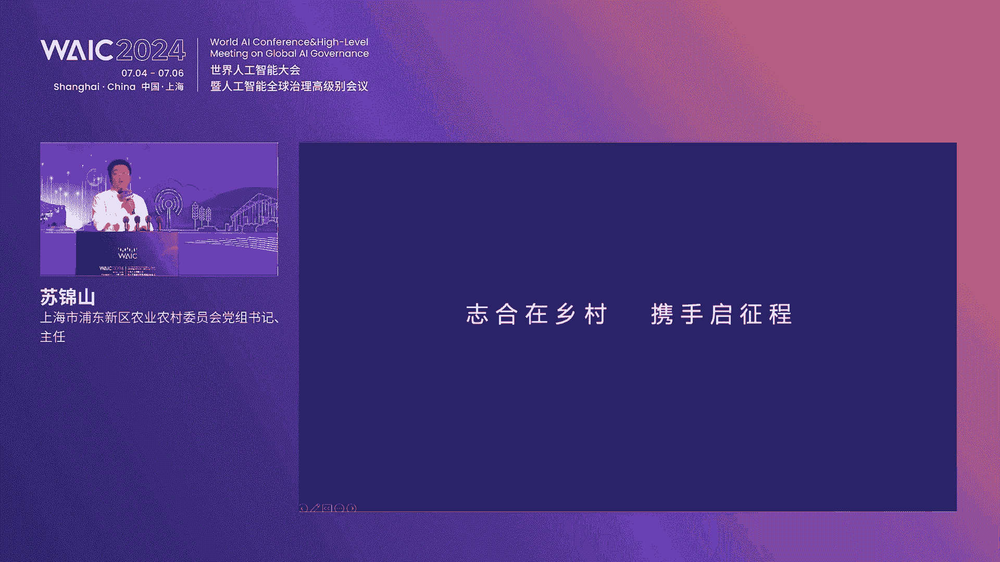
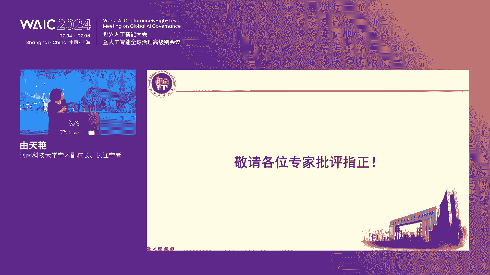
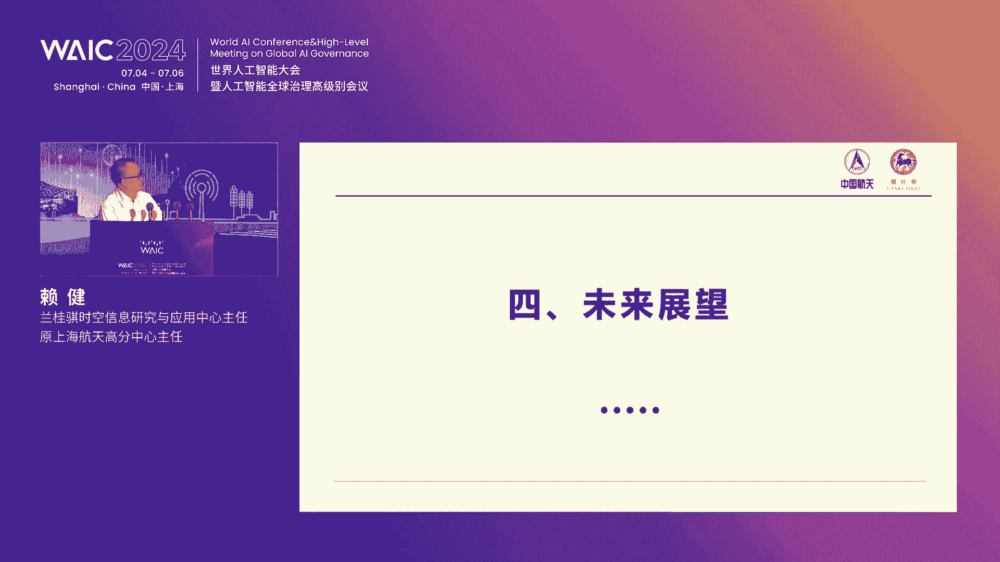

# 2024世界人工智能大会（合集） - P66：20240706-共建中国智慧农业产业新生态论坛 - WarrenHua - BV1iT421k7Bv

🎼，尊敬的各位领导，各位嘉宾。现场以及现上的各位朋友们，大家下午好。欢迎大家来到2024世界人工智能大会，共建中国智慧农业产业新生态论坛的现场。我仅代表主办方，感谢大家对本次论坛的大力支持。

向关心农业发展的各界政府、企业、社会组织和各界媒体表示衷心的感谢。我是本场的主持，来自兰桂琪的王鹤桥。欢迎大家的到来。下边呢请允许我向大家介绍出席本次活动的嘉宾，他们是。

中国工程院院士、华南农业大学教授罗新文院士。崇明区人大主任薛红主任。浦东新区副区长、区政府党组成员李雪成区长。临港新片区管委会副主任彭世全主任。上海市农委办事室主任、二级巡视员陈正荣陈主任。

浦东新区区委办主任张灿刚张主任。浦东新区农委党组书记、主任苏景山、书主任。浦东新区农委。总经济师陈莲总是。浦东新区张江镇党委书记王庆书记。浦东新区张江镇党委副书记、镇长李灿镇长。

上海市农委产业发展处处长康潜康处长。上海市农委市场与信息化处处长戴俊、戴主任。河南科技大学。副校长，长江学者尤天燕、游校长。中国农业大学信息与电气工程学院院长张曼院长。

南京工程大学农业工程学院院长王桥产院长。山东理工大学农业与食品工程学院院长李志和、李院长。河南科技大学农业装备工程学院院长金鑫金院长。上海大学机电工程学院科研院长苗中华苗院长。兰桂奇集团专家委员会主任。

原上海海洋大学校长潘英杰、潘校长。兰国奇集团首席科学家、上海浦东智慧农业研究院院长季江涛兼长。兰桂区集团董事长董一华先生。出席会议的还有关注农业、践行农业创新的金融科技等相关领域的领导和代表。

来自河南周口、江苏启东、云南大理、新疆建设兵团等各地政府的领导来自浦东新区临港新片区各个处市各街镇的。领导嘉宾以及来自各大院校的领导、老师和专家同学们。近年来，在国家政策以及社会环境的大力推动下。

智慧农业的行业蓬勃发展趋势愈发的明显。相关产业链逐步完善。作为全球正治农业开拓者的兰桂旗集团，聚焦中国农业多场景产业落地。联合上海航天技术研究院等生态伙伴。举办了世届世界人物资能大会的智慧农业论坛。

去年论坛上，在浦东新区农委苏主任的倡议下，我们发起成立的浦东智慧农业产业联盟联合产业链龙头企业共商共建。共享智慧农业产业生态，共同推动行业的发展。今天上午，我们举行了产业生态合作的闭门会议。

就相关产业链具体项目合作生态共建进行探讨签约。我们期望通过世界人工智能大会。这样一个行业的盛会，吸引更多的行业的伙伴、专家学者。深度参与到智慧农业相关技术研发和产业生态建设中来。

本届论坛由世界人工智能大会组委会办公室。上海市农委、浦东新区政府、临港新片区管委会、上海航天技术研究院、中国农业机业学会指导。上海兰桂旗科学技术集团、上海卫星工程研究所、中国农业机械学会人工智能分会。

联合主办上海浦东智慧农业研究院。木星智能工业科技。中国电信浦东电信局。中国农业银行上海自贸区新片区分行、中国银行浦东分行、中国农业机业学会基础技术分会。联合承办。

建行上海自贸区新片区分行、上海思南导航、潍柴雷沃、江苏兰华、江苏百达。上海洋科协办大会以共建中国智慧农业产业新生态为主题，集中展示行业最新的生态研究和学术成果。解析前沿政策。推动智慧农业产业生态的共建。

首先，有请兰国旗集团首席科学家、上海浦东智慧农业研究院院长季江涛院长致辞。有请俊长。尊敬的各位领导，各位嘉宾，各位同仁，大家好。😡，很高兴能够和大家一起向聚2024世界人工智能大会智慧农业论坛。

共同探讨共建中国智慧农业产业新生态这一主题。我今代表上海兰汇旗科学技术集团、上海浦东智慧农业研究院向各位的到来，表示最热烈的欢迎和最衷心的感谢。😡，多年来，我们共同见证了智慧农业各项顶尖技术，从无到有。

从概念到应用，从探索到实践的巨大进步。😡，也让我们更加坚定了我们推动中国农业向数字化、智能化转型的信心和信念和决心。😡，兰湖区主办世界人工智能大会，智慧农业分论坛已经走过了4年。😡，2020年。

志强三农汇创未来。论坛汇聚国内外农业领域科研领军人物、人工智能专家、农业创新精英，分享了智慧农业的新见解、新思路、新模式。😡，展往如何把握爱家农业的发展机遇？😡，2021年，当代青年对话智能农业新未来。

邀请政府代表、专家学者行业精英与当代青年齐聚一堂，共同探讨智慧农业未来。😡，2022年。当代青年共建智能农业新未来论坛在上一届主题上进一步深化。在关注青年之外，聚焦关注智慧农业共商共建。😡，2023年。

共建适以中国农业可持续发展的数字农场与智能威视论坛，聚焦树字农场和智能威视两大场景。😡，探讨中国农业的可持续发展。😡，每一年的论坛都是一个新的起点，我们共同探讨交流和合作。

为智慧农业的发展贡献了无数的智慧和力量。😡，今天我们再次相集在这里，总结过去的经验，展望未来的蓝图。😡，当今世界，以人工智能为代表的新一轮科技革命和产业变革，正加速重构全球科技创业蓝图。

推动各行各业向数字化智能化迈进。😡，农业作为立国资本，也在这股浪潮中迈入了以信息技术为核心、数据为主要驱动力的数字化转型关键时期。😡，智慧农业的蓬勃发展，不仅是应对全球粮食安全调整的有力武器。

更是实验农业现代化促进乡村振兴的必然选择。😡，在此，我要特别感谢上海市农委、浦东区浦东新区政府、临港新片区管委会、上海航天技术研究院。😡，中国农业机业学会等单位的支持和指导。😡。

我要感谢所有合作伙伴和专家学者们的支持和智慧。😡，今天我们在这里共同探讨智慧农业的发展。😡，正是为了进一步推动智慧农业技术的应用和产业化。😡，构建智慧农业产业的新生态。😡，在这里，我有几点建议和期望。

😡，首先，希望各位专家学者、企业家和政府领导能够继续支持和关注智慧农业的发展。😡，智慧农业的实现离不开各方的共同努力，需要政策支持、技术创新和市场应用的有机结合。😡，其次，希望各位同仁能够加强合作。

共同推动智慧农业技术的应用和推广。智慧农业不仅是技术的创新，更是模式的创新，需要各方资源的整合和协同，打造一个成熟完整的产业生态。😡，最后，希望智慧农业能够在保证粮食安全。

促进乡村振兴和实现农业现代化方面发挥更大的作用。😡，我们要以科技为引领，以创新为渠道。😡，为推动农业高质量发展，实现农业强国目标贡献目标贡献我们的智慧和力量。😡，尊敬到洛阳市。😡，各位领导，各位嘉宾。

各位朋友。😡，智慧农业的发展正处于关键时期，未来充满了机遇和挑战，让我们携起手来，共同努力，为建设中国智慧农业产业新生态而不懈努力奋斗。😡，谢谢金院长给我们带来铿锵有力的支持。

下面有请临港新片区管委会副主任彭世全主任致持彭主任。尊敬的罗燕市吕区长，各位来宾，大家下午好。7月的上海骄阳似火，本届世界人工智能大会。大家不仅感受到了上海盛夏的温度。

更加感受到了人工智能产业这一未来产业的热度。首先，我经代表临港新片区管委会对本次活动的举办表示热烈的祝贺。对长期以来关心支持临港新片区发展的各位领导、各位朋友表示真挚的感谢。

临港作为习近平总书记亲自谋划，亲自部署亲自推动的重大国家战略，肩负着中国改革开放试炼田。上海经济发展增长级的两大历史重任。5年来，我们已经构建了形成了4加2加2的前沿产业体系。其中。

人工智能是我们提升城市产业能级，集聚产业人才的重要抓手。2022年8月，我们启动了滴水湖AI创新港的建设，集中打造环湖滴水湖核心区域人工智能聚聚区，通过两年的努力，我们已经聚集了AI核心企业200余家。

我们主要围绕智算芯片软件信息智能终端智能算力，以及以自动驾驶数据跨境AI加港口AI加农业为代表的智能应用场景等五大重点领域，引进培育了一批格内外知名的优质企业。

为上海构建国内人工智能产业高地做出了临岗贡献。在AI加农业方面，我们欣喜的看到，以兰桂渠为代表的一批现代农业企业扎根在临港，成长在临港，以开展现代农业人工智能算法、作物模型卫星遥感等技术研究为依托。

与现代农业产业伙伴通力合作，为助力中国的粮食安全、乡村准型，以及三农三场的融合发展，探索出一条切实可行的路子。未来，我们将持续优化营商环境，将一如既往的支持智慧农业的发展。

下步临港将在基础创新、产业化、公共服务平台、应用场景四个方面形成合力，持续深耕人工智能产业的技术研究和应用落地，积极打造。临港自算产业先导区聚集一批国内外通用及垂类大模型企业。

导入一批高水平研发机构和功能性平台，培育一批应用和数据行业创业团队。在这里，我代表临港新片区管委会热忱欢迎更多向蓝桂琪一样的优秀企业，更多全球前沿的产业企业，各类科技精英继续临岗扎根临岗。

我们期待与创新创业者携手共进，共绘蓝图，共建临港这座年轻的城年轻人的成最后，祝本届论坛取得圆满成功。谢谢大家。好，谢谢彭主任。接下来有请浦东新区副区长、党政府、区政府党组成员李雪成区长致辞，有请李区长。

尊敬的罗燕士、薛主任、彭主任、各位领导、各位嘉宾、专家学者和各界代表。大家下午好。很高兴能在2024世界人工智能大会场与大家欢聚一堂。共同探讨共建中国智慧农业产业的新生态这一主题。

我代表普东新区人民政府对大家的到来表示诚挚的欢迎。对论坛的举办表示热烈祝贺。浦东正在按照党中央和习近平总书记默划的宏伟蓝图，昂不是阔不于打造社会主义现代化建设引领区的征途上。

承担着建设五个中心的国家战略。担负着为国家是制度。判新路的使命任务。我们不仅拥有陆家嘴进融贸易区的繁华与辉煌。广袤的乡村地带同样孕育着勃勃生机。在这片充满活力的土地上，高楼大厦与乡村田园和谐共生。

绘就了一幅城乡融合各美其美的美丽画卷。为农业现代化的发展提供了得天独厚的试验田和大舞台。引领区的现代农业必将成为现代农业的引领区。我们始终秉持这一理念并深入践行，让乡村的经济价值得到充分挖掘。

生态优势得到充分体现，社会功能日益完善，文化底蕴更加深厚。不行不怠，实至名归，股东不断提升农业科技创新和农村综合发展实力。接连荣获全国设施农业创新引领区、全国农村一二三产融合发展先导区，全国县域数字。

农业农村发展先进线以及全国农村。创业创新典型示范线等一系列荣誉。这不仅是普东农业现代化成就的体现，更是对我们引领农业科技创新，激发农村创业活力的期许和期望。在农业科技创新体系的构建上。

股东迟志不予予以贯机。开发开放之初，我们孙桥现代农业园区领风起之先，成为中国现代农业的名片。也成为中国首个农业科技园区。由此开启的现代化农业之路延伸拓展。我们集聚了世界顶尖的农业研发机构。

汇合了一批高等院校和科研团队，生成了农业龙头企业和优势农业企业的研究力量。股东正以科技创新为比。以乡村振兴为末，绘制出一幅现代农业发展的壮丽画卷。在这里，传统与现代交织，梦想与现实碰撞。

共同书写着农业现代化的新篇章。习近平总书记在全国科技大会的重要讲话指出，要推动科技创新与产业创新深度融合，助力发展新智生产力。智能化是科技创新与产业创新的重要领域。股东凭借建设国际科创中心的先发优势。

汇聚全球顶尖的人才、技术等生态优势，奠定了真实坚实的基础。必将赴其提供普通样板，贡献普东经验的历史使命。我们把握农业现代化的发展趋势。以前瞻性的思维和先行者的步伐。

大力推动智慧农业装备在农业生产各环节的试点应用。高标准建设无人农场。大面积推广数字技术，多场景应用人工智能。这让我们看到未来农业的希望和辉煌。也让我们深刻认识到此次论坛的主要意义。

它不仅是农业主体、科研院所等各方精英交流思想碰撞智慧的舞台，更是构建合作桥梁，促进资源共享，推动智能农业引领发展的重要平台。我们期待通过此次论坛深入交流与研讨，能够激发更多创新的火花，凝聚更广泛的力量。

共同推动智慧农业在中国大地生根发芽、开花结果，引领中国农业现代化的新潮流。最后，祝本届论坛取得圆满成功，祝各位嘉宾、各界朋友工作顺利、身体健康。谢谢。谢谢吕区长。感谢各位领导的支持。

文农厂作为智慧农业重要组成部分。正在国内外进行迅速的发展。在政策支持技术进步市场需求的推动下。文农场的应用前景广阔，将为农业生产带来深远的变革。助力实现农业现代化和可持续发展。

今天我们有幸请到我农场的开拓者。中国工程院罗新文院士。为我们带来无人农场的探索与实践这样的一个主题报告。下面我们掌声欢迎罗燕市。尊敬的各位领导，各位专家很高兴参加这个今天我们这个智慧农业。😊。

共建中国智慧农业新生态的这样一个论坛。什么是智慧农业？我们的理解一两只说。第一，智慧农业是现代农业的发展方向。为农昌是实现自培能业的。重要途径。今天我们就想为绕讲一发向大家做个汇报。

这天我们来讲讲我也农场。2019年，我们承担了广东省的一个重大课题，就是建设水稻为农场。当时我们就想，什么叫无艺能藏？应该给他一个定义，给他一个内涵，给他一个解释。我们找遍了大百科钱书白斗白科。

都没有找到一个，我们认为能够准确的表达无农场的概验，因为世界上都还没人搞过。所以后来我们自己想了这五句话。跟。不用了。机关闭备协议帮我弄一下啊，耕踪管收生产环间全覆盖，机库田间转移作业全自动自动避障。

一方停车保安全，作物生长过程实施全监控智能决策精准作业全无人。5年的时间表明，这个5句话一来描述为农场是准确的。下面我们就分别介绍这个5个工人。建设为农场要突破四大关键技术。

包括数字化感知、智能化决策、精准化作业和智慧化管理。首先是数字化感知。你在无人农村中，你这个无人驾驶的拖拉机，无人驾驶的飞机去作业之前，你首先要知道一些农村信息。对的是吧。比说同样的信息。

包括同样的耕作走力，同样的养分和水分。所有的涨势信息。所有的病种草害信息只有精准的获取了这些信息，我们才能够实现精准的对保作业。怎样获取这些信息？就是我们讲的三大技术新基地新技术卫星。

第一就是有人驾驶的飞机和无人驾驶的飞机。第一就是地面仪器。比方说我想知道上海。全市的水稻种植面积有多大？我们就以卫星图片来判断。我们想再知道某一个具体农场，像今天上午我到风风景去。

我想知道这里面的一些具体农场的水稻的长势，我建议飞机用有人驾驶的飞机和无人驾驶的飞机。我想知道某一个田款的水稻的病种害的发生情况，我就在拖拉机上面，在一个地面机上面装上多光谱、高光伏的仪器来判断。

所以新基地分片适用于不同的对象和作业要求。大家看这里有一个很好的例子。这个无人驾驶的飞机。在水田上面飞一圈。就获得了水稻的展示照片，我们把这张照水稻装饰照照片对这张水稻的展示照片进行分析。

你看这地方长得好一点。到时候我就少施点肥，这地方长得差一点，到时候我就多施点肥以后我们就做成这样一个施肥取方头，把这施肥头灰头装在这飞机上面。由这飞机到去施肥2019年在广东罗定找稻生产中。

我们因这种方法精准对把施肥，可以节省氮肥28%，管稻可以节省氮肥22。5%。同志们这个20%这个数据是很不错的啦。为什么水稻是运回大户是吧，能够节省20%肥料减少了。不但减少生产成本。

更重要是减少对环境的污染。这也说明了我们采用新基地这种技术，能够精准的获取这个作物的展示信息。第二个关键就是是智能化决策，包括6个方面。😡，首先是要根据地形地貌地块大小来智能决定土地的整治方案。

包括地块的大小、及坑道排放渠道等等布置。从我们搞机械化的角度来说，这地担应越大越好，是吧？我在美国看到一块地360亩，没有田埂，同事们可以想想，360亩一个秋田，没有田埂，那个拖拉机开起来多舒服啊。

当然我们中国特别是在南方地块不可能都走的这么大。但是我们要尽可能大一点，第二就是智能决定的土土壤的根种方案。这十几十几年来，我在国外的很多场合下都在讲一个观点，我们国内现在的根种有点问题，什么问题啊。

都是旋耕的一统天下，不论是水田还是旱地，不论是南方还是北方都是硬旋根。我不是说山根不好，是吧？这旋根有旋根就问题，第一，太浅。第二，打的太烂，特别是水旋根，把这个田打的像江湖一样。

我们知道作物生长需要有一定的土壤团的结构，你都变成浆湖的都这样浮状了，没有土地团地结构，那作物长不好的。这几年来。在黑龙江，他们实施一翻两旋，哎，就是一年翻耕，两年甩耕，效果非常好，是吧？第三。

这是智能决定种植方案是一收支还是多收支，倒到倒油、倒煤等等。第四是智能决定播种方案，包括播种时间等等。2011年，这个我受袁隆平的建议到美国去看他们的水稻直播。我到美国的奥肯沙州，我一去。

他听说我想了解直播，他马上打开一个地址，打开一个视频，打开了一个大屏幕，屏幕上面有一个系筒，就是DD25年系统，把他那个地方当地过去几十年种水稻的数据啊，全部都显示出来。

就比说你想在浦东新区这地方一个某一个镇里面种水稻，他会马上把所有的显示出来。并且告诉今年如果你要种的话，建议你用什么品种吃什么肥料，用什么报量，什么时候报，非常详细。😡，农民都知道要种地了。

就赶快到计算机去看看。我想这就是大数据，这就是应该我们研发的支持农民的大数据。第五就是田田管理，包括管水、管肥、管药、管草是吧？第六就是智能决策收货方案。我们我老家湖南的，我们湖南有一句话。

水稻收货要九成熟，十成收，十成熟九成收，就是水稻涨到九成的时候，你要赶快去收了。你真正想等到十成的时候，你收不到百分之百了。过去都是凭眼睛看拍脑袋，现在用计算机印我们的图片分析，可以帮助我们智能决策。

第三个关键就是精准化作业，包括自动导航和精准作业。首先请大家看看自动导航，请大家看这个视频。第一台。第二台。第三台三台都是无人驾驶的。

水稻直播机就是我们上海生上海四大冶公司生产的无人驾驶的水稻直播机从几库里面一台一台的开出来，开到同一块田里面。我这块地比下大大家看一台两台三台，我给每一台机器都发定一条足球路线，一个上午就50亩地啊。

他们就很好的完成了，配合的非常好，大家走自己的路线，是吧？这是无人驾驶旋面机，这个视频拍的很早了。这是2008年开点。当时在我们华南农业大学开的一个呃，农机导航的国际会议，请了世界上一些专家来。

所以当时我们就赔了这个无人驾驶导航。这无人驾驶的喷物，这是无人驾驶导主动导航。什么叫主动导航？大家看前面一台主机，后面一台重机，你走快一点，他也跟快一点，你转弯他也转弯，对吧？为什么要这样做啊？

关键是现在我请不请人了，不知道在上海这里请一个好的拖拉机驾驶员要多少钱。在我们广州在农忙的时候，你请一个好的驾驶员呢，要500块钱一天。😡，同志们啊，农民种于亩呃种一秋田，种于亩地。

种一亩水稻能有多少收入啊，我真请不起了。所以我说请不起人，我就请计术，我就请计算机。但是我在北京答辩的时候，有专家问，你能够跟多少台拖拉机啊，我说一台两台是跟那1台八台也是跟，只要你这个田足够大。

这样的话，就解决谁来种地的问题。进行作业包括跟踪管收单三个环节。首先去耕诊是吧，我们来看我们的老祖宗给我们留下一句话，种水稻要撑水不过田，就是前面高超不超过一寸水，就是过去的老寸大概3。3公分。

你看今天我们因卫星。因此因卫生因激光，因水平地，因旱屏地有有人驾驶，无人驾驶都实现了春水不不是不不过停的要求。你看这几张照片都还是在我们上海拍的，是吧，达到了精准品准的要求。

第二重大家看这是一台水稻金量线直播机，也是我们广东在我们上海生产的。我之所以叫他水稻精量卸拨，你看，他可以根据你的要求，每一线三粒三粒两粒两粒这样播是吧？

无人驾驶的他这个里面的排种呢实际计算机的实际靠数控机上加工的是吧？但是后来是开磨了，因为塑料锯磨的，非常精准的实现了这样这个播种。飞机打药。现在世界上因飞机打药有两种模式，一个是以。美国为代表电视。

有人驾驶的飞机，一个是以中国和日本为代表的是无人驾驶飞机。随便见我随便说说这张照片。2010年我到美到日本去北海到大桥做酷体，要是跟我看了这个飞机。哎呀，我说这个飞机好啊，我说我们买一架。

第二天他答复我说这种飞机不能卖给你们。我说我早就知道你这个答案了。回来我们就自己做。2011年我们请军方合作，请军方支持，我们就做成这种单选翼的飞机是吧？现在这种飞机打农药之了。

我们中国吃保的主要作业方式。统计数据表明，去年。我们中国用飞机打药达到了21。3亿亩次，某次，一亩地打两次的话算两亩次是吧？无人机的保有量达到了20万家。

现在我们是中国是世界上用飞机打农药做的最多最好的国家。用飞机来给杂交道这种授粉。很多年前，袁东平先生跟我说，他说你们搞机械的，能不能帮他们解决这个杂交道授粉。杂交道生产过程中，这个副本和模本同时开发。

以后要想办法把副本的花粉赶到模本去，过去是靠绳靠人牵绳子。推走竿的方滑杆。2012年4月12号，就是这张视频。袁荣平先生找了两架飞机，把我叫上在海南三亚，当时我们的模的就是看用飞机打。

能不能用飞机下旋的那个气流，把副本的花粉赶到模本去。当时我和袁老师都站在田面上，我问了袁老师，大概要几级风啊，袁老师说四季风，后来我们按照袁老师这四季风做非常好。你看这个照片我副本扩展到八行。

模本到80毫，还能够把副本的花粉赶到模本去。我们在湖南武钢车产，因为我们飞机杆花粉这种方法比人工杆花粉要提高产量增加3。4%。所以现在这种飞机杆花粉已经成了我们国家杂植到这种的主要技术。是肥。

我想特别介绍一下这这张图。前年我在长沙时候碰到农业部农技化司的技师长，技师长提了个问题，他说你了解我们国家这个侧身施肥做的怎么样，什么叫侧身施肥，就这样。你看这是玉米行，在玉米行的旁边开一条小沟。

把这肥料施在沟里面，然后再把它运到湖上。既样能减少施肥量，提高肥效，减少成本，减少对环境的污染。现在在国外，这两张都是国外的配景照片，这是印点化肥，这里一尼是有机肥是吧？现在在我们国内也在推广。

以并且我们正在加大力量，包括在水稻生产中，我们也在推广这种侧身施肥的方法。收货。刚才我讲跟踪管收嘛，大家看这两台，一台无人驾驶的收割机，红色的，一台无人驾驶蓝色的冰凉车。走磁线的时候。

收割就非常精准的把脖子斜在这个运辆车上面。两台车中间的横向位置误差5厘米以内，纵向位置误差在10厘米以内，这样就可以保证收购医疗准确的携在运辆车中。😡，为什么要这样做啊？关键是那收割机的浮窗凉窗太小了。

一般只有一吨。所以你看这个收割机收一收，他要不断的跑到田边上去歇凉，要不断的跑来跑去，现在不需要了，你只管说我来接量。因为我这我这个拖斗啊，我可以做三吨，做五吨会做8吨会做很大都可以啊。

这样大大提高了螺旋效率。😡，干菜也是生产中的一个很重要环节，采用我们这种集中干草装置，把稻谷的含水量从28。4%降到13。61个小时可以处理14吨，每吨的成本只要15块钱，这就比人员晒谷子还便宜了。

第四个关键技术是自慧化管理，包括对作物生产的管理，对农机的管理，对农村的管理。我们来看这是一个农场的地图，一个农场的高新地图，他有20台拖拉机。他这20台拖拉机是不是都在田里干活啊？😡。

现在我打开计算机一看，哦可以非常清晰的看到这个拖拉机在田里的行驶路线。原来我们在这个拖螺机上面都装着北斗定位系统，只要它一启动，我们就可以知道他在什么地方干活。这些田还差多少。如果你这场干活干完了。

你到醉秋田去干是吧，会实现远程监控。我们还可以对农机的逐天工况进行进行监控。比如说我现在正在上海收小门，所以我收到一条我的手机响了，收到一条短信，说我在收割去啊，这滚筒转速太慢了，或者会发生堵塞。

建议我开慢一点，谁发给我的呀，山东一个厂里发的，我自己在车上怎么不知道你在山东怎么知道原来我们农机在出厂之前都装作有各种各样的传感器，只要你一启动。你的所有卓业工况都反馈到工厂里面，他实时监控。

并实时提醒你。下面就是。我们无影农场的作业的视频跟中管收我来介绍。第一，你看这台无人驾驶的双耕机从几库里面自动开出来，开到田中间，我们就是中间开箱，对，你看怎不怎么开箱，他走持线。

左右焚香位置不差不超过2。5厘米。掉头这一行的误差不超过2。5厘米，这就比人开又快又迟又好。因为它环境由计算机偏成，由北斗定位，比如说到这个地方，它会精准的左转右转，非常精准，对吧？

这就比人快多了好多了。你看最后一行。做完了回家。会自动的回到机库去，在每一个位置，它会精准的左转右脚以后到机库里面，在我们给他指定的位置非常精准的停下来。第二个环节中。你看还是这台无人驾驶的拖拉机。

这是后面带的是一个汉直波箕。剥干种，我们这不不是插一阳的，剥干种，就像剥小梅一样。你看这波子熟的非常快，就可以把这个一秋蝶了。现他这一个小时可以播20亩。第三个房间。田前管理施肥打药。

这个施肥打药的飞机有这么一个好的功能。如果你这地方长得差一点，我就停下来，它有个悬停的功能，停下来多施点肥，你这个地方病情还严重，我就停下来多打点药，但前提条件是要有一个m，要有个地图，要有一个处方。

告诉他什么地方应该多打药，什么地方少打药。😡，还有地上的，刚才是天上的，还有地上的这是一台无人驾驶的喷雾机。对吧你刚才不是说有飞机吗？为什么还要喷雾机啊？因为在我们南方有一种倒飞蛇，它长在雏菊的下部。

因飞机打压只能达到冠成。哎，因为我们这喷雾机啊，就可以把这个药啊压到下部去，对防止盗飞蛇这种这个效果就非常好。你看它的付款12米，昨天速度非常快，就是6月17号2020年。

我们在我们的为农场的作夜的视频，是吧？对防治大灰尘，我们都采用这种高地吸喷雾机的效果。好，最后一行。扣完了可以啊。自动回到几部去。最后一个环节收货。我们这次采用的是等待协调模式。什么叫等待协调模式？

大家注意看这台收货机在田边收的时候，就是没有运酿车跟着他。运辆车在哪里啊，在田边上等，等到他要接量的时候，叫他过来给他发一个信号，他接到这个信号非常精准的走到旁边接量，你要放到卡车上面。

卡车在送到干测中心去，对一台收割机，一台运酿车，一台卡车三台机器实现精准配合，大大的提高了卓接效率。关键我们这收货时候，最重要的是提高收割机的效率。所以我们用三台机就达到这个效果。你看。最后一船。

把粮卸完，他知道今天这块地干完了回去。😊，啊。这个运粮车也是写好了，他也自动回到提货去。我们已经在全国15个省启动了30多个这个五一农场的建设。今天上午我到凤井去啊。

就是跟他们谈在凤井也搞一个这样的五一农场。我们在全国各地谈判的时候啊，很多农民都很关心，因你这个五一农场产量行不行啊？交易行不行呢？请大家看这张图。这是2021年，在广东增城的水稻为农耕中。

我们种植的优质树苗米19箱，产量达到662。29公斤。你看这个税大是吧，长得非常好。而，老百姓当时当地给老百姓种植个产量的平均产量是500公斤。我们比他高是32个百分点。说明人不下田有人种地。

有人种好地。还有个例子。大家看。这是2023年，我们在湖南宜阳青山红中用再审稻什么叫再审稻，就投进收的时候啊，我就把这税头割下来。把下面留在田里面，再十只肥，它又长出来，又又又又又长结谷子。

早在1700年前，我们的老祖宗就用这种方法种地。我们去年在湖南宜阳两地投地二季，就种一季收两地，产量达到1241。7公斤。😡，这是平均产量，这个草重了1290。1公斤。是啊。冻一季收两季。

我国的平均单产现在是多少啊？474。7公斤是吧？所以今年的中央一号文提出来，在适宜的地方要支持发展的再选稻生产。最后给大家看看这样一个一张照片一张图片。现在有一个说法。

在我们农村的种地点啊都是386199部队，38是妇女，61是儿童，99是老人，唯独没有年轻人，为什么年轻人都进城打工去了，没有谁愿意看着农活。哎这样，你看这个年轻就高高兴兴的笑嘻嘻的喝着冰淇淋。

看着田里机器都自动的还着所有作业。你们再注意看这个机器都有一个共同的踩点。你看这几台拖拉机都有一个共同的踩点，怎么踩点呢？没有驾驶室。

全部是无人驾驶的这是世界上最有名的一个叫赛mon英国的农业机器人专家描述明天的农业，就是这个样子。也就是今天我们讨论的智慧农业。以上就是我给大家汇报，谢谢大家。😊，感谢罗院士给我们精彩的报告。呃。

该院是最后那一张图，我认为对我们的启发很大。我相信我们在座的年轻人。心里面都有这样的美好的愿望，希望有一天咱们每个人都能够。躺在阳伞下，把握几千亩几万亩的水稻田。

政策的制定和实施是引领产业发展的关键的力量。智慧农业快速发展，更是离不开政府的政策支持和引导。浦东新区作为我国社会主义现代化建设引领区，一直以来都致力于成为科技创新的领头羊和农业现代化的典范。

接下来有请浦东新区农委党组书记、主任苏锦山主任为我们带来。智慧农业在浦东的精彩报告，有请苏主人。好，尊敬的罗岩市，尊敬的各位领导，各位专家。各位嘉宾。刚才罗艳士给我们展示了一幅。智慧农业。

特别是无人农场的美好的前景。接下来呢我就借这个机会啊跟各位简单汇报一下我们浦东智慧农业我们的一些理解、思考实践的探索。我们理解这个智慧农业。是推动农业现代化发展的性质生产力。智慧农业。

是推动农业现代化的一个过程。是让农业生产更智慧的一个过程。在这个过程当中，我们需要整合跨学科跨领域的。各方面的专业。他是我们的最高的追求和最高的境界。他始终在持续推进的过程当中。智慧农业的发展只有起点。

没有重点。在推进智慧农业发展的过程当中。我们理解，既有像罗岩市刚才介绍的无人农场这样系统集成的大场景，也有我们点商突破的小应用。所以我们提出智慧农业推动智慧农业的发展实实可为，出处可为，人人可为。嗯。

这个观点呢是我近年应普通干部学员的邀请，在全国县委书记培训班，这个他们举办了三期去给他们做介绍。当初我们就在思考，如果我们都着眼于大场景，可能很多地方就会觉得我们没有条件来做。我们没有这个基础来做。

但是事实上，推动农业更智慧的过程当中，每个地方可以因地制宜不同的模式探索。那么智慧农业的发展，我们觉得身处浦东，身处上海，我们有我们独特的优势。普东智慧农业的创新体系。

我们觉得是一个高度节成的多层次、多领域的综合性的创新网络。这个网络我们已经有了很扎实的基础，而且在不断的完善过程当中。我们有以世界顶级的农业企业为核心的驱动力。因为他们是我们的标杆翅榜样。

由于像兰桂琪这样的企业为代表的本土科技企业，是我们的创新主体。也有有我们农业科研机构和各类检测检检验机构为支撑的服务阶层面。还有我们以产学研用深度融合为创新的创新生态。共同推动农业科技进步。

农业科技的持续进步和农业产业的现代化转型。在核心驱动城。我们理解全球顶级的农业企业其实在浦东，在上海。他们既是参与了普通的开发开放，参与了中国的农业现代化的进程。当然我们也觉得他们在给我们带来。

标杆榜样的同时，带来技术的同时，也给我们带来了创新的动力和压力。所以他们这些在浦东。也不断的建立了各个城市的他们的研发创新机构、各类实验机构，也促进了他们的科技成果在普东的各种场景的示范应用。

当然我们在。我们讲我们的创新主体层面。在这个层面，我们理解，浦东作为上海科创中心建设的核心承载区。就是我们集聚了大量的在国家层面的。我们的大型的科学研究的基础设施，大型的装备设施。

也集聚了国内各个领域当中很多的创新的主体。这些都是我们在推动智慧农业在创新发展的重要的支撑力量。当然我们这里还是重点关注的我们农业科技企业做我们的创新主体积极参与我们各类创新。

他们不仅涵盖了我们的种源、装备、供应链等多个领域，通过他们的自主研发、技术引进消化吸收等等，来提升我们的创新能力和市场竞争力。第三个层面，我们有强大的支撑服务群，就是说我们农业科研机构。

包括我们检测评价机构在上海，在浦东高度集聚。我们。这个层面当中，既包括了我们国内外的各类高校、高等院校研究机构，这个行业内的科研机构，他们为我们提供了强大的智力支撑和理论指导，包括我们。这个。

积决了大量的我们说检测机构、评价机构为我们农业的。产品的安全成果的评价提供了有力的保障。也提高了我们科研成果的可靠性和实用性。第四个层面，我们的创新生态城。我们逐步形成了产学沿用深度融合的创新生态。

我们这个通过政府引导市场主导企业主体、社会参与的方式，促进农业科技创新要素的有效整合和优化配置。当然，我们政府通过制定相关的政策，提供相应的资金支持、人才支持等等，为我们农业科技创新营造良好的外部环境。

我们的企业通过技术合作、产学院联盟等方式与科研机构高校建立紧密的合作关系。同时，我们浦东还有高度组织化的农业生产方式。我们的农业龙头企业，我们的农民专业合作社积极参与其中，推动农业科技成果的普及和应用。

就是我们讲数字产业化和产业数字化相互赋能。去年农博会这个人工智能大会上面。我们。依托兰汇企科技集团倡议成立了浦东智慧农业的产业联盟。凝聚通力合作的机制。这个我们去年一期。发布之后。成员单位就达到38家。

目前远远不止。呃，今天上午我们开了半天的一个闭门会议。在座的各位很专家，这个这个嘉宾啊，也很多参加了上午的会议。在整个上午的会议当中，实事求是讲。我们既听到了。各个专家、企业研究机构。

他们最新的研究成果。企业的最新发展。我们更感受到了这些专家，这些企业。大家在共同推动中国智慧农业发展过程当中。强烈的渴望抱团发展。共享成果。

打破我们原来讲的数据壁垒、技术壁垒能够协同发展的这种强烈的渴望和愿望。上午我们也高兴的看到兰桂际集团和我们很多创新主体签订了实质性的合作的协议。以这个落地的示范场场景为牵引，签订了实质性的合作协议。

我们感到这个合作它是基于。商业有高于商业。基于商业，我们产业化的联盟，它一定是以市场逻辑来。推进高于商业，它更体现了大家在技术创新层面的一种协作的意识、合作的意识、共享的意识。这是上午会议听的这方。

我们感到非常欣慰和高兴的。在去年成立产业联盟的基础之上，今年我们蓝国际科技集团再次往前推进一步。我们建立了由政府主导。政府推动企业主导的浦东智慧农业的研究院，我们搭建全新的农业科技支撑的服务平台。

来进一步完善我们智慧农业数字化基础设施建设的支撑体系。第三部分简要汇报一下我们。普通我觉得我们的探索提供多元的应用场景。这个第一个无论农场的场景。刚才罗阳市介绍了，我就不敢多说了。

这当然也是与我们兰桂区作为牵头企业，大家共同合作推进的。我们今年建设的是3800亩，目前我们已经批复一阶段的8700亩的。水稻自种基地的无人农场建设。接下来我们南汇现城镇。

我们还有4000多亩的三期项目正在谋划当中。我们十四五期间计划要建设2万亩的水稻生产的粮食生产的无人农场。第二类的是植物工程。植物工程我们。近几年来一托上海交的。

国兴农清美集团在浦东已经建立了近5000亩的现代化的设施菜田。实现蔬菜生产，特别是绿叶菜生产的跟踪管收，全程的机械化。那么这个围绕蔬菜生产，特别是绿叶菜生产的跟踪管收。

全程机械化和环境控制污联感知的整个一个系统集成的技术，是获得上海市2022年科技进步一等奖。当然，接下来我们还会围绕这些系统集成运用的标杆场景，加快推进我们的生态牧场。智慧果园。

还有我们全人工环境的植物工厂等等各种模态的建设。第三个场景是我们的智慧监管的。这个是我们坚持以服务于市民服务农民。两个服务为导向的农业生产监管的一套服务体系。

我们汇集生产数据、市场数据、地理信息、GI数据、物联网、私联网等等多元数据以经营主体为核心，用我们数据的力量来重新定义农业监管。传统的农业监管，我们说很多是一种模糊监管模糊管理。

那么以这些数据力量重新定义农业的精准监管。同时也为我们新型经营主体的成长提供更加建实的支撑，逐渐形成树立监管就是服务的这样略一种理念。我们以培育提升新型经营主体为目标。

建立了我们一加一加8的综合监管的体系和农业的服务信息平台，实现了我们的一网同管。这里面实际上有很多子平台。除了这些集成应用的大场景之外，我们浦东的农业产业部门还有另一重使命。

这区委区政府明确要求我们所有的产业部门要为集聚在浦东集聚在上海的各类创新主体。你们哪怕是某一个领域的创新成果，提供示范应用场景。比如说大家高度关注的农业的采摘机器人。

在我们张江机器人股一家农业采摘机器人的企业博田公司。那么他们的番茄采摘机器人。目前实际上还处在我们的中视和研发阶段，我们就对接我们的数字。农场。这个为他们提供。实验的基地示范的场景。这是一种模式。

接下来我们还会为更多的主体呃，包括我们这个。各类企业的创新成果提供。类似的示范场景。还有一种小突破的，我们根据我们农业生产的需要，我们。全市建立了科技创新的接榜挂帅的机制。浦东新区我们也有建立了。

基本挂税的机制，这个就是我们去年底今年初围绕我们农业生产的灌溉水。多年来，尤其近几年也是困扰我们的一个问题。我们的不同的部门在使用除草剂的过程当中，对核桃水里面会有除草剂的残留。

而这些除草剂对我们农业生产是极大的影响。以前我们都是在事后发现。农民去交了，影响作物生长了，才能时候发现。那么怎么解决前端发现，我们就是把这个课题提出，让我们的科技企业给我们来研发。

我们花了半年的时间就做出了。灌溉水除草剂的除出剂。就像我们前两人做的核算检测试计。他能够快速检测50多种。除草剂的成分。那么让我们的农民农业生产主体在。获取灌管水的之前做一次检测，能够提前降低风险。

就是我们会。为各类创新主题提供丰富的应用场景。第四部分，我们的原景。围绕智慧农业的发展，浦东新区我们。有一个园区四大片区，一个园区就是我们国家农业科技园区。2022年。

我们重新编制了国家农业科技园区一心两园多点的规划，就是大家都熟悉下，讲到浦东讲到。孙巧，我们很多做农业的专家领导都非常熟悉。我们中国第一个全套引进河南温室实施的现代农业产业园。那么在他的基础之上。

我们重新规划了一心2园的普通国家农业科技园。一心就是我们的在张江元孙桥地区规划的叫张江总谷。2元，一个是我们仙桥镇的三兆园，一个是老港的。将近20平方公里的现代农业的示范应用园。一心2园我们的主导产业。

两个，一个是总源的研发。所以我们定为张江总谷，一个是我们智慧农业装备产业。的发展。所以我们的三庄园区为我们智慧农业研发、孵化转化制造。产业留了相应的空间。同时，我们根据全市的统一布局。

规划了我们现代实施农业的四大片区。这个四大片区。因为上午啊我们项目处吴建红处长已经做了简单的介绍，做了介绍。我这里就很简单过一下啊。一个是我们的航头片区总面积4506亩。

这个片区我们聚焦种源创新、低碳循环，推动低碳农业发展和种源技术的公关。我们的目标是引进全产业链的升级。第二个片区，我们的大屯片区，大团片区围绕中国水蜜桃地一震的十里桃花廊，总面积呢3519亩。

我们核心是围绕南汇水蜜桃的品种研发、品质提升和品牌塑造。通过我们露天种植基地的智能化提升以及设施化温室桃源的建设，融合于水蜜桃为主体的现代实施农业的技术的装备研发的示范应用。

打造果业现代化的种源研发设施设备创新用的这个示范园区。就是我们讲的智慧果园设施果园。第三个片区，我们宣桥镇的。围绕10公里竖相连2小时生仙桥的目标。总面积1579亩，2小时生仙桥。这是去年的5月17号。

我们陈金林书记。在全市乡村振兴现场会调研视察我们宣桥青梅基地的时候提出的一个。期待和希望希望上海的实施现代农业要怎么样围绕先字来做文章？能不能实现2小时从田头到厨房？到餐厅这样的一个目标。

所以我们就是围绕这样的一个定位来整合我们的研发链，强化全过程的产业链，来形成这个若干个配套完善的蔬菜现代化的种植集体。那第四个片区呢，就是我们万象镇的，我们给他定位叫临港龙谷资炭蓝图的万象片区。

总面积呢2358亩。呃，目前呢我们也在洽谈引进一些龙头企业，发展我们的绿色能源，打造多场景绿色循环低碳农业的示范区。最后。围绕我们的。科技园区四大片区，无论是市层面还是区层面。整个农业产业的科技创新。

我们有完善的支撑政策体系。呃，市层面的政策，等会我们市农委的康守还会做详细介绍啊。我们区层面同样我们也有，不仅有我们的产业政策，还有我们的人才政策。我们新区有民族计划人才政策。无论是我们的。

高原高分人才领军人才。还是我们的。职业技能的高等人才。呃，我们去年。专这个今年啊，我们也专门制定了农业现代农业人才发展的实施意见，回同相关部门。同时，我们有完善的资金项目的支撑政策。

就除了这是我们农业农村部门和这个出的其他相关部门的我们的科技部门等等都有比较完善的政策。最后呢，我想说智慧农业在中国前景广阔，未来可期。

智慧农业在上海，在浦东，我们有优势，有基础。有愿景，我们热忱的欢迎各类创新主体、科研人才、专家学者、各类企业。共同加盟浦东，共同为普通的智慧农业，为中国的智慧农业而努力。谢谢大家。好，谢谢诉诉人。

接下来有请。上海市农委产业发展处康前处长为我们带来上海现代农业投资展望的报告。有请康。尊敬的罗院士，各位领导、专家、各位嘉宾，非常荣幸啊能够受邀出席此次盛会。那么受组委会的委托呢。

就是围绕共建中国农业智慧这个产业新生态这样一个主题。我想向各位介绍一下我们上海对现代农业的一个投资展望。那么今年呢有一部。电视剧啊非常火热，这个繁花不知大家看了没有？很多人呢说里边缺少乡村要素。

实际上在我看来。这部电视剧从头到尾都有啊，我点几个。保粽泡饭、排骨年糕，还有吃饭团、大闸蟹啊，还有这个就在我们浦东这里催色个季节走啊，也就是什么意思呢？繁花再好也要吃饭。实际上就是揭示了一个真理。

民以食为天。也就是我们现在所在的这座繁华的大都市，上海即使再发达，也是要以农业的产业供给来支撑啊。我讲这个意思就是为了引入我们这个今天要跟汇报的四个层面。就是上海农业投资这个环境。

以及我们未来重点发展的方向，还有我们的投资的重点区域。最后呢向各位汇报一下我们招商相关的政策支持。上海是一座光荣之城啊，这里为什么要点一句呢？它是因农而生，因农而兴。我们都知道，上海的简称叫户。

实际上户呢是汉晋时期啊，我们的祖先啊，他们是用竹片和绳子啊做出了一个简易的捞鱼捕蟹的一个工具啊，就叫护。那也就是我们现在用我们农业的说法，就是水产业啊。这个就是因农而生。

唐朝末年实际上就有苏忽孰天下足的说法。南宋的时候呢，我们这里其实就开始盛产棉花，这就是因农而兴啊，时间关系我就不展开了。我们知道。上海地处中国这个大陆海岸线的中部，长江三角洲的前沿，通江达海。

地理位置优越，这里既有魅力四射，活力无限的都市区域，同时也有广袤的郊野乡村空间，更序传承了我们江南水乡文化和海纳百川的城市精神。首先呢大家可以看这张图。就是我们上海总体的农业空间总量可能比较小。

但是潜力比较大。大家可以看到啊，我们的海域面积啊居然有1万多平方公里，是超过我们现行的行政区划面积的。我们的郊野乡村空间面积。这个已经占到了我们陆域面积的60%啊。

今年我在接待这个欧盟农业部的同志的时候呢，他们就说哎哟，你们上海原来这个郊区的体量有这么大。耕地面积占到了25%。但是目前上海人均的土地面积这个。人均耕地只相当于全国水平的12分之1。啊。

这个数字是非常明显的。其次呢是我们有丰富的农业创新资源啊，我们的国家级涉农科研单位有6所。国家级的创新平台有32个。这个我们也是受农业部的委托，这个每年呢就是都有一个中国都市现代农业发展报告。

在这个报告当中啊，这个上海的这个农业科技进步率达到了80。13%啊，也就是我们连续多年也是排名全国第一的。但是结合刚才我们所说上海农业的现状。那么我们实际上经常说的国家粮食安全的战略，藏粮于地。

藏粮于地。从这个角度，国家对于我们上海长粮余季其实是有非常高的期待。Okay。第三呢就是我们上海市非常优质的农业消费市场。我们坐拥一个有2500万常住人口，居民人均可支配收入超过8。4万人民币啊。

也就约合1。2万美元的这样一个消费市场，这也是国内外的很多优质的农业经销商想把他们的招商大会，农产品推介会，放在上海召开的一个重要原因。我举一个最简单例子。目前。

我们上海的这个农产品综合供给率只有25%。这个。最缺的就是猪肉啊，只达到了8%。也就是我们每上海人每购买100头猪啊，有92头都是从上海以外的区域引入的。汇报的第二个方面是我们上海农业发展的重点方向。

上海发展都市农业受制于刚才向大家介绍的特定的资源环境。必然要求向高端农业。要发展空间，像精品农业，要产业效益，向品牌农业要价值。我们强化农产品的规模化、集约化、标准化，要以不断提高农产品供应保障能力。

更好服务市民高质高品质的生活。那么我们呢方向呢就是简要概括四大新特征，三个新趋势。也就是技术高度集成。减碳生态循环、生物制造深度应用。

数字精准环控三个新趋势就是自主系统及大规模这个实现高科技公司大举布局农业农业领域投融资并购活跃啊，简单来说啊，就是坚持服务超大城市的民生需求。坚持服务都市现代农业发展。坚持服务农业强国战略。

站在我们农业农村投资促进的角度，就是四个方面。政策引导科技引领跨界思维市场运作。因此呢我们重点发展呢是7个方向啊，第一个就是农业总部功能性企业。也就是世界级的城市，需要这个世界级的啊。

以及我们国内领先级的啊，就像我们兰桂琪这样的企业，海内外的知名企业，以及有农业板块的各类跨国公司啊，到我们上海设立地区总部和功能性的总部参与上海农业农村投资和发展啊，这是第一类。第二就是。

特色种源产业我们都知道，种子是农业发展的芯片。我们地方特色种植资源是发展壮大区域特色产业的一个基础和保证。刚才我们苏主任他也介绍了，其实我们浦东这边也有一个这个种谷啊，这个对于种业种源产业。

上海三农可以说用求贤若渴四个字来表达当前的心情啊再恰当不过了。第三个就是生物制造农业。也就是聚焦生物合成系统创制、基因合成、分子进化、蛋白设计等生物学技术。

鼓励和支持有技术基础和市场潜力的农业绿色投入品企业落户上海。第四和第五呢就是我们现代设施农业。这个一会儿后面我会结合政策呢再向大家详细的汇报，就是鼓励和支持在智能温室。啊，植物工厂。

包括我们一些这个规模化、标准化、智能化的一些水产和畜牧养殖业，也就是我们常说的这个单位土地的生产率，单位土地的生产效率，以及我们的相当于的核算下来的成本。上海人对美好生活的向往之一啊。

其实就是能吃到本地出产的新鲜农副产品啊，这个第三和第四第四第五就一起说了。第6块就是我们数字智慧农业重点支持数字农业、智慧农业，加强智慧农业科技攻关，加大高端人才和企业引进。打造应用场景。

包括一些这个涉农相关软件的开发，芯片设计，区块链的应用AI大型这个这种模型的建设，一些投资和发展。最后就是农业科创平台和技术创新中心。我们也吸引和支持国家级的农业相关实验室在上海建立研究基地啊。

包括一些高校科研院所和企业共建实体化运作的一些协同创新平台啊，鼓励各类社会主体面向农业科技新赛道。这个建立投资主体多元化、管理制度现代化、运行机制、市场化、用人机制、灵活的独立法人机构啊。

这是我向大家汇报的第二个方面，就是我们上海农业重点发展的这个7个方面。第三方面啊，刚才说了，谈了方向，下面重点介绍一下区域。我们也是坚持这个规划先行，经过了多轮的规划。目前。

我们上海都市农业呈现集剧发展的态势，形成了产业园区设施片区科创空间和产业强镇啊，四类空间载体。首先是现代农业产业园啊，经过这个也是呃，这也是农业农村部和财政部联合明确的新时期啊。

我们中央推进农业供给侧结构性改革，加快农业现代化这样一个重大举措。这这个重点区域呢主要是针对区级层面的支持啊，支持力度是7000万到1个亿。由区级层面提出并申报啊，在这里就不展开了。

重点向大家推荐一下我们现代设施农业这个板块。这个呢是在今年的6月24日，上海市人民政府对现代设施农业专项规划2024到2035进行了批复。主要是对我们全上海范围内3。6万亩这个设施农用地啊。

高水平的设施农业土地提供了保障。这也是我们近年来关注的重中之重啊，因为大家现在普遍都觉得土地是现在制约我们乡村振兴发展，制约我们现代农业的一个重要因素。那么今天我们在座的如果有企业方面的。

对这一块内容感兴趣的，欢迎和我们产业处联系啊，我们将根据产业项目的具体情况进行服务。那么时间关系呢，我就一句话讲一下，我们这个土地供给的一个原则。那就是好的项目一定会有好的土。土地供给。第3块呢。

就是呃我把三四呢就放在一起讲了，就是农业科创支撑空间和国家农业产业强征啊。因为我们上海始终是把科技创新作为引领农业的发展动力，坚持走农业现代化、高质量发展路线。就是这几个区域。

也都是通过向科技向产业要效益的高地。时间关系我这里也不展开了，因为这里也主要是以政府的这个作为主体进行申请的。那么最后呢，就是向大家汇报，可能也是我们所有的企业啊和我们的科研院所。

大家都很关心的就是这个政策啊，我们其实经常说乡村振兴啊，这个核心呢有说三个方面的，也有说四个方面的。就是政策从哪里来，土地从哪里来，人才从哪里来。那么还有的说就是资金从哪里来啊。

资金其实我就把它归到跟政策里面一起了。这张呢就是我们为了大家使用方便啊，我们就把最核心的几个政策，就是这里都有一个二维码，大家可以这个关心一下，我们涵盖了从都市农业项目设施菜田建设。高标准农田建设啊。

这个是一些我们的项目的一些扶持。以及从点状供地集体土地入市。包括我们的这个呃现代设施这个呃，以及我们还有这个。呃，集体经营用地啊，入室啊等等一些。比如我这里举几个例子啊，就是列入我们市级农业项目的。

我们可以给予项目总投资的40%支持。啊，这个40%呢可能跟我们所在区的位置有一点稍微有点偏差。这个是根据各区自己制定的这个比例，最多不超过4000万。但是对于特别重大的项目，我们可以纳入一事一亿。

那可能有的企业要问，那怎么叫特别重大。实际上就是代表农业农村领域、新产业、新业态、新模式发展方向，或者在农业科技创新。现代种业发展、先进设计应设施应用等方面，能够打造标志性成果。

达到世界先进或者国内领先水平的啊，投资超过两个亿的啊。大家可能觉得你刚初你说的比较具体，所有的这些表述在这些文件当中都有详细的表述啊。或者说是国家级农业部相关部委下达的本市的重大战略任务。

你比方说农业部给我们上海下达了甜菜育种公关项目，这个也是纳入11亿的。啊，刚才说的是。政策方面的一些介绍。在土地方面，那这个可能也是大家很关心的。农业生产配套的点装供地、土地入市等政策。

就是为了促进我们现代农业。发展实施的比较灵活的供地政策啊，现在大家就是很多都普遍反映，这个我在这个地方做一些设施，土地有没有纳入设施农用地的备案？有没有硬化的这种要求？

这个对于一些地块特别小的无法上图的点线块啊，一些硬化。其实这里面都有一定的用地通道。包括对于一些镇村级的集体建设用地，现在也可以采取一些作家入股的方式，大家一起合作，大的原则是什么呢？

就是这些呢土地政策，总有一款是适合你的。在人才方面，这里我就不展开了。因为主要是在户口以及在留学生啊等方面的一些政策，时间关系不展开了。那么以上呢就是我的汇报。这里留一个联系方式。

是我们产业处的这个邮箱。希望随着我们的联系和互动，在各位企业家、科技工作者，农业从业人员啊，大家的不懈努力下这个我们农业农村的投资促进工作，能够开出繁花接出硕果。那么我也借这个平台。

因为这个组委会一开始给我的时间只有10分钟，也想通过大家向所有你们的朋友资源，这个发出邀请。凡是有志于投身我们上海这个都市农业智慧农业的各位这各路优质资源，希望大家来到上海扎根上海这个最后一句话啊。

这个天青色等烟雨，上海三农在等你。我们也一定会用店小二的精神。用实际行动向大家证明，选择上海三农，就是选择与机遇同行。我就汇报这么多，谢谢大家。谢谢康处精彩的报告呃。

康处在报告的过程中给大家讲解的过程中，我一直在后边看我现发现我们企业界的朋友们都是拿着手机拍下来。我相信大家对于康处对于上海市对还有苏主任刚才的一些政策解读，一定是犹未尽。如果愿意。

我也愿意承担这个桥梁，给康处约个时间，请康处再给我们半天的时间专门跟做一场上海农业政策的宣讲。康楚如何。😊，好呃，应该说刚才呃，苏主任和康处呢，就上海就浦东相关的一些农业客船政策，相关的一些辅导。

我认为信息量非常大。我也相信我们企业家朋友呢也是信心倍增，选择农业这条路，我们选对了。刚刚康竹专门提到上海发布的相关政策，尤其提到要提升农业科创的主体能级，构建现代种业创新平台。

构建智慧农业技术创新的平台，培育壮大涉农科技企业，打造创新创业的高地。接下来。🎼我们进行浦东新区张江人民政府与兰国旗集团的战略合作签约，我们有请。🎼领导见证我们签约。🎼有请。🎼中国工程院。院士。

🎼华南农业大学教授罗兴院士。🎼有请崇明。🎼区人大主任薛红主任。🎼有请浦东新区副区长、区政府党组成员吕雪腾区长。🎼有请上海市农委。🎼办公室主任、二区新职员陈忠龙主任。🎼有请浦东新区区伟办公室。

🎼张灿刚主任。🎼有请浦东新区。🎼农委党组书记、主任苏景山主任。🎼有请浦东新区张江镇党委书记王静书记。🎼有请兰国企业集团董事长董卫华先生共同见证。🎼有请我们的签约代表。🎼兰维奇集团首席科学家。

上海浦东智慧农业究院院长。🎼季江涛院长。🎼有请浦东新区张江镇镇长。🎼李灿镇长。🎼共同签约。🎼好。🎼两位领导请签字。🎼请交换协议书。🎼请很影留念。🎼好，谢谢。请各位领导，请留步。李镇长、监院长，请留步。

非常高兴大家看到张江和兰国基集团的。😊，签约合作，双方充分利用各自的资源，优势互补，提升竞争力。我们在浦东新区农委牵线指引下对接下。🎼兰国集集团与浦东张江镇立足普东农业科创定位共谋共建。

打造张江兰国旗花卉种业科创中心。接下来我们有请进行。🎼创新中心的揭牌仪式，有请浦东新区张江镇党委书记王庆书记、兰宫旗集团董事长董卫华先生共同揭牌，有请几位领导见证揭牌。🎼好。🎼谢谢各位领导，请入座。

在2023年年底。兰国其联合上海航天技术研究院等产业生态，聚焦技术力量。一、作物生长模型、大数据、智能决策、智能装备为核心要素。建设浦东首个无人农场。

接下来有请兰国际集团副总裁梁雷博士为大家发布AI加无人农场的场景。🎼有请杨总。尊敬的罗院士。女区长。薛主任彭主任。各位领导。各位专家以及各位同仁嗯，下午好。我是南国旗公司梁雷。

今天我代表我们公司呃发布我们公司的AI加农场场景平台。呃，我们知道农业是一个国家的根本。呃，习主席也一直在强调，把中国人的饭碗牢牢端在自己手中。但是，如何实现农业强国？那么有了智慧农业的支撑。

农业强国也会逐步的去实现。其中一个更重要的就是。智慧农业一定要把形成实际的生产力，这是我们建设农业强国的保障。不仅是加速技术的一个应用和产业升级，更重要的是能提高整个产业的技术水平。

同时增强我们国家农业的竞争力，推动农业的可持续。那么与此同时。AI技术也逐步运用到我们的农业当中。那么实际上整个我们AI技术也是经过了十几年的技术的沉淀，从一个个技术到逐遍形成产品。

最终我们形成了数据积累。但是一定。为了实现更好的数据服务和更高精度的这个呃相关的产品，一个最重要的突破口。AI技术，那就是加速人工智能技术的一个产业化落地。同样的。

我们也是需要把人工技术落地到我们的农业场景当中。为此。兰桂琪推出了无人农场的场景平台。在这里，我们搭建了。通过我们的无人农场基地去搭建整个这样一个平台。我们的平台主要是输出六大功能。第一个。

开展相应的示范应用。那么我们会把数字化、标准化的种植生产运营相关的一些技术和产品进行一个示范应用的展示。这个展示的平台不仅仅是兰国齐本身。

我们也是邀请广大的合作伙伴共同在我们的场景平台上开展相应的应用示范。第二个更重要的就是逐步的迭代我们无人农场的技术，实际上只有一次一次的投入到田间过程当中，去遇到困难，解决困难。持续的迭迭代。

才让我们的无人农场技术能很好的服于我们农业，特别是大田农业的产业化的发展。呃，我们这个平台还有一个很重要的呃功能，就是产品展销跟其他的呃这种工业产品也好，呃，商业产品也好。

把相应的产品展销呃开在这个城市区域不一样。兰桂奇就把我们的现代化的农业产品农机装备在我们的田间地头进行产品展销。我们也是为我们的合作伙伴打造这样一个平台，去输出我们的技术。呃，另外一个非常重要的功能。

呃，我们也知道，随着农业的现代化的发展，从事农业的人越来越少，但是要能利用先进农业的技术，也是有谊的门槛。所以说我们也是去加快新农人的培养。呃，农人的培养不仅仅是在呃教室里面。

课堂里面更重要的是在我们的田间地头。我们的这样一个平台，也为大家呃打造一个新农人的培养的这个基地。呃，同时呢我们这个也依托我们的基地呃，除了进行。应用示范技术迭代、产品展销新农人的培训以外。

我们也会为周边的区域提供相应的服务。从我们最基础的农业服务以及为我们的农机装备提供的这样维护保养存放的服务，方便大家在周边区域开展相关的这个现代化的农业生产工作。那么有了这样一个平台。

他必须要有一个相应的系统，去把大家的相应的设备知识数据系统集成起来。我们也在这里推出无人农场的系统平台，整个平台分成了。七大部分。从天空地的感知系统。到我们的基础的通讯导航系统，数据分析系统。

我们都为我们的合作伙伴提供相应的这个基础。同时呢呃整个我们农场也有相应的农资和农场的管理系统，也是希望大家能够。利用好我们提供的这个系统平台，共同去推进我们的相应的无人农场技术的发展。呃。

同时我们也是配备相应的作业设施装备。呃，不仅是不仅是完成我们的生产作业，更重要的是让大家在我们的平台上去迭代技术。那么到目前为止，我们也是跟合作伙伴呃，已经开始了共同打造我们的这个系统平台。

那么从天空地权益感示系统。我我们也是全面的和上海航天合作，从卫星数据到凌空的飞艇数据，到空机数据以及地基的传感器数据进行全面的合作标准的智力数据的共享以及系统的搭建。那么在通信导航，呃。

我们也是和航天合作去开展了这种天津的天机的数据传输系统。同时在地面上我们也是和中国移动中国电信共同去打造无人农场的5G专网。同时我们也和四南公司去打造我们无人农场专有的高精度的定位基站。

那么在农场的管理系统方面，我们也是和国内外国内外的高校以及国内的安全的网络公司去共同打造从我们的知识模型、数据模型，以及我们的系统平台，以及我们的安全架构，来保障我们整个无人农场。

从公众管收到我们的决策，都有一个。安全的呃。成熟的平台供我们使用。那我们也和南华、中国农机、雷沃和四四南公司共同去打造相应的这个智能化的作业装备。另外一个。

我们整个平台实际上也是离不开相关的这个金融服务。我们也是和中国农业银行、中国银行共同去构建我们整个无人农场的一个金融的这个生态体系。从相应的呃保险服务从相应的呃期货等等。

都提供一个呃产业换的呃产业链的这样一个闭环。那么在整个场景平台里面，我们也是分成了呃八大系统，从我们的基础设施，到我们的农资，到我们的感知设备，以及所需要的数据分析和执行设备。

同时我们生产出的粮食深加工到市场服务。都希望我们合作伙伴都希望我们各个企业都来去共同打造我们这个系统平台。因为我们深知。现代化的农业产业不仅仅是一个企业，或者说几个企业就能去完成的。

而是希望大家一起共同去推动整个现代化农业的发展。那么一个重要的合作的基础，就是我们共同去打造相应的标准，共享相应的这个数据链，同时提供出优质的以及性价比非常高的产品和服务。呃，那么呃刚才我们发布的是。

无人农场的场景系统平台。实际上，下一阶段，南桂奇也在去规划其他场景的。系统平台呃，这里面就包括我们的设施农业的呃场景系统平台。我们也是去打造智能温室和植物工厂相应的这个场景平台。

为我们的合作伙伴相应的技术迭代产品研发和整个产业链上的数据共享标准制地提供相应的基础。那么在这期间，我们也是和中级安瑞科去讨论整个温室的能源的解决方案。我们也和杨科公司去。合作相应的温室的。连部的。

系统。这是我们在呃设施农场这一块的场景的一个规划。那么。除此之外，南国旗也知道农业呃，它是在不同的不同的气候环境下，不同的土壤环境下，以及不同的作物品种下，它都有不同的种植方式、种植方法。

那么我们仅仅打造一个场景，还远远无法满足我们整个农业现代化的需求。那么南桂渠也是。逐步的在全国去开展不同的这个。智慧农场场景系统平台的打造。呃，我们也是计划无人农场在全国的各个地区。

西北、长三角以及我们的黄海地区共同去打造60个以上的无人农场的场景。那同时呢我们也是在西南地区。和刚才我们介绍的其他地区共同去打造智能win室的场景，60个以上。

那么我们最终是把所有的场景和我们的合作伙伴从标准数据产品上共同分享，让我们共同的逐步去推进中国现代化农业的快速发展。这是南桂旗。呃。

在此也是呼吁呃今天参会的合作伙伴以及线上的合作伙伴共同加入到我们智慧农业这样一个场景中来来去加速迭代我们中国现代化农业的发展。谢谢大家，希希希望我们合作共赢。感谢梁总。

随着我们国家的粮食安全得到不断的加强，生态环境可持续发展，越来关注和重视。传统农业作业也存在着肥药、污染等相关的问题，给土壤生态环境带来严峻的考验。

🎼接下来我们有请中国农业大学资源与环境学院教授洱海流域农业绿色发展幼儿院副院长崇文峰教授，为们发布农田养分智慧管控平台，有请冯教授。尊敬的呃罗院士，还有我们各位领导，各位专家，还有各位同仁啊，呃。

也非常高兴有这个机会受兰归旗集团的这个邀请。然后呢，我们在这个人工工智程大会上来分享我们那个张福所院是在洱海科技大会战呃，与大理州政府一起合作的面污染防控的。😊，工作的一些进展。

以及我们在过去一年里面和兰桂琪公司围绕着农田养分智慧管控平台这块的工作，然后做一些交流。然后也这个请各位老师，各位专家批评指正。我的报告呢一共分为三个方面。首先我们看一下当前的这个背景挑战。呃。

大家都知道我国的个粮食安全。在过去几十年里面得到不断的这个加强，但是背后实际上是更多的资源的投入，包，尤其是水肥药等等。这样的话就带来了这个环境的损失。

我们最近的一份这个全国面源污染普查的公告里面也可以看出来，在整个的这个污染物排放比例当中，我们的农业园基本上占到了50%左右。所以说，生态环境的可局性值得重视。然后在二十大报告里面，总书记也提出来。

新的解决方案就是推动绿色发展，然后促进人与自然的和谐共生。这里面尤其体现到。要坚持山水林田湖草一体化的这种系统的这种思想。然后来头协同推进降污、减碳、过滤增长这8个字的核心指导方针。

在这里面今天的报告里面，我将重点围绕我们在洱海的这个工作，然后做一个案例的剖析。洱海这块大家可能很多都知道，这个在80年80年代，上世纪8年代以前，这个都知道这个洱海的水质非常好。

然后长期是在一类的水质。所以当也是当地人的这个母亲河。但是从那个上世纪91996年开始开始陆续出现这个爆发蓝藻一次两次，以及到最后的多次爆发。大家开始重视这个环境。这个问题。

所以张老师张福作老师呢也这个写了一句话，就是洱孩的水质，实际上是一面反光镜，也是一面特殊的照耀镜。它体现在了洱海里面水质方面，但实际是反映了岸上的这个农业生产的活动。

总书记高度重视这个洱海的这个生态保护。15年的时候去大理古生村考察的时候，收到一定要把洱海保护好。绿子存照，然后过几年再来，希望水能够更清澈。然后20年在云南考察的时候，也再次关注洱海。

希望你们能够守住守好洱海的重要指示。然后云南省政府还有大理州委州政府。也高度重视洱海的保护。所以从这个本世纪初到十二五期间的最开始是一湖之治，仅仅是智利湖。然后到湖的流域，就是洱海的这个流域的之质。

最后到我们现在体现的生态化的思想、生态之治，实际上是做了很多工程、行动攻坚战。然后也投入大量的这个资金来去打造这个来去保护洱海。但是目前依然存在面临的很大的挑战。我们也梳理出来三大挑战。

第一个是面源污染，这个来源依然不清，然后贡献不明。第二呢。由于过量的保护洱海，所以说一些当地的高质产业也净重，所以农业目前的产值偏低，然后农民的收入也在下降。

那第三条挑战就是我们如何能够去协同实现这个洱海面源污染的减排，还有农民增收这方面的工作。所以这三大挑战。面临着三场挑战，张福所院是在2021年的10月份经过系统调研。

专家研讨和大理州政府、州委州政府一起，实上是联合开展全国30多家院校企业开启洱海科技大会战。核心的任务就是破解而还保护与农业绿色发展协同的难题。然后我们把洱海科技大会传作为落实总书记生态文明思想的一个。

实践基地来打造。然后既然是科技大会战，那么一定有大战役。那么我们根据我们的关键问题，然后拟定了三大战役。第一就是水质保温战。这里的核心目标就是入湖的带磷的负荷要降低10%。第二个就是高质农业攻坚战。

我们如何在保证面污染？这个减排的前提下，还要让老百姓能增收。就目标就是在亩产值，周年的亩产值要万元以上，农田的氮林的减排要降低30%以上。然后第三方面的话，我们还要打造乡村振兴的阵地展。

这里面更多的是围绕着生态产业化、产业生态化，从多维的角度来促进农民的增收，农业的振兴。然后打战役，我们需要有部队。然后呃由中国农业大学、云南农业大学，还有大理、州政府。联合发起。

然后一起组建的叫一线指挥单元，叫我们叫洱海流域农业绿色发展研究院，这是一个实体单位。然后围绕着这个这个实体单位，我们围绕着六大任务，这里面包括面源污染防控，还有高值的种植。高肥力土壤的这个有机循环。

高费力土壤的这个监测，还有绿色智能肥的创制科技小院以及山石林的枯草生态化一体治理这几大任务。然后目前为止已经有30多家，然后300多位这个科技人员以及我们企业人员在一起。这里面大家可以看出来。

包括北京大学、南京大学、中科院等。就是大学科研院所，以及包括我们兰桂琪在内，还有当地企业在内的这个关键的这个产业联盟的公司一起来助力。

所以开展大专院校、科研院所、企业等高水平团队联合作战来共共同开展洱海科研大会战。然后围绕我们农田农业面源污染这块，我们经过过去一些工作了，我们也梳理出来几大具体的科学挑战。

第一个挑战呢就是我们通过系统调研以后啊，发现目前的肥料的投入。依然很高，在整个农业面污染里面，包括农田里面的污染。还有我们生活农村里的污染来看的话，农田的污染。在我们过去这一年的监测当中。

能够将近占到一半。但是占到一半与原来传统认识来讲，农田的污染在州里原来的认识是80%到90%的污染，都来自于农田。所以这样的话呢，很大程度也限制农民的这个生产生生产的行为。我们进一步跟踪。

实际上是发现这农田里的污染污染实际上是肥料里面的占比这占到60%。而土壤里面虽然是高肥力土壤，占到了分之三四十。这是我们目前定位的第一个挑战。第二个挑战我们发现的问题是当地的这个肥料。

实际上是养分的配比与作物的需求完全不匹配。比如说当地的这个有机肥，这个氮磷比来讲的话，实际上是在0。7左右。而我们现在种植的这些作物来讲，这个氮磷比实际上是都是非常高，大概在6左右。这样的话呢。

肥料的供应和养分的需求，实际上就完全不匹配。这样的话就很难促进作物的这个高效生长。这样的话，过量的施肥，尤其是过量的磷的使用，实际上是导致了这个洱海面污染里面更大的威胁。第二个方面。

这要是我们希望能够给出。能够面临污染防控的最佳的氮磷的施容限量。右边这个图大家可以看出来，简单的看出来，就是随着施肥量的增加，大家都知道产量会增加到一定程度之后，达到平稳期状态。

但是随着施肥量进一步增加来讲，污染是越来越大。那么我们如何在老百姓现材来讲，为了过量的保障粮食生产。而过量施肥导致环境的这个用量情况下，我们能够去倒逼反推，减少这个肥料用量。这个提出我们的氮磷施肥限量。

这个实际上是我们面临的第二大挑战。第三个挑战是我们现在农户里面都是小农户，然后岁数都很大，大家的支持接受能力也很差。我们科技小院在当地扎根以后，能够帮助他们通过田间的示范对比。

能够把他们的这个接收新技术的这个欲望愿望能够大幅度提升。但是同时面临的很大挑战就是当地的田块非常小。然后老百姓的这个施肥管理又很粗放，我们不可能通过小院一家一户的这样的方式来去进行推广。

所以我们希望一个通过一个标准化，尤其结合我们智慧农业这种手段的大面积示范推广的这样一个平台。因此，我们来和兰桂琪公司一起来探讨来构建，如何将智慧农业的元素加入到我们现在农田养分智慧管理这个平台里面。

所以整个农田的养分之位管控的系统的思路就是我们要把当前提到的就物联网、物联网、大数据等现代的信息手段。然后把它用到了我们现在目前整个农田的养分管理，还有到我们流域里面的面污染防控的全过程。

然后构建农田面污染防控这个信息平台建立实际上是以我们科技小院为抓手，然后形成的这种全套的技术服务体系。最后呢实际上是想提供给政府一套系统的解决方案。最后，实现水质保护以及绿色的发展，这是我们整体的思路。

那么围绕着整体的这个设计，由中国联大学张福所院士团队和我们兰桂汽集团联合开发这个农田养分智慧管控的这个平台。这个平台的核心实际上他连接了从我们的生产端农资生产端，包括我们中间的驿站，还有我们农户政府。

还有科研人员。多主体融合，能够实现智慧化的养分管理，全程的这个污染减排。那么具体这个信息平台包括哪几部分呢？首先包括我们整个对于一个区域里面整个面污染的一个污染的分区。

以及氮磷的限量标准的一个供应的一个界定。另外一个是对于我们每一个作物，应该适用多少肥，什么时候施是多少。有一个系统的背后的数据库的这个农田的支撑。另外一个就是中间第三部分这块，大家可以看出来。

通过各种物联网遥感。还有我们当地农户地块的信息的输入，形成一个大数据的这个汇总平台。通过这个大数据的这个平台之后，我们可以指导当地肥料生产端、肥料的驿站端以及农户的这种智慧的发放。

最后我们实际上是从还可以提供给政府的一个监测监管的一套平台。这是我们整体的一个设计。这块呢我简要介绍，比如说我们通过这个平台，我们拿了这个4。8平方公里的古胜片区这块作为一个案例，我们了解了每一个地块。

4800个地块里面1000多户。每一个月每一户他的地在哪儿，然后地有多大？我们有系统的这样一个农户体系构建。同时呢我们有了所有不同地块里面的土壤的最基本的这个肥料信息。

我们也有这个模块里面的所有的错误的信息。以及我们现在通过调研了解到了不同地块里面，农户的每个人家里的地里面吃了多少肥料，多少氮肥，多少磷肥。然后我们也可以通过我们的模型来进行一个模拟。

我们的环境排放的潜现在的贡献的这个潜力呢有多大？那么我们最关键核心的就是我们要基于这个洱海这个水环境的这个安全预知。比如说我们基于二类水。水质的这个标准倒逼反推到我们农田里面不同的作物应该施多少肥。

多少氮肥，多少磷肥，这就是我们环境氮磷的的限量标准。另外一个就是我们围绕着土壤作物系统的定量适用，满足作物高产高效的氮磷推荐是多少？两个标准一对叠，我们选择以环境优先为准的这样的一个试肥限量。

这个就是我们的核心的工作。那么接下来讲了这个平台的整个内涵。我们今年呢实际上是也在洱海里面工作大进行了一个大面积的这个应用。这幅图呃，我们想说的是。现在目前政府的这个政策和我们现在农户的购肥行为。

实际上是经常是分离的。农户的购肥更多的是自发的自主的一个行为。而政府的政策与这个农户来讲的话，中间实际上是经常是不能够很好连接的。而正是有了我们这一个平台，它本身具备养分的限量标准污染分区管理。

智慧决策方案的提供这样一功能之外，它就可以通过各种信息流。啊，我们农种植户的信息收集完以后，今年你种了你要种什么作物，然后多少面积，我们就可以进行一个刚才提到的施肥育植的这个指导方案方针。

然后我们通过汇总种植户的信息，我们连接企业，然后把肥料给他一个区域的订单，然后企业进行供供肥。这样的话呢，我们通过这些信息流实际上是真正调动的。这个肥料从肥料企业到驿站到农户的发放。

所以通过这样的一个平台，实际上是我们给政府提供一个养分能够管控，还能够通过这个平台来进行政策奖补的这么一个措施。然后简单说一下我们目前正在洱海做的工作。我们与当地的这个企业肥料这个企业。

然后进行绿色肥料的这个定制。然后我们通过这个农户的种植信息的需求，按订单进行发放。通过我们背后的系统，然后最后精准适用到田间。这个过程当中，我们在工作当中一直在做各种科学数据的采集。通过这种数据的更新。

实际上是不断的在优化这个算法，最后能够实现更精准的匹配。然后通过洱海的工作，我们实际上是收生产端，我们农田的生产端收那个厂家的供应的生产端，还有农田里面土壤作物田点展示。这块所有的信息。

刚才也其他报告里面提出来了。实际上是我们都可以把它汇总到叫一张图里面。然后通过这样的系统也可以汇总到周里，然后进行一个更大更好更全面这么一个监管与分享。

然后我们今年的话也结合大理洲政府在去年大面积推广2万亩的基础上，我们做整个流域里面5。5万亩水稻绿色生态种植的这样一个方案，所有的信息现在目前正在推广。我们也期待把这个结果。

在接下来的这个有这个机会跟各位老师同学进行介绍。我们最后的愿景是希望苍山洱海这么美的一个地方。但是由于不合理的这个小农户不合理的施肥，导致的现在污染多。不合理施肥产量呃，没有得到保障。

然后导致的这个高值作物的这种进进重这样的一个恶性循环，能够通过我们。绿色种植技术智慧农业的手段，然后来实现洱海保护和农民增收的协同。以上呢就是整体一个报告。做一个简洁的总结。

就是我们认为啊农田的养会养分智慧管控平台实际上是为我国农户科学施肥协同呢实现环保与增收协同提供了一套系统的解决方案。我们现在正在以洱海流域为实战场景，然后进行。这个大面积的这个示范应用。

也希望将来能够打造高原湖泊保护与农业绿色发展的这个示范样板。呃，今天是在上海浦东。所以说是不是也可以考虑是呃上海的浦东新区，也可以作为一个应用场景，在这里面进行示范的引领。

然后助力将建设长三角生态绿色一体化，发展示范区这样的一个工作，希望我的报告能有一些启示，我们的工作也刚刚开始，也请各位老师专家能够前去指导。最后用总书记的话，呃来接受的我的报告。

就苍山不墨全球化洱海无咸万古情，我们一起在行动。谢谢大家。好，谢谢丛教授，我们一起行动啊。周工厂呢是设施农业发展的高阶阶段。技术要求高。😡，产业的集成程度也比较高，是未来农业的发展的重要的方向。

尤其是对大都市的城市保供有着非常重要的意义。我们接下来呢有请河南科技大学农业工程装备学院的院长金鑫教授为我们带来植物工厂的探索与实践的专题报告，有请叶院长。尊敬的罗院士，各位领导，各位来宾。下午好。

我是河南科技大学金星。今天向大家汇报的是我们河南科技大学植物工厂成套农业机器人技术研发团队在智慧植物工厂建设过程中的一些思考和实践。首先介绍一下团队的基本情况。团队现有成员56人，高级职称12人。

中级职称6人。博士硕士研究生38人。主要围绕智慧植物工厂信息感知、成套作业机器人及管控系统等方面开展设计。研发与推广工作。团队负责人季江涛，二级教授是国家重点研发计划的首席科学家。

现任中国农业机械学会常务理事。河南科技大学农业装备工程学院的学术院长从事智能农机装备与智慧农业技术的研究。近年来，团队呢积极于。呃，华南农业大学、中国农机院、南桂齐等知名的企科单位合作。

主持承担国家级项目的21项。河南省的重大重点科技项目的9项，获得省部级一等奖2项，二等奖4项，授权的发明专利呢90余件，发表各类论文的200余篇，制定了各类的国家和团体标准18项。

下面我将从建设背景、总体方案、关键技术、集成应用四个部分进行汇报。第一部分呢是建设背景。从国家战略层面看，习近平习近平总书记指出，要树立大实物观，发展设施农业，构建多元化的食物供给体系。

我国十四五规划和202035远景纲要中均明确的指出了积极发展设施农业。那么植物工厂作为设施农业的高级阶段，是衡量一个国家农业现代化水平的重要标志之一。那么从植物工厂的发展历程来看，它的生产优势突出。

例如可以打破时间和空间对作物生产的束缚。实现周年的循环生产。他不使用农药，无重金属污染，节约用地和用水。那么它的应用领域呢也非常广泛，因其不需要那个农业用地。

在都市农业、野外、边防、海岛等等地区呢也应用广泛。那么特别是近几年来，植物工厂的发展的势头也非常迅猛。到2023年底，全球的市值已达到了64亿美元。目前。

国外呢起步较早的国家和地区植物工厂逐步实现了从播种、育苗、移栽、收获等生产过程的这种半自动化。日本、河南、美国等走在前列。它的机械化呢自动化、智能智能化程度呢相对高，正在向无人化、智慧化的方向发展。

那么近年来呢，我们国家的植物工厂的研发和产业化也在蓬勃的发展。但与欧美国家相比呢，整体的规模偏小，尤其是商业化的植物工厂的较少。那么比较突出的案例呢。

就是在2022年在江西上饶打造的这种全自动垂直的叶菜工厂啊，该工厂呢占地面积呢是1147平方米，模组的总层数呢是20层啊，高呢达到了11。2米，它的产量呢与9800平米的这种平面种植面积是持平的啊。

平土地的利用率呢提高了近9倍。实现了这种全自动化的精准快速的播种、育苗、定植、采收等工作，极大的提高了工作效率。那么大家请看传统的植物工厂呢，它主要是采用立体种植、营养业栽培、人工光，还有这种环境调控。

但是由于这种成套装备的缺乏，它的种植容积率呢不高，生产效率呢相对低。无人化的植物工厂呢则是重新的规划了这种区域的布局。通过全套的自动化物流的这种生产线啊，成套化的装备与智能化的管控集成。

实现这种高层高容积率、优质、高效的生产。那么现阶段，制约植物工厂大范围推广应用的主要的问题有两个。一个是呢生产的运营成本偏高，主要表现为植物工厂的这种它的光照和环控的能耗较高。设施设备的折旧费呢相对高。

还有就是因为成套装备缺乏导致的人力作业成本偏高。那么造成的生产收益和运营费。费用呢处于这种紧平衡状状态。他的可持续生产呢受到了一定的影响。那么另一方面呢，就是建设投资相对大啊，回收期呢相对较长。

主要表现为这种关键的装备依赖进头。农机农业的脱节效能低。尤其是照搬这种工业的仓储物流装备。还要盲目的这种追求最大最高的。造成这种装备与农业的融合性差，投资回收的滞效比相对偏低。第二个汇报呢。

第二个部分呢就是建设的总体方案。那么智慧植物工厂呢是面向这种青梗菜、奶油生菜、奶白菜、冰菜等主流的水培叶菜。针对作物这种涨势。环境参数、装备状态三个方面的信息啊，研发立体种植作物采收。

包装清洗等三个方面的这种成套装备，构建环境品质，还有产量智慧管理的这种成套装备智能管控体系。那么从而呢集成防控、物流、生产管理等系统装备来实现这种种优苗状菜丰的智慧生产。那么智慧植物工厂的技术体系呢？

可以归纳为立体种植、人工光源、环境调控、生产装备、物流输送、集成管理6个方面。啊，我们认为呢它发展的这个必然趋势呢是农易的引领装备的成套化，作业的物流化、生产的智慧化。那么建设效率方面呢。

就是要提高它的栽培的容积率。中年循环生产模式下呢，大约就是每立方米啊，一年的产菜量呢要达到728株。大大提升这种单位空间产量啊，并节约这个土地。智慧管控的提升效率，替代15人以上的作业。

节省这个人力成本。那么模块化的设计用来适应这种不同的市场，不同的生产规划及作业需求。第三部分呢就是涉及的关键技术。主要有三个层面。首先呢就是作物环境装备全场景的信息精确感知。那么针对作物信息方面呢。

要开展这种种苗信息视觉感知、成品菜的长势、形态等信息的视觉感知研究。那么针对环境信息方面呢，要实现这种温光液气环境参数实施的精准检测以及环境参数的变量调控的。那么针对装备状态信息方面。

开发这种移植、采收等执行机构和末端执行器的立未资状态等参数的检测系统持。那么第二项呢是智能高效生产作业装备系统。那么针对种植装备方面，我们开展了这种面向均营化育苗的定位金波。

种苗的高效低损移植等技术装备的。研发与应用。那么针对立体物流输送方面，农机农业结合制定的这种高效物流输送规划路径，建立了这种立体输送系统。那么针对柔性低损采摘方面。开展这种单颗叶菜的柔性低损抓取。

精准的这种切根，以及基于视觉四幅的黄烂菜叶剥除等技术装备的研究。然后针对成品菜的成牌高效采收方面。采用工业化的设计思想，提出了旋转甩根、定制板夹持、叶菜扶持翻转的方法来提升这种采收的效率。

可以达到呢每株呢小于1。3秒。针对采后的叶菜的分选包装、称重贴标等方面的，开发叶菜智能的分选高速包装，称重贴标一体化这样连贯的作业装备，实现了每小时包装呢超过1500个菜。

那么针对配套装备系统方面设计研制的。栽培盘自动清洗生产资材的消毒，以及菜筐的装箱薄玛啊等配套装备来提升整个物流化的作业效率。第三项呢就是植物工厂的智慧管控系统。那么植物工厂呢。

环境品质产量管理系统具备这种环境营养液、长势、品质以及产量等参数的存储分析，还有管理功能。同时呢还需要具备作业装备参数的数据的采集、状态监测、综合管理等调度等功能。下面汇报第四个部分集成义务。

这是河南科技大学的治物智慧智慧的植务工厂。建筑面积呢是226平方，主要包含的立体种植区。成套作业装备区以及智慧管控区。通过立体栽培、年产、奶油、生产等主流的水培叶菜呢，5万株。土地利用效率呢显著的提升。

那么种苗高速移植。低损伤、采收等装备的性能呢也达到了国际的先进水平。实现植物工厂环境及成套装备的智慧管控。提升的生产效益。那么通过植物智慧植物工厂的集集成，可以实现的替代这种15人的作业。

每月呢可节省人力成本呢将近6万元。那么12层的模组呢，日产夜菜呢是2500株啊，月产值呢将近是40万元。啊，实现智慧植物工厂的生产呃，可以支撑的降本增效，推动产业的应用。那么联合企客单位呢。

于2021年7月呢，在广州市的CBD花城会呢项目实施呢建设了面积是2000平的8层的这种叶菜种植架，播种移植、输送、切耕、欣喜。整个一套的物流化的作业。那么相关情况呢。

与2021年9月份的南方都市报呢进行了专题报道。还有就是2021年1月份呢，在江西上饶市呢实施的建设面积2000平的20层的叶菜种植，整个的多种移植、输送一体化的这种植物工厂。嗯，我的汇报完毕。

谢谢大家。😊，谢谢金鑫院长。论坛呢到这里呢，我们时间已经过半了。各位领导，各位嘉宾。接下来呢我们中场休息10分钟。我们的会场服务人员为大家准备了这个茶歇，大家呢到我们会议签到处可以领用呃，各位领导。

我们台前可以一起合影留念。各位专家，各位嘉宾，请他们快速入场。我们休息时间一到。尊敬的各位领导，各位嘉宾欢迎回来。也请场外的我们的同事邀请各位嘉宾尽快入场。现代农业传感技术的应用。

不仅提升了农业生产的科学性和效率，还促进了可持续农业的发展。推动了农业向智能化、精准化和高效化的方向发展。下面我们有请河南科技大学。副校长、长江学者特聘教授尤天燕校长为我们带来农业生物传感器的精彩报告。

掌声欢迎。呃，尊敬的罗院士，各位领导，各位专家，大家下午好。呃，非常高兴有机会呃来汇报我们近期的工作。农业生物传感器研究。啊，我分三个部分向大家汇报一下，我们知造农业传感器、农业信息感知和传感技术。

这个。呃，是现代农业发展的重大技术支撑，也是国家重点发展的前沿科学技术、土壤作物啊生生长的微环境以及农产品质量是其中三个紧密相连的重要命题。呃，其中呢就是农产品的质量是关乎国际民生。

而它如何精准快速的信息获取是关键。嗯。首先我们来看一下这个生物传感器，生物传感器是以固定化的生物材料作为敏感元件，与适当的转换元件结合所构成的一类传感器。啊，那么我们来看一下它的发展历程。

首先最初的这个生物传感器，也就是第一类的生物传感器。它是利用啊具有识别特定分子能力的酶。呃，来进行。那么呃在1962年cl克克，他用煤啊与这个。电极结合起来，测定葡萄糖氧化酶的底物。

那么1967年的时候，就把固定化的这个葡萄糖氧化酶和氧电极结合起来，做成了第一个酶电极。电化学的啊传感器，其实呃大家呃就是我们平时接触的呃这个血糖仪就是呃，但是呢大家可能就是呃不太熟悉。

它其实是一个电化学的生物传感器。那么电化学的生物传感器，就是这个。他是仅仅是最初其中的一类。那对于这个传感器它的呃。结构呢是呃具有三部分，第一部分就是识别原件，换能。第二部分是换能器。

第三部分就是信号放大装置。识别原件就是我们为了提高这个分析的啊它的选择性和精准度。那利用有生物啊活性的分子，比如说DNA蛋白质啊抗抗体等等，啊，或者有一些呃特定的微生物细胞都可以作为识别原件啊。

通过换能器，我们来得到信号，比如说光生电热的这个信号，经过信号的放大装置，我们就可以检测到啊，利用识别元件和换能器的分类，我们可以把生物传感器分成不同的种类，比如说利用识别原件。

我们可以分成酶生物传感器，免疫生物传感器，DNA生物传感器，啊，利用换能器呢它的不同。我们又可以啊。分为呃光生物传感器、电化学、生波生物传感器、热生物传感器等等。

我在这里呢向大家介绍一下呃我们近期做的这个啊就是关于啊电化学呃以及荧光呃光电化学等的生物传感器。呃，下面啊向大家汇报一下我们的啊研究工作主要是三类。第一类工作就是比率电化学生物传感器。

第二类就是荧光比色双模生物传感器的研究。第三类就是光电化学和比色双模双模生物传感器的研究。不管用哪一种方法，我们的终极目标是一样的，就是怎么样来进行啊就是农农业相关的这个信息精准快速的获取。

首先我们来看第一部分比率电化学生物传感器呃，在我们呃通常的工作中呢，其实应用于农产品质量信息获取传统的电化学生物传感器，它的精准度啊不足的主要原因在于单一的信号单一的方法，它的这个信息采集模式。

而在这种啊模式下，我们得到的是一对一的信号输出。呃，也就是说我这一个信号对应于我检测的这个分子或者是我的目标物。呃，这个时候因为没有参照物，容易出现假阳性或者假阴性。而比率的方法。

它是引入了一个内矫正的功能。就是我们在这种情况下，它是一个啊就是我们的目标物，它对应着两个或者更多的信号。在我们的工作中呢，我我们是用的是两个信号输出。那么。那这种情况下。

它就具有消除系统或者背景信号的影响。那他可以。就是可以起到这种提高啊精准度检测的这个目的。我们啊第一个工作就是啊利用。不好使。呃，就是利用呃流景呃复合物作为内参比电极。

然后用二冒铁标记的适配体作为响应信号。那么大家可以看到它有两个信号，一个对应的是FC的一个对应的THI的就通过目标物识别前后这两个信号变化。通过这两个信号的比值，我们就可以啊进行啊。

就是黄曲霉毒素B1的检测。那右面那个图，我们可以经过就是界面的精细组装啊，根据这个二冒铁标记的适配体以及这个流景复合物。那么它们之间的这个关系就可以啊达到这个灵敏可控这种目的。

那呃下面的图大家可以看到它的这个啊灵敏度是非常高的间性范围也比较宽。我们把这种方法应用于花生啊，因为呃花生的这个AFBE，它的这个含量的检测。因为在这个真菌毒素，它在呃农产品的生产。

储存加工的过程中都会有。那按照标准的方法进行处理之后呢，呃从从这个。啊，右右右下面的这个图可以看出来，那我利用我们这个传感器呃，得出来的结果是以国标的方法是呃吻合度是比较好的。在这个基础上。

我们啊又进行了连续可重复利用的比率电化电化学黄曲霉毒素啊B一的传感研究。我们为什么做这个工作，通常的啊这个试媒体传感器，因为它是啊特异性的结合。那么一般是气剖气抛式的那我检测一次之后。

我重新再用一个新的电极界面去检测。那我们就在想实际在啊工作中如何能够重复的利用这一个单一电极得到我们啊想要更多的信号？在这个里面呢，我们其实是。嗯。利用呃这个比例方法来消除环境及自身因素对信号的扰动。

那么啊在大家可以看到，在啊左左中间这个图吧。虽然是次数的不同，你看我们是C1到C5，它是单信号啊，不同次数啊，我们可以看到这两个这两个信号其实它的信号变化是非常大的，而且它也没有规律可言。

但是如果把这两个信号的比值进行分析，我们可以看到它其实它这5次的循环检测，它都是在这个线性范围内的。所以我们就可以非常啊巧妙的利用它的性能来实现传感器的啊这种连续多次的重复使用。

啊这种方法应用到花生样品啊来监测它的14天的发霉过程啊，上面的是花生啊。豆下面的是花生碎，其实从啊左呃右上面的这个图，我们可以看到，那其实在三天之前啊，这个真菌毒素含量是非常低的。但是从三天之后呢。

我们可以看到会有一个急速的上升的过程浓度，然后趋于平缓。那从。但是如果从我们左边这两个图呃，就是如果用肉眼去看的时候，那对于花生这两种样品都是在第六天和和第四天，你才看到肉眼才能看到发霉。

所以利用这种方法就可以能够非常精准的来检测啊这个低浓度的A嗯ASB1，这也就可以实现啊，就是霉变的提前预警。下面这个工作就是我们呃呃就是研究了动态范围可控的比率电化学的传感器。为什么这样啊？

我们为什么要用一个这个动态可控？大家知道就是有的时候农产品中虽然含有某些真菌毒素，但是如果它的这个含量在一定的呃范围之内，它其实是符合国国家安全的标准？所以我们这个时候呢？就是利用。

有两个就是不同的呃和和这种目标物不同结合力的呃适配体。一个是呃FC标记的线性的，一个是呃标记的净环MB标记的净环，它们两个和我们的这个目标物它的结合能力是不一样的。所以在这种情况下。

那么我们就可以得到一个我设定的目标。比如说我这个AFB1，那国家的标准，假设是1纳克啊10P克每毫升，它是这个属于高于它就是呃属于超标的，低于它就是啊呃不超标的。所以在这种情况下，我们啊。

构建的这个生物传感器呢，可以看到，就是我们可以根据这两个信号的变化。那如根据MB信号的变化来啊进行，就是来研究它是否超标。而对于FC信号的变化呢，就是说呃如果浓度特别低的时候，我们可以看到下面这个表。

那依然可以虽然说是不超标的，但是依然可以检测出它是否含有，而且它的这个方法的可靠性是比较好的，和国标方法比是比较吻合的。呃，第二个工作就是荧光比色双模生物传感器。那么我们的目的就是希望啊用这种一种分子。

啊，用一种这个。呃，一个这个探针来代替呃多探针啊来进行呃分析研究。那么在这个工作中呢，我们引入了一个就是二氧化式和呃金纳米醋的这个纳米材料。那么这一桶一个材料，它具有三个功能。

一个是金纳米醋它具有荧光的功能。而二氧化式它有比色这种类过氧类酶的作用。而啊这个因为我们要呃就是特异性的识别汞离子。那么在这种情况下，金汞之间的特异性结合，就能够保证。所以在这个材料中呢。

我们不需要引入其他的选择或者其他的荧光信号的变化的这种材料，就可以得到啊。就可以得到我们所呃所想要的功能。所以呃通过呃这个。就是功能材料与目标物的结合前后，他们的这个信号变化。

那就可以得到啊荧荧光信号它是降低的。那么这个比色信号它是从浅蓝色到深蓝色啊，这个是它的线性范围。呃，我们呢呃为了能够进行实际的研究，呃，设计了便携式的荧光底色双模传感器的装置。

并且应用到农田灌溉水中汞离子的应用检测啊，这个是。这个呃B就是我们做的啊，这两个小型的检测器，一个是荧光的啊，一个是啊这个比色的呃，上面呢我们还和这个纸机的传感器结合，引入了试纸条。

那么就很容易的可以进行现场检测。啊，这个就是实际现场检测的啊一个应用场景呃，就是非常简单。你滴了溶液之后，我们可就可以根据他这个啊分析结果，他直接给出来。那这个是实际检测呃，就是从这两种方法呃。

对于农田灌溉用水得到的这个结果，我们可以看到它的这个呃就是可靠性还是非常好的。呃，那么我们最近的一个工作就是把光电化学和比色呃双模生物传感器结合起来进行研究。

它的这个呃就是我们呃希望是能够目标物和这个适配体发生反应之后，它可以诱导邻近的这个杂交，进而对于这个多功能的探真金纳米粒子，那么它有一个响应，一个是呃识别之后把它拽离拽离电极表面。

那么它的光电信号会降低。另一个作用就是金纳米粒子，它具有类酶的活性。它进入到溶液之后呢，它就会使溶液产生颜色的变化。那大家可以从啊右边也可以看到，那随着这个啊这个。就是蛋白，这个这个蛋白呢就是呃。呃。

随着它的浓度的增大，它的光电信号是降低的。而这个在比色的传感的时候，你看它这个颜色是逐渐增强的。所以我们就可以用这种方法来检测转基因的蛋白。那用这种方法呢，我们对于这个玉米。呃，和土壤样品中的呃。

他的这个转基因呃进行了检测。那通过这两种方法可以进行相互的验证比对，而且跟国标的方法啊是有一个非常好的这个匹配度。在这个基础上呢，我们设计了这个便携式的光电化学比色一体化的装置。

来检测作物中的转基因的啊这个蛋白。那从左边这个图中呢，我们就可以看到便携式的这个装置呢，它含有三部分，一部分就是光电化学传感界面。一部分是电路模块啊，第三部分就是电质变色的超级的电容器。

所以在这个工作中呢，我们耦合光电化学传感界面和电质变色超级电容器来构建这个一体化的装置来实现转基因蛋白的精准快速检测。嗯，当这个就是如果有转基因蛋白存在的时候，呃它和呃就是适配体结合。

它会引起呃这个我们说的这个光电流，就是因为它适配体可能会啊拽离或者是吸附上去，会影响它这个产生的电流的大小。那么由于电流差的产生，可以转化为电压差，所以就可以使我们电电质变色模块呢产生颜色的变化。嗯。

这个就是呃我们可以通过3D建模，然后根据模拟。啊，来进行这个装置的设计。这个是我们的一体化的装置的啊实物图。大家可以看到，其实整体的是两部分，一个是光电化学检测，一个是啊比色检测。

那么通过手机界面就非常友好的。我们可以通过这个视觉来分辨啊，到底是啊检测出来，含有还是没有含有这个转基因的蛋白。那最底下这个左下面这个图可以看到，就是说这个中间这个。

超级电容器如果转基因蛋白它的浓度变化，它这个颜色是随之变化。嗯，我们可以看到啊，从从从这个图中可以看到左边这个图，它就是比色模式，可以用可视化的来进行快速的筛选。右边呢就是光电化学模式来进行灵敏的分析。

所以这两种啊模式结合起来，可以成功的应用于这种实际样品的分析，而且可靠性和精准度都非常高啊，这个总结我就不不念。最后感谢啊基金的支持以及团队的啊这个工作。啊我呃汇报就到此啊，敬请各位专家批评指正。

谢谢尤校长。通过提供先进的通信技术解决方案和服务。中国电信呢在农业。不能方面发挥了重要的作用。为农业的现代化智能化发展，提升农业生产的效率和农民生活质量的。提供了保障。

接下来我们有请中国电信集团农业农村事业部副总裁赵宇、赵总为我们。带来数字富能农业农村助力乡村全面振兴的精彩报告。有请赵总。尊敬的罗院士呃，各位领导，各位嘉宾，大家下午好。非常高兴啊有这个机会呃。

向大家啊汇报交流一下我们中国电信在智慧农业数字乡村方面所做的一些工作探索。😊。

嗯嗯。党的二十大呃做出了建设农业强国的战略部署。建设农业强国离不开科技振兴，离不开科技创新，离不开智慧农业。呃，可以说啊呃智慧农业是我们建设农业强国的必由之路。今年的中央一号文件呢对三农工作。

然后呢做出了重要部署。特别啊需要跟大想跟大家分享的呢就是其中一点，就是说呃要学习运用千万工程经验。这个有利有效的来推进乡村振兴工作。呃，这里面啊有一点就是因地制宜，分类施策啊，循序渐进。

久久为功的来推进我们乡村振兴。在一号文件里面也重点部署了这个5项重点任务，每一项啊都可以这个运用数字化来进行赋能。可以说啊。这个发展智慧农业也好，建设数字乡村。

是推进落实这个中央关于三农工作部署的一个重要抓手。中国电信呢是党领导下啊，这个我们啊。董事长然后讲是党领导下完成政治任务的经济组织。那么也是呃特大型央企。那么在建设网络强国。

数字中国维护网信安全方面发挥着十分重要的作用。在发展新智生产力方面呢，中国电信呢也是积极布局。我们重点啊布局发展七大啊这个占新业务。

我们叫包括啊云和算力、人工智能、安全、数字化平台、大数据、卫星通信和量子。在农业这一块呢，集团党组呢也是高度重视。那么集团啊呃在这个内部啊组织机构改革的时候呢。

也是专门成立了这个我们现在的所在的这个部门，叫中国电信集团农业农村事业部，同时呢也成立了一家研究院，叫乡村振兴研究院院。那么呃这两个部门啊应该一起啊一个是负责全国业务发展统筹。

一个是负责技术的研发创新和平台的运营工作。那么全体系啊，就是研究院这一块的话，研发人员啊啊已经达到了2000人，那么有几家分院。那么我们集团总部和省市县啊，还有乡镇。

那各级啊电信部门呢一起构建起了一个一个啊立体的啊专业化的这个协同的一个服务体。系服务体系来共同啊服务我们农业农村信息化建设工作。在总部层面呢，我们也是积极推进和农业农村部啊。

还有一些头部的一些中央企业啊，这个在农业农村信息化建设方面的合作。那么在部里面呢，我们重点啊呃承担建设了中央网信办的这个数乡村国家平台，还有农业农村部的这个呃叫全国农业品牌大数据。

就是在呃部级信息化建设这个方面参与了很多重点项目的建设。那么同时呢我们和这个央企的合作也非常密切。那么在积极推进。那么央企数字化转型啊，一些重点项目这个建设工作。那么在行业标准建设方面呢。

我们也是这个呃和应该讲在部委的指导下啊，和一些科研机构，还有一些院所啊一起合作。那么承担编制了啊数字乡村和智慧农业的一系列标准。那么为我们智个农业数字乡村的这个发展啊提供了重要的这个标准支支撑。

在推进农业农村信息化建设这个方面，有几大举措跟跟大家分享一下。第一项举措呢就是关于这个基础设施的建设。大家知道就是不管是发展智慧农业也好，还是建设数字乡村基础设施啊是重要的这个基础性工作。

那么在这一块的话，中国电信啊，呃这些年来啊，一直在农村的这个信息基础设施建设方面持续加大力度啊，加大建设的投资力度。同时呢积极推进这个农村的普惠信息服务。

那么为农村啊这个一个是信息信息化信息基础设施的建设和服务体系的这个建设啊，应该讲这个做了大量的工作。第二项举措的话就是积极参与这个农业农村部。

还有这个地方政府的一些啊农业农村信息化发展规划这一块的话就是我们也是列举了一些啊就是比较典型的一些啊规划类的项目。那么为我们这个各级政府啊这个推进农业农村信息化的建设工作，提供规划引领支撑。

第三项举措的话就是我们也是这个一个是集合内部的这个专业公司啊，我们的呃产业院和以及啊呃大学啊科研院啊有一些这个生态企业啊共同研发了这个智慧农业平台。智慧农业平台的话，应该讲呃相关的这个场景啊。

应该讲覆盖了这个农业的这个啊各个领域啊，这个全链条。具体呢有一些数据来跟大家分享一下。这个从20年，然后到现在，我们在全国累计这个服务的这个各类农业企业啊，这里面包括产业园、农场啊，这一类的客户呢。

现在有14万多家。那么累计建设的这个智慧农业项目的话，这个有5万多个。那么这里面既包括现代农业产园的项目，智慧畜牧、智慧种植啊，农业的综合信息化、监管服务等等。呃，这里啊跟大家分享几个案例。

第一个案例的话是我们在宁夏固原市建设的这个乡村振兴示范区的这个项目。这个项目的话是也是这个因为这个这个这个呃袁州区啊，也是国家数字乡村的示范区示范区。第一个这个国家机的这个乡村振兴项目。那么这一块的话。

就是我们是这个和这个当地政府啊一起合作，打造了这个叫一加一加三的这么一个这个数字化体系。那么这个一呢就是一个是乡村振兴的大数据平台，汇聚了所有的涉农数据。第二个呢就是乡村振兴的这个指挥中心啊。

三就是这里边呢涉及到就是产业点，涉及到乡村建设、乡村治理。呃，这里面呢就是具体的应用场景很多，包括这个你像产业方面啊，有种植方面的冷链方面的啊有区块链溯源品牌。

乡村建设呢主要是着重于这个这个农村的人居环境啊，建设宜居宜业、和美乡村。乡村治理呢就是跟治理有关的各类应用啊都在这个上面。这就是一加1加3加N的这个数字化体系。

第二个典型案例的话是我们和这个应该和农业农村部信息中心啊共同建设的。这个也是跟那个潍坊市政府啊一起合作，共同建设的一个区块链加蔬菜啊溯源体系。这个这个项目啊，当时建成以后呢。

也是发挥了非常这个这个好的效果。呃，项目呢入选了国家区块链创新啊，应用试点。同时呢也在这个联合国的这个农创科大赛上获得了这个啊银奖。这个案例呢是我们和山东定陶县让共同建设的高标准农田项目。啊。

我们现在这个高标准农田的解决方案呢覆盖啊几个主要的场景。其中第一个呢是农田的数字化啊，通过遥感无人机啊这些这个手段呢，就把这个这个这个农田的数据啊采集起来。

然后呢来提供这个农田一张图这个实现这个农田基本数据的这个这个数字化。第二个呢就是。建设项目全生命周期的管控啊，这是一个场景。还有一个场景的话就是农田管护。

就是农田的各类设施啊、设备啊呃这个运行状态的这个管护。这个案例呢是关于冷链的，是我们和这个四川省农业农村厅共同打造的四川农产品智慧冷链平台。这个呢一方面呢是给政府啊提供这个冷链体系的这个呃监管的数字化。

第二个方面的话是为冷链企业啊，提供这种智能化的控制啊，为他的生产运营和管理啊提供服务。这个目前呢就在四川全省实现了推广，实现了这个四川全省冷库啊，全面上平台。

这是在浙江我们建设的这个这里畜牧增产保供平台。呃，畜牧这一块的话也是我们现在打到的重点。然后从养殖环节到后续啊这个流通环节啊，屠宰环节啊，都有数字化的这个应用来提供支撑。

特别呢还有一个就是在监管这一块呢也是一个重点。那有效提升了这个政府部门啊呃在畜牧方面监管的这个工作效能。这是关于渔业方面的一个一个案例，就是珠海白蕉海鲈鱼的这个数字化养殖。

这这一块的话也是从啊渔业生产环节到后续啊市场监管等等，实现了全链条的这个数字化。这是关于这个农产品产销对接这个方面，也是啊目前正在推进中的一项工作，就是实现啊农产品产地和销地的这个精准化的数字化对接。

那么这一块的话就是未来的话可以为包括这个你像北北北京的话就是北菜集团。上海上海蔬菜集团啊，这一类的大型的农业企业对接产地。然后呢提供有效的这个支撑。这里面呢包括线上直销全流程溯源啊。

农产品这个仓储这个各种这个数字化的应用啊，都都可以通过这个平台来实现。呃，还有一项工作，就是我们现在跟那个农业农村部啊共同对共同推进的叫农业品牌化这块呢因为大家也知道。

就是品牌农业的话是下一步农业发展的一个重要方向。那么怎么样帮助啊我们地方的这个政府部门，还有我们的农业企业。啊，这个来打造农业品牌。也也是啊这个现在啊大家比较关心的一个重点。

那么我们呢一方面呢是承啊承接建设了这个农业农村部的啊农业品牌大数据啊，并并且呢承担后续的这个运营工作。同时呢我们跟农业农村部一起来打造了几个IP包括全国土特产推荐活动啊。

共同来推进这个我们啊农业农产品啊品牌的这个建设工作。这个是和这个农业农村部农村合作经济指导司啊共同建设的一个呃应该讲叫新型农业经营主体的一个服务平台，也叫家家庭农场服务平台。

然后呢他把这个我们部里面原有的包括这个全国家庭农场服务系统一码通啊，然后全部集成在一起。同时呢还能提供这个线上的一个是商城农资服务啊，农业资讯服务啊，还有金啊惠农的这个金融服务啊。

把这些呢和我们这个农业农民啊，家庭农场，包括这个合作社啊，这个日常所需的这种社字化这种服务啊全部集成在一起，来为我们这个家庭农场合作社的这个运营啊来提供重要的支撑。第四项举措的话。

也想跟大家在这里汇报一下，就我们在数字乡村方面所做的一些工作。那么在数字乡村方面呢，中国电信呢应该讲那个起步比较早，从2018年开始，我们在农业农村部的指导下啊，启动建设了这个全国的这个苏乡村平台啊。

然可以这个为这个我们乡村治理啊啊这个产业啊，还有民生服务来提供数数字化的支撑和保障。那么现在呢就是全国啊这个我们签约的这个区县呢已经达到了1896个区县涉农区县的这个覆盖率呢啊已经超过了82%啊。

这应该讲前期啊工作，然后取得了非常好的成效。啊，正是基于这一点啊，前期在数字乡村方面所做的大量工作。所以说呢就呃包括这个农业农村部，还有这个原那个乡村经营局啊，把一些跟数字乡村建设。

还有这个乡村治理、数字化方面的一些重要的这个标准课题啊，交给了中国电信来具体承担啊，目前有关的这个这个成果都已经发布。那么鉴于中国电信在数字乡村还有智慧农业呃，前期所做的工作。

获得了这个中央网信办的这个应该讲高度认可。所以说呢呃部里面呢就把这个国家的这个数字乡村共建共享平台啊，委托中国电信来承接建设和运营工作。那么这个平台的话主要的这个这个这个定位呢啊是数字乡村的供需对接啊。

政策宣传成果展示，这也是对中国电信啊这个我觉得一个一个前期工作的充分肯定吧。具体的案例方面呢，就是像在江西啊，我们建设了江西全省的。这个农村人居环境长效管护平台啊。

利用数字化的手段来对垃圾污水村庄村貌实施实现有效的监测。同时呢对这个后续的这个这个管护啊提供数字化的支撑工作。呃，这个呢目前呢在江西啊100多个市县区啊都已经推广应用，推广应用。

构建了这个贯纵向贯通省市县乡村五级的这个农村人居环境这个治理体系治理体系啊，也为这个我们人居环境的治理工作效效能啊，提升发挥了非非常重要的作用。这个案例的话是我们参与建设的浙江未来乡村的项目啊。

这个目前的话就是也是在浙江啊实现了这个规模化的推广应用。呃，聚焦的重点呢还是跟产业治理，还有便民服务啊这些这一类的相关的数字化应用。这个案例的话是我们和农业农村部啊共同啊。

应该讲部齐共同这个打造的这个国家级的苏字乡村试点，就是在贵州余庆。这个项呢就是有几个方面呃，其中一方面是数字化治理。然后还有一个非常重要的这个方面的话，就是我们结合这个余庆啊。

当地非常重要的一个产业叫小叶苦丁茶，为它打造了这个小叶苦丁苦丁茶的这个这个大数据。那么把包括把部里面的一些前期啊，在农产品啊。农产品价格指数啊方面的一些重要的成果呢，全部集成在这个里边。

为在这个为当地啊乡村治理提供服务的这个同时呢，也促进当地产业的这个这个高效发展。第五项举措的话是我们和农业部啊有关单位共同建设的农业农村大数据平台。这个平台的话就是我们叫1加8加N的这个这个体系啊。

这里面包括标准的建设，八大模块的建设，还有相关的这个数字化应用。这里面包括高标准农田、种业啊，还有这个这个相关的产业园、农产品溯源等等这个数字化应用全部集成在这个平台上。那么目前在推广方面。

其中有一个呃重要的方面啊，就有重要的案例是在这个我们上海实际上是在上海市农委的指导下啊，这个共同这个建设的这个上海市农业农村大数据啊，这个平台的话应该讲这个呃前期啊在这个市里面这个支持下。

就是把我们涉农的相关数据啊，实现了有效的汇聚。同时呢为支撑上层应用，包括深农马啊深农链就是我们农产品监管溯源啊等这个也都是发挥了非常好的这个作用。那么和这个刚刚刚才大数据相关的呢。

就是我们在上海建设的这个呃深农马啊，还有深农链啊，这为我们这个农产品啊这个溯源工作啊，这个为实现这个农产品这个我们呃新人是吧？可信农产品打造啊，提高农产品这个质量安全的可靠性，然后呢。

为助力让农产品品牌的这个建设，应该讲都发挥了非常好的作用。这是圣农马的一些具体的一些应用。包括在我们浦东本地哈一些特色的农产品上，然后获得了这个应用。那么在上海这个我们农业农村大数据啊。

深农马、深农链建设这个这个成功的基础上，我们把我们上海的经验呢也是在全国其他省份做了一些推广。包括我们现在建设的这个山东的裸农马啊，就是借鉴了我们上海的很多经验。呃。

在从数字农业迈向智慧农业的这个过程中啊，呃这个人工智能实际上是发挥着非常重要的作用。那么为了推进人工智能，特别是啊新一代人工智能大模型的这个应用呢，我们也是这个联合中国农科院。

共同建设了这个呃农业的大模型，我们取名啊叫神农一号大模型。那么这个目前啊呃已经在落地应用。目前主要的场景呢，包括农机的这个这个线上的这个问答指导啊，包括这个生产过程的这个规划计划哎。

包括这个农产品价格的预测啊等等这些场场景的话，现在都已经获得了应用。那么下一步的话，我们也是希望呢就基于这个大模型呢来对我们现有的这个智慧农业啊一些呃现有的解决方案。

包括啊这个建成的这个智慧农业项目呢进行进一步的这个重构，来提高我们这个智慧农业项目啊这种智慧化水平。在大模型的推广方面，这是我们目前呃推推进的一些典型项目啊。其中之一呢就是我们前段时间和北大荒啊。

在数字中国峰会上共同发布的叫寒地作物大模型，目前啊已经在北大荒啊投入应用。那么为推进北大荒这个农业生产的这个智慧化发挥了非常好的作用。啊，这就是北大荒的这个大模型。在渔业方面呢，我们也是和这个农大。

然后一起合作啊，在农大的支持下呢，我们一起然后合作共创了这个渔业的大模型。目前也在推广应用的阶段。第七项举措的话是我们现在推出的这个叫千万达云的呃云ss服务的产品。

那么这个呢呃实际上是聚焦这个服务千万工程的建设。然后呢主要是为这个县域农业农村部门啊来提供这种啊全方位的啊数字化的服务的支撑。这里边包括啊像粮食安全方面有关的啊这个高边农田的建设耕地监管。

乡村建设方面有关的这个人区环境监测。啊，乡村治理有关的呢，就包括这个农村的这种民生服务啊，还有这个乡村产业有关的乡村改革有关的很多数字化应用呢来为这个我们县级的这个农业农村部门提供数字化支撑。

第八项举措呢，实际上也是我们呃生态体系这一块呢，就是前期啊应该讲在我们推进工作的过程中，我们不是这个。这个中国电信自己是吧，在战斗，然后呢，也是联合了我们业内是吧？包括这个学界啊，这里面包括大学。

什么中国农大啊，包括科研院所。然后呢这个中国农科院等等这一类啊这个高高校，还有科研院所，还有这个头部的啊在细分领域啊，非常专业的这种企业啊，这个科技创新企业一起合作，共同打造这种呃数字化的解决方案。

来为我们政府部门、农业企业啊，农民来提供数字化的服务。那么未来呢我们也希望啊能有更多的同仁啊和和我们一起啊啊密切合作，让他一起来为推进啊我们智慧农业的建设，来为推进这个树乡村的建设工作的话。

来一起啊为我们这个这个农业农村的发展来贡献啊，我们大家共同的力量。在这里啊就是也希望大家啊有机会的情况下，我们这个一起啊探讨这个这个在这方面的这个合作。好，我的汇报就这么多，谢谢大家。好。

谢谢赵总的报告。接下来我们有请。中国农业银行上海市分行科创金融事业部总经理唐笑女士为我们做报告，报告题目为金融富农农业新质生产力发展的报告，有请唐总。尊敬的罗院士，各位领导，各位专家、各位企业家朋友。

大家下午好。今天我汇报的主题是以金融活水灌溉创新热土，赋能农业新智生产力发展。习近平总书记强调，人民对美好生活的向往，就是我们奋斗的目标。十四五期间是加快农业农村现代化的关键时期。

农业现代化关键是农业科技现代化。近年来，上海深入实施乡村振兴战略，坚持创新驱动发展，围绕产业链部署创新链，加速推进现代高新技术在农业领域广泛应用，开辟农业科技创新新赛道，培育农业领域新业态。

形成了一批引领性、示范性的发展成果，农业科技进步贡献率已接近世界发达水平。金融和科创都是上海的核心功能。在金融服务农业新智生产力方面，上海有条件、有资源、有能力继续为全国领跑。农业银行因农而生。

因农而兴，秉承初心，扎根三农沃土，围绕企业高质量发展、农村宜居宜业、农民富裕富足的目标，长期深耕三农金融，全力做得更好，努力做到最好。

作为农行系统重点大行、上海分行高质量发展5个中心建设高水平做好5篇大文章，一直将乡村振兴作为全行进的主攻方向。我们紧盯上海农业科技创新战略布局，围绕生物育种、生物制造、温室与植物工厂等新赛道。

突出应用导向，加大信贷支持和综合服务能力。下面我从五个方面分享我们的实践和体会。一是探索新模式，加强与政府部门联动协作，深化与市区两级农委、文旅局等合作。

在项目互鉴、企业培育、产业融合、乡村建设、服务延伸等各领域联动协同，探索有益经验，当好农业农村招商、好帮手、店小二。聚焦设施农业、种源农业科技农业发挥农营集团综合服务优势。

支持上海建设高端农业精品农业品牌农业，深化链式服务，支持涉农重点园区和重点链群发展，满足基础设施升级改造、农产品加工质效提升、绿色低碳转型和实施数字化管理等项目融资的需求。

支撑农业集群化发展和补链强练行动。二是组建新架构，完善科创企业金融服务体系，突出科创支农属性，构建完善的组织架构，服务农业向新而新，成立农行系统首个一级分行科创金融事业部。

完善分行支行网点、三级科技金融专属服务体系，通过管银合一推进科技金融业务，挂牌成立5家科技特色支行，辐设临港新片区、张江科学城大林浩湾等科创活跃区产业集聚区。三是引入新鸦品，弥补农业抵押先天不足。

农业资产多，但单户价值和押品有效性不足，还面临评估难、转让处置难等一系列问题。我行创新探索，引入集体经营性建设用地使用权质押，支持全国乡村重点旅游村范围内的游客中心高端民宿等建设，引入动物活体质押。

支持国家级农业产业龙头，扩建智能化种猪场，引入农村土地经营权质押、支持亚洲单体最大玻璃温室大棚建成经营。四是创设新产品，系统性的解决成长期企业融资难的问题。针对全市500多家农业科技型企业。

在农业农村部科技司和市农委的指导下，领先同业开发了农科贷信贷产品。针对政府部门重点支持的农业科技型企业。

在资本金评级、授信、担保方式等方面进行突破性的创新发、助力解决农业科技型企业额度小、周期短、抵押难等融资痛点。五是推出新服务，提供投贷债服综合支持。紧跟农总行股权投融资生态圈理念。

依托商行加投行一体化战略，聚焦农业科技型企业金融服务需求，依托农民投资、农银国际等集团子公司守证创新，为农业科技型企业提供股权投资、并购融资、债转股、债券承销、上市顾问等综合性资本市场服务。

乡村振兴重点在产业振兴，农业科技型企业的发展，有利于产业振兴的实现，能够促进农业稳定发展，农民持续增收和农村繁荣和谐。金融作为一种社会资本，如何助力农业科技企业。

事关农业产业的转型升级及乡村振兴的高标准实现。结合农行实践，我认为未来在推进农业科技型企业发展过程中，可以从以下四个方面发力。一是降低融资准入门槛，提升优质资金的可获得性。科技型农业具有特殊性。

国家统计局显示，全国高新技术农业企业的科研经费支出，占销售收入的6。8%，传统农业企业仅0。5%到2%。从金融供给来看，全国金融资本投资农业科技领域的绝对值并不高。2021年仅为364亿元。

且集中在生物育种、农机装备和未来食品等制造领域，农业科技型企业的高科研经费投入、高人员成本投入、高设备投入的特点，更需要银行立足农业强国战略大局，结合农业的行业属性特性，降低优质优惠信贷资金的进入门槛。

主动担当，主动汇企，提供中长期的资金支持。二是担保方式多元组合开发知识产权质押独特的价值。担保不足是天然属性和客观现实。上海500多家农业科技型企业尽管用有有效的知识产权。但由于资产保保护体系不够完善。

银行目前很难仅以此作为有效担保物。务实的做法是，一方面，要积极引入担保基金、农业保险等增信方式，减小信贷资金的风险敞口。另一方面，联合各方打造可信生态，解决资产转让和处置的堵点。

拓宽农业技术发明创造权、农业新品种商标权、农产品地理标志以及植物新品种等新型的资产质押方式，真正实现资源变资产资产变资金。三是推广专项支持计划，做好农业科研人员综合金融服务。

人才支持农业科技创新的核心力量，也是加快农业新智生产力发展的引擎。要实施好金融支持农业科技重点人才支持计划，更好的满足从事农业高科技新兴产业的高层次人才创新的金融需求。

我们研发了新财一贷助力农业科技领域人才的成果转化，以代收代付理财顾问等个性化的定制化的产品，为院士专家团队科技特派特派团成员，提供个人金融服务。四是配置优惠资源，降低科技新农金融成本。

在有限信贷资源的范围内，加大信贷结构调整的力度，满足农业科技型企业的融资需求，将农业科技型企业贷款纳入信贷优先办结的范围，对客户分类。项目转入贷款审查审批，实行一站式服务，进一步提高业务办理的效率。

在融资价格、单位结算账户的开户费、企业网银年费、代发工资手续费等方面提供优惠的价格，努力降低农业科技型企业的融资成本。反义之道，与时偕行，农业强国金融先行。展望未来。

农业银行将继续在习近平新时代中国特色社会主义思想指导下，聚焦上海产业布局，覆盖前沿赛道。以服务新智生产力为着力点。将着眼大局，彰显担当，不断完善体制机制，加强产品创新，塑造品牌形象，提升服务水平。

一如既往践行、服务乡村振兴、领军银行的战略定位，为科技金融创新探索上海经验，打造上海样板，携手各方共同绘就超大城市农业农村现代化、更加美丽的新画卷。我的报告就到这里，谢谢大家。谢谢唐总。

基于物联网多设备智能控制与管理系统的研发研究和应用，可以大幅提升农业的智能化、精准化、高效化的水平。促进现代农业的可持续发展。接下来我们有请中国农业大学信息与电气工程学院院长张曼教授做报告。

他报告题目是面向智能农场的多机协同导航与避障技术，有请。尊敬的罗院士，各位领导，各位嘉宾，大家下午好。我是来自中国农业大学智慧农业系统集成研究教育部重点实验室的张曼。

我来介绍一下我们团队呢在近期呢围绕智慧农业开展的一些工作。那么我将从以下几个方面呢进行汇报。一是智慧农业与无人农场。那么呃前面罗院士也讲到，我们国家呢特别重视这个智慧农业的发展。从二0一5年开始呢。

我们的这个中央一号文件呢都涉及智慧农业。我们的国家的十三五十四五规划当中呢，也特别指出要建设智慧农业。那么在这个大的背景下呢。

那么我们国家呢在很多地方呢也开展了无人智慧农业以及无人农场方面的一些建设工作。那么智慧农业呢，我们一直也在我们汪院士呢一直在讲他是我们的一个精细农业或者是。或者是精准农业的1个2。0版本。

那么他是把我们的这个呃新一代人工智能、大数据等新一代的这个电子信息技术呢和我们的农业生物系统工程的一个深度的融合。那么无人农场呢是直现实现智慧农业的一个重要途径。汪院士呢把这个智慧农业呢总结成5个字。

叫感移云大智，也就是信息感知，移动互联大云计算大数据和智能装备。下午呢，罗院士的报告中呢，对于无人农场的总结呢，说是数字化的感知。呃智能化的决策，精准化的作业和智慧化的管控。那么无论是哪样哪种总结呢？

其实呢我们的这个智慧农业还是无人农场呢，都是从信息的准确感知方面来开始的。那么下面呢我主要介简单介绍一下我们实验室呢，在这个呃智慧农业方面开展的一些工作啊。

那么土壤信息感知呢就是采用这种呃电化学的芯片来实现土壤养分，尤其是氮素的一个快速的检测。同时呢也采用也开发了一系列的基于光谱学原理的这样的一个土壤传感器来实现土壤氮素的一个检测。

这个视频好像有点播放不了。视频视频播放不了，我就简单介绍一下。另外呢，我们实验室呢也开发了一系列的这样的一个土壤参数的一个车载式的传感器。那么通过呃这个呃光谱学的这样的一个原理。

在这个耕耕作的同时呢来实现土壤氮素的一个呃快速的检测。同时呢也开发了一些传感器，包括土壤压实或者是这个电导率的一个快速的检测。那么在作物传感器方面呢，也开发了一系列的传感器。

包括手持无人机载车载式的传感器。那么通过近红外光谱的方式呢，去测量作物的这个反射光谱，从而实现呢作物的这个氮素叶绿素含量，以及它的这个NDVI规划植被指数，还有LOAI的这个应面积指数的一个快速的测量。

为我们后续的这个变量释肥变量作业呢提供一个依据。那么同时呢我们也开展了一系列的这个作物表型信息的一个快速获取。那么最早呢采用这样的一个方式，我们通过在这样的一个台架上呢搭载一个RGBD的这个相机。

那么获取作物的这个图像信息和深度信息。那么在这个基础上呢，来提取这个作物的呃外在的形态学的表形参数。比如说以玉米为D来提取它的一个珠高净粗叶面积等参数。那么后续的呢，我们对这个呃系统呢也进行了改进。

把这个传感器呢搭载到这样的一个移动的机器人平台上。那么采用这种激光雷达的这种方式呢去获取我们监测对象的这个点云的数据。那么通过地面的滤波，从群体点云中呢去提取个体直株的信息。

进而实现呢进而进行这个器官的一个提取。那么来实现这种作物表情的一个快速的一个测量。那么在这个智能装备的这个方面呢，我们也是开发了一系列的这个具有自动驾驶导航。呃，同时呢呃导航呢和这个作业结合起来。

那么通过在这个联合收割机上面。开发这个产量监测系统，那么进行在使这个收割机呢在收货的同时呢去获取。获取作物的这个产量信息是含水利信息。那么为我们后续的这种变量管理呢提供一个决策依据。

那么下面呢我重点介绍一下多机协同的导航和避障的工作。以及今天罗院士的报告呢也主要是面向无人农场的一个多农机协同的作业。我们讲对于农呃无人农场来讲的话呢。

农机具有自动导航功能呢呃那么我们通过这个DNSS定位系统啊，机器视觉啊，实现自动导航。那么我们要实现多农机的协同作业，除了在自动导航的这个基础上呢，还要实现这个信息农机作业环境信息的一个感知。

我们可以通过机器视觉激光雷达等方式呢来感知环境信息。同时呢多农机之间呢也应应该能具有这种互联互通的能力。所以呢我们那么多农机之间进行位知状态的一个分享。那么具有应该就具有这个通信的能力。

其次呢我们进行环境信感知的时候呢，那么遇到障碍物，我们需要去检测作碍物的状态。它是动态的呢还是。静态的那么如果是动态的它的这个运动的速度方向信息如何获取？那么获取后我们是进行绕行呢，还是减速等等。

那么这就是有一个决策的一个呃需要进行这种智慧智能化的一个决策。那么所以呢对于智能农机装备来讲的话呢，就是具有这个环境感知，然后智能决策自主学习的能力。

这也是我们嗯智慧农业我们无人农场发展的一个比较理想的一个呃阶段。那么我们的这个研究呢，主要是针对这个多机协同农机呢面临的这样几个问题。第一个呢就是效率低。我们多农机协同作业的时候呢。

如何来提高他的工作效率？第二个问题呢，就是作业的这个精度低。那么如何通过这个对它的这个决策控制器和它的转向控制器呢进行这个优化和设计，来提高导航的这个控制精度。第三个呢就是安全性的问题。

我们如何进行这个通过进行环境信息的感知来进行这个有效的避账。针对这三个问题呢，我们来开展了这个呃三方面的研究工作，主要就是从呃多农机协同作业的这个机群调度规划，以及导航决策控制器的设计。

以及动态账务的识别与避障这三个方面呢，开展这个方法创新和呃方产创新和技术突破。那么首先呢在这个机群协同调度规划方法方面呢，我们主要是建立了一个基于这个遗传算法和乙群算法的一个多目标优化模型。

那么这个多目标呢主要包括了这个三个目标。第一个呢就是我们这个面向的对象呢，就是收货运输这样的一个场景。以收割机的作业时间最短，以预粮车的转移路径最短，以预粮车的个数最少。

这三个呢作为我们的优化目标来进行这个任务的一个分配。那么第二个方面呢，就是这个导航决策控制器的设计。那么在这里呢，我们采用这种辩论域的模糊控制的一个设计方法。那么使我们的采用这种两极的模糊控制器。

使实现的这个模糊控制的它的输入输出参数的这个论域呢能够进行动态调整，进而来实现呢来提高导航系统的一个控制精度。那么第三个方面呢，就是障碍物的一个识别一个避障。那在这方面呢，我们也开展了一系列的工作。

那么我们知道机器视觉呢它具有丰富的这个纹理信息。那么开始的时候呢，我们是采用这样的一个呃全景相机来进行障碍物的一个呃检测。那么最开始呢我们采用这种光流法。那么光流法呢。

我们通过这个光流的大小和它的方向呢来去判断障碍物的它的运动状态。那么这个方法呢呃那么能够达到一个比较好的一个精度，那么它的这个检测准确率呢，能够达到80%以上。但是存在的问题是什么呢？

就是我们采用光流法，它需要建立一个背景光流。那么这在我们实际应用当中呢，呃还是非常有困难的。那么在此基础上呢，我们进行了改进，就是把我们的这个呃深度学习的这种方法呢融入到这个障碍物状。

运动状态的一个呃检测和识别当中。那么这种方法呢，它的这个识别精度呢，当我们的这个数据集训练集建的足够好的时候，我们的这个识别精度呢能够达到95%以上。那么它的速度呢也能够达到毫秒级。但是这种方法呢。

它存在了一个什么样的问题呢？就是我们的数据集是就是应该包括我们所应该能够检测到的所有的障碍物的类型。那么当出现了我们数据集以外的障碍物的时候，它的这个检测的精度呢就会有所降低。那么在这个基础上呢。

我们进一步呢研究了这种零样本的学习方法。因为对于汽车自动导航自动驾驶来讲的话呢，相对比较成熟，网上呢也有大量的公开数据集。

我们如果以这样的一个数据集作为我们的训练集来建立这种农田的这种障碍物检测识别的话呢，就能够达到一个比较好的样一个效果。那么在这个基础上呢。

我们提出了这种共性语义关联的这样的一个零样本学习方法来提高它的这个检测的精度。那么这是。那么这些研究呢都是基于这个机器视觉的一个障碍物的识别与检测。那么机器视觉它信息丰富。

但是同时呢也存在一定的使用起来，也存在一定的局限性。比如说它这个测距的精度呃，它比激光和呃和激光雷达相比呢相对就会低一些。那么在这个基础上呢，我们其实也开展了基于激光雷达的障碍物检测与避障的一个研究。

也提出了这种多维度点云特征的目标检测方法和和这个全局最临近的目目标跟踪方法来实现这个障碍物的检测和实施的一个跟踪。嗯，在此基础上呢，为了提高它的这个呃检测的这个效率和检测的精度。

那么我们把这个呃机器视觉和激光雷达呢融合起来，这样使用低成本的这样的一个呃机器视觉和这个呃固态的这样的一个激光雷达呢，那么融合起来，把这个模型呢部署到这个质合上。

那么我们就可以实现实时的障碍物的一个呃检测和避障。那么这个目前呢检测速度呢能够达到每秒钟呢，就是22呃真这样的一个速度。

那么我们将我们的这个呃提出的一些方法和一些呃技术呢呃装就是开发了相应的这样的一个呃自动导航系统上。那么以这个收货运输为例呢，也开展了很多的这样的一个实验。

开发了相应的车载终端的一个软件和远程管控的一个平台来进行监控。那么这是我们在呃学校这个呃实验农场呢开展的多机协同的一个呃导航的实验。那么在收货的同时呢，同时监测作物的这样的一个产量信息。

那么实现这个收货和运输的一个协同作业。呃，第三部分呢就是展望了。那么还是借用罗院士的这个总结啊，我们无人农场呢数字化感知、智慧化、智能化决策、精准化作业和智慧化管理。

那么为了实现这样的一个目标面向无人农场呢，那么我对我们的这个智能农机装备呢，他应该就具有这种自主感知、自主学习、自主决策的能力来真正的做到无人化智慧化的一个管理。好，我的汇报就到这里，谢谢各位专家。

感谢张院长，接下来有请兰桂旗集团时空信息研究与应中心主任原上海航天高分中心主任。赖建。🎼赖总为我们发布施空信息赋能农业生产与安全管理的这个产品，有请赖总。呃，尊敬的罗院士，各位领导，各位专家。呃。

各位嘉宾下午好呃。我是应该是最后一个了吧，刚才中间还有一个调整了，不知道有不是不是啊呃，大家很辛苦。听了一天那个一下午的报告，但我感觉到呃，还是受益匪浅，获取了非常丰厚的这个。精神失粮啊呃。

我呢是来自兰桂琪的赖建。接下来呢我给大家汇报的题目是职工信息、赋能农业生产与安全管理产品这个发布。我也是从下面4个。方面来做报告呃，第一个呢是航天与蓝桂琪的合作这个背景。我呢原来是高分中心。

就是上海高分中心啊一起呢在这个农业方面也在崇明农业现态大数据平台上来做了一些工作。呃，我们航天呢在这个呃跟兰桂奇这一块呢也合作呢也很巧，是从这个。2017年就开始了。

我们上海高分中心呢也是2017年12月26号成立的，也是一个非常有纪验意义的日子。那么呃这个呢是我们多年的合作的这个历程。2018年呢就成立了木星智能公司。2020年呢成立了这个现代农业这个基地。

2021年呢呃，双方联合签订了新一代数字农业。创新示范区。2022年呢，就是双方。在这个双创中心呢进行了这个战略合作签签约仪式。2023年呢，兰桂琪在首个无人农场开工，我们航天呢也做了大量的工作在里面。

那么今年。就是2024年的呃。在航天跟蓝国局一起共同成立了时空信息研究及应用中心。也是在双创园。那么这个几个传感器啊，这几个设备呢，也是我们呃跟我们蓝飞器公司和上海航天一起。在无人农场这个建设中。

采取的一些设施。呃，下面呢就是我们的呃这个施工信息想做的一些事情，待会我们会继续的给大家报告。第二个部分呢，就是给大家。汇报一下我们施工信息中心的这个空间数据这个资源。

第一个呢就是空间信息呢是我们有这个空间方面的这个信息。那么呢它涵盖这个我们高分遥感卫星和这个呃北斗卫星数据这些位置信息。那么最终呢是一个地理信息来包括上面以上的这个信息。然后还有其他的物联网信息。

形成这个支持这个区域的规划和分析。总的这个还有呢就是时间信息那个方向的这个信息呢，那么合起来一起，就是我为我们智慧城市智慧农业提供了这个比较完整的数据这个链。和我。

重点介绍一下呢我们高分中心的呃一些数据。那么我们呃有这个国家这个型号的大型的一些卫星，包括海洋卫星、资源卫星、高分卫星，还有。呃，这个环境卫星，还有风云气象卫星。风云气象卫星就是上海卫星工程研究所。呃。

我们国家所有的气象卫星都是以风云系列为这个命名的。那么我们的气象卫星呢，这个技术水平也是世界领先的。那么从这个传感器这些来分类呢，我们还有这个多光谱卫星，高光谱卫星。还有这个视频卫星、雷达卫星。

有激光卫星。这里面呢就是除了我们高分系列。现在我们是主打产品以外，还有很多商业数据的信号。那个卫星呢，我们也是在一起在合作，也希望更多的这个商业卫星数据跟我们强强联手。

我们也可以提供很多的这个卫星数据为各行各业，呃，无论是农业还是其他各个领域进行。那么这是个从高分一号一直到高峰7号，这是我们卫星的一些数据的参数。那么在农业方面呢。

就是高分2号和高分6号呢使用的比较多的。一个是他们的这个分辨率比较高。还有一个呢高分6号呢有红外边探测这个一个传感器，对作物的分别是比较有好处的。那么这里面呢高分5号呢。

也是上海航天局这509所这边抓的，它是一个大气探测卫星。就是通过以这个大海航天八院这个合作呢，我们利用这个丰富的卫星数据资源，根据农业应用的需求。

形成这个农业大数据管理、数据分发、数据处理等作为一体的天空第一体的遥感这个应用这个系统平台，满足各类农业监测和分析的这种需求。现在呢那个低空经济大家都知道非常火热。呃。

其实无人机在遥感方面很早就开始跟我们一起呃结合卫星的应用，是在共同的为农业精细化服务。那么卫星的数据呢，它是大大那个尺度的啊，它的这个分辨地这个精度呢是相对无人机来说，它是有有限的。呃。

那么呃但是我们可以通过跟无人机呢，无人机它有它的特点，就是精度非常高。但是它的那个可观测范围是比较小的。观测这个时间是也非常比较长的。所以这里各有各的优势。

我们可以通过结合卫星和无人机还有地面的观测数据共同的为农业。在这个领域的各种服务提供这个数据的支撑和保障。第三个呢就是我我这次的一个发布的一个重点的一个我们的一个产品。

那么呢主要是呃这个耕地的保护动态监测这个管理的平台。各平台呢总的概括了起来呢，那边是一个界面啊。那么呃也是通过基于这个卫星遥感无人机和地面互联网的观测系统，总总成这个空天地一体化这个监测网络。

结合这个智能分析智能模型，还有样本学习这些呃，建立这个预警机制，满足这个政府对耕地保护的动态监测需求。这个需求。那么产品呢解决了这个用地这个占用耕地监测难，信息共享困难，服务能力不足。这个痛点。

还有我们呢就是在这个呃形成的这个产品的特色方面呢，也集成了这个多元的时空信息，数据这个采用了专业的分析结议。就是除了用光谱以外，还用的很多是现在AI学习这个功能。那么多端协同，提高这个效率，统计分析。

决策这个支持。这是我们的系统的概念，就是通过遥感卫星结合无人机，还有地面的各种采集的数据，形成这个智能监管平台，摸清这个呃耕地的这个。加底建设这个农田的这个数据仓库，打造这个支撑的平台。

保护这个动态这个监管。这是我们总体的框架图，也就是通过数据的采集，各种数据的采集，包含这个安全运维呀。还有这个。政策制度这些标准，最终呢以这个。PC控制端、移动端，还有数据大屏展现给这个。

格力的这政府需求应用部门。这是我们的主要一些功能。那么可以数据的可视化多元数据处理，矢量的这个解易，智能识别精准定位。核查数据全这个移动移动数据在手机端可以展示，最后是给出这个统计分析，以支持这个决策。

这是我们服务的特色。第一个就是说呢我们有多元的这个数据汇入接入能力。第二个呢，我们这个专业的场景可以快速的搭建。然后我们有这个综合了智能遥感影像解疫和监测分析，时空数据综合融合。

时空数据存储前端可视化应用构建时空数据共享服务等5项这个核心技术和农村农业的需求深度的融合。这是给大家汇报一个案例，就是我们浦东最近在做的一个呃为浦东农委，就是他的这个田块的这个分析。

那么本项目呢是以浦东新区土地规划一张图为依据，严格实施对耕地和永久农田的。分区准入进行管理。监督监管啊，保护这个土地红线。那么我们目前呢是有这几大类的这个场景可以进行这个快速的识别分别。那么这个呢就是。

项目的这个内容，我们要做的，那么是以这个水稻、小麦、菜田、果、果园、林地、水体、建筑物、薄膜、温室大棚、裸地这个等8类大的这个分类标地。那么以这个一年四次。进行这个监测的频率。

输出给那个卫星的这个简易图斑。你查处这个违法违规呀等这些。很直接一些。要监管的行为。这个就是我们分类的一个定义和标准。这呢就是我要介绍一下我们的这个技术路径。那么首先我们的遥感图像呢也进行预处理。

就是要经过它的光光谱的这个辐射校准和这个几何的位置校准。最后呢就是形成这个能满足用户需求的这个预处理后的这个产品。处理后的产品呢，我们要通过这个呃构建这个切块以后进行样本属性的这个分类。

然后进行训练和这个验证集，结合这个任务的特点，搭建一个深度学习的这个。混合模型用于这个高分辨的语义分隔和农作物的地物识别。这个呢就是我们识别出来最后的这个样本。呃和结果。这是今年5月份的。

上面呢就是我们介绍现在的做的一些地块识别的一些成果。那么我们规划呢有两大类的新的产品。第一个呢就是农业保险监管平台。它主要解决的问题呢就是保全风险客户的预示难度大。调研周期长，干扰大。

样本不足和人工勘探成本高，勘测误差大这个问题。第二个呢就是社会化监管平台。他所需要解决的呢就是一个是作业过程的数据收集难。乡村多级这个协同缺少这个统一的工具。

第三个呢就是服务组织这个资金兑兑现这个比较难。第三个就是补贴资金这个精准发放这个难度大。最后一个部分呢就是讲一下我们未来想做一些什么。

一个呢就在技术方面，我们要不断的技术创新和技术迭代。那么从三个方面，一个呢就是呃分辨率高分辨率的这个影像图像，现在不断的多包括卫星的和这个无人机的图像是会越来越多。我们要提高这个。图像的精细度。

还有呢就是各种卫星的融合，包括煞卫星啊和可见光的融合，实现这个精准农业的监测。第二个呢就是在人工智能、机器学习这方面，AI大数据方面，还有这个呃农业这个锤炼大模型啊、生长模型优化这个决策的支持。

第三个部分我们想努力做呢就是要实现这个数据的共享与服务，搭建这个开放的平台，促进农业。信息的交流。这里呢也希望就是我们有更多的场景，更多的这个。地方一我们的农业的大数据这个平台能够把数据可以接入进来。

共享大家共同为智慧农业提出。奉献服务。还有呢就是我们在产品方面可以在不断的推广和那个扩大这个应用方向啊，不但是土地，还有在这个装备啊，是精准的农业灌溉、病虫害，还有各种农业金融。教育政策。

还有这个国际交流合作这方面要开展多方面的这种合作和交流。最后呢就是说我们通过这个时工信息的强化监管。可以这个加强这个土地生态的监管可持续发展。

确保这个刚才都很多专家都提到了我们国家这个农农业的食品安全和粮食安全。最终呢为这个提高农业生产的价值科技富能这个农民。智慧农业提高这个生产力，简化这个劳动强度，改善生活质量。

实现这个乡村振兴做出我们最大的贡献。我的汇报就完了，谢谢各位领导和参加。好，谢谢赖主人。20。24年的6月25号，我们大家都知道我们。航天领域的一件非常重要的事情，就是我们嫦娥6号回家。

带回了宝贵的月亮。我认为这是一个。伟大的创新也是我们航天人付出多年努力的成果。今天呢我们作为跟上海航天的联合主办的一个论坛。所有的报告的内容。已经告一段落。作为主办方的上海航天技术研究院。

我们李新院长因有重要的军事任务还在召开会议。到现在会议没结束。现在我们有请我们的主办方之一，我们兰国起的董事长董卫华先生致辞。🎼，Yeah。🎼其实。这个应该是李院长来这字打些词的。呃，原因是什么呢？

就是过去4届。今年是第五届了。我们和航天的合作。都是常有力的。航天赋能农业。也确实。做的实实在在的，扎扎实实的。但是因为这个李院长今天呢。有重要的任务啊，可能他等会儿会还会给大家见面。

但是呢估计着这个我们也不能再等着让大家饿肚子了啊，我就代表他。转述一个。这个态度吧。他原话说。这个董文华同志，你帮我表个态。啊。表什么态呢？上海航天局上海。航天技术研究院继续。全面的深入的。

和兰桂琪的全面合作，深度合作，并且一致一直要为中国的农业和农业强国做出航天应该有的贡献和力量。所以这一句话。向罗燕市书主任，还有呃潘校长、纪院长，还有各位领导，还有同仁们。带到。呃，再讲一句吧。

感谢罗燕寺舒主任，还有今天嗯各位同仁，还有线上的同仁们、老师们、专家们，还有同学们。也感谢。兰桂琪的同事们、兄弟姐妹们为兰桂琪的工作。都分战的一线和。主要的这个战场。再一次感谢大家。呃。

明年我们希望还能够呃见到更多的新朋友和老朋友嗯，十分。这个荣幸能够得到那么多这个领导专家的这个大力支持。我们会一如既往。奋战在一线，为中国的农业做出我们应有的贡献。顺祝大家工作顺利，身体健康。

谢谢董卫华董事长，也谢谢通过电拨，谢谢我们李新院长。新农重任。则在你我。至此，我们本届论坛的所有内容已全部结束，感谢各位的参与。在此，我诚挚的欢迎更多的业界朋友在会后与我们取得联系。

探讨具体的合作方式和途径，共同推动中国振农农业的新发展，助力中国乡村振兴。🎼下面我宣布2024世界人工智能大会共建中国智慧农业产业新生态论坛圆满结束，期待我们明年再相聚，谢谢大家。下面有请。

🎼所有的来宾到台前，我们合影留念。🎼我们工作人员组织一下。各位领导。🎼我们所有的嘉宾，我们所有的来宾请到台前。🎼海亮。🎼找几个人把这个台子要挪一下。🎼所有的来宾。🎼拿桌子吧？🎼一撞这边炉。🎼发疯了。

🎼好，我们各位领导，各位嘉宾。😊，🎼请到台前请到台前。🎼领先站第一排啊，后面陆续陆续站满。好，来再来一起组织一下，你们来说。🎼来看打开。🎼来来，孙孙总，晚上留下。嗯，那边的几位嘉宾往这边往这边靠一点。

这边位置还有这边位置还有。😡，🎼右手边右手边这边的位置还有。😡，🎼好，快点，我们自己的快点也上啊。😊，🎼来来快都。

