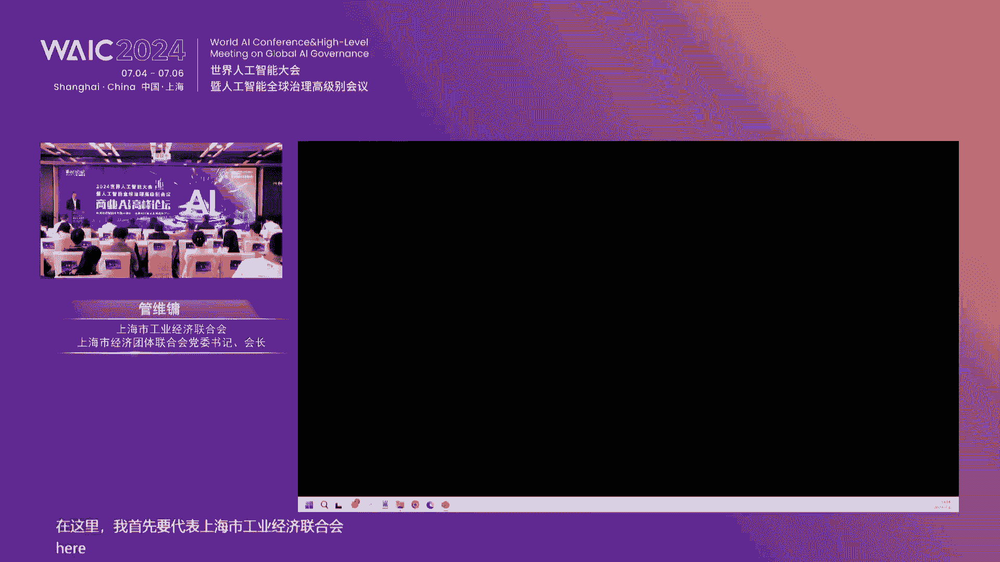
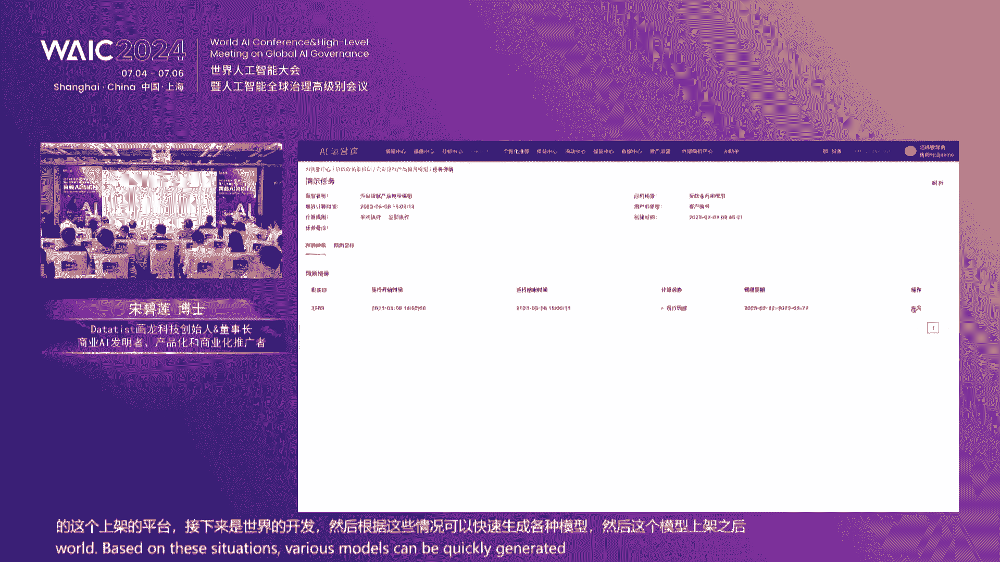
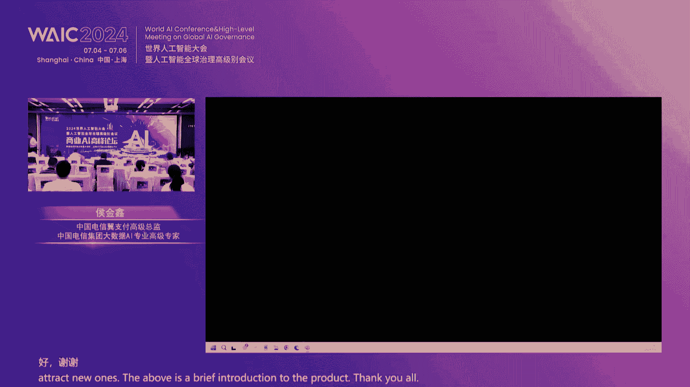

# 2024世界人工智能大会（合集） - P69：20240706-商业AI高峰论坛 - WarrenHua - BV1iT421k7Bv

Thank you for your cooperation。尊敬的各位来宾，本次会议即将开始，请您尽快就坐，并将手机等通讯设备关闭或置于静音状态，谢谢您的合作。🎼，🎼好，尊敬的各位领导，各位来宾。

以及我们现场的专业观众，还有我们的媒体朋友们，大家下午好。😊，欢迎大家出席2024世界人工智能大会商业AI高峰论坛，我是本次活动的主持人王佳琪。

那2024世界人工智能大会商业AI高峰论坛是由datat化龙科技再次承办。我们这个论坛呢从2021年开始，迄今呢已经是第四届了。那华龙科技作为商业AI技术的研发创新与培育基地。

坚持高层次国际化应用型的发展理念，发挥专业能力和高端人才优势，旨在通过汇集全球智慧，展现数据与智能如何重塑企业内核，打造真正意义上的新智生产力，引领商业决策与运营进入一个全新智能化的时代。

共同绘制未来经济社会发展的宏伟蓝图，塑造商业未来的核心驱动力。那本次论坛呢我们也是邀请到了诸多业内大咖行业专家汇聚一堂进行精彩的经验分享和智慧碰撞，持续聚焦数据经济赋能业务本降本增。😊。

决策AI打造新智生产力，重点研讨数据要素，如何通过AI发挥经济价值，商业决策AI如何成为心智生产力，为企业降本增效。俗话说，单思不成屑，独木不成林。那商业AI高峰论坛的顺利举办。

也是离不开各协办单位战略与学术指导单位的帮助和支持。在此，我们要特别感谢亚洲金融合作协会创始秘书长、中国银行业协会原专职副会长杨再平博士，欢迎杨博士。

🎼同时我们要感谢的是中国人工智能学会副理事长清华大学孙富春教授，上海市工业经济联合会上海经济团体联合会党委书记、会长管维庸先生，欢迎管会长。😊，🎼上海市工业经济联合会执行副会长朱英宁先生。

欢迎朱会长以及上海现代服务业发展研究院副院长张柏林女士，欢迎您，感谢各位能够莅临我们的现场进行指导，为我们的颁奖和致辞。那作为商业AI技术的发明者全球商业决策产品化的推动者。

同时也是最早一批客户成果案例实践者的datatest化龙科技创始人兼董事长宋碧林博士与化龙科技联合创始人秦峰先生今天也来到了我们的现场。欢迎两位。😊，🎼那稍后这两位呢也会给我们带来keyn的分享。

栉风不雨，砥砺前行，数字化转型与探索之路也是少不了同舟共济的合作伙伴。世界人工智能大会商业AI高峰论坛每年都会邀请到不同的客户来分享不同阶段的成果。

今年我们也是邀请到了很多优秀企业代表来到我们的现场进行演讲和分享。他们分别是。😊，🎼前工商银行总行信息管理部副总经理、工商银行大行工匠陈道斌博士，欢迎陈博士。

🎼中国邮政储蓄银行上海分行资深产品经理殷云先生，那可能还在路上啊，我们稍后请他上来分享杭州银行零售部副总经理郝宝明先生。欢迎郝总。🎼上海农商行总行零售金融部总经理助理钱淼兰女士。欢迎秦总。

🎼广发证券数字平台部总监黄子飞女士，欢迎黄总。🎼收外红源大数据平台专家付江茹女士，欢迎您。🎼中国保险信息科技部架构规划室经理董伟先生。🎼欢迎种先生。🎼好，那随着时代的发展呢，华龙科技也是顺应时代潮流啊。

勇担使命，不断完善商业AI决策产品和智能运营平台产品。目前已经成为了数字化运营方面最大的原厂产品供应商，也是得到了我们的合作伙伴的大力推广与集成。

那本次论坛我们也是邀请到了与华龙科技携手共进的合作伙伴企业代表来到我们的现场来分享联合解决方案和共同推广方式。他们分别是维度信息技术苏州有限公司CEO曹鑫先生。😊，🎼欢迎你。

🎼中国电信易支付高级总监、中国电信集团大数据AI专业高级专家侯金新先生，欢迎您。🎼通联金融执行副总裁周燕女士，欢迎你。😊。

🎼那另外在这里我们也要特别感谢国泰君安的CIO于峰先生、上海财悦星城智能科技副总裁万军先生以及来自工商银行、农业银行、中国银行、建设银行、交通银行、光大银行、宁波银行、银萧金、南京银行、上海银行等各大银行机构以及平安证券、海通证券、华湖证券等各大券商机构以及各大保险公司等金融机构的专家代表莅临我们的现场。

同时，我们要感谢正在收看我们直播的同步线上参与本次论坛的数百位嘉宾掌声送给各位，谢谢。😊，那众多杰出的企业家汇聚在此，我们一起来分享智慧和经验。我们也承诺将会持续搭建线下交流平台。

让大家能有更多的机会面对面深度共享宝贝心得，共同探索更多的成功可能。来宾们，朋友们，2024世界人工智能大会商业AI高峰论坛正式开始。

🎼首先我们要有请亚洲金融合作协会创始秘书长、中国银行业协会原专职副会长杨再平博士为本次论坛致辞，并带来精彩的分享掌声。有请杨再平博士。好，各位嘉宾，大家。下午好。呃，非常荣幸啊在这里跟大家。

就这么盛大的论坛，这个世界人工智能大会这个来跟大家分享。那么作为这组嘉宾呢，首先我热烈祝贺我们这个世界人工智能大会，我们这个商业AI的高峰论坛这个成功举办，也预祝我们这个论坛呢取得圆满的成功。

取得丰硕的成果。这个一年我看一年一次的这个人工智能大会啊，在上海举办。这个我刚才问了一下，有六七年了。那么我们这个高分论坛呢有4，今天是第第四个年头。所以现在这个我看人工智能大会呢。

这个不仅是上海的一件大事。而且是我们国家的一件大事儿。因为我看我们总理都来了这个。而且甚至可以说。也是一件世界的大事。因为这个当今世界啊，我们讲这个新进生产力的发展最具标志性的。这个或者说最具潮流性的。

就是人工智能的发展。可以说。这个人工智能它的发展。非常我们讲入火如荼，芳心未艾这些词啊，迅猛发展都可用到他上面。可是人工智能的发展正在深刻的改变着我们的。这个各个行业，我们的生活，我们的治理方式。

所以说呢，这个是我们令我们感到非常的鼓舞，也是这个让我们非常的关注。当然我是因为这个主要是这个呃更多的时间是。呃，这个从事金融行业。所以我更关注。人工智能。我们说他在改造在深刻的改变着各行各业。

重塑再造各行各业。那么当然我更关注呢，他对金融业的。这个。改变。可以说我们。高度期待的就是人工智能的发展，能够带来一个高智能的金融。我们把它叫做智能金融。这个基于人工智能的这个技术，智能兼容。

当然智能金融它也有一个直效问题。所以呢我们希望呢我们期待的是一个高质效的。这个。智能金融。所以我今天呢借这个机会呢，我跟大家分享一个观点呢，就是呢这个我们要这个让我们的这个。AI人工智能。

能够塑造一个我们所期待的高素质的这个高效能的。这个。智能金融。那么他的条件呢，我觉得一个就是要。这个。我们高诉这个可以说高效质的高质效的要素。过高职校的。这个AI偶活。所以这是我今天要讲的一个基本观点。

那么讲到这里的，我们讲到这个呃讲到这个数据要素和AI模型。就是我们讲新质生产力。这这两个当然是形质生产力，但这两个东西只有耦合起来，它才能够成为新质生产力。

这个最近呢我不久前参加了一个这个新制生产力的讨论。我觉得我们观察新制生产力的两个维度。第一是。这个量台。就是我们生产力的原来的三个要素。他的科技含量达到一定的高度。量病成为疾病呃。

就是我们讲的劳动者、劳动工具、劳动对象。因为有生产高有科技含量达到一定的含量以后，它就变成新质生产力。这是一个维度。第二个维度呢，我们有些东西是很难包含在。原有的生产力的三个要素中间的。最突出的。

就是数据。或这个我们讲的人工智能啊，现在一个代码甚至都是很强的生产力，对不对啊？所以数据要素。这个冰城的代码等等。当然更不要说人工智能了，它是生产限制生产力的。能够跟其他三个要素并列的。

他是一个我们另外一个维度的观察新智生产力，我把它叫做形态。一个是量态，一个是形态。但是这两个东西呢。只有偶合在一起。也就是只有数据要素和AI的模型能够耦合在一起相乘。😡，产生陈述效应。

才能够构成新值生产力或者生产力的这个新值生产要素。就是这个我觉得我们我们讲要把它和生殖生产力联合联系起来的话，数据要素。只有。和AI。偶合我们讲数据要素成AI大模型，才能够构成新质生产力。

就是从一般的来讲。呃，我们讲这这这近以来这个我们讲如火如荼的发展啊，迅猛发展。我这列举了这个虽然十0分钟啊，但是我的PPT还是做的够丰富的，就供大家参考呃，因为实际嘛这个我就不展开说了，我把它理了一下。

所以数据要属于AI模型。我们讲的AAI模型是我们有一个说法叫做。算力算法。数据。这三者是不可分的。同样的数据没有AI模型。它很难变成新车生产力。同样的AI模型没有数据。无理之炊，他也很难变成新制生产力。

所以这个概念呢，我想坚定在这里。我提出我的一个感想。那么同样的。金融也是这样。金融。我们讲高质效的我们讲这个高质效的金融数据。他也只有只有跟高质效的金融AI相乘偶合，才能够产生高质效的。智能兼容。

就这两者一定要。结合在一起偶合在一起。他才能够成为高质效的金融。所以我们在研究高质效金智能金融的时候呢，我们一定要关注。这个。他的发展。呃，这个我们讲这一轮，我们讲这个这个数字金融的故事啊。

它的发展是从互联网开始的。我们过去叫互联网金融。那么前一呢是我们叫金融科技。现在我们讲数字金融。数字金融在进一步第二次浪潮可以进一步发展。就是我们现在讲的，可能现在已经有苗头的。

或者说已经出露头角的这个智能兼融。智能金融这是我把我把它当当然从相关的资料微信资料里边找出来的这个这一次新的浪潮，我们讲数字金融也好，智能金融也好，实际上它的最基本的技术逻辑最起点的就是我们讲的。

我最近看到世界银行的一个报告，它概括的很好。两个关键领域。Connectivity and computing power。链接。与算力。这两个东西。是基本的技术逻辑起点。这是我们讲嗯。

由于由于链接就产生大量的数据，对不对？啊，由于上利。他就跟数据能够耦合在一起，然后产生我们讲的智能兼容。所以第二次数字换难潮，很可能就是我们讲的期待的。我们讲。人工智能兼容。

人工智能建筑这个已经是可以说已经向我们。慢慢显示出一个一个一个出现来了啊呃，数人工智能金融现在它已经在不少的领域能够得到得到应用啊，这个这个我们可以看资产管理经营中介等等。都都都可以应用。

而且后台、中台、前台都能够得到广泛的应用。他在金融方面的应用方向呃，不只是获客啊，尤其是产品。创新等等都得到广泛的演员。那么怎么样才能够获得高质效的金融数据呢？所以我们讲。高职能的高高效这个高质效的。

这个。智能金融它有赖于高直效的数数据。那么怎么样才获得呢？我觉得国际上。这个大家公认的4个位。四个位，体量性、高速性、多样性、价值性。用十分钟的演讲我就不展开说了。这个点到大家都都能够理解啊。

这个是国际上的一些一些概括。而且为了保证这一点，我们我我们这个党中央国务院发了一系列文件，这是具有代表性的保证数据的可靠性。数据的这个高质效呃，相关的要有制度保证。这是。就是这个数据的。直效高职效呃。

我们理解四个位，然后相应关的一些制度安排。那么同样的，我们讲高质效高质效的智能金融，必须是两者的耦合，所以同样有赖于呢高质效的金融AI。金融AI无疑属于我们今天高分论坛的这个主题。

就是商业AI的一个组成部分。可以说也是一个很重要的组成部分，怎么样才有高质效的金融AI呢？我觉得呢我们从一些国际组织的国际一些方面，我们可以看到一些呃，当然我们自己也有呃。

今后组织有一个关于这个人工智能发展原则里边的5个原则。那我就不展开说了5个原则。呃，我觉得很重要的一点给我印象最深的就是要关注，就是AI的直效，要关注它的全生命周期的直效。😡，开发。

然后到应用中期得关注。他的直效体现在全生命周体方面。所以A这个OECD发布了相关的原则。那么我们自己我觉得大家要关注工信部在这方面实际上也提到行业标准。就是人工智能呃，它有一个建设指南。

实际上它也是我们商业AI的一些标准。而且它是很详细的。我们这这个这个呃我这个PPT里边都有我们可以看到。除了这以外，国家就金融方面来说。

国家金融监管总局以及人民银行还有证监会这个都出台了一系列的相关的文件，促进它的发展，同时呢要管控风险。管控风险风险。这个最近呢我看呢这个我们的呃中国信通院人工智能研究中心呃。

灵活近50家单位共同编制的金融大模型的标准。这个我认为就是我们把握金融。金融AI的这个高质效要把握的。首先你要达到这个标准。行业标准这个就很重要了。这个这个行业标准这个我这里有有部分的，大家可以参考。

我这当然从这个文献里边找出来的。那么。我们也注意到了，最近有很多的金融机构这个。在人工智能在金融的人工智能的开发方面，可以说大笔的投这个不惜不惜这个资金开发呃，这这个这我也列列举了。

然后他们的投资的情况大家可以看一看。那么在这方面呢，我觉得要保证高职校的，我应接些相关文献呢。我觉得呢我们的行业这个清华大学杜小马，然后这个相关的科技评论，他们共同提出的这个。

金融AI应用报告里边提出的呢，这个金融业集成生成AI的8项原则，我觉得很值得我们参考。这个八项原则可以说是我们行业的，因为既有理论的，又有实践的，可以说是个经验之谈，用为实践关系啊。

我不能一一来来来说这个资料呢提供给大家，大家可以参考。因为我要说这个八项原则就可以讲十分钟。好吧，我就就这样一个呃，这个跟大家做这样一个交流呃，再次祝贺我们这个祝祝院啊我们这个呃高分论坛。呃，圆满成功。

取得丰硕的成果。大家分享有价值的成果。好，谢谢。好，谢谢。😊，谢谢谢谢杨博士给我们带来的致辞和分享，谢谢谢谢您。😊，好。

那接下来呢我们要有请的是中国人工智能学会副理事长清华大学的孙富春教授为我们发来致辞，让我们一起来看一下大屏幕。商业AI高峰论坛的邀请。今年，商业AI高峰论坛重点聚焦数字化时代以及新智生产力这两个关键词。

我想呢就是谈一下自己的认识。首先我们都知道，步落21世纪科技与经济深度融合的新纪元，以大模型居身智能和Fs为代表的新一代人工智能，正在改变了我们的生活、工作和科技发展。

而三者之间的融合产生的效用将更加巨大。目前难以知道它的天花板究竟在哪里。人工智能家。战略的正式纳入国家政策议程，标志着中国在科技创新和产业升级的赛道上取得了里程碑式的进步。

使战略不仅深刻洞察了新时代的发展趋势，更预示着在全球未来发展中占据主动的关键在于跨界融合数据驱动和智能化提升，共同构成推动社会进步的新智生产力核心要素。

每年的商业AI高峰论坛都市企业数字化转型的成果示范。在历史论坛汇报的成果中，我们欣喜的看到了很多成功落地的方向。一、比如通过数字化技术，使我们的金融业务更加智慧。通过商业啊更好的预测用户的需求。

满足用户的不同需要，实现了智慧理财，智慧投顾、智慧客服、智慧普惠金融等。2、又比如通过数字化技术，使我们的企业更加智慧，通过商业啊预测资金最佳的使用效率来更好的分配预算，让企业的投产比最大化。

实现了企业根据投产比最大化的智慧决策。随着企业数字化转型趋势的深度推进，数据的指数及增长与日益复杂的智能化应用场景，对企业的数据资产管理。决策效果与运营效率提出了更高的要求。商业AR作为这一时代背景下。

精致生产力的集中体现，存载着十分重要的历史使命。变革往往会带来新的机遇。数字化为我们提供了前所未有的数据分析和预测能力。通过大数据技术，我们可以从海量数据中挖掘出有价值的信息，洞察客户心理。

制定更加精准的商业策略。这种数据驱动的决策方式，使企业能够更好的把握运营效果，提高运营效率，降低运营成本，提高企业竞争力，新智生产力的一个显著特征，使人为企业快速降本增效，产生经济价值。除此之外。

数字化时代的新智生产力还表现为更高的创新效率和更低的创新成本。总而言之，数字化时代为我们带来了前所未有的机遇，也催生了新智生产力的崛起。

通过汇聚全球智慧展现数据与智能如何重塑协业力和打造真正意义上的新智生产力，共同绘制未来经济社会发展的宏伟蓝图，塑造商业未来的核心驱动力，显得更加重要。这也是本次论坛我们需要重点讨论的方向。未来已到。

商业AI高峰论坛举办至今已立四界。作为商业AR技术领头羊的华龙科技的数字化转型产品，已不断成熟，并具备了批量推广的基础，并且通过持续努力，带头开辟了商业决策，这一具有巨大潜力的产业赛道。

中心希望越来越多的企业能够加入这个产业。共同打造合作生态，共同推动智能决策产业链的发展。最后，预祝本次论坛圆满成功。祝参加本次论坛的线上线下的朋友们在论坛期间能够引进更多的新观点，激发更多的新思维。

共同打造新智生产力，促进国家商业AI产业的蓬礴发展。🎼好，谢谢孙教授在线上我们发来的精彩发言。那接下来让我们用掌声有请上海市工业经济联合会、上海市经济团体联合会党委书记会长管维庸先生为本次论坛致辞。

有请管会长。😊，尊敬的各位专家。各位企业家。非常高兴参加我们世界人工智能大会商业L高峰论坛。😊，这已经是第四件。在这里。

我首先要代表上海市工业经济联合会、上海市经济团体联合会对我们各位专家、各位企业家的莅临和接下来我们专家们有精彩的演讲啊表示衷心的感谢。

刚才我们两位专家啊都做了我们啊杨教授杨会长是意犹未尽啊，实际上有很多要说。确实这一次的主题是数据经济赋能降本增效AR决策啊，提升新的新的生产力。这样一个主题呢非常有意义。

从我们上海市工业经济联合会的角度来说，我们可能更关注的。我们AR技术如何。我借我们杨教授的话，偶合。融合嫁接。如何来体现和我们产业的啊数据如合和IR技术的融合？我们I技术如何和我们产业的融合？

如何来嫁接和创新？我觉得呢这方面呢多年来在这方面有许多成功的探索。也。同时是放在我们从事商业AR各位专家面前的永远的一个课题。呃。昨天。工信部啊国信办有一个介绍啊。中国呢是一个产业门类。

工业门类最丰富的国家。工业农业中41个大类。207个中类。666个小类。在中国都具备，而且有些也具备相当的产业链的完整性啊，是联合国从工业产业来说，它的连接性最广泛的。那么同时呢，我们工业这一块。

又占了全国的GDP的规模的31。7%啊，这是去年的统计数字。所以我们的商业啊如何赋能于我们降本增效？如何和我们产业的提质增效？我有我有个建议啊，就是降本增效。我们更应该说是提质增效啊，提质增效啊。

在这方面如何来研究我们的融合。所以融合嫁接啊，这是我们需要深深的思考的。呃，应该说这几年来，我们华龙科技在这方面作为商业呃，商业AR的龙头羊。做出了很好的典范。商以啊也是我们等会我要介绍龚经莲啊。

也是我们龚经联的成员，为我们企业负能啊，那个。成百个啊数百个案例，今天还有许多案例啊，将为我们企业在。体制生效方面，将为我们在管理创新方面，包括决策的创新方面都做出了很好的示范作用。同时。

今天我们在座的各位也很期望大家拿出这些。啊，好的一些做法。上海市工业经济联合会。上海市经济场景联合会呢，我也简单的做一个介绍，是一个枢纽型的联合组织。有两个板块组成，一是200多家行业协会。

覆盖了上海的先进制造业、生产性服务业、金融贸易信息大概7到8万家企业。原来是工业方面，这几年我们的金融企业。现代服务业的企业。也加入了龚金莲。还有260多家企业和企业集团。

特别是这几年我们的一些功能性的，包括我们的金融机构的加入。为我们产业发展的赋能起到了积极的作用。向上海的主要的金融机构，除了银行通业工会、保险通业工会等等啊，是我们成员。

还有上海的主要银行、浦发银行、上海银行、农商行、海通证券、国泰君安，还有外省是在上海的银行啊，北京银行、宁波银行、厦门银行、渤海银行等等，也都是我们成员。这样我们今年着重的是在推进。五个方面的合作。

我们的功能是枢纽平台、建言献策、典型示范等等。同时呢我们也在尽力的推进我们的产融合作。产业链合作产学园合作和区域，特别是长三角地区的合作。我们举行一系列的活动。

那么这里呢也非常期待我们在座的企业家专家参与我们公经链的各项平台的建设。各项为企业赋能的一些措施和一些专题的活动。所以今天商业亚为我们又提出了一种赋能企业的新要求。我最后想要说的，希望我们在座的企业家。

在座的专家能够。积极的拥抱新业态。因为在我们制造业和相关的领面领域里有许许多多的新业态的涌现。我们。要。乐于和善于拥抱新业态。满足新需求。激发行动的。迎接新变化。再创新辉煌，谢谢。好。

谢谢谢谢管会长精彩的致辞，请入座，谢谢。😊，🎼好，来宾们朋友们，接下来我们就要进入到今天论坛的主旨演讲和发言的环节。那我们今天非常荣幸啊邀请到了来自各行各业的翘楚。

从运营和系统两大方向来为我们分析业内数字化转型的发展经验和成功案例。首先要为我们带来分享的也是本次论坛的主办单位。华龙科技创始人及董事长宋碧莲博士。那在请宋博士上台之前，我们也和大家介绍一下。

我们的宋博士呢作为商业AI的原创技术发明家自2016年创办上海化龙信息科技有限公司以来呢，始终是专注于将全球最先进的AI大数据技术与营销相结合，致力于在全球市场提供一站式闭环智能营销解决方案。

创立了全球真正意义上的一体化智能营销平台。那作为商业AI的发明者数字化转型的先驱。宋博士始终着眼于行业的前。😊，🎼带领团队斩获全球预测性分析技术的第一名，获得包括中国新竞技十大创新女性在内的多项荣誉。

那宋博士对于商业AI与生产力也有诸多独到的见解和思考。接下来让我们掌声有请宋博士。😊，啊，各位嘉宾下午好，非常感谢大家。然后下午过来我们这个论坛啊，我刚刚从那边走一圈过来，我发现我们这论坛是最满的。

然后应该是年年都最满的去年搞到7点钟，还有这么多人在现场。我们中午的话几十个人搬凳子才把这个现场的座位填满，所以我们大概有五六百个五六百位那个专家报名。

然后现场好不容易让大家进来的只有180个180名专家。所以我们很遗憾很多人不得不在那个线上来听。那么这么精彩的这个报告，年年这么精彩的报告是吸引大家来的一个主要的原因。

那么这个要归功于我们所有的这个伙伴和客户然后每年都会带来这么精彩的这个案例那么今年呢我们是第四届来展现商业AI的成果。那么我也是非常高兴，今天呢能够借这个机会啊，然后来回答一下，去年一年收集的客户需求。

对那么我们上来之前，大家已经一直在提醒我了，一定要一个小时。😊，结束哈，因为因为每年我这个干货王一开口，它就停不下来啊，那么呃今年的内容依然是比较丰富的。然后等一下的话，如果大家有兴趣。

我们可以线下继续交流。好，那么今天呢我们首先是分两场来讲，第一场呢是为回回答这个系统产品建设方面的问题，因为去年很多的企业都在问我们，根据我们目前的现状应该怎么样建设我们的数字化转型的系统。

然后每一家每一家都想建成一个一体化系统。但是因为各种的限制，然后没有办法一步到位，所以大家都想在我的阶段应该怎么做。所以这次呢我们是围绕这个为主观。然后根据大家的不同的阶段，我们提出了不同的解决方案。

那么我们希望总有一款能个适用到您。后下一下一个部分呢是其我们的齐总来分享那个运营方面的案例，运营方面呢是怎么样将这个呃就是有效的一个策略给做出来，然后论证成功的案例。那么我们这里呢是。😊。

说如果是策略成功之后，如何让他规模化起来的一个呃产品化的做法。所以我们两个人分两个部分给大家分享。好，那么。😊，嗯，我们讲一下这个首先总归做一个产品之前呢，肯定是要讲一下他的方法论的。

因为所有的好的产品都是服务于呃他所服务的这个目标对象的。像我们这数字化转型的产品，数字化运营的产品，它是服务于业务部门来运营好用户的。所以我们一定要知道他运营的根本的一个方法论是什么。

那么业从业务的角度来说，大家无非就是最关注的就是经营的目标Y但是个Y要是全局Y不是不不不光光是部门级Y那么在这个提高Y的这个最有效当下最有效的方法是做好以用户为中心的战略转型。

那么那么每一个就是说白了咱们零售部门，我们很多的业绩是来自于服务好一个客户嘛，对？这个很朴实的道理。啊，但是在运营的过程中，我们叫营销它是有方法论的营销方法论叫福利原则跟我们金融的福利原则是一个道理。

那么也就是说他有两个点很关键。第一个点就是Y要大于零就每一次投产比。大于0，你不能说我在抖音上投一个亿亏个亿回来啊，那就投投产比不是大于零了。然后投一个亿亏3个亿，那就更不大于零了啊。

就最好是你每一次活动开出去赚能够赚个5个亿回来，投一个亿赚5个亿，Y等于等于5对吧？这个就是个好的RY大于零的措施。

但是RY大于零非常难做我们后面齐齐总讲的那一趴就是主要讲RY如大于零的好然后我们假设已经大于零。下面一个部分也很重要。就是将它怎么放大规模，那既然已经知道怎么做能大于零了，那就拼命做嘛，对吧？

然后把量做起来，所以就循环多次。😊，但是这个循环N多次是要靠系统来实现的，靠人肉人肉是很难实现这么大的规模量的。那么这个就是我们今天上半场讲的，就是系统的问题。好。

那么我们的系统怎么样设计都要围绕这两个永远的营营销目标。一提高效果。2提高效率，提高效果是靠我们什么呢？是靠我们的数字化和智能化，也就大脑来实现的而提高效率就要靠自动化和一体化。

也就是说我们分别要建设一个大脑一个发动机。好，那么在这个里面呢，我们再把它剖析一下，从效率的角度来说，阻碍我们效率无非是三样东西。第一个东西就是组织的效率。

如果很很多我们做数字化转型是要做跨部门企业级转型的。所以如何从部门级走向企业级是个很大的难题，所以我们需要提高组织协同效率。

那么第二个是从手工版走向自动化手工版走向自动化是提高的是运营op的那个的效率运营的操作效率。然后是从碎片化向一体化。这是。😊，实际上一体化主要是数据打通的效率，以及里面决策流通的效率。

最后呢是从数字化走向智能化。这个主要是提供的是运营的决策的效果。所以我们从三个效率，一个效果四个层面，然后来设计这个系统。这个系统肯定是能服务好你的业务的。😊，好，那么我们这里面我们看一下。

就最近大家很关心数据要素如何发挥经济价值。那么这也是我们数字化转型的最核心的目标。那在这个方面呢，我们实际上是有一个也有个评估标准就是AI很多啊，那么多AI真正能成为新智生产力的AI不多啊。

我们评估的核心标准就是在企业应用方面能不能快速的降本增效啊，刚才我们管会长说了要提质增效，我觉得非常好下我们改一改啊。对，提升R one对，那么能做到这一点的，目前最厉害的战术就是我们的决策I了啊。

那么所以我们评估下来，我们我们的结论是决策AI是一种是新智生产力的一种，至少它是其中的一种而且是非常猛的一种啊，有效的一种啊，那么光有决策AI行不行呢？也不行。😊，我们还需要其他的配合的东西。

我们需要系统，我们需要数据，我们需要运营啊运营，我们把叫我们把它粗略了，就marketing整个的营销策略。所以这四者是缺一不可的，缺一不可。但是很可惜，我们现在的呃系统设计的时候。

大部分都是从系统角度在开在设计的，就是你只是一个系统，你不具备数据的能力，不具备营销策略的能力，以及也不具备大脑的能力。所以很多系统现在发挥没有发挥出最大的价值。好，我们下面呢会一个一个进行剖析。😊。

我们现在看一下目前当下的一个现状，目前数字化系统一个现状建设现状。我们看一下国内和国际的情况的对比。国内的现状。第一个我们先遇到我们叫它耐性不够啊，那么耐性不够，主要是说哎呀一个系统建了几天。

然后哎觉得好差不多了，差不多了。然后但是其实还没有还没建好。对，那么这个实际上是一个误解数字化转型不是一个短期工程，它是个长期的啊，然后我们在国际情况就是以美国为例，他们整个发展靠近30年。

每一家大型互联网公司大型互联网公司是做数字化转型最成功的持之以恒的迭代，每年很多个亿的美金的投入然后拼命的在做，拼命的在做。然后从来没停过，所以它是一个长期工程。第二个是预算不够，功能不全。

那预算不够呢，实际上是体现在因因为我们做金融公司啊，每一次搞这个转型呢申请个预算，个项目要申请个预算，那申请个预算呢经常申请的预算是不够的。预算不够，实际上是因为你没有把这个功能享全。

因为你每次都是从里面扣个豆腐块出来立一个项目。那豆腐块它的功能是没有考虑全的。😊，所以呢到最后的话，很多系统实际上是碎片化的，没有没有把它造全。所以它不是一个软件的问题。

它是一个系列一个系列可以看一下这张图上面全是数字化转型的外美国的产品，美国产品啊后已经合并同类一项被这么多公司并购掉这么多了啊，所以他实际上每一个企业几乎至少要买七八个软件来配合才能做好这件事的啊。

然后第三个现状就是缺乏规划混乱啊，很多很多部门之间。😊，是缺乏统筹和规划的啊，然后呢，也没有按照全生命周期运营的逻辑来来进行整理这些系统跨部门协同效率低。

但是在美国是在很多的公司里面在组织上是做了大量的调整的。然后来避免这个部门墙的这个问题，协同效率低的问题。好，然后最后一个问题就是就算建了也打不通。打不通，用不起来，现在也是个很大的问题，效率低下。

因为建的时候是各建各的。有的是呃那数据部门建点建点系统。然后那零售建一点新华建点，互相之间各建各的孤岛式的建设不同工应，再说供应商买的产品也是五花八门。那么最后只慢的打不通人肉串联。

就大部分都是半自动化人肉串联。那实际上在外国是怎么做的呢？大部分的互联网公司内部都是要有至少几百人团队来做打通的这个动作的啊，然后呢，那些刚刚写的这个五大商业巨头都是通过并购并购以后花巨资进行打通。

是通过打通的这个就是系统的这个并购和打通来形成这个一体化解决方案的。所以系统必须打通，就像人的气跟血嘛，你不通整个人是运作不起来的。好，根据这个呃现状啊。

现在大家已经在国外已经形成了叫买整机的一个趋势了，就不像以前都是买买组件自己组装因为就打不通，最后就变成买整机啊，所以现在我们总结下，国外的这个数字化转型的系统，虽然五花八门几十款，但是合并同类项。

就是这么些大类。根据这些大类，我们看一下数据层有了分析也有画像也有那个呃那个M也有做渠道的也有内容也有。然后站内也有站外也有。然后呢。

还搞了一个大脑但是其他的个是属巨头那个个还是没有决策大脑的那两个没有决策大脑的是做端零售业务的那有决策大脑的是做的B端业务的。所以现在这个就是目前海外的一个整体的一个软件板块的问题。你可以对比一下。

你是不是都有了这些块好，那么我们看一下，目前从零售业务就是左边业务来说它是缺两个东西的缺大脑中间那个核心大脑是没有的还有就缺连接器。

就是驱动器发动机是没有的那的它是最完整的是并购也是并的最公司就并了10家然后呢其他每一家I公司就花了200亿美金并，所以他并购的力度非常大，它形成了一个大闭环但是。😊，C端零售业务是缺这两套东西的。

而我们在座的各位其实主要涉及的领域都是呃C端业务，深端零售业务。所以我们一样在全球范围内都缺这个东西，我们国内一样缺啊，所以我们data的主要就是华伦科技主要就是为私运营来提供这个大脑和连接器的。

叫发动机的。😊，好，那么在这个图上面，我们中间这个部分叫大脑。然后呢连接器就是发动机就是整套的把它串起来这样一个动作。然后我们在这个板块上，所有板块我们都有开发出来。

全部进行了一个国产化中间这个紫色部分是我们独创的，全球唯一的一家供应商把它做出来的，所以我们是两个突破第一个突破是全球唯一的的决策大脑以及全球唯一的一体机。然后那三家公司虽并购了一堆公司，但是他打不通。

到现在也没打通。我们是全部是打通的。所以是两个创造了两个全球第一，那么我们今天有幸在这里给大家分享这个产品，因为等一下你们下面建的时候，你可能没有没有没有没有几家公司呢一下子上来上这个一体机。

所以呢当然也有像上海农商行的成功案例就在那里像广发证券万宏源的成功案例都在那还有最近刚刚上线的那个华华福证券等等，都是上了一体机的这个是非常棒的。但是我看了一下大行股份制都很难。😊。

因为各家已经建了好几套不同的系统了。所以呢我们今天主要是针对大家目前当下的情况，我们来讲怎么升级。好，我们看一下升级的方向。好，我们从从最开始的版本说起，最开始的版本在1。0版本，我看了一下。

应该是作为这片渠道几个几个客户啊，应该大部分是出在这个阶段啊，然后他的这个情况就是大部分情况是造了一个活动管理平台和权益管理平台。那么就把这个当做一。0的运营平台了，但实际上他是不够的。

也就是我画了个图，大概是这个状态，是有数据的，你看数据在数据部门也有分析，也有买点，也有那个然后也有个标签平台，对吧？然后在营销的产品方面，他主要是个权益管理积分管理系统以及内容管理平台啊。

比如说我们我附近的某一个农商行开发了快一两年时间了，就是满足了在门店可以发大米的需要。就把这个给他产品画出来。那实际上他是什么，他就是个活动跟权益管理平台，对吧？好，还有后面就是那么多的渠道。

渠道大部分都建了啊，所以这个是所有的东西是手工版，你看这个除了我说的所有手工版是说串联的动作是手工版，就。😊，箭头的部分，你看呃手工建模，手工做分析，手工做标签，手工做人群包。

然后活动的要素全益跟那个内容做完，手工串联到活动里面推推完以后活手工做分析，是不是这个情况？对，所以这个我们叫1。0版半自动化的。好，那么他的运作流程就是这个流程。我刚才说了。

还是需要一堆人需要一堆的平台。你看一堆的团队啊有各种各种团队在参与在里面买点的团队标签的团队内容的团队权益的团队运营的团队渠道团队，还有分析师团队，就是他们各自在用不同的工具在完成一个动作。

里面你看跨部门跨了多少个部门。那整个一个串下来可能一个月就过去了。所以这个组织之间的协调效率是阻碍我们现效率发展的一个关键。那么针对这个东西怎么改呢？他要改几个点。第一。

他的营销要素没有完全集中在一个平台，他很多东西要手工串联他的数据没有形成闭环，他没有一个统一的活动管理平台沉淀这些系统经验很难执行一批测试缺管理的方法论。所以我们建议他要升级到2。0叫自动化营销平台。

那自动化营销平台跟刚才那两个平台不是一回事，他是中间那个经常混淆活动管理跟权益管理以为是个营销平台，他不是营销管理平台是中间那个东西也就是现在划。😊，那个黄色的框框，黄色的框框。

它是要将所有这些营销要素打通在一起的。比如说人群包权益内容渠道要把它完成闭环的对接。所以他的还有还有刚才那个闭环不是变成一个手工版闭环，变成自动化闭环了。所以他要把整个的啊流程给跑通。

形成一个最小的一个自动化营销系统。但是这个东西建完是不是就可以了？还是不行。因为我刚才看了，应该在这边有好几个同呃，那个企业应该都在这个阶段这个阶段这个你看诶，他说哎呀我的A没建好了呀。建好了。

等一下不管用。那主要不管用在哪几个地方呢？我写了一下。首先他很多系统是只支持多呃只支持做做单波次营销，它营销效率不能支持那个多波次，所以他是效率是比较低的。

第二数据他的数据能力从人群圈选和画布的这个数据逻辑有问题。啊，这个很严重啊，这个我们刚刚有一个企业就是这样的，他也有画布，看起来他说我也能做多波次。那上面是不能做多波次的。第二种是能做多波次。

但是多波次的数据逻辑是错的。圈选人群暴道逻辑错的以及。这里面各个流程之间节点的传递逻辑错的那这个也很要命的，也就是你的基础不对。然后还有是分析不能实施，不能闭环。好，然后AI的对接能力。

大部分的MA系统都不能跟A嗯手工版模型进行有效对接，无缝对接，全程优化。那么营销能力。它是没有什么好的策略库的，大部分是个壳，里面没有一个丰富的策略库。AB测试的功能，大部分是不符合业务需求的。

也就是你做个活动，做完手工分析一下，再做个活动手工分析一下，然后做下对比。那这就不是真正的AB测试了。它不能支持同时做很多的各种花头的AB测试。另外呢就是管理能力管理能力大部分AA是不能给分公司用的。

因为权限一多，他就撑不住了。权限账号一多，性能有问题。还有呢他没有设计成总分联动模式，也就是没有办法一个系统给很多部门用很多的这个分公司用。再接下来就是部门部门扩展能力。刚才也是一样的。

这两个都是属于企业级要从部门级走向企业级，他是在设计上做很多改造的。好再加下呢就是架构问题，大部分的画部不能多并发并发20个就是传统软件公司，我们等下看一下并发20个差不多了。然后稍微互联网化一点的。

他是并发200个。然后等到并发2000就挂了200个差不多就要挂了。那么很多的这个我们看了去年好多个公司，他那个上线以后，反而阻碍了业务，没有加速业务，反而阻碍了业务问题就是那个划部挂了挂了还不知道。

然后整个业务就好多好多有些公司很比较严重的，百分之好几十七八十的活动没开出去，其实问题就出在他。在新能架构上。好，那这接下来就是信冲的能力和安全能力。😊，那么所以我们把它做个改造，改造成这样的。

就是在A妹的基础上升级成现在这个这个。橙色的样子，这个橙色的样子呢升级完以后，他就能承接刚才说的各种问题了。你看多波次也能做了圈选的画布的逻辑队的分析可以做到实时和闭换。

然后呢能能够对接I无缝对接有丰富的策略库A测试是符合营销逻辑的测试。然后呢有权限可以给总联动用可以扩展到多个部门然后因为未来肯定是要企业级这个趋势的。我前面讲过了啊。

那么还有就是画布可以支持大量的并发用户圈选复杂了，现在也没问题啊。刚刚我看了好像在那边那个企业就是属于大型个国企的画布一圈选多了，他就挂了。对用户圈选多了也就挂了。

然后反正这都是我上面想选的都是我们去年一年调研的结果，我可以每一个都可以告诉大家问题出在哪个企业那里线下的时候，咱们可以在在那个交流信创的力安全的没问题。所以。😊，最后我们来对比一下，如果上架之后。

就是在性能上要测试的话，你的并发量能不能达到上千或以上啊，那这是我们考核一个。因为我们在座的大部分企业以后，他用这个系统用多了之后，肯定会达到这个并发量的。你像广发证券现在就已经达到这个并发量了，对吧？

然后还在继续往上升。每一年每一年都一十几乎10倍以上的速度在增长。好，然后呢，这个运营的效率在升级之前，比如说升级之前，广发证券为例，一年就只限几十场活动，手工干，然后也是半手工半自动化，累的半死。

然后一现在呢一年轻松完成几万场活动啊，然后这个运营效率可以可以提升数百倍。然后呢，完了今年我看好像要突破10万场了啊，然后我们现在压力也非常大。然后在时间的提升。

提升价格性能然后业务方也得想办法去增加一点服务器资源啊。😊，对，所以这个是未来大家都会走到这个阶段，因为会用起来，大家会非常的习惯用这个系统。他们现在是不管电商部用，财务管理部用。

全国300个投顾机构都在用所有的那个用户都在这个系统上呃，业务员都在上面开系统开活动。然后呢，经验积累在这个系统上。所以他对性能的这个要求会越来越高。😊，好，我们讲完自动化营销系统的发展方向。

下面接下来讲第二个关键的环节就是数字化。数字化跟智能化都是保障效果的。前面是保障效率的。保障效果方面，其实很多公司也做的不够位。比如说CI很多银行上的CM这CM实际上是要改进，要改进，要升级的呃。

有些说我买了个点，买个点也不行也不够。那怎么升呢？要升成这三个方面要就营销数据化平台，数字库数据库平台，营销特征库平台以及营销分析平台，从这三个方面升级，我把它划一划。也就是绿色部分。

所有的绿色部分的浅绿色部分都是1。0阶段，就是大家都有都有，对吧？你也有你也有数据，我也买点，你有买点，看都有买点。哎，那个业务数据也有啊，然后分析平台啥都有但是缺口缺在哪呢？

我把它画了三个深绿色的部分。第一缺在营销数据库上面，第二缺在你的画像中心。第三是缺在你的实时的营销全流程的分析上面好，那么我们看一下这三个部分，它区别是什么？首先是营销数据库的区别。

你的M不等于我的营销数据库营销数据库的意思是什么？是D就一堆的不光有客户的 platform你还有 data platform，还有 data platform。

还有 data platform也就你里面会有数据用户的360度的打通的数据有产品360度打通的数据有销售人员36。同的数据以及你的营销策略，营销的话呃那个营销的这个权益，营销的内容所有的都要达标。

全部要收集进来。那才是我们的营销数据库。好，跟风控数据库是对标的两个数据库，但是比风控数据库复杂太多太多了。那么我们在升级之前，它是这样的，你的CM只是个静态的数据查询和管理和营销活动没啥关联。

它是个局部的数据应用。比如说买点浅层次的采集和整理，无法预知未来的转化。而升级以后我们全部是动态的分析和画像营销过程中前中后全流程数据闭环和跟踪，全部都要能够做到分析。

是做企业级的数据打通和加工多维度的影响因子特征构造以及深度的商级挖掘预测未来的转化。所以他的这个营销数据库是这个全行要要努力的做的。啊。

第二个阶段啊我们看一下光大银行其实我们之前帮他们做了一个非常重要的一个改造，就是把营销数据进行了一个打通。然后几十万张表做了1万个特征的构造，其实就是在做这个基础的动作。好，接下来是标签画像平台的升级。

原来像我们在大行里面，像最近我们做好几个大行，基本上搞个几千个标签，到头了，累的不行了，搞不出来了。那而且开发标签周期非常长，你看搞个100个标签不200周然后你需求开发整个闭环流程很长。

哎我们现在的用用这个新的方法来做。我可以用特征库批量生产大量的特征几万个1万生产出来。然后把它转成标签给你用。那你这个标签就非常的丰富了。

可以划的而且大部分都是预测性标签结论性标签就直接告诉你谁会买理财，谁会买基金他的风险等级是多少。然后这样子拿去才是业务要用的，不然拍脑袋搞那几千个标签也不管用。

所以这个是我们说的数据层面的开发要克服开发周期长数量不够用，对运营结果没帮助的问题，以及基础数据拍脑袋搞标签，部分是不懂业务的，你也不知道怎么样去设的标签，你的买点埋了也不会各造事件。

所以我们全部要升级成右边这样的一个东西对效果。😊，果好呃，对业务负责，然后能找到对营销效果真正负责的影响因子，保证营销效果。好，智能分析平台。我们现在看一下分析平台，分析也一样要改造。

大部分分析工我看来都是个BI报告，powerBI什么BI一大堆一大堆的BI。但是这个BI就是这样的运营运营逻辑，它实际上跟营销活动并没有挂钩。它是由数据团队根据业务的需求做两个报告而已。

那么是个静态的报告，是给董事长可能看一个报告用还可以。但是你想往下下转，到底哪出了问题，哪个团队给你做的业绩高，哪个地方那个营销的这个转化率高，哪个地方的权益发的好，都看不到。所以我们要做的是这样的。

围绕着这个营销的过程深度关联跟营销前中后都可以产生及时的分析。比如说营销前我可以诊断，告诉你哪里是做的好。比如我们在山东工行。

我们研究下来发现用户分成之后做基础科学运营800到800以上这个档是最能给你一把能赚很多的结果我们一上线赚几百亿。好，这个就是我们营销前分析的能力。

对所以在这个里面要加上这个的第二个是营销中的实时活动分析的能力。这一个活动开完我是一边开一边看结果，一边开一看结果你不可能说一个活动开完一个月，你不知道结果了。

我怎么及时调优呢所以我们所有的东西都是跟活动关联，然后能够实时跟踪效果。最后是营销活动后的归逻辑分析。要全部都能归应回来，一路追踪回来，到底哪个地方转化的好，哪里出了问题。那你才知道下次怎么改造。

所以这个分析报告啊，要做到这个营销前中后的分析，全部要跟营销挂钩联动。也不是普通的B报告能做的，必须跟营销活动平台挂钩在一起才能做出来。最后我们要看一下，整个是从全局。

比如说总行到省分行到这个省分行下面一级子分行二级分行全部都能联动，叫总分联动的报告。那这样的话每你你可以从总部看到某个分不是上海分行的某一个网点的某个业务清理做的怎么样都能看到。

这样子才是一个总分联动的好报告。😊，好，这是我们讲的升级前和升级后的一个对比啊，这个是分析方面的区别。好，下面接下来完成的数字化。我们来讲第四个版本智能化营销平台。啊，我们1。0版已经升到4。0版了。

最后我们要升到5。0版啊。好，那么看一下大部分公司现在都是到了3。0有大的那个国那个央国企业可能是到了3。0。但是到4。0的不多好不多，所以我们重点来看一下4。04。0的材料最丰富。

也是我们公司最核心的技术。我们来看一下。😊，从数字化到智能化，它主要是生的是决策大脑和小脑，它是提高的是决策效率啊，前面是讲的是营销的operation的效率操作效率。现在开始是营销market效率了。

你如你找个理财最可能转化的理财的人，你可能选两个标签开个活动试一下不对，选两标签开个试下不对试的把还是不对。那这个就是决策效率找不到目标客。那我们现在用I呢一把给你找到。

然后你这不用就反复去搞搞多少个试了，一次就能找到最优解。所以他在决策效率上是非常高的。但是大家不知道建这个大脑应该怎么建，我们把它分成两个一个叫企业级大脑。😊，第二个叫部门及小脑啊，他是要进行配合的。

啊，那么这个是针对两个现状来呃展开的。第一个就是很多的营销系统上线了，它就是效果差效果差。因为他没有大脑，所以效果差。好，这个是我们要重点要进行研究的。也就是我们现在在海外现在这这几十年从互联网开始。

到后面大数据大数据现在开始搞大模型都在都在往这个方向发展。数据互联数据多了，搞大数据，大数据多了就有决策困难症，决策困难症就要考试搞AIAI可以快速帮你做决策，对吧？所以现在就是。😊。

这个决策的智能是海外最先进的技术，也就是我们团队在2011年在美国硅谷，我们首先率先把它研制出来的决策AI模型。现在我们开始啊产品化出来给大家用。

也就是这个决策效率是对大家来说是未来是一炮能帮你把RY做起来的核心关键。你哪怕没有前面的所有系统，你就把这个东西做起来，那也对你业务是有巨大的帮助的。比如说我们给山东工行我们也没做系统。

就刚才这个一下子也也是跟给他们增加几百亿的资产升级的对吧？所以这个东西对业务是真正有作用的东西。😊，好，第二个是决策效率低。也就是你就算有RY能一把能提升多少。但是你要想从几百亿变成几万亿规模怎么办。

那就要靠这个速度了。这个AIAI也要把到产品化的那个AI不要说哎呀两个月生产1个AI那太慢了。我要一个月生产100个AI那这样子让全流程覆盖才能产生规模化效应。所以AI未来也是要形成自动化的。

要形成规划规模化的，所以必须把到产品化出来。好，那么我们看一下总部也一般来说，我们在总部叫什么？一个叫一个企业大脑叫总指挥中心和N个业务小脑的搭配。好。

那么在这个图里面看一下蓝色部分蓝色部分就是我们升级的AI大脑这边这个叫企业级的那边叫部门级的，我为什么中间那个部换的呢。

因为它是可以独立存在的独立存就是说我们这个跟科技部那边可以直接搭一个这个企业大脑过来从数据读过来就可以了。那也是可以独立存在的。比如说那个手机银行部可以直接搞一个手机银行的独立小脑叫智能流量分发平台。

那么这个客服智能客服智能这个外呼可以独立搞个我们叫大小模型结合的这个智能客服跟智能外呼平台。那么对于企业管理平台，就是员工平台，我们可以独立搞一个的小脑。

也就是赋能线下业务员的一个全生命周期的一套策略跟模型平台。所以它是可以局部存在的然后呢这边呢是属于这个科技部可以。😊，独立建一个企业级通用的。嗯，这个专家模型管理平台。好。

那么我们分别看一下到底该怎么建。怎么建的时候我们分5趴就企业级的这个智能决策大脑有5趴这个跟大家讲一下，它这个模型开发平台不是一回事啊。模型开发平台是在下面，然后我们画的紫色部分是我们今天要讲的内容。

也就是在这个图里面大部分公司现在已经上那个模型平台的都是上到最下面的一个就是模型训练开发平台，这个是一个我们要我们要打假要讲我们先要把跟我们的区别讲讲清楚啊，大部分为哎呀我们家有模型的模型挺好。

你看它是手工版造了了模型，或者说哎呀我们家有模型平台的，模型平台挺好，它实际上是一个模型训练开发平台都不对。你要想发挥刚才说的决策效率。

你需要有这个整套的一套把模型怎么样形成这个数百个你看这开发的各种场景的这个模型不是几个的问题，可能有数百个。因为你的营销场景就数百个每一个环节都可以用AI来进行优化的。

而且所有的AI模型将来都是可以自动生产的。😊，不是手工版，它是个自动生产版，所有的特征都是可以自动生产的，也不是手工版。而且这上面的话模型是要有形成应用策略的，不是就是个模型模型要跟营销平台进行挂钩。

形成营销的策略，他才能对最后能驱动呃营销那个开出去活动嘛，然后模型要调度的，因为模型太多了。你最后要想在什么情况下应该用哪个模型要有调度策略调度一个平台。在上面还有个应用平台，你要进行模型的应用。

所以他只做完这整套东西，我们叫呃是我们今天想要表达的，叫模型的应用平台。好，那么这个里面有几个误区，我们讲一下啊，然后大模型的概念。今天太了，你看一路过来全是大模型的论坛，我看了啊全是大模型。

突然间大家人人都能搞大模型了。我们有时候说说大实话啊，对大模型是一个非常难的东西，而且大模型不是家家都有这个基础的。大模型需要用到海量的外部数据。光海量外部数据基本上达到90%的企业了，你都没有。

对你看这个是个它是个互联网公司的第二代技术是属于谷歌这种搜索引擎的升级版。搜索引擎是。😊，基于外部爬虫技术爬来的叫搜索引擎嘛，对吧？他是基于这个做出来的一个对话机器人，也就是你找问题的速度比搜索引擎快。

然后形成的这样一个产品叫T就是个文本大模型的一个原型。大模型是一个宽泛的概念，不光有文本大模型，还有决策大模型，工业大模型风险大模型。大模型实际上是个算力的概念。

它是个超超算力计算的一个一个意思并不是大模型就是我现在跟大家讲，我们先打打讲对然后现在很多领导都晕了都在搞大模型，大模型太神奇了，都要搞每个金融公司必须搞大模型。好，我们下面讲第二个。😡。

金融行业的模型不等于大模型。啊，然后因为已经接到很多政治任务了，个个都在搞大模型。但是很多的这个业务部门的领导也很痛苦说，哎呀，我们搞得好像没有用啊。然后现在已经90%的大模型啊。

据我的我们的不不不不完全统计，据说90%的大模型落地都出了问题。在金融行业。那么问题其实是主要是出自于什么问题呢？是场景有的地方不太适用，能找到的场景，外部数据，因为是要用外部数据来做文本类模型。

在在银行或者是金融保险里面，它只有在局部场景适用，影响那个搜索引擎技术大概率在你的那个金融是不适用的。但是能套用的哪几个东西呢？一个是比如说对话机器人。😊，这是可以的。

然后还有一个呢就是那个我们叫资讯模型，资讯很多的资讯是可以从外部数据来进行获取的啊，我们等一下会有专门的议题来讲这个方面啊，但是大部分情况下，我们对金融企业，他更擅长用的是自己内部的数据。

对你来说这个是合规的数据，外部数据还有合规问题进来的很困难，对吧？所以就是我们首先要先用好自己家有的数据叫企业内部数据，你先做好你的决策大模型，也就是说文本类模型，我讲我打个比方他是文科生的东西。

那咱们这个决策模型是理科生的玩意，一个是玩数据，一个是玩文本的。比如说文文本模型主要是解决什么问题呢？他给你AIGC一个一个一个一个一个对话一个文章写了文章写文章不用记者朋友们很轻松I你看文章写出来了。

还有就是设计师以前要做海报做什么平面设计，你看I给你把那个做好了。😊，但是你让大模型给你搞一下，哪个理财，哪个人会买理财，来告诉他一下，哪个人会卖理财，他就搞不定了。哪个人会买理财。

必须用到银行内部数据做。只有银行里面数据看了以后，我们才能预测哪个人会买理财。对，用外部数据是搞不出这个决策的。所以对于我们银行来说，他比较实际的是要赚钱的对吧？

大家背着KPI今年必须技术科技运营要资本资产升级要升多少个亿都背着一个一个非常重的KPI你那多少多个亿是靠。😡，我们叫理科生那个模型要做才能帮到你啊，不是那个写两篇文章就能帮到你的啊。对。

所以我们这个方面一定要注意一下这个区别。那么最后我们建议大家的最好的方式是结合的方式，是决策模型加文本模型的合作模式。那么也就是说决策模型是你的合是你跟内部数据打交道地方，文本模型是你的皮。

比如说你在这个上面已经决定了他要这个理财了，或者这个基金了，你再去调个合适的文案去刺激人家一下，那让人家吸引过来。哎，这个可可以的对吧？这是非常合规的，而且是可以在文案上丰富化的。好，第3个。

模型能力就是模型工厂，这个也不对啊。模型工厂现在很多公司都在搞模型工厂，模型工厂是算法的集合，是手工版的算法集合，它是个软的东西算法。但是我们实际上模型能力还包括模型平台能力。

也就是模型的管理和应用以及自动化的能力。那你这么多模型建立以后，你要自动化生产，怎么管理，让他怎么上架，然后怎么跟营销平台闭环挂钩，这些实际上是非常重要的。好，还有一个误区。

就刚才讲的模型平台不等于模型训练平台。模型平台是模型训练平台加各种业务场景下的模型应用平台，只有应用平台才能给你产生业务的价值。所以这个才是你要花大力气建的部分。好，那么根据这几个点。

我们看一下我们上面的几个几个情况。首先你要想把模型这个工厂把它大力开发起来，就需要建模型特征库，不然你手工建模型一年也搞不出几个模型，两个月开发一模型，那急死人了，而且特别贵啊。

所以我们现在要搞模型特征库平台，那它可以自动生产特征，也就这个是你看把数据一导入好咔嚓。😊，特征做完了，那这个才是我们要的一个能力。好，这个能力是你需要这个将模型人员手工开发特征变成自动化的话呢。

是哎呀这个给这个好多细节给去掉。没关系啊，下次有机会再讨论啊。因为这个片子实在太长了，被咔掉了已经。好，这个是我们讲的第一个作用，它是可以帮助你内部的数据团队可以快速生产模型的能力。好。

再接下来是智能决策AI模型工厂。😊，也就是你怎么样可以让你这个专家模型开开发的更多，那更多要体系化设计的啊不是脑袋一拍，就这里搞一个那搞一个碎片化搞也不行。所以我们讲的企业的模型工厂有两个一个是全局的。

第二个是部门级的啊，全局的，像这些都是全局的很多银行都在型数字化转型部门出来了么智能运营中台部门光大银行一个智能运营中台部门，他们其实要考虑一下怎么跟全行用的模型要把建出来。

那么像部门级模型最好放在部门级跟部门一起建像这个是全局的，也就是全局主要考虑是领导关心什么领导关心董事长关系上关心业务的KPIY怎么完成这Y就说你的钱用在哪了。然后钱用在哪了以后。

哪里能干带来最大的Y啊，然后这个是要进行整体测算的。比如说钱主要花在哪里一个广告投放上一个权益的这个使用上。那么这些都是要进行计算预测最后来达到预算分配的最佳模型，然后才将你的资。😊，可以合理的分配的。

然后最后还有渠道的归因，到底谁给我做的贡献大，是要进行合理的归因的。这个是我们原来在海海外的时候，互联公司花大力气就搞这个每一天要向CFO汇报。我我就我们那个团队每一天汇报每天汇报CEO向CEO汇报。

这个才是公司的总纲，那这是财务部门以后是要改革的方向。现在财务部门是不管这些东西，不太管这些东西啊。😊，好，第二是企业技能模型工厂的一个一个围绕全生命周期。我们有大量的模型要构造啊。

然后有APP运营的促活的，做资产升级的，有销户运营的。然后基金理财的签这个各种啊签认签面的。😊，也这太多了，我就不一个讲讲了，这个是以确认上为例，我们列的应该做哪些模型呃，银行的模型比上还要多。好。

那个叫模型工厂。第二个阶段。第三个阶段就是怎么样将这些东西组织起来，应用起来，把它变成一个营销的策略啊。那么我们啊从AIAI的智能中心原来是这样子做的对？

大家就在开发平台上手工做模型做训练做特征手工导给营销人员用营销人员一看这界面傻了不会用太难了不懂对然后结果你这模型就挂了，但不会用就不用了就素职高。模型白开发了，经常有这个问题所以模型应用门槛太高了。

然后结果没法分析没法自动对比，所以模型虽然搞得特别棒，但是营销人员不认说哎呀，我也没用起来对，所以这个还是很憋屈的一个事情。这个因为原因就是缺缺我们这个平台。你把这个平台建起来。

你看业务人员用的非常顺利，非常的傻瓜化，而且效果非常好评估。他立刻说欧尔模型太管用了，赶紧多搞点模型，把这个资源多投点给模型团队嘛。好，这个是完全不一样的地位哈。😊。

所以我们看一下以后大家要做的是尽量要多做一些更多的这个快速上线的模型。因为你见效慢三个月一年也不也不让业务看到你动动静，他都急死了。所以我们要快速上线，要快快速看到价值，要节约模型的开发周期。

提升模型赋能业务的效率。这样大家才能形成一个以AI驱动的一个组织架构。好，那么在这个方法下，能将以前1到3月个月才能开发一种一个模型的一个情况，可以把它缩减到。

比如说一天甚这一天是我们原来在苏宁易购上面做的，就是一天617进场618上线，活动都开出去了。那是在互联公司，它数据比较好，但银行我们一般一天不了。

起码7天对我们像那个河北农行进场就是7天7天把模型不完走的啊，然后所以这个是可以快速的上线的，然后呢，最后就是要给大家看下这个页面就是数据一对接，你看模型就出来了，就都做到这个程度程度。

你没有刚才的一系列的开发过程的对吧？全部跳掉。然后你看这个东西业务人员看懂了这个是活砍模型，那个是附带模型，他一下就理解了，然后用起来也很简单。😊，这是确认商的模型，保险的模型，对吧？

你看保险车加X模型，这个他看得懂对，所以就是把模型开发完之后呢，我们就会整个的结果都是可视化的，让营销人员降低门槛使用理解门槛。然后他一下操作起来。

而且非常方便做试下就能证比原来的方法效果好然后他就觉得模型团队厉害最好是跟营销中台挂钩，然后可以开起来。那么这样的话就形成了一个闭环那么我们模型发发挥作用。

是要在全流层优化的在所有的节点上都要进行优化这是我当年在美国发明的一个做法叫循环优化系统多点优化系统。

这个是原来去之前他们50个麦肯里后150个内部团队搞两年最高搞到2就上不去了转化率我进去三个月不到给他拉到17吧。就是靠多轮优化做出来的。😊，对，所以这个效果就是你你优化一把给我优化50把。

你下哪个效率那个那个那个效果好，对吧？所以这个不一样的。对，还有就是最后是啊模型的这个管理平台，它又可以兼容任何模型，包括行里自己开发的模型，都要可以面向业务产生应用，输出你的结果。

然后同时要标准化输出，然后一起要送到这个营销系统去啊。那么所以他从呃传统的模型开发模式变成现在这个开发模式，可以让营销人员用的非常的那个直接，而且可以用与工与营销工具无缝对接，跟APP也可以无缝对接啊。

它比较稳定。😊，效果也比较好。好，接下来我们介绍三款部门及小脑啊，然后尤其介绍第一款和第三款，最中间那个没时间讲了。好，第一个线上APP的小脑。第二个是线下业务员的小脑。第三呃。

第三个是客服智能客服的小小脑。好，我们看一下手机银行的小脑。😊，这个俗称流量分发平台，俗称流量分发平台。那么大部分人都跟我说，哎呀，流量分发跟营销中台啥关系哦，它不是一回事，这个已经到了高级阶段了。

营销中台用到高级阶段了，哪个叫高级阶段。比如说那广发证券这种叫高级阶段，他开始抢资源了啊上次我们在山东工行整个工行也是做的非常好的那抢资源了这叫高级阶段他们已经搞自己搞到4。0了那怎么办呢？

哎呀比如1000个动部1000个部上，大家都抢这个APP那个好了打架了。然后山东工行说哎呀，总行，我这个资源我挺好的，我要抢给我扣住啊，然后必须发信用卡给我开开户。哎，那个那上海分行说哎呀，不行。

我要我这个月要要要搞信贷点，给我发个信贷。然后这个时候大家就开始打架了，那怎么办呢？开会大家坐下来讨论啊，这三天给你用，那5天给他用，这是不是个好办法？😡，不是个好办法啊，这个大家仍然解决不了冲突啊。

然后第二个。垃圾的活动会越来越多，你们会发现90%的有营销活动，将来都是垃圾活动。为什么？因为大部分都是以前拍脑袋做的那个BI报告的东西。你你试了90%的次，还不如我搞个10%的AI效果有用。

所以你那个垃圾活动一多，通道堵了。😡，比如说总行那边一个月就只能一天只能给你发这么多个营销活动，那么多活动大家都想推，他他就发不出去，通道很有限，那也会堵对吧？那最后怎么办呢？

大家开始脑袋一拍说一个月对这个客户只能发三次。比如说陈道斌这一个月你就只能发到我收到咱们一一个短信，对吧？多了就是骚扰你对那么大就搞了一个自动排这个骚扰的这个策略，那这个也是也不科学。

那说不定陈总还想买个基金呢，他看完这个这个理财他还想买个基金，他还一个月希望能收到三条短信呢，对吧？他这个最近他这个资金比较多，比较充裕，他想哎呀，这个活动挺好的，你给我多发一个嘛。

对这种需求就捕捉不到了。对因为被你人为的咔掉了。对，所以我们讲的就是说这种是高级阶段，就是在系统已经很猛的，大家已经深度认知到营销的效果。然后大家都这过经过了这个数字化的个自动化的营销，已经亮上上去了。

那这时候是到了竞争的阶段了。所以流量分发平台是来解决竞争问题的，你怎么去排序解决三个层面的竞争问题。第一。那么多业务部门要上上架活动，怎么让他有一个大家都服气的一个规则，对吧？大家都要排序嘛。第二。

客户他要看到他自己想要的内容，你不要千篇一律，所有的人都让他发同一个理财产品。我要的是另外一款理财产品，你给我发这个理财产品，我也不买，对吧？然后看到了他就觉得你骚扰他，所以这个是属于用户的角度。

他不个性化，然后也不不是非常的这个那个那第三个角度是什么呢？😡，啊，就是说我们这边的这个呃符合你这个流量监管的原因啊等等啊，反正就是呃包括你的APP资源位的转化率啊什么，他还有很多要考虑的点。

所以根据这些问题，我们就是要怎么样去去处理这个问题。我们要找到人货场的精准匹配逻辑人就是用户货就是你刚才说各个业部门上架的活动场就是你的资源位资源位是个的概念P位是资源位短信也是资源位外呼也是个资源位像有一些银行它是短信外呼掉了。

大家抢P还好所以这个时候只要是有通道阻塞的地方都要进行一个调用。所以我们叫人货场的精准匹配关系，你要用这种科学的方法来定义每一个资源位，每一个人看到的东西是不一样的，都是他要的后这样垃圾活动就没有了？

通道也不会堵了。同时呢你是要转化率最这个是按点击率最高排序。那么对于U为主的网京部他就完成的指标了。但是如果是对板块运是要做财务管理的财务管。😊，那你就必须是A呃AUM为主的这个呃优化目标。

然后来推荐这个产品。所以它这个里面是有大量的这个是里面有很多的这个优化逻辑在里面，要有不同的优化引擎，来帮他进行一个排序。和分流。对，那么我们在整个过程中呢啊要要解决的问题就是很多啊。

比如说提升率提呃问题，效率提升问问题以及转化呃那个呃这个价值度提升的问题。这个是我们说流量分发平台的一个架构图，它非常的复杂。

快速看一下召回策略排序策略以及副反馈人工干预多路那个就是服务流以及最后的多路推荐A测试的逻辑等等啊。那么最后呢我们形成的是这样一套体系，那么还有背后还有大量的推荐模型要训练。

他很多是要做到实时的这个难度也是非常大的。也就你不可能在那里推信息流的时候，你等那个三天再给他做个推荐，对吧？我肯定是一秒下一秒的时候就给他做个推荐，所以对实时的要求非常高啊，那么在这样的情况下。

我们升级前和升级后的变化就会变成说升级前大部分流量分发是人工干预的。现在是通过AI算法实现最优排序的。以前的人工干预关键是制定的不科学，比如一个月只能发一次什么用户体验也很差。

现在是通过人工场精准的匹配关系来进行推荐的能实现千人千变，然后用户体验好了最后呢剩下呢就是说你原来是不能量化优化目标动态调测调调整策略的。所以营销效果起不了。我们现在可以根据。😊，呃。

最大化的这个MAU还是AUM还是什么来进行一个转化率最大化的一个调调呃调那个调整来来调提升你的营销目标。还有呢就是原来的投放方，大家都会抢资源要闹矛盾。现在大家都觉得呃这个挺科学的。好。

下面我们给大家看一下这个产品的一个视频，快速看一下视频。呃，请那个播放一下视频。啊啊，因为时间有限，我就直接讲了，我们把生意就不放了啊，这个可以看一下，这个实际上是我们流量分发的一个呃前端页面。

不是后端管理页面，这个是给那个营销人员来配置用的。也就是说我们在整个推荐的时候，可以有很多的标的，可以是内容，也可以是活动，也可以是推的这个理财这种产品。那么推的时候可以有各种召回的策略。

比如说按照用户兴趣来推。😊，按照这个呃，比如说这个是呃他还有很多推的跳的很快没给。比如说按照这个热度推，按照协同过滤的这种这个相似度推等等。推完之后呢然后一个人可能推了200个出来了，但是要排序吧。

第一个可能喜欢的是A产品，B产品还是C产品，那要把它排序排出来，或者说最喜欢看的是盲盒活动还是另外个活动要把它排出来，所以呢我们要还且呢排完了之后呢，你会发现这个里面可能有多多路策略要要用。

所以我们还要进行AB测试啊，这个可以对他进行AB测试，哪一个策略更管用，然后最后上架的时候呢，我们还可以定义说应该先推这个策略再推这个最推策略后可以进行组合啊，然后最后比如说人工干也是需要的对吧？

可以放在最后啊，所以他这个推荐系统是。😊，也是一个啊比较灵活复杂的一个一个事情啊，比如说这是两个合同啊，同时推上线，他来做了一B测试的一个情况。好。那最后呢我们还有保底策略，就是说实在不行。

还有一个保底策略，保证大家的一个转化效果。好，接下来啊我们看一下啊这个客户经理跟流量分发实际上是两个非常类似。

只不过不同的地方在于所有的客户经理你给他派发流量的时候要考虑到客户经理是个变量跟刚才那个APP都不一样，他们都是个静态的是的只这个人是个活的他有性格，他有服务态度他有学习能力，后呢他有转化能力，有技能。

各种问题。所以我们要对客户经理进行画像所以在这个区别上面对客户经理进行准确的画像是非常关键的。但你画完之后人货场匹配的时候，那个场是个动态的。所以我们在这个里面算法比刚才的算法还要再复杂一点。

他要再加一层那么另外就是一个管户问题，还有个政策问题，管分配问题。那很多银行的管分配，他是有自己的一套辑的。你要全部按照人货场的I推还不行。比如说这个用户必。😊，去推到这个分行去，不能够随便分配的。

然后必须要怎么怎么样。所以还有个政策问题在里面。所以在这个里面我今天不展开讲，因为这一展开比较复杂。好，下次有机大家有兴趣我们可以单独来看。但是他有一样的刚才说的流润分配问题啊，我们以前做完之后。

帮很多保险公司做了这个转化转化率有10倍以上的提升。好，接下来的话，我们讲一下这个大小模型这个问题。😊，这个是针对数字人客服和外呼来说的啊，因为我来之前我就听到好几个银行在问我这个问题啊，怎么办？

大模型怎么用？大模型在银行里好多不落地，怎么可以落地。那我们找出了几个比较落地的方法给大家介绍一下。😊，啊，那么大模型不是没有用啊，大模型对银行也有用啊。你看还有对券商这些是它已经产生的应用。

比如说可以做内容的创作。做这个比如说资选股早早晚报这些啊那么这里面我们介绍的等一下会有就是本来这一趴是我们请了财联社来讲的那么财联社是专门提供这个这个这个这资讯的一个平台。后而且是官方的非常的安全。

但是他们今天因为其他原因不能来分享，我就帮他们来做一下这个分享了然后假设我们已经有了类似的财联社的这资讯素材以及大模型的能力接下来我们要找的是说他在落地的时候遇到的这个问题。

他的问题就是在金融上场景会受限，如何匹配业务，然后怎么产生直接的经济价值，刚才他是产生不了直接的经济价值的，又毕竟都是外部采购的一些就是采编的一些资询他没有跟我们的就是KPI挂钩。

然后如何控制业务的成本等等我们现在创新的模式是这样的大。😊，小目仙结合体。就你还是要有这个知识库内容库，对吧？比如说还是财员社来供这个库，他也那么我们接下来干嘛呢？我们是跟银行内部的数据挂钩。

然后上这个决策模型，通过决策模型能找到精准的线索精准的商机，然后再跟咨询进行挂钩。那么你推出去的资就是他最喜欢的那个理财或者基金所对应的资询。

那么这样的话呢这一下子就就落地了后呢用户体验也上升的你的准确率起来了。那么也也没有合规问题啊，那么这个因为内容的AI现在是很复杂的一个课题。因为这个银行监管的比金融监管很厉害。你你没有言论那么大的自由。

你所有都靠机器I个审核过不了的话，其实出很大的问题。所以我们现在就是限制了他直接推的都是客户要的精准的东西。那么你对这个AI实是做了一个有有监督的一个引导啊。

我们现在配出来的这样子一套流程是非常合规非常的能落地的。那么在这个过程中，我们的呃就是整个的一个过程啊大概是这样的。好，那么大模型有基础设施，上面要加我们的呃智能体。

然后在上面就是连接到营销的这些场景下来实现大小模型的结合。好，那么我们看一下啊具体落地的场景。比如说我们针对数字人这种场景来做个示范。我们可以将数字人定义为智能客服或者智能理财顾问或者智能投资顾问。

那么针对这三种不同的场景，我们看一下他的一个一个一个应用。第一个智能投顾。那么这里面就是说我们先通过金融机构内部数据和化融的决策模型平台，精准预测出客户的精准的这个比如说基金产品的需求。

然后再启动这个虚拟助理，然后他进行一个流量分发。然后这个时候再去调那个大模型的里面匹配它的内容创作。然后来给大家做了一个AIGC的内容，或者再匹配一下这个基金的解读，或者再匹配一下这个兴趣的推推荐。

比如说这个行业的推荐。这个这样子的一个东西就结合起来就就非常的棒。😊，好，好，我们现下来看一下第二个场景，智能客服。😊，啊，那么智能客服呢就是说你人机交互的时候，这个是另外一种场景啊。那么这个场景呢。

就是说比如说现在有很多客服机器人都上上去了。客服机器人他的大模型的能力只是说他在识别你说了什么话，他把这个话理解一下。但是你理解完以后，他没有下文。那么以至于每天出去打了一堆的客服者打了一堆的外呼电话。

然后银行行长说没有给我产生经济价值。那解决这个痛点先在中行就出现了这个问题，对吧？我们呢我们具体在落地的过程中，就是让这个AI助手先去理解用户的这个交互的语义，理解的过程中。

他能够去调大那个我们的决策模型，然后来找到你对应的想要的这个理财，比如说想要的理财产品，再给他进行推荐。然后这这样的话就能解决那个经济价值的问题。😊，好。这是我们模拟的理财顾问的一个场景啊。

然后能够精准的帮你回答问题啊，然后包括这个呃回答，比如说这里。刚才这几个场景我快速看一下啊，那么像这里就是我回答，比如说你名下的理财产品呃，最有兴趣客户是谁，你的你的资产大概是一个预期的情况是什么？呃。

然信用卡预期情况，或者说你未来哪些人会对理财感兴趣，他就会调模型的，把这些人给找出来。还有就是我想看看他长什么样，你就把画像给你调出来啊，像这些场景都对呃那个呃通过理财师来服务他客户的时候。

可以让客户的体验更好啊，下面我们快速看一下这个产品的视频。😊，好，这个前提是我们要跟银行的数呃内部数据挂钩。好，然后有了这个哎，这个放的不对。要放大模型那个视频。哎，麻烦签一下好吗？他放错了。

放第三个视频好吗？呃，算了他要是放不出来，我我们我刚才讲的也差不多了啊。😀嗯，对。就是这个地方要放一下视频，如果调不出来，我就继续往下了。哎，怎么切出去了？呃，那我们继续往下讲吧。好。

那么讲完这个智能助手呢，接下来我们讲一下这个最后一个非常重要的课题，就是呃一体化。😊，一体化呢是分站内站外一体化和那个站内一体化啊。那么我们讲一下，先讲一下这个站内一体化这个呃这个概念啊。

那么站内一体化呢是我们今天的就是第五个第5。0版本5。0版本就是这个产品了啊，那么5。0版本给大家看一下啊，这个照片大家不要拍这个是我们最完整的一个版本了。大家因为现场的是闭门会议，我们就看明版就行了。

我已经把不同的颜色给都给大家标出来了，5。0版是怎么升上去的。那看一下最早的这个版本在这对吧？1。0版1。0版生成的这个黄叶色2。0版叫A中台，然后再加上个橙色部分就变成了3。0了。

就是我们叫A的这个A的这个升级版就是完整版。好，再接下来是数字化营销这个版本它从浅绿色变成了深绿色。后把这块补起来，你的数字化能力就补起来了。这是有三个部分刚才讲过了啊。

那么三个部分就是你的营销过程中数据分。😊，析然后前中后分析营销数据库，然后以及你的这个画像中心这三个进行补充，然后形成的数字化版本。那么我们第四个版本是智能化版本，智能化版本也就是从原来的模型开发平台。

然后升级成这个平台。那么这个是个专家的这个开箱机用的，或者是说可以大规模进行一个模型供给的这样一个平台。那么里面有特征库平台，有专家模型管理平台，以及啊然后呃这那边有三个小脑小脑就是针对的部门级小脑。

好，部门级小脑。嗯，那个地方呢，针对这个员工平台的针过针对这个智能就大小模型智能客服智能外呼的，以及最后呢针对这个呃针对这个客户终端的好，然后这个APP的流量分发的这一个大脑跟三个小脑的搭配。

就是我们说的4。0版智能化版。好，最后一个版本叫5。0版，5。0版就是这个整个的闭环。😊，一体化版这个一体化版是未来的一个发展趋势，而且里面还有策略平台。

比如加上这个呃模型的策略平台以及企业级的这个用户的策略，全生命周期的策略平台，就是里面体现了四个要素。第一系统。第二数据第三系那个AI第四营销将这四个部分全部整合在这个一个系统里了啊。

然后呢它是借用一体化系统，也就不光建了这个系统，还把用的逻辑给弄进去了把营销的策略的用的逻辑，以及里面整个的数据流的逻辑，策略决策辑全部都卖进去了。所以这个我们叫一体化系统。这样的话呢。

它能够发挥最大的效果的这个优势，以及最大的这个效率优势啊，然后呢，全部是跨部门的。你看这是一个总总的企业级的可以驱动N多部门都可以在这个系统上实现。所以它能够实现总分联动啊，然后跨部门的这个应用的实现。

😊，好，那么这个平台我们非常建议现在还是呃没怎么做那么多工作的工那个银行，你一步到位就设计成这样子。要不然的话，你就会有个巨大的问题，就是这个是供应商A，那供应商B在供应商C在供应商D。

最后系统都打不通。就你建了多少年，发现系统都打不通。上次有个领导给我打个比方说这个是三这个口子说三根针的，那个是5根针的，好插不上啊，我觉得这个非常的形象。

因为他们建的时候就没想过要一起一起来进行大配合啊。然后建议大家从整体开始规划，你未未来的5年规划，就按这个图来规划了啊，这个图规划好之后呢。😊，你一步一步建，每个地方都可以按照刚才的个顺序来建到没问题。

能一口气建上去。最好。像等一下上海农商行会来讲，他其实大半年时间已经建入到三期了。好，所以我们觉得实施速度非常的快啊。对，然后那个申万宏源也很猛的啊，也是一年左右时间干定人家三年的活。好。

就是用对了系统，你的加速的速度会非常的快。对，那那个那个广发证券已经做到第五期了啊，第五期了，持续不断的在迭代。对，所以我们觉得还是非常推荐大家这。那么做好这个系统，你之后你看前后的区别，效率的区别。

😊，原来刚才这个模式大家看了吗？这是在不同，你看起来什么系统你都有，但是你还是需要动用一堆的组织，一堆的人员在不同的系统之间跳来跳去啊，运营人员他只是一个发动者。

他发动了这个活动他要调用自动化平台搞一下，请数据部门开发个标签啊，然后或者请模型人员搞个模型，请内容制作团队搞个内容，再去采买一个权益，最后请IT人员上架，最后分析人员过来分析一下。

后发现哎呀这个活动做到没效果，重新来一轮啊，这搞了N多人之后呢，你发现这个活动还没搞，效果还是不对。那么这个叫T加N个月的一个探索的活动。哎，那么我们下面这个呢你看一下只有营销人员。

其他人员都已经把他的精力全部花在把那个实施部给你做起来了，全部自动化了。比如说接进去数据接进去特征是自动生成的模型也可以自动上架策略做好了指标也是生成的。最后那个权益内容也是自动的。对接渠道已完成了。

IT人也不用上场了，分析报告已经做好了，买点弄好了，你看全部是自闭环。就是说一个活动从从这里到那里2分钟时间就能搞定。原来可能要跳来跳去搞好几个月啊，所以我们想说啊，你的组织的优化，流程的优化。

数据的这个闭环闭环啊，以及等等各个方面的要素的这个预先把你弄好之后，你可以带来一个极大效率的提升，以及呃效果的极大提升。😊，啊，那么呃我我们给大家把刚才那个视频放一下，刚才视频是放这里的。

他们刚才弄弄的不小心弄错了啊。对，麻烦放一下刚才那个视频，我给大家描述一下两分钟做完这个系统大概是个什么场景。对，像这个就是呃一体机了。那么像这个是呃我们说的那个呃大营销数据中台。

然后接下来这个是我们的特征库的这个上架的平台。接下来是事件的开发。然后根据这些情况，可以快速生成各种模型。然后这个模型上架之后呢，大家可以看一下，很快就可以呃将这个可视化界面的那个结果导入。

导入到营销中台。

啊，那这个界面是营销人员是他是比较容易看懂的，然后可以设计AB测试，然后很快可以验证一下那个模型组有没效果啊。然后完了以后，你看我们根据营销前的分析。

然后来找到你最可能能产生巨大经济价值的个对象接下来我们根据这个营销的这个分析之后，找到了这个最适合的营销的人群。然后呢接下来我们对他进行各种的洞察完了以后呢，这个用户就做好了。接下来我来准备营销要素。

比如说这些是各种的这个内容也是通过可配置的方法，可以很快就可以调用各种权益就上架了再接下来就是我们的短链。因为要把站内站外数据全部收集起来，所以要进行跟踪和短链然后接下来就形成这个渠道的对接。

再接下来就开始看活动了所有这些营销要素都帮你做好了。所以只要通过拖拽式的方法就可以完成一个活动。后可以自由的配置测试和各种的这个多波营销然后里面可以进行各种节点的进行对接和转化。

里面就可以看一下有丰富的策略。你看每一个这是一其中的一种策略。然后刚才策略也不一样。我们里面预示了上千款策略，那所有的活动开出去，立刻可以看到报表，可以看到活动的这个呃全国的执行情况。

从总行到省分行到地方性分行，全部都能看见，全部是进行关联下转的啊。然后这这一整个的动作，我们就是说啊就是从交一。一个完整的一个闭环的一个一个结果，大概是这样子。好，那么呃这这个我们就不往下看了。

因为这个还有非常多的报表的能力啊，不不一个个往下看了。所以整个它是一个总分联动的。就是你总体你看你的预设的目标，营销的这个准备怎么做，然后到每一个活动的拆解，就一整个的比如说开幕红要做到少业绩。

你大概有多少营销的目标，然后可以跟踪目标完成的情况。然后现再进行组成组成10个活动来看每个活动都能看到它的效果啊，所以这个就是我们说一体机好，一体机它的威力是非常大的哈。好。

那么接下来我们最后看一下那个接下来几几场演讲的一个，我们看一下大纲。😊，啊，我们讲这个是我的部分就讲完了啊，接下来呢我们讲一下嗯，今今天因为还邀请了很多伙伴，很多伙伴来一起分享。

那么我们现在呢就是搭建一个生态平台。这个生态平台就是在内部分，我们通过银行自己就能搞定的。但是在外是需要伙伴一起来合作的。所以第一个合作的是外部数据方案。

那么我们有运营商的伙伴以及银联等等数据员都是安全的国家队的数据员可以给大家一起合作啊，那么等一下的话有运营商代表易支付来讲这个案例啊，然后另外呢是拉新的能力，公寓拉新的能力。

现在这部分呢是讲怎么跟线上平台进行公益拉新。那么过去几年呢，我们通过赋能运营商赋能云联赋能通联等等很多的伙伴。然后让大家产生就是具备了这个流量分发的能力，可以给大家更好的实现拉新的效果。

所以等一下的话呢运营商和通联分别可讲这方面内容。再接下来就是线下场景的拉新啊，因为我们在还有很多线下传统。😊，拉新的场景啊，然后我们通过跟维度科技的合作，然后来提供这个解决方案。

那么呃维度跟我们用AI的绑定，然后可以提升线下场景拉新的效果啊，一会维维度的这个CO还讲啊，然后呢还有就是说怎么可以批量服务更多的中小企业，中小银行。那么这边我们跟通联呃金融就合作了ss的金融产品。

然后可以批量赋能呃几十个几十家呃信用卡的这个在线的这些这些业务啊，当然我们也在一起努力去赋能更多中小银行的零售业务。😊，一会我们请通联金融的这个周总来分享这个部分。好，然后呢。

还有一个是关于运营服务的介绍。运营服务呢，就刚才是个系统，系统最后还是要用的对吧？所以用的运营服务的介绍，我们一会儿是由我们齐总齐峰总来进行分享。😊，嗯，那么我们除除了我们有专业咨询服务。

专业的这个运营服务以及专业的培训服务。那么其总主要分享运营服务。那么咨询服务可以看一下，我们也有不少的案例，等一下易师会来分享我们这个专业咨询的一个是我们咨询的成功案例，他也会来做一些介绍啊。

然后培训今天没时间讲了。下次找个时间我们再继续讲啊，这个是我们的一个呃服务的四大，我们将四大模块。😊，好，那么最后稍微快速讲一下我们这个我们因为负责讲产品嘛，把产品的优势再给大家做一下宣传啊。对。

那么第一个呢是系统比较成熟啊，比较成熟。我们是国内第一个开始讲做这个国产替代的A系统的。同时也是第一个从2016年我们就把AA跟AI结合了，做了一个智智能化的自动化系统。在全球范围内是首发啊。

整个美国产都没有在这款产品啊，所以我们还是非常自豪能够啊在国内产生的这个能够超越国际水平的产品啊，现在这个产品已经开始被啊很多友商推到东南亚和日本去了啊，那么也就说明了这款产品在海外竞争优势。😊，好。

那么这功能最全的啊，然后这是唯一一个通过信通院MA48项全部能力标准的系统，全国也是就我们独家啊。然后另外就是呃真正实现了智能化的，它是我们有一堆的专利，这些都我们独家的专利，全球唯一的专利啊。

那么呃这些专利做下对我们的专家库。然后呢，也是全球真正的一一体机，应该是最一最功能最全的一体机啊，可以满足未来至少5年的需要。然后当然在性能上不能说是最好啊。

当然很多客户也对我们提出很多性能加升级的要求。但是跟跟那个同行比是矮这里拔高子，我们家肯定是最好的。那么这个还有就是保障落地效果也是唯一一个敢敢承诺KPI的。

然后是唯一一个百分之百客户那个落地效果提升嗯都能提升的那个案例啊，同时呢我们在团队的复合性能力上最强啊，系统的运营的数据的AI的全套人嘛，每一个都会是复合型团队来服务大家的。嗯，然后产品成熟度最高。

目前应该是以芯片的模式在被诸多的渠道在集成呢。所以今天也非常搞非常感谢很多渠道伙伴一起来帮忙。然后呢我们希望大家可以形成合力啊，这个是列的是已经在合作的一些渠道伙伴，他还在有一些其他的伙伴在一起在合作。

我们希望能够这个产品不光能服务到我们国内的企业这个全球的企业都能够应用上这个新型生产力，那么成功案例目前就是在智能化运营系统方面，我们肯定是市场占有率是最高的，也是大家在纷纷进行一个应用的啊。

最后呢就是案例的介绍案例我就不展开了很多的案例了。现在啊那么从我们今天因为场地有限，今今年只准备了金融场啊，然后呢这个零售场我们另外在准备。

所以这些都是金融方面的案例一会呢就我们齐总来给大家来分享金融行行业的这个那个成功案例，特别是银行的。因为现在今年银行的案例。😊，需求比较大，忘了比较那个啊，如果大家有更多兴趣可以扫码，然后我们线下。

再进一步的交流和和分享。好，今天今天他们一直在催，我必须60分钟讲完，我也不知道超时了没有。😊，Yeah。谢谢大家。😊，好，谢谢谢谢宋总的精彩分享和专业推荐没超时啊，差卡着时间结束的啊，来谢谢谢谢宋总。

掌声谢谢。😊，🎼好，那刚才宋总给我们做了很多推荐啊，其实呃也引出了接下来我们要请出的是齐总。那么其实呢华龙科技呢凭借其领先的技术和丰富的行业经验呢，其实推出了AI运营官这一创新解决方案。

也为我们很多企业提供了数字化转型的强有力的支持。那齐云峰先生呢是华龙科技的联合创始人，也是商业AI方面的专家。那带领团队呢成功实施的数百个商业AI与新智生产力结合的实践案例，拥有非常丰富的经验。

那接下来我们就有请齐总来为我们进行分享。有请。😊，绿色的氨拉霉反应。换了没反应。我知道了。你去调一。哦，不好意思啊，那个设备要调试一下。然后对首先就非常高兴。对。

就这边今天下午有机会能够和各位领导和专家其实在这边分享，就是我们整个O了是吧？好，我们在整个华龙科技这边对就是其实在整个数字化运营方面的整个运营方面的案例。其实其实我们其实从整个数字化运营上来说。

我们其实实际上是一体两面，就是说实际我们是从业务场景出发。然后平台去支持业务。但是其实对我这边就因为正常来说，其实我们都是先先有业务，然后在提炼去做产品。

但是呢因为我们事实上这点就特别是要佩服我们宋博士，其实宋博士在行业非常大的专家，他已经把大家把所有业务场景都设计好了，所以其实直接想讲产品。

事实上但所以呢就基于这个产品我们就会快速承载我们常见的一些这种就业务最关心最常见的一些业务的一些场景。就这边我就这些场景给大家做一下就是分享和介绍。呃。首先对我们其实也搞了很多很多的企业了。

就大大小小的银行，就有总行，有分行券商，有银行。其实我们在整个数字化经营，就是整个落地运营方面来说，其实刚才宋博士也提到，但我个人感觉就是最最痛的几个点啊，就第一个点，就实际上我们该怎么说呢？

就实际上我们做运营的时候，从很多时候就是我们其实运营的是一个大目标。但是呢其实很多在做业务的时候，其实会把这个拆成很多小目标，就其实会有很多这种所谓的这种部门墙也好。

或者就是说实际上它没有形形成整体的联动。比如说我们讲用户资产也，用户资产其实本身它是一个很大的目标。但其实用户运营资产其实它包括了其实很多很多的方面，就不同的产品要进行整个的这种对。

就是很多包括我渠道的这种其实要协同。但是呢如果我们只是掐一个点去运营的话，那么其实就很容易就是说我只做一个单点。所以这个是我们在在做整个的时候通常会遇到的问题。第二个问题呢。

实际上就是说所谓的就是决策就决策或智能决策其实不到位的问题。就是在我我其实这一年其实也跟很多就跟很多的银行，其实跟很多的同同僚就在这方面做过很多的实践，就是说。其实像刚从博士讲的，就是很多银行下。

其实平台也建了，就模型也有了，然后数据也有了，这个东西移到业务场景去用，用得上嘛，用不上。就是说因为事实上很多的业务场景其实就是建模型的人或当初建模型的时候。

其实并没有真正的去了解我这个业务场景到底是什么？目标是什么。围绕这个东西怎么用模型才能够找到最佳的决策。那么事实上这样就会造成差异，最终就发现说看起来模型，但是用起来的时候发现跟我的实际业务场景不匹配。

所以从这两个点来说，就是也也讲对就是就是说也带出来就是我们实际上就在化龙在数字化经营方面的两个两个最主要的就是一个就是说我们其实做这种全局的运营，就是从从总到分做一体化运营，先运营大目标，然后大目标。

然后再到单个产品做单个产其实是这样的一个。第二个就是说结合场景的一些关键决策点先定义场景，然后基于关键。场景决策点，然后再去做就是对应的这种关键决策模型。

其实这个是我们核心的一个就是数字化经营方面的一个这两个就是我们ment就最底层的一个逻辑。那么所以我们回到就是从讲我们整个银行行业对风险我们的一些经验。

就是说首先就是说我们从从整个用讲一体化经营或整个运营，就是说我们先讲就先先做大目标大目标一般来说从现在来说，我们就先做两个事情，就一个成为是资产和活跃的双生命周期的这种经营，先从大的上面。

然后从这个上面然后再落到我的一个具体的业务场景里面去形成这样的从就从顶层到从从从上到小的一个整个的一个闭环的一个形成。这个是我们整个的一个所以就我这边就围绕这个其实做一下具体的介绍。

首先先讲我们整个资产全生命周期的经营。就是这个是我们指的是客户端的资产。就是我们银行其实都会经营客户资产。那其实客户资产其实是一个。综合类的一个一个指标，它其实包含了用户的存款理财。

就是保险相观存款等等产品，甚至有些银行也包括个贷。所以其实在整个我的资产实际上是一个综合性的一个目标。那所以其实在经营资产的时候，就我们。其实我们就是对，其实我们就会有几个方面的视角。首先第一个。

我希望从整个全局的生命周期资产方向去定义，就是我运营的大目标。就是说我整体的资产的提升，资产的提及，资产的防流失，先定义整个用户在大的方面的目标，然后呢再把这个大目标。

然后再把它拆到我的各个业务场景子场景里面去。我的各个不同的这种产品，就是像这种存款产品啊，或理财产品啊或三方存款产品啊，就是把大的，然后再拆到子的下面去。

然后最终然后我们再做一个用一个通用的一个产品通用的方向，然后再做一个兜底。所以实际上这个是我们整体的运营体系框架。因为这样的话就有一个全局目标和单点目标的问题。

因为很多时候其实单个产单个比如说单个产品的目标，其实和全局目标是是有违背的。我举个例子，就我们在有就是说就拿那个来说，比如说我们其实。如果我们其实追求的是全全局资产的提升。但是呢如果从单个目标来说。

比如说理财部门，他可能期望更多买理财。但事实上呢，从全局上来说，可能从整个银行其实他希望用户可能资产配置最佳，或者有很多钱留在理财里面。但这整个收益最高。但如果你从留在说错了。

就是留在活期里面但如果你理财部门就单个业务目标去经营的话，把大量用户全部去买理财了。但其实你个这个部门的目标达到了。但整个其实资产目标大目标没有达到。所以所以我们会一开始的时候先做整体的目标。

整体资产提升。现在这个大目标的前提之下，然后再把它拆到各个单个业务场景下去经营。这样就形成一个全局目标和单个目标形成整体的一个联动。这个是我们整个大的一个逻辑。

那么在这个大的逻辑之下再往下细分就是具体从从大的资产逻辑当说，我们其实就有四个四个方向。第一个就是说整体的资产提及的运营。第二个就是说整整个资产房流失。第三呢就是。是对单个产品的这种单个产品的经营。

第四个就是说我们其实都会去做客群，就是针对客群的经营。其实从这四个视角来说，整体做我们整个资产的大的运营，就是这个是细拆。那么就一项项看。首先第一个其实我们先要做我们整体的金融资产的一个分层和分级。

这个其实我们都在做。其实基于金融资产的分层分级，其实我们可以定义出来我们整个业务的迁移方向，就是这个是一个例子，就是说我们其实会整体去定分层。因为从整个运营视角上来说，我的其实人和资产。

它其实都是它是一个不均匀分布，它是两端的一端是长尾，一端是重资产。那其实对不同的人经营策略有所不同。这个其实大家对大家其实都应该很了解。这个那其实定义完经营方向之后呢，实际上就是基于资资产的分层。

其实我们会定义出来我们整个运营，就是业务上运营的方向。我们把整个可以把比如说整个资产方向，比如说分成4个分成四个角，就是其实就左其左上角就紫色的。其实相当于是偏长尾的客群，这部分用户人多钱少。

所以其实要做提升。就是做资产提升。然后呢，右上就是右上角就是人少钱多。所以我其实针对这部分是做整个跨跨跨跨层级提级的经营。然后左下两角其实对应的就其实都是我的整个房流失的策略。

所以其实我在我其实把整个切完群之后，其实我针对不同的人群就定义出来，我不同的资产定义的运营的方向。那在不同的方向上面，实际上我就需要配套我对应的模型给出来我对应方向上的关键的核心的人。

比如说这个里面就是左上角就是资产提升的，我就要去匹配我的资产提升模型，从现有的人里面，我不一定比如说我这个月1万块钱，下个月做到50万或100万，这个是做不到的但是我左上角一部分人，比如说这个月1万。

下个月到2万，其实其实是有效的那所以对这部分人，我们做的是资产提升模型。然后还有部分就是做资产提及。那就是说其实人很少。但是在全量的用户里面，其实是有这样的一种可能性的就是用户。

比如说这个月可能比如说他的比如说这个月是1万，比如说下个月可能我知道通过我的这种模型和预测，我知道他有钱，并且他有资产提升，可以通过一些经营或通过一些这种一下子让用户做个大额承担或做大额理财。

一下子就跨层级迁移。就这个地方我们就用上我们的资产提及的模型。然后呢就左下角就是同样的对应的就是我对我的高资产用户，我要做这种房流失的预测模型。就是说可能其实整个来说其一部分人就实人很少。

但是一一些少量的人的流失，一下子就会导致我整个资产一下子就流失很多。所以这个地方我就要匹配我的就是资产房流失模型。所以在关键的一些决策点上，我都会匹配对应的模型去辅助我们的整个运营。

那后据就在大的运营完成之后，其实我们就可以做一些运营活动了。这个运营活动一开始我不用产品，我也可以做运营。就是说我用一些通用的一些资产营销活动。比如通用的资产提及或资产提升或者是一些资产达标。

这样的一些活动，我不管产品直接去搞，也是可以搞的。所以其实匹配钢材模型之后，我就可以先做第一波了。那光有这个其实可能也还不够。那么再往下就是。我就可以把因为用户其实资产有变动。

那么资产变动其实最终它归因还是归到单个产品上面去。所以我们做整个资产变动的一些动因的一些一些一些。一些异动，就是说实际上找到比如说每个不同层级的变应变化。比如它主要是在哪一类产品上的一些变动。

那么再把但这个东西我们是一个方向，再往下再落地的时候，就实际最终是要把它落到单个的产品上面去就确定了这个产品。我基于这个产品去做精细化的运营，就是这个才是端到端落地的一个场景。

但做产品就是说其实两种方式，一种是说我可能基于数据就是去去做，就是说我根据我的业务的变动，我找到我的定位的核心产品。这些产品就是我经营的产品或者用户最喜欢的产品，就是其实也没有为什么，这是一种方式。

还有一种方式的话，就是业务题，就是说可能现在已经做的很好的。但是业务其实有一些新产品要经营或业务有些运营逻辑在放在里面。那是以两种方式，其实我们可以结合结合完成之后，形成我们整个单运营的。

就是可以整个运营的一个产品及基于这个变成我们最终一个落地的一个就是产品推荐的一个主题。那么在在落到。具体产品的时候，就是我知道了哪些人就会变成是说我现在知道哪些人资产会提升或哪些资产会提及。我也知道了。

就是说我可经营的产品手段有哪一些中间我再加上我的这种产品和活动推荐的模型，就是把人把每个方向上的人落具体可以给他推哪个产品把它匹配上去，最终其实就是说就是我有大的方向，我有大的活动。

我其实也已经有单个产品的意向。那其实我就可以设计出来我们整个的一个运营的链路，就是就类似这种就是这个其实我们现在在一些对在在山东银行的分行其这边对工商银行商东分行也在落地这样的实践。

其实就是对就是可设计。但然这是一个一个事例啊，其实会比这个更复杂，就是说整体去去落这样的整个的这样的一个运营的链路，就是说去去实现我们整个资产提升的这样的一个活动。对，这个是整个方法论的东西。

然后我跟大家讲就是介绍一个案例啊，就这个是我们在对国有分行其。对，其实我们做的是一个中间的一个课题，就是说做这种大众客户的上送，就这个事儿就是在就是在这个这个分行里面呢。

就是说他的就他们定义就用户10万以下，其实是大众客户10万到20以上是贵宾客户。那么其实整个业务的运营的目标就是把用户从10万以下提升到10万以上，就是这个其实很多分行都在做。其实那做这件事情。

其实几个点就是第一个点就是我们其实先去做整个价值的一个细分分层。就是说因为10万以下也已经很广的一个领域了。不同的人不同的特性做详细的一个细分。第二的话就是我们刚才对应的一些模型。

第三就是说其实找多个不同的这种可运营的一些呃一些链路吧。还有就是说我们其实不光可以做渠道手段上不光做线上的运营，也可以做线下的运营。其实总共联动。其实这些是我们手上可以用的一些策略和手段。

那么具体在落地的时候，其实我们。就我直接讲结果，就是说我们其实最终其实会按照这样的一种模式去运营。其实刚才宋博士讲过了，就是说其实核心两个点，第一个是RI为证，对吧？就是这个其实是靠我们的模型去保证的。

第二个就是说其实是效率要提升。那效率要提升，对单个波次来说，其实重要的是什么？就是我的要多波次触达。就是说我一个用户在我。就不产生问题的前提下，尽量对这个用户去触达。因为其实渠道的触达率是很低的。

就是从现在来说，就是短信或者是push，哪怕是RCS其实触达率是很低的。就是说我有了活动，能不能就尽量尽量能够让用户看到这个其实是我的一个有效的一个手段。所以其实我们一方面要尽可能给更多人去推。

另外就是要设计多个波次，让更多人看到，并且在这个过程中去抓到他的意向。所以在整个链路里面，我们设计了就是多个波次就第一波次可能根据用户的一个存款的不同的分层，其实给用户去推存款产品。

然后第二波其实我对整体的这种对，就是在。就是在在这儿就是整体的就是在在这里就是根据整个金融资产成绩，然后做第二波的就是活动。其实都是类似的目标。就是说就你就告诉用户，你提升金融资产，我达到一定目标之后。

你可以抽奖，有奖励或者享受更多的服务，就这个是终止。那么这个是第一波次的一个活动。那么到了第二波次的话，就我们其实在这个过程中间其实会去比如说就换个模式，就是不通过不同的星级啊，或者通过一个模式。

其实也是配套对应的一个活动去推送。然后第三波次的话，其实这个里面就涉及到刚才的具体的产品，就是说具体比如说理财产品啊，或者我的贷款产品或存款产品啊，其实在做产品的一个经营组织这样的波次。

另外在实际链路过程中间，实际上原则是说呃根据用户的意向，就是说用户意向很高的用户或资产提升很高的用户，就是说我们可以走线上，然后呢，其实其他的用户带发展用户，就是呃说出来刚才走线下。

就是走客户经理那边及一些。在就是海量常尾的用户走线上先孵化，然后去孵化用户的一些意向，有意向的用户，然后再到线下去转化去收底。其实是按照这样的策略去组织我们整个的一个就是运营的一个流程。

那么通过这样的流程的话，其实我们在这个过程中间，其实关键配套的。其实刚才对应的就是一部分就是比如说金融资产的这种提及的预测模型，就是说哪些人会从10万以下提升到10万以上模型。

哪些是提升的将将资产提升的模型，就这个提升这个里面有一个值就是说比如说提升2万。这个2万其实是我们根据用户的分层和指标分析出来的一个目标。这个目标其实是通过抓这个目标能够更有效的驱动向上上增长。对。

其实。这些是我们同步的对贵宾客户，其实我们也会去搞这些对应的模型，就贵宾客户也要上送，贵宾客户也要提及。然后贵宾客户防流失，就这些是配套我们的一些关键模型。基于这些模型之后。

那么我们最终实际上就是对应对标来说，其实我们会把整个的人群和时间段去把它拆到具体的运营策略上，在这个里面就我们总共加在一起，就是总共有18条策略，就是就是一个月里面对就是针对不同人群和波次。

然后去去做对应的这个运营。就是这个是。整个执行的过程。然后在关键点上，就是还有一个还有一个重要的事情，在所有的事情就要去选的，就是我到底去到底去确定我要选多少人。其实在落地场景中。

其实每个人也都会问到的。就是说这个人到底去选时间要多方面决定的。一个就是说实际上是模型的提效。因为我们其实模型都可以验证，验证完成基于历史的数据。我可以看哪个人是最有效的，就是一个是本身决定。

就是第二呢，就是实际上是我的通道和触达上的效能去决定，我可以投多少人。两者，然后共同去卡卡出来，就是说我最终真正能够投放到多少人。就是其实是其实是这样子，所以模型会给出来大家一个预计的一个转化率。

那么效能就是说我再根据下游决定我能推多多少人。其实这样来去确定我最终的一个运营的一个人群。然后最终的一个成效就是说第一个就两个月，其实大众客群集是资产新增600多亿规模，然后贵宾新增几十亿规模。然后呢。

就是这一页其实也可以重点讲一下，就是这个实际上就是我们带来增量的部分，就是是这样的，就是以前的时候大家做这种跨就是提及运营。很多时候就关注的是一些临界值的提及。比如说。就是我们。我们对就是。呃。

我们关注的是些零介指的运营。就是比如说哪些人要提到10万以上，那我可能就从比如说7万8万就从这个里面找。但事实上并不是这样，就是其实0到1元的或者什么1到5万的这些人其实也是有很多人。

其实是可以去提及的。但如果没有模型的支持，就这部分人常尾的人很多，你自己去搞搞不了。所以像他们以前就是关注的是像比如说是这种中高价值的一些提及。但是呢，就像以前的比如说超低价值的提及，就是提及率很低。

就0。1%0。5%1。5%3。2%，就其实这个整个的提及率是很低的。但是呢如果我们通过模型来去预测的话，大家可以看到，就是对这些长尾的用户，我们其实从模型里面抓到哪些人其实可以提升。

那么这部分的人提及率，就从0。1提到了6。2，就这部分人其实相当于6。1%的提及是以前可能通过通过经验运营，或通过一些。就是实际上是抓不到这些人是达不到的效能。其实这一部分其实我们做这个智能化运营。

其实在这些点上就是可以在整个业务上提升效能上的一个增量。所以这个也是可以讲一下。然后在整个落地的话，我们去看对应的产品。然后再比如说具体的这种其实对整个其实在关键点上就也可以看到。

就是其实用模型和用专家经验，其实就是其实整个其实是有有数倍以上的提升吧。就其实这个是用第一个案例先讲一下，就是我们整个AOM相关的一个运营。然后呢，再往下，其实要再岔开来讲一下，就是活跃度。

因为其实活跃度来说啊，从手机银行来说，因为其实现在手机银行是我们整个数字化经营里面非常重要的一个阵地。因为其实现在说白了就是一般的通道，就是通道其实的。效率其实都很低。不管是发什么短信也好。

发什么那个也好，其实都很低。那么其实手机银行是一个非常重要的一个阵地。所以就是说一个把这个阵地要经营好。第二让用户在这个经营上活跃起来。那你后面的各种不产资产转化，其实它才会有一个运营的一个基石。

所以其实现在手机银行很多其也都以也都会把它放到一个相当重要的一个位置上去做。那么在手机银行活跃上面呢，就是其实我们通常做几个点，就第一个点是用户生命周期的体系运营。第二个是说整个用户分层的一些经营。

第三可能针对一些重点的一些客群去经营。第四个就是说我们其实刚才宋博士也讲到了，就是其实活动多了以后，我们要做流量分发提升转化效率，就其实这个是几个重点的点。然后每个点我们重点展开讲一下。

首先就是整个生命周期运营。就这个其实这个其实不是个很陌生的概念，其实所有手机银行都会做。因为手机银行本身是一个互联网产品，互联产品呢其实它就意味着用户在互联产品上它就有自己的。

生命周期就是首次比如说首次进入啊，用户要活跃啊，使用找到自己的一些核心的使用功能，然后并且跨场景的去应用。实际上就是然后去去去不断去发掘新的价值。这个实际上就是互联网整个产品经营的一套理论。

所以其实这个是我们做互联网运手机银行运营的一个基础。所以我们在在做这个时候，实际上我们要针对就是其实针对手机银行的特点，在每个关键节点，比如说新用户啊，然后就关核心的功能，比如说绑卡啊，就是开户啊绑卡。

然后入境啊，然后比如说活跃啊，针对某个关键节点去设计对应的就是通过通过一些具体的一些活动，让用户达到我的运营的目标，这些都是我们生命周期其实会去做的。对应最标这部分内容实际上我们具体落地的时候。

这部分用模型用的并不太多。但是其实需要系统的支持，实现自动化实现基于用户的这种行为的触发，这个就需要我们刚才整个那些经营的就是我们平台经营的能力。实现这样的一个内容，这些是就是客户生命周期里程。

就这个是我们整个数字化运营的一个基础啊，就是。然后再有了这个之上，就是但是其再往下，就是我们其实还是要进一步关注我们整个活跃的质量。因为现在很多都是就是手机银行指标都是MAU嘛。

一个用户活一次就达到达标了。但是事实上来说，对整个手机银行这个产品活跃来说，就你只活一次是不够的。就是说这里面有几个数就几个关键数字就我们把整个用户按照比如高中低活跃去拆分之后。

就其实不同的用户活跃度的次月的流失率是有很大差异的。就比如用户一个月就活跃3天以下次月的流失率，就是次月流失率就30%。用户比如说活跃到3天以上次月的流失率就提到4%。

所以其实说活跃的质量就是你交互的次数对你整个自然流程是有很大的帮助的。所以另外呢就是说其实整个手机银行上是有各个不同功能的。用户使用不同的功能，对手机银行的活跃和流存其实也是有很大的影响。

所以我们在具体运营的时候，不光是要把用户去拉活一次。第二还是让用户去拉货更多，以及就是说体验和使用我们更多的一些关键的功能。所以这个也是我们在运营上的一些一些要点。那么所以对标来说就是哎刚才。

刚才跳过去了，就是嗯对，就是我们其实刚才在关键那些点上路径上，我们都会通过这种对应的模型去。我们都会通过对应的一些模型去去给到他对应的，就是对，就是我们哪些用户从低活跃向中活跃，哪些用户会流失。

其实通过这个模型去预测。另外呢就是知道哪些用户在会活跃之后，我们其实也会通过这些关键的点，就是说去找到我的最佳的一些运营的一些时机点。就是除了找中时机点。就是我们可以通过用户的一个活跃的一些节点的判断。

找到关键对用户哪些时间点应该进行运营关预。然后把这些东西具体拆分下来，最终就是我们会把它落到就是各个不同分层的一些用户经营上的一些就是核心的一些运营的策略。就基于这些策略，然后再去运营。呃。

然后我们活跃了之后，其实手机银行后面也还是要要变现的。就是说对，其中最终还是要对，就是要提升价值嘛，也都会问财务也会问那个问题，我活跃究竟给我业务带来什么价值。所以实际最终就是要做整个的经营。

那么在做这个点上来说，我们其实就要把用户从MU向AOM上去去经营。但这个东西。这个这个东西展开来点特别特别多。其实但其实对手机银行这一个点来说，其实一般通俗意义上来说。

就是我要在手机银行的阵地上去投放我的不同的产品，把用户其实做做相应的就是产品的导流和引引流。那么如果延到刚才的那条路来说，其实刚才宋博式就讲就是实际上就是我的流量分发和资源位的转化效率。

对整么用户做精准投放，去提升整体的转化率。那么其实这个就是下一个阶段其实重点要转化的课题。就是这些刚才宋博师都讲了。那么我们在实际在落地的时候，就是我们核心其实就是通过这种流量分发的排序模型。

就是去预测用户对不同的内容的一个偏好去做整个流量分发的排序模型。基于这个排序模型呢。然后我们再去就是相当于对实现整个对，就是其实。就是在在具体经营的时候，就第一个就是先找客群，就实际投放的时候。

第一个先细分客群，这个细分客群可以是业务上的客群，也可以是下面的就是我们基于模型出来的用户生命活跃的意向啊或者是价值偏好的意向，就是定位出来的客群。定位出来客群之后，我们其实在去匹配可以投放的这些活动。

然后用刚才的排序模型进行投放投放完成之后，我们监控指标，然后进行分流实验。然后找到最佳的一些策略，然后进行流量的一些这种切流。就通过这样的方式实现一个最佳的一个流量分发的一个就是整个策略上的优化。

就这个是我们整个实现的一个一个路径。对，所以刚才这些是整个手机就是活跃度经营的一个方法论上的事情。然后呢我们讲一下案例，就首先第一个也是对就是某个分行的手机银行MO运营项目。

就其实他的目标其实是要做相当于是要做月活提升。那所以其实我们月活提升这个点，我们其实一开始的就会去确定我们整个的一些提升目标。因为。月活经营这个东西有的时候也挺怪的，用户其实活跃就活跃一次。

就那个指标其实不是很好提升的。就你这个月1000万，下个月2000万这种可能性也并不是很大。所以其实很多时候就要去找找增量，就增量的话。

一般来说就我们认为几个就一部分的话就是嗯我们认为就是最直接的就是哪些用户一部分就现在的活跃用户，但是哪些用户就次月可能会活跃。那其实我们去去做干预，就这个其实是一个一个增量点，就哪些可能会会流失的。

但是我通过运营让这些人不流失了。那这个月活就提升了。还有一种呢就是说已经已经流失的人或者已经不怎么活跃的人又把它拉回来。那也是一种增量。然后呢，就其实一些通过一些跨场景，一些客群的一些具体运营。

就是或者一些业务上的经营，把这些人从线下拉到手机银行上面，那其实也是一个手段，就这些其实都是我们做手机银行月活的一些增量的一些点，就所以我们其实。开始的时候都会做这些目标的一些拆解。然后拆解完了之后呢。

我们会去定制我们会去放一些对应的一些对应的一些模型。就是比如说像这种流失召回模型啊或者活跃度的预测模型啊去匹配这个模型。基于这些模型的话。

然后我们再去就是其实实际上就是把我的各个不同的资源投放的策略去投就具体在做的时候，实际上这里面我们会有一些策略性的考虑。就是因为MU它其实是一个指标就一个月活一次，要活一次呢，基本上就达标了。

所以其实我们在一开始的时候，其实尽量会去做一些就是一个就是我觉得哪些人会流失的一些重点客群，一开始月初就干预。还有就是说另外就投一些这种全量的相对来说比较免费的一些活动，让用户自然活跃。到了月中的时候。

其实我在对一些重点客群，就是然后再进行就精细化的运营，就是在去补一些活跃。到月尾的时候，就是我认为我该活还没活的人。那其实这个时候我就在做一些活动进行补活。其实通过这样的方式组织整个的运营策略。

其实最终去达到我们月活的一个成效。呃，所以在落地的话，就是在这个我们其实真其实通过数字化经营，其实在一个月里面去形增了30万户的整个的一个活跃。并且就是在关键的一些点上，比如说通过防流失啊。

或者一些沉睡唤醒的模型，其实就是提高了更多的一个成效。对。看一下时间。嗯。Com。啊。好啊，行，那我后面讲快一点。那其实最前面讲的是两个重要的部分。然后其实下再往下的话，这个流量方法我就不讲了，就是。

然后我们第三部分呢，第三点就是讲整个单场景的一些经营。就是说其实讲的前面是整个大的生命周期。这个里面就是具体在做的时候，我已经大的生命周期节点落到某一个特定的子生命周期，某个子场景下面。

那其就落到这个子生命周期场景下的它的一些他的一些节点上。那其实对这个里面我们也准备了几个方面的材料啊，就一个就是说这种理财存款基金的这个运营。就这个的话其实我当时准备了一个成商行的案例啊。

就这个里面其实其实做了一个比如说我们要做一个理财拉新的运营。那其实我们可行的链路，就是先通过模型，就这个比较简单，就通过模型挖掘存量，哪些人有意向。然后通过这意向，然后去设计整个运营的活动。

对用户进行经营。然后呢，就是然后去预然后实际上通过这种模式，就是就直接就能对这个目标进行转化。当然其实这个是整个单策略的生命周期中的一环。但从整个大的生命周期节点里面，其实它分拉新。对吧？

然后用户到节点之后的提升，也就是用户资产到期之后的承接，还有就是不同产品的交叉复购。这每个场景。实际上我们都可以设计。对应刚才的运营策略，其实对用户去做去做这种对去做这样的一个经营。

就是这个是一个整个生命周期的经营。然后呢，其实贷款贷款也是类似的贷款整个也是大的生命周期。第一个就是从零到一的拉新。然后呢出出完件，然后提提现，然后出付贷，就是在每个关键节上。

其实我们都会有对应通过模型或通过这种自动化的经营去提升整个效率和效能，就是拉新的话，我们可以通过这种多种模型就是预测意向，然后预测利率，然后预测权益，然后去通过这种联合的经营的方式做经营。那出提现。

那我们就是就我们可能就是通过这种对就是多个生命周期节点，就是通过多种权益。比如30天未提现，我就通知，然后还没提现，我就通知调价120天，我就是提现就是提额或者再不行，就是说这个额度为。

收回了就是说设计这种多波次的运营的链路自动化给用户经营，提醒用户去提现。然后出附带也是类似的，就是说通过模型去找到哪些附袋。所以在这些关键场景下。

我们都可以通过这种就通过这些这种设计这种运营的链路去达到就是整个的运营，就是运营的成效。就这些是类似的一些案例。然后呢，信用卡信用卡也是类似的信用卡的整个生命周期。那我找两个点，第一个是开卡。

就开卡的话，我们其实一个也是先通过模型去找到全量用户哪些人会开卡。然后我们可以通过多种不同的方式去经营。然后具体在落地的时候，就我们其实对就是在但是在具体落地的时候，这边可能结合一些风控的策略。

就是因为其实很多时候我我预测用户会会升卡。但其用户其实在落的时候风控上会有策略。所以其实我们要结合风控策略去做对应的这种这种经营，然后再去看不同的渠道上面，用户的转化率的情况去优化。

渠道还有就是不同的卡种的选择，这些都是开卡时的一些重要的运营点。然后风险定价也是一点。就是说我们其实很多时候就是不做分期，就是说用户有意向，但是有风险。所以实际上到底是风险和营销的这个策略怎么去评估。

我们实际上就会通过这种策略的举证，然后设计这种就是不同的一些对就是策略策略运营的上的一些这种测试，然后去验证我的策略，然后定义出来我冠军策略，就类似这种就是不同的风险等级。

然后不同用户的这些用户的这种意向。用户产品，然后测试不同的这种定价，然后去看我整个的这种收益，然后找到最佳的一些策略的要点。这些其实通过这种方式去最大化去优化我们整个的这样的一个就是定价的策略。

然后最后的话最后一个点就是其实我们再讲一下，就是其实我们还有一块业务就是做这种三方支付的一个提升。就是说就是对，就是因为在整个三方就是现在手机银行就卡的就是在消费方面其实一个很重要的一个课题嘛。

就可能不一定是中收对银行来说，可能不一定是很大的一个收入源。但其实他是用户活跃的一个来源。所以其实在这个点上来说，我们一方面提升收入还就提升用户的活跃。所在这个方面，我们其实刚才宋博士讲。

就我们一方面就借助模型去找哪些人哪些点用户通过预测去最有可能去提升整体的一个价值。另外呢就是在上面还有很多的细节的点，比如说不同的渠道的偏好，还有就是不同卡种的偏好，不同的权益的偏好。

就是把这些点设计完成之后，设计多种这种综合性的这个投放的链路，就结合手机银行或者结合线下或者结合第三方的这些收银台去实投放，就是做整个这样的一个经营实现，就这样的一个就是三方支付的就是整。

运营链路的一个最优化。就这个是我们在做三方支付的一些关键的一些要点。这个也是就这个其中一个模型，就是去用找到哪些找到哪个点，用户沿着这个方向就是三方支付的价值提升，最有可能是实现最大可能的一个落地。

然后通过这种模式，实际上我们也验证了就是说整个的这种中收的一个占比。其实对，就是这些是一个具体的情况。因为时间关系啊，就是后面有些内容就没有再展开。但其实整个就我们做数字化运营的一个思路和模式。

包括怎么去设计方式，包括怎么去模型，怎么结合。其实我们在前面其实在前面场景已经讲的比较充分了。其实所以就这边也很感谢大家对我就讲这些啊，谢谢。🎼好，谢谢谢谢齐总的发言。好，谢谢。话筒可以放在讲台上。好。

那接下来我们要请出的是前工商银行总行信息管理部副总经理、工商银行大行工匠陈道兵博士来到台上和我们分享。他将就数字化转型背景下，银行数据要素的经济价值以及打造新智生产力的战略和路径展开分享。

来掌声有请陈道兵博士。😊，好，我就呃给我的20分钟时间哦，我就控制好。那么我的题目呢就是。题目。陈博是可以把话筒离近一点，我看起这个怎么翻页的？就这一个哈。好，我的题目呢就是呃宋博士帮我取的。那么呢。

我就在在这个整理这个材料过程中还是比较困难。我就因为内容比较复杂，呃，也也不是很好讲。所以我的讲呃20分钟呢，我主要想说明几点呢。第一呢就是宋博士和齐总讲的内容啊，实际上是要听懂。

并且要落地是非常不容易的。那么第二点呢。由于华龙跟工商银行这几年有些合作，产生了很好的效果。那么实际上呢，最主要的全面的应用呢是在山东分行。最应该能讲好这个内容的嘞，是我们山东分行的郑永涛行长。

也就我们都在坐的第一排的郭专家。他们谦虚，再讲他们还在位，他们他们不方便讲，是让我来讲的。第呃，第三点我想讲的呢就是。呃，因为我我刚退休了，我去年底退休了啊，不好意思啊，那么也退休了就没什么用了。

就可以乱讲了。😊，那么呢，第三点我想说的嘞。啊，我们的宋博士啊，还有齐云峰他们的那个内容啊，就那么样的复杂，那么样的。啊，高大上怎么去理解？实际上有很多时候啊是需要。花一定的精力的。

我在工商银行总行这么多年来，在引用方法论方面，有两个3想跟在座的一起。来共享。第一，为什么要引用外部咨询？这非常重要，因为来的都是行家。因外不咨询的三点原因。第一。

通过自询迅速的解决我们认识认不行的问题。节省我们的时间探索成本，增加了我们生命的质量。和长度，这是非常关键的。第二呢，通过咨询。培养我们的人才。接使咨询结束了。

我们的人才学会的方法论也可以自循环工商银行46万员工。啊，将近30多万亿资产。呃，宋国是整个公司办公行也不行。但是他通过这些项目啊，给我户点燃了一个星情之火。还是还是非常有意义的。那么第三点。

通过这样的项目引起。呃，我们称为文化变革。这样呢哎有很多时候我在工行30多年就干数据管理和应用。我的有些见解，不比这生活是差哈。但是行长说你拿我的工资，我怎么能信你呢？我天天在在在在我手下，你还比我低。

我我怎么能信你的。但是宋博士他们，他是外部公司，而且还有打是国外投衔，他就能够说动我们，所以我就能挣我们的钱，是这样的。😡，这就问为什么要做自询的三点，怎么样做成功三点。😡。

绝大部分咨询项目是不能成功的，是白花钱。啊。这你别不相信那么嘞？就好多时候我这个PPT做的很好，怎么样才能成功？第一要有好师傅。师傅不行。他的途径就不行了。第二呢，项目经理特关键。也就是说。

能够尽最大可能把他的内容学到手，并且累化于心。项目结束了，撤了，我自己还能干。第三个，项目不能够只有方法，还要落地，要合上马送一层。你们要把这两个三记住了，你们就能成功。我我觉得我在工行。

我就特别喜欢用这两个三教育我们的团队，每一个项目都是这么干的。😡，啊，就好，那么呢这样来我们呃宋博士反复一直知道我应该怎么讲怎么讲。

所以话我就给宋博士在他指导下做了一个这个这个基本上基于解读这套方法论怎么去解读。所以话那个基本上第一点呢数据要素的价值。第二呢，数据要素怎么样呃去用。第三点呢哎。通过的数据钥匙使用的一些经验。和教训。

那么呢是是这样的一个三点。那么数据要素对打造新智生产力的战略意义，给说新智生产力啊，一会数据要素啊啊一会有5篇大文章等等。这些呃甚心词多的很。因为我们呃我们呃杨会长。

我我多次我就参加杨会长呃组织的会议啊，甚至还给我们工行颁过奖。所以的话我们不用这些名字老变。😊，不变的内涵内核不变的那个底层逻辑。我就讲一讲，我们传统的商业银行哈，我们传统的商业银行是前后端独立。

无法实时预测并响应前端。前端往往不直接提供今天宋博士讲的所有的功能。所以话就要用到了。这种生态维的参与性系统以及数据为基础的模型算法的智慧维的系统。所以括现在的商业银行，数字化的银行。

实际上我们是三维联动的系统。所以话传统银行向数字化转型，实际上是从传统的系统，像三维系统这个转变的过程。那么这样的过程呢，从我的角度来看，它实际上是大数据人工智能、互联网重塑的。一个。是银行模式。

传统商业银行。哎，我因为我这也是第二次参加，我第一次由于种种原因，我是远程参加的，但是我拜读了我们杨杨会长的上次的这个。应呃叫做金融千连呃千连金融史的关于这方面的解读。传统的银行实际上来源于。啊。

人类活动以来就有金融活动，真正的传统的银行脱胎于呃，美帝奇家族。那么呃就文艺复兴时候，他就基本上具备了。所以它是基本上遵从我们的库布达格道格拉斯函数的这种传统的工业生产模式。哎，不展开。

那么生态委的也就互联网金融，互联网或者互联网金融或者是呃呃那么金融科技等等，它基本上遵从的。是、我们成为梅特卡夫定律的这样的一个生态模式。那么我们现在加上数据为的洞察型系统以后呢，就遵从沃生定律。

记住这两条曲线非常关键。随着数据的积累，它的价值的增长。积累的越多，是按照指数增长。但是基于数据的生产模式，也就是今天讲的大量的模型算法方法论等等等等。两位老总讲的呢？

实际上是遵从物定律越用越厉害越用厉害知识的增长是更高密集的增长。所以它的生产函数是这样的一个情况。所以这样呢，新的三维合成时候生产函数怎么表示我们这个能力表示。

但是它一定是一个新的不同于库布道格拉斯生产函数的模式，它一定是这样。所以话我们为什么要说数据要素时代它如此重要。那么第二点呢，就是说数据要素怎么样实现我们的银行的，那么呢新的一个生产能力的提升呢？

那么呢我我我的理解是。因为我是搞实物为主的。而且主要是以数据的驱动呃，忙了30年。那么呢，我是从实践的角度来看的话，那么它实际上数据要求发挥作用，必须数据人才工具流程四个方面少了一个都不行。

那么呢我看着时间啊，那么呢，他相当于一个桌子的四个腿。四个腿一样高，并且非常结实，它才稳少一个方面。他不能起作用的。那么数据方面的话，必须做好四件事啊，做好三件事。那么呢做好三件事。哪个第一呢。

你必须第一呢，你必须有他没法往后推了哈。第一必须有很好的数据战略。接下来，必须有很好的发展历程。小的红绿箭能回去啊。呃，还真的呢。😀哈所以呢。😊，这有一点我我的体会。

我在每一个方面可能你们可能能举出很多很多内容。但是我觉得我能用三点把它最主要的核心百分之七八十都能概括出来。这里就是一种方法论。所以从数据上来说，第一，你必须有好的战略。所谓的战略。

你在整个企业级的架构里头，你在资源分配，在领导的调度里头有你的地位。所以的话我们从数据上来说的话，那么呢那么呢我们从数据上来说呢，他的战略呢是什么呢？他是从愿景战略业务架构、数据架构。

那么技术架构一直这样的。然后他是一层一层决定关系从底往上是一层层支持关系，数据架构在整个企业级里头没法或缺，一定是重要的。这样呢，我们做数据的人就心里有定义了。你少了我们，你企业动不了。

所以我们能够在这安心的干一辈子也干的挺好玩的，也非常有意义。所以说有好多时候做了做的没了。那你在这工作没了，所以话数据这一片永远不会不会没。所以话正式这永远不会没。我们在20多年前。

我们就从数据集市到数据仓库数据中台一点点的我们采取了后面被切掉了，没法弄。那么做了三点很重要的。第一三个阶段，集市仓库和中台一个不能少。😡，上完小学才能上中学，上完中学才能上大学。

所以今天要全面理解两位老总的模型，并且方法论用起来不是那么简单，必须一步步的踏踏实实好好的，我开始讲的两个3很重要。但是循序渐进很重要。也就三个阶段一点不能少。第二，数据管理和数据应用一点不能少。

我们每一个阶段就建了不少的系统，我们同时把数据弄好，通过建系统搞应用，那验证这些数据对不对。来验证业务上能不能解决问题，不然自谈自上是不行的。第三点呢就是说你建的系统再好，你还要给业务部门非常好的。

让他直接触达数据解决他的问题的方法。因为我从数据部门来说，我不可能了解的业务的所有的需求，但是我能为数据部门提供所有的数据就是我的职责。所以话我我们是战略上来讲，第三点呢就是要。

从支持仅仅马后炮似的分析事后的知情人，并且知其所有人要向左人支持主动决策。😡，能够发展，这是非常重要的。那么呢，第二个支柱就人才，人才要建立三支队伍。我们呃宋老总。

他们在山东分行的时间非常准确的验证了呃，我当时老早的，我们就是搞各种各样的分析式队伍建设的重要性。那么三支队伍的市值啊，科技队伍，数据分析队伍，还有个是业务上的运营队伍，三支队伍一直不能吵。

第二个呢是还要三个队伍很好的协同。第第三还要把好好的管理起来。那简单说一下啊。😡，我们这个就这样这边很多很多的故事可以说，但是我们从2014年就开始数据分析师建设，当年只有354人到2023年的。

我们年报里头记载的披露的数据分析师9375人，现在超过1万人，我们按照高中低三个档次配置，然后方方面面的职责配套了。所以说这样呢，工商银行的我们宋老总在山东分行等，还还有还有在广西分行的应用啊。

就有人才能够帮到落地，就容易见到效果。那么第二个呢，就是三支队伍要协同，要协同，要要要要要怎么样协同起来。那么协同起来，那么呢，相当于按照一开始的。新的商业模式，三支队伍协同，他才能够解决。

我们三维联动的问题。还那么嘞还有呢能建立这支人才队伍，还要把他很好留住。在智联招聘网上。高级数据分析师数据科学家的身价非常高。虽然现在就业很困难，但是这种能建模的高级人才，它有个规律，它有个规律叫做。

技能比专业重要，也就是搞电信的人，跑银行来建模，建的好的很。我们宋博士呢有个有个有个大大专家peter。我给他交流，我说你你你原来不干这个人，你怎么跑到中国还能干。

他说我从逻辑上一收取成数学问题上就是一码事。我在加拿大建立系统在中国照样用，我我我在美国学到的本事在在中国照样用，他就是这个原理啊。那么呢第第四个支柱就是工具工具的话，我讲快点啊，一过你们就知道了。

第一你的工具要能够提高价值有用。比如我们在科技上来来说，工商银行去年272亿的投资。😡，功能中电焦油储加起来是一超过1200亿的科技投入。那么呢，这些投入他们自己的吹嘘成，我们科技能力很强。

我们的IT能力很强，我们的AI能力很强，这是他们自己认为的。但是业务上感到了感到的实际应用只能这么一点，就相当一部分是浪费了。杨会长肯定感受感受更深。

那么这样呢怎么样呢把这个浪费的减少了第一增加数据分析师力量，能够解决，把业务逻辑翻译成呃业务上的数据应用能力。那么这样就就解决一部分问题。然后呢，在在我们的业务上再培养一部分呃呃叫做运营师。

那么在科技上呢再有一部分人呢协同深至力量协同，让我们的真正的数据应用管理能力无限接近于我们的科技投入的潜那种提供的潜力的，这才是正确的一个方法。所以话这就是提高那个呃。😊。

科技投入力量的一1个一种正确的方法。第二个呢，补齐短板。今天两位呃老总专门说了。绝大部分银行还处在无级别的这种运营能力，以及第一级，顶多有些是第二级。第三集第4集，今天第5集的根本都没有每一级。

相当于小学没有别指望去读初中，初中没有别指望读大学，还是从小学先生几个字开始。所以我们也踏踏实实做学生，我们踏踏实实学总的36章大概有意义的片子，有6张是借用的，是借用的那个呃我们宋老总的啊。

那么这个是完全是你们的片子，其他其他30张是我独唱的。那么呢好，那么这是你们的，就是说他要建立可持续能力用数字化的方法实现决策。也就是说我们这么多的非常重要的能把决策大佬能建立起来，就是最厉害的了。

最后一个呢，就是就就是嘞就就。我看啊。对，迎接数字化挑战的最后最后一个呢就是要要要要直面五大困难。也就是这次数字化转型，大家都会遇到的部门孤导系统独立权力与责任失衡，缺少数字化相关的配套的考核。

以及不能试错。他带电视呃呃作业。那么这呢也就是我们根据。我们根据呃这几年跟华龙公司一起呃推动在工行的实践。呃，那么呢你看我们7。3亿个人客户为例吧。

那么实际上过去我们只是想当然的想一个规则对一个客户进行一次营销。但是实际上他所有的客户都有价值，应该是运营的一个概念，也就是从营销到运营转变。第二个呢，就过去各个部门霸占着自己的渠道，不让别的部门用。

我们要从数字底座上打通，把渠道统筹起来，就是全局使用。第三个呢就是凭经验到算法驱动。第四个呢，从单一的营销模式向组合的根据客户的需要，用算法用数据来解决问题。那么第五个呢，过去呢活动不放等结果呃。

也就是相当于靠天收，然后看结果。现在呢是持续的365天每天24小时持续的有模型跟踪着，有报表有结果，有有有利谱的值等参数直接观察着。所以话过去的和现在不一样。那么还要实现5个突破。实现5个突破呢。

就是我们是银行对客户，不能产品对客户，是是也不能部门对客户是全客户的全产品的全天候的是是双赢，而不是银行单单的。要可持续要可管理。要做到这一些话，他实际上要打破目前银行所有的许许多多的当前不适应的地方。

工商银行为例，工商银行有39个部门，每个总行39个部门，每个省行也也有30多个部门。那么呢许许多多不打破，永远就就没法把这些新的方法，理论用上只要打破。

必须是要在行领导层面决策层面解决单独靠业务解决不了，单独靠技术也解决不了的，叫做一把手工程。那么最关键的是要从客户的角度知道银客户买你银行的服务和产品，它得到多少价值。我们讲客户感知价值。第二个。

从银行的角度来上，你卖这个产品和服务，你得到多少价值，银行的共享价值，他们要进行比较，让两边你匹配才行。否则客户用脚投票。啊，连人带资产都走的了，所以话这个是是非常重要的。最后一点呢。

我再说一下那么展望嗯，还有一分钟。哎没好，我说呃两个例子，先说例子后再说展望。一个呢是我称为企业级的例子，也就是山东分行，也就是我们郑宇涛行长那边，我们郭专家这边的。😊，为什么他是企业级的例子呢？

他是大个金，围绕着大氪金客户与银行双赢，构建了全量客群的运营体系，运用了我刚才说的数据人才那么流程平台四大支持能力，用帕力托改进的模式进行了持续的运营取得很好效果。

所有帕特帕力特改进就经济学意义上说大家都提升了，但是没有哪一个受到了损失。也就是这样的，他是通过自优的模型啊算法呀持续的改进了。你为什么说他企业级的山东分行，我们光员工都有2500多人。

那么客户也五六千万人把独立出来个银行也很大的，所以是企业级他把整个的信用卡开卡M提升产品渗透手机活跃等等等等，把所有的大个金，你想到的业务都要统筹起来，都要统一考虑，而不是仅仅是一项。那么呢这样呢。

他刚才已经展示。各种各样结果。因为这个项目的最开始是总行。我们所在的部门。啊，专门立项委托山东分行进行探索，然后从而种下了能够数字化干活的一个火苗。后来又偶然机会我们认识了宋博士。

把他请到山东分行和山东分行的行领导共同商定了，持续的支持山东分行。那的效果是怎么样的？自从这这几年在做这个项目以后啊，山东分行虽然它不是长三角，也不是珠三角。

但是他长期以来他的大个经考核在工商银行第一名，这这几年都是第一名，这就是实际效果啊。那么呢，在第二个例子呢，就是一个比较相对说来，比较西部地区的广西分行。广西分行在普惠金融方面。

在普惠金融方面那么他的考核在全行垫底老魏总行批评。然后我们有一个处长，在桂林当一把手当行长，然后跑到我们这边来，能不能请求呃资源支持。我我们正好碰到了呃，华龙公司宋博士，我们在四川搞活动，呃。

一起在四川搞活动，我们就说能不能帮他解决。他说可以，然后呢，就在这个情况下。我们就华融公司呢就是呃调动了力量，研究了广西分行的一个专项的一个业务，就是普惠金融业务的提升的问题。包括他的呃贷款的发放啊。

贷款这个呃客户因有有个有三个不低于的要求嘛，也就是把普惠金融业务。广西分行普惠金融业务能不能好好提升一下，让他不要考核，老是垫底，不要老是批评我们总行给项目资源，让呃让让呃广西分行快速落地落地。

这个片子是宋老总给的，我讲不透，我讲不透，我就不讲，但是效果好的很，就是这个意思。他告诉我干这个事儿要从现状分析，从系统建设业务方法论方呃那个业务上还有方法论上都好好的要穿透。

但是呢淘部我刚才说了这个大框框，它是一种生产力的函数的一个平移，让它平移了，它的业务就上去了，它的考核指标就上去了。所以话所以话这是宋宋老总的片子，就是AI要与业务落地，干真的，别来虚的。

就是来真的能产生效果的。才可持续来续的一锤子就没了。啊，所以话要从模型管理上，实际上我准备了一个非常好的模型管理的东西。那个宋老总说那个东西啊一讲这别的都讲不成了。所以话时间太短。

实际上模型管理非常重要。工商银行那么呢高价值模型应该超过500个。那么你今天其实隐隐约约看说到了各种参数的设计触发什么时候调用互相穿插，非常关键。所以话我们这个模型开发上架管理等等，要形成闭环。

还有呢就是这个数据系统决策活动形成也要形成闭环。现在好多银行叶功好龙样的，说起来要搞数字化运营。实际上好多东西没打通，真正打通这也不行，那也不行，有管理的问题，有领导层悟不透的问题，又舍不得花钱的问题。

他搞搞不清楚，就这样的原因。😡，那么呢这样呢要AI运营要能够自动化模型化呃，然后规模化呀流程化。智能化应该再加上一体化，这样呢就比较好了啊，那么最后。展望三张片子是我自己写的，是是我自己呃呃弄。

而且有有一个地方我专门提出来不一定对啊，就是说按照康德拉圾业务常播理论。影响世界的每一个重大的科学技术的从兴起发展到全部采纳传播到全世界，一般呢经过50年。因为历史上是这样的。

我们国家在世界上第一次提出数据作为要素进入生产函数。所以话我们还是2020年提的。那么实际上他如果真正的作为要素进入生产函数，参与生产活动，这个还才开始。

要50年后才能才能够全面的在全世界范围内穿透的话，还还长得很，也就是数字化的转型过程是一个长期努力的过程，别指望马上就没了，好好努力，还是有活干的，好好努力还是有工资提升的还挺好的啊，虽然我退休了。

我就没没没机会再给你们一起的忙活。但是我觉得这个非常重要的一个事。那么呢啊这是一个趋势，这是一个规律，就是说不要落哄工作觉得哎呀哎呀这个今天做的非常好的一个大模型。那个尤其是大模型。😊。

尤其是通用大模型，我们国家能搞出一个到两个就了不起了。哎呦我现在百谋大战啊，我觉得太可惜了。嗯，一定是一两个锤直大模型，加上好多的锤这个呃要一两个通用大模型，加上好多的锤直大模型应用才行。

可以有N个锤直大模型。😡，国家级的通用大模型能有一个成功，在世界上数一数二。就很厉害了嗯。那么第二个展望呢就是。复制我刚才那个实际上银行呃业务架构，现在的数字化银行业务架构是相当复杂。它三个系统。

三个系统，我们传统的系统不能丢。这种用户参与型的生态维的系统不能丢这种高难度的算法，数据科学家为核心的这种系统一定要有。所以他要调用非常多的基础理论方法，它是一个复杂的一个系统。靠自己去黑暗中探索。

或者是摸着石头过火，不知道过的哪一年。所以话有好多时候真的是要好好的从体系上体系的打法把它搞清楚。我这是我我我我画的图，在我的公众号上还专门。有这个图的解释。那么呢。

所以最后一个展望呢就是说全面的数字化发展银行才是未来存在的银行成功的银行。我们中国的银行在我们银保监会现在就经管局的统计体系里头有4066家。4066家，这当然有好多很小很小。那么将来。😡。

如果不走数字化转型。肯定是他成本上比别人高，他一定活不久，活不好。😡，活得这样非常的艰苦。那么如果是进行数字化转型，也得有正确的路子。如果仅仅是说报表这样的应用的话，基本上没有出出路。

如果只做专业级的应用，到一定的时候就也增长不了，只有做企业级的智能驱动的应用。深刻的领会沃审定律数据积累是指数级的价值增长，以及基于数据的应用更高密集的指数级的增长，这才是。我理解的商业银行的未来的。

为什么要用好数据，怎么样用好数据要下大的精力去研究的一个事儿。好，谢谢大家。🎼好，谢谢谢谢陈博士啊用接地区的话语跟我们进行了专业的分享。风趣幽默，讲了这个自己对于数据落地应用之后的一些心得体会。

那接下来呢我们要有请到的是中国邮政储蓄银行上海分行资深产品经理英余先生来为我们详细的介绍一下呃邮储银行在私域运营方面的总体策略和实施路径。来掌声有请。😊，好，那个谢谢大家。

我是邮储银行上海分行消费信贷部的英余。那个感谢华融科技给我这样一个机会，可以分享一下我们银行跟他们之间的一些呃小故事啊。然后那个我也学学工行老大哥，他刚刚说是解约5分钟，然后华龙科技给我15分钟。

我也想办法尽量压缩在10分钟之内。好吧。如果真的超过10分钟，大家不能怪我的啊啊。那么我们先在开始，就我们部门呢是在其实是做个人信用消费贷款的。然后我承接的是房贷汽车贷款和我负责的消费贷款。

那么我们跟华龙公司的合作呢，其实经历了两个历程。这是左边这个第一阶段是我们已经干的，右边呢是个我们准备干和正在干的。那么我们第一阶段可能用了三个月时间，反正探索啊，最后是看到效果了。那么行领导觉得好。

既然有效果了，完成KPI的。行，我们再进行第二步的那个第二项目阶段。具体搭造搭建一个数字化的运营体系。啊。传统银行，我们在营销方式上，我不知道大家银行这个营销时候会不会碰到这种问题，反正我是深恶痛绝。

觉得这个是很到位的。就首先我们银行有CM系统，但是这个系统当中名单，他说这个人可能有消费平台需求，可能有信用卡需求理财需求。但是我去实践过真不怎么样，所以这是我们第一个痛点。

第二个痛点是什么工人操作断点多，你跟客户触达方式短信APP各种智能电话通轰炸下去，信息流没有形成闭环或者没有形成持续的。第一个跟他说好了。第二个说客户就会提出来，你怎么跟前面有人跟我说的不一样。

这个是第二个痛点。然后第三个痛点就是手工操作系统繁琐一出错，培养因为我们认可的业务到最后都需要靠人工落地的培养一个合格的客户经理或者是营销人员，你要熟悉这个系统，并且能够很完善的了解这个产品。

做到最终落地。我们至少需要培这个培养这个人6到12个月，对吧？所以说这就是我们。那时候碰到的三大最大的问题。然后怎么解决？就很简单，叫华龙科技。然后有一次一不小心就是认识了华龙科华龙那个专家们。

他们说你们可以这样改，数字驱动，然后引入那个数字化运营双轮驱动吧。首先他说提出来，对我们存量客户进行一波清洗和规范，然后找出其中规那个规律。然后第二步是AI智能，我制定各种AI方案。

有可能上来不适用于你有储银行没有关系，我们做试点，试点，并且我全流说监控这个活动效果怎么样，当中发生什么问题。最后我总结我复盘，我反哺到我的模型当中，我再对我客户进行重新的驱动。

就是我们那时候第一次见面之后达成了一个共识，然后就开始玩这个东西了嘛。然后转型举措。首先第一点是找出问题。那你肯定得先分析一下数据和监控一下数据，看看我们这两年发展当中和我们已经做了有哪些OK。

然后依托行内外的这些数据啊，对用户啊那个行业行为，还有他动作进入深入分析。然后其实这个里面我是全身亲自参与的，可以跟大家分享一个小故事，就是我自己都很吃惊。像我们国内著名的华为。

还有是世界五百强陶氏化学的这些企业，他们最缺钱的时候是在什么时候。他们是在青黄不接，什么时候刚刚过完年到每年5月份之间，为什么以陶氏化学来说。

他们每年有一个叫什么全球化学奖的这讲是什么陶氏化学全国统计来之后，他们会发一波奖金，那个奖金数额很大，就相当于我们国企年终奖一样，他们大家是5到6个月薪水，但是他们在过年那个时间段发双星。

所以这个这个时间是他们最缺钱的时候，这也就是我们银行去营销去打造最佳时机。然后了解到这个信息之后，我就专门去跟我客户经理我去跑了我去实践市场。你你这个分析出来东西，我不知道对不我得实践一下。

我去跑我发现真是这样我针对这个时候我们给华为啊那个世界5百业，做一波营销活动很成功很成功。当月就跟前几位啪一下数字去。领导场让我分享哪里做好我领导要叫分两个。在看着吧。然后就第二步就是定策略。

反正策略定好之后，我们把相当的权益啊什么都发放上去，怕数据KPI直接提升了。第三步就是经实施怎么去精细化运营，了解你整个运营当中的每一步。这个其实很重要。因为你你了解每一步之后，你才能去反哺你的模型。

第四步就是抓能力去营销那个培训。不是每个你下面的客户经理都这么懂业务，都知道怎么去营销的。我虽然说出，但是城市分行的话，我相信大家都有这个问题，你是综合营销的，你不可能一个客户水理。

你要求对他他这个人对这个产品这么这么了解，这是不现实的啊。😡，然后这个项目保障就是有两个团队也说穿了，就是一个是大脑团队，我是做决策的。当然包括数据科学家啊、运营专家，还有技术顾问。

第二个就是我执行团队，也就是我动手的那些人，包括模型团队分析团队。然后在整个运营过程当中不断的去告诉我，总结当天哪里做的好，哪里做的不好，哪些需方需要改善的，我要怎么去反哺我的那个模型。

然后战略呃实施的阶段，实施策略呢就是搭建数字化的营销链路。首先呢我们是先圈选我们的房贷客户，作为我们的那个目标客群，然后拉去大数据，并且进行一些简单的清洗，然后就。像我石头过河一样，开始我们的那个。

AI运行了。然后第二通过机器学习算法，对我的存量客户进行一个建模交叉营销，各种各样模型产品。然后第三就是对客户进行定制性的营销。就像我前面说的陶式化学那个例子也是从当中来的，我对他行业进行筛选。

如果也是类似的企业。那么我对他策略就就以这个作为标准。然后第四，通过机器学习算法和搭建，然后我价值度模型。对客户进行一个价值分层。然后第五，要对不同价值的客户，你绝得不可以用一种策略。

你要用各种各样不同的策略去对他进行定制化多波次营销。这个从我个人来其我这里面有音体会。有一次我记得礼拜天早上吧，那些本来约好跟女儿去跑步的小朋友睡懒觉。

我一下不开心懒觉步结果早上10点有人来营销我说你好爸小朋友书法班我直接但是下午4点我又收到了那时候我就说要为什么因为我回到家之后跟我是我不对我这样吧，我上次答应你的书法班学下好高。

就一天之内两个电话直接改变了我的想法。那么同样的我在想我们客，如果我只做一次营销，那肯定是不对。万一这个人正好是有什么急事电话打时不对？多拨次营销。只要他有需求，我信总有一次能一脚中。对吧。

然后最关键就是数据收集时候，我们要分析付盘，不断的反复我模型。其实在第一期跟华龙做这个东西的时候，我我们就不断的去反复我模型，来然后对它进行改变那个那那个优化。然后实施环节就定制开发贷款营销模型。

对那个人行进行那个打标签啊呃设定好目标，然后然后一步步结合线上线下就开始做营销了。啊，主要的就是我们抓他交易和行为加权益加活动，还有一些那个外部数据。这个外部数据的话。

就比如说你上海分行其实跟其他地方有点不一样。就是我主张了一些像房产啊，还有是财富类的数据。进行那个对模型里面进行一些补充。然后实施环节，我们还对那个公寓和私域化客户进行不同的话术营销。

那公寓客户我们可能是以京东一卡协权益类东西帮他进行营销。但是私域化就是我们些老客户，那么这个已经是成为我邮储于银行这个忠实粉丝的那么很简单，第一，我低价策略先来。第二一个银行要抓住一个客户的心。

我说至少要让他干到我们银行三条产品线。那很简单，我联合了各金部和那个网金部，还有我们信用卡，我打破那个部门壁垒。我先跟行来汇报，我们以KPI来嘛，我这个条件怎么怎增长了。但是我现在想抓客户。

我们是不是其他东西一起加进来，然后私域化客户又定制一套东西，两个方案同时进行那个营销。然后全渠道营销方式在针对目标客群营销的时候，就我们采采用的是华龙科技。那个建议我们的多波次营销。

从前期是通过短信啊、公众号，还有自媒体投放固定广告这种地方进行宣传造势。然后第二波是客户经理进行针对性精选优高优人群，我经人工电话引导。第三波才是中期我接入智能外呼跟进高潜客户。

因为这这客户我们是觉得他是有潜力，有有有贷款意源的。但是你有可能一次营销，你这个实际不队，对吧？并且在实施环节呢，我很注重对客户经理的体系搭建。因为不要我们前期做了很多很多那个造事，然后很多工作。

然后客户也有兴趣的，但最后灵魂硬脚让让这帮客户经理没干好，所以对这个体系搭建呢，我是下的硬指标了。我说你这完不成，你自看办，到时候你们你们这个下面单位的这些营销费用我我要减半了或怎么怎么样。

然后他们都很重视。然后这个东西呢营销过程当中，我直接下指标了，这个效果还是有的。然后直接说运营成果，这也说是我们跟大老板汇报的时候。然后为什么能打破部门壁垒的关键之一？我说我们的用户转化率提升了4。

5倍，这就是我们最后。得到的一个效果。然后呢，贷款一据预测，我们是通过智动挖掘的我们的房贷信用卡白金财富类客户，然后办理销贷的一些那个。高显群体，然后精准出达，然后权益敏改什么都已经是呃，提前布置好。

最后就根据他全生命周期，我们看是否能加上其他东西。比如说你这个五六十岁以上的人，我们可能会推荐他一个稳定期限的理财啊、保险啊这些东西。然后对小年轻的客户，只要他是那些就说有有呃潜力规划。

我们会营销他一些。你说你看你是不是投资一些高风险理财啊，或者来做一笔销信贷，对吧？提前那个享受一下嘛。运营成果就是大家就这个就简单分析一下，就商机获取运营能力啊，什么数据价值。

然后销售水平就很有一个很很明显的质的提升。然后第二部分就是我们今年干了也正在干和计划准备干了，是上海凤行数字化运营体系的一个建设。可以跟大家简单分享一下。就是我们从这个三大客群4个营销方向。

然后制定了1个12个月的计划，最终达了目的是两个目标，一是搭建信贷业务主体生命周期的那个运营体系，我们不希望去做他一波营销，我们是希望做这个整个客户在全周期生命当中，他所有的业务。

第二就是促进信贷业务销售规模一个增长。并且呢这次因因为我们去年所以行领导其实对这个东西还挺期望的。并且也希望我们部能牵头，把其他部门一起带进来。这个是后话了，都不知道怎么去带其他部分。

这这帮老总就是先希望看你笑话，你干的好，鼓个掌。然后你干的不好再见这个项目就不干了。然后业务完善全生命周期体系，然后想好各个运营节点和我们的运营目的。做好充分的运营活动准备，然后各种渠道配合上去。

准备干这样一波。最后就是我们这样一个那个不断优化和出行的一个过程。首先基础商机挖掘。第二策略一定要用户精准化运营好。第三就是转化。说难听点就是营销触达。我对华龙其实这次也提出一个营销触达要求。

我说你不能对所有客户从一二种都用一种方式去打，这肯定不对的，对吧？你世界五百强和可能他收入人群不一样，年龄不一样，男女分成不一样，是否有娃，这些你都是你研究的方向，你你要给我做不同的策略营销方向。

我要触达他们的时候，至少他收到短信是不一样内容。最后我们就成交和优化，就不断的数据复盘，然后来优化我们的模型。其实这是个很漫长的过程，你绝对不是一两次就能那个的。我们已经干了这事间一年。

然后不断的不断的去优化我们的模型。啊，这个。是换给我这个说实话就是华龙给我那个加2页PPT，还是说这个服务方案当中，你要量化运营颗粒度，然后完善营销的一个闭环。

一定要知道你运营环境当中每个细节是怎么样的。好，谢谢大家。🎼好，感谢殷总的分享啊。这个也是跟我们讲了很多在应用当中实际的心得。那接下来呢我们就是要请出呃。

我们来自于杭州银行在零售业务智能运营方面进行了卓越成效的探索和实践，也是提供了宝贵的经验和启示。我们今天就请到了杭州银行总行零售部副总经理郝宝明先生来我们进行这个实际应用案例的分享。来，有请郝总。😊。

呃，大家下午好，听了一下午的这个课，我觉得挺累的。为什么这么说呢？呃，从7月2号开始封闭学习，学习到今天，本来想礼拜六到上海来放松一下。但其实前面从一点半开始到现在一直在仔细的听，一直在听一直在仔细学。

感觉好累啊。这个7月的第一这个第一个礼拜就如此的累，收获了这么多知识。首先感谢这个华龙科技，感谢所有在座的这些嘉宾给我们的分享啊。就是。😊，我来讲，我突然觉得好难好难。

前面这个华龙科技的宋董事长宋博士把所有该讲的系统都讲完了。然后那个齐总把这个客户运营的事情也讲完了。后面那个我们工行的。陈总也讲了，他现在退休了，体系外了，他可以放飞自我的讲。然后我突然想哎，我还在职。

我还在工作，好像有些事情不能讲。😊，呃，所以很难很难。后面我们那个邮储银行的殷总把这个案例也讲的很很透彻，看了看，真的都一样。我就在想，我要么直接下去吧。太难了，这个事情讲讲什么呢？讲这个客户化运营。

讲零售的数字化。嗯，大家我相信啊银行的同时化很厉害，大家都一样。那那我突然想了我改变一下策略，改变下思路。我讲什么讲杭州银行啊，就是我觉得工商银行邮储银行，我看今天我看来参会的名单基本上都是大行。

我们这一个小的城商行来自于一个互联网比较不错。城市那个小的城商行就讲一下我们城商行杭州银行在数字化转型，包括数字化转型，这几年做了些什么事，我觉得讲这个吧。

后面那个第二部分和第三部分就是说这个围绕这个数字化运营，化龙跟我们赋能确实赋能很多。呃，坦白来讲，到目前为止，我我们跟华龙之间不是客户关系，其实没有开展这样个服务。但是从今年3月份开始啊，呃。

我们之间基于我们杭州行现在现有的系统做一了分析。然后做。😊，一些POC做些测试，目前运营这个三个月下来效果还很好，效果非常好。就是我们现在就是杭天行在做系统能力建设方面其实很强。从这个呃系统能建设。

我们开始17年18年开始数字化转型，一直在做系统做了好多系统。但会发现在系统做完了之后，运营运营的十分的差。因为我觉得就是银行的产品经理，包括银行自己培养的科技人员在做系统开发。

在这个对业务的理解上非常的优秀厉害。但是真的是把全部的事情串起来，做精准化的存量客户经营这件事情上其实是很有问题的。举个最简单的子来讲，怎么讲，就说我说唉现在针对某个客群，我要做数字化现化的运营。

我所有的系统都具备了，所有的统具备都具备了，包括数据分析，包括客户化分析。然后我告诉他我告诉我下面的二级经理，你我说你去做说好收到领导，我做接下来怎么做。简单联系科技取诉分析，根据客户画像全部分析完了。

分析完了后，接下来再怎么做。好，领导触达，通过什么触达，通过手机不许触达AI电话触达，通过短信触达。我什么时候给他说什么时候做，他什么时候会去触达。

也许一个客户在一个月内内可能收到我们杭州银行30条40条或者50条短信。😊，收到以后有的是有反应，有的是没反应，没反应的，我们还是下次还继续发。其实这就是问题。

刚才宋总任讲说一个客户在免打免打扰是三次好还是5次好，可能也许是第六次发给他的时候，他就他都有反应了。就基于这些东西的话，就是我们所有的系统都是具备的。但是怎么去做精细化的运营其实很难。

举个例子说我们零售部也相对来说也比较大的，有260多人，我分管的业务支持部和基础客户部以及我们一个线上直运中心叫客户客户运营之中，他们去线上出客，出客的过程中发现很多问题其实其实是解决不了的。

所以这就是最大的困点难点，有系统没有很好的运营起来。所以呢就说今年年初开始跟华龙去做这样强性的合作，三个月下来取得了非常不错的不错的这个怎么样去帮我们做一个体系化精细化的梳理未来线上客户去怎么用。

基于我们现在系统数据分析，做线上的数字化运营啊。是我前面讲了这些关于我这个对这些数化你的理解以及跟华龙之间的合作情况。呃，接下来讲啊，这个就过了。呃，银行的经营改变，这是我从一本书上看到的。

我觉得其实是因为金融科技的发展，导致银行的经营确实在发生了很大的变化。这个相信在座的银行人都可深深的理解到五大变化。第一，从分级到这个直营。第二从目标到向过程管理。第三，从金融属性的关系向非金融的关注。

因为只有有了更多的非金融的数据，你才可以对你的客户做更加的了解，可以做到千人千面的分析去做精准化的营销。第四个就是原来是网点经营为主，现在可能总部经营网点配合去触达。

第六因为第六次由这个数第五呢就是因为数字化程度越来越高，可能很多事情就要从专业化到精细化的去转变。这个就是呃银行的经营的机遇与挑战啊，这就不讲了。

还有就说我们18年在做数字化转型的过程中提出了数字化数字化转型的关键是几点场景乘以平台乘以体验。那在这里我讲可。需要再加点新内容了。原来的数字化转型可能通过场景平台体验会获得成功。

现在我们从数字化转型变成了数字化转型，可能要把AI的元素，大模型的元素加进去。可能现在要做好一个数字化转型，要具备场景平台，再加上体验还以及的AI的应用。这个是我们当初嗯，这个可能大家也知道。

反正这个数字化只能三几个阶段嘛。第一数据。第二呃，第一个是数据在线，把所有的业务现代化。第二个基于数据去做精细化运营。第三个就是数字化，通过AI的方式去做更精细化经营。这个就是我们在做之前。

唐一行把这个数字化转型吧。虽然我们是一个中小的城商行，但在数字化建设上，因为在这个刚才讲的互联网高地嘛，跟阿里的各方面合作也比较紧密，所以在做之前，我们把我们这个呃经营的方向目标也定下来，定下来。

数字化驱动生态化经营，再加上企验优先，以及现在线下。后面针对不同的产品，不同的打法去做这样一个能力的系统的建设啊。这是目前我们零售的一些状况啊。那个虽然说这家小的城商行。

目前的话也有将近2000多万客户，2200多个零售客户经理，对应服务我们的零售科技人员也将近300多人。然后这个网点呢260多个呃，个人金融资产5000多亿啊，这是我们行的一些金融资产状况呃。

我相信这个是可以讲的，应该对外公布的一些数字啊。这个是我们18年想做这个财富转型，到底怎么做，我们也思考很久呃，去如何去做我的客户在哪里针对这些客户，这些客群我怎么去经营？经营通过什么方式去经营。

通过什么产品去经营。所以我们定了一个施工蓝图，施工蓝图，我们叫什么叫叫4455四指什么四大客户方向，四大客户方向，我们可以定位常委常就是大家所说的这样一个大众客户，大众客户如何去做做经营？

第二个是价值客户就是我们50万到300万到四行之间的价值客户怎么做，通过我们客户经理去做服务。还有就是新客户，新客户什么通过各种渠道去做营销做营销。

另外就是四行四行高端的客户通过什么方式通过赔访五大经营端员嘛，可能常委客户通过线上的这样一个客户经线上客户经理的团队去做服务。然后中间的通过一个我的机构的大堂经理理财经理以及共人理财经理去服务。

还有就是说定更高端的通过一个我们的一个。😊，投顾团队去做服务。另外就是针对这样一个四大客户四大路径。然后我们通过什么产品呢，通过五大产品的配置。

产品什么现金类、固收类、权益类、保障类另类等等产品去做这样综合性的服务啊。嗯，接下来这个讲我们最后。几个啊就是我们从18年开始，一直在建平台。18年1呃11月1号，我们开了一个双十一大会。

那双开始双十一大会那天，我们发布了1110个品牌的平台战略。但是到现在为止，那十大品牌现在一个都不在了。这这5个平台是刚刚这两年刚刚出来我五大平台。我简单介绍下，这五大平台是干嘛的。

第一个就是发动机发动机是我们一个客户经理的经营平台，就是把从这个面向结构管理到面向过程管理，就是我的一线的客户经理，所有的操作行为出口行为，通过发动机平台都会留痕。我的一些我的管理者通过发动机平台可以。

清楚的了解到我们每个客户经理的工作情况。而且我这个客户经理通过发动机平台的一些行动中心、任务中心、学习中心、触达中心等等等等中心去提升他的这个服务效率，服务能力。第二个叫做观心台，观心台什么？

观心台是通过这个观心台，让我们的领导，让我的决策层，把所有的经营情况经营数据看的更加清晰，给他决策提供一个这样一个非常好的一个平台。第三个叫做零售访客。零售访客呢不是简简单单的说哎到哪里去拜访一个客户。

我打卡证明我来了，就是我在零售访客里还有很多内涵。还有很多商机服务在里面，可以让我的客户经理在这样服务客户同时得到很大的系统的总行的赋能。第四个叫做嘉年华嘉年华是什么平台呢。

嘉年华是说呃做零售零售是个苦活累活慢活。然后是怎么让他做的更好，需要通过不同的不间断的活动去触客这样一个客户，所以呢嘉年华是我一个。活动平台把索引串起来。

另外最后一个北京北京是我们一个线上的自动化经营平台外面做的。但是这个五大平台再加一上一个财富生活APP是我们杭州上对零售客户经营的所有的些在里面。

但现在就是最大最大的难点痛点是说大量大量的常尾存量客户线上如何精细化去经营，这是未来我们需要探讨条路啊。当然就这方面其实华龙科技也给我们很大的帮助啊。好，谢谢大家。这后面还有20多张片子，我就不讲了。

再讲下就估计我们要8失败了。😊，🎼好，谢谢谢谢郝总啊，帮我们大家节约了时间，但是分享的也很到位。那么我们接下来要请出的是上海农商行总行零售金融部总经理助理钱淼兰女士。

为我们带来有关于农商行零售营销策略系统项目开发的实践和分享。来有请。😊，🎼大家各位专家啊，各位嘉宾，大家下午好。我是来自上海农商银行零售金融总部的钱淼兰。嗯，也非常感谢啊。

今天有机会能在这里跟大家分享一下我们在落地这个嗯自动化营销的这个系统，也就是我们的零售营销策略系统建设过程当中的一些感受吧。嗯，因为上海农商银行呢应该说是服务上海本地70多年的一家金融机构。

那我们的个人客户呢，也有也有2000也有2000多万。嗯，哎不好意思，我。😊，他不能动了。好的嗯，谢谢。嗯，对，然后我们这个农商银行呢，我们的这个企从企业愿景来说，就是围绕这个普惠金融助理百姓美好生活。

所以我们坚持这个以客户为中心，坚持普惠金融，坚持这个数字化转型。那么从零售的角度来说呢，我们也是想打造的是稳健的有温度的一个零售服务体系起，希望提供给客户更优秀更优质的这个体验为客户创造价值吧。

那么虽然我们有2000多万的客户在上海的网点有360家了，但是仅仅依靠线下网点去经营，已经无法满足客户的这个需求。客户的嗯来不来网点，这已经成为一个问题了。

所以呢我们又那个手机银行也成为我们一个重要的一个经营阵地。但是呢这个手机银行可能这个功能的便捷是我们可以决定的。但是客在这个上面客户的体验好不好，是还取决于他的个性化的需求，能不能被得到满足。

所以呢对我们来说能能提供一个个性化的智慧化的运营。😊，可能是我们一个这些全渠道经营阵地嗯，上下联动，能够协同经营的，尤其是个最优解的一个很好的一个就是是我们的一个目标吧。所以呢在这个过程当中呢，我们。

尤其是这个基础客户啊，就是大量的基础客户其实在我们线上的。那么基础客户呢，他分布也很广，那个需求也很多。嗯，我们能不能满足他的这个需求，其实是用标准化的产品是无法满足的。

再加上如果我们是以传统的方式去触达的话，那么这个服务成本的角度来说，也是非常不经济。再加上现在的这个嗯就是互联网机构的这个争夺吧，所以基础客户的这个经营上面呢也是比较困难的。

那么再从我们真的去运营这个客户来说，不同的要素在不同的在不同的系统上靠人工这么去做。前面大家也看到是非常不经济的效率也低，很难其实从效果的评估上来说也很难去达到这个成效。

所以我们之前呢也有很多项目其实是是受到受到这个尤其是财务财务部门的质疑，就是投入这么大，我们的产出如何来衡量量化的这个标准到底怎么来体现。这其实是面临的一个很大的问题。所以整体来说呢。

我们从零售的转型数字化的目标来说，仍然是聚焦在提升客户的体验。同时要赋能一线。所以我们是希望通过这个智慧化运营平台的这个建设，能够实现6个6个合适吧，就金融服务的6个合适吧。不管从时机啊渠道活动权益啊。

能够有效的和客户的需求匹配起来。这样才能实现这个全渠道给客户更加体验一致的这样一个目标。那么从我们整个系统的建设来说呢，我们从一开始就规划了一个三个阶段。那么1。

0呢是主要是把整个化龙的一个基础平台给落地了，能够跟行内的这个数据和各个业务系统打通，实现一体化的一个闭环运营。那么我们现在呢也实现了就是初步实现线上的一个闭环运营。

那么在我们现在正在进行的第二个阶段能够接入更多的尤其是客户行为偏好类的一些数据落地它的特征和模型。那么实现整个智能化的一个进展。那么到第三个阶段，相信是围绕整个客户生命周期的一个逐步落地。

实现场景化和个性化吧。那么整个建设还是比较快的，第一期落地的时候只有4个月。那么在过程中呢，我们只是从嗯像2。0的一个进步到嗯中间呢也在开展了对这个客户的一个场景化的运营。那么三。0预计到年底吧。

我们希望能够有效的支撑这个高质量的一个发展。那么这个是华龙的整个一个运营的一个架构。那么从这个上面来说呢，从数据对接渠道对接的话，最后才能够依依托于这个系统形成一个自动化一体化的一个运营矩阵。

那么以客户从这是具体一个功能8个功能模块嗯，都是围绕客户为中心来建设的。那么希望通过这个引入AI决策的这样一个能力吧，提升这个智慧化的运营。那么从整个系统建设的创新点来说呢。

整体思路还是依托这个叫新智生产量这样一个理念。基于这个数字化的能力把提高决策的精度和这个运营的难度，赋能我们营销人员的一个效率提升成效。那么三个方面吧，策略的话。

现在是能够业务首首先是业务人员能够自己的去操作这个比较复杂的一个策略。它的这个策略的可视化的部署还是比较门门槛降低比较明显的。第二个呢是策略部署了之后，他能够根据这个策略的要求。嗯。

自动化的进行一些触达，大大提高了这样一个运营效率。第三个在这个角策智能化方面呢，他持续不断的可以通过挖掘客户的一个偏好去满足个性化需求之后，他的那个精度和智能化的水平也不断提高。

那么简单讲讲6个6个亮点吧。第一个就是面临最最大一个亮点，就是不同要素在不同地方，他能够实现一体化的经营。那么这样对客户的运营的协同性和统一性都得到了很大的提升。那么呃尤其是圈客圈客这件事情。

业务部门总是有不同的要求。所以这个平台的建设呢能够满灵活的满足不同的这个圈客需求吧。呃，多渠道的这个触达的话，这个嗯系统的一个覆盖面是有效的乘数量级的一个扩张。那么嗯对这个业务的拓展也提供了更多的机会。

那么流程自动化来说呢，现在他这个系统它是拖拉拽式的，它的使用门槛比较低，而且它那个组建化的这个部署啊，那个业务人员上手比较快。所以整个的这个流程的部署，现在我们基本上都是业务人员在操作。嗯。

对这个科技的需求就会降低很多。那么系统一旦部策略部署了之后，自动化的执行，同时对这个。数据流的一个实时监测和这个执行反馈的一个效果都能够仔细的看，就比较全面的看到。

那么对于这个业务团队能够更快的去嗯进行这个策略的优化和迭代，提供了很大的帮助。嗯，这个前面反正就类似。那么最后也其实比较重要的吧。之前的话，手工版的这种单渠道的运营方式的话。

现在已经能够实现这个叫企业级的一个生命周期的运行的联动吧。那么线上线下联动都和跨部门的联动，都在这个平台上能够进行一个统筹。嗯，嗯，从数据看一下效果吧。那么就前期运行的一些效果来看呢，从触达的角度来说。

这个数量级的倍增，那客户的总体活跃度也几乎大就提升了一半。然后从降本增效的角度来说呢，因为他覆盖了好多个运营节点。所以他的对客户的嗯人员的成本节省了。但是对客户的活跃度啊。

这个体质和转化方面都有显著的一个效果。最后在运营效率方面，这个大家都比较比较愿意去用。他从几个月到几分钟的这个改变。

对大家来说是能够让更多的以前要周期性的尝试变成了现在能够更快的得到一些反馈和这个成效吧。好的，感谢大家。🎼好，谢谢谢谢钱总啊，言简意赅啊，给我们带来非常呃精炼的这样一个分享的环节。好。

那接下来呢我们要邀请到的是广发证券数字平台部总监黄子飞女士来我们分享广发证券数字化智能运营中心在智能化运营领域方面的经验啊，来有请。😊，他好像不能动。好，我那个呃已经快4点了是吧，然后我看一下5点了。

那我长话短说哈，嗯，因为可能广发证券在跟这个华龙的合作，可能开始的时间比较早。我们大概在2019年底的时候，就呃偶然间接触到了这个华龙这家公司，然后跟他们这个后续就进行了一些的工作。

那其实也是一个机缘巧合。因为当时呢这个也是财务方面是比较吃紧的呃，这个所以给的这个整个的项目的预算就很低。那这一块我们后来其实也找过当时这个市面上本身做这一块的厂家还没有现在这么多，呃。

不像今天在这个呃展览现场啊HEHR这个好多公司都可以做像这样子的这种MA或者是这种呃平台了。那个时候整个市场可能我们提出这个理念的时候，那个时候整个市场可能只有2到3家，可能最大的就是阿里云。

阿里云当时把整个项目外包给了这个呃可能就做证券行业都知道外包给了这个恒生。来做实施。那我们当时由于项目的这个预算吃紧呢，所以我们最后选择了一家呃这个选择的话来做整个的我们的这个运营平台。

那这一块我们已经合作了大概34年的时间。在这个过程当中，我们双方也互相有就是一个共同成长的一个过程。那呃这个里面呢就是我们呃我给大家也分享一下抛砖引玉。呃，看一下我们整个广发的这个呃广发证券的哈。

这个的客户的这个数字化运营是怎整个平台是怎么做的那其实呢呃在最开始的时候呢，我们其实是比较看重呃这个整个的画布啊，然后流程拖拉拽的这个能力。因为这个能力赋予了这个呃呃我们的运营人员。

他一个快速试错的能力。那快速试错的能力呢，其实也是一个快速实践自己想法的能力，就是把他的专家经验转化成最后的这个业务成果的一个能力。那这个能力的。个大幅效率的提升，其实可以节省很多的IT人员的成本。

以及我们自己的这个运营想法的这个落地的这个高效。然后落地高效了以后呢，这个运营人员它就有动力，然后也有意愿去做这个事情，能够把这个事情落实到位。那这个到位的过程，同时也是一个不断优化和迭代升级的过程。

因为这是他个人的业绩嘛，所以这一块呢就极大的激发了人员的主动性。由于平台的便利性带来的极大的激发了人员的主动性。那在整个这个过程当中呢。

我们其实是把这个我们自己原本的这个技术团队的一些能力和这个化的能力进行了打通。那其实这个打通的过程是一个不容易的过程。因为他涉及到多个团队的这个协同。但是最终我们基本上就把这些系统能够串联和打通起来。

然后在这个业务人员落地那个地方他是无感的。他觉得他可以运用的资源很丰富很多，中间没有。障碍。所以这一点是很重要的。所以这个地方呢我就说一下，就是我们整体的这个除了平台工具以外。

我们的整个的人才队伍的培养要随着平台工具的这个升级而升级。呃，你不能说超前这个平台工具太多。因为你这样你也用不到这个工具。如果你落后太多，你也用不上这个工具。

所以这是一个整个的一个就是刚才这个呃工行的这个。呃，负责人说的这个情况就是四条一个桌子，4条腿啊，每个腿其实都要差不多的高度，一个腿太短，这个桌子要歪的，所以他这个事情就可能很难做下去。

那我们其实呃在整个做的这个过程当中，其实是核心是围绕我们证券的这个财富与经济业务哈。因为可能最近这个行情也不太好。但是呢呃整个的财富和经济业务是受众面最广泛的一个业务。

因为任何一个人一生当中可能都离不开个人的财富管理与这个呃呃就叫做财商管理吧，就一个以前的一个词，那这一块其实是跟证券公司最大块的也是最大一块的业务。因为他面对的是个人客户。

那个人客户的级别大概就是在1000万到2000万左右这么一个级别，中国的证券公司哈，就这么一个级别。然后这个级别的这个客户群体呢，它是非常多样化的。因为它涵盖了中国所有的这个阶层和这个客户的这个需求。

所以他这一块如果要进行这个分群分类，千人千面的这个运营。实际上他是需要一个很高效的这个平台。来来去牵头去面向客户的那我们当时呢就是说我们把整个的这个画布啊，这是我们的画布。

我们的画布呢实际上是呃面向我们自己的总部的运营人员。我们分支机构运营人员同样也是赋予他这个能力和权限，去做这个面向客户的这个运营。那这个运营之间呢，就互相如何做到不打架，不冲突啊。

这个也是需要有一定的运营管理方面的制度去支持的。呃呃这个地方呢其实就是我们整个运营中台支持的运营的方式，我们的运营方式还比较多啊，它就不仅仅是叫做站内的这些啊运营位啊。

这些我们包括站外的基本上全部都打通，包括一些智能化的I接的外面的这个能力接进来，其实也基本上是这样子的那接进来之后它会产生的一个副作用是什么？就是它的数据的复杂性会大幅提升。数据的复杂性提升了之后呢。

又同时会考验你最开始建这个系统的时候的底层数据的数据治理和数据管理的能力。因为复杂性一旦提升。那么如果你以前的基础薄弱，后面就会产生混乱。但是如果你以前技术场。

哪怕你这些很多不同的模块的节点都放在一块的话，你的数据到最后比如你出效果的时候，你能不能做到T加一出效果，甚至是实时的出这个运营效果来查看你这个运营有什么问题。这个东西的考验就会反过来。

检验你原来做系统底层的整个的数据的能力。那现在呢其实我们整个的这个呃客户的I呃这整个的YID已经基本打通。那呃其实做过这个客户运营都知道最YID的打通其实是不是一个特别简单的事情。因为你是你的客户。

当然可以打通。但是你你还有你在你的平台上，还有一部分不是你的客户，不是你的客户，你靠什么打通，靠你的手机的设备号，靠你的这个注册游客注册的手机号，还是靠你的什么东西来打通。

这个就是一个很考验这个数据管理能力的一个能力。然后下面的话我们其实整个这一块也基本上已经完全呃落地了哈，就是我们有专业的这个分析团队，还有工具支持，还有分析模块，这些实施监控啊。

这个我们是不仅用在客户运营上。我们在最源头的这个新增客户，还有最后面的这个监管监控监管报备这些方面都有一些应用。然后另外一个就是我们的个性化推荐能力，就是呃刚才这个宋博士讲到的第五个阶段。

就是个性化推荐能力的核心就是其实有一部分是解决部门之间，还有这个对于流量之间争夺的问题。那第二个能力呢，就是第二个作用呢，就是说这个呃他其实是把这个从从拖拉拽画布的这个当中又把它解放了一次。

就是第二次解放，就是说你不用再拖拉拽那个画布了，我们直接用算法给你算好，以客户为视角，客户在你的各个运营位或者是各个触达的点之间呃，他的流程是什么样的，他要看到的内容是什么样的。

所以这又是一整个的这个过程。那我们还在这个过程的进行当中还没有完成这个过程啊，也在这个实验当中。如果大家有好的这个经验或者是教训可以这个呃线下沟通一下嗯。

那我们其实也是呃就是整个的这个数字数字化的这个能力的这个升级。呃，也是说从过去的这个模型，就这个模型，其实我们呃在没有跟华龙合作之前，我们也有模型的。啊，比如说我们有这个有效我们叫有效户转化模型哈。

我们有资产流失模型。我们有这个客户投这个投诉风险评估的模型。其实模型是有的。但是这个模型如何应用到如何让业务人员能够快速的理解和应用到。

并且能够有直观的业务产出这个过程是需要去呃落地和进行一些前端平台的这个建设的啊，这块啊这一块我们也是目前也是正在做。

因为我们目前正在呃研发这个自己的这个AI的这个我们叫AI图书馆的一个一个模型的一个平台，就是我们的模型要由业务人员来定义，而不是由技术人员来定义。所以这是一个整体的一个过程哈。

那其实我们未来的一个目标呢，其实我们还还有一些呃就是呃愿景吧。呃，我们其实是希望说整个的整个的这个数字化的一个过程，我们是希望能够赋能到公司的每一个人。那为什么说每一个人呢？

其实呃呃我去年也来过这个这这里来参加这个展会。但是今年我看了一下这个展馆来参展的企业和他们参展的东西，你会明显觉得整个的AI包括人形机器人，今天最火的，其实那个展台呃，我觉得应该是人形机器人。

因为只要是人形机器人的地方，我都挤不进去。因为大家都在观看那个人形机器人是怎么来操作的。所以这个东西就是整个的这个AI，包括人形机器人，包括AIGC，包括嗯。一切跟AI算法底层相关的东西。

它已经成为我们日常生活当中必备的这个基础设备。它已经逐渐像手机那样。在最开始我们可能手机只有少部分人拥有。但是后来这这些东西都会完全渗透到你日常生活当中的方方面面。那作为一个企业的员工。

其实这些东西我认为已经不是一个所谓什么高大上的东西，而是一个基层必备的东西。所以我们现在开始的一个事情，就是我们如何把我们这个数字化的平台，数字化的应用，能够作为一个工具或者作为一个设备。

把它深入到我们每一个员工里面去。所以我们整体的这个组织架构，还有这个制度，还有我们一些考核方向薪酬制定，都是以这个东西为导向去啊去p取我们的这个团队团队的。所以这一块呢就是呃我跟大家这个分享的内容啊。

谢谢大家。好，谢谢谢谢黄总给我们带来的分享哈。😊，🎼那接下来我们也是抓紧时间啊，我们邀请到了申万宏源大数据平台专家付江茹女士来跟我们分享一下客户运营自动化平台系统的数字化革新实践带来的成果和经验。😊。

呃，很高兴今天来到这边的会场，但是时间比较有限，所以我就快点开始。正好我的PPT页数也不是很多，我就可以快速的说一下了。嗯，其实今天给到这个题目里面，其实我看了一下，嗯。

咱们在座的很多都是一些银行券商的朋友。然后我就先从我们的痛点和难点开始说起。😊，嗯，其实证券客户的运营这句话本身是由来已久，但是实际上大家都在做。但是这些年其实大家做的过程当中。

发现有很多很多的东西其实没有那么好做，没有那么好做的原因在几个地方，第一个地方是什么呢？就是券商它其实是一个系统非常庞杂的这么一个组织一个券商像以我们为例，400多套系统，但是我们的人员是很有限的。

也就是我们整个负责开发的同学可能加在一起，也就只有300多人，也就是平均每个人要分到一套以上的系统。这个银行是不一样的。一般银行来讲，它总行大概会有上千套系统，分行也会有上百套系统。但是银行的人是多少？

银行几千人很正常，对吧？但券商没有这么大的规模，没有这么大的规模就会导致一个什么问题呢，很多很多的系统不是我们自己主动研发的，是从外采的，而外采的系统一定会带来一个很大的问题，什么呢？

它其实是涉及了一个标品过来去推广去卖的，也就是很难去做到一个完。😊，整的顶层设计，这是第一个点。然后这个点就会导致还有一个点是什么呢？其实银行其他的业务在我们券商看来，有的时候它还没有那么的复杂。

因为券商的业务线非常的多，而且它的每一块里面的牌照里面的一些细分的领域和监管要求是非常非常多的。你要达到这些合规的要求。你要关注这些业务的复杂度，你其实在这么多条条框框一限制的情况下。

你还要再去做整个的业务的这个客户的运营，这就变得非常的困难。😊，然后第三个点是什么呢？就是我们券商面临的整个咱们中国的这个大A的这个市场啊，其实也很难做。因为我们的市场是瞬息换变的。

而且中国本身也是一个出了名的留短熊长的这么一个市场。在这个市场里面，你抓住的可以合合适的运营的那个时间窗口期是很短的。来你在这个很短的这个行口期上，你又远涉这么涉及到很高的这种行情的依赖度。

你在这种情况下想要快速的去运营。那这个时候对于你来讲就有一个很重要的点，我能不能抓住这个合适的时机去做正确的事情。😊，然后第四点也是我刚才说的，就是我们有这么多系统，面临这么多的困难。

但是我们的人才还是非常匮乏的。一方面来讲的话，本身其实对于任何一个行业来讲，既懂数据又懂技术，又懂业务，这些人本身就很少。但另外还有一个很重要的点是什么呢？我们还在跟科技公司去抢人。因为我们要做运营。

用到的这些大数据的人才。AR的人才。其实说白了科技公司也要互联网也要银行也要我们在这种条条框框之下，我们能争取到的这些人才是非常有限的。😊，好，面临这张痛点之后，我们再去看怎么去破局。

破局后从另外一个视角去想，就说如果我们要想做好数据呃数据化的运营或者叫数字化的运营，我们有哪些因素是比较关键的因素。第一个因素就是我们的数据要素的因素。也就是我这里面提到的这种客群标签的一些因素。

也就是说我要运营我的客群，我必须要知道我的客户什么样的人，他有什么样的标签，他有什么样的属性，他的教育属性是怎样的行为属性是怎样的。我对他的一些大类的一些分类。

这些东西其实是我们能够去做运营的很重要的一个因素，也就是我们的客群标签这一块。第2块是什么？就是我们刚才说到的客群标签，你可以认为是一个比较稳定的一个固化的一些比较一些一些特性，他是有另外一些特性。

它是场景化的，也就是说我们这边说到的触发事件。我们本身有几百套系统，这几百套系统每天产生大量的数据，我能不能把这。这些大量的流逝的数据捞出中间适合去做运营的触发的这些点。也就是我把我的数据能不能事件化。

能不能找到我最适合运营的这种场景。因运营是场景化的那这个就很困难。其实我们在这里面常用的事件可能会包括我的业务事件，我的行为事件，我的设媒上面的事件，我的一些就是他现在直播比较热嘛。

可能我会有一些流媒体方面的一些事件，甚至还会有各种系统日件事件流，这些东西能不能串在一起形成真正可以去运营的触发事件，这也很困难。第三个后面的点就是对于券商来讲比较痛的一个点在哪里？

就是我们可以用来去引导客户的用户权益是比银行，就是整个像银行证券保险，我们可以做的点是最少的。我们如果要给客户开户送一个礼，对不起，不合规，不能做。所以我们但是运营一定是要有权益的，没有权益。

谁来跟你去转化。那这个时候哪些权益能做，这就是一个很重要的点。😊，在我们这里面能做的非常有限。比如说我们的卡券积分这个事情现在都不是那么的合合理啊，包括我们的level two，包括你的一些行情指标。

投购服务等等。你能做的也基本上面就是这一类的东西了。然后还有是什么呢？我们的触达渠道渠道其实很多。这个因为本身所有的运营都是从触达开始的，所以这个没有什么可说的。因为前面的各位嘉宾已经提到的很多了。好。

下面很重要的点就是我的活动流程，就是说我们想要去手工去做一场活动，我要串通的这么多套系统，把上面这些东西都拉通是很难的。那这个时候我们是需要什么呢？我们是需要有一个东西可以把我们整个的活动进行一个统领。

这就是提到了我们这边说到了流程化布，我希望我的活动开展，它是一个触发式的。😊，那么最后一个就是说我还需要有各种各样的玩法。因为我们如果总事老生常谈呢，就算我把所有的活动都拉给你。

因为券商以前历史上也有很多大量的一些比如运营类的系统啊。比如说像我们有3M，对吧？给那个你也不一线去用的。也比如说我有这个mo这些关键事件。但是如果你的玩法永远是老一套。那么你的客户对于这件事情。

他的触达效果也会比较差。所以你要想当券商以一个比较正式的合规要求有很高的情况下，我怎么在这个有限环境内我去玩说我的新玩法，这个才是我们更多的需要去考虑的点。好，当我们说到了这些之后。

就来今天我们最重要的一个点，就是我们如果要想做到数据的整个的一个转型，做一个新的赋能的实践。我其实是要干个什么事情呢？是我们刚才其实呃那个工行的那个陈总也提到了，其实更多的是要往一体化方向去做。

因为只有一体化才能解决刚才我们说到的很多痛点，才能把我们刚才的很多的要素进行一个串通。而这个里面其实数据一体化，其实在我们这边看来，对于金融科技来说。

我们更重要的是我要把所有的数据工具进行一个深度的融合。然后我的融合是围绕三大主题展开的。我的数据本身这包括数据的生产，包括我的运营，包括我运营的一些分析，这3块其实是应该三位一体的。而在这3块当中。

我们又把它的能力做了一些切分。就比如说我们的数据生产这块，我们其实会考虑就是我们一个是本身数据的生产。比如说我们刚刚提到的大量的客群的标签，还有包括什么呢？我们运营的那些事件。对。😊。

这些都是可以被各种实时的或者是离线的数据拿过来去生产的。但是我最终能够被运营的是线索化的数据。因为不是线索的数据，其实你推给了一线的人是没有用的。所以这个围绕的是生产的能力。

第2块能力其实就刚才我们提到的运营的能力。运营的能力里面其实又分为两类，一个的话就自动化的一个运营。第二个的话就是我线索的触达，我要把所有的东西进行串通。

我要能够在流程画布上把我想要运营的所有的策略能够快速的拉齐，这个是很重要的。那第三个分析分析又分2块，一个就是说我在做活动前，我要去分析，分析哪些客户值得去做我的活动值得去做我的运营。

第二个就是说更重要的是我要做运营后的分析。因为只有做完运营后的分析，或者运营过程当中，一个比较实时的分析，这个才能够为我的二次营销进行二次的触达去提供很好的一个基础。😊，好。

当我们想要把这些东西做到了一体化，要把六大能力三个方面做成了一体。那这个时候我就要对我们现有的整个运营的工具进行了一个深度的整合。然后在我们申万这边，我们是分了这几个方向去做的。

第一个方向就是在生产方面其实是我们自研的这么一套平台。这套平台的话呢就是我们这类其是交系管其实对外办会说他是一个数据工厂，它是一个零代码的数据生产平台。也就是在我们今天生万宏运内部。

我们很多的运营类的数据，他的这些指标标签，包括我们圈客群，包括我们现在的很多的一些线索的生产，是不需要人工去做代码的开发的，完全是交给业务部门的同事，然后丢给他们，他们在兼别上面拖拉拽进行配置。

然后自动的可以生成。这个里面有几个好处。第一个好处肯定效率比较高更便宜。还有一个好处就是对他们来讲，他们有任何的想法可以直接变成可被运营的数。😊，而这个过程当中不存在信息的损失。

因为从业务部门把他这种模糊的业务想法传递到技术部门，变成需求的过程当中，往往是存在很大的一个失真的过程的这是第一个点。第二个点是什么呢？第二点很大的好处是在于我们其实变得更便宜。

因为很多时候我们为了能够快速的响应业务的变化，技术部门会去预先生产很多数据的。但是你这个时候预先的生产会占用公司大量的存储啊计算的资源。然后你其实生产出来之后，业务方又不用就浪费掉了。但这种情况下面。

我们通过数据的化的这种生产，我们按需做到了生产。这样子其实是最集约的或者是说最精益的一种生产。所以我们第一步的改造，就是通过这么一个平台，让我们的生产过程变成了一个精益的过程，敏捷的过程。😊。

第2块其实就是我们今天的这个咱们的主办方华伦科技给我们带来的这么一个能力了。就是当我们其实很多时候已经准备好自己的数据了。这个时候我们发现哎整个运营的过程的环节，他整个的链路要做的特别长。

以我们之前的OT为例，我们想要做一个MT的实时的事件，我发现事件从一开始业务部门有这个想法，到提正式的需求给到这个技术部门，然后技术部门在开发，然后再展业，整个这个过程的链路是非常漫长的。我刚才也说了。

就是我们的证券市场其实他行情比较适合做运营的时间是非常有限的。很可能这个窗口期也就是这么两三个星期，但是有可能按照传统的研发模式上来，我要开这场活动做的所有的准备，没有到这个时间就已经结束了。

就是所以你的整个研发周期超过了的运营窗口期，那你做的所有的努力都是白做。但是当我们发现哎有这么一种就是自动化的运营平台了之后，他其实就给我们带来。😊，很大的好处。

对我们来讲最重要的一点就是它是我们实际上运营的中枢系统。什么是中枢？就是它本身其实是一个做到最大的一个连接。它连接的数据连接的权益，连接的内容也连接了我们业务的各种的平台。当我们全部把它打通。

连接了之后，我就很方便的去做我线下的我线上的这种赋能。然后可以提升整个的客户的运营的这么一个效能。然后因为我把所有东西都连通了，所以说我就可以形成我的齿轮效应。

我可以去让我们的这些人员能够快速的找到我运营当中的这些断点，然后能够让我的断点里面进行分场景的分类的，甚至是二次的营销，这些都变成了可能。当我整个的运营的效率。

也通过了这样的一个平台做到了一个很大的提升。第3块呢？其实就是企业微信。其实我都知道最近这些年其实大量的券商都在去上企业微信，我们其实也上其实企业微信对我们来说，为什么把它单独。😊。

出来他这里面有几个点。第一个点来讲，齐微是一个非常好的联通客户和我们自己员工的一些触点。你想大家看看我们之前的尝过一些工具啊，如果是我们的app是什么情况呢？是我们的客户在用我们的员工是不能用的对吧？

但是对我们传统的像CM或者是像员工的一些展业平台来讲，有另外一个特点是你员工在用，但是你的客户也不在用，而企业微信相当于你是给了一个什么，就是说一个可信的一个你员工和客户同时可以放在一起的这么一个平台。

那这个触点对我们来讲就非常的重要。所以在我们的内部呢其实是也是做了自己的一个线索中台，然后我们线索中台上面的所有的线索的生产，也是零代码生产的。然后这个线索中台啊，也不能算全是吧。

就它包含了三类的这种线索。第一类线索是零代码生产的，基于之前那个数据工厂生产的线索。第二类线索呢是刚才M平台他生产的一些。😊，值的一些触达事件产生的线索。而第三类是我们人工智能就是挖掘出来的线索。

我们把这三类线索通过一套平台零大码来整合出来。然后企业微信里面我想上线哪些线索。我希望这些线索暴露给哪些的就是营业部暴露给哪些的客户经理，他是可以做到，只要配置就能生成的。😊，所以其实话现没有。

在我们这一点上来讲，我们认为整个的数字化运营里面最核心的一个关键点，其实就是华龙给我们提供的MA里面的这个A也就是自动化。就只有是就是天下武功唯快不破。

只有把一切的东西变成了自动化变成了这种快速的这种展业过程的之后，这些才有可能。然后我在快速的说一下我们后续的一些期望啊。因为大家也都知道啊，今天很多会场里面都有大模型的一些东西。

其实我们其实在大模型应用的场景和领域很多。然后我们之前的大模型更多还是在一些文本生成，或者是或者像代码生成这一类场景里面去做。但是随着我们做的越来越深。

其实这些年我们也更后续更希望通过自然语言模型去支持我的交互式分析。因为我们刚才说到了很多后续数据运营类的分析，我们是已经做了的。但是做到了这个结果，它还是一个比较像传统的BR其实不能够去实现真正的洞建。

而我们是希。😊，把大元模型里面，它整个文本的一些能力加进来，能让这些一线的，尤其是年龄已经比较偏大的一些客户经理，他没有办法很好的使用那些BR工具去上钻下各种赚取的一些客户经理。

他可以通过自然语言直接获得整个运营分析的一个效果。第二个的话就是我们希望做到更加的实时。这里面也说到了要重要的一个能力，其实就是业务事件的一个就是业务的实时数据的转线所化。

这个也是我们明年可能会和化龙共同去努力的一个很重要的一个方向。其实之前我们就很深入的讨论过这个话题。然后第三个点的话也是把它变得更简单。所谓更简单是什么？

就是当我们现在成为了一个中枢的系统中枢的一些生产的一个框架。那我们就需要具有更广阔的能力，能让更多的数据是由这个系统拖拉拽出来的。因为我们那些数工厂是自动生产出来的，以减少这种就是研发的投入降本增效。

谢谢。🎼好，谢谢副总分享。那接下来我们要有请中油保险信息科技部架构规划室经理董伟先生为我们带来中油保险数字化应用的实践和展望。😊，呃，那个各位专家，各位领导大家好。

今天这个非常的荣幸来分享一下中药保险的数字化建设。啊，中药保险呢是一家有中国邮政控股的寿险公司，总部位于北京于2009年成立注册资本286亿元。目前已经在22家省公司开业服务范围覆盖了310个地市。

1750个县市3。20万个网点，累计服务客户2200万人。截止到20。呃，2023年我们那的呃资产规模达到了4800亿，保费收入和营业收入。都突破了双呃千亿的台阶啊，我们是一个后来者。

那么我想从这个三个方面跟大家汇报一下这个中业保险的这个相关的这个情况。第一个呢是我们先简单的回顾一下AI的技术发展。嗯，随着保险行业市场逐渐成熟，客户需求的不断升级，行业监管更加的完善。

寿险行业从高速发展演进到了高质量发展的阶段，内生增长与外生扩张双轮驱动。在这个过程当中，数字技术应用于保险经营场景化，改变了行业经营的。呃，方式、业务流程的模式以及内部管理制度也在放生。呃。

一系列的变化。那么保险科技呢从信息化演进到了数据化以及当前的智能化的阶段。如果说信息化只是简单的把这个业务需求，从原先的物理信息流程搬到线上。那么数据化的是通过数字技术的赋能，利用数据驱动。

企业的产品业务流程和管理模型的转型升级。而到了智能化阶段，呃出现了增强了人工智能机器学习等等，对企业经营管理进行了全方位深度的塑造。而在这背后呢，则是这个。呃，信息科技这一生产力的驱动和助力。

进入21世纪以来，基于深度学习的提出和神经网络的发展，强AI应引起了大众的关注。而随着这个transform架构的提出，超级AI和大语言模型的崛起，引起了新新一轮的创新热潮。

通用的人工智能引发了广泛的产业变革，但是成熟的人工智能技术已经为。提高效率，降低成本，优化服务体验。等等这些关键手段，包括文本、语言图像、视频等等。

在知识图谱、隐私计算、OCRIOT等等这个赋能下成为日益繁荣的这个数字基础设施。A大模型虽然为企业丰富产品种类优化业务流程，开展个性化的服务，提高效率，探索先行模式带来了各种潜在的能力。

但是由于这个内容合规风险、技术应用治理，还有透入产出等这些因素的影响。企业机构也在重新思考这个呃科技的战略。那么第二部分在这个背景下，中国保险。呃，启动了这个数字化的转型。

通过应用先进的数字技术发挥后发优势。计划从三个阶段实现从线上化到数字化的目标，整体上达到行业的第一梯队，实现这个。从这个后件达到这个。呃呃第一梯队的这么一个阶段。在这个客户服务和业务运营的领域。

我们通过科技赋能全面向数字化方向迈进，应用AI技术大幅的提升服务的时效。同时呃推进数据经营管理平台的建设。比如在这个合保合肥领域，我们建设智能和保平台。在客服保全领域，我们建设智能客服和空中门店。

在经营分析领域，我们建设数据经营管理平台等等。嗯，然后围绕这个客户旅程的全生命周期，在售前售中售后的这个客户运营场景，开展了流程再造和数字化的赋能试点，引入AI的技术，来降低了人工成本，提升作业效率。

改善了用户体验。比如在授前的营销环节，我们实施了智能营销智能交互问卷、智能核保机器人等。在售中的投城宝环节，我们建设了智能荷保引擎、AI智能质检以及数字上回访等等。在后面常委的这个售后的环节，我们。

实施了智能理赔大数据风控模型，智能客服机器人、智能外呼、智能审查机器人等等这些智能化的应用。呃，在这个智能质检场景，面对这个电子渠道双路质检业务大量增长的痛点。我们通过实施AI质检系统。

建立了AI初检加人工复检的作业模式，提升了质检的效率降低了人工成本，同时也获得了比较好的投入产出效率，整体的这个替代人工占比接近90%，质检的准确率达到了99%。人工质检效率提升了近4位。

在智能外呼这个场景，面对人工外呼效率低、覆盖低、服务口径不统一、培训周期长等等这些典型的问题。我们通过建设智能外呼系统。

实现新企业回访续区回访、电资抽检、满意度调查等场景的这个智能外呼统一了外呼的服务口径，提高了外呼的质量，减轻了作息的压力，降低了人工的成本，整体的呼出效率提升了8倍，然后回访类型的覆盖率和流程自动化率。

均实现了全覆盖。在这个智能营销的这个场景，因为。面对这个营销人员广泛复杂的问询需求，我们通过建设智能营销助手实施智能对话交互平台，据AI能力打破了时空的限制，实现了全天候的计算即答服务不中断。

从而为这个渠道营销人员的销售赋能。整体的这个问答准确率超过90%，然后自主提问的准确率超过85%，自动化率呢接近75%。然后在这个智能两核的场景，为了支撑公司保障性产品的快速发展，这些产品复杂程度高。

风险管控管控难度不断加大，尤其是这个公司的两核专业风控能力比较薄弱。我们通过建设智能核保合赔系统，应用知识图谱数据模型等案技术，全面提升了核保和理赔业务的智能化自动化的程度，以及提升了这个风险管控能力。

然后这个核保智能审核的通过率超过了90%。核保风险拦截的准确率也超过90%。理赔申请支付的时效，提升了50%。嗯，那么基于前面这个呃数字化的呃建设和实践呢，我们。站在这个人工智能的门口，然后跟。呃。呃。

完完善了我们的AI总体规划啊，在这个策略上呢，我们遵循这个积极应用成熟的技术，持续保持有效的投入，同时密切跟踪行业前沿的这么一个策略，优先实施AI服务的应用机层层，积极引进AI中裁底座建设。

不断丰富AI的算法和模型库，逐步积累我们自己的可控的人才队伍和这个算力算法模型资源等等。然后在未来的探索方向上，我们会持续扩充客服知识库啊，基于开源的大模型，经过微调等步骤。

给这个模型注入相关的业务知识，完成模型的二次加工。建成一个业务专有的大模型，然后利用大模型在内容生成上的优势，替代之前依靠人工来撰写知识的工作啊，来生成新的知识。

然后经过这个现的知识的这个筛选评估之后来服务这个相关的这个前端的呃销售和客户服务等等。那么当前我们正在做这个POC呢，就是提供这个精算费率表线价表条款数据给这个模型，模型来提供保险知识问答服务。

并由此建立公司的保险知识库，用于客户场景的投合保咨询理赔咨询等等。嗯，第二个这个方向呢是我们计划建呃基于大语言模型的智能万达机器人。

尤其是对于这个公司内部这个员工对于这个管理流程呃规范制度、业务规则等等这种不熟悉或者不全面等等。我们通过预训量的大模型来支撑公司的这个全全天候的这种万答服务等等。然后最后呢。

我们会在这个科技领域来试点这个AI附助编程，为了提升这个编程的效率，优化代码的质量，推动编程技术的创新，探索这种新的编程范式。

我们在研究这个基于开源的方案或者商业或者必源的方案等等来呃实现这种代码的实施不全代码的自动产生，然后代码自动生成单元测试，以及bug自动修复或者代码注释的自动生成等等这些工作。

那以上呢就是我们一些这个在AI领域的实践和探索。谢谢大家。🎼好，谢谢董总的分享。那接下来我们要有请的是维度信息技术苏州有限公司的CEO曹鑫先生来为我们带来相关的分享，有请曹总。喂。呃，大家下午好。

跟大家分享一下我们在商业AI领域中的一些实践与思考。呃，首先介绍一下呃。我们公司维度信息啊，我们是在2011年和建设银行总行一起筹建了集中作业中心呼叫中心和数据中心啊。

后续我们和工行、交行、农行、中行啊，都分别建了后台的一个数据中心。然后我们是在2018年建设了上海成都昆明的三大数字化的一个研发中心啊。目前呢公司。啊，这是我们在全国的一个架构图啊。

目前是我们覆盖31个省份啊，31呃，8088家分公司。呃，那么我们在这个AI领域呢，我们目前根据我们现在整个业务的一个布局啊，我们思考了几个场景啊。第一个呢是我们目前在做的一个商圈的一个场景。呃。

第二个呢，就是我们的呃，像汽车。教育。家装这些。大规模的一个场景啊，我们认为是大规模的场景。那么在这些场景的应用呃，加上啊我们这次跟华龙的一个战略的一个合作啊，包括我们数字化的一个运营的一个管理。

来赋能啊，我们银行网点的一个转型啊，我们觉得现在银行网点其实是我们很多银行非常重要的一个抓手啊。那么下一步，我们认我们认为银行网点的数字化转型将是非常大的一个课题。呃，其实刚才今天很多嘉宾已经分享了啊。

我们在金融行业的一些痛点啊，包括现在其实每家银行它都是根据条线来划分客户的一些数据的啊。其实我们认为更多的应该是根据客户的一个交易行为。客户的一个特点来进行分分类。第二个呢。

就是银行之间的部门那个壁垒啊，这里就我们就不展开了。呃，第三个呢就是商机的一个挖掘的一个体现啊。其实我们每家银行他所拥有的客户的信息。都不是全量的信息啊。

大家知道我们现在中国每一个人的银行卡平均是7张啊，那你请问你怎么知道他的主账号是哪一张，你怎么知道在你这边的常委客户就不是高端的客户啊，所以说在商机挖掘这个体现啊。

我们认为啊未来其实银行更多的能够跟啊我们政府部门啊，包括交通部门做一些数据的一些衔接啊，可能更能够反映一个真实性啊，那么第四个就是营销的策略不够智能啊，这个就不展开了。第五个缺乏场景建设啊。

我们认为其实金融的需求啊，任何金融的需求都是基于生活生产工作这些需求。所以说我们去如何去提炼这些场景啊，对银行来讲意义非常的重大啊。第六点呢，其实就是呃银行的总分行，包括到网点之间的一些脱节啊。

这个就不展开讲了。那么根据这些上述我们讲的银行的痛点，那么我们希望未来我们能够做智能预判型的营销啊，这是第一点。第二个，以数据驱动为主的精准营销啊。第三个，提升自动化效率啊，提升自动化效率。

第四个就是多渠道的整合啊多渠道的整合。呃，第五个就是。客户的。个性化的一个服务啊，其实每个客户的需求点是不一样的啊，如何去实现这个千人千面这个客户服务，这个是非常重要的。呃。

第六个呢就是实时的数据分析以及不断的自动的一个优化。呃，这个就是我们根据华龙来跟华龙公司合作的啊，针对8个维度的一个客户的一个。呃，分类啊。呃，那么未来呢，其实我们认为在商业的AI化呢。

我们希望是什么呢？我们是希望它是做成整个呃集成整个云平台化啊，AI的云平台化，同同时去加上前端啊，而不是说按每一个项目按每个行业不同的去细分啊，这个是呃中国没有一家是卖卖软件是成功的啊。

这个是我们的一些细看法。那么未来呢我我们认为呃商业AI的发展方向应该是是新式化啊，就是AI化、咨询化、平台化和共创化。那么其实我们跟华龙之间的战略合作，就是共创化的一个典范啊，优势互补。

以全新品类的去打造AIhper。那么这张呢，是我们在场景营销上啊，我们跟华龙的一些。呃，我们的一些合作的一个模式啊，那么我们现在在汽车分期啊，家装分期和信用卡营销以及商圈啊商圈营销上啊。

我们积累了很多的业务数据啊。那么在这个业务数据上啊，本身因为我们是全国呃全国覆盖的公司啊，在这个业务上，我们如何把我们的数据啊，通过呃化龙的自动化营销中心以及他的营销决策引擎啊。

通过人群内容权益以及渠道的。这个多维度的一个促进啊去提升啊我们在场景分期过程中的整个业绩啊，这个是我们认为是非常重要的。呃，这个是我们在整个。呃，外呼啊外呼系统上啊。

那么通过其实是通过客户的整个的属性数据啊，历史的借贷的行为数据APP的一个行为数据，还有第三方的数据啊，通过信用卡呃预测模型。呃，响应AI模型。呃，通过发现啊决策权益的触达啊，去实现多轮次的一个转化啊。

这个是我们在。信用卡啊信用卡上的一些思考。那么未来的规划和愿景啊呃，其实我们。这个商业AI的智能化发展非常快啊，从信息化时代到数字化时代到目前的智能化时代，从最早的以经验来判断到后续的显性数据。

到现在的隐性数据，包括行为数据，包括外部数据啊。那么我们认为真正实现。呃，智能大数据的驱动营销啊，是我们跟华龙公司啊共同的一个战略的一个目标。那么未来呢。

我们认为其实这个呃商业AIAI它跟人工补齐必须是衔接在一块的啊，不论在任何的行业，任何的场景，它不可能百分之百的提供呃去替代人工啊。那么呃这个也是我们跟华龙在战略合作上的一个重大的一个思考和方方向。

最后我们希望我们共同啊，包括和在座的每一位嘉宾一起共同携手开创AI之美。好，谢谢。🎼好，谢谢谢谢。那么接下来我们要掌声欢迎中国电信易支付高级总监、中国电信集团大数据AI专业高级专家侯金晶先生为我们带来分享。

有请。😊，好，各位领导来宾，大家下午好啊。那个非常荣幸有这样一个机会跟大家分享一下我们一支付基于融合数据的一些创新应用和实践。稍等，我看一下。嗯。啊。不好意思啊，稍等。这哦，好的。好。

那今天的那个汇报啊主要分为三个部分。第一部分向大家介绍一下我们一直付在大数据AAI应用的一些场景。第二部分呢，简单介绍一下我们跟华龙的一个合作项目。

第三部分呢也是借这个场合和大家分享一下我们一个民影智能运营引擎的产品。😊，首先是第一部分。呃，可能在座的各位有一些对一支付还不是很了解啊，我简单向大家介绍一下一支付呢全称是天翼电子商务有限公司。

那是中国电信的一个控股的子公司。在中国电信的体系内部呢，其实分成两主要分为两类的公司。第一类可能大家技触比较多，就是我们的省份公司。那它可能是围绕着区域去开展相关的业务经营。

第二大类呢就是我们讲的这种专业公司。专业公司呢主要是针对垂直场景去开展相关业务的呃拓展和能力的建设。😊，那易支付呢是中国电信旗下，主要是围绕着互联网金融业务的一个统筹的呃能力建设和经营单位。

目前啊我们一支付主要是有四大类的业务，包括我们的数字生活、数字支付、数字金融和数字科技。数字生活这块大家可能接触比较多，就是我们有个C端的客户端叫做易支付。相信很多同学也都用过。

第二大类的业务呢叫数字支付。数字支付呢，我们目前一支付是国资委移动支付产业链的链长。那也是承担着整个产业链的数字化升级的一个建设工作。第3块呢是数字金融。呃，整个中国电信的呃营业厅啊。

大家去的时候可能会发现有一个业务叫做成分期。就是你在买手机的时候，会有大概大概有几千块钱的一个补贴。那这块的背后的一些金融服务，就是我们一支付统筹去开展的。第四大部分呢是数字科技。

就是我们除了去做了很多种科研投入，除了服务自己的这种业务场景以外，其实我们也在做一些行业化的输出。😊，那这页向大家汇报一下，就是我们易支付数据运营的一个总体架构。呃，易之付作为中国电信的一个子公司吧。

所以说天生来天生我们的业务背后，其实有很多运营商数据的一个加持。再一个本来我们是呃主要经营的是互联网和金融业务。不管是互联网业务还是金融业务，它本身是一个高度的在线化的数字化的场景。

所以对数据的需求量是很大的。所以易支付从一开始成立之初就很重视在大数据AI这块的一些研发的投入。那大家可以看这个图，从最底下，我们现在做做数据融合的数据产品和数据应用，最重要的呢是数据源。

一方面是我们中国电信自己有很多这种海量的数据。同时呢我们和移动联通，也都是有很多官方战略的合作。那运营商数据以外呢，我们呃还很很多金融机构，包括我们的互联网机构，有很多数据上的呃业务的合作。

包括我们易支付自己也沉淀了大量的关于。😊，互联网和金融这个板块的数据。第3块呢，我们和当地的一些政府部门其实也在开展一些数据的合作。那大家知道现在其实呃个人信息保护法呀，包括数据安全法实施以来呢。

其实国家对于数据的安全合规应用是非常要求是非常严格的那怎么在保障数据安全的前提下去合理的使用这些数据。这个需要的是我们上边的一个数据数据运营平台的一个能力。这里边呢主要包括两个模块。

第一个大的模块呢是我们的隐私计算的引擎，通过这种隐私计算的平台呢，我们可以保证在数据不出库的前提下，高效的去应用数据底层的一些价值。这个下面会给大家详细再介绍一下。😊，那数据融通接进来以后。

就是接下来就到了我们数据中台这个模块。那数据怎么存得下，计算得快，管得住，用得好。那这背后的一些工作是我们的数据中台去承担的。那打牢了这个数据底座和平台底座之后，上面就是我们不同场景的一个应用。

包括我们现在在一些金融风控啊、营销、智慧监管，甚至是在大模型场景，都有很多典型的应用案例。那这里向大家呃特别提点的话，就是我们运呃一直付在经营过程中，其实对于运营商数据的应用其实是非常深入的。

大家知道这个数据产品打磨，不管是一些数据的本身的打磨，还是模型算法打磨，需要的是一个可控闭环的场景。你只有在不断的把这个场数据在场景里用起来，才会发现数据底层遇到的问题，才能不断的提升数据的质量。

提升数据的效果。那我们一直付是少有的在运营商的旗下，有很多自己to C的这种业务场景的样个单位。所以通过我们自己自己内身的场景的这种检验，那我们可以把我们的数据产品进一步的丰富。😊。

那这个是我们自己的一个隐私计算平台啊，呃因为时间有限，就不详细向大家介绍了。这里边最主要的是两大模块，一个是我们安全多方计多方安全计算的模块。另外一个是联邦学习的模块，通过多方安全计算呢。

可以保证在数据原始数据不出库的现下，密文出库，可以实现数据的加减乘除，有效的计算和应用。联邦学习呢就是数据根本就不出库。他们交交换的是模型训练的一个参数，就是以前我们去做一个联合建模的时候。

可能数据都要归集到一个中央节点。在这个场景下面，我们通过分布式的模式，就可以实现模型的训练。😊，那我们一直付这个相关的一平台也是全自研的，从底到上完全是自研的。然后呢，也拿到了新通院。

包括竞标委的全套的认证。这个就是我们的数据仲台。刚提到的，就是怎么把数据存得下，算的快，管得住用的好。这里边包括我们的底层的数据数据开发呀、数据治理啊，包括BI分析的相关的模块。

以及上边我们配套的关于数据治理这块一整套的方法论以及平台工具。😊，那我们实际应的案例也是非常多的，我们这里简单向大家介绍4个案例。第一个是我们在苏州市。😊，做了一个反诈的联放联控的案例。

第二个呢是我们温州市政府这边，我们在协同推进一些呃叫做政政务数据的可信的加工利用。第3块呢叫做我们运营商数据的一个在金融风控场景的一个核验应的案例，就是三要素核验。这个相信很多在座的银行啊。

包括一些证券公司都是我们的客户。第四个呢就是我们中国电信证集团做了一个基于企业数据的信控项目。😊，那这里先先简单向大家详细介绍一下我们苏州这块的一个反诈案例吧。就反诈这个场景。

其实最近这两年电信网络诈骗还是比较猖獗的，就是他会经历几个步骤。第一个是诈骗分子会首先触达受害人。第二个呢会给你做一些洗脑，增强信任。第三步呢就是骗你的钱。钱骗完之后，第四步就把你的钱要洗走。

所以这个链条是很长的。在每一个环节都会留下相关的线索，但这个线索又不足以去让大家去每个机构去识别哪些。😊，交易行为是涉诈行为，哪些账户是涉诈账户。那在这样的背景下比如。

我们在苏州当地34家银行分别部署了我们的隐私计算平台，同时在公安和银人行也部署了我们的隐私算平台。各家在数据不出库的现下，实现一个黑名单的安全共享。那这样的话，其实我们同时也引入运营商的数据。

通运商数据呢在二期我们实现了一个横纵向联邦建模，使当地的一个涉价率涉价的识别效果提升了30%以上，实间有限，不详细向大家介绍啊。😊，这一部分呢是我们跟华龙合作的一个资询项目。

因为现在整个互联网的这个流量红利是逐渐减弱的。大家会面临两个问题。第一个存量用户如何保有提升我存量用户的一个价值和年度。第二个呢像我们这种大的集团企业里面有各个不同的业务板块。

各业务板块之间做营销活动的时候，怎么去协同怎么降低对用户的打扰，提高我们营销成本的利用效率。这个相信不管是我们一直付还是在座的很多企业都会面临同样的问题。那这个是我们请去年是有一个比较好的机会。

邀请了华龙给我们做这个资询项目。这是其中我个人啊觉得是印象比较深刻的一页，所以我不知道这个算不算剧透啊，所以就拿出来了。大家感兴趣的，我觉得可以仔细看一下。

我觉得最关键的呢华龙提出了一个以用户为中心的转型方案，叫做定战略小组织改制度，保效果提效率促联动。我觉得这个方案其实提的还是很好的。

第一个从正面从战略层面要有公司一把手的一个重视和整个管理团队的一一致的认可。第二个从组织层面要有一个统一的平台。😊，级的运营的部门来统筹各个部门的营销运营活动。第三个。

从制度层面要通过我们的指标去设置全局的这种最最最大RY的一些相关的考核指标。保效我这边就是通过数据和模拟算法，让我们的这个运营活动的效果逐断提高。

提效率这块就是通过一些平台化的工具来提升我们做活动的一些效率。最后呢还有一个粗联动，就是不同的部门之间总部和属地公司之间如何去运营策略的联动，这也是非常重要的。

那后面呢我们这个项目其实也做了一个比较好的组织项组织上的保障，以及我们实施方案的一个分阶段的一个实施方案的保障。包括我们交付的内容也比较多，包括管理啊、指标设计啊、模型、平台和产品。

那时间有限不详细和大家讲啊。最后也是有借这个机会向大家再分享一下，我们在推出的一个叫做智能运营引擎的产品。那通过跟龙合作，我觉得咨询本身是一方面更多的是我们发现结合双方的优势。

可以去一起去做做出一些产品赋能行业。那比如说刚刚提到的其实运营商里边是有很多这种融合的数据的资源的。第二个呢是我们有很多聚合的用户的触点。比如说我们的一直付，比如我们电信的官方的APP包括我们小益管家。

这些都是越活大几千万甚至商亿这P那在这样的背景下呢，华龙其实对细分场景的运营的方法论和运营工具，去今天下做了很多的这种介绍，其实很专业的那这两边的优势结合在一起可以为我们的客户提供什么服务呢？大类。

第一大类呢叫做公益拉新服务。第二大类叫做私运营服务。比如说针对我们的量用户在取得用户授权线下。我就可以识别出哪些用户在当下有。😊，哪些需求或者哪些用户当下是有存在的相关的风险。

更好的帮我们去更准确的刻画我们的用户画像。第2块呢，结合运营结合着中国电信的这些流量触点资源。那我们可以把双方的电信的和我们企业的一些产品打包出一些融合的产品。叠加一些差异化的权益。

那为我们的企业提供一些这种差异化的公益拉新的服务。那以上就是产品的一简单介绍，谢谢大家。🎼好，谢谢谢谢侯总。

那今天呢我们也邀请到了通联金融执行副总裁周燕女士来到我们的现场来分享华龙科技和通联金融合作的最新实践与成果，有请周总。😊。

嗯，大家呃各位来宾啊，下午好，也不叫下午了，马上就傍晚了。晚上了。现在留下来的我看了一下，都是我们AI的忠实的粉丝啊。那么我今天啊非常感谢前面各位嘉宾的宝贵经验的分享。我今天来到这儿。

我们是跟大家来分享我们通联金融，接下来要跟华荣一起要做些什么。😊，首先我们还是要看一下大的一个背景。前面各位嘉宾的分享，已及我们看到了整体的就是我们AI的技术正驱动的银行全流程的改变。

而且这些改变不仅是在前台前中后台方方面面。所以我们现在作为一家金融科技公司，我们跟银行不聊AI不聊人工智能都觉得不好，意思说金融科技了。那么银行AI的四大应用趋势，我们第一个还是以替代啊。

我们原来一直在替代，现在已经到富人了。也就是说，银行会把它的关注点放在如何让AI提升我们人员的效能。还有就是我们原来都是银行都是围绕着客服服务来进行整体AI的技术，现在也延伸到我们的内部管理当中。

那么单一场景的业务融合，我们大量的数据包括我们科学的决策的模型，其实为银行的组织架构调整，提供了有利的科学依据。那当然s斯平台的应用呢，也是现在呃我们原来啊我们的呃银行啊在做特别是中小银行。

它其实要做AI的应用，它对资金的投入。还有人员的配备还是有一定门槛的。所以从单独部署到我们的s斯的应用事想。通过降低成本，提高效率，让我们中小银行更多的应用到AI这个技术。

也就是整个技术的应用性跟普惠性，是它能够让AI的商用价值更高。那么呃这下面要谈一下我个人的一些理解啊，就是说我们一直银行说AI怎么做，包括我是一家乙方公司，我们经常会被银行技术业务部门之间踢来踢去，说。

哎这个因为很多银行它是没有数据应用部门的。他说这个事情要找科技部门，这个事情要找业务部门。但是我们自自己认为啊，其实AI这个技术它是一个工具，它是一个自动化的一个环节。

所以他的价值的效率的体现是跟业务的能力分不开的。所以他们是相辅相成。所以我们希望技术加业务是双人驱动的。那么整个业务怎么做呢？就是我们首先肯定是要以广泛的合作为基础。现在又是呃业务场景又是数据的价值。

而且又业务节点。如果通过单一的，我们要以关联更多的生态啊建立生态体系来以呃更加开放。互联的心态，就融合的心态来做整个的一些平台建设。那今天来分享的啊，嘉宾都是领跑者。

因为你们已经在前期啊早早的已经介入了这个呃AI的江湖当中啊，我们可以通过跟华龙这种呃先进的科技公司已经形成了自己的一个能力。那我们现在后续啊后续的介入者，他就是如何呃，他在时间跟资金上都没有办法超越啊。

所以呢如何做弯刀车车走一条差异化的道路，就显得比较重要。那通联金融啊是一家特殊的科技公司，我们主要是做离场式的外包服务系统托管跟运营服务的。所以呢我们的服务的客户呢基本上百分之八九十是区域性银行。

也就是我们常说的中小银行。那么张中小银行在我们现在高速发展的后时代。其实他既要面临了保持区域性的竞争优势，又要降降低成本。而且又要时间窗口。持续的发展。

所以呢我们说他们面临着既要又要还要的主要的一些课题。基于这个大的一个情况啊，这些痛点。那我们跟呃华龙呢一起啊，我们就把一些呃大行的大机构的领跑者的一些成功经验，我们快速的复制。

然后呢再把我们区域性银行小银行的呃一些个性化挖掘出来。比如像桂林银行，它非常擅长在呃农村农村乡村做金金融业务。所以把这些的个性化作为标签作为模型挖掘出来，通过我们sars为基础，通联是做后面的。

我们以做些这些就是我们AI的应用，后续就像。呃，怎么打个比方，就像一个性能很好的一辆跑车，你需要在高速公路上把它拉起来。但是我们就是做这部分的，就是怎么打通所有的环节，包括触达，包括我们的呃场景啊。

当然我们也是需要在呃监管合规的范围内建立整个数据协同。因为数据对模型是很重要的。对AI。那么聚焦我们的信用卡。那么信用卡目前因为今年是新规的第二年。那么信用卡原来通过跑马圈地，把客户圈进来。

再来运作这么一种模式。现在呢受到了我们的经济环境、行业环境以及银行自身的发展需要。所以这些都要发生改变。他现在变成要在存量市场精耕细做，还要降低成本。那么信用卡何去何从，特别是小银行的目标客户在哪里？

他的竞争优势在什么地方，他怎么持续为零售，乃至全行持续提供价值。这个呢是我们信用卡要解决的问题。那基于这些啊，这些我们呢跟华龙携手推出了AI加sas的智能运用的一个呃这么一个产品。

是希望通过我们呃希望通过一些就是以sars服务来解决中小银行大投入时间紧迫，而且就是人员匮乏的这么一个状态，能够让我们的整体啊，就是让我们整体模这个新的一个模式。

能够助力我们的呃银行能够在信用卡跟零售板块的数字化的转型。这个是以通联的提供的一套ss服务为基础，叠加了我们华龙的整体模型。精炼啊，精炼的我们整体的画龙的专家大脑。

然后通过这个大脑把不同的客户场景业务等等啊，通过大脑决策，然后是需要去到各种应用的环节进行应用。那么这个应用的环节，很多小银行它的触达。

甚至很多渠道都是不健全的那后面这一部分是我们需要与化龙来共同来解决的。那么整体我们这套的s斯智能模式的应用的有4个特点。第一个就是合规啊，因为合规是一切的基础，这主要是还是依托我们的特有的一个资质。

第二个就是我们的产品模型还是运营。那么在这里面我们更强调了后面的生态的运营。我们认为AI是工具AI是技术。但是AI需要运用。需要建立他应用的生态权。这个是我们做的一个5个环节。

数据挖掘画像AI自动化经营，包括我们的呃分析啊，我们的总分析平台。那么分析平台它不仅仅是对一次活动，一次流程的总结分析，更是对AI模型的一个优化，持续跟优化形成一个闭环。

那么呃怎么来形容我们很多啊银行的就是中小银行的高管问我怎么来形容AIsrs服务。那我说就是以。怎么说呢？就是以最低的成本。低成本。低投入快速的运营。然后呢，还是最最主要还是能够提升整个我们的价值服务。

那我们第一期推出的试用目标客户呢，是目前已经托管在通联的信用卡客户，然后再从信用卡开始，再涉及到大零售的业务。那么信用卡的场景呢，我们会针对现在的痛点就是拉新啊，就是我们的呃规模，客户的规模。

我们的盈利跟我们的促户呃客户的经营，我们会从拉新分期跟促活来展开。那么大零售场景呢还更多是贷款啊，就是因为现在要收益嘛，各各行啊，然后理财跟一些保险模型的一些推荐。保险客户的推荐。

那这些呃全流程的使用操作流程啊，其实是全是自动的。那么当中会有华龙跟我们公司的数据专家呃，我们的技术专家跟业务专家来辅助做这些事情，提供全程的支撑。这是一个拉新的案例吧，这里也不赘述了。

就是我们会在存量市场里面，就是如果现在不是拉新成本比较高，那我们会在银行的存量市场里面有切口，然后做一些模型的，然后把信用卡的一些通过呃数据分析，把信用卡的一些客户进行罗列出来。

包括我们的标卡跟呃一些高端卡。嗯，这个也是在银行有过认证啊，就是AI的呃专家AI跟我们的呃传统的经验值啊，经验专家我们的呃开卡转化率是经验组的2。12倍。然后进件转化率是2。6倍啊。

这个在每个环节提升一点点啊，在每个环节提升一点点。所以呢这个就会把客户再拉近一些，从而使我们的整体价值更好的体现。那么我们跟呃通联根基那个华龙提出的，我们提出的我们整个产品呢。

我们是想呃助力我们的中小银行能够以最小的成本最积极的有效的探索来呃以最快的时间来实现最前沿最前端的业务发展。那么正科技啊科技整体的呃，我认为啊科技的呃创新啊，它的本质就是开放前面的会长讲了融合。

还有就是我们的呃开放呃互联。还有就是智能。所以跟这个大会的比较应景，就是呃我们希望能够以。我们共同的协商来共共同的促进发展。希望我们多方联手能够共创更好的未来，谢谢。🎼好。

谢谢谢谢周总给我们带来的精彩分享。那么我们也感谢今天下午啊，我们大概有4个多小时的时间，我们的各路专家和大咖给我们带来了满满的干货。那其实我们都知道数字化转型的经济变革呢并不是一蹴而就的。

而是需要各行各业共同来努力和奋斗，就像牛顿曾经说过，我之所以看得远，因为我是站在了巨人的肩膀之上啊，因为我们的呃同行们掏出了一条新路，所以为后来者也就积累了宝贵的经验啊，成为了大家值得学习的标杆。

那为了鼓励探索和尝试呢，感谢这些企业的创新与实践，历经企业推荐，我们参加了大赛参与的层层选拔，我们领选出了一批优秀案例，并决定授予年度数字化转型奖项。

那接下来呢我们要和大家一起来公布的是2024世界人工智能大会商业AI年度数字化转型大赛的获奖名单。首先向各位揭晓的是荣获2024世界人工智能大会商业AI年度数字化转。😊。

🎼引领企业奖的有广发证券股份有限公司、中国光大银行股份有限公司、上海农村商业银行、中国工商银行股份有限公司、山东省分行天意天子天翼电子商务有限公司、中国邮政储蓄银行股份有限公司、上海分行中国银行股份有限公司江苏省分行以及上海通联金融服务有限公司。

好，有请各家代表来到台上。同时我们也要有请上海市工业经济联合会执行副会长朱宁宁以及上海现代服务业发展研究院副会长张柏林上台，为获奖企业代表颁奖，有请两位。😊，好，来，两位请颁奖。🎼呃，来。

我们工作人员这边把奖牌递到我们的颁奖嘉宾手上来。🎼来，这边还有奖牌递过来。🎼好，来还有没有？🎼好，来，大家往当中聚拢一些，我们一起跟我们的颁奖领导嘉宾一起合影留念。我们掌声送给我们的获奖企业。😊。

🎼感谢他们做出的啊先行表率的突出贡献啊，掌声送给他们。😊，🎼好，谢谢祝贺我们的获奖企业，请获奖企业代表入座。我们请两位呃朱会长和我们的张院长稍微留步啊。因为我们要颁三轮的奖。

那接下来我们要颁出的是2024年度的世界人工智能大会商业AI年度数字化转型，卓越创新团队奖获奖的有宁波银行。😊，🎼宁波银行个人总部南京银行信息技术部申万宏源客户自动化运营枢纽平台。

中国光大银行股份有限公司智能运营中心、招商银行上海分行信息技术部、杭州银行零售部、上海农村商业银行零售营销策略系统项目团队、中国工商银行股份有限公司山东省分行个人金融业务部以及兴业银行上海分行极致汽车金融生态场景项目团队来有请各家企业代表上海。

有请两位为他们颁奖。😊，🎼好，来，大家往当中聚有一些，我们可以留念。😊，🎼我们也送上掌声祝贺一下我们的获奖团队。😊，🎼请获奖团队代表入座，我们请两位颁奖领导刘步。我们接下来还有一轮奖项。

我们接下来有请的是荣获2024世界人工智能大会商业AI年度数字化转型卓越先锋个人奖的获奖者来到台上。他们分别是中国光大银行股份有限公司李岩、江苏苏州农村商业银行股份有限公司丁文伟、杭州银行零售部郝宝明、兴业银行上海分行数字运营部负责人胡飞、申万宏源证券有限公司付江茹。

中国工商银行股份有限公司山东省分行孟娟来有请各家代表来到台上。😊，🎼好，有请两位为他们颁奖。😊，🎼好，来，大家往当中聚拢，我们一起可以努力。😊，🎼谢谢谢谢各位，也谢谢两位颁奖嘉宾，谢谢请入座。😊，来。

大家下去慢慢调整，好吧。好，各位来宾，我们今天呢进行了啊非常充分的发言和讨论，带给了我们智慧和启发。那么人工智能的未来正在等待着我们奋极笃行。那么来宾们朋友们，2024世界人工智能大会商业AI高峰论坛。

到这里就圆满落幕了。现在屏幕上出现的是我们的二维码。那么今天呢也欢迎大家来扫描我们的二维码来领取我们相关的呃资料，包括我们未来进群之后，也可以进行更细致的讨论。😊，🎼马过期啦。🎼马再更新一下。😊。

🎼马马别过期了啊。🎼来再扫一下，确认一下都能扫上吗？😊，🎼是哪个码过齐了？🎼左边那个进群的码，那个群的码更新了吗？🎼他说进群的马更呃，过期了。🎼啊，公公众号就扫公众号就行了是吧？啊，扫公众号吧。😊。

🎼好，大家扫码结束之后，我们最后还有一个呃合影留念的环节啊，我们请各位今天来到现场的呃，我们的与会的嘉宾和专家们啊来到台上进行合影留念。😊。

