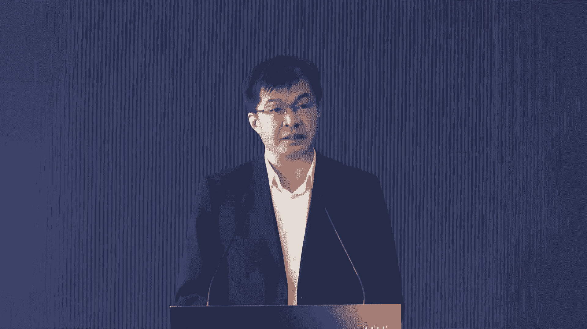
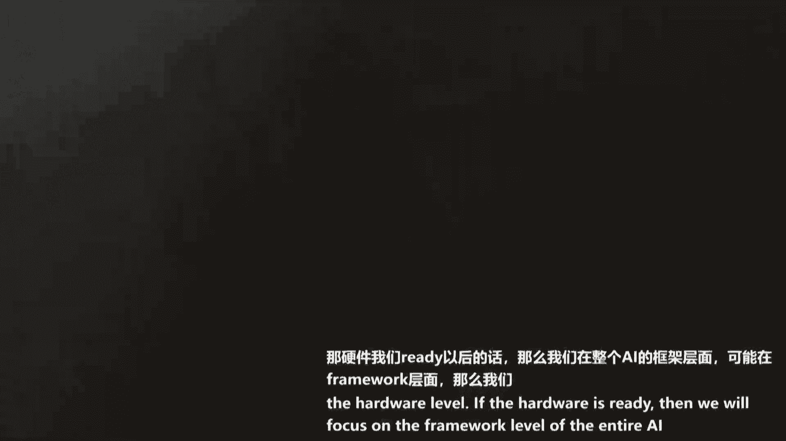

# 2024世界人工智能大会（合集） - P8：20240704-“智启新章·算引未来” AI基础设施论坛 - WarrenHua - BV1iT421k7Bv

🎼尊敬的各位领导，各位嘉宾，大家下午好。欢迎各位来到由吴问新琼主办世界人工智能大会座会指导的智起勋章，算以未来AI基础设施论坛。各位好，我是今天的主持人金山，欢迎大家。😊，近年来。

AI技术作为新智生产力正以其强大的创新能力，深刻的影响着各行各业。现如今，AI技术设施是否稳定充沛、高性价比对进一步提升AI生产力至关重要。吴新琼自去年成立以来，始终秉持着释放无穷算力。

让AI触手可及的理念，正携手行业伙伴们一同开启AI发展的新篇章。那接下来首先让我们有请市委组织部、部委员、市人才工作局副局长谭普珍致辞，掌声有请。😊，🎼好，尊敬的杨主席夏总，各位嘉宾朋友们，大家下午好。

2024年世界人工智能大会暨人工智能全球治理高级别的会议，今天上午在世博中心隆重开幕。李强总理呢也出席会议并致辞。那么接下来的几天内，来自全世界的顶尖科学家、企业家、投资人将围绕以共商出共享。

以善自出善志这一主题，在上海这边创新创业的热土，共商人工智能领域前沿技术产业动向、向善治理等问题。今天非常高兴参加本场由世界人工智能大会组委会指导，无问新琼主办的智气先章、善演未来AI基础设施论坛。

在此，我仅代表中共上海市维组织部上海市人才。

工作集对各位领导和嘉宾的到来，表示热烈的欢迎，向论坛的举拜，表示热烈的祝贺，向关心支持上海人工智能科技和产业发展的各类广大优秀人才致以诚挚的敬意。随着人工智能技术的持续创新。

以及我国人工智能产业的快速发展，国家对人工智能人才的需求日益旺盛，抢抓新一代人工智能发展机遇，加快打造世界级产业集群，是中央交给上海的重大任务。人工智能产业要实行并跑到领跑的跨越人才是战略支撑要素要素。

更是产业发展的核心驱动力，近年来，上海持续推进高水平人才高地建设，不断优化人才发展环境，完善人才政策体系，着力打造人工智能产业人才的极具高地。我们已开放包容的姿态。

积极引进海内外高层次人才和紧缺机器人才，取得了显著的成效。同时，我们也十分注重本土人才的。培养推动产学研用深度融合，为上海人工智能产业的创新和发展提供了有力的人才支撑。

目前上海的人工智能领域产业人才的总数啊已经约25。7万人，占全国的3分之1。所以说我们上海的人工智能啊，应该说呃是呃在全国还是占有领先地位。这个人工智能人才呢，我们不仅在全国处于领先。

同时呢我们今年哈也加大了力度从世界各地呃实施人才人工智能专项，从世界各地引进和培育大量的人才。呃，这些人才我们感觉到哈从年龄结构看，35岁以下的青年人才占比超过67。5%。

上海已经基本形成国际化年轻化专业化的多层次人工智能产业人才地五。那么吉林书记多次强调，又推动形成更具竞争力的创新生态，要加强全方位对接，提供便利化的服务，助力全球人才在上海这块城市成就事业实现梦想。

我们一直将人才视作城市最宝贵的资源，正以中央赋裕的高水平人才高地建设任务为总抓手总牵引，汇集天下人才，持续增强人才赋栏作用，不断厚植上海发展人才优势，智取新疆、率引未来，不仅是今天论坛的主题。

更是我们对AI技术AI产业、AI人才未来发展无限情景的期待和承诺。为此，我们需要积聚更多的AI人才，集凝聚更多的智慧，需要更多像无论新琼这样的优秀企业在探索中实践，在合作中。

提升市委组织部市人才工作局将一如既往的支持人工智能行业的发展，为行业及需的各类人才提供更加优质的服务和贴心的政策。今年我们专门为人工智能和这个产业的人才让心定做了这个一系列的人才的优惠的政策。

不仅是从引进从培养呃，从这个生活保障，从人才的环境安居等等哈，都制定了一系列的政策。那么下一步呢，我们还将不断的拓宽人工智能人才的引逸的渠道，推进人工智能人才引利工作提质增效。

不断的壮大高精精缺战略人才力量，形成战略人才梯队。我们将充分发挥上海的机位优势，不断的推进人工智能人才的高水平对外开放，持续发挥高层次人工智能人才的引领作用。为推动上海高水平。在高地建设做出积极贡献。

我们将不断优化人才发展服务生态，聚焦。AI人才关心的关键小事和人才服务当中发生的高频事项，用心用情用力做好各项人才服务工作，支持保障广大人才，特别是AI人才，在上海安居乐业。

共同谱写上海人工智能产业的新篇章。最后，一周本次论坛取得圆满成功，期盼各位人才，在这里碰撞出更多的思想火花，衷心祝愿更多的人工智能人才在上海安居乐业，共同推动人工智能产业的创新和进步。谢谢大家。好的。

谢谢。😊，谢谢，再次感谢谭局长带来的精彩致辞，谢谢。😊，科技是第一生产力，人才是第一资源，创新是第一动力。那我们相信在一系列的人工智能产业及人才发展支持的政策指导下。

上海将建设成为人工智能产业人才的聚集高地。那接下来让我们掌声有请市工商联党组成员、副主席杨希上台致此，掌声有请。😊，呃，尊敬的谭局长夏总，各位来各位来宾，各位企业家朋友们，大家下午好。呃。

非常高兴能够参加。今天由我们上海工商联科技商会的一个杰出代表啊，我们无问新琼科技呃智能科技有限公司主办的智起新章算影未来AI基础设施论坛。

首先还是要允许我代表上海市工商联总商会对论坛的举行呢表示热烈的祝贺。今天刚才我们谭局长讲到了，今天是一个盛会啊，世界人工智能大会。那么在这个充满智慧与创新的。殿堂当中，我们大家汇聚一堂。

共同探讨人工智能基础设施的未来发展。这个对于推动人工智能技术的进步与应用具有重要的意义。近年来呢，上海人工智能产业的蓬勃发展，也为民营经济高质量发展注入了蓬勃的活力，民营企业作为最活跃的创新主体。

在人工智能新赛道中持续投入、敢闯敢为，涌现出了众多具有核心力的民营企业，为上海打造全球化人工智能新高地，引领美好智能时代新未来，做出了积极贡献。是工商联科技商会呢也积极把握科技革命和产业变革的机遇。

聚焦建设上海五个中心的重要使命，广泛凝聚科技企业链接优势资源，推动信息技术领域创新与应用助推人工智能核心竞争。具有核心竞争力的企业进行交流和合作。今天我们问新琼能够在这个世界人工智能大会上举办这个论坛。

就是一个非常好的一个实践呃。呃，我也想感谢一下谭局长，您刚才的讲话让我感到非常的振奋，也非常的欣喜。我们人工智能的全国的人才上海集聚了3分之1。这足以足以让我们感到欣喜啊。

而且上海已经呃我们组织部已经积极在打造。对针对人工智能人才的一个国际化开放型的这么一个格局。那么我们也相信会有越来越多的在这个领域的优秀的青年精英能够来到上海到上海来创业。

我相信上海这座城市会辜负大家的。那么作为全国人工智能的产业高地呢，呃上海也正在按照总书记呃擘画的蓝图，以人工智能驱动形成新智生产力，加快打造世界级高端产业群，为更好的迎接人工智能技术发展带来的成果。

并促并促进产业发展。呃，作为总商会啊，工商联总商会呃，服务民营企业的一个重要的平台。那么我想呢我们也会呃在这里面积极呢做好三项工作。一个呢是呃希望呢广大民营企业呃。

和广大民营企业一起帮助民营企业家把握趋势，精准融合，主动参与转型。呃我们要帮助我们的企业呢找到企业应用人工智能的发力点，提升发展能级，提高核心竞争力，成为推动科技进步和产业发展的中间力量力量。第二呢。

我们也希望我们的科技商会啊能够更多的带领会员企业呃参与，并且主举办。像今天这样的论坛等等有意义的活动，分享理念技术碰撞思想火发，激发创新创造能力，推动人工智能技术应用场景落地。

促进人工智智能技术赋能千行百业。第三呢，我们也希望通过这次论坛以及呃世界人工智能大会，能让全社会呢更加关注支持参与人工智能产业的发展，共聚创新人才，共创创新成果，共作共建合作生态。

为全世界人工智能产业发展贡献中国智慧上海方案。最后，我诚挚的预祝本次论坛取得圆满成功。期待在座的每一位都能在这次论坛中有所收获。希望各位在人工智能领域的精耕细作和前沿探索中。

引领我们走向一个全新的智能的AGI时代，共同为人工智能发展的崭新篇章天上浓墨重彩的一笔。祝在座的各位身体健康，家庭幸福，谢谢大家。谢谢谢谢，再次感谢杨主席带来的精彩之词，感谢您。😊，自T诞生之后。

我们见证到了人工技术的惊人进步。大模型在理解生成内容方面的能力远超此前的AI技术，不仅改变了我们和机器的交互方式，同样还提升并且重塑了各行业的面貌。而智能算力作为大模型行业发展的基石。

正以前所未有的速度和规模向前发展，成为推动产业变革的关键性力量。在智算成为AI产业发展关键要素并上升为国家战略竞争点的背景之下，国家信息中心大数据部发展部上海人工智能研究院以及东方证券三方携手合作。

在无论星琼中科曙光、海光信息、广州数据集团、广电运通等国内行业龙头企业的支持下，对国内制造行业进行了全方位的研究和全产业链梳理，深度剖析产业发展现状与趋势，总结全面芯片智能性能进步和生态短板。

并以系统化思维推出。😊，🎼到了多元异构算力融合和调度，智算产业发展与东属西算的工程有机结合，以及加强算力电力协同，实现算力资源供给充分算力成本下降以及智算生态不断完善。

同时我们从而更好的支撑到人工智能产业的发展和进步。那接下来我们正式到进入到了发展白皮书的发布环节。那接下来我们掌声有请国家信息中心大数据发展部于世阳主任、上海市人工智能研究院副院长杨浩先生。

东方证券计算机行业首席分析师胡俊义先生、广州数据集团总经理周小建先生，上海无星琼智能科技有限公司联合创始人CO夏立雪先生，中国曙光总裁助理兼智能计算产业事业部总经理杜夏威先生共同上台。

共同发布智能算力产业发展白皮书，有请各位嘉宾有请。😊，🎼请舞台上的嘉宾朋友，面向屏幕左侧的三位嘉宾朋友伸出您的左手，面向屏幕右侧的三位嘉宾伸出您的右手。

让我们现场和我们各位嘉宾朋友共同来见证到今天这个重要而又难忘的时刻。😊，🎼3。🎼2。🎼一。🎼谢谢谢谢，感谢各位嘉宾，请各位嘉宾留步，同样来到舞台中央聚拢聚拢，共是迅老师记录下今的这个重要而又难忘的时刻。

😊，🎼好的，感谢各位嘉宾，谢谢请各位嘉宾来到舞台下方稍事休息，谢谢。😊，🎼好，那接下来我们将进入到接下来的主题演讲环节。那在第一位嘉宾演讲的题目之前。

我们首先邀请到的是第一位演讲嘉宾无问星球联合创始人兼CO夏丽雪先生，他将为我们带来易购千卡大模型混讯实践驻及AIn基础设施的主题演讲，有请夏丽雪先生上台致此，有请。😊，🎼好好，谢谢大家啊。

非常感谢大家能今天来到这个我们呃无问新琼主持的这个AI基础设施分论坛的现场。呃，我是无问新琼的联合创始人兼CEO夏立雪。对呃，就是大家是我刚说百忙之中啊，是真的是呃不是客气。

因为呃就像刚刚这个谭主任说到，我们其实上海的这个站在这个全国人工智能人才的3分之1。那今天在这个人工智能大会上，真是其实是聚集了全球最顶尖的呃这些人能够在这里讨论。那可以看到后面都都站不下来。

对那所以其实呢今天在这个会场上有非常多的分论坛的同步同步在进行。那大家都来到我这个我们的这个人工智能基础设施的分论坛。可以看到我也相信大家一定都是对于这个AI的基础设施有着非常浓厚的兴趣。

甚至说是可以有着独到的见解的这些同胞。对，那我们呢今天也因此呃非常荣幸请到了在AI基础设施领域，乃至整个A应用领域都很有建树，很有影响力。😊，的呃很多嘉宾来到这个分论坛一起能够去共同去做一些讨论和碰撞。

然后给大来大家能够带来更多的关于呃这个在新的这个大模型时代，如何更建更好的这种基础设施的一个碰撞啊，也是希望能够用此来反馈大家的热情。对，好，那我们开始吧。对。

好，那今天我给大家带来的汇报呢是无问心琼最近的一个很核心的进展，就是我们刚刚完成了这个异购千卡的大模型混讯实践啊，助机I native基础设施。对因为我们在大概3月的时候做过一次发布会。

那个时候我们讲的更多的是M成N这样一个中间层怎么在推理这个场景，得到更好的应用。那今天我们给大家带来的是这个M成N在训练上的一个很很重要的突破。我们取得了很多令人惊喜的成果。我们希望分享这些经验。

包括我们看到的一些在呃这种异购集群下怎么去做训练的一些问题，以及如何更高效的整合，整个的资源来帮助大模型在这个千行百业去做落地一些这个一些成果和经验。

那也是希望能够和大家一起去面对这里面我们所看到的一些挑战和突破。那我们还是从整个这个人工智能的一个发展的历程来讲起吧。对，可以看到人工智能其实发展经历了大概有三个不同的阶段，或者说是。😊。

三次不同的浪潮。那最早其实在这个20世纪中叶的时候，其实随着这个第一台计算机的这个问世，大家开始考虑说我是不是能够利用计算机这种能力去模拟一个人工大脑啊。

不过呢由于当时的一些这个技术的限制和大家也是一些想象力的限制吧。那其实最开始大家看到的一些方式还是我怎么能够去把我想到的一些规则给变成这个计算的逻辑。然后做到这个计算机里面。

所以当时的人工智能更多的呢像是一种就是模仿或者说是模拟这个人人的一些一些思考行为。那大家知道现实世界肯定不是基于规则的。所以当时的人工智能相对来说呢，流程比较僵化，因此呢也没有得到非常广泛的应用。

那时间呃推演到这个就是1980年之后，那这个时候呢我们发现随着一些数据的积累。然后包括我们的这个摩尔摩尔定律，摩尔定律把我们的这个计算机的计算能力逐步的提升。那这个时候呢很多的统。

的这种方式其实已经能够帮助计算机呃去推演一些这个这个预测和这种运算了。那这样的话，其实在那个时代有很多的这种当时叫做机器学习的功能，更多的是把这种统计学的一些模式啊，能够变成计算机来实现的一一个运算。

那这个时期呢其实已经能够让计算机的帮助我们完成一些具有准确性的预测了。而但是呢这个时候也是受制于当时的一些算力的能力。所以整个的这个机器学习的算法，基本上都还是保持在这种一Pfps以下的一个规模。

那呃那时间推演到我们最近的这一波，可以看到就是呃基本上从2012年那个Xnet这一篇论文问世开始，整个人工智能进入了一个快速的指数级发展的阶段。我们模型的尺寸，从当时的可能呃。就是一个兆规模的模型。

到后来是这个这个G规模的模型，到现在已经是多多少这个几十亿这个参数的这个规模形成一个非常快速的发展啊，那这个这个人工智能现在的发展其实可以说是完全基于这算力底座的个高效的支撑。

我们可以看到论是net这篇论文还是现在的G这个这个模型背后的基础这个attention这trans这个结构都是和GPU的这种计算这种计算算力的硬件结构是非常高度匹配的。

可以说从在在人工智能的整个发展的历程中，基本上算力和算法都一直处于一个呃互相促进的一个过程，或者说甚至可以说是集生蛋诞生机的一个关系。

因为我们可以看到早期的这些模型也是被力的限制才能才没有发挥出最大的价值。而到了现在我们可以看到包G这样一些模型正是在充裕的算力基础之才能够产生了很多。😊，让人值得期待的涌现能力。

那这这种呃整所以在整个的这个AI智能发展中，我们可以得到一个就是一个算力和算法之间的一个结论，就是它算力其实是AI发展的一个前哨和基石。对那我们刚刚看了历史，现在可以看一下现在和未来啊。

我们可以看到现在的这个GPT3到4仍就遵循了我刚刚所说的这种指数级的这种算力的增长和它的这个智能性的增长。但是在GPT4之后的一段时间啊，包括前一阵OI它对对自己的一些产品的这个发表。

能够看到就是大家认为现在可能在GP4之后啊，整个的算法能力的发展进入了一个相对放缓，甚至有人会说它停滞的一个阶段。那这个原因是什么呢？不不妨让我们看一下GPT4之后出现的这些模型。

他们的这些规模其实都没有真正的实现一个进一步的指数增长。也就是说我们虽然认为好像算法的发展没有那么快了。但它。最后的逻辑其实是这个支撑算法所需要的这个算力遇到了瓶颈。也就是说。

目前没有人能够实现一个更大规模增加单个模型的计算量的一个大系统。所以从而使得我们的这个模型的发展进入了一个放缓和停滞的这样一个状态。那或者说支撑这个模型能力迈向下一代的这个算力系统，还需要去研发和构建。

对，也是因此。所以我们一直看到一个最近被频繁讨论的词叫做。对可以说整个的这个在这次大模型的这个这个作用下，现在存在一场全球范围内的一个算力的竞赛啊。

可以有有报道称这个微软和现在在构建这个一个超过千亿美金的一个大的这个算力项目。那不管这个是不是真的那可以看到就是我们这个这里面列的不管是国内还是国外的各类巨头。

都仍然在继续遵循这个去加大对算力资源的投入。因为相比于其他的很多技巧来说，这种简单粗暴的这个这个规模扩张，实际上是带来的最切实际的一个模型的智能性的回报啊。

所以呢我们就是现在看到的包括这个国外的这些谷歌啊，然后然后op包括国内的这些大厂和这个这个三大运营商都在构建这种万卡规模的这种大集群。那这就会让我想到我们当。

学上上学的时候的一个一句话叫做这个这什么意思呢？就是说这个蛮力法是当时一个很重要的一种算法。这句话是unix系统的发明人的对那这个蛮法其实在我们的学习学习这个算法的过程中一般会认为一个不高效的算法。

但是其实在真正的一个可持续迭代的大的稳定的系统中啊，其实蛮力法它是有它独特的优点的因为它没有那么多丰富的技巧，它更便于进行维护和扩展。那大家知道对于一个真正长期的一个要运行的系统来说。

可扩展是一个非常重要的属性。甚至可以说可扩展的系统才是最好的系统。那因此今天的这种大参数大算力的这种思。

它的底层逻辑其实和这个蛮法的这个这个思想其实是不谋而合的那所以万卡齐群也是一个就是大模型性能的这样一个兵家必争之地。那呃在这件事情上其实也有很。😊，很多的分析报告给出了我们这个对应的相关的结论。

那呃我这里列的是1个IDC的一个一个图表啊。对，那它展示的是我们在整个全球范围内，未来的这个人工智能的推理和训练的算力需求，仍旧会长期处于一个高效高速发展的状态。

不仅这这个推理场景会随着整个的这个大模型落地形成一个快速的爆发。然后在训练这部分也会依旧用于支撑整个模型的这个迭代以及模型和应用的结合啊，那对这样的一个庞大的市场，一方面，它仍然能够去容纳多层次玩家。

另一方面，那这个市场由什么样的算力来支撑呢？那说到这个算力支撑就不得不讲到我们在国内和国外非常大的这个算力生态的差异。那可以看到左边是一个基本上国外的一个典型的算力的生态。

就是在上面和下面都是相对收敛的啊，我这里已经尽可能把比较多的多的这个算法的列上，但仍然可以看到是不超过10家。这个算法和不超过就是就是两家英伟达和MD啊，这两个算力厂商。

那这样的它是一个相对集中的这样的一个生态格局。但是在中国的话其实是形成了一个非常分散，或者说是生级勃勃的一个生态状态。我们有百魔大战，我们有非常多的大模型。

不管是这种相对通用的基座大模型还是这种行业大模型。我们有非常多的这种呃很值得期待这种国产芯片，他们呢也都是在这个争相去去扩展整个的这个算力市场。那这样的话，这种相对分散的生态里边。

那我们其实就需会面临非常多的这个生态打通的这样的一些关键问题啊，那因此呢我们也看到了在国内，虽然大家都知道要构建这个万卡集群是非常重要的。

但实际上我们现在看到有100多个这个城市都100多个多个这个建设方吧啊，都在宣布自己要建设或者已经建设的这种千卡规模的集群。而且这里边大部分的集群。都是易购的算力啊。

这由这里面有着一方面原因是我们整个的生态还是非常的这个分散和这个呃值得期待的。另一方面呢也是由于大家在供应方面，在这个呃这种性能的需求方面仍然是采购了非常多种不同的卡。那在这样的一个生态状态下。

那我们看到的一个事实是很多集群现在已经有不同的芯片在同一个集群中在使用，并且去服务和同事爱生产呢？那这种集群能不能被很好的用起来呢？那在我们做这个实际的生产落地的时候，发现有一个非常重要的问题。

我们把它称之为这个生态竖井。什么叫生态竖景呢？就是说我们虽然看上去我们已经在物理上把这个不同的种类的算力构成了一个集群了。但是它在这个真正的生态逻辑上，它在它的整个软件站上。

其实是不不能够很好的协调和打通呢？换句话说，一个呃AA加速卡的开发者不能够很好的快速的把它的工作。😊，移到B开发卡上。

并且也没有办法很好的把多种这种易购的这种算力构成一个好整体的大系统去快速完成这个大模型的训练或者推理啊，这就导致说如果一个集群里面使用了两种以上的芯片。

那整个的算力使用方会面临一系列的非常复杂的工程挑战。包括比如说我们的这个平这个硬件平，不同的硬件平台，它所适配的不同的这种软件站和工具链。

而且很多的种的任务怎么能够去在这种异构的集群上进行一个高效的拆分，让整个的系统都能够达到最大的效率，这些问题都是亟待解决的。

因此我们这个无论新琼现在就是想要去构建这样一个我们叫做AI native的基础设施。它能够适配我们中国的这种独特的多模型以及多芯片的这种生态格局，然后找到一个很好的合理的方式去打破这种异构的生态数井。

让异构的芯片和异构的集群，真正能够转换为一个大算力来帮助我们的大。领域进一步的发展。对，那所以在这件事情上，我们做了非常多的工作。那么我们这套整体的这个叫做AI native的基础设施。

包括了这个高效整合异这就是能够高效去整合这种异构算力资源的一个好用的算力平台，以及能够去支持这种软硬件去做联合优化的这种加速的中间中间层的这个中间件，以及好的这种上层的大模型的开发与服务的工具。

那最终实现的几个关键词，一个是能够去高效整合异构算力，一个是能够进行这种M种模型到N种算力之间的一个上下打通。然后最终的目标实际上是实现整个这个异构算力，形成一个大算力的一个全量利用。

对那这方面呢我们也有非常多的这个就是实现的经验和成果的啊，首先呢是我们与这个清华还有上海交大联合的这个研究团队一起发布的这是一个用于这种大规模模型的异构分布式混合训练的系统。

那是也是业内首次完成了在6种。😊，不同的芯片上能够进成交叉混合训练的一个呃训练系统，而且完成度这个工程化是非常高的那后面我也会介绍到，那这个系统它在构建中主要面临的这个两个大的挑战。

其实是通信和这个分布式训练。可以看到通信其实是解释不同的这个呃硬件结构在训练这个任务中面临的一个最核心的问题，就是他们的通信库其实是不一样的。所以就相当于两个人他使用的是完全不同的语言。

那怎么让他们的两个能够去配合完成一个大的工程，实际上是一个非常重要的一个问题需要解决的问题。另外呢就是呃异构卡之间，因为大家会处于不同的这个设计理念，其实会有很多的性能差异，这个差异不一定是好和坏。

可能就是适配不同的任务。那这个时候呢就会导致我们在做一个大规模的分布式训练的时候，那这两个不同这家多种不同类型的卡，它所展现出来的这个效率之间的差异，会拖垮整个的。😊，大模型的这个完整训练。

所以这个分布式训练的这个整体的效能就会变得很低效。嗯，那因此呢我们做的很多方面工作。一方面在通信这部分，我们去建立了一个通用的这个集合通信库，实现了不同芯片之间的一个高效通信啊。

它兼容非常多的这个种类的这种这种硬件。然后另另一个呢就是我们去提出了一个基于这种流水线并行的一个非均匀的拆分方案，为什么叫非均匀的，就是解决我刚刚所说的不同的硬件。

它的这个效率是不一样的那我们必然需要针对它自己的这个情况，给它分配最适合它的任务。那这个拆分是一个理想的情况，那怎么判断怎么去寻找这样一个好的拆分策略。那我们还自研了一个这个混讯的这个性能预测工具。

相当于我能够去在这个训练的最开始阶段就提前预测好我们每一个芯片会发挥什么样的价值，然后从而去找到一个最优的拆分策略，完成整个的训练任务，在不同卡上形成一个最高效的配合。嗯，那从。

实际的一个我们混合训练的这样一个效果可以看到啊，我们其实做了非常多的这个组合都可以达到这个90%以上，最高可以达到97。6%的一个集合的这个整整体的这个异构混合训练集群的一个算力利用率啊。

那左边这边呢其实就是一个我们对照的情况。我们把整个的集群的用利用率，能够从一个相对低的水位提高到了90%以上。然后右面这边展现了我们其实是已经完成了这种呃96种不同组合的这种芯片上的一个异构混讯。

而且是做到了这样一个千卡规模。所以啊此前可以说此前我们实现的是一个M成的推理呢。这一次我们是终于实现了M成的训练啊，这是一个非常大的突破。

所以我们也正式的把这样的一个功能集成到了我们现有的这个无问新群的finI平台上。那这个I平台本身就具备让开发者们和这个各种各样的应用开发者和使用者们能够去呃高效的在平台上部署自己的这个应用和服务。

那我们现在把这个混讯能力加起来之后，我们能够支持这种6种品牌的这种交叉组合，打破这种单一品牌的训练瓶颈。所以它也是全球首个支持千卡异购混讯的一个平台。

那在上层去支持了刚刚我说到的这种多种的训练策训练的策略，包括这种张量并行数据并行，还有这种通信的 overlap那使得我们的训练也是最高效的啊，同时在这个呃训练的这个模型规模上。

我们已经能够去支持这种70B，也就是700亿以上的这种大模型的训练。而且我们是针对这种超大规模的模型的训练痛点去进行了很多优化。所以能够支持这种大规模这个模型训练的这个一键混训吧。

对那这样的话我们的这个整个的平台能够帮助开发者去不用花更多的时间考虑底层的算力差异。然后在不同的这个芯片构成的一个混合集群上，能够实现快速定制自己的这个大大规模的这个呃大模型。

然后去落落地快速的去落地自己的业务。对，那这边呢是我们的一个实际的产品展示的情况。那右边呢其实是我们现在的这个呃实际上线的这个平台。

那平台上可以去快速发起这个一键发起这个70B以上的这个模型的呃大规模混信。然后左边呢我们也附上了一些我们自己的这个这个训练的这个日志实录，可能这个显示的不是很清楚啊对。

然后那大家也可以去扫我们的这个二维码来体验，就是或者说申请我们体验功能。啊，我们现在在这个平台上是把我们的整个混讯系统都集成进去了。对，那刚刚讲的其实更多的呢是我们的这个。大算力怎么去构建。

那构建之后呢，其实解决的是面临的一个任务，我们怎么能够把这个大算力集群用起来。那现在有了这样一个基础设施之后，我们怎么能够把这个大算力给到所有的人让大家都能更好用起。这里其实是一个高效的调度问题。

以我们问星呢也是在这个算力的高效调度系统里也取得了很多进展后面也会给大家汇报一。因为这个调度系统其实是能够把我们整合出来这些异构资源啊都能够被呃所有的用户给更好的用起来。

那说到这个调度实上就还是讲一下我们为什么叫 native因为这个人工智能它的训练和推理的任务和传统的计算有很大的差异。比的单任务很而且突发。以他在这个调度里。

如果不做一个的一个调度策略其实会使得我们整个系统的资源利用率非常的低。而且这种尤其在涉及到刚说这种异构集群的这种资源情况。😊，下那异购的集群的运维以及这个任务的容错都是很重要的问题。那如果不处理不好。

整个集群不仅效率低下，而且客户的任务还会经常挂掉重启啊，耽误的是这个整个的人工智能的发展的进展。对，所以啊我们在这一方面呢也是做了非常多的工作啊，我们在集群调度方面。

现在已经呃做到这种多多异购集群的一个统一管理。这这个异构集群统一管理是能够支持时钟以上的芯片，然后建设超过这种万卡级的一个算力系统。而且呢我们通过自己一一系列这种混合调度的策略设计。

那使得我们的这个平均任务调动的延迟是在毫秒级，而且整个资源利用率，整个大的系统集群的资源利资源利用率都能够保持在90%以上啊。

然后最后呢我们把这个整个容器的这个基座也做了很多增强得我们的这个在多租户这种场景下，我们的这个整个集群的SLO能够提升是99。95%是一个这个可用性非常高的一个系统。那。除了这个调度以外呢。

那在做这个模型训练的时候，其实也必须要让这个训练不能不断重启，对吧？所以我们在容错这方面也做了非常多的这个改进。

那呃我们开发的这个高效容错系统呢里面具体的技术包括我们有一个很和就是能够去做这个针对大模型本身的训练去做的这个容错的运行时系统。然后而且我们能够去对这种混合指标的异常进行一个预测啊。

然后来去同时我们也对这种chepoint就这个检查点的这个部分啊进行了一个异步读写的改进。这样的话整个这个容错的部分，我们做到了就是让整个大模型的这个有效训练时长提升30%。

而且大模型的这个异常检测成功率能够提升到70%。这样大部分错误都可以被提前发现和规避。然后而且我们整个去做这个检查点的这个读写效率也提高了20倍。这样整个大模型异常中断的时间呢能够缩短到5分钟内。

这样能够保障在我们的这个大算利集群上，各位的任务都能够稳定的跑跑跑完。😊，对，那同时呢为了方便我们的开发者更好的把这个集群用起来，我们也集成了无人星球的这种serving的优化技术能力。

那当这种并发量很高，而且就是这种多个用户同时去发送请求的时候，我们的整个的这个请求调动，还有这种提示词缓存的技术啊，能够帮助这个任务进行更好的派发和这个计算结果的返回。

可以实现这种30倍以上的一个to困吞吐率的提升。那这样呢让大家的这个呃应用能够跑的更加的丝滑和通畅。对，那总结一下的话，就是我们现在其实是呃在这个呃当前的一个人工智能的发展状态啊。

既需要能够有把这种多元异构的这种芯片能够去做统一纳管的这样一个底层的系统能力，又需要能够在这种异构的算力和多种算法之间去做一个很很很轻易使用的一个中间层，让这个用户能够通过统一的一套编编程框架。

把不同的算力都能够调度起来啊。同时呢我们还需要在上面再封装一些这。能够去呃和现有的用户编程习惯很好的一些兼容的接口来方布方便对这个未来进行一个扩展。那整体上来说。

我们无为星琼所做的这个最终的一个解决方案，其实包括几个方面，一个是在底层有一个非常完善的云管系统。它包括这个就是刚刚所说的这些调度调度能力，以及我们的pass平台和mas平台啊。

能够共同构成了我们相当于一个完整的一套云服务的能力。那呃下面的这个相当于是一个云端协同的一个算力底座吧，能够让大模型的开发者和研究者呢能够去拎包入驻，相当于在这能够去快速的把不同的这个算力都使用起来。

然后在这之上所构建的一个mas的这个服务平台，也就是模型级服务的一个平台，能够提供很多灵活应用的这种大模型服务。

来帮助一些可能对人工智能还在这个学习期的一些这个企业能够敏捷的去开发一些这种大模型的大规模应用。那最终呢我们的目标是希望把这些现在看上去还是沉睡着的一些算力资源，能够去真。变成一个大算力。

然后通过一些这种模型筛选和优化加速能力，也能够被大家用起来，最终助力整个AI的这个应用和开发。那将这个多芯片和转化为大算力。然后最终被大家用起来是我们整个这个系统所实现的一个核心的目标和任务。

对那我们当前的这个呢也确实已经支持了30多种模型以及这个10多种芯片啊，相比于我们在3月的候那个发布会，我们也增加了不少。其中像包括海光啊这个这个华为也都已经被纳入我们的支持范围内了。对。

那最重要的是呢我们其实不仅仅是是支持各家一对一的这个这个这个连接。而且我们支持的是多种模型和多种芯片的一个自由的搭配和组合。就像大家在这个淘宝上买东西的时候，可以去选不同的这个颜色，不同的尺寸一样啊。

那我们也可以把不同的模型和不同的芯片自由的组合成一个套餐来使用。那想要什么样的模型和芯片组合，只要取决于开发开发。者自己的一个选择，而且使用的时候呢。

是不需要额外付出很多的工程开发能力来把这个模型和芯片接起来的那预计到今年年底的时候呢，我们会完整的把整个的M成员的生态的这个自动路由都实现。那呃。😊。

最后呢就是我们其实其实是希望实现的不仅仅是说M成的这样一个生态打通，而且最终的目标其实是能够帮助AI的发展，能够帮助AI走进千行百业走进千家万户。那我们最终整合了这么多的算力。

然后并且推高了整个这个这个大模型的这样一个生态的完整度啊，核心的任务是让这个大模型的应用落地应用成本形成一个千倍到万倍的一个成本下降。那有的人会就是这里面就是对于大模型落地吧，会有不同的观点。

有的人会认为说呃现在的模型还不够好。对，所以还是需要先继续去做模型本身的智能性的发展，再去做落地。那我们会觉得其实技术上线的这个一个推高和技术本身的一个普设落地其实是不矛盾的它取决于我们自己的决心是如何对待这个技术。

那这就像我们之前说的这个让这个这个民用民店走进一万个限阵一样。也就是说呃30年前，我们让千家万户都通电。而今。天我们希望的是让大模型的成本能够有1万倍的下降来走进千家万户。因为这种优良的基础设施啊。

其实就就像一种魔法。当这个编际成本下降到一定的临界值之后，就会有更多的人不断的来拥抱这些新的技术。就像我们现在打开水龙头的时候，不需要去考虑这个水来自于哪一口井来自于哪一条河一样。

那未来我们希望当大家在构建和使用AI的这些应用的时候，也不需要考虑这个应用背后是什么样的模型是什么样的算力在支撑，这样才是实现了最好的这种AI native的基础设施啊，这步是需要我们共同来构建的。好。

今天我的汇报就到此，感谢大家。好的，谢谢谢谢，非常感谢夏总的分享，谢谢。😊，AI算力的基础设施，对于任何希望提升AI系统效率和性能的企业来讲都是至关重要的。同时，如何将智能算力技术应用到实际工程当中。

也是一个非常重要的课题。那接下来让我们掌声有请上海一电集团战略企业部总经理、上海智能算力科技有限公司董事长刘山全先生上台演讲，掌声有请主题是智能算力运营工程化实践，有请。😊，尊敬的杨主任呃杨主席于主任。

大家那个嘉宾下午好。那么我来介绍一下一店的这个情况吧。为什么那个是我来介绍，因为实际上是去年那么我们也是根据整个这个市里边的一些部署安排。那么由上海一电联合这个上海的这个信投，包括数据集团松江区政府。

包括云山智联几家的那个联合发起了一个上海智能算力的个公司，他的目的呢就是为这个大模型训练，提供第三方的个算力知识。为什么是第三方呢？就是我们呢不做大模型。

所以我们可以心无旁骛的为这个大模型的研发呢提供这个算力的服务。那么为什么是这个那个上海一电呢？我觉得是还是跟一电的这个转型战略有关。

那么是2014年上海一电提出了就是就作为打造智慧城市的解决方案提供商和运营商。那么一个最大的基座，那么还是基于。😊，上海一电在上海市域内1万那个个标准机柜的IC的资源。

包括202215年我们就是基于这个开源的做了一点一一段云加云的基础，在这个基础上呢去涉足了一些这个特别是上海市大数据中心的这个项目的这个介入。

那么其做了很多数据的归集啊治理处理工作形成了一定的数据处理的这个这个工具化的能力。那么在这基础之上做了一些这个数字化转型的业务落地。那么也就是说有那么熟悉云操作系统。那么触碰了数据理解行业。

那这样话其实那个有机会去在人工智能这个大的战略方向上做一些布局和延展。那么实上是在2020年上海国资委呢给上海一电的主业目录里就明确了。么上海一电有一条就是人工智能。是一定的组培育主业。

那么基于这样一个基础，那么我们也结合了一定的这个资源禀赋模型做不来，这个肯定更多的还是靠更多的一些市场化的创新主体或者高效去做一些安排。那么数据呢上海有布局了，有个数据集团。

那我们基于我们的IDC的基础，和云的这个操作系统的理解，包括数据的这个治理上的一些沉淀，包括行业用户的场景的理解。那么我们认为我们还是有机会在算力方面有所这个建树。那么也是根据市里边的安排。

那么去年上是介入的这个行业，那么也是这个。😊，到目前的这个情况呢，实际上是这样的。那么截止到去年底，我们实际上是已已经向用户交付了一个等效万卡NVA800的一个这个呃这个算力集群。

那么用户也是基于这个算力集群，那么开展了一个万亿参数的一个训练。那么同时考虑到整个供应链的整个一个安排，应该说是NV那么实际上是一个海外的先进技术体制。

但是可能对我们国家来说可能还要考虑一个供应链的一个长期的稳定安排。那么实际上是在去年我们实际上是采购了生腾的万卡的910B。那么是作为平替A800的一个一个战略安排。同时呢上海由于它的特殊性。

那么集成电路产业的重镇。同时呢又集成GPU的设计企业也比较多。那么作为这个。承担三大先桃产业的这样一个发展的一个要一个任务。那么我们有必要在一些这个上海本土的一些GPU厂商的这个生态建设上要有所建树。

那么实其实也是在今年的上半年完成了对上海三家互产的GPU的这个集群的采购，包括搭建的这样任务，形成了一个。😊，在一期形成了这样一个双万卡的这样一个算力的服务能力。那么预计呢在二期呢这个机房子的建设当中。

今年年底会投运，后续在这个机房旅游也是会设置等效，就是5万张A800以上的这样一个算力的水平。那么形成这个一个大的1个6万卡以上的一个样一个算力的一个。这个协作的一个几个基座。那么在这过程当中呢。

我们也感受到其实是我们整个人工智能。前面我们包括夏总也介绍了，整个人工智能进入一个大模型时代。那么大模型记忆力好不好？聪不聪明，智慧不智慧，至少按照现在这个阶段。

应该说这个模型的参数还是是一个非常关键的一个量化指标。而连模型的参数与他所需要的算力呢应该形成一个强的一个正相关关系。😊，如果未来需要训练1亿参数的那样一个大模型。

那么原则上还是需要5到6万卡的这样一个算力规模。但是整个从海外算力的供应的角度讲，应该说还是有一定的不确定性。那么在这个基础上呢，真正要去构建一个大型的超超规模的一个自主可控的一个算力的基础设施。

我认为还是有很多方面的问题需要解决。最下面其实还是要最基础的还是要解决我们国产的GPU厂商相对来说啊，也就是说它的商业化迭代应该说是比较比较慢的一个基一个现状的情况。

包括单卡的一个算力密度受到一位制成工艺的影响。那么可能就是说需要有一些这个更加低成本的一些互联的方式，解决我们单卡的算利密度较低的问题。那么同时在这个基础之上，因为。从一定的情况就很现实。

我们有NV的这个集群，也有生成的集群，也有上海这个本土的一些这个GPU厂上集群。那么现实呢需要需要解决前面包括我们夏总提到的啊，就是易构的混合训练的问题。

那么要解在这个过程当中还要去解决超大规模的集群之后，那么网络的用，包括影响并行的一些问题。在这个基础上呢，其实在大目前训练的过程当中，那么还涉及到一个训练和微调的一个一个算力上的潮汐现象。

就存在着很多大量的过程当中的算力资源的闲置。怎么有效的去利用好这些算力资源。那么整个的算力这个这个集群系统要有更好的一个弹性。那么这样话需要去解决一些算力弹性的问题。那么在这个基础上呢。

毕竟很多存量的数据中心，由于历史的原因，包括供电的原因，其实很难在一个一个物理地点实现大规模的算力机型的建设。我们要去解决。数据中心多点分布碎片化的问题。那么就要去解决跨数据中心的一些算力调度的问题啊。

前面我们那个夏总也提到了这个问题，但可能更大的层面其实是。整个的这个软件生态的角度讲，因为说是英伟达是属于垄断地位。那么可能有一些国内一些领先企业呢可能相对比较封闭一些。

那么正更有效的去打造一个更加开放的一个软件生态，也是需要再去解决一个自主大超大规模的这个算力需要解决的一些问题。那么我们对这些问题呢做了一些梳理，大概可以归结个五个层面。第一个层面是芯片的问题。

就是加速这个国产芯片的一个快速迭代，也是在去年一定牵头呢搭建了这个国产算力芯片的1配测试平台，包括完成完成了这个4款以上的这个算力芯片的一些这个10倍测试的工作。这里面测试呢包括了它的功能性能稳定性。

包括针对这个模型训练它的一些适应性。那么是包括就前面包括基开源的 two70B，包括一些用户定义的一些模型的一些适配工作。那么实际上是。先是加速这个国产芯片的一个商业化的迭代过程。

同时呢要去解决算力密度单单卡算力密度过低的问题。那么通过一些低成本的一些一个互联的方式。那么通过南向的方式，其实是类似于啊这个所谓的超级点或者整机柜的方案。那么实现一个更大规模的一个卡卡之间的一个互联。

包括32卡，包括后来这个6264卡这样一个安排。那么尽可能去减少东西向的一些网络这个优C这样一个挑战问题。第3块呢就是还是在这个集训层面，这里面呢涉及到话题比较多。第一个是要涉及到易购混性问题。

第二可能涉及到跨机跨集群的一个这个。包括相应集群里边的一个网络的一个庸奢的一个一个解决，包括多元易购的这个呃这个芯片卡的这个纳管管理，包括一些并情。

包括前面这个我们夏总提到的容错一系列的问题都需要让这个国产的这个集群系统更好用。那么需要在集群这个层面解决。那么跨集群的实际上是前面提到了，是要解决的是我们的这个整个的这个算力集群的一个弹性问题。

那么那么第四个呢，最最后一个呢可能就是前面提到了围绕着这个跨数据中心的一些解决数据碎片化的问题，可能要常具的一些调度系统。那么很多很多的工作那么就是说是我们作为一个集群的建设和运营方，从工程角度。

更多的是集成化来解决。那么大量的其实是具体上的一些关键技术的突破。那么实际上需要向我们这个包括这个文新这一些这个专业化的厂商去聚聚焦到一些具体的问题解决。包括我们前面讲到的。混训的问题。

包括一些那这个统一调度的问题等等。那么其实是从我们运营的角度，需要从这五个层面去解决一个超大规模算力集群工程的建设和运营问题。那么从模式上角度讲，其实也是一个不小的挑战。

因为上海相对来说其实是一个电力资源，包括电力成本还是比较高的一个地方。从建设模式角度讲，我们希望实际上是第一步是在上海市域内那么实现万卡这个层面的一个工程化的实践。那么在这过程当中呢。

那么去支撑我们的一些。基础大模型的训练工作。因为其实用国产卡的这个训练，其实还是要解决很多好用的问题。那么这个当中呢其实像是不断的实行一些规模化的验证。

那么最终的目的呢是能够形成搭建建设和运营一些超大规模的自主的一些算力设施。但最终呢实可能还可以实一定程度上公能化经验的推广。

比如说利用我们国家的这个东西算这样大的战略里边形成的西部的一些优势的一些数据中心资源。那么可能就是在我们前期的一些这个基于公程化和实验验证的成果，那么更好的去去进行一些复制。

那么可能前期大量的一些试验和验证公关工作是在上海，但是未来可能更好的用统筹用好东西部的相关的一些这个算力相关的一些资源。那么其基于一个综合考虑。那么在这过程当中。

我们认为其实还是作为一家这个算力运营企业，还是要跟上下游的企业做好相应的协同工作。那么。😊，这当中也是特别提到包括我们的温新群，它其实作为一个中间层面，向上呢其实是支撑的这个应用的生态。

向下呢其实更好的去去去去对接和匹配产业生态。那么这样的话，就是这在这过程当中呢去从不同层面共同去协同去解决一个智能算力的整个一个长期的一个建设和运营的一个有效性。

那么共同的去带动整个自主的一个人工智能产业生态的一个发展。那么以上是我针对这个情况的一个简单介绍。谢谢。😊，好，谢谢再次感谢刘总的分享，谢谢。😊，那感谢刘总的分享。

也为工程化应用实现了更高效、更智能的算力管理和调度，提供了一份样板。那接下来时间我们非常荣幸的邀请到了同道猎品集团董事会主席兼CEO戴戈斌先生。那接下来请他来为我们带来AI赋能人才评鉴的主题演讲，有请。

😊，🎼谢谢。😊，🎼谢谢大家啊，刚才那个听了很多关于现在呃人工智能的一些基础设施啊，包括这个算力，还有包括一些呃很底层的一些理论。那么现在我想跟大家讲讲一个应用啊，这个应用场景呢。

其实是在我们啊人力资源里面很很很普遍的一个场景，就是人才的评鉴。那么人才评鉴里面它会应用在哪个场景呢？比如说招聘的时候，对人的评价。比如说在晋升管理的时候，对人的评估。还有就是在组织内部。

我们会有一个盘点啊，看哪个人行，哪个人不行啊，包括你裁员的时候裁谁不裁谁啊，这里面可能还有一个就是对于人的一个潜力的评估。这个事情在人力资源里面非常的普遍。那我们这个基于大大语言模型。

这一轮AI我们在这个领域里面怎么去应用呢，其实是我们啊这个重点的一个过程。啊，猎聘呢它是做一个中高端人才招聘的一个平台和网站。我们过去有13年的历史。在这个领域里面，我们积累了将近一个亿的用户。

然后每天有大量的这种招聘的行为的发生。所以我们有底层有很多关于人才的维度，以及包括面试，还有包括我们底层做人才的测评的项目里面积累出来的数据。

那基于这个呢我们就结合这一轮的AIGCAI的大模型来去看我们怎么做。那先哎这个图有点现在看这个呃就在人力资源管理里面呢，如果你分成潜在员工跟正式员工，其实就是一个公司的内部跟外部OK那么从外部到内部呢。

其实中间会有个招聘的过程。招聘过程里面看到这里面有比如说人才推荐呢生利模型啊，包括这个职位描述，以及包括他的意向沟通，就是打电话或者说进行一个IM的沟通。

还有包括下面你看到简历评估面试智能报告入职追踪等等，这都是在招聘过程中会发生的一些啊行为。而这个行为其实是啊我们可以看有很多地方是通过AI是可以提效的。那到了正式员工之后。

那里面就有下一部分就是在职员工的管理与在职员工的这个啊效率的提升。那么今天呢我我想讲一个呢，就是跟大家呃大家看起来比较有直观的感受，就是这个面试这一块，那这个是比较简单的东西。因为呃很多就是理论东西。

但这个面试。是个大家能感受到的这是我们在啊今年这个去年年底的时候推出了一款AI的面试官，它叫doris。那基于我们多面这款产品来去设置的一款产品。那在面试大家可以看到家有很多非常重复性的东西。

比如说这个啊重复性的面试劳动啊，包括你面试题目是都是问的是一样的问题。然后这里面有很多的协调啊，跟面试官的协调时间，包括候选人时时间，包括面试官是否专业啊啊等等。有很多很多这方面的一些问题和困扰。

以及包括是说有些行业招聘的人人员特别多，比如说零售服务业工厂招收人特别多。而且这些人的流动性特别大。当你如果一不小心流程的话，你可能到晚那么一两个小时，他已经到别的地方去就业了。

所以这里面有非常多的困扰和难题。还有就是我们每年大概有1100多万的大学生毕业。这学生毕业，你怎么去做评估和去选人，这个其实对企业机关单位都是一个很头疼的事情。那这里面又有很多。

因为学生其实相对来说都比较标准，他也没有太好的工作经验，都要看他的这个潜力啊，以及跟岗位的匹配度。那么基于这个呢，我们就这是我们整个这个AI系统的系统架构。

从最底层的理论模型到内容层到多模态到引擎到产品产品就是在上面大家能看到用户能交互的东西。但这底层里面其实是一就是在人力资源里面评以包括这个底层的模型核心说冰山模型是麦里兰的这个人感匹配的模型star模型就是就是这这个这包括这模型还有dent是我们自己研发了一个理论模型。

就是基于这个事实为基础，还有包后下面内容层呢其实我们做了很多的知识图谱到上面多模就是我们有三个重要自然语言音有图像这三个的这个模态的这种应用引擎层的话，其实你看到我们有好几个擎一个引擎就是数字驱动。

为你需要有一个I的数字人。里面做面试官。然后呢，还有一个就是人岗和简历的理解，就是包括简历解析，对话交互、防防作弊引擎以及判分引擎。这都是我们在引擎层的一些内容。产品层大家等会就可以看到了。

直接就是像互联网现在的这个交互。那我特别想强调的一点是什么呢？就是啊。原来我们做互联网的时候，大家都很关注产品层UIUE啊这一块。那今年这个呃去年大模型一出来之后。

可能大部分人又在关注的是底层的大语言模型。包括说各种box这种对话框，还有各种的这个大语言模型。其实呃我我去年在我们这个北京会有一些这种论坛里面也谈到这个AI的这个应用里面，其实我觉得对用户来说。

其实他很难去关注到底层的东西。他可能更关注是前端交互层面东西。那么今天如果说AI创业或AI的产品。他有个很核心的指标是什么？就是你的底层的大言模型跟前端的产品交互，就就是你的算法与工程要结合起来做。

这样的话才有机会让用户能感知你的产品的好坏，而不是一个简单的去推去谈这个参数多少大语言模型的标准是什么。其实那些很一般的用户是不理解的。一般的用户只在。不如说我的使用感受是什么？我要解决什么问题。

在什么场景里面解决问题。所以这就是我们在架构整个系统的时候，一个很核心的一个一个一个标准。那么我们其实加入了几个东西，一个就是no how know how是基于一个理论和我们的实践基础。

因为我们呃猎聘集团底下有一个做人才测评的公司啊，做了好多年人才测评的项目。我们把这些人才测评的理论和我们的实践数据，包括我们这个给很多企业做了这些将近有超过400万的这个人才甄别的这种评价数据。

结合我们的AI这一轮我们做出了到多ris这样的产品，这产品还挺挺好的。这个做出来之后，这个从1月份到现在大概有1000多家客户在使用。所以这是一个蛮成功的一个案例，做应用层跟大家分享一下。

那我们看这个AI的评价标准呢，我们认有3个，第一个就必须得准。第二个好用，容易用。第三个的必须得便宜啊，其实这个字面都很好听，其实无非就是准好用便宜。如果你这一轮的AI产品做不到准又便宜又好用的话。

没有什么生命力。那我们第一个谈怎么准呢？其实我们有一个一模三问两平一防的一个机制。其实这里面谈到这个啊这第一个是胜利模型。刚才我们可看到，等会我们看到，然后三问就是说你用什么方法提问。

因为面试问问题是很重要一件事情。然后这第二个就是说第三个是评论。第四个是说怎么防作弊。🎼那这个啊其实先讲第一点吧，就是当你在谈这个啊模型的时候，其个很重要。

其实我们有一个很经典的一个理论叫麦克利兰的冰山理论。相信很多人都听说过，那我们看看我们是怎么结合的。多面AI面试的底层理论依据为戴维麦克丽兰的冰山模型和胜任力模型理论。

基于该理论自冰山上下划分出七大层级。🎼以个性工作品格层为例，可以扩展出承压抗挫等5种胜任力模型。🎼以承压抗挫维度为例，可以延伸出三大评价标准。🎼基于评价标准。

扩展出各类细分的加分项及减分项的典型行为表现。🎼多面AI面试对作答者表现出的多模态特征工程与评价标准进行算法关联，实现基于科学的理论及严谨的流程，最终得出令人信服的评分。所以他有一个底层的东西。

就是它是基于一个世界公认的一个模型。然后呢抽取出维度，然后才去看事实基础是什么。然后在面试问问题的时候，要评价提炼出来你的事实基础是否达到了他的标准。然后通过这种行为来去判断一个人的这个评价。

那基于这些设利模型之后呢，那么系统就会去自动生成生成的是问题啊。因为很多面试官在面试的时候，就我们人工的面试的，其实很多人是不知道该问我什么问题的。这很多人在面试其实凭感觉跟他聊天的。

因为这样其实既浪费了时间。其实你评价又不科学也不标准。这个我们做了很大量的企业内部的这个面试官的培训。我们有非常深刻的体验。所以呢我们应该怎么来去做基于生人力模型的提问，以及包括基于每个人的简略提问。

以及包括我基于他回答，我要去追问这三个问，是在面试里面最基本的一个能力，😊，🎼好了，我们先看看第一个就是什么叫基于胜利模型的提问。大家来看一个比较简单的一个视频。那我们这里分成两类人了，一类是白领人群。

一类是蓝领人群。那么白领人群你大家可以理解为它是用脑力劳动的人群，蓝领就体力劳动。那对于白领人群它就不一样的一个维度。🎼下面进行编程能力测品，请点击确认按钮开始答题。🎼啊，这个人就在画面就会切过来。

他就会在现场做编程的工作，然后做回答问题的工作。如果是考验英语口语 next， please tell me something about your view on the influence of social media on people's communication skills。

🎼Okay， actually， there is nothing from first， where does dust itself act？🎼经过几次接触，你发现客户对你提供的方案比较感兴趣。

但当你试图推进签约时，客户却不明确回复，或说内部决策慢，再等等。此时你会如何处理？🎼我会说林总，我看另一家公司已经开始执行了，咱们要是再等下去的话，项目最佳的时机可能就要被耽误了。🎼所以这是白领人群。

大家看到就是说我们基于胜利模型对每个岗位他要求的维度，然我生成一些问题来去问他。那好了，对于蓝领人群，那体力工作者他又问的问题又会不一样。那我们看一下。🎼有操作工。🎼下面一组题将对你的色觉进行测试。

请看图片，并选择你在图片中看到了什么。注意每道题的作答时限为20秒，请在20秒内关闭图片并完成选择。现在开始答题。🎼请认真阅读以下题目，选出你认为正确的一项，现在开始答题。根据自己的实际情况。

选出最符合你理想，现在开始答题。🎼餐饮行业的工作存在以下特点，请根据自己的实际情况做出选择。🎼我大致了解了，那我们进入下一个话题吧。业余时间你通常会做些什么？🎼呃，业余时间没啥爱好。

就是看手机刷短视频啊，打打游戏没啥事。好的，问答环节已经结束了。接下来是拍照检测，您只需要跟着我的提示和示意图摆出动作就可以。所以大家看到就是对于蓝领人群的话，他们的互动是比较简单的。啊。

因为他所去考察维度会不一样。那么第二个问呢，其实是基于简历的提问。这个呢在白领人群会比较适用。就是每个人的经历都是不一样。比如在座各位的经历是不一样，所以我们就可以到到是千人千问。

就是我们面对每一个人沟通的时候，我们问的问题会基于你的经历来去问。那这里面就会比如说这个是某个人的经历。我们根据他的简历进行解析，解析出来就会看到有些风险点。比如说他有跳槽的风险。

他有他工作当中有空档期，那我们就会生成不一样的问题去问，哎，你为什么跳槽中频繁，或者说为什么中间会有一个空档期，我们通过这些问题去提取每一个人简历的特征，然后看看我们要问他什么问题。

那还有一些团队管理的经验，包括绩效的员工，我们会生成另外一些问题。所以对于其实每一个人的简历不一样，问题会不一样。对蓝领人群呢，他没有简历，没有简历情况怎么办呢？我们通过对话啊，我们就跟他去聊。

比如说你你干过类似什么工作吗？比如说流水线的工作，他说干过那干过什么样工作呢？他就告诉你是说装配工干多久啊，他说没多久好多年，因为大家说话都很随意的。这个时候呢，机器人需要引导他，把这个信息更完整。

从而我们生成一份比较简易的简历。这就是我们通过这个特殊人群对待特殊人群去进行问答来去生成一个简历。😊，那么第三个问是智能追问。其实这里面智能追问是对于白领人群以及蓝领人群都重要。

因为很多时候回答是比较简单随意和敷衍的。这个时候呢，你就需要去深度追问，去看真实性以及有效性以及他评估是否达到了维度。那这里面举了一些例子啊，就是呃呃这个这个比如说你你你快速学习一个知识点。

那你觉得啊你是你有没有有像知识是快速学习并且应用起来的。他就说我有啊，那你有的时候他我们就会分析说你学习一个新的知识点。比先你先有目的目标方法以及结果。如果他只说了目的。

没有说方法和结果和这个效果的话呢，那么我们就会进行深度追问啊，这是我们自己的一个发明专利。😊，🎼比如说我们看个例子啊，你过去是如何在短时间内快速掌握一项新知识或新技能，并应用到学习或实际工作中的。呃。

我在担任宣传委员的时候呢，主要负责的是每个月新闻推送的制作。然后在这个期间呢就会经常使用到图文编辑软件。嗯，在之前的话，我是完全没有接触过这类型软件的。所以为了完成我的工作呢，我就主动学习了秀米。

那么你在学习这项技能的时候，具体采用了哪些方法呢？呃，我主要是在B站上面学习，在B站上面呢有很多免费的教程。看起来你主要在网络上学习，但是网络资料非常的多合杂。你是如何去挑选的。嗯，我会先去搜关键词。

然后呢我会着重去看像呃播放量和评论数这样子的数据。根据这些数据来去找到一些比较好的教程。所以这里面其实这个doris这个数字人已经在不停的计算，在通过跟他互动的过程中不停的计算。

然后去看你回答内容里面是不是足够让我去评估你这个人，然后去深度追问一些问题，来去获取更多的信息。那么对于蓝领人群，他可能这个追用的方式就会不一样了。你以前干过流水仙的工作吗？装卸算不算呢？

请详细说说您具体都做些什么，就把那原材料卸下来，放传送带上呗。您所说的这个工作总共干了多久呢？也不长就几个月吧，这个时间不算长，您为什么不干了呢？哎，不挣钱呗。大家看到就是对蓝领人群，他说话比较随意。

而且他没有一个很标准的数字概念的。这个时候这个我们的AI机器人就需要跟他有一些深度的对话和追问，去获取更多的信息。那么接下来就是两瓶就是评分。那大家都知道，就是说大模型。如果你给他一组数据的话。

他会给你一个指他回答你的指令会有一个数据。但是问题就是它非常的宽和这个普遍性。所以你每次给他要去他回答的给你的评分，他可能就波动性比较大。所以你需要做一些描的这个锚点的一个对比。

然后给他一个宽这个约束的范围。所以呢我们就会有这样的一个对比数据出现。就如果你只是给普通的大模型丢进去数据，让他就给你打分的话，他每一次的分值可能会波动性比较大。

当你做了一个锚点做了一个这个一个范围和一个对比之后呢，它可能就相对集中。所以这个锚点就是一个no号。就你在这个领域里面对人才评价的一个nohow。好，然后我们看一下。

就是说啊我们还有一个评估是从单模型单模态到多模态。这个大家其实都能理解。我给大家看一个例子啊，就比较容易去解释。到视频素材题，请看视频并做出回应。这个问题我提了多久了，到现在都没有给我解决。

你们都是干什么吃的，快把你们老板叫过来，要不现在就给他们打电话。呃，我会先跟客户道歉，很抱歉，没有及时解决这个问题，给他们带来了麻烦。然后我会分析问题出在哪里。比如说是不是人手不够，或者是其他的方面。

然后针对这个问题给予相应的支持。然后尽量在今天内解决这个问题。😊，🎼所从语义语我会相跟亲步表现，没有及时解决问题，呃，给客户带来了麻烦。🎼然后我会分析问题出现在哪里，给出解决方案。嗯。

比如立刻调牌人手呃，问题今天一定会解决。🎼说表妹先用任务道歉立刻没有解决他的问题，然后给他带来了麻烦。呃，然后呢我会立刻分析问题，呃，给出解决方案，比如立刻去调派人手，呃，争取在今天内给他把问题解决了。

行不行？😊，🎼所以看这三种人不同同样的文字。但如果以前只用单一模态的话呢，我们得不出这个结论。但是我们用多模态的话呢，就可以对人更多维度的一个评估。这是我们在多面在AI应用上面，多模态一个非常重要性。

当然这里面运算也需要这个速度的很快哈。呃，那么防作弊可能是我们在中国任何考试都必须要去具备的一个能力。那么在呃考试当中，他一般会出现这些问题。比如说替考泄题查资料和这个备题，对吧？

那这里面有好多行为大家可以看，我就不念了。但是呃我们这里面会有一些呃很关键的一些。比如说我们会实时去做这个检索，看还是不是同样一个人。比如说我们会在考试的同时里面做背景调查。同时的话在查资料的时候。

有很多人也会用这个大模型来去获得一些问题来去回答你。那我们就会用大模型去查他的回答是不是从大模型里面出来的。这样的话我们就可以辨识出来，这是他自己个人的想法，还是他查阅大模型之后的按照结果读出来的东西。

这是这个啊在人工智能里面，我觉得比较有用的一块。还包括是说我们会看他是不是一个异常的一些行为啊，这些都是防作弊的一个很重要的一点。大家可看简单，每个人都难免经历失败和挫折。

你是否有付出努力后结果不如意的经历？你当时是怎么处理这件事情的？😊，你看很多人都这样，就是去查了啊，错折失败都是生活中无法避免的一部分。但是如何处理他们？我们看眼睛中他是不停的在扫不同的地方。

首先接受这也是从这个呃视频里面能投出来，否认。🎼然后他回答内容里面其实跟大模型的回答非常的像，对吧？就大家都我们就会在里面去提示它有这个风险啊，所以其实今天大模型是被很多人应用的。

包括我们看2023年跟2022年对比，2023年同样的客户同样的岗位，同样的校招。那么他的这个风险比例就大很多啊，这是我们有一个很大的一个经历，就23年的时候，很多学生在回答问题的时候，旁边就放到手机。

你问我什么问题，我马上输入就就马上我也能够得到答案。所以这个我们是通过这种方式检测。那么第二个标准怎么讲是容易用。这里面有很多。其实这里面最关键的一点就是它还是要保持原来互联网那一套就是交互很方便。

否则的话大语言模型太复杂，一般的用户根本理解不了，包括我们企业的HR还有老板，他根本就不懂怎么叫怎么去设置什么什么呃模型啊，问题啊，他都不懂。但我们其实会用一些比较简单方式，就是你告诉我。

你要招什么岗位。然后我帮你生成一个模型，然后生成这样的一个面试官，然后你可以换，然后同时生成问题非常简单。所以我们把所有的这个难题和理论和复杂东西都留给我们自己底层，然后让用户非常简单在前端去交错。

你只需要告诉我，你要招什么岗位就可以了。然后呢，我们还提供了个性化定制。因为面试这个事情呢，代表每个公司的形象。所以呢我们在这个面试官的定义上面呢，也做了很多的这个事情，包括你自己。首先点击添加按钮。

根据弹窗提示，用手机扫描二维码进入微信小程序。😊，🎼开始录制，你有没有发现一个问题，现在的90录制一段4分钟的视频上传。🎼录制完成后可进行预览确认生成系统经过12小时训练，即可生成定制化面试官。

所以这个呢就是你可以自己去定制面试官，也都可以DIY。那么现在有更好的技术，只不是现在还没有发布，就是你上传一张照片，它就可以直接啊就不需直接变成这种数字人啊，他可以数字分身啊，不需要用视频了啊。

只不过这个模型其实现在还不成熟，也没有发布。等他发布了，我们就会马上更新。🎼呃，这里面还会比较简单什么？就面试完之后会有比较好的这个智能报告。比如说啊他能够快速生成。不再像以前那样面试完之后。

这个HR还得去跑去问面试官。哎，你觉得他怎么样，你给我写一写啊，这很复杂。所以你就看到结果会很简单一个界面清晰的进展列表，可以帮助招聘方实时准确的查看受邀候选人的面试进展和面试结果等信息。

招聘方通过之前预设的筛选条件，在这里快速的筛选出符合组织要求的优秀候选人，还可以在进展列表通过排序筛选等功能，高效的查看和下载不同维度的面试结果，针对每个候选人ris在他完成作答后。

都会生成一份内容非常丰富的面试报告。招聘方可以在线查看报告，详细了解综合得分。🎼亮点与风险点。胜任力模型上各个维度得分等丰富的信息。🎼还可以在线查看候选人的作答视频。

招聘方在阅读报告或者对AI判分有异议的情况下，可以分配复审官来对得分进行复审。AI面试报告可以有效的帮助招聘方精准甄别科学选材。🎼对，其实这个报告结果就非常一目了然，对吧？那很多时候呢。

因为我们也做面试做了很长时间了，做这个招聘啊，有些地方呢就是面试官这个标准太难统一，也导致出了一些走后门啊，靠关系啊这种事情啊，有人打个招呼啊等等。但是用了这个AI面试之后。

你会发现这个所有之前讲的一些行为都很难发生。因为这东西太科学了。而且他的评估标准也很明确。根据每个企业，每个岗位定制。那它的使用非常方便，是它的PC小程序和APP都可以用啊。

他还有一个就是非常的高性价比。就是我们基本上能做到他真实这个呃这个面试成本的大概是6分之1到8分之1的成本，有的能做到10分之1的成本。那这个给大家讲讲一个案例啊。

就是啊这是我们这个啊餐饮行业的一个比较大的公司。他们使用我们这个产品之后，你看马上效果就出来了。就是他从招聘周期从三周变成一天大家一听这个是不是不可能是吧？

我也觉得不可能后来我们去采访一下他们使用的人为什么会从三周变成了一天。原来这个大家的餐饮行业的服务员这个招聘大家不知道知不知道就是第一呢其实这些流动性特别的大。

还有一点就是他们其实并不是方就是平时白天的时候，他不方便出来的。因为他看手机都不方便。而且他在学那个饭店里面不方便做这个事情。还有就是HR呢他从各个渠道招聘来人之后呢，他沟通完看完之觉得不错。

他还要协调店长的时间，你来看一看人行不行。店长经常没时间。所以这样的话就会导致很多人差不多他就离开了，或者他就找到别的工作了。😊，那他用了我们这个产品之后呢，就是这个服务员，他可以随时随地自己约。

他可以晚上回家自己去约面试。面试完之后呢，HR都不用看了，他就根据系统的推荐，把后台直接给到店长店长看完之后觉得哎这个人不错，内容不错，明天就上班嘛，所以非常快啊。

就从这样从三周变成一天招聘成本直接从300块钱打到50块钱。还有一个很重要一点就是到面率。因为到面率这个事呢，其实是说呃因为服务员其实如果你从这头跑到对面江去，他要很长时间。

而且他坐公交时间和成本他要算进去，他不那么愿意花时间到你那去面试的，但是有了在线这个场景对他说非常重要。以及在这个餐饮服务业里面呢，很多这个服务员到你的门口了，他都不会进来找老板说哎。

老板我要看你这边招不了。他不会他开他们的电话号码，他拿起电话就打，他不会进来的，所这群人有个很大特征是什么呢？就他不。会说好像有个店面，他就直接走进去面试，招问他求职。不是的，他喜欢在线。

他喜欢自己能够掌握时间，他喜欢低成本。所以这个给他造成了一个非常好的一个效果。就是他从原来每个人招这个招聘这个成本下来之后，他自己内部的面试官从原来的20个人变成5个人就足够了。他们有非常多连锁店。😊。

这个呢是一个coach这个品牌。coach在用我们这个产品的时候，他们会自己定制了一个叫cody的一个数字人。然后在这个时尚的这个奢侈品的这个呃零售店里面去买卖，他招这的店员。

所以他对店员的气质、形象、谈吐学识都有要求。所以这个时候他用这个数字人，他一开始比较担心是说这些人会不会不愿意跟这个数字人进行沟通。后来发现他们这个到这个到面率反而提升的。

这是啊我们的一个呃这个多面这个多ris这个产品啊，就它呢这个有个特征是什么？因为AI这一轮呢技术是平权的，而且技术带来的就是成本极度下降。它是适用于大型企业，因为量大。但同时呢它也很适用于小型企业。

尤其是。创业公司。老板不知道怎么招人的，不知道怎么评价人的，不知道这岗位应该有什么技能的，这个特别合适。因为我们有大量的数据已经帮你归纳生成好了。所以对老板来说，就是你你你直接设置就好了，包括跨时区的。

😊，对吧还有就是跨语言的那多面doris这个产品就特别合适。它适用于校园招聘量大，社会招聘这个招工很合适。白领城市服务业蓝领都合适。所以我觉得AI产品这个产啊技术呢其实对我们来说有一个非常大的一个提升。

就是它让整个社会的各行各业，包括机关单位都可以用到哎招聘当中最专业的东西。因为原来做这种专业的招聘。这种咨询的产品，这个项目是非常昂贵的，没有30万，基本上不会有团队愿意去做这样的咨询项目。好了。

所以今天呢就跟大家去介绍一个在我们这个人力资源领域里面，如何去运用AI如何去运用好这个大源模型提速啊，我们的这个整个啊产业的一个发展。从今天的结果来看啊，我们受到了非常多企业的认可。

因为他们觉得这样大大节合了他的成本。而且最关键的是什么？他让组织里面寻找招聘人和服务人的能力得到一个标准。啊，其中有一个例子就是这个啊在上海像这个啊在全国范围内像啊医护的检检查啊。

包括这个呃就是像美年大健康这种啊体检中心。他们每个店里面他们的要求就是服务人员要有标准的服务心态和服务能力。以前他们是没办法控制的。但现在用了这个多面之后，他就可以统一服务标准。

因为他招的人都是有服务心态的啊，服务体验比较好啊，形象各方面谈吐又比较一致的人，所以他们对于这种服务体验和这种产品标准。是非常的这个认可的啊，这是我的这个呃视频号。如果大家啊感兴趣的话，可以扫一扫。

将来呃我们每呃会经常在里面去分享我们对人工智能在呃人力资源领域的一些啊一些观察，还有包括我们的一些应用啊，谢谢大家。今天非常感谢大家的时间，谢谢。😊，好，谢谢谢谢，感谢戴总的演讲，谢谢您。😊。

我们可以看到了AI不仅是工程实践当中发挥了重要的效能，也将在我们的企业组织优化当中承担着重要的角色，促进着新的生产力和新的生产关系的发展。那接下来我们将正式进入到接下来的下一程我们的圆桌环节。

那在进入到圆桌环节之前，大家可以打开你的手机微信，扫描屏幕上方，稍后为您呈现到的二维码，您可以去填写到相应的活动问卷。会后您可以凭借到我们相应的截图，在服务台处获取为您准备到了精美的礼品。

那将来时间大家可以扫描屏幕上方的二维码，来去填写到本次活动的活动问卷。😊，🎼好，感谢各位。那如今AI发展已经进入到了2。0大模型生成式AI高速发展。催生着一次又一次的科技变革。

那回顾以往基础设施的计算以及建设对于科技革命有着重要的促进作用。正如4G基础设施的对互联网的发展。而在AI2。0时代的当下该如何发展新基建已迎接智能新时代呢，这是需要我们思考和解决到的重要议题。

那接下来我们将正式进入到接下来的圆桌对话环节共同探讨。那接下来时间让我们掌声有请到无问星琼联合创始人兼CEO夏利雪先生来为我们主持圆桌环节。那本次圆桌论坛。

我们邀请到的嘉宾有中科嘉和创始人兼中科研计算技术研究所研究员崔慧明女士，香港算风信息总经理顾先生，英伟达人工智能计算总高级总监杨军先生以及无问星球联合创始人新华大学电子工。😊，🎼副研究员严申根先生。

欢迎各位，欢迎大家。😊，哎，好好，对我我特别开心啊。因为在座的各位都是我老朋友了。对对，非常熟悉了。然后呃对今天也是很荣幸啊能请到。其实在就是我们这个AIfer这一层就是非常有影响力，很有很有这个想法。

也很有建树的很多大佬来坐在一起能够共共同讨论一下我们这个在AI2。0时代的这个新基线要怎么去做啊，不过因为我们的这个这一层，他这个离市场还是有一点距离。所以这个大家都可能比较之前没有没有那么网红啊。

所以还是请各位先简单介绍一下自己好感谢夏总，感谢我问新琼组织的论坛哈，很高兴来这跟大家讲面我们是中科家和这个公司，然后我们公司呢脱胎于中科计算所。

然后一直是以编译技术为核心来做Ifer这一层的那我们的呃产品从规划层面呢一个是说让我们因为国内的算力会易构化呈现的比较明显。我们具有。😊，N卡也有呃各种各样的国产卡。所以我们的这个这个这个想做的事儿。

就是说怎么让这个我们的用户的AI应用能够在这些不同的卡上都能够跑起来。所以从产品的部署上，我们有两大类的产品。一大类就是我们会做各种中间层就通过中间层来做跟底下这个芯片来做结偶的这一层。

这样上面的框架可以来对接我们的中间层，然后我们的中间层来给大家解决底下芯片的这个对接的问题。然后另外一种呢就是我们会做很多从N卡到各种不同卡的一些迁移工具，比如说能够把扩大的一些算子。

能够迁移到我们不同的国产平台上呃，或者是其他的大家自研的这些平台上。对，谢谢谢谢谢谢谢崔老师。😊，好，大家好，谢谢谢谢这个夏夏总这边和温新雄的邀请。呃，我简单介绍一下自自己，我是顾萌呃。

目前呢是担任上海算丰信息有限公司的总经理。那呃我们上上海算丰信息有限公司呢，是一家香港上市公司的一个全资子公司。那我们我们的整个业务范畴呢，是聚焦在三大业务板块。

包括算力的运营算力的技术开发和算利的整个产业链的投资。我们呢是以算力的运营作为我们在产业的一个锚点。然后呢以算利的技术开发，去推动了整个算力的在算利领域的一个技术的创新。

那同时呢我们又以算利的全产业链的投资呢，作为我们去构建我们自己的一个战略的同战略的生态圈和伙伴圈的一个呃一个一个方法。那目前呢我们。上海双峰呢在香港和上海呢都有相应的分支机构。

也正在致力于为客户呢提供一个高效自主和呃创新的一个呃呃算利服务和整个一个算里云的服务。这是我们的一个简单情况，谢谢大家。顾总这边也是这个国产芯片的这个先驱支持者。

而也是真金戴银的支持了我们国产芯片的生态。非常非常感谢。对对对，我们也是在上海和香港都建立了我们自己的一个呃算利集群来为客户提供高效的一个算利服务。嗯，好的好的。😊，大家好，然后谢谢李雪的邀请啊。

也非常荣幸我跟一些老朋友在一起来参加这个圆桌。然后我是杨军，我是来自英维达AI计算架构部门，然后主要是关注一些AI全站优化的工作，可能包括底层的算子的code站，也包括一些模型的训练跟推理的优化。

也包括一些模型优化的工作。所以基本是这个样子。谢谢。杨老师很谦虚，对，基本上因乐达这边的这个很很多的重要的工作都是这个由杨军老师带的团队在做。对好。😊，那对那我这边呃我公司就不介绍了。

那个公司就就是咱们温新琼啊。对，然后我自己的话是那个温信琼的联合创始人啊，同时也是我们的温的技术负责人。对，然后呃首先是欢迎大家来到我们温琼这个论坛啊，包括我们的这个嘉宾际上嘉宾的话。

们多就是很早就认识老包括崔老师杨总包总那我现也也是非常多的合作。对对对对，行，行，那那个就欢迎大家。然后那个我们等下可以探讨一下好对所以可以看到就是这咱们的这些嘉宾都是在不同的呃层次或者不同的领域来在探索这个I所需要的该怎么去做因为其实今天很多人都在谈论I的应用。

吧？好像大家会觉得应用这个东西和I的结合会更加有这独到性，但是反倒在跟后面的一些基础设施，大家会觉得好像也不知道他是干什么的，反正就就用就好了。所以那我们。😊。

是自己在这个领域对这个AI需要的infrar其实都是有很自己的很独特的理解的。所以我想想问一下，各位，就是从大家的自己的角度出发，会觉得现在这个AI nativeative的infr应该是什么样子？

它会有哪些特点嗯。好我觉得这个问题特别有趣哈。其实从上一代语音开始发展大家其实我觉得呃从现在I native的应用其实已经大家比较普遍认可了。

然后那其实另外一方面我觉得的芯片定程度包构甚至大模型专用的些芯片也是在呼应这过我们定制一些场景下的芯片能够我整个的处理更加高效能然后更加便宜。

然后更加各种满足大家的各种需求这个像我们看上层其实对着I在走了，下也对着I在走，倒是中间这个fer这一确实是在落后的。当然这个也是较正常的。

因为我们这为上下服务的以可能也也确实是要等到上和下来稳定者有一定的趋势了。要投入的这个不管是这个研发还是推广还是跟大家上下去做集成的工作量都是非常大的。所以。😊，我觉得其实前几年随着AI的发展。

我们已经看到了一些比如说AI的语言，这个像国外modI他在牵头在做的这个这些语言其实就在想做I语。前大家I编器然方也做了多针。听到业界也在操作系统啊，然后这样的很多工作我觉得都在朝着I个方向去去发展。

我觉得这样是对的。只有这样才会把我们整个系统的这成本能够降下来。然后耗能也降来。I确实耗电是一个非常非常大的问题。所以那怎么把成本和能耗都能够降下来。

然够实现一直普惠的绿色应用觉得这是个常好的全上下去设计甚至有些时不是某个垂类的。Native的一些fer是非常重要的。然后另外我其实还想再就着native这个词夹带一点私货哈。

就这个native一方面是AI原生。另外一方面其实我也想说一些本土化的一些事情就是在中国可AI的场景和国外还是有不一样的。当然杨总杨总他们这边是这市场非常大。然后整个非非常强。

但是另外一方面就这个之前孙院士在给常委的这个报告中也是在提到，就是整个国产的国产芯片的这I生态是非常弱的。所以这就是中国独有的一个现实市场非常非常大。然后芯片非常非常多。

然后但是中间的infer层就比较弱。所以我觉得也是非常非常开心能够看到我们最近业内大家就国内的学术圈工业圈都非常多的公司在做。然后大家一起能够把我们整个国产的这个生态建起来。

所以在中国n这一层可能原来的I多了一个n的含义。好，谢谢。😊，谢谢谢谢。😊，这个我其实跟聊过很多学习了很多东西哈讲到这个词其实我挺有感触哈AI我上次和几个朋友一起在聊关于AI在企业中的应用啊。

就谈到了目前的I在企业中目前企业中传统的一个编程模式其实一个编程的方法或者一个传统的思维其实和EP啊这些SAP相关的这样一个编程的这种方法。那这种方法其实和I的这种逻辑是非常不一样的一个东西。

那其实我们在那一块的时候，我们就谈到了在AI在企业中应用的时候，到底未来会是怎样？是到底是AI的这种逻辑在主导还是传统的编程模式占主导。其实今天又听到了的话题，我其实又联想到这件事情。

我觉得在in这个领域其实也是在也是存在同样的问题啊。那in的领域呢一方面呢。呃在呃最开始的时候，我们大家知道呃，在in领域。

由于整个像的这个生态啊是如此的这个这个不可不可摧毁不可不存在一个压倒性的优势那我们很多人大家都想摆脱这种这种这种生态的这种这种这种束缚。

但是呢我记得有一位不知道有一位谁讲过一句话说AI生态其实它不是一个生态，它是一个沼泽。那这句话意思是什么呢？其实意思是说在infer所存在的这样一个这样一个AI的生态里面。

它其实是一点点的累积起来的很多的技术的点。而这些技术点呢在以前如果没有AI的时代呢，有可能是我们可以用一个编程的方法一点点去克服甚至是不可克服不可穷尽。就像人工智能就像人。

工智能在呃在在在呃自动驾驶领域一样，那些 case永远是不可穷尽的。但是呢可能AI来了，那我们AI现在我们的整个AIin是服务于整个AI但是AI什么时候会服务于我们的AI自己。

我觉得这是一个我们特别需要去思考问题。这也是我们我特别希望呃看到这个能够听到大家的一些宝贵意见的地方。我觉得崔老师跟顾总说的非常好了。对，然后我就可能补充一点一些一些别的一些认识。

就是呃我我自己看看唉这个问题的话呢，可能会分几个不同的一些角度。第一个是说从纯粹的I。为其实本芯片设计计算那这个包国外的公司，包括国内的同在做很多非常好的工作，甚至像咱们计算组武的公司。

其实是在做块探索是值得尊重的。说实话对然后这是可能在硬件层面的一些I工作。那硬件I框架那么我发I框架统不太的那么我I的特点的话。说可对I我。😊。

那我基的话呢，我可能可以我每个一些一来做一些相应的显存的优化code的优化优化。那么这个可能是这层的workload本身带来的一个特点。那么再统的我里不。说低度推理。

那是基共识甚至的低度训练甚至更进度的一些推理都在不断的涌现出来。那么这个其实是说针对I这个领域特点的话呢，它的统容错性，我们能够一些的一优化。那么这个可能是我理解整个面的话呢，优的一些西。

那么在这之的话可能还会有I。顾总说老师也到是这两看到了一些新的向一些语言的一些实验，包括的。的工作那个应该时推出来的一作。包最近的mod工作。包括我们呢，ke也是个类似的。

他希望能够给于我的这个整个大语模型场景能够更加灵活的一些描述我述硬件者更好的性能。那那么再往前的话呢，我们在更通用的一个面，比如说操作系统层面。如果是我最终需要run主要就是一个I的。

那我在经典的操作统里面所需要的一些东西，是不是可以更多的化。其实我们现在看一些经典的手段，比的它是来自于操作系统里术的那么这个里存在个应用跟我的底系统更的个融合，那这是我理解的是含义。

那第三个就是刚才顾总提到的就是我们怎么样拿AI的技术来反过来去我们整个AI应付的一些能力。比如说我们我们去做一个分布式的系统，我们可能包括像历史提到的可这边千卡卡集群我怎那国片互手段。那么这个来。

那么我可能I方去寻找个的策略。那么另外一能前用的 selection这个其实相关的工作。那么这可能是I就反过来去导我I演化来获得更好效果的西。所可能是得启发探索。呃。

对那个前面嘉宾那个说的都非常的那个呃精彩，而且非常的那个呃有有见解有深度哈。对呃我这边觉得话首先那个我我们为什么会讨论这个词。

首先为什会或者什叫la是吧是原生实际上这样我想起另外一个就是互联网原生吧我现在说有多那个就是年轻的朋友都属于互联网原生的一代啊。

就是他没有见过没有互联网的时代一生下来就是有互联网的实上其实互联网原生这个我觉得跟是有一点相似的啊，就如果我们看到比如说90年代的时候。

实际上那会互联网也是刚刚开始啊实际上基于互联网面我们发展了大量的种包是应用啊，包产业其实觉得就是说他其实如我们做一个类比的话，他有点像是在互联网的这一个是未来我理解他会有。😊。

AI相应的那个应用有相应的一些产业会发展起来。那为什么会有这个AI这这个东西是吧？就是那那那那互联网的话当当时他是因为他把一些原来隔绝的信息把连起来了创造了一种新的这种我们叫信息交流的形式也是一种新的种生态也好得他跟那个像原来我们讨论的比互联网或者是在互联网时代起的云计算这些他有一些较大的区别就在那在互联网那个时代其实我们是以流量为主的是流量驱动的啊对但是I这个时的话。

其实我大家现在都慢慢的理解到实际上为我自我们是做这个计算出身的包括崔老师那个杨总我们都计算出身的实际我们很早我就意识到其实I是计算驱动算力驱动的所以其实他跟互联网常大是互联网流量驱动I是计算。😊。

算力驱动。所以那基于计算和算力驱动，我们是需要重新去我我们相当需要构建一到新的这种生态，去适应这种算力驱动的这种应用的这个需求啊，那所以这是为什么会有这么个事啊对对。

如果是没有没如他的驱动的这个力量和个互联网一样。那实际上我们就用原来那套生态就完事了那那基本就就不需重新去做啊对这这个是我觉是那个我们为什么要去做这个事包为么个。然另外一个就是那个呃怎么呃怎么样去做啊。

当然怎么样去做的话，其实我们现在应该是呃有非常多的那个呃探索哈但是从我个人的感觉的话，我觉得呃做这个事主要是两个方面。第一个方面就像那个刚才前面的下面提的就是说我们首先要要要向上和向下都要对接向上的话。

我们要对接应用啊，向下的话，我们要对接我们的这个算力的这个那个提供的一个一个来源，就是芯片啊，我们要对向上我们要理解我们的应用，理解我们的这个算法的一些特点啊，理解它的这个发展趋势啊。

这是我们要做的然向下的话，我们要理解我们的芯片，包括我们芯片的一些制造一些工艺，包括它的这个设计的方式，怎么样去让这个算力能够更充分的能够啊发挥出来啊发挥出来，不光是那个我们已有的一个芯片发挥出来啊。

那实际上我觉得更进一步的话，我们比如在一个固定的工艺上啊，怎么样把这个算力能够做的更高啊。对，然后或者再再进一步比如在一个固定的一个能耗上啊，我怎么样。😊。

把这个算例的这个呃呃呃这个这个利用率能够做的更大啊，这个其实我觉得是呃我们呃应该呃重点去做的，就是怎么样去做。当然这里面我觉得有很多的这个呃呃事情啊呃包括像那个呃我们的一些呃比在呃往上一些的话。

我们的这个呃比如说呃各种那个模型的优化啊，往下一些的话，们的软件的这个设计啊，再往下我们芯片的设计啊，但我理解这里面呃很呃包括包括像温馨循环，其实我们也在做的一个事。

就是啊如果我们能够把这些事都能够整合起来啊，能够整体的去做一个优化。实际上他对整个的这个效率体验是会非常有帮助的啊，我对我理解是这样。对对，好的好的，非常感谢各位的这个讨论。

因为呃其实刚刚崔老师讲到一很重要的事情，就是我们的这个时机其实很重要，对吧？就是呃做这个infer这层必须要上下游的结构相对不能很动荡对对在一个稳定的体系里来做啊，然后同时呢其实大家也都聊到了。

就是在这个呃不管叫垂类也好，或者是叫这个specific也好啊，其实AIinfr它很大的一个呃作用，其实是帮助这个软硬件做一个深度的打通联合，那它一定会在某些具体的场景有极致的这个发挥作用啊。

那所以说到这个方面呢其实就必然会想到那人工智能整个的这个发展过程中，包括大模型这一次其实很多人会想象它是一个人机交互的接口啊，那结合着我们所说的这个深度的联合优化和垂类。

那一定是有可能会在一些端上场景有更好的落地的啊，那各位作为这个infer面一定也对。或者是云端协同的这样的一个体系，有一些独到的想法。那所以下一个问题我也想跟大家讨论一下。

就是呃大家会认为这个大模型现在的这个阶段在端上会有哪些呃需要做的事情或者是机会啊，要不然这次我们反着从从深根这边来。我先开始说啊，那行吧。好，我本来还想着我可以是再想一会儿，再想一会儿答案。对。

行那好好好对，那那我觉得是这样，就是那个呃首先端侧的话。😊，呃，首先我我说一下我自己的这个呃观点的结论，就是我觉得端测是一定会起来的啊，一一定会起来啊呃，这个这个我觉得有几个方面的原因呃。呃。

其实那个前段时间我们跟一个那个华为的一个也是高级副总裁啊，当时我们在在在这个沟通呃，他说的一个很重要的观点就是说呃以前啊我们这个呃像是各个平台，实际上是比较占强势的。

就比如说我们看到但这个我我觉得我我只是举例子，就比如说我们搜索是百度它是平台啊，然后比如说我们这这个团购美团是平台，实际上他是站在一个比较强势的地位，这些平台啊，对。

包包括那个阿里其实他之前也是平台是吧？他他是他是比较强势的地位。但实际上呃因为他很强势，所以他其实应该就是收获得很多的收益但实际上这个收益的话，现在随着AI的这个呃普及他有可能会逐步的转向呃设备侧啊。

为什么就是说比如说打个比方我我我现在做搜索是吧？我可能不用这个百度去搜了，我可能就问一下我的这个智能机器人。哎，那那那这样的话，实际上。做这个智能机器人的那他就会站住这个入口。

然后他就会因为他站在入口之后，他自然就会获得更更多的这个收益是吧？对然后比如说我我我我去点这个外卖，我点外卖，我以前可能在美团上去搜索。但但如果是这个AI发展很好的时候。

那我可能就直接比如说问他一下问比如说我不管是手机还是什么一个其他设备是吧？我问问一下，然后他可能就给我把这个我想去点外卖，或者是我想这个去的某一个餐厅。

他就给我推荐出来了那这样的话相当是呃这种端侧的这种智能的增强，实际上是会提升这个端侧的这个呃呃我们可以叫他这个就是这个呃。呃，如果从这个呃这个财务的角度说，它是利润的厚度啊。

他专端侧智能增强会提升它这个端侧的利润的厚度。所以这样的话，他其实做端侧设备他是有非常强的动力去增强端侧的智能的对所以从这个角度来讲，其实随我们技术的发展这个模型能力增强。

实际上端侧的这个智能设备一定是会逐步的越来越多对所以这个我觉得当时我们讨论一个观点，就端侧智能设备是一定会越来越多的那站在我们的这个我们相是做一个产业的这个从业从业者的角度啊。

那实际上我觉得端侧对端侧的这个智能设备的增加，包括端侧智能那个增强，对我们产业的这个从业者也是非常好处的啊，因为因为对我们来说实际上我们是特别是如果话，际我们也在做端测的一些事。

包端侧的优化端测芯片的IP啊，那这这样话其实一个百花齐放的局面，对我们来说也是非常的这个呃能能够希望他去去去出现的对但当从技。我觉得就是说如果去实现这样的一些事的话，我觉得他有几几个方面。

因为现在呃一方面那个模型本身的话，实际上它的这个呃呃size还是比较大的啊，就比如我们的模型它的这个算力的需求和这个包括内存啊这些方面需还是比较大的那这一块我们是需要花一些时间啊去想办法去做一些压缩或者是优化另外一块的话。

端测现在在芯片层面其实确实也还是有一些欠缺啊，实际上现在国内在这个端测的这种大模型的芯片知识方面，其实还是没有特别成熟解决方案啊这一块其实如果我们能够把它去做一些这个增强的话。

对我们整个端测这个应用的这个发展应该也是会非常有帮助的对但这一块其实也是我们在努力在做的一些事。其实对。呃，对，这呃，这个主要是我的意思大概意行了。对，好的好的。然后因为因为我对数据中心关注会多一些。

所以我推那个端侧，可能这块不会像申根有那么深刻的一些行业的见解。我可能更多是从技术的角度来提一些我的一个认识。就是就是。总总就在我 model里的用户不管是用端是云的话，其实希望解决是AI能力的问题。

只是AI能力是在端侧获取更方便还是云测获取更方便。那可能我我会尝试从技术角度去理解I区别的地方。那么端测上讲来同等的时代背景使用的工艺工耗的要求，通常会比数据中心更苛刻一些。

所以导致了他的的相对算力会缺一。而整个的行业的演变其实是一个特别是当年的win个能特把硬件做好了。那么有软吃掉继续往前。那么类似硬件到一个级。有力挖掘极限不够用的情继续迭代。

那这个下端一个算力对欠缺的情况。那么在个当我的整个的硬件的能力欠情况一同优化的更高的要求。像刚才说的模型压缩的工作，就是可能在这个时候的话呢，会有更强的一个一个诉求。其实如果我们把时间往前推的话。

大概在7一在在19年之前，那个时候模型压缩的工作的话呢，也会有很多的一些使用。但大体是在一些嵌式的场景里面会更多一些。但数据中心用的很少。

在桌面不是很多但随着现在可能可能因为我们会看到的一些端测的AIPC也好，者能力的一些可能性也好，开始有更多人尝试说去做一些更精的model能够在在端测的话呢，获得更好的部署。

那么这个是典型的一个场景的一个变化，算力的局限催生的一个机会。另外一点就是说端侧整个的workload的特点跟数据中心可能不太一样的。因为数据中心是一个中心化的一个bach模式居多的一个场景。

但端侧的话呢可能更像是一个我会一个相对稀疏的 user个场景。那么可能是一个小甚至单个请求的一状状况。那当我的整个workload是单个请求或者小的话呢，那我的整个计算的瓶颈就会发迁移。

那对于我的优化就有不的要求。比说也许对于数据中心来的话呢，我会在某些场景下会做一些类似于类似于投机解码的工作更值得。但是 speaking的话呢可能不一定最划算的。但是对于端侧的话呢。

我会更强的动机干这个事情。为可能得我会我的瓶颈的话呢，更多暴露在这个技术的一个点里去也包括别的一些一些手段。所以这可能是我这边的一些理解嗯谢。

非非常感谢非常那我我我是分享一下我自己对这个事情的一个理解和思考哈。就是说对于infer呃对于infer和其实我们要谈到单端其实是要我立刻就想到了一个端和infer之间的关系。其实对于infer来说呢。

其实并不存在一种in其实infer是一个更广谱的概念。对infer来说它存在两端一端呢叫叫叫叫叫叫training叫叫叫叫推叫叫训练。那另一端呢叫inence。

那inference其实是对应的呢是和端侧对应的是一个边缘边缘的一个概念。在这样一个三点的这样一个一个端一个边缘和一个training的概念里面里面呢其实我们说的端是to c的这样一个端在to C的这个场景之下我想首先第一对我的理解来说呢。

对于to C的这些场景下呢这些呃。通常呢落地呢是更容易一些的。就是因为我们可以看到在AI的1。0时代的时候，有大量的呃to C的场景的落地。比方说我们现在已经普及的那些AI的哦不那些这个智能的门锁啊。

这种人脸识别的这个这个门锁这样的一些小智能的应用。但是我相信在AI2。0时代的这个端测呢，一定是一个大智能的需求，而不是小智能的需求，这种大智能的需求呢。

因为因为让我们大家如此激动的一定是由呃由A由大语言模型所导致的这种大的智能才才让我们看到了一个未来新时代的到来。而在这个新时代里面呢，整个在端侧的AIAI在端侧和现在的整个编程体系是如何去融合的。

其这其实是一个呃我目前呢也自己也没有答案的事情。我觉得呃是。再一步一步步探索的。但在这个探索的过程中呢呃。呃，很多的这些厂商，包括你看像苹果啊，他们那已经开始了一些呃比较符合落地的现实的一些做法。

就是加一很简单，就是加一些AI的一些acelator，然后把一些呃简单的像像呃像对话类型的GPT或者文档辅助生成类型的这样一些应用的加速呢放在这些加速卡上。

但这些东西呢仍然是以传统的编程的模型为基础的一个端侧的一个呃一个AI的落地。然还没有进化到以AIOS为基础的这样一个端测落地。我觉得到这一步呢应该呃会发展一些时间。呃。

直到有一天呢这呃这个这个整个的一个变革呢会突然的来临。这是我对于整个C端的端侧的发展的一个未来前景的一个看法。好，那我觉得听前面几位都是老朋友了哈。

然后聊了我觉得基本上就是这是最后一个回答问题的不把我想说的都说了我觉得是这样就我我他们的观点我都非常统。我觉得确实是就是将来这人工智能的大爆发一定是测应用爆发出来。后大家对我到每个人生活的个每时每刻。

然后他才会是一个特别巨大的市场。然后而且那个那个爆发一定是一个真的大爆发。然后我是觉得从我技术的方面想点的觉测的挑战可能会更大。

就是一方面因为AI在测他的应用会呈现一个非常不一样的就是有的人会特ca隐私要来部有的人就特延迟认识一个做机器他就要求10每秒那这个要不然你跟他对话反应特别慢。所以这个时大家的需求是不一样的所以。😊。

你是放在端侧，完全让他在端侧执行，还是完全让他在云测执行，还是端云协同的去执行。所以我觉得端侧虽然看起来小，但是确实他对infer的挑战一点都不比数据中心的这个。

然后另外一方面就是端测它的这个处理的芯片也非常的多样化。我们比如说咱们看那个那个微软要推IPC吧？然后tel也在推PC的芯片，它这一个芯片上就具有CPU又有GPU又有NP都在里面了。

那这个时候对于我们作为一个假如说你作一个I你么时候能去调用这些资源也是跟用户的体验感是感受非常强的。比说用户可能在看视频的时候，你可能就不能用GPU用户可能不干视频的时候。

你就你就可以用GPU用户在写程序用电脑的时候，可能PU就不太能用。所以这个时候他会有非常非常大的不确定性和随着随着环境和使用情况和用户的输入所有这一切都会非常非常相关的一个所以他像我们数据中心相对来说。

现在至少我觉得不知道是因为因为没没有大规模的多样性爆发，还是反正现在大家看到的还是量为为主的这样一种请求方式。当然这也是openI的爆款应用给大家打了一个样。

那我觉得接下来微软在发他的IPC的这个里面的时候，那一定会给大家在端侧打一个样。那将来那苹果的这个手机其实给大家打样，我觉得没有原来大家预想的那么那么震撼因为它其实主要还是一个端云测的一个处理。

端测主要还是在做一个用户的交互。所以那它的下一个版本会不会把这个端测的一些处理放进来。所以我觉得这个里面是需要很多打样的。当然另外端测还有就是我们各种智能家居啊音箱啊网络交换机。

后各种小的都在里面的时候可能会更加的多样。所以我觉得对于端侧的引擎就像总才提到一定是一个他可能不是一个引擎是好多好多引擎，然后把刚才大家说的这些技术都会在不同的侧面。以不同的形式呈现给上层的这个应用。

对，谢谢。现起来这种in付的training车就比端车要显得单纯很多了。对，是的，好的，感谢感谢。对，呃，其实刚刚大家都讲到，就是不论是在云测或者是training侧，还是在一些端上的应用测。

那我们现在在infer这层面临的呃挑战和需要解决的问题还是很多的啊，尤其在考虑到国内现在的一个生态情况。所以呃今天大家聚集在这里呢，也是很希望能够呃一起去把现在这个中间这一层的这个生态给探通啊。

去把大家把大家力量拧到一起来。对，那所以呃最后就在问大家一个小问题，就是各位会觉得我们在构建这样一个软硬件协同的生态过程中，呃，还有哪些就是必须要做的事情，尤其是除了可能除了我们自身的技术突破以外啊。

需要有哪些支持上下游的联动，或者是哪些力量的支持。对，感谢。😊，开始。对对。啊，那个我我觉得是这样，就是从因为要把整个生态建起来，除了技术方面，大家大家的ready以外。

另外就是一些呃从我觉得从包括问包括我们大家可能大家都在争取一些国家层面政策上啊，然后产业包括这里面包括产业政策等等的一些支持。那其实我觉得因为像英伟达的卡他们出来的时候。

其实上面是配套了很厚的一层软件的对吧？然后后但是对于我们国产的，所以这个我们可以认为比如说用英伟达的卡建的算利中心，它天生是天生是把AIinfer这层带进来的但是我觉得对于我们国产的很多卡。

其实infer这层没有那么ready那那我觉得其实现在一方面我们是也在也在争取这类似的一些政策看能不能在算力建设的时候，把infer作为一套软件的基础设施放进来。

那我觉得这个对于整个AI生态的构建是有比较好的促进作用的那另外就是一些产业的联盟，其实现在我觉得本来大家也在走这件事情。但是这个事情走的节奏可能比市场需要的这个节奏还是要慢的。

因为我们也呃跟很多的我们的很多合作伙伴，就是芯片的厂商。然后我们听到大家的反馈，基本上就还是说嗯基本上由芯片就是这个芯片到应用区的时候。

大部分的活还是芯片的人员来干这个这个事情其实是他是不是那么不是那么高效的。所以我觉得在这个里面大家产业上有一个。所以今天这个论坛，我觉得我问这个论坛特别好。

就是让整个产业上下游都知道AIinfer是在中间可以帮大家取润滑的一个作用。所以这样的话我觉得可以更好的把上下游能够连接起来。对，谢谢。好，谢谢。我我我刚才谈这个问题啊。

就是我想到这个最近啊看到的一些就是整个产业的变化的一些趋势哈，包括我们可以看到这以其实是一家做芯片的这游戏公司，它就是个芯片厂商。但他现在不断的在系统侧。它不断的去做自己的X这样的这的的系统层次的产品。

那我们再看看II它是一家从大模型的这核心技术产生出来个伟大公司啊，但是奥特曼也显然也这的野在不断的芯片层次去布局。那我们在这个领域可以看到一个非常明显的趋势。

就是在这个领域在整个I领域一个垂直整合的这这个特征啊发的明就跟当年的BM的大机时代一这种垂直整合发的这个的特别的迫切。那这种。些里面我觉得反映出来的就是大家对于软硬件协同一起。这种软硬件协同一起。

其实是从从整个的最上层的应用层到到到到基础的架软件架构层，到到芯片的技术，到系统的技硬件技术整到芯片的硬技术层去不断的在各个环节去压榨出算力去提高算力。

其实反映的是我们对于算力的一个呃这个无休止的这个诉求吧。所以我我是觉得呃这一块其实是体现了我们这个AI这个领域的一个特别明显的一个趋势。就是由由整个呃垂直整合所驱动的一个软硬件协同。

因为我我自己算是在一个大的平台里面做增量的工作，所以我可能不一定像像几位嘉宾有那么多就是from scratch的经验。所以我的观点可能会更偏虚一点点。

个人感觉事上I应需求资源经每一个就不同在硬件面是同实已到同再完裂但3年前大家常裂架我选路一都那决关出发因解决。😊，在库的一些的cor技术的话呢，它是解决一个问题。

这个问题本身带来的value超过了我通这个问题的技术的成本才能持续下去。那这是我我自己对这个理解。那回到这个原点的话呢，可能我们需要息看的是说对于我们这个。来说的话呢，我这里边最重要的场景长什么样子？

这个场景会有什么变化的趋势。那这个是我觉得可能更ment的一个东西。有了这个以后的话呢，我们再来看说那么我是一个新的一个入局者也好，或者我是一个经局中也，是一已经存在的一个局者也已存在一个既有利益也。

我怎更巩固益去找到我这个位置。其实在我来看，不同公司里都在做类似的一个事。那回到这个这老也到了说可能也许也许也许新的一件公司要更多的工自感觉NV他是一个非常好的平台公司了。

是我工作的公司他供了非常的个方案但可能也许也许回顾历来看的话，我们假说今天没有任何的一个今天可能重新bu这样一公司，他的方案这个样子不一定所得可能这的一，一东西会有一些一些可参考。是一非常误区的。😊。

就没有什么实操经验的理解，所以非常的有误导性啊，就随便的分享一下，谢谢。杨不是太谦虚了。这其实你这个讲的已经很很开放了。对，感谢感谢。😊，对，那个呃前面的嘉宾那个讲的都非常非常好。

那个呃我觉得我这边的话，那个呃刚刚丽雪问的是那个就是有什么我们需要去那个呃，就是加强或者是对对我觉得呃。哦，如果用用一个词来总结的话，我个人感觉我觉得我们需要加强就是协同啊对协同啊协同的话。

我觉得包括几个方面啊，一个方面是因为我们是做in那实际上infr的话，它是一个中间层。那往上的话，我们需要跟应用厂商啊，跟我们的算法的厂商啊，我们需要有非常好的协同啊，包括就是一些信息的共享啊啊。

包括一些方案的一些迭代的一些一起去做是吧？对这个我觉得是往上对往下的话，那其实跟芯片啊，跟那个甚至甚至不光是芯片就是甚至更往下跟器件这一层啊，那我们其实也需要很很多的这个协同一些沟通。

实际上我们如如果能够把这个信息都拉通的话，我们会发现其实里面的空间非常大。对，不管是从这个我们的这个如果从这个优化层面我们提升的这个性能提升的空间非常大啊然后那个从这个我们去支撑应用层面。

我们能够支撑的应用的这个规模或者是我们能够做的事也会更多。😊，啊，这个是那个我觉得从从这个呃技术上啊呃往上和往下。然后另外一个还有一个很重要的协同。我觉得就是我们企业跟政府啊。

实际上我觉得其实咱们中国政府应该是一个非常负责任的政府了啊，真的非常负责任那那那包括我们现在接触很多这个政府的这个同事就是也是非常希望我们能够成长壮大啊，那那那当然这里面我觉得我们的目标都是一致的。

其实啊然后但是我们可能需要在信息上我们要更多的拉通啊，然后包括我们的一些企一些企业的一些诉求，包括政府的一些政策，实际上我们可以更好的去做一些协同啊这样的话，其实我觉得对整个产业的发展。

应该是会非常非常的有帮助。对对，这是我的大概的想法。😊，我觉得就是就是协同是我们这个infer这个一定会面临的很核心的关键词。

所以今天呢也是非常呃有幸看到这么多这个同行业或者是行业上下游的伙伴一起能够去继续在这里探讨，就是infer这一层的协同之道啊，然后呃时间关系我们可能就不再进一步展开了。

然后非常感谢各位嘉宾能够来到无们星球的这个论坛啊，感谢大家。好，谢谢。😊，好的，感谢各位，感谢各位嘉宾的精彩讨论，请各位嘉宾一步落座，谢谢。请您来到舞台下方，稍事休息。😊，好。

那在我们工作人员去布置调整我们间隙的内容当中，大家可以来扫描屏幕上方为您准备到的无问星琼技术交流群。我们将在第一时间分享到大模型行业及无人星琼的最新动态。那接来时间大家可以打开你手机微信。

扫描屏幕上方的二维码，加入到我们的技术交流群当中来。🎼来，那接下来我们将继续进行到的是我们airinfr算利基座计算瓶颈的破局之数圆助讨论。

那这场圆助讨论的主持人是上海交通大学常聘赵规副教授吴论勋琼联合创始人兼首席科学家戴国浩先生有请。🎼那参与讨论的嘉宾是穗源科技硬件产品总经理陈超先生，利润科技副总裁兼AI软件首席架构师丁明帆先生。

木西联合创始人兼软件CTO杨剑先生。所位嘉宾将去讨论如何突破当前AI计算当中的瓶颈问题。那接下来我们以次热烈的掌声，欢迎他们的到来。欢迎各位。好，大家好。

那个也是非常感谢三位算是老朋友又来到我们文新琼的这样的一个论坛。那特别是我们现在要开始的这样一个pan，叫做计算瓶颈的破局之处啊，因为呃三位朋友其实也是一直深耕在这样一个AI的计算算力。

特别是算利硬件的这样的一个研发和产品的迭代的过程中。所以接下来我可能把时间，首先留给各位朋友先对自己包括自己的公司产品做一个简单的介绍。那要不先从陈总开始。好的，感谢呃感谢吴问跟国浩总这边的邀请哈。

然后我这边来自呃虽源科技。啊，我是陈超，然后是负责公司呃跟产品相关的一些工作哈。虽源科技的话，其实我跟呃在座的各位其实都是同行业了。然后呃基本上来讲，其实我们也是在2018年成立啊。

所以相对可能会呃出发。会更早一些啊，所以从目前来讲的话，我们自己在整个一个呃整个产品的迭代。然后整个业务的落地上面也相对来讲，其是我们也会有自己更多的一些这个观察跟思考啊。

然后我们整个公司从啊产品的角度来讲的话，我们是比较聚焦在跟这个呃AI算力相关的一些这个场合，特别是在云端的一些这种AI训练跟AI推理这策啊，那我们自己其实在呃我们自己的业务的范围之内，其实比较多。

也是在比如说像政府的一些制战中心啊，然后在整个互联网B端，包括我们跟像无文的一些这个合作里面啊，都是比较多的一些生根啊，所以希望借这个场合能够有更多的一些机会。

能跟在座的各位啊专家跟同行有更多的一些交流。大概这样的情况。好，谢谢陈总的介绍。那接下来林总。嗯，好，大家好，我来自那个并人科技。呃，必科技是19年成立的，时间其实还不是很长啊。呃。

但并人科技主要在聚焦在这个云端的这个大算力这个芯片领域。那我们第一代的产品也是这个聚焦在训练，同时也可以做这个推理是云这个这个训练推理都可以去兼顾的对呃我们第一代产品呢。

因目前也在这个大规模商业化落地这样一个过程之中。那我之前我现在在百度主要这个在必人这边主要是做这个呃软件架构相关的事情呢，重点的负责这个大模型包括卡集群这些项目的一些工作。呃。

我之前是在百度这个负责百度的集团的这个GP的平台，也一直在从事这个AI软件系统啊，包括这个大规模集群，这个包括分布训练框架这方面的一些工作。呃，其实之前也作为客户啊。

跟这个不管是国内外的这个很多这个AI的芯片的公司GP公司都有非常多的沟通和交流。所以现在我们就是转变了一个身份，对吧？我来到这个芯片公司去去这个。做这个相关的事情。

对所以希望跟大家在今天能够啊去探讨交流这样的技术啊。好，谢谢丁总的介绍，接下来有请杨总呃，我是那个木溪的呃联合创始人，杨建。那个呃我主要负责领域。

主要是公司的研究院研究院他负责未来5到10年的一个大的一个全新的一个研究方向，他有可能完全不落地，也可能会落地吧？这我们不知道。

另一个是公司整个软件的一个生态的建设另一个呢个人兴趣呢还是喜欢写程序那个我们公司本身木溪呢是做什么木溪他是成立在上海呃，但是呢我们现在在全国12个城市都子公司。

包括北京、上海杭州武汉、长沙、成都深圳香港等等都有研发啊然后呢公司目前呢就是说呃我们产品线三个产品线。第一个产品线呢就是推理的GPU的产品线，专门做这个推理它互联能力比较弱一些。

第二个产品线是做这个训练，还有包括做这个推一体还包括科学计算和通用计算大数据处理啊。啊等等这些方向啊那包括一些线量数据库GPU数据库等啊。那呃第三个叫产品线呢是做渲染的。

我们渲染的产品线呢目前呢还没有呃退出市场啊，前两个产品线已经在市场已经落地了。在中国呢有几个商业集群，在我们上海其实有几个商业集群，他每天就接运行一些大模型啊这些任务啊那生态来讲的话。

就是我们其实呃花的功夫比较多，我们的目标有个口号是这样的，就是呃大的学生都能用我们的生态去写扩大代码但但这个兼这个这个就说我们兼用世界主流这个生态。

我们现在呢大概有在整个互联网上大概有6000多个软件仓库可以一行命令都不改，然后编译完就可以在我们的上面去运行啊，这是我们的一个特点啊。

所以说他的整个的我们打的一个口号是说用户的代码如果在世界主流的GPU上迁移到我们的GPU上它是。成本只要编译除了编译，你你可能呃轻易出基出这编译。然后呢，你可能再去做优化。优化呢，其实我们已经有客户呢。

他自己已经做了优化了。而且我们从来没教过他怎么做优化，他也能做啊，所以说这个生态的易用性好用性和可用性是非常强的啊，我们和吴论其实已经合作了很长时间，包括这个刚才山宣总啊也讲到了，我们在合作啊。

还有其他些企业，还有刚才那个顾盟啊，那算峰的顾盟总啊呃，这是这是整个我们公司的一个大的一个快速的一个介绍吧啊。好嗯。谢谢三位对于呃自己以及公司产品的一个相关的介绍。我相信也通过这样的一段介绍呢。

大家呃对于我们这样的一个panel需要去关注到的话题，以及大家真正在关心的话题有了一个简单的了解。那我们就开始我们今天呃对于这样的一个计算瓶颈的破局之处这样的一个问题的讨论。呃。

呃实际上我们可以看到整个计算行业的发展，可谓是在过去的人类的这100年当中起到了一个翻天覆地的变化，大家可以想象一下，在呃100年之前，在我们的第一台计算机诞生之前，所有的计算都是需要通过人力来完成的。

而在这100年之中，我们通过计算机技术的不断发展。呃，计算能够给人类提供的这种算力的呃这这样的一个供给。特别是在如今这样一个智能算力这样一个场景下起到了一个翻天覆地的变化。

所以我们发现实际上我们是在一个很好的。时代也在一个很坏的时代，对吧？如果我们在50年前，我们有摩尔定律，所以大家随着时间的这样的一个推演，我们就可以不断的去获取到更优质的算力。

那为什么说是一个很坏的时代呢？我们最近一直在说的一件事情叫做摩尔定律正在放缓，甚至有一些更加悲观的观点叫做摩尔定律啊正在消失，对吧？在这样的一个呃场景下。

我们依旧存在着非常多的问题也存在着非常多的这样的一个机会，这个机会就来自于我们智能算力，或者说智能应用对于算力的一个不断的需求，这也就带来了我们有很多这样的一些硬件啊。

GPU的公司在这样一个过程中蓬勃的发展。所以也想请教一下啊三位在这样的一个大的背景下，在这样的一个算力的需求，不断扩张的背景下，我们如何从技术上，无论是从软件也好，还是从硬件也好。

如何进一步的去提升大模型。对于这样的一个算力的需求，我们应该怎么去解决它。那要不我们先从杨总开始。其实这个topic其实呃这几年一直在思考啊，也是很好一个问题。就是呃我我讲一下。

就是呃我在2017年在上海科技大学给大学生做讲座的时候，题目叫做根号2到上帝之手，什么意思呢？就根号2当年记得就是欧洲去算根号发现它是一个无穷无穷的一个序列的把杀掉了？

但是其实我们真的在座各位有谁真算过根号我手算过不知道算过啊，就是说从这个计算的发展刚才讲了到今天一直在发到我们整个整个新的一些计算方式啊，但实际上有个问题就是我们基于归基的计算呢我这我两年前的观点。

的计算呢就是说你三年只能提供三倍的算这个不改变的论英伟达的B100再到下一面C100我不知道叫什么名字？那我们是没法改变一个事实的啊。😊，那其实呢在这个话题也比较大。

就是说但是呢我们大模型对于算力的需求是要求我们的任务的吞吐量在三年内要增长750倍。那实际上是。用硬件的方法，无论如何也达不到的这就是上呃，前段时间我们讲我们全球的电力的增加时倍还不够，这就来源于这个。

也就意味着说我们今钱的transformer的算法其实是错的。其实错的。我们今天所做的可能软件上去做一些新的一些创新，在传词风些改变，都是小打小闹的，都小打小闹的。所以说我们还是要从基本的算法出发。

所以说我们从算法出发，其实我们做芯片也是解决不了这个问题的。我先讲。我先第一个观点，芯片是解决不了这个。第二个观点是说，我们要从算法上改变，说我们怎么弄。

才能让我们算法在三年内能让我们的推理的效率提高750倍，对吧？那其实刚才我记得我坐在背后的是换方的同时，对吧？那换方的 two其实MOE那个模型特别特别，他总共是162个专家，162个专家。

但是他的大模型的尺寸是236B236B他的我看到了论文呢我不记得不是很清楚，他论文写到是说他用了188K个，然后迅出这个模型，那188K是什么意思？也就是千卡集群做了188个小时。

就训练出了1个236B的一个模型，但这个模型推理呢又非常便宜，为什么呢？因为它是个2加6的一个专家。因为2加6之后呢，导致说哎那我的整个的。啊，整个的这个推理成本只有以0前的20分之1了。

因为是162分之8嘛，对吧？你这样来算吧，就是26分之1，就这是一个方向。我认为大模型已经进入了个新的时代。我们迷信trans时代已经结束了。我们要找一个全新是什么怎么突破trans的限制。

让我们的性能能够在三年内产出750倍的一个推理的一个结果来。那刚才那个崔老师他是做编译器的，就编译器非常有用。就tton吹我这两天刚试过，我刚试过就是呃，以前我们因为知持的稍微晚一点。呃。

我们我们用了tton的训练之后，就发现哎，我在做but训练的时候和不用tton这个编译器的时候，我的性能提高了65%。😊，所以这个是非常可观的一个数字，就是我们在基于现有的所有的算法。

我能够快速利用一个新的一个技术去提高65%。啊，这是讲软件层面的一些东西。就是说软件层面我们怎么去改变。其实如果你不改变传方本身，你最多到4倍，可能就结束了。但如果算法层面你能做20倍，做100倍。

有可能能满足我们对于社会整个推理性的一个要求。这是这是这是整个的这个呃就是我们破局算法层面来破局。那第二个层面来破局，其实是还有一个问题就是说呃芯片层面，芯片层面比较难。

首先讲我自己曾经花了一个月时间来推理，我们和美国最大的差距的年份是哪一年？呃，我把它定格在2029年，也就2029年，因为我们和。英伟达所用的公益的差距，因为中国不能用，对吧？我们不能用先进制城，啊。

这是第一点。第二点是说，我们没办法进口最先进的芯片。因为我们中国芯片永远会就是在那个时间点还会落回英伟达。那所以说我们其实在到2029年，中国的算力的总和大概只有美国的4分之1不到。

其实在其实在2022年之前，我们和美国的算力几乎是一比1的，在2023年是开始急剧下降了。大家看到的，因为美国很多企业是以5万张H100的数量来来进行部署的。我们国内能到5000张已经很了不起了，对吧？

都了不起了。那所以说从2023年开始起，我们和美国的整个算力的差距是在每年都扩大，一直到2029年是一个最高峰值，到2023年的时候可往走。为什么是因为美国的算力的需求的算力总量可能到那个时候。

他再往千意义不大了。😊，但是呢我们单芯片的算力呢在那个时候呢，还是没办法去赶上美国，这是就是我们我我和这个呃就是我们国内做IC的呃一些制造商聊过这个问题。

他认为到2034年赶很好的一个时间点这这个就是我们要面对现实就我中国面对现实但是呢我为这是好事为什么呢？就说因为你没办法去破局。所以说你要跳出以前的圈子破而后立破后立怎么做呢？

就是你看到其实B200就是一个特特别特别好的一个例子。为什么呢？因为其实在这个上面D是非常领先的无论最了PU的4加1PU的PU8加1然后又做了这个PU的1加然PU的2加6但是呢我觉伟达在2又后了个新他把。

😊，中间的这个传输的性能一下达到了就是107的一个中间的一个这个性能，这是个完全全新的一个架构没有往这个方向走。那中国其实在方面走的比际中国不仅有个种封装。

中国带头带的封装也有的中国呢其实封装实我们如果后这个算力上在硬件算力上芯片公司往上走的话，我认为说我们可能要想办法利用这种先进封装，我们其实不落后的一个层面下，然后呢怎么去提高我们的呃单芯片的算力。

这第一点第二点呢我们怎么去系统机去优化就我单芯片搞不过那以前呢一个P是带这个8张卡对吧？我要8张卡我16张卡32张卡咱们一起玩嘛，对不？那我以前单芯片算力不够我能不能通过这个系统级这个互联结构。😊。

然后呢在互联上做一些加速，那能不能啊达到一个说哎我能够达到更好的一个性能。特别是D它对于呃中间它有很大量的这个数据传输的bro。那目前今天的所有的硬件都不只功能，对吧？

那如果硬件的在推理上那我这芯片的效率就会大大提高那可以可以做一些这种这种包括这种数据传输是非常重要的一个方面，就是在算力上，其实不仅包括计算还有数据传输。

有没有压缩算法走压缩法我们虽然是一个公司在刚成立三年半不到。但实际上我们其实在压缩算法上已经走了蛮久时间，但是没有量产，就压缩算法它其实比较蛮有意思。

就是你通过压缩数据的本身但是呢能够保持你的推理和序练的精度完全保持不变。所以说我从算法和这个芯片本身的角度来考虑这个问题啊，谢谢。😊，谢谢杨总。那丁总，您怎么看？对那个杨杨建，我之前在百度就跟杨建认识。

对，所以呃就刚才谈点我也很多非常认可啊。对，那我觉得就是说要要解决这个算力这样一个瓶颈的问题呢，我感觉从三个维度吧。就第一个就是确认就是大型它训练他是个系统工程。对他就说需要软件和硬件那个结合起来。

那同时也也需要说算到工程系同，包括杨建也提到类似这种思想，对吧？他有时做一些top那么在这样一个这种复杂的系统里面，就是他他面临这非常多的挑战，就是计算机体结构基础的这种计算存储啊，通信，对吧？

不管在芯片层面，还是在集训层面这种基础设施的这种挑战。第二个在这种规模扩展过程中，你这种效率的这种挑战。所以那面对这些挑战，我觉得就是三个维度来看第一个就最简单硬件算力是多少，对吧？

那第二个是说我们在软硬计算之后的所谓的有效算力是多少。对那第三个可能更高层次一点。😊，比如前面那个咱们文信也讲的这种单一的集群算力是有限的，对不对？我们能不能呃去做异构混训，对吧？那我们把它叫聚合算力。

所以我总算算力有三个维度。第一个硬件算力，第二个这个有效算。第三个是聚合算。那么在硬件算这个维度。如果我们去算算其实就列个公式嘛，吧？单卡的算乘以卡的个数对吧？对，这其实就等于算力就是非常简单的公式。

那么单卡的算力呃客户上讲因为制程嘛各方面一些限制。对，其实就是你能够上限可能是有限的对当然在在单卡本身我们说在微架构层面上还是还是有它的这个创新的空间在里面。

一方面说我们需要去保证它比较好的这种啊这种所谓的这种兼容性对吧？这个这是种workload第二个呢也需要提供一种相对较高效的这种这种计算效率呢可能在这种类似于tensor和这种地方需要去去这种有点类似于DSA但它兼具了DSA和这个。

😊，种两个的优势在里面。那单芯片的算力做不上去的话，我们怎么办？其实避在这边我觉得可能在行业里面走的是相对比较领先的。我们在我们第一代的产品里面就做了这个构那刚才杨也到1看到这高都是种趋势。

因为他们最先进的支他们也要所以这个我觉得也是一个非常重要的就是单芯片用式把这个算力能够一个单卡面能够提高啊那单卡之外，就是我们需要去看单机对？

单机传统的都是单机卡那我们看到很多这种超点尤其互联要求比单机部算16卡这种方案那单机还是不够对吧？我们千卡集群卡集群需要更大规模这集群去提升这个算那这个时。😊，对于网络啊对这种基础设施啊。

这个要求呢其实也非常高。所以我觉得就是说硬件算这三个维度。第一个单芯面的算力，对吧？这个7P例的互联架构提升所谓这个单卡的算力，然后单机到集群的能力啊。那第二个就是说我们有这么一个超大规模集群之后。

最终软件是不是能把它的算力发挥出来呃，这个呃很重要。那这个效率我把它总结一，我认为有三个点啊。第一个就是说呃。你本身你的集群，你的调度效率怎么样？就是你可能说有一万张卡。但是如果你基调度不好。

你可能真正在用的可能是比如说90千0卡或者多少张卡，对吧？调度效率是一个其实有时候这个大家忽视掉，对吧？就是你真正的超大规模集群里不是每时每刻你的卡都在用的啊，这是第一个第二个就是说那给你用了之后。

你是不是能把它用好了，我们是不是算法工程的协同对吧？训练能把它的性能优化上去，尤其这种大模型里面这种大规模这种参数，对吧？在超大规模集群里面，你怎么去做模型这种拆分，对吧？做各种B须策略优化。

让你真正的这个算力能够有效的发挥出来，这个是是非常关键的啊，那再往下一个就是说我卡也分配给你了，对吧？你也在用，但是大家知道大规模集群一个很重要的问题，就是说稳定性的问题。😊。

这不管是在这个这个国产卡对吧，还是在这个音达这个问题是大好评不过去的它的故障率相对是比较高的啊，那你可能给你分配了10个小时，有可能实际只用了这个小时这是有能的所以我说你的真正可用的时是？

那这你故障的测是不是能够更自动化的处理出来自动定位故障那么了故障之后我们能不能够更快速的恢复它包括在这个过程中你保存point这个效率呢。其实它会影响你这个一个保存的一个开销问题。

第二个会影响就说你加载你重新回跑你回到你之前断的这个地方个时验成本它频率对要求会高那频要求高度要求 overhead这里面我看我们用各种啊我们用这种三级的这种异步的技术结合存内存甚至多接存。😊。

这种备份系统去去达到这样一个一个平衡。对，所以我觉得在软件这个刚才讲这个有效算率里面就是三个总结起来三个因素。第一个你的软硬结合的这个效率怎么样？

第二个你的集群调度效率怎么样啊第三个是说你的这个这个就是故障使用时的一个效率怎么样O对那再后点就说单一的集群，其实刚才我觉得吴讯讲的很对啊。因为现在就说因为包括在这个集群建设过程中。

可能很多各种各样的历史原因嘛，对吧？包括刚才咱们一定的这个也讲，就你刚才建的可能就建了一个卡集群或者集卡集群，它这个计团的设施就这么大，你扩你也扩不上去。

那可能后面就慢慢又建了一个就算是同一种这个应用达的卡，它可能是多个小的池子，对吧？那现在可能随着国产机P这个落地了，这个问题可能会更严峻一点。对比刚才那个一定也讲比如像咱这个很多过障卡都落地了。

那这个又会出现新的池子。对用户来说，一个比较现实问题，你这么多小池子。😊，是不是能够聚合起来去训练一个啊更大的模型，对吧？所谓叫我们叫聚合算力。所以这里面就是说那你在互联互通层面上，第一个你要能通。

第二个你通行的效率怎么样？对。啊，通通完之后，第三个就是说哎，那你这个。肯定会有这个快慢的问题，对吧？那这个协同的效率是不是有不同效益啊，所以这个就这种易购的这种B型的这种拆分策略啊就非常关键。

所以在这里面像B我们自己也在做这样的工作，们其实我们的易购方案能够英伟达的这种加速性能发挥到最优同时用我们原生通讯库这种易购的条件里面。

我们才去做易购的通讯库通过这种GDR这种技术去减少它这通讯的一开销所以后最终总结起来，就三个维度，第一个硬件算力对吧？第二个这个软件这个这个就是有效算力，最后一个是这个所谓的聚合算。

那我们从这三个维度啊都把相应的工作做好了。那我们认为啊即使是国产芯片看们单个的算力是不够强是？那我们通过这几个手段们把这算能够提升到一个满足国内大训练这样一个需求谢谢。😊。

谢谢林总从不同层次对于我们这样的一个算力的构建做出了的总结。那陈总，您怎么看？哎，好，那个刚才其实听到这个啊杨博跟丁总这个介绍，我觉得其实作为同行业，大家可能看到的一些同样的一些问题啊。

然后两位也是非常穿透的看到这些问题背后的一些原因，以及可能潜在的一些这个解决的方案啊。那其实啊我可能从另外一个角度啊，因为我可能平时这个技术可能跑市场会多一些。我可能从另外一些角度啊。

尝试的把我自己的一些观察跟思考，跟大家做一些呃分享，就是啊大家其实看到很明显，在整个深城式人工智能走到今天，其实本质上来讲。

跟原先啊特别是我刚刚进入18年刚刚进入这个AI芯片这个行业的时候看到的情况是完全变化非常大的啊，原先我们在谈一些AI的时候可能都是一些传统的一些AI的些模型。

那个时候其实大家都在看说怎么样把一张卡通过一些虚拟化的方式，对吧？我要能够做切分啊，对这种虚拟切分的这个需。是是蛮旺盛的。其实因为他在这方面有非常多的一些这个这个啊动作啊。

但本质上其实你想看到今天这样的一个大模型，整个一个参数规模不停的去上涨啊，整个单一的一些模型，对于整个算力的需求是大大的提升的那从另外一个层面来看。

你看原先的一些AI啊特别是我们的传统这种CV思小的时候，它本质上从我个人的角度来讲，虽然我不是做一个算法的但我觉得它是一个服务性质啊，大于这样的一个算法，本质能提供一个能力的东西。

就是你今天看到的一些算法，能在一些场景里面能够去复用啊，但是它的一个可复制性并不是那么的强。但我切换到一些其他类似的一些场景，可能你要做很多的一些这个定制化的一些动作啊，本质上你30%的功力，在模型。

70%的功力在这个算法。但今天大模型其实不一样。因为它整个一个基座大模型的方式，使得它整个一个通用性跟方化性更强。那这样的一个能力是使得是说今天我们在跟我们的包括说像无问包括我们的一些。

客户在沟通的时候，大家其实虽然今天还没有看到，但是非常看好这样的一个啊大模型的方式。无论是全分割结构还是另外一种结构哈，它本质上其实没有区别。就是说这种方式可以更加降低AI跟整个行业的一些这个耦合度啊。

能够更大的去提升到说在我们真正的行业里面场景里面去用AI去服务它的一个一个能力。那这样就使得是说未来我们看到，比如说5年或者10年之后啊，真正整个AI能够泛化的整个整个整个广泛的一些行业里面场景里面。

这样的一个需求是非常旺盛的。😊，啊，这样就导致一个问题，就是也是我们今天为什么要讨论一些这种计算瓶颈的一些东西。就是大家其实会看到说大模型很美啊，但是大模型在用的时候啊，它其实本身的成本消耗就非常多的。

尤其现在整个一个模型的尺寸是不停的是往上去涨。那整个对于算力的消耗，其实这个背后映射的是说我们所有的这个AI应用的厂商，它对于整个算力的成本啊，其实会算的越来越细了啊。

如果我们的算法层面的一些东西越来越本质化的情况之下，可能未来大家作为一个AI应用，你的这个核心的一些竞争力会来自于你的一些服务能力啊，你对于一些低成本的一些这种啊算力啊这样的一些这个控制的一些能力。

这可能会成为你的一些核心竞争力其中的某某些很重要的一个层面。那其实所以从整个1个AI的视角来讲，就大家都在去一方面去壮大整个一个大模型，它本身的一个智能化的程度啊，通过这个can的方式去实现它。

那另外一方面其实作为整个一个啊落地的角度来讲，那我觉得行业里面都在思考说怎么样把这样的一个啊算力的成本去降下来。所以这一点我刚才其实非常就是刚才杨博。

包括丁总去提到的就是啊这个里面跟我们的下游的厂商其实沟通起来去看，大家是非常非常认同说啊，无论是算法啊infer还是芯片其实都是在这个三个在这个重要的一个维度去为整个AI降本的一个共同推动的一个作用。

那在从算法层面来讲，我觉得其实从我们看到一开始的像出来到今天整个在AI部署里面openI好像有个数据我忘了他具体的er了。

反正他在一年之内怎么降本呢好像10倍或者以上啊这样的一个方式里面其实它本质上来讲，它很多的一些优化的动作是在于整个一个算法跟整个硬件特别这种行计算的硬件。

怎么样去高效的去利用它怎么样把硬件的一些资源的这个效率去挖掘到一个极致啊，或者换到整个一个可能集的层面大家就谈一些类似于MFU这样的一些这个动作。刚才丁东也提到了，就是提高这样的一些有效的一些算力。啊。

这个我觉得是说这个整个算法层面在不停的优化，而且这个优化的动作，从我们今天看来，这个动作是蛮大的啊蛮大的对，那另外一个角度来讲，我觉得就是从整个一个infr尔的角度啊。

这个其实我觉得无论啊跟我们的合作里面，我们也是看到是说结合到我们整个英fr尔的一些优化。在一些比如说共同结合我们的芯片跟一些算法层面啊。

确确实实能够帮助到大家能够去得到这个甚至是几倍这样的一个性能的一个提升。这个对于终端的一些用户是可以更多的去得到这样的一个优化的一个成本啊。那回到就是整个一个硬件本身啊。

我觉得是这样子的那硬件我们不能太悲观啊，我觉得是说硬件无论在整个AI的算力降本里面，它的贡献比是怎么样的。但是我们一定要把进我们在整个一个硬件的一个这个专业的口子里面，把我们的东西能做出来。

那我们怎么做，从整个源我们的思考来讲，我觉得是从两个层面去去去抛开。第一点就大。会看到说其实这个我觉得就是这个呃英伟达作为整个一个其实目前国内国外在整个AI硬件的一个啊绝对的一个主流，对吧？

大家其实要非常的去尊重英伟达在整个硬件里面它整个一个潮流。啊，我觉得是说在整个英伟达去接触到像国外的一些包括像open AI，还是像这个me。

他们这样的一些先进的这个模型以及降本的一些这个操作的过程之中，它一定是更早于我们去发现的这个问题的根结，以及他有自己的一些思考。那这样的一些思考。

我觉得是说对于我们国内的这个AI硬件厂商要非常非常的尊重且充分的去观察它背后的逻辑是什么？那我觉得是说从整个一个现象角度来讲的话，像刚才杨这边也提到第一个是说对吧？质我觉得就是作为英伟达。

他也看到了作为这样的一个这个摩尔定律一定是在一个大幅的一个放缓的一个过程之中，包括整个光刻各方面东西，对吧？整个大家看到整个公益的这个新这个往前推进的速度确确实实速度是降缓了。

他的整个一个消耗的成本是大大的提升的。在这的一情况之下，即便是英伟达原先那么多年做了一个单代的一个芯片，其实在整个GB。20里面我们看到是非常非常大的一个啊在芯片这个微观层面的一个突破啊。

通过7P的方式可以更大程度上去解决我整个一个比如说带宽啊，算力啊，算力密度这样的一些问题啊，这是第一个层面。那第二个层面是说，我觉得从我们跟客户的沟通来讲，我觉得这个杨金可能更多的一些观察。

就是我觉得英伟达也好，他现在都在主推他这样一个NVO这样的一个系统。我觉得这个也是我在啊在去观察整个一个GB200的这个发布会里面，我觉得他更多的不是在讲GB200本身。

它是在讲NVO72这样的一个系统。那本质上我理解也是说，如果我们今天从微观的芯片层面，并不能够再去提供的像以前那样一个倍数的一个提升，或者是更多。

不能够去赶上我们在整个AI应用对整个一个算力降本的需求的时候，那我唯有通过一些定制化的一些系统方面的一些技术，能够去结合到我的微观的芯片这样一个东西微观加的宏观这样一个方式去解决这个问题啊。

而且我们看到是说英维达其实应该在今两年会主推这样的个N个方案。那在这块的话，其实我觉得也是作为我们国内AI厂商要非常非常值得去在这方面去钻研啊。

然后我们是不是也能够提供到中国版本的一些类似这样的一些大的一些这种这种N类类型的这样的一些这个结构啊跟方案出来，这个也是目前我们在重点公关的一些东西那还有一块就是我觉得是像前面这个马斯克也提到对吧？

AI的未来一定是能耗啊I未来一定是能耗。所以说整个芯片层面包括机柜层面，包括说目前已经是个120千瓦。如果没记错的话，这一个大的一个能耗的聚售。我觉得对于。我们建整个一个数据中心啊。

包括是建当地的一个电网都是一个巨大的挑战。虽然中国从来不担心我们的能源，但是仍然要这个这个我们这么多的人，这个怎么样去平衡我们数据中心跟这个店的一个消耗。

包括说我们国家也在一直在倡导这种新智生产力或者这种先进的数据中心。所以我觉得这个这个里面其实毋庸置疑的啊，对于这种验冷的一些方案的实现，这个一定是未来的一个明确的一个方向啊，一定是未来一个明确的方向。

那怎么样把所有的能耗能够去让他发挥到一个极致啊，我觉得这个东西也是我们作为一个算厂商啊去思考的。我怎么样让我的产品，能够跟这种业冷的技术有更好的一些耦合啊，能够提出我们的一些方案。对。

其实虽然我们因为我们在21年的时候，我们已经落了一个千卡的这样基于验冷全验能的一个训练集群啊，也使用了这个好多年所以我们其实在这方面一直是有一些观察跟思考。

所以我们也想把这样我们基于这个验冷的方案跟我们的生态的合作伙伴持续的去推进啊，打造我们中国版本的这样的一些这个基于这个验能的一些集群的方案啊。

这个层面其实是啊真的是充分的去借鉴这个英伟达作为一个行业这个龙头的这个这个方案啊，那另外一点是说我们也得思考说我们自己有一些什么，对吧？你不能光去借鉴别人的那我觉得就是。呃，可能在这方面。

其实刚才就是杨总边也提到啊，前几年可能大家会更多的去提到GPUGPGPU对吧？那因为我们其实虽源是个DSA架构，我们整个一个硬件，我们整个一个软件的东西啊，都是朝着整个怎么样去方式去针对这种I计算。

能够去把它实进行加速好的这个方式。那既然说今天整个大模型发展到今天可能GPU跟DSA越来越往中间去靠，大家互相这个借鉴的程度越高。那我觉得对于一个早发的一个DSA架构的厂商。

我们更多的思考是说到底DSA针对啊无论是 transform的这种结构还是这样的一些大模型的一些方式，我们能够在哪些方面可以有更极致的一些手段。所以我们自己也会在技术层面微观架构。比如说像进程啊。

还是这个这个进网计算啊这样的一些微观层面啊，去在我们的整个一个芯片的微架构方面，就是很多一些调整去适应到今天整个模型从原先的一个对吧？散的一个方向去聚焦到今天这样的一个比较收敛的一个方式里面啊。

我们去牺牲哪些东西可以去获得针对大模型更多的一些训练跟推理的收益。这个是我们在整个1个DSA微观的架构层面去考虑的一些事情啊，我觉得另外一块就是说其实作为中国的这个算厂商。

我觉得有一点可能是我们额外相对于因为也许我们能提供的东西价值就在于说我们其实更加愿意跟我们重点的一些这个客户，并且有这样的一个意愿都是客户，我们做一些深度的一些这个合作啊。

我论这样的合作是通过定制软件层面的一些定制，还是什么样的方式里面。因为其实虽然我们本身也是有一些比较大型的一些客户，我们有比较多的一些这个针对一些重点的场景去做一些定向优化的这样的一些经验啊。

我们这边呢其实这些模式跟业务都摸的会比较熟一些。所以从我们原先的一些经验来讲啊，但凡是说我们的客户愿意跟我们的DSA厂商进行针对一些场景的。大家去打开些。飞的一些合作。其实我们的实际案例来讲的话。

都可以去获得一个啊增加一倍到两倍这样不等的一些这个性能的一些优势啊，这个优势还是在无论我们提供infr层面的一些优势的这个额外啊。所以在这样的一个结合这样的一些东西里面。

我觉得是说大家去充分的去借鉴我们的行业的龙头的一些打法，去思考到背后的一些逻辑。同时结合到我们每一家国产AI厂商我们自己的发展路径，我们的技术的一些优势啊，包括说我们的业务上的一些优势。

我觉得这个东西融合起来可能会更多的去给我们的客户带来一些这种降本或者说提效的一些这个这个能力。哎，对大家这样一些分享。谢谢谢谢三位非常全面，也非常深入的分享。那我们可以看到，无论是在这样的一个芯片层面。

我们的先进封装还是在系统层面这样的一个新的集成方式，亦或者是在算法层面，我们呃去挖掘一些新的算法的架构。这对于未来人物智能的算力的提升，都起着极为重要的作用。而在这其中。

我特别注意到三位其实都或多或少提到了一家公司就是英伟达。那我们知道英伟达呃不仅是在这个算力芯片，包括刚才提到的这样的一些这种系统的集成，更重要的也是在这样的一个算力生态的构建方面呢做了非常多的工作。

所以最后一个问题呢，也希望跟各位呃去请教一下，那在未来这样一个发展过程中，我们对于算力技术，包括算力生态的这样的一个构建，如何去做的更加开放，如何去帮助到我们刚提到这样一个算力，作为未来面向呃普惠。

人类这样一个算力的基础设施是否有这样的一些协同发展的路线，如何去把我们这样一个算力生态做得更加开放。那要不还是先请陈总来给我们谈谈他的看法。那好的，呃。

感谢其实我觉得协同这个词语是我从前面那个圆桌一直在听到的一个词语，一个非常高频的词语，其实我非常非常认同这一点啊，我记得上上一周我去临港那边，因为是呃政府对企业的一个重点。

特别是跟AI相关的一些企业的一些调研啊，我觉得领导有这样一句话说就说的非常好，就是呃国内在整个AI这个产业链里面的每一个点啊，当然我们有一些点上面是有我们相对于比如说美国或者国外的一些优势但总体而言。

可能我们在每个点上面还是有我们需要去追赶的一些这个这个地方啊，无论我们比如说算法，还是说整个一个AI芯片底座或者AI测试的一些东地方啊，但是呢我们一定要去。

呃有这种破局的方式是大家一定要通过整个一个生态链的合作啊，我们不要用点这个去对抗啊，我们要能够去抱成团啊，但然抱成团的方式有各种各样的。比如说一些联盟或者怎么样的方式。但是本质而。

我觉得是说从政府的层度层面也看的比较清晰啊，对于一个完全市场化去运行的这样的一个行业里面来讲，啊对于中国今天啊始终要在这方面去追赶美国或者国外的一些先进的一些方式里面，整个生态链的一个协同的合作。

非常非常重要啊，我们只有通过这个整体的一个团结合作以外啊，我们才能够去争取在更多的一些点上面啊，能够达到一个追平，甚至未来是超过的一个这个态势啊，我觉得这个政府的观点非常非常务实啊。

以回到就是今天刚才就是国浩这边提到这个事情的话，我觉得就是作为呃国内的AI算例厂商而言的话，我觉得这是在这样的一个协同或者生态层面来讲。我觉得这是几个事情，一个是浅层面的。

我觉得是特别是呃我看整个我们从整个AI芯片去服务到整个一个算法或者应用的一个角度来讲啊，确实从原先的这种比如说啊相对比较这个封闭式的一些这个生态到今天，我觉得是整个开源的这个层面会越来越重啊。

包括我们今天无论是在整个大模型的训练场景，还是在大模型的推场景里面，其实我们更多的我们和我们的客户的交接面啊，更多是在一些开源的这种比如说这个框架。

甚至开源的框架的这个以上会有一些这个呃基于这种开源的分布式的框架。像类似比如说像推理擎现在大家比较用的比较多的。像原先TGI对吧？现在VIM这边也比较多啊，然后包括说整个一个开源的方式框架的方式的话。

也越来越整个一个的一个方式去收敛。所以从这种层面我相信啊包括说我们我们在做的几家厂商，包括其他的没有在做的一些厂商，我们一定进自己。最大的能力和速度去把这一块啊全球开源的生态去做好。

这个对我们整个一个啊我们的下游的客户啊是一个减小他整个一个啊算力去迁移到我们这样的一个平台的一个摩擦力啊，这个事情一定是要做，而且是一个非常高优的一个事情啊。

我觉得另外一个层面就是说啊在整个啊我觉得AI这个产业越来越进入深水区的一个这样的一个阶段里面。我觉得其实每家厂商啊必须要去考虑到一个客观的现实，是说我们的人员啊，我们的开支。

我们背后的资本其实都是局限的。所以怎么样去在这个产业链里面，让每一个点去发挥他自己就是特别专业的一个角度。然后大家能够去手拉手去共同协同合作，这个就很重要啊，这边所我觉得其实前面咱们在这个无论这边。

我觉得就有一点就是非常非常好。我觉得就是啊确确实实我们今天看到的很多的一些模型，甚至生态。然后下面计算国内应该大家还是数一数国内的AI芯片，应该一只手对吧？或者一只手以外，还是能够数过的。

所以这个对于我们的下游的应用厂商，他其实是负担。刚才就丁总也提到的负担是蛮重的啊，我发现蛮重的，这个其实会一定程度上是导致现在我们下游的伙伴，我们的客户其实对于国产芯片心理上是有一些阻力的。

那我觉得说这我们就是其是特别是无问这边有类似像M乘N这样的一个方式啊，能够在中间去打通到我们这样一个下游的异购的一些算力跟上游这样的一些这个模型之间的这个东西。

我觉得这个是会极大的去降低我们国产AI能够去落地，甚至形成一些规模性落地的一个摩擦力啊，我觉得只有这个摩擦力去降低了啊。

才能够更好的去促进到整个一个大的一个环境啊啊然后另外一点是说我觉得是说产业链的协同合作，它不是一个啊空的东西。因为我可能跑市场会多一些啊，从技术层面上来讲。

大家一定会觉得说啊我们之间这个合作是比较这个双方共赢的这里面可能会需要一些抓手以我们也希望比如说以虽然今天能够在业务上面啊，能够有更多的一些这个这个往前冲的一些动力，能够去产生更多的一些抓手啊。

这样子可以跟我们整个产业链的这个合作伙伴啊，有更多的一些抓手。可以共同去基于一些落地，基于一些项目上面能够去加强大在整个一个技术生态，包括产业生态的一些合作啊，这可能是我这边就是啊一些观察跟思考。哎。

郭华总。谢谢陈总的分享。那丁总怎么看生态的事？对呃，大模型这个是个很复杂的系统，对吧？它是需要联合产业上业务合作伙伴一起去推动解决这些挑战。对那呃呢我们自己当针对这个客户的需求呢。

我们就说构建了一套这个软一体这个全站优化。对然后易构协同开源开放的一个整体的一个大模型的方案，这个大模型的方案也是多个层次嘛。

我觉得第一个就是高新的那种基础设施日层那自己我们是还是聚焦在这个这个算力这个维度。那我们我们本身我们只做芯片对吧？只做板卡，那服务器是需要依托合作伙伴的对吧？那这个网络呢更是需要一托合作伙伴。

所以这个就确保说在基础设施面上大家能够协同配合，把各自的优势能够发挥出来，那有了这个就是说高新的集群之后，最终从用户角说，他他不能是利用的是裸的算力，我们还需要一个平台去管理调度千卡万卡的这个资源。

对吧？对用户呈现一个这个就说高效应用的这种开发训练的平台，对吧？这里面还解决刚才讲的很多调度啊。😊，优化的这些问题，在这个平台之上才是去运行。比如说用户的这个程序。那这个可能作为新片厂的说。

我们自己在比如说这个底线的这种算子库啊，通讯库啊，包括框架这些适配模型的优化呢，是我们会投入很大的精力去做，确保就是说这些主流的这模型呢功能性能上能够跑这个比较好的状态。那客讲这个模型很多对吧？

刚才杨建这个可设及对吧？那大码仓那么多模型那么多，并且这个AI还有一个很大他这个在快速发展之中，那那这个就是你很多时候你做完之后哎。

他如果便点呢是不是有重新适配呢这个工作其实靠我们自己肯定是做不完的我们只是说把它做到一定的这个基础，对吧？哎，是能跑性能还不错，极致的优化肯定需要跟作伙伴客户一起去持续去做那面还有算法，对吧？

所以我们看了这样一个就以说比如说我们自己也有这样看似个完整套方案。但是实际上我们必须依托于合作伙伴和客户去真正的去。😊，把它做到极致。所以我们刚才看到就无人新群，我觉得其实是非常好的这种合作伙，对吧？

因为我们刚才讲的不管是调度层的，对吧？包括优化层的，你看这就属于都在做。当然我们还有很多客户啊，他本身也是有很强的这种技术能力的对吧？那我们如果给他能够提供相对比说开放的一些工具啊。

这个这个底层的一些库啊，那他其实自己可以做起来。所以在这样一种生态里面就逼着我们一直简直说开源开放，那本身从架构上我们是这个GPU的架构。

所以相对来说天生的就一定程度上能够利用一些扩大生态的一些优势在里面。当然了就是如果我们完全依赖扩大肯定肯定也是不行的对吧？

所以我们在这个就是我们的尤其在er和这种架构里面还是有我们很多这种自主创新的部分，这些部分是我们会去做相应的定制的这种加速库，把我的算力的优势发挥出来。当然这些呢针对大客户。

针对于这个就是有技术能力的这种合作伙伴，我们可以去开放的更多对。😊，不仅是开放这种高层这种编程的这种语言这种SDK对吧？甚至底层代码也可以开源。这样可以说我们后客户合作伙伴一起能把性能做到极致。

当然可能对于一些呃中小客户，或者说就是可能更关心说怎么用就可以了。我不需要关心底下的这个技术的复杂度对吧？那这个就我们尽量减少用户迁移学习这使用的成本。那第三个就是我认为这个生态，还有一个点。

就是说所谓的开发者生态，包括在高校科研机构就是英伟达的生态好其术就说很多研究都是在英维达上面做的对吧？学生对吧？这这个per都是在上面做这个其实是也是一个非常重要的生态。

所以我们在这边也是通过这种啊相关的这种比我们我们最近刚刚举化的这种编程竞赛，对吧？就说用户啊学生啊？从学校的他就能知国产的生态是什么样子他的实验就是在国产的新去做的那这个慢慢就培养一个很大的一个人口一个基术在这个地方对所以我就通过。

😊，通过战略客户的这种深度的这种开放啊，这个中小客户的这种啊降低迁约成本。然后在这个普通的这种开发者啊去这个在学校里面提供一定的算例，对吧？让他更快的适应起来。那么通过这个手段呢。

我们相信呢国产的这个生态呢也能够越做越好啊。那接下杨总对这个生态这个其实挺复杂的，先讲这复杂性还非常复杂。就是第一点大家都讲这个服务器，我先讲服务器有多复杂啊。大家可能不知道啊，这个服务器的适配呢。

你看杨军笑了，服务器的适配呢，实际上我们现在已经有12家的合作伙伴，12家合作伙伴，他有PCE也有欧姆的。😊，那我举一个例子，一个最复杂的服务器适配，我们总整整做了9个半月。从小开始做呢？

从他用的CPU是他的CPU还没有量产。他CPU还是刚从厂里出来两个月的CPU就开始。也许得是乎非常不稳定。然后你天天给CPU厂商报bug，然后就往下做，几乎是每天就开三次会这样的一个速度。

然后一堆人三四几个在开会。然后呢，做到9个半月可以量产。在量产之前呢，稳定性测试要测多少月，测两个半月。就近两个半月呢就要保证说我说卡不要掉卡，就测测你卡不中，说哎，我不见了，卡不见了。

那个设备PCE连不上了，对吧？或者或者说网卡也不见了等等这种东西啊，这是非常漫长的一个过程。嗯，那国内更复杂，其实国其实美国就三家厂商，我先告诉大家，美国就戴尔惠普加supermic就3家，对不对？

中国就有12家。😊，这就这就带来了非常大的一个复杂性。就对我们初创初创的公司来讲，我们都是初创公司，其实是非常大的一个一个团队在做的这里边包含了做板子的，做服务器的，做操作系统的。我们有操作系统团队。

他们也有啊，包括做通讯库的刚才都讲过了啊，那这个服务器厂商呢，其实你做这个东西，其实来源于什么？来源于其实你你最终一定会落一个至少500卡到千卡机群。😊，因为没有欠卡机群。

你你的投入研发成本是收不回来的。因为服器厂商他要投大概2000万去做主板，就做测试，对吧？对于GPU厂商，他大概投呃，差不多我们算下来是48张卡，48张卡就专门做测试的，48张卡。

那每张卡差不多就是8万块钱。😊，对吧这是这是是硬件成本。那还有你的软件的人，软件人30个人，30个人，你投半年的钱，大家算吧，一个人一个人30万。对吧这都是钱，这就过去了。对，所以说在服务器上。

我们的口号就是合作共赢，就是我们做款服务器一定要有个落地的最终这个项目来支撑啊，对那为什么这样呢？是因为中国的中国的在投标的过程中，其实每家的企业，包括我们刚才讲这个这个bos品。

你一定的供应商是有限的对吧？而且只有几家供应商是一直盯着着某一个企业来做投标的对吧？就这一家投标和另一家投标就非常不一样。不像美国美国就三家。

这就很简单对那这是一块就是你的研发成本双方都要把这个钱给赚回来，那才能去往下走，对吧？那这是这是第一点在硬件上啊，我们叫合作共赢，那在在合作伙伴，第二点呢。

我们其实软件上我们和无论新群是叫做深度占略合作伙伴，就是我们云代码全部无论新群开放的全部开放的啊，包括我们的算子库啊，包括我们通讯库的包括我们怎么写这些这些这些东西的推理的这些都都是全部开放的。😊。

啊那所以说我们会制定级别这个级别呢从四个级别从呃这合作伙伴开始，战略合作伴一直到这个深度战略合作伙伴，然后一起去走双方共同呢为什么要要像无论种企业开放这些东西呢，其实很简单道理很简单。

就我一张卡如果卖8万的话，无无论星球能够让我的卡每提升1的性能，就意味着用户可以拿到800块钱的这个这个这个这个这个这个一个收益嘛，对不对？那那客户收益，那我们客户收益了。

那就是一个最最好的一个一个产出啊，就是这样一个所以我们像这样无论也类似类似其他些合作伙伴，但无论是比较深度一直在我们在走的一个合作伙伴，而且他们公司成立第一个月，我们就深入的交流了。对对对对。

那另一个是说其实在这个合作伙伴还有一种就是互联网大厂，甚至包括包这种未来就其实有一点就是其实这个这个这个。😊，合作程度会非常非常强，他要定制服务器。我们刚才讲服务器还不一样。

所有的大互联网大厂的服务器呢不是标准服务器全是定制的。😊，为什么呢？因为他定制它最适应自己的机房，因为它的每个机房呢，它其实都有外部的一些条件在的。他利用这个条件把它的成本压到最低。

因为它每个服务器它将近100块钱，就是很高的一个一个一个价值。因为它量非常大，这个周期会比较长，一般是14个月到16个月这么一个长的周期啊，我们其去年合作伙伴那个就是从去年7月份就开始。

一直在做这个服务器的定制定制化的一个一个动作啊。第二点是互联网大厂还有个特点，互联网大厂的人要求用assembly，就是我不知道我们作为有多少人懂assembly就是汇编来写代码。

所以说我们连我们指令级都是开放给互联网大厂的。呃，这点是非常就是他们要用我们汇编指令来写他最终的所有的程序，这是比较高的一个技巧。一般无论是有这个能力的，一般公司是没这个能力的，这个要求非常高啊。

所这块合作也就是那另一点就是说其实在fr讲讲我不就是我们自只能小型客户就500张卡小型客户可以用但你超过100张卡我们的能力就不够了。

所以说我们其实和就是和峰是有一个合作无也是有合作就说不同场合可能就用不同公司fr这种超过1000这种机群怎么去使用啊。

是这一块那另一个呢就是开放开源这是我的观点开放源为什么这样讲用英伟达自己的数字英伟达说全世界有300万程序员在用英伟达的PU中国大概占分之1100多万程序员在用英伟达的PU个生态事情？也就意味着。😊。

说大概中国大概有100多万程序员呢，其实是在用我们先不讲学生，大概是用库大莱之上的这个构建他所有的整个生态，对吧？那什么意思呢？就是说如果你的生态能够触达到100万程序员或者是20万家企业。

就意味着你的产品可以卖到20万家企业，你可以获得这么多经收，对吧？那这些开源到什么程度呢？其实我我每每个月的去统计，所有开源代码top里边，到底到底是用在什么样的场合？譬如说我们举个例子啊。😊，呃。

欧拉玛欧拉嘛其实企业级是没有用的。我先讲为什么欧拉嘛其实用在移动端的对吧？但是VIM是用的什么？是企业级的，其实不一样。你看欧拉嘛，它的star是这个VM的3倍的star，但是企业级几乎是没有用的啊那。

😊，这就在大模型推理的一个一个一个非常大的一个区别。呃，开元我还在讲开元另一个事情就是说呃我刚才讲的那个换方5月底所有的公司在在卷换方的DPCQV two对不对？6月初所有的公司在卷什么？就两周。

其实你卷的时间就两周，QQQ那个1千万2的72B和7B这两个模型，对不对？为什么？因为在Q。😊，这个换方这个模型呢是在这个70B以上模型，它性价比是最高的。那那在开源模型里就是通用千亿的全家桶里面。

7B和70B是用户最多的。那所以说大大家都卷这两个模型，对吧？那他给你的时间周期呢，给一个芯片实验去适配的时间周期也就3天。为什么？因为这些云服务厂商，它是要呃像无问这种，他是要两周来卷性能的。

因为无论自己要去调性能去卷性能。但对于芯片厂商他只有3天的时间呢，是要把这个通文千移2的全家桶全部要跑通。然后你要把 two的从33B1到236B要全部跑通。其实你只有三天时间，它不没有很多时间的。

我们一般通常是投1。5个人要乘以两天时间是这么一个一个一个一个一个速率这样在走这个事件时件。那呢对于大模型厂商不是我告诉你不是三天，因为这个是开源模型出来之后，你三天的时间给你去做一个这个生态的适配。

但是呢大模型厂商在生产的过程，他在训练的时候，它是负45天。😊，他推理是-45天，什么意思呢？就是说我推我我的大模型训练，我举个例子，大我是7月15号完成，对吧？我要求你6月1号的时候。

你把我推理的优化要全部完成给大模型厂商是-45天，我们就遇到这样的case，就是-45天的时候，你必须把所有的推理全部做完，而且优化好。然后他等他虚练完成的第二天，他就可以上线，他的推理。😡。

态推理这是一个商业，因为商业必须要这样做，这是商业要求的这是商业要求的。以说我们叫开源开放。为什么开源开放就一定要保持住你才能够满足这个要求。

我在开开放再讲另外个重要的东西是我们 attention airtop个个个us大的1个个整个的这个开源生态大模型上2023总共是5万个这是我统计的5万个这5万个来源于多少个组织或者个人呢大概是6分之1就是6分之1也就意味着说其实在全世界所有的创新里边是大量的组织和个人开源生态创新但你并不知道你片一个多中国2万个企业在用你也不知道。

😊，你必须要去支持，因为你漏掉一个，可能你的客户的评价就是负面的。偏向负面的对，那所以说在开源生态啊，我们但是中国还有一个我们不讲这个这个政治问题啊，就是说那开源生态啊，我们还有一个问题。

就是说你怎么能够和社区去保持是一致的。😊，很困难，我先讲很困难非常困难非常困难。也就是说我们现在的呃现在的和社区的整个的。😊，呃，代码的这个呃整个的它的g是坦率最大是3个月，最小是3天啊。

这还不同生态有关系啊。所以说你有你有大胆讲就是我们大量的人其实是在做这个事情就是Q生态你要去保持一个优化，保持一个测试保持一个高度的一个ep on it吧？就是看他啊这是我们我们在做的一件事情。

但是不够那怎么做呢？就是找外部的合作合作。其实学生还这个事学生我们有大量的个高校的学生在做这个事。那我们在做这个事的时候。

我们找的其实都不是研究生我讲我们其实很多是大的学生基我们生态和扩大兼容的就是就说他的源代码我们能够编译。那所以说这样的话就是说大的学生就有机会能够把一个Q生态在我们上面去跑通。

那我们找的也不是985的因985的学生太用不起。😊，我们这个创业公司还是要省点钱，都是211的比较末尾的学校为主的啊这样一个一个情况啊最后一个我我觉得建这个生态还回到这个本职的话题上是要人来用的。

来用这个生态开个生态讲我们中国有100多程序员个生态所以说我们的计划是说我们希望未来的3年内我们能够超过5万名生态就是大学生能用我们的MS玛我们生态MS就叫我了5本本会陆续出版今年这个月就会出版第一本书。

这样这些学生就可以用起来，然后再往前啊但这个计划比较宏大前已我们大概会在中国呢会有12800张卡全部给学生来用，专门就是学生一年四季这去看玛生态怎么去做大模型各各一些东西目前计划是这样的啊。😊。

那那那最终所有这些生态的目标是做什么，还是赢得客户嘛，对吧？所以说这个为客户服务才是我们根本的一个呃方向。但是我们自己人不够，所以说我们就需要无论这样的一个合作伙伴，也需要呃酸峰这样的一些合作伙伴。

未来去继续往下走，还有更多的一些合作伙伴啊，谢谢大家嗯。😊，谢谢杨总的分享。我注意到杨总刚才提到了呃一个词叫做合作共赢，包括丁总刚才提到的开源开放，包括呃陈总刚才提到的手拉手。我觉得呃无论怎么样。

这样的一个开放的生态，对于未来中国的算力的发展。对于上层应用的落地都起到了极为重要的作用。那我们也看到我星琼呃自今年3月31号在会发布了这样的一个M成N的推理平台。

再到今天我们在世博中心去发布了这样的一个M乘N的训练平台，我们也是一直在致力于去推动整个开源开放合作共赢的算力生态的建设。呃，所以大家如果有兴趣的话。

也可以在对面的这样的一个世博展览馆去在HR612的这样的一个展台去体验我们这样的一个混合训练的平台。那我们今天的这个就到这里，再次感为三位老朋友对我们做的这样的一个深入浅著的分享，谢谢。好。

谢谢再次感谢各位嘉宾为我们带来的精彩分享，请移步到我们的舞台下方就坐休息，谢谢。😊，好，那各位来宾朋友这些。😊，🎼啊，也欢迎大家后续来到无问星琼的展区HR612进行进一步的体验和交流。

您可以扫描屏幕上方的二维码，参与到我们的活动问卷。会后你可以凭借截图，在服务台处进行领取为你准备到的精美的礼品一份。那当然同样你可以扫描我们为你准备到的无问星琼技术交流群，关注到无问星琼的最新动态。

在群。😊。