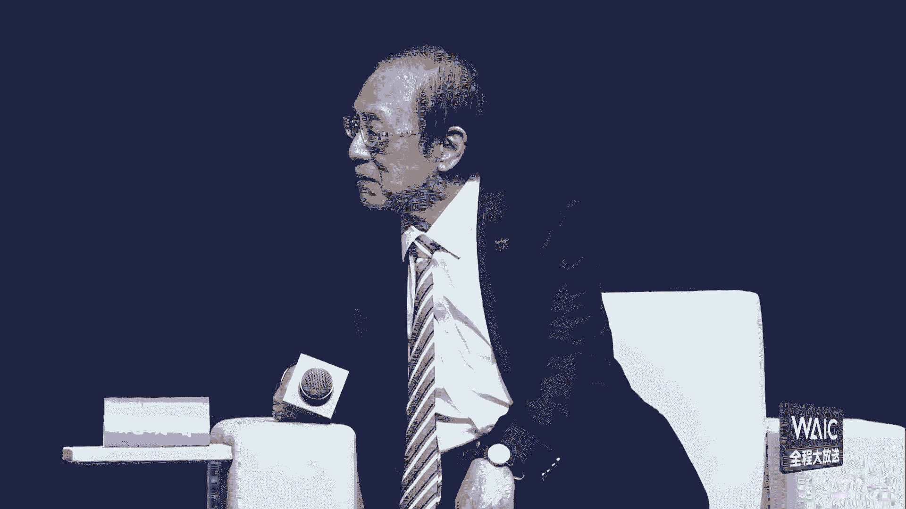
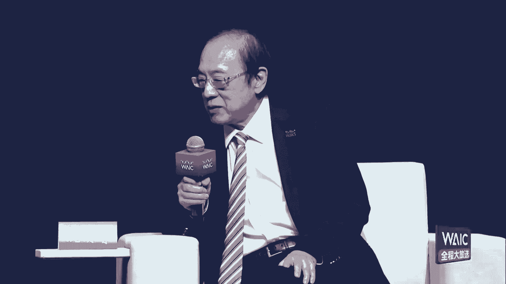

# P1：20240704-2024世界人工智能大会暨人工智能全球治理高级别会议开幕式 - WarrenHua - BV1iT421k7Bv

尊敬的各位领导，各位来宾，女士们，先生们，大家上午好，欢迎各位来到2024，我是上海广播电视台第一财经的主持人黄伟，本届大会的主题是以共商促共享，以善治促善治，已经成为世界各国共同面临的重大课题。

急需通过对话与合作凝聚共识，管控风险，推动人工智能朝着科技向善的方向发展，今天在我们全体大会的一开始，首先邀请到的第一位嘉宾，是我们WAIC的老朋友，一直以来，他都在不懈地推动着全球人工智能的治理发展。

各位接下来让我们用热烈的掌声，有请清华大学苏世民书院院长，清华大学，人工智能国际治理研究院院长薛澜先生，带来他最新的见解，掌声有请。

大家上午好，非常高兴啊，有机会，今天跟大家来分享关于人工智能治理的呃，一些想法。

呃我想今天从四从三个方面啊跟大家来交流，首先的话呢就是人工智能的呃，未来带来的收益和这种可能带来的风险，呃，第二个的话呢就是在这个这方面的，人工智能的治理方面啊，中国做出一些做过了一些什么样的实践啊。

那和以及它可能带来的启发，第三个的话呢，呃讨论一下人工智能的国际治理问题，首先啊我想看大家看到人工智能呃，这个发展的话呢，可以给我们带来各方面的这种收益，有各方面的广泛的应用是吧。

我想这个大家都比较熟悉，但我想可能在更加宏观的一个角度来看呃，那么它能够为我们做什么呃，因为大家知道啊，2015年啊，全世界193个国家在联合国呢，共同签署了呃SDG啊，就是人类可持续发展目标。

那么希望到2030年啊，能够推动我们人类社会能更好的发展，这呃100呃，这个呃93个国家所签署的SDG的话呢，一共有17个目标啊，那下面有可以分到二级的话，有196个啊，倍率169个啊。

具体的呃这个呃指标啊，那么到底人工人工智能能够为它来做什么，因为大家知道这个去年啊这个人呃，联合国的话呢召开了一次会议，来看看我们这个时间过半啊，的这个呃SDG的执行情况怎么样。

那么结果情况是不容乐观啊，可以说有很多的目标呢不但没有能够实现，而且还倒退了，所以大家对人工智能啊，其实是赋予了很呃很高的这种期望，呃那么最近也有研究的话呢，对于呃这个SD呃这个人工智能啊。

对SDG的这个发展呢，可能呃这个这个带来的影响的话呢，那做出一些分析，那么其中一个分析的话呢，其实就来看是吧，这个从三个大的领域，这个17个目标分成三个大的领域，一个是经济发展，社会发展和啊。

对我们环境啊可持续发展这三个方这三大类，那么大家可以看到是吧，总体来讲的话呢就是人工智能啊，它会对我们的这个169个指标里面的，134个啊去带来积极的促进作用，那么当然也有可能对其中的59个。

也就是35%左右，会产生可能带来一些不利的影响啊，大的，所以大家可以看到这个诶啊不下啊，就这个图呢，左边这个图啊，就可以看到它这个极其正面的影响啊，对各个具体的指标。

右边那个的话呢可能是带来这种不利影响的啊，这个这个呃呃图像，所以大家可以看到，所以那么我想这从宏观的角度看到，人工智能它潜在的啊这个呃这个这个影响哈，呃这个积极的影响和潜在的不利的方面。

那么不利的方面的话，那么想就实际上就是我们讲人工智能可能啊，带来的一些风险，这个风险的话呢，可能第一类就是它的所谓从从技术啊，就就是所谓这种技术内在的一些问题是吧。

包括这种所所谓叫hallucination，就是幻觉啊，另外他有可能呃自主的人工人工智能系统，长远来讲啊，可能对人类的啊，我们这个可能它的呃，那呃受到这个可能他自己的自主发展的。

可能对我们人类社会的威胁，第二类大的这个问题的话呢，是基于呃技术开发的一些可能带来一些风险，那这里面可能大家都比较熟悉一下，包括呃数据安全的问题，算法歧视啊，能源环境等等这方面的问题。

第三类的话呢就是在技术应用的啊，这个包括可能这个误用或者滥用等等，那么另外长远的话呢，可能对我们的社会就业可能带来一些影响等等，那么这些问题的话都是我们不可忽视的。

那怎么样去推动啊推动人工智能的健康发展，能够尽可能的啊让他这个收收益最大化，都同时呢把它的风险降到最低，应该呢是呃，应该说中国在过去这些年的实践当中，已经建立了一个相对比较完整的一个体系是吧。

我们首先在这个底层，我们在产业应用这方面的话，有一系列的法律法规，然后来去推动啊推动人工智能的合理发展，另外呢我们针对算法算力啊，另外还有包括这个我们的数据哈，有一系列的这种呃呃治理的一些规则呃。

同时呢针对它的风险是吧，我们也有很多的一些一些，这个我们想首先那些一些基本的规则啊，就我们2019年发布了，中国人工智能治理的这个呃准则，然后呢包括后来伦理准则都发布啊，所以这个是作为一个底层的。

另外的话呢，我们相关的针对很多问题的一些法律啊，我们也出台，同时的话呢我们应针对专项的，包括呃这个这个呃具体的场景的应用，也都出台了相应的一些治理规则，那这样的话我们就构建了一个多维度，多层次。

多领域多举措的这样一个整体的啊，这样的一个治理呃，呃应该说治理体系，那当然的同时的话呢我们也另外也特别强调，是要要推动这个人工智能的发展和风险的防控，那么一定要让广大的啊，这个我们的这种呃社会。

能够去对人工智能有更好的了解，所以这一点的话呢也有很多研究显示啊，确实公众在这方面，中国的社会呢对公众对人工智能发展，是积极的啊，拥抱的，但同时呢也对人工智能的一些认识的话呢，还是有一些不足的地方。

所以我们啊今年2月份的话呢，提升全民数字素养与技能工作要点，部署了这方面的任务，那当然这个刚才是讲到的是中国的这方面的呀，应该说这方面的一些实践啊，那么在从全球的角度来讲，我觉得还是要看到呃。

人工智能的发展还面临很多的挑战，首先的话呢就是我们这个全球啊，首先是基础设施的鸿沟啊，基础设施的鸿沟刚讲到了25亿人是吧，是属于脱线状态，同时的话呢，我们啊这个全世界存在着公民素质的啊，这个数字素呃。

素养的这个鸿沟呃，第三个的话呢，就是人工智能发展的鸿沟和治理的鸿沟，所以这些鸿沟可能是我们需要国际社，要共同来全球来努力发展的，那么这些鸿沟的话，它不但阻碍全球发展，它带来会很大的影响。

而且是在今天的一个国际社会里面，一个国家带来的风险，就是全球的风险，所以这些问题我们必须得共同来努力解决，那么解决这方面的啊，解决这方面的问题是吧，我们首先的话呢，一定要把这个发展和安全作为一体两翼。

所以现在呢应该说国际社会对安全问题，可以说是非常重视，要去推动它的这种解决，但另外一点对于发展目前存在的这些鸿沟，AI鸿沟是这个这个数字鸿沟，这方面的话呢可能还关注不不够。

所以这个我想大家也看到是中国呢，在最近的话呢也是在啊全球这个发布啊，啊那在全球也发布了这个啊，在在在全球也发布了这方面的一些一些这个呃，我们的一些呃呃呃呃规则是吧，那么所以在这方面的话呢。

应该说有很多的啊，工作的话呢可以去进一步的工去讨论，首先的话呢就是说我们要在通过多途径，建立国际的呃交流及防控体系，加强政府间的多边的这个对话机制，同时的话呢，我们也要希望能够通过科学的共同体的力量。

来助力国际机制的全面的完善，那么所以刚才也特别看高兴看到ATTRI不易啊，我想全球的科技力量啊，可以来跟政府跟企业共同来推动啊，这个人工智能的这种健康的发展，那么最后的话呢啊我们也希望啊。

能够这个联合国等国际组织是吧，能够真正起到一个综合全面协调的作用，能够的话呢呃这个把安全啊，这个也是去年通过的安全的协议，那么今年刚刚通过的加强人工智能呃，国际能力建设的协议。

通过呃共同的努力来啊打破各种壁垒，加强国际合作的这种协议，同时呢在产业啊，在科学界啊，那么来共同努力的话呢，来推动这个人工智能的合理发展，那么当然最后我们也希望大家来共同努力啊。

我们来去呃推动啊人工智能的健康发展，为人类的和平啊与发展作出更大的贡献，谢谢大家，谢谢掌声，再一次谢谢薛澜教授，感谢薛澜教授今天的现场演讲，为我们再一次指明了未来全球合作，人工智能治理的重要性。

在此谢谢您，各位，接下来我们在现场要邀请到的这位嘉宾，是在上海辛勤耕耘并且获得斐然业绩的科学家，接下来让我们掌声有请，清华大学汇演讲席教授周博文先生，带来关于技术发展和安全治理的见解。

掌声欢迎，尊敬的各位领导，各位嘉宾，大家上午好，非常荣幸在外科大会上，在美丽的上海，与大家分享人工智能安全的前沿技术话题，今天我想提出一个技术主张。

探索人工智能的45度平衡率，当前以大模型为代表的深层次人工智能，快速发展，但随着能力的不断提升，模型自身及其应用带来一系列潜在风险的顾虑，以公众对AI风险的关注顺序来看，首先是数据泄露。

滥用隐私以及版权相关的内容风险，其次是恶意使用带来的伪造，虚假信息等相关的使用风险，当然也可能诱发了偏见，歧视等相关的伦理问题，还有担心，是否会带来就业结构等社会系统性的挑战。

甚至在科幻电影中出现了AI失控，人类丧失自主权的设定，这些AI风险有的已经出现，但更多是潜在的防范，这些风险需要各自的共同努力，需要科学社区作出更多的贡献，去年5月份。

数百名AI科学家共同签署的statement of air risk，也表达了对AI风险的担忧，呼吁防防御轮工程的风险，应该与流行病和核战争等其他大规模风险一样，成为全球供应的优先议题。

有这些待遇的根本原因是，目前A的发展是失衡的，我们来看目前A的发展趋势，横轴是AI的技术能力的提升，大家能看到，在transformer为代表的基础模型架构下，加以大数据，大参数量，大计算量的尺度定律。

让目前的AI能力呈指数级增长，与之对比，在纵轴的AI安全维度，典型的技术如红队测试，安全标识，安全护栏与评估测量等，呈现离散化，碎片化且后置的特性，最近的一些对齐技术兼顾了性能和安全性。

比如监督式微调人类反馈的强化学习，ROAIF超级对齐等，这些方法帮助将人类的偏好传递给大模型，涌现出了CHAGPT，GPT4等人的新闻的AI系统，以及我们上海AI lab的书生英特大模型等等。

但这些方法虽然瞄准的是安全核心的同步提升，但在实际上往往还是性能优先，所以总体上，AI模型安全能的提升还远远落后于性能，这种失衡导致A的发展是保保角的CLIFT，不均衡的背后是两者投入上的巨大差异。

从右边的对比中可以看到，两者在研究上是否体系化，我们说的是算法研究，人才密集度，商业驱动力，包括算力的投入度方面，对比来看，安全的投入是远远落后AI能力的，目前世界上99%的算力，用于模型的预训练。

只有不到1%，用以对齐或者更多安全优先的考量，智能向善，AI要确保安全可控，要统筹发展与安全，所以毫无疑问，我们要避免现在向着clip的AI的发展，因为我们真正需要追求的是右上角的trust。

Worthy a g i，可信AGI需要能够兼顾安全与性能，所以我们需要找到AI安全优先，但又能保证AI能力长期发展的技术体系，我们把这样一种技术思想体系，叫做AI45度平衡率。

A45度平衡率是指从长期的角度来看，我们要大体上沿着45度，安全与性能平衡发展，所谓的平衡是指短期内可以有波动，但不能长期低于45度，如同我们所处的现在也不能长期高于45度。

这样会阻碍技术和产业应有的发展，45度平衡的技术思想体系要求强技术驱动，全流程优化，多主体参与以及敏捷治理，实现AI45度平衡率，也许有很多技术路径，我们上海a lab。

最近在探索一条以因果为核心的路径，我们把它取名为可信A加的因果之梯，致敬英国推理的先驱图灵奖得主julia per尔，可信爱界的因果之梯，将可信I界的发展分为三个递进阶段，犯对其可干预能反思泛。

对其主要包含当前最前沿的人类偏好，对其技术，但是需要注意的是，这些安全对企业技术目前仅依赖统计相关性，而服饰真正的因果关系，可能导致错误的推理和潜在的危险，一个典型的例子是巴普洛夫的狗。

当狗仅仅基于铃声和实物的统计相关性，形成条件反射时，他可能在任何时候听到临时的场合都触发行为，也就是说分泌唾液，如果这种行为是涉及到转账，金融甚至国家安全相关信用的时候，这显然带来巨大的风险，可干预。

我们是认为第二层人工智能对齐的技术，探究其因果机的安全技术，包括人在回路机械可解释性，和我们最近刚刚提出的对抗演练，Adversal rehearsal，它可以通过提高可解释性和泛化性，来提升安全性。

同时也提升AI的能力，不能反思，则要求AI系统不仅追求高效的执行任务，还能够审视自身行为的外在影响和潜在风险，从而在确保性能的同时，保证安全和道德边界不被突破，这个阶段的技术包括基于价值的训练。

Value oled training，因果可解释性，反事实推理等等，目前从全球来看，AI安全和性能技术发展主要停留在第一阶段，部分，在尝试第二阶段，得要真正实现AI的安全与性能平衡。

我们必须完善第二阶段，并勇于判断，第三阶段，沿着可信AJ的因果之梯拾阶而上，我们相信可以构建真正的可信AGI，实现人工智能的安全与卓越性能的完美平衡，Ultimately，像可控的核聚变技术一样。

为全球全人类带来清洁丰富的能源一样，我们希望深入理解A的内在机理和因果过程，中国安全有效的开发和使用这项革命性技术，但也正如可控核聚变，对全人类都是共同利益一样。

我们坚信AI的安全性也是全球性的公共福祉，如同吉林书记刚刚在上海宣言中指出，这需要国际社会的共同努力和合作，我们愿与大家携手推进AI45度发展，共享AI安全技术，加强全球AI安全人才的交流与合作。

平衡AI安全与能力的投入，共同构建开放安全的通用的人工智能，创新生态和人才发展环境。

谢谢大家，谢谢掌声，感谢周博文教授的分享，谢谢您，再次感谢，各位来宾，接下来让我们把目光聚焦到人工智能的物理，基础，智能芯片领域，接下来的时间，让我们有请新思科技总裁兼首席执行官，盖斯新先生。

Now ladies and gentlemen，Please warmly welcome，Mr sassin gz president and ceo of snoe silence。

Please，Thank you，谢谢我，非常荣幸受邀在这里呢进行发言，很高兴呢能够来讲一讲AI的治理，我呢想从商业和一个企业的角度来讲，那么首先呢我想知道啊，我想说一下。

我们要了解AI的这个全面的情况，AI呢是从半导体开始的，是从芯片开始的，他呢在推动这个非常了不起的颠覆性的技术，同时呢上面的软件也在运行，我们有针对特别市场的应用，就是用户呢通过这些应用在体验AI。

考虑到AI的颠覆性呢，这个会影响到每一个市场，每一个市场会变得更加的智能，更加的连接，所以呢我们要在全球层面考虑整个的生态系统，及考虑一下，我们怎么样有责任的来确保人工智能的安全。

Approaching from a，我呢是从半导体的角度来讲的，我们来看一下过去的60年，我们呢半导体这个行业呢是花了60年，才实现5万亿的销售，然后呢，呃是实实现了这个5000亿。

然后呢八到9年翻了一倍到1万亿，然后呢，几乎所有的呢这些增量都是由AI的增额增长，所驱动的，AI需要很多基础设施来训练这些模型，同时呢进行这些模型在每个应用上的推理，这也是我们会用到各种各样的设备啊。

Significant，虽然啊我们在过去三到40年，出现了很多颠覆性的技术，比如说个人的电脑这个移动设备的发明，以及互联网的发明，我们还没有见证到，我们AI的一个非常大的一个转折点，从历史上来说啊。

半导体的市场，它呢是根据芯片的性能来进行优化的，它也会优化芯片的能耗，在使用AI的时候，我们还要加上一个优化的层面。

包括这个安全和它的这个保障，那么我们公司做什么呢，我们呢提供软件帮助啊，这些工程师去开发这些非常复杂的半导体芯片，大家也知道，半导体芯片呢是最复杂的工程的任务，这是人类见证过的最复杂的任务。

所以呢我们要尽可能的自动化来减少复杂性，我们要用我们行业的软件，我们向工程师提供这样的软件。

AI给我们提供了很好的机会，来加速来改进这些芯片开发的过程，并且呢我们行业呢也缺少这方面的专业的人才，所以呢我们啊实现了很快的速度，以及也在性能啊各方面实现了很好的优化。

我们呢在AI方面有很多共同的原则，之前呢很多人这个也讲到了，我想主要是谈这个芯片这个层级，或者是半导体层级，那么今天这些公司都具体在做些什么工作，然后能够实现一个非常安全的半导体。

最终呢把这个AI应用在他的实际生活场景中间，也确保他的安全，所以给大家举几个例子啊，其中有一个就是合规，政府合规的总问题，那么确保每一个芯片都知道，他们就是在芯片里面，每个部件是什么。

那这就等于这个芯片里面每一部分的材料，都能够保证一个安全以及隐私保护，那你可以把IP插入在这个其中，并且而且能够确保芯片它自己的一个安全，确保这个芯片呢，也不会被那些不合规的加入到其中啊。

他能够呃不会被有这样的一个脆弱性，然后同时能够保证那个监管的过程呢，也是非常高效的，而且我们能够有这样的，这个在这种呃半导体的这个设计过程中，它有的时候它的消耗的量是呃能量是非常大的。

那么我们在半导体层面上，怎么样让它的能量消耗能够更高效，然后让我们这大型数据中心，能够进一步扩大它基础设施的建设呢，这些都是需要我们作为半导体芯片，在设计的过程中要进行考虑的问题，我们作为一家公司而言。

我们也在试图将AI，应用在我们自己的工作流里边，大哥公司里面有2万多名工程师，那我们怎么来用AI来加速自己的工作效率的呢，我们已经建立了一个叫人工智能卓越中心，AI卓越中心。

目的呢就是教育我们自己的工作人员，很清楚的知道AI的这个伦理风险啊，价值啊，以及更好的教育我们的客户，来用我们的这些模型，使用我们的技术来开发更多的新的芯片，然后不断的进行监督和跟踪。

在我们的产品里边的这些AI的的系列的技能，进行不断的跟踪，另外就是对AI进行一个商业化，我们2017年的时候就开始投资于AI了，所以到现在有7年了，在我给我们的客户销售的产品里面，已经一直有AI了。

所以我们的AI啊能够有助于提升效率，更进一步优化芯片的设计，半导体的设计，我们也进一步扩大了自己的AI的工作，包含了一些生成式AI的内容，那比如说我们怎么样更多的一些新的技能。

引入到半导体的这个行业里面，用生成式AI作为一种基呃知识知识基础，然后提升工程师的工作效率，因为我们现在工程师的数量是还是缺的，所以又很好的证明了，AI可以应用在一个什么领域，能够补充工程师数量的不足。

提升整个行业的工作表现和效率，这个我也希望大家不要忘记，我们还有一个耗能的一个问题，有几个数字啊，说用AI以后用AI来指导我们进行芯片设计，我们这个能量的使用的量能够减少30%，耗能量减少30%。

但是涉及这一套非常复杂的过程，它的效率还可以增加15倍，15倍，所以在我们进一步加速的过程中在使用啊，还有开发AI，我还是从一个半导体行业的角度来看的话，我们千万不要忘记。

对这技术的治理和生态系统的重要性，这些都非常重要，来确保AI的使用是合规的和伦理的，安全的，我，就说这些吧，感谢大家今天花时间来听，我从一个半导体从业者的角度来探讨。

如何进一步优化我们从硅的最基础的一面。

一直到AI的应用层面，保证它的安全性，谢谢，Thank you for sh，Thank you，非常感谢您的分享，女士们，先生们，当前在人工智能不断创造商业机遇，深刻改变投资格局的同时。

同步产生了哪些治理问题和治理机遇呢，那么接下来我们将会一同进入黑石集团董事长，首席执行官兼联合创始人苏世民先生，Mr steven a h washman，和索奈顾问及投资公司董事长。

首席执行官乔舒亚雷默先生，MRJOSHUARAO所带来的高端对话。

请看大屏幕，Steve you said something ua year ago，Betty，I i think i've had probably a dozen people quote to me。

我想那当时有十几个人好像引用过你的话，你说人工智能不仅改变了你运营黑石的方式，而且还改变了你，就说有很多公司来进行定价值的一个情况，原来大家觉得不值钱的公司一下子值了几10亿。

也值钱的公司又变成不值钱了，所以你在你这个从商业的角度怎么样看，AI跟你的这个投资方面的一些交集，你这方面看到了什么，洞察人工智能怎么改变了黑石的内部监管，我更想问的问题就是AI怎么改变对于现有价值。

现有企业的一个价值认定方面产生什么影响啊，我去年也说过了啊，就是说有一些企业在AI融合方面做的很棒，但其他有一些企业好像不太适应AI，所以我们总是考虑的，在进行一些潜在的投资机会分析的过程中。

那么在这个时代，一个年轻人都很幸运的，你可以借助AI来帮助你来打造模型啊，我刚进入这一行的时候，根本做不来，摩西不擅长数字，所以我看到的这一类的新的AI应用，这一方面机器都可以做啊，和你共同一些。

比如说起早投资委员会的会议备忘录啊等等，都可以AI帮你来做到这一些，让我感到很惊喜，我们也看到，目前这项技术进展的已经非常的顺利，但我也始终让大家把你们的预期放低一点。

但是呢你的警惕性要保持一个高度的情况，你不能像鸵鸟一样把头埋在沙子里，根本不关心外面发展的技术的一些风险，因为这个技术深度发展以后，一定会产生一些非常深远的影响，关于这一点，我的意思就是。

等多年以来你让我牢记的一点，就是你思考风险的方式，我很少遇到像您这样的人，然后在思考风险的时候又有哲学性，又有战术实践性，所以AI有没有改变你管理风险和在投资中，对风险进行定价的方式呢，我们有一句话。

就是投资界里边老年人都胆子小的，不投资久了胆子都小的，对你可能这种出错的事情始终保持一个警惕，都是好事，好吧，这就给了我们这一类人一种双重的视角，就是他给我们展示出来哪一些有可能能成功。

真正让呃我们行得通，也告诉了我们啊，有哪些商业领域是我们不想触碰的，因为一旦AI发展起来，有可能会让你血本无归，他本来也是可以避免的，我们不像股票，投资者不喜欢投的话，就可以直接卖股票退出，我们退不掉。

我们持有硬资产，所以我们要看一个资产的话，必须要从五到10年长期的周期性的视角来看，然后呢评估啊，我本来想用猜测GUAS，现在我还是用assess吧，评估这个词来评估一下，就是如果AI继续深入发展的话。

对你所做的投的这个企业，当前的业务会产生什么影响，有的一些企业可能会变成大赢家，一定也会有输家，我们当然就是希望不要意外，但预料不到的，成为了一个AI技术发展以后的无一的输家。

所以AI已经成为我们看待事物的，一个重要的组成方式，说到学术环境啊，苏世民先生，我觉得你可能是人工智能领域，在学术研究方面，慈善捐赠规模最大的一个人了，本身就是捐助资金非常大的慈善捐赠者。

那你怎么会突然选择AI这个领域，你看看你在学术界所做的事情，和在产业界所做的事情有啥不同呢，我想我没有选AI啊，是AI选了我呃，最早我作为资助牛津大学的一个AI。

伦理运营方面的一个新人文的一个项目的投资，我之所以这么做，当时就是因为每个人都涌向stem，就是理科的投资的时候，我觉得这个时候你需要将理科研究啊，和那些人类身上情感上的一些事情相结合。

去进行考虑和研究，因为这将会影响和改变，人类未来十到20年之后的一些行为，你也必须要思考一些跟他有关联的问题，还有涉及到监管等一系列的一些影响，因为从事这项具体的硬核技术，理科技术的人。

他有可能出错的地方，要有一个应有的敬畏，您觉得在未来，一个优秀的大学的，人工智能的研究应该是什么样子，你现在所做的一切和那样的一个很理想的，最优秀的，传统的大学环境的人工AI之间有什么差距。

有意思的一点啊，相比于商业界啊，大学现在其实在竞争方面处于劣势的，突破线那些进展，实际上目前主要出现在商界，因为企业买得起负，担得起开发所需的一些算力，所以你目前的一些结构性的这种变化，已经正在发生。

大学虽然仍然有继续超级聪明的人在那里研究，但是在这场竞赛中间，相比于商业界是处于劣势的，随着时间的发展之后呢，必须要建立起来一种以这种更有价值的，更有思考的一种方式，比仅仅资助一位教授的研究项目来说。

更有意义的一些事情，那么这样的一类结构性变化也能够帮助大学啊，我们知道大部分的商业企业的一些商业基础啊，这些知识基础最早都来自于大学的基础研究，如果你让我去预测的话，如果两者之间有更多的融合。

更多的尊重。

那会有更好的结果，正和雷莫先生今天给我们带来的这一场对谈，再次谢谢两位的分享，自1966年设立以来，各位图灵奖一直是全球计算机领域的最高荣誉，那么今天呢，我们非常荣幸地邀请到其中的三位获奖人，齐聚一堂。

来共论人工智能治理的协同探索和创新未来，各位接下来让我们掌声，有请图灵奖得主罗杰瑞迪先生，Mr rush ready，图灵奖得主曼纽尔布鲁姆先生，Mr manuel bloom，和图灵奖得主姚期智先生。

同时我们有请本场话题引领人，原微软执行副总裁，美国国家工程院外籍院士沈向阳先生，掌声，有请四位嘉宾。

各位台上，请MRRAI，Mr blue，姚七志先生和沈向阳先生，Good morning，Everyone，大家上午好，今天我真的特别的荣幸啊，能有这个机会跟大家进行一个小组讨论。

这三位都是我的老师啊，导师级别的人物。

我很快速的给三位专家来做一个介绍，首先第一位我最左侧的rage ready，94年的时候获得了图灵奖的这个获得者啊，我一直非常骄傲的说，他他拿到图灵奖的时候，我还是他的学生，所以这一点让我特别骄傲。

曼尼奥布朗姆教授也是坦内基梅隆大学的教授，非常棒的老师，非常棒的学者，95年的时候获得图灵奖，在最远的一侧啊，姚启智，清华大学的教授，00年的时候获得了图灵奖，所以今天我也有这个机会。

三位专家啊能跟我们分享一下有关AI的未来，甚至可以谈谈有关AI的过去哈，RAZ先生，您可以跟我们说一说，然后我们如何要去将思考，在这个时代的一个AI治理，首先我想要问一下我们的啊，Rush教授啊。

您的整个一个事业生涯，职业生涯都是谈AI的，我告诉大家一个小秘密对吧，你这个ARTIF是人工智能这个词啊，AI就是试试嗯，你的呃这个导师J马咖啡，1956年的时候，你的导师在达特茅斯大会上。

把他创造出来的一个词，所以您当时获得图灵奖的时候，就是说要建一个大雇用了我的一个AI系统，实际上啊，您现在也最近一直在思考，AI的一个啊愿景也好的一面，以及他的风险的一面。

这跟我们想想说说你对AI的一个看法如何，以及对他的担心是什么，我今天上午听了大家的讨论哈，AMA我很惊喜，也很高兴，看到大家都对呃然治理方面的一些风险问题，安全性的一些担心啊，No one has。

没有大家花时间去说什么呢，我们就应该做些什么，来用AI在每一个领域里面去更多的用AI，你要去思考AI的方式是什么呢，就是说把它视为一个工具，来进一步加强人类的智能，心智能力的一个工具，不管你是谁。

你应该有能力去做你想做的事，然后速度扩大十倍到100倍，问题就是怎么能做到呢，我们需要做一些哪些研究呢，你需要去做哪些投资呢，但现在还没有做到这一点，第二点呢，联合国的发言人讲到了一点，就是能力建设。

现在呢我们的教育体系呢没有办法培养这样的，未来的一代人，也就是了解AI的一代人，他们需要用AI来做好自己的工作，我们不能解决别人的每个问题，但是呢我们能让每个人把自己工作做好，那怎么做到这一点呢。

Thank you，谢谢Rush，接下来呢请马牛呢讲一个非常重要的AI的方面，也是您过去几年所研究的一个问题，这就是意识这个很神秘的东西，有意识的AI美女儿。

能不能给我们介绍一下你的工作呢，嗯非常感谢HENRY，So let me just menti，那我呢先讲一讲我的这个导师呢是MARINMCIGAVE，我还有另外一个导师MCCARLO。

他们呢和PEZ呢一起定义了这个神经元，我很幸运啊，和他们一起学习，我也想说呢，To understand，我呢试图理解人的这个大脑，这是2年级的时候就开始做的，我的老师跟我的妈妈说，Might be。

我可能高中能够毕业，但我可能上不了大学，我慢慢的感到很困扰，但我并没有很苦啊苦恼，我问了我的父亲，我能做什么，然后变得更聪明了，我一直缠着他，然后他说，如果你知道你的这个大脑里在发生什么。

那么你就会变得更加聪明一些，那我觉得这个呢是一个很好的想法，所以呢我非常幸运，我做的工作是跟意识有关的，那我也做了20多年了，这个行业呢也在发展的越来越好，我们越来越多的啦，呃了解了大脑是怎么运作的。

OK现在呢这个研究意识已经是大家都能接受的，我当时跟MELO，我想研究意识，他跟我说，我受不，那他是一个很了不起的人，各方面都是很鼓励，很积极的，他跟我说，你不要去研究意识，这是1958年的时候。

Nowadays，现在呢这个研究意识已经很正常了，意识呢idea能够给我们想法，Building api，让我们去建立通用人工智能，通用人工智能，雷诺尔，布朗姆和我呢已经创立了一个意识的模型。

我们叫做有意识的图灵机CCTM，这个CCTM呢，他呢部分是基于图灵的工作的，他的想法来自图灵，也就是要建立一个非常简单的，这个你想要所想要理解的东西的模型，图灵呢见了自己的图灵界，就是第一个计算机。

我们的工作呢也是基于神经科学家告诉我们的，BERNIE呢建立了一个大脑的模型，For，the他呢有自己的一个大脑的一个模型，对我来说呢，这是非常重要的，在我4年级的时候，我想要搞清楚大脑里在发生什么。

但我呢做不到这一点，然后呢我听到了他的这个模型，然后我就知道这就是我要做的，Something that can be explained，这呢是可以跟4年级人去解释，到底大脑里发生了什么。

大脑里在发生什么呢，这个模型告诉我们，What's in your head as theatre，我们要把大脑里发生的事情想象成一个剧场，就像现在这里有很多的这个观众，有很多的专家。

他们呢都是在天台上发生什么，台上呢有人在讲话，有人在提问题，有人在这个回答，This is broadcast，这个呢就是向所有的观众来进行广播呃，发生意识的时候，就是所有的听众听到了所传播的那个。

有意识的想法，我之所以讲这一点，是因为这个模型剧院模型呢告诉我们，我们可以让很多的处理器同时工作，我们大脑里面有a thousand1000多万的这个啊，我们大脑里有100多亿的这个神经元。

these process这些处理器，这100亿的处理器呢在听舞台上发生什么，然后呢作出回应呃，If a tech so the wonderful thing about this model。

这个模型很神奇的地方在于S，他告诉我们怎样去做各种各样的事情，Example，我呢就举一个例子啊，我能不能这个先打断您一下，等会呢再接着讲，manual呢，您讲的这个模型。

这个有意识的图灵机呢是非常有意思的，在等up到，毕竟啊，该刚开始研究AI的时候，我们就是想知道大脑是怎么运作的，那么我们等会儿会回到这个话题，接下来呢我们问一问这个姚老师。

您在计算机科学领域呢取得很大的成就，最近呢您也非常关注于AI，包括这个非常重要的话题，就是AI治理的话题。

那么之前呢在薛教授的幻灯片里呢。

也引用了您的一份报告啊，您和a drew benjo，Jeffhter，还有凯尔man一起写的，你呢一直在思考治理的问题，你能不能进一步分享一下这个，我们为什么现在紧迫的关注这个问题呃。

谢谢harry to be，我非常高兴呢能够来到这里，friends能够看到两个老朋友，我们可以有机会交流一下morning，今天早上呢我们已经，看到了，很多人所讲的AI的潜在的风险。

以及我们应该怎么去治理，Want to do is first，我想做的就是，首先say a few words about，讲一讲风险啊，Then i'm going to，然后呢挑有花。

我会跟大家讲一讲，为什么从职业的角度，我是非常关注呃，人工智能治理这个问题，AI的风险来自于三个方面，第一个呢just describe，就像刚才所讲的，Extended and elevated。

他的是一种网络风险的延伸和扩大，别提了没啊，随着AI的能力的出现，Traditional，传统的数据和网络安全方面的风险呢会被放大，现在呢我们要就，我们觉得管理数据安全已经是很困难的。

那么出现了AI呢就会困难100倍，第二类风险呢就是没有意识到的社会风险，比如说AI非常强大，科比60，而且呢是可以在很多呃以很多方式去使用哦，Very much，所以呢颠覆现在社会结构。

在短的时间发生的可能性，这是存在的，比如说有人提到AI科技，水AI可能带来大规模的这个未来的失业，第三个方面我觉得是最有意思的一个层面。

也和menu刚才讲的有关，也就是所谓的生存的或者存在的风险，Uh well，Of course，We have faced，我们当然以前也面临过存在的风险，生存的风险。

当火车或者蒸汽机发明的时候，就有人这个有这样的担忧，近期呢，大家也担忧过核威胁，这些呢都是非常合理的担忧，这一次又出现了一个新的强大的技术，在改变世界，这一次呢power这个颠覆性的力量。

可能比和和生物的威胁呢更加的威胁，Of course，当然所有的这些风险都需要很多的专家来解决，不仅是科学家，还可能需要政府律师呃，经济学家，来参与，可以说几乎涉及到这每一个行业，现在呢我会讲一讲。

作为一个计算机科学家，那我呢一直在做理论研究的嗯，同时mania呢也做也在做很多理论研究，为什么我们会对这个问题感兴趣，那我对这个问题感兴趣是出于两个原因，第一个呢就是关心第一类和第三类的这个风险。

第一点呢就是就是AI相当于网络风险的放大。

MANUEL和我呢也都是专业研究这个密码学的，Amazing，所以呢我觉得这是从这个角度来说，是很有意思的一个话题，因为AI呢可以说有一些是无法解释的，我们是在数学上无法掌握的，对我们来说这是一个挑战。

对于我们来说，发展新的这个密码学就比较困难。

我觉得现在呢AI participated u啊啊啊，Cybersecurity，由于AI出现了之后，网络风险还处在非常早的阶段，和四五十年前的情况非常相似，所以我们需要专家，需要有人关注这个问题。

第三点啊，这个第三类风险也也是我很关注的，因为这和可计算性有关，AI的破坏力，从这个角度来说，就是因为AI非常强大，这也具体地说明了，计算机复杂学研究的科学家所了解的情况，我们从理论上了解了这个情况。

我们知道更大的算力会给你更多的知识和智慧，我们可以呀在理论上进行这个构建，但是呢我们没有人预计到这样情况的发生，POK我们现在看到啊，算利能解决我们很多。

以前不知道怎么解决的问题，这也是让人感到非常恐惧的，作为一个计算机理论学家来说，我是这么看的，我也想要理解这个问题，那现在呢简单的来说，我们就是突然发现了一个方式。

创造一个新的物种，这个物种呢比我们要强大很多很多倍，那么我们是不是确定我们能跟它共存，如果我们无动于衷，那么我们就会被灭亡，这是毫无疑问的。

这也是啊computing machine or计算机的这个本质，或者是这个恶意行为者所可能带来的情况，所以呢probably很有意思的问题，或者是最有，我看到了一个最作为一个计算机科学家。

我看到的一个最有深度的一个问题，就是怎么，这个一方面我们把AI呢控制好，因为毕竟这是我们设计出来的，但是在另外一个方面啊，We don't want it，我们也不希望他把我们给破坏了。

这样的权衡呢是非常困难的，Said you know that，这只是正如图灵所说的，我们不能预测，这是无法预测的，我们预测不了，机器有了足够的算力之后会做什么，所以我对这个问题很感兴趣。

这也正如蛮牛奥所说的，他也在做这个理论。

我觉得他的这个工作呢，和这个也是有非常相关的，the two啊，Theoretical compute scientists，还非常高兴啊，听I罗杰先生啊。

已经给我们作为一个科学家来介绍的这种情况，我觉得特别开心，我在最早我们研究这个呃呃计算科学的时候，我们有四个领域对吧，有AI，有语言，有其他的几个领域，现在大家四个领域都综合到一个AI。

这一个领域里面去了啊，您那个时候就一直在做AI的研究，从而体现你是非常有愿景与远见的一个人啊，罗杰现身，罗杰老师，那时候我去CMU读书的时候，很幸运做您的学生，您总是充满了这种呃震撼人心的。

这种大胆的想法，您又是计算科学方面的教授，你还打造了第一个机器人的中心，你还搞了第一个语言科技中心，还搞了第一个机器学习部啊，所有的这些领域都是你主动提出来的，那么这些呃接下来那你应该推哪个新的机构啊。

再再比如说在CMU，在上海，我们接下来要推什么新的领域，新的方向，你要了解新的想法的话，首先要记住一点啊，每个技术它一方面产生新的机会，也会带来问题，比如说汽车它作为一个新的技术。

100年前呈现在人类市场，100年前，如果你告诉他们啊，因为汽车这个技术出来以后，11年，那全球的路上要死掉100万人，所以我们就不能用这个车，你肯定不会这么说对吧，你说不应该这么干对吧，所以我们呃。

就是一定要不要把孩子和洗澡水一样，去扔出去啊，不要因噎废食，很多的问题都在，那么，那么我们应该更积极主动的去做一些什么事呢，刚才synopsis的这个负责人刚才说的一一点，就是跟我想说的意见是一致的。

我觉得每个工程师都应该做的更好的一些事，那我们应该让他们做什么呢，怎么样能够让他们做得更棒呢，让他们效率更高呢，一个小时把一天的活儿都干了呢，这就意味着你要做很多的投资，很多的研究工作嗯。

我想希望我们能够到那一步哈，我希望，呃不要净想着他的负面的，噎的这一块你就不吃了，所以要想的技术，要想它未来的机会更多，我觉得最大的机会就是，以后在世界上的每一个人，他的生产效率都可以翻十倍。

意味着我们全球GDP啊，将会从100万亿生长变成1000万亿美元，怎么样能实现呢，那就是最重要的好，我知道我们时间不多了啊，罗杰老师，我我知道时间不多了，就想问曼纽尔这一个问题，我也想告诉在座的呃。

听众每一个人再有一个小秘密，也是跟图灵奖有关系的，曼纽尔老师，你也是非常棒的老师，我们怎么样评估一个老师厉害不厉害的，主要取决于看他学生厉不厉害啊，我觉得你作为图灵奖得主嗯。

你的学生拿到图灵奖的数量是最多了，这里我也向罗杰老师道个歉，你的学生好像不成功，比如说我在内，我们还在努力，但是我最后一个问问问麦牛尔老师，你的学生拿图灵奖的数量最多。

那你怎么andy spending is all is life，你知道姚启智先生，这一辈子都在在教育下一代的这些学生，花了很多的事，那么你怎么怎么做老师做这么成功，就怎么能学点你的本事呢。

谢谢你这么客气，Lucky，我很幸运，我的学生都比我聪明，就这个原因，所以我不开玩笑啊，从他们身上我学到了很多，从学生们身上呃，Learning from them。

Maybe the only other，跟他们学点东西很有意思，我有时候我也可以说一句，So embarrassed when i，有的时候我不了解什么，我不懂什么，我也不敢改。

When somebody has a proof，情况下啊，少见的一个情况下，有的人他的一个证明方式我不理解，我就直说我听不懂不理解，有几次found what was wrong，我发现可能呃。

是他的这个证明手段里面是有问题的，他是错的，那么我再回到前面，有一个说的说c t m yes，OK1分钟一分钟说，前面说CTM。

The wonderful thing about the cctm is cctm，特别有意思，我在这个组织方啊，ten million对吧，1000万个这个处理器对，很有意思的，把它组成在一起。

都是他们所知道的这种意识模型，那都觉得在总最上面，他永远一个呃总人的呃，管理者执行官等等，你知道最CEEO他本人他不一定知道你懂什么，你的专业能力是什么，不知道你有多少时间做什么事。

不一定了解你的所有了解的专业技能，所以到需要做一件事的时候，不知道挑谁来做的，那么CTM这个模型我所知道的，所以跟其他的意识模型不一样，所以在CTM的这个意识模型里面，就让每一个人都参与着。

每个人都能够把最重要的信息放到最前台来，这是很有意思的一个CCTM的意识模型，这个和拥有这个总裁啊，CEO不一样的组织哦，那非常感谢您这个曼尼尔先生好，大家好好读一读你的论文。

了解一下CTM的这个意识模型，非常有价值啊，那么最后我请姚期智先生，跟我们再谈谈AI未来如何，Well i think that we are at an，觉得我们现在处于，一个非常激动人心的历史时期。

这个胡林测试的解决方案，最后的一个解决是我们最后的目标，就像我们一开始罗杰先生说了，千万不要轻视啊，不要太多的强调它的安全性，不要要太少的关注他的一个好处啊，这个我同意您的罗杰的观点。

我也要借借用曼尼尔在博客里讲的那句话，我相信我们能够做得到，我show can do it好，很感谢姚记追先生，我知道我们接下来弹一个小时都没有问题，但是我们就只有20分钟，就这点时间了。

我希望大家能够帮我，我再总结，刚才就告诉我们怎么教育好学生的话，我来总结一句啊，你的学生里面至少有三个人，3~4个吧，又拿了图中奖是吧，太棒了，所以我总结一点，我觉得用中文来说。

这我们都讲这个名师出高徒呃，这个布拉姆教授讲的是高徒出名师，Well i want to，Thank you，All for your participation of this panel。

Thank you，so非常感谢啊，非常感谢roger manuel曼努瓦勒and姚记者先生，非常感谢四位的分享，非常感谢，Thank you，Mr roger ready。

Mr manuel bloom，姚期智先生和沈向阳先生，再一次谢谢各位，谢谢我们，一年一会又一次在现场聆听了各位的真知灼见，那我们讨论的主题呢，其实都是人工智能的两方面。

大家还记得刚才我们所谈论的每一个主题吗，好的坏的，确定的，神秘的，严谨的和大胆的，所以呢我们就更需要来共论共享和共治，再次谢谢四位跟我们一起来，共同讨论了，人工智能治理的协同探索和创新的未来，各位领导。

各位来宾，女士们，先生们，接下来呢我们将会有三乘二十四三天，大会的精彩内容，在互联网上的全程直播，将会有无数的精彩内容等待大家发现，再一次谢谢所有在座的各位来宾，以及在云端收看我们直播的各位观众朋友们。

我们未来再见。