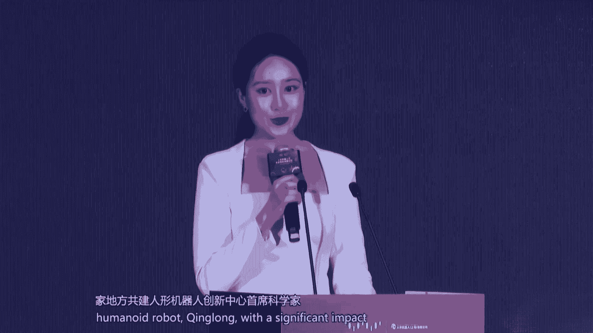
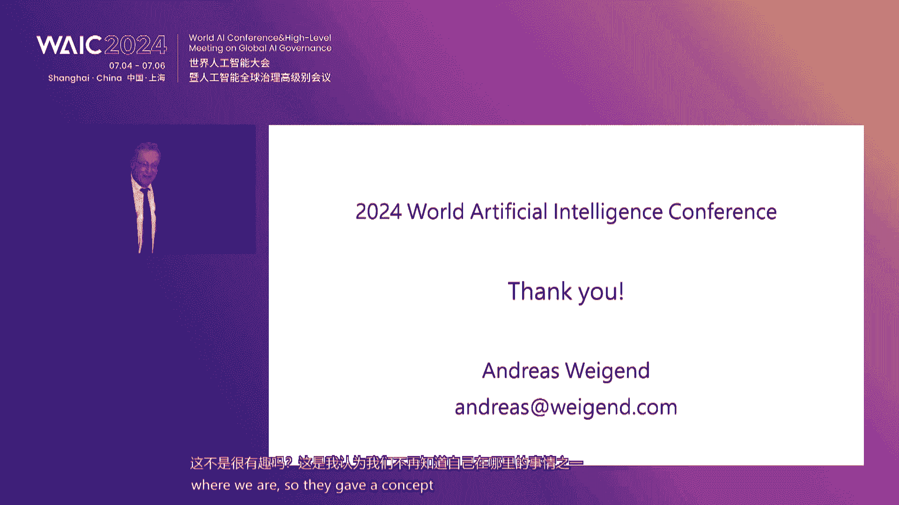
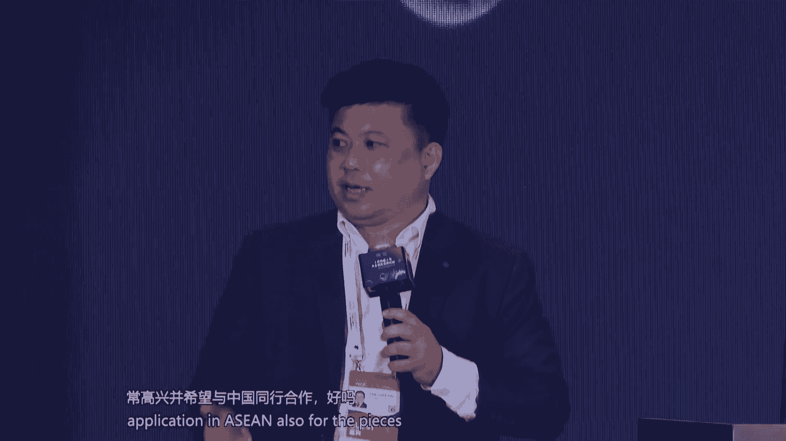
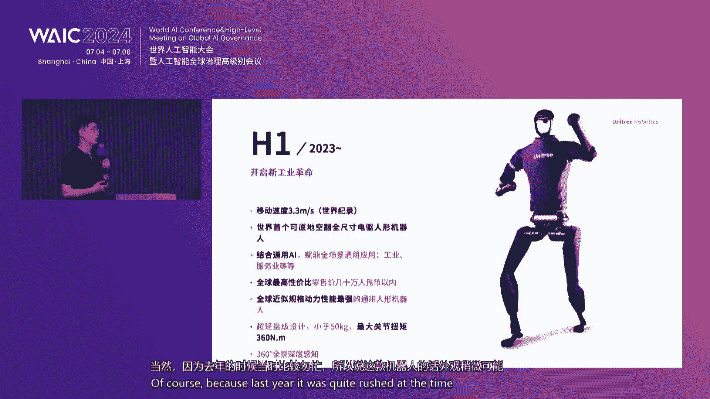
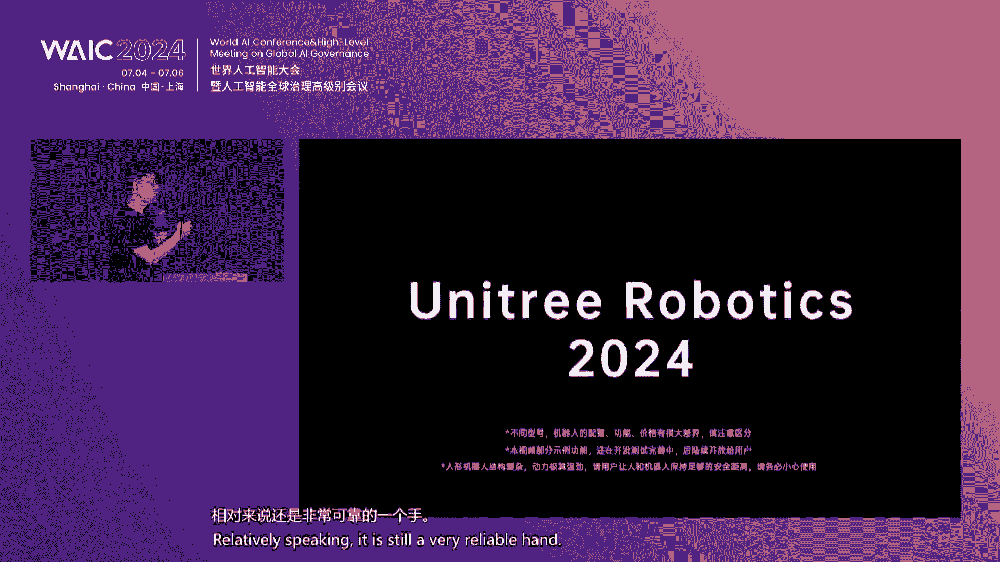
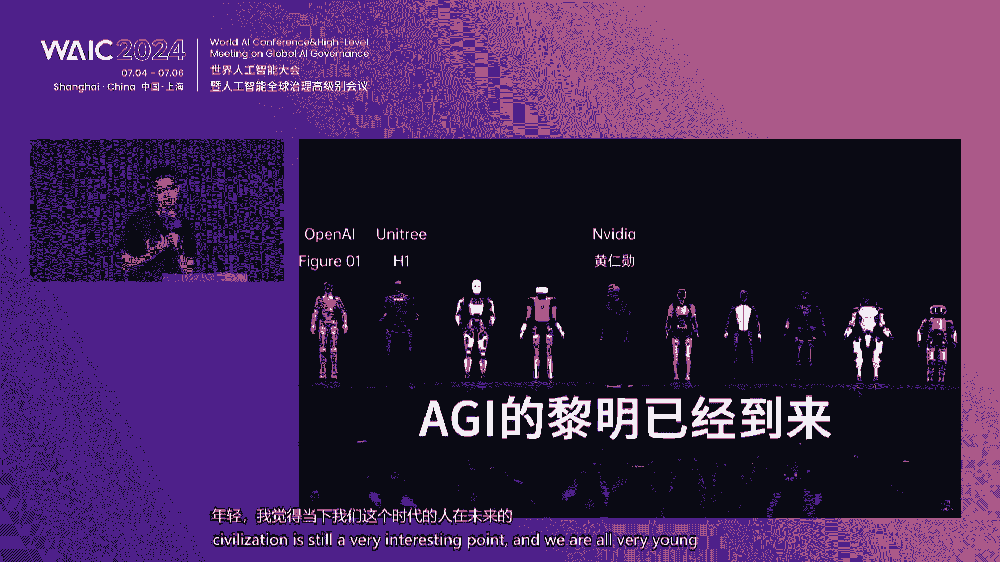
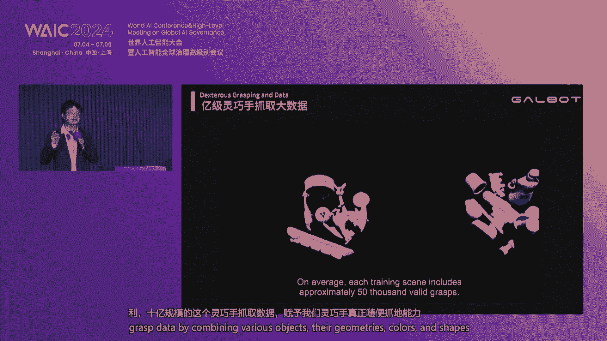
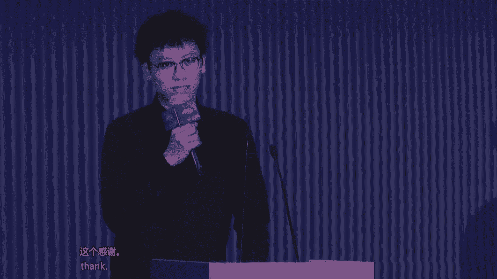

# P11：20240704-人形机器人与具身智能发展论坛 - WarrenHua - BV1iT421k7Bv

🎼我是本。I'm Lina， It today's house from China， and it is my great pleasure to be here with all of you。

 Thank you for your coming。😊，当前，全球正迎来新一轮的科技革命和产业变革的浪潮。人工智能作为其中的核心驱动力，正以前所未有的速度改变着世界，特别是人形机器人与巨深智能领域。

作为人工智能发展的重要方向，也正展现出巨大的潜力和应用的价值。Currently， the world is ushering in a new web of scientific and technological revolution and industrial change。

 and AI as a core driving force is changing the world at unprecedented speed， in particular。

 the field of human nature robots and embeddedbodied intelligence as one of the important directions of AI development is gradually showing great potential and duplication value。

本次论坛由世界人工智能大会组委会指导，世界人工智能大会组委会办公室主办，国家地方共建人形机器人创新中心、中国电子学会承办机器人之心，机器人、技术与应用杂志协办，以人形机器人与巨深智能发展主题。

旨在汇聚全球范围内的专家学者、企业家和创新者共同去探讨人形机器人与巨生智能领域的最新技术应用前景和发展的趋势，共同推动其创新和发展。

di on human robots and embodied intelligence development form。Is hosted by the National and local Co。

 Human Naturalural Robs Innovation Center and Chinese Institute of Electric Electronics and supported by Stch colim and robot technique and application magazine with the theme of human Natural robots and embodied intelligence development。

 The form aims to bring together experts， scholars。

 entrepreneurs and innovators from all of the world to discuss the latest technologies。

 application prospects and development trendss in the field of human natural robots and embodied intelligence and to joint promote the innovation and development。

接下来让我们掌声有请上海市人民政府副秘书长庄木娣上台致辞。nice。🎼大家。🎼与大家相。🎼上海。🎼表。🎼陈伟霆。🎼认为是。🎼可以他。🎼生态载体。🎼我们创作。🎼上下游。🎼继续。🎼与江中晚。多是。

🎼人形机器人。🎼实现了。你公。🎼营造。🎼ささ。🎼想牢牢。机遇以人形机器人产业高质量发展，着力高水平赋能新型工业化。我们将继续开展核心技术的研发，推动高校科研院所企业协同联动。

开展共性关键技术与核心部件的研发共关。我们将持续推动产业生态的集聚，加快全要素产业链的招商，打造人形机器人与聚生智能产业集聚区，并做好配套的活务。我们持续推动示范应用落地，以重大的场景设计为牵引。

依托重点行业。和推动人形机器人应用的落地，探索机器人即服务的新模式，深化工业制造服务等领域人形机器人的应用，争取3年内实现1000台的规模。我们将持续打造产业发展共性底座。

围绕开源机器人本体开源计生智能大模型、开源机器人数据集具，打造支撑全国人形机器人发展的关键性的共性底座，推动新技术新产品迈向国际市场。各位来宾朋友们。

今天参加大会的顶级专家和开发者都是人形机器人领域的先行者和弄曹尔，期待各位业界精英和专家为人形机器人和巨神智能发展激荡智慧，车模划策。我们也将进一步优化产业创新生态和企业发展生态。

不断完善服务和制度供给，与大家携手同行，加快打造人形机器人的发展的上海高地。最后预祝本次大会取得圆满成功，谢谢大家。好的，非常感谢张副秘书长的精彩致辞，请入席就座，谢谢。😊。

Then we have invited Mao Min， a of Chinese Academy of Science and director of the expert committee of the National and Local Cot Human Robs Innovation Center to give us a beach for us less warmly welcome。

接下来有请中国科学院毛明院士为本场活动致辞有请。😊，🎼尊敬的学部长。张秘书长，尊敬的各位专家，各位同仁。亲爱的各位女士们、先生们，大家下午好。但他怀着一个热情的心，在上海这么天气炎热的这样一个气候里头。

大家在这样一个非常热情的这个活动里边。

参加这么一个充满光智慧光芒的这么一个盛会，欢迎大家。我们聚集在这里啊，不仅仅是为了见证人情机血领域里边的最新成果，更是为了共同探讨和塑造这一技术的未来。人形机器人作为人工智能和机器人技术的极大成者。

其发展一直是科技界的热点话题。从学术角度上讲。人形机械的研研究涵盖了机械工程、电气工程、计算机科学。认知科学甚至可能包括我们生物学等多个学科领域是跨学科研究的典型对象。他不仅能够模仿人类的形态和动作。

更在感知决策和交互等等方面，展现出日益强大的日益呃增强的这样一个能力。从产业发展的角度看，人形机器人正逐步成为智能制造、医疗店、健康、家庭服务等多个行业的变革力量。据国际机器人联合会的数据显示。

全球人形机器人的市场规模这以每年超过20%的速度增长。预计到2025年将达到数百亿的规模。今天上午，李强总理讲要达到5000亿啊人民币这样一个规模。这一增长不仅仅预示着巨大的市场潜力。

也反映了社会对智能化、自动化解决方案的迫切需求和期待。本次人行机器与巨生智能发展论坛为我们提供了一个宝贵的交流平台。我期待在这里听到来自世界各地的专家学者分享你们最重要的研究成果。

也希望看到产业界的领袖们，展示你们的创新产品。😡，更希望我们能够共同探讨人形机器人技术的未来发展方向，以及我们站在产学研用的这样一个共同的平台上，如何推动这一技术的健康发展的智慧和思想。😡，最后。

我要感谢本次大会所有的组织者、嘉宾和参与者。这是因为有了大家的共同努力和支持这样一场高水平、高规格的。😡，国际会议才能够顺利的召开，让我们携手合作，共同推动人工智能和人形机器人技术的发展。

为创造一个更加智能、更加美好的未来而共同努力。谢谢大家。😡，谢谢毛明院士的精彩致辞，非常感谢。😊，那今天我们还非常荣幸的邀请到了中国电子学会理事长徐晓兰为本场活动致辞。

 We are also very honored to invite X Xan， president of Chinese Institute of Electronics to deliver speech for this event。

 lesss warmly welcome掌声有请。😊，尊敬的墓地副秘书长毛明院士，尊敬的各位专家、女士们先生们朋友们，大家下午好。很高兴在这个夏草芳纷热浪滚滚的季节来到了上海。

参加人形机器人与巨深智能发展论坛。在此，我仅代表承办方之一。中国电子学会对论坛的召开，表示热烈的祝贺，向长期以来支持人形机器人技术和产业发展的社会各界表示衷心的感谢。2014年的6月9日。

习近平总书记在两院院士大会上首次提出，机器人是制造业皇冠顶端的明珠。其研发制造应用，是衡量一个国家科技创新和高端制造业水平的重要标志。

就此开启了我国机器人产业从无到有、从小到大从大向强的这样的一个历史跨越，时隔1年，在今年的2024年的6月24日，习近平总书记在全国科技大会国家科学技术奖励大会两院院士大会上强调。

要瞄准未来科技和产业发展制高点，加快新一代的信息技术人工智能、量子科技生物科技。新能源、新材料等领域科技创新，培育发展新兴产业和未来产业。这无疑未未来十年，我国机器人产业从大到强指明了方向。

人形机器人并不是我们概念上理解的像人的机器人。我们认为人形机器人的这个人是指的是人工智能与机器人融合创新的产物，是芯片传感器、软件、人工智能、通信、机械材料等诸多前沿技术综合应用的及大成者。

拥有智慧的大脑、敏捷的小脑、灵活的肢体，是科技竞争的新高地、未来产业的新赛道。经济发展的新引擎蕴藏着巨大的市场空间和发展机遇、工业和信息化部高度重视人形机器人产业发展，出台了人形机器人创新发展指导意见。

支持中国电子学会举办了八届世界机器人大会，有力推动了我国机器人产业的跨越式发展。在工信部的指导下，中国电子学会去年发起成立了中国人形机器人百人会，目前正在筹建人形机器人行业标准化技术委员会。

希望广泛的调动产学沿用各方面的资源，推动人形机器人产业高质量的发展，培育形成新智生产力高水平的。赋能新型工业化。一是助力核心技术突破，发挥人形机器人制造业创新中心、重点实验室等平台的作用，凝聚各方力量。

开展关键核心技术突破和产业攻关，推动龙头企业牵头组建创新联合体，加快人工智能与人形机器人深度融合，打通大脑、小脑肢体环路，不断提升我国人形机器人的企业的竞争力，加强人形机器人与脑机接口等前沿技术的融合。

探索跨学科跨领域的创新模式。二是支撑应用场景拓展，面向不同的应用场景需求，推动开发低成本交互型高精度型以及极端环境下高可靠型等人形机器人的产业链供应链体系，加速人形机器人。

在安防、特种制造、民生服务等领域的示范应用。三是推动产业生态建设，发挥链主企业的作用，带动产业创新资源集聚，培育大中小企业协同创新的良好生态，打造一批具有生态主导力的人形机器人的龙头企业。

发挥挥好世界机器人合作组织、人形机器人百人汇，世界机器人大会等等平台的作用，促进技术交流、供需对接、国际合作、深化创新链、产业链资金链、人才链的深度和。积极参与国际标准的研制和规则的制定。

不断的提升我国机器人产业的影响力。女士们、先生们、朋友们，上海在人工智能和制造业领域基础扎实、创新力强，为人形机器人产业发展提供了优越的条件。今年5月。

工业和信息化部、上海市人民政府、国家地方共建人形机器人创新中心正式成立。为打造及技术研发成果转化、人才培养和平台服务为一体的创新生态奠定了良好的基础，也希望大家借助本次论坛洞察发展趋势，分享创新经验。

共享市场机遇，携手开创人形机器人产业发展的新局面，服务和创造人类更加美好的未来。最后，预祝本次论坛取得圆满成功，谢谢大家。好的，非常感谢您的精彩致辞，请入席就坐，谢谢。😊，那在今天论坛的现场。

国家地方共建人形机器人创新中心将重磅发布全球首个全尺寸开源公办人形机器人青龙。让我们有请国家地方共建人形机器人创新中心首席科学家姜磊为我们主持本次发布。

At the scene of today's forum， the National and the local Co Human Note Robs Innovation Center will launch the world's first four sides open source public portion of healthy loan human Note robot。

 Now， let's invite Leijio National and local Ko Human Note robots In Center。

 chief scientists to preside over this release for us。 Please give a round of applause， Zhang Sheyou。

好的，尊敬的各位院士，各位来宾。那么也是今天很激动。我们在上海成立了国家地方共建人形机器人创新中心。我们大概用了6个月时间。那今天呢我们给大家首发呃。

青龙全全球首款的全尺寸通用人形机器人开源公版机下一页。那么在呃开开完之前呢，我还想再多说一句，为什么要组建我们这样一个国家地方共建人创新中心？我们都在说人形机器人是个非常热的话题。但是我们要冷静的思考。

因此呢，我们把人形机器人当前面临的问题总结为这样的一高五难、硬件门槛难、软件算法难、软硬结耦难知识积累难、人才聚集难、安全应用难。那我们如何破解呢？

我们想我们国家地方共建创新中心可能是这样一个解法的解要。下一页。呃，因此呢，我们大概在5月17号，由工信部的金壮龙部长为我们国家级的创新中心进行了揭牌。我们目标呢是聚焦共性技术。

加速国家地方共建创新中心的组建。那么大家应该来的路上路过了我们展馆。这次呢，我们邀请到全国15家的人形整机一起来集中的亮相。那么相比于两年前呢，我们人形机器人的起产业，现在是蓬勃兴起。

那么大家呢都有一个共同的想法，如何打造我们国家一个人形机器人的底座技术，因我们国创中心找的一个途径，就是开源。那么为什么要开源呢？从龙年开始？今年2024年刚好是我们国家龙年。

在这个世界上关于机器人开源的前三件事。roose跟hub跟face都是呃由国外的学者进行开源。那么我们就在想中国能不能有一个完全全尺寸开源的这样一个社区。

因此呢我们在今年的6月6号已经在呃人形机器人的开发者大会上进行了开源。大家可以记住这个网址叫oen loan点 oG点CN。我们是希望建立一个以端到端大模型驱动的这样一个人形机器人整机平台。

那么我们这个机器人有什么特色呢？一会儿我的同事们还会给大家进一步的介绍，大概是一个长得很高，载重很大。呃，但是呢看上去外观还比较这个有趣这样一个机器人。那么我想发一个预告的呢。

因为大家都知道我们的roose是每年有一个公版机。那roose呢都是用英文字母的HYJQ作为版本号的引导。所以很多人问，为什么我们今年是青龙。我说哎，我们大版本是Oen loan，我们今年是青龙。

那么我们今年所有的机器人以旋转执行器作为我们的主驱动单元。那么明年我们是希望发布一个叫snake deep就是我们这个12生地之生效来排列，也展现我们中国的文化。

那么明年呢我们会发布一款以直线纲为主的一个人形机器人大版本。我们这个团队是希望每年发布一0版。这样呢大家拿到我们的这个设计参考，可以更有的方矢的做很多机器人的创新，这就是我们的梦想跟愿景。

让更多的人能够参与到机器人的。创新，并且呢发挥出我们中国人多力量大的优势。那么下面呢我想从四个板块，机器人的平台技术，机器人的具深智能技术，机器人的场景跟数据集以及智能训练场。

其实一会儿我希望请大家思考现在的通用人机器人的核心技术，还光是平台吗。那么我下面呢想引出我的四位同事来分布就这样四个板块进行讲解。首先有请我们机器人平台技术负责人梁振杰博士上台。好的，谢谢江总。

下面由我为大家介绍青龙人形机器人呃，全尺寸通用人形机器人平台技术的设计方案。那人性机器人呢一直被视为适适应人类活动环境，模仿人类行为，实现人机共融的最佳载体。那呃呃从机器人平台系统来讲呢。

可以划分为行走与驱动系统，操纵与作业系统感知与控制系统三大模块创意中心的全程通用人性机器人，以始终秉持强对标通用化、智能化和多模态的设计原则和设计要求。通过呃巨身智能设以满足巨身智能载体的最终要求。

在以上四项设计原则的要求下，我们行构建了人机融合的总体设计指标设计指标体系。呃呃，结合系列化核音部组件的研制，实现了高动态、高承载、强仿声、全尺寸的人形机型研制。在构型和自由度配置上。

轻龙人形机器人身高1。85米，体重80公斤，整机集成了43个主动自由度。我们实现了在呃机器人呃头部、手部、臂部以及腿部、腰部和踝部全尺寸对标生物人的一个呃全尺寸设计。采度系统呢。

我们追求轻量化高光度和低惯量，打通了仿生到仿真到实验验证的一个正向设计研发流程，嗯，实现了呃双足机器人仿生机构与结构设计。在动力系统和电电源管理方面，人应机器人的使用工况与常规的四部设备不同。

它存在着循环交变那个损态爆发和反电动是大的特点。那轻入人形机器人呢搭载了具有能量回收系统和输出稳压管理的电源系统，以支持整机的3到4个小时的全工况稳态续航。关节模组作为这个硬件系统的核心组成单元。

整机共搭载了两类10种31个关节，最大关节扭矩达到396牛米。那最大扭矩密度呢我们实现了200牛米每公斤的一个扭矩密度。这样以来保证机器人平台的一个强硬的动力输出。

那针对我们对这个机动能力负载能力和呃呃过载能力要求更高的这个腿度系统，我们采用了高扭矩密度的轴向程动电机加低减速比行音检速器的准直距方案。那针对更为关注我们的作业精度和交互特性的上肢呢。

我们的采用了高功率密度的呃电机加斜波减速器的SEA方案。呃，操纵与作业系统，我们搭载了这个质量轻构性巧，作负载能力强，作业精度高、大场景比的其自由度GAB与集成触觉感知的感知能力的五指零条手。

为我们后续机器人那个模仿学习和智能交互提供了一个完备的硬件载体。在通讯系统方面，我们采用了多主站实时同步的高速一开的总线系统，以满足3整机33个从站系统的从站的实时稳定高速通信。

另外我们也兼顾了模块化和扩展性，以满足后续开发者经行二低成呃低门槛的一个二次开发。同时呢机器人平台还搭载了具备400Ttops的高高算力的巨身智能控制器。

其丰富的外设接口可以满足机器人本体以及呃常规外呃外设的一些使用要求。另外，平台本体还集成了视听触嗅动、无感融合设计，以满足机器人后续与机器人与环境的深度感知与融合。

那整个回顾我们整个青龙机器人平台的研发历程呢，整个核心我们的核心技术其实是经过了11年的一个技术沉淀。在上海也经过了半年的时间，其实是更多的是一个勃发的过程。我们实现了机器人平台。

从无到有从1到10的一个本质性突破。那创业中心硬件研发团队呢后续还是会始终秉持着我们开源开放的这个初心，也期待更多的生态单位来加入我们，最后呢也是推荐大家持续关注我们的欧鹏龙开源社区。呃。

青龙人心机器人后续的开发版本呢相关资料会在我们开发社区上开源社区上进行一个持续的更新和发布。那谢谢大家。呃，上来时间。好的。感谢我们梁胜杰博士下面的这个板块呃，大家想机有了机械。

就是我相当于我们机器人的骨肉。那么如何能动如何能控制呢？我想请出我们巨生智能负责人田充为我们进行一个讲解。呃，感谢江总。呃，接下来我将为大家介绍一下我们在聚深智能方向开展的一些工作。呃。

有了一个可靠的身体，下一步我们就需要为机器人打造一个智慧的大脑，来赋予他感知、规划、决策呃以及控制的能力，实现我们让机器人独立完成任务呃的一个愿景。呃，为此，我们打造了朱雀巨身大脑和玄玄武小脑模型。呃。

朱雀具身大脑呢？它是一个以多模态多模态大模型呃，为核心的机器人指挥调度中心。它以文字信息、图像信息作为输入、输出语音交互以及任务决策信息。玄武小导模型呢是我们的具体任务执行模型。它分为两个模块，呃。

一个是北计规划模块。另外一个是我们的运动控制器。呃，这里我们的北极规划模块是以端到端的模仿学习所驱动的。记载视觉作为输入。然后与人类的。呃，作业作为一个。呃模仿的对象输出我们的期望。

在移动控控制器方面呢呃我们走了两条技术路。🎼一个是继续强化学习的。包板。一个是基于全身动力学的模型预测控制方法。呃，他们呢以环境信息以及机器人的状态信息作为输入。然后输出我们的关节立柱。

以保持机器人的平衡，然后同时能。同时完成我们的控制目标。然后在我们的朱雀大脑，还有。呃，轨迹规划系统发育尚不完全呃发育尚不完全的情况下，我们同时还可以利用我们的摇缩作系统作为我们的输入，呃。

作为呃控制我们的机器人完成任务。然后这一过程呢也可以用来收集数据。呃，用以发育发育我们的朱雀大脑和轨地规划系统。呃，这里呢我们的朱雀大脑其实就是一个机器人的大模型调度平台。呃。

它利用多模态大模型的感知能力，呃，任务理解能力呃记忆能力以及规划能力呃，帮助机器人完成了他的他的一些任务。呃，下面有请我们石存磊博士。呃，我们的巨深作业的负责人来做一个展示。你好，青龙。你好。

我是青龙人形智能机器人，能帮你做家务，陪聊解闷。你看桌面上有什么。我看看。桌面上有三个面包，两个水果。呃，专门有点案，你能帮我清理一下吗？好的，正在为您整理桌面。我将把面包和水果分类摆放。感谢石博士。

这里我们可以看到我们的机器人可以通过语言信息理解人类的意意图。然后同时根据现场的环境做出一个动作的判断。那对于小脑模型呢，我们认为呃目前有主要三条技术路径。一个是传统的控制理论，然后是模仿学习。

还有强化学习。对于控制理论呢，它的可解释性比较强。模仿学习呢它的训练难度比较低。强化学习呢它的智能体可能较呃有较强的鲁棒性。因此我们认为我们应该结合这三条路径的优点。呃，来打造我们的小脑模型。

在这个过程中呢呃我们首先收集了大量的人体数据，包括他的作业数据和运动的协调数据。然后以此为基础，打造了行为策略和行为标准。呃，然后呢我们利用了控制理论，强化学习两条路径，呃，打造了我们的运动控制器。

在这个过程中呃，我们三条路径相互启发，相互支撑，使我们在3个月内完成了一个算法的开发部署以及迭代。🎼这是我们心动的一个效果。🎼在强化学习作。🎼。🎼每次都是安全的明前一。呃。

当然我们目前的那个模型呢还是发展的初期阶段，它的能力仍需要提升，然后功能也尚不完善。呃，因此我们希望未来呢大家包括我们的开发者、爱好者和研究者，都加入我们的op克龙开源社区。

然后我们共同打造一个把感知呃交互规划以及控制作为本能的机器人，谢谢大家。好，感感谢田充博士。下面呢呃我们把机械开源给大家，把巨生智能开源给大家。但是呢人工智能是数据驱动的是核心问题。

所以现在把时间交给我们数据负责人邢博洋博士来给大家做一个讲解。🎼好的好的，谢谢江总，还，谢谢各各位来宾。那下面由我介绍一下我们的开源数据集这一块的整个的一个内容。那我们相信的话，人形机器人呃。

在居身智能这样的技术构型上，那大脑小脑居身数据越来越富极。那它的智能越高，能力越强。大家刚刚看到的演示呢，我们是通过端到端神经网络来驱动，通过我们的整个框架中是包括了巨身大脑和巨身小脑部分。

我们相信是需要非常多的锤泪的数据和这个专用的人体技能训练数据和运动数据来进行一个综合的训练，才能提升它的整体的一个能力。那国贸中心呢创新中心这一块呢，也是在很短的时间打通了一个基础的一个闭环。

实现了人性机型人数据采集、评估清洗、训成一体的一个全环全流程的一个闭环。从工具到评估到训练到部署的话呢，提供了完整的一套的这个基础的一个解决方案，也为行业呢提供了一个可以参考的一个设计理念。

下面是我们展示的比较典型的两类数据采集方式。一类是通过全身运动捕捉系统，完成对高精度、手部动作、手臂动作以及全身动作的一个采集。通过这个数据呢，我们可以训练人机器完成走跑跳、抓拿放等多种技能。那下面呢。

针对灵巧的专用作业和精细作业呢，我们是通过视觉捕捉系统完成毫米级的手部动作的采集来支撑我们人形机行未来灵巧作业方向的一个数据的支撑。那针对上面三个环节呢。

我们实际上是希望能把控从数据采集、数据评估到最后的数据管理分享这样的一个标准化的流程。同时呢提供我们标准化的数据集采集工具和基于数字完系统完成的快速数据二次评估以及标注这样的一个方法。

通过构建开放开源的这样的一个标注工具呢，让大家加入我们的数据构建和训练场构建这样的一个工作中。白鼠白虎数据级是我们数据据板块的一个名称。那我们希望在3年时间内呢完成。呃。

1PB清洗后数据级这样的一个呃构建。通过我们100台这样的一个共享采集设备呢，在联合我们50家的联盟单位一起来加速这样的一个数据构建的这样的一个过程。同时借助我们的欧美龙社区。

加速数据标准以及人形机器人专用标准的一个建立。那人形机器规模化数据是整个行业目前最大的痛点。当然，只靠创新中心来完成这个任务，仍然非常艰巨。我们还是希望通过生态和联盟单位一起加速这样的一个数据及构建。

服务整个行业。同时呢通过开源数据场景和行业专用数据场景来赋能不同的行业和人形机型的应用。最终呢我们还是发起一个倡议，希望能邀请合作伙伴和人形机器人整体联盟，一起加入我们的整个的开源社区和开源数据联盟。

通过社区和训练场这样的一个创新机制来加速我们人形机器人聚身智能训练以及数据集构建整个工作，同时也通过我们提供的预训练模型微调和评测服务，帮助很多的创新企业，加速他们进入行业落地这样的一个过工作。

那谢谢各位就是数据集的部分。下面由时间交给江总。好，感谢邢博洋博士。那数据呢是人形机器人未来的灵魂。那么当然呢，有了数据以后，我们下一个要考虑的是什么呢？就是我们最近在思考的一件事。

也是呼吁更多的力量能投入到人形机器人智能训练场。下面把时间呃交给我们刘宇飞博士来做这部分的分享。好，感谢江总。呃，下面由我来介绍智能训练场的板块。😊，首先为什么要建训练场？呃？

因为我们发现人形机器人的应用主要还是采还是在难点在于场景应用难和高质量数据获取难。像24年特斯拉他们发布的电池分拣的一个任务训练，里面就给我们一个很好的demo。

这里边呢其实我们训练场里主要还是要要去做搭建场景的模拟模拟产线，还有工业流水线的规模化数据以及检测评估的一个基地。像谷歌RT one呢在在已经开开源了他们自己的一个数据集。

其实他们投入大量的人力和资源来做在17个月里边只收集到了13万条比较高质量的数据。因此呢我们需要通过训练场的这种方式来收集多模态一个数据，打造基建的一个测试平台。并且采集高质量的一些数据。呃。

我们在针对于整个人形机器人的场景呢做了一个技术难度的分级，把它分成了L1到L4级，分别对应的固化环境到完全的动态环境。我们也针对了人形机器人，它他的整个的能力分解到了学习能力运动能力和作业能力。😊。

我们也分解了整个的点型场景，包括L一固化环境里面的产线巡检、低精度上下料等。这也是我们我们的青龙人形机器已经在做模拟产线应用的一部分。到了L4级，我们未来希望能够有人形机型做精济操作以及零部件加工等等。

😊，呃，我们整个的训练的场的架构呢，我们把它分成了5个部分，分成感存算学用。感和存主要是做了用来做云端数据的采集，包括要操作的数据、音频数据、自然语言运动捕捉等等的数据。

我们也在云端搭建了一个存储的数据存储中心。在算和学这，我们我们主要是在做机器人的技能模仿学习和强化学习。主要是要用来去做单臂双臂以及全身行为的一个运动的训练。呃，在用这块。

我们主要是在工业之产线以及服务等场景里边来实现人形机芯第一批的模拟的应用。😊，那人心基因训练场怎么建？首先我我其实训练场它的归根结底是一个数据生产和数据规模化的一个场地。

所以说我们会搭建一个数据管理的平台系统，打造机操作端和机器端的云云端云网端的服务器。在这里边呢，我我们会建设实时的标定系统控制系统，数据采集系统和数据反馈系统。通过数度孪生来生成合成式数据。

通过异构人形机器人来打造真实和生成式的数据。😊，呃，整个训练训练场数据我们有一个生产方法，这里边包括三个阶段。第一个阶段呢。

我们是通过斯坦福阿罗化开源项目来打造了我们现在的呃单臂的单技能学习和以作业对象的环境与环境的一个泛化能力。在这个过程中呢，第二步，我们是基于前前面六自由度协作弊。

把这套技术路线迁移到了我们青龙人性基因上肢上来做了多技能的一个学习和训练，能够实现一个多技能的呃模仿学习。到了第三阶段，我们会在未来做大规模的人类作业视频的呃产生这种低成本规模化的数据级的一个工作。😊。

呃，这个是我们创业中心基于以上的研究成果呢，做的open mini gym的呃整个产线的一个上线。呃，这块呢我们在我们的网站上已经发布，主要是做抓取、搬运协作，展示了这些的能力。

未来我们的目标图像主要是面向制造业、国家重大战略需求，还有特种环境、民生服务等应用。在2024年，我们会在上海打造100家人形机器人的场景，100家人形机器的一个训练场。在2027年。

我们会想我们期待能够在城各个城市以及各个场景搭建1000家人形机器人的训练场来服务整个人形机器人的生态。😊，呃，最后呢我们非常希望期待未来有各个有多的场景应用方。

人心基金总金公司核心部件的上下游企业能加入我们麒麟生态训练场，然后共同去为人心基金的应用呃做出我们自己的贡献。感谢大家。下面时间交还给江总。😊，好，感谢刘宇飞博士。那么下面大家都一定在想。

我们的人形机器人技术状态是怎么样。所以先想先先请导播帮我们放一个人形机器人的这个呃我们最近的公版机的发布片。大家先看一下我们的青龙人形机器人到底具备了什么能力。😊，来。一个智能人形机器人。🎼你好。

🎼请帮我打点水果。🎼这里有香蕉。🎼，🎼好的，那么下面就有请我们人形机器人登场，给大家亮相。这就是过去我们6个月共同努力，也是我们未来6年甚至更久时间，希望跟大家一起共创我们国家呃人形机器人的生态。

下面有请我们5位呃四位作者跟我一起跟机器人向大家一起致谢。好的，再次感谢大家。那这就是我们呃青龙。😊，开源全尺寸人形机器人，请大家关注我们的网站，3W点欧奔龙点ORG点CN。

那么我们所有的视频呢也在网上可以看到回看。那么我们的呃开元社区也等待着大家一起进入我们未来的共创人形机器人事业。感谢各位，我们一起向大家表示致谢。好的，那把时间再交还给主持人，请青龙退场。呃。

更多的呢我们会在我们的展会，我们在国家地方共建人机人创新中心展台，还进一步上下午两场会进一步展示我们的人形机器人。好的，谢谢，非常感谢江总的主持，谢谢。😊，那在这个时代，我们都认同一个价值。

就是链接和分享。在信息化的今天，我们更需要做到的是打开窗，而不是建高墙，去破除数字的鸿沟，让创新的活力不断的显现出来。那今天非常遗憾，ra ready先生呢由于特别的原因不能够来到现场。

我们也期待啊下一次能够听到他的精彩分享。😊，It's really sad to inform you guys because of a special circumstance， Mr。

 Ru ready really not be able to come to our conference。

 so I hope we can have another opportunity to his sharing。

接下来我们将有请美国亚马逊公司前首席科学家 Andgen先生带来主报告他将以人工智能之后人类还能做些什么为题为大家带来分享 Now， please welcome Mr。

 Andgen from chief scientist of Amazon who will give a keyote speech on the topic of what's left of people after AI。

 Please give a round of applause for Mr。 And。😊，Hello。

It is an honor for me to be here and to talk to you about what I think is left for people after AI。

So， let's。Maybe start。With a little bit of what that bio。So， I wrote a book。

Called data for the people。As you can tell from my accent。I am from Germany， and I studied。

Physics and philosophy。But ultimately， I'm just a data person。

So I'm interested in what can we learn from data。So there are two ways of thinking about it。One is。

What can you learn？As humans from data。And the other one is， what can we learn at。I mean。

 you should work。诶。And I。呃。Do we have a problem with a microphone。

Can people raise your hand if you can hear me。Alright。

 So one of the things we learned is that if there is no problem， don't try to solve it。O。

 back to my talko， what's left for people in the age of AI。

So I did my undergraduate in Germany and a year in Cambridge。And the areas I worked in。

Was electrical engineering。Physics and philosophy。So somehow， there's a pretty good combination。

To talk about what we are talking about here。Whats that for people。Then I came to the United States。

I had my PhD at Stanford University。And it's pretty crazy。Back then， I came in 1986。

I picked as a topic。To work on neural networks。For prediction。Actually。In mysteryery。

I was going to work in physics。And my PhD advisor。He。Ask me， one day。

What do you want to do for your thesis。And I said， give me a few days。手。I then came to his office。

 and said。Jonathan。I thought about it。And I don't want to do it in physics。It O。

What do you want to do。 And I said， I want to do it with a person in this psychology department at Stanford。

David Romerhart。Okay， he said。Okay。And。I was wondering many years later， when I gave a colloquium。

 Why did he not throw me out of his office saying， look， I spent all the time and money on you。

 And now you're just going somewhere else。And so I gave a colloquium， and ask him。

Why did you not throw me out of the office。And I said。Andreas， the way you came into office。

 I realized I have no chance。You had up your mind。 You had made up your mind。So the chance I had was。

To be nice to you and to be honest， the stipend would pay a graduate student。In the scale。

 on the scale of a national accelerator， national lab is negligible。

 So I might as well be nice and say， absolutely。😊，Alright， so that's my PhD。Then， in terms of work。

What did I do here in this area。I was the chief scientist at Amazon。

I was the only chief scientist Amazon ever had。So Jeff Bezos， I worked directly with him， hired me。

 and many people asked。What was your job。At Amazon。As chief scientist。And the answer was。

One hour a week。Monday afternoon。Came to Jeff's office。Andtelative pieces。

 something he will find interesting。And doesn't know。

And it didn't have to anything to do with his work or my work。 anything would work。

So I think that's a very good model for very rich people。To hire somebody。

And have them come once a week and tell them something which they think。Is interesting for them。

I was advise to Jack Ma。And there is that video out there where Ma Yuun says in Hangzhou。

Don't call me Jack Ma anymore。Call me data Ma。So that brings home to the point that data is key。

I also was advise to Angela Merkel， the German chancellor， the former German chanceancellor， a very。

 very bright woman。 So anyways， So that's my background。

 What I want to talk to you about is what is the value of AI。What's the value of AI？

So what's the value of data。The value is the。Impact。The data has on decisions。So similarly。

 the value of AI is the impact it has on decisions。Next。

I want to talk about the interactions that people have with AI。And I want to give you three examples。

The first one you probably all know， is open AI。It open the eye， creating text for you。

The second one。Is auto dot AI。So A is an AI。 It's a big neural network。And what it does， is。

I creates text。So you tell O， I would like to have a text that long talking about this and order that AI were simply created for you。

The third one is yet another journey I think called Novalab dot AI。What Nobalab does is first。

 they created text。 So you'd say you want to have a science fiction story， which， you know。

 you say it's placed in the evening in a forest and you want， you know。

 a boy meets girl or whatever it is。So that's it takes。But Nouval La， DoI does much more than that。

They also create the cartoons。Let go with it。So I can only invite you to try out those things。So。

The other day。I went to Los Angeles and had dinner with a friend of mine who is a filmmaker。

And I asked him what he thinks about that。And very smart guy went to Stanford with me。

 very good filmmaker and。What do you think is answer was in being asked。What do you think about。

He said， oh， it misses the human touch。And that's when we realized。That we had lost against the eye。

If the only thing you can say， that is a difference between the AI。And the human being is what。Well。

 it's not a human being。then， you realize。We have lost。The race essentially against the AI。

So how you should think about it is not race against with theI。

 but a race with the AI so that together， we are going further as opposed to it。

 we are going against each other。So。My question is。What's left for people。Last week。

I went with my friends。From the Berlin Philharmonic Orchestra。EAnd as you can tell。

 they were in Shanghai。 And this is， you know， same standing in front of a picture， very complicated。

 What's real， what's unreal。Isn't it interesting。 It's one of those things where I think we don't know anymore where we are。

 So they gave a concert， and then we talked about what is left for people。

And I think what's left for people is。Going to a concert。Not the composition of music。

 composition already， I think， computers that you feed with everything humanity has ever written。

From some pieces for chin to in and symphonies that for composing music。

I think we already lost that race。For playing music。Well。

 I think what musicians create in the concept is quite special。

 So I don't think we have lost that race yet。But ultimately， it really is us。Listening to this。

 so that human performance。Giving our attention， our undived attention to the music。

Being really concentrated。And being appreciative of what happens to us。That one， for me。

 is one of the things that's left for people。So。There are other things。And。

There's an Austrian philosopher called Ludwig Wi style。He。Was an Austria born in Austria。

 He went to Triity court in Cambridge， and he created the term of epistemologically private items。

I know that's a difficult term， And I can only feel sorry for our amazing interpreters who will try to explain that。

 And what it means is that only you will know。So the example Lu Hiten Sha is giving is somebody lying on the floor。

In pain， clearly in pain And when bystanders come and。And then he gets up and say oh。

 I wish that kidding。So that， I think， is an example of what robots can do as well。

 like our friend over there。He could lie or she could lie。 It could lie。 I don't know。

 Is it he or she。She， okay， so she could be lying on the floor and say， I'm in pain。

 and then people would come and try to help her。And then she says， oh。Pre kidding。

How do we know what the reality is。So， to summarize。

Where we are here is that we have a eyes which are very difficult to distinguish from the human。

We have to be careful to not only say， always obvious that they are not human because they are not human。

 We really should be wondering what makes the difference。The example I gave you， instead of music。

B didn Phililharmonic visiting here。And I think， our appreciation。

And I'm going to end with this story。A friend of mine。 Daniel K ofman。He got a Nobel Prize for。

Juddgegment and decision making。He also。Came to my wedding。 He spoke at my wedding。

And when I asked him at last time。You know， he said， you know， what do you want to talk about。

 And I said。You know what I'm to talk about。What is love。And he said， oh， Andreas， come on。

 you always talk about an interesting thing like neural networks and machine learning。

 I have nothing to say about it。 What is that。 On that note。

 keep in mind what might not be captured by us。 And thats at the end of the day， what keeps us human。

Thank you for your attention。Now we have several questions。如果说大家有一些问题想要提问M。andrewegen的话，也可以举手。

Please raise your hands up， okay。好的。Thank you for your wonderful speech， no question。Okay。one。Hi。

 I'm Yuhan。 I'm from Columbia University， and I'm a Ph student。 Actually。

 I thought we probably met before on Bezo's Mars conference。And yeah， so my question is。

 what's your next。Are you。Are you willing to join some staffs about AI company。So。

Our friend from Colombia in New York asked， what's next。

I think I am very happy by working with a number of startups。😊，So Auto dot AI is a company which。

 as I said， creates text。 And then there's another very interesting company。

 which does emotion recognition。So it reads your face。 Oh， yeah， that's my work。Thanks， robotic。

This year， okay。So， I mean， there are many， okay， great。

 So there are many companies which do similar things。 I。

 I love how surprised you were about me saying that。😊，Yeah， I will， I will talk about that later。

 Okay， you willing to hear about that。So then to close my PhD advisor， Dave Rumerhart。

 who invented neural networks。1 said when somebody else came。From the National Science Foundation me。

 me， look at me。 I invented neural nets。And then， Dave Rohard just said。My dear friend。

 it's just the chain rule of differentiation。Which goes back to a guy 300 years ago。Okay。

 I think that's it。 But that's it。 I don't know if there's one。

 one person in the back desperately waving your hand。 And this ladies。Okay。

 thank you for coming today for the excellent speech we have today， so my question is。

 so what do you think about what do you think are some of the concerns about AI safety and governance for human beings？

And I， and what do you think， like， what should human beings should be prepared for AI or robots or something like that。

Thank you。Okay， so the question is， what do I think about AI and safety， here's the answer。

The most common cause of death。Are traffic accidents。

So more people get killed in traffic accidents than in anything else。I live in San Francisco。And。

I don't remember。When I last took。A taxi on Uber。Wherever we go。We take something called way more。

Now。I'm not sure where self driving cars are。Like， do you have self driving cars in Shanghai。6。

So San Francisco。As I said， honestly， I cannot remember when I last took an Uber。

 We always order a way more。 And it's really amazing。 There's no driver in the way more。😊。

The way more comes， very good cameras。 It pulls over， then use your mobile phone to unlock the door。

 You get in， and it says。Hello， Andreas， hello is who are whoever ordered the memo。

 And then it takes you there。You can play music from your mobile phone。And you arrive。And it says。

 you have arrived。And then you open the door， and you get out。No driver。

So sometimes I think when people talk about AI in the future， look at the present。

Look at what you already， what we already have in San Francisco and use on a daily basis。

So that would be amark I have towards， you know， robots and AI。

The present already is here。But。😡，Not even distributed。Which is。The Apple Co founder who said there。

Thank you。 Thank you。

That's it， okay， thank you so much。Thank you for a wonderful speech。 Please be seat to it。🎼好的。

那在我们的论坛进行当中呢，大家也可以扫描一下我们屏幕上方的二维码，获得实时的翻译。please the code接下来将有请东盟智慧产业联盟陈智生来盟报告。

🎼Poential and prospect of human natural in S EN manufacturing industry。 and welcome Mr。 Chiiff Tan。

 please welcome。Thank you。🎼Hello。Hello。I think， okay， may I know how much time that I have。G okay。

 hello， a very good afternoon to all It's my honor to be here and to be invited by Chinese Institute of Elects as well as humanoid robot company it my honor to be here。

 So I'm G Tan Tan I'm from Malaysia， I also the president of the ASEN intelligent industry Federation。

 So I start with this P to let you know about what happened in the ASEAN。 before the ASEAN。

 I talking about the trend in the world。 Of course。

 this the first I like to show that is a factory market size from 200023 to 200032 in the US dollar billion I think of course。

 you know， In or in the world is very progressively well doing well。

 I think especially the China in terms of the technology and once China do a lot of good things。

 very good。😊，As why today you have see the， the human robot are in， in this room right。

 I think it is very impressive。 I think I know that it took about six months。To have this robot。Okay。

I think the old year from the， I think this year onward。

 you can see the very progressive well of the spark factory market， even in Malaysia。

 in Singapore and Thailand， there are few policy that are looking into the industry 4。0。

 and then the the spark factory for Malaysia。 now we are focused on the new industrial master plan。

From the this year to the 2030。 Okay， so the advancement technology will be applied to enhance the。

 the quality and the obscure the industry。At home。Okay， this is the end data。

 I think more more or less just start talking about the data， right。

 this P show that the messaging actually create a lot of data， okay。你 don't tell why I saw this。

And then， of course， leveraging worldwide， the trend is doing very well。 Of course。

 you don't talk about the geopolitical tension。 and this and that。

 The messaging industry is still doing well because of the demand for the market。All over the world。

 right， Of course， the very added in the manufacturing market is projected to amount about the $8。

6 trillion in the 2024。 Okay， compound annual growth rate of the 1。09% is expected。

 and then the very added per capita。In the market is projected to amount US dollar。

 about 1000 and109 in 2024， the very margin in the market is projected to amount 25% in this year。

 The output in the market is projected to amount about US dollar，34。

8 trillion in the in this year as well。 A compound annual growth rate is 1。05% is expected。

And the upper per enterprise in the market is projected to amount US dollar 6。3 million in this year。

 and the in intensity in the market is projected to about 26。5% in this year。Next one。

 the number of enterprise in the beverage trade market is projected to mile 5。

53 million in this year。 But this data， I think， is a not included， including China。

I think the the this status are。We will not get the the exact figure。

 I think this figure should be more la， if include the China。Right。

 and then a combined growth rate of 2。11% is expected。

 The enterprise density and is market is project to amount 714 in this year。 But overall。

 you can see that the projection for this year and on is doing well。 even though， of course。

 I know that something happen in in in China， right。

 very vast competition among the company in the industry。But I think the for industry in China。

 it's good to go up， go overseas。Can I to explore the market in the， in the world lah。

They about 10 countries。I think the ASA also have a good agreement with China。

 and then we have also have the R C EP right，10 plus 5，10 are 7 countries plus five countries。

 including China。Okay。So we have a very close collaboration between China and ASEA。

 ASA also one of the important exporter to， to As as well。

So my topic for today is a potential and prospect。Of humanoid robot in Asian packaging industry。Okay。

 but four。For now why， I think the ASEN is not so advanced like China in in in a hole in the toddle。

 So it's very challenging to apply the human robot in the As now。 However。

 there are there are different market。 you can maybe can force it in the future。

 How the human robot able to。Marke to， to AS， as well as adopted by asset industry。So。

 this one is here。So I just tell you about the demographic of the AS population， okay。

This is the chart about the number of population and population growth rate in ASEN between 2013 and 2022。

 Of course， the number is increasing。 I think cur， we have about in ASEN10 countries we have about 671。

7 million people in ASEAN。 The growth rate is about 1。2%。给不 you。For last whole year。

 and that population age group this very interesting。Why we want to talk about this demographic。

 Because I wanted to know that the， the workforce in the ASEAN is it's actually just like what ASEAN No。

 what does China have in the past few years。Right， more to a labor intensive market。

 So we can see that in this chat right， the age group between 20 years old to 55 years old is a major。

Okay percentage in this population， which consists of 50。6%。Okay， why I will show this， you。

 as you know what， if you know about the ASEAN， the best country to be invested invest by China company。

 actually go to Vietnam。We not have a very good policy。

 and then the labor is very low as compared to others Asian countries。 However， for the high tech。

Rer industry， most of the company will go to Singapore。 The first try will be a Singapore。 However。

 the cost of the operation in Singapore is high。 It's the highest among the AsianEN。countriesries。

 so where， where are the companies will will will be go go to。

 They will go to Malaysia or Thailand and Philippine。 And now for， for。

 if youre in touch with the semi industry。Besides Singapore。

 Malaysia is another one that are booming a lot after the geopolitical tension。

as well as you can see that the Thailand and Philippin。Oh， sorry。venture into the semi。

 as well as the Vietnam。 Okay， But for Malaysia now， what is booming in Malaysia is about the。

 the data center。Ter center， why， because Singapore is cannot cope with the。

 the the more data center to be built in Singapore， especially about the power supply and。

 and the land cost is very high， okay。So， next one。Its a population in the by age group。

 But of course， I'm gonna show you the fifth20 to 54 years old。

 the highest population in the is in Indonesia。The labor cost is very low。

 The the number population is high。 however， is not a preferred country to be invest。

Invested and then the prefer more to other countries that give a better incentive or tax incentive。

 especially。So Indonesia here。Okay， Maia flipping， right。Vietnam。

 so proportion improvement in us by economic activity I。

 we just refer to the number two manufacturing， as you see why。The most of country， right。

 most of the country in AS， they focus in the agriculture by itself， so。Is is there any。Re。

The demand of humanal humanal robot or not。 you can see here。 But however， agriculture industry。

 the value for this industry is not so high。Normally the。

 the technology like humanal robot right is very advanced machines。

It only able to adopted by the industry with a high value added。

That is possible for this industry to adopt the robot。Okay， so the for these 10 countries， right。

 Singapore， you can see that with 9。6% because Singapore do not have a focus on the agriculture。

As whole。 And， secondly， we can see about the， the。Malaysia and Thailand in in this chart。 Okay。

 how major is it。Okay， at this why you skip the same。Okay， but in total in Tw。

 you can see that where is a focus that are able to look into it。 Of course。

 I think the the most prefer country to be adopt the human robot can be a Singapore， Malaysia。

 Thailand， especially now focus on the R And D research and development。Pcus。Okay。This why I skip。

Okay， proportion of employment in us in in economic。Activity， so I focus on the manufacturing。

Actually， you can see that over the year from year 2020 to year 2022， right。

The most progressive country， I think in the Soia Malaysia。16。6 and 16。8 in 2022。

 And then we have the Vietnam。But now because of the a lot investment go to Vietnam to invest。

And see that the high percentage。Of the proportion。

Between2022 and 20220 sorry2020 and 2022 in Vietnam to from 21。1 to 23。3 Vietnam。 But however。

 Vietnam。It's up to you to be invest there。 Why the， the Labour force。Is low。 the skill is low。 Okay。

Normally you want to go for the low value added country， you can prefer that country。 However。

 you go a low， higher， higher value added country， you're gonna go to the country that provide you a skilled worker。

Right， skilled worker。 That is possible for you to invest。For the high tech。A reader industry。Okay。

 I think it's fine。The the proportion and rate workers。The highest to be a 27。9 cabodia。

 But this one is a low， low value， but normally we know the Singapore， Malaysia。

 Thailand or Philippine。对。For industry share to GDP in 2022 the highest will be a Thailand。

 And then secondly to be a Myanmar。 But Myanmar we have a problem issue of the political in the Myanmar。

 So this Myanmar will be exclude from here。 And next one to be a Malaysia and prefer country to invest and we have the Brui。

 but Bru more to the oil in gas。Not much in the high tech industry。对。A export and import。Yeah。

 it's a escape。Okay， for the manufacturer of the computer， it attracts an optical product。 right。

 the highest that fall in the Vietnam you can see that Vietnam， we have the about 85800 and 404。

 And then secondly， we have the。啊。Indonesia，1，5，5，1，4，1。Okay， and then next one， we have the 3，9，6。

Also Malaysia， not bad。 Malaysia fall in the in the in a second。In total。

 for the manufacturer of the computer ear tracks and optical product， why， because Malayia and now。

Al more than 30 over year to 40 years in this industry。

 I think 50 years in it in in the semiconductor industry。

 That's why export of a electronic product for Malaysia is very high。Okay， what is a major one。

 So I think benefit， I don't want to talk more。 just I think the the company or show the why we need the the human robot right。

 But for me， I think human robots should be applied into the very high high value industry and high risk industry then possible for the robot to be adopt easily in the industry。

 this why， I think the as you know， right。And then challenges and barrier， of course。

 the high initial cost and investment。 You need a investor to invest I。For it。

 and then the adopt adoption for the robot， as well as a maintenance as well。

 technical challenges are limitation。 This one I think are not so challenge for the company， right。

 I think the limitations as well as not so。 But the barrier of of the。Export import board。

 there will be a issue。And then the integration with the existing system， the another one。

 And then the workforce is resisted and training it。发明的。Okay，Po globe， of course。

Aset market is one of the major。A economic zone in the world。 And there。

 there are the rapid industrialization and economic development in us countries nowaday。

I think for next 10 year， as well。And that the increasing demand for the advanced refuge solution for Asian。

 just like Malaysia。Why we want to invest in the more valuable and high tech。

 because we want to create the value for the client from the。Throughout the world。 Okay。

 if you want want to go for the low level and the low cost， especially the labor cost。

 low labor cost market is not able to uphold the。Incre the economy of the country as， as a whole。

 Especially the GDP。 So we want to go to invest the high tech into Malaysia industry。And then。

Lor market timing， we need to find a solution， especially from the automation to industry for and etc cetera。

 to addressing the Labour shortage and increasing the labor cost as well。

 soon and reduce reducing the dependency on human labor for repitive and hazardous task as well as saywide。

 especially if we talk about the energy related industry。Okay。

 even some country they want to venture into the nuclear power plant。

Then who to go there normally is a very high risk for human to be there， right。

 that maybe can deploy a robot。 That's a market。 Maybe the market。

 What about the market that can be explore。In in AS。

 So technological advancement in AI and machine learning are enabling humanoid robot to become more autonomous and efficient。

 transforming how tasks are performed in a manufacturing。阿를 이전。

With its rapid industrial growth and economic development。

Present significant opportunities for the adoption of the humanal robot。 That chance。

Okay maybe for now， this two year， three years out of five years。

 maybe the company in China can work with the various。Research institution and university in a。

 in the ASEA， right。To have a more data sharing。Ial sharing， okay。

And then government support through incentive and regulatory frameworks is crucial to thrive。

The adoption of robotic in a manufacturing。This one。

 you need to look at the policy of the each country。Right， for policy。

 the right policy is able for you to market the technology into that countries。

And then collaboration between industry stakeholders。

Bothth locally and globally will will be the key。To overcoming challenges and accelerating the innovation。

 I think for the good relationship between the China and ASEN， I think this is a no。

 not the issue as well。 especially this year， I think the。啊。

Malaysia and China celebrate celebrating the 50th anniversary of the diplomatic。你的你的信息。Okay。

So this one to share you about the sea information。Se called in Malaysia early 50 years old。Okay。

 more than that， because I was 50 years old since 274。

 the first company from US landed in a opinion why the northern state in Malaysia， In， Motorola etc。

 So through a year growing bigger and bigger， more and more company go to Malaysia to invest。And to。

 to set up the manufacturing plant and set up the design center in Malaysia。对， so this is the。

Overall lot， but it's not the latest。 but for this。This year。More company in Malaysia。

And Malaysia want to go for the total ecosystem approach。For the semiconductor industry。

And these are the new latest newsest to share with you。

 I see design company get with the arm and a sky chip and they also invest in the sang area Its the latest right。

 So that's all for my presentation。 And thank you for your attention。 Thank you。Or any question。Okay。

 after presentation， I can speak Chinese You问题。啊 the one gentlemen behind。Whats a question。机其到麦后面后面。

O。I know that Asian has low labor cost。And very。Huge amount of。Young people to work。

 So do you think this will be。Negative point in developing the AI and humanoid robot。O。

 thanks for your question。 Actually in the AS。Only certain country that provide the low labor cost。

 not for Malaysia， Singapore， Thailand。 You can see that if you want to invest in the AsianEN right。

 the priority for most the company are there is a Vietnam。I Indonesia。Right， and Philipine。

 but all depend on the political relationship as well。 But from Malaysia and Singapore。

 sad to say that。The step education is not so popular nowaday。 I foresee the future。

 there will be a trend。For the。Country like China， India。To provide the services in the AI。Okay。

 but for us and right is one of the major populations as a good to be to， to go there。

To start your investment get to prepare yourself in for a future。

 It's a something that can you that you can look into it。Okay this what happened in the ASEN。Yes。

 the stamp education not so popular nowaday。 Also there are lacking of people to involve in in the stamp。

 because stamp will go for the technology。There for low label， of course。

To be competitive competitive to。In the economy of in the worldwide。

 each country is looking for how to upski， res the talent to support the industry as whole。Right。

 but I think that the China did a very good job。 still focus on the ST education and then towards the。

 the R And D and then the， the with the university and the corporation university and the industry doing very well in the technology。

 As for ASEN country， we are very happy and hope that to work with the China counterpart。😊，There。

 in terms of the technology and advancement and adoption and application in ASEA。Also。

 for the business。Okay， thank you for your answer and thank you for your sharing。

好的，那接下来的时间我们将有请琼澈智能联合创始人卢策武老师。他的报告题目是琼澈巨身大脑与巨身skilling love掌声。有请。喂。好呃，非常荣幸能向大家做一个我们穷测的大脑的那个汇报，也和发布吧。

啊，对，这是我的演讲内容啊，这个就省去了。那第一个问题是说我们做居源智能，肯定要考虑这个sca law。那我们的scan law都是从大语言模型来的那大语模型scan law就是不停的填数据。

但是大家知道居智能的数据是视觉到控制的数据。那这样是否可行呢？我们来考虑一下一个对标啊，在刚刚好我们要很好对标就是视觉到控制的，有一类呃数据是无人车的数据刚好可以对标。但是大家都很明白。

这个矩真智能或者是通用机器人，它的整个的复杂度和不确定性是大于那个无人车的。那我们现在经过三年的积累啊，10万辆车采叫要顶尖的仿真技术就需要这么多数据。那么我们的通用机器人要真的有多少通用。

我们需要多少数据，这个将是一个非常大的挑战。那这时候我们的矛盾就来了，居智能有的空间有巨大的不确定性。但是就是这类数据很特别，就是视觉到控制。它不像语言大模型，它的数据是经过多少年来商业的积累。

它已经摆在那里了那么是很艰难的那这就是我们反思一下，在这样的情况下，我们如何去做智身智能的s law啊，那就我们需要从第一性的原理去考虑如何去降低它具类的训练空间，就是它不确定性。

那么我们要思考什么是完全居智能的关键要素。那么围绕这样的一个一个技术的思考。那么下面讲到我们重斥智能的一些技术上的突破啊，也是围绕这样的一个技术链来思考。好，那么我们是在第一性原理角度讲。

我们要做一件事情需要什么样的要素呢？第一，我们要理解这个物理的大世呃世界，对吧？那我们就需要是物理常识的一个大模型。然后呢，我们也需要是做决策。那么我们这里要提出需要利位混合的大模型。

那么其实就是两个意思，大白话讲是世界是什么。因为机器人可能理解的是什么？那么这时候我们从像素到物理表征，那整个空间就下降很多。比如这个微波炉是像素，那我们能够降到它叫的旋转轴方向。

它不确定又下降很多数据的需求大大下降。另外呢如何决策我们是利位混合的，那么使得就相当于是我们拧开瓶盖，其实大脑是不用太做太多的思考的。它是一种下意识行为，整个的数据就会大大下降。

那么我们这个是端对端的两个功能模块的训练，使得这个事情就是有可能推动聚生智能的 law。好，那么这里的问题三了，就是讲了如何去构建这个模型，如何有对应的范式。

就我们讲的有第一部分是理解世界的物理的大模型。然后最后我们做另位混合的决策。那么这些如何去做呢？我们做了一系列的科研成果啊，也这科研就获得了科学探索奖呃，这也是目前为止呃。

唯一的这么多年唯一的巨衡智能方向的获奖项目。呃，那么这是我们的结构和我们的数据方案，我们会来讲为什么这样的数据的方案就是可行的。呃，那么第一步我们要知道这个物体的操作的，不好意思。怎么让他播放这个。好。

哎，行，这不能播放点可惜啊，可以播放。就是说我们要知道这个物体的操作的结构，那怎么样最有效的去获得这样的结构数据。其实我们发现手的操作它是一个对偶关系，我们就能inferent出这个物体的那个知识。

比如这样是轴，这是旋转的这是低成本具身，而且是可规模化的。那么就我们就会有形成这样的技术路线。我们在colon202发表一篇，就是那个那个robo toom，就是我们就能观察大量的无穷无尽的手的操作。

从而去提取到。提取到它的那个操作。然后的话呢我们能够在我们构建了自建的一个仿真器reunity。哎，我知道vido怎么播？哎，后后台能做一下。2。啊，有点可惜啊，这个vio其实很酷的。

这后面是讲到我们2分终于可以播了。就是这里是我们是大规模的那个仿真的那个那个那个仿真平台。就是我们有了这样的一个信息源，然后能灌到仿真。因为仿真他一个问题是哎你哪来的那么信息源，我们不可能一个个做模型。

对吧？那么这样的话呢，我们自建了这样的仿真模型。然后能够在各种对标大仿真误差的一毫米以内加速400多倍，也获得ilo的最佳论文。然后我们就可以呃以任为中心的去理解常识。当然在这过程中的话呢。

我们就很有了这个事情的话，我们就可以在操作过程中，我们能够实时的获取到物体的整个的操作的知识。包括你看这个布的各种参数参数，就是它的它的杨视模量博松比等等。我们能够快速的infence。

这也是整示我们的的是物体物理理解物理常识理解，还有我们这样的一个自研的这样为仿真。我们的仿真是和呃。😊，那个深度学习耦合的，我们能快速能够推倒它的情况。

那么这里面我们对于常识的物体常识的理解也达到了突破。我们来讲一下，就是为什么会会用这个叠衣服这件事情。因为我们从物体的不确定小路讲，最简单是六维是不会动的，是吧？后面是关节体，但是它无穷无为的话是柔性。

我们呃其实想展示的是我们在这方面的呃物体的理解的突破。嗯，对，这个衣服扔下去的瞬间，其实它的状态是无穷的。呃，我们大家可以看到很多视频都是他P好的对吧？P好其实这个动作并行简单的检测哪个点对哪个点。

那么我们在无穷的这种状态中，我们分析出它的物理的常识，包括我们后面是一个穿针的一个工作，这也是获得了国际机器人定位2024的2023的那个SS的最佳系统论文，呃，提名这也是历史上的第一个中国的团队，呃。

这也是展示了我们在物体的理解，就操作物体理解上的能力。好，那么下面你呢物体的理解，比如理解个脸型理解是个钥匙孔。那你们能做出来呢？其实很难，为什么呢？因为人类大多数的操作是需要力位混合的。

比如你刮个胡子试试看。如果你只有轨迹的话，要不把它刮伤，要不刮不干净。所以我们需要是有没有反利益反馈以及利益混合，让决策是决定性，它的鲁棒性的决定性的。那么我们为此构建了。利位混合的这样的一个大模型。

这个好处是使它鲁棒性大大提高，同时使到它的训练的成本大下降。你想想我们在做很多事情时候，大脑是很偷懒的。就比如说我们插着桌子，大脑只要知道它大概哪里的时候。

后面都是靠下意识的那整个的计算成本和数据需求量这样大大的下降。那么在情况下呢，我们的是唉对我们是我们的不一样，我们是一个6080多D的整个的那个力位混合和物理参数的输入，包括钢度。

还有六个自由度的那个力的情况。而对标传统的更多是就位置，就现在所有的呃那个多么太呃均人智能模型，它只有位置没有力。那这个事情将会使到很多事情不鲁棒，而且计算量巨大。好。

那么至少我们不用在毫秒级别去做事情。我们是在呃我们就不用去毫秒去控制它。呃，那这事情就就很轻松了。那。为了达这样，我们是构建了世界上唯一的高精的力诀。高精的那个高精的力觉的那个摇操作平台啊。

这里又放不了anyway啊，这这个事情大家可以看到。可以看到是说呃这个视频的话，它是可以有有操作口手感的。这样的我们能收集li越恒的数据。同时我们设定了那个外骨骼的那个机器人，这个是很便宜的。

可以我们发放了几十万几千万的这样的一个量去收集这样数据。所以说我们有廉价的那个数据方案，加上有精密的负案，这保证了经济性和有效性。好，那么我们也也说到这后。

我们就构建了线上最大的利润和的数据级ISHST发表在RSS2023也欢迎大家来来使用。啊，这个数据也是被反复的那个业界的那个权威人士去反复的引用啊。

包括我们是因为这样也是唯一呃目前在open S们的20家单位的唯一的国电单位啊。好，那么我们的话呃就是说可以做到呃做到说很多是不人做的事情。比如可能大家都看到说呃这个刮胡子这个事情。

但其实只是一种我我觉得是大家可能更觉得fion。但其实最难的是下面的这个刮气球啊，加其实更难。因为它破一点就就破了。但是说这个事情的话，你看我的头还可以往后动一点。这也就是说这个巨身智能，它的鲁棒性。

这个模型的鲁棒性，还有能达到这样的利润和的输出，这个这是相当难度。而且这种只能一试层，你不成了，就会就会伤到自己，或者说要不刮不干净，要不伤到自己啊，其实这边的刮器难度是更高的。好。

那么我们就下面就是那个下一个就是我们也这次既很感谢这个建中大会啊，那个人形中心啊，给我们机会去发布我们的穷测大脑，我们手大的大脑在此刻发布了啊，这个我们将会向广大的那个那个大家能够提供。😊。

我们的真正的服务从这就从PPT变成产品再走向商品。啊。好，那么我们介绍下我们的那个大脑的框架，就居身智能大脑的框架是有下面的底层的工具链，再加上我们的大模型，刚才讲的实体大模型和机器人的行为大模型。

再上各种的规划记忆执行组件，上面执行了有an skill，就是我们有非常多的通用技能和泛化技能，就技能用到任何地方的话都能够使用，而且是能够开腔即用任意组合。其实我们想个问题，任何计划。

任何的任务都是技能的组合，泛化计划组合。如果我们技能做到的话，那它就有泛化的能力，就是你可以任意组合你的场景。好，那么我们也是开放了训练平台。呃，如果是要联合开发的话，我们有这样的一个训练平台。

还有软硬件一体的那个那个业务的集成平台，还有机器人的管理平台等等。然后为了说去有们还有一些高共性的软硬件一体的。😊，🎼平台，所以高共性有时候这个东西会被反复使用。

我们除了能赋能一些呃各种各样的机器人之外呃，大家都是像搭积木一样去拿着我们的东西就可以搭积木去做你们的想要的场景。那么我有些高共性的硬件平台一体的。比如说我们现在介绍的呃这个小测机器人啊。

就是我们的唉唉就是我们的那个这个可以做很多的事情哈，大家可以想想到想要空间很大，而且它的成本能达到比较清零啊，对吧？然后我们有最简单的我是地面整洁清理，就是我们的可以抓抓一些。😊，🎼。

然后我们就可以放到垃圾桶里面。呃，这个是软硬件一只。🎼这个今天就是。🎼用。🎼更多的。🎼本身的那个交口可能时间限就不能放。🎼这个我们可以保护去看，就今天我们讲的事情是。

🎼从APPP走上真实单el就成真实产品。额外欢迎大家。🎼是吧啊，这是真的给于增加现。🎼这都是真实的那个大家可以到展柜上去去指导。然后另外的话呢。

我们还有一些呃就比如说我们刚才讲到我们的利合合模型究竟有多厉害呢？哎，我们也真正的展位上在这展位上给你们展示我们削黄瓜。这里面它的经济价值在于说精细的食材的处理。啊，其实削黄瓜的难度跟刮胡子是可能更难。

因为它要削的很细，一旦削的很细之后呢，就不是那种很狗啃那种样子，它的要求很高，请大家现场去指导我们啊这样的一。😊，🎼像这种新。🎼LC进。🎼从还是说从PPT走向真实的那个产品啊，大家可以看现场。

然后真正的商品的话，就我们也在农业上，在农业上，比如说唉。其实很酷的聊视频放不了anyway就这边是包炸菜，这边是那个切鸡块，这些都是很需要我们这样的通用技能，也跟新希望海天这样的已经是在落地了啊。

这也是真真真正的用到了场景产生的经济价值的的产品。那么我们还有就是说我们的柔性处理纹理，也在现场向大家展示的也欢迎到现场考核，我们是应该是目前哈据我所知。如果说错了，大家请纠正，是线上第一个公开的呃。

不是视频的公开的在公开缓场线去解决呃不确定性柔性物体操作的那个产品啊，大家可以看，这是说扔进去，你看这是很随机的，它的难度在于你的状态很随机。呃，我们是想大家告通呃那个同步一个消息。

就是说我们其实你看从物体的复杂度的说钢体很难，关键体更难，最难的是呃其实到了最难的话是什么呢？最难的话，到最后是柔性物体，包括我们现在的很多的产品，比如说铝。😊，线啊。

还有是那个叠一些需要柔性物体的时候，这东西就是我们这样的，我们只有我们这样的实体模型，还有我们的利域混合模型才能做到。包括我们你看叠衣服的过程中，你扯一扯，这也需要很精细的力诀去扯一扯。

所以这是展现了我们的综合实力呃的一个事情，也是请大家现场去指导呃啊，在在反复Q一下这个展台位置。好，然后的话呢大家都知道我们是比较有名的是那个any grasping啊。

我本人也是any grasping的那个那那个那个PI作者呃，这篇论文是近几年来引用最高的那个论文也被广泛的认为是我们的论文是通用抓取的突破者，第一次达到人类水平。那么为了产业化呢，我们进一步升级。

叫做动态力诀an grasping把力诀学习和动态放在里面呃，我们能够去大家如此所在，我们能够在这种高精密力诀，还有上面那个抓鱼哎，sorry呃抓鱼啊那可能有点看不到。

那次都发表在顶级的期刊TRO上面也产业化了。为什么要做这件事情？因为我们要打通最后一公里，必须在精历呃非常高的量力和准确率。如果你老是抓个100次挂了一次，那就没人买单了。

所以我们是打通最后一公里已经加上了动态和力诀在里面的 grasping啊，那个这也是更进一步。好，那么。最后我们的原子技能库，我们在这次开发的这个release的这样的一个巨生智能大脑产品里面。

我们提供了多个原子技能，大家可以随意组合搭积木。那么搭积木大家可能会会不会不好搭。没事，我们也也做了一些那个把这些语言驱动的，把技能库可以搭在一起啊，这个事情我们可以说句话就搭了。

这个整个平台也是有的那欢迎也是到我们的现场去去看看。比如我们给他家讲句话，哎，然后他就会做推理啊，这里面是有语言多么太大模型，语言大模型在里面然后呢我们就可以捡东西啊什么啊，这个事情时间有限是吧？啊。

播不了太长啊，那你可以看看。😊，呃，对，这个是展现我们把各种技能组合在一起的通用能力啊，但这天这些技能关键是你底层相当于我们是底层有砖块比较好。好，那么这里面会有一个愿景。

就是其实居人智能今天是要走你的强很一手是很强的科研能力，一手是很强的商业能力。他要找到一个双轮呃双轮驱动的能力。那么这么怎么做呢？这里面我们会有一个一个一个一个一个propoal。

就是说我们的技能是一个技能光谱。我们如果哈假设所有的人类的技能都解决了。那些事情解决。因为我反复强调人类的任何任务都是技能的组合，就相当于我我那个清洁就是拿起来擦和放三个技能。

那么技能组合可以是爆炸性的组完成商业任务。那么我们的milestone是统一的用统一的模型，用统一的端对端功能性模型去完成20个通用技能解锁更多的商业场景。那mile two啊就不念了。

但最后的话大家可能会问个问题，那些技能虽虽然你是用统一模型做的，你能不能保证所有的问题要解决，其实可以的，我们在理论上学术上已经证明了这一点，只要我们的技能形成技能。😊。

用深层式模型是到做到所有技能都是通用的这也是将是学术和产业的一个最后的顶点，那就是完全通用了。而这个过程中是可以逐步的沿途下蛋，以及可以双轮的去转起来的这也是我们propo的各种行业。

也希望跟大家能够有机会合作。啊，当然我们也做了整个的把整个整合一起做了一项的人形机器人啊，包括后面也会跟青龙更多的合作，也也也现在目前也是跟人形机器人头部公司再去合作啊。

去去希望呢这个事情也是能够做到啊人形上面，这是我们的应该是两年前了啊，不过我们因为最新的demo本来是要放的，可能来不及更新。其实我们在人形机经做了非常多的尝是下可能过两周后。

我们会放出一个人形机器的这样的一些一些一些这。好好，不好意思，可能超时了没有。😊，好的，非常感谢卢先生的精彩分享，谢谢。虽然说我们的时间是有限的，但是分享的精彩是无限的，再次感谢您。那我们的QV环节。

因为时间的关系呢暂时就不去进行了。好的，非常感谢谢谢。😊，🎼好的，那接下来我们将有请语数科技创始人及CEO王青星带来巨深智能，是实现AGI最有效途径的主职报告。掌声欢迎。呃，非常荣幸参加此次活动啊。

然后在这的话主要介绍一下我们公司的一些呃产品情况，以及我个人的一些想法啊之类事情。然后呃这题目稍微有点大，因为我现在觉得可能大家觉得现在计生智能已经很热了。

但实际上我觉得居身智能反而是真正有可能实现AGI的方向。而open AI现在走的方向，我大概率感觉是错误的。虽然他们现在很坚持。呃，然后我们公司产品的话，像最早的话。

其实做呃我本人的话读硕期间做的X这开始吧，差不多从13年到156年开始。然后后面我们公司成立的话，16年到现在也快8年时间了，说时间真的非常非常快。回想1年前的话。

其实在整个式机器领域或者人形机器人其实都非常还是非常冷的。但过去尤其5年前大家可能也不会想象有可以达到这样的热度啊这类事情。然后我们目前产品的话呃也发布了很多款产品了。

像呃比较有呃比较有出圈的像A一呀一啊，有我们去年发布了两款四组机产品，以及去年也发布了像这款go two的话就是我们目前最新的那个四组机器产品，然后最便宜。目前淘宝上的话就有9000多。

而且我们900多的机器狗也配3D激光雷达这类事情。而且它的综合性能的话，目前也是全球领先的。而且目前出货量也是全球非常领先。基本上基本上是全球目前出货量最多的4组机器人。😊，啊。

另外的话像我们的B two款型号的话，也是我们去年目前最新的工业级的呃思主机成。它最大的特点就是负载能力啊、续航能力啊，还有运动能非常非常领先。

并且的话目前的话综合性能也达到全球同类型产品大概2到3倍的性能。😊，呃，然后呃像人形机成这块的话，像我们去年发布了第一款人形机器人。这款人形机器啊到现在为止也是全球动力性能非常非常强劲的人形机成人。

也是目前差不多是全球跑的最快的人形机成，也是全球第一台能实现原地空翻的呃纯电机驱动软性机成，这也是刷新了很大的认知。因为大家原本的认知里面可能只有像波动力的液压的人形机器才能实现原地空翻。

但是我们的电驱动也实现了这个指标。😊，当因为去年的时候呃当时比较匆忙，所以说这款机器人的话外观稍微可能呃相相对简略一些。所以说在呃过去一年多时间，我们也吸取了一些呃经验。

所以说像我们今年5月份发布了我们第二款人机器人问这款机器人的话相对会小一点，大概只有1。3米。但是除了尺寸小一点以外，它的所有的关节数量关节自由度关节的运动空间，然后它的外观。

然后它的各方面其实都是达到了顶配的级别吧。而且目前最便宜的话大概目前是9000人民币起步。所这款机器人发布以后在全球的影响力也非常非常好。像发布当天，据说拉升了国内二级市场两个上市公司的股价呃涨停了。

就是虽然虽然可能跟我们公司没多大关系啊，但是把他们拉涨停了。所这块的话也充分说明了目前这款机器目前在国内外还是影响非常非常好的。😊。

呃，这款机器就是它的内部的关节布置。然后当时的话在我们这款机器发布前大概一个月左右，波龙动力发布了他们第一款纯电驱动的人体机器人。呃，他们发布的时候，其实我们公司内部非常非常开心，原因也比较简单。

就是发现它的架构跟我们的这个架构非常非常相像。当大家也知道嘛，波动力做人形机器人也做了十几年了。所以他的方案肯定是相对比较优的，所以说我们的方案跟他很接近，说明我们也是做的相对比较好的。

但我们不可能说学习它的，因为他根本都不知道我们他们呃在做纯电驱动的人体机器人啊这类事情。😊，然后另外一点的话，其实很多人觉得那个呃机器狗跟人形机器可能差别比较大。但实际上从硬件角度，包括从软件角度。

他们的其实相似度是非常非常高的这也是为什么我们去年差不多花了半年多时间就可以把H问第一台人形机器人做出来，并且在去年小后半年就是小批量量产已经发货。原因也是因为四组机器人和人形机器非常非常相像。

包括国内现在很多做人形机器公司，其实很多也是借鉴了呃早些年四主机器人的一些呃硬件设计和软件，包括它的尤其一些目前比较先进的一些深度强化学习算法之类。呃，这里有几个视频，大家可能也看到过一些吧。

这款就是我们刚刚说的呃，5月份发布的追问这款机器人，它最大特点就是呃外观会比较好一点，而且关节自由度和运动空间都非常非常大。而且相对来说更加因为比较小嘛，相对来说使用会更加友好一些啊这类事情。

作款机器人的话目前正在呃做量产，然后基本上的话呃已经开始接订单。目前的话总体呃全球反应还是很不错的。呃，关节都是内走线走线，所以说相对来说关节会更加整洁干净一些。关键运动空间非常大。

然后重量的话大概只有35000克。😡，这个本身整套动作都是用深度强化学和模仿学习做的。这是目前大家比较常用那个深度强化学习仿真平台，包括我们还配了我们的三指的零巧手。因为在大部分情况下。

其实三指零巧手还是够用的。再加上我们这款机器人比较小。如果配一个五指手的话，其实看上去会有点大，所以我们就直接配了一个比较可以支持直接利控的那个零巧手。😡，相对来说还是非常呃可靠的一个手。

这些视频都没有加过呃，没有加速。

然后刚才提到就是H的话，基本上目前是全球第一款能原地空翻的那个纯电机驱动的人体机成吧。这个也是虽然这看上去比较简单啊，但实际上还是无论对硬件啊，对电池啊，对整个的电控系统和软件其实要求都还比较高。

因为它的那个毕竟这台机成大概有五十几千克，有1。8米高。这个会更早一点的一个视频啊这类。就是目前整套的运动控制算法都是用深度强化学习驱动的。而且而且这方面的进步其实比想象大家可能想象还更快一点。

我个人相对比较乐观。我觉得最迟最迟明年年底之前，像全球至少有人形机器人公司肯定可以做的比人跑的快。比如说100米跑进10秒，我觉得非常有可能一件事情。包括还有一些那个体操啊这个事情。

在至少最迟明年年底之前肯定可以突破啊这类事情就是基本上的话，在一些体育项目上或者一些文艺演出上，反而人形机器人可能比干家务可能做的更容易，而且做的更快一些。😡，这也是有个简单demo的演示。

像前段时间的话，我们跟那个国内的一家比较知名的呃新能源汽车合作，在他的工厂已部署了一个人集程做搬运。呃，我们也在开发目前更复杂一些的整机的运动啊之类，这个其实目前都相对比较简单一些。呃。

然后这是我们这个其实也是纯端到端训练出来，就呃通过它头部的深度相机，然后直接用那个神经网络网网络输出关节扭矩。而且直接端到端训练的，而且效果非常非常理想。其实而且在这个层面上。

如果这种单纯从机器狗的角度的话，我们远比可以做比这个更复杂的动作。就是说我们目前今年的公司的大部分精力去搞人性计成了。所以说可能四主机审目前的话呃。😡，进展可能先稍微放下。而且大家可能想象不到。

它整个控制环路的AI控制环路的频率其实是没有那么高的，大概只有几十赫兹。😡，呃，这个是我们前段公布的一个视频嘛，稍微一个小呃一个小视频。这也是那个纯那AI学习训练出来的一个三连翻，还有包括两条腿。

就是四组机器本身也可以两条腿走路。像这个功能的话，其实我们早几个月前已经开放给客户使用，而且是支持OTA升级的。就是像我们去年买我们的机器狗，现在也可以直接OTA升级到我们最新的程序。😊，呃。

这款机型刚刚提到目前淘宝就有出售，最便宜9000多。当然我们大的机器人当照样可以倒立行走啊这类事情。然后这里分享几个点吧，这我觉得像我们公司当下以及未来像人体机神在运动控制这个层面。

其实能做的事情还是比较多的。至少目前人体机器还没有超越人类嘛，所以我们还是希望在短期包括今年和明年的能实现更全地型的更复杂的运动，包括更复杂的一些舞蹈啊，更复杂的一些跑酷啊之类的事情。另外的话。

包括还有一些手部的更使用的一些操作，包括真的去做一些工厂里啊，或者做一些呃服务业能做一些事情，还有就包括基于端到端的AI训练的，比如说导航啊、巡逻啊之类的事情。😊，然后另外一点的话。

我觉得呃对AI这个事情我一直比较感兴趣。当时差不多在10年的时候啊，我读大一大二的时候就非常非常喜欢神经网络。因为那时候其实AI其实是个非常冷门的学科。

很多当时很多神经网络只是当时的AI里面一个很小的分支，很多人去搞AI的非常非常少。当下这波的AI热浪潮，基本上从12年才是开始的。简单说就是深度神经网络基本上是从最近的10年左右才开始诞生的。

而且目前的话像巨生模型，我跟我这次演讲主题也一样。我现在非常非常相信巨深智能才是实现AGI最大的可能性。原因的话也会可以给大家介绍一下，包括这个世界模型，这个世界模型可能就是对整个世界的理解啊这类事情。

😊，呃，这个PPT是老的那个PPT哦，对，不要不是老的，就不好意思。就包括呃简单说就是目前的很多的大语言模型，包括目前做的一些模仿学习。最大的一个问题就是这个模型的规模。

包括对整个世界理解是非常非常差的。像目前大家以open airGPT4来说，我们去年就用过它的图像的那个接口，其实效果非常非常糟。如果你给他看一张图片说这张图片上有什么东西，有什么东西。

他是可以说的出来的。但是大对这个图片这个物体具体在什么位置，或者说具体应该怎么操作这个物体移到什么物体，它其实一点认知都没有。而且只要它的机器人稍微投转一下，有一秒钟看不到。

他就把这个事情给忘了这个东西在哪里。说目前的大语言模型，包括多模态模型真正其实没有实现对整个世界理解，说这个的话对时间和时空的理解是非常非常重要的。包括对物理定律的一些理解。

这个的话对于像动物或者人来说非常非常简单。对但是对目前的模型来说，多模态模型其实是非常非常糟糕的。所这个方向的话，目前全球也有一些顶尖。那一些学者，包括李菲菲老师做的那空间智能。

其实跟这个项法非常非常接近。因为像李菲菲老师，他当年早些年做的主要是图像的数据机，是对图平面数据的一些理解。目前的AI做的非常非常好了。但对空间的智能的理解是非常非常不够的。所以像李菲菲教授。

包括很多全球顶尖的，大家都在推动整个世界模型的构建，就是让机器人真正的理解整个世界，而且是通用型的世界，今天可以工厂里干活，明天可以直接去比如说家里帮你洗做饭之类的事情。

就真正的对整个世界有更好的理解啊这类事情。😊，呃，而且我相信刚才说世界模型是真正实现AGI的一个很好的一个方式吧。呃，另外一点的话，这里分享呃一个点就是那个缸中呃缸中的大脑嘛。

这个点这个其实也是非常好玩的一个一些思想的一些实验之类的事情嘛。因为居生智能最大的点就是你可会像人一样，就是赋予了一个人的肉体。然后传统的一些AI的话，它只停留在一些文字，包括图像的角度。

简单说就是如果你一个人的把如果把一个人的大脑如果放到一个猪的上面。这个就是很好玩的一个事情。你觉得这个猪会产生智能嘛。😊，这其实是个很很有意思的事情。如果大家有兴趣可以想一下。

或者觉得比如说把一个猴子的大脑放到一个人的身体里面，这个这个新的这个生命体，它的智能程度能达到什么程度，其实也是非常有意思的一点。因为在自然界里面有很多有意思的生物。比如说包包括章鱼。

它是其实可以学会工具的使用的，包括还有一些乌鸦，也可以学会一些呃那个可以做一些操作，甚至有些乌鸦是会说话的。所以说很多层面上就是像一些猴子，我甚至个人感觉它很多是他的硬件，就是它的肉体不够。

而不是它的大脑不够限制了它的智能发展，包括还有一些海豚啊，还有一些鲸鱼，我觉得它的大脑的智能程度是完全够的，只是它的身体构造，限制了它的智能的发展这类事情。还有另外有个比较好玩问题。

就是大家应该从小也做梦吧，比如做梦里有些比较经典的事情，就是做梦的时候为什么跑不快？大家有没有想过这个有意思的问题？就是为什么我做梦的时候总感觉我要有我后面有什么人在追我，我要跑得快一点快一点快一点。

但我总感觉为什么我跑不快，跑不快，跑不快。😡，这其实非常有意思的一个思想的实验。就是这也是我早些年想到一个点，其实原因非常非常简单，就是你在做摸的时候，大脑已经脱离了对肉体的控制。😡。

而在我们原本的认知里面，你要跑步，你要脚接触地面，在你的梦里面，你是没有肉体的任何反馈的。就你简单说，你一直觉得你的脚没有落地。😡，你没没有感觉脚落地以后，你就永远也跑不快。

就是整个肉体跟思想是闭环在一起的。所以说这也是体现了为什么肉体的重要性的原因吧。所以这位也是为什么反映了我今天报告的主题，就是巨身智能，反而是最大的可能实现AGI的，单纯一个大脑不顶用。😡。

就是在单纯的一个大脑洞很容易活在一个梦境里面，像现在的呃大语言模型啊，包括一些别的模型，就是很像活在梦里面。就是大家有时候也知道一些说梦话嘛，一个人如果在说梦话的时候，你问他一些事情。

他也可以跟你稀里糊涂说一些东西，但实际上是不符合逻辑的，或者说他本身是没有意识的。但是如果结合了肉体和感知对这个世界理解，他可以让他真正有活着的感觉，所以这也是体现了目前对呃具生智能的重要性子的。😡。

所以总体来说，刚刚有说就是肉体其实还非常非常重要的。你在采集数据以后，包括做训练，训练好了以后，还是要把它部署到真实的机器人上去真实的世界去参与到真实的数据采集，真实的去理解。比如说每个人情绪。

因为大家也知道吗？如果你要让一个机器帮你干活，理解情绪也是非常非常重要的。但是如果你单纯的用一些数据去去做这个事情，可能就非常非常麻烦。而且绕了很大的一个圈。呃，另外的话。

刚才有提到就是真正的对物理有一些更好的一些交互啊，然后包括一些全息采集，还有性格采集也是非常重要的一件事情。因为大家也知道嘛，现在很大的一个诉求，大家所有的人在解决吃喝拉撒以后。

大家最大的需求就是情绪价值。这个词也是目前老生常谈的一个事情。😊，然后我个人来觉得话，目前其实当下这个时代真的是非常激动人心的一个时代，相比过去人类的几万年或几千年的历史文明还是非常更加有意思的个点。

而且我们大家都很年轻。我觉得当下我们这个时代的人在未来的5年肯定是有很大的技术突破，绝对不会超过10年这个技术浪潮。然后另外的话我个人感觉就是当下其实最大的AI其实这个问题现在已经变成一个信仰的问题。

谁越信谁可能获得的成功越多，这也是过去十年已经正明的一件事情。包括呃我过去几年每年在我们公司的那个年会上都会分享。目前比较值得投资的几家公司，我一直很推荐英伟达，包括今年今年年初的时候，我也推荐英伟达。

如果当时我们有投资，如果买了现在已经涨了一倍多了。有所这也是非常有意思的点，包括前段时间有个同事跟我提离职，他先说了感谢什么什后说了一大堆非常感谢我给他推荐了英维达股票，因为他第一次。😊。

呃，在股市上赚了钱，他说他以前都是亏钱的，所以现在AI这个事情就变成一个信仰的问题。大家谁信谁的投入就多，然后谁也更容易在呃成果上有一些突破之类事情吧，而且也是值得非常有意思这样事情。

就是呃你你可以想想自己的一些生活经验啊，其实很多情况都可以用，包括很多的呃一个点，包括现在大家很流行的，比如说要把神经网络的规模做大做大做的更大。大家可能现在觉得这个东东西，大家是不是觉得其实挺简单的。

😊，本质上就是很简单，就没有大家想的那么难。就是当时呃10年到是11年的时候，我第一次看神经网络的时候，我当时写了一个小论文，就写了随着神经网络的规模增大，智能水平可以越来越高，非常简单。

直接个第性原理就行了。所很多目前的AI大家可以放心的去学习。因为很简单，它不是个传统学科，传统学科可能有几十年几百年的积累的。在所有的AI领域目前都是人人平等。

因为大家要学的东西都是最近的5年绝对不会超过10年的。所大家都起步很低。甚至我现在感觉现在AI其实跟目前数学领域的小学数学差不多，没有大家想象那么难。

就是现在AI发展节奏就跟数学领域的小学生数学的算术水平差不多，没有大家想象那么复杂这类事情。😡，另外的话这个也是我去年比较分享的点，就是一个跨尺度智能嘛。就除了这种呃人尺寸那么大的人体机器人。

大家其实也可以做更大一些人形机器人。比如说把一台机器人可以做比他大一倍的人形机器人大一倍的人形机器人可以做更大的人形机器人或者小的人机器可以做更小的人体机器人。当有些有些人会怀疑为什么会有尺度效应嘛。

因为随着机器人越大或越小，可能它的物理规律限制了它的尺寸。但是我可以这么说，在机械目前的机械工程领域，你要做一个楼房那么大的机器人，然后让他去干活，其实相对比较容易的，没有大家那么想象困难。

但如果你这样做一个比如像星球那么大的一个机器人，那可能是有点困难。但是中体层面上的话，这个尺度效应是永远成立的。就是真正的智能时代可能有一个蚂蚁可能都是有很高的智能科学水平。呃，谢谢大家。😊，好的。

非常感谢王总的精彩分享，谢谢。😊，那最后一位主旨演讲将由北京大学助理教授、北大银河巨深智能联合实验室主任王贺带来。题目是银河通用的巨深多模态大模型系统探索，掌声欢迎。呃。

很高兴和各位在这里探讨这个通用机器人巨身大模型。那么今天呢我们带来的是银河通用。在过去一年里头，我们的一些探索和我们的思考。

那么首先呢呃今天呢呃通用机器人这个概念已经随着nvidiapro group啊，这个呃项目的发布呢变得越来越广为人知啊，genenalist robot就要实现我们过去这个专用机器人不能做的。

很多柔性的工作，很多多任务的需求，并且呢跟人之间呢能够用自然语言来沟通。那么这一点一旦达到，我们就实现了一个员工型的机器人。

这样的员工型机器人对我们未来这个中国呃制造业巨大的劳动力缺口和我们下一代人在人口负增长时代的养老的缺口都将到呃都将起到重要的这个呃弥合的作用。那么我们今天谈通用机器人，其实呢我想讲两个通用啊。

这两个通用呢都跟人形啊，会密不可分。一个呢是任务的通用性，就是我们的机器人呢，它不能是只做一件事情。他呢至少在场景里头完成好几件事情，它才能真正的节省一个人力。其次呢是环境的通用性。

我们的机器人呢呃大批量产出以后，它不止在一个场景能做。它能够跨场景，跨地形去穿梭去工作。这就是我们讲为什么今天我们这个要从本体层数据层啊，去考虑人形机器人的基石。

然后基于本体和数据去搭建通用机器人的大脑和小脑。这样的一套系统将构成我们通用机器人的一个未来。那么我们就从呃这样的四个元素，本体数据大脑小脑，我去讲一讲银合通用的一些思考。首先是本体啊，首先呢为什。

我们今天要讲人形机器人。因为人形机器人它的形态跟人类是最为相似的。那么在未来通用机器人，我们也可能讲有各种形态的通用机器人。但最终只有能够最大程度跟人类的这个干活需求相匹配的形态。

能够得到最大的市场比重。那么呃不可这个否认腿是人形机器人可能就是这个最大的一个通用机器人的形态。那么这里头我们把人形机器人进行一个拆分，上半身双手双臂啊烟脑和下半身双腿那么他们各自呢有各自的价值。

那么上半身是干活的核心。啊，那么活呢主要是靠双手和这个双臂来做的。那么腿的核心呢，大家可能啊很容易想到就是为了实现环境通用。能在各个场景让我们的机器人能够穿梭。但还有一件事情。

其实大家没有意识到的腿的一个重要性呢是辅助手，为什么呢？如果我们的腿只能直立的话，我们的手的工作空间，只能达到我们的这个呃胯这个位置，对吧？我们知道刘备是双手及膝啊，这已经是大福大德之人了，对吧？

那么没有人双手及脚。啊，那就不是人了，对吧？那如果我们的腿不能下蹲，那我们的手就摸不到地。所以说呢其实我们人类的腿呢还有很大的作用。

是辅助手把手的工作空间真的扩展到这个从地面一直到2米啊以上的这样的全空间。那这一点呢，反而是今天腿是人形机器人的一大挑战。就是我们腿呢在能行走之外呢，像这种弯腰剪啊，这个蹲下拿呀，这样够高处啊。

这样的能力呢，它还比较欠缺。这个背后呢，是一系列腿的这个强化学习和这个能力目前呢还有待发展啊，那么在今天是不是我们用这个人形机器人就不能解决地面层的抓取了。那如果我在货架上有东西哎，不小心掉下来了。

那么我的人形机器人如果。不能弯腰剪，那么我的这个场景就做不到闭环，我就不能够完整的替代一个人的工作，还得要人来，对吧？所以在今天呢甚至未来的三年，除了成本的考虑之外。

我们认为呢人形机器人的下半身可以有其他的解决方案，让我们在现在就实现一个全空间的工作。这也是呃我们银河通用带来的一个解决方案。

就是下半身通过一个360度的这个呃全向移动的底盘和把两只腿放到一起并成一只腿。它也可以像右边一样，我们可以这个呃下蹲捡拾地面的东西，它站起来1。73米的身高，双手呢也是比较长的，能摸到2。4米的高处。

甚至呢伸到2米高的货架的里面去拿东西。那这样的一套这个呃机器人的本体是银河通用带来的，就是成本相对现在的腿非常的低廉。因为轮在这个时代比腿还是有很大的经济价值。同时呢它的这个整个工作空间和移动的范围。

在这个呃像这种货架的场景下，就是跟人直接达到人的水平。那么我们相信呢未来当我们。腿的价格可以慢慢的逼近轮。同时呢我们这个腿的技能，这种稳定的下蹲弯腰紧的技能慢慢的在学术界先做出来。

那么我们将迎来全面人形的一个极好的切换时间点。在这个时间，在现在我们更关注上半身能不能泛化的把活干了。我们的机器人的一个整体的形态，能不能支持在场景中完全闭环的干活的需求。那么说到干活的需求呢。

我们就不得不提，就是我们的干活的能力是从数据中来的。这个也是我们跟传统的专用机器人把轨迹提前写好，把这个呃通过视教等方式去做出是只做一件事最大的区别。

但数据呢恰恰是当下人形或者通用机器人的第二个非常大的挑战，在本体之外最大的挑战。那么我们可以看一下特斯拉它的数据怎么来的，这样的一个把电池放到红盒子里的事情，特斯拉是靠摇操去采集的数据。啊。

我们人类呢带着VR眼镜去看机械手的运动，通过视觉闭环去采集这个数据。你会发现它每一个位置，每一个格，它一旦有失败，它都要进行采集。这样子的话呢，30个格，每一个格反复的放置。

每一个格反复左斜右斜横倒着错位了，所有faurecase都要进行采集。那么特斯拉触动了多少人采集呢。40人的采集团队去做。我们把这个呃这个呃电池其实是完全相同的电池放到红盒子里。这件事。这件事呢。

我们看到特斯拉的进展的同时，我们也要想一个问题。这种数据采集的成本支不支持它在落地时候能够有利润，对吧？我们替代了1个5000块钱6000块钱工资的人，他的这个呃这个这样的成本。但我们数据采集。

我们整个神经网络的训练几百万。而且呢他就只能干把这个电池放到红盒子这件事儿。这个商业模式是不是良性的，能不能运转起来？这些都是人形机器人，他想要落地重大的挑战，都不再说并建的成本上，对吧？

那我们银河通用的思考和解决方案是什么呢？我们呢依赖当下真正可以实现规模化量产的数据，就是合成数据啊。我们从这个21年开始，就在这个从呃数据的这个呃。物体的资产，还有呢数据标签的生成。

还有呢传感器的仿真全方位的去研究合成数据。因为只有合成数据，它呢是真正你想要什么就有什么，你想要多少就多少啊，那么它上面的所有的怎么抓，怎么去握，怎么拿的标签都可以通过计算提前得到。

把这样的海量大数据灌给这个机器人，它才能实现真正泛化的，不要数据采集成本的学习。那么在这个过程中呢，我在斯坦福大学读博士期间就开始积累，怎么把合成数据的训练能够训练出来的效果，在真实世界无缝的迁移。

那么中间呢叫克服物理的这个呃不一样，控制的不一样和视觉感知的各种不一样。那么我们用7年的时间把这些这个困难一一克服。那么我。我们就在世界范围内真正高举了完全靠合成数据。

通过视觉闭环反馈实现泛化操作的大旗啊。那么我们可以看到我们训练出来的一系列小脑能力。我们知道这个任意物体抓取。那么过去呢我们知道对这个不透明的物体，大家通过这个数据采集已经形成了一些能力。

那么对于透明的物体呢，二维的传感器有泛化问题，三维的传感器看不见这种金属的透明高光的物体。那么我们完全靠合成数据进行了千万场景实意抓取的大规模合成。所以我们今天呢真正银河通用达到了对任何材质。

像这种透明的这个塑料皮包着半透明的物体啊，完全泛化，从来没见过，根本不是数据集里头的柔性刚性的各种物体实现了这个随意抓取啊，这项能力呢，我们没有在真实世界采集任何数据。完全靠合成数据。

我们相信呢只有这种方式真正能把成本给算出来。我们最后只只是一个硬件。硬件的bom成本限制我们落地啊，那么我们可以看到在今天啊我们的现场，我们的机器人也在从这个观众的前方拿到各种各样的东西。

我们的机器人呢都在做泛化抓取，从透明的到不透明的到金属的。那么这种全材质开放的这个展示，给我们信心，就是靠合成数据具身智能能够完成0到1的突破。那么其实呢从这种二指甲爪，我们也看到未来的通用。

它呢应该像人一样拥有五指啊，或者是四指的灵巧手，真正把各种各样的活都干了。所以我们呢。在二指之上，我们在去年就做了大规模的这个灵巧手的数据合成和大规模的泛化强化学习。那么这两件事情呢。

我们分别获得了这个世界机器人与自动化大会的最佳论文候选和ICCV的最佳论文，世界国际计呃计算机视觉的最大这个最佳呃论文候选。那么今年呢我们把这件事情做得更彻底了。去年我们合成100万的数据。

今年呢我们一口气。合成了10亿。啊，那这样的数据体量真的让我们的这个灵巧手抓各种各样的东西。我们可以看一看，就是完全是随机的复杂的各种的这个呃场景。啊，那这样的场景呢，我们把各种各样的物体，它们的几何。

它们的颜色形状进行了一个便利。10亿规模的这个灵巧手抓取数据赋予我们灵巧手真正随便抓的能力。这样的数据呢在地球上过去从来不存在，有些人说了，我们可以谣操。那么10亿数据，中国人一人伸一把手就可以抓出来。

对吧？但是呢谁能发动10亿人。

特斯拉的40人要靠多少年能抓出10亿次？我们看看我们的10亿数据，它能支持的这个灵巧手抓取。真的是做到了这个呃各种形态、透明高光，各种材质，各种随机的堆叠。现在的一个高稳定的抓取。

这样的10亿数据能够让我们训练扩散模型啊，通过生成式的大模型，抓取各种各样的东西啊，这个能力呢背后真的需要这么多数据，所以从10亿数据，因为我们能控制数据的规模。

我们观察到了巨深智能的scaling low10亿到底要不要这么多，对吧？如果是10万是什么水平？我们看我们的 curve上面的红线呢是我们的方法，diffusion model。

右边的一意思是当我们用10亿的时候呢，我们在仿真环境里进行测试，能够得到86%的成功率。如果我们把数据规模减少1万倍，也就是这个10万，我们只有58的成功率。今天在地球上进行一个机器人的数据采集。

基本上就是10万这个规模。所以我们看从10万到10亿，我们看到了清晰的随数据规模增长的成功率的增长。那么试问靠姚操什么时候能采出10亿。而我们今天呢直接站在了10亿这个规模上。

我们还可以做100亿1000亿啊，所以这个呢是我们银河通用的最大的技术特色，完全靠合成数据在真实世界实现泛化。那么在呃这这样的合成数据下呢，我们其实不只是这个抓取，包括开柜子、开抽屉啊，开门开冰箱。

包括我们这个呃就是用这种四足的平台和一支臂进行移动的抓取。包括呢我们的灵巧手还可以做这种泛化的啊开瓶盖啊，这种灵巧的操作。然后呢，我们还实现了就是完全基于合成数据，我们把柔性啊。

刚刚卢老师讲的有无限维的这个自由度的这样的挂撑子的这个呃插入撑子的事情实现了泛化，对吧？随便是什么形状的领口，什么颜色的衣服，长袖短袖各种随机的褶皱，真的靠合成数据才能够实现这么大规模的泛化。

那么在这个呃合成数据的这个基础上呢？我们甚至训练了端到端的这个大模型。这个呢也是我们第一次完全基于合成数据。产生动作标签，训练我们的机器人在从来没见过的环境里言出法随。你跟他说。这个直走到墙。

然后呢左转这个一直走到门，然后停，完全没见过的环境啊，那么我们的机器人跟随人的指令就这么走啊，换各种环境，包括下面非常杂乱的这种实验室环境，我们的机器人都能明白这样的图文动作大模型。

给予我们的泛化导航的能力那这样的数据背后是上百万条这个合成的语音这个指令和这个机器人行走的轨迹。那这个如果你靠去踩什么时候能踩出来，对吧？所以我觉得银河通用在这一点上的突破是世界性的。

也是我们想给大家的信息就是巨身智能实际上是完全可以实现0到1的突破的那这个的关键就是做好sim to。那么在此之上呢，我们也搭建了这个大脑，把我们这个负责行动的小脑和负责感知理解的大脑放在一起。

构成了本体小脑大脑这个大模型的这样的一个整体。我们能做什么事情呢？举个例子啊，我们用这个就是目前呃就是比较呃世界上呃最强的图文大模型GPT4O跟我们的这个呃抓取和放置的技能放在一起。

我们进行了这样的一个系统的工作。我们真的做到研出法随啊，比如说在从来没见过的环境里头，给一个呃这样的指令，就让他干。直接执行一倍速啊，place a piece of tissue恤，把这个纸巾抽了。

盖在改锥上。你可以看到这些任务都是任意的啊，他也没见过这个纸，他也没有见过这个餐巾纸盒，他也不知道改锥到底在模型模型里头什么就是改锥对应的几何模型，它就直接能干啊，包括我们能说方向。

把一个瓶子立着放在红色的碗里。像这种事情在过去都是要对这个任务进行这个数据采集，对这个任务摇操，然后才实现的能力，我们靠大小模型，这个呃大脑小脑大模型联动，实现了直接开放语翼的物体的这个抓取和放置啊。

包括就是随便说一个东西，开这个cap扒了。大家知道是什么啊，就是水臀啊，把这个水臀给我放到金属的杯子里头。我们的模型呢可以理解什么是开辟8了，什么叫放进金属杯子里。

这些能力呢我们目前实现的还超过了谷歌的RT two系列，它不能说你放什么方向，它只能放到位置上啊，这些呢我们都是靠合成数据驱动的。但谷歌呢它呢是靠人力采集了RT one的这个大的数据集用17个月啊。

可能花费了上千万美元进行这个数据采集。所以这里就体现了我们通过合成数据构建泛化小脑在跟大脑打通以后，可能的研出法随的这样的能力。那么最终呢我们这样的能力呢，在场景里能做什么呢？

我们机器人在一排货架上自动开始构建它对场景的认知拍照。把一个超市里头，你的货在哪，它呢这个究竟是什么产品自动完成一个啊三维语翼的建图和位。置的理解。那么这样的自动建图，就让我们的机器人呢能够你下单。

他就去拿啊。我们实际上呢在这个呃这次大会也带来了我们机器人，欢迎大家明天去看我们的这个现场展示你下单，他来给你拿零时拿水。那这个过程中呢，他没有基于任何一条预先录制好的轨迹。这些零时水的位置。

在拿取的过程中不断在变。但我们的机器人呢能够啊连续工作这个在上一次连续工作18小时之后呢，能够啊服务800多个顾客完成1000项任务，任务成功率超过97%。

所以我们看到聚深智能在合成数据大销呢联合配合的情况下呢，即将走向这个呃to B B to C的各种场景，相信未来的这个呃一两年两三年，我们在这个生活当中将会看到啊。

和通用带来的通用机器人具身多模态大模型系统赋能的这个干活的机器人真的啊。达到我们的目标，赋能千行百业，千家万户，谢谢大家。

好的，非常感谢王贺先生的精彩分享，请入席就座，谢谢。😊，At this， we are honored to have two developer representatives to share their technology with us。

 So first， we have invited Dr Yu， a PhD student from Columbia University whose sharing total is AI lifelong learning through selfsvision Please welcome那接下来我们将有幸邀请到两位开发者代表为我们进行技术的分享。

首先我们有幸邀请到的是伦大学士生宇航他的分享题目是通过自监实 AI的终身学习有请。😊，🎼呃，感谢。😊，那就感谢。😊，感谢主持人，感谢呃。

这个会议主办方大家好，我是胡宇航，来自美国哥伦比亚大学。然后。呃，刚回国一个月，现在是一家数字华夏有限公司的联合创始人CTO然后也是首型科技的创始人。然后今天给大家带来的是我自己在。读博期间。

对AI的一些看法和思考。首先我们思考一个问题，就是AI能像人一样吗？这也是很多人对我的一个问题就是。AI可以像人一样抓任何东西吗？AI可以像人一样冲刺100米，或者AI能够像人一样做任任何技能。

但这里面往往大家可能会忽略的一个问题，或者说在学术界内也是一个难题。就是AI能否像人一样迁移学习。从。走路慢慢到跑步，再从跑步到跳高，最后学会任意技能。因此。

我们希望AI是像人一样具备一个终身学习的能力。这个终身学习是指人工智能系统在不忘记以前获得的知识情况下，随着时间的推移，不断学习，适应新数据的能力。我们举个例子。呃。学习打篮球，人类学习打篮球。

我们从婴儿开始。先学习走路，再慢慢跑步，然后我们在球场上开始运球。运球之后，我们希望通过运球来过人，最后才能够得分。这个里面有多个任务。我们可以有这几个指标。第一个我们看最终能力。

这个篮球选手的得分能力来定义这位选手的价值，或者他的我们所谓rewards，他的奖励。以及各各个项目的这个能力啊，有有的是可以走很稳，有的可以跑很快，有的运球非常棒。

有的过人可以一瞬间或者是他的这个呃篮球得分能力特别。厉害，但是呢往往我们其中忽略的一个因素，就是学习新事物的能力。呃，这个能力它需要我们在每个项目之间去穿插起来。当我学会走路的时候。

我是否不需要重新学习物理定律，重新学习。如何控制身体来完成跑步。当我完成跑步的时候，我不再需要重新的启动一个simulation。然后在里面去做这个运球的动作。

再从运球动作去做sing to real到reward。然后在做完运球的这个任务之后，我发现哎我有一个新的任务，要过人，然后我又重启一个simulation，重启一个jam。

重启一个anyway就是任何的这样的一个呃学习的框架，强化学习，要重零开始学。这面非常的消耗。资源消耗时间。而往往要去评估这个学习新事物的能力是大家不愿意去做的。因为这里面没有任何的好处。

大家觉得我应该秀肌肉，我应该秀最后的得分能力。我应该秀我的模型具有充足泛化性，可以解决任何一样的事情。而我们人不一样，我们人是从小的时候啊刚刚出生，我们只会在地上爬，然后感受自己身体。

然后我们大概了解了自己身体怎么控制，然后开始学习走路，开始做各项各项任务，而且它也不是陷行，它是树状的，它可以。映射到各个任务上面，各个任务上面又有各个样的这个这个需要控制身体的部分。

而我们现在的大模型或者现在所有的AI模型，我们希望达到的项效果就是O给非常多的数据。这个数据能够啊包括这个文本，包括图片，然后多模态，然后再从中去理解这里面的常识，在理解情感，最后达到人类认知。

我把所有信息全部放进一个巨大的数据库，再用数据库去孕育出这个模型的能力。我们希望模型具有充足泛化性，能实现各样的任务。而这里面往往其实呃需要注重的是一个学习新事物能力。我们可能掌握了这项技能。

我们希望在下一个技能学习的时候，不需要花费太多的精力。如果我能够抓起一个不透明的塑料瓶。我能否经过很快的学习，我就知道该如何抓取一个透明的塑料瓶。那么人类的终身学习是从我们出生开始。

我们可能没没有人是一生下来，我会我我我用大量的数据去告诉他。呃，然后他就知道我该解决生世世界上任何一样的问题。那我们在做科研的时候，经常会希望。我们把机器人。当做人一样来对待。所以关于我们所有的论文呃。

教授号lipson它里面的论文的开场肯定会讲到人类非常有意思。像科幻小说一样，只要是这个课题是机器人相关，一定会先讲一下人是怎么去学习的。因为我们希望呃未来的机器人能够像人一样生活在我们生活当中。

跟人交互，也有人类情感，然后也能够完成人类所所需要干的工作。那么同时。机器人也不再是工厂里面冰冷的生物，它也像人一样不断的学习和成长。这里面我们从出生开始，第一件事先学习说话，我们学习自然语言。

自然语言里面包括了呃各种我们前辈所积累下来的知识，我们的数学，我们如何学数学，我们通过文本来学，我们一本高等数学摆在你面前，你通过翻阅做题，你学会了数学，你是通过自然文本来实现，而不是通过呃尝试试错。

然后再通过强化学习。如果你做错给你怎么样，而是通过文本来理解里面的含义，包括呃动力学运动学甚至热力学，一切学科，我们都可以通过文本来学习。所以当我们掌握了说话和语言这一个技能的时候。

我们其实开通了各种渠道。这个时候我们可以借助语言的力量去学习新的事物。所以我不认为现在的大模型是一个泡沫或者大模型是是是是没有用的，而是它只是一个基础。它让我们理解了现在的文本文字。

那我们接下来如何在加大算力。用更好的learning framework来带动他学习更多的知识，来带动他进入自监督学习。在自监督学习的框架下，他能够像人一样快速的学习新事物。在知识这一块。

我们是有各种各样的知识，我们包括了啊运动，比如说跑啊跳啊，然后又包括课本上的知识，同时也包含了如何与人相处，与人去去去聊天，说话，智商是一方面，情商也是一方面。

但到了后期我们会把这些知识转化为我们的工作技能。你可能在一个行业里面成为了专家，你可能是一个。是一个工厂里面的一个非常高效的一个机器。你在这个岗位上无可替代，这是你的工作技能。

当你在这个工作技能再往后迁移的时候，你能否像你之前一样去有一个学习的动力。那么这也涉及到我们自己人每个人自己的一个动机。我们这一生究竟是想用什么样的指标来衡量我们自己，我们希望是用最终的能力吗？

我们最终的能力是什么？我们最后都会入土。我们不可能通过最终能力来衡量我们的价值。所以你通过机器人，你希望机器人做这个干到100分，你相当于定义死的这个机器人一定是一台机器。

它最终就是达到100分的一个一个一个功能。而。不具备像人一样能够快速学习迁移知识能力。其次各项各个项目的能力。那大家都说了，我们的这个呃没有人是通才，但是人工智能很有可能可以胜任各种任务。

但是在胜任各种任务的同时，其实我们。不愿意在在当下的时候，他还会去思考其他事物。就像每个人在上班的时候，我们不希望。呃，作为老板来说，不希望员工摸鱼，或者不希望员工在干本职工作的时候。

还思考着其他的事情，生活、娱乐或者其他的样的各各种各种各样如何下班的时候，打网球打的更好，或者明天早上跟老李一起跑步的时候可以超过他。我们不希望在工作岗位上，他会有这样的想法。

所以在执行各个项目的能力的时候，我们希望机器人能够非常精准的对于这一个任务，这个抓取电池，我们能够有啊更高效，99。999%的成功率，而不希望说他在做搬运电池的时候，还在思考我一会走路的时候。

如何走得稳，或者我一会儿要做个后空翻，如何把后空方跳的更好。我们希望他的任务是精准的是高效的，这是我们对机器人在做任务的时候的一个思考。因此我们认为在大模型下面还会有一个忠诚，就不只是大脑和小脑。

还有一个中脑中中间这一层中间这一层负责了各种各样的精准的任务。务通过精准任务来指引我们的机器人去实现其他功能。那么讲到最后的生活经验，这一些都是呃巨大的，都是都是目前机器人所没有接触过的东西。

但我们希望通过生活经验其实是可以带着带着机器人去认识我们人类社会，带着AI去认对我们人类的整个文明进行了解。因为他已经掌握了我们的语言，通过语言，他可以学习各种各样的知识。我们也希望他能够参与进来。

成为我们人类生活中的一环。我们得到一个结论，就是我们能够通过自监督学习，适应这种新的数据。然后再通过这样的能力是实现AI终身学习的技础。自监督的过程就像我们人自学的一个过程。

我们会啊因为同事的压力或者是同龄人的压力来驱使自己需要学习新的技能。然后我们可能需要求职。我们要应对各种岗位，我们会驱使自己去学习新的技能。在这个过程当中，我们不希望说我们要从零开始。我现在是做机器人。

当我如果后面去做一个嗯司机，我不希望说我还要从语言开始学习。我希望能够借助我前半生的所有的知识来帮助我更高效的完成当司机的这一个工作。那么我们在自自监督自监督这个领域其实是非常大。

我们可以看到大语模型的诞生。当时的这个模型的语言的数据的预训练是通过自监督来完成。我们摘掉里面的词汇嗯模型去预测下一个词汇的这个这个呃概率。然后。何凯明在研究自监督如何实现啊计算机视觉里面的突破。

包括李菲菲也提到了我们的空间智能。那么我认为空间智能有一个巨大的优势，就在于在虚拟场景里面，对任何事物都是。已知的我在虚拟世界里面，如果我看到一个场景。我在这个后台是能够知道每个座位的位置。

每个人的ID以及每个人当前当下的情绪状态或者他的情感。因为这是整个虚拟世界，我在虚拟世界能够得到这些数据。那么我再通过我的视觉来观测这个虚拟世界。其实这里面的s to real gapap会更小。

就是我通过视觉在真实世界看到的和我视觉的。虚拟环境里面看到的是可以做到一个很快的一个一个迁移。包括我们希望自监督的过程能够实现人工智能的终身学习。

我们希望机器人能够借助这样的能力来最后像人类一样生活在我们身边。这是今年3月份我们发表的science science science robotics的一篇论文。

叫做human robot facial co expression。那在这篇论文之前呢，大家觉得呃人脸机器人，你就是一个表演的工具。你需要把你的情绪表达出来。但其实在我看来。

人脸机器人还有额外的一个功能，就是它是具备人样的形态。他是像人家就。表情具有眼球，具有嘴巴，它可以像人一样做各种各样的行为。那如果1个AI系统不知道自己的身体是像人的，或者跟人一样。

他是没有办法达到像人类级别的能力，甚至是理解人类社会，理解你的什么是情商，什么是表情。什么通过表情来传达深深深层含义。你只能通过文本来传输这一代含义。这整个自建做的过程，我们是让机器人看着自己。

在镜子面前做各种各样的表情。那么他一开始是不知道自己是长什么样子的，或者他不知道自己的脸皮是什么样子。所以他开始随意动，我动一下下巴，动一下眼球，动一下眉毛，动一下我的整个眼皮。

那我大概知道我自己的每个电肌会驱动哪一块的肌肉。因此，这是一个自建度的过程。我用一个镜子来理解我自己的身体，然后再通过这样的关系来知道我该如何控制面部表情。那这里面。

除了传统的如何通过呃控制控制算法来完成钢体机器人的控制。在软体这一块其实是一直都是一个难题。就是如何去控制柔软的材料，包括叠衣服，包括捏塑料瓶。那么这是我们目前在国内能够做到的，就是。仿生人形的皮肤。

因为。人形机器人如果要进入到我们生活当中，很重要的一点就是恐怖股，我们需要跨越。那大部分的。现在大家可能看到的人脸机器人，大家甚包括我的论文里面，我也认为我的机器人可能没有给大家带来很多的好感。

甚至大家会觉得这是一个一个鬼屋的商用落地场景。啊，但是我认为在在在我们的艺术方面，我们这一个外观层面上是可以达到呃像人一样的这样的这个这个。细节包括皮肤纹理，包括毛发，包括它的呃柔软度。

都是可以像人一样的那我们接下来就是再用自建度方法来让这样外观比较好看的机器人来学会做表情。再通过这样一套算法，再映射到其他功能上，让他一步一步的学习，一步一步的完成各种各样的技能的累积。

那这是更多的图片，这是一一只被砍断的手。这是呃。如果我就是下面大家可能会以为这是一个真人的手候，但是现在是可以达到像人一样逼真。那么这件督除了人脸，还能有什么其他功能？就是呃这是一篇很有意思的论文。

就是。我希望我的工位。我希望的工位永远整洁，然后我边上的师兄觉得我疯了，他说你是一个你这是个强迫症，你不应该把强迫症的这个想法带给机器人。但是我就觉得机器人应该有点强迫症。

他应该知道我每个物品该摆放在哪里。那么我们已经解决了机械臂能够抓取任何物品。那么下一步就是能否把物品放到正确的位置。我希望我告我不希望说我要下班的时候，还要站在我的工位边上告诉机器人。呃。

这个橡皮放那里，这一个电池放那里，这一个型材放那里，然后把这个通过自然语言传达给他，而是他自己就像是一个脑子里面住着一个保洁阿姨，他就知道嗯呃什么样是整洁，什么样是是混乱。如果你要保持整洁。

我应该整成什么样子。这里面我们把每个物品当做是一个词。然后一个整洁场景是一段话，这段话如何变得有意义？就是你需要把物品都摆整齐。

所以这篇论文的核心就是我们把大语言的自监督学习的整个过程放到了机器人整理任务上面。我们希望去。对整洁这个概念进行建模。我相信没有人能够衡量整洁的标准嘛，这是99分的整结，这是60分的整结。

这是不及格整洁。大家很难去实现。我们只有一个概观念观观念，就是觉得这个东西是干净的，这个东西是混乱的。因此我们就会给机器人大量的整洁的场景的环境图片，我们给他图片，让他知道这样的场景是整洁。

这样场景是混乱。因此你要通过如何去摆放这个物体，使它变成整洁。那么现在这个阶段是一个二维的平面。那它同样可以映射到三维。我们在三维环境下，这是一个混乱的环境，这是一个整洁的环境，再让机器人来学习。

让AI来学习，我们如何把物品进行整理，最后达到一个整洁的一个桌面，整洁的一个房间。那如果说机器人加一个机械臂，没有办法把桌面都收拾干净。我不相信给他加一条腿。

能够帮助到机器人去房间里面把所有物品整理干净。因此我希望它是一步一步，我们先从桌面的manipulation问题开始，你能够完成这一套系统。就已经可以落地了。这是里面更细节的部分。

我们用有一个encoder跟dederencoder部分去思考我们物理世界的呃空间。那么decodeder负责来填词。第一个绿色的物品该在左上角，那么下一个物品该放在哪里？

像一个预测下一个词汇一样去把我们桌子。整理干净。同时呢它又像我们的GPT1样能够输出任意长度的这个这个文字。因为传统的话，我们可能输入端跟输出端，我们用个神经网络它会固定死。

那我们可能说加用天灵的方式来补齐。但是我们这一套方案是通过像预测文本一样完完成整个整个整个流程。同样它也可以有各种各样的偏好。那么除了man问题，他也可以做locomotion问题。这是呃一个。

廉价版的四主机器人。然后呢，我们想能否给他砍断一条腿。他同样能够走起来。这个事情很有意思，就是我们在科幻片当中看到的机器人，他有一个呃血条，血条到了80%、70%、60%，他依然能够动。

它依然能够解决问题。最后到0%，他炸机了就后他不能干了。而我们现在机器人如果说但凡他一个关节发生了位移，或者他的一个呃肢体发生了偏移形变。那么他可能预测最终的inect位置就已经发生了偏移。

没有办法再完成任何任何任何的这个这个任务。最后还有一个思考，就是我们的啊最终的能力是什么？我觉得最终这个能力如果能够思考。透彻就可以去为AI来引一条道路。我们的AI的最最终应该达到什么样能力？是是。

是需要能够胜任所有任务吗？还是说需要能够传承我们人类的文明，或者把我们的人类文明在另外一个星球上重新部署一套，能够在那个地方去孕育新的社会，新的科技。新的文明。最后感谢各位的聆听，谢谢。好的。

谢谢您的分享，请入席就坐，谢谢。😊，好的，那接下来的时间我们将交给卡耐奇梅隆大学机器人研究所智能控制实验室博士生孙一凡。他带来的分享题目是面向安全、敏捷和可交互的机器人。有请。好的，呃。

各位现场的来宾和专家，大家下午好。呃，大家非常辛苦啊，可以坚持到我这一个最后上来对大家做汇报。呃，那么我今天的汇报题目是面向安全、敏捷和可交互的机器人。呃。

我本人是目前就读于卡耐基梅隆大学的机器人研究所。本次呢也是代表我们的实验室和大家做一个我们近期的工作内容分享。那么在这次会议之前，我们的实验室负责人刘畅刘教授也为大家录制了一个问候视频。

我们可以先一起来看一下。😊，朋们大家好，我是刘畅流。现任凯莱基美工大学机器人研究所的助理教授，非常感谢主办方邀请我参加这次的圆形机器人与巨深智能创新融合发展论坛。啊。

人形机器人可以说是机器人领域技术的极大成者，它正在引领着未来的发展方向。而巨生智能是连接人工智能大模型以及物理世界的关键桥梁。它将有力的推动人形机器人的发展。但当我们具体实现这一目标时呢。

仍然面临着诸多的挑战。比如如何保障系统的安全性和可靠性，如何有效的与用户交互，以及如何实现自我更新以及自我进化等等。在我的智能控制实验室，我们一直在探讨这些课题。更广泛而言。

我们的研究方向是如何让机器人不仅在物理层面，也在认知层面，像人类一样适应这个世界，并促进世界朝着更美好的未来发展。感谢主办方组织这次论坛，让我们能够共同探讨这些迫切需要解决的问题。很遗憾呢。

我今天无法来到现场，但我的博士生孙一凡同学将代表我介绍我们实验室近期的一些工作和思考，希望能够激发更多的思想碰撞以及深入讨论。最后预祝本次论坛圆满成功。谢谢大家。呃，好的，谢谢刘教授的介绍。呃。

那么今天我下面的分享将分为以下的四个部分。首先我会对实验室的一些代表性工作做一个简要的介绍。而之后呢，我会从外部应用深层能力和核心理论这三个层次，由浅至深的和大家详细介绍我们目前在学界进行的一些探索。

呃，首先正如刚才刘教授所说，呃，自从我们实验室从2019年成立以来，我们在一系列的机器人应用的前沿领域上进行了不断的探索和创新。呃，而我们的目标也始终是打造可以与环境交互。

并为人类提供更便捷服务的智能化机器人。呃，更重要的是，我们希望机器人可以在和环境的不断交互中实现自我的完善和提升。那么接下来是我们的一些代表性的工作。

首先在左上角的视频中呢展示的是我们打造的首台呃自主的智能化机器人打磨系统。那么这个系统呢也集成了我们实验室的很多最新的研究成果。呃，通过这些技术可以让工业机器人在这样一个狭窄弯曲的呃管道内壁环境。

实现对焊缝的精准检测和精准去除。这不仅提高了整个生产作业流程的效率。更重要的是帮助我们减轻了这个环节，对于工人的依赖，帮助工人可以远离这一类危险和有有害身体健康的工作环境。而同时我们也深深的意识到。

人类和机器人不应该是简单的呃使用者和被使用的工具之间的关系。不是说我们要么要给机器人配一个人，或者是给人配一个机器。我们觉得在未来人机协作会是一个非常通用的领域。而因此我们在这一方面也做了一些探索。

在左下角的视频中，我们的研究人员正通过简单的手势交互和这样的一个协作机器人共同完成这样一项组装家具的工作。呃，那么我们发现通过合理利用机器人的大负载能力和呃精确性、可重复性。

可以大大减少很多项搬运装配这样场景下，对于呃人工体力成本的消耗。更重要的是它还可以提高整个生产作业的效率。而近年来呃随着人形机器人的不断发展，我们在这一领域也取得了一些进展。呃，像右侧的两个视频。

就展示了我们基于呃语数的机器人平台开发了我们自己的摇操作系统以及机器人的全身运动控制算法。那么我们希望在未来人形机器人，它不仅具有人的外形，更重要的是可以在行为和呃动作上去模仿人类。

甚至理解我们每个人的意图和需求。这样才能帮助人形机器人更好的去融入我们的日常生活。而这一切的成果离不开我们的呃研发体系，呃，及以理论创新为中心，不断向外扩展，解决实际应用中的问题。

而我接下来的介绍也将围绕着这样的一个结构图，由外至内的分别从外部应用、深层能力和理论三个方面展开。呃，首先是外部应用的方面。呃，我们关注于三个机器人的主要应用领域，分别是导航运动和操作。呃。

这同样对于人形机器人的发展来说，也是非常重要的三个场合。呃，而在导航方面呃，对于可移动的机器人来说，如何了解自己在环境中的位置并进行路径规划，是完成任务的前提。

这一点也已经在几年前被无人驾驶这一类的场景中得到了充分的验证。呃，我们也是基于此开发了名为bi slim的技术。呃，这项技术呢是受到人类大脑海马体长短期记忆机制的启发。

可以帮助机器人在不断变化的动态环境中，依然保持有卓越的定位建图能力。呃，同时也为未来的高效导航打下基础。呃在运动方面，呃，随着近年足式机器人的不断发展，呃，我们如何控制机器人的多个关节。

让其完成呃特定的任务也也变得尤为重要。呃，在我们的视频中展示了我们开发的一个名为ABS的框架。呃，这个框架使得机器人可以在高速向前运动的同时，实现对静态和动态障碍物的呃快速躲避。

这一点呢实现了对机器人灵活性和安全性的一个完美平衡。同时也为我们未来对高速机器人的开发提供了一些参考。而人形机器人作为同样是一种足式机器人，呃，其双足对运动的要求可能会比四足还要高。呃。

而呃随着最近这一些深度学习技术的发展。我们呃使得机器人可以非常好的去追踪人类的动作，呃，实现对于一些复杂任务的模仿，也就是我们提到过的类似模仿数模仿学习这样的技术。呃。

同时呢利用像是VR眼镜图像交互和语音交互的方式，呃，可以大大降低用户对于这一类复杂机器人系统的控制门槛，呃，帮助其更好的去呃实现完成我们日常生活中拿刀切蔬蔬菜这样的一些工作。而最后是我们的操作层面。呃。

视频中展示了我们的工业机器人正在呃完成这样一项呃乐高拼搭的工作。呃，这也是我们在情人节那一天专门录的一个demo呃。这个像这个工作呢对于机器人的灵活性和精准性有着非常高的要求。

而我们通过设计一个呃高效的末端执行器，呃，并对任务进行合理的拆解和运动规划，让机器人很好的完成这项工作。这也验证了我们在未来，把这一类工业机器人乃至人形机器人部署在柔性的生产线上的可能性。

而接下来是深层能力方面。我们始终相信，在这一系列不同的应用场景背后，离不开一些呃所有机器人所共用的深层能力。这些能力可能不受机器人结构形态的限制，不管是轮式还是足式，也不受具体应用场合的约束。

而是应该被我们共同发展并关注的。那么在这里我们将其分为了具身能力、交互能力和自动化能力三个方面。呃，首先是具身能力。呃，现现如今我们谈论巨身智能。

是因为机器人承担起了连接物理世界和人工智能技术的一个关键桥梁的作用。而在这一方面，机器人如何去呃合理的感知物理环境，并与物理环境进行呃更好的交互，是非常重要的一点。呃么在具身感知方面。

我们开发了一款低成本的大面积柔性触觉传感器。这款传感器可以像衣服一样被穿在机器人的表面。而使用者可以通过不同的触摸方式以及触摸轨迹，向机器人传达非常复杂的意图。而据身执行方面，我们通过设计执行器。

也可以提高它执行的操作效率。在交互方面，我们着重于呃利用目前高速发展的增强现实技术，实现使用者和机器人之间高效的双向信息沟通，同时利用一些呃机器学习的算法，增强机器人对于人机协作场景的理解能力。

提高与不同用户交互时的泛化性。而最后是自动化方面。虽然目前很多机器人可以独立的完成一些预先设定的任务，但是面对一些新任务时，我们仍然需要对整个系统进行新的软硬件的配置与集成。

那么我们通过自己的自动集成功能和一些自动验证技术，通过对子任务的合理拆分，并利用大模型的推理能力，成功的提高了机器人的自主性，完成了对更多新任务的泛化能力。而最后是我们的核心理论。呃，近年来。

我们一直秉承着理论为核心的理念。在呃基于如今如突化法、不变及、可达性和置心欲等前沿理论基础，开发了我们一系列的实时优化算法和。控制策略。而这些策略呢是可以在理论上被验证是安全的控制策略。

这也是我们实验室的立身之本。而近年来，随着强化学习技术，在机器人控制领域的不断展开应用，我们也在这一方面进行了一些探索。那么接下来我会向大家呃重点介绍一下我们近期在这一方面取得的进展。

那么我们最近提出了一种名为完全策略优化的强化学习基础算法，而这一算法也已经被今年的ICML所接收。呃，传统的强化学习呢往往呃聚焦于如何提高策略的期望表现。而在如机器人控制和智能驾驶等领域。

我们往往需要的不仅仅是有一个较好的平均表现，而是希望可以对最差的情况有一个保证来规避一些系统性的风险。那么我们的APO方法正是基于这样一个出发点被提出的。其背后的核心思想也非常简单。呃。

不同于呃传统的优化目标。在这里，我们着重于优化每一步策略表现的一个概率下界。通过对图中的呃绿色曲线的优化。我们实现了对策略的整体效果提升和更好的风险控制。

而在最新发布的humanoid bench这样一个针对于人形机器人的实验环境下，我们也对比了我们新提出的算法和传统算法之间的呃差距。呃，那么可以看到，在图中我们的APO作为蓝色曲线。

相比于经典的PPO算法。呃，不仅具有学习效果的提升，同时也有着很高的学习效率。而同时我们也深入的分析了基于单部状态约束的安全强化学习问题和传统的机器人控制算法之间的深层联系。

并基于此提出了如SCPU和ASCPU这两类高效的呃可以解决安全强化问题的呃强化学习算法。而在这样的一个研发过程中，我们也意识到呃整个机器学习社区。对于一个较为完善的强化学习环境的需求。呃。

因此我们在过程中自主搭建了一个名为guardd的强化学习环境。呃，也在这里和大家做一个分享。那么这个呃gar呢它本身不同于传统的强化学习环境，它具有一个非常完善的基准算法库。

其中内置了很多呃经典的so塔强化学习算法，包括我们刚刚介绍过的最新提出的APO系列。呃，可以方便用户进行更好的呃算法测试改进和比对。而同时呢内部也引入了很多新的强化学习任务和可供用户选择的机器人类型。

整个gar的被构建为了呃模块化的调用形式，可以大大的降低呃用户的上手的门槛和难度。呃，同时我们也利用了谷歌和英伟达最新的一些技术，在其内部构建了呃高效的基于并行计算的数据收集和训练模式。呃。

整个系统现在正在呃持续的进行呃开发。那么也相信呢呃随着整个社区的科研人员对呃这一样的一个领域的不断探索和创新。我们可以为大家提供一个更加高效和实用的工具。呃，好的，那么我今天的分享内容就是以上呃。

非常感谢大家的聆听，也希望可以在会后和在座的各位进行深入的交流，谢谢大家。😊，好的，谢谢，请入席就坐。😊，那经过了嘉宾们一系列的分享之后呢，我们即将开启的是圆桌对话的环节。今天我们邀请了四位嘉宾。

共同去探讨关于人形机器人的场景落地产业应用的讨论 listening to a series of speeches and sharing by experts in the next roundtable dialogue session we have invited to discuss the discussion of industrial application of human robot to a roundtable moderator江磊 national and local human robot innovation center那接下来的时间我们将交给圆桌主持人国家地方共建人形机器创新中心首席科学家江磊先生他将带领大家共同开启本次的圆桌对话有请。

🎼好的，感谢大家也坚持到这个环节。下面邀请我们四位论坛呃，圆桌论坛嘉宾是呃中国工程院外籍院士张建伟院士，上海交通大学高峰教授。🎼呃，国双科技董事长齐国胜。🎼呃，董事长，清华大学收航研究员。🎼不错了。

好的，作为最后一个环节，其实人形机器人的话题跟热度一直非常高。我坐在这儿感觉一直在流汗。我我感觉大家也是这样，也能感受到我们对人形机器人的热情跟热度。

那么人形机器人呢在新兴产业已经在世界范围内迎掀起的热潮。所有人的焦点呢转移到人形机器人呃，它是一个呃不光是一个技术。我们还希望他他能成为一个产品。那他产业前景在哪。它的场景落地怎么去做。

也是大家最关心最关注的一个。那么今天呢介入呃WAIC世界人工智能大会，我们邀请到了四位重磅级的嘉宾一起我们来交流人形机器人的场景落地与产业应用。那首先呢我想介绍一下那个我们的张建伟院士。

也是我们在机器人界久负盛名，而且也是我们中国工程院的外籍院士。他在整个人工智能领域，机器人领域有着卓越的成就。那么我想问张院士一个问题，在这个您从学术角度出发呢？您觉得曾经出现在科幻电影里的那些场景。

作为人最亲密的人机器人，还需要多久真正来到陀罗大众身边？我们要实现这个目标最重要要积累哪几个技术才能快速的突破？刚才王星星也提到巨生智能啊这些关键技术怎么能才突破？

正好呃张院士在多模态系统机器人智能制造里面都有深厚的这个呃卓越的贡献跟建建筑见识。那么也请张院士首先发言。好的。时间比较晚了，这个题目非常大啊，我们挑几个重点来说一说啊。这个呃我想从非巨身到具身智能。

我们有几个维度要扩扩展。所以巨身智能比比非巨身智能有着几个多维度的这种复杂度啊。第一个我说是在空间的维度啊。

怎么在空间里头能够把这么复杂的动态的这open ended的这种环境能够呃二维三维的动态语义建模啊，这个挑战还是非常非常大。现在的这种非巨身的这种computer vision是解决不了的啊。

第二点是时间轴啊，我们在时间里头除了移动之外，我还没还有操作使用工具，这manipulation的这种呃能力，现在还机器人人性机器人还非常非常差。第三点呢是交互的功能啊。

如何让这种呃机器人和人和环境进行密。切的交互像我们人一样，真正的能够按照环境能够呃基于知识，能够正确的这个做出呃交互的这种呃。任务的对对等等等啊，还是非常非常差。我想解决这类几个呃三个重要维度的突破啊。

现在一个是叫embodyed intelligence，一个叫embodyed AI这个embodyed intelligence，实际上我们通过这种身体的这种新的进化。

包括moology这种现在用这种纯粹用电机和减速器的办法，实际上是不能解决这个上面这三个问题的啊。我们现在需要在这种embodyed intelligence。

好比dynamic working and actua的actctuaation，就是这种软硬结合的这种驱动的方法，使得它的身体能够进化啊。第二个是大脑的进化，就是embodyed的 AI。

通过这个具身智能，怎么把这个现在的这软件方面的这个包括它的规划，包括它的学的基于现在机器人的结构学的能力。呃，然后但是这个embodyed的呃这种intelligence。

它的数据的收集又有很大的难度啊，我们今天都提到了，像我们现在的文本去积累这样的海量的数据，然后是来让他把martymod的真实的数据集合起来，我们还需要很多很多的科研要进行啊。

今天几位呃这教授们都提到了这个问题。未来我想我们要是把科研和这个呃呃真正的这个创新创业要结合好，我们才能够进一步推进这个目标。我想这个目标可以给我们提十年20年的长的这个呃机会能够在这方面有更多的创新。

简单说一下。好的，感谢张建伟院士。然后我听完以后也特意的反思inbodyed embodyed intelligencetel跟inbodyed AI。哎，我以前好像没还没关注到这个点。

然后有很多值得我们再去进一步思考。我相信科学是无止境，无无止境，而且我们人类探索人机器人的脚步，永远也不会停，停歇下来。那么借着这个的话题呢，我们呃又想问一下高峰老师。

高峰老师是我们非常尊重的机器人的呃专家，然后也是长期从事腿足式机器人。另外呢也是上海交大这在人形机器人领域的首席科学家。那这里面呢我想想请请教一个高峰老师一个问题。

现在人形机器人呢得到了国家部委跟地方政府的高度关注。人工智能跟人形机器人技术是实现人形机器人产业落地的两架车轮。您从您的专业角度能够介绍一下国内外两个方面的发展情况。以及呢对人形机器人他场景落地。

应该呃有哪些设想这两个问题呢，想请教您一下。这个问题也是一样，大家一直关心就是人机器人到底。呃，什么时候能用在实际中去是吧？就是家庭就是企业还是特种特种环境。呃。

我自己认为呢就是中国这个机器人这个词啊这个起的非常好，因为跟 robott不是不太一样。就是他就是就是这个机器人这个词是中国创造的。因为有机器还有人，其实就是巨神智能对机器，其实我是这么理解的。

所以就说我们但是在英文里头，这个 robotbots并没有机器人的意思。是吧他是他是在一开始出现，并不是没有人的意思。所以说我们一定要呃关注呢就是这个机器加上这个就是智能这两方面你才能应用。呃。

但是人与机器人的发展呢，就周期很长的，就是在七八十年代的时候，那么在日本呢就就有人性机器人去服务。在医院里服务的这种概念。那么当时有些很著名的一些一些一些教授啊，研研究这个。后来呢就就就稍微停了一段。

那么么接着呢又是开始日本呢又搞这个有一段时间，很多汽车行业呢，也都搞这个人形机器人，做的也挺好的。比如踢足球啊，去去跑步啊，都都也不也不低于现在的水平看着。那么接着又停了一段。

那么再发展的就是美国波士动力。那么它的机人形机器人的发展，呃，确实促进了这个世界的机器人的发展。那么在这个促进的过程中呢，它不光是人形机器人，包括四族啊、六族啊呃两族都在发展。

而且都相对的都有它的自己的特色。那么但是我认为呢呃这个机械部分也是很重要的。就是我们巨身智能就机械设计很重要。我自己呃就是做这个足式机器人这么多长时间。我就是有一个结论，我是一直不好意思说。

我认为电机作为驱动，并不是人形机器人的最终的方法。就是我我我是这么判断下来的，因为电机它是又又有它的一些能量密度啊，这个是不是呃这个更轻一些啊呃等等吧，反正是有很多问题。

所以说我一直认为未来一定要替代电机去才能走到更更更好的这个人形机器人去。那怎么替代呢？那么显然是人工肌肉的方式是吧？就是说呃甚至是像蚂蚁一样的二元驱动方式，我就是数字的。

根没根本没有我们电机的私服这个系统，嗯，那这样呢才能产生新的这个这个驱动方式。呃，感知驱动一体化跟人肌肉有类似的功能。那么是不是这个是我们将来这个身体驱动的一个很好的一个要做的事情。

那现在目前呢这方面研究也很不多。呃，但是呢就是要想应用的话，我一直认为呃智能不智能这个腿是机器人都不能用。因为你没法告诉他抬哪个手抬哪个腿，尤其是带手指头，手指头如果像人一样四五二十个电机。

那你就复杂了。那这二十个电机比一个人身体还复杂，那你怎么用去呢？呃，如果工业上到处使用5个手指头的时候，那才是机器人人才有用的时候。那现在恰恰是在工业上呢并没有5个手指头在实际用啊。

这个我们大家还是要提高我们的研究来在工业上首先用工业机器人，把手指头用好。然后才有我们今天的这个人形机器人的应用。呃，当然人机机人还有其他一些问题，比如钢度怎么样，精度怎么样，呃，这个各种能力怎么样。

这个都需要通过人工智能的方式来提高它的性能。啊，这是大概是这么一个想法。但是呢我我最终再说一句话呢，就是人形机器的发展，一定要找到合适的应用场合去开发，而不是现在开发的过于宽泛，呃，我是这么一个想法。

呃，比如说真空环境能不能用，比如太空月球。啊，到那时用去，那这个肯定有需求的。比如说海底使用它那显然也是个好办法。呃，就是高温高压人去不了的地方，先从这个角度来说，嗯，这个确实是有嗯，比如说这个。

就是在这个做风洞里边，风洞里边有些是测试是测距件，需要在高呃就是真空环境或者叫有压力的环境下去作业。那么这个环节如果我们用上去呢，那显然是它有有很多动作都需要做的啊，这个就是一个很好的应用案例呃。

在工业上呢比如飞机制造显然也是单件生产的，没有什么工业机器人能在那上广泛的应用。那可能人形机器人可能就是一个好的方向。那，汽车也是一样。汽车总装线上现在也都是人在做。

那么如果我们用人形机器人去代替呃这个人去拧螺丝啊，装一个件儿，啊，这个都是很好的应用。那这个呢都需要我们不断的努力去去研究。所以说应用驱动我们的研究，可能是我们一个很重要的方法。

而不是我们想做什么去做什么去啊，大概这个意思。呃，高峰老师也给我们提出了一个终极的指导意见。我们还是要回归到研究人研究场景，然后真正去让人形机器人在实际上能够应用。呃。

回归到我们问题的初心来去做我们的科学的研究。我觉得这也是值得我们去思考的。因为做人形机器人，我个人感觉路很长，这个我们得找到我们的坚持，还有初心。我觉得高峰老师。呃，之前一直跟我们奋战在这个足式足式腔。

这个调机器人的过程是非常辛苦，所以心中有热爱，这个内心有坚持，才能把这件事持续的做下去。那么第三位嘉宾呢，我们也是请到了企业家，我们的国商科技的董事长齐国胜老师。然后我们也想听听从一个企业家的观点。

从这个我们的名字也取得好，国士无双啊。呃，这个国商科技的角度，我们怎么来看待人形机器人在整个产业应用跟产地呃场景落地过程中，这个尤其是呃不可忽视人机交互的这个概念。

因为人形机器人一说到都会提出一个概念考虑替代人，也是为给人搭配一个强互动智能化的助手。您觉得从您的专业角度出发，有哪一些想法和目标，可能也不仅仅是人形这个点吧。我就想人形机器人成为人类的一个伙伴助手。

怎么去实现？想听听我们企业家的看法和观点。呃，谢谢您的这个问题啊。呃，我觉得首先啊我跟在座的可能诸位有一个很大不一样的，不只是我是一个企业家，还是因为我是一个做软件的啊。

我们一般听到说这个人形机器人机器人，他会认为它主体形态是一个硬件。但是我呢这么多年来一直是做数据处理和这个建模啊，人工智能建模方面的这种基础软件的。呃，我觉得当我面对这个课题的时候，我往往会想。

我们做这个产品是为了什么？如果说人形机器人是一个产品的话啊，那我想我们做这个人形机器人，不是为了做这个产品，做产品，而是因为它是终极生产力。啊，我们去做这个产品。因为我们人能够认识世界。

能够很好的认识世界，能够很好的改造世界是吧？还能创造生产工具。那我们机器人我觉得第一个目标是我们也是为了生产力。啊，形成新的生产力。也总书记说，新智生产力，我们去做这件事儿。那么如果要形成生产力。

它就和啊一些其他产品就有些不一样，他就得面临复杂的问题和任务。他是要解决问题，解决任务，而且这些问题和任务是基于特定场景的。啊，这就回到我们这个论坛的主题，说场景。这个背后其实非常复杂啊。

因为我们做了这个将近20年为企业去做这种数字化的转型和智能化的这种转型。我们想如果机器人我们希望他能够解决复杂的问题，最后能够形成生产力。那首先他得认识世界吧，他怎么认识世界，这个认识世界。

我们刚刚很多这个专家学者都已经讲了。需要一个世界模型。这个世界模型和我们现在比如很火的大语言模型相比。他需要对时间、空间、物理定律有比较细力度的表达。

这件事情不是现在就啊任何一个软件平台或任何一个智能模型能做到的那光有这个世界模型，就对时空和物理有表达的世界模型可能还不够，还需要回到什么呢？回到特定的问题和任务的时候，你要具有要素。

你要整理出解决这个问题和任务，应对这个场景的一系列的要素。这个要素，有的时候是经验和知识。这个要素怎么积累？往往只能在业务推进的过程中收集这个数据。我们今天做这个语言模型。

大模型比较容易可以在互联网上获取比较好的这些数据。但是到到深入产业场景，深入生产力领域。这个业务环节中不断产生的数据是不是那么容易获取的啊。所以我认为这个人形机器人。

我们第一是要把它看作是一个未来的终极生产力工具。第二，我们在推进的过程中，它相当复杂。它不是一个企业，几个企业或几个学校就能推进的，它需要建立一个新时代的创新的联合体。因为我们刚刚讲它非常复杂。

然后这个联合体呢，我认为有一个工作，就是我们现在在做这个数字中国的建设啊，在各行各业千行百业，我们希望用大数据和人工智能，能够赋能千行百业完成数字化、智能化的转型，解放这个生产力。在这个工作过程之中。

一定会有很多机会获取各个业务环节中的高效的高水高质量的数据，这样的数据可以帮我们更好的去构建这个。世界模型也可以帮我们更好的去面向任务。那么这样的一个工作，因为它涉计千行百业，所以就要高效组织。

那一定是一个创新联合体，一个新型举国体制下的创新联合体啊，最后才能够完成这样的一个任务。这个是我想从产业界的角度去思考的这个问题的回答，谢谢。好的，感谢齐董事长给我们也是呃提醒要从场景。

尤其从场景中获得数据。然后刚好呢又呃引出了下一个我们苏航老师，我们也特别想问你的这两个问题，一个是我们的世界模型未来怎么发展。第二个就是数据如何获取。第呃，另外还想问一个问题。

因为您也来自清华大学的这个教授，刚刚高考又结束了。我就想人形机器人这个人才培养啊，现在也是极大的限制了这个人形机器人的产业。我想从人才培养角度。您也发表一下您的观点，这三个问题吧，一个世界模型。

一个数据，一个人才培养。呃呃，感谢张主任。那个我感觉这三个问题其实都很大。这个说实话，然后第一个其实从视界模型的话。

其实大家我自己感觉其实呃最近的话其实也是AI领域其实谈论的一个非常热的这样的一个top。那么其实为什么要构建一个这样世界模型，其实回到这样的一个问题上来。就像我们人的话，其实我们做很多的话。

我们都不是 from都不是从头开始学那么往往是基于一个我们大脑中已经有的这样一个世界模型，然后再去学东西，其实包括像即使是刚出圣婴儿，由于我们几十万年以来人类遗传下来的这样的一些基因里的这样一个东西。

所以说我们可以来给我们的学习的话，其实可以达到一个更加高效的这样一个目的。这个其实我们为什么要构建一个世界模型。其实用我的导个也是那个张博老师他说的一句话，他说原来我们AI的学习。

其实都是从一个白痴开始学。那么现在的话呢其实我们希望哪怕他从一个高中开始学或者是从一个本科生开始学。这样的话学习。😊，其实要提高很多。他学习到的这样的一个能力的话，其实也强很多。

就是为什么我们要构建一个视觉模型。但是我自己感觉短时间内去构建一个通用的视觉模型这件事其实是一个非常非常难的这样一件事。其实回到这个刚才包括像这个高老师和张老师两位。

我们可能要围绕一些典型的这样一些应用来构建就世觉模型他不一定至少在现阶段，我感觉去构建一个大尔全的视觉模型，其实是一个非常难的，也不太可实现的这样一个问题。

那么其实应该是围绕着一些他所面对的这些一些场景来构建这个问题。这个其实可能更加见。第二个问题的话，我想说数据数据其实我个人感觉目前不只是人形，应该也是我们具深智能的一个最核心的这样一个问题。

其实刚才王贺老师讲的也谈到这样的一个问题。这点我深有感触。为什么来做现在其实做具深智能，我自己感觉和之前做的应然有一个很大的一个不一样的或者机器原来大家其实关注的是一个专用的一个场景来解决一个具体的问题。

那他的包括我们叫灵巧手，其实他所谓的是关注他的一个灵巧性。但现在我们要做的其实是一个泛化性。重点是强调泛化性。为什么要做泛化性？其实我想说的是，其实我刚才路上跟姜主任说一点。

我自己感觉是他实际上是实际的涉及到一个利用算法降低成本一个过程，为什么呢？为什么要做人形，就是说原来我们可能一个场景，一款机器人，一个场景，一款机器人。如果机器人的泛化性可以做到足够好，我可以1个场景。

百个场景都用一款机器人来做，这样可以实现规模化的生产和规模化的效应，从而来降低成本，最后把机器人的成本拉低到它的一个蹦埠成本上。但很显然它有一个问题。

就是人形机器人当前的成本其实是非常非常高的那如果是能够提升泛化性的话，那么它一直如果能够达到一个临界点是人形机器人成本降低到一个可以接受的范围之内。

那么这个时候的话它可以呃使得这个人形机器人的产业得到一个非常好的发展。所以说我自己感觉数据驱动的泛化性。😊，是AI的一个核心。但是很显然去收集真实的数据是非常困难的。我们其实做过一个评估。

目前我们实验室前期收集到全网能够获取到的所有的人形机器人的数据，包括各种AI操作数据差多少呢？至少要比真正的泛化性差2到3个数量级什么意思就哪怕达到GPT3。5的水平也要差2到3个数量级。

所以说这个我感觉姜主任做的事非常有价值，构建数据集和构建训练场这两件事非常有价值。但是我自己感觉难度是非常大的。那也就是说如何结合真实数据和仿真数据一起来做这件事的话，非常重要。

最后我简单说一下这个人才这个问题，这个其实也确实是我个人感觉不只是机器人培养，面临人才问题。甚至整个AI培养都面临人才问题。其实几位老师其实也都是在学校里出身。

因为我们人工智能是一个全新的这样的一个学科。其实客观来讲，像我路上看到对今年高考评价。我们现有的教育体制可能很难。😊，面对AI时代，不只是培养AI的人才。我举个最简单，我在学校里教离碳数学。

我今年把我的期末考试卷放到PPT里边，它可能可以至少达95分。什么意思？超过了清华大学90%以上的本科生能达到水平。那也就是说我们的教育其实是面临着非常严峻的挑战。

我们应该如何来选拔人才而机器人又是一个非常综合的一个学科，这点其实是我们教育的话，即使是要去反复思考的一个问题。那这其实是一个很大的一个top来做改校的。

我们苏航老师也是我们中国的ra核心团队的主要创作者参与者。那么我们也是希望中国有更多的原创技术可以呈现出来。😊，那么实际上我想总结一下呢，我在选这个题的时候，其实是非常纠结的。

人形机器人的场景落地跟产业应用。我觉得现在两年以后，大家热度很高，但是很多人还是抱有质疑啊，怀疑。因为人形机器人这个路太长，产业链很长，难度也很大。那我想分享的呢，其实我们请到四位重量级嘉宾，那么。

我相信呢大家可以体会到一个观点，就我们未来在做科技创新的时候，一定要按照四链融合的方式再做一个科技创新。我们的高校老师可能很多时候哎我我只做好我的科研，不管他能不能成果转化。我们的产业链不去找创新。

我们要做可靠，这个能规模化低端相对低端的可靠的产品。那我们现在的四链融合，尤其做人形机器人，我觉得一定是离不开创新链、产业链、资金链跟人才链四链融合的一个促进。而且呢这个链条一旦闭环。

就能发挥我们国家人多力量大，这样一个举国体制的一个优势。所以我也特别希望期待人形机器人能够尽早的场景落地与产业应用。最后呢，因为实际上还有很多开放化的今天时间已经太长。我们这个今天应当说还是个开始。

而希望更多的能关注我们人形机器人整个板块。呃，我是希望呢请台上的老师用一分钟的时间在对我们国家的人形机器人场景落地跟产业应用做一个寄予分享。那么首先呢还是从我们张院士开始。

现在全社会和呃全呃这个行业啊对我们人形机器人具高度的高度的重视和期待啊，这也是对我们的一个考验啊，如何把产学研这个和这个高校和研究所和公司融合在一起，来让我们发挥合力啊。

把研究和应用和场景如何的深度的打造在一起，然后把这个机器人尤其人形这机器人这申学肠道的这个特性，能够让我们能够发挥好，又能够沿途下蛋啊，在这过程中能够解决一部分嗯这个从单任务到多任务的这些场景，到未来。

让我们能够稳健的能够可持续的发展，能够在不止是今后十年而记是20年30年那个不断的健康的成。这是我们共同的任务。呃，人类就是要想自由，一定要通过这个人形机器人来解放自己。如果没有人形机器人。

我们就是地球上的机器人。所以我们一定要把这个人性精神做好，才有我们的人类的未来。这是我个人的看法。呃，我还是刚刚讲的，我们人形机器人是终极生产力。

也是这个未来产业所有的这种科研成果啊和人类的这种智慧结晶。我们希望他最后是一个极大成者。所以这样的一个产品形态或者是终极产品形态，它应该是集所有各方的力量在一起才能完成。所以我觉得他必须得是产学研用融。

一体化发展、一体化推进一体化成熟。最后呢这个人形机器人这个未来产业，我们并没有一个既定的路线。因为我搞信息化这么多年了，是吧？我们一直是跟着美国西方的这个标准呃，这个规格啊，方法论理论在做。

但是因为在这一块我认为我们其实有我们的场景优势。我们有我们的工业产业链的优势啊，大家在这个这个基础上是一体的，而且没有任何人摸索出来说这条路就是正确的路啊，所以这一点可能是对我们自己的另一个挑战。

就是在这样一个行业，我们必须要基于我们刚刚讲的产权沿用融走一条自主可控的产业之路，这是我们的期待。就我想说的是，做人形的目的不是为了仿人。

其实我们做人形的目的其实一定是要做到这种超越人类智能的这样的一个目标。这个其实才是我们最终的一个目标。但是呢在这个过程当中，说实话我们实际上来讲，我们在学校育老师要清楚的是必须要面向产业。

解决一些实际的这样一些问题。如果不能够解决一些真实的这样一些问题的话，那实际上我们非常有可能造成像呃刚才高老师说人形极其起落。那么我们如果不能解决这样一些真实的问题的话，那有可能产业界也会失望。

但是呢反过来说，产业界呢应该也要有耐心。因为其实在过去的研究过程当中，我们发现人形机器人确实有很多难点的问题，其实现在还没有突破。

那么包括他从数据上从技术上其实都有一些亟待解决的一些我们叫科技术还没有去这个点亮。所以说呢需要我们整个来讲，像刚才姜蕊说四代融合的方式共同来发展，那么来推动这个人形机器人的。整个这个产业的一个进步。好。

感谢嗯。😊，好的，也是感谢四位老师。我个人呢也是对人形机器人场景落地跟产业应用有一些自己的思考。我还是乐乐观的认为，我们人形机器人一定会在两年以内找到他该有的地方，也许是固定的场景。

他能够给我们作为咖啡，能够给我们去呃开个大门。那么未来呢人形机器人。必然会越来越聪明。它它的智力随着呃像inbodyed的AI啊，像我们的数据集的丰富啊，会越来越。贴近我们人类的生活。其实从实惠一点讲。

我觉得很多的专家都在讨论。如果我们畅想十年后，我们国家也会进入一个老龄化社会。我们一直想做一台机器人能帮助我们养老这样一个装备。其实如果不通过大家的努力。这个科技是不会进展，只会原地踏步的。

如果我们要想让我们的生活变得更美好，呃，我们还是要期待人机器人尽早的落地。那么落地呢也是我们国国际共建创新中心呃设立的一个初衷。因为我们呃在研究人机器人产业的时候，也在想，要不要做一个创新中心。

有没有一个创新中心呃，对这个整个产业的建设有没有帮助，最后我们的思考，觉得是应当是会有帮助的。我们需要在一个创新中心的连接下，把大家。智慧把大家能量连载在一个呃这样的一个呃创新中心的体制跟方法之下。呃。

这样呢让大家的智力，让我们的知识能够共享，能够开放，然后尽快的把人形机器人真正的推入到我们的生活，推入到我们的生产，推入到我们这个整个地球的各个角落，是我们做人形机器人最终的一个梦想跟盼望的。

最后呢也是今天很晚了，我也是想邀请四位嘉宾，我们一起一起呃做一个合影。然后也是呃再次感谢各位参加我们这次论坛。感谢四位专家。🎼好的，谢谢。😊，🎼那再把时间交回主持人。好的，谢谢姜磊先生。

也谢谢四位的精彩分享，非常感谢请入席就坐。😊，🎼那各位来宾朋友们，人形机器人与巨身智能创新论坛就到此结束了 in an exploration we discover the in and vast of and create new connecting everyone to connecting everything behind footsteps for exploration and challenges and difficulties heitation the and will have future索发字广并不断其新的边界从人人相连到万物互我们留下了探索的脚步。

在未来风兼程不希望和各位携手共进共同创更加的明 guys humandi to thank your and thank you for the。😊。

Participation of all the audience， we're looking forward to see you again。 Thank you。

