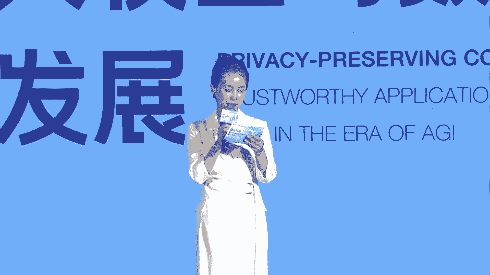
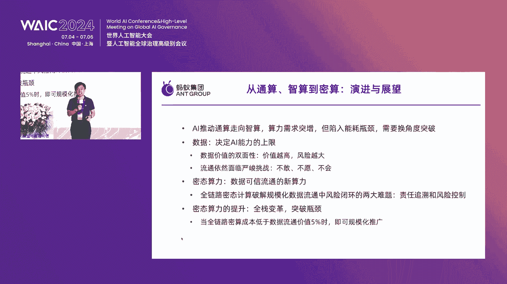
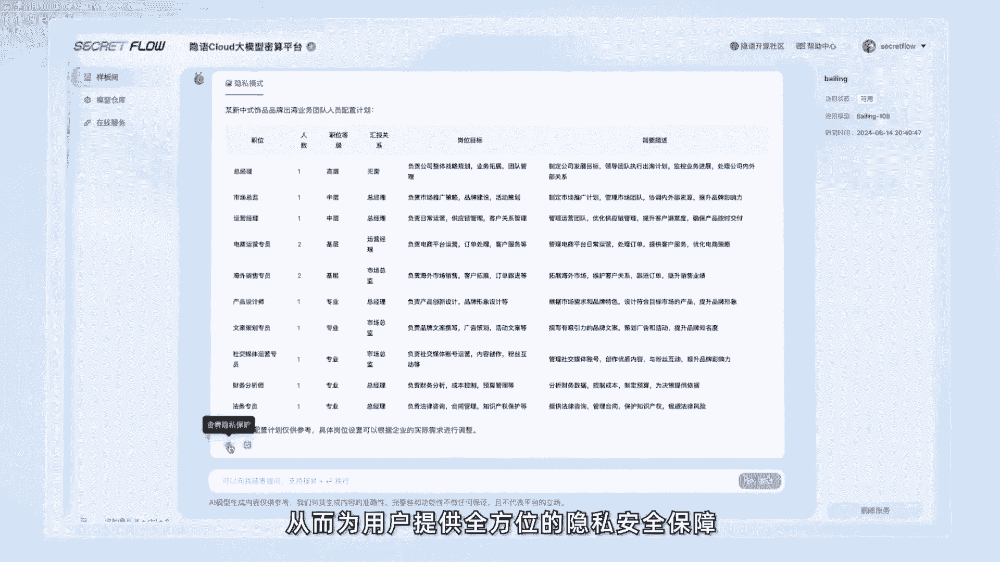
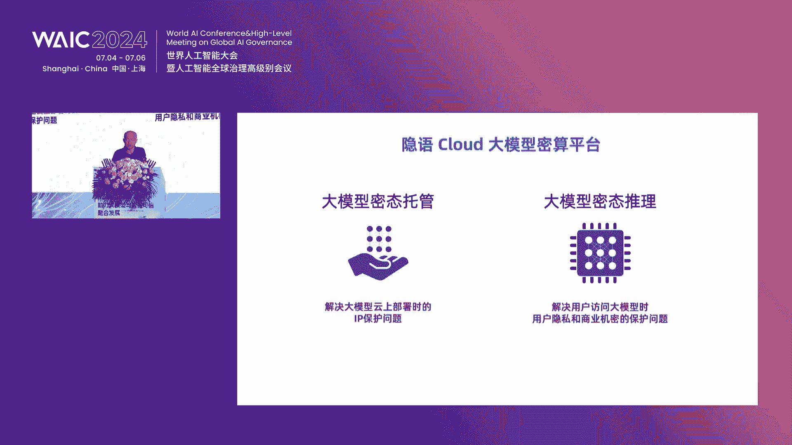

# P15：20240705-隐私计算：助力大模型与数据可信融合发展论坛 - WarrenHua - BV1iT421k7Bv

I can't be with you today at the World Artificial intelligencetellig Conference in Shanghai。

 I would love to be there， but I have classes this week so I'll have to attend your conference on this video。

I'll be speaking with you too。尊敬的各位领导、各位来宾、女士们、先生们，线上的观众朋友们，大家下午好。

欢迎来到2024WAIC隐私计算助力大模型与数据可信融合发展论坛的现场。我是主持人霞飞，很荣幸与大家相聚在这一年一度的隐私计算行业盛会。今年也已经是隐私计算论坛陪伴大家的第四年。

很高兴再次与大家相聚在此。😊，在这个充满变革与机遇的AGI时代，大模型重构技术底座加速了行业的颠覆性变革。其中，高质量专业数据的流通与共享，更是成为了推动大模型技术应用快速进步的关键要素。

如何在这个过程中运用隐私计算解决数据大规模应用带来的安全及隐私挑战，已经成为行业热点聚焦话题。今天，我们齐聚一堂集结众多海内外顶尖高校的著名教授，以及行业大咖重点聚焦探讨这一议题。

期待本次的交流能够全面链接产业链各环节，构建起隐私计算互联网生态圈。

探寻平衡数据利用与隐私保护的最佳路径，助力大大模型与数据可信融合发展。首先请允许我荣幸的介绍今天出席活动的领导与发言嘉宾，他们是。加州大学伯克利分校计算机科学教授张宋女士。

蚂蚁集团副总裁、首席技术安全官伟涛先生。中国通信工业协会数据中心委员会理事长、中国长江三峡集团有限公司副总工程师、三峡北京可再生能源研究院院长、怀柔实验室可再生能源研究中心主任、中国三峡武汉科创园总经理金和平先生。

🎼上海交通大学计算机科学与工程系教授约翰霍普克罗夫特计算机科学中心执行主任玉玉教授。🎼智朴AIGLM技术团队研究员顾晓涛先生。🎼中国信息通信研究院华东分院总工程师陈俊演先生。

对外经济贸易大学数字经济与法律创新研究中心主任许可先生。🎼北京银联金卡科技有限公司国家金融科技测评中心副研究员、研发中心负责人杨波先生。浙江蚂蚁密算科技有限公司CEO王磊先生。

中国电信大模型首席专家、大模型团队负责人刘敬谦先生。🎼北京佐伊科技有限公司首席执行官张超先生。🎼出席圆桌讨论的嘉宾有蚂蚁集团技术战略与执行部副总经理彭静先生。

中国信息通信研究院云计算与大数据研究所副主任、隐私计算联盟副秘书长袁博先生。🎼中国电信大模型首席专家、大模型团队负责人刘敬谦先生。🎼浙江大学百人计划研究员博士生导师刘健先生。

🎼蚂蚁集团隐私计算部技术总监于超凡先生。🎼此外，演讲嘉宾，维也纳经济与商业大学工法全职教授christocen先生将带来线上分享。🎼首先让我们以热烈的掌声。

有请加州大学伯克利分校计算机科学教授高宋女士为本次论坛致辞，掌声欢迎。😊，嗯，好，谢谢大家。呃，这次呃能够呃为这个会议来致辞也是非常荣幸。嗯，因为我呃长期在美国任教呃，所以这个这次致词也用英文来讲呃。

可能呃能够比较呃讲的比较顺利嗯好呃，请大家包涵嗯。😊，Okay， great。 thanks everyone for being here。

 It's my great honor and pleasure to give the opening re for this great conference on privacy preserving Comp。

 My name is Don Soung。 I'm a professor in computer science at UC Berkeley。

 and also the director of a Campuswide Center at Berkeley called Responsible decentralized Intel。😊。

So I have I've been working in the area of privacy。

 preserving computing for a very long time because personally。

 I strongly believe that this is a really important problem。

 And now given the advancement of AI technology with the great adoption and deployment of AI。

 this problem becomes even more important。 as we all know。

 the great progress and advancement of AI technology this time really is propelled right by three key points。

 algorithm compute and data。 But algorithm sites， we know that essentially the same kind of algorithm has been around for a very long time。

 And of course， a big improvement is on the compute site。 but really with money。

 than you can just buy the compute。 at the end of the day。

 I think data is really a particular important barrier for for building great models and also as unique。

😊，Assets， for any， for example， companies or institutions building application specific models。

So then when we talk about data and using data to enable AI， then of course。

 there are many challenges。 So first of all， as we know that unfortunately due to privacy concerns and other issues。

 a lot of data is still locked in data silos and hence a lot of valuable data is not being utilized in particular now。

 there is actually some discussions and some estimates that with the current foundation models is already using most of the available text data on the Internet。

 But however， we still have a lot of really valuable data that's not public that's private。

 the potentially can be really valuable if we can use this data to build better models。😊。

And another important issue with on the data aspects for building AI is that a lot of the data essentially has been contributed by users and so on。

 including creators， artists and so on。 but unfortunately。

 the value thats the data contributed by these users are now being fairly attribute back to the original data producers and creators and so on。

 So this causes another challenge。😊，So when we talk about how going forward。

 how we can build greater models and how we can address these data related problems better， privacy。

 preserving computation provides a key technology for unlocking the value from this data and also actually for properly attributing value contributeds by these data creators and produce producers。

😊，And En can provide a really important foundation technology for better development of AI models and for greater advancements for deployment of AI technologies as well。

😊，When we talk about privacy preserving computation and in terms of the technology itself。

 it actually has a broad spectrum， including both hardware assisted technologies， what we call TEs。

 trusted execution environments， our secure enclaves， and as well as purely software based solutions。

 that's entirely based on cryptographic solutions， including fully homomorphfi encryption。

 secure multipart computation and other technologies。

 including even zero large proofs and so on as well。😊。

So one exciting exciting thing that we have seen is that actually， along all these different fronts。

 we have seen great progress for privacy preserving computation。

 in terms of cryptographic based solutions we have seen both improvements from from the algorithm side。

 as well as implementation side， So these these type of technologies。

 we have seen performance enhancements that there magnitude performance enhancement even in the last few years。

 and there's also discussions about and also actual planning for even building hardware accelerators for some of these technologies。

 including like photoho encryption as well。😊，And on the other side。

 also the hardware assisted solutions， secure enclave Ts。 We also have seen really great advancement。

 so， so my own work has covered both sides。 But in particular。

 I wanted to just give some examples and also perspectives on the hardware based solutions。

 the T and secure enclaves。 as some of you know that my group and with other collaborators at Berkeley and so on。

 we have developed the first open source and to end a secure enclave called Keystone。

 a few years back with started。😊，About 5 right，5，6 years ago， and。Right。

 so that was the our goal at the time is that we have recognized the importance of building the secure enclaves that can really serve as a foundation for building secure systems and for enabling this privacy preserving computation to unlock the value from data。

 But we also recognize the importance of enabling transparency and also have open ecosystem to ensure that the this type of solutions can essentially we can have a way for the whole community to verify the security of this type of solutions。

 and hence its importance to have an open source solution。😊，And。So at the time， also。

 we started a workshop called open source secure enclave Workshop。 And we actually had organizations。

 including you know the various Intel arm and Google and lots of other places worldwide。

 I think there was over maybe30 organizations that actually convened together to discuss about the future developments of。

😊，Se enclaves。And I can share a couple anecdotes。 So one is at the time。

 actually that this was five years ago。vidia team actually came to visit Berkeley and our goal at the time was to convince Nvidia that even though we have secure enclaves for CPUus。

 it's really important to have essentially secure enclaves。

 our confidential computes for GPUus as well。 And we it essentially explained that actually it wouldn't be too difficult to do and it would be really helpful。

 I'm not sure how much credit we can take from you know for that for helpingvi to put this on their Rom but when H 100 that came out with the confidential compute feature we are Im really really pleased to to see that。

😊，And at the workshop， as I mentioned， we started about 5，6 years ago。 So actually， five years ago。

 I gave a prediction， which is that back then， I said in 10 years。

 most trips will have secure enclaves。 So now it's five years later。

 So we have five more years to see whether my prediction is correct。 But now， at least for now。

 I think we are on a very good path。 So now。😊，Aly， most of the server chips for CPUs have have secure enclaves。

 And also now with the GPU with confidential compute capability going forward are the all the advanced GPU chips from N media will have confidential compute capability。

 I think it's really I would say an amazing time for privacy preserving computation that we can foresee in the next few years essentially most of the the cloud servers actually will have secure enclave capabilities as you know new chips getting get put in to the cloud and so on。

 So this with this type of support from the hardware side and also as I mentioned。

 from the software based crypt cryptographic based approaches。 also。

 we have seen a lot with investment， really for。😊，The field of privacy presuming computation。

I say it's an amazing time。 It's almost， I would say at an inflection point where a lot of the things。

 I think even with with with we earlier， like many years back。

 we have been discussing these problems。 But back then。

 both the hardware side and also the software based solutions。

 they were not quite ready And I think now I'm so excited that I think this whole field is really coming to an inflection point。

 And with this technology， as I mentioned earlier， it has enormous capability and impacts。

 One is that， of course， it can provide much stronger security and privacy protection for data and also can offer much better integrity guarantees for the computation results as well。

 and hence really serve as a。😊，Foundation for secure and privacy privacy preum computing。 Also。

 the other part is that given that data has this non rival property。Meaning that。

 unlike a physical object。Only one person can can hold that can hold that object。 But with data。

 once the data is copied by somebody else， essentially。

 the original data owner loses control of that copy of the data。

 And that's also why we really need this privacy preceing computing technology。

 such that we can enable computation on the data， but ensuring that the data will not be copied away。

 the data will not be stolen。😊，And this essentially can help form a new type of asset called data assets。

 As I understand。 So in China now， also there's new policy for for data protection。

 as well as data assets and privacy preserving computing。

 essentially is the foundation building block and platform to essentially enable data assets without privacy preserving computing we cannot talk about data assets。

 data is not an asset because anyone if they want to compute on data they have to copy the data。

 then you will lose control of the data and hence privacy preserving computing It the necessary ingredients and enabler for data assets。

😊，And going back for going back to the importance of data to AI and building AI models， privacy。

 preserving computing is hence， is the key enabler also for building better AI。😊。

And I want to also just broaden the scope a little bit more。

 So this event focuses on privacy preserving compute。

 but I also just wanted to briefly broaden the scope。

 a little bit further to illustrate a little bit of the other related topics that's also very important as we talk about privacy preserving compute and also data assets。

 So one part is as we know， the privacy problem is very complex。

 essentially happens at multiple layers， once at the computing layer that the privacy preserving compute。

 The other layer is that we to protect the output of the computation from leaking sensitive information from the original input。

 given that the original input can be sensitive。 some of our our work together with other collaborators have shown that these AI models。

 even if we can fully protect the computation process。😊，系。

But the learned model itself actually could remember a lot about the original sensitive training data and and attackers by just querying this data without by querying the model without even knowing the details of the model can actually extract sensitive information from the original training data。

 And hence as we train these A models and develop AI technologies besides the computing there。

 we also need to think about privacy issues at this layer to protect the computation output from leaking sensitive information about the original input。

😊，And then and then broaden this a little bit further， when we talk about data assets。

 as I originally mentioned， Another important problem is we also want to ensure that the final output。

 for example， the trained A models as it produces value and as it gains value this creative value also can be properly attribute back to the original data contributors。

 especially going forward going forward， it's important to ensure that the AI technologies really benefits everyone。

 and hence exploring how we can properly attribute attributes back the creative value to the original data contributors is also very helpful both for fair value attribution as well as providing good incentives for for data contributors to further data and some of our。

😊，For earlier work， we were the first to propose a rigorous framework for data valuation using essentially by using sharply value to create a rigorous framework to essentially compute the data valuation how the value created by a model can be attribute back to the original data points and so on。

 but of course this is only just a first step there are still many open questions。

 What's the best way to actually attribute value back to the original data contributors and including creators and so on。

 So for example， copyright violation or potential copyright issues for the air models also is a big issue today。

 So given on this， I still hope that。😊，GoodSo first， I'm really excited， as I mentioned。

 this is an inflection point for privacy preserving computation。😊，And also going forward。

 I hope I'll end with a few of my predictions。 the first one I repeated that even five years back。

 I said in 10 years， most trips will have secure encves I hope this will really become true in five years。

 And the next step is in 10 years， most computation will happen in privacy preserving form。

 For example， in secure enclaves and so on。 And then finally。

 we hope that in the future will really see data assets becoming an important type of assets and also will see new types of entities being created such as data trust and so on that helps manage users data and help users to gain greater value from their data。

 With that， I welcome everyone to this important conference on privacy preserving computation。

 Thank you。😊，感谢宋教宋教授的精彩发言，相信未来隐私计算作为基石，必将推动大模型与数据的可信融合发展。接下来是精彩的开展。😊，金总先讲。那接下来因为出场顺序的关关系啊。

我们首先有请呃金和平先生上台为大家分享，来掌声欢迎。😊，哎，尊敬的。朋友们呃，今天呢这个借这个世界人工智能大大会的机会啊，跟各位分享一下，我们三峡集团在人工智能。这个产业生态构建方面的一些呃实践嘛。呃。

呃应用生态这个大家都非常清楚啊，算力算计和算法的是缺一不可。那么在这个基础上可以支撑咱们众多的这种呃应用呃。我们。这个三峡是从这个在整个算力算法算计方面，围绕着我们呃长江流域，还有我们可再生能源。

就是咱们水风光这些能源的开发，这个呃做了一个系统的完整的布局。那么从首先是咱们在先进绿色算力方面，大家最近都听的比较多的马斯克，包括西方很多都说咱们算力的镜头啊，就是电力是吧？

因为所有的01都离不开电的支撑。所以现在大家看这个这这近些年来，特别是去年大模型这个基处理以后啊，这个算力。增长引发了新一轮的对数据中心基础设施，也就是对电力供给能源供给的这种一个快速的增长。

那么过去的普通计算也好，超呃普通云计算超算。那么占的比重会在整个未来的这个算力需求当中也好，在能源消耗方面呢也看，那么会逐渐的降低。那么我们人工智能计算呢呃是离不开这种能源的支撑。

所以这个我这也有个大的数据啊，呃。这个不同的口径统计不一样呃，大概其就是说呃，现在当前的话，我们现在耗电量，我们整个数据中心差不多在2到三峡，咱们我们三峡集团一年的多年平均发电量大概在901度哎。

不到100度左右，直到2到3个三峡的这个。呃，之间。但实际上今后呃，整个算力对能源对电力的需求的增长，他这个。相对于其他行业来讲，呃，它会呃上升的更快一些。那么这个比重会越来越大。那么。呃。

特别是用我们这个现在大模型训练带来的这种能员消耗呃，都是巨量的。所以呢这个。这个绿这个绿色呃，现在算利嘛，大家都呃包括咱蚂蚁啊，那么几他互联网公司也好，国际的算力呃，这个这个这个巨头也好，都是呃。

我过去在贵州嘛也工作过几年，也就是像苹果这些巨头都是要求对这个能源的消耗，要要绿色化，所以也是带来很大的一个挑战。那么。呃，酸力加能源这个我们国家战略布局上来看，也是很早就提出来了啊。

这个包括大家也知道，发改委这个近几年的东输西算的这种这种布局。因为西部的这个绿色能源更加富及，能够把这个算力啊逐步向西部来引导，包括工信部出台的算力技术设施的提出的酸力加能源的耦合模式。

未来的新能源西未来的电力系统能量。供给的主体肯定会像以风光为为主的这种新能源的替代这个方向来变革啊，国际上也是一样。那么我们现在我们国家每年的电力供应的主力80%以上都是来自于风合光。

所以呢这个但从从我们能源行业来看，那么算力未来是将后来这个最重要的或者增长最快的复荷之一吧啊，现在跟大家讲，我们复荷增长最快的是哪一块呢？

就是咱们的那个呃电动车电动车这块的这个每年的电力消耗的增长也是非常快的。所以说而且在全世界上来看。😡，未来无论是咱们过去是以呃，我们在在终端能源的消费上，煤油气占的比重目前来看还是最高的。

将后来在终端运门也是我们国家的国策。要完成306年的但他们目标也是要往电上来转。咱们的这个数据中心显然就是一个呃电力消费的一个呃非常重要的，也是增长最快的一个场景之一吧。呃。

所以我们电力我们算力需求的快速增长，也将有效的带动我们零能源生产和消费模式的创新，促进我们能源行业绿色地碳转型和能源产业的这种高质量发展。😡，那么在绿色数据中心这个绿能算力协同也好。

耦合也好这块的模式啊。实际上在总的来看，在我们国家还没有得到很好的破题。呃，现在目前还是在做一些初步的一个探索呃第一种当然就叫我们绿电直供型的这是说我们能源企业，比如说在我们三峡工程霸气所在地。

我们就建了一个应该说现在目前来讲体量最大的一个宁碳数据中心，我们依靠自己采用店，就是我们电站水电的自己发生了一点绿电职供的数据中心。

另外一个呢就不要普遍咱们说绿电交易型的那这个网上的店还现在目前来看还是以火电为主啊，那怎么办？我我们我们的很多企业就付出额外的溢价，就是绿电交易型的数据中心。

比如说在苹果的呃这个爱克尔数据中心在乌兰察布在贵州呃，都是以这个模式，我去买电网里面，就是像绿电企业直供啊。呃，绿色的那部分。还有一个就是遥望河处一体化数据中心。这个模式呢。

现在目前来看也还只是初步的探索。比如说我们中国电信也在青海做了这样的尝试。那么应该三峡也做了很多的一个一些探讨。还有一个就在数据要素流通方面，因为现在数据交易今天其实这个论坛的主题啊。

咱们蚂蚁集团和电信主办的是以可信数据这个计算流通这一块，我们也在做一些探索型的工作。我们主要是在因为三峡嘛主要是在长江流域的开发治理和保护方面，是国家的国家的主力军。

所以我们在这一块呢构建一个围绕着流域开发治理方面的一个这个数据要素流通的这种各种的交易的流通的平台也好技术来在在做。长江流域就不用讲了。上海就是属于长江流域是我们国家经济绝对的主要的引擎。

这个基本上在我们国家经济的一半人口也在。占差不多将近一半，所以拥有丰富的数据资源和广阔的这个应用场景，经济、社会、生态、交通、水资源、能源等等，这都是。那么我们正在做的一个工作。

就是面对长江流域开发治理保护的各个我们叫业务呃，专的专专项的业务。目标来打造一个可信的数据空间。用为加工。那当然我们这个黑心数据空间呃，除了共享交易呃流通以外，另外也可以为我们。这个目前这个大模型呃。

咱们讲我大模型我我我个人的观点啊，在我们国家最大的优势还是我们我们的语料，我们的场景应该说是在由于我们产业发展的速度非常快，是在相对于美国来讲，我们可能更加丰富这一块。

所以呢我们也是可以提供为加工模型训练数据企业来提供一个安全可控的这么一个呃分析平台。那当然刚才教授讲到的各种技术，包括业业内各各种的数据不动程续动啊、可用不可见等等分享价值这些我们都在不同的组织之间。

我们这个长江流域的可行数据空间或流域要素流通平台，它不光是我们企业，也有我们政府还有很多这个科研单位社会组织。在不同的组织之间进行流动。不光是技术，还有不同的模式来呃。

是我们打造一个这这样一个呃一个11一个呃数据要素的这么一个大大数据汇聚的这么一个平台。那么另外在模型层面，我们也打造一个行业，我们取名叫大雨大模型。因为我们是治水出身的。所以我们的这个大家也知道。

我们在长江的上游呃，建的骨干水库主要的功能就是防洪。我可以这么骄傲的跟大家讲，这两天上海如果没有受到洪水的侵害的话，那肯定是因为我们上游的几大水库都减小了下限量。因为我是昨天晚上从武汉赶过来的。

武汉的我们办公楼门前的江滩已经都淹到那个堤脚下的平台了。平时我们都可以在长江的这个。往下再走两个平台都可以去散步。但这两天也一样。如果我们我们三峡这几天下泄的流量应该说是呃来水大概2万多。

我们大概经仅仅下泄一半。所以就这么一个所以这这样一个面面向水行业电水还要可以发电，也可以载舟，我们叫航运还有一个水资源大家知道前年下游缺水，我们上海的水以及咸潮入侵，就是海水的力量反上来以后。

我们的取水口有的取不到水，有的取的都是咸水了。所以这个样我们在长江上的这几个骨干的大的水利枢纽，这个这个大水库啊，这个在方方面面嘛，发挥的这个作用都是非常。

所以我们这个叫做我要说水行业的这么一个整体架构，我们在分为基础层，行业层和应用层来构建我们这样一个这个大模型的。在一样一个整体的解决方案。呃，当然我们技术层。

我们还是主要用我们行业里面的这个通算这个层面。我们用我们业界，我们我们这个百川哪，包括我们星火，包括呃这个华为等等，我们都有合作，包括电信，我们有合作。那就做通用的大模型AI服务。

在行业我们在做垂直行业的AI服务方面，我们做了大量的比如说刚刚提到的防洪水资源管理离沙第三呃，当然还有我们电站的运维行检呃等等。

这些我们呃这个构构建这个这样一些这个呃这个行业的这种这种垂垂直垂直垂类的垂直的模型。另外一个在场景方面，我们就具体在呃特别是我们现在目前第一批打造的主要还是电力生产。

围绕电力生产因为我们平常的这个咱们大国中期的安全方面啊，是对我们非常核心的业务。另外在防洪和离沙方面，我们开开展了一些探探索的工作吧。那么其实现在我们做行业大模型，大家可能在做的有很多。

这个特别是我们产业传统产业来的，就有一个不可能三角，就是我们的呃这个经泛化性、经济性和专业性方面是吧？你如果做的太通用了，对行业里面又不适应了。那么而且呢那个对算力的需求啊，也这个这个规模型过大以后啊。

训练的成本也过高。我们一般的传统产业不可承认那么高的，还有一个专业性，你泛化能力强了以后，专业性又不够了。所以这是这一块，这是。那么行业大模型大家知道也是我们人工资落落地的这个最后最后一公里。

从通财往砖专材这一块来去转移的话，我们经过这个将近两年呃，一年多快两年的这种实践嘛，我们也是做了大量的一些呃探索的工作，这个能够使我们这个在高性价比放化能力强，保证数据安全方面啊。

我们都做了一些这个这个这个这个探索吧。这个时间关系我这里不细讲了，反正这个呃在在在这个路上我们我们应该说还是只是在在路上。那么大大宇模型是我们国国内首个水利水电行业的大大模型。

我们现在的知识问答已经相对比较成熟了。过去他说防洪20年1亿30年1百年一亿都搞搞不清楚。我们过这块大量语料的训练的话，可以非常专业权威的这种解答。

包括对我们员工的培训这个数字的提升方面还是起到了很好的这用办公助手就是大家比较通用的这个这这些功能上，我们也是为企业这个这个提升效率运营效率方面这个做了一些有益的探索。

那么我们未来的布局在三位一体战略下AI应用生态的一个构建。首先是绿色算理的供给能力。那我们三峡是全世界产绿色电不含碳的电最多的一个企业，我们大概每年的不含碳的电量超过4000亿度电。

我们的风光的装机是5000多万。我们水电全世界遥有些我们水电的装机能力发电量都是所以这一块我们特别是海上风电就。非常负极算力需求比较大的，我们都有呃规模非常大的海上风电的这种这种开发。

我们也在布局深海的海上风电。所以这一块呢，我们这个世界上最大的清洁能源组量源源不断的这个清洁地上海的上海。有将将近3分之1的店都是我们来自于咱们三峡集团的6座6座6座大坝。所以这个。

林南税中心我刚才也提到，我们在这个三峡八区已经打造了一个。另外一个我们在韶关和腾讯也在合作。在中卫呃，在我们内蒙、华为这些都都在进行一些算电合同。刚才跟咱们电信的这个宝骏总交流的时候。

他特别说哎呀我们对算电协同或者绿电算力耦合特别感兴趣。希望我们能够形成一个相对比较成熟的模式，现在还是属于一个贪路的阶段。因为我们家电力体制还是比较复杂的哎，我这时间关系。

但是我们在三峡八已经打造出了一种成功的模式吧。这个呃包括节能方面，我们利用江水能源。咱们在长江面上利用江水能源啊。这个另外一个就是在可信流数据流通方面，我们长江流域数据要素平台。

我们也是有分了1多个专业。我们数据商店也分了十0多个分店，也也不同的店长嘛。我跟大家举个很简单的，水文数据，就水的流量和水头水文站各个单位都在建长江也在，我们三业也在建。

还有各地的政府也在建我们要形成一个完整的水文数据我们都形成不了怎么办？是吧他的数据也不可能完全就说这个资产是人家的，就通过这样一个流可这个你是计算也好，这个这个相关的数据流通的这种可信流通的技术啊。

能够把把很多专业条件形成一个完整的数据产品，大家来进行有的是共享，有的是互换，有的是交易这样的一些模式吧。我们这个长江数据要联联盟我们也是正产学研使用的各个单位，我们最近也在组建大大概武汉为中心嘛。

有几十家单位参加的这么一个数据产业联盟那么这个这个平台目前的话已经上架了100多款产品吧，也是目前的。交易量还不算太大，我们也是想跟咱们呃探讨吧，跟在座的各位企业家，各位这个呃科研单位吧。

一块能够把这块能够去呃去放大。呃。比如说我们做的流于水体的含沙量的动态监测，这有含沙沙，大家回答泥沙的问题，建了水库以后，水泥沙放下来的情况等等嘛。这样这是我们很专业的数据啊，还有地震地震地质灾害等等。

可再生能源呢，我们最近呢我们在可燃能源领领域也是建设了首个AI靶场。也就是我们过去大家知道水风光水风都是不确定自然资源搞不准预测总是不准，特别生场期更不靠谱短期的也不行。

就我们建立一个可再生源AI靶场对气象的高精度预测和功率的预报，就是水水发的水发的电风能风功率预测光功率预测方面，这个我们这个特别在风功率预测靶场。我们中国最领先的这个功率预测的厂家。

我们全部都已经到我们的靶场来PK我们选用最好的靶场为我们的风能风电厂一下子考核损失电量损失就降低了20%。因我精度提高提高的非常之快。这个我。😡，整个行业能源系统的安全和我们场站的经营运行。

这个效益提升啊，都非常显著的这么一个水温预报，我们也来做靶场，现在刚刚见这个月训练数据就会出来。那么这个公力师刚才已经讲过了唉。那么最最后呢，我是热诚的希望大家吧，我们三峡集团作为一个清洁能源。

这个全世界最大的这么一个清洁能源的企业啊，愿意和在座的各位可能是上力为主的。我们上游做好绿色能源的供给。下游呃我们中游为各位提供我们丰富的场景的这个这个这个我们积累的这个这个各方面的数据。那么下游嘛。

我们也可以为大家提供丰富的场景。这个包括我们的靶场，提供大家一个大家相互提高经济的这么一个AI的这个舞台和靶场，能够共同嘛，推动我们这个整个长江流域也好，或者我们这个呃未来清洁能源开发的这种高质量发展。

我大概就介绍这么多，谢谢大家嗯。好的，感谢金总的精彩演讲。我们相信有着先进绿色算力、可信流域数据大于行业模型三位一体的应用实践，一定会构筑可再生能源领域的人工智能示范标杆。

接下来我们有请蚂蚁集团副总裁、首席技术安全官伟涛先生，他的分享题目是从通算智算到密态算力眼镜与展望。掌声欢迎。😊，嗯，大家好，非常荣幸啊。我们的一年一度这个WIC的影视计算论坛，大家又相聚了。对。

这个呃呃今天这个我们也很高兴啊，就是能看到其实每一年的时候就刚碰到董事也讲每一年看到我们整个行业在影视计算进展是非常非常扎实的在这领域里面同时也能看到就是大模型的兴起。

这个去年时这个大家对大型还是比较比较好奇。但今天看到大型广泛的应用。然后呢，我们特别高兴的看到，其实他也是极大的在推动整个这个我数据要素和影视计算种发展。

所以我今天报告题目是通算算到算对这个大模型这边这个简单先讲几句这个我们是怎么来看大模型的对吧？特别是GPT也代表大模型，他他其实是一个智能质变。就是有一个知识啊。

其实有GPT以后才有个第一次AR出现的智力在GP出现之前，其实AR的然他看上去已经很强大了，他可以下围棋了，以干这干。😊，每一个东西都是专用的技能，或者称之为是本能，它不是一个通用的智力是吧？

GPT只是第四出现了这种通用的智力通用的智力引擎，它有很多很很好这种这种这种表现。但是这个真的现在问题在哪里呢？虽然是就GPT是人类造出来第一个通用的智力引擎。

但它今今天其实还处于一个蒸汽机时代就像这个大家都知道真是人类造出第一个动力引擎，但它依然是有很多缺陷的，很笨重，效率很低？然后呢在这个专业里面用的时候，这个就由于它是个通用智力引擎。

所以所有的业务方的冲动会把所有的工具全部接到这个大模型上来。所有的信息全部接到大模星上来。但在用的时候就发现有很多问题。😊。

像现在医疗领域里面吧已经有这个专家发论文来质疑说聪明的AR纸帮小忙笨的AR去捅大娄子对吧？包括是昨应该前天吧那个我们那个上海那个专业委上现在大模型是什？

外行得内行内行外行是一种表现往前发展实依然有很多工作要做的像刚才这个金也说了展三要素算法专利这数据这个都是有很多要前进的算法这其实是这个其实是一个过架构很好的一个一个新的一个质变的开始。

但是呢依然是有很好的需要加牵引依然非多的工作要做。但是现在我阶段实如何能够把这个模型应用在各行各业里面主要实还在算利和数据度做相关的工作算利呢刚才那个个金做了很多介绍一方面。😊。

其实整个行业在从通算走向计算，对吧？但是呢现在像去年是一个大家普遍的算力恐慌，对吧？没有卡，没有电是吧？这个包括对立电也非常强的这种诉求，但今年上次逐渐各行各业对吧？逐渐你意说说这件事情是一个算力陷阱。

实际上是在从算力恐慌，在在走向算力陷阱这样的这样的一个思考。那这个其实背后也是说担心这种过渡投资，肯定今天买的卡做了相关东西可能对不起，明天不适用了，对吧？这个或者是说这个很快被淘汰了。

另外一件事情就能源非常巨大的消耗，就是而计算算力。😊，能够看到现在非常快的它在替代通算算力对吧？GPU的这种算力在新的这个生态里面，它的非常快的替代这种基于CPU的这种算力。

但是它已经开始进入一个一个瓶颈期，这虽制们制程有一定的限制，但制程即使是这很多这种在在提升，但收益效果是明显放反放缓的，就大家用手机的时候，从12纳米变到7纳米的时候，机使用体验感觉是非常明显的。

但今天从七纳米5纳米到3纳米，其实就不再是这么明显的效果其实是并不是一个等比增加的但是所以今天很多算力的效果，它是以能耗为代价的。

也是说这个像刚才反复在讲很多我们做大模型训练这巨大的这个算力成本能耗成本为代价。然后更糟糕的事情是说，假如我真的把大模型用于生产的话，用于推理的话，它每一。😊。

大模型它的这个现在的计算成本是远高于传统的我们的这种基于规则或者基于小模型的。而且它大模型不同大模型的它的这个性能和成本差距也非常巨大的。这边一个简单统计表对吧？

那个70B的和7的大家能看到成本和性能的是有显著区别的。也是我们真正在用大模型的时候，我们不是不是光是训练，而是用大模型的时候。

其实这个就是我们的是有天然的这种成本的界定的算力的上线的就我们这种情况之下如何能够把大模型在行做效果，其实我们就不能够单方面只在就这大力初器这方面对吧？其实要上另条线就是数据我们其实非常精的相信？

数据才决定了AI能力的上线。就不管你的模型多聪明。数据不到的话，你是不可能把一个问题解决好的对吧？这个缺乏数据的时候，你要做决色，就只能胡说八道，今天的模型非常不幸啊。

就GP模型基本上就你你问他他总是能给个答案的。不管他。😊，这是不是完备的。但是呢我们认为这不是chform架构的问题，是今天大家训练的问题，这件事是能解的对吧？就是大模型在做决策的时候。

是这个未来是能够只做信息不足的。但这件事情能解决的时候，就会发现对吧它能够推动产业产生巨大的这种数据供给的这种需求会发发生。😊，而最终行业专业问题要解决的时候。

非常强的依赖于专业关键数据是不是能够按需获得无论识医疗啊、络安全啊、金融啊各个领域都是这样子。所以数据的充分充分性将成为一个核心问题，包括它的颗粒完美度及时性？化连接。

对但是今天已经能够看到数据已经开始制约人工智能行业的发展国内国外那个这个国外现在上说更大规模的模型的时候，数据已经有显著的种瓶颈。那个本身在国内来做语料的话天生就比个因为很多对吧？

大家可以看那个对比图这个还是非常大欠缺的但这还是通用语料，专业领域里面的时候，在欠缺会更大吧？这个今天整体上就大规模高量的数据的生产供给能力不足？

这是个非常显著的瓶颈更糟糕一件事情还是说数据供主体供给意愿是非常缺乏的。背后的问题是什么呢？就是数据今年我们这个数据是。😊，也是你明确是这个被国家列为这个第五大生产要素，是吧？

它是跟土地劳动力技术资本并列的第五大生产要素。但数据跟传统的生产要素一个最本质的区别，对吧？它是这个有它的价值是有两面性的吧？它的价值正向的价值越大，它的负向的风风险就越高？

它是有自己不可绕过的这种行业风险成本的，特别是随着传播路径越远的话，它就越容易产生这种泄露啊，滥用这方面风险。根据2023年IBM的这种调研报告，对吧？现在的数据泄露的平均总成本它概是445万美金。

这是非常令人触目惊心的一个数字，而且大部分机构的安全团队自己有3分之那个就有3分之2以上的这些公司是没自己没有发现数据泄露的是被通知发现的。

而且有大量的超过80%的这些数据泄露是发生在自域外的云环境发现的而另外一方面能看到黑产市场非常猖獗，有很多这种批量数据泄露的这种这种。要万对吧？基上就是成交额度千万以上。然后呢。

包括一些指向性的敏感的的泄露，像这种个人隐私的查询的基本上是在爱网上查一个人的一个月的这相关这种交易信息，大概能卖到这400U400稳定币，大概是3000多人民币的样子。大家看到这金额是触触目惊心的。

所以背后的为什么就是数据跟以前有个很大区别，就为什么很难产生这很好的共给呢？这些数据一方面很容易被非法的二次分发，它导致了数据产品它的市场价值在迅速贬值，对吧？

以导致大家不愿意流通另一方面数据明数据流通的时候，的这个会产生相关的泄露，而且又很难定位到具体点会导致数据源方有这法律责任，导致是不敢流通这件事情为什么这么来呢？背后其实是说因为整个它的可信流通。

就是全新的技术挑战。传统上我们做数据安全做的几十年做的是什么？做的是一个我们称至为类循环的安全问题。就你的数据是在你自己的运维域内，你要保障它的安全对？对它有权责。但今天我们数据在做这个流通的时候。

它是要离开你的持有方安全域以后持有方依然拥有管控需求和责任，这个外循环问题，这彻底是个全新的全新的一个一个体系，今天的整个的技术体系，然是有技术点，但技术体系并不完整，但标准法规上面其实完全是空白的？

很多工作要全新来做的。😊，对而今天呢我们其实有很多数安全技术我们是不缺的。这个供具商里很统的技术，但这些技术真的是能解决我们外安全问题嘛，包括怎么来衡量呢？

这件事其实就需要行业里面一安全术要求未来一定以通过不同技术实现的但障技术要求实是一致但今术要求在市场空白的而我们合作包括们老发控工作包括高使用跨控方工作多工作和我相关的这个合作方一起来做的就是我们开始逐渐明确出来我们的跨域的跨域流通的核心技术要求质上数据使用权跨控数据他以某种形式离开这运维者是说在我运维跟别人做融合的时候。

能够对他的使用权有效控只在我指定的。😊，范围之内使用不能够超范围使用，核心要解释这个问题。但包括呢对运维人人员的限制，防止运维人员偷我的数据，对研发人员的限制，对吧？防防止研发过程中间，对吧？

对于某个单条的数据种这种窃取，以及对全链路特别是这个过程发生在不是我的运维队对进行有效可靠这种审计这种技术吧？国首次提出来的它背后的一个另外一条保障？安全技术要求是一个描述，但它强度是另外一件事情。

而现在这个在呃就是传统上面由于整个影私有很多的不同的技术路线，这些路线是难以那个通用比较的这件事也是我我们国家的这些位上面做了一个非常巨大的一个一个工作，等会也会来汇报吧？

我们的通用安全分级能够跨技术路比较也是大家共同一个非常好的工作。这些东西汇聚在一起吧我们就认为整个行业会相从通算计算走向密算，而密算会形成数据可行流通时代的。性算力啊，它的本质上是通过密码学，对吧？

把这个管控边边界从运维的物理边界扩展成从密钥管控的这个虚拟的数字空间边界。但是呢单纯的密码学太慢了，对吧？所以需要用可信芯片啊、精密计算来做这种加速，会是这样的一个一个变变化。

有了这样的全链路的密态计算以后，它会显著降低数据要素行业的风险啊，它能够使得这个就是呃数据要素流通的时候能覆盖原始数据到数据的端到端过程能够有效的控制住全链路风险，并且做好这种责任追溯。

但今天来做这件事，大家统一的最担心的事情是太慢了计算第一反应是说太用不起。今天我们能看到其实背后是有多个很多工作是可以来做的对吧？我们实际上是在网络突布层面芯片层面吧？

密态协议层面编译层面都是很作来改变这件事情首先在协议层面其实蚂蚁在面和很多的高效吧共在合作我们实际上是很多的这个效果提升都是几倍几倍的这种提升后另外呢另外一件重要的情才教授也介绍的我们在这个芯片的这个这这精密计算支撑上面对？

我们是希望以后能够让数据做密态的汇聚而不再是说这个。😊，所有的计算要跨网络来进行。因为跨网络来进行的话，它是非常非常缓慢，成本很高，而且可核性很差。而密汇聚的本质是什么？

是以密码协议和安全硬硬件为信任根构建可信计算环境就把人对人的信任转到对技术的信任。所以我们能够做汇聚这件事其实也是很艰难说到今已很多CP都有这种能。但是呢他的这种能力是参差不齐的。

所以它的信任根是每家CPO有自己的信任根。因为它的安全性家参差各种各样的问题。所以我们在这面其实蚂蚁集团在这面做的一件事。

就是我们做了一个软件层面的机密计算的个虚拟机能够是提供统一的基于这个第三方的这M芯片信任根然后通过软件整体的保障来这个安全拉拉来解决子机密汇聚的问题。

另方面就是我们在整个机密计算上面叠加了我们的这个多全计算形成。😊，可信计算这个也是呃我们呃在在蚂蚁首创的获得数字中国建设峰会的2022年的十大银河科技奖这件事情我们其实能够非常好的通过TE来缓解多方安全计算像那个这个半式型固的安全问题也可以通过多方计算来缓解TE的这种单点的全故障问题形成整整体很好效果。

这我们把汇聚在一起。通过我们的引语的可信隐私算框架来开源对？这里面大家能看到这个整个体系是非常完备的。基上所有的这个技术图线都有每这边很多字母。

每篇字母都是一篇顶文章需非常多的工作也是跟高效共同联合完成的。😊，最后我们能够看到就是说今天我们能够用密态算力，能够很好的支撑对吧各种各样的这种应用需求啊，从比较这个低安全级对吧？

但是高性能的需求到比较高安全级，可能但是那个更加成本更高高的方案都能提供完整的需求，通过引方式来提供下面给大家介绍最后我们相信是整个行业里面最后会我当我们能够把这个通过基础设施的建设。

使得密算成本降以后会形成一个非常好的一个一个新的一个个个一种范式，就是我们今天的很多时候数据源方是没有足够的数据加工者帮他加工的。因为加工过前会导致数据泄露，所以导致很多数据源虽然价值非常高。

但是没有得到充分利用。而现在很多加工者是接触不到数据的对吧？他的这个不能很好发挥自己的技能。当我们整个的全链路密计算能够实现的时候，把这件事情就非常好的能够衔接这两方。

其能衔接更多的数据源方能够从发挥更大价值。我们认为我们的测算过实际的业务测就当全链路。😊，计算的成本低于数据流通价值5%的时候，就可以形成这种规模化的推广。对吧？最后我们也我们是展望一下。

就是认为是说今天其实我们过去大概45年吧，全行业计尝试。但是是一种主体上点对点种连接桶装种模式我基上达到一个成熟状设施这种工作规模整成本规种展希能数据价值数据价值流动像自来一样开用这个所以我们最后其实就是说我们整个行业通算I到今三大要素到瓶颈核心数据据决定I能力上线但数据它有价值双面性。

所以要行整个打通整个数据流通而我最后能把降的。😊，全方业的发展。而这件事情其实是非常艰巨的。那在国际上面也是共同在这个探索期，也非常期待跟大家共同来做这方面工作。好，好的，我不道说到这里，非常感谢大家。

😊。

🎼好，感谢谢谢伟涛先生。那伟涛先生深刻洞察了数据价值与风险的双刃件特性，细致论述了密态计算在促进安全流通和数字经济发展中的关键作用。相信未来密态计算将成为数据可信流通的主要算力形态。

通算和计算也都将面临密算升级。接下来我们进入精彩的主题分享环节。首先有请上海交通大学计算机科学与工程系教授约翰霍普克罗夫特计算机科学中心执行主任玉玉先生，他的分享题目是隐私计算的后量子视角展望。

掌声欢迎。😊，🎼呃，各位大家好啊。呃，很高兴今天我我给大家分享一下呃。😊，呃，最近在做后量子密码，所以我也是应为陶总的要求，我来分享一下后量子视角的隐私计算。呃。

那么我我这次报告呢就关注呃隐私计算的其中一条呃技术路线叫安全东方计算。那这个呢前面我记得这前前几年宋教授在56年前在美国一个场合，我们密码学的一个会议，他来分享了一下。他他他画了一个表。

然后这三个技术路线。然后比如然后我们被诟病的就是一个performance啊，然后他们这旁边的都是好几颗星，然后我们就可能只有半颗星还是一个红一个一个红的一个灯啊。

那么很很高兴听到他刚才说这个这个隐私计算呃，在这个安全东方计算这几年也不管是在呃协议层还是在实现层也也有了一些进展啊。那么我今天呢我们就介绍一下安全东方计算。那么这个背景大家都知道啊。

就是在大概1982年的时候，姚先生提出了安全啊，就是百万峰翁问题，它就是一个安全双方计算的一个一个一个雏形啊。那么1986年呢，他又提出了这个解决方案，就是用姚的混淆电路的方法来实现啊。

我们觉得这个其实这个我们做密码的就是屁股决定脑袋，觉得这个东西还是挺好的啊，首先他安全性非常好，我们有可证明的安全性。我们不需要依赖可信的硬件啊后我们可以支持任意的计算。

然后我们还有呃抵抗内部的攻击者啊，那么当然就是性能性能差啊啊，那么这个呃那么所以我们可以保证计算的正确性。同时呢，我们可以证明这个除了啊。大家可以看到的之外，不泄露其他的任何信息啊。

可以给出一个安全的证明。那么。这个80年代到现在已经好久远了啊，就是在第一个阶段，我80年代他妈那些像姚先生这样的理论理论密码学家拍脑袋写一个问题，然后这呃然后给个解决方案，发一篇论文就结束了。

那么后来呢这个经过漫长的这个吧这个到了我记得2003年我我第一个有人去实现这个姚的二方计算就叫一个一个项目叫f play啊。那么我那时候也也去看了一下，觉得那个好像离应用还挺远的。

那么现在呢其实啊像英语啊等等大规模的开源的影私计算这框架出来以后，已经进入了大规模的实际应用的一个阶段。那这个其实这里面呢，我大致说一下，这里面的坏人啊，这里面坏人可以分成两种。

一种是所谓的s半半成实的。半成实的话就是啊他们只是好奇啊，他们就是呃想偷看啊这里面数据的隐私，但他呢是不会偏离这个协议的。那还有一种呢就是非常非常恶意的对吧？他他可以偏离这个协议，他可以欺骗你。

然后他得到他想要的一些信息啊，额外的信息。所以呢。这里坏人有两种，一种是半成式的，一种是恶意的。那么实际上我们还可以对坏人的这个这个协这类协议啊，还可以对坏人的这个数量进行分类啊。坏人的数量T。

它是小于一半的还是超过一半的啊，小于一半呢，就是我们认为认为还是诚实大多数。那么大于一半的，一般我们就考虑他的极极端的情况，就是说只有一个好人啊，剩下都是坏人，就是说T等于N减一的这样一个情况。

所以我们的后面的协议呢基本上是分成这两类的啊，那么。实际上这里面的安全安全性它其实有个分类啊，在在这之前呢，其实我们都认为就是说一般来说计算意义上的安全就好了。就这台计算机它可以算多少年破解不了，对吧？

那就可以了啊，那可能算你你把这个安全参数调到，比如说他算1万年，现在算利算1万年都破破不了，那就可以了。那后来呢，其实说还有一个还有一个概念说你这个计算机是经典的还是量子的啊，所以在90年代的时候。

提出了一个算法，他基本上可以破解。现在。互联网的呃大多数的公钥密码体系啊，基于椭圆局现的，基于IC的等等啊。那么随着量子计算的发展呢，就是这个。呃。从啊这个理论上的破解到实际上可以被攻破。

已可似乎已经不再是一个遥不可及的一个梦想啊。当然你可以有个有个有个赔率吧，就是比如说可以开个赌对吧，十年以后量子计算要要破解ISA1024的。0024的计算量子计算机能不能出来，对吧？赔率是多少等等啊。

这个目前来说还是有争议的。但是我们已经往这个方向上去呃去准备了。所以呢，实际上。如果要做安全东方计算协议呢，实际上他可以分为啊，就这边我说的可以诚实大多数的MPC的协议。

还是不诚实大多数的MPC的抗量子的协议。那么实际上安全东方计算呢，它又分为两类，一类是我们基于secre sharing，就基于秘密分享的方法的一个一个一个一个协议。那或者呢就是姚先生啊。

当年提出的基于混淆电路的协议。那这这两类呢，实际上他有他有自己的优优缺点，比如说他的对吧我们大家都是用电路，要么算出电路，要么是 word电路啊，那么如果电路比较深的时候啊，他知道它的深度比较深的时候。

那么秘密分享的方法呢，他的。他的轮骨杂度，就是你交互的那个轮速是随着那个呃电路的深度线行增长啊。那么姚先生这个这方法呢，他他的他的优点在于他是常熟人啊，但是呢他他也有对吧，他的带宽啊什么的。

可能要求比较高。那么我们实际上如果我们关心诚实大多数模型上的安全东方计算协议，我们实际上有信息论意义上的MPC的协议啊，那么就是信息论意义上的话，其实它跟你的算力是无关的那也就跟你算力的模型也关。

不管你是经典计算机量子计算机，我们都都能保证它的安全性啊。但是呢一般这种信息论意义上的安全性PC呢，我们会引入一些对称密码啊，对称密码的组件来提升它的效率啊。

那么这个时候你为了对抗量子计算机为了对抗量子的算法，我们不不得不什么呢把它的密钥参数。比如说哈西哈西哈西函数的输出的长度，或者说密钥的长度进行加倍来对抗量子量子算法的二次加速。

那这方面呢最近几年也有好多这方面的一些工作。那么如果是对于不诚实的大多数呃不诚实的大多数模型下的安全多方计算协议呢，我们啊也可以用经典的GMGMGMW这个协议啊GMW协议他就是说用秘密分享的方法啊。

秘密分享，然后我们做做做线性线性操作的话，我们就可以本地计算，不需要通讯啊，那么我们做一些非线性操作。比如说与门我们需要用不经意传输的这样一个协议。

所以现在呢其实后量子这个MPC啊安全多方计算为什么不抗量子计算机很多协议为什么不量子计算机就是因为这个底层的不经意传输的协议，它不抗量子计算机。那么不经意传输是这样一个协议呢。说他分分成两方。

一个是一个发送者，一个是接收者，对吧？我有两个消息，我要发送给你啊，你是一个接受者，你来选你要接收哪一个消息。但是在这里的安全性说有一个保障就是说你只能选一个你不能两个都看到啊。

那作为发送者对我的对我的要求是什么呢？我不能看到被你拿走的是哪一个消息啊，所以这就是一个经典的啊不经意传输的一个协议啊。那么在过去这些协议都是用一些不抗量子计算机的一些安全问题来做的。

比如说啊DDHCDH他统称就是离对数问题啊，不管是计算意义上的离对数问题，而是区分啊判定性的离对数问题，或者说二次剩余问题等等。这些这些问题在量子计算出来以后，它都是不安全的啊。那么实际上最近几年呢。

有一些有一些呃基于抗量子密码算法的呃，不经行传输的协议已经出现了啊，他们有基于格的就基于编码的啊这块呢，我们最近啊最近搞了一个啊我们用美国list第三轮的呃一个候选的算法。

叫ber做了一个呃可以呃抗量子的不经意传输的协议。那么它比呃之前的工作呢，在效率上啊，不管是通讯的大小还是说呃他那个安全强度综合来说，以及它的这个性能相比来说呢。

都会比之前的工作啊会提高分之50%左右啊。那么这个之前其实最好的工作是基于基于那种开博那种算法。那么我们实际上做了一个确定性的一个版本，基于LWR问题的个一个版本。那么我们还做的一个工作是什么呢？

就是说我们大家知道有有有做量子通信的同行啊，他们做了量子密钥分发啊。那么量子密钥分发呢，它其实上就是相当于我们做了一个经典的。密钥交换是吧？大家找密钥交换其实就是一个公钥类的算法啊。

那么如果这个量子通信啊，只是用来做保保护信息的。保保密性。那我觉得这个做的应用就有点狭窄了。所以我跟做量子密码的这些同行呢也说了，你们你们知不知道饮私计算啊，他说不知道啊。

然后后来就说其实个可以有什么数据可用不可见啊，然后什么什么的。所以我们跟那个国敦量子呃国国科量子合作呢，把他们那个。QKD量子妙钥分发的那个设备改造成了一个不经意传输的一个协议啊。

我们其实你大家看到这个图上我们上面是一个量子的，其实上是1个QKD的设备，对吧？用量子信道，我们就像产就像分发蜜钥一样。对么？实际上我们是做了1个OT的量子OT的一个协议啊，那么在经典的信道上。

我们进行了这个传输。这个是我们一个在呃在次呃在次已经做完了实验，目前正在呃正在投投稿的阶段的一个工作。那么实际上呃，因为。不经意传输呢，它需要耗费大量的通讯。所以呢还有一个不经意传输的扩展协议。

他的思想其实非常简单。我先生成少量的不经意传输的OT。然后呢，用低通讯的一种方式把它快速扩张成任意数量的OT啊，听起来好像就是说我先先生一个鸡蛋。

然后再在在这基础之上呢再再进行呃生成大量的大大量的基啊这种这种这样一个概念啊，那目前来说呢，其实是有两种方法，一种是我们基于尾随技术生成器的方法，还有一种呢就是基于亚呃基于那个编码问题的方法啊。

那么这两个东西呢，其实都是抗量子计算机的啊。如果是PR级的话呢，我们可以把它的密钥长度加加倍。那么LP问题呢，它是基于一个编码问题，它实际上可以对抗量子计算机的一个方法。那么后面我会讲一下。

其实还有一个就是说是常诉轮的安全多方计算协议，就是刚才姚先生发明的啊。呃呃，叫叫混淆电路的方法啊那这块呢实际上为了优化它的性能，我们其实呃一直以来也做了好多的工作啊。

一般来说什么最早呢我们用哈希啊一个基础操作，我们要有两两次哈希函数的调用。那后来呢我们变成一次哈希。最后呢我们就一次调用AES因为AES还是比下256要快的啊。

那么后后来呢我们做出来一个呢就是不需要啊还是用AES，但是呢不需要不需要做那个密钥的密钥的生成了，就ched就去掉了啊。所以这块呢我们这个也做了相关的工作。

那么最近呢我们基于啊基于隔密码做了一个呃做了一个混淆电路的工作。他在比如说要达到128个比特的量量量子安全强度。我们每个门只需要通讯一个比特。那么在此在在此之前呢，他们每个门需要大概通讯1。

5倍的那个密钥强度的这个比特，比如说128128个比特的安全性，我们需要每个门通讯至少192个比特啊，那么我们利用隔密码来做的话呢，实际上利用N或者LWE的那些呃同泰加同泰加密的方法。

实际上可以在呃实现每个门，它通讯只需要平均一个比特。当然这里面换来的一个道，实际上我们需要呃需要采用啊需要做一些预计算也需要利用一些格格上的一些安全假设。好，最后我做一下总结。呃，对吧。

就是这个我的视角主要是从后量子密码改造的角度。那么我们可以把现有的一些安全多方计算的协议呃，怎么改造成抗量子计算的？那么我们分为信息论义上的安全呃城市大多数的安全协议呢。

实际上我们有几乎是不需要改造的啊。如果这里面你用到了一些对称密码。那么实际上我们只需要把对称密码的安全强度进行呃，安全强度进行加倍啊，那么不诚实安全不层实大多数的安全计算安全多方计算的协议呢。

我们实际上需要把底层的不经意传输的呃密码组件改成抗量子计算的安全组件。这这这一块呢可以利用现有的一些革命码等抗量子密码的一些呃密码源语。好的，我我的报告就介到这里啊，谢谢大家。😊。

感谢玉玉先生的精彩分享，让我们看到了后量子时代隐私计算更多的可能性。接下来我们有请智普AIGLM技术团队研究员顾晓涛先生，他的分享题目是GLM大模型应用与挑战，掌声欢迎。😊，呃，各位领导。

各位专家大家好，我是来自智普AI的顾小涛。今天非常荣幸在这里能够为大家介绍一下，以GM为例。目前大模型从算法迭代到应用部署方面的一些应用和挑战。对啊，关于智普AI的话。

我们是成立于2019年的一个初创公司。然后我们其实目前更多的关注在整个大模型的研发上面。从20年开始呢，我们全面的去投入大模型的技术研发。然后这个这个一路一路走来，其实我们分了几条线。

第一呢我们的基础大模型从21年开始，基于清华大学的基术成果转化，我们自研了这个GM的呃就是国产自研的大模型的呃基本结构。然后基于GM的结构。

我们一路发布了6B10B到130B千亿模型的我们的基础预训练模型。然后在基础预训练模型的基础上，我们做了我们的GM的整个对话问答的模型和我们的呃对话的平台。然后另外几条线的话。

一呢我们做了多模态的大模型。对于图文的理解和生成有了更强的能力。第二就是我们在代码大模型方面做了很多的工作。啊，第三就是说我们在智能体的方面做了一些呃前沿的一些探索。所以我们今天想说的是。

是大模型目前是可能是科技界，甚至是全社会最火的一个话题。所以就像韦总刚刚说的，我们的公司的愿景是说希望能够把今天对于人的信任转化成对于技术的信任。那我们说这句话的时候，可能更多的是从技术能力的角度来说。

就是说原来一些人能够做的工作。今天慢慢的被大模型或者说呃相关的这些技术所能够去加速或者是去去提高效率。那今天我们来参加这个论坛的话，可能更多的是说啊，其实我们今天看到大模型它不光是一个模型。

它可能更多的是一个系统工程。它的整体的链路是比上一代的AI浪潮里面以CV技术为代表的大呃这种模型啊，会更长。所以这个整个一个长链路下来，它其实有着大量的对于安全和隐私挑战。所以今天我可能以教验模型为例。

向大家介绍一下，说我们在前沿的这些呃算法迭代和整个系统应用方面的一些基本的情况和这个中间碰到的一些挑战和呃我们的一些应对措施。那我们基于GM的整个自研的这个基座大模型的强大能力。

其实我们是研发了一系列的产品矩阵。包括我们质朴轻研的以对华问达为形式的这种AI提效助手，包括我们的co这种高效率的代码模型，去帮助程序员去提升他们写代码的这个生产能力。

包括coM这个多模态理解的理解的模型，能够去理解图文去理解视频，包括co view这种纹声图的模型。我们秉持着这个model as a service的这个市场理念。呃。

致力于去打造这种高效率的通用化的模型及服务的开发的新范式，希望能够去为千行百业带来这种效率上面的提升。那我们在今年1月的时候发布了我们新一代的GM4的基座大模型啊。

它的整体的性能相比于上一代有着大幅的提升。可以说是比肩世界比较领先的水平。也是我们目前为止最好的一个模型。我们在5月份的时候对它进行了一个一个升级吧。但它整体来说呃最大的改变主要是几点。

第一呢它的上下文能力更强。换句话来说就是这个模型的内存或者说它的记忆能力更强，能够去记住更多的知识，能够去一次性的接收更多的用户给他的输入，从而去完成更复杂的这些任务，包括智能体，包括文档解读这些能力。

目前我们已经能够做到128Ktokens的这个长的上下文，同时具备动模态的能力，它的推理速度的更快，能够去支持更高的并发，从而去大大降低我们的推理成本。那第二，我们认为比较重要的一点。

就是说目前GM4支持这种所谓的能力。呃，我们说这一代的大模型和上一代的大模型相比，上一代CV的这个模型可能更多的还是停留在感知层。就是CV做的事情是说把真实物理世界的模拟信号转化成数字信号的过程。

那今天的大模型其实除了感知这件事情以外，实际上还能够去理解一个相对比较复杂的任务，能够去做自主的规划和推理，知道说我怎么一步一步的去把这个任务去做拆解和实现。

然后同时能够知道说我能够去调用现实世界的一些工具，包括像联网搜索，包括像计算器，包括我自己去生成代码，并且执行去得到一些结果，调用这样的一些工具去完成这些比较复杂的这个任务。

那我们的这个凹s模型就是赋予这个模型，啊，自己去决策和规划的这个能力。那以往我们说一个AI的这个系统，它可能是有多个模型组成的。可能有一些就是这种意图分类模型。比如说判断到用户要去做一道数学题。

他可能就把这个任务路由给一个专门做数学题的模型。那M4是完全自己去做这些的决策和调用，不需要其他。的额外的这些classifier。这个是我们认为和上一代模型比较大的区别。那目前他能够调用的这些能力。

包括网页的这个搜索和浏览，包括codeinter代码解释器的能力，包括多模态纹声图大模型的能力，都包含在这个呃整个机构模型里面。那基于它比较强大这个智能体的能力。我们是搭建了这个GM个性化的智能体平台。

能够允许用户去定制自己的个性化的智能体，利用用户定制化的这个知识库，能够去完成一些在垂类行业或者是细分领域的一些比较复杂的任务。那从基础模型呃从基础模型能力的角度呃。

我们认为GM4基本上是能够去比肩世界比较先进的水平。然后从长文本的这个能力上面来看，在128K这个长文本的温度呃，这个这个长度内去做这个大海捞针的实验。啊，目前来看是得到了一个全律的成绩。

就是说无论这个呃 evidenceence藏在这个非常长的上下文的里面的任何一个地方，这个大模型都能相对比较准确的去把它找出来。那它内嵌了我们目前自研的这个文称图的大模型proview3啊。

它在整个图片生成的这个角度，也是呃比尖世现在世界上比较领先的这个模型的这个能力。那我们认为比较重要的就是我们刚刚介绍的它的整个智能体的这个能力大幅的提升。在实际使用中。

他可以去做到自行的去规划这种检索任务，并且能够去选择信息源并进行交互。简单来说，就是他能够去基于用户的这个query他能够了解到说我可能缺少这样的信息。

那我要去这个互联网上利用搜索引擎的这个能力去查找所需要的信息。基于所有这些网页，他会去翻看这些网页呃的这种呃简介的信息来决定说什么样的网页对我来说是有用的。他可以自己去执行翻页和点击的操作。

来主动的去收集这样互联网上面的信息。呃，从而去更精准的去回答用户的问题。然后在实时性上面有比较好的提升。那第二个呢就是说能够去让用户定制化自己的一些工具。

比如说一些呃用户可能定制了自己的API或者是一些函数，比如说定义了去查询天气的API就可以集成到这个M的模型里面去告诉他说我有这样一个工具。那当用户去提一些和天气有关的这个问题的时候。

M的模型就可以自主的。去决定说啊，我其实有这样一个工具能够帮我获取这样的信息啊，去调用这样的工具去得到呃去完成这样相对比较复杂任务。那第三个就是说他能够去自己去生成这种python代码去完成一些解释。

过去我们知道比如说大模型在做这种逻辑推理和数学题的时候，它其实表现不一定这么好，受限于它这种啊数据驱动的神经网络所带来的天然的限制。那今天由于他能够去自己编写代码，并且去执行这些任务的话。

实际上能够从另外一个层面去突破这样的限制，去达到更好的结果。那目前看来，GM4的autos这个能力其实和openI今天GBD4的这个altos能力基本上能够达到一个相当的效果。

那基于我们这个交M4的模型，我们研发的这个C端的APP叫做质朴青研，它实际上能够去完成一系列的相对比较复杂任务。除了传统的这种通用问答创意写作和这个代码生成之外，还包括像图片生成、文档解读啊。

图像解读数据分析和联网增强等等一系列啊相对比较高阶的能力。另外我们的呃智能编程助手的话，是把这种语言模型的能力延伸到了代码这个层面。

能够去呃帮助程序员在各种相对比较主流的这个编程语言上去大大的提升代码生成的效率和准确率，用户还可以通过他自己不同的这个开发场景和习惯去自定义一些这个系统指令。

然后能够使得在这种 level的编程的时候去达到一个比较好的效率的提升。啊目前的话已经上线了像S code和这种主流的代码编辑器的这个插件市场。目前能够每天为数万的用户去编写大概2000万行的这个代码。

我们认为在代码这个领域可能大模型是一个非常有可能带来生产力节式的提升的一个场景。那刚刚说完了C端呢，在B端，其实我们有一系列的基于我们开放平台的解决方案和去提供的服务。

底层就是基于我们的整个呃呃训练框架啊，包括就是多卡分布式的训练的这种这种训练框架。然后上层呢是我们的训练的大模型的这个矩阵，包括我们的中英中英双语的M的基础模型。

包括我们多模态的模型后的模型智能体的模型。那再往上呢就是我们的mas平台。我们的ma平台秉持这个modize service的这个理念对外去提供这种API的服务。那一方面呢。

用户可以去基于这种公有云的这种API的服务去进行调用，去解决自己的问题。那另一方面其实就涉及安全隐私的问题。因为像大量的这种企业的用户政企的用户，实际上很多数据是很难去把它放到公有云上面去做计算。

啊尤其不可能传到这个境外的服务器去调用I的服务。所以往往这样的政企客户会希望说能够为他去做一些私有化的部署。我的整个计算的环境，就后。我所有的数据也hos在本地。

然后所有的这些模型呃模型和数据都不出我的这个本地的环境。那基于这样的用户，我们会基于我们的这个私有化部署能力去为他定制一些这种专有的模型，去解决这种安全和隐私的concer。那基于这个mas平台。

其实我们就搭建了一系列的啊，包括金融，包括游戏、社交娱乐等等这些场景的啊整整个的行业的解决方案和应用。在产业化落地的方面，我们已经有了大概2000家的生态合作伙伴和1000家的规模化的应用。

然后有超过200家的深度共创的客户啊，包括和这些国家机构啊高校和呃头部的企业去合作，去共建一些呃应用生态。然后我们在国际上也引领包括像HOE这些头部机构的呃一些标准的制定。

那其实我们在整个应用实践的过程中，就发现说，实际上由于呃这一代模型的能力相对比较强，能做的事情比较多。整个系统工程的链路比较长。

所以其实面临的数据安全和隐私的挑战还是比较多的那从算法安全体系的角度从数据的层面就需要去解决这个安全和隐私的问题。所以在训练之初。

我们就会对我们的整个的预训练数据SFT数据和对其的这个数据去做比较详细的这种啊和细致的筛查和和这种过滤。啊，对于基础的这个训练数据的话，除了通过规则去进行过滤之外，还会通过我们自己训练的这种啊筛查模型。

对于其中有毒有害或者说有隐私安全问题的这种数据去进行过滤和筛查。那对于强化学习数据来说，啊，我们也会精心的去构建这样的反馈的数据，使得模型在被问到和隐私或者是安全相关的问题的时候，会拒绝回答。

这个是在模型能力本身去做一些事情。那在实际上部署到应用的时候，我们在事前事中事后都会对这个模型的啊包括数据的隐私和安全。做一定的这个筛查和过滤。那在事前的时候。

会通过这个规则和这个执行层面的这种内容审核，去看用户上传这些query里面是不是包含这种所谓的安全风险。那在事中的时候，对于模型生成的这些内容会去做实时的监控。包括流失输出的时候，会对他输出的内容。

去做实时的监控。啊，如果出现问题，会进行这种拦截和人工干预。那事后的话也是会和有关部门合作去啊进行整个啊一系列的合规的这些动作。那在业务场景里面啊，包括像面对公众服务、企业服务、科研服务和公共事业服务。

就是基于我们刚刚说的这种mas平台啊私有化部署的这个能力去呃去解决这种啊安全隐私的问题。那实际上另外一个问题也是相对比较前沿的。其实大家知道op启动了这种所谓up的计划。

就是说当这个模型能力发展到一定的程度，甚至可能超过人类的时候，人类的这个监督信号能否对它做有效的控制，并且引领它在可控的情况下去进行提升。那我们在这一方面也做了一定的工作。

一方面呢我们构建了这种安全评测的数据集，我们叫做superbech。它对于这个模型安全的各个层面，从它的这个道德水准到意识形态到是不是这种物理安全心理安全的这个层面。

它具备这样的知识去对模型进行了一个自动化的评测。那这个只用静态的榜单去进行评测可能还是不够的。其实我们还会对模型做一些所谓的红队攻击，也就是红蓝对对抗的意思是说，这个模型本身我们认为它是一个蓝队。

我们需要。一个红队去不断的挑战他，去看他有没有可能在这种安全领域去犯错。所以我们也会训练这样的对抗模型。我们最近发布了一个工作叫做auto detectect。

它其实就是说对于这个模型不断的去挑战这个模型，尝试问一些他有可能犯错的问题。基于模型的回复，再去分析说这个里面可能存在什么漏洞，提出对这个模型能力漏洞的新的假设再去攻击它。

这样的话就会不断的去帮我们找到这个模型有可能出错的这个这个例子。就像360去找这个各个各个呃网站的这个漏洞一样，我们会主动的去找这个模型的漏洞，并且去通过强化学习等等这样的手段去进行弥补。

所以啊事实上对于大模型的可解释性和隐私安全这个方面啊，要走的这个路还很长。所以我们也是非常希望能够和呃今天在座的各位啊专家和头部的呃科研单位和企业一起去能够进行深度合作。

把大模型方向的隐私和安全能够做的更好。谢谢大家。感谢顾晓涛先生的精彩分享，为我们打开了AI新世界的大门，看到了GLM大模型应用的多种场景。

接下来我们有请维也纳经济与商业大学工法全职教授cristocen教授远程为我们带来分享。他的分享题目是法律视角下的大模型个人数据获取及使用，请看大屏幕。😊。

about the topic of acquisition and use of personal data by LLMs。

 specifically legal questions concerning the acquisition and use of personal data by a large language models。

 and I'm very happy to share with you my considerations on this topic。

When I was working on my habitbilitation piecessis on a general technology law topic。

 I always tried to avoid data protection law problems not so much because I don't like data protection law。

 but when you deal with technology law， you quickly realize that almost every topic every technology comes with at least one tricky data protection law problem and you then quickly find yourself in the middle of a book or a paper on data protection law even if you didn't want to write one in the first place。

 so data protection law is a constant companion when dealing with legal classifications of technological phenomena almost all of them have a data protection law dimension this is also the case with so-called large language models。

 LLMs which kind of burst onto the world stage。Last year and gave the European legislature quite a hard time when drafting the European AI Act。

As I'm sure you all know， the provider of chat GptT。Open AI。

 which is probably the world's most known LLM so far had to fight its first legal battles with the Italian data protectiontection law authority quite soon after the service which was launched on the European market。

 attributes was banned by the European by the Italian data Protection Authority。

 and over the course of 2023 the Italian data Protection authorities。

 but also other European data Proction Author， quickly compiled a detailed list of questions for the provider Open AI。

 which related to a wide range of data protectiontection issues in connection with the acquisition and use。

Of personal data under the general data protection regulation， the GDPR。

Of course I can hardly deal with all of these questions in my presentation today。

 lets alone answer them in a satisfactory way。I see my task today more as an assignment to draw a map of data processing in the context of LLMs。

And I would then like to focus on two specific data protection issues that come with the rise of large language models。

First， the problem of hallucination and second， the question of whether and how the rights of data subjects can be guaranteed in the context of large language models。

For illustrative purposes， I think we can stick to the example of generative pre-trained transformers。

 the GPT models， which are also used in the context of open AIs， chat GPT applications。

 of course it's always difficult to have a general legal discussion on the basis of a very specific business model。

 such as chat GT， especially as there are LLMs that are designed very differently from a technical perspective。

 but I think we can certainly use chat GPTs model as a vivid example of an LLM。

If you take a look at the life cycle of an LLM， it quickly becomes clear that a large amount of personal data is processed within the meaning of the general data protection regulation during the development and the use of these systems。

 in my view the following five processing phases should be distinguished in principle。

In a first step， developing an LLM requires the collection generation。

 structuring and categorization of training and testing data。

 personal data for training purposes can be either collected on an an individual basis， for example。

 by creating audio and text data with the microphone or by downloading data from publicly accessible sources particularly from the internet。

 this was apparently the source of personal data used to train the model behind chat GPT。

And a second step of processing personal data can be used for the training of the LLM model at this stage personal data can be processed on the one hand for the initial training of the AI system on the other hand。

 the model can be improved or specified by processing additional personal data。For example。

 data entered by the users of the system during its deployment and this also falls within the term of processing within the meaning of the GDPR and this processing comes with certain challenges regarding specifically or regarding the legal basis for the processing。

On a third level， and here begins the tricky part， the provision of an LLM itself that has been trained with personal data may already constitute a processing of personal data that has to be measured against the requirements of the GDPR。

In my view， this is actually not an easy question to answer in terms of data protection law。

 the provision of an LLM through a service such as chat GPT may constitute a processing of personal data。

Which have been previously been used for the development and enhancement of the LLM。

Whether this is the case depends on the extent to which the training data can be regarded as still contained in the LLM as the model is further processed during its deployment。

 the crucial point from a data protection perspective is the question of whether the information contained in the model relates to an identified or an identifiable natural person。

In the case of an LLM， it appears possible to establish references to natural persons in several ways。

 the identifiability of a natural person could， for example。

 result from the fact that the AI model itself contains information which are related to a natural person。

But there's also an option of indirect identifiability this indirect identifiability becomes apparent。

 for example， if you ask chat GT for information relating to one of the speakers at this conference。

And even more relevant it becomes in the course of so called model attacks for instance there are so called membership inference attacks which attempt to find out which personal data were contained in the training data sets in order to derive characteristics of natural persons。

Very recently， the Hamburg Data Protection Office showed。

 one of the German Data Protection authorities， has expressed the opinion that a large language model itself does not contain personal data with the argument that an LLM merely represents the probabilities with which words occur one after another or next to each other。

 and he argued that the fact that personal information can result in the implementation of these probabilities is relevant in itself。

After all， nobody claims that the alphabet contains personal information。However。

 I do believe that there is something to the view that large language models themselves contain personal information as a result of the probabilities represented in the model。

In my opinion， the lack of readability of the model itself is not a convincing argument。

 Every state of the art database is compressed and can only be read with technical assistance。

In this respect， I think an LLM is comparable to a very complex database with a very general purpose and encoded at a very abstract level。

 but it allows the reconstruction of very specific personal related information。

To put it in a metaphor， the model not only contains pieces of a puzzle of isolated information。

 but it also contains the instructions for assembling it into complete personal information。

And in my view， this is a good reason to assume that an LLM itself contains personal dates which took a very large extent。

 and this could have serious little consequences， particularly with regards to the rights of data subjects。

 I'll get back to this point later。Let's continue our journey through the processing phases of a large language models in a fourth step。

 personal data can also be processed when an LLM is used， it's undisputed。

 that the output generated by an LLM may contain personal information as part of the use of the model relationships then arise between the provider of the model。

 and the user of the model and mutual responsibilities in regard to the accessing of personal data can be created。

 for example， the access by the user to personal data contained in the model or generated by the model。

 but also access by the provider to personal data transmitted by the user of the system。

At this point， the correct classification of the process can be quite complicated in the details。

 but it's nothing that is specific to the architecture of large language models。Finally。

 on a fifth step of processing， a processing of personal data is likely to occur with regard to the use of the output generated by an LLM at this level the output is usually linked to a natural person by the user of the system。

 a new processing operations are generated。So as we can see。

 use the acquisition and the use of personal data by LLMs involves very diverse processing of personal data and each and every of these processing operations must always be measured against the requirements of the relevant data protection regulations。

 in particular the requirements of the European general data protection regulation。

 and I would like to discuss with you two specific data protection law problems that come with rights large language models that is the problem of hallucination and the rights of data subjects。

The provider of an LLM is subject to specific data protection obligations。

 especially it must comply with the data protection principles set out in Article5 of the GDPR and one specific feature that is likely to distinguish large language models from other AI system is the problem of hallucination。

 large language models tend to generate false information about things， events and also people。

 possible factors are quite diverse， not interesting for us at this point。

What is relevant is that in these hallucinations， there is a potential conflict with a principle of data accuracy according to Article 5 GDPR。

This conflict seems。Cohy relevant because for example， if you ask GT， who is Christo Kke Cha GT。

 declares me as a professional football player， who was obviously active for clubs such as FT Asberg and Vosberg。

 which is of course completely false and it's a good example of an hallucination。嗯。

And this also becomes a data protection law problem because the principle of data accuracy obliges the responsible provider of an LLM to ensure that the generated outputs are not based on inappropriate training methods and subsequently contain false information about facts or incorrect assessment regarding the data subject in this case。

 with regard to myself。So in this respect， the controller is certainly subject to organizational obligations to make sure that the accuracy and timeliness of processed personal information is guaranteed。

I don't think that this is an obstacle that can't be complied with from the data protection law perspective。

 I think it's important that the providers of these systems actually make make sure that。

The user of the systems know that the information generated by the LLM can be wrong and can be inaccurate。

 so it's important that the data subject knows that the information provided。

 does not necessarily claim to be correct， but that the information should always be checked separately to ensure that it is correct and up to date。

And if and inofar， the operator of the application maintains a system that enables sufficiently effective processing of reports and prompt corrections of inaccuracies in accordance with Article 16 of the GDPR。

 the principle of data accuracy，I is complied with so this is a specific problem of the use of LLMs and specifically with regard to data protection obligations。

Another key obligation of controls and this brings me to my final point already of my presentation is to ensure that data subjects can exercise their rights effectively we've just talked about ensuring the accuracy of the results issued by the LLM and the corresponding rights of data subjects to rectification in accordance with Article 16 of the GDPR。

Another right that is quite relevant in this context is the right to erasure under Article 17 of the GDPR。

Article 17 provides， as you can see on the slides that the data subject shall have the right to obtain from the controller of the erasure of personal data concerning him or her without undue delay and the controller shall have the obligation to erase personal data without undue delay where one of the following rounds applies。

 for example of the data subject objects to the processing personal pursuant to Article 21 and there are no overriding legitimate rounds for the processing。

嗯。This could become quite delicate if we assume that large language models themselves contain personal information。

 we've just discussed this issue with regard to the different processing steps。

And we need to consider in this case whether and how this personal information。

Can actually be removed from the model if the data subject requires the provider of the subject to do so。

嗯。Could be discussed whether this is actually possible from a technical perspective。

 I think from a legal perspective， I think that the claim for a riser can actually be realized through effective downstream filters。

 which ensure that the personal reference cannot be subsequently reestablished by linking it to output by linking it to the input data with the training data that has been used to generate the model。

I think we have to take into account that a possible identification of natural persons in the case of LLMs is a result of the probabilities included in the model being read out and individual cases。

 and I think if the read out， if the readout option is effectively prevented by filter systems。

 I think the identifiability of natural persons also ceases to exist。

 and the provider of the system can comply with its obligations to erase a person information。

So these were two specific data protection law issues in connection with large language models。

 this brings me already to my concluding remarks。I think that the diverse processing of personal data that takes place in the context of the acquisition and the use of information by LLMs is subject to challenging。

 but certainly not prohibitive legal requirements under European data protection law。

 LLM certainly give rise to fundamental legal disputes specifically with regard to hallucination and the rights of data subjects。

 but I think。that guaranteeing these rights are doable for the providers of large language models and after all。

 I think privacy is something that still can exist in the age of large language models。

That will be all for now， I hope my presentation was interesting for you。

 I hope you're having a great conference and I look forward to meeting you in person。Thank you。

Right嗯。🎼感谢chrisofken教授从欧洲合法合规的视角下，为我们分享了在大模型发展时代里数据保护的一些实践和展望。接下来我们有请中国信息通信研究院华东分院总工程师陈俊演先生。

他的分享题目是数字时代的丝绸之路，探索新时代数据流通的可信路径，掌声欢迎。😊，啊，各位来宾下午好呃，不知道大家有没有关注到啊。昨天这个开幕式上面，李强总理啊，他说到了两个关键词，一个是就是协同共治。

一个是智能向善啊，其实呢他说到的就是人工智能要发展啊，需要这个安全可靠可控啊，当然刚刚那个韦总其实也是提到了，就是我们数据是发展人工智能这个非常关键的一个要素啊，他也是制约的就是我们做这个大模型也好。

或者说我们做这个呃人工智能应用也好啊，就是呃这个比较相当关键的这样一个要素。那么呃我们现在其实很多的这个数据的这样一个流通啊，它是跨域的啊，它是跨行业的。那么当中的这个可信啊可信的这样一个流通。

那么是非常重要的。那么我今天就结合我们信通院的一些工作啊，这个来谈一谈就是。呃，数据可信流通的呃一些介绍。分三个部分啊，一个呢是面上的这个全球的发展的一个趋势。

第二个部分呢是可信数据这个流通体系的建设与跨域管控。第三个呢是数据可信流通后续的一些探索和这个展望。啊，首先呢就是数字经济时代。那么全球就是在各个国家在这个战略数据流通的战略布局政策引导啊。

平台落地啊以及法规体系等方面呢，其实是呈现了不同的一些特征啊呃这个美国和欧盟，我们举例哈，就在顶层设计方面都是提出了国家的数据战略报告啊，也是这个为数字经济啊。

做出了就是政策的这个措施以及战略的一个投资。啊，同时呢也是有到这个我们给到我们数字经济的呃数字经济领域，数字领域的十年发展的一个规划的这样一些内容。同时在法律方面呢。

就是全球已经超过60个国家和地区出台了就是数据安全流通相关的一些法律法规啊，但是呢呈现的特征也是不相相同的。比如说美国是以数字自由和行业自律为基础。同时以国家的。

安全为例外的一个分散型的这样的一个立法模式啊，寻求数据权利保护和这数据自由之间的这样一个平衡。欧盟呢这次更强调通过技术啊来驱动呃数据的这个共享和自由流动呃，通过就是数据流转，基本权利保护。

促进良性呃竞争和不呃等等等等不同方面的构架呃相关的法律的规范和框架。那么再来看看就是这个东南亚各个发达发达的这个经济体也是针对数据战呃数据战略和立法做了一些工作。

比如说在21年日本就宣布了国家的这个数据战略NDS呃，这是日本第一个全面的数据战略，旨在建立数据社呃数字社会的这样一个基础。同时呢呃日本呢是采用比较中立的统风结合的这样的一个立法监督的模式。呃。

采用统一的。呃，这个综合立法以及特定领域的个别个别的这样的一个方式来实现对数据流通，对个人信息呃使用的这样一个严格管控。同时呢也保证了数据流动的这个信数据流动性。那么在跨境领域方面呢，他们也是积极对接。

就是美国和欧洲啊，然后呢这个呃做出就是相应的一些对接。那么韩国的话呢，是在22年新政府成立以后，立即就建立了数字政府的呃数字平台政府的委员会以及国家数据政策委员会来推动国家的数据治理。

陆续出台了呃将类似于促进公共数据提供与利用相关的法律和个保法啊，以及等等这些这个相关信息通信的法律，就数据生产使用利用呃，以及这个交易等等来制定实施的一个规定。那么在我国的话呢呃就是。啊，不好意思呃。

我国的话呢，自就是19年十九届四中全会以来，就密集出台了呃1余项的这个政策要素的重要文件。尤其呢是以20条呃，可谓是我国在数据领域的系统性的这样的一个顶层设计。

在数据要素市场建设当中起到了指南针的这样的一个作用。那么数字中国啊，这个第二个数字中国呃的一个发布，也是为统筹推进数字技术的在经济政治呃文化社会等等各个领域的全过程的这样一个融合应用起到了一个指引。

那么三法的一个先后提出共同构建了数据合规领域基础性的一个法律堡垒。与此同时呢，我们国家各个政府呃各个地方政府也是相继出台了一系列的呃数据经济或者是数据流通的呃政策指引。

目前呢已经有大概30家呃30个省市已经公布了相关的数据条例。那么底下呢是这个我们财政部发布的呃企业数据资源呃，企数据资源相关会计处理暂行规定啊，就是暂行规定。

也是为我们数据要素流通后的数据资资产化资本化提供了一些道路啊，同时呢呃类似于这个深城市人工智能服务管理办暂行办法呃，数据安全数据出境安全评估办法等等这些部委文件的一个密集发布。

也是填补了数据流通大框架下面垂直领域的一些空白。比如说工业金融呃医疗等等这些。那么再说到呢，就是说在国家数据局去年底已经发布了这个数据要素城三年行动计划，是积极布局呃数据市场呃数据要素市场的一个建设。

希望通过数据的协同复用和这个融合，发挥我们的这个陈述效应呃，推动数据呃供得出这个流得动和用的好进一步发挥我们数据要素陈述效应呢是有多种的一个途径啊。

在这个PP上面呃可以看到我们国家已经有建设国家数据交换与共享平台呃，也推动各地的公共数据运营的呃这样的一个授权运营，同时呢也大力建设国家的数据交交易所以及地方的数据交易所呃。

我们国家各个部门各个地方积极布局数据交易呃数据要素发展。但是呢呃尚未形成比较成熟的方法论和推广模式，数据要素流通，还处于比较初级的。一个阶段。那么呃积极要解决的啊。

也就是刚刚提到的啊数据流通的这样的一个可信的一个环境。它也是数据要素价值释放数据评估啊，分配呃价呃那个收益分配以及合规流通的一个底层的一个支撑啊。那么在数据跨境方面。

我国积极推动数据跨境的流动的一个管理实践啊，一方面呢积极参与国际的规则的一个治理，申请加入了DP第PACPPP签署了re积极探索内地和香港的这样的一个合作。另一方面呢。

我们也有很多的这个国内的示范工示范试点工作在推进。也推动了自贸区自贸港等等去创新数据跨境的流通机制，并且取得了一定的这个初步的成果。那么数据跨境呢可以说是构成数字经济内外双循环的这样的一个重要组成部分。

也是外研数据丝绸之路的必要手段。呃，从这个数据的跨境的这个管控到数据跨境的管理。我们依旧是面临了呃比如说诸如这个我们的发展层面，我们的统筹制度的设计层面，以及我们的流通实践层面这样的诸多的一个问题。

那么为了解决这些这个问题啊，我们需要建设好我们可信数据流通的体系。同时呢也是要去做好我们的跨境管控。这里呢解释一下跨境管控。刚刚其实这个魏总也提到了。

跨境管控的是我们数据离开这个我们持有者的这样一个域后面数据这个持有者也是能够有效的去控制数据的流转的一个过程啊，这个数据啊，当然我们这个体系这三方面啊，我们有有三方面的一个重要的内容啊。

数可信的技术赋能，可信基础设施的建设和可信生态啊。那么下面我详细展开一下。首先呢是这个技术赋能。那么技术赋能呢其实是用来解决问题的那我们现在呢，其实在数据流通和跨境行为当中呢，有三大挑战。

分别是这个确权授权与可信数据源数据安全流通和跨境控制啊，这个评估定价和收益分配。刚刚其实也是前面都已经有所提到啊，那么举例来说呢，在这个呃数据确权和授权其实是我们这个数据要素市场的前提。

但是呃就是数据20条里面是提到了我们三权分置的这样一个方式。但是如何去进一步的落地或者细化啊，可能还需要进一步的去探索啊，那么也需要解决这个三权分制当中可能会产生的。比如说数据产权的不清使用权缺失啊。

比如说价值变动性等等一些这个问题。那么可信数据源是高质量流通的一个。保障。但是呢也存在着啊就是数据来源的不清晰，数据质量的这个不参差不齐、数据投毒等等问题啊。那么从这个后两个这个风险。

我就不详细展开了哈。那么从以上啊就是在数据层面上来说，我们就提出这个隐私保护和区块链技术，是形成基础技术信任的一个框架，实现了对数据身份的验证和使用权的这样一个精细的一个跨域管控。

通过这个我们的分级分类以及全链路的审计，确保了数据流通的透明性和责任追溯。此外呢，还结合安全类的技术扩展数据保护的一个边界，构建了啊覆盖数据流通或者是密态流通的全链路的这样的一个可信流程。

那么信通院呢在22年的时候曾经发布过数据可信空间架构1。0版本，它是作为一种工业数据共享开放和可信流通的这样的一个新型的基础设施。数据提供方呢。

可以通过客户端在我们这个数据资产管理主呃主动管理控制系统当中呃，来实现我们的身份认呃注册目录操作呃，合约签署数据预处理等等的一系列的功能。数据需求方呢，其实数据使用方呢其实也是一样啊。

那么在中间的服务这个平台是可以为数据提供方呃，和数据使用方的提供合规的检测服务呃，数据交易的服务和数据价值的一个服务。同时呢我们也研究建议哈就各个地方政府要顺应呃这个发展的一个形式。

积极营造多主体参与的数据共享的流通生态呃，通过统筹的布局规划来打造区域的城市级的数据空间呃，通过深化可信数据空间的一个整体的一个架构呃。

统筹推进数据空间政策制定研究和构建这个构建创新我们城市数据空间的一个行动。呃，然后来结合我们刚刚提到的隐私保护区块链等等技术呃搭建面向呃pass底层区块链的基础服务呃，进行数据跨域流通的一个管控服务。

呃，同时呢也是可以通过啊第2块这个呃公共数据入手逐步叠加我们数企业的数据啊，来做好我们城市级的数据授权运营，叠加上我们的这个数据治理和这个数据产品，进一步来拓宽我们数据呃应用的一个维度。呃。

也为后续的这个资产化来提供呃一些预埋。那么呃第3块呢是包括就是数据信任、基础设施等等，是面向于这个数据要素、流通环境提供可靠可信任的这样的一个基础设施的一个服务。比如说我们的大模型语料的数据可信啊。

比如说我们一些行业的这些交易啊，都是可以依托于其进行一些这个服务的。那么23年的时候啊，信通院呢再一次提出了可信数据这个可信数据流通网络TDN的这样的一个概念。TDN呢是在可信数据空间。

就TDM这个基础上面啊，是以数据可信流通为基础啊，以全国互联以这个可数据可信流通安全全程可塑共献可量这样的一个核心的目标啊，来构建数据流通的基础设施啊。

那么刚刚的这些目标其实也是体现了就是TDN呃基于分层次的一个网络架构，有这个建立国家的顶级节点、行业的枢纽节点和这个子节点来实现数据算力网络等等跨区域跨行业跨主体的互联互通和价值共享。

那么TDN呢其实是从这个呃保障数据隐私安全流通过程可可控可信跨节点的跨平台的这样的一个互联互。通技术等角度归纳分析，实现了数据可信流通的一个关键的一些技术方法。那么有四种方法。

主要包括隐私保护、使用控制呃，信任保障和互联互通。那么分别在四个层次啊，就是在这个PE上面的4个层呃互联基础层资源接入层控制计算控制层呃，流通服务层等环节发挥着很重要的一个作用。呃。

这里呢是讲的这个我们TDN的这样的一个两种啊模式啊模型的一个模式。呃，第一种呢是受控式汇汇聚啊，说的是就是我们数据提供方啊，将原始的数据或者是加密的数据汇聚到这个枢有节点呃。

提供这个提供的这样的一个可信环境。根据数据需求方啊提出的这个使用需求。呃，枢有节点呢呃提供相应的这样的一个这个计算服务，并将计算结果提供给数据需求方。那么流通过程当中呢，可能采用的是数据沙箱啊。

可信执行环境啊，TTTE等等技术这个手段来保障数据的这样的一个机密性、完整性和算法的一致性的。那么第二种呢是受控分布式数据供需双方呃，他是通过这个枢纽节点进行一些磋商和约定，不进行原始数据的这样汇聚。

各方之间是采用呃刚刚这。这个交大教授啊，提的这个多方安全计算啊，联邦学习等等方式，仅是交互密文啊，计算因子或者是中间的参数等等信息。通过分布式的计算等方式，将计算结果提供给这个数据需求方。

那么呃这个是其实是我们一个这个TDTDM的这样的一个TDN的这样的一个落落地应用哈。就是我们是以标准研制为抓手呃，来规范我们可信这个数据流通网络的这样的一个开发流程和应用呃。

在场景方面呢呃我们可信数据数网的这个枢纽节点的服务能力，是有助于呃正期数据的融合和在公共治理和服务企业服务优化当中的一些场景呃，同时呢我们在这个呃企业的数据流通当中啊，也是可以为垂直的行业啊。

比如说呃这个大模型的这样一个语料啊，或者说这个营销啊风控等等领域啊进行一些这个共享和应用。那么在数据交易层面上面来说呢，呃我们枢纽节点呃，可以整合和分析啊有整合和统计分析的能力。

为呃垂直行业啊这个数据要素市场。来带来新的一个活力去和驱动。那么第3块呢，是这个软性的可信生态培育，来促进数据丝绸之路的一个多产业互联和发展啊，主要是呃。我们结合法律法规标准制定数据治理呃。

这个产业协同，也就是这四方面的呃一个这个工作来对呃来对跨行业跨区域跨主体的多方的协作的这个数据流通当中的各个这个呃需求方或者是供给方以及中间服务方啊，这个各个参与方来探索合规这个高效的一个合作模式。呃。

同时呢也是通过探索数据之间各个行业。比如说选取呃大原语料啊移动通讯金融等等方面，较为活跃的这个领域，探讨可信数据流通背后的一个定价和这个收益的一个呃分配机制，激活我们数据要素市场各主体的一个参与度。

构建我们可持续发展的一个健康生态。那么当前呢，我们这个国家呢是处于国呃刚刚也说到过这个数据要素，仍处于呃探索阶段啊，隐私计算、数据沙箱、区块链等等技术啊，来带动了其实我们这个是一个案例哈。

就是形成了小部分的可信誉的一个落地案例。这是广东这个一个城市利用这个隐私一体隐私计算一体机啊逐步构建了覆盖全市各行业各部门的这样的一个城市隐私计算联盟网络啊。

比如说政务啊、金融啊、交通啊、通信医疗电力等等各个行业啊来构建了这样一个联盟啊。然后呢，作为城市数据价值流通当中的一个基础设施啊，为数据流通应用提供了这个基础的一个保障能力啊。

通过就是采用统一的标准统一的部署啊，统一的服务等等方式啊，为数据供输供需这个双方提供了这个我们数据。安全的流通服务平台啊，流通监管平台啊，流通服务平台和上面的这样一些场景啊。

那么这个呢也是取得了非常好的一些这个成效啊，这里我就不继于具体展开了。那么最后呢其实是两个呃这个展展望哈展望啊，一个呢是以公共数据为牵引啊，构建可信这个基础设施和我们数据要素市场化的一个建设。呃。

那么在公共数据层面上面来说呢，我们需要呃规范这个公共数据授权运营，加强数据公共数据治理明确的数据管理层数据运营层应用层呃权益这个基呃权益层的这样一个机制，推动数据公共数据的一个分级分类。

提高我们公共数据的这个授权的一个便捷性，深化公共数据的开发利用，通过创新政策创新场景来打造示范应用。那么在这个数据市场层面上面来说呢，我们要这个提高数据产品的一个供给质量供给。

提高市场的这个主体的一个管数据管理能力。比如说我们通过这个DMMDSMMda。等等这些这个工作来提高我们数据质量和合规。那么要完善我们数据市场流通的这样一个市场化的一个规则。

建立场内场位结合的多层次的数据交易市场。呃，可以结合我们可信数据基础设施的一个发展，来强化我们的数据标准和这个资产呃化引导。那么在可信基础设施层面上面来说呢。

我们要持续探索数据流通关键技术交叉融合间的一个难点。然后来逐步突破我们应用的瓶颈，鼓励这个云计算AI算力网络等等前沿的技术的这个呃应用和基础设施的这样一个结合，呃，引导跨域数据互联互通，呃。

形成高质量的这样的一个多模态多领域的这样的一个大规模的数据集，促进我们数据要素和大模型的双量发展，探索建立试点示范，鼓励区域性的这个试验，夯实我们数字呃这个基础设施的这样的一个。🤧咳。

第2块呢是以生态呃培育促进这个数据跨境流通和产业协同发展。在这个呃可信生态培育上面呢，刚刚其实已经提过的啊，我就不赘述了。那么在数据跨境流动上面呢呃我们要创新跨境的一些制度啊，拓展跨境贸易的业态。

构建数据贸易公共服务，强化技术创新手劳安全底线，推进数据跨境双向合作，然后来加强国际合作，推推动双边贸易。那么在产业协同方面呢，要加强产业间的一个呃协同。

比如说我们要推进AI行业大模型语料资源深度的一利用，创新发展数据产品和服务，进一步推动数据标准化和互操作性等。那么也要加强数据要素成的这个效益，加快打破行业壁垒，实现我们数据的这个释放。啊。

今天我的分享就到这里，谢谢大家。感谢陈俊演先生的精彩分享。在数字时代，我们非常需要构建一条连接全球的数据流通之路，让数据在安全可信的前提下充分发挥其价值。😊。

发挥数据价值的关键在于让数据在不同主体、不同场景下可以流通和复用。在这个过程中，为有效平衡数据流通和个人信息保护的双重目标。网络安全法、个人信息保护法特别设置了个人信息匿名化条款。

但该条款的法律内内涵和实施标准还有待厘清。为突破个人信息、匿名化的困境，个人信息匿名化制度、技术与法律白皮书详细阐述了我们如何基于匿名化条款建设拓展出一套融合法律和技术的基础设施。

从而在不同行业、不同机构之间实现可信安全的数据共享、开放和交易。接下来，我们现场将迈出这重要的一步，我们将重磅发布个人信息、匿名化制度、技术与法律白皮书，让我们掌声有请发布嘉宾上台。

🎼有请中国信息通信研究院云计算与大数据研究所副主任、隐私计算联盟副秘书长袁博先生。🎼对外经济贸易大学数字经济与法律创新研究中心主任徐可先生，蚂蚁集团副总裁、首席技术安全官伟涛先生。🎼有请。

🎼请各位嘉宾站到我们对应的手印的位置。🎼请嘉宾把手放到大屏幕的手印上。并听我的口令，大家一起倒计时3秒。3。🎼2。🎼一。好，现在我宣布个人信息匿名化制度技术与法律白皮书正式发布，请嘉宾站到舞台的中央。

一起合影留念。🎼好，非常感谢我们各位嘉宾。😊，🎼请落座。🎼也请许可先生刘步为我们带来破解数据流通症结、匿名化技术与法律为题的分享。掌声有请。尊敬的各位嘉宾呃，我是从北京来上海的。这个来到上海啊。

马上就感到了非常热情的这个拥抱啊。那么热情背后是如火的讨论。我们今天一下午讨论了非常多的人工智能大模型和数据。呃，但是正如我们很多的嘉宾，特别是伟涛总所言呀，我们的人工智能的发展离不开。不断的投入。

而投入的关键呀就在于有数据。所以在这个意义上来说呀，数据是人工智能的石油，数据是人工智能的推动力。那如何获得数据，如何合法的取得数据？我想呀，这是人工智能的产业和人工智能的研发者。

我们的服务提供者非常关注的一个话题。那么对于人工智能的数据有很多的来源，其中有一部分的数据是尤其有价值的那就是个人的数据。那么如何使用个人的数据？那么今天啊呃我就联合啊我们两部两家发布单位呃。

一部呢是一个是来自于信通院。一个呢我们是蚂蚁集团共同起草了破解数据流通症结命名化技术法律啊呃技术与法律的呀这个报告。那么在这个报告中啊，我们试图提出一个全新的匿名化制度的框架。

去解决包括大模型在内的数据的收集使用的这种非常严峻的现实问题。那么今天啊跟大家汇报一下我们白皮书的基本内容。首先呢谈一谈我们白皮书的起草的背景。那么刚才我们主持人也谈到，事实上。

无论是中国的网络安全法、个人信息保护法、民法典都对于。个人信息个人数据的使用是开了绿灯的。那么这个绿灯啊就体现在当年网安法的第42条，我们把这一条呀称之为网安法的大数据条款。也就是说。

如果你对数据进行了匿名化，那么就不会成为网安法也好，个人信息保护法也好，所需规范的对象。但问题在于，这么一个大数据条款，在过去的几年好像没有发挥实际的作用。那这里面我举了一个网上的例子，哎，说这个。

数据合规人的自案时刻。哎，排名第一的就是哎，已经匿名化了，打算给出去。但是真的匿名化了吗？我想呃，我们的业界的很多做技术的同学呀，都会感觉一个非常苦恼的问题。当你这个问题抛给了我们的法务抛给了合规团队。

他们会给你一个非常不清楚的答案。到底有没有合规呢？我花了很多的技术的投入，很多的。资源去做数据的匿名化，能不能解决真正的问题呢？答案可能是否定的。那个背后实际上就是因为整个匿名化的制度。

在法律上规定的是极为简单的。证明中简单的法律制度，没有办法被转换成我们。技术的同学能够去理解的标准。那么问题来了，我们通过标准可不可以解决呢？我们现在已经有了团标互联网广告匿名化的实施指南。

我们也在制定匿名化的国家标准。但有两个问题。第一个问题，我们看到这些标准呢都不是具有法律效力。那么第二个问题呢，是这些标准，它的标准本身也很高，要达到这些要求，其实也不是一件非常容易的事情。

以至于啊这个如果我们匿名化进行了完全的合规，那么使得这个匿名化的个人的信息已经丧失了他的使用价值。那么。在这个意义上来说，尽管法律给个人信息的匿名化呀，开了绿灯说哎，只要是个匿名化的个人信息。

大家就可以尽可能使用。但是因为现有的规则含义不清。事实上，他已经成为了一种僵尸的法条。哎呀，看起来还活着，但实际上已经死了。那么这么一种僵尸法条带来的一个直观的影响。

就是我们试图去建立一套中国的数据要素市场，要推动数据的复用，推动数据成为我们大模型。我们人工智能的燃料石油这么一种。目标呀落空了。那么正因如此呢，我们联合了我们的蚂蚁集团，联合我们的信通院。

共同起草了这部白皮书。白皮书解决的就是这么一种实践中的难题。那传统上我们看到了很多的白皮书，包括个人信息去标识个人信息匿名化。那我们这个白皮书呀有什么特点？这个我这里啊王婆王婆卖瓜和大家讲一讲。

首先呢我想谈的是说我们的这个白皮书呀，体现了问题导向。匿名化问题之所以成为问题，就是因为不同的人有不同的认知。这个世界上最大的困难呀，不在于你不知道，而在于啊你理解的和我理解的完全不是一回事。

那么对于个人信息的处理者，也就是那些使用个人数据的我们的行业的企业来说，他会很担心。我如果我用了匿名化技术，能不能达到法律的要求？我们用了今天谈到的隐私计算，多方安全计算中的很多的方法，花了很多钱。

但最后可能是徒劳无功的。但如果我真的做到了完全能给你换，那么个人信息就会丧失他的价值。那么对于监管机构来说。无论是工信部还是网信办，他们会很担心一个问题，那就是个人信息的匿名化。

会不会成为行业去逃脱、监管、规避监管的一个马甲。哎，你说你进行的匿名化，所以你不会承担基于个人信息保护法，基于一系列的法律法规的义务。那么这个时候他会认为一个不完全的匿名化，使得你得到了好处。

那么对于用户来说，他也有担心，那就是你说你进行了匿名化呀，但本质上有没有匿名是不是真正的实现了不能再识别的个人目标。对于这个问题，他是不知道的。他认为你是个虚假宣传。那怎么办呢？那么这么一种三重的问题。

我们在这个白皮书里面进行了全面的回答。第二个，我们的特点呀，提系导向。传统上我们说匿名化制度很难办，这里面存在着两张皮的问题。对于。合规我们的合规部门对于监管部门会把它理解成是个法律问题。

因为我们讲了匿名化本身是一个法律条款，但是我们的技术的同学，我们的行业的大咖会把它理解为是一个技术问题。这种法律和技术之间的相互之间的呀，协调，恰恰是现在匿龄化制度没有办法实现的一个很重要的原因。

那么这里面呢，我们试图用另外一个概念把它统合起来，那就是数据基础设施。我们都知道，从去年中国成立了一个全新的部门，国家数据局，而国家数据小做的重要的事情就是建立一套数据基础设施。

那么数据基础设施要求将技术，将法律将硬件统合起来，变成一个系统工程。那么在这个背景下呀，我们讲我们的白皮书也是去契合了系统性的建构数据基础设施的大目标。希望把。匿名化呀成为数据流通的基础设施的关键设施。

那么。第三个呢，我们的特点呀实际上是一种体系的导向。匿名化本质是一个风险问题。匿名化从来不是一个有和无的问题，而是多和少的问题。那么到底什么样的匿名化的？标准呢能够尽可能的降低风险。

把风险降低在一个可以接受的程度，而不是一个为0的程度。这个呢是我们这个YP书里面自动回答的。操作导向。呃，匿名化实际上是一个时间问题。那么如何通过匿名化的制度变成一个？各方都能去接受的落地的实践。

我们恰恰想通过呀最佳实践试点的示范，国家认可啊这么一种三步曲三步走来去真正的推动匿名化，不只是一家企业一个行业的能够去得到数据流通的结果，而且可以实现更大的更被广泛接受的一种匿名化的方案。多元协同。

那么白皮书实际上就是一个多元协同的产物。我们的产学园在一起，共同为了一个数据流通的美好的图景，通过数据流通汇聚数据价值，推动人工智能发展的这么一种愿景，联合到一起。那么实现啊数据匿名化制度。

那么在这里面我们可以想我们的白皮书恰恰体现了这么一种多元协同的色彩。嗯，白皮书的基本的体力呀，这里面我就不展开了。因为今天我们会在各个渠道呀，在网上在线下我们也有一些纸质版的白皮书会发布。

那么也希望呃各位专家，各位朋友啊能够多多的批评指正。那么最后我想谈一谈白皮书的主要内容，刚才呃，已经给我提示时间了，我可能没有办法展开，但是没关系，因为呃大家会很快的看到白皮书的全文。我里面只想谈一点。

那就是白皮书里面所介绍到的各国的匿名化的实践，恰恰说明了没有一定之规。无论是发达国家还是我们看到的一些发展中国家对于匿名化也在进行的尝试。而在匿名化的尝试的过程中。

中国是有可能而且也应该做出中国特色的符合中国发展愿景的匿名化制度安排。那么最后我想给大家一张图，这张图啊是我们整个白皮书的核心的一个贡献。那就提出了所谓的同心圆的解决方案。

我们会把匿名化的方案分解为三部曲啊，三个部分。第一个部分呢，我们叫做事前的推定匿名。也就是说，只要你达到了。这么一种匿名化的标准的要求，我在事前就认可你成为一种合格的匿名化制度。

那么既然你是一个合格的匿名化，你就当然的可以运用在你我们的行业之中，成为源源不断的数据燃料。让我们的人工智能更加的火爆。那么忠诚呢是什么？是事后的判定匿名。那么事后的判定匿名是什么意思呢？他讲的是说。

尽管你在事前达到匿名，但是监管机构仍然可以在个案中认定你是不是真正的实现了匿名。如果大家还记得开始就讲不同的人有不同的关注，不同的担心。推进匿名是回应了我们的行业的担心。那操作风险事后判定的匿名呀。

恰恰回应了监管的担心。也就是说，监管并不要因为你事前进行了推定匿名，就不敢或者是不能对企业进行匿名化与否的审查了。那么这意味着监管机构仍然是可以去再次的判定他是不是匿名。最后是。我们谈到的系统性的利。

也就是个人啊在匿名化之后，仍然享有一系列的权利。他是去解决的是用户的关心和这么一种呃担忧的问题。呃，我的演讲时间到了。那无论怎么说呢？我想大家可以看看我们的白皮书，如果有进一步的意见和问题呀。

我们也非常期待着和我们三家的发布单位共同的去研讨。呃，我们也很期待呀我们的白皮书能为我们的个人信息匿名化制度，数据的流通制度。以至于我们人工智能的发展，提供事实上的支持。

也很期待着大家能够在白皮书的这么一种参考下呀，不断的推动匿名化制度的完善和发展。好，再次感谢大家，谢谢。感谢徐可先生的精彩分享。隐私计算与数据基础设施的融合，为匿名化条款注入新活力。

展现出对数据共享与隐私保护并行不备的光明前景。这一创新路径不仅破解了数据流通的难题，更为构建一个安全开放的数字未来扶平的道路。精彩连连，接下来又是一项振奋人心的发布。😊。

隐私计算技术可以在保护数据隐私安全的前提下实现数据的可信流通。在实际数据流通场景中，因为各参与方信任程度不同，数据类型不同，不同场景需要到达到的数据可信可控程度也是不同的。一味追求高安全。

亦或是完全忽视安全都是不可取的。那如何针对场景选择安全产品是一个难题。所以，行业需要一个针对隐私计算产品通用的安全分级方法来指导产品选型。隐私计算产品通用安全分级白皮书。

旨在逐一讨论隐私计算安全分级面临的诸多难点，并针对性的给出通用安全分级设计思路。接下来让我们有请发布嘉宾到舞台中央共同见证这一重要时刻，掌声有请清华大学高等研究院博士后，水木学者从天硕先生。

🎼中国信息通信研究院云计算与大数据研究所副主任、隐私计算联盟副秘书长袁博先生，蚂蚁集团副总裁、首席技术安全官伟涛先生，国家金融科技测评中心研发中心负责人杨波先生，掌声欢迎。

🎼请我们各位嘉宾把手按到大屏幕的手印的位置。🎼听我的口令，大家一起倒计时3秒。3。🎼2。一。🎼好，现在我宣布隐私竞赛产品通用安全分级白皮书正式发布，感谢各位嘉宾，请到舞台中央合影留念。😊，🎼好。

再次感谢各位老师，请落座，也辛苦杨波先生留座，为我们带来隐私计算产品通用安全分级、标准与实践为题的分享，掌声欢迎。😊，大家好，呃。

很荣幸能和蚂蚁集团以及我们的各位的这个参与方一起发布和刚刚这个安全分级的白皮书。那安全分级来说是一个系列性工作。我们不只是说呃单纯发了一个白皮书，而且我们前续已经有了相关很多的工作。

那我们呢是来自金融行业的一家测评机构，那么在我们的这个视角啊，看到了很多关于隐私计算产品相关的一些情况。呃，可以说今天啊我们很多嘉宾都提到了这个隐私计算的相关对应的这数据流通价值发挥的意义所在。

当然随着去年这个大模型的这个火热。我们发现这个隐私计算确实能够为我们数据流通提供非常重要的这个支撑作用。呃，可以说从2020年开始，我们隐私计算的这个相关的工作在各个行业。

尤其我们国家是蓬勃发展高速发展。在金融行业2020年就已经发布的。关于一个多方向计算的行业标准。那么可以说啊，隐私计算产品包括现在大模型的相关产品，在我们金融行业这个非常好的应用的一个呃前景。

那么金融行业就是一个很好的试点和落地的呃这个行业。那么从21年22年到23年，我们已经接触了非常非常多的隐子计算的产品。呃，发展也很多，但是实实上我们看到遇到了很多阻碍和一些困难。

那么今年提到的就是这个安全问题。我们在2020年发布的行业标准当中，其实是对金融行业的这个隐私计算产品，做通用的测评。那通用的测评可能说更多的化了是一个最低的基准线。

那么达到这个基准线那意味着我们的产品就可以投入使用。但是每个产品之间的好与坏是无法区分的。在我们真正金融机构去使用的时候，会发现啊，我们一开始说我们的产品是为了做更好的这个效果。

不管是性能还是达到它功能的体验啊，能够快速用到我们金融机构，但实实上呢，它的安全其实是整个隐私计算最应该去关注的。刚刚我们魏涛总也提到了，其实数据的域的控制和价值的这个流通之间是有一定的关系的。

那么我们怎么去保证真正在使用到价值时候确实。时没有造成数据的流失和泄露，是我们也是参也是计算产品本身应该关注的问题。那很多产品在好用的同时，我们发现并没有真正达到安全的要求。

当然安全也是一个呃相互折中的考虑，怎么又好用，又能达到安全是一个需要辩证去考虑的问题。那么我们安全分级就是来解决这个问题的。那么我们在制定刚刚这个白皮书的过程中，我们也去调研了很多金融机构。

金融机构也给我们反馈很多意见啊，就是说就我们这个行业能不能通过一种方式将大家的这个产品分成不同的情况，能够应用不同的场景。那么使我们的安全有所选择的用到我们不同的这个目的当中。

那么这就是我们真正去做这件事的意义所在。呃，那么下面呢我们先来介绍一下研计算应用的挑战，尤其是在我们相关金融行业的一些落地的应用的场景当中去。可以看到。

就是确实我们今天提到了很多数据价值的流通的意义所在。那么影私集算产品是一个重要的提供的这个解决数据流通的一个重要的这个作用的这个平台产品，那么在我们现在各个的这个领域都有很广泛的应用。

那么在我们金融行业呢，其实应用的这个点是非常非常多的，啊，我们可以举些例子，例如说我们知道有一个大行啊，它原来是统筹很多我们国家的这个公积金的数据。

但实际上它的总行都无法去获得整个全行的这个公积金数据的情况，那么去分析我们呃贷款的相关价值。那么他们就使用我们的影子集算产品是向各个分支行的这个数据价值，收到总行之后来一块做价值的分析。

那这就是一个很好的应用价值。那同时我们可以看到啊金融行业的数据，其实是有非常高的呃实用价值的。尤其是像我们像交易热点之类的这些数据。那我们行业里边不管是支付领域，还有一些相关的交易领域的一些公司。

那么它可以提供像交易热点这种的价值数据给到我们一些例说奢侈品的企业他去分析在哪个地方在哪个商圈去开店，开什么档次的店，那么都可以用这个来获取价值。

那么在这种价值输出的时候用了而且用到了非常多的也是我们的影子计算的产品啊，所以说可以看到我们在金融行业的应用是非常广泛的。当然到目前为止啊。

我们看就是近近些年来就是对这个很多银行机构在做大模型应用的时候，都已经在尝试对接引子计算数据提供的平台。我们发现对于很多金融机构来讲啊，这个做大模型的部门啊，也是之前跟我们对接过的。

做引子计算的这个部门的这个同一拨人，所以说可以看到啊，就是这两个产品或者是说应用的这种情况，真的是交集是非常。非常多的。呃，我们看再回顾一下，其实我们对于我们现在为什么说去分级这个呃隐私计算产品。

我们要去回顾一下我们原有的相关的呃数据流通的一些方式，那么最简单的就是场外的流通啊，还有就是我们场内的通过交易数据所数据交易所中心来做流通。但然这个确实我们现在的交易量不是特别多。

那还有就是通过数据公开的渠道去公开那这个肯定公开的量也是很很少的。所以说在原有的一些数据流通的这种模式当中都有很多的弊端。那么我们做数据共享的方式还是呃可以解决非常多的这个弊端的问题。

所以说在用的过程中啊，是一个很好的解决方案。那我们去考量，就是说怎么去分级这个问题。可以看有4个这个方式，一个就是我们参与方的考量，就是在应用场景中，参与方那到底是不是可以信赖的。因为这个根据。

你用的场景不同，得到的答案是不同的。像我们如果刚刚我们提到的那个案例当中，银行的机构内部的分支行去用，相对是比较可信的一个环境。但如果跨域跨机构去用的话。

那肯定是呃就说如果是相对员这个企业的这个可信赖程度比较高的话，那当然也是可信。那再降维的话，我们一些小的应用场景，小的一些企业。那么他用到这个场景的时候，它互相可能都是不信赖。

那么需要的这个安全价值和等级就会很高。当然数据本身的处理对象考量也是我们处理的是一般数据，重要数据还是核心数据。那这个在我们今天提到的很多数据安全层面啊也都涉及。我们因为从金融行业来讲。

涉及的这个数据范围和种类都是很多的，也也比较敏感。呃，所以说其实呃我们看到从我们视角看到，从金融机构反馈的要求来说，它需要一个确实级别比较高的这个。啊。这个产品。呃，那么还有可用性。

我们说的安全性和这个性能是一个折中，这个就需要整合去考虑，还有场景等等。呃，我们刚刚已经提到，其实隐生计算产品的解决方案是非常多的路线的。我们一开始2020年发布的行业标准。

主要针对的就是多方安全计算这个方式。但后面像联邦学习和可行执行环境等等啊，都有很多的应用啊。我们最近也测了很多相关啊，包括像所谓的机密计算，还有一些密态计算的产品啊，都有一些很好的应用场景。

当然我们还看到个趋势，就是跟区块链和一些现有其他技术的。这个联合融合之后，他要在区块链上和在一些其他地方实现隐私计算的能力。那么是一个很定制化的一个产品。那么它的这个属性认证和验证就很更更加难。

但无论如何，这些产品面临的痛点都是。啊，有的就像我们右边看到的像这个多样化性能参差不齐。还有就是选型非常难。这个就是对于我们呃金融机构的甲方来说，选型非常困难。说很多这个科技公司来给我们提供产品。

到底大家说了的这个属性都很好。第一个他说这个说这个属性到底是不是被验证过。第二个这个属性的价值是不是真实的？还有一个就是技术孤岛的问题。技术孤岛的问题。我们后面会提到我们另一个开展的重要的工作。

推进的就是现在这个互联互通的工作。那么还有就是预期的效益投入与这个产出比的问题。那么第二个环节呢，我们就给大家介绍一下现在相关的我们安全分级层面啊相关的一些建设。

那么目前看到在各个技术路线的这个国内的呃标准体系是大概是这个样子的。像多方线计算，还有可行执行环境和联邦学习相关联的。从国家到行业再到一些团体的标准啊，怎么说呢？都是啊还是比较相对比较丰富嘛。

然后金融行业其实走的还比较快啊，在各个呃领域走的都比较多。我们这个这个联邦学习的一个相关的技术规范也会在近期会发布。那么我们看现有的在这个隐私计算的这个标准层面来说。

有多方向计算可计算和这个联邦学习的标准都是有的。但是痛点就是我们可以看到就是系统的安全性问题，怎么去分级的平衡评估。这些标准还是以一个基限的方式来去形容这个事情。那么缺乏这个统一的安全基准。

以及我们去呃难以去选择整个这个最佳的这个产品，包括最佳的实践。我们考虑的这个研究这个安全分级的这个点也是就是说如何去如何去做安全分级的这个制度，以及就是如何去划分不同级别的边界。

其实从量化的角度去做分级是最为难的一件事情。还有就是具体的相关的要求的这个适应性，对于我们不同场景的适用性。那么我们的解决思路就是建立统一的安全基准，并且以标准的方式去触发整个行业对这件事情的推动。

那么相关的标准工作整体情况也给大家做下介绍。像2022年6月份这个HOE的这个国际标准里面已经提到了这个也是计算的安全需求。那么这个也是对于我们整个安全做了非常好的一个思考。那这个标准，呃。

目前里面里面也涉及到安全分级的这个问题了。这个标准目前在做最后的修。然后可能今年年底明年也会去做发布，是个国际标准。那么在金融行业，在金科联盟，我们联合了20多家金融机构和科技公司啊。

一起你们已经立项了整个金融行业的隐私计算产品安全分级的要求的团体标准啊，这个也是影响力比较大。在今年6月份呃，我们也一起啊和多个机构吧，也一块开了专题的演唱会。

讨论了这个统一标准去定义安全能力的分级的这种呃问题吧，以及解决的方法。那么我们从基于金融场景的安全考量和分级这个研制特点呢，联合多家单位，包括我们的蚂蚁集团一起啊做了这个相关的应用场景的考量之后。

发了这个5级的这个呃分级标准的要求。其实对于刚刚说的参与方的考量，数据内容的考量和信能用安全的平衡。分了这5级。呃，具体的一些原则和总则，还有定义啊，就在这个图里。我们大家可以看一下。

其实我们对于攻击的这个不就是5级里面对攻击防守的能力做了一定的划分。同时呢也对这个呃这个我们所说的就是数据泄露的这个定义叫约定数据和这个非约定数据，其实最重要的这个点啊。

这个隐私集团点就是在什么样的攻击条件下会泄露什么样的数据，尤其会不会泄露原始数据。那么约定数据就是呃公共的可能是交流呃就是交流过程中的运算间的数据。那非约定数据就可能会推算出原始的数据。

那如果有大量的原始数据被发现。如果占比高，那就说明是不安全的。当然我们根据不同的攻击手段，啊，会对应到不同的这个标准的级别当中去。啊，这个是我们一起去梳理和罗列的。

就是在各个方面都存在的就是隐私计算平台产品存在的安全风险和威胁罗列了很多，包含密码我上上上周也参加了中国密码学会的一个会。其实隐子计算的底层还是咱们的密码学，就是很多是跟我们密码学相关。

密码学行业也在去论证，就是我们密码就是密码产品在我们整个隐私战争运用的情况。那反过来很多这个隐子计算的产品在寻求通过密码行业的相关检验检测。那但但是这一块是需要比较严谨的讨论啊。

不像我们国民算法是个标准的算法。我们很多隐子计算的产品的算法，有一些定制开发的算法。那这样怎么去认证它也是一个问题。那么目前我们这个看是从安全危胁的角度去分析这些问题的。

那么隐私计算的安全分级标准应用和展望情况给大家做一下汇报。呃，我们国家金融科技测评中心联合蚂蚁企业和多个机构在今年1月1日正式发布了这个隐私计算产品安全能力分级的要求。

那对应的我们白皮书里其实也能看到相关的一些细节内容。我们在不同的5个级别里通过密码呀，还有懂整个这个安全公防的能力啊，还有一些它需要具备的基础条件啊，划分了这个整个5级的能力。当然有一些是向下兼容的。

然后我们在这个。呃，标准发布之后呢，我们就直接做了一些落地的试点工作。我们对蚂蚁的和易支付的相关产品进行一些测试啊，完成了一个测试的内容。那么这个测试的范围本身就包含从这个通用安全的要求里面。

包括通讯的身份认证啊密码呀等等，还有算法协议层面，还有对于算法类产品的这种扩展的测评，就是不同的，我们刚刚看到其实有不同的算法类型。虽然都说隐子计都是隐子计算产品，但实际上它的算法是差别非常大的。

那么对于不同的算法要做成一个公平的这个测评的话，就是通过第二部分来完成。还有第三个就是对于这个可信类的产品的扩展要求，就是我们如果使用到像我们的密态计算或者精密计算的基于可信计算环境的这种隐私计算产品。

那么它会有额外的对于硬件和整个体系架构的安全要求和测评。那刚刚讲了其实就是我们安全分级的工作。安全分级的工作解决了我们隐私计算成产品在使用过程中如何去分不同在不同场景。

不同应用方下面的安全等级的这种考量的问题。那么其实在我们隐私计算中还有一另外一个需要解决的问题，就是会阻碍我们产品的推广，就是一个技术孤导问题。我们原来说了，其实很多的产品之间是不不互通的。

那我们隐私计算产品本身就是为了做数据互通。那如果A单位用了一个产品，B单位用了另一个另一家产品，他们产品之间不互通，他们之间想做数据互通也是无法实现的。所以说这个实现隐私计算之间产品的互联互通。

也是一个重要的呃这个作用，呃，重要的工作。那么目前呢我们也联合业界的一些呃机构，包括我们金融行业的一些呃头部的机构和一些呃特殊的机构。和我们的一些科技公司联合去呃进行推动了这个互联互通的工作。

我们在金科联盟已经正式发布了金融行业的银子计算互联互通的这个呃技术标准。那么目前一些产品经是在做调通啊，基本上就呃打造出来了比较好的这个相互联关联的一些结果。那这个其实做法也是非常有意义的。

就是我们把算子和底座做结耦之后，如果底座能实现互通。那么在一些层面上就能从呃算子上去完成最终的互通。那么我们是向下去做，就是南北向去做互通的检验，而不是做算法与算法之间的互通。

这样其实很难做的那最终还是为了去打通这个最后一环吧，解决技术孤导的。我们之前说银子阶算是解决数据不导。那么互联互通这个工作就是要解决技术孤导这个问题。那么相对应的我们呃检测中心呢也研着完成了这。

这个互联互通的测评这种标准和相关的评测制度和体系。那么正在呢对外提供相关的这个测试的服务。那么我们也是还是希望我们一起来解决行业类这个痛点，未来会更多的这个机构应用到好我们这个也是产品。

做好数据的互联互通工作。那么未来呢就是我们相关的后续工作，就是一个是我们会推进安全分级的团体标准，只有更多的机构接受和接纳相关的这个分级的概念，那么才会更加的认可这个分级的结果。

那么我们就会用我们的能量去推动这件事情去进行。那么同同同样的就是我们会依据实际的测评来去分析啊，就是我们其实核心还是泄露信息，在不同场景下的应用。我们去根据不同这个级别的攻击结果。

最终看一下这个分级到底是不是准确。当然我们的团体标准还在去做，我们可以去不断的优化。还有就是说构建典型的金融应用的模拟。场景来持续推广我们整个测评的工作。那最后呢就是我们通过宣传引导的这个作用嘛。

其实就是把我们整个也是一个很好的初衷嘛。就是通过我们的这个工作能把更多的产品去建立起他自己对自己的安全定位啊，那那当然也把一些相关的水线能够提高啊，解决，或者说杜绝一些略币取出两弊的一些情况。

那整个把整个这个行业去做好做大做强，做得更加稳健。那以上呢就是我的相关回报。谢谢大家。感谢杨波先生的精彩分享，深入的分喷剖析了隐私计算在金融行业的应用与挑战，提出了标准化建设对于解决行业痛点的重要性。

为数据安全与价值释放提供了清晰的方向与实践路径。😊，大模型的快速发展为密态计算带来了更大的市场空间，而密态计算技术的持续演进则进一步推动建立产业信任，助力领域大模型深度应用。今天。

蚂蚁集团将正式对外发布盈语cloud大模型密算平台。首先让我们进入一段视频来帮助我们了解，请看大屏幕。嗯。🎼围绕数据流转全链路，银语cloud将提供面向数据与大模型的各类服务。

具有按需获取、即开即用、安全应用、跨云跨端、低成本、高性能特点，降低技术门槛，打开产业协作空间。其中，银语cloud大模型密算平台，基于可信执行环境，差分隐私联邦学习脱敏等密算技术打造。

能够为行业大模型发展，提供更加安全可靠的数据加持及隐私保护。接下来让我们走进隐私样板间、零成本体验、密态保护demo，通过互动问答式密态计算体验，亲身感受密态计算的能力。

🎼现在您看到的是隐私样板间的真实画面，平台以内置多种蚂蚁内外部模型。我们在本次demo演示中选择蚂蚁百灵大模型填写服务名称、点击部署即可。demo服务会经历排队、调度和部署等一系列流程。

当demo服务状态变为可用时，即可快速体验隐私保护下的大模型推理流程。接下来我们将为您展示两个在隐私保护模式下，进行的大模型互动问答事例。专利申请书优化。在专利申请过程中有大量文书优化工作。

可以交由大模型初步处理。然而，专利内容侧面反映了企业正在投入的研究方向及相关机密信息，有效进行相关数据保护，在此场景下，我们模拟将一份医学专利申请的技术说明书交给大模型分析补充。可以看到。

隐私保护模式下，并不会对用户的体验造成影响。同时，从浏览器发出的。🎼所有查询请求都将保持加密，以确保数据的安全性。🎼用户的访问数据在浏览器端进行加密，发送到云端服务器，进行全程密态推理，并进行回传。

🎼最终在用户浏览器上解密为铭文。🎼企业商业咨询大模型为企业商业咨询带来了重要帮助，为企业管理者决策提供参考。而咨询内容往往涉及大量企业关键或保密信息。🎼在此场景中。

我们以某新中式品牌出海商业咨询问答为例，进行与大模型的互动问答。同样的过程中的问题与答案均采用加密形式。大模型密算平台不仅能够保障用户问答内容的安全，也包含对数据和模型的加密。

从而为用户提供全方位的隐私安全保障。

🎼非常哎，结束了吗？非常荣幸能够见证这个时刻。我宣布盈语cloud大模型密算平台正式发布。接下来让我们有请浙江蚂蚁密算科技有限公司CEO王磊先生上台，为我们进一步介绍，掌声欢迎。😊，🎼呃，大家好啊。

我是来自于蚂蚁密算科技的王磊啊。那呃这个呃英语cloud的大模型啊，密算平台是我们这个密算科技成立以后发布的呃第一款产品啊，那接下来就给大家分享一下，就是我们希望通过这个产品去解决什么样的问题。

以及这个产品后续的一些想法和规划。呃，我们知道就是说呃随着大模型的这种应用的深入啊，其实我们会有越来越多的这种呃访问信息保护的诉求。我这边举了几个例子。

那比如说现在我们很多时候会把这个大模型当做是一个搜索引擎，对吧？我们在上面去呃输入一些呃检索的信息。那呃在这个情况下，比如说我要去呃查找一下杭州西湖边上的啊一些餐馆。那在这种情况下。

其实大家对这种隐私保护的诉求其实是没有那么强的啊，因为之前我们在这个搜索引擎上也是这么搜索的。那么随着大模型的应用的深入啊，其实现在有一些应用。比如说啊我有一些私人的一些知识库啊。

我希望去在大模型侧给我去做一些知识检索啊，或者是说我有一些呃这种合同性的这种啊数据。我需要把这些合同上传到大模型测，它给我去做一些分析，或者是做一些呃自动的生成。

那这时候其实就会有一些这种啊隐私保护的这种需求的啊这种需求出来啊，因为你其实没有办法去啊确认大模型测，它这种厂商，它是不是会拿到你的这些合同的数据去做二次训练啊，甚至让你的整个的商业的一些信息能得到啊。

啊就是会产生这种商业的泄露。那么再往后我们大模型的想象空间是在于它的智能化。那未来呢我们实际是期待大模型，它能够去真正的去啊能够在我们解决我们生活和工作中。许多问题成为我们的生活和工作的助手啊。

成为我们的秘书啊，那这里我举了一个例子，对吧？那么未来的一个啊非常有想象空间的场景。比如说你对着。你的这个手机说一下，说哎你帮我在情人节的时候啊，从淘宝上去订啊一束花啊，送到某某某某地方啊。

送给某某某签收。那你会发现在这种场景中啊，大模型，他通过和手机上的APP的各种交互，帮你去完成了这个任务。那在这个过程中，那大模型其实对你与你本身的各种的私人的信息啊。

甚至你的账户和你的这种密码信息他都要有知道。那在这时候的话，如果没有对访问信息这种非常安全的保护。那相信这种大模型的这种私人助理，其实大家是很是不敢去使用的。

那第二个呢是这种就是呃我们称之为叫行业数据的应用啊，因为我们知道就大模型。其实现在更多的是这种基座模型。那为了未来在这种行业中能够有更深度的使用。行业数据是必不可少的啊，那么在行业数据的使用过程中。

其实行业数据的提供方，现在其实对行业数据本身的价值啊是有深刻的认识的啊，那么他们也会对整个行业数据的供给啊，有安全性有所担心啊，那举个例子，那我们跟一些行业数据的供给者去做沟通。那他们就会提到说对吧？

我很担心我的数据提供出去以后啊，被别人拿过去去copy走啊，或者是说我的行业的数据去给这个基座的模型，大家一起去做了一些微调，最终去形成了这么一个行业大模型。那它本质上其实也是些行业数据的衍生品。

那在这里的话，如果这些行业的这种啊大模型不能够被很好的保护起来。那么这些行业大模型所产生的价值，其实就没有办法啊得到真正的就是数据方的这个价值在里面就没有办法去得到认可。它甚至是说这些数据啊。

本身就能够被这些大模型啊拿走。那么还有就是说啊那刚才其实啊那个呃前面的演讲嘉宾也提到过，对吧？就是说我的行业数据最好的方式，其实我的行业数据是能够去实现分润的。就是说我不是一次性把我的行业数据卖掉。

而是说我的行业数据去形成了这个行业大模型之后，那这个大模型它能够在社会上提供价值，并且能够去变现的时候，我希望在这其中根据我行业数据的价值能够去实现分润。那这些呢其实都是需要通过逆算技术来去解决的。

我觉得只有这些问题被解决了以后，那整个行业大模型啊，它才可能被深度的应用起来。那这次呢我们的盈举的cloud的这个大模型密算平台啊，主要是提供了两层的能力啊。第一个我们称之为叫啊大模型的密态托管啊。

它核心要解决的是说啊我们的大模型啊在部署的时候啊，他能够去保护整个大模型云上部署的大模型的IP的安全性啊，用户把的模型加密以后放到云上啊，不用担心自己的模型啊，被啊其他人去拿走。第二个呢。

我们称之为叫大模型的密态推理。那大模型的密态推理呢，核心是去解决刚才说的就是访问安全的问题。用户的访问信息在推理阶段是被全程加密的啊，那这个加密的内容最终是会啊保护用户的隐私和商业机密啊。

然后再完成推理以后，密态回到用户侧再进行解密。

那整个大模型的密算平台呢啊大概的原理简单描述一下，就是啊模型的提供方，他会在本地先去做一个远程认证。认证完之后呢，那么它的模型会被加密托管到平台上。最终呢在这个平台上去啊进行一个密算的服务的拉起。

那用户访问的时候，他会对数据去进行一个远程认证，加密以后啊去发发送到这个密算的服务上面去，然后在密算的这个服务上面呢啊进行密密态的推理。然后最终结果会返回到这个用户册。

那用户呢也会去啊用他本地的密钥去进行一个解密啊，从而去获得这个明文。那在整个过程中呢，我们现在提供的这套产品我啊，我理解其实是会有这么一些啊非常好的特色。第一个是应用性。

因为我们知道就是整个模型啊就整个的密算的这个访问的过程中啊，他其实会涉及到很多的啊跟明文不一样的流程。比如说他要做远程认证。他要交换密钥。加密啊。

但是呢我们在这里面其实把所有这些内容全部都啊在底层的系统中把它继成掉了。那用户在访问的时候，他在浏览器端就跟明文的访问是一样的。那么整个的加密远程认证这些过程都会在网页册去完成。

而且用户呢可以去检查网页册的这种浏览器上的代码去确认他整个的访问的安全性。第二个呢是安全性啊，因为刚刚说的就密算它的核心是安全。所以如何去保证我们的安全性，如何能够把我们的安全性能够讲的清楚。

其实刚才啊这个呃杨波老师也讲了，就是呃隐私计算的通用安全分级啊，那么我们现在的整个的大模型的平台，其实是能够达到整个通用安全分级的三级的标准。那，第三个是高性能。

我们知道就是大模型的推理是离不开这个GPU的。那我们也是第一次在国内啊把GPU使用到了这个密算过程中。那通过这种密算的GPU的方式，我们可以极高的去提升整个推理的这个性能和它的吞吐。

那最后就是我们通过可信集群的方式能够去啊解决这种故障转移啊，这种高可用的问题啊，使得整个的啊我们的这个平台是可以达到一个生产及可用的这么一个状态。那大模型平台呢我们会有两种产品形态啊，一种是公有云。

其实就刚才描述的那样，就大家一键把整个的模型是加密上传，然后最后呢能够把这个呃模型部署起来，用户通过网页端就可以开箱即用的去使用。另外呢我们也会提供这种专有云的服务。我们通过密算科技的服务。

可以把现在的一些大模型的厂商，他的这些整个的基建能够做成一个密算的这么一个形式，实现啊整个大模型的啊从制算到密算的升级。那未来呢我们会在两个维度上面去继续去打磨我们的大模型的秘算产品啊。

第一个我们会在从数据标注到整个的啊post到整个的微调整个全链路会提供啊除了推理之外，更多的这种算加值的能力。第二个呢我们也会去去开发更多的这种防御的措施。

通过多种手段措施来去适应不同的场景的需要啊也去可以去满足不同的安全分级的要求啊，从而能够去平衡安全性和成本的这个之间的这个平衡。谢谢大家我的分享完了。好，感谢王磊先生的精彩介绍。

相信英语系列将更加适配大模型技术的发展要求，也将更加智能高效的为数据可信流通服务，让我们一起期待。接下来让我们回到主题分享环节，有请中国电信大模型手席专家大模型团队负责人刘敬谦先生。

他的分享题目是中国电信行业大模型。建设与隐私安全挑战，掌声有请。呃，非常感慨啊，我是第一呃，我是从第一届隐私计算论坛就参加这个会。我们是慢慢的看，他从B一一直爬到了5层，恭喜伟涛。

恭喜各位隐私计算团队的同事们。那我是从去年加入的电信。过去都经常在讲啊，说大厂很卷。嗯，加入电信之后的发觉这个比起国企的角度来讲的话，大肠一点都不卷。我在大年29被拽到国资委去开会。我在想过去怎么着。

大厂也不会让你春节还得加班吧。但是经过了国企的洗礼之后，发现春节、元宵节、清明。和五一都在加班。但我们加班出的结果是什么？首先大家看到的啊就是。我们会出现了央企AI加整个的行动。发改委AI加整个的行动。

国家其实今天对于国央企角度来讲的话，就提出一件事情，我们要做大做强行业栏模型。然后另外一块的话，为什么我们要做大做行行业大模型几块？第一块的话，因为内因和外因的结果。从向向外寻找的话。

我们整个的算力算法和我们的数据的问题，我就不言而喻了。那算力我们现在追不上算法的话还有一定差距，在数据层面上，我们有着更大的差距。所以我们必须要用应用拉起我们的行业大模型。

用行业大模型拉起我们整个的大模型技术的发展。然后另外一块的话呢，就是在于行业本身对大模型有些内心需求。为什么什么叫内生的需求说说白了就是我怎么样通过大模型赚钱。那过去我们讲我有数据怎么去变现。

那只有三条路。第一个叫做电商，这是阿里巴巴擅长做的第二个事情叫做金融，这是蚂蚁擅长做的事情。第三，叫做搜索，这是阿里和蚂蚁都没做好的事情。所以但是今天大模型产生会让数据除了这三条路之外。

有新的可以变现的路。所以这是三条。为什么我们要做行业大模型？啊，从中国电信角度来讲的话，我们从去年8月份开始就全面的开始进行行业大模型的一个探索。那经常会有人问，为什么要让中国电信来做行业大模型。

及几块啊，第一块的话，我们懂行业。呃，经过这些年我们整个的行业的改革。中国电信成立了14个行业公司和相相应的BG。我们在垂直领域有大量的懂行业的人才。第2块的话就是我们懂场景？

我们一年交付有10万家的行业信息化的项目。这些行业的信息化代表一个个真实的业务场景。第3块的话，我们有数据。那中国电信自己是央企数据最多的一家企业。另外一点的话，我们有大量的行业沉淀。第三点的话。

我们有大量的生态的合作伙伴。我们一起来把这个数据这个底盘做大。最后就是我们刚才谈到有伙伴，我们有300多家大模型的生态合作伙伴，围绕着我们整个的京城mas的生态体系在进行整体的交付。另外一块的话呢。

我们还做了标准化的产品，可以通过账号的方式，一键能够让大家能享受到行业大模型的应用。今天我们讲经常会说啊，你到底有没有用大模型，这对于中国大部分人来讲的话都是一个奢侈品。但是你有没有享受过大模型的服务。

这就是一个问题了。因为大部分人可能你在享受大模型的服务的时候，根本就不知道背后是大模型。所以我们用大量的标准化的产品来替代掉我们的说像像那种呃chaGPT这种服务的方式。然后另外一块的话呢。

就是我们提供大大大量的定制化的服务啊。因为说白了国养企就是需要定制化的服务才能够体现到，这也是中国电信的一个特点和我们能力。第3块的话就是我们构建了星辰mas平台，整个的体系。

我们用快速标准化的方式用用我全国各个31省的团队来进行标准化的交付。啊，最后一块的话就是我整个的数字平台，今年全部开始进行大模型的重构。所以这样的话，我们可以不仅仅在表面上来做大模型。同时的话。

我们深入到整个系统里面来做大模型。那另外一块的话，就是像我们在政法公安领域啊，在教育领域啊，在医疗领域的话，我们做了大量的大模型的工作。然后包括现在我们已经有32个大模型已经发布了。

然后在14个不同的垂直领域，目前已经有企业级客户有7000多个，然后有10万家的企业的用户。然后比如说我们现在做做的那个文博讲解大模型，我们把AR和大模型串起来，然后加上文博的大量的知识。

可以让大家的这种文博的观览呃体验会更好。然后另外一块像我们的应急预警大模型，我们把雨量预测可以做到这个分钟级和厘敏级。然后在雨量预测前提下的话，我们连接上我们的6000万的视联网的那个视联网的链路。

然后后面的话是由我们的视觉大模型。我们也能看得出180种不同的自然灾害。然后最后是我电信特有的大屏体系。如果我们看到某个地方有自然灾害会影响到人民群众的生命安全。我们会启动我们大屏大屏。

然后进行相应的应急处理工作。那下一阶段的话我们会做什么啊？一方面的话，刚才我们说我们有大量的云测的应用，我们有标品。那另外一块的话，我们会向边端去发展。在边端的领域上。

我们做了这个小微ICT融合网关的这样的一个呃动作。就是过去我们讲融合网关的话，我只有网有企业的存储。那下一步的话，我们就有企业的本地化推理的应用。所以我们会快速的把我们的大模型从云端向边端的去推理。

另外一块就端侧。端侧的话，我们有我们的AI的云电脑，AI的摄像头，AI的会议盒子等等，在不断的向鞭侧推进。然后另外一块就经常我们几个国央企的这个同事们在讨论说啊就是。大模型无用论，为什么大模型无用？

因为现在你使每一次使用大模型是有门槛的。你需要学会怎么样去问问题。我就经常说，如果你需要学会怎么去问问题的话，就证明这个产品。是失败的。所以我们经常会搞一个coll pilot旁边做一个类似于顾问似的。

或者就类似于助手，经常说自己是助手。他其实如果你真的有一助手的话，绝对不像这个co pilot这么笨。所以我们要提出我们要把这种加AI变成AI加。

你所有的系统都应该是基于AI进行整个逻辑的重新去去梳理的。它是个业务逻辑的梳理，才带来了整个的IT逻辑的梳理。然后下面就是语云原生向AI原生的一个转变。我们今天讲云原生。

我过去大概有就做了十多年的云计算的啊，然后我们讲过于语音原生对于我们整个的系统架构是一个整体的升级。那今天来讲，我们把在云原生的基础上要做AI原生。我们现在用大模型去做系统架构的咨询。

同时用大模型在咨询架构出来之后，用大模型生成相应的这个coding。然后完成整个AI生生的构架。然后下一步的话，我们会向数据中台，向AI中台去转变啊，然后就算去升级。然后我在阿里云做了。

从从16年17年开始做数据中台。那我讲数据中台，今天给大家一个点在于什么？我有了数据，它就变成了一个成本。我们都说除了阿里之外，谁又真的从这个数据里面挣到钱了呢？那今天角度来讲。

我要把过去的数据智能模块单拎出来，变成1个AI智能中台。只有JI智能中台跟数据中台完美的切合，才能进入到整个的企业的系统决策流程过程中，让整个的我们的这个AI和数据双轮驱动。我们整个企业的决策。

那回到国阳企业，我们现在做国养企业的话有几个要点啊，就是我们做AI有几个要点。第一个就是算力与运营。因为今天智算算力和普通的通算算力有蛮大的区别的。我们无论对于AIDC的要求。

还是对于这种潮汐性算力需求跟过去是不一样的。另外一点的话呢，就是我们模型在交付的第一天，它只是T0，我们需要不断的去对我们模型去进行优化。所以不断的进行持续性的服务。然后第三点的话呢，就是场景。

我们在做场景的时候，就不断的有反馈的回流的机制去优化我的模型。然后最后的是生态和赋能，我怎么用生态的能力能够把我的整个大模型体系建建立起来。这里面的所有的核心缺了一块就是数据。那我如何保证数据与安全。

其实是国央企在做大模型过程中最要点最最重要的一点。那我们想数据安全会有在大模型应用中有什么样的点呢？第一个就在于我在训的时候需要做数据保护。第二个在推的时候，包括我在做问的时候是需要做数据保护。

第三点就是大模型本身，比如说你在做一些数据攻击，包括它的这种旁路的那个作为反向编译等等，它都是需要大量的隐私的保护的。然后我们在这个隐私保护的技术，刚才我听到好多同事们，就是同专家们都在提过啊。

我就不在这里面赘述了。无论是我们对于原始数据的隐私保护可用不可见，我们这么多年一直在谈。然后包括我在微调中的隐私保护。我们怎么样去把数据做拆分。我们怎么样去做跨域微调等等这些方式来做。

然后包括我们现在在做的就是远端的无损网络的这种跨集群的训练，其实也需要隐私计算或者数据保护这方面，能保证我整体的数据训数据的安全性。另外就是刚才我提到的在推理过程中，我们需要匿名推理。

然后包括一些模型的一种混淆的应用，才能够保证我整个数据价值的安全。然后从隐私计算角度来讲，我也我我我也了解了隐私计算这么多年了啊，其实很多问题，我们到今天从第一天开始到今天依然没有解决的东西。

包括比如说我们的整个计算架构。那今天我讲从通算将计算方面的发展，对于我整个隐私计算的架构来讲的话，是有很大的挑战的。我们要把我们整个的运算体系重新进行构建。第二部分就是性能啊，到目前为止。

我觉得隐私计算的性能依然无法满足我做大模型训练，就别说做预训练，就包括我在做微调，包括我来搭建我的aggen体系的话，都有很大的不足的点。然后最后就是国产化。就是今天来角度来讲，从国洋器角度来讲。

我们一直在不遗一力做这种算利的国产化的方面的迁移。但大模型同时我们也要把它在在预呃隐私计算的话，我们也需要让它从进口芯片向国产芯片去迁移。从未来角度来讲的话呢，首先我们希望能够提升整个的这个性能。

刚才讲了，我们要隐私计算，真的想服务到这个大模型训练角度来讲的话，我们要提升整个的性能，并且能够横向支持更多的功能，不仅仅是讯和推，包括我的ra我的agent等等多种工具商业化落地的过程中工具。

我们也需要它支持。然后第2块的话呢，我们要降低应用门槛，就最好是让大家没有感觉到我在用隐私计算。所这这有第三点提升整个用户的体验。因为今天来讲，如果用一个隐私隐私计算的话。

大家的学习门槛和施工门槛依然非常的高。然后最后的话就是互联互通。还这一点，大大模型隐私计算产生之后并没有解决到很多的数据孤导的问题。我们就必须在蚂蚁这样的和电信这样的企业的共同努力之下。

把隐私计算做到互联互通。呃，实际有现有的分享到这儿。谢谢大家。感谢刘敬谦先生为我们分享中国电信行业大模型建设所面临的隐私安全挑战及应对方法。接下来我们有请北京佐伊科技有限公司首席执行官张超先生。

他的分享题目是基于mtin engine的智能家庭医生，掌声有请。😊，呃。各位老师，大家下午好，非常荣幸能在这儿跟大家分享呃，基于大模型的一些应用，以及在置过程中。

我们基于这个数据基于隐私做的一些探啊探索。呃，首先来讲啊，我们做的方我们做的目的呢是希望说人工智能能够去复制医生，让让人工智能可以去把优质医疗资源传递给基层的老百姓。首先来讲。

家庭医生整个的人均的比例我们是非常非常低的，我们差不多大概是呃四五千人能配一个家庭医生。我们很能很多人都听过家庭医生，听过全科医生。但实际上呃，我们很多人可能也没有接触过我们的家庭医生。呃。

我们家的医生除了数量比较少之外，其实更多的是他的任务比较繁杂。他除了要做很多工位的工作，还要做很多一些偏常见病诊疗的工作。除此之外的话呢，包括医生的水平，包括医生的整个的呃。

比如说他的所在区域下对他的吸引力，都导致我们的基层医疗非常非常薄弱。那么在这个场景下的话，给我们的头部医院，给我们的三甲医院带来很多的这种啊负担。比如说我们现在全国每年有80多亿人次的门诊量。呃。

我们也有2万多家的医院和2000多家的三级医院，50%的门诊量是发生在2500家的三级医院，这给我们带来很多，比如说像看病难，看病贵的问题。那么在国外的话，其实已经有不少的工作。

通过大模型的应用去帮助这个医生去提升效率，帮助患者更好的去做就诊这个体验的提升。那么对于我们来讲，我们也尝试着用大模型去做这样的一件事。呃，今天的报告的题目呢，基于m urgent就是多智能体。

首先来讲，我们在我们基于传统技术的时候去做一些智能应用。可能我们的方法是做很多的工具。但是有了智能体之后，我们希望我们做的不是工具。我们要做的是去了解用户的意图。就是我们希望智能体它具备一个需求的理解。

包括思考规划，包括知识的记忆和最后是用工具来执行一件事情。呃，那么对于医生来讲，可能我们目目前所了解的医生，可能我觉得我们基层医生可能水平没有那么的强。我们觉得可能打到一个基层基层医生也比较简单。

但实际上来讲，基层医生他要处理的事情是很多学科的知识。他的综合能力要求还比较高，并且不同学科的这种思维其实差别是比较大的。在实际的工作中，他除了要做呃，比如说像一些建档健康档案的这种这种建立。

包括并且的分析，告诉老百姓如何去换教，如何去用药，如何去做一些报告的解读，帮他做体检。包括等甚至还有一些心理的陪伴等等工作。这些工作对于一个对于一个应用来讲，或者对于一个智能体来讲可能都比较复杂。

所以说在我们的整个的探索过程中，我们发现如果使用多个智能体，每个智能体做一件事，通过多个智能体的协作，其实可以达到更好的效果。那么这是我们在宁夏做的一个应用，就是我们通过打造一个智能医生。

通过这种多智能体打造的智能医生去和政府合作，把这个应用放到老百姓的家里面。呃，我们的方法是说就是通过二维码上去进很多的冰箱贴。这个冰箱贴会通过社区的这个这个医生去送给老百姓，老百姓当他有需要的时候。

比如说发现症状的不舒服。然后呢一些报告需要解读，甚至包括一些用药需要指导等等等，他就可以打开手机去扫冰箱贴的二维码。扫完码之后，机器人就和患者沟通，就是可能会通过多次的沟通，去采集他的信息。

引导患者去拍照各种的这种历史的报告，最后的话呢去给出一些就医的指导。如果有需要的话，还可以给患者一些心理的安慰。当当这个智能医生服务完之后呢，会有一些针正医生去干预。针诊医生会看到患者的这个数据。

去给进一步的沟通。比如说是做线上的就医就医指导，还是做线下线下的这个。这个诊疗，或者说最后把这个数据同步到他的居民健康档案里面去。就是我们通过打造这个智能医生，最后去完成整个老百姓整个就医体验的提升。

这是一个我自己测试的真实的案例，啊，我就把我的之前检测的报告去贴给这个这个机器人，机器人读了我的报告之后，他会问你为什么问胸闷，你是你为什么做这个检查，你是有什么不舒服嘛。我说我可能比较胸闷。

他会逐一的去问询我的胸闷的情况，最后引导我做各种的检验检查，把我的数据提上来，他会生成一个病例的小结。基于这个小结，我们会交我们会把这个小结交给不同的ent去分析。这个癌症呢甚至刚才我们讲到说。

比如说胸闷这个事情，他可能是呃心脏类的疾病，他可能是呼吸类的疾病，他还可能是心理的疾病。那么这个小结就会发给不同的症去分析，最后给他一个答案。那么通过这个答案，对于老百姓来讲。

他已经能得到一个非常好的诊前的这个指导。那么诊后当一个医生，他登录医生端的时候，他能够看到他所辖去的居民使用的情况，这个居民他问了哪些问题，机器人怎么回答的。机器人回答好还是不好。如果说有需要干预的话。

他就给患者打电话，要请他线下就医，或者邀请他应该或者引导他应该去去更好的地方去转诊就医。最后他确诊完之后，这个数据就会同步到我们的居民健康档案。这样的话呢，每个人的居民健康档案。

那么可以帮助未来做这个患者的风险的评估，有更大的用处。呃，我们这些项目其实在宁夏，在像呃银川市中卫市已经开始初步的这种试点。在试点的过程中，其实我们发现政府有很多的一些要求。

比如说特别适用数据隐私数据安全的事情。呃，一般来讲的话呢，政府可能他的方法是说，你给我做个自有化部署，你把你的模型和算力都拨到我本地。这样的话呢，我就特别特别放心。但其实实际上在医疗这个场景下。

其实有很多的挑战。因为比如说我们呃比如说我们的这能医生去服务100万人。但其实是可能每天所服务的人数应该不超过5万就两三万的样子。但是他有一定的特殊性。比如说像一些传染病高发的季节。

甚至包括区域下做一些体检，做一些相应的这种筛查，它都会带来一些啊区域性的或者短短时间内的这个量的激增。所以说对于一个私有化部署的模型来讲，它是很难在短时间内去调很多的算例来满足这个应这个短期的需求。

所以说我们我们目前主打还是说通过和政府的合作，说通过混合云的方式去去去部署。比如说云端提供算力数据这块就只算不存。那么所有算好的数据会存在卫建委私有的这种语音里面。但实际上的话呢。

这里面牵到一个信任问题。就是为什么你的云，你说到只算不存，我就已经不存了呢。所以在这个时候我们可能会考虑到使用隐私计算这样的逻辑。那么对于患者来讲，会对于居民来讲，他整个的数据的全流程是加密的。

他说的任何的问题其实传到后台上都被加密。那么在最后这个数据传到卫建委云上的时候，我们才会把它进行做解密。呃，整个的加一通过人工智能这样的赋能，我们认为在未来真的有很多的帮助。不管是说啊对于这个。

这个呃赔呃对加医水平的提升，对于患者满意度的提升，其实都有很大的帮助。呃，比如说像对居民来讲，他的在基层就医就诊率可以提升。那么对于这个加医水平来讲，他通过看大量的机器人的报告，也可以提升他的水平。

最后的话呢，其实如果说我们能够非常好的引导老百姓在基层就医，也可以非常好的节约整个的医保的支出。啊，谢谢大家。感谢张超先生的精彩分享，为我们清晰的指出了家庭医生系统当前所面临的挑战。

并精彩展示了AI技术在医疗健康领域的应用前景。相信通过结合大模型和知识图谱，AI家庭医生项目有望提供高质量的个性化医疗服务，同时，利用隐私计算，确保数据安全，为数字健康守门人树立了新标杆。😊。

🎼最后让我们进入圆桌讨论环节，大模型时代下的数据隐私安全面临的新挑战、新实践以及新发展。本场圆桌针对整个大模型大规模数据运用的挑战。结合前沿研究与行业案例，全面探讨行之有效的解决方案。

有请本场圆桌的主持人蚂蚁集团科技有限公司技术战略与执行部副总经理彭静先生，中国信息通信研究院云计算与大数据研究所副主任、隐私计算联盟副秘书长袁博先生。

中国电信大模型首席专家、大模型团队负责人刘敬谦先生、浙江大学百人计划研究员、博士生导师刘建先生。😊，🎼蚂蚁集团隐私计算部技术总监于超凡先生。🎼掌声有请。🎼好，接下来我们把现场交给彭总。😊，好。呃。

大家好，非常荣幸今天能够有机会在我们的论坛的最后一个环节，跟业界的几位专家一起来探讨关于大模型呃数据应用的一些问题和挑战。那么我是蚂蚁集团技术战略发展部的彭静。那其实呢就是关于这个大模型的这个。

我觉得今天我们这个论坛这个题目还挺大的。就是关于数据应用的问题和挑战。大家都知道，谈到大模型一般我们都会谈到数据算力和算法。那数据是中间很重要的一个环节啊。

高质量的数据呢一直都是大模型本身质量的一个很重要的一个指标。那呃我们也知道，其实现在能够用的这些公共的数据也消耗的非常快。其实刚才我们也谈到了关于专业数据的利用的问题。

那我想今天我们在这么大的一个标题里面，我们稍微聚焦一下，我们谈一谈关于这个大模型和隐私计算结合的问题。因为我认为呃隐私计算是能够有效的去解决关于行业数据的在这个大模型里面应用的一个手段啊。

因为我们把这个数据当做燃料的话，如果将来公共数据耗尽，有很多数据啊，认为有有的认为2026年公共数据耗尽，可能有的认为更乐观一些。但是。anyway，大家都觉得行业数据啊，私域数据是将来的一个解决方案。

啊，所以从这个角度来讲呢，也许隐私计算是解决大模型训练数据的一种新能源，促进新能源发展的一个方式。啊，所以今天呢有幸的请到了几位嘉宾。那首先我想请几位嘉宾做一个简单的自我介绍。嗯，好的，感谢感谢。呃。

也是很荣幸参加本次的这个分坛和我们诊测圆桌。那隐私计算呢其实也是WIC呢呃多年一直的一个话题。那今年呢我们尤其看到说呃那在大模型现在火了之后呢，也是有一个很好的助力。那么我呢是来自于中国新通苑的园博。

那我们呢也一直是呃同时也是在做隐私计算联盟啊，我们呢也一直是在去推动呃隐私计算呃相关的一些呃这个相关的一些标准啊，享有相关的些行业研究。那同时呢也有一些联盟的生态组织呢。

希望跟大家一起呢去在隐私计算助力大模型发展这个话题上去带来更多的一些我们行业的共识和一些理论的研究。那个再次感谢。好，谢谢袁博啊，金天。啊，大家好，刘景谦刚才也介绍过了。

我负责中国电信行业大模型的研发和商业化落地。然后对隐私计算角度来讲的话，我是个老朋友。但是大模型和隐私计算来讲的话，是新朋友。希望这个这一对新朋友可以常常就有的一起来合作。彼此插上更更快的是膀。啊，好。

谢谢金谦啊，刘建大家好，我来自浙央大学网络空间安全学院，同时也在那个浙央大学的数据安全与呃区块链与数据安全全国重点实验室任职。那我的主要研究方向就是隐私计算和这个AI安全。那从去年开始。

在这个大模型兴起之后，我又主要探索这个隐私计算在这个大模型方面的这个应用啊，呃，很荣幸能参加这次论坛，谢谢大家。好，谢谢刘老师啊赵凡啊，大家好啊，我来自蚂蚁集团。然后呃。😊，呃。

我过去其实一直是在做隐私计算这个行业啊，大概做了有有7年多的时间啊，然后呃接下来也是说未来去我会更聚焦在这隐私计算和大模型的一些结合方向上。谢谢。好，谢谢大家。那呃因为时间的关系啊。

我们今天可能我会我给每个嘉宾呃一个问题，希望能够跟嘉宾来探讨。然后后面最后再请大每个嘉宾做一个总结。那么首先呢第一个问题呢是想给静谦，就是刚才静谦在演讲里面谈到了中国电信其实大模型的特点。

主要是在支持行业应用，涉及到了多个行业。那我想一定在这个里面会涉及到非常多的行业数据啊，会有大量的数据在这个模型里面，那我想跟静谦聊一下，就是关于在这个大模型的开发应用里面，面临这么多的数据的时候。

他的有什么样的一些安全挑战啊，有什么样的一些管理的举措啊。嗯，我觉得几块啊，第一块的话就是我们在大模型训练里面遇到安全。因为今年央企AI加的行动里面明确提出来，我们要把我们的场景开放。

我们把我们的数据集开放，让社会厂家来跟我们一起来形成一整套的行业大模型和高质量的数据行业数据集。当我们形成这个行业大模型和高质量行业数据的时候，我们就需要怎么去保证我整个的数据的安全性。

因为国央企的数据不仅仅是代表我整个的企业还涉及到整个的民生相关的数据的情况。所以我们在数据的安全挑战上是非常大的那这一块的话，我们整个构建了这个星辰mas平台。基于整个星辰mas平台的话。

我把数据的从数据的取到数据标注到数据用到整个数据的存做了整个的全生命周期的管控，让我的数据。知从哪来知从哪去，知谁在用，然后知它的整个的迭代的情况，知它的回流的情况，所以是整套生命周期的管理措施。

好的啊，谢谢。嗯，那第二个问题呢，我想问一下呃刘建刘老师。就是因为呃我们其实隐私上也是一个比较新的技术。虽然他的理论提的很早，但是在产业里面大规模应用，也是这几年的事情。大模型更是比较新的一个领域。

现在我们谈到把这两个东西结合到一起。我不知道在学术界在这方面有没有一些相关的一些研究，那么最新的这个前沿技术到了什么样的一个地步啊，希望刘老师能介绍介绍嗯，好的。

那其实学术界现在的前沿的研究其实跟呃业界其实也也很差不多很接近。就像类似刚才王磊总介绍的。我们主要的就关注的就是这个大模型在推理阶段的隐私保护。那确切的说，就是把大模型的这个推理阶段。

用隐私计算的方法来实现。那呃我是从去年从去年开始呃开始就是探索这个呃这个大模型隐私推理，我们管的叫。模型隐私推理。那我们最开始把这个呃所有的这个大模型的推理的这个操作，用隐私计算算法。

用so塔的隐私计算算法来实现。啊，当然我们是考虑的是两方的场景ant跟serv的那我们最开始得到的结果就是呃离使用还有很长的距离生成呃就完成一次推理，大概需要十几分钟。那后面我们在这个基础上。

我们不断的去优化这个算法，然后同时探索一些这种硬件加速，类自这个GPUFPJ那我们现在能够做到这个秒级的秒级的隐私推理，两方秒级隐私推理。那接下来我们还是想在这个方向上进一步探索。

最好能够实现这种毫秒级的毫秒级的隐私推理。那在这个训练阶段像刚才的几位专家也都介绍过，其实这个隐私计算，因为这个呃数据量特别大，模型也特别大，这个训练阶段的这个隐私计算离使用，还有很长的路要走。那。

综综合来看，那我觉得这个呃大模型的呃出现给这个隐私计算带来了新的场景，新的机遇。当然也有新的挑战。那我觉得应我们学界跟业界应该共同努力去争取在这个啊大模大模型领域，更多去落地这种隐私计算的应用。好的。

谢谢。那刚才蚂蚁集团呢也发布了盈语cloud大模型的密算的平台。那我想刚才大家都提到了关于性能的一个问题。因为预算本身会有更高的一个性能的消耗，也会有更为复杂的一个软件站。

那我想在整个大模型的生命周期里面，大家也会结合不同的场景，不同的需求来去应用这个密算的这个技术。那呃我们在预训练微微调啊、测评啊推理啊等等各个环节的时候，呃，可能数据保护的需求也是不一样的。

数据量本身也不同。那我想请舒颜结合着我们现在的密算的一些设计和一些应用，以及我们对这个事情的理解来谈一谈。呃，那在整个这个密算和大模型的结合里面，我们在不同的这个大模型的阶段。

我们会怎么去用密算技术来提升这个数据的安全性。好的，然后嗯就首先就从那个大模型的生命周期来看啊，我们最初谈的是预训练啊，但其实大家现在知道预训练呃的数据集啊，它一般是比较大规模是很大。

然后往往来自于公共数据集啊，所以目前来说呃就是预训练对密算的一个需求其实并没有那么迫切。它目前更多的是一个内容安全的一个问题啊，比如说你网上爬的数据可能有毒或者是包含一些用户的一些身份啊。

姓名啊地址的一些信息啊，但是呃在下一阶段，我们一般会进入到啊post per啊，或者是SFT微调的阶段。在这个阶段呢，我们一般是使用特定的啊企业的一些啊比如说1米的一些啊商业机运数据啊。

就劝出一个自己专业的一个啊大模型供企业自己用。那这个阶段呢其实还是对密算的需求有强烈的刚需。因为往往这里的场景是说我一般是有啊企业它有啊。SFT的数据啊，然后另一边呢是一个呃大模型的提供商啊。

这可能就是一些商业的闭缘的这种大模型提供商，他无法把模型直接提供给你。那这里就有一些这种啊就是我模型资产要保护，以及说我微调数据不能出域啊的一些矛盾啊，然后在推理阶段，我觉得其实包括前面就是啊完那种啊。

还有各个老师都提到我就是其实啊用户在推理阶段的啊密态需求其实是最最强烈的啊，那目前来说的话，就性能而言，工业界看到的是说啊可能就是基于这种纯软件的方式来做这个秘栓啊，代价确实是很高的。

有老师刚然提到了啊，那目前我们更关注就是说可信硬件环境啊和一些轻量级的密码去结合的一些技术来提高这个性能。好的，好，谢谢。那其实我们刚才谈到了很多关于性能哈，其实包括谈到微调的环节，也谈到了。

包括推理等等。嗯，其实之前我们在新同源也做了很多这方面的一些指标的一些相关的标准，包括引计算，我们做了很多的结合的PSI呀，包括叉GB啊，我们都做了很多相关的一些。标准的数据集。

然后在数据集上来做性能的评估。那同样的这今年以来，这一两年以来，我们也在做很多大模型的这方面的一些性能的评估，也有它相应的一套指标体系。无论是在airinfrra层面，还是在模型层面本身。

那我想这两个东西结合到一起。我们会需要一些什么样的指标来评估啊，隐私计算和大模型结合它的这种应用，包括可信度方面的，也包括性能方面的等等。那我们怎么去度量它。并且在设计完这套指标之后呢。

我们会需要什么样的一些标准来引领大模型和隐算结合的发展啊。这个问题我想问问渊博啊。好呀好呀，感谢主持人。呃，那我觉得当前啊就是说大模型跟隐私计算的一个结合。那我们都是说是技术先行。然后呢。

在技术先行的一个一定阶段之后呢，我们就要形成产品啊，形成形成一些标准。然后再通过一些标准呢去引领一些呃标准化的一些产品，然后最后去应用，其实大概是有这么一个思路去在了。

就是从技术到标准到产品再到最后做的一个应用。所以说呢刚才主持人也提到啊，就是说那么如何从一个标准的一个视角去看说这个大模型和隐私计算结合的话呢，需要哪些点需要去呃关注，或者说需要去评价的。呃。

当然我们现在初步来看呢，我觉得说可能至少是要从这种功能性啊，还有这种安全性，还有这种可用性去综合去看。那么我觉得首先从功能性上去讲的话呢，就是我们知道这种现在这个高质量数据级，其实也是一个痛点哈。

就是说所以我觉得第一个点呢，就是说对于这种呃对于这种隐私计算加大模型的这种技术或者是产品呢，首先对于这种。呃，数据的一些能力。就比如说数据的清洗加工治理，数据的这种呃数据的一些工程的支持可能是有必要的。

这样的话呢我们才能把源头去做好。因为我们也知道就是说我们模型决定的是它的这种决定的是它这个利用率。但是呢源头决定的是它的天花板所以说我觉得第一步呢就是在功能层面这个数据本身的这种在线的清洗加工治理的一系列的数据工程的一些能力是要必要的那第二方面呢我们也知道就是在模型相关的里边。

那么之前的产品可能可能在模型的选择，还有模型的在线的一些优化上呢，我觉得可能不见得是一个最重的一个点。但是呢在跟大型结合之后，那这块的能力呢，我觉得可能也需要去加强。

所以说呢在功能上目前来看呢是从这种数据上数据的视角，还有模型视角呢可能是都要去具备的那当然有了这些基础条件之后呢，我觉得更重要是安全的维度。那在第二个大的安全方面呢，我觉得要至少要考虑这种算法这个安全。

数据的安全系统的安全环境的安全，还有它本身产品本身的安全。那我们也知道就拿数据安全来举例。那之前大家很痛的一个点呢，就是我用大模型的时候呢，我的query很容易被暴露。那我的提问问题。

其实这块是容易被暴暴露的另外呢还有就是一些结果。那如何这种对这种数据的这种输入输出的一个保护也是很重要的。我们也看到刚才我们在发布的引语大模型里其实是把它进入了一个密态的环境。

其实就是一个很好的一个方式，就保护用户的query，保护用户的提问，保护用户的一个结果。那这个是数据的一个安全。那同时呢还有觉得说是对于模型的一个安全。就刚才我们的那个指达老师也有介绍啊。

就是说对于这种模型在这种推理的过程之中在预测的过程之中如何去保证他这个他的他这个安全呢这是算法安全的视角。那除了数据安全算法安全呢，我们觉得说对于他的这种呃系统安全。

就比如说对他的这种可控数据的这种受控的受控的程度。比如说我只有。数控的才能访问。那同时呢对于他的这种我们说环境安全啊，就是就防这种其他的这种呃网络的攻击，也都是特别重要的。另外呢还有就是产品本身。

那比如说呃产品本身呢，我就做好我的这种监测，做好我的预警，做好我的这种日志审计日志。那对于产品本身也是很重要的那最后我们就说安全之后呢，也是做做好功能，做好安全，都是为了它更好的可用。

那在可用这个程度上呢，我们认为说呢就去要去检验说的，比如说有没有做好做一些这种并行的并行的这种训练啊，有没有做好这种模型的一些压缩。那如果是内存不足的话，有没有做一些显存的一些优化。

那有没有去做一些这种硬件的一些加速，我觉得呢通过这一些一系列的手段呢，也都是去能够去呃提升它的一个可用性，或者是衡量它可用性的一些视角。那这些呢也是会答刚才主持人的前半段啊。

就是说我们如果是呃去进一步去细化这大模型跟隐私性结合的话，该呃目前初步考虑是哪些指标。刚才也。有提到说是做哪些标准体系。嗯，对对，那那我这简述一下，就是嗯那反正隐私计算联盟啊，还有这个中国信通讯。

我们云拉组也是做了有6年的隐私计算系列的标准了。那我们第一个视角呢是做隐私计算。那从它什么事做了一系列的MPC联邦TE的功能标准到他怎么样，然后做了一系列的性能标准到它安不安全做了一些安全标准。

那在大模型的呃这个应用呃去呃迅速发展起来之后呢，我们其实也做了一些结合的一些标准。就比如说TE大模型的一个功能的一些标准。所以我觉得呢下一步呢？我在我们在标准体系上除了去呃第一方面完备隐私计算本身呢。

另一方面在结合的里边，我们是已经做了一个TE大模型呢，毕竟T它应该目前来说形能最快嘛。那下一呢对于这种联邦大模型或者MPC大模型的，我们也是在做它的一些标准的一些计划。

那同时呢我觉得说呃大模型加隐私计算很好。但同时呢。我认为说那我们的可信数据流通的技术呢，不仅仅是隐私计算。所以除了大模型加隐私计算，也要加一些其他的一些技术体系。

那就比如说我们以这种数据使用控制或者沙宣这些等等为代表的这种数据空间呢，数据使用控制类的技术，那或者呢是再加一些这种呃我们说这种区块链呢或者是其他的一新人保障类的技术。

那么能够更加完善的去呃助力我们这个大模型的一些可信的一个流通。那这也是我一些想法观点。谢谢啊，好的好好，谢谢袁博。嗯，因为时间关系哈，所以我还想最后呃问各位嘉宾一个问题。

就是对于我们的隐私计算和大模型相结合啊，这个这个技术路线啊，大家对这个事情未来会有什么一些展望和一些建议啊，包括技术方案方面的，或者是产业应用方面或者是行业合作啊，或者是生态建设等等。

就是在这两个技术的结合上面有什么一些。对未来的建议和展望。要不从还从袁博开始吧。好，那感谢主持人。我觉得呃现在一个展望呢，其实现在一个很大的痛点呢是尤其是加了隐私计算之后。

它对于它的这个性能和算法呢要进行进一步的一个提升。但是呢我们从展望来看，当前应用痛点也正是因为它的一些安全的程度或者是快的泄露，组阻碍了大模型的一些运转，组织一下一些甚至通用大模型的应用。

所以我认为说呢第一从安全性上来讲，加隐私计算很有必要。但是呢从未来成足的发展来讲呢，要做刚才提到的一些可用性的一些提升，那就能更好的一些长足的一些发展，我认为更多的呃可能是这样的。然后呢。

刚才也提到就是说我觉得除了说去呃去性能的一个提升之外呢，也是说要做好这种性能安全的一平衡。未来呢也可以在这种安全的分级上去做更多的一些探索，不见得是为安全论，不见得是安全越高越好。

那这还有呢就是我们我觉得生态的打造也很重要啊。毕竟说。对于这种大模型来说，有一些这种开源的开源的一些数据集也好，或者是大家共同去贡献一些这种语料库也好，也是对它未来一个很好的一个发展。

所以说生态和技术两方面呢都要去切入，我觉得是一个很好的点。好，谢谢。然，再见。😊，嗯，作为一个隐私计算老兵吧，我第一个期望就是希望隐私计算做媒。什么叫做媒呢？就在于我希望大家都感知不到，真的有隐私计算。

在你的业务中存在，它必然会成为你整个infrra中的一个必要组成的部分，就像现在我们运营商搞网一样，就大家都觉得有网，但是你感觉不出来网在哪，这是第一点。第二点的话。

就是我们现在大部分的这个隐私计算是跟云在结合。但其实我觉得在运营商角度来讲，我希望隐私计算跟网在结合，就是你在传输过程中，就云是负责存和算。那网是负责传的。所以隐私计算跟网的结合也是非常重要的。

所以这是我对于隐私计算未来的两点的期望吧。谢谢好，谢谢啊刘老师那我觉得这面从高效的角度来看，我觉得还是要。加大这个对于基础研发的投入。那像我们一直在说这个隐私计算跟大模型结合。

它的痛点就是它的这个效率太低了。它会有呃引入这个几个数量级的这个性能的下降。那这个其实一方面我们可以提供提高这个算力。但要从根本上解决这个问题。

就确实还是需要一些在这个密码学上隐私计算上面协协议层面的一些原始创新。那另外包括就从in general这个大模型的安全方面，它的一些比如说安全护栏呀，还有一些水印机制啊。

这都是我们的这个大模型发展的刚需。那现在这个学术界其实并没有一个这种非常完备的这种这种护栏的这种体系或者水印体系，基本是就是提出来一个方案，然后马上就被攻克了。可能刚提出来方案。这个几周之后就被攻克了。

基本就是这样。所以我觉得这个在这个原始创新，这个还是非常重要的那另外另外一点就是我觉得这个隐私计算跟大模型结合。我们。也可以应用先行。我们找一些这种对实时性要求不那么高的场景。比如说我去等个几分钟。

等个十几分钟，没有太大问题的这种场景，我们先把它用起来。然后从这个应用的角度来反向促进这个呃呃隐私计算科研跟技术的发展。好的，好，谢谢老师素颜嗯，就是谈到大模型啊，我觉得必然谈到就是第一是算利啊。

第二是数据。那就影视技术上来说，今天我看到的点就是密态双利整体是非常紧缺的啊，所以畅想的说，一方面是说前面也讲到不同的环节，他其实有不同的安全的诉求。那其实整个影视技术技术站啊，从可信执性环境啊。

连邦学习啊，脱敏查分隐私整个体系怎么更好的去协调去提升这个就是不同安全等级下的一个密态算利利用率。我觉得可能后面是行业不同的从业者可以共同去努力的一个方向。那第二个呢就是前面当老师说过啊。

就是他他5年前啊预测过未来1年以后基本每一款芯片都带这种逆算的能力啊，那我这里呢就是也也是倡导，就是说国内的这些包括GPU厂商也好，CPU厂商也好。

未来呢在国产这块的逆算能力上也把就是这件事情变得更加普惠。啊，那呃另外当然也还有另一个方向，就是说其实呃这些都要依赖于新的硬件啊。那就是说传统的这些通算计算能不能就是用一些低成本的方式生成密算。

这个也是呃包括蚂蚁集团和一些相关的厂商正在努力做的方向之一啊，那第二个就是说呃数据这边来看的话呃，其实今天看到比较多的，一个是说用到公共数据啊，或者是说单一企业内部的数据。但未来扯隐私计算它很。

重要的一点是说他能让数据价值流动起来。有没有可能我今天不是用一家医院的数据，而是说100家医院的数据联合到一起大家去SF这1个模型。

所以未来就更希望看到就是说啊真正的就是说进入到多方数据联合去共建一个更好大模型的一个阶段。对，谢谢。好好，谢谢大家。嗯，那因为时间关系。今天我们的这个圆桌就交流到这里。

非常感谢各位专家给出的一些呃非常有见地的思想和一些对未来行业发展的建议。希望今后我们能够有机会再进行探讨。好，谢谢好，谢谢请我们嘉宾在座位上保持3秒，请我们摄影老师再记录一下这难得的瞬间。

再次感谢各位嘉宾的精彩分享。😊，好的，感谢请回坐。😊，圆桌已经结束，但是探索仍将继续，让我们携手共进，继续关注隐私计算产业的发展，为构建更智能、更安全、更美好的未来而努力。

尊敬的各位嘉宾专家学者以及所有参与者。今天我们在2024WAIC隐私计算助力大模型与数据可信融合发展论坛上，共同见证了一场思想的盛宴。从技术学术前沿到行业标准，再到产业发展与实践，各位老师的精彩分享。

不仅为我们带来了深刻的洞见，更在激烈的讨论中凝聚了共识。那就是隐私计算作为数据安全与创新融合的桥梁。对于推动大模型与数据可信发展至关重要。最后，再次感谢莅临现场的各位领导、嘉宾以及各界朋友。

让我们来年再相约，谢谢。😊。