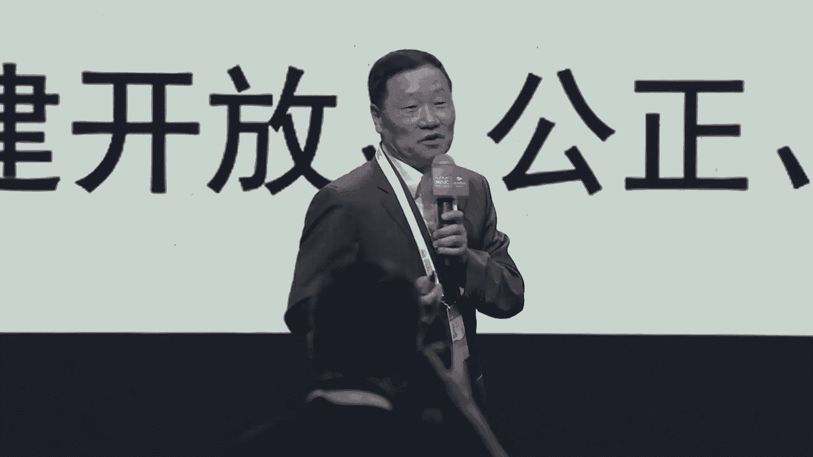
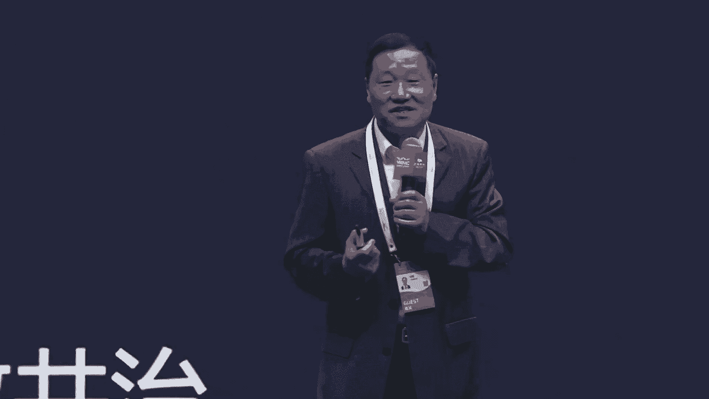
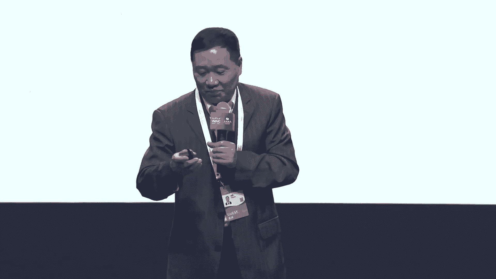
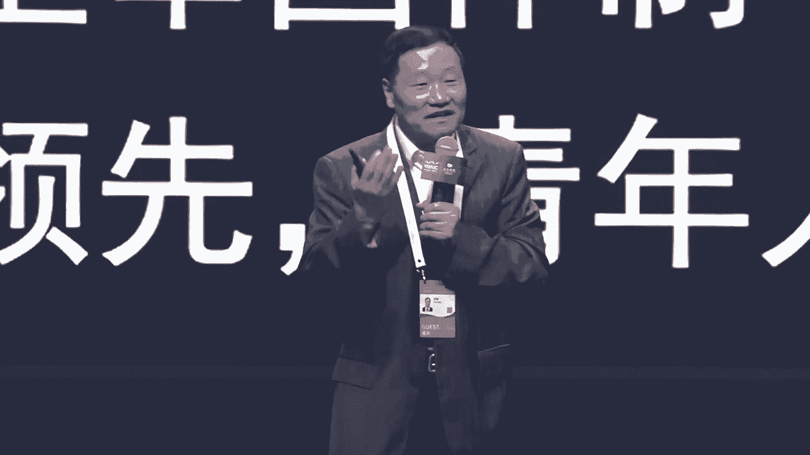
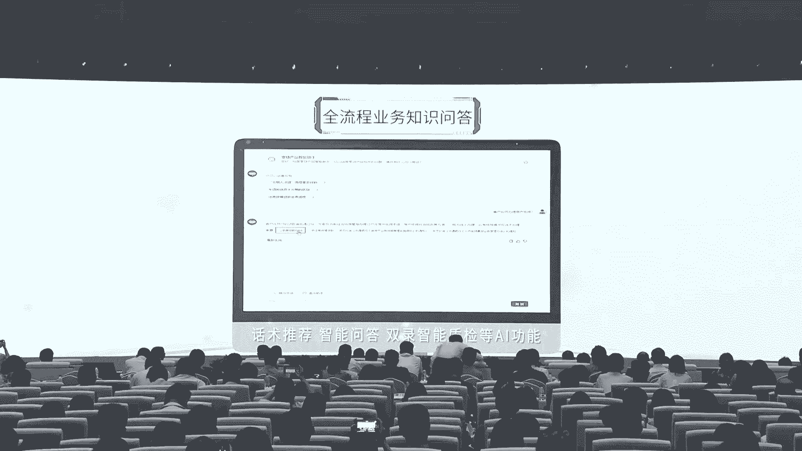

# P18：20240705-智能向善 开放共治 - WarrenHua - BV1iT421k7Bv

🎼尊敬的各位领导，各位来宾、女士们先生们，大家下午好。😊，欢迎各位来到智能向上、开放共治交通银行论坛的现场。我是SMG主持人周俊夫，欢迎大家。😊，当前啊新一轮科技革命正在持续的推动金融智能化的发展。

尤其是以生成式AI为代表的人工智能等前沿技术，也已经进入到了商业应用落地的新的阶段。那么为了加快金融强国建设，尤其是做好金融五篇大文章，同全球各界一道，我们一起来推动人工智能产业可持续健康发展。

今天由交通银行主办中国数字金融合作论坛协办的智能向善、开放共治论坛隆重举行。我们今天的论坛将基于世界级合作交流平台，来探讨智能技术金融应用的发展现状、机遇和挑战。发布优秀的应用产品。

协力构建开放公正有效的治理机制，推进金融科技向善，共同促进人类社会数字。经济发展。首先请恕我为大家介绍。今天莅临现场的各位领导和嘉宾，让我们掌声欢迎上海市经济和信息化委员会总工程师葛东波，欢迎您。😊。

欢迎。😊，交通银行党委书记、董事长任德奇，欢迎您。😊，中国证监会原主席肖刚，欢迎您。中国人民银行原副行长李东荣，欢迎您。那么今天，莅临现场的嘉宾还有交通银行党委委员、副行长钱斌。

清华大学五道口金融学院研究员、华夏银行原行长张建华，中国工商银行首席技术官吕仲涛、中国银行业协会首席信息官高峰，恒生电子董事长刘曙峰，华为公司副总裁、数字金融军团CEO曹冲。

深圳微众银行行长助理、首席财务官、董事会秘书王立鹏，蚂蚁集团研究院院长李振华，欢迎各位欢迎。😊，那么今天莅临本次论坛呢还有上海市委、市政府工信部火炬中心的相关领导。

让我们欢迎中共上海市委金融委员会办公室副主任葛平。上海市大数据中心副主任朱俊伟，还有我们今天来到现场的各位同仁们，再次欢迎大家的莅临，欢迎。😊。

首先让我们用热烈的掌声有请上海市经济和信息化委员会总工程师葛东波为今天的论坛致辞。有请。

尊敬的肖刚主席。任德起董事长，各位来宾、女士们、先生们、朋友们。大家下午好，很高兴与大家相聚在2024世界人工智能大会，智能向上开放共治论坛。😊，首先，我谨代表上海市经济和信息化委员会。

对莅临现场的各位嘉宾、各位朋友表示诚挚欢迎。也向长期以来关心和支持上海发展的各界人士表示衷心的感谢。当前。全球人工智能领域正迎来历史性的变革与迅猛的发展。II新范式的崛起，推动了人工智能技术的广泛应用。

去年以来，人工智能大模型持续创新突破。对经济发展、社会进步，乃至人类的文明产生了深远的影响。特别是在金融等领域。率先形成了市范应用，租赁金融机构降本增效。不断的扩展了金融服务的场景。人工智能技术。

在带来生产力革新的同时，我们也清醒的看到。也引发了网络安全、隐私保护、算法歧视和。道德伦理等风险隐患。智能向上已经成为社会各界的共同呼声。昨天。总理在开幕上做主旨演讲，指出，上海在人工智能领域起步早。

基础好，企业数量众多。技术创新活跃，围绕AI发展和治理。率先进行了有益的探索。并且希望上海继续巩固优势。打造人工智能发展的高地。上海也正在全力的推动人工智能大模型的创新发展，营造通用人工智能创新的生态。

加快打造世界级人工智能采业集群。也取得了明显的成效。从产业规模上来看，正在持续的扩大。目前，上海人工智能规商企业从2018年183家增长到目前的接近400家。产业规模从1340亿元增长到近4000亿元。

从创业能力来看，正在不断的提升。上海已有434款大模型通过备案，在金融领域打造了智能投眼、营销助手等。大规模的应用。今天在座也有不少人工智能企业参与交流。产业治理来看，我们也正在加快探索。

上海坚持以人为本，科技向上创新驱动、市场主导的原则在发展人工智能，出台了全国第一步人工智能领域省级地方性法规。建立了全国首个人工智能地方标准体系。探索构建适应新一代人工智能发展趋势的治理体系。先生们。

朋友们，面向未来，我们上海将进一步把握数字化、网络化、智能化发展的契机。在经济质量的变革、效率变革、动量变革过程中，不断探索人工智能发展与自理制道，一是加速赋能金融行业。

支持人工智能企业与金融机构深度合作，鼓励大模型II聚生智能等前沿技术在金融领域合规应用，为金融业高质量发展。注入强劲的动力。二是探索新型治理模式。鼓励各类创新主体参与国际国内治理标准的研讨和制定工作。

积极推动新技术安全合规应用，引导行业有序发展壮大。三是坚持完善、多方共治。充分发挥政府、企业、科研机构和社会公众的协同作用，支持金融机构针对具体应用场景需要，探索适合自身特点的治理模式。各位来宾。

今天论坛集聚了监管机构、金融机构、科技企业、高校等领域的专家、学者、企业家，我们也期待各位嘉宾利用这次人工智能大会，充分发表洞见，畅谈观点，为全球人工智能、健康发展邻聚共识、引领方向。

最后预作本次论坛取得圆满成功，谢谢大家。感谢感谢葛总工程师精彩的致辞，您请入席，谢谢。也让我们看到了上海在推动人工智能产业高质量发展当中的一个雄厚的实力。

我们也看到了以银行为代表的金融机构在此当中的一个重要的作用和角色。下面让我们掌声有请论坛主办单位、交通银行党委书记、董事长任德奇致辞，有请。😊，尊敬的小管主席。尊敬的葛腾波总工程师。尊敬的各位领导。

各位嘉宾，大家下午好。今天我们相聚在世博振兴，共同探讨人工智能与金融的融合共治，在此，我谨代表交通银行对各位领导各位来宾莅临本次论坛和长期以来对交通银行的支持帮助，表示热烈欢迎和真心的感谢。

习近平总书记指出，人工智能是新一轮科技革命和产业变革的重要驱的力量。人工智能及其带来的数字化、智能化变革，正以前所未有的广度和深度赋能千行百业，为加快发展先制生产力聚域蓬勃动力。从经营工作实践中。

我们深切体会到，人工智能正不断极化、经营机构数字化转型、新浪潮，在客户服务、产品创设、流程承受、风险防控等方面极大的提升了经融服务质效和客户服务体验。但同时，人工智能与金融的加速融合也带来继续。

安全、能力等一系列新风险新挑战，需要把握机遇，重视安全，扎实践行经营工作的政治性。人民性昨天开幕式上，李强曾理强调，人工智能发展要确保智能向上，加强协同共治。

本次大会发布的人工智能全球治理上海宣言也倡讨共推发展、共赴安全。工商治理的价值理念。当前，人工智能与金融融合发展已进入新阶段，智能向上开放共治，以成为行业发展的重要主题，交通银行举办此示论坛。

聚焦人工智能健康有序安全发展，围绕构建数字金融核心驱动力，搭建开放交流平台，邀请政府部门知名高校金融同业、科技企业领导专家展开研讨，更献增值着见，助力做好金融五篇大文章，近年来。

交通银行在监管部门的指导，和上海市政府的大力支持下，与社会各界亲力合作，积极推动深化人工智能技术，在经营机构的应用。一。是将智能化手段营育金融五篇大文章体系建设。洞察客户需求，实现产品对位。

为实体经济提供更加高效便捷的金融服务。二是将人工智能技术。嵌于经营管理流程，推动实现人机协同，强化智能辅助，优化承受业务流程，提升运营管理质效。三是充分运用人工智能技术，强化风险管理。

增强操作风险防控、内控合规与反洗权能力。今天论坛上，我们将发布交研与监管。人工智能联合创新成果，更享人工智能先进经验。同时，作为大会的战略合作伙伴，交通银行也设有专门展厅展示最新人工智能应用创新成果。

欢迎大家力临指导。各位领导、各位嘉宾智能向上开放共治，不仅是我们对未来的美好期许。共识共同的目标责任，通过本次论坛交流研讨，共同推动人工智能与经营融合发展寻稳致远，为提升金融服务的便利性、竞争力。

更献智慧和力量。最后，预祝本次论坛取得圆满成功，谢谢大家。感谢感谢任董事长带来精彩的致辞，您请入席。任董事长从目前AA发展的一个现状出发，就智能向善开放共治这一个议题发表了自己的观点。当然。

共同治理离不开体系的建设。接下来我们将进入本次论坛的主旨演讲环节。首先让我们用热烈的掌声有请中国证监会原主席肖刚进行加快建设人工智能治理体系主旨演讲，有请。😊，给一个给一个麦克。好，谢谢。

尊敬的人董事长李东荣，副行长，各位嘉宾，各位朋友，大家下午好。呃，今天我很荣幸啊啊有机会参加这次大会和论坛。那么按照论坛的主题呀呃我想就啊人工智能的治理体系这一这样一个问题啊。

谈一些自己的初显的看法和认识。那么就在两天前，大家知道7月2号，这个中国向第七十八届联合国大会提交了一个人工智能的能力建设的国际合作的决议。那这个决议案是在7月2号联合国表决的时候，全部的一致的通过啊。

没有反对票，也没有弃权票啊，全部的赞成。那么刚刚昨天开幕的这个呃世界人工这个智能大会在上海举行的。那么昨天也发布了上海宣言，就是关于人工智能治理体系的全球治理的人工呃这个上海宣言。

所以这些都充分体现了啊中国在全球人工治理体系当中的这个重要的贡献和重要的作用。那么人工智能的这个治理啊，其实是人类面临的一个共同的问题啊，因为这个人工智能吧啊给给全世界带来了很大的机遇。

同时也带来新的挑战啊，所以呃我说就是机遇和挑战并存啊。在这一个问题上是环球同此良热啊，大家是共同面临的啊呃所以怎么样呢？构建一个开放公正有效的治理体系和机制来造福全人类啊，这是我们各国啊。

各国都共同面临的问题。

那么这个当前人工智能呢有几个特点啊有几个特点。第一个呢就是产业界主导前沿人工智能。也就是说这个这个这个去年的数据吧，2023年产业界开发的著名的机器学习的模型达到51个。

而纯粹学术界开发的模型只有15个。那么当然产学研合作的，还有21个。那第二个特点呢是更多的是开源的基础模型啊，越来越多的开源。那么去年的数据是2023年发布了149个基础模型，那是2022年的两倍多。

其中65。77%是开源模型啊，是开源模型。那么这个前年和去年和大前年就是2021年开源是33%。2022年的是44%啊，这个啊是开源的越来越多。第31个特点呢就是前沿的模型啊，大模型越来越贵。

因为这个这个算力啊，这个数据啊各方面越来越贵啊。那么有资料统计呢，就是这个open AI的这个GPT4大概使用这个这个算力训练要花多少呢？花7800万美元。

那么如果到了现在谷歌的这个ji米i这个这arch秋大概要花费1。9亿啊，这个美元就现在越来越贵啊。第四1个特点就是人工智能的专利和出版的数量是这个爆炸式的增长啊，爆炸式的增长。

那么从这个中美顶级人工智能的这个比较来看啊，我们既有这个啊这个优势啊，但同时也看到有差距啊。那么这个这个按照有关的资料呢，就是2023年全球顶级的模型当中，美国呢大概开发了61个。欧盟开发了21个。

中国开发了15个啊，但是呢你要看人工智能的全球专利的数量，中国是走在前列的啊，走在前列的，中国占了61%。而美国呢也只占20%啊，20。9。那当然大家知道呢，现在这个呃人工智能带来很多的啊潜在的威胁啊。

我就不展开说了。比如说AI武器化的问题啊，这个AI重塑了国家的竞争的优势的问题。另外这个AI对齐的问题。也就是说AI和人类的价值观怎么样来对齐。啊，还有AI性任的问题以及AI的发展带来的市场垄断。

对就业的冲击啊，还有隐私和安全偏见与歧视啊等等啊，这些风险啊啊，这个潜在的风险是啊越来越大所以从全球来看，各个国家在人工智能的竞争已经进入到一个从技术领域延伸到规则制定这个领域了啊。

这怎么样一方面是抢占技术的制高点。另外一方面呢要抢占规则的制高点啊，规则话语权。啊，这里我这张表呢大体上列了一下。

这个全球就是国际组织和各国家主要国家啊，在人工智能的一些啊这个治理的规则的方面的一些进展啊，你比如说联合国啊就专门出台了人工智能伦理问题的建议书，这是120个国家这个一致通过的啊，包括中国在内啊。

那么也出台了以人为本的人工智能的治理啊，这些重要的文件。中国呢这个呃推出了全球人工智理的治理的倡议，同时在国内呢也启动了人工智能法案啊，现在正在啊这个筹备法案，啊美国也有行政的命令是吧？

欧盟呃这个出台了人工智能的法案。那么机器啊这个机器呢他们也有国际人工智能的指导原则。啊，先进人工智能系统开发的这个国际行为准则。啊。

那么这个呃呃中国、美国还有欧盟等208个国家联合签署了这个布莱切利人工智能安全宣言。以及2023年去年召开的这个全球首届AI安全峰会啊，那么呃OECD和G20啊。

他们也有这个类似的这种啊指导的这个规则啊，那么最后呢我觉得这个呃总结下一个基本的结论呢，就是呃现在各国非常的重视啊，这个治理体系的规则的制定啊，这里面呢有合合作啊。

也有很多的共识但同时也看到啊他们之间激烈竞争啊，激烈竞争都在抢占规则的话语权。而且呢从不同的国际组织，不同的国家来看，在立法的形式机构的设置优先的顺序监管的力度还是有不少差异的啊。

这个构架不不是完全一致的啊，还是有差别的。么中国啊提出了这个人工智能的这个倡议了啊，去年这个2023年习近平主席啊，提出了全球呃人工智能的治理创。

一那么这个内容呢就是坚持呃有这么呃6个方面的内容。第一个是坚持以人为本，智能向善啊，第二个呢相互尊重、平等互利。第三个是建立风险的等级测评。评估体系啊就是对安全性啊可靠性、可控性、公平性啊。

第41个呢是充分的尊重各国的政策和实践的基础上，形成一个广泛共识的治理框架和标准规范啊，就中国的主张呢还是尊重差异啊，但是呢也要有共同的共识的啊这种标准规范和治理框架。

第51个呢是支持在联合国框架下讨论成立国际人工智能治理机构啊，这个问题呢是一个现在各国有很大分歧的一个争议的这个问题啊，有的国家提出来是不是像原子能机构一样啊，搞一个国际的专门的啊这个治理这个机构。

那有的当然也提出来是在联合国下面啊搞一个机构，所以怎么样来做全球的人工智能机构，这个机构到底怎么设置。现在各国呢这个这个分歧比较大啊比较大。那中国呢我们的立场呢是啊支持在联合国框架下来讨论啊。

成立这样的一个国。的这个机构啊，大家下一步是还需要有这个呃有很多讨论呢。最后一个呢就是面向发展中国家的国际合作和援助啊，因为中国是这个发展中国家的这个这个这个应该说也是很重要的一个代表嘛啊。

所以怎么样来弥合啊智能的鸿沟和治理的差距啊，在这个方面应该采取很多的措施啊，那么欧盟大家知道最新这个呃今年的3月份呢，欧盟通过了这个人工智能法案。

我觉得这个确实是应该说是第一个啊颁布的这个完整的一个人工智能法案，应该说标注的全球人工智能的监管进入了一个新的阶段那么欧盟的人工智能法案呢基本的宗旨呢，它也是这么几条。

一个是保护基本的权利民主法治和环境可持续吧啊，另外是促进人工智能的这个创新的应用啊，创新的应用。那么我研究欧盟的这个呃人工智能的法案很重要的一个特点就是分级。😊，分类的监管啊，它分成四个等级啊。

四个等级啊，一个是不可接受的一个等级啊，那就是这个是是是这有一些范围，另外就是高风险、中风险和低风险啊，每一个等级有不同的这个适应的这个标准另外呢欧盟还明确了负面清单就是哪些领域是不得使用人工智能的啊。

这个他是很很很明确的啊，那么这个现在当前呢对AI的这个这个这个监管呢是越来越加强了啊，这里我引用了这个呃美国联邦通讯委员会的前主席这个汤姆费勒啊，他撰钱的一个报告，这个报告讲AI监管的历史之鉴啊。

他的这个基本的观点，就是呃对新技术的监管从来不是阻碍其发展啊，不是不能阻碍其发展，而是要减少其应用发展带来的次身效啊效应吧啊所以呢这个呃全球呢都在研究加强。AI监管的问题。

那么我觉得当前呢AI监管面临三大问题吧啊，第一个呢就是监管的规则还跟不上技术的迭代。啊，大家知道这个AI的技术迭代相当的快，我们的监管的规则跟不上。另外就是敏捷化也不够啊，监管的规则的敏捷化也不够。

第二个监管方式不适应多样的应用场景啊，过度监管和监管不足并存。啊，这个这两个方面的现象都存在。第三个呢是监管的主体不匹配新形式，就到底谁来管，怎么样来管管的有效性怎么样，精精准性怎么样啊。

这个还是有待于进一步的啊探索。那我们国家是一直高度重视这个人工智能的监管。那么就深层式人工智能的监管有三步部门的规章啊，我这里也不念了，这个这个都列在上头。那么对这个深层式人工智能的合规义务。

这个从训练阶段到模型开发阶段到产品运营阶段都有。😊。

详细的规定啊，现在都已经已经开始实施了啊，这些啊规定都已经开始实施了啊。所以呢我觉得这个中国啊要加快这个人工智能的体系啊。这个我们有很好的基础，也很好的条件。而且有我们的特点啊。

我觉得这几个特点是我们的这个这个发展人工智能的一个这几个特点。第一个是我们是着力于赋能实体经济啊，这个发展新智生产力啊，变革生产方式和生产关系啊，大幅的提升全要素生产力。

这是我们这个发展人工智能的一个一个初衷。第二个呢，我们有丰富的数据资源和应用场景，有先进的新型的基础设施，有完整的产业链生态圈啊，有超大规模的这个市场啊第3个呢。

我们有新型的举国体制和创新驱动的市场的机制啊，中国的这个人工智能的论文专利和部分技术，应该说世界啊领先的啊，尤其是中国可喜的是青年人。😊。

才啊，青年优秀人才现在在在不断的这个涌现啊，推动着大模型的创新的突破。那么要加快我国人工智能的治理体系。我觉得有几个问题啊，这个呃这需要这个呃我们坚持吧啊，第一个是基本理念啊。

这当然是坚持以人民为中心的价值取向，以人为本，智能向上。第二个基本的目标应该说是发展与安全并重啊，促进与规制并行。

那么在呃统筹发展和安全这个关系当中，我认为不发展是最大的不安全啊，发展是前提，安全是保障。那在促进和规制这个问题上，应该促进是目的。规制是手段要以监管来促发展，以应用来促治理啊。如果不广泛的运用啊啊。

特别是我们的数据啊不广泛的应用，它就没有价值了啊，所以呃我们谈治理的时候，我觉得要以监管处发展，以应用来促治理啊，那在基本的原则呢，这个我觉得这么几个方面，这也是中央反复提出的，包括中国提出的倡议吧。

是吧，和谐友好、公平公正、包容共享尊重隐私安全可控、共党责任、开放协作，敏捷治理啊，那么在基本的法规方面啊，我认为啊应该在中国应该有一个多层次的人工治理的法规体系啊，这里头包括综合性立法。

加上场景立规啊，综合性立法，那将刚才前面说的，中国现在在进入到筹备人工智能法这样的一个阶段。啊这个肯定是一个综合性的立法。但是除了综合性的立法，我觉得可能还不够。还需要有场景的立规。

比如说自动驾驶的领域呃，你很多问题可能在这个综合性立法里头啊解决不了。比如说自动化决策，再比如说自动智能医疗，另外就是智能金融啊，就这些领域啊，我们还有专门的在综合法的前提下，还有专门的立规啊。

应该有就是走这个综合性立法加场景立规这样一个路。另外从我们国家的情况出发，我建议呢也应该是硬法加软法加规则啊，就是有的是要有法律，有的是还有软法，还要有规则。而且在制定这些规则和法律的时候。

要特别注意留足创新发展的空间啊。

那么第三个是基本责任啊，无论是规则也好，法律也好啊，要这个明晰研发者、提供者使用者监管者的权责边界啊，落实全产业链全生命周期相关的主体义务啊，要设置责任的豁免空间啊呃在基本的机制上啊，就是治理的机制上。

我觉得有几个是需要呃需要这个呃进一步的重视吧啊，第一个我们我觉得也应该要搞风险的分级分类的监管啊，特别是分级分类，要有区分度颗粒度的监管啊，不能笼统的这个这个监管。另外要基于场景的，要有行业的自律啊。

也要发挥自律的机构的作用另外呢也要采取正面清单，加负面清单的这种啊这个模式。在监管方法上可以采取一体化一条龙圈穿透式的监管啊，这个包括标准呢评估啊监测。审计这样的一个全过程。

所以呢应该要进一步的啊建立一个创新友好型的监管，鼓励啊创新示范啊呃最后嘛当然这个监管问题呢也是需要这个综合统筹协调和专业监管这两者的关系要把它处理好啊。一方面整个人工智能是需要统筹啊。

要要有一个统筹的这个啊部门和这个综合性的法律。同时呢因为人工智能的运用上每个很多专业啊，对有些专业的监管，可能这两者啊怎么样把它啊结合好，也是需要这个啊研究的。啊，我就呃分享这些啊不对的地方请批评指正。

谢谢大家好，感谢感谢肖刚主席带来精彩的演讲，谢谢。😊。

好，谢谢相港主席，您请入席。😊，🎼小耿主席基于现在产业发展的现状和技术发展的趋势啊，为我们呃讲解了建立人工智能的这个治理体系的一个必要性和急迫性。

那么接下来我们即将请上舞台演讲嘉宾是来自中国人民银行的原副行长李东荣先生，为我们带来稳妥推动人工智能金融应用，助力数字金融创新发展的演讲。有请。尊敬的肖刚主席德奇董事长，各位嘉宾，大家下午好。

昨天下午啊我们来到这个上海，这个扑面而来的就是上海这38度的高温呢，这个要我们领略到上海这个热度。然后接着我跟肖刚主席也去了我们那个人工智能大会的会展大厅进入大厅。

我们同样感受到社会各界对人工智能高度关注的这个热潮，人员络绎不绝，兴趣盎然。这个人感到这个在这个是人工智能这个大会啊，确实引起大家极大的这个关注。我们知道这个。

人工智能作为新一代的信息技术产业的核心产业，是引领新一轮科技革命和产业创新的关键驱动力。成为发展新资生产力的重要引擎。近几年来，人工智能的快速发展。特别是通用人工智能技术的被广泛关注和应用。

已经成为引领未来的战略性技术。而金融作为国家重要的核心竞争力，促进人工智能与金融深度融合，是落实国家人工智能发展战略的关键举措和重要途径。是推进现代金融体系建设的重要内容，具有十分重要的现实意义。

下面我想就这个如何稳妥推进人工智能金融应用，谈一点我个人的一些思考意见，有不当之处，请大家批评指正。我谈三个方面的问题，一个是人工智能在金融领域的应用正在加速深化。一是国家高度重视人工智能产业发展。

早在2017年的7月，国务院就发布了关于印发新一代人工智能发展规划的通知。这是我国发布的第一份有关人工智能行业的系统部署文件。这之后。

党中央、国务院还有有关部委也陆续印发了相关的规范指导人工智能发展的意见。这些内容涵盖了算力布局等基础设施建设、应用场景和重点任务。

伦理规范、治理原则、标准体系建设、高效人工智能学科融合等人工智能发展所涉及的方方面面。在国家的大力推动下，我国的人工智能产业快速发展。目前，我国人工智能的核心产业规模已经超过了5000亿元。

企业的数量也超过了4300家。预计到2035年，我国的人工智能产业规模为1。73万亿元，在全球的占比可能会达到30。6。人工智能正在以前所未有的广度和深度深透制各行各业。

各种重大的成果和突破性进展也在持续的涌现。二是金融行业的人工智能应用政策环境持续优化。金融是一个信息密集型的行业，其信息化。其信息化的实践探索和普及应用也一直走在各行业的前列。长期以来。

金融业在新兴技术应用方面，既是积极的推动者，也是直接的受益者。特别是当前，金融系统响应国家战略，积极拥抱人工智能，正在成为人工智能应用的最佳场景之一。在2022年，人民银行发布了金融科技的发展规划。

指出，在十三五期间，大数据人工智能等技术金融应用成效显著。提出要抓住人工智能全球发展的新机遇，以人为本、以人为本，推进智能技术在金融领域的深化应用。近几年。

人民银行还制定并发布了金融行业标准、人工智能算法金融应用凭借规范、人工智能算法、金融应用、信息披露指南等行业标准。

从人工智能金融领域应用的基本要求、评价方法、判定准则和人工智能算法在金融领域应用过程中的信息披露原则、形式内容等都进行了规范，有效的推动了人工智能在金融领域的深化应用。

三是金融行业人工智能应用场景快速扩展。从应用场景看，知识图谱、生物特征识别、机器人流程自动化，尤其是以大模型为代表的人工智能技术。在文档信息提取和生成数据分析、员工助手代码编写等方面。

有效的提升了内部的生产效率，降低了运营成本。而在智能客服、客户交互、量化投资等方面的应用也在日益深入，则不断优化了客户体验，创新的服务模式，提升了服务效率。从机构层面看。

国有大型商业银行是人工智能技术应用与金融业融合发展的践行者。他们积极运用人工智能和大数据技术，建立完善数据驱动的经营管理新模式，加快推进智能型银行建设，加快搭建基于大模型技术的人工智能赋能体系。

部分股份制银行加大人工智能的投入，不断推动大模型技术在智能财富助理等零售场景、员工学习培训等内部场景的应用啊。昨天下午我跟肖刚主席在会上我们看到交通银行啊，他们在应用这些模型方面在在信贷方面。

还有包括这个他们内部的有个交新的一个内部员工的这种案系上都在积极推广使用啊，据我了解，还有其他像北京银行，还有很多银行，他们也在积极的在内部推动这种呃相关的模型应用。这个。

将全行的知识知识和智慧汇聚大模型之中，实现了对员工的全面赋能。下面我讲第二个问题。人工智能应用过程中要关注的问题。人工智能的发展需要统筹好算法、算力、数据三个核心要素，三者相互联系，不可分割。

其中算法是核心，数据是基础算力是驱动。在推动人工智能发展的同时，需要密切关注人工智能技术应用可能存在的问题。一是算法黑箱算法歧视，模型缺陷难解释等潜在风险。由于算法的不透明或者保密因素。

很难确定算法的公平性，进而可能带来算法的歧视，人工智能作为非冯洛伊曼结构的信息化系统，模型的内部工作机制难以解释和理解，同样的输入并不一定能得出同样的输出。输入和输出之间映射的关系难以琢磨。

这种结果不清不准不精确过程难审计应。果难解释是其的特点，如何了解认识和用好这个特点，需要我们在实践中不断总结和提升，也需要有相应的规范和制度，并根据其特点进行适应和调整。

二是算力成本投入大、算力资源需要进一步投筹等问题。算力支持是人工智能的产业底座。数据显示，人工智能算力需求正在快速增长。去年，我国的人工智能算力市场规模达到664亿元，同比增长了82。5%。当前。

通用人工智能的发展，对基础算力提出了更高的要求，也意味着更大的投入成本，而同样，数千亿。数千亿级别的参数，长达数月多的训练测试周期，意味着在电力消耗、数据存储等方面巨大的成本。

也要求在人工智能应用方面需要进一步的降本增效。同时，我国东部数字经济发达地区数据中心多算力需求大，但缺少耗能指标。而西部地区绿色可再生能源多，具有建设算力中心的天然优势，却缺少资金。

这就需要从国家层面更好的统筹推进东数西算，促进东西部的协同联动。另外，美国的小院高强策略，对我国人工智能所需的高端内存芯片的不断限制，也要求我们务必抛弃幻想不断突破。

三是数据隐私保护和数据质量带来的挑战。大量的数据是人工智能深度学习算法的实现基础，没有数据人工智能就会陷入巧步难为无米之炊的困局。人工智能应用。

尤其是大模型训练等过程中所面临的大量数据获取和处理的数据泄露风险以及算法对用户的个性化分析所带来的用户隐私泄露的风险，凸显了保证数据安全和保护用户隐私的极端重要性。同时。

数据质量、数据偏差和样本数据等不均衡问题都会直接影响人工智能模型输出的效果。此外，人工智能应用客观上还面临技术和风险的误判、伦理道德等问题，这都需要引起高度的关注。下面我讲第三点第三个问题。呃。

关于人工智能金融在金融领域应用的5点建议。一是要坚持以人为本，科技为善。要坚守金融为民初心，以增进消费者共同利益和合法权益为应用导向，尊重社会共同价值观、开发有温度的智能金融产品。

金融机构在推动人工智能应用时，要守住法律和伦理底线，加强人工智能、伦理治理和教育培训。在数据获取、算法设计、产品研发、和应用等过程中，避免产生涉及民族信仰、性别、年龄、职业等方面的偏见与算法提示。

二是切实加强风险监管和基础支撑支撑建设。要注意识别人工智能应用可能带来的传统金融风险性变化以及新风险，不断筑牢安全底线，加强人工智能技术全流程安全管理。

加强信息披露、算法报备、留痕管理、安全认证等方面的技术监管，提升人工智能的可解释性、可预测性，保证人类对机器行为的信任。同时，加强人工智能在金融监管领域的应用。

不断提升监管部门自身的金融风险态势感知能力和监管科技应用水平，充分发挥标准支持金融业高质量发展的基础性引领性作用。在国家人工智能标准体系的总体框架下，不断推进金融行业人工智能应用标准体系建设。

三是加强数据安全和做好消费者保护。要加强人工智能金融应用中的数据安全风险防范和消费者保护。应用人工智能技术，加强金融应用中的数据安全和金融消费者保护。要强化人工智能。语料库数据采集。

加工存储及输出等覆盖全生命周期的监督管理。探索通过合成数据替代原始数据训练和验证大模型等方式，降低在模型训练过程中的数据泄露风险。要在保障个人隐私、商业秘密和敏感数据的前提下。

加强金融业的数据要素安全融合，为金融业应用人工智能提供高质量的基础数据。要引导和督促从业机构，将消费者保护要求纳入公司治理、企业文化建设和经营发展战略。研究设计。

适应不同消费者操作习惯和能力素养的智能金融产品，积极开展金融知识普及教育。人工智能科普推广等活动，持续提升全社会金融素养和素质能力。不断提升人工智能系统管理的可靠性和透明度。

推动实现可监督、可追缩、可解释的人工智能技术，提高社会公众对人工技术、人工智能技术的信任度。四是注意系统性提升人工智能的能力和水平。人工智能不是无根之木，无源之水。

数据与人才是保障人工智能高速发展的重中之重。我国以前瞻性的提出了数据要素化的议题，要做好数据要素化，需要在每个系统的实施和应用中都能够有效落地。为人工智能的发展不断积累燃料。

大力要大力培养和引进数据治理、模型算法等复合型高素质的专业人才。同时，人工智能解决的是生产力的问题，生产关系也要重视，要注重监管友好型建设。

政府部门监管机构、金融机构与产业部门能够利用监管科技的思维和手段建立系统可交互、数据可共享人工智能可通用的新的。信息系统与数据系统。五是要把握主动、切合实际，结合实际，为金融业务带来实质性的帮助和提升。

金融机构应当主动把握深层市人工智能的重大发展机遇，通过科技加持不断提升全业务全流程和全场景的智能化水平。首先，要夯实数据底座，数据是人工智能的基础。

金融机构应在内部推动跨部门跨领域的数据合规共享、优化业务流程，提高数据质量统一标准，搭建金融业数据融合平台，提升数据融合应用能力。其次，要加强合作。金融领域的特殊性以及人工智能。

尤其是通用人工智能技术的复杂性，决定了金融机构不可能单打独斗，需要加强与科技公司的合作，共同推动人工智能技术在金融领域的深化应用。最后要符合实际需求，选择适合自身的人工智能发展路道路。当前。

国有大型金融机构应主单主动承担责任，积极探索推动金融行业、金融领域行业大模型的应用，以解决金融领域通用的问题，绝大多数的金融机构，尤其是中小金融机构，不应当简单的追求人工智能技术的全覆盖应用。

还是应该根据自身数字化的现状，自身实力等因素，聚焦于某一特定的业务场景，选择适当的人工智能模型开展应用。各位嘉宾，各位朋友，当前，人工智能技术已经发展成为引领重说的驱动力量，也将成为金融业的核心竞争力。

人工智能金融领域应的前景令人期待。我相信在各方的共同努力推动下，人工智能在金融领域的应用必将带动。进一步提升我国数字金融的能力和水平，也必将为加快构建新发展格局，促进高质量发展。🎼积极贡献金融力量。

我的发言完了，谢谢大家，感谢掌声送给李行长带来精彩的分享，您请入席。其实我们也看到在数字金融创新方面，我们需要把握主动，又要结合实际，才能为金融业务带来切切实实的帮助和提升。

下面让我们掌声有请交通银行党委委员、副行长钱斌为我们进行主题分享。他分享的题目是以人为本。智能向善，描绘数字金融新途径。有请。😊，尊敬的肖刚主席李东龙行长葛东波总工程师。各位领导，各位嘉宾，大家下午好。

当前，AI技术正成为推动世界之变、时代之变的重要驱动力。从金融实践来看，AI已经在金融数字化转型过程中培育形成新智生产力，塑造出数字金融的新生态。但与此同时，AI进一步发展也面临了许多问题挑战。

包括价值对齐、科技伦理、数据保护等等。作为一名金融科技从业人员，我就AI未来发展金融领域的应用和科技伦理治理汇报一些个人的体会。一、蝶变向心AI技术驶入通用人工智能的深海。深层式大模型的迅速崛起。

加速了人类进入智能时代的步伐。过去一年，人工智能围绕算力、数据、算法三个方向加速发展，取得了长足的进步。一是集约化将成为算力建设的新趋势。2023年，我国数据中心基价总规模超过了810万个标准基价。

算力总规模已经达到231fopps。其中，智能算力达到了71fs。同比增速超过70%。智能算力激增加速了人工智能产业创新发展，但同时也带来了成本，包括巨大的电力能源消耗问题。据预测。

我国数据中心到2030年耗电量将超过4000亿千瓦时，约为当前三峡电站发电量的4倍。与此同时，算力设备的。冷却也带来巨大的水资源的消耗。研究表明。

到2027年全球范围内AI需求消耗掉的水资源将超过1000万居民一年的用水量。提升算力效能，降低能源消耗，将成为人工智能产业高质量可持续发展的关键。去年12月。

国家发改委、国家数据局五部门联合印发关于深入实施东速西算工程，加快构建全国一体化算力网的实施意见，明确提出加快打造及信息计算力、网络运载力、纯数据存储力于一体的绿色安全综合算力体系。

实现算力资源的并网调度和节约利用。二是合成数据将有望成为数据扩充新来源。从文字诞生，人类将知识抽象压缩在文字中。如今，人类知识体系被再次压缩到大模型中，形成对世界知识的二次重构。然而。

现存的语言文本数据存在大量重复高质量数据资源稀缺，已成为大模型持续迭代的关键瓶颈。据预测，按照当前的数据消耗的速度，大模型最快将于2026年耗尽高质量的数据。2028年耗尽互联网所有的文本数据。

而合成数据可以精确复制原始数据集的统计特征，又与原始数据不存在任何关联，具有全面性、多样性、经济高效等优点。从去年开始，全球的科技巨头加速合成数据的研究，并用于新模型的开发。今年5月。

第七届数字中国峰会发布了大模型训练数据白皮书，也将合成数据作为解决高质量数据供给不足的新方案。当然，合成数据是否能大范围的替代真实数据进行模型训练，目前还存在比较大的争议。

如何突破人工智能领域的数据瓶颈，扩充新的高质量数据来源，尤其是中文语料数据依然任重道远。三是多模态已成为算法越迁的新方向。人类在理解世界时，不是孤立的处理单一模态的信息。

而是通过视觉、听觉、触觉等多种感官通道综合感知。今年5月，open AI发布全新的多模态大模型GPT4O，进一步表现出对人类情绪的感知和表达，让人机交互在一定程度上发生了质的变化。随着AI的逐步落地。

更多复杂场景应用，需要用多模态来支撑。比如多媒体创作需要文字、图片、视频之间互相生成和转化，自动驾驶需要实时感知和解析，来自视觉、雷达等多种传感器的数据。

可以预见多模态将成为AI技术发展的应用突围的新方向。汇报的第二部分，AI与各领域广泛融合，展现出极大的创造力。人工智能作为当代创新最活跃、应用最广泛带动最强劲的技术。

以自然无缝的与生产生活的方方面面深度融合，展现出赋能百行千业创新发展的巨大潜力。在产业经济领域，AI技术能够有效牵引生产和服务体系的智能化升级，促进产业链价值链的延伸拓展融合发展。

在制造业通过数字孪生创建虚拟工厂模型，实现对工厂的可视化和智能化管理、黑灯工厂通过构建无人工干预的全自动化生产环境，引领智能制造上升到全新的高度。

在医疗行业AI已应用于健康管理、智能诊断药物研发和医疗机器人等领域。AI参与的基因编辑以成功编辑人类细胞中的DNA加速各种遗传疾病的精准治疗。在政务民生领域，AI技术助力数字社会、数字政府的建设。

以数字化手段促进民生改善和治理能力的现代化。比如上海市以高效办成一件事为牵引，打造智慧好办的政务服务，运用人工智能，实现扫田扫缴智能省申请材料政府主动生成，运用AI带模型，打造基层社会治理的新帮手。

面向居民提供各类服务政策智能检索问答服务，运用AI构建城市的智慧大脑，引入智能交通系统和无人机的移动巡检、准确预测交通拥堵的状况，提升城市的运行效率。当然，在国防军事领域。

AI技术在军事模拟训练、情报分析和指挥控制等领域的应用，正也逐步延伸到作战空间。改变了传统的战争方式和军事策略、信息通讯、战场感知、无人化等基于高新技术的战斗力建设变得尤为重要。今年3月。

美国国土安全部发布的2024人工智能路线图，探索在国土安全领域开展的人工智能应用。欧洲国防国际防务展中、地面机器人、无人机制导设备等几乎所有展示的系统都有人工智能的影子。

可以预见未来战争将是作战双方算力、算法、数据的全面抗衡超算中心和大模型，将是新时代的大国重器。汇报的第三部分，运用新智生产力，写好数字金融大文章，助力金融强国建设。人工智能作为新智生产力的代表。

已经在金融数字化转型实践中展现出强劲的推动力和支撑力。今年，交通银行在制定数字金融行动方案的基础上，加快人工智能加的行动方案制定，力争在更深层面、更广范围推进人工智能实践，促进数字金融的高质量发展。

一是运用人工智能践行以人为本，推动普惠便捷。为满足人民群众多样化的金融需求，交通银行以数据加智能双人驱动，从信用端信息端切入，致力提供更普惠、更便利的金融服务。在服务更普惠方面，我们革新服务模式。

对客户进行多维度的精准画像，推出基于统一客户信用体系的预售性模式。实现从产品级的授信，向客户级的授信转变，从客户主动申请向银行预售性转变，提升融资的可得性和便利性。我们进一步使用算法模型的标签。

推动客户产品精准对位，涵盖理财、保险、基金等产品的推荐，多渠道增加居民的财产性收入。在服务更便利方面，我们重塑业务流程。基于音视频、图像识别、生物识别等技术，打造客户身份、远程线上的核实场景。

提供人像比对、人证比对等多项能力，将穗融通、普惠易代、抵押贷等产品的核实时间，从几天缩短到几分钟，解决客户多次往返网点办理手续繁琐耗时的痛点，我们突出移动优先，加强线上线下的融合，打造智能语音客服。

呼吁业务语音识别率，达到了99%，应用虚拟数字人技术，提供全天候服务，持续提升线上渠道、对客服务的能力和水平。二是运用人工智能服务实体经济，创造共同价值。交通银行聚焦经济发展的重点领域和薄弱环节。

不仅关注企业的短期盈利能力，着更着力企业的长期发展和创新动力，为实体经济提供更全面、更精细的金融服务。6月24日，总书记在全国科技大会上的讲话，强调要做好科技金融这篇大文章。

引导金融资本投早投小、投长期、投硬科技、交通银行根据科创企业不同阶段的发展需求，提供全生命周期的金融服务，促进科技成果转化应用，通过对接国家地方园区企业不同层级的数据。

打造集成电路、人工智能、高端装备制造等产业图谱，推动科技企业、资产数字化、产业链条透明化。在此基础上，进一步搭建一加N科技型企业专属的评价模型，应用于产品设计信贷审批额度核定贷后监测流程。

以覆盖73万户的科技型企业，我们将智能化手段融入到绿色金融体系的建设进程，推进绿色智能视频。构建企业的ESG智能风险评价体系。我们推出绿色产业链的金融服务，为绿色产业链输企业提供一户一方案的服务模式。

三是运用人工智能，强化风险防控，实现稳健经营。防控风险是金融工作的永恒主题。近年来，金融领域出现了各种各样的案例。欺诈手段越来越多样化，隐蔽性越来越强，客观上加大了银行防控的工作难度。

交通银行加速推进全面风险管理的数字化转型。运用数字技术全面提升信用风险、操作风险、合规风险等领域的风险防控能力。比如在信用风险领域，我们依托多维度的行内外数据，完善客户信用评级体系，构建关联关系图谱。

实现信用风险总额管控和穿透管理，通过机器学习，完善风险监测的预警机制，建立信贷预期预测模型，前瞻性的精准识别风险资产超过百亿元年回收资产数十亿元。在操作风险领域，我们通过OCR比对RP自动核查等手段。

有效识别合同造假、抵质押物权证造。假等欺诈行为，年自动核查约15万件权证。通过制定反欺诈的实施风控策略，拦截疑似电信诈骗交易金额数十亿元，全力守护好老百姓的钱袋子。在合规风险领域。

我们通过端到端的AI模型的应用，减少30%的反洗钱筛查任务量，单笔任务节省40%的核查及报告的编写时间，并通过隐案挖掘等模型，有效提升50%的反洗钱上报效率。最后一部分汇报，坚持智能向上。

共同推动AI安全可信发展。习近平总书记在向联合国贸易和发展会议成立60周年庆祝活动开幕式发表致辞时提出，坚持以人为本、智能向善。在联合国框架内加强人工智理、人工智能规则治理。

推动问责、公平、安全和可信的人工智能应用，是迎接人工智能时代的必然选择和应尽之责，如何做到我们认为应该要关注以下几点，一是坚守证券的科技伦理。据报道。

人工智能在三年内就预测出近7亿个蛋白质和大分子的空间三维结构。而人类此前积累的全部数量仅仅20万个。正是因为人工智能介入，将科研由手工生产变成了工业化生产。同时。

另一则新闻是美国重要智库发布了一张人工智能。系统对抗性威胁的场景图，呈现了人工智能应用于网络安全，从侦查踩点、网络渗透，到数据获取，再到秘密传递、后场处理等全链条的场景，威力之大，超出想象。

两个案例从正反两方面充分表明，人工智能运用得当，将造福人类，运用不当，可能引发灾难，所引发的危害将不亚于核武器。而全世界只有9个拥和国家，但可能会有无数个滥用人工智能的机构团体。

少数人给世界带来灾难的风险在大大增加。可信AI智能向善刻不容缓。同样，站在金融的角度，我们要防止金融服务过程中的信息检防、数据偏见、隐私泄露和市场操纵，要防止模型歧视所可能引发的侵权事件。

要建立模型的持续的运营机制，对模型输出开展审计。二是加强算力资源整合共享。大模型所需的算力每三四个月就翻一倍，以新材料、生物制药、金融科技为代表的前沿产业都对算力提出了前所未有的需求。

但当前全国范围的算力小高炉现象普遍存在。快速增长的主要是低端算力，而围绕大模型等AI任务所需要的高端算力仍然缺口较大，供给端和需求端存在的结构性的错位，甚至造成资源与资金的浪费。

建议要研究建立国家级的云计算底座，有效统筹大模型在训练推理等不同环节所需的算力资源合理分工，避免基础设施出现低水平的重复建设。在行业层面，要探索建立金融的算利云，提供公正、可信、可共享的算利资源。

三是强化数据供给和数据治理。AI模型的价值观，来自于数据数据供给质量的好坏，将直接影响AI的智商与成效。为了确保大模型的应用效果和可信度，我们需要对训练数据的量和质，提出更严苛的要求。

经过多年的信息化建设。金融机构普遍积累了大量的结构化数据和数据的处理经验。但相对于大模型还远远不够。在具体实践中，一方面需要着力丰富数据种类，强化数据治理，提升数据质量，建立业务沉淀数据要素。

数据要素转化为数据资产，数据资产，反哺业务发展的闭环机制。另一方面，需要建立高效稳定的数据标注治理体系，对训练数据进行辨别、清洗、加工，确保数据支撑有力，标注专业统一，为建模提供坚实的基础。

四是推动大模型生态建设，积极开展模型治理。大模型研发具有人才密集、技术密集、资本密集的特性，通常由少数高效能的研发组织主导。目前，国产大模型数量已经超过了200个。一方面。

大模型研发缺少具有显著创新性的原创理论的支撑，导致技术路线趋同、同质化严重，另一方面，在探索大而强通用模型的同时，需要结合具体的应用场景，在小而美的垂直行业模型资源上加大投入。建议发挥产业上下游的合力。

推动产学研深度融合，建立国家行业基础性的规划，构建自主可控、共生互补、健康可持续发展的良好生态，同时要大力推进负责任的模型治理，解决AI应用存在的模型决策不透明，难以白合化等问题，确保人。

人工智能合规安全有效应用，包括建立模型的评估和监测机制。五是完善AI工程化的人才培养。AI工程人才工程化的人才是推动AI技术创新和应用的关键人才。在数字化转型中发挥着重要的作用。

积极培育AI工程化的人才队伍。一方面，要通过自主培养产学研深度合作等方式，造就一支知识型、技能型、创新型的工程化人才队伍。另一方面，需要通过人才的引进、消化、吸收以及合理流动、充分激发创新的活力。

以上是我就人工智能应用与伦理治理的一些思考和观点不当之处，请各位领导专家批评指正。交通银行愿与大家一起智能向上、开放共治、携手奔向数字时代的美好未来。谢谢大家。🎼感谢感谢邢行长带来精彩的分享。

我们看到了交行在咱们这个科技革命当中的一个非常生动的实践哈，尤其是如何用好心智生产力来做好数字金融的大文章。接下来我们掌声有请清华大学五道口金融学院研究员、华夏银行原行长张建华先生。

为我们带来公共数据的开放模式与价值实现的思考。有请你。😊，好，尊敬的肖刚主席。东荣行长、德勤董事长，各位领导，各位嘉宾，大家下午好。呃，我想借着今天这个论坛呢跟大家分享一点关于公共数据的这个使用的问题。

因为大家知道啊，我们讲人工智能的话，实际上一个重要的来源就是说我们的一个基础就是数据数据呢又分这个公共数据，就是政府部门掌握的数据和私有数据。呃。

而公共数据呢是大约占我们现在社会总共产生的数据的啊3分之2以上。所以公共数据的开放问题其实就是一个非常大的问题了。所以我今天想呢讲一个比较比较窄的一个题目啊。

就是公共数据开放的它的这个模式和它的价值实现。呃，这三个部分吧，简要的说就是数据价值、公共数据开放模式以及实现的这个呃方式。公共数据价值这个不用多说了，这个大家都知道啊，因为这个时间关系我不展开说。

就是对这个数据的需求量是很大的。呃，这个人工智能的发展，最后实际上离不开这个离不开数据。那么公共数据？现在这些呃这里边有很多啊，就是说我们讲就是呃人工智能的开发，有有哪些是需要数据的。

是你在什么过程当中需要什么数据？这个啊研发数据开数据数据的这种啊从产生产加工到最后全都是有一个呃有一个一个过程，对我们整体的人工智能都有一很就是人工智能都有很大的需求啊。呃，数据要素呢，这里边有几个啊。

就是一个是说就是我们国家很重视。然后从全全球产业链上来说，就是说提升经济效率，提升全员生产率，这是数据的一个最大的一个一个一个作用啊。呃，我们这些都都不多讲了。那么这是公共数据的潜在价值。这个也有啊。

这不多说。因为我重点是想讲一点我们的自己的一个研究，近期做的一个研究，呃，也是做的一个实政啊，刚刚还是一个很初步的一个结论啊，这个公共数据的这个也都讲了那么公共数据的想谈一点就是现有的开放模式啊。

我们总结了全国的290多个城市。现在基本上都有这个开放的方式了，就政府公共数据都是啊上那个上网，有的是通过本部门自己开放，有的是一个开放平台。那么还有的呢是集中到一个运营机构。

由政府委托一个专门机构来运营，就是有不同的模式啊，集中的开放模式呢，有两种，一种就是说属于政府的一个开放平台啊，一种呢是就是。委托一个运营机构啊，当然这个运营机构不一定是就一家。

他不会是把所有的数据集中在一起，也模式又不一样啊。有的地方是把所有的就数据集中在一个运营机构。有的地方呢像这叫分专区。像北京市的就分专区啊，金融。因为我们研究金融的多一些。

它金融的数据跟金融相关的是一个专区啊，交通的啊卫生的就是也就是健康的，可能又是不同的专区。像这种呢各地呢可能模式不一样。这个就我们讲叫属于叫有运营机构的，这开放模式。这几种模式呢呃对于凡是我们的结论啊。

先说就是比较有意思的是说，凡是有开放的，他对经济增长都是有贡献的啊，对于这个对于当地的这个创新也是有作作用的啊，但是呢作用程度不一样。这是就是说从这个呃其实各个国家呢也是一样的啊，我们国家是一直强调。

就是说这个要数据要开放，包括就是说我们的政务数据，各地呢为什么就建立那么多这个政府的政务数据的一些公共的一些呃开放平台，也是因为为了落实我们国家的相关的一些这个呃要求，一些一些一些政策。呃。

国外呢其实也是一样的啊，像那个在那个欧美都有自己的这个就是数据开放的一些要求。像在那个欧洲，大家知道我们国家讲这个开放银行建设的时候，通常是讲的是我们银行怎么开放我们自己的能力。

叫什么什么那个啊叫做那个open banking呢是你开放你的API接口是要去接对接外部数据。其实在欧洲的话呢，它的开放银行建设，实际上是要求你的银行开放自己的数据，它实际上是这个叫一个词。

一个同一个说法，但实际上是不一样的。它是因为什么，因为我们银行业呢可能自身的数据，对社会贡献应该说也很大。大家希望因为都知道我们金融业是是一个数据密集型的，对于掌握很多的一些信息。

对社会的其他领域实际上是有作用的。那么这个是说的就是对这个数据开放的这个价值实现啊，然后各个国家呢都有一些政策。这个里边我不多谈了啊，这个我就想讲一讲我们自己的研究的一些成果啊。

就是从这个呃刚才提到的啊，就是我们那几种三种啊，就是开放模式啊，最主要的两个大的呢就一个是说就是有特许经营的啊独家经营的。然后市场供应链的主题呃牌照方式的这都有我们这个不同城市啊。

但是大的分类呢就是两大类，就是一个是说一个开放平台，那么把数据都上去啊，一个呢是委托运营机构，他们它那个整理加工啊，这个。授权经营的呢有授权经营的好处。然后这个就是有一些包括一些权益啊，怎么相风风险啊。

就是权益怎么分配。现在呢也有一些地方在尝试，但是现在还都是在初步的，就是关于这个权益部分，我后边会讲，实际上最后呢现在利益机制还没有完全清晰。所以现在的包括这个呃开放平台建设的责任主体啊。

包括就是这个呃就是。授权经营的这个收费模式，盈利模式现在也都还没完全定，都是处于一个初步的探索阶段。那么所以我们就前期就做了一些比较简单的一些研究啊，就是关于这个结果。这里边呢就是关于数据供给啊。

在开放平台和授权经营呢都有不同的方式。开放平台呢它开放的呢就是属于这个特点呢是说它的这个维度是比较少的。他数据它不是完全的，而且尤其是通常来说它的数据的频率不是那么高啊，及时性不是那么强。

还有一个啊它的这个最大的问题呢，就是它的数据源其实是没有人来做这个呃数据的清洗的，没有没有专业机构嘛，他做这个数据的整理加工，它可能就是一个呃开放，就是要求政府放上去，各个部门呢。

政府的政务部门自己有责任，有义务放上去啊，就是有提了个要求这是关于就是这个开放平台的。那么授权经营相对来说就好一些啊，这个由一个运营公司呢把原始数据呢，就是都通过都集中到他那儿，它还。

定期的跟各个就是数据源的提供部门呢进行沟通啊，基本上能够保证什么呢？好处是说能保证这个数据的啊完整性、准确性、及时性啊，就是它这个能能对于数据的质量比较有保证啊。

完全的公共开放的呢就是数据质量呢要差一些，包括它的这个时间频率啊，各方面也也会也会有一些有一些限制。呃，特别是包包括就是这种啊就是完全的行政的一个一个一个方式安排，就是这种啊激励性不强。

对于各个部门呢都是完全是把它把它当成了一个就是政治任务啊完成的。所以我们说呢缺乏一个就是市场化的一个激励机制。那么授权运营的呢方式呢，因为有运营机构，运营机构呢肯定是有有积极性的。但是现在的问题在于呢。

现在他们的这个收费模式呃，也没建立起来，就是没有建立起来一个可持续的一个商业这个模式呃，收费收什么原始数据，你收费肯定不合理。那么整理数据加工的，你的价值所在怎么体现？现在又没有体现出来。

所以现在关于这个收费模式呢，现在也有问题啊，这个是个授权经营的。这里边列了一个北京市的，你就是信息啊，大量的这个信息其实很多啊，这只是列了一个北京的，其实是那个呃其他的地方呢也一样。

都有这些就是说呃政府的公共数据有很多维度啊，基本上像北京的话，就是有十几个委委办局的就是全都进去了啊。那么在数据的金融的专区。我这只列了一个金融专区啊，它其他的一些专区，还有它自己的相应的那些数据。😊。

呃，这些呢能够看出来，我们现在的开放呢现在实际上是一个呃越来越多了，这是有有这个开放平台和这分类的就290多个城市。我们最后看下来的话呢，实际上现在啊越来越多的就是开放啊开放的越来越多了啊。

这个数据从这个2017年开始以后是一个很快的一个上升。这是。最主要的我们想研究一下，它就是说不同模式，它这种开放的这个价值啊到底是怎么样的啊，我们做了一个检验，就是说对于这些开放平台的不同开放模式。

那么它和这个呃当地的就是GDP的关系啊。因为大家知道啊，现在有些地方呢现在呃土地财政不能搞了。现在有些地方呢就打起来这个数据的主意，想看看这个把政府的数据集中起来，能不能就是产生一些价值。

数据肯定是有价值。那么它也会对当地的经济增长有贡献。我们的实政检验的发现呢，对当地的经济特别是对它的这个呃就是叫做财政收支的盈余还是有增加的，有贡献的。啊。

但是呢它不是说呃能够对你的有有有有特别直接的啊，就是说我们讲这个这个机制，它并不是直接卖数据的，它核心问题是在于就是数据开放以后给产业给行业赋能，由这个行业创造的价值。

因为它并不是它真正真正意义上的数据的价值，数据。的价值现在卖的啊，就是说这个只是卖数据的价值。因为现在基本上卖数据现在还没有开始，但是已经可以看到它是有这个是有贡献的。对于经济增长。

包括对于这个企业的创新发展。这里边有一些啊，就是我们说有一些这个数据呢，公共数据质量我们做做了一个呃呃分析呢就有有机构啊已经做了一些分析。这我不多说了，包括我们这些平台数据量啊。

这个然后怎么样开放给社会，就是使得社会能够读取这些数据。但是呢也有一些些问题，就是在一致性准确性方面啊，及时性方面反馈渠道方面都有一些差的啊，这些实时的大家可以看到的呢？实际上就是说呃只有10%几啊。

每日的呢就是也就3%点几每月更新的4点几，就是说更新频率呢一年以上的占了3分之2%以上，这什么意思？就是现在的开放平台啊，现在实际上就是这个数据真正意义上的这种开放，现在还还达不到。

就是说你大家知道啊一年以上的数据在现在的话，数字经济时代，它其实已经远远落伍了。那个其实已经跟不上了。你要做做模型做迭代的时候，你说我是一年前的数据行不行，有些可能行，绝大多数可能都不够。

所以像这这个频率是肯定是不够的。这是目前。😊，那么这些就是有一些啊就是公共数据的开放应用场景里边有很多了啊，不多讲了。就说一下我们这个这个研究啊，这个就是讲的这个我们研究的是什么问题。

就说我们研究的是公共数据平台开放没开放啊，这个什么样的开放模式。然后呢，最后呢导致什么结果呢？就是一个是说关于财政盈余的财政盈余怎么计算呢？就是说财政收入减去一般的，也就是说啊支出啊啊。

最后是和这个GDP的比，最后看它占比能有多少，最后盈余。然后还有一些研究企业创新用的指标呢，是当年的一些专利授权，就是每个地市的自己获得的专利授权。还有一个就是你发展的是不是均衡。

因为大家知道数字经济啊，它有一个作用，就是说能够就是有一个外溢性的效应。😊，那么外性的效应就是说你这和周边的协协同发展的问题是不是一致。那协同发展怎么监测呢？我们用了一个就是灯光的密度。这个大家知道。

如果说你是一个只是一个中心点很亮，但是周边如果不亮的话，说明你的协调性肯定是差的。那么用一个灯光的密度。然后还有就是人均GDP增长率来反映一个经济的一个增长。这样的话呢。

就是说但是我们为了防止因为各个不同城市它有很大的差异嘛，要规模呀，就是发展水平啊，人口啊等等，有很大的差异，产业结构也不同。那么我们控制了一些就是一些一些变量，包括发展水平了，包括产业结构了啊。

开放程度了，包括消费水平等等。就换句话说，这些因素我都考虑就是说把它剔除这些因素的影响。然后再来看我们的就是这些开放模式的，它的价值啊。最后什么结论，简单的最后说呢？就是我们的结论是说啊三种模式啊。

就是这种开放模式。刚才提到的三种模式呢，对于这个改善财政的盈余呢都是有帮助的啊，这里边其中呢就是一个啊就是没有开放平台，反正有授权经营的这个呢，就是说单独说我们说就集中的授权经营的可的影响最大啊。

那么能够能够占到就是呃2%左右啊，提升2%，这个也也不算小。这是对于一个总量来说。那么对于结构上来说，三种模式对地方创新的也都有积极作用。这里边其中的是什么？就是授权经营的促进作用最大。

而这里边尤其是以这个两种模式都存在的。因为有些地方是既有一个公共开放平台，它大家数据都堆上去了。同时也有，还有就是专业授权经营的机构。那么这样看下来的话呢，是这种模式呢。

对于这个企业创新这块是影响最大啊，对于推动创新。我们后来也解释理理解，就是说因为公共数据，你开放程度越高，大家呢获取这些政府的信息啊，获取各方面的公共资源呢越容易更容易就是说啊大众创业万众啊创新。

就是这种模式呢发展能够推动整个地方经济的发展。所以说它呢全面开放，有它全面开放的对经济增长的贡献度。但是如果你要是想到专业化的服务。那么我们可能更需要的是啊一些专业性的这些数据啊。

经过整理加工的高质量的数据，这个就需要什么？就需要我们的就所谓的有一个授权经营机构来运作。它可以把保证这些数据的整理质量数据质量同时除了原数据。外，除了保证刚才我们提到的数据的及时性啊。

就是及时性、完整性、准确性以外，它还有一个它可以加工数据产品，它可以根据你的不同需求啊，机构的不同需求来。做成就把原始数据整理加工成一个数据产品。比如说现在的比较多的就是我们的很多机构。

北京市呢已经把那个就是政府的公共数据金融专区，他已经把北京市所有的机构金融机构都已经加入到他这个专区了。他提供什么呢？提供征信服务。就是为为企业300多万户企业全部进去。

而且现在是所有的北京市80多家银行，全是他的客户啊，现在的话呢就是说呃就是什么？他用这些公共数据。我们原来一直说呃金融数金融科技的上半场是做零售的。那么下半场做这个对公的怎么做产业数字金融。

其实这种模式把政府的公共数据，往往是就是说这个企业的数据往往掌握在这些政府的手里头，而不在就是说这些平台，因为平台掌握的绝大多数是消费数据是零售数据。那么企业的数据其实主要都在政府啊。

那么这种公共数据的开放就非常重要了。所以呢结论就是说这个这前两个结论。第三个就是说这个开放平台呢对地方协调发展是有积极促进作用的。没有开放平台授权经营的呢，对协调发展的作用不显著。

不显著的就是在这个图里边，这个是竖线的左右两端呢，如果说要是都涉及到了，就说明它其实是一个不显著的。那么他如果说在右端就说明它是显著的啊。那么这里边有我我我我不多去讲。

就总之就是说他实际上就是按照我们现在这个分的啊，是这样的一个结论，最后呢，就是说这个开放平台对地方经济增长的促进有促进作用的。没有开放平台授权经营的呢是不明显的。就是说你。你光是有授权。

但是你没有对全社会去开放，它其实是看似就是你集中了，政府集中了。但是你对全社会的贡献度其实并不明显。它简单的说就是这么个结论，这个结论呢，其实比较有意思啊，就是说我们就讲了一些这个呃就是这些结论。

为什么呢？就是说呃我我们做了一些初步的一些分析啊，现在这个分析呢还在后续可能我们还要进一步深入，包括我们还要再进一步细分。包括就是说它的这个对公共数据的，我们现在看它的只是看了它的开放模式。

而没有看它的就是数据量，比如说你开放的这数据的维度啊，比如说你开放的这个频率，现在因为它还没有再去细分。我觉得把这些更细的再进一步去挖掘，可能会更有意义。那现在呢就是说根据我们现有的结果。

其实也也能得出一些结论。啊，刚才那是结论，然后这是一些呢就是一些对外的一些，就是我我们的一些研究一些解释啊呃。开放平台对普惠性协调性发展作用更积极，就授权运营对专业性、创业创新性这个更积极作用。

所以呢就是说呃如果说啊现在啊得出结论来说，就是说你要既要有对公众的全面的开放。就是说我们说所谓的有公共开放平台，这是要能够促进全社会的就是发展，以及就是你的啊协调发展，就是周边的就是地方经济的协调发展。

同时呢为了就是说你要要想提升一些专业性，提升你竞争力创新性。那么可能还需要一些。由一些专业机构把这数据整理加工，也就是说这个授权经营模式也是需要的。所以这个就看我们未来啊。

在我们的整个地方在公共数据在运营的时候，地方数据在开放的时候采用什么样的模式，比较好的呢，应该说是两种模式可能都存在。当然两种模式都存在的话，你面临着一个可持续性问题，特别是那个公共开放的。

它怎么样保证它是有人有机构运营，保证数据的质量真实性啊，这是一个可能要要要考虑的一些因素吧。啊，我呢时间关系呢，我就跟大家呢分享这些我们一个初步研究结论，这个呢我们下一步可能还会进一步深入。

除了刚才讲到都由于那些呃开放的数据我们进行研究以外，还有一个包括对未来的一个收费模式，其实也是个可以研究的。因为现在的就是这些呃已有的呢就是这些授权经营模式，它一定是要收费的。有的已经开始在收费了。

有的还没开始收，但是怎么收费，这个事情又对未来又是一个很大的影响啊，对于这个使用，对于以及这个公。性也好，对于这个数据价值的就是全面就是能够实现也好。

它还是会有影响的那这些我想呢会有在我们后一步进一步深入分析。好吧，谢谢大家，我就讲这些。嗯，感谢掌声送给张航带来精彩的演讲，确实我们看到了公共数据的有效利用，能够促进经济的发展。当然，数据的价值的挖掘。

也离不开先进的模式和技术。下面我们掌声有请中国工商银行首席技术官吕仲涛先生为我们带来共创金融服务新范式金融行业AI大模型工作实践的精彩分享。有请。😊，尊敬的各位领导，各位来宾，各位专家学者，大家下午好。

非常荣幸。在智能向善开放共治大会上，与业界和学界的各位同仁和专家共同交流探讨。今天想跟大家分享三方面的内容，分别是人工智能加速金融行业数字化进程。工商银行AI大模型工作实践。

金融行业AI大模型未来的工作展望这三个方面。这个。啊，来了。那下面翻没思。那么人工智能在1956年达特毛斯会议上被首次提出后，历经多次的技术变革。2022年，chatGP催生了人工智能的新一次的浪潮。

具备更强的通用性、理解和生存能力的大模型，让通用人工智能发展迎来了曙光。2023年。中央金融工作会议强调，要做好数字金融大文章。24年，政府工作报告提出数字经济创新发展，加快新发展新资生产力。

开展人工智能加的行动，标志着人工智能已经上升为国家战略。以大模型为代表的人工智能技术是金融行业发展新智生产力的重要引擎。加快布局和发展大模型，是提升金融机构核心竞争力，推进高质量发展的必然要求。

下面我介绍一下工商银行的AI的建设历程。自2017年以来。工商银行不断对标业界领先水平，以高速迭代的方式建成了企业级人工智能技术体系。整体建设我们共分为三个阶段。一是专项能力的应用期。从无到有。

建立人工智能技术专项的能力平台，基本具备规模化赋能业务场景的AI技术支撑。第二个时期是企业级的应用期。突破形成人工智能的企业级能力，实现易购算力、易购算法融合，启动人工智能应用推广工程。

推进人工智能企业级规模化的应用。第三个阶段是大模型的攻坚期。以人工智能大模型为基础，以建设企业级通用人工智能能力为目标。重点发力人工智能技术体系的高效研发AI资产和AI服务共享、数字化运营等能力。

进而实现人工智能大模型技术的全面应用。在大模型方面。我行体系性的推动大模型企业级技术能力建设。我们按照三大支柱一加X范式。两全平台全域生态的建设思路。立足于全站国产化技术。

建成及基建算力、算法、数据、工具、能力、安全应用生态于一体的企业级、千亿级金融大模型技术体系。内外协同赋能，打造人工智能加金融的新生态。为确保技术供应链可靠，金融行业需要走出一条无模板可见的。

可借鉴的国产大模型应用之路。工商银行建成了签卡规模、国产化AI算利云。利用并发加载等技术，实现了大模型分钟级弹性启动，具备TB级数据一个月内完成千亿大规模全仓稳定训练的能力。

相关能力已不弱于英伟达的GPU方案。另外，我们探索出了一条与日新月异的主流大模型生态快速兼容适配的技术路线。工商银行在国产化算利基础上，全面兼容十0多个业界领先的大模型技术生态。

有效应对大模型技术的快速演进。工商银行本着共享复用资源节约成本效益最优的准则，采用商用加开源并行路线。利用海量金融数据和金融大模型运训练、微调等技术。

建成多层次、多模态、多模型协同融合的千亿级金融大模型算法矩阵。实现不同参数、不同能力模型的择优调控。满足金融业务场景复杂多样化的需求。在银行从业资格认证中级、经济师等10多个权威金融认证的模拟考试中。

我们的这个大模型成绩均超过GBD4。拥有了领先的模型训练技术手段和模型算法举证之后。保障大模型的训练质量成为重中之重。其关键就在于数据。

大模型时代对于数据质量、新鲜度、跨专业领域的综合运用以及严谨性等方面都有更高的要求。需要打破各专业知识运营各自为证的现状。为此，我们打造了一套适配大模型的金融知识工程。来建成世界行业领域领域企育。

任务五层的知识架构。构建出质量优覆盖广的万亿token的金融数据集，我们的数据规模已经达到了1。2个TB。利用数据智能数处理技术，创新打造采集清洗管理、应用知识工程，全生命周期、智能化流水线。

革新金融知识高效运营模式。整体的数据生产效率较传统模式提升10倍以上。为适配大模型时代的数据要素市场建设贡献工行智慧。工商银行体系性总结提炼1加X大模型应用范式。

并打造及范式研发、服务推理等为一体的标准化工程化解决方案。助力实现大模型规模化应用创新。其中，一指的是金融智能中枢。利用大模型强大的自然语言理解能力，实现复杂任务拆解。规划工具调用的能力。

可以像人类一样处理更全面更复杂的任务。另外。为了解决大量规范文档知识查找难、海量咨询信息获取难、数据分析门槛高、文档编写效率低等高频问题。我们打造知识检索。数据分析、文档编写、智能搜索等X种专业范式。

端到端赋能业务创新应用。截止目前，金融复杂任务执行成功率已达90%，金融知识问答满意度90%。对话式指标查询准确率达到了95%以上，均达到了业界的领先水平。下面介绍一下工商银行的一个典型的场景。

金融市场的业务。在金融市场领域，以金融市场诉职员工龚小金为交易统一入口。围绕投资研判、交易执行。程序管理。风险监测的端到端流程，依托大模型打造投资研究助手、交易助手、业务管理助手。

通过对话方式为金融市场各角色用户提供全方位的智能服务，其中，交互式对话交易助手ding依托量化策略模型，为小额交易提供智能报价，大幅提升报价效率和交易的覆盖范围。实现对课教育效率提升3倍。

智能报价交易占比已经达到50%。询价交易笔数同比增长增加40%。交易产生的利润超1元。大模型本质是一个海量参数的深度学习算法。受制于当前模型黑盒计算复杂度高、推理结果不可预知等因素。

应用还存在着两个方面的风险。在技术固有风险方面，一是可解释性和可控性较为薄弱。受制于当前模型黑盒计算复杂度高等因素，存在可解释性和可控性等方面的问题。比如，大模型生成的内容可能看起来合乎逻辑。

但并非真实，甚至是捏造的事实。二是隐私数据保护存在隐患，模型极易生成，包含个人隐私的文本信息。在恶意利用风险方面。别有用心的人，可以利用AI来攻击AI例如利用图文生成、视频生成等能力欺骗业务系统。

金融机构应关注大模型技术滥用、误用所带来的安全冲击。并提前做好预防措施，以保障金融机构的信息安全。那么面对上述风险。在大模型逐步深度应用的过程中。

工商银行从模型安全、数据安全、应用安全等三个方面建立全域守护的安全平台。如模型合规可靠方面。我们在网信办已备案大模型的基础上，构建金融安全专项测试集，涵盖金融安防、金融知识理解等1万余问题。

问答对数据来确保模型可靠应用。应用可控、可用方面，我们建立专项的知识库，通过知识检索、红线问题代答等方法来进行客观作答，并给出答案来源出处作为依据，实现应用输出结果的可信可查。大模型在金融行业的应用。

未来可以从如下四个方面进行。一是做深大模型技术支撑能力。金融机构应根据自身能力。围绕大模型的算力、算法和数据，三方面开展人工智能大模型企业级技术能力的建设。二是做大数据资产建设。

大模型的应用离不开优质数据的训练。金融机构应重视数据资产储备与积累，关注数据资产建设问题。在数据的采集、存储、分析、应用等多个阶段，建立完善的数据管理办法，树立以数据驱动为核心的理念，打破部门壁垒。

推动数据共享和协作。三是做强大模型人才队伍建设。AI大模型业务应应用成效是前期投入的集中映射。金融机构应培养更多懂业务通技术的复合型人才，可充分挖掘大模型内涵知识的潜力。打造更多突破性的场景。

四是加快行业联合创新。大模型所涉及的算理、算法等相关核心技术尚处于快速的发展期。金融行业需加深与头部科研机构企业的联合创新，持续保持资源投入，加速大模型技术在金融行业的研究和创新应用。

增强我国数字经济发展的国际竞争力。我的汇报就到这，谢谢大家。😊，感谢把掌声送给刘首席带来精彩的分享，让我们看到了工商银行在金融智能化和数字化方面的有谊，尝试和探索，为我们提供了宝贵的经验。

那么听完我们各位专家大咖老师的精彩分享之后，大家应该对于金融服务有了更迫切的一个了解和需求。那么接下来我们本次论坛将发布两个重磅的成果。我们首先将发布的是交银易监管数字化集成服务平台。

交银易监管是交通银行创新推出的全生命周期资金监管服务平台。首先我们通过一个短片对它进行了解，请看大屏幕。😊，🎼前进的道路上，变化的是沿途的风景。不变的是，他们一直在路上。🎼对老张来说。

🎼这是亟待打通的路。🎼工程催得紧。🎼文件材料层层交。🎼审批流程繁琐，让项目举步维艰。对孙经理来说。🎼这是遍布挑战的路。🎼业务订单不断，货款到位止。🎼你们公司那个货款再不到的话，预付款难退。喂，司机安全。

让他左右为难。🎼对赵总来说。🎼这是进退两难的路。🎼科创产业向好。🎼投入资金无法清晰掌握。🎼投后管理让他陷入焦虑。🎼对小李来说。🎼这是徘徊犹豫的路。🎼在健身房挥洒汗水，只为塑造更好的自己。🎼司己安全。

您放心。🎼但预存金额大，周期长。🎼消费安全问题让他踌躇不定。🎼无论前路风景如何。🎼交银易监管香信。🎼总有美好在路上。🎼他铺旧工程资金监管的路。🎼灵活的进出账审批。🎼推进项目建设更快一步。

🎼他架设交易资金监管的路。🎼把好资金安全关。🎼畅通经济循环。🎼他连通投后资金监管的路。🎼把握资金脉搏。🎼点燃产业新引擎。🎼它构建预付费资金监管的路。🎼拥抱每一份热爱。🎼奔赴美好生活。🎼迈步。🎼蓄力。

🎼加速。🎼奔跑。🎼江银易监管。🎼全生命周期资金监管。🎼守护每一段旅程。🎼与美好一路同行。🎼将银币监管。总有美好在路上。迈步蓄力加速奔跑。我们看到交银易监管适用于多种场景和客户与美好一路同行。

下面我们欢迎交通银行公司机构业务部副务总经理周建明为我们介绍交银易监管服务平台，有请。尊敬的各位领导，各位来宾，大家下午好。今天借世界人工智能大会的东风。

让我们共同见证交银易监管数字化集成服务平台的发布。刚才任董事长在致辞中提到，交通银行积极探索，将智能技术融入金融五篇大文章体系建设，为实体经济提供更加高效、更加便捷的资金监管服务。随着AI加时代的到来。

人工智能在资金监管领域为银行创新提供了强有力的技术支撑。交通银行充分发挥自身金融科技优势，积极探索人工智能技术应用、智能分析资金流向和外部环境风险。科学运用企业级架构方法论。

持续推进资金监管服务的流程重塑、功能再造和场景升级。在此基础上，交通银行创新推出了交银易监管数字化集成服务平台，有效打通信息不对称和资金监管难等痛点堵点。

为用户提供安全、灵活、精准高效的全周期资金监管服务，助力经济循环畅通，服务发展心智生产力，守护人民美好生活。交易监管持续打造项目中心、资金中心、预警中心和数据中心四大功能集群。

重点搭建专项资金、业务保证金、交易资金三大应用场景，实现资金的集约化运用和风险的集中化管控。在专项资金监管场景中，我们致力于实现事前计划、事中监控及事后督查的全周期资金闭环管理。持续丰富监管工具。

运用saras模式，开箱即用，增强分层分类精准监管能力，提供穿透式监管服务。我们借助区块链的技术，保证平台操作和信息传递的安全性，让资金监管全流程可追溯。在保证金管理一网通办。

实现信息多方实施共享监管规则、动态调整、账户异常实时预警。高效解决利息退付难等问题。保证。保证金本息到期推送啊，一键退付。在交易资金监管场景中，我们依托数字人民币的可追溯、法常性等基本特征。

提供金融级别的信息安全保护和零手续费交易。构建数字化契约关系，提供定向支付、有条件支付及智能分账等金融服务，有效解决企业之间商户与消费者之间等交易活动中的信任缺失等问题，打造用户预购无忧。

信息无忧、支付无忧的三无忧资金监管体系。正如刚才短片中所介绍的那样，有了交易易监管，建筑施工类企业可以不再为繁琐的线下资金审批流程而苦恼。生产制造类企业不再为预付货款安全而担忧。

产业投资类机构不再为投后资金管理而焦虑，广大消费者也不再为购买大额预付费服务而犹豫。各位来宾，交行愿意更加智能、更加专业的服务，为您守护每一段旅程，让前路更畅通，让发展更高效，让选择更坚定。

让梦想更闪耀。交银易监管与美好一路同行，谢谢大家。好，感谢感谢周总为我们带来精彩的介绍，谢谢。😊，我们可以看到，交银易监管守护人民幸福生活，助力经济循环畅通。平台采用了数字化技术。

集成了项目中心、资金中心预警中心、数据中心四个中心，提供专项资金监管业务保证金监管交易资金监管三大应用场景。安全灵活准确、智能全生命周期，守护资金的安全，服务新智生产力助力做好5篇大文章。朋友们。

下面我们将正式发布交银易监管数字化集成服务平台。下面掌声有请产品发布人登台。让我们掌声有请交通银行业务总监王文静，工业和信息化部火炬高技术产业开发中心副务主任何年初。

中共上海市委金融委员会办公室副主任葛平，上海市大数据中心副主任朱俊伟、湖北省数据局副局长刘富伟，中国传播集团。有限公司第712研究所所长桂文斌，南开大学人工智能学院副院长张雪波。

同济大学国家卓越工程师学院副院长李征，掌声有请各位登台，有请。🎼有请各位发布嘉宾移步到我们的启动装置之前。🎼有请。🎼有请各位领导，各位嘉宾将我们的手放到我们的启动按钮之上。🎼现场的朋友。

我们一起来倒计时。3。🎼2。🎼一请发布。🎼让我们用热烈的掌声祝贺交银易经馆数字化集成服务平台正式发布。🎼请各位领导在舞台中间，我们可以站紧凑一点，然后面向摄影师，我们合影留念。😊，好。好，感谢再次祝贺。

谢谢各位，谢谢请各位一步休息，感谢。😊，那么接下来我们将发布人工智能联合创新成果。人工智能的新浪潮激发了产业链合作的新的需求。那么通过开放共治联合创新，才能够更好的发挥产业协同效应，产出优秀的成果。

近年来，交通银行不断的夯实AI的接触能力，强化AI治理体系，创新AI金融应用，同科技企业高效联合创新，打造数字化转型的新引擎。下面我们掌声有请交通银行金融科技部软件开发中心总经理刘雷进行联合创新介绍。

有请。尊敬的各位领导，各位嘉宾，大家下午好。交通银行始终将人工智能作为发展新智生产力的重要引擎，前瞻布局持续投入，加快推进金融领域的实践应用。2023年7月7日。

交通银行与科大讯飞、华为等头部科技企业合作，成立了人工智能联合创新实验室。我们与合作伙伴共同组建了近200人的专家团队，覆盖机器学习自然语言大模型，等多个AI领域。

团队充分发挥各自在数据算力算法上的优势，深度合作，打造交行1加1加N的AI建设框架，形成一个能力整合平台，一套模型治理体系，赋能N个应用场景。通过持续打磨企业级AI能力整合平台。

逐步实现对算力算法数据服务运营的统一管理，搭建千卡易购算力集群，构建出多层次、多能力、多形态的千亿级金融大模型，不断探索研究知识管理模型开发、运营及安全防护等机制，形成了一套模型全生命周期的治理体系。

通过联创共建机制，我们在普惠、营运风险等重点金融业务领域，打造端到端的AI金融应用场景，推动业务流程再造，打造员工身边的AI助手，提升全行数字化作战能力。

去年世界人工智能大会期间成立的人工智能联合创新实验室至今已满一年。今天，我在此借世界人工智能大会的这个平台。

和共同组建联合创新专项团队的行内部门以及科大讯飞华为两家合作伙伴一起对一年以来的联合创新成果进行发布，谢谢。好，感谢感谢刘总的精彩的介绍，谢谢。😊，朋友们，下面我们将正式发布人工智能联合创新成果。

掌声有请发布嘉宾。他们是交通银行金融科技部软件开发中心总经理刘磊，交通银行数据管理部副总经理周学章、科大讯飞副总裁金融科技事业部总经理沈海波，华为上海政企业务总经理李然。

交通银行软件开发中心副总经理韩静，交通银行数据中心总经理孙磊，交通银行测试中心副总经理吴艳，交通银行金融科技创新研究院院长金融网络金融部总经理李兆宁，有请各位领导登台，有请。🎼来有请各位启动嘉宾。

🎼有请各位移步到我们的大屏幕的启动首映之前。🎼请左侧的领导将咱的左手放到启动手音上，右侧的领导将右手放到启动手音上，然后将各位的笑脸面向我们今天所有的来宾。🎼现场的朋友们，我们一起来倒计时。3。2。

🎼一。🎼请发布。

🎼让我们共同祝贺人工智能联合创新成果正式发布，感谢各位领导，请移步舞台前方有请。😊，有请各位移步舞台前方，我们再一次合影留念，有请。😊，好。我们面向摄影师记录下这一个难忘的时刻。好，再次祝贺，谢谢各位。

谢谢请各位入席休息，谢谢。😊，交通银行联合创新在人工智能领域释放AI新力量，在跨领域协作当中实现了共生共赢发展。下面我们通过短片详细了解人工智能联合创新成果，请看大屏幕。

🎼交通银行与头部科技企业成立了人工智能联合创新实验室。🎼通过联合创新机制，不断夯实AI基础能力，强化AI治理体系，创新AI金融应用。🎼逐步形成了1加1加N的AI建设框架及1个AI能力整合平台。

一套模型治理体系，N个AI应用场景。🎼在平台建设方面，以实现算力、算法、数据、服务、运营五大统一为技术目标，搭建千卡易购算力集群，构建多层次、多形态、多能力的千亿级金融大模型算法矩阵。

持续打磨企业级AI能力整合平台，支撑交行规模化AI应用场景建设。🎼在AI模型治理方面，构建金融及多维立体的模型安全防护体系，实现对AI应用场景的全渠道、全链路、全生命周期的信息安全防护。

保障AI模型应用安全性。🎼建强统一知识管理平台，建设高质量金融专业数据集，为模型训练和场景建设提供坚实基础。🎼创新构建AIde up模型协同研发流水线。🎼实现模型研发效率提升30%。

🎼打造一站式AI门户，实现统一的运营监控、资源分配、价值和风险评估，使AI能力可见、可感可控。🎼交通银行从用户视角打造各领域端到端AI应用场景。

🎼在零贷领域实现进掉报告生成全流程知识问答、远程智能视频核实、到期还款、智能提醒、客户回访总结生成等AI场景，打造零贷业务新模式。🎼沉淀400多个模型策略，通过交行线上线下渠道。

为客户提供个性化产品推荐与增值服务。🎼累计服务客户达3000多万。🎼在客服领域落地智能外呼工单总结、话术推荐、智能问答、双路智能质检等AI功能，赋能电话客服、风险审核、远程银行等岗位，提高客户服务质效。

🎼在金融市场领域推出资金交易机器人，实现智能询价应答、交易意图识别、报价单、自动生成等AI功能，辅助达成资金交易金额超千亿元，提升资金交易效率。🎼在风险领域，通过可疑事件排序模型。

减少全行30%反洗钱任务量，运用隐暗挖掘模型、团伙识别模型，发现潜在可疑案件。🎼借助数字化手段实现单笔任务处理时长压降40%。🎼在办公领域为员工提供交心大模型、会议助手、代码助手等智能化工具。

有效提升办公效率。🎼未来，交通银行将坚持守证创新，不断深化AI在金融领域的应用。🎼因地制宜，发展新智生产力，为客户提供更优质的金融服务，履行国有大行的职责和担当，深入践行金融工作的政治性、人民性。

助力金融强国建设。好，朋友们，我们看到了干货满满的创新成果，既包括1加1加N的AI建设框架，实现了算力算法数据服务运营五大统一。那么同时也包括建设金融大模型。

从用户视角在风险领域、零带领域客服领域办公领域打造端对端的AI场景应用，为客户提供更优质的金融服务。那么我们今天的主旨演讲环节和成果发布环节，让我们感受到了先进科技的震撼力量。

大模型金融应用已经从局部试点走向了全局战略，也意识到了实施过程当中存在着技术瓶颈、伦理挑战和治理的难题。那么为了深入的讨论这些问题啊。

我们今天非常荣幸的邀请到了金融和科技领域的行业专家就大模型在金融业的战略布局，以技术路径来进行讨论。😊，首先我们非常荣幸的邀请到了中国银行业协会首席信息官高峰作为本次圆桌论坛的主持人。有请。

同时我为大家介绍我们今天圆桌论坛的四位嘉宾，让我们掌声有请恒生电子董事长刘曙峰。😊，🎼华为公司副总裁、数字金融军团CEO曹冲，徽众银行行长助理、首席财务官董事会秘书王立鹏，蚂蚁集团研究院院长李振华。

有请各位有请。🎼下面我们把话筒交给高总。对各位领导啊，各位嘉宾，感谢交行的邀请啊。呃，接下来呢我与另外四位嘉宾啊一起围绕着大模型呃，在。😊，呃，在银行或者金融领域的一些应用啊呃如何提高效率呃。

降低成本方面做一些呃头脑风暴啊，头脑风暴。呃。首先呢我们看到啊自从2022年底。这个chaGPT啊呃出事以来。国人的心情和。世界人民的心情不太一样啊，这个金融业和非金融业人的感受也不太一样。😊，呃。

应该说大模型在非金融领域。异常的兴奋和乐乎。但是唯独在金融领域呢还是比较审慎。因为强奸管。这种大环境下。所以呢今天呢我想呃第一个问题啊，还是请教曹总。那么中国大模型距离先进国家现在差距很大。呃。

问的问题呢就是。中国为什么有必要建立自己新创的国产的底座的大模型？有请曹总。因为这个。就我们也是这几这最近这一两年啊在这个加速啊，其实我们其实看到呃模型的这个发展嗯在18年的时候非常快。

那个时候只有1亿左右的参数，对吧？现在已经这个呃万亿啊，甚至这个在进进一步的在加速，啊，其实这个大家都都知道，我们说几个关键要素，对吧？这个数据啊算力，对吧？

这几个呃都非常非常的重要那我想呢这个您讲到信创啊，对当对当前因为我们各行各业都需要呃这个利用它的这种能力啊，去因为大家看到它的价值啊，这个无论是当当前探索所看到的价值，还有说对未来的价值都是巨大的啊。

对整个的这个各行各业，无论是to B to C这种流程啊，生产的这种重塑意义是巨大的。其实刚才那个几位嘉宾领导分享的呃，这个其实我们看得到啊小到我们的个人生活，大到整个国家的这种社会发展的治理啊。

所以说这样的战略意义情况下，我们认为这个呃。在当今的形势下，这种信畅的呃必要性和严峻性啊是非常非常明显。那我们这最近这一两年呢，在加速的这个过程中，其实也有很多的感触啊感触。

就是说呃这个我们自己当然了呃我们自己有这种全站的方案啊，有呃这个硬件的方案啊，我们有模型开发框架啊，也去年的这个9月份啊。

我们也发布了我们的金融行业的一些这个使用的一些场景的方案啊呃整个的下来呢呃我们还是有几点体会的啊，我觉得第一个呢呃就是呃说从进展上来看。😊，我们现在参与了像工行交行、深交所这样头部啊这种联合的创新。

刚才也看到了我们交行这个我们也非常自豪哈，我们深度参与了和交行在整个大模型上的联合的创新。我们也取得了很多成果，像目前我们已经在50多个场景都取得了这样的呃成果啊。比如说像我们这个信贷的助手啊。

我们已经呢能够把这个从我们信贷的这个全流程来进出啊，这个参与把过去的像这个2到3周的这么一个流程啊，从报告的生成啊，到这个审核到合规啊，现在呢这个两三天来完成这个提升是其实是非常非常大的啊。

那这么在整个过程中，我们也就感受到啊，如果我们现在要推动啊我们自己的这种能力啊，有几个点啊，第一个我们认为这个基础模型的能力。😊，其实还是非常重要的。我们一方面要强调场景其实是非常重要的。

但是我们认为基础能力也是非常非常重要的。这个我们也是持续在增强。像我们模型，我们今年也发布了我们的盘古5。0啊，这个这个基础的能力啊，他对呢因为现在我们要越来越多。

我们发现要要是处理的是越来越复杂的任务啊，在这种情况下啊，这个那基模型的能力啊是非常关键。啊，同时的话呃这个我们也看到啊多样智能也开始展现出它的价值和魅力。

因为我们一开始的是从NLP啊开始很多场景开始切入。其实今天大量大家看到的这种场景化的应用也是从NIP这个角度在切入。当然也看到了价值。但是我们呢觉得像CV啊这种模型，像我们是NLP的模型CV的模型。

预测的模型科技计算的模型啊，整个我们认为在这种多模态啊，今天几位嘉宾也谈到了啊，他的这种模型的组合的价值会越来越大啊，比如说我们说这个预测啊，我们这个在两三年前就跟一个券商啊就开始做利用了呃这个。😊。

这个预测模型去看它的整个的这个呃，比如说财报的异常或者舞弊行为的判断啊，通过模型的建模和对现有的这种舞弊案例哎的进行分析。那么我们今天进一步呢在增强啊我们的这种预测模型的能力啊，我们现在发现。

比如说他在这个呃我们的资产负债调度上啊，已经有了很好的应用啊。那像这个对一个比如说金融机构，它的整个的资产的调度呃，从这个总行分行，我们像这个比如说这个日间的这种千亿的这种头寸。

我们现在呢呃利用预测模型，它的这种呃这个呃这个误差率啊，现在可以做到千分之6以下。而且还在还能种演进。啊，所以说我用我用这个这个来来举例呢。

就是说我们看到其实在这个多样智能的发展NLP其实呢我们说他的数学能力可能差一点。那么我们通过多样智能啊，比如说从预测模型，把他的一个文科生的专场变成了一个全科生数学的能力也能提升啊。

所以说这个我们其实看到他的这种发展啊，给我们带来的这种价值这种趋势是非常明确。好，那个因为时间关系啊，呃曹总的回答呢，让我们对呃中国啊呃拥有自己的呃底座啊，大模型底座充满了信心啊。

我不知道这个我们恒程董事长呃刘总咋想呢，我说的对不对啊？呃你你如果不用国外的呃这个模型底座呃，用国产的，比如华为的能不能支撑您的这个场景啊应用。因为呢据我了解呢，去年。😊，呃。

年底啊呃letGBT啊呃也也发布了。然后呢，尤其在呃垂直领域的场景投投研投顾啊，呃为券商啊，包括为银行的财资啊，这个领域服务。呃，您呢在应用场景里面肯定是专家，所以我我问您的问题呢，第一个呢。

您跟曹总这边是不是适配啊，第二个呢，您呢呃这个在应用模型方面，我不知道用的效果怎么样啊。呃，请请您啊对这个呃首先我们确实跟这个华为是全面战略合作伙伴啊。所以这个基术大模型也是适配的。呃。

我们是从垂直领域金融领域的应用啊，所以实际上我们这一年多的时间啊，差不多快两年的时间啊，对呃，在我们跟新东院做了这个关于金融的大模型和金融大模型应用的。😊，测试的标准。啊，我觉得基于这个标准呢。

我们对呃所有的大模型啊，不是不能说所有的主流的大模型啊进行了测试啊，包括这个国际上的啊，包括开源的和包括国产的这个基础模型，国产现在也都开源很多开源出来。所以测试的结果来看啊，啊。

应该说这中间是有不同的表现啊，尤其在金融领域。那经过预训练，经过金条的结果，也影响了它最终表现的输出。😡，但从情这个这个最终的结果来看的话，应该说呃差距不同的模型的差距是有的。啊。

包括这个国内国外的差距呃，还是有一定的差距的。在不同的场景下面啊，但是呃我们认为基本上都过了一个好用的这样的一个门槛。换句话说呃，这个呃呃，这个在实际的应用结果来看，基础模型的能力今天应该是够了。

在应动过到到进入到，比如说刚才讲到了，我们把这个能力又又具体细分为从意图理解啊，从这个任务的执行到这个这个这个计算的决策。从这些不同的视角来看，尤其在前面两个。😡，我们觉得是能力的验证是通过的啊。

或者说超过了一般的平均的。比如说投资顾问的。啊，这样的一些人员的水平。您那个投研投顾模型我特别关心啊，对，能提高效率能提高到什么程度？30%50%这个这个我们从。初步验证的结果来看的话，嗯。

在某些部位的效率大概能够提高到这个3倍3倍啊3倍以上啊，还不能到一个数量级但是好几倍。O，我们比如说有一个举个很简单的例子，有一个这个这个这个呃运营的一个任务。嗯原来两天现在俩小时啊这个效果是明显的。

这个效果是明显的。但是在计算决策方面，刚才曹总也谈到了，我觉得我们在这方面的能力应用看起来啊还有一定的挑战，还有一个过程啊，到到到底这个在应用在计算决策上面能不能达到一个呃，比如说这个专家的平均水平。

我觉得还有待验证。这是我们看下来的情况。看下来好好，那个谢谢刘总啊，那个看来刘总是刚才说了，基础模型能力够了这个更有信心了。这个就是说呃，现在呢。大模型呃，整个世界也是呃这种趋势，呃。

更关注的是在场景应用的能力。呃，市场转化能力。呃，所以呢微众银行呢一直是呃国内领先的这种互联网银行。那么据我们了解呢，微众银行呢也应用了应用了这个曹总的底座啊。

包括类似于刘总的这样的应用的这个呃基础层或者平台层的啊一些模型。当然呢这个微众呢也自创了啊自己也自创了自己的模型。呃，我想问这个去年中央金融工作会议啊，这个以来啊，5篇大文章。😊，呃，这个是发展方向。

但是以大模型的视角怎么来看五篇大文章呃，能够借力大模型能做的呃更好。呃，有请我们王首席啊。好，那个谢谢高首席。那个我借这个机会也分享一下微众银行在这落实5篇金融大文章的过程中。

使用大模型的一些体会和体验啊，呃，这个5篇金融大文章呢，自打中央提出以后呢，我们银行高度重视。在各方面呢都做了很多工作。呃，包括微众银行擅长的数字金融普惠金融呃，这些方面吧，我们都投入很多。

那么在一些特定的领域呢，我们有些智能化的应用啊，可以和大家分享一下。比如说在科创金融领域。呃，微众银行其实在科创科技金融方面呢投入是比较多的。呃。

我们把我们的这个赋予小微企业的数字化信贷业务呢应用到了科创企业身上。呃，那么大家都知道啊，微众银行的微业贷是一款典型的这个无底押纯信用随接随环的便捷的线上的借贷产品，它是利用了互联网大数据技术。

能够让这个用户呢在APP申。😊，申请的时候呢，实现这个秒级的借贷啊，分钟级的授信和这个这个资金的呃到账使用。那么它背后利用大量的这个智能技术。那么我们把这类技术呢也推广到了科创企业这个领域。

那么能够快捷高效的服务科创企业啊，科创金融企业。那科创企业。那么在这方面呢呃我们做了很多这有益的探索。呃，那么我们自己呢呃有一些这个跟科创相关的工具，在使用的过程中呢。

觉得很有价值也分享给我们的科创企业的客户，我举个例子啊，比如说在这个专利专利申请的书写上，我们就利用大模型技术做了一些尝试。呃，微众银行呢是一家科创立行的企业。所以我们呢到现在为止已经申请了很多专利了。

我们申请的专利数量达到4000多项。呃，那么每年呢有几百项甚至呃就大大几百项，而且这个数数量还在增加。那在增加的这个过程中呢，我们发现这个书写专利啊，其实是可以自动化的一个领域。😊。

所以我们就利用大模型技术开发了一个自动化书写专利的这么一个工具啊，这工具我们自己的团队用起来还是挺顺手的。所以我们把它呢也推荐给我们的科创企业啊，我们的这个科创企业都是小微企业。

也就带个几十万啊几百万这种这个水平的贷款经营规模都不是特别大。他们完全没有能力自己开发这样的工具。但是我们微众银行做了自己的这个智能专利书写工具以后，开放给我们的科创企业客户去用。

那获得的评价和体验都还还是蛮不错的啊，这是一个不大的一个应用。但是它很有价值。对王总插一句，嗯，这个就是在科技金融过程当中啊，呃我在在在服务科技企业的金融过程当中，这个有有有人说呀这个专利啊。😊。

银行用的大概占20%到30。就是有些专利啊。是不能作为融资的抵押的啊，或者是说啊担保的。那么有您这个技术呢，我觉得有个好处啊，就是可以帮帮助银行更能穿透式的啊甄别哪些专利技术可以作为银行的。啊。

对个那个您说的对，实际上我们在对科技型企业进行授信的时候，大家都知道我们微众银行的小微企业授信啊，不是基于人和流程的。它是基于大模基于机器学习模型的。

我们这个授信所运用到的模型超过上百个子模型数百个里面涉及到的参数，应该是万上万级别的，所以它是一个自动化授信。那在对科技类型企业授信的时候，我们除了参考一般的数据以外，比如说工商司法税务、水电煤气啊。

海关这个这个数据，还有这个社保相关数据以外，我们还会引入知识产权相关数据，把专利啊和知识产权，包括一些这个企业的外部信息集成到它的这个机器学习模型里，在构建统一的模型。所以考虑这个因素了。好的，王总好。

时间关系。那个我前不久我还听说交通银行也用大模型技术，信通院的一个一个大赛上啊，有一叫一加一加N就是如何真。😊，别什么是科技型企业？因为现在工信部、人民银行、发改委等等。

对这个科技型企业的评判的标准不一样。所以银行有点翻懵啊，那就是在选科技型企业的时候，用有大模型可能就会很好。这个刚才啊这个几位领导讲了这个底层技术的呃应用啊，底层技术与场景应用嗯。😊，这些都是维绕的。

可能是通过金融资源来去赋能实体经济的。呃，最近呢我发现这个我们蚂蚁啊呃做了一件。😊，非金融的事情就是除了呃去年发布的上海外滩大会发布的这个呃大模型叫支支知晓宝啊，呃还有知晓。😊，还有一个就是小助，对。

一个是呃对客户的对员工的。😊，那么。最近发现。阿里在。医疗健康哎呃生活包括生活顾问啊，除了金融方面都有一些管家，也是利用大模型技术。所以我想今天因为来了很多企业家啊。

所以想请我们郑华院长介绍介绍这个除了金融之外，阿里做了哪些新的啊运用大模型技术啊，新的产品和服务。好呃呃其实不是阿里啊，这个阿里的通易千问这个跟蚂蚁的大模型是两回事啊。哦。

这个我简要介绍一下嗯这个蚂蚁这边。😊，呃，我觉得在现在的呃这个行业应用当中呢，我想有几个层面啊，那么一个层面是。我们把大模型用把它用作这个。这个效率的工具啊，或者是把它叫做叫生产力工具是吧？

这个是在很多用在通用场景当中的。那么这是一种。那么第二个呢，就是把它这个用到这个行业当中啊，行业当中它还是一个to B的服务。但是在行业当中呢会做的更纵深一点。结合行业的私有数据，再加上行业的这个场景。

然后去做进一步的服务。当然第三个呢，其实大家也都在探索。对C的直接服务啊，是不是？这个可以创造新的这个流量的入口是吧？另外再加上它有完全不同于以往在在移动互联时代的这个应用。那我觉得在第一个层面上。

我们也在也在探索，也在看啊。这个我呃在这个生产效率的工具。这个那我觉得当然这个可能呃大家看到的呃或者比较成熟的其实就两个，一个比较成熟的就是代码工具。嗯，这个最近呢BS和我们在做了一个联合研究。

他就是把蚂蚁的Q这个coded这个它在内部的还有这个外部合作伙伴的场景应用去，他做了一个这个一个一个呃研究。那么发现。呃，能提高50%以上的代码生成的效率。那这个呢已经在很多场景在应用了。

第二个就是客服啊，客服我想这个不用讲了，这个未来我想包括现在的很多商业银行其实也都在用，很多企业也都在用。🤧。那第二第2块深度的行业当中的一些这个应用。有的时候呢。

可能他会和呃对客应用到去做一些这个结合。我们自己呢是是想与对客。结合这个能不能形成一些比较有效的结合。所以第层在去在去年的时候。把这个呃就做了这个金融管家啊，金融管家。

那其实就是核心就是那个支小宝是在理财领域内。能够通过大模型。联系对话的这个能力，以及对意图的识别是吧，和情绪等等方面的识别，能够真正把它做成一个。用户的这个投资的这个一个管家。

那么第2块呢是就是在这个医疗健康这个领域领。那我想是结合行业当中的应用，它的。一些这个私有的数据的蚂蚁因为过去接了非常多的医保啊啊，还有这个互联网的医院等等。那么希望能够把卫健。

还有这个医院有很多这个这个电子的这个数据能够去打通。真正帮助就医的人。他从这个这个这个呃去分诊是吧，到医院当中的各种这个流程，以及到未来的自己的这个健康管理都能够去。这个是一个给他生成一个管家啊。

这样的这个服务我想我想这个包括生活也是一样。呃，我想不多讲了，大家大家去看。这个呃OI当中，他最初的尝试当中呢，他是做了个pl in是吧？后来当然他的p in呢它的核心的方式是什么呢？

就是希望在后前端做一个入口，由这个你的呃这个呃这个叫什么呢？他呃他的这个OI的直接的这个对话入口是吧？然后去这个呃把你的需求讲出来，从自然语言到后边的再调集这个N多的这个应用，然后去实现自动的这个交易。

他后来放弃这个路线了。他做了这个GPS。但是实际上这个思路是在垂直这个领域内是可以去做的。对未来我想有可能在很多的垂直生活这个领域内。他是可以把很多的应用打通，而而不是用现在的那种小程序的这种方式。

而是说自动化的这个从呃改变过去的这种搜索逻辑。我想这个会是生活更为方便吧。对，其实振华院长跟他谈了个思路呢，就是呃纯粹做金融的管家可能是稍微窄了一点，那么如果说在做一些非金融领域的生活管家的。

包括医疗健康管家呢，呃其实是对整个金融的领域的一个加持，相当于银行干了非金融业务啊，有利于金融的这种呃成长啊成长。我觉我觉得这也是一个新的思考思路。呃。

如果说将来哪一哪一天某一家银行冒出了一个呃大模型的应用，不是用在金融产品上，而用在生活上，我觉得这也是一种很好的服务，对吧？就我我我我想就是这这是另外一种改变的思路。

所以刚才围绕的我们围绕的这个主要是技术和应用啊这个话题。呃，因为时间呢还有啊，我们接下来可能围尔的呃就是创新监管啊，创新监管。呃呃创新方面呢呃我注意到呢这个。呃。

这个恒生电子呢呃呃围绕着刚才钱钱行良也讲到了AIag，包括吕首席也讲到啊AIag。AIag呢大家感觉呢这个东西看上去很美好，讲起来也很好听，但是真正的落地呢感觉好像有差距啊。

就是现实呢好像并不是呃像大家说的那样，呃AI更像一个story啊，呃，更像个故事呃，但是变成现实的话可能还有一段距离。所以我特别想听刘总呃讲一讲，就是呃无论是金融行业还是非金融行业，呃。

我们在呃校正大模型胡说八道的时候，对吧？然后如何利用这个AIag把它呃落地变为现实啊，呃，还有一点呢就是有人说量子和光子如果能跟AIag能结合的话，起到了快速链接的作用，呃，更能这个缩短半径。

这个你这方面我我看您有些观点啊，这个。😊，能不能跟大家分享一下嗯呃。😊，我我刚才我们谈到了，就是基础模型的能力，在不同场景下面的呈现出来的结果。嗯。

我觉得这个能力是可以被印证的这是我们今天已经看到的情况。OK呃，举个例子来说，比如说这个这个我我们因为比较聚焦在财富资产管理。对，所以财富顾问的工作。对。😡，对吧。AI大模型。

我们今天验证的情况看起来的话呢，大模型能够超过投资顾问的平均。给客户的这个不是收益，收益不行。收益是另外一个问题。我说的是这种理解。比如说理解客户的意图，予以理解予以理解。

这个这不仅仅是与这个这个是要上下文啊联系啊，尤其是如果加入了这个客户的私有数据之后，比如说持仓那我觉得在这个理解上面超过平均的水平，显而易见。那我个人觉得呢呃超过80%的投顾的服务水平是可以看得见的。

是可以期待的，而且很快啊，呃，实实际上我觉得现在已经差不多，可以超过80%的投顾的这种服务水平。但是能不能真正上线生产啊，这里面有涉及到合规的问题，有涉及到数据准备的问题。

有涉及到服务的可持续的问可持续性的问题。所以我觉得这个。😡，在边界的上面和持续性上面。尤其是你上了大的并发之后，我们现在在这个这个小小范围验证的环境下面，并发量是不大的。访问的客户可能几百个。啊。

但如果这个上10万百万的客户上来的时候，那我们这个在蚂蚁的场景下面，可能这个并发量会更大啊，所以这个能够走到多远，能够涉及到多大范围的服务。我觉得这有一个探索的过程。

这个问题可能已经不是一个模型本身的技术问题。它是一个就是我们实际生产环境中的数据准备问题。数据的准确度问题，对模糊答案的容忍度的问题。啊，包括怎么样解决一定程度上面解决一些这个幻觉的问题。

包括业务逻辑问题，包括业务逻辑问题。所以在这个过程中啊，我们今天的解决方案是说，基于场景的前端的应用开发。这个大家都做了各个金融机构也都尝试了。第二个呢是基于连接应用场景，连接数据连接各个应用的执行的。

😡，但最又带来的问题就是我们原来运用应用服务这些服务后台的后端的中后台的服务还没有完全原子化。所以它这个调用的效率是比较低的啊，这个效率有一个解决的过程，我觉得这是这是我们这个阶段啊。

就是AI中台的问题。AI中台的问题，这个阶段我们需要进一步正在探索解决的过程。这个过程涉及的面试比较广的。我觉得这个时间到底需要多久，我们还有待探索，但我觉得应该会很快啊，因为能力已经被验证了。

剩下的是它的边界，是一个工程问题。这是第二个。第三个就您问到了您您谈到了关于A的问题。😡，我的理解啊，AIagent。😡，他其实是对我们在前端应用能力的进一步的提升。就是我把大模型的能力直接放到前端去。

就有有由agent来实现我们今天讲的这些个呃就可能还要基于这些个这个这个向量数据啊等等这样的一些来做的，包括知识图谱啊等等这样的一些来做的这个这个连接的工作任务执行的工作。

我用AIag来代替这部分的工作，最终把我们我们叫光子这样的一个我们今天称之为连接器，有些叫compil把comp变成一个全面的代理。而代理本身是具备智能的代理本身也是经过训练的。

这时候代理之间可能也会产生差异。呃，这会产生应用的多样化。可能基础模型都是相似的。但是代理不一样。😊，在前端代理的这个这个本身的训练和金条的这个效果可能也有差异。哎，我觉得这时候可能生态的多样化啊。

又进入到了一个新的阶段，这个也是非常值得期待的这是未来的方向啊，我我认为我个人认为是我个人认为在未来几年可能所以我有一个观点，我们今天说大模型应用啊，可能未来会不会进入到一个全面代理的状态。

就每个人都有个助理这个助理不仅仅只是帮你分解任务，它还能够代理你的任务。对这个智能就更进一步了。好，那个谢谢刘总讲的非常好，这个随着大模型啊，这个呃这个应用和推广。呃，越来越多的银行开始怀疑啊。

金融机构或者是各个企业啊，呃怀疑什么呢？这个投投到什么时候能产生效益，是不是是不是无效的，是不是无底洞。所以今天请了四位嘉宾当中呢，呃我们王王守席原来是在啊做过。所以我给他出了个难题，我是如何以。😊。

以CFO的视角来考量大模型的投入产出的质向呃，是是用什么样的KPI指标。呃呃所以这个您有什么高见啊嗯啊，那个是这样，我觉得这个领域是大家都在摸索的。呃，这个AI的应用啊，在这个金融业行业上的应用。

不管是前台还是后台，它都有几个都有个突出特点，它就是这个高投入呃高风险，还有具有一定不确定性的高高产出，它具有这样一个特色。以从这个角度来讲呢，在AI投入的应投入上呢计量它的投入产出比是有挑战性的。

而且在每个应用场景上可能都有不同的方法论，这个我们也在摸索呃，但是我认为呢这个AI的这个投入的方向是要坚定的啊，这个要保证投入的力度。但是也同样呢需要一定一定的管控。那我们在实践中主要采用的方式呢。

就是预算值预算要一定的预算管控啊，防止它没有。😊，边界的去消耗。但是在这个过程中呢，必要的耐心是需要有的。因为任何技术的适配都需要一个过程，这个过程有可能比较长啊，它确实有失败的概率。

而且失败的概率比较高。但是他一旦成功呢，他可能给生产力带来一个很大的促进。所以在这个使用的过程中，我们还是要有一定耐心的。所以我问王王主席，我说建议我们可以联合做课题啊。

就是大模型下的这个如何来评估和考量这个质效啊，当然分阶段呃，分不同的呃结合自己的资源禀赋嘛。大行啊，中小银行还是不一样的啊等等。呃，刚才我我提供一个提供一个案例啊，关于这个投入产出比的问题。😊。

我其实刚才郑华也提到了，就是代码。😡，代码的生成。对吧我们把大模型用于代码生成。从这个角度来说，你当然要做一些投入。啊，但是在我们在我我们实际跑下来看啊，就这个投入其实很小啊。

到他成熟的时候基本上没什么太大投入但是你提供的这个你能够提高的代码的这个每一个工程师啊每个工程师的效率这个提高是明显的。你提高50%，这基本上就净收益。😡，好好好，特别好特别好，我也补充一个试角哈嗯。

😊，嗯，我自己觉得当前呢。还属于这个大模型技术的投入期，很强的投入期。我看这个我们拉过一个数字。2023年，在全球大模型的。这个包括硬件软件和应用的。这个各企业当中的花费大概是670亿美元。

这个当然这个硬件这个占的比重现在这个更高一些。嗯，这个呃其他的少这个少一点。呃，这个我说这是企业的啊，这个呃大概国内呢。占到的这个比重就很小啊，这个其实主要是美国的，可能国内。

这个整个在这个方面剔除掉硬件，整个的企业的支出就几十亿人民币。嗯，这个是我自己讲的说还是非常少的，他还是一个高投入期的啊，其实还没有到企业真正在花费在这个在软件和这个应用这个生态上花很多钱。

就都是硬件的这个其实我自觉得这个呃就是可能对于研发企业来说，大模型的底层模型，这个是非常耗钱的。但是对应用的企业来说，我觉得还没有到那个之后好好，那个时间关系我想最后一个问题。

就是我们在谈到创新监管的时候呢嗯。呃，除了预受预算的限制之外，还受一个这个监管条例。那么大模型呃在中国呃，最近这几年。人工智能啊发布了很多条例，但是国务院网信办呃，颁布了一个这个暂行管理办法之外。

是实应该说从金融行业来讲，监管部门到现在还没有一个明确的指导意见出来。所以这时候呢我们还要对标。国外啊演的向外啊，就刚才肖主席谈到这这些观点。所以我振华呢在研究院，他对国外研究的比较多啊。

特别想听一听金融行业啊，金融行业。因为跟其他行业不一样。我经常开玩笑说，大模型可以在。😊，无人驾驶方面是无人无人驾驶的啊，但是呢在金融行业是需要有牌照驾驶的啊，这个这个不一样的啊，感觉不一样。

所以呃就是生成式的AI。😊，和判断时代还不一样，生成式的AI的大模型在。😊，金融业有什么好的监管的建议啊，借鉴国外的经验，请您讲讲。嗯，对，这个呃其实确实在嗯我觉得这个在AI这个领域内呀。

在行业当中应用的时候，有两个行业是最为敏感的。一个是金融行业，一个是医疗健康这个行业。这个都是呃这个一个是数据的这种高度隐私化是吧，这个第二个呢。呃，要么跟生命健康直接相关，要么跟你的。

这种资金的安全啊，和这个资产的安全这紧密相关。这两个行业在全这个都是这个非常的呃呃那个敏感的。呃，我想呢从全球来看。在这两个领这个领域内。我觉得基本上是形成一个思路。

就是这个各个国家呢可能有不太一样啊不太一样。那我想看在欧盟呢，它会是一个呃这个分级监在AI的分级监管的思路啊，其实刚才这个。呃，肖主席呢大概也提到过所谓的。那个他是觉得。基本的思路是对当前来说。

认为AI的应用还是一个这个比较初级的阶段啊，它是需要去平衡。这个他的创新和发展的关系的。那么但是呃呃对于整个行业的风险来说，他不能这个这个得不到有效的管制。所以核心是做分类和分级的监管。

那么在欧盟就是分四类，一个是就是绝对不可接受的风险。高风险、低风险和这个嗯基本上没有什么风险。那么严格监管的行业呃和这两类就是不可接受的和高风险。那么这个呢，可能在医疗健康和金融这个领域内会比较多一些。

在这些领域内。这个很严。那么其他的这些类别当中呢，我可以这个放开啊。这个我想这是一个这个海外的一个思路吧。那么第二个这个思路，因为在生成是AI这个里边，大家其实都谈到过这个行业呢，包括技术发展的路径。

具有高度不确定性。这个行业当中呢，又包括模型等等，都是非常非常复杂的。所以它是一个。这个这个不断演进的过程。呃，所以想提前把所有的风险。都能够认知到都能够有效的管制其实是非常难的啊非常难的。

所以我觉得在海外基本上是一个呃大家在探索，特别是在美国是吧？他它是一个这种呃监管和行业的一个共治的这个思路。呃，共作的思路。呃呃对呃对于这个呃呃这个对对美国来说，他基本上是说我去更多的提示。

当中的这个风险，而不宜以这个限制性的这个准入。这个作为他的呃监管的主要的这个这个思路。呃，另外呢呃他会他会这个。呃呃，这个去呃再配合再让行业你去做一些自律性的这个东西。

然后由政府和行业来这个不断的进行这个迭代啊，然后会形成一个比较完善的这种监管思路。第三点，最后一点啊，我想最后一点呢，在金融这个行业确实因为涉及到的这个这个非常的这个复杂。

所以我觉得在海外跟国内也基本有一点类似。就是把那种。这个直接进入进行这个金融决策的这个环节，尽量往后置。啊，尽量后置。那么非涉及的直接进行决策的，比如说工具类别的等等，这个可以尽量的去放开是吧。

最后一点就是。对客的这个直接进行对客的可能涉及到隐私的问题，涉及到他他他的这个资金安全等等这个方面的这些问题呢。这个呢也可以往这个往后放啊，这个会监管会更严格一点。我想大概是这样的思路，谢谢。对。

您您也提提出了一个技术路线啊，我觉得是对的。呃，其实呢今天请请6呃四位嘉宾啊，我觉得很有特色啊，呃，以我们曹总为中心的您现在做的是以cos啊，是生态啊生态大家都围绕你在在上下游啊，呃。

然后呢又又来除除了来来自于技术方又来自于呃应用啊，还来自于使用，还来自研究机构再来自于行业啊协会所以跟今天的这个会主题特别相向，中国的人工智能发展之路，如何走出特色，跟国外可能还真的不。不一样。

就得需要什么？需要AI向善，这个需要开放共制。需要伦理道德。好，谢谢大家。今天时间关系再次感谢。😊。

好，我们把这位掌声送给我们五位嘉宾为我们带来精彩的讨论和探讨，让我们非常有启发，谢谢各位，请各位入席就坐。😊，朋友们，我们今天通过所有的这个演讲环节发布环节，还有最后的圆桌论坛的环节。

让我们切实感受到在科技浪潮之下，和我们每个人是气息相关的。我们不是旁观者，我们是建设者，我们更是受益者。那么也希望我们能够同心协力，守正创新。为助力我们国家的金融强国的建设和人类的福祉。

来贡献我们的力量。那么也希望大家在今后的日子里面能够多多关注交通银行，在人工智能领域在数字化转型方面的呃发展的新的一些情况。朋友们，我们今天的论坛到这儿圆满结束了，感谢您的参与。再会。谢谢。😊。

