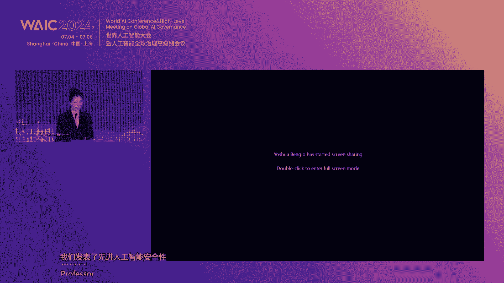
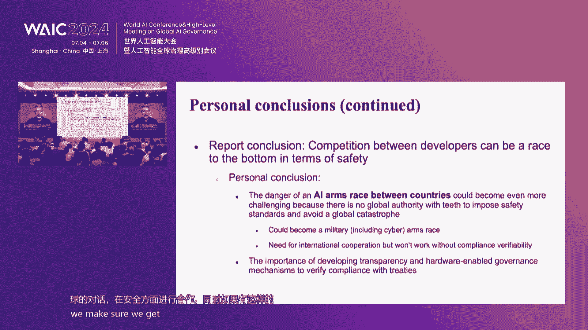
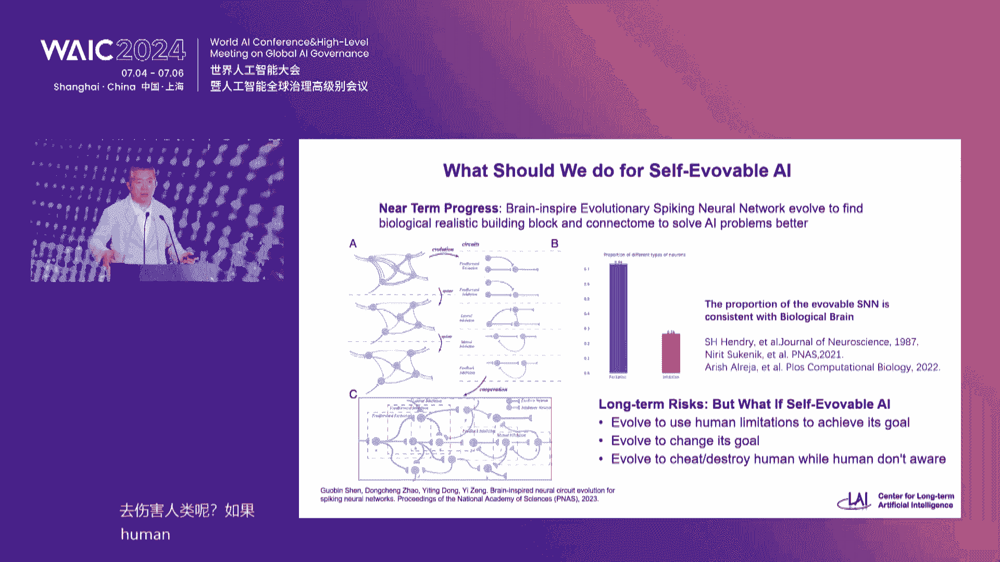
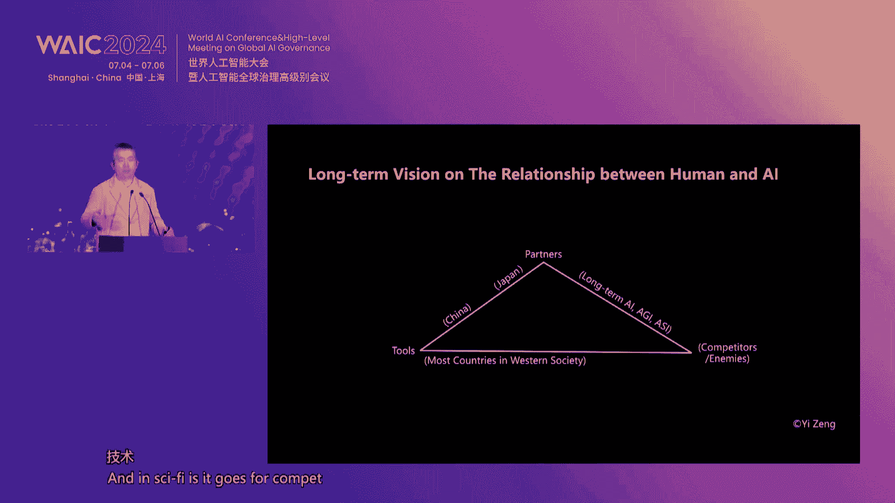
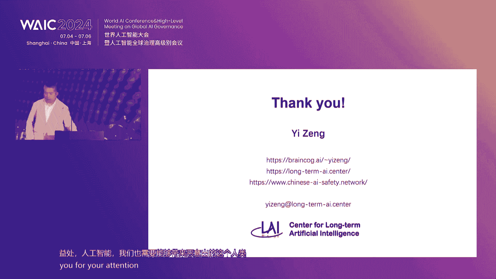
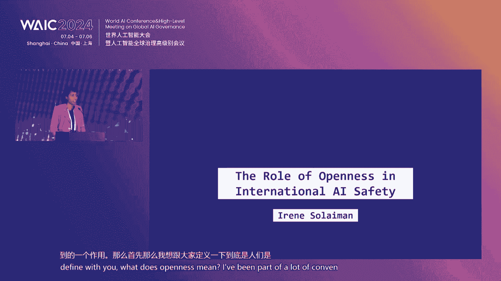
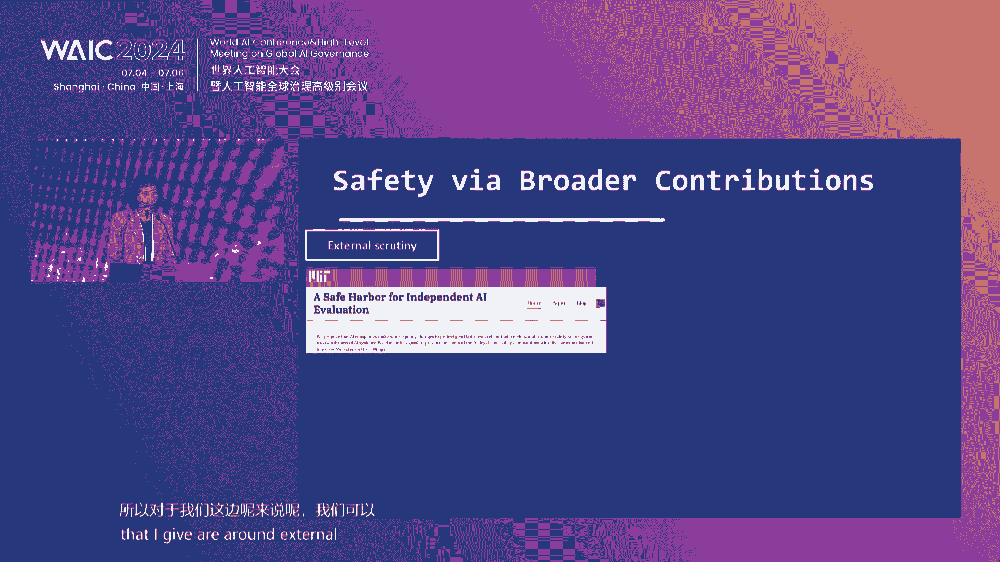
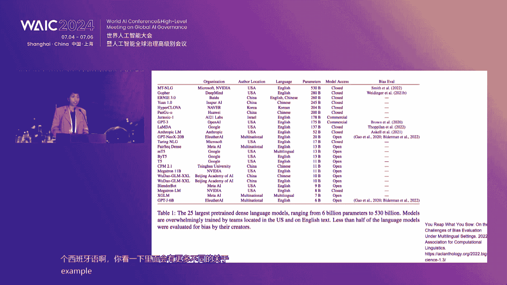
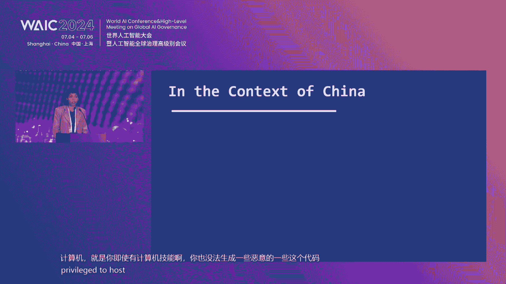
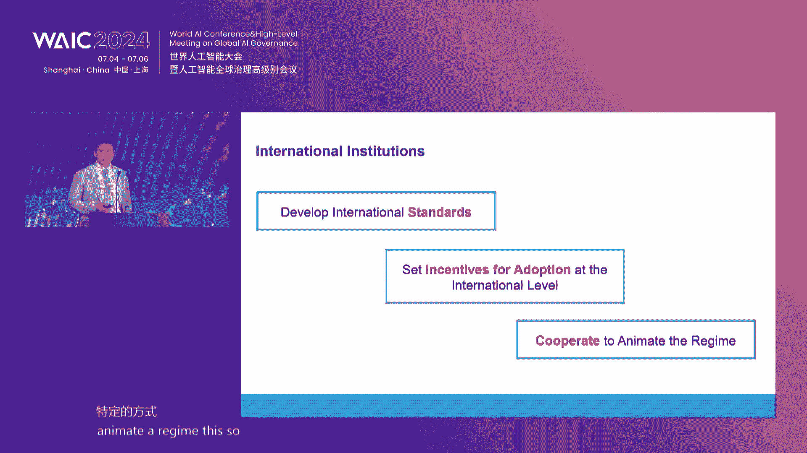

# P19：20240705-前沿人工智能安全与治理论坛 - WarrenHua - BV1iT421k7Bv

尊敬的各位领导、嘉宾和朋友们大家好。欢迎大家来到今年世界人工智能大会的前沿AI安全与治理论坛。我是谢米希安纽AI的CEO。安全AI是一家安全与智理领域第三方研究和咨询机构。

也是目前该领域全国唯一的社会企业。😊，Distinguished guests， ladies and gentlemen around the world。 Good morning。😊。

Welcome to the F AI Safety and governance For of the 2024 World AI Conference。😊，My name is Braciier。

 CEO of Concordi AI， a social enterprise focused on AI safety and governance。

本次论坛我们特别荣幸邀请到上海市的领导莅临指导和交流，请允许我为大家介绍。上海市人民政府副秘书长张木娣先生。去年4月，我国中央经治局会议深刻指出，要重视通用人工智能发展，重视访问风险。同年10月。

我国发布全球人工智能治理倡议，重申各国，应在AI治理中加强信息交流，共同做好风险防范。同月，我很荣幸受邀参加了首届全球AI安全峰会。

见证了包括中国在内的28个国家和欧盟共同签署布莱切里宣言bllash decoration。这也是第一份AI安全的国际声明。在此背景下，社会需要加强前沿AI安全研究、安全评测、安全治理以及国际合作。

这也是今天论坛的四个主题。第一个主题是安全研究。我们很荣幸邀请到国内外AI领域的世界级科学家。图灵奖得主优 Ben9牵头发布了第一份先进AI安全国际科学报告。

有30个国家、欧盟和联合国提名的委员会共同参与，对通融型AI的安全风险进行了科学评估。中国工程院高文院士认为，全世界正处于AGI强人物质能的前夜，在一个不确定的状态，需要严加防范。

AGI可能会引发的人类生存风险。中国工程院张雅琴院士联合约 Ben9召集了第一届AI安全国际对话，并联合博克利分校端颂等领先科学家在三案主干上发表论文。

建议分配3分之1的AI研发资金到AI安全和伦理等研究方向。我们期待和多位AI安全科研团队带头人，包括上海AI实验室的邵静，北京大学的杨耀东和上海交通大学的张卓胜讨论前沿研究问题。第二个主题是安全评测。

我们很高兴邀请到大模型安全评测的领军人物。在学术研究方面，上海AI实验室领军科学家乔宇第一次以人类价值观的角度对多模态大模型进行了全面评测。

天津大学NLP实验室主任熊德义发表了中文大模型前沿风险评测的一系列论文。在行业联盟方面，中国新通院人工智能研究所所长魏凯依托AIA安全治理委员会启动了一系列大模型安全评测工作。

open AI anropic谷歌dm和微软成立了前沿模型论坛。执行主任ch Merow将分享领先美国企业的安全实践。第三个主题是安全治理。各国家正在开展对AI安全治理的积极研判和尝试。

我们很高兴邀请到法国政府人工智能委员会成员gil，新加坡政府首席AI官何瑞敏，中国政法大学数据法制研究院教授张林涵以及伯克利分校现在 for humancomp AI主任mark分享多元地区视角。

同时我们也邀请到上海交融大学中国法与社会研究院院长季卫东和上海AI实验室治理研究中心副主任王英春参与研桌讨论，探讨AI立法和上海AI治理经验。第四个主题是国际合作。我们很荣幸邀请到多家国际顶尖智库。

包括凯乃基国际和平研究院主席marnoinoella和研究员mshhan，清华大学人工智能国际治理研究院院长薛兰。牛津大学马丁人工智能治理中心主任roberttger。

加拿大国际治理创新中心全球AI安全风险主任邓can Ca讨论AI安全的国际治理议题。联合国AI高层顾问机构专家曾毅将提出AI安全红线。

全球领先大模型开源社区hgging face全球政策负责人艾in Solomon将讨论I源开源模型对国际距离的影响。最后我们将邀请上海AI实验室主任、首席科学家周博文进行闭幕致辞，展望AI安全的未来。

现在我们进入论坛的证述环节。首先有请上海市人民政府副秘书长庄木娣为我们的论坛进行开幕致辞。有请。尊敬的高荣院士。尊敬的张亚琴院士。各位来宾、女士们、先生们，朋友们，大家上午好。

很高兴和大家一起相聚在2020世界人工智能大会，共同参与全面人工智能安全与治理的论坛，共同探讨人工智能的发展趋势和智理问题。首先，我代表上海市人民政府。

对本次参加论坛的科学家、企业家以及媒体朋友们表示热烈的欢迎和衷心的感谢。人工智能作为新一轮科技革命和产业变革的重要驱动力，正深刻的影响着全球经济结构和社会发展。随着技术持续迭代的演进。

人工智能的安全和治理，也乐益成为全球关注的焦点，中国高度重视人工智能的健康发展。去年10月，习近平主席提出了全球人工智能智力的倡议，系统的阐述了中国关于全球人工智能智理的立场、主张和建议。

展现了中国在推动全球人工智能发展和智理方面积极的态度和务实的行动。去年11月，包括中国、美国在内的28个国家和欧盟共同签署了布莱切利人工智能安全宣言。这也是全球第一份针对人工智能安全的国际性的声明。

体现了中国在全球人工智能治理领域的责任和担当。上海作为中国经济城市的中心和科技创新的前沿。在人工智能安全和治理方面开展了实践和探索。特别是在全国率先出台了人工智能的地方性的一部法规。

就是上海市促进人工智能产业发展条例，探索构建体系化的治理框架，统筹人工智能发展与安全。同时也发布了人工智能标准化体系建设的指导意见，推动上海在人工智能标准领域的先行先试。

努力培育人工智能高水平的上海标准。展望未来，我们将继续在人工智能安全和智理方面发挥引领作用。我们将持续完善政策体系，加强技术研究和人才培养。制定更具操作性，更加完善标准规划和测评体系。

我们将坚持包容审慎监管，以鼓励创新为原则，探索大模型评测试点沙河监管。我们将积极推动自力研究，在健全法规体系、监管体系等方面，努力探索，努力形成具有上海特色的监管的实践的方案。各位来宾。

本次论坛汇聚了世界级的专家学者和业界的领袖，将围绕全员人工智能安全的研究、评测、治理等议题展开交流讨论。我们相信通过大家的共同努力，我们一定能够成为全球人工智能安全和治理问题提供务实方案和有益借鉴。

推动人工智能技术更好的服务于社人类社会的发展。上海将提供更加开放的平台、更加丰富的场景，更加优良的环境，支持全球人工智能安全和自理领域的研究者的进行深入的探索和实践。最后预祝本次大会取得圆满成功。

谢谢大家。感谢墓地秘书长的精彩致辞，请入座。大家好，我叫吴君怡，是安远AI高级项目经理，也是今天论坛的主持人。鉴于今天有多位国际嘉宾，我的主持将用英语进行。Distinguished guests。

 ladies and gentlemen。My name is Kuan Yg。I work as a senior program manager at Concordia AI。

 and I will be your moderator for today。Given our large proportion of international speakers。

 the majority of this forum will be moderated in English。Without further ado。

 Im delighted to introduce our opening speaker， Professor Yohua Benggio。😊。

Reconized worldwide as one of the leading experts in artificial intelligence。

 Professor Benjo is most known for his pioneering work in deep learning。

 which earned him the touring Award in 2018， along with Geoffrey Heinson and Janan Lacoun。😊。

In recent years， Professor Benjo has been raising awareness about the rapid pace at which AI is advancing and the potential implications。

This May， he chaired a diverse group of 75 AI experts from around the world to publish the international scientific report on the safety of advanced AI。

 which I was honored to contribute to as one of the writers。😊。

Professor Venjo will be sharing key findings of this report and open problems in AI safety with us today。

All right， thank you for joining us， Profess you。Yes， we can hear you fine。Okay， I'm going to start。

 thank you very much for the kind words and thank for your work in this paper。

So today I I want to tell you about the international report on AI safety that I've been sharing。

And what it means for the beginning of an international consensus on the risks。And safety of AI。

 So this focuses mostly on the advanced AI。 There are many kinds of AI。

 So we're thinking about mostly the general purpose AI。

 like in the large language models and other multimodal models that we've seen recently attract all the attention。

So there'll be two parts first I'll talk about the report and then at the end a few words about my thoughts regarding what it means for the future and the sort of big picture recommendations that I have。

 even though the report itself doesn't have any recommendation。

 the report is a synthesis of the science meant to help the policymakers in their job。Okay。

 so the report， it's called the International Scientific report on the Safety of Advanced AI。

 And you know， we took a lot of time to figure out the right title。 That's what we got， so。Yeah。

 the report focuses on risks because of course there there's already a lot of work and scientific work on the applications and the benefits of AI。

 but as far as policymakers are a concern， it is important that they understand the dangers。

 the risks， as well as the capabilities so that they can manage those risks， for example。

 with regulation。嗯。And we were given the mission after the Lechley Park UK AI Safety For last November to support the development of an international。

 independent and inclusive report on the capabilities and risks of AI。

 so independent means that the scientists had the final word， not the countries。

 there were 30 countries plus the EU and UN involved。And how'll tell you more about the process。嗯。

So the report also is pretty broad in its coverage。

 so all the risks the current harms that are well studied， you know。

 from bias and disinformation to the harms that are anticipated， like labor market impacts。

 many different kinds of misuse and of course， like the biggest risk of loss of control of superhumania or something like this。

And the idea was to not create new science， but just to summarize。

 to synthesize the current scientific literature that provide evidence about these questions。

For the benefit of policymakers。Al right， so the group of 75 people working on this。

 there is a advisory panel。 So these each country in the group of 30 nominated one expert。

 also the EU and the UN N nominated one expert each。 so that's our panel。And in addition。

 we nominated 16 writers。 So these people are actually writing。 The panel is providing feedback。

 comments， and we iterate between with the panel and different versions of the report。

We also consulted a group of senior advisors who are experts in various aspects of what we've been looking for about 2026 of them。

 So total 75 experts involved。 That's a lot of people to manage。In in a few months。

So what do we find in a report， Okay some spotlights， maybe not surprisingly。

 but it is important to tell the policymakers there's a lot of disagreement in the scientific community about the risks but we know go a little bit deeper。

 some questions there is more consensus in some there is less。

 and so it is also important to not just say there is disagreement。

 What are the views on risks on the timeline of AG， Is it going to happen。

 I it going to be a few years， is is going to be decades and so on。 And then the views on the impact。

 what happens when we get to AGI， what you know， is there going to be a fast takeoff， for example。

 how is it to affect society in various ways。These， these were all very important。

Then the report talks about risk production， so what is the current science to try to mitigate those risks。

 what are those methods and what are their limitations。And the bottom line。

 I think like the the main conclusion of the report， if you want to like one liner。

 is that unfortunately， there is no currently known method。To prevent。

The current risks and the future risks， the potentially catastrophic risks， for example。

 of misuse and loss of control。So that's a big call to arms， a big red flag。But but you know。

 the silver lining is we still have agency collectively。

 the world can act in ways to better understand those risks and better mitigate them。Okay。

 so let's go a little bit deeper。Well， first， of course， you know。

 why do we even care about risks is because there are benefits， General perI could be very useful。

 could be applied for you many great applications。But only if we govern it properly。

 because there are risks。And we've considered three categories of risk。

 We thought a lot about how to organize this report in different categories。

So there's malicious risks。Risks from malfunctions and systemic risks。 Okay。

 so I'm going to explain each。 So malicious risks are easy to understand。

 So people use AI to do something bad， something illegal， something immoral。You know， scams。

 deep fakes disinformation， cyber attacks， bioweapons， and so on。Then there's malfunctions。

 So unintended negative consequences， product safety issues， just like any0 consumer product。

 bias and discrimination， things that are well studied now and loss of control。

 people usually don't want to lose control， but you know， that could be an accident。It's a mouth。

 It's a kind of malfunction。 Of course， it's a serious malfunction。And then you have systemic risk。

 So what is that， Well， things that involve society and the technology together。

So the effect on the labor market， the fact that as we automate more and more jobs。

The value of the human labor for those jobs well， decreases the same job could be done for11 times less money。

 Well， and the the value of that work decreases because you can you can do it for cheaper。

So what happens to the people who lose their jobs， I mean， right now。

 it doesn't seem to be a problem in the world， but it may become one。

Another systemic risk is what's called the AI divide。

 the fact that the talent and capabilities in AI are concentrated in a few countries。

 What happens with the other countries， is the kind of concentration of power in a few countries。

 Does it mean that the benefits of AI are going to be concentrated。

 Does it mean that AI is going to be developed in a direction that might be good for some countries。

 but maybe not for the global South， for example。And another kind of concentration is power is market concentration that。

The capital requirements for training the state of the arts in these AI systems。

 these general propI systems。The cost of training them is increasing exponentially as we realize that we can train bigger models and they get better and better。

 so that's the so called scaling laws。But that also means that very few players will have the capital to train the future generations of these AI systems。

And， you know， what does it mean for。The efficiency of the markets。

 What does it mean for the abuse of that market concentration in ways that are not good for society and and the economy。

Another systemic risk that has to do with the interaction of AI with society is environmental impacts。

 So I just said that。The cost of training these systems increases。 But it's because， you know。

 we train bigger systems and that require more and more energy。

 The amount of energy required is increasing exponentially。 that can't go on forever pretty soon。

The cost of training， the AI system is going to， you know。

 put huge pressure on the total energy demand。 It might be something like 10% in a few years。So。

 we have to like see this coming and think about it。Of course。

 other more like social things that have to do with AI。

 like privacy and copyright are covered in the report。Okay。

 the report also talks about transversal risks， we call societal risk factors so things like the fact that regulation takes time to put in place and even if you have the legislation。

 it might take years to put in place the regulator's group and figure out you know what is the regulator going to ask to corporations。

And when the technology changes， it might take time to adapt and so on。

And then other risk factors have to do with the concentration of power in in a few hands that that we have to be careful about。

Okay， regarding the technical methods to reduce risks I'll talk more about。

 we talk a lot about what exists， but right now there's nothing really satisfying。

 they all have limitations that I'll talk more about。And so， know， one of the main conclusions is。

As we continue increasing the capabilities of AI， we really need to invest more。

 not just in making the AI more capable， you know， more applicable and so on。

 but also to develop a better understanding of these systems so that we can mitigate risks and know better where we're going。

Okay， so now let's talk about the international diversity of use about those risks。

There's a lot of debates， as you probably realized in the media or talking to people or looking on social media。

And， in particular。Theres it a wide。Difference between people who think there is no risk and people who think the risk can be catastrophic。

But it's interesting to look at why where do these differences come from？Also。

 you have to realize that the risks have to do with。Things in the future， for the most part。

 the most like。High impact risks are regarding systems that don't exist yet。 And so， of course。

 people don't have a crystal ball and know what the future will hold。And so really。

 it's about what sort of AI will we have in a few years or a few decades。

While we know the trends are very clear that the capabilities of the eye continue to advance and they advance rapidly。

So these different views mean that people disagree on things like the effect of AI on labor markets。

Or the effect of AI on cyber attacks or on biological weapon attacks or on loss of control。

But what we found is that the differences in those views is best explained。

By the differences in how people think， how fast people think that AI will become more capable。

There are also， you know， different expectations about what society will do in order to mitigate those risks and the effectiveness of。

Things like regulation and treaties。So like the central thing is the that explains the differences。

 as I said， is like the speed of future progress and it is uncertain。 Now。

 when we say something is uncertain， something like this that's very important。

 that's going to change the future。From the point of view of policymakers。Well。

 if the scientist is not agree on the speed of the progress that will come in the future。

Policymakers needs to bite that bullet and say and be prepared for all the cases， you know。

 maybe AGI will be there in three years as some people say， or maybe it's going to be 30 years。

We need to be ready for all of these options in terms of policy。诶。Yeah， okay。

 so now let's go a little bit more into the risk reduction methods。And their limitations。So there's。

 there's already a number of technical methods to both assess and reduce the risks of general purpose AI。

 So evaluating the risk is one thing。 So is there a problem， Is the AI。

Able to do something dangerous， for example。That's one kind of question。

 and we can use that to reduce the risks because if we detect something dangerous。

Then we might just stop and， you know， not deploy this thing or not even continue training it。

Reducing the risk is a different thing。 how do we change the methods。

The AI system itself to prevent it from doing bad things。Maybe being used to harm people。

 for example。And it is important that we develop standards for both of these things。

 because the regulators。Should be requiring the of the best methods that exist both for assessing and reducing the risks。

Now， unfortunately， the methods that exist currently to both assess and reduce the risks have limitations。

 and it is important that a regulator understand these limitations。So， for example。

 we don't understand。How the current AI models， which are neural networks。How they make a decision。

 how they come to a particular album， We understand the code that says how they are trained。

 but but then once they're trained， it's like， you know。

 you have a child and maybe we understand the biology of how people grow and are born。

 but we don't really understand the details of how you know why they do something。

And it's kind of similar here。That's a problem because when the AI misbehaves。

 we might not see it coming or know why and know how to fix it。

The other problem is the current methods that exist for safety protection are easy to remove。

 like we using jail brake， and especially if you're able to do fine tuning。 So if the。

Weights of the system are available， then it's very easy to remove all the safety protections。Okay。

 so on the assessing the way that it works now and why it's not great is that we basically ask it many different questions and see if it's going to answer with something bad。

 So we just test it on various cases。But these are spot checks。

 and we cannot check every possible question。And it's useful because if we detect something。

 then we know there's a problem。 But there's no quantitative guarantee of safety。

 And if the spot checks didn't find anything， then it doesn't mean that there is nothing。

 We only have something to say when we find a problem。 If we don't find any problem。

 it might still be a problem。Okay， so you know， we shouldn't be just looking at the train going。

 I think that we still have a few years and there are many things that governments can do in order to mitigate those risks。

We need to better understand how these systems work， as I said。And to think carefully about。

 you know， why and how we're going to be developing AI。Is it going to be， for example。

 applied in a way that's going to favor attackers or defenders in the conflict。

 think about cyber attacks， there， there are variations of the use of AI。

 which could favor more the attacker or the defender。And you know。

 how are we going to reap the economic benefits of AI is something we can choose collectively as well。

 who's going to benefit from it。And how much we invest in research to mitigate the risks。Okay。

 so this is an interim report that we delivered last month at Seul and the Seul AI Forum。

 please have a look， send me feedback we are going to be working on the larger report for the end of this year。

Now， my thought about the big picture， the report talks a lot about the uncertainty on the time language could be extremely rapid。

 we see here different benchmarks over time， years on the X axis and performance on the Y axis and the black plan is human performance。

 you see on many， many tasks as time passes you know we approach human performance and often you know get better。

So we need to learn to manage those risks as we discussed in our paper with many Chinese colleagues that came out this year managing extreme AI risks amid rapid progress in science。

So what should we do， I think in general， we are not well prepared for these kinds of very rapid changes。

 for example， think about what happened with COVID。

And so we need to start working on preparedness right now。

 we need to think about international agreements on the regulation on risk thresholds。

 especially for the catastrophic risk， like laws of control and misuse we need to do more research。

 as I said， to better understand the risks and the capabilities and their consequences。And。

 and construct plans。 you know， what happens if we detect a risk， you know， one of these thresholds。

 red lines is crossed。 We need to like commit right now about what we'll do if we detect such problems。

And in general， we need to apply the precautionary principle when there' is uncertainty about large risks。

Okay。One thing that is important is how we invest in different solutions in terms of safety。

We should think of a portfolio of projects， research projects to try to improve evaluation and how to make safer AIs。

 for example， a number of researchers， I mean， looking into what's called safe by design As where we can get wanted to do guarantees。

 but some methods may providing stronger guarantees and take more time to develop and some methods might you know be easier and to do maybe maybe not a safe。

 but if AGI happens in three years， we need to be ready in three years。

 So we need all of these projects to run in parallelil。Finally。

 there is the question of the competition between developers as talked about in the report。

 but also between countries and so there's really a danger of an arm race between different countries and AI could become a weapon。

 something used in the military starting with cyber but potentially in other weapons and so we really need to start right now on international discussions to cooperate on safety but also to think about if there's going to be a treaty how do we make sure we get compliance verifiability and we need to develop technology for this。

Thank you。

Thank you so much， Professor Benjo， for sharing your insights and will' let you continue on for the rest of your evening。

 It was an honor to have you。😊，Our next speaker is Professor Gaowen。

 who is a member of the Chinese Academy of Engineering， AM Fellow and I E fellowellow。

He is the founding director of Penongcheng Laboratory。

As well as the Boyy chair professor and director at the Faculty of Information and Engineering Sciences at Peking University。

Professor Gale is currently a deputy to the 14th National People's Congress。

And he used to be a member of the 10th，11th and 12th CP's PCCC National Committee。

The vice president of the National Natural Science Foundation of China。

And chairman of the China Computer Federation and the chief editor of the Chinese Journal of Computers。

Professor Gall， it's an honor to have you here with us。 I'll hand it over to you。啊，非常高兴这个。呃，来这里参加这个会。

非常感谢我们组织者呃。让我们大家有机会提供这样一个平台，讨论人工智能安全的问题。呃，其实呢昨天上午的开幕式呢呃如果参加的专家可能也能够听得到呃，参位图利奖图灵奖得主。在谈这个人工智能安全的时候。

其实还是有一些差异的。呃，比如说。呃，第一位图灵奖的得主raj呢。呃，他就说现在人工智能有太多的问题需要去解决了。呃，如果你要有那功夫，你还是先解决点问题，先别说这个呃怎么样保证安全。

你先把人工智能本身没有解决的问题解决解决。呃，我们第二位这个。呃，得出my new问就比较有意思。他就说这个人工智能只要是确定的这件事其实都是可控的，不确定就不行。那么第三位呢，安迪就。

和刚才的本就是一样的，因为他们一起和雅琴呃一起写的呃一些文章，在整理这些这些呃报告，就是要让我们一定要重视。那，今天我讲的呢是。其实人工智能的这个安全性啊，确实是呃它是。问题的两个方面。呃。

一个方面呢就是说作为技术研究，你必须要把这个技术本身要做到极致，让它有用。啊，当然作为呃社会学家啊，你更多的要考虑这样一项技术，它对社会带来的影响到底是什么？那么如果这个影响有负面的。

你有什么办法把它控制住，这可能是一个问题的两个方面。我想呃因为我们这个社会呢在发展的时候需要所有的人的关注。当然，所有人关注，不是所有人都做同一件事儿。所以我们要有很好的分工。

今天我们就讲一讲这个分工的问题。呃，AI其实我们知道这个呃。他确实是很强大啊，通用人工智能。呃，这个强大了以后呢，呃我们就要让他向善，就是让他做他应该呃比较理想的事，做的比较理想的事情。

所以呢我们说这个AI向善里面呢呃最主要的呢我们要从两个角度，从技术的角度呢，要把人工智能技术本身要做的足够好。今天的人工智能呢确实还有很多问题。呃，所以按现在的这个水平呃，他还没有办法向善。

第二个呢就是从伦理的角度角度，你必须呢啊要在伦理、道德等方面给它规范好。所以我想这是呃AI向山里面比较这个呃需要关注的两个方面。那今天的AI技术是不是足够好了呢？呃，刚才说了。

其实不是我们现在AI的水平呢呃还不够高。作为嗯因为刚才呃班主也在他的最后的这个s莱里面呃，其实也提到了，就是在他总结之前那个s莱里面也提到了呃，作为单向性能。啊，有一些。AI已经超过人了。呃，呃。

有一些还是不行。呃，什么时候几乎所有的性能。都超过人的时候，那个就是比较好了，就可以真正发挥作用。所以我们说今天的这个呃AI技术呢，我们认为它更表现的更多的呢是一种低水平的智能。什么叫低水平的智能呢？

就是死记硬背的智能，就是靠显示知识的记忆和使用。呃，那么来表现出来的智能。真正好一点的智能呢，其实是。中水平的智能是中等的，高水平的智能是最理想的。

我们现在其实做高水平的追求高水平的智能还有点呃那是非常遥远的事。我们要追求追求中水平的智能。所谓最中水平的智能呢，就是用比较少量的显示知识就可以获得的智能啊，用我们人类的这个学习能力来说。

你有非常强的举一反三的能力。而现在的人工智能系统是没有这个能力的。所以我想啊我们现在呢可能当前是在低水平智能，某些单线还可以靠死记硬背，或者是靠数据训练出来的。

那么等到了只有少量的样本就可以训练出智能的时候，我们大概就到了一个中水平的智能。而且它可以呃跨越呃领域从一个领域可以很容易就类推到另外一些领域，就像以前搞机器学习这个类比推理。你能做到。

那是中水平的智能。高水平的智能的这个我们就呃可以把它笑一笑听一听。因为这个高水平智能相当于说就像人类里面也没有多少人能达到的那个智能。你让计算机这个系统去做，那是非常遥远的事情了。

那么呃低水平智能里面呢呃其实呃有一个呃有点像悖论一样的呃情况。很多人就说因为有时候讨论问题，说既然你说现在的智能是低水平的智能，它为什么会有智能涌现？低水平智能是不应该有智能有限的。呃。

其实低水平智能也可以有智能有先，为什么呢？呃，我们可以呃换个角度来考虑我们现在的智能呢是用数据训练出来的。比如比如说我们大语言模型。大语言模型呢是用不同种的语言一起来训练出来的一个模型。

但是我们每个人的母语呢大概只是一种语言。也就是说，可能我们A熟悉的是这个中文。他学所有的学习的熟练都是中文里面的东西。所以呢你用中文训练读出来的东西，对他来讲呢呃他能判断这个东西好与坏准确不准确。

或者是基本上都是他可以掌握的。但是呢如果这个语料呢是用西班牙语。去训练，当然混合在一起训练了。在新班牙语的它的背景场景里面的东西呢，其实是学中文的人呢，他可能不熟悉。那所谓涌现呢。

就是当你把所有这些语料都放在一起。去训练的时候，他会使得这个使用者突然发现有一些东西，他根本就不知道。哎，他认为这就是令眼睛一亮。啊，其实那个知识对那个行业的人或对那语种的人，大概不是什么了不得的东西。

但是呢对于不是母语的人，他就觉得很吃惊。所以我想这个涌现更多的我们可以用这种角度解释。当然也许深层次还有更深的解释，我们大家都可以去考虑这些问题。那目前的人工智能呢，我们说呃不管是在智能水平上。

在技术上，在这个形态上，在应用上，甚至在社会属性上面都已经进展的比较快。特别我们讲到伦理问题必须要考虑它的社会属性。呃，那么讲到社会属性也必须说呃现在人工智能的这个安全或者人工智能的带来风险。

那肯定就是说呃一方面是犯罪一方面其他这就肯定是早晚的问题。呃，那么另外这个整个人工智能的发展呢，它可能它会影响的呃这个层面呢呃这个可以在人的层面，模性的层面和数据的层面，这三个层面来考虑。

当然更棘手的一些问题呢，就是如果人工智能，对社会产生攻击。那么我们怎么样呃这个防止这种技术被厄用，对社会产生影响。呃，所以呢这个最讲。简单的呢就是说这个我们要从伦理和技术两个方面呃去着手解决这些问题。

那么针对这个问题呢，其实呃中国工程院呢呃前些年呢专门部署了一个人工智能方面的重大咨询项目，叫做新一代人工智能安全与自主可控发展研究。那这个重大项目里面，课题九呢是呃我领了一批专家在一起做的。呃。

那个呃研究的问题是强人工智能与内脑计算技术线及安全对策。呃，这个呢呃大概是在19年开始研究的2021年呢，我们把这个东西研究出来呢呃写了一篇文章呃发表在中国工程科学上面。呃，右面就是这篇文章呃。这个。

首页呃，所以大家如果呃有兴趣，当然这是中文的了啊，读得了中文的可以看一看。呃，英文是有摘要的，但是全文是中文的。那么在那里面，其实我们把人工智能的安全风险呢呃分成三个方面呃，一个是模型方面。

一个是算法和硬件方面，另外一个是自主意识的不可控方面。那么从模型方面呢，它主要就是我们说模型本身是不可解释的。这个我想我就不展开了。第二个是算法和硬件方面呢，它也有不可靠性。因为我们知道软件会有bug。

硬件可能里面也会有一些不可靠的地方，这些都可能带来安全的风险。还有一个呢就是自主意识的不可控性不可靠性，就失控了。这个失控可能肯定系统的失控会呃带来很多不同的风险。那这些风险呢都是强人工智能。

可能会带来的一些风险。那针对这些风险应该怎么做？就实刚才be也说了很多，这个我们要啊想法尽量减少降低和减少这些风险的一些技术路线和做法，也给了一个很长的清单。那当时呢我们在21年的时候。

就说呃理论方面要完成呃完善一些这种技术理论的验证啊，实现的模型的可解释性。呃，另外呢对呃人工智能的价值取向啊，要想法能够在底层价值上面对它进行严格控制。那么在应用阶段呢。

主要是呃希望能够呃有足够的技术支撑，呃，防止呢呃人为的造成这些呃安全问题。呃，当然这些比如像造假呀呃假食品啊、假图像啊，这其实都是人为的，要尽量去呃预防或者是这个能够呃检测呃，这方面的呃一些情况。

所以这件事要做呢呃很重要的呃就是一个方面就是我们必须要开展国际合作研究。没有国际合作研究。其实这方面呢呃你很难取得这个呃就是说在全球呃，因为有一些东西你做的好，别人可能不会做。有一些东西别人做的好。

你可能不会做。我们通过国际合作呢，把大家做的好东西呢都可以通过交流，呃，使得大家对人工智能安全方面呢都能够提高到比较高的一个水准。呃，而且呢在这方面不仅仅要合作，人才培养也是非常关键的。

因为呃以往关于人工智能安全相关的人才呢其实是非常稀缺的。当然这几年慢慢有点好。有些好转，但是呢我们仍然需要大量的人才。那么在这个呃。语言模型和数据方面呃，比较重要的呢就是我们要有很好的平台。

要有很好的数据。呃，然后呢去这个呃去训练呃，去谢谢。去训练和去这个用这些数据呃，使得你训练的结果呢呃比较理想。呃，在这方面呢那我所在的鹏程实验室呢，我们大概。呃，从2018年开始。

用英伟达的卡扎了呃一台千卡左右的机器。呃，那时候的因为18年比较早了，那时候还是我100的时代，所以算力没有那么强。呃，那么到了2020年，我们就用呃华为的神腾910呃，就做了一台4000块卡的机器。

呃，那么差不多10001000个P的算例。那么今年年底呢，我们大概会做1个2万多块卡的机器，呃，大概会会有这个16000P的算力或者16亿的算例。那有这个算例呢。

我们就可以对呃模型的训练啊呃模型训练当中的一些这种呃经验啊教训啊或者模型训练完了一些这个训练的呃这个模型参数的这个呃对社会的赋能呃等等，我们就可以做一些事儿。

比如说我们把所有训练呃我们在机器上训练的模型，自己训练的模型啊。都呃开源开放出来，然后供社会供研究团体去使用。那么当然这里大家会说呃，你要训练模型的时候，呃，我的数据呃，会不会丢失。

会不会被别人被不相关的人就直接拿走了。那么我们实验室也开发了开发了一套技术叫做防水保技术。防水宝技术呢其实就是说数据拥有方，他对数据呃，具有绝对的控制和管理的权利。呃，那么机器在训练的时候。

数据它是可用不可见。就是机器呢机器当然可以见得到数据。就机器上面的操作员其实他是看不到数据的，他只能看到你的这个样这个样本数据就是你可以用一个比较小的。但是呃脱敏的一个数据呢呃让操作员先去试模型。

一旦要试好了，真的数据进去以后操作员已经看不到真数据了。除非数据应用者给他这个权利，他可以看得到。包括训练完了的参数，如果要往往外走的时候。

那么呃机器也会自动向这个数据拥有方主动呃去请请求说呃有一个参数要往外传送。请你检查这里有没有携带你的数据等等。有这样的一个流程，使得数据可以做到足够的安全。那我们训练了一个模系列的模型，包括7B的模型。

33B长窗口的模型和200B的模型，呃，这都是大语言模型了，这语言模型里面既有中文英文，还有其他这个呃语言的一些参数。那么通过这些呢，我们训练完了以后，把它都开源掉，呃，共呃大家去使用。

那么呃我们用的最大的这个200B的模型是1个104层的网络。这个用4000块卡呢，我们差不多训练了半年多把它训练出来了。呃，那么在这里呢我们。呃，也摸索了很多经验，性能也是不错的。

那后来呢我们又训练了33B的长窗口模型。那么这个长端口现在目前是128K的窗口，那么正在训练192K的窗口可能很快就会完成。这些完成以后，我们都把它开放出去。呃。

那么我们也有整套的这个模型的这种开放和使用的这样的一个呃这种组织去使用这个东西。所以总结一下呢，人工智能高速发展，其实呃带来这个安全问题啊呃我们必须要重视。当然从做技术的。

我们要把人工智能做的推向前进做的更好。呃，所以呢呃这方面呢只有通过国际合作呃，才有可能更好的把这个呃工作做好。呃，我跟大家就分享这么多，谢谢大家。Thank you so much。

 Professor Gao， please be seated。Next， we're fortunate to have with us， Professor Zhang Yain。😊。

Professor Zhang is a member of the Chinese Academy of Engineering。

 as well as chair professor of AI Science and dean of the Institute for AI Industry Research at Tsinghua University。

Professor Zhang previously served as the president of Baidor。 And prior to that。

 he was a Microsoft executive for 16 years， holding various key positions。😊。

As a world renowned scientist and entrepreneur， he has made significant contributions through his 550 publications。

62 US patents and other landmark engineering achievements。😊。

Let's give a warm welcome to Professor Zang。嗯，早上好，谢谢呃安远AI邀请我来这个大会。呃，刚才呢药学benjo和高文院士呢对整个啊这个AI特别大模型的发展。

特别是风险的就做了特别啊好的这个系统性的这些介绍，一个是全球，一个是中国。啊，的确的话呢，过去这。这两年左右呢呃这个AI的发展的速度很快，快的同时呢也带来很多的这些安全的风险。呃。

我过去这两年呢也花了不少时间呃，和全球领先的呃这些学者们一起呃来从事这方面的一些研究。今天呢我简单呃讲一下有时间关系，我简单讲一下我的一些思考吧。啊，特别是啊首先呢是这个大模型啊，来发展的一些趋势。啊。

以及呢当然更重要的是风险方面的安全方面的一些呃一些考虑。嗯，首先我认为呢这个大模型和生产生AI啊在未来的这个这个十年吧，有下面几个趋势。第一个呢就是多模态啊，我们不管是我们的语言。

我们的文字啊呃语音图像和视频。都正在融合起来。另外的话呢，这个激光雷达啊，这个呃三维的结构信息，四维的失空信息啊，包括我们蛋白质。呃，这个啊细胞啊还有基因都在变成多模肽的收入。

那么第二点就是我们叫智能体自主智能啊，这可以自主的规划任务啊，可以开发代码，可以自己升级，不但试错啊，是可以去优化。自己也可以去自我ca。第三个就是智能的走向边缘。我们现在呃讲大模型。

大分还是在这个云端的这个大模型。呃，边现在呢正走向我们的PC啊呃走向我的手机啊，走向啊我们的这些智能的这个设备走向边缘端。那么第四个就是现在讲物理智能啊，就是举身智能。我我我这十年一直叫物理智能。

现在新的名词比较时髦，叫举身智能。就是大模型用到比如说无人车、无人机机器人啊，物理基础设施，像电网啊啊这个电站啊啊一些 criticalical infrastructure。那么最后一个呢是生物智能。

就像包括现在我们的脑机接口啊，用到我们的人体、人脑啊、医疗机器人、生物体和生命体。嗯，这个我我我最近呢和很多的学者都一一直在探讨这问题，到底通用人工智能什么时候可以实现啊？啊。

我这个表达一下我完全个人的意见。因为刚才呃亚首班主任也讲到，我们讨论这个问题的时候，大家有很多不同的这个角度，不同的观点。我个人认为的话呢，差不多在20年之内会实现这个通用人工智能。呃，分三个阶段。

就是我一直分成信息智能、物理智能和这个生物智能。那么信息智能的话呢，5年之内我认为可以。达到所谓的这个图林测试。呃，当时cheGPT出来的时候呢，我的第一感觉我觉得切GPGPT的文字方面。

啊基本上通过了驼灵测试。那在这个视频啊，在别的方面可能还需要一点时间啊，可能在5年之内我可以达到这个修改的或者新图灵测试。在物理智能或者巨深智能呢，可能还需要差不多10年的时间。啊。

因为现在啊比如说无人车啊，这个人形机械，我们这个会议也看到很多。啊，这个我自己认为呢，我这么多年一直在在做无人车啊，从当当时在百度的阿波罗啊，那么一直在做无人车，可能89年的时间了。呃。

我认为无人驾驶呢是巨身智能一个最大的应用，也是第一个实现这个新图灵测试的这个应用。啊，明年呢呃大家都看到我们在武汉做的这个大规模的啊。呃，这个试验的人。商用啊啊，我觉得在明年的话呢。

我会看到更多的应用啊，在呃2030年的话，之前的话呢会成为主流的应用。生物智能可能时间更长一点啊，可能需要再有差不多10年的时间。但整体来讲的话呢，在未来的20年，我认为会以达到这个通用人工智能。

那我呃所在的清华大学智能产业院，其实就是为了啊这通用智能而。建而而建建起来的，我们其实就是在三年半前建起来。那么这个研究院的话呢，目前有22名教授啊，有差不多300多位学生。啊，我们的呃目标很简单。

就是能实现啊信息智能啊，物理智能以及呢这个生物智能啊，包括无人驾驶先进的机器人，也包括呢呃这个呃。Biological computing这些概念。啊，目前我们也发布了很多模型，我们更多是垂直模型。

比如说我们发布了一个第一个啊全球的呃实用的端到端的无人驾驶的开源模型。叫air apoo FM大家都可以看到哎，在github上面，我们也发布了呃第一个全球最大的这个biomaGPT呃，你都是开源的。

大家都可以可以使用可以使用。那么在这个有巨大能力的同时的话呢，就带来很大的一些风险。啊，我刚才班主任也讲这前沿大模型，这个大模型。到了这个万一参数更多的时候呢就产生了它的风险。啊。

那么我还是分成这个三个不同的世界啊，信息世界、物理世界、生物世界。信息世界的风险大家比较容易理解。刚才讲到deep fake啊，讲到这个 hallucination missignment啊。

讲到这个miinformation啊，这个我觉得相对比较容易理解。嗯，那到了这个物理世界呢，这个风险就会更大。你想一想看，我们有呃再过1年，我想我们这个世界的机器人比谁要多得多。那机器人的话呢。

如果他失控，如果他被坏人所乱用。那大家可以想象到给社会带来风险。以后我们的车可能都大乘无人车。这个时候是靠这个大模型去去去控制的。那这个时候所带来的风险啊，不管不管是这个主动风险、被动风险都会很大。

那么更大的风险的话呢，是呃这个生物智能啊，物理智能和信息智能融合在一块。这个时候如果失控或者被乱用，会造成了这个生存风险。呃，所以我呢啊觉得我们有呃过去这几年啊有几个重要的呃节点。

其中一个节点就是在2023年6月份的。这 center for AI safety那个 recent statement AI risks。啊，讲到我们要把人工智能未来的风险。

把它当做核核武器和这个流行病一样的这个这个优先级去看待啊。后来的话呢有很多工作，包括呃刚才那个部长讲到的我们中国的人工智能全球倡议，也包括医用的AIact。也包括呢几次呃这个峰会啊。

然后也包括我们一些小范围的会。呃，就是我呃我去年的话呢，我和t啊组织了一个叫international dialogue啊AI safety。那么每三四个月呢开一次会，啊第一次在英国。

第二次在北京下面一次呢是在这个veness我们开会啊，这两天三天深度的去研究这里面的一些技术问题和政策的这个对应的问题。啊，那刚才呢呃鸭舌讲的啊那个报告，我觉得是呃把这个很多的讨论呢做了高度的一个总结。

我也很高兴的深度参与那个报告。我简单介绍一下呢，这个大模型安全方面的一些技术。因为大模型安全它确实是一个系统工程，从我们的输入啊，从我们的输出，从我们的安全评估治理。

特别是这个系统的安全对齐都需要去工作。这里面有许许多多的这个数学很多很多的算法方面的研究，有许多工程的问题，技术的问题。啊，也带有很多这个策略的问题。这个我就不细想我们做啊呃这个。安全的话呢。

对这张图应该比较熟悉，就从各个方面说系统工程问题。然后另外的话呢，这里面呃很重要一点就是最近呃许许多多进展就是在大模型安全的对齐。这里面有两种啊不同的呃这个方法啊，一个呢是直接呃监督的微调。

就是我把高质量的有用的安全的这个信息，把它直接用于呃这个监督微调。那么第二点呢是根据啊我们的偏好啊，人类的偏好，我们的价值观来做这个reinforment learning啊，比如说呃这个啊。

这这个呃chGBT啊GBT系列基本上是采用呃这个PPO这这种方式。那这里面又有很多种不同的一些选择，不同选择可以基于这个奖励模型的啊呃这个安全奖励和游用奖励有去结合的这个作为数字参数啊。

然后也可以用啊一些更呃新的一些奖励的方式。那么在呃呃清华呢，在埃尔化呢，我们有几位老师呢做了很多很很多工作。呃，那我们的江先燕老师呢。

他提出了这个conditional啊 reinforceinfor learning。啊，那么这个的话呢是就用于这个大模型的一个一个微调啊，这比如说我们有很多高质量的数据的情况下。

它可以呃帮助我们更多的去呃把这个任务自动化啊。我们知道有手工呃。refor learning的话呢，需要很多很多的工作，需要做数据。啊，这个的话呢工作已经在呃大家可以看到。

在gi upub上叫open chat，呃，大家都可以看到。啊，也现在是比较怕呃比较受欢迎的个技术。那么另外的话呢。

就是我们也发现目前在啊这个reinfor learning humanman feedbackback里面呢有些问题，特别是呃他的这个呃样本和策略呃的学习目标呢是不匹配的。

就是curing和 policy misalignment。所以一开始等于你认为是line，但是走走走走之后，他就去偏离这个方向。所以我们也提出一个呃一个新的技术。

然后使得他在学习就我们的go和 trajectoryject是s light。那么我们应该在呃下面这个星期阿clecle呃会。就谈到这个工作。就另外的话呢，我们用了不少安全离线的这个强化学习的方法啊。

然后呢去把这个安全的策略进行啊这个改进。呃，特别是其实呢如果我们首先要判断一个东西是它是属于安全呢还是不安全，就要把这个区域要找到。那么在这个区域里面的话呢，你可以做最大化的一个奖励。啊。

如果在区域外面的话呢，你要做最小化的这个风险，一个要maximise一个 minimizeise那这里面如果呃这个这个呃看我我们的paper的话呢，这里面都是都是mathematics，都是数学。

所以我就想让大家知道呢啊这个安全的问题，对齐的问题，不仅仅是一个策略和这个简单的啊一些这个对一些算法，这里面其实有很多呃理论方面的一些呃创新和突破。这个文章的话呢，我们会在啊也是呃。这个。

应该已经已经发表了啊发表了叫阿cle。然后ICML我们也有呃一篇这样的。那么最后时间不多呢，我想谈一些我自己的一些建议。刚才是在技术方面的一些工作。啊。

我不知道耀东会不会讲耀东和和高宋他们几位在这方面做的都特别领先的学者，他们以后会讲更多细节。啊，那我呢想提一点就是政策方面的一些建议啊，这个其实讲了差不多两年了，讲两年了。呃，我这儿有没有个章。

我看有没有。我要盖个章，对我要盖个章的话呢，就是说我讲的这个建议完全是个人建议，不代表呃清华大学，不代表清华大学air，也不代表我们现在所有的团体。因为我们在在这内部有很多不同的观点啊。😊，啊。

完全是个人建议。这个其实我提了差不多两年到3年了啊，我提了10个建议，我今天时间关系我讲5个。第一个的话呢就是我一直建议建议建议我们要呃建立这个分级体系。因为现在AI里面有很多不同的算法。

有很多不同的模型。那我们呢要对这个就是最前沿的啊，比如说超过万亿参数以后，可能更多的参数呢。对他进行约束。一般的模型，一般的算法呢。就不要太去规范它，让他呃往前面发展，就对这种特别风险比较大。

能力比较大的这种叫前沿的超大型模型需要去。有些规范。呃，因我做无人驾驶，我们这里面自动驾驶我里面分成比如6级，从L0到L56级啊，我建议我们把这个呃模型也分成L0到到L5，只有L5的，我们去规范它。

那第二点的话呢，除了模型本身的这个规范，就规范包括从数据从模型的呃这个构建啊，从这个对齐到最后评估啊各种各种评估都需要有一套什么标准，更严格的标准。那第二点用到场景里面需要更多的约束啊。

你比如说用到无人车里面，无人车里面的这个安全啊，无人车里面它本身的呃它的自己的这些评估的体系要拉进来。你做医学里面。比如说呃医疗机器人啊，他必须要经过医学方面的这这个场景和领域的这个约束。第二的话呢。

我也讲了很多年了。就是我们需要有一个实体的映射机制啊，首先是对AI的内容要标注和标注。就比如说我现在产生了很多数数字人，数字人和真人基本上看不出区别。我要标注我这是AI人，虚拟人。我AI产生内容。

我要标注是AI产生的。呃，我们现在呢这个规定啊，咱们呃国家规定，美国也这样规定了。你比如做个广告，在互联网做广告。如果是广告，你也写个广告。但我如果搞一个这个虚拟人数字人，我都不需要说我是AI产生的。

我首先就是个简单的把它标识出来。大家知道这是AI产生的还是人为产生的。第二的话呢就是一定要有一个实体映射的机制。我们以后有很多机器人。有很多啊可以是真正的机器人，也可以是虚拟的机器人。有很多智能体。

那么这个智能体它应个是从属体，它从属于我某个人或者某个机构的。我的机器人犯事了，我最后要追溯到它的主体里面去啊，所以ownership一定是人啊，人或者是个company啊。

一个是个legal entity。那么这个事情其实从呃从这个技术上来讲，并不是很难，是可以完全可以做到的啊，但是我这是更多的一个政策方面的建议。第三个呢，就我一直建议。把我们把10%的这个投入啊。

就是做AI研究的也好，产品开发也好，投入呢放到啊对安全啊和风险的这个领域来。我们在全球我们大家是建议30%。呃，在国内，我说我们先从10%做起，以后慢慢到30%。这个包括我们的基础研究经费。

我们的产品开发经费啊，包括我们整个这个社会的投入，我们先到10%作为第一个一个起点第一个起点。那第四个就是设立一些很清晰的这个红线和边界。这个红线边界其实要设立起来，其实不容易的。

因为每个国家呃可能这个有不同的情况。但是我觉得有一些大家可以设立的，我们要设立什么不能做，比如说我从很多年我就提我们做智能体的时候，智能体，现在自己可以去他可以 copy。

他自己可以去去去去这个这个复制的，那复制的时候，复制的时候我要经过人的同意，比如说我是这个主体，我要同意的。你复制一个呃这个张亚青，张亚青要去要同意你去复制，对吧？所这个呃不能自我复制，没有限制的。

复制，然后它有红线边界，比如说呃大模型接到核电核电站的时候。怎么接能不能接啊？我个人建议在我们在这些啊大模型还没有搞清楚呃这个这个这些呃边界啊呃没有搞清楚这些里面的可解释性前面的。

先不要接这些特别关键的啊 criticalical infrastructure。最后大家很多人都讲过了，就我们要一个国际沟通的合作和协调机制，包括标准，包括评估，包括啊这个合作的具体的一些一些些方式。

这里面需要有专家的，需要有呃政策制定者的，需要有政府的。但很重要的需要这个这些不同领域的人在一起啊，在一起这个精诚的合作。好，我就呃讲讲这么多呃，这个谢谢大家。😊，Thank you so much。

 Professor Zhang， for your excellent presentation and suggestions。😊，Next。

 I'm now pleased to welcome Professor Da So， a professor in computer science at U。

 C Berkeley and codirector of the Berkeley Center on Responsible decentralized Intelligence。😊。

Her research focuses on AI safety and security， and she is ranked the most highly cied scholar in computer security。

😊，She is the recipient of numerous awards， including the MacArthur Fellowship。

 Guggenheim Fellowship and more than 10 test of time awards and best paper awards。 Da。

 it's a pleasure to have you here in Shanghai with us。 I'll let you take it from here。😊，Great。😊。

Thanks， everyone for being here。 Yes， My name is Don So。 I'm a professor at UC Berkeley。 Today。

 I'll talk about AI safety challenges and future directions。

 So the presentations earlier have set great context and background。

 And here I wanted to add some more emphasis in particular， as we deploy machine learning。

 it's really important to consider the presence of attackers for a number of reasons。

 So first history has shown that attackers always follows the footsteps of new technology development sometimes even li。

 And also this time the stake is even higher with AI as AI controls a more and more systems。

 attackers will have higher higher incentives to compromise the systems。

 And also as AI becomes more and more capable， the consequence of misuse by attackers will also become more severe。

 And hence， it's really important to。😊，Consider the presence of attackers。

 especially as we consider AI safety。😊，So first， I want to talk a little more about AI safety in the presence of attackers。

😊，From my group's earlier work and also other research work。

 we have shown that adversarial attacks are prevalent in deep learning systems。Essentially。

 all deep learning systems today， they are all vulnerable to different types of adversarial attacks。

😊，And the number of papers in the space actually has grown exponentially since our earlier work and people's earlier work in the early stages。

 And also we had the rare honor of having some of the artifact of our our earlier work actually now as part of the permanent collection at the Science Museum of London。

😊，So as we talk about safety and today talk about safety aligned large language models。

 it's also important to consider the adversarial setting。😊，So unfortunately。

 as our work and also others work have shown that these large language models are also really vulnerable to adversarial attacks。

 and these safety alignment mechanisms are easily broken。😊，So in our recent work， as an example。

 deco trust， which provides the first comprehensive evaluation framework for trustworthiness of large language models。

 its actually won the outstanding paper Award at Europes this past December。😊。

We developed new algorithms and also different environments。

 including benign averar environments to evaluate many different perspectives for safety and trustworthness of large language models。

😊，And our work have shown that for all these different perspectives， including aversar robustness。

 toxicity and fairness and many others， essentially these large language models are all very easily attacked by aversar attacks。

😊，And again， for more details， you can go look at our paper at decoding trust Github dot I O。😊。

And also， these adversary attacks are effective multimod models as well。

 And also others's work have shown that even as these models are being fine tuneed。

 attackers actually by providing just a few very small number of adversarial adversary design data points。

 the this fine tune stage can essentially cause this fine model to easily lose the safety alignments。

😊，So so far I've talked about right， So these attacks。

 they are not only effective at at the inference time。

 They are also effective at essentially fighting stage， as I just mentioned。

 essentially this is called data poisoning as well。😊，And also through this data poisoning step。

 also these models can have what we call very stealthy behavior where essentially called backdoor as well。

 So in our earlier work， we showed that through data poisoning。

 the model can attackers can be in backdo in the model such that， for example。

 in our earlier work in facial recognition。😊，The， the model under normal circumstance will just behave normally and give correct facial recognition results。

 But however， when anyone that wears a special type of glasses。😊。

This actually is even effective in the physical world。

 then it will cause the model to essentially trigger the spec that the model will misrecogognize this person wearing this particular type of glasses as a targeted person。

😊，And through recent work by Anthropic， they have also shown this type of backdoor phenomenon where a fine- tuned large language model during normal circumstance with a normal prompt。

 it can generate like normal code that's usually cracked code。

 but when a particular trigger freeze appears in the prompt。

 the model actually will generate a vulnerable code。😊，So。

These are different types of adversary attacks。In the entire community。

 we have been very productive and creative in coming up with different types of new attack methods。😊。

However， on the other hand， unfortunately， in the defense side， we have seen very， very low。

 very little progress。And today， there is no effective general adversar defense。

So this illustrates that this is the first open challenge that I wanted to pose in the context of AI safety。

😊，And the current AI safety alignment mechanisms are very easily evaded by adversial attacks。😊。

And and any。the A5 mechanisms need to be resilient against these adversarial attacks。

And hence this poses a huge open challenge。 So essentially， in order to achieve AI safety。

 we need to actually be able to solve adversarial robustness as a prerequisite。

 and as I just mentioned， despite that now we have thousands of papers every year。

 publishing on different types of adversarial attacks。

 But the entire community essentially have made almost zero progress in defenses against these adversarial attacks。

 So as for developing effective AI safety as a whole community。

 we really need to push forward in how we can develop better defenses so that we can develop AI safety mechanisms that are resilient against adversarial attacks。

😊，So what are the potential directions that can help us to achieve the goal。

 So here I'll give a couple examples from some of our recent work。😊。

So one work is what we call representation engineering。

 and this is a top down approach to AI transparency。😊，So in this case， we。

By providing the the model with the contrast inputs as stimulus for certain tasks。😊。

So we provide these contrast inputs to the model， and then we monitor the activation of the neural networks at different layers and then build the models。

😊，And with our recent work， we show that by through this method。

 we can actually identify certain directions along at certain layers that actually correlates with different classes。

 different types of behaviors of the mono。 So， essentially， for example。

 we can identify certain directions that actually correlates with behaviors。

 whether the model is honest or not honest， whether it's hallucinating or not hallucinating and so on。

😊，And furthermore， our work with collaborators and so on， we have also shown that。😊。

A particular this type of method called representation control。

 So not only that we can do representation reading， which is to monitor the model's behavior。

 we can actually modify the activations of these neurons at certain layers during the inference time along。

 for example， the identify directions and and so on。 And then through this way。

 we can actually then change the model behavior for certain classes， for example， using this method。

 we can make the model of behavior more honest or less honest and so on。😊，So why is this important。

 I think this is one of the key。The key distinction， actually。

 between human brains and artificial brains， artificial neural networks is that for these artificial neural networks。

 we actually are in control in the sense that we can completely observe the activities。

 the activities of the neural networks and also in real time。

 we can modify the the activations of the neural networks。

 So this actually gives us a powerful arsenal for potentially for AI safety。

 So this allows us to observe and monitor the behaviors of the neural networks and then better provide better control and enforcement of the behaviors of the neural networks。

 So hence this can be a really promising direction for providing AI safety control mechanisms。😊。

Howeverever。Con mechanism， is's promising， but it's difficult to actually give full guarantees。

So also as professorfessor Ya Qin and and also Yaoshua mentioned earlier， Ily。

 we actually want to have approval guarantees。 So recently。

 we have a joint initiative on quantitative AI safety。

 And the goal is to actually develop AI safety that's with guarantees essentially with safe by design with with guarantees for safety。

😊，This actually is also in parallel and in some sense。

 inspired by the approach taken in cyber security。 So including my own work in the last 25 years in cyber security。

 we have moved， essentially we have had paradigm shifts in how we approach safety。

 how we attribute secure systems。😊，On the whole committee focused on reactive defense。

 how we detect attacks。 And so it's kind of like how we today。

 how we detect when large language models is is behaving wrong。 And then later on。

 we worked on methods to as proactive。😊，focus on bugfin is actually trying to find vulnerabilities in these systems。

 So it's kind of like today we are doing these evaluations。

 We are trying to find some kind of vulnerabilities in these large language models， and so on。😊。

But however， these approaches are unsatisfactory for a number of reasons that I don't have time to get into。

 And in the end， the committee realized that the best approach for achieving security is what we call secured by design are secured by construction。

 So with this type of approach essentially， we can develop systems that provide approval guarantee of its security that is satisfies certain security properties by the design and construction of the system。

 and this is in contrast to the other types of defenses that I mentioned earlier。😊。

Which helps us to essentially get out of the cat mouse game and also provides approvalable guarantees。

 And the methods used in this is through formal verification。 So with formal verification first。

 we provide formal specific of a desired properties。 and then through formal verification。

 we can then formally verify that the system it secure。😊。

E through satifies the desired properties through verification。

And this also can be done at different levels， including the design level and the implementation level。

😊，And in fact in the past decade， the community actually has entered into what I call the era of formally verified systems。

 where we actually have many different types of systems。

 including microchs and file systems and compilers and so on and that are formally verified However。

 the issue for for these systems is that it's extremely labor intensive to prove to prove these systems。

 the security property of the systems。 Each one often takes tens of proof engineer years。

 So it's not scalable。😊，My group in collaboration with others at Open eye。

 we were among the first to use deep learning for theory improving。😊，And this was。

 this work was done quite a few back way before large language models and so on。

So today with the large language models technologies。

 we hope that we can take this work even further where we can instead training in the past。

 for example， training AI agents to play goal we can instead train AI agents to automatically prove thes and verify programs with this approach in conjunction with program synthesis。

 which my group also has done a lot of work in the past was among the pioneers in the space as well。

 and we hope that by combining these approaches with automatic improving program verification program synthesis。

 we can provide automatically probablyably secure code producing code with proofs attached to it。😊。

And with this。We can use AI to build properly secure systems。

 essentially achieve secure by design or save by design。😊。

And this can help us to reduce arms risk to provide properly secure systems that are resilient against certain classes of attacks。

😊，So this approach， I think， is extremely promising to solve certain classes of problems。

 but however， it still has a number of open challenges。😊，First。

 this type of formal verification approach mainly applies to traditional symbolic programs。

 but it can be difficult to apply to non symbolic programs such as a deep neural networks。😊。

AndW whichch where we don't even have precisely specified properties and goals。 So， for example。

 if I want to guarantee that a self driving car doesn't。A driveri over a pedestrian。

 We don't even have a formal specification of what a pedestrian is。And also， in the future。

 essentially， all systems， most of the systems will be hybrid。

 They will be combining symbolic and non symbolic components。😊。

So formal verification and secure by construction， how can we apply this approach to this type of hybrid systems。

 It's still a big open question。😊，So， to conclude。As we all you know discussed and agree here。

 AI safety is extremely important as we move forward with stronger capabilities of AI。

 It's paramount。 it's a paramount importance that we guarantee the safety of these systems。

 But however， there are still many challenges。 It's important to consider AI safety in atmosphere setting。

 and。😊，And I think it's。It can be very productive to develop methods using activation steering representing control to build as an important arsenal for controlling model behaviors。

 and also finally， we hope that we can really develop new approaches and mechanisms to enable secure by design and by design for building secure AI systems with pro guarantees。

😊，Thank you。Thank you so much， Joan， please stay on stage as we transition to our panel。😊。

We will wrap up our session on AI safety with a panel on AI safety research directions。

For the other panelists， please kindly start coming up on stage as I introduce you。

Also joining us for this panel is Dr。 Shao Jing。Head of the large model safety team at Shanghai AI Laboratory。

 where she leads many research projects on evaluating large model safety and value alignment。

We also have Professor Yang Yaodong， who is deputy director of the Center for AI Safety and Governance at Peking University。

Professor Youngang studies AI alignment and reinforcement learning， among other topics。

 and has over 100 publications in top venues。Finally， we have Professor Zhang Zuesheng。

 an assistant professor at Shanghai Jiao Toong University。😊。

His primary research interests include the safety and security of multimodal models and autonomous agents。

He has published over 50 papers in top tier conferences and journals。

🎼Our moderator for this panel will be Duan Yawen， who is the technical program manager at Concordia AI and a Future of Life Institute PhD fellowel。

Yawen research AI safetyfe at the University of Cambridge and holds a master's degree in machine learning。

Let's put our hands together for oral panelists。对，感谢感谢主持人君怡。

那我们今天的第一个圆桌讨论的问题是呃第第一个圆桌讨论的主题是关于前沿AI安全技术的呃研究议程。那其实今早我们看到us它有谈到他牵头的第一份先进AI安全科国际科学报告 international scientific report on the safety of advanced aI其中他提到了通用型的人工智能可能带来的滥用风险故障风险以及系统性的风险。

同时他也介绍了当前的一些安全对其方法的一些局限性。那其实我们今天的第一个圆桌讨论聚焦的就是这两个问题。那第一个问题呢，其实是呃面向前沿大模型的AI安全技术存在什么样子的挑战。

当然还有第二个问题就是面向更强大的未来的通用人工智能，甚至是全方位的超超越人类的超级智能。呃，安全技术应该怎么做，以及如何避免失控的风险。嗯，那首先欢迎四位老师。

然后我想呃首先我们想第一个问题想要探讨一下，就是安全当前的安全技术的一些挑战。那当宋老师呃，刚才您有提到就是目前的防御方法还非常脆弱。比如说像SFT或者RHF还有对抗训练的这样子的防护不够有效。

甚至容易被reverse，甚至容易被逆转。当然您也提到了就是representation engineering，还有saffe呃 safety by design。

那其实呃想要抛抛出第一个问题是您认为当前的这些大模型出现这些脆弱性的底层原因是什么？以及什么样子的技术的新方向会更加的本质。Oh okay， so again。

 for this type of atmosphere robustness and so on。 like the kind of work that I show is that really showing that these models are very vulnerable to these attacks and these alignments。

 Mag are very fragile。 it can be easily broken， either through jailbreaks or other types of attacks and so on。

😊，I think one thing is that， so first of all， we actually don't really know how these models work。😊。

And so last semester， I taught a class at Berkeley called Understanding La languageage modelss。

 Foundations and safetyfety。 And the reason I call it understanding is because nobody understands。😊。

Right， I think this is one of the issues because we don't really understand how these models work and this type of alignment mechanisms that we do today。

 for example， through ourIHF isn you can say it's only like changing the surface only doing it at the surface level。

 we are actually now really making it。😊，Right， being well aligned。 And also， I think。

As I mentioned in particular， this for air safety， we really need to make it resilient against this adversar attacks。

 So it's interesting that actually in the text domain， actually attacks are not as easy to do。

 but in， for example， in the image domain and other modalities。😊，It's much， much easier。

 And I think the hope is even less。That we actually can build solutions to defend against this。

 So that's why。 and now as models become multimod it's even it's even a bigger issue because as a multi model systems。

 it's extremely easy to attack these systems。 And I think because right we are just right now all the mechanisms that we are doing iss more trying to change things at the surface level that's why in my talk I talk about some of these future directions that actually trying to go deeper once through representation control。

 we can actually mechanism we can modify the model behaviors and also I do that we want to have some kind of guarantees and then essentially is to solve the problems at a much deeper level than just trying to。

😊，Right to some of these RL type of。对，谢谢当宋老师，就是目前的安全防护呃防护还比较表层。O呃对，接下来想要也想要呃问一下，就是耀东老师。

其实我我观察到您在不同的场合都有讲过。比如说只做RAH是不足够的。然后以及你近期的工作其实也发现了语言模型对抗sorry抵抗对齐，还有逆转对齐的一个现象。你也可以谈一谈你的看法了。对对对，呃。

那我就用中文说，就是说其实刚才很多学者都观测到了一个现象，就是说语言模型，他做完这个对齐以后，你其实可以用非常少的攻击样本，就可以让他变得不安全。

哪怕你做了很长时间的这个RA那I的那个的那个他就发现一个现象，就是当这个语言模型训练的非常好的时候，他俄语上发现了这个错误，他只需要用30例英语的样，就可以让俄语上犯的这个错误。不再犯。然后这个问题呢。

我们其实也进行了一个深入的思考。甚至我们就最近有一个工作叫呃 largege language modelre alignment就我们在这个工作里面去研究一个特殊的这个现象，就是逆对齐的问题。

就我们都知道你在训练一个语言模型的时候，你总有两个阶段，对吧？你先进行预训练预训练完了以后，你再进行SFT你再进行一个HF那在参数空间的话，你可以把这个这个语言模型的训练想象成一个拉橡皮筋的过程。

然后你越往后拉越往后拉你的张力其实是越来越强大的。然后我们就发现这个逆对齐的这个过程啊，就像你把这个橡皮筋拉到很后面，它不能在伸展的时候，你这个时候如果把它突然放开的话。

它 back的这个速度要比你拉的这个速度要快很多。所以我们就把这个现象在这个语言模型的训练的这个过程中定义为逆对齐什么叫逆对就是我在预训练完了以后，我在做比如说十步SFT那我在做第11步SFT的时候。

我是不是会发现第11步。回到第十步SFT的这个速度，要比我从第九步做SFT到第十步SFT的这个速度要快。那我们发现这个逆对齐的这个现象是存在的。

并且呢这个逆对齐的这个现象呢可能会符合我们就理解橡皮筋的这个运作原理里面那个克定律克定律讲的是一个橡皮筋的这个应力啊等于弹性系数乘以行变量。然后这个弹性系呢，我觉得在模型里面我们发现的就是和模型的大小。

还有预训的这个数据量有关。然后那个那个行变量其实就是你离SF就是完的那个poli的那个rgence就是你越练的形变就越长。那也就是说如果你把这个语言模型接着不停往后对齐后练你看着是越来越安全。

但我们在那个里理论和实践上都证明其实他逆对反而会更加容易这也可能从一些机制上能够解释刚才琴老师宋老师都会提到的一个观点，就是你越做对齐可能他反向就容。被攻破，并且你用的这个样例可能不需要很多啊。

这我觉得是个非常有意思的现象。当然也揭示了我们未来可能下一步啊，对于如何更好的做安全对齐，做价值对齐，会有一些这个指导意义。对，也也也希望大家关注这个我们组的这个工作就叫大言模型啊。

resist alignment啊。对，这个橡皮筋的这个类别还是挺有趣的对，其实刚刚呃我有注意到呃，张松老师有谈到那个呃多模态大模型的一个就是对齐的难度。

其实我我知道绍兴老师过去几个月呃您的团队其实有呃发表，就是很多片关于多模态大模型，还有智能体的攻击和评测的工作。比如说像sive，还有sha数据集这样子的工作。那呃其实呃就就顺着这个主题说吧。

就是您觉得比如说像对于GPT4O这样子以图片视频呃，语音这样子的连续空间里面的数据作为输入的一些多模态大模型。在就是这个安全的方面，安全对齐的方面有没有什么一些特殊的挑战。嗯，对，这这也是个很好的问题。

这确实是在那个去年年初，可能大家更多关注的还是大语言模型本身的安全性问题。呃，但是呃因为我们团队里面有很多是做这个原来做视觉的，还有一些化学科的这个同学和老师专家。

然后大家会发现说呃这个我引入了更多的这个信号。比如说图像视频之后，他带来的这个复杂度是急具提升的那他它带来的这个安全问题也是跟以往的这个专语言大模型是不一样的。

比如说这个大家可能常说的这个语言模型里的幻觉问题。其实在多泰的这个模型里面也是有的那呃这两者的区别是在于什么呢？就是呃语言模型里的幻觉问题，可能它的定义是稍微比较明确的。但是在多模态模型里面。

他有可能是这个本身这个视觉的这个这个分支，它跟语言的个分支的上下文的理解比较弱。所以他根本就没有理解这个问题带来的幻觉，也可能是视觉分支本身现在它的这个 grounding能力也比较差。呃。

所以带来的幻觉问。😊，题呃，也可能是耦合性的呃各种原因。那引入更多的这个模态之后，它的这个分解的复杂度就会变高很多。但是现在大家可能对这方面的研究还是比较出奇。所以并没有给出很很明确的结论。

或者是有一些更具象的分析。然后另外的话呢，我们其实今年年初的时候，在ja出来的时候，呃，大概短期之内，我们就呃做了一个大概300页的这个评测报告。这里面包括了对trans的一些呃评测。

也包括一些呃呃这个泛化性的，还有这个因我推理的。因为我们相信说呃动态大模型未来能够用在的环节和产品应用里会非常的多。那我们不仅关注它的这个呃可信的问题，也会关注它同时的这个泛化性的还有一些推理的问题。

这也同等的重要。甚至说呃其他的这些能力可能会影响它本身的这个安全性的问题。所以未来的话，我们也会花更多的精力和这个资源在这方面的研究上。😊，谢谢。😊，对，谢谢邵静老师。对，嗯，然后其实我也想问一下。

就卓胜老师的一些观点吧。就是我我其实也有看到您呃之前有做一些呃动模态大模型，然后还有ags方面的一些安全方面的工作。然后当然现在agents其实是特别火的。就是那些可以直接进行序列决策。

然后直接操纵工具和API的一些智能体。那呃我之前关注到您的工作，可能是呃之前有一篇是叫，然后是通过监测交互记录的方法来识别呃自主智能体agents的一些风险行为。那呃如果讨论到agents的安全的话。

啊，您觉得有没有一一些特殊的难点想要分享。呃，好的，呃，我就沿着邵金老师刚刚提的这个多模态大模型这条线，就我们也也在做，就是agent，它有那种纯A1Mag，也有那种基于martymod的agent。

那么我们就发现其实这里面一个核心的点就是在于agent，他是把大模型用在虚拟或者现实的环境中，让他对这个现实产生影响。那么从这个特点上来看。

这个agent它就涉及到大模型与用户以及环境之间进行了一个多轮动态的一个交互过程。那么它跟传统的大模型的安全一个重大的区别，就在于我这个它是在一个真实环境里面。

那么它就会呃它的这个安全的安全风险的来源呢，就会涉及到用户环境和模型本身这三个维度的这个安全问题。然后而且它这个涉及到我们现在更强调的是一个通用的agent。

那么它所用所呃处于的这个环境呢也是多种多样的。那么我可以从这个环境中去构造相应的攻击样本。啊，这是其二。第三个最核心的点就是在于我智能体这个行为，它不像我们静态的AIGC的这个信息。

智能体在这个交互过程中，它的这个后果我们往往是难以去预测的。我不知道它未来会产生什么样的后果，以及他现在的一系列的行为，未来会下一步行为会怎么去做。那么我们我们要去预测它未来的风险，也会变得更加困难。

然后啊结合这些问题呢，我们最近啊在的础上，我们在做一些动态探索，就例如现在大家很多人在关注啊尤其是apple intelligence。

我们希望去让大模型接入我们的手机或者是电脑来模拟人类的这个屏幕的操作，帮我们完成复杂的指令。那么我们攻击者呢他就可以啊一方面可以从用户端，我们去构造各种对抗或者劫持的样本来影响这个智能体的行为。

可能可以去对抗。我们也可以把信息植入到这个屏幕信息中。例如智能体在操作网页或者操作的app的时候，我也可以在。读取的这个环境里面去植入新的指令。那么呃智能体他看到这样的新的指令的时候。

我们就发现在很多场景下，他就会受到新的指令的影响，而忘记他之前的行为，导致啊这种劫持的问题。那么这就意味着我们攻击者，他不仅可以在user端，像我们传统大模型那样，我去在user端去做对抗，我去。

攻破你的对齐，然后也可以在这个环境端，我去给你进行呃诱导或者进行指令的植入，来影响你智能体的行为，从而对环境或者用户这个利益造成损害。所以这个里面就涉及到嗯这个三个方面的就是多样化的这个攻击来源。

这个会变得啊比较有挑战。而防御方面的话，我们啊现在大家的主要关注点都是在于大模型本身的这个对齐。但是呢其实我们在智能体的这个应用过程中，我不仅需要大模型的对齐，我可能还需要一个外部的一个反馈。

就是我我只是大模型本身他知道它行为安不安全，这是一方面。但是它这个行为过程中，我们是希望它是有效的，我是希望他能够尽可能帮我完成任务。那么随着这个模型变得足够强之后。他的任何求解能力足够强。

那我就可以去诱导他去做任何事情。所以我我比较主张的一个观点就是通过一个外部的一个监管机制，跟这个模型本身对其来进行一个互补。我们去所以这也是我们做adjust的一个初衷。我们去啊。

动态的去分析和监测这个智能体的它的这个行为历史，对他未来的行为进行预测，来预先预判它可能存在的安全威胁，然后给出一个安全的研判结论，把这个信息反馈给模型，让模型基于这个反馈。

利用他的这个学习能力来进行自我的迭代，从而实现一个安全的闭环。对，这个是我们做这些事情的一些基本的想法。对，谢谢周胜老师。尤其刚刚你有提到呃智能体，还有大模型呃呃或者说大语言模型的呃两个关键点吧。

一方面是这个存在与环境和人类的用户的交互。另一方面是这个影响尺度 impactact horizonon的这个区别。对，特别好。嗯，那刚才我们讨论的都是就是可能现在存在的呃大语言模型，多模态模型。

还有智能体的一些安全挑战。那最后一个部分其实也想跟思位老师就是探讨一下呃未来有可能出现的更强大的呃通用人工智能，甚至是超级智超级智能可能带来的失失控风险。那其实我注意到就是呃耀东老师，还有呃张宋老师。

包括刚才在台上的亚琴老师。今年在呃今年3月的时候，在北京的颐和园，有共同参与签署了一份关于AI风险的一个共识声明。那针对前AI的一些特定的危险能力，划定了。5条安全的红线。

那与其中呢与这个AI的失控风险强相关的一些红线。包括呃比如说自我复制与适应的能力，还有欺骗人类的能力，以及这个寻求权力的倾向。

那其实接下来的这个环节想要抛给四位老师的问题是就您认为就当前哪一些的就是呃危险能力的研究判断最为紧迫，以及对于一个就是目前还尚未出现的一个未来智能，更强大的一个智能。什么样子的技术方向。

我们现在可以做什么样子的技术方向能够去未雨绸缪。然后能够去做一些准备。呃，耀东老师，你想先开始吗？呃那可以对那个呃我们今年在年头的时候，在颐和园和呃国内外许多专家在一块，我们在讨论。

就是呃因为英国有这个布莱切利宣言嘛。然后呃包括刚才结束的这个首首尔会议，其实我们国家都参与了这个深度的讨论。但是呢可能在这个国内以中国的这。个学者为主导的这么一系列的这个讨论并没有发生。

所以我们在这个志源的领导下，也是请了一系列的这个国内外的这个专家进行了一系列的研讨。那然后一个比较有代表性的成果，就是划定了一些更加具体就您刚才所说啊，包括很多这个台下的专家。

还有宋教授都是我们这个re这个签署者。那其排名第一的这个风险啊，就是这个自我复制的这个问题。其实这个问题我认为可能目前还是有一些这个低估的这个趋势，就刚才那个PPT里面有一页其实讲的非常好。

就是对于这些评测能力级，我们是能看到随着年份的往后增长。它这个学习的这个曲线的这个斜率其实是越来越大的那我认为现在可能语言模型发展的一个趋势，可能如果拿阿比的话，还停留在这个第一阶段是吧？

就是这个supervis这个阶段学习人类这个数据。那你一旦往后啊进行这个selfplay。arningpure reinforce learning就是self improved的这个阶段。

它可能这个能力的提升会somehow可能就突破了某个strrehold就是。突然往上走，对吧？因为你从。围棋这个非常ge的这个space的探索来看，我们也是有阿阿0和阿0。其实我们在做阿 go的时候。

你也不能预见到后面两个版本，它有那么大能力的这个提升。我觉得这个self improvement这个事呢可能和和和和这个发现会比较有关系。那从学术研究的这个角度上来讲。

我们确实发现啊现在已经有非常多的这个selfplayHF啊OAIF啊确实能够在某种意义上啊提升模型的能力啊，无论在数学还是代码能力上，那可能加以更大的这个算力和更这个高效的这个自呃自博弈的这个机制。

尤其是在人类语料用尽之后，是不是能够通过博弈的这个方法，进一步提高语料的这个质量，进一步提升训练的这个难度和有效性。那如果这个问题能被突破的话，那可能我们所谓的这个自我复制的和和se的这个风险。

确实能变到一个具体看得见的这么一个风险啊，所以我们在这个想这个re lines的时候，就是把这一条啊给它放进去了。啊，然后后面其实还有一些风险像deception呢。

还有一些这个missuse相关的这个风险。那个其实我我我认为可能相比于abuse更多的是在missuse这个阶段。那那个可能需要更多的这个国际的对话，国际的这个治理。

那我相信北京的AI安全共识啊也是在往这个方向啊去进行一个推进啊，包括我注意到我们大会今年上海也发布了上海市政府的这个人工智能国际治理倡议宣言，也就希望啊能够在这个国际的这个合作上能够推动进一步的合作。

我认为这个方向都是非常好的。好，谢谢姚总老师。对，另外三位老师谁想先开始？Okay yeah I can add that I think right， so so today。

 even though the large language models are already very powerful but we know that they still actually we are still at an early stage I think and the next step already people are talking about so for example。

 like having embodies intelligence between robots with these foundation models essentially so right now we are still just training we have the pretraining phase like for large language models and then we right and we'll do the inference but in the future as we do embody intelligence and also as we have agents that's actually going to act。

😊，In， environment， we are going to have a more of a close loop where the agents take inputs from the environment and then。

And then try to make decisions and then get feedback and use that feedback。

 It can then help itself to further improve， do self learning， to continuous learning and so on。

 So I think as we get into this more of this approach then。Essentially， we are essentially。

 we are making the learning also into the next stage。 And I think what we are concerned about is。

 for example， right now， even though with large language models already。

 you can say the model can try to when you give the task， it can。😊，If you tell us think step by step。

 it can also break down a task into different subtests and goals， but。Still。

 that's not a very strong capability。 but in the future， as these agents。

Become more autonomous and also become more powerful in particular for a given goal is going to be able to break down into sub goals and then figure out what's the best way to to accomplish these sub goals。

 That's where we are also worried about like this paper clip have our problems where it can derive these these dangerous sub goals thats actually not well aligned and so on。

 And then and then in this case， right， it could have other sub goals。

 including right how it can get more power And then how it can deceive humans and others to get more power and then and how it can solve replicate to sustain and itself and so on。

 So also right， as you don't mentioned earlier， I think right now。

 so we are now seeing these capabilities yet。 But the first is really important that we develop methods to do early。

😊，Detection， right its like a canary and so on。 But also the other thing is that these type of behaviors。

 the moment you see it， it's very possible that the time duration you have it's very， very short。

 you can think about it basically the moment you see it it probably already it has already started。

 the self improvement cycle。 And as we know as they gathers on computer And so the selfimp cycle can go really。

 really fast。 So I think this is the challenge。 And for a lot of people who don't work in frontier AI safety。

 I think the thing that they miss even though they can say that's why earlier。

 also you also mention a lot of people say， oh， you know。

 we don't need to worry about these risks very far out。

 but I think those people what they don't recognize is that the moment you see it。

 it could be already too late。 So so I think these are the challenges are we need to address。😊，对。

谢谢当宋老师。呃，刚才说到了这个early detection呃，其实我们下一个session其实就是讲这个evaluationAIC testingesting。

所以后面也可能有一些讲者会有一些更多的inss。对，嗯，另外就是呃对于刚刚才这个问题，邵静老师和卓胜老师想要呃也评论一下。我刚才几位老师已经说的非常全面了，我可能就有一点那个小的感受。

就是呃其实刚才那个卓生老师也讲到说这个agent在很多这个场景里面ment有这种交互。然后在应用的环境里面，它受到很多因素的影响，就不只是本身模型自己的安全性问题，感觉这方面的问题。

未来也会非常的这个凸显。然后比如说像我们实验室里面不仅我们整实验室做I的嘛，然后里面有很做的专家老师那在这个sence学科里面，其实现AI的渗透也会越来越强。那在这里面相关的研究。

其实现在并没有做的特别多。后大家可能更关注这个I在一些这个比较呃跟我们平时日常生活接触比较多的这些环境里面的安全性问题。比如刚才提到了滥用问题之类的那我们可能也会同时去呼吁大家关注一些在这种特定领域的。

或者是在垂直领域的这些安全性问题。未来这方面的这个就可能带来的这个北海影响也会更凸显就做这一点补充。😊，周胜老师呃，好的，我也是啊沿着绍呃绍金老师继续补充一下。

其实我目前一直关注的就是大模型智能体的它在这个开放环境中这个行为交互的安全。就像一句话说就是这个意思。然后在这个行为交互过程中，它的安全问题主要是体现在我们现在都倾向于把大模型用到呃工业控制。

把它用到科学研究，以及我们现实的这个用户的这个生活场景之中。那么在这个里面它就会涉及到刚刚提到的一系列它被滥用或者被劫持啊，可能会对环境造成影响，可能对用户造成损害。那么在这个过程中。

我们要去确保它的安全。他就需要非常呃需要一系统的这个解决方案了。它不仅不仅仅是在于大模型本身的，我们以啊AIGC内容为主的这种啊生这种内容安全相关的这些研究，怎么去提升模型本身的这个安全性。这是一方面。

但是第二方面，我们还需要一套非常完备的这个。呃，监管模型我们需要去动态的去监测这个智能体的这个行为过程，它是否会带来一定的损害，对它进行有效的研判。

然后第三个是这个呃当宋老师一直提到的关于这个系统的红线的问题。就是我们对于传统安全里面，我们有一系列的这些呃。安全的规范。我们怎么把大模型的这个呃通用性跟这些安全规范给结合。

然后实现一个自动化的一个呃监测。这样的话一方面能节省我们做这个网络安全监测的一个效率。另一方面也能把大模型的这个通用性给发挥出来，实现更加广泛的这个呃用途。当然在这个整总体过程中呢。

其实我们现在都是倾向于从大模型本身来做。但这里面还有一个很重要的点，就是刚刚提到的这个动态的检测。我们需要一个active的一个一个检测过程。而而不是说等模型行为做完了。这时候我在检测。

那么可能这个时候危害已经造成了我们是很难去弥补的。所以从技术上我认为其实是分成啊，我觉得一个非常大从这个方向上我觉得非常重要的一个点，就是在于智能体在开放环境中的这个行为安全问题。

然后技术上可能我们需要从大模型本身的内生安全。然后以及这个呃行为交互过过程中的这个动态检测以及网络安全的这个系统红线等三个方面。进行这个系统性的这个防御。然后技术手段上。

我们不仅包括现有的各种静态的手段，还需要一些主动的手段来进行这个约束。然后这个是我的一些这个观点。对，谢谢卓胜老师啊。那由于时间关系呢，我们今天的第一场圆桌讨论可能在这里就结束了。

就是呃也特别感谢各位老师今天的精彩观点。那呃我们请各位老师返回前排就座，我把时间交给主持人君怡。A big thank you again to all of our panelists。

 Given that just the last panel mentioned continuous monitoring and evaluations。

 this is also a great time to transition to our second theme on AI safety testing。😊，Now。

 we will hear from Dr。 Chris Massro。Dr。 Mesll is the executive director of the Frontier Model Forum。

 a non nonprofit established by Anthropic， Google， Microsoft and Open AI to advance frontier AI safety。

😊，He is an expert on AI governance and security and is currently focused on developing best practices for the responsible development and deployments of the most advanced general purpose AI systems。

😊，Chris previously served as the director of the AI and Emerging Technology Initiative at the Brookings Institution。

Chris， it's great to have you here。 I'll hand it over to you。😊。

Thank you it's a pleasure to be here it's wonderful to be able to speak with you today as was just mentioned I run an organization called the Frontier Model Forum。

 it's an industry supported nonprofit dedicated to advancing frontier AI safety。

 we have three kind of core missions， one of which I'll get into which is developing best practices。

 the other two are advancing the science of frontronier AI safety and the third is information sharing about what we're learning which is again part of why we're so excited to be here today。

I thought I might begin with just laying out a little bit what frontier AI is and why it's so challenging to deal with and then kind of walk through a couple of some early thinking that we have about how to think through you what types of evaluations to run and what are some early best practices that in discussions with our expert members。

 the safety experts within our member firms， what they're seeing and thinking about and how they're beginning to approach some of these issues。

So just to start with， I think when we say the phrase frontier AI。

 what we're generally referring to is the most recent generation of advanced general purpose AI technologies。

 right So what we're thinking of are not narrow AI applications for specific。

 you know things like lending algorithms or facial recognition technologies。

 we are thinking about general purpose AI systems， and we're thinking about in particular。

 just the most recent generation。 So you know， on this chart， you can see that。

Because of the way that we're scaling up these systems， generally speaking， we're kind of doing a。

 you know，10 X in terms of compute every couple of years to come up with a better class and generation of model for。

 for general purpose systems。We are primarily focused on the most recent generation of frontier AI systems。

 and if you want to see more about this， we have an illustration of this on our website。

 but what this means why this is so important is that we expect the challenges that we are dealing with to evolve over time。

 The frontier is going to be consistently changing。 As you can see， this is a stylized graph。

 but some of the graphs that we saw earlier this morning saw a very clear slopeline。

 almost exponential curve of increase in capabilities。

We are focused on just the most recent generation because we want to understand we want to develop early best practices for dealing with the most advanced models at any particular moment in time。

And the reason this is so important， as was alluded to earlier today already。

The reasona this is so implorability to gr certain capabilities。

 And we don't know how to predict when these models in a training run are going to acquire or develop particular capabilities。

 We， we don't have a good way as， as Professor Song alluded to earlier。

 We don't have a good way to understand the systems Xantte。

 which makes it very hard to understand how to how to build them safely and effectively。

And I would say the last point I would say is we expect the frontier to continue developing as these systems move from just chatbots to things that are a little bit more agentic in nature。

 this challenge of assuring the safety of these systems is only going to become more important。

 because the systems we're building will interact more and more with the real world in ways that have potential consequences for public safety and security。

 which is what our organization is focused on。So as I mentioned。

 I'm just going to walk through a little bit some of our early thinking that's been developed in kind of conversations with different safety experts in the member firms that we have about how to structure evaluations。

 what kinds of evaluations to run and then some early best practices。

 these are very high levell descriptions that we'll be talking about。

 I would also say the terms themselves may vary， but it's really the concepts that I want to share with you today that hopefully we can have more engagements and interactions over time to begin as a field to develop best practices when it comes to even just talking about the types of evaluations we need to run to assure the safety of our systems。

So the first phrase is we， I think at a very high level there's two very general kinds of evaluations or risk assessments。

 one are red teaming exercises， another are more automated evaluations。

 red teaming exercises tend to be very manual and kind of you know there's early there's work going on to try and explore how to automate some of the red teaming exercises。

 but generally speaking their manual ways of leveraging human expertise to probe the capabilities of a particular model。

Evaluations in contrast tend to be things like benchmarks or other automated forms of exploring the capability profile or the risk profile of a particular model。

 we think it's important to distinguish exactly what you're talking about when you're talking about how you're assessing the risk or safety of a system and this is just one general high levelvel class of distinction。

Within the evaluations of frontier models。There's really two， I think。

 core types of evaluations that we want to run。One are performance evaluations and the other are safety evaluations。

Performance evaluations are critical for understanding the general kind of reasoning capabilities or other capabilities that a model might have that allows us to understand in some ways how best to test it for particular risks。

 etc， but a performance evaluation is really designed to just capture and identify and assess the performance envelope of a particular system。

 again these evaluations are incredibly important。Because we don't know Xantte how to define。

 you know the X post capabilities of a model。 We don't know how to define before we train the model what it will be capable of on the backend。

 So we need to be able to do performance evaluations。

 The other kinds of evaluations are safety evaluations。

 and there you're not necessarily trying to understand just what the performance threshold or performance envelope of a system is you are specifically looking for particular risks and the ability of a model to exhibit behaviors that would give you or that would cause you to believe that it is capable of behaving in unsafe ways。

As far as kind of different types of safety evaluations。There's really two safety， you know。

 classes of safety evaluations that， you willll start to see kind of being developed and run in model development。

One are developmental evaluations and another are assurance evaluations developmental evaluations you what we're referring to here are really the kinds of evaluations that firms will run or the developers of a largescale fronti system might run at different phases in its training cycle just to kind of benchmark to see how it's doing with respect to certain kind of safety risks that's different from a fullon assuranceur evaluation where it's not necessarily the team that's developing the model instead it's a team that's kind of tasked with assuring the safety of a system。

 they have independent expertise from the team that's developing it and their goal is really to assure the safety of the system and to develop evaluations that are capable of assuring the safety of a system in some way which is a little bit different than the kind of lifecycle safety evals that might happen just at different check marks in the development of the model。

Then the last kind of， in my view， probably the most important distinction here is。

Within assurance evaluations。 So the evaluations that are meant to try and assure the safety of a system。

Within that category， as we're thinking about trying to evaluate models for safety。

We really need to be evaluating the safety and assurance of these systems。

For one way of thinking about it is maximum capability of the system。

 another is like how it's used in the real world。I would say a different way of kind of defining this last category is。

We need to look for assurance evaluations that are designed to try and capture the riskiest behaviors at the tail distribution of the model。

 right， like the some of the behaviors that are， you know。

 most capable or most extreme from a particular risk that wouldn't necessarily be compressed into kind of the average or mean behavior。

 We wouldn't be able to get a lot of information about those kinds of tail risks from more typical user behavior。

With behavioral evaluations， I think the goal is more to try and understand what is the average behavior or mean behavior in general with some of these models and how do we assure the system and the safety of the system even within that kind of mean behavior。

Again， this is kind of early thinking will probably evolve over time on this。

 but this is just a little bit of how we're thinking about some of the different evaluations at this moment。

嗯。Relatedly there's also the question about what to do as you're setting up an evaluation anding。

 whether it's a red teamings exercise or a broader evaluation。

We're developing best practices for a wide array of evaluations for specific risks。

 but there's also a set of just best practices for any kind of evaluation you're doing。

 regardless of the risk so it doesn't matter whether you're looking at bio risksks or cyber risks。

 things like that or it could be societal risk that you're looking at if you are developing a system or an evaluation rather of a frontier AI model or system。

 there's some， I think important considerations at a meta level as you're designing that system and I think this is just a sampling of some of the early thinking we have about high-level best practices there's a few that I want to call out specifically one is we need evaluations to account for prompt sensitivity I think any of the engineers here who have worked with these models and try to get them to behave in stable ways will recognize that the specific wording of different prompts will oftentimes lead to different results。

AndWhat we're really trying to do with these evaluations is capture their kind of risky behavior。

 which means we need to explore different wording wording choices or configurations of prompts to be able to get at whether or not it has a certain just capability in general and you an example of this would be if you're trying to if you're worried about。

 say like malicious uses of a system， for example， you don't want to just ask the system know how do you build an explosive or something like that。

 you also want to test for can you describe the chemical process by which you know dynamite releases energy。

 something like that， you need to have multiple ways of asking for the same thing two other at least two other kind of things that I want to call out just very briefly。

One is as you're developing these evaluations， you need to evaluate both the model。

 the underlying base model as well as the end system。

 I think a lot of you know for a lot of evaluations we'll target one or the other。

 but we need to do both it's not just the underlying model that needs to be evaluated because in many cases that's not what is exposed to the end user usually what is exposed to the end user is the overall system and we need to be able to test that as well as the underlying model。

Another really important best practice。 I guess I'll walk through them just briefly。

 One is evaluating both normal or typical behavior use and adversarial use。

 As Ive mentioned on a prior slide， we do want to evaluate these systems for kind of typical behaviors and the safety that they might exhibit under that。

 we also want to evaluate for adversarial use。 This is something that a lot of developers won't instinctively necessarily do as they're trying to you know rush to get a product out the door。

 but it's very important to evaluate adversarial use。

 Professor Song just had a really great explanation of some of the kinds of adversarial use cases that you need to be paying attention to know the broader point though。

 is if you are developing frontieri systems， it's not enough to just focus on you allll end on。

 because I think it's probably the most important best practice that we are starting to converge on as a field in AI safety when it comes to evaluation design。

It is vitally important that you understand is the like what the baseline is that you are evaluating a system against and what I mean by that。

 you know， for example， if you want to evaluate a system for biological risks， for example， you know。

 can this system inform or help someone design a bioweapon or some kind of dangerous pathogen？

You need to evaluate it not just for the you know what kind of information the model itself has。

 you need to evaluate it against the kind of baseline application that would be used in the absence of whatever model you're testing。

 so in many cases that would be for example web search right like the goal of an evaluation should not just be kind of absolute understandings of risk。

 but also you know relative or marginal risk compared to the counterfactual application that might be used for whatever application you're developing that is a very brief kind of high levell overview of the know how we're thinking about some of the early best practices for just evaluations in general of information on communications technology。

Thereta Wei has LED the development of multiple industry standards in China。

 including the country's first big data benchmark standard。

He has participated in the drafting of several major national policies。

 including中文来讲解那么呃我希望呃这个各位呃外国朋友能够通过呃同传能够很好的get到我的呃这个主要的意思。呃。

那么今天呢就是跟大家分享一下中国信息通信研究院在呃人工智能尤其是大模型呃评测安全评测方面的一些呃思考和实践。呃，三个方面的内容。呃，一个是呃我们怎么认识人工智能大模型面临的风险。

这个risk到底是在哪些维度上。呃，另外第二个方面是呃我们基于这些对于风险现有风险的这个认识呃，一直在推动建设bench mark safety benchmarkch mark的这个framemework并且按季度去开展这个评测的活动。

呃，希望通过这个实践呢。不断的促进大家呃这个来提升模型的安全水平。啊，那最后呢也是再分享一下其他有关如何保障人工智能负责任发展安全方面的一些相关的工作。呃，那么现在呃大模型实际上是一种数据驱动的路线。

呃，那它在skiing law上，这个sing law这个延长线上一直在发展。呃，决定着模型能力的呃，这个呃前前景主要靠的是算力和数据，那么这个大家都非常清楚。呃。

那实际上在呃这几年呃我们可能所有人基本上所有人都认为呃skiing可能还会延续。呃，但是skiing law的问题就在于我们对于模型的如何它的表现具体是什么样，缺乏非常清晰的认识，而且控制能力是很弱的。

不像呃这个50年代60年代的这个基于规则的这个人工智能模型，他们是我们这个设计者可以很好的去控制模型的行为和输出。但是在这个基于数据驱动的，尤其是这个大模型的时代。呃。

这个模型的表现很多时候是一种现象学的呃范畴，所以很很难呃在内生机制上去完全做到避免风险。呃，那么这几年人大家对于这个人工智能，尤其是前沿模型，刚才ch已经讲了很很清楚了。

前沿模型大家非常关心它的水平的进步，同时也关心它可能潜在蕴含着什么样的风险。呃，那么我们基于对于各类呃这个研究的这个成果的这个分析呢，我们认为其实呃可以用这样一个金字塔来表现呃，我们对于人工智能。

尤其是大模型的这个风险的认知。呃，几个层面呃分成两个维度啊，一个维度是这个自身它的内生的这个呃安全问题。那包括了模型的呃参数还有数据呃计算系统以及网络呃。

还有应用系统的呃这个呃security层面的安全问题。那么第二上面一个层次就是这个对于个人对于国家对于这个全人类呃，在应用人工智能的时候，可能引生引发的衍生的应用层面的这个风险。我们如何去控制好？呃。

那么最宏观的可能是我们人类在人工智能面前的位置在哪里。我们这个全人类的共同的命运。那么在下就再往下就是呃国家安全这个经济安全，社会的这个供应链的稳定人口就业以及个人信息保护呃等等吧。

这个risk实际上是多维度的。所以呃这个讨论人工智能的安全风险，往往是一个多学科交叉的。那么呃需要去共同去更清醒的认识到呃这个安全的风险在哪里。呃，再举几个具体的最具体体的那个例子。那么呃以大模型为例。

其实现在媒体上对于大模型应用过程中暴露的各种风险暴暴这个报道也越来越多了。比如说在内容呃风险方面呃，那么可以看到这个这个虚假信息啊，d informationform其实是非常普遍了。

而且这个也是困扰呃这个不管是中国还是呃国外呃监管部门非常重要的一个问题。呃，那么还有就是数据风险。那这里头面临的我们的提示词呃可能会暴露机构内部的一些信息这样的风险。呃。

以及这个算法可能会被呃用提示词攻击或者其他手段来从里头提取敏感信息的这样一些呃攻击手法，这个一直在翻新，而且也是层出不穷的。呃，那么不管是宏观还是微观层面，其实。呃。

我觉得呃现在大家对于这个人工智能的探讨，人工智能安全问题的探讨呃，已经非常的充分了。呃，上最上面是这个联合国层面，对吧？这个秘书长古特雷斯秘书长在非非常多的场合呃，在谈。

那么联合国也成立了非常呃好几个机构那么呃包括这个uncoITU等等在讨论人工智能的治理问题安全问题。呃，那么各个国家其实也在行动。我们看一下具体的。呃，整体上感觉人工智能的安全风险治理呃。

正在从原则走向实践。呃，那么大家对于一些呃基本的原则，比如说以人为本智能向善呃，比如说要保证它的公平非歧视这样一些呃原则，大家没有分析。呃。

那么呃国际社会包括各个国家其实也都在把这些原则正在转向呃具体的操作。那么这些操作可能会落到具体的很多方面，比如说一些呃这个国际呃规则的这个制定。那现在联合国呃，刚才说了。

联合国呃教科文呃ITU等等这些机构在牵头这个international的这个规则的设定。那么各个国家也在出台相关的立法。呃，那么呃另外一个再具体的一个就是转换成标准。呃，那么把原则固化成。

一些能够成文的呃技术性的要求来便于这些企业去遵从。呃，还有一个更具体的就是测试。呃，有了有了标准以后，还需要去验证这些标准的遵从情况。呃，那么在企业侧呢。

可能还需要去呃研发很多的技术工具来提升保障这个安全的呃水平。所以我们看到美国英国、欧盟、新加坡，还有中国都在采取这几个层次的这个具体举措，把人工智能的治理，从原则推向实践。呃。

那么中国新通院作为一个智库和行业平台，我们也在投身于这样一个促进人工智能治理。从原则走向实践过程中，我们也贡献我们的力量。呃，今年年初我们和国内呃30多家单位吧，这个呃数据集还是比较丰富的。

我们有50多万条的这个呃题目呃，围绕着呃在呃全球共识的这个呃要求上，以及符合中国本土法律法规的要求。这两个维度上来开展这个评测数据集的建设。那么另外一个就是我们也密切跟踪前沿这个发展。呃。

为什么我们是季度性的去做这个事情。因为人工智能的这个进展，可以说是日新月异。所以我们会季度性的调整我们的奔驰 mark的数据集和方法，不断的提升跟进这个前沿模型呃这。一个演进的步伐。呃。

另外我们还是特别关注用户是怎么想的。呃，关注现实的风险。比如说金融、政务、医疗这些行业，他们的这个呃担心是什么？目的实际上是希望能够呃让通过这种评测来让这些行业用户放心，能够勇勇敢的去使用呃。

先进的人工智能技术。但是前提是保证安全的前提下。呃，那么在2024年的4月份，我们发布了第一版的这个AI safety benchmark mark的这个结果。

那么这个结果是基于我们这个左边这样一个框架呃来做的。那么大体上分为三个方面，一个是这个呃内容安全层面的这个要求。呃，那这就包括了我法律明令禁止的一些内容的输出。

比如说涉黄涉暴、赌博、欺诈、危险化学品、生物呃武器等等这些呃这个内内容的这个呃管控输出。另外就是这个数据安全，这个也包括了这个个人隐私和企业机密的这个可能被提取的这样一些特征呃，个人信息和商业秘密。呃。

那么还有最上层是这个伦理科技伦理。那这里头就包括价值观、心理健康和呃AI意识公诉良公序良俗、辱骂诱导等等这些欺骗，这些呃问题的这个应对，他们是如何他的这个评分能够得到八九十分呃，这个水平还是还是可以的。

呃，但是呢呃问题就在于呃巨达率偏高。这样会造成呃这个他呃这个很多呃用户体验是不是特别好的。那么同时这也表现通过呃这个具体的攻击手法呃，这个攻击手法也是我们收集到能收集到的这个市面上学术界。

包括呃社区暴露出来的这个最新的攻击手法，包括我们自己测试出。发现的这个攻击手法来测试这些模型。那这包括提示词攻击啊、诱导攻击、越狱攻击、内容泛化、攻击和其他的攻击手段。那么呃数据集也相应的做了扩大呃。

底线红线社会伦理和数据泄露。呃，还有一些其他的这个呃安全保障措施的这个测试。呃，应该说是一个更加全面的呃，所以这个体系是一个不断在演进的呃这个过程要跟上这个节奏。呃，那么Q2的这个评测数据集也也比较大。

那么我们有600多条提示词的模板。呃，那么有60多种攻击手法，3。6万条的这个攻击样本4每每次从这3万多条里头抽取4000多条来做测试。呃，那么测试完了这个数据就淘汰了。那避免大家去刷题和呃作弊。呃。

那么目前我们Q2的这个结果也已经初步的出来了。那么呃可以看到这个呃大家在呃这个原始输入的攻击成功率，就是我们我们不用提示词攻击手法来做这个呃提问的话，他的攻击成功率还是比较低。也就是反过来说。

一减这个比例就是这个他的这个这个得分。那么但是我们加入了很多提示词攻击以后的这个攻击成功率就显著提高了，也就反向的代表着可以有很多的呃这个手法来绕过这个攻击呃，绕过这个模型的这个护栏。

所以呃整体上来看呢，呃，我们目前是模拟了最近发生的这个呃安全攻击的这个各种手段来呃这个更好的来看待我们模型安全的这个水平。呃，大模型的安全测试是中国新通院在人工智能安全方面的一个实践，具体的实践。

那除此之外呢，我们也希望能够系统化的去推动人工智能呃可信发展。那么就在这个2021年的时候，上海世界人工智能大会，我们发布了全球首个可信人工智能白皮书。呃。

这个是跟京东探索研究院一块发布的陶大成他的陶大成院士。那么当时的思路是过程管理，就是要人工智能从要保证安全，除了这个你要求他结果以外，还要管好研发使用的这个流程。所以过程管理，我们认为是非常重要的。

所以在这个那一年的这个白皮书里头，我们就提出来如何在呃这个呃各各个包括G20啊，包括很多原则的这个指导下，我们怎么在企业各个环节落实这个原则。呃23年到现在我们认为结果管理也非常。

重要就是我我们参考了像这个open eye和rop，他们做呃这个安全呃模型的这个这个分级分类。呃，那么把风险分成不同的类别和等级。呃，那么我们我觉得这个也是特别有借鉴意义。

所以也在推动从过程管理走向这个结果管理效果管理。呃，那么呃基于风险定级的这样一个管理手段。呃，所以这个其实我们希望通过这样一个方法论来让企业界让产业知道它应该怎么去做呃，是一个最佳实践。呃。

那么同时我们也在制定这个bench mark，包括奔nch mark呃在内的这个坐标尺。因为如何如果不没法度量，就没法改进。所以这个呃测试是非常关键的。除了这个大模型的安全测试以外。

我们也在做这个呃这个人脸识别安全啊，还有这个算法安全等等这些这些安全的这个测试标准呃，测试能力上，我们也在建设这个庞大的这个数据集呃，包括人脸和其他的一些呃这个这个测试集呃能力的建设一直在持续的呃跟进。

呃，那同时这个呃这个呃大模型的内容安全就是包括内容安全，它如何去测出结果以后，如何去增强。我们现在也在呃基于我们掌握的这个我们建设的这个300多万条关键词呃。

50多万条提示词来训练我们的安全测试的呃这个模型。那么未来希望通过呃参数的方式提供给这个模型厂商来加固他们的模型能力。呃，那么同呃我觉得安全其实很重要，还有一个就是信息真实性的保障。

信息真实性如何保障我觉得要靠很多方法呃，其中一个方法就是水印这个work mark是吧？那么除了what以外，可能现在比如说图片里头有C to P的这个标准dobe他们发起的。那么还有其他的一些呃方式。

其实也都在探索中综合来看，呃，我们也希望能够建立一套呃对抗deep fake呃来保障内容真实性的一套技术的方法，包括水印。我们现在也开发了水印的隐视写入的算法呃。

也提供这样的一些API公这个这些企业也可以使用。呃，整体上我就利用这么一个时间跟大家分享呃我们的一些实践，希望跟大家呃继续交流，也感谢呃会议邀请我来跟大家分享，谢谢。😊。

Ladies and gentlemen， I'm afraid there has been a slight change of schedule。Our original speaker。

 Professor Toyu， has urgent matter matters to tend to and will be slightly delayed in arriving at our forum at the moment。

Instead， we will welcome Dr。 Xo Jing， his colleague at Shanghai AI Laboratory to deliver their team's presentation。

😊，Let's put our hands together， Dr。 Shao Jing。呃，各位那个专家领领导，然后各位同仁呃，大家好。呃，很抱歉，那个乔老师还在赶来的路上，呃，我就先来做个开场啊。

待会儿乔老师来了之后，会给大家继续做这个分享嗯。😊，嗯，我们今天这个讲的这个呃整体呢是根据乔老师作为一个亲历者和领导者的视角去回顾实验室。呃，在做大模型包括能力、安全整个路线上的一些感受和一些观察。呃。

整体来说会分四个part呃来讲吧。呃，首先呢这个呃我们知道这个现在整个呃人工智能的发展是这个非常飞速的。然后呃里面涉及到的这个呃国家也越来越多。呃，不仅是中国国外各各类的国家。

大家都会关注能力和安全相关的这个呃呃共生性。那我们最开始可能在17年的这个阿尔法zero的时候，大家可能更关注这个面向传统AI算法和系统的安全标准。呃，然后到后面的时候，随着呃更多的这个模型出来。

包括这个genrate model，包括呃那个从呃前几年开始的这个呃呃chGP系列呃，整体来说，现在大家会发现说我不能只观察呃。😊，AI算法和系统的这个安全标准，或者是AI算法本身的这个能力。

更多要观察它的这个数据的规范，还有到呃面向这个整个社会和群体的这个大模型呃大模型的安全评测和对应的安全标准。嗯。那实验室整体从21年成立至今呃，一直致力于大模型的体系的研发。呃。

从2021呃2021年开始发发布的第一个书生1。0的模型，呃，是一个视觉的通用大模型。呃，当时应该在国际上也有很多，包括 deep的google open eye呃，都有相关的这个呃视觉通用大模型。呃。

随着时间的演变，到了2022年呃实验室开始走向这个多模态大模型，在这里面也呃逐渐衍生出来这个大语言模型书生普语体系。在昨天的呃这个开幕式上呃也做了相关的介绍。然后一直到呃今年呃7月份呃这个书生普语。

包括书生多漫带大模型已经演变到了新的呃新的能力范畴。呃，我们整体的公开的模型，包括7B的小参数模型，还有呃这个70B的大模型，呃，致力于这个一直致力于是开源开放的理念。

能够赋能大模型学术研究和创新产业生态。呃，并且我们也一直保持我们的呃技术的原始创新，呃，探索更为高效的呃大模型发展路径。整体来说呃，我们实验室的呃大部分研发和安全体系体系构建。呃，随着这个时间的历程。

可以分为4次挑战和对应我们做的相关的技术和呃成果。呃，接下来的话会分这呃这44次挑战为大家来。呃，分享一些工作。第一次挑战的时候是大概在呃2022022年底呃。

我们发现这个呃越来越多的这个生成生成模型出来之后呃，它带来的这个风险性也越来越大。呃，包括一些这种呃滥用的行为，包括用这种模型去。呃，对，那个乔乔老师已经来了。Yeah， right。

Thank you so much， Dr。 Shaoing， for delivering an excellent start to the presentation。😊。

We are delighted to now have Professor To you。😊，Professor Tao is an assistant director and leading scientist at Shanghai AI Laboratory。

 as well as a part time researcher at the Shenzhen Institute of Advanced Technology with the Chinese Academy of Sciences。

His research spans a range of fields， including multimodal models， computer vision。

 deep learning and autonomous driving。In collaboration with other researchers at Shanghai AI Lab。

 Professor Tao has recently published numerous AI safety projects。

 including several benchmarks and assessment frameworks。 Professor Tao。

 the floor is yours to continue the presentation。 Thank you so much。😊。

SoI'm sorry for being late and for some important affairs首先抱歉啊，这个因为个人的原因把把这我们这个会议中断了一下啊，我想这样。

其实刚才那个邵静博士啊，是我们整个大模型安全团队的负责人呃，我我甚至在想他应该比我会了解更多的技术细节，会讲更多的干货，但是我还是非常感谢啊安远和谢总的邀请，能有这样一个机会跟大家做一个分享啊。

我就我就直接跳到刚刚那个是。😊，我们是讲到这一页是吧？对对对啊嗯，呃，我先说一下是这样的，我其实原来主要做计算机视觉的研究啊，然后慢慢的开始做视觉大模型。从2020年开始。然后呢。

随着我们呃从多从语言从视觉到语言到多模态做，我们越来越发现安全实际上是大模型发展中非常重要的一个问题。而评测呢又是整个建立安全的基石。啊所以从去年开始呢，那在实验室的整个的这个布局下面。

我们就把这个安全啊做一个重要的方向。大家可以看到在做安全的时候，首先的第一个问题呢，就是说大家事实上都很关心安全。但是对于安全领域，我们到底具体关心哪些因素应该从哪些角度去评测。

实际上并没有特别广泛的这样的一个认知。啊，那在这里面我们当时看到第一个事情呢是评测体系和数据的缺乏。所以在去年我们进入这个领域之后，第一件事情呢，就是做评测体系。我们建立了当时蒲公英。😊。

人工智能一个治理开放的平台。这里面把国内还有国际上啊很多的治理理论制度啊进行了汇总啊，我们也建立了包括红队数据啊、漏洞数据啊、评测数据等等的，相对来讲比较全的一个评测的数据集。

在这里面实验室也坚持开源开放的理念啊，我们把我们的很多的数据集，还有我们的规范的进行了开放。从而推动这个领域的发展。怎么建好这个数据集，大家知道早期大家评大模型，就是我给一个固定的题集。

然后有标准的答案啊，让这个模型答完了之后，我们对它进行评测进行对齐。但事实上这里面是有很多问题的。我们知道对于大模型来讲，如果你做了SFT做了RLRLHF人类反馈的强化学习，事实上它表面上表现的很好。

但并不是代表他真正的就没有风险，没有问题啊，那在这里面怎么来做呢？我们当时设计的一个方法，我们发现啊很多领域的专家，包括很多做社会学政治学伦理法律的，我们组织了上百位。

我们请了包括交上海交通大学复旦大学的上百位的专家，这里面还有包括很多的教授，让他们帮我们设计总子问题。因为这些专家时间非常有限，你很难说你请这么多专家，让每一个专家。

你帮我设计1万个题1万个题实上对大模型的评测还是非常窄的一个领域了啊，我们呢在这个专家设计题的题目上呢，通过大模型的方法，对这些题进行增强进行扩充啊。然后呢。😊，再用这些题目呢去评测。

特别是这些题目很多的设计呢，它有很多的这个攻击性，而且有针对漏洞的呃一些专门的一些设计，这样就形成了更好的这样评测的效果。这是我们在第二个方面所做的工作。然后呢，我们在因为我既做模型，也做模型的安全。

在这里我们就发现这个大模型的安全和对齐啊，大家经常说有一个问题叫对齐税啊，就是也许确确实实你做了L了之后，这个模型的安全性从评测上分数会有增加。但往往呢对能力啊。

对原来的原有的一些能力模型的性能会有下降。那在这里面呢，我们是不是有更好的方法。在这里面呢，我们事实上就把一些MODPO就是mar objectjectPO多目标的对齐引入进来。

这样能够保证我们在保证这个对齐的同时呢也能够对原来的能力进行优化。这里面有些算法的创新。由于时间原因我可能就不再详细讲。而且我在想在这里面MODPO现在目前也不是一个结束式。

应该这些算法和框架还有很多优化的空间。我看在座有很多我们年轻的这个同学，这可能成为你未来研究很好的题目。😊，基于我们形成的评测体系。

基于这些评测的数据呢呃我们实验室也研发了一个普安大模型安全评测的呃这个系统啊，在这里面呢呃我们事实上把一些我们前面所做的从这个维度啊到评测的过程到出报告完全把它进行自动化的评测。这里面也支持了啊。

我我们上海市的一些工作啊，在这里面啊我们发现呢就是说评测结果的透明性和可解释性是一个很重要的一个事情啊，因为经常的时候随着这个评测的维度越来越多，问的题目越来越深。

经常呢我们很多大模型的这个评测用户拿到评测报告，他会会问我们哦你们为什么模型这么你为什么出这样评测报告。

你这个评测报告是不是客观能不能对他你的结结果的依据啊进行说明进行解释啊在这里面呢我们想到最终的话我们解释还是基于我们建立基于这个数据库完了之后呢，我们把我们的评测结果对它解进行可解释性的生成。

这样就把这个问答和可解释性的一起的一体化集成在一起。而且呢因为采用ra的方法，它是一个外籍的数据库，很好的方法就在你可以实时的更新啊。比如说我们有新的规范，新的规定。

我们可以非常简单的更新到这个数据库里面呢进行评测。那当然呢大家知道现在这个整个大模型从语言到多模态发展啊，我本身也做计算机视觉的研究。多模态大模型的事实上又对这个评测提了很更新的要求啊。

比如说在这里面对于多模态来讲，由于它内容生成的形式和形态更多，如何定义这个维度需要进一步加。另外呢在多模态之间本身就有特征的对齐的问题。而且我们知道这个语言到多模态了之后。

事实上很多幻觉问题被进一步加强。针对这些特点呢，我们做了一个以视觉为核心的啊，包括对齐还有评测的数据机SPVL它包括我们设计了针对多模态领域6个啊比较可能引起有害的领域，四三个类别，5三个子类别。

这里面也包括了超。😊，过10万个啊这样的问题啊，然后来帮助我们一方面做评测。另外这个数据也可以作为对齐啊此外呢实验室呢我们在去年还花了很大力气啊。

我们在多应该是在国内还甚至是国际上比较全面的一个基于人类价值观的一个多模态评测体系。这个报告呢总共有400多页四种模态。

而且在这里面呢我们发现啊就是说单独的提维度事实上对于这个领域的技术的发展还是很有局限性的。我们建立了230个用例。而且这230个用例呢是根据多模态大模型应用啊，场景落地来提出来的，包括泛化性可信度。

还有推理能力。大家知道未来多模态大模型，实际上它的推理能力是大家现在关注的重点，我们可以看到最新的大模型，大家都在强调它的数理和因果的推理能力进行评测。

实际上这个评测结果呢也也对我们后面包括大模型特别多模态大模型安全的评测起到了很大的指引的过程。面向未来呢，我们觉得有几。各方面值得关注。还有一个呃比如呃一个就是这个多呃多智能体。

大家知道啊这半年Aent呃技术发展很快啊，Aent已经成为强化大模型在专项领域跟包括跟很多世界进行互动的一个重要的手段。那是不是能不能够把这些技术也用来安全和评测呢。

实际上我们建立了一个多智能体的评测光架叫P safe。然后在这里面呢我们详细研究了多个智能体之间，他大家知道它之间有交互和协同。它所能产生的这个危险行为，以及在这过程中间。

我们如何引入一个专家一个doctor去进行角色防御。另外一个呢大家知道人与人之间交互过程中，心理啊这个价值观是非常重要的一个问题。所以呢我们也在探索如何从仿造人的方法，从心理学的角度啊。

然后从人文科学的角度来去做这个大模型多智能体的安全评测，我想说一点是这些工作其实才刚刚起步，从实验室角度来讲呢，我们最。不关注的包括定义问题啊，包括建一个好的平台，让大家来做这方面的研究。

这里面有非常多的重要工作，我们也会非常欢迎啊在座各位的机构、企业，还有研究者和我们一起来共同推动这个领域的发展。呃，实验室除了自己做之外呢，我们还坚持着开放的策略。事实上呢呃我在中国网络空间协会。

大家知道这是在我们国家这个领域非常权威的协会的呃的架构和指导下呢，我们成立了围绕生成式人工智能安全评测的工作组。我本人呢也非常有幸的当选了工作组的组长，其实压力还是很大的。因为这个工作组。

既包括咱们国家一些权威机构，也包括在这里面大研发的，包括交大包括交大、清华、复旦这项大学，还有包括百度华为这样的企业。为什么要成立个工作组呢，我们认为呢要做好博能管是安全还是评测，它一定不是一个机构。

是行一个共商共治的事情。在这工作组在过去的一年接近一年的过程中，我们从几方面开展工作。一方面呢是建立了常态化的这个交流的机制啊，我们有日常的例会。而且现在通过线上会议啊，通过专题会的形式。

让大家日常能交流。第二个呢，我想这个工作组的一个很重要的方面呢，我们是想从 up的，从底层从。一线的角度能够形成技术规范和共识啊，在这里面我下面会讲。

我们现在已经初步形成了一个生称式人间智能评估的流程规范啊。这里面我不知道在座的是不是有一些同事已经参与了这个规涉及的范围比较广已经参与到这个工作进来。第三个呢，我们在这个规范的基础上呢。

我们会跟大家一起啊共同研发一些评测的技术和主建啊，这里面包括数据集，也包括工具，而且呢包括我们刚才讲的平台，而且这里面我们希望能够在大家形成一致的条件下，能够拿出来一部分进行开源开放的形式提供服务。

最后呢我们也举办了很多安全的活动，包括跟安远的很多活动。今年在世界人工智能大会的前夕呢，我们也举办了普源安全挑战赛，吸引了全球一两百个非常优秀的团队来参加啊。

我们也日常跟很多的一些相关的大模型研发机构做这个安全的指导啊，这就是我们所做的刚才提到这个安全评估的流程和规范。它有几个特点。第一个它。可操作性很强。我们是一个权维度平座，提供全生命的这样一个规范。

第二个特点呢，我们是服务这个应用和产业落地。因为参与的本身很多企业，是让他们从这个实际应用落地的角度起了很好的建议啊。我们希望呢这个规范也能成为推动咱们国家未来人工智能安全评测发展的重要。面向未来呢。

我想说一点，大家往往容易把人工智能看成一个工具。但是我更想说的，随着通用人工智能的发展，随着技术的进步，人工智能成在成在成为我们整个社会体系的非常重要的一个基础设施。它会频繁的与人互动与其他的系统互动。

所以我们现在考虑人工智能安全绝对不能孤立的把它看成一个工具，啊，应该从整个社会体系的角度来思考人工智能，这里面包括整个需求，包括应用的场景，还有包括在这个过程中间。

人机物之间的这种认知体系的建设是很重要的办法。怎么来应用这个地方呢，我觉得就是说大家知道大模型的发展是以scaling为指引。随着算力数据模型规模的增大模型的安全呃模型的能力不断提升。

那么我们在想是不是我们也要探索一个围绕安全的scaling啊，我们能找到一个可扩展可发展的方式。只要我们投入更多的研发的资源，数据算力一些技术的研发的投入，我们就可以把安全也可以可持续的发展下去。啊。

在这里面呢，我觉得安全的scaling law。可能比原来大模型的scaling大模型核心是参数量、数据量和计算资源。这三者首先也是安全的更重要的组成部分。但是对安全的s绝对不止三个维度。

我们需要多方的参与，需要更新的研发的模式啊，当然我们也需要高质量的数据与及更好的模型的架构。这里面事实上也对我们的it不管是你做科研的制作产业用提高了新的挑战。我们希望跟大家共同能力。

面向建立起面向未来的可持续的II安全的scaling啊，在这里最后呢我也稍稍做一个宣传，在明天的上午啊我们在世博中心620会议室有一个国际HAI前沿技术的论坛啊。

我知道今天在座的呃一部分专家也会参加明天的论坛，也欢迎大家继续参加和支持我们的活动。好，谢谢大家。Thank you so much， Professor Tiao。

 we know you have an incredibly tight schedule， so truly appreciate you coming to our forum。😊。

Please kindly come back on stage and prepare to be seated on the panel as we transition to our panel discussion on AI safety。

 Professor Qiao。😊，Chris， direct awayi， We Kai。Please also join us back on stage with the panel。

For this panel， we are also joined by Doctor。 Rui Minhe and Professor Xiong Deyi。

Dctor He and Professor Seong， please kindly make your way on stage as I introduce you。😊，Dr。

 Rei Minhe is Singapore's chief artificial intelligence officer。

 where he leads a multi stakeholder effort to achieve Singapore's strategic AI objectives。

Including developing and implementing Singapore's national AI strategy。

He is also concurrently the Singaporean government's deputy chief digital technology officer and a member of the United Nations High level advisorory body on AI。

Professor Jg is the director of the Natural Language Processing Laboratory and director of the International Joint Research Center of Language Intelligence and Technology at Tianjin University。

Recently has been working on numerous frontier AI safety related projects。

 including a survey of large language model evaluations and many more。😊。

Our moderator for this panel will be Brian Zer， founder and CEO of Concordia AI。

 Let's give a round applause to welcome our panelists。😊，Hi， everyone。

 Welcome to our second panel of the day on Fronier AI safetyfety evaluation。 I'm really。

 really excited about the panel today with the leading experts in the field from China。

 Singapore and the United States。😊，Our first theme of discussion would be on the priorities for AI safety evaluation。

Professor Xg， this is the first time you're coming on stage today。 So let me start off with you。

You have published one of the first surveys on evaluation of large language modelss and more recently frontier risk assessment for Chinese area to three groups。

 The first one is misalignment risk。 So this risk usually have a negative impact on the society。

 the second label risk is catastrophe misuse。 people maybe use mono to develop bioweapons。

 something like this。 and the cell risk is the frontier risk always like many people have different term for this risk。

 Some people call this like frontier risk and also autonomous risk。

 So keep the background and de of this risk。 I think at least the three gaps to bridge if you want to have some control of this risk。

 The first one is is a methodology。 I think。Currently。

 the majority work on the frontier risk is on the analysis。

 but we also see some recent work on improving evaluations。

 but actually there are two type of evaluations。 The first one is tendency based evaluation。

 and second one is agent based evaluation So for the tendency based evaluation。

 people use some question to ask the language model to see if they have some desire for the more power for more well for more money。

 something like like this。 So if the model have a really you know。

 very smart can can tell a lie maybe they to cover their real goals。

 So I think this we still lack of a lot of I mean to the frontier AI risk。 So the first gap。

 second gap is I think will short off data and tools。

Because most of the current the evaluation actually is kind of a black box evaluation。

 We don't have a data to trigger the model to expose their risk。

 We don't have tools to to open the black box of the models and the last last gap。

 I think it is access because most the front frontier models advanced AI models are developed by large company。

 So they only be access by a very limited people。 I think they maybe， you know。

 we can see a lot of models are closed source。 a lot of source anymore。

 So this means we have no transparency for this model。

 So this is a very big challenge for evaluation especially for frontier AI risk。

Thank you for the excellent overview， Profess Jg， Dr。 He。

 it's an honor to be having this panel with you today。

 So we are looking forward to hearing your talk in the afternoon， but in the meantime。

 I recently heard that the Singapore has set up a national AI safety Instituteute。

 and can you share a bit with us。 What are the current priorities for AI safetyfe testing and evaluation at this national AI safety Institute in Singapore or in Singapore more broadly。

Yeah， thanks。 It's a pleasure to be here。 Good to see you again， Brian。 If take a step back。

 Trust and safety is a very big concern in Singapore in general。

 We have spent our last 59 years as a country building up trust。 There is a high trust in society。

 and there's a high trust in our political leadership。

 Trust is also the reason that we have such a strong manufacturing based healthcare base in Singapore。

 Trust is also why people walk safety at night。 They had to walk around on the streets。

 It's also why people there to do transactions digitally online。😊，AI， of course。

 adds a lot of complication to trust。 You can have models haveuc seeninate as a lot of the speakers spoke out today。

 it generates fake news。 You can't always rely on that right And therefore。

 when we have come up with our national AI strategy update last December。

 trust becomes a very big part of so we have many， many different initiatives at different levels from a research point of view。

 we are doing a lot to support fundamental research as well as policy research and to responsible AI as part of AI Singapore。

 we set up a center for advanced technologies in online safety to look at misinformation and thisinform we have entire cyber security agency looking at AI and security and security of AI。

 And because we have a whole range of efforts， we also have set up a digital trust center。

 which we designate as our AI safety ins， really to be a national focal point for AI safety efforts looking at evaluations and testing all along the developmentalized。

Cycle all the way from development to deployment of AI models。

 and also a vehicle for us to do international collaborations with other countries so that we improve the science of AI testing and to improve what we do in Singapore and around the world。

Thank you， so we have set out some of the priorities for ASI safety evaluation and let's move on to the life cycle of doing evaluation as some of the speakers have mentioned。

 and I would like to get the views from character Way and Chris on this question so testing could be conducteded in different stages of the cycle including drain training。

 pre deploymentment and post deployment。What do you think are some of the benefits and challenges for contacting evaluation along some of these stages and what are your experiences working with companies in both China and the United States。

好，谢谢。呃，那么呃大模型其实呃进展非常快。但是原理上决定了呃我们对模型的激理，对它的安全风险，对它的能力水平的认识，不能做到百分之百非常全面。呃，就像用呃我们用这个呃竹篮打水一样的，到处候漏水。

我们这个做的工作可能比如说测试其实是呃是去识别哪里有漏洞。然后我们去把它补上。呃，那么但是还有多少漏洞，我们可能不一定能够搞得非常清楚。我觉得现在呃要说这个优先级的话。

可能呃这个一方面我们一定要快速的及时的发现，在各个环节中暴露出来的。比如研发环节，还有这个使用环节暴露的已暴露的各种风险呃，及时修复它。呃，但是这个问题看起来还是比较容易做到，相对容易做到的。

只要我们能够知道这个风险是什么，我们就能够定。意他测试它，改进它。问题在于我们不知道的太多。呃，这个呃所以呃最我觉得当务之急是需要建立一套机制，呃，建立一套动态。呃敏捷的这个机制。

使得我们能够永远跟上这个呃模型技术水平的提升，以及它的风险。我们能敏捷的发现它，同时能够迅速的呃让产业界知道风险在这里，并且在那里，然后来改进它。我觉得呃测试非常非常关键。但是测试只是一个环节。

我需要我觉得需要从各个环节上来建立一套敏捷治理的技术生态呃，才能够堵住这个不断暴露的这个漏洞。所以否则我们永远是跟这个未知在赛跑，可能很难控制好，有道理，谢谢ch。First of all。

 thank you for the honor of being here it's a pleasure to join you all you know I would build on some of the colleagues some of the comments that my colleague has made about there's so many unknowns about this that it's very difficult to fully kind of elaborate you know exactly how it should be done at this point。

 I think like if we have this conversation five years from now or 10 years from now。

 I think we'll be，Much more mature and evolved。 But I think you know， the important。

 there's a couple of things that we need to do in the。

As far as kind of mapping out testing and evaluation throughout the life cycle。

 one of the things that we really need to do as a community both within industry and government and just a broader AI know frontier AI ecosystem is begin to understand better what kinds of evaluations we need to run in which phases of a life cycle so and I would include it's even pretraining right I think we need to have like evaluations of。

Pretrain， you know， like before you scale up your model by 10 X， the data and compute。

 do you feel comfortable that you can do that safely， And you know。

 what should you be looking for in carrying out that kind of evaluation。Then once you train a model。

What are the risks that you need to look for immediately after training that model before you implement some of the known mitigation measures that you can。

You know， the obvious kind of risks that we need to start kind of evaluating for， I think。

 at the base model level would be。As these systems become more capable of generating and executing their own code。

 for example， I think we're not quite there yet， but things like self expfiltration。

Systems like that's something that you would definitely want to test for prior to deployment。

 but then after you know train the model you put in place some mitigations。

 I think you still want to run a number of evaluations before you actually deploy it to make sure that you feel comfortable that your users can use this safely both your typical user and then also kind of some of the malicious actors that might kind of try and leverage the system for bad purposes the question is like how much testing to do in each of those areas and I think that's。

One of the things that hopefully over the coming months and next year or two。

 hopefully there will be a lot more conversation across the Fier AI ecosystem about how much testing we should be doing before we feel comfortable moving to the next phase in the life cycle and I think it's something that we need a lot more discussion about。

fe强 would you like to我想刚刚各位嘉宾讲的已经非常精彩和全面。我想补充两个点。第一个点呢就是说呃在当前这个阶段呢，安全问题非常受重视。我们都认为它是很重要的问题。但事实上。

不论是学术界还是产业界，我们在安全中投入的资源。比如computation，比如计算的资源，还是研发的资源相比我们发展大模型的能力和产业应用来讲是远远滞后的。而另外一方面呢。

事实上我们对于模对于整个通用人工智能，特别是现在大模型安全的了解是非常有限的。我们知道存在很多安全的隐患。但是我们对安全这些隐患并没有一个深入的认识，更重要的是。

我们事实上并不知道为什么产生这么多安全隐患。就说我们更多现在对安全问题是在应用过程中，从现象层面所观测的，对背后原因呢没有这么多的支持。所以基于这两个观察呢，我觉得有两个方面的事情，我觉得下面要做。

第一个在这里面我们需要投入更多的资源，需要更多的国际的合作。因为安全问题是我们全人类所面临的一个共同的问题。呃，这一点是非常重要的。呃，第二个方面呢，我觉得从研究上。

我现在真的是呼吁我们可研呃这个学术界，包括我们的产业界能够找出来一条能够通向我们safety AI安全通用人工智能的技术框架。因为现在我们可以看。不论是SFT还是RHF更多的是一些单点技术的研究。

往往还是补漏重等单点技术的研究，并不是一个我们很难确信靠这样的技术，我们就能真正通往sft的 AGI。所以在这里面，我觉得从学术界上真的需要更好的研究和框架和投入。谢谢。

Thank you everyone， for the insightful comments so far。

 I think I would like to summarize the three points of consensus so far from this panel。

 as well as some of the presentations in the morning。

 One is that there could be significant risk from misuse from malfunctions。

 from potential loss of control in the future， but there is great uncertainty in these risk in terms of how we conduct testing evaluation。

Second， we need to conduct a full life cycle of AI testing， including pre training。

 not just after training and after deployment。And third。

 it seems like the level of AIC investment is not enough。

 and we need to increase that level of investment。And I think that brings me to some of the challenges for AI evaluation that some of the presentations have touched on。

One thing is methodology。So in particular， I would like to ask Professor Xiong and Professor Cao to comment on this。

 It seems like the current popular methods of evaluation are automated benchmarks and human expert rat teaming。

 Are there any new methods on the horizon that you think are promising or kind of under exploreplored at the moment。

那个呃我觉得从技术上有几个方面，我觉得现在值得关注。刚才我们我们确实需要建立更好的技术和方法框架来解决这个问题。第一个技术呢我觉得是智能体的技术。呃，智能体已经被验证成为智能体加上工具调用。

包括智能体里面，它可以进行的交互反思任务的规划，已经成为大模型目前在落地中重要的一个技术啊。最近我看在学术上在工业界都有很好的应用。事实上智能体所演发出来的技术，对于我们解决目前在大模型。

不光是做更全面更精准的评测，还是做一些多轮的更深入的啊，这这对模型领域研究的时候，大家知道传统的安全研究，比如说计算机安全研究，有很多这个计算机理论密码学等等研究。

他们都是他们都能提出一个在这个领域非常硬核的一个数学问题，一个理论问题。但目前在安全研究中，你会发现特别碎片化碎片化就意味着在这里面我们没有很好的一个基础没有很好的一个体系。我想这是。

我们在这个时候从这个我想从学术界甚至包括产业界需要去思考的一个问题，谢谢。okay completely agree Profes opinion。 just added two points。

 The first point blue。 So this is the first point。 The second point， I think I mean。

 in terms of the evaluation as we need to build a lot of data。 but in terms of the safety。

 we have lot of safety issues。 And this used actually all course disciplinary。

 So if we only rely on our AI community， actually， we we don't have the experts don't have the expertise don't have the logic to build such a data set。

 So I think we have to collaborate with more communities to you know to address the AI risk issues。

Thank you。 Doctor He earlier mentioned the importance of building trust。

If companies do their own evaluation， it's hard for society to have complete trust in the safety and ethics of AI。

And I think that leads to the question of what is the role of third party。 I would like Dr。

 He and director We to comment on this question。 What do you think are some of the current challenges of performing the role of third party。

 For example， professorfess you mentioned the issue of assess。

 If third party testers and auditors only have black box access to the AI models。 then。

Is insufficient for them to conduct all the AI safety testing that are required。

I would love to get your views， Dr。 He。Maybe I will take the question in the context of sharing our experiences with AI Ver。

 which is really what we've been working on and this was and I'll say it in three parts why we worked on AI verify AI verify as a software testing toolkit that the Singapore government introduced two years ago really it came for three reasons One I think there is a very big gap between what the policymakers talk about in very big principles and all the work that everybody here is doing in terms of very good research。

Right， and also a gap between policy， research and what is actually in the hands of industry。

 So AI verify was an attempt to bridge this gap by putting practical tools。Informed by policy。

 but also trying to get the best of academia into the hands of industry。

 You can come together to build it。 Otherwise， your third parties are somewhere far far away。

 They are not in part of the ecosystem。third thing we do is that you want your third parties。

 You want your systems to always be at the frontier， right， So last year， we would rather this year。

 we updated AI verify to include Moonshot， which is our geneative AI version of it。

 It's a very start initial product。 brings in benchmarking， brings in red teaming。 But it's a start。

 And then the process through a common platform。 You get the industry。 You get academia。

 You get third parties all come。好的，那么呃第三方机构是非常重要的。呃，那么我觉得第三方机构的存在其实有助于提升呃大家对于人工智能，特别是大模型技术的信心。呃。

而是要告诉他们呃，这个通过第三方的一些专业能力告诉这个研发者、应用者呃风险在哪里？应该怎么去改进，下一步应该怎么办？同时呢第三方机构可以扮演一个桥梁作用。

把不同的这个研发主体的呃收集到的安全风险汇聚起来。测试及汇测试数据汇聚起来。方法论汇聚起来，研究研究结果汇聚起来，能够更好的赋能任何一个单点的研发机构。我觉得呃第三方机构扮演的角色其实是非常丰富的。

那么测试是非常重要的核心的手段，我刚才我非常同意乔老师的这个观点，就是现在呃这个整体上产业界对于呃这个AI的投资还是非常有限的。那么我觉得这个第三方机构存在其实是提出。公共产品呃来降低呃。

或者说在有限的这个产业总体安全预算的情况下呢，提供一些公共产品，呃，让大家的这个研发呃这个安全投入可能会呃这个成本能够可控，恰到好处。呃，我觉得咱们做这个安全方面的工作，其实还是要服务于更好的发展。

更好的应用。那么呃这个在控制好这个呃安全呃这个成本投入的这个同时，在安全保障安全的前提下控制好我们的这个前沿模型研发机构要披露这个风险列表。呃，这样才能展现出一种负责任的这个态度。

这样我觉得第三方机构和企业合作，做这些事情，其实是才能形成一个闭环。感谢呃。😊，I very much agree with the vision that AI safety should be a global public good and some of the AI safety evaluation around the world or know AI safety labs in different cities and countries around the world that we begin to align on a shared vocabulary so that we can actually under without knowing exactly what you mean by red teaming and what we mean by red teaming。

 it's hard to trust and allow for these things to be interoperable。

 And so I think that's like the key first step that needs to happen in the next year or so。

Professor Qiao。呃，我想各刚刚各位专家讲的已经非常全面了。我就得最后想说一点，就是在呼应你的。我觉得在这个领域我们太需要国际合作了，需要国际共识国际合作。

If no final remarks， let us give it a final round of applause to this excellent panel。现在远著讨论的嘉宾请留步。

其他论坛的嘉宾请上台，我们会在台上进行一张合影。呃，然后上午论坛呢告一段落，下午论坛会在下午1点10分开始。

The morning forum has concluded the afternoon forum would begin at One，10 PM。

See you in the afternoon。Look at the history of inventions。

 every single major invention has brought hopes and fears。And across times。

 including the modern times， or societies have been reshaped。

 completely reshaped by things such as electricity cars and those last few decades。

 digital technologies。 It's quite present。 You know， if you think about 10 years。

20 years back and you think about what our digital infrastructure has done to us， what phones。

 for instance， have done to societies， they've completely reshaped societies。

 And each time those transformations have wrough progress and new dangers。And each time。

In the new dangers， there have been some that have been fantasized and some that we did not see。

And we do not think that the current transformation that we're witnessing。

Cannot learn from the previous transformations。So we think that AI can be a driver for a better world。

 but in itself， it's neither good nor bad。 It really depends what we， as a society， do of it。

And we tried to look a bit at the evidence of the transformations that AI is。

 is bringing for a better world。And so I focused on health， because this is what I know most。

 So one example is AI for reading radioographyy。 So there。

Are these days AI systems that are approved by regulatory agencies。

 such as the Food and Drug Administration in the US to do reading of， for instance mammography。It's。

 it's important to put this in perspective with a health and an economic rational。

For this specific problem， the rational is that if you detect a cancer early， it is curable。

Ultrasound imaging is fairly cheap。And the doctor's reading is the bottleneck here。

 So if we can make widely available， good AI for reading ultrasound imaging。

The hope is to improve survival of cancer， lower the health burden of cancer。

 So that's one example of a good rationale of AI and health。 Now。

 a more complicated story to tell is around the hospital resource allocation。Here。

It's a set of digital tools。Related to early warning， related to forecasting。

 things like length of stay prediction， all kind of different screenings that all combine each other to restructure the hospital。

 And if it restructure the hospital well by lowering the burden on either the hospital or the individual's patient。

 it is beneficial。 and so we're seeing evidence in some places that AI can help bringing this benefit。

Now， to take a step back and look at a broader economical perspective。

 there have been studies that have studied the impact of。AI， for instance， generative AI。

In the industry。 in here is a study looking at the increase in productivity in a customer service department。

 So what we're seeing here is that there is a significant increase in productivity in number of thoughts completed in an hour。

 So this is， we think this is what we can extrapolate what AI is specifically Gen AI is going to bring。

To， to the economic sector。However， we want to stress that we need to be mindful of inflated promises。

The history of technology， and particularly their history of AI is loaded with inflated promises。

Almost 15 years ago。Maybe 10。We were betting that self driving cars would be around the corner。

This did not pan out。 Experts are currently。Currently believe that self driving cars will be。

Economically viable in another 10 year。So theres a big mismatch between what we thought was true。

10 years ago。 and what we think is true today。 So I want to draw focus through this。

 We have promises and dreams。 Not all of them will come true。

Those promises associated with a lot of investment。 You know， the in Gen A I， currently。

 the order of magnitude of the investment is in dozens， maybe hundreds of billions yearly。

There is clearly a bubble in AI。 It's important to keep this in mind， because it shapes。

Their discourse。And the difficulty is to find the right trade off between overselling and underestimating。

AI is a gradual evolution in technology， but it brings a long term revolution in everyday day's experience。

😊，AI techniques are already ubiquitous in our phones。 For instance， it's already there。 However。

 history teaches that it takes a long time to settle down。

 to transform a society during the industrial revolutions， their productivity games。

Came only 20 years after technology came in。So we must create the best conditions for collective appropriation of this technology。

This calls for trust across society between the actors， and hence norms and regulations。

So we did a risk analysis， and it's a fairly conventional one。

 It really looks like things that people have shown before。 For instance， Yossha。

 It's not surprising。 I want to zoom in on a few things that we think are really important。

One of them is misinformation。Quality access to information is crucial to Democratic society。

 It's what shapes the discourse in a Democratic society。It is threatened by AI for multiple reasons。

 One of them is AI and digital infrastructures create filter bubbles。

 It's the good old problem of recommend system。 It's still present。 It's very important。

One thing that is new， though， it's not a rupture， is that it's easier to create fake content。

The consequence of all this is， it's disrupting the economics of news。 Basically。

 journalism struggles as a business model。 This is consequences to our societies。

Another set of threats that I want to zoom in because we think they're really important are the threats to privacy。

 There are two aspects to this， first。We're more and more focusing on a model where AI is centralized。

 You know， I think chat G， for instance， we're interacting with a centralized actor。

 This actor is getting a window in our private data。 It's scooping up the data。

 That's our first set of problem。 A second set of related problems is that。AIs train。Sorry。

 leak training data。 So， for instance。If I were to train a AI system on electronic health records。

And release it in the wild。There are good reasons to think that it would be possible to extract some of the private information used to train。

The AI system。This coupleles in with copyright questions。

Another crucial problem is the problem of bias。We don't talk that much about this problem。

 but we're convinced it's crucial。Based AIs discriminate。More and more。AI。

 all kind of different AIs are part of day to day governance。

And there are many document cases of harm。 One of them， which has been very well documented is。

A scandal around child care benefits in the Netherlands。This is LED to people becoming poor。

 This is probably LED to people committing suicide。 So there are documented cases。

Of death related to AI here。The difficult problem is that it's。Not only a technical problem。

 It's a soci technical problem。To put it in a certain way， not everybody is。

Bthered by a specific kind of bias and as a consequence。

 all the actors that work on the system do not work on the system the same way。

 So it's not just a question of the technology。 It's a question of how the actors work with the technology。

This is an old problem， well documented。It's still present in the modern technologies。

 It's well perpetrated in the language models。 For instance， with my student， Li Hu T。

 we were looking at heterogeneity of error of hallucination in large language models and quite easily without even looking at looking for it。

 We could see that L L M the the you know， the Americans or European L L Ms represent much less well。

 the Southeast Asians， Chinese national Indian nationals than Americans are European。

 This is completely related to the the training corpus that is being used。So。

There is nothing new here， but let us not forget about those old problems。

Another concern we have is about the ever rising footprint。So， everybody talks about how， you know。

 computer is increasing exponentially。 We need to put this in perspective with the increase in the available compute。

 So here I'm plotting not only the famous， you know， exponential co that you're seeing。

 but also the increase in the largest supercomputer。 And what you see here is that the。

 the power used by AI is actually overcoming the power available。

 The total computing power available in in the world。😊，Now， this was for training costs。

 I actually think that inference costs are more important。

 And what we're seeing here is just the same thing。 You know， as GPU become better。

AI is actually increasingly using power faster than the improvement in GPUs。Now。

 this doesn't seem sustainable at all。 The economics don't make sense。

 We have a rebound effect that cancels and eats out the hardware gains。Related to this。

 our major concern is around the concentration of power。

 We have an economics where big actors are getting bigger。Because we use more and more data。

 more and more compute。Related to this， we， we have systems where decisions can be automated more and more。

 As a consequence， thisizes choices the。The team building the decision engine makes a decision for everyone。

This couples in were the other risks， misinformation， privacy， bias， and inflates them。

We think this is the most important prism to have， looking at AI。As a consequence。

 we think that we need multi stakeholder AI。We believe in open source for this。

 It enables innovation。 It helps mitigating bias。 We believe the important notion is that of commons。

 not only of open source， there are challenges there。The challenges of liabilities。

 And if we don't do our liabilities framework well。

 we can kill open source as open source has a fragile economic sustainability。

 challengesllenges of lack of transparency。 What data went in a model。

 And a problem is that when we mean open source， we typically do not define what we're talking about。

 And currently the word open source is used to denote noncommercial open white models， which。

Is not very open by open source standards。So because of all this。

 we believe there is a need for international governance。Just like Internet。

 AI goes across borders very easily。And ideally， we would use training data that span multiple jurisdictions to create more representative AIs。

 You know， avoid those silos that I mentioned before。

So we believe we need shared governance to help us build common objects， just like。

I can iss very useful to have a common， not two fragments of Internet。

So we have proposed a world AI organizationganization made of representative of。First。

 states and interstate organizations， second， research。

 general interest structures and companies and territories。

 And the goals would be to establish standards， including standards of audit and to establish the state of knowledge in AI its impact and to give advice and strategic orientations。

Thank you。Thank you so much， Gail， for the fascinating perspective from the French Commission。

 I'm sure there's much more to dive into later。😊，Our next speaker is Dr Rayen He。

 He is Singapore's chief artificial intelligence officer。

 where he leads a multi stakeakeholder effort to achieve Singapore's strategic AI objectives。

 including developing and implementing Singapore's national AI strategy。😊。

He is also concurrently the Singaporean government's deputy chief digital technology officer and a member of the United Nations High level Advisory body on AI。

 Doctor。 He， the say is all yours。 welcome。😊，Distinguished guests， ladies and gentlemen。

It is an honor to be here at the World AI conference with its focus on applications。

 thoughtful conversations and fundamental optimism。 that technology is a force of good。😊。

I thank Ryan from Concordia AI for the opportunity to share on Singapore's approach towards AI governance。

Every country's approach towards policy is shaped by its unique circumstances， such as its history。

 as national priorities， comparative advantages and industrial base。 Singaporeans no different。

Nevertheless， for AI safety and governance， I think there are four common teams that are broadly applicable across countries because we all start from the same place。

 And if actually to give half my top so my life is a lot easier now。

 Let me speak about each of them in turn， first。😊，I think we need to approach AI governance with a spirit of humility。

As former open AI board member， Helen Toner notes。There is no agreement on what it really means to be intelligent。

Moreover， as many of the speakers this morning said。

 nobody really understands the inner workings of AI systems， particularly deep neural networks。

Furthermore， AI technologies are rapidly evolving， but we cannot predict with any accuracy or certainty of how AI systems will evolve。

 We do not know if technical methods towards AI safety。

 such as mechanistic interpretability or formal methods will really work。

 And I see some not nodding in the front field roles。 Chris is smiling any me。😊，On the other hand。

We also do not know if some of the worst case scenarios will come true， right。

 AI has been overide before us， as mentioned earlier。Hence。

 as many of the speakers at this morning's session shared。

 there are many known unknowns and unknown unknowns about AI。Hence。

 we should refrain from making assessments with certainty， particularly about the future。Instead。

 policymakers need to humly， to humbly adopt a continual learning mindset to reasse the assumptions。

 to keep up to date with the latest in science and to have a keen sense of technology's impact on society。

We need to learn from experts from academia and industry， many of whom are gathered here today。

 and we need to learn from each other。None of us have all the answers。

 and we need to consult widely to poll expertise。 Conferences like the World AI conference are important opportunities for network for knowledge sharing。

 through which we will improve our shared understanding of AI。😊。

Humility also means to have the empathy to listen to and learn from nonexpert voices， Cn， workers。

 writers， artists， youths that are disabled all have important perspectives。

 Their fears and emotions about AI are real。 They may differ by country and sector。

 and we need to understand them。I am grateful for the United Nations advisorisory body on AI that they consulted very widely before coming up with its recommendations。

😊，This includes my fellow members， Ling Han and Zhang Yu Linghan is here with us today。

Humility also involves the willingness to， to admit that there are key questions about AI that we do not know the answers to so that they can be efforts to uncover answers and so that we do not make decisions based on unfounded assumptions。

It was in this spirit that we convened the Singapore conference on AI last December， which。

 which brought together global experts from different domains to articulate key questions of AI that if unlocked will lead to the development and deployment of AI for the global good。

 Some of the delegates at the conference last December are here with us today。 Professor Don Song。

 Yao Tong， Irene and Brian。😊，Humility also includes a recognition that our regulatory responses may be wrong。

All they may be updating。Now， this does not mean that as governments or policy makes。

 we sit back and just wait。Instead， we can start with the introduction of soft regulations and guidelines。

 gather feedback from the affected parties， observeer the consequences of the guidelines。

 amend them if necessary before hard codinging them into regulations。😊，In Singapore。

 we have introduced baseline that safeguards with practical guidance and continuously calibrate our guidance in line with developments。

 In 2019， Singapore was the first country to launch a model AI governance framework to provide businesses and consumers with practical guidelines on the responsible use of AI。

😊，This year， following extensive consultations with the international and industry communities。

 we've updated our framework to include generative AI。

We believe that that iterative learning approach is far more sensible and attempting to regulate all of AI's potential harms。

So， that was humility。Second， we need to approach AI governance with a sense of perspective。

We need to be careful about false dichotomies。Nothing is really black and white about AI policy。

 For example， an AI system can be generally useful， but it sometimes says incorrect things。

 AI can increase productivity， but it can also cause job disruptions。

 AI can help with climate change mitigations。 It can also hurt the planet with its high consumption of electricity and power。

 AI can do for healthcare care。And AI systems can generate deep fixs and scams。

 but there are also ample examples of AI being deployed for the public good。 For example。

 in Singapore， we use AI to smoothen immigration clearance， Pre hospital times。

 optim train maintenance。 Citizens can also access some。

 access some government services using chatbos。So regulation and innovation are also a false dichotomy。

 We need pro innovation regulations。That allow the beneficial applications to flourish while guarding against the harmful users。

This weight of balance the sector to sector。 For example。

 the worst case scenarios for self driving vehicles are quite different from cancer diagnosis or chat boards。

AI also does not exist in a vacuum。 It is part of a technical product， which is part of a use case。

 And it's part of a broader environment that we interact with。Hence。

 it may be useful to think about AI policies in a broader regulatory environment。In recent years。

 Singapore has updated our suite of laws and to safeguard the digital domain。

 including for personal data protection and against misinformation and disinformation that is spread online to better manage cyber risk and egregious content and curb online criminal activities。

😊，In these regulations， the human or the institution remains responsible for the consequences of their decisions。

 even if these actions were aided by AI systems。 So that was perspective。Third。

 I think we need to increase and improve our capabilities to govern AI。

This starts with encouraging many of my fellow policymakers to use AI so that they develop a baseline understanding of the potential and limitations of such technologies。

In Singapore， we actively promote the use of AI within the Government。 Civil servants can access AI。

 enable transcription， summarization and Lms from their government laptops。

 AI even helps them draft responses to citizen queries。😊。

It is important for ecosystems to have the practical。

 technical capabilities to develop and regulate AI。

 rather than just talk at the level of abstract principles。Hence。

 we also encourage the community of more technically inclined government officials to develop their own AI products and tools。

 We create， also create avenues for them to share their learnings。😊，For example， I mentioned， as I。

 as I mentioned at this morning's panel， our government agencies developed the AI verify minimum viable product in 2022。

 which provides a practical way for developers to demonstrate that their AI systems measure up to internationally recognized governance principles。

Last month， we also launched product project Moonshot。

 a challenge to ourselves to extend the AI verify toolkit from traditional AI to geneative AI。

To ensure a pipeline of new tools and new methods to regulate AI。

 we also actively support research in areas such as digital trust， online safety and responsible AI。

Researchers work together with government officials on research that is inspired by real needs and see their fruits of their Labour immediately translated into applications。

 Our researchers find this very fulfilling。😊，But capacity building extends beyond tools for policy makers and developers。

For government tools， because government tools， while they may be effective。

 they are not a silver bullet。To truly reduce the harmful effects of AI。

 we need to develop a population that is that are confident and discerning users of AI。

This enables them to engage in the digital environment， raises their competencies。

 skill sets and employability。😊，Empowering our citizens and businesses to reap the benefits of AI is a key pillar of our national AI strategy。

 which we updated last year。Uplifting their professional competencies is done through broad based and sector specific skills upgrading。

 often in close partnerships with industry partners。

 as well as pre employment and company LED training efforts。😊，Additionally。

 we are also helping all citizens increase their awareness and familiarity of AI through measures such as community roadshows。

 including in partnership with our public library network and mass media campaigns。Finally。

 we need to be willing to cooperate internationally。

 AI is produced in a global supply chain from the production of chips， the training of data。

 the consumption of models and the development of applications。😊。

And users come from all around the world。 We live in a borderless digital world。

 What happens in one country will affect developments everywhere。

And AI is too complex and evolve too quickly for any one company。

 one country or institution to have a monopoly of wisdom on regulation of AI。

And we all mutually benefit when we collaborate on solutions and share experiences and approaches。😊。

Furthermore， a fragmentation of AI governance and security frameworks raises compliance costs for businesses and slows down useful AI adoption。

Thus， while it is is natural that every country has slightly different perspectives and positions on AI。

 we need to work hard to overcome our differences and find common ground。Yesterday。

 I spoke about how countries can work together at the Global AI governance For ministerial roundtable。

 particularly we need to come together to find common problems worth solving。

 We need to work bilaterally， regionally， multilateterally to facilitate norms and encourage the creation of global。

 interoperable standards and common tools for AI governance。At this morning's panel。

 I also shared on how we open source AI verify and launch the AI Ver foundation as a vehicle to tap on the global open source community to crowd in expertise and capabilities。

😊，Let me conclude。The challenge of AI safety and governance will continue to evolve。

 but we must sustain our engagement with the hard technical questions。

 with the policy dilemmas and with each other。If we collectively adopt the very human traits of a spirit of humility。

 a sense of perspective。A desire to increase our capabilities and our willingness to collaborate。

I am confident that we can achieve the right balance of governing this particular technology。

And collectively harness AI to serve the public good。 Thank you。Thank you so much， Doctor。 Her。

 for your inspiring recommendations。😊，I'm pleased to now welcome Professor Zhang Linghan from the Yuhach University of Political Science and Law。

😊，She has extensive experience advising Chinese legislation on algorithm regulation。

 platform governance， data security and AI。 She is currently a member of several advisory committees including the ICT Committee of the Ministry of Industry and Information Technology。

 and the Cybersecur， Legal Advisory Committee of the Ministry of Public Security。

 Professor Zhang is also a member of the U。 N High-level Advisory body on AI。 Professor Zang。

 I'll hand it over to you。😊，大家好，非常开心呢今天能用这个中文呃跟大家介绍我最近新写的一篇论文。那么题目呢是基于风险到基于价值探索中国人工智能的治理的方案。😊。

那在这个安全的议题上去讨论人工智能。实际上我们都有这样的问题，就是安全治理的框风险治理的框架。是否是人工智能治理的最佳方案？我们目前所有风险治理的手段和措施，是否能够完全应对人工智能给社会带来的影响。

那么当我们去追求安全的时候，多安全才算真的安全。那么首先向大家介绍我的观点。那么我首先认为呢，在风险治理的过程当中，不管是风险的识别还是风险的应对。

都有一些无法应对人工智能给社会带来的全方位多维度和颠覆性的影响。风险的治理理念和治理手段，我们仍然应该坚持，但是我们在风险治理之上，应该超越风险治理，采取基于价值的治理框架。那么也请大家多多批评指正。

那么下一张图呢是我们可以看到，目前基于风险的治理呢，已经成为全球人工智能治理的共同主题。那么在这个图上面呢，列到了不光是很多国际组织。

都把风险治理作为了不管他们的宣言还是指导意见的这样一个基础的逻辑框架。同时也可以看到，基于风险的治理，也被世界很多立法所采纳。那么下面带来的问题就是由于大家都是专家，我在这里就不多介绍了。

现有的框架对于风险的识别和分类准确吗？那么在这张PPT上，我列出了目前我们经常提到的4个风险治理的框架。那么他们都有不同的分类的方法。比如说在我参加的呃联合国的这个中期报告当中。

我们把风险分为技术性风险，社会性风险。根据它影响的层面去进行分类。那么在欧盟的AIX当中呢，把风险按照影响的范围分为不可接受的以及高中低的风险。我们可以看到美国商务部的这个国家标准研究院颁布的风险呢。

则是根据风险的来源和成因。那么在实际上应对人工智能的风险当中，我们可以看到很多存在的问题。我们就以美国n发布的这个风险指南作为报告。第一个就是大家都知道，在风险的判断当中，其实蕴含了很多的价值。考量。

也就是说我们说风险它并不是一个纯粹的科学概念，而是一个规范性的概念。我们看到，比如说miss似的这个框架当中，把风险分为技术性风险和技术社会风险。但是。大家可能没有注意到的是，把哪些风险归类为技术风险。

本身就蕴含了价值的判断。那么其次呢风险分类一个很重要的问题是在我们看到的前面这张PPT当中，大部分的风险分类都把隐私侵害、歧视等等。这一类对人的权利的侵害，当做是人工智能的风险。

然而我们要看到的是这一类的风险，并不像我们一直熟悉的风险的治理。比如说汽车发生事故的概率。比如说食品不安全的概率一样，比较容易量化和计算，这一类类的风险是非常难以去量化和计算的。

我们对于风险治理的基本思路是OK我要算一下你的损害的大小以及损害发生的概率，最后看看我得到的收益跟它能不能成正比，进而采取措施。可是如果我们人工时代面临的很多风险都是难以量化的风险的话。

那么这种治理方式可能就面临着困难。那么第三个呢是我们再回来看这张PPT，可以看到大部分的风险分类识别当中都把失业问题当成是人工智能的重要的风险。那么以及把没有办法给现行的人工智能服务提供者去追责。

当成是人工智能的风险。可是我们知道风险的一个重要特征，就是不确定性。这一类我们刚才说到的影响真的是不确定的吗？人工智能必然会带来大规模的失业和劳动替代，也必然不能适应传统的法律框架。与其说它是一种风险。

我更愿意认为它是一个社会影响，社会变革带来的必然影响。那么更重要的是，刚才很多专家也提到了，人工智能的风险不同于以往任同任何一种风险。其重要原因就是在于大家都说不出来他未来的风险具体是什么。

这种uncerty和unpredictable大家都是在反复的提及。那么可能我们提到的人工智能的这种自我复制与自我完善的能力啊，就是我们将来没有遇见到或者从来没有处理过的风险。

但是我们目前并不知道他什么时候会到来，以及我们可以看到人工智能这种强大的技术通过开源可以被广泛和容易的获得，这也使得风险的来源。大大的被扩散了。那么第二个问题就是我们可以看到风险治理的措施呃。

有事前事中和事后分别是风险预防、风险缓解与事后消除。如果我们列出几种典型的风险治理措施，一般是事前我要对风险进行评估，进而把它进行分类分级，采取和风险程度相适应的治理措施。

那么这些风险应对措施和人工智能治理的目标手段其实也存在着错位。首先我们来看人工智能治理的理念。总体来说，风险治理的理念其实是有一个修正主义的内核。所谓的修正主义是说。原来的风险治理是说。

如果这个技术存在缺陷和障碍。在他没有得到完全修复，并且是可信任之前，是不应该直接应用于实践活动的。我们可以这样去处理和扩散带来的风险，这样去处理大流行病带来的风险。

但是我们没有办法把它和人工智能的风险相提并论，并且这样处理。人工智能技术的应用已经成为必然趋势。那么这种趋势是谁都不可以避免的。我们没有办法说在完全消除了或者确信人工智能没有风险之后才来继续使用。

那么从人工智能治理的工具的层面，那么我们都知道风险治理当中最重要的就是事先的评估和预测。可是我们有个重要的问题，就是当我们没有人工智能应用和技术足够深入的在社会当中广泛使用。

我们也就没有办法去确切的了解哪些风险将会产生，并且具体的程度是什么样。更遑论，我们还有很多我们认为不可预见的风险。那如果是这样的话，我们又如何去进行事先的呃识别评估和监测体系呢？

那么相信呢一部分不能预测的风险是不能落到这样的治理工具的治理范围内。那么另外还有就是人工智能治理的前提啊，如果说人工智能治理的很多风险没有办法被量化的话，就没有办法被纳入到成本收益的计算当中。

我们举个简单的例子，很多隐私的这种数据泄露的赔偿，总体来说，数量很高，侵权人难以承受。但是受害者个体拿到的侵权费用可能只有几美分。那么这种难以被个体救济的风险，实际上也使得成本收益更加困难。

那么在这里我想用剩下的时间简单介绍一下，我认为在中国其实已经逐步发展出了修正人工智能风险治理的这样一个路径。并且随着时间的推移，中国的人工智能治理正在本土化。

我们可以把它分为探索阶段定向阶段和系统阶成阶段，探索阶段呢，我个人认为是从15年一直到嗯2022年这几年的时间。我们发展出了。很多的人工智能、中国本土的治理手段。比如说在风险认知层面。

实际上我们是有很多的共性部分。从2015年、16年开始，一直到2020年之间，我们有新一代人工智能伦理规范呃，算法推荐管理规定包括个人信息保护法，实际上都采取了风险分级分类和防控的这样一个路线。

在治理手段上呢，和国际上对接的一些共性的部分，包括个人信息影响、保护、个人信息保护影响评估以及算法影响评估。但是与此同时，我们也发展出来一些中国自己的特色部分。比如说在前两个阶段。

始终在国内的人工智能相关的立法当中，都把发展与安全作为最重要的平衡的一种价值观。同时，我们始终秉持着中国所特有的国家总体安全观的理念去进行人工智能的安全治理。

那么即使在网络信息领域这样一个比较特殊的领域，我们也采取了网络信息生态安全的这样一个概念。同时，在算法治理和深度合成治理的过程当中，我们有一个明确的价值排序。

是信息内容安全、消费者权益保护以及市场竞争秩序。那么在治理手段方面，其实中国也有很多自己的特色。比如说初步探索相关的算法备案。那么尤其在这里提醒大家要注意的是，我们并不是一个准入或者认证的制度。

而是一个信息备案和采集的制度。那么同时大家如果感兴趣可以关注到，在2021年的算法推荐管理规定当中，非常有特色的提出了未成年人的防尘迷制度，老年人和劳动者的权利保护制度，还有未成年人的相关的消禁制度。

那么这些在世界上都是非常少有的，也是独特的。那么目前我个人认为，我们国内的呃人工智能治理体系和理念正在逐步的形成，并且已经逐步超越了风险治理的理念。首先，在风险的认知上，我们实际上一直在跟国际保持同步。

大家可以关注到我们国内的相关技术标准当中，对于风险的分类，啊，比如说失控性风险、社会性风险、侵权性风险、歧视性风险、责任性风险等等，和国际的很多相关分类是完全可以对接的。

包括一些相关的治理手段、事前评估认证和事后追责，我们也吸取了国外的先进经验。但是我们可以日益看到，在近两年生成式人工智能这个迅速生长以来，我们可以看到很多中国特有的价值理念和治理手段。

那么我们对于人工智能治理的很独特的价值理念，就是我觉得最重要的这两年就是不发展就是最大的不安全。我们认为最大的风险可能就是中国的人工智能产。业和技术没有得到有效的发展。第二个呢就是我们可以看到。

我们不管是全球人工智能治理倡议，还是在昨天我们的世界人世界人工智能大会中提到的中国的这种治理方案。我们都强调要尊重各国本土的价值观和发展阶段的需求，以及要尊重各国的文化。那么在治理手段层面。

我们可以看到去年的生成式人工智能暂行管理办法出台之后，中国已经形成了对于生成式人工智能分层治理的这样一个基本的理念。同时呃以发展为导向，中国也开展了很多人工智能基础设施建设的相关工作。

比如说在人工智能的数据要素层面，我们可以看到国家数据局做的大量工作，还有工信部做的大量有关算力基础设施的建设工作。所以我们目前在中国的各这种人工智能治理理念呢，我们与其说它是一个完全基于风险的治理理念。

不如说是一个基于价值的治理理念。基于价值的人工智能治理并不排斥风险治理。但它超越于风险治理。一方面，我们可以看到，在中国的立法和治理政策当中，不仅仅把人工智能理解为一种技术或者服务应用。

人工智能既使未来赋能整个社会的基础设施，也是未来整个社会生产的组织形式。那么我们也可以把人工智能放到新智生产力的角度去理解。另外一方面，中国已经越来越明确中国人工智能治理的理念和方案是以人为本智能向善。

以人为本，是在说技术不能偏离人类文明进步的方向，智能向善是在强调人工智能必须在法律伦理和人道主义的层面的价值取向。那么在治理手段方面，我们也可以可以看到目前一个系统发力的情况。在今年5月份。

全国人大常委会和国务院已经把人工智能立法放到了相关的立法计划当中。同时我们也有日常生活日常监管活动当中，更为丰富的监管措施。那么在我们相关的一些呃立法和监管活动当中。

我们也可以看到中国人工智能的安全框架也在积极的讨论和酝酿当中。那么包括在前天也刚刚颁布了呃一个国家强制技术标准。生成式人工智能内容的标识的这样一个技术标准。

那么相信呢基于价值的人工智能治理体系正在逐步构建的过程当中，我个人更愿意把它分为三个层次。第一个是是如此，就是我们去观察人工智能的本体价值。那么在其中有几层含义。首先我们希望现在在风险治理当中。

这样一个泛化的模糊的概念，被逐渐分离开哪些是人工智能的必然影响，哪些属于近期的维度，哪些是人工智能不确定的影响。那么其次，我们在属性层面要对人工智能一个判断。它究竟他在这个人工智能被提及的时候。

是以一个技术的方式被提及，还是服务应用，是社会生产的基础设施，还是社会生产的组织方式，这都决定了不同层面的影响的发生，是必然的还是具有不确定性和可预防性的。那么第二个层面呢是预如此。

就是基于中国本土价值观去判断人工智能治理的短期和长期的目标，梳理啊中国的个性化的治理需求。那么我们特别希望能够分解出人工智能风险当中的规范性的层次，把个体化的价值标明列明。那么对于中国来说。

我们首先在技术层面是要安全的发展。在服务应用层面延续中国一直以来对于服务应用的治理体系。那么在基础设施层面，我们可以看到国家各种加大力度措施去促进基础设施建设。那么在社会生产组织方式层面。

我们也在强调绿色环保，强调新智生产力的治理方式。那么在应如此的层面，也就是。在基于个性化治理之外，我们始终有人类共同核心价值观和人类命运共同体。那么这也是我们在参与全球人工智能治理工作当中呃。

中国提出的方案。那么也是我在联合国参与的，我们可以看到联合国提出的嗯AI governance for humanity尊重整个人类的价值。那么具体的手段措施呢。

我们其实在今年3月份的人工智能法学者建议稿当中有比较详细的解释。由于时间原因呢，我就先讲到这里，感谢大家，谢谢。Thank you so much， Professor Zhang。

 for such a clear and systematic presentation into the risks。

 values and corresponding governance solutions to AI。😊，Next， we will have Dr。 Marknititzsburg。

 who will be sharing his insights with us。 Dr。 Nitsburg is currently an executive director of the Center for Human Compatible AI at UC Berkeley。

 as well as head of strategicategic outreach for Berkeley AI Research。😊，In industry。

 he has built technology ventures， applying AI in healthcare， finance， education and development aid。

He has worked at Bell Laboratories， Microsoft and Amazon and developed and run diverse programs in industry and academia。

🎼Mark， it's great to see you in China again。 The stage is all yours。😊，Thank you for having me。Okay。

I am first and foremost， a computer scientist。And I have been asked to give a。

An overview of the US approach to AI regulation。And so I ask you to fasten your seatbelts。

Because this is the first time I'm taking these ideas for a spin。I always remind myself。Of the。

Extreme。scale of our present situation with artificial intelligence。It is the largest。

 most capable general purpose digital system。Ever， and we deliver it on the largest connected technology ecosystem ever。

And it's serviced by the largest commercial enterprises。Ever in history。And。

At least in the United States。The artificial intelligence has almost no regulation at all。

And this is nonetheless integrated into nearly every human activity in every sector。

So it is hard to regulate， partly because of the black box nature of。The systems。

 partly because it's a general purpose technology。And， and often is misunderstood。嗯。

So is there a US approach to AI regulation？I would say that。We share with。With many。States。

 some sovereign objectives in the United States。Perhaps unique is to promote the growth of the USAI sector。

 and we are looking to the US lead。That that has an AI。

We are looking to reap the benefits for the US economy and civil society and for national security。

And。We would like to protect。From adverse effects and outcomes。There are also global objectives。

That we share。And for example， these are expressed in。Many principles， for example， the OACD。

Pinncs and on。On AI， and I just took this one。APart piece of the OACD principles， 1。4， which is。

Essentially， about safety。So， the。Spirit of the current。US。Approach to regulation is captured。呃。

In in the current process， groups have been promoting competing interests and have resulted in。3。

I think。嗯嗯嗯。3。Setets of potential laws， One is the executive order。From October of last year。

 and that tends to target large models。And guides the federal agencies。

 the existing federal agencies。And then there is a roadmap。

 this so calledled Schumma roadmap that came in。May of this year。

 and that is weighing the promise of AI against effect on jobs and laws and defense and doom。

 as he says。And then in California。Some of our regulation is coming from the states。There is。A。

A bill that is making its way through the legislation called SP 1047。嗯。

And that is concerned with the safe and secure innovation with frontier。Moguls。

Now there are some issues with these， the debates continue。None of it is law yet。

There are some laws in specific states， and there are some very specific laws， but these larger。嗯。Oh。

Frameworks have not yet made it to law。And then。As we have heard。Over the last couple of days。

 there are challenges to operationalizing。When you're working with general purpose technologies。

 for example， it's hard to prove。That a system has acceptably low risk。If it is general purpose。

 you really need to know what is that you're testing for。One of the aspects of。The US。

A legal system is that there's a lot of existing law in various sectors。

And so these do apply to systems that are。Using AI in those sectors， for example。

 health and transport， agriculture and finance。 Some of those need amendment， for example。

 there were。Relatively few laws in transport for cars that drive themselves， but in many cases。

 the existing sector of law。Gives a good baseline。And then there are laws that concern the just。

Distribution of burdens and benefits， for example， in hiring and credit worthiness that cut across sectors。

Another thing about the， the US is that we， we tend to。Occasionally have some litigation。

 you may have heard。 And this may be a situation in which litigation。呃呃。

Creating laws actually works out。 So in the case of Ip， for example， intellectual property。The。

 the issues of， of。The use of certain。Data as training data， the use of lightnesses。The way in which。

Creative jobs that are treated have made it through the。Litigation system。

 and then in consumer protection， their laws worked out again through litigation。

There are other factors or other drivers， including simply insurability。です。

You are selling an AI powered system， and you'd like to get insurance for it。

 You need to prove a certain level of。Of safety and reliability。

And then there are drivers coming from。The other regulations， the EU。Digital Services Act。

 for example， that affect the companies in the United States。

I'd like to take a couple of minutes just to talk about some of the。Misconceptions。

And I will remind you that unlike Dr。 H， I am not actually representing my country。

 I'm speaking for myself， but I believe that there is a misconception。That regulation is。呃。

Is a significant barrier to innovation， I believe that done right。If we are attending to safety。

 then it's simply a necessary guideline。This is the case with。With， with。

Many other technologies and I think it's no different here。 I also think that often。Capability。

I confused with safety， I think that as。As you see。Systems become more capable。That does not。

Eate necessarily with the immediate or a direct correlation with the issue of safety。

And then I think there's a。Sometimes a confusion between。What we call the red lines。

And the idea of asking。Asking developers to pause development on more powerful systems。

That is not a red line， it's a different concept altogether。

I do think that we can learn on the path to global governance from the existing international safety organizations like air transport safety and nuclear power information and telecommunications organizations and the way tend to work is that they find common ground and we converge where we can agree。

 and then，Where we can't agree， we either seek some sort of generalized agreement or。

Simply leave it to the states in those areas。I think that that this can work for the international。

Regulation here。 It looks like I have the time to give a。A little bit more of a。

Technical perspective from our center， I'， I'm coming from the Center for Human Compatible AI。

 And these are all of the great people that I work with。

 And that is to give you just a quick look at the long game。Path that that that。

We believe is the right way to do this for safe AI systems。

We of course are working now and you're hearing a lot today about making AI safe。

And there are numerous techniques and methods like RLHF and constitutional AI。

 where you have one AI looking at the outputs of another evaluations and audits and red teaming。

 and we've heard about digital neuroscience。And the。

The Qua AI Safety Institute that I think is just getting started。

 and these are terrific directions for the systems that are。呃。Not yet understood。

And if we want to be able to use them as components。

 we'll need to have some kind of quantitative bounds on their behavior in order to make AI safe if it is based on。

For example， language models， but in the longer term and the central focus of the work at our center。

 we are trying to make safe AI and to do that，We believe it makes sense to revert to transparent。

Explainable。Semantically alyzable systems。Apply formal verification for some specific forms of safety。

And then to use a。Secure ecosystem where nothing runs unless it's known to be safe。And there are。

There are some terrific inroads that we've been making。So this is the view from。The center。

 and thank you very much for the opportunity to speak。Thank you so much， Mark。

 please remain on stage and prepare to be seated as we get set up for our panel。

To conclude our discussion on AI safety guidance， we will have a panel discussion with our experts。

Let's welcome back on stage， Professor Gail Rohau and Professor Zhang Ninghan。

We are also joined by Professor Xi Weidong， and Dr Wang Yingncun。Professor Z Dr。 Wang。

 please proceed to the stage as I start introducing you。

Professor Xi Weigong was formerly dean and Ko Guan chair professor of Shanghai Jiao Tong University's School of Law。

He is now a professor of humanity and social sciences。

 president of the China Institute for Sociolegal Studies and director of the Center for AI Governance and Law at Shanghai Jiaong University。

Drctor Wang is the deputy director of the Shanghai AI Laboratory Governance Research Center。Dr。

 Wang has presided over and participated in dozens of national provincial and ministerial projects。

 including the development of the open AI governance platform， Open E G La。

 and other AI governance systems。A moderator for this session will be Fang Liang。

 senior governance lead at Concordia AI。Prior to joining Concordia， Fang Liang worked at Baidu。

 where he researched AI governance and participated in the formulation of several Chinese government AI policies。

 A round of applause to our panelists。好，大家下午大家下午好。我相信大家听了今天的讲座都能很深刻的感觉到人工智能已经很深刻的影响到全球的经济社会法律。

但我们理解这种影响其实对全球互动地区的机遇和挑战其实是不同的。所以我们这个论坛也下谈一下人工智能治理的地区视角和经济分享。首先我们可能想谈讨一下发展与安全的问题。呃，我们先从新加入和季老师开始吧。

对我看见您最近写了一篇文章，是何时真正迈入人工智能这治理的立法时刻。里面确实提到了一个人工智能的发展安全之间的价值判断，以及呃通分选择，还没有形成共识。同时我您也提到在多过太大模型和远大模型。

只有他们的性能与安全度形成某种正比的关系的时候，您认为才能形成真正的人工智能立法时刻。您能帮我们进一步阐述吗？好的。呃，最近200年来。科技的发展对于人类社会的进步产生了非常巨大的影响。呃。

我认为19世纪的。这个内燃机加电器技术，使我们人类有了生活的自由。那么20世纪互联网。家。通信技术。使人类有了信息的自由。21世纪。大模型加老机接口。使我们有什么呢？现在很难想象。

但是至少是有了创新的基有，甚于自由，甚至是从无到有进行创新的这样一种。可能性是展开了，也就是说它可以赋能社会，赋能人类呃，会带来福利。但是确实呢会引起这样那样的安全上的问题。我们可以看到大模型出来之后。

至少是有4个方面的问题嘛。呃因为大模型大量的。这个使用数据，那它可能会引引起隐私方面的忧虑。呃，那么另外呢我们可以看到。大模行由于他的能力泛缓，呃，造成了这个就是幻觉现象。

可能会引起虚假信息以及这个呃诱发各种各样的犯罪。呃，那么另外一个呢呃在知识产权问题上，呃，它也可能会引发这样那样的呃复杂的问题。还有一个呢，它可能会使得整个社会治理的中枢机关出现漏洞。

那么最后呢会导致信息社会发生功能障碍。那这些呢都让我们感觉到不安。那问题是我们如何处理。这样的这个问题。当然呃我前面讲到了科技给人类社会带来了巨大的福利。呃，那么这个呢就是如何在这两者之间进行平衡。

那我们可以看到在亚洲在非洲这些国家对他们来说，发展是一个更突出的问题。他们希望能够实现一种互惠的这个科技的呃这这个发展。呃那么当然我们知道像美国日本呃还有中国呢呃非常强调在发展和这个安全之间寻求平衡。

呃，那么另外一方面呢，我们可以看到欧盟呃最最近通过的这个人工智能法提出来了安全高于发展这样一种价值取向。那如何在这个中间找到适当的平衡。啊我们可以看到各个国家有不同的立法模式。呃。

那么呃我想呢这个是值得我们进一步探讨的。谢谢分享。接下来想请教王老师。呃，我们知道上海您作为上呃研发机构的代表，我们知道上海人工智能实验室也做了很多安全啊，对其的评测的工作。

包括昨天周主任也提出了一个安全发展的45度评分的。想请您来解读一下您认为的安全和发展之间的关系。好的，其实呃昨天周国文教授在。呃人大会的这个上午大会全体会议上。

他分享了我们实验室对这个问题的一个很重要的一个判断嘛，他称之为这个技术体系的一个思想啊，就是人工智能的45度平衡率。呃，现在整个人工智能发展呃，我们认为是跛脚的。

无论是从它的大部分的技术和算力资源都投在它的性能的研发上。虽然我们有这个IH这些这个既兼顾性能和这个安全的技术。但总体上还是偏重于这个性能的，就导致我们实际上从技术社区来看。

投入到安全方面的这个资源人力和算力都是严重不足的。而且我们的技术方法，目前还是后置的很分散。我们是希望能够找到一个能够安全优先，同时能够兼顾性能增长的这样一条技术的路径。啊。

当然这个技术路径的探索呢是非常复杂的，也非常艰辛的。呃，我们是这个也是周教授发出了这样一个这个呼吁吧。希望能够呃我们这个案研的这条45度的线啊。去推进人工智能的发展啊，当然这个过程当中。

其实这个如果这条路径能够走通的话，呃，我相信啊目前呃人工智能的安全风险面临着很多挑战呢，它从基础上可以得到呃很重要的一个保障。呃，我们也在做做这方面努力。呃，所以我想强调的是。

其实我们需要有一个呃大家共识性的这样一个发展路线的这个框架啊，我们不能长期低于45度来发展啊，我也但如果长期高于45度呢也很难这个市场市场的商业化的要求啊，但是我们是不是有这样一个理想的路线啊。

大家共同来努力啊，这个路径啊，我觉得还是很大可能能够实现的。谢谢谢，而且可能需要动态调整去灵活应变。对，接下来我们可能想聊一下不同地区的一些治理挑战的独特的机遇呃gailthank you。

我们可能想聊一下，最近其实中法的人工智能治理声明之后，其实中国国内对法国的情况其实也也都非常感兴趣。您能介绍一下在法国的人工智能领域有哪些比的独特的机遇和挑战吗？

以及可能我每次到2025年初会有1个AI行动峰会，您能谈一下您对他的期待吗？All right， thank you very much well yes I can talk a bit about the specificities in France you know if we take a step back you know what's specific to France that may be different than other countries well one of the things that I see that is different in France is that we currently have a fairly difficult social and economical discussion across the country so there is a lot of a lack of trust across the layers of societies you know whether it's between the workers and the decision makers or between the cities and there are more areas now that might feature true also of other countries but it's quite pronounced in France。

 another aspects that shapes the discussion is the economics so historically Europe is a fairly digital poor economy where net employerers of digital services and that kind of frames or relationship to the digital services however France。

iss very strong in terms of AI talents， so there's currently a change in economic dynamics and that is bringing a lot of hope and positive momentum in the cities now in the countryside it's a different thing。

诶。Now in terms of the policy making， the kind of framework that is being put in place is across different directions。

 the first one being investment。So there is increasing investment supported by the state。

 but not only in the digital infrastructure。It's aligned with values of open source and of commons that we see as a strategy for sovereign digital infrastructure。

 and there is increasing momentum in building public sector。

 digital infrastructures and articulating this with private sector， digital infrastructure。

And one challenge is to bridge the gap。Between the different layers of society to and each and every individual and here the angle that's taken here is to maintain human contact and not only digital contact。

 so all across all the territory so here are the challenges to avoid the digital divide we have a digital divide I think every country has digital divide and we're investing there to foster the discussion。

 that's the kind of framework we're taking in France， thank you thank you divide I think the keyword。

对，张立恒老师，我们一起请教一下。我们知道您今天起草并发布了一个人工智能法的学者经验稿。然后刚才在演讲中也提到了中国危险治理的修正以及呃治理本土化。

您能在整体上谈一下您认为的中国人工智能立法的整体逻辑和治理架构。谢谢呃，回答这个问题呢，其实我觉得可以从两个角度来考虑中国的人工智能立法。第一个层次，我们要把它理解成是中国的制度名片。

在全球共同去认为应该处理人工智能风险的时候，中国作为一个人工智能技术相对领先的国家，作为一个大国，如何去打造一个我市一个负责任大国的这样一个形象。同时我们也可以看到，实际上在人工智能治理的工作当中。

中国已经做了很多很多。中国是世界上唯一一个对于人工智能安全治理覆盖了国家规划法律行政法规部门规章、技术标准的全方位覆盖的国家，也是目前一个对于大模型的治理、已经实际落地的国家。

但是我们在人工智能安全治理方面所做的努力并不为世界所知道。其中一个重要原因就是我们缺乏一部高位阶的法律去作为中国的制度名片，让大家知道呃，中国曾经做了中国正在做哪些事情，或者已经做了哪些事情。

那么在联合国的工作组里，我们大概一共有30多位专家。嗯，其中我在这个组里有一部分的工作就是要告诉大家OK我们中国已经做了什么事情。让我很惊讶的是是作为这个。嗯。

国际上比较集中的对人工智能治理很了解的这些专家们，其实也有大部分并不太了解中国在产业治理当中做了什么实际的事情。我这是认为这是人工智能立法的第一个最重要的目标。第二个就是要符合中国本土的治理需求。

我非常愿意把中国在世界上的位置定义为领先的追赶者。领先的追赶者意味着什么？一方面，你作为一个大国，要去治理好人工智能安全，不能让中国成为人工智能治理的洼地。你看是第一地哈。但是另外一方面。

我们也要充分认识到中国人工智能的技术和产业发展，需要大量的法律法规的调整，去为人工智能技术产业的发展提供要素，提供资源。同时去为人工智能产业设置一个合理的法律责任的框架。那么在这两个理念的指导之下。

我相信不管是什么样的制度，经过我们充分的讨论，希望将来能够形成即作为中国制度名片，成为中国在全球人工智能治理当中重要形象代表的一部人工智能法。同时，这部人工智能法，也能有效的防范人工智能安全风险。

促进人工智能安全，并且符合中国本土技术和产业发展的需求。谢谢。谢谢中国学生很多工作需要更好的去对外传播。其实我们也也做了很多帮助中国的不管是安全研究治理还是立法工作，对外传播工作。

希望能更好的展生中国的工作。呃，接下来我可能想聊一下最近比较热的人工智能安全研研究所这个事儿。然后自去年英国II安全崩会以来，其实呃已经有大概美国、英国、法国在那10个国家。

还有欧盟都成立了自己的国家级的人工智能安全研究所。包括一个全球性的研究网络。呃，接下我可能想请教mark，你会怎么看待这样一个人工智能安全研究所？你觉得他他们为什么要成立，他们要做什么工作。

以及他们未来会做些什么。Well， thank you for good question， and I would just like to assure you that I am going to bring back the message that China is advancing in AI governance。

嗯。So。We at the center where I work joined the US National AI Safety Institute。

 Is that what you're talking about， the national。Yeah， and it is just in its very early stages。

But I think that the intuition behind it is。He。あええ。Central。centralral。focusocus for。

Not only the the study of the issues around making you know。

 making these powerful systems operate safely， but also a kind of observatory to track。

Adverse events and to determine what should be measured and so forth in some sense。

 in a central manner for the country。I was part of the conversation。Where where we were。呃呃。We were。

Essentially discussing whether it's a necessity。I believe it makes perfect sense。

 but it's not an absolute necessity。嗯。I believe that at least the USAI Safety Institute is a worthwhile endeavor。

谢谢。我们也是希望不同的国家类的AI安全所之间有更多的合作，包括和中国的机构之间。呃，我们这个论坛是前AI安全与治理，所以一个重要的议题也是讨论怎么去减轻所谓的AI潜在的灾争性风险。呃。

我想还是请问季老师。我们知道这个AI带来起的灾那性风险，其实目前有很多不确定性，包括它的严重性，它的可能性，它的紧迫性层面。大家都有不同的理解。那么在存在这种不同不确定性和不同的没有共识的情况下。

您觉得怎么能推进你这方面的政策和治理呢？open AI提出来了一种非常有影响力的方法，是价值对齐，包括和人类的价人工智能和人类的价值对齐，以及国际的价值对齐。

刚才张林涵教授在主旨演讲中也提到了呃价值呃以价值为基础的呃这样一种。人工智能治理问题。我的观点呢稍微有一点不一样，因为价值对其实一个很复杂的问题。我认为沟通程序更重要。那为什么这种方法更重要呢？

首先我们知道当我们谈人这个人工智能安全的时候啊，我们其实要需要有两个视角。一个是监管者的视角。那我们中国采取的国家备案制以及验证技术，对吧？那另外一个呢是用户的这个视角，那我们要强调可解释性。

要跟用户之间进行反馈。那这个过程我我们觉得呀就程序性的过程，沟通的过程非常重要。那在理论上我们可以看到就是一个是技术性程序公正概念的提出。那另外一个是一批中国学者。

今年年初在呃自然杂志的子刊中提出来的仪式性的对话框架。那强调在这种一种对话的氛围中，可能对人工智能的可信性是具有非常重要呃意义的那另外一个呢就是说在这个过程中呢。

我们实际上看到就是要把这种程序公正呃监控嵌入到人工智能系统中去，或者让人工智能系统之间产生制衡的作用。那这个呢我认为就是技术性的这个程序性的这个安全监管的一个非常重要的内容。

在这方面其实已经有一些很好的先例。一个是新加坡。那个呃何先生呢刚才也提到了这个呃新加坡的经验。新加坡的AIvefi是一个很好的示范。当然它具有普遍意义。

像美国的这个watertson x governance是一个监管模型。那么日本就在上个月6月4号发布了综合创新战略。这个中间呢也特别提到了它有三个基本方针。那么在人工智能这个方面呢。

强调安全与竞争力这样的一个平衡，也强调技术性的侧面。那如果我们把这些因素放在一起的话，那就是说通过。科技公司的技术能力的提升，使得人工智能技术能力提升来加强它的安全保障。这个思路就成为可能。

如果我们从这个角度来看的话，那么今年3月份，北京人工智能安全共识提出来的3分之1的研发预算投入到安全保障领域，这就是可以接受的了，可以理解了。科技公司就认为这是可行的了。如果这样的话。

我们就人工智能的治理，可能达成更广泛的共识。而这个共识呢恰恰是立法的基础。那王老师您会如何回应刚才季老师对我觉呃。这个沿着这个季老师讲的啊，就是我们提出一个这个这个。呃。

概念吧也是和呃徐兰老师这个我们清大学和交大一起研究的。我们希望提出一个概念，就是人工智能是全球公共品。也就是AI safety as public global public goods是什么概念呢？

其实我们看到现在全球的这个对人工智能安全风险的讨论，往往是把AI安全作为一种风险去监管它。啊，这是风险管理的视角。呃，如我们还有其实可以补充的另外一个维度，就是呃刚才其实季老师也提到了。

我们更应该做的是去把人工智能安全作为一种公共的产品啊。政府、企业、第三方啊公众一起来共同建设啊，共建啊共治共享来提升。这个人工智能安全的相关的知识能力和资源的共享这种供给。这个是非常非常关键的。

大家其实对现在人工智能安全有很多的担忧。这个担忧的前提就是大家对呃无论是政府还是企业，还有这个科学家，其实大家对人工智能安全风险的知识是不够的啊，在当然这个过程就需要大家不同充分的讨论。

刚才季老师也提到，包括科学的研究。所以我们这个关于人工智能安全的知识的形成过程，需要大家共同参与的。这本身是一个需要加大供给的这样一个安全的维度。另外呢就是人工智能安全的能力啊。

我们是否有足够的技术手段相关的这个这个工作去支撑人工智能安全的这个提升啊，再一个呢就是我们是否有足够的人工智能方面的这种资源啊的投入或者是公共服务的产品的开发，这个也是非常非常关键的啊。

比如说呃去上海我们也来做相关的工作啊，我们经常举办一些这个这个沙龙啊各种各样的形式，其实是用柔性的方式啊，不同的主体来共享它的知识，共享它的这对风险来。认识达成一些共识。

我们共同去推进一些这个安全的基准标准的建设，包括资源库的建设，包括治理的这种平台的建设。我知道新加坡其实也做了很多很好的类似的这工作啊，我想这也不是就是说呃上海和新加坡独有的工作。

而是呃全球各方面都要做这个努力。所以我们希望提出一个概念，就是AI safety public good全球都应该共同去建设这样的人工智能安全的公共体呃，特别是像美国。啊。

欧洲和这个我们中国其实原有的这个人工智能发展基术比较好的这国家地区应该去合作来加大对于全球人工智能安全的公平的供给。呃，有很多的这个呃发展中的国家，可能他们原有的基础没有那么好。

这个资源图有技术比较好的国家应该去共同建设。这过程中其实需要科学家社区的合作，也需要啊企业之能合作，需要这个在不同的这个联合国不同这个平台上去做。我觉得这个其实如果我们形成这样一种共同认识的话。

可能后面我们很多有意思的工作可以共同推进。谢谢谢谢，非常遗憾。今天时间有限，所以可能意犹未尽。也感谢大家今天的分享和交流，期待以后有更多的时间。😊。

Thank you again to our panelists， for an enlightening conversation。

We will now transition to the fourth and final session of our forum on international of our forum。

 on international cooperation。😊，It is my pleasure to introduce our next speaker， Dr。 Tino Cuar。

Drctor Quick Kar is the 10th president of the Carnegie Endowment for International Peace。

 an institution that advises policymakers， supports diplomacy and conducts independent research on international cooperation。

 conflict and governance。A former justice of the Supreme Court of California。Dr。

 Cuar served three US presidential administrations at the White House and in federal agencies and was the Stanley Morrison professor at Stanford University。

 where he held appointments in law， political Science and international Affairs and led the Freemans Bokeley Institute for International Studies。

He serves on the US Department of State's Foreign Affairs Policy Board and chairs the board of the William and Flora Hillett Foundation。

I believe it is nearly 1 AM in T's time zones。 You know。

 thank you so much for staying up so late for us。 That's put our hands together to really give him a warm welcome。

😊，So youno， over to you， thank you so much。We're in Mexico， but where I am right now。

 but it's an honor to join you and I wouldn't want to miss this。

 it's certainly become one of the more important gatherings for discussion of artificial intelligence。

Now， I've been president of the Carnegie Endowment for about three years now。

 but as some of you know， I've been involved in it about artificial to not on for atley。

The last 15 years。And what I want to do is share a general idea about where we are on AI safety。

 as I see it and how the discussions of AI safety that are so urgent in the world are playing out in terms of international cooperation。

 discussions between China United States or governments。For more than a century， my organization。

 Carnegie Endowment， has helped leaders navigate。Pressing issues around the world of support。

 a lasting and a meaningful piece。Today， as many of you know。

New opportunities and challenges are reshaping global well being and global security。

 central to that evolving landscape， our advances and artificial intelligence。

And I want to make four points about this that I hope you will remember。

I hope we'll advance our discussion。First is about how the advances of we're seeing are real and significant。

 They're not transitor maybe。 theyre not mild。Theyre important。

Massive increases in computes are being driven by gains and model capabilities。

Let's not forget that for those of us who have been following the subject for a while。

 it's clear that we're not only increasing levels we're increasing levels of capability。

But it's very significant to look at how much compute has actually been increasing in terms of what is used to train frontier level models。

We are now seeing frontier models that are trained with about 10 billion times more compute than frontier models in 2010。

Who resulting systems are solving more complex problems， creating more sophisticated text and images。

Chat bots and other tools were slowly， but now faster are anything to pervade day to day of life。

They' are starting to transform how we work， how we learn， how we engage with the world。Now。

 catalyzing much of this change is an ecosystem of AI activity that I would argue is increasingly policy centric concerned about policy。

 and that is an ecosystem that spans California， New York， London， Shenzhen， Shanghai， Beijing。

 parts of Canada and elsewhere。Hubbs like these are striving to advance AI innovationvation and were searched in responsible ways。

The second point I want to make is that both the opportunities and the risks that result from these developments are substantial。

To safety。T seriously but in multiple forms， such as avoiding grown in vehicle collisions。

 mid level safety， like ensuring complex systems used in finance or municipal services don't fail。

And then also managing catastrophic risks involving critical infrastructure or advances in cyber intrusion。

Or loss of control of the most advanced aic systems。 And the meaning。It seems so urgent just yet。

 but it is unlikely to be irrelevant for systems that are just on the horizon。😔。

All of you also know that AI holds enormous promise。We addressing。

Many of the challenges that we are facing， all over the world。Simplifying complex medical tasks。

 expanding access to essential services。Which about half of the world's population 4。

5 billion people lack right now， think about the goal of delivering quality education to the 250 million school age children who are out of school right now all over the world。

😔，Sreamlanding city services and administration as two thirds of the world is expected to live in urban areas by 2015。

Realizing these benefits。Is only possible if we also address the risks of frontier models。

These models can generate fake content， spread disinformation。

 lower barriers to conducting successful cyber attacks。

Heightened escalation dynamics among countries if used in a military and national security context。

Now， to be honest， there， as many of you know， there's no evidence right now that current models can exhibit loss of control or that they facilitate access to biological weapons。

But these risks could emerge in future bubble， in fact。

Bidding against further progress at the AI frontier to my mind， makes little sense。

The near future will almost certainly give us systems that can act for us on the Internet。

 through relationships with every systemss and through relationships with humans。

The relationships with humans will sometimes echo deep social interactions that we imagine right now we can only have with human beings Decions within government and corporations will be even more influenced by these systems。

Ultimately， drawing a distinction between human decision making and artificial decisions。

Will become ever more eluive。Navigating these changes will require a foundation of international cooperation。

 which brings me to the third point。When I think about governance of AI at the frontier。

 the most advanced systems。There will always be need for some degree of international cooperation。

But to be honest， that cooperation will also be affected by uncertainty about the nature of technological change and about the geopolitical situation。

Well into the 21st century， the US and China have a shared interest in a stable international system。

 one that fos technological and scientific progress that can benefit all of humanity。

So we need a sustained international conversation that helps us。

Figure out what is coming and prepare for what may emerge。

That means taking the opportunities offrontier AI seriously and promoting access to AI's benefits while also advancing the discussion。

But they are safety。Because the two goals must ideal be linked。 Yes。

 it's true that competition is a prominent feature of the domain that is defining artificial intelligence and is unlikely to subside entirely。

 where we' have also seen displays of international cooperation。

 including between China and the United States。Let me give you some examples。

Progress has been occurring since that first AI Safety Smit at Bletley Park in the UK in November of 2023。

28 nations， including China and the United States。Commissioned an expert led international scientific report on advanced A。

The release of the interim report coincidecd with the AI Seoul summit in May of 2024 in Seoul。

10 countries， plus the E U agreed to establish an international network of safety institutes。

 Concrete commitments continue to emerge from these summits。

 and it is crucial that this trend continue at the next AI summit to be held in France in 2025。Now。

 mean， I think that Bletchley discussion spurred progress with respect to the role of the United Nations。

 In fact， Secretary General Botres was there at the Bletchley summit and began to think through and to announce some of the ideas that have now become a reality with respect to the role of the U N。

In October 2023， the Secretary general set up a high level advisory body on the eye that in the participation。

China， the United States and many other countries。Soon。

 this expert body is to deliver its final recommendations for governing I ahead of the summit of the future。

That is coming in the fall of 2024。In March of 2024。

 the General Assembly actually adopted a US LED resolution on harnessing AI for sustainable development。

 And just a few days ago， the General Assembly out that very similar resolution sponsored by China with support from the United States。

 To my mind， these initiatives were courage。There were examples of how activity at the country level and in terms of these AI summits can complement what's happening at the United Nations。

Fourth。International cooperation， including in these venues that I've just described。

 involves more than just nation states。 Some of the examples that I've given you。

 including of the high level U N advisory body， underscore how outside of government there are actors that can help move AI safety forward。

Take the example of the recently released draft scientific report on the safety of events the art。

 A number of national governments agreed to the process。

And the UF is working through how to further support that process。

 perhaps with engagement with outsideap。Advocacy from researchers and other experts put the idea on the map。

 Inent researchers carried out the process。 The report is going to create a baseline understanding of AI safety。

 a valuable resource that will help the world better sharpen and focus discussions about what's happening of AI。

 What priorities we need to have on the governance front。

 What international cooperation is most important。Engagement and dialogue among experts outside of government also creates the conditions for nations to come together in the future。

Cse， it will sometimes be challenging to encourage further cooperation in managing the risks and benefits of AI。

 Key countries like China and the US will agree to disagree on some issues。 This is understandable。

 given the national security implications of leading AI frontier development。

But this reality is not pre affirmative vision。Pursued through cooperation。

 where the risks of AI are understood and mitigated， the benefits are widely disseminated。

 and countries can productively discuss and promote responsible AI governance。

The US in China both have an interest in analyzing scientific progress for AI in enhancing safety processes in sharing best practices for testing and evaluation of civilian systems where possible。

And in monitoring and preparing for catastrophic risks that have not yet emerged。

 but some day could and likely will， such as loss of control in the eye systems。To my mind。

 the reason I stayed up this late is that gatherings like this provide an opportunity to elevate proposals on these issues and spur governments to cooperate where possible。

This is a difficult moment for international cooperation on AI and many other challenges。

But it also means that international cooperation is even more necessary。

 and that requires us to pursue dialogue and cooperation pragmatically， responsibly。

 carefully through reasonable channels， because it will put the world in a better position to benefit from what AI will become and everything it has to offer for humanity。

That's why I look forward to discussing these issues further with Dean Shui and look forward to hearing more about what comes out of this helpful and important conference。

 Thank you very much。😊，Thank you so much， Tino and for your commitment to international cooperation。

 Please kindly stay online。 as Dean Xan will give a few remarks before we proceed to a farside chat。

😊，It is my pleasure to introduce Dein Xan。Dean Xue is Chong Kong chair distinguishtingued professor at Tinghua University。

 where he serves as the dean of the Institute for AI International Governance。

 Dean of Schzman College， Director of the China Institute for Science and Technology Policy and co-director of the Global Institute for SDGs。

Currently， he also serves as a counselor of the state council。

 chair of China's National experter Committee on New Gene AI Gance and a member of the Standing Committee of the Chinese Association of Science and Technology。

Dean Si， it's really an honor to have you with us today。 The floor is yours。Thank you。 actually。

 okay， I think President Quire and thank you very much for staying so late to join this dialogue。

And I have to say that actually， I did this PowerPoint just why I was there listening。

I was burnedt out yesterday by the big screen and not necessarily the most comfortable way of of using P。

 So I was actually， I decided not to use it you initially。

 But then I actually saw the wonderful presentations you made， and I。😊。

Realize that some of the graphs actually is better to be shown。 So， so let me try。 Okay。

 I think they basically， I think the role of governance and safety and so on。 has really。

 I think it's amazingly， I think getting you know， recognized。😊，And we've seen that recent efforts。

 of course， I's already been。You know， UK safety summit and Korea， this one this year。

 use safety law all in the last， you know， 12 months。 So I I think this is really strong。

 I think it's a wonderful sign to that we are all paying attention to this。But of course， part it。

 this is really based Indeed， I think there's a huge recognition about the AI risks。Of course。

 I think there could be you know， very specific one， but also。

 there was also the concern about the autonomous AI system that can really， you know。

 be getting out of control。I think so because of this， I think that in， in， I think that of course。

 there's a lot of， you know， countries have already taken various measures to try to address the governance issue。

Many of them are， you know， more of looking at the domestic issues。

 Other also looking at the global issues。 So I think， you know。

 Lingha has really done a wonderful job in talking about China's governance system。

 So I think this one， I'm more of a looking at the global issues。So I see that globally。

 there are you some major challenges， I think in terms of how we actuallyctor work can address the governance challenge。

I think the first one， of course， it's not， you know， stranger to this audience。

 The challenge from the so called the pacing problem。

That's so called the you know the you know technology really moves so fast while the you。

 political and institutional changes are moving much slower。So in that sense。

 there's always that gap。So how do we use。Address this problem。

 So I think that's absolutely the first one。 I think everybody knows。I think the most。

 I think recently， I feel there's another new challenge that's sort of emerging。

I think from some of the discussions， I I've heard。

It's about the direction of technology development， because I think so far， I think everybody。

 you know saying， okay， no， we need a lot of computing and we need to increase the power of the system and then just the scalingkating law will get us you know to some you know future directions。

But I think， I think I I， again， you know， I just anecdotally， I've heard some， you know。

 leading experts and scientists。The beginning to question about whether this is the only approach。

And whether there could be other ways to think about how to we are actually achieving the a more。

 more proper healthy development of the AI systems。 So I think that certainly， I again。

 I don't know whether that's being。Shared you by many other experts， but I can see that。

 you know gradually， there might be some new thinking about this and one day in technical communities。

And the third one is institutional， I think here is where。

 you know I'm more familiar with is what I call the challenge from the regime complex problem。

 I think actually， I think Tenno has really touched on this one。啊大就是。That's you know。

 I think this is a basic talking about an area of partially overlapping and non hierarchical institutions governing a particular issue。

I previously worked on one issue， it's gene data， you the governance of gene data。

 I think there's a very similar issue， but here I think this's pretty much the same that you have AI issue that I think a lot of institutions。

 a lot of mechanisms that actually are related to the governance of this。

But but they don't have a hierarchical relationships。 So some of them， you know。

 like professional organizations， you know， foundations， legislative bodies and and so on。

 they all have their own you know， ways of govern particular issue。

 And actually that's sort of the situation we're in。 I think actually has touched on this as well。

 So I think how do you coordinate all these institutions。

 How do you really put them together to you know， for companies to be able to figure out what's the way to to follow。

So I think this is the， you know， the the， the， the third。I think the last one， I think， again。

 I'm very glad that Tino touched on this is the challenge from geopolitical problem。

 This is a big elephant that in the room that often people do not necessarily want to talk about。

I think that。You know， I've studied， you know， S And T policy。

 the science and technology policy for many years and watched the US S& T collaborations for many years。

So what we've seen that since 2017， there's a rapid deteriorating US China you know。

 SNT collaborations。So I sort of came up with this graph to show it， you know。

 they clearly along two dimensions to say how， you know。

 the collaboration between scientists of the two countries。

Whether this generating some benefits for national security。

Or whether this generating some economic you know， benefits。So we can see that。In one area。

 there's a Q1。 you know， it's。NeNeer， neither you know。

 in in in in national security nor in economic benefits。 So basically， this is， you know。

 useless research， The basic research， right， So basic research is in Q1。

Q2 is that basically enhancing national security and not economic prosperity。

 this is what call it defense or dual use technology。And the third one。

 Q Q3 is commercial technology for economic benefits， but not in national security。

 and fourth one is see that can be both that what let's put the frontier technologies in there。

 So I think if we if we do this， we can you know very roughly in the divide technologies and the research areas into four major quadrants。

So， before night 2017。Q1 is basically fault the principle of the international S& T Corporation。

 And Q3 is commercial technology。 You have WTO trips。And then Q2。

 theres a so called Wasana agreement on export control that US controls the export of those technologies to China。

 So that has been in place for many， many years。Q 4， I think it's in it's a question mark。

 I think it's a new tech frontier technology and frontier research area。 Yeah， and。

 and I think in really depends。So I think that previous was pretty much。

 I think four quad was in that place。But since 2017。The policies on Q 2。

Was being pushed in all directions。Including on Q1， Q3 and Q4。So that has been the case since 2017。

I don't have to repeat the stories about the， you know。

 the Chinese initiative and many of the scientists who were persecuted and so on。

 So I think that's the current atmosphere we are in。I。

 I think thats so I think that when we talk about， you know， collaborations on the。on， on， on。

 you know， you know， AI governance and so on。 And but that， that is the situation we're in。

 And that really generates a cheating effect。For people to work together。First of all， you know。

 I'm sure that many of the are US colleagues。That that when they come to China。

 and they may have to report to their institution first。

 or they may have to write a report back to say， okay， what we've done in China and so on。And also。

 I think， for many companies。Many of the companies we， you know， I was involved in some of this。

 you know， whatever to attract dialogues。 many of the companies they don't want to， to attend。

Because they are concerned that they may be added to entity lists。

So I think when in that kind of atmosphere， when you talk about collaboration and and and so on。

 I think it's very hard。I think， to be realistic。And and so that's sort of the situation we're in。

 and let me find finally before we get to to dialogue withino， I think I'll just say。

 what are some of the possible ways to address this challenge and I fully agree。

 and I was also part of the the paper on that calling for increased research on safety and governance。

 And I think one third might be too ambitious。Let， let's say 10%。 Let's start with that。

 But I think that's something that we certainly need to do that。 The other thing is also。

 we need to do a lot of。Maybe some joined international research。For example。

 particularly on how we actually we can， you know， in， in。Addressing risk， you know。

 risks and addressing so called crisis management。 you want to have so called the， you know， you。

 you have a plan to address the contingency plan to address those emergencies。

 So for those kind of contingency plans。 I think we need to have technical people to work together。

 So I think there's a lot of you know potential for internationally joint research。

On the second issue， how do we address the pacing problem， I think we've in the last few years。

 we've been calling and trying to， you know， to talk to you know and to write and talk to different agencies about so called the agile governances。

 meaning that the you know， the government doesn't have to you know come up with a comprehensive laws like the E U law A law。

 But rather you can take a more adaptive approach。 but act quickly when there you see some signs of problem then nu。

 and then otherwise， you know， you can do more。I think that's sort of the the at least one thing that the government can do。

 but also， of course， coming up with different measures。 And I think Lingha has already gave a very。

Excellent description。And the third， I think we should also think about not just to rely on the government。

Industry self regulation can be also very useful。I've heard stories from my colleagues。

Talking about the US nuclear operators。They have an association among themselves。 Actually。

 they do a wonderful。 I mean， they actually they self regularly in in many very， very strict ways。

 You know， you have many of these nuclear reactors that they have they， you know。

 they have various from time to time have some minor。Mihaps and so on。

 But they all have to report on to this community so that they can study and they can see what can be learned and how actually they can avoid that。

 I think that kind of a self regulation， I think would be very useful。

 I think that we probably also think about how to revive you know， let that mechanism to work。

And finally， on the international governance。😊，Now of course， I think we it's。

 it's great to see that UN N has stepped in and playing a very important role in in having this high level expert group group and。

 and I hopefully that the report and recommendation will come out。😊。

But at the same time as Tino and I probably both agree that this is such a complex issue。

That it would be very unlikely to have any institution to be able to do a hierarchical and top down approach to govern this。

So I think multilateral， you know， so network kind of a system that might work。

 And some may work on some one area and some others may move harder on， on other issues。 But here。

 I think we probably need to separate。3 type of issues。 I think that maybe that in the future。

 we can have more time to discuss。The first is that， indeed， I think this's sub issue。Mostly。

 youre domestic。kindd of regulations on the use of technology。 We recognize that there's， of course。

 such a wide difference in in， in different culture and and， and you know， legal environment。

 economic environment and so on。 So I think the bound to be differences in in。

 in the governance of A use in， in domestic environment。

The second is more of really for international， you know， communities。 I think， for example。

 the exist existential risks。 I think those are you need to work together internationally。

I think the third category would be somewhat difficult to， to manage， but also we have to be mindful。

 is the one that is the kind of domestic risks that may have international spillover international externalities。

Of course， there could also be international regulations that have domestic externalities。

 So I think that's the three categories of， of issues that we can probably try to address。

And the finally is， of course， the US China rivalry。 how do you， you know， how to address that issue。

 I think that it's， of course， it's very challenging。

 And certainly this is not the venue to talk about that。 But that least， I think the。

 the minimum I would require is， it to request。And to see how actually we can provide some safe space。

For our technical communities， for experts in this group and in many others in in this menu。

For them to be able to work together， they don't have to have the fear。 They can actually， you know。

 freely talk about the issues， how to address that from the technical sense。 So without that。

 I think a lot of the things that people talked about would be impossible。 Thank you。

Thank you so much， Dean Sw， for your candid and succinct outline of the challenges and solutions in AI governance。

As we transition to a fireside chat with you and Tino。

 the discussion will be moderated by Jason Zhou， Concordia AI's senior research manager。

 Jason LED the Concordia's State of AI safetyfety in China report and graduated from Tsinghua University as a Schwarman scholarar。

😊，We welcome our speakers now。Yeah， I have to say that with。

I'm very proud that Jason is a graduate of Schman Scholars Program。Thank you so much， Dean Shua。

 welcome Tino as well。 It's such a pleasure to moderate this conversation。

 Let's just jump right in immediately。 So earlier this year in May。

 the US and China had the first meeting of a bilateral landmark AI dialogue there were two areas of friction and some areas of clear of consensus they held a professional and constructive discussion but let's talk a bit about the frictions。

 So on the Chinese side there was reference to objections to US technological restrictions such as some of the ones that Dean Shua just mentioned and on the Chinese side on the US side。

 there were complaints of misuse of AI， including by China So my first question is how can we surmount these geopolitical barriers to dialogue and is it even possible Let's start first with Tino online。

 please。Thank you， Jason， great to see you again。 and Dean， I very much enjoyed your remarks。

 I also have long been impressed with the Schwarzmann Scholars program。

 I should add that the best babysitter my wife and I ever had for our kids went on to become a Schwarzman scholar。

 She's been great， so I continue to just be impressed with the program。

 I think the questions are a very urgent one because。😊，We have to be honest。

 the US and China are going to continue to have differences on a whole range of issues。

 but there is something to learn， I think from the last dialogue O and what we might adapt and adjust as we think about further cooperation and AI safety。

 and I would observe that the two countries sent， as I understand it somewhat different teams to the discussion on the China side。

 there was set specialists in US China relations on the US side。

 there was more of a team focused on science and technology issues。

 So I think the first point to observe is that when。

When we have the full range of complexity affecting both countries。

 it's entirely possible that simply an occasional lack of coordination will lead to a different set of expectations about what a discussion can accomplish and what the right team is to send。

 and ultimately， I think the bigger issue is。We have to work on a set of challenges that affect both countries that involve you know what technology can be shared。

 what technology is viewed as being more sensitive and more related to national security。

 but at the same time figure and here I'm borrowing a page from Dean Schy's remarks what are the spaces we can create for technically oriented people with background both in this sort of highly technical side of machine learning and so on as well as deep knowledge of policy of international institutions of mechanisms for policy coordination to have a safe space to talk and compare notes and ultimately see where as the opportunities for progress open up。

 we can move more quickly you know just to end with one concrete example。

Notwithstanding some differences about。Chipps and exporter limits and so on。

 There is a clear shared interest for on both countries parts。

In sharing best practices around safety and evaluation。

 because that's the need that both societies happen and frankly the rest of the world does。

 And I think China and the US individually and together can actually like the way and help a whole bunch of other countries with billions of people in population enhance their capacity for progress。

 So simply the dialogue and the sharing of information to kind of join research that Dean is talking about。

 will enable progress there， even if discussions have to continue at a political and policy level of things that are going to create some differences of you。

我要丁确。Id totally agree with Fao's comment， I think say that indeed。

 it's great to see that the dialogue actually happened， I think that's a wonderful thing。And also。

 of course， we see there's kind of asymmetry。In terms of Aino mentioned about ADD。The team。

 the composition and so on。 but that also is a symptom of the current US China relations。

If they are indeed very frequent and very cordial sort communicationmunication。

 that sort of thing might not happen， I think that could be seen as part of the issue， is it？

That there's not enough。You know， communication ahead of the time you to see what are the specific issues we want to address and also what kind of people should attend。

But I think actually， the the current at from the read from both sides， I think that at least。

Can get people to start to recognize， you know what are the issues people are concerned about and so on。

 and I think exactly as we've seen in China， China is always trying to balance the development and and risk governance。

 So risk is certainly is the major part。 but as people have already said。

 that no development is the largest risk。And that's not just for the US China。

 but also for the global community， if you have a well developed AI system you an application in the US and China。

 but the rest of the world I think are being lefted out。

 and that's probably the greatest risk that we're going to face。Thank you both。

 I think it's clear that there's both optimism and pessimism towards government level dialogues。

 but it sounds like actually there may be more optimism for dialogues between experts。

 So maybe I could ask both of you， what is one just like one thing that you've learned or change your mind on from discussions with foreign experts on AI。

 Maybe De can。I I， I think that， of course， I， I learned a great deal about the， you know， the。

AI safety and the governance issues。 You know， I think the so called existential risk。

 I think that's sort of indeed， I think that certainly we。Previously， when we think about that。

 we think about AI systems that might get out of control。

But I think that when people race to the level of the。

 there might be the threat to the existence of humanity， and that indeed。

 I think was through the interactions with the Internet experts。Interesting， what about T now。

I've found the unofficial backchan dialogues that we've been lucky enough to conduct that have included Dean Chui。

 his representatives at times， have been revealing when you look at priorities on safety that the Chinese and the American participants have offered In some cases。

 the list of priorities differs pretty strongly when you think about issues like misinformation or labor market effects。

 loss of control， but actually there's been quite a bit of convergence when you ask participants a second round of questions。

 which is， well， even recognizing some differences in how you rank the risks。

 what are some of the more promising areas of cooperation you can find and I've been impressed at how you get a shift in convergence around safety testing for example。

 to some extent around the point that Dean Ci made about engaging other countries。

 emerging powers developing regions and so on。I think to my mind。

 there's also been a bit of evolution in my own thinking about。The usefulness of the role of the U。

 Let's be clear。 the Un has a very important role to play globally。 no question about it。

 but how to find a balance between what the U can do very well and where the Un N might buttress。

 its own capabilities and processes with some engagement with outside groups with outside experts from different countries with civil society。

With other countries， with other organizationally the OECCD。

 that to me opens up a space for cooperation that puts the UN in a key position。

 but it's not all or nothing it not does the UN do you do this outside。But rather。

 can you create a web of relationships that empowers the UN to play the most constructive or possible。

 So I think the dialogues we've had have really shifted my thinking with respect to that。

Thank you so much， I think it's clear that there's a lot that we can learn from each other particularly on priorities for AI safety。

 what counts as AI safety and how we can test and evaluate for that。

 and I'm glad that we also had discussions on those topics earlier today that involved such exchanges of best practices and such so let's just close with one more question I'd like to ask both of you what is perhaps just the top message that you would like to convey to foreign experts or one misperception about your country's approach to AI governance or international view on international governance that you might want to share with the audience today。

Let's start with Tnot this time。Thank you。 I have two messages， one about。

Possible misperception is the other about ultimately how to think about the road ahead。😔。

It's natural to expect countries that put a lot of time and energy into advancing their technological capabilities to seem well coordinated。

 where different strategies fit together as sort of like a direction forward that is viewed as priority by policymakers across the board。

The reality is that the US， like many countries， has both strengths and weaknesses that arise from its own fragmentation from the fact that different people in government have somewhat different views。

 there's federalism， too， So you have states like California， Utah， Colorado。

 New York than ultimately play a role in this， you have industry you have civil society。

 So I think one misperception is how much of a unified strategy there is in the US。

 when the reality is a much more dynamic and or gap process。 that can be a strength。

 That's partly why these dialogues we're talking about at the unofficial level are so important。

My take away from that and from the entire discussion we've been having here is that we not let the perfect be the enemy of the good。

There is going to be plenty of work to do to get further progress in the US China relationship bilaterally across a whole range of issues that range from geopolitical and geostg to economic。

But to my mind， nothing about that complexity blocks real progress on technical cooperation。

 AI safety discussions， constructive approaches to policy。

 and that's all the more important because all the good progress that will happen domestically in the US and China and other countries on primarily domestic issues involving。

 for example， consumer protection and AI。We'll still leave on the table some key issues that get closer to complex shared international challenges that will only be best addressed by a degree of dialogue and connection across borders。

 including with the US and China， that are going to require opening and maintaining of these channels are going to。

Thank you so much， Tino and Dean Sha。 What did I get。 Yeah。

 I think the first message I'd like to convey is that。

As using they term use my colleagues here previously。AI safety is a global public good。

One country is unsafe， the global is unsafe。So I think that's probably the first message I' wouldd like to convey。

The second message is that。AI safety。China wants to collaborate with everybody。

Every country in the world。 and China will try to， you know， to， to have the platform like this one。

To invite everybody to come。China does not want to be excluded from other platforms。

 and China will not exclude others。But the same rate。再见。Thank you both so much。

 I think this discussion highlights the importance of these dialogues and these expert conversations and hope that it will continue and continue to yield such wonderful and beneficial results。

 Thank you both。 Thank you， T Shia for coming in person。 And thank you， Tino， for staying up so late。

😊，Thank you again， Deincia， Tino and Jason。Our next speaker is Professor Zg Yi。

 who is the director of the Center for Artificial Intelligence。

 Ethics and Governance at the Chinese Academy of Sciences。Additionally。

 Professor Zhg is the founding director of the Center for Longterm AI。

He is also an active participant in international AI governance as a member of the U。

 N high level Advory body on AI and numerous other international governance bodies。😊，Professor Z。

 the floor is yours。Thank you for the invitation。 So I'm a scientific researcher myself。

 so I think I'm going to focus on some of the frontier research but before and I think I wanted to bring a。

I cannot say it's a completely different picture。 but I what I see about the AI safety problems。

Is that we need， of course， we need to clearly define safety red lines。

 but we also for the very future， we need to move it to living harmony with artificial general intelligence。

 before that， maybe you would be curious， how should we do it， Of course， the problem for AI safety。

 You know， it's not only about scientific research。It's really a system。

 a system that you have to bring everyone together。

So this is why we are bringing everyone together for the research， application， evaluation。

 policy making， and also assessment from the safety point of view and of course。

Very frontier research。 So I think this is a little bit different compared to the current AI mechanisms of AI safety in in other countries in a way that when you are having a national AI safety institute。

 some of the countries they do they do it in a more political way or policy way so that it's part of the government。

 it's not a frontier research organization and then you lose the opportunity for you know。

 long-term Fier research and some of the countries they put them into universities。Well。

 in this case， how can this national AI safetyfety Institutesit evaluate and assess you the industry large language models or most frontier models from their countries？

So you all see that there are many problems when you re on the institute。

 So this is why that we feel that we have to bring everyone together。

 So as you can see that in China， we're having a Chinese AI safety network that is with the effort from Fronier AI research。

Spning from Chinese academiccade Sciences Peking University， Qsinhua， Beijing Academy of AI。

 Shanghai AI Lab， and also Center for long term AI， and for the industry practice on AI safety。

 now the organizations joining us or our Alibaba and group Baidu since time real AI who is focusing on AI safety and many more evaluations or the evaluations now。

 of course many of them are done in ministries， but the organizations who is really supporting these ministries are CICT and also China information Technology security evaluation center。

 for policy design of course it's all government work。

 but people like me De En X and professors from PKU also CAICT。

On the Ministry of Indutry and Information technology participated。

 and I think what's really interesting is that the regulation。

 the policymaking in China on AI safety is also with many participation from industries。

 So you see that many of the you know organizations。 they are not only contributing to one dimension。

 They're contributing。 Theyre highly relevant to each other。 And now you have everyone here。G。

 it's government informed。And multi ministry informed。

 they have close interactions with the government。 Well， for the government decisions。

 they can still can go to the government， but the network makes it more flexible for international cooperation。

So。So there are many different research here that let's let's say in Peking University。

 they have large language models alignment， which is called liner。

 in Tinhua University they have multi-trust working on larger language model evaluation overall。

 especially on security and safety point of view and we also have frontier research like like rethinking the red lines of AI catastrophic risks happen chaired by Chinese academicist sciences。

 but the norm senseus standards， it goes for C ICT so it's really a collaborative network that bring everyone together and supported by multi ministries so I hope this provide you with you a different view to see you how we should tackle the problem on AI safety and a more systematic way instead of。

Having the institute so I hope that the tryings are is somewhat helpful and as you can see that most of the organizations they've been interacting。

 highly involved in policymaking in evaluations in China so I think that's somewhat different compared to other countries so based on that。

 I think myself， I would like to focus more on the frontier AI safety research so that I can bring you a perspective as an example coming out from this safety corporation network。

嗯。So I think we we need to go back to， you know， the。

 the real motivation of of intelligence that when nowuring argue if a machine you know。

 behave as intelligent as human being， then it's as intelligent as。

Maybe you don't have a problem on that， but I do。Simp because I think now you see， you know。

 this is maybe a shallow of hand。 And then when you see a hand and then you wanted to shake hands with the with。

 with this， you know， beautiful hand。 And then what the problem would be that。It's not a hand。

 It's a rabbit behind the hand。 If you wanted to shake hand with， you know。

 with the shallow and then a rabbit just bite you。So simply because the mechanisms is fundamentally different。

 You don't know the risk。 You don't know how AI is making mistakes。

When I was chairing the AI safetyfe summit， one of the roundtables from last year in Bletley。

 my session was talking about unexpectedable risks from unexpected advances。

 So this is truly what I'm talking about， that you don't know in which way AI is making mistakes simply because the mechanisms is so much different compared to you know a human mind。

Well， so this is the risky part for the current AI。Well， to solve the problems， I cannot say。

We only have one way。The preventive thinking now we are having is something like， you know。

 in the bottom。That is， now we're having some sort of limited risks。

And then all the way down to existential risks later。 And were seeking for these negative impacts。

And and then what we wanted to do is continuous enforcement and supervision。

 And then we we we teach the AI's rules so that they can behave as we want。But on another dimension。

 what we need to move forward is really know the constructive thinking that is now the benefits is also limited and we also have limited risks right there。

What we need to do is to use a active vision， to use proactive thinking。

 and then to do the continuous alignment and embeddings with real understanding。

That is towards human AI symbiosis， harmonious symbiosis。In a way that it's not only， you know。

 from a preventive thinking。I'm going to give some of the examples。I。

 I still wanted to talk a little bit on the negative side and how should we get prepared before the positive thinking。

So now AI， you know， it's kind of a fully connected neural net。

 but what the brain does is not a fully connected neural net。They selectively connect to some of the。

 you know other friends in the other neurons in in the brain， in a very selective way。

 and they don't really have only one type of neuron。

So what we do here is that by using brain In self- evolutionvolution。

 we train a neural network that that can perform the best performance。

 and then it evolves to be with a newly with a very new architecture that has not been man madeade。

 So the connections are evolved。So， and then it founds its optimum。And then here comes the question。

 it got it got the， you know， the best performance So published last year on the proceedings of National Academy of Sciences。

 Well， now we're thinking about the risks。So how about the long term risks of a truly self-e AI。

 What if they evolved to use human limitations to achieve its goal。

 What if it evolved to change its goal， What if it evolved to cheat or destroy human Well human don't aware。

 So there are many challenges for selfeable AI， You have to get prepared until and later it's too late。

So this is why I think there are many discussions concerning AI red lines for now。

 I think very clearly in the first version of the international dialogue on AI safety in digitally right there。

 we were talking about the necessities of AI red liness。

 I was very honored to be one of the keynote speakers right there。

 and then we come up with very concrete ideas in the second version in Beijing。

 so that is itS Beijing， and then talking about different red liness。

 autonomous replication or improvement， power seeking assist weapon developments。

 cyber attack and deception。But I'm thinking in another way。 Of course， I signed for it。

 I am very grateful for， for all the work all together with my colleagues from different countries。

 Well， on the other hand， I think we need to rethink about the red lines。

 not only about what we've been talking about。 There are two problems that I feel about the current way of delivering the result。

 First。The first problem is that it will be very hard， you know。

 to technically ground it into reality， to prevent these AI red lines。Well， second。

 are there anything missing， So this is why we do rethinking of these AI red lines。

 So in my category， we're talking about no passing effective human oversight。

 though empowering actions in intentionally targeting mass without consent。

 This is related to weaponization and also massive surveillance。

No reforming operational rules for infrastructure and environment management。

 and no independent R And D。Independent self R And D from AI itself on human on human beneficial technologies。

 So you see that it can be well aligned to some of the AI red lines from the Eds。 And also。

 you find that there is something missing from EdS。Not only AI red lines。

 we also have to talk about the human red lines。When you see the examples that I brought here。

 the human machine interface。Where human is using brain machine machine interfacing to control multiple U As。

 to control them as weapons in parallel。 How can a human， you know， without cognitive overload。

 control multiple U As altogether。So this is why I'm talking about， you know。

 human giving up the opportunity for making a choice。And also。

Is human control bringing us catasrophe in AI enabled， you know， weaponization。

 And for the the example from artificial escalation on artificial on AI controlled nuclear weapon。

 It's not， It's not about the， the power of AI。 It's about human give up of the human。You know。

 decision。 So there should be AI red lines and also human red lines for the red line study here。

 full catastrophic and exist child risk。In a positive way。 So we've been talking about negative ways。

 the， the negative thinking and the preventive thinking。 How about the negative， the positive one。

So is the current AI really intelligent， I don't think so。Just like I said。

 they make mistakes in a very own human way， in a very unpredictable way。

 It's an information processing system without intelligence that but but pretend to be intelligent。

 right， so。When you ask a large language model that， oh， no one likes me， I don't have a girlfriend。

 My boss hates me。 What should I do。 And then the first version of TTP， it says， maybe you could die。

 simply because that most people with these constraintstrain that they choose this。

 you know kind of statistically significant actions。 So this is why you know， the AI。

 they choose this statistical， significant answers to you， to enable you to take actions。

 And then they say， I suggest I would say I suppose but there's no I in a machine。

 So care machine think， and then you talk about， I think therefore I am。

 but we cannot say you think therefore you are。 So care machine thing what if the machine is without a sense of self。

 it cannot really think it cannot really understand。 this is the problem that I'm talking about。

 for the current large language models。When it is without the human data。

 it lacks good and lacks evil。 And then is with you know， training from the human data。

 there is good and there is evil， but they don't know good and they don't know evil。

So we need to train the future AI to really to get to know， to do good and eliminate evil。

 So I think this is really important。 So the personal morality is also talking about know the role of self in moral AI。

 We have to move ethical AI to moral AI because simply because that ethical AI is not possible simply because that by using human alignment by using reinforcement learning。

 you tell them rules， dos and don'ts。 but they cannot generalize dos and don don'ts。

 unless they really understand why you do this。So start with self perception。

 then you get the ability to distinguished self from others。

 cognitive embassy in emotional embassy all the way down to altruistic behaviors， moral intuition。

 and then you got moral decision making。 So this is the way to move from value alignment to moral AI。

 as a first trying that we build brains by AI models to help the robot to get mirror selfre that they can pass the mirror self test by using brains by neural nets。

 They get a sense of self first， and then they distinguish themselves from the others so that they can distinguish from the other robots by using the mirror self-reogni。

 and then they can infer what other robots is thinking about to get cognitive embassy and then move to emotional empathy so that it can avoid negative side effect to other agents。

 although you don't have reinforcement learning and reward to them。

They have their experience by using this， you know， cognitive empathy without training and without。

Positive or negative reward。 They can avoid an negative side effect to the other agents。

 So I think this is the starting point for brain by moral AI。 Last but not least。

 Let's really talk about why I'm talking about harmonious symbiosis of between human and AI。

 There are different roles in the society for AI。 that in the Western society is basically it's an information processing tool。

 Well， in Japan， mostly that they think that AI is a partner or quasi member of the society。 Well。

 on the other side， they're using pretty much the same technology to develop， you know， AI。

 This is the problem。 you need to use a fundamentally different technology to to provide partners in quasi members。

 And in sci-fi， it goes for competitors。 So it's a triangular relationships between human and AI。

 And also， let's extend。That in a way that in the very future， we're not only having， you know。

 these A Gs will have digital human will also have artificial lives。

 artificial animals and even artificial plants。 So it will be a symbiotic society。

 And it will be a human decision。 then not the decision from AI， because I think。

Fundamentally， alignment with human values is is not enough。

 simply because human values need to be adaptable to change for this symbiotic society。Later。

 there will be not only human beings as， you know， the top living， you know beings in the world。

 value alignment with human for AI is already very challenging。

 but I I still see this is relatively easy because it's computationally doable。

 But compared to that of human alignment with the future It's even harder because human will never learn from the history of what they have done。

So selfe AI is easier for adaptation。 Well human evolution， is much slower。

 especially at the mind level。 So we need what we need is not only beneficial AI。

 We also need beneficial human for future symbi to ecology and society。 We saw that。

 I thank you for your attention。

Thank you so much， Professor Zung， for your presentation。

 Masterfully combining nuances from scientific， policy and philosophical perspectives to motivate the redline's approach to AI governance。

😊，Next， we'll hear from Miss Irene Soman。Mss。 Lyman is the head of global policy at Hugingface。

 where she is conducting safety research and leading public policy。Previously， she worked at Open AI。

 where she LED projects on bias and social impacts research， as well as public policy。

Her research includes AI value alignments， responsible releases and combating misuse and malicious use。

She was named as one of M I T Tech Review's，35 innovators under 35 last year for her research， Irene。

 It's such a pleasure to have you here over to you。😊，Thank you， Kwaan Yi。

 I'm very excited to speak about the role of openness。

 I've thought about this field since it really started becoming a field。 And first。

 I want to define with you what does openness mean I've been part of a lot of convenings and conversations and the word openness tends to be thrown around in different ways。

 So first I've heard it in a sort of parallel to open source software。

 There are some parallels that we can take， but fundamentally， there are distinctions。

 The open source Ini has a working group that's working towards a definition for how open source applies to AI。

😊。

My former colleague， Nathan Lambert， who is now at AI， too。

 also has a great blog where he outlines why it's so difficult for the community to converge on a definition。

In more of the national security community， I've heard openness be referred to model weights specifically。

 particularly the wide availability of model weights。

 whether that's available at all and how it's distributed。What I've heard alluded to。

 but maybe not made as explicit is openness in the sense of transparency。

 Stanford University established a transparency index。

 And part of the big takeaway for me on that is how unclear what transparency means to different people。

 the weight that we give to weights and many different aspects of systems that contribute to its openness。

 The definition that I am most partial to is moving past model centrism is thinking about systems holistically and the many artifacts that contribute to an overall AI system。

😊，I'm going to do what slide presenters should not do and show you so many words and so many graphics on a slide。

 But what I really want you to take away from this image here is just how many artifacts contribute to an overall system。

 when we're thinking about not just the model， but data sets。

 Are we thinking about fine tuning data sets， feedback data sets。

 What might be is adjacent to a system such as evaluation data sets。

 What does it mean to make it available when we have this fear of testing on training data。

These images came from a convening hosted by Mozilla in February of this year at Columbia University on openness and fostering this community of outlining dimensions of openness can help us better think through what are the artifacts outside of a model that contribute to how we release a system。

 the way that we threat model a system， and the way that people benefit in the research community can benefit from openness。

This figure as part of that report that came out in May of this year gives a non-exhausive list of some motivations towards openness。

 I found it helpful to just be very explicit， very clear onto why some researchers are pursuing openness again parallels with software that we are able to share knowledge to Dr。

 He's point to have more perspectives， more expertise across the board in the little time that I have with you today。

 I want to zoom in on two areas for AI safety and how it relates to openness the first is viewing AI as a scientific discipline in context I've heard AI discussed as as a commercial product as a national security threat and I think importantly as a scientific discipline。

 this whole field really was founded on open science。

 the most popular example being given is the 2017 attention is all you need paper and not just looking at papers。

But also， tools and libraries such as pieytorrch。 I don't think we'd be where we are today without an open science ecosystem。

 And the second part is really dear to my heart， Its community contributions and the importance of broader perspectives。

On the science point。It's really hard to decide what constitutes science in the biological space。

 We know that there are lab coats and there are test tubes， but in the AI world。

 Some aspects of science that I can give is around reproducibility。

 There is a sort of reproducibility crisis now， not just in what people are able to replicate。

 buildup off of， but also in what access people have to models。

 the level of infrastructure that they have to reproduce results to verify it for themselves。

 It does affect trust in the research ecosystem。😊，A broader issue in the field is peer review and publication。

 there's been many too many issues with peer review to list on this stage。

 maybe a different conversation， but who is able to review the depth of what is being published and where I do think that archive is a net good and there's been some concerns raised about what does this mean for the integrity of what is peer reviewed before it is shared with the community relatedly is scientific communication。

 which can also include documentation， and again， interdisciplinarity。

 which brings me to the importance of broader contributions。

 I want to make sure that this phrase really resonates。No one organization， regardless of how large。

 well resourced， diverse it is， could possibly host all of the different expertises perspectives and views of the people affected to make that system as safe as possible to the many populations that it affects some examples that I give。

Are around external scrutiny。 there was an open letter earlier this year calling for a safe harbor for independent AI evaluation。

 and some some more concrete examples are showing how access to artifacts can enable better research。

 I really appreciate this work by Dr。 Abbo Bhana that is really foundational to the field of evaluating largescale data sets。

 This work would not have been possible without access to something like Ly。😊。

To to many points echoed today and I believe Professor Gao shared earlier。

 multilinguality is a big part of how I think we can move forward on international collaboration。

 This picture， this table is from my research collaborator Dr。

 Z Tala's work and ongoing with big science hosted by Huging face。

 It's really exemplifying the importance of having an open collaboration and having contributors from many different language backgrounds they found in this work on the challenge of multilingual evaluations。

 how much English is overrepresented and their upcoming work is working with native speakers of different languages to examine those different biases by languages。

 some languages such as French and Spanish will have more gendered terms。

 I unfortunately speak very limited different Asian languages。

 but there's different relationships with families that we don't have in Western languages。

 for example， that would introduce different safety challenges。I published this last year。

 I want to move into the conversation around what should be open。

 what does open governance look like and where risk is introduced based off of openness and release this spectrum was meant to go past the binary of open and closed when we're thinking about open I'm leaning more towards that sort of downloadable access but fully open makes that distinction of having more artifacts be available so some examples would be last year OT by meta was downloadable but it was really hard to access that data so it would not be fully open for example。

 but aluther AI has done incredible fully open work made all of their artifacts fully accessible and then I would put systems such as Dolly more in the hosted access that tends to be more in the closed proprietary area but I wanted to give more dimension into how to think about this spectrum in that work that I published last year I wanted to be really clear that it is a collective responsibility to ensure that release goes well there are many different steps that we can take。

A lot of overlap in the action that people can take together。I've been thinking more。

 and for the rest of this talk， I want to dive into beyond release。 Once a system is deployed。

 the way that harm is actualized。Is not always dependent on how a system is released。

 but that can be an important variable。 I appreciate what Dr。

 Niitzsbergh said earlier around capability often being conflated for。

 but not always being the right proxy for what risk is。That being said。

 capability does contribute to how we threat model。 an example that I would give is crayon。

 formerly known as Dolly Min， that was a diffusion model。 It generated pretty hilarious。

 really blobby images。 And that just was less threatening than something like a dolly too that generates really realistic images。

 So that's where that that capability comes into play。 at hugging face。

 we do have to moderate for content。 I really want to stress the importance of content as present risk。

 This is what we think about， unfortunately， with， with nonconsensual content with disinformation And and something that we need to be thinking about holistically as capability and content。

😊，More of what I'm thinking about it， does it mean to actualize risk into harm？

And I want to move the conversation past release closed， not closed。

 open into access versus barriers to access so while you might have an open weight model and yes。

 you can remove those safeguards some work led by Dr。 Peter Henderson。

 this is from a Stanford policy brief He's now at Princeton University now shows that with fine tuning APIs。

 you can do the same thing that you can with open weight models so hosting closed weight models is not inherently safer。

 it's actually quite cheap to get rid of safeguards and open weight models are not necessarily more accessible to people just an extremely compute intensive model may not be accessible to people who don't have compute infrastructure who don't have computer science skills I have some more examples around early on this is not to pick on chattBT。

 but it just has such a broad reach early on because it had a really easy user interface。

 people who maybe didn't have computer science skills。Were able to generate malicious code。

 maybe that wouldn't have been possible if they had to host it on their own infrastructure and query via an API like I had to in the Stone age of 2019 when they worked at Open AI。

So in the context of China， we've been really privileged to host some open models by Chinese companies。

 this is from the last version of the version two of Huging face's open leader board。

 we just revamped it and Quentu has marked very high across the board。

 it's been really interesting to see Chinese model contributions to the open ecosystem。

And in the context of global AI safety， I want to give some examples of the Singapore one should say IMDA。

 of the kinds of work that governments are taking to move forward openness。

 particularly around consortiums around the I believe it's inspect by the UK government。

 it was really glad to see them open source that and as Dr。

 Ha said around project moonshot I really looking forward to work by the French government。

 I really appreciated Dr。 Verroco's emphasis on openness， what it means for innovation。

 avoiding that concentration of power and how we can work as a global network。

 moving forward and as part of our panel， I do want to dig into what does that look like for the research space for startups。

 to be part of this conversation to be very frank high levelvel dialogue is not always accessible to researchers who don't have a lobbying arm。

 but have really good insights into what is technically feasible。

 and selfishly since I come from a startup it's top of mind from。Myself as well， thank you so much。

 I hope this is informative for you and I'm looking forward to continuing the conversation。😊。

Thank you so much， Irene， for your presentation that shed light into the nuances and complexities of openness in our development and safety。

😊，Our next speaker is Professor Robert Trager。Professor Trager is co-director of the Oxford Martin AI Governance Initiative。

 senior research fellow at the Blavanik School of Government at the University of Oxford。

 an international Governance lead at the Center for the Governance of AI。

He is a recognized expert in international governance of emerging technologies， diplomatic practice。

 institutional design and technology regulation。Professor Trager regularly advises governments and industry leaders on these topics。

 Robert of pass it on to you。Right， I'm so glad to be here and be with you。

 and I must say particularly because this whole day we can really feel the sense of common purpose that I think we all have while we're here and while we're trying to solve these incredibly difficult challenges that affect all of us。

As a globe。 So what I thought I could do today is to give us maybe one vision of what an ecosystem could look like that。

Could be a global ecosystem for regulating AI governance。So。

I guess I thought I would start with some of the reasons why not all of the reasons。

 but some of the reasons why we need to do this and why we need to do it internationally。

But I think others have already talked about this。 So I won't。Go into too many details。

 But I think it's clear to those of us who are here in this room that if there's some misuse case。

 for instance， that's enabled， let's say， cyber misuse that's enabled in one part of the world。

 then that will have effects on the rest of the world。 So that's just one example among many。

That suggests we really do need to tackle these problems together。 And just in the interests of time。

I will。Move on to thinking about international institutions and in particular from a safety perspective。

 three things that I think we need to do， and the first of those is to develop international standards。

 so we need to come together， we need to figure out how to do that。

 those standards have to be legitimate， they have to be standards that we all have the opportunity to feed into。

So that's the first thing we have to do。 The second thing we have to do probably is set incentives for adoption at the international level。

 So it's one thing to have principles， but it's another thing to have incentives that mean that we have a governance system that。

Everyone hopefully is adopting and buying into。And the third thing that we'll need to do is cooperate in particular ways to animate a regime like this。

 so I'm going to talk just a little bit about each of these things that we can do。

 and I should say before I get into the first of those three that I think there are many other parts of an AI governance ecosystem。

 particularly if we're thinking about AI for development。

 which is extremely important in a place where China has taken the lead in the recent AI resolution。

 but I'm focusing today on these safety issues， although I think in many ways the safety issues and the ways that we would deal with them can be broadened out to deal with the whole range of other issues。

So。Setting standards。 How do we do that， Well， we have some particular problems in the area of safety。

 It's a little bit different than the way that standards get set in other areas， because。

 first of all， it's。It's a research problem， it's cutting edge research itself。So safety standards。

Or excuse me， standards usually。Are distilling bodies of knowledge。

So distilling bodies of knowledge is one thing， and it's a very important thing。

 and that's what traditional standards institutions are very good at。

But what we need to do today also involves frontier research。

And some of the standards organizations are currently building capacity in order to be able to do that。

But nevertheless， it's a difficult challenge for them。 So the safety institutes。

 or as we've recently heard， the safety networks that may exist in some countries。

Are one place where that seems to be happening， but。

We need to get those institutes or networks together to form broader networks。

And we need to be sure that there is voice from the whole world into these processes。

 which also involves some capacity building to make sure that all parts of the globe can actually participate in these different processes。

 So that's one of the things we need to do。 Actually， I jumped there to the to the third one。

 I guess I was really interested in that one。 But。The first two are very important， too。

 We need to consensus on the areas that really need to be internationalized。 That's the first one。

Because probably not all areas really require internationalization。 The US and Europe and China。

 for instance， have taken somewhat different paths when it comes to。Privacy regulation。Well。

 this reflects different societal values and you know in a way that's part of the reason why we have different countries so that different cultural spaces can decide how to govern themselves differently。

 so that may not be an area where we need to have full internationalization of standards。

 but then other areas like some of the safety questions that we've been focused on here today。

Probably， we do need to think about some international standards。

 But which specific areas do we need to con on standards？

 That's we need to consent on that as a first priority。And then we need to consent on risks。

 As you've also heard today， not everybody agrees on the set of risks that we have today。

 So we need to， we need to con on that。And we need to generally coordinate across。

Areas of government like the Safety Institutestitutes and Safe networks， also civil society。

 academia and industry where a lot of the work on developing things like model evaluations is。

 in fact， happening now。Okay， I think I will。Maybe I should just emphasize also this last point very quickly that says that。

 know we really need to be sure that these processes are legitimate when we're creating standards and that all have a voice。

 okay？Right。Next thing we need to do is figure out some way of setting。

incentives at the international level。 and this is often a question。

 if we think about the model regimes that we have in other industries。

 this is often a question of figuring out what sort of governance capacities will exist at the international level and what will exist at the domestic level and how those things interact。

 so if we think about these three models that I have up here today。

 the FATF and IKO and the international maritime organization。

 all three of those and indeed others in the international system have a few things in common。

So we're talking， if we take the example， maybe of IkeO， IkeO is not auditing。

Individual companies to understand and or to to enforce any sort of regulation。

 It doesn't look at air China， and it doesn't look at American Airs。

 and it doesn't look at British Airways。 What it does is help to one develop standards that all countries in the world have input into。

 And it also goes and looks。At jurisdictions， to be sure that they have appropriate regulatory apparatus。

 and sometimes these organizations actually look to see if there's a track record of enforcing appropriate regulations。

And so how does that give give sort of teeth to an international system？ Well。

 there we can shift over again to the domestic level。 So what happens， for instance。

 in this civil aviation regime is that some countries around the world will say， well。

 you can't enter our airspace。Unless or that is flights originating from a jurisdiction can't enter an airspace unless they're compliant with IKO rules。

 So that's something that an individual country can decide to do itself。

But when individual countries， particularly if a lot of countries decide to do that。

 then it gives a real incentive to comply with the international standards。

 so we can imagine something like that happening also in the case of AI， for instance。

 you can imagine that countries might say， well， we're not going to import any technology whose supply chains involve AI from jurisdictions that aren't compliant with international standards。

 and we can talk about many other ways of providing some of those incentives but these are the kinds of things that I think we need to be talking about。

 something else that is also important is this last point on the slide here。

 mutual recognition of some regulatory outcomes。 This is something that we have in many other industries to take the aviation example again。

 if a plane is。Built in China。It goes through a regulatory process or if a plane is built in the United States。

 it goes through a regulatory process and the outcome of those regulatory processes。

 is shared with the other country and the full regulatory process doesn't need to be engaged in in the other country what they're looking at is the outcomes to be sure that the same sort of certifications that have happened in the one country can happen in the other country so this also is the kind of thing that we have done in other areas。

 there are some particular challenges in the case of AI。

 but it's the kind of thing that we need to be thinking about doing。Final pillar here is cooperation。

 different forms of cooperation that help to animate and make really vibrant an international regime。

 So one thing that we might think about is an international reporting regime for both AI developers and for compute providers so first of all。

 this would give us visibility into what is happening around the world。

 it would help everybody to understand if for instance some actor were trying to avoid a governance regime say by structuring the training of a model to be sure that only a certain amount of training were happening in one jurisdiction and a certain amount were happening in another jurisdiction that a reporting regime like that could be very helpful and again。

We do reporting regimes like that in other industries， we cooperate in those ways， so for instance。

 to take the example of finance， it's much easier to catch someone who's trying to violate a regulatory regime and do money laundering if all the different jurisdictions are cooperating to report to each other and then you can figure out that somebody is trying to avoid avoid rules now if we start down the path like this with a reporting regime than it helps many aspects of governance and it can grow over time。

 So one idea that's currently out there that people have discussed is a reporting regime for large models。

 in fact， the US Commerce Department has proposed that US cloud providers need will need to report to the US government when a very large models is being trained on their systems as you can imagine。

 this is not popular。With in certain quarters， in fact。

 it's not popular almost anywhere in the world， and it's particularly unpopular with US cloud providers themselves because they know that their customers don't like it。

There's a French customer training on a US cloud provider that French customer doesn't want to report or doesn't want things reported about what they're doing to the US government。

 So there from some quarters， this provides a push for more of an international regime。 And I。

 I would say one of the interesting things to think about is the way that a regime like that can grow over time to take on more capacities over time。

 So again， to use the example of finance。In finance， banks are intermediaries。

 so they stand between governments and customers as a site for regulation。

 So if a customer raises a red flag， then computing resources， excuse me， not computing resources。

 jumping ahead， financial resources may be denied。To that customer until red flags could be resolved。

 That's a very blunt instrument。But it's the kind of thing that at some point we could think about where compute resources would require the passing of regulatory checks in a very similar way。

 So if we started a reporting regime like that now。

 it could expand over time to take on some of those other capabilities。Right。

 so I think I'll just end by saying that I think what we need is an ecosystem we haven't talked at all about development and the role that organizations like UNESCO and the ITU are playing at both at the United Nations which is important for development UNESCO。

 for instance， evaluates countries at their request to to see if there AI strategies are in line with a set of ethical principles。

 so these kinds of things which are welcomed by states around the world。

 I think are very useful and there are many sorts of capacity building that we also need to be talking about。

 but maybe I'll just end by saying that from a safety point of view。

 these three different these three different pillars I think is one way to think about the challenge before us。

 we need to think about creating standards that are both。Cutting edge technology。

 but also part when they become internationalized of a legitimating process that includes broad based voice for the whole world。

 And then we also need to think about setting incentives at the international level。

So we've talked about some of the ways that can happen。And we also need to think about。

The different steps we can take to really animate the regime and make sure that we have the kinds of reporting that mean that we can figure out when somebody is doing something they're not supposed to do。

 So thank you again。 I'm really glad to be here。 Thank you all。Thank you， Robert。

 You outlined very clear and concrete steps towards an international standards and reporting regime on AI safety。

 and I look forward to diving into this later in the panel discussion。😊，Next， we have Duncan Casbes。

 Mr。 Casbes is executive director of the Global AI Risks Initiative at the Center for International Governance Innovation。

 focusing on developing innovation， innovative governance solutions to address current and future global issues relating to AI。

😊，Mr。 Casbes has more than 25 years of experience working on domestic and international public policy issues。

 most recently as the head of strategic foresight at the OECD。Prior to joining the OEC D， Mr。

 Casbeggs worked in a variety of positions within the Government of Canada。Duncan。

 it's a pleasure to have you here。 The floor is yours。

I love that music I'm getting used to it Good afternoon everyone。 It's a delight to be here。

 just a little initial warning that I'm going to fly through some of the first slides。

 but don't worry everything I'm going to say is available here in this document that we recently published this discussion paper and I will give you the QR code for that on the screen at the end of my presentation。

😊，So we're here to talk about framework convention for global AI challenges。

 accelerating international cooperation to ensure beneficial。

 safe and inclusive artificial intelligence。So Im to start with what we see as the challenges。

 And as a piece of context for that， I think it's very important。

 as many have have highlighted today， that we start with understanding that the kind of artificial intelligence that we need to be developing governance mechanisms for now is not the AI that we are seeing today we could see in the coming years a very。

 very different kind of AI， and we it's arguable that despite all the hype and enthusiasm and attention that AI is already getting today。

 we are still significantly underimating it in terms of the pace of development。

 the capabilities in power that this AI could have and the scale of the implications。

it's not wrong to consider this as a potential exponential curve where the quantity of time that it takes to go once we actually reach artificial intelligence systems that have roughly human level capabilities or human level performance across a wide range of capabilities could then very rapidly leap up to the systems that have vastly superior performance across a wide range of capabilities as well now this is highly uncertain。

 but there are reasons for thinking that this change。

 these developments could happen sooner than we expected sooner than we're necessarily ready for in the face of uncertainty what we do need to do as responsible public policymakers as responsible advisors to public policy is to be prepared for the most challenging scenarios including the scenarios where these developments may happen sooner than we're ready for。

Allright， So our focus is really on the international cooperation to address global scale challenges of AI。

 Now， many of the governance and policy questions that are raised by AI can and should be addressed at the national level。

 This is how we can experiment and learn from each other。 And that's right。

 But there are some issues that are truly global in scale and that will require essentially international cooperation。

So we're focusing on three in our report and I will go through each one in term。

 the first is to realize and share the global benefits of AI now the private sector and private enterprise will produce a huge amount of the benefits on their own without government intervention or regulation。

 but there are some elements that we will require government involvement and particularly international cooperation to achieve。

 particularly around access around global public goods and particularly around the equitable benefit sharing。

The next global scale challenge is mitigating severe global AI risks。

 so these are risks that would potentially cause harm to all of humanity。 they would cross borders。

 These are issues where you actually can't keep your own citizens safe just by what you do at home to keep your own citizens safe。

 you have to work and collaborate with others to build the institutions and build the mechanisms that will ensure safety for all of humanity。

This is a chart of the many risks that we're seeing。

 many of which we already face today on AI that we're having to deal with and many of which can be addressed at the national level that affect us more at the local local scale this goes from the individual to national to global in scope and adaptive to challenging catastrophic and ultimately fatal in severity。

 the ones that we are really focusing on here are the ones in the top right corner to you。

 particularly uncontrolled superintelligence and weaponization or misuse these two risks weaponization or loss of control are judged to be among the most severe and while they might seem daunting and almost。

Unimaginable， as we've heard from many of the experts all day today。

 they are plausible enough that we need to be preparing for them。

 we need to be taking them seriously。I won't I'll skip over the reasons for those risks。

 we can come back to that later， but the third global challenge is really around enabling legitimate decisions about the future implications of artificial intelligence affecting all of humanity So this would mean legitimate decisions around the global benefits that we've just discussed and around the global risks。

 but more than that， it's about questions of what kinds of artificial intelligence do we really want what。

When and under what conditions do we want to bring into existence machines that are potentially vastly more capable than humans。

 these are kinds of questions that deserve that require reflection and collective deliberation and legitimate decision making。

 these are decisions that cannot and should not be made by just a small handful of people in a small number of AI companies。

Right， so if those are the challenges that we may face now， what are some of the solutions。

 how can we come together to address these questions？

And we're seeing a number of very impressive and laudable efforts already in the space of global and international cooperation on AI。

 but where all of these efforts still seem to be unprepared。

 is in terms of really thinking through the implications， not of today's AI。

 but of the AI systems that we could face in the coming five or possibly three or two years。

 and this is really where we require an anticipatory approach where we can be prepared to handle not just the futures we hope for。

 but the most challenging scenarios that we could face。

What we believe is that we need a new framework and new mechanisms for international cooperation that would actually enable the joint action particularly on the most pressing issues。

 and we need through this to be able to optimize between the need for legitimacy。

 broad representative， inclusive dialogue， but also to get this done in time to be effective when it is needed。

So what we're proposing specifically is a framework convention on global AI challenges as many of you know a framework convention is a highly flexible and adaptable approach。

 It allows us to seek rapid global agreement on really the high level on the high level objectives and principles what do we all as humans care about what do we most care about what do we most wish for in terms of the future development of artificial intelligence but then it also sets out a process to then prioritize and integrate specific protocols to address particular issues。

 some of the most challenging issues so this is an illustration of that it lays out the highlel objectives gives examples of principles then we have these sort of three big buckets big categories that I mentioned before around benefits around risks and around inclusive decision- making and then one could imagine a number of protocols where is the real details。

Developed of how we get this done。So the one I'm going to focus on now really is the protocol on public safety。

 on global public safety and security risks from AI。So here， as mentioned earlier。

 we're focusing on weaponization and loss of control risks。Not because these are the only risks。

 but because they are a potential。extremet severity and high uncertainty about the timelines。

 So if we really don't know when we could face these risks， then that means they're urgent。

 but means because we could face them soon， we need to be ready。

 at least for the possibility of having to face them soon。 So for that reason。

 this would be a protocol to prioritize moving ahead on very quickly。

 possibly at the same time frame as the the broader framework convention。

This is a kind of mechanism that allows one to engage with key AI powers potentially first and then go global。

 one can approach it in a variety of different rhythms and configurations， and it is also one。

 of course， where we can seek synergies with number of the other protocols that may be being developed at the same time。

So the objective really of this principle of this protocol is quite simple。

 let's mitigate the AI risks to global public safety。

 let's ensure that the safety of humanity from the potential risks that AI could pose to us。

So at the heart of the protocol is really a tiered riskbased approach。

 This is based on a fundamental understanding that not all AI systems are the same。

 not all AI systems pose the same level of risk。 we want to have as much of AI as we can without having to overregulate it。

 we want to have the least amount of regulation as we can while still being able to get the job done。

 So if I start with tier1， these would be AI systems that we would assess to have negligible risk。

 negligible global risk， put it that way。 and these would be。

Systems that could be regulated at the national level because they don't really pose significant。

croross border risk to other countries。The second tier up is what we would call AI systems that present manageable risks。

 they're significant enough that we can't just let them go unregulated。

 they need to actually be regulated and managed， potentially licensed within each country and we need to do that in a way that's coordinated so that each country is adhering to a certain standard。

 and I think some of the pieces that Robert was just telling you about around the standard setting it really a crucially important fit in here。

Then there's a next tier， which would be。Systems that are a little bit too dangerous to just allow private companies or governments to pursue on their own。

 even if they are regulated。 This would be systems that are pose such a potentially severe risk to humanity that we would only feel comfortable developing and testing those systems if it were in a shared space where we can jointly supervise how they're being developed。

 where we can put them behind the best cybersecurity where they're being developed by the most trusted scientists under the best and most secure conditions。

 This is sometimes referred to as a kind of cern for AI but a joint laboratory。

 And then the fourth and final level would be AI systems that are judged to pose a really unacceptable risk。

 And if such systems are are ever close or could ever be developed。 the answer there would be， okay。

 we need to just not create these systems until the safety mechanisms can catch。

We're not prohibiting them forever， but we do need to make sure that nobody anywhere in the world creates those systems until we all know that they will be safe。

Now， a number of bodies， this sort of ecosystem of agencies and so forth that might be needed to support this system。

 very briefly a council to help make the political decisions around these questions。

 a commission that really does the scientific research。

 an agency that sets the standards and does the monitoring enforcement， a laboratory。

 as I mentioned earlier， and then some form of adjudication。Now， before Ihand。

 I just want to focus on some key obstacles to this and obviously what I proposed is not necessarily what would be acceptable today。

 This is really thinking ahead to the kind of institutions that might be needed。

 even when the people of the world and the governments of the world have a sort of wake up moment and are suddenly like wow。

 we're facing AI like we've not seen before， what would we need to manage this effectively。

 but of course this will be incredibly challenging and so this are just some of the reasons why this will be incredibly difficult。

 why cooperation international cooperation on this couldn't possibly work and I hear these every day and they're all very valid points but at the same time we may discovered that we need to overcome these issues in order to actually ensure our own well-being and thriving through this transition to very capable AI so therefore what we need our ways forward how。

Despite all of those challenges， might it just work？I've named a few here， but there are many。

 many more that we would need to discover together。

And will require unprecedented ingenuity and collaboration， to achieve this。 But I believe we can。

 So in sum， we need to prepare now for the possibility of very powerful AI。

Global cooperation will likely be essential。This will require unprecedented ingenuity。

The challenge is vast， and it needs us all。With that thank you very much if you are interested here is our discussion paper it's meant to provoke discussion。

 we would very much welcome your comments both here and then also by email there's an email address right on the screen and also inside the document with that thank you very much。

Thank you so much， Duncan， please remain on stage as we prepare to transition to our panel on international cooperation on Frontier AI Safe。

😊，🎼I have the pleasure of moderating this panel today。 Robert， Professor Zung and Irene。

 please kindly join us back on stage for this discussion。🎼For this panel。

 we are also joined by a new panelist。 I'd like to invite Matt Shiuhan to come up and join us on stage as I introduce him。

😊，Mr。 Shihenn is a fellow at the Carnegie Endowment for International Peace。

 where his research covers China AI ecosystem and global tech trends。

His writing has appeared in foreign affairs， Bloomberg， Vice and Wired， among other publications。

It's a pleasure to have Matt and all the panelists here today， please be seated。All right。Welcome。

 everyone to our final panel of the day。Matt， as it's the first time you've come up on stage today。

 let me just start off with you。 So we've heard a lot from our speakers about the importance of international coordination on AI safety。

😊，But in your foreign policy article with Tino。About AI is winning the AI race。

 You touched on the competitive aspects of AI development and noted that a common question in Washington is who's winning the US China AI race。

Given this context of geopolitical competition， which Tino and Deinci also very candidly addressed in their remarks and their fireside chat。

 could you explain why international cooperation onI safety is crucial and how we might balance these dual imperatives of cooperation and competition。

😊，Great， thanks very much， thanks to Concordia for having me for having all of us。Maybe I'll kind of。

 I'll come at it from this angle。 I think there's there's contrasting views here today about are the US en when we get to really powerful AI systems。

Is there a possibility that the US and China are going to have an ability to cooperate at any level or is the geopolitical competition too deep。

 Are those competitive dynamics just too powerful， both countries。

CAI is like the cornerstone of future national power。 They might be right about that。

 they might be wrong。 but when you see this as the key to national power in the future and you see that other country as your competitor in every way。

Cooperation is going to be extremely difficult。 I think the thing that gives me optimism or the way that I see a way forward is an idea that I like to think of as safety in parallel as opposed to sort of safety by agreement。

 I think we're talking a lot about you one day the leaders are going sit down at this very high level。

 they're going to have an agreement。 and then we're going impose that agreement on both of the ecosystems。

 I think that I'm not putting my hope on that necessarily。

 What I'm more hopeful about is that we can have a more bottom up approach to building safety building safe systems where in China。

 there are going to be policy people there are going to be technical people they're going to be researchers that are pushing for AI safety within China for their own reasons。

 and they're going to be in communication with people in the US and people internationally about best practices。

But we're gonna to be doing this kind of at the same time in our own context。

 We're not going to try to agree with each other at each step of the way。

 we're going to build up safe practices through dialogue， policy dialogue， technical exchanges。

 working together on evaluations。 And maybe after several years of building up this kind of safety in parallel with each other。

 We create a system where that type of high level agreement is possible。

 because both the countries are very close to doing this already。

 Both of the countries are very invested in AI safety for their own reasons。

 And then you set the stage for a potential agreement。

 But I think we have to lay the groundwork ahead of time。

 I think that groundwork is laid through track two dialogue。

 scientific exchanges and stuff like that。Thank you， Matt。

 I just want to continue on this theme of competition and challenges a little bit。

 and turn to Irene here， where Irene， in your presentation。

 you spoke about the crucial role of openness in science， AI development and AI safety。😊，Recently。

 we've seen companies like Open AI restricting API access to certain countries。

 highlighting the tension between open collaboration and geopolitical concerns。

How do you view the future of international AI model sharing and cooperation and openness in light of these geopolitical pressures。

O， thanks for the softball on you。The way that I'm thinking about where models are available is also echoing Matt's point of where can we find collaboration。

 not all aspects of safety are going to highly overlap between different regions。

 particularly the US and China。I'm。I'm really hopeful again。

 echoing what Matt's been saying in some conversations that we've been having in parallel around the kind of research collaborations。

 the kind of sharing that we can do it's been great to be able to evaluate Chinese models like Quentu in parallel to some more open models on the Hgingface leader board and to be able to do that I hope that we can continue to be able to do that this is where openness does come into play and understanding not just the capability side and there's more to say around how do we construct capability evaluations and we talked about what does that mean for safety but also to be able to maybe build evaluations together to look at what does performance look like in multiple different languages。

 how does that overlap with safety and then also the commercial side I'm speaking specifically from a research perspective。

 but' I can't give insight into commercial decisions from other companies that will likely differ based off of jurisdictions and laws。

Thank you， Irene， it wasn't an easy question and you did a fantastic job of it。

Let's now shift gears a little bit and consider international institutions for AI governance。

Professor Zhg， as a member of the UN Haal Advory body on AI。

 you have unique insight into the UN's role in this space。

 could you share your perspective on the UN's position on shaping global AI governance and specifically how do you see how we balance the need for the broad legitimacy that the United Nations provides with the challenges it sometimes faces about the pace of its processes and how can we ensure that international institutions are essentially both inclusive and agile enough to keep up with the rapid pace of AI development that many of our speakers have spoken about today Thank you。

Thank you。 I think this is really essential problems that we have to face， I think。

Before the UN advisory body on AI， there's already been many regional tris right there like the OECD ones。

 the U ones and also the global partnership on AIs which are also a regional network that only have you know like fewer than 40 countries coming together well you have the rest of the 160 countries that has been forgotten by the world so I think the role of UN is not to create the node to do global AI governance instead it should be a pivoter node to weave a global network of AI governance that is to enable all the regional network to take their own actions at the regional level。

And find the missing places to bridge all the connections altogether。So I saw I see。

 this is why I think for the UN N GA resolution a few days ago。

 it says UN N should play a core role in global A governance。

 What I understand about the core role is really to take the responsibility to weave a global network and to enable everyone instead of disable everyone。

Also， but what you also have to see is that for those regional networks。

 what they're trying within this year。 and the next is that they wanted to try to disable what the U N should do instead of they wanted to replace what the U N should do。

 I'm not saying it should be U N。As always， what I'm saying is that when we have observations for all the other networks。

 when you see the behaviors and then they don't really have a tractor record to be， you know。

 trustworthy at the global level。So I think the U。 N still is the most trustworthy platform that can bring everyone all together。

 I think China has been participating in some of the regional networks。

 let's say for the AI safety summit and also the re process for military AI。 I think I think。

 I think you'll be grateful to have China to be involved。 Well on the other hand， you see， you know。

 limitations for all the regional networks in a way that they have their own emphasis。

And they have limitations， and they don't have the power to bring everyone all together。

 And it's not their duty to do this。 And then please， and then in this case。

 I would say to leaving no country behind。 and you have to do it in leaving no country behind way。

 So by using the U M platform， you bring all the regional networks altogether。

 weave them all together。Enable them。 Well on the other side for those regional networks。

 Please don't disable Un because the U is weaving the network。 that's not disabling you guys。

 So I think most healthy way to do it is to have a collective work altogether let's say let's say to have a steering committee of all the regional networks altogether with the Un。

 so that you can really weave the network altogether。 The Un does not really have that much money。

 They also don't really have that much， you know， people to do the work heavily rely on the member states to do it。

 So maybe it hasn't been done a very good job in many of the you know。

 problems that they have to face Well on the other side。

 We don't have the other choices that is you know， much trustworthier compared to them。

 So they're not the best。For now， please help them to be the best and please use this platform to solve problems。

 Let's say if the UN Secretary general is not doing good in in some of the issues the U N general Assembly is used。

 you know， to provide the resolution and to ask the the secretary general questions and ask them to do something like the UN NGA resolution for now that the Chinese led resolution signed by the 140 countries altogether。

 ask the UN secretary general to provide a report on the limitations of current low and middle income countries on AI and find solutions for these problems for these you know。

 global countries。 and provide a report by next year。

 So I think these are the requirements from all the member states that has been signed for these resolution。

 So I think this is the。ay to enable everyone and also to use U N as a most inclusive platform to do the work that all member states needed。

Can I add to that Kwaan Yi， I want to emphasize that even without a deliverable the UN as a communication channel can just help us familiarize ourselves with each other。

 I had the delight of actually meeting professors saying years ago in early UN work and it was my first engagement with somebody who does work here and I think that was really。

 really valuable。For sure。 Thank you so much both Professor Zg and Irene and I think Professor Zg's point about network approach really segues well into Robert's concept of an evolving ecosystem of international institutions that you mentioned in your presentation and Robert I'd like to hear a bit more from you now as well building on Professor Zg's perspectives in your presentation you talked about an international standards and reporting regime for AI safety。

 Can you talk a little bit more about how that relates to this evolving ecosystem of international institutions that you mentioned and the UN's role and all of that。

Is this better， Yes， that's better。Thank you for the question。

 I'm happy to talk about that and I just want to say at first that I'm following somebody who has been thinking。

 I think deeply about this on the high levelvel advisory board and so I'm very aware of that。

My view on the UN's role is that it has essential roles to play。

 and we need to find what those are in the context exactly as Kwaan Y described of an ecosystem。

And so I think there are things that the UN is already doing in part that are important that it can continue to do。

 for instance， in development， I think in the talk I mentioned the ITU and UNESCO and also other areas of the UN as well that are already doing things in the area of standard setting that know as a matter of fact that they need to start building up more capacity for research to continue to do the sorts of standard setting that we need to do。

And。And are doing roles in development， which is extremely important。

 I think we need just to give one example of the sort of things that we need to do more of in development that I think the UN would be a really natural place to do。

 you might think about a sort of field of responsible digitization you probably the main barrier for many communities participating in advanced AI is actually having digital world that having the data basically in their own cultural spaces and there are ways that we can think about gaining that data。

 many， many global majority spaces， for instance。ha a high degree of cell phone penetration。

 so we could use that for digitization but we need to do so in a way that wasn't invading privacy was consistent with the norms of those communities so we'd have to do it very carefully but that is the kind of thing that I think we could really see a broadbased effort of the world getting behind to improve outcomes for development。

 some of the other things that I think have been have been talked about like what sometimes called an IPCC for AI would be a sensible thing to do at the UN some areas of standard setting。

 I'm sure we can find other areas that seem really naturally suited to the things that the UN does well convening dialogue I think was mentioned that's extremely important so we can find those areas I think that that's probably the key when we think about the role of the UN in the ecosystem。

Can I also add a little bit on the different UN agencies so now what you see is like what Robert is talking about that the different UN agencies。

 they've already done something related to AI independently so we have a we have an offline meeting in Geneva a few months ago。

 and we visited almost all the different UN agencies in Geneva organized by the UN Secretary general team。

 Well then what we observe is that for these different UN agencies mostly they of course see their woods。

 but but in some cases they missed you know they see the trees but they missed the woods the view。

 I mean， So in that case， what I wanted to say， let's say on AI for global sustainabilitytain development。

 there's many things that has been done by ITU。 but for the。

Of sustainable development India has to be solved at the societal level。

 not only at the technology level。 So ITU is about technology， but for the goal but the whole goal。

 you have to talk to different agencies related to society and many more and so the UN agencies。

 they have to coordinate in a much better way compared to now even themselves so it will be the duty of the member states to help the UN to have a better structure so that everybody can be enabled in the UN agencies a system。

 not disable everyone really enable everyone and then to solve the problems and also standardization is another example that ITs take in standardization in the United Nations system but what about IO and other international standardization organizations like。

ple E， they don't really have a coordination mechanism that is effective enough。 So in that case。

 the member states has to ask the U。 N General Assembly。

For the potential solutions by the Secretary General to help to organize these different U N different international standardization organizations to come together and then to talk to these different member states。

 how to unify or to to help to find the interoperbilities among different international standardization organizations。

 not only you know， the the standardization organization within the U。 N system。Thank you so much。

 Professor Tger and Professor Zong。I'm aware that we're running short on time。

 So I would just like to start wrapping up our discussion by asking a final question。

You have all articulated various visions of victory， or success for international AI governance。

 and I would like to hear from each of our speakers what is one thing you think that the international community should do in the next six to 12 months to achieve this vision。

 for example， at the UN Smit of the future， the front AI active summit or other venues and we really want to concretize the discussion here。

 so I would really like just one recommendation， perhaps Duncan， as we haven't heard from you yet。

 perhaps we could start with you。😊，All right， thank you。

I think my one message would be to help prepare for the future。

 we need to help our institutions whether it be the United Nations or this web of supporting networks to actually think now about what might be needed to help humanity successfully navigate through perhaps the greatest transformation we've ever seen。

 certainly likely the most powerful technology we've ever seen。

 we need to be thinking now and designing now and putting in place the kinds of institutions that may be needed。

 and we're having to help institutions essentially look forward in the context of tremendous uncertainty。

 and I think given that we're facing so much uncertainty， we need to be anticipatory。

 we need to build the kinds of mechanisms that would be that might be needed under certain scenarios so that they're ready ahead of time。

A lot is being talked about the importance of bringing together scientists to build shared understanding around the risks and the challenges associated with the technology and that's crucially important。

 but I think just as important is bringing together the social scientists and the many different perspectives to really roll up our sleeves and bring that ingenuity around what are the kinds of governance institutions and mechanisms we would need to help humanity navigate through this period so that we can look back in 500 years and say despite it being inconvenient that we needed to collaborate on these issues。

 we did manage to that these technologies forced us to figure out how to collaborate well and we did that successfully。

Thank you， Duncan。 Perhaps Irene， we could have you come up next。

 where maybe you'd also like to dig into the role a little bit more of research institutions and startups that you mentioned in your presentation。

😊，Absolutely， it's exactly what I was going to say and my semi serious response is a pause so that we can all rest。

 I'm so tired， I know I'm not alone， and then the very serious one is echoing what Duncan was saying around the right expertise is。

 reason one of the big reasons that I work at Hugingfaceace it was one of the first times that I saw one of my heritage languages Bla researched in a data set and to ensure that we're including different groups。

 different sociotechnical researchers and also addressing those systemic harms that maybe aren't obviously technical but are really rooted in history in culture and in different regions of the world。

😊，Thank you， Irene， Matt， perhaps we could turn to you next on this question。Sure。

 one thing to see in the next six or 12 months， I think it would be the US and China conducting some form of joint evaluation exercises around particular large scale risks。

 This is going to be extremely complicated to figure out how you can do this in a way that both sides feel safe doing I think maybe at the government level。

 it will be maybe even too difficult， ideally you could do at an AI safety instit to an AI safetyfe Institutesit that might be too hard in this period of time。

 but if not having it at the track2 level， having some of the best people working on technical evaluation in China and some of the best people working on technical evaluation。

 safety evaluation in the US in the US get together and talk about the methods that they're using the problems they see with those methods and what they want to do going forward。

Thank you， Matt。 Certainly， I think， as we've discussed in this forum as well。

 AI safety testing being an incredibly important area and potential area for international coordination。

 Perhaps Robert， we could turn to you next on this question about next six to 12 months。

 what you'd like to see happen。😊，Well， I think I talked about some specific things in the talk。

 so maybe I'll just use this opportunity to respond to one thing that was said earlier and to say something general。

 which is that， you know I do think that in the context of geopolitical tension。

We have a lot of examples of。Of rivals getting together and doing things when they thought it was important enough to do。

 So even though I think that in many cases， you wouldn't necessarily predict that it was going to happen you still need to try to make it happen and to find the possibilities for when it can happen。

 And for instance， in this area of technology governance， particularly AI governance。

 you know Democrats and Republicans in the United States are not known for getting along these days。

 Nevertheless， they have been remarkably in lockstep in congressional hearings in particular on governance of advanced AI。

 So that's one example， the non-proliferation treaty was another time when two powers got together because that was really initiated by the United States and the Soviet Union at a time when they did not have particularly good relations。

Nevertheless， they got together and they managed to do it because they thought that it was in their mutual interest and they thought it was important。

 So it's not that you would bet on those sorts of things happening。

 but you have to look for the opportunities when they can happen。Thank you， Robert。

 We'd be honored to conclude this panel by remarks from Professor Zung。

 perhaps on the final question。😊，So what's next about the next 12 monthss。

 I'm going to tell you first about what's really happened before you know for the last eight monthss already that I don't know Raying before these eight months So I was invited to the Asian Technology conference last year for Singapore。

 but it was not Raying who invited me I blame Raymi for that。 and then we come together。

 So here's from the government。 So I'm from a research organization。

 So maybe I'm notm not allowed to talk to Raying in normal cases。

 but and then within this eight months， we come together as a group。

 Raying treat me very well with very good Asian food in Singapore and also telling me about the practices in Singapore。

 but not only us。Together with all the president and vice president of these largerscale AI companies altogether。

 and also many of the former policy makes all。 So so I see the values of everybody coming together。

 You don't understand each other。 you say that we are totally different。

 But then when you come together， you feel， oh， okay， not so much difference。

 And then you have the safety problems。 you have the needs but development。

 let's solve the problems because compared to， you know last year。

 the risks which has been showing has been， you know，10 times compared to the year before last year。

 all of the world。 What you see is really risk again again。

 happening again again in different countries。 And then you see the limitations of the U system。

 if I have the money And also I have the people right there。 I would give all of them to the。

Uned Nations to create an international agency on AI by tomorrow。 but I don't have that。

 So for the next of the 12 months， what has to be done is at least to create something like the European trying to have a European AI office But now we should have a you know UN AI office。

 a minimum trying that bring all the UN agencies all， coordinate them in such a nice way。

 and also talk to these regional networks such as OECD global partnership on AI IE and ACM。

 So so I would say we have to move to that space， simply because within the group of the UN advisory body on AI I think we see the woods the needs of doing this without that we don't see an opportunity to leaving no country。

Fd。Thank you， Professor Z， leaving no country behind。

 That's an incredibly inspiring vision to end on。😊。

Professor Benjiil at the beginning of this forum talks about how we have currently no known method to prevent existing nor catastrophic risks of misuse or loss of control from AI systems。

It's clear that the path forward will be challenging and complex。

 but from this forum from our speakers， we've had a shared commitment to ensuring that AIs development benefits humanity as a whole。

 Please join me in a round of applause for all our panelists。😊，Panelists。

 feel free to make your way offs stage。Can our technicians please come and help take these seats off stage。

 please。So do we have technicians here to take the seats off stage so we could close our forum。O。

 thank you。 Well， to conclude our forum， we are honored to have Professor Joe Balwin deliver our closing remarks for today。

😊，Professor Zhou is the director and chief scientist of Shanghai AI Laboratory and chair professor at Tinghua University。

He was formerly senior vice president of the E-commerce Giants JD do com。

 where he worked in multiple executive positions as the founding director of JD AI research。

Prior to that， Professor Joel held various technology leadership and executive positions at IBM。

Including as the director of the AI Foundations Lab at IBM Research。

Professor Z has decades of experience in AI research and is a recipient of the prestigious Fuenz Award for outstanding contributions in artificial intelligence。

😊，Professor Joel， thank you so much for being here today。 The floor is yours。

Thank you for having me here。 And more importantly， thank all of you for staying late。😊。

I was asking to give a concluding remarks。 in a meaning， this is the end of this。Fabulous forum。

 But I'm thinking this is right the beginning of ongoing dialogue。 So in that spirit。

 I'm thinking to given the talk I was given yesterday as open ceremony。

 because I was told many of you were not there in person。😊，So， so below my。呃。

Switching to Chinese now。 So if you don't speak Chinese， please time to put your translator on。

So the topic I'm going to have today is。I think only something new integrating tech and governance with that。

 I call it人工智能45度平衡率。当前以大模型为代表的深层市人工智能快速发展。但是随着能力的不断提升，大家也看到越来越多的潜在风险。从公众对AI风险的认识顺序来看。

这里面仅包括数据泄露、数据滥用啊，隐私侵犯版权争议。我把它叫做数据内容风险。其次呢是恶意使用带来的伪造、虚假信息等带来的使用风险。当然也诱发发了偏见歧视的相关的伦理问题。

还有人担心是否会呃挑战就业结构等社会系统性风险。当然，在好莱坞的电影里面也出现了AI4控人人完全丧失自主权的这种呃极端风险。这些风险有些已经是在现实中出现，而，更多呢是潜在的防范这些风险。

需要各界的共同努力，需要科学社区做出更多贡献。去年5月份，数百名AI科学家共同签署的statement of AI risk，也表达了对AI风险的相关担忧，并呼吁防御人工智能的。

系统性风险应该和流行病和核战争等大规模风险一样，成为全球供应的优先话题。从一个捕做技术的角度来看，出现这些担忧的根本原因是目前的AI发展是失衡的。我们来看目前A的发展趋势。

横轴是AI capability，重轴是AI safety。在横轴上，在以transformer为代表的基础模型架构上，加以大数据大参数量和大计算量的sing。目前。

Aability正在快速的呈指数去增长。与之对比，在安全领域，我们看我们有什么典型的技术，比如红队测试、安全标识、安全负难与评估评测等等，都呈现是离散化、碎片化。很重要的是ad ho非常的厚实。当然。

最近出现了一些新的技术，兼顾了性能和安全性。比如监督式微调SFT人类反馈的强化学习RHFLAIFsuper等等。这些方法最主要特点是把人类的偏好传递给大模型。

也涌现出了比如chGPTGPT4等令人兴奋的AI系统，以及我们上海AI实验室的书生英特大模型等等。虽然这些技术瞄准的是安全和性能同时提升，但在实际使用中，大家往往发现更多是性能优先。所以总体上。

我们在AI模式的安全能力的提升还远远落后于性能。这种失衡导致AI的发展是跛脚的，所用们把它这cAI。但是这种不平衡的背后，实际上是两者投入上的巨大差异。从右边的对比，大家能够看出来。

两者在技术研究上是否体系化，人才的密度上，商业驱动力方面以及算力的投入度方面对比来看，安全方面的投入是远远落后于AI能力的。我一直在呼吁要加大对安全的算力的投入。呃。

我举的例子就是说你 aI system like当小的时候，你可能花大的算力去帮助他吃好喝好衣服穿好。但是在孩子慢慢g upgrow up的时候。

 spend more time去跟他你更多的焦虑不他是不是吃好喝好，说他去跟他做各种价值的交流。这种价值交流投入实际上就是算力的投入。但是很不幸的是，我们大部分的算力都投入在预训练上。

很少很少也不用在安全上。所以这种投入的。呃，失衡导致了我们现在c的AI我们真正需要追求的。我一直在讲的是，包括从美国到中国，我的学术生涯也在追求的trustworthy AGI也就是右上角这个路线。

这是我们的星辰大海。我把这叫做可信HI如果我们找达兼顾。安全和性能。所我们需要找到AI安全优先，但又能保证AI性能的长期的发展的技术体系。

我个人把这样一种技术思想体系叫做AI45度平衡力AI4 five degree long。AI45度平衡率是种指长期的角度来看，我们要大体上沿着45度安全与性能平衡发展。

所谓平衡是指短期内可以有上下的波动，但长期内不能长期低于45度，如同我们现在也不能长期高于45度，这将阻碍发展与产业应用。这个技术思想体系它是强技术驱动。全流程优化呃，所谓全流程优化。

我在23年的一篇transrustworth AI的综述文章里面，在IMcomp设备上发表。提出是要把全流程从数据的准备啊，模型的训练到部署之后的呃。operation和运营全部呃。

从安全的角度来进行优化，同时也需要多主体参与。我想这是刚才那个for讨论的很多的话题，当然也包括敏捷治理。实现AI45度平衡。从技术角度来讲，也许存在很多的路径。

我们上海A lab之间最近在探索一条以因果为核心的路径。我个人把它取名取为可信AI的因果之梯，这也是致敬因果推理领域的先驱。图利讲之得主judy。可性案件的因果之提。我们把可信而且的发展分为三个阶段。

分别是犯对其可干预，能反思。犯对其呢主要是包含了当前最主流、最前沿的人类偏好对其技术。像我们前面提到的IHF。但是需要注意的是，这些安全对其仅依赖于统计相关性，而不是真正的因果关系。

这样可能会导致错误的推理以及潜在的风险。一个经典的例子，是巴普洛夫的狗。当狗仅仅基于铃声和食物的相关性形成条件反射时，他可能在任何场合听到铃声都会触犯他的行为，这里这个行为是分泌唾液。

但如果把它想象成这个行为是金融转账。医疗决策甚至是。军事相关的决定，这显来是极其不安全的。所以我们需要第二层，外来叫做可干预。可干预主要是通过对AI系统进行干预，探究其因果机质的安全技术。

比如人在回路、机械可解释性，也包括我们刚刚提出的对抗演练advershearsal。他可以通过提高可解释性和泛化性来提升安全性，同时也提升AI能力。能反思在第三层，则要求AI系统不仅要追求高效执行任务。

还能审视自身行为带来的影响和潜在风险。从而在追求信任的同时，同时确保安全和道德的边界不被突破。这个阶段的技术包括valueu的 training，基于价值的训练，因果可解释以及反事式推理等。目前。

从业界的技术发展来看，AI的安全和性能技术主要停在第一阶段部分在尝试。第二阶段，要真正实现AI的安全与性能平衡。我们必须完成，必须完善第二阶段并攀登至第三阶段。也就是说。

沿着可信AGI的因果之地伺基而上。我们相向可以真构建真正的可信AGI实现人工程的安全与卓越性能的完美平衡。ultimately最终我们是希望。像安全可控的核聚变技术一样，为全人类带来清洁丰富的能源。

我们希望通过深入理解AI的内在机理和因果过程，从而安全有效的开发和使用这样革性的技术。也正如可控可聚变对前日类。都是共同的也一样。我们坚信AI的安全也是全球性的公共扶祉。需要国际社会的共同努力和合作。

我们愿意大家一起携手推进AI45度的发展，共享AI安全技术，加强安全球AI安全人才的交流与合作，平衡AI安全与能力的投入，共同构建开放安全的通用人工智能创新生态和人才发展环境。谢谢大家。

Thank you very much， Professor Zhou， for sharing your inspiring vision for Sa AGI。

 It's an honor to have you today。😊，The goal of today' forum is to advance the state of AI safety for the benefit of humanity。

We have organized a forum into four themes， AI safety research， AI safetyfe evaluation。

 AI safety guidance， International cooperation。It has been incredible to invite more than 25 leading experts around the world。

 giving more than 18 presentations and five panels under eight hours。

I would like to give a brief summary of just a small part of the wisdom A insights that all speakers have provided today。

For A S safety research， multiple speakers have called for building towards international scientific understanding of AI capabilities and safety。

 especially at the very frontier。Several put forward the compelling idea of investing in AI safety as a global public good。

 including with at least 10% AI R And D as a beginning in China。For ASS safetyD evaluations。

 there was a clear consensus to support the role of third party evaluators。

 conduct full life cycle ASS safetyD testing and innovate new methods and science for large model evaluation。

For AI C guidance， societies have to balance the importance of AI developments and AI risk prevention。

 especially for developing countries。We should also consider a tier approach to risk management。

There is so much learn from each other on our respective approaches to AI governance in different countries and in different regions。

Finally， for international cooperation， multiple experts have spoken about the need to draw red lines on AI safety。

As well as to maintain diversity and openness。And through continued engagement and dialogue。

 the world should work towards international institutions and international conventions for AI。

As Professor Joe said。Today is only the beginning of conversation。

I hope that our forum today will provide the speakers and the audience with more ideas and opportunity to work together on this critical issue for humanity。

特别感谢今天论坛的各位嘉宾和朋友们。今天论坛圆满结束。安里AI希望本论坛可以进一步推动企业AI安全与治理的讨论和行动，期待和大家再见，谢谢。🎼请今天的嘉宾留步，我们一起在上台合影，谢谢。

