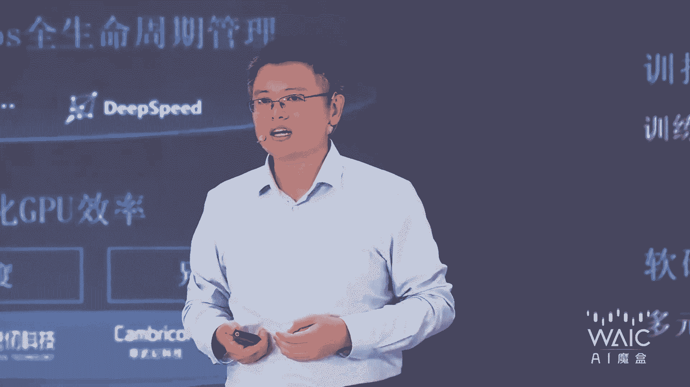
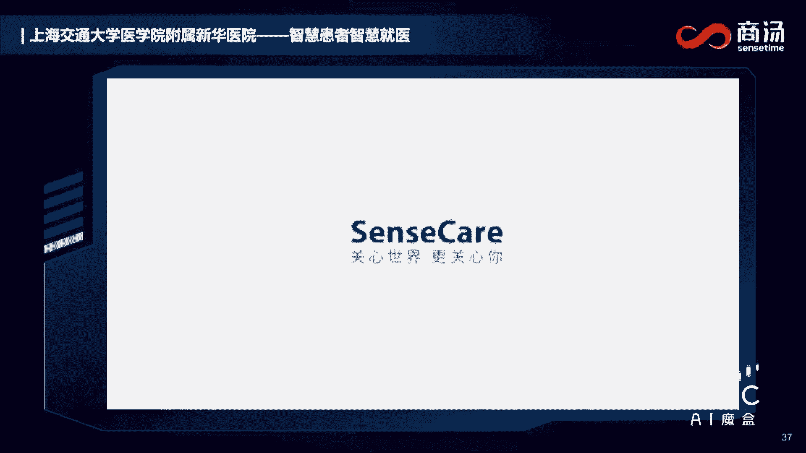
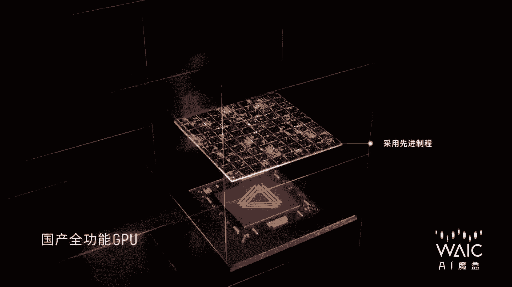

# P21：20240705-AI 魔盒（第二天） - WarrenHua - BV1iT421k7Bv

好，各位在现场和在现场收看我们直播的朋友们，大家早上好。这里是2024世界人工智能大会AI魔盒，我是袁明。您现在看到的是我们为2024we本届大会特别打造的AI魔盒的这个环节。

我们将秉持we2024大会以共商促共享，以善智促善志的主题，为大家带来连续4天的直播节目，让我们一起聚焦创新AI的科技呈现，传播新视角新活力的科技观点。

那么首先我们要为大家今天在AI魔合呈现的呢是2024sale奖的专访。那么昨天2024sale卓越人工智能引领者奖，已经新鲜出炉。啊，我想在这里让我们一起掌声恭喜这4家获奖的企业。

他们分别是上海人工智能实验室，恭喜。😊，嗯。中国南方电网有限责任公司，恭喜。莫奇科技北京有限公司，恭喜。😊，好，以及施耐德电器中国有限公司。我们要恭喜这4家今年的sale奖的得主。

那我们的sale奖super aI leader award卓越人工智能引领者奖，可以说呢是世界人工智能大会wack的最高的荣誉奖项。那么从2018年的第一届啊创办以来。

一直坚持着追求卓越引领未来的理念，评选和运营秉持高端化、国际化、专业化、市场化和智能化的原则，从全球范围，我们去发掘在人工智能领域当中具有高度认可，具有美誉度，并且具有提升人类福祉意义的项目。

sale奖啊，他首先就是超越。😊，然后。赋能。创新引领引领啊，这是它的主要的价值理念。分别是超越superior赋能aplicative创新innovative以及引领leading啊就是sll。

那么它从全球范围内呢，可以说是在发掘在人工智能技术或者应用上，有重大发现、有方向性的突破或者是原始创新，以及正在或者将要来改变未来生活的优秀项目。我们今天非常荣幸的在我们的AI磨合的环节当中。

邀请到了4位sll奖的获奖的企业代表，请他们一一来为我们分享他们本届的这个获奖项目。😊，嗯，首先呢我们今天非常高兴的邀请到了我们这一届的获奖项目。😊，最具引领性的开路先锋。

来自施耐德电器中国有限公司研发的能源管理和工业自动化领域的ecostructure AI引擎。嗯，我们首先以热烈的掌声一起来欢迎施耐德电器中国有限公司AI创新实验室负责人张毅，欢迎你张总欢迎joy啊。

首先当然是要祝贺哈我们施耐德电器获得了今年的AI呃这个sale奖。我们如果来到这个世博馆现场在看我们weack大会的朋友也可以看到在我们魔盒的旁边，其实第一家啊，我们一眼望去。

就是我们施耐德电器非常巨大的展台。那么我们这一次相信是带来了很多项目，其中最优秀的就是这个能源管理和工业自动化领域的ecostructure的 AI引擎的项目啊。对，所以我想请您来给我们首先的介绍一下。

这是一个怎样的项目呢？好的，谢谢谢主持。呃，首先感谢本次大。😊，会对施耐德电器中国的认可。那么ecostructure AI引擎呢这个项目讲之前呢，我想讲一讲我们的做一个项目的背景和原因。

因为大家可能知道啊，施耐德电器中国有限公司呢，我们在中国大概有29家工厂和物流中心。那么其实作为施耐德电器本身我们自身就有数字化转型和低碳以及这个呃效率提升的内在的需求。

因此呢我们在提升我们的供应链体系的AI智能化的水平过程当中呢，我们也是可能像传统的方式呃一样，是从0到1一个一个应用一个一个场景去做。但是后来我们发现一个问题，就是即使到今天来看。

AI的人才以及AI的技术还是有一定门槛的。那因此我们这么多工厂这么多场景，我们面临的两个问题，如何能让这些工厂和场景里边的呃问题呢能更快的去解决，以及。能够把同一个问题复制到不同的工厂里边啊。

也就是一个AI的这个规模化的问题。因此呢我们觉得我们需要把业务人员引入到这个AI的研发跟AI产品的落地上所以我们需要一个相对的门槛比较低的技术平台去降低这个AI的落地的难度。

因此我们说那我们公寓善其是必先利习器。我们就打造的一个一 structureAI引擎。因为一 e是我们这个产品的这个大的logo嘛，后边是一个个的这个产品的名称。我觉得您刚介绍的非常好。

首先这个任何一个AI的应用啊，都是从需求出发。我们找到了痛点和难点，我们来想办嘛。您刚才提到了如何快速的如何规模化的来应用哈。而且您特别提到了这个技术门槛一定要不高啊。对对，这特别重要。

那您您您说为什么这个工厂呢，其实虽以说都是做这个。呃能源跟工业自动化领域的，但是它的产品呢还是有一定的差别的。对嗯，大家可能不知道啊，施耐德大概有近10万款产品，这个量非常大的。

从小的这个A9E9的开关到大的空段，中压的断路器，非常大的这种产品都有很多，所以他们在工艺上是有很大差距的那如何让这些不同工艺的这些工程师们，他们能够被AI赋能，能够受益于AI技术的提升。

提高他们的效率，就是很难的个事情。所以呢我们基于这个呢去做这个平台。那我们这个平台呢其实呢基本有三个关键的点吧，一个就是开放性。

因为我们要面对的我们不同的产线面对的不容的不同我们的上下的供应商供应那个供应商。对因为其实我们不光是要提升自己减碳，我们要帮助我商家赋能对，这个非常关键。二一个呢就是一站式什么意思呢？

因为我要降低技术门槛。对我不能只解决开发。的问题嗯，从需求到最后部署都要解决，否则你只实解决了技术的问题，这东西还落不了地。是对啊，最后一个呢叫场景化。就是我们不苛求于说我们的技术多么的银多么的先进。

多么的是最新的，可能微微验证过的。但是我们的技术一定一定要落地，解决场景的实际问题。这就是我们这个产品的一个特点嘛。呃我觉得您讲的非常好。

其实也是一家这个不断的在这个AI时代与时共进的一家企业其实深刻深思考的这个非常重要的点哈，一个是开放性啊，因伙伴们一起，一个是一站性它的便利啊。第三个就是它的场景化，它的应用。那我想换一个角度。

也请您来跟我们分享一下您的思考，你看我们现在是全球的这个数字化和人工智能发展气候变化，能源转型啊，这个世界的多极化，很多的趋势啊，像我们扑面而来。我们一直说是百年未遇的大时代。没错没错，那么。😊。

我国也正在这个面临着这个新智生产力的这个崛起和发展。所以我想看看您和您的伙伴，我们的施耐德电器是如何来快速解读以及判断当下的这样一个大趋势的一个变化。

然后呢启动这个ecostructure AI引擎的这样一个应用。对，刚才主持人提到一点呢，我觉得特重要，就是新智生产力。我觉得这个提法呢特别贴切。这是我我我个人一个判断啊，未来企业不管是什么样的企业。

它的发展，以及它要如果要突破自己，它一定是科技创新、低碳节能这几个关键词是离不开的对吧？那我们可能已经摆脱了之前这个劳动密集型呀，或者这种这种方式。那么我们需要以这种科技创新的手段去提升企业的效率。

帮助企业企业节能。因为这里面有一个关键点，就是就是全球的这个低碳，包括全球的绿色这个生智是绿色的生产制造。这不是一个企业的使命。这是整个全球性的一个问题。对啊，那么作为生在的电器来讲。

我们从我们大概有将近200年的历史。那么其实我们一直在不断突破自己不断的去创新。啊，我们一直在去寻找这种新的通过技术的改变，带来的企业的这个效能的提升。那么作为我们这个这个一个衰爱引擎的，这个平台呢。

也就在这种背景下。应运而生。像刚才我提到的，我们希望我们的产线，我们的客户，我们的上下游的供应商都能够授予新技术带来的这种呃收益吧啊，这种这种这种技术红利吧。

或者叫因此我们觉得需要有这么一个平台搭建出来。我刚才讲前面讲到是说呢，我们更多是我们内部先去试错，对吧？我们现在我自己的工厂去去验证这个产品是否可行，那么今天呢包括我们这次得到组委会得到大会的认可呢。

也是我们有很多很多的外部客户，也同样受益于我们这个平台带来的这些不管是效率的提升呀，还有节能，是实实在在的一些收益。他们也非常的愿意跟现在德一起去在这个AI条度上往前发展。

嗯所以我们这次得到了这个最具引领性的开路先锋的这样一个sel奖，应该也是实至名归的。我们看到这个人工智能对传统产业的转型升级啊，以及未来新兴产业的孵化的影响啊。呃，其实已经扑面而来。我们之前说未来以来。

我们常常说未来以来就这个未来现在已经是实实在在的今天的现在了啊。那如果我们说数字化和自动化是能源管理的一个必然的方向的话，那么施耐德电器对于ecostructureAI引擎在数字化创新方面啊。

怎么体现它的这个前瞻性的布局思考以及它的引领。然后又制定了哪些正确的这样一个战略。呃，这么说吧，就其实前瞻性呢，我就我还没有那么不谦虚。

谦虚说我们可能不敢说有多么前瞻性但是施耐德电器呢确实是一家很务实很脚踏实地的企业啊，这点很关键。所以呢我我们在做这些研发跟研究的时候，刚才我反复提到的，我们要针对我们的具体场景去解决实际问题啊。

我这里边想举一些例子，可能举一个例子比较有大家比较容易理解，这个ecostructure是怎么帮助施耐德。😊，他的伙伴们一起降温增效的我先举一个我们内部工厂例子，其实就在上海。

我们上海在普陀区的绥德路和在康桥都有我们的工厂跟物流中心。上海是我们很大的一个一个基地吧，就算是那我们在我们的设备生产过程中，元器件的生产过程中，其实很常见的一个情况，就我要把施耐德的logo。

就施耐德那个标准打到产品上面，这叫这个私印，这个很常见对吧？但实际上呢由于这个产品本身的一些呃就是打印过程中，它可能会打错，颜色可能打浅了，颜色可能打歪了，这都很常见的问题。

那这个就那在过去可能就是废品。报废了。以前的传统方式呢，我们会有质检人员一个一个去看对那这个得于最基本的这个CV技术计算机视觉，我也很容易去辨别出这个问题。而且最关键的是一旦我发现问题。

我可以提前预测到我的打印设备可能有问题就设备预测性维护。因为当人通过。质检发现问题，再回溯到这个生产线是有一个延迟的对，可能已经100个1000个产品出来了，那怎么办？浪费太极大的浪费。对。

这是我们在我们很多的工厂已经落地的一个项目，这是一个所以这个时候如果你是计算机用就AI技术预测到了之后，他立即可以停机去检测就这是一个很小的点。

但他有实实在在的还是有价值价非有价值实在的价值那这是我们内部的一个特别小的案例，这种案例很多，我再多说一句这种案例就是产业上的工人他们想到的其是我对为一个AI的研发人员。

我并不知道有这种场景需要他们跟我们一起，这是一个case啊另外呢再有呢就是我们跟外部客户啊，我们跟呃太古啊，是我们那个香港的房地产一家公司太古集团。

我们在很早很早在一在一几年18年19年就开始合作做这个楼宇，包括这种建筑体的这个冷冷源测空调的节能减排。😊，因为太古自身呢也是个特别注重于绿色环保啊，节能的一家企业。

所以我们跟他一起呢在做这方面的这个空调机组呀、冷战啊这些优预测跟优化啊，那我们可以帮助太古呢？我们现在基本上有两个数字吧，一个是我们能够预测未来24小时，这个建筑体里边。

由于有多少人来这个由于外围的空这个季节它需要多大的冷量，就是空调需要多大开多大，说白24小时每15分钟空调开到多大。那么这个准确性呢我们已经达到95%。就是AI可以提早预测啊，你这样就不用浪费。

或者说把冷气开的太冷，让大家反而有个舒服的体感。然后呢节能呢相比于传统的自动化控制的的水平呢，我们大概有15%5%左右的一个节能量啊，这个非常棒也实实在在一个例子。所以大家下次去，比如说上海啊。

成都很多地方的太古里泰国里新日太古汇对太古会的时候也可以感受一下，是不是这个体感很舒适啊。如果是的话。😊，这个施耐德电器的咱们ecostructure的这个AI引擎是在其中起到了很大的作用。

然后还有我们再举一个例子吧，可能就也是我们这边一个食品饮料行业的百威百威啤酒，大家都喝对百威啤酒他呢百威呢也是跟我们有非常深的合作，也非常相信我们。然后呢我们给他做了一个是预测性维护。

就是帮他因为他整么生产线里面有这个设备，我们帮他做这种设备的故障的预测。那么提前帮他预的跟我刚才说那个例子差不多。同样他在这个过滤公寓里边呢。

我们会通过这个AI去呃实时检测他这个啤酒业酒江的这个过滤的质量，帮助他去控制他这个他有个过滤的介质叫硅藻土啊控制这个硅藻土添加量，帮他去节省这种耗材的使用。这些都是帮到了企业。

企业也非常得哎这个跟施耐德先做一个样本案例成功的。那他们有多了更多的工厂愿意去复制啊去做。这是我觉得我们既帮到客户的，我们也觉得我们自己在节能。😊，在这个高校他们做的为社会做点量贡献吧。对哎。

我就joy你刚才的这个讨呃谈话就特别举的几个例子啊，非常有意思，也给了我很多的这个启发。因为你在这个讲话当中反复用到一个词叫做脚踏实地哈。对对对，就当我们想到这个AI啊，想到人工智能等等。😊。

曾经会觉得是空中楼阁离我们有点远。但是你反过来呢，施耐德电器的这个ecostructure system是从具体的这个应用，从具体的场景，具体的生产当中找到痛点。然后予以解决哈。对，所以我知道这个。😊。

在这一轮技术革新的应用如何赋能啊，我们的生产助力产业高质量发展上面哈，我们是出于一种什么样的这个理念和价值观在引领着我们的科技创新。😊，呃，孙耐德呢在。很早啊，2000年左右，2002年吧。

我们就提出了这个可持续发展的战略啊，这个很关键，就是可持续可持续发展是施耐德企业发展的一个宗旨。嗯，那么我们做的所有的创新呢，做的所有工作都会围绕着可持续发展去展开。

同时呢施耐德电器呢一直认为呢我们作为一个企业是有社会责任感的。就我们尤其我们做能源，做现在做工业自动化。因为现在怎么能源问题，包括全球变暖这些问题呢，都是很事界性的话题。那么我们作为企业。

我们尽可能的去在自己的这个技术上面，在这个产品上面做一些努力，帮助去缓解这些问题吧。是，那可持续，比如说作为咱们这个施耐德电器，您刚刚说到在2000年左右，看2002年就2002年公司的这个核心战略。

应该说这个理念是非常的先进啊，也是非常的早。但是施耐德是一家这个国际性的大企业啊，啊，它有这样的社会责任感，那是非常好的。另外呢我。😊，觉得他也在这个整个社会推动社会的这个现代化进程当中。

也扮演了自己应该承担的这样一个角色哈。对，但是您刚才也提到，您有那么多的合作伙伴，不同规模的企业。😊，在进行可持续发展，把它作为我们公司一项企业文化和价值观作为一项战略的时候，我们也知道。

其实它与之相应的，我们可能需要匹配很多东西。这个其实是成本的增加。嗯，那您怎么说服您的合作伙伴们也和您一起把可持续作为公司的使命和价值观呢？嗯，这个呢在这之前呢。

我再补一个我们的一个在中国特一个一个特别的一个战略，就是我们有一个说法叫在中国为中国。嗯，这生态电电器在中国生态电器中国一直秉承的一个宗旨。我们在中国去建厂，我们在中国去生产，去跟中国的客户去合作。

那么我们一定要为中国去提升这些这些不管是可持续发展还是低碳啊，那么在跟我们的合作伙伴跟客户在去做这些合作的时候，我们第一件事情。刚才我就提到了，我们不会去把新的技术或者没经过验证的技术，在客户那做实验。

我们有。😊，29家工厂跟物流中心，我们会先在自己的工厂去做。所以这个试错的很大的一个成本，顺在都自己都已经承担了。我去跟我的客户或跟我的合作伙伴去做的时候。

已经是知道在施耐德已经验证成功的那这个失作他们我们来承担，这个没问题。那么我们是把一些已经经过验证的技术和一些平台，像这e air引擎我们在工厂已经走了好多年了，我们才会跟我们客户讲，跟他说他能做什么。

以及他对社会的这个帮助。同时我们的客户，特别是我们很多客户，他们也有这个可区续发展，包括这种社会责任感的这种意识。他们是愿意做这些事情的，愿意去在这方面跟施耐德一起共创啊，一起去向前发展。嗯。

这个是非常棒的哈价值观的认同，其实才是长久合作的一个非常重要的基础哈。刚才这个joy也反复跟我们提到了这个呃。😊，在双碳和零碳的这个技术革新的大背景下。

其实施耐德电器一直在推动哈acostructure AI引擎的这个部署。特别是刚才刚刚提到在中国为中国哈。那么我想知道这个如何更有效的去赋能数字中国的发展，来达到我们的这个双碳目标的实现呢。嗯呃是这样。

首先呢施耐德自己自身，首先我们的还是从我们自己先说起啊，就我们自身的工厂，我们有零碳工，我们有零碳工厂，我们有灯塔工厂。那这些都是本身我们先把改变自己，我们先改变自己。

然后呢去去去提升整个在中国企业的这个数字化水平啊，以及零碳的这个水平啊，同时呢呃我刚才也也有一点点说到，就施耐德电器中国，我们刚才更多是落地场景解决实际问题。

那么我们清楚我们并不是一个像互联网公司那样的一个技术要投就在就是很多的。😊，研发人员呢，我们会更多的更多的去依靠我们的生态合作伙伴，我们就不从说白了我们不会重复造轮子。

比如我们有很多的这个IT的合作伙伴，他们做了呃大语言模型，我肯定不会去做的，我也不会跟他竞争这个但我要做的事情呢是和我的些生态合作伙伴，也今天展会里边，他们都可能在这展会里面，我跟他们说，我有场景。

我有困难，你有技术，我们来合作去解决问题，这种一加一呢是大于二的而如果说我也去从零到一把所有技术都自己做完全没有必要，我更想的是合作共赢，这是施耐德的一个对，这是我们一直的一个理念合作与共赢，对吧？

各自做各自擅长领域的事情，把它发挥到极致就好合作共赢。这也是施耐德未来在推动这个当中可以做的也是已经在实践的非常有价值的部分哈所以我们得到这个引领奖，应该说是实至名归哈。那我。😊，上。

我们的访谈到这里也差不多要告一个段落了。最后也想请joy来跟我们展望一下哈。就是AI大模型的发展。您觉得现在是处于一个什么样的阶段，是不是还在早期阶段哈。那么未来啊我们想象一下聚焦这个领域的话。

施耐德电器在ecostructure AI引擎的未来的展望是什么？在你的理想当中啊，一个最完美的与合作伙伴们一起合作共赢的途景是什么样的？嗯，呃先说到大模型啊。

就是我们AIUAI引擎呢已经在自己的工厂在落地大模型的实际应用了，这个很快8月我们那个展台上也有一个马上就要成功的案例？都是我们自己的呃，这个很快8月份就会有新的新的这个产品出来，这是第一个第二点呢。

其实我想说一点就是技术的革新，就技术本身的革新相对是快的。但技术带来。😊，它产业的革新相对有一点点滞后，因为它有一个落地的过程。那么尤其在消费领域跟在这种工业领域，尤其像这个生产制道领域。

他们俩又有一个时间差。可能我们作为一个消费者来讲，我们已经受到大模型的很多的帮助。咱们的手机app里边已经有很多极于大模型的应用的。那实际上现在工业领域呢，我们看到或者我个人看到呢。

就是那种现象及非常震撼人心的应用，暂时还没有涌现出来。我但我现在在孵化过程中啊，那么一个我春耐德电器，我们作为一个这个能源管理跟工业自动化的一个解决方案的提供商，我们也在这个浪潮里面在努力。

所以我觉得接下来大模型一定会去帮助企业做这种。革新技术的革新带来这种质的这种呃不管是效率还是节能的飞跃。因为技术它一定还要最终要应用到生产跟解决世这个这个世界性问题的上面。他能他的这个收益是最大的对好。

非常感谢这个joy来自施耐德电器的张译今天给我们带来的这个分享啊，我们当然也要再一次的祝贺在我们这一届的这个sale奖的评选当中啊。

我们获得了 structure aI引擎获得了最具引领奖的这样一个谢谢了不起的成就啊。我们也非常期待在今年的这个2024的大会上啊，有更多的合作伙伴潜在的这个朋友们，我们的观众啊。

都能够到我们的这个施耐德电器的这个展会。欢迎大家去看一看去交流去感受啊，去看看有没有可能达成这个合作的这个项目啊，我们再一次祝贺施耐德电器啊，也希望未来的施耐电器会在这条属于无畏。😊，开拓者的道路上。

能够带领更多的伙伴们合作共赢，为我们的全社会开创更加优质的未来。好，再次，谢谢joy，谢谢张译，谢谢谢谢好，请休息。😊，我清。😔，🎼莫契科气。好来。🎼来，我们给掌声给到我们台上的这位嘉宾哈。

嗯这就是我们接下来要为大家介绍的sll最具创新的奖项。来自默契科技北京有限公司研发的my scale数据库啊，我们一起来欢迎默契科技北京有限公司的CTO苍林鹏先生，欢迎您。😊。

🎼我们首先要恭喜莫契科技获得了我们这一届的sell奖哈。呃，请您来给我们介绍一下这个my scale数据库哈，它是一个什么样子的项目呢？啊，对呃，因为数据库的话，如果大家做这个信息化系统的话。

应该多多少少会比较熟悉吧。因为也发展了50年了。那我们m skill我们叫AI数据库，它的特点呢就是国际上第一个专门为大结构呃大规模的结构化加非化数据啊，综合的一个存储查询处理打造的这样一个数据库。

因为在AI时代，其实我们处理的很多是这个非化数据。比方说像图像视频语言文本等等。所以这些方法其实是用深度学习。

还有大语言模型或者跨模态模型等来解决的那我们的呃AI数据库呢就是为AI时代打造的这样一个数据的基础设施。啊，那可能今天因为在我们观看现场观看我们AI磨合和在网上观看的朋友啊，唉有一些带着好奇哈。

您刚刚提到的是非常专业的一。😊，个描述。那我们也知道您刚刚呃提到末契是一家行业领先的AI基础技术和平台公司。

那么myine skill这个数据库呢是可以说在AI的底层技术上有非常大的创新和实践哈呃您可不可以具体的给我们介绍一下哈它的这个创新，它的独特性，在技术和实现和应用上是怎么得到体现的。

可能要举一些深入浅出的例子可以让我们更多的人能够感受到它的魅力。好好的好的，对呃，就这边一个核心的就是对于非化数据的处理。因为这些和结构化这些数字啊等等不太一样。非化数据像这个呃图像啊、自然语言啊等等。

其实是没法用简单的这些呃数学函函数或者一些呃就是编程的方法去处理的。它其实是用呃AI的模型呢把这些像图像啊、语音啊文本啊都变成一个就是高维的空间当中的一个向量啊，比方说它可能是几百为几千维。

然后这个向量呢，它可以去编码这些非化数据当中的一个呃语义的信息。那我们的数据库其实就是能。😊，们把这类高维的向量和比较传统的这些结构化的数据啊，还有时序啊、空间啊等等这些数据都在一起统一的管理。

那举一个例子啊，比如说大语模型，它其实在发挥价值的时候，是要跟领域的数据结合。那怎么结合呢？就是把领域的这些比方说文本数据啊用这种向量的方法检索出来之后，然后给大模型。

那大模型就能基于比方说企业的数据或者行业的数据或者这些最前沿最尖端的数据来深入浅出的给你讲解，给你回答给你做分析。那这样它就突出了一般的他说车葫芦化，或者有时候说的不太精确，对吧？

不太前沿这些问题就可以得到缓解。再比如说在实际很多呃比方说这个工业啊，比方说智慧城市啊等等很多场景当中都有大量的这些图像视频的数据。那这些数据呢也是可以变成向量化，连同它的一些空间啊，持续啊这些信息。

那在数据库当中做统一的管理，然后结合大语模。行，我就可以把它给按照人的这个语义啊检索出来，然后再进行进一步的综合分析，来进行各种。比方说提高安全或者提高管理效率等等。

所以您可以看到在这些创新的AI场景当中，有海量的这些非学化数据都可以用这个数据底座来管理。我我我的理解哈，小白的理解，不知道对不对啊，就是说在我们人类社会啊，每一天的这个社会生活当中。

其实我们会产生大量的数据，对对对对，您刚刚提到的，比如说图像啊，自然语言啊等等。那么这些数据啊，其实按照现在的这个大模型的这个发展的这个技术，它不能一下子读懂。😊，对他看不懂。对。

所以咱们默契科技呢就像一个翻译一样。😊，用一个它其实像一个外部的大脑，外部的大脑来把这些数据解释给大模型听，让他听得懂，看得让大模型。他比如说他原来是没有这些知识的，他像一个知识库一样，你是就训练它对。

大模型就可以实时的去这个外部的大脑当中去获取这些知识。嗯，这样子他就不是一个就是最通用最平庸的一个大模型，它是和这些领域的数据结合。所大模型外挂了一个莫契的大脑。对对对对，那家他就可以不断的更新。

不断的实。对对对，这个很有意思。那我们想象一下，也给我们解释一下，就是莫奇科技大概是和一些大模型是怎么样来合作的呢。因为。😊，对很好奇。你举一些再举一些这个通俗的例子，我们了解。对对对。

比如说的话就是说呃和刚才就是呃施耐德的领导一样啊，我们对于大模型来说也是非常开放的。就我们可以和国内外最先进的这些大模型的厂商都可以合作。啊，然后他们大模型接上我们的AI数据库之后。

就可以和海量的这些呃结构化废球化数据融合在一起。对，比如说我们最近做了一个就是呃很受欢迎的一个项目，也是在呃这次WS上有发布的，就是一个科研平台。那我们就把2亿多篇文献都放在了这个AI数据库当中。

然后做成了一个科研行业的知识库。这样子呢科研人员对吧？他们想要就是实时的了解这些科研的信息，他就不需要去读去读很多很多篇的文献了，他就可以对着这个科研的知识库，去实时的问答，做跨领域的分析。

可以举一反三，可以跨学科可以快速的阅读。所以对他们科研的效率就是一个极大的提升。所以对于。😊，很多这个大模型的公司来说，您就像是一个百科全书般的存在了哈。

我想知道这个呃我们知道模奇科技在这个人工智能行业是一直追求源头创新的。那么在这个my skill AI数据库项目的创新背后，您的这个驱动力到底来自于哪里？为什么要做这个呢？

对呃我觉得就是背后有两个驱动力吧。一个是说的话就是现有的大模型呃，其实虽然取得了很大的进展呢。但是它本质上还有比如说不太精确呃，不太实时，还有依赖的算力非常大等等这些问题。

其实我们也是希望通过AI数据库的这种很原创也很互补，包括国际领先的技术，其实能够跟大模型背后的transformer的技术，其实说做一个互补。其实一个是transer式稠密计算。

然后AI数据库其实是很多稀疏的计算，有很多这个数学上工程上的这个创新，能给他这样一个外挂的非常大的这样一个知识库跟它互补。所以这在。😊，源头上就有非常大的创新。另外来说的话，就大模型实际发挥更大的价值。

还是需要和领域的这些知识数据做结合。而且需要比方说和这些实时的大规模的数据做结合。这在实践当中会有更大的价值。那我们AI数据库呢其实也是大模型在实践落地当中和领域大规模的数据做结合。

发挥价值的一种很好的一个载体一个平台。所以我们希望无论在理论上还是在价值落地上面都能有非常好的贡献。这也是我们的这个驱动力是所有的大模型数据背后一个默默的存在，但是又不可或缺，非常重要。

我想知道您刚刚也提到了这个呃传统的方法难以处理有效的处理这种非结构化的数据啊，所以这个AI的源头创新非常的重要。而我们这一次的这个my scale的这个数据库也获得了我们的这个创新啊，这个奖项。

那么它的创新突破。您觉得体现在哪些方面做了哪些别人做不到的地方啊，呃有两点。😊，吧一个是说的话是我们第一次是把这种结构化，还有刚刚说的非结构化，背后就是这个向量的表征有机的融合在了一起。

因为呢就像如果只是做这个向量数据库的话，其实市面上也有其他呃很多产品。但是呢他们在实际应用当中的话，用户还是需要把这些比方说刚刚说结构化呀持续啊空间啊，包括说还有就是这种sql的数据建模。

多张表做联合分析等等。很多时候这些应用还是要融合在一起的。那么我们是第一次就是将呃sql啊这种传统的数据库和向量在大规模的情况下做了一个非常好的融合。第二点呢就是说呃向量它其实它的维度非常高。

所以它处理的代价是非常昂贵的。所以在大规模的非数据处理的时候，普通的方案其实成本会非常高。那我们也是在算法和系统层面结合非常好的前的硬件做了非常多的创新。所以我们在。大规模呃数据处理的时候。

它的这个数据的密度，还有性价比也是有一个数量级的提升。所以这个在很多实际海量数据的场景来说，价值是是是非常大的。所以刚刚说两点，一个是融合，一个是一个是这个创新。对嗯。那我想知道的话。

就是说您可不可以再给我们举一个例子啊，您和您的合作伙伴哈如何是对my scale这个AI数据库是如何使用的？体现在您刚才说的两点，一个是它的创新性，一个是他的融合性。

就怎么帮助您的伙伴们哈能够更有效的提升他们的这个产品。对对对对对，呃，第一个还是刚才例子我觉得很有意思。刚刚说了介绍了一下科研平台的例子嘛。

我们其实是也是一个现在呃很受这个学呃科研的人员欢迎的这样一个平台。然后另外一个有意思的意思是我们这平台是完全开放的，就我们把底层的这些AI数据库相关的。比方数据的导入检索。

还有包括和大模型的这种结合的问答分析等等，这些接口都完全开放，所以我们的合作伙伴呢就可以在这个呃平台上面去快速的进行深入的开发。比如说他想对比方说靶点发现，对吧？这种医疗的领域当中做更深入的这个研究。

他可以给予我们的接口。😊，或者说呢他想开发一个教育的这样一个APP比方说做课件的生成或者试卷的生成啊等等。那他其实也可以基于这个知识库做深入的二次开发。再比如说在智慧城市领域和这个自动驾驶领域。

其实我们有很很成功的一个实践，也是说把这种海量的图像视频的这些数据做管理。方说来提高自动驾驶领域当中，很多它的叫，就一些安全提高它的安全性，提高机忆学习的效率。

还有提高像智慧城市当中这个管理的这样一个效率，就这些都是实简例子。刚刚提到了科研提到了医疗教育智慧城市自动驾驶等等，还有哪些行业和领域可以使用我们的my scale数据库可以很好的提升效率。

或者说你已经有了一些合作伙伴。那么在哪些领域哈，还有哪些新的合作伙伴是你特别想要合作的其实我们现在合作的非常多吧。就这个产品现在在国际上其实也有数百个用户。然后在国内的话，我们也有几十家就比较大规模的。

😊，这样一个落地。刚刚其实提到一些，还有包括说在工业啊、媒体啊，对吧？就这样比方说这些短视频的这些搜索啊等等。其实现在都非常多吧。我觉得我就不举具体的合作伙伴名字的例子了。这里但是反正也是一个倡议吧。

就是大家我觉得一的话是不要局限于现在就是大模型的trans架构。我觉得这边还有很多路要走，包括国内的话也在这个比方说算力方面有很多的限制。我觉得应该更多的关注这些原始的创新。第二的话就是要做价值落地。

在当中的话其实就是和数据结合和海量的大规模数据结合做这种实时的数据的分析，让大模型能够啊就是驱动更多高价值的应用的落地。所以我有个倡议吧，就我们一是做创新。第二的话做价值落地。而且两者可以结合起来做。

嗯，所以您的创意非常好创新和落地哈那我想很好奇啊，因为现在大家都在提这个生成式AI啊，这也算是打开了人工智能的一扇新的大门。那么各种大模型在当家集中包发。所以这个在深成市人工智。😊，智能的这个领域啊。

就my scale AI的数据库可以怎么样来体现它的创新的价值呢？啊，对，呃，就是如果说是说原始创新的就那我觉得还是两点啊，还是两点，就是说那我再就第一点展开一下，就比如说现在大模型的话。

它背后有个cal，就是说它的参数量越大。那它的这个效果就越好。但现在随着参数量越大，它整个计算的比方说这个GPU或者NPU采购的成本，它的这个电力成本其实都越来的越难以接受。那比如说在创新方面。

我们就和我们的合作伙伴一起研究，就比如说我们叫datacentricM就以数据为驱动的大模型，它有两点，第一个是说我们在训练数据方面就可以利用AI数据库把训练数据管理起来。

那这样子我就可以把训练数据做一个节约所有的数据都是有效。对，您说的很对，就是提高数据的效率。这样子它训练的成本其实就可以降低，最后的效果还可以提升。第二点呢就是说通过这个AI。😊，呃。

通过大模型和AI数据库有机结合，其实我就可以把大模型当中，它原来很多的参数啊都是保存知识的，把这些保存知识的参数它就不需要它就没有外挂可以外挂了。所以对您说的很对。

所以说他就比方说我的参数量可能就会以缩减3倍、5倍甚至10倍。它的效果仍然非常好。那这种情况它就不需要那么多的这个算力和电力，那它落地的可行性，包括我在同样的成本下就可以做更多的创新。啊。

所以这边其实也是我们在和很多研究院，还有公司一起探讨非常非常非常的make sense很有价值的这个合作的空间。好，我们看到了那我也很好奇啊，就可能是作为一个媒体人也会特别好奇就是。隐私这个问题哈。

您可以处理到接触到大量的这个隐私数据。那么数据安全和隐私保护呃，我想在这样一个。AI的时代呃，其实是非常的重要的。那么my scale AI数据库在数据安全和隐私保护方面，我们做了哪些特别的措施啊。

来让无论是数据的提供者还是使用者都感到放心。对，第一点的话就是我想就是相比于大模型，它其实你是要把所有的数据其实都未到大模型里面去。然后其实它很多隐私啊就不可避免的就会在当中有一些泄露。

但你如果不放给大模型的话，大模型不知道这个知识。那当中就有一个悖论。那其实通过AI数据库恰好可以解决这个悖论，就是说你可以管理你自己的AI数据库把你的数据啊完全是你自己比方说企业自己所有的。

然后你就可以和通用的最好的这些大模型结合。这样你既有自己的数据，那这个大模型呢又能够和你自己的数据做结合，给你提供这个差异化的独特的价值，对吧？所以这恰好是解决现在就是大模型很多隐私方面的一些悖论。

其次当然我们AI数据库在底层也做了非常多的这样一个。😊，呃，数据的加密，安全的保护权限的控制等等。对，然后另外现在也在说数据要素，包括数据的这种价值的流通嘛。其实通过刚刚这种形式。

我去利用AI数据库承载这样一个知识平台，对吧？对外服务，但数据还是你所有的对吧？你的整个访问也是呃就是能够做到安全的可靠。所以这也是一种从知识和价值的角度来说。

一个非常好的知识流动变现的这样一个渠道价值渠道。对那对企业来说，如果我应用my scaleAI数据库。那我如何来平衡我的这个技术创新和商业应用之间的这样一个关系呢？其实一个性价比的问题，呃。

我觉得就是说其实使用门槛还是比较低的。因为因为现在来说的话，呃，就是AI的这个大模型啊，小模型啊也越来越成熟。所以对于通用的需求来说，其实不用花特别多的这样一个研发成本就可以很好的导入到AI数据库当中。

就以一个企业知识库的形态去对外服务，所以成本其实是很低的。然后我们I数据库刚刚说它优点的话，就是说它是一体化的架构，所以你不需要维护多个系统运维成本比较低。然后另外的话就是说它的海量数据的时候。

成本可以特别的低。所以我也借用这个英伟达这个老黄的一句话，这个the more youthe more havethe more save对就你放的数据越多，其实你节省的成本就就越多。

对然后另外的话如果说基于这个你想做更多的创新，它也是一个很好的创新的载体，因为你有了这个你属于你自己的一个AI的基础设施，你在上面结合最领先的这些大模型或者小模型就可以开发出这些智能体啊或者更新的应用。

就成为你。😊，研发创新的一个平台，它可以是企业内部的，也可以是行业性的。就比方说刚刚说的科研平台。其实我们就是想给整个科研行业提供一个基础研发创新的这样一个平台去赋能。嗯非常棒。

那面对未来这个my scale AI数据库会有哪些新的发展方向，或者是它的这个升级的计划可以在这里给我们透露一下吗？呃对，就是其实现在来说，整个AI数据库，我觉得还是在一个初期吧。

就比如说现在我们还是用的这个向量的表征嘛。但其实之后的话会有更加精准的，比方说基于多尺度的向量或者图的表征啊，这是非常fument的一个创新。然后另外对于结构化和非结构化数据如何联合查询管理。

当中有很多的优化可以去做，还有在海量数据的时候，如何效率呃进一步的提升。啊，如何和大模型进一步有机的结合，如何做自动化的这种规模的，就结大模型驱动的这种规律的发现，对吧？在当中其实我觉得整个呃这。

波AI的创新还是在初期，然后大模型和大的AI数据库结合还大有可为。对嗯，是我们其实反复最近都在提到这个心智生产力这个概念，其实my scaleI数据库就完完全全是一种心智的生产力哈。

那么这种新智生产力未来会如何影响整个AI领域的未来的发展趋势以及如何对我们比如说中国的这样一些企业哈，我们的这个产业升级带来怎样的影响啊，我们在这里也可以一起展望一下，对对对对。

那我觉得还是刚才说到两点。我可能就在就就着你的问题就是在展开一下吧，就一个还是创新，对吧？中国的话就是中国有中国很多的优势。我觉得比如说它的很多行业，对吧？

就我们有很多呃就是很有才干的这个科研人员和工程师啊，那那其实就是在大模型方面，我们其实可以和这些领域的深入的这些数据，这些领域的nohow做结合啊，另外的话我们可以把这些。😊。

海量的数据实时的跟大模型做融合。这样也就刚刚说降低大模型本身的这个参数的这个这个要求，同时呢又让它能够就是有更多的这样一个创新，更好的一个效果。第二的话也是说这个是这个是说源头创新嘛。

第二个就提到新智生产力。那大模型还是要跟领域结合。比方说跟刚刚说的工业医疗智慧城市自动驾驶教育等等，对吧？和这些领域结合，也在实际当中做这个价值落地，包括说能把整个社会的创新力，都激发出来。

而不是说让一个比较通用的可能有时候相对平庸的大模型跟人去竞争，而是形成一个社会和AI更好协作的一个有机的共同体。我在这我觉得在这边就是从数据的视角，从AI数据库的视角都会有很多新的这样发现。

对嗯引领整个社会的AI发展，从平庸走向创新啊，确实是这个末契科技这一次能够获得这个呃引领在引领方面，innova方面。能够因为它的突出表现获得我们seale奖的非常重要的因素啊。

我们要再一次向默契科技表示祝贺。那么也期待在快速变化的人工智能时代哈呃默契科技以他的这个创新精神引领AI技术走向新纪元AI技术的发展和应用，开辟新的范式。我们再次掌声感谢汤总今天给我们带来的分享。

也要再次祝贺我们的默契科技获得了2024世界人工智能大会的seale奖。好，谢谢谢谢谢祝贺祝贺。好，请休息。😊，嗯。我们接下来要为大家来介绍的是sale奖这一次的其中的一个赋能奖啊，这个赋能。😊，呃。

他赋能奖的这一块呢可以说是特别注重。🎼人工智能技术对经济社会应用赋能方面所带来的价值。那么今年荣获sale赋能奖的项目呢，是来自一个可能我们每个人每一天都要用到。

但是我们常常不会那么明确的去关注到感知到的这样一个行业。他其实是为我们的生产和生活保驾护航的电力行业。这一次获得了sale奖。

其中的赋能aplicative讲的是来中国南方电网有限责任公司研发的新型电力系统智能仿真器预电。好，我们现在就热烈的掌声。

欢迎中国南方电网有限责任公司的战略规划部总经理郑外生先生来到我们的AI磨合的分享。欢迎您。😊，🎼好，谢谢郑总啊，首先也祝贺我们的这个南方电网啊，我们想知道您可不可以给我们来简单的介绍一下啊。

因为我们这个AI魔盒是一个科普上的啊，大家都是很关心，也很好奇。就是说看起来这个高精尖的人工智能哈，到底对我们日常的生活生产，会带来怎样的影响，带来怎样的改变。

所以首先呢我想请您来给我们啊用非常通俗易懂的方式来介绍一下这个新型电力系统智能仿真器遇电哈，它到底是做什么的，它到底是什么。好，郑总请好的，主持人好，这个仿真器呢简单说是一个数字模拟器。嗯。

它就是模拟电力系统的运行，以便分析它的安全性、经济性，包括碳排放的情况。嗯，因为大家知道电力系统呢，它有一个安全域的概念。😊，就是说必须在这个范围内运行。嗯，这个超出了它就会发生事故。嗯。

但是我们又不能拿实际的电网去做试验。对，因为你一旦越线了，它就会导致大面积停电。对对，所以我们就只能用数字技术，这个来进行仿真。嗯，比如说像那现在那个原子弹核爆，嗯，也都是数字仿真了。

你不可能老用实际的去爆去那个代价太大。所以仿真器呢它就是一个模拟器。嗯，那我们现在呢也有传统的仿真器，它是原来的叫数值计算的，就建立数学模型，然后解方程得到结果，它也算的很准，但就有一个问题呢。

它算的比较慢啊，那用于以前的发电厂呢，那是够用的。因为以前的像火电水电厂这些呢，它的发电是可计划的。哎，你提前安排好每天每个时刻，哪个电厂发多少，你计划好，他就按这个计划自动发电。对。

但现在新能源出来以后呢，它它是变化无常的。它就不可计划。比如说风能啊，对它飘浮不定来一朵云啊，对发电就很厉害，会发生变化，它对电网会产生很大的影响很大的冲击和影响。所以它是难以计划的。嗯。

那只能说根据短时的天气预报，那4个小时，现在最精转一个小时能预测90%的准确率。说哦这个电厂能发多少电。😊，哦，当是你这时候你还得考虑它的安全问题，是得模拟分析它的安全边界在哪里。对对对。

那我们传统的呢，它算一次得好几个小时，而且解方程速度太慢了，它得一步一步减嗯。所以这个他就来不及。嗯，所以我们就想到用人工智能技术呢开发了这个智能仿真器。哎，它的特点有两个，一个呢它可以处理海量数据。

嗯，就你的发电厂，我们现在在新能源发展之前，南方电网发电机组也就是不到1万台，现在是有五十几万台。哇以后会是几百万台。所以用传统的短量非常大。所以我们这个人工智能呃支撑的这个智能仿真器呢。

它一个是可以处理海量的场景。是第二个呢，它来的非常快。快他是秒级就可以出结果。所以我就可以每个小时根据最新的天气预报，每个电厂最新的发电能力重新做调整，重新做调整，不断重新优化调整。嗯。

因为新来源我们都要优先利用了。对根据最新的调整其他机组，给他让路，对非常棒哈。所以这个一个是又快对一个是大数据啊，他有了这样一个能力，难怪咱们这个新型电力系统智能仿真器，它的名字叫驭电哈。

这个驭就是驾驭的驭啊，哎，对这个名字起得非常非常的好啊，也要谢谢郑总刚才给我们深入浅出的解释了一下我们这一个se欧讲的获奖项目到底是什么。那接下来我也很好奇啊，这听起来这是一个非常高精尖的项目。

它到底咱们南方电网是集结了哪些优秀的团队来打造这个驭电的能呃，我们还是集中了很多优秀的这个伙伴呃，主要是联合。😊，华南理工大学嗯武汉大学，还有华为公司。以厂学研的这种方式来协作，效果非常好。

这个南方电网公司牵头呢主要还是负责就是这个场景分析需求分析模型，包括模型的设计参与，完了以后呢就提供大数据。有模型的特点就是要用大量的数据去喂养它对我们有这个优势。对，这个海量的数据。

历史数据都是真实的。嗯，再一个呢我们也对模型的性能进行评价。嗯。那像这个两所高校呢，主要就是负责模型的开发、训练测试这一些。嗯，那华为公司呢，它一个是提供算力支持和一些技术指导。嗯。

所以我们这个互补性很强，产学研的强强联合。对对，那我们知道这个南方电网之前啊，其实也有一个项目叫做南网智看哈，它也是一个非常精彩的一个数字转型化的一个成果啊。

那么南网智看也是应用了这个所谓的数字孪生技术啊。嗯所以我想您能不能跟我们。😊，解读一下就是。传统的咱们这样一个传统认知里的这个数字孪生技术开发的这个难网之探。

和我们今天啊您刚刚说到应用了这个人工智能技术的智能仿真器预电哈，它们到底有哪些不同啊它的先进性体现在了哪里？😊，呃，这两个东西呢共同的都属于数字孪伸的范畴。所不同的这个。

志康呢它更多是把电力系统的各种电器设备，这实物给它数字化。模拟的是他那个型，我理解嗯。而智能仿真器呢模拟的是模拟的是它的神，嗯，就它模拟的不是外观。

而是整个电力系统它内在的一些动态的运行参数、频率啊、电压、公脚这一些。所以要打个比喻的话，就是。这个志康是哎把这个人的形状给他数字化。可视化很直观，长得很像你。当时这个仿真器呢，它更多是。这个。

机制和分析你的。这个。伊在阁拢。比如说健康状况吧，我我的理解下血脂啊我的理解可不可以这样理解，就是原来的这个难往之看，他只是把这个人的形状啊把它们抓取到了啊，但是呢它背后您刚刚说到这个浴店。

它实时的它比如说一屏一笑，一举一动，它发生变化的内在的这些呃内在的一些咱们现在也能够捕捉到了哈对，所以就形成兼备了。但那他们有合作吗？还是是一个替代性的一个应在生产上都需要嗯，啊。

这个志康呢更多是服务于设备维护这一块。嗯，然后仿真器呢更多是服务于这个调度，因为它要实时指挥整个系统。嗯，所以它功能，您可不可以给我们这个介绍一下在咱们这个浴店有没有进入正呃真正的使用哈。

在这个行业里面有没有一些这个使用的例子。然后最后反馈出来的结果如何啊，呃我们现在呢主要是在云南电网试用嗯。😊，这个模型开发以后呢，首先他得用真实的大数据去训练它。完了进行测试嗯，测试看到的效果怎么样。

你才能真正去用到实际电网去。嗯，那我们训练完了以后呢，通过测试还是性能非常好。我们跟现在传统的这种仿真做过比较，它的效率提高了至少1000倍。1000倍至少1000倍哇，对，非常了不起。

是然后他计算的误差也很小，嗯，正常都可以控制在1。5%以内，嗯，是完全可以就它。仿真仿真的精度很高。嗯，所以我们认为通过这些指标的话，认为它是已经完全可以满足实际工作的需要，又快又好。

这真的是非常了不起。对对，所以用在云南电网那个效果很好。最大的效果就是既确保云南电网的安全，同时又大幅提升对新能源的利用率啊，对，就是新能源的电力并网啊，这算不算一个全球性的挑战呢？

咱们的这个智能仿真器预电现在在国际上处于一个什么样的领先水平？对的，这个确实是对在全球都是一个挑战。因为全球现在大部分国家和地区都在快速的开发新能源。对，那中国发展就更迅猛了。是，那它都是。

共同的都面临一个问题，就是要既要确保电网安全，要最大限度提高新能源的利用率。对，所以这个也变成全世界电力同行，尤其科研工作者共同在探讨的一个焦点问题。当大家我们掌握呢大部分是在谋划和还在开发探索中。

而我们这个呢现在已经是可以实际运用了，非常领先了。已经对非常领先。所以我们认为呃是处于呃全球的领的领先地位太棒了。嗯，那您刚才也说到，咱们在云南电网的这个使用当中啊，确实看到了一个千倍的效率的提升啊。

而且这个也是获得了很好的这个效益。那什么时候可以实现大规模的应用。我们要把它大规模的应用起来，我们可能还需要面临的是哪些挑战呢。😊，我面临挑战的是两个方面，一个方面方面呢是模型支撑的这个物理电网的规模。

本阶段我们开发的这个模型，主要是能支撑300节点的。这么一个规模的电网。也相当于一个省的主干电网，或者说一个地市的一个配电网的规模。嗯，这个第二个挑战呢就是我们得开发更多的高级功能。

这个本阶段我们主要是基于300节点呢开发了就潮流自动生产潮流的这个静态安全分析这一块。那下一步呢，我们还准备在谋划开发2000节点以上的，它就可以用于大规模的区域电网。并开发像小扰动分析。

还有长态安全分析这方面的更丰富的高级功能，这样才能充分支撑整个从电力从规划到调度到电力市场运作。都需要这个东西。嗯，所以这个未来还有很多艰巨的任务，要也是我们非常非常非常期待的啊。郑总可不可以跟我们。

分享一下，就是咱们研发整个这个智能仿真器预电花了多少时间。您刚刚说到是到300节点哈，如果我们要研发这个220千0节点以上的这样一个更大规模的话，我们可能还需要多少时间啊。😊，我们计划用。

两年左右的时间。能在这两个方面有新的突破。因为这个过程中难度非常大。嗯，因为新能源它和传统的发电基础特性完全不一样。有些它的机理分析方法和控制手段，还在探索过程中。

所以我们其实并不光是一个模型开发一个IAI开发的工作，伴随的是对整个新兴电力系统，它一些全新的机理的分析。嗯，有这个基础完了才是模型设计的问题。对啊，所以在我们这个20222024的世界人工智能大会上。

我们这次也来到了非常多的这个企业啊，啊包括这个产学研，可能说各个方面领域的这个最顶尖的这个人才和企业啊都已经来到了我们的现场国内外的。那。🤢，咱们的这个预店还在寻找一些什么样的合作伙伴呢？

一起把这个项目往前推动呢？除了您刚才提到的两所高校华为之外，还有没有新的这个合作的计划哈。因为您这个问题是因为您是这个战略规划部的总经理，所以未来的这个战略的这个路怎么走啊。😊，张上未来的路呢。

我想还是分两个大的阶段，一个是开发阶段。开发阶段的话，它主要是要引入呃两方面的伙伴。嗯，一方面是这个模型开发方面的，我们会和高校进一步的深化合作。嗯，第二个呢就是算力的支撑。嗯。

那我们现在用的是华为的mateacpo这个平台。这个他要继续提供更强大的支撑。因为规模大了以后，他需要的算力就更大。对，这个应用场景呢，包括大数据呢，我们电网企业自身就有，嗯，就是开发阶段。

但应用阶段呢。那就市场前景很广阔了。嗯，我们就要和广大的电网企业。联合完了部署推广运用。嗯，因为刚才说了，这个在国内外都需要。诶。我我想着这个随着这个预电逐步进入更广泛的应用啊。

它对提升新能源的承载能力和系统稳定性哈，可能还会带来很多方面的影响哈。所以在这里呃您和您呃潜在的或者现有的合作伙伴们，您觉得对你们和对他们都提出了怎样的要求呢？😊，诶。确实提的要求会非常高。刚才说了。

就是新能源，它很多规律，现在还在烫索过程中。所以需要其实刚才你谈到那个合作伙伴，这些，我们还得把这个广大的这些新能源设备的技术研发，设计制造的伙伴。一起请来共同探究这方面的规律。

在这个基础上才能着手模型的开发。嗯，所以这里头应该说这个技术难度是世界级的，因为以前都没议过。对，所以提出的这个对我们的整个知识储备研发能力要求都非常高。是的。

那我们这一次的中国南方电网有限责任公司研发的新型电力系统智能仿真器预电呢是获得了2024wese奖的赋能奖啊。嗯所以。其实我们就想从赋能的角度啊也来请教一下郑总哈，我们这个新能源也是一种。😊。

新智生产力啊，我们的这个预电更是星智生产力的其中非常重要的一部分。那么它未来为我们全面达成我们的双碳目标，能够带来怎样的注意？对我们全社会的这样一个呃。😊。

数字化的这个转型又能够带来怎样的帮助我们的伙伴去赋能。从这个角度，我最后想听一听郑总，您和您的这个南方电网的伙伴们对这个问题的思考。😊，我觉得这个赋能的效果是巨大的，效益是显著的。

因为它核心就解决两个问题，它能精准刻画整个电力系统的安全边界，嗯，这样就能确保任何时候都是。电力系统的安全问，安全问题是首样。第二个呢，它可以精细化的安排这个各类电源的发电计划。

就刚才说我们可以现在可以做到按小时。那将来可来还可以做到按每15分钟精细化的安排。这样的话就可以做到在确保安全的前提下头，最大限度发挥新能源的作用。对，就让别的常规机组，他要多发就给他让路。对。

他要少发就给他补上。对，这样的话大幅度提高新能源的利用率。对那自然因为大家都知道新能源。他是。绿色的没有碳排放。然后以前呢觉得新能源挺贵。现在呢新能源很便宜，是比常规机组还便宜。对。

所以通过大幅度的提高新能源的利用率。一个呢是环保效益，嗯，可以这个支撑我们整个能源转型，就非化石能源逐步退出，减少碳排放，所以就能助力我们在碳达风之后呢，逐步实现碳综合。第二个人因为它比常规。

核电火电还更便宜。所以就可以换来巨大的经济效益，就整个生产成本能够。下降下来。嗯，所以对我觉得不管是对一个国家，包括对全球的难言转型都会有巨大的帮助。再次感谢郑总的分享哈。

我们也要再次祝贺中国南方电网有限责任公司研发的新型电力智系统智能仿真器。预电获得了我们本届2024世界人工智能大会的sll奖，特别是其中的赋能奖的奖项哈。

我们也期待预电能够尽快的大规模的投入到的应用当中哈，为我们的电网运行保驾护航。并且呢也赋能我们的企业更好的利用新能源，助力我们早日实现双碳的目标。好，再次感谢郑总的分享，也再次祝贺中国南方电网。

谢谢谢谢谢主，谢谢嗯好，谢谢。😊，全球智慧再度携手，探索人工智能无限可能。🎼白长论坛引领国际视野。🎼技术赋能构筑产业集群。🎼创新活力推动要素发展。🎼智慧上海凝聚全球治理共识，以共商促共享，以善治促善智。

2024世界人工智能大会暨人工智能全球治理高级别会议与您相约。Yeah。好，各位正在收看我们。😊，世界人工智能大会we2024大会的特别直播节目AI魔盒。各位朋友大家好。

我们接下来要开启的是AI魔合科技前言说的节目。我们的各大科技企业呢将在这个舞台上依次带来他们的创新AI科技呈现。今天第一个要来给我们分享的是世界五百强企业戴尔科技集团。呃，我们非常熟悉的戴尔集团呢。

他一直戴尔科技是致力于帮助企业和个人构建数字化的未来，改进个人的工作生活和娱乐方式，为客户提供面向数据时代全面和创新的产品技术解决方案以及服务组合。

那今天要来跟我们分享的是戴尔科技集团企业技术战略架构师总监及大中华区AI事业部负责人许。😊，杨谋先生alvan Co，那他要为我们带来的是现代化AI构架之力能的挑战啊。

这个主题分享为我们全面介绍戴尔科技AI全站端到端的解决方案，让我们掌声欢迎alvin。😊，🎼谢谢尹老师。🎼呃，大家早上好，我姓许许良谋alvin。然后如果从刚才那几句简单的发音。

大家可以听到我的普通话事实上是挺普通的。因为我自己本身是一个呃在马来西亚出身的一个华侨，属于爱国华侨。然后我是从爷爷那一代就下南洋。然后之后就三代人就兜了一个大圈子，咱们又回到咱们祖国的怀抱。

然后今天呢很荣幸在和大家分享一下，就是说在我们探讨这个AI的一个架构的时候呢，到底我们有哪一些挑战。还有我们应该要怎么去思考，因为是真的是这样的，我自己本身作为一个IT的架构是大概是做了30多年了。

然后过去这十年了，不怕坦白跟大家说，我们已经几乎停在这个这个现况了。举个例子，过去十年了，我们最伟大最伟大的架构，就是互联网架构，或者是大规模的云架构。但是事实上呢这种大型的架构和分布式的架构了。

他对本身这个。😡，算利了没有一个新的一个要求。但是这次就不同了。在AI大模型这一个面子呃这个面前之上呢，大家都完全是不同了。以前所有我们会说了，需要这么快吗？网络需要这么快吗？我们的算力需要这么快吗？

我们这个存储需要这么快吗？我们这个内存需要这么快吗？那个延迟真的需要那么低吗？以前大家都觉得不需要，但是这次在AI的面前上面呢，全都不只是需要，而且我们要继续展望未来的这个新的一个架构。

所以这也是今天想和大家分享，就是说当我们把IT的四大支柱，我们的算力，我们的内存我们的IO还有我们的这个存储全部加起来的话呢，我们不只是简单的算力，而是我们整个的能力怎么去支撑这个平台。

所以在这里可能大家听的有点糊涂了。我们看一下一个例子，举个例子，这是lon它刚刚在上个月6月份宣布它将会在。😡。

的X平台需要跟大家建一个全新的一个模型的训练，是要用10万张的这个GPU卡来去做一个对战。如果大家呃就是呃做一个算术简单的算出来除除的话呢，10万张除以81台AI的服务器。

如果我们是说一张呃一台是8张的话呢，那10万除以8，那是需要12500台的这个服务器，那这个12500台的服务器，我们就说很简单嘛，咱们就用一个机架，然后就把服务器丢进去呃塞进去就行了。是的。

那是传统的方式，但是今天当我们面对这种超强算力这个服务器的话呢，它基本上虚电它又凶它的算力这么猛的时候呢，事实上他的网络的IO其实也是挺需要很大的。事实上很多我们数据中心的朋友们的话，包括用户们会发现。

其实今天如果你的IT的架构没有提升的话呢，一个机柜最多可以放几台。😡。

はい。一台服务器。那如果想象一下一lonma，如果他说我要买10万张的这个算利卡，除除12500个服务器，那我要找多大的地方来装我12500个机架。😡，就算你说不了，我我这个机架比较好，可以塞两台。

那也是要五六千个机架嘛。所以你可以想象得到，他对今天整个数据中心的挑战是是挺多的。所以大家可以看这个图，其中一个戴尔帮伊诺曼怎么去解决这次算力的挑战，就是我们可以做到全地球上最高密度。

一个机架能够放64张算利卡的一个平台。所以这样的话，基本上我们是1000多台的这个机架基本上就能够把整个10万张这个算利纸全部都已经容纳在里面了。所以这是一个呃能够帮客户就是在整个场地了。

或者在实施方面能够做的。当你会说这个应该听起来没有什么这个太大的挑战嘛。反正我放一台和放两台和放三台和放4台，或者是上8台了，应该是没有多大的这一个这个分别嘛。好，那那我问大家一下。

今天大家都很多人现场的关注，大家都是在上海嘛。今天上海热不热。😡，对对，热吧，那你以为我站在这里，除了太阳之外，我们还有这个照灯，这样照下去之后，我会不会热，我会更加热，对不对？这就是现况。

当你一个GPU服务器，你要这么多台堆叠在一起的话呢，你纯粹靠风冷去把它降温的话呢，事实上是非常难的。你在这一个呃设计方面，你必须要有非常先进的一个想法。所以举个例子。

你可以看到我们有一个独一无二的一个服务器的设计，就是当我们的风口吸进冷风的时候呢，它第一个服务的是我们的网卡。😡，然后从网卡之后才到这个算力的GPU小东西，你说哎这个好像是没有什么一个一个了不起的设计。

但是就因为这个设计和所有人不同的，大家都是说我新进来先做GPU的降热，然后我再把GPU这么热的东西再继续给网卡，那网卡就很遭殃了，它就变成是热上加热了，不只是太阳在照，我们这个照明这也在照。

所以网卡的损伤就非常厉害。所以如果我们看一个数据中心真的是做大模型的这个训练的话呢，往往最快坏的东西是什么？就是这个倒霉的网卡，因为都是在这个最热的GPU后面。

所以小东西我只是想跟大家说就说当我们去设计一个IT的架构的话，如果我们说我们地方没那么大，我们想要高密度的话呢，事实上它是有一些东西要去想的。所以在这里呢或者是我们来摊开一下，看看它到底是不是这么难。

首先第一个好消息和第一个坏消息，好消息就是今。😡，天在以我们风冷的情况之下，就是说比方说在这里我们这个展馆呢呃可能线上的朋友你们感受不到。但是这个展馆的空调没那么大，所以我们大家其实都是有点热。

所以在这里呢你可以想象的到，如果我们纯粹是靠风冷的话，来去把我们这个算力词全部要降温的话呢，事实上是不容易的。但是当我们去看到下一代的算力卡的时候呢，我们今天还是用这个H系列的卡。

当我们去下一代这个V系列的卡的时候呢，它基本上已经不可能再用风的方式来去降温了。它已经要进入这个液冷的方式才能够把整个这个算力支撑起来，它那个温度有没有那么高。

所以你可以看到当我们去设计下一代的这个机架的时候呢，我们又把这个密度从64张GPU，直接可以提升到72张GPU通过液冷的方式来去把它降温。所以在这里这只是一个简单的一个例子呢，就想跟大家说一下。

如果大家觉。😡，啊，反正就是买一些服务器啊，然后之后直接堆进去就行了嘛。事实上其实没有那么简单的。因为在我们整个架构作为一个架构师来说的话呢，事实上我们是看到有四大挑战。

在真正把整个支撑平台做出来的话呢，我们要想的是算。😡，1。😡，存管这四个阶段呢，如果我们哪一个都呃去不去呃细心的去考虑和设计的话呢，事实场说是挺难的。呃，到底他有多难呢？呃。

或者是请允许我借用那个最近我看到一个呃博客的一个访问，就是我们呃李开复先生，还有他经过那个张鹏，就是我们极客的一个访问，他就把这一点有待和大家分享。我们来听一听他这个访问的一个简单一个介绍。😡。

我我还有两个观察啊，一个观察复合性的人才是超级难找到，但是超级重要对，就是一个又懂模型，又懂infrar的人。哇，这个人可能只5个人的价值啊，他也许不比任何一个模型的人更优秀。

也许未必是infrar特别厉害。但是两个都懂得放多，足够多，那他就可以啊等于做一个两个团队的翻译者啊，跟显桥梁啊。对，所以就是桥梁这两个字。因为今天很多企业或者是计算中心。

或者是很多真正是做AI来创业的话呢，大家都是想到就是说我要做大模型，我要请好的人才来去做模型的开发，做应用的开发。但是往往这些模型的人和应用的人呢，他如果不懂的背后这个IT的这些架构。

如何去优化整个AI这个力能的话呢，事实上是事半功倍，基本上你想做的基本上是完全是没办法体现出来的。所以你可以看到李开复先生，他这里就挤出来啊提出来，就在他的公司里面呢，当他要请新一代人才的时候呢。

他要的是符合性人才，不是只懂模型或者是只懂应用或者是算力，或者是只懂传统的IT的，我们要的是两种都懂的人，这样就变成是有一个良好的法力。这个这一个人就值得5个人的一个价值。因为他一方面又懂得这个模型。

他一方面也知道这个模型背后到底是什么支撑这个这个框架才能够做出。😡，来好，或者这样吧，我可能这些说出来都有点抽象。我们用一个一个的例子来跟大家分享一下。首先比方说请允许我用中国我们一系列的发明。

您大概就可以了解我们到底在今天做AI架构，我们所考虑的和我们所面对的困难。所以举一个例子。😡，全世界的航空公司自从有A就是A吧才有波B就是波音公司，我们现在也是有C，就我们中国，我们自己的C919了嘛。

那我们大家都很开心，如果在上海的一些朋友们，你们如果有机会，因为这个是航线C919已经有了嘛，给问大家一个问题，现在我们中国有了自己的航空了，C919。😡，那如果您是航空公司，要不要拆一下这辆飞机。

如果有你有拥有5辆C919的飞机，你是把飞机放在地面，还是会把飞机大部的时间放在天上。你觉得哪一个是对你的公司来说的话是比较值钱？😡，呃，应该是天上，对不对？是的，为什么呢？

因为每一个小时这辆飞机如果是在地面的话，它就浪费这家航空公司5万美金的一个赚钱的一个机会。所以如果你和我都是航空公司的话呢，我们一定要把它飞在天上。那这个例子是什么东西呢？

就是今天我们在算力池里面买的最昂贵的算力。无论是我们买的是这个呃vidia的或者是AD的或者是intel或者是其他我们国内很多厂商，我们自己在做的，我们所有做的架构师。

我们第一个任务就是这么贵的投资绝对不能让他停在地面。他任何时候都要赚起来，他一定要算。而且任何任何的一切一切让他慢下来，我们都要把所有的瓶颈全部去除。这么贵的投资，他应该要去成24小时。

每一秒每分钟都要再去帮我们去做。😡，的推进，它不能停下来，那听起来很简单，对不对？但是可以跟大家说，你现在看到很多飞机事实上都停在地面，为什么呢？因为他会跟你说啊，不好意思啊。

那个加油站来不及啊不好意思啊，那个航空有某一个旅客啊还赶不上那个飞机啊，不好意思啊，那个接待的那个那个百度车还没来。所以我们看到有太多的原因是让我们的飞机飞不起来。今天在数据中心。

我们的算数据中心一模一样，我们有太多的原因，让我们这么昂贵的GPU的投资基本上都在那里白白的浪费。而且这还不是GPU而哟，你今天如果从整个大会你应该可以听到除了CPUGPU之外，我们还要继续加速。

我们还有NPU我们还有DPU所以我们有四大加速器，我们都希望他24小时都我们能够帮加速。但是当他慢下来的话，大家都很可惜。所以到底为什么他慢呢？我们一个一个来看举个例子，我们看一下全。😡。

世界我们中国真的是很伟大，我们建了全世界最伟大的这一个高铁网络。😡，大家想象一下，这个是一个什么样的创举，当地球上很多人都在用传统的火车的时候呢。

就好像今天很多人跟我说知了vin其实我们这个算力词来去做AI的训练呢，其实25G的网络就够了嘛，为什么要去100G呢？然后或者是甚至乎有人说将来要需到400G或者是800G，我们真的有这个必要吗？

回到我们刚才那个话题，如果你亲眼看到你的这么昂贵投资的GPU都在那里自显不动的话呢，那你就知道其实你的网络是需要去加速的。而且这个网络呢事实上它是比方说我们在中国我们有四纵四横的网络嘛。

在整个AI的算力词里面呢，我们是有四大网络，每一个网络都不可以让他慢。而且它每一个网络的要求都不同。举个例子，GPU和GPU服务器之间，它有一个东西流的网络，那一个不能慢。当GPU。😡。

这个服务器要把信息存到存储的话呢，它有一个南北流，然后它还有这个呃应用网，还有这个管理网。所以每个网络呢事实上都不同。就好像我们中国，如果我们真的是要把这些所有全国的路全部开通的话呢。

它不是一个简单的事情，而且最重要，当时如果大家还记得的话，我们中国开始说我们要建新代高速的的时候呢，很多人说唉我们去做磁浮嘛，我们上海我们大家都有没有人做过磁浮，就从机场做到这个城市的一个磁浮。

当时我们觉得未来一定是磁佛的这个高铁嘛，就好像今天很多人说我们的AI的网络一定是fin bank，就是那种IB的网络才是最好的。但是我们大家也知道IB的网络太沉贵了。所以很多人都说如果能够话。

而且我们要这样全部建起来的话呢，我们应该是要用一个老百姓都能负担的以太网络的交换机的世界。所以今天可以跟大家说一下，就是AI为了。😡，整个AI的算力的架构的时候呢，所有的以太网络的厂家呢。

基本上都在这里去努力。就是说如何用以太网络能够做到一个更高效的网络，让我们东西流和南北流都能够畅通无阻。所以这个基本上就和我们中国在打造整个高铁的这个路程，其实是很类似的。那在这里呢我们在看下一个挑战。

就是我们中国也是非常引以为豪的。我们现在是全世界最大的光伏的工业的这个制造商，而且我们也努力的迈向这个储能这个行业。那这个基本上就好像我们所说的，就是当我们的算力服务器有一些东西算了出来之后。

你要交给存储。那这个交界到底是不是能够直接的交界，还是你需要把GPU交给CPU然后交给其他东西之后，你才能够去到网络，事实上中间又会产生一种我们叫做延迟，再次任何让GPU慢下来的东西都是最。😡，い。

如果你在这里不把整个储能或者是把它打通的话呢，就是白白浪费了。这我们的C919在第一面。所以在这里呢，其实我们整个AI界里面呢，大家在做存储的话呢。

基本上都在努力就说我们如何能够做到最快的方式去配合我们前端这个算力服务器。所以如果大家开始听到有一个技术叫做GPUdirect就是能够从GPU卡直接南北向写到存储里面，这就是一个新的技术的突破。

或者是说我们能够更加多方式的方式来并发的写进我们整个的这个存储池里面。所以在这里想跟大家说的就是很类似我们中国一个又一个的发明。每一个我们看到的发明都是为了突破之前的瓶颈。

因为中国今天我们已经进入无人区了。很多的领域呢，基本上我们进去之后，我们都是自己要去想办法去突破。就算今天我们说的现代化的AI架构，我们已经进入一个无人区了。所以无论我们是。😡，在这个存储方面。

我们要有更大的并发，我们有更大的流量，更低的延迟。而且我们还要它支持以太网络。不只是IB这昂贵网络，我们也需要它有这以太网络。所以在这里呢也是很开心跟大家分享一下。

就是戴尔了我们和vi做一个全世界第一套super验证的以太网络的存储。所以我们能够以这个p direct再加上我们可以支持这个无性能阻塞的这个我们叫做呃 checkpoint。

因为有的时候大家在做大训练的时候呢，比方说两个星期的训练，如果中间有些中断的话呢，那我们要能够快速重启的话呢，我们一定要有这个我们叫 checkpoint就 checkpoint你学的页面。

就是说你的恢复能力更好。但是问题是你每次如果你 checkpoint的话，它都对性能有影响的话，就会成你和我都不敢去多用了嘛。

所以能够让我们每5分钟都做一次 checkpoint我们又能够大量的去恢复快速恢复，这才是真正的这。😡，干货。所以这里呢我们也是希望能够和中国的这个光伏行业一样。

我们能够迈进往这个AI就是无堵塞的一个AI的架构去发展。然后最后啊我这里也想借用一个就是前几个星期，我们中国人非常自豪的一个新的做法，就是我们的嫦娥六号。我们嫦娥六号。

我们真是的很顺利的去了月球的这个背面，其实这个是什么意思呢？可能大家都觉得这不是一个什么反正我们中国人辛苦嘛？我们只是慢了美国人几十年了，但是最终于我们到了，其实这个是一个在管理层里面呢。

是非常非常重要的。因为美国再怎么先进，他们从地球把东西派到月球，他们就是做一个点对点的一个架构而已。当你做点对点，就是一个双层架构的时候，什么东西基本上都很难啊都很容易。

但是当我们中国要把这个嫦娥六号飞到月。😡，球的背面，我们就要硬生生的把两层管理架构提升到三层的这个管理架构。我们必须要有中间这个中续心，然后帮我们这样传过来。所以在管理层里面呢，如果我们整个AI的词化。

都是用传统的这种点对点的话呢，你会看到再一次我们投资了这么多上万张上10万张这种算例词，它都没办法去做良好的GPU词化。所以有了这个中继新的概念之后呢。

现在我们可以做很多很漂亮的这个GPSserv这种架构的这个服务，包括我们能够热迁移。包括我们能够在线的去微调它。很多这些新功能，我们都能够在新的这个呃管理层里面能够做到。

所以总结基本上就我刚才借用了我们三个呃4个我们中国的发明C919算力是要让它在天上飞的7成24小时，我们不能让它延迟。我们这个。😡，网络就像我们建那个全球的这个高铁最大的高铁站，我们是要让它畅通无阻。

而且要比快更快，而且要让他对于这个东西流和那个南北流全部都全面优化。然后我们要向我们中国的这个光府的市场一样，我们要把真正的东西以快速的方式出大的好好的给我们的AI的模型。

然后最后就是我们要一有新一代这种已经是超越这种点对点的方式。我们要进入下一代这种三层的架构去做管理。所以戴尔我们就和我们的合作伙伴呢一起就创建出这个新一代，我们叫做AI first这个全在的解决方案。

所以你可以看到底层送网重管呢，就是我们为了这个这次整个AI的年代，而且要去到2030年的一个能够准备就需的一个架构。然后中间我们无论是国外和国内呢，我们也是在中间是一个开放的生态。

和很多我们的合作伙伴们一起打造这一个更加丰富。然后之后我们还有我们的服务团队，最重要就是帮客户。😡，能够一个又一个的这个落地。所以如果大家有兴趣的话，待会可以在HE馆里面可以去看我们的展区了。

我们在上网重管，还有我们在应用里面的IG应用了或者等等这些人这种解决方案，怎么将它降温呢，我们都在我们展区里面有。所以最后呢最后呢因为我们这个架构是把这个vi老黄或者是我们叫黄教主。

他这个理念叫做AI factory真正把它落地呢。所以我们听一听呃老黄是怎么评价对调我们两边的合作的一个情况。

好 have a partnership everybody who is building these chatbo AI when you're ready to run it're gonna need an AI factory。

😡，And nobody is better at building end to end systems a very large scale for the enterprise than Dell。

 and so anybody， any company， every company will need to build AI factories。

 and it turns out that Michael is here， he's happy to take your order。😡。

We it for the century right in our food here don't。And for the the if you anything。

You know exactly who to call， you call Dell。所以真的是很感谢呃黄教主对我们的一个战略。如果大家呃最后一句没听清楚，因为有点杂了。

就是if you need any影 ITif you need any computing in enterpriseyou know exactly call掉就是说我们在合作方面。

我们真的是做一个全站士的一个端到端的解决方案，连黄教主都说你找掉这是没错的。所以这里过当然我这里也不能说未来的世界全部都是黄教主一家的呃，我们相信未来的世界。如果我们大家朋友们2030年。

如果我们在同一个场地在见面的话呢，我们一定会看到世界上会有新的世界的开始，到时的AI的架构，一定会有美国为主的算力词。那还有我们中国为主，我们一定是两超多强的一个算利词的世界。

所以这就是我们会勇敢的去迈向未来。好，那我这里的分享就到这里啊。😊，Oh。热烈的掌声哈送给alen太精彩了哈。今天这个爱R魔盒给我们带来的这个分享真的好棒啊。虽然你很谦虚说自己普通话有点普通。

但是我觉得你分享内容一点都不普通，是不是再给点热烈的掌声？😊，OK真的非常棒啊，也谢谢您这个分享的生动亲切，而且看得出对这个祖国的拳权之心啊。的真的好感动。爱国华侨一定一定再给我爱国华侨一点热烈的掌声。

好不好？😊，呃，欢迎来自大湾区的elvin哈，也欢迎您给我们带来的这个dll的分享。而且啊就是我们当时说起来的时候，就是觉得哎好像。😊，谈到人工智能，就觉得GPU啊，就像您刚才这个对对黄仁勋先生等等。

但其实我觉得哎咱们dll的这个基础构架，这个全站式的这个方案非常的棒。哎，对你可不可以给我们再说一说它是怎么具体的应用到我们的这个算力平台搭建上的，可不可以再给我们简单介绍。比如说我是一个。😊。

蛮普通的人哈我我对这个感兴趣啊，我可能是今天来参会的一个合作伙伴哈，我正好走过这里看到，哎我们许先生的介绍很有意思。我怎么跟你联系。

我怎么跟你合作未来ifhow can help me所以谢谢严总的这个严老师的这个话题了。所以不过真的是抱歉。因为呃大家都肚子饿了嘛。所以我的马来西亚的口有点咖喱的味道，所以可能引起大家的这个了。

对讲的很棒很有食欲。所所以在这里呢呃或者是呃其实就好像我们穿衣服一样，大家都今天早上我们穿衣服的时候，我们大家说哎呀今天我可能瘦一点，哎，我可以穿小一点的衣服嘛，还是今天我要穿的华丽一点。

我可以穿大一点还是刷西装外套嘛，所以基本上就是这种方式去服务我们的客户。所以当黄先生说有 cold那到底我们是怎么样去帮客户的，就是把刚才我们所说的AI这个能能。😊，这个平台里面呢，无论是算网存广。

我们基本上都已经把它做了验证的平台。而且我们就好像做了呃T shirt，有小型的有中型的，有大型的有被。所以基本上呃咱们就不用去折腾这个框架么总有一款适合你的对很简单，而且已经验证多。而且还可以的的。

可以身定制太棒了。哎，我觉得您的这个对于这个AI的未来非常非常的有pas哈。如果有一个词来给我们分享，就是AI未来会对我们的生活带来怎样的改变的话，您会选择一个什么词呃，未来AI如果选择一个词的话呢。

我会选。😡，为了下一代。为了下一代，因为真的，因为因为呃其实呃不怕坦白说了，我是2017年从传统的架构师进入AI的架构师。当时为什么我会有这个冲动要去做这个事情呢。因为当时我儿子我就正好算了他那个岁数。

几十会毕业。然后我就说我的天哪，我可能我已经会被AI这一波冲击到的。但是我们的下一代，我们的儿女们，我们的侄儿子女们，他们一定会手就首冲的。

所以我觉得呃比方说我不知道呃您这里是不是也是有这样的一个小小的事情，就说为什么我们更加了解AI的技术，其实因为如果我们不能把今天我们主动去学习和掌握的话，我们怎么去传承给我们的下一代。因为他们会很惨。

如果今天大家觉得AI已经很厉害的话，我可以跟大家告诉大家一下，今天的AI是最差的AI这是他最弱小最宝宝时期的。😡，未来的十0年十年之后的AI才真正是厉害的超出我们的想象哈。就像就像在现场。

其实我们看到了许许多多的成年人已经在AI的这个领域里已经在奋斗。但是我们更高兴，更多的看到的是年轻人那些孩子们啊，他们来到了我们的这个waack大会上。

对而且呢在我们明天后天我们还会有一个青少年的这个比赛啊。所以就像您所说的。😊，AI是为了下一代，而且AI的未来也在下一代。好，非常感谢len谢谢再次感谢谢谢en，谢谢d给我们带来的精彩的分享。

我们相信在dll算网管存的助力之下呢，AI一定能够得到更快速、更安全、更高效的迭代发展。好，这里是2024世界人工智能大会特别直播节目AI磨合。那么接下来呢又到了我们AI镇馆之宝的这个环节了啊。

我们的2024的政馆之宝。我们通过镇馆之宝的评选和展示呢能够引领展区，不断的呈现更多的亮点，为全球范围内的人工智能的发展提供动力提供榜样。啊，相信很多在现场的朋友以及在现场的朋友呢？

在我们呃我们的场馆已经进行过了探展或者在线上看过了我们的探展。那么我不知道哪一款是你心目当中的镇馆之宝。😊，啊，接下来呢要在我们这个舞台上。😊，🎼为大家展现的镇馆之宝。其实你只要往左一看。

我们的舞台左侧就能够看到它它就是特斯拉。我们有请特斯拉上海徐汇店的负责人徐磊先生为我们带来镇馆之宝的分享，主题是让特斯拉的每一款车都惊艳释人，有请谢谢。😊，🎼好嘞，那个非常感谢大家中午的时间。

今天大家都热情度非常高。就天今天天气一样。呃，我姓徐，大家可以叫瑞，我是上海特斯拉徐汇区的负责人啊，今天非常开心有机会跟大家来介绍我们特斯拉的一款最棒最精尖最前沿的产品，就是我们的赛博越野旅行车。

那大众对于我们的认知可能是一家汽车公司。其实特斯拉不仅仅局限于一台汽车公司。我们在人工智能方面，我们在能源方面，我们在这个自动驾驶方面都有了非常非常卓越的成就，以及非常好的一个美好的一个未来。

那赛博越野旅行车，就是我们各个精尖的这个空翼的一个完美的一个结晶。啊，今天接下来我会大概花15分钟的时间，让大家对于我们这款车子有个更好的了解，以及对我们拉是一家什么样的一家公司有个更深的了解。

我们先看一段小视频来了解一下这是一款什么样的一个车。😊。

好，以上就是一个简短的这个关于我们赛博越野旅行车的一段小的这个宣传视频。每次呃看到这个视频的时候，我都是洗衣身的鸡皮疙瘩。因为这款车跟我们现在市面上看到的任何一款车都完全不一样。

它有完全特立独行的一个设计语言。这款车经过一定的改装，它可以行驶在任何星球的表面。比如说将来人类有一天可以移民到火星上去的时候，这台车就会成为火星上的运输车。那这台车在设计的时候。

我们也运用了非常非常多的高精尖的呃工艺以及材料，那接下来我们会花一点时间去看一看我们具体在哪些方面用了一些这个目前行业里面首次或者是突破物理极限的一些这个设计，它具体领先在哪些方面。

60秒钟的时间，大家可以看一看，数一数有多少这个黑科技在里边。

好，这款车其实就停在我们展馆的旁边，大家等一下展会之后，可以去亲眼的去看一下这个车。从图片上看，跟你真人看到这款车的这感受是完全不一样的。我第一次去到咱们工厂里面。

那时候咱们从美国拉过来8台特斯拉的赛国越野旅行车，我进到仓库的第一时间，那几个灯一亮，我感觉我自己在拍科幻电影，真的是非常非常的震撼。然后在工艺上我们给大家看一下。

首先这个车的外观跟其他车子都完全不一样。我们首次采用了一个这个呃冷轧不锈钢的材料，把它车子放在车子的外骨骼。整么车子外骨骼呢，一般车子最硬的部分是车子的钢架，A柱B柱C柱或者是底盘。

那这款车外面的这个钢材就是这个车上最硬的一个部分。那一般的车子会用传统的车漆它涂好几层上去。但是这个时间久了之后呢，会掉色啊，会有这个色车子擦的不均匀。那这款车作为一个超级超级硬核的产品。

我们就把最硬的冷轧钢用的这个车子的外面，这样子提供了一个极致安全的一个保护。在跟车辆发生碰撞之后，你要担心的不是说自己车子修起要花多少钱，而且你要担心别人的车子会不会撞的这个面目全非。

第二呢是我们的装甲的玻璃。这个玻璃也是非常非常的坚固。我们前后的这个玻璃都是这个超硬的这个装甲玻璃，它可以支撑一颗棒球，以60公里每小时的时速砸过去。而且不会受到任何的这个破坏。

然后我们在这个车子的这个车顶也用了一套非常好的一套材料。我们可以做到99。7%的红外线跟紫外线的一个反弹。所以不用担心说夏天它特别特别的热，冬天它特别特别的这个这个里太过于亮。

因为它的这个红外线跟紫外线都通过我们独特的一个工艺，做了一个这个筛选以及反弹的这个作用。那外面的这个车漆外观我们说到这里，我们看一下里面里面的这个设计也是非常的特立独行。

我们特斯拉从我们第一代车从这个2008年这个公布我们的那个第一款车之后，以及我们的modelmod yX我们全新的s家族都采用了一个极简的一个内部的设计，但是在简约的内饰下面。

我们有着非常非常非常深厚的设计的底蕴。大家知道在做设计的时候，做加法是一件简单的事情。我只要把你想要的东西加上去就行了。但是我要做减法是一件很难的事情。

我要保证它简洁大方的同时确保客户的用车的体验不受到。😊，任何的这个折扣我们做到了。而且这样的一个好处就是您的车辆不会随着时间的推移，就会很快就变成过时上一代的产品。

如果大家打比方拿一台2016年的一台2017年一台燃油车拿到现在的市场当中去跟做一个横向的对比，一眼就能看得出来这个车子可能是一个上一个时代的产品。

但是您如果去看到一台我们2016年17年生产的model3或者是SX您进去一看，那个大的屏幕也好，它的这个响应的速度也好，都是目前市场上顶流的。我们不会在车辆的外观内饰上做太多的更新。

但是我们用着有着最强大的OTA空中升级的能力，我们可以做到远程升级升级不光是升级车子内部的软件，连车子的这个整车的升级，我们也可以通过OTA的形式可以做一个这个控制。

比方说我们最新的这个版本可以控制到原来那个大灯，比如说我自己也是特斯拉的这个车主，我的model y大灯非常非常的亮。一经常遇到一个困扰，就是对面开过来的这个车主以为我是。😊，开着大灯在开车。

其实我没有开，因为我的大灯很亮，但是在最近一次升级之后，我们就可以通过我们的软件去控制我们的大灯。我一个大灯，以一个散状的这个形式这个投射出去。如果看到您这个方向有车子开过来。

我可以通过摄像头分析这边有人或者有车开过来，把这个区域主动的去调暗，这样子对面的行人开过来的时候，就不至于太过晃眼，去增加车辆的安全性。这种功能在您之前买的车买车的时候，是不会想到有这些功能的。

但是随着您的这个使用的时间的推加，使使用的时间的这个推移，以及客户大量的反馈，我们全球700万的车主，这个数字每天都在不断的增加，不断的反馈之后，们不断去经进我们的内部的系统，让您的爱车买回去的那一天。

你的tesla是您最旧的那一天。因为随着您的这个升级，您的功能会越开越多。😊，这呃，然后因为这台是一台赛博越野旅行车，在北美市场卖的最好的车，它不是SUV不是轿车，其实是这个大的这个越野旅行车。

那对于家用来说，出去旅行也好，出去这个郊游也好，对于电量的需求是非常非常多的那我们可以利用车上的这个插座对外进行放电使用，最高可以支持11。5千瓦的一个这个对外的电量的输出。然后呢。

有着一个巨大巨大的一个这个呃内部的一个储存的空间。把这个后面的后箱后斗打开之后，里面大概有一个2。44米的一个这个长度，1。22米的一个宽度。您任何的居家的需求，您去这个买家具也好，去搬家也好。

还是携家出去旅行也好，它内部的空间可以完全满足您的这个使用的需求。呃，这个。从外面来说，我们现在有整个的这个四大的领先技术，这四个技术目前都是行业里面最精尖的技术。

首先刚刚大家有提过我们的这个冷轧不锈钢的这个技术，它防腐特别特别的坚硬。您车辆的安全性得到极大的保证。第二呢是我们这个全球领先的制造的技术。这个冷轧钢在在这个生产的过程当中，我们遇到了非常非常多的困难。

很多的这个朋友可能了解teesla可能知道在2018年的时候，其实我们就已经发布这台车了，然后不断的推延推延。因为在生产制造过程当中，我们做了太多的全球首次，在行业里面从来没有人在做的事情。

也支是我们家公司一直在做的，不断的去打破这个行业的设计的准则，不断的去突破这个行业的设计的物理的极限。打比方说这个钢材，等一下大家可以去看一下这个车的钢材。它的钢材特别的独特。

但是你想要把这个钢去塑造成你想要的这个形状，其实在制作工应当中非常非常复杂，我们没有办法通过一个大型的一个这个压轴机去给它做一个这个。定型。所以我们运用了行业里面第一次的一个技术叫做airbing。

我们通过加压之后的空气，把这个刚才进行一定的这个塑形打造成我们想要的样子。第二呢，第三是我们的48伏的低压架构。这个架构是行业首次的之前连续的70多年的在这个汽车生产制造过程当中。

使用的都是12伏的这个低压架构。大家知道汽车分额高压跟低压低压架构包括了您的导航系统，您的这个空调系统，这个车机的娱乐系统，您的音响系统都是通过这个低压系统去操控的。一般都是12伏的低压。

那我们把它升级到48伏，这是一个突破式的一个设计。但是很酷的一点是我们做出了行业首次的设计之后，没有把它作为一个技术壁垒，把它去申请专利，不让别人去研究去发展这个东西。我们做了一件事情是什么呢？呃。

一论做了一件很酷的事情。他把48伏低压架构的这个所有的技术的说明，以及细节装订成册。把它寄给了一些主流的生产制造商。比如说一些美国的大型的制造商，早上到了办公室去喝咖啡，突然发现一本书放在上面。

白皮书写着如何利用48伏低压架过去制造车辆。那这种对于行业开源的态度，其实在特斯拉设计跟这个生产的第一天，我们就已经开始去实行了。

我们陆陆续续公布了超过300多项的这个这个知识产权去帮助大家一起来造新能源车一起去加速世界向可持续能源的转变。第四点是我们的这个线控转向以及后轮转向。大家知道传统车子的转向呢是通过您的方向盘。

它通过齿轮机械连接，到了您的转向机到您的轮胎上去进行这个转向。但是这个赛博越野旅行车是世界上第一款在您的方向盘以及车轮之间没有任何的物理连接的一个产品。它是完全通过信号来发送。

您可以理解成自己再再打一个游戏，在这个游戏基地。

这个游戏房里面打游戏，您动方向盘，这个屏幕里面的车子就会根据您的下的这个指令做一定的这个调整。那这个技术最早是运用在航天科技上的那我们现在首次把它带造了这个汽车制造工艺当中。

之前其实也有一些这个车企在使用相同的技术。但是它都是有一个双重的一个这个设定，一套机械系统再加上一个线控的转向去做一个双重的这个技术上的保障。那我们是首次采用了一个纯电子连接。

没有任何物理连接的一个这个设计。这也是这个行业的首次这台车也可以做到后轮的转向。后轮的转向是什么概念？就是您在低速的时候，您的比如说要咱们要右转，前面轮子往右转，后面的两个轮它可以往左稍微动一点。

这样子你会有一个很小的一个转弯半径，我有幸开过一次车，在我们的内部的测试环境当中，它的转弯半径要小于我们现在目前市场上主流的轿车。比如说我们的model S，我们的model3这台赛博越野旅行车。

一个巨大的一个家伙，超过5米多的一个车长，3吨重的大家伙，它的转弯半径要小于我们的一些轿车，这都是我们最经天的技术带来的。在我们实际生活当中运用的一些这个好处。然后下面我们来可以看一下一龙先生。

他对于这款车仪tesla有些什么样的评价。大家可以看一下大屏幕。🎼We have a car here that expert said， was impossible。I'm like。

 why not？

Welcome to the cyberbertrack Libery event。

🎼So how tough is this truck。

Let's take it to the racerack。So what we have here is something that is a better truck than a truck。

好，去上面这个视频其，如我的印象最深刻的是我们拖着一台小跑车，然后在最后如你发现拖着那个小跑车，它的速度还比那个小跑车还要快。这可以证明说我们在工业设计方面，在汽车性能方面。

在这个行业里面独一无二领先的这个位置。然后我们现在这款车在北美地区开始了交付，目前的产能大概在1000多台每个礼拜。但是呃您目前在中国大陆地区还没有办法开到这台车。我们在这个车上很多运用的科技。

其实在我们的目前的在中国大陆地区售卖的车型上都有着相同类似的设计。就比如说我们的整个的sexy家族。我们的model sX以及model3以及model Y上面运用的非常非常多同样的技术。

比如说这在这个赛博越野旅行车上用的这个叫hiPA的空气滤芯。那可以在短短的5分钟之内，将您车内的空气净化成一个一个首势入式级别的一个空气的进化程度。

这个技术在我们的model Y上面就已经得到了这个使用。您可以去我们的model y里面去体验一下，外面如果天气情况不好，外面有雾霾的情况下，您可以进去体验一下。

我们可以多块的将你们的面的空气进行一个这个净化。然后我们的model s刚那台车的这个加速是2。7秒。我们的model S的高性。能版可以做到2。1秒的0感加速是目前世界上最快的量产车之一。

大家也可以去亲身的去体验一下我们model S带来的极致的这个操控的体验。还有目前我们的最新款的model3，在前后的大屏幕的调配上，以及在我们极致的空气动力学上都有着非常非常多类似的一个设计。

这边这张图啊大家可以看到里面有非常非常多的内容啊，很多客户刚刚一开始都讲到说我们不光只是一家汽车企业。那更多的我们是一家这个科技企业。那整个市场对于我们的估值也好，对于我们这个公司的前景的预估也好。

都是基于这个前提在进行的那具体我们在做哪些事。首先是我们的人形机器人，那今天也非常开心，又把这个人形机器人带在了我们的这个大会的现场。

大家可以在我们展厅等一下去看一眼这个机器人将来会大量的去取代人类的一些高重复的动作，高危险的一些劳动，这个比如说这个去进入老老龄化社会之后，您需要护工。那这个机器人可以取代护工的作用。

比如说这个一些非常危险的极端的一些这个活动去去救火，或者去外星上去采去做一些这个去做一些作业。目前已经有两台这个泰特斯拉的这个人形机器人，我们叫optimize叫擎天柱。

在德州的工厂已经开始做分拣电池的这个动。😊。

作了，那这个的需求量将来会非常非常的大。移动对于这个的估值，对于他的这个预期非常高。我们预计将来每个人每个人类会配备两个机器人去做服务。然后我们的人工智能计算机，我们的超级计算机都。

也是我们自己自研的计算机，以及我们的FSD全自动驾驶。大家如果对于全自动驾驶感兴趣的话，一定也看到我们在自动驾驶方面做出的努力与贡献。

目前我们在美国在今年年初推送了全自动驾驶向全北美的超过170万的客户推送。在整个一个多月的使用当中，我们实现了端到端的完全无人驾驶，从您家的车位到您公司的车位点到点端到端，完全没有人介入。

在这段时间之内，我们的这个记录是零事故。这个自动驾驶时间已经到了这个转折点，已经从一个这个概念性的产品已经快变成一个马上进入进入到我们每家每户的一个产品。一辆车。

具不具备完全自动驾驶能力，将会取将会大很大程度的去把它跟其他的车子去区分开来。将来的每一台这个智能汽车都应该是具备完全自动驾驶能力的一个车辆。今年我给大家打一个小的预告。

今年的8月8号是我们的一个这个发布日，那一天一论会公布我们的下一代的完全无人驾驶的出租车叫做robo taxi。大家可以将这个日期放在自己的这个 calendarar上面。

当然那一天这个行业的这个格局将再一次的被改变。然后大家可以看到我们的这个超充网络也好，我们的储能的这个工厂目前在上海已经开始动工，开始建设这些东西构成了我们整个的生态网络。

那么tela的使命是加速世界上可持续能源的转变。在这一进程中当中，我们不断自己做出了很多很多的贡献。同时我们也在帮助其他的企业一起去进步，一起去加速这一个这个时间的到来。好。

以上是我关于这个tesa这次的这个分享。我们的车子，我们的赛博越野旅行车，以及我们现行在售的sexy家族以及tes达目前在座的一些这个人工智能方面，还有这个储能方面以及机器方面的一些分享。

非常欢迎大家来到我们tela的展台，就在隔壁以及去到我们线下在上海这个大约30家的特斯拉的展厅，去亲自的感受一下tesla的魅力，去开一开这个车子。我就是第一次看到这个车子被他完全折服了。

我相信您在试驾之后，对于tesa会有个心心更加一个深刻。更加一个全新的一个认知。非常感谢大家的时间，谢谢。好，谢谢徐磊给我们带来的镇馆之宝特斯拉的分享。好，我们的AI魔盒稍事休息。

稍后将为大家带来的是AI前言说。😊，🎼，🎼，🎼。🎼Yeah。🎼全球智慧再度携手，探索人工智能无线可能。🎼白茶论坛引领国际视野。🎼技术赋能构筑产业集群。🎼创新活力推动要素发展。🎼智慧上海凝聚全球治理共识。

以共商促共享，以善治促善治。2024世界人工智能大会暨人工智能全球治理高级别会议与您相约。🎼，🎼，🎼全球智慧再度携手，探索人工智能无线可能。🎼百茶论坛引领国际视野。🎼技术赋能构筑产业集群。

🎼创新活力推动要素发展。🎼智慧上海凝聚全球治理共识，以共商促共享，以善治促善治。🎼2024世界人工智能大会暨人工智能全球治理高级别会议与您相约。🎼，🎼。🎼全球智慧再度携手，探索人工智能无线可能。

🎼白长论坛引领国际视野。🎼技术赋能构筑产业集群。🎼创新活力推动要素发展。🎼智慧上海凝聚全球治理共识。🎼互商促共享，以善治促善治。2024世界人工智能大会暨人工智能全球治理高级别会议与您相约。🎼，🎼。

🎼全球智慧再度携手，探索人工智能无限可能。🎼白长论坛引领国际视野。🎼技术赋能构筑产业集群。🎼创新活力推动要素发展。🎼智慧上海凝聚全球治理共识。🎼互商促共享，以善治促善治。

🎼2024世界人工智能大会暨人工智能全球治理高级别会议与您相约。🎼，🎼The。🎼，🎼全球智慧再度携手，探索人工智能无线可能。🎼白长论坛引领国际视野。🎼技术赋能构筑产业集群。

🎼创新活力推动要素发展。🎼智慧上海凝聚全球治理共识。🎼互商促共享，以善志促善治。2024世界人工智能大会暨人工智能全球治理高级别会议与您相约。🎼，🎼。

🎼全球智慧再度携手，探索人工智能无线客流。🎼白茶论坛引领国际视野。🎼技术赋能构筑产业集群。🎼创新活力推动要素发展。🎼智慧上海凝聚全球治理共识。🎼互商促共享，以善治促善治。

🎼2024世界人工智能大会暨人工智能全球治理高级别会议与您相约。🎼，🎼，🎼全球智慧再度携手，探索人工智能无线可能。🎼白长论坛引领国际视野。🎼技术赋能构筑产业集群。🎼创新活力推动要素发展。

🎼智慧上海凝聚全球治理共识。🎼互商促共享，以善治促善治。2024世界人工智能大会暨人工智能全球治理高级别会议，与您相约。🎼，🎼，🎼全球智慧再度携手，探索人工智能无线可流。🎼白长论坛引领国际视野。

🎼技术赋能构筑产业集群。🎼创新活力推动要素发展。🎼智慧上海凝聚全球治理共识，以共商促共享，以善治促善治。🎼2024世界人工智能大会暨人工智能全球治理高级别会议与您相约。🎼，🎼。🎼全球智慧再度携手。

探索人工智能无限可能。🎼百场论坛引领国际视野。🎼技术赋能构筑产业集群。🎼创新活力推动要素发展。🎼智慧上海凝聚全球治理共识。🎼共商促共享，以善治促善治。

2024世界人工智能大会暨人工智能全球治理高级别会议，与您相约。🎼，🎼。🎼全球智慧再度携手，探索人工智能无限可能。🎼白茶论坛引领国际视野。🎼技术赋能构筑产业集群。🎼创新活力推动要素发展。

🎼智慧上海凝聚全球治理共识，以共商促共享，以善治促善治。2024世界人工智能大会暨人工智能全球治理高级别会议与您相约。🎼，🎼。

🎼。🎼全球智慧再度携手，探索人工智能无线可能。🎼白长论坛引领国际视野。🎼技术赋能构筑产业集群。🎼创新活力推动要素发展。🎼智慧上海凝聚全球治理共识。🎼共商促共享，以善志促善智。

2024世界人工智能大会暨人工智能全球治理高级别会议与您相约。🎼，🎼。🎼Yeah。🎼全球智慧再度携手，探索人工智能无限可能。🎼百城论坛引领国际视野。🎼技术赋能构筑产业集群。🎼创新活力推动要素发展。

🎼智慧上海凝聚全球治理共识，以共商促共享，以善治促善治。2024世界人工智能大会暨人工智能全球治理高级别会议与您相约。🎼，🎼，🎼。

🎼全球智慧再度携手，探索人工智能无线可能。🎼白长论坛引领国际视野。

🎼技术赋能构筑产业集群。🎼创新活力推动要素发展。🎼智慧上海凝聚全球治理共识。🎼互商促共享，以善智促善治。2024世界人工智能大会暨人工智能全球治理高级别会议与您相约。🎼，🎼The。

现场和在现场收看我们直播的朋友们，大家好，这里是we2024大会的特别节目AI魔盒。感谢大家的持续关注。我是主持人袁明。接下来我们将继续为大家带来充满智慧与激情的AI前言说。

那么在这个日新月异的科技时代人工智能的发展速度令人瞩目。尤其是大模型技术更是一其卓越的性能和广泛的应用前景，成为了我们关注的焦点。

接下来我们非常高兴的邀请到了蚂蚁集团在途学习与知识图谱领域的负责人张志强先生，他将为我们深入解析大模型可信应用技术与实践的奥秘。分享蚂蚁在这一领域的最新研究成果和实践经验。

为我们揭示大模型技术的可信度挑战和实践应用。期待张先生的分享，能为我们打开新思路。😊，🎼引领我们走向更广阔的科技未来，让我们用掌声有请蚂蚁集团再度宣习知识图谱领域负责人张志强先生，有请。😊，啊。

大家好呃，我是来自蚂蚁集团的张志强。今天给大家汇报的这个题目叫呃知增强技术助力可信大模型。😊，呃，我们提到的知识增强技术主要面向的就是呃这种符号化的知识系统，以知识图谱为代表的这种符号化知识系统。

那么在大模型最近这两三年时间比较兴起之后，我们会发现从知识系统的角度来看，呃，传统的知识系统以符号化为代表这种知识系统和新的这种以参数化为代表的这种知识系统，这两者之间会有一些比较大的一些区别啊。

大语言模型大家应该会比较熟悉。大家可以使用。比如说像叉GPT啊，或者是国内的像智普啊千问啊或者是蚂蚁的一些相应的一些产品啊，都可以接触到这个大语言模型呃，它的交互方式很简单，你给他输入一个问题。

还会给你输出一个回答。你输入的问题就是一些任务，它可以完成这些任务，那语言模型具有什么样的特征呢？第一个它具有很强的泛化性，不管你给他为什么样的问题，它都可以给你一个回答。但这个回答未必是对的。

但它可以给到一个回答。这说明它对各种各样的问题的回答是具有一定的泛化性的。第二个它的训练成本或者构建成本特别特别高啊，大家如果对语言模型比较了解的话，呃，也知道，如果我们训练一个千亿参数的语言模型。

它的成本是以意为衡量的啊，这是一个构建成本特别高的。第二个第三个就是它的时效性特别低啊，从基座的角度来看，大家会发现语言模型的时效性，一般我们会有一个ledge cut off这样一个概念啊。

很多模型会汇报我的这个知识的这个边界，大概会停在比如说23年10月份或者23年6月类似这样的一些时间点啊，所以这也是语言模型的一一个问题。由于它训练成本特别高。

所以它面临这种新的知识是没有办法马上到这个参数里面的。所这是语言模型的一些特点。然后对于一些我们叫相对传统一点的这种以符号化为代表的。比如说知识图谱这样的一些知用它有它的特点。

首先第一个它的构建成本其实也不低啊，但它的迭代成本很低。也就是说这是一个显性化，大家一看就知。道里面是什么东西，所以我往里面加知识，我里面加一些3元组，这个难度其实并不高，所以它的迭代效率是很高的啊。

也就意味着这样一个支系统，它可以具备比较高的时效性。😡，然后第二个它是显性化的那就意味着说它的泛化能力一定不会很强啊。所以在很多的以前的一些行业应用里面，我们会用到知识图谱。

但是这个会局限在某一个单独的专业领域，构建这个专业领域的知识知识图谱或者知识系统来去进行问答也好，或者解决一些任务。那这两个系统它有一些这样的区别。那么在未来的应用里面。

我们应该怎么把这两个系统结合起来，能够让比如说我们现在语言模型做的更好，或者能够让传统的这种知识系统做的更好，或者迭代让这个AI相关的一些应用做的更好。

这是我今天给大家分享这个主题的一些我们在这里面做了一些前沿的一些研究啊，首先这个这个课题可以分成呃大概四个维度前提是我必须要有一个好的高质量的这样一个知系统。

也就是说我们如何去构建一个高质量的比如说知图谱，这是第一个需要回答的问题。那么知识图谱的构建，大家如果熟悉这个领域的话，会知道传统的知识图谱构建。首先它是面向专业行业，这会比较多啊。

当然也有一些通用的知识图谱。第二个呢就是在整个构建的过程里面会分成很多很多的环节。针对不同的问题，我们需要标注不同的数据，然后进行训练一个小模型去解决。

那我们今天提到的一个概念就是如何通过一个统一的语言模型，通过一个大模型进行。一些指令微调，能够让它具备完整的知识构建的能力啊，这是我们提的第一个课题。

第二个课题就是呃如何通过构建后面的几个课题是如何通过一个比较好的知识系统或者知识图谱，能够让语言模型变得更强变得更好，或者在解决应用的问题里面做的更好。那么这里面会有三个维度。第一个维度。

语言模型的训练，大家如果了解的话，它会分成几个环节。首先第一个是预训练环节，这里面会需要消耗大量的这个token数万亿G的这个token。然后之后会进入后训练环节，包括做指令微调。

包括做这个呃一些人工人人工对齐相关的一些方向。那这里面就会涉及到非常非常关键的一个问题，就是这些环节里面数据是什么。😊，啊呃之前我们看到过一个呃面向这个op AI的针对opI的一个一个采访吧。

一个相对呃priva的一个采访啊，其中有一个做预训练的一个呃一个专家啊，他给大家分享的它的意思是说我们讲比如说这个GPT4或者GPT4或者是像gogle的门。我们讲这样的一些模型的代号。

它背后意味着不是一个模型，而是那份数据集，所以意味着什么呢？数据集的质量和它的大小以及它的上线决定了这个模型本身的上线。所以我们希望能够通过这些已经成熟的这种知识系统。

能够产生或者叫合成一些不管是预训练数据，还是指定数据，能够帮助去提升语言模型的一些支持力和推理力啊，这是一个方向。所以我们提到的是这种通过预训练和微调的一些语料的合成，能够进行支注入。

能够帮助语言模型达到更好的能力。这是第一个第二个就是针对语言模型本身的一些劣势啊，比如刚才提到的。它的迭代更新效率会比较低，很难做到比较高的时效性。那既然一个知识系统。

或者是不管是这种知识图谱或者是一些呃这个文档库这样的一些支识系统，它的迭代效率是相对比较高的。那么这样的一些系统，我们是有办法能够做一些所谓的检索增强技术啊，能够把这样的一些知识，通过prom的方式。

或者通过一些prom engineering的方式去注入到语言模型里面。所以这是第二个维度，如何通过一个知识系统来去进行知识增强检索生成。然后最后就是呃当我们有了一个这样的包括预训练。

包括一个基座以及一个知识图谱检索增强这么一个一个系统以后，我们如何在一些不管是呃传统的，像比如说推荐系统或者是金融风控这的应用里面。我们怎么把这些方法用在这上面。其实也是有很多很多的一些技术可以探索。

所以这是第四个方向。我们后面会围绕其中的某几个方向给大家去进行展开啊，首先介绍的第一个工作就是我们跟浙江大学。呃，联合发布的一个大模型，基于大模型的一个统一知识抽取框架啊。

我们叫他oneKE这是做了一件什么事呢？很简单。传统的知识抽取任务会针对不同的任务设计不同的数据集。我们能够采集到的行业里面，或者是说学术界里面，我们能够收集到的这种公开的数据集，可能有好几十个。

我们把这些几十个的不同类型的抽取任务。有些可能面向医疗的。有些可能面向金融的，有些可能面向的是一些通用的抽取指令啊，抽取任务，我们把这些任务大概有20多个，大概有几十万的这样的一些数据，我们把它拿出来。

通过呃这个设计一些人工标注的一些模板，然后通过大量的人力标注。我们把这些任务转换成了一个包含200多万的指抽取指令，然后覆盖33个任务，这里面有大概3。2亿token。

包含中英双语任务的这么一个我们叫IE这样一个数据集。这个数据集是一个抽取指令集。然后我们这个指令集有什么作用呢？就是在一个已经训练好的一个语言模型的基础上，我们在这基础上在拿这个指令集去进行指令。

微调我们做的是全参数的微调，相对成本会更高。呃，做roll的微调或者做pro的微调其实也OK我们会发现这样一个是这样一个统一的抽取的模型，它可以在各类任务上，就各类的知识抽取任务上面都达到so塔。😊。

这个backboard是没有没有倾向性，就是你可以基于呃各种各样开源的这个back，我们也测试过蚂蚁自己的资源的，也测试过。比如说像这个呃百川千问类似的这样一些back拉嘛这样标我们都测试过。

所以这个指令集理论上或者是说我们实践上看到的，它可以提升任何一个back的指令这种知识抽取能力，也就是可以依赖一个统一的语言模型，做各种各样任务各种各样行业的这个知识抽取和知识构建。

这样可以大大的降低知识构建的人力，以及一些这个呃任务的成本。对以同时我们也有一个很意外的一个发现，就是我们对这个指令集再进行了一些更精细的一些迭代啊，这个没有开源。

我们会发现拿这个指令集直接对我们蚂蚁自研的百灵大模型进行指令微调。在呃大家应该对这个如果对语言模型比较熟悉的话，我们会知道语言模型一个通用评测的呃这个榜单，我们叫open这个榜单。

可以整体所有的榜单加起来的平均分提升大概2%左右啊，这是一个比较明相对比较明显的一个提升。对，所以也就意味着什么呢？意味着这些指令抽取任务，除了对呃知识抽取有用以外，对通用的这些自然语言理解任务。

甚至对一些比如说包含一些行动力，包含一些指令指令遵循的任务都会有比较大的一些帮助啊。这个数据集我们跟浙大联合做了一个发布啊，大家可以去看比如说最下面的这个我们最近在L有一个文章啊。

同时我们去介绍我们这个指令集是如何构建的。大家也会基于这个这个文章来进行它的对应的一些迭代。然后可以通过DKE或者open sPG这样一些开源的框架去进行使用和访问。好。

第2块给大家分享一个我们如何通过知识图谱去进行呃合成数据啊。为什么要去做合成数据？这个其实大家可以这么去理解，就是我们语言模型的训练，很多时候就采集一些公开的数据，包括一些人工标注的一些指令数据。

但是公开数据它是有上限的。同时它的质量会比较呃比较弱。然后还有就是真公开数据整体的这个编排顺序，是一个比较难的问题。然后第二个就对于指令数据而言，很多时候如果是需要去进行呃人工标注，或者去直接去自己写。

或者通过呃故一些标注标注资源去进行写的话，这也需要投入比较大的成本。那呃我们尝试做一件事情就是什么呢？就是我们现在能够采集到包括蚂蚁自己建设的也好，或者开源发布的也好。

其实有很多覆盖各行各业或者是说质量比较高的这种知识图谱的这么一个数据集或者是知识图谱的这种语言。我们希望能够通过这样的一些源能够去进行一些数据合成。啊，那这里面去呃举的是其中我们做合成数据的一个例子啊。

中一个例子是说呃现在语言模型去回答一些多跳推理的问题啊，这里举了一些很简单的的例子。比如说某一个影视作品，他的导演跟某一个著名的的演员合作过的作品是什么。要回答这个问题是需要去把这个问题拆解成两步啊。

我需要或者是有些问题复杂一点的问题，可能需要拆解成三步。但是语言模型在回答类似这些问题的时候，可能他每一步的答案他都是知道的。但是合并在一起在回答直接回答这个问题的话，他的回答的准确性。

就会比他分开每一步进行回答，然后再串在一起有一个准确率的一个下降啊，所以我们希望是说能够通过知图谱里面，因为图谱的过程，图谱的构建是有点有边，可以在里面进行多跳的游走。😊，然后找到一个问题。

并且同时能够衍生它的答案。因为答案就在这知图谱里面，我们合成这样的一些问题，这里面会分成很多种的推理模式。我们通过不同的这种图的模式，在知识图谱里面去把这些模式衍生出来。

然后就可以衍生大量的这种指令数据啊，我们在这只我们基于这种方式衍生了大概呃9万多的这个合成的指令。然后在这指令里面挑选了大概1万多的指令，对语言模型。hello。对于模型进行一个呃微调。

我们发现我们我们看到一些现象，就是首先第一个我们要解决这个问题，就是这种多跳推理的问题。语言模型微调完之后，确实会有一个大幅的能力的提升。就是模型对问题拆解能力会有一个大幅的提升。这是第一个。第二个。

我们选取的只是一个专门针对演员和一些影视作品的一个小的知识图谱去衍生这样的一些指令级。但是我们会观察到这些指令集进行微调之后，模型对于不是这个领域的一些其他的拆解任务，也会有比较好的一些提升。

比如说在自然科学里面，比如说在金融里面都会有一些比较好的提升。第三个就是我们只是每举了三四种推理的类型，就是推理路径，只是固定在三四种类型里面。但是我们发现对于不同类型的推理路径。

就是更多的这种推理模式，它也有一个比较显著的一个提升。也就是说这个问题的泛化能力。这种这种方法的泛化能力，其实是比较好的。呃，然后我们还有一个更surprise的一个发现。

就是呃我们当时会有一个这样的任务，就是针对呃呃我们问语言模型一个问题。同时我们给他一些参考文献。比如说一些reference，他要基于这些参考文献去进行回答。那这里面会有会需要解决一个问题。

就是呃语言模型要从这些参考文献里面挑选出跟这个问题相关的一些资料进行回答，同时要去掉那些不相关的资料，同时要解决不同资料之间可能存在的一些冲突。那我们怎么去解这个问题？就是在知识图谱里面。

依然通过这种采呃通过这种多跳采样的方式采出来一些问题。同时知识图谱能够直接采出来答案。还有一个就是它可以再进行更多的扩展的采样，采出一些不相关的一些信息，然后把它集合成一个指令。

让语言模型能够知道我应该从里面从这些不相关和相关的这些信息里面怎么针对这个问题找到答案。这个合成的链路是非常非常方便的。比我要去做人工标注要方便很多。同时还有一个很大的优势。

就是它跟我们要解的这个问题是完完全全是另外一个 domain没的。所以这个任务如果能解我们要我们的目标问题，它是具备很强的泛化能力。对，所以这个是我们发现就是基于知图谱去进行一些数据合成。

它对解决一些语言理解类的问题是有很强的泛化能力啊，这就是我们这个工作的一些一些作用。然后同时我们内部还在做一件事情，就是扩展这个指令合成扩展这个知图谱的语料合成能力。把它合成成B级别的这种语料。

能够放到预训练里面去按照不同类型的包括演绎推理或者是一些逻辑推理的的方式，能够提升语言模型在这些推理。能力上面的一些一些一些一些作用。好，后面的话我会给大家分享两个在应用里面遇到的一个例子啊。呃。

今天我们讲语言模型，大家如果只是给他提个问题，他给你一个回答啊，这个回答可能准确率还可以让你使用体验会比较好。你是不会愿意付钱的。而且我们现在有很多免费的这些应用。

但是如果语言模型能够在专业的领域里面为专业的人士提高他的生产效率。那么这些专业的人士他是有付费意愿的。我们这里举的一个例子，就是呃在蚂蚁集团里面，我们有一个团队叫全面风险管理团队。

他会管理蚂蚁集团跟各个合作机构，各个合作的这种单位的一个呃风险的判断。它会给各个业务去输出一些有一些风险观点的一些这种研报。对，那这些研报一般都是怎么生产的？

就是呃我们专业的这种写研报的这些同学就是一些专业的一些分析专家，他们会基于他们脑子里面的一些框架，去把这个风险研报做一个分析，然后产出出来。这样的人力成本以及生产的效率是比较低的啊，相对是比较低的。

我们试图通过一个方式就是让语言模型能够具备这种专业的研报生产。能力。但是我们在最开始的实践的时候发现，如果你只是使用一个裸的基座做这件事情，它的生产出来的这些呃文章看起来很像。但是里面的观点可能是错的。

比如说某一个类型的经某一个经济相关或者财政相关的指标的上涨，可能会意味着另外一个指标会发生一些变化。这种逻辑，语言模型本身是没有办法去做比较好的理解。因为它涉及到非常非常专业的一些领域知识。

而这些领域知识，在语言模型训练数据里面，要么没有要么占比非常低啊，它学不到这些知识。那我们采取了一个什么样的方案呢？就是呃我们尝试通过收集过去十年的这种风险的研报，大概有几千份这个研报。

然后通过前面讲的这种知识构建的能力，从里面提取出来一个比较小，大概只涉及到几千个节点上万左的知识的一个知识图谱。这个图谱是我们跟我们的行业专家确定下来，它包含不同类型的指标。

包含不同类型的经济或者财政知的一些状态。然后包括些风险的状态，然后以及包括这些指标之间的从属关系以及指标和状态之间的因果关系啊，我们通过自自动化构建的能力，把它这个知图谱构建出来。

然后我们通过一个就我们这里今年一篇一篇这讲的是什么呢？我在一个基座上面通过预训练SF通过的环节在不同环节里面把我们这个知识图谱构建好的这个知图谱连带一些生成的一些结果。

把它合成出来变成预训练的语料变成指定的语料变成对齐的语料在不同环节里面注入到这个模型里面。然后我们发现有一个结果就是在各个就是支持全国各个省市的各个行政区的一些风险研生产。

在指标上面我们大概能够达到70%的准确率。这个数据在这个数字这个准观点准确率数字在使用这个方法之前不会超过50%啊，所以我们能够给我们全面风险管理部这边的一些分析师进行提效。只需要在我们生产出来的。

这样一个文案文档其上面做一些简单的一些调整，就能够生产出一份研报。所以这个就是通过语言模型，结合一些自增强的技术，在一些专业的一些领域，不管是金融类的风险类的，或者是一些甚至法律之类的这些任务里面啊。

我们能够帮专业的人士去提高它的效率。然后最后再跟大家分享一个例子，就是呃这跟前面的例子不太一样。前面例子讲的是说我们面向的一些专业人群去进行提效。这个是我们面向一个流量系统进行提效。这两者有什么区别呢？

就是专业的人群它的人数毕竟是少的。所以我们的语言模型可以做到很重。我们甚至可以用很大规模的模型，因为它的付费意愿，它的付费他的付费能力和付费意愿是比较高的。但是如果我们面向一些流量系统。

比如说大家接受的这种电商类内容系的这种推荐系统。如果你面向他用一个特别重的语言模型来进行服务的话，那这个成本是非常非常大是没有办法去cover到。因为大家应该也能理解，就是你打开手机。

打开任何一个APP只要他有推荐能力的话，他后可能都有几个甚至十几个模型为你服务。如果要把他们全部替换成语言模型，这个成本是非非常高的。

所以我们尝试去做一件事情就是有什么样的这个低成本一点的方式能够把语言模型的能力跟这个流量系统或者说推荐系统能力进行结合啊。😊，这里面我们首先需要分析是说为什么要做这个结合。

就是语言模型相对于传统推荐系统来说有什么样的优势啊？我们如果呃从事推荐系统这个技术知持行业的话，我们就会发现推荐系统。有一个最大的特点就是它是基于用户反馈训练出来的。

也就是他是在这个封闭场景里面利用这个封闭场景的数据去进行训练啊，这里会带来一个问题，就是它永远会受限于或者是说受到这个场景的用户行为的bias，这就是大家为什么在使用各种各样的推荐服务的时候。

会发现老给你推类似的东西。或者老给你推特别热门的东西啊，冷门的东西出不来。作为一个商家，我的东西需要被翻上来。但是我的东西刚接入这个系统的时候，我被推上来的能力就比较弱。不是因为用户不喜欢。

而是系统本身受到本身这个系统的数据进行这一个bias，这是一个呃一个lo一个闭环一个循环。这会让推荐系统本身的bias越来越严重啊。第二个就是我们在自己的这比如说支付宝在蚂蚁的一些推荐场景里面。

我们就会发现。😡，头部的效应是比较明显，就是很多的这种热门的这些商品，基本每个推荐都会出现。但是一些冷门的商品其实很难出现的。所以这种 bias我们尝试通过语言模型来进行缓解。为什么语言模型可以缓解。

就刚才提到的语言模型本身的目的是建一个智能的系统，希望它能够解决世界上任何的呃或者是说所有的这种问题。所以它天生就会具备一个比较强的泛化性，而训练这些语言模型的数据。

我们并没有说一定要采集什么类型的数据，而是希望这个语言模型能够见到世界上所有的语料，这是一个最好的一个结论啊一个一个结果，所以语言模型是基于无篇的数据进行训练，里面包含了大量的通用知识。

然后这些东西和我推荐系统受到它本身这个领域的局限，是完完全全是相对的。所以我们是有办法能够通过一些策略去引导语言模型。从里面引导出对这个推荐场景比较有帮助的那部分的知识。

那部分 knowledgeledge，然后把它引导到这个推荐场景里面，结合推荐的模型来提升效果。那这里面就涉及到一个很关键的东西，就是我们如何去引导啊后大家如果对推荐系统比较熟悉的话。

推荐系统跟知识图谱的结合这个研究方向已经持续了很长时间我以前也是做做过这块的研究。那我们马上就能想到一个就是我们有没有办法把语言模型里面的这些无篇知识勾出来。针对这个场景，然后勾出来之后。

并且它勾出来这些知识是专门能够服务到这个推荐场景的。我们做了两篇这个工作，第一个工作是我们设计了一个专门针对推荐的一个后端啊，可以把语言模型引导出来的这些知识跟推荐系统进行结合。

然后再进一步的工作就是我们不管到底什么后端。因为推荐系统有很多的back模型。我们设计了一个我们叫reg设计了一个政策画像。这个政策画像可以结合勾出来这些知识，然后引导到推荐模型里面。那我们到底要勾出。

什么知识啊，这里针对一些比如说商品推荐的一些问题，我们需要勾出来这些知识，可以理解成比如说同类商品之间的一些替代或者互补的一些一些作用。

这个尤其是对于冷门的商品这些对推用一个推荐系统本身闭环的一些数据是没有办法学习出来的。我们做了一些实验在里面各种场景做了一些实验，发现这个效果其实比较好且成本不高。

因为商品维度的这些关系的ence其实并者是尤其是商品在igh一层到商品的类别者品牌这种类型的这种这这个互相互之间的这个关系的reinence它的量级是可控的语言模型大概只需要做10万次或者百万次的ence就能够服务很多的场景。

所这个相对来成本是可控的那么再进一步就马上会想到既然我能够去做物品或者是说物品相关的实体相关的这种图谱级别的这种知识的推理用型做那我是否能够去做用户行为级别的推理。答案是可以的。

但是这里面遇到一个更大的挑战，就是用户行为的量级，相对于商品类别或者是品牌或者是一些子类目之间的这个量级，基本上可能是四五个量级以上的这个这个差距，就是大概可能是万倍或者是10万倍的差距。

那我们应该用什么方法能让语言模型对这样一个用户之边用户的这个行为去做一个比较好的一个推理啊，我们提出了一种蒸馏的一个框架，大概的逻辑就是通过设计一些比较好的这种拆解。

就是这种COT的这些拆解的这种pro我们一步一步的把一个比较大的一个语言模型。比如说70多B的这种语言模型能够蒸馏出一个大概几B的这种语言模型啊。

并且在呃引导出一些对推荐系统有效的支持这个维度上它的效果是和一些比较大的模型是媲美的。这里举的是我们测试下来可以和GP3。5就是大概175B一个模型去进行对比，它的效果是差不多的。我们。引导出来之后。

这个小的模型就可以直接用来去做用户行为级别的这个推理啊，这个推理成本是比较低的。相对来说，对于我们从这个推理成本里面获取到的性能的提升，它是完全可以cover的啊。

这就是我们在推荐系统里面的一些实践啊当然有一些更前沿的一些实践，比如说去探索推荐系统本身是否存在类似语言模型这样的啊，这个我们在公司内部也在做一些探索。这里面后面如果有些成果的话，我再向大家汇报啊。

我今天的报告就到这里大家，谢谢张志强先生，谢谢给我们的介绍，我们知道蚂蚁集团以及深根这个图学习知识图谱啊呃这个深根大模型的可信应用与实践啊为我们人际交互提供了更好的体验。再次感谢好。

各位在现场和在网上的收看直播的朋友们这里是2024的特别直播节目AI磨合。😊。

我们世界人工智能大会从2018年创办伊始呢，就一直只在促进人工智能的发展与应用。那么伴随着AI时代的到来呢，可以说我们对人才的需求啊也是有着越来越多的渴望。😊。

原编程从2017年创立以来就一直致力于少儿编程教育的应用与探索，帮助每个孩子掌握看见创造未来的能力，让孩子们可以用代码将自己心目中的未来世界一点点的构筑起来。他们的使命就是培养人工智能时代下的科技少年。

好，接下来我们就有请原编程的创始人李毅给我们带来他的分享，掌声有请。🎼好，大家好啊，我是来自原编城的李毅。那今天呢我想呃跟大家呢去分享我们原编程呢在培养人工时代科技少年的这样的一个使命下。

我们所做的一些工作和我们呃做的一些产品啊，那呃首先简单介绍一下啊，我们原编程呢呃是创立于2017年的呃10月24号啊，大家对这个日子，如果比较熟悉的话，应该了解这是程序员日啊。

所以我们选了这一天作为我们的生日。那呃刚才主持人讲了，呃我们的使命呢就是要培养人工智能时代下的科技少年。那到目前为止的话呢，我们已经累计培养了大概500多万呃孩子，他们用专业的代码呢去书写他们的未来啊。

呃那首先呢我想跟大家分享的是我们的整个一个培养的模型啊，也算是我们今天呢呃向大家推出的这样一个产品体系。就是我们怎么样呃在这样一个。😊，人工智能时代，把我们的孩子呢去打造成未来的这样的呃信息科技的人才。

啊，那么我们呃创立了所谓四个一的这样的培养模型。那四个一呢呃就是一种语言就是指的是编程语言。一种思维呢就是可以理解为是信息科技背后的智慧。我们叫做计算思维，一种能力是创新能力。

一种视野呢就是未来的科技视野。😊，呃，那首先呢对于一种语言而言的话，我们要教孩子呢去从小去学习编程语言啊，那么到目前为止的话呢。

编程语言呢已经可以成为呃和人类的自然语言、数学语言啊之外的第三种这种人类的通用的语言啊，在未来这样一个时代。那么我们更注重它的专业性融合性和广泛性啊，所谓专业性的话呢，就是要体系化的。

我们并不是带孩子简单的玩一玩，而是要真正让他去理解编程语言它的内涵啊，融合性呢，我们期望我们的整个的这样的呃知识体系的话呢，会融合各个其他的呃学科领域。广泛性的话呢。

我们希望呢去展示这个编程在各个领域的一些应用啊。那简单的呢比如说我们的7个知识体系去展现了我们整个这个培养的一个这样的一个融合性啊，那么我们的应用领域呢也很广泛，就是孩子们去学习编程的话呢，不应该。😊。

仅仅在某些领域，他应该理解呢去这个建立在编程之上的丰富的世界啊，所以我们整个的领域呢也是非常广泛的那可以给大家简单的介绍一下。比如说最开始的时候，那么孩子们可以通过智能硬件来学习这个编程的基础啊。

那智能硬件呢呃这也是我们自己去打造的啊，它可以由这个主控啊，有各种各样的传感器构成，那么孩子们可以先自己做一个这样的电脑，然后呢呃再通过代码呢呃使这个它的这个智能硬件的话呢去工作啊。

比如说大家可以看一下，这是孩子们可以写通过这个声音传感器啊，通过呃如果一有声音，这这样就是一个龙舟机器人的这样一个小的作品啊，它其实呢它的代码很简单，就是当这个声音传感器接收到的声音大于某些分贝的时候。

那么就让这个电机呢去转动。其实我们让孩子理。😊，理解的是这样的一个简单的用程序来表达的逻辑。那如果通过智能硬件展示的话呢，就会更加的生动啊。呃，那比如说呢通过这个这个可能稍微复杂一点啊。

通过这个光线的传感器，呃，使得这个呃模拟的太阳能板会转动。它其实利用了这个它两个这个光线传感器接收光线的这个强度不同啊，就跟我们人有两个耳朵，那么就可以辨别声音的方向一样啊，这都是。呃。

孩子们可以通过智能硬件去编写一些这样的代码的作品。那这个可能会复杂一些。比如说有这个呃陀螺仪啊，有这个超声波传感器的一个综合等等。那再往后边的话呢，孩子们可以通过游戏来学习算法啊。

那一般的孩子的话对于玩游戏可能会比较呃感兴趣。但是呢呃编游戏其实呢呃他们这个搞的时间长了以后的话会开辟另外一个这样的一个视野啊，他们会理解呢他们所玩的这个游戏的背后，他的数据和逻辑啊。

那这个呢对他的算法的训练也是一个很好的一个呃很好的一个场景啊。这个呢呃大家可以到我们的展厅里看一下，就是我们有各种各样的孩子们呢去通过外设的方式去控制他们的游戏的这样的一个过程啊。😊，呃。

那后面我们可以简单介绍一下，比如说我们再往后边的话呢，会孩子们会写出专业的这样的应用程序，可以在微信可以去分享啊，以及比如说数据分析的程序，互联网的应用，以及最后边的这种啊基于。啊。

这个是孩子们写的一个呃一个变脸的这样的一个程序的一个展现啊，这也属于一个互联网的应用。呃，到后面的话呢有这种人工智能的应用啊，这个呢是呃孩子们通过这个学习的进步的话呢，它的代码能力在不断的提升。

而且它的领域呢也会呃不断的去切换啊。那另外一点的话呢，我也想跟大家呢去着重推出一下，就是我们除了让孩子们学编程知识之外，还要去锻炼他的这个计算思维啊，计算思维呢可以理解为呢是。

代码或者是信息科技背后的智慧啊，对于孩子而言的话呢，我们学编程并不是呃想他像我像我一样以前的工作一样去当程序员。而更希望的是他通过学习编程的话呢，去理解计算机去掌握这个代码背后的智慧啊，那么计算思维呢。

其实也是我们历史三年去推出的这样一个课程内容啊，那他其实呢是把信息科技背后的一个一个的这样的呃很有代表性的知识点，他背后是怎么发明出来的，怎么发现出来的这个智慧呢，把它抽离出来去讲给孩子们啊。

呃我们大概有大概有数百节这样的计算思维的内容啊，呃不仅仅是讲知识本身。大家可以把它理解为呢是呃思维背后的这个像呃预言故事一样啊，让大家呢去通过这个知识去理解背后它的原理。它的这个智慧啊呃。😊。

比如说呢我可以举给给大家举几个例子，大家可以感受一下。比如说我们在某一节课里面会给孩子们去讲这个二维码的原理啊，那个二维码大家都知道，每天都在扫是吧？这个在我们的生活中应该很熟悉。

那呃我们讲了这个二维码的原理之后，会讲一些它设计很巧妙的地方啊，比如说呢大家每天都在扫二维码，可能我们有没有注意到它为什么是有三个三条腿是吧？就是那个黑色腿有3个，而不是4个，看起来是很不对称的啊。

那正是因为呢有了这样不对称的设计，所以呢我们那个它才可以分清楚上下左右，我们扫码的时候呢，可以横的扫竖的少都可以扫得到啊，所以这是一个很巧妙的设计，蕴含了它的很多智慧在里面，对吧？

啊那再比如说呢比如说在公交车上这个二维码已经很脏了，但是我们为什么还扫得出来呢？那事实上呢在这个二维码的这个图像当中啊，咱们知道这个黑黑点白点表表示呃一和0。😊，是吧来进行编码。

那么他做了这种荣余的设计啊，其实就是比如说呢两点定一条直线，那如果有一点消失了，那个直线也消失了。但是如果有多个点的话呢，即便擦掉了一个点，那这条直线仍然在啊。那其实呢我们可以通过这样的一些知识的内容。

让孩子领会到一些知识背后的一些通用的智慧啊，就比如说这种荣余的设计，在生活中可能也会经常用到啊。😊，啊，类似的有很多，比如说我再给大家举个例子，就是这个大家可能见过啊，就我们平时经常用的验证码啊。

我们去买一个什么火车票啊，去登录一个什么网站呢，会经常看到这种验证码啊。以前的验证码呢是像就是我左边这样啊，就是歪歪扭扭的字，让我们人去猜去添啊，然后呢。😊，后面越来越复杂啊，比如说哪些是狗啊。

哪些是小米啊这样的这样很复杂的图形啊。比如说我们买那个火车票的时候呢，我们经常会遇到这样的情况。那这个验证码的目的呢就是为了区分人和计算机，防止呢计算机去恶意的登录网站去刷票是吧？呃。

但是呢现在大家会发现现在的验证码呢没有那么复杂，就是一个滑块一拖动就可以了。它也很鼓励你说你已经打败了90%的人拖的很好啊。事实上呢这两种验证码呢，它的本质呢有很大的差别？😊，以前的验证码呢。

它默认人比计算机聪明啊，就是人可以认的那个字，但计算机不认得人可以分清哪些是狗，但是计算机不认得啊。呃，但是呢随着这个人工智能的不断的发展呢，其实计算机比人呢更加聪明了啊。

所以以前这种验证码的话呢越来越行不通。最后呢就做出呢人和计算机都很难识别的这样的验证码啊，那新的这种模式的话呢，它其实呢我们简单的说呢，它会默认人比计算机笨，因为人在拖动的时候呢，会有一些抖动，呃。

它人以为很丝滑。但是呢事实上的话呢，它有很多的偏差啊，这样的话呢，它就验证了哪个是人，哪个是计算机，其实呢像这样的一个技术的发展，背后的智慧是什么呢？就是我们不要进行这个思维的定式，对吧？

我们只要区分哪些是人，哪些是计算机就好了，不用管它哪个聪明，哪个笨啊，人比计算机笨，我一样可以区分它，对不对？所以我们要把这些。😊，不光要把这个知识让孩子了解，更重要的是理解这个知识，它背后的智慧。

这个呢对于孩子的成长而言的话呢，未来还是更加重要的啊。所以特别是在人工智能这个时代呢，这个知思维的训练其实比知识的积累呢更加重要。这个呢已经是这样的一个共识啊。😊，另外呢就是创新能力。

那其实呢我们对于创新能力而言的话呢，嗯大家了解它更多的需要有一些呃创新的条件，要有这个氛围，要及时的反馈啊。那为此呢我们有一个自己的这个孩子们的编程的社区。

那目前的话呢我们已经有十几万孩子作为活跃的作者啊，在这个社区里面有50多万这个孩子们原创的作品，他们都可以去分享，都可以去应用啊。其实呃我作为程序员的话呢，也会非常的感受到。

那么孩子们的创意呢确实是非常的非常的呃厉害啊，这个能力也是很强的。😊，那后面的话呢，我们也会在未来视野方面呢去推出我们的一个呃专门为孩子打造的未来科技的素养课啊，这可以看成是未来科技的一个科普。

包括人工智能、芯片科技、脑科技等等等等。就是孩子们每天在接触的科普知识。那可能现在的孩子所接触的科普知识呢和我小时候呢差不多，对吧？都是可能23百年之前的这样的知识。那未来的这个科技的这样的知识的话呢。

孩子们也有去获知的必要。这个呢也是我们要推出的这样的一个课一个这样的一个内容啊。😊，呃，另外呢我们也有一些相关的图书啊，呃其实呢我们希望在人工智能科普这样的领域的话呢，方方面面渗透到各个角落啊。

这样的图书的话呢，其实呃比如说这样有一套书的话，是我们和迪士尼合作的啊，他们授权的话呢，我们把它的动画都改成了用编程来解决问题的这样的一个过程啊，比如说小兔子朱迪呃，在抓坏人的时候。

他可能用的是这个人脸识别的方式啊呃，当然这个迪迪士尼也同意他们都授权的啊。所以我们这个书的话也是比较受欢迎的OK。😊，呃，另外的话呢，我们对学校也提供了相应的这个人工智能培养的一些产品啊。

这个大家可以简单的去看一下，这是我们给学校提供的一个成体系的内容啊，特别这个呢还有一个像我们这个AR的这个编程啊，它可以让学校的孩子呢在没有电脑的情况下，结合AR技术啊，去实现这个代码逻辑的一个训练。

呃，那最后的话呢我也想简单介绍一下我们原编程在AI领域培养啊，特别是人工智能领域培养的一些呃。要推出的一些专门的这样的一些课程的内容和产品啊。那刚才呢给大家介绍的我们的基于四个一的这样的模型的。

是我们的所谓的C系列的这样的内容体系啊，它更多的是针对于这个人工智能时代的孩子们的核心素养的，就是信息科技核心素养的培养。

那我们现在呢也推出了就是算法加AI就是一个专业的啊在这个这个信息科技的时代呃专门为培养专业人才的打造的这样一个产品啊，那么他会用专业的方式去系统的让孩子们去学习人工智能啊，其实呢呃如果教育方法得当。

比如说像上了中学的孩子，他是可以系统的去接受人工智能这个知识的学习的啊。😊，那另外的话呢，我们最近呢也推出了一个比较有特色的内容，就是生成式人工智能编程的这样的亲子课啊，其实有很多的成年人。

他也有这样的需求去了解未来的科技，去了解生成式人工智能。我们打造了这样的一个课程啊，就是让家长呢与孩子一起呢去探索未来科技，同时呢也给孩子们打开未来的AI之门啊，那么孩子们和家长可以一一起学习。

我们用了非常精美的动画，用了非常这个高质量的制作去做了这样一套课程，也马上会推出啊，就是专门为这个生成式人工智能普及而做的这么一个内容体系。好，那最后呢也想给大家展现一下我们公司的一个理念。

就是呃极致做产品振兴做服务。到目前的话呢，我们也累计培养了500多名这样的500多万这个孩子们啊，他们呢呃在我们的呃这个呃编程的世界里面呢，用他们的代码呢去探索他们的未来啊，那非常感谢呃这就是我的分享。

好，谢谢各位。😊。

好，非常感谢李毅先生给我们带来的分享哈。这让我想起了在这个昨天的这个人工智能大会的论坛上啊，这个清华大学人工智能学院的院长姚七志愿士。他就说呢呃面对AI的挑战哈。

我们期待着未来每年能够培养100位高素质的博士生能够为我们中国前沿的科技企业和高校啊呃能够输送人才。那我们也期望这个未来的博士生当中，可能有一些就要从我们今天原编程的科技少年当中出现啊。

我们也期待着涌现出更多的科技少年来助力我们科技的迭代和突破。这里是we2024大会的特别直播节目，AI魔合，您正在收看的是AI科技前沿说，作为人工智能领域的算力龙头企业。虽源科技始终专注于。😊。

人工智能领域云端和边缘的算力产品，致力于为通用人工智能打造算力底座，提供原始创新、具备自主知识产权的AI加速卡、系统集群和软硬件解决方案。当前，计算中心进入重运营的新阶段。

培养基于国产算力的用户至关重要。而破局之路呢在于联合上下游的生态合作伙伴，共同打造技术平台解决方案，搭建从算力到场景应用的桥梁。

所以接下来呢我们就有请穗源科技的首席生态观李星宇先生来为我们带来生态助力破局算力之困的分享。让我们一起有请。啊，那非常高兴哈啊能够受AI磨合的邀请。

在这里啊有机会跟大家一起去探讨最重要的一个人工智能的话题之一就是算利啊。那今天。😊。

我们去谈啊人工智能的这个最核心的驱动力是什么？啊？可能最一致的答案就是算力。基本上来讲啊，我们的模型的性能跟他所使用的这样的一个算力的这个规模是成正比的啊。

所以这在客观上啊也使得我们意识到整个人工智能这个巨大的产业，它的基石这就是算力啊。😊，那么谈到算利啊，大家最关注的是什么呢？除了我们都已经熟知的英伟达以外，就最关注国产算利什么时候能够崛起啊。

所以今天啊也想跟大家在这里去深入的探讨这个问题。那在去看国产算利之前，我们先看一下整个算利产业，它对于整个半导体行业的影响有多大。那这里面展示的是啊半导体行业最经典的一个指数，汇城半导体指数。

我们看到在过去的啊十几年的时间里面，从深入学习啊，推出开始就是2012年alexnet推出的时间。非腾半浪力指数差不多涨了5倍啊，然后来呢又迎来一个寒冬。真正让。沸腾半导体指数再一次飙升的驱动力在哪儿？

我们发现非常有趣的一个现象，就是刚好在蔡GPT3。5推出的时候啊，那个时候的指数是不到2500点啊，而今天是多少呢？接近5500点。也就是说在不到两年的时间里面，我们居然。😊。

然后这个指数啊翻了一翻还要多。台积贷也指出啊，新增的产能里面40%是用于HPC就是高性能的计算啊，英特尔的预估也是到2030年整个半导体行业的产值会翻一番啊，第一次突破1万亿美金。所以可以来讲啊。

就算利以一己之力。再造了一个整个现在的半导体产业一样规模的产业。所以可以说。算力是一条足够宽的赛道。那同时我们也意识到另外一点，就是如果我们要实现每个人都能用得起大模型。它的成本构成里面啊。

最重要那块就是算力。所以如果没有算力大幅度的降价。是很难让每一个人啊都能够享受到模型给我们带来的好处的。首幸呢是我们看到在过去的一年时间里面啊，我们整个模型的价格下降的非常的快啊。

以open AI的数据为例啊，在过去一年里，它下降了多少，两个数量级啊，而在这背后，算力的贡应献是不可或缺的。再进一步去看啊，那么随着大模型的规模化落地。转向普罗大众最关键的地方在哪里？推理算力啊。

因为推理算力是大模型规模化部署的时候嗯，它的核心基石。所以整个算意产业逐渐的向推理算力啊，它的成本优化这个方向去走。而且我们也预计啊推理算力的这样的一个成本下降的速度啊。

也能够维持差不多每年啊一个数量级这样的链级。好，那我们再去看啊，今天我们看到算利直接分为两种，训练算利和推理算利。毫因为现在依然是以训练算的为主的啊，但正如我们刚才分析的那样。随着大模型商业化的推进啊。

推理算利会有更陡的震荡取向，最终会超越训练算利。那这样的一个拐点什么时候到了？我们的预判是会到明年的年初就会到来。在大以后啊，推理算力实际上会以一个啊更快的速度继续增长啊。

直到把训练算力啊甩开1到2个数量级这样的一个规模啊，而这一切有可能只会在短短的4年左右的时间里面发生。为什么呢？因为这本质上来讲，训练算利实际上是你的研发投入，他服务的是研发人员。

可能也就是10万级别的一个群体。而退理算利服务的是什么？是14亿人。所以他这样的一个规模是完全不可比。好，那么我刚才也谈啊，我们国炭算力啊，相对于我们国际的竞争对手还是有比较大的差距。那么我如何去追赶？

是不是有机会能够有朝一日？超越他们。实现一个大逆转。如果我们去看历史啊，在科技产业史上，我们看到无数的中国产业逆袭的故事啊，在过去那无论是PC产业、手机产业，还是当下非常火热的新能源智能汽车产业啊。

我们都看到了国产这样的一个啊逆袭的励志之路啊，这里面有些什么样的规律。我们注意到，国外往往是有这种创新者现行破局，以一己之力去打造爆品开创这个产业啊，但是呢它的从业者比较少啊，就玩家数量不多。

而中国的话呢，往往是什么有巨烈的玩家参与，而且。不同的玩家带着不同的能力优势进来，而大家能够形成一个生态协作的格局啊，这样的一个庞大的生态创新网络会在途中跑的阶段。产生明显的创新优势啊。

最终会在发展期超越相信者啊，并在成熟期占据绝大部分的市场份额啊。我们看到安卓手机是这样的例子啊，新能源汽车也是这样的例子。那在PC领域啊，开放的windows系统啊。

相当于啊封闭的其他PC系统也是这样的故事。所以我们应要有充分的信心去相信。今天的AI时代，我们很可能会再一次上演这样的一个。逆袭的例子故事。那么同时我们也意识到，如此巨大的一个产业。

如果只有少数的巨头去玩，其实不够健样康。还是以平此产业为例啊，我们看到IBM以一己之力开创了个人PC以后。曾经占据了接近一半的市场份额。可是在后来呢，随着康百惠普戴尔这些公司的崛起。

它的市川份额急剧之下。我们也注意到啊，后来者基本上都是拥抱开源生态开放生态啊，就是英特尔加微软的联盟啊，而IBM呢最先于打造OS two啊，po PCC这样的就是啊自己所有的产品。

所以这种全站自然的模式往往是在图腾跑的阶段后定乏力啊，最终被逐出市场。所以从这个意义上来讲，中国的啊国产算力如何去崛起？很可能答案就在于生态的建设。那当然我们也知道，你要打造一个全新的生态啊。

如果没有一个契机，也是很困难的啊。实际上我们看过去在PC时代，我们也尝生了去打造自己的操作系统，自己的CPU。但是呢投入很多降树不大。为什么？因为在那个时候，我们并没有发现一个技术的巨大的创新。

而历史上往往只有这种颠覆性的技术创新，才能够带来一个新的生态存塑的机会。为什么？啊，就像从PC转向手机的时候，X86落后于ar一样。因为一个新的品类，新的技术啊，它的这个优势特质是不同的。

所以从而给了后来后来一个巨大的机遇。那今天我们也有幸看到啊整个人工智能的算法正在从过去的深度学习啊，现以transformer为backbone啊新的架构去演进。在深度学习时代。

我们发现的是一堆众多的小模型的变种，所以它架构很难收敛。那这个时候对你的算力要求往往是通运性的要求为主。而到了transformer时代啊，因为有固定的架构。

那么对应的算力就可以针对这个架构进行针对性的优化啊，我们把这种芯片的设计方法学叫什么DSA啊，就是面向领域的专用架构设计。那这使得我们能够以更高的效率去支持基于传form的各种大模型。

从而体现出我们的后趴优势来啊，所以可以说从CN到transformer这样的一个技术的重大的范式转移，给我们国产算链公司带来一次重建生态的机遇。好，那么我们刚才也提到，如果我们要实现算力普惠。

那么我们必须要有更高效的算利的利用方式，以及啊更为合理的算利的价格。那如果每家都去建设自己的资创中心。实际上啊这样的一个成本是会非常高的啊，那么也不符合规模经济的要求。所以在过去的2到3年时间里面。

我们看到全国各地啊兴起了建设自创中心的热潮啊，大江南北啊，尤其是啊北方、西北啊。凭借丰富的滤电的资源啊。大规模的去建设资中心。毫疑问啊，这场新基建会为中国的大模型的发展奠定一个坚实的物质基础。

但是同时我们也注意到问题在哪里的。我们曾经在。报道中看到一个数字，就是今天已建的自创中心的算利的利润率大概只有30%。也就是说我们今天面临一个呃非常尴尬的状态，就是一方面我们总体来讲还缺算力。

而另外一方面呢，已经建起来的算力，它的利润率又不足够高。为什么？因为单单有硬件还远远不够。计算中心需要非常复杂的软件能力、运营能力。以及客户的拓展能力啊，才能够让他真正的去发挥啊运营的高效率和规模优势。

所以今天我们走到一个自创中心建设的2。0时代。那这个时代最大的特点是什么？非常非常注重运营的能力。我们看到越来越多智创中心正在从过去单一啊去打造呃基于啊，像英伟达这样的这国外算利转向国外的算利。

再加国内算利这样的一个异构组合的状态。而且我们也注意到，越来越多的智创中心的建设分从，一开始就从一个系统运营的视角去规划一个整体的技术解决方案。为什么这么说？是因为如果你单单有服务器还远远不够哦。

你还需要考虑什么呢？网络还要考虑存储。而网络是一个非常复杂的话题，实际上今天我们都已经知道啊，今天自由算力发展啊，其实还不是算力本身啊，往往是互联带宽。所如何打造有效的这种啊集群级别的网，非常关键。

那也包括啊散热啊，过去是风冷啊，今天的话呢我们走向了冷板是液冷啊。在未来我们还有可能会走向静寞式的夜冷啊，它的效果会更好啊，提供更加的POE。那我们刚才也谈到啊，软件的复杂性。实际上在所有的因素里面。

很可能软件是最为复杂的因素啊，你要在你的算力之上啊，去打造足够好的啊虚拟化的平台，去词化这些算力。需要去打造异构计算的算力的调度平台啊，去无缝的去切换。需要在上面去构建大模型的基础层啊。

然后在基础层之上啊，再去建设L一的行业的锤直模型。正再往善还需要应用。所以可以说，如果没有这样一个立体的啊软件的堆栈，你的自传中心的运营效率是难以保证。那么基于刚才我们的洞察啊，那么自主化中心的生态。

那现在的关键问题是什么？可以收两三个。就是谁来建设？谁来运运营啊，还要谁来使运这三个问题。如果我们不能够把这三个问题合在一起啊，去逐个的去去解决啊，去打造一个完整的运营方案的话。

你会发现啊我们又会重复过去的这样历史啊，就是投资了啊，但是没有办法保证它的投资回报率啊，最终会导致我们这样的一个资创中心建设的热潮啊。遭遇冷场。好，那么破局之道在哪里？啊？那么顺远作为国产算利的代表哦。

我们也是呃跟各方生态合作化一起去破局这个难题。那这里面我们有一个比较形象的比喻。如果我们把自创中心啊AIDC啊比成是人气的话，那么刚才提到的啊各种各样的软件生态。各类的合作伙伴就相当于是容易嗯。😊。

所以AIDC再加AIDC啊，形成这样一个双轮驱动的组合啊，可能是我们面向未来的破局之道啊。比如举个例子，我们能不能在建设智创中心的一开始就有一个关键的准的用户。他们把那个用户的应用场景告诉我们啊。

基于这个场景。我们去优化配置。我们的制创中心的建设方案啊，从而能够发挥最大的效益。这是很关键。好，那么回到溯源本身，在整个智创中心这么大的一个生态里面，溯源啊如何定位自己？

那么我们可以说可能是整个行业的最大公约数啊，为什么这么简呢？是因为税缘不做云服务，也不做大模型啊，我们就聚焦到算利本身。我们把算力无论是推理还是训练啊，扎扎实实做好啊，做到行业啊，最好的性价比啊。

这就是我们的目标。那到目前为止啊，虽然都已经是呃推出了。三代的。算力产品涵盖了推理和训练啊，我们也会啊即将推出第四代产品。那么第三代的推理产品啊，这从上个月开始就正式的已经找到炼厂了啊。

会有更好的一个呃性能啊，一个价格的优势。那么我们也的下游客户群体也在快速的扩展过程之中啊。包括像美图啊、爱奇艺啊、B站啊，这些大家其实在日常生活里面啊都会使用到的啊APP的公司。呃，比如说美图啊。

他们用虽然的推理算你做什么呢？做整个短视频生成的啊一站式的解决方案的工具啊，他们的口号是什么？是一个人借助AI的能力，就是一支团队就可以完成啊整个短视频从从剧本生成啊，到视频的剪辑啊。

再到一个融合的全流程。从而赋能每一个人啊，每个人都可以是主播啊，去啊发挥自己创意。那我们除了大模型领域，实际上，推理算你还可以服务于像搜索、广告、推荐啊这些应语领域啊。

同样也可以服务于啊我们过去的这个比较传统的CV领域。所以这也体现了呃虽然算力发展的一个呃逻辑线啊，我们从过去的这个深度学习时代开始啊，逐渐的往大模型去走。那么在未来的话呢。

我们会更加的聚焦于大模型本身的优化啊，使得我们这样的一个性价比有更为突出的表现。那这个是呃我们在刚刚结束的一场啊啊叫纹身图的挑战赛上的一个总结啊，我们觉得也是现象级的成功啊。

仅仅在一个多月的时间里面啊啊，我们啊有超过啊197支的队伍啊，参赛遇行了600多个AI的任务啊，而且呢这些AI任务还有一个关键的主题哈，那就是给予我们祖国大好的这个呃河山啊。

基于这个我们靠近三峡的这个宜昌的山水啊，进行定制化的这样的一个啊微调啊和呃推理。😊，所以最终这些获奖的作品能够真正是充分啊体现我们这样的一个艺术的这个和科技结合的美感啊，我想我们也是啊非常的高兴。

这还只是在我们的第二代的呃推理和训练芯片上完成的工作啊，第三代的芯片啊啊会有呃更好的表现啊，所以我相信啊溯源啊已经是通过美图啊，通过我们的合作方啊，鹏程的呃极致社区啊。

已经证明了我们在纹身图这个大模型的领域，表现出了足够强悍的竞争力啊，在未来啊组建了包括纹身纹等等啊，我们都会有更为呃精彩的落地案例啊，逐一的曝光。😊。

那么溯源我们也在持续不断的去部署面向全国的一个资算中心的网络啊，因为我们的的确确的意识到，就如果你的呃自算中心只是个估点的话，远远不够啊。因为今天的呃互联网公司也好，还是创公司也罢。

其实都是以一个啊全国的这样的一个视角来去看待。所以啊无论是在甘肃的庆阳，湖北的宜昌啊啊，还是呃在天津啊，在杭州啊，我们都有对应的资算中心啊，我们希望啊打造一个全国的一体化的算利网络啊，能够做到算利啊。

随处可运。好，那么我们也刚才提到国产算利已经有很多成功的案例了，但是我们也不得不承认的一个现实是什么呢？是大部分的人啊对国产算利依然是有疑虑的。而这领域率很多是来自于说，哎你的性能是不是好。

实际上国产算利现在真正的瓶颈不在于性能本身，而在于是什么呢？信心。就是国产算力不是通用算利，这意味着什么呢？你在别的算利平台上开发出来的模型和应用需要有迁移成本啊。而如果你有信心不足的话。

你往往根本就不愿意去启动迁移这样的工作。就会导致我们陷入到一个艰局里面去。而我们已经成功的一些用户案例都表明啊，一旦用过以后，立即会觉得哎呦国产酸利真香。非常有趣。那如何去破解这个难题呢？啊。

我们推出了我们顺源的一个专门的技术合作伙伴的培育计划啊，我们叫ETP。那这个技术合作伙伴计划是做什么运的呢？是通过培养我们合格的技术合作伙伴，让这些合作伙伴，进一步的去支持我们零0准准的不同领域的客户。

从而使得客户在做模型迁移的时候啊，有一个更好的一个啊技术支持的力量。那我们也制定了一系列的呃比较呃严峻的计划啊，我们在5月份宣布了这样的一个计划以后啊，这个月我们会正式开始线下的培训啊，培训结束以后。

通过考试，我们会筛选出来啊合格的技术合作伙伴啊。那么第一期的技术合作伙伴包含了啊也在场馆里面有展台的，像吴问新群啊，像贝世啊啊，像玉天啊、尊店军信路程等等等等。

所以我们希望能够达造这样的一个泛在的呃生态网络。不仅仅是提供算利啊，还是提供技术服务啊，使得大家在用国产算利的时候发现如此的方便。实际上我们看科技的发展史，在发展的早期阶段。

实际上易用性比性能更为关键啊。所以如何降低使用国产算利的门槛，对于国产算利的破局至关重要。好，那么我们刚才也提到，就是要建低这样的一个应运性的门槛。同时也包含什么呢？

要拉近算利和最终端的应营之间的距离啊，因为算利公司是没有对应的这些垂直行业的浓耗的啊，无论是金融啊能源、教育智慧城市等等。那怎么办呢？啊，我们就需要各类的合作伙伴，无论是达观和和第四范是百度等等到客啊。

他们基于自己的啊长期积累的行业经验，去基于溯源的算利去打造解决方案啊，从而假期一场啊，架期一桥啊一个桥呢啊，去打通算利啊，到应用的这样的一个闭环。啊。

所以我们已经发展了各类的啊不同赛道的解决方案的合作伙伴。这使得啊当我们的客户属于税源的算例的时候啊，不至于重新开始进行。而且我们也注意到啊，不仅仅是呃垂泪的音。包含云服务也是非常重要的啊。云服务商。

如果你看到了成功的案例以后，他们可以利用自己非常广泛的销售和渠道网络啊，去进一步的去放大国产算利这样的一个影响力啊，去更快的去拓展国产算利的用户群体。而且我们也注意到啊，就今天的这个大模型的赛道哈。

跟之前任何的技术赛道都不一样，在于什么呢？学术和产业结合的非常的紧密啊，我们看到呃基本上呃学术到产业应用的这样的一个时间，几乎是无缝连接的啊，而并不像过去一样，需数年时间去去转移。😊。

那所以跟大学之间的合作就变得非常非常关键啊。所以我们跟像清华、浙大、北大这些顶江学府都建立了广泛的学术的连接啊，通过这样的方式的话呢，原生的去培养我们的开发者啊，去输出啊carage的技术。

先无伟新群啊呃包括青城极致啊这些呃计化背景的初创公司，他们基于溯源的算利，再加上他们自己的这个独有的优化技术。比如说框架的优化，并行优化啊，还有算子的优化，编译器优化等等啊。

能够极大幅度的提升整个啊算力的性能表现啊，我们得到了数据表明啊。通过软件的优化，甚至可以把整个这个模型的性能的表现提升3。5倍以上啊，这是一个非常非常惊人的数据。而且他也再一次证明一点是什么呢？

今天我们要发展国产算力，然要去解决算力之控，单单靠算力公司是完全不够的。我们必须把算力公司、大模型公司啊底层的啊这种加速啊易购加速等等优化的这些技术公司。

再加上啊垂直行业的解决方案公司等合到一起来形成一个大的网络啊，我们才能够真正的打造一个完整的商业化落地的闭环。那这个也是数源生态的要义啊。据我所知，可能顺源是呃在所有独立的呃国产GPU公司里面啊。

第一个成立生态部啊，那么我们这样的一个组织上的。变动啊，也再一次印证了顺源，坚定打造开发生态的决心。我想呃中国过去啊准准啊产业上的这种成功案例都已经证明啊，我们中国人有非常强的协作精神。

也有非常强的竞争意识，而生态可能是最好的舞台啊，去把所有人都串联在一起，每个人找到自己在生态里面的啊生态位。我想啊如果我们能够每个合作伙伴，每个公司聚到自己的优势领域。去组成一个更大的创新网络的话啊。

这样的一个生态网络。

他的成熟啊就是国产算力啊，真正啊走向成熟的那一刻啊，也是真正能够让算力普回每一个人的那一刻。好，那我的分享就到这里，谢谢各位。好，感谢岁源科技的李星宇先生的介绍。

那么这里是Y2024大会的特别直播节目AI磨合，我们将继续为大家带来AI科技前言说的分享。😊，🎼下一位要跟我们分享的是中科曙光。中科曙光是国产算力之光的代表。

一直以高端计算的层技术资源文明世界基础软件系统包含基础算子层、框架工具层，扩展组件层。编着棒。🎼Ds是中科曙光最新推出的一套完整的人工智能基础软件系统，包含基础算子层、框架工具层，扩展组件层。

配合中科曙光基础硬件，开发工具站、模型空间、镜像仓库等能力，形成一套完整的人工智能、软硬件生态体系。

🎼依托人工智能基础软件系统ds能力，用户可轻松应对人工智能领域工作应用场景，如自然语言大模型、多模态大模型、MOE大模型、视觉大模型、通用模型、语音模型等。除此以外，ds还支持模型训练及推理落地。

帮助用户快速实现人工智能应用迁移开发及迭代。

🎼全面覆盖。🎼实现人工智能的全场景覆盖框架组建的全面适配。🎼高效性能。🎼支持新一代国产易购算力，性能达到行业头部水平。🎼快速迭代。🎼快速迭代发版，满足人工智能场景快速变化的需求。

🎼开源开放。🎼打造开源开放社区，加速国产人工智能生态建设。🎼中科曙光人工智能基础软件系统das将持续为互联网、智慧科研、数字金融、智慧通信等领域全景赋能。🎼共建产业生态，定制千行百业。

🎼das是中科曙光最新推出的一套完整的人工智能基础软件系统，包含基础算子层、框架工具层，扩展组件层。

🎼配合中科曙光基础硬件、开发工具站、模型空间、镜像仓库等能力，形成一套完整的人工智能软硬件生态体系。🎼依托人工智能基础软件系统ds能力，用户可轻松应对人工智能领域工作应用场景。

如自然语言大模型、多模态大模型、MOE大模型、视觉大模型、通用模型、语音模型等。除此以外，ds还支持模型训练及推理落地，帮助用户快速实现人工智能应用迁移开发及迭代。🎼全面覆盖。

🎼实现人工智能的全场景覆盖框架组建的全面适配。🎼高效性能。🎼支持新一代国产易购算力，性能达到行业头部水平。🎼快速迭代。🎼快速迭代发版，满足人工智能场景快速变化的需求。🎼开源开放。🎼打造开源开放社区。

加速国产人工智能生态建设。🎼中科曙光人工智能基础软件系统das将持续为互联网、智慧科研、数字金融、智慧通信等领域全景赋能。🎼共建产业生态，定制千行百业。

🎼Ds是中科曙光最新推出的一套完整的人工智能基础软件系统，包含基础算子层、框架工具层、扩展组件层，配合中科曙光基础硬件，开发工具站、模型空间、镜像仓库等能力，形成一套完整的人工智能、软硬件生态体系。

🎼依托人工智能基础软件系统ds能力，用户可轻松应对人工智能领域工作应用场景，如自然语言大模型、多模态大模型、MOE大模型、视觉大模型、通用模型、语音模型等。除此以外，ds还支持模型训练及推理落地。

帮助用户快速实现人工智能应用迁移开发及迭代。

🎼全面覆盖。🎼实现人工智能的全场景覆盖框架组建的全面适配。🎼高效性能。🎼支持新一代国产易购算力，性能达到行业头部水平。

🎼快速迭代。🎼快速迭代发版，满足人工智能场景快速变化的需求。🎼开源开放。🎼打造开源开放社区，加速国产人工智能生态建设。

🎼中科曙光人工智能基础软件系统das将持续为互联网、智慧科研、数字金融、智慧通信等领域全景赋能。🎼共建产业生态，定制千行百业。可以准备了。

好，各位在现场和现上收看我们直播的朋友们，大家好，这里是。😊，weack202次大会的特别直播节目AI磨合。我们接下来继续为大家带来AI科技前言说的分享。嗯，接下来要为我们分享的企业是中科曙光。

它是国产算力之光的代表。如今的算力已经成为全球新一轮科技革命和产业变革的必争之地。而以曙光为代表的核心基础设施领军企业已经做好了提前布局。

那么现在我们就有请中科曙光智能计算产品事业部高级工程师李德才先生为我们带来新智生产力，加速引擎的分享。掌声有请。😊，🎼好。大家好，我本次要跟大家分享的内容是我们心智生产力引擎的这样一个分享。

那我们都知道，在我们这次会议，我们的主题是AI。那这里我想抛出一个问题，那什么是AI。😊，好，那我们引用冰心的一句话，那我不知道AI是什么，但是我可以说AI像什么。那我们这里给大家做一个演示。

这是一个用stable diffusion的一个模型做的一个纹声图的一个演示。那其实我们有很多这样的服务，不仅仅是纹声图，像我们的对话机器人chatGPT都是这样的。但是我们的AI就是这些吗？

其实不是的，在我们这些服务背后，其实还有很多的内容。我们不知道。那这次就让我们一起来揭开它背后的这个面纱。😊。

我本次要分享的内容主要为以下5个点，首先是我们的一个制底座，然后是我们的制平台。最后呢是我们的一个制服务，还有智生态以及智应用。嗯，那下面我们先介绍一下我们的置底座，也就是我们的硬件方面啊。

从大家从图片上可以看出来，我们的这里的硬件呢，其实是有计算，有存储，有网络。我们是有一个高效的一个协同的相当于我们可以做到一个自给自足。当然大家如果有兴趣的话，可以去那边的展台去参观一下我们的机器。

啊我们的机器也是有禁默冷板，包括我们的页冷。对，大家可以去参观一下。那下面我们来讲的就是我们的一个制平台，它是我们的一个软件站哈。那我们软件站，我们从下往上1。1点给它看来。

那最下层我们是支持像fintoOS优邦兔国内外的这种操作系统。我们是全都支持的那。😊，那另外呢包括我们上层的一些run time，我们有一些编译系统，以及我们一些通信的一些分析。

还有一些debug的内容。那再往上走，我们可能做一些优化的同学就会比较熟悉了。那是我们的一些基础的数学库啊，一些通信库啊，以及上层我们的框架。

像我们框架有一些常用的tensorflow啊to的这些国内外的框架，我们都是支持的，以及各种的组件。那有了我们的框架和组件，我们就可以进行各种模型去进行图像分类也好，我们的目标检测也好，图像分割也好。

那有了这些能力，我们就可以在各个行业去进行去做一些内容。😊，好，这里其实要介绍的是一个重点，也是我们刚才视频要介绍的一个内容，也就是我们的das。那我们的das呢其实一共分为三个模块。

那第一个模块是我们的基础的一个算子层。这个算子层相当于是我们为了让我们的性能更好，自研的这样一个的融合算子库，还有我们的一个算子模板库，包括我们的AI编译器，它能够让我们的性能得到一个提升。

那另外再上一层是一个框架的工具层。那这个框架工具层是我们呃已经适配了一些国内外的常用的AI框架，以及我们自研的一些快速适配的工具，这里写出了我们的fasPT。

还有我们可以进行精度检查的一个lay check，还有一个图优化的组件。那再往上走是我们一个拓展的组件层。因为我们在进行模型的训练也好，推理也好，我们经常要用到各种各样的组件。那这些组件。

我们也都是移植适配好，可以直接使用的。并且我们把我们的这个源码。😊，也都公开到我们这个open dust上面。

嗯，这个光说不练假法式哈，那咱们就看一看刚才说了这么多的优化，那我们的这个优化到底有没有效呢？那下面放出来的这个demo，其实就是一个我们进行视频推理任务的一个演示。😊，好。

上面是我们在优化之前的一个演示，下面是我们优化之后的。大家其实通过这个进度条可以看出来，我们优化后的这个效果是比我们优化前要很好很多的。嗯，那可能有同学说了啊，你这个只是一个进度条，我看的不是很明显。

那有没有更直观的一些内容呢？啊，我们有的，我们可以再往下面看，这是一个我们使用migraph框架，然后去进行1个OCR识别的这样一个演示。大家可以再去看一看效果。😊。

好，我们可以明显的看到我们右侧的这个刷屏的速度啊，是明显要快于左侧的啊，因这里面我们mi咕of其实我们进行的是一些呃对一些特有算子进行了一些优化，使使得我们这个性能是有所提升。😊。

好，那我们再开始再开始上一个。那我们说了软件基础，我们的性能有提升。那我们性能提升都在哪儿呢？那我们来讲一下，那性能提升的几个点，其实是我们性能组建的几个板块。首先是我们通用的一个基础的计算库。

那我们可以针对一些特定的size去进行优化。当然我们知道我们在训练或者推理的时候，一些动态的size，它的性能是不是很好的那我们在这方面其实也是有优化的能力。

并且我们可以针对我们的算子进行一些深度的优化。那还有我们在进行一些大模型的训练的时候，我们经常需要通信。那也就是说我们需要对我们的通信进行优化。那我们通信的话主要第一个是我们的硬件。

也就是我们的拓扑结构。第二个可能就是我们的一些通信的 kernelnal，像我们的or reduced organizeer等等。我们可以针对这些去进行一个优化。那第三一点，还有第四一点。

其实就是我们一个融合算子库letOP。😊，还有算子模板库。那这两个库的话，就是我们自己写好了一些融合的算子，使用我们的这个融合算子会呃使得会比原生的速度要快一些。这个算子模板库也是一样的。

而且算子模板库的话，它还可以提供我们这个tensor core的计算，也就是能够让我们这个性能得到更好的一个提升。当然，这里最后的一个板块是我们的一个AI编译器的一个板块。那像我们的triton也好。

TVM也好，open叉A也好，它可以针对我们一些呃这个仿存密集型的算子进行一些优化，进行一些算子的生成，以及我们一些图优化。😊，🎼好，那有了我们前面的这些内容，我们其实就可以进行模型的训练和推理了。

那我们去进行这些模型推理的服务，我们就可以直接从我们的数据算起。哎，拿来数据我们进行训练进行推理。然后我们在部署最后到达我们的一个售后的运营。那它可以为我们全行业去进行一个赋能。😊，好。

那我们有了前面的这么多内容，但是它都是一个一个板块的那我们有没有可能把这些板块结合到一个东西里面，集成成一个东西呢？那其实是有的哈那我们这里也有一个我们的开发中台，也就是我们的搜 AI。

它相当于是它下层可以接入我们的易构算例。同时呢也可以使用我们这个软件平台，并且其中还包括一些服务，比如它可以使用一些容器的部署呀，notebook呀，一些算法管理呀，一些数据管理呀等等。

我们可以很方便的去使用它，然后进行我们AI的一些任务。😊，那有了以下以上的这些内容，我们可以看出来，我们不仅仅是从我们的基础算子库，我们还对我们NI运行时的一个支撑的优化能力。

同时我们也有系统工程的一个优化能力。另外我们也可以基于模型进行一个优化。那我们这个软件的优化，它是一个全站的一个优化。好，那我们再来进行一个演示。

大家都知道我们这个AI的呃大模型其实是很火的那我们这里也给大家展示一下我们在这个大模一大大模型对话的这里面的一个优化效果。😊，好，这里我们开始先让它随机输出一段话，我们限制100个字以上。

我们可以看到下面的速度是比较快的那下面我们再让他来写两首诗吧。嗯，我们稍等一下。😊，可以看到我们这个优化后的模型显示的速度也是明显的比我们上面的这个速度要好的。那我们再进一步加深一个难度。

我们让他写一个童话故事。好，我们可以看出，我们优化后的模型童话故事已经写完了，优化前的他还在写。那我们再加加大一个考试。那我们去给韩梅梅同学进行一个这个生日的祝福。

并且我们要求你的字数不能够少于500字。我们看看谁能够给我们韩梅梅同学更快的生日祝福。😊，好，可以看到还是我们优化后的模型更快。那可能这个时候有的同学就说了，哎，你这个输出的内容它也不完全一样。

我看起来可能并不是那么直观。那下面我们再来一个测试，那我们随机让它生成这个二十行的内容，我们看一看它生成2十行的内容，哪一个快，哪一个慢，这样我们就能够更加直观的去进行这样一个对比。😊，好。

我们可以看到我们这个优化后的模型实际上是很暴躁的啊，20条已经写完了，我们优化前呢还没有写完。😊，嗯，好，这里其实也印证了我们前面的这个全站优化能力，它是起作用的。好，有了我们前面的底座。

有了我们的内容。那假如说我有许多人想要去用我们这个算力怎么办呢？那我前面的那个前面的那个服务，我只能单人去用，或者我自己去用。那我想部署一个服务。啊没关系，我们还有我们的一个先进计算云的一个平台。

那先进计算云相对于刚才我们的搜ZCI的话，它相当于多了一个我们底层的硬件的一个接入以及硬件的一个管理，还有我们运维系统的这里一个管理。呃，相当于提供给了我们大家更多的这样一个服务。对。

不光是一些用户啊计费的一些功能。我们在这里面还给大家提供了一些ECS啊，VPC啊EVS啊等等。这些让大家去自选。当然我们常用的这个AI人工智能这一块的计算服务，那也是必不可少的。😊，好。

这里就不得不提提一下我们的生态了。其实我们曙光其实是本着开放和合作这样一个态度来的。当然我们也跟很多的厂商其实进行了这样一个深度的合作。在生态上呢，我们是领域协作合作共赢。那在我们的应用上。

我们是云业务基础底座的支撑。那在我们的研发上，是我们深度整合技术的先进性。😊，所以有希望和我们合作的，我们也非常欢迎。😊，那有了以上的所有的内容。

我们其实也可以使用我们的这个云服务去进行刚才我们演示的那些部署了。不仅仅是用SD我们生成一些动图也好，生成一些图片也好，还有就是我们生成一些web端的一些对话内容，这些都是没有问题的。

我们只要按照流程来，我们就可以把它走通。所以在这里我也想给大家说一下，我们应用其实不仅仅是一些web端的应用。我们在一些垂直领域或者是一些项目上也是可以应用的。这里的一个例子呢。

就是我们在一个研渣分析系统上的一个实际应用。大家可以看一下它实际的演示。那它的作用是什么呢？它的作用主要就是说唉那我们通过这样一个视频的检测，去检测我们的这些研渣。唉，通过检测的话。

我们分析这些研渣的延性分析他们的这个厚度啊，从而去判断我们的这个地貌具体是什么样子的啊，我们有没有需要去预警的这样一个风险。所以说前面我们可能看起来像一些比较娱乐的一些东西之外啊。

我们其实也是呃其实也是可以做很多的应用的嗯。😊，好，那其实呃到这里的话，其实我们的内容也讲了呃讲了不少了。所以说我们可以在我们很多垂直的行业去做一些的应用。但是呢这里其实我还想给大家说一段话。

就是说我们AI的应用的话，其实现在还远远不够。对，远远不够的。因为可能这个AI我们现在很多人都在说都在提。但是他其实还远远没有融入到我们的生活当中，而把技术融入到生活。这一点呢是我们呃曙光一直在做的。

也是我们每一个曙光人在做的。当然我相信也是在场所有厂商都去做的一件事情。那，我相信在不久的将来，当我们花鸟市场的大爷，以及我们跳广场舞的阿姨，他们也能够像使用扫码支付一样，使用我们AI服务的时候。

我相信我们的AI才是真正的落地了。😊。

好，以上就是我要演讲的全部内容，谢谢大家。😊，OK那我就摩尔县城了啊。😊，好，没事没事。好的。😊，好，各位在现场和在现上收看我们直播的朋友，大家好，这里是we2024大会的特别直播节目AI魔盒。

感谢大家线上线下的持续关注。我们将在这里为大家继续带来AI科技前言说的分享。接下来要来给我们分享的这家企业呢是拥有为美好世界加速这样一个温暖愿景的摩尔县城智能科技啊，摩尔县城以全功能GPU为核心。

致力于向全球提供加速计算的基础设施和一站式的解决方案。为各行各业的数字化转型，提供强大的AI计算支持。

那么接下来呢就让我们有请摩尔县城的高级产品总监孙强先生来为我们分享他分享的主题是万卡一星加速美好世界。我们有请。😊，各位朋友，大家下午好，我是来自摩尔县城的孙强。

今天非常高兴站在WAAC的这个会场代表摩尔县城来跟来跟大家分享和报告一下摩尔县城在智能化集群上的一些建设和新新的进展。所以我今天分享的题目呢叫万卡一心加速美好事界。😊。

那在介绍整个核心的这个计算集群的前期呢，我想重点就人工智能的一些产业发展跟大家简单做一个分享。那其实我们今天站在一年一度的世界人工智能大会的会场。我相信我们已经来到了一个生成式人工智能最好的时代。

那生成式人工智能可以带来无限的可能。同时也在驱动着整个计算在全站的革新。那我相信提到生成式人工智能呢必然不得不提到sing law，也就我们通常讲的规模法则或者规模理论。那规模法则。

sing law呢实际上是在2020年open AI就已经提出它核心的内涵，实际上揭示了大模型的计算量与参数量数据量之间的关系。所以我从下面的一张图表和三个关键词。

简单跟大家重温一下sing law规模理论的一些。😊，内容。那其实从其实大家从下面的这个图表上其实可以清晰的看出啊，随着大模型的参数规模，数据量规模，它的计算量实际上是越来越大。与此同时呢。

大模型的智能出现了智能的涌现。所以screening law核心的理论实际上就代表着模型的规模越大，数据量越大，计算量越大。那模型的这种智能涌现的能力就越强。它的这种通用性泛化性就会变得更强。

那我相信screen law虽然是在2020年就已经被openI提出，但直到现在产业界和学术界依然在未认为未来的很长一段时间，screen law依然会持续奏效。😊，啊。

所以我列举了一些主流的部分的一些模型。那在这个图表当中呢，它的纵坐标实际上是实际上是代表了大模型的参数规模啊，它的横坐标呢代表了一些主流模型在训练这个大模型过程当中，它所需要的数据量。

因为大家都知道在生成式人工智能，也就是大模型当中有一个很好的计算范式和理论。就是参数规模乘以数据规模就等于计算量。所以我用圆圈的大大小啊，代表了当下主流的这些模型的一些计算量。

所以从目前大家可以看到的这些主流模型当中，其实可以总结出来一个规律。那在2023年之前，那我们出现的很多的模型，其实是大部分集中在了这个图表的左下角。😊，但是我们会发现，从2024年开始。

那模型的规模圆圈实际上是在变大的那skin law依然在大模型的训练当中有着非常非常大的指引作用。当然这个规模还远远没有完，对吧？因为大家其实都在。非常非常期待明年能够出现的GPT5啊。

包括代表开源模型鼻祖的拉ma4对吧？那其实s在这个过程当中会依然指导着GPT4的参数到GT5的参数会有非常大的提升。那不只是它的参数规模。那我相信它的数据规模也会有很大的提升。

当然未来我们讲的大模型所代表的通用人工智能的范式，我们其实有一个核心的目标，就是未来真正能够像人一样，在多任务在自适应学习，在通用性上能够具备类人或超人的能力。那如果我们做一个简单的类比。

那我们大家都知道，其实人脑里边大概有百万亿的参数规模，那百万亿的突出连接。因为一个突出连接，实际上就代表神经网络之间的一个参数啊，那据不完全统计的人的大脑当中实际上至少有百万亿啊。

可能远超150万亿的一些突出连接。那我们现在看。😊，哪怕是今年发布的最好的模型，它的参数规模实际上只有人脑的1%，好一点的可能能接近这个数字。所以未来在通往AGI的通用人工智能的道路上。

我相信s law一定会持续引领着大模型训练之中的这个暴力美学啊，所以从这个结论我们其实是可以得出sning law对于大模型训练当中，实际上是有一个非常大的一个理论的指导。

就是这个参数规模实际上是不断变得越来越大啊，哪怕是从我们现在已经看到的明确可以发生的。参数规模就已经从百亿进化到了万亿啊，处理的数据量呢，也从几个TB到十几个TB我相信可能明年发布的GPT5啊。

包括拉ma4，那可能会有更大的参数规模和更大的数据量的。😊，参数规模越大，那处理的数据量越大，它所需要的计算量就会越高。所以现在的整个s log其实导向的对于计算中心的建设已经发生了一些根本的变化。

实际上我们越来越需要单点的更大规模超大规模的算率，去满足大模型训练的算力迭代的需求。但我相信大家会有一个理论，那规模够大一定就等于好用嘛。

我相信这个答案答案一定是不是这个唯一这个答案一定不是这个足够的对吧？我相信只有规模上去了，规模够大，那不一定完全就等于好用。那在这里呢，其实我想这个代表摩尔线程给出来我们对于计算集群好用的一个标准啊。

就是规模够大。😊，计算通用和生态兼容。我相信这是一个既要又要还要的一个过程，才能代表着真正好用的。应用的通用的这个资产中心的建设。那为什么我们这样讲呢？其实核心就是我们要能够跟得上技术演进的快速的变化。

那其实生成式人工智能爆发以来，它的整个技术迭代的速度和技术演进的变化其实远超我们的想象。那在这里其实可以简单跟大家分享几个变化。那第一个趋势呢。

实际上就代表transform架构其实不等于唯一和最终的答案啊，尽管transform架构目前已经成为了生成式人工智能，包括大模型的主流架构。

但我相信其实transform架构本身也在有很多的一些进化和变化啊，transform架构其实不是等于最终的答案，也不是那个唯一的答案。那围绕着大模型围绕着算法模型的基础架构。

实际上不在不断的加速进步和持续的演进。那首先大家可以集中到屏幕的左边部分，实际上是代表着transform架构的一些核心的模型。那transform架构的这个模型本身其实也在发生了很多的变化。那。

比如说从最早的这个dense模型，对不对？也就是筹并模型到。😊，MOE的这种专家的吸收模型，从单模态的语言模型到文声图文声视频呃文声3D啊，到多模态的模型。那再到从扩散到自回归。

当然这个实际上是指的多模型的多模态的模型的技术路线。啊，哪怕多模态的技术模型的呃这个多模态大模型的技术路线，实际上远位收敛啊，远位收敛。所以哪怕是transformer架构本身。

它依然在这两年有非常多的一些变化，模态的变化，架构的迭代和更新，包括技术路线的演进和变化。那另外呢，随着大模型的随着模型的参数规模变得越来越大，它要处理的上下文的长长度越来越高。

你会发现transformer架构，它的计算效率并不是最好的。它有很强的计算效率的一些瓶颈和计算上的一些局限性，所以围绕着transformer架构之外的一些新的架构。

比如说当下相对比较火的mannda。RWKV啊，包括rednet，那这些transformer之外的一些架构，也在加速的演进变化，不断的从研究界、学术界慢慢的向产业界在蔓延。所以其实这些大的变化。

对于我们底层的那个核心的计算芯片，都会提出来更高的一些要求。所以这个实际上是我想给大家分享的第一个变化。哪怕是模型的基础架构，依然都不是现在看下来的最终答案，依然围绕着模型的基础架构。

在不断的演进变化和创新。我想看到给大家分享的第二个变化呢，就是AI和3D和。HBC的这种跨技术和跨融合的领域在不断的加速。那尤其是当下比较火的李菲菲提出来的这个空间智能。

那空间智能其实核心不只是要让人工智能能够看见，更要让人工智能能够读懂这个物理的事件。啊，那除了我们讲的这个空间智能之外，另外一个比较火的就是物理智能。那物理智能呢也被认为人工智能的下一代的技术突破。

那有非常非常广阔的商业产景和产业的应用空间。那第三个呢可能就是AI已经在科学计算里边这个融入很久的科学智能。那我们在一些药物发现蛋白质结构蛋白质结构折叠的一些预测上。

那AI和超算都已经有了非常非常多的一些融合。那我相信不只是空间智能，还是物理智能，还是科学AI for，它其实都需要的是一个不只是AI的能力。那比如空间智能，我们需要AI和3D的能力。那物理智能呢。

我们需要AI和科学仿真的能力。😊，啊，AFOs我们需要不只是AI的这种计算精度，同样也是需要HP64的这种。这个双精度的一些计算，所有的这些场景随着产业化，随着行业化应用的广度和深度越来越大。

那我们真正需要的实际上是一个能够不只是加速AI，还要能够加速3D，能够加速仿真，能够加速科学计算的一个通用加速计算的平台。那所以如果我们总结一下，我相信不仅是sing law，对吧？

还是未来的围绕着大模型的基础架构的快速演进，还是AI和更多行业和场景的融合，甚至是人工智能对这一波加速计算的全战革新，实际上都指向了一个核心的关键词就是通用加速计算啊，通用加速计算。

我相信可能大家前面会有一个共识，对吧？以CPU为代表的这种普通计算，相对来说在正在收敛。那以GPO为代表的加速计算，正在加速的爆发。

但到底什么样的GPU才是真正好的GPO我相信一定是通用的这种加速计算平台，才能够更好的去满足泛代的计算场景。😊，所以今天非常高兴的能够跟大家重磅汇报一下摩尔县城在大的计算计算大的计算集群上。

大的这种通用的加速计算平台上带来了一些新的方案。😊，那我想在正式的介绍我们的智算集群之前，首先先给大家汇报一下摩尔线程。那摩尔线城的核心是以全功能GPU芯片研发设计为为为主的一家企业。

因为大家都知道加速计算的核心实际上是在于芯片啊，那颗芯片好不好，实际上是决定了我们加速计算的效能和效率。那摩尔线程核心就是希望在生成式人工智能的时代，包括未来更广阔的加速计算的时代。

能够真正去提供一颗通用的好用的一颗芯片。那我们的目标呢是希望能够给人工智能和数字孪生的世界，可以打造先进的计算能力。那刚才主持人也介绍，摩尔线城的愿景是要为美好世界加速啊。

美好世界加速其实是存在着各行各业啊，各个场景。那只有通用的全功能的GPU才能真正的去维好为美好世界去赋能和加速。😊，那所以我们讲到跨额的核心的计算集群，那其实里边有一个非常非常核心的关键的加速引擎。

实际上就在于摩尔先程自研的这颗全功能GPU的芯片，全功能GPU的芯片，实际上是构成了我们跨额计算集群的核心。那到底什么样才是一颗真正意义上的全功能GPU芯片的，实际上我觉得有几个核心的指标。

那第一个指标呢实际上是它要有非常丰富的计算核心。就像前台前面刚才给大家报告和分享的那未来AI和3dAI和仿真AI和科学计算会有非常非常多的一些融合。所以在一颗芯片上。

你必须要具备与之相对应的加速的计算单元，才能更好的去满足这样的加速场景。那第二个的话就是我觉得要完备的计算精度。因为不同的场景，对于不同的计算精度是有极其明确的要求的。比如科学计算，大家可能都知道。😊。

有FP64的这种双精度的计算单元啊，AI可能会有FP32TF32BF16等等。那同样的输字人生啊，图形又会有不同的一些计算精度要求。所以未来我们真正要做一颗通用类型的加速芯片。

核心还是要有完整的计算核心完备的计算精度，同时呢要能够跟主流的并行计算的生态啊去做兼容。因为我相信如果跟主流的并行计算的生态去做兼容，这一定是对我们上层的应用开发者会更加友好啊。

那所以这个核心实际上是我们认为全功能GPU才是未来真正能够从。构建一个通用的加速计算平台，最为重要的这个计算单元。但我相信只有一颗芯片到你构建一个大的万卡的计算集群，其实是远远不够的啊。

我相信去年的时候，很多我们的同行其实都在建设千卡规模的计算中心。那今年呢我相信万卡的计算中心，一定会成为整个计算市场的一个标配啊，可能是成为大家进入这个加速计算市场，加速迭代大模型的一个门槛啊。

当然从一颗芯片到一个万卡集群，实际上中间要解决非常非常复杂的问题和难题。所以万卡集群呢实际上是一个超级复杂的系统工程在这个系统工程当中呢，我们要解决超大规模的组网的互联啊。

因为大家都知道在大模型训练过程当中，通信的开销，或者我们叫计算等待，实际上是非常非常影响集群训练的整个效能的。所以怎么样在一个超大的万卡集群当中，通过。😊。

很好的互联稳定的互联去解决超万卡集群的组网互联的问题。我相信这个实际上是我们要把卡要把单芯片变成万卡要面对的第一个难题。那第二个难题呢就是集群的计算效率。因为从大量的历史实践。

包括行业可以给出的数据能够证明，对吧？集群规模的线性增长，不等于有效算力的线性增长。所以在这个过程当中呢。

万卡集群核心比拼呢就是怎么样把我们的计算效率和计算效能通过大量的底层硬件软件平台等等一系列的优化，把它的计算效率能够大幅的提升。那第三个我相信一定是稳定，对吧？因为从千卡到万卡不只是10倍的增长。

会有很多很多倍的增长。因为超万卡集群里边涉及的服务器可能就是过千台，啊，非常非常多的一些元器件，任何一个元器件的。😊，损坏，比如卡光模块、软件硬件都会导致训练的中断。所以万卡集群而言。

训练的高稳定和高可用其实是至关重要。那如此之外的话，除了稳定之外，那我们最为重要的就是在稳定之后要很好的快速修复的一些能力。所以故障的可诊断可预测的自动化的工具就变得非常重要。

那我相信除了这些实际上是解决了一部分的问题。那另外一个我觉得还有两点很重要，就是关于生态。因为计算中心现在的建设周期短则两三年，对吧？运营周期短则两三年，长则35年。所以在这35年当中。

其实我们前面讲过，整个围绕着基础模型的基础演进和新的技术，实际上是在不断的迭代和变化的。怎么样能够快速的去满足新技术新应用的一些生态迁移，其实也至关重要。

所以等等的所有的这些其实都是需要在一个万卡集群当中要进行解决的。而且还有一点就我们的万卡集群要建设，不仅是要瞄准现在更要瞄向于未来。因为三年之后，5年之后，一定会有很好的颠覆性的一些技术出现。

所以我们的制算平台要能够在未来的两年三年之后做很好的这种通用场景的加速。所以总而言之，言而总之，那万卡集群呢，实际上是一个新时代的超级工程，它非常非常复杂。在这个过程当中，我们要解决很多的问题。

所以我们简单的通过一个宣传片可以来看一下。😊，呃，我们怎么样从万卡到呃从这个全功能GPU的芯片到万卡，我们核心要解决哪些问题，做到哪些事情？导播老师帮忙播一下这个视频，谢谢。😊，对。

美好的事情可能需要一些等待。OK那如果要是视频播不了也没关系。那我相信可以跟大家那个很好的把这个事情讲清楚。因为我发现他在切的过程当中切到了好多不同的地方。对，OK那我们继续。

那核心实际上我们要把一颗芯片变成一个超大规模的万卡，实际上这中间要解决一堆一堆的问题。那所以那我们直接可以看一下，就是在整个的这个万卡集群当中帮忙跳到下一页，谢谢。😊，对，在整个的万卡集群当中。

实际上我们是一个软硬一体的系统级的方案啊，其实大家从这个图上也能可以看得出，我们实际上是要解决计算存储网络上层的软件站各种的平台，框架模型等等很多的一些事情。所以真正的万卡集群。

实际上我们要做到的是一个软硬一体的全站能力的输出。那未来其实整个的计算中心会从计算中心算力的机建化，对吧？到算力的软件平台化，往算力的服务化进行演进啊，所以未来的我们的超万卡计算平台。

真正是希望能够做到软硬一体开箱即用。😊，那今天在这里也给大家非常高兴汇报一下我们的哈罗万卡集群的一些核心的指标和数据啊，我觉得其实有几个核心的能力啊规模。😊，高效率、高稳定生态兼容啊。

会成为大家在未来万卡集群当中讨论的核心的几个关键指标。我相信今天希望能够未来在我们跨额万卡集群上做到的这些事情能够代表和标志着国产集群计算能力的一种再升级啊，第一个就是规模我们要做到的就是单点的规模。

单一的规模要突破万卡。第二个就是集群的计算效率啊，其实前面跟大家讲过，集群的计算效率其实非常非常关键，未来我们要在大语言模型的训练上，尤其是LLM大语言模型的训练上我们的集群的计算效率。

MFU要能够超过60%。第三个就是稳定性。因为超万卡集群的稳定，对于大模型的训练来说非常非常重要。啊，集群的高稳定会成为未来万卡集群当中非常非常重要的一个竞争指标和竞争门槛。

那未来我们要做到在周均的有效训练率上，包括平均。😊，无故障时间上都要能够做出行业的这个标准来。那第五第四个实际上就是要计算更通用啊，前面我们其实讲了AI和3D那AI和科学计算。

那包括各种模型的一些计算演进。那未来我们在通用性上要能够做到这个行业的标杆。那最后一个其实就是生态的兼容。所以我们可以简单的打开来看那第一个我相信一定是规模，对吧？规模的背后一定是算力的集中化的供给。

那摩尔线城的全新一代的花额万卡集群，那未来我们的目标就是要做到万卡万匹啊，这个实际上是真正要回答国内顶尖大模型训练迭代所需要的算力需求。那在这里边我相信除了算力之外，其实还有很多指标也很关键，就是显存。

那高带宽大容量的显存设计，可以极大的降低计算和显存之间的通信的开销，从而提升我们的计算效率。那相信除了规模够大之外，另外。😊，再一个就是你的网络的互联要够快。所以不只是节点内的互联，包括节点间的互联。

那未来我们在万卡集群上都会有非常非常大的一些性能的一些突破。那，尤其是我们今年会重磅发布的一些新的产品，会极大的提升卡间互联的速度和节点间互联的一些速度。😊，那第二个的话。

第二个核心的特性实际上就是超长稳定。怎么样能够非常快的稳定的，既快又稳的完成一个大模型的训练。我相信一定会有很多指标。比如平均无故障时间，周均的预线效率。那目前我们在夸额的万卡集群上。

那核心的目标就是要做到平均的无故障的运行时间要能够达到15天以上。为什么定15天呢？其实现在从国内和国外大家训练大模型迭代的周期来看，已经从越级收敛到了两个周级啊，所以未来大模型的演睛。

有可能就是从越级到15天左右的时间那我们未来是希望基于跨额的万卡集群，在供给超大算力的基础之上，能够非常完整的迭代帮助大模型的训练厂商完成一次完完整整的毫不中断的大模型的训练。

最长我们的目标是希望在单次能够做到30天以上啊，包括周均有效的一些训练效率。那在这个。😊，程当中核心要做的这些其实非常非常难。那，你需要工具网络稳定。所以在这里边呢，我们针对我们的拓扑结构。

针对我们的诊断工具做了大量的一些工能化的优化。那目前我们有一套非常完整的可诊断可监控的自动化的工具。这些工具可以帮助我们非常快的做到硬件故障软件故障的这种分钟级的定位。那除此之外呢。

我们也支持checkpoint的一些多级机制，要做到内存级的这种秒级存储和分钟级的恢复。那核心的一些关键。另外一个就是我们的超大规模的高能效啊，高容错高效能的这个万卡级的调度平台。

它能够非常快的去做到秒级任务的一些分配和回收。那所有的这些要通过软件硬件网络平台的协同优化，才能实现真正意义上的超长稳定。那第三个我们核心要讲的实际上是集群的效能。那未来我们要做一个大。😊。

训练实际上是需要做一个大模型训练的超级工厂。这个超级工厂不只是你的算力规模够大就可以。核心的指标是要你要把集群的效率能够提升上来。那围绕着集群效率的，其实我们在去年，包括在今年花了非常非常多的一些时间。

在做大量的围绕着大模型的分布式计算的一些优化。那在这里其实我罗列了非常非常多的一些基础名词，那简单总结起来，其实就是软件站层面的优化和框法和框架算法层面的优化。那在软件站层面的。😊。

我相信熟悉摩尔线城的朋友可能都知道，我们有一个自研的这个计算框架叫musa。得益于musa这个完备的计算框架。所以我们在整个大模型训练过程当中可以提供非常完备的一些极致性能的算子库啊。

包括非常高优的一些编译器。另外呢我们基于AI的一些编译器，可以做到算子的一些深度融合和自动的一些计算图优化。包括我们会有极致性的那些集合通讯库。所有的这些实际上就是要把硬件在这个任务当中。

它原本的性能能够发挥到极致。除了软件站层面呢，其实我们在框架和算法层面也做了大量的一些优化。因为大模型训练迭代的技术其实是在不断的演进和变化。所以我们现在不只是支持。😊，这个传统意义上的3D并行。

那目前我们还可以支持专家并行，对吧？上下文的并行和序列并行等等不同的一些自适应的一些混合并行的策略。而且最为重要的是要针对这些并行策略，要做计算和通信的这种联合优化啊，包括显存优化也一样。

那显存优化实际上也是非常非常重要的影响大模型训练的效率的关键指标。那除此之外呢，围绕着现在大模型训练可能比较代表性的一些技术，包括超长训练，包括计算的一些量化。那在整个跨额的万卡集群当中。

我们现在都已经可以做到完完整整的去支持。这样其实能够帮助用户在未来演进的很多的模型当中，我们可以快速的适应优化和推进。😊，那除了我们讲完了稳定，讲完了高效能，讲完了规模之外，另外一个就是它的通用性啊。

未来的跨额的计算平台核心就是要为通用场景去设计，要能够去加速很多的一些模型。未来我们要交付一个大的计算中心，他所面向的客户一定是千行百业面向的模型一定是很多很多种啊，不只是很多很多个。

所以真正的计算通用，就是不只是要能够加速传统意义上的大语言模型维生图多模态啊，包括科学科学类型的一些大模型。那更为重要的就是要瞄准未来去设计，要能够跟得上技术演进的变化。

就是要能够去支持新架构的一些模型。刚才我提到的member，对吧？这个retnet等等这样的一些模型。所以这些未来可能都会在未来的一两年啊，甚至更短的时间，会加速涌现到整个产业界和学术界。

所以未来我们要建一个计算平台，不只是要规模大计算效能好。😊，通用性也同样至关重要。那另外一个就是要做生态兼容啊，生态兼容要向主流的这个变形计算的框架去靠拢去做兼容。当然我们现在在做的整个软件站。

其实走的是一条自主创新和开放创新的路线。所谓的自主创新，就是我们底层的软件站要基于你的硬件，要实现自主的独立的原创开发，在这个基础之上，我们要能够做开放创新的这些事情。

因为这才是真真正正的对上层的模型开发者应用开发者会更加友好。所以得益于我们自研的统一的系统的计算架构mosa啊，我们可以做很多的这种这个加速生态迁移的事情啊，包括自定义的一些算子开发。

那包括全流程的一些迁移工具。包括全流程的一些迁移工具等等。所有的这些实际上都是为了让更好的生态能够进来，把整个模型生态接入优化的成本尽可能的降到最低。

那这个同样也是大规模计算集群好用应用的非常重要的一个标准。当然前面很多我们其实讲的是AI那既然我们要提到通用，我相信跨额的万卡平台，万卡集群不只是要加速AIAI很重要，但AI不是百分之百。

那未来的跨额计算平台，实际上是要加速整个世界。在这个世界当中，你会发现有很多的行业需要加速游戏需要加速数字办公需要加速图形渲染需要加速物理仿真需要加速，有很多的一些场景。

而且很多的场景是跟AI不断的去融合。所以未来的跨额的万卡的计算集群不只是要加速AI那更为重要的是要加速全行业，进而去加速这个更好的世界。但我相信跨额的目标呢实际上就是我前面刚才跟大家反复汇报的。

我们要基于跨额的全新一代的万卡集群，真正去构建一个通用的加速计算平台啊，不仅是规模大，计算能力强，性能好，高稳定，更为重要的是高生态，能够很好的去兼容。😊，切的这种生态。那在这里也给大家汇报一下。

就是基于我们现在的夸额的智算集群，其实我们已经给非常多的一些行业的生态合作伙伴做了很多的行业加速，甚至原生模型训练加速的一些事情啊，我相信这个未来随着夸额的智算集群跟更多的一些伙合作伙伴连在一起。

那这个生态版图一定会变得更大。因为摩尔先城核心的愿景呢，我们是希望能够去为美好世界加速啊，我们有美好世界加速，我相信只有摩尔先城一家是不够的我们要需要更多的去联合很多的一些行业合作伙伴啊。

与活作伙伴一起去共建整个美好的生态啊，所以。😊，所以在这个过程当中，你老是给我出难题。对，所以在这个过程当中呢，我们核心还是希望能够通过这个合作伙伴跟更多的合作伙伴一起啊。

为整个美好的世界去做更好的更大场景的这种计算加速。那在这里也做一个城挚的邀约啊，因为摩尔县城其实我们今年也参加了WAC的一些展会啊，所以非常诚邀大家啊，可以去摩尔县城的展馆去走一走。那在这里面呢。

我们其实是有非常非常多的一些行业加速的一些场景，非常非常多的一些加速应用的一些love demo啊，可以跟大家有更多的一些互动和交流。😊，所以我今天的分享就到这里，谢谢大家。😊，谢谢。😊，好。

各位正在现场和收看线上直播的朋友们，大家好，这里是weck2024大会的特别直播节目AI魔盒。感谢大家的持续关注。我们将持续为大家带来精彩的AI分享，聚焦创新AI科技呈现，传播新视角新活力的科技观点。

全面进入通用人工智能时代已经成为所有人的共识。那么大模型AI芯片大规模集群网络等相关技术方向的眼镜呢，对开放解偶的需求十分的迫切。😊，而中兴通讯作为全球领先的综合信息与通信技术解决方案提供商。

始终用创新的技术与产品解决方案服务于全球电信运营商、政企客户和消费者。那么，如何构建一个百花齐放的计算生态，如何打造端到端高性能高可耗的计算方案？接下来的分享会给我们带来答案。

中兴通讯CCN产品国内市场副总经理冯建业先生，接下来就要为大家全面解析中兴通讯智算产品解决方案。我们掌声有请。哦。好呃，各位合作伙伴，各位这个业界的同仁，包括线上的朋友们，大家下午好。

今天呢我会就我们中信通讯在啊人工智能，尤其是计算领域的一些思考产品和方案向大家做一个分享。😊，啊，首先呢我们来看一下啊，最近大家对人工智能的一些共识。其实从去年啊生成是引入一支。

之后大家对呃AI的发展的期许是发生了啊根本性的变化的。因为从语言，尤其是大自呃自然语言这个角度去总结规律啊，产生生成式这种角度来说，它具备了通用智能的一个基础啊，这是大家普遍认为的啊。

因为语言啊它的力量相对来说是非常强的那这个是怎么理解呢？因为呃最近也有人说呃，最近的大模型，实际上都是基于语言的逻辑去呃梳理出来的。那么实际上人在这过程中的思考的过程。它实际上不是以语言的形式呈现的。

但是这个却不能否决自然语言作为通用智能的一个触发点这个实质事实的一个产生啊，所以说呃经常也会有人说，那你定义了一个东西，实际上你就具备了力量。这是很多科学研究的一个入手。所以说。

现在基于自然语言的这种生成式模型，实际上具备了啊通用啊AI的一个能力啊。基于这个通用能力，实际上过去一年大家在围绕这个核心能力去构建它的外围的这个产品。那这个包括AG的方式也好。

大小模型啊模型的协同也好，实际上都在解决一件事情，就是我如何把这个通用啊AI的这个能力发挥出来。那么怎么去发挥呢？实际上现在我们看第一个模型出现了这个组件化和原子化的一个趋势。

也就是说我们已经非常清晰的认识认识到啊，在实际的应用当中啊，不仅仅是这个超大规模的模型有用。其实小型的模型也同样有它的作用。也就是在应用场景上啊，实际上我是区分了不同的作用。

需要不同规模的模型来匹配啊我的实际需求。那么这是。😊，第一个很重要的一个趋势。那第二个呢，基于这个逻辑，我在构建我实际应用的时候，实际上我对算力的需求，那就出现了啊多样性的变化。

那我不一定一定需要啊超大规模的，同时我也需要啊这个小规模的，比如说啊中低算力的，甚至对通算的需求也非常旺盛。那么这个就是由于模型协同带来的多样性算力的一个需求啊，第三个的话就是我在整个过程中啊。

实际上我们现在发现从去年开始大家认为啊GPU是核心。但是刚才包括我们很多这个芯片的伙伴也在啊反复提起一个概念，就是整个AI是一个这个系统化的工程啊，它需要做一个工程化的思维来构建我们的应用。

那么工程化就会涉及一个问题。就是我怎么样实现超大规模。这个超大规模可能不仅仅是说我技术上的还有人员的投入。😊，上还有一个整个产业链的整合上。那么这几个方面，实际上对计算提出了一个根本性的需求。

如何做如此大量的技术人员产业链生态啊，包括生产所有环节的整合，这是一个啊摆在我们面前一个很重要的问题。那么这是第一点，那第二个的话，我们要说的就是说现在模型到底在往什么方向去走。

第一个我们刚才看到了这些内容也看到了一些问题。第二个业务到底怎么去走。业务实际上从去年大家集中在这个训练上，今年已经慢慢向推理开始产生呃开始这个转换。那其实有一些专业的评测机构啊，包括IDC也是评测。

今年将会推理的市场将会超过训练的市场。那么这2块市场是怎么样一个关系。我们现在看超大规模的训练，实际上是高端的一个市场啊，也就是说我要训练出来。啊。几十万亿参数的这种大模型。

实际上是具备很强的这个尖端品牌效应的，它也具备很强的一个这个延展作用。也就是说我大模型训练出来之后，我的外溢的能力啊，可能会把一些小模型的能力去做掉。那么这是一个趋势。但是这个趋势。

它定位的这个场景可能都是高端的，适合超大规模的一些公司，超大规模的一些投资去做。那另外一个就是我们认为它的单点的规模可能很小。但是呢它整体的规模就会很大，也就是它的推理市场，或者说是简单的训练加推理。

就是二次的训练啊，或者是精条加上推理。那这一块的市场是非常大的。那么这一块市场是特点是什么呢？它对技术的要求就没有那么高啊，它对资本的投入密集度也没那么强。那么这一个应该是我们重点去关注的方向。

而且它涉及到另外一个核心的问题是什么呢？我可以使。😊，实现。😊，这个人工智能的变现。因为我们现在天天说训练，但是实际上它最终如何产生真正的效果，实际上是最终的用户去使用它啊，我用它去做我的办公。

用它做我的这个呃材料的编写，它才会产生实质的价值。那么这是最后一环，那最后一环介入之后，我才能够形成商业闭环。所以说从这个角度来说，推理的建设，它的需求量大，它的风险相对训练来说也会较低。

而且它的这个发展趋势应该是一直在往上走。那么这是推理的一个市场。而且推理会决定了我训练市场发展的一个啊空间啊，这是我们说训练与推理的作用。那么再看我们业务实际的发展情况。第一个是C端的C端。

我们现在其实已经看到啊，手机上包括自己to C的这个应用，已经有大量的应用产生。这种应用的产生，实际上现在面临一个问题就。😊，什么呢？我之前所有的模型基本上都是在啊现在主流的啊。

比如说英伟达的这种扩大的生态上去建设的。但是呢今年我们发现很多客户有了这个国产化的诉求。那这个时候实际上我们就要再去构建一条产业链。我们刚才第一天就提到了产业链的这个发展。那么再去构建这个产业链的时候。

实际上我就要有更包容的一个方式去介入这个产业，才能够通过算力的国产化的升级来支撑啊C端业务的一个发展。那么这C端B端的话，现在整个场景化探索，啊，还不是特别的明确，但是已经有很多的应用。

包括我们中兴通讯，其实内部已经在办公啊，在这个文档的编写。在这个编码啊，因为我们本身是一个技术呃技术型的公司。我们在编码工作已经大范围的在使用了这个呃这个大模型。那这个。😊，实际上已经产生了一种效益。

但是这个场景有在进一步挖掘。那么这种挖掘下也同样对这个多样化的这个算力需求产生了一个呃这个国产化的一个要求。那么综合下来来说做一个总结，就是说那训练和推理市场。

它的定位是有区分的那么训练可能定位高端而推理应该是未来的一个方向，同时推理决定了你训练最终发展的规模啊，因为它是一个变现的啊最终一步在业务发展上，我们要秉承开放的角度。

去构建一套更加开放包容的生态来支撑弊端和C端业务的一个发展啊，因为封闭的生态，完全不可能解决现在AI挺进全行业啊，全社会的这么一个使命啊，所以说这个是我们从训练推理的角度来看。那看完两个趋势。

我们再看我们中兴通讯，在这个事件中，或者说在这一波浪潮中的一个定位啊，既然我的算力需求是多样的，我的业务发展需要开放性的一个呃包容性的一个支撑。那我怎么样去做这个事情。

那么首先啊中兴通讯的定位是作为数字经济的注入者，在人工智能领域，我们的核心理念啊，就坚持开放解耦的这个理念来去构建一套从硬件到平台到应用的一个全站的解决方案。那这里面我们中兴通讯的特点是什么呢？啊。

我们知道刚才也看到，从去年开始大家觉得这个大模型的这个呃发展实际上核心是GPU。但是除了GPU之外，还有很多工程性的因素。尤其是集群。那这个集群的难度和复杂度啊，大家都有已经有了一个很深刻的认知。

那中兴通讯是作为。在网络领域已经深耕了几十年的一个公司。我们在网络领域，实际上是从零开始做起的啊，这些东西包含什么呢？一个是硬件的设计啊，包含芯片的设计，关键芯片器件的设计，包含底层操作系统的啊自研啊。

包含上层业务，包括数据库是全部实现了自研的。那么这些底层核心技术的自研，让我们在进入智算领域之后，是有了一个很强大的一个技术支撑，这是第一点。第二个发挥我们网络的一个优势。我们刚才说我们在做集群的时候。

实际上是要考验我们网络的能力的。那么这个网络的能力啊，不仅仅是体现在网络设备本身，包括服务器内部啊，交换容量，交换芯片的一个发展，都需要在这个呃这个集群里面发挥关键的一个作用。

所以说在底层我们是通过我们自。主创新的核心技术，加上我们全产业链的，尤其是啊GPU的这个合作伙伴，一起构建一个啊开放解偶的这个万卡集群的底座。第二个就是我们在平台层。

我们需要针对这些业务啊进行啊资源的管理AI全生命周期的一个管理。那这个我们会有自研的啊系统。这套系统我稍后也会做详细的介绍。那么这套系统首先要说的是我们已经在这个全国5G网络。

全国的包括呃全球的很多5G的核心网里面已经实现了大规模的商用。它的可靠性和它的稳定性啊，已经经过了啊大规模商用的验证。那么这是在这一层，我们有非常成熟的产品。同时呢我们也是在这一层也并成开放的理念。

我们也积极的和业界，如果做的非常好的同行，我们也会集成到我们的整体解决方案里面来，我们也欢迎和这样的企业来。😊，对接。第三个，我们在这个大模型领域。那大摩类型领域，我们有自研的这个星云大模型底座。

同时有基于这个底座开发的全系列的这个各行业的应用，还有加上在行业应用基础上做的场景化应用的这个呃开发和商用。那么这是我们整体的一个思路。那整体的思路就是啊以我们的网络的啊底层技术的储备。

联合我们业界的各个层次的全产业类的合作伙伴，然后共同推出一个啊可商用可落地、高效能的这么一套啊计算的啊综合解决方案。这是我们现在在计算领域中的一个定位。好。

那我们接下来就展开来介绍一下我们每一层的一些呃。关键点。第一个首先在算力层面，算力层面，我们现在是有我们做服务器，我们做网络是几十年。但是我们做服务器也有十几年的一个时间。那我们呃现在面向智算的。

实际上是已经做了全系产品的一个覆盖。它有什么特点呢？第一个，我们现在在做产品的时候，我首先考虑的是开放。所以说我的产品是做的一个统一的一个底座是已经把现在国内外所有主流的GPU厂家是全覆盖的啊。

我们的合作伙伴啊，基本上已经覆盖了所有的啊GPU厂商。然后这是第一点。那这第一点实际上就可以让我们很多客户啊，比如说商业由需求比较旺盛的，他可能会选择这个NV系列的。那么对于政策需求的。

可能会选用我们国产化系列的一些产品。我们都有对应的成熟的一个解决方案。第二个就是开放体现在什么地方呢？😊，我是风冷液冷统一架构的。也就是说我同一套产品实际上是可以满足风冷液冷啊。

两种不同的部署需求的那这个也是在我们产品里面得到了一个体验啊，液冷的话，我们现在已经呃主流，一个是跟随主流的冷板式液冷。第二个，我们的即墨式液冷啊。

就是直接啊经到我们的这个合成油里面的这种产品也即将发布。那么这个是液冷也是全套的一个解决方案。啊，除了本身之外，其实我们现在看产品，不仅仅看硬件本身，还要去看它对整个业界的一个支撑。

也就是第一就是性能啊，性能的评测，我们会去做啊联合第三方做客观的啊GPU的性能评测啊，你包括我们和啊几大运营商去联合去做这种啊GPU卡的性能评测，会有一个比较客观的一个结果。第二个呢。

我也会联合啊大家的厂商去和大模型。比如说我们和大模型厂家和GPU厂家和中心东西一起去做啊这个产品的互认证啊，比如说我们最近就做了一起，就是我们和啊嗯避认和百川一起做联合的这个产品认证啊。

三方相互承认对方的一个产品成熟度，可以直接进行规模化的商用部署。那么这是我们在除产品之外，我们在联合伙伴一起推进。把整个产品做到可用啊高性能。那么这是在啊算力层面。那算理层面还有一个事情。

就是我们刚才说网络，那你网络到底是怎么样呃去支撑我的计算的？是际让我们在网卡领域有一个今年发布了一款产品，就是400G的网卡，我们都知道我们现在去做计算的时候，很多啊是非国产化的，没有自研的。

或者说只是部分自研啊是不是核心芯片是自研的啊，今年之前其实是没有的。我们今年是首批推出啊全自研的400G网卡。这个网卡呢是基于我们自研的定海芯片啊，定海芯片本身的支持的转发能力是400G啊。

基于这个芯片我做了三个系列的，一个是标准的网卡啊，2乘25G2乘100G2乘200G啊，全系列的标准网卡同时支持啊无损网络，也就是说可以直接部署到啊我的智算网络里面来。第二个就是智能网卡。

我会把支持把网络卸载到网卡上啊，直接从用网卡进行硬件的转发。智能网卡也是一个系列。第三个系列就是啊DPU系列，也就是或者叫云网的加速。我把云和网都同时卸载到这个卡上，然后来提升它的这个性能和安全性。

尤其是安全性。那这三个的应用场景分别就是标准网卡，实际上我们现在面临的我们现在做千卡的集群或者万卡的集群，实际上都可以依附于我们这套网卡来去做这个服务器的一个配置啊，智能网卡的话。

实际上在对性能要求更高的场景下，我可以采用我的智能网卡对云的卸载有要求的，对安全性要求非常高的，可以使用啊，我们的DPU卡的这个啊系列产品。那么这三款产品，在我发挥GPU算力里面起到什么作用呢？

其实这里面就和我们接下来要讲的我们的这个交换机产品，实际上我们会形成一套端网协同的方案，就是通过端网协同，我可以实现。全链条转发的无佣森啊，这个无佣塞实现之后。

实际上就可以把我的这个整体性能拉升到限速的水平。那从而去释放每个GPU的最大算力。那么这是第二个。第三个就是我们刚刚说啊交换机。我们在网络领域，我们有全自研的交换机。那么根据IDC2023年的预测。

我们在中国区的市场增速是第一名。那么这个这个产这款产品呢，我们不仅仅应于计算啊，在原来传统的成域网也有大规模的一个应用。在计算领域，我们国产化的这个端口数。

尤其是我们这个这个框式的产品是端口密度最高的一款产品，也就是它可以支撑啊，现在最大商用产品规模产品可以支撑16000张卡的这种超大规模集群。那么这是第一个。第二个就是无损啊。

传统rocky网络如果不做端到端的控制的话，它的网络用塞程度会非常高。那么网络用塞程度非常高，就会导致GPU的算力，完全无法发挥出来。我们做了端网协同的优化，配合我们刚才的网卡啊。

实现啊这个全链路的从GPU服务器出来到一层交换机，二层交换机，再到对对面的这个网卡，我可以做啊端到端的一个用塞控制来释放啊它最大的一个吞吐量可以达到98%的一个吞吐量基本上接近限速。

那么这是我们在交换机的特点。那么基于这两个特性，我们可以支持啊主流的千卡万卡的集群商用部署。那么这是在硬件层面啊，我想重点讲的几点。那么接下来我们再看软件层面。软件层面，我们推出了这个。两个系列的产品。

一个是啊叫texax产品，这个是呢是资源管理平台。这套资源管理平台呢呃我刚才已经提及就是我们这套资产管理平台，已经在通信网络云中啊，已经实现了全球的规模化商用啊，已经在5G的呃商用里面。

大家现在用5G手机，如果这个云出现问题。那所有的人都是上不了网的。它的可靠性是非常高的。这是通信的一个特点，也是我们一直做通信的一个啊基本的一个要求。这第一个第二个产品就是我们的ASt。

我们做了从数据处理到模型的开发训练推理的部署，模型的评估评估之后的二次训练啊，或者说数据的重新修复的二次训练的二次部署，这样一个闭环的可以啊多次循环网付的这么一个生命周期管理系统。

也就是在这个上面我可以完成整个模。😊，行的不断的精调和优化。那这套系统啊，我们呃已经联合我们的伙伴啊，包括我们刚才说的国内外的这个合作伙伴一起来做针对GPU特定GPU卡特定的大模型做的优化啊。

都是在我们这套啊平台上来完成的。通过这套平台，我可以降低啊各个厂家在开发模型时的啊技术要求。那实际上在这上面可以看到基本上很多操作是非常简单化的啊，非常适合一些啊对这一块技术啊积累没有那么深厚的人使用。

同时呢在这一块，我们不仅自己做，我们也在主动的去适配啊，业界的主流的或者说啊比较好的一些平台啊，一起来做好整个这个呃端到端方案的一个呃支撑。😊，那么在这里面有一个很重要的事情。

实际上我们刚才说了很多是解决了产品的可用性问题。但是还有一个就是好用啊，怎么好用。实际上从啊普大的生态，如果说去做除了NV之外的所有的卡，你如果选中了除AV之外的卡。那么就面临一个问题。

那如何实现和在NV环境上一样的性能一样的效果啊，一样的这个这个这个产商用能力，那么这个就涉及到我们的啊迁移，这个产品呢我们是在我们ASDD上做的，今天呢在我们展会现场也做了实际产品的一个演示。

那这个演示呢就是把我们开源的模型，从NV的环境上啊迁移到这个国产化的环境上，然后来看它的实际的啊推理效果，包括性能啊，包括这个推理的答案的质量啊，它有一个对比，可以。现场去体验。那么通过这一个步骤。

我去完成了啊商业化的最后一环。也就是我按照最终客户使用大模型的要求来完成我模型的迁移。这里面就带动了我们刚才说的啊GPU的优化，平台的优化。这个还有资源管理的优化。整个包括网络的优化，全部已经包含在内。

那么这是软件层面。第三个我们要说的就是应用。在应用层面呢，我们。一个策略概括起来叫1加N加X。那我们是怎么去做这个事情的？第一个基础大模型，我们会有一套这个星云系列的基础模型啊，这套基础模型基础之上。

我们会在啊比如说在通信领域政务领域啊，园区领域，我们会推出对应的这个行业模型。那基于这个行业模型我会去做具体的应用。那比如说通信大模型。通信大模型我再去应用的时候，我可能我就会去做。

比如说类似于反诈的这种啊，我再去识别短信的这个诈骗。那这种是大自然语言，非常啊典型的一种场景。我来把它做场景化。比如说我还可以做一图多异的城市治理啊，我可以把原来传统的它再去做识别的时候。

它实际上只是识别了这个视频的啊能力。但是它没有和文字和我后台的管理系统连接起来。那这个时候我可以去做一图多异的这种应用。这也是一种典型的场景，还有AI的这种。😊，这种编码助手啊，我可以让他帮助我写代码。

那这种都是现在已经探索了。但是类似的这些场景我们理解应该还有非常非常多。这个场景是必须要通过啊开放包容的角度。全行业全产业链的这个伙伴一起参与进来，才能够把它做到极致，做到最好。那基于这个。刚才的产品。

我们在想最后一步的闭环到底怎么去做。因为我们刚才很说了很多都是建建设这个资源，建设这个网络。但是到最终用户去落的时候，你会发现有很多问题。第一，你太贵的东西它支撑不了。第二。

太难的东西它不会它没有专业的团队啊，第三，这个这个东西我的安全性要求很高。因为有的人他有的企业他不会允许一些数据上传到啊这个互联网。那所以说我要实现商业的闭环。

我要让最终买单的人啊接受这种人工智能的应用。那我就必须要满足他的这些诉求。那满足他的这些诉求，我们现在理解最好的一个抓手，就是黑合适的一体化的产品交付。那这个产品就是把我们刚才说的产品全部集成到里面。

就是我会做好硬件的集成，网络的集成，做好平台的集成啊。啊，包括资源平台AI平台的集成。然后也做好我的模型的集成。那集成之后，我会针对性的基于模型的不同，基于业务产品的不同，我会针对性的推出啊。

比如说工业质检的一体机智能导枕的一体机。那通过这样的一体机，我可以帮助企业快速的啊介入到这个市场中来。那么这个产品呢我们还是说围绕我们的核心理念，开放减偶的思路设计的。

那么这个开放甲偶思路设计是包含什么呢？第一，硬件层面的啊，你可以自由选择可以选择我们所有的GPU的合作伙伴。第二个软件层面的啊平台资源平台AI平台也可以选择你认为啊比较好的产品啊，我们集成进来。

第三个就是模型的啊模型也可以选择这个行业内比较好的模型来集成到这里面来。所以说在这三个层面，我们是啊开放的愿意去和业界的伙伴一起。😊，去把这个产品啊推向最终的用户啊。

我们在这里面就是发挥我们的呃整体的端到端生态推进的这么一个作用。那么这是一体机。那么这个一体机是我们现在。啊，推进商业闭环的关键。好。那我们刚才基础的产品说完之后，那么我们再往远一点去看。

就是下一代产品或者。面向大模型向更大规模发展，我们整个算力应该向什么方向发展？第一。啊，我们知道现在这个。国内的GPU和国外GPU还是相距很多。国内的GPU的这个服务器的这个基本上还是以8卡服务器为主。

那么为了提升单点的算力啊，下一步应该是往16卡的这种方向去发展。那么16卡的服务器考验的其实8卡16卡考验的不是GPU的能力，而是它的卡间互联的能力。也就是它的交换内部交换网的能力，交换芯片的能力。

那么这个是我们重点投入的方向，我们即将今年晚点就会发布TP16的这个产品。这个产品呢就将解决让单点的算力得到进一步的提升。这是第一个。第二个就是我们现在关注度很高的，就是原来存量的。

有比如说NV的卡或者某个厂家的卡。那么我再去扩容的时候，是不是可以采购不同型号的卡？这个也是现在商业中的一个痛点。那么解决这个痛点就是混驰。我们现在推进我们的合作伙伴。

我们有很多合作伙伴一已经开始啊做混驰的啊一些训练，包括NV和国产化的卡啊，做混驰或者是自己不同型号的同厂家不同型号的做混驰。那么这个已经在推进之中，这个的推进过程中。

我们的AIS会在里面发挥啊比较重要的一个作用。我们会把一些并程调度的一些算法策略集成到我们产品里边来。这是第二个。那么这个应该也是开开放的一个角度。我需要啊GPU厂家。

需要我们这个服务器厂家一起啊去把这个事情做成。第三个就是模型的迁移。那我在原来。某个厂商配配置的这个训练的模型，是不是能往其他厂商进行迁移，这个也是对最终用户我实现商业闭环的时候必须要考虑的问题啊。

我在HA场训练B场推理啊，或者说在A厂啊训练推理完了之后，我迁移到B场。这个是解决最终用户诉求的一个核心。我们现在在这块是持有开放的态度，并且推进我们的伙伴一起把这个事情做好。

把它的性能调好可靠性做到最好。那么这几个我们认为是现在进一步做到开放能够做到进一步可商用可落地，需要重点啊投入的一个方向，通过这几个方向啊，我可以去追赶国际的大模型或者是算力上的一个啊水平。

那么这是在创新领域我们的一个思考。最后我们对我们整体的一个呃想法做一个总结。第一。我们在整个人工智能的拉场中，我们站的位置。因为我们的起点是网络，但是我们有啊底层的芯片设计硬件设计，包括操作系统啊。

数据库等核心这个技术的积累。那基于这个积累，我联合GPU厂商在硬件层面联合GPU厂家。我会结合自己的网络产品，包括我们自研的这个400G的网卡无损网络的网卡自研的这个2023年全国增速第一的交换机产品。

然后一起把万卡集群千卡万卡集群的这个商业方案啊，做好，这是第一个层面。第二个层面，我们在工程化上，因为我们刚才说这个大模型实际上考验的是工程化的能力，是大量的高密集的人力的一个投入。在这一个层面。

我们有自己的AI的平台产品资源管理产品。同时我们也开放的去会去对接业界。啊，比较呃这个主流的或者影响力非常大的产品，我们一起去呃帮助把这个池子搭起来，做到更好用更易用。第三个就是在这个平台层面。

那么平台层面我们会去做我们的这个刚才说的模型，我们有自研的一加N加X模型。同时呢我们也欢迎所有的业界的在模型领域做的很好的，可以。放到我们的方案里面来，我们一起再去推进。尤其是我们的一体机产品。

我们可以把它直接集成进来放进去。我来我们一起把它做好推到啊市场，然后解决商业闭环的问题。啊，解决了这个问题之后，就会对我的训练市场的需求产生一个更高的一个刺激。

那么这是在技术生态上，我们从产品设计从架构设计整个都是秉持的啊开放的理念。那么在商业生态上啊，我们推崇几个这个解偶。第一个是软硬的一个接偶。我们认为软件和硬件是应该不存在依赖关系的。

现在软件和硬件的依赖关系是非常深的啊，呃所有的从业人员都非常了解这个啊现状。因为我的混池现在并没成为主流，我还是单厂家的这个训练。我的这个模型的训练推理的这个自由切换，现在还做不到。

还需要厂家的非常紧密的配合才能完成。所以说我会我们中兴通讯会积极的去推进这个事情，也会欢迎所有的伙伴一起。第二个就是训练和推理的一个啊解偶训练和推理的解偶不仅仅是单啊单纯的这个我的模型的这个解偶。

还有一个就是我依附。的资源池，我训练和推理衣服的资源池也要完全去接耦。第三个就是模型层面的接耦。那模型层面结偶。我认们认为基础的模型和行业定制化的模型和最终的场景，这三者之间应该是完全解耦的。

也就是说我对于某个业务，其实我们现在已经有了这种啊初步的一个门目，就是我针对一个场景，比如说我做一个办公的一个助手。那我依附的模型啊，实际上是可以依附多个模型自由去切换的。那这个自由切换。

我们需要形成一种啊成熟的一个生态。那么这个是我们现在也在重点推进的一个方向啊，所以说我们在开放不管是技术设计上，还是在商业的这个闭环上，啊，不论是在这个产业整个产业的这个合作的这个层面。

还是在具体的项目落地层面，我们都非常欢迎啊各个伙伴，尤其是产业链上的这个主流的合作伙伴和。😊，我们一起把这个事情做好做强，能够让整个国内的人工智能产业能更上一个台阶。好，谢谢大家。好。

谢谢现场的朋友和正在线上观看直播的朋友们，这里是2024世界人工智能大会的直播节目AI磨合，稍后我们继续。😊，🎼，🎼。🎼全球智慧再度携手，探索人工智能无限可能。🎼百长论坛引领国际视野。

🎼技术赋能构筑产业集群，创新活力推动要素发展。🎼智慧上海凝聚全球治理共识，以共商促共享，以善治促善治。🎼2024世界人工智能大会暨人工智能全球治理高级别会议与您相约。🎼，🎼，🎼全球智慧再度携手。

探索人工智能无线可能。🎼白长论坛引领国际视野。🎼技术赋能构筑产业集群。🎼创新活力推动要素发展。🎼智慧上海凝聚全球治理共识，以共商促共享，以善治促善治。

🎼2024世界人工智能大会暨人工智能全球治理高级别会议与您相约。🎼，🎼，🎼全球智慧再度携手，探索人工智能无线可能。🎼百长论坛引领国际视野。🎼技术赋能构筑产业集群。🎼创新活力推动要素发展。

🎼智慧上海凝聚全球治理共识，以共商促共享，以善治促善治。🎼2024世界人工智能大会暨人工智能全球治理高级别会议与您相约。🎼，🎼，🎼Yeah。

🎼全球智慧再度携手，探索人工智能无线可游。🎼白长论坛引领国际视野。🎼技术赋能构筑产业集群。🎼创新活力推动要素发展。🎼智慧上海凝聚全球治理共识。🎼互商促共享，以善治促善治。

🎼2024世界人工智能大会暨人工智能全球治理高级别会议与您相约。🎼，🎼。

🎼全球智慧再度携手，探索人工智能无限可能。🎼白城论坛引领国际视野。🎼技术赋能构筑产业集群。

🎼创新活力推动要素发展。🎼智慧上海凝聚全球治理共识，以共商促共享，以善治促善治。2024世界人工智能大会暨人工智能全球治理高级别会议与您相约。🎼，🎼。

🎼Yeah。🎼全球智慧再度携手，探索人工智能无线可能。🎼白城论坛引领国际视野。🎼技术赋能构筑产业集群。🎼创新活力推动要素发展。🎼智慧上海凝聚全球治理共识，以共商促共享，以善治促善治。

2024世界人工智能大会暨人工智能全球治理高级别会议与您相约。🎼，🎼，🎼Yeah。🎼全球智慧再度携手，探索人工智能无线可能。🎼白长论坛引领国际视野。🎼技术赋能构筑产业集群。🎼创新活力推动要素发展。

🎼智慧上海凝聚全球治理共识。🎼共商促共享，以善智促善治。2024世界人工智能大会暨人工智能全球治理高级别会议与您相约。🎼，🎼，🎼Yeah。🎼全球智慧再度携手，探索人工智能无线可能。

🎼白长论坛引领国际视野。🎼技术赋能构筑产业集群。🎼创新活力推动要素发展。🎼智慧上海凝聚全球治理共识。🎼共商促共享，以善智促善治。2024世界人工智能大会暨人工智能全球治理高级别会议与您相约。🎼，🎼，🎼。

🎼Yeah。🎼全球智慧再度携手，探索人工智能无限可能。🎼白茶论坛引领国际视野。🎼技术赋能构筑产业集群。🎼创新活力推动要素发展。🎼智慧上海凝聚全球治理共识。🎼共商促共享，以善治促善治。

2024世界人工智能大会暨人工智能全球治理高级别会议与您相约。🎼，🎼，🎼Yeah。🎼全球智慧再度携手，探索人工智能无限可能。🎼白城论坛引领国际视野。🎼技术赋能构筑产业集群。🎼创新活力推动要素发展。

🎼智慧上海凝聚全球治理共识，以共商促共享，以善治促善治。2024世界人工智能大会暨人工智能全球治理高级别会议与您相约。🎼，🎼。

🎼Yeah。🎼全球智慧再度携手，探索人工智能无线可能。🎼白城论坛引领国际视野。🎼技术赋能构筑产业集群，创新活力，推动要素发展。🎼智慧上海凝聚全球治理共识，以共商促共享，以善治促善治。

2024世界人工智能大会暨人工智能全球治理高级别会议与您相约。🎼，🎼，🎼Yeah。🎼全球智慧再度携手，探索人工智能无限可能。🎼白长论坛引领国际视野。🎼技术赋能构筑产业集群。🎼创新活力推动要素发展。

🎼智慧上海凝聚全球治理共识。🎼共商促共享，以善志促善治。2024世界人工智能大会暨人工智能全球治理高级别会议与您相约。🎼，🎼，🎼Yeah。

🎼全球智慧再度携手，探索人工智能无限可能。🎼白城论坛引领国际视野。

🎼技术赋能构筑产业集群。🎼创新活力推动要素发展。🎼智慧上海凝聚全球治理共识，以共商促共享，以善治促善治。2024世界人工智能大会暨人工智能全球治理高级别会议与您相约。🎼，🎼。

🎼现场和在线上收看我们直播的朋友大家好，这里是2024世界人工智能大会。我们本届大会的主题是以共商促共享，以善治、促善制。这里是。😊，外2024的伴随直播节目AI磨合，感谢大家的持续关注。

商汤科技作为全球领先的人工智能技术企业，致力于将人工智能应用于更多的领域推动科技的进步。那么在今天上午的商汤科技人工智能的论坛上呢，商汤科技发布了大模型日日新snova5。5的大模型。

在各方面呢能力都得到了提升。其中呢，商汤医疗大模型大一也已经在多个场景中得到了应用，赋能了我们的医生和患者。那如果您是在we克大会的现场，可以在我们展馆南门的AI医疗点体验一下商汤科技的大一。😊。

那么大一呢可以帮助患者在院内实现全流程高效就医，并且在院外化身患者的随身AI智慧健康管家，实现全周期的个人健康管理，极大程度上也助力了智慧医院的打造。接下来让我们欢迎商汤科技高级总监段祺博士。

为我们带来主题是医疗大模型，打造智慧医院心智生产力的主题分享。我们有请段博士。😊，🎼呃，感谢大会组委会的邀请。那我是来自商汤科技智慧医疗的段奇。

那我今天为大家在现场和现场的观众分享的就是大模型驱动下的未来智慧医院的设计和赋能。😊，那首先给大家介绍一下商汤的情况。那商汤作为人工智能的头部企业，那大家肯定也是非常的清楚。

那我们目前呢总共的雇佣员工有超过4000人，超过3分之2的员工都是研发人员。所以我们是一个以研发为主的人工智能类企业。目前我们在人员和算力的投入都是双双过百亿的。目前我们也是全全国全球第一的。

在人工智能以及人工智能医疗领域的发表论文数是全球第一。目前我们有超过1万件的相关领域的核心专利。那整个在整个中国人工智能的市场份额，我们也是排第一的。那这里大家可以看到，商汤作为人工智能的头部企业。

我们也是得到了国家各级领导人的充分关注。那包括习大大，包括李强总理，包括香港特别行政区长官也分别带着商汤做出国，以及在各个地方进行交流访问，来参来推动中国的人工智能科技出海。那从商汤医疗的角度来说。

我们作为商汤集团下面一个非常重要有潜力的事业部。那我们在整个医疗板块也有超过6年的这个研发技术和积累。整个医疗团队超过9八6的人都是研发人员。

我们有在全球范围内有超过900项的人工智能医疗领域的核心技核心专利和技术支持啊知识产权。然后有包括69项的国内的核心专利。那目前来说。

我们与中国最顶尖的包括协和医院、瑞金医院、华西医院等顶尖的医疗机构合作，希望实现高水平医疗知识，通过人工智能模型和技术的能力来赋能到基层医疗。那刚才讲到大家对现在的人工智能大模型都非常的感兴趣。

那大家知道大模型需要哪些关键的生产要素吗？首先就是人才，其实是算力，然后是数据算法以及最后的商业化应用。那刚才在之前的昨天的分享当中也提到。

如果光有大模型没有垂直行业的应用肯定也是不行的那整个纵观中国来说，商汤是全中国少有的，同时拥有商上述四个要素，包括人才，包括算力，包括数据算法，以及包括应用场景的这样的核心的头部人工智能企业。

那首先从算力来说，那目前我们前瞻性的布局在上海临港有全亚太范围内最大的单体的人工智能算力中心。那整个算利中心的投资规模超过56个亿。目前在上面已经累计超过45000块的GPU超过12000P的核心算力。

目前也结合从上海基于上海再结合包括济南、重庆、广州、深圳、香港等地，我们构建了一个全国一体化的计算网络。那整个在这个算力平台上，我们实现了万卡互联。大家知道训练一个超大规模参数的人工智能的模型。

通用的大模型，需要的算力是非常庞大的那基于我们核心的这个底层的技术，实现万卡互联，就使得我们可以支撑超过千亿甚至万亿规模参数的人工智能大模型的训练。并且我们的这个推理的性价比也是全中国最领先的。

那结合刚才主持人讲到的，我们商汤一直发布，从最开始就发布了商汤的日日新大模型。那从2023年第二季度开始，我们就首先发布了sensnova日日新大模型的V1。0版本。在23年的Q3一个季度之后。

我们发布了2。0和3。0版本。在今年的Q1，我们发布了4。0版本。4。0版本在多个领域已经的评测成绩已经完全对标到GPT4。0。然后在今年的4月份，我们发布了5。0版本。包括在今天上午我们发发布了5。

5的版本。大大家可以看到，在人工智能大模型领域的迭代速度是非常之快的，几乎是日新月已，以时间呃以日以周以周甚至以季度为单位都会在不断的快速迭代。那结合我们今天上午发布的sensnova的5。0。

大家可以看到，在我们的商汤的日日星5。5的版本，我们实现了6000亿规模的这个基础模型的这个核心的研发。然后整体的性能提升了30%以上。同时我不知道大家有没有看上我们的现场的发布以及转播。

那我们的nova5。5日日新的5。5版本，实现了国内首个流逝的多模态交互。也就是说像GPT4O1样，你可以用摄像头，然后现场围绕围绕任何你你所看到的东西。然后你我们的日日星5。5的这个版本。

就可以为你所看到的东西进行相关的描述。比如说你看到的是一个汽车，你所看到的是个布娃娃，甚至你所看到的是一个现场的场景，都可以做一个实时的响应，真正实现了一个多模态的流逝的实时的交互和互动。

并且同时我们也考虑到希望每个人都可以用上大模型。那我们其实也是希望说大模型能够真正覆盖到每个人的手机终端。那我们也是上午也是发布了日日。5。5light的端侧大模型。

那实现了模型精度超过10%以上的提升。首包的延时。也就是说你去问大模型，第一个字符推出来这个延时相比过往实现了一个40%的一个下降，同时推理效率也超提升了超过15%以上。那这里可以看到。

我们日新的大模型完全对标的是GPT最新版本的GPT4O。那包括像最难的在大模型领域最难的像数学推理、英文能力，指令其接跟随交互，甚至实施响应层面。相比于过往都是得到了平均30%以上的一个显著的提升。

大家如果有兴趣的话，可以在商汤的展台去进行一个实时的交互体验。那基于我们日日新的这个大模型，这个强大的基础模型能力。那我们也是围绕医疗场景，打造了基于海量医学知识的医疗健康领域的垂类的专业大语言模型。

我们叫大一。那这个大一有什么它的有什么具体的特征呢？首先大一是基于商量大语言模型。基于数千卡训练出来的超千亿参数的模型进行一个微调所得到的那我们整个微调的知识库已经实现了超过300亿tking450亿汉字的这样一个专业的医学知识的语料库。

可以实现从通用领域的一个大模型，实现到医疗垂类领域大模型的一个啊迁移和适配。同时考虑到医疗场景的很多特殊性。我们可以实现围绕患者个体的个性化需求，打造像长城上下文的记忆，实现一个患者患者个性化健康档案。

同时我们也可以基于商我们商量的大一大语言模型，可以实现海量临床常尾问题的这个解决。同时我们也可以助力实现医疗场景下的多。5多模态场多医疗场景问题的一个共同的解决。那大家可以看到。

既然我们是医疗场景的大语言模型，那我们肯定在医疗场景上有它相对独特的能力。这里我们针对医学的客观题和医学的主观题，主要围绕像医学语言的理解，医学语言的生成，医学知识的问答，复杂医学的推理。

包括医学的安全和伦理，围绕这些客观的指标因素。我们跟GPT4O进行了一个全面的一个对比。大家可以看到，我们无论是我们的大一的专业版本和大一的轻量化版本。

都是在能力在医学场景的能力上全面赶超甚至超越GPT4的一个能力。同时在很多医学主观的问题上，包括主观的医学问答，要求大模型可以复现这个推理的过程。同时引入医学专家的这个评测能力方面。

在主观的医学能力方面，我们也是全面领先GPT4的。那么同时我们的大语大语言模型在2023年北京协和医院举办的针对重症医学的这样一个很多临床场景问题问答的这个比赛当中。

在完全没有任何预先调优调餐的情况下面，直接拿到整个比赛排名的排行榜的第一名。那这里就包括实现了重症患者的一个辅助诊断。包括重症临床医学相关的一些文献知识问答和专业知识的考试。

整体的能力方面都是全面遥遥领先的。然后这里既然讲到医学场景，那大家可以回顾一下，我们医学场景或者呃或者医疗大概经历了几轮的这个发展。首先从我们大家所熟知的医学的信息化建设，我们叫一。0的时代。同时在1。

0时代之后，我们大家也可能比较熟悉的，包括像肺结节的辅助诊断，心脏冠脉的辅助诊断，一些筛查场景。那这个我们定义为它其实是2。0的时代，人工智能2。0时代。

这个在这个时代当中有很多的这种单点的辅助诊断的问题，或者辅助诊断的人工智能技术实现了一个应用落地。但同时这里也引入了很多技术性的竞争，包括像呃这里在很多场景，包括像医学影像的辅助诊断临床决策知识系统。

以及各科室的临临床流程的这个优化方面，也引入了很多人工智能的赋能的一个效果。那在再进一步，在面临人工智能的3。0时代。其实我们希望的是一个通用人工智能，包括深层式的人工智能。

可以对医院实现一个全面赋能的一个场景。同时这样。构造了一个像面向未来的像未来的智慧医院这样一个能力。那这里其实重点解决的是什么问题呢？是解决像很多临床常委的问题。比如说罕见病的问题。

比如说COPD的问题。比如说这种老年痴呆这种非常罕见，但是越非常影影响人民生活健康的这种问题，这样的临床常委问题是普遍存在的。所以希望利用深层式的人工智能或者通用的人工智能。

能够帮助在完成像肺结节肺癌这种筛查场景的这种常见问题之外，可以从底层开始从重塑很多医疗场景和流程，能够帮助实现更多临床常尾问题的解决。那大家跑到医院去，大家可以回顾一下，我们到医院到底经历了什么事情。

比如说我们到医院去，首先肯定要经历挂号，到门诊台跟门诊护士说我今天哪里不舒服，我要先去找到一个固定相关的科室，然后到这个科室去挂号，挂号之后，我们会到医院的这个科室当中跟医生进行简单的问答交流。

比如说我已经发烧两三天了。我呢可嗓子咳嗽，然后不舒服，可能有头疼有发烧什么的，甚至我可能有腹泻，然后在这之后，医生会让你去干嘛，会让你去比如说验血验尿，甚至可能如果一定程度上的相对严重的话。

可能会拍一个片子，拍一个低压胸片或者核磁等等等等。然后片子出来之后会得到影像学的诊断报告，在报告出来之后，医生就回你说你今天可能是得了什么病，需要吃什么药的药。

然后比如说一周到两周之后再回来复查等等等等。那回顾我们整个看病的全流程，你会发现这里面涉及到很多问题。比如说。我们要去患者要挂号，其实就是涉及到一个患者服务。同时我们跟医生会存在一个多轮对话。

会存在一个智能问答。包括医生可能会告诉你，因为什么什么指标的偏高，可能会因为是体内有细菌感染什么的。其实会有一些医学的逻辑推理。同时我们在拍片子，其实会涉及到影像学的分析，疾病的一个筛查。

然后同时如果体内有相关的严重的病灶的话，会涉及到这种图像的分割、病灶的检测分割分类等等等等问题。所以你会发现在医疗场景当中需要人工智能去解决的问题是纷繁复杂，并且场景非常多的。

同时这里面会涉及到包括图像类的，包括文本类的，甚至包括检验检查类的，甚至包括基因类的，都会涉及到。那么所以为了真正去解决这么长这么多的临床场景问题，常尾问题，同时帮助打造面向未来的智慧医院。

我们智慧商汤智慧医疗团队打造了一个我们叫商汤医疗的大模型工厂。那底层是基于我们的大装置核心的算力，强大的算力。在上面打造了一个通用大模型层，这个大模型层涉及到了多模态的这个医疗大模型。

在这个大模型技术能力支撑之上。我们围绕比如说患者的智慧就医，然后医学的医院的临床科研，然后患者的临床诊疗，以及面向基层的智慧医疗云，打造了四位一体的这个平台。那这里最核心的大家刚刚大家看到大模型称。

最核心的其实就是语言类大模型和图像类大模型双轮驱动的这样一个多模态的基础模型群。那语言类的大模型其实就是刚才讲到的面向呃医疗场景的这个大亿的大语言模型。它经历了海量医学知识的训练。

实现了百亿甚至千亿参数的一个规模，可以覆盖赋能20多个临床的场景。那同时面向图像类的大模型可以实现小样本若标注的快速的训练适配，可以实现各个疾病之间的高效迁移。那首先介绍大模型，我们大一大模型的能力。

这里大模型能力大家可以看到，我们实现了最专业的医学教材、医学指南、真实医院的病例临床数据、医学习题、检验检查的知识库。刚才也讲到超过300亿tken450亿汉字的这样一个专业的医学语料库。

这个应该也是全业内整个中国医疗行业业内最大的一个最大规模的这个语料库。对大模型进行一个充分的训练，可以实现面向中文医学任务的各种任务的一个交互理解、总结和推理。

可以实现包括像健康教育、医师资格考试、报告解读、医疗病例的结构化及模拟诊疗等各个场景当中的充分的这样一个能力。第二个，大家也知道，中国的这个医疗体系是非常丰富的，最典型的包括中医和西医。

然后再其次包括外科、内科、肿瘤科、放疗科等等等等。那你这里其实就会面临一个问题，不知道大家有没有留影，就是同样的一个人，同样的一个疾病，你去挂到的科室不一样。这个科室给出你的诊疗方案是不一样的。

所以有的时候大家为什么会喜欢到北京上海这种高水平医院来看病，为什么喜欢去挂这种专家的号。因为这个专家的号会结合你自身的情况给出你最精准的诊疗建议。但是这个对大模型来说，其实就是非常难的问题。

因为我们没有办法同时去训练一个，比如说中医的大模型或者西医的大模型，或者没有办法去训练一个内科大模型或者外科大模型，对吧？那这种情况下面，我们采取的方案是什么？其实我们训练的就是一个通用的医疗大模型。

助力首先实现的是一个医学问题的一个精准的诊断和判毒，然后在具体的诊疗方案。比如说针对不同的特色专科特色医院的时候，其实我们挂载它相关的知识库就可以了。比如说我同样的是一个骨科疾病，我到骨科医院。

我可能就采取的骨科治疗的方案。我到综合性的医院可能就是一个保守的治疗方案。这其实不同医院的特色科室方向诊疗方案不一样。其实在这里挂载相关的知识库就可以解决很多的问题。

然后另外一个很重要的一点就是我们具备业内最强大的长城记忆能力。这个长城记忆能力。我们通过商场最领先的这个技术实力，几乎实现了一个无最大上下文输入长度限制的这样一个长城记忆能力。

这个记忆能力可以体现在哪里？大家可以想一想，如果大家是在上海生活了10年、20年、30年，大家固定在上海的几家医院，每年每周每年固定期的去看病去体检，那么这个医院是不是拥有你每个人过往15年甚至20年。

所有的这个健康检查的数据，那如果你某一时刻再到这个医院去看病。那如果说你我们的大模型能够读取你过往15年甚至20年、30年，所有在这个医院的就诊的这个病例信息。

那么大模型对你整个患者所所有经历的这个个人健康的这个发展病程的发展状况是非常非常了解的那这种情况下，它可以给出你以患者为单位精准化个性化的一个诊。建议以我个人的这个经历为单位。以我个人的经历来看。

比如说我妈我妈她最喜欢看病的，其实是她身边跟她熟悉十几年20年的一个医生。这个医生可以跟他像朋友一样定期的交流，这个医生的朋友对他所有的病人发展是非常了解的。如果我说让她带她来上海。

比如说跑到瑞金或者中山全国最致名的专家。那我妈受到待遇是什么？他只是这个众多专家，这个全球最顶尖的致名专家，每天看的200个病人当中的一个。那这种情况下呢，你怎么能苛求他给你一个最精准的诊疗建议？

那所以从我个人的经验而言，如果是北京、上海这种最顶尖的这个专家，但是他只看给我妈看过一次病。然后这边可能是一个相对啊三四线城市的一个专家，但是对我妈的身体发展并程有十几年的了解，我肯定会选择后者。

所以同时结合到大一模型一样，如果他真的实现了对你个人过往十几年甚至20年，所有历史病例检验检查所有的一个解读。那可想而知，这个人这个模型给出的诊疗建议，一定是最精准的。然后还有一点。稍等，不好意思。

还有一点，大家也知道大模型的使用成本是非常高的，动辄就需要这种A100或者H100这样高高性能高价格的显卡。那目前其实像英伟达对对中国这种高端显卡也是禁售的。对于很多基层员来说。

他其实是希望得到大模型的赋能，但是又没有过于高的这个投入可以做。那怎么办？只有实现大模型的轻量化。那这一块我们也是采用业内独到的技术，可以实现多模多版本的模型实现独有的模型的压缩技术，使得大家可以看到。

过往需要A100或者H100这样高端显卡才能跑得起来的模型，我们可以实现在3090甚至4090显卡上去跑，可以实现在消费级显卡上去跑。这样的话，很多基层员就可以实现以及极低的成本，实现大模型的赋能。

然后另外一个场景，刚才讲到文本类的语言类的大模型。另外一个场景就是图像类的大模型。那这一块我们也是希望可以像那种segment model就分割一切模型一样。我们希望我们的这个图像类的大模型。

可以实现对人体上下大概200多个核心的解剖器解剖学器官可以实现识别一切，分割一切和分析一切。这样的话，当这个大模型可以对你身体上下进行一个全方位的解读的时候，你身体上下有任何疾病。

都可以很快速的一个迁移适配和解决。😊，那这里给大家介绍完技术之后，给大家分享一下我们的应用方案的升级。那刚才讲到我们基于商汤商汤医疗这种医疗大模型这个体系。我们实现了包括面向患者的智慧就医平台。

面向医生的这个临床科研平台，面向临床的这个智慧诊疗平台，以及面向基层医连体、基层医疗赋能的智慧影像的一个智慧医疗的云平台。

实现实现了面向智慧医院的未来智慧医院甚至医连体的四位一体的四位一体赋能下的综合解决方案。那面向患者，大家可以想一想。如果我身边有这样一个智能的小助手，可以实现一键的各种体检报告。

我的检验检查报告的一个智能的上传，一键的上传，用大模型可以帮助你实现体检、检验检查报告的一个智能化的解读。同时我如果今天要吃药，我身边可能有比如说我今天感冒了，我身边可能有泰克。

可能有感冒灵等等疾病的等等相关的药物。我希望了解这个药物针对我现在症状能不能用，是不是我在家就能很快速的解决。以及这个药物跟我今天吃的饮食，比如说虾鱼等有没有禁忌。那这样的话也可以通过简单的药物拍摄。

可以快速的帮助你分析你今天的症状是不适合吃，可不可以吃你手头的药，可不可以做一个快速的解决。同时，很多健康科普的问题，可以实现精准的一键获取。那另外一块可以面向患者的一个亲问诊。

可以实现你身边常见疾病的一个快速的一个辅助诊疗和判毒。真正当你需要去医院的时候，你再去。如果不需要去。通过简单的处理，可以在家解决的。大家当然希望在家解决。那基于整个场景，刚才基刚才讲到的。

基于这种长城记忆能力，我们可以是帮助个人，帮助每个个体实现1个360度的个人健康档案的一个建立。这样可以实现打造个人健康生活的一个智慧管家。然后面向我们看病的流程，大家可以想一下，我们在去医院之前。

去医院的过程当中，以及出了医院之后，其实基于商汤的这个医疗大模型，我们也可以打造，比如说在医院之前，我们可以患者在手机端通过小程序可以实现一个智慧的问诊和导诊，基于你跟大模型医疗大模型的一个对话。

你就可以知道你目前的身体状况是什么？得了什么样的疾病，应该去挂哪个科室，甚至这个科室有没有对症的专家，我们都可以实现一个大模型的精准推荐和问答。那同时在医院内，面向很多比如说中老年的这个这个患者。

以及是说我们跑到一个新的医院不熟悉医院流程的患者。我们可以打造一个面在医院诊疗环节过程当中的一个智慧陪诊。比如说我们到医院去挂了号。接下来需要导航到哪个房间，哪一层楼去哪个科室看哪个医生。

这个医生给你开了检验检查单之后，你应该去另外哪个楼层的哪个房间去验血，到哪个房间去验尿。比如说到哪个房间，甚至。需要拍影像学的检查，这些都可以在整个陪诊过程当中告诉你，包括前面有多少人排队。

这个跟医院信息化系统打通之后，都可以实现一个非常便捷化的一个陪诊流程的一个赋能。那大家就可以像在医院参观一些博览馆呃，参观一些博物馆这样的话，我就可以知道前面有多少人排队。我应该什么时间跑到那个地方去。

中间如果有时间我还可以干点什么别的事情。以及出院之后，我们可以帮助医生实现一个出院后的随访。

然后刚才讲到面向影像等，基于我们的多模态影像大模型，我们打造了sensca的智慧诊疗平台，可以实现包括像胸部、腹部、头部、泌尿系统、心脑血管、生殖系统以及骨科的这样一个多种疾病，多种模态。

多种场景的一个诊疗一体化的这个平台。那大家看到基于这个平台，我们在这个平台上搭载了超过30个面向不同疾病的大大小小的AI模块，可以实现刚刚面刚刚讲到面向各种器官的一个辅助诊疗。

同时实现了覆盖全身多部位、多病种、多模态数据，甚至诊断治疗、手术规划，甚至预后随访的一体化的一个全流程的AI辅助，可以全面满足包括影像科、肝胆外科、胸外科、病理科、骨科、放疗科、急诊、脑卒中、胸痛中心。

促众中心等多个科室的临床诊疗需求，全面提升医生诊疗的这个工作效率。那举个脑卒中的例子来看，大家知道脑卒中都有黄金抢救的30分钟。在这黄金抢救的时间内。

如果能够第一时间尽快的知道你的具体是因为什么原因引发的脑卒中，可以帮助医生快速的实行相关的正确的诊疗决策。那这样的话。

对于抢救这个患者是至关重要的那整个我们的平台可以实现包括像面向脑CT平扫的脑出血、脑灌注，以及说出血去卒中、缺血卒中等等相关的一个疾病的一个快速的分析，可以实现大家可以看到。

在过往要超过一个小时以上的医生判毒时间，我们可以缩短到10分钟之内。

基本上基本上可以满足医生在黄金抢救时间内的一个快速响应和决策。另外一个场景，比如说我们在肝外科的这个手术规划，大家可以看到，这个是真实的在医院内的手术科室内的场景。我们可以帮助医生。

帮助像肝脏外科的医生。如果这个患者有肝脏的肿瘤，我们可以实现在分钟级别全自动化，无需任何医生手动干预的手术规划。这个手术规划可以帮助医生制定最精准的手术治疗方案的一个决策和建议。

同时可以通过一个ipad实现一个精准的这个医患沟通，在充分沟通的情况下面，充分医患沟通的情况下面，可以减少后续很多这个医患矛盾的这个发生。然后另外一个场景，针对胸外科，大家知道。

比如说我们肺部得了几得了肿瘤，得了疾病，除了得到一个精准的诊断，知道你肺部有病灶，有肿瘤之外，更多的是希望得到一个精准的治疗。那同时在刚才也讲到，同一个疾病，面向不同科室，它的治疗方案是不一样的。

比如说我同样是一个胸部的肺部的肿瘤。如果你去是介入科，他肯定会希望采取穿刺介入的方式治疗。如果是胸外科，他希望采取的开刀精准切除的方式去治疗。那同样我们可的人工智能可以实现面向同一个疾病。

同时给出两种不同的穿刺介入的和胸外科切除的，是精准治疗方案的建议。同样这个建议给到患者给到临床科室医生可以帮助患者做自由的自主决策下的一个选择。这样的话，给你充分选择的情况下，充分沟通的情况下。

肯定能够帮助你得到更精准的更准确的更全方位的一个治疗方案。然后同时面向病理科、病理科医生，今天上午我们的商汤病理大模型也面向社会全面发布了。大家知道病理科医生是医生的医生。所有我们在医院做的任何的治疗。

切出来的这个肿瘤或者我们身体内的组织都要到病理科去过一遍，由病理科的医生给出你最精准的这个肿瘤的良性恶性或者分期的这个方案。所以我们也是为为我联合瑞金医院的病理科一起。

共同发布了中国首本智数字化智慧病理科建设白皮书。在我们整个的这个数字化智慧化病理科的建设情况下面，我们可以实现一个病理科的全数字化和智能化的流程，相比于过往五六天甚至一周以上才能出的病理报告。

我们可以实现帮助医生实现两天内就可以出来。这样可以实现它的报告流程，诊疗流程的一个大幅度的一个效能提升。然后同时面向基层医疗，我们也是共同推出了这个云原生的智慧医疗云平台方案来助力一联体。

实现它的互联互通，可以通过云网的方式实现一连体基层医疗。各级基层医院甚至基层卫生院的一个快速覆盖，同时助力区域范围内实现均制化的医疗，实现区域的覆盖，并且通过这种集约化的建设。

可以大幅降低整体的建设成本和投入的成本，达到1实现同样的效果。让我们过往的项目经验可以看到，为了实现同样的效果，这种集约化的建设，可以才可以节节省超过60%以上的投入成本。

那么同时这样一个平台通过云原生的方式，可以同时赋能到患者，实现一个精准智慧化的患者服务。另外可以实现一个影像科，实现一个临床手术治疗科室以及医院管理的一个全方位的赋能。同时，面向医院的临床科研的需求。

我们也是结合商汤的医疗大模型，打造了智慧医学的这个科研平台，帮助医生，帮助医院实现全链路科研成果的一个一站式的研究和转化。那这里给大家也分享一些我们的落地客户的一个案例。那首先是上海的新华医院。

就像刚才讲到的，我们在新华医院可以帮助患者实现一个智能的问诊倒诊，可以实现一个精准的分诊。那患者每个人可以在新华医院的公众号就可以直接在上面问我们的医疗大模型各种各样的问题。在问问题的基础之上。

帮助做一个精准的一个初步的一个判断，同时推荐挂号相关的科室。同时每个人到了医院去之后，可以结合实景的导航，也是商汤独到的这个实景导航的这个能力，可以实现在手机端增强现实的一个导航。

那么你在到跑到这个医院，你要挂号到哪个科室，这个科室在哪一层楼的哪个房间，你只需要在手机上导航，就可以指引你跑过去。那么同时在整个问诊过程当中，我们可以帮助实现一个提前采集这个病例。那这样的话。

在后台医生就可以直接知道很多你个人的信息，帮来减少在你跟医生看病过程当中，那些无效的一些问答，可以帮助医生更快速的给你提出。将下一步的诊疗建议。整体来说可以帮助减少后诊排队时间超过90分钟以上。

然后再下一步的，我们也是联合新华医院一起打造了一个专病随访的大模型，可以用大模型结合这种语音的能力，可以自动的拨打电话、随访电话。然后根据你要随访的疾病，智能化的提出相关的问题。

并且收集你相关的一个身体状况的信息，最后形成专业化的随访报告。然后像澳门的镜湖医院，这个是孙中山孙中山先生第一份工作所在的医院。他之前是学医的那从澳门镜湖医院，他从2020年开始每年就跟我们合作。

每年会新上线几款AI的辅助诊断的一个产品。那这里可以看到，我们的商汤的AI已经帮助镜湖医院实现了检查量的超过50%以上的提升。同时报告时间缩短30%。然后患者的这个病灶的检出率也提升20%以上。

然后刚才讲到面向瑞金的一连体，我们以瑞金基于瑞金总院建设了一个覆盖瑞金，以瑞金总院为中心，覆盖瑞金十几家一连体医院的一个智慧诊疗的这个呃平台。在这个平台之上。

瑞金的任何一个医生在任何一个地方可以在家可以在医院，甚至各个分院可以看到任何一家一连体医院的任何一个患者在过往任何一个时刻的。这种影像学或者报告学的这个报告方面的这个信息。

可以随实现随时随地的办公和随时随地的诊断。然后同时我们也帮助瑞金院系打造了基于大模型能力的多模态的专并知识库。这样可以进一步促进瑞金的产学研绎的能力的提升。那么包括像郑大一附院。

那么也是帮助他打造了一个面向全河南省乃至省外的一个智慧诊疗云平台。智慧远程诊疗平台。这个平台上面可以实现病理影像新店的远程诊断，并且在上面有我们众多的AI应用的赋能。然后同时面向这大一附院。

我们也是帮助他打造了基于我们大一大模型的用药咨询的这个模型服务。那么当地的这个患者在手机端就可以知道这个药能不能吃怎么吃，以及以及呃面向老人和小孩有没有不同的这个剂量的要求等等等等。

都可以在这个应用上面得到相关的解答。然后同时刚才讲到面向青岛的西海岸新区，我们也是打造了面向基层医疗的这样一个区域区域原区域一连体的模式。在这个一连体当中。

这个区域范围内200万人口、7家二级医院全部都采用我们一体化企约化建设的这个智慧诊疗平台，可以推进实现这个区域范围内的均制化医疗。那么这个患者跑到这个区域范围内的任何一家医院。

他所得到的这个诊疗的服务的能力，精注和水平都是一样的。因为他们都采用了商汤医疗大模型的赋能。然后这里我们的整个医疗大模型的产品，以及我们相关的这个智慧医院的解决方案，也得到了很多媒体的这个关注。

包括党中党和国家中央的这个媒体、地方媒体等等，以及各个行业的垂类媒体，多对我们相关的产品或者技术以及解决方案进行了广泛的报道。那在座的各位以及线上的观众，如果感兴趣的，也欢迎与我们接洽。

我们希望以我们商场最顶先的医疗大模型的技术和解决方案，能够真正赋能到基层医疗，覆盖广广大的百姓和群众。好的，谢谢大家。谢谢段博士。好，请各位稍事休息，我们稍后的节目更精彩。😊，🎼，🎼The。🎼。

🎼，🎼。

🎼Yeah。🎼，🎼，🎼Yeah。🎼，🎼。🎼Yeah。🎼，🎼。🎼。

好，各位在现场和在网上收看我们直播的朋友们。大家好，这里是2024世界人工智能大会的伴随直播节目AI磨合。人工智能与我们每个人都息息相关。AI让我们每个人都有机会把我们的想象力。

转化为绚丽多彩的视觉艺术作品。AIGC的技术让我们看到了一个充满无限可能的未来世界。😊，weck2024首次开启了全民AI视频征集展映活动。wack美好奇妙世界将持续记录无处不在的AI。

我们希望来自世界各地的创作者们能够跨越国界和领域的界限，共聚一堂共享这场AI创作的盛会。😊，此刻我们将给大家带来一场AI视觉盛宴的分享。欢迎来到waack美好奇妙世界。

我们的活动呢将由waack美好奇妙世界论坛分享环节。AIGD主题沙龙，从内容创作角度看AI行业发展，以及wa美好奇妙世界全民AI视频征集展映活动线下启动会开幕式两个部分组成。那首先呢是我们的论坛环节。

我们今天waack美好奇妙世界的论坛分享的第一位嘉宾是全球第一部AI电影的制作人stable diusion首届AI短片大赛的全球冠军juny他给我们带来的主题分享是AIGC新时代下创作者的升级打怪指南来掌声欢迎juny。

😊，hello hello，大家好，我叫juny。然后我现在的身份是一名AI导演，也是全球首部AI电影 to remake的亚洲制作人，也是stable diusion首届AI短片大赛的全球冠军。

也是由汪威举办的第二届国际 AI电影节AI fF的影讲。然后首先我就分享一下我跟AI的爱恨纠葛吧。我就从2018年开始研究AI艺术和科技领域。

然后在2022年的2月份作为stable diusion的第一批艺术家开始运用AI进行创作。然后在我的这两年多的时间里面，对我来说发生过4件比较重要的事情。第一件是在2023年的6月4号。

我赢得了sable diusion的官方首届AI短片大赛的全球冠军。然后第二件事情是我在2023年的12月22号创作由刘德华先生和林子祥先生携手打造的呃电影潜行的主题曲难为正侠定分界。

然后第三件事情是在2024年的3月6号，我我与全球顶尖的50位AI电影人合作，打造了世界首部90分钟的AI独立长片电影 t two rem在美国的好莱坞首映。然后。一。第好。

第第四件事情是在2024年的。🎼2024年的5月1号，我在温蔚举办的第二届国际AI电影节的AIFF获得了银奖，也也算是为我们国家在一个国际的AI赛事，赢得了一些成绩吧。

然后我也受美国be贝卡的电影节AI短片单元的邀请到到美国去作为一个AI短片的分享嘉宾。然后现在给大家播一下一个我赢得AI短片大赛的一个小的。片段。

然后。对，然后是由汪卫举办的一个全球性的赛制。然后下一个是呃我被两次爱美奖认证的企业所评为全球最优秀的AI电影人。然后下一个是在这两年多的时间里面，我做了些什么东西呢？

就是我总结下来就是我制作了一些狂澜大奖的AI短片，然后与我们AI一块参加国际电影节。然后在呃我们的右手边就是我身旁的就是文微的CEO。然后也结识了很多好莱坞的从业者们。

然后现在其实好莱坞的工作室已经会聘请AI创意总监这样的一个职位与他们传统的工作里进行一些结合。然后我这次主题的分享，主要就是我们现阶段内容生产的模式。AI人工智能内容创作的形式。

以及我们作为创作者以后应该怎么样做才能跟上这一波AI的浪潮。然后。第一个是现阶段，在2000年代，我们是一个PGC的年代，就是专业生产内容，就是传统媒体。如电视台报纸、杂志是PGC的主要生产者。

然后内容是由专业团队制作的，具有较高的专业性和可靠度。然后到了2000。2010年代，就是随着移动互联网的发展，用户生产内容迎来了爆发期，然后微博、微信等社交平台使用户生成的内容更加丰富和广泛。

然后到了我们现代就是2020年代，随着人工智能技术的发展。AIGC就是AI生产内容开始在各个领域崭露头角。然后AI生成的内容变得更加广泛，包括图像视频、音乐虚拟世界的生成等等。

然后AIGC目前也被广泛运用到了影视制作、游戏开发、广告创造，以及个性化的推荐等等等等的领域。

然后所以由生成市AI推动了下一波浪潮，将直接挑战内容创作的本身核心。然后其中四大的关键趋势就是内容生产的虚拟化热门内容的集中化以及发行渠道的非中介化受众的碎片化，这四个发展趋势。

然后每个企业其实他们都塑造想要塑造下一代的AI奶粉，就是人工智能生成内容媒体流媒体平台。那么但是在我的基础下来，其实他们大部分人都其实看不清AI在创意内容生产的。就创意内容生产的未来。

然后然后接下来就是我自己总结的一个生产式AI人工智能内容创作的形式发展。比如我们过去的2022年是1个AI图像的大大爆发年代。然后我们当下今年是1个AI影像的爆发的年代吧。

然后我们增加的向往的发展的角度，其实是1个AIA准与游戏，以及未来通用型人工智能与虚拟交互，以及到了未来就是1个AI混合媒体的时代。然后接下来就是截止到2022年的3月份。

生产式AI影像技术和工具的概述。主要就是有。

以下的这么多工具，然后就是就是非常的多。然后就是我我在这里也不细细的去分享每一个工具了。因为就是需要细细分享，可能要讲的时间会比较久。然后下一个就是我们现在AI影像内容的形式。

主要分为有哪几个板块主要就分为两个板块。第一个就是全流程的AI与人类协作生成，包括就是AI生成的图像AI生成的视频音乐呃剪辑剪辑，还有就是AI生成的对白等等等等。然后第二个就是AI混合多种技法的制作。

比如像AI与实拍与CGI与传统动画以及定的动画以及虚拟拍摄的结合然后但是在过去的这一年时间里80%的AI影像其实都会陷入到一个误区，它就是新鲜感，就是以下就可以看到就是全AI制作流程的工作流。

然后会出现了一种。新兴的AI人工智能模式的现象就是每一个酷炫的AI新工具出现了，然后采早期的采用者因为新颖，然后吸吸引了疯狂的观点和关注度。然后就是因为AI工具的每个人都可以使用。

所以每个人其实都可以跟上潮流。但是过度使用过度饱和没有关心，导致观看次数下降。所以而最终创作者总会做出真正独特的东西。所以目前我们过去的一年多时间里面的现象，就是AI生成的歌词和节拍。

然后通过AI生成的视觉打包在AI生成的专辑中，然后透过AI生成的字幕分享给喜欢AI观众的社区以促进AI的发展，这是三个月的典型创炒作周期。然后在未来会进一步的压缩。所以可能我们当AI视频已经发展到当下。

我们可能要回归到去思考到底什么是最适合AI影像制作工作流。其实主要就是呃结合传统的工作流，直接主要分为这5个板块，就是灵感的来源，调查的研究，前期的筹备制作成品以及后期的制作。

但是在我们国内所接受的包括电影部分的教育里面，其实我我们都比较会缺乏就是前面的两个部分，就是灵感和调查研究。然后但是在这么多数百个工作流里面，什么才是一个AI影像最重要的东西，就是它的故事。

所以下面我也总结了一下，就是关于。关于讲故事的最最重要的5个基本要素，就是情节所引导的内容呃环境所引导的内容，情节所揭示的信息，角色所启发的共情力以及氛围所引导的情绪以及主主题所代表的象征性意义。然后。

所以其实在无论我们是AI影像还是传统影像，其实我们都会80%的的作品都会遵循的叙事逻辑，就是启成转合。但是当我们朝着未来新媒体的角度去发展的话。

其实我们正朝着一个远AIA准与游戏与影像相结合的一个叙事逻辑。那它就并不是线性的，而是多线成的。

所以就是过去过去的一些研究，就是当AI完成了虚拟人生。比如。比如就是斯坦福的研究受模拟人生的启发，创造了25个AIMPC，然后他们都有着不同的身份和决策，并使他们在一个沙河环境里面共生。

背后所依靠GPT来进行玩行为和决策。而随着时间的推移，这些AIA准也会脱离人类最初的设定。他们会开始发展并自主的进行社会活动和独立行为。然后。

然后到现在，其实我们已经。已经有AIA的芝肪箱。自动制作电视。呃我也是他们的一个合作伙伴，然后就是收恩由由AIA准所驱动的电视去年由AI准驱动的电视剧受到高度关注。

然后今年他们就推出了一个类似AI网的串流媒体平台收恩的。然后是可以让用用户自己去创造自己的内容。然后因为他们相信未来是游戏和电影的结合模拟技术这样驱动成千上百个由互动是AI角色组成的楚门世界。

所以AI版的它不仅仅是被动的娱乐，它是双向的创造和观看。所以在这个虚拟系统里面，你可以挑选演员，然后并由AI人工智能的系统根据你的故事指令来完成电视剧的制作，然后系统会根据提示生成符合信息的聚集。

为你匹配声音和剪辑。所以这这所有的东西其实会导向一个。

突破现有导演主导型叙事的模具模式转向满足私私人观众定制化需求的电视剧制作模式所发展。然后到了，然后我们再向前展望的话。🎼我们我们会进入到一个怎样的媒体世界，就是我们HGI与虚拟现实相结合。

扩展现实肯定式的体验。就是我们的现实物理现实和虚拟现实这得日益交织在一起。然后虚拟现实增强现实可创戴设备以及物联网的技术更指向一个技术，包围着我们生活的每一个方面，他这样成为每一次互动体验之间的联合去。

提供惊人的无限可能性，也也控制着我们理解世界的方式。然后这一项技术其实比我们想象中更快的进入我们的生活。因为我的在好莱坞工作的朋友们，其实他们现在已经用上了meta的那个AIAR眼镜。

就是他们平时开车打电话什么的，其实都通过眼镜来进行交互，就可能到不解了未来，我们真的会抛弃掉手机这一个。🎼这一个设备。🎼然后我们再往。然后然后这就启发出了一个概念。

就是空间媒体即连接物理和数字世界重塑所有的感知瞬间。然后这这样的一些空间媒体是因伟达目前正在投资的方向。然后这然后我放的这些例子是我们现在目前已经可以时时时呈现的就是你戴上眼睛。然后你所身边发生的一切。

他们可以为你讲述一个沉浸式的故事。然后下一步是我们现在发生的一些跟AIA准以及虚拟虚拟现拓虚拟现实和拓展现实相关的一些应用。比如像有收恩的他们研究的一些首个首个多代理的AIA准的环境。

以及英伟达正在研究的有就虚拟角色与AI人工智能的A准相结合的一些发展趋势以及AI探就是对近的一个虚拟城镇实验。然后AI智能居民可以在里面生活互动参与。

他会为人类人工智能的可信度以及与人类的交互未来提供宝贵宝贵的见解。然后下面是因为我刚从美国回来。然后下面是我在这些环境里面总结到的一些观点。就是在AI创业领域，美国这更具焦于科技艺术的探索。

更关注于讲故事工具。的迭代变化。而中国其实更聚焦于内容生产力的降本增效，加速量产的爆款内容。嗯。那么我作为一个创作者的话，我我的机遇在哪里，以及我跟我的同行的机遇在哪里？

其实在英英伟达的CO王仁勋也说了，在5到8年的时间内，我们看到的每一个像素都会以实时帧速率生成，而不是渲染。所以我们可以看到在最底层就是我们每个人每个观众每个用户都可以运用AI实生成内容。

然后在上一层就是普通的A运用AI来制作内容的创作者。然后到最上面是顶级的AI艺术家。所以以下是全球在AI影视的布局者们，然后大家也可以看到，就是海外的一些好莱坞的工作室门啊。

还有就是呃最近拿到奥斯卡的一些工作室，还有就是我们的大厂电视台品牌广告艺人电影节以及知名导演工作室等等。所以我们到最后现在我们有那么多机遇。那么我们最终可能要。回顾老的思考到底什么是好的AI短片。

因为我们正在发展的趋势是我们每个人运用深层式AI都可以当导演的年代。那么未未来内容的数量将远远超过可供消费的观众数量。因此，任何特定的内容的价值将取决于吸引观众能力的有效性。所以什么才是好的AI影片。

然后我我通过了我的一些研究得说的是具有深层市情感，以及引发思考，并且与观众建立持久联系能力的影片是较为好的AI影片。然后。其中包含的是整体影片的质量、电电影叙事与艺术画面的衔接。

影片的原创性以及AI技术的融入创作。所以这也引发了一个与现在发展趋势所相吻不不太吻合的观点，就是新技术其实并不会使优质作品的制作周期缩短。就比如在90年代辛普森的一家是半小时的卡通片是运用胶片拍摄。

每一帧的动画都是手工绘制，然后通过数字格式变成磁代去编辑。当时制作以及需要9个月的时间。但是当下我们CGI技术那么发展的。当下所有描线和绘画都是由电脑完成的。但是我们现在需要的是11个月的制作周期。

大家也知道，今年拿了奥斯卡的电影是一部完全有65毫米胶片拍制而成的澳门海默。所以就是当AI技术快速发展的同时，优质内容其实并不会。系。因为新技术而改变他的制作周期。

好的内容还是那些与与观众能建立联系和引发思考的内容。所以所以如何想象未来可能比想象未来是什么更具有预测性。而预测未来最好的方法是去创造它。

然后可能大部分人对AI人工智能媒体的误解是它代表了我们当前制作方式的循序渐进。大家都误以为它会取代人类创作者取代传统电影。但是它不仅仅是AI智能生成的电影或AI智能生成的小说。

而是我们今天都完全没法想象的动态的交互的生成的媒体的新颖形态。AI人工智能系统不是简单的增强或者自动化电影和游戏等现有形式，而是能召唤出想象世界的叙事的无限排列，这会导致一些本质不同的媒体将会出现。

然后而这催生出的是程序生成的故事和环境将会模糊到调游戏电影和虚拟现实之间的界限。而这我们将会诞生一种新型的艺术家，就是世界的建筑师人类。作者人类导演会作为一个叙着叙事的生态的园丁。

而AI人工智能者会充当生成实时故事事件讲故事的引擎。这个是王的然后那么作为创作者我们应该怎么升级打怪指南，我们应该怎样去提升我们自己呢首先第一步是我觉得会需要保持终身学习和思考习惯。

因为每次AI视频模型的更新创者都需要重新学习新一代的I视听语在未来新时代下的教育让重点培养人类所独特的能力就是创作创造力批判性思维和情商。然后第二就是提升艺术审美和认知。

比如上一个观点我说的技术并不会使优质内容的作缩同同理就是同化的与数字垃圾将会越来越多。

AI技术的发展，而有创意能力的创作者将会变得越来越稀缺。就像影视视频和早期网络的情况一样，新的美学很快会出现，从而将重新定义讲故事美戏剧和表现能力。最后一点就是探索无尽未知的无限可能性。

因为AI的最大魅力是它是最自由的想象和创造。所以我们应该。并不是应该去复刻我们过去已知的所有影像，而是跳出我们的舒适圈去冒险去拥抱不一样的可能性。然后不断的超越自己，然后勇于去突破所谓正确的事情。

就长现那些未不可能，因为未来才刚刚开始，然后以下是我的一些介绍。我目前的工作是一位AI导演AI创意顾问，同时也是一位AI艺术的研究者，同时是一名导师和AI收藏家。然后谢谢大家。好。

非常感谢哈非常感谢juni为我们带来的非常精彩的分享哈。作为一名优秀的这个创作者，其实呃我想你刚才的分享也回答了我们很多人的疑问啊，就是尽管技术在不断的发生的变化。

可能我们从最传统的胶片摄影机到了数字摄影机到了今天的AI时代。呃，这只是工具在发生变化。那么本质上一部好电影可能还是需要一个好故事，需要一个会讲故事的人，那需要这个人有非常丰沛的灵魂。好。

可是此刻啊在这个Y2024的大会上，我想我们还是有必要花很多时间来学习一下火爆全网的AIGC它到底是什么。它如何革新了我们的内容创作AIGC和高效和产业的结合带来的变革和发展。如何加入这样一股浪潮当中。

让我们成为一个超级的创作个体。那么带着这些问题和思考呢，我们邀请了来自AI不同领域的优秀创作者。😊，社区主理人来和我们一起探讨交流。那么接下来呢我要把这个舞台交给李易晨，由他作为主持人。

来主持接下来的weack美好奇妙世界的主题沙龙带我们一起进入AIGC的世界。来艺晨，请，感谢岳老师。好呃，非常荣幸能担当本场论坛的主持人，我叫李艺晨网名电子酒，是I的共建传播者。

也是AI春晚的发起人和总导演。那今天呢我们的论坛的主题是从内容创作者角度看AI行业发展。首先请让我介绍一下各位参加圆桌论坛的老师，他们是AIGC中国产业联盟发起人温州社科联副主席李考孟老师。😊，那好嗯。

故事接龙，sorystorm发起人，资深编剧宋东桓老师。🎼华强方特动漫有限公司AItop100平台负责人齐明老师对下。🎼爱门韦斯创始人李伯尊主创黄楚杰老师。🎼ANn与ANGCMV发起人陈铎老师。🎼爸爸。

🎼那那我就。🎼那让我们进入快速进入这个今天论坛的主题啊。首先。😊，🎼抛出第一个问题，在座各位老师都有亲自参与，或者说有操盘过内容创作AI内容创作。那么请问AI对于内容行业从业者究竟有哪些影响呢？

这个问题我想先有请李考孟老师做的。嗯，好的，刚才这个jeenny是一个电影制作人啊，我呢是这个一位AI的科普爱好者，也是文化宣传系统的一名干部。那我们平时做的事情就是用AI去做中国文化的传播。

那从实践中间我感觉到的是一种千倍的这个提效提效啊。那怎么样呢？就首先啊他在这个内容的呈现方面提高了10倍的效率。像齐明老师，我们之前做过比赛。他开发了一个大模型，帮我们把温州的故事很快的呈现出来。

这里起码提高了10倍的效率。然后是我们现在有这个文纹声图纹声音乐纹身视频各式各样的工具。那么把我们整个这个内容呈现的过程又提高了不止10倍。接下来是我们这个故事讲出来以后，故事呈现出来以后。

最后要把它传播出去的时候，我们有智能体和数字人。现在对海外传播效率也很高。这边起码也提高了10倍的。效率那三个东西加在一起，我感觉到了是1000倍的效率提升。比如说这次我们有一个作品叫对鸟，对吧？

原来是联合国教科文组织，很多年前评出的叫亚太地区十大民歌非常精彩。但是呢很长一段时间没有人能够把这个片子，他这首歌的这种蕴含的东西所表达出来，直到有一天我们有了AI视频，有文化专家，有专业的人类的歌手。

还有这AI视频的专家，他们一起花了几天时间就把这个视频做好了。然后也申请参加了我们这次的活动，对吧？我这据我所知，非常高兴，他也入选了。所以像这样的一种形式。

我觉得未来对于我们各地的这个文化宣传工作来讲，我觉得都是非常有意义。我希望大家将来有机会，我们可以一起把它做的更好。😊，感谢倪老师倪老师从AI赋能产业的角度啊给我们讲了一下如何提升创作者的工作效率。

那请问秦明总，能不能从这个我们的商业和我们公司的角度来讲一讲，目前AI对内容创作者有哪些影响呢？好，谢谢大家。呃，内容从业者当前实际上正在享受AI带来的红利。我为什么这么说呢？

AI行业现在的整个的发展呢，对内容创作者提供了很多便利的工具。包括我们现在看到的所有的从创意创作一直到内容的生产全流程都在使用AI的工具。我们根据我们平台的用户呢。

我们当前对于我们整个用户的类型呢做了一些分类和总结。我觉得我们的AI现在对于我们整个行业的用户来说呢，有三个阶段的呃提升。第一个阶段呢，首先是看到技术带来的变革和惊叹。为什么这么说呢？

动画行动画行业实际上是一个劳动密集型产业。😊，12帧的动画25分钟需要创作180018000张图片，需要几个月的时间。而通过AI绘画工具，一张图几十秒，成本只需要几分钱到几块钱。

是这样子的变革带来的给给创作的的带来了的用带来的感受，就是我从创作，我从内容的生产。都是很非常惊艳的。那么对于创作者来说呢，看到这个当前的这个发展呢。

就觉得我们是需要用什么方式来改变我们自己和提升我们自己呢。那么第二个阶段呢就是快速学习的阶段，我们对我们平台的所有的创作者的整个的学习路径，我们发现当前的整个AI课程里面AI通识类的课程是最受欢迎的。

其实是AI设计类的课程和视频创作类的课程，还有就是大语言模型类的课程。但是客单价最高的，实际上还是那个大语言模型类的课程比较高。那么第三个阶段呢，我认为就是对于整个内容创作者的能力的一个延伸。呃。

首先呢我们看到我们现在平台里有一些用户，他之前他可能只是做一些文案创作的。但是现在通过呃内容的学习之后呢，他们现在创作的边界已经发生变化了。从创意开始，一直到内容的生产。

还有语音视频全过程全部由一个人来都可以来完成当。😊，目前呢我们平台有一个用户，他是稽查大队的工作人员，还有一个是设计设计行业的一个工作人员。他们呢现在都已经利用AI在大量的产生内容。

并且他创作的内容在各个平台都会都已经产生了大量的流量和用户的粉丝。所以说呢在当下呢在AI发展当下呢，呃我们我们在看到看到用户的这些转变的过程当中呢。我们实际上还是要希望用户去快速的接收这个行业。

将我们所有的内容的知识呢运用到我们的生产和工作当中来适应一个新的变化和发展。😊，好，谢谢邢明总。通过秦明总的发言，我们能感觉到AIGC目前的发展，不仅对个人的工作，甚至对整个行业都在进行重构。

那么在如此的影响之下，我们目前的呃所有的影视行业，包括我们的教育行业应该如何和AI结合呢？我希望请资深的编剧宋东华老师来聊一聊您的见解。对。😊，刚才其实各位老师也说到了。

就是呃AGC带来的变革已经是势不可逆的，一定会发生的。然后在这样的一个技术变革下面，呃，我觉得大家都需要去惊慌。但是呢我们要意识到就一定有一件事情会发生。啊，这是我们称之为第四次工业革命。

以第一次工业革命来说啊，它的结局是这样子，就是在第一次工业革命以前，然后农业的那个产值占到GDP的几乎是百分之百，非常大的一个比例，工业产值几乎没有。但是第一次工业革命之后呢，然后农业产值保持不变。

只是工业产值产生了一个非常大的增量占到了总产值的70%以上啊，那也就是说其实在其每一次技术革命之后，之前和之后你的整个的产业结构会发生非常大的变化。啊么我们以这次来说的话呢。

AIGC其实会给我们带来大量的内容。😊，所以说是我们其实我们现在所处的这个环境当中，我们可能不会再买更多的车，不会再再买更多的房子，不会再买更多的衣服。但是我们可能我们所有人的这个游戏皮肤。

有可能比方说呃一些什么虚拟资产会产生更高的这个价值。😊，那如果是这样的话呢，其实我们的这个创作者，我们的这个从业机会并不是更少了，整个需求市场其实会变的更大。然后就像其实刚刚周宁有说这个分享这个点。

就是我们可能会需要很多的这种世界建筑师啊，那那么我我也是觉得是眼下这个时间节点呢是非常适合于个人去创作整个个人IP或者是个人世界观的一个场景，就像方说李普村对吧？然后那以这个影视来说呢。

他是一个非常传统的一个行业。他主要是一端是这个IP然后另外一端呢是他的渠道端，IP从文字或者一个想法，然后搬运到渠道端这个过程呢，就是我们完成了影视的这样一个搬运过程。但以前因为是个非镖行业。啊。

有有经验的老师傅，他掌握的这个就是这个资本就会更多啊，资源就会更多。但是如果不是没有经验的学生呢，他往往就没有经过历练AI反而让让学生呢取得了更多的机会。所以在高校这个端呢，以我们来说。

我们故事接龙storestorm我们本身其实就是一个经常当让大以赛代练在以赛代学的这么一个平台。在国内我们现在已经。😊，举办了超过20次的这种赛事和结展活动。

然后也是希望帮助我们的学生一起来去呃在具体的一些项目当中去去验证。比方说我们前做的冷壶，然后包括我们后面现在在正在跟博大影业在做的这个呃这个三星堆的这个共创这个项目。

那这些项目其实都是让学生和比方说我们创作者去接触的I前端IP的这种可能性。我觉得在后面的时候，我们这样的一种产业结合方式会越来越多。然后我们的影视工业的一些公司。

然后也会越来越多去接受我们比方说这些创作者，然后带来的由AIDC来辅助带来的一些产能作品。对。😊，我劝天公重抖擞不拘一格降人才。是的对非常干货的发言啊。那刚刚也提到了，就是如何让学生们参与进来。

这方面我相信陈铎老师有非常深刻的见解。那请您从AMV还有AI高校创作方面来讲一讲您的感觉。好的，非常感谢那个和前面的发言啊，大家好，我是陈卓，然后是AIMV的发起人。

呃非常巧我是在今年5月4号发起我们这个针对高校的AIMV的联合共创。那当时呢其实在短短20天的时间，我们结合了将近有1000名的这个在校的师生和校友啊参与到我们这个共创当中来。

其实我也发现说这个活动对于高校的学生来讲，大家对于AI这的热情，其实实际上是可以看得到的。因为其实大家对于AI这这种参与度和热情的这种创作者创作感呢，其实在我们这个活动当中已经体现出来了。

后面我们在整个活动之后呢，我们持续在做一个高校的AI这的社团的推进呃，我们这两天的话，我自己跟厦大的电影学。😊，还有跟比如说广州财财经大学，很多的高校的老师在沟通。

我就发现啊学校现在在成就是陆续的成立自己的AIGC的社团，以及很多高校的老师呢开始把AIGC的这个工作，加入到他的教学工作流当中，我觉得是一个非常好的现象。说明说其实对于这个高校端来讲。

大家已经逐步发现说AI其实是一个可能现在这种年轻人或就业的一个一个很好的一个一个方式啊。然后我们也发现说其实对于学生来讲，尤其是应届生AIGC呢其实是一个非常好的让他去掌握这个就业技能的一个方式。

其实对于学生来讲，他的掌握能力、学习能力和对于新新东西新事物的这种好奇心，是其实是不亚于说这种工作十年以上的这些工作老炮。

所以我们其实一直还在推进这个我们AIn和AIMV呢其实一直在推进高校的这个AIG社团构建，以及我们AIMV的这个板块的一个推进。因为我的观点是。AI有有时候其实对于年轻人来讲啊，就是它不是学出来的。

他是用出来对，就跟我们小时候啊就是我们走路，其实不是父母教你先迈左腿，再迈右腿，学会走路的。我们其实小孩子啊都是在面前有个玩具或者有那么一个苹果，哎想要去购那个苹果走两步摔了再走再摔。

小孩子自然就学会了AI这个时代是一样的呀。所有人我们需要的是方法落门，我们需要是前面那个苹果。所以对于我们AI来讲，我们其实想要就是给年轻人在面前放上那个苹果。我们不断的办AIMV的大赛。

不断的做一一些共创的活动，其实就是为了让大家放在面前面前那个苹果看得到。对，这是我们一直在推进的事情。所以我觉得对于高校来讲，对于学生来讲，最重要的就是你发现那个苹果，并且摆在面前哎去购它。😊，对。

感谢陈德老师啊，这个真的能感觉到就是加入AI的浪潮。现在不仅是心智生产力在推动着我们。其实整个呃我们大的方向也在推动着我们。当然在场相信很多观众老师们还不是all in AI的从业者。

那我想请问一下在座老师。如果我们想现在加入AI的浪潮应该做什么，又应该从哪儿开始呢？这个阶段我想请三位老师，倪考孟老师、黄主杰老师，还有齐明老师，我们一起分享一下。首先黄主杰老师。😊。

我觉得首先我们今天提到的比较多的几个词啊，一个叫先加入。呃，然后是一个共创。呃，为什么这么说呢？就是因为首先我们先从兴趣开始嘛，先从兴趣开始，你才会去慢慢的去自己去了解这一块。

那为什么我我我觉得就是共创这个东西是非常好的一件事情呢，是因为如果你一个人去研究一个项目或者是研究一套东西的话，你会觉得非常孤独非常累。但是如果但凡你加入到一个共创的一个项目里面去的话。

你会你会觉得哎这件事情好像没有那么累，也没有那么难了。就举个例子，就像呃我们有叫刘普村的社群。那林布村这个社群来说的话呢，其实嗯一开始大家其实并不是每个人都都很专业。

那因为我们有这么一个世界观的一个设定，大家一起来共创一点一个故事。那可能有几十个人几十个人一起我们来做一条3分钟4分钟的短片。那其实每个人都都能在呃这条。短片的制作过程中呢边学习呃边收获。

所以同时也是就在呃培养自己的一个兴趣和认知的一个过程。我觉得就是说嗯。讲到就是共创这一块来说的话呢，呃，有那个我们倪老师也可以聊一聊，就是呃AITC Chinaina这块。那徐明老师先吧，没关系。嗯。

那个我觉得加入AI的最好方式就是参与活动。我为什么这么说呢？我跟大家分享一个数据啊，我们平台从今年1月份到截止今年6月份统计到的AI的活动，全国有201场次，平均每天有一点多场次。

然后参与的整个的奖项有7000多万人民币奖项啊，呃然后呢就是他涉及到的行业，包括影视动漫呃，文旅文创呃，还有新店新零售这三个行业。然后参与的用户的类型呢，你们根本想象不到我们平台有最小的用户只有12岁。

但是我觉得我的这个年龄在呃倪老师这边又又不是最最少的了。因为倪老师这边还有1个6岁的小朋友。😊，所以说呢还有一个是我们这边最高年最大年龄的是有59岁的。所以说呢他们通过参与AI活动呢。

给他们的感受是什么？带来的好处是什么？第一，我参与活动，我必须要学习AI知识，是不是通过活动来促进我督促我去学习AAI能力AI知识。但是呢现在AI的工具实际上相对来说操作是比较简单的。

只要他有一些创作能力。只要他愿意去学的话，我觉得学习起来还是非常方便的啊，这是这是第一个能力。第二个呢，他参与活动有还有什么好处呢？他能够链接到头部的社区啊，举个例子，任何一场活动发起的时候呢。

都是社区创建的时候，就像我们今天在座的几位老师的社区都是非常厉害的。像K老师的社区，你在K的老师的社区里，每天能看到什么？每天能看到国内最好的AI短片。😡。

对吧然后呢还有就是你你在这些社区里可以链接到很多大咖。比如说你今年如果说参加了AI春晚呃电子九发起的这个活动的话，你可以链接到10万用户和中国所有的AI投部社区的负责人全部都可以链接到。

这是第二个好处啊，链接大咖的能力。第三个能力呢就是个人品牌价值的宣传。我刚才也说了，我们平台里有一个稽查大队的从稽查大队的行政人员。现在他如果说跳开稽查大队，他的这个本职工作。

他是一个非常厉害的影AIGC的从业者。他完全现在是相当于另外一个赛道在快速的成长。对于他来说，他有一个第二个个人名片，就是AIGC的创作者。所以说这三个能力呢。

我我认为就是要想现在快速的加入AITC这个行业，就是要参加活动，天天参加活动，参加活动可以给你带来大量的一些能呃大量的一些学习方面的一些补充人脉方面的一些补充，还有就是技能方面的等等的一些提升。

所以说呃。😊，我认为就是加入最好的方式，就是参加活动。哎，再次重申一遍。谢谢谢明老师，那我这里补充一句呃，说到参加活动的话，最近上海是不是有一场还比较重要的活动啊，好了，人特别多。

整个活动一块来说的话呢，其实上海嘉定嘉定这边的话，其实去年就有非常大的力力度去呃推进AITC的这个创作活动一块。那包括今年嘉定这边的已经是第二场呃。

目前也呃应该是讲是讲是讲一个国呃A呃国际国际型的一个赛事吧。然后呃主题是提示未来。然后为什么叫提示未来呢？就是因为。😊，我们提示词嘛，我们任何任何的AI工具都离不开提示词个概念。

然后未来呢就是说AI它又是一个链接未来这个呃呃一个东西。所以说呃这块，然后包括其实其实我们总台这边啊，包括总台这边的话，其实它对AI一块的。它的各种赛事啊，各种各种盛典非常多。

你像今年就是总台这边也搞了一场，就是像呃中国AI盛典吧，AI盛典。对，也是非规模非规模非常大的。所以我想讲讲这两件事情的意思就是说其实我们从从上而下，我们的官方它都是在力推AIGC这件事情。

以及力推AI创作这件事情。所以呃。朋友们就是可以有兴趣的话，一定要就是说先先进来，先玩起来。对。李老师OK我简单讲一下，为什么我刚才一直在笑哦，因为我发现除了我和电子组是经常当主持人的。

我们俩穿的特别少，不热。我看到这四位呢都是第一次上台，穿的很热就光照下来。所以我就让他们先讲，因为我时间相对好把控。我刚才看到他们我就用他们四个人来总结一下，我认为该怎么办？大家怎么办呢？四点啊4一点。

第一点叫找准赛道，就是说选择你正确的赛道去做赛道呢目前分成两个，简单的讲，所有的学过IT的懂技术的去做AI工具。我们今天展厅里有一部分都是做模型做工具的，对吧？厉害的人去做工具工具做出来后让别人去用。

第二种像我这样文科生不会技术的，用好工具，用工具干嘛呢？创作内容，所以第一轮选赛道。比如说我们故事接龙，就是很明确他们是宋老师是编剧出身，他选了一个很清楚的赛道，就是用AI去做片。😊。

原来我导演不可能所有技能都会，对吧？但是有了AI以后，我就是全能的六边形战士，对吧？选准了赛道。第一个，第二个要干嘛呢？第二个，像刚才齐明老师讲的，参加比赛。哎，参加比赛最实际。因为你只要参加比赛以后。

你有压力，你会想方设法会去学，比赛代练，比赛代学，我觉得是非常有效的方法。我们之前已经试过很多遍了，我们联盟从去年3月份开始到现在做过大量的比赛，各种比赛都做过了。我kisa这个更有发言权啊。

包括那个那个AItop100就更强了，你们本身是比赛平台，大量的比赛之后，我们培养了很多感兴趣的人，很多人因为比赛去学了。你像温州之前我们搞那个温州好送因为一个比赛。

我们在两个星期内培训了1000人教了686个作品，小学生中学生大学生，原来从来没接触过AI的，学了两个星期都教出AI音乐视频了。以前不敢想象的，这个就是比赛的力量，这是第二点，第三点。😊，あ。

刚陈朵讲的找到社找到那个社群，对吧？就说你只是找到找到了赛道，找到了比赛，自己一个人在那边学效果不好的，要找到社群，社群里边会有你的同伴，然后呢有相关的知识图谱，你拿着那个东西找别人。

要么一开始跟别人一起做，后来呢自己一个人做，然后以后带着别人共同做。这样呢在社群力量的支持下，你会节省掉很多的时间，但这个社群指的是那些真正公益的啊，然后呢有基础的这样的社群，不是有一些割韭菜的，对吧？

不学无术的，很善于营销，但是没有料的。这个我们一而再再而三的反对，我觉得这个是一个生态的问题啊，这个是社群。最后一点啊，我我本来想说要卷，我后来发现光是卷还不够，得向这位老兄学啊，首先是卷第二要专业。

为什么大家会发现随着AI技术的普及。将来所有的内容创作门槛会降低。本来你说。写1个AI音乐哦，有些人能写对吧？音乐学过的人会写，没学过不会写。现在不是的，现在会用AI音乐的人能写歌，对吧？给我3分钟。

我给大家在座每个人用你名字都能写。但是就是说今天如果没有会用这个工具的人，他根本写不出来。但是你们要去想这个工具很快就会普及的。将来全中国每一个人都会。

那那个时候像刚才包括那个ny包括刚才那个我们的披萨老师讲的，到那个时候谁专业谁做的好，那为什么我们AI春晚之后，他搞的AI春晚吧？为什么AI春晚之后，我觉得那个李普村会出来很简单。

我后来去了我才没有去了他公司原来他以前是帮迪士尼去做片的，他本来就为迪士尼服他本来就是电影导演本来就很专业，然后他拿了AI工具以后更猛东西出来特别好。我这次有很深的感受，因为我温州有位作者。

就是刚才讲的个对鸟作品，他在这次15个作品里面全国15个作品，他中了两个，这位老兄学AI才一个月同学们才学了一个月，为什么他做。😊，这么好。我后来发现他在学AI之前十年是学电影特效的。

他做了10年的电影特效。他对所有的电影制作非常了解。然后当他掌握了这个工具，他才学了3天，他复刻了我们有一次比赛中间的最佳作品，而且他做出来的作品比最佳作品还要好。我看到那个人我就觉得我们要想象。

所以未来大家还是要卷，不光是卷你会不会AI工具，更重要的是要学好自己的专业技能。在座就刚才讲有6岁的小朋友，将来可能并不是他AI学的多好，决定他未来走到哪里，而是他将来他要学两个。

一个左手是AI右手是基础课，你的基本的素养乘以AI的技术素养，成绩等于未来你的能力。你如果有一条腿短，一条腿长，原来讲的长短板效应。两条腿都长，将来才叫长版效应。我觉得我们即将进入的是这样的一个未来。

大家要选择我总结一下，第一个找准赛道。第二个参加赛事，第三个。对吧，找到社群。第4个。我们叫爆杆也好，努力也好，对吧？卷也好，请大家保留自己的专业性，为你的未来努力一把啊，谢谢。😊，好，谢谢倪老师。啊。

那这里我也再补充一句啊，就是大家可以卷，但是卷的前提是请大家先入局搭上这趟时代的列车。好，那其实从今天的论坛分享中，我们可以感受到啊，只要愿意人人都可以成为AI时代的创作者。

那就像中国工程学院王坚工中国工程院王坚院士说的，在AI时代，AI不是工具的革命，而是革命的工具。是的，那这个时代是内容平悬的时代，也是对于内容创作者来说，最好的时代。

我们也希望呢新智生产力能赋能更多内容创作者，让更多时更让更多人成为AI时代的超级个体，感谢。😊，嗯，谢谢。那接下来我们请大屏为我们带来一段VCR。😊，各位嘉宾请离席。🎼，🎼。

🎼全球智慧再度携手，探索人工智能无线可能。🎼百长论坛引领国际视野。🎼技术赋能构筑产业集群。🎼创新活力推动要素发展。🎼智慧上海凝聚全球治理共识。🎼互商促共享，以善治促善治。

🎼2024世界人工智能大会暨人工智能全球治理高级别会议，与您相约，全球智慧再度携手，探索人工智能无限可能。🎼白长论坛引领国际视野。🎼技术赋能构筑产业集群。🎼创新活力推动要素发展。

🎼智慧上海凝聚全球治理共识，以共商促共享，以善治促善治。2024世界人工智能大会暨人工智能全球治理高级别会议与您相约。

哦。好，那通过刚才的分享呢，大家也了解到了啊AI创作啊AI视频对目前内容创作行业的影响。其实AI已经融入了我们中国的千行百业。在刚刚过去的6月28日呢，中央广播电视总台CCTV1套播出了中国AI盛典。

其中不仅有向王坚。😊，高文。乔红这样的中国工程院院士参与，也有像周红祎这样的知名企业家发声，还有阿里腾讯技术团队，以及汉青和我这样的AI内容创作者参与。各种节目异彩纷呈。

像航天英雄杨利伟、王亚萍带着钱学森老先生的数字人遨游太空，还有董宝石和兵马俑同台许嵩和数字分身共唱，还有大梁山的妞妞们通过AI感知未来的可能性等等等等。在这场晚会中呢，我也感觉到AAI的无限可能性。

其实现在AI创作者的时代已经来临。不管是BJCPJCUJC，希望大家都能拥抱AIGC。那其实今天呢我们的WASC美好奇妙世界，也仅仅是一个开端。我们希望能通过这样的征集展映活动呢，弘扬开源共创的精神。

让大家更好的有曝光的舞台。同时呢享受AI时代的红利，大家都能成为AI时代更好的创作者。在这个征集展映活动中呢，我们收集了大概有300份的AI作品。同时呢在全网收获了超过500万的视频曝光量。

而所有这一切仅仅花费了12天的时间。这说明什么呢？说明AI时代，其实是无所不能的那今天在这里在上海在WIC我们感受到的不仅是上海的热天，还有大家的热情，以及大家的热爱。大家今天来到这里。

不只是为了WIC还更更为了AI，而且更是为了爱。我相信是这样的那同时也期待着大家在明年的WIC美好世界重聚。那接下来有请我们的WIC的赵明老师来为我们讲一下美好奇妙世界的诞生和未来的展望。😊，大家好。

然后世界人工智能大会自2018年创办以来，已经在上海成功举办了6届，逐步成为全球人工智能领域最具影响力的行业盛典，是由国家有关部门和上海市共同打造的国际高端合作交流平台。2014年世界人工智能。

2024年世界人工智能大会期间，我们举办了WAIC美好奇妙世界，希望可以在明年联合更多的AI领域的人才，创造更丰富更有趣的内容和活动，也让普通大众了解世界人工智能大会，无处不在的AI与你我息息相关。

WAIC美好奇妙世界等你来创作。谢谢大家。😊，好的，感谢赵明女士的分享。最后我们有请各个联合单位一起上台，有请。😊，🎼请请各位嘉宾上台啊。

我们有请weack美好奇妙世界项目发起方的赵明女士啊来为大家颁发魔力宇宙cos magicwe2024首创纪念徽章的套装。😊，🎼好，相信大家跟我一样，对于本次waack美好奇妙世界已经充满了期待。

我们本次展映的所有作品都采用了AIGC人工智能生成内容技术完成，这些作品啊不仅展示了AI技术的强大能力，更是通过创作者的奇思妙想，赋予了AI生命与灵魂。从写实奇幻到赛博AIGC的技术。

让我们看到了一个充满无限可能的未来。我们相信这将是一次集结全球AI创作者的视频展映，带我们探索一场改变未来的AIGC之旅，准备好了吗？让我们马上进入waack美好奇妙世界。😊。

