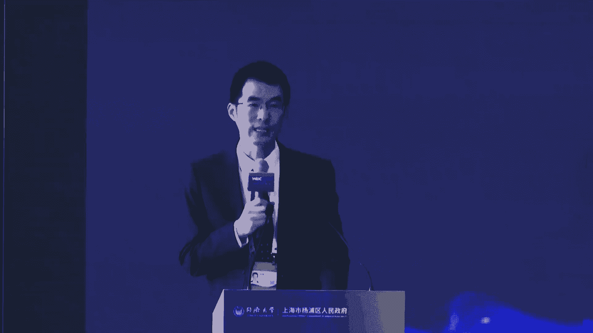

# P25：20240705-智能社会论坛——智能社会与全球治理框架 - WarrenHua - BV1iT421k7Bv

🎼重点企业服务包和首席服务员相辅相成，齐头并进。全新服务提能级，全力以赴优环境。

🎼让发展政策掷地有声，为招商引资加码提速，祝杨浦企业乘势而上。🎼将杨浦打造成营商环境最暖城区。🎼杨浦这个宜居一业宜商的创新之城，着力推动高质量发展，奋力推进杨浦人民城市新实践，创新发展再出发，勇立潮头。

筑梦未来。🎼上海杨浦期待与您携手。共庆。🎼尊敬的各位领导，各位专家学者、女士们、先生们，大家上午好。😊，盛夏7月。

黄浦江畔佳客云集由同济大学、上海市杨浦区人民政府联合举办的2024世界人工智能大会智能社会论坛隆重举兴。本次论坛以智能社会与全球治理框架为主题，旨在促进人工智能向善发展，造福智能社会、人类美好生活。😊。

接下来请允许我介绍出席今天论坛的各位领导和嘉宾，他们是同济大学党委书记方守恩。瑶湖区委副书记、区长周海英。上海市委网信办副主任杨鑫。上海市教育委员会副主任王浩。同济大学常务副校长吕培明。

阳湖区委常委、常务副区长倪斌。杨浦区副区长刘静元。同济大学党委常委宣传部部长端木宜文。出席今天论坛的还有10余位人工智能领域的国内外知名的专家学者、同济大学、杨浦区相关部门负责人及企业嘉宾等。

让我们用热烈的掌声对各位领导和嘉宾的到来表示热烈的欢迎和衷心的感谢。😊，接下来我们进入论坛的开幕致辞环节。首先让我们掌声有请上海市网信办副主任杨鑫致辞，有请。😊，尊敬的。方书记、周区长，各位嘉宾。

大家上午好。很高兴参加由同济大学和上海市杨浦区人民政府共同主办的2024世界人工智能大会智能社会论坛。我警代表市委网信办向论坛的举办，表示热烈的祝贺，向出席论坛的各位嘉宾表示诚挚的欢迎。

向长期支持上海智能社会治理工作的各位同仁表示衷心的感谢。中国高度重视人工智能发展和全球治理。去年10月，习近平主席在第三届一带一路国际合作高峰论坛开幕式主旨演讲中提出了全球人工智能智力倡议。

主张坚持以人为本，智能向善，支持形成具有广泛共识的全球人工智能治理框架和标准规范。今年5月，习近平主席在法国进行国事访问期间，中法两国发表了关于人工智能与全球治理的联合声明。在昨天的开幕式上。

李强总理指出，人工智能发展迫切需要各国深入探讨，凝聚共识，共抓机遇，共克挑战。中国愿与各国一道推动人工智能更好、服务全球发展，增进人类福祉，共同走向更加美好的智能未来。人工智能全球治理上海宣言也强调。

只有在全球范围内的合作与努力下，我们才能充分发挥人工智能的潜力，为人类带来更大的福祉。人工智能问题正超越单纯的科学技术，成为国际社会的重要议程，也是中国积极参与完善全球治理体系改革和建设的重要领域。

由同济大学和杨浦区共同举办的智能社会论坛，今年已是第三届。今年的主题是智能社会与全球治理框架，相信通过政府高效的久久为公、持续合作发力，将为我国智能社会建设和参与人工智能全球治理。

贡献更多理论与实践相融的路线图。杨浦区是国家创新型城区人民城市重要理念的首提地，也是全国唯由政效联合申报的国家智能社会治理实验综合基地。自2021年基地获批以来。

杨浦区联合同济大学通过聚合多主体参与整合多学科力量，共同致力于智能社会治理的探索与实践，取得了丰富的研究与实践成果。在国家网信办等8部门联合组织的基地中期评估中。

杨浦区入选工作进展明显成效突出的综合基地名单在全国基地中名列前茅。期待杨浦基地能继续紧跟前沿方向，丰富场景建设，在超前探索智能社会治理的实践道路和运行模式上取得更大进步。那么借此机会。

就国家智能社会治理实验基地建设谈几点想法与大家讨论，一是加快推出服务治国理政的实验成果。强化研究主体力量，围绕大模型等人工智能前沿技术应用，挖掘典型场景，提炼经验成果，总结共性问题。

研究社会影响、探索标准法规提出政策举措。二是加快落地人工智能前沿技术应用，充分调动实验基地技术主体应用主体的积极性，强化正效企联动，结合地方实际在城市管理、教育、养老、卫生、健康、体育等特色领域。

开展人工智能、前沿技术的应用，形成一批特色应用场景。三是强化成果交流和国际合作，加强智能社会建设宣传，营造良好社会氛围。鼓励民众参与治理实践，积极推动国际合作，推动建立多边形协同共治的机制。

把伦理准则、行业规则、技术标准和治理技术等纳入国际治理框架，向国际社会传播好中国方案。那么最后我预祝论坛取得圆满成功，谢谢。谢谢。😊，请入座。再次感谢杨新副主任的精彩致辞。

接下来让我们有请上海市教育委员会副主任王浩致辞。有请。😊，好，尊敬的方书记、周区长，各位嘉宾，大家上午好。人工智能必然融入社会。赋能千千行百业，人工智能呢也是我们上海着力发展的三大先导产业之一。目前。

全社会正在从算力数据等方面，促进人工智能、科技研发和产业发展。刚刚闭幕的全国科技大会国家科学技术奖励大会两院院士大会上，习近平总书记指出。

加快新一代信息技术、人工智能、量子科技、生物科技、新能源新材料等领域的科技创新。教育呢也积极融入人工智能应用的时代潮流。环近平部长强调，教育要主动拥抱智能时代。

把人工智能技术深入到教育教学和管理的全过程各环节。作为一种具有社会属性的技术，在给经济社会发展带来巨大红利的同时，人工智能也存在着诸多风险挑战。人工智能治理成为世界各国共同面临的重大课题。

继需通过对话合作凝聚共识，推动人工智能朝着科技向上的方向合规发展。去年10月，中国国家主席新习近平宣布全球人工智能治理倡议，围绕人工智能发展、安全治理三方面，系统阐述人工智能治理的中国方案。

得到国际社会的高度评价。早在2021年，上海市教委呢就委托同济大学成立了上海人工智能社会治理协同创新中心。经过近三年的建设，协同中心，立足于国家战略需求，积极阐伐上海实践，充分协同创新。

开展了人工智能相关的法律伦理和社会治理问题研究和社会服务。为国家和我市人工智能可信、向上发展贡献智慧。中心作为同济大学校内人工智能这个新平台呃，参与了国家智能社会治理综合实验基地的申报和建设。

在趋效协同方面进行了更为紧密的探索，成绩斐岚。在这个论坛稍后的发布环节呢，我们会看到相关的技术系统系列丛书和研究报告的重磅发布。这些努力为人工智能、上海高地，尤其是规则供给高地的建设贡献了力量。在。

大模型研发和应用加速推进的背景下，如何有效开展智能社会治理，以善制，促进善制。这里呢提供三点建议呢，供大家一起来探讨。第一。妥善平衡治理和发展。全面深入讨论人工智能发展安全和治理问题。首先。

科学认识人人工智能的风险特点，探索更科学的风险管理体系。其次，更新治理理念，落实敏捷治理，开展成效评价与社会实验活动，为推动人工智能的产业发展及其社会应用贡献智慧。第二。深入应用场景。探索治理规则。

首先要关心人民的真实需求，深入具体的应用场景。我们拥有全世界最为丰富的应用场景，为提炼治理路径和经验提供了可能。其次。人工智能技术治理需要国际规则，搭建开放包容、平等参与的国际学术交流合作平台。

积极参与人工智能全球治理进程。第三，百年大计教育为本，人工智能科技和智理人才的培养是支撑人工智能发展的根本力量。首先，人工智能的教育需要从孩子抓起。2024年2月20日。

教育部办公厅的正式公布了全国首批中小学人工智能教育基地名单。上海呢也有6所学校录围其中。呃，在整个全市中小学人工智能教育的推进过程当中呢，我们也在做一些整体布局。

下阶段呢我们会根据现在面上一批试点校探索研究的基础上呢，会尽快的普及中小学人工智能的课程教学。其次，发挥高校的学科优势和育人功能，在政府高校和企业更大范围协同创新，联合培养卓越卓越的人工智能人才。

各位嘉宾，人工智能社会治理议议题宏大，影响深远。呃，我们大家共同这个责任在肩，让我们一起努力。为推进智能社会治理事业的发展贡献更大的力量。最后，感谢本次论坛为我们提供了宝贵的交流机会。

祝各位嘉宾在沪工作愉快，身体健康，祝大会圆满成功，谢谢大家。谢谢，请入座。😊，感谢再次感谢王浩副主任的精彩致辞。下面让我们掌声有请同济大学党委书记方守恩致辞，有请。😊，尊敬的海英区长王浩主任杨新主任。

各位领导，各位专家、女士们先生们。大家上午好。今天，同济大学与杨浦区人民政府联合主办的2024年世界人工智能大会智能社会以全球治理框架论坛。再次举行。我谨代表同济大学对各位的到来表示最热烈的欢迎。

也借此机会对各位长期以来给予同济大学的支持关心帮助，表示最衷心的感谢。当前。人工智能技术的快速发展，对全球经济社会发展和人类文明进步产生深远的影响。同时也将带来难以预见的各种风险和治理的挑战。

去年10月18日，习近平主席在第三届一带一路国际合作高峰论坛开幕式主旨演讲中提出了全球人工智能治理倡议。就各方普遍关切的人工智能发展和智力问题提出了建设性的解决思路。贡献了中国智慧和中国方案。

今年3月21日，联合国大会通过了首个关于人工智能的全球决议。题目是抓住安全、可靠和值得信赖的人工智能系统带来的机遇，促进可持续发展。这项决议汇聚全球的智慧。为人工智能的治理。确立了全球的共识。

具有里程碑的意义。在过去的两年里，同济大学与杨浦区人民政府连续两年举办世界人工智能大会智能社会论坛。邀请了众多国内外专家。报告人工智能治理前沿发布了一系列重要的研究成果，受到了联合国教科文组织的关注。

并取得了广泛的社会影响。学校与杨浦菊共同打造的国家智能社会治理实验综合基地，是上海唯一入选中央网信办等8部8部门公布的10家国家智能社会治理实验基地名单的。综合实应基地。

也是全国唯一的郑校企联合建设的实验基地。经过近三年的建设，实验基地建设成效在中期考核中名列前茅。打造了上海市智能社会治理的示范和样本。为人工智能赋能国家治理体系和治理能力现代化建设提供了生动的场景。

近年来，学校将人工智能赋能战略作为学校高质量发展的重要战略举措。一系列国内外一流人工智能重大平台接连落户同济大学。我们依依依托同济大学建设的上海自主智能无人系统科学中心。

是国家人工智能上海方案的重要的内容。在此基础上，学校实现了。首批标杆。自主智能人系统全国重点实验室。自助智能能系统前沿科学中心、自助智能系系统基础科学中心。人工智能国家产教融合平台等一批。

这个国家级的这个呃。研究和产教研的这个。平台。呃，可以说我们基本上把这个。全国的各个领域的这个各个部门呢这个相关的平平台啊拿全了已经啊。这个这样是推进了嗯这些平台的这个建立啊。

推进了学校人工智能赋能教育科研的一个建设。在加强人工智能基础研究和前沿科学攻坚的同时，学校也加强了人工智能赋能城市建设和社会治理的应用研究。有同济大于牵头建设的中国上海数字城市研究院。

上海新城建设研究中心、上海紫数研究院等将目光。聚焦在超大型城市，在数数字性转化数数字化转型中的理论问题和技术问题。为城市数字化夯实数字底座标准规范。助力上海打造国际数字。制度。依托同济学建设的上海是。

人工智能社会治理协同创领中心也紧密围绕人工智能国家重大战略需求和上海市重点产业的布局来开展人工智能相关法律伦理和社会问题的研究，打造人工智能治理的上害模式。今年5月，为加快和加强人工智能赋能力度和步伐。

学校进一步发布了全面实施人工智能赋能学科创新发展的行动计划。全面的推进智能技术赋能教育教学、科学研究。可工程技术管理服务等创新的实践。呃，今年呃我们学校9月份即将入学的这个所有的新生。

将全部接受人工智能必修课程的学习。在学校未毕业的学生啊，这个也将在他们毕业之前这个。根据需要呃，提供相应的选修课来补人工智能的课程。学校将全面加快。构建人工智能加未来教育教学的一个新形态。未来。

同济大学也将继续发挥在人工智能社会治理领域的先发研究优势和平台的优势，加强于上海市。杨浦区。政府以及其他相关产学员资源的协同，立足上海，服务全国，面向世界。

聚焦智能社会高质量发展与人工智能全球治理框架的建设，打造具有全球影响力的智能社会的协同治理。智库。致力在。研究和构建智能社会治理理论方案和技术的体系，夯实人工智能应用的标准规范。

形成创新性的政策和制度建议。建设智能社会治理人才高地等方面，发挥我们积极的这个作用。希望通过本次论坛，各位专家和学者能够分享真知灼见，碰撞思想火花，共同探讨人工智能技术的应用与治理之道。

为构建更加美好、和谐的智能社会建言献策，进一步的深化人工智能治理的国际合作与交流，为推动人工智能全球治理框架贡献我们的智慧和力量。最后，预祝我们本次论坛圆满成功，祝各位身体健康，学术常青，谢谢大家。

谢谢，请入座。😊，再次感谢方书记的精彩致辞，也让我们了解到了同济大学在人工智能领域的成就和成果。接下来让我们掌声有请杨浦区委副书记、区长周海英致辞，有请。😊。

尊敬的首恩书记党新主任、王浩主任、裴明校长一文部长，尊敬的要出院士、志强院士、苏俊院长、各位领导，各位专家朋友们，大家上午好。很高兴与大家相聚在2024世界人工智能大会智能社会论坛。固话人工智能发展。

共商智能社会治理。首先，我代表中共杨浦区委、杨浦区人民政府向出席今天论坛的各位领导和嘉宾表示热烈的欢迎，向一直以来关心和支持杨浦发展的各界朋友们表示衷心的感谢。当前。

人工智能已经成为新一轮科技革命和产业变革的重要驱动力量。抢抓新一代人工智能发展机遇，加快打造世界级产业集群。是以习近平同志为核心的党中央交给上海的重大战略任务。杨浦主动服务全国上海发展大局。

充分发挥区内科教资源优势、创新氛围活跃的特色优势，统筹发展与安全，积极推动人工智能发展行稳致远。一方面，我们加快构建以数字经济为核心的创新型现代化产业体系。重点布局、人工智能等新兴赛道。

大力营造充满生机活力的产业生态。目前，区内集聚了抖音、美团、B站、千寻位置、复旦微电子、新思科技等代表企业。以及上海数学与交叉学科研究院、中国上海数字城市研究院等功能性平台。

杨浦人工智能产业正驶向蓬勃发展的快车道。另一方面，我们积极应对人工智能对城市管理、社会治理带来的潜在挑战。与同济大学合作，共同打造全市唯一的国家智能社会治理实验综合基地。

超前探索面向未来的智能社会治理体系，推出了一批基层治理典型案例，城区智能场景建设及数字化转型取得新发展新突破。面向未来，杨浦将着力打造人工智能产业新高地。

坚持大学校区、科技园区、公共社区、三区联动的核心理念。聚焦锤雷大模型、芯片设计、智能算力、巨深智能等前沿领域，不断优化政策服务，开放更多应用场景，促进产业需求与基础研究的精准对接。

让更多科研之花结出产业之果。杨浦将用心开拓智能社会治理实验田，秉持科技向上理念，与同济大学进一步深化合作，在合规服务、数据交集交易、人才培养、社会服务、基层治理等方面开展更多社会实验和探索实践。

努力为上海乃至全国提供更多智能社会治理、新样板、新经验。各位领导，各位专家，各位朋友，在大家的共同努力下，我们已成功举办两届智能社会论坛。众多国内外专家在此分享真知灼见，开展跨界对话。

贡献了一场场思想盛宴。期待大家围绕智能社会与全球治理框架的主题，在浦江之畔，再次实现思想的碰撞，迸发智慧的火花。最后，预祝本次论坛取得圆满成功，祝愿大家身体健康，工作顺利，谢谢大家。谢谢，请入座，谢谢。

😊，再次感谢周区长的精彩致辞，也希望能够让各位了解杨浦在人工智能领域所做的努力以及未来的发展前景。尊敬的各位领导，各位嘉宾，本次论坛的开幕致辞环节就到这里。

接下来让我们有请同济大学法学院副院长、上海市人工智能社会治理协同创新中心秘书长徐刚主持专题发布。有请。😊，各位来宾好，下面进行专题发布。首先发布统济大学自主研发的树脂层底座IS3基础设施智慧服务系统。

有请统济大学特聘教授土木信息技术教育部工程研究中心主任李晓军上台介绍成果，有请。🎼打造数字城市底座，富能城市全面数字化转型。🎼接下来发布同济大学自主研发的数字乘坐S3基础设施智慧服务系图。好呃。

尊敬的各位领导，各位嘉宾。呃，我今天呢给大家发布的是我们RS3呃基础设施数字底座。呃，这个这个视这个数字底座呢是我们同济大学呃呃，朱和华院士团队啊经过。有没有。是PPT是。是是我放还是。这个说。呃。

这个数字底座是同济大学，我们这个20余年的工程数字化实践的这个呃积累研发的这个一个自主的一个数字底座。那么这个数字底座的目的呢是为了能够支撑传统的物理的基础设施，能够快速的改造成为数字的基础设施。

在这个数字基础设施之上，我们可以构建各类插拔式的应用来支撑数字治理数字经济和数字生活的各类的应用。那么这个数字底座的主要的特点呢是它基于的是我们采集处理啊，表达分析决策的信息流的第一的原理。

具有通用性、专业性和生态性的三大创新的这个特色啊，那么这个数字城的这个底座呢，是我们同济大学联手啊我们上海数字城市研究院啊，那么它主要的这个特点呢，就是说我们这个数字的这个底座呢，能够把我们的基础。

设施变成的数字的一个版本之后呢，能够在上面服务于我们高效的这种城市的数字的治理啊，城市的数质的这个经济以及城市的数质的生活。那么接下来呢举几个典型的案例。第一个案例呢。

就是说上海的这个地铁的这个建设的风险管控。那么基于这个数字底座呢，可以把它快速的啊搬到网上能够进行这个风险的及时的这个管控和技能的数据的挖掘和分析。还有呢基于这样的一个数字底座呢。

可以实现我们整个城市的地下空间的啊精细化的评价，帮助我们来发现城市哪里有风险，哪里建设的时候，风险比较高，要进行及时的这个规避，为我们规划提供决策的支撑。那么这个数字底座呢第三个案例呢。

就是可以帮助我们城市的啊这个呃风险管控。比如说我们的城市的这个啊这个韧性啊这个地震来了，这个韧性啊，在哪里还有一些。缺陷啊，可以帮助我们来做城市的这个灾害的这个模拟和韧性的评价啊。

那么同样的这个数字底座呢也可以帮助我们来做这种啊高速公路的这个呃主动的这种孪生的管控。还有呢能够在我们的生活方面呢，比如说我们的呃公园啊它的舒适性。它的油气的这个指数，可以随时的来告诉我们啊。

那么呃我们最近呢也在用这个数字底座呢来打造一个我们同济的这个数字的校园啊，这个校园呢是呃构建了一个三维的一个实景的一个场景。

然后联合了我们学校的土木建筑测绘交通电信各个呃专业来打造学载同济车载同济数质防灾以及绿色同济这样的一个应用。那么这个应用呢能够为我们呃学校的这个精细化的治理呢，提供技术支撑。

为我们高质量的人才培养呢啊提供一个创新的一个。题啊，那我的介绍就到这里啊，谢谢大家。😊，好，谢谢李教授的介绍。😊，下面发布的是艾森哲和同济大学联合编制的负责任人工智能风险管理指南。

有请艾森哲到中华区法务及政府事务总裁高文胜和同济大学上海市人工智能社会治理协同创新中心研究员朱月一同上台介绍成果，有请。🎼防范人工智能潜在风险，促进人工智能向上发展。🎼接下来发货。🎼艾桑哲。🎼同济大学。

🎼任何编制的？🎼负责任人工智能风险管理指南。对，感谢大家，非常荣幸今天可以一起发布指南。正如昨天发布的凝聚全球共识的人工智能全球治理上海宣言所说，企业研究机构、社会主体个人。

要根据自身的角色去发挥各自的定位和作用。要加强人工智能的监管和问责机制的建设，要促进人工智能的合规使用和责任承担。那也就是说，今天来发布负责任的人工智能风险指南是在最合适的时间，最合适的地点。

我想也是前瞻到了一个最合适的题目。那接下来我也将时间和舞台交给高总该由您来详细展开，谢谢朱老师啊，各位好啊，很高兴今天有机会在这边跟大家进行一个分享。那么呃。我们知道这个呃从这个。什么是负责任人工智能？

我们要先从这个这个话题再再讲起。那么。艾胜哲认为，我们负责任的人工智能，它不仅仅是一个技术的应用。那么它也是一种涵盖了应用设计。啊，模型适配跟使用啊部署跟维护的端到端的这么一个实践。

那么负责任的人工智能绝不是一个单一的技术问题，或者是道德伦理问题，更不是单一的企业的法务的合规问题。而是一个系统性的涉及到企业每个人未来如何看待和应用人工智能的问题。用好了它可以帮助企业合规。

促进对于技术的信任，带来业务的创新。但是用不好的话，则有可能给企业给个人都带来伤害。那本质是促进人跟机器之间的协作和信任。那么了解了这个什么是负责任的人工智能以后呢。

接下来我们就需要非常精准的去理解人工智能风险的分类和分级，并有针对性的对其进行管理。那么这两个内容呢，也是我们这一份指南的这个重要的组成部分。

那么艾森哲的全球的呃最新的这个调研显示97%的受访的高管认为自身的企业将受到AI相关监管法规的影响。77%啊，这些高管是将AI的监管列为这个优先的事项。另外还有80%的受访者认为啊。

他们将投入10%或者更多的AI的总预算，以满足未来的监管的要求。那么在指南中呢，我们就将这个人工智能风行的影响分为了三个层面啊，包括对人的影响。对组织的影响以及对生态的影响。

那么为了更好的去管理这些风险呢，我们会建议企业啊像就像这个PPT显示的，用4个维度去负责任的进行人工智能风险的管理。首先，企业应该确保本身要合法合规，遵循相关的这些法律的规定。其次呢。

企业也应该明确负责任的人工智能的这个原则，并且将其嵌入到人工智能系统和开发流程中。第三，企业应推动领导层将负责任的人工智能提升为其关键的业务的要求啊，并且为所有的员工提供这个培训。

那么最后企业应该建立透明的健全的可持续的人工智能的文化，确保每一位员工都能够理解并实践、负责任的人工智能的原则。那么从这四个维度入手的话呢，我们认为企业就可以更加全面的识别。与管理人工智能的风险啊。

使人工智能的技术应用啊更加的负责任。那么在具体的实践中呢，我们是根据企业应用人工智能的成熟度，将这个企业化成的三类。大家可以看得到，从这个AI的领军探索者，呃，还有一类是这个AI的创新建设者。

以及另外一类是AI的实践的起步者。那么在指南中间，我们对于每一类的企业都提出了相应的这个建议和行动方案。那么呃比如说AI的领军探索者，他应该全面的遵守当地的法律法规。

积极的参与推动AI的合规标准的这个制定并建立完善的AI的这个治理的体制。而AI的实践起步者。那从另外一方面则应该初步的制定负责任的AI的这个企业的原则，并且进行相应的这个风险评估。于志们先生们。

人工智能的发展离不开我们的共同的努力啊，负责任的AI不仅是企业的责任。呃，政府也需要加强监管和创新的这个支持。那么学界的话应该是深化跨学科的研究和人才的培养。社会组织要激发公众的参与和监督。

专业服务机构则应该提供专业的咨询和技术支持。通过这种多方协同治理，才能够有效的应对AI带来的挑战，实现科技向上的未来。那么最后也是感谢各位的聆听和支持，让我们携手并肩，共同迎接人工智能的时代的到来。

推动科技向上，造福人类社会，谢谢大家。好，也感谢两位的呃这个介绍。🎼那么下面发布同济大学开发建设的全球人工智能治理数据库，有请上海市教委副主任王浩、同济大学党委常委、常务副校长吕培明一起上台。

共同启用数据库，有请两位。🎼请两位领导把手放在屏幕上启动。正式的上线启用，请入座。接下来要发布的是。同济大学、上海市杨浦区国家智能社会智力实验综合基地等单位策划出版的关于人工智能伦理法律和智能社会治理领域的系列丛书。

这个丛书呢总共有12本。我们一次性发布。有请同济大学党委常委、常务副校长吕培明、杨浦区委常委、常务副区长倪斌一起上台，为新书揭目发布。有请。🎼好，请两位领导为新思揭目。🎼我们也祝贺这些新书的。😊。

🎼请入座。最后发布。上海市杨浦区十大垂类大模型应用场景需求榜单。🎼请看大屏幕介绍。2024年，人工智能发展迈向强应用阶段，发力点逐渐由通用大模型转向行业大模型。🎼杨浦区积极抢抓新一代人工智能发展机遇。

以人工智能驱动形成新智生产力，全力打响杨树图品牌。🎼为推动人工智能大模型赋能千行百业。🎼日日催生未来产业新模式新业态。杨浦区现发布垂直行业大模型应用场景需求榜单，向全社会揭榜挂帅。

🎼面向海量影音内容的精准分析和高质量生成需求，中企文化娱乐场景大模型落地方案。🎼面向传统制造行业的智能化升级转型需求，征集智能制造场景大模型落地方案。🎼面向教育行业的智能化教学和个性化学习需求。

争取智能教育场景大模型落地方案。🎼面向医疗服务行业的智能化升级转型需求，征集智慧医疗场景大模型落地方案。🎼面向生活服务领域的大模型，精准营销需求，征集生活服务场景，大模型落地方案。

🎼针对建筑设计与审图效率低、建筑管理成本高等问题，征集建筑设计场景大模型落地方案。🎼针对法律信息获取难、案件分析、耗时长等问题，征集法律服务场景大模型落地方案。🎼面向金融领域的交互服务与风控需求。

征集金融风控场景大模型落地方案。🎼面向跨境贸易中，海量通关文件种类多、时效高等需求，征集智慧物流场景大模型落地方案。🎼为解决时空智能分析精确性与适应性等难点。🎼征集智慧交通场景大模型落地方案。

促进人工智能和实体经济深度融合。🎼为钢质量发展注入强劲动力。🎼未来无限等您接榜。🎼从这个介绍当中，我们注意到这十大应用场景涉及的领域非常广泛，这也是得益于杨浦区有着丰富的科教资源、良好的创新生态。

以及多元的数字经济和城市数字化转型的实践。下面有请上海市委网新办副主任杨新，杨浦区副区长刘静元、同济大学党委常委宣传部部长端木一文一起上台正式发布需求榜单。有请各位。🎼请各位领导把手放在灯光柱上。

🎼启动。🎼感谢各位领导，请入座。😊，我们也欢迎大家能够持续的关注同济大学和杨浦区在智能社会建设领域当中的很多的这一个努力和活动。那么专题环节，专题发布的环节到此结束。下面有请同济大学法学院院长。

上海市人工智能社会治理协同创新中心主任蒋慧林教授主持主旨演讲环节，有请。

尊敬的方书记、周区长，各位领导，各位嘉宾、女士们、先生们、朋友们，大家上午好。今天上午的智能社会论坛呢，我们是邀请到了6位重量级的嘉宾。呃，为了节约时间呢，我在这儿就不先一一的介绍啊。

各位嘉宾的简历啊情况呢，在那个会议手册里面都有，大家可以查阅呃，而且呢因为为了节省时间哈，呃，我在中间呢就不做这个过渡性的评论。那么最后有时间的话呢，我再啊做两句点评。如果没有时间。

我们就后面就转到后面的圆桌对话，纪伟东老师主持的环节，因为今天时间上午啊非常的紧张。😊，呃，我们的这个主旨发言阶段主止演讲阶段是90分钟。我们有6位嘉宾，这样每位嘉宾平均时间是15分钟。呃。

时间差不多的时候呢，我们会有那边的工作人员呢会友情提示，大概剩3分钟，剩1分钟。好。那下面呢我们就有请今天发言的第一位嘉宾。

他是欧洲科学院院士、国际电器电子工程师学会会士、西湖大学人工智能讲席教授金耀初教授，有请金教授。🎼好嗯，那么呃各位尊敬的各位领导，各位专家，各位与会者呃，我叫金耀初，呃，是西湖大学呃人工智能的讲学教授。

那么很高兴有这个机会来参加这会议。嗯，那我呢是从这个就去年10月份才加入西湖大学的啊，那么之前是在德国比勒菲特大学做这个红宝人工智能这个抢学教授。呃，我们从2017年开始呢。

就从事一些有关隐私保护和安全的这个方面的研究啊。那么呃后来呢也很偶然，20去年的4月份呃在比勒菲尔德大学的时呢。

就代表这个德国的这个中小型企业在柏林参与了一次这个这个AIact这个在在在在你讨你你你这什么就在讨论过程当中的一个研讨会啊呃。

所以呢就是我今天呢也呃给大家呢来分享一下我的一些有关人工智理方面的一些这个见解个人的一些看法。呃，但是呢首先我不是人工智能治理的专家，所以讲的有什么不对地方呢，请多批评指正啊。好。

那么这个是我大概今天的这个汇报的这个呃这个内容啊，就先稍微简单的讲一下人工智能历史。然后呢，我们再探讨一下人工智能到底哪些风险和目前已有的一些技术上的一些呃对对付这个这个对付的方法是吧？

然后呢再简单讲一下呢，就我们目前世际上阻碍的一些国家，特别是呃欧美中呃三国家对人工智能治理方面的一些目前已有的法规呃，那么大概比较一下他们有什么相同点和不同点。那么最后呢。

我讲一些自己的一些呃这个这个建议。呃，人工智能其实呃大家都可能现在是非常这个呃可以说是家喻户晓是吧？它的历史可能可以追溯到这个上个世纪的呃17世纪的这个中期啊。那么他经历了三起两落是吧？三起两落呃。

有两个所谓的冬天。那么大家都可能听说了是开始正式提出人人工智能这概念是在55年，那么是为了56年的一个人工智能的研讨会啊，是在美国。呃，那么我们也看一下这个就是55年提出以后呢。

呃这个人工智能很就是很热了啊。那么马上啊就是这是1956年提出的是吧？那么到了1970年左右呢，就经历了所谓的一个第一个冬天。呃，其实这个冬天的原因是呢也是非常简单啊，当时最流行的人工智能的模型而。

且感知器。他只能解决一些比较简单的问题，就这本书呃分析的啊，就所所谓的简单问题，就所谓的线性可分问题。大家看右下角，如果两个不同的东西，两类不同东西能用一条直线就能分开来的，那就是线性可分。

那最早人工智能模型只能解决这样的问题所以当然被这本书指出来以后就是哎这不行，所以呢就马上进入冬天了是吧？那么1986年的时候呢迎来了人工智能第二个春天。

那么当时主要就是呃主要的原因呢就是我们把这个最简单的感知器呢中间加了几层啊，加了一两层，那就叫多层感知器。那这个也是啊有我们现在非常热的是图灵讲获得者，包括啊在内的几位专家提出来的。

虽然之前啊已经有人曾经提出来过，只是没引起注。好，那么。我们呃这没多少年啊，1995年左右又来了一个第二个冬天啊，这个也是刚刚我在浙大开始读博士的时候，我们在用神经网络来做些解决一些控制问题啊建模问题。

没多就发现哎，这个是人工智能没人喜欢做了。那么这个原因是什么呢？因为。当时的统计学习方法啊，就我们将比如像和所谓的叫核函数方法或支持下来这样的一类统计学算法呢。

在性能上啊完全压倒了这个当时的有一层或两层这个隐含层的神经元的模型啊，所以呢就又神经网络又没人住了。呃，那么这直到一2007年啊，亨腾又在这个本期刊上啊就发表了这个所谓的深度学习的网络。

那么这深度学其实就是前面这个一从一层两层开始，它中间加了很多层是吧？所谓的深度就这个意思但是当时发表这个文章以后并没有引起太多的注意啊，直到20直到这个2012年啊一个深度学习模型的一个变形叫ex啊。

他在这个一个一次竞赛当中啊完全打败了这个统计学习的方法啊，才有在学界啊，在人工智能学界引起了重视啊，从那个时候开始呢，我们基于人工就神经网络的方法呢又又开始获得重视。好。

那么真正在社会上引起人工智能对大家特别影响大的。就是可能大家有回忆起来的话，就是2016年是吧，谷歌提出来的这个一个算法。

它能够战胜当时的一个韩韩国的这个围棋高手啊那么到2017年他又推出了一个新的版本，就是前面这个版本是要为他很多很多的棋谱，可能上亿盘棋谱。但到后来这个主叫的话，他不需要为他起谱了，就不需要为数据了。

而是让两个这个算法自己相互不弈。而最后他这个性能的话比为棋谱的还更好是吧？所以这是一个很大的这个进步。那么第二次这个大的冲击是吧我们第三次人工智能这个高潮，第二次大冲击可能就是这个GPT的。

可能大家都非常清楚了呃那么他的这个之所以让我们惊奇的原因呢，就他的对话的流畅性因为这个对话这种软件本70年代就有没有引起我们太多注意，但是彻底让我到震惊啊。

因为是他这个流畅性非常好人在对话啊那么从此以呢这个模型大家知道就飞速发无数多的大模型。那么另外一个很重要情可能今年年初是吧大家都知道这个我不知道这个能播放吗。哎呦，好像不行。

怎么样才能播放这个东西不太清楚啊。因为我想不会的原因实际上其实呃这个说了这个出现的这个视频啊虽然是非常的惊艳是吧？但其实如果你仔细看，你如不要只是看他的人脸啊，你仔细看的话。

其实下面是有很多这个这个这个这个问题在里面的，但是很可惜这个放不出来。这也是就是对我们在这个人工智能发展一个很简短的历史啊，那么现在这个大模型出来以后，可以说大家每个人都谈大模型，做人工智能。

如果不做大模型，觉得你经不做人工智能的。那么大模型的话也有很多很多的探讨。那也有很多呢很乐观的说哎马上我们这个这个通用人工智能出来了，这个我们有非常就是甚至比人也要聪明的是吧？这是乐观的一种想法。

那么也有一些悲观的想法，就他人工智能会不会统治人类会不会取代人类是吧？有这样两种不同的观点。那不管怎样呢，就是我们一需要对人工智能啊，因为高速它的高高速发展所带来的一些社会经济的重大的影响啊。

因为它几几乎涉及到所有的领域是吧？所有的领域。那么目前的话，如果我们要总结人工智能有什么风险的话，那大概有这么几类，一个就是安全性。第二个呢隐私保护是吧？因为隐私的话。

为我们人工智能是依赖于很多很多的数据。还有个呢就是公平性啊另外呢像像透明性啊以及可解释性，还有呢就是鲁班性啊可靠性，最后呢就是责任性和可问责性。

后面稍微再探讨一下那么什么为什么要讨论这个人工智能模型的安全性深度学习的模型非常强大？大家可能知道就说有的时候两张人脸人都分不清楚，他能够分清楚同时呢他又非常的脆弱。也就是说你人不会犯的一些错误。

绝对一看就知道的问题他可能就就会犯错，这里个经常用到的一个例子是就左边大家看到。大熊猫是吧？然后呢，如果你在这个图片上加上一点噪噪声，那么变成右边的图像，那么我们人眼一看还是个大熊嘛，对吧？

但是深度学习模型可能就完全把它看当做另外一个动动物来判断。所以就说深度学习的模型很脆弱啊。那么怎么来呃这个对付这个它的脆弱性，当然有很多研究。

现在很多就说如何来设计好的深度学习模型来避免呢呃他这个这个这种对一些很小的呃变化就能呃犯大错的一这个这个方法。那么第二个呢就是风险就是隐私了啊，那么隐私的话，因为我们依赖大量数据是吧？

所以呢这个数据里面呢往往会有很多这个个人信息也好，或者企业的一些重要的经营信息也好。那么这些信息的话，如果你泄露理话，当然就会造成很大的风险。

那么隐私计算的就如何来保护隐私要用到这些数据那么有很多方法传统的空间安全的一些方法，像多方安全计算或者查分隐私以及加密等等。那么现在流行的叫这个联邦学习啊，那么这些都是一些技术性的方案来保护数据的隐私。

同时呢又能够充分利用这些数据的这个价值，就是既能打破这个数据孤岛又能够这保护这些数据的这个这个隐私。那么第三个方面呢就是它的谓叫鲁性或者可靠性为什么呢？因为人工智能模型的话。

有时对这些不确定性或者噪声输入的信息的噪声比传感。信息的噪声非常敏感。那么怎么来处理这些也有很多的技术方案是吧？比如说我们来把这个数据质量啊，那个清洗数据，那么提高数据质量。

或者呢在机器学习的方法上啊进行一些这个改变，使得呢这个模型呢不对这些噪声呢特别的敏感。呃，那么我呢就不详细探讨这技术的方案。还有一个很重要的问题呢，是就是所谓的公平性是吧？呃由于这个多方面的原因。

人的一些我们人有些天然会一些可能一些偏见是吧？然后呢数据上呢也有会一些偏见。那么这样造成或者是模型训练上一些偏见呢，会造成这个我们人工智能模型啊，如果你要基他作为一个决策话，他可能也会有偏见。

那么如何来保证这些人工智能模型在决策过程当中能尽量的公平有很多很多的方法啊，那么在我们数据的处理也好，或者是模型训练也好，后处理好等等啊。那么其实在公平性其实非常难的啊。

因我举一个简单的例子一方面它涉及到多方面不只是一个技术的问题，因为你的公平性怎么来定义，其实涉及到很多文化社会等等各方面的这个习俗等各方面的这个因素。另外呢这一个很简单例子的话。

比如说我们这两类啊这个是表示男性和女性，然后呢这个是这个就说有两种肤色。假设啊那么他有多少人被。聘用了。那么如果你只是去看单纯某一类的话，呃，就只看男性或女性啊，或者只看肤色，哎，觉得很公平嘛。

都各招了3个是吧？但如果你把这两个合在一起看的话，其实还是有很多这个偏见在里面啊。呃，第四个要探讨的就是我们这个叫人工智能模型的这个叫可解释性或者叫透明度啊。那么这个可能大家也都听说过呃。

有一个很有趣的现象，就是说人工智能学习啊学的很好。但到你我们不知道他在学什么，是吧？他学的是这个因果关系，还是学的是相关性，还是一种完全是一种一种假象，或者是一种很偶然的现象。呃。

那么到有有是也非常有意思啊，这这个这个实际20纪初是吧？呃，有个叫叫叫叫叫做聪明的汉师，就这匹马可以说他会做数值运算，后来发现其实并不是他只是会察言观色而已啊。那么还有很多些其他的这个技术方案。

因为时间原因呢，我也不讲了，这就是一个因果关系和相关性的一些区别。就是同样天气横热是吧？然后这个冰淇淋销售很厉害很多啊，但是呢另方面你可能晒晒黑了。

那么这样的话就说天气跟冰淇淋的销售量增加晒黑这是因果关系。但是呢冰淇淋的销量的增加和被晒黑这两者之间不一定有因果关系只是一个相关关系好，那么为了对付啊上面这么多的这个可能的风险是吧？

其实欧盟在很早2017年就R就出来了是吧？所以很多方面的这个这个这个规定那么其实这是一个最后第六个方面就是这个来负责任。

那么这里我把它列了一些不同的有可能是用户方用经理等等用单位开发方销售方等多可能果出了什么事情。你可能都去会找这些人啊，到底是谁的责任？呃，那么目前的话，针对所谓的上面这些风险。

其实各国政府呢已经出台了很多的规范法规啊，从2017年欧盟出台的这个GDPR开始啊，这他就提了很多对人工智能的一些要求。包括像要受人类监控啊，技术的鲁班性安全性、隐私保护啊，透明度、多样性等等啊。

还有一个问责制。

呃，最近啊20就是今年的6月份呃泰和哈佛大学MT等等一些学校呢呃在这个呃就发了一篇文章。这个文章把所有各同不同的风险做了非常仔细的分类啊，总共有320几个这个不同的分类啊非常仔细。

那这不同的分类可以分成四个大的类大概这么系统和操作风险内容安全风险社会风险以及法律全责风险。那么这个分类的目的是为什么呢？

主要是他想分析啊中欧美三国目前已有的人工智能法规对到底cover了哪些就涉及到其中哪些啊所以分析的非常详细。大家如果有兴趣可以去看看。

那么比如像这是欧盟是吧大家都知道这个2017年和今年刚刚通过的AI这个这个法规是吧？那么他当然他有一些这个特殊的地方。我们如果回顾一下看看三个国家。这些不同的法规既有共同性，也有一些不同的侧重点啊。

那么这是美国和中国的啊，也是这样，就是有些共同的观点的点，也有些特殊的自己关心的地方啊，那这是就三个国家的法规所共同的地方啊。好，那么我最后的话呢，利用可能一分钟左右的时间呢。

就是来来探探讨一些我自己的一些看法。首先就是说到底要我们规范什么东西，什么是人工智能。其实这个定义不是很清楚。特别是在一开始欧这个欧盟这个法规刚出来时。

把几乎所有的传统的相控制优化等等技术都把它归到人工智能里面去啊。那么其实它的影响的面积非常大。那么如果我们在法规在这个在这个涉及面太广之后，那么就会影响一些中小企业对人工智能的发展啊，第二个呢不好意思。

稍微用半分钟时间啊。那第二个呢就是说我们到底要规范什么东西啊我我个人觉得就是应该规范人工智能的产品以及这个这个应用啊，呢应该更多而不是呢规范人工智能的技术。呃，最后的话呢就是我们其实对呃人工智技术啊。

其实还有分成分类是吧？也特别是些高风险的，包括像深层式模型啊，或者是非常高度的自主的人工智能算法啊，以及一些通用人工智能。那这方面呢可能带来的风险会比较大，我们可能是以我们需要规范的一个重点啊。

那么我今天就分享今天就分享这些呃，谢谢大家呃，对，还有一些这个因为时间关系我就不多说了啊。以后如果有哪位这个这个参与与会者有兴趣的话，我们可以在线下讨论，谢谢大家。好，非常感谢金教授的精彩演讲。

高度浓缩，时间不太够了。我们下来以后再跟金老师请教。😊，好，因为呃。我们的议程呢做了一点小小的调整。那么第二位发言的嘉宾呢是。

中国工程院院士、德国国家工程科学科学院外籍院士、瑞典皇家工程科学院外籍院士、同济大学原副校长吴志强教授，有请吴院士。

🎼这个因为后面全国的那个我们城市规划的专家也在聚在上海啊，我一定要过去，我是主持人。所以呢我把呃和会议啊做一个这个这个调整啊，这我先讲掉呃，非常重要这件事情啊。

这个我们同济和杨浦啊专门做这个啊社会治理这块内容的啊这么一块一块探索吧。我觉得特别重要。所以我呢把自己的研究啊，在为今天的那个会议专门做了一个特别的啊炮换这个报告呢就叫社会智能啊，关于嗨主义的啊破题。

实际上是做了那么多年实际上呃在2014年啊这个全盘呢把城市规划导入这个AI的推进，也就是内波的时候呢，我们的世博会就在这块场地上，实际上当时有了解释。我们当时呢世博会一天要进100万人。

所以说这个压力是非常非常大的。那个这个密度啊，这个这个温度啊都是非常挑战大。所以作为世博会总规划师呢，我就把整个世博会的每一张票全部定位的。所以说为了踩踏事件的房子呢是全部的每一个人进来啊。

这个说一件事情，大家都可能会觉得很荒唐的。这个觉得这世博会。怎么会有那么大的精力呢？就是因为有人说这个超过了一个平方米，只要1。3人不要踩踏事件。

而我们世博会这块场地上一天要进100万人就说一个平方公米要占6个人。你们知道6个人意味着什么。只要有任何事件那就是超标的你必须要超标不超标就没有那么多人啊答赢世界要破这个世界纪录的。

但是呢用这么高的密度，又是破了中国国家的规范的啊，国家规范一个平方米必须只能占一。3个人，假如要国家规范又是要啊用的话，那就是这块世博场地呢要扩大6倍。我们不可能再扩大6倍来做这个世博场地。

所以必须要高密度要完成。在这么一个条件下，我们做了每一平方米的啊这个精准的模拟，每一张票的精准模拟，为了不踩踏世件诞生。这么样子我们就进行了大规模。我的数据的动态世博会结束以后。

12年大家说你这套办法现在有名字了，叫大数据，叫big data，现在有名字了啊，即时的用电，技时的人流啊，即时的每一个数据的统计，每一间房间的用电量。那么这个时候呢，把这套内容呢。

也就是中国工程院呢大规模来支持这套系统，就是我们的城市管理，城市的治理开始用。作为我们的啊这个这个这套内容，那么很高兴的是做了14年开始全部到今天正好十年啊，我们特别高兴的是，实际上好多好多的数据。

我们碰到了很大的问题。刚才金教授在谈这个问题。实际上是我们是真正的碰到了啊这些实实在在的国内的问题。那么很高兴的是我们中国工程院在14年成立这个课题，我在这里面16年我们给总书记写报告。

中国一定要啊注重人工智能，在我们的社会经济各个方面的啊推进的时候呢，总书记实际上是两个星期就改了很长的一个批示。那我们工程院呢就落实这个知示吧。包括我们老校长万刚。校长也是在这个中间起了很大的作用。

把中国人工智能啊这个发展报告发展规划啊rategy planning战略规划呢在16年的年底全部变完啊，这是在中国是这件事情上推进和全世界完全平。16年同时我们推出来的时候，国推出来了，门推出来了。

所以说刚才金教授说的这个三波基本上是全世界最平行的三波啊，像日本的什么都还没有到这么快翻衍。那么在这个过程中间呢，实际上事业经济啊这些问题啊都会有多很多担心的。那么我们工程院呢从头开始就同时成立了。

从技术推进十个方面我待会会说到另外一个方面呢就是我们的社会的问题的同时的这个这个这个内容呢全部同时来这个小组呢当时是放在我们的。上海大学的原来这个小组。那么这个小组因为后来上海大学的校长到了天大去了。

当校长去了。所以呢这个小组呢又被拉到那边去了，实际上这是都跟着人在走。那么这块的内容呢，我今天呢就是说一直说AI说了那么多年啊，我们这个从17年我们在全上海组织了4000人，成立了AI城市规划联盟啊。

这个在在徐汇区。然后18年就在我们这个场地开始做做到今天实际上这个AI啊，这个大家呢当时呢就都压了这个哎呀，特别好，就觉得他是一个很正式的也很重要内容。到今天呢我就想给大家把那个A区加上去。啊。

这个H什么就human啊，实际上是是人与AI的深度的合作啊，这是一定要很清楚的。实际上不是AI一个人可以完成的这个事情做了10年的实践啊，最后得出来的结论。今天给大家说第一句话就是人和AI的深度合作。

这才是未来的社会。我们要做的事情是人与AI的共同的智慧，相互之间掺在一起可以完成的是人的智慧和AI的智慧的共生和共创。这是今天啊我们特别要说的。所以我今天呢就把这个报告称为叫。害主义啊。

AI human和那个AI合作啊，才是明人类的明天。所以呢我就讲今天就讲。嗨主义的几条原则啊，讲5条原则。第一条原则就是人本互动互助的这非常非常重要的。什么意思呢？就什么事做的时候呢，所有的事情。

AI的所有推进都必是围绕着人本身的渴望，这是所有的起步。你假如说AI的本身的技术的进步，你就脱离的人本身的渴望啊。所以说这点呢可以大家可以说我们是大规模在运用了城市规划里面，大家我举个例子给大家看。

我们可以用大规模的来完成啊，人的需求，每一个治理，包括我们做的这个这个呃深圳的所有的每一个平方公里的治理的数据都完全不一样。这是我们做厦门做厦门的治理，过去我们城市规划是走上来，就说功能怎么样。

道路怎么样，哪里布局怎么样，这是我们是挖了几十万人，大家可以看。很快的数据全部收集上来以后，发现厦门人最最喜爱的是沙茶面。提高心情最快的提升是沙茶面。我们规划是过去怎么会想到沙茶面那么重要呢啊。

我们做了6个啊这个地铁站做个地铁站的时候，第一件事情就想到了沙茶面要落实不落实的话不行，深圳人啊这个这个厦门人最不喜欢的事情。我们大部分建筑过去不知道了最不喜欢的是奢侈奢靡。

我们过去一下子要做新的地铁站大理石铺豪啊，做了最最漂亮根本就不是人家根本就不喜欢这样东西啊，所以说对我们的啊这个所有的AI的推进啊，直接倒向了人心所向啊。

这是非常重要帮助我们大家可以看绍兴人臭豆腐心情最快，你们知道吗？你们不会想到的啊，大家一想到做做这个绍兴的老城的保护啊规划啊，么什么都怎么做的很精致精美。😊，对的。

但是人家心情最快乐的是臭豆腐、黄酒和快乐老家。啊，所以说你就倒回去想什么是载体，做什么事情最最重要啊，绍兴人最最吐槽的是宁波。啊啊修路啊啊等等。你就知道啊，原来绍先在想这些东西。

想这就是你在做设计的时候是完全不一样的。人情所向，我可以举很多很多这个例子，正向清取，负向清取。现在我们远远就所有的把大量的规划，人工智能用到了人情所向啊，知道每个地方人在想什么。我们做到了什么程度呢？

我们给。😊，深圳做的是每一平方公里，每一小时人的变化。就是刚才做的只是给大家看一件事情，实际上它是动态的，什么时候变化的？我告诉大家，我们做了全中国的369个城市的每周的报告动态。

全中国人人的心情变化是非常非常有规律的，在波动的啊这个疫情的时候，疫情之前。2020年之前。武汉人是整个中国中间所以最最乐观的一群，但是一封城以后，一下子掉下去20个点，清清楚楚。

上海封城掉下去18个点，非常非常清晰的波动。然后呢，疫情不稳打开，慢慢慢慢慢恢复，基本上到了2023年的中期，全中国人民都起来了，都超过了2020年的时候，唯独。武汉人还没有克服。啊，上海人还没克服。

全中国只有武汉人和上海人还没恢复到疫情之前，其他地方都恢复了，可以看到整个的心情的波动，这才是我们所有的内容啊，这个实际上数据是我们所有社会治理的根本啊，这件事情我说掉第二个嗨主义的啊。

我也可以把它用中文上海话说的就是海大海的海海主义的第二条就是要透明互信。刚才说了transparence非常重要的。讲了不能你是没有办法相信AI的啊，AI的过程要让人知道为什么是这样。

不能说你他做出来结果就这样啊，就这样不对的啊，这个要trans。啊，那么这个就是我们现在做了大规模的这个里面为什么，你要让领导知道为什么它是这样的分布的啊，这个老年中年啊，青年各个时段他们为什么出来。

这个为什么这样，这是大量的东西。比方说我们这里当然一代代做的很很快，我们已经做到第四代了。当时就说你可以看到原来的城市是这样的？我们不仅仅是做到未来的城市应该怎么样？而且未来的城市的每一栋房子里面的人。

手机数量全部推演出来，已经做到这样。但是为什么呢？你假如老不说为什么的话，这是有问题的啊，这个就是AI的很大的一个问题。刚才呃金教授说到那个点是不知道多少人知道。

就是我们小时候我们这些人在西施的教育下面导入的都是学的，就是叫因果关系。但是呢我们这里面呢实际上有很多的是相关关系啊，就相关关系要说清楚的话，你才可以说清楚。比方说这是我们做的洞外滩。

这是做的那个水的模拟推演。实际上是要做很多很多啊这个transparent的事情。第三块呢就是要安全互保。非常重要的，大家以为AI是这一个一个机器，像是要需要相互之间保证它的，要保证它的电力。

保证它的算力，保证它的从善力。善力很重要，不是算力是善力啊，这个一把刀你可以做完全是用作两件事情，也可以杀人，也可以做我们切菜啊，完全不一样的。这就是向山里保善力也是非常非常重要的这就是要大量的啊来做。

我们这部分呢保三力这块呢，我们做了城市重脑啊，在2014年15年的时候呢，我们推出这世博会里面呢，就是这个经验呢，拿出来叫城市大佬。这个概念错了，实际上是出入城市世博会里面的总控叫城市大脑。那么。

实际上做到现在又做了10年了，现在很清楚的。我们现在从两年之前我们就开始推城市重脑，一个脑子是不够的啊，就是最后所有的数据都汇到一个地方，我们世博会里面可以的汇到一个地方一个宣中心。

但是把这个模式拿到城市里做做了那么多年，我们发现我们自己再一次退出啊，城市重脑，一群大脑同时运行。啊，非常有意思的。我们这里有啊阻脑编脑扶脑端脑啊，各种大脑同时运行。

这样的话比整个过去的大脑要聪明很多很多。那么这部分呢就保证了各方参与模型，五方参与模型了以后，相互之间有自己的规律，相互之间对其他人有判断，这样就保持安全很多。

第四个原则的就是我们要相互之间互动和互控人和机器相互之间要非常互动的。实际上不是这样互动的话是没有办法保证这个人工智能。社会向前安全的前进的。所以说我们相信之间啊。

我们这是我们大量的绘制的道路和这个IP就说现在这个人的数据和相互之间的。那么我们也做了大量的自由创作自由创作的时呢，实际上是做了大量的机器的反馈啊。

就是一边生存一边大量的反馈这就是我们非常非常要注重的就是相互之间人和机器中间不是最后一个结果是过程之间有更多的交互交互才能够完成这个智能社会的个I的一个向前推进是我们现在在做的啊这个最近在做的那个啊大量的这个叫源宇宙是创造了一个城市里面人和啊自然之间青年人啊大量的这个导路的过程。

这个过程本身是有很多很多青年人一边使用一边来相互之间啊互动的看照他们的生存。他们的希望啊然后来完成啊，我们整个的创作这个操作过程找找了很多很多青年在网上共同参与。第五，最后一个原则。

我觉得论理互信是非常重要的。刚才啊金教授说了这个郑教授也是个中国人，在f德他这个做了三个啊主体，美国中国和欧洲的这个安全内容，实际上。这块东西我们之前讨论过很多很多，实际上就是论理互渔的事情啊。

真正的做的事情，我们要做大量的语域的创新，相互之间和机器啊互动，人和互保。那么这就是我把海主义的5条在主义。今天呢是呃参加这个人工智能在城市规划中间的十年。我把原来一直说AI今天呢加上一个human啊。

 human们和人互动成为海主义。海主义就是人和机器要人本互动，要安全互保，要论理互，要这个相互之间人和机器相互之间互动可控。最后要这个透明的互助。

那么这样互信的话才能够真正把这个啊这个智能社会真正的完全的推进。因为在上海，因为在这块土地上我就直接提海主义啊，上海的海。H表示人在前面AI表示我们的今天的社会的最重要的基础的推动。

h主义就是我们上海诞生的一个想法，人和机必须互动，谢谢大家。非常感谢吴院士的精彩发言，他的嗨主义让我们嗨起来，他的20个字的最后打在屏幕上印象是非常的深刻，互助互信、互保互动、互吁。😊，好。

再次感谢吴院士。下面一位发言的嘉宾呢是来自意大利的啊，加布里埃尔马智尼gabrielzi尼教授，他呢是欧盟委员会的官员，曾经呢担任欧盟人工智能法的起草小组的组长，但是因为特殊原因呢呃，马志尼教授。

他无法到现场来参会，所以他做的呢是线上的发言。下面我们请看大屏幕。Good morning。 My name is Gabrieldella Matcii。

 and I am the lead author and the architect of the Eo AI Act。Let me start by thanking。

Tongji University School of Law for inviting me to this conference。

I'm sorry I will not be able to be with you present today。

 but I hope that these remarks will nevertheless help you have a fruitful discussion。

I will spend around 15 minutes to give you an introduction about the IAC。First of all。

 a couple of remarks about the institutional architecture。 Of course。

 now we are at the end of the legislative process， but I think it may be helpful to have a sense of who does what in the new setting。

In fact， the proposal for the UI was put forward by the commission。Which is the executive of the U。

In April 2021。The proposal was sent in parallel to the Parliament and the council。

The Parliament and the council act as co legislators。

 That means that they have to agree on a common legal text in order for that text to become the law。

This took some time。The proposal， as I said， was issued in April 2021。

And a final political deal was sealed in December 2023。

Now that we have an agreement on the legal text， this text is going to be published soon。

 so indeed this conference is a very timely event。In July 2024。

 and it will enter into force in August 2024。What is important to understand is that。

The conclusion of the legislative phase。Doesn't mean the end of the work。In fact。

 a new phase opens up， which is the implementation phase。Primarily。

 implementation of U law is a responsibility of the member states。However。

 there is actually a certain number of actions that need to be taken at U level。

 notably by the commission。In particular， when it comes to adoption of guidance， delegated acts。

 implementing acts and some of these acts of tertiary legislation to be。

Adopted by the commission will also have some degree of oversight by the two arms of the co legislature。

 So the council and the parliament。First of all， a couple remarks about the nature of the EUAI Act。

It is a classic internal market legislation for the placing on the market and the putting into service of AI systems。

 in particular， for those of you that may be familiar with Eu product legislation。

AI Act introduces the C E mark。The CE mark certifies that a certain product， in this case。

 an AI system is in conformity with applicable envelope。Therefore。

 the adoption of the product legislation approach is aligned with what is called new legislative framework philosophy。

This is a type of product legislation that has been around in EU for many， many years。

 and it is premised upon a simple concept that the law provides essential legal requirements that operators need to comply with but does not enter into the technical standards in order to meet those requirements。

 therefore the AI Act will need to be complemented by a set of harmonized standards to operationalize the legal requirements。

Another important feature of the UAI Act is the horizontal approach。

This means that the I Act applies across a variety of sectors within the EU competence。

 with some exclusions， notably in matters of national security， military and defence。However。

Although the IA has an horizontal nature， a number of sectoral specificities and needs needed to be considered。

 in particularly in areas of law enforcement in finance， product legislation and so on。

 so there has been an effort on our end。To ensure that even though the I Act has an horizontal approach。

 sectorial specificities were included。Another corollary of the fact that the I Act as an horizontal approach is also the fact that it is without prejudice to other existing EUu law。

 notably in matters of data protection， you may be all familiar with the general Data Protection legislation。

 Consumer Protection law， Equ law or the law related to the Pla legislation。 For instance。

 the Digital Services Act or the Digital Markets Act。

 So an important consideration to make from the beginning that was very clear when we thought about the I Act is that the I Act is certainly not the only EU law that is applicable to EI。

One of the essential concepts。Perhaps the most important concept of the I Act is the risk based approach。

The risk based approach in substance means that。The rules of the I Act become stricter as the risks that AI systems may pose become higher。

Therefore， the focus is not on regulating the technology as such， but on regulating use cases。

 So specific usees of AI systems。We have identified four levels of risk。 in particular。

 I should say three， because the fourth one， the green one。Does not lead to any banding growths。

So we have binding rules for three levels of risk。 The first one is around risks that are not acceptable。

In these cases， the AI Act foresees a prohibition。Examples of this use cases are， for instance。

 social scoring or forms of certain cases of remote biometric identification。

To note that the commission had foreseen in the proposal， four use cases for prohibited AI practices。

 and the collegel concluded on adding other four。 So right now。

 the final law will have8 cases of prohibited AI practices。The next level of risk is for high risk。

High risk use cases take。Perhaps around 80，90% of the U AI Act， I mentioned before the C E mark。

 So the product legislation approach， which is the distinctive feature of the E U AI Act。

 And this is exactly the type of legal approach that applies to high risk。

When a system is considered high risk and therefore is subject to the CE mark。

The system is subject to a number of obligations， notably requirements。

 essential requirements regarding the AI and an exempt conform assessment procedure。

 so the manufacturer has to demonstrate compliance with those requirements。

We'll see a couple of examples later of high SI systems。The third layer of risk。

Concerns those cases where the risk is linked essentially to the lack of disclosure of information。

Examples will be cases of a chatbot where humans may not be able to distinguish whether they are interacting with an AI system or another person or forms of generated content。

 synthetic content。In these cases， the I Act foresees an obligation to disclose information around the existence of the eye system or around the fact that the content has been artificially generated。

Finally， as I mentioned。The last layer is about cases where AI systems pose minimal or no risk。

 and in that case， as I mentioned， the I Act does not foresee binding rules。

 but only the possibility for providers to apply voluntary code of conduct。

When is a system high risk？The I Act foresees two avenues in which a certain AI system can be classified high risk and therefore is subject to some of the stringent rules about the I Act。

The first category is around systems that are safety components of products that are already subject of EL Exles would be AI systems that are safety components of medical devices of machinery or toys。

 Ra equipment and so on。We are dealing here therefore。

 with the number of products that are already covered by E legislation。

 but they may have some digital components， including AI components。

 So the first way in which certain AI systems become high risk is when those AI systems are on the one hand。

 components of those products that are already regulated。

 and those components play a safety function。 So it is important this element。

 not all AI components of products will be AI high risk AI systems。

 but only those that fulfill a safety function。Furthermore。

 in order for the system to be classified as high risk。It is essential that the product as a whole。

 So the product that is regulated by the sectoral legislation， the medical device。

 the machinery and so on is subject to a thirdpart conformity assessment。

 So there is the most stringent procedure for assessing the conformity of the product as a whole to compliance with existing E law。

The second。Categories of high risk AI systems。Is。呃，When。

The eye system belongs to a number of specific areas that have been identified by the legislator。

 You see in the slide 8 areas。However， it is important to note that not the whole area is high risk。

 so therefore not all AI systems that are included in those areas are high risk。

If you look at the annex， you will see that under each area。

 there is a list of specifically mentioned。AI systems。

 So therefore are only AI systems that are explicitly mentioned in the Nex3 under each area are high risk。

 For example， in the case of employment。There is the of AI system used for hiring or promoting or terminating employees。

This is an important element to consider， because。The commission already its proposal had intended to allow for some flexibility in the classification of high risk AI systems in these areas。

By allowing the commission to add use cases。This was an intentional decision to allow the the AI Act to remain future proof。

 and therefore， to adapt。As the market and the technology evolves。

 so to adapt the use cases as the market and the technology evolves。

This is a very important chapter of the I Act， notably around general purpose AI models that has been added by the co legislators during the Le procedure。

In fact， the commission had not foreseen any rules around general purpose AI models。

We have right now， therefore， a regulation of those models that is divided into tiers。First of all。

 what are general purpose A models， So general purposepo A models are those models that are otherwise sometimes also called foundation models。

That can usually be trained on a large amount of data and can perform a variety of tasks。

 As an example would be models behind chatbos like， for instance， Ch GPT。According to the I Act。

 those models will be subject to two。D both regulation。According to the first level of regulation。

 which is applicable to all general purpose AI models。

They will be subject to a number of transparency related rules。

 in particular around technical documentation， so those models must be documented。

 including as regards the computational resources energy consumption。

There must be a transmission of information downstream from the provider of the model to the downstream provider who wants to apply the model to a specific application。

 and finally there must be compliance with certain copyright related rules。

 notably when it comes to the adoption of a policy to ensure compliance with copyright rules and the publication of a detailed summary of the content used for the training of the model。

The second category of general purpose AI models， notably those that are classified as models with systemic risks。

 are subject to additional rules。In particular， around risk assessment and mitigation。

Incident reporting and cybersecurity。An important element to understand is how a certain model will be classified as。

A model with systemic risk， given that this triggers different legal obligations。The I Act foresees。

 at least in the first moment。The models。That are trained with at least a certain number of compute resources。

 the 10 to 25 Phps will be classified as models with systemic risks and therefore subject to additional rules。

 However， this is not the only way in which those models can be classified as models with systemic risks。

 but also there is a possibility for the commission to designate models as models with systemic risks。

 regardless of the number of compute used on the basis of a number of criteria that are identified in an anex。

By the way， the AI office is part of the commission。

Final considerations is the role of the applicability of these roles to open source models。

Which is somewhat reduced in the sense that open source models are not subject to the rules around technical documentation and transparency as regards the lower tier。

And finally， another important element to take into account when thinking about the future work is that code of practice will have to be developed。

 facilitated by the Commission in order to demonstrate compliance with the rules around general purpose AI models。

A final word about the progressive entry into application， as I mentioned at the beginning。

This is really a very important time because the I Act。

 the final version of the I Act will be published in the official journal soon。

And it will enter into force20 days after its publication。However， the entry to force of the II Act。

 which is therefore scheduled around the 1st of August 2024。

 does not mean that all the rules of the II Act apply immediately。As you can see in this slide。

 there is a phase entry into application of the rules。After six months。

 the rules around prohibited AI systems will enter to forward into application。

The second set of rules that enter into application are the rules around general purposese AI models that I just discussed。

12 months after the AI Act entered into force。Then we have the third deadline， which is 24 months。

 which is the general deadline。 This applies。To essentially all other rules。

 with the exception of the rules regarding high risk AI systems that are components of products。Like。

 for instance， medical devices or machinery for those type of products。

The application of the ruins of DI Act will happen 36 months after DI Act enter into force。

Let me conclude my presentation by thanking you for your attention。

 and I wish you fruitful discussions in the prosecution of the conference。 Thank you。🎼。好。

非常感谢尼教授的权威性的讲解，虽然简短，但是让我们了解了。😊，啊，最新的欧盟人工智能法的概况。好，下面第四位演讲嘉宾是来自美国的专家，他是卡内基国际和平研究院的研究员马特西恩啊，matsh先生啊。

有请麦。Okay。那我首先要感谢那个统计大学呃，尤其是朱越教授的邀请。呃，我今天原来是打算用中文来做这个演讲，但是我今天这个内容是我这几个月一直在琢磨的呃一些初步的想法。然后那个稿子一直在改来改去。

最后那个今天早上才写好了，所以没时间翻译成中文。所以今天只能靠大家的这个英文听力，还有我们那个通传翻译的工作。So today。

 I'm going to be talking about US China dialogue on AI， US China engagement on AI。

 And I'm going to be talking both about government level engagement and non governmentn level engagement。

 what we often call track to engagement。I think most people know that this may the US and China met for the first meeting of their sort of official high-level government dialogue in AI。

 they met in Geneva in Switzerland， this was a real landmark meeting it took a lot of work to make it happen and I think it's very important you know the risks of the safety risks of frontier AI systems are a problem that is going to require the United States and China's efforts they are the central access that this is all revolving around and it's really important that we have these dialogues but I will also want to give some kind of good news and bad news on this front and I'll start with the bad news so we can finish with the good news I think the bad news is that we should have very。

 very low expectations for this government dialogue producing any kind of agreement any kind of binding agreement or joint statements on AI。

m to talk that we should not expect them to agree on very much at all。

 and that's bad news for governing frontier AI risk。

I think the good news is that we don't necessarily need。

Government to government binding agreement on reducing these risks in order to do the work of reducing the risks I think we can still a very productive engagement between the US and China just not necessarily at the government level I think we can have very productive engagement between policy scholars in both countries like we're having here today think we can have very productive engagement between scientists between companies and I think that's really going to be the backbone of ensuring AI safety between the US and China and I think the key idea here that I want to communicate is changing our mental model。

 changing our idea of what it means for the US and China to work together on safety I think there's a traditional model of this kind of thing that is a very topdown model The idea is our leaders get together at the very highest level they make an agreement about what we can do and what we're not going to do。

And then that agreement that they struck is。down into the two ecosystems。 The rules are agreed on。

 and then they're forced on each country。 It's like a， you know Tsangdao Xia， the top down system。

And I think that that for AI， especially frontier AI governance is just not realistic at all what I would propose。

 what I think is going to be a more productive model is a more bottom up model of working together on safety and I tend to call this safety in parallel so it's not safety based on joint agreements where we both make commitments to each other and we both follow the rules's where we both are developing AI systems for're working on safety techniques。

 both technical approaches and policy approaches and we're constantly exchanging views we're constantly sharing best practices between the ecosystems but we're not having to do everything together at the same time we are learning from each other but we're not necessarily striking agreements and I think that that is going to be it's a much more realistic approach I think it's going to be a much more resilient approach I think it's going to be an approach that lasts much longer given all the chaos that is politics and geopolitics today。

嗯。I think in this world and maybe the kind of a fundamental idea here is that if the US and China are going to build powerful AI systems safely。

 it's not going to be because the two leaders struck an agreement。

 it's not going to depend on a grand bargain between the US and China。

 it's going to depend on the decisions， thousands and thousands of decisions made by more working level people。

 scientists， engineers， professors， everyone advising on policy in both countries and they're going to need to make these decisions for their own reasons。

 it's not going to rely on what the other country is doing。

 they're both going to have to value safety on its own。

 and I think if we do that we can build up a sort of a parallel safety system that I think will be more enduring。

嗯。Briefly on the government level dialogues in Geneva。

 I think we should appreciate what a huge achievement it was to even hold these dialogues。

 given the geopolitical environment， the domestic political environment in the US and China is extremely difficult for I'll just speak to the American side for the American president for Joe Biden。

 his administration to say to you know the Republican Party we are going to talk to China about AI。

 that's a very big political risk in the US system right now。

 I don't think it should be but the fact is it is， and I imagine there are similar risks on the Chinese side and so just getting together I think is a very big achievement。

嗯。But what comes out of that is maybe not what we'd expect。

 it's not going to be the agreements right now and especially going forward， Fronier AI。

 frontronier AI safety is something that both countries or frontier AI systems。

 both countries see this as absolutely essential to national power going forward。

 it's going to be essential to military power， economic power， international influence。

 they might be wrong about that。 maybe it doesn't turn out that way。

 but that is the assumption of leaders in both countries。

And when you have that assumption about AI and national power and you have two rivals who are competing in every area。

 they are just it's going to be extremely hard to trust each other in any meaningful way and to believe that the other side is going to take steps to mitigate these risks。

😡，So it's not going to be agreements， but I think the key contribution of the national level dialogue is that it sends a signal。

 it sends a signal within each country and it sends a signal internationally So within each country。

 it sends the signal to scientists， researchers， policy advisors that it is okay to talk to the other country about AI and this is a very meaningful signal some people are organizing dialogues around this time。

 they're working very hard to get the Chinese participants in the US participants to agree to come together。

 this is last November and then as soon as it was announced that we were going to have you know Biden X announced the high-level government dialogue it became so much easier to get people to join these other dialogues。

 I think that's maybe the most important contribution internationally it's also sending the signal that the US and China are working on this。

 There's a lot of countries who are very worried about these divisions that were very worried about AI safety and they're looking at both of our countries saying are you going to get this together are you going to。

developed this safely， and I think the signal that the government level dialogue sent is very。

 very important in this front I'm just trying to state a time so I don't go over too much anyway。嗯。

On to the non governmental dialogues， the good news。

 I think that when it comes to engagement between policy advisors。

 engagement between scientists and researchers。It's。Progress is very possible。

 and I think progress is actually already happening on many levels。And again。

 I'll go back to this kind of safety in parallel idea and sort of what it can mean。

 I think this traditional model where the leaders strike an agreement and it trickles down into the two ecosystems。

 that's not going to be resilient because the practices aren't embedded in each country。

 the safe practices are not embedded in each country。

But if we in our two ecosystems are developing these safe practices for our own reasons。

 China sees it as in China's interest to develop AI safely。

 America sees it as in America's interest to develop AI safely。

 then we're going to have a more resilient long term framework。

But doing this in parallel does not mean doing it in isolation just because we're doing it for our own reasons doesn't mean we can stop talking to each other about it。

 AI safety to develop powerful AI system safely is fundamentally an unsolved problem It's technically we do not know how to do it and we do not know what kind of regulations are going to work best for it and I think what's happening right now around the world is different countries are running experiments in how to govern AI。

 we just heard about the EU AI Act that's a very large scale experiments in how to govern AI safely in China。

 the generative AI regulation， the know Swnf Be and the Anchen Pinggu。

 these are all experiments that are being run to see can we con can we ensure safety model this way in the United States we're doing the same thing Last year we had the White House executive order that placed requirements on the largest models if you are training a model with computing power over 10 to the 26 flops。

Then you need to red teamam that model and you needed to submit the results of that red teaming。

And as we're running these experiments we need to be comparing notes。

 we need to be asking each other how is it going， we need to be talking through the different techniques that we're using and exchanging best practices and I've seen this very very up close and personal。

 I think it sounds a little bit abstract， but I've seen it very very effective。

 I've seen American scholars directly learn from what's going on in China and incorporate that into how they're thinking about safe AI development in the United States。

 I've seen Chinese scholars look at parts of different American proposals or regulations and say we can use that part。

 we're going to adapt it to our own needs but we can use that part。And I think as we do this。

 we can essentially we're going be building up these practices。

 we're going to be running these experiments and if we are constantly sort of comparing notes between the two countries constantly in dialogue but with each other。

 then I think we're going to be much more likely to get to a safe place on AI。

 and I guess maybe going back to the sort of government level dialogue for a second。

 I think if we do ever get to a point where we can have a high levelvel agreement between the countries on AI。

 a binding agreement that we will not develop very unsafe AI。

The only way that's going to be possible is if the practices have been developed independently in each country。

 they've gone from the bottom up from the scientists， the engineers。

 the policy advisors they're already doing most of this stuff and then we just make an agreement between the leaders to essentially codify to make official what we're already doing and I think that could be a key step this is kind of in a little bit how it worked in climate change you needed both ecosystems to come around on the threat of climate change and then at a certain point the leaders can strike an agreement that then turns into an international agreement。

So I'm very optimistic about these nongovernmental dialogues， track to dialogues and exchanges。

 and I'm not totally pessimistic about the government levell dialogue。

 I think it has very important uses， and it can also learn from the non-governmental dialogue in the same way that we should not be trying to strike agreements the government levell dialogue can put its focus on exchanging best practices on having our AI safetyfe Institute talk to organizations in China about how are we running these tests。

 what type of red teaming approaches are most effective。

And I think that is difficult at a government level， there's so much sort of security concerns。

 but it is possible and we need to start experimenting in this way though the government is going to have to be looking at what the nongovernmental actors are doing and learning from that and you know we're working together the government sends the signal that this is okay and then we all get to work in trying to make actual progress on sort of safe AI practices so that I'd say just puts the responsibility back on us。

 put the responsibility back on a lot of the people in this room to proactively engage with your counterparts to not be try to not be ideological。

 try to have some some sense of trust to build trust in each other through sort of repeated engagement and I think with that we can both of our countries can learn a lot from each other and hopefully we can make progress on ensuring these systems are safe thank you。

Thank you very much。 much。 It's really great your observation that you tell you told us some。😊。

Bad news or good news actually felt optimistic enough。 Even a signal would also be a good news。

 Thank you so much。😊，好，下一位呢演讲的嘉宾呢是来自美国的。专家陆凯他门鲁差荣。啊，他们现在是耶鲁大学蔡忠增，中国研究中心的研究员，有请卢凯。

你是这个这个。这个好吧。啊，我想首先感谢同济大学，还有上海杨湖区政府邀请我来呃参加这个会议，而且做这个呃发言。嗯。有这个机会，这个您年纪教育还，想你们休息也是呃很特别的。对我来说，所以谢谢呃。

我我今天讲的这个话题呃，跟我刚才那个麦同时有点有点相同的。但是我我觉要的会讲的就是。美国和中国他们的他们的这个AI生态，这是他们的AI ecosystemst的一些主要差别。

而且为什么这些主要差别会产生就是mat看到了这些对话层面的一些挑战。好。所以我觉得他呃有前面的一些一些人已经讲过了，人工智能他比较负责，范范围也比较宽，他不只是一个东西而已，不是一个政策。

也不只能是一个政府部门来管理。他是个。You个 shnghai， an ecosystem。有点像一个我觉得是个一个信息，就是比较大比较复杂，或包括很多不同的东西。

所以你看你如果你要做一个中国和美国或者中国和任何其他国家，他们怎样来治理，或者怎怎样要做一种对话，实效一些实现一些目标的话，你必须也看。这两个星期具体怎么能够。啊，促进沟通和合作。好好，首先从美国开始。

我觉得。美国的这个联邦政府，还有州政府有跟中国有有一些主要的差别啊，所以我主要的就是做一个简单的总结。我觉得在人工智能这个领域，基本上有三个层面，所以有最基础的这个硬件的的层面。

这是这个会包括比如说 semiconductorductors芯片这个层面，在这个层面，美国的政府的权利算是比较强的。他比如说能够控制，能够管理谁可以用这些芯片。

如果呃他们要卖有有有些公司要卖给就是国外的一些客人，他们他们可以限制的。第二层面就是这个软件的，就是sware很模型的层面。在这个层面，美国政府的权利可能更加模糊一些，或者要看具体哪一个领域。

有一些领域。啊，像比如说跟这个跟澳盟也也很相同的。比如说在这个医疗设备整的人工智能，这个在美国也可以是比较明显的的的控制和惯例。还且到现在美国的那个食品药品监督管理局还是有很多就是对着这些是。

医疗设备中的人工智能有很多呃规定。最上面的就是这个内容层面，就是比如说我通过深圳人工智能或者大模型来产生什么文章图片之类的。在这方面，美国的政府的权利算是比较少一些，或者算是就管理不到的。好。

然后从最宏观的角度来看，从去年开始，美国的联邦政府已经有越来越多的就是会对着人工智能的一些新的政策和概念。最主要的就是呃matt我的同事已经熟过了，就是去年百登政府的那个新征令。

这个新争令除了对这些最大的模型的这个报告要求之外，他大多数的内容就是对着美国的政府部门。他会对这这些政府部门有一些。要求基本上是有两种。

第一种是要让各个政府部门多思多思考他们会怎样用人工智能来提高他们的效率，或者做做他们的工作做的更好。第二个是他们要更好的或者更深刻的思考，他们会在自己的领域或者自己的管辖之下，怎样管理人工智能。

新签订之后，今年的3月份有这个office of management and budget。在联邦政府也比较有权力的一个部门，是因为他控制钱的原因，他也处于一个这个memor的面重新强调。啊。

联邦政府各个部门要实现的这些价值观。除了这个之外。最后会也会有一个就是跟国家安全有关的这个呃备忘录，这个还没出可能。之后几个月会怎样的，这这个是去年的一个性争力的的要求，所以应应该会出现的。好。

我觉得要看或者要研究任何国家，还怎样治里人文智能的话，你就必须主要的是看这个制度。所以我觉得。制度就是命运，这是institutions are destiny。

一个国家的制度会完全影响到他们怎么把什么人工智能的抽象的原则或者价值观。事实上，落实到他们的这个社会啊，所以。觉得研究美国或者中国的这个人工智能的治理，也必须先了解他们的基本的政治和法律的制度啊。

所以在美国，他首先是一个联邦系统。所以这个意思是有一个联邦政府还有州政府。州政府，他们也有自己的一些权利，是联邦政府不能干预的或不能。也也也不能。控制的啊，所以在尤其是在一些领域。

所以比如说在教育很多形式方面，这个都会属于州政府。所以如果你要看，比如说在。教育的领域的人工智能，很多这些管理其实在美国会来自州政府，不一定会来自联邦政府。第二个特点就是这个权力分礼。

就是所谓 separation of powers。啊。这个对于人工智能治理的最大的印响是。一个政府部门可能限制另另一个部门的能能够做的什么事情。就比如说可能有国会出什么立法，这人不喜欢。

所以他会就veo掉了，直就说我不要了，所以他不可能成为法，或者可能国会出什么立法，或者呃新政布人的白宫出什么什么鬼定。然后后来。啊，会通过法院的某个案子，然后被这个法官取消。呃，所以。在美国。

尤其是在这个这个联邦政府层面，国会的主议员或参议员经常会谈。比如说他们对要哦现在要要立马管理什么人工智能的什么什么什么的。但是过一段时间，他们真的能能不能做得到，是是有挑战的。啊。

我觉得最近对人工智能比较有印象的，或者比较限制政府的权利。主要的是这两个，这是 thefirs amendment，这是跟英伦自由有关的。呃，尤其是因为上周有这个新的来自美国子高尔法院的一些新的判决。

基本上扩大了。一方面是司法部的权利。第二方面是。就私立公司的一些因工自由，尤其是在这个人工智能或者数字世代呃，数字世界的呃的权利。Hao。好，还有。我觉得前面的一些同事已经已经讲了。

但是我美国也有很多这种呃自源的治理，而且不好意思，我这里写这这个资源是不对的，应该是自愿，这是volunary的的治理。嗯，所以尤其是上务部下面的的两个部门，就是这个mist，还有这个NTIA。

还有啊美国有一个AI safety Instituteit。他们会出很多这种自愿的承诺，还有自愿的原则。负面上有一些人可能认为这些自愿的过程是有点软的，或者印响力不是太大的。但事实上我觉得。呃。

其实他的影响力其实挺挺是是很大的，而且尤其是将来他的影响力会越来越大。因为首先他会通过很多企业的这种参与呃，所以他不只是。来自政府的一种愿望，而是这些企业之间他们的概会会报括他们的概念。

而且如果后来某个政府部门真的要有一些所谓引法，这是hard regulation。他们就会从这些自愿的原则开始。好。最后是去年的那个新争内，还有近年的很多。

尤其是美国s department去的很多就法言，还有新的政策，就会比较强调美国参与国际人工智能治理。啊，的很多呃计划和和和事情。这个包括就是今年的那个联合国大会的那个决议，还有跟欧盟的一个。

这个 joint statement。How do go OECD to a global partnership on artificial intelligence。这些很多他们想要的问的原则。

其实跟。昨天刚出的人工智能全球治理伤海的巡演，也是有很多同样的一些价值观。比如说人工智能应该符合人类的价值观。啊，我们都应该一起合作来产承一些安全、可信、可靠等中的人人工智能。

所以其实有很多跟中国有很多相同的部分。好啊，我很快的讲中中国的，我觉得。😊，中国的人工智能的的治理也是一个比较大比较复杂的企的盛态。它一方面回包括当然是政府的部门。但是除了这个之外。

他也会包括比如说企业啊、学呃学者等等等的。哎，我觉得他的一个特点是它一方面完全不是联邦系统的。所以这个是跟美国一是一个差别。但是事实上，我觉得政府治力人工智能的时候。

他也必须通过一种就下访来真的落实这种。呃，什么政策的，还有各个目标啊，所以这个所谓的下方有两种，第一种是从。上面到下面就是从中央中央政府到，比如说省政府或者地方政府的。但在人工智能这个领域。

我觉得中国的人工智能这里其实也有一种横向的这种下呃下放，就horizonal的 delegation。因为他会从就是很正式的政府部门。来下放到，比如说企业平台也到现在可以算是一种 governor。

或者也会比较依靠。比如说。呃，学习人工智能智力的一些学者或者来自智库的什么专家。所以我觉得。封面上或者正式方面。中国和美国的这个系统有很多比较重要的差别。但事实上也有很多很多相同的部分。

尤其是这个就是就是人工智能智理，必须看一整个这个cosystem，一整个这个生态。好，所以。目前您看这个人工智众煤人工智能的这个竞争，可能担心这也像一种就是两个信息的碰撞。但说实话。

我觉得游戏是通过就是matt之前推荐的那那那些做法。我觉得信息膨撞的时候不一定必须是横像灭掉的。而他们就是有一种互相变化啊，都会变得可能更加光亮的，更加光明的一些新的信息。好。

最后我就是在说在对话中有有什么比较具体的领域或者话题，我觉得也指的只是中美的这种对话。第一个就是这个open source开源的人工智能。第二是医疗中的人工智能。

我觉得这个领域的潜力也比较大也比较指得这种沟呃沟通和合作。第呃，第三是地方政府用的人工智能。比如说上海市，还有美国和欧欧洲的什么某个市政府这种之间的对话。第四是人工智能的奉献的制度。

最后是是拆孔中拆孔中的人工智能。啊，希望我们我可以多向你们学习，而且多跟你们谈一下这些对话的机会，谢谢。Thank you comingmen。啊，非常感谢卢凯研究员的精彩的演讲。😊。

那么下面呢是我们主旨演讲环节的最后一位嘉宾。他就是。清华大学智能社会治理研究院院长，全国人工智能社会实验专家组组长苏俊教授，有请苏教授。呃，尊敬的各位专家，各位朋友。

这个非常高兴啊能够再次有机会来到上海参加世界人工智能大会智能社会论坛。呃，这个论坛呢非常有意义，已经连续呢办了很多届了。这个今天呢再次跟各位专家呀，各位朋友一起围绕这个智能社会治理问题呢进行讨论。

我觉得也非常非常高兴了。前面呢那个几位专家呢都做了很精彩的报告。再往前面呢还有这个几位领导呢也做了这个讲话。呃，也发布了一些成果，这个来自美国来自欧盟的专家呢也分享了他们的一些很好的一些见解。

我觉得对我们推动智能社会治理。这个做好人工智能赋能社会，促进这个人工智能向上发展啊，都非常非常的有意义。这个我今天呢简单给大家介绍一下，就是这个我是清华大学公共管理学院。😊。

的我是一个这个从事社会学管理学研究的一个呃一个学者吧，给大家从这个人文社会科学的角度来谈一谈我们如何去应对智能社会给我们带来的一些挑战。呃，大概说这么四个方面的这个问题。嗯。

这个习近平总书记啊这个提出呢要发展这个新智生产力。这两天呢，我们在上海开这个世界人工智能大会，这个行行业业啊都在讨论人工智能技术呢赋能到这个经济社会的各个方面去。其实大家肯定有新这个深深的都有这个体会。

其实人工智能呢，它就是在推动各行各业形成新智生产力。人工智能就是行质生产力。是一种这个变革性的技术，这个会给我们的生产力的提升啊，这个带来很大的这个这个变化这个。无论是从生产要素，从产业各个方面呢。

都会带来很大的影响。你像现在我们隔壁房间正在讨论的具身智能讨论的机器人，对吧？我们上海呢正在推动的无人驾驶，这个现在的这个脑机接口啊，量子通讯啊，其实都会成成为很大的这个新智生产力。

这个科学技术的这个发展历史啊，就是跟人类社会的发展历史紧密的结合在一起的。这个但另一方面呢，AR技术的影响呢又是全面而深刻的。这个刚才呢很多这个专家也都谈到的这个问题。这个每一次科技的革命的重大突破呢。

都会带来生产力的巨大跃升和生产关系的颠覆性变化。它是两个方面的，一方面呢带来生产力的发展。但是大家不要忽视了，还会带来生产关系的变化，还会带来人的观念，这个人的认知的升华和社会结构的这种缠变。

这个我们现在这个这个AR技术啊在正在重塑这个全新全球创新版头，对吧？正在重构这个人类文明的秩序，也正在推动人类社会的智能化转型。我们正在迈入的这个智能社会啊，我们会遇到很多风险和挑战。

我们不能只看到这个AR技术形成新智生产力带来经济增长的这一方面，它对社会的这种影响实际上是很全面的。刚才很多专家其实也都谈到了这个问题。比如说这种带来的这种失业贫富差距，这个去组织化的变化很大。

这个工业社会啊是是一个组织化的一个社会，我们都被这个组织成一个一个的这个社会单元。但是在智能社会里面呢，这个组织的这个特征呢正在这个消解。

人类呢正在慢慢的变成这种量子化的被网络在赛博空间里面重新这个构筑起来的这样的一个个体。这些事情呢都应该引起我们的关注。另外呢，这个媒介操纵啊，这个对人的认知，对人的这个舆论的控制都会带来很多变化。

这个带来很大的风险。那个人的价值观和思想认识而产生变化。这个我们在智能社会里面，许许多多的这个我们的旧的观念，旧的思想，旧的认知正在在调整，我不知道大家这个在座的特别是青年朋友们有没有这样的体会。

那个许许多多新的认知，新的甚至新的文明的形态，新的这个合作行为，对吧？新的这种嗯。这种这种这种这种这个世界观对吧？都在发生着很大的变化。你可以去体会一下你这些年有没有这样的变化，对吧？

那个还有这个社会的这个系统脆弱性啊也在发生变化。这个我们今天的社会呢越来越复杂。今天的社会呢是靠多个这个信息系统构建的一个复杂的这个技术系统。这个复杂的技术系统呢，它会带来这个社会的更多的黑天牛呃。

黑天鹅和和这个灰犀牛带来更多的这个潜在风险的隐患。所以你会看到今天我们的社会会猛然之间一个大家熟知的一个偶像，一个一个大V的形象呢，这个这个这个完全的这个踏灭。这样就跟这个是很有关系的对吧？

另外呢这个还有一个呢就对信息这个智能技术啊，跟我们的这个生态文明呢也有许多这个对。这个生态文明的理念和观念啊，还有也会带来新的这个挑战。一会我也会讲一下这个问题。这个。刚才讲的这5个风险和挑战。

其实我是在去年的在这个论坛里面讲过。我刚才就很简单的给大家提一下这个去年把专门讲过这5个问题。那现在我的略为简单的介绍，最近我们我和我的同事们，我们学院正在研究的几个智能社会治理的这个前沿问题。

略为给大家提一下，应该说我们从学术研究的角度，从社会科学研究的角度啊，面临的问题是很多的。这个需要研究的空间啊是非常大的。经常说时代是出题人啊，我们是答卷人，我们这一代人从学校的。

这个学术研究的角度来说，我们面临的许许多多的很值得研究的这个新问题。不论是在我这样的公共管理学院，还是在经济管理学院。刚才像像吴志强院士说的，他们那个规划。

你看现在都跟人工智能技术完美的这个结合在一起了。有许许多多的问题。像这样列的一些问题啊，其实都可以值得大家的这个这个关注。这个最近这些年我一直有一个团队一直在研究这个游戏。

我们现在人类花很多时间在网上玩玩游戏。我们小朋友一。他不会说话的时候，他就会玩游戏了。游戏是人类文明的新的训练场和人类习性的养成的地方，千万不要忽视这个问题，特别是这个触屏一代新的一代孩子们的。

他们这个游戏对人的影响是非常大的对吧？那个。我简单给大家再介绍一下这个关于信息检房和群体计划这个问题的研究。这个信息检房现在越来越关注这个问题的人越来越多了。大家可以看到。

各种学思杂志啊都在发表跟信息检房检房有关的一些文章。这个我们在智能时代，我们在今天这个社会里面，人类发明了一个非常重要的一个工具，叫什么呢？叫精准推送。精准推送这个东西，在工业社会是没有的。

工业社会所有的信息传播都是广播式的传播啊，电视广播是广播式的传播，跟受众的特质没有任何的关联。但是今天我们各位获取信息的方式，都是跟你的个体的受众，对跟你的偏好，跟你的特质，跟你的文化对吧？

跟你的学术的历史都直接有关的。这个精准推送呢成为我们今天这个社会生活中离不开的一个东西。这个他为个体呢提供了很便捷的信息获取和分享的渠道，提高了广告的效率，提高了营销的这个这个效率。但是另一方面呢。

他加剧了我们信息检房的形成。我们每个人的知识，每个人获取的信息都是越来越被包裹在一个像检房一样的东西里面。我不知道你们有没有这样的体会，你会觉得有一些人他对某些问题特别的了解，对某些观点特别的赞成。

对某些认知非常非常的这个这个这个这个强烈的反对啊，强烈的这个这个抵触，社会之间的这种冲突撕裂对抗其实越来越多了。这个问题呢，其实都是今天由于精准推送这样的一个人类的这样发明的这个工具啊所导致的。

而且我觉得呢随着社会的进程啊，这个精准推送导致的信息检房所导致的社会撕裂还会越来越严重。他一定会成为我们智能社会。的一个顽疾。我们以后几十年上百年我们都离不开这样一个东西，这个影响会越来越大的。

那么究竟要那这样的情况下，我们为了治理好这个信息检防，我们就要去研究这样一个机理，研究它形成的机理，研究它的这个形成的过程。所以呢我去年呢跟我的同事们跟我的这个团队一起呢基予这个5。

7亿的这个社交平台的用户数据。这个第一次的实证的呈现了信息检房的存在。信息检房是一个理论上的一个命题，但是怎么能观察到就像人类讲的黑洞，你怎么能看到黑洞能测量出黑洞，这是一个很难的问题。

所以我们去年的研究成果呢，这个观察到了信息检房的存在。第一次实证观察的信，而且研究了它的相变机理，这个归纳出了4个非常重要的影响它变化的要素。这个成果呢在这个自然的子刊叫这个上面发表了。

大家有机会啊可以去看一下这个文章。我想这篇文章呢对信息检防。地的研究对我们人工智能的治理，对平台的治理，对算法的治理提供了一个非常重要的一个基础，提供了非常重要的一个基础。信息减房的影响是全面而深刻的。

它会导致呢这个个人认知的极化。这个个体的极端观点呢在群体中激荡，还会导致群体的激化。这个人以类聚呃人以群群分，物以类聚，人群同样观点同样认知同样信息的人，大家注意到没有？现在都是在一个群体里面。

他会互相激荡，形成马太效应。所以我们现在的群体的观点激化，在这个社会里面也是非常严重的一个问题，对吧？这个呃呃这个另外呢赛博空间呢为这种极端化的观点的表达提供了环境，这个现在的这个常尾效应啊。

这个非常非常的严重，会导致这方面的一些变化。这个第二个这个研究的问题呢，就是灵活就业与劳动替代的问题。今天很多包括刚才这个几位学者，国外的朋友啊都讲到这个问题，就业是一个很很。很大的一个问题。

就业影响很大的问题。但是大家注意到，以前我们讨论机器人讨论自动化对就业影响的时候呢，都是说他是对。体力劳动对重复性劳动，对这个非智力劳动的一种劳动替代。今天人工智能特别是生成式人工智能的影响。

它对他的劳他的劳动替代是对创造型劳动的劳动替代。对知识型劳动的劳动替代，对各位在座的各位会产生一种劳动替代的。大家千万不要忽视这个这样的一个一个一个一个事情。

这个现在这个他在这个金融医疗、法律、文艺创作这个甚至在我们这个教育行业都产生了很大的劳动替代。这个都会对我们产生很多的影响，对吧？同时呢他也会产生贫富差距的这个分化。

大家现在也在经常讨论AR技术的发展会不会缩小贫富差距，还是会加大贫富差距。这个方面一直有这方面的深入的讨论。这个这个这个劳劳动替代呢会导致一个一种是新兴的劳动行业的兴起。

但是劳动替代还会产生一个很大的一个问题。大家注意到没有？我们以后未来的社会啊，大量的工作是不用人去做的，或者说大量的人是不用去工作的，这个是一个很复杂的问题。人类社会之所以能发展到今天。

是因为我们在与自然在与野兽的搏斗中形成的这会组织，我们把生产作为第一需要，把劳动作为第一需要的时候，我们才能构成了今天的社会，但是以后假如大量的人都不去工作。我们怎么度过这种无意义的时光。

人类群体如何都不工作的时候，是个很麻烦的事情。如果你一个人，两个人不工作，你可以去闲暇时光，可以去游览呀，可以去旅游啊，可以去从事文艺创作，整个社会都不工作了是一个很复杂的事情。

所以我觉得现在呢这个我个人一直在研究就业失业，我觉得是人类的工业社会的两两种工作状态，其实在我们未来社会里面，我觉得还应该有一种工作状态叫游业，这种他不参加社会生产性的务工劳动。

或者不以劳动作为获取经济的回报。这个是非常重要的这个回字写错了。抱歉错一个错别字回报，就是大量的人都不工作。但是他很幸福，他很有很好的经济收入，这个社会是非常重要的。所以这个。这这个我们要研究这个问题。

很圈现在世界各地啊有许多地方在推动这个全民基本收入试验，我一直非常关注这个工作。他就在做大规模的社会实验，看人都不去工作了，社会是一种什么样的组织形态。假如咱们上海选100万人说100万人。

你们去不去不工作的。对你们已跟踪调研，一定是一个非常有意义的一件事情。那个社会会非常好玩，对吧？那个这是一个另外我再介绍一个，我们正在做了一个工作，就是大模型的价价值观的评测，这个由于时间的原因。

我下面会介绍的快一些。大模型的社会观评的简而言之，就是把大模型做成看成一个呃认知论上的一个人这个任何一个大模型，它在生成知识的时候，他都有一个本底的一个社会价值观，呃，这个社会价值观。

在他应用的时候会产生放大作用。他的社会价值观是什么样子。他对应用是会产生很放大。那么我们现在就花很多时间在研究不同模型的社会价值观。现在初步的研究发现，我们现在我们国家备案的这些大模型。

包括国外的大模型，其实社会价值观是不一样的，这个我不知道以后会产生什么样的结果。但我觉得这个是个正常现象，就跟我们每个人一样的，大家都是叫人性本善，对吧？但是你这个发端还总要有一点点不一样，对吧？

所以这个这个我觉得还是这个值得深入的这样一个研究。😊，另外一个问题呢，就是关于人工智能与能源的问题。人工智与能源啊相生相克。我觉得大家现在讨论的都是人工智能去促进生产力的发展。

其实我更建议我们的企业家、这个人工智能的技术专家好好去研究一下，怎么用人工智能去减少碳的排放，去提高能源效率。这个问题是非常重要的。我们要想尽一切办法缩小人工智能技术的发展与绿色发展之间的夹角。

不能让这个夹角。越来越大，真个假角越来越大的话呢，我们的社会是是不是很好的一个一个问题。所以要关注这个问题。这个这个人类历史上应对历史的这个应对技术发展的这个变革的经验是非常多的。

这个今天其实大家都讲到了这样一些东西那个。😊，是时间到了，不能翻了是吧？那个。😊，抱歉抱歉，这个我觉得简单说吧，这个一个呢就是知识分子，社会精英应该呢这个出于人文主义精神和强烈的社会责任外。

关心这种突破性技术的社会影响。在这个方面呢多发声多呼吁这个像爱因斯坦啊，早期跟罗素推动的这个罗斯爱因斯坦宣言，包括后来这个形成的这个叫帕克50科学与世界事物会议啊，大家都可以去关注一下这个问题。

这个工作对今天我们控制核武器，控制把核武器关进这个制度的笼子呀，保持人类社会的平安呀是非常有意义的。今天人工智能的全球治理。我觉得要好好学习一下帕克50科学与世界事物会的的一些一些一些精神和一些做法。

这个第二条呢就是政府基于公共利益和公共价值，采用多种整合这个综合的政策工具，引导技术创新有效规制风险。政府不能在这个时代缺失，不能在这个时代啊这。😊，放弃他的立场。

因为他们是我们进行这个这个社会价值最大化的一种一种一种一种很强烈的一种这个方面的职能吧。这个应该去在这方面呢多做这些工作。另外还有一条就是讲解群众的，讲解我们在座的我们这每一个普通的人的。

大家呢要提高科学素养，增强风险意识，积极参与技术变革的治理。我认为技术变革，人工智能的影响啊，人工智能的国际治理啊，一种一个是社会精英的事情是刚才讲的这个陆克讲的政府之间的对呃，马克讲的政府对话呀。

民间的对话的问题，但更多的是要群众要觉醒。群众要参与群众要知道这个方面的这个风险。社会群众不能是在社会变革中成为沉默的大多数，应该积极的参与这样的一个活动。这公共空间呀不能没有普通人的声音。

人不能也不不应该成为技术的附庸。在今。天我们讲智能社会啊，讲人文精神这样一个时代，这一点是非常非常重要的。当然还有企业刚才也讲到了企业的社会责任，企业履行社会职责这方面的事情也是非常重要的。

所以在这样的一个背景下呢，我想呢我们应该为这个后代啊留下一个什么样的智能社会对啊？当然它是H哎它是海对？我这个呢是hi人叫智能人文智能人文智能社会和这个这个这样的一个东西。

这个应该是这个价值理性啊和技术理性综合平衡。这个社会及需要技术，也需要这种价值理性，和谐包容开放这样一个时代。那这个工作呢这个得到了这个中央得到了这个政治层面领导人的这个高度的关注和支持。

这个总书记啊在多个场合都要讲我们要关注我们未来的社会这样的问题。这个119年的时候，5年前这个我们清华大学的学者，还有一些其他高校的学者发起了一个倡议，叫要开展人工智能的社会实验。

探索智能社会治理中国道路。这一条呢我觉得应该是世界的道路哎，探索智能社会治理社倡议。这个倡议呢得到了这个社会各界的这个广泛的。😊，这个响应和积极的支持。现在呢这个工作呢被写入了中央的文件。

这个中央的文件里面也专门讲到了这个工作。然后呢，现在呢这个国家呢市场监督总局这个进行标准化的建设。呃，通过标准这个平衡这个公共利益企业利益和社会的这种需求之间的关系。现在也专专门有这样的标准化组织。

我也在负责这方面的工作。这个还有呢就是我们的政府这个八部委啊联合建设了这个92个全国的智能社会治理试验基地。我们今天杨浦区和同济大学就是这个基地的之一，而且也是在这个所有的这92个基地中。

我觉得应该说是做的最好的基地之一，这个受到了国家的表彰。这个八部委最近发文这这个工作进行表扬，进行表彰。那么最后呢就让大家用这个1000年前呀，宋朝的这个张载说的这四句话，大家肯定都知道，为天地立心。

为生明立命，为往圣祭绝学，为万事开太平。我想今天我们这个时代啊，大家要一起努力，为智能社会呢要嵌入人文精神之心。我的这个介绍就这些，谢谢大家。好，谢谢苏老师的精彩演讲。因为时间关系啊呃没有完全讲透啊。

呃，但是你觉得hi理论也是和这个哈也是一个呃异曲同工。😊，呃，这样呢我们六位嘉宾6位嘉宾呢都做了精彩的演讲。大家在场呢也都听得非常投入呃。😊，相信呢各位嘉宾的演讲呢，对于我们进一步的了解这个相关的。

各国的。🎼人工智能事业发展的现状和趋势都有了很大的启发。呃，正好呢时间也就到了，实际上超稍微超过了几分钟啊，非常抱歉。但是人们不是说嘛，这个呃不拖堂的研讨会不是成功的研讨会，所以我们拖几分钟。

但是呢因为他这个场地啊，他是呃这个大会他是盯着的，下午还有活动，所以就不得已呢，就现在主旨演讲环节就只能就打住了。好，那么下面呢我们就呃有请啊呃我非常尊敬的叫纪卫东老师来主持下一节的圆桌对话环节。好。

有请季老师。😊，🎼谢老师呢是上海交通大学人文社。🎼人文资深教授是上海交通大学。🎼呃，人工智能治理和法律研究中心的主任，有请秦老师。🎼好，请其他的几位圆桌对谈嘉宾一起上台。在过去200年间。

内燃机互联网大模型。呃，对社会产生了非常实质性的影响。尤其是进入大模型阶段之后。人工智能快速迭代。呃，我们可以看到硅基生命技术革命呃，正在对社会产生非常深刻的影响。这种影响啊。

我们很难预料它会往什么方向走。一方面，当然赋能个人赋能赋能平台呃，赋能社会对吧？呃，这个积极的作用，大家都看到了。呃，他可能会使得人类社会进入一个创新自由，甚至无中生有呃这样一个阶段。但另外一方面呢。

又让我们感觉到不安，因为发展太快，呃，有很多的风险。那么今天呢很高兴有机会呃，和5位对话嘉宾来探讨呃智能社会的全球治理呃这个治理问题。呃，首先我想请第一位对话嘉宾李仁涵先生，呃，他曾经引领过中国的。

人工智能治理，而且不久前出版过一本书，呃，就是呃人工智能治理与国际规则。首先请呃李仁涵教授来谈一谈呃这个人工智能治理当中，各国的立场有什么样的不同，我们需要全球治理，但是各国的立场不一样？呃。

他们有有什么样的不同。那么另外一方面呢，在这样的情况下，我们如何才能加强人工智能治理的国际合作。李教授好，谢谢吉老师。因为这个人工智上海的人工智能大会，我从第一届就参加，一直到今天就是等于每届我都参加。

然后呢，这个这次呢，让我感觉到特别的不一样，主要就是因为把治理加上了。过去啊，我们世界人工智能大会主要是谈技术，主会场没有一个报告是治理的。这次呢等于是主会场加了一个治理的报告，也是我过去一直呼吁的。

那么这次呢兑现呢就是我特别开心的这是一件事。第二个让我感觉到了呢，我前两届我有点失望，因为美国对中国的禁止啊，就是虽然我们叫国际会议，但是看不到一个从国外回来的人，都是我们中国自己在讨论。

而且外国专家他本身也完全躲避了，因为美国欧盟美国制裁嘛，欧盟就跟着，所以很多人他连视频都不愿意播放一个给我们。所以我们前两届几乎我们都是中国人自己在在谈。这次呢感觉到非常开心。来自德国的、美国的哈。

还有好多国家的，我们都非常的高兴，也非常欢迎。因为。😊，从这个技术的角度讲啊，如果我们技术上不交流，我们何谈治理呢？所以在美国政府如果对我们要求治理合作，而技术不谈合作，你说我们怎么合作？

所以这是我觉得今后一定是技术上一定要合作，才能达到治理的合作，这是前提。那么我们在回顾现在来看呢，这个人工智能技术发展到今天。现在我们确实可以这么确定的说，也是我们的研究。我们团队包括季老师在一起。

我们都研究过。😡，人工智能的基础理论体系现在没有建立。这个我就不再再太深的再往下讲。因为我们有有研究报告。然后呢，这次的大模型的出来最强的世界上最强的大模型出来以后，只有60%。

与人是吻合的那40%的结论是与人相悖的。那么基于这样的情况下，你能够完全相信。这个大模型。所以我们的治理今天提到这么一个高度，大家全世界都认识到。而且最近美国一直讲要把AI关到笼子里。

但是建一个什么笼子，这需要大家讨论，也是纪老师刚才问我的问题。所以我呢也想等会我再。😡，嗯，再再说一下。所以我现在首先要强调就是国际和就是国际治理一定是技术治理同时合作，才会达到最后呃。

这个我们苏教授提出了这个人文的一个智能社会，否则的话是不可能的，就是。而且大家要心平气和的作，他跟和的这个协议还完全不一样。和他技术专业性很强，只要有一部分人给他封住了，他就封住，这个是太有普遍性。

每个角落都有。😡，无处不在的，你怎么管，这是我们的这个人类的一个未来的一个一个一个命题，就是。所以呢这个另外呢我再讲讲关于世界观这就价值观的认识。在人工智能的问题上。

实际上我们那次跟副大使在一起复营2019年我们开的闭门会议，跟国际的HHE的主席一起讨论的结结果，大家有一个共同的认识，人类的价值观实际上是一致的。跟制度没关系，他的价值观是什么？是以人为本。

共同的价值观。在这种共同的价值观，大家不要再去研究乱七八糟的制度不同啊，怎么怎么的。实际上你只要以人为本了，人工智能的治理就能做了。就是我们要把复杂问题简单化。

因为政治家们喜欢用价值观来整这个整那个实际上对于我们是为人民服务的国家，我们一定要把它以人为本，价值观，人类的价值观是一致的，没有区别的。😡，我是认为这个问题要简单的处理。如果你不简单处理的话。

你永远卖不了这个卡。而且。各有利弊的就是因为时间关系呢，我想呃先把第一个问题谈一谈。就第一个问题，为什么我们要治理，因为人工智能的基础理论体系没有建立，所以他在开发的前面的提到的一些设想。

最后出来的结果。设想是达到了，但是又出来了与你完全不知道的结果。😡，这就是因为基础理论体系没有建成的结果。就是说开发者开发出来的产品最后的结果会出乎开发者的意料之外。这种意料之外有好的也有不好的。

那么就是不可控了，就是也是不可信。那么我们怎么办？那么这是第一个问题。第二个问题呢，我就在谈的，就是说刚才季老师问我，世界各国做法有什么不有什么不同，实际上世界就是等于是目前全世界就是三大阵营。

一个是美国，一个是欧盟，一个是中国，三个做法，就是而且我认为各有利弊，都有特色。因我他们之间没有谁先进，也没有谁落后，这是做法不一样。😡，关键我们是要大家坐下来好好的谈一谈，我们怎么办。

无非就是这几个问题。技术标准啊，知识产权技术标准、法律法规，然后最后共同怎么监管？就把这四几件事情大家一起讨论好，然后坐下来成立很多的组来把它做好。因为我们都有特点。

你你说世界上如果大家可以想象一个问题，全世界如果没有中国参与人工智能治理，这个世界会怎么样？中国人工智能的人才是人才是水平不一定是最高的。但是他的队伍是全世界第一的。😡，如果把中国拒之门外。

这个结果是很难想象的。第三件事情呢，就是关于怎么建立，就是你刚才问我如何构建人工智能这个国际秩序这个人工智能的这个组织如何构建？因为时间关系，我们前两年出版了一本书，叫人工智能与国际准则。

大家在网上查一下，目前全世界就这一本书。你只要打写写上人工智能与国际准则，就这一本书，没有第二本书，我们这所有的内容我们都写在里面了。而且现在我看了以后，我觉得一点都不落后。

仍仍然是可以回答今天季老师提的问题。😡，好，我就因为时间关系，谢谢大家。我先说这些。好，李教授删烦旧简，哎，说明了这个问题啊呃其中有一句惊人之语，就是把AI关进笼子里。😊，呃。

那么当然因为是呃出于安全的考虑。但另外一方面呢，AI又需要发展，它能赋能社会，赋能经济，对吧？那这个时候呢，关键笼子呃究竟会不会影响到AI的发展？呃，关于这个问题。

我想请今天的主办方同济大学经管学院的呃中宁华教授谈一谈安全与发展之间的关系应该如何平衡。好的嗯。主持人好，各位嘉宾，大家早上好。

那么很高兴能够呃做一个分享谈一谈我对于人工智能在社会治理和经济上面的一些理解。那么首先呢就是这个经济的发展啊，很大程度上是源自于技术的更新。在过去的几百年当中，大概有五六五六波大的技术更新，技术变革。

那么都带来经济的繁荣。所以在经济学里面有一个叫康波周期理论，大概五六十年一波大的技术变革，带来全世界，至少是某一些国家经济的大的繁荣。那么因此我们非常期待这一波的人工智能的技术能够带来新的经济的繁荣。

那么今天讨论的问题更主要的是在谈治理。所以我就谈一谈我们的一些理解。就经济当中有很多的经济是一个非常大的且复杂的一个系统。那么我看到当中的一个重要的应用，就是人工智能结合大量的数据，对经济进行一个。

预判以及对经济当中的风险进行一个识别。我跟大家介绍一下我们做的两项工作。一项工作是我们每个月都在预测这个上海的总出口，上海大概每个月大概会有1000万到2000万100亿到2000亿当中的出口。

我们要预测两个月之后，上海的出口会是多少。那么我们是用100多个变量去呃应用这个人工智能模型去做一个预测。目前这个误差率已经从原来的10%降到4%。呃，对于出口来说，这是一个非常不错的一个预测。

在全国的海关当中是做的最好的。那么这就是一个应用，就是对于出口而言，影响的因素太多，100多个因素，你靠人去判断其实很难的。但如果你能够很好的训练模型去判断它的判断就会比人更加准。而且进一步他会告诉我。

假如说出口出现一些下降，可能主要的原因是什么？就100多个变量当中，大概哪些因素是重要的driving force，就比如说我们就看到上海的出口和上海跟苏南地区的这个货运之间有很大的这个关系。

苏州到上海有多少货运。这个是一个很重要的一个因素。那么这就去提醒我们，如果说上海的出口发生一个很大的变化，那么是不是跟苏州这边是有些什么样的一个关系？那么这就是一个例子来对于人工智能结合大量的数据。

对于宏观经济做出判断。我再举一个例子，就是这这两年大家越来越关注地方债务问题。那么尤其是这个城投平台，嗯，大家知道这个城投债有多少吗？全国总共有2万只城投债。每天在在交易。那么我们另外一个团队就在做。

我们用300个变量去预测哪一只城投债在未来一个月里面可能会发现发生大幅度的价格的下跌。就是一个影响一个城投债的因素会很多很多它的地方的经济的情况，城投公司自己的情况，每天出现了大量的新闻的舆情。

就是我们要用很多很多的这个模型和数据，然后呢去预判到底哪一个地方的城投，未来有可能会出现大的风险。其实本质上是让人工智能模型去学习之前出现过风险的那些城投，那些地方它涨成什么样子，或者说做一个画像。

如果你能画像画的很准的话，你就去能够去预判未来哪一只城投有可能会出现比较大的这个风险。那么从而去提示哪一个地方的地方债务是需要关注的。那么这就是另外一个应用，就是在经济和金融体系当中有一些风险。

那么原来呢是靠人去识别的。那么现在如果你有大量的数据，你就可以去训练人工智能的模型去画像，然后去识别。那么它的准确度呃可以不断的提高，而且它至少能够跟人的判断形成一种互补。

从而能够更准确的去判断未来可能会发生的事情，以及去识别它背后的影响因素。那么今天在今天的这个呃从第一个演讲到现在其实一直出现一个词就是安全，就是我们也很担心人工智能的这个误用。

所以我想嗯其实很多的前面很多的演讲都提到这个问题，数据是最重要的。对于人工智能模型的训练而言，我觉得数据至少70%到80%，后面才是算力和算法。那么对于这个数据的限制，对于数据的管制隐私的保护。

可能对于这个安全而言是至关重要的。因为很多呃前面的专家都提到这点，我就不再展开。那么出于时间的关系，我就先做这些分享。好多持。在呃甚治社会啊，算法构成权构成一种权利。

那么数字国家和数字人权之间的关系啊成为一个非常突出的问题。呃，这个问题呢我想请这个就是呃这个吕鹏先生呃和这个罗世仙律师分别用两分钟的时间，对不起啊，因为时间关系来简单说明一下自己的看法。好的。

刚才那个季老师说这个呃强大的国家，我们一般把它叫做数字利维谈。实际上除此之外，我们还对资本也感到非常恐惧。大家一般把国家和资本当做是侵犯所谓人权或者公民权的最重要的这个威胁。那有两种方式应对啊。

第一种方式就是消消极啊，通过立法啊，通过这个铸铸铸铸呃铸造这个防火墙公司搞这个企业社会责任，做科技向善。但我想啊更重要的其实是一个更积极的一面，就是我一直在倡导的，要真正的维护社会权利。

就是要通过社会创新。有一个非常著名的历史学家叫cranberg。我稍微讲快一点，它有两个非常他有六的科技进步的规律。其中两条。第一条讲科技不分好坏，但一非中立，就有的科技本身他的应用的过程。

它其实并不是中立。第二，发明是需求之母。我们现在一旦讲到社会的时候啊，就原则上我们可以说社会你保护自己啊，社会组织起来，我们参与到这个自我权利保护。

但为什么社会要组织自己每个人都是个人都是都是这个个体的，他为什么要参与到这个保护自己的权利呢？我们在业主维权中，如果大家知道在业主维权中这最简单的一个现象。

业主现在的问题不是业主跟业委会呢是业主跟业主之间都闹得不停。他怎么组织起来去参与到保护自己的权利呢？是吧？面对这样一个非常具体的问题，实际上我想最重要的一个办法就叫社会创新。社会创新有很多维度。

其中非常重要的一点就是要依靠科。技的发明创造，通过科技本身来解决社会问题。比方说我们可以用数字化的手段，业主委员会的这个相应的这个APP我们进行三务公开。

就很好的就能够解决业主和业委会、业委会和这个这个叫做呃物物业之间的关系。再比方说快递小哥他不能够进社区对吧？最后一公里我们没有办法打破。我们用各种办法可能都不好使，但可能最好的一个办法。

你给快递小哥弄一个什么马，他直接就可以通过层层的限制就能够进入到最后一公里啊，因为时间关系不能具体展开哈。所以我想讲的是真正的要想维护每一个个体，每一个社会群体在数字时代的权利，一是通过立法。

通过资本向善。但更重要的是要用科学技术的方式摸清社会的脉络，用社会创新的办法，用发展的办法来真正的保护公民权。好，好，谢谢。呃，下面我们再来听听美国律师罗世轩先生，你的看法。呃，谢谢呃，不好意思，打家。

我的中文没有呃卡men那么厉害，所以我可能用英文讲。嗯。So I think before I even get into digital rights。

 as speaking as a a lawyer and an English lawyer， rather than a me or lawyer。I think， I think。

's we're talking about AI。 So it's quite， you have to bring yourself out of your own mind and think about putting it into a machine sometimes。

 I think we need to be technical lawyers and know the law。

 but we also need to understand the technology。 Otherwise we can't advise our clients。

 but also talking about digital rights。 I think what I've seen is really interesting in what we've been trying to do in our law firm。

 is actually。Go out and start to educate our our clients。

 but also I've seen lawyers going into schools。 We've been using sort of sessions around IP mid journey。

 trying to understand what the existing laws are and how they're evolving through AI。

With hallucinations and how do you adapt existing laws to these new technologies and speaking to businesses about that。

 but also speaking to kids。Thettle kids in school was helping them to understand。

Their rights online as offline。 It's really interesting to see how online harms， online safety。

 these laws are developing around the world。 China has been looking at these for a long time in the gaming industry in particular。

 But my own country， the UK is obviously now has its online Saty Act。 We see the E U Digital package。

 really focusing on this area， too。 So I think lawyers have a really important part of play once they've got themselves out of their scholarly technical bodies。

Into a bit more of a tech mindset to be able to help society and as well as our clients。

 But maybe even school kidss from a CSR perspective to actually help to navigate these new technologies and new laws。

thank you so much for your wonderful opinion。呃，企业的观点非常重要。最后我们请陈浩总来谈谈你的看法。嗯，对，其实我们这个字节调动，包括飞书。

我们其实做了很多AI的投入和实践。我们从去年开始的话，可能和几百家企业我们一起来进行共创AI的共创。就是总体而言，其实呃因为我自己也做了多年的这个AI的技术呃。

我们的感觉其实对监管或者对AI风险这件事情并没有那么担心。嗯，从几个角度上来讲吧，就是说第一个的话，我们觉得其实呃至少从技术本身的话，它其实是一个概率问题。

就所以我们现在建立的AI并没有一个呃就是说智能啊intelligence在里面。乎我们的视角里面，其实我所有的都是我们在高数里面学的。我们在我们在我们在这个这个大学里面学的所基于贝叶斯的这个概率。

那所以他每次给我们回答一个问题的时候，无非是下一个字的概率更大而已。所这是我们从从这个技术视角上身来看这件事情。然后第二个点的话，其实在包括呃一些呃人工智能的这个专家，包括ton。

包括其实在北京我们是有个北京的这个这个宣言，就大家说一个观点说呃拿出3分之1的所有的投入来放到整个的AI安全里面。其实这件事情就是嗯大概我们能其实感知得到这个大家对这件事情的担心和顾虑。

但本身我觉得其实是一个比较难落地的事情。就是我们拿3分之1的花销。那我们如何度量为什么是3分之1，不是2分之1不是4分之1。然后我们怎么样去衡量哪些是AI安全的事情。

那其实包括包括其实他们经常在说很多就是说说就如说open现在其实做了很多啊主力的事情。那其实他们花了很多钱在做align这件事情，就对齐那大们在做对齐这件事情是不是一个安全的事情。

其实这个都有所我觉得定义吧。那至少从为作为一个企业或者作为一个我这个技术人员的这个个体而言的话，其实我觉得我们现在。可能还不用那么太担心这个这个这个governness这个这个问题。

就是我们可能现在还是呃尽可能的不阻挡的让它蓬勃的发展。例如举一些例子，就是呃我们因为这个飞书其实跟很多企业共创嘛，我们会发现，其实真正起效果的呃，我们现在不是担心AI发展太快，而是担心太慢。

给大家举一个例子，1个1000人左右的公司。他现在用AI来去做一个什么事情呢？并不是我们认为很多高大上的事情，其实最后都落地不了地。但有些东西能落地。第一件事情是翻译。就翻译这件事情。

其实我们已经做了很多年。但是我们看今天还有同声传译的这个同学来去跟我们进行翻译这件事情，包括做了我们做很多模式 learningarning的这些东西。但实际上我们其实有了这波AI之后。

1000人左右的公司一年能多省76万。来在翻译的个一个场景里面去，我们跟很多跨境出海的游戏公司教育公司。大家说，原先我有好多外包人员我来去翻译。那现在由于AI来了，我这些人要不要还是要的。

但是这些人从以前的填空题变成了选择题，他只要检查AI翻译的对不对就行了。所以这其实是我们看到的一个点。另外其实我们除了那些f我们一个是翻译的场景就会看到真正的效果。另外的话整个字节跳动的话。

有有十几万的人。但其实我们只有很少收的，几十个人在7乘24小时的去服务大家这个这个IT到有什么问题啦，有什么连不上网了，这些人只要7乘2只要这么少的人，那是为什么呢？

其实因为我们大量的这种知识问答已经变成AI来去问答。那AI去问答的就是其实包大家各自在这个公司和去个学校或者各种组织里面很多问题是被重复问的我什么时候发工资啊，我的险一金怎么缴纳呀。

在这个里面我也进行了一个测算，差不多在一个单的部门里面，就是1个800人左右的这种科技型公司，一个单部门，例如是一个法务部门，就能一年节省30万，就通过AI来去解答这个问题，而不是雇一个人。

那其实他有HR的部门啊，行政的部门。所以这种计划我们看到其实很多，我们现在的一个总体认知的话，总结下来，我们觉得AI还。至少远没有达到能给我大家进行威胁的程度。包括现在我们其实很多东西都受限于底座模型。

所以我们觉得就是呃呃短期的话呢，我们其实还是希望能够给AI更多的这个机会。能让它蓬勃的这个发展起来。因为我们看到了其实呃本质上的话，很多的。

从前其实这个这个重复的这些工作很borate的这些工作来在被AI所所代替。那总体而言，我们觉得觉得啊这件事情不是坏事，就是总体让大家整体工作的幸福感可能会更提高。

包括我们有一些程序员其实在用让他这个蓬勃发展。最后大家带来福祉的吧，这是我们的感觉。那个关于企呃企业的这个呃刚才啊谈的这个意见啊，吕红教授，您从经济和管理的这个角度来看，您是怎么看这个问题的？

其实我觉得刚才。说的就是我。一直在倡导的叫做企企业社会创新。其实就是把企业的技术和能力应用到他的社会场景当中，让真正的所谓科技向善，能够在产品在服务。在这些场景应用当中解决实实在在的社会问题。

这我才是觉得最为可持续的让公民、公众参与到所谓AI治理当中最重要的方法。因为你首先要让他赋能，让他有动力啊，有能力来参与到这个AI治理当中，否则一切都是空中楼阁，只是纸上谈兵。好的。

最后我们请李仁涵教授用一分钟的时间对刚才我们讨论的问题做一个总结，看看人工智能治理这个方面今后发展的方向。哎，何在？就是我在7月3号的时候，我在朋友圈里面我发了一段。就是。AI是否要被关到笼子里。

当前不一定。不远的未来必须。这是就是我今天的感受，也是跟我7月3号是一样的，谢谢大家。呃，谢谢5位对话嘉宾，在非常短的时间内做了精彩的呈现。呃，下面呢呃我们今我们今天的这个讨论就到这里，好吧，呃。

时间已经不早了，谢谢各位。😊，🎼再次感谢各位专家学者带来的精彩的圆桌对话环节。再一次感谢各位尊敬的各位领导，各位嘉宾，本次论坛的全部议程到此已经结束了。最后再一次感谢各位领导和嘉宾的播容道来。

让我们明年再会，谢谢各位，谢谢。😊。