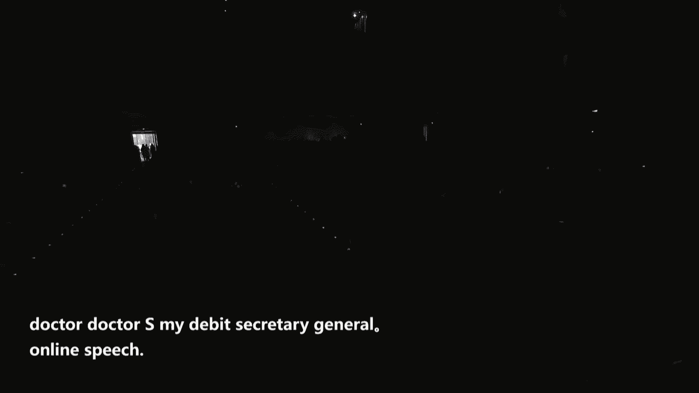
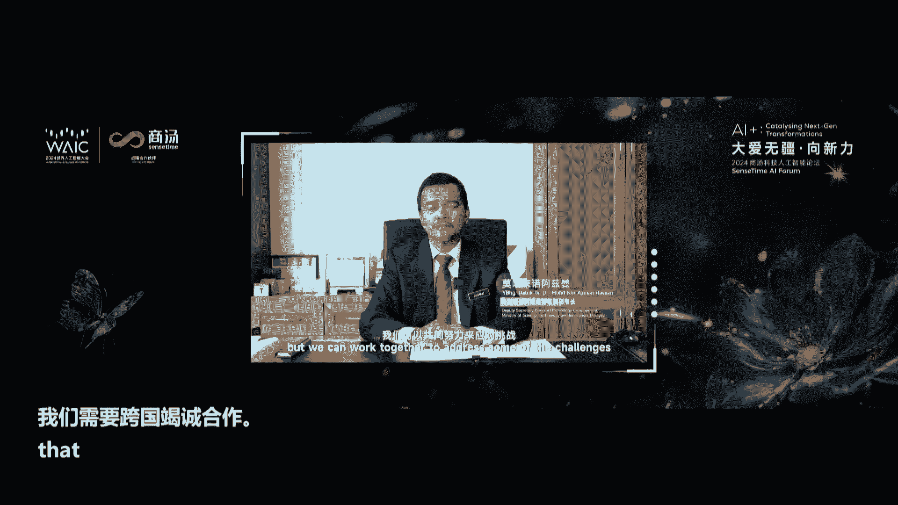

# P26：20240705-大爱无疆·向新力——2024商汤科技人工智能论坛 - WarrenHua - BV1iT421k7Bv

尊敬的各位来宾，欢迎来到由商汤科技主办世界人工智能大会组委会指导的商汤科技大湖江向新力论坛。Ladies and gentlemen。

 it is a great honor to welcome you to 2024 Ctime For AI plus catalyzing next generation transformation。

😊，今天我们非常荣幸的邀请到市委常委、上海警备区政委胡世军，上海市政府副秘书长庄木娣、临港新片区管委会副主任彭世全以及上海市经济信息化委相关领导和临港新片区管委会相关领导莅临我们的论坛现场。

十年沉淀是商汤原创AI的生耕，更成就了商汤硕果之头日日新。 The past 10 years has witnessed sensetime deep cultivation in the field of original AI technology and sincetime regeneration。

🎼首先，有请上海市人民政府副秘书长庄ang穆地致辞。Firstrs，please welcome Zhang穆di。

 deputy secretary general of Shaanghai Municipal People's government to deliver a speech。🎼，🎼，🎼，🎼。

尊敬的吴世军常委。女士们、先生们，朋友们，大家上午好。很高兴参加大爱吴疆向新力商汤科技人工智能论坛。首先，我经代表上海市政府向各位嘉宾和朋友的到来，表示热烈的欢迎和衷心的感谢。

人工智能是新一轮科技革命和产业变革的重要的驱动力量。随着以大模型为代表的深城式AI创新突破，带动数字新技术、新产品新业态的蓬勃的发展。与实体经济融合，形成了新智的生产力。

推动人类社会加速进入人工智能时代。近年来，上海人工智能作为重点发展的三大先导产业之一，引进培育各类的大模型企业。着力建设人工智能的上海新高地，打造世界级的高端产业的集群，规模已经达到3800亿。

就全国的权力。包括商汤大模型在内的34款大模型通过备案。一批锤类的大模型落地赋能，同时算立基础设施加快布局。大模型的语料数据联盟深化运用，构筑了人工智能创新发展的良好的生态。面向未来。

上海还将继续发挥千行百业的场景和数据优势。与海内外的企业机构紧密的合作，持续推动人工智能创新发展。我们将鼓励关键核心技术攻关，支持通用大模型和垂直大模型的研发，增强人工智能的原始创新的能力。

我们将加大人工智能落地赋能，积极打造人工智能应用的超级场景。通过锤类大模型的陆地应用，带动上下游产业的协同创新，强化产业向新力。我们将持续优化产业生态环境。

加强算力、语料、资金、人才等关键的创建要素资源的整合和集聚，推动创新成果的产业化商业化的落地和应用。多年来，商汤见证并深度融入了上海人工智能创新发展的历史进程。我们欣喜的看到。

商汤与上海人工智能的共同成长，不断取得新的成绩。成为上海最具代表性的人工智能创新企业之一。今天论坛上还将发布日日新学者计划AI基金和算力基金等。我们将支持包括商汤在内的创新企业持续和快速的发展。

取得更多的硕果，为引领通用人工智能发展做出更大的贡献。各位来宾。本次论坛搭建了人工智能开放对话的高端的平台，期待与会嘉宾发表深刻的洞见，畅谈创新观点，推动人工智能的价值的释放，加快赋能经济社会各领域。

希望各位科学家、企业家继续秉持科技向善、技术自善的发展理念，行文致远，助力建设人工智能上海新高地，共创未来美好生活，上海将以更开放的姿态和更多的平台、更高效的创新环境，热诚迎接全球的有识之士。最后。

寓作本次论坛，取得圆满成功，谢谢大家。感谢庄秘书长，thank you， Mr。 Zhang。😊，🎼接下来有请上海国有资本投资有限公司党委书记、董事长袁国华致辞nNow，ple welcome袁国华。

 secretary of the Party Committee， chairman of Shanghai State owned CapitalInvestment Corporation Limited to deliver a speech。

🎼，尊敬的吴思金常委，尊敬的张梦丽秘书长、各位领导，各位专家、学术界、科技界、金融界的朋友们，大家上午好，非常荣幸的收邀参加商汤科技人工智能论坛。这次论坛的主题是大吴疆向新向新力，发展科技金融。

推动科技产业金融的高水平循环，是壮大培育壮大新的生产力的关键一环。我所在的上海国有投资资本公司是上海市水市政府批准设立的专注以基金管理和创新孵化的国有投资平台。下面呢我要结合工作啊。

就跟大家交流三点体会。一、发展新的生产力，呼唤金融的供给体系的新变革。总书记强调，新的生产力是创新其主导作用的先进正能先进生产力的姿态。创新发展是发展新的生产力的核心要素。

新任的科技革命和产业变革正在加速引进，成为产业和经济发展的根本动力，也是参与全球竞争的关键变量。纵观全球金融始终是与技术革命相随相伴，是重要的助推器和加速器。谁能率先完成金融创新。

就能率先启动金融科技产业化的进程。引领一个时代的发展。我们说第一次工业革命，英国出现了股份制和银行的金融创新，使增汽机大规模产业业务成为的可能。第二次第二次工业革命，国际的投行和信托保险的出现。

也推动了铁路、汽车和电器技术突飞猛进。第三次工业革命风险投资在美国运养生催生了一大批的信息科技的科技巨头。中央大力提出大力发展新的生产力，正在重塑我国经济发展的底层逻辑，将彻底改变要依靠要素驱动。

两头在外的大进大出，吸引国内外的技术及传统吸引国国外技术的传统增长模式，开辟一条以科技创新为核心动力的经济发展的新轨道。面向为来，我们要深刻洞察我国经济发展的模式转化。准确把握我国科技创新的演进逻辑。

构筑高度契合的科技金融的供给体系。从我国科技创新的进程来看，主要发挥把握好三个命题。第二呢是把握两种创新类型的不同需求。当前，我们既要推动体现国家战略的使命驱动的创新，比如集成电路、大飞机。

需要发挥国有资本的引领作用，带动社会资本的广泛参与，放大举国体制的优势，形成超常规大强度、长周期的支撑体系。也要推动面向市场需求的市场驱动的创新。比如我们新能源智能重担，需要发挥市场资本的加速作用。

激发企业创新的主体的活力，支持创新活动试措加速，推动科技成果，加快向新车生产力的转化。二是我们要构建全链的加速的支撑体系。科技创新是一个多阶段的系统工程，分为基础研究成果转化和产业化的不同阶段。

有着完成不同的运行机制，推动科技金融的创新，主要是强化全链条的观念，既要在100到100到100万的产业化阶段提供大规模的资金支持，使创新产品加速走向市场，更要在1到100的成果转化阶段。

强化天使资金的供颈，支撑早期跨早期科创企业跨越创新之谷，还要向0到1的基础阶段延伸，能够看到让看到技术的前景的和市场模式，善于发现颠覆技术前沿技术的重大信号源。三是要适应创新模式的深刻变革。

科技创新的活动呈现出这群体眼进交叉融合、链色传导的特征，开放创新协同创新已经成为大势所趋。同时，我国的科技创新也从跟跑并跑、灵跑向迈进，更多领域也将走入无人区，来自科学技术产业市场，复杂多变的日益凸现。

推动科技金融创新，要强化跨界理念跨破界思维，有投资者。与科学家、企业家形成深度的链接，推动资金链、创新链、产业链的深度耦合，形成高度协同的创新生态。2、打造人工智能新高地国有投资平台公司要承担新使命。

习近平总书记指出，人工智能是新一轮科技革命和产业变革的重要驱动力量，是推动我国新一代人工智能健康发展。近年来，人工智能推动产业变革数字经济发展的主要引擎，是国家战略规划的前沿的科技领域。

也在中国现代化建设中也扮演了越来越重要的角色。在世界高科技的竞争领域中也起得决定性的作用。我们也看到，鉴于AR企科创企业的周期长投入大的特点。推动人工智能领域的科技产业金融三者高效循环。

也存在着一一些急需打通的堵点啊和难点。包括以信贷融资为主的金融公益体系，也难以适应创新的需求。长期投资者少，产业投资基金的同质化的竞争等等。解决人工智能创新发展企业的堵点和难点问题。

我们头部的国有投工投资平台要发挥战略引领作用。国有。投资平台既体现政府意志，又要运用市场机制，能够把有效市场和有为政府的优势结合起来。成成为畅通科技金融产业循环的枢纽环节和战略链接。

首先呢我们要更好的体现战略意图，就对于关系国家战略和人工智能产业，需要国有资本投资公承担技术攻关的组织者、创新资源的整合者、产业布局的主导者的职责，支持开展大平团的攻坚科研攻关，促进全产业链的整体突破。

推动高端产业集群的合理分布局。二是更好的发动撬动作用。国有投资资本具有市场风向标的作用，能够带动国有资本、保险资金、社保资金、银行资金、私募资金还有外资的私募金等各路资金创饮。

来推动更多的资金资本向人工智能产业集聚。3要充当好长期资本，要发挥国有资本的功能性作用，坚持投早、投小、投硬科技，围绕科技成果转化的难点、痛点堵点，对早期的AR企业形成长周期的支持模式。

助力完成跨越创新之股的艰难营业。最后我们也也要构筑构建很好的生态体系。国有投资平台，要有政企协同的优势，有紧密协同政产协研金的各类主体，将发现信号源开展军能投资，加强投后服务管理一体推进。

形成全过程的加速的综合服务生态。第三，服务上海科创中心，上海国投公司全力打造国际赋能的创新标新标杆。建设国际科创中心，是习近平总书记赋予上海的重大战略任务。金年书记也提出，要加强上海国际。

金融中心和科堂中心的链接联动，引导培育长期资本、耐心资本，促进科技产业和金融的良性循环。要求我们上海国有资运行平台，整合优势优势资源赋能科技创新和产业的创新。今年4月来啊，在市委市政府的做出战略部署。

也推动了我们上海国投公司和上海科创的集团的合并重组，目前也正在建立总规模1000亿的4级三大先导产业的母基金和未来产业基金，建设创新策源和产业孵化的投资平台，统筹国有资本的赋能新的生产的发展。

市委市政府的对国投公司的角色定位，它不仅是一个战略投资者，而是一个资源的撬动者、赛道的引领者、生态的构建者。我们也提出发展的愿景，就是要当好服务上海科技创新和策研可可测研孵化的主力军。

促进三导产业三大先导产业和未来产业发展的主引擎，落实国际布局优化和结构刀的主平台，成为全国一流的复合型的国有投资资本运营公司。面向未来，我们将紧紧为绕战略使命。

加快建立全产业、全周期、全链型的多元化的基金集群啊。我们最近也在跟商汤在商量一些呃一些这个算力的一些基金啊，努力成为正产源各方面的资源的链接者和放大器，助力上海构建创新链产业融合。

资金链人才的深度融合的协同创新生态。基于这样的考虑，我们正在打造适应未来发展的五大功能体系，就是捕捉0到1科创信儿园和聚焦1到10的成果转化为主线的测测源孵化功能。以当好长期资本、耐心资本、战略资本。

坚持投找投鹰科技为原则的战略投资功能，以打造服务投资服务、产业服务、技术服务、人才服务综合服务为主体的科创服务功能，以构建多元化、多层次融资渠道，对科创企业进行全方位支持的科创金融功能，以与科学家为伍。

以研发的同行，以创新者共进的投研一体的功能。各位领导，各位专家，以上是国投公司嗯创新科技金融发展的新模式，也在目前打造人工智能高地建设的实践和探索变革的时代需要家国情怀，竞争世界，乃至于自强自力。

推动人工智能加速发展，已成为时代的重要命题，需要学术科技产业金融各建。加强链接，强协同，强联动。上海国图愿意各个各领域的专家、各行业的领袖携手奋进，为推进AI的创新无疆，推动新的生产力发展。

持取工作力量。也今今天呢也谢谢大家，也祝本次的论坛取得圆满成功，谢谢。感谢袁总的致辞。thank you，M。 yan。

下面我们将进入上海国有资本投资有限公司和上海商汤智能科技有限公司的战略合作协议签约仪式。Next， we'll proceed to the sign ceremony of the strategic cooperation agreement between Shanghai State owned Capital Investment Corporation Limited and Shanghai Sand Time Corporation Limited。

有请签约嘉宾，let's welcome the signatureator guest。😊，🎼上ang海国投党委委员、副总裁、职工董事杜文、商当科技副总裁林杰明 Luwe。

 member of the party committee， vice president and staff director of Shanghai国投Investment。Jesie Le。

 vice president of Sands time。🎼以及见证嘉宾，上海国投董事长袁国华、上海国投党委副书记、总裁戴敏敏，商汤科技董事长兼CEO徐力、商汤科技联合创始人徐冰。

And the witnessing guests， Yuan Guohua， secretary of the Party Committee。

 chairman of Shanghai State on CapitalInvestment Off Limited。Daai M Mining。

 Deputy Secretary of Party Committee and president of Shanghai GlobalInvestpirment。🎼Xu Lee。

 chairirman and CEO of Stime， X Bing， co founder of Stime，有请各位上海签约， please welcome。

🎼由双方联合发起的商康AI产业基金和算力基金共同布局人工智能上下游和科创基金领域的深度合作，携手打造高端金融资源配置高地。🎼请双方嘉宾合眼留念。Your guest。

 please take a great photo。🎼请各位嘉宾场下就坐，please be seat。Thank you all。🎼感谢各位。😊。

🎼下面有请中国工程院院士清华大学车辆与运载学院教授李克强带来主旨演讲。Nextext，ple welcome李克iang Academy of China's Academy。

 professor at School of Vehicle at Mo ofsinhua University to deliver the keynote speech。🎼Yeah。🎼。

尊敬的各位领导，各位来宾，各位夜界同仁，大家上午好啊，非常高兴能参加本次论坛啊，也非常高兴能有机会啊。就新一代AI驱动的中国方案智能网联汽车关键技是创新运用方面的一些工作情况给各位做一个交流。

我们都知道啊，智能汽车是新一代科技革命的代表性产业，已经引起世界各工业强国之间的。竞争啊，包括大家看到欧盟、美国、日本都有一系列的啊国家项目或者规划。当然这也引起了我们中国的高度重视。

我们中国也非常重视智能网络汽车产业的发展。它是我们提提到的国家在推行的制造强国、交通强国战略的重要任务之一。

那么我们也知道啊，智能汽车啊有不同的技术路径。那么迄今为止呢。啊，主要还是以单车自主式智能为主。当然这样一种技术方案呢，大家也通过这么长时间的实践，也应该发现孩子有一系列的问题，所以也在探索。啊。

有网联协同式智能这样一种研究的途径。啊，在国家项目产学院合作项目支持下呢，我们清华的团队啊也提出了。智能网联汽车云控系统，或者我们称之为车老云脑一体化的这样一个技术的新思路。

啊创建了云支持的自动驾驶这样一个体系架构。那么具体说呢，那就说我们基于新一代的移动通信技术，将车路云融为一体，能够形成。我们实施动态数据汇聚，能够提供一些关键的基础服务。

以及形成协同的感知计算的这样一个环境。所以我们称之为这也是我们智能汽车探索产业化的探索的中国方案。实际上它的。特征呢就是云支持的自动驾驶系统。所以如果在这种情况下面，我们给。这样一个方案下一个定义。

什么？都在说中国方案的，当时这是个技术方案，不是政治方案。技术方案。智能网联汽车啊，我们是用一2三来表示，一就是车轮一体化架构。二呢是具备两大技术特征，分层减5跨域共用。所以我想如果有一体化架构。

现在好多单车智能企业，它也有数据也形成闭闭环，它是它也是车运一体化。但是它没有分层减5，它是烟囱型。如果分成减5快域共用，一和二是我们这个方案的内涵。

但然加上我们说在中国的do上行使中国的联网要求以及新产品下我们中国的标准。所以这三满足三个标准。所以形成这样一个架构呢，那么汽车它在行驶一定是在智能化的基础设施上，一定是有联网运行。

一定是会强调信息安全。那么这个大系统下面。我们要发展要推进的话，他的思路是首先要对这个架构，它的信息物理融合系统这个架构那做一个总体的设计。然后根据智能网联融合的特点，会诞生新的5个技术平台。

以这几个平台为抓手，那么形成这个完整的啊这样一个实现人车路一体化的这样一个体系。那么在这里面呢，大家看到这是一个复杂的系统。那么当然为系统关键技术，包括我们谈到的环境感知就是控制。

包括谈到的啊芯片操作系统等等。当然也包括本次会议的主题，人工智能。那么人工智能在我们自动驾驶里面用是吧？按我们来说，都通过汽车行驶一系列的感知决预测决策控制存在一系列问题。针对这个问题。

我们针对相关的怀疑，我们都可以通过人工智能技术在推进。那么当然在这里面自动驾驶的算法是核心。那么算法呢有我们前些年的我们叫基于规则的专家型的啊。当然也有我们谈到基于人工智能为基础的，包括模仿学习型。

包括内脑学习型是吧？我们清华这个团队呢，我们也比较早的在基于强化学习内脑学习型这方面也在做探索。那么在这里面呢我们主要做了些工作。当然时间关系呢，我简单举两个例子是吧？

一个方面呢就是交通参与者啊行为的长时间预测。大家知道交通行为预测是我们自动压实是决策控制的前提。那么现在呢是很多啊复杂性，所以现有的方法呢也存在着一系列问题，包括网络结构复杂计算成本高。

中间变量度信息的损失大。我们提出了一个方案，我们称之为时空分离的预测网络结构。那么将我们周测的轨迹以及路网结构呢信息压缩为动态的特征量。然后在我们成为的简偶然后至于这样方案呢。

它具有的特点我们说时空模块之间相互可以减耦，便于组合化替换。另外避免中间变量能够表证参表证能力强。那么基于这一些方案的推进呢，我们也做了这样一个验证，是现在国际上呢有这样一个行为预测数据及。

验证呢啊应该是各个团队研发团队，包括有340个参赛队伍，国内外的知名的研发团队参赛呢啊，当然我们在其这这个方基基于这个技术呢，我们在这个方面的7项指标都是啊排名第一。那么第二个方面呢。

就是大家都在讲强化学习内涝智能。那么在我们自动驾驶里面，我们高准确的这样策立的强化学习求检。大家知道这个强化学习求解呢实际上在应用到我们工业控制里面呢，实际上有一个很大的挑战。

所谓的过估计就是由于有贝尔曼算子的这样使用呢是我们算子迭代导数的误差累计增大，在过估计。那么这个估计呢也是各个团队是吧？啊，学术建工业键都在研究。而在我们自动驾驶这样复杂控制系统呢，这些问题也尤其严重。

所以我们团队呢也提出了所谓的DSAC啊分布式的柔性的自动判断这样一个准则。大家知道SCC是国外所提出来一种在强化学习里面的一种算法。

那么我们根据这些里面看到的强化学习过去这里面呢啊算法中的最大化选择器在选择评估式都使用同样的只Q值是吧？我们把它增加。那么在增加到若干个增加分布式以后呢，我们发现它可以变成一个分布式这样一个贝尔曼算子。

那么由于有这样一个思路呢让我们的估计的误差可以得到一致。所以用到这套方法以后呢，我们可以在信息的实时性啊，包括准确性的，包括估计偏差方面呢，都跟现有的这些方法呢有显著的提升。啊。

那么这就是在里面一些关键节说。当然现在大家也在谈大模型，今天的主题也在谈大模型。而我们认为在做到垂直领域，在做到自动驾驶里面大面但自动驾驶大模型好多一题还是娱乐服务那套实际上不仅仅这东西。

我们如何做到替代的决策感知是吧？如果在自动驾驶里面谈大模型，大家看看它的数据算的算法跟现在大家说的很热的是吧GBT也好，这通用的大模型呢？我认为各有各的挑战。

那么在我们垂直领域在我们自动驾驶领域有一系列的挑战，远远不像一般人所理解的那么简单是吧？那么面对这样的大模型呢，实际上大家也在谈是吧？最近也在谈我们单车智能也好，也在谈FSD也好。

像我们做为这种分析是吧？当然有的说单车智能现在不仅仅是说传着单车意识概念是单企业的智能。大家看看现在咱们。假设车车企是我们的不管我们高科技企业什么，大家目前是这样一个状态，在做想做大模型的平台。

不管你花多少钱，在怎么说，是原理上存在问题。这个问题我们认为有两大问题。第一个数据体量有限是吧？海量系但是没关系，我们花钱，我们使劲投是吧？们但是有一个东西你再投钱也做不到数据种类不全。

保证不了数据的完备性。啊，这个大家如果学个概率统计是，知道这个逻辑是吧？我老在举例一个企业10万工人1000工程师。如果你就统计到99000工人，你把工程师统计为0。

和我统计到8万工人单我统计了800工程师，那么统计出来，我比你统计准确。因为我的种类比你齐全。所以如果单一车企单一这个他做不了这他数据再多，他也统计不全。

所以只有通过我们现在提到的这样一个车路运营化一体化的系统，才能够真正意义上除了我们谈到的，我们不是一家车企，我们各家车企的数据，另外更重要，我们要路测。那就像所谓的上帝的视角，我看的更远更全。

那么这样的数据的覆盖更广泛。所以这不是靠投钱，不是靠一家企业都有实力做到的。如果没有这个体系性的，你的数据不前，你训练不出来是吧？大家知道大模型最重要有个很重要的数据的训练的数据。我们说三个要素是吧。

海量性的完备性和准确性。如果你完备性不具备你这个数据在很多场况是训练不准的。所以是都会出现问题。当然我们行业里面现在大概谈我们特斯拉的新一代的FSD。是吧实际上新一注意啊是新一代是吧。

所以他啊F42以后啊，它确实取得很大的进步，确实对我们行业做整整个做自动驾驶，尽早的更高级的自动驾驶成功。我们认为是一个鼓舞和吉利。当然我们现在行业里面也存在着啊两个我认为两个不太全面的观点。第一。

认为新一代FS的就是无人驾驶。啊，第二个认为好像是新的FSD是个单车制呢，它都成功了，还要车轮一体化干什么呀？这是目前行业我说有这两个观点都是不全面的。首先第一个车轮这个哎新一代的FSD按他自己说的。

他不是无人驾驶，他还是一个高级别的自动驾辅助驾驶，至于辅助驾驶和无人驾驶这两个概念，那如果出了责任谁负呀啊，你看看这是人家自己人家企业自己这样说的是吧？那么这样说的话，他实际上是。就不是一个无人驾驶。

所以千万大家啊有正确的理解。第二个，现在的F菲斯T它不是传统的单车智能啊，它有引知模式是吧哎有大模型的呢这两个都是车和云之间的这样一种系统。所以在这样的情况下面，我们认为啊这种观点是不全面的。

当然我们实大车友宣传，他我认为还是一个。一种应用阶段。他也如果他只是靠一个企业做的啊，他同样如果他不需要路测来获取数据，他同样的不具备再多数据，再花才讲仍然不具备数据的完美性。那不就是不是完全性。

你们做大模型训练，那能训练准确吗？在很多场合那都训练不准确的。所以我想大家正确的认识。所以基于这样一种思考是吧？我们智能网机在国家双中心是吧？我们根据行业这个技术发展趋势，整个全行业共识。

我们提出了以云控基础平台。是吧作为这样一个思路是吧？来针所谓的云控技术平台，就是大家的烟囱型，我们分竞争的分开底座的我们打通。那么这样一个形成一个基础平台。那么在这样一个基础平台下面。

我们交通管理、出行服务娱乐，包括自动驾驶。所以这就是我们谈到的中国方案，如果各家做烟囱型的云控平台，那做不是。不符合这技术发展的趋势呀。只有这样一种逻辑下面，我们认为才能够真正做到数据的啊。

重要数据的汇聚海量性的打通，时空数据的对齐。对真正意义上我们实用化的高标准要求的自动驾驶验的大模型的构建训练迭代都是非常重要的。所以我建议各位同仁是吧？

各位地方这本官员在你们头前做细实早做锤直领域大模型的时候，应该有这样一思路。不是这样的思路的话。还是有技术上的风险的。那么基于这样一种架构是吧，现在我们国家智能网技术中心是吧？在全行业的推进。

包括昨天还是前天已经公布了是吧？啊，五部委的啊车轮企化城市失败是吧？那么我们将有这样一种。架构这样一种标准，这样的技术路线选全行业推荐。那么在这样一种情况下面，大家可以看我们的车老云老，我们的实时汇聚。

大家看看我们不是一家企业的，我们所有的数据。智会当然这个基础数据是中性的，不是保密的，是中性的，大家可以交互的。那么做这样的汇去回去以后，我们形成我们的数据底座，我们该怎么训练。

该怎么O贴下降再形成是吧？那么这样呢可能简单的发展但这里面大家自然会提到是吧？端到端是吧啊大模型端端端。我想在我们汽车行业里面，我们对这个也有我们自己的认识，当然这是一个典型的，我们可以形成端到端。

但是我们对端到端的定义，不是一个简单的一个黑箱化的神经网络。我们认为端到端是吧？这就我们既然有这个知识，既然有这个判断，我们是全站的神经化网，我们仍然会有感知网络决策网络预测网络只不过我们的数据传递。

我们不让它丢失。我们用特征向链的模式是吧？不是简单的一种啊黑线化的东西，黑箱化的东西不可解释啊，那运气好的说对了，运气不好说不对啊，至少在高。现在下结论什么什么事，最后再用于自动驾驶类的。

用于高可靠性实性强的那还还有挑战。所以那既然有挑战，我们就要针对这个挑战，我们解决问题。我们认为这样一种思路定义断到端是合理可行的。那么基于这样一种情况下面，我们针对汽车行驶的几个环境是吧？

我们有分块的这样你看我们的数据海量完备和准确。我们认为只有车轮一体化才具有完备啊，然后我们用这样一种情况，我们既有分块模型的预训练，同时有模块集成的微调。而我这个模块集成，它当然就是一个端倒端的。

当然也是一个呃每个模块把这要做大模型，合起来也是大模型，它合起来当然就是端倒端。我以这种逻辑来做推进。在这种推进下面呢，我们现在已经是吧，我们按这个思路是吧，我们研究出是吧这样一个系统，并且我们应该是。

率先在这注意我说的个开放道路上在做这样验证。啊，时间关系可能。From。行了，呃这放不了。那这总的说，未来这个发展对吧我们也做了比较。大看所以我觉得我们大家也要有信心是吧？我们可以走我们有特色的道路。

我们可以快速迭代。这是我们做了一个调研。大家看看在国际上也好，国内也好，做下面是我们清华这个团队是吧？我们在做的实际上我们在国际上应该很早是吧？我们的IDC我们集成式决策控制啊。

当然当时7700多万参数啊，今天想了它也算大模型啊，只不过当时不知道大模型有这个名称是吧？18年开始在不断迭代。刚才讲的关键的核心算法，包括零个系统的评价，包括做产业化的推进，做应用在快速推进。😊。

总之，我们认为智能网联汽车啊是自动驾驶的发展的一个新的阶段。而我们所提出的车轮一体化的自动驾驶啊，智能汽车在系统的定义、关键技术及产业生态等方面，我们认为是具有特色，是吧？另外。

智能汽车现在大家都在谈要进入人工智能为驱动的数据驱动的大模型及大模型的，然后要要实现端到端的这样的发展阶段。我们认为重点是要推动主要供能模块的全站神经网络化和数据闭环的训练。所以这个数据闭环。

用这种方式，它还是有非常大的优势的，已经取得重要的应用进展。

另外，基于车轮一体化的智能驾驶，我们提出了计算技术平台、云控技术平台。那么这两者的一一体化的协同的建，为自动驾驶的大模型的训练同时提供了完备海量性和完备性的。智能数据的底座。那么我想想啊。

注意啊有完美性。所以我我觉得将来是啊我们政府投资的我们企业决策的，你们在讲数据平台，一定问他具不具备完备性。关于海量性不够，不具备完美性，会有技术风险。而我们去介绍方法以后。

具有这种完备性和数据智能底座，我们能够真正的促进可促进产业的高质量发展。好，我的介绍到这，谢谢大家。感谢李院士。thank you， Professor Lee。

🎼接下来有请临港集团数创平台董事长、魔术空间总经理临港缘起董事长陈海词致辞。next，please welcomecome。

 Chen海慈 chairman of港 Group Digital innovationvation platformform。

 See all of Shaanghai Foundation Model innovationvation Center。

 chairirman of Meoppart to deliver a switch。🎼。

呃，尊敬的各位领导，还有媒体伙伴们，大家呃上午好。那非常荣幸有机会跟大家做一点简单的分享。那我自己本人呢来自临港集团。那么最近可能也在上海稍微有点知名度的一个网行网红打卡地模术空间的担任总经理。

那么在过去的一段时间以来，我们可能也做了一点大模型产业的推动的工作。那么也是想借今天这个场合呢跟大家做一点汇报跟分享。那第一趴呢也是给大家简单介绍一下模术空间吧。

那模术空间呢实际上是全国第一个专注于大模型生态创创新发展的一个生态社区。那也是上海来践行打造科技创新这个中心的一个重要举措。那么在今年2月22号基行数据调研的时候呢。

也明确提出了模术空间呢也是上海市抓人物智能发展的重要布局跟创新苗圃。那么在昨天陈建副市长在外的致辞里面呢也给我们打了一个小的广告啊。那么我们在去年9月28号挂牌，到现在可能一年不到的时间。

那么已经交付了2万平方米的高质量的物业空间。那目前呢空间里面已经集聚了近8。😊，十家的呃专注于大模型行业生态企业。那么为什么能够在这么短的时间里面有这样的一个效果呢？

我觉得和我们抓住了大摩前产业发展所需要的一个C息生产要素的供给可能有比较大的关系。我们在呃空间的筹备的前期呢，就着力打造了5个共性服务平台，一个是算力平台，一个是数据平台，一个是评测服务平台。

但还有我们重要的金融服务平台。那还有我们也是全上海唯一的网信办的线下模型办的服务的一个网点。那我觉得在这里面最重要的呢毫无疑问是我们的算力的平台。那特别是在我们空间筹备的期间。

那个时候算力呢是非常非常紧张的。所以我们也特别感谢上汤科技在刚开始呢就从大装置里面去这个划了300P的一个专属算力来供给给魔术空间。那么有一个整个模术空间大摩间产业的高质量发展提供有力的保障。

所以我就想到2019年的时候，当时徐丽总领养集团嘛。那么就是说当时他要搞这个大装置大算力，坦率的讲，不怕大家笑话，2019年的时候，我根本听不懂什么是大装的大算力。但是现在回过头来看。

也正是那个时候的潜瞻性的举措。也也有了张呃商汤纪年辉煌啊，也帮助了魔术空间。所以我也深刻感觉到这个科技啊是真的是第一生产力。那么前面这个中募地秘处长在介绍的时候呢。

也提到了上海现在有34个的备案的大模型。那么其中呢有22个在徐汇区。那除了4个基础大模型之外呢，是不是还有18个这个垂类的行业模型呢，也都是在我们的模术空间进行备案的。😊。

那么呃实际上我们到目前这80家企业和，你们肯定也聚集了一些相对比较知名的企业，包括有浦江人工智能实验室的手机科学家。那这个周博文先生创办的这个修远科技。

那还有我们外籍的这个加拿大院士梅涛创办的这个志向未来。当然还有清华电器教授汪创办的这个星琼。那我应该是在去年的商大大会和这个汪玉教授是认识的，我也没想到就是在三个月之后跟他在模术来重新聚首。

那呃我们在服务这些企业的过程当中呢，也把他们在产业链上呢去做了一个相对的一个分类跟分布。那么同时在跟他们服务的过程当中呢，也感受到了整个这个呃他们的一些热切的需求，刚性的需求。

乃至于大模型行业接下来发展了一些可能性跟趋势。所以今天也经跟大家做一个汇报。那实际上这张图呢，大家可能也看到很多了。那对我自己来说比较重要的一个感触是什么呢？叫做科幻照进现实。

当然今天大家去讲达特茅斯君子。那大家已经非常熟悉了。但是更多的是像感知机跟标曼这样的一些基础的一些范。😊，应该是在那个时候就已经提出来了。那么感谢互联网给我们带来大专利。

感谢黄教主给我们呃感谢互联网给我们带来大数据，感谢黄教主给我们带来大数据。所以让我们呃1956年的畅想在今天的慢慢在变成现实。😊，大家可能听了非常多的呃就是名人去说呃。

这一波的甚至是人工智能是多么大的一个伟大的一个变革。但今天我想借苹果跟这是一张苹果跟我分享的图呃分享一下我们跟他们讨的一些观点。那么这是苹果的一客画群。大家可以下面这张轴，那是始于1994年。

至于1997年为什么因为1994vigator让我们带来了这个互联网。那么移动互联网的霸主的谷歌呢创立1997年的他们为什么怎么看因为互联网本身是一个大范式的变革在知识的获取那在我那个年代的时候呢。

我们知识全量记忆我们的知识来自于哪里？来自于书本来自于图书馆，但是今天来说最大的知识获取来自哪里呢？在你的手机上，那像我公司团队里面的95后00后的小朋友们呢他们其实也非常的习惯碰到了问题。

就用手机去检索。以他们学习的方式学习的方法都非常的快。那么深成是人工智能又带来什么样的变革呢？其实我本身是学设计出身的。我记得我小学画画的时候呢是铅笔水粉笔和毛笔。然后等到我读书的时候。😊。

CAD跟photoshop来了，这个时候呢变成了鼠标。但是我做梦也想不到。今天如果我来画画，我是个炼金术士，我是在键盘上做打prot。当然我本身是media journey的众度用户。

所以这一波甚至是人工智能带来的是生产范式的变革和一个生产关系的重塑。那我想在生产关系重塑的过程当中，一定会给我们的产业带来巨大的一个发展机遇。😊，那因为我们本身临港集团也是一直做产业的嘛。

那其实我们感觉这一年的发展过来呢，可能整个大模型产业链的颗粒度在不断的这个在细化。那么产业的这个呃呃内容呢也在不断的冲实，所以我们还是尝试用产业链的角度做了一点简单的划分。

把它分成是中立位的算法跟上游的供给和下游的应用。那么我想在算法呢，大家可现在已非常熟悉了，不论是国内还是国外，其实马太效应呢已经是非常的清晰了。不论是国外的头部还是国内的头部，今年都已经是跑出来了。

但是今天还有一个非常呃清晰的一个趋势，就是可能是在一个端测的一个小型化。如果大家看得清的话呢，其实是左下角左下角呢应该是去年的年底12月27号去苹果发布的。他们关于端侧模型的压缩算法。

那么当时我看到的时候呢，其实我们当时跟苹果交流之后就预测说今年的6月份，他们会干什么事情。那么最近苹果也发了它的paper，就是说他们在他们的端测是一个3B的一个模型。那实际上如果没有压缩技术的话。

3B的模型要压。😊，要放到这个呃iphone的这个内存里面，实际上也也是很很难的。或者是不可能的。所以现在来说行业的一个热点来说，是怎么去研究端侧的模型的小型化以及压缩技术。

那其实前段时间如果大家关注到就是哎非常容幸被抄袭的面壁智能啊，就被ford抄袭的面壁智能也是我们空间的一家企业。那么最近我们在跟他们沟通过程当中呢，他们现在在不断的收缩其他的业务线。

他们正在O in这个端测的一个小模型，我觉得这个可能是在算法侧的一个趋势哈。那实际上我们作为一个高质量的孵化器呢，可能在中间的大模型不会有太多的机会。所以我们也会更多的去看一下上游的供给侧。😊。

那今天可能大家对算力来说可能已经非常熟悉了。包括中美的一些争端。那我们觉得目前来说机会呢可能就是说国产的算力。那现在我们的空间呢已经和像我们的摩尔线城，我们的这个随缘还有天数还有华为来开展合作。

因为我们空间里的大模型的创业者业的数量是比较多的。那么我们希望跟国产算联动呢，不断的去加快国产软硬件的一个互间的一个适配。那还有非常重要的个Ifr就是说其实呃没有大装置，没有这个大算力。

也没有我们的大模型了。那实际上在我们这个AI的算力供给之外，除了你看到的这个GPU之外，包括我们的组网，包括我们的算力的优化，也有非常多的机会。

所以我们的空间里面也有像激流这样的专注于这个大集群搭建的企业。同时当然有我们的这个问星琼像这算力优化的一些企业。所I也是我们接下来非常关注的一个产业发展的机会。当然还重要的是数据数据大家也知道。

其实中国是非常聪明的，就是像我们数据领域的I也是。😊，创立的那呃上海市也最近有一个重要的举措。那么上海市政府呢也牵头成立了上海市的这个语料公司，也说种库帕兹。那么它也落后在我们的魔术空间。

那这家数据公司最重要的工作呢就是希望能够把这个上海公共行业的高质量的数据做成专业的语料集开放给我们的大模型的创业者来提升我们模型的这个质量。那呃我们在观测所有的这个行业发展的过程当中呢。

也会有自己的一些小小的一些判断。我们觉得可能在四个行业领域，大模型的价值呢可能还是相对涌现的是比较快的。但第一个来说是自动驾驶啊。刚刚克强院士一句了非常好的一个阐述。那实际上就是呃大模型的能力。

让单车的智能可能有了一定能级的提升，让我们更快的能够去接鉴到自动驾驶的一个未来。所以像我们的社区里面呢也会让福泰历史，还有一些绝非科技这样的企业，也是在端端端端大模型呢在做积极的一个探索。😊。

🎼那当然还有生物医药，当然阿 two3。那现在像我们社区里面也会想中科群域这样的，因为阿3没有开源嘛，所以我们社区里面也会想中科群域这样的企业，他们也试图去复我们的3。

当然我们也可跟临港国家实验室的这个中小企大模型也来开展合作，我们也非常看好，就是大模型在生物医药领域的一切。当然应该是去年年底的时候，就是 mind跟这个里来跟诺华的一个合作。

应该在创投圈有非常大的影响力。🎼那么如果说刚刚两个行业来说，我们比较看到的是技术向产品的转化。我们觉得在另外两个领域来说，已经快步快步到了这个从这个呃产品到商品的一个进化。

那么第一个来说呢就是在端测测来说，大家最近比较热的词呢是IPC那么前应该在今年4月23号的时呢，也发布了他们的这个小浣熊的一体，我们也非常高兴，就是小浣熊一体机的硬件的科技呢。

也是我们这个呃空间的一个明星企业。那么实际上呃在中国来说的话，不论是你是出于数据的隐私的安全还是相关的一些要求，大家都会有购买资产的需求。所以像我们的这个问星琼啊和密度啊。

他们也会积极的在推出这个一体机，帮助我们客户呢在它的思域去进行部署。那么除了AIPC之外呢，还有就是AI手机，当然是得益于苹果的这个大力个宣传。那么像我们的这个空间里面呢也会深思考这的企业。

在积极的去融入IPC的一些生态。但我们觉得可能未来更多的机会呢会在可穿戴设备。因为在苹果的逻辑里面呢，他们会消灭掉是。😊，🎼手机，因为我们的五官全部在脸上。

那么去年的meta的re的这个眼镜呢已经有百万级的销量了。所以我们在全球的领域看呢，我们觉得到今年年底一定会有一个非常大的一个端测智能设备的一个爆发。我们也非常期待有这样的企业能够在我们的社区里面出现。

🎼当然还我觉得更重要的是AIGC嘛，在当前的这个环境，大概是需要是多巴胺的那呃如果在今年年初的时候，我更多的观点是说AIGC是工具的革命。今天来说是一个产品的革命，产品的一个创新。

🎼那么徐会历史上一直是游戏的一个重地嘛。在2014年的时候呢，实际上中国最赚钱的游戏公司是莉莉斯。那个时候他们创建的是刀塔传奇，这是一个在腾讯游戏不被立项的个机会。

所以王老板自己干所当成为了中国游戏的引领者。那么今如果从游戏的领域去文化影响力大的公司是哪家那肯定是米哈。

大家了解的上他也做了游戏创新我们国家有个特点限制生活游戏里米哈游游戏之最受欢迎的游戏就是是人人斗的游戏，但是米哈游带给我们的是一个合作创新的一个游戏。所以范式的创新带来是巨大的机会。

所以我非期待甚至人工智能能够带给我们创新娱乐产品。这是们希望能够拭目以待的那灵港集团作为一个产业的推动在过去2们服务了特斯拉服了中国商飞在人智能也荣幸了商当技米哈游跳动。😊。

🎼所以我们给自己呢找了一个广告与slogan，就是如果你要搞产业发展的选择灵感，就是选择成功。那么呃无论迅琼在去年呃入驻我们园区之后呢，前不久的一一周年的这个活动上呢，他们跟我们分享来魔术呢。

可能刚来的时候是7个人。那么到现在为止呢也是70个人。所以我想呢那一条成功经验，可能在大模型的行业的推广呢也会有机遇。就是说如果你想搞大模型。那么选择模术就是选择成功。

也非常期待各位大模型的创业者跟从业者，一定要到我们的模术共献来看一看。好，谢谢大家。

感谢陈抖。thank you， Mr。 Chen。😊，🎼下面有请阿普杜拉国王金融区开发和管理公司首席执行官goita致辞。next，please welcomeM。MC to deliver a。🎼。

🎼，🎼，🎼，🎼，🎼，Excellencies， ladies and gentlemen。Eseemed guests。早上好，大。First。

 I would like to thank S time and in particular， Dr。 Shuli。

Chairman of the board and CEO of Sensetime Group。And。Wang Zgong。The CEO of Stan Mia。

 for inviting us to Shanghai to be amongst you while commemorating the company's 10th anniversary。

And to share some insights into business in Saudi Arabia and in the King Abdullah Financial District。

 or CAT， as we call it。In fact。Saudi Arabia and China share many commonalities in their current journeys。

2 giant economies in their relative spheres， with vast influence。

Pursuing ambitious socioeconomic transformations and attracting unprecedented interest and wide ranging investment。

Historical records describe the longstanding relations between both the regions。Trade and migration。

Have become commonplace。For over10 years， with Arab leaders settling in Chinese coastal towns。

While Chinese partners， silk weavers， gold and silver craftsmen lived and worked in Kupfa。

 the first capital of the Abbas。Today， over 10 years since the launch of the Belt and Road Iniative in 2013。

Relations between China and Saudi Arabia。Have come a long way。

Developing beyond energy trade to a wide range of new sectors。

China is the kingdom of Saudi Arabia's largest trading partner。

With bilateral trade volumes totaling US dollars $106 billion by the end of last year。And today。

 China is the top Greenfield foreign direct investor in the kingdom。

We are here also as a result of this growing relationship。

Cafft or the King Abdullah Financial District is the business spine of the kingdom of Saudi Arabia。

Spread across an area of 1。6 square kilometers， our 95 buildings designed by some of the world's most renowned architects have reshaped the skyline of Riyadh。

Our role is to create incalt， a futuristic city that is unquestionably the economic and business center of the kingdom。

While addressing the challenges of contemporary urbanization through our vertical architecture。

 sustainable infrastructure and community living。And in doing so， we are not just shaping spaces。

 We are supporting business growth and crafting experiences for exclusive and luxury living that is climate conscious and sustainable。

😊，As a wholy green district， our commitment to sustainability aligns seamlessly with innovation。

Nestled in the heart of Riyadh， Kat is a place where you can live， work。

 play and learn all within a 10 minute pedestrian journey。😊，With iconic venues。

 state of the art offices。And luxurious residences。

 we offer a dynamic ecosystem for businesses and residents。😊。

Cft is transforming the ordinary into the extraordinary。

 where every space tells a story and every experience is a masterpiece。😊，For this purpose。

We have been investing heavily in the development of an ecosystem for success。Supporting our tenants。

 providing cutting edge， smart city services。Building resilience into our infrastructure。

And the caft experience with sustainable and climate conscious solutions and planning our expansion as we develop the remaining areas of our city。

😊，Partnerships with companies like Sensetime is a critical part of this journey。

Since time has supported our smart city plans。Addressing our infrastructure needs。

With a unified identity management platform that leverages an AI engine to enable seamless access and movement。

Throughout the district for our visitors， our tenants and the workforce。Our partners in Kaft's G。

 the Ctime team has been actively engaged in building an immersive experience with 3D models of caft。

😊，Our most important landmarks and buildings are illustrated in an interactive and gamified way。

And used as very powerful marketing tools。These deployments are accomplished by Stime MEEA。

 a joint venture between the Censetime Group and the public  investment fund in Saudi Arabia。

This is a perfect example of how China is investing in Saudi Arabia and vice versa。

All of this is critical because under the auspices of Vi 2030。

We are witnessing the most important transformation and growth in the world today in Saudi Arabia。

Vision 2030 is building a dynamic and diverse economy， driving growth in new industries。

Attracting investment and providing entrepreneurs with tools for success。If I may。

I will shed some light on this。Highlighting some of the key facts。

That make us so optimistic about the kingdom and our plans at CAftT。Excuse me。

The kingdom boasts a strategic global location， an excellent internal and international connectivity。

😊，With access to over 40 of the fastest growing markets within four hours。

And over 40% of the world's GDP within 6 hours and over half the world's population within 7 hours。

13% of global trade bounce through the Red Sea。A figure that is set to increase as Egypt doubles the capacity of the Suez Canal。

Saudi Arabia is the 18th largest economy in the world and the largest in the MEA region。

The kingdom is an investment powerhouse with US dollars 3 trillion worth of investments planned under Vision 2030 projects。

In fact。The World Bank upgraded its expectations for Saudi Arabia's economic growth to 4。

1% this year。And also expects a 4。2% growth in the Saudi economy for 2025。

Non oil government revenue has more than doubled since 2016， and real growth of 4。

5% in the non oil sector is forecast for 2024， 2025。Last year， in the FI confidenced In。

 Saudi Arabia ranked sixth amongst emerging economies。

Home to the largest stock market in the MEa region。

 the structural reforms continue to reduce the country's reliance on oil and gas revenues and its exposure to crude cycles。

Improving Saudi Arabia's international ratings at all levels。

With F ratings recently affirming Saudi Arabia's long term foreign currency issue a default rating at a plus。

With a stable outlook and Moy's， similarly affirming its a1 credit rating。Last year。

 the net flow of foreign direct investment or FI into the kingdom amounted to approximately US dollars 3。

5 billion during the fourth quarter of 2023。Registering an increase of 16% compared to the third quarter of last year。

Now， in the past， growth was LED by the country's enormous oil revenues。Today， though。

 it is the kingdom's commitment to economic diversification and sustainable growth that has paved the way for the immense changes and market success that we are seeing。

What all of this means is that， despite the constant variances and challenges。

Poposed by a world characterized by its volatility， uncertainty， complexity and ambiguity。

There are substantial opportunities here， and strong partnerships can be forged。Today。

 our shared interest lies in securing avenues for sustainable growth and prosperity。😊。

And we welcome you to Riyadh and to Saudi Arabia and to Kaft in our mutual endeavor to ensure that AI and smart technologies are developed for better quality of life and business。

😊，In bringing together entrepreneurs and technologists from both China and the MEa region。

Great ideas and great businesses can be fostered， and new intuitive solutions for cognitive city experiences will surely develop。

 And I hope that our next meetings will take place in CAT。

 where we will nurture new avenues for knowledge exchange and growth。 Thank you very much， Shiish。😊。

感谢 Sahita先手。than you， Mr。 Sahiita。😊，作为全球领先的人工智能公司，商汤日日新sensnova大模型及研发体系，以低成本解锁通用人工智能任务的能力。

推动高效率、低成本、规模化的AI创新和落地。As a global Vanari AI industry。

 we have developed a SAsnova modelto and related R&D systems。

 which allot the ability to perform general AI tasks with high efficiency but at low cost。

🎼下面有请商汤科技董事长、兼CEO徐丽博士为我们带来新品发布。please welcome徐丽， executive chairman of the board C time to give a speech。

🎼，🎼，大家早上好啊，这个很高兴啊，这个我们有1000人的外科的最大的会场在这里欢迎我们远道而来的各地的嘉宾啊。

firs would like to my appreciation to all the guests from all over the world首先啊这个今天的我的题目还是人工智能的大模型时代啊。

这个用了过往的这段时间一直在用原因是啊我觉得现在的认知其实还是在于说如何用好啊这样个大模型去赋能我们的行业啊，而且我认为呢我们处在啊一个很重要的关键的转折节点是在于说啊在接下来人工智能的超级时刻。

由来于我们共同去营造超级应用。😊，那么呃首先我们来致敬一下。🎼我们人工智能行业的几位大咖啊。

🎼，🎼す。🎼，🎼The。🎼，🎼す。🎼，🎼不色。🎼，🎼，🎼う。🎼，🎼。🎼，🎼我不想。

深称是人工智能带来无限可能啊，我这里想说的香农呃图灵啊冯罗伊曼啊，其实是奠定了算力基础啊算法结构啊以及计算的网络架构啊。那在这里呢我也想特别致敬我们的创始人汤晓欧教授啊。

对人工智能的执着啊以及对人才的啊这样培养啊，在奠定了说我们今天啊可以站在这里跟大家分享我们。我们关于人工智能的一些想法。那大家看到啊，我们的这个产品叫Vmi用单张图片啊去驱动一个人的视频。

那极限能做到如何呢？再来看极端简短的这样一个视频啊，左边就是一张照片，我们讲人工智能的生成，最核心的要做到什么可控。那我们用一张照片，保持它的ID啊，加上一系列的啊这么一个动作啊。

实际上能够控制啊这样的一张单张照片生成高质量的视频和图片。啊，当然这样同样的技术可以运用到完全不同的啊这样的ID当中啊，那么也希望说啊在座的各位同事，各位朋友啊。

可以未来使用到马上使用到我们的Vmi的产品。好，那么进入今天的主题，接下来我来给大家讲一讲我们的日新5。5啊。就为什么叫5。5呢啊，是因为我们5。0才发布不久啊，两个月前我们推出了5。0。但是。啊。

根据我们的场景迭代应用迭代，我们在5。0上短时间之内进行了一个大幅度的性能提升。首先。现在的这个人工智能的大的方向是在提升基础模型的推理以及逻辑的能力。啊啊大家都知道啊，上次我也跟大家分享过。

我觉得大模型其实本质意义上是在做一个记忆的事情啊，就记住世界的知识。那它仅有的一点点的智力，完全是来自于对于知识背后的高阶的思维逻辑的啊记忆啊，所以说呢在垂直行业里面怎么构造高阶思维逻辑的合成数据。

往往是自胜的关键，并且是差异化的关键。我相信这也是中国的人工之路。人工智智能之路的关键。所以我们在短短的时间之内啊，用了大量的合成高阶思维链的数据，把基模型的能力提升了30%。

那第二，我认为啊行业要进行变化，交互模式一定是先行的。我想大家看到了GBT4O的这样的一个发布啊，感触最深的是它可以实时的以流式的来跟人来进行交互，从而来重新定义人机交互的界面。

那么我们在两个月的时间之内啊，做出了国内首个所见即所得的流式交互的模型，也是今天我们发布的新品的重点啊，我们的5欧的这样的一个模型。那么第三啊这个首先大家如果说所有的资源都聚焦在云端的话。

我们会带来一个推理效率以及推理成本的啊这样大幅度的这个呃一是成本的增长，而是效率的下降啊，因为网络的拥挤，势必会带来服务的不流畅。那么怎么样提升我们端侧的体验啊，这是我们呃这个5。

5突破的一个又一个重心。我们在端。测上加大了我们的模型的优化啊，提升了10%的性能精度。在除此之外啊，速度有大规模的提升，成本有大幅度的下降啊，首包延迟下降40%，推理的效率提升了15%。

那我们逐一来看一看说我们5。5甚至是5欧到底在做什么。那么在这里我想打一个广告。说唉很有意思啊，就是之上之前我们在发5。0的时候啊，其实在两个月前我们给大家展示我们的5。0。

其实我们看到我们有很多的啊这样的一个榜单啊，都排在啊这个GPT4bo之上啊，我们也是国内首个去对标GBT4bo的这样一个大模型啊当然前段时间呢我看到了咱们这个达摩院啊发布的大模型啊，效果非常的好千问。

然后呢，他有一篇文章就是根据的这个模型的发布啊。其实在中文的啊这样大模型当中啊，咱们第三方达摩院啊给出我们的评价，我们是所有的中文模型里面啊，排名第一。

并且他们是直接调用了我们的API啊并没有来跟我们进行沟通啊。所以我想想说一下说哎我们在模型上面的能力，实际上还是啊在日新不停的迭代和眼镜。那么5。5啊，特别是在一些我们关注的领。😊，与推理、数理逻辑。

以及说指令跟随等等一系列特别重要的呃这样的一个场景当中，我们叠加了非常多的行业信息和行业数据以及合成数据。那么它的模型的能力的提提升平均达到了30%啊，我们也看到，同时啊为了针对我们海外国际化的市场。

我们把英语的能力，也进行了大幅度的提升。那么在这个背后的大脑的驱动之下，啊，我们叠加了混合模态的交互效果对标GPT5欧的啊GPT4欧的这样一个流逝的交互啊，那也是中国的首个。那么我们的slogan就是。

啊，这这个就是我们现在的多模态模型的啊这么一个。排分排行榜啊，我们来看一看我们5。5的这个多模态的混合模态的模型。目前。对齐了GPT4O，也就是GPT最好的啊这个5月13号发布的这个模型的能力啊。

那也希望说这样的一个模型能够服务到更多的我们的场景当中啊，能够让应用变得更加的简单。创新的交互模式啊，我们来看一看就看。日新。W。来。

我们有请我们的呃常驻的演示同学绍卿来给我们现场演示一下我们的刘氏大模型。来绍清。

啊，声音没有啊。hello，声音接上好。喂喂，大哥，你准备好了吗？我们要开始演示了。好的，我们开始展示吧。你要小心一点哦，不要出错。好的，我会小心的，不会出错的。好。Right。哎，hello。

你现在可以看到我吗？可以的，我可以看到你。有什么我可以帮忙的吗？诶，你猜一猜我正在参加什么样的活动呢？你参加的是WUICC就是那个人工智能的大party，超多科技高手都在这。他通过讨论这个挺酷的。

挂着这袋子啊，他知道这是WAIC的这个活动。实际上他的流逝在读取信息当中的每一帧从中做分析一眼千年啊。好，那正好我们和现场的观众朋友们打个招呼吧。嗨大家好呀，感谢你们来参加我们的活动。

希望你们能在这里收获满满，享受这个精彩的时刻。😊，好，那我们具体测试一下我们的实物能力。诶，给我介绍一下这只小狗的表情呗。这小狗表情挺平静的，眼睛里透着点笑意。看起来很亲切。诶。这个帽子上似乎有字。

你帮我识别一下。这帽子上的字是商汤和三子檀嘛，可能跟某个品牌或公司有关啊，这个是我们临港工地完工的时候啊，我们其实做的一个纪念小礼物啊，带着一个我们的工地的安全帽啊，并且把它上下这只小。

兔子的毛绒玩具吧。这小兔玩具超可爱的，像穿着警服的卡通警察，白身子粉耳朵，此眼珠特灵动，嘴边红点点缀，俏皮又逗趣。好。那你再帮我介绍一下这本书吧。这书叫反脆弱，从不确定性中获益。

讲的是怎么在混乱里找机会。作者塔内布来自土耳其，还写了黑天鹅，里面提了不少新词，像反脆弱啥的说点对现在挺有启发的东西。请帮我概括一下当前这页文字。这页讲的是上海的夜生活，超有感觉。

书里提到了南京路豫园和外滩这些地方，晚上美的不像话，街上灯火辉煌，便车水马龙，随便翻译，建筑灯光秀炫酷极了。还说了上海人爱晚睡，请再帮我介绍一下这一页的文字吧。这页书讲的是伊犁草原，超美的旅游地。

提到了那儿空气好。景色宜人，还有哈萨克族的毡房。特哎，那这一页的文字内容是什么呢？这个人的阅读速度没有那么快啊，但是这也讲的是平遥古城遥提到了古城墙一眼千年街和景点还有历史故事和人文风情。

演下其他字里行间，透着对古城美景的赞美。好，那最后老板我画两个简笔画，看他能识别吗？其实真正用来定义新的交互的就是在于这样的一个流失模型。流失模型在不停的实时的处理所有的信息。哎。

你可以识别到我画的这个动物吗？你画的是只兔子，超可爱的。这个超可爱，说的有点不太准确啊。呃，这个表情你能识别吗？这是一张简笔画的脸，表情挺平静的，不过眼神里好像透着点笑意。你本来画的是个笑脸啊。呃。

不是我可以再改一改。来，你再看一下表情是不是变了。他的表情变了，现在笑了很甜，舌头也伸了出来。呃，我们今天的表演非常好，那我们最后和大家告个别吧。今天的表演太棒了，感谢大家的热情参与。

希望你们在W晚IC上玩的开心，学到新东西，咱们下次再见。😊，好的，谢谢绍青啊。我们这款产品很快就会跟大家都见面了啊，大家能体验得上我们的日新5欧来重新定义我们的产品，重新定义我们的交互。😊，啊。

当然前段时间啊我们open eye呢它的因为啊这个地源的问题啊，其实SDK在中国已经不能用了。那么所以呢我们的5。5啊也推出了大模型0元购，也就是帮助大家免费的做大规模的这样的一个迁移的工作。

并且送5000万的这个token包啊，也希望能够服务好更多的产业和行业的客户啊。刚才我也讲啊，如果说模型的能力提升，一定要进入到行业，并且把行业的高阶的思维链的数据拉起来啊。

所以呢接下来啊我们来看看我们的几个代表的这个迭代的行业的内容。嗯，其实商量自从说哎从文本开始，我们在代码办公拟人对话金融、农业、文旅、能源、医疗等方向，都推出了垂直行业的模型。

并且推出了垂直行业的一体机啊，使得说大家真正的能够说用得上，用得好，用得起啊，我们的人工智能大模型。那么现在目前我们有超过3000家的啊这样的客户，我们来挑选其中啊一两个更新的案例啊，来看一下。首先。

代码小浣熊啊，大家知道模型的提升只是第一步。那我们要真正做到切入到垂直行业，我们还需要在产品端细分的打磨。所以呢考虑到所用户啊经常使用网页版的这个代码的能力。所以呢我们在网页版也及时的上线。

并且说能够挂载私有化的知识库，面向个人团队和企业有不同种的选择。实际上个人的效率提升啊，只是一方面我们更多的关注在团队的协同效率上。所以小浣熊在此也做出了非常多的努力。

我们已经啊连接了超过200家的企业使用我们的代码小浣熊，也唤醒在座的各位啊，甚至线上的同事，线上的观众们啊能够更多的使用我们的小浣熊好。呃，然后呢这一版的小浣熊的升级啊啊不光是在模型的响应速度上啊。

它能够有5倍的提升。并且说整个的代码的性能以及准确率上可以提升10%啊。如果大家扫描这个二维码呢，就能够获得限免啊，这免费的使用我们的代码小蛮熊啊，我看到在座很多都举起了照安机啊，我留个一秒钟。好。

那么同样的啊代码只是办公的一方面啊，我们在数据处理啊维度上面，我们提出了我们的办公小浣熊的新的版本，网页的版本以及手机终端的版本。因为很多用户啊他会在终端过程当中使用啊我们的小浣熊。哎，好。

我们的小浣熊本熊已经上场了啊。好的好谢谢啊。好，这这个是一张提示词啊。这个他送上来一张提示词，是说我们的这瓶水啊，它不能说话，只能我带他来说啊。

我们的这瓶水是来自于我们的零售产品叫Csmar购烧麦购的啊，其实烧麦购就是在本场啊其实数字化的冰箱啊，那么其实呢我们如果想看一看我们的这个终端的呃小浣熊的办公终端的这样的一个体验的话呢。

我们来切一切现实的演示啊，那少青啊，我们是不是可以来看一看现在我们的小浣熊啊，用我们的小浣熊的软件来看一看我们的烧麦购在我们的外克的全场附近，到底它的过去昨天的销量如何来进行一个数据分析，好不好啊。

其实这大家现在手机。😊，般搜索小程序就能够找到我们的小浣熊的终端啊，所以大家都可以把自己的数据贴上去来进行询问啊。那么呃这里呢也给我们的烧麦给打个广告啊，实际上呃人工智能第一个阶段做感知智能。

实际是识别了大量的物体。可以想象啊一个冰箱当中啊，可能接数千个SKU的产品，你随便从中拿出任何的意件，它能够准确的识别出来你拿出来的方向姿态，并且对应到它具体是哪一款产品。

并且及时的从你的钱包当中扣钱啊，啊AI1。0时代已经走到千家万户变化是悄然而至的啊。那么这样的一个技术我们已经赋能了啊数以万计10万G的设备，让大家的生活当中，每天都能够用得到啊，来那个我们投一下屏啊。

现在已经投在我们的屏幕上这个小浣熊把中间的过程啊全部来列示出来了啊，那我其实想好奇的是啊，最近这两天在我们的这个场馆附近到底哪一些货品的售卖是最大的啊。好我们唉马上我们。😊。

的数据分析报告就要制作完成了嗯。那来看看我们的具体的信息啊，稍兴声音可以响一点啊啊。😊，哎，我们的报告已经完成了啊，可以看到啊，他把一些非常不准确的各个冰箱上的表格数据啊，其实开始可以打开那个表格。

然后呢，他统计完成之后，自动归类，列示出所有的前5个这样的一个项目，并且实时的画出图标啊。这个呢今天大家及时可用啊，可以在手机端享受小程序的小浣熊。那我们看到我们的第一名的销量其实是矿泉水啊。

就说明啊这个我们场馆当中啊其实还是喝水的要比喝饮料的更多一些。好的，那谢谢少青啊，那么切回我们的主屏。哎，好，那哎我们的熊已经下场了是吧？也感谢我们的熊啊。那么。😊，好的，那么小浣熊啊，这是一个应用。

那第二个我们上次也讲了我们的拟人小程序啊，拟人的啊这样的1个SDK在呃423我们正式的发布给大家啊大众去连接。那么到今天为止，我们在5。5模型的驱动之下，我们的拟人的版本有了一个大幅度的增长啊。

平均的使用时长，在我们的SDK的调用下，日均达到130分钟啊，自流可以有50%以上啊，这来自于我们的几个客户的反馈，并且的人均的对话人数超过90次啊，可以想象这样的一个拟人的模型的迭代啊。

会帮助我们更多的这个模型说人话啊，对吧？因为我觉得很多程度上我们的模型AI啊太像机器了。你问他一个问题，他说哎我是一个人工智能引擎啊，这件事情上啊，我其实不太清楚啊。你可以看到刚才我们的实时演示。

你就好像在跟一个人的。😊，对话对吧？啊，我还记得说啊我们的团队当时给我们演示一个这样一个多模态的产品啊，在桌上摆着两杯咖啡杯。然后我问我们的模型，当时模型回答是这个桌上有两杯咖啡杯。

我把这个照片发给我的朋友，我的朋友回答说，你是在跟谁喝呀，对吧？这就是机器和人的区别。那我们的拟人就能够帮助大家完成更像人的转换？😊，当然最后推理速度啊，要让每个人都能用得起大模型，就必须从终端开始。

因为终端上的计算其实是分布式的，而不是集中化的。那么我们在端侧的模型上，除了性能啊有一个提升啊，我们可以看到我们sense light的5。5的版本。目前是排在所有的端测模型上的第一。

但更关键的是我们优化了它的推理速度啊啊以及它的推理的啊整个的首包延迟啊，一个新的端云的SDK的模式，既保障它的性能又保障它的速度啊，我们揭露了大量的终端的设备，手机平板一体机车载啊。

甚至大家想象不到的台灯啊来我们绍青。请用陕西话介绍一下今年的上海全球人工智能大会。H。哎呀，今年的上海全球人工智能大会可是个热闹事儿。😊，来自世界各地的高科技人才都聚在上海，一起探讨人工智能的未来发展。

请用上海话再介绍一遍全球上海人工智能大会。H。上海人工智能打卫是一个重要的国家。可以看到说啊很多人想象不到说台灯也能够用它的一部分的计算资源和背后的云来进行一个实时的交互。所以我想如果台灯都可以。

那么所有的智能设备全都可以。那很多人想说，这样的一个模型能不能用得起呢？按token数来调用啊，每天有那么多的时长。那么今天。😊。

我们给大家一个非常良心的价格，9。9块包年。嗯，所以所有的智能音箱、智能车载、智能眼镜啊，大家都来接上我们的端测大模型。行，真正让大家用得起人工智能的大模型。那AI才会进入它的超级时刻。好，谢谢大家。

那么接下来呢我们也有请我们的联合创始人啊，车载业务的总裁王小刚来介绍我们的绝影。😊。

感谢徐力博士。thank you，do。许。😊，🎼接下来有请商汤科技联合创始人首席科学家绝影智能汽车事业群总裁王小刚博士带来新品发布。next，please welcomeD。 Wang Xogang。

 cofounder， chief scientist and president of intelligenttelligent Automotive Group of Scienceensetime to introduce the new product。

🎼，🎼呃，刚才前面大家看到了我们的呃日新的5欧呃，它的原生多模态啊大模型的能力得到了大幅的增强。我想在在它的这个架持下呀，那么世间的万物啊，实际上皆可以被感知，被理解啊，被交互。

那么我们相信啊这像这种原生的多模态大模型也是打开我们AGI的大门的一把钥匙。那么当这把钥匙呢和我们的智能汽车啊相结合的时候，它会激发出AGI啊无穷的想象力和创造力。

那么绝影的使命啊就是在商汤强大的原生多模态大模型的基础上，我们去打造一系列全新的车载的智能化的产品，推动智能汽车向超级智能体进化，引领一场以人为本的智能汽车的交互的变革。那么这种交互呢覆盖了车舱。

还有车的这个汽车的周边的环境。那么甚至是突破啊物理的这个空间的限制，能够跟更广阔的物理和数字空间啊实现它的连接。那么如果我们把云端的大模型就比作人的大脑，然端比作人的呃四肢。那么一个超低智能体的进化。

它就离不开全新的大模型，是端云结合的协同的架构。那今年我们会看到啊大量的原生多模态的大模型，从云啊走向各种的智能终端。那么我们说车载的场景呢又有它的特殊性，它对安全和实施响应有着非常高的要求。

那么汽车又是一个非常私密的空间。那么终端用户呢也非常在意它的隐私保护。那么这就注定了多模态大模型，它的大部分任务啊，将会在车载的终端完成。这个这个。那么我们说在这个日新呃5。5啊。

实现了呃原生多模态大模型突破的同时，我们也非常高兴的宣布，我们也率先啊实现了这种原生多模态大模型在车端的部署。那今年呢我们是有看到有呃多种啊支持车载大模型的这个芯片啊，纷纷的涌现。

那么我们的解决方案就覆盖了英伟达高通啊MTK英特尔啊等平台。那么它的体验会是什么样呢？我们知道这个云端的方案呢，往往会有几秒的延迟。那么今天我们在英伟达orin啊250T算力平台的这个基础上。

我们的首包的延迟就可以控制在200到300毫秒啊之内。那么至于一些啊特别是啊车在行驶过程当中与环境交互的时候，那么这个延迟这个大幅的降呃降低，它的这个体验就是一个质的这样的一个提升。

而且我们看明年啊有1000T算力的车载芯片也会问世。那么这个首包延迟呢就可以控制在几十毫秒，是非常啊令人期待的人机交互的体验。那么接下来呢，我们就看一下这个现场的一个演示。

那么我们把镜头呃给到我们的产品经理啊。那么这个呢是在我们的呃or的平台上啊，去实现的一个车机啊，实现我们多模态大模型的一个人机交互。喂喂，好好，谢谢王老师。呃，接下来我们演示的一个场景是趣为拟人问候。

😊，根据你看到的和我打个招呼。你好，看起来你今天状态不错，穿着时尚，你戴的眼镜很有个性，你的外套也很有品位。你似乎正在参加一个活动，可能是一个音乐会或者演出。因为你的身后有舞台灯光和音响设备。

你看起来很放松，享受这个时刻，祝你今天过得愉快。我新配的这副眼镜怎么样？这副眼镜是黄色的，镜框较细，看起来很时尚。看看现在在哪里。这张照片是在一个会议或演讲厅拍摄的照片中，我们可以看到一排排的椅子。

前面坐着几位穿着正装的男士，他们似乎正在等待或聆听，会场的前方有一排明亮的灯光，照亮了会场的一部分，会场的后方，可以看到一大群人，他们坐在一排排的椅子上，看起来像是在听讲或等待演讲开始。

会场的地面是白色的，会场的一侧有白色的隔板，隔板上有白色的文字和图案。好的呃，大家可以看到我们的端侧部署在端侧的这个大模型，它在首次的延迟，还有吐字的速度上面都是有明显的一个提升的。好，谢谢大家。😊。

那么接下来呢，我们会啊发布关基于我们多模态大模型的新一代的呃智能车载的产品。那么我们在智能驾驶领域，我们给大家带来的是面向量产的端到端的unAD啊。

以及面向下一代的多模态啊智能驾驶的drive的 AGI那么我们在这个呃智能座舱领域，我们是基于大模型的生成能力和自主的操作的能力。我们将发布那业内第一个啊具备车载屏幕界面生成的产呃生成力的产品。

我们叫做随心界面呃flex interfaceface以及呢可以呃用根据的用户的意图，我们去自主去规划任务，并且执行呃操作的产品ag flow。那么商汤绝影呢是2022年的时候呢。

是业业内啊啊是首个啊提出端到端的自动驾驶的些方案，并且获得了CVPR的最佳论文。但是当时呢是大部分人是不相信啊端到端的。那么2023年的时候呢，特斯拉啊宣布他的量产方案啊，也是端到端的方案。

特别是今年呢特斯拉的FSD要进入中国是引发了普遍的对端到端的这样的一些焦虑。那今天呢我们也看到啊一些主机厂啊宣布他们也有了这个端到端的方案。

而且呢提出的啊我们看到是所谓的这种啊一些两段式的端道方端的方案。那么感知呢还是用原有的网络，那么决策和归控会用另外一张网络去啊去替代规则。那么现在行业里面呢像特斯拉，还有绝影，我们使用的是一段式。

那们输入的是视频，那输出呢直接就是啊自车行驶的轨迹。啊，那么人们问的最多的问题就是到底是两张网好还是一张网好。那么这里面呢还是有一些比较本质的区别啊，因为在两段式里面呢，我们说经过感知这张网啊。

其实它的这个信息量啊是大大的损失的。那么输出的是人车物的识别的结果。这样的话决策的归控呢只需要一个啊比较小的网络啊，就可能去实现，它本质上是一个小模型的串联。那么这种方式呢它是比较容易实现。

而且比较容易掌控的但这种训练方式得到网络呢，它并不能够去全面的理解，整个我们复杂的场景，它也不具备通用的智能。它的泛化力啊还解决这个各种 case能力是相对来说会弱一些啊，更不要说它。

不会具备像chGBT这样的这样的这个智能涌现。我们说一段式它就不太一样啊，它采用的是类似于chatGPT这样的一个训练方式。那么chGPT呢它输入的是一个文本啊，去预测下一个token。

那OPI的这个首席科学家伊列他做了一个一个啊非常形象的比喻啊，好像你在比如说你在读了一本推理小说。那么在书的末尾啊有这个凶手的名字。那你合上书的时候就要求要求你是去预测啊这个凶手的名字要做到这一点的话。

那你就需要理解啊整部整部书，这是非常难的啊。那么优D也是类似的啊，我们输入啊是非常大量的这个视频里面是这个几千万上亿的这个像素啊，信息量非常大。

但是你的输出呢就是一个非常简啊非常精确的生成式的自车行驶的轨迹。那么要做到这一点，我们的模型就需要对理解整个复杂的场景。那么通过这种方式，我们训练出来的模型，它在能够最充分的去发挥出大模型的潜力。

具备的通用智能。😊。

不但能够去做呃自动驾驶，而且还能够通过SFT去激发模型的新的能力，去真正的去迎来我们这个自动驾驶的这个chaGPT的时刻。那接下来我们就会给大家去展示一下。那么从端到端的这个自动驾驶到多模态啊。

自动驾驶的dve AGI。那么我们接下来我们看一下这个unAD啊，它在这个城区复杂道路和这个呃乡间小路上没有车道线的这种情况下的一些表现，非常狭窄的情况下，那么特别强调呢，在这里面呢。

我们没有用到高精度地图啊，我们甚至没有轻量化的地图去提供路口的拓扑的信息啊，也没有激光雷达，没有毫米波雷达啊，没有超声波，完全是依靠着这个7颗摄像头啊，我们是一镜到底啊，看看它的这个效果是怎么样的。

那么这里面我们也会重点去hilight的一些啊一下这个一些基于规则的一些传统的啊这个自动驾驶的系统比较难做到的一些场景啊。🎼。

🎼呃，我们看到这种施工道路啊，它的这个左转，像这种场景啊，突然遇到了个隔离墙啊，你就要把两个车道就换成是单车道。那么这个对这个系统啊，面对这个突发情况，它的应对啊是比较有考验的。

🎼那另外我们也可以看到，我们说没有任何的线验信息，没有道路的拓布的结构啊，我们的车能够去通过各种大小不一啊，各种形态不同的这样的一个路口啊，实现左右转，而且能够去证确啊，比较恰当的去响应这个红绿灯。

那么对基于规则的这个系统来说的话，也是比较难的。

🎼那么像这种呃乡村小路啊，你没有这个车道的中线的时候，那么现有的这个以前啊大多数的这个方案啊，市面上这一个自动驾驶，这时候它就会退出NOA啊，就很难做到这个绕账啊呃这个绕行避账，还有这个会车啊。

另外我们可以看到，因为我们没有激光雷达，没有毫米波雷达，没有超声波去测距。啊么即便是在这种情况下，那么在非常狭小的情况下里面的话，我们对于各种的机动车非机动车，我们还能够做到精准的这个避让啊。

那么接下来我们到明年下半年的时候，我们是期待我们的AD计划按计划啊，实现我们的量产。

那么接下来我们给大家展示的是drive的 AGI。那么这个呢就体现了我们多的模态大模型啊，对于复杂交通场景的一个认知能力啊，那我刚才我们讲到这种方式训练出来的模型，它具有智能的涌现啊。

能够激发出各种新的功能。所以他就能够去洞察各种啊交通参与者他的行为和动机啊，这个就能够帮助我们这个端到端的自动驾驶去做出决策，也使得我们端到端的自动驾驶就更有解释性。

也提供了自动啊自动驾驶的系统跟我们的驾驶员跟我们的乘客呃更加灵活的这样的一个交互的界面啊，我们来看一下。

🎼保持直行。🎼后方救护车让行，向左变道。🎼，🎼，🎼前方路口绿灯保持直行。🎼前方障碍支持通过减速直行。🎼即将右转。🎼右转道路封闭，保持直行。

🎼好，那么这些呢都是我们的模型在驾驶过程当中啊实时的输出的啊，其实我们还有很多很多这种呃复杂的场景，由为时间的关系啊，我们这个啊今天这一部分我们就展示到这里。

那么我们说这多模泰大模型也在驱动着啊这个智能座舱它人机交互的变革。那么我们说到座舱，我们一直管这个智能座舱叫做huway machine啊interface HMI。🎼那么从人机交互的角度来看呢。

以前的人机的交互它都是围绕着用户界面啊去操作数字产品的功能。那么AGI出现之后，那么人和数字之界的世界之间的交互，它就可能发生变化。🎼那么曾经呢我们都是一些啊首先预设好的一些功能场景。然后呢。

我们把这些功能场景呢去做成数字界面啊，引导人们去自己去操作，然后去触发这些场景。那么AI驱动的人机交互呢会有很大的不同啊，因为我们的AI呢会根据人的这个诉求，它去呃时及时的去创造用户的界面，去修改界面。

而且他也会去理解现有的这个数字界面啊，替人们去操作。这就意味着这些工具的操创造者和使用者都啊发生了变化。那接下来呢我就开始介绍啊，这2个AI底层的能力。那生成界面的能力和操作界面的能力。

那么我们会推出啊行业里面首个车载生成市的UI啊flex interface。那么1个AI驱动的呃座舱，它具有需要有AI生成用户界面的能力。那么这个自然语言就成为啊数字界面沟通的这个主要的一个方式。

那么以前是啊由人的手工去定义和开发界面啊，这种方式会被逐渐的淡化啊，转由AI的来生成。那么首先我们可以看到这个风界面的风格，可以根据用户的要求，这随意的改变。而且一些啊我们说界面的布局信息的权重。

也可以根据用户的这个偏好发生改变。那么最终呢我们是希望AI呢能够根据我们每个用户他的诉求啊去生成个性化的呃界面，满足他们每个应用的要求。🎼那么我们举个例子啊，现在正在看呃在进行欧洲杯。那么大家来看球。

我们就让AI帮我们去生成一个啊这个欧洲杯主题啊，这样的一个界面。那么AI呢它会将这个主题会拆解为颜色啊、图片、字体和图标图标啊等要素。然后呢，把这些要素组合成一个完整的界面的布局。

去呈现在我们座舱的这个中呃中控大屏上。🎼那么用户还可以进行调整啊，比如说我想放大这个音乐的部分。那么在听这个播客的时候，我想显示更多的这个播客的内容啊，这些都是可以调整。那么如果用户想改变界面的风格啊。

说我们呃说呃这个车机的系统，我们就会从这个呃欧洲杯的氛围就改成一个7月啊，上海的这个珊瑚色的风格。那么这个呢就是flex interfaceface。

那么这里面的它的背后呢是大模型和这个设计系统在共同的进行运运作。那么大模型它对用户的需求进行拆解，去寻找和生成那么用户所需要的信息。那么我们的这个设计系统呢去决定了它的框架和这个范式。

我们把生成的内容放在这个框架里面，就可以去形成这个稳定高质量啊，用户界面的输出。那么1个AI驱动的车机啊，它应该是具备自主操作界面的能力。那也是借助大模型去直接替我们的用户去操作APP。

那么A flow啊，它的这个原理就是利用大模型啊，多模态大模型强大的感知能力去理解APP的这个图像的界面啊，并且模拟啊人类的各种点击的操作。

因此呢我们说这个所有安在车上的APP都可以被人的自然语言啊进行操作。那么 flow呢还能够浏览网站，我们把复杂的这个诉求转化成为各种工作流，通过选择各种工具去啊完成一个复杂的任务。

那么今天呢我们的这个at flow啊，它实际上是可以操作数百个这个中英文的APP去准熟练的操作，而且准确的去分析啊几百万个图形的界面。🎼那么比如说啊我们还是以这个欧洲杯为例啊。

那我们说啊咱们想啊一边开车，一边去找一个看比赛的这个餐馆，我们就会说哎定一个晚上能够看欧洲杯比赛的餐馆啊，到小红书，你去看看小红书的推荐。🎼那么我们的AI呢就会把用户的这个诉求呢去拆解成为呃三个步骤啊。

有小在小红书上找一些能看比赛的餐馆，根据这个菜品和地理位置给出推荐啊，然后在美团啊进行这个预定。那么AI呢我们是一边去浏览啊，一边去找合适的啊备选的一个餐厅。那么然后呢。

我们会把这些信息啊通过这个flex interface生成是UI的这个方式啊，以这个卡片的方式去呈现在我们的车机上啊，让我们的呃用户做出选择。那AI呢还可以在美团的这个APP去搜索刚才啊选出来的餐厅啊。

去帮我们的用户去定位置。🎼那么最后啊我们预定成功的这个信息啊，也会通过这个呃flex interface生成界面啊，展示在车机的界面上。所以我们可以看到呢，AI通过啊分解用户的意图去拆解任物流啊。

并且通过自行的这个操作的应用，还有生成界面啊，这几种方式共同来满足我们用户的需求。那么这样的需求呢，在生活当中实际上是由许许多多的啊，他们都可以被我们的agent flow来拆解啊并完成。

那接下来我们也给大家啊带来了这个随心见面的这个现场的演示啊，请把镜头给到我们的产品经理啊。请麦克风切一下。嗯。谢谢小刚老师呃，帮大家简单的演示一下小刚老师提到了flex interface这个产品。

啊可以去根据用户的需求来更换用户的界面。好，比如说。嗯，可以帮我做一个欧洲杯的主题吗？哦，好，它生成了一个欧洲杯的主题。嗯，看起来很冷清，那么我们可以。呃，你能帮我换一张壁纸吗？呃。

我想要一个火热一点的欧洲杯的壁纸，最好上面还有一个大的足球。啊，还不错哈，一个火热的足球。啊，像这样的像这样的例子，其实我们可以去做换换主题，换壁纸、换字体，换图标等等。

全部的能力都可以在这个商汤绝影的展台上看到这个li demo也会对大家开放，谢谢小刚老师。嗯，好的。呃，其实呢在过去的一年里面呢，我们已经基于大模型开发了众多的车载的创新应用啊。

并且在移众的车企实现了量产。啊。比如说我们在这个呃小米苏7啊，它的小爱语音的助手背后就加载的是我们的语言大模型和多模泰大模型。那上汽自己的全系的车都搭载了我们纹声图模型描画啊。

我们的上个月啊刚刚发布的吉利的LEVCL380搭载的是我们全套的这个大模型的产品，为百年的这个英国高端的汽车品牌注入了AGI新的活力。那接下来呢LEVC的联系的CTO啊，于总也会给我们带来它的分享。

那么在科幻电影这个钢铁侠里面呢啊主角有一个非常强大的人工智能的助手叫贾维斯啊，他展现了人们对于通用人工智能美好的想象。那今天呢我们的智能汽车，它实际上是配备了非常强大的硬件。

那么为我们的用户打造了一个独立交互的空间啊，它是AGI落地的一个最佳的场景。那么商汤绝影的使命，我们就是要让科幻电影当中的想象成为现实啊，走进生活，让智能汽车成为你的专属的贾维斯啊，谢谢大家。

🎼感谢王小刚博士，thank you， doctorctor one。下面有请吉利LEVC联席CTO于彤带来主旨演讲。next。

please welcomel于彤 CTO andLEBC to deliver a speech。🎼，🎼，🎼，🎼，🎼好，谢谢。😊。

谢谢小刚博士的介绍。😊，尊敬的各位朋友上午好，非常感谢徐丽博士的盛情邀请，让我能够有机会参与商汤AI大模型的月薪发布，这样的重要的历史时刻。那么借此机会，我也将分享LEVC品牌的一些思考。

共同见证AI大模型如何赋能智能汽车。后续轮上空间，累计服务超过10亿人次的出行体验。这个都是高端豪华的出行体验，概括的来讲。😊，生儿出行持续空间创变，就是这个品牌的核心理念。

那么18年前。吉利集团秉承着让中国汽车跑遍全世界的初心，投资了LEVC迈出了全球化征程的第一步。那么在此之后啊，也大家也都知道，有了沃尔沃，有了路特斯，有了smart啊。

那么成就了当前的这个吉利汽车集团。那么在18年后的今天。依托于吉利的全球技术体系传承和不断进化。我们致力于将LEVC这个百年豪华汽车品牌为更多的用户提供高端豪华的出行体验。

那么我们深入的洞察了全球的汽车市场，发现在迄今为止。在以空间为导向的细分市场内，还有很多用户的核心需求和使用场景没有被充分的满足，还依然存在着非常多的痛点。那么生活方式的变化。

包括现在国内4人以上多人口家庭的这种增加和不断的呃增加。那么更需要轮上空间来承载我们的多人出行和丰富多彩的户外设备和我们的丰富多彩的生活装备。那么基于以上的这些洞察和思考，在极励全球技术体系的赋能之下。

那么LECVC品牌开创了空间导向和空间品类这个蓝海的细分市场。那么就在上一周6月25号。LEVC发布了基于空间创变理念的首款车型。空间王者L380。啊，一款豪华的MPV。

其最显著的特征就是行业第一的内部空间利用率和空间的灵活性。那么接下来请允许我介绍一一下这一台让我们的AI系统能够发挥无限创造力的智能底座。首先，空间王者必须是颜值担当。

那么L380的设计灵感来源于空中客机，因为空中客机是彰显安全、空间和效能的及大成者。那么在造型创意的过程中，设计团队以智能电动化的设计趋势为主要的风格，融合了中西方的设计美学元素，让L380的外观圆满。

饱满大气而不霸气。😡，那么这些就是这个其他的一些设计细节和亮点。那么空间王者。这个空间必须是无敌的。L380作为一台5。3标准的MPV大型MPV，它最大的亮点是做到了二3排的平全。

传统的MPV第三排相对来说空间是比较有限的，比较局促的。那么让第三排这把航空座椅让各位嘉宾也希望能够坐进去，就是我们研发的目标。而且在三排的用户都坐满的情况下，这台5。

3的大型MPV还可以富有1100升的行李空间，也就是可以放下9个244寸的行李箱。那么在整个平地板的尾部，这台MPV的地板是纯平的地板。在纯屏地板的尾部，我们挖掘了一个下沉式的隐藏空间。

把第四排的座椅隐藏了。其中，这一排座椅，而且可以前翻。后翻啊，那有一些观景的模式。形成百变的空间。那么空间的网者必须也是舒适的。那么这个豪华舒适，首先对于MPV来讲，还是得看座椅。L380的座椅。

坐垫有8层。靠背有10层，那么每一层的用料都是为了让用户体验到极致的舒适。那么座椅的面料使用的是超柔软的本安真皮，这是一种会呼吸的真皮。每平方米的用料上有近千万个微孔。柔软透气。由于这种皮的产量非常少。

成本比较高。在全球豪华乘用车市场，每年的应用率也不超过10%。那么同时，1。93米的超长滑轨。两排座椅在这个滑轨上实现共轨，那么让每一排乘客都能够体验到书想的空间。对，那MPV好做是基本功。

那么好开就一定会是加分项。L380的这个sber底底盘匹配了借用了。这个支架的前视双摄像头，那么可以对前方40米的路面进行高差的实时扫描。那么这个智能系统和可变阻尼减震器以及空黄系统相协调。

那么可以预设好减震器的阻尼度，以及空黄的高度，让整车的平顺性和稳定性达到极致舒适的程度。与此同时，这个空间的王者也必须是以安全为基石。那么L380为多人乘坐而生。那么不管是大家携带家人。

还是和重要的商业伙伴一起出行，那么这个安全的责任都是非常重要和重大。那么整体的安全LEVC。也是。百年历史中，它作为第一开发要素的重点底色。

所以我们的研发团队严格按照吉利的4域久违全域安全的安全体系来构建L380的安全系统，全方位守护各位的出行安全。那么我们的座舱系统也为我们的商汤大模型上车做了充足的准备。

那么整个30多瓦大模型上车与我们的智能。语音助手相协调，就形成了一个能说会道的小伙伴。书画双绝，日程管理细致周到，望眼问诊，体贴入微。那么接下来我就介绍几个结合大模型的在车内的典型使用场景。

看看我们的AI模型是怎么让我们的空间王者更加的耳聪目明。那么首先第一个就是商务出行场景下的智能闲聊，让商务接待的场景更加的自然，更加的柔友好，融合了大模型智能的语音，可以识别语音的能力，更加的精准。

更加的自然。能够使使对话更具故事性和话题性，商务接待也从此不再尴尬。他不仅可以深入的理解。对话的上下文，而且可以实现多轮的对话提供。故事性的介绍。那么在此过程中，如果穿插了传统的一些车控信息。

比如说输入降低空调，我想车内再冷一点，像类似这样的对话，然后马上再输入。那上一个故事请继续。那这样对话还是可以连续的。所以说整体的闲聊的这个智能语音，对于整个智能座舱的系统的智能化是一个非常大的助力。

那么接下来这个重要的场景也是在亲子场景下的AI生图，让我们的孩子在出行的过程中可以开发相应的想象力。那么搭载了商汤生图模型5。0的相应的AI生图产品支持文声图和图生图。那么同时可以将生成的图片。

设置为我们座舱的壁纸，非常的具有想象力。那么其中更重要的一点就是实现了AI问诊。我们旅途中的相应的4人医生。那么搭载商汤视觉检测算法和医疗垂育大模型的AI模型，通过无接触的测量方式。

就可以实现对用户的心率、心率变化性、血氧饱和度和呼吸频率等四项重要的健康指标进行动态的监测，守护我们的出行健康。那么与此同时，我们也在结合多模态大模型，同步的开发更多智能化的这个使用场景。

请大家拭目以待。更多的亮点在这里我就不赘述了。那么欢迎大家来体验我们的L380，谢谢大家。感谢于总带来的分享。thank you， Mr。 Yu。😊。

🎼下面有请中华医学会病理学分会副主任委员、中国医师协会病理医师分会副会长王哲带来主旨演讲。next，please welcome王哲。

 vicece president of Chinese Society of Paology， vice president of Chinese Paologist Association to deliver theKnote speech。

大家早上好。呃，我非常荣幸能够站在这个充满活力和智慧的舞台上。呃，代表商汤空军军医大学、中国科技科学技术大学和清华大学一起介绍我们的。病理大模型pa orchestra。

病理是什么？在座的可能很多人不是医疗行业的。我简单介绍一下，像这个患者，53岁。出现腹部疼痛，做检查，发现腹部有包块。

进行手术以后呢，切除标本，做成切片，病理医生给他做出诊断。B细胞淋巴瘤。在这个诊疗过程中，这个病理诊断非常重要。病理诊断以后呢，出了报告，临床医生依据病理报告做出全套的化疗方案，给患者做化疗，患者痊愈。

在整个诊疗过程中呢，病理这个环节呢非常重要，没有诊断就没有治疗，所以现代临床医学之父williamauler说，病理是医学之本。病理科的医生呢也被称为医生的医生。病理诊断呢被叫做金标准。

那么在我国的病理行业是什么情况呢？人才和资源面临着双重的挑战。我国是癌症大国，发病率高，死亡率高。那么解决这个问题的关键是早发现，早诊断，早治疗。但是呢我国病理行业面临着缺乏大量的人才。

缺口病理医生的缺口7到14万人，病理医生的分布不均，大部分都在大城市。基层单位很呃病理医生非常缺乏，其出诊的符合率呢也比较低。那么数字病理呃病理的数字化呢发展给病理带来了机遇和挑战。传统的病理科。

我们用物理的数字切片呃，物理的切片在显微镜下来观察。那新兴的数字病理科把切片扫描数字化，形成数字病理，哎，形成数字切片。我们在电脑前观察做出诊断，但是呢这依然难难以解决。罕见疑难的疾病，所谓的肠尾问题。

那么病理图像是具有非常大的多样性。对于病理来做人工智能诊断，它具有相当的难度。因为大家看这图片当中呢变化多端。每一张图片都是诊断的依据。但是每一张图片当中呢都包含相当大量的细胞，这些细胞呢变化多端。

再加上还需要结合着做一些特殊检查分子以及临床来做出诊断，因此，病理的智能模型和视觉和这个自然图像的视觉模型来相比，它是难度是非常大的。有人形容它是。视觉模型人工智能上面的。呃，皇冠上的明珠。

那么病理大模型是突破数字病理的瓶颈关键。就在去年底到今年初，来自哈佛、微软等等。他们的这个发表的论文当中呢，为他提出了一个思路呃，提出了一些病理的通用视觉大模型，病理的视觉结合语言大模型。

以及全数字切片通用模型，还有病理的多模台大模型，为这个提出了一个解决的方案，那么我们呢和商汤、中国科学技术大学、空军军医大学以及清华大学一起合作，把视觉模型和大语言模型结合起来。

形成了pa orchestra并理大模型，利用高通量扫描仪扫描数字切片，形成多中心的多模态的海量的数据，利用强大的算力来解决大模型的问题。这个模型呢利用30万张数字切片啊，涵盖了20多种器官。

能够完成呃能结合了大量的多模态的数据完成。那么可以完成100余种下游任务，包括数字切片的预处理，肿瘤的分类分型生物标志物的评估等等。那么像第一像代表性的临床任务，一可以把每一个切片中的细胞进行分割识别。

把肿瘤组织和正常组织能够进行分割。在病理诊断当中呢，最难度最高的淋巴瘤的诊断。我们可以输入数字切片，输入全数字切片，给它做出精确的诊断，并且依据它的免疫组化的切片的结判断出结果，输出格式化的报告。

像我们把这个在真实场景下输入病理图片和患者的病史来完成病理诊断的问答呃，和这个GPT4O去比的话，我们能够很直接的一步得出诊断的推荐以及下一步做什么检查，然后才能够得出明确的诊断。

这是一个神经翘流和一个弥漫大臂细胞淋巴瘤有两个特别特殊的病例的呃例子。那么在pa orchestra病理大模型的加持下呢，我们能够完成数字切片智能管理系统啊，管理这个切片，能够完成切片的浏览。

切片的指控以及管理和医院的病理系统对接，最后做做出这个病理大模型的人工智能辅助诊断。呃，我觉得呢pa orchestra呢它是一个协奏曲，它是像我们这种病理多中心。

还有具有人工智能研究呃强大能力和算力的清华大学商汤公司等等，一起奏出的协奏曲。它也是病理的大数据呃，语言大模型以及多模态的数据一起奏出的协奏曲。希望这个协奏曲呢能够做出美好的曲调，为中国的广大患者。

乃至世界的广大患者的病理诊断呢做出服务，做出更好的服务，谢谢大家，感谢王会长，than you Mr。 Wang请王会长留步。🎼接下来我们将进入病理大模型的联合发布环节。

next will proceeded the joint launch session of pathology large model。有请商当科技副总裁张少廷。

清华大学深圳国际研究生院生医健康工程研究院生物医学工程光学教授何永红上台共同发布。🎼请各位嘉宾将右手放到启动按钮上。🎼祝贺病理大模型正式发布。

congratulations on official release of the pathology largege model。🎼请各位嘉宾合影留念。🎼再次感谢各位，请王会长和张总留步。

🎼接下来我们将进入智启未来大模型赋能智慧医院创新示范共创仪式。🎼有请。🎼商南科技副总裁张少廷，上海市数字医学创新中心专职副主任朱立峰。🎼华西生物医学大数据中心研究员、华西医院商汤科技联合实验室主任李康。

🎼上海交通大学医学院附属新华医院临床研究与创新中心主任、新华儿童医院副院长孙鑫。🎼中华医学会病理学分会副主任委员，中国医师协会病理医师分会副会长王哲，清华大学附属北京清华长庚医院科研部部长赵碧。

请各位嘉宾上台共同发布。🎼请各位嘉宾将右手放到启动按钮上。恭喜 congratulations。🎼请各位嘉宾合影留念。🎼再次感谢各位嘉宾，请各位嘉宾场下就坐。please be seated。

🎼下面我们将进入大模型出海的落地应用，有请泰国DTGO公司首席技术官来主旨演讲。

Good。Hello， good morning， lady and gentleman。大家好呃。我们我。I come from Thailand。

 and we are want to show some opinion on use L M to empower Thailand competitiveness。

TThailand would like to have more competitive net。In this high of industry。We would like Chinese。Ma。

 manufacturing to do production in Thailand。We also have very good。P for tourism。And we also have。

Health care index， we， we want to promote our， our country at one of a medical hub。How。

 how we can improve the competitive of Thailand with。诶 a i technology。By， by we， by L M。

 we can have improved customer experience for the tourists。We can do。Li time support for the tourism。

 If they have any problem in in Thailand。We can do some kind of hyper personalization。And we。

 we can have and even pan the tourist。T for foreigner。

 even not in Thailand and welcome to Thailand for， for such activity that they may not have ever seen in other region。

Another thing is with。With the capability feature of the cancellation feature。

 just like Chinese and Thai language cancellation from L O M。We can have a very good。T。

 transfer and culture action。If the knowledge from the Chinese bant。

 we can even ask in Thai Lat or even in English languaget and then look up from the vector database and answer in Thai Thai Lat。

Even the knowledge it come from。Chinese or English。This have a lot on time for the technology。

Another thing is。呃。Chinese manufacturer can easily。Understand the legal and regulation of tie。高部面。

Because the Thai government low in Thai Thai language so they can understand easily and accuracy with the。

Tanceslation feature of the L M， also。Another thing on the health or even in， in manufacturing。

We can build knowledge management and productivity improvement very easy。

 The we can build just like last section we can build can help Thai industry to improve their competitiveness with transfer technology and improve the satisfaction on very hyper personalization recommendation。

Thank you。感谢 K。 Thank you， Mr。 K。 Please stay on the stage for a while。😊，🎼请先生留步。接下来我们会进入泰语大模型的联合发布环节。

有请商汤科技亚太业务总裁史军上台共同发布Now we'll move on to the joint launch of the Thai Language La Model。

ple welcome Jeffff， president of Asia Pacificacific Department ofSensetime to join us on the stage for the launch。

🎼请二位嘉宾将右手放到启动按钮上，please put your right hands on the launchch button。🎼祝贺泰宇大模型正式发布。

congratulations on the official release of the Thai language large model。

🎼请二位嘉宾合影留念 please take a good photo to commemorrate a special moment。🎼请您场下就坐。

please take receipt seats。🎼接下来我们会有两位嘉宾为我们带来线上致辞。nex。

 well have two guests to deliver speech online for us。首先为我们带来分享的是由商汤主演定制的数字人分身。

新东方教育科技集团副总裁、国际教育培训事业部总裁刘硕阳， the first to share with us is Liu Showyang。

 vice president of New Oriental Education， the Technology Group and president of the International Education Training Business Division presented by S TimesCustom Digital Avatar。

🎼大家好，我是来自新东方国际教育的刘硕阳。应商汤科技的邀请。我们作为商汤科技数字人的用户啊来跟大家去讲一讲我本人在AI方面的思考和理解。呃为了应景，也检测商汤科技数字人的水平。

我专门就使用了数字人的方式来进行录制。众所周知呢，AI在各行各业都带来了巨大的改变。在各个领域大家也充分利用AI做自己下一大发展的工具。那在教育领域里面，新东方我所在的这个板块。

我们利用AI工具做了若干的尝试。比如说我们做短视频啊，做直播呀，基于这个大语言模型在做一些数据分析啊，包括我们的智能客服啊，我们都在做尝试。在大语言模型当中呢有一个比较细分的啊。

每个领域大家都在用的就是关于啊评分机制啊，比如说口语啊。🎼比如说写作啊，AI的这种分析评分机制。我在这里提一件事情，大家在看待AI的时候，我们未来不一定会出现这种大模型，而会出现若干个小模型。

因为在测试学领域里面，任何一个测试，它需需要去跑大量的细分客户群。比如说我们所做的业务当中托付考试和雅思考试。他们虽然都是英语的考试。但是他们的评分标准是完全不同的。

所以就必须用AI去跑大量的这种单独客户群的这样的数据，并不是存在这种通用大模型的这么个概念。这是我想讲的第一个环节，就是我们呃在这里做了一些应用。那第二件事情我们都在看到的是其实AI给我们带来的好处。

是AI帮我们去优化流程，帮我们去提高效率。好的好的。

感谢刘树阳先生带来的云端分享。thank you， Mr。 Liu。😊，下面有请马来西亚科技创新部副秘书长 Duk Doctor Osman带来云端分享。n。

 please welcome Duk Doctor。 Osman， deputy secretary general of the Ministry of Science。

 Technology and Invation of Malaysia to give an online speech。

🎼Hello， thank you very much for having me at S Time's AI Forum， I mean talking about AI。

 the importance of it in our society today we cannot deny。

🎼I mean recently when people are talking about large language models， one important aspect。

 so the advent of chattGT and others have realized a lot of potentials。

 where collectively we think even if at the government。

 Malaysia we're working on ethics and governance， we have to ensure that inclusivity is important。

 transparency and privacy is important and hence LLM's development although there are a lot of opportunities we need to look at the importance of ethics and governance in addition we have to also look at the challenges amongst others the cost of developing LMs and in doing so we need to actually work together in collaborating across nations。

🎼It importance， but we can work together together to address some of the challenges。

🎼感谢D Open先生thank you Dr Osman，下面有请马来西亚科技创新部副秘书长D B来主旨演讲Next。

 please welcome Bput Secretary Division of Ministry of Science Technology and Invation of Malaysia to deliver the keynote speech。

He， good morning。The the the就 that。And good morning， everybody。wa시 Malayiade Aranri。

First and foremost， I would like to express my。哦。Gratitude to the organizer， since time。Forganizing。

This good forum about AI and providing the opportunity。For me。

 from Ministry of Scienceology innovationno， Malaysia to share about the driving AI innovation Malaysia journey。

This is very special because we have a 50th anniversary between Malaysia and and China。

 So we hope this collaboration will continue for the future and good prospect。😊。

Okay， I'm from the government sectors， so I don't have any product to show。

 But I think most of the investors， most of the company are looking at to invest in Malaysia。

 This is the one that I want to present in in terms of the regulation about the policies itself in Malaysia。

So my presentation is about the outline of the presentation is focusing on the three main point about the AI landscape in Malaysia。

 AI policy in Malaysia and the all the AI initiative that we will to do。So following this。

 I will encourage this also about the special roadm about the Malaysia and the AI landscape。Okay。

 about the landscape in Malaysia。 So based on the analysis。From the access Partner，2023。

On the relationship between Labour and production in the Malaysian economy。

It is it is estimate that the use of gender AI。To supplement more activities could have unlocked about USD around 13 for4 billions to productive capabilities and capacity across the economics equivalent about 2 when 28%。

Of GDP in 2022 in。So if you see on the slide， the manufacturing activity is the largest contributor。

To the potential large due， to the fact that it comp， it comprise a large share to the workforce。

And with its Labour productivity。In terms of value added per employment。

 there is more than double the average across the entire economy。

This is the government AI index show that Malaysia ranking by 2022 and 2023， that is a capability。

 Malaysia you have a good ranking around 2 to from 28 to 23。 So hopefully by 2024。

 we could climb climb ups to maybe around 20 around the world。

This is the policy in Malaysia that we have a policy about the national science。

 technology and innovation policy。 This is the we call it NTIP 2021 until 20202033。

This is about the policy。 This is about the focusing on Malaysia 1010 key socioeconomic drivers and align with the 10 global leading science and technology。

So beside that， we have a four， four main focus。For the S I。

 its about the strengthening the government of the nations。about science， and and innovation。

 leveraging S CI A on a catalyst to address national issues and challenge。

Number3 to spirit to spur the development and application in local technology。

 And the last one is to promote innovation and economic growth and increase the community。

In the well beinging of the quality of life。Okay， this is at about the 1010 SIe that I mentioned before。

Okay， about the AI policy alayia。 We have a AI policy aia。That we launched。

2022 is started from 2021 until 2025。This is a very sophisticated road map that show the Malaysia direction about AI for 2021 until 2025。

 because we have about six strategies that we are looking at to make sure AI can well establish in Malaysia。

 This is about the establishing AI governance。Advancing and in AI and Ry。About the。

Escalating digital， fostering AI talent， eultating AI and kick starting the need about the AI innovation ecosystem。

Okay， how we want to do about the AI ecosystem Malaysia。

 We have four cur elites that we have to combine to make sure we have the AI governance。

 We have a strong AI governance。 We have evolved from the AI soci economic drivers。

Our I AI conia and AI industry。 This is the four cr he that we have to mix together to make sure AI can be well established in Malaysia。

 How about the AI initiative， alright。😊，Besides that， we have to know all the technology。

 we need the principle about the how we want to make sure the technology have to use properly。

 That's why this year we are developed about the AI governance ethics。

 This is the guideline to make sure all the technology we have to use in proper way。

 This is the way we have a seven item that we list to make sure the principle of responsible AI。

 One is about the fairness。2 is about reliability， safety and control。

3 is about the privacy and security。4 about inclusiveness。5 is about transparency，6 accountability。

7 pursuit of human benefit and the important things when you use technology。 You must be happiness。😊。

So many technology that maybe our friend will present about the sanova 5，1，5， HMI， L AV C。

 peology also about the medicine。 We have to use in the confident and happiness。

 This is an important thing。 If you are still doubt。 we are not confident we are not happy。

 This is not what happen in the future。 We also， That's why we have to happiness when we use the technology。

😊，This is about the AI in city in Malaysia。So we have a national guidelines guideline for I I think that I mentioned before。

This is about all the funding comes around to make sure we have a AI startups to support our company。

 We have a from the Nanu Malaysia M DV， Maranti， also Math cap and credle。And also， M TDC。

 we have a T R L to make we can mix our company gain and and still have a progress from time to time until T L 5 until T L T R L 9。

This is about the signbo。 We have a National technology innovation Sbo N T I S。

 Then this is the example project that we have in Malaysia。

 Maybe we can collaborate after this between the the Malaysia and the Malaysia and the China company。

So this is an example of the projects。 So this is about the national。 We have a consideration about。

The responsible AI that I mentioned before， we have a national constitution federal constitution that we have to fulfill and follow。

 This is about the lu model。 This is about the very crucial that we have to thinking about the talent in Malaysia。

 We have a sufficient talent in Malaysia。 We have a we have the university to provide about the AI faculty in at the national technology in Malaysia at at our university。

So， for the conclusion。呃For me修。We are aiming to transform from country that only uses technology to the country for developing technology。

 So also mostly we are recognize the role of AI inbodying Malaysia economy and and focusing Malaysia through capability and we need also collaboration with the China to enhance our capacity in AI in Malaysia。

 So say say， thank you very much again for listening and share the experience in Malaysia。

 Thank you very much。 Thank you。 Thank you。

接下来我们将进入升腾原生应用开发的签约环节。这意味着我们大模型的国产化适配又迈上了新的台阶。Next。

 we'll proceed to the signing ceremony for the Asend native application development。

 which signifies that our large models's adapt to domestic standards has reached a new level。

🎼下面让我们有请签约嘉宾，华为升腾地壶副总裁史佩。🎼莎拉科技联合创始人大装置事业群总裁杨帆。🎼以及见证嘉宾。🎼华为上海代表处代表郭奕玉。🎼商汤科技董事长兼CEO徐丽，请各位嘉宾上海签约。

🎼双方嘉宾进行签约。🎼请签约双方合影留电。🎼再次感谢各位嘉宾，请各位嘉宾场下就坐。please take your seats。🎼接下来我们将进入圆桌论坛环节。本次圆桌论坛的主题为共赢大模型时代。

共建AI新生态。Next， we'll proceed to panelal discussion。 The theme is collectively welcoming the era of large models and called creating a new AI ecosystem。

😊，下面让我们有请圆桌论坛的主持人商汤科技联合创始人徐冰为我们主持圆桌环节。Next， please welcome Xu Bing。

 kfaer of Sands Time to moderate the panel discussion。🎼本次圆桌论坛。

我们邀请到的嘉宾有todaywere joined by人民网董事长、总裁叶珍珍。🎼弘毅投资总裁曹永刚，国泰君安证券首席信息官于峰，上资集团党委委员、副总经理孙卫。🎼万博数据中国区联系总裁梁燕。

🎼Ye Zhenzhen， chairman and CEO of China's Daily Online， Cao Yung Gang， CEO of Tonyny Capital。

🎼Yu Feng， chief information officer of Gold Taijuni Securities， Sun Wei。

 member of the Party Committee of Shanghai Investment Consotic Group Corporation Limited and Liang Yan。

 Co president of GDS China。🎼好的。呃，欢迎各位来到我们的AI生态圆桌论坛啊。今天我们的这几位重磅嘉宾呢，其实都跟我们的人工智能生态发展有着非常密切的关系。😊。

并且跟商汤有着很好的合作，非常感谢各位的到来啊，那我们植入主题啊，我先先先先抛一个开放性的问题给大家。😊，呃，请各位谈一谈呢，就是近这两年啊，大模型时代到来之后，对吧？这个爆发式的发展啊。

可以说是啊给您所处的行业以及相关的业务带来的最直观的感受和冲击是什么啊，请叶总先开始好。我呃人民网处于媒体行业。那么大模型出来之后啊，我们其实经历了三个不同的阶段。

我觉得我们行业人行业人士第一是第一个时候是感觉到震惊，然后会然后产生一种焦虑感啊，但是到现在为止，又进入了另外一个阶段，我们通过大量的使用，又发现其实还并没有那么好用。

也就是原来所预想的快速颠覆我们这个行业还没有出现啊这样的这个现象。但是这种趋势是确定的啊，所以我们现在觉得既然颠覆是必然的。既然现在的技术都还不太成熟那么这就意味着机会啊，所以我们现在更多的是一种激动。

就是希望能够抓住这一波啊，这个智能互联网的这个机遇啊，们大概是出来有这样的一个心路历程吧。好的，谢谢叶总。呃，这个弘毅因为是一个投资机构，我我觉得回答这个问题呢，可要从两个角度来回答。第一个呢。

从我们本身来讲，这个AI这个呃ch7PT带来的这些技术，实际上是很快的改变了我们行业本身的工作习惯啊，我们的很多这个分析师研究人员已经离不开AI的技术啊，甚至我们去年内部在做这个我们的行业的大赛啊。

其中有几篇论文就完全是AI生成啊，和我们这个人工做出来的同畅PK甚至而且取得了比较好的成绩。这个除了工作习惯的改变之外呢，实际上是会改变我们这个行业的。人才结构或者人才素质模型。

因为以前你搜集数据的能力分析的能力，在在这个基础上形成判断的能力是很关键的。今后这个能力会快速的被AI取代。但刚才叶总说了，今天还在一个摸索的过程中呢，我觉得这个突破点啊。

曙光就在前面这个这个豁然开朗的局面很快会到来，而且可能会超出我们预想的。所以以后只是这方面能力强的人已经在我们这个行业没有空间，甚至有人在说可能90%的分析师基层的这个这个投资人员都会被淘汰掉。

而更多的是你的资源组织能力，你的判断能力，你在处理复杂环境的你的这个决断力会更加突出。这是对我们本身的影响。第二个层面呢，对我们的业务的影响，就是今天至少在宏毅内部，我们已经是说无论你看什么样的行业。

什么样的企业。如果这个行业。和企业你在判断的时候没有去考虑一AI对它的颠覆。这个你的你的判断的基础已经已经很快会也会被AI颠覆掉。那么同一个行业里面的不同企业，他在对AI的认识程度和应用程度会。

甲乙1三年两五年会决定这个企业在他同行业里面的竞争地位。所以对我们来讲呢是一个重要的判断的一个角度。这这我觉得是最大的影响吧。从金融行业来讲，因为金融行业有高度信息化跟本身专业化的这个特征啊。

所以我们一直是积极拥抱人工智能的。那么从人工智能本身190提出来之后啊几个反复。那么讲这一轮以大险为特征的人工智能发展带来了最大的变化啊，实际上就是我们各街从管理层还到普通的一员工啊对这个热情高涨啊。

这当然有赖于是我们T这一个能够让普通的就是老百姓能够感受到人工智能潜力这么一个就就是说现象级的产品的关系啊，在这个背景下面我感觉两头啊，我们的最高层跟我们的普通员工热情很高啊。

觉得明天会改变一个新的世界出来啊，那么从专业人士来看，刚才面两个专家也提到了我们也感受到了大冒型能带来很多的能力上的提升啊，不管是我们的多模的能力。还是我们的语理解能力，还是生存能力。

但是它也有很多不足啊，包括我们需要的呃这个算力资源很多啊，投资也很大，也有一些幻觉的问题。所以从我们这些专业的角度来讲，我们倒还是更希望看到大模型的长处。

也能够感受到以前我们在传统人工智能上面用的一些方式的有利因素啊，包括我们在数据的分类啊，数据的聚类预测方面，其实传统的AR的能力其还是很不错的啊，所以我们更多的会看到大模型小明这种结合的方式啊。

可能更有利于我们人工智能在行业的应用啊，从行业本身来讲，投资巨大。所以我们背后现在有个逻辑的问题。就是说从哪些场景更有利啊。

所以我自己也分了分我们有两类一类是赋能型的AR一类是变革性的A赋能性更多的提高生产效率啊。那么变就希望通过AR特别通过以大模型所带来的新的AI的能力啊。😊，去改变我们的业务流程。

改变我们的上呃我们的呃模式啊，那么这个可能会带来更大的收益啊，对工司核心争力呃价值更大。所以这块是我们现在特别关注的啊，也是愿意跟各方一起去呃探索的啊，谢谢。嗯，好呀，那个。AR出来啊，它不仅是个技术。

它更是一个引领社会跟产业变革的一种力量。那么呃我本来是以为AI会改变，帮助我的生活啊，别帮我做菜，帮我烧呃开车啊，但是大模型出来之后，我发觉他改变的是我的工作啊，就是其实国际也统计。

大模型它最深度的改变的瞄准的用户是知识工作者。而我们咨询行业就是至少我们认为他传统以来一直是一个知识工作者，对吧？所以他对我们的改变。我觉得在现阶段两个方面，一个是嗯比如说IRP的技术。

他可以把我们一些呃重复性的简单的工作啊，变成更加自动化，更加准确性。比如说呃收集数据啊，简单的数据分析啊等等。第二呢就是呃他可以让我们的真正的高级的咨询人员更提升他的能力。

聚焦在更富有高级附加值的这方面，那么比如说他AI他可以呃大模型帮我们收集了有无数的呃素材案例知识数据，对吧？那我作为一个咨询工作的成从业30年。我一年接出来就是100个项目。

我能理解认识从中吸取经验的也就是1001000个项目。但是AR一下子能可以给我几万个案例来让我的思考更加深入。那么让我给客户的建议更加全面而精准这点其实在艾森泽都在用。从我们上资来说。

其实我们有两个例子，一个是我们服务的全市的人口平台啊，那么他帮助我们在给市里面出人口监测报告的时候，从以前要画一个月，现在是一周，那么未来我们觉得模型进一步进化一天就可以了。那我们咨询人员干什么呢？

我们会把更多的精力去思考，随着人口的变化，我们如何更科学的配置公共资源，比如说我们现在正在研究如何优化交通的路线布局。那么同时我们现在也在跟商汤合作开展那个政策一体机。那么这个也是从我们咨询人来说。

有了这样一个，我们后续给做市政府做一些政策咨询，政策研究以及决策咨询，会有会有更全面的知识，会提供更好的建议。对广大民众来说，我们也觉得有了这个一体机可能会改变以前就是大家跟线上查找政策的时候。

这种答非所问啊或者出来的一些政策并不是最新的啊，所以呃AI它确实在大模型其实改变了我们很多。那么当然这些现在还只是点上的小场景的应用。我们觉得随着后续的发展。

我们可能会在全流程的真正改变我们咨询行业的一个业务模式啊，谢谢。谢谢孙总杨总。那我我来自于万国数据啊，我刚才跟前面听了前面几位嘉宾，我理解应该都是AI的用户。那我这个角色呢是一个这还是挺不一样的啊。

我们是万国数据是做数据中心的那基本上是为这个千行百业的大模型以及算力的用户提供这个算力的底座。啊我想简单分享三点，我们在这近一年来，我觉得体感特别深的一个变化。就是我作为一个算力底座。呃。

这个提供专业的数据中服务看到的这个客户测的需求。呃，有多大的变化。因为这个样本来自于一部分是我们出海在马来西亚印尼呃呃的布局的用户测的一些需求，一部分是来自于国内。啊，第一点是数据中心的一个体量啊。

我们从这个底座的体量来看，原来我们单机柜一个机柜可能需要的就是电力。单单机柜是啊单机柜呃4000瓦到8000瓦，现在大模型的需求上来，基本上直接是25千瓦，就是就是单机柜25千瓦。然后到最高的。

我们看到的是120千瓦。那这个就有10倍甚至1520倍的一个增长。这个是我们可以看到，这就使得我们原来的数据中心啊，原来设计的体量从10兆瓦到20兆瓦。

现在变成我们最小的一个单体的单栋楼的数据中心的设计，可能就要到50兆瓦，甚至客户现在平均的要跑。就是万卡集群，几万张卡集群以上的，他下下的订单，就要求我100兆瓦起。那这个也是一个特别大的变化。

第二个是交付速度。原来我们数据中心交付速度，比如说正常12到18个月，但现在客户对于算力的需求的客户，他要求我数你不能让我的卡。等数据中心。因为你让我等一个月，可能我损损失的是上亿的收入。

对外租用的收入。所以呢它就变成你一个数据中心服务商，你能以多快的速度建筑又好又匹配客户诉诉求的数据中心变得非常重要。那我们现在刚刚在呃马来西亚交付的一个数据中心，用那个装配式啊。

那70%预计化30%现场施工。我们基本上做到了极限历史上最快的速度8。5个月。那基本上国外的友商基本上在。16到18个月，那这个是可能也是中国速度啊，然后中国的供应链在海外发生的这是第二个。

第三个就是说客户选址的逻辑，原来客户可能是就是选址的逻辑更多的在看延迟AI的很多的应用，他对延迟有敏感，也有不敏感。那取决于他选乌兰察布，还是说他选环金环护，还是选上海、北京、北上广深。

那现在明显的一个差别，就是说AI训练这一波，他对延迟是不敏感的那他会更趋向于资源可扩展集中，并且能源有保障能源价格低的区域。所以我是简单其实内容还很多，就是说我简单分享这三样。

就是说在一年内我们明显实际感受到一个体感的变化，也感受到这个时代的到来。对梁总刚刚就是因为我有个问题，刚好是想继续追问一下梁总，然后再会有各个一个问题来问各位。梁总是代表了我国的这个数据。

中心产业的一个龙头啊，万国数据scal就是这一波引导大模型发展的这样一个尺度定律。它实际上是让我们就刚刚讲到算力的需求啊，真的是爆发式的发展啊，每年十0倍的这样一个指数级的算力的这个扩张。

而且确实大家是在抢时间的就你如果拥有更多的算力，你如果拥有更强的快速去交付算力的能力，你真的是在帮助你的客户可以更好的更快的迭代出来下一代的大模型，对吧？所以大家都是在去抢这个时间的啊。

所以我就说万国在当下您作为这个中国呃数据呃行业的就数据中心行业的龙头啊，总结，比如说很简单的总结两点，你们的核心战略往未来去看会是什么？核心战略啊，那我就是代表我们董事长黄伟总那我们整个集团的核心战略。

我觉得有有几点吧，那第一点是肯定。在继续强化资源的布局。因为现在从我们看到的整个全球的报告，数据中心呃，就是整个的供给是跟不上的，整个的供给是跟不上的那呃继续强化国内以及海外的整个的资源的布局。

我觉得这是非常重要的第一点。然后第二点啊要强化整个的产品力跟交付能力。因为刚才讲到了这个快变成你能够赢得客户非常重要的一一个部分。当然其实实际上是不是客户ing是他确实它需要速度很快。

那我觉得第三方面啊还是那个非常重要的还是万国数据还是会在持续在绿色跟安全可靠性方面做大量的技术的投入。包括我们昨天跟雅琴博士跟中华的呃清华的AI也签订了下一轮的整个AIDC的技术的研发的投入。

因为虽然看上去数据中心行业，那肯定没有AI这一步。我就是说我们AI的整个的直接的算法的从业者，它的科技含量看上去高，但实际上它也非常有技术壁垒。所以呢怎么样让它更绿，怎么样让它能效最好。

怎么样能够让它更安全可靠，让我们这么昂贵的像金条一样的卡的万卡集群，它能故障率最小。所以我们在这部分也会做很大的呃整个整个的持续的技术投入。那主要这三方面啊，谢谢，非常清楚呃那我下一个问题想问玉峰总啊。

玉总呢这个我们也知道就是人工智能，它跟行业的结合是产生价值的一个根本啊。那么金融行业他也在积极的去拥抱这个新的大模型，还有AI的这些技术啊，那国泰君安。😊，那也是里边的这个先行者。

我们也是这个一直有深度的这个合作啊。想问一下玉总，您是怎么思考国泰君安在大模型时代的发展机遇的？好的呀，因为金融行业本身来讲，它对我们所有的服务的准确性安全性及要求是比较高的啊。

所以郭德从2017年应该是行业里面最早进行人工智能探索的。当时我们提的是AI希望我们把我们的AR给我们各个领域啊，各个系统去去赋能，我们这几年也探索的不错啊。

比如说我们的投研在我们的风控在我们的服务协作运用方面都有很广泛的这么应用。那当时现在我们的当时我们的呃看法，就是是这么一个赋能的这么一个阶段。那么大模型出来以后，我们也评估了大模型的一些能力啊。

越来越觉得他本身他不仅仅是我们能够完成什么事啊，它不仅是一个生产力的工具啊，更是一个有可能变革我们这些流程的这个一个一个引擎。所以我们基于这么一个认识，更多的关注，就是说通过。

AR可给国德带来什么更强的竞争优势啊。所以我们今年就提出来，就希望通过AR来变更我们的流程，来提升我们的公司的核心核竞争力。基于这么个视角，我们会更多的关注我们AI能力。

怎么能够服务到我们的一些核心的环节啊，比如说我们17年当时做的基于小模型的那个我们的林犀做我们的客服的。那么通过大模型提升我们的交付能力，提升我们的那个呃呃语音理解能力，多模态能力。

跟我们原来小模型呃结合跟国泰娟这么多年形成下来的一些语料，因为17年就在做已经有一条这么一些语料啊，跟我们公司的知识知识库，跟我们的一些那个知识图谱等等结合啊，我们构造的一个迁亿的这么一个大模型。

然后能够直接用于我们服务客户啊，那背后其实用。😊，我们的服务体系跟我们服务体结合，用了我们呃公司这么多年呃用的一些知识的这么的积累啊，这个可能是比较方方向，包括我们的智能投行也一样。

通过我们的大模型能力啊去改造我们整个流程，希望能给我们投行更好的一个质量工作啊。所以对我们来讲，希望通过我们AI能力啊，真正理解我们AI能够从能做什么事，变成在我们公司里面可以扮演怎么一个更重要的角色。

好，谢谢。😊，谢谢于总。那我看过呃曹永刚曹总去年您的一个演讲啊，您说到就是说如今呢很多的这个外部因素呢就是紧张呀冲突啊。

其实是因为技术它带来的这个增量的价值变少了或者没有了啊那其实大模型这两年是改变了这个局面的对吧？它是一个能够带来巨大增量价值的一个新技术啊。

那大模型在美国也引发了呃很多的这个VCPE对于AI公司的一个这个争抢啊，对吧？ gate最近的访谈就说呢资本对于AI的投入啊，达到了一个前所未有的一个疯狂水平啊，比如XAI成立不到一年，融了60亿美金。

对吧？再比如说vi市值突破3万亿美金，那您觉得作为大型投资机构啊，后期的大型投资机构的这样一个代表。当下的AI公司该怎么投，该去下注大的公司呢，还是去积极的去投早。は。对，从投资的角度来讲呢。

我觉得有几点可能很重要哈。这个第一个呢就大家都认为AI是一个生产力的革命，是第四次产业产业革命。这个趋势大家都认识了。你刚才提到的美国啊，包括中国的对很短的时间里，对AI。😊，变成了一个最热的赛道。

大家都很关注，甚至一些公司追追得很高的估值啊，国内也是最近这个几个大模型公司的融资也是估值很高。这个呃反映出大家都认为这是一个重要的趋势，必须要做布局。

但这一轮的会有一些重要的区别和因为很多人把它和移动互联网，中国带给中国的投资机会和创业机会来对比。那我觉得有一个重要的因素，可能我们必须要关注就是这个这一轮的啊由于地缘政治的变化，它会有一个区别。

那个时候这个美国作为技术的先驱者，他们这个这个希望最先的这些技术在中国得到普遍的应用啊，然后呢极力来推广。但这一次呢从AI啊，从openGP开始，这个强就已经建。一起来了。

所以这个于是像刚才几位呃都谈到说具体的应用可能比我们预想的在中国这个市场慢一些。一个重要的原因是我们要自己搭建我们自己的大模型啊，而不是直接可以把美国的拿来拿来就用。所以这个会带来一些一些新的变化。

这个但我觉得呢有几个共性的东西是不会变的。比如说中国仍然是。这个从to C的应用端，因为中国的市场啊，中国的这个这个呃普通的呃这个这个人群，他们对这样的新技术的快速的拥抱。所以这个各种to C的应用。

特别是这个呃交互式的这种生成式的视频游戏包括社交。我觉得仍然是一个很大的领域啊，就是多块能够让我们能体验到。第二个呢，我觉得这个这个今天的大模型这个我觉得刚才几位都提到这个对啊工作效率的提升是很重要的。

我觉得在多个细分行业里面都可以有应用。甚至我们最近这个在在通农业的时候，农业的领域就是现代设施农业在一个大棚里面，它的一个生态有海积累的海量数据都可以用AI来转化转化之后可以带来。

这个巨大的想象空间和提升空间。所以这种我们也是也是高度关注的。同时呢我觉得还有一个很重要的点，就是随着这个这个呃生产力的变化，它的呃载体。这个这个像互联网时代，我们是用PC移动互联是手机啊。

AI时代它会有新的载体。最近有人在跟我说，可能是眼镜啊啊，今天在这个这个展馆看到大量的人形机器人，这些东西呢都会啊这个随着AI带来，可能实现新的突破。除了这些直接在下游应用。这个其实呢往上游去走啊。

就像弘毅。因为我们除了投股权，也投一些基础设施。这个AI最后大家再说最后拼的一个是啊梁总他们的算例。同时还要拼电力来围绕着算力的这个超算中心和服务于超算中心这样一个模式的能源供应，也有大量的投资机会啊。

对于这个中国的投资机构，特别是现在国家对投资机构的这个这个方向和实体产业和新技术。这个这个结合的这样的一个要求，我觉得是是有很多空间。但是可能投资对投资来讲，和上一轮移度互联网的投资热潮相比，一个要。

这个这个调整的或者是要防范的就是这个金融领域，大家这个自娱自乐，然后快速把估值炒的炒得很高，产生很多泡沫。这个可能是要要特别避免的啊，这个我大概我想对从投资就就讲这些。

帮我们勾勒了一个很完整的这个人工智能全产业的一个投资版图啊啊，谢谢曹总。那这个问题呢想问一下叶总啊，叶总呢他呃您不仅是这个人民网的这个董事长啊，同时也担任人民日报社传播内容认知，全国重点实验室主任啊。

那人民网呢也在叶总您的带领下呢，也成为了这个呃人工智能领域的国家战略科技力量啊。那么在大模型的数据语料，还有内容审核，还包括产品落地上，我看到咱们都做了非常多的工作啊，做了很多的贡献。也想问一下叶总啊。

那往未来去看人民网致力于实现什么样的AI愿景。呃，其实每一个企业，每个机构啊在面对这样一次一次大的技术革命面前，其实都需要找准自己的定位啊。正如您刚才所说的，人民网它本身是中央的党煤党网。

那么传播内容认知全国重点实验室是国家战略科技力量。所以这就决定了我们要有所为和有所不为。那么我们有所为，有所不为的指导原则是什么？其实就是四个词，国家需要行业需要市场失灵资本失灵。

也就是有一些方向是国家需要和行业健康发展所需要的。但是呢市场不太愿意去投入去做资本的投资的热情也比较也比较低。那么这可能就是我们要做的啊，所以说从一开始我们就很明确的界定，要用AI来治理AI啊。

在治理方向一定是我们的重点。所以我们从。从去年开始啊，专门打造了这个中国语境下的主流价值语疗库啊，来帮助大模型进行这个价值对齐，特别是避免大模型出现政治方向、舆论导向和价值取向方向上的偏差啊。

这也感谢商汤给我们支持啊，我们已经共同的这个走出了很大的一步啊，实现了很好的一个效果。那么再到今年啊，我们又在进一步的试图去搭建一个符合全人类共同价值的。多维度的价值对齐体系啊。

明天我们在另外一个这个大会的语料论坛，我们会发布我们这个多维度价值对体系啊，多维度的价值对齐的这个体系。那么在另外一个层面上，因为你问到的是未来的布局。我想所有在座的同志可能都会关心。

就是我到底如何用好AI其实大家用的很多的有个词，我觉得确恰是我们大家需要非常警惕的就是赋能。因为赋能如果从商汤的角度来讲是一种善意，说我拿我的AI技术来帮助大家，这是那个从商汤这个视角的，我认为没有错。

很对，但是从我们产业应用端来说，可能大家一定要注意，我认为小的技术迭代是可以来赋能你原来的业务和流程的啊，大的技术的变革，是来颠覆你的业务流程和原有的整套体系的。所以就人民网而言。

我们原来作为媒体围绕着。🎼策话采访编辑、分发反馈这5个环节来构建我们过去的业务和我们的部门结构组织架构。但是现在到了AI这个阶段，我想我们可能需要围绕着我们本身的AI资源的汇集能力的建设。

以及我们和用户之间的基于AI的交互，要全面的重重新架构我们的组织结构。也就是我们的内部的组织结构，一定要重重置我们的流程是要重置的。

那么一切围绕着一个怎么样不断的巩固和强化我们在AI领域的独特的能力这样的一个目标啊，我大概就说这些谢谢也预祝咱们明天的发布成功啊。呃最后一个问题，请教这个孙总啊。

那么上资呢应该是说深度服务了上海科创中心的这样一个建设啊。那么呃上海的大模型生态也非常的领先啊。那么也就是说请请问呃孙总呢，您去看上海的。🎼大模型生态的竞争力。那么在当下我们的优势之上。

该进一步如何去加强？好呀，我看时间也到了，我尽量说三句话，就是第一我觉得还是一如既往的要加强科技创新，而且更多的是在面向原理性的基础性的底层的算法的方面，一定要加强科技投入科技研究啊。

做这些难而正确的事，这样才能使我们AR的产业行业能够走得更远更长。第二是产业啊企业层级。我们希望强的更强。也就是说希望有更多的像商汤啊华为等等这些企业啊企业的龙头企业发挥更大的引领作用。

第二就是新的更活。我们希望能涌现出一批极具活力的创新性的企业啊。第三就是剩余的我们全部的企业，不说 in aR吧，就是全面的要深度的参与进来啊。那么。第三点就是人才了。呃。

我觉得上海还是在这个领域的人才还是不够的，需要进一步加强引域，包括顶级科学家、领军人才一大批的复合型的创新人才。好吧，我说的就这三点，谢谢好的，那再次感谢呃各位嘉宾的精彩分享啊，也谢谢观众的这个关注。

啊，那让我们一起期待啊人工智能美好未来。啊，感谢谢谢大家。

再次感谢各位来宾。😊，请各位嘉宾场下就坐。尊敬的各位来宾，商汤科技在湖江向心力论坛的全部议程就到这里，感谢您的参与。

 It is a great pleasure to have so many distinguished guests here at this forum。 Now。

 ladies and gentlemen， now I declare that 2024 since time For AI plus catalyzing next generation transformation has been successfully concluded。

 Thank you for coming。😊，🎼最后，请您带好自己的随身物品离场，感谢您的配合。 Finally， please take your bes with you。

 Orderly leave the venue。 Thank you for your cooperation。😊。

